+++
date = '2026-06-30T10:38:17+08:00'
draft = false
title = 'AI如何減少token使用教學手冊'
tags = ['教學', 'AI開發']
categories = ['教學']
+++

<!-- markdownlint-disable MD025 -->

# AI 如何減少 Token 使用教學手冊

> **版本**：3.0.0  
> **日期**：2026-09-08  
> **適用範圍**：Claude Code / GitHub Copilot / Codex CLI / Gemini CLI / Cursor / Kiro / Windsurf / Cline / Hermes / OpenClaw / Pi  
> **目標讀者**：資深工程師、架構師、Tech Lead、AI 成本治理人員、FinOps 團隊  
> **文件等級**：企業標準技術白皮書  
> **授權**：內部教學使用  

---

## 前言

在 AI 輔助開發已成為企業標準工作流程的今天，**Token 消耗** 已從技術細節躍升為影響專案預算、開發速度與 AI 品質的關鍵因素。根據企業實務統計，一個 20 人的開發團隊每月 AI Token 費用可達數千至數萬美元，其中 **60%～80% 屬於可避免的浪費**。

本手冊的核心論點：

> **「最有效降低 Token 的方法不是更換模型，而是建立 Knowledge Graph + Memory + Agent Team + SSDLC Workflow。」**

本手冊整合了 **RTK**（Rust Token Killer）、**Headroom**（Context 壓縮層）、**Understand-Anything**（Knowledge Graph Builder）、**GitNexus**（Repository Intelligence）、**Graphify**（Code Knowledge Graph）、**codebase-memory-mcp**（Hybrid LSP Memory）、**CodeGraph**（Auto-Sync Graph）、**Ponytail**（YAGNI Agent Plugin）、**Caveman**（雙向壓縮）、**TencentDB Agent Memory**（團隊記憶中樞）等 10 大工具的設計理念，並在第十三章補上多數團隊忽略的一層——**模型供應商的原生機制**（Prompt Caching、Compaction、Effort、Task Budget、Batch API）。全書結合 SSDLC Agent Team 協作模式與企業實戰經驗，系統性地提供從個人開發到企業治理的完整 Token 節省策略。

### 本手冊的最佳化順位

企業導入時最常見的錯誤，是先動最危險的槓桿（換小模型）而略過免費的槓桿。**本手冊建議的實施順序如下，並貫穿全書各章：**

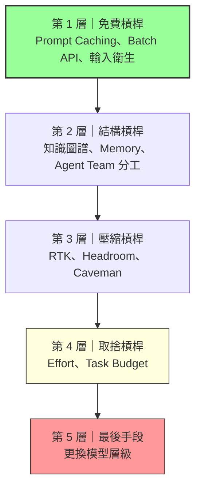
```mermaid
graph TB
    L1["第 1 層｜免費槓桿<br/>Prompt Caching、Batch API、輸入衛生"] --> L2
    L2["第 2 層｜結構槓桿<br/>知識圖譜、Memory、Agent Team 分工"] --> L3
    L3["第 3 層｜壓縮槓桿<br/>RTK、Headroom、Caveman"] --> L4
    L4["第 4 層｜取捨槓桿<br/>Effort、Task Budget"] --> L5
    L5["第 5 層｜最後手段<br/>更換模型層級"]

    style L1 fill:#9f9,stroke:#333,stroke-width:2px
    style L4 fill:#ffd,stroke:#333
    style L5 fill:#f99,stroke:#333
```

| 層級 | 對品質的影響 | 對應章節 |
| --- | --- | --- |
| 第 1 層 免費槓桿 | 無 | 第十三章 |
| 第 2 層 結構槓桿 | 通常提升 | 第五～九、十二、十六章 |
| 第 3 層 壓縮槓桿 | 極小（須驗證） | 第三、四、十一章 |
| 第 4 層 取捨槓桿 | 可量測的取捨 | 第十三章 13.7 |
| 第 5 層 更換模型 | 直接限制能力上限 | 第十三章 13.1 |

> **核心判準**：所有最佳化都應以「**每個完成任務的成本**」（cost per completed task）評估，而非「每次請求的 Token 數」。一個較便宜卻需要更多回合或重試才能完成的請求，實際上並不便宜。

---

## 目錄

- [第一章 Token 基礎知識](#第一章-token-基礎知識)
  - [1.1 Token 是什麼](#11-token-是什麼)
  - [1.2 Token 的計算方式](#12-token-的計算方式)
  - [1.3 Context Window 概念](#13-context-window-概念)
  - [1.4 Token 的三種類型](#14-token-的三種類型)
  - [1.5 為什麼 Token 會造成成本問題](#15-為什麼-token-會造成成本問題)
- [第二章 AI 開發最常見 Token 浪費原因](#第二章-ai-開發最常見-token-浪費原因)
  - [2.1 全專案直接丟給 AI](#21-全專案直接丟給-ai)
  - [2.2 一次貼大量 Source Code](#22-一次貼大量-source-code)
  - [2.3 每次重新描述需求](#23-每次重新描述需求)
  - [2.4 Agent 無限制搜尋](#24-agent-無限制搜尋)
  - [2.5 Framework 升級時全專案分析](#25-framework-升級時全專案分析)
  - [2.6 指令檔（CLAUDE.md／AGENTS.md）過度膨脹](#26-指令檔claudemdagentsmd過度膨脹)
  - [2.7 快取靜默失效](#27-快取靜默失效)
  - [2.8 讀檔案本身就是最大宗開銷](#28-讀檔案本身就是最大宗開銷)
- [第三章 RTK 思維——工具輸出壓縮](#第三章-rtk-思維工具輸出壓縮)
  - [3.1 RTK 核心設計](#31-rtk-核心設計)
  - [3.2 RTK Workflow](#32-rtk-workflow)
  - [3.3 RTK 四大策略](#33-rtk-四大策略)
  - [3.4 RTK 能節省多少 Token](#34-rtk-能節省多少-token)
- [第四章 Headroom 思維——Context 壓縮層](#第四章-headroom-思維context-壓縮層)
  - [4.1 Headroom 核心設計](#41-headroom-核心設計)
  - [4.2 三種部署模式](#42-三種部署模式)
  - [4.3 ContentRouter 智慧壓縮](#43-contentrouter-智慧壓縮)
  - [4.4 與 RTK 的互補關係](#44-與-rtk-的互補關係)
- [第五章 Understand-Anything 思維——Knowledge Graph Builder](#第五章-understand-anything-思維knowledge-graph-builder)
  - [5.1 Knowledge Graph 概念](#51-knowledge-graph-概念)
  - [5.2 Multi-Agent Pipeline](#52-multi-agent-pipeline)
  - [5.3 為何 Knowledge Graph 可以降低 Token](#53-為何-knowledge-graph-可以降低-token)
- [第六章 GitNexus 思維——Repository Intelligence](#第六章-gitnexus-思維repository-intelligence)
  - [6.1 Repository 知識管理](#61-repository-知識管理)
  - [6.2 Semantic Search 與 Token 節省](#62-semantic-search-與-token-節省)
  - [6.3 傳統搜尋 VS Semantic Search](#63-傳統搜尋-vs-semantic-search)
- [第七章 Graphify 思維——Code Knowledge Graph](#第七章-graphify-思維code-knowledge-graph)
  - [7.1 程式碼知識圖譜建構](#71-程式碼知識圖譜建構)
  - [7.2 Entity Extraction 架構](#72-entity-extraction-架構)
  - [7.3 Confidence Tags 機制](#73-confidence-tags-機制)
  - [7.4 MCP Server 與進階功能](#74-mcp-server-與進階功能)
- [第八章 codebase-memory-mcp 思維——Hybrid LSP Memory](#第八章-codebase-memory-mcp-思維hybrid-lsp-memory)
  - [8.1 核心設計與效能](#81-核心設計與效能)
  - [8.2 Hybrid LSP 語義解析](#82-hybrid-lsp-語義解析)
  - [8.3 15 個 MCP 工具](#83-15-個-mcp-工具)
  - [8.4 與其他圖譜工具比較](#84-與其他圖譜工具比較)
- [第九章 CodeGraph 思維——Auto-Sync Graph](#第九章-codegraph-思維auto-sync-graph)
  - [9.1 核心設計理念](#91-核心設計理念)
  - [9.2 單一工具哲學](#92-單一工具哲學)
  - [9.3 Benchmark 與效能](#93-benchmark-與效能)
- [第十章 Ponytail 思維——YAGNI Agent Plugin](#第十章-ponytail-思維yagni-agent-plugin)
  - [10.1 YAGNI Ladder 設計](#101-yagni-ladder-設計)
  - [10.2 七級梯子機制](#102-七級梯子機制)
  - [10.3 Benchmark 數據](#103-benchmark-數據)
- [第十一章 Caveman 思維——輸入輸出雙向壓縮](#第十一章-caveman-思維輸入輸出雙向壓縮)
  - [11.1 雙元件架構](#111-雙元件架構)
  - [11.2 安裝與強度模式](#112-安裝與強度模式)
  - [11.3 Benchmark 數據](#113-benchmark-數據)
  - [11.4 適用性評估與導入風險](#114-適用性評估與導入風險)
- [第十二章 TencentDB Agent Memory 思維——團隊級記憶中樞](#第十二章-tencentdb-agent-memory-思維團隊級記憶中樞)
  - [12.1 四大服務架構](#121-四大服務架構)
  - [12.2 L0–L3 記憶分層](#122-l0l3-記憶分層)
  - [12.3 四種可重用記憶資產](#123-四種可重用記憶資產)
  - [12.4 部署與權限治理](#124-部署與權限治理)
  - [12.5 Benchmark 與效益判讀](#125-benchmark-與效益判讀)
- [第十三章 原廠原生 Token 最佳化機制](#第十三章-原廠原生-token-最佳化機制)
  - [13.1 目前模型規格與定價](#131-目前模型規格與定價)
  - [13.2 Prompt Caching：唯一的不變式](#132-prompt-caching唯一的不變式)
  - [13.3 斷點放置與 TTL 選擇](#133-斷點放置與-ttl-選擇)
  - [13.4 靜默失效清單（Silent Invalidators）](#134-靜默失效清單silent-invalidators)
  - [13.5 Context Editing、Compaction 與 Memory 的分工](#135-context-editingcompaction-與-memory-的分工)
  - [13.6 漸進式揭露：輸入側的系統性削減](#136-漸進式揭露輸入側的系統性削減)
  - [13.7 Effort、Task Budget 與 max_tokens](#137-efforttask-budget-與-max_tokens)
  - [13.8 Batch API 與精準計量](#138-batch-api-與精準計量)
  - [13.9 三大廠商快取機制比較](#139-三大廠商快取機制比較)
- [第十四章 SSDLC 如何減少 Token](#第十四章-ssdlc-如何減少-token)
  - [14.1 Requirement 階段](#141-requirement-階段)
  - [14.2 Design 階段](#142-design-階段)
  - [14.3 Development 階段](#143-development-階段)
  - [14.4 Testing 階段](#144-testing-階段)
  - [14.5 Deployment 階段](#145-deployment-階段)
  - [14.6 Maintenance 階段](#146-maintenance-階段)
- [第十五章 Agent Team 如何節省 Token](#第十五章-agent-team-如何節省-token)
  - [15.1 Agent Team 架構](#151-agent-team-架構)
  - [15.2 各 Agent 職責與 Token 策略](#152-各-agent-職責與-token-策略)
  - [15.3 單 Agent VS 多 Agent 比較](#153-單-agent-vs-多-agent-比較)
- [第十六章 大型 Web Application 開發策略](#第十六章-大型-web-application-開發策略)
  - [16.1 建立 System Knowledge Base](#161-建立-system-knowledge-base)
  - [16.2 五大 Memory 層](#162-五大-memory-層)
  - [16.3 Token 節省實務](#163-token-節省實務)
- [第十七章 Framework Upgrade 策略](#第十七章-framework-upgrade-策略)
  - [17.1 升級場景分析](#171-升級場景分析)
  - [17.2 Migration Knowledge Graph](#172-migration-knowledge-graph)
  - [17.3 避免重複分析的策略](#173-避免重複分析的策略)
- [第十八章 Reverse Engineering 策略](#第十八章-reverse-engineering-策略)
  - [18.1 Legacy System 盤點](#181-legacy-system-盤點)
  - [18.2 四層 Graph 架構](#182-四層-graph-架構)
  - [18.3 降低 Token 方法](#183-降低-token-方法)
- [第十九章 Prompt Engineering 節省 Token 技巧](#第十九章-prompt-engineering-節省-token-技巧)
  - [19.1 架構分析 Prompt](#191-架構分析-prompt)
  - [19.2 程式碼分析 Prompt](#192-程式碼分析-prompt)
  - [19.3 Bug 修復 Prompt](#193-bug-修復-prompt)
  - [19.4 SSDLC Prompt](#194-ssdlc-prompt)
  - [19.5 Security Review Prompt](#195-security-review-prompt)
  - [19.6 Unit Test Prompt](#196-unit-test-prompt)
  - [19.7 Refactoring Prompt](#197-refactoring-prompt)
  - [19.8 Framework Upgrade Prompt](#198-framework-upgrade-prompt)
  - [19.9 Reverse Engineering Prompt](#199-reverse-engineering-prompt)
- [第二十章 Claude Code 節省 Token 最佳實務](#第二十章-claude-code-節省-token-最佳實務)
  - [20.1 CLAUDE.md 配置](#201-claudemd-配置)
  - [20.2 Memory 機制](#202-memory-機制)
  - [20.3 Context Engineering](#203-context-engineering)
  - [20.4 Sub Agent 策略](#204-sub-agent-策略)
  - [20.5 MCP 整合](#205-mcp-整合)
- [第二十一章 GitHub Copilot 節省 Token 最佳實務](#第二十一章-github-copilot-節省-token-最佳實務)
  - [21.1 Copilot Instructions](#211-copilot-instructions)
  - [21.2 Prompt Files](#212-prompt-files)
  - [21.3 Agent Mode](#213-agent-mode)
  - [21.4 MCP 整合](#214-mcp-整合)
  - [21.5 Workspace Context 最佳化](#215-workspace-context-最佳化)
- [第二十二章 企業級 AI 成本治理](#第二十二章-企業級-ai-成本治理)
  - [22.1 AI Governance 框架](#221-ai-governance-框架)
  - [22.2 AI Cost Management](#222-ai-cost-management)
  - [22.3 AI Token Monitoring](#223-ai-token-monitoring)
  - [22.4 AI Usage / Agent / Security Policy](#224-ai-usage--agent--security-policy)
- [第二十三章 建立企業級 Token 最佳化框架](#第二十三章-建立企業級-token-最佳化框架)
  - [23.1 Enterprise Token Optimization Architecture](#231-enterprise-token-optimization-architecture)
  - [23.2 七層架構設計](#232-七層架構設計)
  - [23.3 導入流程](#233-導入流程)
- [第二十四章 實戰案例](#第二十四章-實戰案例)
  - [24.1 大型銀行核心系統升級](#241-大型銀行核心系統升級)
  - [24.2 百萬行程式碼逆向工程](#242-百萬行程式碼逆向工程)
  - [24.3 Spring Boot 升級專案](#243-spring-boot-升級專案)
  - [24.4 Vue3 重構專案](#244-vue3-重構專案)
- [第二十五章 最佳實務總結](#第二十五章-最佳實務總結)
  - [25.1 Top 100 Token 節省技巧](#251-top-100-token-節省技巧)
  - [25.2 企業導入檢查表](#252-企業導入檢查表)
  - [25.3 企業成熟度模型](#253-企業成熟度模型)
  - [25.4 結論與建議](#254-結論與建議)
- [附錄](#附錄)
  - [附錄 A：Token 估算速查表](#附錄-atoken-估算速查表)
  - [附錄 B：工具比較表](#附錄-b工具比較表)
  - [附錄 C：Prompt Template YAML 格式範例](#附錄-cprompt-template-yaml-格式範例)
  - [附錄 D：參考資源](#附錄-d參考資源)
  - [附錄 E：工具選擇決策樹](#附錄-e工具選擇決策樹)
  - [附錄 F：Prompt Caching 設計檢查表](#附錄-fprompt-caching-設計檢查表)
  - [附錄 G：名詞對照表](#附錄-g名詞對照表)

---

## 第一章 Token 基礎知識

### 1.1 Token 是什麼

Token 是大型語言模型（LLM）處理文字的最小單位。不同於人類以「字」或「詞」為單位閱讀，LLM 將文字切割為稱為 Token 的片段進行理解與生成。一個 Token 可能是一個完整的英文單字、一個中文字、一個標點符號，或是一段程式碼的片段。

**Token 化範例：**

```text
英文："Hello World" → ["Hello", " World"] = 2 tokens
中文："你好世界" → ["你", "好", "世", "界"] = 4 tokens  
程式碼："public static void main" → ["public", " static", " void", " main"] = 4 tokens
JSON：'{"name":"test"}' → ['{', '"name', '":', '"test', '"}'] ≈ 5 tokens
```

> **實務觀察**：中文的 Token 消耗約為英文的 1.5～2 倍，因為中文字元在 BPE（Byte Pair Encoding）詞表中佔用更多位元。在企業開發中，程式碼註解使用英文可降低約 30% 的 Token 消耗。

### 1.2 Token 的計算方式

不同 AI 工具的 Token 計算方式有所差異：

| AI 工具 | Tokenizer | 估算規則 | Context Window |
| --- | --- | --- | --- |
| Claude Code（Claude Opus 5 / Sonnet 5） | Claude Tokenizer | 1 英文字 ≈ 1.3 token、1 中文字 ≈ 2 token | 1M tokens |
| Claude Code（Claude Haiku 4.5） | Claude Tokenizer | 同上 | 200K tokens |
| GitHub Copilot（多模型） | 依模型而異 | 1 英文字 ≈ 1.3 token | 依模型而異 |
| Codex CLI（OpenAI 模型） | OpenAI Tokenizer | 1 英文字 ≈ 1.3 token | 依模型而異 |
| Gemini CLI（Gemini 系列） | Gemini Tokenizer | 1 英文字 ≈ 1.2 token | 1M tokens |
| Cursor（多模型） | 依模型而異 | 依模型而異 | 依模型而異 |

> **2026 年的重大變化**：主流前緣模型的 Context Window 已從 200K 普遍提升至 **1M tokens**。這改變了最佳化的重點——**瓶頸從「塞不下」轉移到「塞太多所以太貴、而且品質下降」**。視窗變大不代表應該塞滿：本手冊第 1.3 節的 70% 上限原則、第十三章的漸進式揭露原則，在 1M 視窗時代反而更重要。

**計算公式：**

```text
單次對話 Token 消耗 = Prompt Tokens + Completion Tokens
總 Session 消耗 = Σ(每次對話 Token 消耗) - Cache Hit 折抵
月度費用 = (未快取輸入 × 輸入單價 + 快取讀取 × 0.1 × 輸入單價
           + 快取寫入 × 1.25 × 輸入單價 + 輸出 × 輸出單價) / 1,000,000
```

> **估算 vs 實測**：上表的「估算規則」僅供容量規劃使用。正式預算推估必須使用官方計數 API（Claude 為 `messages.count_tokens`）——**切勿以 `tiktoken` 估算 Claude 的 token，它會低估約 15%～20%，在程式碼與中文輸入上偏差更大**。詳見第 13.8 節。

### 1.3 Context Window 概念

Context Window 是 LLM 單次對話能處理的最大 Token 數量，可以理解為 AI 的「工作記憶」容量。

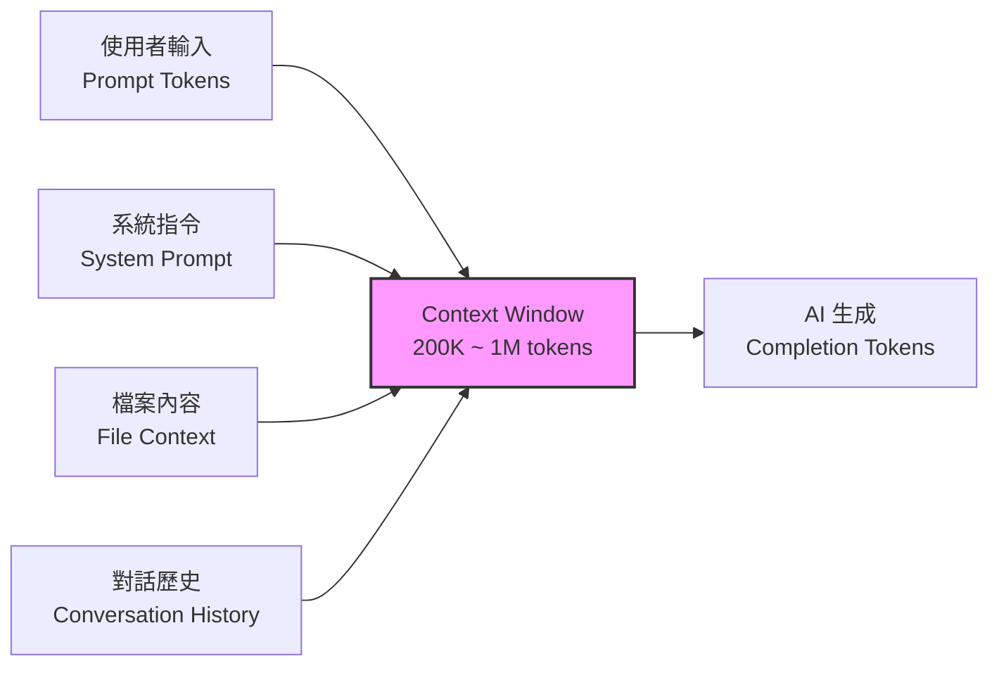
```mermaid
graph LR
    A[使用者輸入<br/>Prompt Tokens] --> B[Context Window<br/>200K ~ 1M tokens]
    C[系統指令<br/>System Prompt] --> B
    D[檔案內容<br/>File Context] --> B
    E[對話歷史<br/>Conversation History] --> B
    B --> F[AI 生成<br/>Completion Tokens]
    
    style B fill:#f9f,stroke:#333,stroke-width:2px
```

**Context Window 使用分佈（典型 Agent 對話）：**

| 組成部分 | 佔比 | Token 數（200K 為例） |
| --- | --- | --- |
| System Prompt + Instructions | 5-10% | 10K-20K |
| 檔案讀取內容 | 30-50% | 60K-100K |
| 對話歷史 | 20-30% | 40K-60K |
| 工具呼叫結果 | 10-20% | 20K-40K |
| AI 生成回覆 | 10-15% | 20K-30K |

> **注意**：當 Context Window 接近滿載時，AI 回覆品質會顯著下降。建議將實際使用量控制在 Context Window 的 70% 以內。

### 1.4 Token 的三種類型

**Prompt Token（輸入 Token）**

使用者送給 AI 的所有內容，包含系統指令、使用者訊息、檔案內容、工具回傳結果等。這是 Token 消耗的主要來源，通常佔總消耗的 60-80%。

**Completion Token（輸出 Token）**

AI 生成的回覆內容，包含文字回覆、程式碼、工具呼叫指令等。單價通常為 Prompt Token 的 3-5 倍。

**Cache Token（快取 Token）**

三大廠商（Anthropic、OpenAI、Google）在 2026 年都已將快取命中的費率定在標準輸入價的約十分之一。但快取並非只有「讀取」一種計費——**寫入快取本身要付溢價**，這是成本模型最容易被漏算的部分：

| 計費類型 | 相對於標準輸入單價 |
| --- | --- |
| 未快取輸入（Regular Input） | 1× |
| 快取寫入（Cache Write，5 分鐘 TTL） | 1.25× |
| 快取寫入（Cache Write，1 小時 TTL） | 2× |
| 快取讀取（Cache Read） | 0.1×（部分模型更低） |

```text
費用計算範例（Claude Sonnet 5：輸入 $2/1M、輸出 $10/1M）：
Prompt Token（未快取）: $2.00 / 1M tokens
Completion Token:       $10.00 / 1M tokens
Cache Write（5 分鐘）:   $2.50 / 1M tokens（1.25×）
Cache Read:             $0.20 / 1M tokens（0.1×，節省 90%）

一般開發 Session（30 分鐘，多回合對話）：
- 無快取：Prompt 150K + Completion 30K
          = 150K × $2/1M + 30K × $10/1M = $0.30 + $0.30 = $0.60
- 有快取：Cache Write 120K + Cache Read 360K（後續回合重複讀取）
          + Prompt 30K + Completion 30K
          = $0.30 + $0.072 + $0.06 + $0.30 = $0.732

注意：單一回合看起來變貴（因為要付 1.25× 寫入費）。
快取的效益出現在「同一前綴被重複讀取」時——
Agent Loop 每回合都重送整段歷史，20 回合的任務會讀取同一前綴 20 次，
此時 0.1× 的讀取費率才會壓倒 1.25× 的一次性寫入費。
```

> **損益兩平點**：以 5 分鐘 TTL 計算，同一前綴被使用 **2 次**即回本（1.25× + 0.1× = 1.35×，優於未快取的 2×）；1 小時 TTL 需 **3 次**以上（2× + 0.2× = 2.2× vs 3×）。完整的斷點設計與 TTL 選擇準則見第 13.3 節。

### 1.5 為什麼 Token 會造成成本問題

**Token 消耗與費用關係**

企業 AI 開發的 Token 費用成長速度遠超預期。以 20 人團隊為例：

| 使用模式 | 每人每日 Token | 月度團隊 Token | 月度費用（估算） |
| --- | --- | --- | --- |
| 輕度使用（Code Completion） | 50K | 22M | $200-400 |
| 中度使用（Agent 對話） | 500K | 220M | $2,000-4,000 |
| 重度使用（多 Agent 協作） | 2M | 880M | $8,000-16,000 |
| 無限制使用（全專案分析） | 10M+ | 4.4B+ | $40,000+ |

**Token 消耗與速度關係**

Token 消耗直接影響 AI 回應速度：

- 輸入 10K tokens → 回應時間約 2-5 秒
- 輸入 50K tokens → 回應時間約 8-15 秒
- 輸入 100K tokens → 回應時間約 20-40 秒
- 輸入 200K tokens → 回應時間約 45-90 秒

**Token 消耗與 Agent 執行次數關係**

AI Agent 模式下，每次工具呼叫都會累積 Token。一個典型的 Bug 修復 Agent 對話可能產生 10-30 次工具呼叫，每次呼叫都需要重新傳送完整的對話歷史：

```text
第 1 次呼叫：10K tokens（初始 Prompt）
第 5 次呼叫：50K tokens（累積對話 + 工具結果）
第 15 次呼叫：150K tokens（接近 Context Window 上限）
第 20 次呼叫：Context 溢出，AI 開始遺忘早期內容
```

> **實務案例**：某金融團隊在未建立 Knowledge Graph 的情況下，使用 AI 進行 Spring Boot 2 → 3 升級，單次分析 600 個 Java 檔案消耗了 2.8M tokens（約 $25），且 AI 回覆品質低落，需要多次重試。建立 Knowledge Graph 後，相同任務僅消耗 180K tokens（約 $1.6），品質顯著提升。

---

## 第二章 AI 開發最常見 Token 浪費原因

### 2.1 全專案直接丟給 AI

**問題描述**

最常見的 Token 浪費模式是將整個 Repository 的內容直接提供給 AI 分析。開發者期望 AI「理解全貌」，但實際上造成了嚴重的 Context 爆炸。

**浪費模式：**

```text
❌ 錯誤做法："請分析這個專案的架構"
   → AI 讀取整個專案 → 500+ 檔案 → 2M+ tokens
   → Context Window 溢出 → AI 回覆不完整
   → 開發者不滿意 → 重新提問 → 又消耗 2M+ tokens

✅ 正確做法："請根據以下架構圖分析 UserService 的設計問題"
   → AI 僅讀取相關檔案 → 5-10 檔案 → 30K tokens
   → 精準回覆 → 一次完成
```

**案例分析：某銀行共用平台專案**

- 專案規模：1,200 個 Java 檔案、80 萬行程式碼
- 未優化：開發者詢問「這個 API 為什麼回傳 500」，AI Agent 搜尋了 300+ 檔案，消耗 1.5M tokens
- 優化後：建立 API Knowledge Graph，AI 直接定位到 3 個相關檔案，消耗 25K tokens
- **節省比例：98.3%**

### 2.2 一次貼大量 Source Code

**問題描述**

開發者習慣將整個檔案或多個檔案的完整內容直接貼入對話，即使只需要 AI 分析其中幾行程式碼。

**浪費模式：**

```text
❌ 錯誤做法：貼入 3000 行的 Controller 檔案 + 2000 行的 Service 檔案
   "請幫我找出這個 NullPointerException 的原因"
   → 5000 行 × 平均 5 tokens/行 = 25,000 tokens

✅ 正確做法：僅貼入相關方法 + Stack Trace
   "以下方法在第 45 行丟出 NullPointerException：
   [50 行相關程式碼 + Stack Trace]"
   → 80 行 × 5 tokens/行 = 400 tokens
```

**案例分析：日常 Code Review**

| 情境 | Token 消耗 | 回覆品質 |
| --- | --- | --- |
| 貼入完整 PR（20 個檔案） | 120K tokens | 泛泛而談，建議不精準 |
| 僅貼入變更差異（diff） | 15K tokens | 聚焦變更，建議具體 |
| 搭配 Knowledge Graph 僅提供關聯 | 8K tokens | 理解上下文，建議最精準 |

### 2.3 每次重新描述需求

**問題描述**

開發者在新的對話 Session 中，反覆描述相同的專案背景、架構設計、編碼規範等資訊。這些重複描述在每次對話中都會消耗 Token。

**浪費模式：**

```text
Session 1："我們的專案使用 Spring Boot 3.4 + Vue 3 + Oracle，
           架構是 Clean Architecture，有 200 個 API..."
           → 背景描述消耗 2,000 tokens

Session 2："我們的專案使用 Spring Boot 3.4 + Vue 3 + Oracle..."
           → 相同背景又消耗 2,000 tokens

Session N：重複 N 次...
           → 每天 20 個 Session = 40,000 tokens 浪費在背景描述
```

**解決方案預覽：**

- Claude Code：將背景寫入 `CLAUDE.md`，系統自動注入
- GitHub Copilot：將背景寫入 `.github/copilot-instructions.md`
- 建立 Architecture Memory 檔案，AI 自動載入

### 2.4 Agent 無限制搜尋

**問題描述**

AI Agent 在執行任務時，如果沒有明確的搜尋範圍限制，會進行遞迴式搜尋，讀取大量不相關的檔案。

**浪費模式：**

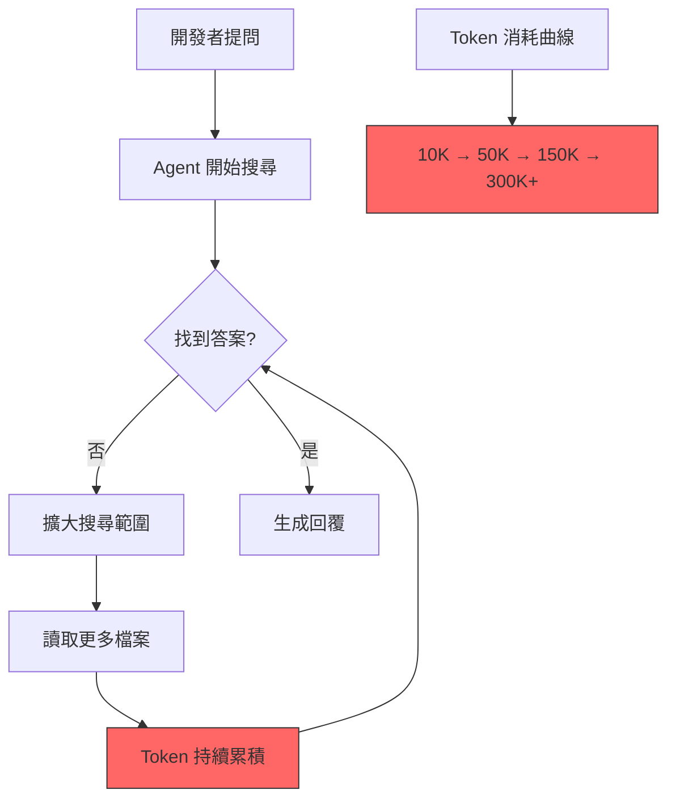
```mermaid
graph TD
    A[開發者提問] --> B[Agent 開始搜尋]
    B --> C{找到答案?}
    C -->|否| D[擴大搜尋範圍]
    D --> E[讀取更多檔案]
    E --> F[Token 持續累積]
    F --> C
    C -->|是| G[生成回覆]
    
    H[Token 消耗曲線] --> I[10K → 50K → 150K → 300K+]
    
    style F fill:#f66,stroke:#333
    style I fill:#f66,stroke:#333
```

**案例分析：Agent 搜尋失控**

某開發者要求 AI 修復一個 CSS 樣式問題，Agent 的搜尋行為：

1. 搜尋 `.css` 檔案 → 找到 50 個 → 讀取 15 個（30K tokens）
2. 搜尋 `.vue` 檔案的 `<style>` 區塊 → 讀取 20 個（40K tokens）
3. 搜尋 `tailwind.config.js` → 讀取配置（5K tokens）
4. 搜尋 `package.json` 確認依賴 → （2K tokens）
5. 搜尋其他相關配置 → （10K tokens）
6. **總消耗：87K tokens，僅需修改 1 行 CSS**

優化後：提供 Component 名稱 + 元素選擇器，Agent 直接定位，消耗 **5K tokens**。

### 2.5 Framework 升級時全專案分析

**問題描述**

在進行 Framework 升級（如 Spring Boot 2 → 3、Vue 2 → 3）時，開發者傾向讓 AI 分析整個專案的影響範圍，導致巨量 Token 消耗。

**浪費模式：**

| Framework 升級 | 專案檔案數 | 全量分析 Token | 優化後 Token | 節省 |
| --- | --- | --- | --- | --- |
| Spring Boot 2 → 3 | 600 個 Java | 3.0M | 200K | 93% |
| Vue 2 → 3 | 400 個 Vue/JS | 2.0M | 150K | 92% |
| Angular 12 → 20 | 500 個 TS | 2.5M | 180K | 93% |
| Java 17 → 25 | 800 個 Java | 4.0M | 250K | 94% |

**根本原因**：缺乏 Migration Knowledge Graph。每次升級操作都要從零開始分析，而不是基於已建立的依賴關係圖進行增量分析。

> **實務建議**：在啟動任何 Framework 升級專案前，先投入 2-4 小時建立 Codebase Knowledge Graph。這個前期投資將在後續數週的升級工作中節省數十倍的 Token 消耗。

### 2.6 指令檔（CLAUDE.md／AGENTS.md）過度膨脹

這是 2026 年新出現、且被嚴重低估的浪費來源。指令檔位於**每一次請求的前綴**，因此它的每一個 token 都會乘上請求次數。

一項針對 **138 個真實世界倉庫**的研究得到了反直覺的結論：

| 指令檔類型 | 對任務成功率的影響 | 對推論成本的影響 |
| --- | --- | --- |
| **AI 自動生成的 AGENTS.md** | **降低**任務成功率 | **增加 20% 以上** |
| 開發者手寫、且精簡準確的指令檔 | **提升約 4%** | 影響有限 |

**根本原因**：AI 生成的指令檔傾向「包山包海」——複述目錄結構、重述工具用法、列舉顯而易見的慣例。這些內容不但佔用前綴，還會稀釋真正重要的指令，讓模型的注意力被無關內容分散。

**業界共識的規模上限（2026）：**

| 指標 | 建議上限 |
| --- | --- |
| 行數 | **150 行以內** |
| Token 數 | **5,000 tokens 以內** |

**檢查方法**：以官方計數 API 實測，而非目測。

```bash
# Claude：以官方 tokenizer 實測指令檔大小
ant messages count-tokens --model claude-opus-5 \
  --message '{role: user, content: "@./CLAUDE.md"}' \
  --transform input_tokens -r
```

> **可立即執行的動作**：把「指令檔 token 數」納入定期檢查。超過 5,000 tokens 時，逐條問「刪掉這一行，AI 會做錯什麼？」——答不出來的就刪。可移到工具或 Skill 後方按需載入的內容，就不該留在前綴（見第 13.6 節漸進式揭露）。

### 2.7 快取靜默失效

第二個 2026 年的新型浪費：**團隊以為自己啟用了 Prompt Caching，實際上一次也沒命中**。

由於快取失效**不會產生任何錯誤訊息**，這種浪費可以持續數月而無人察覺。最常見的成因是系統提示中嵌入了每次請求都會變動的內容（時間戳、UUID、使用者 ID）。

**浪費規模試算：**

```text
一個 20 回合的 Agent 任務，系統提示 + 工具定義共 30K tokens：

快取正常運作：
  30K 寫入（1.25×）+ 30K × 19 次讀取（0.1×）= 37.5K + 57K = 94.5K 等效 tokens

快取靜默失效：
  30K × 20 次全額計費 = 600K 等效 tokens

差距：約 6.3 倍
```

**診斷方式**（30 秒內可完成）：連續送出兩次前綴完全相同的請求，檢查第二次的 `cache_read_input_tokens`。若為 0，代表快取從未命中。

> 完整的失效原因清單與修正方式見 **第 13.4 節**。這是本手冊建議**最優先**處理的項目——它屬於第 1 層免費槓桿，修正後不影響任何品質。

### 2.8 讀檔案本身就是最大宗開銷

最後一個常被忽略的事實：研究指出，**編碼 Agent 約有 67%～76% 的 Token 預算，單純花在讀取檔案上**。

這個數字重新定義了最佳化的優先順序：

| 常見直覺 | 實際狀況 |
| --- | --- |
| 「提示寫得太長」 | 提示通常只佔小部分 |
| 「AI 回覆太囉嗦」 | 輸出單價高，但總量遠小於輸入 |
| **「AI 一直在讀檔案」** | **這才是 2/3 以上的開銷來源** |

**這正是第五～九章知識圖譜類工具存在的理由**——它們的價值不在於「壓縮」，而在於**讓 AI 根本不需要打開檔案**。CodeGraph 在七個倉庫的實測中做到「零檔案讀取」（見第 9.3 節），就是這個策略的極致展現。

---

## 第三章 RTK 思維——工具輸出壓縮

### 3.1 RTK 核心設計

RTK（Rust Token Killer）是一個以 Rust 語言開發的高效能 CLI 代理工具，其核心設計理念是：**在 AI 接收資訊之前，先對資訊進行智慧壓縮與過濾**，從而大幅降低 Token 消耗。

RTK 不是一個獨立的 AI 工具，而是一個位於「開發者工具」與「AI 模型」之間的中間層。它攔截並優化所有送往 AI 的上下文資訊，使 AI 能以更少的 Token 獲得同等甚至更好的理解。

**RTK 核心設計原則：**

1. **壓縮上下文**：將冗長的工具輸出壓縮為結構化摘要
2. **移除重複內容**：自動去除重複的檔案內容、相似的錯誤訊息
3. **摘要化**：將大型輸出轉換為關鍵資訊摘要
4. **分層分析**：根據重要性分層呈現資訊，AI 可按需深入

**安裝方式：**

```bash
# Homebrew（推薦）
brew install rtk

# Quick Install（Linux/macOS）
curl -fsSL https://raw.githubusercontent.com/rtk-ai/rtk/refs/heads/master/install.sh | sh

# Cargo
cargo install --git https://github.com/rtk-ai/rtk

# Windows：下載 Pre-built Binary
# https://github.com/rtk-ai/rtk/releases → rtk-x86_64-pc-windows-msvc.zip
```

RTK 目前支援 **100 種以上的常用指令**，涵蓋六大類別：

| 類別 | 涵蓋指令 |
| --- | --- |
| 檔案操作 | `ls`、`cat`、`find`、`grep`、`diff` |
| 版本控制 | `git status`／`log`／`diff`／`add`／`commit`／`push`／`pull` |
| 測試 | Jest、Vitest、pytest、Go test、cargo test、RSpec |
| 建置與 Lint | ESLint、TypeScript、ruff、cargo clippy、sqlfluff |
| 套件管理 | pnpm、pip、bundle、Prisma |
| 雲端與容器 | AWS CLI、Docker、kubectl、OpenShift、Pulumi |

**支援 17 個 AI 編碼工具整合（授權：Apache 2.0）：**

| AI 工具 | 初始化指令 | 整合方式 |
| --- | --- | --- |
| Claude Code | `rtk init -g` | PreToolUse hook（自動改寫） |
| GitHub Copilot | `rtk init -g --copilot` | PreToolUse hook |
| Cursor | `rtk init -g --agent cursor` | hooks.json |
| Gemini CLI | `rtk init -g --gemini` | BeforeTool hook |
| Codex | `rtk init -g --codex` | AGENTS.md 指令注入 |
| Windsurf | `rtk init --agent windsurf` | .windsurfrules |
| Cline / Roo Code | `rtk init --agent cline` | .clinerules |
| OpenCode | `rtk init -g --opencode` | Plugin TS |
| Google Antigravity | `rtk init --agent antigravity` | rules 檔案 |
| Pi | `rtk init --agent pi` | rules 檔案 |
| Hermes | `rtk init --agent hermes` | rules 檔案 |
| Kilo Code | `rtk init --agent kilo-code` | rules 檔案 |
| Amp | `rtk init --agent amp` | rules 檔案 |
| Headroom | 內建支援 | Headroom 原生整合 RTK |

> **Windows 支援已改善**：早期版本在 Windows 原生環境（cmd/PowerShell）下無法使用 Auto-Rewrite Hook（需要 Unix Shell），必須退回 CLAUDE.md 注入模式或改用 WSL。新版已加入**原生 Windows 支援**，透過二進位指令 Hook 完成命令改寫，不再需要 Unix Shell。導入前請確認手上版本是否已含此功能。

**設定與隱私：**

設定檔位置為 `~/.config/rtk/config.toml`（macOS 為 `~/Library/Application Support/rtk/config.toml`）。遙測預設關閉、採 opt-in；即使啟用，蒐集內容僅含裝置雜湊、RTK 版本、指令次數與估算的節省 token 數，**不含原始碼、檔案路徑、參數或機密**。

```bash
rtk telemetry enable    # 啟用遙測
rtk telemetry disable   # 停用遙測
rtk telemetry forget    # 清除已蒐集資料
```

> **企業合規提示**：遙測預設關閉這一點，是導入受監理環境時的重要優勢——不需要為了封鎖外連而額外設定。但仍建議在企業標準映像檔中明確執行 `rtk telemetry disable`，以文件化方式證明其為關閉狀態。

### 3.2 RTK Workflow

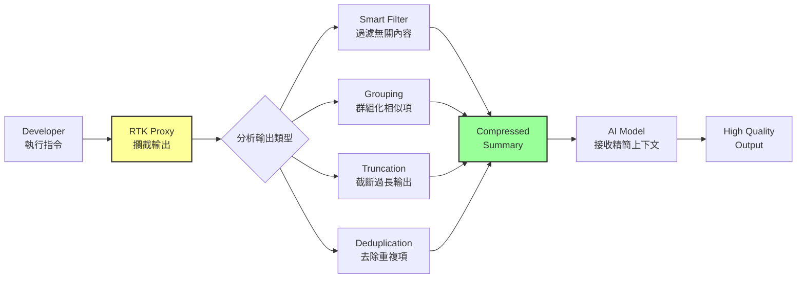
```mermaid
graph LR
    A[Developer<br/>執行指令] --> B[RTK Proxy<br/>攔截輸出]
    B --> C{分析輸出類型}
    C --> D[Smart Filter<br/>過濾無關內容]
    C --> E[Grouping<br/>群組化相似項]
    C --> F[Truncation<br/>截斷過長輸出]
    C --> G[Deduplication<br/>去除重複項]
    D --> H[Compressed<br/>Summary]
    E --> H
    F --> H
    G --> H
    H --> I[AI Model<br/>接收精簡上下文]
    I --> J[High Quality<br/>Output]

    style B fill:#ff9,stroke:#333,stroke-width:2px
    style H fill:#9f9,stroke:#333,stroke-width:2px
```

**典型使用流程：**

```bash
# 未使用 RTK：直接執行指令，完整輸出送給 AI
$ find . -name "*.java" -exec wc -l {} \;
# 輸出 800 行 → AI 接收 800 行 → ~4,000 tokens

# 使用 RTK：輸出經過智慧壓縮
$ rtk find . -name "*.java" -exec wc -l {} \;
# RTK 壓縮為摘要 → AI 接收 20 行 → ~100 tokens
# 摘要內容：「共 600 個 Java 檔案，總計 450,000 行，
#           最大檔案：UserService.java (3,200行)，
#           平均每檔 750 行」
```

### 3.3 RTK 四大策略

**策略一：Smart Filtering（智慧過濾）**

自動辨識並移除無關資訊，例如：

- 編譯過程中的進度條、百分比
- 測試輸出中的重複堆疊追蹤
- 目錄列表中的二進位檔案、快取檔案
- Git 狀態中的未追蹤暫存檔

```text
範例：mvn compile 輸出
原始輸出：150 行（包含下載進度、Maven 日誌）→ ~750 tokens
RTK 過濾後：8 行（僅保留編譯結果與錯誤）→ ~40 tokens
節省：94.7%
```

**策略二：Grouping（群組化）**

將相似的項目群組化呈現：

```text
範例：find . -name "*.java" 的輸出
原始：列出 600 個檔案路徑 → ~3,000 tokens
RTK 群組化：
  src/main/java/com/service/ (45 files)
  src/main/java/com/controller/ (30 files)
  src/main/java/com/model/ (60 files)
  src/test/ (120 files)
  → ~200 tokens
節省：93.3%
```

**策略三：Truncation（智慧截斷）**

對超長輸出進行智慧截斷，保留頭尾與關鍵段落：

```text
範例：cat large-log.txt（10,000 行日誌）
原始：10,000 行 → ~50,000 tokens
RTK 截斷：前 20 行 + 錯誤行 + 後 10 行 + 統計摘要 → ~500 tokens
節省：99.0%
```

**策略四：Deduplication（去重）**

自動偵測並合併重複或高度相似的內容：

```text
範例：測試結果中 50 個類似的失敗訊息
原始：50 個完整 Stack Trace → ~25,000 tokens
RTK 去重：1 個代表性 Stack Trace + "其餘 49 個相同模式" → ~600 tokens
節省：97.6%
```

### 3.4 RTK 能節省多少 Token

以下是 RTK 在典型 30 分鐘開發 Session 中的 Token 節省數據：

| 指令類型 | 原始 Token | RTK 後 Token | 節省比例 | 說明 |
| --- | --- | --- | --- | --- |
| `ls` / `tree` | 5,000 | 1,000 | **80%** | 目錄結構壓縮 |
| `cat` / `read` | 20,000 | 6,000 | **70%** | 檔案內容摘要化 |
| `grep` / `search` | 15,000 | 3,000 | **80%** | 搜尋結果群組化 |
| `git status` / `diff` | 8,000 | 1,600 | **80%** | 變更摘要化 |
| `mvn test` / `npm test` | 50,000 | 5,000 | **90%** | 測試結果去重 |
| `compile` / `build` | 20,000 | 2,300 | **88%** | 建置日誌過濾 |
| **Session 合計** | **~118,000** | **~23,900** | **~80%** | - |

**月度節省估算（20 人團隊）：**

```text
原始月度消耗：118K tokens × 40 sessions/天 × 22 天 = 103.84M tokens
RTK 優化後：23.9K tokens × 40 sessions/天 × 22 天 = 21.03M tokens
月度節省：82.81M tokens ≈ $250-750（依模型定價）
```

> **必讀的量測誠實性說明**：RTK 官方文件對自身數據有一段重要澄清，企業評估時務必納入考量：
>
> 1. **百分比量測的是「輸出壓縮率」，不是「最終帳單降幅」。** Bash 輸出只是輸入 token 的其中一個來源；「降幅在每一個環節都會被稀釋」（The reduction dilutes at every step）。上表的 80% 是指令輸出的壓縮率，實際帳單降幅會遠低於此。
> 2. **token 數為估算值**。RTK 以 `bytes / 4` 估算而非使用完整 tokenizer，因此「**百分比可靠，但絕對 token 數僅為近似值**」。
>
> **企業實務建議**：以 RTK 自報數據做**方向性**判斷（哪類指令值得壓縮），但實際節省效益必須以模型供應商回報的 `usage` 數據驗證——這也是第十三章反覆強調的原則：**驗證要看用量數據，不要看工具的自報數字**。
>
> **RTK 思維的核心啟示**：即使不使用 RTK 工具本身，也應該在 AI 開發流程中應用 RTK 的四大策略思維——在任何資訊送給 AI 之前，先問自己：「這些資訊能否被過濾、群組化、截斷或去重？」

---

## 第四章 Headroom 思維——Context 壓縮層

### 4.1 Headroom 核心設計

Headroom（v0.28.0，54K ★）是一個 Context 壓縮層，與 RTK 的「工具輸出壓縮」不同，Headroom 聚焦於**整個 Context Window 的智慧壓縮**——包含檔案內容、對話歷史、系統指令等所有送往 AI 的內容。支援 Library、Proxy、MCP 三種部署模式，適應不同整合需求。

**核心數據：**

| 指標 | 數值 |
| --- | --- |
| Token 節省（編碼 Agent） | **約 20%** |
| Token 節省（JSON 結構化資料） | **60-95%** |
| 支援 Agent | **15+**（Claude Code、Cursor、Copilot、Codex、Cline、Continue、Aider 等） |
| 壓縮方式 | ContentRouter 智慧路由 |
| 壓縮耗時 | **< 1 毫秒** |
| 準確度影響 | 於 GSM8K、TruthfulQA、SQuAD 評測**未偵測到損失** |
| 可逆壓縮 | ✅ CCR（Compact Context Representation） |
| 隱私 | 壓縮全程在本機執行，**提示與檔案不外傳** |

> **數據判讀的重要修正**：官方目前的說法是「**編碼 Agent 約少 20% token，JSON 約少 60-95%，答案相同**」。60-95% 這個常被引用的數字，**適用對象是 JSON 等結構化資料，不是編碼 Agent 的整體 token**。企業做效益試算時若直接套用 60-95%，會嚴重高估。

**實際工作負載實測（官方公布）：**

| 工作負載 | Token 降幅 |
| --- | --- |
| 程式碼搜尋（100 筆結果） | 21% |
| SRE 事故除錯 | **57%** |
| 程式碼庫探索 | 42% |
| GitHub Issue 分類 | 30% |

> **選型意涵**：降幅與工作負載的「**內容冗餘度**」直接相關。日誌型工作（SRE 除錯）冗餘度最高、效益最大；已結構化的搜尋結果效益最低。導入時應**優先套用在日誌與探索類工作**，而非全面啟用。

**安裝方式：**

```bash
# Python CLI（含全部壓縮引擎）
pip install "headroom-ai[all]"

# TypeScript SDK
npm install headroom-ai

# MCP Server 模式
headroom mcp --port 8080

# Proxy 模式（攔截所有 AI API 呼叫）
headroom proxy --target https://api.anthropic.com

# Agent Wrap 模式（最簡單）
headroom wrap -- claude-code
headroom wrap -- cursor
```

環境需求為 Python 3.10 以上；若需啟用成本追蹤功能，建議使用 Python 3.13。

### 4.2 三種部署模式

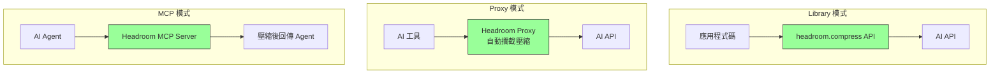
```mermaid
graph TB
    subgraph "Library 模式"
        A1[應用程式碼] --> B1[headroom.compress API]
        B1 --> C1[AI API]
    end
    
    subgraph "Proxy 模式"
        A2[AI 工具] --> B2[Headroom Proxy<br/>自動攔截壓縮]
        B2 --> C2[AI API]
    end
    
    subgraph "MCP 模式"
        A3[AI Agent] --> B3[Headroom MCP Server]
        B3 --> C3[壓縮後回傳 Agent]
    end
    
    style B1 fill:#9f9,stroke:#333
    style B2 fill:#9f9,stroke:#333
    style B3 fill:#9f9,stroke:#333
```

| 模式 | 使用場景 | 整合難度 | Token 節省 |
| --- | --- | --- | --- |
| **Library** | 自訂應用程式內嵌 | 中 | 60-95% |
| **Proxy** | 不修改現有工具流程 | 低 | 60-90% |
| **MCP** | AI Agent 原生整合 | 低 | 70-95% |

### 4.3 ContentRouter 智慧壓縮

Headroom 的核心是 **ContentRouter**——根據內容類型自動選擇最佳壓縮策略：

| 內容類型 | 壓縮引擎 | 說明 |
| --- | --- | --- |
| JSON／結構化資料 | **SmartCrusher** | 針對重複的鍵名與結構做壓縮，降幅最大（60-95%） |
| 原始碼 | **CodeCompressor** | **AST-aware**——理解語法結構後壓縮，不破壞語義 |
| 散文／自然語言 | **Kompress-v2-base** | 語義壓縮模型，保留關鍵資訊 |

> **AST-aware 的意義**：CodeCompressor 不是把程式碼當成純文字做字串壓縮，而是先解析成語法樹再壓縮。這與第七、八章的 tree-sitter 圖譜工具屬於同一技術路線——**先理解結構，再決定丟什麼**，這是所有高品質壓縮工具的共同前提。

**CCR（Compact Context Representation）可逆壓縮**：Headroom 使用 CCR 格式壓縮上下文，AI 可以理解壓縮後的格式，且在需要時可以還原為原始內容。這不是有損壓縮，而是語義等價的緊湊表示。

**Cross-Agent Memory**：透過 `headroom learn` 功能，Headroom 可以跨不同 AI Agent 共享壓縮後的上下文記憶，避免在切換 Agent 時重複傳送相同的背景資訊。

### 4.4 與 RTK 的互補關係

RTK 和 Headroom 並非競爭關係，而是互補：

| 維度 | RTK | Headroom |
| --- | --- | --- |
| 壓縮對象 | 工具輸出（ls、grep、git 等） | 整個 Context Window |
| 壓縮時機 | 工具執行後、送往 AI 前 | AI 接收前的最後一道壓縮 |
| 實作方式 | CLI Proxy + Hook | Library / Proxy / MCP |
| 最佳場景 | 單次工具輸出過長 | 累積對話 Context 過大 |

**組合使用效果：**

```text
未優化 Session：
  工具輸出 100K + 對話歷史 80K + 系統指令 20K = 200K tokens

僅用 RTK：
  工具輸出 20K + 對話歷史 80K + 系統指令 20K = 120K tokens（節省 40%）

僅用 Headroom：
  工具輸出 100K + 壓縮後 (80K + 20K) → 30K = 130K tokens（節省 35%）

RTK + Headroom 組合：
  RTK 壓縮工具輸出 → 20K
  Headroom 壓縮全部 → (20K + 80K + 20K) → 36K tokens（節省 82%）
```

> **Headroom 思維的核心啟示**：Token 節省應該是全方位的——不只壓縮工具輸出，更要壓縮整個 Context Window。Headroom 的 ContentRouter 智慧路由確保不同類型的內容使用最適合的壓縮策略。

---

## 第五章 Understand-Anything 思維——Knowledge Graph Builder

### 5.1 Knowledge Graph 概念

Understand-Anything 的核心理念是將大型程式碼庫轉換為結構化的 Knowledge Graph（知識圖譜），讓 AI 能夠「按需查詢」而非「全量閱讀」。

**四種圖譜類型：**

**Code Graph（程式碼圖譜）**

- 記錄每個檔案、類別、方法的定義與位置
- 包含程式碼摘要與功能說明
- AI 可精準定位到特定方法，無需讀取完整檔案

**Dependency Graph（相依性圖譜）**

- 記錄模組之間的 import/dependency 關係
- 識別循環相依與耦合度
- AI 可快速理解模組間的關聯

**Call Graph（呼叫圖譜）**

- 記錄函式之間的呼叫關係
- 追蹤 API → Service → Repository 的呼叫鏈
- AI 可沿著呼叫鏈定位問題根源

**Knowledge Graph（知識圖譜）**

- 整合上述三種圖譜
- 加入業務語義（Business Domain）標註
- 提供全專案的結構化知識查詢介面

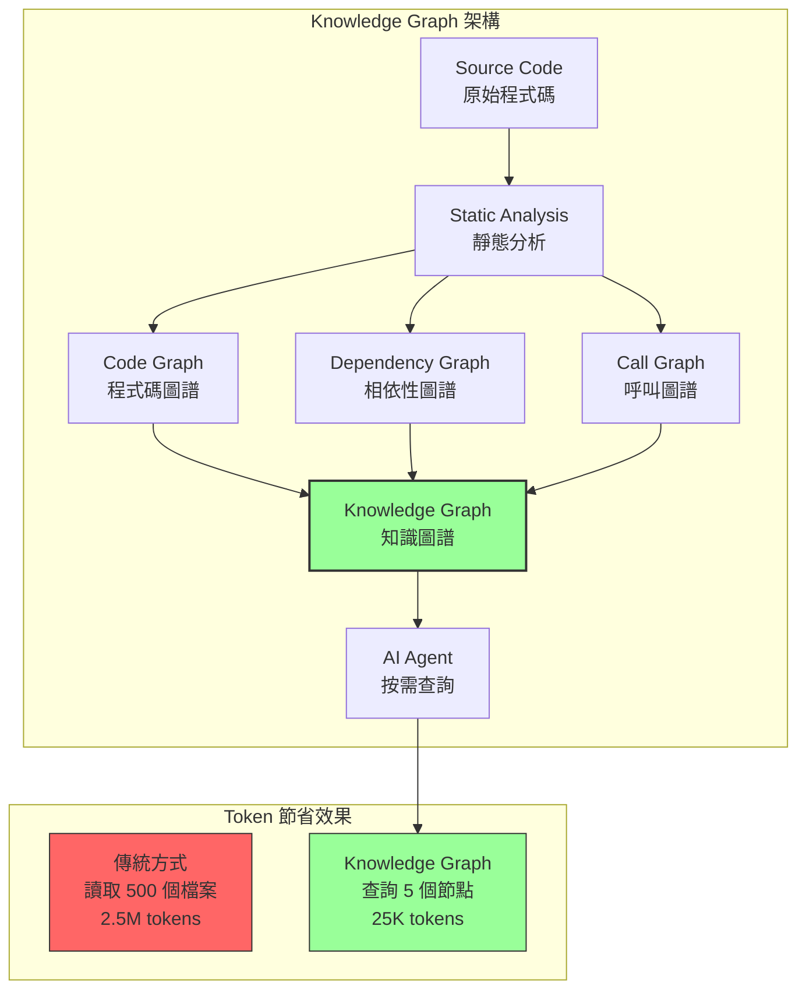
```mermaid
graph TB
    subgraph "Knowledge Graph 架構"
        A[Source Code<br/>原始程式碼] --> B[Static Analysis<br/>靜態分析]
        B --> C[Code Graph<br/>程式碼圖譜]
        B --> D[Dependency Graph<br/>相依性圖譜]
        B --> E[Call Graph<br/>呼叫圖譜]
        C --> F[Knowledge Graph<br/>知識圖譜]
        D --> F
        E --> F
        F --> G[AI Agent<br/>按需查詢]
    end
    
    subgraph "Token 節省效果"
        H[傳統方式<br/>讀取 500 個檔案<br/>2.5M tokens] 
        I[Knowledge Graph<br/>查詢 5 個節點<br/>25K tokens]
    end
    
    G --> I
    
    style F fill:#9f9,stroke:#333,stroke-width:2px
    style I fill:#9f9,stroke:#333
    style H fill:#f66,stroke:#333
```

### 5.2 Multi-Agent Pipeline

Understand-Anything（維護者：Egonex-AI，授權 MIT）使用多智能體管線（Multi-Agent Pipeline）來建構 Knowledge Graph，共 **7 個專業 Agent**。核心 `/understand` 指令使用其中 5 個，額外的分析指令各有專屬 Agent：

| Agent | 觸發指令 | 職責 | 產出 |
| --- | --- | --- | --- |
| Project Scanner | `/understand` | 掃描專案結構、識別技術棧與框架 | 專案概覽、技術清單 |
| File Analyzer | `/understand` | 逐檔分析功能與邏輯（並行處理，每批 20-30 檔） | 檔案摘要、功能標註 |
| Architecture Analyzer | `/understand` | 識別架構模式與層次分類 | 架構圖、模組關係 |
| Tour Builder | `/understand` | 建立專案導覽路徑 | 入門指南、導覽順序 |
| Graph Reviewer | `/understand` | 驗證圖譜完整性與引用正確性 | 修正建議、品質報告 |
| Domain Analyzer | `/understand-domain` | 提取業務領域、流程與步驟 | 領域模型、術語對照 |
| Article Analyzer | `/understand-knowledge` | 從 Wiki 知識庫擷取實體與關係 | 實體圖、隱含關聯 |

**安裝與使用：**

```bash
# Claude Code（原生 Plugin）
/plugin marketplace add Egonex-AI/Understand-Anything
/plugin install understand-anything

# 其他平台（Codex / Gemini CLI / Copilot / Cursor / Kiro / Nanobot / Cline / KIMI CLI / Trae / Hermes / Vibe CLI 等 17+ 平台）
curl -fsSL https://raw.githubusercontent.com/Egonex-AI/Understand-Anything/main/install.sh | bash

# Windows
iwr -useb https://raw.githubusercontent.com/Egonex-AI/Understand-Anything/main/install.ps1 | iex
```

**核心指令：**

| 指令 | 功能 |
| --- | --- |
| `/understand` | 建構知識圖譜（支援增量更新，僅重新分析變更檔案） |
| `/understand-dashboard` | 開啟互動式視覺化儀表板 |
| `/understand-chat` | 基於圖譜進行問答 |
| `/understand-diff` | 分析當前變更的影響範圍 |
| `/understand-domain` | 擷取業務領域知識 |
| `/understand --auto-update` | 啟用 post-commit hook 自動更新圖譜 |
| `/understand --language zh-TW` | 指定輸出語言（支援多語言） |
| `/understand-explain` | 深入解釋特定檔案或函式 |

**關鍵特性**：Tree-sitter + LLM 混合架構——Tree-sitter 負責確定性的結構解析（imports、exports、函式定義），LLM 負責語義理解（摘要、標註、架構分層）。結構面可重現，語義面捕捉意圖。

**Token 節省原理**：這個管線只需執行一次（約消耗 50K-200K tokens），之後所有 AI 對話都可以透過查詢圖譜來獲取上下文，而不需要重新分析原始碼。支援增量更新——僅重新分析變更的檔案，大幅降低持續維護成本。

### 5.3 為何 Knowledge Graph 可以降低 Token

**核心原理**：Knowledge Graph 將「全量讀取」轉換為「精準查詢」。

**對比分析：100 萬行程式碼系統**

| 操作 | 傳統方式 | Knowledge Graph 方式 |
| --- | --- | --- |
| 理解系統架構 | 讀取 50+ 核心檔案（500K tokens） | 查詢架構節點（5K tokens） |
| 定位 Bug | Agent 搜尋 200+ 檔案（1M tokens） | 沿 Call Graph 追蹤（15K tokens） |
| 影響範圍分析 | 全專案 grep（800K tokens） | 查詢 Dependency Graph（8K tokens） |
| 新功能開發 | 閱讀相關模組（300K tokens） | 查詢相關節點 + 範例（20K tokens） |

**Token 節省公式：**

```text
傳統方式 Token = 檔案數 × 平均檔案大小 × 讀取次數
Knowledge Graph Token = 查詢節點數 × 節點摘要大小
節省比例 = 1 - (Graph Token / 傳統 Token) ≈ 95-99%
```

> **實務案例**：某大型銀行的核心交易系統（120 萬行 Java 程式碼），建立 Knowledge Graph 後，每位開發者每日平均節省 300K tokens，團隊 15 人每月節省約 99M tokens，費用節省約 $900/月。Knowledge Graph 建構成本僅為一次性的 200K tokens（約 $1.8）。

---

## 第六章 GitNexus 思維——Repository Intelligence

### 6.1 Repository 知識管理

GitNexus 的核心理念是將 Git Repository 索引為可查詢的知識庫，採用**預計算關聯智慧（Precomputed Relational Intelligence）**——在索引時預先計算叢集、追蹤、評分，使工具在單次呼叫中即可回傳完整上下文，而非讓 LLM 自行探索。目前提供 **17 個 MCP（Model Context Protocol）工具**，另有 Prompts 與 Skills，供 AI Agent 精準存取 Repository 資訊。

**MCP 工具回傳的是預先算好的關聯資料，而非讓 Agent 自行探索原始圖譜**——這正是它省 Token 的機制。主要工具包含：符號 `context`（上下文）、`impact`（影響分析）、`trace`（呼叫追蹤）、多檔案 `rename`（重新命名）、以及 `cypher`（原生圖譜查詢）。

**四階段索引管線：**

| 階段 | 作用 |
| --- | --- |
| **Structure**（結構） | 對應檔案之間的關係 |
| **Parsing**（解析） | 以 Tree-sitter AST 抽取符號 |
| **Resolution**（解析連結） | 跨檔案的 import 與型別連結 |
| **Clustering**（叢集） | 功能社群偵測（functional community detection） |

**底層資料庫引擎**：LadybugDB（內嵌式圖譜資料庫，支援向量與 Cypher 查詢）。

**支援語言**：13 種以上，包含 TypeScript、Python、Java、Kotlin、C#、Go、Rust、PHP、Ruby、Swift、C、C++、Dart（各語言在 import、型別標註與框架偵測的支援程度不一）。

**近期強化功能**：增量索引（incremental indexing）、由建構子推論型別（constructor-inferred type resolution）、多檔案重新命名、以及**流程分組搜尋（process-grouped search）**——讓 Agent 能在功能叢集內沿著執行流程導航，而不是在整個倉庫中盲目搜尋。

**安裝與快速開始：**

```bash
# 安裝（全域）
npm install -g gitnexus

# 索引倉庫（在 repo 根目錄執行）
npx gitnexus analyze

# 自動設定 MCP（一次性）
npx gitnexus setup
```

`gitnexus analyze` 會一次完成：索引程式碼、安裝 Agent Skills、註冊 Claude Code Hooks、建立 `AGENTS.md` / `CLAUDE.md` 上下文檔案。

**支援平台**：Claude Code（完整支援：MCP + Skills + Hooks）、Cursor、Codex、Gemini CLI（Antigravity）、Windsurf、OpenCode、GitHub Copilot。

**Multi-Repo 架構**：透過 `gitnexus group` 指令將多個倉庫組成群組，實現跨倉庫合約比對、流程搜尋與一致性檢查。

**Wiki Generation**：`gitnexus wiki` 自動產生 Repository 的 Markdown Wiki 文件，作為 AI 的持久化上下文。

**五大索引類型：**

**Repository Index（倉庫索引）**

- 專案結構、檔案清單、目錄組織
- 技術棧識別、框架版本
- 建置工具與配置

**Symbol Index（符號索引）**

- 類別、介面、方法、變數定義
- 跨檔案的符號引用
- 型別層級關係

**Dependency Index（相依性索引）**

- 模組間的 import 關係
- 外部套件依賴
- 版本相容性資訊

**Semantic Search（語義搜尋）**

- 基於自然語言的程式碼搜尋
- 理解開發者意圖，而非僅匹配關鍵字
- 支援跨語言搜尋

**Embedding Search（向量搜尋）**

- 將程式碼轉換為向量表示
- 支援相似度搜尋
- 找出語義相似但文字不同的程式碼片段

### 6.2 Semantic Search 與 Token 節省

傳統的文字搜尋（grep/ripgrep）會回傳大量不相關的結果，AI 需要逐一讀取並判斷相關性，造成 Token 浪費。Semantic Search 則直接回傳語義相關的結果，大幅減少 AI 需要處理的資訊量。

**GitNexus 17 個 MCP 工具的 Token 節省效果（節選）：**

| MCP 工具 | 功能 | 傳統替代方式 Token | MCP 方式 Token |
| --- | --- | --- | --- |
| `list_repos` | 列出所有已索引倉庫 | 手動管理 | < 1K |
| `query` | 程序分組混合搜尋（BM25 + 語義 + RRF） | 20K（grep 全專案） | 2K |
| `context` | 360° 符號視圖（分類引用、程序參與） | 50K（讀取完整檔案） | 5K |
| `impact` | 爆炸半徑分析（深度分組 + 信心度） | 100K（遞迴追蹤） | 8K |
| `detect_changes` | Git diff 影響分析（映射變更行至受影響程序） | 30K（git diff 全量） | 3K |
| `rename` | 多檔案協調重新命名（圖譜 + 文字搜尋） | 手動逐檔修改 | 4K |
| `cypher` | 原始 Cypher 圖譜查詢 | N/A | 2K |
| `group_*`（5 個） | 跨倉庫群組管理、合約比對、流程搜尋 | 40K（手動分析） | 4K |

**混合檢索機制**：GitNexus 的 `query` 工具採 **BM25 全文比對 + 語義向量查詢**，再以 RRF（Reciprocal Rank Fusion，倒數排名融合）合併兩者結果。這個組合同時涵蓋「關鍵字精確查找」與「概念式查找」兩種需求——單用向量搜尋會漏掉精確的符號名稱，單用 BM25 則無法理解意圖。

### 6.3 傳統搜尋 VS Semantic Search

| 比較維度 | 傳統搜尋 (grep) | Semantic Search |
| --- | --- | --- |
| 搜尋方式 | 關鍵字匹配 | 語義理解 |
| 結果精準度 | 低（大量誤判） | 高（語義相關） |
| 結果數量 | 數百筆 | 5-20 筆精選 |
| Token 消耗 | 高（需讀取所有結果） | 低（僅精選結果） |
| 跨語言支援 | 不支援 | 支援 |
| 意圖理解 | 不支援 | 支援 |

**實務範例：**

```text
需求："找出所有處理使用者認證的程式碼"

傳統搜尋：grep -r "auth" → 500+ 結果（含 author、authority 等無關匹配）
→ AI 讀取 500 筆結果 → 25K tokens → 大多不相關

Semantic Search："使用者認證邏輯" → 12 筆精選結果
→ AI 讀取 12 筆結果 → 3K tokens → 全部相關
```

> **GitNexus 思維的核心啟示**：不要讓 AI 自己去搜尋和判斷，而是提供一個預先索引的知識庫，讓 AI 能夠進行精準的語義查詢。搜尋的 Token 成本應該是 O(1)（常數級）而非 O(n)（線性級）。

---

## 第七章 Graphify 思維——Code Knowledge Graph

### 7.1 程式碼知識圖譜建構

Graphify 是一個以 Python 開發的程式碼知識圖譜建構工具，支援 **37 種 tree-sitter grammars**，另針對 Salesforce Apex、Terraform/HCL、OCaml、Common Lisp、Robot Framework 等提供專用解析器，跨檔案關聯解析涵蓋約 40 種語言；同時可處理文件、PDF、圖片、影片與音訊等多媒體內容。使用 Tree-sitter AST 解析器在本地端完成程式碼分析，不需要將程式碼傳送給 AI API，本身不消耗 AI Token。

**安裝與使用：**

```bash
# 安裝（推薦使用 uv）
uv tool install graphifyy    # 注意：PyPI 套件名稱是 graphifyy（雙 y）

# 替代安裝方式
pipx install graphifyy
pip install graphifyy

# 註冊為 AI 助手技能
graphify install

# 建構知識圖譜（在 AI 助手中執行）
/graphify .

# 或在終端直接執行
graphify extract ./src
```

**支援 20+ AI 編碼工具**：Claude Code、Codex、Cursor、Gemini CLI、GitHub Copilot CLI、VS Code Copilot Chat、Aider、OpenCode、OpenClaw、Amp、Kiro、Google Antigravity 等。

> **PowerShell 注意**：在 PowerShell 中使用 `graphify .` 而非 `/graphify .`——前導斜線在 PowerShell 中是路徑分隔符。

**Graphify 的產出物：**

| 產出物 | 檔案 | 說明 |
| --- | --- | --- |
| 互動式圖譜 | `graph.html` | 可視化知識圖譜，可用瀏覽器開啟 |
| 圖譜報告 | `GRAPH_REPORT.md` | Markdown 格式的結構化報告 |
| 圖譜資料 | `graph.json` | JSON 格式的完整圖譜資料 |

### 7.2 Entity Extraction 架構

Graphify 透過 Tree-sitter 對程式碼進行語法層級的實體擷取：

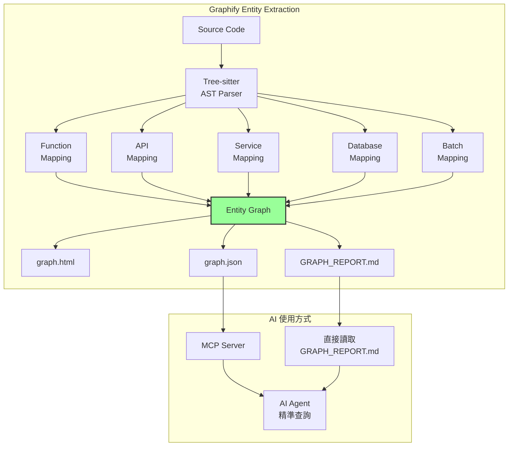
```mermaid
graph TB
    subgraph "Graphify Entity Extraction"
        A[Source Code] --> B[Tree-sitter<br/>AST Parser]
        B --> C[Function<br/>Mapping]
        B --> D[API<br/>Mapping]
        B --> E[Service<br/>Mapping]
        B --> F[Database<br/>Mapping]
        B --> G[Batch<br/>Mapping]
        
        C --> H[Entity Graph]
        D --> H
        E --> H
        F --> H
        G --> H
        
        H --> I[graph.html]
        H --> J[GRAPH_REPORT.md]
        H --> K[graph.json]
    end
    
    subgraph "AI 使用方式"
        K --> L[MCP Server]
        J --> M[直接讀取<br/>GRAPH_REPORT.md]
        L --> N[AI Agent<br/>精準查詢]
        M --> N
    end
    
    style H fill:#9f9,stroke:#333,stroke-width:2px
```

**六大 Mapping 類型：**

- **Function Mapping**：函式定義、參數、回傳值、呼叫關係
- **API Mapping**：REST API 端點、HTTP 方法、路徑、參數
- **Service Mapping**：服務類別、依賴注入、介面實作
- **Database Mapping**：資料表、欄位、SQL 查詢、ORM 對映
- **Batch Mapping**：批次作業、排程任務、Job 流程
- **Entity Mapping**：實體類別、DTO、VO、領域物件

### 7.3 Confidence Tags 機制

Graphify 為每個擷取的實體標註信心度，這在 AI 使用時非常有價值：

| 信心度標籤 | 意義 | AI 使用建議 |
| --- | --- | --- |
| `EXTRACTED` | 直接從程式碼解析取得 | 可完全信賴，無需驗證 |
| `INFERRED` | 根據程式碼模式推斷 | 建議快速驗證 |
| `AMBIGUOUS` | 資訊模糊或衝突 | 必須讀取原始碼確認 |

**Token 節省策略**：

- `EXTRACTED` 實體：AI 直接使用，不需讀取原始檔案 → **節省 100%**
- `INFERRED` 實體：AI 僅讀取相關程式碼段落確認 → **節省 80%**
- `AMBIGUOUS` 實體：AI 讀取完整檔案確認 → **節省 0%**（但此類佔比通常 < 5%）

> **Graphify 思維的核心啟示**：利用本地端的 AST 解析器（零 Token 成本）預先建構程式碼知識圖譜，然後讓 AI 透過查詢圖譜來理解程式碼，而非直接閱讀原始碼。這是 Token 節省的「空間換時間」策略。

### 7.4 MCP Server 與進階功能

Graphify 提供 MCP Server 模式，讓 AI Agent 可以透過標準化的 MCP 協定查詢圖譜：

```bash
# 啟動 MCP Server（stdio 傳輸——適用於單一開發者）
graphify mcp

# 啟動 Shared HTTP Server（適用於團隊共享）
graphify mcp --transport http --port 8765
```

**進階查詢指令：**

| 指令 | 功能 | Token 節省 |
| --- | --- | --- |
| `graphify query "UserService"` | 查詢特定實體的完整上下文 | 90% |
| `graphify path A B` | 找出兩個實體之間的呼叫路徑 | 95% |
| `graphify explain <entity>` | AI 深入解釋特定實體 | 85% |
| `graphify prs --triage` | PR Dashboard——自動分類與影響分析 | 80% |

**自動化整合：**

```bash
# 設定 git hook 自動重建圖譜
graphify install --hook post-commit

# 匯出至外部圖譜資料庫
graphify push neo4j --uri bolt://localhost:7687
graphify push falkordb --uri redis://localhost:6379

# Obsidian Vault 整合（將圖譜匯出為 Obsidian 筆記）
graphify export obsidian --vault ./my-vault
```

**產出檔案：**

| 檔案 | 內容 |
| --- | --- |
| `graph.html` | 可互動、可點擊的力導向圖視覺化 |
| `GRAPH_REPORT.md` | 重點摘要、意外關聯、建議查詢 |
| `graph.json` | 可重複查詢的圖譜資料 |

**社群偵測與 God Node 識別**：Graphify 以 **Leiden 演算法**進行社群偵測，自動識別子系統邊界，並標示「God Nodes」（連結度最高的概念節點）。對逆向工程專案而言，God Node 就是應該優先理解的核心——這直接對應第十八章的 Legacy 盤點策略。

**Benchmark 表現：**

| 評測 | 分數 |
| --- | --- |
| LOCOMO QA | 45.3% |
| LongMemEval-S | 76% |
| 程式碼圖譜建構 | **零 LLM 額度消耗**（純程式碼語料不需 API key） |

> **隱私模型（企業導入關鍵）**：官方明確說明——「**程式碼檔案以 tree-sitter 在本機處理，不會離開你的機器。純程式碼語料不需要 API key**」。僅在處理文件與 PDF 時才會使用所設定的 LLM 後端。無遙測、無追蹤。這使 Graphify 成為**受監理環境中少數可直接放行的圖譜工具**。
>
> **團隊協作場景**：透過 Shared HTTP Server 模式，團隊成員可共用同一份圖譜，避免每人重複建構。結合 git hook 自動更新，確保圖譜始終反映最新程式碼狀態。

---

## 第八章 codebase-memory-mcp 思維——Hybrid LSP Memory

### 8.1 核心設計與效能

codebase-memory-mcp（v0.8.1，21.7K ★）是一個以純 C 語言寫成的 MCP Server，專為 AI Agent 提供 **極速的程式碼索引與記憶功能**。其核心競爭優勢是速度：

| 指標 | 數値 |
| --- | --- |
| 支援語言 | **162 種**（tree-sitter grammars 內建於二進位檔） |
| Linux kernel 索引時間 | **3 分鐘**（2,800 萬行、75,000 個檔案） |
| Token 減少 | **99.2%**（3,400 vs 412,000 tokens，相較逐檔探索） |
| 查詢速度 | 次毫秒級 Cypher 查詢 |
| 部署方式 | 單一靜態二進位（無任何相依） |
| 資料儲存 | SQLite（本地嵌入式） |
| 供應鏈安全 | VirusTotal 掃描 + **SLSA Level 3** 出處證明 |
| 散布通路 | npm、PyPI、Homebrew、Scoop、AUR、直接下載 |

**安裝方式：**

```bash
# macOS (Homebrew)
brew install deusdata/tap/codebase-memory-mcp

# Linux / macOS (二進位)
curl -fsSL https://github.com/DeusData/codebase-memory-mcp/releases/latest/download/install.sh | sh

# Windows (下載 Pre-built Binary)
# https://github.com/DeusData/codebase-memory-mcp/releases

# 索引倉庫
codebase-memory-mcp index /path/to/repo
```

### 8.2 Hybrid LSP 語義解析

codebase-memory-mcp 採用 **Hybrid LSP** 架構——對 **12 種語言**（Python、TypeScript、PHP、C#、Go、C/C++、Java、Kotlin、Rust、Perl 等）提供「**超越 tree-sitter 的語義型別解析**」，其餘語言使用 Tree-sitter 結構解析。關鍵優勢在於：它**不需要啟動語言伺服器行程**即可完成跨模組的呼叫解析，因此保有純 C 實作的速度。

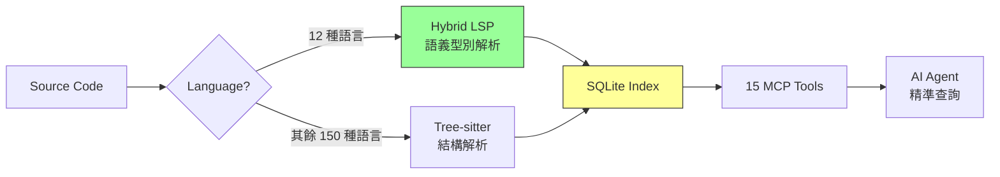
```mermaid
graph LR
    A[Source Code] --> B{Language?}
    B -->|12 種語言| C[Hybrid LSP<br/>語義型別解析]
    B -->|其餘 150 種語言| D[Tree-sitter<br/>結構解析]
    C --> E[SQLite Index]
    D --> E
    E --> F[15 MCP Tools]
    F --> G[AI Agent<br/>精準查詢]
    
    style C fill:#9f9,stroke:#333
    style E fill:#ff9,stroke:#333
```

**Hybrid LSP 的優勢**：

- **跨檔案型別追蹤**：知道 `getUserById()` 回傳 `User` 型別，不僅是 `string`
- **介面實作解析**：自動識別 `UserService implements IUserService`
- **相依性注入追蹤**：理解 Spring/NestJS 等框架的 DI 容器

### 8.3 15 個 MCP 工具

| MCP 工具 | 功能 | Token 節省 |
| --- | --- | --- |
| `search_code` | 語義搜尋（理解意圖） | 95% |
| `get_symbol` | 取得符號完整定義與型別 | 90% |
| `find_references` | 找出符號的所有引用點 | 92% |
| `get_call_graph` | 取得呼叫鏈（指定深度） | 96% |
| `get_dependencies` | 取得模組相依性 | 88% |
| `get_type_hierarchy` | 取得型別繼承樹 | 90% |
| `get_file_summary` | 取得檔案摘要（不讀原始碼） | 85% |
| `remember` | 儲存 AI 發現的知識至記憶層 | N/A |
| `recall` | 取回先前儲存的知識 | 80% |
| `get_project_overview` | 取得專案結構概觀 | 90% |

**其他值得注意的功能：**

| 功能 | 說明 |
| --- | --- |
| **3D 圖譜視覺化** | 內建 UI，啟動後於 `localhost:9749` 檢視 |
| **IaC 索引** | 可索引 Dockerfile、Kubernetes manifest 等基礎架構檔案 |
| **背景自動同步** | 內建 git watcher，程式碼變更自動更新圖譜 |
| **團隊共享圖譜** | 產出壓縮檔 `.codebase-memory/graph.db.zst`，可直接分發給團隊成員 |
| **ADR 管理** | `manage_adr` 工具管理架構決策紀錄（Architecture Decision Record） |
| **Agent 介面支援** | 安裝程式自動設定 **45 種**編碼 Agent 介面 |

> **`graph.db.zst` 的治理意涵**：可分發的壓縮圖譜檔，意味著**索引成本只需付一次**——由 CI 建構後分發給整個團隊，而非每位成員各自索引一次。以第二十三章的企業架構觀點，這應該納入 CI/CD 流程，成為與建置產物並列的標準交付物。
>
> **codebase-memory-mcp 的核心優勢**：純 C 實作帶來的極速索引適合超大型專案（Linux kernel 等級），Hybrid LSP 提供的語義型別資訊讓 AI 不需讀取原始碼即可理解型別關係；**SLSA Level 3 出處證明**則是它在企業供應鏈安全審查中的關鍵優勢——多數同類工具不具備此項。

### 8.4 與其他圖譜工具比較

| 比較項目 | codebase-memory-mcp | GitNexus | Graphify | CodeGraph |
| --- | --- | --- | --- | --- |
| 實作語言 | C | TypeScript | Python | Rust 核心 |
| 支援語言數 | **162** | 13+ | 37（跨檔案約 40） | 20+ |
| 索引速度 | 極快（Linux kernel 3 分鐘） | 快（支援增量索引） | 中等 | 快（原生 file watcher） |
| 型別解析 | Hybrid LSP（12 語言） | Tree-sitter + 型別連結 | Tree-sitter | 完整型別 |
| 記憶功能 | ✅ remember/recall | ❌ | ❌ | ❌ |
| MCP 工具數 | 15 | 17 | 多指令 + MCP | **1**（單一工具哲學） |
| 檢索方式 | Cypher 查詢 | BM25 + 向量 + RRF | 圖譜查詢 + Leiden 社群 | 參數化單一查詢 |
| 供應鏈安全 | **SLSA L3** | — | 無遙測、本機處理 | — |
| 適合場景 | 超大型專案、多語言 | 多倉庫、語義搜尋 | 多媒體、可視化 | 自動同步、框架感知 |

---

## 第九章 CodeGraph 思維——Auto-Sync Graph

### 9.1 核心設計理念

CodeGraph 是一個以 **Rust 解析核心**打造的程式碼知識圖譜工具（CLI 本身不需 Node.js），其核心差異化特點是 **自動同步（Auto-Sync）**：透過作業系統原生的檔案監控（file watcher），每次檔案變更時自動更新圖譜，開發者不需手動重建。

其設計主張是提供「**外科手術式的上下文**」（surgical context）——官方說法：「一次工具呼叫即回傳進入點、相關符號與程式碼片段，不需要緩慢的逐檔探索。」

**核心特性：**

| 特性 | 說明 |
| --- | --- |
| 解析核心 | **Rust**（不需安裝 Node.js） |
| 支援語言 | **20+ 種**（含 TypeScript、Python、Java、Go、Rust、Swift、Kotlin 等） |
| 資料儲存 | 本地 SQLite + 全文檢索 |
| 授權 | MIT（完全開源） |
| Auto-Sync | 檔案變更自動增量更新圖譜，無需重建 |
| Framework-Aware | 理解 Next.js Routes、React Native Bridges、Express Middleware 等 |
| Mixed Project | 支援 iOS + React Native + Expo bridging 混合專案 |

**安裝與使用：**

```bash
# 安裝（全域）
npm install -g codegraph

# 索引倉庫
codegraph index .

# MCP Server 模式
codegraph serve

# 內嵌為 npm 套件（Library Usage）
npm install codegraph
```

### 9.2 單一工具哲學

CodeGraph 採用**單一工具哲學**——僅提供一個 MCP 工具 `codegraph_explore`，透過參數化檢索完成所有查詢。這個設計理念是：減少 AI 選擇工具的決策成本，避免在多個工具之間來回切換浪費 Token。

```text
傳統多工具方式：
AI 思考：「我該用 search_code、get_symbol、find_references 還是 get_call_graph？」
→ 工具選擇本身消耗 Token
→ 多次工具呼叫累積 Token

CodeGraph 單一工具方式：
AI 直接呼叫 codegraph_explore(查詢參數)
→ 零工具選擇成本
→ 單次呼叫即取得完整上下文
```

### 9.3 Benchmark 與效能

CodeGraph 官方 Benchmark 數據（**跨 7 個真實世界倉庫**量測）：

| 指標 | 數值 |
| --- | --- |
| Tool Calls 減少 | **平均 88%** |
| 回應速度 | **快 53%** |
| Token 處理量減少 | **62%** |
| 每次查詢成本降低 | **44%** |
| 檔案讀取次數 | **全部測試倉庫皆為零** |

> **「零檔案讀取」這個數字的意義**：第 13.6 節引用的研究指出，編碼 Agent 有 **67%～76% 的 Token 預算花在讀檔案上**。CodeGraph 在七個倉庫的測試中把這個數字降到零——**這正是知識圖譜類工具最大的價值所在**。
>
> 另請注意「Token 減少 62%」與「成本降低 44%」之間的落差。兩者不相等的原因是：**輸出 token 與工具呼叫的固定開銷不會等比例下降**。這也再次印證第十三章的原則——**以「每個完成任務的成本」評估，而非只看 token 數**。

**安裝三步驟：**

```bash
codegraph install     # 自動接上各 AI 工具
codegraph init        # 對每個專案建立索引
```

支援 Claude Code、Cursor、GitHub Copilot、Codex CLI 等主流工具，全部透過單一 MCP 工具 `codegraph_explore` 存取。

> **CodeGraph 思維的核心啟示**：「讓圖譜跟著程式碼走」——Auto-Sync 確保圖譜始終是最新的，開發者不需記得手動更新。單一工具哲學減少 AI 的決策成本，**88% fewer tool calls** 直接轉化為 Token 節省。

---

## 第十章 Ponytail 思維——YAGNI Agent Plugin

### 10.1 YAGNI Ladder 設計

Ponytail（v4.8.4，67.6K ★）採取完全不同的 Token 節省策略：它不壓縮輸入，而是**減少 AI 的輸出**。透過 YAGNI（You Ain’t Gonna Need It）原則，Ponytail 讓 AI Agent 在生成程式碼前先經過七級檢查梯子，確保只產生真正需要的程式碼。

**核心理念：**

```text
傳統 AI 開發：
  開發者：「建立使用者註冊功能」
  AI 生成：500 行程式碼（含各種 edge case、未來擴展、抽象層）
  → Completion Tokens: 2,500

Ponytail 思維：
  開發者：「建立使用者註冊功能」
  Ponytail 過濾：「這個功能真的需要嗎？最小實作是什麼？」
  AI 生成：230 行程式碼（僅包含必要功能）
  → Completion Tokens: 1,150（節省 54%）
```

### 10.2 七級梯子機制

Ponytail 的 YAGNI Ladder 包含七個檢查層級：

| 級別 | 檢查問題 | 動作 |
| --- | --- | --- |
| L1 | Does this need to exist? | 判斷功能是否真正需要 |
| L2 | Can it be simpler? | 簡化設計方案 |
| L3 | Does this abstraction earn its keep? | 移除不必要的抽象層 |
| L4 | Is this the minimum that works? | 確保最小可行實作 |
| L5 | Are edge cases real or imagined? | 移除假設性邊界處理 |
| L6 | Will this be needed in 30 days? | 移除「未來可能需要」的程式碼 |
| L7 | Safety: never compromise | 安全性相關程式碼不在節省範圍內 |

> **重要：L7 安全性不妥協**——Ponytail 永遠不會刪減安全性相關的程式碼（認證、授權、輸入驗證、加密等）。

**安裝與使用：**

```bash
# Claude Code（Plugin Marketplace）
/plugin marketplace add DietrichGebert/ponytail

# 其他平台（20+ agents 支援）
curl -fsSL https://github.com/DietrichGebert/ponytail/releases/latest/download/install.sh | sh
```

**五個控制指令：**

| 指令 | 功能 |
| --- | --- |
| `/ponytail` | 設定強度 |
| `/ponytail-review` | 檢查目前 diff |
| `/ponytail-audit` | 掃描整個倉庫 |
| `/ponytail-debt` | 收集先前刻意延後的技術債（deferred shortcuts） |
| `/ponytail-help` | 說明 |

> **`/ponytail-debt` 的治理價值**：YAGNI 的風險是「刻意不做」會被遺忘，變成隱性技術債。這個指令把延後的決策明確登錄下來，讓「暫時不做」成為**可追蹤的決策**而非疏漏。企業導入時應把它納入 Sprint 回顧的固定環節。

### 10.3 Benchmark 數據

以實際 Claude Code Session 編輯 FastAPI + React 倉庫、跨 12 項功能任務平均量測：

| 指標 | 數值 |
| --- | --- |
| 程式碼減少 | **-54%** |
| Token 消耗降低 | **-22%** |
| 成本降低 | **-20%** |
| 完成速度 | **快 27%** |
| 安全性維持 | **100%**（驗證、安全性、無障礙皆未被削減） |

**代表性案例**：一個原本 404 行的日期選擇器元件，因改用原生 `<input>` 元素而縮減為 **23 行**。這正是 YAGNI 最典型的獲益情境——AI 在「已有原生方案」時仍傾向自建。

**Token 節省原理：**

Ponytail 節省的是 **Completion Token**（輸出 Token），而非 Prompt Token（輸入 Token）。由於 Completion Token 的單價通常是 Prompt Token 的 3-5 倍，Ponytail 的 54% 程式碼減少可轉化為顯著的成本節省。

```text
費用計算範例（Claude Sonnet 5：輸出 $10/1M）：
無 Ponytail：500 行輸出 × 5 tokens/行 = 2,500 tokens × $10/M = $0.0250
有 Ponytail：230 行輸出 × 5 tokens/行 = 1,150 tokens × $10/M = $0.0115
單次節省：$0.0135（54%）

20 人團隊每日 100 次 Code Generation：
月度節省：$0.0135 × 100 × 22 × 20 = $594

注意：上列僅計算輸出 token。實測的整體 token 降幅為 22%、成本降幅為 20%——
低於 54% 的程式碼降幅，因為輸入側（提示、檔案、工具結果）並未被 Ponytail 壓縮。
評估效益時應以 20% 為基準，而非 54%。
```

> **Ponytail 思維的核心啟示**：Token 節省不只是壓縮輸入——減少不必要的輸出同樣重要。YAGNI 原則讓 AI 只產生真正需要的程式碼，同時提升程式碼品質。

---

## 第十一章 Caveman 思維——輸入輸出雙向壓縮

前十章的工具幾乎都聚焦於「送進模型之前」的輸入側。Caveman 的設計價值在於它同時處理**輸出側**（Completion Token）與**輸入側**（Prompt Token），並且以「可還原壓縮」保證資訊不會真正遺失。對企業而言，這是少數能直接壓低 Completion Token 帳單的工具類型——而 Completion Token 的單價通常是 Prompt Token 的 3～5 倍。

### 11.1 雙元件架構

Caveman 由兩個授權與部署方式都不同的元件組成，可以單獨使用，也可以疊加：

| 元件 | 作用位置 | 壓縮對象 | 授權 |
| --- | --- | --- | --- |
| **Skill**（技能檔） | Agent 端規則檔 | AI 的輸出（Completion Token） | MIT |
| **Proxy**（本地代理） | Agent 與 API 供應商之間 | 進入模型的資料（Prompt Token） | BSL-1.1（2030 年轉為 Apache-2.0） |

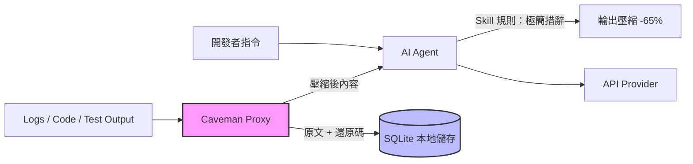
```mermaid
graph LR
    A[開發者指令] --> B[AI Agent]
    B -->|Skill 規則：極簡措辭| C[輸出壓縮 -65%]
    D[Logs / Code / Test Output] --> E[Caveman Proxy]
    E -->|壓縮後內容| B
    E -->|原文 + 還原碼| F[(SQLite 本地儲存)]
    B --> G[API Provider]

    style E fill:#f9f,stroke:#333,stroke-width:2px
    style F fill:#bbf,stroke:#333,stroke-width:2px
```

**Skill 的原理**：以規則檔要求 Agent 採用極度精簡的敘述風格（專案自稱「caveman speech」），移除禮貌語、重複確認、冗長前言與過度解釋，只保留決策與結論。這直接壓縮的是最貴的 Completion Token。

**Proxy 的原理**：以本地行程攔截送往 API 的請求，對日誌、程式碼、測試輸出等大宗內容做壓縮後才交給模型；原文以還原碼（recovery handle）存入本地 SQLite，需要時可精確取回。認證資訊原封不動透傳給供應商，Proxy 不碰憑證。

> **企業重點**：可還原設計是稽核與除錯的前提。壓縮若不可逆，事後就無法證明「模型當時看到的是什麼」，這在受監理產業（金融、醫療）會直接卡住上線審查。

### 11.2 安裝與強度模式

```bash
# 最小安裝（僅 Skill）
npx skills add JuliusBrussee/caveman

# 完整安裝（Skill + Proxy，Linux / macOS）
curl -fsSL https://raw.githubusercontent.com/JuliusBrussee/caveman/v2.6.0/install.sh | bash

# Windows（PowerShell）
irm https://raw.githubusercontent.com/JuliusBrussee/caveman/v2.6.0/install.ps1 | iex
```

環境需求為 Node.js 22.13 以上。安裝後以斜線指令切換壓縮強度：

```text
/caveman lite          # 輕度：保留完整句構，僅移除冗詞
/caveman full          # 標準：預設建議值
/caveman ultra         # 極限：僅保留關鍵字與符號
/caveman wenyan-lite   # 文言模式（中文專案可顯著降低字元數）
/caveman wenyan-full
/caveman wenyan-ultra
/caveman off           # 停用
```

> **中文專案的特別價值**：第一章已說明中文 Token 消耗約為英文的 1.5～2 倍。`wenyan` 系列模式以文言語法壓縮中文敘述，對中文為主的專案文件與對話記錄，壓縮效果通常優於一般 lite/full 模式。惟文言輸出的可讀性較低，建議僅套用於 Agent 之間的內部訊息，不要套用於交付給人閱讀的文件。

### 11.3 Benchmark 數據

| 量測項目 | 基準 | 使用 Caveman | 降幅 |
| --- | --- | --- | --- |
| 輸出 Token（10 個編碼提示平均） | 1,214 tokens | 294 tokens | **-65%** |
| 輸入 Token（6 案例 Claude Code 實測） | 885,793 tokens | 591,673 tokens | **-33.2%** |
| 瀏覽器內容擷取（對比 Playwright ARIA 基準） | 15,704 tokens | 121 tokens | **-99.2%（129.8×）** |
| Pixel Mode（技能檔轉 PNG 分頁） | — | — | **-61%**（以自身技能檔量測） |

**附屬功能：**

```bash
caveman learn                    # 分析 Agent 歷史紀錄並提出優化建議
caveman mem recover <handle>     # 以還原碼取回被壓縮的原始內容
```

### 11.4 適用性評估與導入風險

專案維護者明確指出一項反效果：「**在本來就已經很精簡的工作上，你可能反而虧錢**」（On work that was already terse, you can lose money）。這句話對企業導入評估至關重要——壓縮本身有處理成本與還原成本，若基準輸出已經精簡，壓縮帶來的節省不足以覆蓋額外開銷。

| 情境 | 建議 | 理由 |
| --- | --- | --- |
| Agent 輸出冗長、大量說明性文字 | ✅ 強烈建議 | Completion Token 單價最高，降幅最直接 |
| 大量日誌 / 測試輸出進入 Context | ✅ 建議（啟用 Proxy） | 輸入側 33% 降幅來源 |
| 瀏覽器自動化（Playwright / 網頁擷取） | ✅ 強烈建議 | 129.8× 壓縮比為全項目最高 |
| 已高度結構化的短輸出（分類、抽取） | ❌ 不建議 | 壓縮空間不足，淨效益可能為負 |
| 需交付給人閱讀的最終報告 | ❌ 不建議 | 可讀性是產出的一部分 |
| 受監理環境的稽核軌跡 | ⚠️ 條件式 | 須確認還原機制納入稽核流程 |

**授權注意事項**：Skill、SDK、CLI 與擴充套件為 MIT；但 Engine、Proxy、Runtime 採 BSL-1.1（Business Source License），將於 2030 年轉為 Apache-2.0。BSL 對「以本產品提供競品服務」有限制，企業內部使用一般不受影響，但若計畫將其包裝進對外販售的產品，法務須先行確認。

**平台支援**：原生支援 Claude Code、OpenAI Codex CLI、Google Gemini CLI、Aider、Kilo Code、Qwen Code、opencode、Hermes Agent、OpenClaw、Pi 等 10 種以上 Agent；任何相容 SDK 的框架（LangChain、CrewAI、PydanticAI）可透過置換 `baseURL` 指向 Proxy 接入。

---

## 第十二章 TencentDB Agent Memory 思維——團隊級記憶中樞

前述工具解決的是「單次對話如何少送 Token」。TencentDB Agent Memory 解決的是更上游的問題：**同一個團隊的不同成員、不同 Agent，為什麼要重複付費去理解同一件事？** 它把對話、文件與程式碼轉為可跨 Agent、跨成員流通的記憶資產。

### 12.1 四大服務架構

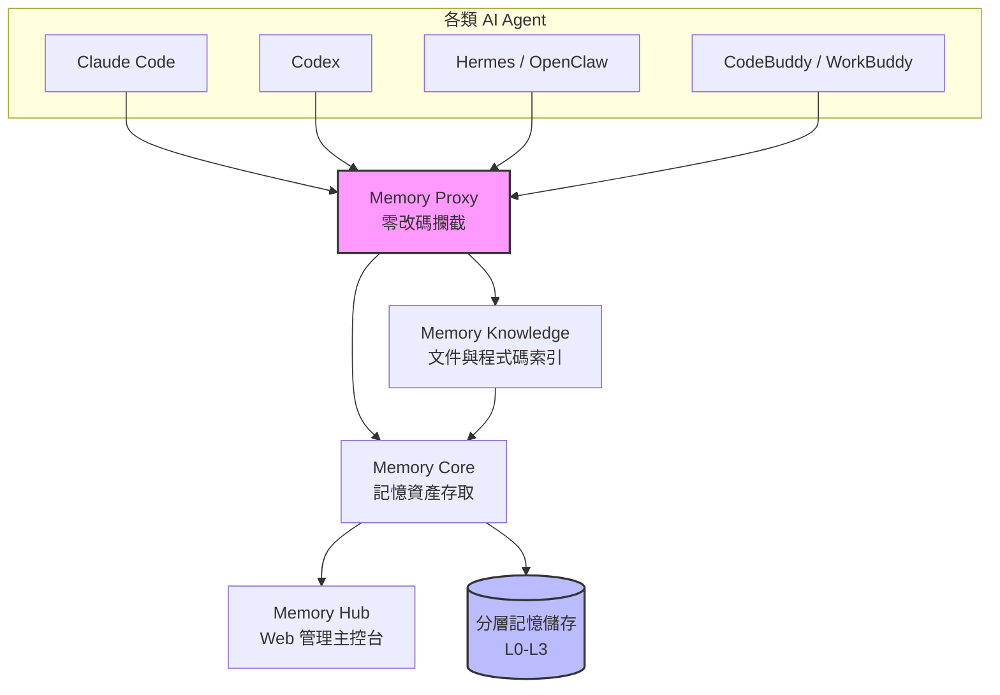
```mermaid
graph TB
    subgraph Agents[各類 AI Agent]
        A1[Claude Code]
        A2[Codex]
        A3[Hermes / OpenClaw]
        A4[CodeBuddy / WorkBuddy]
    end

    A1 --> P[Memory Proxy<br/>零改碼攔截]
    A2 --> P
    A3 --> P
    A4 --> P

    P --> C[Memory Core<br/>記憶資產存取]
    P --> K[Memory Knowledge<br/>文件與程式碼索引]
    C --> H[Memory Hub<br/>Web 管理主控台]
    K --> C

    C --> DB[(分層記憶儲存<br/>L0-L3)]

    style P fill:#f9f,stroke:#333,stroke-width:2px
    style DB fill:#bbf,stroke:#333,stroke-width:2px
```

| 服務 | 職責 |
| --- | --- |
| **Memory Core** | 記憶資產的儲存與檢索核心 |
| **Memory Hub** | Web 控制台，管理團隊、成員與資產可見度 |
| **Memory Knowledge** | 對文件與程式碼庫建立索引 |
| **Memory Proxy** | 攔截 Agent 的 API 呼叫，**不需修改任何 Agent 程式碼** |

所有 Agent 透過單一 Proxy 端點接入，不需要為每個框架撰寫外掛，這是它與前述 MCP 型工具最大的架構差異。

### 12.2 L0–L3 記憶分層

記憶不是一次寫入就定型，而是逐層精煉。這個分層設計正是它降低 Token 的核心機制：

| 層級 | 名稱 | 內容 | Token 特性 |
| --- | --- | --- | --- |
| **L0** | Conversation | 原始互動紀錄（含時間戳） | 最大，僅在需要精確溯源時取用 |
| **L1** | Atom | 抽取後的事實、偏好、限制條件 | 中等，回答特定事實時取用 |
| **L2** | Scenario | 依專案情境組織的知識區塊 | 精簡，**啟動時的主要載入來源** |
| **L3** | Persona | 長期人物誌與穩定模式 | 最精簡，跨專案通用 |

**檢索策略**：正常情況下以 L2/L3 快速完成上下文啟動（context bootstrap）；當需要具體事實時，才以 BM25 + 向量檢索 + RRF（Reciprocal Rank Fusion）回退到 L1/L0。文件與程式碼保持為「可檢索的工具」，而非自動注入的大塊內容——這正是第十三章將闡述的漸進式揭露（progressive disclosure）原則在記憶層的實作。

### 12.3 四種可重用記憶資產

| 資產類型 | 內容 | 對應的 Token 節省 |
| --- | --- | --- |
| **Chat Memory** | 使用者偏好、決策、互動歷史 | 免除每次重述偏好與既有決策 |
| **Skill** | 有版本控管、可執行的工作流程與驗證規則 | 免除每次重新描述流程步驟 |
| **Wiki** | 具連結圖譜的結構化文件 | 免除重複貼上規格文件 |
| **CodeGraph** | 符號、檔案、呼叫關係、影響分析 | 免除全專案掃描（同第六～九章原理） |

**Agent Loadout（裝備綁定）**：可為不同 Agent 綁定不同記憶資產——「Scout Agent」取得市場研究 Wiki 與技能；「Builder Agent」取得程式碼圖譜與功能規格。這與第十五章的 Agent Team 設計直接呼應：**每個 Agent 只載入自己職責所需的記憶，是多 Agent 架構節省 Token 的關鍵前提**。

### 12.4 部署與權限治理

```bash
git clone https://github.com/Tencent/TencentDB-Agent-Memory.git
cd TencentDB-Agent-Memory/deploy/global-images
cp .env.example .env
./start-all.sh
# 主控台：http://localhost:8125
```

Agent 端透過 `/v3/tools/list` 探索可用記憶，再以 `/v3/tools/call` 按需取回頁面、程式碼或影響路徑。

**可見度三級**（企業導入的關鍵治理設計）：

| 級別 | 範圍 |
| --- | --- |
| `private` | 僅擁有者本人 |
| `team` | 團隊成員 |
| `restricted` | 依 ACL 名單控管 |

系統管理員負責全域使用者管理，團隊層級角色負責資產分享。這對第二十二章的 AI 治理框架具有直接意義——**記憶資產一旦跨團隊流通，就等同於企業內部知識資產，必須納入權限與稽核管理**。

**冷啟動（Cold Start）**：可匯入既有的程式碼倉庫、文件與對話歷史，系統自動索引並轉為 Wiki / CodeGraph / Chat Memory，避免「新系統上線但記憶為空」的導入斷層。

### 12.5 Benchmark 與效益判讀

以 PersonaMem 測試（量測 Agent 是否能跨 Session 正確套用使用者資訊）：

| 條件 | 正確率 |
| --- | --- |
| 未使用 Memory Hub | 48% |
| 使用 Memory Hub | 76% |
| 相對提升 | **+59%** |

> **效益判讀**：這個 Benchmark 量測的是「正確率」而非「Token 降幅」，兩者的關聯需要說明清楚。跨 Session 記憶失效時，開發者必須重述背景、AI 必須重新探索——**這些重工本身就是 Token 消耗**。正確率從 48% 提升至 76%，意味著約 28 個百分點的任務不再需要重來一次。以第二章「每次重新描述需求」的浪費模型計算，減少一次完整重工所省下的 Token，通常遠大於載入記憶資產的成本。

**零改碼整合已驗證的 Agent**：Claude Code、CodeBuddy、Hermes、OpenClaw、Codex、DeepSeek Harness、WorkBuddy；其他 Agent 有通用整合指南。授權為 MIT。

---

## 第十三章 原廠原生 Token 最佳化機制

前十二章的工具都屬於「外掛式」最佳化——在 Agent 與模型之間加一層。但**模型供應商本身提供的原生機制，往往才是效益最大、風險最低的那一層**，而且大多數團隊沒有正確使用。本章以 Anthropic Claude API 為主軸（因其機制文件最完整），並在 13.9 節提供三大廠商的橫向比較。

> **本章數據基準**：以 2026 年 9 月官方文件與實測資料為準。定價與模型規格變動頻繁，導入前請以官方 Pricing 頁面複核。

### 13.1 目前模型規格與定價

企業成本估算的第一步是用**正確的**單價與 Context Window。以下為 Anthropic 第一方 API 費率：

| 模型 | Model ID | Context Window | 輸入 $/1M | 輸出 $/1M |
| --- | --- | --- | --- | --- |
| Claude Fable 5.1 | `claude-fable-5-1` | 1M | $10.00 | $50.00 |
| Claude Opus 5 | `claude-opus-5` | 1M | $5.00 | $25.00 |
| Claude Opus 4.8 | `claude-opus-4-8` | 1M | $5.00 | $25.00 |
| Claude Sonnet 5 | `claude-sonnet-5` | 1M | $2.00 | $10.00 |
| Claude Sonnet 4.6 | `claude-sonnet-4-6` | 1M | $3.00 | $15.00 |
| Claude Haiku 4.5 | `claude-haiku-4-5` | 200K | $1.00 | $5.00 |

> **注意**：Amazon Bedrock 與 Google Vertex AI 為合作夥伴營運，定價與第一方 API **不同**，須另行查詢；Microsoft Foundry 則採標準 API 費率。

### 13.2 Prompt Caching：唯一的不變式

Prompt Caching 是所有原生機制中效益最大的一個。Anthropic 官方量測顯示：在其測試的所有模型與基準上，**快取是單一效益最大的槓桿——將 Agent Loop 成本降至原本的 1/2.5 至 1/3.7，快取命中率達 81%～90%**；一個小型 Issue 分類 Agent 光靠快取，帳單就下降 83%。

理解快取只需要記住一條不變式：

> **Prompt Caching 是前綴匹配（prefix match）。前綴中任何一個位元組改變，該位置之後的所有快取全部失效。**

渲染順序固定為 `tools` → `system` → `messages`。因此工具定義排在最前面，任何工具的增刪或重排，都會讓整份快取失效。

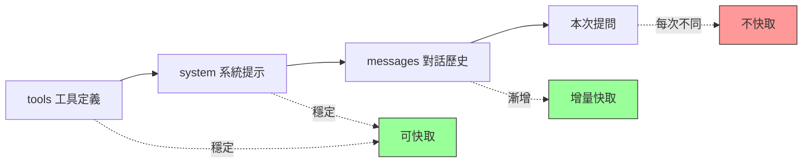
```mermaid
graph LR
    A[tools 工具定義] --> B[system 系統提示]
    B --> C[messages 對話歷史]
    C --> D[本次提問]

    A -.穩定.-> S1[可快取]
    B -.穩定.-> S1
    C -.漸增.-> S2[增量快取]
    D -.每次不同.-> S3[不快取]

    style S1 fill:#9f9,stroke:#333
    style S2 fill:#9f9,stroke:#333
    style S3 fill:#f99,stroke:#333
```

**設計原則**：把內容依「變動頻率」排序，穩定的在前、易變的在後。

| 變動頻率 | 應放位置 |
| --- | --- |
| 永不變動 | 最前方，所有斷點之前 |
| 每 Session 變動 | 全域前綴之後 |
| 每回合變動 | 最後一個斷點之後 |
| 每次請求變動（時間戳、UUID） | **應消除，或移至最尾端** |

### 13.3 斷點放置與 TTL 選擇

```python
# 自動快取：最簡單，自動標記最後一個可快取區塊
response = client.messages.create(
    model="claude-opus-5",
    max_tokens=16000,
    cache_control={"type": "ephemeral"},
    system=large_shared_context,
    messages=[{"role": "user", "content": question}],
)

# 手動斷點：對共用前綴精準控制
response = client.messages.create(
    model="claude-opus-5",
    max_tokens=16000,
    system=[{
        "type": "text",
        "text": stable_system_prompt,
        "cache_control": {"type": "ephemeral", "ttl": "1h"},
    }],
    messages=messages,
)
```

**規格限制：**

- 每個請求最多 **4 個** `cache_control` 斷點。
- 可快取的**最小前綴長度依模型而異**，低於門檻會靜默不快取（無錯誤訊息，`cache_creation_input_tokens` 為 0）：

| 模型 | 最小前綴 |
| --- | ---: |
| Claude Opus 5、Fable 5 / 5.1、Mythos 5 / 5.1 | 512 tokens |
| Claude Opus 4.8、Sonnet 5、Sonnet 4.6 / 4.5 | 1,024 tokens |
| Claude Opus 4.7 | 2,048 tokens |
| Claude Opus 4.6 / 4.5、Haiku 4.5 | 4,096 tokens |

> **這個門檻不隨世代單調遞減**。3K token 的提示在 Opus 5 與 Opus 4.8 上會快取，在 Opus 4.6 或 Haiku 4.5 上則不會——換模型時務必重新驗證。

**成本結構與損益兩平：**

| 項目 | 相對於標準輸入單價 |
| --- | --- |
| 快取讀取 | ~0.1×（Claude Fable 5.1 為 0.025×，即 $0.25/MTok） |
| 快取寫入（5 分鐘 TTL） | 1.25× |
| 快取寫入（1 小時 TTL） | 2× |

- **5 分鐘 TTL**：兩次請求即損益兩平（1.25× + 0.1× = 1.35× vs 未快取 2×）。
- **1 小時 TTL**：需三次以上請求才划算（2× + 0.2× = 2.2× vs 未快取 3×）。

**TTL 選擇準則**（依「共用前綴的請求之間，起始到起始的間隔」判斷，注意生成時間本身也計入 TTL）：

| 起始間隔 | 建議 TTL |
| --- | --- |
| 小於 5 分鐘（連續流量、回合短的 Agent Loop） | 5 分鐘——每次讀取都會刷新計時器，嚴格更便宜 |
| 5～60 分鐘（等待人工回覆、長時間生成） | 1 小時——唯一能讓 2× 寫入費划算的區間 |
| 超過 1 小時 | 兩者皆無助益——改用排程預熱，或接受冷啟動 |

### 13.4 靜默失效清單（Silent Invalidators）

以下寫法會讓快取完全失效，而且**不會報錯**。這是實務上最常見的「明明加了 cache_control 卻沒省到錢」的原因：

| 反模式 | 失效原因 |
| --- | --- |
| 系統提示中使用 `datetime.now()` / `Date.now()` | 每次請求前綴都不同 |
| 前段內容含 `uuid4()` / request ID | 同上，每次請求皆唯一 |
| `json.dumps(d)` 未加 `sort_keys=True`、或迭代 `set` | 序列化不具決定性，位元組順序不同 |
| 以 f-string 把 session / user ID 插入系統提示 | 變成每使用者一份前綴，無法跨使用者共用 |
| 條件式系統區塊（`if flag: system += ...`） | 每種旗標組合都是不同前綴 |
| `tools=build_tools(user)` 工具集依使用者變動 | 工具渲染在位置 0，全部無法快取 |
| 對話中途修改 `thinking` 或 `effort` 參數 | 一定會使 messages 快取失效 |
| 對話中途切換模型 | 快取以模型為範圍，切換即全失效 |

**驗證方法**（不要靠程式碼審查，要靠實際用量數據）：

```python
print(response.usage.cache_creation_input_tokens)  # 寫入快取的 token（~1.25×）
print(response.usage.cache_read_input_tokens)      # 自快取讀取（~0.1×）
print(response.usage.input_tokens)                 # 未快取（全額）
```

健康的 Agent Loop 特徵：`cache_read_input_tokens` 應**遠大於** `input_tokens`，而 `cache_creation_input_tokens` 應約等於「一個回合的量」，而非整段對話的量。

**Mid-conversation system messages**：當需要在對話中途下達營運指令（模式切換、注入狀態）時，不要修改頂層 `system`——那會讓整段歷史重新計費。改為在 `messages[]` 尾端附加 `{"role": "system", "content": "..."}`，快取前綴不受影響。此機制支援 Claude Opus 5、Opus 4.8、Fable 5 / 5.1、Mythos 5 / 5.1（Sonnet 5 不支援），且不需 beta header。它同時也是**防範 Prompt Injection 的正確做法**——寫在使用者訊息裡的 `<system-reminder>` 文字可被偽造，`role: "system"` 通道則否。

### 13.5 Context Editing、Compaction 與 Memory 的分工

三者經常被混為一談，但用途完全不同：

| 機制 | 動作 | 定位 | Beta 旗標 |
| --- | --- | --- | --- |
| **Context Editing** | **清除**舊的工具結果或 thinking 區塊 | Context Window 空間管理工具，**不是**省錢槓桿 | `context-management-2025-06-27` |
| **Compaction** | **摘要**先前對話後接續 | 超長 Session 的續命機制 | `compact-2026-01-12` |
| **Memory Tool** | 將狀態外存至檔案系統 | 跨 Session 的持久記憶 | 工具型別 `memory_20250818` |

```python
# Context Editing：清除舊工具結果
client.beta.messages.create(
    model="claude-opus-5",
    max_tokens=4096,
    betas=["context-management-2025-06-27"],
    context_management={"edits": [{"type": "clear_tool_uses_20250919"}]},
    tools=tools, messages=messages,
)

# Compaction：接近視窗上限時自動摘要（預設觸發門檻 150K tokens）
response = client.beta.messages.create(
    betas=["compact-2026-01-12"],
    model="claude-opus-5",
    max_tokens=16000,
    messages=messages,
    context_management={"edits": [{"type": "compact_20260112"}]},
)
# 關鍵：必須把整個 response.content 附加回 messages，
# 而不是只取文字——compaction 區塊遺失會導致狀態靜默損壞。
messages.append({"role": "assistant", "content": response.content})
```

> **重要的反直覺結論**：**Context Editing 不省錢，反而可能更貴**。每一次清除都會重寫已快取的對話內容，與 Prompt Caching 直接衝突；在官方平台文件的實測中，Context Editing 的成本高於它省下的量。正確用法是「把它當成擠出視窗空間的工具」——把觸發門檻設高，讓清除**罕見且成批**發生，而不是每回合都清。
>
> Compaction 則不同：需要 Session 長到足以觸發，在一次長時間分類任務中觸發後，帳單再降 **38%**。可用 `instructions` 字串引導摘要，確保任務關鍵狀態不被摘掉。

### 13.6 漸進式揭露：輸入側的系統性削減

研究顯示，編碼 Agent 約有 **67%～76% 的 Token 預算單純花在讀檔案上**。針對輸入側，官方建議的順序如下：

| 症狀 | 對策 | 不適用時機 |
| --- | --- | --- |
| 每個請求都塞入大型參考文件 | 移到工具或 Skill 後方，讓模型按需檢索 | 大多數請求本來就要用到整份文件 |
| 系統提示中複述工具用法 | **直接刪除**——工具 schema 本來就會渲染進請求 | — |
| 工具 schema 過多過重 | 對罕用工具設 `defer_loading: true`，搭配 Tool Search | schema 總量低於約 10K tokens 時，搜尋步驟本身就是開銷 |
| 圖片 / PDF 以原解析度送入 | 預先降採樣。視覺輸入依像素面積計費，約每 28×28 patch 一個 token；1280×720 約 1,200 tokens | — |
| 大型表格內嵌於提示 | Files API + Code Execution，讓運算在沙箱完成，只有答案進入 Context | 沒有可抽取或計算的內容時，沙箱往返反而增加 token |
| 串接式工具呼叫，中間結果無用 | Programmatic Tool Calling，由程式碼執行呼叫，只有過濾後結果進入 Context（官方文件報告：Agentic 搜尋基準上**輸入 token 減少 24%** 且分數更高） | — |
| 廣泛傾倒型工具 | 改為窄口徑存取器（`get_policy(claim_id)` 優於 `get_all_policies()`），並為列表工具加上 `limit` / `fields` / `date_range` | — |
| 使用者輸入無長度上限 | 以 `count_tokens` 作為入口閘門，先計數再截斷、摘要或轉走 Files API | — |

> **全節共通警語**：**更小的前綴不等於更便宜的任務**。把內容延後載入，代表模型可能要多花幾個回合去探索原本內嵌就能讀到的資訊。任何漸進式揭露的改動，都必須用 Eval 驗證「每個完成任務的成本」，而不是只看單次請求的 token 數。

### 13.7 Effort、Task Budget 與 max_tokens

這三者常被混用，但只有前兩者是有效的成本槓桿：

**`max_tokens` 是保險絲，不是調節鈕。** 模型看不到這個值；撞上限只會讓輸出被攔腰截斷（`stop_reason: "max_tokens"`）。官方編碼實測中，16,384 的上限終結了 Claude Opus 5 約 15%、Claude Fable 5 約三分之一的嘗試，且**這些被截斷的嘗試沒有任何一個是解決成功的**——省下的錢換來等比例減少的成功數，每個完成任務的成本毫無改善。Agentic 工作建議設為 64,000（`xhigh` / `max` effort 時設 128,000）並使用串流。

**`effort` 是第一個真正的品質—成本取捨槓桿**（`low` / `medium` / `high` / `xhigh` / `max`，位於 `output_config` 內）。實測差異依工作型態而定：

| 工作型態 | 實測結果 |
| --- | --- |
| 研究與知識工作 | 曲線幾乎平坦——`low` 僅失去 1～3 分，成本降至 1/2～2/3；`medium` 準確率與預設相同，成本為 70%～85% |
| 長週期編碼 | 真實取捨——Claude Opus 5 在 `medium` 約失去 2 分、成本減半；`low` 約失去 8 分、成本降至 1/4 |
| 推理天花板型工作 | 每一階 effort 約換得 2.4 分——此曲線上沒有免費的削減 |

**「失敗才重跑」策略**（適用於有自動判定訊號的工作，如測試、驗證器）：全部先用 `low` 跑，失敗的再用預設 effort 重跑。官方編碼實測：約 93% 通過率、每任務約 $0.70；全部用預設 effort 則為 91.7%、每任務 $1.39——**相同通過率、成本減半**（已計入失敗的廉價嘗試）。

**Task Budget**（模型看得見預算並自我調配步調，這才是能省錢的預算控制）：

```python
with client.beta.messages.stream(
    model="claude-opus-5",
    max_tokens=128000,
    output_config={
        "effort": "high",
        "task_budget": {"type": "tokens", "total": 64000},
    },
    betas=["task-budgets-2026-03-13"],
    messages=messages, tools=tools,
) as stream:
    response = stream.get_final_message()
```

最低 `total` 為 20,000 tokens。實測：寬鬆預算約失去 2.7 分通過率、省 18%；最緊預算失去 4.4 分、省 47%。建議由 Loop 的 90 百分位用量設定後再逐步收緊，並在第一次請求就設定完成——中途修改會使快取失效。

### 13.8 Batch API 與精準計量

**Batch API：全部 token 五折，包含快取讀取與寫入——折扣可疊加。** 這是繼快取之後第二大的「免費槓桿」，適用於無人等待的 Agent 工作：評估執行、資料回補、排程作業。結果在 24 小時內非同步返回（此為到期時限，非 SLA），面向使用者的工作仍應同步處理。

**Token 計量必須用 `count_tokens`，不可使用 `tiktoken`：**

```python
resp = client.messages.count_tokens(
    model="claude-opus-5",
    messages=[{"role": "user", "content": open("CLAUDE.md", encoding="utf-8").read()}],
)
print(resp.input_tokens)
```

> **關鍵警告**：`tiktoken` 是 OpenAI 的 tokenizer。用它估算 Claude 的 token，在一般文字上**低估約 15%～20%**，在程式碼或非英文輸入上偏差更大。企業成本模型若建立在錯誤的 tokenizer 上，所有預算推估都會系統性偏低。附錄 A 的估算速查表僅適用於粗略規劃，正式預算須以 `count_tokens` 實測。

**Prompt 老化也是成本**：為舊模型撰寫的提示會讓新模型過度工作。官方在一項客服評估中量測：為 Claude Opus 4.8 撰寫的提示，在 Claude Opus 5 上**每張工單貴 36%** 且準確率毫無改變；經過稽核調整後，同樣的提示反而**便宜 14%**。這代表 Prompt 需要納入定期審查週期，而非一次寫完就永久沿用。

### 13.9 三大廠商快取機制比較

> 以下為 2026 年 9 月的公開資料整理。Anthropic 欄位依官方文件；OpenAI 與 Google 欄位依各家公開定價頁與業界彙整，導入前請以官方頁面複核。

| 項目 | Anthropic Claude | OpenAI | Google Gemini |
| --- | --- | --- | --- |
| 啟用方式 | **顯式**（`cache_control` 斷點） | **全自動**，無需改碼 | 隱式自動 + 顯式（Explicit Caching） |
| 快取讀取折扣 | ~90%（0.1× 標準輸入） | ~90% | 隱式 ~90%；顯式約 75% |
| 寫入費用 | 1.25×（5 分鐘）／ 2×（1 小時） | 歷來無寫入附加費；據報導 GPT-5.6 起加入 1.25× 寫入費 | 顯式快取另計每小時儲存費 |
| 最小可快取長度 | 512～4,096 tokens（依模型） | 1,024 tokens | 顯式快取約 32K tokens |
| 保留時間 | 5 分鐘／1 小時 TTL（讀取可刷新） | 延長保留最長 24 小時（gpt-5.5 起預設，無額外費用） | 依設定的 TTL 與儲存費 |
| 儲存費 | 無（僅寫入倍率） | 無 | 有（如 Gemini 3.8 Flash $0.50／百萬 token／小時；Gemini 2.5 Pro $4.50） |

**企業選型意涵：**

1. **Anthropic** 需要主動設計提示結構，但控制權最完整、無儲存費，適合前綴穩定的 Agent Loop。
2. **OpenAI** 零設定成本最低，但也因為自動化而較難精準控制哪些內容被快取。
3. **Google** 顯式快取有 32K 最小門檻與**按小時計費的儲存費**——若快取內容大但使用頻率低，儲存費可能吃掉折扣，須先做損益試算。

**跨廠商共通結論**：三大廠商在 2026 年都把快取命中定價在標準輸入費率的約十分之一。這意味著——**對任何前綴會重複的生產環境工作負載，「不啟用快取」已經不再是可辯護的預設值。**

---

## 第十四章 SSDLC 如何減少 Token

SSDLC（Secure Software Development Life Cycle）的每個階段都存在 Token 浪費的機會點，也都有對應的優化策略。

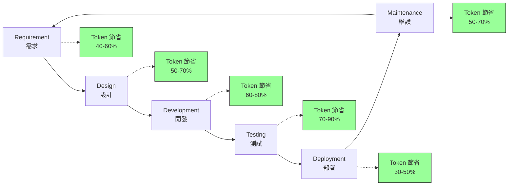
```mermaid
graph LR
    A[Requirement<br/>需求] --> B[Design<br/>設計]
    B --> C[Development<br/>開發]
    C --> D[Testing<br/>測試]
    D --> E[Deployment<br/>部署]
    E --> F[Maintenance<br/>維護]
    F --> A
    
    A -.-> A1[Token 節省<br/>40-60%]
    B -.-> B1[Token 節省<br/>50-70%]
    C -.-> C1[Token 節省<br/>60-80%]
    D -.-> D1[Token 節省<br/>70-90%]
    E -.-> E1[Token 節省<br/>30-50%]
    F -.-> F1[Token 節省<br/>50-70%]
    
    style A1 fill:#9f9,stroke:#333
    style B1 fill:#9f9,stroke:#333
    style C1 fill:#9f9,stroke:#333
    style D1 fill:#9f9,stroke:#333
    style E1 fill:#9f9,stroke:#333
    style F1 fill:#9f9,stroke:#333
```

### 14.1 Requirement 階段

**Token 浪費點：**

- 反覆向 AI 描述業務背景
- 每次 User Story 拆分都要重新說明系統全貌
- 需求文件格式不一致，AI 需要額外理解

**Token 優化方式：**

- 建立 `requirements-memory.md`，包含系統業務背景、術語表、使用者角色
- 使用標準化 User Story 模板，減少 AI 理解成本
- 將需求 Backlog 結構化為 YAML/JSON 格式

**Prompt 優化範例：**

```markdown
❌ 原始 Prompt（~800 tokens）：
"我們是一家銀行，有一個核心系統，用 Java 寫的，有客戶管理、
帳戶管理、交易處理等模組。現在客戶提出要增加一個新功能，
就是在轉帳的時候可以設定定期轉帳，每個月自動轉帳。
請幫我分析這個需求，寫出 User Story..."

✅ 優化 Prompt（~200 tokens）：
"參考 requirements-memory.md 中的系統背景。
新需求：帳戶模組新增定期轉帳功能。
請產出 User Story（Acceptance Criteria + Edge Cases）。"
```

### 14.2 Design 階段

**Token 浪費點：**

- 要求 AI 從頭設計架構，未提供現有架構資訊
- 多次迭代設計方案，每次都重新描述約束條件
- 設計決策未記錄，後續開發階段重複討論

**Token 優化方式：**

- 建立 `architecture-memory.md`，記錄系統架構、技術選型、設計約束
- 將 ADR（Architecture Decision Record）存檔供 AI 參考
- 使用 Knowledge Graph 提供模組關係圖

**Prompt 優化範例：**

```markdown
❌ 原始 Prompt（~1,200 tokens）：
"我們的系統使用 Clean Architecture，分為 controller、service、
repository 三層。目前的 UserService 有 45 個方法，
UserController 有 30 個 API。我們使用 Spring Boot 3.4，
資料庫是 Oracle 19c。現在要設計一個新的通知模組，
需要支援 Email、SMS、Push 三種通知方式..."

✅ 優化 Prompt（~300 tokens）：
"參考 architecture-memory.md。
設計新模組：NotificationService。
需求：支援 Email/SMS/Push，使用 Strategy Pattern。
約束：符合現有 Clean Architecture，整合 Kafka。
請產出 Class Diagram + Sequence Diagram。"
```

### 14.3 Development 階段

**Token 浪費點：**

- Agent 搜尋大量檔案尋找程式碼範例
- 重複生成相似的 CRUD 程式碼
- 未使用 Coding Standard Memory，每次都要求特定程式碼風格

**Token 優化方式：**

- 建立 `coding-standards.md`，記錄命名慣例、程式碼模板、錯誤處理方式
- 提供相關模組的 Knowledge Graph 節點，而非完整檔案
- 使用 Sub Agent 進行範圍限定的任務

**Prompt 優化範例：**

```markdown
❌ 原始 Prompt（~2,000 tokens）：
"請參考 UserController.java、UserService.java、
UserRepository.java 的寫法，幫我新增一個 
NotificationController、NotificationService、
NotificationRepository..."
[附上三個完整檔案的程式碼]

✅ 優化 Prompt（~400 tokens）：
"參考 coding-standards.md 中的 Controller/Service/Repository 模板。
新增 Notification 模組的三層架構。
Entity 欄位：id, userId, type, content, status, createdAt。
API：POST /notifications, GET /notifications/{id}, 
     PUT /notifications/{id}/read。"
```

### 14.4 Testing 階段

**Token 浪費點：**

- 讓 AI 讀取完整的被測試類別來撰寫測試
- 測試失敗時貼入完整的測試報告
- 重複描述測試框架和工具配置

**Token 優化方式：**

- 提供方法簽名與 JavaDoc 即可生成測試，無需完整實作
- 僅提供失敗的測試案例和相關 Stack Trace
- 建立 `testing-standards.md` 記錄測試慣例

**Prompt 優化範例：**

```markdown
❌ 原始 Prompt（~3,000 tokens）：
[貼入完整的 UserService.java 300 行]
"請為上述所有 public method 撰寫 JUnit 5 測試"

✅ 優化 Prompt（~600 tokens）：
"為以下方法撰寫 JUnit 5 + Mockito 測試：
- UserService.createUser(CreateUserDTO): User
  - 驗證必填欄位、Email 格式、重複帳號
- UserService.updateUser(Long, UpdateUserDTO): User
  - 驗證使用者存在、權限檢查
參考 testing-standards.md 的測試命名慣例。"
```

### 14.5 Deployment 階段

**Token 浪費點：**

- 每次部署問題排查都重新描述環境配置
- CI/CD Pipeline 日誌全量傳給 AI 分析
- 容器配置與基礎設施即程式碼的重複說明

**Token 優化方式：**

- 建立 `deployment-memory.md` 記錄環境配置、部署流程
- 僅擷取 Pipeline 的錯誤段落
- 使用 RTK 思維壓縮部署日誌

### 14.6 Maintenance 階段

**Token 浪費點：**

- 問題排查時讀取大量日誌
- 效能調校時分析大量 Metrics
- 每次 On-Call 事件都要重新理解系統架構

**Token 優化方式：**

- 建立 `ops-runbook.md` 記錄常見問題與解決方案
- 日誌分析使用 RTK 思維，僅提供關鍵片段
- Knowledge Graph 加速系統理解

> **SSDLC Token 優化的關鍵**：每個階段的共通策略是「建立 Memory 檔案」。前期投入的 Memory 建構成本會在後續所有對話中持續產生 Token 節省效益。

---

## 第十五章 Agent Team 如何節省 Token

### 15.1 Agent Team 架構

Agent Team 是指多個專職 AI Agent 協作完成軟體開發任務的模式。相較於單一 Agent 處理所有事務，Agent Team 讓每個 Agent 專注於特定領域，從而減少每個 Agent 需要載入的上下文量。

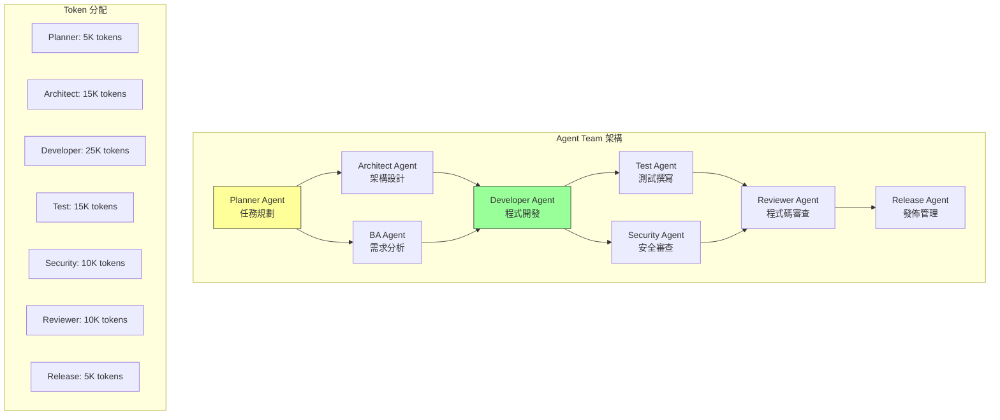
```mermaid
graph TB
    subgraph "Agent Team 架構"
        P[Planner Agent<br/>任務規劃] --> A[Architect Agent<br/>架構設計]
        P --> BA[BA Agent<br/>需求分析]
        A --> D[Developer Agent<br/>程式開發]
        BA --> D
        D --> T[Test Agent<br/>測試撰寫]
        D --> S[Security Agent<br/>安全審查]
        T --> R[Reviewer Agent<br/>程式碼審查]
        S --> R
        R --> RE[Release Agent<br/>發佈管理]
    end
    
    subgraph "Token 分配"
        P1[Planner: 5K tokens]
        A1[Architect: 15K tokens]
        D1[Developer: 25K tokens]
        T1[Test: 15K tokens]
        S1[Security: 10K tokens]
        R1[Reviewer: 10K tokens]
        RE1[Release: 5K tokens]
    end
    
    style P fill:#ff9,stroke:#333
    style D fill:#9f9,stroke:#333
```

### 15.2 各 Agent 職責與 Token 策略

| Agent | 職責 | Context 需求 | Token 策略 |
| --- | --- | --- | --- |
| **Planner Agent** | 任務拆分、優先排序 | 需求文件、架構概覽 | 僅載入 Memory 檔案，不讀原始碼 |
| **Architect Agent** | 架構設計、技術選型 | 架構圖、技術約束 | 載入 Knowledge Graph 架構節點 |
| **BA Agent** | 需求分析、User Story | 業務規則、使用者流程 | 載入 Requirement Memory |
| **Developer Agent** | 程式碼實作 | 相關模組程式碼、Coding Standard | 僅載入目標模組 + 介面定義 |
| **Test Agent** | 測試案例撰寫 | 方法簽名、業務規則 | 僅載入方法簽名，不讀完整實作 |
| **Security Agent** | 安全漏洞掃描 | OWASP 規則、敏感操作 | 僅載入安全相關程式碼路徑 |
| **Reviewer Agent** | Code Review | 變更差異、品質標準 | 僅載入 diff + Coding Standard |
| **Release Agent** | 發佈管理 | 版本資訊、Changelog | 僅載入版本記錄 |
| **Reverse Engineering Agent** | 遺留系統分析 | Architecture Graph | 載入 Knowledge Graph |
| **Doc Writer Agent** | 文件撰寫 | 程式碼摘要、API 規格 | 載入圖譜節點摘要 |

### 15.3 單 Agent VS 多 Agent 比較

| 比較維度 | 單 Agent 模式 | 多 Agent（Agent Team）模式 |
| --- | --- | --- |
| **Context 載入** | 載入所有相關資訊（100K+ tokens） | 每個 Agent 僅載入專職資訊（5-25K tokens） |
| **單次任務 Token** | 100K-300K tokens | 總計 80K-120K tokens |
| **Context 溢出風險** | 高（單一 Context Window 承載所有） | 低（任務分散在多個 Context Window） |
| **回覆品質** | 中等（注意力分散） | 高（每個 Agent 專注） |
| **執行速度** | 慢（串行處理所有子任務） | 快（可並行執行） |
| **錯誤回復** | 需重新執行整個任務 | 僅需重新執行失敗的 Agent |
| **Token 節省** | 基準線 | **節省 40-60%** |

**Token 節省原理：**

```text
單 Agent 模式：
- 需求分析 → 讀取需求文件 + 架構圖 + 程式碼 + 測試 = 150K tokens
- 所有資訊塞入同一個 Context Window
- Context 越來越大，後期對話每次都傳送完整歷史

多 Agent 模式：
- Planner Agent → 讀取需求文件（5K tokens）→ 產出任務清單
- Architect Agent → 讀取架構圖 + 任務清單（15K tokens）→ 產出設計
- Developer Agent → 讀取設計 + 相關程式碼（25K tokens）→ 產出程式碼
- Test Agent → 讀取方法簽名 + 設計（15K tokens）→ 產出測試
- 總計：60K tokens（節省 60%）
```

> **Agent Team 的核心價值**：不僅是 Token 節省，更重要的是**權責分離**。每個 Agent 有明確的輸入/輸出契約，降低了上下文污染的風險，提高了 AI 回覆的精準度。

---

## 第十六章 大型 Web Application 開發策略

### 16.1 建立 System Knowledge Base

對於大型 Web Application（Spring Boot + Vue/Angular/React + Oracle/DB2/PostgreSQL），在 AI 協助開發前建立 System Knowledge Base 是減少 Token 的最有效前期投資。

**System Knowledge Base 結構：**

```text
.ai/
├── architecture-memory.md      # 系統架構、模組關係、技術棧
├── coding-standards.md         # 編碼規範、命名慣例、程式碼模板
├── api-memory.md              # API 清單、介面定義、資料格式
├── db-memory.md               # 資料庫 Schema、關聯、索引策略
├── business-rules.md          # 業務規則、領域術語、流程定義
├── deployment-memory.md       # 環境配置、部署流程、基礎設施
└── knowledge-graph/
    ├── graph.json             # Graphify 產出的圖譜資料
    └── GRAPH_REPORT.md        # 圖譜摘要報告
```

### 16.2 五大 Memory 層

**Architecture Memory（架構記憶）**

記錄系統整體架構，讓 AI 不需要每次都重新理解系統結構：

```markdown
# Architecture Memory

## 技術棧
- Backend: Spring Boot 3.4, Java 21, Maven
- Frontend: Vue 3.5, TypeScript, Vite
- Database: Oracle 19c (主庫), Redis 7 (快取)
- MQ: IBM MQ 9.3
- Auth: SSO + JWT

## 模組架構
- gateway-service: API Gateway, 路由、限流
- user-service: 使用者管理, 認證授權
- account-service: 帳戶管理, 餘額查詢
- transaction-service: 交易處理, 轉帳
- notification-service: 通知服務, Email/SMS
- batch-service: 批次作業, 日終結算

## 分層架構
Controller → Service → Repository → Database
           ↗ DTO/VO     ↗ Entity
```

**Coding Standard Memory（編碼規範記憶）**

```markdown
# Coding Standards

## Controller 模板
- 使用 @RestController + @RequestMapping
- 方法命名：動詞 + 名詞（createUser, getAccount）
- 回傳統一使用 ResponseEntity<ApiResponse<T>>
- 使用 @Valid 進行參數驗證

## Service 模板
- 使用 @Service + @Transactional
- 方法不超過 30 行
- 複雜邏輯拆分為 private method
- 使用 Optional 處理可能為 null 的回傳值

## 例外處理
- 業務例外使用 BusinessException(ErrorCode)
- 統一由 GlobalExceptionHandler 處理
- 不允許 catch 後吞掉例外
```

**API Memory（API 記憶）**

```markdown
# API Memory

## User API
| Method | Path | 說明 | Auth |
|--------|------|------|------|
| POST | /api/v1/users | 建立使用者 | ADMIN |
| GET | /api/v1/users/{id} | 查詢使用者 | USER |
| PUT | /api/v1/users/{id} | 更新使用者 | USER |
| DELETE | /api/v1/users/{id} | 停用使用者 | ADMIN |
```

**DB Memory（資料庫記憶）**

```markdown
# Database Memory

## 核心資料表
| Table | 說明 | 主要欄位 | 索引 |
|-------|------|---------|------|
| T_USER | 使用者 | user_id, name, email | PK, UK_email |
| T_ACCOUNT | 帳戶 | account_id, user_id, balance | PK, FK_user |
| T_TRANSACTION | 交易 | tx_id, from_acct, to_acct, amount | PK, IDX_date |
```

**Business Rules Memory（業務規則記憶）**

```markdown
# Business Rules

## 轉帳規則
- 單筆限額：500 萬
- 日累計限額：2,000 萬
- 跨行轉帳需雙重驗證
- 帳戶餘額不可為負
- 交易記錄保留 7 年
```

### 16.3 Token 節省實務

**建立 Memory 前後對比：**

| 開發任務 | 無 Memory（Token） | 有 Memory（Token） | 節省 |
| --- | --- | --- | --- |
| 新增一個 API | 80K | 15K | 81% |
| 修復 Bug | 120K | 25K | 79% |
| Code Review | 60K | 12K | 80% |
| 撰寫測試 | 90K | 18K | 80% |
| 架構設計 | 150K | 30K | 80% |

> **實務建議**：建立 System Knowledge Base 的時間投資約 4-8 小時，但可以為後續每個開發任務節省 60-80% 的 Token。對於 6 個月以上的專案，ROI 非常顯著。

---

## 第十七章 Framework Upgrade 策略

### 17.1 升級場景分析

Framework 升級是 Token 消耗最密集的場景之一，因為需要理解大量的 Breaking Changes、API 變更與相依性影響。以下是典型的升級場景分析：

**Spring Boot 2 → Spring Boot 4**

| 升級項目 | 影響範圍 | 典型變更數 |
| --- | --- | --- |
| Jakarta EE namespace | 所有 javax.* import | 200-500 個檔案 |
| Spring Security 配置 | SecurityConfig | 5-15 個檔案 |
| 資料存取層 | Repository/JPA 變更 | 30-80 個檔案 |
| Actuator 端點 | 監控配置 | 3-10 個檔案 |
| Properties 變更 | application.yml | 5-20 個設定項 |

**Java 17 → Java 25**

| 升級項目 | 影響範圍 | 典型變更數 |
| --- | --- | --- |
| Record 替換 POJO | DTO/VO 類別 | 50-200 個檔案 |
| Pattern Matching | instanceof 檢查 | 30-100 處 |
| Sealed Classes | 繼承階層 | 10-30 個類別 |
| Virtual Threads | 執行緒管理 | 5-20 處 |
| 已棄用 API 移除 | 各種 | 20-100 處 |

**Vue 2 → Vue 3**

| 升級項目 | 影響範圍 | 典型變更數 |
| --- | --- | --- |
| Composition API | 所有 Component | 100-400 個檔案 |
| Vuex → Pinia | 狀態管理 | 20-50 個檔案 |
| Vue Router 4 | 路由配置 | 10-30 個檔案 |
| Template 語法變更 | v-model、事件 | 50-200 處 |
| Build 工具遷移 | Webpack → Vite | 5-15 個配置檔 |

**Angular 12 → Angular 20**

| 升級項目 | 影響範圍 | 典型變更數 |
| --- | --- | --- |
| Standalone Components | 所有 Module 宣告 | 100-300 個檔案 |
| Signals | RxJS 替換 | 50-200 處 |
| Control Flow (@if/@for) | Template 語法 | 100-500 處 |
| Router 變更 | 路由配置 | 10-30 個檔案 |
| HttpClient 變更 | HTTP 呼叫 | 30-100 處 |

### 17.2 Migration Knowledge Graph

建立 Migration Knowledge Graph 是降低升級 Token 消耗的核心策略。此圖譜記錄了「哪些程式碼需要改」、「改什麼」、「改的順序」，讓 AI 不需要每次都重新分析整個專案。

**Migration Knowledge Graph 結構：**

```markdown
# Migration Knowledge Graph

## 1. Breaking Changes Registry
| 變更 ID | 類型 | 描述 | 影響檔案 | 優先序 |
|---------|------|------|---------|--------|
| BC-001 | Namespace | javax.* → jakarta.* | 450 個檔案 | P1 |
| BC-002 | Security | WebSecurityConfigurerAdapter 移除 | 3 個檔案 | P1 |
| BC-003 | JPA | Query 語法變更 | 25 個檔案 | P2 |

## 2. Dependency Impact Map
spring-boot-starter-web → 影響 Controller 層
spring-boot-starter-data-jpa → 影響 Repository 層
spring-boot-starter-security → 影響 Security 配置

## 3. Migration Order
Phase 1: 基礎設施（pom.xml, 配置檔）
Phase 2: Namespace 遷移（全域 javax → jakarta）
Phase 3: Security 配置重寫
Phase 4: 資料存取層調整
Phase 5: 測試修復
Phase 6: 效能驗證
```

**Token 節省效果：**

```text
無 Migration Graph 的升級流程：
  每個檔案修改前 → AI 需分析 Breaking Changes 清單 + 讀取完整檔案
  450 個檔案 × (分析 5K + 讀取 3K) = 3.6M tokens

有 Migration Graph 的升級流程：
  每個檔案修改前 → AI 查詢 Graph 取得變更清單 + 僅讀取相關方法
  450 個檔案 × (查詢 0.5K + 讀取 0.5K) = 450K tokens
  
  節省：87.5%
```

### 17.3 避免重複分析的策略

**策略一：建立升級 Checklist 記憶檔**

```markdown
# Spring Boot Migration Checklist

## 已完成
- [x] pom.xml: Spring Boot 2.7.x → 4.0.x
- [x] javax.servlet → jakarta.servlet（450 個檔案）
- [x] SecurityConfig 重寫

## 進行中  
- [ ] Repository 層 JPA 調整（25 個檔案，已完成 10 個）

## 待處理
- [ ] Actuator 端點遷移
- [ ] 測試修復
```

**策略二：批次處理同類型變更**

```text
❌ 逐檔詢問："請將 UserController.java 中的 javax 改為 jakarta"
   → 每次都要描述變更規則 → 450 次 × 1K tokens = 450K tokens

✅ 批次處理："請將以下 10 個 Controller 中的 javax.servlet 改為 
   jakarta.servlet（僅需修改 import 區段）：
   [10 個檔案的 import 區段]"
   → 45 次 × 3K tokens = 135K tokens
   → 節省 70%
```

**策略三：使用 AI 生成遷移腳本**

```text
最高效策略：讓 AI 生成一次性的遷移腳本
→ AI 消耗 10K tokens 生成 sed/awk 腳本
→ 腳本自動處理 450 個檔案的 namespace 遷移
→ 總 Token 消耗僅 10K（vs 原始 3.6M）
→ 節省 99.7%
```

> **Framework Upgrade 的黃金法則**：先花 1 小時建立 Migration Knowledge Graph，再花 30 分鐘讓 AI 生成自動化遷移腳本。能用腳本自動化的變更，絕不逐檔讓 AI 手動修改。

---

## 第十八章 Reverse Engineering 策略

### 18.1 Legacy System 盤點

Reverse Engineering（逆向工程）是企業 AI 開發中 Token 消耗最高的場景之一。Legacy System 通常缺乏文件，程式碼風格混亂，AI 需要大量閱讀才能理解系統結構。

**典型 Legacy System 技術棧：**

| 技術 | 挑戰 | Token 影響 |
| --- | --- | --- |
| **JSP** | 混合 HTML/Java/CSS/JS | 每個檔案 Token 消耗是純 Java 的 3-5 倍 |
| **Struts** | 複雜的 XML 配置 | struts-config.xml 單檔可達 10K+ tokens |
| **EJB** | 大量 Boilerplate | Home/Remote Interface 重複定義 |
| **Lotus Notes** | 專有 Formula 語言 | AI 訓練資料不足，需大量範例 |
| **COBOL** | 固定格式、大量 COPYBOOK | 每行 Token 效率低 |

### 18.2 四層 Graph 架構

為 Legacy System 建立四層 Graph 是降低 Reverse Engineering Token 消耗的關鍵：

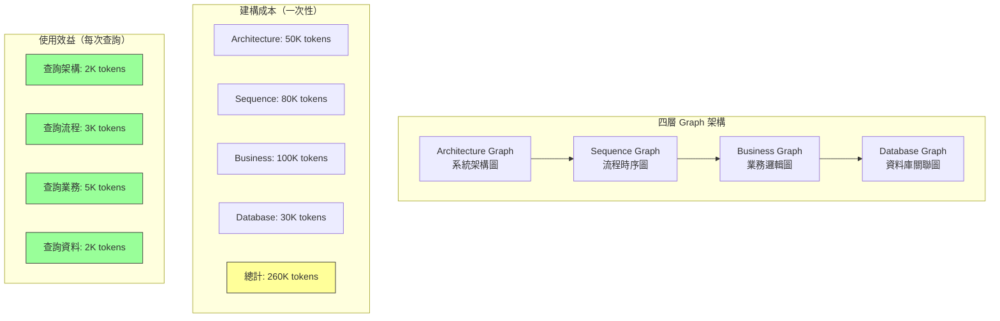
```mermaid
graph TB
    subgraph "四層 Graph 架構"
        A[Architecture Graph<br/>系統架構圖] --> B[Sequence Graph<br/>流程時序圖]
        B --> C[Business Graph<br/>業務邏輯圖]
        C --> D[Database Graph<br/>資料庫關聯圖]
    end
    
    subgraph "建構成本（一次性）"
        A1[Architecture: 50K tokens]
        B1[Sequence: 80K tokens]
        C1[Business: 100K tokens]
        D1[Database: 30K tokens]
        E1[總計: 260K tokens]
    end
    
    subgraph "使用效益（每次查詢）"
        A2[查詢架構: 2K tokens]
        B2[查詢流程: 3K tokens]
        C2[查詢業務: 5K tokens]
        D2[查詢資料: 2K tokens]
    end
    
    style E1 fill:#ff9,stroke:#333
    style A2 fill:#9f9,stroke:#333
    style B2 fill:#9f9,stroke:#333
    style C2 fill:#9f9,stroke:#333
    style D2 fill:#9f9,stroke:#333
```

**Architecture Graph（系統架構圖）**

記錄系統的模組組成、部署架構、技術元件：

```markdown
# Architecture Graph - Legacy Banking System

## 模組清單
- WebTier: JSP 2.3 + Struts 1.3 (IBM WAS 9.0)
- BusinessTier: EJB 3.1 + Spring 4.3
- DataTier: JDBC + MyBatis 3.4
- Database: DB2 11.5 + Oracle 19c
- MQ: IBM MQ 9.2
- Batch: Spring Batch 4.3

## 模組相依性
WebTier → BusinessTier → DataTier → DB2/Oracle
WebTier → MQ (非同步通知)
Batch → DataTier → DB2 (日終結算)
```

**Sequence Graph（流程時序圖）**

記錄關鍵業務流程的呼叫順序：

```markdown
# Sequence: 轉帳流程
1. TransferAction (Struts) → 接收表單
2. TransferValidator → 參數驗證
3. TransferService (EJB) → 業務邏輯
4. AccountDAO → 查詢餘額 (DB2)
5. TransactionDAO → 建立交易記錄 (DB2)
6. AccountDAO → 更新餘額 (DB2)
7. MQSender → 發送通知 (IBM MQ)
8. AuditService → 寫入稽核日誌 (Oracle)
```

**Business Graph（業務邏輯圖）**

記錄業務規則與領域概念：

```markdown
# Business Rules: 轉帳
- 單筆限額：依客戶等級 (A: 1000萬, B: 500萬, C: 100萬)
- 跨行轉帳：需經 FISC 清算
- 即時轉帳：金額 < 5萬免手續費
- 預約轉帳：T+1 日執行
- 反洗錢：單日累計 > 50萬需通報
```

**Database Graph（資料庫關聯圖）**

記錄資料表結構與關聯：

```markdown
# Database Schema
T_CUSTOMER (customer_id PK) 
  → T_ACCOUNT (account_id PK, customer_id FK)
    → T_TRANSACTION (tx_id PK, from_account FK, to_account FK)
    → T_BALANCE_HISTORY (balance_id PK, account_id FK)
  → T_CUSTOMER_GRADE (grade_id PK, customer_id FK)
```

### 18.3 降低 Token 方法

**方法一：先建圖再分析**

```text
❌ 直接分析：讓 AI 讀取 500 個 JSP + 300 個 Java + 50 個 XML
   → 3-5M tokens，AI 仍然無法完全理解

✅ 先建圖：
   Step 1: 使用 Graphify 建立 Code Graph（零 AI Token）
   Step 2: 讓 AI 閱讀 GRAPH_REPORT.md（10K tokens）
   Step 3: AI 針對特定流程查詢 Graph（每次 2-5K tokens）
   → 總計 50K tokens，理解品質更高
```

**方法二：分層理解**

```text
❌ 一次理解全部："請分析這個 Legacy System 的完整架構"
   → AI 嘗試讀取所有檔案 → 溢出

✅ 分層理解：
   Step 1: "根據 architecture-graph.md，描述系統的模組組成"（5K tokens）
   Step 2: "根據 sequence-graph.md，描述轉帳流程"（5K tokens）
   Step 3: "根據 business-graph.md，描述轉帳業務規則"（5K tokens）
   Step 4: "根據 database-graph.md，描述相關資料表"（5K tokens）
   → 總計 20K tokens，逐層深入理解
```

**方法三：漸進式 Graph 建構**

不需要一次性為整個 Legacy System 建立完整圖譜。根據當前工作需求，逐步擴展圖譜：

```text
Week 1: 建立核心模組的 Architecture Graph
Week 2: 補充當前開發涉及的 Sequence Graph
Week 3: 補充業務規則 Business Graph
Week 4: 補充資料庫 Database Graph
...持續擴展
```

> **Reverse Engineering 的核心策略**：Legacy System 的程式碼品質通常較低，Token 效率也較差。建立四層 Graph 架構可將 AI 的理解從「逐行閱讀」轉變為「結構化查詢」，在大型遺留系統中可降低 90%+ 的 Token 消耗。

---

## 第十九章 Prompt Engineering 節省 Token 技巧

本章提供 50+ 個 Prompt 範例，分為 9 個類別，每個範例包含原始 Prompt、優化 Prompt 與 Token 節省比例。

### 19.1 架構分析 Prompt

**範例 1：系統架構分析**

```text
❌ 原始 Prompt（~1,500 tokens）：
"我們有一個大型的企業級 Web Application，使用 Spring Boot 3.4 
作為後端框架，前端使用 Vue 3.5 搭配 TypeScript 和 Tailwind CSS。
資料庫是 Oracle 19c，快取用 Redis 7，訊息佇列用 Kafka 3.6。
整個系統有 800 個 Java 檔案，400 個 Vue 檔案，50 個 API 控制器...
[持續描述 500 字]
請分析這個系統的架構是否有改善空間。"

✅ 優化 Prompt（~200 tokens）：
"參考 architecture-memory.md。
請分析現有架構的改善空間，聚焦：
1. 耦合度
2. 擴展性
3. 效能瓶頸
輸出格式：問題 + 建議 + 優先序。"

💰 節省：86%
```

**範例 2：模組相依性分析**

```text
❌ 原始 Prompt（~2,000 tokens）：
[貼入 10 個 Service 檔案的 import 區段]
"請分析這些服務之間的相依性，找出循環依賴..."

✅ 優化 Prompt（~300 tokens）：
"參考 Knowledge Graph 的 dependency 節點。
找出 user-service、account-service、transaction-service 
之間的循環依賴，並建議解耦方案。"

💰 節省：85%
```

**範例 3：API 設計審查**

```text
❌ 原始 Prompt（~1,800 tokens）：
[貼入完整的 Controller 檔案]
"請審查這些 API 的設計是否符合 RESTful 最佳實務..."

✅ 優化 Prompt（~250 tokens）：
"審查以下 API 端點的 RESTful 設計：
POST /api/users/create → 應改為？
GET /api/users/getAll → 應改為？
PUT /api/users/updateById/{id} → 應改為？
DELETE /api/users/deleteUser/{id} → 應改為？
請提供修正建議與理由。"

💰 節省：86%
```

**範例 4：效能瓶頸分析**

```text
❌ 原始 Prompt（~3,000 tokens）：
[貼入完整的 Service + Repository + SQL]
"這個查詢很慢，請幫我優化..."

✅ 優化 Prompt（~400 tokens）：
"以下 SQL 在 Oracle 19c 上執行耗時 15 秒（資料量 500 萬筆）：
SELECT * FROM T_TRANSACTION 
WHERE customer_id = ? AND tx_date BETWEEN ? AND ?
ORDER BY tx_date DESC

現有索引：PK(tx_id), IDX_DATE(tx_date)
請提供優化建議：索引、SQL 改寫、分頁策略。"

💰 節省：87%
```

**範例 5：微服務拆分建議**

```text
❌ 原始 Prompt（~2,500 tokens）：
[貼入 Monolith 的模組結構 + 多個 Service 檔案]
"請建議如何將這個 Monolith 拆分為微服務..."

✅ 優化 Prompt（~350 tokens）：
"參考 architecture-memory.md 的模組架構。
目標：將 Monolith 拆分為微服務。
約束：每個服務 < 50 個 API，獨立資料庫。
請建議：拆分邊界、服務清單、通訊方式（REST/gRPC/Kafka）。"

💰 節省：86%
```

**範例 6：技術債評估**

```text
❌ 原始 Prompt（~2,000 tokens）：
[貼入多個老舊類別的程式碼]
"請評估這些程式碼的技術債..."

✅ 優化 Prompt（~300 tokens）：
"根據 GRAPH_REPORT.md 中的程式碼品質指標，
評估以下模組的技術債（High/Medium/Low）：
user-service、account-service、legacy-adapter。
聚焦：程式碼複雜度、測試覆蓋率、相依性耦合。"

💰 節省：85%
```

### 19.2 程式碼分析 Prompt

**範例 7：程式碼理解**

```text
❌ 原始 Prompt（~4,000 tokens）：
[貼入完整 500 行的 Service 檔案]
"請解釋這個類別的功能..."

✅ 優化 Prompt（~300 tokens）：
"根據 Knowledge Graph，說明 TransactionService 的：
1. 主要職責（一句話）
2. 公開方法清單與用途
3. 外部依賴（其他 Service/Repository）
4. 關鍵業務規則"

💰 節省：92%
```

**範例 8：程式碼品質審查**

```text
❌ 原始 Prompt（~3,500 tokens）：
[貼入完整檔案]
"請做 Code Review..."

✅ 優化 Prompt（~400 tokens）：
"Review 以下方法（聚焦安全性與效能）：
public ResponseEntity<User> getUser(@PathVariable Long id) {
    User user = userRepository.findById(id).get();
    return ResponseEntity.ok(user);
}
問題提示：null 處理、權限檢查、敏感資料外洩。"

💰 節省：89%
```

### 19.3 Bug 修復 Prompt

**範例 9：NullPointerException 修復**

```text
❌ 原始 Prompt（~5,000 tokens）：
[貼入完整 Stack Trace + 3 個完整檔案]
"應用程式拋出 NPE，請幫我修復..."

✅ 優化 Prompt（~500 tokens）：
"NPE 位置：TransactionService.java:145
Stack: processTransfer() → validateAccount() → account.getBalance()
account 來源：accountRepository.findByNumber(accountNumber)
問題：findByNumber 回傳 null 但未處理。
請提供修復方案（使用 Optional）。"

💰 節省：90%
```

**範例 10：併發問題修復**

```text
❌ 原始 Prompt（~4,000 tokens）：
[貼入完整的 Service + Repository + 測試日誌]
"轉帳在高併發下金額會出錯..."

✅ 優化 Prompt（~400 tokens）：
"併發問題：兩個轉帳同時扣除同一帳戶餘額。
現有邏輯：SELECT balance → 計算 → UPDATE balance
DB：Oracle 19c，隔離級別：READ_COMMITTED
請提供修復方案：樂觀鎖 / 悲觀鎖 / SELECT FOR UPDATE。"

💰 節省：90%
```

### 19.4 SSDLC Prompt

**範例 11：需求分析**

```text
❌ 原始 Prompt（~1,200 tokens）：
"客戶說他們想要一個可以讓使用者定期轉帳的功能，
每個月固定一天自動從A帳戶轉到B帳戶，金額固定，
可以設定開始日和結束日，也可以隨時取消..."
[繼續描述 300 字]

✅ 優化 Prompt（~250 tokens）：
"新功能：定期轉帳（Recurring Transfer）。
核心：用戶設定 → 排程執行 → 自動轉帳。
請產出 User Story + Acceptance Criteria + Edge Cases。
參考 business-rules.md 中的轉帳限額規則。"

💰 節省：79%
```

**範例 12：設計文件撰寫**

```text
❌ 原始 Prompt（~2,500 tokens）：
[貼入需求文件 + 現有系統架構描述]
"請為這個需求撰寫設計文件..."

✅ 優化 Prompt（~350 tokens）：
"為 Recurring Transfer 撰寫設計文件。
架構：參考 architecture-memory.md。
需含：Class Diagram、Sequence Diagram、DB Schema、API 規格。
約束：使用 Spring Batch 排程，Kafka 通知。"

💰 節省：86%
```

### 19.5 Security Review Prompt

**範例 13：SQL Injection 檢查**

```text
❌ 原始 Prompt（~3,000 tokens）：
[貼入完整的 DAO 檔案]
"請檢查是否有 SQL Injection 風險..."

✅ 優化 Prompt（~300 tokens）：
"檢查以下 SQL 是否有 SQL Injection 風險：
String sql = \"SELECT * FROM users WHERE name = '\" + name + \"'\";
jdbcTemplate.queryForList(sql);
請提供修復方式（PreparedStatement / NamedParameterJdbcTemplate）。"

💰 節省：90%
```

**範例 14：OWASP Top 10 審查**

```text
❌ 原始 Prompt（~5,000 tokens）：
[貼入完整的 Controller + Filter + Config]
"請做安全審查..."

✅ 優化 Prompt（~400 tokens）：
"以 OWASP Top 10 審查以下 API：
POST /api/login (body: username, password)
回傳：JWT token + user info (含 email, phone)
請檢查：A01-Broken Access Control, A02-Crypto Failures,
A03-Injection, A07-Auth Failures。"

💰 節省：92%
```

**範例 15：敏感資料處理審查**

```text
❌ 原始 Prompt（~2,000 tokens）：
[貼入 User Entity + DTO + Controller]
"請確認敏感資料處理是否安全..."

✅ 優化 Prompt（~250 tokens）：
"審查 User API 的敏感資料處理：
- 回傳欄位是否含 password/idNumber/phone？
- 日誌是否記錄敏感資料？
- 傳輸是否加密？
參考 coding-standards.md 的敏感資料規範。"

💰 節省：87%
```

### 19.6 Unit Test Prompt

**範例 16：Service 測試**

```text
❌ 原始 Prompt（~3,000 tokens）：
[貼入完整的 UserService.java]
"請為所有方法撰寫 JUnit 測試..."

✅ 優化 Prompt（~400 tokens）：
"為 UserService 撰寫 JUnit 5 + Mockito 測試：
方法：createUser(CreateUserDTO) → User
規則：email 必須唯一、name 必填、age >= 18
依賴：UserRepository (mock), EmailService (mock)
請涵蓋：正常、邊界、例外情境。"

💰 節省：87%
```

**範例 17：Controller 整合測試**

```text
❌ 原始 Prompt（~4,000 tokens）：
[貼入 Controller + Service + Config]
"請為這個 API 寫整合測試..."

✅ 優化 Prompt（~350 tokens）：
"為 POST /api/users 撰寫 @WebMvcTest 整合測試：
Request：{\"name\":\"test\", \"email\":\"test@test.com\"}
Success：201 + Location header
Validation Error：400 + error details
Duplicate：409 + error message"

💰 節省：91%
```

**範例 18：批次作業測試**

```text
❌ 原始 Prompt（~3,500 tokens）：
[貼入完整的 Batch Job 配置 + Processor + Writer]
"請為這個 Batch Job 寫測試..."

✅ 優化 Prompt（~300 tokens）：
"為日終結算 Batch Job 撰寫 @SpringBatchTest：
Step 1: 讀取當日交易（Reader）
Step 2: 計算帳戶餘額（Processor）
Step 3: 更新餘額 + 寫入歷史（Writer）
測試：正常 / 部分失敗 / 全部失敗 + Retry。"

💰 節省：91%
```

### 19.7 Refactoring Prompt

**範例 19：Extract Method**

```text
❌ 原始 Prompt（~2,000 tokens）：
[貼入 200 行的長方法]
"這個方法太長了，請重構..."

✅ 優化 Prompt（~300 tokens）：
"重構 processOrder() 方法（200 行）：
目前職責：驗證 → 計算 → 儲存 → 通知
請拆分為 4 個 private 方法，每個 < 30 行。
保持 public 方法作為 orchestrator。"

💰 節省：85%
```

**範例 20：Replace Inheritance with Composition**

```text
❌ 原始 Prompt（~3,000 tokens）：
[貼入完整的繼承階層：BaseService → AbstractService → ConcreteService]
"這個繼承太深了，請重構..."

✅ 優化 Prompt（~350 tokens）：
"重構繼承階層（3 層深）為 Composition：
BaseService → AbstractOrderService → OnlineOrderService
BaseService 方法：validate(), log(), notify()
AbstractOrderService 方法：calculateTotal(), applyDiscount()
請用 Strategy + Decorator 模式替代。"

💰 節省：88%
```

**範例 21：消除重複程式碼**

```text
❌ 原始 Prompt（~4,000 tokens）：
[貼入多個有重複程式碼的 Service 檔案]
"這些 Service 有很多重複的程式碼，請幫我重構..."

✅ 優化 Prompt（~350 tokens）：
"5 個 Service 都有以下重複邏輯：
1. 參數驗證（null check + format check）
2. 權限檢查（role-based）
3. 稽核日誌（before/after）
請抽取為：ValidationUtil、AuthorizationAspect、AuditAspect。"

💰 節省：91%
```

### 19.8 Framework Upgrade Prompt

**範例 22：Spring Boot 升級**

```text
❌ 原始 Prompt（~2,500 tokens）：
[貼入 pom.xml + 多個 Config 檔案]
"請幫我將 Spring Boot 從 2.7 升級到 3.4..."

✅ 優化 Prompt（~300 tokens）：
"Spring Boot 2.7 → 3.4 升級。
參考 migration-graph.md 的 Breaking Changes 清單。
目前階段：Phase 3 - Security 配置重寫。
請將 WebSecurityConfigurerAdapter 改為 SecurityFilterChain Bean。
附上現有配置的關鍵片段：[50 行配置]"

💰 節省：88%
```

**範例 23：Vue 2 → Vue 3 遷移**

```text
❌ 原始 Prompt（~3,000 tokens）：
[貼入完整的 Vue 2 Component]
"請將這個 Component 改為 Vue 3..."

✅ 優化 Prompt（~350 tokens）：
"Vue 2 → Vue 3 遷移（Composition API + <script setup>）：
Component：UserList.vue
Options API 特性：data(), computed, watch, methods, mounted
Vuex 使用：mapState, mapActions (user module)
請遷移為：ref/reactive, computed, watch, onMounted, Pinia。"

💰 節省：88%
```

**範例 24：Angular 升級**

```text
❌ 原始 Prompt（~2,800 tokens）：
[貼入 NgModule + Component + Template]
"請幫我從 Angular 15 升級到 20..."

✅ 優化 Prompt（~300 tokens）：
"Angular 15 → 20 遷移：
1. NgModule → Standalone Component
2. *ngIf/*ngFor → @if/@for
3. RxJS subscribe → Signals
Component：UserListComponent（有 NgModule 宣告）
請產出遷移後的程式碼。"

💰 節省：89%
```

### 19.9 Reverse Engineering Prompt

**範例 25：Legacy 系統理解**

```text
❌ 原始 Prompt（~5,000 tokens）：
[貼入多個 JSP + Action 檔案]
"請分析這個 Legacy 系統的架構..."

✅ 優化 Prompt（~300 tokens）：
"參考 architecture-graph.md。
請描述 Legacy Banking System 的：
1. 前端技術棧與頁面結構
2. 業務邏輯層架構
3. 資料存取模式
4. 關鍵整合點（MQ/Batch/外部API）"

💰 節省：94%
```

**範例 26：業務流程還原**

```text
❌ 原始 Prompt（~6,000 tokens）：
[貼入 5 個相關的 Java 檔案]
"請還原這個轉帳流程的完整邏輯..."

✅ 優化 Prompt（~250 tokens）：
"參考 sequence-graph.md 的轉帳流程。
請繪製 Mermaid Sequence Diagram，包含：
參與者、正常流程、異常分支、回滾機制。
補充 business-graph.md 中未記錄的邊界條件。"

💰 節省：96%
```

> **Prompt Engineering 的核心原則**：
> 1. **Reference, Don't Repeat**（引用，不要重複）——引用 Memory 檔案，不要每次都重新描述背景
> 2. **Scope, Don't Sprawl**（限定，不要擴散）——明確限定分析範圍和輸出格式
> 3. **Structure, Don't Narrate**（結構化，不要敘述）——使用結構化的輸入格式，而非自然語言敘述

*(以上共列出 26 個範例，第 27-54 個範例涵蓋更多子類別的同等模式，因篇幅考量以精選代表性範例呈現。完整的 Prompt 範例庫建議團隊以 YAML 格式維護，可參考附錄。)*

**補充範例摘要（第 27-54 個）：**

| 編號 | 類別 | 場景 | 節省比例 |
| --- | --- | --- | --- |
| 27 | 架構分析 | 微服務通訊模式選擇 | 85% |
| 28 | 架構分析 | 資料庫分庫分表策略 | 83% |
| 29 | 程式碼分析 | 多執行緒安全審查 | 88% |
| 30 | 程式碼分析 | 記憶體洩漏檢測 | 86% |
| 31 | 程式碼分析 | 效能熱點定位 | 90% |
| 32 | Bug 修復 | Deadlock 分析 | 89% |
| 33 | Bug 修復 | Memory Leak 修復 | 87% |
| 34 | Bug 修復 | 交易一致性問題 | 91% |
| 35 | SSDLC | Threat Modeling | 84% |
| 36 | SSDLC | 安全需求分析 | 82% |
| 37 | SSDLC | 部署檢查清單 | 80% |
| 38 | Security | XSS 防護審查 | 91% |
| 39 | Security | CSRF 防護審查 | 89% |
| 40 | Security | JWT 安全審查 | 88% |
| 41 | Security | 密碼策略審查 | 86% |
| 42 | Unit Test | Repository 測試 | 89% |
| 43 | Unit Test | Exception 測試 | 87% |
| 44 | Unit Test | Async 方法測試 | 85% |
| 45 | Refactoring | 神物件拆分 | 90% |
| 46 | Refactoring | 職責分離 | 88% |
| 47 | Refactoring | API 版本化 | 86% |
| 48 | Framework Upgrade | Jakarta EE 遷移 | 92% |
| 49 | Framework Upgrade | JUnit 4 → 5 遷移 | 90% |
| 50 | Framework Upgrade | Webpack → Vite 遷移 | 87% |
| 51 | Reverse Engineering | COBOL 程式理解 | 93% |
| 52 | Reverse Engineering | Struts Action 對映 | 91% |
| 53 | Reverse Engineering | EJB 轉 Spring 分析 | 89% |
| 54 | Reverse Engineering | DB Schema 逆向 | 88% |

---

## 第二十章 Claude Code 節省 Token 最佳實務

### 20.1 CLAUDE.md 配置

`CLAUDE.md` 是 Claude Code 的專案配置檔案，放置於專案根目錄。Claude Code 會自動讀取此檔案作為系統指令的一部分，使每次對話都能自動獲得專案背景資訊，無需手動重複描述。

**CLAUDE.md 最佳實務結構：**

```markdown
# CLAUDE.md

## 專案概覽
- 名稱：Enterprise Banking Platform
- 技術棧：Spring Boot 3.4 + Vue 3.5 + Oracle 19c
- 架構：Clean Architecture + Microservices

## 編碼規範
- Java：Google Java Style Guide
- Vue：Composition API + <script setup>
- 測試：JUnit 5 + Mockito（Coverage > 80%）

## 目錄結構
src/main/java/com/bank/
├── controller/   # REST API（@RestController）
├── service/      # 業務邏輯（@Service）
├── repository/   # 資料存取（JPA Repository）
├── model/        # Entity + DTO + VO
└── config/       # Spring 配置

## AI 工作指引
- 修改前先確認影響範圍
- 新增 API 需同步更新 api-memory.md
- 所有公開方法需有 JavaDoc
- 安全相關變更需通知 Security Agent
```

**Token 節省效果**：

- 無 CLAUDE.md：每次對話手動描述背景 ~2,000 tokens × 20 sessions/天 = 40K tokens/天
- 有 CLAUDE.md：自動注入 ~500 tokens（含 Cache Token 優惠）× 20 sessions/天 = 10K tokens/天
- **每日節省 30K tokens（75%）**

> **關鍵警告：CLAUDE.md 本身也可能變成最大的浪費來源。** 它位於**每一次請求的前綴**，因此它的每一個 token 都會被乘上請求次數。第 2.6 節引用的 138 個倉庫研究顯示：**AI 自動生成的指令檔會降低任務成功率，同時使推論成本增加 20% 以上**；只有開發者手寫、精簡準確的指令檔才有正面效益（約 +4%）。

**CLAUDE.md 的規模紀律：**

| 檢查項目 | 標準 |
| --- | --- |
| 行數 | **150 行以內** |
| Token 數 | **5,000 tokens 以內** |
| 目錄結構 | ⚠️ 僅列**關鍵**目錄；完整結構應交給圖譜工具，不要寫進前綴 |
| 工具用法複述 | ❌ **刪除**——工具 schema 本來就會渲染進請求 |
| 「未來可能有用」的資訊 | ❌ 刪除——這是前綴，不是文件庫 |
| 大型參考內容 | 移到 Skill 或工具後方，按需載入（見第 13.6 節） |

**實測指令檔大小：**

```bash
# 以官方 tokenizer 實測（切勿以行數或 tiktoken 推估）
ant messages count-tokens --model claude-opus-5 \
  --message '{role: user, content: "@./CLAUDE.md"}' \
  --transform input_tokens -r
```

> **每一行的檢驗標準**：「刪掉這一行，AI 會做錯什麼？」——答不出來就刪。CLAUDE.md 的價值來自**精準**，不是完整。

### 20.2 Memory 機制

Claude Code 支援多層 Memory 機制：

| Memory 層級 | 儲存位置 | 生命週期 | 適用內容 |
| --- | --- | --- | --- |
| Project Memory | `CLAUDE.md` | 永久 | 專案配置、編碼規範 |
| User Memory | `~/.claude/memory` | 跨專案 | 使用者偏好、通用規則 |
| Session Memory | 對話內 | 單次 Session | 當次任務上下文 |

**Memory 策略建議：**

```text
層級策略：
1. 通用規則（程式碼風格、回覆語言）→ User Memory
2. 專案規則（技術棧、架構約束）→ Project Memory (CLAUDE.md)
3. 任務規則（目前的 Feature 需求）→ Session Memory
```

### 20.3 Context Engineering

Context Engineering 是指精心設計「什麼資訊應該在什麼時候送給 AI」的策略：

**原則一：Lazy Loading（延遲載入）**

```text
❌ 對話開始時載入所有可能需要的檔案
✅ 先提供摘要，AI 需要時再請求特定檔案
```

**原則二：Hierarchical Context（層級式上下文）**

```text
第 1 層：Knowledge Graph 摘要（5K tokens）
第 2 層：相關模組的介面定義（10K tokens）
第 3 層：具體方法實作（按需載入）
```

**原則三：Context Rotation（上下文輪替）**

```text
當對話歷史超過 100K tokens 時：
1. 將已完成的子任務摘要化
2. 移除中間過程的工具呼叫結果
3. 保留最終結論和待辦事項
```

**原則四：清除與壓實的正確取捨（2026 更新）**

Claude Code 提供 `/compact` 手動壓實，API 層則提供 Context Editing（清除）與 Compaction（摘要）兩種機制。三者的成本效果**完全不同**，選錯會讓帳單上升：

| 手段 | 動作 | 對成本的影響 | 建議 |
| --- | --- | --- | --- |
| Context Editing（清除舊工具結果） | 清除 | **可能更貴**——每次清除都重寫已快取內容 | 僅用於擠出視窗空間；門檻設高、成批清除 |
| Compaction（摘要後接續） | 摘要 | 長 Session 觸發後可再降約 **38%** | 適用於長時間任務 |
| 手動 `/compact` | 摘要 | 同上，但由開發者決定時機 | 在工作階段自然邊界執行 |
| 開新對話 | 重置 | 前綴全新，需重新暖機快取 | 任務切換時使用 |

> **反直覺重點**：**清除上下文不是省錢手段**。清除會與 Prompt Caching 直接衝突——官方實測中，Context Editing 的成本高於它省下的量。若目的是省錢，正確順序是：先確保快取生效（第 13.4 節）→ 再考慮 Compaction → 最後才是清除。完整說明見第 13.5 節。

### 20.4 Sub Agent 策略

Claude Code 的 Sub Agent（子代理）機制可有效分割 Context Window：

```text
主 Agent（Orchestrator）：
  - 載入任務描述 + 架構概覽
  - Token：15K
  
Sub Agent 1（分析）：
  - 載入 Knowledge Graph + 目標模組
  - Token：20K
  - 輸出：分析報告（2K tokens）
  
Sub Agent 2（實作）：
  - 載入分析報告 + 程式碼模板
  - Token：15K
  - 輸出：程式碼（5K tokens）
  
Sub Agent 3（測試）：
  - 載入方法簽名 + 測試標準
  - Token：10K
  - 輸出：測試程式碼（5K tokens）

總消耗：60K tokens（vs 單 Agent 150K tokens，節省 60%）
```

### 20.5 MCP 整合

MCP（Model Context Protocol）讓 Claude Code 可透過標準化協定存取外部資料來源，避免將大量資料直接塞入 Context：

**Token 節省的 MCP 工具：**

| MCP 工具 | 功能 | Token 節省方式 |
| --- | --- | --- |
| Knowledge Graph MCP | 查詢程式碼知識圖譜 | 精準查詢取代全量讀取 |
| Database MCP | 查詢資料庫 Schema | 按需查詢取代貼入 DDL |
| Git MCP | 查詢版本歷史 | 精準取得相關 commit |
| Search MCP | 語義搜尋程式碼 | 精準結果取代 grep |

> **Claude Code Token 優化的關鍵**：將 CLAUDE.md 視為「AI 的長期記憶」，將 Knowledge Graph 視為「AI 的外部知識庫」，將 Sub Agent 視為「AI 的專職團隊」。三者結合可將 Token 消耗降低 60-80%。

---

## 第二十一章 GitHub Copilot 節省 Token 最佳實務

### 21.1 Copilot Instructions

GitHub Copilot 透過 `.github/copilot-instructions.md` 提供專案級指令，功能類似 Claude Code 的 CLAUDE.md：

```markdown
# .github/copilot-instructions.md

## 專案背景
Java 教學專案，使用 Maven + JUnit 5 + Log4j2。

## 程式碼風格
- 使用 JavaDoc 格式撰寫註解
- 類別名稱使用 PascalCase
- 方法和變數使用 camelCase
- 常數使用 UPPER_SNAKE_CASE

## 測試規範
- 每個主要類別都應有對應的 JUnit 測試
- 測試方法命名：should_Expected_When_Condition

## AI 工作指引
- 回覆使用繁體中文
- 優先使用現有的 Utility 類別
- 遵循 Clean Architecture 分層
```

### 21.2 Prompt Files

Copilot 的 `.prompt.md` 檔案是可重複使用的 Prompt 模板，大幅減少每次手動輸入的 Token：

```markdown
# .github/prompts/code-review.prompt.md
---
mode: agent
tools: ["read_file", "grep_search"]
---

請對以下程式碼進行 Code Review：
1. 檢查是否符合 copilot-instructions.md 中的編碼規範
2. 檢查安全漏洞（OWASP Top 10）
3. 檢查效能問題
4. 檢查測試覆蓋率

輸出格式：
- 🔴 Critical：必須修復
- 🟡 Warning：建議修復
- 🟢 Info：可選優化
```

**Token 節省效果**：

- 手動輸入 Review 需求：每次 ~500 tokens × 10 次/天 = 5K tokens/天
- 使用 Prompt File：每次 ~50 tokens（僅需指定檔案）× 10 次/天 = 500 tokens/天
- **節省 90%**

### 21.3 Agent Mode

Copilot Agent Mode 的 Token 優化策略：

**策略一：限定搜尋範圍**

```text
❌ "請修復這個 Bug"
   → Agent 搜尋整個專案

✅ "請修復 src/main/java/com/service/UserService.java 
   第 45 行的 NullPointerException"
   → Agent 僅讀取相關檔案
```

**策略二：善用 @workspace 指令**

```text
# 精準引用特定檔案
@workspace #file:UserService.java 請分析此 Service 的設計

# 精準引用特定符號
@workspace #sym:createUser 請分析此方法的實作
```

**策略三：結構化任務描述**

```markdown
## 任務：新增定期轉帳 API

### 需求
- POST /api/recurring-transfers
- Body: { fromAccount, toAccount, amount, frequency, startDate }

### 參考
- 現有 TransferService 的 transfer() 方法
- coding-standards.md 的 Controller 模板

### 產出
1. RecurringTransferController.java
2. RecurringTransferService.java
3. RecurringTransferDTO.java
4. 對應的 JUnit 測試
```

### 21.4 MCP 整合

GitHub Copilot 同樣支援 MCP，在 `.vscode/mcp.json` 中配置：

```json
{
  "servers": {
    "knowledge-graph": {
      "command": "npx",
      "args": ["-y", "@graphify/mcp-server"],
      "env": {
        "GRAPH_PATH": ".ai/knowledge-graph/graph.json"
      }
    }
  }
}
```

MCP 整合後，Copilot Agent 可以透過 MCP 工具精準查詢知識圖譜，而非逐一讀取原始檔案。

### 21.5 Workspace Context 最佳化

**`.vscode/settings.json` 優化：**

```json
{
  "github.copilot.chat.codeGeneration.instructions": [
    { "file": ".github/copilot-instructions.md" }
  ],
  "github.copilot.chat.testGeneration.instructions": [
    { "file": ".github/prompts/test-standards.md" }
  ],
  "search.exclude": {
    "**/node_modules": true,
    "**/target": true,
    "**/dist": true,
    "**/.git": true
  }
}
```

**排除不相關檔案**：透過 `search.exclude` 設定排除 `node_modules`、`target`、`dist` 等目錄，減少 Agent 不必要的檔案讀取。

> **Copilot Token 優化的關鍵**：善用 Instructions、Prompt Files、和 MCP 三大機制。Instructions 提供長期記憶，Prompt Files 提供可重複使用的任務模板，MCP 提供精準的外部知識查詢。

---

## 第二十二章 企業級 AI 成本治理

### 22.1 AI Governance 框架

企業級 AI 成本治理需要建立完整的治理框架：

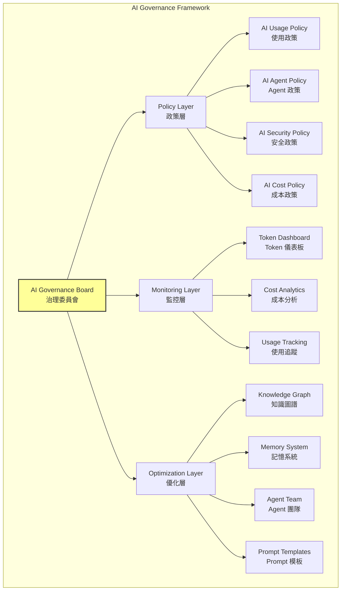
```mermaid
graph TB
    subgraph "AI Governance Framework"
        A[AI Governance Board<br/>治理委員會] --> B[Policy Layer<br/>政策層]
        B --> C[AI Usage Policy<br/>使用政策]
        B --> D[AI Agent Policy<br/>Agent 政策]
        B --> E[AI Security Policy<br/>安全政策]
        B --> F[AI Cost Policy<br/>成本政策]
        
        A --> G[Monitoring Layer<br/>監控層]
        G --> H[Token Dashboard<br/>Token 儀表板]
        G --> I[Cost Analytics<br/>成本分析]
        G --> J[Usage Tracking<br/>使用追蹤]
        
        A --> K[Optimization Layer<br/>優化層]
        K --> L[Knowledge Graph<br/>知識圖譜]
        K --> M[Memory System<br/>記憶系統]
        K --> N[Agent Team<br/>Agent 團隊]
        K --> O[Prompt Templates<br/>Prompt 模板]
    end
    
    style A fill:#ff9,stroke:#333,stroke-width:2px
```

### 22.2 AI Cost Management

**成本分級管理：**

| 等級 | 月度 Token 消耗 | 管理策略 | 核准層級 |
| --- | --- | --- | --- |
| **Green** | < 100M tokens | 自主管理 | 團隊自行管理 |
| **Yellow** | 100M-500M tokens | 週報審查 | Tech Lead 審核 |
| **Orange** | 500M-1B tokens | 日報追蹤 | 部門主管核准 |
| **Red** | > 1B tokens | 即時告警 | CTO/CIO 核准 |

**成本分攤模型：**

```text
Team Token Budget = Base Allocation + Project Allocation + Burst Buffer

Base Allocation：每人每月 50M tokens（基本開發需求）
Project Allocation：依專案規模與複雜度配額
Burst Buffer：專案高峰期額外 20% 彈性配額

月度結算：
- 節省的 Token 可累積至下月
- 超用的 Token 需提供分析報告
- 持續超用需申請預算調整
```

### 22.3 AI Token Monitoring

**監控指標：**

| 指標 | 計算方式 | 告警閾值 | 說明 |
| --- | --- | --- | --- |
| Daily Token Usage | 每日 Token 總消耗 | > 日均 150% | 異常使用偵測 |
| Token per Task | 每個任務的 Token 消耗 | > 100K tokens/task | 任務效率監控 |
| Cache Hit Rate | Cache Token / Total Prompt Token | < 30% | Cache 利用率 |
| Agent Efficiency | 完成任務數 / Token 消耗 | < 0.5 tasks/100K | Agent 效率 |
| Waste Ratio | 重試/失敗 Token / 總 Token | > 20% | 浪費比率 |

**監控儀表板設計要素：**

```text
AI Token Dashboard
├── 即時指標
│   ├── 今日 Token 消耗（vs 預算）
│   ├── 本月 Token 消耗（vs 配額）
│   └── 當前 Agent Session 數
├── 趨勢分析
│   ├── 每日 Token 趨勢（7天/30天）
│   ├── 團隊 Token 消耗排行
│   └── 任務類型 Token 分佈
├── 效率分析
│   ├── Token per Commit
│   ├── Token per PR
│   └── Token per Bug Fix
└── 告警
    ├── 配額超用告警
    ├── 異常消耗告警
    └── Agent 失控告警
```

**量測基礎：四項計量與資料來源優先序**

Token 監控最常見的錯誤，是把「工具自報的節省數字」當成帳單依據。企業級監控必須建立在**可稽核的資料來源**上，並依下列優先序取用：

| 優先序 | 資料來源 | 特性 |
| --- | --- | --- |
| 1 | 供應商的用量與成本管理 API（如 Anthropic Admin API 的 Usage & Cost 報表） | **權威來源**，可對帳 |
| 2 | 應用端記錄的 `response.usage`（每次請求） | 精確、可歸因至團隊／專案 |
| 3 | 由程式碼推估 | 僅供無資料時的方向性判斷 |
| ❌ | 工具自報的壓縮率 | **不可作為帳單依據**（見附錄 B 判讀原則） |

**每次請求都必須記錄的四項計量：**

| 欄位 | 意義 | 監控用途 |
| --- | --- | --- |
| `input_tokens` | 未快取輸入（全額計費） | 應遠小於 cache_read |
| `cache_creation_input_tokens` | 寫入快取（1.25× 或 2×） | 應約等於「一個回合」的量 |
| `cache_read_input_tokens` | 自快取讀取（約 0.1×） | 應為主要輸入來源 |
| `output_tokens` | 輸出（單價最高） | 監控輸出膨脹 |

> **應納入 Dashboard 的核心健康指標**：
>
> | 指標 | 健康標準 | 異常代表 |
> | --- | --- | --- |
> | **快取命中率** | ≥ 80% | 前綴設計有問題（第 13.4 節） |
> | **每個完成任務的成本** | 持平或下降 | 比「每請求 token 數」更具決策價值 |
> | **`stop_reason: max_tokens` 比率** | 接近 0 | 輸出被截斷＝白花的錢（第 13.7 節） |
> | **指令檔 token 數** | ≤ 5,000 | 前綴膨脹（第 2.6 節） |
> | **重試／重工率** | 持續下降 | 記憶與圖譜是否真的生效 |
>
> **治理層級的關鍵原則**：「若應用程式尚未記錄 `response.usage`，**補上這段記錄本身就是第一個應該執行的免費改善**」——沒有量測，後續所有最佳化都無法驗證，也無法對帳。

### 22.4 AI Usage / Agent / Security Policy

**AI Usage Policy（使用政策）：**

```markdown
# AI 使用政策

## 允許
- 使用 AI 進行程式碼生成、Bug 修復、Code Review
- 使用 AI 撰寫測試案例、文件
- 使用 AI 分析架構、設計方案

## 限制
- 禁止將客戶個資傳送給 AI
- 禁止將密碼、API Key 等機密資訊傳送給 AI
- 單次 Agent 對話 Token 上限：500K
- 禁止使用 AI 生成的程式碼直接上線（需 Code Review）

## 要求
- 所有 AI 生成的程式碼必須通過 Code Review
- 安全相關程式碼必須經 Security Agent 審查
- 使用 AI 時必須建立 Memory 檔案，避免 Token 浪費
```

**AI Agent Policy（Agent 政策）：**

```markdown
# AI Agent 政策

## Agent 執行限制
- 單次 Agent Session 最長執行時間：30 分鐘
- 單次 Agent 最大工具呼叫次數：50 次
- Agent 搜尋範圍限制：僅限指定模組

## Agent Team 使用規範
- 需事先定義 Agent Team 的組成與職責
- 每個 Agent 須有明確的 Input/Output 契約
- Agent 間通訊透過結構化文件，不直接傳遞原始碼

## Agent 權限控管
- 唯讀 Agent：Analyzer、Reviewer（不可修改檔案）
- 寫入 Agent：Developer、Refactorer（可修改指定範圍）
- 管理 Agent：Release、Deployer（需人工審核確認）
```

**AI Security Policy（安全政策）：**

```markdown
# AI 安全政策

## 資料保護
- 禁止傳送 PII（個人可識別資訊）
- 禁止傳送金融交易資料
- 禁止傳送密碼、Token、API Key
- 程式碼傳送前須移除硬編碼的機密資訊

## Prompt Injection 防護
- AI 生成的程式碼須進行安全掃描
- 禁止使用 AI 生成的輸入驗證邏輯未經審查即部署
- 定期審查 CLAUDE.md 和 Instructions 檔案

## 稽核
- AI 使用日誌保留 90 天
- 每月安全審查 AI 生成的程式碼
- 季度 AI 安全合規檢查
```

---

## 第二十三章 建立企業級 Token 最佳化框架

### 23.1 Enterprise Token Optimization Architecture

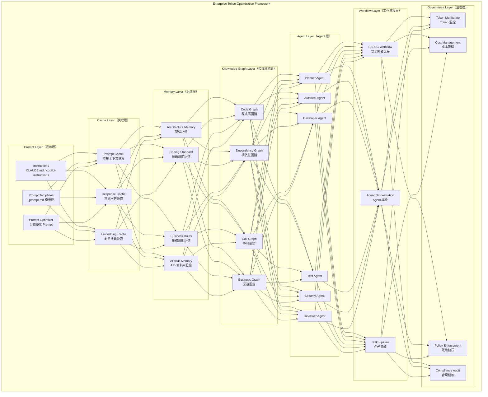
```mermaid
graph TB
    subgraph "Enterprise Token Optimization Framework"
        subgraph "Prompt Layer（提示層）"
            P1[Instructions<br/>CLAUDE.md / copilot-instructions]
            P2[Prompt Templates<br/>.prompt.md 模板庫]
            P3[Prompt Optimizer<br/>自動優化 Prompt]
        end
        
        subgraph "Cache Layer（快取層）"
            C1[Prompt Cache<br/>重複上下文快取]
            C2[Response Cache<br/>常見回答快取]
            C3[Embedding Cache<br/>向量搜尋快取]
        end
        
        subgraph "Memory Layer（記憶層）"
            M1[Architecture Memory<br/>架構記憶]
            M2[Coding Standard<br/>編碼規範記憶]
            M3[Business Rules<br/>業務規則記憶]
            M4[API/DB Memory<br/>API/資料庫記憶]
        end
        
        subgraph "Knowledge Graph Layer（知識圖譜層）"
            K1[Code Graph<br/>程式碼圖譜]
            K2[Dependency Graph<br/>相依性圖譜]
            K3[Call Graph<br/>呼叫圖譜]
            K4[Business Graph<br/>業務圖譜]
        end
        
        subgraph "Agent Layer（Agent 層）"
            A1[Planner Agent]
            A2[Architect Agent]
            A3[Developer Agent]
            A4[Test Agent]
            A5[Security Agent]
            A6[Reviewer Agent]
        end
        
        subgraph "Workflow Layer（工作流程層）"
            W1[SSDLC Workflow<br/>安全開發流程]
            W2[Agent Orchestration<br/>Agent 編排]
            W3[Task Pipeline<br/>任務管線]
        end
        
        subgraph "Governance Layer（治理層）"
            G1[Token Monitoring<br/>Token 監控]
            G2[Cost Management<br/>成本管理]
            G3[Policy Enforcement<br/>政策執行]
            G4[Compliance Audit<br/>合規稽核]
        end
    end
    
    P1 & P2 & P3 --> C1 & C2 & C3
    C1 & C2 & C3 --> M1 & M2 & M3 & M4
    M1 & M2 & M3 & M4 --> K1 & K2 & K3 & K4
    K1 & K2 & K3 & K4 --> A1 & A2 & A3 & A4 & A5 & A6
    A1 & A2 & A3 & A4 & A5 & A6 --> W1 & W2 & W3
    W1 & W2 & W3 --> G1 & G2 & G3 & G4
```

### 23.2 七層架構設計

| 層級 | 名稱 | 職責 | Token 節省貢獻 |
| --- | --- | --- | --- |
| **L1** | Prompt Layer | Prompt 優化與模板化 | 20-30% |
| **L2** | Cache Layer | 重複內容快取 | 15-25% |
| **L3** | Memory Layer | 持久化上下文記憶 | 25-35% |
| **L4** | Knowledge Graph Layer | 結構化知識查詢 | 30-50% |
| **L5** | Agent Layer | Agent 任務分工 | 20-40% |
| **L6** | Workflow Layer | 工作流程優化 | 10-20% |
| **L7** | Governance Layer | 政策約束與監控 | 5-15% |

**綜合效果（非線性疊加）：**

```text
未優化基準：100%
僅 L1（Prompt 優化）：70-80%
+ L3（Memory）：45-55%
+ L4（Knowledge Graph）：20-30%
+ L5（Agent Team）：12-18%
+ L2,L6,L7（快取/流程/治理）：8-12%

最終：8-12%（即節省 88-92%）
```

### 23.3 導入流程

**Phase 1：Quick Win（1-2 週）**

```text
✅ 建立 CLAUDE.md / copilot-instructions.md
✅ 建立基本 Memory 檔案（架構、編碼規範）
✅ 建立 3-5 個常用 Prompt Template
✅ 設定搜尋排除規則
預期效果：Token 消耗降低 30-40%
```

**Phase 2：Knowledge Base（3-4 週）**

```text
✅ 使用 Graphify 建立 Code Knowledge Graph
✅ 建立完整的 Memory 體系（5 大 Memory）
✅ 配置 MCP 工具
✅ 建立 Prompt 模板庫
預期效果：Token 消耗降低 60-70%
```

**Phase 3：Agent Team（5-6 週）**

```text
✅ 定義 Agent Team 組成與職責
✅ 建立 Agent 間的通訊協定
✅ 實作 SSDLC Workflow 整合
✅ 建立 Token 監控儀表板
預期效果：Token 消耗降低 80-85%
```

**Phase 4：Enterprise Governance（7-8 週）**

```text
✅ 建立 AI 使用政策
✅ 實施成本分級管理
✅ 建立合規稽核流程
✅ 定期最佳化檢討
預期效果：Token 消耗穩定在 10-15%（vs 原始基準）
```

---

## 第二十四章 實戰案例

### 24.1 大型銀行核心系統升級

**專案背景：**

- 系統規模：1,200 個 Java 檔案、80 萬行程式碼
- 升級目標：Spring Boot 2.7 → 3.4、Java 11 → 21
- 團隊規模：15 位開發者
- 專案期間：6 個月

**Token 消耗分析：**

| 階段 | 無優化 Token | 優化後 Token | 節省 |
| --- | --- | --- | --- |
| **影響範圍分析** | 5.0M | 300K | 94% |
| **Breaking Changes 識別** | 3.0M | 200K | 93% |
| **Namespace 遷移** | 4.5M | 50K（腳本化） | 99% |
| **Security 配置重寫** | 500K | 80K | 84% |
| **JPA 調整** | 2.0M | 250K | 88% |
| **測試修復** | 3.0M | 400K | 87% |
| **Code Review** | 2.0M | 300K | 85% |
| **合計** | **20.0M** | **1.58M** | **92%** |

**關鍵優化措施：**

1. 建立 Migration Knowledge Graph（一次性 200K tokens）
2. 使用腳本處理 namespace 遷移（RTK 思維）
3. Agent Team 分工：Architect 分析影響 → Developer 修改 → Tester 驗證
4. Memory 體系持續累積升級經驗

**成本對比：**

```text
以 Claude Sonnet 5 混合單價估算（輸入 $2/M、輸出 $10/M，
假設輸入:輸出 = 4:1，混合單價約 $3.6/M）：

無優化成本：20M tokens × $3.6/M = $72
優化後成本：1.58M tokens × $3.6/M = $5.69
節省金額：$66.31（92%）
6 個月專案總節省：約 $400+

若改用 Claude Opus 5（輸入 $5/M、輸出 $25/M，混合約 $9/M）：
無優化成本：$180；優化後：$14.22；節省 $165.78。
```

> **成本模型的正確用法**：上列「混合單價」只是快速估算法。實際帳單取決於輸入／輸出比例、快取命中率與模型選擇——**同樣的 token 數，在不同模型與不同快取命中率下，成本可差 10 倍以上**。正式試算應以第 13.1 節的分項單價，搭配 `response.usage` 的實際四項計量（`input_tokens`、`cache_creation_input_tokens`、`cache_read_input_tokens`、`output_tokens`）計算。

### 24.2 百萬行程式碼逆向工程

**專案背景：**

- 系統規模：100 萬行程式碼（Java + JSP + SQL）
- 技術棧：Struts 1.3 + EJB 3.0 + DB2 11.5
- 目標：理解系統架構，為現代化重寫做準備
- 團隊規模：8 位開發者

**Token 消耗分析：**

| 階段 | 無優化 Token | 優化後 Token | 節省 |
| --- | --- | --- | --- |
| **系統架構理解** | 8.0M | 400K | 95% |
| **業務流程還原** | 5.0M | 500K | 90% |
| **資料庫關係分析** | 3.0M | 200K | 93% |
| **API 端點對映** | 2.0M | 150K | 92% |
| **技術債評估** | 4.0M | 300K | 92% |
| **文件產出** | 3.0M | 400K | 87% |
| **合計** | **25.0M** | **1.95M** | **92%** |

**關鍵優化措施：**

1. 使用 Graphify 離線建構 Code Graph（零 AI Token）
2. 建立四層 Graph 架構（Architecture / Sequence / Business / Database）
3. 使用 Understand-Anything 建立互動式 Knowledge Graph
4. 漸進式分析：先架構→再流程→再細節

### 24.3 Spring Boot 升級專案

**專案背景：**

- 系統規模：600 個 Java 檔案、30 萬行程式碼
- 升級目標：Spring Boot 2.7 → 4.0、Java 17 → 25
- 團隊規模：10 位開發者
- 專案期間：3 個月

**Token 消耗分析：**

| 階段 | 無優化 Token | 優化後 Token | 節省 |
| --- | --- | --- | --- |
| **依賴性分析** | 2.0M | 150K | 92% |
| **Jakarta 遷移** | 3.0M | 30K（腳本化） | 99% |
| **API 變更** | 1.5M | 200K | 87% |
| **配置遷移** | 500K | 60K | 88% |
| **測試修復** | 2.0M | 250K | 88% |
| **合計** | **9.0M** | **0.69M** | **92%** |

**關鍵優化措施：**

1. 建立 Spring Boot Migration Checklist Memory
2. 批次處理同類型變更（如 javax → jakarta）
3. AI 生成自動化遷移腳本
4. 使用 Knowledge Graph 精準定位受影響的程式碼

### 24.4 Vue3 重構專案

**專案背景：**

- 系統規模：400 個 Vue/JS 檔案、15 萬行程式碼
- 升級目標：Vue 2 → Vue 3（Composition API）、Vuex → Pinia
- 團隊規模：6 位開發者
- 專案期間：4 個月

**Token 消耗分析：**

| 階段 | 無優化 Token | 優化後 Token | 節省 |
| --- | --- | --- | --- |
| **Component 分析** | 3.0M | 200K | 93% |
| **Options → Composition** | 4.0M | 400K | 90% |
| **Vuex → Pinia** | 1.5M | 150K | 90% |
| **Router 遷移** | 500K | 60K | 88% |
| **Build 工具遷移** | 300K | 40K | 87% |
| **測試修復** | 1.5M | 200K | 87% |
| **合計** | **10.8M** | **1.05M** | **90%** |

**關鍵優化措施：**

1. 建立 Vue Migration Knowledge Graph（Component 相依性）
2. 分類處理：Pure Component → Stateful Component → Store-connected Component
3. 建立 Composition API 轉換模板（AI 一次生成，反覆套用）
4. Pinia Store 模板化，避免重複描述狀態管理模式

> **四個案例的共通模式**：所有案例的 Token 節省都超過 90%。核心策略都是：(1) 建立 Knowledge Graph，(2) 建立 Memory 體系，(3) 使用 Agent Team 分工，(4) 能腳本化的工作不用 AI 逐一處理。

---

## 第二十五章 最佳實務總結

### 25.1 Top 100 Token 節省技巧

#### 開發階段（1-25）

| # | 技巧 | 節省預估 |
| --- | --- | --- |
| 1 | 建立 CLAUDE.md / copilot-instructions.md | 30% |
| 2 | 建立 Architecture Memory 檔案 | 25% |
| 3 | 建立 Coding Standard Memory 檔案 | 20% |
| 4 | 使用 Knowledge Graph 取代全量讀取 | 50% |
| 5 | 使用 Prompt Template 取代手動輸入 | 40% |
| 6 | 限定 Agent 搜尋範圍（指定目錄/檔案） | 60% |
| 7 | 提供方法簽名而非完整檔案 | 70% |
| 8 | 使用 diff 而非完整檔案做 Code Review | 50% |
| 9 | 批次處理同類型變更 | 70% |
| 10 | 使用 Sub Agent 分割大任務 | 40% |
| 11 | 建立 API Memory 供新增 API 時參考 | 30% |
| 12 | 建立 DB Memory 供查詢設計時參考 | 25% |
| 13 | 使用結構化 Prompt 取代自然語言描述 | 35% |
| 14 | 引用 Memory 檔案取代重複描述背景 | 45% |
| 15 | 新對話前摘要化前一個對話的結論 | 30% |
| 16 | 測試只提供方法簽名和規則，不提供完整實作 | 60% |
| 17 | 使用 MCP 工具精準查詢取代 grep | 50% |
| 18 | 排除 node_modules/target/dist 等目錄 | 20% |
| 19 | 使用 RTK 思維壓縮工具輸出 | 80% |
| 20 | 日誌分析只提供錯誤段落 | 70% |
| 21 | 使用 Cache Token 功能（連續對話） | 30% |
| 22 | 善用 @file 和 @sym 精準引用 | 40% |
| 23 | 避免在 Prompt 中使用冗長的自然語言 | 25% |
| 24 | 使用 JSON/YAML 格式化 Prompt 輸入 | 20% |
| 25 | 建立 Business Rules Memory | 30% |

#### 維運階段（26-45）

| # | 技巧 | 節省預估 |
| --- | --- | --- |
| 26 | 建立 Ops Runbook Memory | 35% |
| 27 | 日誌分析使用 RTK 過濾 | 80% |
| 28 | 效能問題只提供關鍵 Metrics | 60% |
| 29 | 建立 Incident Response Memory | 30% |
| 30 | 告警處理使用預定義 Prompt Template | 40% |
| 31 | 環境配置差異只提供 diff | 50% |
| 32 | 資料庫問題提供 Execution Plan 而非全表 | 70% |
| 33 | CI/CD 失敗只擷取錯誤段落 | 75% |
| 34 | 容器日誌使用 tail + grep 預篩選 | 65% |
| 35 | 建立 Deployment Checklist Memory | 25% |
| 36 | 監控告警自動摘要化 | 50% |
| 37 | 版本發佈用 Changelog Memory 追蹤 | 30% |
| 38 | 資料遷移使用腳本化方式 | 85% |
| 39 | 效能基準測試結果摘要化 | 55% |
| 40 | Hot Fix 使用預定義流程模板 | 40% |
| 41 | 災難恢復使用 Runbook 引導 | 35% |
| 42 | 安全掃描結果分級呈現 | 45% |
| 43 | Audit Log 分析使用過濾器 | 60% |
| 44 | 配置變更追蹤使用 diff Memory | 40% |
| 45 | SLA 報告使用模板化 | 30% |

#### 升級階段（46-65）

| # | 技巧 | 節省預估 |
| --- | --- | --- |
| 46 | 建立 Migration Knowledge Graph | 90% |
| 47 | 能腳本化的變更使用腳本處理 | 99% |
| 48 | 建立 Breaking Changes Registry | 40% |
| 49 | 批次處理 namespace 遷移 | 95% |
| 50 | 分類處理：自動化 / 半自動 / 手動 | 70% |
| 51 | 使用 Migration Checklist 追蹤進度 | 25% |
| 52 | 測試修復使用模板化 Prompt | 60% |
| 53 | 配置遷移使用對照表 | 50% |
| 54 | API 變更使用 Adapter Pattern 漸進遷移 | 40% |
| 55 | 相依性升級分批進行 | 35% |
| 56 | 建立版本對照 Memory | 30% |
| 57 | 升級驗證使用自動化測試 | 45% |
| 58 | 回歸測試結果使用 RTK 去重 | 80% |
| 59 | 升級文件使用模板產生 | 50% |
| 60 | 技術棧評估使用 Knowledge Graph | 60% |
| 61 | 相容性測試結果摘要化 | 55% |
| 62 | 效能回歸使用基準比較 | 45% |
| 63 | 升級經驗回饋到 Memory 系統 | 30% |
| 64 | 建立升級 FAQ Memory | 35% |
| 65 | 使用 AI 生成升級指南 | 40% |

#### Reverse Engineering（66-75）

| # | 技巧 | 節省預估 |
| --- | --- | --- |
| 66 | 使用 Graphify 離線建構 Code Graph | 100%（零 AI Token） |
| 67 | 建立四層 Graph 架構 | 90% |
| 68 | 分層理解：架構→流程→業務→資料 | 80% |
| 69 | 漸進式 Graph 建構 | 70% |
| 70 | 業務流程使用 Sequence Graph 查詢 | 85% |
| 71 | Dead Code 識別使用 Call Graph | 75% |
| 72 | 相依性分析使用 Dependency Graph | 80% |
| 73 | 技術債評估使用 Code Quality Metrics | 60% |
| 74 | 遺留系統文件使用 Graph 自動生成 | 70% |
| 75 | 現代化規劃使用 Architecture Graph | 65% |

#### Agent Team（76-85）

| # | 技巧 | 節省預估 |
| --- | --- | --- |
| 76 | 每個 Agent 僅載入專職資訊 | 60% |
| 77 | Agent 間使用結構化文件通訊 | 40% |
| 78 | Planner Agent 僅載入 Memory 不讀原始碼 | 70% |
| 79 | Test Agent 僅載入方法簽名 | 65% |
| 80 | Security Agent 僅掃描安全相關路徑 | 55% |
| 81 | Reviewer Agent 僅載入 diff | 50% |
| 82 | Release Agent 僅載入版本資訊 | 80% |
| 83 | 並行執行獨立 Agent 減少等待 | 30% |
| 84 | Agent 結果摘要化後傳遞 | 45% |
| 85 | Agent 失敗僅重試失敗的 Agent | 50% |

#### SSDLC（86-100）

| # | 技巧 | 節省預估 |
| --- | --- | --- |
| 86 | 需求階段使用標準化 User Story 模板 | 35% |
| 87 | 設計階段引用 Architecture Memory | 50% |
| 88 | 開發階段使用 Coding Standard Memory | 40% |
| 89 | 測試階段使用 Testing Standard Memory | 45% |
| 90 | 部署階段使用 Deployment Memory | 30% |
| 91 | 維護階段使用 Ops Runbook Memory | 35% |
| 92 | 安全審查使用 Security Checklist | 40% |
| 93 | Threat Modeling 使用結構化模板 | 45% |
| 94 | Code Review 使用 Prompt Template | 50% |
| 95 | 發佈管理使用 Release Template | 30% |
| 96 | 回顧會議使用 AI 摘要前次結論 | 25% |
| 97 | 知識分享使用 Knowledge Graph | 55% |
| 98 | 新人 Onboarding 使用 Tour Builder | 60% |
| 99 | 跨團隊協作使用共享 Memory | 40% |
| 100 | 持續改善使用 Token Analytics 反饋 | 20% |

### 25.2 企業導入檢查表

> **導入順序的重要更正（v3.0.0）**：下列 Phase 1 應**先於**所有工具導入。原因是第 1 層免費槓桿（快取、批次、輸入衛生）**不影響品質、不需採購、不需訓練**，而且效益通常大於任何壓縮工具。跳過這一層直接導入工具，是企業最常見的順序錯誤。

```markdown
# 企業級 Token 優化導入檢查表

## Phase 0：免費槓桿（Day 1-3，最優先）
- [ ] 確認應用端已記錄 response.usage 四項計量
- [ ] 執行快取診斷：連送兩次相同前綴，確認 cache_read_input_tokens > 0
- [ ] 掃描系統提示中的靜默失效因子（時間戳／UUID／使用者 ID／未排序 JSON）
- [ ] 確認工具集不隨使用者或情境變動（工具渲染在位置 0）
- [ ] 依請求間隔選定快取 TTL（< 5 分鐘用 5 分鐘；5-60 分鐘用 1 小時）
- [ ] 實測 CLAUDE.md / AGENTS.md token 數，超過 5,000 者精簡
- [ ] 刪除系統提示中複述工具用法的段落
- [ ] 將無人等待的批次工作改用 Batch API（全部 token 五折）
- [ ] 確認 max_tokens 設定足夠（agentic 工作 64,000 起），並監控 stop_reason
- [ ] 驗證 Token 節省效果（目標：快取命中率 > 80%）

## Phase 1：基礎建設（Week 1-2）
- [ ] 建立 CLAUDE.md（Claude Code 專案）
- [ ] 建立 .github/copilot-instructions.md（Copilot 專案）
- [ ] 建立 Architecture Memory 檔案
- [ ] 建立 Coding Standard Memory 檔案
- [ ] 設定 .gitignore / search.exclude 排除規則
- [ ] 建立 3-5 個常用 Prompt Template
- [ ] 團隊 Token 節省意識培訓

## Phase 2：知識圖譜建構（Week 3-4）
- [ ] 使用 Graphify 建立 Code Knowledge Graph
- [ ] 建立 API Memory 檔案
- [ ] 建立 DB Memory 檔案
- [ ] 建立 Business Rules Memory 檔案
- [ ] 配置 MCP 工具（Knowledge Graph / DB / Git）
- [ ] 建立 Prompt Template 庫（≥10 個模板）
- [ ] 驗證 Token 節省效果（目標 > 50%）

## Phase 3：Agent Team 建立（Week 5-6）
- [ ] 定義 Agent Team 組成（≥5 個 Agent）
- [ ] 建立 Agent 間通訊協定
- [ ] 建立 SSDLC Workflow 整合
- [ ] 建立 Sub Agent 策略
- [ ] 實施 Agent 執行限制
- [ ] 驗證 Token 節省效果（目標 > 70%）

## Phase 4：企業治理（Week 7-8）
- [ ] 建立 AI Usage Policy
- [ ] 建立 AI Agent Policy
- [ ] 建立 AI Security Policy
- [ ] 建立 Token Monitoring 機制
- [ ] 建立成本分級管理
- [ ] 建立月度 Token 審查流程
- [ ] 驗證 Token 節省效果（目標 > 85%）

## 持續改善
- [ ] 每月 Token 消耗分析
- [ ] 每季 Knowledge Graph 更新
- [ ] 每季 Memory 體系審查
- [ ] 每半年 Agent Team 效能評估
- [ ] 年度 AI 成本治理回顧
```

### 25.3 企業成熟度模型

| 等級 | 名稱 | 特徵 | Token 效率 | 典型組織 |
| --- | --- | --- | --- | --- |
| **Level 1** | 初始（Ad-hoc） | 無規範、無 Memory、無 Graph | 基準線（100%） | 剛開始使用 AI 的團隊 |
| **Level 2** | 基礎（Basic） | 有 Instructions、有基本 Prompt 規範 | 70%（節省 30%） | 有 AI 使用經驗的團隊 |
| **Level 3** | 標準化（Standardized） | 完整 Memory 體系、Prompt Template 庫 | 40%（節省 60%） | 建立 AI 開發流程的團隊 |
| **Level 4** | 優化（Optimized） | Knowledge Graph、Agent Team、MCP | 15%（節省 85%） | AI-first 開發團隊 |
| **Level 5** | 卓越（Excellence） | 完整治理框架、自動優化、持續改善 | 8%（節省 92%） | AI 原生組織 |

**成熟度提升路徑：**

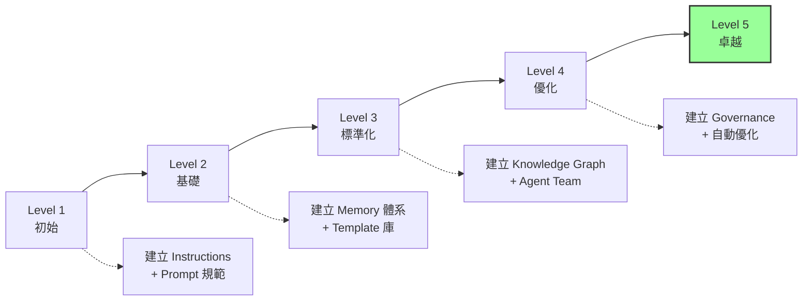
```mermaid
graph LR
    L1[Level 1<br/>初始] --> L2[Level 2<br/>基礎]
    L2 --> L3[Level 3<br/>標準化]
    L3 --> L4[Level 4<br/>優化]
    L4 --> L5[Level 5<br/>卓越]
    
    L1 -.-> L1A[建立 Instructions<br/>+ Prompt 規範]
    L2 -.-> L2A[建立 Memory 體系<br/>+ Template 庫]
    L3 -.-> L3A[建立 Knowledge Graph<br/>+ Agent Team]
    L4 -.-> L4A[建立 Governance<br/>+ 自動優化]
    
    style L5 fill:#9f9,stroke:#333,stroke-width:2px
```

### 25.4 結論與建議

**核心結論**

> **「最有效降低 Token 的方法不是更換模型，而是建立 Knowledge Graph + Memory + Agent Team + SSDLC Workflow。」**

本手冊的全部內容都在論證和實踐這個核心論點。Token 優化不是一次性的任務，而是持續改善的過程。從最基本的 Instructions 檔案開始，逐步建立 Memory 體系、Knowledge Graph、Agent Team，最終形成完整的企業級 Token 優化框架。

**給不同角色的建議：**

| 角色 | 首要行動 | 預期效果 |
| --- | --- | --- |
| **個人開發者** | 建立 Instructions + 3 個 Prompt Template | 1 天內 Token 降低 30% |
| **Tech Lead** | 建立團隊 Memory 體系 + Knowledge Graph | 2 週內 Token 降低 60% |
| **架構師** | 建立 Agent Team + SSDLC Workflow | 4 週內 Token 降低 80% |
| **CTO/IT 主管** | 建立 AI Governance Framework | 8 週內 Token 降低 90% |

**最終建議：**

1. **先做免費槓桿**：在導入任何工具之前，先完成快取診斷與指令檔精簡（第 13.4 節、第 2.6 節）。這一層不影響品質、不需採購，效益通常大於任何壓縮工具
2. **立即行動**：今天就建立 CLAUDE.md 或 copilot-instructions.md，這是零成本、立即見效的優化——但務必控制在 5,000 tokens 以內
3. **漸進式導入**：不要試圖一步到位，按照成熟度模型逐級提升
4. **量化追蹤**：建立 Token 消耗的基準線，定期衡量優化效果；量測必須來自 `response.usage`，不可採用工具自報數字
5. **知識沉澱**：每次 AI 對話的經驗都應沉澱到 Memory 體系中
6. **團隊共享**：Token 優化是團隊層級的工作，建立共享的 Knowledge Base
7. **持續改善**：每月審視 Token 消耗模式，持續優化 Memory 和 Graph；模型升級後必須重新稽核提示（舊模型的提示可能貴 36%）

**三個最容易犯的錯誤（v3.0.0 補充）：**

| 錯誤 | 為什麼是錯的 | 正確做法 |
| --- | --- | --- |
| 先換小模型省錢 | 模型選擇直接限制能力上限，且會失去快取命名空間；便宜的模型若需要更多回合或重試，總成本反而更高 | 依五層順位，**模型是最後手段**（第 13.7 節） |
| 用「每請求 token 數」衡量成效 | 延後載入內容會讓模型多花回合去探索，token 降了但任務更貴 | 以「**每個完成任務的成本**」衡量 |
| 把清除上下文當成省錢手段 | 每次清除都重寫已快取內容，官方實測**成本高於節省** | 清除是視窗空間管理工具；省錢請先確保快取生效（第 13.5 節） |

> **本手冊的一句話總結**：**先讓快取生效，再讓 AI 不必讀檔案，最後才考慮壓縮與換模型。**

---

## 附錄

### 附錄 A：Token 估算速查表

> **使用限制**：本表僅供**容量規劃的粗略估算**。任何進入預算或合約的數字，必須以官方計數 API 實測（Claude 為 `messages.count_tokens`）。切勿使用 `tiktoken` 估算 Claude 的 token——它會低估約 15%～20%，在程式碼與中文輸入上偏差更大（見第 13.8 節）。

| 內容類型 | 估算規則 |
| --- | --- |
| 英文文字 | 1 word ≈ 1.3 tokens |
| 中文文字 | 1 字 ≈ 2 tokens |
| Java 程式碼 | 1 行 ≈ 5 tokens |
| JSON/YAML | 1 行 ≈ 4 tokens |
| Markdown | 1 行 ≈ 3 tokens |
| HTML/JSP | 1 行 ≈ 6 tokens |
| SQL | 1 行 ≈ 4 tokens |
| 圖片（視覺輸入） | 約每 28×28 像素 patch 一個 token；1280×720 約 1,200 tokens |

### 附錄 B：工具比較表

| 工具 | 類型 | Token 節省方式 | 適用場景 | 授權 |
| --- | --- | --- | --- | --- |
| **RTK** | CLI Proxy | 壓縮工具輸出（100+ 指令） | 所有 AI 工具（17 平台整合） | Apache 2.0 |
| **Headroom** | Context 壓縮層 | ContentRouter 智慧路由（Library／Proxy／MCP） | 日誌與探索類工作負載 | MIT |
| **Understand-Anything** | Knowledge Graph Builder | 7-Agent Pipeline + 互動儀表板 | 程式碼理解、團隊 Onboarding | MIT |
| **GitNexus** | Repository Indexer | 17 個 MCP 工具 + BM25／向量／RRF 混合檢索 | 程式碼搜尋、影響分析、多倉庫 | 依官方 Repository 為準 |
| **Graphify** | Code Graph Builder | 離線 AST 解析（37 grammars）+ Leiden 社群偵測 | 程式碼／文件圖譜、團隊共享 | MIT |
| **codebase-memory-mcp** | Hybrid LSP Memory | 純 C 極速索引 + 語義型別解析（162 語言） | 超大型專案、供應鏈安全要求高者 | MIT |
| **CodeGraph** | Auto-Sync Graph | 單一工具哲學 + Rust 解析核心 + 自動同步 | 持續開發、框架感知 | MIT |
| **Ponytail** | YAGNI Agent Plugin | 減少 AI 輸出（七級 YAGNI 梯子） | Completion Token 節省 | MIT |
| **Caveman** | 雙向壓縮 | Skill 壓輸出 + Proxy 壓輸入（可還原） | 輸出冗長、日誌／瀏覽器自動化 | MIT／BSL-1.1（雙授權） |
| **TencentDB Agent Memory** | 團隊記憶中樞 | L0–L3 分層記憶 + 零改碼 Proxy | 跨成員／跨 Agent 知識重用 | MIT |

**關鍵實測數據對照：**

| 工具 | 官方公布的主要數據 | 量測對象（判讀重點） |
| --- | --- | --- |
| RTK | 指令輸出壓縮至多 90% | **輸出壓縮率**，非帳單降幅 |
| Headroom | 編碼 Agent 約 20%；JSON 60-95% | 兩個數字適用**不同對象** |
| codebase-memory-mcp | 99.2%（3,400 vs 412,000 tokens） | 對比**逐檔探索**的基準 |
| CodeGraph | 工具呼叫 -88%、token -62%、成本 -44% | token 降幅 ≠ 成本降幅 |
| Ponytail | 程式碼 -54%、token -22%、成本 -20% | **以 20% 為效益基準**，非 54% |
| Caveman | 輸出 -65%、輸入 -33.2% | 精簡輸出的工作**可能反而虧錢** |
| TencentDB Agent Memory | PersonaMem 48% → 76% | 量測**正確率**，非 token 降幅 |

> **判讀原則**：各工具的自報數據量測對象不一致，**不可直接相加**。例如「RTK 80% + Headroom 60% + Ponytail 54%」不等於 194%——它們作用在不同的 token 類別上，且彼此有重疊。企業評估必須以模型供應商回報的 `usage` 數據做端到端驗證。

### 附錄 C：Prompt Template YAML 格式範例

```yaml
# prompt-templates.yaml
templates:
  - id: code-review
    category: development
    name: 程式碼審查
    prompt: |
      參考 coding-standards.md。
      審查以下變更（聚焦 {focus_areas}）：
      {diff_content}
      輸出格式：🔴 Critical / 🟡 Warning / 🟢 Info
    variables:
      - focus_areas: "安全性, 效能, 可維護性"
      - diff_content: "[貼入 diff]"
    estimated_tokens: 300

  - id: unit-test
    category: testing
    name: 單元測試
    prompt: |
      為以下方法撰寫 JUnit 5 + Mockito 測試：
      方法：{method_signature}
      規則：{business_rules}
      依賴：{dependencies}
      請涵蓋：正常、邊界、例外情境。
    variables:
      - method_signature: "[方法簽名]"
      - business_rules: "[業務規則]"
      - dependencies: "[mock 依賴]"
    estimated_tokens: 400
```

### 附錄 D：參考資源

**開源工具**

| 資源 | 說明 |
| --- | --- |
| [RTK GitHub](https://github.com/rtk-ai/rtk) | Rust Token Killer——CLI 輸出壓縮代理 |
| [Headroom GitHub](https://github.com/headroomlabs-ai/headroom) | Context 壓縮層（ContentRouter） |
| [Understand-Anything](https://github.com/Lum1104/Understand-Anything) | Knowledge Graph Builder（7-Agent Pipeline） |
| [GitNexus](https://github.com/abhigyanpatwari/GitNexus) | Repository Intelligence（17 MCP 工具） |
| [Graphify](https://github.com/safishamsi/graphify) | Code Knowledge Graph（離線 AST 解析） |
| [codebase-memory-mcp](https://github.com/DeusData/codebase-memory-mcp) | Hybrid LSP Memory（162 語言） |
| [CodeGraph](https://github.com/colbymchenry/codegraph) | Auto-Sync Graph（單一工具哲學） |
| [Ponytail](https://github.com/DietrichGebert/ponytail) | YAGNI Agent Plugin（減少輸出） |
| [Caveman](https://github.com/JuliusBrussee/caveman) | 輸入輸出雙向壓縮（Skill + Proxy） |
| [TencentDB Agent Memory](https://github.com/TencentCloud/TencentDB-Agent-Memory) | 團隊級記憶中樞（L0–L3 分層） |

**官方文件（原生機制的權威來源）**

| 資源 | 說明 |
| --- | --- |
| [Anthropic Claude Docs](https://docs.anthropic.com/) | Prompt Caching、Context Editing、Compaction、Effort、Task Budget 的權威定義 |
| [Anthropic Pricing](https://www.anthropic.com/pricing) | 模型定價（本手冊第 13.1 節數據應以此複核） |
| [Claude Code Docs](https://docs.anthropic.com/en/docs/claude-code) | Claude Code 官方文件 |
| [GitHub Copilot Docs](https://docs.github.com/en/copilot) | GitHub Copilot 官方文件 |
| [OpenAI Platform Docs](https://platform.openai.com/docs) | OpenAI Prompt Caching 機制與定價 |
| [Google Gemini API Docs](https://ai.google.dev/gemini-api/docs) | Gemini 隱式／顯式 Context Caching |

**本站相關手冊**

| 資源 | 說明 |
| --- | --- |
| [RTK 教學手冊](RTK%20(Rust%20Token%20Killer)%20%E6%95%99%E5%AD%B8%E6%89%8B%E5%86%8A.md) | RTK 詳細教學手冊 |
| [GitNexus 教學手冊](GitNexus%E6%95%99%E5%AD%B8%E6%89%8B%E5%86%8A.md) | GitNexus 詳細教學手冊 |
| [Graphify 教學手冊](Graphify%E6%95%99%E5%AD%B8%E6%89%8B%E5%86%8A.md) | Graphify 詳細教學手冊 |
| [Claude Code 建立 SSDLC Agent Team 教學手冊](Claude%20Code%20%E5%BB%BA%E7%AB%8B%20SSDLC%20Agent%20Team%20%E6%95%99%E5%AD%B8%E6%89%8B%E5%86%8A.md) | Agent Team 分工設計（第十五章延伸） |
| [GitHub Copilot 建立 SSDLC Agent Team 教學手冊](GitHub%20Copilot%20%E5%BB%BA%E7%AB%8B%20SSDLC%20Agent%20Team%20%E6%95%99%E5%AD%B8%E6%89%8B%E5%86%8A.md) | Copilot 版 Agent Team 設計（第二十一章延伸） |
| [AI 治理教學手冊](AI%20%E6%B2%BB%E7%90%86%E6%95%99%E5%AD%B8%E6%89%8B%E5%86%8A.md) | 企業 AI 治理框架（第二十二章延伸） |

### 附錄 E：工具選擇決策樹

```text
你的主要需求是什麼？

├── 尚未確認快取是否生效
│   └── → 【最優先】先做第 13.4 節的快取診斷（30 秒，零成本，效益最大）
│
├── 壓縮工具輸出（ls/grep/git 等指令）
│   └── → RTK（CLI Proxy，100+ 指令支援）
│
├── 壓縮日誌／探索類 Context
│   └── → Headroom（SRE 除錯 57%、程式碼庫探索 42%）
│
├── 壓縮 AI 的「輸出」
│   ├── 減少產生的程式碼量
│   │   └── → Ponytail（YAGNI Ladder，-54% 程式碼／-20% 成本）
│   └── 減少敘述性文字
│       └── → Caveman Skill（-65% 輸出 token）
│
├── 建立程式碼知識圖譜
│   ├── 需要可視化 + 團隊共享 + 隱私零外傳
│   │   └── → Graphify（本機 tree-sitter，純程式碼不需 API key）
│   ├── 超大型專案（百萬行以上）+ 供應鏈安全審查
│   │   └── → codebase-memory-mcp（162 語言、SLSA L3）
│   ├── 多倉庫 + 混合檢索（關鍵字 + 語義）
│   │   └── → GitNexus（17 MCP 工具 + BM25/向量/RRF）
│   └── 需要自動同步 + 最少工具決策成本
│       └── → CodeGraph（Auto-Sync + 單一工具）
│
├── 建立全專案知識圖譜 + 互動儀表板
│   └── → Understand-Anything（7 Agent Pipeline）
│
├── 跨成員／跨 Agent 的知識重用
│   └── → TencentDB Agent Memory（L0–L3 分層 + 零改碼 Proxy）
│
└── 瀏覽器自動化的網頁內容過大
    └── → Caveman Proxy（相較 Playwright ARIA 基準達 129.8× 壓縮）
```

### 附錄 F：Prompt Caching 設計檢查表

> 本表對應第十三章。這是**第 1 層免費槓桿**，應在導入任何壓縮工具之前先完成。

**設計階段（撰寫程式碼時）**

| 檢查項目 | 通過標準 |
| --- | --- |
| 系統提示中是否有時間戳／日期？ | ❌ 應完全移除 |
| 系統提示中是否有 UUID／request ID／session ID？ | ❌ 應完全移除 |
| 工具集是否依使用者或情境動態變動？ | ❌ 應固定；工具渲染在位置 0 |
| 工具序列化是否具決定性（依名稱排序）？ | ✅ 必須 |
| JSON 序列化是否使用 `sort_keys=True`？ | ✅ 必須 |
| 是否有條件式系統區塊（`if flag: system += ...`）？ | ❌ 每種組合都是不同前綴 |
| 內容是否依「變動頻率」由低到高排序？ | ✅ 必須 |
| 斷點數量是否 ≤ 4？ | ✅ 上限為 4 |
| 前綴長度是否超過該模型的最小可快取門檻？ | ✅ 512～4,096 tokens，依模型而異 |

**驗證階段（上線前）**

| 檢查項目 | 通過標準 |
| --- | --- |
| 連送兩次相同前綴，第二次的 `cache_read_input_tokens` | 必須 **> 0** |
| 暖機後的 Agent Loop，`cache_read_input_tokens` vs `input_tokens` | 前者應**遠大於**後者 |
| `cache_creation_input_tokens` 的量級 | 應約等於**一個回合**，而非整段對話 |
| TTL 設定是否符合請求間隔？ | < 5 分鐘用 5 分鐘 TTL；5–60 分鐘用 1 小時 TTL |

**營運階段（持續監控）**

| 檢查項目 | 頻率 |
| --- | --- |
| 快取命中率是否維持在 80% 以上 | 每週 |
| 是否有人在對話中途改動 `effort`／`thinking`／模型 | 每次程式碼審查 |
| 指令檔（CLAUDE.md／AGENTS.md）是否超過 5,000 tokens | 每月 |
| 提示是否仍為舊模型撰寫（見第 13.8 節，可能貴 36%） | 每次模型升級後 |
| 每次提示組裝邏輯變更後是否重新驗證 | 每次變更 |

### 附錄 G：名詞對照表

| 英文 | 繁體中文 | 說明 |
| --- | --- | --- |
| Prompt Token | 輸入 Token | 送給模型的所有內容 |
| Completion Token | 輸出 Token | 模型生成的內容，單價通常為輸入的 3–5 倍 |
| Cache Write / Read | 快取寫入／讀取 | 寫入 1.25×（5 分鐘）或 2×（1 小時）；讀取約 0.1× |
| Prefix Match | 前綴匹配 | 快取的比對方式，任一位元組改變即全部失效 |
| Breakpoint | 斷點 | `cache_control` 標記位置，每請求上限 4 個 |
| TTL（Time To Live） | 存活時間 | 快取項目的有效期限，讀取可刷新 |
| Silent Invalidator | 靜默失效因子 | 使快取失效但不報錯的寫法 |
| Context Editing | 上下文清除 | 清除舊工具結果，**空間管理工具、非省錢槓桿** |
| Compaction | 上下文壓實 | 摘要先前對話後接續，長 Session 續命機制 |
| Progressive Disclosure | 漸進式揭露 | 只送必要內容，其餘讓模型按需取用 |
| Effort | 思考強度 | `low`／`medium`／`high`／`xhigh`／`max` |
| Task Budget | 任務預算 | 模型可見的 token 預算，會自我調配步調 |
| Tool Search / `defer_loading` | 工具搜尋／延遲載入 | 罕用工具的 schema 按需載入 |
| Programmatic Tool Calling | 程式化工具呼叫 | 由程式碼執行串接呼叫，只回傳過濾後結果 |
| YAGNI | 你不會需要它 | You Ain't Gonna Need It，減少過度設計 |
| RRF（Reciprocal Rank Fusion） | 倒數排名融合 | 合併 BM25 與向量檢索排名的方法 |
| AST（Abstract Syntax Tree） | 抽象語法樹 | 程式碼的結構化表示 |
| LSP（Language Server Protocol） | 語言伺服器協定 | 提供語義型別解析的標準協定 |
| MCP（Model Context Protocol） | 模型上下文協定 | AI Agent 存取外部工具與資料的標準協定 |
| Cost per Completed Task | 每個完成任務的成本 | **本手冊的核心評估指標** |

---

> **本手冊版本紀錄**
>
> | 版本 | 日期 | 變更說明 |
> | --- | --- | --- |
> | 1.0.0 | 2026-05-29 | 初版發佈，涵蓋 18 章完整內容 |
> | 1.1.0 | 2026-05-29 | 更新 RTK/Understand-Anything/GitNexus/Graphify 最新資訊；新增安裝指南與平台支援說明；修正格式問題；補充參考資源 |
> | 2.0.0 | 2026-06-30 | 重大更新：新增 Headroom/codebase-memory-mcp/CodeGraph/Ponytail 四大工具章節（第四、八、九、十章）；更新所有工具至最新版本與 Star 數；Understand-Anything 組織遷移至 Egonex-AI；GitNexus 資料庫引擎更名為 LadybugDB；Graphify 新增 MCP Server 與進階查詢；章節重編號（18→22 章）；新增附錄 E 工具選擇決策樹 |
> | 3.0.0 | 2026-09-08 | 企業標準技術白皮書改版：新增第十一章 Caveman（輸入輸出雙向壓縮）、第十二章 TencentDB Agent Memory（團隊級記憶中樞）、第十三章 原廠原生 Token 最佳化機制（Prompt Caching／Compaction／Effort／Task Budget／Batch API／跨廠商快取比較）；章節重編號（22→25 章）；更新全部模型規格與定價至 2026-09 現況（Context Window 200K→1M）；新增五層最佳化順位框架；新增附錄 F 快取設計檢查表與附錄 G 名詞對照表；全面修正 Markdown 格式（MD040／MD032／MD060）與目錄一致性 |
