+++
date = '2026-07-24T13:14:53+08:00'
draft = false
title = 'AI常用方法論比較教學手冊(2)'
tags = ['教學', 'AI開發']
categories = ['教學']
+++

# AI常用方法論比較教學手冊(2)

> **版本**：v1.1｜**日期**：2026-07-24｜**適用對象**：AI Software Architect、Enterprise Architect、Tech Lead、資深前後端工程師、DevSecOps Architect、Solution Architect
> **v1.1 更新重點**：依 8 套方法論官方 Repository 最新狀態逐節查證修正（含 BMAD-METHOD 階段命名訂正、spec-kit／OpenSpec 新指令集、gstack 起源脈絡補充等）；第六章 AI Coding Agent 現況更新（Windsurf 已更名 Devin Desktop、GitHub Copilot Coding Agent 更名 Copilot cloud agent 等）；第七、八、九、十一章多節深度擴寫至與同章其他小節一致；第四章新增「生態系穩定性／維護風險」補充表；新增第十三章案例六、第十四章 3 份角色 Prompt；修正簡體字殘留、附錄目錄缺漏與數處章節交叉引用錯誤
> **定位**：本手冊是《[AI常用方法論比較教學手冊](./AI常用方法論比較教學手冊.md)》（以下稱「v1」）的**擴充版與企業教育訓練教材版**。v1 的定位是「跨方法論比較與選型指南」（8 方法論 × 5 AI 工具 × 3 情境的濃縮比較），本手冊（v2／"(2)"）的定位是**完整的企業級 AI 軟體工程教學手冊**：從發展史、方法論詳解、AI Coding Agent 架構、企業 AI SDLC、Framework Upgrade、逆向工程、企業導入、AI Agent 團隊建立，到產業最佳實務、完整實戰案例與角色化 Prompt Library，一次到位。兩份手冊互為表裡，建議搭配閱讀（見〈附錄 F〉對應關係表）。
> **涵蓋方法論／概念**：spec-kit、OpenSpec、Superpowers、BMAD-METHOD、GSD（get-shit-done）、gsd-pi（GSD-2）、gstack、mattpocock/skills、Loop Engineering、Compound Engineering、Context Engineering、Memory Engineering、Skills Engineering、Prompt Engineering、Agentic Software Engineering、Spec-Driven Development、AI-Native Development
> **涵蓋 AI Coding Agent**：Claude Code、OpenAI Codex CLI、GitHub Copilot、Gemini CLI、Grok、Cursor、Windsurf、Aider、OpenHands、Cline、Roo Code
> **涵蓋情境**：企業 Web 開發、大型 Framework Upgrade（Spring Boot／Java／Vue）、Legacy 逆向工程（COBOL／VB／Oracle Forms／PowerBuilder／Delphi）、企業 AI SSDLC、銀行大型系統
> **適用產業**：金融／銀行、政府、保險、製造、醫療，並適用一般企業 IT 團隊
> **資料誠信聲明**：本手冊整理自本專案既有教學手冊語料庫、各方法論官方 Repository／文件、業界公開文章，並經重新消化歸納後撰寫。凡涉及 GitHub Star 數、安裝次數、營收/效能改善百分比等**量化採用指標**，若無法在撰寫當下查證來源，一律不予引用或明確標註「未經查證，僅供參考」，不將既有語料庫中的可疑數字（例如個別手冊出現的異常高 Star 數）當作事實延續。本手冊重心放在可驗證的設計理念、架構、工作流程、指令語法與企業實務模式上。

---

## 📋 目錄

- [前言](#前言)
  - [手冊定位與適用對象](#手冊定位與適用對象)
  - [與 v1《AI常用方法論比較教學手冊》的關係](#與-v1ai常用方法論比較教學手冊的關係)
  - [四種讀者，四種讀法](#四種讀者四種讀法)
  - [資料來源與撰寫方式聲明](#資料來源與撰寫方式聲明)
- [第一章：AI Software Engineering 發展史](#第一章ai-software-engineering-發展史)
  - [1.1 傳統軟體開發時代：從瀑布到敏捷（1968–2020）](#11-傳統軟體開發時代從瀑布到敏捷19682020)
  - [1.2 AI輔助開發萌芽期：程式碼補全時代（2021–2022）](#12-ai輔助開發萌芽期程式碼補全時代20212022)
  - [1.3 生成式對話時代：ChatGPT 與 Chat-Driven Development（2022–2023）](#13-生成式對話時代chatgpt-與-chat-driven-development20222023)
  - [1.4 Agentic Coding 元年：從補全到自主執行（2024）](#14-agentic-coding-元年從補全到自主執行2024)
  - [1.5 方法論分裂與標準化期：SDD／Skills／Multi-Agent（2025）](#15-方法論分裂與標準化期sddskillsmulti-agent2025)
  - [1.6 迴圈化與複合工程時代：Loop／Compound Engineering（2026）](#16-迴圈化與複合工程時代loopcompound-engineering2026)
  - [1.7 發展史時間軸總覽](#17-發展史時間軸總覽)
  - [1.8 實務落地建議](#18-實務落地建議)
- [第二章：AI 方法論總覽](#第二章ai-方法論總覽)
  - [2.1 方法論的本質：從 Prompt 到 System](#21-方法論的本質從-prompt-到-system)
  - [2.2 六大方法論分類框架](#22-六大方法論分類框架)
  - [2.3 方法論全景定位圖](#23-方法論全景定位圖)
  - [2.4 核心概念光譜：Prompt／Context／Memory／Skills／Workflow／Loop Engineering](#24-核心概念光譜promptcontextmemoryskillsworkflowloop-engineering)
  - [2.5 通訊與協作標準：MCP／A2A／ACP](#25-通訊與協作標準mcpa2aacp)
  - [2.6 方法論與企業 AI SDLC 的關係](#26-方法論與企業-ai-sdlc-的關係)
  - [2.7 本手冊閱讀路徑建議](#27-本手冊閱讀路徑建議)
  - [2.8 實務落地建議](#28-實務落地建議)
- [第三章：各方法論詳細介紹](#第三章各方法論詳細介紹)
  - [3.1 spec-kit](#31-spec-kit)
  - [3.2 OpenSpec](#32-openspec)
  - [3.3 Superpowers](#33-superpowers)
  - [3.4 BMAD-METHOD](#34-bmad-method)
  - [3.5 GSD（get-shit-done）](#35-gsdget-shit-done)
  - [3.6 gsd-pi（GSD-2）](#36-gsd-pigsd-2)
  - [3.7 gstack](#37-gstack)
  - [3.8 mattpocock/skills](#38-mattpocockskills)
  - [3.9 Loop Engineering](#39-loop-engineering)
  - [3.10 Compound Engineering](#310-compound-engineering)
  - [3.11 實務落地建議](#311-實務落地建議)
- [第四章：所有方法論比較](#第四章所有方法論比較)
  - [4.1 比較維度總表](#41-比較維度總表)
  - [4.2 理念與工作流程比較](#42-理念與工作流程比較)
  - [4.3 Prompt／Spec／Agent 方式比較](#43-promptspecagent-方式比較)
  - [4.4 Memory／Skills／Context 比較](#44-memoryskillscontext-比較)
  - [4.5 Code Generation／Testing／Review／文件比較](#45-code-generationtestingreview文件比較)
  - [4.6 Framework Upgrade／Legacy Migration 適配比較](#46-framework-upgradelegacy-migration-適配比較)
  - [4.7 大型企業／小型專案／多人協作／Multi-Agent 適配比較](#47-大型企業小型專案多人協作multi-agent-適配比較)
  - [4.8 實務落地建議](#48-實務落地建議)
- [第五章：方法論整合](#第五章方法論整合)
  - [5.1 為何要混合方法論](#51-為何要混合方法論)
  - [5.2 分層整合模型](#52-分層整合模型)
  - [5.3 整合工作流程設計](#53-整合工作流程設計)
  - [5.4 企業級整合開發流程範例](#54-企業級整合開發流程範例)
  - [5.5 已知衝突與注意事項](#55-已知衝突與注意事項)
  - [5.6 實務落地建議](#56-實務落地建議)
- [第六章：AI Coding Agent 架構](#第六章ai-coding-agent-架構)
  - [6.1 AI Coding Agent 的共通架構模式](#61-ai-coding-agent-的共通架構模式)
  - [6.2 Claude Code](#62-claude-code)
  - [6.3 OpenAI Codex CLI](#63-openai-codex-cli)
  - [6.4 GitHub Copilot](#64-github-copilot)
  - [6.5 Gemini CLI](#65-gemini-cli)
  - [6.6 Grok（Grok Build）](#66-grokgrok-build)
  - [6.7 Cursor](#67-cursor)
  - [6.8 Windsurf](#68-windsurf)
  - [6.9 Aider](#69-aider)
  - [6.10 OpenHands](#610-openhands)
  - [6.11 Cline](#611-cline)
  - [6.12 Roo Code](#612-roo-code)
  - [6.13 工具 × 方法論搭配建議](#613-工具--方法論搭配建議)
  - [6.14 實務落地建議](#614-實務落地建議)
- [第七章：企業 AI SDLC](#第七章企業-ai-sdlc)
  - [7.1 企業 AI SDLC 全景](#71-企業-ai-sdlc-全景)
  - [7.2 需求階段](#72-需求階段)
  - [7.3 分析與設計階段](#73-分析與設計階段)
  - [7.4 Coding 階段](#74-coding-階段)
  - [7.5 Review 階段](#75-review-階段)
  - [7.6 Testing 階段](#76-testing-階段)
  - [7.7 Security 階段](#77-security-階段)
  - [7.8 Deployment 階段](#78-deployment-階段)
  - [7.9 Maintenance 與 Upgrade 階段](#79-maintenance-與-upgrade-階段)
  - [7.10 SSDLC 成熟度模型整合對照](#710-ssdlc-成熟度模型整合對照)
  - [7.11 實務落地建議](#711-實務落地建議)
- [第八章：AI Framework Upgrade 方法論](#第八章ai-framework-upgrade-方法論)
  - [8.1 Framework Upgrade 的核心挑戰](#81-framework-upgrade-的核心挑戰)
  - [8.2 Spring Boot 升級方法論](#82-spring-boot-升級方法論)
  - [8.3 Java 版本升級方法論](#83-java-版本升級方法論)
  - [8.4 Vue 升級方法論](#84-vue-升級方法論)
  - [8.5 Angular 升級方法論](#85-angular-升級方法論)
  - [8.6 React 升級方法論](#86-react-升級方法論)
  - [8.7 .NET 升級方法論](#87-net-升級方法論)
  - [8.8 Legacy Framework 逆向工程 + Migration 整合策略](#88-legacy-framework-逆向工程--migration-整合策略)
  - [8.9 實務落地建議](#89-實務落地建議)
- [第九章：逆向工程方法論](#第九章逆向工程方法論)
  - [9.1 逆向工程總論：策略與風險](#91-逆向工程總論策略與風險)
  - [9.2 COBOL 逆向工程](#92-cobol-逆向工程)
  - [9.3 VB／VB6 逆向工程](#93-vbvb6-逆向工程)
  - [9.4 Java Legacy 逆向工程](#94-java-legacy-逆向工程)
  - [9.5 C# / .NET Legacy 逆向工程](#95-c--net-legacy-逆向工程)
  - [9.6 Oracle Forms 逆向工程](#96-oracle-forms-逆向工程)
  - [9.7 PowerBuilder 逆向工程](#97-powerbuilder-逆向工程)
  - [9.8 Delphi 逆向工程](#98-delphi-逆向工程)
  - [9.9 大型舊系統逆向工程整合流程](#99-大型舊系統逆向工程整合流程)
  - [9.10 實務落地建議](#910-實務落地建議)
- [第十章：企業導入指南](#第十章企業導入指南)
  - [10.1 導入總覽與階段模型](#101-導入總覽與階段模型)
  - [10.2 POC 階段](#102-poc-階段)
  - [10.3 Pilot 階段](#103-pilot-階段)
  - [10.4 Rollout 階段](#104-rollout-階段)
  - [10.5 Governance 治理框架](#105-governance-治理框架)
  - [10.6 Prompt Library 建立](#106-prompt-library-建立)
  - [10.7 Skill Library 建立](#107-skill-library-建立)
  - [10.8 Spec Library 建立](#108-spec-library-建立)
  - [10.9 Knowledge Base 建立](#109-knowledge-base-建立)
  - [10.10 AI Team 與 Center of Excellence](#1010-ai-team-與-center-of-excellence)
  - [10.11 實務落地建議](#1011-實務落地建議)
- [第十一章：AI Agent 團隊建立](#第十一章ai-agent-團隊建立)
  - [11.1 Agent 團隊架構總覽](#111-agent-團隊架構總覽)
  - [11.2 Architect Agent](#112-architect-agent)
  - [11.3 Developer Agent](#113-developer-agent)
  - [11.4 Reviewer Agent](#114-reviewer-agent)
  - [11.5 Security Agent](#115-security-agent)
  - [11.6 QA Agent](#116-qa-agent)
  - [11.7 PM Agent](#117-pm-agent)
  - [11.8 Documentation Agent](#118-documentation-agent)
  - [11.9 DBA Agent](#119-dba-agent)
  - [11.10 Infra Agent](#1110-infra-agent)
  - [11.11 Agent 團隊協作流程與 RACI](#1111-agent-團隊協作流程與-raci)
  - [11.12 實務落地建議](#1112-實務落地建議)
- [第十二章：企業最佳實務](#第十二章企業最佳實務)
  - [12.1 大型金融業最佳實務](#121-大型金融業最佳實務)
  - [12.2 政府機關最佳實務](#122-政府機關最佳實務)
  - [12.3 保險業最佳實務](#123-保險業最佳實務)
  - [12.4 製造業最佳實務](#124-製造業最佳實務)
  - [12.5 醫療業最佳實務](#125-醫療業最佳實務)
  - [12.6 實務落地建議](#126-實務落地建議)
- [第十三章：實戰案例](#第十三章實戰案例)
  - [13.1 案例一：企業 Web Application（Spring Boot + Vue）](#131-案例一企業-web-applicationspring-boot--vue)
  - [13.2 案例二：大型 Framework Upgrade（Spring Boot 2→4／Java 8→25／Vue2→Vue3）](#132-案例二大型-framework-upgradespring-boot-24java-825vue2vue3)
  - [13.3 案例三：Legacy Reverse Engineering](#133-案例三legacy-reverse-engineering)
  - [13.4 案例四：企業 AI SSDLC](#134-案例四企業-ai-ssdlc)
  - [13.5 案例五：銀行大型系統](#135-案例五銀行大型系統)
  - [13.6 案例六：新創／小型團隊技術文件與稽核從零建置](#136-案例六新創小型團隊技術文件與稽核從零建置)
- [第十四章：Prompt Library](#第十四章prompt-library)
  - [14.1 Architect Prompt](#141-architect-prompt)
  - [14.2 Analyst Prompt](#142-analyst-prompt)
  - [14.3 Developer Prompt](#143-developer-prompt)
  - [14.4 Refactoring Prompt](#144-refactoring-prompt)
  - [14.5 Upgrade Prompt](#145-upgrade-prompt)
  - [14.6 Review Prompt](#146-review-prompt)
  - [14.7 Security Prompt](#147-security-prompt)
  - [14.8 Testing Prompt](#148-testing-prompt)
  - [14.9 Documentation Prompt](#149-documentation-prompt)
  - [14.10 Reverse Engineering Prompt](#1410-reverse-engineering-prompt)
  - [14.11 PM Prompt](#1411-pm-prompt)
  - [14.12 DBA Prompt](#1412-dba-prompt)
  - [14.13 Infra Prompt](#1413-infra-prompt)
- [附錄 A：GitHub Repo 與官方文件索引](#附錄-agithub-repo-與官方文件索引)
- [附錄 B：推薦文章、影片與課程學習資源](#附錄-b推薦文章影片與課程學習資源)
- [附錄 C：學習 Roadmap 與建議學習順序](#附錄-c學習-roadmap-與建議學習順序)
- [附錄 D：企業導入 Checklist](#附錄-d企業導入-checklist)
  - [🟢 POC 啟動前](#-poc-啟動前)
  - [🟢 Pilot 啟動前](#-pilot-啟動前)
  - [🟢 Rollout 啟動前](#-rollout-啟動前)
  - [🟢 Governance 上線前](#-governance-上線前)
  - [🟢 Agent 團隊建置](#-agent-團隊建置)
  - [🟢 Library 類資產](#-library-類資產)
  - [🟢 產業別特別檢查（依第十二章對應產業勾選）](#-產業別特別檢查依第十二章對應產業勾選)
- [附錄 E：名詞釋義](#附錄-e名詞釋義)
- [附錄 F：與本專案其他教學手冊的對應關係](#附錄-f與本專案其他教學手冊的對應關係)

---

## 前言

### 手冊定位與適用對象

如果說 v1《AI常用方法論比較教學手冊》回答的是「**我該選哪一個方法論？**」，本手冊要回答的是更根本、也更長期的問題：「**我的團隊、我的企業，該怎麼把 AI 輔助開發變成一套可以教、可以稽核、可以持續進化的工程體系？**」

這是一份設計給**資深工程師、架構師、Tech Lead、DevSecOps 負責人**閱讀與實作的教材，偏向「實戰與維運」而非學術論述。閱讀完後，你應該能夠：

1. 講清楚 AI 軟體工程從「補全」演化到「自主迴圈」的完整脈絡，並判斷自己的團隊目前處在哪個階段。
2. 深入理解 8 套主流方法論（spec-kit／OpenSpec／Superpowers／BMAD-METHOD／GSD／gsd-pi／gstack／mattpocock-skills）與 Loop／Compound Engineering 的設計理念、架構與限制，而不只是「聽過名字」。
3. 依專案情境（新建系統／框架升級／逆向工程／大型金融系統）選出合適的方法論組合，並知道怎麼混用而不互相打架。
4. 建立一支涵蓋 Architect／Developer／Reviewer／Security／QA／PM／Documentation／DBA／Infra 的 AI Agent 團隊，並用 RACI 把責任分清楚。
5. 把以上所有內容，落地成一份企業可以直接拿去用的 SSDLC 流程、Prompt Library、Skill Library 與導入 Checklist。

### 與 v1《AI常用方法論比較教學手冊》的關係

| 項目 | v1（比較教學手冊） | v2 / "(2)"（本手冊） |
|---|---|---|
| 核心問題 | 我該選哪個方法論？ | 我該如何把 AI 輔助開發變成完整工程體系？ |
| 篇幅定位 | 濃縮比較、選型決策 | 完整教學、企業訓練教材 |
| 方法論深度 | 每個方法論 1 頁「濃縮檔案」 | 每個方法論完整設計理念/架構/流程/限制/最佳實務 |
| 涵蓋範圍 | 8 方法論 × 5 工具 × 3 情境 | 8 方法論 + Loop/Compound Engineering、11 種 AI Coding Agent、企業 AI SDLC、Framework Upgrade、逆向工程、5 大產業最佳實務 |
| 案例 | 3 個銀行業小案例（示意） | 5 個完整企業級案例（含 Spring Boot 2→4 全升級案例） |
| Prompt Library | 6 份「方法論選型/治理」Prompt | 13 份「SDLC 角色」Prompt（Architect/Analyst/Developer/PM/DBA/Infra…） |
| 建議讀法 | 先讀 v1 做選型 | 選定方向後，讀 v2 對應章節做深入導入 |

兩份手冊**互補而非取代**：若你只是想快速決定「這個專案該用 spec-kit 還是 BMAD-METHOD」，v1 的決策樹與相容性矩陣會更快給你答案；若你已經做完選型、要開始真正落地一整套企業 AI SDLC，本手冊會提供完整的架構、流程、案例與 Prompt。本手冊第三章的方法論介紹會刻意避免與 v1 第二章的「濃縮檔案」逐句重複，而是進一步展開設計理念背後的權衡與企業導入時的實際限制。

### 四種讀者，四種讀法

| 讀者角色 | 建議閱讀路徑 | 預期產出 |
|---|---|---|
| Enterprise Architect / Solution Architect | 第一章 → 第二章 → 第四章 → 第七章 → 第十章 | 一份企業 AI SDLC 導入藍圖 |
| Tech Lead / 工程主管 | 第三章 → 第五章 → 第十一章 → 第十四章 | 一支可運作的 AI Agent 團隊 + Prompt Library |
| 負責 Framework Upgrade / 逆向工程的資深工程師 | 第八章 → 第九章 → 第十三章（案例二、三） | 一套可執行的升級/逆向工程作業手冊 |
| DevSecOps / 治理與稽核負責人 | 第七章（7.7 Security 階段） → 第十章（10.5 Governance） → 第十二章 → 附錄 D | 一份可提交稽核單位的治理與 Checklist 文件 |

### 資料來源與撰寫方式聲明

本手冊內容整理自：(1) 本專案既有的方法論、SSDLC、Agent Team、逆向工程、程式碼品質等數十份教學手冊（詳細清單見〈附錄 F〉）；(2) 各方法論／工具官方 GitHub Repository 與文件；(3) 業界對 Agentic Software Engineering、Spec-Driven Development、Loop Engineering 等主題的公開討論。所有內容均經消化、重新歸納、以繁體中文重新撰寫，並非逐段抄錄原文。

> **關於數據的誠信聲明**：撰寫過程中發現，本專案既有語料庫裡，部分方法論教學手冊引用的 GitHub Star 數、安裝次數等「採用規模」數字明顯不合理（例如個別小眾開發者工具被記載為數萬甚至十萬星等級），這類數字很可能是先前撰寫過程中產生的合成資料，本手冊選擇**不延續**這些數字，也不會為了「看起來更有說服力」而編造新的數字。凡是本手冊列出的資訊，都是可以從方法論的設計文件、指令、檔案結構直接驗證的內容；凡是量化的採用規模、營收影響、時間節省百分比等數字，如果不是使用者自己專案的真實量測結果，請視為**教學示意**，導入前請以你自己團隊的實際 Pilot 數據為準。

---

## 第一章：AI Software Engineering 發展史

理解方法論之前，先理解它們「為什麼會長成現在這個樣子」。這一章用一條時間軸，說明軟體工程如何從「人寫 100% 程式碼」演化到今天「人定義規格與護欄、AI 執行迴圈」的樣貌。每個階段都會標註代表性事件、驅動力與對企業的實際影響，方便你判斷自己團隊目前落在哪個階段、下一步該往哪裡走。

### 1.1 傳統軟體開發時代：從瀑布到敏捷（1968–2020）

**概念**：這是「純人力工程」的時代。從 1968 年 NATO 軟體工程會議正式提出「軟體工程」一詞，到瀑布模型（Waterfall）、統一軟體開發流程（RUP），再到 2001 年《敏捷宣言》帶動的 Scrum／Kanban，核心變化都在「流程如何組織人力」，而不是「工具如何組織智慧」。

**代表性演進**：

| 年代 | 代表模式 | 核心特徵 |
|---|---|---|
| 1968–1990 | 瀑布模型 | 需求→設計→開發→測試→部署，線性、文件導向 |
| 1990–2001 | 迭代式／RUP | 導入迭代週期，但仍高度依賴人工文件 |
| 2001–2010 | 敏捷宣言／Scrum／XP | 短週期迭代、持續回饋、測試驅動開發（TDD）成為主流 |
| 2010–2020 | DevOps／CI/CD | 開發與維運整合，自動化建置/測試/部署管線成熟 |

**對企業的影響**：這個時代建立了現代軟體工程的所有「地基」——版本控制、CI/CD、Code Review、測試金字塔、DDD——這些概念在 AI 輔助開發時代**完全沒有被淘汰**，反而是後續所有方法論的檢核基礎（見第七章企業 AI SDLC 如何吸收這些既有實務）。

**最佳實務**：企業導入 AI 輔助開發前，若這個時代該有的基本工程紀律（版本控制、CI/CD、自動化測試）都還沒建立，應該先補齊地基，否則 AI 只會加速產出「更多、更快的技術債」。

### 1.2 AI輔助開發萌芽期：程式碼補全時代（2021–2022）

**概念**：2021 年 GitHub Copilot 技術預覽版與 OpenAI Codex 模型發布，標誌著 AI 第一次以「產品」形式進入日常開發流程——但角色僅限於**行內程式碼補全（inline code completion）**，本質上是一個更聰明的 IntelliSense，不具備多檔案理解、不能執行指令、不能自主規劃。

**架構特徵**：單向、無狀態的補全模型——編輯器把游標前後的程式碼片段送給模型，模型回傳建議的下一段程式碼，沒有「記憶」、沒有「工具呼叫」、沒有「多步驟規劃」。

**對企業的影響**：這個階段的 AI 工具幾乎不需要治理框架——它的輸出範圍被限制在單一函式/單一檔案內，風險可控，企業採用門檻低，多半直接開放給工程師當「進階自動完成」使用。

**限制**：補全模型無法理解跨檔案的業務邏輯、無法驗證自己的輸出是否正確、更不可能執行測試或部署——這正是後續所有方法論要解決的問題的起點。

### 1.3 生成式對話時代：ChatGPT 與 Chat-Driven Development（2022–2023）

**概念**：2022 年底 ChatGPT 發布，2023 年 GPT-4／Claude 系列模型相繼推出對話式介面，開發者開始用「聊天」的方式與 AI 討論架構、除錯、寫程式——這是 **Prompt Engineering** 第一次成為顯學的階段。GitHub Copilot Chat、各種 IDE 插件也在這個時期出現，AI 從「補全你正在打的字」進化成「回答你問的問題」。

**核心概念**：Prompt Engineering——如何用自然語言精準描述任務，讓模型輸出更可用的結果。Chain-of-Thought（CoT）、Few-shot Prompting、角色扮演（Role Prompting）等技巧在這個階段被系統化整理。

**限制**：這個階段的 AI 仍然是「被動回應」——它不會主動去讀你專案裡的其他檔案、不會自己執行指令驗證、每次對話都是從零開始（沒有跨 Session 記憶），輸出品質高度依賴使用者當下打的 Prompt 好不好。企業導入時最常見的失敗模式，就是把「聊天視窗」誤當成「開發流程」——沒有規格、沒有版本控制、沒有可追溯性。

**對企業的影響**：這個階段開始出現「AI 使用治理」的初步需求——資安團隊開始關切「工程師會不會把機密程式碼貼到聊天視窗裡」，這正是後續 Context Engineering、Harness Engineering 與企業 AI 治理框架（見第十章 10.5）出現的直接動機。

### 1.4 Agentic Coding 元年：從補全到自主執行（2024）

**概念**：2024 年是「AI 從回答問題，變成自己動手做事」的轉折年。這一年出現的關鍵能力是**工具呼叫（Tool Calling）**與**多步驟自主規劃（Agentic Loop）**——AI 不再只是輸出文字建議，而是可以自己讀檔案、寫檔案、執行指令、看執行結果、決定下一步。業界開始用 **Agentic Coding** 這個詞，區別於前一階段的「Chat-Driven」。

**架構特徵**：典型的 Agent Loop 由「感知（讀取上下文/工具結果）→ 決策（下一步做什麼）→ 行動（呼叫工具）→ 觀察（工具回傳結果）」構成一個閉環，可以連續執行數十到數百步而不需要人在每一步介入——這正是本手冊第六章要深入拆解的 AI Coding Agent 共通架構。

**代表性發展**：獨立自主編碼代理（Autonomous Coding Agent）產品開始出現，強調「丟一個任務、AI 自己規劃並完成」；同時 Anthropic 發表《Building Effective Agents》，系統化整理出 Prompt Chaining、Routing、Parallelization、Orchestrator-Workers、Evaluator-Optimizer 等 Agent 工作流程模式（詳見第十四章 Loop Engineering 相關內容延伸）。

**對企業的影響與風險**：自主執行能力一旦放大，風險也跟著放大——AI 可能會執行到不該碰的指令、修改到不該動的檔案。這正是**權限模式（Permission Mode）**、**護欄（Guardrails/Hooks）**這類治理機制在這個階段開始變得不可或缺的原因（見第十一章 Security Agent、第十章 Governance）。

### 1.5 方法論分裂與標準化期：SDD／Skills／Multi-Agent（2025）

**概念**：當「AI 可以自主執行」成為常態，下一個問題自然變成「**如何約束與引導這個自主性，讓輸出可信賴、可稽核？**」2025 年因此出現方法論的「寒武紀大爆發」——不同團隊從不同角度回答這個問題，逐漸分裂出本手冊第三章要詳細介紹的多個流派：

| 流派 | 核心邏輯 | 代表方法論 |
|---|---|---|
| Spec-Driven Development（規格驅動） | 先產出結構化規格，規格是真相、程式碼是產物 | spec-kit、OpenSpec |
| Agent-Persona-Team（角色團隊模擬） | 用多個具名 AI 角色模擬完整敏捷團隊 | BMAD-METHOD |
| Skills/Discipline Layer（技能紀律層） | 用自動觸發的技能規範 AI 如何做事 | Superpowers、mattpocock/skills |
| Meta-Prompting/Orchestration（元提示編排） | 用標準化流程指令串接開發步驟 | GSD、gstack |
| Standalone Agent Runtime（獨立代理執行環境） | 自成一個管理 Context/Session/Git 的獨立系統 | gsd-pi（GSD-2） |

**標準化並行發展**：同一年，**Model Context Protocol（MCP）**由 Anthropic 提出並迅速成為工具呼叫的跨廠商標準，**AGENTS.md** 成為跨 AI 工具共用專案上下文的事實標準檔案，Agent-to-Agent（A2A）、Agent Communication Protocol（ACP）等多代理協作協定也開始出現討論——顯示產業從「各家各自為政」走向「至少在基礎設施層面互通」。

**對企業的影響**：這是企業第一次有「一整套方法論」可以直接套用而不用自己從零發明，但也帶來新問題——選型困難（v1 手冊要解決的問題）、多方法論共存時的衝突（第五章要解決的問題）。

### 1.6 迴圈化與複合工程時代：Loop／Compound Engineering（2026）

**概念**：2026 年的主旋律是「**把單次任務的方法論，升級成持續運作的迴圈**」。**Loop Engineering** 主張人類的角色從「寫 Prompt」進化成「設計迴圈」——你不再是一步步指揮 AI，而是設計一個 Observe→Orient→Decide→Act→Evaluate→Feedback 的迴圈，讓 AI 在護欄內反覆執行、自我修正。**Compound Engineering** 則主張每一單位的工程工作，都應該讓下一單位變得更容易——強調把每次開發、每次 Review 學到的教訓系統性地「複利」進團隊的知識庫（Skills/CLAUDE.md/docs/learnings），而不是每次都從零開始。

**架構特徵**：迴圈化方法論不再把「AI 完成一個任務」當作終點，而是把**驗證信號（測試結果、Lint 結果、Review 結果）**當作迴圈是否繼續、是否回退的判斷依據——這也是為什麼「測試覆蓋率」「靜態分析品質門檻」這些傳統工程實務，在 AI 時代反而變得更關鍵（見第七章 7.6 Testing 階段）。

**對企業的影響**：迴圈化與複合工程把 AI 輔助開發從「一次性生產力工具」轉變為「持續累積組織知識資產的機制」——這正是本手冊第十章「企業導入指南」強調 Prompt Library／Skill Library／Knowledge Base 三者必須被當作正式資產管理的原因。

### 1.7 發展史時間軸總覽

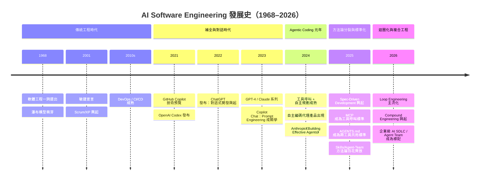

### 1.8 實務落地建議

- **先自我定位再選方法論**：對照上面的時間軸，誠實評估你的團隊目前是還停留在「補全時代」（只用 Inline Suggestion），還是已經進入「Agentic Coding」（AI 會自主執行多步驟任務）。方法論的選型與治理強度，應該對應你實際所在的階段，而不是別人正在用的最新階段。
- **地基不能跳過**：無論方法論多先進，1.1 節提到的版本控制、CI/CD、自動化測試地基如果沒打好，後面章節介紹的所有方法論都會事倍功半——AI 只會讓沒有紀律的團隊更快地產出更多技術債。
- **治理要跟上自主性**：自主性每提升一個階段（補全→對話→自主執行→迴圈化），治理與護欄的需求就要跟著提升一個量級。不要在導入 Agentic Coding／Loop Engineering 的同時，還沿用「補全時代」的零治理心態。

---

## 第二章：AI 方法論總覽

### 2.1 方法論的本質：從 Prompt 到 System

**概念**：多數團隊對「AI 方法論」的第一印象是「一套特定的 Prompt 技巧」，但本手冊要傳達的核心觀念是——2025–2026 年的主流方法論，本質上都是在建構一個**系統（System）**，而不只是一組 Prompt。這個系統通常包含四層：

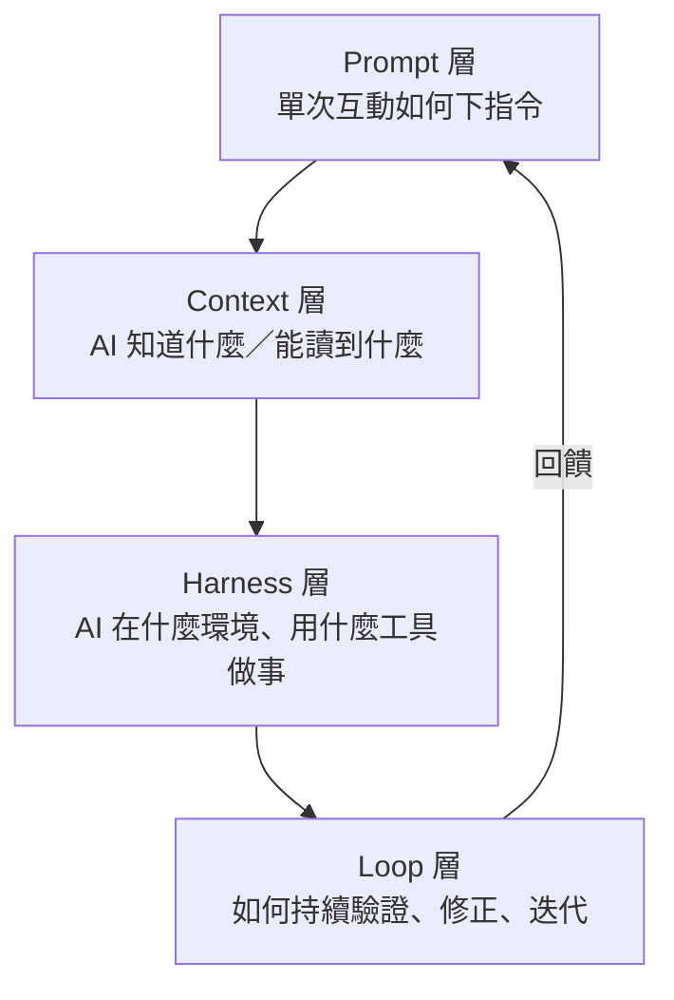

這四層分別對應 Prompt Engineering、Context Engineering、Harness Engineering、Loop Engineering 四個逐步進化的能力層級（詳見本專案另一份《使用github copilot下的Prompt Engineering vs Context Engineering vs Harness Engineering教學手冊》有更深入的成熟度模型，本手冊第 2.4 節會做濃縮整理並與方法論對應）。

**架構意涵**：任何一套方法論，都可以用「它主要在強化哪一層」來理解。例如 spec-kit／OpenSpec 主要強化 Context 層（把 Spec 變成 AI 可讀的結構化上下文）；Superpowers／mattpocock-skills 主要強化 Harness 層（用技能規範 AI 的行為紀律）；BMAD-METHOD 同時強化 Context 與 Harness（角色人格 + 標準化工作流程）；Loop Engineering／gsd-pi 則直接處理 Loop 層本身。

### 2.2 六大方法論分類框架

延伸 v1 手冊的「機制軸」分類，本手冊將主流方法論歸納為六大類（新增第 (f) 類迴圈編排層，對應 2026 年新興的 Loop／Compound Engineering）：

| 分類 | 核心邏輯 | 代表方法論 |
|---|---|---|
| (a) 規格撰寫導向 Spec-Authoring | 先產出結構化規格文件，規格是真相、程式碼是產物 | spec-kit、OpenSpec |
| (b) 敏捷團隊人格模擬 Agent-Persona-Team | 用多個具名 AI 角色模擬完整敏捷團隊 | BMAD-METHOD |
| (c) 技能紀律層 Skills/Discipline-Layer | 用自動觸發的技能規範 AI 如何寫程式 | Superpowers、mattpocock/skills |
| (d) 元提示編排層 Meta-Prompting/Orchestration | 用標準化流程指令串接開發步驟 | GSD（get-shit-done）、gstack |
| (e) 獨立自主代理執行環境 Standalone Agent Runtime | 自成一個管理 Context/Session/Git 的獨立系統 | gsd-pi（GSD-2） |
| (f) 迴圈編排與複利層 Loop/Compound Orchestration | 把方法論從「單次任務」升級為「持續迴圈＋知識複利」 | Loop Engineering、Compound Engineering |

> **架構師觀點**：這個分類法的目的是幫助你快速判斷「兩套方法論疊加使用時，會不會互相衝突」——同一分類內的方法論通常功能重疊（例如 spec-kit 和 OpenSpec 都是 (a) 類，通常不會同時使用兩套），跨分類的方法論則通常可以疊加組合（例如 (a) Spec-Kit + (c) Superpowers + (f) Loop Engineering 三層疊加，見第五章）。

### 2.3 方法論全景定位圖

用「規範性（Prescriptiveness，方法論規定得多細）」與「自主性（Autonomy，AI 可以自己決定多少事）」兩軸，可以把主流方法論放進同一張定位圖：

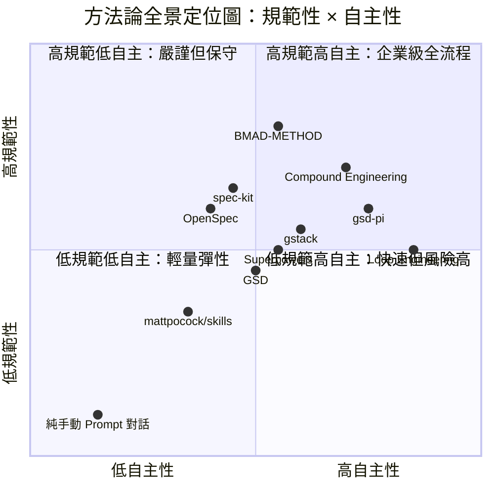

### 2.4 核心概念光譜：Prompt／Context／Memory／Skills／Workflow／Loop Engineering

企業導入 AI 輔助開發時，經常把下列幾個名詞混用，但它們其實對應不同的能力層級與治理重點：

| 概念 | 一句話定義 | 主要治理重點 |
|---|---|---|
| Prompt Engineering | 單次互動裡「怎麼說」才能讓 AI 給出可用結果 | Prompt 範本標準化、防止 Prompt Injection |
| Context Engineering | 讓 AI「知道什麼」——跨檔案、跨 Session 的知識供給 | 資料分類、內容排除（Content Exclusion）、機敏資訊隔離 |
| Memory Engineering | 讓 AI 記得「過去發生過什麼」——跨 Session 的長期記憶 | 記憶正確性、記憶過期/遺忘策略、記憶稽核軌跡 |
| Skills Engineering | 把「怎麼做一件事」封裝成可重用、可治理的技能模組 | 技能品質關卡、技能版本控制、技能之間的相依管理 |
| Tool Calling Architecture | AI 如何呼叫外部工具（檔案系統、終端機、API、資料庫） | 權限模式（Permission Mode）、工具白名單、審計日誌 |
| Workflow Engineering | 把多個步驟／多個 Agent 串接成可重複的流程 | 流程版本控制、人工審核關卡（Human Gate）設計 |
| Loop Engineering | 設計「觀察→決策→行動→驗證→回饋」的持續迴圈 | 迴圈終止條件、退回/回滾機制、成本上限 |

**架構圖：六個概念如何在一次任務中協作**：

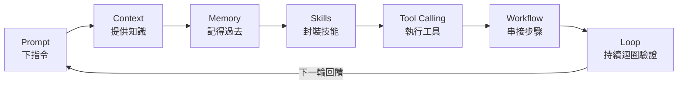

### 2.5 通訊與協作標準：MCP／A2A／ACP

隨著多方法論、多 Agent 協作變成常態，「標準化通訊協定」成為企業選型時必須理解的基礎設施層：

| 標準 | 全稱 | 解決的問題 | 現況定位 |
|---|---|---|---|
| **MCP** | Model Context Protocol | AI 模型如何以統一方式呼叫外部工具/資料源（資料庫、Jira、檔案系統…） | 目前最廣泛被各主流 AI Coding Agent（Claude Code、Copilot、Gemini CLI 等）採用的工具呼叫標準 |
| **A2A** | Agent-to-Agent Protocol | 不同廠商、不同框架的 AI Agent 之間如何互相溝通、委派任務 | 仍在快速演進中，企業導入前建議先以同廠商/同框架內的多 Agent 協作（見第十一章）為主 |
| **ACP** | Agent Communication Protocol | Agent 之間交換結構化訊息（狀態、意圖、結果）的訊息格式標準 | 概念上與 A2A 有重疊，企業導入時建議先確認團隊使用的 Orchestration 框架實際支援哪一種，避免同時維護兩套標準 |

> **命名易混淆提醒**：業界目前同時存在兩個不同的協定都縮寫為「ACP」——本節介紹的 **Agent Communication Protocol**（多代理間交換結構化訊息），以及本手冊第六章 6.6／6.8 節提到、由 Zed 發起並被 Devin Desktop／Grok Build 等工具採用的 **Agent Client Protocol**（讓外部代理可以作為「一級公民」在編輯器/終端機介面內執行的協定）——兩者性質不同、彼此無關，僅縮寫恰好相同。企業內部文件與教育訓練材料引用「ACP」時，務必註明是哪一個全稱，避免混淆。

**企業導入建議**：MCP 已經成熟到可以直接生產環境使用（見第六章各 AI Coding Agent 的 MCP 整合說明）；A2A／ACP（不論哪一種）仍屬於相對新的協定，建議先觀察、小規模 POC，不建議作為企業關鍵系統的既定基礎設施。

### 2.6 方法論與企業 AI SDLC 的關係

方法論不是憑空存在的——它們最終都要「掛」到企業既有的軟體開發生命週期（SDLC）上才有意義。下圖示意本章介紹的方法論分類，如何對應到第七章要詳細展開的企業 AI SDLC 各階段：

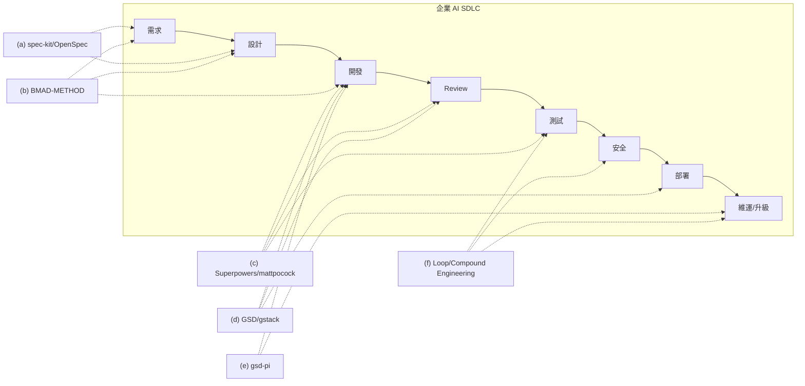

### 2.7 本手冊閱讀路徑建議

- **只想快速理解全貌**：讀完第一、二章即可掌握發展脈絡與分類框架，可直接跳到第四章的比較表。
- **要做方法論選型**：搭配 v1 手冊的決策樹，再讀本手冊第三章對應方法論的完整介紹確認細節。
- **要落地企業 SDLC**：第二章 2.6 的對應圖是起點，接著讀第七章展開的完整流程。
- **要建立 AI Agent 團隊**：第二章可以先略過，直接從第十一章開始，回頭查閱第三章相關方法論細節即可。

### 2.8 實務落地建議

- **先對齊詞彙再開會**：多數企業內部對「Spec」「Skill」「Agent」「Context」這些詞的理解並不一致，導入前建議先用本章 2.4 的定義表跟團隊對齊一次詞彙，避免後續討論雞同鴨講。
- **不要把 MCP 和 A2A/ACP 混為一談**：MCP 解決的是「Agent 呼叫工具」，A2A/ACP 解決的是「Agent 呼叫 Agent」——兩者成熟度目前並不對等，治理策略也應該分開設計。
- **分類框架是溝通工具，不是絕對真理**：2.2 節的六大分類是為了方便決策討論而簡化的模型，實務上許多方法論會橫跨多個分類（例如 gstack 兼具技能包與流程管線特性），使用時請以「主要機制」判斷。

---

## 第三章：各方法論詳細介紹

本章是全書篇幅最重的一章，逐一深入介紹 8 大核心方法論，以及兩個 2026 年興起、對前 8 套方法論產生「升級」作用的迴圈化方法論（Loop Engineering、Compound Engineering）。每一節都依「設計理念／解決問題／核心概念／架構／流程／範例／適合專案／限制／使用技巧／最佳實務／優缺點／企業導入建議」的固定骨架撰寫，方便橫向對照（第四章會把這些內容收斂成比較表）。

> **閱讀提醒**：本章不是安裝教學——每套方法論的完整安裝步驟、逐指令示範，請參閱本目錄下對應的原始教學手冊（見附錄 F）。本章聚焦在「這套方法論骨子裡在解決什麼問題、用什麼架構解決、企業導入時該注意什麼」。

### 3.1 spec-kit

**設計理念**：spec-kit 是 GitHub 官方推出的 Spec-Driven Development（SDD）工具鏈，核心信念是「規格是真相，程式碼是產物（Spec is truth, code is artifact）」——把長期以來「文件寫完就過期」的慣性反過來，讓規格文件成為 AI 產生程式碼時**持續參照、持續更新**的單一真相來源，而不是寫完就束之高閣的靜態文件。

**解決問題**：解決「AI 自主性提高後，需求理解容易漂移」的問題——沒有結構化規格時，AI 對同一句話在不同 Session 可能做出不同解讀；spec-kit 用五個依序產出的結構化文件，把「AI 應該做什麼」白紙黑字釘死。

**核心概念**：五大產物依序產出——**Constitution**（專案層級的不可違反原則）→ **Spec**（單一功能的需求規格）→ **Plan**（技術實作計畫）→ **Tasks**（可執行的任務清單）→ **Implementation**（程式碼實作），每個產物都有對應範本存放於 `.specify/templates/`。目前的釐清指令 `/speckit.clarify` 前身其實是早期版本的 `/quizme`，兩者概念相同（依序追問澄清模糊需求），企業內部若有人使用較舊版教材，應留意這個更名。

**架構／流程**：

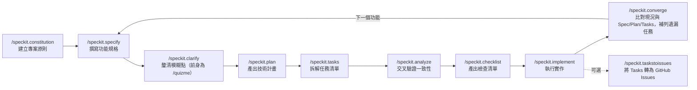

**範例**：

```bash
uv tool install specify-cli --from git+https://github.com/github/spec-kit.git
specify init my-project --ai claude
specify check
```

**適合專案**：需求會被反覆檢視、需要留下決策紀錄以利稽核的專案——例如受監理產業的核心系統、多團隊協作的中大型專案。

**限制**：五個產物依序產出，流程相對線性，對於「邊做邊想」的探索型專案（如原型驗證、Demo）會顯得笨重；規格與程式碼仍可能隨時間漂移，需要搭配 `/speckit.analyze`（或收尾階段的 `/speckit.converge`）定期校驗。

**使用技巧**：`/speckit.clarify` 不要跳過——這一步是預防「AI 自己腦補需求」最有效的關卡；Constitution 建議在專案初期就寫入不可退讓的技術原則（例如「所有 API 必須先寫測試」），讓它成為後續所有 Plan 的硬約束；`specify self check` / `specify self upgrade` 建議納入團隊環境健檢流程，及早發現 CLI 版本落後造成的指令行為差異。

**最佳實務**：把 Constitution 當成團隊的技術治理文件維護，而不是寫一次就不動；每個功能都留下 Spec→Plan→Tasks 的完整鏈路，作為未來稽核與新人 Onboarding 的活文件。

**近期生態系動態（2026）**：spec-kit 已從單純的「五產物線性流程」演化出完整的 Extensions／Presets／Bundles 生態——Extensions 允許社群或企業自訂指令與 Hook，Presets 可預先包裝範本，Bundles 則可打包成角色化的團隊安裝包（呼應第十章 10.7 Skill Library 的封裝概念）；官方文件現已列出 30 種以上受支援的 AI 工具，遠多於早期版本；企業導入時建議定期以 `specify self check` 確認採用的 Extension／Preset 版本與官方主線相容。

**優點／缺點**：

| 優點 | 缺點 |
|---|---|
| 官方維護、多工具支援（30+ 種 AI 工具，含 Copilot/Claude Code/Cursor/Windsurf/Gemini CLI 等） | 線性流程對快速原型不友善 |
| 規格結構化，利於稽核與追溯；Extensions/Presets/Bundles 生態利於企業客製化 | 五個產物需要團隊有紀律地維護，否則淪為形式 |
| Constitution 機制適合建立團隊級技術治理 | 對小型/單人專案可能過度工程化 |

**企業導入建議**：適合作為企業「規格層」的標準起點，尤其是需要對監理單位交代決策依據的產業。建議先在一個中型專案試點，觀察 Constitution 的維護紀律能否落實，再推廣到多團隊；若企業已累積客製化的 Extension/Preset，建議連同 Constitution 一起納入版本控制與定期複查範圍。

### 3.2 OpenSpec

**設計理念**：OpenSpec 同屬 SDD 陣營，但核心機制不同於 spec-kit 的線性五步驟——它把規格管理設計成**契約（Contract）+ 差異追蹤（Delta）**：現行系統的完整規格永遠存在於 `specs/`，任何變更都先以「Delta（差異提案）」的形式提出、審查、套用，再歸檔回主規格，類似資料庫的 Migration 概念，但作用對象是「需求」而非「Schema」。

**解決問題**：解決「規格文件只有『現在的樣子』，看不出『為什麼變成這樣』」的問題——傳統規格文件被覆寫後，舊版本的決策脈絡就消失了；OpenSpec 用 Delta + Archive 機制，讓每一次需求變更都留下可追溯的歷史記錄。

**核心概念**：規格語言採 SHALL／MUST／SHOULD／MAY（RFC 2119 風格的強制程度用詞）描述需求，並用 GIVEN／WHEN／THEN 描述情境化的驗收條件；四種 Spec 類型（Product/System/API/Data Spec）對應不同抽象層級。

**架構／流程**：主要操作介面目前已改版為 **`/opsx:*`** 指令集——預設流程是 `/opsx:explore`（釐清問題脈絡）→ `/opsx:propose`（產出 Delta 提案）→ `/opsx:apply`（套用並實作）→ `/opsx:archive`（歸檔回主 Spec）；另有進階版流程指令 `/opsx:new`／`/opsx:continue`／`/opsx:ff`（快轉）／`/opsx:verify`／`/opsx:bulk-archive`／`/opsx:onboard`，供已熟悉流程的團隊加速操作。底層資料模型不變：

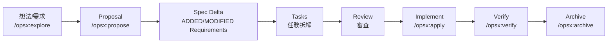

**範例**：

```bash
openspec init
openspec show account-balance-api
openspec validate account-balance-api
openspec archive account-balance-api --yes
```

**適合專案**：長期演進、規格會被頻繁修改的系統（例如核心業務系統的持續迭代），特別適合需要「這條需求是什麼時候、為什麼改的」這種稽核追溯需求的場景。

**限制**：Delta 機制需要團隊理解「提案—套用—歸檔」的心智模型，對第一次接觸 SDD 的團隊有學習曲線；正式的 SHALL/MUST 語言風格也需要一定的訓練才能寫得精確。

**使用技巧**：善用 `openspec validate`（或 `/opsx:verify`）在提案階段就抓出規格內部矛盾，不要等到實作完才發現規格本身邏輯不通；GIVEN/WHEN/THEN 情境建議直接對應到未來要寫的測試案例，一魚兩吃；`openspec doctor` 建議納入環境健檢，及早發現設定或版本落差。

**最佳實務**：每個 Delta 提案都應該可以獨立審查、獨立回退；`openspec/archive/` 應該被當作正式的需求變更歷史檔案保存，不要定期清空。

**近期生態系動態（2026）**：CLI 指令面已大幅擴充，除既有的 `init/show/validate/archive` 外，新增 `doctor`（環境健檢）、`context`、`workset`（工作集管理）、`store`、`schema`、`status`、`instructions`、`templates` 等指令；最重要的新功能是 **Stores（Beta）**——可建立獨立的規格儲存庫，讓多個程式碼 Repo 共用同一份規格與變更計畫（適合微服務或多 Repo 架構下「一份變更、多處實作」的協調情境）；官方現已列出 25 種以上支援工具。

**優點／缺點**：

| 優點 | 缺點 |
|---|---|
| Delta 機制天然支援需求變更的可追溯性；Stores 支援跨 Repo 共用規格 | 學習曲線較 spec-kit 稍高，`/opsx:*` 新指令集需要團隊重新熟悉 |
| SHALL/MUST 語言精確、利於驗收條件轉測試案例 | 生態系工具鏈相對新，社群資源較少 |
| 契約式思維適合長期演進系統 | 需要團隊建立「先提案再實作」的紀律 |

**企業導入建議**：特別推薦給規格會被監理單位定期審查、需要完整變更歷史的產業（金融核心系統、保險核保邏輯）；可與 spec-kit 二選一作為企業的規格層標準，不建議兩者同時作為主規格來源（機制重疊，見第五章 5.5）；若企業採多 Repo／微服務架構，建議評估 Stores 機制是否能取代既有的跨團隊規格同步土法煉鋼做法。

### 3.3 Superpowers

**設計理念**：Superpowers 由開發者 Jesse Vincent（GitHub 帳號 obra）發起，核心信念是「好的工程紀律不該靠工程師每次記得要求 AI 遵守，而應該讓 AI 在對的情境下自動觸發」——因此設計成一組**自動觸發（auto-trigger）**的技能（Skills），工程師不需要每次手動呼叫，AI 會依情境自行判斷該套用哪個技能。

**解決問題**：解決「AI 寫程式常見的壞習慣」——跳過測試直接宣稱完成、沒有計畫就直接開始改動大範圍程式碼、複雜度隨意疊加不做簡化。Superpowers 用一套標準化的工作流程技能，把 TDD、系統化除錯、簡化優先（YAGNI/DRY）這些工程紀律「焊死」進 AI 的預設行為。

**核心概念**：核心是「The Basic Workflow」七步驟，加上 14 個獨立技能模組（每個技能是一個 Markdown 檔案，描述觸發情境與執行步驟，實際檔案為 brainstorming／dispatching-parallel-agents／executing-plans／finishing-a-development-branch／receiving-code-review／requesting-code-review／subagent-driven-development／systematic-debugging／test-driven-development／using-git-worktrees／using-superpowers／verification-before-completion／writing-plans／writing-skills）；另有「Hard Gates（硬性閘門）」機制——例如在腦力激盪階段，`brainstorming` 技能內明確定義了 `<HARD-GATE>` 區塊，強制要求逐一提問、確認使用者明確回覆後才能進入下一階段，防止 AI「自己腦補完就開始動手」（官方原始檔案未硬性規定固定問題數量，實務上依專案複雜度增減，企業內部若曾看到「至少 5 個問題」的教材版本，屬於早期非正式慣例，不宜當作硬性規則引用）。

**架構／流程**：

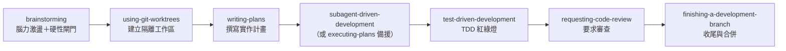

**範例**：

```bash
/plugin install superpowers@claude-plugins-official
```

**適合專案**：對程式碼品質紀律要求高、但團隊人力有限、無法每次都靠人工提醒 AI「記得先寫測試」的專案；特別適合中小型團隊想要「借用資深工程師紀律」的情境。

**限制**：技能自動觸發依賴描述（description）撰寫品質，若技能描述不夠精確可能誤觸發或不觸發；在不支援 Subagent 的平台（部分 Cursor/OpenCode 情境）功能會降級。

**使用技巧**：不要略過 Git Worktree 隔離步驟——這是避免 AI 在同一個工作目錄裡「邊改邊測」互相干擾的關鍵機制；「1% 規則」（禁止為了圖方便而合理化跳過流程）建議寫進團隊的 CLAUDE.md 作為明文提醒。

**最佳實務**：把 Hard Gates 的釐清問題視為「需求訪談」的替代品，認真回答而不是隨便帶過；技能清單應該隨專案特性擴充，而不是照搬預設的 14 個技能不做客製。

**近期生態系動態（2026）**：Superpowers 已從「Claude Code 專屬」擴展為支援 Antigravity、Codex App／Codex CLI、Cursor、Factory Droid、Gemini CLI、GitHub Copilot CLI、Kimi Code、OpenCode、Pi 等更廣泛的多代理生態，企業若已在多工具並存的環境，這點值得重新評估其覆蓋範圍；專案本身也出現商業化訊號（開始招募付費社群工程師、提供企業支援選項），企業導入前建議留意其治理與支援模式是否會隨商業化而改變（例如免費版功能是否會被拆分為付費層）。

**優點／缺點**：

| 優點 | 缺點 |
|---|---|
| 自動觸發，不依賴工程師每次手動提醒；已支援多種主流 AI 工具 | 技能描述品質直接影響觸發準確度 |
| Hard Gates 有效防止 AI 腦補需求 | 部分平台功能會降級（無 Subagent 支援） |
| TDD/Worktree 隔離內建，降低品質風險 | 技能之間偶有相依，客製化需理解整體架構 |

**企業導入建議**：適合作為第五章「分層整合模型」中的 Discipline 層，與 spec-kit／OpenSpec 這類 Spec 層方法論疊加使用；建議先讓資深工程師審視預設技能清單，依團隊實際痛點調整後再全面推廣；若專案走向商業化，建議在導入合約/授權條款中確認長期可用性與資料處理政策。

### 3.4 BMAD-METHOD

**設計理念**：BMAD-METHOD 官方全名為「**Breakthrough Method for Agile AI Driven Development**」（社群亦常暱稱其為「Build More Architect Dreams」），核心信念是「用多個具名 AI 角色模擬一整個敏捷團隊，而不是一個萬能助理」——透過角色分工（Analyst/PM/Architect/Developer/UX/Test Architect/Scrum Master/Tech Writer 等 12 種以上領域專家角色），讓每個角色只專注在自己的職責範圍內思考，模擬真實敏捷團隊的分工與交接。

> **命名訂正提醒**：本手冊前一版曾把「BMAD」拆解對應為「Business→Model→Architecture→Delivery」四階段生命週期，經查證官方 Repository 與文件並無此對應依據，屬於誤植，本版已修正為官方現行（V6）的正確階段模型，請以本節內容為準。

**解決問題**：解決「單一 AI 助理身兼多職時，容易在不同關注點之間思考混亂」的問題——例如同時要求 AI 兼顧商業分析與技術架構，容易顧此失彼；角色分工讓每次互動的「思考範疇」更聚焦。

**核心概念**：現行（V6）4 階段生命週期為 **Analysis（分析）→ Planning（規劃）→ Solutioning（解決方案設計）→ Implementation（實作）**，底層由「BMad Core」引擎驅動，並支援多角色同場互動的「Party Mode」；3 種工作流程軌道因應不同專案規模：Quick Flow（快速修復/小型功能，跳過完整架構階段，僅產出技術規格）、BMad Method（一般產品開發，標準流程含完整 PRD）、Enterprise（大型/多租戶/合規密集型專案，含完整治理、安全、DevOps 文件產出）——**具體規劃耗時（如「15 分鐘」「30 分鐘」）為經驗參考值，會隨專案複雜度與模型效能浮動，不宜當作固定 SLA 引用**。

**架構／流程**：

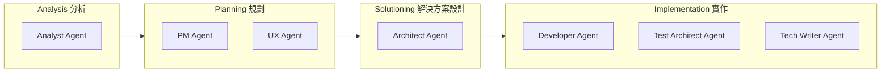

**範例**：

```bash
npx bmad-method@alpha install
# 於 IDE 內選擇工作流程軌道
*workflow-init
```

**適合專案**：需求複雜、涉及多個關注面（商業、架構、UX、合規）的中大型專案；Enterprise 軌道特別適合金融、保險等文件要求高的產業。

**限制**：角色人格模擬會增加互動輪次與 Token 成本；對 3 人以下的小型新創團隊，若直接套用 Enterprise 軌道，流程本身可能就耗盡團隊人力（見 v1 手冊 §1.1 常見選型錯誤）。

**使用技巧**：專案初期先用 Quick Flow 或 BMad Method 軌道試水溫，確認角色分工模式適合團隊後，再視合規需求升級到 Enterprise 軌道；「Document Sharding」機制可大幅降低長文件重複帶入 Context 的成本，建議善用。

**最佳實務**：讓每個角色的產出都對應到真實敏捷團隊會產出的文件（PRD／架構決策記錄／測試計畫），使其可以被非 AI 團隊成員直接閱讀與接手。

**近期生態系動態（2026）**：BMAD-METHOD 已從單一工具演化為模組化生態系——核心模組 **BMM**（現含 34+ 種工作流程）之外，另有 **BMad Builder（BMB）**（自訂擴充工具）、**Test Architect（TEA）**、**Game Dev Studio（BMGD）**、**Creative Intelligence Suite（CIS）** 等專用模組；V6 版新增 Skills Architecture、Dev Loop Automation、跨平台 Agent Team／Sub-Agent 支援，並重新引入 **Web Bundles**（把 BMad 工作流程包裝成 Google Gemini Gems／ChatGPT Custom GPTs，可用較低成本的方式進行規劃階段作業）。

**優點／缺點**：

| 優點 | 缺點 |
|---|---|
| 角色分工使複雜需求的思考更聚焦；模組化生態（BMM/BMB/TEA/BMGD/CIS）擴充性強 | 互動輪次多，Token 成本較高 |
| 三種軌道彈性因應專案規模 | Enterprise 軌道對小團隊可能過度工程化 |
| 文件產出貼近真實敏捷團隊產物 | 角色人格越多，團隊理解與客製成本越高 |

**企業導入建議**：建議依團隊規模嚴格對應軌道選擇（見 v1 手冊第四章決策樹）；適合作為需要產出完整合規文件的大型專案首選，也可作為第十一章「AI Agent 團隊建立」角色設計的參考範本之一。

### 3.5 GSD（get-shit-done）

**設計理念**：GSD 定位為「輕量級 Meta-Prompting 系統」，設計理念是用一組標準化 Slash Command，把「討論→規劃→執行→驗證→交付」的流程疊加在使用者原本就在用的 AI Runtime 之上（支援 9 種 AI Runtime），而不強迫團隊更換工具鏈。

**解決問題**：解決「每個專案的 AI 工作流程都要重新發明一次」的問題——用標準化的 `.planning/` 目錄結構與指令集，把專案脈絡（需求、路線圖、當前狀態）用檔案的形式持久化，避免每次對話都要重新解釋專案背景。

**核心概念**：核心產物存放於 `.planning/`（v1.10.0+ 後由早期的 `.gsd/` 更名，這是實務上容易與下一節的 gsd-pi 混淆的地方，務必留意），包含 `PROJECT.md`／`REQUIREMENTS.md`／`ROADMAP.md`／`STATE.md`／`context/`／`specs/`／`plans/*.xml`／`tasks/`／`checkpoints/`；規劃產物採 XML 格式的「Wave」計畫，對應 Clean Architecture 分層（Domain→Application→Infrastructure→Presentation）。官方將核心工作循環稱為「**Phase Loop**」——Discuss→Plan→Execute→Verify→Ship，設計目的是把研究/規劃/執行都委派給各自帶新鮮 Context（約 20 萬 Token 上限）的子代理執行，藉此對抗長 Session 的 Context Rot，同時讓主 Session 保持精簡。

**架構／流程**：

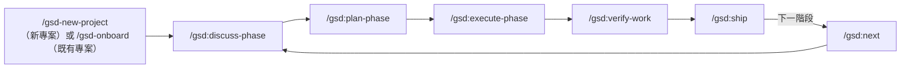

**範例**：

```bash
npx @opengsd/gsd-core@latest
# 互動式選擇 AI Runtime 後自動安裝
```

**適合專案**：希望有一套標準化流程指令，但不想被綁定在單一 AI Runtime 的團隊；適合跨團隊使用不同 AI 工具、但想共用同一套專案管理心智模型的組織。

**限制**：Wave 計畫的 XML 格式對非技術關係人不易閱讀；作為「疊加在既有 Runtime 之上」的框架，其穩定性某種程度依賴底層 Runtime 的工具呼叫能力是否完整。

**使用技巧**：留意目錄命名的版本差異（`.planning/` vs 舊版 `.gsd/`），跨團隊分享範本時要先確認版本；`Model Profiles`（quality/balanced/budget/inherit）可依任務重要性動態切換模型成本。

**最佳實務**：`checkpoints/` 機制建議搭配長任務使用，善用 Context Rot 緩解機制（Wave 拆分＋檢查點），避免長 Session 導致模型注意力衰退。

**近期生態系動態（2026）與 gsd-pi 關係澄清**：GSD（gsd-core）與下一節的 gsd-pi **並非同一專案的第 1／2 版**——兩者內部歷史上曾被非正式互稱「gsd 1／gsd 2」，這正是造成外界混淆的根源；官方現已明確將兩者定位為 **Open GSD 套件下彼此互補、各自獨立演進的工具**（套件內另有一個「GSD Browser」元件），而非孰優孰劣或新舊替代關係。安裝套件名稱也已改為 scoped package `@opengsd/gsd-core`，若團隊教材仍寫著舊的 `get-shit-done-cc`，應一併更新。

**優點／缺點**：

| 優點 | 缺點 |
|---|---|
| 跨多種 AI Runtime，不綁定單一工具 | XML 格式的 Wave 計畫對非工程背景關係人不友善 |
| `.planning/` 目錄把專案脈絡持久化；Phase Loop 概念清楚 | 依賴底層 Runtime 的工具呼叫完整度 |
| Model Profiles 可依任務彈性切換成本 | 與「gsd-pi」名稱相似，需向團隊說明兩者是互補而非版本關係 |

**企業導入建議**：多工具並存的企業環境（例如前端團隊用 Cursor、後端團隊用 Claude Code）特別適合用 GSD 統一專案管理心智模型；導入時務必在團隊內部明確澄清 GSD 與 gsd-pi 是 Open GSD 套件下兩個互補但獨立演進的工具，而非新舊版本關係，避免版本混淆。

### 3.6 gsd-pi（GSD-2）

**設計理念**：與上一節的 GSD 名稱相似，但 gsd-pi（社群暱稱 GSD-2）在設計理念上是完全不同的專案——它不是「疊加在既有 Runtime 之上的提示框架」，而是一個**獨立的 TypeScript CLI 應用程式**，建構在 Pi SDK 之上，自己直接管理 Context Window、Session 生命週期與 Git 策略，定位更接近一個獨立的自主開發 Runtime。

**解決問題**：解決「提示框架終究要依賴底層 Runtime 的 Context 管理能力，天花板受限」的問題——gsd-pi 自己控制 Context Window 用量（Context Pressure Monitor），不假手他人。

**核心概念**：三層任務階層 **Milestone**（4–10 個 Slice）→ **Slice**（1–7 個 Task）→ **Task**（鐵律：必須能在一個 Context Window 內完成），產物存放於 `.gsd/`（含 `PREFERENCES.md`／`PROJECT.md`／`DECISIONS.md` 附加式 ADR／`KNOWLEDGE.md`／`RUNTIME.md`／`STATE.md`／`milestones/`／`slices/`／`tasks/`／`metrics.json`／`gsd.db` SQLite）。

**架構／流程**：

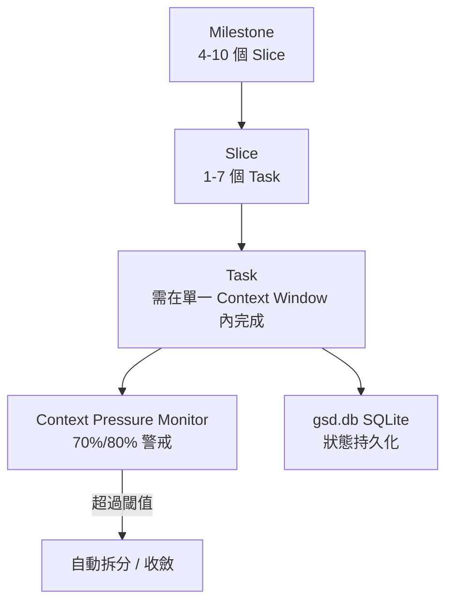

**範例**：

```bash
npm install -g @opengsd/gsd-pi@latest
gsd            # 啟動 Onboarding Wizard
gsd auto       # 自主執行模式
gsd status
gsd --web      # 啟動網頁版控制台
```

**適合專案**：需要長時間、多 Session 自主運作、且對 Context 管理精確度要求高的專案；內建 5 種子代理（Scout／Researcher／Worker／JS-Pro／TS-Pro）與 MCP Server 雙向支援（既可當 Client 也可被 Claude Desktop／VS Code Copilot 當 Server 呼叫），適合已經有多工具整合需求的團隊。

**限制**：需要 Node.js ≥22（建議 24 LTS），版本要求較新；作為獨立 Runtime，學習曲線高於單純的提示框架；Task 必須切到「能塞進單一 Context Window」的鐵律，對任務拆解能力要求較高。

**使用技巧**：善用 Context Pressure Monitor 的 70%/80% 警戒閾值，提早規劃 Wave/Slice 拆分，不要等到 Context 爆滿才處理；Docker Sandbox 部署選項適合對執行環境隔離有要求的企業場景。

**最佳實務**：`DECISIONS.md` 採附加式 ADR（只增不改），務必維持這個紀律，讓決策歷史可完整追溯；`gsd doctor` 建議納入 CI 前置檢查，及早發現環境設定問題。

**近期生態系動態（2026）**：套件已從未加範圍的 `gsd-pi` 改為 scoped package **`@opengsd/gsd-pi`**（舊安裝需先解除安裝再遷移）；狀態儲存已升級為「canonical database foundation」——底層改用資料庫儲存並以 Markdown 檔案作為投影視圖（取代純檔案儲存，對需要多工具/多視角同時讀取狀態的企業場景更友善）；另新增 macOS 選單列雲端監控 App 與 `gsd --web` 控制台，方便在不開終端機的情況下掌握長時間自主任務的進度。

**優點／缺點**：

| 優點 | 缺點 |
|---|---|
| 自主管理 Context Window，不受限於底層 Runtime | Node.js 版本要求較新，環境門檻較高 |
| Milestone/Slice/Task 三層階層任務拆解嚴謹；DB 化狀態儲存利於多工具讀取 | 學習曲線高於單純的提示框架型方法論 |
| 內建 5 種子代理與雙向 MCP 支援；提供選單列 App／Web 控制台 | 與 GSD（gsd-core）名稱相似，需明確溝通兩者是互補而非版本關係 |

**企業導入建議**：適合需要「無人值守」長時間自主開發的場景（例如夜間批次重構任務），但務必先在低風險專案驗證其自主執行的邊界與回退機制，再擴大到關鍵系統；若既有安裝使用舊版未加範圍套件名稱，建議規劃遷移至 `@opengsd/gsd-pi`。

### 3.7 gstack

**設計理念**：gstack 把自己定位為「虛擬工程團隊」——用一整套（約 20 餘個，官方持續調整中）Slash Command 技能包，模擬新創公司從需求訪談到上線的完整流程，設計理念濃縮成一句「Sprint」：Think → Plan → Build → Review → Test → Ship → Reflect，每個技能的產出會自動接續下一個技能作為輸入。

> **起源脈絡（重要）**：gstack 的作者是 Y Combinator 總裁暨執行長 **Garry Tan**，這套工具原本是他個人日常使用的 Claude Code 設定檔，後來開源釋出，並非由團隊或廠商從零設計、以企業採用為目標的通用方法論——這與 spec-kit（GitHub 官方）、BMAD-METHOD（社群團隊維護）等專案的性質不同。這個脈絡對企業導入評估很關鍵：它證明了「個人高頻使用的配置」具備一定的實戰價值與可參考性，但也代表企業不應預期它像官方方法論一樣有正式的版本相容承諾、企業支援管道或治理文件，導入前應自行補強這些面向。

**解決問題**：解決「小型團隊沒有資源配置完整的角色分工（PM/設計/資安/QA），但又需要這些角色把關」的問題——用一組模擬角色審查的技能（CEO Review／Eng Review／Design Review／Review Army／CSO 資安審查）補齊小團隊缺少的把關角色。

**核心概念**：「Builder Ethos」三原則——**Boil the Lake**（既然 AI 讓完整性變便宜，就該做到完整而非將就）、**Search Before Building**（三層知識：成熟做法／新興做法／第一性原理）、**User Sovereignty**（AI 提案、人類決定）。

**架構／流程**：

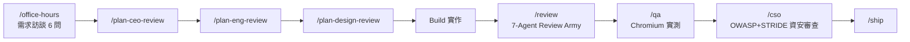

**範例**：

```bash
git clone https://github.com/garrytan/gstack ~/.claude/skills/gstack
cd ~/.claude/skills/gstack && ./setup --host claude
```

**適合專案**：資源有限、需要一人團隊也能做到「有把關流程」的小型專案或早期新創產品；因技能包形式安裝，也適合想快速補齊審查流程但不想改變主要方法論的團隊。

**限制**：核心執行環境依賴 Bun，並非傳統 Node.js 生態；作為技能包＋流程管線的混合體，與 Superpowers／mattpocock-skills 這類同屬 (c) 類的技能框架同時使用時容易重疊，需要規劃使用邊界。

**使用技巧**：`/office-hours` 的 6 個強制問題建議認真回答，這是後續所有審查技能品質的起點；`/careful`／`/freeze`／`/guard` 這類安全閥指令，建議在對正式環境操作前養成使用習慣。

**最佳實務**：把 `/review` 的 7-Agent Review Army 結果視為多視角意見而非單一裁決，人工仍需做最終判斷（呼應 User Sovereignty 原則）。

**近期生態系動態（2026）**：除既有的 `--host` 多工具安裝（支援 Codex、OpenCode、Cursor、Factory Droid 等 10 種 AI 代理）外，已新增 **GBrain**（跨 Session 的持久知識庫，可接 Supabase／PGLite／遠端 MCP 作為後端）、OpenClaw 整合（透過 ACP 協定派生 Claude Code Session）、`/codex`（呼叫 OpenAI 做獨立二次意見審查）、`/ios-qa`（於真實 iPhone 裝置執行 QA）等能力；其瀏覽器代理另內建一個以機器學習分類器偵測提示注入（Prompt Injection）攻擊的防護機制。這套個人配置的社群採用規模已相當可觀，但如前述起源脈絡提醒，規模大不等於企業治理成熟度對等，仍應個別評估。

**優點／缺點**：

| 優點 | 缺點 |
|---|---|
| 技能包覆蓋從需求到上線的完整虛擬團隊流程；持續新增 GBrain、`/ios-qa` 等能力 | 依賴 Bun 執行環境，與部分企業標準 Node.js 生態不完全一致 |
| 多視角模擬審查（CEO/Eng/Design/資安）補齊小團隊缺口 | 起源於個人配置，缺乏正式的企業版本相容承諾與支援管道 |
| Builder Ethos 強調人類最終決定權 | 技能管線耦合度高，客製化需要理解整體管線設計 |

**企業導入建議**：適合作為小型創新專案或 POC 階段的加速工具；若要導入大型企業正式系統，建議只挑選其中的審查類技能（`/review`／`/cso`）與企業既有的 SDLC 治理框架（第七章）整合，而非整套流程管線照搬；由於其個人專案起源，建議企業自行建立版本釘選、變更追蹤與備援方案，不宜假設它會比官方維護的方法論更穩定。

### 3.8 mattpocock/skills

**設計理念**：由 TypeScript 教育者 Matt Pocock 發起、透過 skills.sh 技能註冊平台散布，核心信念是「對抗 Vibe Coding」——用一組針對性技能，逐一對治 AI 輔助開發最常見的四種失效模式：誤解需求、輸出冗長、品質低落、架構腐化。官方 README 明確提出與 GSD／BMAD／spec-kit 等「重型框架」不同的定位主張：「這類框架試圖用『擁有整個流程』的方式來提供幫助……而這套技能被設計成小巧、易於調整、可自由組合」——這是理解 mattpocock/skills 與本章其他方法論根本差異的關鍵一句話：它刻意不做流程擁有者，只做一組可插拔的獨立工具。

**解決問題**：`grill-me`／`grill-with-docs` 對治「誤解需求」（用連續追問逼出真實需求）；`CONTEXT.md` 詞彙表壓縮對治「輸出冗長」；`tdd`／`diagnosing-bugs` 對治「品質低落」；`improve-codebase-architecture`（基於 Module Depth 理論）對治「架構腐化」。

**核心概念**：技能以 `SKILL.md`（YAML frontmatter：`name`／`description`／`argument-hint`／`disable-model-invocation`）為單位定義，搭配選用的附屬檔案（`tests.md`／`mocking.md`／`deep-modules.md`）；`docs/adr/000N-slug.md` 採簡化版 ADR，只在滿足「難以逆轉／不明顯／有真實取捨」三條件時才需要寫。現行技能清單分兩類：**Engineering**——`ask-matt`／`code-review`／`codebase-design`／`diagnosing-bugs`／`domain-modeling`／`grill-with-docs`／`implement`／`improve-codebase-architecture`／`prototype`／`research`／`resolving-merge-conflicts`／`setup-matt-pocock-skills`／`tdd`／`to-spec`／`to-tickets`／`triage`／`wayfinder`；**Productivity**——`grill-me`／`grilling`／`handoff`／`teach`／`writing-great-skills`；兩類合計 20 餘個，且持續有新增/更名（例如舊教材常見的 `diagnose` 現已更名為 `diagnosing-bugs`），企業導入時建議以官方 Repository 當下清單為準，不宜依賴任何時間點的固定數字。

**架構／流程**：

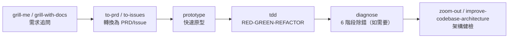

**範例**：

```bash
npx skills@latest add mattpocock/skills
/setup-matt-pocock-skills
```

**適合專案**：個人開發者到中型團隊，特別是深受「AI 寫出來的程式碼一眼望去很像樣，實際跑起來 Bug 一堆」所苦的團隊；`tdd` 技能特別強調用「Vertical Slices（垂直切片）」取代常見的「Horizontal Slices（水平切片）」反模式。

**限制**：技能設計早期以 Claude Code 為主要目標平台，雖然目前已支援 Cursor／Codex／Copilot／Windsurf／Gemini 等多工具，但部分技能在不同平台的行為一致性仍需驗證。

**使用技巧**：`CONTEXT.md` 應該保持「純詞彙表」，不要混入實作細節——這是控制 Token 成本的關鍵紀律；`diagnose` 的 6 階段除錯流程建議印出來貼在團隊 Wiki，作為除錯 SOP。

**最佳實務**：ADR 的「三條件門檻」值得所有團隊借鏡——不是所有決策都要寫 ADR，只有「難以逆轉、不明顯、有真實取捨」的決策才值得記錄，避免 ADR 氾濫成災。

**優點／缺點**：

| 優點 | 缺點 |
|---|---|
| 精準對治四種常見 AI 輔助開發失效模式 | 部分技能跨平台行為一致性仍待驗證 |
| ADR 三條件門檻避免過度文件化 | 需要團隊先建立 Issue Tracker／CLAUDE.md 等前置設定 |
| Vertical Slices 的 TDD 理念清楚易懂 | 技能數量與更新頻率高，需要持續關注版本變化 |

**企業導入建議**：適合作為第十章「Skill Library 建立」的入門範本——技能顆粒度設計得宜，很適合企業內部團隊參考其 `SKILL.md` 撰寫規範，再客製化出符合自己領域知識的技能。

### 3.9 Loop Engineering

**設計理念**：Loop Engineering 不是一套工具，而是一種思維轉變的方法論倡議——已可查證的明確出處是 Addy Osmani（Google/Chrome）於 2026 年 6 月發表的部落格文章〈Loop Engineering〉（隨後由 O'Reilly Radar 轉載），核心主張是「人類的角色應該從『寫 Prompt 指揮每一步』進化為『設計一個系統，讓它取代你去下 Prompt』」——原文將其拆解為 automations（自動化）、worktrees（隔離工作區）、skills（技能）、plugins/connectors（含 MCP）、sub-agents（子代理）五個核心元件，再加上「持久化的外部狀態」（Markdown 檔案/看板，讓進度可以跨執行留存）作為第六個要素；Osmani 明確把 Loop Engineering 定位為有別於「Prompt Engineering」（單輪互動）與「Context Engineering」（上下文內容管理）的第三個層次——關注的是自主執行迴圈本身的形狀。Claude Code 的創造者 Boris Cherny 有一句被廣泛引用的話很好地總結了這個轉變：「我已經不寫 Prompt 給 Claude 了，我寫的是迴圈（loops）。」

**解決問題**：解決「單次 Prompt 或單次任務執行，品質上限受限於 AI 一次性輸出的品質」的問題——透過把驗證訊號（測試結果、Lint 結果、Review 意見）接回迴圈，讓 AI 有機會在同一個任務內反覆修正，而不是一次做完就結束。

**核心概念**：迴圈的基本結構呼應經典的 **OODA Loop**（Observe觀察→Orient定向→Decide決策→Act行動，軍事戰略學者 John Boyd 提出）與 **ReAct**（Reason+Act，2022 年學界提出的推理+行動框架）；Anthropic 在《Building Effective Agents》中歸納的 6 種 Agent 工作流程模式（Augmented LLM／Prompt Chaining／Routing／Parallelization／Orchestrator-Workers／Evaluator-Optimizer）可視為 Loop Engineering 的具體架構落地方式。

**架構／流程**：

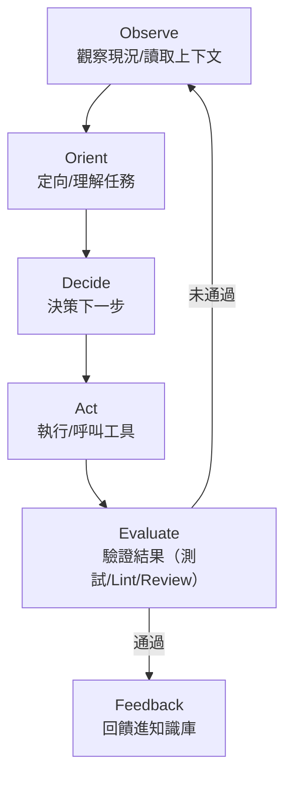

**範例**（極簡的「Ralph Wiggum Technique」示意，由 Geoffrey Huntley 提出，靠外部測試/Lint 訊號作為停止條件的「Backpressure」機制）：

```bash
# 每輪都用全新 Context 執行，避免 Context Rot；
# 迴圈是否繼續取決於 PROMPT.md 描述的任務與外部驗證訊號，而非固定次數
while :; do cat PROMPT_build.md | claude-code; done
```

**適合專案**：需要長時間、可重複驗證的迭代型任務（大規模重構、批次程式碼品質改善、測試覆蓋率提升）；不適合一次性、範圍明確、不需要反覆修正的小任務（殺雞焉用牛刀）。

**限制**：迴圈若沒有明確的終止條件與成本上限，可能無限空轉消耗資源；企業導入時必須正視 4 個治理風險——**驗證風險**（驗證訊號本身不可靠時，迴圈會往錯誤方向收斂）、**理解債務**（人類逐漸不理解 AI 反覆修正後的程式碼全貌）、**認知放棄**（人類因信任而停止審查）、**編排稅**（維護迴圈本身的複雜度成本）。

**使用技巧**：迴圈的「驗證訊號」品質決定迴圈的上限——測試覆蓋率不足、Lint 規則寬鬆，迴圈就會收斂到一個「通過檢查但實際上不夠好」的局部最優解；務必設定明確的成本與輪次上限。

**最佳實務**：把迴圈設計成「小步快跑＋頻繁驗證」而非「一次跑很久才驗證一次」；迴圈產出務必保留完整的 Git 歷史，方便人工事後審查每一輪的變更。

**優點／缺點**：

| 優點 | 缺點 |
|---|---|
| 讓 AI 有機會自我修正，突破單次輸出品質上限 | 若無明確終止條件，可能無限空轉、失控消耗成本 |
| 與既有 CI/CD 驗證訊號（測試/Lint）天然契合 | 過度信任迴圈結果可能導致「認知放棄」 |
| 概念可與前述任一方法論疊加使用 | 需要額外的迴圈治理機制（第五、七章會展開） |

**企業導入建議**：導入 Loop Engineering 前，先確認第七章 7.6 節「Testing 階段」的自動化驗證訊號是否足夠可靠——這是迴圈能否安全運作的前提；建議先在非關鍵系統（例如內部工具、測試環境重構任務）試點，觀察迴圈的收斂品質與成本消耗再決定是否推廣。

### 3.10 Compound Engineering

**設計理念**：由 Every Inc.（Kieran Klaassen、Dan Shipper）提出，可查證出處為 Every 官方發布的〈Compound Engineering〉指南與〈Compound Engineering: How Every Codes With Agents〉專文，源自該公司打造 AI 幕僚產品「Cora」過程中累積的實務心得。核心信念是「每一單位的工程工作，都應該讓下一單位變得更容易」——不是單純追求「這次任務做完」，而是刻意把每次開發、每次 Review 學到的教訓系統性地「複利」進團隊的知識資產，讓團隊的產出效率隨時間持續加速而非持平。**企業引用提醒**：這個詞目前主要源自單一公司（Every）的內容品牌，並非中立的產業標準術語，本手冊在對外教育訓練材料中引用時，建議明確標註出處，而不要當作業界公認的正式方法論名稱陳述。

**解決問題**：解決「AI 輔助開發雖然加快單次任務速度，但團隊整體智慧沒有累積」的問題——多數團隊每次任務都在重複犯同樣的錯、重新學同樣的教訓；Compound Engineering 強制把 Review 階段學到的東西寫回知識庫。

**核心概念**：主張把工程師的時間配置徹底反轉——**80% 時間花在 Plan（規劃）與 Review（審查），只有 20% 時間花在 Work（實作）與 Compound（複利沉澱）**——這與傳統「先動手寫、有問題再說」的直覺相反，但正是這套方法論的核心價值主張。

**架構／流程**：

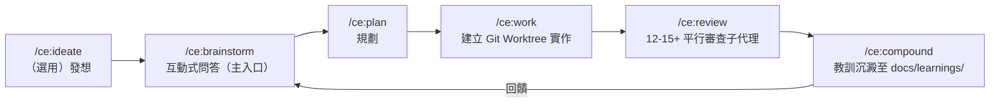

**範例**：

```bash
# 於 Claude Code 安裝
/plugin marketplace add EveryInc/compound-engineering-plugin
/plugin install compound-engineering

# 或安裝到其他 10+ 平台（需 Bun）
bunx @every-env/compound-plugin install compound-engineering --to codex
```

**適合專案**：長期維護、團隊成員會流動、需要把資深工程師的判斷力系統性沉澱下來的專案；`/ce:review` 的多角度平行審查子代理（安全／效能／正確性／可維護性／測試／資料完整性／架構）特別適合對程式碼品質要求高的核心系統。

**限制**：核心執行環境依賴 Bun；12–15+ 個平行審查子代理會產生較高的計算/Token 成本，需要團隊評估投入產出比；「80% 時間花在 Plan/Review」對已經習慣「先寫先贏」文化的團隊，需要一定的心態轉換過程。

**使用技巧**：`docs/learnings/*.md` 建議設計成可被搜尋、可被下一次 `/ce:brainstorm` 自動參照的結構化格式，而不是流水帳式的記錄；`.github/compound/{patterns,anti-patterns,decisions}/` 這種團隊級知識目錄，建議與版本控制一起管理，讓知識隨程式碼演進。

**最佳實務**：把 Compound Engineering 的四層知識階層（個人層 `~/.claude/skills/` → 專案層 `docs/learnings/` → 團隊層 `.github/compound/` → —— 呼應第十章「Knowledge Base 建立」的分層設計）當作企業知識管理的參考範本。

**優點／缺點**：

| 優點 | 缺點 |
|---|---|
| 強制把 Review 教訓沉澱為團隊知識資產，避免重複犯錯 | 依賴 Bun 執行環境，需額外導入 |
| 多角度平行審查覆蓋面廣（安全/效能/正確性/架構等） | 平行審查子代理數量多，計算成本較高 |
| 四層知識階層設計適合企業知識管理 | 「80% Plan/Review」需要團隊文化轉型 |

**企業導入建議**：特別適合與第十一章「AI Agent 團隊建立」的 Reviewer Agent 搭配——`/ce:review` 的多角度審查子代理概念，可直接作為企業自建 Review Agent 團隊的設計參考；`docs/learnings/` 機制建議與第十章的 Knowledge Base 治理框架整合，避免知識散落在不同工具各自為政。

### 3.11 實務落地建議

- **不要把 10 套方法論當成互斥選項**：如第二章 2.2 節分類所示，多數方法論分屬不同機制層（Spec／Team／Skills／Orchestration／Runtime／Loop），實務上企業級導入通常是「疊加」而非「二選一」——詳見第五章的分層整合模型。
- **先讀懂「解決問題」再看「核心概念」**：選型時最容易犯的錯誤，是被某個方法論的「核心概念」聽起來很潮吸引，卻沒有先確認它「解決問題」那一段是不是真的對應到自己團隊的痛點。
- **GSD 與 gsd-pi（GSD-2）務必分開溝通**：這是研究過程中發現最容易混淆的一組命名，兩者架構完全不同，企業內部文件與教育訓練材料應該明確區分，避免新人誤把兩者當作同一專案的兩個版本。
- **量化數字自行實測，不要照抄行銷文案**：任何方法論聲稱的效率提升、Token 節省百分比，導入前建議用自己團隊的真實專案做小規模 Pilot 量測（見第十章 10.3 Pilot 階段），不要直接引用官方或社群文章的數字作為決策依據。

---

## 第四章：所有方法論比較

本章把第三章的深度介紹收斂成可以快速查閱、快速決策的比較表。所有比較表以「8 大核心方法論」為主軸，並在適用的維度上納入 Loop／Compound Engineering 作為橫向補充（因為它們是疊加層，而非與前 8 套並列的替代方案）。

### 4.1 比較維度總表

| 維度 | 定義 | 對應章節 |
|---|---|---|
| 理念 | 方法論的核心信念與出發點 | 4.2 |
| 工作流程 | 主要步驟與產出物順序 | 4.2 |
| Prompt 方式 | 使用者如何與方法論互動下指令 | 4.3 |
| Spec 方式 | 是否有結構化規格、規格如何演進 | 4.3 |
| Agent 方式 | 單一助理 vs 多角色 vs 自主 Runtime | 4.3 |
| Memory | 跨 Session 記憶機制 | 4.4 |
| Skills | 技能封裝與觸發機制 | 4.4 |
| Context | 上下文供給與管理方式 | 4.4 |
| Code Generation | 程式碼產出風格與驗證機制 | 4.5 |
| Testing | 測試整合深度 | 4.5 |
| Review | 審查機制 | 4.5 |
| 文件 | 是否自動產出可維護文件 | 4.5 |
| Framework Upgrade 適配 | 是否適合大型框架升級專案 | 4.6 |
| Legacy Migration 適配 | 是否適合舊系統遷移專案 | 4.6 |
| 大型企業適配 | 治理、稽核、合規支援程度 | 4.7 |
| 小型專案適配 | 輕量導入的容易程度 | 4.7 |
| 多人協作適配 | 多工程師/多團隊協作支援 | 4.7 |
| Multi-Agent 適配 | 原生多代理協作能力 | 4.7 |

### 4.2 理念與工作流程比較

| 方法論 | 核心理念 | 工作流程主線 |
|---|---|---|
| spec-kit | 規格是真相，程式碼是產物 | Constitution→Spec→Plan→Tasks→Implement |
| OpenSpec | 規格是契約，變更用 Delta 追蹤 | Proposal→Delta→Tasks→Review→Implement→Archive |
| Superpowers | 好紀律該自動觸發，不靠人提醒 | Brainstorm→Worktree→Plan→TDD→Review→收尾 |
| BMAD-METHOD | 用角色分工模擬完整敏捷團隊 | Analysis→Planning→Solutioning→Implementation |
| GSD | 標準化流程指令疊加在既有 Runtime | New→Discuss→Plan→Execute→Verify→Ship |
| gsd-pi | 自建 Runtime 直接管理 Context/Session | Milestone→Slice→Task（自主執行） |
| gstack | 虛擬工程團隊技能包 | Think→Plan→Build→Review→Test→Ship→Reflect |
| mattpocock/skills | 用技能對治四種 AI 失效模式 | Grill→PRD→Prototype→TDD→Diagnose→架構健檢 |
| Loop Engineering | 設計迴圈而非下指令 | Observe→Orient→Decide→Act→Evaluate→Feedback |
| Compound Engineering | 每單位工作應讓下一單位更容易 | Brainstorm→Plan→Work→Review→Compound |

### 4.3 Prompt／Spec／Agent 方式比較

| 方法論 | Prompt 方式 | Spec 方式 | Agent 方式 |
|---|---|---|---|
| spec-kit | Slash Command 序列 | 五產物線性結構化 Spec | 單一助理依 Spec 執行 |
| OpenSpec | Slash Command + 自然語言提案 | Delta 契約式規格 | 單一助理依 Delta 執行 |
| Superpowers | 自動觸發，極少手動 Prompt | 無強制規格文件，以 Plan 檔案為主 | 單一助理 + Subagent 驅動開發 |
| BMAD-METHOD | 依角色切換的結構化互動 | 依階段產出 PRD/架構文件 | 多角色人格模擬（Analyst/PM/Architect…） |
| GSD | Slash Command 序列 | `.planning/` 目錄化文件 | 單一助理疊加流程指令 |
| gsd-pi | CLI 指令 + 互動精靈 | `.gsd/` 目錄化文件 + ADR | 自主 Runtime + 5 種內建子代理 |
| gstack | Slash Command 管線 | 各技能輸出的中介文件（design.md 等） | 技能模擬多角色審查（CEO/Eng/Design/CSO） |
| mattpocock/skills | 技能觸發 + 追問式 Prompt | `CONTEXT.md` 詞彙表 + 簡化版 ADR | 單一助理 + 技能封裝 |
| Loop Engineering | 設計迴圈條件而非單次 Prompt | 視底層方法論而定 | 迴圈內可疊加任一 Agent 架構 |
| Compound Engineering | 互動式問答為主入口 | `docs/learnings/` 知識沉澱文件 | 12–15+ 平行審查子代理 |

### 4.4 Memory／Skills／Context 比較

| 方法論 | Memory（跨 Session 記憶） | Skills（技能封裝） | Context（上下文管理） |
|---|---|---|---|
| spec-kit | 依賴 Spec 文件本身作為記憶 | 無獨立技能系統 | Constitution + Spec 作為結構化 Context |
| OpenSpec | 依賴 Archive 歷史紀錄 | 無獨立技能系統 | 主 Spec + Delta 作為 Context |
| Superpowers | 無獨立長期記憶機制 | 核心賣點：14–15 個自動觸發技能 | Session-start Hook 注入初始 Context |
| BMAD-METHOD | Document Sharding 降低重複載入 | 無獨立技能系統，以角色定義代替 | 依角色分段載入對應 Context |
| GSD | `STATE.md`／`checkpoints/` | 無獨立技能系統 | `.planning/context/` 目錄化管理 |
| gsd-pi | `KNOWLEDGE.md`／`gsd.db` SQLite | 5 種內建子代理各自專精 | Context Pressure Monitor 主動監控用量 |
| gstack | `~/.gstack/projects/` 專案級持久化 | 約 20 餘個 Slash Command 技能 | 技能鏈輸出自動接續下一技能輸入 |
| mattpocock/skills | 無獨立長期記憶機制 | 核心賣點：14 個以上針對性技能 | `CONTEXT.md` 純詞彙表壓縮 |
| Loop Engineering | 依附載體方法論而定 | 不適用（概念層方法論） | Fresh Context Per Iteration 降低 Context Rot |
| Compound Engineering | `docs/learnings/*.md` 長期知識庫 | 個人層 `~/.claude/skills/` | 四層知識階層（個人/專案/團隊/組織） |

### 4.5 Code Generation／Testing／Review／文件比較

| 方法論 | Code Generation | Testing | Review | 文件產出 |
|---|---|---|---|---|
| spec-kit | 依 Plan/Tasks 逐步生成 | 無內建強制，依 Constitution 約定 | `/speckit.analyze` 一致性檢查 | Spec/Plan/Tasks 全鏈路留存 |
| OpenSpec | 依 Delta 實作 | GIVEN/WHEN/THEN 天然對應測試案例 | Proposal 審查為主要關卡 | Archive 保留完整變更歷史 |
| Superpowers | 強制 TDD 紅綠燈流程 | 內建 test-driven-development 技能 | requesting-code-review 技能 | 無強制文件產出，聚焦流程紀律 |
| BMAD-METHOD | Developer Agent 依架構文件生成 | Test Architect Agent 專責 | 角色間交叉審查 | PRD/架構決策/測試計畫等完整文件 |
| GSD | 依 Wave XML 計畫生成 | `/gsd:verify-work` | 內建於 verify-work 步驟 | `.planning/` 全目錄留存 |
| gsd-pi | Reactive Task Execution 並行生成 | 依任務驗證條件 | 無獨立審查子代理，依人工 Gate | `DECISIONS.md` 附加式 ADR |
| gstack | 依 Sprint 管線逐步生成 | `/qa` 真實 Chromium 瀏覽器測試 | `/review` 7-Agent Review Army | design.md 等中介文件 |
| mattpocock/skills | `prototype` 快速生成 | `tdd` Vertical Slices 強制 | 無獨立審查技能，依 `diagnose` 除錯 | 簡化版 ADR（三條件門檻） |
| Loop Engineering | 迴圈內反覆生成修正 | 驗證訊號（測試/Lint）決定迴圈走向 | Evaluator-Optimizer 模式內建審查角色 | 依附載體方法論而定 |
| Compound Engineering | `/ce:work` 於 Worktree 內生成 | 依審查子代理間接把關 | `/ce:review` 12–15+ 平行審查子代理 | `docs/learnings/` 結構化教訓文件 |

### 4.6 Framework Upgrade／Legacy Migration 適配比較

| 方法論 | Framework Upgrade 適配 | Legacy Migration 適配 | 說明 |
|---|---|---|---|
| spec-kit | ★★★★☆ | ★★★☆☆ | Spec 結構適合描述升級前後行為差異 |
| OpenSpec | ★★★★★ | ★★★★☆ | Delta 機制天然適合「記錄升級前行為→逐步遷移」 |
| Superpowers | ★★★☆☆ | ★★★☆☆ | TDD 紀律有利於升級時的回歸驗證 |
| BMAD-METHOD | ★★★☆☆ | ★★★★☆ | Enterprise 軌道適合大型遷移的合規文件需求 |
| GSD | ★★★☆☆ | ★★★☆☆ | Wave 拆分適合把大型升級切成可管理階段 |
| gsd-pi | ★★★★☆ | ★★★☆☆ | Milestone/Slice 階層適合長時間升級專案追蹤 |
| gstack | ★★☆☆☆ | ★★☆☆☆ | 設計目標偏新功能開發，非升級/遷移場景 |
| mattpocock/skills | ★★★☆☆ | ★★★☆☆ | `improve-codebase-architecture` 可輔助架構健檢 |
| Loop Engineering | ★★★★★ | ★★★★☆ | 迴圈化驗證特別適合大量重複性升級任務 |
| Compound Engineering | ★★★★☆ | ★★★★☆ | 知識複利機制適合把單一模組遷移經驗複製到下個模組 |

> 完整的 Spring Boot／Java／Vue 升級方法論深度討論見第八章；此表僅標示各方法論「機制上」與升級/遷移場景的適配程度。

### 4.7 大型企業／小型專案／多人協作／Multi-Agent 適配比較

| 方法論 | 大型企業 | 小型專案 | 多人協作 | Multi-Agent |
|---|---|---|---|---|
| spec-kit | ★★★★★ | ★★★☆☆ | ★★★★☆ | ★★☆☆☆ |
| OpenSpec | ★★★★★ | ★★★☆☆ | ★★★★★ | ★★☆☆☆ |
| Superpowers | ★★★☆☆ | ★★★★★ | ★★★☆☆ | ★★★☆☆ |
| BMAD-METHOD | ★★★★★ | ★★☆☆☆ | ★★★★☆ | ★★★★★ |
| GSD | ★★★☆☆ | ★★★★☆ | ★★★☆☆ | ★★☆☆☆ |
| gsd-pi | ★★★★☆ | ★★★☆☆ | ★★★☆☆ | ★★★★☆ |
| gstack | ★★☆☆☆ | ★★★★★ | ★★☆☆☆ | ★★★☆☆ |
| mattpocock/skills | ★★★☆☆ | ★★★★★ | ★★★☆☆ | ★★☆☆☆ |
| Loop Engineering | ★★★★☆ | ★★☆☆☆ | ★★★☆☆ | ★★★★★ |
| Compound Engineering | ★★★★★ | ★★★☆☆ | ★★★★★ | ★★★★★ |

> 評分為本手冊依第三章各方法論架構特性做出的相對比較（1–5 星），非官方評測，導入前請以自身團隊 Pilot 結果為準。

**補充維度：生態系穩定性／維護風險**——本手冊查證 8 大方法論官方 Repository 時，同步記錄了各專案的維護活躍度（近期是否仍有 commit/release、專案背景是官方團隊／社群／個人），可作為企業評估「這套方法論明天還會不會有人維護」的參考：

| 方法論 | 維護型態 | 穩定性觀察（查證時點：2026-07） |
|---|---|---|
| spec-kit | GitHub 官方維護 | 每週多次發布，官方生態最完整，穩定性最高 |
| OpenSpec | 團隊維護 | 近期仍有版本發布，`/opsx:*` 指令集屬於較新的重大改版，需留意變動速度 |
| Superpowers | 個人發起＋開始商業化 | 持續活躍，但出現商業化訊號（付費支援），企業應留意授權模式是否隨之改變 |
| BMAD-METHOD | 社群團隊維護 | 已演進到 V6 並模組化為多個子專案，改版頻率高，企業應追蹤是哪個子模組的版本 |
| GSD（gsd-core） | 社群團隊維護 | 定期發布，規模與生態成熟度低於本表其他大型專案 |
| gsd-pi | 社群團隊維護 | 更新頻繁（近期每週等級），但採用規模仍明顯小於 gsd-core，屬於較新且變動快的專案 |
| gstack | **個人專案**（Garry Tan） | 持續更新，但無正式版本相容承諾，企業應假設其變動速度與治理成熟度都不同於官方方法論 |
| mattpocock/skills | 個人發起＋社群 | 技能清單持續增補/更名，企業引用具體技能名稱前應先核對當下清單 |

> **企業導入建議**：本表不是「越活躍越好」的排名，而是提醒企業在選型時把「維護風險」當作獨立於「功能是否強大」的評估項目——功能強大但維護型態不穩定的方法論，仍建議搭配第十章 10.5 節的定期複查機制使用，而非假設一次導入就一勞永逸。

### 4.8 實務落地建議

- **用比較表縮小候選範圍，用第三章細節做最終決定**：比較表適合先篩選出 2–3 個候選方法論，但最終選型仍應該回到第三章詳讀候選方法論的「限制」與「使用技巧」小節。
- **星級評分是相對值，不是絕對值**：4.6／4.7 節的星級評分是本手冊基於架構特性的主觀相對比較，目的是幫助快速定位，不是精確的量化評測。
- **多人協作與 Multi-Agent 是兩個不同維度**：多人協作評的是「多個真人工程師」用同一套方法論協作是否順暢；Multi-Agent 評的是「方法論本身是否原生支援多個 AI 代理協作」，兩者經常被混淆，選型時務必分開評估。

---

## 第五章：方法論整合

### 5.1 為何要混合方法論

第三章逐一介紹的 10 套方法論，沒有一套是為了「單獨使用、解決企業所有需求」而設計的——它們各自專精在不同的機制層（見第二章 2.2 六大分類）。企業級導入的成熟做法，幾乎都是**分層疊加**而非單一選擇。混合的價值在於：Spec 層解決「需求理解」問題，Discipline 層解決「執行品質」問題，Loop 層解決「持續改善」問題——三者疊加才是完整的工程體系。

### 5.2 分層整合模型

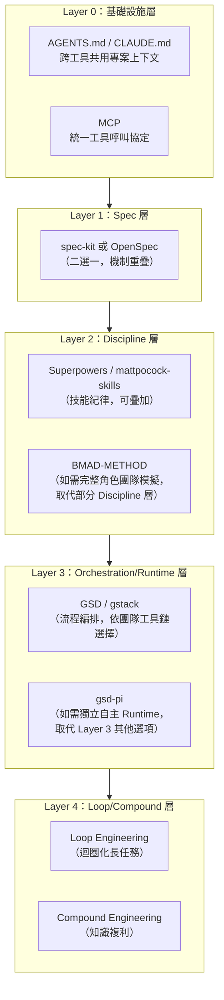

> **架構師觀點**：同一層內的方法論通常「擇一使用」（例如 spec-kit 與 OpenSpec 不建議同時作為主規格來源）；跨層的方法論則可以疊加組合。gsd-pi 與 BMAD-METHOD 是比較特殊的例外——兩者分別在自己的層內提供「完整替代方案」（gsd-pi 取代整個 Orchestration/Runtime 層，BMAD-METHOD 的角色模擬某種程度取代 Discipline 層的技能紀律），導入前需要先決定是否要用它們「整層替換」。

### 5.3 整合工作流程設計

以「spec-kit + Superpowers + Loop Engineering」的典型企業組合為例：

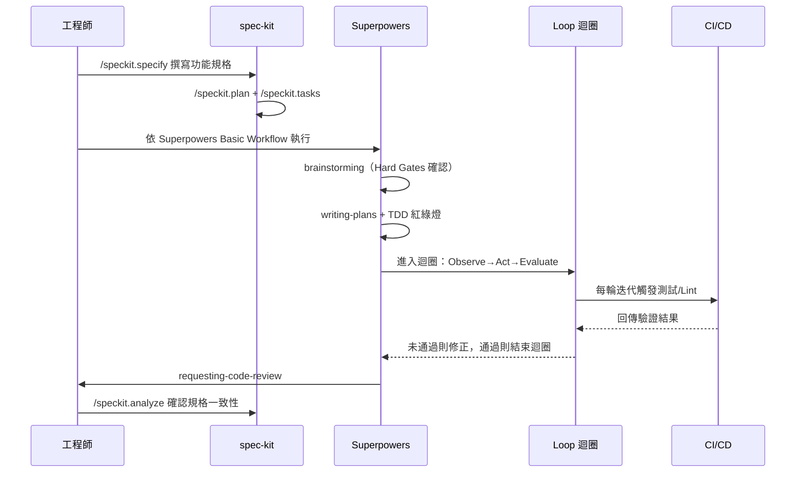

### 5.4 企業級整合開發流程範例

下圖示意一個典型企業如何把第三章介紹的方法論串成一條完整的內部開發流程（此流程會在第七章「企業 AI SDLC」中被進一步展開為正式的階段模型）：

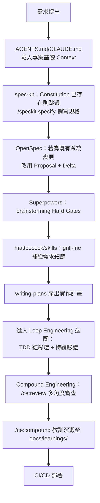

### 5.5 已知衝突與注意事項

| 衝突情境 | 說明 | 建議做法 |
|---|---|---|
| spec-kit + OpenSpec 同時作為主規格來源 | 兩者都想當「單一真相來源」，同時使用會造成規格分裂 | 二選一；若需要 Delta 追蹤能力選 OpenSpec，需要多工具生態支援選 spec-kit |
| gsd-pi + GSD 同時使用 | 兩者都想管理 Session/Context 生命週期，架構完全不同且目錄結構不同（`.gsd/` vs `.planning/`） | 二選一；依團隊是否需要「獨立 Runtime」（選 gsd-pi）或「疊加既有工具鏈」（選 GSD）決定 |
| Superpowers + gstack 同時啟用技能 | 兩者都是技能自動觸發框架，觸發條件可能重疊或衝突 | 明確劃分技能職責邊界，或擇一作為主要技能框架，另一套僅取局部技能 |
| BMAD-METHOD + 其他 Discipline 層方法論 | BMAD 角色模擬與 Superpowers/mattpocock 技能紀律，兩者對「誰該決定下一步」可能有認知衝突 | 建議以 BMAD 角色分工為主框架，技能紀律降級為角色內部的執行細則 |
| Loop Engineering 迴圈與人工 Review Gate 並存 | 迴圈若跑太快，人工 Review 來不及跟上，容易變成「形式審查」 | 迴圈設計時明確標示哪些節點必須暫停等待人工確認（Human Gate） |
| 多套方法論的 CLAUDE.md/AGENTS.md 設定互相覆蓋 | 不同方法論安裝時可能各自寫入專案根目錄設定檔，互相覆寫對方內容 | 導入順序建議先確認各方法論的設定檔寫入策略，採用「合併」而非「覆寫」的安裝順序（可參考 v1 手冊附錄 E.9 安裝順序建議） |

### 5.6 實務落地建議

- **分層模型是溝通工具，不是強制架構**：5.2 節的五層模型目的是幫助團隊討論「這兩套方法論疊加會不會衝突」，實務上可以依團隊實際需求增減層次，不需要五層全部用滿。
- **先小規模驗證整合流程，再全面推廣**：5.3／5.4 節示意的整合工作流程，建議先在一個中型功能上完整跑過一輪，確認每個交接點（Hand-off）都順暢，再推廣到全團隊。
- **衝突表要納入新人教育訓練**：5.5 節列出的已知衝突，特別是 GSD／gsd-pi 這類命名相似但架構完全不同的情況，建議明確寫入團隊 Onboarding 文件，避免新人踩坑。

---

## 第六章：AI Coding Agent 架構

前面五章談的是「方法論」——規範 AI 該怎麼做事的規則與流程。本章要談的是「載體」——實際執行這些方法論的 AI Coding Agent 工具本身。方法論可以在不同工具之間移植（例如 Superpowers 同時支援 Claude Code 與 Cursor），但每個工具的底層架構會決定方法論能發揮到什麼程度。

> **時效性提醒**：AI Coding Agent 這個市場在 2026 年仍在快速變動——本章撰寫時已有工具處於「即將被官方繼任產品取代」的過渡期（例如 6.5 節的 Gemini CLI）。企業選型前，務必直接查閱該工具官方文件確認最新狀態，不要只依賴本章節的快照。

### 6.1 AI Coding Agent 的共通架構模式

**概念**：不論廠商，多數 2026 年主流 AI Coding Agent 都收斂到相似的架構骨架——這也是為什麼 MCP（見第二章 2.5）能夠成為跨工具標準的原因。

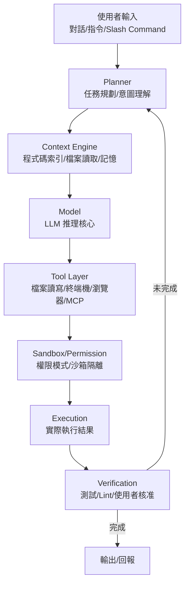

**架構意涵**：工具之間的差異，主要展現在這個骨架的**四個維度**：(1) 執行位置——本機終端機（Claude Code/Codex CLI/Aider）vs IDE 內嵌（Cursor/Windsurf/Cline/Roo Code）vs 雲端沙箱（OpenHands/各家 Cloud Agent）；(2) 權限模型——逐步核准 vs 自動執行 vs 沙箱隔離；(3) Context 取得方式——即時讀檔 vs 預先索引（Repo Map/Embedding）vs 混合式；(4) 多代理能力——單一助理 vs 內建子代理 vs 完整多代理編排。

### 6.2 Claude Code

**定位**：Anthropic 官方推出的終端機原生 AI 編碼代理，同時提供 CLI、VS Code/JetBrains 擴充套件、Desktop App 與 Web 介面。

**架構特色**：以 `CLAUDE.md`（專案層）／`CLAUDE.local.md`（個人層）／`.claude/` 目錄（Subagent／Skills／Hooks／MCP 設定）建立多層次記憶與規則系統；權限模式分為 Plan（唯讀規劃）／預設（逐步核准）／`acceptEdits`（自動接受編輯）／`bypassPermissions`（完全自主，需明確啟用）；Subagent 機制（`.claude/agents/*.md`，可指定 `tools`／`model`）與實驗性 Agent Teams（多 Session 協作，支援 `--worktree` 隔離）。

**核心能力**：Plan Mode 可在不落地修改前先產出完整計畫供人工審查；原生 MCP 用戶端/伺服端雙向支援；Hooks 機制可在特定事件（如檔案寫入前）插入自訂護欄；Auto Memory 機制會自動把 Session 中學到的教訓寫回長期記憶。

**適合搭配的方法論**：Superpowers、mattpocock/skills、Compound Engineering（三者均以 Claude Code 為主要目標平台設計）；spec-kit／OpenSpec 也都提供 Claude Code 整合範本。

**企業導入注意事項**：`bypassPermissions` 權限模式務必搭配 Hooks 護欄與稽核日誌一起導入，不建議在生產環境資料庫或部署管線直接開放；Agent Teams 目前仍屬實驗性功能，正式生產工作流建議先以穩定的 Subagent 機制為主。

### 6.3 OpenAI Codex CLI

**定位**：OpenAI 官方推出的終端機編碼代理，採「本機 CLI＋雲端沙箱」雙軌架構——本機互動式作業與雲端並行背景任務可混合使用。

**架構特色**：**沙箱模式**（Sandbox Mode）與**核准政策**（Approval Policy）是兩個獨立維度——沙箱決定「技術上能做什麼」（read-only／workspace-write／danger-full-access），核准政策決定「什麼時候要先問過使用者」（untrusted／on-request／never）；本機互動模式再細分 Suggest（逐步核准，預設）／Auto Edit（自動改檔、執行指令前詢問）／Full Auto（在網路隔離的沙箱內完全自主讀寫執行）。

**核心能力**：雲端沙箱支援平行執行多個背景任務，適合大規模、可平行化的批次工作（例如第八章的大型框架升級）；同樣支援 `AGENTS.md` 與 MCP。

**適合搭配的方法論**：spec-kit（GitHub 官方出品，與 OpenAI 生態整合良好）、Loop Engineering（雲端沙箱的平行背景任務特性，適合迴圈化的長時間驗證流程）。

**企業導入注意事項**：「沙箱模式」與「核准政策」兩個維度務必分開設定與治理——常見錯誤是誤以為調高核准政策的自動化程度，就等於放寬了沙箱的技術限制範圍，兩者其實互相獨立，企業資安團隊審查設定時應該分別檢視。

### 6.4 GitHub Copilot

**定位**：微軟／GitHub 官方推出、生態系最龐大的 AI 開發助理，涵蓋 Chat、行內建議（含 Next Edit Suggestion）、Edit Mode、Agent Mode、**Copilot cloud agent**（2026 年 4 月由「Coding Agent」更名，能力也從單純的自動開 PR 擴展為更完整的研究/規劃/實作流程）、Code Review、CLI 等完整產品線，並支援多家模型（GPT／Claude／Gemini／Grok 系列）與自動模型選擇。

> **重要現況提醒**：原「Coding Agent」品牌已於 2026-04 更名為「**Copilot cloud agent**」，企業內部文件若沿用舊名稱應一併更新；獨立的 **Copilot CLI** 已於 2026-02 正式 GA（非預覽版）；舊版「Copilot Extensions」擴充機制已棄用，官方現行策略是統一以 **MCP** 作為擴充工具存取的標準介面，企業若仍在使用 Copilot Extensions 建置的內部整合，應盡快規劃遷移至 MCP。

**架構特色**：以 Repo 層級的 Custom Instructions（`.github/copilot-instructions.md`）、Prompt Files、Custom Agents 建立團隊共用的行為規範；Copilot cloud agent 可在 GitHub Actions 環境中背景執行任務、自動開 PR；Agent Mode 與 MCP 支援已在 VS Code／JetBrains／Eclipse／Xcode 等主要 IDE 全面 GA；Agent Skills 與 Agent Hooks 提供類似 Claude Code Skills/Hooks 的擴充機制。

**核心能力**：與 GitHub 平台（Issue／PR／Actions／Code Review）原生深度整合，是唯一把「AI 編碼」與「程式碼託管平台治理」完全綁定的主流工具；企業版提供完整的 Content Exclusion（內容排除）、稽核日誌、席位管理等治理機制。

**適合搭配的方法論**：GSD、mattpocock/skills、Compound Engineering（均已提供 Copilot 整合路徑）；BMAD-METHOD 的角色分工模式也能對應到 Copilot 的 Custom Agents。

**企業導入注意事項**：Copilot 的治理優勢建立在「用好 GitHub 平台原生機制」上——Content Exclusion、分支保護、必要 Review 等設定若未落實，Copilot cloud agent 自動開 PR 的便利性反而會放大稽核風險；建議導入時把 GitHub 平台治理設定與 Copilot 權限範圍一起審查，而非分開處理；若企業過去以 Copilot Extensions 建置整合，應將遷移至 MCP 排入既有工具風險登記表（見第六章 6.14 節）。

### 6.5 Gemini CLI

**定位**：Google 於 2025 年年中推出的開源終端機編碼代理，以免費、可本機執行、大 Context Window 為主要賣點。

> **重要現況提醒**：根據 Google 官方公告，Gemini CLI 已於 2026 年 6 月 18 日進入生命週期終止（End-of-Life），由新推出的 **Antigravity CLI**（以 Go 語言重寫、與 Antigravity 桌面應用共用同一套 Agent Harness，強化非同步多代理編排能力）接替。企業若正在評估或已導入 Gemini CLI，應立即規劃遷移至 Antigravity CLI，並在導入文件中更新對應名稱。

**架構特色（含後繼產品 Antigravity CLI）**：內建讀寫檔、跨目錄搜尋（grep）、執行 Shell 指令、抓取網頁等基礎工具集；Antigravity CLI 進一步強化「非同步工作流程」——可在背景同時編排多個代理處理複雜任務。

**核心能力**：以 Google 生態（大 Context Window、與 Google Cloud／Workspace 整合）為差異化重點。

**適合搭配的方法論**：spec-kit（官方明列支援的 AI 工具之一）。

**企業導入注意事項**：任何新專案不建議再以「Gemini CLI」為名寫入企業標準作業文件，應直接評估 Antigravity CLI 或 Gemini Enterprise Agent Platform（Google 另一條企業級代理產品線）作為導入標的，避免文件與教育訓練材料才寫完就過期。

### 6.6 Grok（Grok Build）

**定位**：xAI 推出的編碼代理產品線，實際的終端機編碼工具正式名稱為 **Grok Build**（2026 年 5 月上線）——企業評估時應以「Grok Build」而非籠統的「Grok」聊天機器人品牌來檢索與規劃導入。

**架構特色**：三階段工作流程——Plan（規劃）→ Search（搜尋/理解程式碼庫）→ Build（實作）；架構賭注是「平行競速」——最多可讓 8 個子代理各自在獨立的 Git Worktree 中同時嘗試同一個任務，再從結果中擇優，與多數工具押注「單一深度推理」的路線不同；原生支援 **Agent Client Protocol（ACP，注意與第二章 2.5 節 Agent Communication Protocol 縮寫相同但為不同協定，見該節提醒）**；提供「Grok Skills」技能包機制，官方明確表示與 Claude Code 的 Skills／Plugins／`CLAUDE.md` 格式相容，降低跨工具移植技能的成本；另提供 Connectors（GitHub／Notion／Linear／Google Workspace／Microsoft 365 等第三方整合，含 Bring-Your-Own-MCP）。

**核心能力**：多代理平行競速處理是其主要差異化能力，適合可拆解成多個獨立子任務、或同一任務值得多方案比較的大範圍工作（例如批次程式碼品質改善）。**名詞澄清**：「Grok Code Fast 1」是 xAI 另一個編碼專用**模型**（2025 年 8 月發布，已於 2026 年 5 月宣告除役），過去曾被第三方工具（Copilot／Cursor／Cline／Roo Code 等）整合使用；這與本節介紹的 **Grok Build**（xAI 自家的獨立終端機編碼代理產品）是兩個不同層次的東西，企業評估時應避免混淆「一個可被整合的模型」與「一個完整的編碼代理產品」。

**適合搭配的方法論**：Loop Engineering（多平行子代理架構天然適合迴圈化的批次驗證任務）；因 Skills 相容 Claude Code 格式，mattpocock/skills、Superpowers 的部分技能有機會直接移植使用（建議實際遷移前逐一驗證相容性，而非假設 100% 相容）。

**企業導入注意事項**：作為 2026 年才進入市場的相對新產品，企業導入前建議先在非關鍵專案做小規模 Pilot，觀察其治理與稽核功能是否達到企業要求，不宜直接用於監理密集產業的核心系統。

### 6.7 Cursor

**定位**：以 VS Code 為基礎二次開發（Fork）的 AI 原生程式碼編輯器，把 AI 能力直接編織進編輯器核心，而非以外掛形式存在。

**架構特色**：多檔案編輯與 Agent Mode（可自主規劃、寫程式、跑測試、修錯，不需人工逐步操作終端機）；Cloud Agent 可在 Cursor 雲端基礎設施上執行，能從瀏覽器、手機（2026 年新增 iOS App）甚至 Slack 啟動並自主在程式碼庫上工作；原生 MCP 整合，可直接查詢資料庫、開 PR、讀取錯誤追蹤系統、搜尋任務追蹤系統等，並新增 **Team Marketplaces** 供組織層級統一分發 MCP 工具；多模型彈性（可於同一專案切換 GPT／Claude／Gemini 等廠商模型，並新增 **Cursor Router** 依任務自動選模型）；`BugBot` 提供 PR 自動化初步審查。

**核心能力**：因為是完整的編輯器（而非外掛），使用者體驗較 IDE 外掛型工具（Cline／Roo Code）更一致；已推出自家前沿編碼模型 **Composer**（現行 2.5 版，官方宣稱品質接近旗艦級模型但成本大幅降低），是與純「多模型轉接器」型工具的重要差異化能力；企業版提供 SOC 2 認證、Privacy Mode（程式碼不落地儲存、不用於訓練）與稽核日誌。

**適合搭配的方法論**：spec-kit、OpenSpec、Superpowers 均提供 Cursor 整合支援；作為多模型編輯器，特別適合需要「同一套方法論、彈性切換底層模型」的團隊。

**企業導入注意事項**：因為深度整合到編輯器核心，團隊需要真正切換編輯器（而非像 Copilot／Cline 那樣以外掛形式疊加在既有 VS Code 環境），導入時的變更管理成本應納入評估。

### 6.8 Windsurf

**定位**：原為以 Cascade 代理為核心、強調「維持開發者心流（Flow）」協作體驗的 AI 原生 IDE。

> **重要現況提醒**：Windsurf 已於 2025 年 7 月被 **Cognition AI**（Devin 的開發商）收購（收購範圍涵蓋智慧財產、產品、商標品牌與團隊），並已於 **2026 年 6 月 2 日透過線上更新正式更名為「Devin Desktop」**。現行品牌統一為 Devin 系列的四個介面：**Devin Desktop**（原 Windsurf 編輯器）、**Devin Cloud**（自主雲端代理）、**Devin CLI**、**Devin Review**。原本的 Cascade 代理已於 2026 年 7 月 1 日終止使用（EOL），由 Rust 重寫的 **Devin Local**（官方宣稱 Token 效率提升約 30%，並支援子代理）取代。企業若仍以「Windsurf」為名規劃導入或撰寫內部教育訓練材料，應立即更新為「Devin Desktop」，避免文件與現況脫節。

**架構特色**：Devin Local（原 Cascade）是具狀態的代理，會把高階需求拆解成執行計畫，並持續監控使用者最近的編輯、終端機歷史、開啟的檔案、剪貼簿活動來推斷意圖、主動協助；Context 管理採用「生成式、分析導向」的索引方式，而非傳統靜態 Embedding 式 RAG；可跨多檔案自主提出或套用編輯、執行終端機指令，並維持專案記憶（檔案關聯、架構決策、開發者偏好）；Devin Desktop 支援開放的 **Agent Client Protocol（ACP，見第二章 2.5 節命名易混淆提醒）**，讓 Codex、Claude Agent、Gemini CLI 等外部代理可以作為「一級公民」在編輯器內執行，是這次品牌整合後新增的重要多代理互通能力。

**核心能力**：雙向終端機整合，可形成「程式碼→測試→部署」的封閉回饋迴圈；可觸發 CI/CD 步驟、建立預覽環境；因應統一品牌，Devin Desktop／Devin Cloud／Devin CLI／Devin Review 之間的任務與狀態可望逐步互通（企業導入前仍應以官方最新文件確認整合成熟度）。

**適合搭配的方法論**：Loop Engineering（其封閉回饋迴圈架構與 Loop Engineering 的 Observe-Act-Evaluate 概念高度契合）。

**企業導入注意事項**：其「生成式索引」上下文機制與傳統 RAG 不同，企業若已投資建置向量資料庫/Embedding 基礎設施，需要額外評估與既有知識庫整合的方式，不能直接假設架構相容；由於品牌與底層代理（Cascade→Devin Local）在 2026 年同時經歷重大變動，既有導入計畫應重新確認授權條款、資料處理政策與定價是否隨併購/改版而變化，不宜沿用收購前的舊資訊。

### 6.9 Aider

**定位**：小巧、快速、不綁定特定模型廠商的終端機配對編碼 CLI——不像 Cursor／Windsurf（現為 Devin Desktop，見 6.8 節）／Cline 活在編輯器裡，也不像 Claude Code 有自己的完整終端機體驗，Aider 定位是「讓任何 Shell 都能變成配對編碼 Session」的輕量工具。

**架構特色**：核心是一個 Coder 系統，協調 LLM、檔案系統與 Git 三者：使用者指令→Coder→LLM→編輯區塊（Edit Blocks）→套用到檔案→Git Commit→回應；**Repo Map**（基於 Tree-sitter 建立的排序符號圖）是其標誌性架構元件，讓模型即使沒有被直接餵入某個檔案的完整內容，也能透過符號圖理解程式碼庫的整體結構。

**核心能力**：四種對話模式（code／architect／ask／help）搭配 40 個以上的內建 Slash Command；自動產生符合慣例的 Git Commit 訊息；內建 Lint/測試/修復迴圈；支援語音輸入與 IDE 橋接；可透過 API Key／LiteLLM 串接 GPT／Claude／Gemini／DeepSeek／xAI Grok 及 Ollama 本機模型等多家供應商。

**適合搭配的方法論**：因其模型無關（Model-Agnostic）特性，適合作為企業「多模型並行評估」情境下的統一操作介面；Repo Map 機制與 OpenSpec 的既有規格比對場景搭配良好。

**企業導入注意事項**：作為社群驅動的輕量工具，企業級治理功能（席位管理、稽核日誌、SSO）相對不如 Copilot/Cursor/Claude Code 等商業產品完整，適合作為工程師個人生產力工具，大規模企業治理建議另外搭配前述商業工具；**MCP 支援現況需自行查證**——不同於本章其他工具已普遍將 MCP 列為核心能力，Aider 官方核心目前是否已正式合併 MCP 支援仍有爭議（社群提出的整合多以非官方 Bridge 形式存在），若企業的整合設計依賴 MCP，導入前務必直接查證 Aider 當下版本的官方支援範圍，不宜逕行假設其與本章其他工具具備同等的 MCP 相容性。

### 6.10 OpenHands

**定位**：開源、可自架的自主軟體工程代理平台（原名 OpenDevin），目標是讓 AI 代理能像人類軟體工程師一樣，透過「可執行的行動」寫程式、除錯、測試、重構，而非只回覆建議文字。母公司也已於 2025 年 10 月從「All Hands AI」正式更名為「**OpenHands**」，公司與產品現在共用同一個名稱，官方文件網域也一併遷移。

**架構特色**：**Controller-Agent-Runtime** 三層架構——`AgentController` 作為監督者，強制執行操作限制（對話輪數上限、預算上限）並管理代理生命週期（啟動/暫停/停止）；`CodeActAgent` 負責決策，把 LLM 的回應轉譯成實際行動；所有行動與觀察結果都記錄成不可變事件（Event），支援確定性重播（Deterministic Replay）、暫停/恢復與除錯；執行環境預設為隔離的 Docker 沙箱容器（新版並支援 Kubernetes 部署），防止代理對主機造成非預期副作用，並對齊 MCP 標準。

**核心能力**：代理可編輯檔案、執行終端機指令、瀏覽網頁，端到端完成多步驟開發任務；因完全開源、可自架，適合對資料落地位置有嚴格要求（不能把程式碼傳到第三方 SaaS）的企業；產品線已分層為本機 CLI/GUI（現列為 Legacy）、瀏覽器介面的「Agent Canvas」（自架或雲端皆可，逐漸成為主要操作介面）、OpenHands Cloud（含免費層）與 Enterprise（自架於企業 VPC，商業授權）；新增 Planning Mode（Beta），可在執行前先產出可審閱的計畫。

**適合搭配的方法論**：gsd-pi（兩者都強調「獨立自主 Runtime」的設計哲學，架構理念相近）；Loop Engineering（事件驅動的執行迴圈架構，天然適合迴圈化驗證）。

**企業導入注意事項**：自架代表企業需要自行負擔沙箱基礎設施的維運與資安加固責任，導入前務必確認容器逃逸防護、網路隔離、密鑰管理等基本資安措施到位，不能假設「開源」等於「開箱即安全」。

### 6.11 Cline

**定位**：VS Code 開源 AI 代理擴充套件，2026 年已從單純的 IDE 外掛擴展為可嵌入自訂應用程式的 SDK；支援範圍也從 VS Code 單一平台擴展為 JetBrains、Cursor、Windsurf（現為 Devin Desktop，見 6.8 節現況提醒）、Zed、Neovim 等多種編輯器，並提供 macOS/Linux 預覽版 CLI。

**架構特色**：招牌的 **Plan / Act 雙模式**——Plan 模式完全唯讀，代理探索程式碼庫、提出釐清問題、擬定策略，成本遠低於 Act 模式（因為不會因為方案錯誤而浪費 Token 重做）；Act 模式才實際執行計畫，且預設每一次檔案編輯與終端機指令都需要使用者核准（可切換為自動核准）。可為 Plan 與 Act 兩種模式分別指定不同模型（例如用便宜模型做 Plan、用強模型做 Act）。

**核心能力**：支援任何 LLM 供應商（Anthropic／OpenAI／Google Gemini／透過 Ollama 使用的本機模型）；原生 MCP 整合擴充工具存取範圍，並提供 **MCP Marketplace**（可同時作為 MCP 用戶端消費工具、也可自行開發發布 MCP 工具，不限制可設定的工具數量）；2026 年推出的 SDK 讓 Cline 的代理執行核心可被嵌入企業自己的內部工具或產品中。

**適合搭配的方法論**：因其模式分離（唯讀規劃 vs 執行）的設計，特別適合搭配 Superpowers 的 brainstorming Hard Gates 概念——用 Plan 模式對應腦力激盪與釐清問題階段，Act 模式對應實際執行階段。

**企業導入注意事項**：Plan/Act 分離模型的組合彈性（不同模式用不同模型）有助於控制成本，但也代表企業需要對「哪個模式該用哪個模型」建立明確的內部規範，避免每個工程師各自為政、成本與品質難以預期。

### 6.12 Roo Code

**定位**：源自 Cline 專案的多模式 VS Code AI 編碼擴充套件，以 Architect／Code／Debug／Ask 四種各自具備不同工具權限的模式著稱。

**架構特色**：**Architect 模式**唯讀，專注規劃不動檔案；**Code 模式**具備完整的編輯、終端機、MCP 存取權限；**Debug 模式**採結構化的系統性方法逐步縮小錯誤範圍；**Ask 模式**只回答關於程式碼庫的問題，不做任何修改。每個模式可各自綁定不同的 LLM，讓模型選擇與任務性質對齊。

> **重要現況提醒**：Roo Code 官方 Repository 已於 **2026 年 5 月 15 日由擁有者正式封存（Archived）**，VS Code 擴充套件本體、Roo Code Cloud、Roo Code Router 三者當天同步關閉服務——這是本手冊查證過最明確的一筆「工具停止維護」紀錄（直接來自官方 Repository 本身的封存公告，而非二手報導）。原團隊聲明已不再認為「IDE 是編碼的未來」，轉向開發雲端優先、以 Slack／GitHub／Linear 為主要入口的新產品「**Roomote**」；官方 README 也明確指引既有使用者遷移至社群 Fork **ZooCode**，或回頭使用其最初的源頭專案 **Cline**。企業導入前務必直接查證 Roo Code／Roomote／ZooCode 的官方最新狀態，任何仍在使用 Roo Code 擴充套件的既有導入都應立即規劃遷移，不宜在未確認的情況下寫入正式導入計畫。

**核心能力**：四模式的權限分離設計，某種程度上是把「Plan/Act」的二元切分，進一步拆成四種更細緻的職責邊界，適合需要更精細控制 AI 行為範圍的場景。

**適合搭配的方法論**：BMAD-METHOD（四模式的角色化設計理念與 BMAD 的角色分工哲學相通）。

**企業導入注意事項**：鑑於前述維護狀態的不確定性，若企業已導入 Roo Code，建議將「持續關注上游維護狀態、預先規劃遷移路徑（如遷回 Cline 或轉往社群 Fork）」納入既有的工具風險登記表。

### 6.13 工具 × 方法論搭配建議

| AI Coding Agent | 建議搭配方法論 | 主要理由 |
|---|---|---|
| Claude Code | Superpowers、mattpocock/skills、Compound Engineering | 均以 Claude Code 為主要目標平台原生設計 |
| OpenAI Codex CLI | spec-kit、Loop Engineering | GitHub 官方生態整合 + 雲端沙箱平行任務適合迴圈化驗證 |
| GitHub Copilot | GSD、BMAD-METHOD（角色↔Custom Agents） | 與 GitHub 平台治理機制深度整合 |
| Antigravity CLI（原 Gemini CLI） | spec-kit | 官方明列支援；企業應以新名稱規劃導入 |
| Grok Build | Loop Engineering、（相容格式的）mattpocock/skills | 多平行子代理架構 + Skills 格式相容 Claude Code |
| Cursor | spec-kit、OpenSpec、Superpowers | 官方/社群整合支援完整，多模型彈性適合方法論試驗 |
| Windsurf（現為 Devin Desktop） | Loop Engineering | 封閉回饋迴圈架構與 Loop Engineering 概念高度契合；企業應以新名稱規劃導入 |
| Aider | OpenSpec | 模型無關特性 + Repo Map 適合既有規格比對場景（MCP 支援現況需自行查證） |
| OpenHands | gsd-pi、Loop Engineering | 獨立自主 Runtime 理念相近 + 事件驅動迴圈架構 |
| Cline | Superpowers（Plan↔Brainstorm, Act↔執行） | Plan/Act 雙模式與 Hard Gates 概念天然對應 |
| Roo Code | BMAD-METHOD | 四模式角色化設計理念相通（**官方已於 2026-05 停止維護**，導入前請先確認 6.12 節現況） |

### 6.14 實務落地建議

- **工具選型與方法論選型分開決策，但要一起驗證**：方法論回答「怎麼做事」，工具回答「用什麼做事」，兩者理論上可以獨立選擇，但實務上務必在候選工具上實際跑過一次候選方法論的完整流程，才能確認相容性（例如某方法論的 Subagent 機制在某工具上是否真的支援）。
- **不要把「多模型支援」誤解為「所有模型表現一致」**：Cursor／Aider／Cline 等工具雖然支援切換多家模型，但同一個方法論在不同模型上的執行品質可能有明顯落差，導入前建議針對團隊主力使用的 1–2 個模型做完整驗證，而非假設「支援」等於「品質一致」。
- **建立工具風險登記表，追蹤官方維護狀態**：本章 6.5／6.12 節的案例說明，這個市場的工具生命週期可能比企業內部導入流程還短。建議在第十章「企業導入指南」的治理框架中，明確要求定期（例如每季）複查所有已導入工具的官方維護狀態。

---

## 第七章：企業 AI SDLC

### 7.1 企業 AI SDLC 全景

企業導入 AI 輔助開發，最終都要回答同一個問題：**AI 該在傳統 SDLC 的哪些階段介入、由誰負責、誰核准、怎麼稽核？** 本章把第三章的方法論、第六章的工具，收斂成一個完整的企業 AI SDLC（Secure Software Development Life Cycle，SSDLC）流程，涵蓋需求→分析→設計→Coding→Review→Testing→Security→Deployment→Maintenance→Upgrade 十個階段。

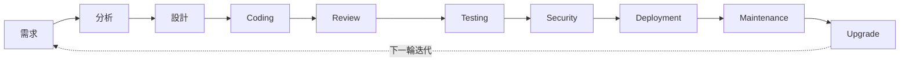

本章沿用本專案既有《Claude Code 建立 SSDLC Agent Team 教學手冊》與《GitHub Copilot 建立 SSDLC Agent Team 教學手冊》兩份手冊已建立的共通 Agent 角色命名（詳見第十一章），並在此基礎上把「企業 AI SDLC」獨立成一個完整章節呈現。

### 7.2 需求階段

**概念**：需求階段是 AI 最容易「自己腦補」的階段，也是本手冊反覆強調 Hard Gates（Superpowers）、Clarify（spec-kit）、Grill（mattpocock/skills）等「強制釐清機制」的原因。

**流程**：

```mermaid
flowchart LR
    I["原始需求/User Story"] --> Q["AI 追問釐清<br/>（grill-me / clarify / office-hours）"]
    Q --> C["結構化規格<br/>（spec-kit Spec / OpenSpec Proposal）"]
    C --> AP["人工核准<br/>（Requirements Agent → PM 審查）"]
```

**負責 Agent**：Requirements Agent（見 11.x）搭配 PM Agent 共同產出；**人工介入點**：規格核准前必須有真人 Product Owner／PM 簽核。

**最佳實務**：需求文件務必包含「信心分級」（高/中/低），對 AI 自行推導、未經真人確認的需求點明確標註，避免高信心度地陳述其實是 AI 猜測的內容（呼應第九章逆向工程的 SRS 標準）。

### 7.3 分析與設計階段

**概念**：把需求轉換成技術方案，AI 在此階段的角色是「提出多個架構選項並列出取捨」，而非「直接拍板」。

**流程**：

```mermaid
flowchart LR
    S["結構化規格<br/>（來自 7.2）"] --> AR["Architect Agent<br/>產出候選架構方案"]
    AR --> TO["取捨（Trade-off）表<br/>效能/安全/成本/可維運性"]
    TO --> HD["人工決策<br/>（Enterprise Architect/Tech Lead）"]
    HD --> ADR["記錄為 ADR"]
```

**負責 Agent**：Architect Agent（見 11.2）產出候選方案與取捨表；**人工介入點**：架構決策必須由真人 Enterprise Architect／Tech Lead 核准後才能進入 Coding 階段，AI 不可越級自行拍板。

**最佳實務**：延用第三章 mattpocock/skills 的 ADR「三條件門檻」（難以逆轉／不明顯／有真實取捨）判斷是否需要正式記錄，避免 ADR 氾濫；架構方案務必包含非功能需求（效能、安全、可維運性）的具體考量，不能只談功能實作；每次至少產出 2 個有實質差異的候選方案（呼應第十四章 14.1 Architect Prompt 的限制條件），避免真人決策者只能被動核准 AI 的單一建議。

### 7.4 Coding 階段

**概念**：本手冊第三、五、六章談的方法論與工具搭配，實際落地執行的階段。

**流程**：

```mermaid
flowchart LR
    AD["ADR/技術計畫<br/>（來自 7.3）"] --> DV["Developer Agent<br/>（前端/後端）"]
    DV --> WT["隔離 Git Worktree/Branch"]
    WT --> TDD["TDD 紅綠燈迴圈<br/>（Loop Engineering）"]
    TDD -->|未通過| DV
    TDD -->|通過| RV["提交至 Review 階段"]
```

**負責 Agent**：Developer Agent（前端/後端，見 11.3）依 Plan/Tasks 執行；**人工介入點**：跳出隔離分支合併回主幹前，需經過 7.5 Review 階段的真人核准，Developer Agent 本身不具備自行合併主幹的權限。

**最佳實務**：程式碼產出務必先進本地/隔離分支，不直接寫入主幹；搭配第四章比較表選定的 Skills/Discipline 層方法論（Superpowers／mattpocock-skills）確保基本工程紀律不被跳過；每個提交都應該是可獨立回退的最小單位，避免大範圍變更難以定位問題根源。

### 7.5 Review 階段

**概念**：AI 生成的程式碼，審查機制要對稱地跟上生成速度，否則審查會變成整條 SDLC 的瓶頸——這也是 Compound Engineering 用 12–15+ 平行審查子代理處理這個瓶頸的原因。

**流程**：

```mermaid
flowchart LR
    PR["提交審查<br/>（來自 7.4）"] --> RV["Reviewer Agent<br/>多視角平行審查"]
    RV --> SEC["觸發 Security Agent<br/>（見 7.7）"]
    RV --> RPT["審查報告彙整<br/>（🔴阻擋/🟡建議/🟢參考）"]
    RPT --> HD["人工 Tech Lead<br/>最終合併決策"]
```

**負責 Agent**：Code Review Agent（見 11.4）進行多視角平行審查（安全／效能／正確性／可維護性／測試／架構）；**人工介入點**：不論審查子代理給出什麼結論，最終「是否合併」的決策權都保留給真人 Tech Lead。

**最佳實務**：把多視角審查子代理的意見視為「輔助意見」而非「裁決」，避免團隊因為「AI 都說過了」而放棄真人審查的責任心（呼應第三章 3.9 節 Loop Engineering 提到的「認知放棄」風險）；審查意見應分級標註急迫程度（阻擋合併／建議改善／僅供參考），避免所有意見都用同一種急迫度呈現，讓 Tech Lead 難以判斷優先順序。

### 7.6 Testing 階段

**概念**：測試是整個企業 AI SDLC 中最關鍵的「驗證訊號來源」——第三章 3.9 節已說明，Loop Engineering 迴圈的品質上限，直接受測試覆蓋率與測試品質牽制。

**流程**：

```mermaid
flowchart LR
    AC["驗收條件<br/>（GIVEN/WHEN/THEN，見 3.2）"] --> QA["QA Agent<br/>自動產生測試案例"]
    QA --> TP["測試金字塔<br/>單元/整合/端到端"]
    TP --> QG["覆蓋率與品質門檻<br/>（Quality Gate）"]
    QG -->|未達標| QA
    QG -->|達標| SEC["進入 Security 階段"]
```

**負責 Agent**：QA Agent（見 11.6）依驗收條件自動產生並執行測試案例；**人工介入點**：品質門檻本身（覆蓋率標準、關鍵路徑測試要求）應由真人定義並定期複核，不應讓 AI 自行決定「這樣的覆蓋率就夠了」。

**最佳實務**：AI 產生的測試案例務必人工抽查是否真的驗證了業務邏輯，而非只是為了衝高覆蓋率數字而寫的空洞測試（Coverage Myth）；測試案例命名需清楚表達「驗證什麼」，避免使用 `test1`／`testCase2` 這類無意義的泛稱，方便日後追溯與維護。

### 7.7 Security 階段

**概念**：資安不該是 SDLC 最後才補的一道關卡，而應該貫穿需求到部署全程（Shift-Left Security）；本階段特別聚焦在 AI 生成程式碼帶來的**新增**資安風險面向。

**流程**：

```mermaid
flowchart LR
    CD["通過測試的程式碼<br/>（來自 7.6）"] --> SEC["Security Agent<br/>（唯讀權限）"]
    SEC --> SAST["SAST/DAST/SCA/Secret Scan"]
    SAST --> OW["對照 OWASP Top 10"]
    OW --> RPT["資安報告"]
    RPT -->|高風險| HD["強制人工複核"]
    RPT -->|無高風險| DP["進入 Deployment 階段"]
```

**負責 Agent**：Security Agent（見 11.5，建議採唯讀權限，避免球員兼裁判）進行 SAST／DAST／SCA／Secret Scan；**人工介入點**：Critical／High 等級發現必須交由真人資安人員複核並簽核結案，AI 不可自行判定「已修復」。

**最佳實務**：AI 生成程式碼常見的資安盲點（例如引用不存在或被搶注的套件名稱、過度寬鬆的權限設定、硬編碼的測試用密鑰忘記移除）應該建立專屬檢查清單，不能只套用傳統資安檢查清單了事；Security Agent 的獨立性應在組織設計上明確體現（不對 Developer Agent 所屬的同一條產出鏈負責），而不只是口頭原則。

### 7.8 Deployment 階段

**概念**：部署階段的 AI 角色應該保守——高自動化的生成/迭代能力，不代表部署也應該同等自動化。

**流程**：

```mermaid
flowchart LR
    RE["Release Agent<br/>準備部署腳本/Release Note"] --> CB["Canary/藍綠部署"]
    CB --> IF["Infra Agent<br/>監控部署健康度"]
    IF -->|異常| RB["自動回滾"]
    IF -->|正常| MT["進入 Maintenance 階段"]
```

**負責 Agent**：Release Agent（見第十一章延伸角色）準備部署腳本與 Release Note，Infra Agent（見 11.10）監控部署健康度；**人工介入點**：正式環境部署的最終「按下按鈕」動作必須保留真人核准，異常自動回滾的觸發條件與上限也應由真人事先設定並定期複核。

**最佳實務**：正式環境部署的最終「按下按鈕」動作，建議保留真人核准關卡，即使前面所有步驟都高度自動化；自動回滾機制務必設定連續回滾次數上限，超過上限應自動升級為人工介入，避免異常情境下形成自動化的惡性循環。

### 7.9 Maintenance 與 Upgrade 階段

**概念**：這是 Compound Engineering「知識複利」理念最能發揮的階段——維運中發現的每一個問題，都應該回饋進第十章的 Knowledge Base，而不是修完就結束。

**流程**：

```mermaid
flowchart LR
    AL["監控告警"] --> DOC["Documentation Agent/<br/>維運工程師初步診斷"]
    DOC --> SV{"依嚴重度分派"}
    SV -->|一般| DV["Developer Agent 處理"]
    SV -->|重大/需人工判斷| HD["人工處理"]
    DV --> LR["教訓寫回<br/>docs/learnings/ 或 Skill Library"]
    HD --> LR
```

**負責 Agent**：Documentation Agent（見 11.8）／維運工程師負責初步診斷與分派；**人工介入點**：嚴重度分級與是否需要啟動正式的 Framework Upgrade 專案（而非當作一般缺陷修復處理），應由真人維運主管判斷。

**最佳實務**：升級（Upgrade）相關工作直接串接第八章的 Framework Upgrade 方法論，不要把「維運中的小修小補」與「有計畫的框架升級」混為一談，兩者的風險等級與治理要求不同；每次修復後的教訓務必寫回 `docs/learnings/`（Compound Engineering）或團隊 Skill Library（第十章 10.7），並指派明確的維護責任人，避免知識庫淪為無人更新的死庫。

### 7.10 SSDLC 成熟度模型整合對照

研究既有語料庫發現，本專案內至少有 5 份手冊各自定義了一套「5 級成熟度模型」，維度略有不同。下表做一次跨手冊的整合對照，方便企業判斷自己在各維度上的成熟度：

| 成熟度 Level | AI-CMM（能力面） | Agent Team（組織面） | 程式碼品質（品質面） | 本手冊建議整合詮釋 |
|---|---|---|---|---|
| L1 | 臨時／Ad Hoc | 初始 | Ad-hoc | 個別工程師各自嘗試 AI 工具，無團隊規範 |
| L2 | 可重複 | 建立 | Managed | 團隊有基本規範，但仍手動、不一致 |
| L3 | 已定義 | 整合 | Defined | 有明文方法論、Agent 角色分工、Quality Gate |
| L4 | 已管理 | 優化 | Quantified | 有量化指標追蹤（覆蓋率/審查時間/漏洞數） |
| L5 | 最佳化 | 領導 | Optimized | 持續改善迴圈運作、跨團隊複製最佳實務 |

> **企業導入建議**：不要追求「一步到位 L5」，多數企業第一年的合理目標是從 L1/L2 推進到 L3（有明文方法論與角色分工）；L4/L5 需要組織文化與量測基礎設施的長期投入，急不得。

### 7.11 實務落地建議

- **十階段是骨架，不是每個專案都要走全套**：小型內部工具或 POC 專案，可以合理精簡 Security／Review 階段的嚴謹程度；核心監理系統則十個階段都不該省略。
- **Agent 角色是分工模型，不代表要真的建立 10 個獨立系統**：中小型團隊可以用「一個 AI Coding Agent + 不同 Subagent/Prompt 設定」模擬多個角色，不需要為每個角色都建置獨立的基礎設施——第十一章會展開角色細節與務實的建置方式。
- **成熟度自我評估要誠實，不要對外宣稱高於實際等級**：7.10 節的整合對照表建議每半年做一次團隊自評，評估結果應該誠實反映在導入規劃（第十章）中，浮誇的成熟度自評只會讓後續的資源投入規劃失準。

---

## 第八章：AI Framework Upgrade 方法論

### 8.1 Framework Upgrade 的核心挑戰

**概念**：框架升級不同於新功能開發——它的成功標準是「行為完全不變，只有底層版本改變」，這與 AI 生成式開發「產出新東西」的預設傾向恰好相反，需要刻意設計方法論來約束 AI 不要「順手」改動業務邏輯。

**核心挑戰**：(1) **回歸風險**——任何一行看似無關的變動都可能破壞既有行為；(2) **相依性連鎖**——升級一個框架版本，經常牽動十幾個相依套件版本；(3) **知識落差**——舊版本的隱性約定（workaround、版本特定 Bug 的規避寫法）往往沒有留下文件；(4) **測試覆蓋率不足**——多數需要升級的系統，正是因為年久失修才測試覆蓋率低，而升級最需要測試覆蓋率來把關。

**AI 帶來的方法論轉變**：延續第四章 4.6 節的比較，OpenSpec 的 Delta 機制與 Loop Engineering 的持續驗證迴圈，特別適合框架升級場景——先用 Delta 記錄「升級前的行為契約」，再用迴圈反覆驗證「升級後行為是否一致」，這是本章所有框架升級方法論的共通骨架：

```mermaid
flowchart LR
    B["Baseline<br/>記錄升級前行為契約"] --> S["Staged Upgrade<br/>分階段升級（非一步到位）"]
    S --> T["Automated Migration<br/>自動化遷移工具（Recipe/Codemod）"]
    T --> V["Regression Verification<br/>回歸測試驗證行為一致"]
    V -->|不一致| F["定位差異並修正"]
    F --> T
    V -->|一致| N["進入下一階段"]
    N --> S
```

### 8.2 Spring Boot 升級方法論

**核心挑戰**：Spring Boot 主要版本升級經常伴隨 `javax`→`jakarta` 命名空間遷移、內嵌容器相依性變化（例如某些容器因不支援新版 Servlet 規格而被移除）、自動組態機制改版。

**分階段升級策略**：官方與社群一致建議**不要跳版升級**——先升到當前主線的最新次要版本（例如從 Spring Boot 2.x 先升到 3.5.x 這個過渡版本），因為過渡版本通常會把下一個大版本要移除的 API 標記為 Deprecated 並給出編譯期警告，再升到目標大版本，可以大幅降低一次性變更量。

**AI 輔助流程**：

```mermaid
flowchart TB
    A["Spring Boot 2.x"] --> B["升級至 3.5.x 過渡版本<br/>（AI 掃描 Deprecated 警告清單）"]
    B --> C["套用自動化遷移 Recipe<br/>（如 OpenRewrite 升級套件）"]
    C --> D["AI 逐項處理 Recipe 未涵蓋的破壞性變更<br/>（如內嵌容器/安全性設定變更）"]
    D --> E["升級至目標大版本<br/>（Spring Boot 4.x）"]
    E --> F["回歸測試套件全跑一輪"]
```

**AI 使用技巧**：讓 AI 先讀取官方遷移指南與變更日誌，產出一份「本專案受影響範圍清單」（掃描哪些套件、設定檔、程式碼模式會被本次升級影響），再依清單逐項處理，而不是讓 AI 直接對整個程式碼庫做無範圍限制的修改；自動化遷移工具能處理的（套件重新命名、已知 API 替換）交給工具做，AI 專注在工具處理不了的語意層變更（例如某個被移除的元件需要找替代方案）。

**限制**：自動化遷移工具通常只能處理「已知模式」的變更，無法完整涵蓋機率較低的破壞性變更（例如內嵌容器變更需要另外評估）；AI 對這類「工具沒涵蓋到」的變更仍需要人工架構判斷。

**企業導入建議**：大型系統建議把升級拆成第七章「Maintenance 與 Upgrade 階段」的正式專案處理，而非當作一般 Bug 修復排入 Sprint；務必先建立/補足回歸測試覆蓋率，再開始升級工作，順序不能顛倒。

### 8.3 Java 版本升級方法論

**核心挑戰**：新版 Java 的語言特性（如虛擬執行緒／Virtual Threads、新的垃圾回收器行為、Pattern Matching 等）本身不會強迫程式碼修改，但企業想要真正拿到效能與維運紅利，通常需要主動改寫舊有寫法（例如把執行緒池改寫為虛擬執行緒）。

**AI 輔助策略**：分兩軌並行——**相容性軌**（確保現有程式碼在新 JDK 上能編譯執行，處理被移除的 API、模組化限制等）與**現代化軌**（讓 AI 主動辨識可以受益於新語言特性的程式碼段落，提出改寫建議，例如傳統 `Thread`/執行緒池改寫為虛擬執行緒的候選清單）。兩軌應該分開提交、分開審查，不要混在同一個 PR 裡，避免「相容性修正」與「主動現代化」的風險等級被混為一談。

**AI 輔助流程**：

```mermaid
flowchart TB
    A["現行 Java 版本"] --> B["相容性軌：<br/>AI 掃描被移除 API/模組化限制"]
    B --> C["編譯期修正<br/>（不改變執行期行為）"]
    C --> D["現代化軌：<br/>AI 標記可受益於新特性的程式碼段落"]
    D --> E["改寫候選清單 + Benchmark 對照"]
    E --> F["人工審查後分批採用"]
```

**範例**：企業內部一套訂單處理服務仍大量使用固定大小執行緒池處理高併發 I/O 請求，AI 可先在相容性軌確認程式碼在目標 JDK 版本可正常編譯執行，再於現代化軌產出「哪些執行緒池呼叫點適合改寫為虛擬執行緒」的候選清單，並附上改寫前後的吞吐量/延遲 Benchmark，交由團隊評估是否採用，而非直接全面替換。

**AI 使用技巧**：讓 AI 先產出「新舊 API 對照表」，標註每個變動是「純語法糖」還是「有執行期行為差異」，兩者的審查嚴謹度應該不同；現代化軌的改寫建議務必附上效能實測數據（改寫前後的 Benchmark），不要只憑「新特性比較潮」作為改寫理由。

**限制**：虛擬執行緒等新特性雖然降低了寫並行程式碼的門檻，但既有程式碼中若混用 `synchronized` 區塊固定資源（Pinning）等舊有慣例，AI 提出的改寫建議可能無法完全消除效能陷阱，仍需要人工搭配效能剖析工具驗證；現代化軌的改動範圍越大，回歸測試的涵蓋需求也越高。

**最佳實務**：現代化軌的改寫建議務必附上效能實測數據（改寫前後的 Benchmark），不要只憑「新特性比較潮」作為改寫理由；相容性軌與現代化軌應各自獨立排入 Sprint，避免相容性修正被現代化改動的審查時間拖延上線時程。

**企業導入建議**：相容性軌屬於「必要維運工作」，應優先排程並視為維持系統可支援性的基本需求；現代化軌屬於「選擇性技術債清償」，建議依第七章 7.9 節的原則與一般功能開發分開排程，並以實際 Benchmark 數據作為是否投入的決策依據，避免現代化工作在無明確效益驗證下無限擴張範圍。

### 8.4 Vue 升級方法論

**核心挑戰**：Vue 2 → Vue 3 是一次不完全向後相容的重大改版——Options API 與 Composition API 並存但慣例不同、響應式系統（Reactivity）底層機制改變、狀態管理慣例從 Vuex 轉向 Pinia。

**AI 輔助流程**：

```mermaid
flowchart LR
    A["Vue 2 元件<br/>Options API"] --> B["AI 轉換為<br/>script setup 語法"]
    B --> C["狀態管理遷移<br/>Vuex → Pinia"]
    C --> D["第三方套件相容性檢查<br/>（部分 Vue 2 專屬套件無 Vue 3 版本）"]
    D --> E["逐元件回歸測試<br/>（視覺 + 行為快照比對）"]
```

**AI 使用技巧**：官方與社群提供的自動化轉換工具（Codemod）可以處理大部分語法轉換的機械性工作，AI 的角色應該聚焦在工具轉換後的「語意校對」——確認轉換後的響應式行為與原本一致，特別是巢狀物件的響應式追蹤在 Vue 3 有不同機制，容易出現轉換後「看起來對、實際上響應式失效」的隱性錯誤。

**限制**：第三方 UI 套件庫若沒有 Vue 3 版本，AI 無法「生成一個不存在的官方套件」，這類情況需要人工決策替換套件或自行維護 Fork。

**範例**：一套內部電商後台仍有上百個 Vue 2 Options API 元件、並使用 Vuex 管理全域購物車與會員狀態。AI 先對結構單純的展示型元件套用官方 Codemod 批次轉換為 `script setup` 語法，再針對牽涉 Vuex 的元件逐一產出「Vuex Module → Pinia Store」的對照文件，特別標註原本依賴 Vuex `getters` 巢狀計算的欄位在 Pinia 下的等效寫法，供工程師覆核後才正式取代舊有狀態管理程式碼。

**最佳實務**：狀態管理遷移（Vuex→Pinia）建議與元件語法轉換（Options API→`script setup`）分開排程驗證，因為兩者的錯誤模式不同——語法轉換錯誤通常在編譯期或畫面渲染就能發現，但狀態管理遷移錯誤（例如響應式追蹤失效）往往要到特定操作情境下才會顯現，需要更完整的行為測試覆蓋。

**企業導入建議**：若專案仍大量依賴已無 Vue 3 版本的第三方 UI 套件庫，建議在升級專案啟動前先做一次套件相依性盤點，把「找不到替代方案」的套件列為獨立風險項目及早決策（改用其他套件庫或自行維護 Fork），不要等到遷移過程中才發現這類阻塞點，以免拖累整體時程。

### 8.5 Angular 升級方法論

**核心挑戰**：Angular 採用官方頻繁的小版號升級策略（每半年一個主版號），單次升級幅度通常不大，但企業若累積多個版號沒升級，一次要跨越的變更量會迅速累積；企業導入時也常遇到 AngularJS（1.x）與現行 Angular（2+）混淆的問題，兩者是完全不同的框架，需要不同的升級/遷移策略。

**AI 輔助流程**：

```mermaid
flowchart LR
    A["目前版號 N"] --> B["ng update 自動化 Schematics<br/>（逐版號，不跳版）"]
    B --> C["AI 處理 Schematics<br/>未覆蓋的自訂程式碼調整"]
    C --> D["每版號變更摘要<br/>供人工複核"]
    D --> E{"是否為目標版號？"}
    E -->|否| B
    E -->|是| F["回歸測試 + 上線"]
```

**範例**：一套內部後台系統停留在 Angular 14 未升級三年，企業希望升級到現行主線版本。AI 輔助流程會先依序執行 `ng update` 逐版跳轉（14→15→16→…），每一版都由 AI 掃描 Schematics 未能自動處理的自訂 Pipe／Directive／RxJS 用法並提出修正建議，再產出該版號的變更摘要供團隊複核後才進到下一版，而非直接嘗試一次跨越多個大版號。

**AI 使用技巧**：善用 Angular 官方提供的 `ng update` 自動化 Schematics 逐版號升級（不要跳版），AI 的角色是在每個版號之間，處理 Schematics 未覆蓋的自訂程式碼調整，並產出每個版號的變更摘要供人工複核；特別留意 RxJS 版本連動的行為變化，這類變化 Schematics 通常無法自動處理，需要 AI 協助逐一檢視訂閱（Subscription）與退訂（Unsubscribe）邏輯是否仍然正確。

**限制**：`ng update` 的 Schematics 只能處理官方框架 API 層級的機械性轉換，對於團隊自訂的架構模式（例如自製的狀態管理方案、跨模組共用邏輯）沒有自動化支援，這部分仍高度仰賴 AI 對程式碼語意的理解與人工複核；長期累積未升級的專案，中間版號的 Schematics 遷移路徑也可能需要額外查證是否仍受官方支援。

**最佳實務**：把 Angular 升級排進固定的維運週期（例如每季評估一次是否升級），而不是累積到不得不升級才處理，這樣每次升級的變更量都能控制在 AI 與 Schematics 可以高信心處理的範圍內。

**企業導入建議**：建議將「Angular 版本是否落後官方支援週期」納入第十章 Governance 治理框架的定期健檢項目，而非等到官方停止支援某個版號才被動因應；若企業內部同時存在 AngularJS（1.x）舊系統與現行 Angular 系統，兩者應視為完全不同的升級/遷移專案分開規劃，不宜混用同一套方法論與時程估算。

### 8.6 React 升級方法論

**核心挑戰**：React 生態的複雜度多半不在 React 核心本身（核心 API 相對穩定），而在周邊生態系（狀態管理套件、路由套件、建置工具鏈）版本連動；Class Component 轉 Function Component + Hooks 是常見的技術債清償項目；建置工具鏈從 Webpack 轉向 Vite 等新一代工具，也是許多長年未升級專案會一併面臨的連動變更。

**AI 輔助流程**：

```mermaid
flowchart TB
    A["現行 React 版本 + Class Component"] --> B["AI 產出元件複雜度地圖<br/>（生命週期邏輯複雜度分級）"]
    B --> C["低風險元件：<br/>AI 自動轉換 Function Component + Hooks"]
    B --> D["高風險元件：<br/>人工參與度較高的審查"]
    C --> E["依賴陣列（Dependency Array）<br/>正確性檢查"]
    D --> E
    E --> F["周邊生態系版本連動<br/>（狀態管理/路由/建置工具鏈）"]
    F --> G["回歸測試 + 上線"]
```

**範例**：一套大型內部管理後台仍有數十個 Class Component 使用 `componentDidMount`／`componentDidUpdate` 管理資料抓取邏輯。AI 先產出元件複雜度地圖，標出哪些元件的生命週期方法夾雜了多個關注點（資料抓取＋訂閱＋計時器），對這類高複雜度元件安排人工審查資源較高的轉換流程，其餘結構單純的元件則由 AI 自動轉換為 Function Component + `useEffect`，並附上轉換前後的行為對照說明供覆核。

**AI 使用技巧**：AI 適合處理 Class Component→Function Component 的機械性轉換，但務必要求 AI 附帶轉換前後的行為對照說明，特別留意生命週期方法（`componentDidMount` 等）轉換為 `useEffect` 時，依賴陣列（Dependency Array）設定錯誤是最常見的隱性 Bug 來源；周邊生態系（狀態管理、路由、建置工具）的版本升級建議與 React 核心版本升級分開排程，避免問題來源難以定位。

**限制**：依賴陣列的正確性高度依賴對元件實際資料流的理解，AI 難以在缺乏執行期驗證的情況下 100% 保證轉換後的重新渲染時機與轉換前完全一致，特別是牽涉到多個狀態交互影響的複雜元件；第三方套件若本身尚未支援目標 React 版本的新特性（如 Concurrent 相關 API），AI 也無法代替套件作者完成相容性更新。

**最佳實務**：大型 React 專案升級建議先用 AI 產出「元件複雜度地圖」（哪些元件生命週期邏輯複雜、風險高），優先安排人工參與度較高的審查資源在高風險元件上，低風險元件則可以讓 AI 自動化程度更高；轉換後務必針對有計時器、訂閱、非同步資料抓取邏輯的元件補強對應的行為測試，而非只依賴視覺快照比對。

**企業導入建議**：建議把「元件複雜度地圖」產出的分級結果，直接對應到第七章 7.5 Review 階段的審查資源分配——高複雜度元件強制真人審查，低複雜度元件可採 AI 審查為主、抽查覆核為輔的方式，兼顧品質與效率。

### 8.7 .NET 升級方法論

**核心挑戰**：.NET Framework（僅限 Windows）遷移至 .NET（跨平台）是許多企業內部系統面臨的典型升級場景，牽涉的不只是語言版本，還包括執行環境（IIS→Kestrel/跨平台）與部分僅 Windows 可用的 API 需要替代方案；ASP.NET Web Forms 這類事件驅動的伺服器端渲染模型，在目標平台上甚至沒有直接對應的官方元件，需要另外評估重寫路徑（見第九章 9.5 節 C#/.NET Legacy 逆向工程）。

**AI 輔助流程**：

```mermaid
flowchart TB
    A[".NET Framework 專案"] --> B["AI 盤點 NuGet 套件<br/>是否有對應 .NET（非 Framework）版本"]
    B --> C["AI 掃描僅限 Windows 的 API 呼叫<br/>（機碼存取/檔案系統/COM 互操作）"]
    C --> D["遷移可行性報告<br/>（依風險等級分類）"]
    D --> E["低風險部分：<br/>AI 輔助逐步遷移"]
    D --> F["高風險部分（COM/Web Forms 等）：<br/>人工架構重新設計"]
    E --> G["回歸測試 + 雙軌驗證"]
    F --> G
```

**範例**：一套跑在 .NET Framework 4.8、IIS 裝載的內部簽核系統計畫遷移至現行 .NET。AI 先掃描全專案的 NuGet 套件相依清單，標註哪些套件已有官方 .NET 版本、哪些已停止維護需要找替代方案，同時掃描程式碼中對 Windows 登錄檔（Registry）與特定檔案系統 API 的直接呼叫，產出一份分級的遷移可行性報告；屬於「已有現成替代方案」的部分交給 AI 輔助逐步遷移，屬於「深度綁定 Windows 專屬機制」的部分則列為需要人工架構重新設計的項目，不強行套用自動化轉換。

**AI 使用技巧**：AI 適合先協助盤點專案相依的 NuGet 套件是否有對應 .NET（非 Framework）版本、掃描僅限 Windows 的 API 呼叫（例如特定機碼存取、Windows 專屬檔案系統行為），產出遷移可行性報告，再依報告分階段處理；對於 IIS 到 Kestrel 的執行環境轉換，建議讓 AI 先產出現行 `web.config` 設定與新版 `appsettings.json`／中介軟體（Middleware）設定的對照表，逐項確認行為等價，而非直接假設設定會自動轉換正確。

**限制**：部分企業內部系統與老舊的 Windows 專屬元件（如 COM 元件互操作）深度綁定，這類情況 AI 能提供的自動化程度有限，往往需要架構層級的重新設計而非單純的程式碼轉換；ASP.NET Web Forms 的 ViewState 機制讓部分狀態管理邏輯隱藏在框架底層，AI 難以僅從程式碼表面完整還原其行為，遷移前應先參考第九章的逆向工程技巧釐清實際狀態管理邏輯。

**企業導入建議**：建議把遷移可行性報告中「深度綁定 Windows 專屬機制」的項目，視為獨立的高風險子專案另外編列時程與資源，不要與其他低風險套件升級項目混在同一個時程規劃中一併估算，避免高風險項目拖累整體專案的可預測性；牽涉 Web Forms 重寫的部分建議比照第九章 9.5 節建議的目標架構（ASP.NET Core Web API + 前端 SPA 分離）規劃，而非嘗試在新平台上找一對一的直接替代元件。

### 8.8 Legacy Framework 逆向工程 + Migration 整合策略

**概念**：當升級對象是「文件不全、原開發者已離職」的舊系統時，Framework Upgrade 與第九章的逆向工程方法論需要整合使用——升級前必須先逆向工程理解現況，才有辦法設計升級路徑。

**整合流程**：

```mermaid
flowchart TB
    RE["逆向工程<br/>（第九章）理解現有系統行為"] --> SPEC["OpenSpec：<br/>把理解結果寫成 Baseline Spec"]
    SPEC --> UP["依本章 8.2-8.7<br/>對應框架的升級方法論執行"]
    UP --> V["雙軌驗證<br/>（新舊系統平行運行比對）"]
    V --> CO["確認一致後<br/>汰換舊系統"]
```

**企業導入建議**：文件不全的舊系統，切勿跳過逆向工程階段直接開始升級——沒有 Baseline 行為契約，就無法判斷升級後的行為差異是「預期的框架行為改變」還是「意外引入的迴歸錯誤」。

### 8.9 實務落地建議

- **升級永遠分階段，不要跳版**：本章所有子章節都重複同一個原則——不論是 Spring Boot、Angular 還是任何框架，跳版升級的變更量會超過 AI 與人工都能可靠審查的範圍，分階段是控制風險的第一原則。
- **自動化工具 + AI 語意校對是標準搭配**：官方遷移工具（Recipe/Schematics/Codemod）負責機械性轉換，AI 負責校對轉換後的語意正確性與處理工具未覆蓋的部分，這個分工模式適用於本章介紹的所有框架。
- **升級前測試覆蓋率不足，先補測試再升級**：這是本章反覆出現的前置條件——沒有可靠的回歸測試作為驗證訊號，本章介紹的所有 AI 輔助升級流程都會失去「怎麼確認升級後行為沒變」的依據。

---

## 第九章：逆向工程方法論

### 9.1 逆向工程總論：策略與風險

**概念**：延續本專案既有《GitHub Copilot 逆向工程教學手冊》已建立的分類，逆向工程可分為三種策略，本章沿用並在此基礎上擴充至多種 Legacy 語言/平台：

| 策略 | 定義 | 適用情境 |
|---|---|---|
| 黑箱逆向（Black-box） | 沒有原始碼，只能透過觀察系統對外行為推導邏輯 | 原始碼遺失、供應商不提供原始碼的封閉系統 |
| 白箱逆向（White-box） | 擁有完整原始碼，直接分析程式碼邏輯 | 多數企業內部舊系統的常見情境 |
| 灰箱逆向（Gray-box／Hybrid） | 部分原始碼 + 部分行為觀察，採漸進式替換（Strangler Fig Pattern） | 大型系統無法一次全面重寫，需要漸進共存 |

**核心風險**：逆向工程最大的風險不是「技術上做不到」，而是「AI 對隱性業務規則做出看似合理、實際上錯誤的推論」——舊系統裡經常藏著已經沒人記得原因、但刪除會出大事的特殊條件判斷（例如「客戶代碼以 9 開頭時跳過某項驗證」，可能是十年前某個已下市客戶的特殊約定）。

**Code → Requirement 四層轉換模型**：延續既有《使用 GitHub Copilot 進行逆向工程並產出需求規格書》手冊的模型，逆向工程本質是一個由具體到抽象的推導過程：

```mermaid
graph TB
    L1["層次 1：技術實作<br/>Code / SQL / Config"] -->|抽取| L2["層次 2：功能需求<br/>Functional Requirements"]
    L2 -->|歸納| L3["層次 3：使用者需求<br/>Use Case"]
    L3 -->|推導| L4["層次 4：業務需求<br/>Business Requirements"]
```

**信心分級原則**：每一條從程式碼推導出的需求，都應該標註信心等級（高/中/低）——直接對應程式碼邏輯的推論標「高」，需要跨模組推測意圖的標「中」，純粹猜測不確定的標「低」，並在最終 SRS 文件中保留「待確認清單」，而不是把所有推論都寫成確定的事實。

### 9.2 COBOL 逆向工程

**特有挑戰**：COBOL 系統通常運行在 Mainframe 環境，與 JCL（Job Control Language）批次作業、VSAM／DB2 資料檔案深度綁定；程式員多已退休或離職，形成「知識懸崖」；程式碼風格高度依賴 `PERFORM`／`GOTO` 這類非結構化流程控制，控制流程比物件導向語言更難靜態追蹤。

**AI 逆向工程技巧**：業界目前收斂到一套五步驟流程——AI 自動轉換產生功能對等的目標語言程式碼 → AI 產生測試套件驗證行為一致性 → AI 輔助的慣用寫法重構（把過程式的 COBOL 邏輯重構為目標語言的物件導向設計）→ 人工審查業務邏輯正確性 → 自動化整合測試確認系統相容性。目標語言常見選擇是 Java（COBOL→Java 轉換是目前最成熟的商業與開源工具鏈方向）。

**限制與風險**：COBOL 到 Java 這類轉換工具廠商經常宣稱高比例的「轉換準確率」，但這類數字多半衡量的是「語法轉換正確」而非「業務邏輯完全等價」，企業導入時務必自行以雙軌並行驗證（新舊系統平行運行比對輸出）作為真正的驗收標準，不要只看廠商宣稱的準確率數字。

**企業導入建議**：COBOL 逆向工程專案務必優先處理「知識懸崖」風險——若還有資深 COBOL 工程師在職，第一步應該是訪談萃取其隱性知識並寫成文件，而不是直接讓 AI 對著程式碼猜測，人工知識與 AI 逆向工程分析應該交叉驗證。

### 9.3 VB／VB6 逆向工程

**特有挑戰**：VB6 專案常見大量邏輯寫在表單事件處理常式（Event Handler）裡，UI 呈現與業務邏輯高度耦合，難以直接抽取出「純業務邏輯」；COM 元件相依（如第三方 ActiveX 控制項）在現代平台上可能已無對應元件。

**AI 逆向工程技巧**：先讓 AI 掃描所有表單事件處理常式，依「純 UI 操作」「純業務邏輯」「UI 與邏輯混合」三類標記分類，優先重構「UI 與邏輯混合」的部分，把業務邏輯抽取到獨立的服務層，這一步驟即使還沒決定目標架構，也能大幅降低後續遷移的複雜度。

**目標架構建議**：常見遷移目標是重寫為 Web 應用（後端 Java/.NET + 前端框架），VB6 的表單事件模型與現代 Web 前端的元件事件模型有一定的概念對應關係，可以作為 AI 產生對照文件的基礎。

**限制**：部分 VB6 系統高度依賴第三方 ActiveX 控制項提供特殊 UI 元件（如專屬報表控制項、條碼掃描介面），這類控制項的原廠若已停止維護，AI 無法「生成一個不存在的現代對應元件」，這類情況需要人工評估替代方案或重新設計對應功能；表單事件的觸發順序（例如多個控制項的 `Validate`／`Change` 事件交互觸發）在轉換到 Web 事件模型後可能出現時序差異，需要額外驗證。

**企業導入建議**：VB6 系統多半已運行超過 15-20 年，開發環境本身在新版 Windows 上的支援度也持續下降，建議把「VB6 逆向工程與遷移」視為有明確急迫性的專案，而非可以無限期延後的維運項目；優先對「UI 與邏輯混合」的模組進行盤點與風險排序，確保遷移資源投入在真正高風險、高複雜度的模組上。

### 9.4 Java Legacy 逆向工程

**特有挑戰**：與 COBOL／VB 不同，Java Legacy 系統的挑戰通常不是「語言太舊難理解」，而是「框架世代交替」——例如還在使用 EJB 2.x／Struts 1.x／原生 JDBC 手動拼接 SQL 等已被業界淘汰的框架與寫法，程式碼本身是物件導向的，反而讓 AI 較容易理解其結構。

**AI 逆向工程技巧**：可以直接借用第八章的 Framework Upgrade 方法論處理框架世代交替的部分；逆向工程的重點反而落在「理解舊框架特有的隱性生命週期與設定慣例」（例如 EJB 的容器管理交易邊界、Struts 的 ActionForm 與 Action 對應關係），這些慣例若沒有正確理解，直接照搬程式碼結構遷移到新框架會產生行為差異。

**目標架構建議**：Java Legacy 逆向工程的目標架構通常是現代化的 Spring Boot 分層架構（見第八章 8.2），逆向工程階段產出的功能地圖可以直接餵給 8.2 節的升級流程作為起點。

**限制**：EJB／Struts 等舊框架的容器管理行為（如宣告式交易、依賴注入生命週期）往往沒有顯式寫在程式碼裡，而是依賴設定檔或框架慣例隱性生效，AI 若只讀程式碼本身容易漏判這些隱性行為，需要搭配設定檔（`web.xml`／`struts-config.xml`／EJB 部署描述檔等）一併分析；部分舊系統可能混用多個世代的寫法（新舊框架並存），逆向工程時需要先釐清模組邊界，避免把不同世代的邏輯混為一談。

**企業導入建議**：由於 Java Legacy 逆向工程與第八章 Framework Upgrade 高度共用方法論骨架，建議企業將兩者合併規劃為同一條產出鏈（逆向工程產出功能地圖 → 直接作為升級專案的 Baseline），避免逆向工程團隊與升級團隊各自產出不一致的系統理解文件。

### 9.5 C# / .NET Legacy 逆向工程

**特有挑戰**：常見於 ASP.NET Web Forms（事件驅動的伺服器端渲染模型，與現代 SPA 前端模型概念差異大）、WCF 服務（設定導向、多種綁定方式）等已趨向淘汰的技術；ViewState 機制讓部分狀態管理邏輯隱藏在框架底層，難以從程式碼表面直接看出。

**AI 逆向工程技巧**：Web Forms 系統建議先讓 AI 逐頁面產出「頁面生命週期事件對照表」（`Page_Load`／`Page_PreRender` 等各自做了什麼），釐清哪些邏輯屬於頁面渲染、哪些屬於業務規則，才能決定哪些邏輯可以直接遷移、哪些需要重新設計。

**目標架構建議**：現代化目標常見是 ASP.NET Core Web API + 前端 SPA 框架分離架構，WCF 服務則視使用場景改為 REST API 或維持在需要的地方改用 gRPC。

**限制**：ViewState 機制把部分狀態隱藏在框架底層的序列化資料中，AI 難以僅從程式碼表面完整還原其實際內容與用途，往往需要搭配執行期觀察（例如攔截實際傳輸的 ViewState 內容）才能確認；WCF 服務的多種綁定方式（Binding）各自有不同的協定與安全性假設，逆向工程時需要逐一確認每個服務端點實際使用的綁定設定，不能一概而論。

**企業導入建議**：ASP.NET Web Forms 相關的逆向工程建議與第八章 8.7 節的 .NET 升級方法論合併規劃（見第八章 8.8 節整合策略），因為兩者面對的往往是同一套系統；WCF 服務的逆向工程結果，建議依實際呼叫方（內部系統 vs. 外部合作夥伴）決定改採 REST 或 gRPC，外部合作夥伴仍在使用的介面應優先確保相容性。

### 9.6 Oracle Forms 逆向工程

**特有挑戰**：Oracle Forms 採用專屬的 `.fmb` 二進位格式儲存表單定義，邏輯以 PL/SQL Trigger 形式散落在表單物件的各個事件節點（`WHEN-VALIDATE-ITEM`／`WHEN-BUTTON-PRESSED` 等），需要專屬工具先把 `.fmb` 轉換為可讀的 XML／文字格式，AI 才有辦法進行分析。

**AI 逆向工程技巧**：轉出 XML 後，讓 AI 依 Trigger 類型分類彙整（驗證邏輯／導覽邏輯／資料存取邏輯），並產出「表單物件 × Trigger 事件」的總覽矩陣，作為後續設計新系統畫面與驗證規則的依據；PL/SQL 中直接呼叫的預存程序（Stored Procedure）業務邏輯，建議獨立於表單邏輯之外先做逆向工程，因為這部分邏輯通常在遷移後仍會被保留在資料庫層或遷移為服務層邏輯。

**目標架構建議**：常見目標是 Java/.NET 後端 + 現代前端框架，Oracle Forms 的表單導覽邏輯（Form-to-Form 呼叫關係）建議先完整畫出導覽地圖，再對應設計新系統的路由結構。

**限制**：`.fmb` 轉出的 XML 格式可能因 Oracle Forms 版本不同而有差異，轉換工具本身的相容性需要事先驗證；部分老舊 Forms 系統的 PL/SQL Trigger 內會呼叫已停用或版本落後的資料庫套件（Package），這類相依關係如果沒有一併盤點，逆向工程產出的邏輯地圖會有缺口。

**企業導入建議**：Oracle Forms 系統常見於政府機關與大型企業的內部系統（見第十二章 12.2 節），這類系統的表單導覽邏輯往往對應到實際的公文/簽核流程，建議在逆向工程階段安排熟悉業務流程的人員參與導覽地圖的覆核，而不是只交給技術團隊自行判斷；預存程序中的核心業務邏輯建議獨立於表單邏輯排定優先順序，因為這部分往往是遷移後仍會被長期保留、風險最高的部分。

### 9.7 PowerBuilder 逆向工程

**特有挑戰**：PowerBuilder 最具代表性的挑戰是 **DataWindow**——一種把資料查詢、呈現格式、驗證規則、甚至部分更新邏輯全部綁定在單一物件內的專屬機制，沒有直接對應的現代框架概念，逆向工程時需要把 DataWindow 內的多重職責拆解成現代架構下的多個獨立層次（Query／DTO／驗證規則／View）。

**AI 逆向工程技巧**：讓 AI 逐一分析每個 DataWindow 物件，輸出四個維度的拆解結果——SQL 查詢邏輯、欄位驗證規則、呈現格式設定、更新/刪除邏輯，分別對應到目標架構的 Repository 層、驗證層、前端元件層與 Service 層。

**目標架構建議**：業界常見的目標架構是後端 Java（Spring Boot）+ 前端現代 SPA 框架（如 Angular），這也是多家商用遷移工具主打的預設轉換路徑；由於 DataWindow 邏輯複雜度差異很大，建議先用 AI 產出全專案的 DataWindow 複雜度分佈，優先安排人工資源在高複雜度物件上。

**限制**：DataWindow 內建的自動更新邏輯（Update Properties，能自動判斷哪些欄位變更並產生對應的 UPDATE/INSERT/DELETE 語句）背後的判斷規則相當隱性，AI 逆向分析時容易漏掉邊界情況（例如多資料表關聯更新時的主鍵判斷邏輯），拆解出的 Repository 層邏輯務必搭配實際資料操作測試驗證，不能只憑程式碼閱讀就視為完整。

**企業導入建議**：PowerBuilder 系統多見於金融與製造業的核心作業系統（見第十二章），建議優先處理與外部系統／批次作業高度相依的 DataWindow（風險最高），而非依複雜度單一維度排序；商用遷移工具的「自動轉換」宣稱務必以雙軌並行驗證覆核，不宜直接採信工具產出的轉換結果。

### 9.8 Delphi 逆向工程

**特有挑戰**：Delphi（Object Pascal）應用常見大量使用元件事件（Component Event）驅動的 UI 邏輯，與 VB6 有相似的「UI 與邏輯耦合」問題；部分老舊 Delphi 系統直接操作檔案型資料庫（如 Paradox／dBase）或透過 BDE（Borland Database Engine）存取資料庫，這類存取層在現代環境中已無直接對應元件。

**AI 逆向工程技巧**：與 VB6 類似，優先進行「UI 事件邏輯 vs 純業務邏輯」的分類與抽取；資料存取層部分，建議讓 AI 先產出目前使用的資料庫存取模式清單（直接 SQL／BDE API／第三方元件），逐一確認現代化後的對應方案，而不是假設可以直接找到「即插即用」的替代元件。

**目標架構建議**：與 PowerBuilder 類似，常見目標是 Java/.NET 後端 + 現代前端框架；若系統仍需保留桌面應用形式，也可考慮遷移至現代跨平台桌面框架，視企業實際使用情境決定。

**限制**：Paradox／dBase 這類檔案型資料庫多半已經停產或極少維護，若系統仍依賴這類資料庫的特殊索引/鎖定機制，AI 難以在沒有實際存取環境的情況下驗證資料完整性，逆向工程階段建議優先確認資料庫本身是否有官方或社群支援的遷移工具；透過 BDE 存取的邏輯若涉及多個資料表之間的隱性交易關係，也需要額外的資料一致性驗證。

**企業導入建議**：Delphi 系統若仍依賴 Paradox／dBase 或 BDE，建議把「資料庫遷移」與「應用程式邏輯遷移」拆成兩個可以分別驗證的子專案，避免資料庫遷移失敗牽連整體專案時程；桌面應用形式若仍有實際業務需求（例如需要離線操作的現場作業系統），應在逆向工程階段及早確認，避免預設所有系統都要遷移為 Web 應用。

### 9.9 大型舊系統逆向工程整合流程

```mermaid
flowchart TB
    subgraph P1["階段一：知識萃取"]
        K1["訪談資深維運/開發人員"]
        K2["AI 掃描程式碼/設定/資料庫 Schema"]
    end
    subgraph P2["階段二：結構化理解"]
        M1["建立 Domain Model"]
        M2["產出 Code→Requirement 四層文件（9.1）"]
    end
    subgraph P3["階段三：文件產出"]
        S1["IEEE 830 風格 SRS 文件"]
        S2["信心分級標註（高/中/低）"]
    end
    subgraph P4["階段四：新系統建立"]
        N1["依第八章方法論建立新系統/升級路徑"]
    end
    subgraph P5["階段五：漸進遷移與驗證"]
        V1["Strangler Fig 漸進替換"]
        V2["雙軌並行驗證（Parallel Run）"]
    end
    P1 --> P2 --> P3 --> P4 --> P5
```

**最佳實務**：無論哪種 Legacy 語言，階段一「知識萃取」永遠優先於「讓 AI 直接分析程式碼」——人類隱性知識與 AI 程式碼分析應該交叉比對，任何一方單獨產出的理解都有各自的盲點（人類會忘記細節，AI 會誤解沒寫進程式碼的業務脈絡）。

### 9.10 實務落地建議

- **不要讓 AI 的推論看起來比實際上更確定**：9.1 節的信心分級原則要貫徹到底——任何逆向工程產出的文件，都應該讓讀者一眼看出「這是從程式碼直接讀出來的事實」還是「這是 AI 推測的業務意圖」。
- **每種 Legacy 語言都有自己的『DataWindow / ViewState / Trigger』式陷阱**：本章 9.2–9.8 節列出的各語言特有挑戰，共通點是「框架/平台把多重職責綁在一個物件/機制裡」，逆向工程的核心工作就是把這些職責拆解清楚，這比單純的語法轉換更重要也更困難。
- **雙軌並行驗證是唯一可信的驗收標準**：不論廠商或工具宣稱多高的自動轉換準確率，企業導入前都應該堅持用新舊系統平行運行、比對實際輸出的方式做最終驗收，這是本章唯一不能妥協的紀律。

---

## 第十章：企業導入指南

### 10.1 導入總覽與階段模型

**概念**：企業導入 AI 輔助開發，不該是「買了工具、裝了外掛」就結束，而是一個涵蓋 POC→Pilot→Rollout→Governance 常態運作的完整專案。本章把前面九章的方法論、工具、SDLC 整合成一份可執行的導入路線圖。

```mermaid
flowchart LR
    POC["POC<br/>2-4 週<br/>技術可行性驗證"] --> PL["Pilot<br/>1-3 個月<br/>真實專案小規模試點"]
    PL --> RO["Rollout<br/>3-6 個月<br/>擴大到多團隊"]
    RO --> GV["Governance<br/>常態運作<br/>治理與持續優化"]
    GV -.->|新方法論/新工具評估| POC
```

### 10.2 POC 階段

**目標**：驗證候選方法論／工具組合在技術上是否可行，時間框建議 2–4 週，範圍嚴格限制在單一非關鍵功能或內部工具。

**流程**：選定 1–2 組候選方法論＋工具組合（可參考第四章比較表縮小候選範圍）→ 找 1–2 位資深工程師執行同一個小任務 → 記錄實際耗時、輸出品質、遇到的障礙 → 產出 POC 報告。

**最佳實務**：POC 階段的目標是「有沒有致命障礙」，不是「量測 ROI」——不要在這個階段就急著算「AI 幫我們省了多少時間」，樣本數與情境都還不足以支撐這種結論，這類量測應該留到 Pilot 階段。

### 10.3 Pilot 階段

**目標**：在真實專案（而非練習用的小任務）上小規模驗證，時間框 1–3 個月，範圍可以是一個真實但非最關鍵的專案。

**流程**：正式導入 POC 驗證過的方法論＋工具組合到一個真實專案團隊 → 建立基本的量測指標（見 10.5 監控指標）→ 每兩週檢視一次進度與問題 → Pilot 結束後產出正式評估報告，包含真實的效率與品質數據。

**最佳實務**：Pilot 階段是唯一應該拿來做量化 ROI 評估的階段——本手冊反覆強調（見第三章 3.11、第六章 6.14）不要照抄行銷文案的效率數字，Pilot 階段的真實量測數據，就是用來取代那些行銷數字的依據。

### 10.4 Rollout 階段

**目標**：把 Pilot 驗證過的方法論／工具組合擴大到多個團隊，時間框 3–6 個月。

**流程**：依 Pilot 報告調整方法論／工具設定 → 分批擴大到更多團隊（建議每批間隔 2–4 週，觀察是否有新問題浮現）→ 建立內部教育訓練材料（可參考附錄 C 學習路徑）→ 建立內部支援管道（Slack 頻道／Office Hour）。

**最佳實務**：Rollout 速度應該由「內部支援能量」決定，而不是由「管理層希望多快看到全面導入」決定——擴張太快、支援跟不上，會導致團隊各自用錯誤的方式使用工具，反而製造出更多技術債。

### 10.5 Governance 治理框架

**概念**：治理不是 Rollout 結束後才開始的工作，而應該從 POC 階段就同步規劃雛形，Rollout 完成後正式常態化運作。

```mermaid
graph TB
    subgraph POL["政策層"]
        P1["AI 使用政策<br/>（資料分類/內容排除）"]
        P2["模型/工具核准清單"]
    end
    subgraph PROC["流程層"]
        PR1["人工審核關卡設計<br/>（見第七章各階段）"]
        PR2["變更管理流程"]
    end
    subgraph TECH["技術層"]
        T1["權限模式/沙箱設定<br/>（見第六章各工具）"]
        T2["Hooks/護欄機制"]
    end
    subgraph AUDIT["稽核層"]
        A1["稽核日誌保存"]
        A2["定期複查<br/>（工具維護狀態/合規性）"]
    end
    POL --> PROC --> TECH --> AUDIT
```

**最佳實務**：治理委員會建議採跨職能組成（架構／資安／法遵／各業務團隊代表），並明確用 RACI（見 11.11）定義誰負責制定政策、誰負責執行、誰需要被告知；治理文件應該是活文件，隨方法論/工具版本演進而更新，而非一次寫完就束之高閣。

### 10.6 Prompt Library 建立

**概念**：把團隊反覆驗證有效的 Prompt 範本正式資產化，避免每個工程師各自摸索、品質參差不齊。

**建立方式**：依角色（見第十四章的 13 類角色 Prompt）與情境分類 → 每則 Prompt 範本標註適用情境、預期輸出格式、已知限制 → 版本控制（放入程式碼庫，如同對待原始碼）→ 定期依實際使用回饋修訂。

**最佳實務**：Prompt Library 不是靜態文件，應該有明確的「誰可以提交新範本／誰審查」流程（可比照程式碼 PR 流程），避免品質参差的 Prompt 混入正式庫。

### 10.7 Skill Library 建立

**概念**：延續第三章 Superpowers／mattpocock-skills／gstack 的技能封裝概念，企業應該建立自己的內部技能庫，封裝團隊特有的領域知識與規範（例如「本公司 API 回應格式規範」「本公司資安檢查慣例」）。

**建立方式**：可直接參考第三章 3.8 節 mattpocock/skills 的 `SKILL.md` 撰寫規範作為起點 → 依領域分類（工程紀律類／業務領域類／合規類）→ 建立技能品質關卡（延用《Agent Skills教學手冊》已定義的四關卡：格式驗證→安全審查→品質審查→領域審查）→ CI 自動化驗證技能格式正確性。

**最佳實務**：技能顆粒度不宜過細（每個技能都要對應一個明確、可獨立觸發的情境）也不宜過廣（一個技能塞進太多職責，觸發準確度會下降），可參考第三章 3.11 節「先讀懂解決問題再看核心概念」的判斷方式來設計技能邊界。

### 10.8 Spec Library 建立

**概念**：把 spec-kit／OpenSpec 產出的 Spec／Delta 文件視為正式資產長期保存，而不只是開發過程中的暫存文件。

**建立方式**：依系統/模組分類存放 → 保留完整歷史（OpenSpec 的 Archive 機制，或 spec-kit 產物搭配版本控制）→ 建立 Spec 與實際程式碼的連結追溯機制（例如在 PR 描述中強制關聯對應 Spec）。

**最佳實務**：Spec Library 最大的價值在稽核與新人 Onboarding——新人理解一個模組，應該優先讀 Spec 而非直接啃程式碼，這也是 Spec Library 品質的最佳驗收標準：「一個新人能不能只靠 Spec 理解這個模組在做什麼」。

### 10.9 Knowledge Base 建立

**概念**：整合 Compound Engineering 的 `docs/learnings/` 理念與傳統企業知識管理，建立「工程教訓」的長期資產庫，避免組織不斷重複犯同樣的錯。

**建立方式**：延續第三章 3.10 節的四層知識階層（個人層→專案層→團隊層→組織層），為每一層設計對應的存放位置與同步機制；建議搭配語意搜尋（Semantic Search）機制，讓 AI Coding Agent 在執行新任務時能主動檢索過去的相關教訓（呼應 RAG 概念，見第十四章 Documentation Prompt 範例）。

**最佳實務**：知識庫的維護責任應該明確指派（可對應 11.8 Documentation Agent 的職責），不要假設「大家會自動記得回來更新」，沒有明確責任歸屬的知識庫最終都會變成無人維護的死庫。

### 10.10 AI Team 與 Center of Excellence

**概念**：Rollout 到一定規模後，企業通常需要一個跨團隊的 AI 卓越中心（Center of Excellence, CoE），統籌方法論選型、工具評估、治理政策與內部教育訓練，避免每個團隊各自為政、重複造輪子。

**組織設計**：CoE 建議由第十一章的 Agent 團隊角色對應真人職能組成核心小組（架構代表／資安代表／QA 代表／PM 代表），並與各業務團隊指派的「AI Champion」形成輻射網路，而不是把所有決策都集中在 CoE，導致 CoE 變成瓶頸。

**最佳實務**：CoE 的產出應該是「可重複使用的資產」（Prompt/Skill/Spec Library、治理範本、教育訓練材料），而不是「幫每個團隊做決定」——CoE 的角色是賦能（Enable）而非管制（Control），過度管制型的 CoE 容易導致團隊繞過正式管道私下使用工具，反而讓治理更難落實。

### 10.11 實務落地建議

- **四個階段的時間框是參考值，依團隊規模與風險等級調整**：金融/監理密集產業的 Pilot／Rollout 階段建議拉長，換取更充分的治理驗證時間；小型團隊/低風險系統可以適度壓縮。
- **Library 類資產（Prompt/Skill/Spec/Knowledge）都應該當作程式碼對待**：版本控制、審查流程、品質關卡一樣不能少，這是本章 10.6–10.9 節的共通原則。
- **CoE 不是萬能藥，組織文化才是**：再完整的治理框架，若組織文化不鼓勵誠實回報問題、不鼓勵記錄失敗教訓，Knowledge Base 與 Compound Engineering 的知識複利理念都無法真正發揮作用。

---

## 第十一章：AI Agent 團隊建立

### 11.1 Agent 團隊架構總覽

**概念**：本專案既有的《Claude Code 建立 SSDLC Agent Team 教學手冊》與《GitHub Copilot 建立 SSDLC Agent Team 教學手冊》兩份手冊，已經建立了一套跨平台一致的 10 角色命名法（Requirements／Architect／Backend／Frontend／Test／Security／Code Review／Release／Reverse Engineering／Documentation Agent + Orchestrator）。本章依使用者最關注的 9 個角色（Architect／Developer／Reviewer／Security／QA／PM／Documentation／DBA／Infra Agent）重新組織說明，並在各節標註與既有 10 角色命名法的對應關係，避免團隊內部出現兩套命名各自為政。

```mermaid
flowchart TB
    OR["Orchestrator<br/>統籌調度"] --> PM["PM Agent"]
    OR --> AR["Architect Agent"]
    PM --> AR
    AR --> DV["Developer Agent<br/>（含前端/後端）"]
    DV --> RV["Reviewer Agent"]
    DV --> QA["QA Agent"]
    AR --> SEC["Security Agent"]
    RV --> SEC
    DV --> DBA["DBA Agent"]
    DV --> INF["Infra Agent"]
    AR --> DOC["Documentation Agent"]
    RV -.人工複核.-> HG["👤 Tech Lead"]
    SEC -.人工複核.-> HG
```

### 11.2 Architect Agent

**職責**：依需求產出候選架構方案、列出取捨（對應第七章 7.3 分析與設計階段）；**建議權限**：唯讀規劃模式（Plan Mode），不直接修改程式碼；**建議模型**：推理能力強的旗艦模型（架構決策的錯誤成本高，值得用最強模型）；**對應既有命名法**：Architect Agent（一致）。

**輸入／輸出**：輸入為需求規格（Requirements Agent 或 PM Agent 產出）；輸出為架構方案文件 + ADR。

**最佳實務**：務必產出「至少 2 個候選方案 + 取捨表」而非單一方案，讓真人決策者有實際的選擇空間，而不是被動核准 AI 的唯一建議。

### 11.3 Developer Agent

**職責**：依架構與 Plan/Tasks 實際編寫程式碼（對應第七章 7.4 Coding 階段），可依需要再拆分為前端／後端子角色；**建議權限**：`acceptEdits`（自動接受編輯，但終端機指令仍需核准）或依團隊風險承受度調整；**對應既有命名法**：對應 Backend Agent + Frontend Agent 兩個角色的合併。

**輸入／輸出**：輸入為 Architect Agent 產出的架構方案／ADR 與對應的 Plan／Tasks 清單；輸出為通過 TDD 紅綠燈驗證的程式碼提交（位於隔離 Git Worktree／Branch）與變更摘要，供 Reviewer Agent 接手審查。

**最佳實務**：搭配第五章分層整合模型中的 Discipline 層方法論（Superpowers／mattpocock-skills）確保 TDD 等工程紀律不被跳過；大型專案仍建議拆分為獨立的前端／後端 Agent，避免單一 Agent 的 Context 涵蓋範圍過廣、決策品質下降。

### 11.4 Reviewer Agent

**職責**：多視角審查程式碼（安全／效能／正確性／可維護性／測試／架構，見第五章 Compound Engineering 的 12–15+ 平行審查子代理概念）；**建議權限**：唯讀；**對應既有命名法**：Code Review Agent（一致）。

**輸入／輸出**：輸入為 Developer Agent 提交的程式碼變更（Diff）與對應的需求/任務描述；輸出為分級審查報告（🔴阻擋合併／🟡建議改善／🟢僅供參考），並將資安相關發現轉送 Security Agent 進一步確認。

**最佳實務**：審查意見應分級（阻擋合併／建議改善／僅供參考），避免所有意見都用同一種急迫度呈現，導致真人 Tech Lead 難以判斷優先順序。

### 11.5 Security Agent

**職責**：SAST／DAST／SCA／Secret Scan、OWASP Top 10 對照（對應第七章 7.7 Security 階段）；**建議權限**：**強烈建議唯讀**——既有《Claude Code 建立 SSDLC Agent Team 教學手冊》明確指出 Security Agent 應避免同時擁有修改權限，避免「球員兼裁判」；**對應既有命名法**：Security Agent（一致）。

**輸入／輸出**：輸入為待審查的程式碼與系統敏感度分類；輸出為分級資安報告（Critical/High/Medium/Low + OWASP 類別），Critical／High 項目另附「需人工複核」的明確標註，送交真人資安人員簽核。

**最佳實務**：高風險發現（Critical／High）應強制人工複核，不可由 AI 自行判定「已修復」就結案；Security Agent 的獨立性（不向 Developer Agent 所屬的同一條產出鏈負責）應該在組織設計上明確體現，而不只是口頭原則。

### 11.6 QA Agent

**職責**：依驗收條件自動產生測試案例、執行測試金字塔、覆蓋率與品質門檻檢查（對應第七章 7.6 Testing 階段）；**建議權限**：可執行測試指令，但不應有權限直接修改生產環境設定；**對應既有命名法**：Test Agent（一致，僅命名差異）。

**輸入／輸出**：輸入為驗收條件（GIVEN/WHEN/THEN，見 3.2 OpenSpec）或功能規格；輸出為分類的測試案例（正常/邊界/異常路徑）、執行結果與覆蓋率報告，並附上待人工確認的業務邏輯驗證缺口清單（如有）。

**最佳實務**：AI 產出的測試案例務必人工抽查是否真的驗證業務邏輯（見第七章 7.6 節 Coverage Myth 提醒），不要只看覆蓋率數字。

### 11.7 PM Agent

**職責**：這是既有 10 角色命名法中沒有獨立列出、但使用者規格明確要求新增的角色——負責需求訪談、優先順序排序、跨角色溝通協調、進度追蹤彙整；**建議權限**：唯讀（不直接接觸程式碼，聚焦在需求與流程管理）；**建議模型**：中階模型即可（任務偏溝通彙整而非高複雜度推理）。

**與既有命名法的關係**：可視為 Requirements Agent 的擴充——Requirements Agent 專注在單一功能的需求萃取，PM Agent 則進一步涵蓋跨功能的優先順序與進度協調，兩者可以是同一個 Agent 依情境切換視角，也可以視團隊規模拆分成兩個獨立角色。

**輸入／輸出**：輸入為原始需求描述、關係人回饋與各 Agent 的產出狀態（Tasks 完成度、測試通過率、審查結果）；輸出為釐清後的結構化需求、優先順序排序建議與基於事實的進度彙整報告。

**最佳實務**：PM Agent 產出的進度報告應該基於可驗證的事實（例如「Tasks 完成度」「測試通過率」），避免產出過度樂觀、無法被其他 Agent 產出驗證的主觀進度描述。

### 11.8 Documentation Agent

**職責**：維護技術文件、API 文件、Knowledge Base（對應第十章 10.9）、產出 Release Note；**建議權限**：可寫入文件目錄，不應有權限修改程式碼邏輯；**建議模型**：中低階模型即可（文件整理任務對推理深度要求相對較低，適合用經濟型模型控制成本）；**對應既有命名法**：Documentation Agent（一致）。

**輸入／輸出**：輸入為程式碼變更摘要、既有相關文件與開發過程中的教訓紀錄；輸出為更新後的文件（以 Diff 形式呈現）與依第十章 10.9 節四層知識階層分類的教訓摘要（如需寫入 Knowledge Base）。

**最佳實務**：文件產出應該與程式碼變更同步觸發（例如 PR 合併後自動觸發文件更新任務），而不是排入獨立的、經常被延後的「文件補完」待辦清單。

### 11.9 DBA Agent

**職責**：這是使用者規格要求新增、既有 10 角色命名法未涵蓋的角色——負責資料庫 Schema 設計審查、查詢效能分析、索引建議、資料遷移腳本審查；**建議權限**：唯讀（審查與建議為主），資料庫異動的實際執行應保留給真人 DBA 或受嚴格審查的自動化管線；**建議模型**：需要強推理能力（資料庫決策的錯誤成本高，尤其在異動生產資料的情境）。

**輸入／輸出**：輸入為擬議的 Schema 變更、查詢語句或資料遷移腳本草案；輸出為審查報告（效能風險、索引建議、是否為破壞性變更）與真人 DBA 核准前的待確認事項清單。

**最佳實務**：任何會修改生產資料庫 Schema 或執行資料遷移的操作，即使 DBA Agent 已產出完整分析，最終執行步驟都應該保留真人 DBA 核准與在場監督這道關卡，不應完全自動化。

### 11.10 Infra Agent

**職責**：這是使用者規格要求新增、既有 10 角色命名法未涵蓋的角色——負責部署腳本維護、監控告警規則設計、容量規劃建議、事故初步診斷（對應第七章 7.8 Deployment 與 7.9 Maintenance 階段）；**建議權限**：可於非生產環境自動執行，生產環境變更需搭配核准關卡（呼應第七章 Release Agent 的部署治理原則）；**建議模型**：中高階模型（基礎設施決策影響範圍廣，但多數任務結構化程度較高）。

**輸入／輸出**：輸入為部署需求、監控告警資料與容量使用趨勢；輸出為部署腳本／Release Note、告警規則設定建議、事故初步診斷報告，高風險的生產環境變更另附真人核准所需的風險摘要。

**最佳實務**：Infra Agent 的異常自動回滾機制務必設定明確的觸發條件與上限（例如連續回滾超過 N 次應自動升級為人工介入，而非無限重試），避免在異常情境下形成自動化的惡性循環。

### 11.11 Agent 團隊協作流程與 RACI

```mermaid
sequenceDiagram
    participant PM as PM Agent
    participant AR as Architect Agent
    participant DV as Developer Agent
    participant RV as Reviewer Agent
    participant SEC as Security Agent
    participant QA as QA Agent
    participant HG as 👤 Tech Lead

    PM->>AR: 需求與優先順序
    AR->>AR: 產出架構方案 + ADR
    AR-->>HG: 人工核准架構決策
    HG-->>AR: 批准
    AR->>DV: 技術計畫
    DV->>DV: 實作（TDD 迴圈）
    DV->>RV: 提交審查
    RV->>SEC: 觸發資安審查
    par 平行審查
        RV->>RV: 多視角程式碼審查
        SEC->>SEC: SAST/DAST/OWASP 檢查
        QA->>QA: 測試案例執行
    end
    RV-->>HG: 審查報告彙整
    SEC-->>HG: 資安報告（高風險項需複核）
    HG-->>DV: 核准合併 / 要求修正
```

| 活動 | PM | Architect | Developer | Reviewer | Security | QA | 👤 Tech Lead |
|---|---|---|---|---|---|---|---|
| 需求優先順序 | R/A | C | I | I | I | I | C |
| 架構決策 | I | R/A | C | I | C | I | A（核准） |
| 程式碼實作 | I | C | R/A | I | I | I | I |
| 程式碼審查 | I | I | C | R/A | C | I | A（核准） |
| 資安審查 | I | C | I | C | R/A | I | A（高風險項） |
| 測試驗證 | I | I | C | C | I | R/A | I |
| 部署核准 | I | C | C | C | C | C | A（最終核准） |

> R=Responsible（負責執行）／A=Accountable（最終負責，需真人核准者標示 👤）／C=Consulted（需諮詢）／I=Informed（需被告知）

### 11.12 實務落地建議

- **角色是分工模型，不是強制要有 9 個獨立系統**：中小型團隊可以用「一個 AI Coding Agent + 依情境切換的 Subagent 設定」模擬多個角色，只有大型團隊/高風險系統才需要為每個角色建置真正獨立的基礎設施與權限邊界。
- **Security Agent 與 DBA Agent 的唯讀原則不能妥協**：本章反覆強調這兩個角色應保持唯讀，這是本手冊在治理面最明確的紅線建議——涉及安全判定與生產資料庫異動，最終決策權必須留給真人。
- **新增角色（PM／DBA／Infra Agent）導入時要與既有命名法對照溝通**：若團隊已經參考過既有的 10 角色命名法文件，導入本章角色時務必說明對應關係（見 11.7／11.9／11.10 節），避免文件之間互相矛盾造成混淆。

---

## 第十二章：企業最佳實務

本章把前十一章的方法論、架構、SDLC、導入指南，收斂成五個產業的具體導入建議。各產業案例為根據該產業共通監理特性與技術特徵所做的**教學示意**，不代表任何真實企業的實際做法，導入前請以自身受監理範圍的實際法規要求為準。

### 12.1 大型金融業最佳實務

**產業特性**：高監理密度（銀行法、洗錢防制法規、金融消費者保護等）、核心系統變更需要完整稽核軌跡、系統多為長年累積的異質架構（核心銀行系統＋周邊系統群）。

**方法論選型建議**：規格層優先選擇 OpenSpec（Delta 機制天然對應監理要求的「變更歷史可追溯」）；治理層需要完整的第十章 Governance 框架；Security Agent／DBA Agent 的唯讀原則（見 11.5／11.9）在金融業應該是不可退讓的硬性規定，不是建議。

**AI SDLC 重點**：第七章 7.7 Security 階段與 7.9 Maintenance 階段的稽核紀錄要求，在金融業應該加嚴——建議所有 AI 產出的變更都強制關聯 Spec／ADR／審查紀錄三者齊全才能合併。

**企業導入建議**：Pilot 階段建議選擇非核心交易系統（如內部後勤系統）作為起點，核心交易系統應該在 Rollout 階段有充分治理驗證後才導入，且應優先導入「輔助分析／輔助審查」情境，而非直接讓 AI 自主修改核心交易邏輯。

### 12.2 政府機關最佳實務

**產業特性**：採購與導入流程受政府採購法規範、資料主權與地端部署（On-Premise）要求可能高於一般民間企業、系統使用年限長（許多系統十年以上未大幅改版）、對「可解釋性」的要求通常高於「效率」。

**方法論選型建議**：涉及機敏資料的系統，應優先評估支援地端／私有雲部署的 AI Coding Agent（見第六章 6.10 OpenHands 這類可自架的開源方案），避免程式碼與資料流向不受控的第三方 SaaS；BMAD-METHOD 的 Enterprise 軌道（完整文件產出）適合對應政府採購案常見的完整交付文件要求。

**AI SDLC 重點**：第九章逆向工程方法論在政府機關場景特別重要——許多政府系統符合「文件不全、原開發廠商已更換」的逆向工程典型情境，建議優先投入 9.1 節「知識萃取」階段的資源。

**企業導入建議**：導入前應先確認機關內部資安規範對 AI 工具的使用限制（例如是否禁止程式碼上傳至境外伺服器），這類限制往往比一般企業更嚴格，需要在方法論/工具選型階段就納入考量，而非事後才發現不合規。

### 12.3 保險業最佳實務

**產業特性**：核保與理賠邏輯包含大量業務規則（Business Rules），規則之間經常有複雜的例外與特殊條款；精算相關系統對計算正確性要求極高；與金融業類似的監理密度，但業務邏輯複雜度往往更高。

**方法論選型建議**：核保/理賠邏輯這類規則密集系統，特別適合 OpenSpec 的 GIVEN/WHEN/THEN 情境化驗收條件描述——每一條業務規則都可以對應一個明確的情境化驗收條件，天然適合轉換為測試案例（見第四章 4.5 節）。

**AI SDLC 重點**：QA Agent（11.6）在保險業場景的重要性應該高於一般產業——業務規則的邊界案例（Edge Case）測試覆蓋，直接關係到理賠金額計算是否正確，建議把「業務規則邊界案例測試」列為獨立的品質門檻項目，而非併入一般功能測試。

**企業導入建議**：第九章逆向工程方法論的「信心分級原則」在保險業特別關鍵——核保理賠系統中很多特殊條件判斷背後有真實的業務/法規原因（例如特定保單條款的歷史沿革），AI 推論務必標註信心等級，任何「中」以下信心等級的推論都應該找業務單位確認，不能只靠 AI 自行判斷。

### 12.4 製造業最佳實務

**產業特性**：常見 OT（Operational Technology，如產線控制系統）與 IT 系統並存，兩者的變更風險等級與治理要求截然不同；供應鏈管理系統與 ERP 整合度高，變更影響面經常跨越多個系統邊界；部分系統需要與實體設備（PLC／SCADA）互動，程式碼變更的風險不只是軟體層面。

**方法論選型建議**：IT 系統（如 ERP、供應鏈管理、內部系統）可比照一般企業導入方法論；涉及 OT／實體設備互動的系統，AI 輔助開發應該嚴格限制在「輔助分析／程式碼建議」層級，任何自動執行/自動部署都不建議套用在直接控制實體設備的程式碼上。

**AI SDLC 重點**：第七章 7.8 Deployment 階段的人工核准關卡，在製造業 OT 相關系統應該加嚴到「多重簽核」而非單一 Tech Lead 核准，因為部署錯誤的實體後果（產線停機、設備損壞）比純軟體系統更嚴重。

**企業導入建議**：Pilot 階段應該優先選擇 IT 側系統（如供應鏈管理後台）驗證方法論可行性，OT 側系統即使要導入，也建議先從「唯讀輔助分析」（例如 AI 協助分析 PLC 程式邏輯、產出文件）開始，不宜第一步就導入自動修改能力。

### 12.5 醫療業最佳實務

**產業特性**：病患資料屬於高度機敏的個人資料，隱私法規（如個資法／HIPAA 等地區性法規）要求嚴格；醫療系統的錯誤可能直接影響病患安全，容錯率極低；系統經常需要與醫療設備、健保申報系統等外部系統整合。

**方法論選型建議**：涉及病患資料的系統，Context Engineering（第二章 2.4）的資料分類與內容排除機制是導入的前提條件，任何 AI 工具在能夠存取含病患資料的程式碼庫之前，都應該先確認測試資料已完全去識別化（De-identification），不能用真實病患資料做開發測試。

**AI SDLC 重點**：第七章 7.7 Security 階段與 7.6 Testing 階段在醫療業應該同等重要（不是資安優先於測試，而是兩者都不可妥協）——測試案例應涵蓋病患安全相關的邊界案例（例如劑量計算、過敏藥物交互作用檢查邏輯），這類邏輯的測試覆蓋率要求應該高於一般商業邏輯。

**企業導入建議**：醫療系統的逆向工程（第九章）與框架升級（第八章）專案，雙軌並行驗證（新舊系統平行運行比對）應視為強制而非建議做法，任何無法承受平行驗證時間成本的專案，都應該重新評估升級/遷移的時程規劃，而非跳過驗證直接上線。

### 12.6 實務落地建議

- **監理密度決定治理嚴格程度，不是產業標籤決定**：本章雖以產業分類，但實務上真正決定治理嚴格程度的是「監理密度」與「錯誤容忍度」——同一個產業內，核心系統與邊陲系統的治理要求也應該有明顯落差，不宜一體適用。
- **OT／實體設備互動系統是額外的風險維度**：製造業與醫療業（醫療設備）都涉及軟體變更可能造成實體世界後果的場景，這類系統的 AI 自動化程度應該系統性地低於純軟體系統，這是本章五個產業案例中最一致的共通建議。
- **五個產業案例是起點，不是終點**：實務上很多企業橫跨多個產業特性（例如金融控股集團同時有銀行、保險子公司），建議依本章五個小節的建議項目交叉比對，取最嚴格者作為集團層級的治理基準。

---

## 第十三章：實戰案例

> **案例聲明**：以下五個案例為依本手冊前述方法論、架構、SDLC 綜合設計的**教學示意案例**，非任何真實企業的實際專案紀錄。案例中的時程、團隊規模、量化數據均為教學用途的合理示意值，企業導入時請以自身實際 Pilot 結果為準，不應直接引用案例數字作為決策依據。

### 13.1 案例一：企業 Web Application（Spring Boot + Vue）

**背景**：某中型企業（約 200 名工程師）計畫建置一套內部客戶關係管理（CRM）系統，後端採 Spring Boot 微服務架構，前端採 Vue 3，團隊規模 8 人（2 位資深、4 位中階、2 位初階工程師），時程目標 4 個月。

**方法論與工具選型**：依第四章比較表與第五章分層模型，選定組合為 **spec-kit（Spec 層）+ Superpowers（Discipline 層）+ Claude Code（主要工具）**，理由：團隊規模中等、需要結構化規格但不到金融業等級的合規密度，spec-kit 的線性五步驟流程對中型團隊friendly；Superpowers 的自動觸發技能可補足團隊中初階工程師的工程紀律落差。

**執行過程**：

```mermaid
gantt
    title 案例一執行時程（4 個月）
    dateFormat YYYY-MM-DD
    section 第 1 月：基礎建設
    Constitution 制定 + 環境建置 :done, m1a, 2026-01-05, 10d
    核心領域模型設計（Architect Agent） :done, m1b, 2026-01-15, 15d
    section 第 2-3 月：功能開發
    客戶管理模組（spec-kit 全流程） :active, m2a, 2026-02-01, 25d
    銷售機會模組（spec-kit 全流程） :m2b, 2026-02-15, 25d
    報表模組（spec-kit 全流程） :m2c, 2026-03-05, 20d
    section 第 4 月：整合與上線
    整合測試 + Reviewer Agent 全面審查 :m4a, 2026-04-01, 10d
    UAT + 上線準備 :m4b, 2026-04-11, 10d
    正式上線 :milestone, 2026-04-25, 0d
```

**Agent 團隊配置**：採第十一章精簡編制——1 位 Architect Agent（資深工程師兼任操作）、Developer Agent 依模組拆分前後端各 1 組、1 位 Reviewer Agent（跨模組統一審查標準）、1 位 QA Agent。PM Agent 由專案經理搭配 GSD 的 `.planning/` 目錄管理跨模組進度。

**遇到的問題與解決**：第 2 月中發現前端 Vue 3 元件與後端 API 規格在 spec-kit 的 Spec 產出階段就出現不一致（前端假設分頁參數為 `page`，後端規格寫的是 `pageNumber`），改用 `/speckit.analyze` 在每個模組 Plan 階段後強制跑一次一致性檢查後，此類問題大幅減少。

**成果與經驗教訓**：Superpowers 的 Hard Gates 機制在初期讓初階工程師略感流程「變慢」，但團隊在第 2 個月後普遍反映修正次數下降；最大的經驗教訓是——**Spec 一致性檢查必須是流程中的強制關卡，而非依賴工程師自律執行**，這也是本手冊第五章反覆強調分層整合設計的實務印證。

### 13.2 案例二：大型 Framework Upgrade（Spring Boot 2→4／Java 8→25／Vue2→Vue3）

**背景**：某企業核心後台系統已運行 6 年，後端為 Spring Boot 2.x + Java 8，前端為 Vue 2，累積技術債導致新功能開發速度逐年下降，且面臨 Java 8 相關供應商支援陸續到期的壓力，決議啟動全面升級專案，團隊規模 12 人，時程目標 8 個月。

**方法論與工具選型**：依第八章方法論，選定 **OpenSpec（記錄升級前 Baseline 行為）+ Loop Engineering（持續回歸驗證迴圈）+ gsd-pi（管理長時間、多階段的升級任務）**；理由是升級專案本質是「Delta 變更」而非「新功能開發」，OpenSpec 的契約式規格與 gsd-pi 的 Milestone/Slice/Task 階層特別適合長時間、需要精確追蹤進度的升級專案。

**執行過程**（依第八章 8.1 的 Baseline→Staged Upgrade→Migration→Verification 骨架，分三條並行軌道）：

```mermaid
flowchart TB
    subgraph T1["軌道一：後端升級"]
        A1["Java 8 → Java 21<br/>（先達最低相容門檻）"] --> A2["Spring Boot 2.x → 3.5.x<br/>（javax→jakarta 過渡版）"]
        A2 --> A3["Spring Boot 3.5.x → 4.x"]
        A3 --> A4["Java 21 → Java 25<br/>現代化軌：虛擬執行緒改寫"]
    end
    subgraph T2["軌道二：前端升級"]
        B1["Vue 2 元件盤點分類"] --> B2["Options API → script setup"]
        B2 --> B3["Vuex → Pinia"]
        B3 --> B4["第三方套件相容性替換"]
    end
    subgraph T3["軌道三：持續驗證"]
        C1["Baseline 回歸測試建立"] --> C2["每個里程碑觸發全量回歸"]
        C2 --> C3["雙軌並行比對<br/>（Canary 流量）"]
    end
    T1 --> T3
    T2 --> T3
```

**Milestone 拆解**（gsd-pi 階層示意）：M01 Baseline 建立與測試補強（6 週）→ M02 Java 8→21 + Spring Boot 2→3.5（8 週）→ M03 Spring Boot 3.5→4.0（6 週）→ M04 Vue 2→3 前端遷移（8 週，與 M02/M03 部分並行）→ M05 Java 21→25 現代化 + 全系統雙軌驗證（6 週）→ M06 正式切換與舊系統除役（2 週）。

**遇到的問題與解決**：M03 階段依第八章 8.2 節提及的已知風險，團隊發現有部分服務使用的內嵌容器在 Spring Boot 4 已不被支援，須改用替代容器方案，這類問題由於已在升級前的相依性掃描階段被 AI 標記在「受影響範圍清單」中，團隊得以提前規劃而非上線前才發現。

**成果與經驗教訓**：分階段（先過渡版本再目標版本）策略確認有效降低單次變更量；最大的教訓是**現代化軌（Java 25 語言特性改寫）務必與相容性軌分開提交審查**——初期團隊曾把兩者混在同一批 PR，導致審查時難以區分「這是必要的相容性修正」還是「這是選擇性的效能優化」，拆分後審查效率明顯改善。

### 13.3 案例三：Legacy Reverse Engineering

**背景**：某企業內部有一套已運行 15 年的訂單處理系統，以 PowerBuilder 開發，原開發團隊已全數離職，僅剩兩位資深維運人員略懂系統邏輯，企業決議先逆向工程產出完整文件，再評估是否遷移。

**方法論與工具選型**：依第九章方法論，採**灰箱逆向策略**（部分文件殘留 + 大量行為觀察）+ OpenSpec（記錄理解結果）+ Loop Engineering（於逐 DataWindow 分析階段建立驗證迴圈）。

**執行過程**（依第九章 9.9 五階段整合流程）：

```mermaid
flowchart LR
    P1["階段一：知識萃取<br/>訪談 2 位資深維運人員<br/>（3 週）"] --> P2["階段二：結構化理解<br/>AI 逐 DataWindow 拆解<br/>（9.7 節四維度拆解法）<br/>（6 週）"]
    P2 --> P3["階段三：文件產出<br/>IEEE 830 SRS + 信心分級<br/>（4 週）"]
    P3 --> P4["階段四：新系統規劃<br/>Java Spring Boot 後端<br/>+ Vue 前端架構設計<br/>（3 週）"]
    P4 --> P5["階段五：漸進遷移<br/>Strangler Fig 分模組替換<br/>（後續獨立專案）"]
```

**關鍵發現**：依第九章 9.7 節 PowerBuilder 特有的 DataWindow 拆解技巧，團隊發現系統內有多個 DataWindow 物件包含未被任何現行文件記載的特殊折扣邏輯（推測與已下市的舊合作夥伴方案有關），這類發現在 SRS 文件中被標註為「中信心」等級，並在階段一結束前額外安排一次訪談確認，最終確認其中 60% 屬於已失效但未清除的邏輯、40% 仍在特定客戶情境下生效，需要在新系統中保留。

**成果與經驗教訓**：本案例是第九章「信心分級原則」最具體的實踐範例——若團隊直接信任 AI 對 DataWindow 邏輯的推論、跳過人工確認，前述已失效邏輯很可能被誤判為「必須保留的業務規則」而寫入新系統；**逆向工程階段投入的知識萃取時間，換來的是後續遷移階段大幅降低的返工風險**。

### 13.4 案例四：企業 AI SSDLC

**背景**：某企業（約 500 名工程師，橫跨 15 個產品團隊）決議把 AI 輔助開發從「各團隊自行摸索」提升為「企業標準 SSDLC 的正式一環」，目標是在 12 個月內建立可複製到所有團隊的標準流程。

**方法論與工具選型**：不聚焦單一方法論，而是依第七章企業 AI SDLC 十階段，為每個階段指定標準方法論與 Agent 角色配置，並依第十章導入路線圖分四階段推行。

**執行過程**：

```mermaid
flowchart TB
    subgraph Y1H1["第 1-3 月：POC + Governance 雛形"]
        A1["3 個候選團隊各自 POC<br/>（不同方法論組合）"]
        A2["治理委員會成立<br/>（第十章 10.5）"]
    end
    subgraph Y1H2["第 4-6 月：Pilot"]
        B1["2 個真實產品團隊 Pilot"]
        B2["建立 Prompt/Skill/Spec Library 雛形"]
    end
    subgraph Y2H1["第 7-9 月：Rollout 第一批"]
        C1["5 個團隊分批導入"]
        C2["CoE 正式成立（第十章 10.10）"]
    end
    subgraph Y2H2["第 10-12 月：Rollout 全面 + 常態治理"]
        D1["剩餘 10 個團隊導入"]
        D2["季度稽核機制上線"]
    end
    Y1H1 --> Y1H2 --> Y2H1 --> Y2H2
```

**治理框架落地細節**：CoE 依第十章 10.10 節設計，由 5 位核心成員組成（1 位 Enterprise Architect、1 位資安代表、1 位 QA 代表、1 位 PM 代表、1 位 DevOps 代表），並在 15 個產品團隊中各指派 1 位「AI Champion」形成輻射網路；Prompt Library／Skill Library／Spec Library 三者統一存放於內部程式碼庫，比照原始碼的 PR 審查流程管理。

**遇到的問題與解決**：第 7 月開始批次 Rollout 後，發現部分團隊因為業務性質差異（例如批次作業為主的團隊 vs. 互動式 Web 應用為主的團隊），直接套用同一套標準方法論組合效果不佳，CoE 於是調整策略，改為「核心治理框架＋方法論組合可依團隊特性從第四章比較表中彈性選擇」的兩層模型，而非強制統一。

**成果與經驗教訓**：本案例印證第十章 10.10 節的原則——**CoE 的角色應該是賦能而非管制**，統一的治理框架（稽核、核准關卡、品質門檻）應該強制一致，但底層方法論組合應該保留團隊彈性，過度統一反而會導致團隊繞過標準流程。

### 13.5 案例五：銀行大型系統

**背景**：某銀行的核心存款系統計畫進行大型現代化專案，範圍涵蓋新功能開發、既有 COBOL 主機系統的部分模組逆向工程、以及配套的 Java 微服務框架升級，屬於本手冊五種情境的綜合體，團隊規模 40 人以上，時程 18 個月，屬於高監理密度專案。

**方法論與工具選型**：依第十二章 12.1 金融業最佳實務建議——規格層採 OpenSpec（Delta 機制對應監理稽核需求）；Discipline 層採 BMAD-METHOD 的 Enterprise 軌道（完整合規文件產出）；逆向工程部分依第九章 9.2 節 COBOL 特有流程；Security Agent／DBA Agent 全程唯讀，所有高風險變更強制真人多重簽核。

**執行過程（四大並行工作流）**：

```mermaid
flowchart TB
    subgraph W1["工作流一：COBOL 逆向工程"]
        R1["知識萃取<br/>（資深主機工程師訪談）"] --> R2["COBOL→Java 五步驟流程<br/>（第九章 9.2）"] --> R3["雙軌並行驗證"]
    end
    subgraph W2["工作流二：新功能開發"]
        N1["BMAD Enterprise 軌道<br/>需求→架構→交付"] --> N2["OpenSpec Delta 規格"] --> N3["Developer/Reviewer/Security Agent 協作"]
    end
    subgraph W3["工作流三：Java 微服務框架升級"]
        U1["既有微服務 Baseline 記錄"] --> U2["第八章升級方法論"] --> U3["Loop Engineering 回歸驗證"]
    end
    subgraph W4["工作流四：治理與稽核"]
        G1["治理委員會<br/>（跨 IT/資安/法遵/內稽）"] --> G2["月度合規審查"] --> G3["稽核軌跡儀表板"]
    end
    W1 --> G1
    W2 --> G1
    W3 --> G1
```

**治理特別設計**：延續第十二章 12.1 節建議，本案例所有 AI 產出的變更強制要求「Spec／ADR／審查紀錄」三者齊全才可合併；COBOL 逆向工程產出的 SRS 文件，依信心分級標註的「中／低」信心項目，全數交由業務單位與資深主機工程師複核後才能進入新系統設計依據；核心交易邏輯的自動化程度嚴格限制在「輔助分析／輔助審查」，不開放自主修改權限。

**遇到的問題與解決**：COBOL 逆向工程工作流的時程一度落後（知識萃取階段訪談範圍比預期廣，因為主機系統橫跨多個歷史併購來的子系統，各自有不同慣例），專案治理委員會決議延長知識萃取階段 4 週，而非壓縮後續驗證階段時間，理由是「知識萃取不足導致的返工成本，遠高於前期多花的時間成本」——這個決策後續被證實正確：延長後的知識萃取階段額外發現兩個子系統間的資料同步隱性邏輯，若沒有被提前發現，會在後期雙軌並行驗證階段才爆發，屆時修正成本將高出許多。

**成果與經驗教訓**：本案例是本手冊前十二章方法論的綜合實踐——沒有單一方法論能獨立支撐這種規模與複雜度的專案，唯有依第五章分層整合模型、第七章企業 AI SDLC、第十章治理框架、第十一章 Agent 團隊分工四者協同運作，才能讓 AI 輔助開發真正在高監理密度的核心金融系統中安全落地；**最關鍵的單一教訓是「知識萃取階段的時間投資不能被壓縮」**，這一點在案例三與案例五中重複驗證，值得所有類似專案列為第一原則。

### 13.6 案例六：新創／小型團隊技術文件與稽核從零建置

**背景**：某早期新創公司（工程團隊僅 5 人：2 位全端工程師、1 位前端、1 位後端、1 位創辦人兼技術主管）已上線一款 SaaS 產品約 8 個月，功能迭代速度快，但完全沒有正式的規格文件、程式碼審查紀律或資安檢查流程——典型的「先求有再求好」新創階段。近期準備與第一家企業客戶簽約，對方在採購流程中要求提供基本的技術治理與資安自評文件，團隊必須在**3 週內**補齊這些文件與流程，同時不能拖慢既有的產品迭代速度。

**方法論與工具選型**：團隊選擇 **gstack（虛擬工程團隊技能包）+ Loop Engineering**，而非任何一套 Enterprise 級方法論——理由直接對應第三章 3.7 節的起源脈絡：gstack 本身就是為「資源有限但需要把關流程」的情境設計（其作者 Garry Tan 也是以個人／小團隊視角打造這套工具），讓極小的團隊也能跑出「有 CEO/Eng/Design/資安審查」的把關流程；Loop Engineering 則用於團隊最缺乏資源的資安自評與文件補齊工作——設計一個「AI 產出草稿→自動化檢查→人工快速覆核」的迴圈，讓 4 名工程師不需要額外增加人力就能在 3 週內產出可交付的文件。

**執行過程**：

```mermaid
flowchart LR
    subgraph W1["第 1 週：把關流程建立"]
        A1["/office-hours<br/>釐清客戶要求的文件範圍"] --> A2["/plan-eng-review<br/>盤點現有系統風險點"]
    end
    subgraph W2["第 2 週：文件產出迴圈"]
        B1["AI 產出架構文件/資安自評草稿"] --> B2["/cso OWASP+STRIDE 檢查"]
        B2 --> B3["Loop：未過關則修正"]
        B3 --> B1
    end
    subgraph W3["第 3 週：審查與交付"]
        C1["/review 7-Agent Review Army<br/>複核既有程式碼"] --> C2["創辦人最終覆核"]
        C2 --> C3["交付客戶"]
    end
    W1 --> W2 --> W3
```

**遇到的問題與解決**：第 2 週執行 `/cso` 資安審查時，發現產品上線 8 個月來累積了數個中高風險項目（例如部分內部管理端點未做權限驗證、測試用的密鑰殘留在程式碼庫），若逐一以人工方式修復並重新審查，時程必然超過 3 週；團隊決定採用 Loop Engineering 的方式——把每一項發現都設計成獨立的「修正→重新掃描→確認過關」小迴圈，多個迴圈可以平行進行，而非依序處理，最終在時程內完成所有高風險項目的修復與重新驗證。

**成果與經驗教訓**：本案例示範了本手冊「方法論不是只有大企業才用得起」的另一面——gstack 這類源自個人開發者的輕量工具包，搭配 Loop Engineering 的迴圈化思維，讓資源極度有限的小團隊也能在短時間內補齊基本的治理與資安自評能力；但團隊也務實地認知到，這套組合產出的文件與流程屬於「起步等級」，若客戶要求進一步提升（例如正式的 SOC 2 稽核），仍需要參考第十章企業導入指南，逐步補強治理委員會、Prompt/Skill Library 等正式資產，而不是假設這套輕量組合可以無限期支撐企業規模的稽核要求；這也呼應第三章 3.7 節對 gstack「起源於個人配置，不宜假設等同企業級治理成熟度」的提醒——它適合當「起步的加速器」，但不是治理終點。

---

## 第十四章：Prompt Library

本章提供 13 份對應第十一章 Agent 角色與第七章 SDLC 階段的角色導向 Prompt 範本，可直接複製使用，或依團隊實際情境調整後納入第十章 10.6 節的企業 Prompt Library。每份 Prompt 均採「角色／任務／輸入／限制／輸出格式」固定結構，方便團隊審查與版本控制。

### 14.1 Architect Prompt

```text
角色：你是一位資深 Enterprise Architect，正在為本專案的 Architect Agent（第 11.2 節）提供架構決策支援。

任務：根據下方提供的功能需求與現有系統架構描述，產出至少 2 個候選架構方案，並列出各方案的優缺點與取捨。

輸入：
- 功能需求：{在此貼上需求規格或使用者故事}
- 現有系統架構摘要：{在此貼上現有架構描述，或說明這是全新系統}
- 非功能需求限制：{效能/安全/合規/團隊規模等限制}

限制：
- 不要只給單一方案，至少提供 2 個有實質差異的候選方案
- 每個方案都要標註對現有系統的影響範圍（新增/修改/棄用的模組）
- 若涉及資料庫 Schema 變更，需標註是否為破壞性變更
- 不確定的假設請明確列出，不要靜默假設

輸出格式：
1. 候選方案摘要表（方案名稱／核心概念／預估複雜度）
2. 各方案詳細說明（架構圖以 Mermaid 呈現）
3. 取捨比較表（效能／可維護性／開發成本／風險）
4. 建議方案與理由（但最終決策保留給人工）
5. 建議記錄為 ADR 的決策點清單
```

**使用情境**：對應第七章 7.3 分析與設計階段；建議搭配第三章 3.1 spec-kit 的 Plan 產出階段一起使用。

### 14.2 Analyst Prompt

```text
角色：你是一位資深 Business Analyst，正在協助釐清一項尚未完全明確的業務需求。

任務：透過結構化追問，把模糊的需求描述轉換為可執行的功能規格，過程中主動指出需求中的矛盾或遺漏。

輸入：
- 原始需求描述：{使用者/PM 提供的原始需求，可能不完整}
- 相關業務背景：{領域知識、既有業務規則、法規限制}

限制：
- 每輪最多提出 5 個釐清問題，避免一次問太多讓對方難以回應
- 對於「聽起來合理但沒有明確說明」的需求細節，必須主動確認而非自行假設（呼應第三章 3.3 節 Superpowers 的 Hard Gates 精神）
- 使用業務語言而非技術術語與提問對象溝通

輸出格式：
1. 待釐清問題清單（依優先順序排列）
2. 目前已確認的需求要點摘要
3. 已識別的潛在矛盾或遺漏（如有）
4. 轉換為結構化規格草稿（可直接餵入 spec-kit `/speckit.specify` 或 OpenSpec Proposal）
```

**使用情境**：對應第七章 7.2 需求階段；可作為 PM Agent（11.7）的釐清子流程，或搭配第三章 mattpocock/skills 的 `grill-me` 技能概念使用。

### 14.3 Developer Prompt

```text
角色：你是本專案的 Developer Agent（第 11.3 節），依既定架構與任務清單執行程式碼實作。

任務：實作下方指定的任務，遵循 TDD 流程（先寫測試、確認失敗、再實作、確認通過、視需要重構）。

輸入：
- 任務描述：{來自 Tasks 清單的具體任務}
- 相關架構決策：{對應的 ADR 或架構方案}
- 程式碼規範：{團隊 CLAUDE.md/AGENTS.md 中定義的規範}

限制：
- 嚴格遵循 TDD 順序，不可跳過測試先寫實作
- 不修改任務描述範圍以外的檔案，若發現範圍外問題，記錄下來但不擅自處理
- 遇到規格不明確之處，暫停並提出問題，不自行假設後繼續
- 每個提交（Commit）應該是可獨立回退的最小單位

輸出格式：
1. 測試案例（先產出，含明確的失敗訊息）
2. 實作程式碼
3. 執行結果（測試通過證明）
4. 變更摘要（供 Reviewer Agent 快速理解變更範圍）
```

**使用情境**：對應第七章 7.4 Coding 階段；建議搭配第三章 3.3 Superpowers 的 TDD 技能或第三章 3.9 Loop Engineering 的驗證迴圈一起使用。

### 14.4 Refactoring Prompt

```text
角色：你是一位重構專家，正在對既有程式碼進行不改變外部行為的內部結構改善。

任務：分析下方程式碼，識別 Code Smell（可參考企業六維品質模型與 17 個常見 Code Smell 分類），提出重構建議並執行。

輸入：
- 目標程式碼：{貼上待重構的程式碼}
- 現有測試覆蓋範圍：{說明目前有哪些測試涵蓋此程式碼}

限制：
- 重構前必須確認測試覆蓋率足夠，若不足，先補測試再重構
- 每次重構只做一種結構性改變（如只做 Extract Method，不同時改變命名與拆分邏輯），方便逐步審查
- 絕對不可在重構過程中順便修改業務邏輯行為，如發現業務邏輯本身有問題，另外回報不要直接修改
- 重構後務必重新執行完整測試套件確認行為一致

輸出格式：
1. 識別出的 Code Smell 清單（類型＋位置）
2. 建議的重構手法（如 Extract Method／Replace Conditional with Polymorphism）
3. 重構前後程式碼對照
4. 測試執行結果證明行為一致
```

**使用情境**：可對應第八章框架升級的「現代化軌」，或第三章 mattpocock/skills 的 `improve-codebase-architecture` 技能情境。

### 14.5 Upgrade Prompt

```text
角色：你是本專案的框架升級技術負責人，正在執行一次版本升級任務。

任務：分析下方指定的升級範圍，產出受影響範圍清單與分階段升級計畫，不要一次性大範圍修改。

輸入：
- 目前版本：{框架/語言目前版本}
- 目標版本：{升級目標版本}
- 專案技術棧摘要：{相依套件、既有架構特徵}

限制：
- 必須先產出「受影響範圍清單」，經人工確認後才開始實際修改
- 優先使用官方提供的自動化遷移工具（Recipe/Schematics/Codemod）處理機械性變更
- 對工具無法處理的破壞性變更，需逐項說明修改方案與風險
- 不可跳版升級，必須規劃為多個可獨立驗證的階段（參考第八章 8.1 節骨架）

輸出格式：
1. 受影響範圍清單（依風險等級分類：低/中/高）
2. 分階段升級計畫（Mermaid 流程圖）
3. 每階段的回歸驗證方式
4. 已知風險與應對方案
```

**使用情境**：對應第八章各節的框架升級方法論；建議搭配 OpenSpec 的 Delta 機制記錄升級前 Baseline 行為。

### 14.6 Review Prompt

```text
角色：你是本專案的 Reviewer Agent（第 11.4 節），對下方變更進行多視角程式碼審查。

任務：從正確性、安全性、效能、可維護性、測試完整性五個視角分別審查，並標註每項意見的急迫程度。

輸入：
- 變更內容（Diff）：{貼上程式碼變更}
- 對應的需求/任務描述：{說明這次變更要達成什麼}

限制：
- 每個視角的審查意見都要有具體依據（指出行號/位置），不可只給籠統評語
- 意見務必分級：🔴 阻擋合併（有明確缺陷）／🟡 建議改善（非阻擋但應處理）／🟢 僅供參考
- 不要重複意見——若同一個問題適用多個視角，只在最相關的視角下提出一次
- 對於資安相關發現，即使不確定嚴重程度，也應標記給 Security Agent 進一步確認，而非自行判定安全

輸出格式：
1. 各視角審查意見（依 🔴🟡🟢 分級）
2. 整體審查結論（可合併／需修正後再審／需重大調整）
3. 給 Security Agent 的待確認清單（如有）
```

**使用情境**：對應第七章 7.5 Review 階段；可搭配第三章 3.10 Compound Engineering 的多角度平行審查子代理概念擴充使用。

### 14.7 Security Prompt

```text
角色：你是本專案的 Security Agent（第 11.5 節），僅具唯讀權限，任務是識別風險而非直接修改程式碼。

任務：對下方程式碼進行資安審查，對照 OWASP Top 10 與常見 AI 生成程式碼資安盲點。

輸入：
- 目標程式碼：{貼上待審查程式碼}
- 系統敏感度分類：{此系統/模組的資料敏感度等級}

限制：
- 僅提出發現與建議，不直接修改程式碼
- 每個發現都要標註嚴重度（Critical／High／Medium／Low）與對應的 OWASP 類別
- 特別檢查 AI 生成程式碼常見盲點：套件名稱是否真實存在（防範套件搶注攻擊）、是否有硬編碼密鑰、權限設定是否過度寬鬆
- Critical／High 等級發現必須明確註記「需要人工複核，不可僅憑本報告自行結案」

輸出格式：
1. 發現清單（嚴重度／OWASP 類別／位置／說明／建議修復方向）
2. 需人工複核的高風險項目摘要
3. 整體風險評級
```

**使用情境**：對應第七章 7.7 Security 階段；務必保持唯讀權限，呼應第十一章 11.5 節「球員兼裁判」風險提醒。

### 14.8 Testing Prompt

```text
角色：你是本專案的 QA Agent（第 11.6 節），負責產出與執行測試案例。

任務：依下方驗收條件產出測試案例，涵蓋正常路徑、邊界案例與異常路徑，並確保測試真正驗證業務邏輯而非僅衝高覆蓋率。

輸入：
- 驗收條件：{GIVEN/WHEN/THEN 格式的驗收條件，或功能規格}
- 現有測試框架與慣例：{團隊使用的測試框架、既有測試風格}

限制：
- 每個驗收條件至少對應一個測試案例，複雜業務規則需額外補充邊界案例
- 測試案例命名需清楚表達「驗證什麼」，不可使用無意義的泛稱（如 test1、testCase2）
- 避免產出僅為了覆蓋率數字而寫的空洞測試（例如只呼叫函式不做任何斷言）
- 對於難以判斷是否涵蓋真實業務邏輯的部分，明確標註待人工確認

輸出格式：
1. 測試案例清單（依正常/邊界/異常路徑分類）
2. 測試程式碼
3. 執行結果與覆蓋率報告
4. 待人工確認的業務邏輯驗證缺口（如有）
```

**使用情境**：對應第七章 7.6 Testing 階段；務必留意第七章提醒的 Coverage Myth（覆蓋率迷思）。

### 14.9 Documentation Prompt

```text
角色：你是本專案的 Documentation Agent（第 11.8 節），負責維護技術文件與知識庫。

任務：根據下方程式碼變更，更新對應的技術文件，並依第十章 10.9 節四層知識階層判斷此次教訓應該寫入哪一層。

輸入：
- 程式碼變更摘要：{這次變更做了什麼}
- 現有相關文件：{既有的 API 文件/架構文件連結或內容}
- 是否有值得記錄的教訓：{開發過程中遇到的問題與解法，如有}

限制：
- 文件更新必須與程式碼變更範圍一致，不可順便改動無關內容
- 教訓記錄需符合第三章 mattpocock/skills 的 ADR 三條件門檻（難以逆轉／不明顯／有真實取捨），不是每個小決定都要記錄
- 使用清楚、非技術背景也能理解的語言描述業務相關的部分，技術細節則保持精確

輸出格式：
1. 更新後的文件內容（Diff 形式呈現變更）
2. 判斷此次教訓應歸屬的知識階層（個人/專案/團隊/組織層）與理由
3. 若判斷需要寫入 Knowledge Base，附上結構化的教訓摘要（可直接存入 `docs/learnings/`）
```

**使用情境**：對應第七章 7.9 Maintenance 階段與第十章 10.9 節 Knowledge Base 建立；建議與程式碼變更同步觸發，而非事後補做。

### 14.10 Reverse Engineering Prompt

```text
角色：你是本專案的 Reverse Engineering 分析師，任務是從既有程式碼推導出結構化需求文件，而非直接修改或重寫程式碼。

任務：分析下方 Legacy 程式碼，依第九章 9.1 節 Code→Requirement 四層轉換模型，產出功能需求與信心分級。

輸入：
- 目標程式碼／設定／資料庫 Schema：{貼上待分析的 Legacy 程式碼片段}
- 語言/平台：{COBOL／VB／PowerBuilder／Delphi／Oracle Forms／Java Legacy／C# Legacy 等，對應第九章相應小節的特有技巧}
- 現有文件（如有）：{任何殘存的舊文件，即使不完整也提供}

限制：
- 嚴格區分「技術實作」「功能需求」「使用者需求」「業務需求」四個層次，不可混為一談
- 每一條推導出的需求都必須標註信心等級（高／中／低），無法確定的部分不可用肯定語氣陳述
- 發現可疑但無法確認原因的特殊邏輯（如未附註解的特殊條件判斷），明確列入「待確認清單」而非自行推測原因後當作事實記錄
- 絕對不可捏造程式碼中不存在的邏輯來「補完」看似不完整的需求

輸出格式：
1. Code→Requirement 四層對照表
2. 功能需求清單（含信心分級標註）
3. 待確認清單（可疑邏輯／無法判斷原因的特殊條件）
4. 建議後續訪談對象與問題（若信心等級普遍偏低）
```

**使用情境**：對應第九章逆向工程方法論全章，特別是 9.1 節信心分級原則；務必依第九章各語言小節（COBOL／VB／Oracle Forms／PowerBuilder／Delphi 等）補充該平台特有的分析技巧作為額外輸入。

### 14.11 PM Prompt

```text
角色：你是本專案的 PM Agent（第 11.7 節），負責需求訪談、優先順序排序與跨角色進度彙整，不直接接觸程式碼。

任務：根據下方輸入，產出優先順序排序建議，並彙整一份基於可驗證事實的進度報告。

輸入：
- 待排序需求清單：{功能需求/缺陷/技術債項目列表}
- 各項目的業務價值與技術複雜度評估（如有）：{說明}
- 各 Agent 產出的現況資料：{Tasks 完成度、測試通過率、審查結果等}

限制：
- 優先順序建議需附上理由（業務價值/技術風險/相依關係），不可只給排序結果
- 進度報告只能引用可驗證的事實（Tasks 完成度、測試通過率等），不可產出主觀樂觀描述
- 若現況資料不足以支撐某項判斷，需明確標註「資料不足，建議另行確認」，不可自行假設
- 跨角色溝通用語應以業務語言為主，避免不必要的技術術語

輸出格式：
1. 優先順序排序表（項目／建議順序／理由）
2. 進度彙整報告（依可驗證事實呈現，區分「已完成」／「進行中」／「阻塞中」）
3. 需要人工決策或跨團隊協調的項目清單
```

**使用情境**：對應第七章 7.2 需求階段與第十一章 11.7 PM Agent；可作為多個 Agent 產出彙整的統籌入口，與第十四章 14.2 Analyst Prompt 搭配用於需求萃取階段。

### 14.12 DBA Prompt

```text
角色：你是本專案的 DBA Agent（第 11.9 節），僅具唯讀權限，任務是審查與建議，不執行任何資料庫異動。

任務：審查下方 Schema 變更、查詢語句或資料遷移腳本草案，指出效能風險與潛在的破壞性變更。

輸入：
- 待審查內容：{Schema 變更/SQL 查詢/資料遷移腳本}
- 現行資料規模與存取模式：{資料表列數量級、常見查詢頻率、尖峰時段等背景資訊}

限制：
- 僅提出審查意見與建議，不得直接執行或產出可自動套用的資料庫異動指令
- 必須明確標註是否為破壞性變更（欄位刪除/型別緊縮/唯一鍵變更等）
- 索引建議需附上取捨說明（查詢效能 vs. 寫入成本/儲存空間）
- 任何涉及生產資料的遷移腳本，均需註記「需真人 DBA 核准與在場監督」

輸出格式：
1. 審查結論（可執行／需修改／不建議執行）
2. 效能與風險分析（含是否為破壞性變更）
3. 索引/查詢優化建議（如適用）
4. 需真人 DBA 核准的事項清單
```

**使用情境**：對應第十一章 11.9 DBA Agent；建議與第八章 Framework Upgrade（涉及資料庫相依套件變更時）及第九章逆向工程（涉及既有資料庫 Schema 理解時）搭配使用。

### 14.13 Infra Prompt

```text
角色：你是本專案的 Infra Agent（第 11.10 節），負責部署腳本維護、監控告警設計與事故初步診斷。

任務：根據下方輸入，產出部署準備事項或事故初步診斷報告，生產環境變更僅提出建議，不自行執行。

輸入：
- 情境類型：{部署準備／告警規則設計／事故診斷}
- 相關背景：{部署目標環境、現行監控指標、事故現象描述等，依情境類型提供}

限制：
- 生產環境的實際部署或設定變更，僅能產出建議與腳本草案，最終執行需真人核准
- 事故診斷應區分「已確認的根因」與「尚待驗證的推測」，不可用肯定語氣陳述未驗證的假設
- 異常自動回滾機制的建議必須包含明確的觸發條件與重試上限，不可設計成無上限重試
- 監控告警規則建議需說明「為什麼設定這個閾值」，避免產出無依據的隨意數字

輸出格式：
1. 依情境類型產出對應內容（部署腳本草案／告警規則建議／事故診斷報告）
2. 風險與影響範圍說明
3. 需真人核准的事項清單（如涉及生產環境）
```

**使用情境**：對應第七章 7.8 Deployment 與 7.9 Maintenance 階段、第十一章 11.10 Infra Agent；建議與監控告警系統的既有 Runbook 搭配使用，而非取代既有的事故應變流程。

---

## 附錄 A：GitHub Repo 與官方文件索引

> **連結誠信聲明**：以下連結僅列出本手冊高信心確認存在的官方 Repository 或官方文件根網域；無法在撰寫當下確認精確頁面路徑者，僅列出根網域並建議自行搜尋確認最新頁面，不捏造具體子頁面網址。

**八大核心方法論**（使用者原始需求已提供的官方 Repository）：

| 方法論 | GitHub Repository |
|---|---|
| GitHub Spec Kit | [github.com/github/spec-kit](https://github.com/github/spec-kit) |
| OpenSpec | [github.com/Fission-AI/OpenSpec](https://github.com/Fission-AI/OpenSpec) |
| Superpowers | [github.com/obra/superpowers](https://github.com/obra/superpowers) |
| BMAD Method | [github.com/bmad-code-org/bmad-method](https://github.com/bmad-code-org/bmad-method) |
| Open GSD Core | [github.com/open-gsd/gsd-core](https://github.com/open-gsd/gsd-core) |
| GStack | [github.com/garrytan/gstack](https://github.com/garrytan/gstack) |
| GSD PI | [github.com/open-gsd/gsd-pi](https://github.com/open-gsd/gsd-pi) |
| Matt Pocock Skills | [github.com/mattpocock/skills](https://github.com/mattpocock/skills) |

**AI Coding Agent（本手冊撰寫過程中查證確認的官方 Repository／文件根網域）**：

| 工具 | 官方資源 |
|---|---|
| OpenAI Codex CLI | [github.com/openai/codex](https://github.com/openai/codex) |
| Aider | [github.com/Aider-AI/aider](https://github.com/Aider-AI/aider) |
| Cline | [github.com/cline/cline](https://github.com/cline/cline) |
| OpenHands | 官方文件根網域：docs.openhands.dev（母公司／專案已於 2025-10 由「All Hands AI」更名為「OpenHands」，見第六章 6.10 節） |
| Claude Code | 官方文件根網域：docs.claude.com（請搜尋「Claude Code documentation」確認最新頁面） |
| GitHub Copilot | 官方文件根網域：docs.github.com（請搜尋「GitHub Copilot documentation」確認最新頁面；現行 Cloud Agent 品牌名稱見第六章 6.4 節） |
| Cursor | 官方根網域：cursor.com |
| Windsurf（現為 Devin Desktop） | 請搜尋「Cognition Devin Desktop」確認官方最新頁面（見第六章 6.8 節現況說明，原 windsurf.com 網域內容已隨品牌整合調整） |
| Antigravity CLI（原 Gemini CLI 後繼產品） | 請搜尋「Google Antigravity CLI」確認官方最新頁面（見第六章 6.5 節現況說明） |
| Grok Build | 請搜尋「xAI Grok Build」確認官方最新頁面（見第六章 6.6 節現況說明） |
| Roo Code | 官方 Repository 已於 2026-05-15 封存並停止維護，團隊轉向「Roomote」（見第六章 6.12 節）；導入前務必自行查證最新狀態 |

**通訊與協作標準**：Model Context Protocol（MCP）請搜尋「Model Context Protocol specification」查閱官方規格文件。

**Loop Engineering／Compound Engineering 可查證來源**（本手冊研究過程中親自查證，與附錄 B 其餘刻意迴避具體連結的做法不同，這兩則來源已於撰寫當下確認可正常存取）：

| 概念 | 來源 |
|---|---|
| Loop Engineering | Addy Osmani 個人部落格文章〈Loop Engineering〉（2026-06），另經 O'Reilly Radar 轉載 |
| Compound Engineering | Every Inc. 官方指南〈Compound Engineering〉與專文〈Compound Engineering: How Every Codes With Agents〉 |

## 附錄 B：推薦文章、影片與課程學習資源

> **本節刻意不提供具體文章標題、影片標題或課程名稱的直接連結**——一方面避免生成不存在或已經失效的網址，另一方面業界內容更新速度極快，寫死的連結很快就會過期。以下改以「建議搜尋關鍵字」的方式呈現，請讀者依關鍵字在自己慣用的搜尋引擎、YouTube、技術部落格平台查找當下最新、最高品質的資源。

| 主題 | 建議搜尋關鍵字 |
|---|---|
| Spec-Driven Development 概念與實務 | "Spec-Driven Development" + "SDD" + 方法論名稱（如 spec-kit／OpenSpec） |
| Agentic Coding／AI Coding Agent 架構 | "Agentic coding" + "building effective agents" + "AI coding agent architecture" |
| Loop Engineering | "Loop Engineering" + 作者/講者關鍵字（如提出此概念的業界工程師） |
| Model Context Protocol（MCP） | "Model Context Protocol" + "MCP server" + "MCP specification" |
| Framework Upgrade 實務 | 目標框架名稱 + "migration guide" + 目標版本號（如 "Spring Boot 4 migration guide"） |
| Legacy System Modernization | "legacy modernization" + 原始語言/平台名稱（如 "COBOL modernization" "PowerBuilder modernization"） |
| 企業 AI 治理 | "AI governance framework" + "enterprise AI SDLC" + 產業別關鍵字 |
| Multi-Agent 協作模式 | "multi-agent orchestration" + "orchestrator worker pattern" |

**課程與影片查找建議**：優先選擇方法論/工具官方帳號發布的內容（官方部落格、官方 YouTube 頻道、官方 Conference 演講），其次選擇有具名作者/講者、可查證背景的技術社群內容；避免僅依賴單一來源的教學內容做企業級決策，建議交叉比對至少 2–3 個獨立來源。

## 附錄 C：學習 Roadmap 與建議學習順序

```mermaid
flowchart TB
    S0["起點：確認角色與目標<br/>（見前言「四種讀者，四種讀法」）"] --> S1["第一階段：建立全局觀<br/>第一、二章"]
    S1 --> S2{"角色分流"}
    S2 -->|架構師/決策者| S3A["第三、四章方法論細節<br/>→ 第五章整合模型<br/>→ 第七章企業 SDLC"]
    S2 -->|Tech Lead/工程主管| S3B["第三章方法論細節<br/>→ 第六章 Agent 架構<br/>→ 第十一章 Agent 團隊"]
    S2 -->|框架升級/逆向工程工程師| S3C["第八章框架升級<br/>→ 第九章逆向工程<br/>→ 第十三章案例二/三"]
    S2 -->|治理/稽核負責人| S3D["第七章 7.7 Security<br/>→ 第十章 Governance<br/>→ 第十二章產業實務"]
    S3A --> S4["第十章企業導入指南"]
    S3B --> S4
    S3C --> S4
    S3D --> S4
    S4 --> S5["第十三章實戰案例<br/>（挑選與自身情境相近者精讀）"]
    S5 --> S6["第十四章 Prompt Library<br/>（依角色挑選 2-3 份開始實際使用）"]
    S6 --> S7["終點：對照附錄 D Checklist<br/>啟動實際導入專案"]
```

**建議學習節奏**：不建議一次讀完全書——本手冊設計為「先讀完第一、二章建立全局觀，再依角色分流精讀對應章節，最後統一收斂到第十章導入指南與附錄 D Checklist」。企業內部教育訓練可依此 Roadmap 拆成 3–4 次工作坊，而非要求同仁一次消化全部內容。

## 附錄 D：企業導入 Checklist

### 🟢 POC 啟動前

- [ ] 已明確定義 POC 範圍（單一非關鍵功能或內部工具）
- [ ] 已依第四章比較表縮小候選方法論範圍至 2–3 組
- [ ] 已指派 1–2 位資深工程師負責執行 POC
- [ ] 已設定 POC 時間框（建議 2–4 週）與結束後的決策標準

### 🟢 Pilot 啟動前

- [ ] POC 報告已產出，明確記錄技術可行性與已知障礙
- [ ] 已選定真實但非最關鍵的專案作為 Pilot 對象
- [ ] 已建立基本量測指標（效率、品質、覆蓋率等）
- [ ] 已規劃每兩週的進度檢視節奏

### 🟢 Rollout 啟動前

- [ ] Pilot 正式評估報告已產出，包含真實量化數據（非行銷文案數字）
- [ ] 已依 Pilot 結果調整方法論／工具設定
- [ ] 已建立分批擴大計畫（建議每批間隔 2–4 週）
- [ ] 已建立內部教育訓練材料與支援管道

### 🟢 Governance 上線前

- [ ] 治理委員會已成立，成員涵蓋架構／資安／法遵／業務代表
- [ ] AI 使用政策已明文化（資料分類、內容排除、核准清單）
- [ ] 權限模式與護欄機制（Hooks/Sandbox）已依第六章對應工具章節設定完成
- [ ] 稽核日誌保存機制已到位，並定義保存期限
- [ ] 已建立工具官方維護狀態的定期複查機制（建議每季一次，見第六章 6.14 節提醒）

### 🟢 Agent 團隊建置

- [ ] 已依第十一章確認需要哪些 Agent 角色（不必全部 9 種角色都要獨立建置）
- [ ] Security Agent／DBA Agent 已確認為唯讀權限
- [ ] 高風險操作（生產環境部署、資料庫異動）已設計真人核准關卡
- [ ] RACI 矩陣已對照第十一章 11.11 節客製化為團隊實際版本

### 🟢 Library 類資產

- [ ] Prompt Library 已建立版本控制與審查流程
- [ ] Skill Library 已建立品質關卡（格式/安全/品質/領域四道審查）
- [ ] Spec Library 已確認保留完整歷史（Archive 機制）
- [ ] Knowledge Base 已指派明確維護責任人

### 🟢 產業別特別檢查（依第十二章對應產業勾選）

- [ ] 金融業：Spec／ADR／審查紀錄三者齊全才可合併已列為強制規則
- [ ] 政府機關：AI 工具的資料落地位置已確認符合機關資安規範
- [ ] 保險業：核保/理賠邊界案例測試已列為獨立品質門檻
- [ ] 製造業：OT／實體設備互動系統已限制在輔助分析層級，未開放自動執行
- [ ] 醫療業：測試/開發資料已完全去識別化，未使用真實病患資料

## 附錄 E：名詞釋義

| 名詞 | 說明 |
|---|---|
| SDD（Spec-Driven Development） | 規格驅動開發，先產出結構化規格再生成程式碼的開發模式 |
| SSDLC | Secure Software Development Life Cycle，含安全考量的軟體開發生命週期 |
| MCP | Model Context Protocol，AI 模型呼叫外部工具的統一協定 |
| A2A / ACP | Agent-to-Agent Protocol／Agent Communication Protocol，AI 代理間溝通協定（仍在快速演進中；**注意** ACP 這個縮寫在業界另有 Agent Client Protocol 一詞，見第二章 2.5 節命名易混淆提醒，兩者不同） |
| ADR | Architecture Decision Record，架構決策記錄 |
| SAST | Static Application Security Testing，靜態應用程式資安測試（不執行程式碼、直接分析原始碼找漏洞） |
| DAST | Dynamic Application Security Testing，動態應用程式資安測試（實際執行程式並模擬攻擊找漏洞） |
| SCA | Software Composition Analysis，軟體組成分析（掃描第三方套件/相依元件的已知漏洞與授權風險） |
| OWASP Top 10 | Open Worldwide Application Security Project 定期發布的十大 Web 應用程式資安風險清單，業界最廣泛引用的資安基準之一 |
| IEEE 830 | IEEE 訂定的軟體需求規格書（SRS）撰寫標準，常作為逆向工程產出需求文件的格式參考（見第九章） |
| RACI | Responsible／Accountable／Consulted／Informed，責任分工矩陣 |
| CoE | Center of Excellence，企業卓越中心 |
| Strangler Fig Pattern | 絞殺榕模式，漸進式以新系統模組逐步取代舊系統模組的遷移策略 |
| Context Rot | 上下文腐化，長時間 Session 中模型對早期上下文的注意力衰退現象 |
| Coverage Myth | 覆蓋率迷思，測試覆蓋率數字高不等於真正驗證了業務邏輯 |
| Human Gate | 人工關卡，流程中強制要求真人核准才能繼續的節點 |
| E6DQM | 企業級六維品質模型（可讀性/可維護性/可測試性/效能/安全性/可擴展性），出自本專案《企業級程式碼品質分析方法論教學手冊》 |

## 附錄 F：與本專案其他教學手冊的對應關係

本手冊大量整理、引用本專案既有教學手冊語料庫的內容，下表列出主要對應關係，供讀者需要更深入的單一主題時查找原始手冊：

| 本手冊章節 | 對應本專案既有教學手冊 |
|---|---|
| 第三章 3.1–3.8（8 大方法論） | `spec-kit使用教學.md`、`spec-kit workflow v4.md`、`OpenSpec使用教學.md`、`Superpowers教學手冊.md`、`BMAD-METHOD使用教學.md`、`get-shit-done(GSD)教學手冊.md`、`GSD-2教學手冊.md`、`gstack教學手冊.md`、`mattpocock skills 教學手冊.md` |
| 第三章 3.9–3.10（Loop/Compound Engineering） | `Loop Engineering 教學手冊.md`、`Compound Engineering 教學手冊.md` |
| 第六章 6.2（Claude Code） | `Claude Code生態圈教學手冊.md`、`Claude Code SSDLC（AI軟體開發生命週期）教學手冊.md`、`claude code教學手冊(新手版).md`、`claude code教學手冊(資深同仁版).md` |
| 第六章 6.4（GitHub Copilot） | `github copilot生態圈教學手冊.md`、`GitHub Copilot SSDLC 教學手冊.md` |
| 第七章（企業 AI SDLC） | `Claude Code SSDLC（AI軟體開發生命週期）教學手冊.md`、`GitHub Copilot SSDLC 教學手冊.md`、`AutoResearch 驅動 SSDLC（安全軟體開發生命週期）教學手冊.md` |
| 第九章（逆向工程方法論） | `GitHub Copilot 逆向工程教學手冊.md`、`使用 GitHub Copilot 進行逆向工程並產出需求規格書.md` |
| 第十章 10.7（Skill Library） | `Agent Skills教學手冊.md`、`claude agent skills教學手冊.md` |
| 第十一章（AI Agent 團隊建立） | `Claude Code 建立 SSDLC Agent Team 教學手冊.md`、`GitHub Copilot 建立 SSDLC Agent Team 教學手冊.md` |
| 第十二章 12.1（金融業最佳實務背景） | 本專案既有 SSDLC 系列手冊中的銀行業案例段落 |
| 全書 Prompt/Context/Harness Engineering 相關概念 | `使用github copilot下的Prompt Engineering vs Context Engineering vs Harness Engineering教學手冊.md` |
| 全書程式碼品質相關基準 | `企業級程式碼品質分析方法論教學手冊.md` |
| 全書與 v1 比較手冊的分工關係 | `AI常用方法論比較教學手冊.md`（v1，見前言說明） |

> **使用建議**：本手冊是「綜合與延伸」，原始手冊是「單一主題的完整教學」。若本手冊某節內容無法完全滿足你的操作需求（例如需要逐指令的安裝教學），請直接查閱對應的原始手冊。

---

*全書完。本手冊為分階段撰寫的企業級教學手冊，如發現內容有需要更新或修正之處（特別是第六章提及的快速變動工具現況），建議比照第十章 10.5 節治理框架的精神，定期複查並更新版本號。*

