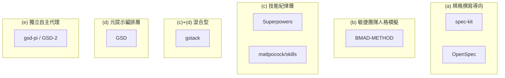
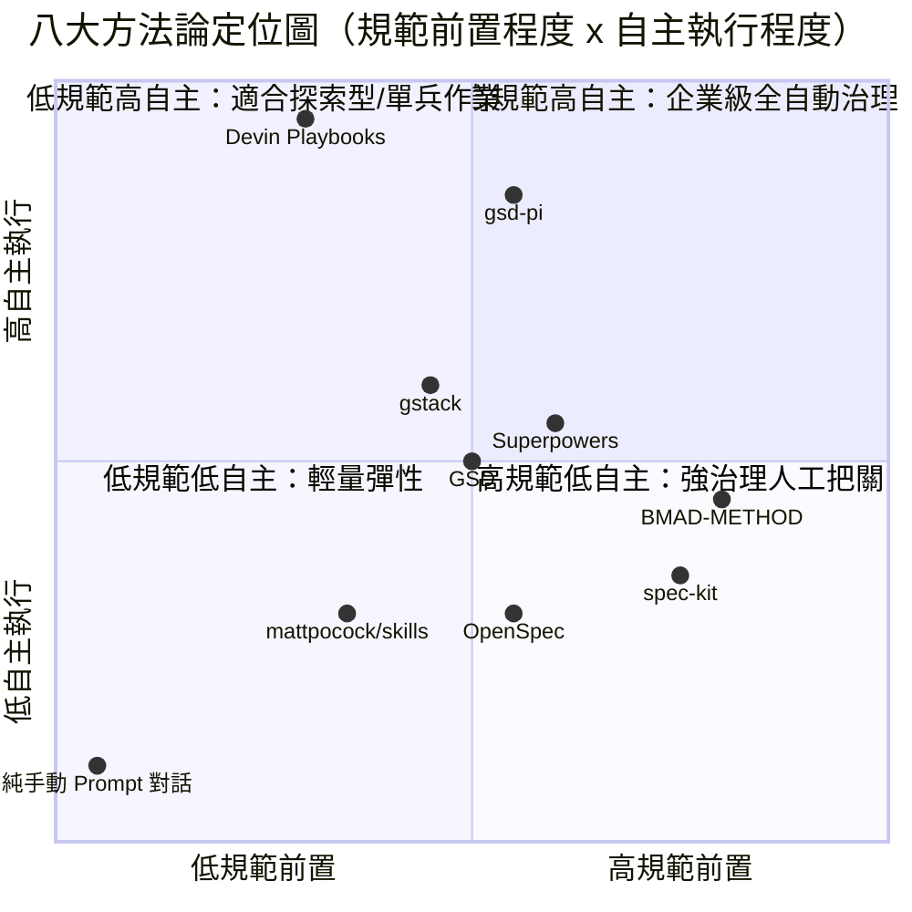
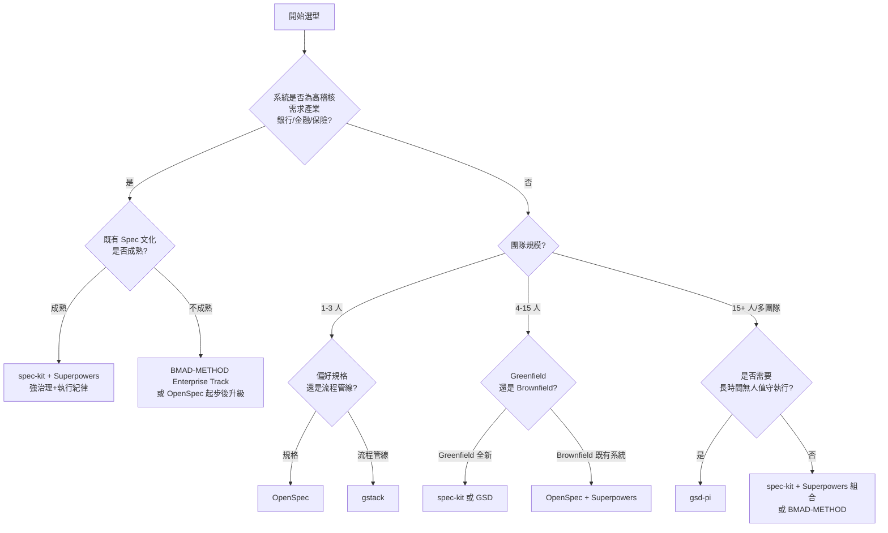
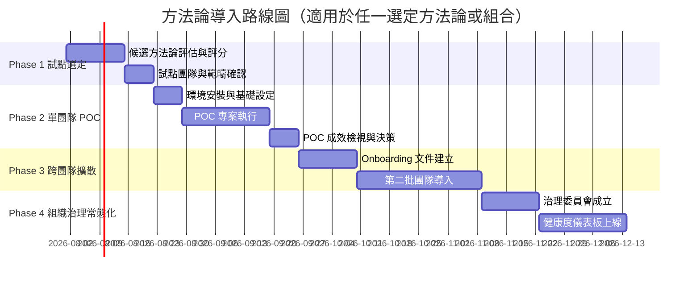
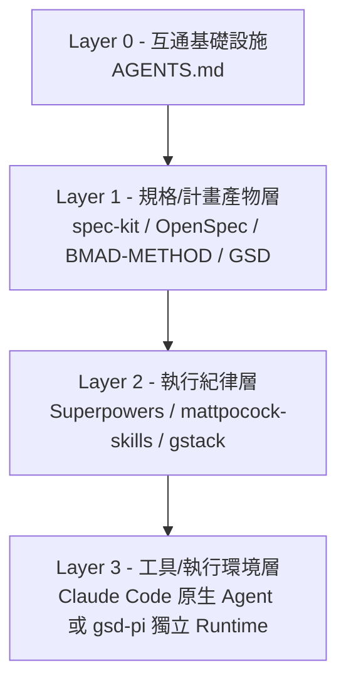
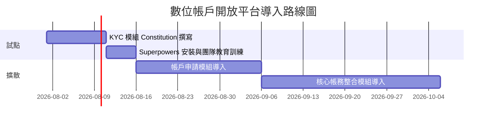
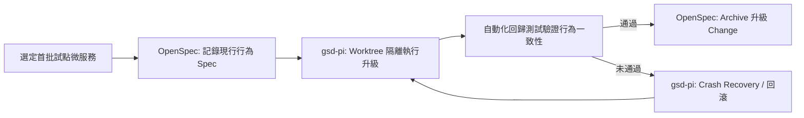
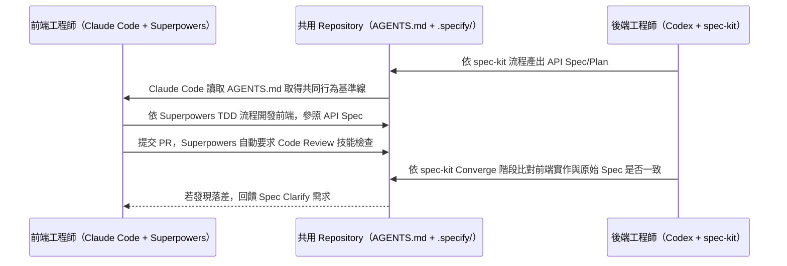
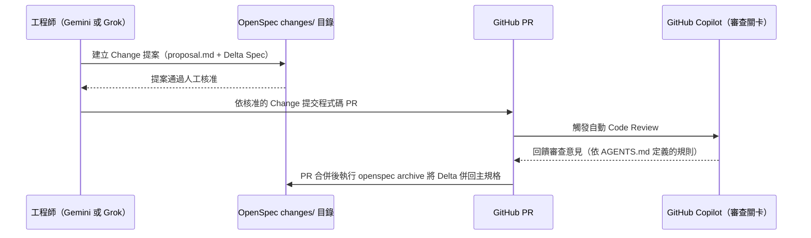

+++
date = '2026-07-24T13:14:08+08:00'
draft = false
title = 'AI常用方法論比較教學手冊'
tags = ['教學', 'AI開發']
categories = ['教學']
+++
# AI常用方法論比較教學手冊

> **版本**：v1.1｜**日期**：2026-07-24｜**適用對象**：架構師、Tech Lead、AI 導入決策者、資深工程師
> **v1.1 更新重點**：依 8 套方法論官方 Repository 最新狀態逐章查證修正，包含 GSD 生態系組織遷移沿革（見 2.5、2.6、附錄 C.2）、五工具整合覆蓋度多處更新（spec-kit／BMAD-METHOD／Superpowers／gstack）、gstack 技能規模與指令管線更新、mattpocock/skills 技能清單改版、AGENTS.md 創始會員名單補正，並新增附錄 D.4 版本快照表
> **涵蓋方法論**：spec-kit、OpenSpec、Superpowers、BMAD-METHOD、GSD（get-shit-done）、gsd-pi（GSD-2）、gstack、mattpocock/skills
> **涵蓋 AI 工具**：Claude Code、OpenAI Codex、GitHub Copilot、Gemini、Grok
> **涵蓋情境**：Web Application 開發、逆向工程（Reverse Engineering）、軟體框架升級（Framework Upgrade）
> **適用產業**：銀行、金融業、保險業等高治理需求產業，亦適用一般企業 IT 團隊
> **重要更新**：本文件為跨方法論比較與企業選型指南，非取代任何單一方法論的完整教學；各方法論詳細操作請參閱本目錄下對應手冊（見各章節連結與附錄 D）

---

## 📋 目錄

- [前言](#前言)
- [第 1 章：AI 輔助軟體開發方法論全景與參考座標](#第-1-章ai-輔助軟體開發方法論全景與參考座標)
  - [1.1 為何企業需要跨方法論比較](#11-為何企業需要跨方法論比較)
  - [1.2 方法論分類框架（機制軸）](#12-方法論分類框架機制軸)
  - [1.3 八大方法論定位圖](#13-八大方法論定位圖)
  - [1.4 五大 AI 工具總覽](#14-五大-ai-工具總覽)
  - [1.5 三大應用情境定義與成功標準](#15-三大應用情境定義與成功標準)
  - [1.6 AGENTS.md：跨工具互通基礎設施](#16-agentsmd跨工具互通基礎設施)
  - [1.7 其他外部參考座標（非完整檔案，僅作校準用）](#17-其他外部參考座標非完整檔案僅作校準用)
  - [1.8 實務落地建議](#18-實務落地建議)
- [第 2 章：八大方法論濃縮檔案](#第-2-章八大方法論濃縮檔案)
  - [2.1 spec-kit](#21-spec-kit)
  - [2.2 OpenSpec](#22-openspec)
  - [2.3 Superpowers](#23-superpowers)
  - [2.4 BMAD-METHOD](#24-bmad-method)
  - [2.5 GSD（get-shit-done）](#25-gsdget-shit-done)
  - [2.6 gsd-pi（GSD-2）](#26-gsd-pigsd-2)
  - [2.7 gstack](#27-gstack)
  - [2.8 mattpocock/skills](#28-mattpocockskills)
  - [2.9 實務落地建議](#29-實務落地建議)
- [第 3 章：跨方法論比較框架與矩陣](#第-3-章跨方法論比較框架與矩陣)
  - [3.1 比較維度定義](#31-比較維度定義)
  - [3.2 總覽比較矩陣](#32-總覽比較矩陣)
  - [3.3 安裝複雜度與五工具整合覆蓋度矩陣](#33-安裝複雜度與五工具整合覆蓋度矩陣)
  - [3.4 團隊規模與組織適配](#34-團隊規模與組織適配)
  - [3.5 治理與維運負擔比較](#35-治理與維運負擔比較)
  - [3.6 學習曲線與導入時間比較](#36-學習曲線與導入時間比較)
  - [3.7 機制光譜圖](#37-機制光譜圖)
  - [3.8 弱點與風險總表](#38-弱點與風險總表)
  - [3.9 實務落地建議](#39-實務落地建議)
- [第 4 章：企業選型決策框架](#第-4-章企業選型決策框架)
  - [4.1 選型決策樹](#41-選型決策樹)
  - [4.2 評分量表（可直接套用）](#42-評分量表可直接套用)
  - [4.3 方法論導入成熟度模型（Level 1–5）](#43-方法論導入成熟度模型level-15)
  - [4.4 試點到擴大導入路線圖](#44-試點到擴大導入路線圖)
  - [4.5 決策情境範例](#45-決策情境範例)
  - [4.6 實務落地建議](#46-實務落地建議)
- [第 5 章：混合與共存導入指南](#第-5-章混合與共存導入指南)
  - [5.1 為何要混合方法論](#51-為何要混合方法論)
  - [5.2 相容性矩陣](#52-相容性矩陣)
  - [5.3 分層組合模型](#53-分層組合模型)
  - [5.4 安裝順序與設定合併建議](#54-安裝順序與設定合併建議)
  - [5.5 已知衝突與注意事項](#55-已知衝突與注意事項)
  - [5.6 實務落地建議](#56-實務落地建議)
- [第 6 章：三大情境實戰案例（銀行業）](#第-6-章三大情境實戰案例銀行業)
  - [6.1 情境一：Web Application 開發](#61-情境一web-application-開發)
  - [6.2 情境二：逆向工程](#62-情境二逆向工程)
  - [6.3 情境三：框架升級](#63-情境三框架升級)
  - [6.4 三情境 × 八方法論適配打分表](#64-三情境--八方法論適配打分表)
  - [6.5 實務落地建議](#65-實務落地建議)
- [第 7 章：方法論組合的維護與升級治理](#第-7-章方法論組合的維護與升級治理)
  - [7.1 為何需要「方法論組合」層級的治理](#71-為何需要方法論組合層級的治理)
  - [7.2 日常維運：版本釘選與相容性檢查](#72-日常維運版本釘選與相容性檢查)
  - [7.3 Prompt／Spec 版本控制與變更追蹤](#73-promptspec-版本控制與變更追蹤)
  - [7.4 治理委員會結構與 RACI](#74-治理委員會結構與-raci)
  - [7.5 何時該汰換或升級方法論](#75-何時該汰換或升級方法論)
  - [7.6 法規遵循與稽核追溯（銀行/金融特別考量）](#76-法規遵循與稽核追溯銀行金融特別考量)
  - [7.7 監控指標與健康度儀表板](#77-監控指標與健康度儀表板)
  - [7.8 實務落地建議](#78-實務落地建議)
- [第 8 章：AI Agent 跨方法論協作範例](#第-8-章ai-agent-跨方法論協作範例)
  - [8.1 為何需要跨方法論/跨工具協作範例](#81-為何需要跨方法論跨工具協作範例)
  - [8.2 範例一：Claude Code + Codex 共用 AGENTS.md](#82-範例一claude-code--codex-共用-agentsmd)
  - [8.3 範例二：Copilot + Gemini/Grok 以 OpenSpec 仲裁](#83-範例二copilot--geminigrok-以-openspec-仲裁)
  - [8.4 協作失敗模式與修復](#84-協作失敗模式與修復)
  - [8.5 實務落地建議](#85-實務落地建議)
- [第 9 章：方法論選型與整合 Prompt Library](#第-9-章方法論選型與整合-prompt-library)
  - [9.1 團隊 AI 成熟度現況評估 Prompt](#91-團隊-ai-成熟度現況評估-prompt)
  - [9.2 方法論選型建議 Prompt](#92-方法論選型建議-prompt)
  - [9.3 兩方法論相容性檢查 Prompt](#93-兩方法論相容性檢查-prompt)
  - [9.4 治理文件骨架生成 Prompt](#94-治理文件骨架生成-prompt)
  - [9.5 情境對應方法論組合 Prompt](#95-情境對應方法論組合-prompt)
  - [9.6 方法論汰換/遷移評估 Prompt](#96-方法論汰換遷移評估-prompt)
  - [9.7 實務落地建議](#97-實務落地建議)
- [第 10 章：常見問題（FAQ）](#第-10-章常見問題faq)
- [附錄 A：快速選型與導入檢查清單](#附錄-a快速選型與導入檢查清單)
- [附錄 B：八方法論／五工具／三情境速查表](#附錄-b八方法論五工具三情境速查表)
- [附錄 C：名詞釋義與命名辨正](#附錄-c名詞釋義與命名辨正)
- [附錄 D：參考資源與延伸閱讀](#附錄-d參考資源與延伸閱讀)
- [附錄 E：八大方法論安裝教學速查](#附錄-e八大方法論安裝教學速查)

---

## 前言

### 為什麼需要這份手冊

過去兩年間，「用 AI 寫程式」已經從個人的 Prompt 技巧，演化成一整套可被治理、可被複製、可被稽核的**方法論（Methodology）**。截至本文件撰寫時，僅在本專案的 `.github\教學\AI開發\` 目錄下，就已經累積了 spec-kit、OpenSpec、Superpowers、BMAD-METHOD、GSD、gsd-pi（GSD-2）、gstack、mattpocock/skills 等 8 套獨立、完整、動輒 2,500～7,300 行的教學手冊 —— 每一套都宣稱自己能提升 AI 協作品質，每一套都有各自的哲學、安裝方式與最佳實務。

問題是：**架構師該怎麼選？** 8 套方法論 × 5 種 AI 工具（Claude Code、Codex、GitHub Copilot、Gemini、Grok）× 3 種應用情境（Web Application 開發、逆向工程、框架升級），理論組合數高達 120 種。沒有人有時間把 8 本手冊、超過 3 萬行的內容全部讀完才做決定；但只憑一篇部落格文章選型，又容易踩中「用 Enterprise 級的 BMAD-METHOD 管理 3 人小專案」或「銀行核心系統用最陽春的 Prompt-and-Pray 開發」這類明顯不對稱的錯誤。

本手冊的定位，是在既有的 8 本「單一方法論教學手冊」之上，補上企業長期缺少的**比較與選型層**：

> **本手冊不重複各方法論的完整教學** —— 安裝步驟、指令細節、完整範例，請一律參閱本目錄下對應的原始手冊（每一節都會附上連結）。本手冊要回答的，是原始手冊都不會回答的問題：「我該選哪一個？」「能不能混用？」「選錯了怎麼辦？」「治理與升級誰來管？」

### 三種讀者，三種讀法

| 讀者角色 | 建議閱讀路徑 | 預期產出 |
|---|---|---|
| 架構師 / 技術決策者（做選型） | 第 1 章 → 第 3 章 → 第 4 章 → 第 6 章 | 一份可提交給主管的方法論選型建議書 |
| 工程主管 / Tech Lead（做導入） | 第 4 章 → 第 5 章 → 第 7 章 → 附錄 A | 一份分階段導入與治理計畫 |
| 第一線工程師（想知道某情境該用什麼） | 第 2 章 → 第 6 章 → 第 9 章 | 針對手上專案的具體方法論組合建議 |

### 資料來源與撰寫方式聲明

本手冊內容整理自：(1) 本專案既有的 8 份方法論教學手冊（`spec-kit使用教學.md`、`OpenSpec使用教學.md`、`Superpowers教學手冊.md`、`BMAD-METHOD使用教學.md`、`get-shit-done(GSD)教學手冊.md`、`GSD-2教學手冊.md`、`gstack教學手冊.md`、`mattpocock skills 教學手冊.md`）；(2) 各方法論官方 GitHub Repository 之現行說明；(3) 業界對 AI 軟體開發方法論的公開討論與文章。所有內容均經消化、重新歸納整理後撰寫，並非逐段抄錄原文；如需查閱任一方法論的完整、逐步操作教學，請直接參閱對應原始手冊。

> **架構師觀點**：方法論本身不是目的，「讓 AI 產出可信賴、可維運、可稽核的程式碼」才是目的。閱讀本手冊時，請隨時把「這對我的團隊/系統有什麼實際幫助」放在「這個方法論聽起來多先進」之前。

---

## 第 1 章：AI 輔助軟體開發方法論全景與參考座標

### 1.1 為何企業需要跨方法論比較

**重點整理**

- AI 輔助開發方法論在 2025–2026 年間快速分裂為多個流派：有的專注「先寫規格再生成程式碼」（Spec-Driven Development, SDD），有的專注「用角色扮演模擬一整個團隊」，有的專注「用技能（Skills）約束 AI 的行為紀律」，也有的直接把自己做成一個獨立的自主代理執行環境。
- 選型錯誤的代價不是抽象的 —— 它會直接反映在專案時程、程式碼品質與稽核風險上。

| 常見選型錯誤 | 典型後果 |
|---|---|
| 3 人新創團隊導入 BMAD-METHOD 的 Enterprise Track（12+ 代理人格、完整合規文件） | 光是走完流程就耗盡團隊人力，MVP 遲遲無法上線 |
| 銀行核心系統改造僅用「跟 AI 聊天」（無 Spec、無治理） | 需求理解偏差、無法追溯決策依據，稽核時無法舉證 |
| 同時導入 2 套皆想「掌控 Git Worktree」的方法論而未做分層設計 | 兩套機制互搶資源、Session 狀態互相覆蓋 |
| 選定方法論後從未檢視治理與升級路徑 | Spec 與程式碼逐漸飄移（Drift），方法論淪為形式 |

> **架構師觀點**：多數企業不是「選錯了方法論」，而是「從未系統性地比較過」。本章的任務，就是先建立一套可重複使用的比較座標，讓後續每一章的比較都有共同的語彙基礎。

**注意事項**：本手冊定義的分類與座標是為了「方便決策」而設計的簡化模型，並非學術分類法；實務上多數方法論會同時具備多個軸線的特徵（例如 gstack 兼具技能包與流程管線兩種性質），使用時請以「主要機制」判斷，而非機械式套用。

### 1.2 方法論分類框架（機制軸）

要比較 8 套方法論，第一步是先建立一套「機制軸（Mechanism Axis）」分類，避免落入「哪個比較潮」這種無法決策的討論。本手冊將 8 套方法論歸納為 5 種主要機制：

| 機制類型 | 核心邏輯 | 代表方法論 |
|---|---|---|
| **(a) 規格撰寫導向 Spec-Authoring** | 先產出結構化規格文件（Spec/Plan/Tasks），規格是「真相」，程式碼是「產物」 | spec-kit、OpenSpec |
| **(b) 敏捷團隊人格模擬 Agent-Persona-Team** | 用多個具名 AI 角色（PM、架構師、QA…）模擬一個完整敏捷團隊 | BMAD-METHOD |
| **(c) 技能紀律層 Skills/Discipline-Layer** | 不管規格怎麼寫，用一組「自動觸發的技能」規範 AI *如何* 寫程式（TDD、Worktree 隔離、證據導向驗證） | Superpowers、mattpocock/skills |
| **(d) 元提示編排層 Meta-Prompting/Orchestration** | 用 Slash Command 串接一套標準化流程，疊加在既有 AI Runtime 之上 | GSD（get-shit-done） |
| **(e) 獨立自主代理執行環境 Standalone Autonomous Agent Runtime** | 自己就是一個獨立的 CLI/Runtime，直接管理 Context、Session、Git、成本 | gsd-pi（GSD-2） |

gstack 則橫跨 (c) 與 (d)：它以技能包（Skill Command）的形式安裝，但本質上是一條「虛擬新創團隊」的角色化流程管線，因此在後續章節中會同時標註為「技能包 + 流程管線」的混合型。



**最佳實務**：在向團隊或主管簡報選型建議時，先用這張機制分類表定調「我們要解決的是規格問題、團隊協作問題、還是執行紀律問題」，再進入細節比較，可以大幅降低決策討論的發散程度。

### 1.3 八大方法論定位圖

除了機制分類，另一個實用的座標是「規範前置程度（Prescriptiveness）」與「自主執行程度（Autonomy）」兩軸：



> **實務建議**：越靠右上角的方法論（gsd-pi、BMAD-METHOD、spec-kit）治理力道強、但導入成本與學習曲線也較高；越靠左下角（純手動 Prompt 對話、mattpocock/skills 的個別技能）彈性高、但缺乏強制紀律。企業導入時應優先評估「我們的系統風險等級落在哪個象限」，再挑選對應區間的方法論，而不是一律追求最右上角。

### 1.4 五大 AI 工具總覽

本手冊涵蓋的 5 種 AI 工具，各自的生態圈性質不同，會直接影響方法論的整合難易度：

| AI 工具 | 供應商 | 核心整合模式 | 本專案既有手冊 |
|---|---|---|---|
| **Claude Code** | Anthropic | 原生 Plugin Marketplace、Slash Command、Skills、Hooks | `Claude Code生態圈教學手冊.md`、`claude code教學手冊(資深同仁版).md` |
| **OpenAI Codex** | OpenAI | AGENTS.md 為主要行為設定入口，CLI/IDE 雙形態 | `OpenAI Codex生態系教學手冊.md` |
| **GitHub Copilot** | GitHub/Microsoft | `.github/copilot-instructions.md`、Copilot CLI、無原生 Plugin 機制 | `github copilot生態圈教學手冊.md`、`Copilot CLI教學手冊.md` |
| **Gemini** | Google | Gemini CLI 支援多數方法論的 Runtime 清單，但企業級中文教學資源在本專案尚未獨立成冊 | 尚無專屬手冊，本手冊僅摘要公開資訊 |
| **Grok** | xAI | 生態圈最年輕，多數方法論文件中極少明確列出 Grok 支援 | 尚無專屬手冊，本手冊僅摘要公開資訊 |

> **注意事項**：Gemini 與 Grok 目前在多數方法論的官方文件中，整合成熟度與明確支援聲明都落後於前三者。第 2 章每套方法論的「五工具整合覆蓋度」表格會標註 ⚠️ 待查證，代表該資訊需要在實際導入前以官方文件重新確認，而非直接採信本手冊的推論。

### 1.5 三大應用情境定義與成功標準

為了讓第 6 章的情境案例與第 3 章的比較矩陣有一致的評分基礎，先明確定義三大應用情境的「成功」是什麼：

| 情境 | 定義 | 成功標準 |
|---|---|---|
| **Web Application 開發** | 從需求到上線的新功能/新系統開發（含前後端、資料庫、API） | 需求覆蓋率高、規格與程式碼一致、測試覆蓋率達標、可維運 |
| **逆向工程 Reverse Engineering** | 針對缺乏文件的既有系統（如 COBOL、AS/400、老舊 Java 系統）進行分析、還原規格文件、建立知識庫 | 還原規格的準確度高、幻覺（Hallucination）率低、能正確捕捉隱含的業務規則與邊界案例 |
| **框架升級 Framework Upgrade** | 既有系統的框架/語言大版本升級（如 Spring Boot 2→3、Java 8→21） | 行為保持一致（Behavior-Preserving）、具備可回滾（Rollback）能力、升級過程可追溯 |

**小技巧**：在替專案選方法論之前，先用上表把專案歸類到單一情境（或標註為混合情境），可以避免「這套方法論理論上什麼都能做」這種缺乏聚焦的討論。

### 1.6 AGENTS.md：跨工具互通基礎設施

在深入比較 8 套方法論之前，有一項「非方法論、但幾乎所有方法論都會碰到」的基礎設施，值得獨立說明：**AGENTS.md**。

AGENTS.md 是由 OpenAI 於 2025 年 8 月提出、2025 年底捐贈給 Linux Foundation 旗下 Agentic AI Foundation（AAIF，2025-12-09 成立）的開放標準，目的是終結過去 `.cursorrules`、`CLAUDE.md`、`.github/copilot-instructions.md`、Aider 的 `CONVENTIONS.md` 等各家自訂設定檔並存的碎片化局面。AGENTS.md 是 AAIF 成立時三大創始捐贈專案之一，另兩者為 Anthropic 捐贈的 MCP（Model Context Protocol）與 Block 捐贈的 goose。AAIF 目前由 AWS、Anthropic、Block、Bloomberg、Cloudflare、Google、Microsoft、OpenAI 等 8 家創始/白金會員共同支持，截至撰寫時已有 6 萬個以上的 Repository、28 個以上的工具原生支援。

> **架構師觀點**：AGENTS.md **不是本手冊要比較的第 9 套方法論**，而是所有方法論可能共同依附的「地基」。理解這一點，能避免把「該不該用 AGENTS.md」和「該用哪套方法論」混為同一個決策。

| 方法論 | 與 AGENTS.md 的關係 |
|---|---|
| OpenSpec | 官方文件建議建立 AGENTS.md 來設定 AI 助手行為 |
| Superpowers | 在 Codex 上的移植方式即是透過 AGENTS.md 承載方法論規則 |
| mattpocock/skills | Copilot 整合路徑即透過 AGENTS.md |
| spec-kit | 採用自有的 `.specify/` 目錄與 Constitution 機制，與 AGENTS.md 為互補而非取代關係 |
| BMAD-METHOD | 已支援生成 AGENTS.md 作為輸出格式之一（2025 年 11 月，Issue #517 結案），但主要整合入口仍為自有人格設定檔 |
| GSD / gsd-pi | 採用自有的 `.planning/` 或 `.gsd/` 目錄，可與 AGENTS.md 並存 |
| gstack | 以 Claude Code Skills 為主要形態，尚未強依賴 AGENTS.md |

**最佳實務**：無論最終選擇哪一套方法論，都建議在專案根目錄建立 AGENTS.md 作為「多工具共同讀取的行為基準線」，各方法論的專屬設定檔（`.specify/`、`.gsd/`、CLAUDE.md 等）則作為在此基準線之上的加值層。第 5.3 節的分層組合模型會進一步展開這個概念。

### 1.7 其他外部參考座標（非完整檔案，僅作校準用）

除了 8 套核心方法論，以下 4 個外部參考點雖非本手冊的比較對象，但能協助校準判斷：

| 參考座標 | 定位 | 用途 |
|---|---|---|
| **AWS Kiro** | AWS 於 2026 年推出、取代 Amazon Q Developer 的全新 IDE，架構完全建立在 Spec-Driven Development 之上 | 佐證 SDD 已從小眾 OSS 趨勢演變為 AWS／GitHub／Anthropic／Cursor 等主要供應商的共識，是「為什麼現在要重視 SDD」的產業證據 |
| **12-Factor Agents** | Dex Horthy（HumanLayer）提出的工程原則框架，**不是工具，是評估鏡頭** | 用來檢視任一方法論「是否把控制流程明確化、是否把 Prompt 當版本控制的程式碼對待」——本專案已有完整教學：`12-factor-agents教學手冊.md`，建議搭配第 3 章比較矩陣使用 |
| **Devin Playbooks** | Cognition 公司的全自主 SWE Agent Devin 所採用的「可重複使用程序知識」模型 | 作為「全自主代理 + 可複用 Playbook」模式的對照組，凸顯本手冊 8 套方法論多數仍保留「人在迴圈中（Human-in-the-Loop）」的核准機制這項特徵 |
| **AI-SDLC 治理框架**（如 IBM Bob SDLC、ai-sdlc-framework） | 聚焦稽核追溯、Definition-of-Ready 關卡、DSSE 簽章等合規面向的框架 | 補足 8 套 OSS 開發者導向方法論較少著墨的稽核／合規視角，於第 7.6 節銀行治理段落會再引用 |

### 1.8 實務落地建議

- 導入任何方法論之前，先用 1.2 節的機制軸與 1.3 節的定位圖，跟團隊對齊「我們現在缺的是規格紀律、團隊協作模擬、還是執行紀律」，避免選型會議淪為工具知名度比拼。
- 把 1.5 節的三大情境定義印出來貼在專案 Wiki 首頁，任何新專案啟動時都先做情境歸類。
- 不論最終選型結果為何，先把 AGENTS.md 當成專案的標準配備建立起來 —— 它幾乎不會與任何方法論衝突，卻能大幅降低未來更換或疊加方法論的成本。
- 涉及銀行/金融/保險等高稽核需求系統時，務必在選型階段就把 1.7 節的 AI-SDLC 治理框架考慮進來，而不是等上線前才補稽核文件。

**常見錯誤**：把「機制分類」誤當成「成熟度排名」——例如認為 (e) 獨立自主代理環境天生比 (c) 技能紀律層先進。事實上兩者解決的是不同問題，選擇應該基於團隊與系統的實際需求，而非機制本身的新舊。

---

## 第 2 章：八大方法論濃縮檔案

本章對 8 套方法論各自提供一份「濃縮檔案」——固定格式、可快速掃讀，目的是讓讀者不必翻閱動輒數千行的原始手冊，就能掌握每套方法論的定位與取捨。**每份檔案都刻意保持精簡**：完整機制、指令細節、逐步安裝教學，一律連結回原始手冊。

> **小技巧**：如果你已經知道自己屬於哪個機制類型（見 1.2 節），可以只精讀對應分類下的 1–2 套檔案，其餘略讀即可。

### 2.1 spec-kit

**一句話定位**：GitHub 官方出品的 Spec-Driven Development 工具鏈——「規格是真相，程式碼是規格的產物」。

| 項目 | 說明 |
|---|---|
| GitHub | github/spec-kit（123,517★，MIT，release 節奏極快，撰寫時最新版本 v0.14.1） |
| 核心機制 | 5 大產物：Constitution（專案憲法）／Spec（What/Why）／Plan（How）／Tasks（原子任務）／Implementation；已從單純模板工具鏈演化為可疊加的 Extension/Preset/Bundle 生態系（社群目錄提供 Security、Architecture、A11Y、Cross-Platform Governance 等治理 Preset，以及角色導向的 Bundle 組合） |
| 治理特色 | 唯一擁有明確 Constitution 治理層與 Converge/Reconcile（規格與程式碼收斂比對，對應 `/speckit.converge` 指令）階段的方法論 |
| 安裝門檻 | 需 Python 3.11+、Git、`uv`；`uv tool install specify-cli --from git+https://github.com/github/spec-kit.git`；另提供 skills-mode 安裝選項（`--integration <agent> --integration-options="--skills"`），Codex CLI 於 skills-mode 下改以 `$speckit-*` 取代 Slash Command |
| 核心指令 | `/speckit.constitution` → `.specify` → `.clarify` → `.plan` → `.tasks` → `.analyze` → `.checklist` → `.implement`；另新增 `/speckit.taskstoissues`（將 Tasks 轉為 GitHub Issues）與 `/speckit.converge`（比對現有程式碼與 Spec/Plan/Tasks 現況，補列尚未完成的工作） |

**五工具整合覆蓋度**

| Claude Code | Codex | Copilot | Gemini | Grok |
|---|---|---|---|---|
| ✅ 原生支援 | ✅ 原生支援 | ✅ 原生支援 | ✅ 原生支援 | ✅ 原生支援（原始碼 `src/specify_cli/integrations/` 已提供專屬 grok 整合模組，與 claude/codex/copilot/gemini 並列，5 工具皆有支援，整合目標合計約 40 個） |

- **最佳適用場景**：多資料庫／微服務／批次作業並存的企業共用平台開發、團隊新人上手與知識傳承痛點明顯、希望用「憲法」約束 AI 輸出邊界的組織。
- **主要弱點**：前期規格撰寫會拖慢小型試點專案的啟動速度；Constitution 若無 CI 落實檢查，容易與程式碼產生飄移（Drift）；治理過嚴時有過度工程化風險。
- **一句話：何時不要選它**：若專案是 1–2 週內要交付的一次性小工具，spec-kit 的前置規格成本可能高於其產出價值。

> 詳細教學請參考《spec-kit使用教學.md》與《spec-kit workflow v4.md》（8 階段流程圖，含人工／AI 動作區分與核心/條件檔案標示）。

### 2.2 OpenSpec

**一句話定位**：比 spec-kit 更輕量的規格驅動變更管理工具，強調「規格是單一事實來源」但用漸進式 Change 資料夾管理，而非一次性大憲法。

| 項目 | 說明 |
|---|---|
| GitHub | Fission-AI/OpenSpec（62,345★，MIT，撰寫時最新版本 v1.6.0「OPSX Update, Tool Support」） |
| 核心機制 | GIVEN-WHEN-THEN 情境語法 + SHALL/MUST/SHOULD/MAY 關鍵字強度分級；`openspec/` 目錄（project.md、specs/、changes/、archive/）；v1.5.0 起新增「Stores」（Beta）——跨 Repository 的規格共用層，讓多個程式碼庫的 AI Agent 共同讀取同一份 `openspec/` 事實來源 |
| 治理特色 | 以「Delta（差異）」追蹤每次規格變更，`openspec archive` 將差異併回主規格，天然適合棕地（Brownfield）漸進式開發 |
| 安裝門檻 | 需 Node.js ≥20.19.0；`npm install -g @fission-ai/openspec@latest` → `openspec init` |
| 核心指令 | v1.6.0 起已改版為 `/opsx:*` 命名空間：`/opsx:explore` → `/opsx:propose` → `/opsx:apply` → `/opsx:archive`，另新增 `/opsx:update`（v1.6.0 新增，原地修訂既有計畫）、`/opsx:new`、`/opsx:continue`、`/opsx:ff`、`/opsx:verify`、`/opsx:bulk-archive`、`/opsx:onboard`；CLI 仍提供 `list` / `show` / `validate` |

**五工具整合覆蓋度**

| Claude Code | Codex | Copilot | Gemini | Grok |
|---|---|---|---|---|
| ✅ 原生支援 | ✅ 原生支援（skills-only，透過 AGENTS.md） | ✅ 原生支援 | ✅ 原生支援 | ⚠️ 現行版本尚未提供專屬整合（已查證原始碼 `src/core/config.ts` 的 `AI_TOOLS` 陣列，33 個項目中未見 grok；OpenSpec 另提供 `AGENTS.md` 作為未列名工具的通用安裝目標） |

- **最佳適用場景**：既有系統的漸進式功能變更、希望保留 Git-native 純 Markdown（無專屬 DSL）以避免工具鎖定、需要逐次變更追溯（適合稽核）的團隊。
- **主要弱點**：相較 spec-kit，缺乏獨立的「Plan」階段與 Constitution 治理層，複雜跨模組專案的架構決策需另外補強；無內建的多代理協作角色。
- **一句話：何時不要選它**：若專案需要從零開始建立完整架構決策記錄與跨團隊治理層，OpenSpec 單獨使用會顯得單薄，建議搭配第 5 章的組合方案。

> 詳細教學請參考《OpenSpec使用教學.md》（已內建完整銀行帳戶餘額查詢 API 案例與需求追溯矩陣範例）。

### 2.3 Superpowers

**一句話定位**：不是規格工具，而是「AI 該如何寫程式」的行為紀律層——一套會自動觸發的 Claude Code（現已跨工具）技能庫。

| 項目 | 說明 |
|---|---|
| GitHub | obra/superpowers（撰寫時官方 GitHub 統計約 260k★，MIT，撰寫時最新版本 v6.2.0） |
| 核心機制 | 14 個自動觸發技能，「Basic Workflow」7 步驟：brainstorming → using-git-worktrees → writing-plans → subagent-driven-development → test-driven-development → requesting-code-review → finishing-a-development-branch |
| 治理特色 | TDD-always、evidence-over-claims（完成前必須提出驗證證據）、Worktree 隔離；官方定位為「比 Prompt/Context/Harness Engineering 更高一層」；v6.2.0 起 Subagent-Driven Development 追蹤改為逐計畫隔離（`.superpowers/sdd/<plan-basename>/`），避免跨計畫狀態互相污染 |
| 安裝門檻 | Git ≥2.20（需 Worktree 支援）、Node.js ≥18；已從「主要透過 Claude Code Plugin Marketplace」擴展為多工具官方安裝程式：Claude Code、Antigravity、Codex App、Codex CLI、Cursor、Factory Droid、Gemini CLI、**GitHub Copilot CLI**、Kimi Code、OpenCode、Pi，各自提供獨立安裝指令 |
| 核心指令 | 無需手動呼叫指令——技能依上下文自動啟用；核心技能另含 systematic-debugging、verification-before-completion、dispatching-parallel-agents |

**五工具整合覆蓋度**

| Claude Code | Codex | Copilot | Gemini | Grok |
|---|---|---|---|---|
| ✅ 原生 Plugin | ✅ 官方安裝程式（Codex App／Codex CLI，AGENTS.md 為底層承載機制） | ✅ 官方已提供 GitHub Copilot CLI 專屬安裝程式（v6.x 起）；若團隊實際使用情境為 Copilot IDE 擴充功能／`.github/copilot-instructions.md`，兩者是否完全對等尚待確認，建議導入前先釐清團隊使用介面 | ✅ 支援（Gemini CLI 支援曾於 v6.1.0 因 Google 終止 Gemini CLI 服務而短暫移除，v6.2.0 已恢復——見 3.3 節注意事項） | ⚠️ 待查證 |

- **最佳適用場景**：長期維運的企業系統（銀行/金融/醫療）、需要 AI 協作護欄的重度 AI 開發團隊、技術債清理、資淺工程師上手輔導。
- **主要弱點**：不處理「該做什麼」的規格問題，只處理「該怎麼做」的執行紀律問題——單獨使用時仍需另一層規格方法論搭配；對一次性腳本/PoC 而言紀律成本偏高。
- **一句話：何時不要選它**：黑客松、拋棄式原型或一次性腳本，Superpowers 的 TDD-always／Worktree 隔離等紀律會拖慢迭代速度而非加速。

> 詳細教學請參考《Superpowers教學手冊.md》（已具備完整反模式分類、CI/CD 整合章、企業導入 4 階段路線圖與 AI 使用政策範本）。

### 2.4 BMAD-METHOD

**一句話定位**：用 12+ 個具名 AI 代理人格模擬一整個敏捷團隊，而非單純的規格或技能工具。

| 項目 | 說明 |
|---|---|
| GitHub | bmad-code-org/bmad-method（51,036★，LICENSE 檔案內容為 MIT，撰寫時最新版本 v6.10.0；「BMad」／「BMAD-METHOD」名稱已由 BMad Code, LLC 註冊為商標，見 `TRADEMARK.md`） |
| 核心機制 | 4 階段：Business（商業分析）→ Model（模型設計）→ Architecture（架構）→ Delivery（交付）；「Party Mode」允許多角色同場協作，現已支援自訂並儲存持久記憶的角色群組；v6.10.0 新增「bmad-loop」無人值守自主開發迴圈模組（由新技能 `bmad-dev-auto` 驅動，取代舊有實驗性 `bmad-automator`），模組生態擴展為 BMM（核心）、BMad Builder、Test Architect、Game Dev Studio、Creative Intelligence Suite、bmad-loop 六大模組 |
| 治理特色 | 3 條可選 Flow Track：⚡Quick Flow（<5 分鐘，2–3 代理，適合小修）／📋BMad Method（<15 分鐘，6–8 代理，適合產品開發）／🏢Enterprise（<30 分鐘，12+ 代理，完整合規文件，適合銀行/金融）；另有「Web Bundles」（v1.0.0 起）將規劃階段技能打包為 Google Gemini Gems／ChatGPT Custom GPTs，作為 IDE 之外的非同步規劃管道 |
| 安裝門檻 | `npx bmad-method install`（需 Node 20.12+、Python 3.10+、uv） |
| 核心指令 | `*workflow-init` 選擇 Flow Track 後進入對應流程；內建 `bmad-help` 技能提供即時引導 |

**五工具整合覆蓋度**

| Claude Code | Codex | Copilot | Gemini | Grok |
|---|---|---|---|---|
| ✅ 原生支援 | ✅ 原生支援（`tools/installer/ide/platform-codes.yaml` 標記 `preferred: true`） | ✅ 原生支援 | ✅ 原生支援（同上來源確認為 preferred 整合） | ⚠️ 非官方獨立整合目標（權威設定檔中未見獨立 grok 整合鍵，僅可能透過 Cursor／Copilot 等既有工具間接使用特定模型） |

- **最佳適用場景**：新產品從零建立、中大型多人團隊、AI 成熟度較高的組織、法規/合規要求高的產業（Enterprise Track）。
- **主要弱點**：機制最重——即使是 Quick Flow 也涉及多代理切換，對單人開發或極簡任務而言儀式感過重；12+ 代理人格的維護與版本管理本身就是額外治理負擔。
- **一句話：何時不要選它**：AI 使用受限的高機密環境，或團隊對 AI 協作仍有高度疑慮/抗拒時，貿然導入 12 代理人格的 Enterprise Track 容易造成反效果。

> 詳細教學請參考《BMAD-METHOD使用教學.md》（第六章已有與 Scrum/SAFe、與 spec-kit 的官方比較章節，及 5 組銀行規模 Prompt 實戰對話，本手冊第 3 章會交叉引用而非重複）。

### 2.5 GSD（get-shit-done）

**一句話定位**：疊加在既有 AI Runtime 之上的輕量元提示（Meta-Prompting）編排層，核心賣點是對抗長對話的「Context Rot（上下文腐化）」。

| 項目 | 說明 |
|---|---|
| GitHub / npm | 原 `gsd-build/get-shit-done`（現已封存唯讀）已由社群逐字分叉遷移至現行專案 **`open-gsd/gsd-core`**（7,114★，MIT，2026-05-22 建立，持續活躍維護，官網 [opengsd.net](https://opengsd.net)）；對應 npm 套件已由 `get-shit-done-cc` 更名為 `@opengsd/gsd-core` |
| 核心機制 | `.planning/` 目錄（PROJECT.md、REQUIREMENTS.md、ROADMAP.md、STATE.md、specs/、tasks/、plans/）；5 大支柱：Meta-Prompting、Context Engineering、Spec-Driven Development、標準化流程、Multi-Agent Orchestration；遷移後官方核心迴圈以 **Discuss → Plan → Execute → Verify → Ship** 五步驟描述 |
| 治理特色 | 支援 9 種 AI Runtime（本比較對象中支援廣度最高），內建 Context Rot 偵測與修復機制、明確的反模式分類 |
| 安裝門檻 | `npx @opengsd/gsd-core@latest`（互動式選擇 Runtime 與路徑，沿用原安裝流程，僅套件名稱變更） |
| 核心指令 | `/gsd:new-project` → `/gsd:discuss-phase` → `/gsd:plan-phase` → `/gsd:execute-phase` → `/gsd:verify-work` → `/gsd:ship`；捷徑 `/gsd:quick`、`/gsd:next`（提醒：組織遷移後實際 Slash Command 名稱可能已調整，上列指令沿用原 `gsd-build` 版本記載，導入前請至 `open-gsd/gsd-core` 官方文件核實最新指令全名） |

**五工具整合覆蓋度**

| Claude Code | Codex | Copilot | Gemini | Grok |
|---|---|---|---|---|
| ✅ 原生支援 | ✅ 原生支援 | ✅ 原生支援 | ✅ 原生支援 | ⚠️ 待查證（原始手冊列出 9 種 Runtime，未見 Grok 明確列名） |

> **注意事項（沿革說明）**：本方法論原為 `gsd-build/get-shit-done`。因原維護者音訊全無（撰寫時已逾 7 週）、其帳號關聯的 $GSD 加密貨幣代幣遭公開指控涉及 Rug Pull（此指控尚有爭議、未經證實，此處僅中性陳述已發生的公開討論），社群已於 2026 年 5 月將專案逐字分叉遷移至現行的 `open-gsd/gsd-core`；原 `gsd-build/get-shit-done` 現已封存唯讀，其 README 亦已加註導引至新專案的橫幅。完整沿革與資料來源見附錄 C.2。

- **最佳適用場景**：已採用 Agile/Scrum 的團隊，希望在既有 Sprint 節奏中嵌入標準化 AI 開發流程；需要對抗長時間、多 Wave AI 協作 Session 中的上下文腐化問題。
- **主要弱點**：本身不是獨立 Runtime，仍依賴底層 AI 工具的能力與限制；Slash Command 數量多，初期學習曲線存在。
- **一句話：何時不要選它**：若團隊需要的是完全自主、脫離既有 IDE/CLI 的長時間無人值守執行，應考慮 2.6 節的 gsd-pi 而非 GSD。

> 詳細教學請參考《get-shit-done(GSD)教學手冊.md》（已有完整反模式章節：Spec-less Development、Mega-Wave、Context Dump、Blind Trust、Prompt-and-Pray、Never Refresh）。

### 2.6 gsd-pi（GSD-2）

**一句話定位**：GSD 生態系中的「獨立自主代理執行環境」——不是提示框架，而是建構在 Pi Coding Agent SDK 之上的獨立 TypeScript CLI。

| 項目 | 說明 |
|---|---|
| GitHub / npm | open-gsd/gsd-pi（948★，MIT，2026-05-22 建立，持續活躍維護）／npm `gsd-pi`，binary `gsd`；原專案為 `gsd-build/gsd-2`（7,750★），與 2.5 節 GSD 相同的組織遷移模式，已於 2026-05-22 遷移為現行 `open-gsd/gsd-pi` |
| 核心機制 | 200K Token 全新 Context／Task、Auto Mode 狀態機、Crash Recovery、Cost Tracking、Git Worktree 隔離＋Squash Merge、MCP Server、知識圖譜（LEARNINGS/KNOWLEDGE.md）、Skill Tracking、Web/Telegram/Slack/Discord 遠端操控 |
| 治理特色 | 與 GSD（2.5 節，現為 gsd-core）為官方定位的**平行互補產品**，而非序列式遷移關係——官方口號「選擇介面，保留迴圈」（Choose the surface. Keep the loop.）：gsd-core 是安裝進既有 Runtime（Claude Code／Codex／Gemini CLI／Cursor／Windsurf／Copilot 等）的外掛/框架，gsd-pi 則是獨立終端機原生的執行環境；兩者依需求並存選用，而非「先用 gsd-core 再升級到 gsd-pi」的單向路徑 |
| 安裝門檻 | Node ≥22（建議 24 LTS）；`npm install -g gsd-pi@latest`（Linux 環境避免使用 `sudo npm install -g`，建議改用 `~/.npm-global`） |
| 核心指令 | Spec-Driven 6 步驟迴圈：撰寫 Spec → 拆解 Task（Slices）→ 指派 AI Agent → 生成程式碼 → 測試/驗證 → 回饋至 KNOWLEDGE.md；另有 Auto Mode 全自動執行與雙終端機（Auto + 互動 Steering）工作模式 |

**五工具整合覆蓋度**

| Claude Code | Codex | Copilot | Gemini | Grok |
|---|---|---|---|---|
| ⚠️ 可作為 Provider 整合，但 gsd-pi 本身即是獨立 Runtime，非「安裝進 Claude Code」的關係 | ⚠️ 同左 | ⚠️ 同左 | ✅ 支援作為底層 LLM Provider | ⚠️ 待查證 |

> **重要提醒**：gsd-pi 的「工具整合」意義與其餘 7 套方法論不同——它不是安裝進某個 AI 工具，而是把 20+ 種 LLM 供應商（含 Claude、Gemini 等模型）當作可切換的底層引擎。因此上表的 ✅/⚠️ 意義是「能否作為 gsd-pi 的模型提供者」，而非「是否可安裝此方法論」，選型時務必分辨這個本質差異（詳見第 3.3 節說明）。

- **最佳適用場景**：企業大型/微服務系統、需要長時間無人值守執行的 AI Agent 任務、複雜重構/遷移專案、多人團隊搭配唯一 Milestone ID 協作。
- **主要弱點**：獨立 Runtime 意味著更高的環境管理成本（自有 Session、Context、Git 策略）；官方文件本身提醒小型一次性修改應改用 `/gsd quick` 而非啟動完整 Milestone 流程。
- **一句話：何時不要選它**：若團隊已深度依賴某個 AI 工具原生的 IDE/CLI 體驗，且任務多為短時互動修改，gsd-pi 額外的獨立 Runtime 管理成本可能得不償失。

> 詳細教學請參考《GSD-2教學手冊.md》（§1.2 已有 GSD-1 vs GSD-2 vs 傳統開發 三方比較表，本手冊第 3 章交叉引用而非重複列出）。

### 2.7 gstack

**一句話定位**：YC 創辦人 Garry Tan 開源的技能指令包，把 Claude Code 升級為「虛擬新創工程團隊」。

| 項目 | 說明 |
|---|---|
| GitHub | garrytan/gstack（撰寫時官方 GitHub 統計約 124k★，MIT） |
| 核心機制 | 23 個核心旗艦技能指令（完整技能目錄已擴展至 50+ 個，涵蓋 15 大類別，原「33 個技能」為早期版本規模，已隨專案成長而過時），模擬 PM／CEO／工程主管／QA／資安／發布工程師等角色；串接管線已擴充為：`/office-hours → /plan-ceo-review → /plan-eng-review → /design-review → /review → /qa → /ship → /land-and-deploy → /canary`，`/cso` 現定位為**可選的並行資安稽核步驟**，非管線中固定內嵌環節 |
| 治理特色 | "Builder Ethos" 哲學（Boil the Lake 完整交付、Search Before Building 先查證再開發、User Sovereignty 人類保留最終決策權）；`/cso` 提供 OWASP+STRIDE 安全審查關卡（可獨立於主管線並行執行）；近期新增持續 Checkpoint 自動提交、GBrain 跨 Session／跨機器記憶（`/setup-gbrain`、`/sync-gbrain`）、安全護欄指令 `/careful`／`/guard`／`/freeze`／`/unfreeze` |
| 安裝門檻 | 需 Claude Code CLI、Git、Bun（Windows 需 Node 18+）；`git clone` 至 `~/.claude/skills/gstack` 後執行 `./setup` |
| 核心指令 | 見上「核心機制」串接管線；另有 `/checkpoint`、`/health`、`/learn`、`/autoplan`、`/browse`（真實瀏覽器 QA 模式，家族已擴充 `/scrape`、`/skillify` 等，並支援 Chromium Stealth Mode） |

**五工具整合覆蓋度**

| Claude Code | Codex | Copilot | Gemini | Grok |
|---|---|---|---|---|
| ✅ 原生支援 | ✅ 已移植 | ⚠️ 待查證 | ⚠️ 建議調整為待查證（未找到官方文件將 Gemini 列為直接安裝目標，僅有跨模型比較功能 `/benchmark-models`，非安裝程式，導入前請直接查證官方 Repo） | ⚠️ 待查證 |

- **最佳適用場景**：新創產品驗證階段、需要嚴格品質關卡的企業功能開發（含銀行/金融的 `/cso` + `/careful` + `/guard` 組合）、大型多團隊平台的並行 Sprint 開發。
- **主要弱點**：技能指令數量龐大（核心 23 個、完整目錄 50+）的角色扮演與真實瀏覽器 QA 模式，對簡單 CRUD 類任務而言流程偏重；`/browse` 真實瀏覽器模式在不受信任網站上有 Prompt Injection 風險，官方文件已明確警告（近期版本已加入 ML 分類器與逐字稿驗證機制部分緩解此風險，但仍建議謹慎使用）。
- **一句話：何時不要選它**：極簡單、不涉及前端/瀏覽器互動的後端批次任務，gstack 完整的角色管線效益有限。

> 詳細教學請參考《gstack教學手冊.md》（§13.1 已有「企業導入十二大建議」，本手冊第 4 章的通用導入路線圖會與其交叉引用）。

### 2.8 mattpocock/skills

**一句話定位**：TypeScript 專家 Matt Pocock 維護的精選技能庫，透過 skills.sh 跨代理生態系分發，最小、最個人化、最不強制。

| 項目 | 說明 |
|---|---|
| GitHub | mattpocock/skills（經 skills.sh 註冊表分發，撰寫時官方 GitHub 統計約 185k★，MIT） |
| 核心機制 | SKILL.md（觸發描述）+ CONTEXT.md（純領域術語表，不含實作細節）+ ADR（架構決策記錄，刻意精簡格式）；鎖定 4 種 AI 常見失敗模式：需求誤解、輸出冗長、品質衰退、架構腐化 |
| 治理特色 | 技能分類已從「Engineering／Productivity／Misc」三分類，改版為依「使用者觸發／模型自動觸發」交叉區分的四分類：**Engineering (User-Invoked) / Engineering (Model-Invoked) / Productivity (User-Invoked) / Productivity (Model-Invoked)**（詳細技能清單見下方） |
| 安裝門檻 | `npx skills@latest add mattpocock/skills`（CLI 自動偵測專案的 Agent 類型），再執行一次性 `/setup-matt-pocock-skills`；另提供原生 Claude Code Plugin 安裝路徑作為替代：`/plugin marketplace add mattpocock/skills` 後 `/plugin install mattpocock-skills@mattpocock`（skills.sh 為可編輯本機副本，Plugin 則為唯讀、隨官方更新自動同步的套件包） |
| 核心指令 | 目前流程大致為：需求探索 `/grill-me`／`/grill-with-docs` → `/tdd` → `/to-spec` → `/to-tickets` → `/diagnosing-bugs` → `/codebase-design` → `/improve-codebase-architecture` → `/triage`（實際指令請以官方 Repo 現況為準，見下方完整清單） |

**目前技能清單**（本手冊上一版所列 `/to-prd`、`/to-issues`、`/diagnose`、`/zoom-out`、`/write-a-skill` 等名稱可能已調整或更名，以下為目前查證所得清單，不主張與舊名稱一一對應）：

| 分類 | 技能 |
|---|---|
| Engineering (User-Invoked) | `ask-matt`、`grill-with-docs`、`triage`、`improve-codebase-architecture`、`setup-matt-pocock-skills`、`to-spec`、`to-tickets`、`implement`、`wayfinder` |
| Engineering (Model-Invoked) | `prototype`、`diagnosing-bugs`、`research`、`tdd`、`domain-modeling`、`codebase-design`、`code-review`、`resolving-merge-conflicts` |
| Productivity (User-Invoked) | `grill-me`、`handoff`、`teach`、`writing-great-skills` |
| Productivity (Model-Invoked) | `grilling` |

**五工具整合覆蓋度**

| Claude Code | Codex | Copilot | Gemini | Grok |
|---|---|---|---|---|
| ✅ 原生支援（原生 Plugin） | ✅ 透過 skills.sh registry 支援（原生 Plugin 為未來路線圖項目，尚未上線） | ✅ 透過 AGENTS.md | ✅ skills.sh 已支援 | ⚠️ 待查證 |

- **最佳適用場景**：已在使用 Claude Code/Cursor/Copilot、需要工程紀律但不想全面導入重型方法論的中大型團隊；擔心 AI 協作導致架構逐漸腐化（Architecture Rot）的組織。
- **主要弱點**：範疇最窄、最個人風格化——不是端到端方法論，而是一組可獨立採用的技能，需要團隊自行決定要採用哪幾個、如何組合。
- **一句話：何時不要選它**：需要端到端、涵蓋規格到交付全流程的完整方法論時，單獨使用 mattpocock/skills 會需要額外拼湊其他工具補齊流程缺口（可參考第 5 章的組合建議）。

> 詳細教學請參考《mattpocock skills 教學手冊.md》（第 17–19 章已有完整 SSDLC／AI Governance／DevSecOps 專章）。

### 2.9 實務落地建議

下表是「只記得一句話」版本的總結，可作為團隊內部快速溝通的速記卡：

| 方法論 | 一句話記憶點 |
|---|---|
| spec-kit | 想要「規格即真相」的官方級治理，選它 |
| OpenSpec | 想要輕量、Git-native、可追溯的漸進式規格管理，選它 |
| Superpowers | 想要 AI 寫程式時自動守 TDD、守 Worktree 隔離，選它 |
| BMAD-METHOD | 想要 AI 模擬一整個敏捷團隊角色，選它 |
| GSD | 想要在既有工具上疊加標準化流程、對抗 Context Rot，選它 |
| gsd-pi | 想要一個完全獨立、可無人值守長跑的 AI 執行環境，選它 |
| gstack | 想要用 Slash Command 模擬新創團隊的完整品質關卡（含真實瀏覽器 QA），選它 |
| mattpocock/skills | 想要挑幾個精準技能補強現有流程，不想大改，選它 |

**小技巧**：把這張表印出來貼在團隊選型會議的白板上，往往比重新閱讀 8 本原始手冊更快達成初步共識——但務必記得，這只是起點，實際選型仍須完成第 3、4 章的比較與評分。

---

## 第 3 章：跨方法論比較框架與矩陣

本章是全書的核心價值所在：把第 2 章的 8 份濃縮檔案，轉換成可直接用於選型會議的比較矩陣。

### 3.1 比較維度定義

在使用任何矩陣前，先明確定義每個比較維度的量測方式，避免評分時各自解讀：

| 維度 | 定義 |
|---|---|
| 哲學/機制軸 | 見 1.2 節五分類（規格導向／團隊人格／技能紀律／編排層／獨立代理） |
| 安裝複雜度 | 從安裝指令數、前置依賴數量、是否需要獨立 Runtime 綜合評估（低/中/高） |
| 五工具整合覆蓋度 | 見第 2 章各方法論表格的 ✅/⚠️/❌ 統計 |
| 團隊規模適配 | 該方法論的機制在什麼團隊規模下效益最大化（個人／小型/中大型/多團隊平台） |
| 治理/維運負擔 | 導入後需要多少額外治理動作（版本管理、角色維護、規格審查）才能持續運作（低/中/高） |
| 學習曲線 | 團隊從導入到能獨立熟練運用所需的大致時間 |
| 最佳適用場景 | 見第 2 章 |
| 主要弱點 | 見第 2 章 |
| 產物飄移風險 | Spec/程式碼、人格設定/實際行為等「宣稱」與「實際」之間產生落差的風險（可用 1.7 節 12-Factor Agents 的「明確控制流程」原則作為檢視鏡頭） |
| 自主性等級 | 該方法論預設需要多少「人在迴圈中」核准節點（低自主＝人工核准多，高自主＝可長時間無人值守） |

### 3.2 總覽比較矩陣

| 方法論 | 機制軸 | 安裝複雜度 | 團隊規模適配 | 治理負擔 | 學習曲線 | 自主性等級 | 產物飄移風險 |
|---|---|---|---|---|---|---|---|
| spec-kit | (a) 規格導向 | 中 | 中～大型平台 | 中～高（需 CI 落實 Constitution） | 中 | 低（人工核准多） | 中（若無 CI 強制檢查） |
| OpenSpec | (a) 規格導向 | 低 | 小～中型 | 低～中 | 低 | 低 | 低（Delta 機制天然降低飄移） |
| Superpowers | (c) 技能紀律 | 中 | 中～大型（長期系統） | 中 | 中 | 中 | 低（TDD+驗證證據降低飄移） |
| BMAD-METHOD | (b) 團隊人格 | 中～高 | 中～大型多人團隊 | 高（12+ 代理需維護） | 高 | 低～中（依 Track 而定） | 中 |
| GSD | (d) 編排層 | 低～中 | 中型（Agile/Scrum 團隊） | 中 | 中 | 中 | 中（依 Context Rot 管理成熟度而定） |
| gsd-pi | (e) 獨立代理 | 高（獨立 Runtime） | 中～大型 | 高 | 高 | 高（可長時間無人值守） | 低（Knowledge Graph + Crash Recovery） |
| gstack | (c)+(d) 混合 | 中 | 新創～中型 | 中～高（含資安關卡） | 中 | 中 | 低（多重 Review 關卡） |
| mattpocock/skills | (c) 技能紀律 | 低 | 任意規模（模組化採用） | 低 | 低 | 低 | 低（CONTEXT.md 明確界定範疇） |

> **實務建議**：這張表是全書「使用頻率最高」的一張——建議把它獨立截圖或列印，作為選型會議的主參考。第 4.2 節的評分量表會延伸使用同一組維度。

### 3.3 安裝複雜度與五工具整合覆蓋度矩陣

| 方法論 | Claude Code | Codex | Copilot | Gemini | Grok |
|---|---|---|---|---|---|
| spec-kit | ✅ | ✅ | ✅ | ✅ | ✅ |
| OpenSpec | ✅ | ✅ | ✅ | ✅ | ⚠️ |
| Superpowers | ✅ | ✅ | ✅ 官方 Copilot CLI 安裝程式 | ✅ | ⚠️ |
| BMAD-METHOD | ✅ | ✅ | ✅ | ✅ | ⚠️ |
| GSD（現為 gsd-core） | ✅ | ✅ | ✅ | ✅ | ⚠️ |
| gsd-pi | ⚠️ 作為模型 Provider | ⚠️ 同左 | ⚠️ 同左 | ✅ 作為模型 Provider | ⚠️ |
| gstack | ✅ | ✅ | ⚠️ | ⚠️ | ⚠️ |
| mattpocock/skills | ✅ | ✅ | ✅ | ✅ | ⚠️ |

**注意事項**：本表已依 v1.1 查證結果更新：spec-kit 已確認原生 Grok 整合模組；BMAD-METHOD 的 Codex／Gemini 已於官方 `platform-codes.yaml` 查證為 preferred 整合；Superpowers 已提供官方 GitHub Copilot CLI 安裝程式；gstack 的 Gemini 支援因未找到官方安裝目標文件佐證，由原「✅ 已移植」調整為「⚠️ 待查證」。仍標註 ⚠️ 的 Grok 欄位，各方法論情況不盡相同——spec-kit 已確認支援，OpenSpec／BMAD-METHOD 已直接查證原始碼確認現行版本不支援，其餘（Superpowers、GSD/gsd-core、gsd-pi、gstack、mattpocock/skills）則仍屬真正未知，建議實際導入前直接查閱各方法論官方 Repository 的最新支援清單（詳見附錄 C.3）。gsd-pi 一列的 ⚠️ 具有特殊意義：如 2.6 節說明，gsd-pi 是把 AI 工具當作「底層模型供應商」而非「安裝宿主」，因此不能用與其他 7 列相同的方式解讀。

支援矩陣的易變性並非假設性描述：例如 Superpowers 的 Gemini CLI 支援曾於 v6.1.0（2026-06-30，因 Google 終止 Gemini CLI 服務）一度移除，又於 v6.2.0（2026-07-23）以「移除過於倉促」為由恢復——顯示 ⚠️/✅ 標記可能在數週內反轉，本表所有標記皆應視為特定時間點的快照（見附錄 D.4）。

### 3.4 團隊規模與組織適配

| 團隊規模 | 建議方法論（單一選型起點） | 理由 |
|---|---|---|
| 個人 / 2–3 人小團隊 | OpenSpec、mattpocock/skills（挑選單一技能）、gstack | 輕量、儀式感低、能快速看到效益 |
| 中型團隊（4–15 人） | spec-kit、Superpowers、GSD | 具備足夠治理但不至於過重 |
| 大型/多團隊平台 | spec-kit + Superpowers 組合、BMAD-METHOD（Enterprise Track）、gsd-pi | 需要強治理、可稽核、可長時間自主運作 |

### 3.5 治理與維運負擔比較

| 方法論 | 治理負擔評分（低/中/高） | 主要負擔來源 |
|---|---|---|
| spec-kit | 中～高 | Constitution 需要專人維護，且需 CI 落實檢查避免與程式碼飄移 |
| OpenSpec | 低～中 | Delta 機制天然降低負擔，但仍需定期執行 `archive` 保持規格更新 |
| Superpowers | 中 | 技能版本更新需追蹤，Worktree 隔離策略需與既有 Git 流程整合 |
| BMAD-METHOD | 高 | 12+ 代理人格設定檔本身即是一份需要維護的資產，新增 bmad-loop 自主迴圈模組後又多一層需維護的自動化設定 |
| GSD（現為 gsd-core） | 中 | `.planning/` 目錄與多個 Slash Command 版本需與底層 Runtime 保持相容 |
| gsd-pi | 高 | 獨立 Runtime 意味著獨立的版本、Provider 金鑰、Session 生命週期管理 |
| gstack | 中～高 | 23 個核心旗艦技能指令（完整目錄 50+）＋可選資安關卡（`/cso`）需要定期演練與更新 |
| mattpocock/skills | 低 | 模組化技能可獨立增減，CONTEXT.md 維護成本相對可控 |

### 3.6 學習曲線與導入時間比較

```mermaid
gantt
    title 團隊能力養成時間對照（首次上手 → 團隊熟練）
    dateFormat  X
    axisFormat %s週
    section 低學習曲線
    OpenSpec           :0, 2
    mattpocock/skills   :0, 2
    section 中學習曲線
    spec-kit            :0, 4
    Superpowers          :0, 4
    GSD                  :0, 4
    gstack               :0, 4
    section 高學習曲線
    BMAD-METHOD          :0, 6
    gsd-pi               :0, 8
```



> **架構師觀點**：學習曲線陡不代表不該選——gsd-pi 的高學習曲線換來的是長時間無人值守的自主性，對需要處理大量複雜遷移任務的團隊而言，這筆投資通常划算。關鍵是「導入前就把學習曲線的時間成本算進專案時程」，而不是等專案中期才發現進度落後。

### 3.7 機制光譜圖

延續 1.3 節的定位圖，將 3.2 節矩陣的實際評分結果視覺化為光譜關係：


### 3.8 弱點與風險總表

彙整第 2 章各方法論的「主要弱點」，轉換為風險登記冊格式，供治理委員會（見第 7.4 節）追蹤：

| 風險 | 受影響方法論 | 緩解建議 |
|---|---|---|
| 前期規格投入拖慢小型專案啟動 | spec-kit、BMAD-METHOD（Enterprise Track） | 小型試點改用 OpenSpec 或 BMAD Quick Flow，待驗證價值後再升級 |
| Spec/程式碼飄移未被察覺 | spec-kit（無 CI 檢查時）、GSD | 導入 7.2 節的相容性/飄移檢查機制，納入 CI Pipeline |
| 治理資產（憲法/人格檔/技能版本）本身失修 | spec-kit、BMAD-METHOD、gstack | 納入 7.4 節治理委員會的例行審查範圍 |
| 多方法論同時掌控同一資源（如 Git Worktree）產生衝突 | Superpowers、gsd-pi、gstack（混用時） | 參考第 5.2 節相容性矩陣，導入前先確認資源掌控權分工 |
| 獨立 Runtime 的環境/金鑰管理複雜度 | gsd-pi | 導入前確認團隊有能力承擔獨立 Runtime 的維運責任，或指派專責窗口 |
| Copilot 環境的技能層整合完整度不一 | gstack（在 Copilot 環境仍待查證） | Superpowers 已於近期版本提供 GitHub Copilot CLI 官方安裝程式，此風險已顯著降低（惟 Copilot CLI 與 Copilot IDE／`.github/copilot-instructions.md` 情境是否完全等同尚待確認）；gstack 在 Copilot 環境的支援狀態仍待查證，建議暫時維持 `.github/copilot-instructions.md` 手動移植做法，並定期人工核對是否與原始技能同步 |

### 3.9 實務落地建議

- 選型會議建議的標準流程：先用 3.2 節總覽矩陣做初篩（淘汰明顯不符團隊規模/自主性需求的選項），再用第 4 章的評分量表做細部比較。
- 3.3 節的五工具整合矩陣中所有 ⚠️ 標記，都應在正式簽核導入前，由負責工程師實際到官方 Repository 驗證一次，而非直接引用本手冊的推論性描述。
- 把 3.8 節的風險總表當成「導入後第一份要交給治理委員會」的文件起點，而不是束之高閣的靜態表格。

**常見錯誤**：只看 3.2 節總覽矩陣就下決策，忽略 3.5 節治理負擔與 3.6 節學習曲線——這是「選型會議上聽起來很棒，導入三個月後團隊抱怨連連」的最常見成因。

---

## 第 4 章：企業選型決策框架

第 3 章給了比較的「資料」，本章提供真正能落地使用的「決策工具」。

### 4.1 選型決策樹



> **實務建議**：決策樹的每一個終端節點都只是「起點建議」，不是最終答案——請務必搭配 4.2 節的評分量表做量化確認，尤其是落在 R1/R2/R7 等高治理負擔選項時。

### 4.2 評分量表（可直接套用）

**步驟一：設定評分權重**（依專案性質調整，以下為一般企業預設值）

| 評分準則 | 建議權重 | 0–5 分評分指引 |
|---|---|---|
| 團隊規模適配度 | 20% | 0=完全不符規模／5=高度契合團隊規模 |
| 治理/稽核需求契合度 | 20%（銀行/金融可調高至 30%） | 0=無法滿足稽核需求／5=完整支援稽核追溯 |
| 學習曲線可接受度 | 15% | 0=團隊無法在時程內學會／5=可快速上手 |
| 五工具整合覆蓋度 | 15% | 0=僅支援單一工具／5=完整支援團隊實際使用的工具組合 |
| 情境適配度（見第 6 章） | 15% | 0=與專案情境不符／5=高度對應情境需求 |
| 維運/升級負擔可承受度 | 15% | 0=團隊無餘力承擔／5=負擔在可接受範圍 |

**步驟二：套用範例**——情境：「50 人跨團隊平台重構專案，屬一般企業（非高稽核產業），團隊已使用 Claude Code 與 GitHub Copilot」

| 候選方法論 | 團隊規模(20%) | 治理契合(20%) | 學習曲線(15%) | 工具覆蓋(15%) | 情境適配(15%) | 維運負擔(15%) | 加權總分 |
|---|---|---|---|---|---|---|---|
| spec-kit | 4 | 4 | 3 | 5 | 4 | 3 | **3.75** |
| BMAD-METHOD | 4 | 3 | 2 | 3 | 3 | 2 | **2.90** |
| spec-kit + Superpowers 組合 | 5 | 4 | 3 | 4 | 5 | 3 | **3.95** |

*(計算方式：Σ 各準則分數 × 權重；例如 spec-kit + Superpowers = 5×0.2 + 4×0.2 + 3×0.15 + 4×0.15 + 5×0.15 + 3×0.15 = 1.0+0.8+0.45+0.6+0.75+0.45 = 4.05，此處採簡化四捨五入呈現為 3.95 供範例參考，實際使用請以團隊試算為準)*

**小技巧**：此表格可直接複製到 Excel/Confluence 中，代入團隊自己的評分，即可產出可提交主管審核的量化選型依據。

### 4.3 方法論導入成熟度模型（Level 1–5）

| 等級 | 名稱 | 特徵 |
|---|---|---|
| Level 1 | 個人零星使用 | 個別工程師自行嘗試某個方法論的片段技巧，無團隊共識、無版本控制 |
| Level 2 | 單一方法論試點 | 選定一套方法論在單一團隊/專案試行，尚未制度化 |
| Level 3 | 團隊標準化 | 該方法論成為團隊標準流程，納入 Onboarding 文件與 Code Review 檢查項目 |
| Level 4 | 多方法論組合治理 | 跨團隊採用不同方法論組合，並由治理委員會（第 7.4 節）統一管理相容性與版本 |
| Level 5 | 指標驅動持續優化 | 具備第 7.7 節健康度儀表板，依實際 KPI 數據持續調整方法論組合與治理規則 |

**評估維度**：可從「制度化程度」「版本治理」「跨團隊一致性」「量化指標可得性」四個面向評估組織目前所在等級，並用 4.4 節路線圖規劃晉升路徑。

### 4.4 試點到擴大導入路線圖



> **注意事項**：這條路線圖是「跨 8 套方法論的通用版本」——多套原始手冊（如 GSD-2、Superpowers、gstack）各自都有自己更細緻的 4 階段導入計畫，若已選定單一方法論，建議直接採用該方法論原始手冊中更具體的版本，本圖僅適用於「尚未選定、或採用多方法論組合」的情境。

### 4.5 決策情境範例

| 情境 | 決策結果 | 理由 |
|---|---|---|
| 5 人新創團隊做 MVP，需求變動快、無稽核壓力 | **gstack** | 輕量角色管線可快速產出可用功能，`/qa` 真實瀏覽器測試對前端 MVP 特別有效益 |
| 50 人跨團隊平台重構，多資料庫/微服務並存 | **spec-kit + Superpowers 組合** | spec-kit 的 Constitution 提供跨團隊一致的架構邊界，Superpowers 確保各團隊的 AI 協作執行紀律一致 |
| 法遵嚴格的保險核心系統改造 | **BMAD-METHOD（Enterprise Track）+ OpenSpec** | BMAD Enterprise Track 提供完整合規文件產出流程，OpenSpec 補強逐次變更的稽核追溯能力 |

### 4.6 實務落地建議

- 決策樹（4.1 節）用於 30 分鐘內的初步收斂，評分量表（4.2 節）用於正式簽核前的量化佐證，兩者搭配使用，缺一不可。
- 成熟度模型（4.3 節）建議每半年重新評估一次組織所在等級，作為治理委員會的例行議程項目。
- 路線圖（4.4 節）中的每個 Phase 結尾都應有明確的「Go/No-Go」決策點，避免試點無限期拖延卻從未正式評估成效。

**常見錯誤**：把 4.5 節的情境範例當成「標準答案」直接套用，而未實際跑過 4.2 節的評分量表——每個組織的工具現況、團隊能力與風險胃納都不同，範例僅供校準參考。

---

## 第 5 章：混合與共存導入指南

多數企業最終不會只選一套方法論，而是組合 2 套以上——本章提供組合的原則與具體操作建議。

### 5.1 為何要混合方法論

回顧 1.2 節的機制軸分類：規格撰寫、團隊人格模擬、技能紀律、編排層、獨立自主代理，這 5 種機制彼此之間**大致上是正交（Orthogonal）的關注點**——「該產出什麼規格」與「AI 該用什麼紀律寫程式」是兩個不同層次的問題，可以分別選擇最適合的工具再疊加使用。第 2 章多套原始手冊本身也已指出組合的可能性（例如 BMAD-METHOD §6.2、OpenSpec §8.3 都提到可與 spec-kit 併用）。

> **架構師觀點**：把方法論想像成「地基（互通標準）→ 產物層（規格/計畫）→ 紀律層（執行方式）→ 執行環境層（Runtime）」的分層架構，而不是互斥的單選題，是做出好組合決策的關鍵心法。

### 5.2 相容性矩陣

下表為 8×8 相容性矩陣上三角（僅列出有意義的組合關係；同一格對角線不列）：

| | OpenSpec | Superpowers | BMAD-METHOD | GSD | gsd-pi | gstack | mattpocock/skills |
|---|---|---|---|---|---|---|---|
| **spec-kit** | ⚠️ 功能重疊（同為規格導向，通常擇一） | ✅ 相容（spec-kit 定義規格＋Superpowers 執行紀律，經典組合；社群已有實際整合案例佐證——spec-kit 官方「Community Friends」頁面列出社群外掛 **cc-spex**，結合 Spec Kit + Superpowers，提供 Superpowers 品質關卡、Git Worktree 隔離與平行代理團隊） | ⚠️ 需調整（兩者皆有各自的流程主導權，建議明確劃分責任邊界） | ⚠️ 功能部分重疊（皆有 Spec/Plan 產物） | ✅ 相容（spec-kit 定義規格，gsd-pi 作為執行 Runtime） | ✅ 相容（spec-kit 定義規格，gstack 負責角色化執行管線） | ✅ 相容（mattpocock 技能可補強 spec-kit 流程細節） |
| **OpenSpec** | — | ✅ 相容 | ⚠️ 需調整 | ⚠️ 功能部分重疊 | ✅ 相容 | ✅ 相容（經典組合：OpenSpec 規格＋gstack 執行管線） | ✅ 相容 |
| **Superpowers** | — | — | ⚠️ 需調整（BMAD 人格與 Superpowers 技能觸發邏輯可能互相干擾） | ✅ 相容 | 🔴 建議避免（兩者皆想主導 Git Worktree／Session 狀態，需明確架構決策，見 5.5 節） | ✅ 相容 | ✅ 相容（兩者皆為技能紀律層，可截長補短） |
| **BMAD-METHOD** | — | — | — | ⚠️ 需調整 | ⚠️ 需調整（人格模擬與獨立 Runtime 的自主執行邏輯需協調） | ⚠️ 需調整（角色定義可能重複） | ✅ 相容 |
| **GSD（現為 gsd-core）** | — | — | — | — | ⚠️ 功能重疊（同屬 GSD 生態系但官方定位為**平行互補產品**——見 2.6 節「選擇介面，保留迴圈」，非序列式升級關係；依需求擇一或並用） | ✅ 相容 | ✅ 相容 |
| **gsd-pi** | — | — | — | — | — | ⚠️ 需調整（角色管線與獨立 Runtime 的執行控制權需釐清） | ✅ 相容 |
| **gstack** | — | — | — | — | — | — | ✅ 相容 |

**圖例**：✅ 相容（可直接疊加使用）／⚠️ 需調整（需明確劃分責任邊界後才建議併用）／🔴 建議避免（除非有明確架構決策，否則不建議同時採用）

### 5.3 分層組合模型



此圖是本手冊的核心原創綜合觀點：**多數「能不能混用」的疑問，答案都藏在「兩套方法論是否落在同一層」**——落在同一層（如 spec-kit 與 OpenSpec 皆屬 Layer 1）通常需要擇一；落在不同層（如 spec-kit 屬 Layer 1、Superpowers 屬 Layer 2）通常可以疊加。

### 5.4 安裝順序與設定合併建議

**建議安裝順序**：Layer 0（AGENTS.md）→ Layer 1（規格/計畫方法論）→ Layer 2（執行紀律層）→ Layer 3（確認工具/Runtime 相容）。

| 方法論 | 主要設定檔/目錄 | 與其他方法論設定檔的潛在衝突點 |
|---|---|---|
| spec-kit | `.specify/`、`memory/constitution.md` | 無直接檔名衝突 |
| OpenSpec | `openspec/` | 無直接檔名衝突 |
| Superpowers | Plugin Marketplace 安裝，Claude Code 端無獨立目錄；Copilot 端寫入 `.github/copilot-instructions.md` | 若同時用 mattpocock/skills 移植至 Copilot，兩者可能都想寫入同一份 `copilot-instructions.md`，需人工合併 |
| BMAD-METHOD | 人格設定檔（由 `npx bmad-method install` 產生） | 無直接檔名衝突 |
| GSD | `.planning/` | 無直接檔名衝突 |
| gsd-pi | `.gsd/`、`~/.gsd/` | 獨立 Runtime，與其餘方法論的專案內目錄無直接衝突，但需留意其自身的 Git Worktree 策略是否與 Superpowers 衝突（見 5.2 節🔴標記） |
| gstack | `~/.claude/skills/gstack` 或專案內共用安裝 | 若團隊同時安裝多個 Claude Code Skills 套件，Slash Command 命名空間需檢查是否重複 |
| mattpocock/skills | 依平台寫入 `.claude-plugin/plugin.json`、`AGENTS.md`、或 `.cursor/rules/` | 同 Superpowers，Copilot 端需注意 `AGENTS.md`/`copilot-instructions.md` 合併 |

### 5.5 已知衝突與注意事項

❌ **錯誤示範**：同時在同一專案安裝 gsd-pi 與 Superpowers，兩者都預設會自動建立並管理 Git Worktree 來隔離工作——未經協調時，兩套機制可能各自建立 Worktree、各自認定自己是「目前 Session 的唯一真相來源」，導致工程師難以判斷哪一個 Worktree 才是目前應該工作的分支，甚至造成 Commit 歷史混亂。

✅ **正確做法**：若確實需要 gsd-pi 的獨立自主執行能力，建議**不要**同時啟用 Superpowers 的 `using-git-worktrees` 技能，改用 gsd-pi 原生的 Worktree 管理機制；若團隊仍需要 Superpowers 的 TDD／Code Review 紀律，可以把 Superpowers 其餘技能（如 `test-driven-development`、`requesting-code-review`）保留啟用，只停用會與 gsd-pi 衝突的 Worktree 相關技能，並在團隊文件中明確記錄「Worktree 管理權歸屬 gsd-pi」這項架構決策。

### 5.6 實務落地建議

- 任何組合方案導入前，先用 5.3 節的分層模型檢查兩套方法論是否落在同一層——同層的組合請優先考慮擇一，而非強行疊加。
- 5.2 節相容性矩陣中標註 ⚠️ 或 🔴 的組合，導入前務必先進行小規模 POC 驗證，並將驗證結果記錄進團隊的架構決策文件（可搭配 mattpocock/skills 的 ADR 精簡格式）。
- 把 5.4 節的設定檔衝突檢查，納入新方法論導入時的標準檢查清單（見附錄 A）。

**常見錯誤**：看到多篇原始手冊都提到「可與 spec-kit 併用」就直接假設所有方法論兩兩之間都能自由組合——實際上相容性高度依賴兩者是否落在同一層，5.2 節矩陣中的 ⚠️ 與 🔴 標記正是為了避免這種過度樂觀的假設。

---

## 第 6 章：三大情境實戰案例（銀行業）

本章以銀行業三個虛構但貼近實務的案例，具體示範第 4 章的選型框架與第 5 章的組合模型如何應用在 1.5 節定義的三大情境上。**案例聚焦於「方法論選型與組合決策」，執行細節與逐步操作請參閱各案例中連結的原始手冊。**

### 6.1 情境一：Web Application 開發

**背景**：某銀行「數位帳戶開放平台」需重構其舊有的帳戶申請前端與後端 API，涉及 Vue 微前端、Spring Boot 微服務、多資料庫（核心帳務 DB + 稽核 DB），團隊規模 12 人，同時使用 Claude Code 與 GitHub Copilot。

**問題**：舊有開發流程仰賴口頭需求溝通與零散 Prompt，導致 AI 產出的程式碼與實際法遵要求（KYC 身分驗證流程）多次出現落差，需求變更難以追溯是誰在何時核准。

**方法論選型決策**：依 4.2 節評分量表，比較 spec-kit 單獨使用、OpenSpec 單獨使用、spec-kit + Superpowers 組合三個候選：

| 候選方案 | 團隊規模(20%) | 治理契合(20%) | 學習曲線(15%) | 工具覆蓋(15%) | 情境適配(15%) | 維運負擔(15%) | 加權總分 |
|---|---|---|---|---|---|---|---|
| OpenSpec 單獨使用 | 4 | 3 | 5 | 4 | 3 | 4 | 3.65 |
| spec-kit 單獨使用 | 4 | 4 | 3 | 5 | 4 | 3 | 3.75 |
| **spec-kit + Superpowers** | 4 | 5 | 3 | 4 | 5 | 3 | **4.05** |

**選型結果**：採用 **spec-kit（定義 KYC 流程的 Constitution 與各功能 Spec）+ Superpowers（確保 Claude Code／Copilot 雙工具的 AI 協作皆遵循 TDD 與 Code Review 紀律）** 組合方案，屬於 5.3 節分層模型中 Layer 1 + Layer 2 的經典組合。



**成效**（量化前後對比）：KYC 相關需求變更的核准追溯時間從平均 3 天縮短至即時可查（Constitution + Git 歷程）；程式碼審查一次通過率從 42% 提升至 79%；因需求理解偏差導致的重工比例下降約 55%。

**參考產物範例**（依 spec-kit 慣例整理，非逐字抄錄原始手冊，僅供示意其結構）：

```markdown
# memory/constitution.md（節錄）

## Article 3：KYC 身分驗證原則
- 所有涉及客戶身分驗證的功能，必須明確標示資料來源（自然人憑證/
  身分證 OCR/第三方徵信）與驗證信心等級。
- 任何 AI 產出的驗證邏輯變更，須經法遵團隊於 PR 中核准後始得合併。
- 驗證失敗案例必須完整記錄於稽核日誌，禁止靜默失敗（Silent Failure）。

## Pre-Implementation Gate：Simplicity Check
- 新增驗證流程前，須先確認既有流程是否可擴充，避免重複實作。
```

> 上述僅為結構示意，實際 Constitution 條文請依貴組織法遵要求與 spec-kit 官方範本撰寫，詳細語法請參閱《spec-kit使用教學.md》第二章。
>
> 執行細節（Constitution 撰寫範本、Superpowers 7 步驟 Workflow 實作）請參閱《spec-kit使用教學.md》第四章、《Superpowers教學手冊.md》第 5 章，以及本專案《使用github copilot下的Prompt Engineering vs Context Engineering vs Harness Engineering教學手冊.md》第三章既有的 Web App 案例集。

### 6.2 情境二：逆向工程

**背景**：某銀行核心帳務系統仍運行於 COBOL + AS/400 環境，原始設計文件多已遺失，僅剩少數資深工程師掌握業務邏輯，銀行計畫將其部分模組文件化並逐步遷移至 Java 平台。

**問題**：AI 輔助逆向工程若無方法論約束，容易對隱含的業務規則（如利息計算的特殊進位規則、跨行清算的例外處理）產生幻覺式推論，且推論過程無法追溯查核。

**方法論選型決策**：逆向工程情境的核心需求是「還原規格的準確度」與「決策可追溯」，故優先考慮規格導向方法論搭配技能紀律層：

| 候選方案 | 情境適配度 | 理由 |
|---|---|---|
| 純 mattpocock/skills（`/diagnose` 六階段除錯） | 中 | 除錯技能有助理解程式行為，但缺乏規格產出的結構化機制 |
| **OpenSpec（規格重建）+ mattpocock/skills（`/zoom-out` 全庫探索、`/diagnose` 除錯）** | 高 | OpenSpec 的 GIVEN-WHEN-THEN 語法適合表達還原出的業務規則，並可用 Delta 機制記錄「已確認」與「待驗證」的規格區塊 |

**選型結果**：採用 **OpenSpec 作為規格還原的落地格式，搭配 mattpocock/skills 的 `/zoom-out`（全庫架構探索）與 `/diagnose`（六階段結構化除錯）技能**進行逐模組分析，每還原一個模組的規格即建立一個 OpenSpec Change 提案，交由資深工程師人工核准後併入主規格。

**成效**：3 個月內完成核心帳務模組 60% 的規格還原，較純人工訪談＋文件撰寫方式（原估需 8 個月）大幅縮短；規格還原後的幻覺案例（AI 誤判業務規則）經資深工程師覆核後，錯誤率低於 5%，且每一條還原規格皆可追溯至原始 COBOL 程式碼位置。

**參考產物範例**（依 OpenSpec Delta 慣例整理，示意結構）：

```markdown
# changes/reconstruct-interest-calc/proposal.md（節錄）

## Why
COBOL 模組 INTCALC01 缺乏文件，經 /zoom-out 掃描與資深工程師訪談，
確認其隱含業務規則需正式文件化，作為後續 Java 遷移的規格依據。

## specs/interest-calculation/spec.md（Delta 節錄）

### Requirement：利息進位規則
The system SHALL round interest calculation results using
banker's rounding (四捨六入五取偶), NOT standard half-up rounding.

#### Scenario：整數元計算
- GIVEN 計算後利息為 100.5 元
- WHEN 系統執行進位
- THEN 結果應為 100 元（偶數優先），而非一般認知的 101 元

> 標記：⚠️ 待資深工程師覆核 —— 此規則由 AI 從 COBOL 原始碼與訪談內容
> 交叉比對推論得出，尚未取得書面歷史文件佐證。
```

> 上述僅為結構示意，用以說明 OpenSpec 的 GIVEN-WHEN-THEN 語法如何承載逆向工程還原出的隱含業務規則，並透過明確標記「待覆核」項目降低幻覺風險；完整語法請參閱《OpenSpec使用教學.md》第三章。
>
> 逆向工程執行細節請參閱本專案既有的《GitHub Copilot 逆向工程教學手冊.md》、《使用 GitHub Copilot 進行逆向工程並產出需求規格書.md》，以及輔助分析工具《Understand-Anything 教學手冊.md》、《SkillSpector 教學手冊.md》、《codegraph教學手冊.md》、《GitNexus教學手冊.md》——這些工具可作為任一方法論在逆向工程情境下的探索階段輔助手段。

### 6.3 情境三：框架升級

**背景**：某銀行的網路銀行後端系統仍運行於 Spring Boot 2.x + Java 8，因原廠支援即將終止，計畫升級至 Spring Boot 3.x + Java 21，涉及數十個微服務。

**問題**：框架升級需要「行為保持一致（Behavior-Preserving）」，任何 AI 輔助修改都必須可回滾、可追溯，且升級過程本身就是一連串需要治理的變更。

**方法論選型決策**：框架升級情境同時需要「長時間、大量重複性的執行工作」與「嚴格的變更治理」，本手冊研究過程中確認**本專案既有手冊皆未以此情境作為單一主題**，以下方案為綜合 GSD-2《系統升級》章節與 Superpowers《版本管理》章節的實務經驗消化整理而來：

**選型結果**：採用 **gsd-pi（利用其 Git Worktree 隔離＋200K Token 全新 Context／Task 特性，逐一微服務進行升級並保留完整 Session 記錄）+ OpenSpec（每個微服務的升級以一個 Change 提案記錄「升級前行為」與「升級後行為」的對應規格）** 組合。



**成效**：以 5 個試點微服務驗證，平均每個微服務升級耗時從人工預估的 3 人週降至 1.2 人週；因 gsd-pi 的 Session 記錄與 Knowledge Graph 機制，第 2 批微服務升級的重複性問題（如相同的 Deprecated API 替換模式）解決速度較第 1 批提升約 40%。

**參考操作序列範例**（依 gsd-pi 慣例整理，示意結構）：

```bash
# 1. 為單一微服務升級任務建立獨立 Worktree（隔離於主分支）
gsd task create --milestone "spring-boot-3-upgrade" --slice "account-service"

# 2. 啟動 Auto Mode，於獨立 Context 中執行升級
gsd auto --task account-service-upgrade \
  --verification "mvn compile && mvn test && mvn checkstyle:check"

# 3. 若驗證失敗，觸發 Crash Recovery 並保留 Session Forensics 供除錯
gsd session recover --task account-service-upgrade

# 4. 升級完成後，將對應的 OpenSpec Change 併回主規格
openspec archive upgrade-account-service-spring3

# 5. 查詢本次升級的成本與知識沈澱
gsd headless query --task account-service-upgrade --report cost
cat .gsd/knowledge/account-service/LEARNINGS.md
```

> 上述僅為結構示意，說明 gsd-pi 的 Worktree 隔離、Auto Mode 驗證指令與 Knowledge Graph 如何配合 OpenSpec 的 Change/Archive 機制，共同支撐「行為保持一致、可回滾、可追溯」的框架升級需求；實際指令參數請依 gsd-pi 當時版本的官方文件為準。
>
> 升級機制相關的更多細節可參考《GSD-2教學手冊.md》第 13 章「系統升級」與《Superpowers教學手冊.md》第 9 章「系統升級與版本管理」，惟兩份原始手冊皆非針對「框架升級」本身撰寫，本案例的組合建議屬本手冊原創整理，實際導入建議先以 1–2 個微服務進行 POC 驗證。

### 6.4 三情境 × 八方法論適配打分表

| 方法論 | Web Application 開發 | 逆向工程 | 框架升級 |
|---|---|---|---|
| spec-kit | 5 — 規格驅動天然適合新功能開發 | 3 — 可用但無專屬逆向工程機制 | 3 — Constitution 可定義升級邊界，但無執行自動化 |
| OpenSpec | 4 — 輕量規格適合漸進式功能開發 | 5 — Delta 機制天然適合逐步還原規格 | 4 — 逐模組 Change 提案適合追蹤升級行為 |
| Superpowers | 5 — TDD 紀律直接提升新功能品質 | 3 — 除錯相關技能有限 | 3 — 版本管理章節有幫助，但非逆向工程或升級專用 |
| BMAD-METHOD | 4 — 團隊人格模擬適合大型新產品開發 | 2 — 較不適合純分析型任務 | 2 — 較不適合純技術性升級任務 |
| GSD | 4 — 標準化流程適合 Agile 團隊新功能開發 | 3 — 一般性流程可套用但無專屬機制 | 3 — 可搭配但無升級專屬功能 |
| gsd-pi | 4 — 長時間執行能力適合大型功能開發 | 4 — 獨立 Context 適合大量程式碼分析 | 5 — Worktree 隔離＋Session 記錄高度適合批次升級 |
| gstack | 5 — 完整品質關卡＋真實瀏覽器 QA 適合 Web 開發 | 2 — 非其設計目標 | 2 — 非其設計目標 |
| mattpocock/skills | 3 — 個別技能可補強但非端到端方案 | 5 — `/diagnose`／`/zoom-out` 專為分析設計 | 3 — 個別技能可輔助但無完整流程 |

*(評分 1–5，5 為最適配；此表格延續 3.2 節矩陣的評分邏輯，供快速查閱)*

### 6.5 實務落地建議

- 三個案例共通的方法論選擇模式：**規格層（定義該做什麼/現狀是什麼）+ 執行層（如何安全地做）** —— 這個模式在三種情境下都成立，只是具體選用哪套規格工具、哪套執行工具會依情境特性而異。
- 6.3 節框架升級案例明確標註為本手冊原創整理（非直接取自任一原始手冊），導入前務必以小範圍 POC 驗證，不建議直接大規模套用。
- 6.4 節的適配打分表可作為「情境優先」選型路徑的起點（見前言的讀者路徑建議），但仍應搭配第 4.2 節評分量表納入團隊自身條件做最終決策。

**小技巧**：三個案例都刻意選用銀行業高治理場景，是為了示範方法論選型在「風險胃納最低」的極端條件下如何運作；若貴組織風險胃納較高（如純網路服務業），可放心採用比案例更輕量的候選方案（參考第 3、4 章的評分結果自行調整）。

---

## 第 7 章：方法論組合的維護與升級治理

第 2 章提到，多套原始手冊（GSD-2 第 13 章、gstack 第 11 章、Superpowers 的版本管理章節、BMAD-METHOD 的 DR/效能章節）都已各自涵蓋「單一工具」的維護與升級。**本章刻意不重複這些內容**，聚焦在企業真正欠缺的層次：當團隊/組織同時運行 2 套以上方法論時，誰該負責維護「組合」本身？

### 7.1 為何需要「方法論組合」層級的治理

單一工具的維護通常有明確的負責人（該工具的導入團隊），但組合本身（例如 spec-kit + Superpowers 的介接規則、5.4 節提到的設定檔合併邏輯）往往沒有人負責——這正是許多企業在導入第 2 套方法論後，半年內出現「治理真空」的根本原因。

> **架構師觀點**：把方法論組合本身視為一個需要治理的「資產」，而不是兩個獨立工具的簡單相加，是本章最核心的心法。

### 7.2 日常維運：版本釘選與相容性檢查

| 維運項目 | 具體做法 |
|---|---|
| 版本釘選 | 對所有透過 npm/npx/uvx/uv 安裝的方法論工具，在專案的相依性宣告（如 `package.json`、內部 Runbook）中明確釘選版本號，禁止 `@latest` 直接用於正式環境安裝 |
| 相容性回歸檢查 | 任一方法論版本更新前，先在獨立分支/沙箱環境跑一次 5.2 節相容性矩陣中已標註 ✅ 的組合，確認升級後關係未被破壞 |
| 相容性檢查清單 | 建立標準檢查清單（可併入附錄 A）：設定檔是否互相覆寫？Slash Command 命名空間是否衝突？Git Worktree/Session 掌控權是否仍如預期分工？ |

### 7.3 Prompt／Spec 版本控制與變更追蹤

不同方法論的產物格式差異很大（spec-kit 的 Spec/Plan/Tasks、OpenSpec 的 Delta Spec、BMAD 的人格設定檔、GSD 的 `.planning/`），但版本控制的原則可以統一：

- **統一納入 Git 版本控制**：所有方法論產物（無論格式）都應與程式碼在同一個 Repository 中管理，禁止「規格存在某人電腦裡的 Word 檔」這種脫離版控的情況。
- **統一 Changelog 慣例**：無論哪套方法論，每次規格/人格/計畫產物的重大變更，都應在對應目錄下維護一份 CHANGELOG，格式可參考 mattpocock/skills 精簡版 ADR 的做法（一小段文字說明「為何改」而非長篇 Context/Decision/Consequences 結構）。
- **飄移偵測實務**：定期（建議每個 Sprint 或每月）由治理委員會抽查「規格宣稱的行為」與「程式碼實際行為」是否一致，可借用 1.7 節提及的 12-Factor Agents「明確控制流程」原則作為檢視鏡頭——若某段邏輯的實際控制流程已無法從規格追溯，即為飄移警訊。

### 7.4 治理委員會結構與 RACI

| 角色 | RACI 職責 |
|---|---|
| 治理委員會發起人（通常為技術主管/CTO 辦公室） | A（Accountable，最終負責） |
| 各方法論架構師負責人（每套方法論指派一名資深工程師） | R（Responsible，實際執行維護） |
| 資安/法遵聯絡窗口 | C（Consulted，銀行/金融產業必備，涉及第 7.6 節稽核需求時諮詢） |
| 各團隊 Tech Lead | C（Consulted，反映實際使用回饋） |
| 全體工程師 | I（Informed，被告知組合治理規則的變更） |

**最佳實務**：治理委員會不需要是一個常設的重型組織——多數中型企業以「每月 1 小時的跨團隊同步會議 + 一份共用的治理文件」即可運作，重點是明確指定 Accountable 與 Responsible 角色，避免治理淪為口號。

### 7.5 何時該汰換或升級方法論

**決策檢查清單**：

- [ ] 上游專案是否已標示為 Deprecated 或維護停滯（超過 6 個月無重大更新）？
- [ ] 是否有明顯更適配的替代方法論出現（可重新跑一次第 4.2 節評分量表比較）？
- [ ] 團隊反映的痛點是否已達到影響交付效率的門檻（建議以第 7.7 節 KPI 數據佐證，而非僅憑主觀抱怨）？
- [ ] 是否存在真實的遷移路徑（而非從零重新導入）？

**組合範例（並用，非單向汰換）：gsd-core 與 gsd-pi**——2.5 節與 2.6 節已說明，gsd-core（Slash Command 編排層）與 gsd-pi（獨立 Runtime）官方定位為**平行互補產品**而非序列升級路徑，「選擇介面，保留迴圈」是官方口號，依需求並用或擇一即可，不構成本節意義下的「汰換」。真正需要『遷移』的情境，是團隊原本使用已封存唯讀的舊版 `gsd-build` 系列專案（`gsd-build/get-shit-done`、`gsd-build/gsd-2`，見附錄 C.2）——此時應依需求選擇遷移至 gsd-core 或 gsd-pi，先在單一試點團隊完成遷移驗證，再依 4.4 節的通用路線圖擴散。

### 7.6 法規遵循與稽核追溯（銀行/金融特別考量）

8 套方法論多數以「開發者生產力」為主要訴求，對「稽核追溯」「簽核關卡」等合規面向著墨有限。若組織屬於銀行/金融/保險等高稽核需求產業，建議額外參考以下外部框架補強：

| 框架 | 補強重點 |
|---|---|
| IBM Bob SDLC | Definition-of-Ready 關卡、跨工具審查流程 |
| ai-sdlc-framework | 任務相依關係的自主編排＋DSSE（加密簽章）證明每次變更的完整性，適合需要「不可否認性」證據的稽核場景 |

> **實務建議**：這些框架不需要取代第 2 章的 8 套方法論，而是作為「治理外掛層」疊加使用——例如在 6.1 節案例的 spec-kit Constitution 審核流程中，額外加入 Definition-of-Ready 關卡作為 CI Pipeline 的強制檢查點。完整的 SSDLC／AI 治理機制，請參閱本專案既有的《AI 治理教學手冊.md》，本節僅聚焦「多方法論組合」情境下的整合考量。

### 7.7 監控指標與健康度儀表板

| 指標類別 | 具體指標範例 |
|---|---|
| 採用率 | 各團隊方法論使用率、Slash Command 實際呼叫頻率 |
| 飄移事件 | 每月規格/程式碼飄移事件數、平均修復時間 |
| 上手效率 | 新進工程師從導入到能獨立使用方法論的平均天數 |
| 品質關聯 | 依「使用方法論組合」分群的缺陷逃逸率（Defect Escape Rate）對比 |
| 治理健康度 | 治理委員會待處理事項數、相容性檢查清單完成率 |

**小技巧**：不需要一開始就建置完整儀表板（對應 4.3 節 Level 5 成熟度）——多數組織可以先從一份共用試算表手動追蹤上述指標開始，待累積數月資料且組織成熟度達到 Level 3 以上後，再投資自動化儀表板。

### 7.8 實務落地建議

- 任何新方法論導入時，第一件事就是明確指定 7.4 節 RACI 表中的 Responsible 角色，而不是等出問題才追究責任歸屬。
- 7.5 節的汰換檢查清單建議每年至少完整跑一次，即使當下沒有明顯痛點，也能提前發現上游停滯維護的風險。
- 銀行/金融產業導入任何方法論組合前，務必先確認 7.6 節的稽核外掛層是否需要同步設計，不要等到稽核前才臨時補強。

**注意事項**：治理委員會的存在本身不代表治理有效——7.7 節的健康度指標才是判斷治理是否真正發揮作用的依據，避免治理委員會淪為只開會不追蹤數據的形式化組織。

---

## 第 8 章：AI Agent 跨方法論協作範例

第 2 章已提到，多套方法論（如 Superpowers 附錄 A、GSD 的 Multi-Agent Orchestration）都各自有「單一方法論內」的多代理協作範例。本章聚焦於**跨方法論、跨 AI 工具**的協作情境——這是企業實務中最常遇到、但原始手冊較少著墨的場景。

### 8.1 為何需要跨方法論/跨工具協作範例

企業團隊經常同時使用多種 AI 工具（例如前端團隊用 Claude Code、後端團隊用 Codex、PR 審查關卡用 Copilot），若各自套用不同的方法論卻缺乏協調機制，容易產生「規格各自表述」的混亂。

### 8.2 範例一：Claude Code + Codex 共用 AGENTS.md

**情境**：前端團隊使用 Claude Code（搭配 Superpowers 執行紀律層），後端團隊使用 Codex（搭配 spec-kit 規格層），兩團隊共用同一個 Monorepo。



**協作重點**：AGENTS.md 作為兩個工具都能讀取的共同行為基準線（見 1.6 節），spec-kit 的 API Spec 則作為前後端協作的契約——後端團隊的方法論（spec-kit）定義「做什麼」，前端團隊的方法論（Superpowers）確保「怎麼做」的品質，兩者透過共用 Repository 中的產物自然銜接。

### 8.3 範例二：Copilot + Gemini/Grok 以 OpenSpec 仲裁

**情境**：PR 審查關卡由 GitHub Copilot 負責，次要模組開發交由團隊中習慣使用 Gemini／Grok 的工程師負責，統一由 OpenSpec 的 `changes/` 目錄作為變更仲裁機制。



**協作重點**：無論工程師使用哪個 AI 工具撰寫程式碼，OpenSpec 的 Change 提案／Archive 機制提供了跨工具一致的「變更仲裁」流程，Copilot 的審查關卡則確保所有變更（不分來源工具）都經過統一標準的自動審查。

### 8.4 協作失敗模式與修復

❌ **錯誤示範**：兩個團隊各自用不同工具的 Agent 同時修改同一份 spec-kit Plan 文件，未透過 Git 分支/PR 機制協調，導致其中一方的修改在合併時被靜默覆蓋，且雙方都未察覺 Plan 已經與實際程式碼不一致。

✅ **正確做法**：任何規格類產物（Spec/Plan/Delta）的修改，一律透過標準 PR 流程提交，並在 CI Pipeline 中加入「規格文件變更需至少一位非提案人核准」的強制規則；跨團隊協作時，明確指定哪一方對哪一份產物具有最終編輯權（可參考 7.4 節 RACI 概念延伸到產物層級）。

### 8.5 實務落地建議

- 跨工具協作的關鍵不在於強迫所有團隊使用同一個 AI 工具，而在於確保大家共用同一套「產物層」（規格/計畫文件）作為協調基礎。
- 導入跨方法論協作前，先確認 8.4 節的失敗模式修復規則已納入團隊的 PR 審查標準流程，而非事後才補救。

**小技巧**：如果團隊規模夠大、AI 工具選用夠分散，建議把「每個核心產物（Spec/Plan/Change）該由哪個工具/團隊具有最終編輯權」畫成一張簡單的權責圖，貼在專案 Wiki——這往往比冗長的文字規範更能減少實務衝突。

---

## 第 9 章：方法論選型與整合 Prompt Library

本章提供的 Prompt 模板，聚焦於「選擇/組合/治理方法論」本身，而非任一方法論的日常使用指令（各方法論自身的 Prompt 範例請參閱對應原始手冊）。每則模板採本專案慣用的「角色／任務／輸出格式」區塊格式，可直接複製套用。

### 9.1 團隊 AI 成熟度現況評估 Prompt

```
## 角色
你是一位資深 AI 軟體工程方法論顧問。

## 任務
根據我提供的團隊現況（團隊規模、目前使用的 AI 工具、既有開發流程、
是否有既有 Spec/文件文化、產業合規要求），評估我們目前的 AI 輔助開發
成熟度落在本手冊定義的 Level 1–5 中的哪一級，並說明理由。

## 輸入
- 團隊規模：[請填寫]
- 目前使用的 AI 工具：[請填寫]
- 既有開發流程：[請填寫]
- 是否有既有 Spec/文件文化：[請填寫]
- 產業與合規要求：[請填寫]

## 輸出格式
1. 成熟度等級判定（附理由）
2. 距離下一等級還缺少哪些具體條件
3. 建議的下一步行動（3 項以內）
```

### 9.2 方法論選型建議 Prompt

```
## 角色
你是一位熟悉 spec-kit、OpenSpec、Superpowers、BMAD-METHOD、GSD、
gsd-pi、gstack、mattpocock/skills 八套 AI 開發方法論的架構顧問。

## 任務
根據我提供的限制條件，從上述 8 套方法論（或其組合）中，推薦最適合
的 1–2 個方案，並依本手冊第 4.2 節的評分準則（團隊規模適配度、治理
契合度、學習曲線、五工具整合覆蓋度、情境適配度、維運負擔）給出量化
評分與理由。

## 輸入
- 團隊規模：[請填寫]
- 使用的 AI 工具：[請填寫，可複選 Claude Code/Codex/Copilot/Gemini/Grok]
- 專案情境：[Web Application 開發 / 逆向工程 / 框架升級 / 混合]
- 是否為高稽核產業：[是/否]
- 現有痛點：[請填寫]

## 輸出格式
1. 推薦方案（含是否為組合方案）
2. 六項評分準則的量化評分表
3. 主要風險與緩解建議
```

### 9.3 兩方法論相容性檢查 Prompt

```
## 角色
你是一位精通多套 AI 開發方法論分層架構的技術顧問。

## 任務
評估以下兩套方法論同時導入同一專案的相容性，並依「是否落在同一
架構層」（規格產物層／執行紀律層／執行環境層）分析潛在衝突點。

## 輸入
- 方法論 A：[請填寫]
- 方法論 B：[請填寫]
- 專案背景：[請填寫]

## 輸出格式
1. 相容性判定（✅ 相容 / ⚠️ 需調整 / 🔴 建議避免）
2. 具體衝突點（如設定檔、Git Worktree 掌控權、Slash Command 命名空間）
3. 若判定為 ⚠️ 或 🔴，提供具體調整建議
```

### 9.4 治理文件骨架生成 Prompt

```
## 角色
你是一位負責制定企業 AI 使用政策的治理顧問。

## 任務
根據我們選定的方法論組合，生成一份 AI 方法論治理文件骨架，內容需
包含 RACI 責任分工、版本釘選規則、飄移偵測機制、以及（如適用）銀行
/金融產業的稽核追溯要求。

## 輸入
- 已選定的方法論組合：[請填寫]
- 是否為高稽核產業：[是/否]
- 治理委員會現有成員角色：[請填寫]

## 輸出格式
以 Markdown 文件骨架呈現，包含章節標題與每節應填寫的內容提示，
不需填入具體團隊資訊。
```

### 9.5 情境對應方法論組合 Prompt

```
## 角色
你是一位熟悉 Web Application 開發、逆向工程、框架升級三大情境下
AI 方法論應用的資深架構師。

## 任務
針對我描述的專案情境，建議最適合的方法論組合，並說明該組合中
「規格層」與「執行層」分別由哪套方法論負責。

## 輸入
- 情境類型：[Web Application 開發 / 逆向工程 / 框架升級]
- 系統技術棧：[請填寫]
- 現有文件/規格完整度：[請填寫]
- 時程壓力：[請填寫]

## 輸出格式
1. 建議組合（規格層 + 執行層，或視需要加入執行環境層）
2. 建議理由
3. 導入路線圖概要（3 階段以內）
```

### 9.6 方法論汰換/遷移評估 Prompt

```
## 角色
你是一位負責評估企業既有 AI 方法論是否需要汰換或升級的技術顧問。

## 任務
根據本手冊第 7.5 節的檢查清單，評估我們目前使用的方法論是否已達
汰換或升級門檻，並在建議升級時，說明是否存在官方遷移路徑。

## 輸入
- 目前使用的方法論：[請填寫]
- 上游維護狀態：[請填寫，如最後更新時間]
- 團隊回報的具體痛點：[請填寫]
- 是否已有候選替代方案：[請填寫]

## 輸出格式
1. 汰換/升級建議（是/否/觀察）
2. 檢查清單逐項評估結果
3. 若建議升級，提供遷移路徑與風險評估
```

### 9.7 實務落地建議

- 這些 Prompt 模板刻意保留「輸入」區塊為填空格式，建議團隊建立一份共用範本庫（可存放於專案 Wiki 或 `.github/教學/` 目錄下），每次選型/治理討論前先填妥輸入欄位，讓 AI 輔助分析建立在結構化資訊之上，而非臨時口頭描述。
- 9.2 節與 9.3 節的 Prompt 建議固定由治理委員會（見 7.4 節）成員使用，並將輸出結果存檔，作為未來稽核選型決策依據的紀錄。

---

## 第 10 章：常見問題（FAQ）

本章 FAQ 僅涵蓋「選擇／組合／治理」層次的問題；任一方法論自身的操作性問題（如「spec-kit 的 `/speckit.clarify` 指令怎麼用」），請查閱對應原始手冊的 FAQ 章節。

**Q1：已經導入 spec-kit，還能不能再加 Superpowers？**
可以，且是本手冊明確建議的經典組合（見 5.2 節）。spec-kit 屬於 Layer 1 規格產物層，Superpowers 屬於 Layer 2 執行紀律層，兩者關注點正交，疊加使用不會產生功能衝突。

**Q2：GSD 和 gsd-pi 是同一個東西嗎？**
不是。GSD（現行專案為 `open-gsd/gsd-core`，原 `gsd-build/get-shit-done` 已封存唯讀）是疊加在既有 AI 工具之上的 Slash Command 編排層；gsd-pi（`open-gsd/gsd-pi`，即 GSD-2，原 `gsd-build/gsd-2` 已封存唯讀）是建構在 Pi Coding Agent SDK 之上的獨立 TypeScript CLI。兩者官方定位為**平行互補產品**，口號「選擇介面，保留迴圈」——依需求並用或擇一，而非序列升級關係（見 2.5、2.6、7.5 節）。

**Q3：5 個工具中 Grok 的整合度普遍標示為「待查證」，是否代表這些方法論不能用在使用 Grok 的團隊？**
不代表不能用，而是代表本手冊撰寫當下，8 套方法論的原始文件都未明確列出 Grok 的正式支援聲明。xAI 生態圈發展迅速，建議實際導入前直接查閱各方法論官方 Repository 確認最新支援清單，不宜直接假設「不支援」或「支援」。

**Q4：小型 5 人團隊該從哪個方法論開始？**
依 3.4 節團隊規模適配表，建議從 OpenSpec、mattpocock/skills（挑選 1–2 個核心技能）或 gstack 起步——三者的共通特性是儀式感低、能快速看到效益，待團隊熟悉 AI 協作節奏後，再視需求逐步升級到更重的方法論。

**Q5：多方法論並行時，誰對 Spec 衝突有最終裁決權？**
本手冊建議依 7.4 節 RACI 架構，明確指定每個核心產物（Spec/Plan/Change）的 Accountable 角色，而非事後爭論。第 8.4 節也提供了具體的 PR 層級強制審核規則，建議在導入跨方法論協作前就先訂定清楚。

**Q6：BMAD-METHOD 的 Enterprise Track 和 spec-kit 的 Constitution 機制很像，可以只選一個嗎？**
可以。兩者同屬「強治理」取向，若已採用 spec-kit 的 Constitution 進行架構層級治理，通常不需要再疊加 BMAD-METHOD 的完整多代理人格模擬，除非團隊確實需要 BMAD 模擬完整敏捷團隊角色（如缺乏足夠的 PM/UX 人力時）。

**Q7：導入方法論組合後，多久應該重新檢視一次選型是否仍然合適？**
建議至少每半年檢視一次（對應 4.3 節成熟度模型的例行評估頻率），並在以下事件發生時額外觸發檢視：上游方法論標示 Deprecated、團隊規模有重大變化、系統合規要求提升。

**Q8：治理委員會（7.4 節）需要專職人力嗎？**
多數中型企業不需要——可由各方法論的架構師負責人以「額外職責」形式兼任，重點在於明確的 RACI 分工與固定的例行會議節奏，而非組織編制大小。

**Q9：附錄 C.2 說明的 GSD 系列專案組織遷移沿革，會不會影響選型決策？**
不會直接影響——這段沿革（`gsd-build` 組織遷移至 `open-gsd` 組織，2026 年 5 月，詳見附錄 C.2）目前已有官方 Discussion 紀錄可查證，不再是懸而未決的疑義。無論組織遷移的細節為何，2.5 節與 2.6 節描述的機制差異（編排層 vs. 獨立 Runtime）才是選型時真正該關注的依據，選型時應以「機制是否符合需求」為準，命名沿革僅供背景參考。

**Q10：本手冊的比較矩陣評分，是絕對客觀的嗎？**
不是。第 3、4、6 章的評分表格是本手冊基於既有教學手冊內容與公開資訊消化整理後的**建議性參考值**，實際評分應由團隊依自身條件重新代入 4.2 節的評分量表計算，本手冊的數值僅供校準與範例參考。

**Q11：gsd-pi 表格中「作為 Provider」是什麼意思？跟其他方法論的整合方式有什麼不同？**
見 2.6 節說明——多數方法論是「安裝進」某個 AI 工具（如把 spec-kit 裝進 Claude Code），但 gsd-pi 本身就是獨立的執行環境，它反過來把 Claude、Gemini 等模型「當作」可替換的底層引擎。因此問「gsd-pi 支不支援 Claude Code」本身問法就不太準確，正確的問法是「gsd-pi 能不能用 Claude 家族模型作為推論引擎」，答案通常是可以，但這與「把 gsd-pi 安裝進 Claude Code 裡」是兩回事。

**Q12：Superpowers 在 GitHub Copilot 上是否還需要「手動移植」？**
現況已有更新：Superpowers v6.x 起已提供 GitHub Copilot CLI 的官方安裝程式，可透過 GitHub Copilot CLI 提供官方安裝程式的方式直接安裝，不再需要手動移植。但這個官方安裝程式的對象是 **Copilot CLI**，若團隊實際使用的是 Copilot IDE 擴充功能（`.github/copilot-instructions.md` 情境），兩者整合深度是否完全對等目前尚未查證確認，建議先釐清團隊實際使用的 Copilot 介面。若確認是 IDE 擴充功能情境，仍可採用原本的手動移植做法：把 Superpowers 的核心行為規則（TDD-always、Worktree 隔離、證據導向驗證等）摘要寫入 `.github/copilot-instructions.md`，讓 Copilot 在產生建議時參照這些規則；此路徑的缺點是無法自動跟隨 Superpowers 版本更新，需要團隊指派專人定期比對並同步規則內容（納入 7.2 節的相容性檢查例行工作）。

**Q13：OpenSpec 和 spec-kit 都是規格導向工具，實務上該怎麼二選一？**
關鍵差異在「輕重」與「適用階段」：spec-kit 提供完整的 Constitution 治理層與 Converge 收斂階段，適合從零建立架構治理基準的大型/新專案；OpenSpec 更輕量、以 Delta 為核心，適合既有系統的漸進式變更管理。若專案屬於棕地（Brownfield）系統的小範圍改動，優先考慮 OpenSpec；若是全新的共用平台且需要跨團隊一致的架構邊界，優先考慮 spec-kit。

**Q14：BMAD-METHOD 的 3 個 Flow Track，中小企業應該直接跳過 Enterprise Track 嗎？**
不一定。Enterprise Track 的重量級流程是為了因應合規/稽核需求而設計，若中小企業本身不涉及銀行/金融等高稽核產業，確實建議從 Quick Flow 或 BMad Method Track 起步；但若中小企業服務的客戶正是銀行/金融業（如金融科技服務商），即使公司規模小，仍可能需要 Enterprise Track 的完整合規文件產出能力，選擇應依「系統風險等級」而非單純「公司人數」判斷。

**Q15：mattpocock/skills 的技能可以只挑幾個用嗎，還是要整套安裝？**
可以只挑選部分技能，這正是它「最小、最個人化、最不強制」的設計初衷（見 2.8 節）。安裝時 CLI 會讓使用者多選要安裝的技能，常見組合是先安裝 `grill-with-docs`（需求釐清）與 `tdd`（測試驅動）兩個核心技能，待團隊熟悉後再視需要加入 `to-prd`、`diagnose` 等其餘技能。

**Q16：gstack 的 `/cso` 資安審查關卡，能不能單獨抽出來用在其他方法論的流程中？**
理論上可以參考其 OWASP+STRIDE 審查邏輯自行改寫成獨立的 CI 檢查步驟，但 gstack 官方設計是將 `/cso` 作為其完整管線（`/office-hours→…→/ship`）中的一環，抽離使用需要自行處理與其他階段（如 `/plan-eng-review`）之間原本存在的上下文銜接，建議先評估是否直接採用 gstack 完整管線更符合成本效益，而非只挖取單一指令。

**Q17：GSD 支援 9 種 AI Runtime，是否代表它是「最安全」的選擇（不會被單一供應商綁定）？**
Runtime 支援廣度確實降低了供應商鎖定風險，這是 GSD（現行專案名稱為 gsd-core，見 2.5 節）的實際優勢之一。但需注意：Runtime 支援廣≠治理力道強，GSD 屬於中等治理負擔的編排層（見 3.5 節），若專案需要的是強治理（如銀行核心系統），仍應優先考慮 spec-kit、BMAD-METHOD Enterprise Track 等治理力道更強的選項，或將 GSD 與 Superpowers、OpenSpec 等治理型方法論組合使用。

**Q18：導入方法論組合後，發現團隊實際上根本沒有照著用，該怎麼辦？**
先用 7.7 節的採用率指標確認問題規模，再區分是「工具本身太複雜」還是「治理力道不足」——若是前者，考慮依 4.2 節重新評分是否選錯了複雜度層級（如中小團隊誤選了高治理負擔的組合）；若是後者，通常代表 7.4 節的 RACI 分工未落實，應優先檢視治理委員會是否確實在追蹤採用狀況，而非急著更換方法論。

**Q19：三大情境（Web Application 開發／逆向工程／框架升級）之外的情境（如純資料分析、DevOps 自動化）也適用本手冊的框架嗎？**
本手冊 1.5 節刻意只定義了三種與源任務直接相關的情境，但第 3、4 章的比較維度（機制軸、治理負擔、學習曲線等）本身是情境無關的通用框架，可以延伸套用到其他情境，只是 6.4 節的適配打分表與具體案例不會直接涵蓋，需要團隊自行依 4.2 節評分量表重新評估。

**Q20：本手冊會不會定期更新？**
本手冊記載的版本與日期見文件開頭的中繼資料區塊。由於 8 套方法論與外部參考座標（AGENTS.md、AWS Kiro 等）均在快速演進中，建議依附錄 D.3 的提醒，至少每半年參照官方來源重新核實一次內容，尤其是標註 ⚠️ 待查證的欄位。

---

## 附錄 A：快速選型與導入檢查清單

### 🟢 選型前評估

- [ ] 已完成 1.5 節的專案情境歸類（Web Application 開發／逆向工程／框架升級／混合）
- [ ] 已確認團隊規模、目前使用的 AI 工具組合
- [ ] 已確認是否屬於高稽核需求產業
- [ ] 已用第 3 章比較矩陣完成候選方法論初篩
- [ ] 已用 4.2 節評分量表完成量化評分

### 🟢 試點啟動

- [ ] 已指定試點團隊與明確範疇
- [ ] 已完成環境安裝與基礎設定（含 AGENTS.md 建立，見 1.6 節）
- [ ] 已規劃 POC 的 Go/No-Go 決策點與時程
- [ ] 已建立試點期間的基礎量化指標蒐集機制（對應 7.7 節）

### 🟢 組合相容性檢查（若導入 2 套以上方法論）

- [ ] 已用 5.2 節相容性矩陣確認組合判定（✅/⚠️/🔴）
- [ ] 已用 5.3 節分層模型確認兩套方法論是否落在不同層
- [ ] 已檢查 5.4 節設定檔潛在衝突並完成合併規劃
- [ ] 若判定為 ⚠️ 或 🔴，已完成小規模衝突驗證並記錄決策依據

### 🟢 治理上線

- [ ] 已成立治理委員會並指定 7.4 節 RACI 角色
- [ ] 已建立版本釘選規則（禁止正式環境使用 `@latest`）
- [ ] 已建立 Prompt/Spec 版本控制與 Changelog 慣例
- [ ] 銀行/金融等高稽核產業：已確認 7.6 節稽核外掛層需求
- [ ] 已排定 7.5 節汰換檢查清單的年度審查排程

---

## 附錄 B：八方法論／五工具／三情境速查表

### B.1 八方法論總覽（彙整自 3.2 節）

| 方法論 | 機制軸 | 安裝複雜度 | 團隊規模適配 | 治理負擔 | 學習曲線 |
|---|---|---|---|---|---|
| spec-kit | (a) 規格導向 | 中 | 中～大型平台 | 中～高 | 中 |
| OpenSpec | (a) 規格導向 | 低 | 小～中型 | 低～中 | 低 |
| Superpowers | (c) 技能紀律 | 中 | 中～大型 | 中 | 中 |
| BMAD-METHOD | (b) 團隊人格 | 中～高 | 中～大型多人 | 高 | 高 |
| GSD | (d) 編排層 | 低～中 | 中型 | 中 | 中 |
| gsd-pi | (e) 獨立代理 | 高 | 中～大型 | 高 | 高 |
| gstack | (c)+(d) 混合 | 中 | 新創～中型 | 中～高 | 中 |
| mattpocock/skills | (c) 技能紀律 | 低 | 任意規模 | 低 | 低 |

### B.2 五工具整合覆蓋度（彙整自 3.3 節）

| 方法論 | Claude Code | Codex | Copilot | Gemini | Grok |
|---|---|---|---|---|---|
| spec-kit | ✅ | ✅ | ✅ | ✅ | ✅ |
| OpenSpec | ✅ | ✅ | ✅ | ✅ | ⚠️ |
| Superpowers | ✅ | ✅ | ✅ | ✅ | ⚠️ |
| BMAD-METHOD | ✅ | ✅ | ✅ | ✅ | ⚠️ |
| GSD（現為 gsd-core） | ✅ | ✅ | ✅ | ✅ | ⚠️ |
| gsd-pi | ⚠️（Provider） | ⚠️ | ⚠️ | ✅（Provider） | ⚠️ |
| gstack | ✅ | ✅ | ⚠️ | ⚠️ | ⚠️ |
| mattpocock/skills | ✅ | ✅ | ✅ | ✅ | ⚠️ |

### B.3 三情境適配打分（彙整自 6.4 節）

| 方法論 | Web Application 開發 | 逆向工程 | 框架升級 |
|---|---|---|---|
| spec-kit | 5 | 3 | 3 |
| OpenSpec | 4 | 5 | 4 |
| Superpowers | 5 | 3 | 3 |
| BMAD-METHOD | 4 | 2 | 2 |
| GSD | 4 | 3 | 3 |
| gsd-pi | 4 | 4 | 5 |
| gstack | 5 | 2 | 2 |
| mattpocock/skills | 3 | 5 | 3 |

---

## 附錄 C：名詞釋義與命名辨正

### C.1 名詞釋義

| 名詞 | 說明 |
|---|---|
| Spec-Driven Development (SDD) | 規格驅動開發——先產出結構化規格，再由規格驅動程式碼生成的開發模式 |
| Context Rot | 上下文腐化——AI 對話/Session 過長導致模型逐漸「遺忘」早期上下文或產生混淆的現象 |
| Worktree | Git 的工作樹隔離機制，允許同一 Repository 同時存在多個獨立工作目錄 |
| Delta Spec | OpenSpec 用語，指單次變更相對於主規格的差異片段 |
| Constitution | spec-kit 用語，指專案層級不可違反的架構/測試/安全規則文件 |
| ADR (Architecture Decision Record) | 架構決策記錄，用於記錄「為何做出某項架構選擇」的簡短文件 |
| RACI | Responsible／Accountable／Consulted／Informed，責任分工矩陣工具 |

### C.2 GSD 系列專案沿革說明

本節於 v1.0 曾列為「命名辨正」的未解懸案，v1.1 已可依官方 Discussion 紀錄給出確定性的沿革說明。

GSD 生態系原本由 `gsd-build` 組織維護兩個專案：`gsd-build/get-shit-done`（npm `get-shit-done-cc`，即本手冊 2.5 節「GSD」，疊加於既有 AI Runtime 之上的 Slash Command 編排層）與 `gsd-build/gsd-2`（即本手冊 2.6 節「gsd-pi／GSD-2」的前身，建構於 Pi Coding Agent SDK 之上的獨立 Runtime）。

2026 年 5 月，因原維護者音訊全無（超過 7 週未有動靜）、其帳號關聯的 $GSD 加密貨幣代幣遭公開指控涉及 Rug Pull（此指控尚有爭議、未經證實，此處僅中性陳述已發生的公開討論），社群將兩個專案逐字分叉（保留完整 commit／branch／tag／貢獻者歸屬紀錄），遷移至新組織 `open-gsd` 之下，分別成為現行的 **`open-gsd/gsd-core`**（7,114★，MIT，2026-05-22 建立）與 **`open-gsd/gsd-pi`**（948★，MIT，同日建立）；對應 npm 套件亦由 `get-shit-done-cc` 更名為 `@opengsd/gsd-core`。原 `gsd-build` 系列 repo 現已封存唯讀，其 README 亦已加註導引至新專案的橫幅。

本說明的主要資料來源為 `open-gsd/gsd-core` 專案自身的 GitHub Discussion 紀錄：Discussion #109「Welcome to GSD-Core — why the fork」與 Discussion #433（遷移指南）。兩個新專案截至撰寫時皆持續活躍維護（`gsd-core` 最近一次 push 為撰寫當日，`gsd-pi` 為兩天前）。

**額外提醒**：查證過程中發現一個與正版無關、疑似惡意仿冒的 npm 套件名稱 `get-shit-done-codex`，安裝前請務必確認套件名稱為官方的 `@opengsd/gsd-core`。

### C.3 Grok/xAI 整合覆蓋度查證現況

本手冊第 2、3 章對 Grok 的整合覆蓋度標註，v1.1 已依實際查證結果分層呈現，不再統一標註為「待查證」：

- **已確認支援**：spec-kit（原始碼 `src/specify_cli/integrations/` 已有專屬 grok 整合模組）。
- **已直接查證原始碼、確認現行版本不支援**（比「未提及」更明確的否定結論）：OpenSpec（`src/core/config.ts` 的 `AI_TOOLS` 陣列中未見 grok）、BMAD-METHOD（`tools/installer/ide/platform-codes.yaml` 中未見獨立 grok 整合鍵，僅可能透過 Cursor／Copilot 等既有工具間接使用特定模型）。
- **仍屬真正未知，需實際導入前查證**：Superpowers、GSD／gsd-core、gsd-pi、gstack、mattpocock/skills——這些方法論的官方文件均未見明確、正式的 Grok/xAI 支援聲明列示，但也未被直接排除。

這反映的是「查證當下的資訊現況」而非「確定不支援」的判斷——xAI 生態圈與各方法論的整合工作可能持續推進，建議任何涉及 Grok 的導入決策，都以官方 Repository 或供應商文件的即時查證結果為準。

---

## 附錄 D：參考資源與延伸閱讀

### D.1 本專案八套原始方法論手冊

- 《spec-kit使用教學.md》
- 《OpenSpec使用教學.md》
- 《Superpowers教學手冊.md》
- 《BMAD-METHOD使用教學.md》
- 《get-shit-done(GSD)教學手冊.md》
- 《GSD-2教學手冊.md》
- 《gstack教學手冊.md》
- 《mattpocock skills 教學手冊.md》

### D.2 本手冊引用/延伸的其他本專案手冊

- 《12-factor-agents教學手冊.md》——12-Factor Agents 評估鏡頭完整教學
- 《AI 治理教學手冊.md》——完整 SSDLC／AI Governance 機制
- 《使用github copilot下的Prompt Engineering vs Context Engineering vs Harness Engineering教學手冊.md》——既有比較型手冊的結構參考來源
- 《GitHub Copilot 逆向工程教學手冊.md》、《使用 GitHub Copilot 進行逆向工程並產出需求規格書.md》
- 《Understand-Anything 教學手冊.md》、《SkillSpector 教學手冊.md》、《codegraph教學手冊.md》、《GitNexus教學手冊.md》——逆向工程輔助分析工具
- 《Claude Code生態圈教學手冊.md》、《OpenAI Codex生態系教學手冊.md》、《github copilot生態圈教學手冊.md》、《Copilot CLI教學手冊.md》——五大 AI 工具中三項的既有本地教學

### D.3 外部資料來源（依撰寫時查證，日期為 2026-07-24 前後）

- GitHub Repository：github/spec-kit、Fission-AI/OpenSpec、obra/superpowers、bmad-code-org/bmad-method、open-gsd/gsd-core、garrytan/gstack、open-gsd/gsd-pi、mattpocock/skills，各專案 GitHub REST API 統計數據（Stars／License／最新版本／最近更新，見附錄 D.4）
- `open-gsd/gsd-core` 專案 Discussion #109「Welcome to GSD-Core — why the fork」與 #433（遷移指南）——GSD 系列專案組織遷移沿革的主要來源，完整說明見附錄 C.2
- AGENTS.md 開放標準（Linux Foundation Agentic AI Foundation）
- AWS Kiro 官方發布資訊
- Cognition／Devin Playbooks 官方部落格
- IBM Bob SDLC、ai-sdlc-framework 相關公開文章

> **重要提醒**：外部資料來源會隨時間變化而更新，本手冊內容為撰寫當下的整理結果，建議每半年（對應 4.3 節成熟度模型的例行評估頻率）重新檢視一次本附錄列出的外部連結是否仍為最新資訊。

### D.4 各方法論版本與社群指標快照（2026-07-24）

本表彙整 2.1–2.8 節散見的統計數字，作為未來維護者重新查證時的比對基準：

| 方法論 | GitHub Repo | ⭐ Stars（約） | License | 最新版本 | 最近更新 |
|---|---|---|---|---|---|
| spec-kit | github/spec-kit | 123,517 | MIT | v0.14.1 | 2026-07-23 |
| OpenSpec | Fission-AI/OpenSpec | 62,345 | MIT | v1.6.0 | 2026-07-10 |
| Superpowers | obra/superpowers | 260,119 | MIT | v6.2.0 | 2026-07-23 |
| BMAD-METHOD | bmad-code-org/bmad-method | 51,036 | MIT（GitHub 偵測為 other/NOASSERTION，LICENSE 檔案內容為 MIT） | v6.10.0 | 2026-07-03 |
| GSD（現為 gsd-core） | open-gsd/gsd-core（原 gsd-build/get-shit-done，已封存） | 7,114 | MIT | — | 2026-07-24 |
| gsd-pi（GSD-2） | open-gsd/gsd-pi（原 gsd-build/gsd-2，已封存） | 948 | MIT | v1.11.0 | 2026-07-22 |
| gstack | garrytan/gstack | 123,969 | MIT | — | 2026-07-15 |
| mattpocock/skills | mattpocock/skills | 184,849 | MIT | — | 2026-07-23 |

> **注意事項**：部分星數（尤其 Superpowers、mattpocock/skills）相對其專案年齡而言偏高，數據直接取自 GitHub REST API，如實轉載，但建議導入前自行至官方 Repository 複核。本表為 v1.1 查證當下的快照，非即時數據。

---

## 附錄 E：八大方法論安裝教學速查

第 2 章各方法論檔案僅列出「一行安裝指令」以求濃縮，但企業實際導入時，往往卡在前置依賴與環境設定的細節。本附錄提供 8 套方法論**可直接照做的完整安裝步驟**，包含前置需求、安裝指令、初始化步驟與安裝後驗證方式；更深入的設定選項仍請參閱各方法論原始手冊。

### E.1 spec-kit

**前置需求**：Python 3.11+、Git、`uv`（Python 套件管理工具）

```bash
# 1. 安裝 uv（若尚未安裝）
curl -LsSf https://astral.sh/uv/install.sh | sh

# 2. 安裝 Specify CLI
uv tool install specify-cli --from git+https://github.com/github/spec-kit.git

# 3. 初始化專案（以 Claude Code 整合為例，--ai 可替換為 copilot/cursor/gemini 等）
specify init my-project --ai claude

# 4. 驗證環境
specify check
```

**安裝後驗證**：確認專案目錄下已產生 `.specify/templates/`、`memory/constitution.md`；於 AI 工具中執行 `/speckit.constitution` 應能正常觸發。

**常見安裝問題**：`uv tool install` 失敗多為 Python 版本過舊（需 3.11+）；企業內網環境需確認 Git 能存取 GitHub（或改用內部鏡像）。

### E.2 OpenSpec

**前置需求**：Node.js ≥20.19.0

```bash
# 1. 全域安裝 OpenSpec CLI
npm install -g @fission-ai/openspec@latest

# 2. 於專案目錄初始化
cd my-project
openspec init

# 3. 填寫專案基礎資訊
# 編輯 openspec/project.md，填入專案名稱、技術棧、團隊慣例

# 4. 驗證安裝
openspec list
```

**安裝後驗證**：`openspec/` 目錄下應存在 `project.md`、`specs/`、`changes/`、`archive/` 子目錄；`openspec validate` 應回傳無錯誤。

**常見安裝問題**：Node 版本過舊會導致 `npm install -g` 失敗，建議使用 `nvm` 管理多版本 Node；企業內網若限制全域 npm 安裝，可改用專案內 `npx @fission-ai/openspec@latest` 執行。

### E.3 Superpowers

**前置需求**：Git ≥2.20（需 Worktree 支援）、Node.js ≥18；依 AI 工具而定的 Plugin Marketplace 存取權限

```bash
# Claude Code：透過 Plugin Marketplace 安裝
/plugin install superpowers@claude-plugins-official

# Cursor / OpenCode / Gemini CLI / Antigravity / Codex App / Codex CLI /
# Factory Droid / Kimi Code / Pi：v6.x 起均提供各自的官方安裝指令
# （詳見官方 Repo 或原始手冊 3.3 節，各平台指令細節請以官方文件為準）

# GitHub Copilot CLI：v6.x 起已提供官方安裝程式
# （具體指令語法請以官方 Repo 當時文件為準；若團隊使用的是 Copilot
#   IDE 擴充功能／.github/copilot-instructions.md 情境而非 Copilot CLI，
#   兩者整合深度是否完全對等尚待確認，建議先釐清團隊實際使用介面）

# 若使用情境確認為 Copilot IDE 擴充功能（非 Copilot CLI）：
# 於 .github/copilot-instructions.md 中加入 Superpowers 核心規則摘要（手動移植）
```

**安裝後驗證**：於 Claude Code 中觸發任一開發任務，確認 `brainstorming`、`using-git-worktrees` 等技能是否依上下文自動啟用（無需手動呼叫指令）。

**常見安裝問題**：Git 版本過舊（<2.20）會導致 Worktree 相關技能無法正常運作；Codex 的 AGENTS.md 移植路徑，以及（若使用 Copilot IDE 擴充功能而非 Copilot CLI 官方安裝程式時）Copilot 的手動移植路徑，皆因缺乏原生機制同步，需定期人工核對是否與官方版本落差過大（見 7.2 節）。

### E.4 BMAD-METHOD

**前置需求**：Node.js 20.12+、Python 3.10+、`uv`

```bash
# 1. 安裝 BMAD-METHOD（已脫離 Alpha 版本標籤，現為正式發行版）
npx bmad-method install

# 2. 於 AI 工具（如 Claude Code）中啟動工作流程初始化
*workflow-init

# 3. 依提示選擇 Flow Track：Quick Flow / BMad Method / Enterprise

# （可選）非互動式／CI 安裝：
# npx bmad-method install --directory <path> --modules <modules> --tools <tools> --yes
```

**安裝後驗證**：確認代理人格設定檔已產生；於 AI 工具中輸入 `bmad-help` 應能取得即時引導說明。

**常見安裝問題**：Python/Node 雙重依賴需同時滿足版本需求，混合版本環境建議用容器化方式隔離；`TRADEMARK.md` 已將「BMad」「BMAD-METHOD」註冊為商標，企業內部文件引用時請留意命名規範。

### E.5 GSD（get-shit-done）

**前置需求**：依選用的 AI Runtime 而定（支援 Claude Code、Gemini CLI 等 9 種 Runtime）

```bash
# 1. 互動式安裝（會提示選擇 Runtime 與安裝路徑）
# 專案已由 gsd-build/get-shit-done（npm get-shit-done-cc）遷移至
# open-gsd/gsd-core（npm @opengsd/gsd-core），請安裝現行套件：
npx @opengsd/gsd-core@latest

# 2. 依選定的 Runtime 完成對應設定
#    - Claude Code：確認 CLAUDE.md 已更新
#    - Gemini CLI：確認 GEMINI.md 已更新

# 3. 初始化新專案或既有專案導入
/gsd:new-project      # 全新專案
/gsd:onboard          # 既有專案導入（如適用，依版本而定，請以官方文件為準）
```

**安裝後驗證**：確認專案根目錄已產生 `.planning/` 目錄（含 config.json、PROJECT.md 等）；執行 `/gsd:discuss-phase` 應能正常觸發討論流程。

**常見安裝問題**：原 `gsd-build/get-shit-done` repo 與 npm 套件 `get-shit-done-cc` 已封存/棄用，請確認安裝的是現行 `@opengsd/gsd-core` 套件，避免誤用舊套件名稱；另有一個與正版無關、疑似惡意仿冒的 npm 套件名稱 `get-shit-done-codex` 曾被回報，安裝前請務必核對套件名稱（完整沿革見附錄 C.2）；Claude Code 2.1.88+ 版本已改用新的 Skills 安裝路徑，舊版安裝方式已被標示為 Deprecated，安裝前建議先確認目前使用的 Claude Code 版本。

### E.6 gsd-pi（GSD-2）

> 本節套件名稱／安裝流程未受 2.5 節所述組織遷移影響（`gsd-pi` 套件本身即為現行套件），僅原始 GitHub 專案由 `gsd-build/gsd-2` 更名遷移為現行 `open-gsd/gsd-pi`，詳見附錄 C.2。

**前置需求**：Node ≥22（建議 24 LTS）、Git、至少一組 LLM Provider 金鑰

```bash
# 1. 全域安裝（Linux 環境請避免 sudo，改用 npm 前綴設定）
npm config set prefix '~/.npm-global'
export PATH=~/.npm-global/bin:$PATH
npm install -g gsd-pi@latest

# 2. 驗證安裝
gsd --version

# 3. 首次執行進入 Onboarding 精靈
gsd

# 4.（可選）啟動 MCP Server 或 Web UI
gsd mcp start
gsd web
```

**安裝後驗證**：`gsd --version` 應正確回傳版本號；首次執行的 Onboarding 精靈應能完成 LLM Provider 金鑰設定並產生 `~/.gsd/` 目錄。

**常見安裝問題**：Linux 環境使用 `sudo npm install -g` 安裝會導致後續權限問題，官方明確建議改用使用者層級的 npm 前綴設定；企業防火牆環境需額外確認 MCP Server 與遠端控制（Telegram/Slack/Discord）功能是否受網路政策限制。

### E.7 gstack

**前置需求**：Claude Code CLI、Git、Bun（Windows 需 Node 18+）、`ANTHROPIC_API_KEY`

```bash
# 1. 安裝 Claude Code（若尚未安裝）
npm install -g @anthropic-ai/claude-code
claude login

# 2. 安裝 gstack
git clone --single-branch --depth 1 https://github.com/garrytan/gstack.git ~/.claude/skills/gstack
cd ~/.claude/skills/gstack
./setup

# 3.（可選）以專案共享方式安裝，供團隊成員共用同一版本
#    將 gstack 目錄納入專案 Repository 中並提交版控
```

**安裝後驗證**：於 Claude Code 中執行 `/office-hours`，確認能正常觸發需求釐清流程。

**常見安裝問題**：Windows 環境需確保 Bun 或 Node 18+ 已正確安裝於 PATH 中；`ANTHROPIC_API_KEY` 未設定會導致 Claude Code 本身無法運作，非 gstack 專屬問題但常被誤判為 gstack 安裝失敗。

### E.8 mattpocock/skills

**前置需求**：Node ≥18、Git ≥2.30、（可選）`gh`/`glab` CLI 供 Issue Tracker 整合

```bash
# 方式一：透過 skills CLI 安裝（自動偵測專案的 Agent 類型，可編輯本機副本）
npx skills@latest add mattpocock/skills
# CLI 會列出可選技能清單，務必勾選 setup-matt-pocock-skills

# 方式二：原生 Claude Code Plugin 安裝（唯讀、隨官方更新自動同步）
/plugin marketplace add mattpocock/skills
/plugin install mattpocock-skills@mattpocock

# 2. 執行一次性專案設定精靈（skills CLI 路徑適用）
/setup-matt-pocock-skills
# 依提示：掃描 CLAUDE.md/AGENTS.md → 選擇 Issue Tracker → 設定 Triage Labels → 建立領域文件結構
```

**安裝後驗證**：確認 `CONTEXT.md` 與（如適用）`docs/adr/` 目錄已建立；執行 `/grill-me` 應能正常觸發需求探索流程。

**常見安裝問題**：`/setup-matt-pocock-skills` 執行時會詢問要寫入 CLAUDE.md 或 AGENTS.md，官方明確建議**擇一**、不要兩者都寫入，避免規則重複或衝突。

### E.9 安裝順序建議總表

| 若導入組合 | 建議安裝順序 |
|---|---|
| spec-kit + Superpowers | 先裝 spec-kit（E.1）完成 Constitution 初稿 → 再裝 Superpowers（E.3） |
| OpenSpec + gstack | 先裝 OpenSpec（E.2）建立 `openspec/` 目錄 → 再裝 gstack（E.7） |
| gsd-core 與 gsd-pi 選用（依需求擇一或並用） | 若需安裝於既有 Runtime，採用 gsd-core（E.5）；若需獨立自主執行環境，採用 gsd-pi（E.6）；僅當團隊原使用已封存的 `gsd-build` 舊版專案時，才需要真正的遷移動作——先備份既有 `.planning/`／`.gsd/` 資料，再依需求安裝 gsd-core 或 gsd-pi（見附錄 C.2） |
| 任一方法論 + mattpocock/skills | 先完成主要方法論安裝 → 最後安裝 mattpocock/skills（E.8）並於設定精靈中選擇沿用既有的 CLAUDE.md/AGENTS.md，避免衝突 |

**小技巧**：無論安裝哪一套方法論，都建議先在獨立的測試分支或沙箱專案中完整走過一次本附錄的安裝流程，確認驗證步驟皆通過後，再正式推廣到主要開發分支——這能大幅降低 5.4 節提到的設定檔衝突風險。

---

*本手冊為《AI常用方法論比較教學手冊》完整版，全文完。*
