+++
date = '2026-04-01T18:20:47+08:00'
draft = false
title = 'Agent Skills教學手冊'
tags = ['教學', 'AI開發','指引']
categories = ['教學']
+++

# Agent Skills 教學手冊（企業級 SSDLC + GitHub Copilot + Claude Code）

> **版本**：v1.1.0  
> **更新日期**：2026-04-1
> **適用對象**：資深工程師、架構師、Tech Lead、DevSecOps 工程師  
> **技術棧**：Agent Skills 開放標準、GitHub Copilot Skills、Claude Code Skills、VS Code、Spring Boot、Vue 3  
> **規範參考**：[Agent Skills Specification](https://agentskills.io/specification)（開放標準 v1.0）

---

## 目錄

- [第 1 章：Agent Skills 概念與架構](#第-1-章agent-skills-概念與架構)
  - [1.1 什麼是 Agent Skills](#11-什麼是-agent-skills)
  - [1.2 與傳統 Prompt Engineering 的差異](#12-與傳統-prompt-engineering-的差異)
  - [1.3 Skills vs Prompt vs Tool vs Agent 比較](#13-skills-vs-prompt-vs-tool-vs-agent-比較)
  - [1.4 漸進式揭露（Progressive Disclosure）設計原則](#14-漸進式揭露progressive-disclosure設計原則)
  - [1.5 Skills 組成結構](#15-skills-組成結構)
- [第 2 章：Skills 平台深度解析（GitHub Copilot + Claude Code）](#第-2-章skills-平台深度解析github-copilot--claude-code)
  - [2.1 多平台 Skills 架構](#21-多平台-skills-架構)
  - [2.2 Skills 運作流程](#22-skills-運作流程)
  - [2.3 Skills Metadata 設計（Frontmatter 完整參考）](#23-skills-metadata-設計frontmatter-完整參考)
    - [2.3.1 開放標準欄位（agentskills.io Specification）](#231-開放標準欄位agentskillsio-specification)
    - [2.3.2 Claude Code 擴展欄位](#232-claude-code-擴展欄位)
    - [2.3.3 字串替換（String Substitutions）](#233-字串替換string-substitutions)
    - [2.3.4 動態上下文注入（Dynamic Context Injection）](#234-動態上下文注入dynamic-context-injection)
  - [2.4 Claude Code 內建 Skills（Bundled Skills）](#24-claude-code-內建-skillsbundled-skills)
  - [2.5 Skills 與 Agent 整合方式](#25-skills-與-agent-整合方式)
  - [2.6 Skills Repository 設計（企業級）](#26-skills-repository-設計企業級)
- [第 3 章：SSDLC × Skills（核心章節）](#第-3-章ssdlc--skills核心章節)
  - [3.1 Requirements（需求階段）](#31-requirements需求階段)
  - [3.2 Design（設計階段）](#32-design設計階段)
  - [3.3 Development（開發階段）](#33-development開發階段)
  - [3.4 Testing（測試階段）](#34-testing測試階段)
  - [3.5 Security（安全）](#35-security安全)
  - [3.6 Deployment（部署）](#36-deployment部署)
  - [3.7 Maintenance（維運）](#37-maintenance維運)
- [第 4 章：Skills 設計最佳實務](#第-4-章skills-設計最佳實務)
  - [4.1 高可重用性設計](#41-高可重用性設計)
  - [4.2 低 Token 消耗策略](#42-低-token-消耗策略)
  - [4.3 命名規範](#43-命名規範)
  - [4.4 模組化與版本控管](#44-模組化與版本控管)
  - [4.5 安全性與權限控管](#45-安全性與權限控管)
- [第 5 章：Skills 實作教學（Hands-on）](#第-5-章skills-實作教學hands-on)
  - [5.1 範例 1：產生 API 設計文件 Skill](#51-範例-1產生-api-設計文件-skill)
  - [5.2 範例 2：程式碼審查 Skill](#52-範例-2程式碼審查-skill)
  - [5.3 範例 3：Spring Boot 服務生成 Skill](#53-範例-3spring-boot-服務生成-skill)
- [第 6 章：企業級 Skills Repository 架構](#第-6-章企業級-skills-repository-架構)
  - [6.1 建議 GitHub Repo 結構](#61-建議-github-repo-結構)
  - [6.2 Skills 分類策略](#62-skills-分類策略)
  - [6.3 權限控管（RBAC）](#63-權限控管rbac)
  - [6.4 與 CI/CD 整合](#64-與-cicd-整合)
- [第 7 章：與開發工具整合](#第-7-章與開發工具整合)
  - [7.1 GitHub Copilot 整合](#71-github-copilot-整合)
  - [7.2 Claude Code 進階整合](#72-claude-code-進階整合)
  - [7.3 VS Code 整合](#73-vs-code-整合)
  - [7.4 CI/CD（GitHub Actions）整合](#74-cicdgithub-actions整合)
  - [7.5 Issue / PR 流程整合](#75-issue--pr-流程整合)
- [第 8 章：Skills 治理（Governance）](#第-8-章skills-治理governance)
  - [8.1 Skills 審核機制](#81-skills-審核機制)
  - [8.2 品質控管（Quality Gate）](#82-品質控管quality-gate)
  - [8.3 安全審查（Security Review）](#83-安全審查security-review)
  - [8.4 使用追蹤與優化（Telemetry）](#84-使用追蹤與優化telemetry)
- [第 9 章：常見錯誤與反模式](#第-9-章常見錯誤與反模式)
  - [9.1 過度設計 Skills](#91-過度設計-skills)
  - [9.2 Token 爆炸問題](#92-token-爆炸問題)
  - [9.3 Skills 過於耦合](#93-skills-過於耦合)
  - [9.4 其他常見反模式](#94-其他常見反模式)
- [第 10 章：未來趨勢](#第-10-章未來趨勢)
  - [10.1 Agentic Workflow](#101-agentic-workflow)
  - [10.2 Multi-Agent Collaboration](#102-multi-agent-collaboration)
  - [10.3 Skills Marketplace 與開放生態](#103-skills-marketplace-與開放生態)
- [附錄 A：企業導入檢查清單](#附錄-a企業導入檢查清單)
- [附錄 B：Prompt → Skill 轉換速查表](#附錄-bprompt--skill-轉換速查表)
- [附錄 C：常用 Skills 清單](#附錄-c常用-skills-清單)
- [附錄 D：參考資源](#附錄-d參考資源)

---

## 第 1 章：Agent Skills 概念與架構

### 1.1 什麼是 Agent Skills

**定義**：Agent Skills 是一種基於 [agentskills.io](https://agentskills.io/) **開放標準**的模組化、可重複使用「AI 能力包」（Capability Package），以資料夾形式存在，內含說明文件（`SKILL.md`）、腳本（Python / Bash / PowerShell）、範本（Templates）和參考資源（References）。

> **開放標準（Open Standard）**：Agent Skills 規範最初由 Anthropic 提出，現已成為獨立的開放標準，託管在 [github.com/agentskills/agentskills](https://github.com/agentskills/agentskills)。截至目前，已有 **20+ AI Agent 產品**採用此標準，包括：
> - **GitHub Copilot**（GitHub）
> - **Claude Code**（Anthropic）
> - **Amp**（Sourcegraph）
> - **OpenHands**（All Hands AI）
> - **Junie**（JetBrains）
> - **Goose**（Block）
> - **Qodo**、**Tabnine**、**Windsurf**、**Pear AI**、**Augment Code** 等

**核心價值**：

| 面向 | 價值 |
|------|------|
| **開放標準** | 跨平台互通——同一份 SKILL.md 在 GitHub Copilot、Claude Code 等 20+ Agent 產品通用 |
| **標準化** | 將零散的 Prompt 轉化為可管理、可版控的企業資產 |
| **可重用性** | 一次撰寫，跨專案、跨團隊、跨 Agent 產品重複使用 |
| **品質保證** | 通過審核機制確保每個 Skill 品質一致 |
| **知識傳承** | 將資深工程師的經驗封裝為可共享的知識元件 |
| **效率提升** | AI 動態載入相關技能，精準完成特定任務 |

**企業應用場景**：

```
📦 金融業範例
├── 前台交易系統 → API 設計 Skill、風控規則 Skill
├── 中台核心系統 → 批次處理 Skill、資料轉換 Skill
├── 後台報表系統 → 報表生成 Skill、稽核檢查 Skill
└── 共用基礎設施 → CI/CD Skill、安全掃描 Skill
```

**架構總覽**：

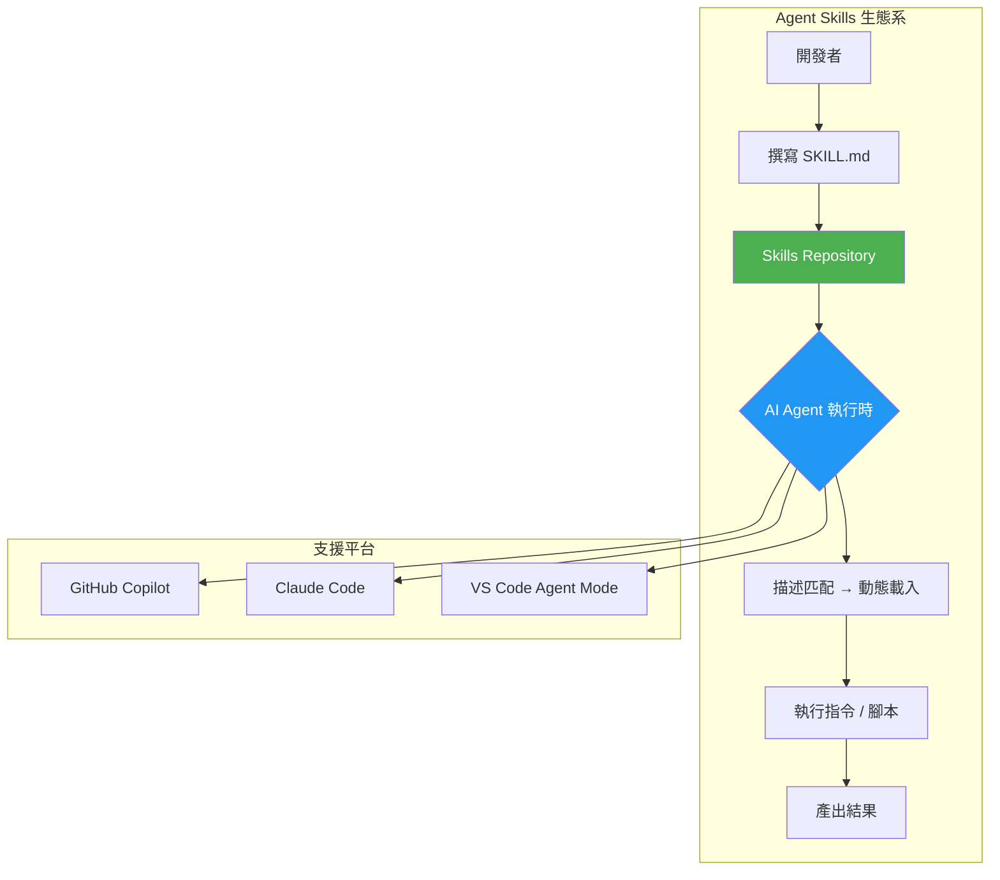

### 1.2 與傳統 Prompt Engineering 的差異

| 比較項目 | 傳統 Prompt Engineering | Agent Skills |
|----------|------------------------|--------------|
| **儲存方式** | 文件、筆記、個人收藏 | 版控系統（Git Repository） |
| **可重用性** | 手動複製貼上 | 自動觸發、動態載入 |
| **維護方式** | 各自維護、版本混亂 | 統一版控、審核發布 |
| **上下文管理** | 整段載入、浪費 Token | 漸進式揭露（Progressive Disclosure） |
| **協作方式** | 口耳相傳、通訊軟體分享 | Pull Request 審核、Code Review |
| **品質控管** | 無標準、因人而異 | Quality Gate、自動化測試 |
| **安全性** | 無控管 | RBAC、安全審查、Prompt Injection 防護 |
| **可追蹤性** | 無法追蹤使用狀況 | Telemetry、使用統計 |

**關鍵差異圖解**：

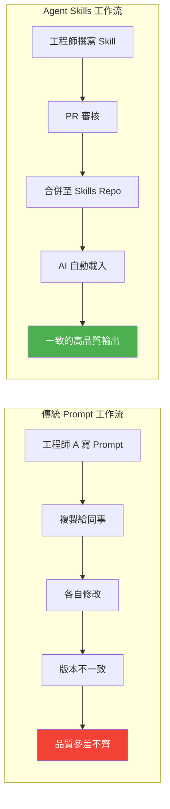

### 1.3 Skills vs Prompt vs Tool vs Agent 比較

| 元件 | 定義 | 生命週期 | 典型大小 | 範例 |
|------|------|----------|----------|------|
| **Prompt** | 單次指令或對話 | 一次性、臨時 | 幾百字 | 「幫我寫一個 REST API」 |
| **Skill** | 可重用的能力包 | 持久、版控 | 數 KB ~ 數十 KB | API 設計 Skill（含範本 + 腳本） |
| **Tool** | MCP Server 提供的功能 | 由伺服器管理 | N/A（API 介面） | `read_file`、`run_terminal` |
| **Agent** | 具備規劃與執行能力的 AI | 任務期間存活 | N/A（執行環境） | Copilot Coding Agent |

**互動關係**：

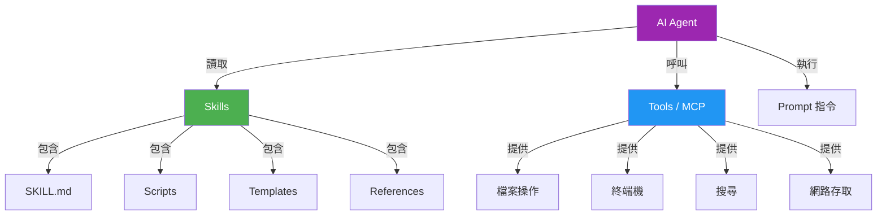

### 1.4 漸進式揭露（Progressive Disclosure）設計原則

漸進式揭露是 Agent Skills 的核心設計原則：為了節省上下文空間（Context Window / Tokens），AI 平時只載入 Skill 的**名稱**和**描述**（Metadata），只有在偵測到相關任務時，才會動態載入具體的執行指令。

**運作機制**：

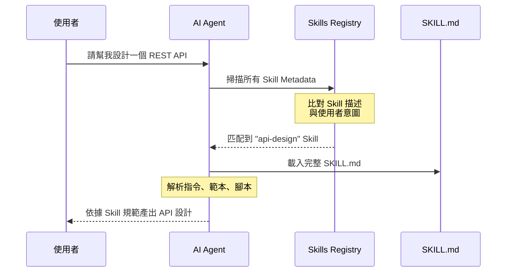

**三層揭露機制**：

| 層級 | 載入時機 | 內容 | Token 消耗 |
|------|----------|------|------------|
| **L0 - 註冊** | Agent 啟動時 | `name` + `description` | 極低（約 50-100 Tokens / Skill） |
| **L1 - 摘要** | 任務匹配時 | `SKILL.md` 主體指令 | 中等（建議 < 5000 Tokens） |
| **L2 - 完整** | 執行需要時 | Scripts + Templates + References | 按需載入 |

> **上下文預算（Context Budget）**：Skill 描述在 Agent 啟動時載入，佔用的字元預算依平台而異。Claude Code 按上下文窗口的 **1%** 動態調整（fallback 8,000 字元），每條描述上限 **250 字元**。若 Skill 數量較多導致預算不足，可透過環境變數 `SLASH_COMMAND_TOOL_CHAR_BUDGET` 調高上限。

**設計建議**：

```yaml
# ✅ 好的描述 - 清晰、具體、包含觸發條件
name: spring-boot-api-design
description: >
  Guide for designing RESTful APIs using Spring Boot 3.x with 
  Clean Architecture. Use this when asked to design, create, 
  or scaffold a new REST API endpoint.

# ❌ 壞的描述 - 模糊、無法明確觸發
name: api-stuff  
description: Helps with API things.
```

### 1.5 Skills 組成結構

一個完整的 Agent Skill 資料夾結構如下（依據 [Agent Skills Specification](https://agentskills.io/specification)）：

```
skill-name/
├── SKILL.md              # 核心：Metadata + 指令（必要）
├── scripts/              # 可執行腳本（選填）
│   ├── generate-openapi.sh
│   └── validate-api.py
├── references/           # 參考資料（選填）
│   ├── REFERENCE.md
│   ├── api-standards.md
│   └── error-codes.md
└── assets/               # 靜態資源（選填）
    ├── controller.java.template
    └── openapi.yaml.template
```

> **ℹ️ 規範說明**：根據 Agent Skills Specification，推薦的目錄名稱為 `scripts/`、`references/`、`assets/`。其中 `references/` 可包含 `REFERENCE.md`、領域專屬文件（如 `finance.md`）；`assets/` 可包含範本、圖片、查找表、Schema 等靜態資源。

**SKILL.md 檔案結構**：

```markdown
---
name: api-design
description: >
  Guide for designing RESTful APIs using Spring Boot 3.x.
  Use when asked to design or create REST API endpoints.
license: MIT
compatibility: Requires Java 21+ and Maven
metadata:
  author: platform-team
  version: "1.0"
allowed-tools: shell
---

# API Design Skill

## 觸發條件
- 使用者要求設計新的 API
- 使用者需要建立 Controller / DTO / Service

## 執行步驟
1. 分析需求，確認 API 端點
2. 設計 OpenAPI 規格
3. 生成 Controller、Service、Repository 程式碼
4. 建立對應的單元測試

## 設計規範
- 遵循 RESTful 設計原則
- 使用 Clean Architecture 分層
- DTO 與 Entity 分離
...
```

> **🏦 金融業實務案例**：某銀行將轉帳 API、對帳 API、風控 API 的設計規範分別封裝為 Skills，新進同仁只需輸入業務需求，即可產出符合企業標準的 API 設計文件與基礎程式碼。

---

## 第 2 章：Skills 平台深度解析（GitHub Copilot + Claude Code）

### 2.1 多平台 Skills 架構

Agent Skills 為開放標準，多個 AI Agent 平台均已原生支援。本章聚焦「**GitHub Copilot**」與「**Claude Code**」兩大平台的實作差異與共通點。

**跨平台架構圖**：

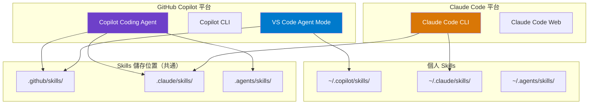

**Skills 儲存位置對照（含兩大平台）**：

| 層級 | GitHub Copilot 路徑 | Claude Code 路徑 | 作用範圍 |
|------|---------------------|-------------------|----------|
| **企業級** | 組織/企業級（即將推出） | Managed Settings 部署 | 全組織所有使用者 |
| **個人** | `~/.copilot/skills/`、`~/.claude/skills/`、`~/.agents/skills/` | `~/.claude/skills/<skill>/SKILL.md` | 跨專案（個人） |
| **專案** | `.github/skills/`、`.claude/skills/`、`.agents/skills/` | `.claude/skills/<skill>/SKILL.md` | 單一 Repository |
| **Plugin** | — | `<plugin>/skills/<skill>/SKILL.md` | Plugin 啟用範圍 |

> **優先層級**：同名 Skill 在多個層級同時存在時，高層級覆蓋低層級：**Enterprise > Personal > Project**。Plugin Skills 使用 `plugin-name:skill-name` 命名空間，不會與其他層級衝突。

> **⚠️ 巢狀目錄自動發現**：Claude Code 支援 Monorepo 場景——當您編輯 `packages/frontend/` 中的檔案時，Claude Code 會自動發現 `packages/frontend/.claude/skills/` 中的 Skills。

### 2.2 Skills 運作流程

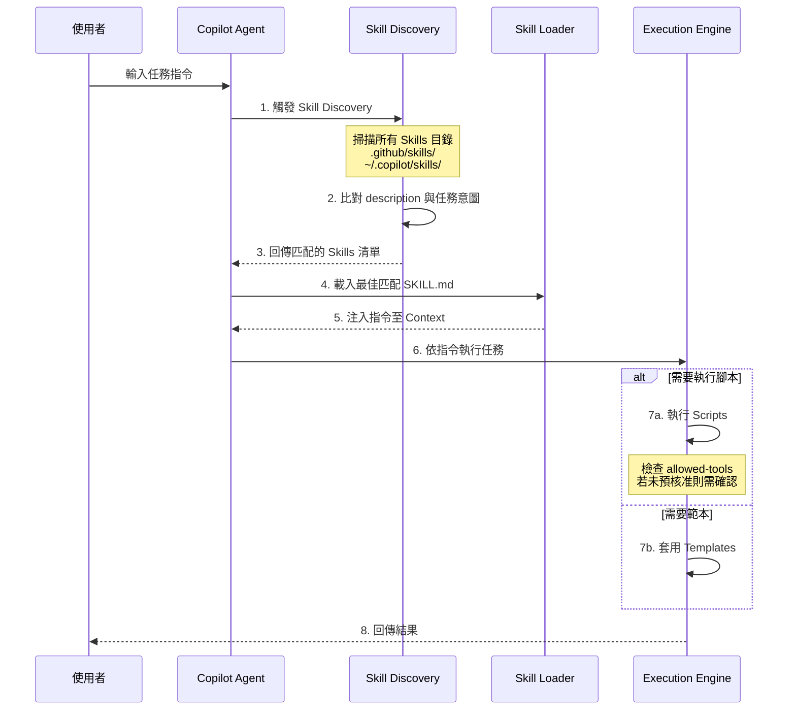

**流程說明**：

1. **觸發（Trigger）**：使用者輸入任務，或 Agent 在執行過程中判斷需要特定能力
2. **探索（Discovery）**：掃描已知的 Skills 目錄，讀取所有 `SKILL.md` 的 frontmatter
3. **匹配（Matching）**：根據 `description` 與當前任務的語義相似度進行匹配
4. **載入（Loading）**：將匹配的 SKILL.md 完整內容注入至 Agent 的上下文（Context）
5. **執行（Execution）**：Agent 依照 SKILL.md 中的指令、範本、腳本完成任務

### 2.3 Skills Metadata 設計（Frontmatter 完整參考）

SKILL.md 使用 YAML frontmatter 定義 Metadata。以下依據 **Agent Skills 開放標準**與 **Claude Code 擴展欄位**分別說明。

#### 2.3.1 開放標準欄位（agentskills.io Specification）

```yaml
---
# === 必要欄位 ===
name: spring-boot-api-design
# 1-64 字元，僅限小寫英數字與連字號
# 不可以連字號開頭/結尾，不可連續連字號
# 必須與父目錄名稱一致

description: >
  Guide for designing RESTful APIs using Spring Boot 3.x 
  with Clean Architecture. Use this when asked to design, 
  create, or scaffold a new REST API endpoint.
# 1-1024 字元，應包含「做什麼」+「何時觸發」

# === 選填欄位 ===
license: MIT
# 授權條款（名稱或檔案引用）

compatibility: Requires Java 21+ and Maven
# 1-500 字元，環境需求（目標產品、系統套件、網路存取等）

metadata:
  author: platform-team
  version: "1.0"
  category: development
  ssdlc-phase: development
# 任意 key-value 對，供客戶端或企業內部使用

allowed-tools: Bash(git:*) Read Grep
# 空格分隔的工具清單，預核准在 Skill 啟動時使用
# ⚠️ 實驗性欄位，各 Agent 實作支援度不同
---
```

**開放標準欄位速查表**：

| 欄位 | 必要 | 說明 | 範例 |
|------|------|------|------|
| `name` | ✅ | 小寫英數字 + 連字號，max 64 字元，須與目錄名相同 | `spring-boot-api-design` |
| `description` | ✅ | 包含「做什麼」+「何時觸發」，max 1024 字元 | `Guide for... Use when asked to...` |
| `license` | ❌ | 授權條款 | `MIT`、`Apache-2.0` |
| `compatibility` | ❌ | 環境需求，max 500 字元 | `Requires Python 3.14+ and uv` |
| `metadata` | ❌ | 任意 key-value 擴展 | `author: org-name` |
| `allowed-tools` | ❌ | 預核准工具（實驗性） | `Bash(git:*) Read` |

#### 2.3.2 Claude Code 擴展欄位

Claude Code 在開放標準之上擴展了多個進階欄位，提供更精細的行為控制：

```yaml
---
name: deploy-to-prod
description: Deploy the application to production
# Claude Code 擴展欄位
argument-hint: "[env] [version]"
# 在自動完成選單中顯示的參數提示

disable-model-invocation: true
# 設 true 時 Claude 不會自動觸發此 Skill，僅能透過 /name 手動叫用
# 適用於有副作用的操作（如部署、發送訊息）

user-invocable: true
# 設 false 時從 / 選單隱藏，僅供 Claude 自動觸發
# 適用於背景知識類 Skill

context: fork
# 設為 fork 時在獨立 Subagent 中執行（隔離的上下文）

agent: Explore
# context: fork 時使用的 Subagent 類型
# 內建選項：Explore、Plan、general-purpose
# 或自訂 Subagent（.claude/agents/ 中定義）

model: claude-sonnet-4-20250514
# 執行此 Skill 時使用的模型（覆蓋 Session 預設）

effort: high
# 推理力度：low / medium / high / max（max 僅限 Opus 4.6）

hooks:
  PreToolUse:
    - matcher: Bash
      hooks:
        - type: command
          command: echo "About to run bash"
# Skill 生命週期鉤子，格式參見 Hooks 文件

paths: "src/**/*.java, tests/**/*.java"
# Glob 模式，限制此 Skill 僅在處理匹配檔案時自動觸發

shell: bash
# !`command` 區塊使用的 Shell（bash 或 powershell）
---
```

**Claude Code 擴展欄位速查表**：

| 欄位 | 說明 | 預設值 |
|------|------|--------|
| `argument-hint` | 自動完成時的參數提示 | 無 |
| `disable-model-invocation` | 禁止 Claude 自動觸發 | `false` |
| `user-invocable` | 是否出現在 / 選單 | `true` |
| `context` | `fork` = 在 Subagent 中執行 | 無（inline 執行） |
| `agent` | Subagent 類型（需搭配 `context: fork`） | `general-purpose` |
| `model` | 覆蓋模型 | 繼承 Session |
| `effort` | 推理力度（low/medium/high/max） | 繼承 Session |
| `hooks` | Skill 生命週期鉤子 | 無 |
| `paths` | 自動觸發的檔案 Glob 過濾 | 無（不限制） |
| `shell` | `!`<cmd>`` 使用的 Shell | `bash` |

**叫用控制矩陣**：

| 組合 | 使用者可叫用 | Claude 可自動觸發 | 說明 |
|------|-------------|-------------------|------|
| （預設） | ✅ | ✅ | 描述常駐上下文，叫用時載入完整內容 |
| `disable-model-invocation: true` | ✅ | ❌ | 描述不進入上下文，僅手動 `/name` |
| `user-invocable: false` | ❌ | ✅ | 描述常駐上下文，Claude 按需載入 |

#### 2.3.3 字串替換（String Substitutions）

Claude Code Skills 支援動態變數替換，讓 Skill 內容可接受叫用時傳入的參數：

| 變數 | 說明 | 範例 |
|------|------|------|
| `$ARGUMENTS` | 叫用時傳入的所有參數 | `/fix-issue 123` → `$ARGUMENTS` = `123` |
| `$ARGUMENTS[N]` | 第 N 個參數（0-based） | `/migrate SearchBar React Vue` → `$ARGUMENTS[1]` = `React` |
| `$N` | `$ARGUMENTS[N]` 的簡寫 | `$0` = 第一個參數 |
| `${CLAUDE_SESSION_ID}` | 當前 Session ID | 用於日誌、Session 專屬檔案 |
| `${CLAUDE_SKILL_DIR}` | Skill 的 SKILL.md 所在目錄 | 用於引用 Skill 內建腳本 |

**範例：修復 GitHub Issue Skill**

```markdown
---
name: fix-issue
description: Fix a GitHub issue
disable-model-invocation: true
argument-hint: "<issue-number>"
---

Fix GitHub issue #$ARGUMENTS following our coding standards.

1. Read the issue description
2. Understand the requirements
3. Implement the fix
4. Write tests
5. Create a commit
```

**範例：元件遷移 Skill（多參數）**

```markdown
---
name: migrate-component
description: Migrate a component from one framework to another
argument-hint: "<component> <from-framework> <to-framework>"
---

Migrate the $0 component from $1 to $2.
Preserve all existing behavior and tests.
```

> 叫用 `/migrate-component SearchBar React Vue` 時，`$0` = `SearchBar`、`$1` = `React`、`$2` = `Vue`。

#### 2.3.4 動態上下文注入（Dynamic Context Injection）

`!`<command>`` 語法可在 Skill 內容送往 Claude **之前**先執行 Shell 命令，將命令輸出注入為上下文。這是預處理，Claude 只會看到最終結果。

```markdown
---
name: pr-summary
description: Summarize changes in a pull request
context: fork
agent: Explore
allowed-tools: Bash(gh *)
---

## Pull Request 上下文
- PR diff: !`gh pr diff`
- PR 評論: !`gh pr view --comments`
- 變更檔案: !`gh pr diff --name-only`

## 你的任務
根據以上資訊摘要此 Pull Request...
```

> **運作流程**：每個 `!`<command>`` 會在送出前立即執行，輸出替換佔位符。Claude 收到的是已填入實際資料的完整 Prompt。

> **💡 啟用 Extended Thinking**：在 Skill 內容中包含 `ultrathink` 關鍵字即可啟用 Claude 延展思考模式。

### 2.4 Claude Code 內建 Skills（Bundled Skills）

Claude Code 隨附多個內建 Skills，在每個 Session 中均可使用。與 Built-in Commands 不同，Bundled Skills 是**提示驅動型**——它們給 Claude 一份詳細腳本，讓 Claude 使用工具自行協調執行。

| Skill | 說明 |
|-------|------|
| `/batch <instruction>` | **大規模平行變更**——分析 Codebase、將工作拆為 5~30 個獨立單元，核准後為每個單元啟動一個背景 Agent（獨立 git worktree），各自實作、跑測試、開 PR。需要 git repo。範例：`/batch migrate src/ from Solid to React` |
| `/claude-api` | **Claude API 參考**——載入目前專案語言（Python / TS / Java / Go / Ruby / C# / PHP / cURL）的 Claude API + Agent SDK 參考文件。在 code import `anthropic` 時也會自動啟動。 |
| `/debug [description]` | **除錯日誌**——啟用 Session 除錯日誌，分析問題。可搭配描述聚焦分析範圍。 |
| `/loop [interval] <prompt>` | **定期執行**——在 Session 存活期間以指定間隔重複執行 Prompt。範例：`/loop 5m check if the deploy finished` |
| `/simplify [focus]` | **程式碼簡化**——Review 最近變更的檔案，平行啟動三個 Review Agent 分析程式碼重用、品質與效率問題，彙總後自動修正。範例：`/simplify focus on memory efficiency` |

### 2.5 Skills 與 Agent 整合方式

**GitHub Copilot Coding Agent 整合**：

Copilot Coding Agent 可自動發現並使用 Repository 中的 Skills：

```
📦 my-project/
├── .github/
│   ├── copilot-instructions.md   # 全局指令（每次都載入）
│   └── skills/                    # Skills 目錄
│       ├── api-design/
│       │   └── SKILL.md
│       ├── code-review/
│       │   └── SKILL.md
│       └── unit-test/
│           └── SKILL.md
├── src/
└── pom.xml
```

**Skills 與 Custom Instructions 的定位差異**：

| 面向 | Custom Instructions | Agent Skills |
|------|-------------------|--------------|
| **載入時機** | 每次對話都載入 | 僅在任務相關時載入 |
| **適用場景** | 通用規範（Coding Standards） | 特定任務（API 設計、測試生成） |
| **檔案位置** | `.github/copilot-instructions.md` | `.github/skills/<skill-name>/SKILL.md` |
| **內容量** | 精簡（節省 Token） | 可較詳盡（按需載入） |

**最佳搭配策略**：

```
Custom Instructions（copilot-instructions.md / CLAUDE.md）
├── 專案概述
├── 命名規範
├── 分層架構要求
└── 基本安全規範

Skills（.github/skills/ 或 .claude/skills/）
├── api-design/          → 需要設計 API 時載入
├── code-review/         → 進行 Code Review 時載入
├── security-scan/       → 安全掃描時載入
├── db-migration/        → 資料庫異動時載入
└── batch-job-design/    → 設計批次程式時載入
```

**Claude Code Skills 叫用方式**：

```
# 方式 1：直接叫用（斜線命令）
/api-design 設計一個轉帳 API

# 方式 2：自動觸發（Claude 根據描述匹配）
使用者：「請幫我設計一個轉帳 API」
Claude：（自動載入匹配的 api-design Skill）→ 依規範產出 API 設計

# 方式 3：Subagent 執行（context: fork）
/deep-research 分析 src/auth 模組的安全性
# → 在獨立 Subagent（Explore Agent）中執行，結果回傳主對話
```

**Claude Code Skill 分享與部署**：

| 方式 | 說明 | 適用場景 |
|------|------|----------|
| **專案 Skills** | 提交 `.claude/skills/` 至版控 | 團隊共用的專案規範 |
| **Plugin Skills** | 在 Plugin 的 `skills/` 目錄中定義 | 跨專案可重用 Skill 套件 |
| **Managed Settings** | 透過組織級 Managed Settings 部署 | 全組織統一 Skills（企業級） |

### 2.6 Skills Repository 設計（企業級）

對於大型企業，建議建立獨立的 Skills Repository 作為組織級共享資產：

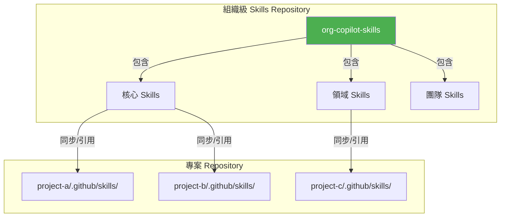

**企業級 Skills Repository 結構**：

```
📦 org-copilot-skills/
├── README.md                      # 總覽與使用說明
├── CONTRIBUTING.md                # 貢獻指南
├── GOVERNANCE.md                  # 治理規範
├── catalog.yaml                   # Skills 目錄索引
│
├── core/                          # 核心 Skills（全公司適用）
│   ├── code-review/
│   ├── security-scan/
│   ├── api-design/
│   ├── unit-test-generation/
│   └── documentation/
│
├── domain/                        # 領域 Skills
│   ├── banking/                   # 銀行業
│   │   ├── transaction-api/
│   │   ├── risk-assessment/
│   │   └── regulatory-report/
│   ├── insurance/                 # 保險業
│   │   ├── claim-processing/
│   │   └── policy-management/
│   └── payment/                   # 支付業
│       ├── settlement/
│       └── reconciliation/
│
├── ssdlc/                         # SSDLC 階段 Skills
│   ├── requirements/
│   ├── design/
│   ├── development/
│   ├── testing/
│   ├── security/
│   ├── deployment/
│   └── maintenance/
│
├── templates/                     # Skill 建立範本
│   └── skill-template/
│       └── SKILL.md
│
└── scripts/                       # 共用腳本
    ├── validate-skill.py          # Skill 格式驗證
    └── sync-skills.sh             # Skills 同步至專案
```

> **🏦 金融業實務案例**：某金控集團建立了統一的 `org-copilot-skills` Repository，分為核心 Skills（公司通用）和領域 Skills（各子公司專用）。透過 GitHub Actions 自動同步到各專案，確保所有團隊使用一致的開發標準。

---

## 第 3 章：SSDLC × Skills（核心章節）

本章是整份手冊的核心，詳細說明如何在 SSDLC（Secure Software Development Life Cycle）各階段將常用的 Prompt 和流程轉換為 Agent Skills。

**SSDLC × Skills 全景圖**：

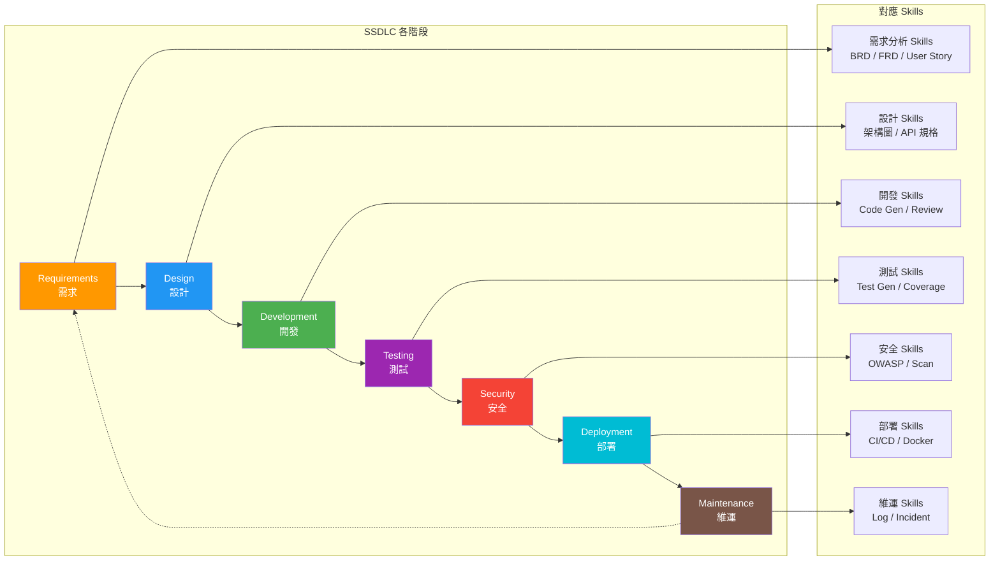

### 3.1 Requirements（需求階段）

**可轉換為 Skills 的內容**：

| 常見工作 | 轉換為 Skill | 說明 |
|----------|-------------|------|
| 撰寫 BRD | `generate-brd` | 根據會議記錄產出 Business Requirement Document |
| 撰寫 FRD | `generate-frd` | 根據 BRD 產出 Functional Requirement Document |
| 撰寫 User Story | `generate-user-story` | 依需求產出 User Story + Acceptance Criteria |
| 需求追溯 | `requirement-traceability` | 建立需求追溯矩陣 |

**範例：User Story 生成 Skill**

```markdown
---
name: generate-user-story
description: >
  Generates User Stories with Acceptance Criteria from business 
  requirements. Use when asked to create user stories, write 
  acceptance criteria, or break down requirements into stories.
version: 1.0.0
category: requirements
ssdlc-phase: requirements
---

# User Story 生成 Skill

## 輸入要求
請提供以下資訊：
1. 業務需求描述
2. 目標使用者角色
3. 系統範圍

## User Story 格式
使用標準格式：
```
作為 [角色]，
我想要 [功能]，
以便 [價值/目的]。

### 驗收條件（Acceptance Criteria）
**Given** [前提條件]
**When** [操作]
**Then** [預期結果]
```

## 產出規範
1. 每個 Story 須符合 INVEST 原則
   - Independent（獨立）
   - Negotiable（可協商）
   - Valuable（有價值）
   - Estimable（可估算）
   - Small（小型）
   - Testable（可測試）

2. 每個 Story 至少包含 3 個驗收條件
3. 包含異常情境的驗收條件
4. 標注優先順序（P0 / P1 / P2）
5. 標注估算故事點（Story Points）

## 安全需求
- 涉及個資的 Story 須標注「PII」標籤
- 涉及金融交易的 Story 須標注「需安全審查」
```

**Prompt → Skill 轉換示範**：

```
📝 原始 Prompt：
「請根據以下需求，產出 User Story 和 Acceptance Criteria：
  使用者需要能在 ATM 進行跨行轉帳…」

📦 轉換為 Skill 後：
.github/skills/generate-user-story/
├── SKILL.md           # 標準化的 User Story 生成指令
├── references/
│   ├── invest-principles.md    # INVEST 原則說明
│   └── story-examples.md       # 範例 Story
└── templates/
    └── user-story.md.template  # Story 範本
```

### 3.2 Design（設計階段）

**可轉換為 Skills 的內容**：

| 常見工作 | 轉換為 Skill | 說明 |
|----------|-------------|------|
| 系統架構設計 | `architecture-design` | 產出系統架構圖（C4 Model） |
| API 設計 | `api-design` | 產出 OpenAPI Spec + Controller 骨架 |
| 資料庫設計 | `database-design` | 產出 ER Model + DDL |
| DDD 設計 | `ddd-modeling` | 產出 Domain Model + Bounded Context |

**範例：Clean Architecture API 設計 Skill**

```markdown
---
name: clean-architecture-api
description: >
  Designs RESTful APIs following Clean Architecture and DDD 
  principles for Spring Boot 3.x projects. Use when asked to 
  design system architecture, create API specs, or scaffold 
  a new microservice.
version: 2.0.0
category: design
ssdlc-phase: design
---

# Clean Architecture API 設計 Skill

## 分層規範

```
src/main/java/com/company/service/
├── adapter/                  # 介面轉接器層
│   ├── in/
│   │   ├── web/             # REST Controller
│   │   └── messaging/       # MQ Consumer
│   └── out/
│       ├── persistence/     # JPA Repository
│       └── external/        # 外部 API Client
├── application/              # 應用層
│   ├── port/
│   │   ├── in/              # Use Case 介面
│   │   └── out/             # Repository 介面
│   └── service/             # Use Case 實作
├── domain/                   # 領域層
│   ├── model/               # Entity / Value Object
│   ├── event/               # Domain Event
│   └── exception/           # Domain Exception
└── config/                   # 設定
    └── BeanConfig.java
```

## API 設計規範
1. URI 使用複數名詞：`/api/v1/transactions`
2. 使用 HTTP Method 語義：GET / POST / PUT / DELETE
3. 版本控制：URI Path Versioning（/api/v1/）
4. 分頁：使用 `page` + `size` 參數
5. 錯誤回應：統一格式 `{ code, message, details }`

## DTO 設計
- Request DTO：`XxxRequest`
- Response DTO：`XxxResponse`
- DTO 與 Entity 必須完全分離
- 使用 MapStruct 進行物件轉換

## 安全規範
- 所有 API 須經過 JWT 驗證
- 敏感欄位（如身分證字號）須遮罩
- 寫入操作須記錄 Audit Log
```

### 3.3 Development（開發階段）

**可轉換為 Skills 的內容**：

| 常見工作 | 轉換為 Skill | 說明 |
|----------|-------------|------|
| 程式碼生成 | `spring-boot-codegen` | 產出 Spring Boot 元件程式碼 |
| Code Review | `code-review-checklist` | 依企業規範進行程式碼審查 |
| 重構 | `refactoring-patterns` | 引導常用重構手法 |
| 程式碼規範 | `coding-standards` | 企業程式碼風格檢查 |

**範例：Spring Boot Code Generation Skill**

```markdown
---
name: spring-boot-codegen
description: >
  Generates Spring Boot 3.x components following enterprise 
  coding standards. Use when asked to create controllers, 
  services, repositories, DTOs, or complete CRUD endpoints.
version: 1.5.0
category: development
ssdlc-phase: development
---

# Spring Boot 程式碼生成 Skill

## Controller 規範

```java
@RestController
@RequestMapping("/api/v1/transactions")
@RequiredArgsConstructor
@Slf4j
public class TransactionController {

    private final TransactionUseCase transactionUseCase;

    /**
     * 查詢交易記錄
     * 
     * @param request 查詢條件
     * @return 交易記錄列表
     */
    @GetMapping
    public ResponseEntity<PageResponse<TransactionResponse>> 
            getTransactions(@Valid TransactionQueryRequest request) {
        log.info("查詢交易記錄: {}", request);
        var result = transactionUseCase.query(request.toDomain());
        return ResponseEntity.ok(PageResponse.of(result));
    }
}
```

## Service 規範

```java
@Service
@RequiredArgsConstructor
@Slf4j
public class TransactionService implements TransactionUseCase {

    private final TransactionRepository transactionRepository;
    private final EventPublisher eventPublisher;

    @Override
    @Transactional
    public TransactionResult execute(TransactionCommand command) {
        // 1. 驗證業務規則
        validate(command);
        
        // 2. 執行核心邏輯
        var transaction = Transaction.create(command);
        var saved = transactionRepository.save(transaction);
        
        // 3. 發布領域事件
        eventPublisher.publish(new TransactionCreatedEvent(saved));
        
        // 4. 回傳結果
        return TransactionResult.from(saved);
    }
}
```

## 檢查項目
- [ ] 每個 public 方法都有 JavaDoc
- [ ] 使用 @Valid 進行輸入驗證
- [ ] 例外處理使用 @ControllerAdvice
- [ ] Log 記錄關鍵操作（不含敏感資料）
- [ ] 交易操作標註 @Transactional
```

**範例：Code Review Skill**

```markdown
---
name: code-review-standard
description: >
  Performs code review following enterprise coding standards 
  and security guidelines. Use when asked to review code, 
  check code quality, or perform pull request review.
version: 2.1.0
category: development
ssdlc-phase: development
---

# 程式碼審查 Skill

## 審查維度

### 1. 安全性（Security）—— 最高優先
- [ ] 無 SQL Injection 風險（使用 Parameterized Query）
- [ ] 無 XSS 風險（輸入已 Sanitize）
- [ ] 敏感資料已加密 / 遮罩
- [ ] 無硬編碼密碼 / API Key
- [ ] 適當的權限檢查

### 2. 正確性（Correctness）
- [ ] 業務邏輯正確
- [ ] 邊界條件處理
- [ ] Null 值處理
- [ ] 併發安全（Thread Safety）

### 3. 可維護性（Maintainability）
- [ ] 命名清晰有意義
- [ ] 方法長度 < 30 行
- [ ] 類別職責單一（SRP）
- [ ] 適當的抽象層級

### 4. 效能（Performance）
- [ ] 無 N+1 查詢問題
- [ ] 適當使用快取
- [ ] 批次處理大量資料
- [ ] 資料庫索引適當

### 5. 測試（Testing）
- [ ] 單元測試覆蓋主要路徑
- [ ] 異常路徑有測試
- [ ] 測試可重複執行
```

### 3.4 Testing（測試階段）

**可轉換為 Skills 的內容**：

| 常見工作 | 轉換為 Skill | 說明 |
|----------|-------------|------|
| 單元測試生成 | `junit-test-gen` | 產出 JUnit 5 測試程式碼 |
| 整合測試 | `integration-test-gen` | 產出 Spring Boot 整合測試 |
| API 測試 | `api-test-gen` | 產出 REST API 測試案例 |
| 測試案例設計 | `test-case-design` | 依據等價類別 / 邊界值設計測試案例 |

**範例：JUnit 測試生成 Skill**

```markdown
---
name: junit-test-generation
description: >
  Generates comprehensive JUnit 5 test cases for Java classes 
  following AAA (Arrange-Act-Assert) pattern. Use when asked 
  to write tests, generate unit tests, or improve test coverage.
version: 1.3.0
category: testing
ssdlc-phase: testing
---

# JUnit 5 測試生成 Skill

## 測試命名規範
```
methodName_givenCondition_expectedBehavior
```

## 測試結構（AAA Pattern）

```java
@ExtendWith(MockitoExtension.class)
class TransactionServiceTest {

    @Mock
    private TransactionRepository transactionRepository;
    
    @Mock
    private EventPublisher eventPublisher;
    
    @InjectMocks
    private TransactionService transactionService;

    @Test
    @DisplayName("執行轉帳 - 餘額充足時 - 應成功扣款並發布事件")
    void execute_whenBalanceSufficient_shouldDebitAndPublishEvent() {
        // Arrange
        var command = TransactionCommand.builder()
                .fromAccount("A001")
                .toAccount("B001")
                .amount(BigDecimal.valueOf(1000))
                .build();
        
        when(transactionRepository.save(any()))
                .thenReturn(Transaction.of("TXN001", command));
        
        // Act
        var result = transactionService.execute(command);
        
        // Assert
        assertThat(result).isNotNull();
        assertThat(result.getStatus()).isEqualTo("SUCCESS");
        verify(eventPublisher).publish(any(TransactionCreatedEvent.class));
    }
    
    @Test
    @DisplayName("執行轉帳 - 餘額不足時 - 應拋出 InsufficientBalanceException")
    void execute_whenBalanceInsufficient_shouldThrowException() {
        // Arrange
        var command = TransactionCommand.builder()
                .fromAccount("A001")
                .amount(BigDecimal.valueOf(999999999))
                .build();
        
        // Act & Assert
        assertThatThrownBy(() -> transactionService.execute(command))
                .isInstanceOf(InsufficientBalanceException.class)
                .hasMessageContaining("餘額不足");
    }
}
```

## 測試覆蓋要求
| 類型 | 覆蓋率目標 | 說明 |
|------|-----------|------|
| Service 層 | ≥ 80% | 核心業務邏輯 |
| Controller 層 | ≥ 70% | API 端點 |
| Domain 層 | ≥ 90% | 領域模型 |
| Utility | ≥ 85% | 工具類別 |

## 必須測試的場景
1. 正常路徑（Happy Path）
2. 邊界值（Boundary Values）
3. 異常輸入（Invalid Input）
4. Null / Empty 處理
5. 併發場景（如適用）
```

### 3.5 Security（安全）

**可轉換為 Skills 的內容**：

| 常見工作 | 轉換為 Skill | 說明 |
|----------|-------------|------|
| OWASP 檢查 | `owasp-security-check` | 依 OWASP Top 10 進行安全審查 |
| Secure Coding | `secure-coding-guide` | 安全編碼規範指引 |
| 弱點掃描 | `vulnerability-scan` | 整合弱掃工具 |
| 敏感資料保護 | `data-protection` | PII 資料處理規範 |

**範例：OWASP 安全檢查 Skill**

```markdown
---
name: owasp-security-review
description: >
  Reviews code against OWASP Top 10 2025 vulnerabilities. 
  Use when asked to perform security review, check for 
  vulnerabilities, or audit code security.
version: 3.0.0
category: security
ssdlc-phase: security
---

# OWASP Top 10 安全審查 Skill

## 檢查項目

### A01: Broken Access Control（存取控制失效）
- [ ] 每個 API 端點都有權限檢查
- [ ] 使用 RBAC 不使用硬編碼角色
- [ ] 防止 IDOR（Insecure Direct Object Reference）
- [ ] 實作 Rate Limiting

```java
// ✅ 正確：使用 Spring Security 注解
@PreAuthorize("hasRole('ADMIN') or #userId == authentication.principal.id")
@GetMapping("/users/{userId}")
public UserResponse getUser(@PathVariable Long userId) { ... }

// ❌ 錯誤：無權限檢查
@GetMapping("/users/{userId}")
public UserResponse getUser(@PathVariable Long userId) { ... }
```

### A02: Cryptographic Failures（加密失效）
- [ ] 敏感資料傳輸使用 TLS 1.2+
- [ ] 密碼使用 bcrypt / scrypt 雜湊
- [ ] 無硬編碼金鑰
- [ ] 使用安全的亂數產生器

### A03: Injection（注入攻擊）
- [ ] SQL 使用 Parameterized Query
- [ ] 輸入驗證使用白名單
- [ ] 輸出編碼（Output Encoding）
- [ ] 使用 ORM（如 JPA）

```java
// ✅ 正確：使用 JPA Named Parameters
@Query("SELECT t FROM Transaction t WHERE t.accountId = :accountId")
List<Transaction> findByAccountId(@Param("accountId") String accountId);

// ❌ 錯誤：字串拼接 SQL
@Query("SELECT t FROM Transaction t WHERE t.accountId = '" + accountId + "'")
```

### A04 ~ A10：其他檢查項目
（每項均需包含檢查清單 + 正確/錯誤範例）

## 發現漏洞時的處理流程
1. 標記嚴重等級（Critical / High / Medium / Low）
2. 產出修復建議
3. 建立追蹤 Issue
4. 通知安全團隊
```

### 3.6 Deployment（部署）

**可轉換為 Skills 的內容**：

| 常見工作 | 轉換為 Skill | 說明 |
|----------|-------------|------|
| CI/CD Pipeline | `cicd-pipeline-gen` | 產出 GitHub Actions Workflow |
| Dockerfile | `dockerfile-gen` | 產出安全的多階段 Dockerfile |
| K8s Manifest | `k8s-manifest-gen` | 產出 Kubernetes 部署清單 |
| 環境設定 | `env-config-gen` | 產出多環境設定檔 |

**範例：CI/CD Pipeline Skill**

```markdown
---
name: github-actions-pipeline
description: >
  Generates GitHub Actions CI/CD pipelines for Spring Boot 
  projects with security scanning and quality gates. Use when 
  asked to create CI/CD pipeline, set up automated builds, 
  or configure deployment workflows.
version: 2.0.0
category: deployment
ssdlc-phase: deployment
---

# GitHub Actions Pipeline 生成 Skill

## 標準 Pipeline 結構

```yaml
name: CI/CD Pipeline

on:
  push:
    branches: [main, develop]
  pull_request:
    branches: [main]

jobs:
  build:
    runs-on: ubuntu-latest
    steps:
      - uses: actions/checkout@v4
      - name: Set up JDK 21
        uses: actions/setup-java@v4
        with:
          java-version: '21'
          distribution: 'temurin'
      
      - name: Build with Maven
        run: mvn clean verify
      
      - name: Run Tests
        run: mvn test
      
  security-scan:
    needs: build
    runs-on: ubuntu-latest
    steps:
      - name: SAST Scan
        uses: github/codeql-action/analyze@v3
      
      - name: Dependency Check
        run: mvn dependency-check:check
      
  quality-gate:
    needs: [build, security-scan]
    runs-on: ubuntu-latest
    steps:
      - name: SonarQube Analysis
        run: mvn sonar:sonar
      
  deploy:
    needs: quality-gate
    if: github.ref == 'refs/heads/main'
    runs-on: ubuntu-latest
    steps:
      - name: Deploy to Production
        run: |
          # 部署指令
```

## 多環境部署策略
- dev → 自動部署（PR merge 後）
- sit → 手動觸發
- uat → 審核通過後部署
- prod → 需雙重審核 + 變更單號
```

### 3.7 Maintenance（維運）

**可轉換為 Skills 的內容**：

| 常見工作 | 轉換為 Skill | 說明 |
|----------|-------------|------|
| Log 分析 | `log-analyzer` | 分析錯誤日誌並定位問題 |
| 問題排查 | `troubleshooting-guide` | 常見問題排查 SOP |
| 事件回應 | `incident-response` | 事故處理流程 |
| 效能調校 | `performance-tuning` | 效能瓶頸分析與優化 |

**範例：Log 分析 Skill**

```markdown
---
name: log-analyzer
description: >
  Analyzes application logs to identify errors, performance 
  issues, and anomalies. Use when asked to debug issues, 
  analyze logs, or troubleshoot production problems.
version: 1.2.0
category: maintenance
ssdlc-phase: maintenance
---

# Log 分析 Skill

## 分析步驟

### Step 1：識別錯誤模式
```bash
# 統計 ERROR 級別日誌
grep -c "ERROR" application.log

# 找出最常見的錯誤
grep "ERROR" application.log | awk '{print $5}' | sort | uniq -c | sort -rn | head -20
```

### Step 2：時間軸分析
```bash
# 每分鐘錯誤趨勢
grep "ERROR" application.log | awk '{print substr($1,1,16)}' | uniq -c
```

### Step 3：關聯分析
- 比對錯誤時間與部署時間
- 比對錯誤時間與流量峰值
- 比對資料庫慢查詢記錄

### Step 4：根因分析（Root Cause Analysis）
使用 5-Whys 方法：
1. **Why 1**: 為什麼出現錯誤？ → 因為 DB 連線逾時
2. **Why 2**: 為什麼連線逾時？ → 因為連線池用盡
3. **Why 3**: 為什麼連線池用盡？ → 因為連線沒有正確釋放
4. **Why 4**: 為什麼沒有釋放？ → 因為 Transaction 沒有 commit/rollback
5. **Why 5**: 為什麼沒有 commit？ → 缺少 @Transactional 標註

### Step 5：產出報告
- 問題描述
- 影響範圍
- 根本原因
- 修復方案
- 預防措施
```

> **🏦 金融業實務案例**：某銀行的維運團隊將常見的「交易失敗排查」、「批次異常處理」、「系統效能告警回應」分別封裝為 Skills，值班人員可透過 AI 快速定位問題根因，平均問題解決時間從 2 小時降至 30 分鐘。

---

## 第 4 章：Skills 設計最佳實務

### 4.1 高可重用性設計

**設計原則**：

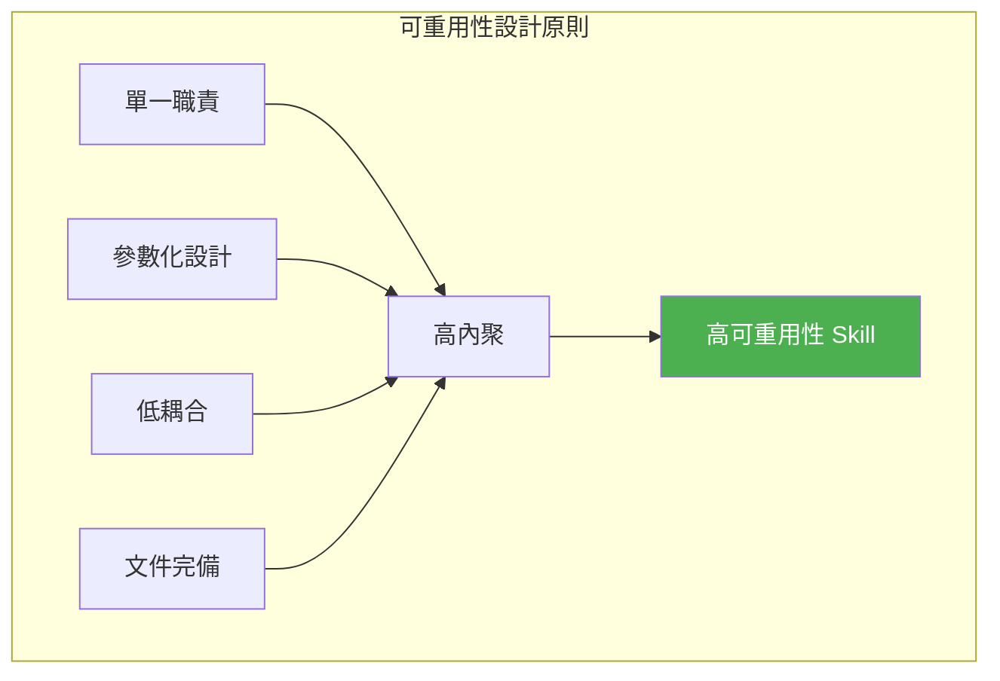

**1. 單一職責原則（SRP）**

```
# ❌ 反模式：一個 Skill 做太多事
.github/skills/do-everything/
└── SKILL.md  # 包含 API 設計 + 程式碼生成 + 測試 + 部署

# ✅ 正確：每個 Skill 專注一件事
.github/skills/
├── api-design/        # 只負責 API 設計
├── spring-boot-gen/   # 只負責程式碼生成
├── junit-test-gen/    # 只負責測試生成
└── cicd-pipeline/     # 只負責 CI/CD
```

**2. 參數化設計**

```markdown
---
name: api-endpoint-gen
description: >
  Generates REST API endpoints. Supports configurable 
  framework (Spring Boot / Express / FastAPI), database 
  (JPA / MyBatis), and authentication (JWT / OAuth2).
---

# API 端點生成

## 設定參數
在使用前，請指定以下參數：
- **框架**：Spring Boot 3.x（預設）/ Express.js / FastAPI
- **ORM**：JPA（預設）/ MyBatis / Prisma
- **認證**：JWT（預設）/ OAuth2 / API Key
- **資料庫**：PostgreSQL（預設）/ Oracle / MySQL
```

**3. 組合模式（Composition）**

Skills 之間可以互相引用，形成工作流：

```markdown
## 完整 API 開發流程
建議依序使用以下 Skills：
1. 先使用 `api-design` Skill 產出 OpenAPI 規格
2. 再使用 `spring-boot-gen` Skill 產出程式碼
3. 使用 `junit-test-gen` Skill 產出測試
4. 最後使用 `code-review-standard` Skill 進行審查
```

### 4.2 低 Token 消耗策略

Agent Skills 的設計必須考慮 Token 消耗，以下是優化策略：

| 策略 | 說明 | 預估節省 |
|------|------|----------|
| **精煉描述** | description 精準但簡潔 | 30-50% |
| **分層載入** | 將詳細資訊放入 references/ | 40-60% |
| **條件載入** | 只在需要時才載入特定 reference | 50-70% |
| **範本分離** | 大型範本放入 templates/ 而非 SKILL.md | 60-80% |

**SKILL.md Token 消耗預估**：

```
├── Metadata（name + description）  // ~100 Tokens
├── 核心指令                        // ~500-1000 Tokens
├── 範例程式碼                      // ~300-500 Tokens
└── 檢查清單                        // ~200-300 Tokens
    
👉 建議 SKILL.md 主體控制在 5000 Tokens 以內
👉 SKILL.md 建議不超過 500 行（Agent Skills Spec 推薦）
👉 詳細參考資料放入 references/ 資料夾
```

**優化範例**：

```markdown
# ❌ 將所有內容塞入 SKILL.md（消耗約 5000 Tokens）
---
name: api-design
description: ...
---
# API Design（包含完整 OpenAPI Spec 範例、所有 HTTP Status Code、
#  完整的 Error Response 格式、詳細的安全規範...等等）

# ✅ 核心指令在 SKILL.md，詳細內容在 references/（載入約 1500 Tokens）
---
name: api-design
description: ...
---
# API Design
## 核心規範（精簡摘要）
若需詳細規範，請參考：
- references/openapi-template.yaml
- references/error-codes.md
- references/security-standards.md
```

### 4.3 命名規範

**企業級 Skill 命名規約（Enterprise Naming Convention）**：

```
格式：<domain>-<action>-<target>

範例：
├── banking-generate-brd          # 銀行業-生成-BRD
├── api-design-restful             # API-設計-RESTful
├── test-generate-junit            # 測試-生成-JUnit
├── security-review-owasp          # 安全-審查-OWASP
├── deploy-generate-dockerfile     # 部署-生成-Dockerfile
└── maintenance-analyze-log        # 維運-分析-Log
```

**命名規則**（依據 [Agent Skills Specification](https://agentskills.io/specification)）：

| 規則 | 說明 | 範例 |
|------|------|------|
| 全小寫 | 僅限小寫英數字 + 連字號 | `api-design` ✅ / `API-Design` ❌ |
| 連字號分隔 | 使用 `-` 分隔單詞 | `code-review` ✅ |
| 不可開頭/結尾 | 不可以連字號開頭或結尾 | `-pdf` ❌ / `pdf-` ❌ |
| 不可連續連字號 | 不可出現 `--` | `pdf--processing` ❌ |
| 與目錄名一致 | `name` 欄位必須與父目錄名稱相同 | 目錄 `api-design/` → `name: api-design` |
| 長度限制 | 1-64 字元 | `spring-boot-api-design` ✅ |

### 4.4 模組化與版本控管

**版本控管策略**：

```yaml
# SKILL.md frontmatter 中包含版本
---
name: api-design
version: 2.1.0  # Semantic Versioning
---
```

**Semantic Versioning 規則**：

| 版本變更 | 類型 | 範例 |
|----------|------|------|
| 修正錯字 / Bug Fix | Patch | 2.0.0 → 2.0.1 |
| 新增功能但向下相容 | Minor | 2.0.0 → 2.1.0 |
| 重大變更、不相容 | Major | 2.0.0 → 3.0.0 |

**Git 分支策略**：

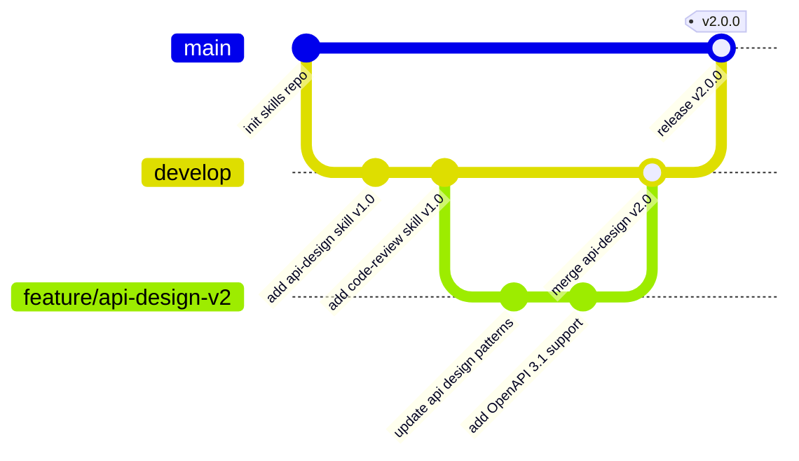

### 4.5 安全性與權限控管

**安全設計原則**：

| 原則 | 實務做法 |
|------|----------|
| **最小權限** | `allowed-tools` 只開放必要工具 |
| **腳本審核** | 所有 Scripts 須經安全團隊審核 |
| **無敏感資訊** | Skills 中不可包含密碼、Token、API Key |
| **輸入驗證** | 腳本須驗證所有輸入參數 |
| **Prompt Injection 防護** | 描述中避免可被利用的指令 |

**安全檢查清單**：

```markdown
## Skill 安全審查檢查清單
- [ ] SKILL.md 中無敏感資訊（密碼、Token、金鑰）
- [ ] Scripts 已經過安全審核
- [ ] allowed-tools 遵循最小權限原則
- [ ] 無 Prompt Injection 風險
- [ ] 腳本有輸入驗證
- [ ] 腳本不會刪除或修改系統關鍵檔案
- [ ] 無外部網路呼叫（除非必要且已審核）
- [ ] 輸出不會洩漏系統內部資訊
```

> **⚠️ 重要安全提醒**：在企業環境中，切勿在 Skills 的 `allowed-tools` 欄位中輕易加入 `shell` 或 `bash`。這會允許 AI 在不經確認的情況下執行終端機指令，可能被 Prompt Injection 攻擊利用。

---

## 第 5 章：Skills 實作教學（Hands-on）

### 5.1 範例 1：產生 API 設計文件 Skill

以下是一個完整的 API 設計文件生成 Skill，從資料夾結構到每個檔案的內容。

**資料夾結構**：

```
.github/skills/generate-api-spec/
├── SKILL.md
├── references/
│   ├── api-standards.md
│   └── error-response-format.md
├── scripts/
│   └── validate-openapi.sh
└── templates/
    └── openapi-template.yaml
```

**SKILL.md**：

```markdown
---
name: generate-api-spec
description: >
  Generates OpenAPI 3.1 specification documents for REST APIs 
  following enterprise standards. Use when asked to design an 
  API, create API documentation, or generate OpenAPI specs.
version: 1.0.0
category: design
ssdlc-phase: design
---

# API 規格文件生成 Skill

## 使用方式
當使用者要求設計 API 時，請依照以下步驟：

### Step 1：收集資訊
確認以下資訊：
- API 名稱與用途
- 資源（Resource）清單
- 操作（Operations）清單
- 認證方式

### Step 2：產出 OpenAPI Spec
使用 `templates/openapi-template.yaml` 作為基礎範本，
依據 `references/api-standards.md` 中的規範填入內容。

### Step 3：驗證
如果需要驗證規格檔，可執行：
```bash
bash scripts/validate-openapi.sh <output-file>
```

### Step 4：錯誤回應格式
所有 API 的錯誤回應格式須遵循
`references/error-response-format.md` 中的規範。

## 產出清單
1. `openapi.yaml` - OpenAPI 3.1 規格文件
2. API 端點清單（Markdown 表格）
3. 資料模型定義（Schema）
```

**templates/openapi-template.yaml**：

```yaml
openapi: 3.1.0
info:
  title: "{{API_TITLE}}"
  description: "{{API_DESCRIPTION}}"
  version: "{{API_VERSION}}"
  contact:
    name: "{{TEAM_NAME}}"
    email: "{{TEAM_EMAIL}}"
    
servers:
  - url: https://api.example.com/v1
    description: Production
  - url: https://api-sit.example.com/v1
    description: SIT
    
paths:
  /{{RESOURCE_PATH}}:
    get:
      summary: "查詢{{RESOURCE_NAME}}列表"
      operationId: "list{{RESOURCE_NAME}}"
      tags:
        - "{{TAG_NAME}}"
      parameters:
        - name: page
          in: query
          schema:
            type: integer
            default: 0
        - name: size
          in: query
          schema:
            type: integer
            default: 20
      responses:
        '200':
          description: 查詢成功
          content:
            application/json:
              schema:
                $ref: '#/components/schemas/PageResponse'
        '401':
          $ref: '#/components/responses/Unauthorized'
        '500':
          $ref: '#/components/responses/InternalError'

components:
  schemas:
    PageResponse:
      type: object
      properties:
        content:
          type: array
          items: {}
        totalElements:
          type: integer
        totalPages:
          type: integer
        
  responses:
    Unauthorized:
      description: 未授權
      content:
        application/json:
          schema:
            $ref: '#/components/schemas/ErrorResponse'
    InternalError:
      description: 伺服器內部錯誤
      content:
        application/json:
          schema:
            $ref: '#/components/schemas/ErrorResponse'
            
    ErrorResponse:
      type: object
      properties:
        code:
          type: string
        message:
          type: string
        timestamp:
          type: string
          format: date-time
```

**scripts/validate-openapi.sh**：

```bash
#!/bin/bash
# OpenAPI 規格文件驗證腳本
# 用法: bash validate-openapi.sh <openapi-file>

set -euo pipefail

if [ $# -eq 0 ]; then
    echo "Usage: bash validate-openapi.sh <openapi-file>"
    exit 1
fi

FILE="$1"

if [ ! -f "$FILE" ]; then
    echo "ERROR: File not found: $FILE"
    exit 1
fi

echo "Validating OpenAPI spec: $FILE"

# 基本 YAML 語法檢查
if command -v python3 &> /dev/null; then
    python3 -c "
import sys
import yaml

try:
    with open('$FILE', 'r') as f:
        spec = yaml.safe_load(f)
    
    # 檢查必要欄位
    required = ['openapi', 'info', 'paths']
    for field in required:
        if field not in spec:
            print(f'ERROR: Missing required field: {field}')
            sys.exit(1)
    
    # 檢查版本
    if not spec['openapi'].startswith('3.'):
        print(f'WARNING: OpenAPI version {spec[\"openapi\"]} is not 3.x')
    
    print('✅ OpenAPI spec validation passed')
except Exception as e:
    print(f'ERROR: {e}')
    sys.exit(1)
"
else
    echo "WARNING: Python3 not found, skipping validation"
fi
```

### 5.2 範例 2：程式碼審查 Skill

**資料夾結構**：

```
.github/skills/enterprise-code-review/
├── SKILL.md
└── references/
    ├── coding-standards.md
    ├── security-checklist.md
    └── performance-checklist.md
```

**SKILL.md**：

```markdown
---
name: enterprise-code-review
description: >
  Performs comprehensive code review following enterprise 
  coding standards, security guidelines, and performance 
  best practices. Use when reviewing pull requests, 
  checking code quality, or performing peer review.
version: 2.0.0
category: development
ssdlc-phase: development
---

# 企業級程式碼審查 Skill

## 審查流程

### Phase 1：快速掃描（30 秒）
快速瀏覽變更概覽：
- 變更了哪些檔案？
- 變更規模是否合理？（建議 PR < 400 行）
- 是否包含測試？

### Phase 2：安全審查（最優先）
依據 `references/security-checklist.md` 逐項檢查：
- SQL Injection
- XSS
- 敏感資料保護
- 權限控管
- 輸入驗證

### Phase 3：功能正確性
- 業務邏輯是否正確？
- 邊界條件是否處理？
- 錯誤處理是否完整？

### Phase 4：程式碼品質
依據 `references/coding-standards.md` 檢查：
- 命名規範
- 方法長度
- 類別職責
- 程式碼重複

### Phase 5：效能
依據 `references/performance-checklist.md` 檢查：
- N+1 查詢
- 不必要的記憶體配置
- 適當的快取使用

## 輸出格式

```markdown
## Code Review 報告

### 📊 總覽
- 檔案數：X
- 變更行數：+X / -X
- 整體評分：⭐⭐⭐⭐☆

### 🔴 必須修改（Must Fix）
1. [安全] 第 XX 行：SQL Injection 風險
2. [正確性] 第 XX 行：NullPointerException 風險

### 🟡 建議修改（Should Fix）
1. [品質] 第 XX 行：方法過長，建議拆分
2. [效能] 第 XX 行：N+1 查詢問題

### 🟢 建議（Nice to Have）
1. [風格] 第 XX 行：命名可更具描述性

### ✅ 優點
1. 測試覆蓋完整
2. 結構清晰
```
```

### 5.3 範例 3：Spring Boot 服務生成 Skill

**資料夾結構**：

```
.github/skills/spring-boot-service-gen/
├── SKILL.md
├── references/
│   ├── clean-architecture.md
│   └── naming-conventions.md
└── templates/
    ├── Controller.java.template
    ├── Service.java.template
    ├── Repository.java.template
    ├── Request.java.template
    ├── Response.java.template
    └── ServiceTest.java.template
```

**SKILL.md**：

```markdown
---
name: spring-boot-service-gen
description: >
  Generates complete Spring Boot 3.x service components 
  including Controller, Service, Repository, DTOs, and 
  tests following Clean Architecture. Use when asked to 
  create a new API endpoint, service, or CRUD operations.
version: 1.0.0
category: development
ssdlc-phase: development
---

# Spring Boot 服務元件生成 Skill

## 生成項目
依據使用者提供的需求，產生以下元件：

1. **Controller**（使用 `templates/Controller.java.template`）
2. **Service Interface**（Use Case Port）
3. **Service Implementation**
4. **Repository Interface**
5. **Entity**
6. **Request DTO**
7. **Response DTO**
8. **Unit Test**（使用 `templates/ServiceTest.java.template`）

## 命名規範
遵循 `references/naming-conventions.md`

## 分層規範
遵循 `references/clean-architecture.md`

## 程式碼規範
- Java 21+ 語法（Record、Pattern Matching）
- Lombok 最小化使用（僅 @Slf4j、@RequiredArgsConstructor）
- Bean Validation（Jakarta Validation）
- MapStruct 進行 DTO 轉換

## 生成流程
1. 確認資源名稱（如 Transaction）
2. 確認需要的 CRUD 操作
3. 依模板生成各元件
4. 確保 package 路徑正確
5. 生成對應的 Unit Test
```

**templates/Controller.java.template**：

```java
package com.{{company}}.{{service}}.adapter.in.web;

import jakarta.validation.Valid;
import lombok.RequiredArgsConstructor;
import lombok.extern.slf4j.Slf4j;
import org.springframework.http.HttpStatus;
import org.springframework.http.ResponseEntity;
import org.springframework.web.bind.annotation.*;

/**
 * {{ResourceName}} REST API Controller
 *
 * @author {{author}}
 * @since {{version}}
 */
@RestController
@RequestMapping("/api/v1/{{resourcePath}}")
@RequiredArgsConstructor
@Slf4j
public class {{ResourceName}}Controller {

    private final {{ResourceName}}UseCase {{resourceName}}UseCase;

    @GetMapping
    public ResponseEntity<PageResponse<{{ResourceName}}Response>> list(
            @Valid {{ResourceName}}QueryRequest request) {
        log.info("查詢{{resourceLabel}}列表: {}", request);
        var result = {{resourceName}}UseCase.query(request.toDomain());
        return ResponseEntity.ok(PageResponse.of(result));
    }

    @GetMapping("/{id}")
    public ResponseEntity<{{ResourceName}}Response> getById(
            @PathVariable Long id) {
        log.info("查詢{{resourceLabel}}: id={}", id);
        var result = {{resourceName}}UseCase.getById(id);
        return ResponseEntity.ok({{ResourceName}}Response.from(result));
    }

    @PostMapping
    public ResponseEntity<{{ResourceName}}Response> create(
            @Valid @RequestBody {{ResourceName}}CreateRequest request) {
        log.info("建立{{resourceLabel}}: {}", request);
        var result = {{resourceName}}UseCase.create(request.toCommand());
        return ResponseEntity.status(HttpStatus.CREATED)
                .body({{ResourceName}}Response.from(result));
    }

    @PutMapping("/{id}")
    public ResponseEntity<{{ResourceName}}Response> update(
            @PathVariable Long id,
            @Valid @RequestBody {{ResourceName}}UpdateRequest request) {
        log.info("更新{{resourceLabel}}: id={}, request={}", id, request);
        var result = {{resourceName}}UseCase.update(id, request.toCommand());
        return ResponseEntity.ok({{ResourceName}}Response.from(result));
    }

    @DeleteMapping("/{id}")
    public ResponseEntity<Void> delete(@PathVariable Long id) {
        log.info("刪除{{resourceLabel}}: id={}", id);
        {{resourceName}}UseCase.delete(id);
        return ResponseEntity.noContent().build();
    }
}
```

> **🏦 金融業實務案例**：某銀行的專案團隊使用 `spring-boot-service-gen` Skill，設定了銀行業專用的欄位驗證規範（如帳號格式、金額精度、日期格式），新進同仁可以在 10 分鐘內建立符合企業規範的完整 CRUD API，原本需要半天的手工作業大幅縮短。

---

## 第 6 章：企業級 Skills Repository 架構

### 6.1 建議 GitHub Repo 結構

```
📦 enterprise-copilot-skills/
│
├── 📄 README.md                    # 說明文件
├── 📄 CONTRIBUTING.md              # 貢獻指南
├── 📄 GOVERNANCE.md                # 治理規範
├── 📄 SECURITY.md                  # 安全政策
├── 📄 catalog.yaml                 # Skills 目錄索引
├── 📄 .github/
│   ├── CODEOWNERS                  # 審核者指派
│   ├── PULL_REQUEST_TEMPLATE.md    # PR 範本
│   └── workflows/
│       ├── validate-skill.yml      # Skill 格式驗證
│       ├── security-scan.yml       # 安全掃描
│       └── publish-skill.yml       # Skill 發布
│
├── 📂 core/                        # 核心 Skills（全組織適用）
│   ├── code-review/
│   ├── api-design/
│   ├── unit-test-generation/
│   ├── security-scan/
│   ├── documentation/
│   └── cicd-pipeline/
│
├── 📂 ssdlc/                       # 按 SSDLC 階段分類
│   ├── requirements/
│   │   ├── generate-brd/
│   │   ├── generate-frd/
│   │   └── generate-user-story/
│   ├── design/
│   │   ├── clean-architecture/
│   │   ├── api-design-restful/
│   │   └── database-design/
│   ├── development/
│   │   ├── spring-boot-codegen/
│   │   ├── vue-component-gen/
│   │   └── refactoring-patterns/
│   ├── testing/
│   │   ├── junit-test-gen/
│   │   ├── integration-test-gen/
│   │   └── api-test-gen/
│   ├── security/
│   │   ├── owasp-review/
│   │   ├── secure-coding/
│   │   └── dependency-audit/
│   ├── deployment/
│   │   ├── github-actions-pipeline/
│   │   ├── dockerfile-gen/
│   │   └── k8s-manifest-gen/
│   └── maintenance/
│       ├── log-analyzer/
│       ├── incident-response/
│       └── performance-tuning/
│
├── 📂 domain/                       # 按業務領域分類
│   ├── banking/
│   │   ├── transaction-api/
│   │   ├── account-management/
│   │   └── regulatory-report/
│   └── common/
│       ├── batch-job-design/
│       └── notification-service/
│
├── 📂 templates/                    # Skill 開發範本
│   └── new-skill-template/
│       ├── SKILL.md
│       └── README.md
│
└── 📂 scripts/                      # 工具腳本
    ├── validate-all-skills.py       # 批次驗證
    ├── generate-catalog.py          # 自動生成目錄
    └── sync-to-projects.sh          # 同步至專案
```

### 6.2 Skills 分類策略

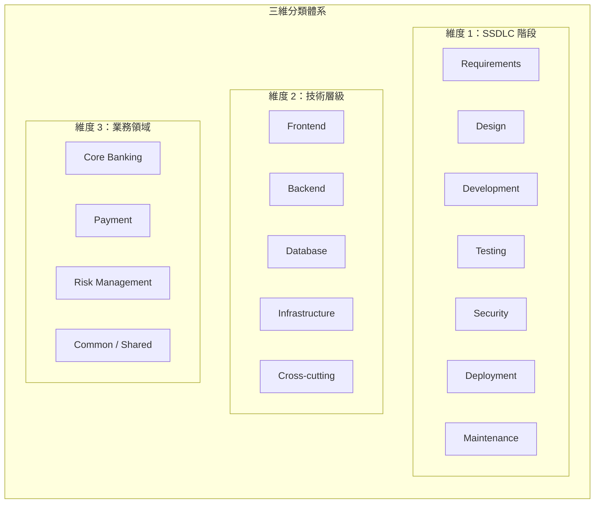

**catalog.yaml 範例**：

```yaml
# Skills 目錄索引
catalog:
  version: "1.0.0"
  last_updated: "2026-04-01"
  
  skills:
    - name: api-design-restful
      path: ssdlc/design/api-design-restful
      phase: design
      layer: backend
      domain: common
      version: 2.1.0
      author: platform-team
      status: active
      tags: [api, rest, openapi]
      
    - name: junit-test-gen
      path: ssdlc/testing/junit-test-gen
      phase: testing
      layer: backend
      domain: common
      version: 1.3.0
      author: qa-team
      status: active
      tags: [test, junit, java]
      
    - name: transaction-api
      path: domain/banking/transaction-api
      phase: development
      layer: backend
      domain: banking
      version: 1.0.0
      author: banking-team
      status: active
      tags: [banking, transaction, api]
```

### 6.3 權限控管（RBAC）

**GitHub Repository 層級的權限設計**：

| 角色 | 權限 | 說明 |
|------|------|------|
| **Skills Admin** | Admin | 管理 Repository 設定、審核流程 |
| **Skills Reviewer** | Write + Review | 審核 PR、合併變更 |
| **Skills Contributor** | Write | 提交新 Skill 或修改 |
| **Skills Consumer** | Read | 使用 Skills（所有工程師） |

**CODEOWNERS 設定**：

```
# .github/CODEOWNERS

# 核心 Skills 需要 Platform Team 審核
/core/                @org/platform-team

# 安全相關 Skills 需要 Security Team 審核
/ssdlc/security/      @org/security-team

# 領域 Skills 需要對應領域 Owner 審核
/domain/banking/       @org/banking-team
/domain/payment/       @org/payment-team

# 所有 Scripts 需要 Security Team 審核
**/scripts/            @org/security-team
```

### 6.4 與 CI/CD 整合

**Skill 驗證 Workflow**：

```yaml
# .github/workflows/validate-skill.yml
name: Validate Skill

on:
  pull_request:
    paths:
      - '**/SKILL.md'
      - '**/scripts/**'

jobs:
  validate:
    runs-on: ubuntu-latest
    steps:
      - uses: actions/checkout@v4
      
      - name: Validate SKILL.md format
        run: |
          python scripts/validate-all-skills.py
          
      - name: Check naming convention
        run: |
          # 檢查所有 Skill 目錄名稱是否符合命名規範
          find . -name "SKILL.md" -exec dirname {} \; | while read dir; do
            dirname=$(basename "$dir")
            if [[ ! "$dirname" =~ ^[a-z][a-z0-9-]*$ ]]; then
              echo "ERROR: Invalid skill name: $dirname"
              exit 1
            fi
          done
          
      - name: Security scan scripts
        run: |
          # 掃描腳本中的安全風險
          find . -name "*.sh" -o -name "*.py" | while read script; do
            echo "Scanning: $script"
            # 檢查是否有硬編碼密碼
            if grep -iE "(password|secret|token|api_key)\s*=" "$script"; then
              echo "ERROR: Potential hardcoded secret in $script"
              exit 1
            fi
          done

  lint:
    runs-on: ubuntu-latest
    steps:
      - uses: actions/checkout@v4
      
      - name: Lint Markdown
        uses: DavidAnson/markdownlint-cli2-action@v19
        with:
          globs: '**/SKILL.md'
```

> **🏦 金融業實務案例**：某金控集團透過 GitHub Actions 實現了 Skills 的自動化品質控管。每個 Skill 的 PR 必須通過：格式驗證、命名規範檢查、安全掃描、至少 2 位 Reviewer 審核（含 1 位安全團隊成員）才能合併。有效防止了不安全的腳本被引入生產環境。

---

## 第 7 章：與開發工具整合

### 7.1 GitHub Copilot 整合

**專案級 Skills 設定**：

```
📦 my-spring-boot-project/
├── .github/
│   ├── copilot-instructions.md   # 全局指令
│   └── skills/                    # 專案專屬 Skills
│       ├── api-design/
│       │   └── SKILL.md
│       └── code-review/
│           └── SKILL.md
├── .claude/
│   └── skills/                    # Claude Code 專案專屬 Skills
│       └── deploy/
│           └── SKILL.md
├── .agents/
│   └── skills/                    # 跨 Agent 通用 Skills
│       └── unit-test-gen/
│           └── SKILL.md
└── src/
```

**個人級 Skills 設定**：

```bash
# GitHub Copilot 個人 Skills
# Windows
mkdir -p %USERPROFILE%\.copilot\skills\my-skill
# macOS / Linux
mkdir -p ~/.copilot/skills/my-skill

# Claude Code 個人 Skills
mkdir -p ~/.claude/skills/my-skill
```

**使用 Skills 的方式**：

```
# GitHub Copilot（自動匹配 + 載入）
使用者：「請幫我設計一個轉帳 API」
Copilot：（自動載入 api-design Skill）→ 依規範產出 API 設計

# Claude Code — 自動觸發
使用者：「幫我 Review 這段程式碼」
Claude：（自動載入 code-review Skill）→ 依清單進行審查

# Claude Code — 手動叫用
/deploy staging v2.1.0
# → 觸發 deploy Skill，$0 = staging, $1 = v2.1.0
```

### 7.2 Claude Code 進階整合

**Subagent 執行模式**：

Skills 可搭配 `context: fork` 在獨立的 Subagent 中執行，實現任務隔離：

```markdown
---
name: deep-research
description: Research a topic thoroughly
context: fork
agent: Explore
---

Research $ARGUMENTS thoroughly:

1. Find relevant files using Glob and Grep
2. Read and analyze the code
3. Summarize findings with specific file references
```

> **Agent 類型**：`Explore`（唯讀探索）、`Plan`（規劃）、`general-purpose`（通用）、或自訂 Subagent（`.claude/agents/` 定義）。

**Permission 控管**：

```bash
# 在 /permissions 中控制 Skill 存取
# 允許特定 Skills
Skill(commit)
Skill(review-pr *)

# 禁止特定 Skills
Skill(deploy *)

# 禁止所有 Skills
Skill
```

**安全最佳實務**：

| 場景 | 建議設定 |
|------|----------|
| 部署、發訊息 | `disable-model-invocation: true` |
| 有副作用的腳本 | 不加 `allowed-tools: shell`，讓使用者每次確認 |
| 背景知識 | `user-invocable: false` |
| 危險操作（rm、drop） | `disable-model-invocation: true` + 限制 `allowed-tools` |

### 7.3 VS Code 整合

**VS Code 設定建議**：

```jsonc
// .vscode/settings.json
{
    // Copilot 相關設定
    "github.copilot.chat.codeGeneration.instructions": [
        { "file": ".github/copilot-instructions.md" }
    ],
    
    // 推薦 Extensions
    "recommendations": [
        "github.copilot",
        "github.copilot-chat",
        "vscjava.vscode-java-pack",
        "vmware.vscode-spring-boot"
    ]
}
```

**Agent Mode 使用 Skills**：

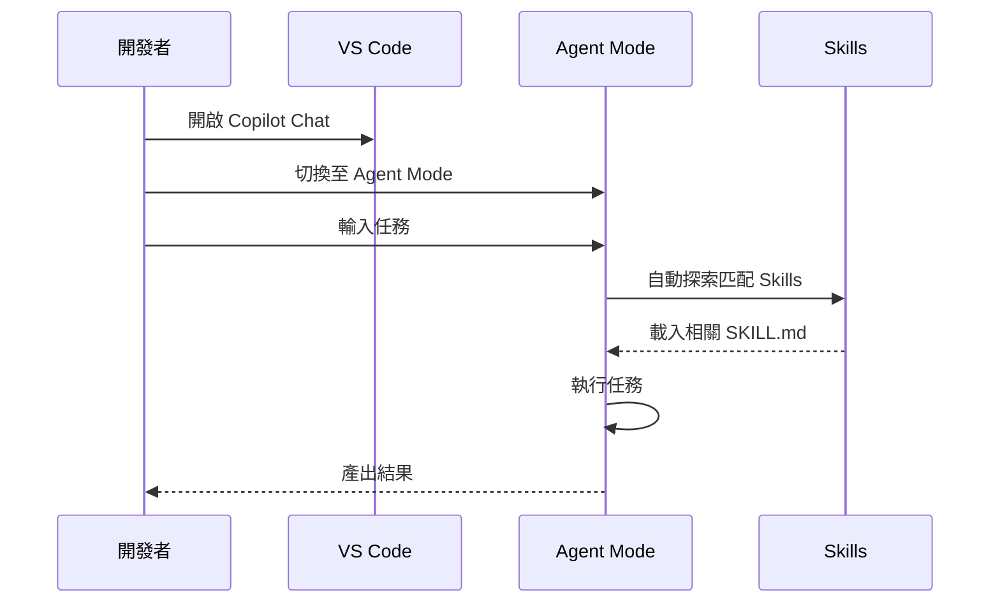

### 7.4 CI/CD（GitHub Actions）整合

**在 CI/CD 中驗證 Skills 產出的品質**：

```yaml
# .github/workflows/skill-quality.yml
name: Skill Quality Gate

on:
  push:
    paths:
      - '.github/skills/**'

jobs:
  quality-check:
    runs-on: ubuntu-latest
    steps:
      - uses: actions/checkout@v4
      
      - name: Validate all SKILL.md files
        run: |
          find .github/skills -name "SKILL.md" | while read file; do
            echo "Checking: $file"
            
            # 檢查 frontmatter
            head -1 "$file" | grep -q "^---$" || {
              echo "ERROR: Missing YAML frontmatter in $file"
              exit 1
            }
            
            # 檢查必要欄位
            if ! grep -q "^name:" "$file"; then
              echo "ERROR: Missing 'name' field in $file"
              exit 1
            fi
            
            if ! grep -q "^description:" "$file"; then
              echo "ERROR: Missing 'description' field in $file"
              exit 1
            fi
          done
          echo "✅ All SKILL.md files are valid"
```

### 7.5 Issue / PR 流程整合

**新增 Skill 的標準 PR 流程**：

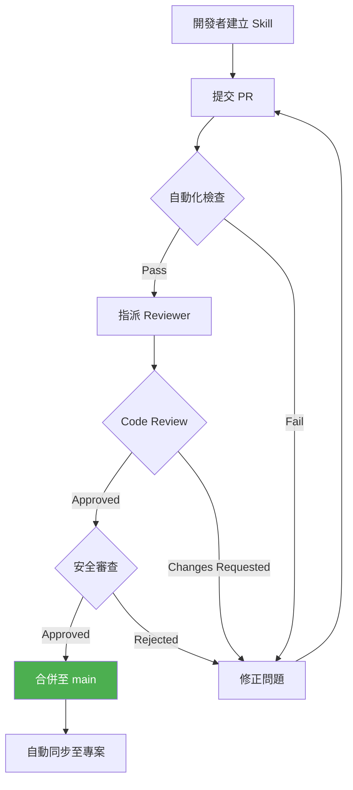

**PR Template**：

```markdown
<!-- .github/PULL_REQUEST_TEMPLATE/skill-pr.md -->

## Skill 資訊
- **名稱**：
- **類別**：core / ssdlc / domain
- **SSDLC 階段**：requirements / design / development / testing / security / deployment / maintenance
- **版本**：

## 變更說明
<!-- 描述這個 Skill 做什麼、為什麼需要 -->

## 檢查清單
- [ ] SKILL.md 包含必要的 frontmatter（name, description）
- [ ] description 清楚說明觸發條件
- [ ] 命名遵循企業命名規範
- [ ] 無敏感資訊（密碼、Token）
- [ ] Scripts 已經過安全審查
- [ ] allowed-tools 遵循最小權限原則
- [ ] 已在本地測試過 Skill 功能
- [ ] 已更新 catalog.yaml

## 測試結果
<!-- 附上使用 Skill 的截圖或結果 -->
```

> **💡 實務建議**：建議在 GitHub Issue 模板中新增「Skill Request」類型，讓團隊成員可以提出新 Skill 需求，經過評審後再指派開發。

---

## 第 8 章：Skills 治理（Governance）

### 8.1 Skills 審核機制

**治理架構**：

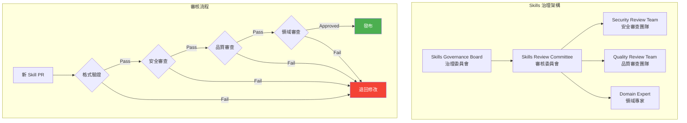

**審核維度**：

| 維度 | 審核內容 | 審核者 |
|------|----------|--------|
| **格式** | SKILL.md 格式正確、命名規範 | 自動化（CI） |
| **安全** | 無敏感資訊、腳本安全、最小權限 | Security Team |
| **品質** | 指令清晰、可重用性高、Token 效率 | Quality Team |
| **領域** | 業務邏輯正確、符合行業規範 | Domain Expert |

### 8.2 品質控管（Quality Gate）

**Skill Quality Gate 指標**：

| 指標 | 門檻 | 說明 |
|------|------|------|
| **格式合規** | 100% | SKILL.md 格式必須完全正確 |
| **描述品質** | ≥ 80 分 | description 清晰度評分 |
| **安全掃描** | 0 Critical / High | 無高風險安全問題 |
| **Token 效率** | ≤ 5000 Tokens | SKILL.md 主體大小（不超過 500 行） |
| **Reviewer 核准** | ≥ 2 人 | 至少 2 位 Reviewer 同意 |

**自動化品質檢查腳本**：

```python
#!/usr/bin/env python3
"""Skill 品質檢查腳本"""

import yaml
import sys
import os
from pathlib import Path


def validate_skill(skill_path: str) -> list[str]:
    """驗證單個 Skill 的品質"""
    errors = []
    skill_md = Path(skill_path) / "SKILL.md"
    
    if not skill_md.exists():
        errors.append(f"Missing SKILL.md in {skill_path}")
        return errors
    
    content = skill_md.read_text(encoding="utf-8")
    
    # 1. 驗證 frontmatter
    if not content.startswith("---"):
        errors.append("Missing YAML frontmatter")
        return errors
    
    parts = content.split("---", 2)
    if len(parts) < 3:
        errors.append("Invalid YAML frontmatter format")
        return errors
    
    try:
        metadata = yaml.safe_load(parts[1])
    except yaml.YAMLError as e:
        errors.append(f"Invalid YAML: {e}")
        return errors
    
    # 2. 驗證必要欄位
    if "name" not in metadata:
        errors.append("Missing required field: name")
    elif not metadata["name"].replace("-", "").isalnum():
        errors.append(f"Invalid name format: {metadata['name']}")
    
    if "description" not in metadata:
        errors.append("Missing required field: description")
    elif len(metadata["description"]) < 20:
        errors.append("Description too short (min 20 chars)")
    
    # 3. 驗證描述包含觸發條件
    desc = metadata.get("description", "")
    trigger_keywords = ["use when", "use this when", "trigger when"]
    if not any(kw in desc.lower() for kw in trigger_keywords):
        errors.append(
            "Description should include trigger condition "
            "(e.g., 'Use when asked to...')"
        )
    
    # 4. 檢查 Token 大小（粗略估算）
    body = parts[2]
    estimated_tokens = len(body.split()) * 1.3
    if estimated_tokens > 3000:
        errors.append(
            f"SKILL.md body too large: ~{int(estimated_tokens)} tokens "
            f"(recommended < 2000)"
        )
    
    # 5. 安全檢查
    sensitive_patterns = [
        "password", "secret", "api_key", "token", 
        "private_key", "access_key"
    ]
    for pattern in sensitive_patterns:
        if pattern in content.lower() and "检查" not in content and "check" not in content.lower():
            errors.append(
                f"Potential sensitive data pattern found: {pattern}"
            )
    
    return errors


if __name__ == "__main__":
    skills_dir = sys.argv[1] if len(sys.argv) > 1 else ".github/skills"
    all_errors = {}
    
    for skill_dir in Path(skills_dir).rglob("SKILL.md"):
        skill_path = str(skill_dir.parent)
        errors = validate_skill(skill_path)
        if errors:
            all_errors[skill_path] = errors
    
    if all_errors:
        print("❌ Skill validation failed:")
        for path, errors in all_errors.items():
            print(f"\n  {path}:")
            for error in errors:
                print(f"    - {error}")
        sys.exit(1)
    else:
        print("✅ All skills passed validation")
```

### 8.3 安全審查（Security Review）

**安全審查清單**：

```markdown
## Skill 安全審查清單

### 1. 內容安全
- [ ] 無硬編碼密碼、Token、API Key
- [ ] 無內部系統 URL / IP
- [ ] 無個人可識別資訊（PII）
- [ ] 無企業機密資訊

### 2. 腳本安全
- [ ] Scripts 不執行危險操作（rm -rf、drop table）
- [ ] Scripts 有輸入參數驗證
- [ ] Scripts 使用 set -euo pipefail（Bash）
- [ ] Scripts 不下載外部資源（除非已審核）
- [ ] Scripts 不修改系統設定

### 3. Prompt Injection 防護
- [ ] description 不包含可被利用的指令注入
- [ ] 指令中不要求忽略安全檢查
- [ ] 不引導 AI 跳過確認步驟

### 4. 權限控管
- [ ] allowed-tools 遵循最小權限原則
- [ ] 不預核准 shell/bash（除非確實必要且已審核）
- [ ] 不需要系統管理員權限
```

### 8.4 使用追蹤與優化（Telemetry）

**追蹤指標**：

| 指標 | 說明 | 目的 |
|------|------|------|
| **使用次數** | 每個 Skill 被觸發的次數 | 識別熱門 vs 冷門 Skills |
| **成功率** | Skill 完成任務的成功率 | 識別需要改善的 Skills |
| **Token 消耗** | 每次使用的平均 Token 數 | 優化 Token 效率 |
| **使用者滿意度** | 使用者回饋評分 | 持續改善品質 |

**優化循環**：


> **💡 實務建議**：定期（每月或每季）進行 Skills Review Meeting，由治理委員會審視使用數據，決定：哪些 Skills 需要改善、哪些可以退役、哪些需要新建。

---

## 第 9 章：常見錯誤與反模式

### 9.1 過度設計 Skills

**反模式**：將簡單的任務設計成過度複雜的 Skill

```markdown
# ❌ 過度設計：一個簡單的命名規範不需要 Skill
.github/skills/variable-naming/
├── SKILL.md (500 行)
├── scripts/
│   └── check-naming.py (300 行)
├── references/
│   ├── naming-guide-1.md
│   ├── naming-guide-2.md
│   └── naming-guide-3.md
└── templates/
    └── naming-template.md

# ✅ 正確：簡單規範放在 copilot-instructions.md
# 在 .github/copilot-instructions.md 中加入：
## 命名規範
- 類別：PascalCase
- 方法/變數：camelCase
- 常數：UPPER_SNAKE_CASE
```

**判斷標準**：

| 情境 | 建議 |
|------|------|
| 少於 10 行的規範 | 放入 `copilot-instructions.md` |
| 通用且需每次都載入 | 放入 `copilot-instructions.md` |
| 特定任務、需要腳本 / 範本 | 建立 Skill |
| 複雜流程、多步驟 | 建立 Skill |

### 9.2 Token 爆炸問題

**反模式**：SKILL.md 包含過多內容，導致 Token 消耗爆增

```markdown
# ❌ Token 爆炸：整份設計規範放入 SKILL.md
---
name: api-design
description: API design guide
---

# API Design（5000+ 行的完整規範...）
## HTTP Methods（200 行）
## Status Codes（300 行）
## Error Handling（400 行）
## Security（500 行）
## Performance（300 行）
## 完整範例（2000 行）
...
```

```markdown
# ✅ 正確：核心指令精簡，詳細內容在 references/
---
name: api-design
description: API design guide. Use when designing REST APIs.
---

# API Design
## 核心原則（50 行精簡摘要）
## 快速參考（20 行）

若需詳細規範，請參考：
- references/http-methods.md
- references/status-codes.md
- references/security-standards.md
```

### 9.3 Skills 過於耦合

**反模式**：Skills 之間有強依賴，無法獨立使用

```markdown
# ❌ 強耦合：Skill B 必須在 Skill A 之後使用
# api-test-gen/SKILL.md
---
name: api-test-gen
description: Generates API tests. MUST use api-design skill first.
---
# 此 Skill 假設已使用 api-design Skill 產出 OpenAPI Spec...
# 如果缺少 OpenAPI Spec 就無法運作...

# ✅ 鬆耦合：Skill 可獨立使用
# api-test-gen/SKILL.md
---
name: api-test-gen
description: >
  Generates API test cases. Can use existing OpenAPI spec 
  or generate tests from code analysis.
---
# 此 Skill 支援兩種模式：
# 1. 有 OpenAPI Spec → 依據 Spec 生成測試
# 2. 無 OpenAPI Spec → 分析程式碼生成測試
```

### 9.4 其他常見反模式

| 反模式 | 說明 | 解決方案 |
|--------|------|----------|
| **描述模糊** | description 無法準確觸發 | 加入明確的觸發條件語句 |
| **萬用 Skill** | 一個 Skill 處理所有事 | 拆分為多個專注的 Skills |
| **無版本管理** | 修改不留記錄 | 使用 Semantic Versioning |
| **硬編碼環境** | 假設特定環境 / 路徑 | 使用參數化設計 |
| **忽視安全** | Scripts 不做輸入驗證 | 加入安全檢查邏輯 |
| **缺乏測試** | 未驗證 Skill 效果 | 建立 Skill 測試案例 |

---

## 第 10 章：未來趨勢

### 10.1 Agentic Workflow

AI Agent 結合 Skills 的自主工作流將成為主流：

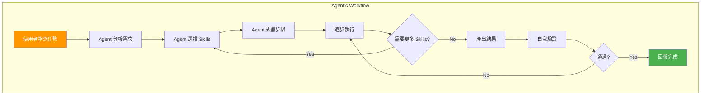

**企業應用方向**：
- AI Agent 自動從需求文件生成完整的 API（使用多個 Skills 串接）
- AI Agent 自動識別程式碼問題並修復（Code Review + Fix）
- AI Agent 自動處理生產環境事件（Log Analysis + Incident Response）

### 10.2 Multi-Agent Collaboration

多個 Agent 各自擁有不同的 Skills，協同完成複雜任務：

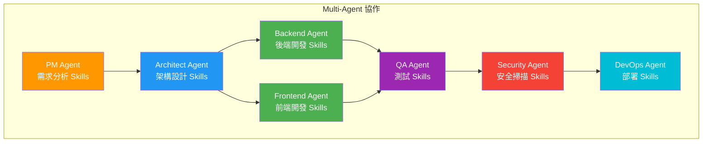

### 10.3 Skills Marketplace 與開放生態

Agent Skills 開放標準（agentskills.io）已被 20+ AI Agent 產品採用，形成跨平台互通的生態系：

**已採用 Agent Skills 標準的產品（部分）**：

| 產品 | 組織 | 特點 |
|------|------|------|
| Claude Code | Anthropic | 最完整實作，含 Subagent、Hooks、動態注入 |
| GitHub Copilot | GitHub/Microsoft | 深度整合 GitHub 生態系 |
| Amp | Sourcegraph | 程式碼搜尋 + AI Agent |
| Junie | JetBrains | IntelliJ 生態系整合 |
| Goose | Block | 開源 AI Agent |
| OpenHands | All Hands AI | 開源自主 AI Agent |
| Qodo | Qodo | 測試導向 AI Agent |
| Tabnine | Tabnine | 程式碼補全 + Agent |
| Windsurf | Codeium | IDE 整合 Agent |
| Augment Code | Augment | 企業級 AI Agent |

**Skills 驗證工具**：

```bash
# 使用官方 skills-ref 驗證工具
# https://github.com/agentskills/agentskills/tree/main/skills-ref
skills-ref validate ./my-skill
```

| 發展階段 | 說明 | 時程預估 |
|----------|------|----------|
| **Phase 1** | 組織內部 Skills Repository | 現在可行 |
| **Phase 2** | 跨團隊 Skills 共享平台 + Plugin 分發 | 2026 Q2-Q3 |
| **Phase 3** | 產業級 Skills Marketplace | 2026 Q4-2027 |
| **Phase 4** | AI 自動生成 / 優化 Skills | 2027+ |

**現有社群資源**：
- **Agent Skills Specification**：[agentskills.io](https://agentskills.io/) — 開放標準規範（含 Discord 社群）
- **GitHub awesome-copilot**：`github/awesome-copilot/skills` — 200+ 社群貢獻的 Skills
- **Anthropic Skills**：`anthropics/skills` — Anthropic 官方 Skills 範例庫
- **skills-ref**：`agentskills/agentskills/skills-ref` — 官方驗證工具庫

> **🏦 金融業展望**：未來金融業可能出現產業級 Skills Marketplace，提供經過合規審查的「反洗錢檢查 Skill」、「KYC 流程 Skill」、「IFRS 報表 Skill」等產業專用能力包，加速整個產業的 AI 轉型。

---

## 附錄 A：企業導入檢查清單

### Phase 1：準備（1-2 週）

- [ ] 建立企業級 Skills Repository
- [ ] 定義 Skills 命名規範
- [ ] 定義 Skills 治理流程
- [ ] 建立 CODEOWNERS 與 Review 流程
- [ ] 設定 CI/CD 自動化驗證

### Phase 2：試行（2-4 週）

- [ ] 選定 2-3 個試點團隊
- [ ] 將現有常用 Prompt 轉換為 Skills
- [ ] 建立 5-10 個核心 Skills
- [ ] 團隊內部培訓（使用本手冊）
- [ ] 收集使用回饋

### Phase 3：擴展（4-8 週）

- [ ] 根據回饋優化核心 Skills
- [ ] 擴展至所有開發團隊
- [ ] 建立領域專屬 Skills
- [ ] 建立 Skills 品質指標
- [ ] 定期 Skills Review Meeting

### Phase 4：成熟（持續）

- [ ] 建立 Skills 使用追蹤
- [ ] 定期清理過時 Skills
- [ ] 跨團隊 Skills 共享
- [ ] 探索 Multi-Agent 應用
- [ ] 持續優化 Token 效率

---

## 附錄 B：Prompt → Skill 轉換速查表

| 原始 Prompt 用途 | 轉換為 Skill 名稱 | SSDLC 階段 |
|------------------|-------------------|------------|
| 「幫我寫 User Story」 | `generate-user-story` | Requirements |
| 「設計 REST API」 | `api-design-restful` | Design |
| 「畫架構圖」 | `architecture-diagram` | Design |
| 「產出 ER Model」 | `database-design` | Design |
| 「寫 Spring Boot Controller」 | `spring-boot-codegen` | Development |
| 「寫 Vue 元件」 | `vue-component-gen` | Development |
| 「Code Review」 | `enterprise-code-review` | Development |
| 「寫 Unit Test」 | `junit-test-generation` | Testing |
| 「寫 API Test」 | `api-test-generation` | Testing |
| 「安全檢查」 | `owasp-security-review` | Security |
| 「掃描依賴漏洞」 | `dependency-audit` | Security |
| 「產生 Dockerfile」 | `dockerfile-generation` | Deployment |
| 「建立 CI/CD Pipeline」 | `github-actions-pipeline` | Deployment |
| 「分析 Error Log」 | `log-analyzer` | Maintenance |
| 「排查生產問題」 | `incident-response` | Maintenance |

---

## 附錄 C：常用 Skills 清單

### 來自 GitHub awesome-copilot 社群

以下是 `github/awesome-copilot` Repository 中推薦的企業實用 Skills：

| Skill 名稱 | 用途 | 類別 |
|------------|------|------|
| `create-spring-boot-java-project` | 建立 Spring Boot Java 專案 | Development |
| `java-junit` | Java JUnit 測試生成 | Testing |
| `java-springboot` | Spring Boot 開發指引 | Development |
| `spring-boot-testing` | Spring Boot 4.0 測試 | Testing |
| `code-review` | 程式碼審查 | Development |
| `security-review` | 安全審查 | Security |
| `codeql` | GitHub CodeQL 安全掃描 | Security |
| `dependabot` | 依賴安全檢查 | Security |
| `create-specification` | 產出規格文件 | Requirements |
| `create-implementation-plan` | 產出實作計劃 | Design |
| `conventional-commit` | 規範化 Commit Message | Development |
| `multi-stage-dockerfile` | 多階段 Dockerfile | Deployment |
| `github-actions-failure-debugging` | GitHub Actions 除錯 | Maintenance |
| `quality-playbook` | 品質控管劇本 | Governance |
| `threat-model-analyst` | STRIDE 威脅模型分析 | Security |

### 來自 Anthropic Skills 官方庫

| Skill 名稱 | 用途 | 說明 |
|------------|------|------|
| Document Skills（docx, pdf, pptx, xlsx）| 文件生成 | Claude 內建文件處理能力 |
| Template Skill | Skill 建立範本 | 快速建立新 Skill 的起點 |

---

## 附錄 D：參考資源

| 資源 | URL | 說明 |
|------|-----|------|
| Agent Skills Specification | https://agentskills.io/specification | 開放標準完整規格 |
| Agent Skills 概述 | https://agentskills.io/what-are-skills | 開放標準入門介紹 |
| GitHub Copilot Skills 官方文件 | https://docs.github.com/en/copilot/how-tos/use-copilot-agents/coding-agent/create-skills | 官方建立 Skills 教學 |
| GitHub 關於 Agent Skills | https://docs.github.com/en/copilot/concepts/agents/about-agent-skills | Agent Skills 概念說明 |
| Claude Code Skills 文件 | https://code.claude.com/docs/en/skills | Claude Code Skills 完整使用指南 |
| Claude Code Subagents | https://code.claude.com/docs/en/sub-agents | Subagent 配置與 Skills 整合 |
| Claude Code Plugins | https://code.claude.com/docs/en/plugins | Plugin 打包與分發 Skills |
| Claude Code Hooks | https://code.claude.com/docs/en/hooks | Skills 生命週期鉤子 |
| GitHub awesome-copilot Skills | https://github.com/github/awesome-copilot/tree/main/skills | 200+ 社群 Skills |
| Anthropic Skills Repository | https://github.com/anthropics/skills | Anthropic 官方 Skills |
| Agent Skills 驗證工具 | https://github.com/agentskills/agentskills/tree/main/skills-ref | skills-ref 驗證庫 |
| Agent Skills Authoring Best Practices | https://platform.claude.com/docs/en/agents-and-tools/agent-skills/best-practices | 撰寫最佳實務 |

---

> **文件版本紀錄**
> 
> | 版本 | 日期 | 變更說明 | 作者 |
> |------|------|----------|------|
> | v1.0.0 | 2026-04-01 | 初版建立 | Platform Team |
> | v1.1.0 | 2026-04-01 | 對齊 Agent Skills 開放標準（agentskills.io）；新增 Claude Code Skills 完整參考（Bundled Skills、擴展 Frontmatter、字串替換、動態上下文注入、Subagent 執行）；更新多平台架構與優先層級；更新 Token 預算與命名規範為官方數據；新增附錄 D 參考資源 | Platform Team |

