+++
date = '2026-07-02T21:04:37+08:00'
draft = false
title = 'Anthropic Cybersecurity Skills 教學手冊'
tags = ['教學', 'AI開發']
categories = ['教學']
+++
# Anthropic Cybersecurity Skills 教學手冊

> **版本**：v1.0（依據官方 repo v1.3.0 / main 分支，2026-07 查詢版本整理）
> **適用對象**：Cybersecurity Architect、DevSecOps 架構師、AI Agent 架構師、Secure SDLC 顧問、資深後端／前端工程師、逆向工程／Framework 升級團隊
> **內容定位**：本手冊聚焦於開源專案 **Anthropic Cybersecurity Skills**（`github.com/mukul975/Anthropic-Cybersecurity-Skills`）——目前最大的開源 AI Agent 網路安全技能庫——的設計理念、系統架構、六大框架整合、安裝設定、實戰應用（Web 開發／逆向工程／Framework 升級）、第三方技能安全審查，並延伸至企業級 DevSecOps 導入建議。
> **重要聲明（請務必詳讀）**：
> 1. **本專案為獨立社群專案，並非 Anthropic PBC 官方產品或官方維護的資產**（README 原文：*"⚠️ Community Project — This is an independent, community-created project. Not affiliated with Anthropic PBC."*）。專案作者為 Mahipal Jangra（GitHub：`mukul975`），採 Apache-2.0 授權。手冊中所有「Anthropic」字樣皆指技能庫命名慣例（呼應 Claude / Agent Skills 生態），不代表官方背書。
> 2. **本技能庫包含攻擊性與雙用途（dual-use）技術**（例如紅隊 C2、釣魚模擬、滲透利用），官方明確聲明：*「僅限經授權且合法之用途」*（Authorized & lawful use only）。僅可對「你擁有或已取得書面授權測試」的系統使用這些技能，並須遵守所有適用法規與交戰規則（Rules of Engagement）。使用者需自行承擔使用後果，詳見專案 `SECURITY.md` 與 `CODE_OF_CONDUCT.md`。企業導入前務必先完成法務／資安治理審查（詳見第 11、17 章）。
> 3. 本文第 1～10、12～16 章之技術描述（Skill 數量、框架版本、YAML frontmatter 欄位、安裝指令、相容平台）基於官方 README、`ATTACK_COVERAGE.md`、repo 目錄結構逐項核對整理，**非逐字翻譯**；GitHub 社群數據（Star／Fork 數、Skill 總數）反映查詢當下時間點，會持續變動，實際導入前請以官方 repo 當下版本為準。第 8、9、10、17、19、20 章之企業應用情境屬「企業實務延伸」內容，是顧問觀點下的建議做法，並非官方功能宣稱，文中會標註。

---

## 如何使用本手冊

Anthropic Cybersecurity Skills 解決的問題很直接：市面上的資安工具倉庫（wordlist、payload、exploit script）教你「用什麼工具」，但沒有教 AI Agent「資深分析師的決策流程」——什麼情境該用哪個技術、前置條件是什麼、如何一步步執行、如何驗證結果。這個專案把 817 個結構化技能（Skill）以 `agentskills.io` 開放標準封裝，讓 Claude Code、GitHub Copilot 等 AI Agent 可以在毫秒等級的 frontmatter 掃描後，精準載入所需的資安工作流程。

依角色整理建議閱讀路徑：

| 角色 | 建議優先閱讀章節 |
|---|---|
| 新進工程師／第一次接觸 | 第 1、2、6、7 章 |
| AI Agent 開發團隊（Claude Code／Copilot） | 第 4、6、12、13、14 章 |
| Web/Legacy 開發與升級團隊 | 第 8、9、10 章 |
| 安全架構師／資安主管／合規負責人 | 第 5、11、17 章，以及本頁「重要聲明」 |
| DevSecOps／CI Pipeline 維運者 | 第 11、17、18 章 |
| 企業導入決策者 | 第 1、17、20、附錄 C |
| Troubleshooting／客服支援 | 第 21、22 章 |

---

## 目錄

- [第 1 章 Anthropic Cybersecurity Skills 是什麼](#第-1-章-anthropic-cybersecurity-skills-是什麼)
  - [1.1 發展背景與解決的問題](#11-發展背景與解決的問題)
  - [1.2 設計理念：agentskills.io 原生知識庫](#12-設計理念agentskillsio-原生知識庫)
  - [1.3 適用情境、限制與優缺點](#13-適用情境限制與優缺點)
  - [1.4 版本沿革與 Roadmap](#14-版本沿革與-roadmap)
- [第 2 章 系統架構與執行流程](#第-2-章-系統架構與執行流程)
  - [2.1 整體架構圖](#21-整體架構圖)
  - [2.2 Progressive Disclosure：Token 分層載入機制](#22-progressive-disclosure token-分層載入機制)
  - [2.3 Agent 執行流程（Sequence Diagram）](#23-agent-執行流程sequence-diagram)
- [第 3 章 Skills Repository 與 Skill Format](#第-3-章-skills-repository-與-skill-format)
  - [3.1 Repository 目錄結構](#31-repository-目錄結構)
  - [3.2 Skill Anatomy：單一技能的檔案結構](#32-skill-anatomy單一技能的檔案結構)
  - [3.3 YAML Frontmatter 完整規格](#33-yaml-frontmatter-完整規格)
  - [3.4 Markdown Body：官方建議的完整段落結構](#34-markdown-body官方建議的完整段落結構)
- [第 4 章 agentskills.io 開放標準規格](#第-4-章-agentskillsio-開放標準規格)
  - [4.1 為何需要開放標準](#41-為何需要開放標準)
  - [4.2 Schema 與版本相容性](#42-schema-與版本相容性)
  - [4.3 撰寫 Skill 的最佳實務](#43-撰寫-skill-的最佳實務)
- [第 5 章 六大安全框架整合](#第-5-章-六大安全框架整合)
  - [5.1 六大框架總覽表](#51-六大框架總覽表)
  - [5.2 MITRE ATT&CK v19.1 對照](#52-mitre-attck-v191-對照)
  - [5.3 NIST CSF 2.0 對照](#53-nist-csf-20-對照)
  - [5.4 MITRE ATLAS v5.4（AI/ML 威脅）](#54-mitre-atlas-v54aiml-威脅)
  - [5.5 MITRE D3FEND v1.3（防禦技術）](#55-mitre-d3fend-v13防禦技術)
  - [5.6 NIST AI RMF 1.0](#56-nist-ai-rmf-10)
  - [5.7 MITRE F3（Fight Fraud Framework）v1.1](#57-mitre-f3fight-fraud-frameworkv11)
  - [5.8 跨框架映射實例與 Workflow 建立法](#58-跨框架映射實例與-workflow-建立法)
- [第 6 章 安裝與平台整合](#第-6-章-安裝與平台整合)
  - [6.1 Quick Start：npx／git clone](#61-quick-startnpxgit-clone)
  - [6.2 Windows／Linux／macOS／WSL 安裝](#62-windowslinuxmacoswsl-安裝)
  - [6.3 Docker／Dev Container／GitHub Codespaces](#63-dockerdev-containergithub-codespaces)
  - [6.4 相容平台總表（26+ AI 工具）](#64-相容平台總表26-ai-工具)
- [第 7 章 29 個資安領域技能總覽](#第-7-章-29-個資安領域技能總覽)
  - [7.1 領域分佈總表](#71-領域分佈總表)
  - [7.2 高優先領域深入介紹](#72-高優先領域深入介紹)
- [第 8 章 Web Application 安全開發應用](#第-8-章-web-application-安全開發應用)
  - [8.1 後端框架對應（Spring Boot／FastAPI／Node.js）](#81-後端框架對應spring-bootfastapinodejs)
  - [8.2 前端框架對應（Vue／React／Angular）](#82-前端框架對應vuereactangular)
  - [8.3 Clean Architecture／DDD／Microservices 情境](#83-clean-architectureddmicroservices-情境)
- [第 9 章 Legacy System 逆向工程應用](#第-9-章-legacy-system-逆向工程應用)
  - [9.1 Mainframe／COBOL 分析情境](#91-mainframecobol-分析情境)
  - [9.2 Java／.NET Legacy 系統分析](#92-javanet-legacy-系統分析)
  - [9.3 Binary／API／Protocol／Database 逆向](#93-binaryapiprotocoldatabase-逆向)
- [第 10 章 Framework Upgrade 應用](#第-10-章-framework-upgrade-應用)
  - [10.1 Dependency／Breaking Changes 風險分析](#101-dependencybreaking-changes-風險分析)
  - [10.2 主流框架升級案例](#102-主流框架升級案例)
- [第 11 章 第三方技能與 Supply Chain 安全審查](#第-11-章-第三方技能與-supply-chain-安全審查)
  - [11.1 為何第三方 Skill 是新型供應鏈風險](#111-為何第三方-skill-是新型供應鏈風險)
  - [11.2 審查流程與工具搭配（含 SkillSpector 交叉引用）](#112-審查流程與工具搭配含-skillspector-交叉引用)
  - [11.3 企業 Skill 治理 Checklist](#113-企業-skill-治理-checklist)
- [第 12 章 Claude Code 整合實戰](#第-12-章-claude-code-整合實戰)
  - [12.1 Plugin 安裝與 Marketplace](#121-plugin-安裝與-marketplace)
  - [12.2 實戰 Workflow 範例](#122-實戰-workflow-範例)
- [第 13 章 GitHub Copilot 整合實戰](#第-13-章-github-copilot-整合實戰)
  - [13.1 Copilot Instructions 與 Agent Mode 設定](#131-copilot-instructions-與-agent-mode-設定)
  - [13.2 實戰案例：安全審查 Workflow](#132-實戰案例安全審查-workflow)
- [第 14 章 MCP 整合](#第-14-章-mcp-整合)
  - [14.1 MCP Server／Tool／Skill 關係](#141-mcp-servertoolskill-關係)
  - [14.2 實務整合範例](#142-實務整合範例)
- [第 15 章 AI 開發工作流程與 SSDLC 對照](#第-15-章-ai-開發工作流程與-ssdlc-對照)
  - [15.1 SSDLC 各階段對應的 Skills](#151-ssdlc-各階段對應的-skills)
  - [15.2 Skill 生命週期狀態機](#152-skill-生命週期狀態機)
- [第 16 章 Prompt Engineering 與 Prompt Library](#第-16-章-prompt-engineering-與-prompt-library)
  - [16.1 Prompt 設計原則](#161-prompt-設計原則)
  - [16.2 分類 Prompt Library](#162-分類-prompt-library)
- [第 17 章 企業最佳實務與治理／Anti-pattern](#第-17-章-企業最佳實務與治理anti-pattern)
  - [17.1 企業導入策略與治理架構](#171-企業導入策略與治理架構)
  - [17.2 最佳實務](#172-最佳實務)
  - [17.3 常見 Anti-pattern](#173-常見-anti-pattern)
- [第 18 章 系統維護與升級](#第-18-章-系統維護與升級)
  - [18.1 日常維護與版本同步](#181-日常維護與版本同步)
  - [18.2 升級流程與 Rollback](#182-升級流程與-rollback)
- [第 19 章 與其他工具比較](#第-19-章-與其他工具比較)
- [第 20 章 實戰案例](#第-20-章-實戰案例)
- [第 21 章 常見問題（FAQ）](#第-21-章-常見問題faq)
- [第 22 章 故障排除（Troubleshooting）](#第-22-章-故障排除troubleshooting)
- [附錄 A：Checklist 總覽](#附錄-a checklist-總覽)
- [附錄 B：速查表與術語表](#附錄-b速查表與術語表)
- [附錄 C：結論與導入建議](#附錄-c結論與導入建議)

---

## 第 1 章 Anthropic Cybersecurity Skills 是什麼

### 1.1 發展背景與解決的問題

**專案背景**：Anthropic Cybersecurity Skills（`github.com/mukul975/Anthropic-Cybersecurity-Skills`）是由獨立開發者 Mahipal Jangra 發起的開源專案，官方自我定位為「**最大的開源 AI Agent 網路安全技能庫**」（The largest open-source cybersecurity skills library for AI agents）。截至查詢當下，repo 內含 **817 個 production-grade 技能**、涵蓋 **29 個資安領域**、對齊 **6 大框架**、相容 **26 種以上 AI 平台**，採 Apache-2.0 授權。

**解決什麼問題**：官方 README 明確指出核心痛點——2024 年 ISC2 統計全球資安人力缺口高達 **480 萬個職缺**，AI Agent 理論上可以協助補這個缺口，但前提是它們必須具備「結構化的領域知識」。現有的 AI 編碼助手（Claude Code、Copilot 等）雖然能寫程式、能搜尋網路，卻缺乏資深資安分析師的「實務決策手冊」：

- 什麼情境下該用哪個技術（例如：可疑記憶體傾印該用 Volatility3 的哪個 plugin？）
- 執行前要檢查哪些前置條件（權限？工具？環境？）
- 一步步該怎麼做（含實際指令）
- 做完後怎麼驗證結果是否正確

傳統資安工具倉庫（GitHub 上大量的 wordlist、payload、exploit script 集合）只給「彈藥」，不給「戰術手冊」。這個 repo 的定位正是後者——**不是腳本或速查表的集合，而是一個為 AI 驅動資安工作流程而設計的結構化操作知識庫**（引用自 Medium 作者 fazal-sec 的第三方評論：「這不是隨機的資安腳本集合，而是為 AI 驅動的資安工作流程設計的結構化操作知識庫」）。

### 1.2 設計理念：agentskills.io 原生知識庫

> **重要澄清（釐清命名疑惑）**：依 `agentskills.io` 官方網站說明，「Agent Skills」這個開放格式**最初是由 Anthropic（公司本身）開發，並以開放標準形式釋出**，目前已由社群共同治理（`github.com/agentskills/agentskills`）。也就是說——「Agent Skills 格式」與「Anthropic 公司」確實有歷史淵源，但這與本手冊主角「Anthropic Cybersecurity Skills」（`mukul975` 的社群技能**內容**庫）是兩件不同的事：前者是 Anthropic 開源釋出的**技能封裝格式標準**，後者是**採用該格式撰寫的第三方資安知識庫**，兩者共用「Anthropic」相關命名純屬技能庫作者對格式來源的呼應，並不代表後者是 Anthropic 官方維護的資產（見本文件開頭「重要聲明」）。

每個技能都遵循 [agentskills.io](https://agentskills.io/) 開放標準構建，官方對其運作原理的正式定義是三階段的 **Progressive Disclosure（漸進式揭露）**：

1. **Discovery（探索）**：Agent 啟動時只載入每個技能的 `name` 與 `description`，成本極低，僅足以判斷「這個技能可能何時派上用場」。
2. **Activation（啟用）**：當任務內容與某技能的 description 相符時，Agent 才將完整的 `SKILL.md` 指令讀入 Context。
3. **Execution（執行）**：Agent 依指令執行，並視需要進一步載入 `scripts/` 內可執行的輔助程式碼，或 `references/` 目錄下的補充文件。

完整指令只在任務真正需要時才載入，讓 Agent 可以同時「手邊持有」大量技能，卻只占用很小的 Context 足跡——這正是 Anthropic Cybersecurity Skills 能在 817 個技能規模下仍保持高效率的底層原理（詳見第 2 章的量化說明）。官方標準對技能本體的 Markdown 結構本身**沒有強制規定必須是「When to Use／Prerequisites／Workflow／Verification」四段**，這是本專案（依循其 `CONTRIBUTING.md`）自訂的撰寫慣例，詳見第 3.4 節的修正說明。

這三層設計，本質上就是「AI Native」的知識工程——不是把人類文件丟給 AI 硬讀，而是專門為 Agent 的檢索與執行模式重新設計文件結構（詳見第 2 章）。

### 1.3 適用情境、限制與優缺點

**適用情境**：

- 企業 SOC／DFIR 團隊希望用 AI Agent 加速威脅獵捕、事件應變的初步分析
- 滲透測試／紅隊團隊希望 AI 協助標準化的攻擊鏈執行（僅限授權範圍內）
- AI Coding Agent（Claude Code／Copilot）在開發 Web Application 時需要即時的安全審查與 OWASP 對照建議
- 企業需要將 Legacy 系統逆向工程與現代化改造過程中的資安檢核標準化
- 企業需要建立可稽核、可對應六大合規框架（尤其金融業對 MITRE F3 的詐欺防制需求）的 AI 資安工作流程

**限制**：

- 這是**社群專案**，沒有官方 SLA、沒有商業支援合約，企業導入需自行承擔維護風險
- 內含攻擊性技術，若未搭配嚴謹的權限控管與審批流程，本身就可能成為內部濫用或誤用的風險來源
- Skill 內容的準確性依賴社群貢獻與審查品質，不能假設每個技能都經過同等嚴謹的資安驗證
- 六大框架的映射目前並非「每個技能都對齊全部六個框架」——多數技能至少對齊 ATT&CK／CSF，AI 專屬框架（ATLAS／D3FEND／AI RMF）與 F3（詐欺框架）僅對應到相關領域的技能子集

**優點**：

- 開放標準（agentskills.io）帶來的跨平台相容性，一次撰寫可在 Claude Code、Copilot、Cursor、Gemini CLI 等 26+ 平台使用
- Progressive Disclosure 架構大幅降低 Token 成本，讓 Agent 能在單一輪次掃描全部 817 個技能而不爆 Context Window
- 六框架對齊設計對企業合規報告（尤其金融業）具備天然的映射基礎
- 開源、Apache-2.0，允許企業 fork 並客製化內部版本

**缺點**：

- 缺乏官方治理與 SLA，版本演進速度與品質一致性完全依賴社群動能
- 中文（含繁體中文）技能本體內容目前仍以英文為主，企業導入需自行處理在地化文件
- 部分技能屬於高風險攻擊性技術，教育訓練與存取控制成本不可忽視

### 1.4 版本沿革與 Roadmap

| 版本 | 時間 | 規模 | 重點 |
|---|---|---|---|
| v1.0.0 | 2026-03-11 | 734 個技能／26 個領域 | MITRE ATT&CK + NIST CSF 2.0 映射、附帶 ATT&CK Navigator layer |
| main／v1.3.0（查詢當下最新） | 持續更新 | 817 個技能／29 個領域／6 框架 | 新增 MITRE ATLAS、D3FEND、NIST AI RMF、MITRE F3（Fight Fraud）映射；`.claude-plugin` 外掛化安裝方式 |

> 依官方 Releases 頁面，v1.0.0 後的成長（734→817 個技能、26→29 個領域、2→6 個框架）全部發生在 `main` 分支的持續迭代中，尚未正式打上新的 Release Tag。企業導入前建議先確認 `Releases` 頁面是否已有更新的正式 Tag，或直接鎖定 commit hash 以確保可重現性。

版本沿革時間軸：

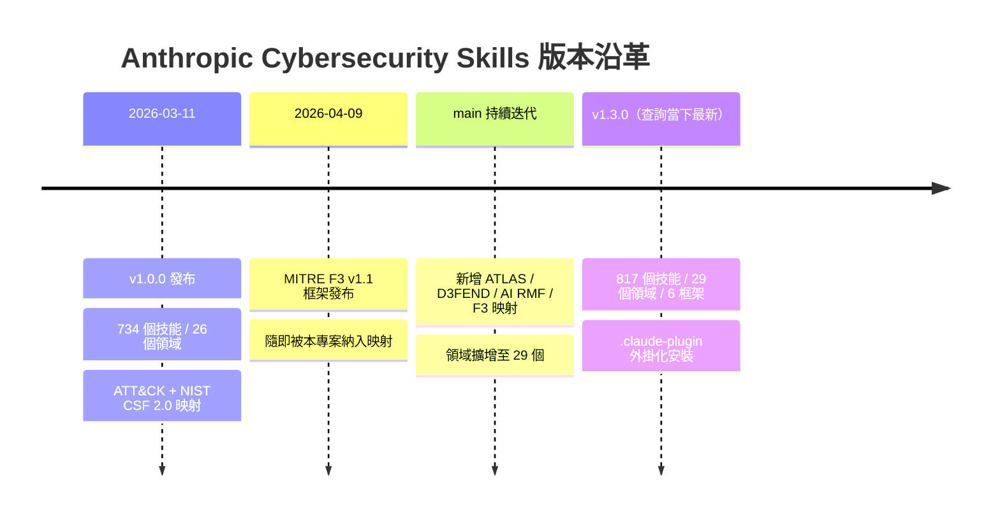

**Roadmap 觀察**（根據 repo 活躍度與最近 commit 訊息推估，非官方正式承諾）：驗證器（validator）持續強化子領域命名規則、`.b64` 等編碼檔案跳過邏輯，顯示專案正朝「品質治理自動化」方向發展；MITRE F3 v1.1 的加入（2026-04-09 剛發布即納入）顯示專案對金融詐欺防制框架的高度重視，適合有意將此技能庫導入金融業 SOC 的團隊持續關注。

> **⚠️ 誠實揭露：內部文件本身也存在版本落差**——這是查證本手冊時發現的真實現象，也是導入本專案時應學到的重要教訓。repo 根目錄的 `ATTACK_COVERAGE.md`（自動產生的 ATT&CK 覆蓋率報告）最後一次重新產生於約 3 個月前，其內容顯示的是**「753+ 個技能、依 ATT&CK Enterprise Matrix v16、14 個 Tactic（未拆分 Stealth／Defense Impairment）、291 個唯一技術」**，明顯落後於 README 首頁當下宣稱的「817 個技能、v19.1、15 個 Tactic、286 個技術」。同樣地，該報告內的「MITRE ATLAS Coverage」標示為 **v5.5.0**（而非 README 的 v5.4），MITRE D3FEND 僅有 **11 個技能**實際掛載映射，NIST AI RMF 則有 **85 個技能**掛載映射——這些都是比 README 摘要更細緻、但更新頻率不同步的第一手數據。
> **實務啟示**：企業導入任何開源知識庫時，不應只看首頁 README 的宣傳數字，務必比對 repo 內多份文件（README、自動產生報告、CHANGELOG／commit 歷史）交叉驗證，並在企業內部文件中明確標註「查證日期」與「查證來源」，避免以單一過時或未同步更新的頁面作為唯一依據。這也是第 18 章「版本升級評審」流程中應納入的檢查項目之一。

> **實務案例**：某銀行資安團隊評估導入本專案作為內部 SOC Copilot 的知識底座，第一步並非直接全量匯入 817 個技能，而是先鎖定「Threat Hunting」「SOC Operations」「Compliance & Governance」「AI Security」四個領域（共約 126 個技能）進行 Pilot，並要求所有攻擊性技能（Red Teaming、Penetration Testing）需經資安主管簽核才開放給 Agent 使用。
> **注意事項**：導入前務必完成法務與合規審查，並在內部教育訓練中明確告知同仁「Authorized & lawful use only」的紅線。

---

## 第 2 章 系統架構與執行流程

### 2.1 整體架構圖

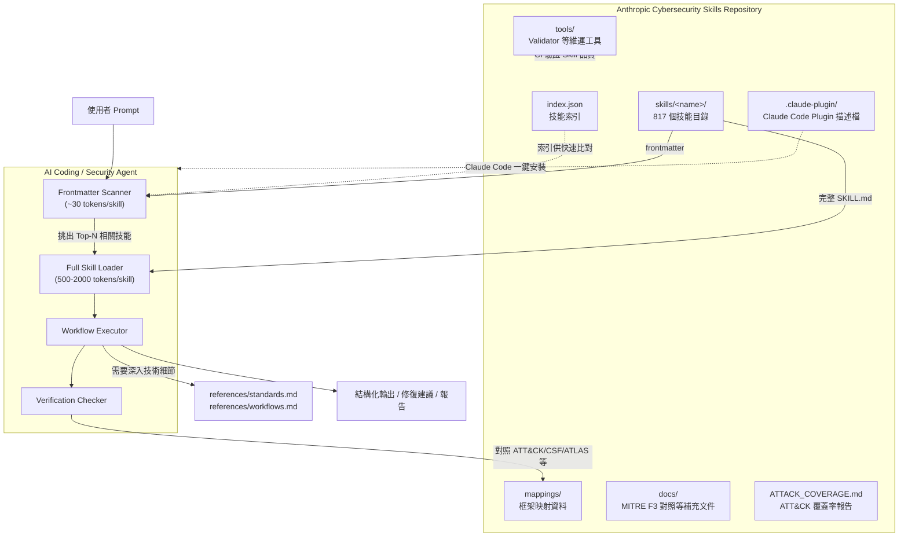

**架構說明**：整個系統可以理解為「靜態知識庫 + Agent 執行引擎」的組合。Repository 本身不含任何執行邏輯，純粹是結構化的 Markdown + YAML 檔案集合；真正的「智慧」發生在 AI Agent 端——Agent 先用低成本的方式掃描全部技能索引，再決定要深入載入哪幾個，最後依 Workflow 逐步執行並自我驗證。

### 2.2 Progressive Disclosure：Token 分層載入機制

這是本專案在效能設計上最關鍵的一環。官方 README 明確給出成本數字：

| 階段 | 內容 | 平均 Token 成本 |
|---|---|---|
| 索引掃描 | 單一技能的 YAML frontmatter | 約 30 tokens |
| 完整載入 | 單一技能的完整 Workflow | 500～2,000 tokens |
| 深度參考（選擇性） | `references/standards.md`／`references/workflows.md` | 依內容量而定，僅在需要時載入 |

因為 frontmatter 掃描成本極低，Agent 可以在**單一輪次內掃描全部 817 個技能**而不會塞爆 Context Window——這正是「Progressive Disclosure（漸進式揭露）」的核心精神：先廣後深，只在真正需要時才付出高成本的深度載入。

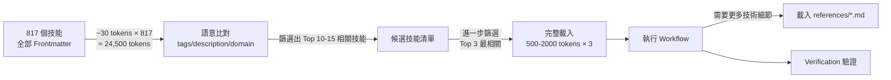

### 2.3 Agent 執行流程（Sequence Diagram）

以官方 README 提供的真實案例「分析記憶體傾印檔案中的憑證竊取跡象」為例：

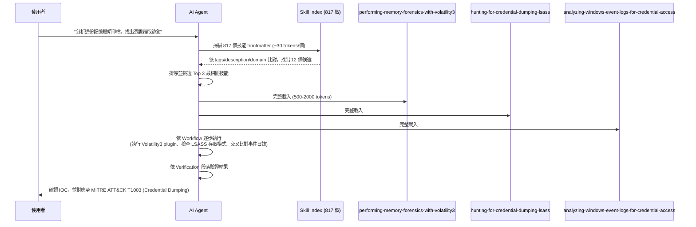

> **實務案例**：某 DFIR 團隊將本流程整合進 Claude Code 的 Sub-agent 架構，由「Triage Agent」先做 Frontmatter 掃描與技能挑選，再交由「Analysis Agent」執行實際的 Volatility3 分析，兩者透過共享的 Session Memory 交換候選技能清單，避免重複掃描浪費 Token。
> **注意事項**：Agent 自動挑選的「Top-N 相關技能」仍可能誤判（尤其技能描述模糊或 tags 重疊時），關鍵資安判斷仍建議保留人工複核關卡（Human-in-the-Loop），不宜全自動化直接產出結論。

---

## 第 3 章 Skills Repository 與 Skill Format

### 3.1 Repository 目錄結構

依官方 repo 實際結構整理如下：

```text
Anthropic-Cybersecurity-Skills/
├── .claude-plugin/          # Claude Code Plugin 描述檔（v1.3.0 起支援一鍵安裝）
├── .github/                 # CI workflow、validator 相關自動化
├── assets/                  # README 用圖片（banner 等）
├── docs/                    # 補充文件，例如 mitre-f3-mapping.md
├── mappings/                # 六大框架映射資料
├── skills/                  # 核心資產：817 個技能目錄
│   └── <skill-name>/
│       ├── SKILL.md
│       ├── references/
│       ├── scripts/
│       └── assets/
├── tools/                   # Validator 等維運腳本
├── ATTACK_COVERAGE.md        # MITRE ATT&CK 覆蓋率報告（14 個 Tactic 統計）
├── CITATION.cff              # 學術引用格式
├── CODE_OF_CONDUCT.md
├── CONTRIBUTING.md
├── index.json                 # 自動更新的技能索引與計數
├── LICENSE                    # Apache-2.0
├── README.md
└── SECURITY.md                # 負責任漏洞通報流程（48 小時初步回應、不可公開開 Issue）
```

### 3.2 Skill Anatomy：單一技能的檔案結構

每個技能遵循一致的目錄結構（以官方範例 `performing-memory-forensics-with-volatility3` 為例）：

```text
skills/performing-memory-forensics-with-volatility3/
├── SKILL.md              # 技能定義（YAML frontmatter + Markdown body）
├── references/
│   ├── standards.md      # MITRE ATT&CK / ATLAS / D3FEND / NIST 映射細節
│   └── workflows.md      # 深度技術程序參考
├── scripts/
│   └── process.py        # 可實際執行的輔助腳本
└── assets/
    └── template.md        # 填好的檢查清單與報告範本
```

這個結構呼應第 2 章的 Progressive Disclosure 原則：`SKILL.md` 本體保持精簡（500～2000 tokens），深度技術內容則下放到 `references/`，只有在 Agent 真的需要更多細節時才會去讀取，避免預設就把所有背景資料塞進 Context。

從資料模型角度，可以用 ER Diagram 表示 Skill 與領域、框架、技術之間的關係：

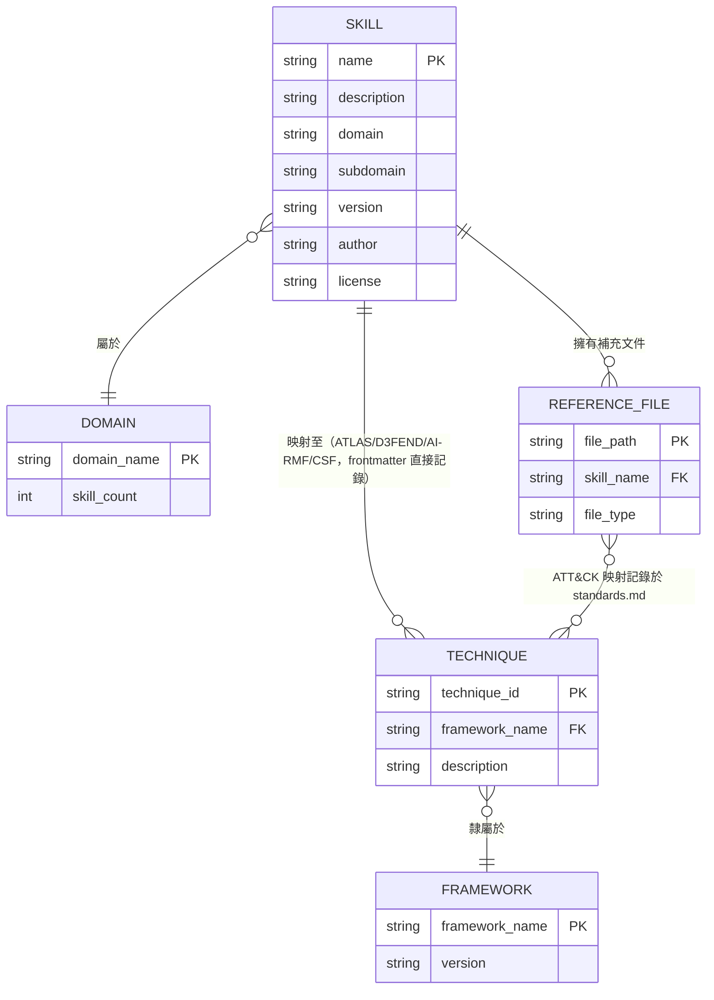

### 3.3 YAML Frontmatter 完整規格

以官方 README 提供的真實範例：

```yaml
---
name: performing-memory-forensics-with-volatility3
description: >-
  Analyze memory dumps to extract running processes, network connections,
  injected code, and malware artifacts using the Volatility3 framework.
domain: cybersecurity
subdomain: digital-forensics
tags: [forensics, memory-analysis, volatility3, incident-response, dfir]
atlas_techniques: [AML.T0047]
d3fend_techniques: [D3-MA, D3-PSMD]
nist_ai_rmf: [MEASURE-2.6]
nist_csf: [DE.CM-01, RS.AN-03]
version: "1.2"
author: mukul975
license: Apache-2.0
---
```

| 欄位 | 說明 | 命名規則 |
|---|---|---|
| `name` | Skill 唯一識別碼 | kebab-case，1～64 字元 |
| `description` | 供 Agent 語意比對用的關鍵字豐富描述 | 建議包含觸發情境的核心動詞與名詞 |
| `domain` / `subdomain` | 領域／子領域分類 | 對應第 7 章的 29 個領域 |
| `tags` | 搜尋標籤 | 陣列，供 frontmatter 掃描比對 |
| `atlas_techniques` | MITRE ATLAS 技術 ID | 例如 `AML.T0047` |
| `d3fend_techniques` | MITRE D3FEND 技術 ID | 例如 `D3-MA`（Memory Analysis）、`D3-PSMD` |
| `nist_ai_rmf` | NIST AI RMF 子類別 | 例如 `MEASURE-2.6` |
| `nist_csf` | NIST CSF 2.0 類別 | 例如 `DE.CM-01`（偵測／持續監控）、`RS.AN-03`（應變／分析） |
| `version` | Skill 版本號 | Semantic-like 字串 |
| `author` / `license` | 貢獻者與授權 | 專案整體採 Apache-2.0 |

> **重要細節**：MITRE ATT&CK 的技術映射**並未直接放在 frontmatter**，而是記錄在該技能的 `references/standards.md` 檔案中，並隨每次 Release 附上完整的 ATT&CK Navigator layer（JSON 格式，可直接匯入官方 ATT&CK Navigator 工具視覺化）。這是與 ATLAS／D3FEND／AI RMF／CSF（直接寫在 frontmatter）不同的設計，撰寫自訂技能或做工具整合時務必注意這個差異。

### 3.4 Markdown Body：官方建議的完整段落結構

> **本節已依官方 `CONTRIBUTING.md` 核實修正**：先前版本僅依 README 首頁展示的單一範例（`performing-memory-forensics-with-volatility3`）歸納出「四段式結構」，但官方貢獻指南實際定義的建議段落更完整。以下同時呈現「官方建議的完整範本」與「已上線技能常見的精簡版本」，兩者並不衝突——精簡版是完整範本的**必要子集**。

**`CONTRIBUTING.md` 定義的完整建議結構**：

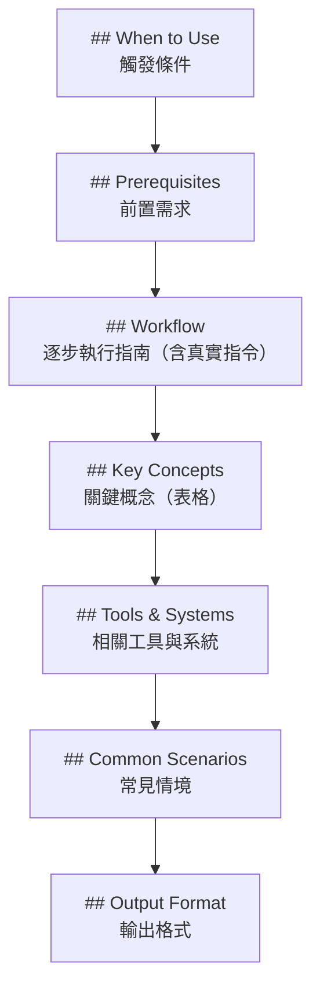

| 段落 | 目的 | 撰寫重點 |
|---|---|---|
| When to Use | 讓 Agent 判斷「現在該不該用這個技能」 | 具體描述觸發情境，避免過度抽象 |
| Prerequisites | 避免 Agent 在缺乏權限／工具的情況下貿然執行 | 列出所需工具版本、存取層級、環境變數 |
| Workflow | 核心的逐步操作指南（官方要求「編號步驟＋真實指令」） | 包含實際可執行的指令與關鍵決策分歧點 |
| Key Concepts | 以表格整理該技能涉及的關鍵術語／概念 | 方便 Agent 快速比對專有名詞 |
| Tools & Systems | 列出會用到的工具、平台、系統 | 例如 Volatility3、Sigma、Splunk 等 |
| Common Scenarios | 列舉常見的實際應用情境 | 幫助 Agent 判斷細部觸發條件 |
| Output Format | 定義該技能應產出的結構化輸出格式 | 確保多個技能鏈接時輸出格式一致 |

> 部分已上線的技能（例如第 2.3 節範例 `performing-memory-forensics-with-volatility3`）採用的是更精簡的四段式版本（When to Use／Prerequisites／Workflow／**Verification**）——`Verification`（如何確認技能已正確執行）雖未列在 `CONTRIBUTING.md` 的建議清單中，但在鑑識／應變類技能中頗為常見，可視為社群在官方範本基礎上依領域需求自行擴充的慣例欄位。

> **實務案例**：某企業在導入時要求所有自訂技能（企業內部補充的 Skill）必須通過 CI 驗證，核對是否至少包含 When to Use／Prerequisites／Workflow 三個必要段落，並鼓勵（但不強制）撰寫者依技能性質補上 Key Concepts、Common Scenarios、Output Format 或 Verification。
> **注意事項**：Body 段落結構是「撰寫慣例」而非強制 Schema 驗證（agentskills.io 官方驗證器與本專案 `tools/` 內的 validator 主要檢查 frontmatter 完整性與命名規則），企業若要百分之百強制 Body 結構，需自行撰寫額外的 Markdown 結構檢查規則。

---

## 第 4 章 agentskills.io 開放標準規格

### 4.1 為何需要開放標準

在 AI Coding Agent 生態系快速擴張的 2025～2026 年間，Claude Skills、GitHub Copilot Agent Skills、Gemini Extensions 等「可安裝、可分享」的技能封裝機制各自演進，容易形成各家平台互不相容的技能格式。`agentskills.io` 試圖扮演類似「OpenAPI 之於 REST API」的角色——提供一套與特定廠商無關（vendor-neutral）的 Skill 封裝標準，讓同一份技能可以「一次撰寫，到處執行」。

Anthropic Cybersecurity Skills 選擇完全遵循此標準的關鍵理由：

- **跨平台相容性**：同一組 817 個技能可以在 Claude Code、GitHub Copilot、Cursor、Gemini CLI、Codex CLI 乃至任何 MCP 相容 Agent 上直接使用，無需為每個平台重寫
- **生態系網路效應**：agentskills.io 逐漸成為多個獨立 Skill 專案（例如 mattpocock/skills、addyosmani/agent-skills）共同遵循的規範，形成可互通的技能市集雛型
- **降低廠商鎖定風險**：企業自建技能時，若遵循開放標準撰寫，未來更換 AI Coding Agent 供應商時可大幅降低轉換成本

### 4.2 Schema 與版本相容性

agentskills.io 標準的核心約束對應到本專案的實作即為第 3.3 節的 YAML frontmatter 欄位規範與第 3.4 節的 Markdown Body 段落結構慣例。企業在評估是否遵循此標準撰寫「自訂技能」時，建議檢核以下相容性重點：

| 相容性檢核項 | 說明 |
|---|---|
| Frontmatter 必要欄位 | `name`、`description` 為最低要求，其餘欄位依需求擴充 |
| 命名規則 | kebab-case、長度限制（1～64 字元），避免特殊符號 |
| 版本標示 | 建議每個技能都附上 `version` 欄位，方便追蹤變更與相容性 |
| Reference 檔案慣例 | `references/` 目錄放深度技術文件，`scripts/` 放輔助腳本，`assets/` 放範本/模板 |
| License 標示 | 每個技能／整體 repo 應明確標示授權條款 |

### 4.3 撰寫 Skill 的最佳實務

若企業要依此標準撰寫內部補充技能（例如公司特有的 Incident Response SOP），建議遵循：

1. **Process over Knowledge**：技能本體要寫「怎麼做」的流程，而不是單純的知識性描述，讓 Agent 有明確的行動指引
2. **Specific over General**：觸發條件（When to Use）與驗證方法（Verification／Output Format）務必具體，避免模糊的「視情況判斷」
3. **一個技能只做一件事**：避免把多個不相關的資安工作流程塞進同一個技能檔案，降低 Agent 誤判與 Context 浪費
4. **附上可執行的範例指令**：Workflow 段落盡量給出真實可執行的 CLI 指令或程式碼片段，而非抽象敘述
5. **框架映射盡量填寫**：即使只填 `nist_csf` 一項，也比完全不填更有助於未來的合規報告自動化

**官方 `CONTRIBUTING.md` 定義的 24 種標準 Subdomain**（撰寫技能時應從中挑選最貼切者）：

| 分類 | Subdomain 列舉值 |
|---|---|
| 攻防與滲透 | `web-application-security`、`network-security`、`penetration-testing`、`red-teaming` |
| 鑑識與分析 | `digital-forensics`、`malware-analysis`、`threat-intelligence`、`threat-hunting` |
| 基礎設施安全 | `cloud-security`、`container-security`、`identity-access-management`、`cryptography`、`zero-trust-architecture`、`ot-ics-security` |
| 治理與維運 | `vulnerability-management`、`compliance-governance`、`devsecops`、`soc-operations`、`incident-response` |
| 應用與端點 | `api-security`、`mobile-security`、`endpoint-security` |
| 專項防禦 | `phishing-defense`、`ransomware-defense` |

> **落差誠實揭露**：`CONTRIBUTING.md` 目前列舉的 24 個 subdomain，與第 7 章 README 所述的「29 個 security domains」（例如 `Supply Chain Security`、`Deception Technology`、`Hardware & Firmware Security`、`AI Security`）**並非完全一致**——後面幾個較新加入的領域尚未反映在貢獻指南的 subdomain 列舉中。這代表社群文件之間存在更新時間差，企業若要新增自訂技能，建議優先參考 `skills/` 目錄下實際已存在的 `subdomain` 值，而非僅依賴 `CONTRIBUTING.md` 的靜態列表。

> **實務案例**：某保險公司在導入本技能庫的同時，另外建立了一個內部 `insurance-fraud-skills/` 子倉庫，完全遵循 agentskills.io 格式撰寫，用來補充本專案未涵蓋的「保單詐欺樣態」相關技能，並透過 Git Submodule 方式與主倉庫並存，方便未來若上游有更新時可獨立更新。
> **注意事項**：agentskills.io 目前仍在演進中，尚未有如 OpenAPI 3.x 般的正式版本鎖定機制，企業自建技能時建議記錄撰寫當下所依循的規範版本快照，避免未來規範變動造成相容性問題。

---

## 第 5 章 六大安全框架整合

### 5.1 六大框架總覽表

這是本專案最核心的差異化價值——**目前沒有其他開源技能庫能將每個技能對齊全部六大主流安全與合規框架**。官方 README 提供的總覽：

| 框架 | 版本 | 涵蓋範圍 | 用途 |
|---|---|---|---|
| MITRE ATT&CK | v19.1 | 15 個 Enterprise Tactics、286 個 Techniques（754/754 個相關技能已映射） | 對手行為與 TTP（戰術、技術、程序） |
| NIST CSF 2.0 | 2.0 | 6 個 Function、22 個 Category | 組織整體資安態勢 |
| MITRE ATLAS | v5.4 | 16 個 Tactics、84 個 Techniques | AI／ML 系統對抗性威脅 |
| MITRE D3FEND | v1.3 | 7 個 Category、267 個 Techniques | 防禦性反制技術 |
| NIST AI RMF | 1.0 | 4 個 Function、72 個 Subcategory | AI 風險管理 |
| MITRE F3（Fight Fraud Framework） | v1.1（2026-04-09 發布） | 8 個 Tactics、123 個 Techniques、94 個詐欺相關技能 | 網路型金融詐欺 TTP |

> 一個技能同時對齊六個框架的實例（官方 README 範例）：

| Skill | ATT&CK | CSF 2.0 | ATLAS | D3FEND | AI RMF | F3 |
|---|---|---|---|---|---|---|
| `analyzing-network-traffic-of-malware` | T1071 | DE.CM | AML.T0047 | D3-NTA | MEASURE-2.6 | — |
| `detecting-business-email-compromise` | T1566 | DE.AE | — | — | — | F1005.006（monetization） |

六大框架彼此的定位關係，可用 Mindmap 呈現：

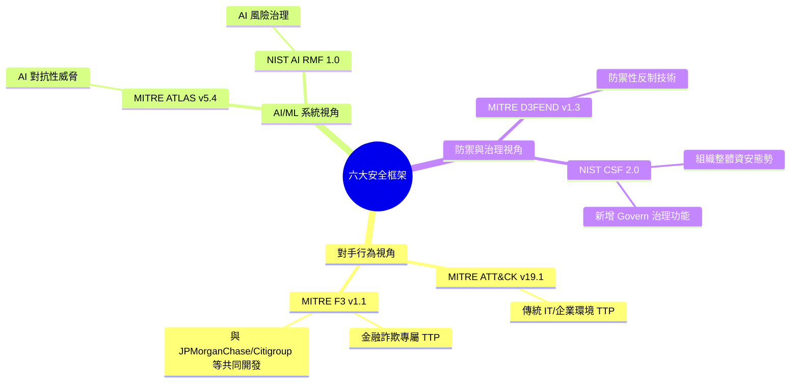

### 5.2 MITRE ATT&CK v19.1 對照

全部 754 個相關技能已使用官方 `mitreattack-python` 函式庫驗證映射，涵蓋 15 個 Enterprise Tactic（外加 ICS 與 Mobile 技術），且**零過期或已撤回的技術 ID**。v19.1 版本的一項重大結構調整——原本的 Defense Evasion 被拆分為 **Stealth** 與 **Defense Impairment** 兩個獨立 Tactic——本專案已同步反映：

| Tactic | ID | 對應技能數 |
|---|---|---|
| Reconnaissance | TA0043 | 103 |
| Resource Development | TA0042 | 22 |
| Initial Access | TA0001 | 467 |
| Execution | TA0002 | 350 |
| Persistence | TA0003 | 444 |
| Privilege Escalation | TA0004 | 464 |
| Stealth（原 Defense Evasion 拆分） | TA0005 | 442 |
| Defense Impairment（原 Defense Evasion 拆分） | TA0112 | 92 |
| Credential Access | TA0006 | 202 |
| Discovery | TA0007 | 237 |
| Lateral Movement | TA0008 | 68 |
| Collection | TA0009 | 172 |
| Command and Control | TA0011 | 123 |
| Exfiltration | TA0010 | 82 |
| Impact | TA0040 | 50 |

> 注意：上表為「技能與 Tactic 的對應數」，同一個技能可能同時對應多個 Tactic，因此加總會超過 817 個技能總數，這屬於正常現象。

> **⚠️ 版本落差誠實揭露**：本手冊上述數字取自 README 首頁當下宣稱的「v19.1、15 個 Tactic（包含 Stealth／Defense Impairment 拆分）》286 個 Technique」。但 repo 內自動產生的 `ATTACK_COVERAGE.md`（最後重新產生於約 3 個月前）實際使用的是 **ATT&CK Enterprise Matrix v16〔14 個 Tactic**（尚未拆分 Defense Evasion），共涵蓋 **291 個唯一技術（149 個父技術）**，基準也是 **753+ 個技能** 而非 817 個。兩文件之間的落差反映了自動產生報告的更新頻率慢於 README 本身，企業引用具體數字前務必以官方 repo 當下狀態重新確認。

### 5.3 NIST CSF 2.0 對照

NIST CSF 2.0 是 2024 年發布的新版網路安全框架，相較 1.1 版新增了 **Govern（治理）** Function，本專案的映射對齊全部 **6 個 Function、22 個 Category**：

| Function | 說明 |
|---|---|
| Govern (GV) | 治理與風險策略（CSF 2.0 新增） |
| Identify (ID) | 資產與風險識別 |
| Protect (PR) | 防護控制措施 |
| Detect (DE) | 偵測異常與事件 |
| Respond (RS) | 事件應變 |
| Recover (RC) | 復原與韌性 |

技能的 `nist_csf` frontmatter 欄位通常填入更細的 Category 層級（例如 `DE.CM-01`、`RS.AN-03`），方便企業做合規報告時直接對照現行的 CSF 2.0 自評表。

### 5.4 MITRE ATLAS v5.4（AI/ML 威脅）

ATLAS（Adversarial Threat Landscape for Artificial-Intelligence Systems）是 MITRE 針對 AI/ML 系統設計的對抗性威脅框架，README 宣稱對齊 v5.4 版，涵蓋 **16 個 Tactics、84 個 Techniques**（repo 內 `ATTACK_COVERAGE.md` 則標示為 **v5.5.0**，兩者可能反映不同時間點的版本狀態，引用前建議以官方 repo 當下版本為準）。發進 ATLAS 映射的技能數為 **81 個**（依 `ATTACK_COVERAGE.md` 統計），主要對應到「AI Security」領域的技能（例如 LLM 紅隊測試、Prompt Injection 偵測、MCP／Agentic 安全），技術 ID 格式為 `AML.TXXXX`。

repo 實際套用的關鍵 ATLAS 技術範例（依 `ATTACK_COVERAGE.md`）：

| 技術 ID | 名稱 | 所屬 ATT&CK-style Tactic |
|---|---|---|
| `AML.T0051` | LLM Prompt Injection | Execution |
| `AML.T0054` | LLM Jailbreak | Privilege Escalation |
| `AML.T0088` | Generate Deepfakes | AI Attack Staging |
| `AML.T0010` | AI Supply Chain Compromise | Initial Access |
| `AML.T0020` | Poison Training Data | Resource Development |
| `AML.T0070` | RAG Poisoning | Persistence |
| `AML.T0080` | AI Agent Context Poisoning | Persistence |
| `AML.T0056` | Extract LLM System Prompt | Exfiltration |

### 5.5 MITRE D3FEND v1.3（防禦技術）

D3FEND 是 ATT&CK 的「防禦鏡像」——ATT&CK 描述攻擊者怎麼做，D3FEND 描述防禦者可以用哪些反制技術。README 宣稱對齊 v1.3 版，涵蓋 **7 個 Category、267 個 Techniques**（框架本身的完整規模），但**實際只有 11 個技能**掛載 `d3fend_techniques` 映射（依 `ATTACK_COVERAGE.md` 統計）——這是六大框架中目前實際覆蓋度最低的一項，企業若想依賴 D3FEND 建立完整的防禦知識庫，仍需自行補強。根據 `ATTACK_COVERAGE.md` 的「如何生成」說明，每個技能的 `d3fend_techniques` 欄位實際上是**依該技能的 ATT&CK 技術標籤自動推導出最相關的前 5 項防禦反制措施**，而非人工逐項精選，使用時需視為自動化推薦而非人工鑑定。技術 ID 格式為 `D3-XXX`（例如前述範例的 `D3-NTA` 網路流量分析、`D3-MA` 記憶體分析、`D3-PSMD`）。

### 5.6 NIST AI RMF 1.0

NIST AI Risk Management Framework 1.0（正式編號 AI 100-1）涵蓋 **4 個 Function（Govern／Map／Measure／Manage）、72 個 Subcategory**，主要用於管理 AI 系統本身的風險（而非傳統 IT 系統）。依 `ATTACK_COVERAGE.md` 統計，共有 **85 個技能**掛載 `nist_ai_rmf` 映射，實際套用的 Subcategory 涵蓋：

| Function | 實際套用的 Subcategory | 說明 |
|---|---|---|
| GOVERN | `GOVERN-1.1`、`GOVERN-6.1`、`GOVERN-6.2` | 組織對 AI 風險的問責制度（GOVERN-6.1/6.2 需依賴負責任部署政策） |
| MAP | `MAP-5.1`、`MAP-5.2`、`MAP-1.6` | AI 風險識別與情境化 |
| MEASURE | `MEASURE-2.5`、`MEASURE-2.7`、`MEASURE-2.8`、`MEASURE-2.11` | AI 風險分析與評估 |
| MANAGE | `MANAGE-2.4`、`MANAGE-3.1` | AI 風險回應與復原 |

### 5.7 MITRE F3（Fight Fraud Framework）v1.1

這是六大框架中**最新加入、也最具差異化價值**的一項。MITRE F3 由 MITRE 的 Center for Threat-Informed Defense（CTID）於 **2026-04-09** 發布 v1.1 版本，與多家全球性金融機構共同開發，包括 **JPMorganChase、Citigroup、Lloyds Banking Group、Standard Chartered**，以及資安廠商 **CrowdStrike、Verizon Business、FS-ISAC** 等。

F3 的定位是「ATT&CK 相容的網路型金融詐欺 TTP 目錄」。依官方映射說明文件（`docs/mitre-f3-mapping.md`），ATT&CK 原本將「入侵後造成的財務損失」全部壓縮成單一技術 `T1657`（Financial Theft），F3 則將這個過程拆解成更細緻的階段——`mitre_attack` 回答「對手怎麼入侵、技術上如何操作」，`mitre_f3` 回答「這如何變成錢」，兩者在 frontmatter 中保持獨立區塊，因為 F3 重新定義了數個 ATT&CK Tactic 在詐欺情境下的意義。

> **重要修正**：F3 v1.1 並非只有「Positioning／Monetization」兩個 Tactic，而是共 **8 個 Tactic**——其中 6 個是「沿用 ATT&CK 既有 Tactic，但在詐欺情境下重新定義」，只有 2 個是「F3 全新專屬」：

| Tactic | ID | 來源 |
|---|---|---|
| reconnaissance | TA0043 | ATT&CK（重新定義） |
| resource-development | TA0042 | ATT&CK（重新定義） |
| initial-access | TA0001 | ATT&CK（重新定義） |
| stealth | TA0005 | ATT&CK（重新定義） |
| **positioning** | **FA0001** | **F3 全新（取得存取後收集／操縱資料以準備詐欺：合成身分佈建、帳戶預熱、受益人設定、SIM 卡交換預佈局、銀行 Session 劫持）** |
| execution | TA0002 | ATT&CK（重新定義） |
| **monetization** | **FA0002** | **F3 全新（將竊取的資產轉換為可用資金：人頭帳戶洗錢層、APP 詐欺、加密貨幣出金、信用卡套現、退款／拒付濫用）** |
| defense-impairment | TA0112 | ATT&CK（重新定義） |

技術 ID 命名規則：`F1XXX` 為 F3 新引入的詐欺專屬技術（例如 `F1005.003` Account Manipulation: Add Beneficiary、`F1025.003` Electronic Funds Transfer: Wire Transfer、`F1018` Convert to Cryptocurrency）；`T1XXX` 為直接沿用於 F3 目錄內的 ATT&CK 技術（例如 `T1566` Phishing、`T1586` Compromise Accounts、`T1557` Adversary-in-the-Middle）。每一個 ID 都是 F3 v1.1 STIX Bundle 內的真實活躍技術，不存在 `TBD` 佔位符。

**F3 Frontmatter Schema**（`mitre_f3` 區塊與 `mitre_attack` 區塊並存）：

```yaml
mitre_f3:
  version: '1.1'
  tactics:
    - positioning
    - monetization
  techniques:
    - id: F1005.003
      name: 'Account Manipulation: Add Beneficiary'
      tactic: positioning
      source: f3          # F 開頭 = F3 專屬
    - id: T1586
      name: Compromise Accounts
      tactic: resource-development
      source: attack      # T 開頭 = 沿用 ATT&CK
```

撰寫規則：`id` 必須為真實的 F3 v1.1 技術 ID；`name` 必須與 F3 目錄中的官方名稱一致；`tactic` 必須是該技術實際列於目錄中的 Tactic；`source` 為 `f3`（F1XXX ID）或 `attack`（T1XXX ID）。

**適用範圍**：F3 映射僅套用於詐欺相關技能——釣魚／社交工程、帳戶接管、銀行惡意軟體／竊取工具、BEC、身分／KYC、支付／卡片詐欺、人頭帳戶／套現、勒索軟體勒索，以及跨切的 DFIR 與威脅情資相關技能；沒有詐欺面向的技能不會掛載 `mitre_f3` 區塊。此外，本專案共有 **94 個技能**標註了與詐欺相關的 F3 映射，全部 123 個 F3 v1.1 技術 ID 皆已對照上游官方 STIX Bundle（`center-for-threat-informed-defense/fight-fraud-framework`）驗證過。

### 5.8 跨框架映射實例與 Workflow 建立法

企業如何運用這套六框架映射建立自己的合規 Workflow？建議流程：

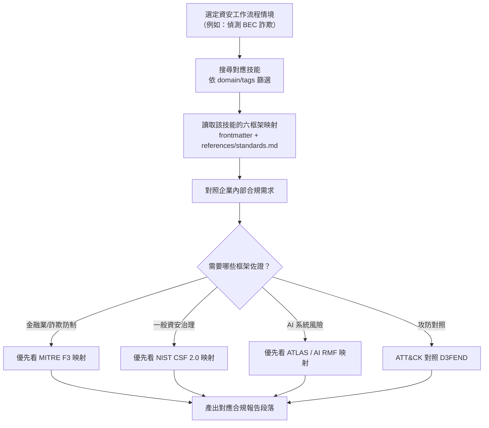

> **實務案例**：某證券商將 F3 的 Positioning／Monetization 兩個 Tactic 對應到內部的「洗錢防制（AML）監控儀表板」欄位，讓 SOC 分析師發現可疑交易時，AI Agent 能直接引用對應技能，產出附帶 F3 技術 ID 的初步分析報告，供法遵部門後續佐證使用。
> **注意事項**：F3 框架屬於 2026 年新發布內容，業界對其技術 ID 的實務對應與判例仍在累積中，企業在正式對外（監理機關）引用前，建議先由法遵與資安團隊共同覆核映射的正確性，避免直接照搬 AI 產出結論。

---

## 第 6 章 安裝與平台整合

### 6.1 Quick Start：npx／git clone

官方提供兩種最簡安裝方式：

```bash
# 方式一：npx（建議）
npx skills add mukul975/Anthropic-Cybersecurity-Skills
```

```bash
# 方式二：Git Clone
git clone https://github.com/mukul975/Anthropic-Cybersecurity-Skills.git
cd Anthropic-Cybersecurity-Skills
```

Clone 完成後即可直接搭配 Claude Code、GitHub Copilot、OpenAI Codex CLI、Cursor、Gemini CLI，或任何相容 `agentskills.io` 標準的平台使用，無需額外編譯或建置步驟——這也是純 Markdown + YAML 資產型技能庫的優勢：安裝即等於「檔案就緒」。

### 6.2 Windows／Linux／macOS／WSL 安裝

由於本專案本質上是純文字資產（Markdown + YAML + 少量 Python／PowerShell 輔助腳本，語言比例 Python 99.6%／PowerShell 0.4%），跨平台安裝流程差異極小：

**Windows（PowerShell）**：

```powershell
# 需求：Git、Node.js（若使用 npx 安裝方式）
git clone https://github.com/mukul975/Anthropic-Cybersecurity-Skills.git
Set-Location Anthropic-Cybersecurity-Skills
```

**Linux／macOS（Bash）**：

```bash
git clone https://github.com/mukul975/Anthropic-Cybersecurity-Skills.git
cd Anthropic-Cybersecurity-Skills
```

**WSL2**：與 Linux 流程完全一致，建議將 repo 存放在 WSL 檔案系統內（例如 `~/skills/`）而非 Windows 掛載路徑（`/mnt/c/...`），以避免 Claude Code／Copilot 在 WSL 中讀取跨檔案系統路徑時的效能損耗。

### 6.3 Docker／Dev Container／GitHub Codespaces

由於 repo 本身不含需要編譯執行的服務程式，Docker／Dev Container 化的價值主要在於「標準化 Agent 執行環境」（而非技能庫本身），常見做法：

```dockerfile
# Dockerfile 範例：企業標準 AI Agent 開發容器，內建技能庫
FROM node:22-slim

RUN apt-get update && apt-get install -y git python3 python3-pip \
    && rm -rf /var/lib/apt/lists/*

WORKDIR /workspace
RUN git clone --depth 1 https://github.com/mukul975/Anthropic-Cybersecurity-Skills.git skills

# 安裝企業內部 Agent CLI（示意）
COPY entrypoint.sh /usr/local/bin/entrypoint.sh
RUN chmod +x /usr/local/bin/entrypoint.sh

ENTRYPOINT ["/usr/local/bin/entrypoint.sh"]
```

**Dev Container**（`.devcontainer/devcontainer.json` 示意）：

```json
{
  "name": "cybersecurity-skills-dev",
  "image": "mcr.microsoft.com/devcontainers/base:ubuntu",
  "postCreateCommand": "git clone --depth 1 https://github.com/mukul975/Anthropic-Cybersecurity-Skills.git /workspaces/skills",
  "customizations": {
    "vscode": {
      "extensions": ["GitHub.copilot", "GitHub.copilot-chat"]
    }
  }
}
```

**GitHub Codespaces**：直接搭配上述 Dev Container 設定即可在 Codespaces 中一鍵取得含技能庫的開發環境，適合資安訓練營（Workshop）或新人 Onboarding 情境快速提供一致環境。

### 6.4 相容平台總表（26+ AI 工具）

依官方 README「Compatible platforms」段落整理：

| 分類 | 平台 |
|---|---|
| AI Code Assistant（IDE 內嵌） | Claude Code（Anthropic）、GitHub Copilot（Microsoft）、Cursor、Windsurf、Cline、Aider、Continue、Roo Code、Amazon Q Developer、Tabnine、Sourcegraph Cody、JetBrains AI |
| CLI Agent | OpenAI Codex CLI、Gemini CLI（Google） |
| 自主型 Agent | Devin、Replit Agent、SWE-agent、OpenHands |
| Agent Framework／SDK | LangChain、CrewAI、AutoGen、Semantic Kernel、Haystack、Vercel AI SDK、任何 MCP 相容 Agent |

> 官方定位：「所有支援 agentskills.io 標準的平台皆可零設定載入這些技能」（All platforms that support the agentskills.io standard can load these skills with zero configuration）。

> **實務案例**：某企業同時使用 Claude Code（架構分析）與 GitHub Copilot（日常 Coding）兩套 AI 工具，透過將本技能庫以 Git Submodule 方式掛載到共用的 `.github/skills/` 目錄，兩邊 Agent 都能存取同一份最新版本，避免各自手動同步造成版本落差。
> **注意事項**：`.claude-plugin/` 目錄是 v1.3.0 起新增的 Claude Code Plugin Marketplace 描述檔，若使用其他平台（例如 Copilot），需自行確認該平台的技能載入機制（例如 Copilot 的 `.github/copilot-instructions.md` 或 Agent Skills 設定）是否需要額外的路徑對應設定。

---

## 第 7 章 29 個資安領域技能總覽

### 7.1 領域分佈總表

依官方 README「What's inside — 29 security domains」段落整理（依技能數由高到低排序）：

| 領域 | 技能數 | 涵蓋重點 |
|---|---|---|
| Cloud Security | 66 | AWS／Azure／GCP 硬化、CSPM、雲端攻擊模擬、雲端鑑識 |
| Threat Hunting | 58 | 假設驅動獵捕、LOTL 偵測、EVTX 獵捕、艦隊級獵捕 |
| Threat Intelligence | 52 | STIX/TAXII、MISP、OpenCTI、情資源整合、行為者側寫 |
| Network Security | 43 | IDS/IPS、防火牆規則、VLAN 分段、流量分析 |
| Web Application Security | 42 | OWASP Top 10、SQLi、XSS、SSRF、反序列化 |
| Digital Forensics | 41 | 磁碟映像、記憶體鑑識、Hayabusa／KAPE／Plaso 時間軸 |
| Malware Analysis | 39 | 靜態／動態分析、逆向工程、沙箱 |
| Identity & Access Management | 37 | Entra ID／ROADtools、裝置代碼釣魚、PAM、零信任身分 |
| SOC Operations | 35 | Playbook、升級流程、Graph-log 偵測、桌上演練 |
| Red Teaming | 33 | ADCS／Certipy、BloodHound CE、Sliver／Havoc C2、NTLM Relay |
| Container Security | 33 | K8s RBAC、映像掃描、Falco、容器逃逸 |
| Security Operations | 28 | SIEM 關聯、日誌分析、警報分診 |
| OT/ICS Security | 28 | Modbus、DNP3、IEC 62443、歷史站防護、SCADA |
| API Security | 28 | GraphQL、REST、OWASP API Top 10、WAF 繞過 |
| Incident Response | 26 | 入侵圍堵、勒索軟體應變、IR Playbook |
| Vulnerability Management | 25 | Nessus、掃描工作流程、修補優先順序、CVSS |
| Penetration Testing | 21 | 網路／Web／雲端／行動、NetExec 橫向移動 |
| DevSecOps | 18 | CI/CD 安全、Trivy IaC/映像掃描、程式碼簽署 |
| Zero Trust Architecture | 17 | BeyondCorp、CISA 成熟度模型、微分段 |
| Endpoint Security | 17 | EDR、LOTL 偵測、無檔案惡意程式、持久化獵捕 |
| Cryptography | 16 | TLS、Ed25519、後量子遷移、金鑰管理 |
| Phishing Defense | 15 | 郵件驗證、BEC 偵測、釣魚事件應變 |
| AI Security | 14 | LLM 紅隊測試（garak／PyRIT）、Prompt Injection、MCP／Agentic 安全、Guardrail |
| Mobile Security | 13 | Android／iOS 分析、行動滲透測試、MDM 鑑識 |
| Ransomware Defense | 13 | 前兆偵測、應變、復原、加密分析 |
| Compliance & Governance | 9 | NIST 800-30／RMF、CMMC、HIPAA、TPRM、CIS Benchmark |
| Supply Chain Security | 8 | SBOM、依賴混淆、惡意套件分診、SLSA／Sigstore |
| Deception Technology | 6 | 蜜罐令牌、Canarytoken、入侵偵測 |
| Hardware & Firmware Security | 4 | CHIPSEC／UEFI 稽核、Secure Boot 繞過、TPM Attestation、Bootkit 獵捕 |

> 總計 29 個領域、817 個技能（各領域技能數加總會因技能可能跨領域標記而略有出入）。

前 10 大領域的技能數量分佈（占總數比重）：

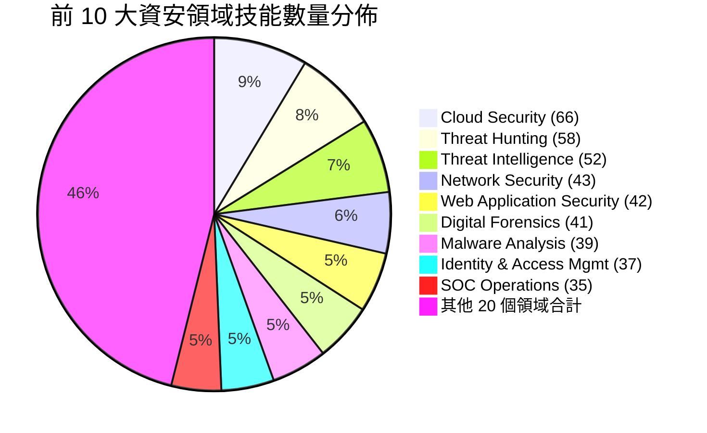

### 7.2 高優先領域深入介紹

以下針對企業導入時最常優先評估的四個領域深入說明：

**Cloud Security（66 個技能，占比最高）**：涵蓋三大公有雲（AWS／Azure／GCP）的組態硬化檢查、CSPM（Cloud Security Posture Management）掃描工作流程、雲端環境的攻擊模擬（例如 IAM 權限提升路徑分析）以及雲端鑑識（例如 CloudTrail／Activity Log 分析）。這是規模最大的領域，反映多雲環境已是現代企業資安的主戰場。

**Threat Hunting（58 個技能）**：以「假設驅動（Hypothesis-driven）」為核心方法論，涵蓋 Living-off-the-Land（LOTL）偵測、Windows Event Log（EVTX）獵捕，以及跨大量端點（Fleet-level）的規模化獵捕流程。

**AI Security（14 個技能）**：雖然數量相對少，但屬於本專案六框架整合（ATLAS／D3FEND／AI RMF）最密集對應的領域，涵蓋 LLM 紅隊測試工具（garak、PyRIT）、Prompt Injection 偵測與防護、MCP／Agentic AI 系統的安全考量，以及 Guardrail 設計。這個領域對於「AI Coding Agent 開發企業自身的 AI 產品」的團隊格外重要（詳見第 8 章）。

**Compliance & Governance（9 個技能）**：涵蓋 NIST 800-30／RMF、CMMC、HIPAA、TPRM（第三方風險管理）、CIS Benchmark 等主流合規框架的檢核工作流程，是企業將本技能庫接軌既有 GRC（治理、風險、合規）流程的切入點。

> **實務案例**：某跨國企業依「業務單位需求」分批導入：雲端維運團隊優先啟用 Cloud Security（66 個）；產品安全團隊優先啟用 Web Application Security（42 個）與 API Security（28 個）；AI 產品團隊優先啟用 AI Security（14 個）；法遵團隊優先啟用 Compliance & Governance（9 個）。分批導入讓教育訓練與權限審批壓力可以逐步消化，而非一次性開放全部 29 個領域。
> **注意事項**：Red Teaming（33 個）、Penetration Testing（21 個）等攻擊性領域建議獨立於一般開發團隊之外，僅開放給經授權的紅隊／滲透測試專責人員使用，並搭配第 11、17 章的治理機制。

---

## 第 8 章 Web Application 安全開發應用

> **企業實務延伸**：本章內容為顧問觀點下「如何將本技能庫套用於企業 Web 開發流程」的建議做法，非官方針對特定框架的功能宣稱。

### 8.1 後端框架對應（Spring Boot／FastAPI／Node.js）

Web Application Security（42 個技能）與 API Security（28 個技能）是後端開發團隊最直接受用的兩個領域。實務整合建議：

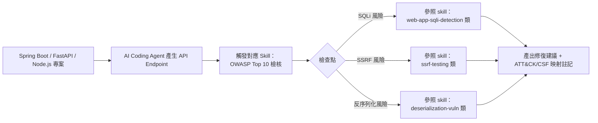

以 Spring Boot 為例，開發團隊可在 Code Review 階段要求 AI Agent（例如 GitHub Copilot Agent Mode）先掃描 `skills/` 中 `domain: cybersecurity, subdomain: web-application-security` 的技能，交叉比對新增的 Controller／Service 程式碼是否觸及常見弱點模式（SQL Injection、XSS、CSRF、不安全的反序列化），並附上對應的 OWASP Top 10 分類與 ATT&CK/CSF 映射，作為 PR 描述的一部分。

### 8.2 前端框架對應（Vue／React／Angular）

前端安全考量多半落在 API Security（CORS 設定、Token 儲存方式）與部分 Web Application Security 技能（例如 XSS 防護、CSP 設定）。實務作法：在 Vue／React／Angular 專案的 CI Pipeline 中，讓 AI Agent 於 Pull Request 階段自動比對前端程式碼是否符合技能庫內描述的「安全 Token 儲存」「CSP 白名單設定」等最佳實務，並產出對照表：

| 前端安全項目 | 對應技能領域 | 常見檢查點 |
|---|---|---|
| Token 儲存 | API Security | 避免將 JWT 存於 `localStorage`，建議 HttpOnly Cookie |
| XSS 防護 | Web Application Security | 輸出編碼、CSP 設定 |
| CORS 設定 | API Security | 避免過寬鬆的 `Access-Control-Allow-Origin: *` |
| 第三方套件依賴 | Supply Chain Security | npm 套件混淆攻擊、惡意套件偵測 |

### 8.3 Clean Architecture／DDD／Microservices 情境

在採用 Clean Architecture、DDD（領域驅動設計）或微服務架構的大型平台中，資安檢核應對應到分層架構的不同層級：

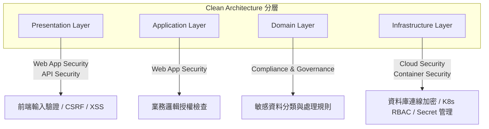

在微服務架構下，服務間通訊（Service-to-Service）安全屬於 Network Security（VLAN 分段、mTLS）與 Zero Trust Architecture（微分段）領域；容器化部署則對應 Container Security（K8s RBAC、映像掃描、Falco 執行期監控）。

> **實務案例**：某大型金融平台導入本技能庫作為「AI 輔助安全 Code Review」的知識底座，於 GitHub Actions Pipeline 中加入一個步驟：AI Agent 讀取變更的檔案路徑，依 Clean Architecture 分層自動挑選對應領域的技能（Infrastructure 層變更觸發 Cloud/Container Security 技能，Domain 層變更觸發 Compliance & Governance 技能），產出結構化的安全審查註解附加到 PR。
> **注意事項**：AI Agent 產出的安全建議仍需要人類安全工程師複核，尤其涉及業務邏輯授權（例如「使用者只能查看自己的訂單」這類 Domain 規則），這類語意層級的漏洞往往不是純技術掃描能夠可靠偵測的。

---

## 第 9 章 Legacy System 逆向工程應用

> **企業實務延伸**：以下情境為顧問觀點的建議應用方式。

### 9.1 Mainframe／COBOL 分析情境

雖然本技能庫的 29 個領域中沒有專門的「Mainframe／COBOL」子領域，但 Digital Forensics（41 個技能）、Malware Analysis（39 個技能）中的靜態分析方法論，以及 Compliance & Governance 的稽核工作流程，可以延伸應用到 Legacy Mainframe 系統的資安盤點：

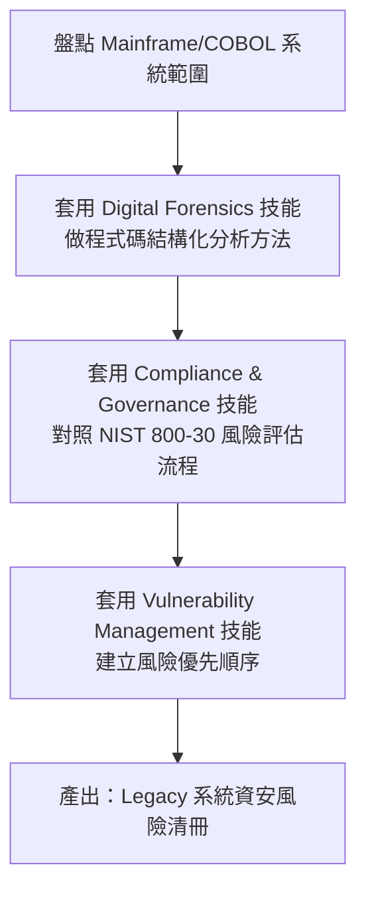

### 9.2 Java／.NET Legacy 系統分析

對於 Java EE／.NET Framework 等較常見的 Legacy 系統，可直接套用 Web Application Security（42 個技能）與 Vulnerability Management（25 個技能）的既有工作流程，搭配 AI Agent（例如 Claude Code）進行大規模程式碼掃描：

1. 使用 AI Agent 先建立 Legacy 系統的架構知識圖譜（可搭配第 19 章比較表中提到的 Knowledge Graph 類工具）
2. 套用 Vulnerability Management 技能中的「弱點優先順序評分」工作流程（CVSS 對照），針對舊版套件（例如過期的 Struts、Log4j）產出風險排序清單
3. 套用 Web Application Security 技能，逐一檢視高風險模組是否存在已知弱點模式（SQL Injection、不安全的反序列化等）

### 9.3 Binary／API／Protocol／Database 逆向

- **Binary 逆向**：對應 Malware Analysis 領域中的靜態／動態分析工作流程，適用於分析 Legacy 系統中缺乏原始碼的第三方元件或已編譯模組
- **API／Protocol 逆向**：對應 API Security（28 個技能）與 Network Security（43 個技能），可協助分析未文件化的內部 API 或私有通訊協定的安全風險
- **Database 逆向**：對應 Compliance & Governance 與 Cloud Security 中的資料分類技能，協助盤點 Legacy 資料庫中的敏感欄位（PII／PCI 等）分佈

> **實務案例**：某保險公司在將 20 年歷史的 Java EE 保單核心系統現代化前，先用 AI Agent 搭配本技能庫的 Vulnerability Management 與 Web Application Security 技能，對整個 Legacy Codebase 進行一次「資安健檢」，產出的風險清冊直接作為後續 Modernization Roadmap 排序的依據之一（高風險模組優先重構）。
> **注意事項**：逆向工程涉及的技能中，部分屬於 Red Teaming／Penetration Testing 領域的攻擊性技術，即使用於「自家系統」的分析，也建議走正式的內部授權流程並留下稽核紀錄，避免與外部滲透測試混淆而產生誤解。

---

## 第 10 章 Framework Upgrade 應用

> **企業實務延伸**：以下情境為顧問觀點的建議應用方式，非官方針對特定框架升級的功能宣稱。

### 10.1 Dependency／Breaking Changes 風險分析

Framework 升級（例如 Spring Boot 2→3、Java 8→21、Vue 2→3）過程中最大的資安風險通常來自於：

1. **依賴套件連動升級**帶來的新版本已知漏洞（或反過來——停留舊版本累積的已知漏洞）
2. **Breaking Changes** 導致的安全設定被意外重置（例如 Spring Security 設定語法變更）
3. **升級期間的過渡態**（新舊程式碼並存）造成的攻擊面暫時擴大

Supply Chain Security（8 個技能）與 Vulnerability Management（25 個技能）是本情境下最相關的兩個領域，可套用其中的「依賴掃描」「CVSS 優先排序」工作流程，在升級前先建立基準線（Baseline），升級後再做一次對比掃描，確保沒有引入新的已知漏洞。

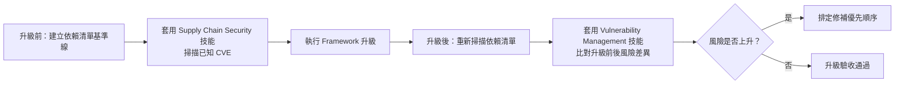

### 10.2 主流框架升級案例

| 升級情境 | 主要風險 | 建議套用技能領域 |
|---|---|---|
| Spring Boot 2.x → 3.x | Jakarta EE Namespace 變更導致的 Security 設定遺漏 | Web Application Security、Vulnerability Management |
| Java 8 → 21 | 舊版 JCE／TLS 設定不相容、序列化行為變更 | Cryptography、Web Application Security |
| Vue 2 → Vue 3 | 第三方套件相容性造成的暫時性依賴混用 | Supply Chain Security |
| Node.js LTS 升級 | npm 依賴鏈中的已知漏洞套件 | Supply Chain Security |

> **實務案例**：某企業在 Spring Boot 2 升級至 3 的專案中，要求 AI Agent 在產生升級後的程式碼變更 PR 時，同步附上「升級前後依賴套件 CVE 比對報告」，該報告即是套用 Supply Chain Security 領域技能的 Workflow 產出，作為 Release Gate 的必要條件之一。
> **注意事項**：Framework 升級本身不是資安活動，AI Agent 產出的「升級後仍安全」結論，仍需搭配傳統的 SAST／DAST 掃描與人工驗收測試交叉確認，避免過度依賴單一技能庫的分析結果。

---

## 第 11 章 第三方技能與 Supply Chain 安全審查

### 11.1 為何第三方 Skill 是新型供應鏈風險

AI Agent 生態系近年快速擴張，Claude Skills、GitHub Copilot Agent Skills、MCP Server 等「可安裝、可分享」機制帶來一個新型態的供應鏈風險：**這些技能／擴充套件通常以 Agent 當下的完整工具權限執行**——能讀寫檔案、呼叫 Shell、發送網路請求。傳統的軟體供應鏈安全工具（SCA、SAST）著眼於程式碼依賴套件，但很少有工具專門檢視「一份用自然語言＋少量程式碼寫成的 Skill 說明文件，是否暗藏惡意指令」（Prompt Injection、資料外洩觸發等）。

本專案（Anthropic Cybersecurity Skills）本身作為一個「第三方技能庫」，企業導入前理應對它自身也套用同樣嚴謹的審查標準——這是一種遞迴式的治理要求：**用來教 AI 做資安分析的技能本身，也需要經過資安審查**。

### 11.2 審查流程與工具搭配（含 SkillSpector 交叉引用）

本 repo 內若已有 [SkillSpector 教學手冊](SkillSpector%20教學手冊.md)（NVIDIA 開源的 AI Agent Skill 安全掃描器），企業可直接將其套用於本技能庫的審查流程，避免重複建置類似的掃描能力：

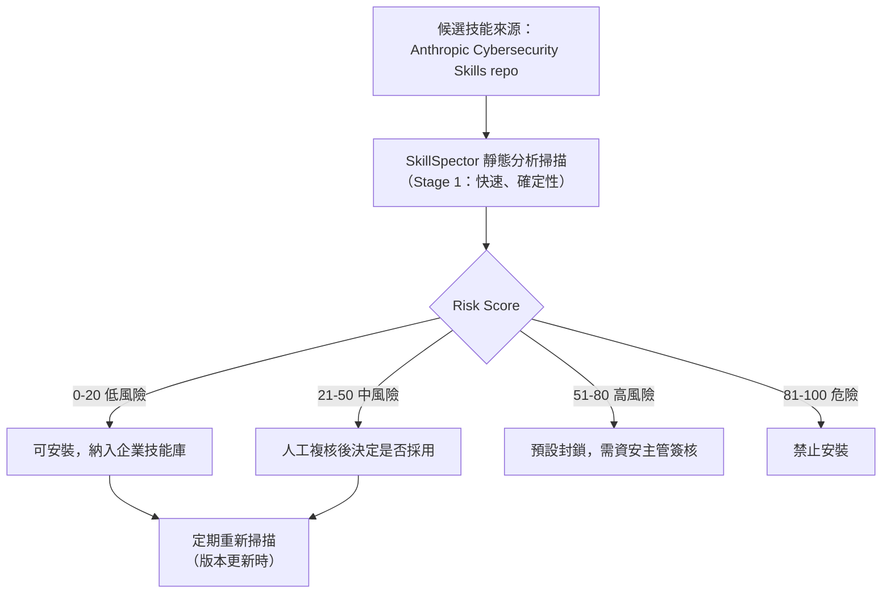

由於本技能庫內含大量「攻擊性」技能本質（Red Teaming、Penetration Testing 等），掃描時務必區分「技能內容本身描述的是合法測試方法論」與「技能檔案中是否夾帶額外的惡意指令或 Prompt Injection」，兩者不可混淆——前者是專案設計初衷（攻防雙用途知識），後者才是真正需要用 SkillSpector 類工具攔截的供應鏈風險。

**上游漏洞通報機制**（依官方 `SECURITY.md`）：若發現技能內容、腳本或指令存在安全問題，**不可開公開 Issue**，應透過 GitHub 私密安全公告（Private Security Advisory）通報，並附上受影響的技能名稱與檔案路徑、漏洞性質、潛在影響、重現步驟。官方回應時程承諾：**初步確認 48 小時內**，**評估與分流 1 週內**，**修復或緩解依嚴重性一般 2 週內**。列入檢報範圍包含：包含指令／腳本可能造成意外傷害的技能、若依循指令會導致未授權存取的內容、不小心包含於技能內的敏感資料、已受損害的依賴或外部參考。企業若自建補充技能，建議也建立雷同的內部通報機制，並訂定類似的回應時限。

### 11.3 企業 Skill 治理 Checklist

- [ ] 每次同步上游 repo 更新前，先在隔離環境（非生產）完成掃描與審閱
- [ ] 對攻擊性領域（Red Teaming、Penetration Testing）技能建立獨立的存取權限群組
- [ ] 建立技能版本鎖定機制（記錄採用時的 commit hash），避免上游未預期變更直接影響生產環境
- [ ] 定期（例如每季）重新執行第三方安全掃描工具（SkillSpector 或同類工具）
- [ ] 建立技能使用的 Audit Log，記錄哪個 Agent／哪個使用者在何時載入了哪個技能
- [ ] 針對 MITRE F3（詐欺框架）相關技能，額外要求法遵團隊參與審查
- [ ] 明確要求所有使用者簽署「Authorized & lawful use only」使用同意書

> **實務案例**：某銀行資安團隊將本技能庫拆分為兩層：一層是「唯讀知識庫」（供一般開發／維運團隊的 AI Agent 查詢威脅情資、合規對照），另一層是「執行層」（可實際觸發攻擊性技能的 Workflow，僅限紅隊成員的 Agent Session 可存取），透過企業內部的 IAM 系統對兩層做嚴格區隔。
> **注意事項**：切勿假設「開源」等於「安全」，本專案雖然透明度高（可完整審閱原始碼），但仍需企業自行完成第三方安全評估，不應該直接將 817 個技能無差別開放給所有 AI Agent 使用。

---

## 第 12 章 Claude Code 整合實戰

### 12.1 Plugin 安裝與 Marketplace

v1.3.0 起，本專案在 repo 根目錄新增了 `.claude-plugin/` 目錄，代表已具備透過 Claude Code Plugin Marketplace 機制安裝的能力，安裝方式與其他 Claude Code Plugin 一致：

```bash
# 於 Claude Code 中執行（示意，實際指令請以當下 Claude Code CLI 版本文件為準）
/plugin marketplace add mukul975/Anthropic-Cybersecurity-Skills
```

若企業偏好完全掌控技能來源（不透過 Marketplace 動態拉取），也可以直接將 clone 下來的 repo 掛載到 Claude Code 專案的技能搜尋路徑，等效於「本地端 Skill 目錄」的用法。

### 12.2 實戰 Workflow 範例

**情境：Claude Code 協助分析一起疑似憑證竊取事件**

```text
使用者：「這台主機的 Sysmon 日誌顯示異常的 lsass.exe 存取行為，幫我分析」

Claude Code Agent 內部流程：
1. 掃描 skills/ 內 817 個技能 frontmatter，比對 tags/description
   → 命中候選：hunting-for-credential-dumping-lsass、
                analyzing-windows-event-logs-for-credential-access
2. 完整載入上述 2 個技能的 SKILL.md
3. 依 Workflow 段落執行：
   - 檢查 Sysmon Event ID 10（ProcessAccess）中 TargetImage 為 lsass.exe 的紀錄
   - 交叉比對 GrantedAccess 欄位是否符合已知的憑證傾印存取模式
   - 對照該行為對應的 MITRE ATT&CK T1003（OS Credential Dumping）
4. 依 Verification 段落確認：
   - 是否有對應的 Process Creation（Event ID 1）顯示可疑的傾印工具執行
   - 產出結構化報告：時間軸、涉及帳號、對應 ATT&CK/CSF 映射、建議應變步驟
```

企業可將此類 Workflow 封裝為 Claude Code 的自訂 Slash Command 或 CLAUDE.md 內的標準作業程序，讓 SOC 團隊在日常告警分診時能一致地觸發相同的分析流程。

> **實務案例**：某企業在 `CLAUDE.md` 中明文規定：「任何涉及可疑憑證存取的告警，Claude Code Agent 必須優先搜尋 `domain: cybersecurity, subdomain: credential-access` 相關技能，並在最終報告附上對應技能的 `references/standards.md` 連結，作為分析依據的可追溯來源」。
> **注意事項**：Claude Code 執行涉及實際主機日誌讀取的 Workflow 時，務必確認 Agent 的工具權限範圍（檔案讀取路徑、是否可執行外部指令）已受到適當限制，避免在分析過程中意外觸及生產環境的敏感資料或造成非預期的系統變更。

---

## 第 13 章 GitHub Copilot 整合實戰

### 13.1 Copilot Instructions 與 Agent Mode 設定

GitHub Copilot 目前透過 `.github/copilot-instructions.md`（Repository 層級指引）與 Agent Mode／Agent Skills 機制來整合外部知識庫。企業可在 `.github/copilot-instructions.md` 中加入指引，要求 Copilot Agent 在處理與資安相關的任務時，優先參照掛載於專案內（或以 Submodule 方式引入）的 Anthropic Cybersecurity Skills 技能：

```markdown
# .github/copilot-instructions.md 範例片段

## 資安審查指引

當你需要進行以下任務時，請先搜尋 `.github/skills/anthropic-cybersecurity-skills/skills/`
目錄下對應 domain 的技能，並依其 Workflow 段落執行：

- 撰寫或審查涉及使用者輸入的 API Endpoint → 參照 `web-application-security` 領域技能
- 審查第三方套件依賴 → 參照 `supply-chain-security` 領域技能
- 審查容器化部署設定（Dockerfile／K8s YAML）→ 參照 `container-security` 領域技能

所有安全性建議請附上對應的 MITRE ATT&CK / NIST CSF 2.0 映射代碼（若技能本身有標註）。
```

### 13.2 實戰案例：安全審查 Workflow

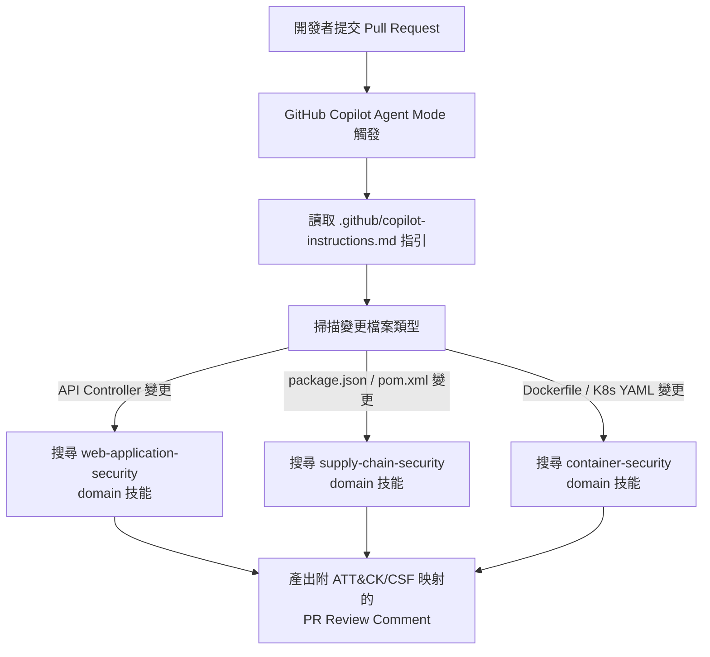

> **實務案例**：某新創公司將本技能庫以 Git Submodule 形式加入其 monorepo 的 `.github/skills/` 目錄，並在 GitHub Actions 中設定 Copilot Coding Agent 於每次 PR 提交時自動觸發資安審查 Workflow，將產出的安全建議以 PR Comment 形式附加，作為程式碼審查（Human Review）前的第一道篩選。
> **注意事項**：Copilot Agent Mode 的技能載入機制與 Claude Code 的 Skill 系統設計理念不完全相同（Copilot 更依賴 Repository Instructions 與 Custom Agent 設定），企業導入時應以當下 GitHub Copilot 官方文件的 Agent Skills 機制為準，本節內容屬「企業實務延伸」建議做法。

---

## 第 14 章 MCP 整合

### 14.1 MCP Server／Tool／Skill 關係

MCP（Model Context Protocol）與 Agent Skills 是互補而非互斥的兩種機制：MCP 定義的是「Agent 如何呼叫外部工具與資料來源」的標準化協定，而 Agent Skills（本專案的核心資產）定義的是「Agent 該用什麼邏輯與步驟去使用這些工具」。兩者的關係可以理解為：

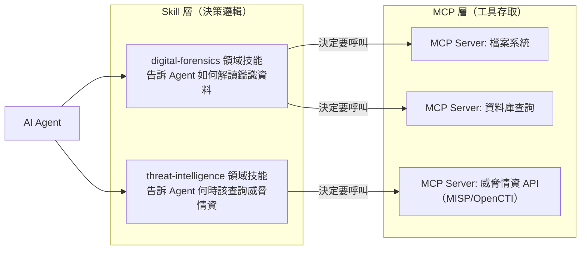

### 14.2 實務整合範例

企業若已建置 MCP Server（例如連接內部 SIEM、威脅情資平台、GitHub），可以搭配本技能庫的 Threat Intelligence（52 個技能）、SOC Operations（35 個技能）領域，讓 Agent 具備「知道該呼叫哪個 MCP Tool、以及呼叫後該怎麼解讀結果」的完整能力，而不只是單純的工具呼叫。

```text
情境：企業已建置 MCP Server 連接 MISP（威脅情資平台）

1. 使用者：「查一下這個 IP 是否為已知的 C2 節點」
2. Agent 搜尋 threat-intelligence 領域技能 → 命中「查詢威脅情資來源」相關 Workflow
3. Workflow 指示 Agent：先透過 MCP Server 呼叫 MISP API 查詢該 IOC
4. Agent 依技能的 Verification 段落，交叉比對回傳結果的信心分數（confidence score）
   與最後更新時間，避免直接採信過期或低信心的情資
5. 產出結論，並註明資料來源與查詢時間
```

> **實務案例**：某資安維運中心（SOC）將本技能庫的 Threat Intelligence 領域技能與內部自建的 MCP Server（封裝公司訂閱的商用威脅情資 Feed）搭配，讓值班分析師透過 Claude Code 或 Copilot Chat 快速查詢可疑 IOC，並確保查詢結果的解讀方式（信心分數判讀、時效性檢查）遵循一致的標準流程，而非由每位分析師自行判斷。
> **注意事項**：MCP Server 本身的安全設定（存取權限、Token 管理）不在本技能庫的涵蓋範圍內，企業仍需依 MCP 官方最佳實務另行強化 MCP Server 的安全性（可另參考本專案系列的《Anthropic Model Context Protocol (MCP) 教學手冊》）。

---

## 第 15 章 AI 開發工作流程與 SSDLC 對照

### 15.1 SSDLC 各階段對應的 Skills


| SSDLC 階段 | 對應技能領域 | 說明 |
|---|---|---|
| 需求分析 | Compliance & Governance | 確認法規／合規需求（例如 PCI-DSS、HIPAA） |
| Threat Modeling | AI Security、Web Application Security | 依系統類型挑選對應的威脅建模方法論 |
| Coding | Web Application Security、API Security | AI Coding Agent 即時安全建議 |
| Code Review | Web Application Security | 弱點模式檢查 |
| Security Scan | Vulnerability Management、Supply Chain Security | 依賴掃描、CVSS 優先排序 |
| Refactor | Digital Forensics（分析方法論延伸） | 大規模程式碼變更後的完整性驗證 |
| Testing | Penetration Testing（適度、限定範圍） | 授權範圍內的滲透測試 |
| Deploy | DevSecOps | CI/CD 安全閘門 |
| Maintenance | SOC Operations、Threat Hunting | 上線後的持續監控與威脅獵捕 |

### 15.2 Skill 生命週期狀態機

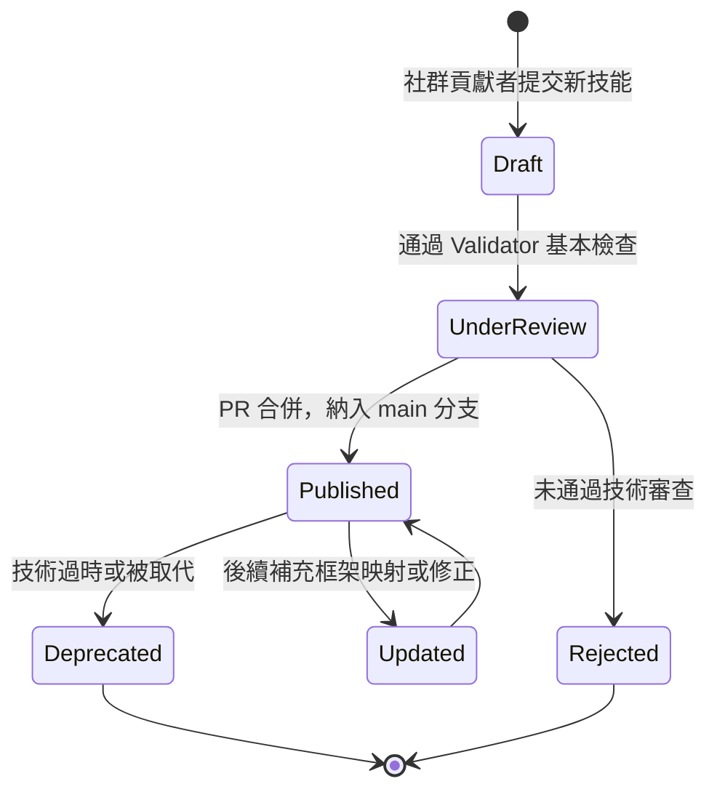

> **實務案例**：某企業將 SSDLC 各階段對應的技能領域，直接寫入內部的「AI 輔助開發 SOP」文件，明訂「Code Review 階段必須觸發 Web Application Security 相關技能」作為 PR 合併前的強制檢查項目之一，並透過 CI Pipeline 自動化驗證是否確實執行過對應的 Agent 掃描步驟（例如檢查 PR 是否含有 Agent 產出的安全審查註解）。
> **注意事項**：SSDLC 各階段的對應關係為企業實務延伸建議，非本專案官方定義的標準流程；企業應依自身既有的 SSDLC 框架（可另參考本系列《軟體開發標準程序教學手冊》）調整對應方式。

---

## 第 16 章 Prompt Engineering 與 Prompt Library

### 16.1 Prompt 設計原則

由於本技能庫已經把「該做什麼、怎麼做」封裝進 Skill 的 Workflow 段落，使用者給 Agent 的 Prompt 不需要重複描述完整的操作步驟，而是應該聚焦在：

1. **清楚描述觸發情境**（讓 Agent 能命中對應的 Skill frontmatter）
2. **提供必要的上下文資料**（例如日誌檔案路徑、可疑 IP、程式碼變更範圍）
3. **明確授權範圍**（尤其攻擊性技能，務必在 Prompt 中確認測試範圍已獲授權）
4. **要求附上框架映射**（讓輸出結果具備可稽核性）

### 16.2 分類 Prompt Library

**威脅分析（Threat Analysis）**

```text
「請分析這段網路流量擷取檔（PCAP），判斷是否存在惡意軟體 C2 通訊模式，
並對照 MITRE ATT&CK 技術 ID，附上你使用的技能來源。」
```

**Code Review（資安導向）**

```text
「請審查這個 Spring Boot Controller 的變更，依 OWASP Top 10 檢查常見弱點，
並標註每項發現對應的 CWE 編號與 NIST CSF 2.0 類別。」
```

**Security Review（架構層級）**

```text
「這是我們新設計的微服務認證流程架構圖，請以 Zero Trust Architecture
相關技能的角度，指出可能的信任邊界疏漏。」
```

**Dependency Review（供應鏈）**

```text
「掃描這個專案的 package.json / pom.xml，比對已知 CVE 資料庫，
並依 Supply Chain Security 技能的工作流程排出修補優先順序。」
```

**Framework Upgrade（升級風險評估）**

```text
「我們準備把 Spring Boot 2.7 升級到 3.3，請依 Vulnerability Management
與 Supply Chain Security 技能，比對升級前後的依賴風險差異。」
```

**OSINT（開源情資蒐集）**

```text
「針對這個網域名稱，執行標準化的被動式 OSINT 蒐集流程
（不進行任何主動掃描），並依 Threat Intelligence 技能的驗證步驟確認結果可信度。」
```

**Reverse Engineering（逆向分析）**

```text
「這是一份未知來源的二進位檔案，請依 Malware Analysis 技能中的靜態分析
Workflow，先做基本的雜湊比對與字串分析，暫不執行動態分析。」
```

**Architecture Review（架構安全審查）**

```text
「請以 Compliance & Governance 技能對照 NIST 800-30 風險評估流程，
審查我們新系統的資料流架構圖，指出高風險的資料傳輸路徑。」
```

> 以上 8 大分類每類再細分 3～5 個變化版本，企業可視自身技術棧（Java／Python／Node.js／Vue／React 等）調整措辭，並固化為內部的 Prompt Template 庫（可搭配第 17 章的治理建議統一管理版本）。

> **實務案例**：某企業將上述 Prompt 分類整理成內部 Confluence 頁面，並要求所有 SOC 分析師與開發團隊在提交給 AI Agent 的 Prompt 前先套用「觸發情境＋上下文＋授權範圍＋要求框架映射」四段式模板，大幅提升 Agent 輸出結果的一致性與可稽核性。
> **注意事項**：Prompt 中若涉及攻擊性測試（例如「請對這個 IP 執行掃描」），務必養成在每次 Prompt 中明確重申「僅限授權範圍」的習慣，不應假設 Agent 會自動記得先前對話中的授權聲明。

---

## 第 17 章 企業最佳實務與治理／Anti-pattern

### 17.1 企業導入策略與治理架構

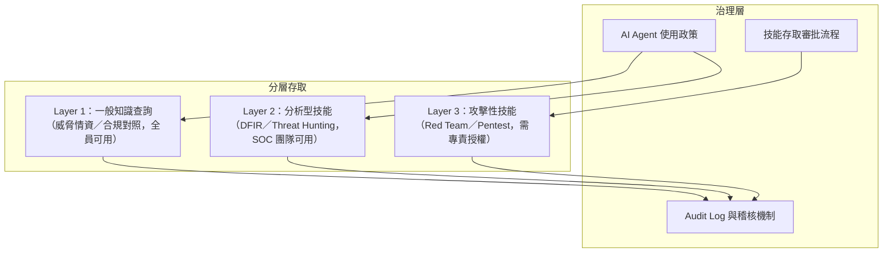

導入建議分三階段：

1. **PoC（1 個月）**：選定 2～3 個低風險領域（例如 Compliance & Governance、Threat Intelligence），驗證 Agent 是否能正確命中並執行對應技能
2. **Pilot（1～2 個月）**：擴大到 SOC 團隊日常告警分診場景，建立 Audit Log 與人工複核機制
3. **Production（持續）**：依業務單位需求逐步開放更多領域，攻擊性技能（Red Teaming／Penetration Testing）需走正式簽核流程才開放

### 17.2 最佳實務

1. 導入前務必完成法務與資安治理審查，明確告知同仁「Authorized & lawful use only」
2. 分層存取控制：知識查詢、分析型技能、攻擊性技能三層權限分離
3. 鎖定 commit hash 或明確版本，不要直接追蹤 `main` 分支的即時變動
4. 定期用第三方掃描工具（如 SkillSpector）審查技能庫本身的供應鏈風險
5. 建立 Audit Log，記錄每次技能載入與執行的使用者、時間、輸出結果
6. 攻擊性技能與一般開發技能分開部署在不同的 Agent Session／權限群組
7. 針對 MITRE F3（詐欺框架）相關技能，額外納入法遵團隊審查流程
8. 保留人工複核關卡（Human-in-the-Loop），不對高風險判斷全自動化放行
9. 企業自建補充技能時，遵循 agentskills.io 標準撰寫，保持與上游相容
10. 教育訓練納入新人 Onboarding，明確界定授權測試範圍與交戰規則
11. 建立技能使用的成本／效益追蹤（哪些領域被實際使用、哪些從未觸發）
12. 對 Framework 升級／逆向工程等衍生應用場景，明確標示為「企業實務延伸」而非官方保證行為
13. 定期檢視 29 個領域是否有新增／變動，重新評估企業內部的權限分層是否需要調整
14. 針對高敏感度領域（Hardware & Firmware Security、OT/ICS Security）額外做環境隔離
15. 與既有 GRC（治理、風險、合規）平台整合，避免技能庫的合規映射與企業既有合規系統重複建置

### 17.3 常見 Anti-pattern

1. **無差別全量開放**：一次性把 817 個技能（含攻擊性技能）開放給所有開發者的 Agent Session
2. **忽略社群專案本質**：誤以為本專案有官方 SLA 保證，未建立內部備援與版本鎖定機制
3. **完全信任 AI 輸出**：資安判斷全自動化，未保留人工複核關卡
4. **跳過供應鏈審查**：直接同步上游更新，未重新掃描是否引入風險
5. **混淆合法測試與實際攻擊**：Red Teaming／Penetration Testing 技能使用時未走正式授權流程
6. **忽略 F3 詐欺框架的法遵要求**：金融業直接套用 F3 映射產出報告，未經法遵覆核就對外引用
7. **技能與企業既有 SOP 脫節**：Agent 產出的 Workflow 與企業既有事件應變流程互相矛盾，造成分析師混淆
8. **未區分知識查詢與執行層**：讓一般開發 Agent 具備觸發攻擊性技能執行的能力
9. **忽視版本沿革**：不追蹤 repo 的 Release／Roadmap，導致企業內部版本長期落後且未評估新增框架映射（如 F3）的影響
10. **Prompt 缺乏授權聲明**：涉及測試性質的 Prompt 未每次重申授權範圍，誤導 Agent 產出逾越授權邊界的建議

> **實務案例**：某企業初期導入時犯下 Anti-pattern #1（無差別全量開放），三個月後資安稽核發現一般開發團隊的 Copilot Agent 可以直接觸發 Red Teaming 領域的 C2 相關技能，遂重新設計三層存取架構（如 17.1 節圖），並將此案例納入內部治理教材作為警示。
> **注意事項**：治理架構的落地程度應與企業自身的風險胃納相匹配，過度嚴格的審批流程可能導致團隊放棄使用而改回人工作業，反而失去導入的效益，建議循序漸進調整。

---

## 第 18 章 系統維護與升級

### 18.1 日常維護與版本同步

由於 repo 本身是純資產型（無需編譯部署的服務），維護工作主要圍繞：

- 定期（建議每月或每次上游有重大 Release 時）同步上游更新
- 每次同步後重新執行第三方安全掃描（第 11 章）
- 追蹤 `index.json` 中的技能總數與領域數變化，評估是否有新增領域需要納入企業的治理分類
- 監控 `CONTRIBUTING.md` 是否有重大貢獻流程變更，確保企業自建的補充技能仍符合最新規範

企業內部管理技能庫版本時，建議採用類似以下的分支策略（以 Git Graph 示意）：

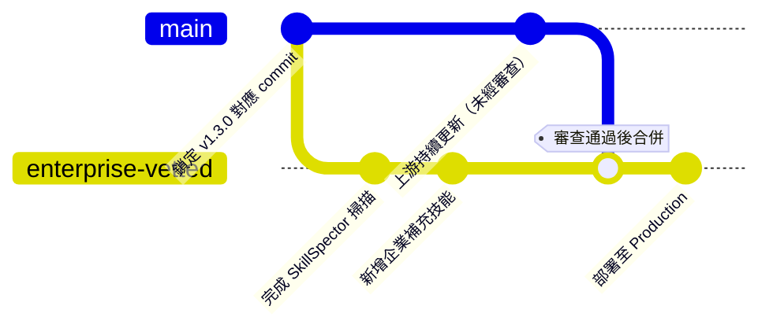

### 18.2 升級流程與 Rollback

```mermaid
flowchart TD
    A["偵測上游有新版本"] --> B["在隔離環境 Fork/Clone 新版本"]
    B --> C["執行第三方安全掃描<br/>（SkillSpector 等工具）"]
    C --> D{"掃描結果是否可接受？"}
    D -->|否| E["暫緩升級，回報上游或自行修補"]
    D -->|是| F["比對新增/變更的技能清單"]
    F --> G["更新企業內部的領域權限分層"]
    G --> H["部署到 Staging 環境驗證"]
    H --> I["部署到 Production"]
    I --> J["若異常，Rollback 至前一個鎖定版本"]
```

由於企業建議採「鎖定 commit hash」的方式管理版本（見 17.2 節），Rollback 機制相對單純——只需將 Agent 讀取技能庫的路徑指回前一個鎖定的版本即可，不涉及複雜的資料庫遷移或服務相依性問題。

> **實務案例**：某企業建立了每季一次的「技能庫版本升級評審會議」，由資安團隊、法遵團隊、AI 平台團隊共同參與，逐一檢視新增技能領域（例如 MITRE F3 剛加入時）對企業既有治理架構的影響，確認無虞後才排定升級時程。
> **注意事項**：由於本專案更新頻繁（社群持續貢獻新技能），企業不建議追蹤 `main` 分支即時變動，應建立明確的版本評審節奏，避免生產環境的技能內容在未經審查的情況下被意外變更。

---

## 第 19 章 與其他工具比較

| 工具 | 定位 | 與本技能庫的關係 |
|---|---|---|
| Claude Code | AI Coding Agent（終端機） | 最直接支援本技能庫的平台之一，可透過 Plugin Marketplace 安裝 |
| GitHub Copilot | AI Coding Agent（IDE 內嵌／雲端 Agent） | 透過 Repository Instructions／Agent Skills 機制整合 |
| Cursor | AI 原生 IDE | 官方列為相容平台之一 |
| OpenAI Codex CLI | CLI 型 Coding Agent | 官方列為相容平台之一 |
| Gemini CLI | CLI 型 Coding Agent | 官方列為相容平台之一 |
| OpenHands | 自主型 Coding Agent | 官方列為相容平台之一 |
| Goose | 開源自主型 Agent | 未於官方相容清單明確列出，但因遵循 MCP／通用 Agent 架構，理論上可透過相容層整合 |
| OpenCode | 開源 AI Coding Agent | 未於官方相容清單明確列出，屬同一生態系的開源替代方案，實際整合需視其技能載入機制而定 |

> **比較重點**：本技能庫與上述工具是「互補關係」而非「競爭關係」——它不是另一個 AI Coding Agent，而是可以被這些 Agent 載入使用的**知識資產層**。企業選型時真正該比較的是「哪個 AI Coding Agent 平台」，而非「要不要用這個技能庫」；只要平台支援 agentskills.io 標準或具備類似的 Skill／Instructions 機制，理論上都能受益於本技能庫。

> **實務案例**：某企業同時評估 Claude Code 與 GitHub Copilot 作為主力 AI Coding Agent，最終決策依據之一即是「兩者是否都能順暢載入本技能庫」——由於 Claude Code 有原生 Plugin Marketplace 支援，而 Copilot 需透過額外的 Repository Instructions 設定，企業最終選擇兩者並行，依任務類型（Claude Code 用於深度資安分析、Copilot 用於日常 Coding）分工使用。
> **注意事項**：相容平台清單會隨官方 README 更新而變動，本表格反映查詢當下的官方列表，正式選型前請以官方 repo 當下版本為準。

---

## 第 20 章 實戰案例

企業導入本技能庫的典型旅程，可用 Journey Diagram 呈現整體滿意度變化：

```mermaid
journey
    title 企業導入 Anthropic Cybersecurity Skills 之旅
    section PoC 階段
      評估技能庫是否符合需求: 3: 資安團隊
      完成第三方安全掃描: 4: 資安團隊
      選定 2-3 個低風險領域試用: 5: 資安團隊, AI平台團隊
    section Pilot 階段
      建立三層存取權限架構: 4: 資安團隊
      SOC 團隊日常告警分診導入: 5: SOC團隊
      建立 Audit Log 機制: 4: 資安團隊
    section Production 階段
      擴大至更多業務單位: 5: 全體團隊
      MITRE F3 導入法遵覆核流程: 4: 法遵團隊
      每季版本升級評審常態化: 5: 資安團隊, 法遵團隊
```

### 案例一：金融業 BEC（商業郵件詐騙）偵測強化

某銀行 SOC 團隊導入 Phishing Defense（15 個技能）與新加入的 MITRE F3 詐欺框架映射，將既有的郵件安全閘道告警，透過 AI Agent 自動比對 F3 的 Monetization Tactic（FA0002）相關技術 ID，大幅縮短分析師判定「這是否為詐欺鏈的一環」所需的時間。

### 案例二：跨國企業 Cloud Security 態勢管理

某跨國零售企業將 Cloud Security（66 個技能）整合進既有的 CSPM 平台告警處理流程，AI Agent 收到 CSPM 告警後，自動搜尋對應技能的 Workflow 段落，產出具體的修復步驟（而非僅告知「有風險」），降低雲端維運團隊的處置時間。

### 案例三：保險公司 Legacy Java EE 系統現代化前的資安健檢

如第 9 章所述，某保險公司在核心保單系統現代化前，套用 Vulnerability Management 與 Web Application Security 技能對整個 Legacy Codebase 做一次系統性健檢，產出的風險清冊用於 Modernization Roadmap 排序。

### 案例四：SaaS 新創的 DevSecOps Pipeline 強化

某 SaaS 新創在 GitHub Actions Pipeline 中整合 DevSecOps（18 個技能）領域，讓 Container Security（映像掃描）與 Supply Chain Security（依賴掃描）成為每次 CI 建置的強制關卡，未通過的 PR 無法合併至主分支。

### 案例五：製造業 OT/ICS 環境的零信任導入

某製造業導入 OT/ICS Security（28 個技能）與 Zero Trust Architecture（17 個技能），針對其 SCADA 環境建立微分段策略，並套用歷史站（Historian）防護相關 Workflow，降低 OT 環境因 IT/OT 融合帶來的攻擊面擴大風險。

### 案例六：AI 產品團隊的 LLM 紅隊測試常態化

某企業的 AI 產品團隊將 AI Security（14 個技能）納入產品發布前的常態檢核流程，套用 garak／PyRIT 相關的 LLM 紅隊測試 Workflow，並對照 MITRE ATLAS 技術 ID 產出風險報告，作為 AI 產品上線前的合規佐證之一。

### 案例七：政府機關供應鏈安全盤點

某政府機關導入 Supply Chain Security（8 個技能），要求所有供應商提交的軟體元件皆需通過 SBOM（軟體物料清單）比對與已知漏洞掃描，並將結果對照 NIST 800-30 風險評估流程，納入採購合約的驗收條件。

> **實務案例小結**：以上七個案例橫跨金融、零售、保險、新創、製造、AI 產品、政府等多元產業，共通模式是「先選定 1～3 個與自身業務最相關的領域，再逐步擴大」，而非一次性導入全部 29 個領域。
> **注意事項**：以上案例均為顧問觀點下的企業實務延伸情境，用以說明可能的應用模式，並非本專案官方發布的客戶案例或背書。

---

## 第 21 章 常見問題（FAQ）

1. **Q：這是 Anthropic 官方發布的資產嗎？** A：不是，這是獨立開發者 Mahipal Jangra 發起的社群專案，README 明確聲明「非 Anthropic PBC 官方關係」。
2. **Q：可以直接用在生產環境的自動化資安應變（無人工複核）嗎？** A：官方未做此宣稱，建議保留人工複核關卡，尤其涉及攻擊性技能或高風險判斷時。
3. **Q：817 個技能是否每個都對齊全部六大框架？** A：不是，多數技能至少對齊 ATT&CK／CSF，AI 專屬框架與 F3 僅對應相關領域的技能子集。
4. **Q：可以只安裝特定領域的技能嗎？** A：可以，由於採檔案系統目錄結構，可自行篩選 `skills/` 下特定 `domain`／`subdomain` 的子目錄使用。
5. **Q：這個技能庫需要 API Key 或付費才能使用嗎？** A：不需要，技能本體是純 Markdown／YAML 資產，免費開源（Apache-2.0）；實際執行時所耗費的 Token 成本取決於你使用的 AI 模型服務。
6. **Q：Claude Code 一定要透過 Plugin Marketplace 安裝嗎？** A：不一定，也可以直接 clone repo 後掛載為本地技能目錄。
7. **Q：GitHub Copilot 如何載入這些技能？** A：目前主要透過 Repository Instructions（`.github/copilot-instructions.md`）指引 Agent 去讀取掛載進專案的技能檔案，具體機制請以官方 Copilot 文件為準。
8. **Q：技能內容是英文還是中文？** A：技能本體目前以英文撰寫為主，企業若需要中文化，需自行進行在地化翻譯與維護。
9. **Q：MITRE F3 是什麼時候加入的？** A：F3 v1.1 於 2026-04-09 由 MITRE CTID 發布，本專案隨後快速納入映射。
10. **Q：F3 框架的技術 ID 格式是什麼？** A：詐欺專屬技術用 `F1XXX` 系列（如 `F1005.003`），沿用既有 ATT&CK 技術則保留 `T1XXX` 格式。
11. **Q：ATT&CK 映射資訊放在哪裡？** A：主要記錄在每個技能的 `references/standards.md`，並非直接寫在 YAML frontmatter。
12. **Q：ATLAS／D3FEND／AI RMF 映射放在哪裡？** A：這幾項直接寫在 YAML frontmatter（`atlas_techniques`、`d3fend_techniques`、`nist_ai_rmf`）。
13. **Q：Skill 的四段式結構是強制驗證的嗎？** A：官方 Validator 主要驗證 frontmatter 完整性，Body 的四段式結構屬於慣例約定，非強制 Schema 驗證。
14. **Q：如何知道技能是否過時？** A：檢視技能的 `version` 欄位與最後更新時間，並定期關注 repo 的 Release／commit 紀錄。
15. **Q：可以貢獻自己的技能回上游嗎？** A：可以，依 `CONTRIBUTING.md` 的流程提交 PR，官方承諾在 48 小時內回應。
16. **Q：企業自建的補充技能需要遵循同樣的格式嗎？** A：強烈建議遵循，以維持與上游及其他 Agent 平台的相容性。
17. **Q：技能庫是否支援 MCP？** A：技能庫本身不含 MCP Server，但可與企業自建的 MCP Server 搭配使用（見第 14 章）。
18. **Q：攻擊性技能（Red Teaming）是否合法？** A：技能描述的方法論本身多為業界標準的授權測試技術，合法性取決於「使用方式」——僅限對已取得授權的系統執行測試。
19. **Q：這個技能庫可以取代 SIEM 或 EDR 產品嗎？** A：不行，它是「知識層」而非「工具層」，仍需搭配實際的資安工具（SIEM、EDR、CSPM 等）才能執行分析。
20. **Q：企業如何追蹤有多少 Skill 被實際使用？** A：需自行建立 Audit Log 機制記錄每次 Agent 載入與執行的技能，官方 repo 本身不提供使用追蹤功能。
21. **Q：29 個領域會持續增加嗎？** A：依 repo 演進趨勢，領域與技能數量持續成長中（v1.0.0 的 26 個領域已成長到 29 個）。
22. **Q：是否有官方的技能品質認證機制？** A：目前主要靠社群 PR Review 與 Validator 自動化檢查，尚無正式的第三方認證機制。
23. **Q：如何處理技能內容與企業內部 SOP 衝突？** A：建議以企業內部 SOP 為最終依歸，將本技能庫的 Workflow 視為「參考基準」而非強制取代既有流程。
24. **Q：可以用於學術研究引用嗎？** A：可以，repo 提供 `CITATION.cff`，附有標準的 BibTeX 引用格式。
25. **Q：GARS-2026 調查與這個技能庫有什麼關係？** A：這是作者發起的獨立學術調查（Global Agentic AI Readiness Survey），與技能庫功能本身無直接技術關聯，屬社群推廣活動。
26. **Q：Casky.ai Playground 是官方產品嗎？** A：是作者關聯的體驗平台，用於免安裝試玩技能庫的互動情境，非 Anthropic 官方服務。
27. **Q：技能庫支援哪些程式語言的分析？** A：技能本身以資安方法論為主，不限定特定程式語言；搭配 AI Coding Agent 時可套用於任何該 Agent 支援的程式語言。
28. **Q：如何確認某個框架版本是否已過時？** A：定期比對官方框架發布單位（MITRE／NIST）的最新版本公告，並檢視技能庫 README 是否已更新對應版本號。
29. **Q：Deception Technology 領域只有 6 個技能，是否代表不重要？** A：不代表，技能數量反映的是社群貢獻的活躍度而非領域重要性，企業仍可依自身需求優先投入資源建置。
30. **Q：技能庫的授權（Apache-2.0）允許商業使用嗎？** A：允許，Apache-2.0 授權允許個人與商業專案自由使用、修改、散布。

> **實務案例**：某企業將以上 FAQ 整理成內部 Wiki 頁面，並新增第 31 題「我們公司自己補充的技能要放在哪個 Git 分支／目錄？」等企業客製化問題，形成企業專屬的 FAQ 延伸文件。
> **注意事項**：FAQ 內容會隨官方 repo 演進而變化，建議每次重大版本升級後重新檢視是否有需要更新的回答。

---

## 第 22 章 故障排除（Troubleshooting）

1. **問題：Agent 無法命中任何相關技能。** 原因：Prompt 描述過於抽象，未包含具體的技術關鍵字。 解法：在 Prompt 中補充具體的工具名稱、日誌類型或技術術語，提高與 frontmatter `tags`／`description` 的比對命中率。
2. **問題：Claude Code Plugin Marketplace 安裝失敗。** 原因：`.claude-plugin` 描述檔版本與當下 Claude Code CLI 版本不相容。 解法：改用 Git Clone 方式手動掛載技能目錄。
3. **問題：GitHub Copilot 未依照 Repository Instructions 讀取技能。** 原因：`.github/copilot-instructions.md` 路徑或內容格式有誤。 解法：對照官方 Copilot Repository Instructions 文件格式重新檢查。
4. **問題：技能載入後 Context Window 迅速被塞滿。** 原因：一次載入過多技能的完整內容，未善用 Progressive Disclosure 機制。 解法：限制候選技能數量（例如 Top 3～5），優先只載入 frontmatter 做初步篩選。
5. **問題：ATT&CK 技術 ID 對不上官方 Navigator。** 原因：查看的是舊版本技能未更新至 v19.1 對照。 解法：確認技能的 `version` 欄位並同步至最新版本。
6. **問題：F3 相關技能找不到。** 原因：F3 映射僅存在於部分詐欺相關技能（約 94 個），並非所有技能都有。 解法：搜尋 `domain: cybersecurity` 且 `subdomain` 與詐欺／金融相關的技能。
7. **問題：企業自建技能無法被 Agent 正確識別。** 原因：未遵循 agentskills.io 的 YAML frontmatter 格式規範。 解法：對照第 3.3 節規格重新檢查欄位命名與格式。
8. **問題：Docker 容器內找不到技能目錄。** 原因：Dockerfile 中的 clone 指令路徑設定錯誤。 解法：確認 `WORKDIR` 與 clone 目標路徑一致（參見第 6.3 節範例）。
9. **問題：WSL2 環境下 Agent 讀取技能速度緩慢。** 原因：技能庫存放在 Windows 掛載路徑（`/mnt/c/...`）造成跨檔案系統 I/O 延遲。 解法：將技能庫移至 WSL 原生檔案系統路徑。
10. **問題：SkillSpector（或同類工具）掃描本技能庫產生大量誤判高風險。** 原因：本技能庫本質包含攻擊性方法論描述，容易被誤判為惡意內容。 解法：調整掃描規則的白名單／情境判斷，區分「方法論描述」與「實際惡意指令」。
11. **問題：MCP Server 呼叫逾時。** 原因：企業內部 MCP Server 網路延遲或認證設定問題，與本技能庫無直接關係。 解法：檢查 MCP Server 端的日誌與網路連線設定。
12. **問題：多個開發者反映技能內容版本不一致。** 原因：各自 clone 的時間點不同，未鎖定共同的 commit hash。 解法：建立企業內部的版本鎖定與同步機制（見第 18 章）。
13. **問題：企業內部 Confluence／Wiki 引用的技能連結失效。** 原因：上游 repo 目錄結構或技能命名有變更。 解法：改用穩定的技能 `name` 識別碼而非硬編碼檔案路徑連結。
14. **問題：Agent 產出的框架映射代碼格式不一致（例如 `T1071` vs `t1071`）。** 原因：Agent 未嚴格遵循原始 frontmatter 大小寫格式。 解法：在 Prompt 或系統指引中要求 Agent 原樣輸出映射代碼，不做大小寫轉換。
15. **問題：Validator（`tools/` 內腳本）執行失敗。** 原因：Python 環境版本不相容或依賴套件缺失。 解法：對照 repo 內是否有 `requirements.txt`／`pyproject.toml`，建立對應虛擬環境。
16. **問題：新加入的技能領域（例如未來新增的第 30 個領域）未反映在企業內部治理分類中。** 原因：企業內部文件未同步更新。 解法：建立版本升級時的治理文件同步檢查清單（見第 18.2 節流程圖）。
17. **問題：Agent 錯誤地將攻擊性技能用於未授權目標。** 原因：Prompt 未明確聲明授權範圍，或權限控管機制未落實三層分離（見 17.1 節）。 解法：立即中止該 Session，檢討權限控管設計，並補強教育訓練。
18. **問題：技能中的範例指令在企業環境無法直接執行。** 原因：範例指令基於通用環境假設，未考慮企業特有的網路限制或工具版本。 解法：將範例指令視為「參考骨架」，依企業實際環境調整後再執行。
19. **問題：Git Submodule 同步後出現大量無關的 diff。** 原因：Submodule 指向的 commit 與企業內部記錄的版本不一致。 解法：明確 pin 住 Submodule 的 commit hash，並在 CI 中驗證。
20. **問題：企業稽核人員質疑 AI 產出的 F3 映射合規性。** 原因：F3 屬於 2026 年新框架，業界判例累積有限。 解法：由法遵團隊建立內部的映射覆核 SOP，AI 產出僅作為初稿參考。

> **實務案例**：某企業建立內部 Troubleshooting Runbook，將上述問題依「安裝設定類」「執行效能類」「治理合規類」三大分類重新整理，並附上內部 IT Helpdesk 的對應處理窗口，加速新進同仁自助排除常見問題。
> **注意事項**：多數 Troubleshooting 案例屬於 AI Agent 生態系的通用議題（Context 管理、版本同步），並非本技能庫獨有的缺陷，排查時建議同時檢視所使用的 AI Coding Agent 平台本身的已知問題。

---

## 附錄 A：Checklist 總覽

**安裝 Checklist**

- [ ] 確認團隊使用的 AI Coding Agent 平台是否在官方相容清單內（第 6.4 節）
- [ ] 選定安裝方式（`npx skills add` 或 Git Clone），並記錄鎖定的版本／commit hash
- [ ] 若使用 Docker／Dev Container，確認 Dockerfile／devcontainer.json 已納入版本管理

**設定 Checklist**

- [ ] 完成三層存取權限分離設計（知識查詢／分析型／攻擊性技能）
- [ ] 撰寫企業內部的 `.github/copilot-instructions.md` 或 `CLAUDE.md` 整合指引
- [ ] 建立企業補充技能的撰寫規範，遵循 agentskills.io 標準

**部署 Checklist**

- [ ] 完成第三方安全掃描（SkillSpector 或同類工具）並取得可接受風險分數
- [ ] 建立 Staging 環境驗證流程，確認新版本無異常後才推至 Production
- [ ] 設定 Audit Log 機制，記錄技能載入與執行紀錄

**維護 Checklist**

- [ ] 建立每季一次的版本升級評審會議機制
- [ ] 定期比對官方 Release／commit 紀錄，評估新增領域／框架的影響
- [ ] 追蹤企業內部 FAQ／Troubleshooting Runbook 是否需要更新

**安全 Checklist**

- [ ] 明確告知所有使用者「Authorized & lawful use only」並取得書面確認
- [ ] 攻擊性技能（Red Teaming／Penetration Testing）限定專責人員存取
- [ ] 涉及 MITRE F3（詐欺框架）的產出需經法遵團隊覆核

**AI Agent Checklist**

- [ ] 確認 Agent 執行技能時的工具權限範圍（檔案讀取路徑、Shell 執行權限）已受限制
- [ ] 高風險判斷保留人工複核關卡（Human-in-the-Loop）
- [ ] Prompt 撰寫遵循「情境＋上下文＋授權範圍＋要求框架映射」四段式模板

---

## 附錄 B：速查表與術語表

| 術語 | 說明 |
|---|---|
| Agent Skill | 依 agentskills.io 標準封裝的結構化 AI Agent 能力單元 |
| Progressive Disclosure | 漸進式揭露：先以低成本的 Frontmatter 掃描篩選，再深度載入完整技能內容 |
| Frontmatter | 技能檔案開頭的 YAML 中繼資料區塊 |
| MITRE ATT&CK | 對手戰術、技術與程序（TTP）知識庫 |
| MITRE ATLAS | 針對 AI/ML 系統的對抗性威脅框架 |
| MITRE D3FEND | 防禦性反制技術知識庫，可視為 ATT&CK 的防禦鏡像 |
| NIST CSF 2.0 | 美國 NIST 發布的網路安全框架 2.0 版，新增 Govern 治理功能 |
| NIST AI RMF | 美國 NIST 發布的 AI 風險管理框架 |
| MITRE F3 | Fight Fraud Framework，2026 年發布的網路型金融詐欺 TTP 框架 |
| SkillSpector | NVIDIA 開源的 AI Agent Skill 安全掃描工具（可另參考本系列教學手冊） |
| MCP | Model Context Protocol，AI Agent 呼叫外部工具與資料來源的標準化協定 |
| SSDLC | Secure Software Development Life Cycle，安全軟體開發生命週期 |

**常用指令速查**

```bash
# 安裝（npx 方式）
npx skills add mukul975/Anthropic-Cybersecurity-Skills

# 安裝（Git Clone 方式）
git clone https://github.com/mukul975/Anthropic-Cybersecurity-Skills.git

# 鎖定特定版本（企業建議做法）
git clone https://github.com/mukul975/Anthropic-Cybersecurity-Skills.git
cd Anthropic-Cybersecurity-Skills
git checkout <指定的-commit-hash>
```

---

## 附錄 C：結論與導入建議

**核心價值總結**：Anthropic Cybersecurity Skills 的差異化價值在於「六大框架同時對齊」與「Progressive Disclosure 的 Token 效率設計」，這使它特別適合需要同時兼顧資安分析深度與合規映射需求的企業（尤其金融業對 MITRE F3 的獨特需求）。但作為一個非官方的社群專案，企業導入前必須正視其治理與供應鏈安全議題，不能將它視為「開箱即用、零風險」的官方資產。

**企業導入建議**：

1. 從低風險、高共通性的領域切入（Compliance & Governance、Threat Intelligence）
2. 建立三層存取控制架構，攻擊性技能務必走正式授權流程
3. 導入第三方安全掃描（SkillSpector 等）作為常態化的供應鏈風險控管手段
4. 鎖定版本、建立升級評審節奏，不追蹤 `main` 分支即時變動
5. 保留人工複核關卡，AI 產出僅作為初步分析與參考基準

**學習路徑建議**：

- 新進工程師：第 1、2、6、7 章 → 建立基本認知
- 資安分析師：第 5、8-10、16 章 → 熟悉框架映射與實戰 Prompt
- 平台工程師：第 12-14 章 → 熟悉 Claude Code／Copilot／MCP 整合
- 治理／合規負責人：第 11、17 章 → 建立內部治理制度

**未來 Roadmap 觀察**：MITRE F3 的加入顯示專案持續朝金融領域深化；技能總數與領域數持續成長（26→29 個領域）顯示社群動能活躍；`.claude-plugin` 的加入顯示專案正朝更緊密的 Agent 平台整合方向發展。建議企業指派專人持續追蹤官方 Repository 的 Releases 與 Discussions，以掌握第一手的版本演進資訊。


