+++
date = '2026-07-09T19:27:51+08:00'
draft = false
title = 'Astryx 教學手冊'
tags = ['教學', 'AI開發']
categories = ['教學']
+++
# Astryx 教學手冊（企業級實戰版）

> **版本：** v1.1（2026-07-09 查證更新）
> **適用對象：** 資深前端工程師、React 架構師、Design System 負責人、AI 開發導入團隊
> **技術棧：** React 19+、TypeScript 5.x、StyleX、Node.js（一般使用無版控要求；貢獻原始碼建議 22 LTS）
> **文件等級：** 企業標準教育訓練教材（實戰與維運導向）
> **參考來源：** [facebook/astryx](https://github.com/facebook/astryx) 官方 Repository（README、CONTRIBUTING.md）、官方文件站 [astryx.atmeta.com](https://astryx.atmeta.com)（Getting Started、CLI、Components、Typography 等頁面）、官方部落格 [Introducing Astryx](https://astryx.atmeta.com/blog/introducing-astryx)、npm registry（`@astryxdesign/*` 系列套件）、第三方報導（MarkTechPost、Tech Times），並以自身架構經驗重新消化整理，非逐字翻譯
>
> **⚠️ 版本快照提醒：** Astryx 為 Meta 於 2026 年 1 月建立、2026 年 6 月底以 **Beta** 身分正式對外發布的新專案（查證時點：GitHub 7,314 ★、487 fork、MIT 授權）。專案仍在快速迭代中，本文所有具體事實（元件命名、CLI 指令、Token 架構等）均查證截至 **2026-07-09**，企業導入前務必以官方最新文件（[astryx.atmeta.com](https://astryx.atmeta.com)）再次確認，避免版本落差造成的認知落差。

---

## 目錄

- [使用建議](#使用建議)
- [前言](#前言)
- [第一章 Astryx Overview](#第一章-astryx-overview)
- [第二章 Architecture](#第二章-architecture)
- [第三章 Installation](#第三章-installation)
- [第四章 Project Structure](#第四章-project-structure)
- [第五章 CLI](#第五章-cli)
- [第六章 Components](#第六章-components)
- [第七章 Theme System](#第七章-theme-system)
- [第八章 Accessibility](#第八章-accessibility)
- [第九章 AI Agent Ready](#第九章-ai-agent-ready)
- [第十章 與其他 Design System 比較](#第十章-與其他-design-system-比較)
- [第十一章 與 AI Coding 整合](#第十一章-與-ai-coding-整合)
- [第十二章 Reverse Engineering](#第十二章-reverse-engineering)
- [第十三章 Framework Upgrade](#第十三章-framework-upgrade)
- [第十四章 Enterprise Best Practice](#第十四章-enterprise-best-practice)
- [第十五章 與 GitHub Copilot 整合](#第十五章-與-github-copilot-整合)
- [第十六章 與 Claude Code 整合](#第十六章-與-claude-code-整合)
- [第十七章 系統維護](#第十七章-系統維護)
- [第十八章 系統升級](#第十八章-系統升級)
- [第十九章 FAQ](#第十九章-faq)
- [第二十章 Troubleshooting](#第二十章-troubleshooting)
- [第二十一章 Best Practice（企業最佳實務 100 條）](#第二十一章-best-practice企業最佳實務-100-條)
- [第二十二章 Prompt Collection](#第二十二章-prompt-collection)
- [第二十三章 Case Study](#第二十三章-case-study)
- [第二十四章 Conclusion](#第二十四章-conclusion)

---

## 使用建議

依讀者角色不同，建議的閱讀路徑如下，不需要從頭到尾逐章閱讀：

| 讀者角色 | 建議優先閱讀章節 |
| --- | --- |
| 初次評估導入可行性的技術主管 / 架構師 | 前言、[第一章](#第一章-astryx-overview)、[第十章](#第十章-與其他-design-system-比較)、[第二十四章](#第二十四章-conclusion) |
| 負責安裝與環境建置的工程師 | [第三章](#第三章-installation)、[第四章](#第四章-project-structure)、[第五章](#第五章-cli) |
| 前端工程師（日常開發） | [第六章](#第六章-components)、[第七章](#第七章-theme-system)、[第八章](#第八章-accessibility)、[第十九章](#第十九章-faq) |
| AI 開發導入負責人（Claude Code／Copilot 等） | [第九章](#第九章-ai-agent-ready)、[第十一章](#第十一章-與-ai-coding-整合)、[第十五章](#第十五章-與-github-copilot-整合)、[第十六章](#第十六章-與-claude-code-整合)、[第二十二章](#第二十二章-prompt-collection) |
| Design System / Token 治理負責人 | [第七章](#第七章-theme-system)、[第十四章](#第十四章-enterprise-best-practice)、[第二十一章](#第二十一章-best-practice企業最佳實務-100-條) |
| 負責舊系統現代化的團隊 | [第十二章](#第十二章-reverse-engineering)、[第十三章](#第十三章-framework-upgrade)、[第二十三章](#第二十三章-case-study) |
| 維運／升級負責人 | [第十七章](#第十七章-系統維護)、[第十八章](#第十八章-系統升級)、[第二十章](#第二十章-troubleshooting) |

> 無論何種角色，建議先讀過首頁的「⚠️ 版本快照提醒」——Astryx 為 2026 年新發布之 Beta 專案，本文所有具體事實查證截至 2026-07-09，實際導入前請以官方文件（[astryx.atmeta.com](https://astryx.atmeta.com)）再次核對。

---

## 前言

### Astryx 是什麼

Astryx（[github.com/facebook/astryx](https://github.com/facebook/astryx)）是 Meta 內部長期使用、於 2026 年 6 月底正式對外開源釋出的 React Design System，採 MIT 授權，查證當下已累積 7,314 顆星、487 次 fork。它的核心賣點不是「又一套 UI 元件庫」，而是「一套讓大量可組合元件、內建主題、CLI 工具鏈與 AI 開發流程能夠共存的設計系統骨架」。它建構在 StyleX 之上（Meta 自家的 build-time CSS-in-JS 方案），提供完整 TypeScript 型別、無障礙基礎建設，官方部落格 [Introducing Astryx](https://astryx.atmeta.com/blog/introducing-astryx) 逐字宣稱「在 Meta 內部已有 8 年實戰驗證、支撐超過 13,000 個內部應用程式」。

對於習慣了 Material UI、Ant Design、Chakra UI 這類「開箱即用但客製化很痛」的團隊來說，Astryx 想解決的核心問題其實很單純：**大型組織裡，Design System 要嘛太封閉（改一點顏色都要 fork），要嘵太鬆散（每個團隊各寫各的元件，長不出共同語言）**。Astryx 選擇了一條中間路線：核心元件保持「可組合、不鎖死頂層 API」，而外觀客製化則透過 CSS 自訂屬性（CSS Custom Properties）疊加主題，不需要 fork 原始碼。

### 為何 Meta 要開源

從企業導入的角度來看，理解「為什麼開源」比死記規格更重要，因為這會影響你判斷這套系統的成熟度與長期可維護性：

1. **內部驗證已完成**：一套在上萬個內部應用中運作的系統，代表其 API 設計已經歷過大量真實案例的壓力測試，不是一份憑空設計的規格書。
2. **生態綁定 StyleX**：StyleX 本身也是 Meta 開源產物，Astryx 開源等於同時擴大 StyleX 的採用基礎，兩者互相拉抬。
3. **爭取外部回饋加速迭代**：開源後可以吸收外部場景（非 Meta 規模的中小型專案、非 Meta 的技術棧組合）的回饋，讓元件庫更泛用。
4. **人才與心智模型輸出**：許多工程師會透過開源專案認識 Meta 的前端工程文化，這是長期的技術品牌投資。

企業導入時應該用「這是一套經過大規模生產驗證、但仍在 Beta 階段、且深度綁定 StyleX 的系統」這個心智模型去評估風險，而不是單純看 GitHub star 數。

### 解決哪些問題

- **元件與樣式的耦合失控**：傳統做法容易讓「元件邏輯」與「视覺樣式」糾纏在一起，一旦要換品牌色或做 White Label，就要動到元件內部。Astryx 用 Token + CSS Custom Property 的分層，把這兩者拆開。
- **AI 輔助開發時的「猜規格」問題**：多數 UI 庫的文件是寫給人看的，AI Agent 讀取時常常要用「試錯」的方式猜 Props。Astryx 明確把「文件、CLI、API 讓人類與 AI 用同一套」當作設計原則之一。
- **大型組織的多品牌 / 多主題需求**：金融、電商、SaaS 平台常常一套系統要撐多個品牌外觀，Astryx 的 Theme 機制原生支援這種情境。
- **元件庫版本演進的相容性焦慮**：透過 Codemods（CLI 內建的程式碼自動轉換工具）降低升級時大規模手動修改的成本。

### 與其他 Design System 的差異

| 面向 | Astryx | 傳統元件庫（如 MUI / AntD） |
| --- | --- | --- |
| 樣式技術 | StyleX（build-time，近乎零 runtime 成本） | 多為 CSS-in-JS runtime 或預編譯 CSS |
| 客製化模式 | CSS Custom Property 覆寫，免 fork | 常需要 Theme Provider + 深度 override，或 fork |
| API 開放程度 | 元件可在任意層級組合，不鎖頂層 API | 部分元件將內部結構封裝，客製彈性受限 |
| AI 友善程度 | 明確作為設計原則之一 | 多數未特別設計給 AI Agent 使用 |
| 生態成熟度 | Beta，仍在快速迭代 | 多數已是成熟穩定版本 |

> **企業導入提醒**：Astryx 目前仍屬 Beta 階段，API 可能持續調整。若你的專案時程緊迫、團隊沒有餘裕承擔破壞性變更風險，建議先以「非核心模組」（如內部後台、Admin Panel）試點，而非直接用於對外主力產品。

---

## 第一章 Astryx Overview

### 1.1 Design System 定義

Design System 不是「一包 UI 元件」，而是「設計語言 + 元件實作 + 使用規範 + 治理流程」的整體。單純安裝一個元件庫只解決了「畫面長得一致」，真正的 Design System 要解決的是「團隊間的決策一致」：什麼時候該用 Modal、什麼時候該用 Drawer，間距要抓 8px 還是 12px，這些都不該是每個工程師憑感覺決定。

### 1.2 Astryx 定位

Astryx 定位為「**Composable 優先**」的企業級 Design System：核心哲學是元件不應該把使用者鎖死在單一組合方式裡。舉例來說，一個 Dialog 元件不會強迫你只能用它預設的 Header/Body/Footer 排版，你可以拆開重組，只要遵守底層的無障礙與互動契約即可。

### 1.3 核心特色

1. **StyleX 驅動的樣式系統**：樣式在建置期（build-time）被解析、去重、產生 atomic CSS class，執行期幾乎沒有額外運算成本，對效能敏感的大型應用尤其友善。
2. **大量可組合元件**：官方行銷頁面宣稱「150+ 元件」，惟依官方文件站 `/components` 頁面實際瀏覽並比對原始碼目錄，可獨立辨識的元件數量約為 90～100 個（差異可能來自「150+」計入了子元件、變體或複合模式）。企業導入時建議以文件站現況為準，而非單純沿用行銷數字。
3. **7 套核心可自訂主題**：neutral、butter、chocolate、matcha、stone、gothic、y2k，官方定位為「可自訂品牌外觀的起點範本」；文件站另提供 default、daily、brutalist 等示範／範例主題，兩者用途不同，不應混為一談。
4. **CLI 工具鏈**：涵蓋專案初始化（`init`）、環境健檢（`doctor`）、供 AI Agent 讀取的結構化規格輸出（`manifest`）、以及升級 Codemods（`upgrade --apply`）等，詳見第五章。
5. **AI Agent Ready**：這不是文件宣傳語，而是官方在 GitHub 專案描述中逐字使用的定位——"fully customizable and agent ready"，並隨附 MCP Server 供 AI Agent 工具鏈直接串接，詳見第九章。
6. **完整 TypeScript 支援**：Props、Token、Theme 型別均可靜態檢查。

### 1.4 適用情境

- 需要長期維運、多團隊共用同一套 UI 語言的中大型企業應用
- 需要支援多品牌 / 多租戶（Multi-tenant）外觀客製的 SaaS 平台
- 導入 AI 開發流程（Claude Code、Copilot 等）、希望降低 AI 產生程式碼時「猜元件用法」失誤率的團隊
- 正在評估從舊有 UI 技術（jQuery、Bootstrap、AngularJS）現代化遷移到 React 生態的專案

不適用或需謹慎評估的情境：技術棧無法採用 StyleX 建置流程的專案、對 Beta 階段 API 穩定性要求極高的關鍵系統、團隊完全沒有 React/TypeScript 經驗且時程壓力很大的專案。

### 1.5 架構概觀

Astryx 大致可以分成四層：Token 層（設計變數的單一事實來源）、Theme 層（Token 的具體賦值與品牌覆寫）、Component 層（消費 Token、實作互動邏輯與無障礙）、Application 層（實際頁面組裝元件）。

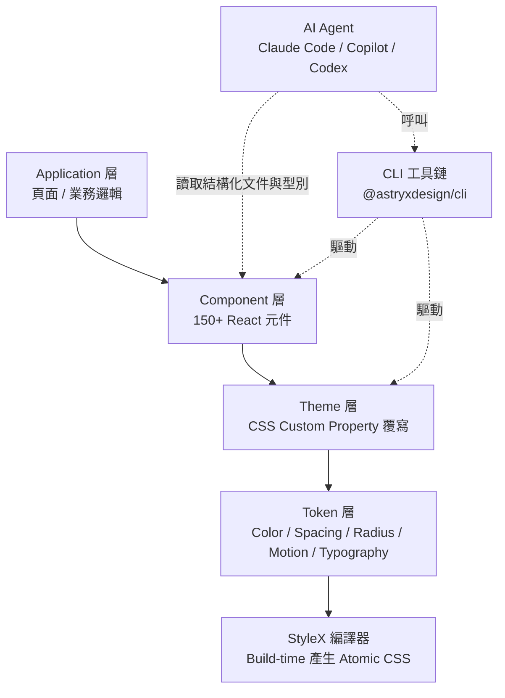

### 1.6 元件生態

官方依用途將元件分為 **11 大分類**：Action（操作，如 Button、Dropdown Menu）、Chat（AI 對話介面專屬，如 Chat Message）、Container（容器，如 Card、Carousel）、Content（內容呈現，如 Heading、Text、Avatar）、Data Input（資料輸入，如 Text Input、Checkbox Input、Switch）、Feedback & Status（回饋與狀態，如 Toast、Badge）、Layout（版面，如 Grid、App Shell）、Navigation（導覽，如 Tab List、Side Nav）、Overlay（覆蓋層，如 Dialog、Alert Dialog、Tooltip）、Table & List（表格與清單，如 Table、Tree List）、Utility（工具型，如 VisuallyHidden）。詳細元件清單、正確命名與使用建議見第六章。

### 1.7 Token System

Token 是設計決策的最小單位，例如「主要品牌色」「預設圓角」「標準間距單位」。依官方 Typography 文件的描述，Astryx 的 Token 採**兩層**結構：**Primitive Token**（原始值，如 `--font-size-xs`…`--font-size-5xl`）與**Semantic Token**（語意值，如 `--text-heading-1-size`，透過 `var()` 指向對應的 Primitive）。官方文件並未定義獨立的「Component Token」第三層——元件是直接消費 Semantic Token，而非再透過一層元件專屬變數間接引用。這代表「換膚」變成「換一組 Semantic Token 變數值」的操作，而不是「改元件程式碼」的操作。詳細架構圖見第二章 2.3。

### 1.8 Theme System

Theme 是「一組 Token 覆寫值的集合」。Astryx 內建 7 套主題可直接使用，也可以作為企業自建品牌主題的起點：複製一份主題定義、調整色彩與圓角等 Token 值，即可產生專屬品牌外觀，無需修改任何元件原始碼。詳見第七章。

### 1.9 Agent Ready

Astryx 將「人類開發者」與「AI Agent」視為同一等級的 API 使用者，這是它與多數傳統元件庫最大的差異之一。具體展現在：Prop 命名有一致慣例（減少 AI 需要「猜」的空間）、CLI 可用結構化輸出（方便 Agent 解析而非只給人看的漂亮排版）、文件之間有明確的交叉引用結構。第九章會深入討論如何把這個特性最大化。

**實務案例**：某金融集團的內部後台團隊導入 Astryx 時，先用一週時間只做「Token 對齊」——把既有品牌規範（色彩、字級、間距）轉譯成 Astryx Token 覆寫，而不是急著替換元件。這個順序讓後續元件替換的視覺一致性風險大幅降低。

**注意事項**：Beta 階段版本號變動可能伴隨 Token 命名調整，導入前務必鎖定版本並建立內部的升級測試流程（見第十七、十八章）。

---

## 第二章 Architecture

### 2.1 Overall Architecture

Astryx 的整體架構可以理解為「編譯期最大化、執行期最小化」。多數傳統 CSS-in-JS 方案（如 styled-components 早期版本）在瀏覽器執行期動態產生樣式標籤，這對大型應用是效能負擔。StyleX 的做法是在建置階段就把樣式解析、去重、映射成 atomic class，執行期元件只是套用已知的 class name。

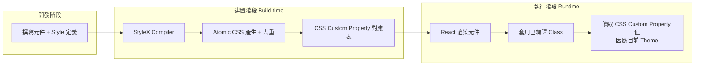

### 2.2 Component Architecture

每個元件內部大致分三層：**行為層**（互動邏輯、鍵盤操作、狀態機）、**無障礙層**（ARIA 屬性、焦點管理）、**呈現層**（消費 Token 的 StyleX 樣式定義）。這種分層讓「客製外觀」與「保留正確互動行為」可以同時成立——你覆寫的是呈現層的 Token 值，行為與無障礙邏輯不受影響。

### 2.3 CSS Architecture

CSS 架構的核心是**兩層**變數串接（依官方 Typography／Token 文件的實際描述，而非三層）：**Primitive Token**（原始值，如 `--font-size-xs`、`blue-500`）→ **Semantic Token**（語意值，如 `--text-heading-1-size`、`color-primary`，透過 `var()` 指向對應的 Primitive）。元件直接消費 Semantic Token，官方文件未定義獨立的「Component Token」中介層。這種間接層設計的價值在於：換品牌色只需要改 Semantic 層的指向，不用逐一修改每個元件內部寫死的數值。

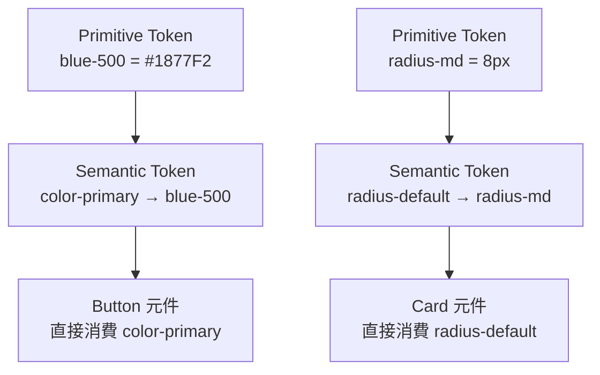

> **企業實務補充**：雖然官方未提供「Component Token」這一層，許多企業團隊仍會在自己的 `components/ui` 包裝層內部，用一個額外的間接變數（例如專案自訂的 `--app-button-bg: var(--color-primary)`）來隔絕未來 Semantic Token 改名的衝擊。這是團隊自建的工程慣例，並非 Astryx 官方架構的一部分，採用前應清楚讓團隊理解兩者的差異。

### 2.4 Runtime

執行期主要工作只剩：React 依 Props/State 決定套用哪些已編譯的 class、瀏覽器依目前作用中的 Theme（即目前生效的 CSS Custom Property 值集合）渲染實際顏色與尺寸。這代表切換 Dark Mode 或切換品牌主題，理論上只需要替換一組 CSS 變數值（例如切換套用在根節點的 `data-theme` 屬性），不需要重新渲染整棵元件樹的樣式邏輯。

### 2.5 Build Model

依官方 Getting Started 文件，**一般專案直接使用 Astryx 元件庫時，不需要在 bundler 中額外註冊任何 StyleX build plugin**：`npm install @astryxdesign/core @astryxdesign/theme-neutral @astryxdesign/cli` 後執行 `npx astryx init` 即可運作，Astryx 元件本身已預先編譯好對應樣式。這與部分團隊對「StyleX 專案」的既有印象（需要客製 Babel/PostCSS 設定）不同，是 Astryx 刻意降低導入門檻的設計。

`@astryxdesign/build` 套件僅用於**進階情境**：當企業需要在自己的原始碼中直接撰寫 StyleX 樣式定義（而不只是使用 Astryx 既有元件）時，才需要將其 build plugin 插入既有 bundler（Vite、Webpack、Rspack 等），讓其在打包過程中攔截樣式定義並產生對應的 CSS 檔案與 atomic class 映射。多數企業導入 Astryx 的初期階段（僅消費既有元件）並不會用到這一步，詳見第三章 3.4 的區分說明。

### 2.6 React Integration

Astryx 元件是標準 React 函式元件，支援 Ref 轉發、Composition（透過 `asChild`-like 模式或 Slot 概念交由子元件決定實際渲染標籤）、Controlled/Uncontrolled 雙模式。與 React 19 的 Server Component 搭配時，需留意哪些元件必須標記為 Client Component（凡具備互動狀態的元件，如 Dialog、Tabs，通常都需要）。

### 2.7 Accessibility（架構層面）

無障礙不是「額外加上去」的功能，而是内建在行為層的狀態機裡：例如 Dropdown Menu 元件的鍵盤導覽、焦點循環（Focus Trap）、ARIA 屬性綁定都是元件內部邏輯的一部分，客製樣式不會破壞這些行為。詳細規範見第八章。

### 2.8 Token Flow

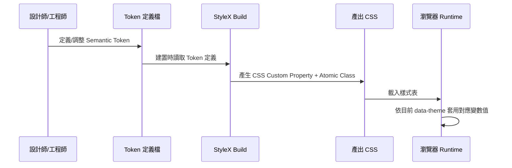

### 2.9 Theme Flow

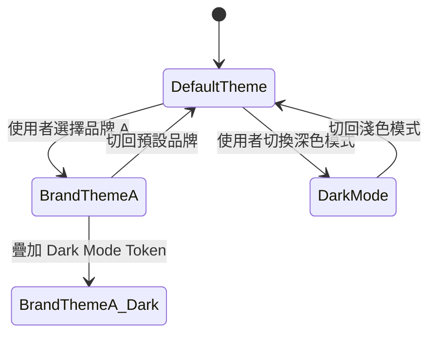

**Component Flow / Rendering Flow 說明**：一次典型渲染流程為——React 決定元件與其 Props → 元件依 Props/State 選擇要套用的已編譯 Class 名稱 → 瀏覽器套用 Class 對應的 Atomic CSS → CSS 讀取當前作用中 Theme 的 Custom Property 值 → 畫面呈現最終樣式。因為 Class 是建置期就決定好的固定字串，React 不需要在執行期動態計算樣式物件，這是效能優勢的來源。

**實務案例**：某電商團隊將舊有的 runtime CSS-in-JS 元件庫換成 Astryx 後，商品列表頁（含上百張卡片、大量重複元件）的互動延遲（Interaction to Next Paint）有明顯改善，主因正是移除了執行期樣式計算的開銷。

**注意事項**：StyleX 的 build-time 特性代表你不能在執行期「動態組出一個從未在原始碼中出現過的樣式字串」（例如用字串拼接動態產生任意色碼），這與部分團隊過去慣用的動態樣式寫法不相容，導入時需要教育團隊改用 Token 覆寫或條件式 class 切換。

---

## 第三章 Installation

> **重要區分**：官方文件對「**使用** Astryx 的專案」與「**貢獻** Astryx 原始碼本身」列出了不同的環境需求，過去版本的教學手冊未區分兩者，容易誤導一般專案團隊不必要地鎖定特定 Node／套件管理器版本。本章依此區分重新整理。

### 3.1 前置需求

**使用 Astryx 的一般專案**（多數企業團隊屬於此類）：

- Node.js：官方 Getting Started 未對消費端專案強制規定版本，以能執行 React 19+ 專案的現行 LTS 版本即可。
- 套件管理器：官方 Getting Started 範例統一使用 `npm install`，npm / pnpm / yarn / bun 皆可正常安裝 `@astryxdesign/*` 系列套件。
- 作業系統：Windows、macOS、Linux 皆可，差異主要在殼層（Shell）指令與路徑分隔符號。

**貢獻 Astryx 原始碼本身**（僅適用於要向 facebook/astryx repo 提交 PR 的團隊）：

- Node.js：CONTRIBUTING.md 明確要求「active LTS line 的 Node.js 22+」。
- 套件管理器：repo 的 `packageManager` 欄位鎖定 pnpm 10（`npm install -g pnpm@10`），這是 monorepo 開發工具鏈的要求，與消費端專案安裝無關。

### 3.2 各作業系統安裝前置作業（一般專案）

一般使用 Astryx 的專案，只要現行 Node.js LTS 版本能跑 React 19+ 專案即可，以下示範以 nvm/fnm 管理版本作為企業常見做法，非 Astryx 官方強制要求：

**Windows（PowerShell）**
```powershell
# 確認 Node 版本（現行 LTS 即可）
node -v
# 若使用 nvm-windows 管理版本
nvm install --lts
nvm use --lts
```

**macOS（zsh/bash）**
```bash
# 建議透過 nvm 或 fnm 管理 Node 版本
fnm install --lts
fnm use --lts
```

**Linux（Debian/Ubuntu 系列）**
```bash
curl -fsSL https://fnm.vercel.app/install | bash
fnm install --lts
fnm use --lts
```

> 若團隊未來計畫向 `facebook/astryx` 本身提交 PR（貢獻原始碼），才需要額外鎖定 Node 22+ 並透過 `corepack enable && corepack prepare pnpm@10 --activate` 安裝 pnpm 10，詳見 3.1 的區分說明與該 repo 的 CONTRIBUTING.md。

### 3.3 套件管理器安裝方式對照

官方 Getting Started 文件的範例統一採用 `npm install`，以下為各套件管理器的等效指令，皆可正常安裝 `@astryxdesign/*` 系列套件：

| 套件管理器 | 安裝核心套件指令 | 備註 |
| --- | --- | --- |
| npm | `npm install @astryxdesign/core @astryxdesign/theme-neutral @astryxdesign/cli` | 官方文件範例採用，相容性最廣 |
| pnpm | `pnpm add @astryxdesign/core @astryxdesign/theme-neutral @astryxdesign/cli` | monorepo 場景磁碟空間效率佳 |
| yarn | `yarn add @astryxdesign/core @astryxdesign/theme-neutral @astryxdesign/cli` | Yarn Berry（PnP 模式）建議先驗證解析行為 |
| bun | `bun add @astryxdesign/core @astryxdesign/theme-neutral @astryxdesign/cli` | 執行速度快，屬社群驗證路徑 |

### 3.4 完整安裝步驟（一般使用，免建置設定）

```bash
# 1. 建立專案（以 Vite + React + TypeScript 範本為例，Astryx 本身不限定 Vite）
npm create vite@latest my-astryx-app -- --template react-ts
cd my-astryx-app

# 2. 安裝核心套件、主題與 CLI
npm install @astryxdesign/core @astryxdesign/theme-neutral @astryxdesign/cli

# 3. 執行 CLI 初始化（見 3.5），完成後即可直接 import 元件使用，
#    不需要在 vite.config.ts / webpack.config.js 中額外註冊任何 build plugin
```

> **與舊版教學手冊的差異提醒**：早期版本教材曾要求在 bundler 設定中手動註冊 StyleX build plugin（`@astryxdesign/build`）才能完成安裝，這其實只適用於「企業要自行撰寫 StyleX 原始樣式」的進階情境，並非一般消費 Astryx 元件的必要步驟。進階建置設定見第十三章 13.3。

### 3.5 CLI 初始化

```bash
npx astryx init
```

`init` 指令會建立基礎設定檔並引導選擇初始主題，完成後即可在專案中直接 `import { Button } from '@astryxdesign/core'` 使用元件。詳細 CLI 指令總表與各指令用途見第五章。

### 3.6 Project 建立與目錄結構速覽

```
my-astryx-app/
├── src/
│   ├── app/                # 頁面與路由
│   ├── components/         # 專案自訂元件（消費 Astryx 元件）
│   ├── theme/              # 自訂 Token 覆寫
│   └── main.tsx
├── astryx.config.*         # astryx init 產生的設定檔（實際檔名依 CLI 版本而定）
├── vite.config.ts
├── package.json
└── tsconfig.json
```

詳細目錄規劃與大型專案的最佳實務見第四章。

### 3.7 安裝驗證

```bash
npx astryx doctor
```

`doctor` 為官方提供的環境健檢指令，會針對設定檔、套件版本等項目輸出 PASS/WARN/FAIL 等級的檢查結果（詳見第五章 5.6）。健檢通過後，啟動開發伺服器並確認頁面樣式正常渲染，瀏覽器開發者工具中能看到 StyleX 產生的 atomic class（通常帶有短雜湊字尾）。

**實務案例**：建議企業內部建立一份「安裝驗證 Checklist」（見章末），新成員 onboarding 時逐項打勾，避免因環境差異導致「在我機器上可以跑」的問題。

**常見錯誤**：

1. 誤以為一般使用也需要註冊 StyleX build plugin，額外做了不必要的 bundler 設定，反而增加維護負擔——一般使用免此步驟，僅進階自訂樣式情境才需要。
2. 混用多種套件管理器的 lockfile（例如同時存在 `package-lock.json` 與 `pnpm-lock.yaml`），造成 CI 與本機安裝結果不一致。
3. 將「貢獻 Astryx 原始碼」要求的 Node 22+／pnpm 10 環境需求，誤套用到一般消費端專案，增加不必要的版本鎖定成本。

### 第一~三章 檢查清單（Checklist）

- [ ] 已確認專案 Node.js 版本能正常執行 React 19+（一般使用無需鎖定 22+，僅貢獻原始碼才需要）
- [ ] 已透過 npm／pnpm／yarn／bun 任一套件管理器安裝 `@astryxdesign/core`、`@astryxdesign/theme-neutral`、`@astryxdesign/cli`
- [ ] 已選定至少一套內建 Theme 作為起點
- [ ] 已確認**不需要**額外註冊 StyleX build plugin（除非有進階自訂樣式需求）
- [ ] `npx astryx doctor` 健檢結果為 PASS
- [ ] 團隊已理解 Token → Theme → Component → Application 四層架構
- [ ] 已建立內部安裝驗證 Checklist 供新人 onboarding 使用

---

## 第四章 Project Structure

### 4.1 單一專案的標準目錄

延續第三章的骨架，實務上建議再細分：

```
src/
├── app/
│   ├── routes/              # 路由層級頁面
│   └── layouts/             # 版面配置（配合 Layout 元件）
├── components/
│   ├── ui/                  # 直接包裝 Astryx 元件的專案級再封裝
│   └── features/            # 業務功能元件（組合多個 ui/ 元件）
├── theme/
│   ├── tokens.ts             # Semantic Token 覆寫定義
│   ├── themes/                # 各品牌主題定義（extends 內建主題）
│   └── index.ts
├── lib/                       # 非 UI 的共用邏輯
└── main.tsx
```

### 4.2 每個目錄的用途說明

- **`app/routes`**：只負責資料組裝與頁面骨架，不應該直接寫死樣式覆寫，樣式一律透過 `theme/` 或 `components/ui` 處理。
- **`components/ui`**：這一層存在的意義是「隔離未來升級的衝擊範圍」。當 Astryx 元件 API 有破壞性變更時，理想狀況下只需要修改這一層的包裝元件，而不必動到所有呼叫端。
- **`components/features`**：組合多個 `ui/` 元件形成業務語意元件（如 `CustomerCard`、`OrderTable`），這一層應避免直接 import Astryx 原始元件。
- **`theme/tokens.ts`**：企業品牌 Token 的單一事實來源，所有品牌色彩、字級、間距調整都應該從這裡出發，不允許在元件內部寫死色碼。

### 4.3 最佳實務

1. **禁止跨層直接引用**：`features` 不應繞過 `ui` 直接 import `@astryxdesign/core` 的原始元件，否則升級衝擊面會失控。
2. **Token 檔案應受版本控管與 Code Review 把關**，視同其他關鍵設定檔。
3. **每個 `ui/` 包裝元件都應該有對應的最小單元測試**，確保未來升級時能快速抓出行為差異。

### 4.4 大型企業專案規劃

當專案規模成長到多團隊、多產品線共用同一套 Design System 時，建議將「Design System 客製層」獨立為內部套件（而非散落在各專案的 `theme/` 資料夾），透過 Monorepo 集中維護、各產品專案以內部套件依賴的方式引用。

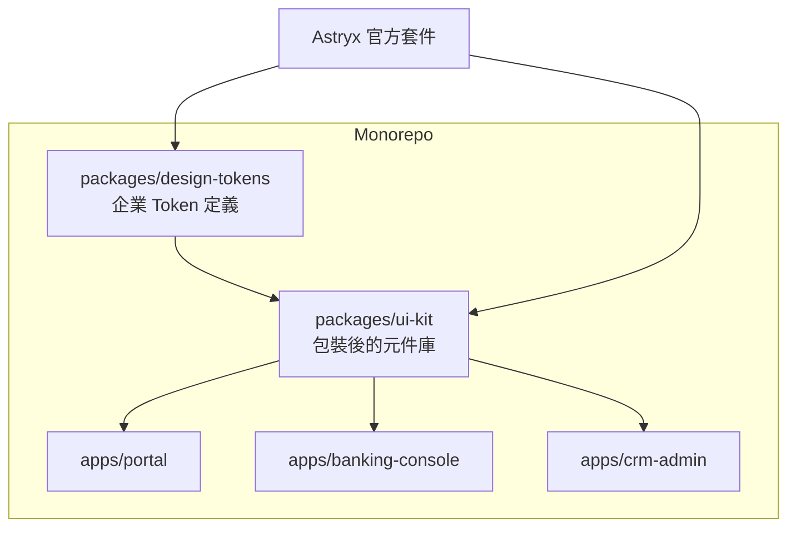

### 4.5 Monorepo / Nx / Turborepo 支援方式

- **Nx**：可將 `design-tokens`、`ui-kit` 定義為獨立 library project，利用 Nx 的 affected 機制，只在 Token 或元件包裝層變動時觸發相依應用程式的重新建置與測試。
- **Turborepo**：透過 `turbo.json` 定義 `ui-kit` 的 build 任務為其他 app 的依賴任務，搭配遠端快取（Remote Cache）加速多產品線的 CI 建置時間。
- 兩者皆需注意 StyleX 的建置產物（CSS 檔案）是否正確地被視為 build 的輸出項並納入快取鍵值計算，否則可能出現快取命中但樣式未更新的問題。

**實務案例**：某集團旗下有電商、會員中心、內部客服後台三個團隊共用一套 Astryx 客製主題，採 Nx Monorepo 後，品牌色調整只需修改 `packages/design-tokens` 一處，三個應用在下一次建置時自動套用，避免了過去「三個團隊各自維護一份 CSS 變數、時常不同步」的問題。

**注意事項**：Monorepo 化雖然能集中治理，但也意味著 `design-tokens` 套件的任何變更會牽動所有下游應用，務必建立變更審查流程與語意化版本（Semantic Versioning）規範。

---

## 第五章 CLI

> 本章依官方文件 `astryx.atmeta.com/docs/cli`（並交叉核對 `packages/cli/README.md` 原始碼）重新查證撰寫，指令語法均為 2026-07-09 查證當下的真實語法，與早期版本教材（`component --info`、`generate`、`migrate` 等）有明顯差異，請以本章為準。

### 5.1 CLI 總覽

`@astryxdesign/cli` 是 Astryx 的操作樞紐，涵蓋初始化、元件查詢、範本注入、主題建置、升級 Codemods、環境健檢、以及專供 AI Agent 讀取的結構化能力清單（`manifest`）。官方文件範例直接以 `npx astryx <command>` 呼叫，不需要額外在 `package.json` 註冊 script 捷徑；企業若偏好固定捷徑仍可自行加上，但非官方必要步驟。所有指令皆支援全域旗標 `--json`、`--detail <full|compact|brief>`、`--lang <en|zh|dense>`，方便人類精簡閱讀或 AI Agent 結構化解析。

### 5.2 指令總表

| 指令分類 | 範例指令 | 用途 |
| --- | --- | --- |
| 說明 | `npx astryx --help` | 列出所有可用指令 |
| 初始化 | `npx astryx init --all` | 安裝相依套件、設定主題、產生 AI Agent 規則檔 |
| 元件查詢 | `npx astryx component Button` | 查看單一元件文件與 Props |
| 全文搜尋 | `npx astryx search "confirm dialog"` | 跨元件／文件的關鍵字排序搜尋 |
| 文件查詢 | `npx astryx docs tokens` | 查詢 Token／主題／色彩／字體等主題文件 |
| 範本注入 | `npx astryx template --list` | 列出可用頁面／區塊範本 |
| 元件取源 | `npx astryx swizzle Button` | 將元件原始碼複製進專案供深度客製 |
| 主題建置 | `npx astryx theme build ./src/themes/ocean.ts` | 將 `defineTheme` 定義編譯為 CSS/JS |
| 主題起手式 | `npx astryx theme add neutral ./src/theme` | 以內建主題為基底，產生可編輯的主題原始檔 |
| 升級 | `npx astryx upgrade --from 0.1.2 --path ./src` | 先行模擬（預設 dry-run）版本升級的 Codemods 變更 |
| 升級套用 | `npx astryx upgrade --from 0.1.2 --path ./src --apply` | 實際套用 Codemods 變更 |
| 健檢 | `npx astryx doctor` | 檢查環境、設定檔、版本相容性，PASS/WARN/FAIL 分級輸出 |
| Agent 清單 | `npx astryx manifest --json` | 輸出 CLI 完整能力規格（近似 CLI 版 OpenAPI spec），供 AI Agent 讀取 |

### 5.3 初始化流程範例

```bash
# 一次啟用所有功能（套件安裝＋主題設定＋AI Agent 規則檔）
npx astryx init --all

# 或僅啟用特定功能
npx astryx init --features agents,theme,template

# 針對特定 AI 開發工具產生對應規則檔
npx astryx init --features agents --agent claude    # 產生 CLAUDE.md
npx astryx init --features agents --agent cursor    # 產生 .cursorrules
npx astryx init --features agents --agent codex     # 產生 AGENTS.md
```

`init --features agents` 是 Astryx「AI Agent Ready」定位的具體實作之一：直接依團隊採用的 AI 開發工具，產生對應格式的專案規則檔，省去團隊手動撰寫 Token／元件使用慣例文件的工作，詳見第九章 9.4。

### 5.4 Template／Swizzle 使用範例

Astryx **沒有**通用的「元件產生器」指令（不存在 `generate component` 這類語法）；提供的是兩個定位不同的指令：

```bash
# template：注入既有的頁面／區塊範本（非產生全新自訂元件）
npx astryx template dashboard-shell src/app/dashboard

# swizzle：把元件原始碼複製進專案，供需要深度客製外觀/行為時使用
npx astryx swizzle Button --output src/components/ui
```

`template` 適合快速取得官方維護的頁面骨架起手式；`swizzle` 適合「Token 覆寫已無法滿足客製需求」的情境，複製出的原始碼由專案自行維護，需自行承擔後續官方更新不會自動同步的風險，建議僅在確有必要時使用，並在包裝層（見第四章 4.2）清楚標註哪些元件已被 swizzle。

### 5.5 Upgrade 實務流程

```bash
npx astryx upgrade --from 0.1.2 --path ./src            # 預設為 dry-run，僅模擬不落地修改
npx astryx upgrade --from 0.1.2 --path ./src --apply    # 實際套用 Codemods
```

1. 先不加 `--apply` 執行，取得預計變更清單（dry-run 為預設行為，非需額外旗標）。
2. Code Review 過目預計變更範圍，評估風險；可用 `--codemod <name>` / `--skip-codemod <name...>` 精細控制要套用的 Codemods 子集合。
3. 於獨立分支加上 `--apply` 執行實際變更。
4. 跑完整回歸測試（見第十四章 CI/CD 建議）。
5. 人工抽查 Codemods 無法自動處理的邊界案例（通常是已被 `swizzle` 取出、高度客製化過的元件）。

### 5.6 Doctor 健檢指令

```bash
npx astryx doctor
npx astryx doctor --json
```

`doctor` 會檢查：Node.js 版本、`@astryxdesign/core` 是否已安裝、core 與 cli 版本是否對齊、主題套件是否存在、`astryx.config.mjs` 設定檔語法是否正確、AI Agent 規則檔是否存在、peer dependencies 是否滿足、套件管理器偵測結果等項目，每項輸出 `✓`（通過）／`⚠`（警告）／`ℹ`（資訊）三級結果，並在結尾彙總「通過/警告/失敗/資訊」筆數。**沒有失敗項目時 exit code 為 0**，適合直接作為 CI pipeline 的前置關卡：

```yaml
- run: npx astryx doctor
```

### 5.7 Manifest 指令與 AI Agent 應用

```bash
npx astryx manifest --json
```

`manifest` 是 Astryx CLI 最能體現「Agent Ready」定位的指令：輸出內容為 `{ apiVersion, type: "manifest", data: { commands[], globalOptions[], jsonSupported[], responseTypes{} } }` 的結構化 JSON，其中每個指令都附帶完整的參數、選項型別、預設值與使用範例。這份規格直接衍生自 CLI 本身的指令定義，官方將其定位為「CLI 專屬的 OpenAPI spec」——好處是規格不會與實作行為漂移，AI Agent 可以在產生程式碼前先讀取 `manifest` 取得當前真實的指令語法，而不需要用 `--help` 逐一試探、或依賴訓練資料裡可能過時的記憶。企業導入 Claude Code／Cursor 等工具時，建議在專案規則檔中明確指示「執行 CLI 相關任務前，先呼叫 `astryx manifest --json` 確認語法」，詳見第九章。

**實務案例**：建立一份團隊共用的「CLI 速查表」貼在內部 Wiki，把上表指令依「日常開發」「升級維運」「健檢」三大情境分類，降低新人重新查詢官方文件的頻率。

**常見錯誤**：

1. 沿用舊版教材中不存在的指令（如 `component --list`、`generate`、`migrate`），導致執行時出現 `ERR_UNKNOWN_COMPONENT` 之類的錯誤碼卻不知從何排查——CLI 的錯誤回應皆為 `{ error, code, suggestions? }` 格式，共約 35 種穩定錯誤碼，建議依 `code` 而非錯誤訊息字串做分支判斷。
2. 直接手動修改 `node_modules` 內的 CLI 執行檔案來「暫時修 bug」；正確做法應是回報官方 issue 或在專案層以 patch-package 等機制管理暫時性修補，避免下次安裝時改動消失又忘記原因。

---

## 第六章 Components

### 6.1 元件總覽與分類

依官方文件站 `astryx.atmeta.com/components` 查證，Astryx 實際採用 **11 大分類**、可獨立辨識約 **93 個元件**（官方行銷頁面宣稱「150+」，推測含子元件／變體／區塊級組合，企業導入評估請以文件站現況為準，見 1.3 節說明）：

| 官方分類 | 中文對照 | 代表元件（節錄） |
| --- | --- | --- |
| Action | 操作 | Button、Button Group、Dropdown Menu、Icon Button、Link、More Menu、Toggle Button、Toolbar |
| Chat | 對話 | Chat Composer、Chat Layout、Chat Message、Chat Tool Calls（AI 對話介面專屬類別） |
| Container | 容器 | Card、Carousel、Clickable Card、Collapsible、Selectable Card |
| Content | 內容呈現 | Avatar、Blockquote、Code Block、Empty State、Heading、Icon、Markdown、Text、Timestamp |
| Data Input | 資料輸入 | Checkbox Input、Date Input、Field、File Input、Number Input、Radio List、Slider、Switch、Text Input、Typeahead |
| Feedback & Status | 回饋與狀態 | Badge、Banner、Progress Bar、Skeleton、Spinner、Status Dot |
| Layout | 版面 | App Shell、Aspect Ratio、Divider、Form Layout、Grid、Layout、Section |
| Navigation | 導覽 | Breadcrumbs、Outline、Pagination、Side Nav、Tab List、Top Nav |
| Overlay | 覆蓋層 | Command Palette、Dialog、Alert Dialog、Hover Card、Popover、Toast、Tooltip |
| Table & List | 表格與清單 | List、Metadata List、Overflow List、Table、Tree List |
| Utility | 工具型 | VisuallyHidden |

> **命名提醒**：官方元件命名與部分傳統 UI 庫慣用命名不同，例如「輸入框」是 `Text Input`（而非 `Input`）、「分頁切換」是 `Tab List`（而非 `Tabs`）、「下拉選單」是 `Dropdown Menu`（而非泛用的 `Menu`）、「樹狀清單」是 `Tree List`（而非 `Tree`）。Astryx **沒有**獨立的 `Modal` 元件，中斷式對話框一律使用 `Dialog`（一般用途）或 `Alert Dialog`（確認/危險操作專用，建構於 Dialog 之上）。程式碼中請以官方元件名稱為準，避免依過往其他元件庫的命名慣性猜測 import 名稱。

### 6.2 元件說明範本（以下依此格式介紹主要元件）

#### Button

- **用途**：觸發單一動作的主要互動元件。
- **關鍵 Props**：`variant`（`'primary' | 'secondary' | 'ghost' | 'destructive'`，預設 `'secondary'`）、`size`（`'sm' | 'md' | 'lg'`，預設 `'md'`）、`isDisabled`、`isLoading`、`isIconOnly`、`label`。
- **最佳實務**：同一畫面中「主要動作」只保留一個 `variant="primary"`，避免使用者選擇困難；Loading 狀態應同時鎖定重複點擊。
- **Accessibility**：確保有可讀的無障礙名稱（`label` 或文字內容），`isIconOnly` 的按鈕務必確認仍有可讀名稱傳入。
- **AI 建議**：請 AI 產生按鈕時，在 Prompt 中明確指定 `variant` 語意（例如「這是刪除動作，請使用 destructive variant」），避免 AI 預設套用 primary 造成視覺誤導。

#### Dialog / Alert Dialog

- **用途**：`Dialog` 為一般用途的中斷式對話框（`variant: 'standard' | 'fullscreen'`）；`Alert Dialog` 建構於 Dialog 之上，專用於確認/危險操作情境，內建 `title`、`description`、`actionLabel`、`cancelLabel`（預設 `'Cancel'`）、`actionVariant`（預設 `'destructive'`）等語意化 Props，不需要自行組裝 Header/Body/Footer。
- **關鍵 Props（Dialog）**：`isOpen`、`onOpenChange`、`purpose`（`'required' | 'form' | 'info'`，預設 `'info'`）、`width`（預設 `400`）。
- **關鍵 Props（Alert Dialog）**：`title`、`description`、`actionLabel`、`onAction`、`isActionLoading`。
- **最佳實務**：確認操作務必使用 `Alert Dialog` 而非自行拼裝 `Dialog`，可省去重複的焦點管理與按鈕排列邏輯；`isActionLoading` 應在非同步確認動作進行中鎖定重複點擊。
- **Accessibility**：內建 Focus Trap 與 `Esc` 關閉；`Alert Dialog` 已依 WAI-ARIA 慣例處理好焦點循環與返回焦點，不需另外實作 `initialFocusRef` 之類的手動指定。
- **AI 建議**：請 AI 產生確認對話框時明確要求使用 `Alert Dialog` 而非通用 `Dialog`，避免重工焦點管理邏輯。

#### Dropdown Menu / More Menu

- **用途**：非中斷式的延伸操作選單；`More Menu` 為常見的「更多操作（⋯）」慣用模式封裝。
- **關鍵 Props**：`items`（資料驅動的 `DropdownMenuOption[]`）或以 `children` 組裝、`placement`（預設 `'below'`）、`hasChevron`（預設 `true`）、`button`。
- **最佳實務**：行動裝置情境以點擊觸發為主，避免依賴 hover 展開。
- **Accessibility**：需支援方向鍵在選項間移動、`Esc` 關閉並返回焦點於觸發元素。

#### Tab List

- **用途**：同一層級的內容切換。
- **關鍵 Props**：`value`、`onChange`（皆為必填）、`layout`（`'hug' | 'fill'`，預設 `'hug'`）、`orientation`（`'horizontal' | 'vertical'`）、`hasDivider`。
- **最佳實務**：分頁數量過多時應考慮改用 Side Nav 或 Dropdown Menu，避免橫向擁擠。
- **Accessibility**：需支援左右方向鍵切換，元件內建已處理對應的 ARIA role 綁定。

#### Text Input / Checkbox Input / Switch

- **用途**：資料輸入與表單狀態收集；輸入框對應元件為 `Text Input`（而非 `Input`）。
- **關鍵 Props（Text Input）**：`label`（必填）、`type`（`'text' | 'password' | 'email'`）、`status`（警告/錯誤/成功等狀態）、`isRequired`、`hasClear`。
- **最佳實務**：錯誤訊息應透過 `status` 與對應欄位關聯呈現，不要只靠顏色標示錯誤（色盲使用者無法辨識）。
- **常見錯誤**：把 `Switch`（即時生效的開關）誤用在「需要送出表單才生效」的情境，應改用 `Checkbox Input`。

#### Table / Tree List

- **用途**：結構化資料呈現，`Tree List` 用於呈現階層關係（如組織架構、檔案目錄），支援巢狀 `items` 資料結構與 `density`（`'compact' | 'balanced' | 'spacious'`，預設 `'balanced'`）密度設定。
- **最佳實務**：大量資料（超過幾百列）務必搭配虛擬滾動（Virtualization），Astryx 官方 v0.1.3 起已為 `Tree List` 補齊完整 WAI-ARIA APG Tree View 鍵盤操作模式，包含 roving-tabindex 與 typeahead（依名稱首字快速定位節點）。
- **Accessibility**：確認欄位標題與內容的關聯正確，排序操作要有清楚的狀態提示（升冪/降冪）。

#### Toast / Tooltip

- **用途**：`Toast` 為短暫的系統通知（非阻斷式），`Tooltip` 為滑鼠/焦點停留時的輔助說明。
- **關鍵 Props（Toast）**：`type`、`body`、`isAutoHide`、`autoHideDuration`、`onDismiss(reason: 'auto' | 'manual')`。
- **最佳實務**：Toast 訊息應簡潔且提供「復原（Undo）」選項於可逆操作（如刪除）之後；避免同時堆疊過多 Toast。
- **Accessibility**：Toast 動態內容需搭配 `aria-live` 區域感知，讓螢幕報讀器能主動播報；純視覺輔助說明請搭配 `VisuallyHidden`（Utility 分類）補上可讀文字，確保螢幕報讀器使用者亦能取得相同資訊。

#### Card / Layout / Heading / Text / Avatar

- **用途**：版面構成的基礎積木；官方無獨立的 `Typography` 元件，文字語意改由 `Heading`（`level: 1-6`，決定語意標籤）與 `Text` 分工。
- **關鍵 Props（Card）**：`variant`（`'default' | 'transparent' | 'muted'` 或語意色系）、`padding`。
- **關鍵 Props（Avatar）**：`size`（`'tiny' | 'xsmall' | 'small' | 'medium' | 'large'` 或數值 px）、`src`、`fallbackSrc`、`name`（文字縮寫備援）、`status`（角標狀態點）。
- **最佳實務**：`Heading` 的 `level` 應對應真實文件結構層級（而非單純視覺大小），必要時可用 `type` 屬性單獨覆寫視覺樣式而不影響語意層級，有利 SEO 與螢幕報讀器導覽。

### 6.3 元件組合範例

```tsx
import { AlertDialog, Button } from '@astryxdesign/core'

function ConfirmDeleteDialog({
  isOpen,
  onOpenChange,
  onConfirm,
  itemName,
}: {
  isOpen: boolean
  onOpenChange: (isOpen: boolean) => void
  onConfirm: () => void
  itemName: string
}) {
  return (
    <AlertDialog
      isOpen={isOpen}
      onOpenChange={onOpenChange}
      title="確認刪除"
      description={`確定要刪除「${itemName}」嗎？此操作無法復原。`}
      cancelLabel="取消"
      actionLabel="確認刪除"
      actionVariant="destructive"
      onAction={onConfirm}
    />
  )
}
```

上例刻意示範 `AlertDialog`（而非自行用 `Dialog` + `Button` 拼裝 Header/Body/Footer）——這是 Astryx 對「確認/危險操作」情境刻意封裝好的語意化元件，可省去手動組裝與焦點管理的重工。

**實務案例**：建立企業內部的「元件使用規範文件」，針對每個核心元件標註「本團隊允許的 variant 範圍」與「禁止事項」（如禁止在同一畫面出現兩個 `variant="primary"` 的按鈕），比單純沿用官方文件更能約束團隊一致性。

**注意事項**：避免直接修改 `node_modules` 內元件原始碼作為「臨時客製」，一律透過 Token 覆寫或 Composition 達成客製需求；並留意元件實際命名與部分「約定俗成」的 UI 庫命名不同（見 6.1 命名提醒），AI 產生程式碼時尤其容易套用錯誤的 import 名稱。

---

## 第七章 Theme System

### 7.1 Theme 的本質

一個 Theme 就是一組 CSS Custom Property 的具體賦值。系統定義了一批「插槽」（Semantic Token），Theme 的工作就是填值進這些插槽，元件本身完全不需要知道目前套用的是哪一個 Theme。

### 7.2 Dark Mode

Dark Mode 在 Astryx 中通常被建模為「同一 Theme 底下的另一組變數集合」，透過根節點的屬性（如 `data-color-mode="dark"`）切換，而不是另外準備一整套獨立主題檔。這樣可以確保品牌 Theme 與 Dark Mode 是正交（orthogonal）可疊加的兩個維度。

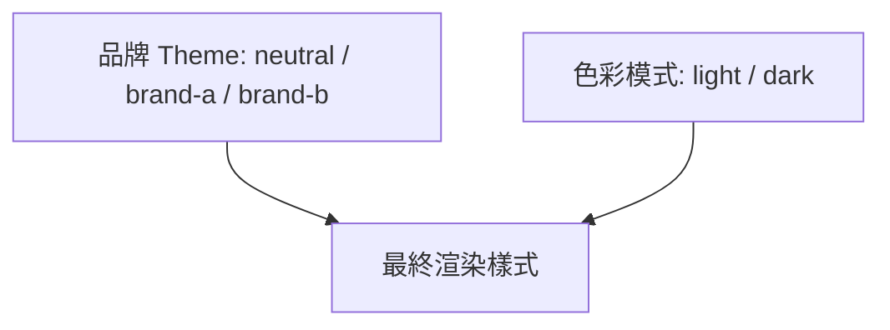

### 7.3 Brand Theme 建立流程

```bash
# 以內建主題為基底，產生可編輯的主題原始檔（真實 CLI 指令為 theme add，而非 theme --create）
npx astryx theme add neutral src/theme/themes/brand-x

# 查看所有可作為基底的內建起始主題
npx astryx theme add --list

# 修改完成後編譯為可載入的 CSS/JS
npx astryx theme build src/theme/themes/brand-x/index.ts --out src/theme/themes/brand-x/dist
```

產生的主題檔案通常以「繼承 + 覆寫」的形式呈現，只需列出與基底主題不同的 Token 值：

```ts
// theme/themes/brand-x.ts
import { neutralTheme } from '@astryxdesign/theme-neutral'
import { defineTheme } from '@astryxdesign/core'

export const brandXTheme = defineTheme(neutralTheme, {
  colorPrimary: '#0B5FFF',
  colorPrimaryHover: '#0A52DE',
  radiusDefault: '6px',
  fontFamilyBase: '"Noto Sans TC", sans-serif',
})
```

### 7.4 Design Token 分類

以下依用途分類 Semantic Token（皆為兩層架構中的第二層，見第二章 2.3）：

| Token 類別 | 範例 | 用途 |
| --- | --- | --- |
| Color | `colorPrimary`、`colorDanger`、`colorSurface` | 品牌與語意色彩 |
| Font | `fontFamilyBase`、`--text-heading-1-size` | 字體與字級（官方 Typography 文件即以此類 Token 示範兩層架構） |
| Radius | `radiusDefault`、`radiusPill` | 圓角規則 |
| Motion | `motionDurationFast`、`motionEasingStandard` | 動畫時長與緩動曲線 |
| Spacing | `spacingUnit`、`spacingLg` | 間距基準與尺度 |
| Density | `densityCompact` / `densityComfortable` | 資訊密度（如表格列高） |

> 官方核心可自訂品牌起點為 7 套主題（neutral、butter、chocolate、matcha、stone、gothic、y2k），文件站另提供 default、daily、brutalist 等示範性主題供參考，兩者性質不同：前者是企業建立品牌主題時的建議起點，後者偏向風格示範，不建議直接作為生產環境品牌基底。

### 7.5 企業如何建立 Design Token

1. **盤點既有品牌規範**：從既有的 Brand Guideline（通常是設計團隊維護的 Figma 或 PDF）萃取色彩、字級、間距的既定規則。
2. **對應到 Semantic Token**：不要直接把 Figma 裡的色票名稱（如「藍色 3」）當作 Token 名稱，應該轉譯成語意名稱（如 `colorPrimary`、`colorPrimaryHover`），未來換色時語意不需要跟著改。
3. **建立 Token 治理流程**：Token 檔案變更應走 Pull Request + 設計團隊 Review，避免工程師憑感覺調整數值。
4. **建立 Token 視覺化文件**：可用 Storybook 或內部工具產生 Token 一覽頁面，讓設計與工程雙方有共同的「事實來源」可核對。

**實務案例**：某銀行系統將既有品牌規範中的 12 種藍色調，收斂為 4 個語意 Token（`colorPrimary`、`colorPrimaryHover`、`colorPrimaryActive`、`colorPrimaryDisabled`），大幅降低了元件開發時「該用哪一種藍」的決策成本。

**注意事項**：Motion Token（動畫時長/緩動）常被忽略，但對於品牌一致的「手感」影響很大，建議與 Color、Spacing 同等重視，並注意配合 `prefers-reduced-motion` 使用者偏好設定，為動作敏感使用者停用非必要動畫。

---

## 第八章 Accessibility

> **重要澄清**：查證官方文件站與 GitHub Release Notes 後，**未發現 Astryx 官方對外正式聲明任何 WCAG 合規等級**（如「達到 WCAG AA」）。官方行銷用語僅泛稱「accessible components」，並未附上第三方稽核報告或合規聲明文件。本章原先部分措辭暗示元件「內建即可達 WCAG AA」，已修正為謹慎表述：Astryx 提供無障礙**基礎建設**（鍵盤操作模式、ARIA 綁定、焦點管理原語），企業仍須自行驗證實際頁面是否達到目標合規等級，不可將「使用 Astryx」直接等同於「已達 WCAG AA」。

### 8.1 ARIA 使用原則

Astryx 元件內建常見的 ARIA 屬性綁定，但客製化組合元件時（尤其是拆解重組 Composition 模式）需自行確認 ARIA 關聯沒有斷裂，例如自訂 Label 與 Text Input 的 `aria-labelledby` 對應。官方另提供 `VisuallyHidden`（Utility 分類）原語元件，用於補上僅供螢幕報讀器讀取、視覺上隱藏的輔助文字。

### 8.2 鍵盤操作規範

| 元件 | 鍵盤行為 |
| --- | --- |
| Dialog / Alert Dialog | `Tab`/`Shift+Tab` 焦點循環於對話框內，`Esc` 關閉 |
| Dropdown Menu | 上下方向鍵移動選項，`Enter` 選取，`Esc` 關閉，並支援 typeahead（輸入文字快速定位選項） |
| Tab List | 左右方向鍵切換分頁 |
| Tree List | 官方 v0.1.3 起已補齊**完整 WAI-ARIA APG Tree View 鍵盤操作模式**，包含 roving-tabindex（同一時間僅一個節點可 Tab 聚焦）與 typeahead 節點定位，是目前查證到官方最具體詳列的無障礙實作紀錄 |
| Table | 視實作可支援方向鍵在儲存格間移動（進階需求） |

### 8.3 Screen Reader 支援

動態內容（Toast、表單驗證錯誤訊息）應搭配 `aria-live="polite"`（一般通知）或 `aria-live="assertive"`（急迫錯誤）區域，確保螢幕報讀器會主動播報而不需使用者手動聚焦。

### 8.4 WCAG 對應重點（企業自行驗證項目）

- **對比度（Contrast）**：一般文字對背景需達 4.5:1 以上（WCAG AA），大字級可放寬至 3:1。品牌主題的色彩 Token 選定時務必用對比度檢測工具驗證，不能只憑視覺喜好挑色，也不能假設官方主題色一定合格。
- **Focus 可見性**：所有可互動元素在鍵盤 Focus 時需有清楚可辨識的外框樣式，切勿為了「視覺乾淨」而用 `outline: none` 全域移除卻不補上替代樣式。
- **Reflow**：頁面在 400% 縮放下仍應可正常操作不需雙向捲動。

### 8.5 最佳實務

1. 每次導入新的品牌 Theme 時，務必重新跑一次對比度檢查，因為換色可能讓原本合格的組合變成不合格。
2. 使用自動化工具（如 axe-core）整合進 CI，於 PR 階段攔截明顯的無障礙缺陷，但不能取代人工鍵盤操作測試。
3. 建立「鍵盤 only」與「螢幕報讀器」的定期人工測試排程，尤其在導入新元件組合後。

**實務案例**：某 ERP 系統在導入 Astryx 後，將 axe-core 掃描納入 CI 的必要檢查項目，三個月內無障礙相關的客訴數量明顯下降。

**常見錯誤**：只做自動化掃描就視為「無障礙已達標」——自動化工具通常只能抓出三到四成的無障礙問題（如結構性 ARIA 缺失），真正的操作流暢度仍需人工鍵盤與螢幕報讀器測試驗證。

### 第四~八章 檢查清單（Checklist）

- [ ] 專案目錄已區分 `components/ui` 與 `components/features` 兩層
- [ ] Token 檔案已納入版本控管與 Code Review
- [ ] 團隊已建立 CLI 速查表並熟悉 init/doctor/manifest/upgrade 指令
- [ ] 核心元件已建立內部「使用規範」文件（允許的 variant、禁止事項）
- [ ] 品牌 Theme 已用繼承 + 覆寫方式建立，未直接修改內建主題原始檔
- [ ] Design Token 已完成語意化收斂（不直接使用視覺化色票名稱）
- [ ] CI 已整合自動化無障礙掃描（如 axe-core）
- [ ] 已建立定期人工鍵盤 / 螢幕報讀器測試排程
- [ ] 團隊已理解官方未正式聲明 WCAG 合規等級，已規劃自行驗證流程

---

## 第九章 AI Agent Ready

> **官方定位原文**：這不是本文的詮釋語，而是 Astryx 在 GitHub 專案描述欄位逐字使用的定位——**"fully customizable and agent ready"**。第三方報導（MarkTechPost，2026-06-27）更直接以「an open source React design system agents can read」為標題，聚焦報導其 CLI 與 MCP Server 的 AI 整合能力。

### 9.1 Astryx 如何支援 AI

多數 Design System 的文件是「寫給人看」的：大量敘述性文字、截圖、互動式 Demo。這些對人類很友善，但對 AI Agent 解析卻不一定有效率——Agent 更需要的是「結構穩定、可預期、可被程式化查詢」的資訊來源。Astryx 把這件事當作一級設計原則，具體展現在四個層面：

1. **Prop 命名一致性**：同語意的 Prop 在不同元件間盡量共用相同名稱（如對話框類元件共用 `isOpen`/`onOpenChange`）。這降低了 AI 在「猜 Prop 名稱」時的錯誤率。
2. **CLI 可結構化輸出**：`astryx component <name>` 可查詢單一元件的真實文件與 Props，`astryx manifest --json` 更直接輸出整個 CLI 的結構化能力規格（近似 CLI 版 OpenAPI spec，見第五章 5.7），讓 Agent 在產生程式碼前，能先取得真實定義，而不是憑訓練資料裡可能過時的記憶生成程式碼。
3. **文件間的交叉引用結構明確**：元件文件、Token 文件、Theme 文件之間有清楚的連結關係，方便 Agent 在多輪工具呼叫中逐步收斂到正確答案。
4. **原生 MCP Server**：官方提供 hosted 的 Model Context Protocol Server（見 9.2），讓支援 MCP 的 AI 工具可直接連線查詢元件與文件，不需要額外開發整合層。

### 9.2 MCP Server

Astryx 官方在 `astryx.atmeta.com/docs/working-with-ai` 提供一個 **hosted 遠端 MCP Server**（並非需要另外安裝的本機 npm 套件），對外暴露 `search(query)` 與 `get(name)` 兩個函式，供 AI Agent 直接查詢元件、Token、文件內容。設定方式視工具而定，以 Claude Desktop／Claude Code 為例：

```json
{
  "mcpServers": {
    "xds": {
      "type": "url",
      "url": "https://astryx.atmeta.com/mcp"
    }
  }
}
```

同樣格式的設定也適用於 Cursor（`.cursor/mcp.json`）、Windsurf（`.windsurf/mcp.json`）、Cline 等支援 MCP 的工具。企業導入建議：在團隊的 AI 開發環境中統一設定此 MCP Server，讓 Agent 在產生 Astryx 相關程式碼前，能主動查詢官方即時資料，而非僅依賴訓練資料或本文的靜態說明——本文查證於 2026-07-09，元件與 API 仍可能持續變動。

### 9.3 各 AI 工具的角色定位

| 工具 | 適合的角色 |
| --- | --- |
| Claude Code | 深度多檔案重構、跨元件一致性檢查、Migration 執行與驗證 |
| GitHub Copilot | 即時行內建議、單一檔案內的元件補全 |
| OpenAI Codex | 大範圍程式碼生成任務、CI 中的自動修復 Agent |
| Gemini CLI | 終端機內快速查詢與腳本化操作 |
| Cursor | IDE 內整合式的對話 + 編輯迴圈 |
| Windsurf | 類似 Cursor 的整合式 Agent IDE 工作流 |
| OpenHands | 自主性較高的多步驟任務執行（如整批元件遷移） |

以上工具皆可透過 9.2 的 MCP Server 設定直接連線 Astryx；`init --features agents` 則能依工具類型自動產生對應的規則檔（`--agent claude`／`cursor`／`codex`），兩者互補：MCP 提供即時查詢能力，規則檔提供持久化的專案慣例。

### 9.4 Spec Driven Development

在導入 AI 開發流程時，建議先寫「元件使用規格」（Spec）再讓 Agent 產生程式碼，而不是直接下一句模糊指令。Spec 應包含：目標元件組合、Token 覆寫範圍、無障礙驗收標準、允許/禁止的 variant。這讓 AI 產出的程式碼有明確的驗收依據，而不是「看起來對」就算過關。

### 9.5 Loop Engineering

Loop Engineering 指的是「產生 → 驗證 → 回饋 → 再產生」的迭代迴圈設計。針對 Astryx 開發，建議的迴圈是：

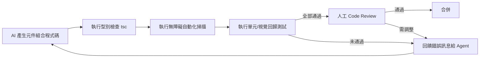

### 9.6 如何讓 AI 更容易理解 UI

- 在專案內維護一份「元件對應語意」的簡表（如：需要中斷式確認用 Alert Dialog、需要非中斷式提示用 Toast），作為 Prompt 或 Claude Code 的 Skill/Instruction 素材。
- 保持 `components/ui` 包裝層的 Prop 命名與底層 Astryx 元件一致，避免 AI 在專案內外文件之間產生混淆。

### 9.7 如何建立 AI 可操作元件

「AI 可操作」代表元件的行為與外觀變化可以透過明確、離散的 Prop 組合完全描述，而不依賴難以言傳的視覺微調。實務上：避免讓元件外觀依賴大量 inline style 覆寫；把常用組合封裝成具名的 `variant`，讓 AI 只需選擇語意選項而非自由發揮樣式數值。

### 9.8 Prompt Engineering 與 Context Engineering

- **Prompt Engineering**：針對單次任務精準描述「要什麼元件、什麼 variant、什麼互動限制」。
- **Context Engineering**：更著重於「讓 Agent 在任務開始前就能取得正確背景」，例如透過 CLAUDE.md／Copilot instructions 檔案，把 Token 命名慣例、元件使用規範、目錄結構規則預先餵給 Agent，而不是每次都在單一 Prompt 裡重複描述。企業導入時，Context Engineering 的投資報酬率通常高於臨場的 Prompt 技巧堆疊；Astryx 的 `init --features agents` 與 MCP Server 正是把 Context Engineering 前置工作自動化的具體實作。

### 9.9 最佳實務

1. 為 AI 工具建立專案層級的「規則檔」，優先透過 `npx astryx init --features agents --agent <工具名>` 自動產生（如 `CLAUDE.md`、`.cursorrules`、`AGENTS.md`），內容包含 Token 使用慣例與元件使用規範。
2. 讓 Agent 產生程式碼後，一律跑自動化型別檢查與無障礙掃描作為第一道防線，人工 Review 聚焦在業務邏輯正確性。
3. 針對重複性高的元件組合（如各種確認對話框，應統一使用 Alert Dialog），建立範例庫供 Agent 參考，減少每次重新生成的變異度。
4. 在專案規則檔中明確要求 Agent 執行 CLI 任務前先呼叫 `astryx manifest --json` 或透過 MCP Server 查詢，避免使用過時或猜測的指令語法。

**實務案例**：某團隊在 `CLAUDE.md` 中明確列出「本專案 Button 僅允許 primary/secondary/ghost/destructive 四種 variant，禁止使用 inline style 調整顏色」，AI 產生的程式碼違規率因此大幅降低，Code Review 負擔隨之減輕。

**常見錯誤**：只在單次 Prompt 裡臨時描述規範，沒有沉澱成專案層級的持久化 Context，導致每次換一個對話視窗、規範就要重講一次，team 內不同人下的 Prompt 品質也參差不齊。

---

## 第十章 與其他 Design System 比較

> **獨立分析聲明**：查證過程中未發現 Astryx 官方或任何第三方媒體發布過與 Radix UI、shadcn/ui、Material UI 等競品的正式比較表。Astryx 官方部落格僅抽象地暗示與「採用他人品牌外觀」「複製貼上原始碼但無升級路徑」等做法不同（隱約對應 Radix 式與 shadcn 式路線），並未指名道姓比較。**以下比較表為作者依各專案公開文件、既有產業認知所做的獨立分析，非 Astryx 官方立場，評分亦帶有主觀判斷成分**，僅供選型時的參考起點，企業實際決策仍應以自身技術棧相容性測試為準。

### 10.1 綜合比較表

| 項目 | Astryx | Material UI | Ant Design | Chakra UI | Mantine | Radix UI | Shadcn/ui | Base UI | Fluent UI | Carbon | PrimeReact |
| --- | --- | --- | --- | --- | --- | --- | --- | --- | --- | --- | --- |
| 樣式技術 | StyleX (build-time) | Emotion (runtime) | CSS + less/CSS-in-JS | Emotion (runtime) | CSS Modules/Emotion | 無樣式（行為層） | Tailwind + Radix | 無樣式（行為層） | Griffel (build-time 傾向) | SCSS/CSS | CSS + PrimeFlex |
| Architecture | Composable，分層明確 | 元件封裝度高 | 元件封裝度高，客製彈性中等 | 客製彈性高 | 客製彈性高 | 極輕量，僅行為 | 原始碼直接複製進專案 | 極輕量，僅行為 | 企業導向，封裝度高 | 企業/政府導向 | 功能豐富但客製彈性中等 |
| Performance | 高（近零 runtime 成本） | 中 | 中 | 中 | 中高 | 高（幾乎無樣式負擔） | 高（同 Tailwind） | 高 | 中 | 中 | 中 |
| Accessibility | 提供基礎建設，**官方未正式聲明 WCAG 合規等級** | 良好 | 中等，部分需自行加強 | 良好 | 良好 | 業界標竿 | 依賴 Radix，良好 | 業界標竿 | 良好（企業級驗證） | 良好（政府無障礙合規） | 中等 |
| Customization | 高（Token + Composition） | 中（需 Theme override） | 中 | 高 | 高 | 極高（自己刻樣式） | 極高（原始碼在自己手上） | 極高 | 中 | 中 | 中 |
| Learning Curve | 中 | 低 | 低 | 低 | 低 | 中高（需自行組裝樣式） | 中 | 中高 | 中 | 中 | 低 |
| Enterprise 適用度 | 高（但 Beta 需評估） | 高 | 高（中國市場為主） | 中高 | 中高 | 中（需自建元件層） | 中（需自建維運規範） | 中 | 高（微軟生態） | 高（政府/金融） | 中高 |
| AI Friendly | 高（官方逐字定位為 "agent ready"，附原生 MCP Server） | 中 | 中 | 中 | 中 | 中（結構單純易懂） | 高（原始碼透明，AI 易讀） | 中 | 中 | 中 | 中 |

### 10.2 選型建議

- 若團隊已大量使用 Tailwind、偏好「元件原始碼直接掌握在自己手上」，Shadcn/ui 是務實選擇。
- 若追求極致無障礙與行為正確性、願意自行刻樣式，Radix UI／Base UI 是良好行為層基礎。
- 若是微軟生態或政府/金融高合規需求，Fluent UI／Carbon 累積的合規案例較豐富。
- 若追求「build-time 效能 + 內建完整元件 + AI 友善設計」三者兼顧，且能承擔 Beta 階段風險，Astryx 是值得評估的新選項。

**實務案例**：某團隊原採 Ant Design，因需要深度客製品牌外觀且苦於 override 的特異性（specificity）大戰，評估遷移至 Astryx 後，Token 覆寫模式大幅減少了樣式覆寫的技術債。

**注意事項**：比較表中的評分為一般性參考，實際選型仍應以團隊既有技術棧相容性、Beta 版本可接受風險程度、以及長期維運人力為主要判斷依據，不應單看評分表決策。

---

## 第十一章 與 AI Coding 整合

### 11.1 整合總覽

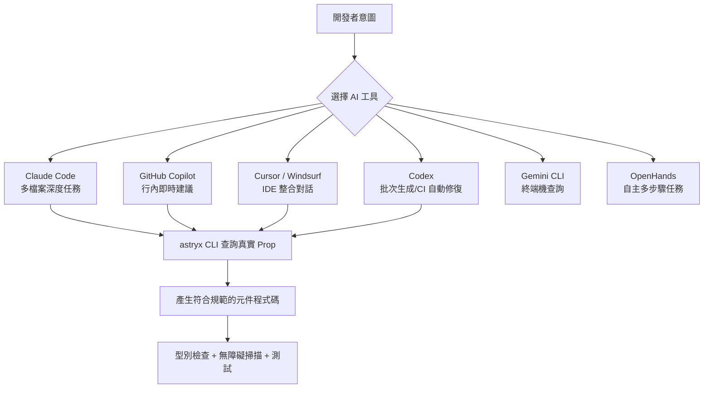

### 11.2 最佳 Prompt 範例（概念示範）

```text
角色：你是熟悉 Astryx Design System 的資深 React 工程師。
任務：實作一個「訂單取消確認」對話框元件。
限制：
- 使用 @astryxdesign/core 的 AlertDialog（不要用 Dialog 自行拼裝 Header/Body/Footer）
- actionVariant 僅能使用 primary/secondary/ghost/destructive
- 執行前請先呼叫 astryx manifest --json 或 MCP Server 確認 AlertDialog 真實 Props
- 需符合 WCAG AA 對比度與鍵盤操作（企業自行驗證項目，見第八章）
產出：完整 TSX 檔案 + 對應的最小單元測試
```

### 11.3 Context 準備要點

提供 Agent：專案的 `components/ui` 包裝規則、Token 命名對照表、既有相似元件範例路徑。這比臨時在 Prompt 裡描述規則更穩定、更可重複使用。

### 11.4 Spec 與 Design Token 的角色

Spec 定義「要做什麼」，Design Token 定義「用什麼視覺語言做」。把兩者都準備好再啟動 Agent 任務，能大幅降低生成結果需要大改的機率。

### 11.5 Component Generation 流程建議

1. 人工或 Agent 先用 `astryx component <name>` 或 `astryx manifest --json` 查詢真實 Prop 定義（亦可透過第九章 9.2 的 MCP Server 查詢）。
2. 依 Spec 撰寫/生成元件程式碼。
3. 自動化型別檢查、無障礙掃描、快照測試。
4. 人工 Review 聚焦業務邏輯與邊界案例。

**實務案例**：某團隊將「查詢 CLI 或 MCP Server 取得最新 Prop 定義」設為 Claude Code 自訂 Slash Command 的第一步，避免 Agent 依賴可能過時的訓練資料記憶生成不存在的 Prop。

**常見錯誤**：直接把整份官方文件貼進 Prompt 當作 Context，導致 Token 消耗過大且 Agent 難以聚焦重點；應該只給與當前任務相關的精簡規則與範例。

---

## 第十二章 Reverse Engineering

### 12.1 舊系統 Modernization 總體策略

Astryx 在 Legacy 現代化專案中的角色，通常是「新 UI 層的落地標準」——先確立新系統要用 Astryx 的元件與 Token 系統，再回頭規劃如何把舊系統的畫面邏輯與資料流「逆向工程」為對應的新元件組合。

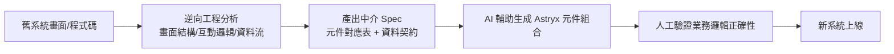

### 12.2 Legacy UI 現代化流程

1. **畫面盤點**：列出所有既有畫面與其核心互動元素（表格、表單、彈窗）。
2. **元件對應**：將舊有 UI Pattern 對應到 Astryx 元件（如舊的 jQuery Modal 對應 Dialog）。
3. **資料流梳理**：確認舊系統資料存取邏輯，避免現代化過程中誤改業務規則。
4. **逐步替換**：優先替換低風險、非核心頁面，累積團隊經驗後再處理核心流程頁面。

### 12.3 React Migration（從舊版 React / Class Component）

舊版 Class Component 或舊版 UI 庫（如 Bootstrap + jQuery 插件）遷移時，建議先建立對應的 `components/ui` 包裝層，讓業務程式碼透過穩定介面呼叫，逐步替換底層實作，而不是一次性大改。

### 12.4 Angular / Vue / JSP / Bootstrap Migration

- **Angular/Vue → React + Astryx**：核心挑戰在於狀態管理與生命週期的轉譯，建議先遷移「無狀態呈現元件」，再處理有複雜狀態邏輯的容器元件。
- **JSP Migration**：JSP 頁面通常混雜了伺服器端邏輯與畫面標記，逆向工程時應先把「純畫面結構」抽出，資料存取邏輯改走前後端分離的 API 呼叫，再套用 Astryx 元件重建畫面。
- **Bootstrap Migration**：Bootstrap 的 Grid/Utility Class 可對應到 Astryx 的 Layout/Grid Token 系統，但務必注意 Bootstrap 慣用的斷點（breakpoint）與 Astryx 預設斷點可能不同，需要重新對照設計稿驗證。

### 12.5 AI 自動轉換的角色與限制

AI 可以高效率處理「畫面結構轉譯」這類模式化工作（如把固定的 HTML 結構轉為對應元件），但無法可靠地逆向工程「隱藏在程式碼裡、未被文件化的業務規則」。這部分仍需要人工訪談原開發者或詳讀舊程式碼邏輯後再驗證。

### 12.6 最佳流程總結

1. 先盤點、後轉換，避免邊盤點邊改造導致範圍失控。
2. AI 負責結構性轉譯，人工負責業務邏輯正確性驗證。
3. 建立新舊畫面對照的驗收清單，確保功能對等（Feature Parity）後才切換上線。
4. 保留舊系統可回退（Rollback）路徑至少一個發布週期。

**實務案例**：某製造業 ERP 系統將 200+ 個 JSP 畫面現代化為 React + Astryx，採取「先建立元件對應字典，再用 AI 批次處理結構轉譯，最後人工驗證業務邏輯」的三階段流程，將原本預估的人月大幅壓縮。

**注意事項**：逆向工程過程中若發現舊系統存在「已無人知曉原因但仍在運作」的邏輯分支，應優先訪談資深人員或保留該邏輯並標註待釐清，而非直接假設是無用程式碼刪除。

---

## 第十三章 Framework Upgrade

### 13.1 React 升級協助

Astryx 元件遵循標準 React API 慣例（Ref 轉發、Controlled/Uncontrolled），升級 React 大版本時，主要風險點在於 Server Component 邊界的重新確認（哪些元件需要標記 Client Component）與 Concurrent Features（如 `useTransition`）的交互行為，而非元件本身的相容性。

### 13.2 Next.js 升級

升級 Next.js 版本時，需重新確認 StyleX build plugin 與 Next.js 的建置管線（尤其是 Turbopack 相關設定）相容性，建議先在獨立分支跑過完整建置與視覺回歸測試，再合併升級。

### 13.3 Remix / Vite / Rspack / Webpack

一般消費 Astryx 元件的專案升級建置工具時，因無需註冊 StyleX build plugin（見第三章 3.4），受影響風險相對有限。**僅當**企業已採用 `@astryxdesign/build` 進行進階自訂 StyleX 原始碼建置時，才需要在升級或更換建置工具前，確認官方或社群是否已提供對應版本的 plugin，避免升級後樣式編譯失效卻難以察覺（因為應用仍可運作，只是樣式退化為無樣式或舊快取樣式）。

### 13.4 Framework Modernization 建議流程

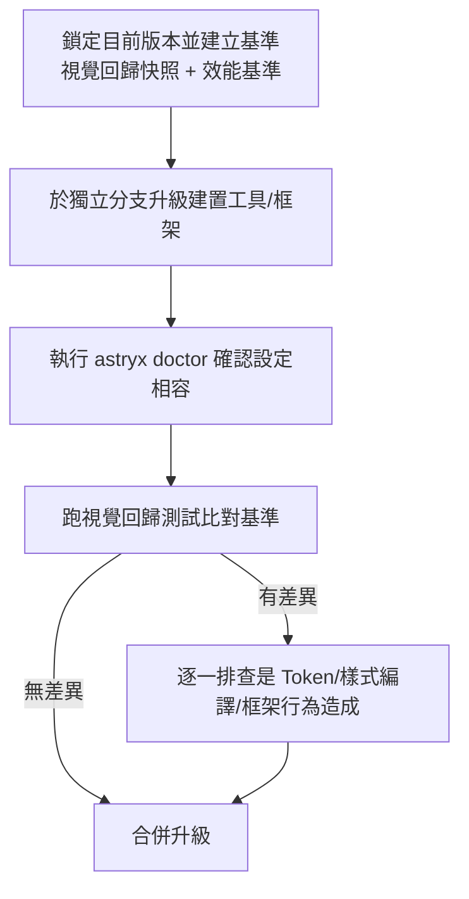

**實務案例**：某團隊在升級 Next.js 主版本前，先用 Playwright 建立全站關鍵頁面的視覺回歸快照作為基準，升級後比對快照差異，快速定位到是 StyleX plugin 版本落後導致部分元件樣式退化，而非框架本身問題。

**常見錯誤**：升級框架與升級 Astryx 版本同時進行、混在同一個 PR，一旦出問題難以判斷是哪一邊造成，應該拆分成獨立的升級批次分別驗證。

### 第九~十三章 檢查清單（Checklist）

- [ ] 已為 AI 工具建立專案層級規則檔（CLAUDE.md / copilot-instructions.md）
- [ ] Agent 產生程式碼後已納入型別檢查 + 無障礙掃描 + 測試的自動化流程
- [ ] 已完成與團隊技術棧相關的 Design System 選型比較評估並留下決策紀錄
- [ ] AI 輔助開發已採用 Spec 先行、Context 精簡化的做法
- [ ] 舊系統現代化已建立元件對應字典與逆向工程驗收清單
- [ ] Framework 升級已與 Astryx 版本升級拆分為獨立驗證批次
- [ ] 已建立視覺回歸測試作為升級前後的比對基準

---

## 第十四章 Enterprise Best Practice

### 14.1 Design System Governance

大型企業導入 Design System 最容易失敗的原因不是技術選型錯誤，而是「治理真空」——沒有人擁有決策權，導致每個團隊各自解讀規範。建議設立一個跨團隊的 Design System Council，成員涵蓋前端架構代表、設計代表、至少一位產品代表，職責是審核 Token 變更、元件新增申請、破壞性升級的排程。

### 14.2 Version 與 Release 管理

- 內部 `ui-kit` 套件採語意化版本（Semantic Versioning），任何會影響既有元件外觀或行為的變更視為 Minor 以上版本。
- 每次 Release 附上「視覺變更摘要」與「行為變更摘要」，讓下游團隊能快速評估升級影響範圍，而不需要逐行看 Changelog。

### 14.3 Theme 與 Accessibility 治理

品牌 Theme 的新增或調色，一律要求附上對比度檢測報告才能合併；無障礙不應是「上線後才補」的事後工作，而應納入 Definition of Done。

### 14.4 CI/CD 建議流程

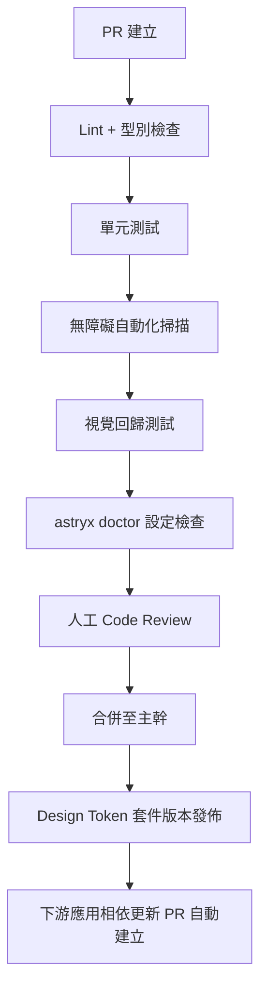

### 14.5 Testing 策略

- **單元測試**：驗證 `components/ui` 包裝層的 Props 傳遞與邊界狀態。
- **視覺回歸測試**：針對關鍵頁面與元件組合建立快照基準。
- **無障礙測試**：自動化掃描 + 定期人工鍵盤/報讀器測試雙軌並行。

### 14.6 Code Review 重點

Review 時除了業務邏輯，應額外檢查：是否有直接使用未經包裝的 Astryx 原始元件（違反分層規則）、是否有寫死色碼/尺寸而非使用 Token、是否有遺漏無障礙屬性。

### 14.7 Monorepo 與 Component Library 治理

集中維護的 `ui-kit`／`design-tokens` 套件應有專屬的維護團隊或輪值制度，避免「大家共用但沒人維護」的公地悲劇。

### 14.8 Design Token 管理

建議 Token 變更走「提案 → 設計/工程雙簽 → 發版」的最小治理流程，避免任何人可以未經審核直接調整企業級視覺語言的核心變數。

**實務案例**：某集團成立 Design System Council 後，將原本分散在 5 個團隊、彼此不一致的按鈕圓角與間距收斂為單一 Token 來源，半年內跨產品視覺一致性投訴大幅下降。

**常見錯誤**：把 Design System 治理完全交給單一工程師兼職負責，缺乏正式的跨團隊決策機制，長期容易因人員異動而治理斷層。

---

## 第十五章 與 GitHub Copilot 整合

### 15.1 Prompt 與 Context 設計

Copilot 的行內建議高度依賴「目前檔案與鄰近檔案的上下文」，因此讓 `components/ui` 包裝層的既有程式碼風格保持一致，能顯著提升 Copilot 建議的採用率與正確率。

### 15.2 Instruction 檔案

在 `.github/copilot-instructions.md` 中明確描述：Token 使用規則、元件分層規則（`ui` vs `features`）、無障礙最低要求。這些規則會被 Copilot Chat 納入回答的背景依據。

```markdown
# .github/copilot-instructions.md 範例片段
- 所有顏色請使用 theme/tokens.ts 中定義的 Semantic Token，禁止寫死色碼
- Button variant 僅能為 primary/secondary/ghost/destructive
- 產生互動元件時，必須包含基本的鍵盤操作與 ARIA 屬性
```

### 15.3 Workspace 與 Custom Prompt

利用 Copilot 的 Workspace 功能，讓其掃描整個專案結構後再回答跨檔案問題；針對常見任務（如「產生一個確認對話框」）可建立 Custom Prompt 樣板，統一團隊產出品質。

### 15.4 Agent 模式最佳實務

Copilot Agent 模式適合處理「範圍明確、可自動驗證」的任務（如批次修正 lint 錯誤、補齊測試）。對於「需要理解模糊業務需求」的任務，建議先由人工釐清 Spec 再交給 Agent 執行。

**實務案例**：團隊將「元件使用規範」與「Token 對照表」整理進 `copilot-instructions.md` 後，Copilot 產生的樣式覆寫建議明顯減少了直接寫死色碼的情況。

**常見錯誤**：instructions 檔案內容過長、什麼都塞，反而稀釋了關鍵規則的權重，建議聚焦在「最容易被違反的規則」上。

---

## 第十六章 與 Claude Code 整合

### 16.1 Context 設計（CLAUDE.md）

`CLAUDE.md` 應包含：專案目錄慣例、Token/Theme 使用規則、常用 CLI 指令、以及「不要做的事」（如禁止直接修改 `node_modules`、禁止繞過 `ui` 包裝層）。

### 16.2 Prompt 與 Instruction 分工

Prompt 負責描述單次任務目標，`CLAUDE.md` 負責持久化的專案規則，兩者不應該重複——重複的規則應該只放在 `CLAUDE.md`，讓 Prompt 保持精簡。

### 16.3 Spec 驅動的任務拆解

大型任務（如「將全站表單改用 Astryx Form 元件」）建議先讓 Claude Code 產出 Spec/計畫，人工確認範圍與風險後再執行，而不是直接下達模糊的大範圍指令。

### 16.4 Memory 的運用

跨對話的專案脈絡（如「本專案已決議放棄使用 Astryx Table 的內建分頁，改用自訂分頁元件」）適合沉澱為持久化記憶，避免每次新對話都要重新溝通已經拍板的架構決策。

### 16.5 Loop 的運用

針對可自動驗證的任務（型別檢查、測試、無障礙掃描），可設計成迴圈：Claude Code 產生修改 → 執行驗證指令 → 若失敗則讀取錯誤訊息自我修正 → 重覆直到通過，最後才交由人工做業務邏輯層面的最終確認。

### 16.6 最佳實務

1. `CLAUDE.md` 保持精簡但明確，優先列出「違反後果嚴重」的規則。
2. 大範圍任務一律先出 Spec/計畫再執行，善用 Plan Mode。
3. 已拍板的架構決策沉澱為記憶，避免重複溝通成本。

**實務案例**：某團隊在 `CLAUDE.md` 中記錄「Table 元件的虛擬滾動門檻為 200 列」的內部決策後，後續所有由 Claude Code 產生的資料表格元件都能正確套用此規則，不需每次任務重新提醒。

**常見錯誤**：把 `CLAUDE.md` 當成官方文件的複製貼上區，塞入大量與本專案無關的通用說明，稀釋了真正重要的專案特定規則。

---

## 第十七章 系統維護

### 17.1 版本管理

內部 `ui-kit`／`design-tokens` 套件版本與 Astryx 官方版本應分開追蹤：前者反映企業客製層的變更，後者反映上游套件的變更，兩者的 Changelog 應分別維護以利追蹤問題來源。

### 17.2 Component 維護

每個 `components/ui` 包裝元件應標註其對應的 Astryx 底層元件版本，當底層版本升級時，可快速比對哪些包裝元件需要重新驗證。

### 17.3 Theme／Token 維護

建議每季度做一次 Token 健檢：檢查是否有元件私自繞過 Token 直接寫死樣式、是否有色彩組合因為新增內容而低於對比度標準。

### 17.4 Dependency 維護

`@astryxdesign/*` 系列套件版本應鎖定並統一管理（例如透過 pnpm 的 workspace 版本鎖定機制），避免不同套件之間版本不同步造成的隱性相容性問題。

### 17.5 Release 與 Maintenance 排程

建議建立固定的維護節奏（如每月一次小版本檢視、每季一次相依套件升級評估），而不是等到官方發布重大版本或發生問題才被動處理。

**實務案例**：某團隊建立「每季 Token 健檢」制度後，提早發現某次促銷活動新增的高飽和度背景色與既有文字色組合對比度不足，趕在上線前修正。

**常見錯誤**：長期不升級 Astryx 版本，等到落後太多版本才升級，導致 Migration 範圍過大、風險過高，應維持較小步頻的持續升級節奏。

---

## 第十八章 系統升級

### 18.1 升級流程總覽

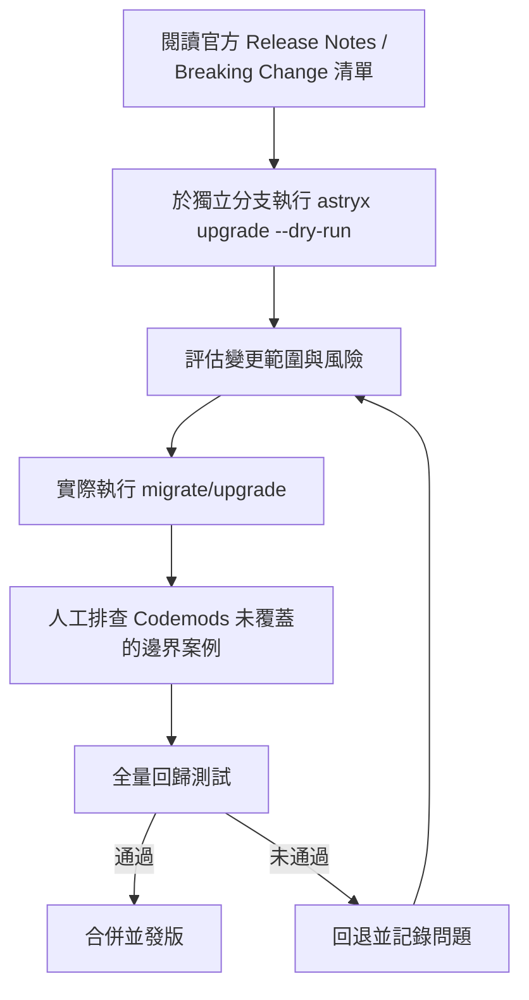

### 18.2 Migration 執行細節

參見第五章 5.5 的流程，升級前務必先在非生產分支跑過 `--dry-run`，取得變更清單後再決定是否分批執行（大型專案建議按模組分批，而非一次全站升級）。

### 18.3 Breaking Change 應對

Beta 階段的 Astryx 較容易出現 Breaking Change，建議訂閱官方 Release 通知，並在內部建立「Breaking Change 應對紀錄」，累積團隊對於常見變更類型（Token 改名、Prop 改名）的處理經驗值。

### 18.4 Rollback 策略

任何一次升級都應該保留可回退的路徑：以獨立分支進行、確保舊版本套件的 lockfile 有留存快照、資料庫或 API 契約若因升級連帶調整，也要有對應的回退腳本。

### 18.5 最佳實務

1. 小步快跑優於大步躍進：與其累積半年份的變更一次升級，不如維持每月或每季度的小步升級節奏。
2. 升級與功能開發分離：升級 PR 不應夾帶新功能，方便問題排查時能單純聚焦在升級本身。
3. 保留至少一個發布週期的回退能力。

**實務案例**：某團隊因半年未升級 Astryx，累積的 Breaking Change 過多，單次升級耗費三週時間排查問題；此後改為每月評估一次升級，單次升級時間縮短至一天內。

### 第十四~十八章 檢查清單（Checklist）

- [ ] 已成立跨團隊 Design System 治理機制（Council 或等效角色）
- [ ] 內部套件採語意化版本，Release 附視覺/行為變更摘要
- [ ] CI/CD 已涵蓋 Lint、型別檢查、單元測試、無障礙掃描、視覺回歸測試
- [ ] Code Review Checklist 已納入「是否繞過包裝層」「是否寫死樣式」等檢查項
- [ ] `.github/copilot-instructions.md` 已建立且聚焦關鍵規則
- [ ] `CLAUDE.md` 已建立，含目錄慣例、Token 規則、禁止事項
- [ ] 已建立版本管理、Dependency 鎖定、季度 Token 健檢制度
- [ ] 升級採小步快跑節奏，並保留 Rollback 路徑

---

## 第十九章 FAQ

### 19.1 基礎概念類

1. **Astryx 和一般 UI 元件庫有什麼本質差異？** Astryx 更強調 Token 分層與 Composable 架構，客製化透過變數覆寫而非 fork 原始碼。
2. **Astryx 是免費的嗎？** 是開源專案，可自由使用，但仍需自行評估授權條款細節與版本穩定度風險。
3. **Astryx 需要搭配 StyleX 嗎？** 是，樣式系統核心即建立在 StyleX 之上，這是採用前最重要的技術棧確認點。
4. **可以只用 Astryx 的部分元件嗎？** 可以，元件可個別引入，但 Token/Theme 系統建議整體採用以維持一致性。
5. **Astryx 支援 Vue 或 Angular 嗎？** 不支援，Astryx 是 React 專屬的 Design System。
6. **Astryx 目前是穩定版嗎？** 官方標示為 Beta，API 仍可能調整，導入正式關鍵系統前建議先於非核心模組試點。
7. **官方宣稱的「150+」元件是否涵蓋所有企業常見場景？** 官方文件站可獨立辨識的元件約 90～100 個，涵蓋大多數常見 UI Pattern（見第六章 6.1），但高度客製的產業特化元件（如複雜報表）通常仍需自行組合封裝或以 `swizzle` 取出原始碼客製。

### 19.2 安裝與環境類

8. **一定要用 pnpm 嗎？** 不用。官方 Getting Started 範例統一使用 `npm install`，npm/pnpm/yarn/bun 皆可正常安裝。pnpm 10 僅為「貢獻 Astryx 原始碼本身」時 monorepo 工具鏈的要求，與一般消費端專案無關（見第三章 3.1）。
9. **Node 版本一定要 22+ 嗎？** 一般使用專案沒有此限制，只要能執行 React 19+ 即可；Node 22+ 是 CONTRIBUTING.md 對「貢獻原始碼者」的要求。
10. **可以在既有專案中漸進式導入嗎？** 可以，建議先在單一模組試點，透過 `components/ui` 包裝層降低耦合。
11. **一定要設定 bundler 的 StyleX build plugin 嗎？** 不需要。一般使用 Astryx 元件免此設定，`@astryxdesign/build` 僅用於企業要自行撰寫 StyleX 原始樣式的進階情境（見第二章 2.5、第三章 3.4）。
12. **CLI 安裝失敗怎麼辦？** 優先確認 Node 版本與套件管理器版本，再執行 `astryx doctor` 排查設定問題（見第五章 5.6）。

### 19.3 元件使用類

13. **可以直接修改元件原始碼嗎？** 不建議透過改 `node_modules` 暫時客製；若確有深度客製需求，官方提供 `astryx swizzle <元件>` 指令將原始碼複製進專案自行維護，優先順序仍應是 Token 覆寫 > Composition > swizzle。
14. **元件 Props 找不到怎麼辦？** 先用 `astryx component <name>` 或 `astryx manifest --json` 查詢真實定義，也可透過 MCP Server（見第九章 9.2）即時查詢，避免依賴可能過時的記憶或文件。
15. **可以混用不同版本的元件套件嗎？** 不建議，應統一鎖定 `@astryxdesign/*` 系列版本。
16. **Table 元件資料量很大會卡頓嗎？** 大量資料建議搭配虛擬滾動處理，避免一次渲染全部列。
17. **如何客製化 Button 的圖示位置？** 透過 Composition 模式傳入具名 Slot，而非修改元件內部結構。

### 19.4 Theme 與 Token 類

18. **一定要用官方 7 套主題嗎？** 不一定，可以之作為起點，透過繼承 + 覆寫建立企業品牌主題。
19. **Dark Mode 需要另外寫一份元件嗎？** 不需要，Dark Mode 是同一組件透過 Token 值切換呈現。
20. **Token 可以有多層品牌嗎（多租戶）？** 可以，透過為每個租戶建立各自的 Theme 覆寫檔案並依登入資訊動態套用。
21. **色彩 Token 要對應到色票名稱還是語意名稱？** 建議語意名稱（如 colorPrimary），避免換色時語意錯亂。
22. **Motion Token 有必要嗎？** 有，統一的動畫時長與緩動曲線是品牌「手感」一致性的重要一環。

### 19.5 Accessibility 類

23. **元件內建的無障礙足夠符合 WCAG AA 嗎？** 元件行為層通常已處理常見情境，但實際顏色對比與客製組合仍需團隊自行驗證。
24. **自動化掃描可以取代人工測試嗎？** 不行，自動化只能抓出結構性問題，操作流暢度仍需人工鍵盤與報讀器測試。
25. **Dark Mode 對比度需要重新檢查嗎？** 需要，換色或換模式都應重新跑一次對比度驗證。

### 19.6 AI 開發整合類

26. **AI 產生的元件程式碼可以直接上線嗎？** 不建議，應經過型別檢查、無障礙掃描、測試與人工 Review 後才能合併。
27. **AI 常常猜錯 Prop 名稱怎麼辦？** 建議先用 CLI 查詢真實定義再交由 AI 生成，並在專案規則檔中列出常用 Prop 慣例。
28. **CLAUDE.md 和 Prompt 內容重複要如何處理？** 持久化規則放 CLAUDE.md，單次任務目標放 Prompt，避免重複。
29. **多個 AI 工具可以同時搭配使用嗎？** 可以，依任務性質分工（如 Copilot 做行內補全、Claude Code 做跨檔案重構）。

### 19.7 Migration 與升級類

30. **升級 Astryx 版本一定要跑 Codemods 嗎？** 建議先跑 `--dry-run` 評估變更範圍，再決定是否需要人工介入修正。
31. **舊系統可以一次性遷移嗎？** 不建議，應分批遷移並保留新舊並存與回退能力。
32. **升級失敗要如何回退？** 應在獨立分支操作並保留 lockfile 快照，確保可以快速回退版本。
33. **升級與新功能開發可以放在同一個 PR 嗎？** 不建議，兩者應分離以利問題排查。

### 19.8 架構與治理類

34. **是否需要成立專責治理小組？** 大型企業建議設立跨團隊 Design System Council 負責 Token/元件治理決策。
35. **Monorepo 是必要的嗎？** 非必要，但多團隊共用同一套客製層時，Monorepo 能大幅降低同步成本。
36. **Token 變更需要走審核流程嗎？** 建議走提案 + 設計/工程雙簽的最小治理流程。
37. **可以讓不同團隊各自 fork 一份客製主題嗎？** 不建議，應集中維護於共用套件，避免品牌不一致。

### 19.9 效能與維運類

38. **StyleX 真的比傳統 CSS-in-JS 快嗎？** 因為樣式在建置期就編譯完成，執行期幾乎無額外運算成本，對高互動頁面效益明顯。
39. **元件數量多會拖慢建置時間嗎？** 可能，建議搭配 Monorepo 的增量建置與快取機制（如 Nx affected、Turborepo Remote Cache）。
40. **如何监控 Design System 在生產環境的表現？** 建議搭配前端效能監控工具追蹤互動延遲指標，並與升級前基準比對。

### 19.10 其他常見疑問

41. **可以只用 Token 系統、不使用元件庫嗎？** 技術上可行，但會失去元件層的無障礙與互動邏輯保證，需自行承擔對應風險。
42. **企業內部可以擴充官方沒有的元件嗎？** 可以，建議放在 `components/features` 層並遵循既有 Token/命名慣例。
43. **主題可以在執行期動態切換而不重整頁面嗎？** 可以，因為 Theme 切換本質是替換 CSS 變數值，不需重新載入頁面。
44. **元件庫升級會影響 SEO 嗎？** 一般不會直接影響，但若涉及語意化標籤（如 Typography 對應的標題層級）調整不當則可能間接影響。
45. **如何確保多團隊都遵守 Token 規範？** 透過 Code Review Checklist + Lint 規則（如禁止寫死色碼的自訂 Lint Rule）雙重把關。
46. **Beta 階段的風險如何量化？** 可參考官方 Release 頻率與 Breaking Change 歷史紀錄，評估團隊能承受的升級頻率。
47. **可以同時支援多個 Design System 共存嗎（過渡期）？** 可以，但建議明確劃分頁面/模組邊界，避免同一畫面混用造成視覺不一致。
48. **CLI 產生的樣板可以客製化嗎？** 可以，多數 CLI 支援自訂樣板路徑或參數。
49. **企業是否需要自己的 Design Token 命名規範文件？** 需要，這是團隊間溝通與 AI 開發規則的共同事實來源。
50. **導入 Astryx 後還需要保留原本的樣式規範文件嗎？** 建議保留並轉譯為 Token 對照文件，作為歷史脈絡與新舊系統過渡期的參考依據。
51. **如何評估是否該升級到下一個 Beta 版本？** 參考 Release Notes 中的 Breaking Change 範圍與團隊目前的測試覆蓋率是否足以支撐驗證成本。
52. **企業內部可以要求官方新增特定元件嗎？** 可透過官方 GitHub Discussions/Issues 提出需求，但採納與否取決於官方路線圖。

---

## 第二十章 Troubleshooting

### 20.1 安裝與建置類

1. **問題：安裝後畫面完全沒有樣式。** 解法：一般使用免 build plugin 設定，先確認 `npx astryx doctor` 是否通過、`npx astryx init` 是否已正確執行；只有採用 `@astryxdesign/build` 進階自訂樣式建置的專案，才需要檢查 bundler 是否已註冊對應 plugin。
2. **問題：CLI 指令執行報錯但訊息不直觀。** 解法：先確認 Node 版本是否足以執行 React 19+，再執行 `astryx doctor` 取得更明確的設定檢查結果；若為貢獻原始碼情境則需額外確認 Node 22+。
3. **問題：不同開發者本機安裝結果不一致。** 解法：檢查是否混用多種套件管理器 lockfile，統一鎖定單一套件管理器。
4. **問題：建置時間隨元件數量增加而大幅變長。** 解法：導入 Monorepo 增量建置（Nx affected）或遠端快取（Turborepo Remote Cache）。
5. **問題：CI 環境建置成功但本機失敗（或反之）。** 解法：比對 Node/套件管理器版本是否一致，建議以 `.nvmrc` 與 lockfile 鎖定版本。

### 20.2 樣式與主題類

6. **問題：切換 Theme 後部分元件顏色沒有變化。** 解法：檢查該元件是否有被專案內覆寫成寫死色碼，而非引用 Semantic Token。
7. **問題：Dark Mode 下對比度不足。** 解法：Dark Mode 需要獨立跑一次對比度驗證，不能沿用 Light Mode 的驗證結果。
8. **問題：自訂品牌主題套用後部分間距跑版。** 解法：確認是否漏改 Spacing 相關 Token，只改了 Color Token 導致間距仍為預設值。
9. **問題：StyleX 產生的 class 名稱在不同建置間不穩定，導致視覺回歸測試誤判。** 解法：確認建置設定是否啟用穩定雜湊模式，或在測試中改以語意屬性斷言取代 class 名稱比對。
10. **問題：多租戶主題切換後出現閃爍（Theme 切換瞬間看到舊樣式）。** 解法：確認 Theme 判斷邏輯是否在伺服器端渲染階段就已決定，而非等到客戶端 hydration 後才切換。

### 20.3 元件行為類

11. **問題：確認對話框開啟後焦點沒有落在預期元素。** 解法：優先改用 `AlertDialog`（已內建正確的焦點管理），而非用通用 `Dialog` 自行拼裝；若必須用 `Dialog`，確認未自行覆寫預設焦點行為。
12. **問題：Dialog 關閉後焦點消失（跳到 body）。** 解法：確認觸發 Dialog 的按鈕元素在關閉後仍存在於 DOM 中，以利焦點正確返回。
13. **問題：Dropdown Menu 鍵盤導覽方向鍵沒有作用。** 解法：確認是否透過非官方方式重組了 Dropdown Menu 結構，破壞了內建的鍵盤事件綁定範圍。
14. **問題：Toast 疊加過多导致畫面混亂。** 解法：限制同時顯示的 Toast 數量，並為相同類型訊息做合併或替換而非持續疊加。
15. **問題：Table 大量資料時捲動卡頓。** 解法：導入虛擬滾動機制，避免一次渲染全部列的 DOM 節點。
16. **問題：Tabs 切換時內容閃爍。** 解法：確認是否對每個 Tab 內容做了不必要的重新掛載（remount），可考慮改用顯示/隱藏而非條件渲染（視資料量與 SEO 需求權衡）。

### 20.4 無障礙類

17. **問題：axe-core 掃描報告大量對比度錯誤。** 解法：重新檢視色彩 Token 賦值，優先修正文字與背景的對比度組合。
18. **問題：螢幕報讀器沒有播報 Toast 通知。** 解法：確認 Toast 容器是否有正確的 `aria-live` 屬性設定。
19. **問題：純圖示按鈕被報告缺少無障礙名稱。** 解法：補上 `aria-label`，不要僅依賴視覺圖示傳達語意。
20. **問題：表單錯誤訊息螢幕報讀器讀不到。** 解法：確認錯誤訊息元素與輸入欄位間有正確的 `aria-describedby` 關聯。

### 20.5 AI 開發流程類

21. **問題：AI 生成的元件用了不存在的 Prop。** 解法：任務開始前先用 `astryx component <name>` 或 `astryx manifest --json` 查詢真實定義並提供給 Agent 作為依據，或直接連線第九章 9.2 的 MCP Server。
22. **問題：AI 反覆在同一個問題上打轉，多輪迭代仍無法修正。** 解法：檢查回饋給 Agent 的錯誤訊息是否完整明確，必要時人工介入縮小問題範圍後再交還 Agent。
23. **問題：不同工程師用 AI 產生的元件風格差異很大。** 解法：將元件規範沉澱進 `CLAUDE.md`／`copilot-instructions.md`，降低對個人 Prompt 技巧的依賴。
24. **問題：Agent 大範圍重構後測試大量失敗。** 解法：大範圍任務應先要求 Agent 產出 Spec/計畫並人工確認範圍，再分批執行與驗證。

### 20.6 升級與 Migration 類

25. **問題：`astryx upgrade --apply` 執行後部分程式碼壞掉。** 解法：Codemods 無法涵蓋所有客製化情境，需人工排查已被 `swizzle` 取出、高度客製化過的元件；可先用 `--codemod`／`--skip-codemod` 精細控制套用範圍。
26. **問題：升級後 Token 名稱找不到（編譯錯誤）。** 解法：查閱該版本的 Breaking Change 清單，確認是否有 Token 改名，並更新對應覆寫檔案。
27. **問題：升級後視覺回歸測試出現大量差異。** 解法：逐一排查是 Token 值變動、StyleX 編譯方式變動、還是元件預設樣式變動所致，避免一次性忽略所有差異直接更新快照。
28. **問題：升級後建置速度大幅變慢。** 解法：若有採用 `@astryxdesign/build` 進階建置，確認新版本的 build plugin 設定是否有變動（如新增的分析或除錯選項在正式建置中應關閉）。

### 20.7 Monorepo 與治理類

29. **問題：多團隊修改共用 Token 套件互相衝突。** 解法：建立 Token 變更審核流程，避免多人同時未經協調直接修改。
30. **問題：下游應用未即時套用 Token 套件的最新版本。** 解法：檢查 Monorepo 相依版本鎖定策略，並建立自動化的相依更新 PR 機制。
31. **問題：不同產品線的品牌主題互相污染（畫面出現錯誤品牌色）。** 解法：確認 Theme 套用邏輯是否正確依應用程式或租戶身分做隔離，而非共用同一份全域設定。

### 20.8 效能類

32. **問題：頁面初次載入時間變長。** 解法：確認是否誤將所有元件一次性引入而非按需載入，評估程式碼分割（Code Splitting）。
33. **問題：互動延遲（INP）沒有預期中的改善。** 解法：確認是否仍有大量元件使用了非 StyleX 的 runtime 樣式方案混雜其中，抵銷了 build-time 樣式的效益。
34. **問題：Table／Tree 大資料量時記憶體佔用過高。** 解法：確認虛擬滾動是否正確設定資料切割範圍，避免仍在背景保留全部資料的 DOM 節點。

### 20.9 型別與開發體驗類

35. **問題：TypeScript 型別檢查在升級後大量報錯。** 解法：優先查閱該版本 Migration Guide 中的型別定義變更，通常伴隨 Prop 型別收斂或改名。
36. **問題：IDE 自動完成無法正確顯示 Astryx 元件 Props。** 解法：確認 TypeScript 版本與官方建議版本相容，並重新啟動 IDE 的 TS Server。
37. **問題：包裝元件（`components/ui`）型別與底層元件不同步。** 解法：建議包裝元件型別直接延伸（extends）底層元件型別，而非手動重複定義。

### 20.10 其他常見問題

38. **問題：Storybook 或內部文件工具顯示的元件樣式與實際專案不一致。** 解法：確認文件工具是否套用了與專案相同版本的 Theme 設定。
39. **問題：CI 中的視覺回歸測試在不同作業系統跑出不同結果。** 解法：統一 CI 執行環境（如固定使用同一 Docker 映像檔）以避免字型渲染差異。
40. **問題：多語系（i18n）切換後版面跑版。** 解法：確認 Heading／Text 與 Spacing Token 是否有針對不同語言字元寬度做彈性設計，而非寫死固定寬度。
41. **問題：舊系統遷移後某些「隱藏邏輯」消失導致業務異常。** 解法：逆向工程階段應更完整訪談原開發者或詳讀舊程式碼，避免遺漏未文件化的邊界規則。
42. **問題：多主題共存時 CSS 檔案體積過大。** 解法：確認建置設定是否僅打包目前實際使用的主題，而非預設打包全部 7 套主題。
43. **問題：Dark Mode 切換後動畫效果消失或跳動明顯。** 解法：確認 Motion Token 是否也隨模式切換有對應調整，並檢查是否有元件忽略了 `prefers-reduced-motion`。
44. **問題：多人協作時 Token 檔案常常產生合併衝突。** 解法：將 Token 依類別拆分為多個檔案（Color/Spacing/Motion 分開），降低單一檔案的變更密度。
45. **問題：新人不熟悉元件規範，PR 中常出現違規用法。** 解法：建立自動化 Lint 規則攔截常見違規（如禁止 inline style 覆寫顏色），降低對人工 Review 記憶的依賴。
46. **問題：CLI `doctor` 檢查通過但實際執行仍有問題。** 解法：`doctor` 僅檢查已知設定項目，無法涵蓋所有情境，仍需保留人工排查與官方 Issue 回報管道。
47. **問題：AI 產生的無障礙屬性表面正確但實際操作仍不流暢。** 解法：自動化掃描無法取代人工鍵盤/報讀器測試，應雙軌並行驗證。
48. **問題：升級後第三方套件（如表單驗證庫）與新版元件行為衝突。** 解法：檢查該第三方套件是否已針對新版本更新相容性，必要時鎖定舊版本待其更新後再升級。
49. **問題：多品牌主題導致 QA 測試案例暴增，難以全面覆蓋。** 解法：建議挑選代表性主題（如一套淺色、一套深色、一套高對比）作為主要回歸測試範圍，其餘採抽樣測試。
50. **問題：內部包裝元件文件與實際程式碼行為不同步。** 解法：建議將元件文件（Props 說明）以程式碼內的型別與 JSDoc 為單一事實來源，透過工具自動產生文件而非手動維護兩份。
51. **問題：團隊對「何時該升級」缺乏共識，導致版本長期落後。** 解法：建立固定節奏的升級評估會議（如每月），將升級決策制度化而非依賴個人主動性。

---

## 第二十一章 Best Practice（企業最佳實務 100 條）

### 21.1 架構與分層（1-15）

1. 永遠透過 `components/ui` 包裝層使用 Astryx 元件，不直接在業務程式碼引用底層套件。
2. 包裝元件的型別應延伸底層元件型別，避免手動重複定義造成漂移。
3. Token 定義集中於單一事實來源檔案，禁止散落在各元件內部。
4. 品牌 Theme 一律以「繼承 + 覆寫」建立，不修改內建主題原始檔。
5. 大型專案採 Monorepo 集中管理 `design-tokens`／`ui-kit`，避免多份不同步的客製層。
6. `features` 層不得繞過 `ui` 層直接引用官方原始元件。
7. 建立內部「元件使用規範」文件，明確允許與禁止的 variant 組合。
8. 目錄結構應區分頁面骨架、業務功能元件、UI 包裝層三層職責。
9. 禁止在頁面層直接寫死樣式覆寫，一律透過 Token 或包裝層處理。
10. 每個包裝元件應有對應最小單元測試，作為未來升級行為比對基準。
11. 大型任務（如整站 Migration）先產出 Spec/計畫再執行。
12. 架構決策（如虛擬滾動門檻、Table 分頁策略）應書面化並沉澱進團隊知識庫。
13. 避免同一畫面混用不同世代的舊/新 UI 元件超過一個發布週期。
14. 為關鍵頁面建立視覺回歸測試基準，作為架構變更的安全網。
15. 治理與工程分離：架構規則由 Design System Council 決策，工程團隊落地執行。

### 21.2 Token 與 Theme（16-30）

16. Token 命名採語意化（`colorPrimary`）而非視覺化（`blue3`），避免換色時語意錯亂。
17. Motion/Spacing/Density Token 與 Color Token 同等重視，共同構成品牌手感。
18. 每次新增或調整品牌色，強制附上對比度檢測報告才可合併。
19. Dark Mode 與品牌 Theme 應建模為正交維度，可自由疊加而非各自獨立整套主題。
20. 多租戶情境下，Theme 切換邏輯應在渲染早期（含 SSR 階段）就決定，避免閃爍。
21. Token 檔案依類別拆分（Color/Spacing/Motion）降低多人協作衝突機率。
22. 建立 Token 視覺化文件（如 Storybook Token 頁），作為設計與工程的共同事實來源。
23. 每季度執行 Token 健檢，檢查寫死樣式與對比度退化問題。
24. Token 變更走提案 + 雙簽審核流程，禁止未經審核直接調整。
25. 只打包實際使用的主題，避免 CSS 體積因未使用的內建主題而膨脹。
26. 為色盲/低視力使用者驗證色彩組合，不僅測試預設主題也測試客製主題。
27. 建立 Token 對照文件，映射舊系統品牌規範到新 Semantic Token，保留轉譯脈絡。
28. 避免 Token 巢狀覆寫層級過深，超過三層間接引用會增加除錯難度。
29. 為每個 Token 類別指派負責角色（如 Motion 由互動設計師把關）。
30. Theme 建立流程應可重現（透過 CLI 指令而非手動編輯散落設定）。

### 21.3 元件使用（31-45）

31. 同畫面僅保留一個 `variant="primary"` 主要動作，避免使用者決策困難。
32. Loading 狀態必須同時鎖定重複點擊，避免重複送出請求。
33. 確認/危險操作優先使用 `AlertDialog`（已內建正確焦點管理），避免自行拼裝 `Dialog` 重工並可能遺漏焦點細節。
34. Dialog 關閉後焦點應返回觸發元素，維持操作連貫性。
35. 行動裝置情境的 Popover/Dropdown Menu 應改用 click 觸發而非 hover。
36. Tab List 數量超過視覺可承載範圍時改用 Side Nav 或 Dropdown Menu。
37. 表單錯誤提示需搭配 `aria-describedby`，不可僅用顏色標示。
38. `Switch` 僅用於即時生效情境，需送出表單才生效的選項應改用 `Checkbox Input`。
39. Table/Tree List 大量資料一律搭配虛擬滾動。
40. 排序、篩選等資料操作應有清楚的狀態提示文字，不僅依賴圖示。
41. Toast 訊息簡潔化，可逆操作應提供復原（Undo）選項。
42. 同時顯示的 Toast 數量應設上限，避免通知堆疊淹沒畫面。
43. `Heading` 層級（`level`）對應語意化文件結構，不僅是視覺大小選擇。
44. 純圖示按鈕務必補上可讀名稱（`label`）。
45. 避免用 inline style 覆寫元件顏色，改用 Token 或具名 variant。

### 21.4 Accessibility（46-55）

46. 自動化無障礙掃描（axe-core）納入 CI 必要檢查項。
47. 定期安排人工鍵盤 only 操作測試，尤其在新元件組合上線後。
48. 定期安排螢幕報讀器人工測試，覆蓋主要業務流程。
49. 對比度檢測應涵蓋一般文字、大字級文字、互動元件邊框三種情境。
50. Focus 樣式保留清楚可辨識外框，禁止全域移除 outline 卻不補替代樣式。
51. 動態內容變化搭配 `aria-live`，讓螢幕報讀器主動感知。
52. 尊重 `prefers-reduced-motion`，為動作敏感使用者停用非必要動畫。
53. 400% 縮放下頁面仍應可操作，不需雙向捲動。
54. 無障礙不視為上線後補做項目，納入 Definition of Done。
55. 無障礙缺陷修復優先級應等同功能性 Bug，不應長期積壓於待辦清單。

### 21.5 CI/CD 與測試（56-65）

56. CI Pipeline 涵蓋 Lint、型別檢查、單元測試、無障礙掃描、視覺回歸測試五道關卡。
57. `astryx doctor` 納入 CI 前置檢查，及早發現設定問題。
58. 視覺回歸測試基準應於重大升級前重新建立，避免長期漂移失準。
59. 升級 PR 與功能開發 PR 嚴格分離，便於問題定位。
60. CI 執行環境統一（如固定 Docker 映像檔），避免不同系統間視覺回歸誤判。
61. 建立 Design Token 套件發版後，下游應用應有自動化相依更新 PR 機制。
62. Code Review Checklist 明確列出「是否繞層」「是否寫死樣式」等專屬檢查項。
63. 單元測試優先覆蓋 `components/ui` 包裝層的邊界狀態與 Props 傳遞。
64. 建立 Breaking Change 應對紀錄，累積團隊處理經驗值。
65. 每次升級後執行全量回歸測試，不因時程壓力略過關鍵路徑驗證。

### 21.6 AI 開發整合（66-80）

66. 為專案建立 `CLAUDE.md`／`copilot-instructions.md`，沉澱持久化規則。
67. 規則檔內容聚焦「最容易被違反」的規則，避免內容過長稀釋重點。
68. Prompt 只描述單次任務目標，避免與規則檔內容重複。
69. 任務開始前先用 CLI（`component`／`manifest --json`）或 MCP Server 查詢真實 Prop 定義，作為 Agent 生成依據。
70. AI 產出程式碼一律先跑自動化驗證，人工 Review 聚焦業務邏輯。
71. 大範圍任務要求 Agent 先出 Spec/計畫，人工確認後再執行。
72. 已拍板的架構決策沉澱為持久化記憶，避免重複溝通成本。
73. 針對重複性高的元件組合建立範例庫供 Agent 參考。
74. 依任務性質分工不同 AI 工具，而非單一工具包辦所有情境。
75. 迴圈式驗證（產生→驗證→回饋→再產生）用於可自動驗證的任務。
76. 避免把整份官方文件貼入 Prompt，只給與任務相關的精簡規則。
77. 建立團隊共用的 Prompt 範本庫，降低個人技巧落差造成的產出品質不一致。
78. Context Engineering 優先於臨場 Prompt 技巧堆疊，投資報酬率更高。
79. AI 輔助生成的無障礙屬性仍需人工抽測驗證真實可用性。
80. 定期檢視規則檔是否過時，隨專案演進同步更新。

### 21.7 Migration 與升級（81-90）

81. 升級前先執行 `astryx upgrade`（預設即為 dry-run，不加 `--apply` 不會落地修改），評估變更範圍後再決定執行策略。
82. 大型專案採分批升級，而非一次性全站切換。
83. 升級與功能開發分離為獨立批次，個別驗證。
84. 保留至少一個發布週期的回退能力。
85. 訂閱官方 Release 通知，掌握 Breaking Change 節奏。
86. 小步快跑優於大步躍進，維持每月或每季度小步升級節奏。
87. Codemods 無法覆蓋的客製化情境，安排人工逐一排查。
88. 逆向工程階段訪談原開發者，釐清未文件化的業務邏輯。
89. 新舊系統並存期間建立功能對等（Feature Parity）驗收清單。
90. Legacy 現代化優先處理低風險非核心頁面，累積經驗後再處理核心流程。

### 21.8 效能與維運（91-100）

91. 大量資料呈現一律評估虛擬滾動或分頁機制。
92. 避免混用 StyleX 與其他 runtime CSS-in-JS 方案，以免抵銷建置期效能優勢。
93. Monorepo 環境導入增量建置與遠端快取，控制建置時間隨規模成長的曲線。
94. 建立前端效能監控，追蹤互動延遲等關鍵指標並與升級前基準比對。
95. 版本管理區分內部客製層與官方套件層，分別維護 Changelog。
96. Dependency 版本統一鎖定，避免 `@astryxdesign/*` 系列版本不同步。
97. 建立固定節奏的維護排程（月度小版本檢視、季度相依升級評估）。
98. 多品牌測試採代表性抽樣（淺色/深色/高對比各一），控制 QA 成本。
99. 內部元件文件以程式碼型別與 JSDoc 為單一事實來源，避免文件與實作脫節。
100. 治理制度化：升級、Token 變更、元件新增皆有明確決策流程，不依賴個人主動性。

---

## 第二十二章 Prompt Collection

> 以下 Prompt 均為概念範本，實際使用時請替換為專案真實的路徑、元件與規則名稱。

### 22.1 Claude Code Prompt（1-8）

1. 「請先執行 `astryx component AlertDialog` 或 `astryx manifest --json` 查詢真實 Props，再依此實作一個確認刪除對話框。」
2. 「請閱讀 CLAUDE.md 中的 Token 規則，檢查 src/components/features 下是否有寫死色碼的違規案例並列出清單。」
3. 「請以 Plan Mode 先產出『表單元件全站遷移至 Astryx Form』的執行計畫，暫不動手修改。」
4. 「請為 components/ui/Button.tsx 補齊對應的最小單元測試，涵蓋 loading 與 disabled 狀態。」
5. 「請比對本次升級的 Breaking Change 清單與目前程式碼，列出受影響的檔案。」
6. 「請將這次架構決策（Table 虛擬滾動門檻 200 列）整理成一段可放入 CLAUDE.md 的規則。」
7. 「請執行型別檢查與 lint，並針對每個失敗項目提出修正，修正後重新驗證直到全部通過。」
8. 「請比較 src/theme/themes 下兩個品牌主題的 Token 差異，並指出可能造成對比度不足的組合。」

### 22.2 GitHub Copilot Prompt（9-16）

9. 「參考目前檔案的 Dialog 使用方式，補全這個新的 AlertDialog 確認元件，維持相同的 Props 命名慣例。」
10. 「依照 copilot-instructions.md 中的 Button variant 規則，修正這段程式碼中使用了不存在 variant 的地方。」
11. 「為這個表單元件產生對應的無障礙屬性（aria-describedby、aria-invalid）。」
12. 「參考 Workspace 內其他頁面的 Layout 用法，補全這個新頁面的版面結構。」
13. 「使用 Custom Prompt『產生確認對話框』樣板，建立一個訂單取消確認元件。」
14. 「檢查這個檔案是否有直接引用 @astryxdesign/core 而非透過 components/ui 包裝層。」
15. 「以 Agent 模式批次修正這個資料夾內所有 ESLint 報錯的檔案。」
16. 「根據既有測試檔案風格，為這個新元件補上對應測試。」

### 22.3 Cursor Prompt（17-24）

17. 「在編輯這個檔案時，請同步檢查對應的單元測試是否需要更新。」
18. 「請解釋這個 Table 元件目前為何沒有套用虛擬滾動，並提出修改建議。」
19. 「請以對話方式逐步引導我把這個 class component 改寫為使用 Astryx 元件的函式元件。」
20. 「請在這個對話串中記住：本專案 Toast 最多同時顯示 3 則，後續產生程式碼請遵守。」
21. 「請幫我找出這個資料夾內所有寫死十六進位色碼的地方。」
22. 「請比對這兩個分支的視覺回歸測試差異，並解釋可能原因。」
23. 「請根據這份 Design Token 定義檔，產生對應的 TypeScript 型別。」
24. 「請檢查這個確認對話框是否應改用 AlertDialog 以取得正確的內建焦點管理。」

### 22.4 Codex Prompt（25-32）

25. 「批次掃描整個 repo，找出所有未透過 components/ui 包裝層直接使用 Astryx 元件的檔案並產生修正 PR。」
26. 「針對 CI 回報的無障礙掃描失敗項目，自動產生修正並附上修正說明。」
27. 「將這 50 個 JSP 頁面依既有元件對應字典轉換為 React + Astryx 元件結構。」
28. 「為新增的 100 個包裝元件批次產生對應的最小單元測試骨架。」
29. 「掃描並修正所有使用已棄用 Prop 名稱的呼叫端，依 Migration Guide 的對照表進行改名。」
30. 「產生一份本次升級影響範圍報告，列出所有受 Breaking Change 影響的檔案與建議修正方式。」
31. 「批次為所有純圖示按鈕補上 aria-label，並依按鈕功能推斷合理的標籤文字。」
32. 「將所有內聯樣式覆寫的色碼替換為對應的 Semantic Token 引用。」

### 22.5 Gemini CLI Prompt（33-38）

33. 「查詢目前專案安裝的 @astryxdesign/* 系列套件版本並列出是否有不一致之處。」
34. 「快速列出 src/theme 目錄下所有 Token 檔案的修改時間，找出最近變更的品牌主題。」
35. 「在終端機中執行對比度檢測工具，針對 theme/themes/brand-x.ts 的色彩組合產出報告。」
36. 「產生一段 shell 腳本，批次檢查所有 tsx 檔案是否包含寫死色碼的正則匹配。」
37. 「解釋這段 CI 設定為何沒有觸發視覺回歸測試步驟。」
38. 「列出這次 git diff 中所有新增的 Astryx 元件引用。」

### 22.6 OpenHands Prompt（39-44）

39. 「自主完成：將 legacy/ 目錄下所有 Bootstrap Modal 替換為 Astryx Dialog，並跑通既有測試。」
40. 「自主完成整個模組的 Migration：執行 dry-run、評估風險、實際升級、跑回歸測試，並回報結果。」
41. 「自主盤點舊系統畫面清單並產出元件對應草案文件供人工審核。」
42. 「自主為所有新增元件補齊型別定義、測試、無障礙屬性三項基本要求。」
43. 「自主執行完整的升級驗證流程並在失敗時嘗試自我修正，最多重試 3 次。」
44. 「自主掃描並列出所有可能受惠於虛擬滾動優化的高資料量頁面。」

### 22.7 Spec Prompt（45-52）

45. 「請先產出『訂單管理頁面』的 UI Spec：涉及元件、Token 覆寫範圍、無障礙驗收標準。」
46. 「請將這個模糊需求『讓表單更好用』轉譯為具體的元件行為 Spec。」
47. 「請為『多租戶 Theme 切換』功能撰寫技術 Spec，包含資料流與邊界情境。」
48. 「請根據既有 Spec 檢查目前實作是否有遺漏項目。」
49. 「請為『Table 虛擬滾動導入』撰寫 Spec，包含效能驗收指標。」
50. 「請將這份 Spec 拆解為可獨立驗證的子任務清單。」
51. 「請檢查這份 Spec 是否涵蓋無障礙驗收標準，若無請補充。」
52. 「請根據 Spec 產出對應的測試案例清單。」

### 22.8 Architecture Prompt（53-59）

53. 「請畫出目前 Token → Theme → Component → Application 四層架構的實際依賴關係。」
54. 「請評估將 design-tokens 提取為獨立 Monorepo 套件的影響範圍。」
55. 「請檢查目前專案是否有違反『components/ui 不可被 features 繞過』的架構規則。」
56. 「請提出多品牌多租戶情境下 Theme 切換的架構建議。」
57. 「請比較目前建置流程與官方建議的 StyleX build 流程差異。」
58. 「請評估導入 Nx affected 機制對目前 CI 時間的預期影響。」
59. 「請提出降低 Token 檔案合併衝突頻率的架構調整建議。」

### 22.9 Design Prompt（60-65）

60. 「請根據既有品牌規範，將 12 種藍色調收斂為語意化 Token 建議。」
61. 「請提出 Dark Mode 下這組品牌色的對應深色版本建議。」
62. 「請檢查這個 Card 元件的間距是否符合 8px 基準的 Spacing Token 規則。」
63. 「請為新品牌設計一組 Motion Token（時長與緩動曲線）建議。」
64. 「請比較 neutral 與 stone 兩套內建主題的視覺差異並提出選用建議。」
65. 「請提出一組適合金融產業、強調信任感的色彩 Token 草案。」

### 22.10 Migration Prompt（66-72）

66. 「請規劃將舊 Ant Design 表單模組遷移至 Astryx Form 的分批策略。」
67. 「請列出從 Bootstrap Grid 遷移到 Astryx Layout/Grid 需要注意的斷點差異。」
68. 「請檢查這批 Codemods 執行後的程式碼是否有邏輯遺漏。」
69. 「請提出這次 Astryx 版本升級的分批遷移排程建議。」
70. 「請比較升級前後這個元件的 Props 差異並產出對照表。」
71. 「請為這次 Migration 撰寫回退（Rollback）步驟文件。」
72. 「請評估這次遷移對 SEO 相關語意標籤的影響。」

### 22.11 Reverse Engineering Prompt（73-78）

73. 「請分析這個 JSP 檔案的畫面結構，並產出對應的 Astryx 元件組合草案。」
74. 「請從這段舊 jQuery 程式碼中萃取出實際的互動邏輯規則。」
75. 「請比對這個舊畫面與新實作，列出功能對等性（Feature Parity）的缺口。」
76. 「請找出這段舊程式碼中沒有文件記錄、但看似關鍵的業務邏輯分支。」
77. 「請將這個 AngularJS Controller 的狀態管理邏輯轉譯為 React Hook 草案。」
78. 「請產出這批舊畫面的元件對應字典初稿供人工審閱。」

### 22.12 UI Prompt（79-85）

79. 「請用 AlertDialog 組合出一個訂單取消確認畫面。」
80. 「請用 Table 元件實作一個支援排序與虛擬滾動的資料清單。」
81. 「請用 Tab List 與 Card 組合出一個帳戶設定頁面骨架。」
82. 「請用 Toast 實作一個含復原選項的刪除成功通知。」
83. 「請用 Grid 與 Layout 元件重構這個目前用原生 CSS 排版的頁面。」
84. 「請用 Avatar 與 Card 組合出一個使用者資訊摘要元件。」
85. 「請用 Dropdown Menu 元件實作一個支援鍵盤導覽的操作選單。」

### 22.13 Theme Prompt（86-91）

86. 「請以 neutral 主題為基底，建立一個名為 brand-finance 的品牌主題。」
87. 「請為這個新品牌主題產生對應的 Dark Mode Token 覆寫。」
88. 「請檢查這個自訂主題的所有色彩組合是否符合 WCAG AA 對比度。」
89. 「請提出多租戶情境下動態載入不同品牌主題的實作建議。」
90. 「請比較這個自訂主題與內建 neutral 主題的 Token 差異清單。」
91. 「請為即將下架的舊主題規劃淘汰時程與替代方案。」

### 22.14 Accessibility Prompt（92-96）

92. 「請檢查這個表單的所有欄位是否有正確的 aria-describedby 關聯。」
93. 「請為這個純圖示按鈕群組補上合適的 aria-label。」
94. 「請執行 axe-core 掃描並解釋每一項報錯的實際影響。」
95. 「請檢查這個 Dialog 的焦點管理是否符合鍵盤操作最佳實務。」
96. 「請提出讓這個 Toast 元件對螢幕報讀器更友善的修改建議。」

### 22.15 Testing Prompt（97-100+）

97. 「請為 components/ui/Dialog.tsx 撰寫涵蓋開啟/關閉/焦點管理的單元測試。」
98. 「請建立這個關鍵頁面的視覺回歸測試快照基準。」
99. 「請為這次升級撰寫回歸測試檢查清單，涵蓋主要業務流程。」
100. 「請檢查現有測試是否覆蓋了 Dark Mode 與品牌主題切換情境。」
101. 「請為批次生成的 100 個包裝元件產生對應的快照測試。」

### 22.16 Upgrade Prompt（102-105）

102. 「請執行 `astryx upgrade`（預設 dry-run）並整理出本次變更的風險等級分類。」
103. 「請比對這次升級的 Breaking Change 清單與目前程式碼的實際使用情況。」
104. 「請提出本次升級的分批執行順序建議，優先處理低風險模組。」
105. 「請為本次升級撰寫回退步驟與驗證清單。」

---

## 第二十三章 Case Study

### 23.1 企業 Portal 案例

**背景**：某集團的員工入口網站（Intranet Portal）需整合公告、請假申請、內部系統捷徑等多個模組，過去由多個團隊各自開發、視覺風格不一。

**做法**：

1. 先以 `neutral` 主題為基底建立集團品牌主題 `theme/themes/corporate`。
2. 用 Layout、Top Nav、Card 組合出統一的入口頁骨架。
3. 各模組團隊透過 `components/ui` 包裝層引用元件，禁止直接使用官方原始元件。
4. 請假申請表單使用 Form Layout、Text Input、Checkbox Input 組合，並串接既有簽核 API，確認送出動作使用 AlertDialog。

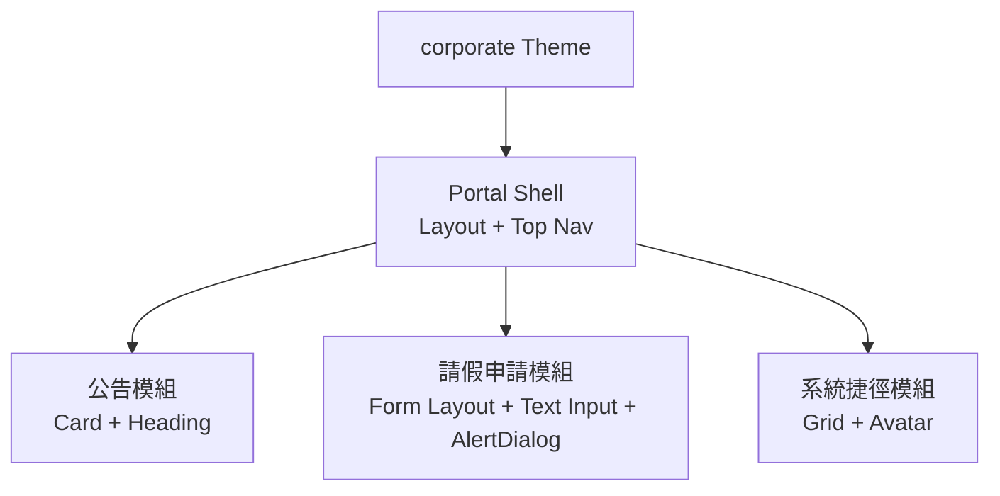

**成效**：三個月內完成統一視覺風格改版，新模組導入時間因為有明確的元件使用規範而縮短。

### 23.2 銀行系統案例

**背景**：某銀行網路銀行後台需要高合規、高對比度、支援 Dark Mode 的操作介面，且需嚴格的無障礙合規要求。

**做法**：

1. 建立 `theme/themes/banking`，色彩 Token 經過嚴格對比度驗證（企業自行驗證達 WCAG AA 以上，官方未提供合規保證，見第八章）。
2. AlertDialog 用於交易確認流程，善用其內建的焦點管理機制（見第六章 6.2），並將 `actionVariant` 設為 `destructive` 強化危險操作的視覺區隔，降低誤觸風險。
3. Table 元件用於交易明細，搭配虛擬滾動處理大量歷史交易記錄。
4. CI 中導入 axe-core 掃描作為合規稽核的一部分證據留存。

**成效**：無障礙相關稽核項目通過率提升，交易確認流程的誤觸客訴下降。

**注意事項**：金融系統對 Beta 版本的風險承受度低，建議先於非交易核心的查詢類頁面試點，待版本穩定後再擴及交易流程頁面。

### 23.3 ERP 案例

**背景**：製造業 ERP 系統需要將舊有 JSP + Struts 畫面現代化，涉及庫存管理、生產排程等高複雜度表單與表格。

**做法**：

1. 先盤點 200+ 個 JSP 畫面，建立元件對應字典（如舊 `<table>` 排程表對應 Astryx Table + Tree List 混合結構）。
2. 用 AI（Codex/Claude Code）批次處理結構性轉譯，人工驗證業務邏輯正確性。
3. 逐模組上線，每個模組上線前執行功能對等驗收清單。

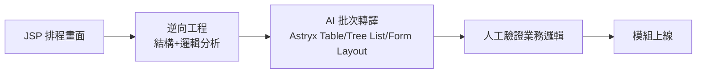

**成效**：現代化專案周期較純人工重寫大幅縮短，且透過對照字典降低了轉譯過程中的功能遺漏風險。

### 23.4 CRM 案例

**背景**：業務團隊使用的 CRM 系統需要支援多品牌（集團旗下多個子品牌各自的業務團隊使用同一套系統）。

**做法**：

1. 以 Monorepo 管理 `design-tokens`，每個子品牌各自一份 Theme 覆寫檔案。
2. 依登入使用者所屬品牌，於應用程式啟動時動態載入對應 Theme。
3. 客戶資訊卡片使用 Card、Avatar、Text 組合，商機列表使用 Table 搭配篩選功能。

**成效**：新增子品牌時只需新增一份 Theme 覆寫檔案，無需複製整套前端程式碼。

### 23.5 POS 案例

**背景**：零售 POS 系統需要在觸控螢幕、高頻互動情境下維持流暢操作，且需支援離線情境的基本操作。

**做法**：

1. 因觸控情境，Popover/Dropdown Menu 一律採 click 觸發而非 hover。
2. 大量商品清單使用 Table 虛擬滾動，確保觸控滾動流暢度。
3. 善用 StyleX 的 build-time 特性降低執行期樣式運算開銷，維持高互動延遲敏感情境下的流暢度。
4. Toast 用於結帳成功/失敗提示，設計簡潔且可快速消失避免遮擋下一筆交易操作。

**成效**：互動延遲指標在導入後有明顯改善，特別是在商品列表快速滾動的情境下。

### 23.6 大型 Web Application 通用導入流程總結

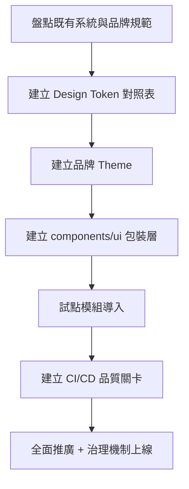

**共通注意事項**：無論產業別，成功案例的共同點都是「先建立 Token/Theme 基礎與包裝層規範，再逐步擴大範圍」，而非一次性全站替換；同時都建立了對應的無障礙與視覺回歸驗證機制作為品質防線。

---

## 第二十四章 Conclusion

### 24.1 總結

Astryx 提供的價值不是「又一套好看的元件庫」，而是一套讓「效能、客製彈性、AI 友善」三者可以同時成立的架構思路：Token 分層讓客製化不需要 fork 原始碼，StyleX 的 build-time 特性讓效能不必用執行期彈性交換，而官方逐字定位的 "agent ready"——具體展現為 `manifest` 指令與原生 MCP Server——讓人類與 AI 開發者可以用同一套心智模型協作。由於專案發布未滿一年（2026 年 1 月建立、6 月底 Beta），企業評估時仍應將「快速迭代中的 API」與「尚無正式 WCAG 合規聲明」等現況風險，一併納入導入時程規劃。

### 24.2 企業導入建議

1. 不要一次性全站替換，先從非核心模組試點累積經驗。
2. 導入前務必完成 Token 對齊（把既有品牌規範轉譯為 Semantic Token），這比急著替換元件更重要。
3. 及早建立治理機制（Design System Council、Token 審核流程），避免規模擴大後治理真空。
4. 把 AI 開發流程規則（CLAUDE.md、copilot-instructions.md）視為專案基礎設施的一部分，而不是選配項目。
5. Beta 階段的風險應納入時程與資源評估，關鍵系統建議待版本更穩定後再深度依賴。

### 24.3 導入流程建議

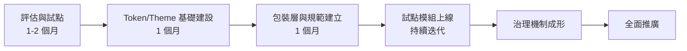

### 24.4 學習路線建議

1. 第一階段：熟悉 Token/Theme 架構與 CLI 基本操作（對應第一~五章）。
2. 第二階段：熟悉元件使用規範與無障礙要求（對應第六~八章）。
3. 第三階段：熟悉 AI 開發整合與 Context Engineering（對應第九、十一、十五、十六章）。
4. 第四階段：熟悉企業治理、升級維運與逆向工程實務（對應第十二~十四、十七、十八章）。
5. 第五階段：實戰演練——參考第二十三章案例，於自己團隊的實際專案中試點導入。

### 24.5 Roadmap 建議

企業內部可規劃：短期（3 個月內）完成試點模組與 Token 基礎建設；中期（6 個月內）建立完整治理機制與 CI/CD 品質關卡；長期（12 個月以上）逐步將舊系統依風險優先順序現代化遷移，並持續追蹤 Astryx 官方版本演進、視需要調整內部客製層。

**最終提醒**：Design System 導入是組織能力建設，不只是技術選型。技術框架會演進、版本會迭代，但「Token 治理」「元件使用規範」「AI 開發規則沉澱」這幾件事一旦建立起來，將是團隊長期可持續累積的資產。

### 全書總檢查清單（Master Checklist）

- [ ] 完成 Token 對齊與 Semantic Token 命名規範
- [ ] 建立至少一套企業品牌 Theme（含 Dark Mode）
- [ ] 建立 `components/ui` 包裝層並禁止跨層直接引用
- [ ] CLI 常用指令已納入團隊速查表
- [ ] CI/CD 已涵蓋 Lint、型別檢查、測試、無障礙掃描、視覺回歸測試
- [ ] 已建立 `CLAUDE.md` 與 `.github/copilot-instructions.md`
- [ ] 已成立 Design System 治理機制
- [ ] 已建立升級與 Migration 的標準流程與回退策略
- [ ] 已完成至少一個試點模組的實戰導入
- [ ] 已規劃團隊學習路線與後續 Roadmap

