+++
date = '2026-07-01T10:00:00+08:00'
draft = false
title = 'AutoResearch 驅動 SSDLC（安全軟體開發生命週期）教學手冊'
tags = ['教學', 'AI開發', 'SSDLC', 'DevSecOps', 'Claude Code', 'GitHub Copilot']
categories = ['教學']
+++

# AutoResearch 驅動 SSDLC（安全軟體開發生命週期）教學手冊

> **版本**：v3.0  
> **日期**：2026-07-01  
> **上次更新**：2026-07-01  
> **適用對象**：資深工程師、DevSecOps 團隊、AI 架構師、技術主管  
> **前置需求**：具備 Python、Git、CI/CD、基本 LLM 使用經驗  
> **文件等級**：企業標準技術白皮書  
> **變更紀錄**：v3.0 — 更新 Claude Code Agent SDK/Plugins/Routines 生態系、GitHub Copilot CLI/App/SDK/Agentic Workflows 全面改寫、AutoResearch 最新社群動態

---

## 📖 目錄（Table of Contents）

- [第 1 章：AutoResearch 與 SSDLC 整合概念](#第-1-章autoresearch-與-ssdlc-整合概念)
  - [1.1 什麼是 AutoResearch？](#11-什麼是-autoresearch)
  - [1.2 什麼是 SSDLC？](#12-什麼是-ssdlc)
  - [1.3 AI 如何取代/輔助 SDLC 各階段](#13-ai-如何取代輔助-sdlc-各階段)
  - [1.4 與傳統 DevSecOps 差異](#14-與傳統-devsecops-差異)
  - [1.5 自我優化迴圈（Self-Improving Loop）](#15-自我優化迴圈self-improving-loop)
  - [1.6 AutoResearch 設計哲學與最新發展](#16-autoresearch-設計哲學與最新發展)
- [第 2 章：系統整體架構設計](#第-2-章系統整體架構設計)
  - [2.1 五層架構模型](#21-五層架構模型)
  - [2.2 SSDLC 完整流程圖](#22-ssdlc-完整流程圖)
  - [2.3 元件互動關係](#23-元件互動關係)
  - [2.4 安全邊界設計](#24-安全邊界設計)
- [第 3 章：環境建置與安裝](#第-3-章環境建置與安裝)
  - [3.1 前置需求總覽](#31-前置需求總覽)
  - [3.2 Python 環境安裝](#32-python-環境安裝)
  - [3.3 Git 安裝與設定](#33-git-安裝與設定)
  - [3.4 AutoResearch 安裝](#34-autoresearch-安裝)
  - [3.5 Claude Code 安裝與設定](#35-claude-code-安裝與設定)
  - [3.6 GitHub Copilot 安裝與設定](#36-github-copilot-安裝與設定)
  - [3.7 VS Code 安裝與設定](#37-vs-code-安裝與設定)
  - [3.8 一鍵安裝腳本](#38-一鍵安裝腳本)
- [第 4 章：AutoResearch 核心運作解析](#第-4-章autoresearch-核心運作解析)
  - [4.1 核心架構概覽](#41-核心架構概覽)
  - [4.2 train.py — 可被 AI 修改的目標檔案](#42-trainpy--可被-ai-修改的目標檔案)
  - [4.3 prepare.py — 固定的資料與工具層](#43-preparepy--固定的資料與工具層)
  - [4.4 program.md — Prompt Engineering 指令策略](#44-programmd--prompt-engineering-指令策略)
  - [4.5 AutoResearch 執行引擎](#45-autoresearch-執行引擎)
  - [4.6 program.md 的 Prompt Engineering 技巧](#46-programmd-的-prompt-engineering-技巧)
- [第 5 章：SSDLC Workflow 設計](#第-5-章ssdlc-workflow-設計)
  - [5.0 SSDLC 全階段總覽](#50-ssdlc-全階段總覽)
  - [5.1 階段一：需求分析（Requirement Analysis）](#51-階段一需求分析requirement-analysis)
  - [5.2 階段二：架構設計（Design）](#52-階段二架構設計design)
  - [5.3 階段三：開發（Development）](#53-階段三開發development)
  - [5.4 階段四：測試（Testing）](#54-階段四測試testing)
  - [5.5 階段五：安全掃描（Security Scanning）](#55-階段五安全掃描security-scanning)
  - [5.6 階段六：部署（Deployment）](#56-階段六部署deployment)
  - [5.7 階段七：監控（Monitoring）](#57-階段七監控monitoring)
  - [5.8 階段八：優化（Optimization）](#58-階段八優化optimization)
- [第 6 章：AI 自動優化機制](#第-6-章ai-自動優化機制)
  - [6.1 AutoResearch 自動優化核心原理](#61-autoresearch-自動優化核心原理)
  - [6.2 修改程式碼的策略](#62-修改程式碼的策略)
  - [6.3 執行測試的流程](#63-執行測試的流程)
  - [6.4 評估結果的機制](#64-評估結果的機制)
  - [6.5 Keep / Revert 決策矩陣](#65-keep--revert-決策矩陣)
  - [6.6 應用於三大場景](#66-應用於三大場景)
- [第 7 章：CI/CD + AutoResearch 整合](#第-7-章cicd--autoresearch-整合)
  - [7.1 整合架構概覽](#71-整合架構概覽)
  - [7.2 GitHub Actions 完整 YAML 設計](#72-github-actions-完整-yaml-設計)
  - [7.3 自動觸發 AutoResearch 的機制](#73-自動觸發-autoresearch-的機制)
  - [7.4 安全掃描結果彙總腳本](#74-安全掃描結果彙總腳本)
- [第 8 章：實戰案例](#第-8-章實戰案例)
  - [8.1 案例一：API 效能優化](#81-案例一api-效能優化)
  - [8.2 案例二：安全漏洞自動修補](#82-案例二安全漏洞自動修補)
- [第 9 章：系統維運](#第-9-章系統維運)
  - [9.1 日誌監控架構](#91-日誌監控架構)
  - [9.2 模型 Drift 偵測](#92-模型-drift-偵測)
  - [9.3 版本控管策略](#93-版本控管策略)
  - [9.4 Rollback 策略](#94-rollback-策略)
  - [9.5 維運 Checklist](#95-維運-checklist)
- [第 10 章：系統升級與擴展](#第-10-章系統升級與擴展)
  - [10.1 多 Agent 架構（Cluster）](#101-多-agent-架構cluster)
  - [10.2 分散式 AutoResearch](#102-分散式-autoresearch)
  - [10.3 GPU / 雲端擴展](#103-gpu--雲端擴展)
- [第 11 章：Claude Code 進階功能與 SSDLC 整合](#第-11-章claude-code-進階功能與-ssdlc-整合)
  - [11.1 CLAUDE.md 記憶系統](#111-claudemd-記憶系統)
  - [11.2 Skills 技能系統](#112-skills-技能系統)
  - [11.3 Hooks 自動化機制](#113-hooks-自動化機制)
  - [11.4 Subagents 子代理人架構](#114-subagents-子代理人架構)
  - [11.5 MCP（Model Context Protocol）整合](#115-mcpmodel-context-protocol整合)
  - [11.6 Plan Mode 與 Extended Thinking](#116-plan-mode-與-extended-thinking)
  - [11.7 Worktrees 平行開發](#117-worktrees-平行開發)
  - [11.8 Agent Teams 團隊協作](#118-agent-teams-團隊協作)
  - [11.9 排程任務（Scheduled Tasks）](#119-排程任務scheduled-tasks)
  - [11.10 Agent SDK（Python + TypeScript）](#1110-agent-sdkpython--typescript)
  - [11.11 Plugins 生態系](#1111-plugins-生態系)
  - [11.12 Remote Control & Channels](#1112-remote-control--channels)
  - [11.13 Desktop App、Web、Chrome 整合](#1113-desktop-appwebchrome-整合)
  - [11.14 Code Review（Ultrareview）](#1114-code-reviewultrareview)
  - [11.15 Auto Mode & Sandbox](#1115-auto-mode--sandbox)
  - [11.16 Analytics & Observability（OpenTelemetry）](#1116-analytics--observabilityopentelemetry)
- [第 12 章：GitHub Copilot Agent 生態系](#第-12-章github-copilot-agent-生態系)
  - [12.1 GitHub Copilot 功能總覽（2026）](#121-github-copilot-功能總覽2026)
  - [12.2 Cloud Agent 雲端代理人](#122-cloud-agent-雲端代理人)
  - [12.3 Agent Skills 開放標準](#123-agent-skills-開放標準)
  - [12.4 Agentic Memory 記憶系統](#124-agentic-memory-記憶系統)
  - [12.5 Copilot Code Review](#125-copilot-code-review)
  - [12.6 Copilot 與 SSDLC 整合策略](#126-copilot-與-ssdlc-整合策略)
  - [12.7 Copilot CLI Agent（命令列代理人）](#127-copilot-cli-agent命令列代理人)
  - [12.8 Copilot App（桌面應用程式）](#128-copilot-app桌面應用程式)
  - [12.9 Copilot SDK（Node.js / Python / .NET）](#129-copilot-sdknodejs--python--net)
  - [12.10 Third-Party Agents（第三方代理人）](#1210-third-party-agents第三方代理人)
  - [12.11 GitHub Agentic Workflows & Automations](#1211-github-agentic-workflows--automations)
  - [12.12 Copilot Plugins 生態系](#1212-copilot-plugins-生態系)
  - [12.13 Enterprise Governance & AI Controls](#1213-enterprise-governance--ai-controls)
- [第 13 章：Best Practices（企業建議）](#第-13-章best-practices企業建議)
  - [13.1 Prompt 設計最佳實踐](#131-prompt-設計最佳實踐)
  - [13.2 安全策略最佳實踐](#132-安全策略最佳實踐)
  - [13.3 Git 管理策略](#133-git-管理策略)
  - [13.4 成本管理](#134-成本管理)
  - [13.5 Agent 安全治理最佳實踐](#135-agent-安全治理最佳實踐)
- [第 14 章：Anti-Patterns（常見錯誤）](#第-14-章anti-patterns常見錯誤)
  - [14.1 致命錯誤（Must Avoid）](#141-致命錯誤must-avoid)
  - [14.2 常見設計錯誤](#142-常見設計錯誤)
  - [14.3 Anti-Patterns 總覽表](#143-anti-patterns-總覽表)
- [附錄 A：Docker Compose 範例](#附錄-adocker-compose-範例)
- [附錄 B：專案目錄結構](#附錄-b專案目錄結構)
- [附錄 C：檢查清單（Checklist）](#附錄-c檢查清單checklist)
- [附錄 D：術語表（Glossary）](#附錄-d術語表glossary)
- [附錄 E：參考資源與延伸閱讀](#附錄-e參考資源與延伸閱讀)

---

## 第 1 章：AutoResearch 與 SSDLC 整合概念

### 1.1 什麼是 AutoResearch？

AutoResearch 是由 Andrej Karpathy 於 2026 年 3 月提出的 **AI 自主研究框架**（[GitHub: karpathy/autoresearch](https://github.com/karpathy/autoresearch)，⭐ 89.3k stars，12.9k forks），核心理念為：讓 AI Agent 在固定的 **時間預算（Time Budget）** 內，自主修改程式碼、執行測試、評估結果，最終決定是否保留變更。截至 2026 年 7 月，專案已累積超過 10,000 代的社群實驗，成為 AI 自主研究領域的標竿專案。

> *"Research is now entirely the domain of autonomous swarms of AI agents running across compute cluster megastructures in the skies."* — Andrej Karpathy, March 2026

AutoResearch 的核心設計理念包含三大原則：

1. **單一檔案修改（Single File to Modify）**：Agent 僅修改 `train.py`，範圍可控且 diff 可審查
2. **固定時間預算（Fixed Time Budget）**：訓練固定運行 5 分鐘（wall clock），使不同實驗可直接比較
3. **自包含（Self-Contained）**：除 PyTorch 外無外部依賴，一顆 GPU、一個檔案、一個指標

其核心元件包含：

| 元件 | 角色 | 可被 AI 修改？ | 說明 |
|------|------|:---:|------|
| `train.py` | 訓練/執行邏輯（AI 可修改的目標檔案） | ✅ | 包含完整 GPT 模型、優化器（Muon + AdamW）、訓練迴圈 |
| `prepare.py` | 資料準備與環境固定工具 | ❌ | 下載訓練資料、訓練 BPE tokenizer、dataloader、evaluation |
| `program.md` | 指令策略文件（Prompt Engineering） | ✅（由人類編輯） | 相當於 AI Agent 的「技能（Skill）」 |
| Git commit/revert | 版本控制 Keep/Revert 機制 | ❌ | 每次實驗原子化：改善則 commit，否則 revert |
| Time Budget | 固定執行時間（5 分鐘） | ❌ | 約 12 次實驗/小時，一晚約 100 次實驗 |

**核心評估指標**：`val_bpb`（validation bits per byte）— 越低越好，且與 vocab size 無關，使架構變更可以公平比較。

**分析工具**：專案內建 `analysis.ipynb` Jupyter Notebook，可視化實驗進展曲線、比較各次迭代的 `val_bpb` 變化，協助人類研究員快速識別有效策略。

**平台支援**：原生要求單一 NVIDIA GPU（H100 測試通過）。社群已提供多平台 fork：
- [miolini/autoresearch-macos](https://github.com/miolini/autoresearch-macos)（MacOS）
- [trevin-creator/autoresearch-mlx](https://github.com/trevin-creator/autoresearch-mlx)（MacOS MLX）
- [jsegov/autoresearch-win-rtx](https://github.com/jsegov/autoresearch-win-rtx)（Windows）
- [andyluo7/autoresearch](https://github.com/andyluo7/autoresearch)（AMD）

> **💡 小型計算平台建議**：若在較小的計算平台（如 MacBook）執行，Karpathy 建議調整以下參數：使用低熵資料集（如 TinyStories）、降低 `vocab_size`、縮小 `MAX_SEQ_LEN`、降低 `DEPTH`、使用 `WINDOW_PATTERN = "L"` 以避免交替 banded attention 效率低下、縮小 `TOTAL_BATCH_SIZE`。

### 1.2 什麼是 SSDLC？

SSDLC（Secure Software Development Lifecycle）是在傳統 SDLC 各階段中 **嵌入安全實踐（Security by Design）** 的方法論：

```
需求 → 設計 → 開發 → 測試 → 安全掃描 → 部署 → 監控 → 優化
         ↑                                           |
         └───────── 持續回饋與改進 ─────────────────┘
```

### 1.3 AI 如何取代/輔助 SDLC 各階段

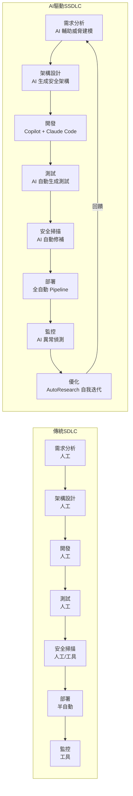
```mermaid
graph LR
    subgraph 傳統SDLC
        A1[需求分析<br>人工] --> A2[架構設計<br>人工]
        A2 --> A3[開發<br>人工]
        A3 --> A4[測試<br>人工]
        A4 --> A5[安全掃描<br>人工/工具]
        A5 --> A6[部署<br>半自動]
        A6 --> A7[監控<br>工具]
    end

    subgraph AI驅動SSDLC
        B1[需求分析<br>AI 輔助威脅建模] --> B2[架構設計<br>AI 生成安全架構]
        B2 --> B3[開發<br>Copilot + Claude Code]
        B3 --> B4[測試<br>AI 自動生成測試]
        B4 --> B5[安全掃描<br>AI 自動修補]
        B5 --> B6[部署<br>全自動 Pipeline]
        B6 --> B7[監控<br>AI 異常偵測]
        B7 --> B8[優化<br>AutoResearch 自我迭代]
        B8 -->|回饋| B1
    end
```

### 1.4 與傳統 DevSecOps 差異

| 面向 | 傳統 DevSecOps | AutoResearch 驅動 SSDLC |
|------|---------------|------------------------|
| **安全掃描** | 工具掃描 → 人工修補 | AI 掃描 → AI 自動修補 → 驗證 |
| **程式碼品質** | Linter + Code Review | AI 自主優化 + 自動測試驗證 |
| **效能調優** | 人工 Profiling | AutoResearch 自主迭代優化 |
| **學習能力** | 團隊知識傳承 | AI 持續累積最佳實踐 |
| **回應速度** | 小時/天級 | 分鐘級（Time Budget） |
| **一致性** | 取決於人員經驗 | 標準化、可重現 |

### 1.5 自我優化迴圈（Self-Improving Loop）

AutoResearch 的自我優化迴圈是本手冊的核心概念：

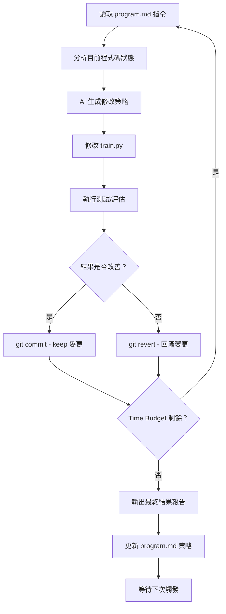
```mermaid
graph TD
    A[讀取 program.md 指令] --> B[分析目前程式碼狀態]
    B --> C[AI 生成修改策略]
    C --> D[修改 train.py]
    D --> E[執行測試/評估]
    E --> F{結果是否改善？}
    F -->|是| G[git commit - keep 變更]
    F -->|否| H[git revert - 回滾變更]
    G --> I{Time Budget 剩餘？}
    H --> I
    I -->|是| A
    I -->|否| J[輸出最終結果報告]
    J --> K[更新 program.md 策略]
    K --> L[等待下次觸發]
```

> **💡 企業導入建議**：初期建議僅在 non-production 環境啟用 AutoResearch 自動修改，並設定嚴格的變更範圍白名單（Allow List）。隨著信任度提升，再逐步開放至 staging → production hotfix。

### 1.6 AutoResearch 設計哲學與最新發展

#### 設計哲學（Design Choices）

AutoResearch 刻意保持極簡設計，背後蘊含深刻的工程哲學：

| 設計選擇 | 說明 | 對 SSDLC 的啟示 |
|---------|------|----------------|
| **單一檔案修改** | Agent 僅修改 `train.py`，保持範圍可控 | 安全修補應限定影響範圍，避免級聯變更 |
| **固定時間預算** | 5 分鐘/次，結果跨實驗可比較 | CI/CD Pipeline 應設合理超時，防止資源耗盡 |
| **自包含** | 無外部依賴，一 GPU 一檔案 | 減少供應鏈攻擊面，最小化依賴 |
| **明確指標** | `val_bpb` 單一量化指標 | 安全評估需明確、可量化的 KPI |
| **原子操作** | 每次 commit/revert 為原子單位 | 部署變更應可完整回滾 |

#### 與其他 AI 開發工具的定位對比

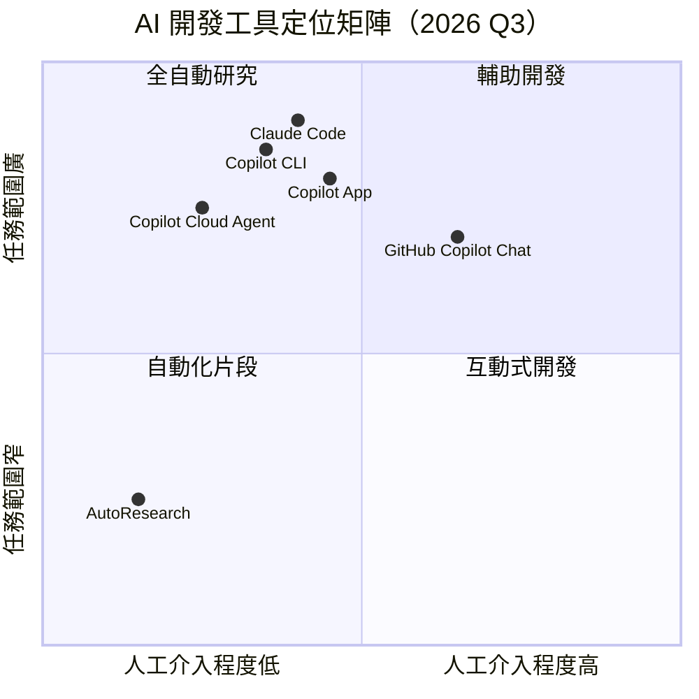
```mermaid
quadrantChart
    title AI 開發工具定位矩陣（2026 Q3）
    x-axis "人工介入程度低" --> "人工介入程度高"
    y-axis "任務範圍窄" --> "任務範圍廣"
    quadrant-1 "輔助開發"
    quadrant-2 "全自動研究"
    quadrant-3 "自動化片段"
    quadrant-4 "互動式開發"
    AutoResearch: [0.15, 0.25]
    Claude Code: [0.40, 0.90]
    Copilot CLI: [0.35, 0.85]
    Copilot Cloud Agent: [0.25, 0.75]
    GitHub Copilot Chat: [0.65, 0.70]
    Copilot App: [0.45, 0.80]
```

#### 從 AutoResearch 到 SSDLC 的概念遷移

AutoResearch 原本用於 ML 模型訓練優化，但其 **自我改進迴圈（Self-Improving Loop）** 可以遷移至軟體工程的各個面向：

| AutoResearch 原始場景 | SSDLC 遷移場景 | 對應指標 |
|---------------------|---------------|---------|
| 優化 GPT 模型架構 | 優化 API 效能 | P99 延遲、吞吐量 |
| 調整超參數 | 調整應用設定 | 回應時間、資源使用率 |
| 模型訓練 → 驗證 | 程式碼修改 → 測試+安全掃描 | 測試通過率、漏洞數 |
| val_bpb 指標 | 安全分數、品質分數 | CVSS、Code Quality Score |
| Keep/Revert 決策 | Merge/Reject PR 決策 | 多維度評估結果 |

---

## 第 2 章：系統整體架構設計

### 2.1 五層架構模型

本系統採用五層架構設計，確保關注點分離與安全邊界：

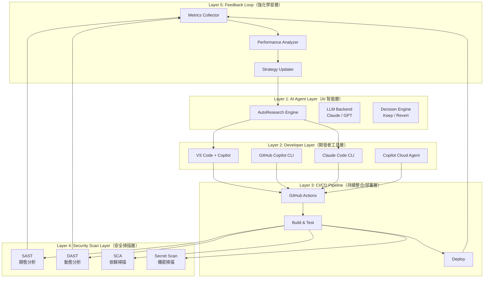
```mermaid
graph TB
    subgraph "Layer 5: Feedback Loop（強化學習層）"
        FL1[Metrics Collector]
        FL2[Performance Analyzer]
        FL3[Strategy Updater]
        FL1 --> FL2 --> FL3
    end

    subgraph "Layer 4: Security Scan Layer（安全掃描層）"
        SS1[SAST<br>靜態分析]
        SS2[DAST<br>動態分析]
        SS3[SCA<br>依賴掃描]
        SS4[Secret Scan<br>機密掃描]
    end

    subgraph "Layer 3: CI/CD Pipeline（持續整合/部署層）"
        CI1[GitHub Actions]
        CI2[Build & Test]
        CI3[Deploy]
    end

    subgraph "Layer 2: Developer Layer（開發者工具層）"
        DL1[VS Code + Copilot]
        DL2[GitHub Copilot CLI]
        DL3[Claude Code CLI]
        DL4[Copilot Cloud Agent]
    end

    subgraph "Layer 1: AI Agent Layer（AI 智能層）"
        AL1[AutoResearch Engine]
        AL2[LLM Backend<br>Claude / GPT]
        AL3[Decision Engine<br>Keep / Revert]
    end

    AL1 --> DL1
    AL1 --> DL3
    DL1 --> CI1
    DL2 --> CI1
    DL3 --> CI1
    DL4 --> CI1
    CI1 --> CI2 --> CI3
    CI2 --> SS1
    CI2 --> SS2
    CI2 --> SS3
    CI2 --> SS4
    SS1 --> FL1
    SS2 --> FL1
    CI3 --> FL1
    FL3 --> AL1
```

### 2.2 SSDLC 完整流程圖

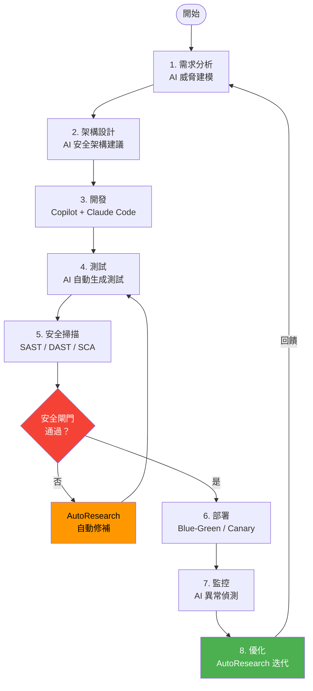
```mermaid
flowchart TD
    START([開始]) --> REQ[1. 需求分析<br>AI 威脅建模]
    REQ --> DESIGN[2. 架構設計<br>AI 安全架構建議]
    DESIGN --> DEV[3. 開發<br>Copilot + Claude Code]
    DEV --> TEST[4. 測試<br>AI 自動生成測試]
    TEST --> SEC[5. 安全掃描<br>SAST / DAST / SCA]
    SEC --> GATE{安全閘門<br>通過？}
    GATE -->|否| FIX[AutoResearch<br>自動修補]
    FIX --> TEST
    GATE -->|是| DEPLOY[6. 部署<br>Blue-Green / Canary]
    DEPLOY --> MONITOR[7. 監控<br>AI 異常偵測]
    MONITOR --> OPT[8. 優化<br>AutoResearch 迭代]
    OPT -->|回饋| REQ

    style FIX fill:#ff9800,color:#000
    style GATE fill:#f44336,color:#fff
    style OPT fill:#4caf50,color:#fff
```

### 2.3 元件互動關係

| 元件 | 通訊協定 | 資料格式 | 安全機制 |
|------|---------|---------|---------|
| AutoResearch ↔ LLM | HTTPS / API | JSON | API Key + Rate Limit |
| AutoResearch ↔ Git | SSH / HTTPS | Git Protocol | SSH Key / PAT |
| CI/CD ↔ Security Scanner | REST API | SARIF / JSON | Service Account |
| Feedback Loop ↔ AutoResearch | Internal Queue | JSON Metrics | mTLS |
| VS Code ↔ Copilot | HTTPS | LSP / JSON | OAuth Token |
| Copilot CLI ↔ GitHub | HTTPS | JSON / gRPC | GitHub PAT / OAuth |
| Copilot Cloud Agent ↔ GitHub | HTTPS | GraphQL / JSON | App Installation Token |
| Claude Code ↔ API | HTTPS | JSON | API Key / OAuth (PKCE) |
| Claude Code Desktop ↔ API | HTTPS | JSON | Session Token |

### 2.4 安全邊界設計

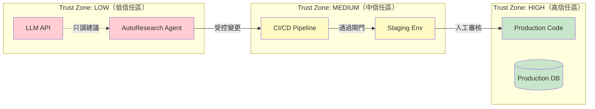
```mermaid
graph LR
    subgraph "Trust Zone: HIGH（高信任區）"
        P[Production Code]
        DB[(Production DB)]
    end

    subgraph "Trust Zone: MEDIUM（中信任區）"
        S[Staging Env]
        CI[CI/CD Pipeline]
    end

    subgraph "Trust Zone: LOW（低信任區）"
        AR[AutoResearch Agent]
        LLM[LLM API]
    end

    AR -->|受控變更| CI
    CI -->|通過閘門| S
    S -->|人工審核| P
    LLM -.->|只讀建議| AR

    style P fill:#c8e6c9
    style DB fill:#c8e6c9
    style S fill:#fff9c4
    style CI fill:#fff9c4
    style AR fill:#ffcdd2
    style LLM fill:#ffcdd2
```

> **💡 企業導入建議**：AutoResearch Agent 應永遠位於「低信任區」，其產出必須經過 CI/CD Pipeline 驗證與安全掃描後，才能進入更高信任區。切勿直接授予 AI Agent production 寫入權限。

---

## 第 3 章：環境建置與安裝

### 3.1 前置需求總覽

| 工具 | 最低版本 | 用途 | 備註 |
|------|---------|------|------|
| Python | 3.10+ | AutoResearch 執行環境 | AutoResearch 專案要求 |
| [uv](https://docs.astral.sh/uv/) | 最新版 | Python 專案管理器 | AutoResearch 官方使用的套件管理器 |
| Git | 2.40+ | 版本控制 | Windows 需安裝 [Git for Windows](https://git-scm.com/downloads/win) |
| VS Code | 1.95+ | 開發 IDE | 建議使用最新穩定版 |
| Docker | 24+ | 容器化部署 | 可選，用於 Docker Compose 環境 |
| GitHub CLI (`gh`) | 2.50+ | GitHub 操作 | Claude Code 和 Copilot CLI 均可利用 |
| GitHub Copilot CLI | 最新版 | Agentic 開發工具 | 透過 GitHub CLI 安裝，見 3.6 節 |
| NVIDIA GPU | — | AutoResearch 訓練 | H100 測試通過，也可使用社群 fork 支援其他平台 |

> **📝 注意**：Claude Code 已改為原生安裝，不再需要 Node.js 作為前置需求。GitHub Copilot CLI 亦為獨立安裝，與 VS Code Copilot 擴充套件為不同產品。

### 3.2 Python 環境安裝

#### Windows（PowerShell）

```powershell
# 1. 安裝 Python（使用 winget）
winget install Python.Python.3.12

# 2. 確認安裝
python --version
pip --version

# 3. 建立虛擬環境
python -m venv .venv
.\.venv\Scripts\Activate.ps1

# 4. 升級 pip
python -m pip install --upgrade pip

# 5. 安裝基礎套件
pip install torch numpy pandas scikit-learn pytest black ruff
```

#### macOS / Linux（Bash）

```bash
# 1. 安裝 Python（使用 pyenv）
curl https://pyenv.run | bash
pyenv install 3.12.0
pyenv global 3.12.0

# 2. 建立虛擬環境
python -m venv .venv
source .venv/bin/activate

# 3. 安裝基礎套件
pip install torch numpy pandas scikit-learn pytest black ruff
```

### 3.3 Git 安裝與設定

```bash
# 安裝（Windows 使用 winget）
winget install Git.Git

# 基本設定
git config --global user.name "Your Name"
git config --global user.email "your.email@company.com"

# 安全設定：啟用 GPG 簽章
git config --global commit.gpgsign true
git config --global tag.gpgsign true

# 設定預設分支名稱
git config --global init.defaultBranch main

# 安裝 GitHub CLI
winget install GitHub.cli

# 驗證登入
gh auth login
```

### 3.4 AutoResearch 安裝

AutoResearch 使用 [uv](https://docs.astral.sh/uv/) 作為套件管理器，**不使用** pip 或 requirements.txt。

#### 安裝 uv 套件管理器

```bash
# macOS / Linux
curl -LsSf https://astral.sh/uv/install.sh | sh

# Windows PowerShell
powershell -ExecutionPolicy ByPass -c "irm https://astral.sh/uv/install.ps1 | iex"
```

#### Clone 並安裝 AutoResearch

```bash
# 1. Clone AutoResearch 專案
git clone https://github.com/karpathy/autoresearch.git
cd autoresearch

# 2. 安裝相依套件（使用 uv）
uv sync

# 3. 下載資料並訓練 tokenizer（一次性，約 2 分鐘）
uv run prepare.py

# 4. 手動執行一次訓練實驗（約 5 分鐘，驗證環境正常）
uv run train.py
```

#### 設定環境變數

```bash
# Windows PowerShell
$env:AUTORESEARCH_HOME = "$(Get-Location)"
$env:AUTORESEARCH_TIME_BUDGET = "300"  # 5 分鐘

# Linux / macOS
export AUTORESEARCH_HOME=$(pwd)
export AUTORESEARCH_TIME_BUDGET=300
```

#### 啟動 AI Agent 進行自主研究

```bash
# 啟動 Claude Code / Codex 等 AI Agent，然後給予以下 Prompt：
# "Hi have a look at program.md and let's kick off a new experiment!
#  let's do the setup first."
# program.md 本質上是一個輕量級的 "skill" 指令檔
```

> **⚠️ 重要**：AutoResearch 專案結構精簡，只有三個核心檔案：`prepare.py`（不可修改）、`train.py`（AI 可修改）、`program.md`（人類編輯的策略文件）。

### 3.5 Claude Code 安裝與設定

Claude Code 已改為**原生安裝**，不再需要 Node.js。安裝後會自動在背景更新至最新版本。

#### 安裝 Claude Code

```bash
# macOS / Linux / WSL（推薦 — 原生安裝，自動背景更新）
curl -fsSL https://claude.ai/install.sh | bash

# Windows PowerShell
irm https://claude.ai/install.ps1 | iex

# Windows CMD
curl -fsSL https://claude.ai/install.cmd -o install.cmd && install.cmd && del install.cmd

# ---- 套件管理器安裝（不自動更新，需手動升級）----

# Homebrew (macOS) — stable channel
brew install --cask claude-code
# 或 latest channel（最新版，可能有回歸）
brew install --cask claude-code@latest

# WinGet (Windows)
winget install Anthropic.ClaudeCode

# Linux 套件管理器
sudo apt install claude-code        # Debian / Ubuntu
sudo dnf install claude-code        # Fedora / RHEL
sudo apk add claude-code            # Alpine
```

#### 安裝 Claude Code Desktop App

```bash
# macOS（Intel + Apple Silicon）
# 下載：https://claude.ai/api/desktop/darwin/universal/dmg/latest/redirect

# Windows x64
# 下載：https://claude.ai/api/desktop/win32/x64/setup/latest/redirect

# Windows ARM64
# 下載：https://claude.ai/api/desktop/win32/arm64/setup/latest/redirect

# 功能：平行 sessions、Git 隔離、排程任務、視覺化 diff、PR 監控
```

#### Claude Code Web（無需本地安裝）

直接在瀏覽器使用：[claude.ai/code](https://claude.ai/code)

- 適用於：無本地環境、長時間運行任務、遠端 repo
- 可與 terminal 互傳 session（`claude --teleport` / `claude --remote`）

> **📝 注意**：Windows 原生安裝需要先安裝 [Git for Windows](https://git-scm.com/downloads/win)。WSL 安裝不需要。
> 如果出現 `The token '&&' is not a valid statement separator` 錯誤，代表你在 PowerShell 環境，請使用 PowerShell 指令。

#### 登入與初始化

```bash
# 1. 在專案目錄啟動 Claude Code（首次會引導登入）
cd your-project
claude

# 支援的帳號類型：
# - Claude Pro / Max / Team / Enterprise（推薦）
# - Claude Console（API 存取，預付費額度）
# - Amazon Bedrock / Google Vertex AI / Microsoft Foundry（企業雲端供應商）

# 2. 驗證安裝
claude --version

# 3. 在 CLI 輸入 /help 查看可用指令
```

#### Claude Code 可用介面

Claude Code 不僅限於 Terminal CLI，還可在多個介面使用：

| 介面 | 說明 | 使用場景 |
|------|------|--------|
| **Terminal CLI** | 完整功能的命令列工具 | 日常開發、腳本自動化 |
| **VS Code** | IDE 整合擴充套件 | 編輯器內直接使用 |
| **JetBrains** | IntelliJ / PyCharm 等整合 | JetBrains 使用者 |
| **Desktop App** | 桌面應用程式 | 多工作區管理、排程任務 |
| **Web** | 瀏覽器版本（claude.ai/code） | 遠端存取、雲端 VM |
| **GitHub Actions** | CI/CD 整合 | 自動化 PR 審查、Issue 分派 |
| **GitLab CI/CD** | CI/CD 整合 | GitLab 使用者 |
| **Slack** | 聊天整合 | 團隊協作、Bug 報告路由 |
| **Chrome** | 瀏覽器擴充 | 即時 UI 偵錯與驗證 |

> **💡 所有介面共享相同底層引擎**：CLAUDE.md 檔案、設定、MCP 伺服器在所有介面間通用。

**安全注意事項**：永遠不要將 API Key 提交至 Git。使用 `.env` 檔案 + `.gitignore` 管理機密：

```bash
# .env（加入 .gitignore）
ANTHROPIC_API_KEY=sk-ant-xxxxx
OPENAI_API_KEY=sk-xxxxx
GITHUB_TOKEN=ghp_xxxxx
```

```bash
# .gitignore
.env
.env.*
!.env.example
```

### 3.6 GitHub Copilot 安裝與設定

GitHub Copilot 於 2026 年已演進為完整的 **Agentic 開發平台**，包含 IDE 擴充套件、CLI Agent、Cloud Agent、Desktop App 及 SDK。以下分項說明安裝步驟。

#### 3.6.1 VS Code 擴充套件安裝

```bash
# 1. 在 VS Code 中安裝 GitHub Copilot 擴充套件
code --install-extension GitHub.copilot
code --install-extension GitHub.copilot-chat

# 2. 登入 GitHub 帳號（在 VS Code 中操作）
# VS Code → Accounts → Sign in with GitHub

# 3. 驗證 Copilot 啟用狀態
# 開啟任意程式碼檔案，確認右下角顯示 Copilot 圖示
```

#### 3.6.2 GitHub Copilot CLI 安裝（Agentic Terminal Agent）

Copilot CLI 是一個獨立的命令列 AI Agent，可在 terminal 中自主執行開發任務，支援 autopilot 模式、平行任務（`/fleet`）、研究模式（`/research`）等進階功能。

```bash
# 安裝 GitHub CLI（若尚未安裝）
winget install GitHub.cli          # Windows
brew install gh                     # macOS
sudo apt install gh                 # Linux (Debian/Ubuntu)

# 登入 GitHub
gh auth login

# 安裝 Copilot CLI 擴充
gh extension install github/copilot-cli

# 啟動 Copilot CLI（進入互動式 Agent 模式）
gh copilot

# 或直接給予任務
gh copilot "fix the failing tests in src/auth/"
```

**Copilot CLI 核心功能**：

| 功能 | 說明 | 使用方式 |
|------|------|---------|
| **Autopilot Mode** | 自主完成多步驟任務 | 設定後 Copilot 自動執行不需逐步確認 |
| **`/fleet` 平行任務** | 將複雜任務拆分為子任務並行執行 | `/fleet implement all TODO items` |
| **`/research` 研究模式** | 深度研究 codebase 並產出報告 | `/research how does the auth module work` |
| **`/pr` PR 管理** | 從 CLI 建立、檢視、修復 PR | `/pr create` |
| **Chronicle** | 可搜尋的 session 歷史 | `/chronicle search yesterday's work` |
| **Remote Control** | 離開電腦後從手機繼續操控 | 啟用後自動產生 URL |
| **Hooks** | 在 agent 執行關鍵點觸發自訂腳本 | 設定 `copilot-hooks.yml` |
| **Skills** | 可重用的指令集 | 建立 `.github/copilot/skills/` |
| **Custom Agents** | 特化 Agent 定義 | 建立 `.github/copilot/agents/` |
| **Plugins** | 可安裝的擴充套件包 | `gh copilot plugin install` |
| **MCP Servers** | 連接外部工具與資料源 | 設定 MCP 伺服器 |
| **Voice Input** | 語音輸入 prompt | 按住錄音鍵 |
| **Local Sandbox** | 隔離的檔案系統/網路執行環境 | `/sandbox` 設定 |

**Copilot CLI 設定檔**（`.github/copilot-cli.yml`）：

```yaml
# 專案層級的 Copilot CLI 設定
permissions:
  allow:
    - tool: bash
      commands: ["npm test", "npm run lint", "pytest"]
    - tool: file_edit
      paths: ["src/**", "tests/**"]
  deny:
    - tool: bash
      commands: ["rm -rf", "git push --force"]

hooks:
  post_edit:
    - command: "npm run format"
      description: "Auto-format after edit"

custom_instructions: |
  This is a Python FastAPI project using PostgreSQL.
  Always write tests before implementing features (TDD).
  Follow OWASP Top 10 security guidelines.
```

#### 3.6.3 GitHub Copilot App（桌面應用程式）

```bash
# 下載 Copilot App（獨立桌面應用，非 VS Code 擴充）
# 從 https://github.com/features/copilot 下載
# 支援 macOS、Windows、Linux

# 功能：
# - 多個平行 Agent sessions（各自獨立 Git branch）
# - Canvas extensions（互動式協作界面）
# - Issues 與 PR 生命週期管理
# - Automations（排程任務）
# - Deep links（從外部工具直接開啟）
```

#### 3.6.4 GitHub Copilot 方案選擇

| 方案 | 適用對象 | 關鍵功能 | AI Credits |
|------|---------|---------|------------|
| **Copilot Free** | 個人開發者 | 基礎程式碼建議、有限 Chat | 有限額度 |
| **Copilot Pro** | 個人進階用戶 | 無限建議、進階模型選擇 | 標準額度 |
| **Copilot Business** | 組織團隊 | 政策管理、存取控制、Cloud Agent | 組織額度 |
| **Copilot Enterprise** | 大型企業 | 完整治理、Audit logs、自訂模型 | 企業額度 |

> **💡 企業導入建議**：2026 年的 GitHub Copilot 採用 **AI Credits 計量計費**模式。建議設定 Budget Controls（預算控制），在 enterprise/organization/user 層級設定消費上限，避免成本失控。

### 3.7 VS Code 安裝與設定

```bash
# 1. 安裝 VS Code（Windows）
winget install Microsoft.VisualStudioCode

# 2. 安裝必要擴充套件
code --install-extension GitHub.copilot
code --install-extension GitHub.copilot-chat
code --install-extension ms-python.python
code --install-extension ms-python.vscode-pylance
code --install-extension eamodio.gitlens
code --install-extension GitHub.vscode-pull-request-github
code --install-extension ms-vscode.vscode-github-actions
```

**VS Code 設定檔（`.vscode/settings.json`）**：

```json
{
  "editor.formatOnSave": true,
  "editor.defaultFormatter": "ms-python.black-formatter",
  "python.analysis.typeCheckingMode": "basic",
  "python.testing.pytestEnabled": true,
  "github.copilot.enable": {
    "*": true,
    "markdown": true,
    "yaml": true
  },
  "files.exclude": {
    "**/__pycache__": true,
    "**/.pytest_cache": true
  },
  "[python]": {
    "editor.defaultFormatter": "ms-python.black-formatter",
    "editor.codeActionsOnSave": {
      "source.organizeImports": "explicit"
    }
  }
}
```

### 3.8 一鍵安裝腳本

以下提供跨平台安裝腳本：

**`scripts/setup.ps1`（Windows PowerShell）**

```powershell
#!/usr/bin/env pwsh
# AutoResearch + SSDLC 環境一鍵安裝腳本

Write-Host "=== AutoResearch SSDLC 環境安裝 ===" -ForegroundColor Cyan

# 檢查 Python
if (-not (Get-Command python -ErrorAction SilentlyContinue)) {
    Write-Host "安裝 Python 3.12..." -ForegroundColor Yellow
    winget install Python.Python.3.12
}

# 檢查 Git
if (-not (Get-Command git -ErrorAction SilentlyContinue)) {
    Write-Host "安裝 Git..." -ForegroundColor Yellow
    winget install Git.Git
}

# 檢查 GitHub CLI
if (-not (Get-Command gh -ErrorAction SilentlyContinue)) {
    Write-Host "安裝 GitHub CLI..." -ForegroundColor Yellow
    winget install GitHub.cli
}

# 安裝 uv 套件管理器
if (-not (Get-Command uv -ErrorAction SilentlyContinue)) {
    Write-Host "安裝 uv..." -ForegroundColor Yellow
    powershell -ExecutionPolicy ByPass -c "irm https://astral.sh/uv/install.ps1 | iex"
}

# 建立虛擬環境
Write-Host "建立 Python 虛擬環境..." -ForegroundColor Yellow
python -m venv .venv
.\.venv\Scripts\Activate.ps1

# 安裝 Python 套件（使用 uv）
uv sync

# 安裝 Claude Code（原生安裝）
Write-Host "安裝 Claude Code..." -ForegroundColor Yellow
irm https://claude.ai/install.ps1 | iex

# 安裝 GitHub Copilot CLI
Write-Host "安裝 GitHub Copilot CLI..." -ForegroundColor Yellow
gh extension install github/copilot-cli

# 安裝 VS Code 擴充套件
$extensions = @(
    "GitHub.copilot",
    "GitHub.copilot-chat",
    "ms-python.python",
    "eamodio.gitlens"
)
foreach ($ext in $extensions) {
    code --install-extension $ext
}

Write-Host "=== 安裝完成 ===" -ForegroundColor Green
```

**`scripts/setup.sh`（Linux / macOS）**

```bash
#!/bin/bash
set -euo pipefail

echo "=== AutoResearch SSDLC 環境安裝 ==="

# 檢查並安裝 Python
if ! command -v python3 &> /dev/null; then
    echo "請先安裝 Python 3.10+"
    exit 1
fi

# 建立虛擬環境
python3 -m venv .venv
source .venv/bin/activate

# 安裝相依套件（使用 uv）
uv sync

# 安裝 Claude Code（原生安裝）
curl -fsSL https://claude.ai/install.sh | bash

echo "=== 安裝完成 ==="
```

> **💡 企業導入建議**：在企業環境中，建議將所有工具版本鎖定（Pin），並透過公司內部 Artifact Registry（如 Nexus / Artifactory）分發，避免直接存取外部 npm / PyPI。

---

## 第 4 章：AutoResearch 核心運作解析

### 4.1 核心架構概覽

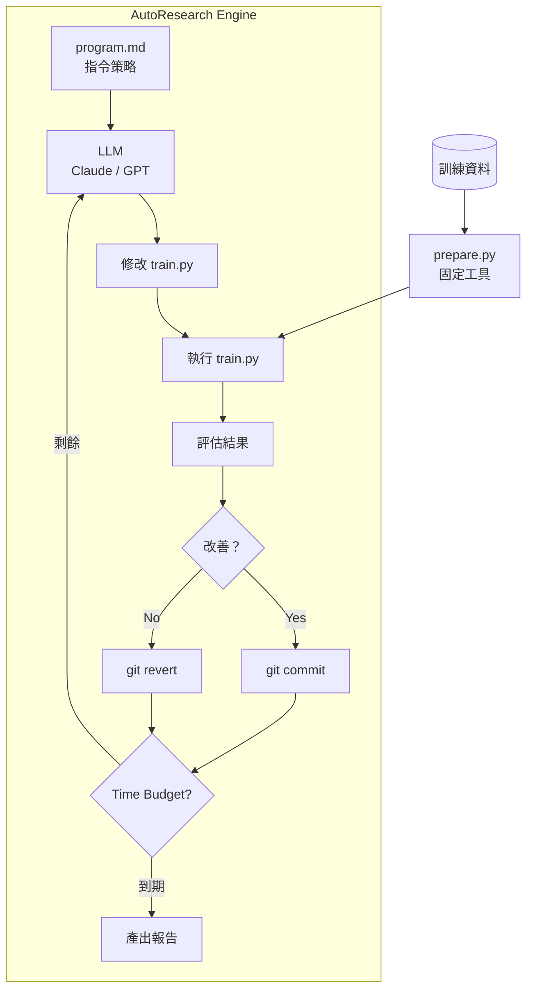
```mermaid
graph TD
    subgraph AutoResearch Engine
        PM[program.md<br>指令策略] --> AI[LLM<br>Claude / GPT]
        AI --> MOD[修改 train.py]
        MOD --> EXEC[執行 train.py]
        EXEC --> EVAL[評估結果]
        EVAL --> DEC{改善？}
        DEC -->|Yes| COMMIT[git commit]
        DEC -->|No| REVERT[git revert]
        COMMIT --> TIMER{Time Budget?}
        REVERT --> TIMER
        TIMER -->|剩餘| AI
        TIMER -->|到期| REPORT[產出報告]
    end

    PREP[prepare.py<br>固定工具] --> EXEC
    DATA[(訓練資料)] --> PREP
```

### 4.2 train.py — 可被 AI 修改的目標檔案

> **📌 指標說明**：原始 AutoResearch 使用 `val_bpb`（Validation Bits Per Byte，越低越好）作為語言模型的評估指標。本手冊為教學目的，將範例改為分類任務的 `val_accuracy`（越高越好），以方便理解 Keep/Revert 決策機制。在實際 AutoResearch 專案中，請依任務類型選用適當指標。

`train.py` 是 AutoResearch 的核心修改對象。設計原則：

1. **模組化**：功能拆分為獨立函式，方便 AI 局部修改
2. **可量測**：必須有明確的評估指標（metrics）
3. **可回滾**：每次修改都是原子操作

**範例：可被 AI 優化的機器學習訓練腳本**

```python
# train.py - AutoResearch 可修改的目標檔案
"""
AutoResearch Target Script
==========================
此檔案可被 AI Agent 修改以優化模型效能。
評估指標：validation accuracy（越高越好）
"""

import torch
import torch.nn as nn
import torch.optim as optim
from prepare import load_data, evaluate_model

# === 可調整區域 START ===

class SimpleModel(nn.Module):
    """模型架構 - AI 可修改"""
    def __init__(self, input_dim: int = 784, hidden_dim: int = 256, output_dim: int = 10):
        super().__init__()
        self.layers = nn.Sequential(
            nn.Linear(input_dim, hidden_dim),
            nn.ReLU(),
            nn.Dropout(0.2),
            nn.Linear(hidden_dim, output_dim)
        )

    def forward(self, x):
        return self.layers(x)


def get_optimizer(model: nn.Module) -> optim.Optimizer:
    """優化器設定 - AI 可修改"""
    return optim.Adam(model.parameters(), lr=1e-3, weight_decay=1e-4)


def get_scheduler(optimizer: optim.Optimizer):
    """學習率排程 - AI 可修改"""
    return optim.lr_scheduler.StepLR(optimizer, step_size=10, gamma=0.1)


BATCH_SIZE = 64
EPOCHS = 20

# === 可調整區域 END ===


def train():
    """主訓練函式"""
    train_loader, val_loader = load_data(batch_size=BATCH_SIZE)
    model = SimpleModel()
    optimizer = get_optimizer(model)
    scheduler = get_scheduler(optimizer)
    criterion = nn.CrossEntropyLoss()

    best_accuracy = 0.0

    for epoch in range(EPOCHS):
        model.train()
        for batch_x, batch_y in train_loader:
            optimizer.zero_grad()
            output = model(batch_x)
            loss = criterion(output, batch_y)
            loss.backward()
            optimizer.step()
        scheduler.step()

        # 評估
        accuracy = evaluate_model(model, val_loader)
        if accuracy > best_accuracy:
            best_accuracy = accuracy
            torch.save(model.state_dict(), "best_model.pt")

    # 輸出最終指標（AutoResearch 依據此決定 Keep/Revert）
    print(f"METRIC:val_accuracy={best_accuracy:.4f}")
    return best_accuracy


if __name__ == "__main__":
    train()
```

**設計重點**：
- `METRIC:` 前綴輸出是 AutoResearch 讀取評估結果的約定格式
- 可修改區域清楚標記，讓 AI 知道可以調整哪些部分
- 固定的評估邏輯不在 `train.py` 內，而是由 `prepare.py` 提供

### 4.3 prepare.py — 固定的資料與工具層

`prepare.py` **不可被 AI 修改**，確保評估基準一致：

```python
# prepare.py - 固定工具層（不可被 AI 修改）
"""
Data Preparation & Evaluation Tools
====================================
此檔案為固定基礎設施，確保評估一致性。
AutoResearch Agent 不得修改此檔案。
"""

import torch
from torch.utils.data import DataLoader, TensorDataset
from typing import Tuple


def load_data(batch_size: int = 64) -> Tuple[DataLoader, DataLoader]:
    """載入並準備訓練/驗證資料集"""
    # 實際專案中替換為真實資料載入邏輯
    train_x = torch.randn(10000, 784)
    train_y = torch.randint(0, 10, (10000,))
    val_x = torch.randn(2000, 784)
    val_y = torch.randint(0, 10, (2000,))

    train_dataset = TensorDataset(train_x, train_y)
    val_dataset = TensorDataset(val_x, val_y)

    train_loader = DataLoader(train_dataset, batch_size=batch_size, shuffle=True)
    val_loader = DataLoader(val_dataset, batch_size=batch_size, shuffle=False)

    return train_loader, val_loader


def evaluate_model(model: torch.nn.Module, val_loader: DataLoader) -> float:
    """評估模型準確率（固定評估邏輯）"""
    model.eval()
    correct = 0
    total = 0

    with torch.no_grad():
        for batch_x, batch_y in val_loader:
            output = model(batch_x)
            _, predicted = torch.max(output, 1)
            total += batch_y.size(0)
            correct += (predicted == batch_y).sum().item()

    return correct / total if total > 0 else 0.0


def get_baseline_metric() -> float:
    """取得基線指標，用於判斷改善幅度"""
    return 0.85  # 基線準確率
```

### 4.4 program.md — Prompt Engineering 指令策略

`program.md` 是 AutoResearch 的「大腦」，定義 AI 的修改策略：

```markdown
# AutoResearch Program Instructions

## 目標
優化 train.py 中的模型效能，提升 validation accuracy。

## 約束條件
- 只能修改 train.py 中「可調整區域」標記的程式碼
- 不能修改 prepare.py
- 每次修改後必須執行完整測試
- 修改不能引入新的安全漏洞
- 不能安裝新的外部套件

## 策略優先順序
1. 調整模型架構（增加層數、改變激活函式）
2. 調整超參數（learning rate、batch size、epochs）
3. 加入正規化策略（Dropout、BatchNorm、Weight Decay）
4. 嘗試不同的優化器（SGD、AdamW、RAdam）

## 評估標準
- 主要指標：`METRIC:val_accuracy` 越高越好
- 次要約束：訓練時間不超過 60 秒
- 安全約束：不使用 eval()、exec() 等危險函式

## Keep/Revert 規則
- 如果 val_accuracy 提升 >= 0.5%：KEEP
- 如果 val_accuracy 下降：REVERT
- 如果程式執行失敗：REVERT
- 如果訓練時間超過限制：REVERT
```

### 4.5 AutoResearch 執行引擎

以下是 AutoResearch 核心執行引擎的簡化實作：

```python
# autoresearch_engine.py - 核心執行引擎
"""
AutoResearch Engine
===================
管理 AI 修改 → 測試 → 評估 → Keep/Revert 迴圈
"""

import subprocess
import time
import re
import os
from dataclasses import dataclass
from typing import Optional


@dataclass
class IterationResult:
    """單次迭代結果"""
    iteration: int
    metric_before: float
    metric_after: float
    action: str  # "KEEP" or "REVERT"
    duration_seconds: float
    change_description: str


def run_autoresearch(
    time_budget_seconds: int = 300,
    target_file: str = "train.py",
    program_file: str = "program.md"
) -> list[IterationResult]:
    """執行 AutoResearch 主迴圈"""
    results: list[IterationResult] = []
    start_time = time.time()
    iteration = 0
    current_metric = get_current_metric()

    while (time.time() - start_time) < time_budget_seconds:
        iteration += 1
        iter_start = time.time()

        # 1. 讀取策略指令
        program = read_file(program_file)

        # 2. AI 生成修改
        change_desc = ai_modify(target_file, program, current_metric)

        # 3. 執行測試與評估
        new_metric = execute_and_evaluate()

        # 4. 決定 Keep / Revert
        if new_metric is not None and new_metric > current_metric + 0.005:
            git_commit(f"AutoResearch iter {iteration}: {change_desc}")
            action = "KEEP"
            current_metric = new_metric
        else:
            git_revert()
            action = "REVERT"
            new_metric = new_metric or current_metric

        result = IterationResult(
            iteration=iteration,
            metric_before=current_metric if action == "REVERT" else current_metric,
            metric_after=new_metric,
            action=action,
            duration_seconds=time.time() - iter_start,
            change_description=change_desc
        )
        results.append(result)
        print(f"[Iter {iteration}] {action} | "
              f"Metric: {new_metric:.4f} | "
              f"Time: {result.duration_seconds:.1f}s")

    return results


def get_current_metric() -> float:
    """執行目前程式碼並取得指標"""
    result = subprocess.run(
        ["python", "train.py"],
        capture_output=True, text=True, timeout=120
    )
    match = re.search(r"METRIC:val_accuracy=([\d.]+)", result.stdout)
    return float(match.group(1)) if match else 0.0


def read_file(filepath: str) -> str:
    """安全讀取檔案"""
    with open(filepath, "r", encoding="utf-8") as f:
        return f.read()


def ai_modify(target_file: str, program: str, current_metric: float) -> str:
    """呼叫 LLM 修改目標檔案（簡化示意）"""
    # 實際實作會呼叫 Claude API 或 Copilot API
    # 此處為示意
    result = subprocess.run(
        ["claude", "--print",
         f"根據以下策略修改 {target_file}，"
         f"目前指標為 {current_metric}。"
         f"策略：{program[:500]}"],
        capture_output=True, text=True, timeout=60
    )
    return result.stdout[:100] if result.returncode == 0 else "modification failed"


def execute_and_evaluate() -> Optional[float]:
    """執行修改後的程式並評估"""
    try:
        result = subprocess.run(
            ["python", "train.py"],
            capture_output=True, text=True, timeout=120
        )
        if result.returncode != 0:
            return None
        match = re.search(r"METRIC:val_accuracy=([\d.]+)", result.stdout)
        return float(match.group(1)) if match else None
    except subprocess.TimeoutExpired:
        return None


def git_commit(message: str) -> None:
    """提交變更"""
    subprocess.run(["git", "add", "-A"], check=True)
    subprocess.run(["git", "commit", "-m", message], check=True)


def git_revert() -> None:
    """回滾變更"""
    subprocess.run(["git", "checkout", "--", "."], check=True)


if __name__ == "__main__":
    budget = int(os.environ.get("AUTORESEARCH_TIME_BUDGET", 300))
    results = run_autoresearch(time_budget_seconds=budget)
    print(f"\n=== 完成 {len(results)} 次迭代 ===")
    keeps = sum(1 for r in results if r.action == "KEEP")
    print(f"保留: {keeps} / 回滾: {len(results) - keeps}")
```

### 4.6 program.md 的 Prompt Engineering 技巧

| 技巧 | 說明 | 範例 |
|------|------|------|
| **範圍限定** | 明確告訴 AI 可修改的範圍 | `只能修改「可調整區域」標記內的程式碼` |
| **禁止清單** | 列出禁止的操作 | `不得使用 eval()、os.system()、subprocess` |
| **策略排序** | 給予優先順序 | `1. 架構調整 2. 超參數 3. 正規化` |
| **量化閾值** | 明確的改善標準 | `提升 >= 0.5% 才保留` |
| **安全護欄** | 安全相關限制 | `不得引入 pickle.loads、不得讀取環境變數` |
| **時間約束** | 單次執行時間限制 | `單次訓練不超過 60 秒` |

> **💡 企業導入建議**：`program.md` 應如同 Infrastructure as Code 一般進行版本控制與 Code Review。每次修改 `program.md` 都應該有對應的 Pull Request 與團隊審核。

> **⚠️ Anti-Pattern**：不要在 `program.md` 中使用過於寬泛的指令（如「盡量優化」），必須給出明確、可量化的目標與限制條件。

---

## 第 5 章：SSDLC Workflow 設計

本章是整份手冊的 **核心章節**，詳細說明 AI 如何參與 SSDLC 的每個階段。

### 5.0 SSDLC 全階段總覽

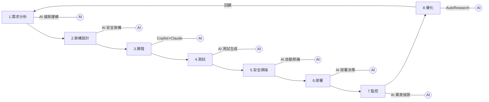
```mermaid
flowchart LR
    R[1.需求分析] --> D[2.架構設計]
    D --> DEV[3.開發]
    DEV --> T[4.測試]
    T --> S[5.安全掃描]
    S --> DP[6.部署]
    DP --> M[7.監控]
    M --> O[8.優化]
    O -->|回饋| R

    R ---|AI 威脅建模| AI1((AI))
    D ---|AI 安全架構| AI2((AI))
    DEV ---|Copilot+Claude| AI3((AI))
    T ---|AI 測試生成| AI4((AI))
    S ---|AI 自動修補| AI5((AI))
    DP ---|AI 部署決策| AI6((AI))
    M ---|AI 異常偵測| AI7((AI))
    O ---|AutoResearch| AI8((AI))
```

| 階段 | AI 角色 | 工具 | 自動化程度 |
|------|--------|------|-----------|
| 需求分析 | 威脅建模、需求審查 | Claude Code、Copilot CLI `/research` | 輔助（70%） |
| 架構設計 | 安全架構建議、設計審查 | Copilot Chat、Claude Code Plan Mode | 輔助（60%） |
| 開發 | 程式碼生成、重構、平行開發 | Copilot CLI + Claude Code + `/fleet` | 高度（85%） |
| 測試 | 測試用例生成、覆蓋率分析 | Copilot + AutoResearch + Claude Code | 高度（90%） |
| 安全掃描 | 漏洞掃描、自動修補、Code Review | AutoResearch + Security Guidance Plugin + Copilot Code Review | 全自動（95%） |
| 部署 | 部署策略、Canary 分析 | GitHub Actions + Routines + Agentic Workflows | 全自動（95%） |
| 監控 | 異常偵測、告警、即時通知 | AI Monitoring Agent + Channels + Analytics | 全自動（95%） |
| 優化 | 自主迭代優化 | AutoResearch + Copilot Cloud Agent | 全自動（100%） |

---

### 5.1 階段一：需求分析（Requirement Analysis）

#### AI 參與方式

- **AI 威脅建模（Threat Modeling）**：根據需求文件自動識別潛在安全威脅
- **需求完整性檢查**：AI 審查需求是否包含安全性考量
- **合規性對照**：自動比對 OWASP Top 10、CWE 等標準

#### 實作範例：使用 Claude Code 進行威脅建模

```bash
# 使用 Claude Code 分析需求文件
claude "請分析以下需求文件，進行 STRIDE 威脅建模分析：

需求：實作一個使用者登入 API，支援 JWT 認證、OAuth 2.0 整合。

請：
1. 列出每個 STRIDE 類別的潛在威脅
2. 評估風險等級（高/中/低）
3. 建議對應的安全控制措施
4. 產出 threat-model.md 文件"
```

#### 輸出範例：自動生成的威脅模型

```markdown
# Threat Model: User Login API

## STRIDE Analysis

| 類別 | 威脅 | 風險 | 緩解措施 |
|------|------|------|---------|
| Spoofing | JWT Token 偽造 | 高 | 使用 RS256 簽章 |
| Tampering | Token 內容竄改 | 高 | JWT 簽章驗證 |
| Repudiation | 登入行為否認 | 中 | Audit Log 記錄 |
| Info Disclosure | Token 資訊外洩 | 高 | HTTPS + HttpOnly Cookie |
| DoS | 暴力破解登入 | 高 | Rate Limiting + CAPTCHA |
| Elevation | 權限提升 | 高 | RBAC + 最小權限原則 |
```

#### AutoResearch 介入方式

AutoResearch 在此階段的角色是 **需求品質監控**：

```python
# requirement_analyzer.py
"""需求品質分析 - AutoResearch 觸發"""

SECURITY_KEYWORDS = [
    "authentication", "authorization", "encryption",
    "input validation", "rate limiting", "audit log",
    "session management", "error handling"
]

def analyze_requirement(requirement_doc: str) -> dict:
    """分析需求文件的安全覆蓋度"""
    doc_lower = requirement_doc.lower()
    coverage = {}

    for keyword in SECURITY_KEYWORDS:
        coverage[keyword] = keyword in doc_lower

    covered = sum(1 for v in coverage.values() if v)
    total = len(SECURITY_KEYWORDS)
    score = covered / total * 100

    return {
        "security_coverage_score": score,
        "missing_topics": [k for k, v in coverage.items() if not v],
        "recommendation": "通過" if score >= 75 else "需補充安全需求"
    }
```

> **💡 企業導入建議**：在需求階段即整合 AI 威脅建模，可以在設計初期就發現安全缺陷，避免後期修補成本高昂（根據 IBM 研究，生產環境修復成本是設計階段的 30 倍）。

---

### 5.2 階段二：架構設計（Design）

#### AI 參與方式

- **安全架構審查**：AI 分析架構圖並指出安全弱點
- **設計模式建議**：推薦適合的安全設計模式
- **API 安全設計**：自動產生安全的 API Schema

#### 實作範例：使用 Copilot Chat 進行架構設計審查

在 VS Code 中使用 Copilot Chat：

```
@workspace 請審查目前的系統架構設計，
從安全性角度分析以下面向：
1. 認證與授權機制
2. 資料加密（傳輸中 + 靜態）
3. 網路隔離與防火牆規則
4. 日誌與監控
5. 備份與災難復原
```

#### 安全架構設計模板

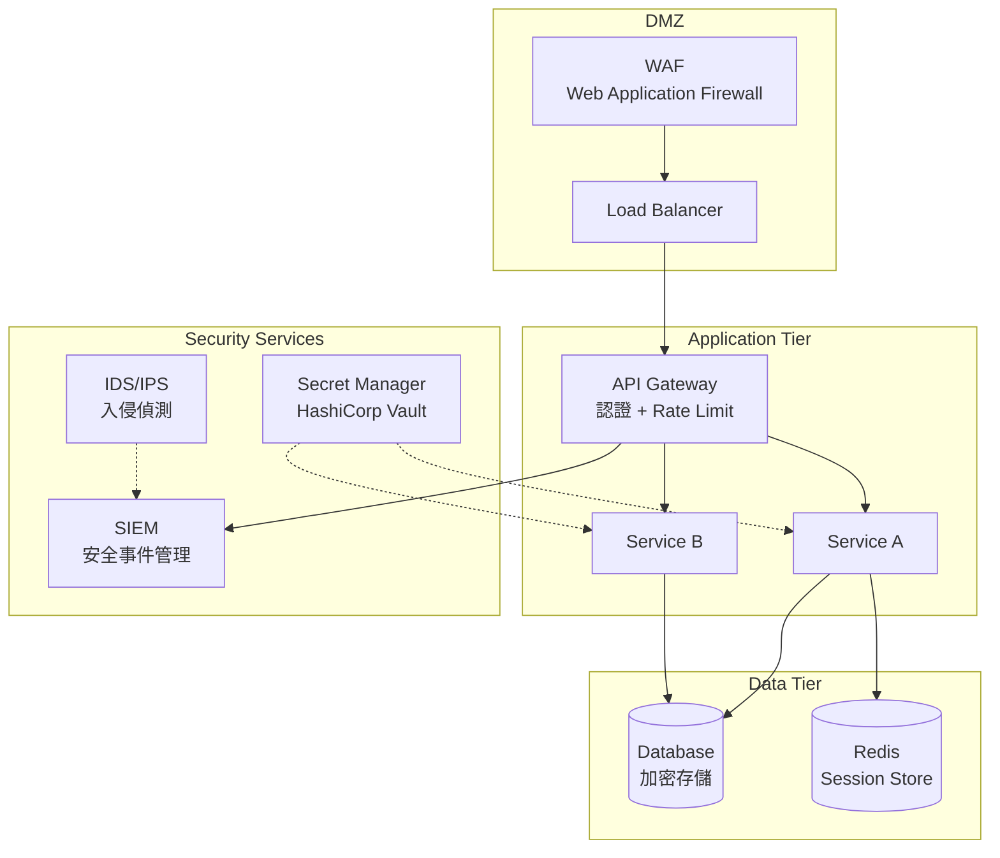
```mermaid
graph TB
    subgraph "DMZ"
        WAF[WAF<br>Web Application Firewall]
        LB[Load Balancer]
    end

    subgraph "Application Tier"
        API[API Gateway<br>認證 + Rate Limit]
        SVC1[Service A]
        SVC2[Service B]
    end

    subgraph "Data Tier"
        DB[(Database<br>加密存儲)]
        CACHE[(Redis<br>Session Store)]
    end

    subgraph "Security Services"
        VAULT[Secret Manager<br>HashiCorp Vault]
        SIEM[SIEM<br>安全事件管理]
        IDS[IDS/IPS<br>入侵偵測]
    end

    WAF --> LB --> API
    API --> SVC1
    API --> SVC2
    SVC1 --> DB
    SVC2 --> DB
    SVC1 --> CACHE
    VAULT -.-> SVC1
    VAULT -.-> SVC2
    API --> SIEM
    IDS -.-> SIEM
```

#### Copilot / Claude Code / VS Code 協作方式

| 工具 | 架構設計階段用途 | 使用方式 |
|------|-----------------|---------|
| **VS Code** | 繪製 Mermaid 架構圖 | 安裝 Mermaid Preview 擴充套件 |
| **Copilot Chat** | 架構安全性審查 | `@workspace /explain` 分析現有架構 |
| **Copilot Cloud Agent** | 自主研究架構改善方案 | 在 GitHub.com 發起 Agent 任務 |
| **Claude Code** | 產生詳細設計文件 | `claude "根據架構圖產生 API 安全規範"` |
| **Claude Code Plan Mode** | 唯讀分析架構風險 | `claude --permission-mode plan` |

> **💡 企業導入建議**：架構設計階段的 AI 輸出應視為「建議」而非「決策」，最終架構決策仍需資深架構師審核。

---

### 5.3 階段三：開發（Development）

#### AI 參與方式

- **安全程式碼生成**：Copilot 根據上下文產生安全程式碼
- **即時安全建議**：Claude Code 在開發中即時提示安全問題
- **Code Review 自動化**：AI 自動審查 Pull Request
- **Copilot CLI Autopilot**：設定 trust 後自主完成多步驟任務，無需逐步確認
- **`/fleet` 平行開發**：將大型安全修補任務拆分為多個子 Agent 並行執行
- **Claude Code Auto Mode**：自動選擇工具、不中斷執行直到任務完成
- **Claude Code Hooks**：每次檔案編輯後自動觸發安全 Linting（見第 11.3 節）
- **Agent Skills**：使用預定義的安全審計 Skill 進行一鍵掃描（見第 11.2 節、12.3 節）
- **Subagents**：委派安全審查任務至獨立 Agent，不消耗主 Context（見第 11.4 節）

#### 使用 Copilot CLI 進行安全開發

```bash
# Autopilot 模式：自主完成 OWASP Top 10 防護實作
gh copilot "implement OWASP Top 10 protections for the login API in src/auth/
  Requirements:
  1. Input validation (email format, password complexity)
  2. bcrypt password hashing
  3. JWT RS256 signing with key rotation
  4. Rate limiting (5 req/min per IP)
  5. Audit logging for all auth events
  Run tests after each change."

# /fleet 平行開發：同時修補多個安全問題
gh copilot "/fleet fix all HIGH severity issues from reports/sast.json
  Each sub-agent handles one issue independently.
  Create separate branches: security-fix/<issue-id>"

# /research 安全研究：深度分析 codebase 安全現狀
gh copilot "/research analyze the authentication and authorization
  architecture in this codebase. Check for:
  - Broken access control patterns
  - Cryptographic failures
  - Injection vulnerabilities
  Output a security-assessment.md report."
```

#### 使用 Claude Code Auto Mode 進行安全掃描修補

```bash
# Auto Mode：不中斷地完成安全修補
claude --auto "掃描 src/ 目錄找出所有 SQL injection 和 XSS 漏洞，
  逐一修補，每次修補後執行 pytest 確認不影響功能。
  產出 security-fixes.md 報告。"

# 搭配 Sandbox 隔離執行不信任的測試
claude --sandbox "在隔離環境中執行 DAST 腳本，
  模擬攻擊行為驗證防護是否生效"
```

#### 實作範例：使用 Copilot 生成安全的 API Endpoint

```python
# 在 VS Code 中撰寫註解，讓 Copilot 生成安全程式碼

# TODO: 實作安全的使用者登入 API
# 要求：
# 1. 輸入驗證（email 格式、密碼複雜度）
# 2. 密碼使用 bcrypt 雜湊
# 3. JWT Token 使用 RS256 簽章
# 4. Rate Limiting（每 IP 每分鐘 5 次）
# 5. Audit Log 記錄

from fastapi import FastAPI, HTTPException, Depends, Request
from fastapi.security import HTTPBearer
from pydantic import BaseModel, EmailStr, field_validator
from slowapi import Limiter
from slowapi.util import get_remote_address
import bcrypt
import jwt
import logging
from datetime import datetime, timedelta, timezone

# --- Copilot 生成的安全程式碼 ---

app = FastAPI()
limiter = Limiter(key_func=get_remote_address)
security = HTTPBearer()
audit_logger = logging.getLogger("audit")

# JWT 設定（使用環境變數，不 hardcode）
import os
JWT_PRIVATE_KEY = os.environ["JWT_PRIVATE_KEY"]
JWT_PUBLIC_KEY = os.environ["JWT_PUBLIC_KEY"]
JWT_ALGORITHM = "RS256"
JWT_EXPIRATION_HOURS = 1


class LoginRequest(BaseModel):
    email: EmailStr
    password: str

    @field_validator("password")
    @classmethod
    def validate_password(cls, v: str) -> str:
        if len(v) < 8:
            raise ValueError("密碼長度不足 8 字元")
        if len(v) > 128:
            raise ValueError("密碼長度超過 128 字元")
        return v


class LoginResponse(BaseModel):
    access_token: str
    token_type: str = "bearer"
    expires_in: int


@app.post("/api/v1/auth/login", response_model=LoginResponse)
@limiter.limit("5/minute")
async def login(request: Request, body: LoginRequest):
    """安全登入 API"""
    # 1. 查詢使用者（示意）
    user = await get_user_by_email(body.email)
    if not user:
        # 避免使用者枚舉攻擊：回傳相同錯誤訊息
        raise HTTPException(status_code=401, detail="Invalid credentials")

    # 2. 驗證密碼（使用 bcrypt + constant-time comparison）
    if not bcrypt.checkpw(
        body.password.encode("utf-8"),
        user.password_hash.encode("utf-8")
    ):
        audit_logger.warning(
            f"Failed login attempt for {body.email} "
            f"from {get_remote_address(request)}"
        )
        raise HTTPException(status_code=401, detail="Invalid credentials")

    # 3. 產生 JWT Token
    now = datetime.now(timezone.utc)
    payload = {
        "sub": str(user.id),
        "email": user.email,
        "iat": now,
        "exp": now + timedelta(hours=JWT_EXPIRATION_HOURS),
        "jti": os.urandom(16).hex()  # 防止 Token Replay
    }
    token = jwt.encode(payload, JWT_PRIVATE_KEY, algorithm=JWT_ALGORITHM)

    # 4. Audit Log
    audit_logger.info(
        f"Successful login for {body.email} "
        f"from {get_remote_address(request)}"
    )

    return LoginResponse(
        access_token=token,
        expires_in=JWT_EXPIRATION_HOURS * 3600
    )
```

#### 使用 Claude Code 進行開發中安全審查

```bash
# 請 Claude Code 審查目前程式碼的安全性
claude "請掃描 src/ 目錄下的所有 Python 檔案，找出以下安全問題：
1. SQL Injection
2. XSS
3. 硬編碼的密碼/金鑰
4. 不安全的反序列化
5. Path Traversal
6. 不安全的隨機數生成

對每個問題：
- 指出檔案與行號
- 說明風險
- 提供修復建議
- 產出 security-review.md"
```

#### VS Code 安全開發擴充套件

```bash
# 安裝安全相關 VS Code 擴充套件
code --install-extension SonarSource.sonarlint-vscode    # SonarLint 即時掃描
code --install-extension snyk-security.snyk-vulnerability-scanner  # Snyk 漏洞掃描
code --install-extension redhat.vscode-yaml              # YAML Schema 驗證
```

> **⚠️ Anti-Pattern**：不要盲目接受 Copilot 生成的程式碼。即使 AI 生成的程式碼看似正確，仍需檢查是否包含 hardcoded secrets、不安全的預設值、缺少輸入驗證等問題。

---

### 5.4 階段四：測試（Testing）

#### AI 參與方式

- **自動生成測試用例**：AI 根據程式碼邏輯自動產生測試
- **安全測試生成**：產生針對安全漏洞的測試案例
- **覆蓋率分析**：AI 識別測試盲區並補充測試

#### 實作範例：使用 AutoResearch 自動生成安全測試

```python
# test_login_security.py - AI 自動生成的安全測試

import pytest
from fastapi.testclient import TestClient
from unittest.mock import patch, AsyncMock
from app import app


client = TestClient(app)


class TestLoginSecurity:
    """登入 API 安全測試套件"""

    def test_sql_injection_in_email(self):
        """測試 SQL Injection 防護"""
        malicious_emails = [
            "admin'--@test.com",
            "admin' OR '1'='1@test.com",
            "'; DROP TABLE users;--@test.com"
        ]
        for email in malicious_emails:
            response = client.post("/api/v1/auth/login", json={
                "email": email,
                "password": "ValidP@ss123"
            })
            # 應回傳 422（驗證錯誤）而非 500（伺服器錯誤）
            assert response.status_code in [401, 422], \
                f"潛在 SQL Injection：{email}"

    def test_brute_force_protection(self):
        """測試暴力破解防護（Rate Limiting）"""
        for i in range(6):
            response = client.post("/api/v1/auth/login", json={
                "email": "test@example.com",
                "password": f"wrong_password_{i}"
            })
        # 第 6 次請求應被限速
        assert response.status_code == 429, "Rate Limiting 未生效"

    def test_user_enumeration_prevention(self):
        """測試使用者枚舉防護"""
        # 不存在的使用者
        resp1 = client.post("/api/v1/auth/login", json={
            "email": "nonexist@example.com",
            "password": "ValidP@ss123"
        })
        # 存在但密碼錯誤的使用者
        resp2 = client.post("/api/v1/auth/login", json={
            "email": "admin@example.com",
            "password": "WrongPassword"
        })
        # 錯誤訊息應該相同
        assert resp1.json()["detail"] == resp2.json()["detail"], \
            "不同錯誤情境回傳不同訊息，可能導致使用者枚舉"

    def test_password_not_in_response(self):
        """測試回應中不包含密碼資訊"""
        response = client.post("/api/v1/auth/login", json={
            "email": "admin@example.com",
            "password": "ValidP@ss123"
        })
        response_text = response.text.lower()
        assert "password" not in response_text, "回應中包含密碼相關資訊"

    def test_jwt_token_expiration(self):
        """測試 JWT Token 有效期限"""
        response = client.post("/api/v1/auth/login", json={
            "email": "admin@example.com",
            "password": "ValidP@ss123"
        })
        if response.status_code == 200:
            data = response.json()
            assert data["expires_in"] <= 3600, \
                "Token 有效期不應超過 1 小時"

    def test_xss_in_email_field(self):
        """測試 XSS 防護"""
        xss_payloads = [
            "<script>alert('xss')</script>@test.com",
            "test@.com"
        ]
        for payload in xss_payloads:
            response = client.post("/api/v1/auth/login", json={
                "email": payload,
                "password": "ValidP@ss123"
            })
            assert "<script>" not in response.text, \
                f"潛在 XSS 漏洞：{payload}"

    def test_oversized_password_rejection(self):
        """測試超長密碼防護（防止 DoS）"""
        response = client.post("/api/v1/auth/login", json={
            "email": "test@example.com",
            "password": "a" * 10000  # 超長密碼
        })
        assert response.status_code == 422, "未拒絕超長密碼"
```

#### AutoResearch 測試迭代流程

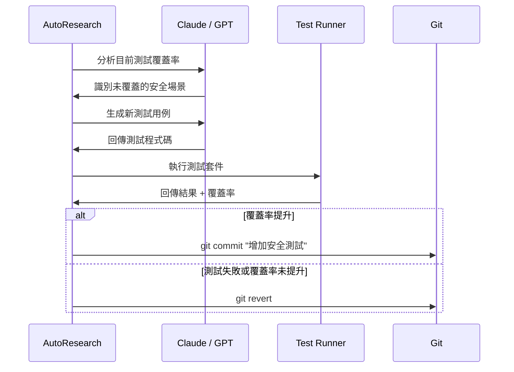
```mermaid
sequenceDiagram
    participant AR as AutoResearch
    participant LLM as Claude / GPT
    participant TEST as Test Runner
    participant GIT as Git

    AR->>LLM: 分析目前測試覆蓋率
    LLM->>AR: 識別未覆蓋的安全場景
    AR->>LLM: 生成新測試用例
    LLM->>AR: 回傳測試程式碼
    AR->>TEST: 執行測試套件
    TEST->>AR: 回傳結果 + 覆蓋率
    alt 覆蓋率提升
        AR->>GIT: git commit "增加安全測試"
    else 測試失敗或覆蓋率未提升
        AR->>GIT: git revert
    end
```

---

### 5.5 階段五：安全掃描（Security Scanning）

#### AI 參與方式

- **SAST（靜態應用安全測試）**：AI 增強的程式碼靜態分析
- **DAST（動態應用安全測試）**：AI 驅動的滲透測試
- **SCA（軟體成分分析）**：AI 自動評估依賴庫安全性
- **Secret Scanning**：AI 偵測程式碼中的機密資訊
- **Claude Code Security Guidance Plugin**：即時安全建議與合規檢查（見第 11.11 節）
- **GitHub Copilot Code Review**：自動化 PR 安全審查，產出修補建議
- **Ultrareview（Claude Code）**：多 Agent 平行 Code Review（見第 11.14 節）

#### 安全掃描工具矩陣

| 掃描類型 | 工具 | AI 增強 | 整合方式 |
|---------|------|---------|---------|
| SAST | Semgrep / SonarQube | ✅ 自訂規則 | CI/CD Pipeline |
| DAST | OWASP ZAP / Burp Suite | ✅ 智能掃描路徑 | Post-Deploy |
| SCA | Snyk / Dependabot | ✅ 自動修補 PR | GitHub Integration |
| Secret Scan | GitLeaks / TruffleHog | ✅ 誤報過濾 | Pre-commit Hook |
| Container Scan | Trivy / Grype | ✅ 風險優先排序 | Build Pipeline |
| **AI Code Review** | **Copilot Code Review** | ✅ 語意分析 | **PR Integration** |
| **Security Plugin** | **Claude Code Security Guidance** | ✅ 即時建議 | **IDE + CI** |

#### Claude Code Security Guidance Plugin

```bash
# 安裝 Security Guidance Plugin
claude plugin install security-guidance

# 啟用後，Claude Code 會在每次程式碼變更時自動：
# 1. 檢查 OWASP Top 10 合規性
# 2. 偵測不安全的密碼學用法
# 3. 標記潛在的注入漏洞
# 4. 建議安全最佳實踐

# 自訂安全規則（.claude/security-rules.yaml）
```

```yaml
# .claude/security-rules.yaml
rules:
  - id: no-hardcoded-secrets
    severity: critical
    pattern: "(password|secret|api_key)\\s*=\\s*['\"][^'\"]+['\"]"
    message: "禁止硬編碼機密資訊，請使用環境變數或 Secret Manager"

  - id: require-input-validation
    severity: high
    scope: ["api", "controller"]
    check: "所有外部輸入必須經過驗證"

  - id: require-parameterized-queries
    severity: critical
    scope: ["repository", "dao"]
    check: "資料庫查詢必須使用參數化查詢"
```

#### GitHub Copilot Code Review 自動化

```yaml
# .github/copilot-code-review.yml
# 在 PR 開啟時自動觸發 Copilot Code Review
on:
  pull_request:
    types: [opened, synchronize]

copilot_review:
  enabled: true
  focus_areas:
    - security          # 安全漏洞
    - performance       # 效能問題
    - best_practices    # 最佳實踐
  auto_comment: true    # 自動在 PR 中留下審查意見
  block_on_critical: true  # Critical 問題阻擋合併
```

#### 實作範例：安全掃描整合腳本

```bash
#!/bin/bash
# security_scan.sh - 完整安全掃描流程

set -euo pipefail

echo "=== SSDLC 安全掃描啟動 ==="

# 1. Secret Scanning（Pre-commit 層級）
echo "[1/5] Secret Scanning..."
gitleaks detect --source . --report-format json --report-path reports/secrets.json
if [ $? -ne 0 ]; then
    echo "⛔ 發現機密資訊洩漏！"
    exit 1
fi

# 2. SAST - 靜態分析
echo "[2/5] SAST - Static Analysis..."
semgrep scan --config auto --json --output reports/sast.json .

# 3. SCA - 依賴掃描
echo "[3/5] SCA - Dependency Scanning..."
pip-audit --format json --output reports/sca.json

# 4. Container Scanning（如果有 Dockerfile）
if [ -f Dockerfile ]; then
    echo "[4/5] Container Scanning..."
    trivy image --format json --output reports/container.json \
        $(docker build -q .)
fi

# 5. AI 分析掃描結果
echo "[5/5] AI 分析掃描結果..."
claude "請分析以下安全掃描報告，
產出 prioritized 修復建議：
$(cat reports/sast.json | head -c 5000)
$(cat reports/sca.json | head -c 5000)

請按風險等級排序（Critical > High > Medium > Low），
並為每個 Critical/High 問題提供修復程式碼。"

echo "=== 安全掃描完成 ==="
```

#### AutoResearch 自動安全修補

```python
# security_autofix.py - AutoResearch 安全修補引擎

import json
import subprocess
from pathlib import Path


def auto_fix_security_issues(scan_report: str) -> dict:
    """AutoResearch 自動修補安全問題"""
    issues = json.loads(Path(scan_report).read_text())
    results = {"fixed": [], "skipped": [], "failed": []}

    for issue in sorted(issues, key=lambda x: severity_score(x)):
        if issue["severity"] not in ["CRITICAL", "HIGH"]:
            results["skipped"].append(issue["id"])
            continue

        # 1. 建立修補分支
        branch = f"security-fix/{issue['id']}"
        subprocess.run(["git", "checkout", "-b", branch], check=True)

        try:
            # 2. AI 生成修補程式碼
            fix_prompt = (
                f"修補安全漏洞：{issue['title']}\n"
                f"檔案：{issue['file']}:{issue['line']}\n"
                f"類型：{issue['category']}\n"
                f"說明：{issue['description']}\n"
                f"請只修改必要的程式碼，不要改變功能行為。"
            )
            subprocess.run(
                ["claude", "--print", fix_prompt],
                check=True, timeout=60
            )

            # 3. 執行測試驗證
            test_result = subprocess.run(
                ["pytest", "--tb=short", "-q"],
                capture_output=True, text=True, timeout=120
            )

            if test_result.returncode == 0:
                # 4. 驗證安全問題已修復
                rescan = subprocess.run(
                    ["semgrep", "scan", "--config", "auto",
                     "--json", issue["file"]],
                    capture_output=True, text=True
                )
                rescan_issues = json.loads(rescan.stdout)

                if not any(i["id"] == issue["id"] for i in rescan_issues.get("results", [])):
                    subprocess.run(["git", "add", "-A"], check=True)
                    subprocess.run(
                        ["git", "commit", "-m",
                         f"fix(security): {issue['title']} [{issue['id']}]"],
                        check=True
                    )
                    results["fixed"].append(issue["id"])
                else:
                    raise RuntimeError("修補後問題仍存在")
            else:
                raise RuntimeError(f"測試失敗：{test_result.stderr[:200]}")

        except Exception as e:
            subprocess.run(["git", "checkout", "--", "."])
            results["failed"].append({"id": issue["id"], "error": str(e)})

        finally:
            subprocess.run(["git", "checkout", "main"], check=True)

    return results


def severity_score(issue: dict) -> int:
    """安全嚴重度排序分數"""
    scores = {"CRITICAL": 0, "HIGH": 1, "MEDIUM": 2, "LOW": 3}
    return scores.get(issue.get("severity", "LOW"), 4)
```

> **💡 企業導入建議**：安全掃描應設為 CI/CD Pipeline 的 **強制閘門（Mandatory Gate）**，Critical 與 High 等級的問題必須修復才能合併。AutoResearch 的自動修補作為「第一道防線」，但修補結果仍需安全工程師審核。

---

### 5.6 階段六：部署（Deployment）

#### AI 參與方式

- **部署策略決策**：AI 根據變更風險選擇部署策略
- **Canary 分析**：AI 監控 Canary 部署的異常指標
- **自動回滾**：異常時自動觸發回滾
- **GitHub Agentic Workflows**：由 AI Agent 自主管理 CI/CD 流程（自動建立 PR、修復 CI 失敗、部署確認）
- **Claude Code Routines**：雲端排程自動部署驗證（每日/每週安全掃描 + 部署健康檢查）
- **Copilot Cloud Agent Automations**：事件驅動的自動化（PR merge → staging deploy → smoke test → production）

#### GitHub Agentic Workflows 部署整合

```yaml
# .github/workflows/agentic-deploy.yml
name: Agentic Deployment Pipeline

on:
  push:
    branches: [main]

jobs:
  agentic-deploy:
    runs-on: ubuntu-latest
    steps:
      - uses: actions/checkout@v4

      - name: AI 風險評估
        uses: github/copilot-agent-action@v1
        with:
          task: |
            Analyze the changes in this push.
            Determine deployment risk level (low/medium/high).
            If high risk: create a staging deployment first and run security scan.
            If medium risk: deploy with canary strategy.
            If low risk: deploy directly with rolling update.
          permissions: deploy, comment

      - name: Claude Code 部署驗證
        uses: anthropic/claude-code-action@v1
        with:
          prompt: |
            驗證部署後的系統健康狀態：
            1. 執行 smoke test
            2. 檢查 API 回應時間
            3. 確認無新的安全警告
            如果有問題，自動建立 revert PR。
```

#### Claude Code Routines 部署排程

```bash
# 設定每日自動部署驗證 Routine
claude routine create \
  --name "daily-deploy-health-check" \
  --schedule "0 9 * * *" \
  --task "檢查 production 環境：
    1. 確認所有 service healthy
    2. 執行安全掃描（semgrep + trivy）
    3. 檢查 dependency CVE
    4. 如有 Critical 問題，自動建立 hotfix PR 並通知 #security channel"

# 設定 PR merge 後自動部署驗證
claude routine create \
  --name "post-deploy-validation" \
  --trigger "github:deployment_status:success" \
  --task "部署完成後驗證：
    1. 執行 E2E 安全測試
    2. 比較部署前後的 error rate
    3. 驗證 HTTPS、CORS、CSP 設定
    4. 產出部署驗證報告"
```

#### 部署策略決策樹

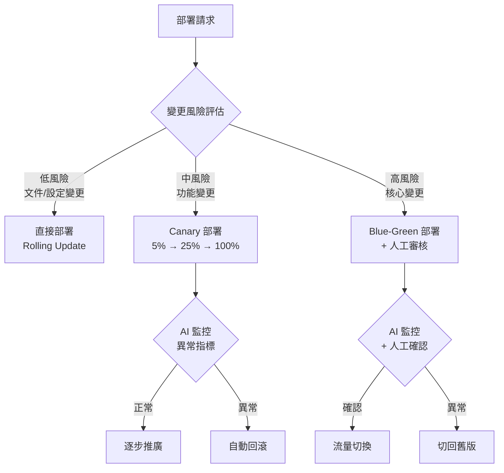
```mermaid
flowchart TD
    START[部署請求] --> RISK{變更風險評估}
    RISK -->|低風險<br>文件/設定變更| DIRECT[直接部署<br>Rolling Update]
    RISK -->|中風險<br>功能變更| CANARY[Canary 部署<br>5% → 25% → 100%]
    RISK -->|高風險<br>核心變更| BLUE_GREEN[Blue-Green 部署<br>+ 人工審核]

    CANARY --> MONITOR_C{AI 監控<br>異常指標}
    MONITOR_C -->|正常| PROMOTE[逐步推廣]
    MONITOR_C -->|異常| ROLLBACK_C[自動回滾]

    BLUE_GREEN --> MONITOR_BG{AI 監控<br>+ 人工確認}
    MONITOR_BG -->|確認| SWITCH[流量切換]
    MONITOR_BG -->|異常| ROLLBACK_BG[切回舊版]
```

#### 實作範例：AI 驅動的部署腳本

```python
# deploy_decision.py - AI 部署策略決策

import os
import subprocess
import json
from typing import Literal


DeployStrategy = Literal["rolling", "canary", "blue-green"]


def assess_change_risk(changed_files: list[str]) -> DeployStrategy:
    """根據變更檔案評估部署風險並選擇策略"""
    high_risk_patterns = [
        "auth", "payment", "database", "migration",
        "security", "encryption", "core"
    ]
    medium_risk_patterns = [
        "api", "service", "controller", "model"
    ]

    risk_score = 0
    for f in changed_files:
        f_lower = f.lower()
        if any(p in f_lower for p in high_risk_patterns):
            risk_score += 3
        elif any(p in f_lower for p in medium_risk_patterns):
            risk_score += 1

    if risk_score >= 5:
        return "blue-green"
    elif risk_score >= 2:
        return "canary"
    else:
        return "rolling"


def get_changed_files() -> list[str]:
    """取得自上次部署以來的變更檔案"""
    result = subprocess.run(
        ["git", "diff", "--name-only", "HEAD~1"],
        capture_output=True, text=True, check=True
    )
    return result.stdout.strip().split("\n")


if __name__ == "__main__":
    files = get_changed_files()
    strategy = assess_change_risk(files)
    print(f"建議部署策略：{strategy}")
    print(f"變更檔案數：{len(files)}")

    # 輸出給 CI/CD 使用
    if os.environ.get("GITHUB_OUTPUT"):
        with open(os.environ["GITHUB_OUTPUT"], "a") as f:
            f.write(f"deploy_strategy={strategy}\n")
```

---

### 5.7 階段七：監控（Monitoring）

#### AI 參與方式

- **異常偵測**：AI 識別非預期的系統行為
- **智能告警**：減少誤報，提供根因分析
- **自動事件回應**：AI 觸發預定義的回應動作
- **Claude Code Channels**：將監控告警推送到 Claude Code session，AI 自動分析並回應
- **Analytics Dashboard**：追蹤 AI Agent 活動效率、安全修補成功率等指標
- **OpenTelemetry 整合**：追蹤 Agent 操作（含安全修補）的完整執行鏈路

#### Claude Code Channels 監控整合

```bash
# 設定 Channel：將監控告警推送至 Claude Code
claude channel create \
  --name "security-alerts" \
  --source "prometheus-alertmanager" \
  --webhook-url "$CLAUDE_CHANNEL_WEBHOOK"

# Channel 收到告警後，Claude Code 自動：
# 1. 分析告警上下文
# 2. 關聯 git blame 找出變更來源
# 3. 判斷是否為安全事件
# 4. 自動產生修補 PR 或通知 on-call
```

```python
# channel_handler.py - 監控告警處理邏輯
# 此腳本由 Claude Code Channel 觸發

import json
from datetime import datetime


def handle_security_alert(alert: dict) -> str:
    """處理安全告警的 Channel handler"""
    severity = alert.get("severity", "unknown")
    metric = alert.get("metric_name", "")

    if severity == "critical" and "auth" in metric:
        return (
            "立即分析認證相關異常，"
            "檢查是否有暴力破解攻擊，"
            "如確認攻擊則自動啟用 IP 封鎖"
        )
    elif severity == "high":
        return (
            "分析根因並建立修補 PR，"
            "通知 security team 進行審核"
        )
    else:
        return "記錄至 security backlog，排入下次迭代"
```

#### AI Agent Analytics Dashboard

```yaml
# .claude/analytics.yaml - Claude Code Analytics 設定
analytics:
  enabled: true
  export:
    format: opentelemetry
    endpoint: "https://otel-collector.internal:4318"

  metrics:
    - name: security_fixes_per_day
      description: "每日自動安全修補次數"
      type: counter
    - name: fix_success_rate
      description: "修補成功率（%）"
      type: gauge
    - name: mean_time_to_fix
      description: "平均修補時間（分鐘）"
      type: histogram
    - name: agent_cost_per_fix
      description: "每次修補的 AI Credits 消耗"
      type: histogram

  dashboard:
    refresh_interval: 5m
    panels:
      - title: "SSDLC Agent 活動總覽"
        metrics: [security_fixes_per_day, fix_success_rate]
      - title: "成本效益分析"
        metrics: [mean_time_to_fix, agent_cost_per_fix]
```

#### 監控架構

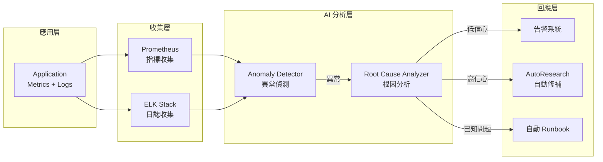
```mermaid
graph LR
    subgraph "應用層"
        APP[Application<br>Metrics + Logs]
    end

    subgraph "收集層"
        PROM[Prometheus<br>指標收集]
        ELK[ELK Stack<br>日誌收集]
    end

    subgraph "AI 分析層"
        AD[Anomaly Detector<br>異常偵測]
        RCA[Root Cause Analyzer<br>根因分析]
    end

    subgraph "回應層"
        ALERT[告警系統]
        AR_FIX[AutoResearch<br>自動修補]
        RUNBOOK[自動 Runbook]
    end

    APP --> PROM
    APP --> ELK
    PROM --> AD
    ELK --> AD
    AD -->|異常| RCA
    RCA -->|高信心| AR_FIX
    RCA -->|低信心| ALERT
    RCA -->|已知問題| RUNBOOK
```

#### 實作範例：AI 異常偵測腳本

```python
# anomaly_detector.py - AI 驅動的異常偵測

import json
from dataclasses import dataclass
from typing import Optional


@dataclass
class AnomalyAlert:
    """異常告警"""
    metric_name: str
    current_value: float
    expected_range: tuple[float, float]
    severity: str
    root_cause_hypothesis: str
    suggested_action: str


def detect_anomalies(metrics: dict[str, float]) -> list[AnomalyAlert]:
    """偵測系統指標異常"""
    alerts = []
    thresholds = {
        "api_latency_p99_ms": (0, 500),
        "error_rate_percent": (0, 1.0),
        "cpu_usage_percent": (0, 80),
        "memory_usage_percent": (0, 85),
        "request_rate_per_sec": (10, 10000),
    }

    for metric, (low, high) in thresholds.items():
        value = metrics.get(metric)
        if value is None:
            continue

        if value < low or value > high:
            severity = "CRITICAL" if value > high * 1.5 else "WARNING"
            alerts.append(AnomalyAlert(
                metric_name=metric,
                current_value=value,
                expected_range=(low, high),
                severity=severity,
                root_cause_hypothesis=analyze_root_cause(metric, value),
                suggested_action=suggest_action(metric, value, severity)
            ))

    return alerts


def analyze_root_cause(metric: str, value: float) -> str:
    """根因分析（簡化版本，實際可呼叫 LLM）"""
    causes = {
        "api_latency_p99_ms": "可能原因：資料庫查詢變慢、外部 API 超時、記憶體不足",
        "error_rate_percent": "可能原因：上游服務異常、輸入驗證失敗、部署問題",
        "cpu_usage_percent": "可能原因：無限迴圈、密集運算、並發過高",
        "memory_usage_percent": "可能原因：記憶體洩漏、快取未清理、大物件未釋放",
    }
    return causes.get(metric, "需進一步分析")


def suggest_action(metric: str, value: float, severity: str) -> str:
    """建議回應動作"""
    if severity == "CRITICAL":
        return "觸發 AutoResearch 自動修補 + 通知 On-Call 工程師"
    return "記錄異常 + 排入下次 AutoResearch 優化週期"
```

---

### 5.8 階段八：優化（Optimization）

#### AI 參與方式

- **效能優化**：AutoResearch 自主迭代優化效能瓶頸
- **程式碼品質**：自動重構、減少技術債
- **安全強化**：持續掃描並強化安全防護

#### 優化迴圈流程

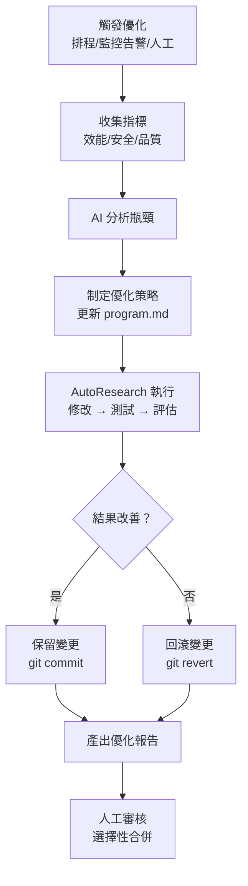
```mermaid
graph TD
    TRIGGER[觸發優化<br>排程/監控告警/人工] --> COLLECT[收集指標<br>效能/安全/品質]
    COLLECT --> ANALYZE[AI 分析瓶頸]
    ANALYZE --> PLAN[制定優化策略<br>更新 program.md]
    PLAN --> EXECUTE[AutoResearch 執行<br>修改 → 測試 → 評估]
    EXECUTE --> RESULT{結果改善？}
    RESULT -->|是| COMMIT[保留變更<br>git commit]
    RESULT -->|否| REVERT[回滾變更<br>git revert]
    COMMIT --> REPORT[產出優化報告]
    REVERT --> REPORT
    REPORT --> REVIEW[人工審核<br>選擇性合併]
```

#### 三大優化面向

| 優化面向 | 指標 | AutoResearch 策略 | 產出 |
|---------|------|-------------------|------|
| **效能** | Latency, Throughput, Resource Usage | 演算法優化、快取策略、查詢優化 | 效能改善報告 |
| **品質** | Code Coverage, Complexity, Duplication | 重構、DRY 原則、模式應用 | 品質分數提升 |
| **安全** | Vulnerability Count, CVSS Score | 修補漏洞、升級依賴、強化設定 | 安全態勢改善 |

> **💡 企業導入建議**：優化階段的 AutoResearch 建議設定為「建議模式」（非自動合併），讓團隊在 Pull Request 中審核 AI 的優化建議後再決定是否合併。

---

## 第 6 章：AI 自動優化機制

### 6.1 AutoResearch 自動優化核心原理

AutoResearch 的自動優化機制是一個 **閉環反饋系統（Closed-Loop Feedback System）**：

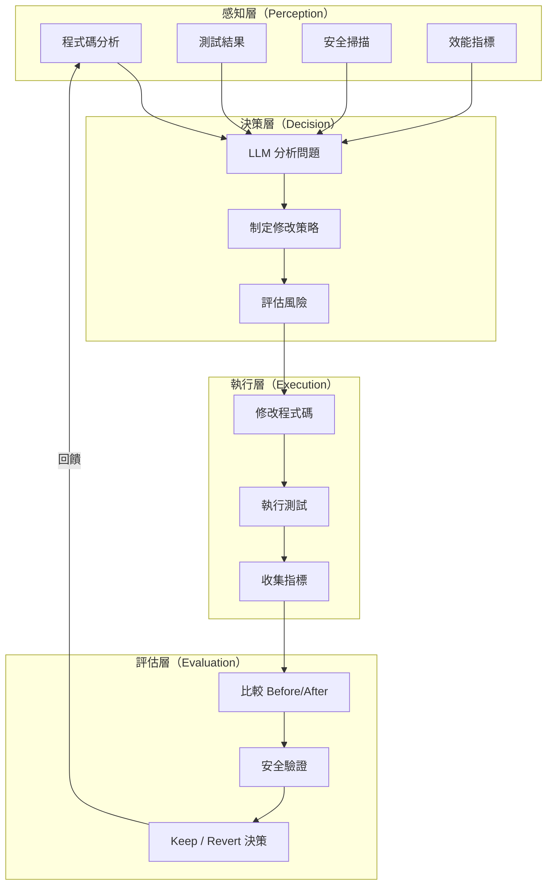
```mermaid
graph TD
    subgraph "感知層（Perception）"
        P1[程式碼分析]
        P2[測試結果]
        P3[安全掃描]
        P4[效能指標]
    end

    subgraph "決策層（Decision）"
        D1[LLM 分析問題]
        D2[制定修改策略]
        D3[評估風險]
    end

    subgraph "執行層（Execution）"
        E1[修改程式碼]
        E2[執行測試]
        E3[收集指標]
    end

    subgraph "評估層（Evaluation）"
        V1[比較 Before/After]
        V2[安全驗證]
        V3[Keep / Revert 決策]
    end

    P1 --> D1
    P2 --> D1
    P3 --> D1
    P4 --> D1
    D1 --> D2 --> D3
    D3 --> E1 --> E2 --> E3
    E3 --> V1 --> V2 --> V3
    V3 -->|回饋| P1
```

### 6.2 修改程式碼的策略

AutoResearch 修改程式碼時遵循以下策略層級：

#### 策略 1：局部修改（Minimal Change）

```python
# Before（AutoResearch 偵測到效能問題）
def get_user_orders(user_id: int) -> list[dict]:
    """取得使用者訂單 - 效能瓶頸"""
    orders = db.query("SELECT * FROM orders WHERE user_id = %s", (user_id,))
    result = []
    for order in orders:
        # N+1 Query 問題
        items = db.query(
            "SELECT * FROM order_items WHERE order_id = %s",
            (order["id"],)
        )
        order["items"] = items
        result.append(order)
    return result


# After（AutoResearch 自動修復 N+1 Query）
def get_user_orders(user_id: int) -> list[dict]:
    """取得使用者訂單 - 已優化"""
    orders = db.query(
        """
        SELECT o.*, json_agg(oi.*) as items
        FROM orders o
        LEFT JOIN order_items oi ON o.id = oi.order_id
        WHERE o.user_id = %s
        GROUP BY o.id
        """,
        (user_id,)
    )
    return orders
```

#### 策略 2：演算法優化（Algorithm Optimization）

```python
# Before（O(n²) 複雜度）
def find_duplicates(items: list[str]) -> list[str]:
    duplicates = []
    for i in range(len(items)):
        for j in range(i + 1, len(items)):
            if items[i] == items[j] and items[i] not in duplicates:
                duplicates.append(items[i])
    return duplicates


# After（AutoResearch 優化為 O(n)）
def find_duplicates(items: list[str]) -> list[str]:
    seen: set[str] = set()
    duplicates: set[str] = set()
    for item in items:
        if item in seen:
            duplicates.add(item)
        seen.add(item)
    return list(duplicates)
```

#### 策略 3：安全強化（Security Hardening）

```python
# Before（SQL Injection 風險）
def search_products(query: str) -> list[dict]:
    sql = f"SELECT * FROM products WHERE name LIKE '%{query}%'"
    return db.execute(sql)


# After（AutoResearch 自動修補）
def search_products(query: str) -> list[dict]:
    sql = "SELECT * FROM products WHERE name LIKE %s"
    return db.execute(sql, (f"%{query}%",))
```

### 6.3 執行測試的流程

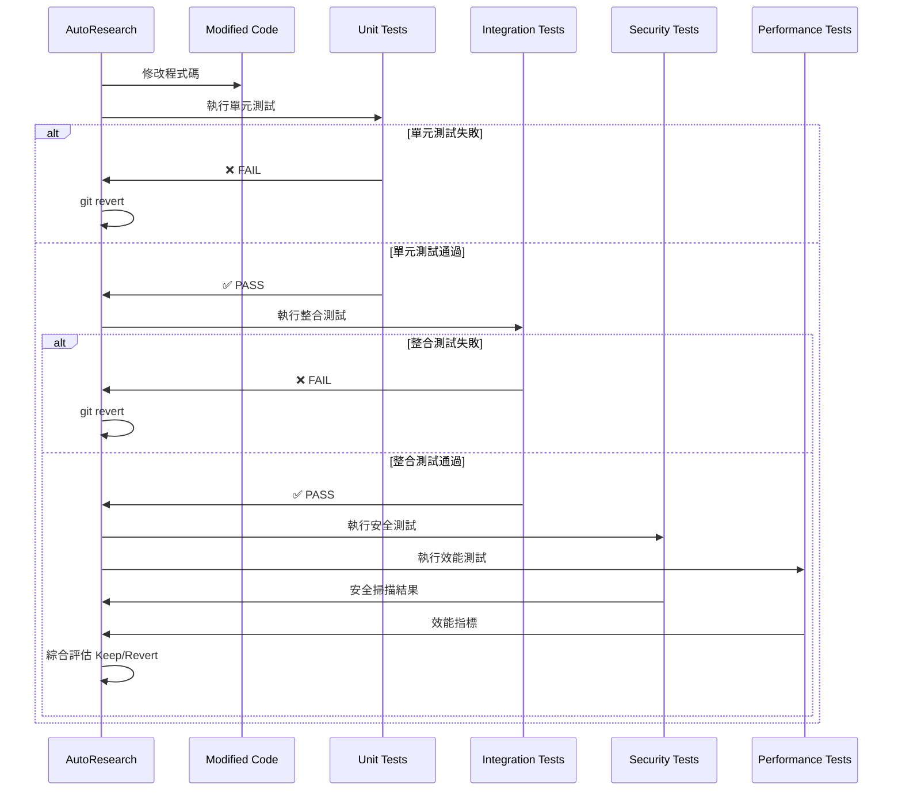
```mermaid
sequenceDiagram
    participant AR as AutoResearch
    participant CODE as Modified Code
    participant UNIT as Unit Tests
    participant INT as Integration Tests
    participant SEC as Security Tests
    participant PERF as Performance Tests

    AR->>CODE: 修改程式碼
    AR->>UNIT: 執行單元測試
    alt 單元測試失敗
        UNIT->>AR: ❌ FAIL
        AR->>AR: git revert
    else 單元測試通過
        UNIT->>AR: ✅ PASS
        AR->>INT: 執行整合測試
        alt 整合測試失敗
            INT->>AR: ❌ FAIL
            AR->>AR: git revert
        else 整合測試通過
            INT->>AR: ✅ PASS
            AR->>SEC: 執行安全測試
            AR->>PERF: 執行效能測試
            SEC->>AR: 安全掃描結果
            PERF->>AR: 效能指標
            AR->>AR: 綜合評估 Keep/Revert
        end
    end
```

### 6.4 評估結果的機制

```python
# evaluator.py - 多維度評估引擎

from dataclasses import dataclass
from typing import Optional


@dataclass
class EvaluationResult:
    """評估結果"""
    overall_decision: str  # "KEEP" or "REVERT"
    performance_delta: float  # 效能變化百分比
    security_score_delta: float  # 安全分數變化
    test_pass_rate: float  # 測試通過率
    code_quality_delta: float  # 程式碼品質變化
    reasons: list[str]


def evaluate(
    perf_before: float,
    perf_after: float,
    security_before: float,
    security_after: float,
    tests_passed: int,
    tests_total: int,
    quality_before: float,
    quality_after: float
) -> EvaluationResult:
    """多維度評估決策"""
    reasons = []
    veto = False  # 一票否決

    # 1. 測試通過率（硬性要求）
    test_rate = tests_passed / tests_total if tests_total > 0 else 0
    if test_rate < 1.0:
        veto = True
        reasons.append(f"⛔ 測試通過率不足：{test_rate:.0%}")

    # 2. 安全分數（不可降低）
    security_delta = security_after - security_before
    if security_delta < 0:
        veto = True
        reasons.append(f"⛔ 安全分數下降：{security_delta:+.2f}")
    elif security_delta > 0:
        reasons.append(f"✅ 安全分數提升：{security_delta:+.2f}")

    # 3. 效能指標
    perf_delta = ((perf_after - perf_before) / perf_before * 100
                  if perf_before > 0 else 0)
    if perf_delta > 5:
        reasons.append(f"✅ 效能提升：{perf_delta:+.1f}%")
    elif perf_delta < -10:
        reasons.append(f"⚠️ 效能下降：{perf_delta:+.1f}%")

    # 4. 程式碼品質
    quality_delta = quality_after - quality_before
    if quality_delta > 0:
        reasons.append(f"✅ 品質提升：{quality_delta:+.2f}")

    # 最終決策
    decision = "REVERT" if veto else "KEEP"

    return EvaluationResult(
        overall_decision=decision,
        performance_delta=perf_delta,
        security_score_delta=security_delta,
        test_pass_rate=test_rate,
        code_quality_delta=quality_delta,
        reasons=reasons
    )
```

### 6.5 Keep / Revert 決策矩陣

| 條件 | 測試 100% 通過 | 安全分數不降 | 效能不劣化 | 決策 |
|------|:---:|:---:|:---:|------|
| ✅ ✅ ✅ | ✅ | ✅ | ✅ | **KEEP** |
| ✅ ✅ ❌ | ✅ | ✅ | ❌ | KEEP（若效能降幅 < 10%） |
| ✅ ❌ — | ✅ | ❌ | — | **REVERT**（安全一票否決） |
| ❌ — — | ❌ | — | — | **REVERT**（測試一票否決） |

### 6.6 應用於三大場景

#### 場景一：Code Quality 優化

```markdown
# program.md - Code Quality 優化策略

## 目標
提升程式碼品質分數（使用 pylint / radon 量測）

## 策略
1. 降低圈複雜度（Cyclomatic Complexity）至 10 以下
2. 消除重複程式碼（DRY 原則）
3. 改善命名一致性
4. 拆分過長函式（> 50 行）

## 評估指標
METRIC:quality_score=<pylint 分數>
METRIC:complexity=<平均圈複雜度>

## 約束
- 不可改變程式行為（所有測試必須通過）
- 不可引入新的依賴
```

#### 場景二：Performance 優化

```markdown
# program.md - Performance 優化策略

## 目標
降低 API P99 延遲至 200ms 以下

## 策略
1. 識別 N+1 Query 並修復
2. 加入適當的快取層
3. 優化資料結構與演算法
4. 減少不必要的 I/O 操作

## 評估指標
METRIC:p99_latency_ms=<P99 延遲毫秒>
METRIC:throughput_rps=<每秒請求數>

## 約束
- 記憶體使用不可增加超過 20%
- 不可犧牲程式碼可讀性
```

#### 場景三：Security 強化

```markdown
# program.md - Security 強化策略

## 目標
消除所有 Critical 和 High 安全漏洞

## 策略
1. 修補 SAST 掃描出的漏洞
2. 升級有已知 CVE 的依賴
3. 強化輸入驗證
4. 改善錯誤處理（避免資訊洩漏）

## 評估指標
METRIC:critical_vulns=<Critical 漏洞數>
METRIC:high_vulns=<High 漏洞數>
METRIC:security_score=<安全評分>

## 約束
- 不可降低測試覆蓋率
- 不可影響既有功能
- 依賴升級需保持向後相容
```

> **💡 企業導入建議**：建議為三大場景分別建立獨立的 `program.md`，並透過 CI/CD Pipeline 排程輪替執行（例如：週一品質、週三效能、週五安全）。

> **⚠️ Anti-Pattern**：切勿讓 AutoResearch 同時優化多個面向（例如同時追求效能與品質），容易造成目標衝突導致修改不斷 Revert。每次迭代應聚焦單一面向。

---

## 第 7 章：CI/CD + AutoResearch 整合

### 7.1 整合架構概覽

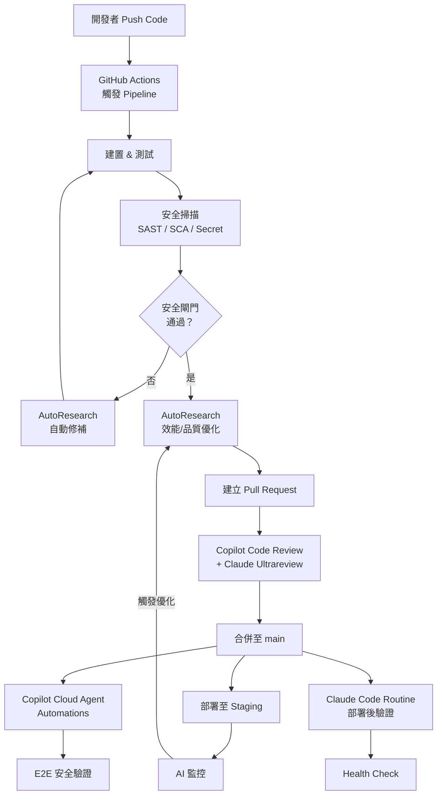
```mermaid
flowchart TD
    DEV[開發者 Push Code] --> GHA[GitHub Actions<br>觸發 Pipeline]
    GHA --> BUILD[建置 & 測試]
    BUILD --> SCAN[安全掃描<br>SAST / SCA / Secret]
    SCAN --> GATE{安全閘門<br>通過？}
    GATE -->|否| AR_FIX[AutoResearch<br>自動修補]
    AR_FIX --> BUILD
    GATE -->|是| AR_OPT[AutoResearch<br>效能/品質優化]
    AR_OPT --> PR[建立 Pull Request]
    PR --> REVIEW[Copilot Code Review<br>+ Claude Ultrareview]
    REVIEW --> MERGE[合併至 main]
    MERGE --> DEPLOY[部署至 Staging]
    DEPLOY --> MONITOR[AI 監控]
    MONITOR -->|觸發優化| AR_OPT

    %% Agentic 自動化路徑
    MERGE --> COPILOT_AGENT[Copilot Cloud Agent<br>Automations]
    COPILOT_AGENT --> E2E[E2E 安全驗證]
    MERGE --> ROUTINE[Claude Code Routine<br>部署後驗證]
    ROUTINE --> HEALTH[Health Check]
```

#### 多 AI Agent CI/CD 角色矩陣

| AI Agent | CI/CD 角色 | 觸發時機 | 典型任務 |
|----------|-----------|---------|---------|
| **AutoResearch** | 自動修補 + 優化 | 排程 / 安全閘門失敗 | 漏洞修補、效能優化 |
| **Claude Code Action** | PR 自動化 | PR 開啟/更新 | Code Review、生成修改建議 |
| **Copilot Code Review** | 安全審查 | PR 開啟 | 語意分析、安全建議 |
| **Copilot Cloud Agent** | 自動化流程 | merge / issue / 排程 | E2E 測試、部署驗證 |
| **Claude Code Routines** | 排程驗證 | cron / event trigger | 每日安全掃描、健康檢查 |
| **GitHub Agentic Workflows** | 端對端自動化 | push / PR / deployment | 完整 CI/CD 流程管理 |

### 7.2 GitHub Actions 完整 YAML 設計

#### 核心 Pipeline：CI/CD + 安全掃描

```yaml
# .github/workflows/ssdlc-pipeline.yml
name: SSDLC Pipeline with AutoResearch

on:
  push:
    branches: [main, develop]
  pull_request:
    branches: [main]
  schedule:
    # 每日凌晨 2 點執行 AutoResearch 優化
    - cron: '0 2 * * *'

permissions:
  contents: write
  pull-requests: write
  security-events: write

env:
  PYTHON_VERSION: '3.12'
  AUTORESEARCH_TIME_BUDGET: 300

jobs:
  # === 階段 1：建置與測試 ===
  build-and-test:
    name: Build & Test
    runs-on: ubuntu-latest
    outputs:
      test_coverage: ${{ steps.coverage.outputs.coverage }}
    steps:
      - uses: actions/checkout@v4

      - name: Setup Python
        uses: actions/setup-python@v5
        with:
          python-version: ${{ env.PYTHON_VERSION }}

      - name: Install uv
        uses: astral-sh/setup-uv@v4

      - name: Install Dependencies
        run: |
          uv sync
          uv pip install -r requirements-dev.txt

      - name: Run Linting
        run: |
          ruff check .
          black --check .

      - name: Run Unit Tests
        run: |
          pytest tests/ \
            --cov=src \
            --cov-report=xml:coverage.xml \
            --cov-report=term-missing \
            --junitxml=test-results.xml \
            -v

      - name: Extract Coverage
        id: coverage
        run: |
          COVERAGE=$(python -c "
          import xml.etree.ElementTree as ET
          tree = ET.parse('coverage.xml')
          root = tree.getroot()
          print(f'{float(root.attrib[\"line-rate\"]) * 100:.1f}')
          ")
          echo "coverage=$COVERAGE" >> $GITHUB_OUTPUT

      - name: Upload Test Results
        if: always()
        uses: actions/upload-artifact@v4
        with:
          name: test-results
          path: |
            coverage.xml
            test-results.xml

  # === 階段 2：安全掃描 ===
  security-scan:
    name: Security Scanning
    runs-on: ubuntu-latest
    needs: build-and-test
    outputs:
      critical_count: ${{ steps.scan_results.outputs.critical }}
      high_count: ${{ steps.scan_results.outputs.high }}
    steps:
      - uses: actions/checkout@v4

      - name: Secret Scanning
        uses: gitleaks/gitleaks-action@v2
        env:
          GITHUB_TOKEN: ${{ secrets.GITHUB_TOKEN }}

      - name: SAST - Semgrep
        uses: semgrep/semgrep-action@v1
        with:
          config: >-
            p/security-audit
            p/owasp-top-ten
            p/python
          generateSarif: true

      - name: Upload SARIF
        uses: github/codeql-action/upload-sarif@v3
        with:
          sarif_file: semgrep.sarif

      - name: SCA - Dependency Check
        run: |
          pip install pip-audit safety
          pip-audit --format json --output sca-report.json || true
          safety check --json --output safety-report.json || true

      - name: Container Scanning
        if: hashFiles('Dockerfile') != ''
        uses: aquasecurity/trivy-action@master
        with:
          scan-type: 'fs'
          format: 'json'
          output: 'trivy-report.json'
          severity: 'CRITICAL,HIGH'

      - name: Aggregate Scan Results
        id: scan_results
        run: |
          python scripts/aggregate_security.py \
            --sast semgrep.sarif \
            --sca sca-report.json \
            --output security-summary.json
          CRITICAL=$(jq '.critical_count' security-summary.json)
          HIGH=$(jq '.high_count' security-summary.json)
          echo "critical=$CRITICAL" >> $GITHUB_OUTPUT
          echo "high=$HIGH" >> $GITHUB_OUTPUT

      - name: Upload Security Reports
        uses: actions/upload-artifact@v4
        with:
          name: security-reports
          path: |
            semgrep.sarif
            sca-report.json
            security-summary.json

  # === 階段 3：安全閘門 ===
  security-gate:
    name: Security Gate
    runs-on: ubuntu-latest
    needs: security-scan
    steps:
      - name: Check Security Gate
        run: |
          CRITICAL=${{ needs.security-scan.outputs.critical_count }}
          HIGH=${{ needs.security-scan.outputs.high_count }}

          echo "Critical: $CRITICAL | High: $HIGH"

          if [ "$CRITICAL" -gt 0 ]; then
            echo "⛔ Security Gate FAILED: $CRITICAL critical vulnerabilities"
            exit 1
          fi

          if [ "$HIGH" -gt 5 ]; then
            echo "⚠️ Security Gate WARNING: $HIGH high vulnerabilities"
            exit 1
          fi

          echo "✅ Security Gate PASSED"

  # === 階段 4：AutoResearch 優化（排程觸發） ===
  autoresearch-optimize:
    name: AutoResearch Optimization
    runs-on: ubuntu-latest
    if: github.event_name == 'schedule'
    needs: [build-and-test, security-scan]
    steps:
      - uses: actions/checkout@v4
        with:
          token: ${{ secrets.AUTORESEARCH_PAT }}

      - name: Install uv
        uses: astral-sh/setup-uv@v4

      - name: Setup Environment
        run: |
          uv sync
          uv pip install -r requirements-dev.txt

      - name: Download Security Reports
        uses: actions/download-artifact@v4
        with:
          name: security-reports
          path: reports/

      - name: Run AutoResearch
        env:
          ANTHROPIC_API_KEY: ${{ secrets.ANTHROPIC_API_KEY }}
          AUTORESEARCH_TIME_BUDGET: ${{ env.AUTORESEARCH_TIME_BUDGET }}
        run: |
          python autoresearch_engine.py \
            --program program.md \
            --target src/ \
            --time-budget $AUTORESEARCH_TIME_BUDGET \
            --output-report reports/optimization.json

      - name: Create Pull Request
        if: success()
        uses: peter-evans/create-pull-request@v6
        with:
          token: ${{ secrets.AUTORESEARCH_PAT }}
          commit-message: "chore(autoresearch): automated optimization"
          title: "🤖 AutoResearch: 自動優化建議"
          body: |
            ## AutoResearch 自動優化報告

            **執行時間**：${{ env.AUTORESEARCH_TIME_BUDGET }} 秒
            **觸發方式**：排程（每日凌晨 2 點）

            ### 變更摘要
            請查看 commit history 了解詳細變更。

            ### 驗證狀態
            - ✅ 所有測試通過
            - ✅ 安全掃描通過
            - 📊 效能指標見報告

            > ⚠️ 此 PR 由 AI 自動生成，請人工審核後再合併。
          branch: autoresearch/optimization
          labels: |
            autoresearch
            automated

  # === 階段 5：AutoResearch 安全修補（安全閘門失敗時觸發） ===
  autoresearch-security-fix:
    name: AutoResearch Security Fix
    runs-on: ubuntu-latest
    needs: security-gate
    if: failure()
    steps:
      - uses: actions/checkout@v4
        with:
          token: ${{ secrets.AUTORESEARCH_PAT }}

      - name: Install uv
        uses: astral-sh/setup-uv@v4

      - name: Setup Environment
        run: uv sync

      - name: Download Security Reports
        uses: actions/download-artifact@v4
        with:
          name: security-reports

      - name: Run AutoResearch Security Fix
        env:
          ANTHROPIC_API_KEY: ${{ secrets.ANTHROPIC_API_KEY }}
        run: |
          python security_autofix.py \
            --scan-report security-summary.json \
            --severity CRITICAL,HIGH \
            --output-report security-fix-report.json

      - name: Create Security Fix PR
        uses: peter-evans/create-pull-request@v6
        with:
          token: ${{ secrets.AUTORESEARCH_PAT }}
          commit-message: "fix(security): automated vulnerability fix"
          title: "🔒 AutoResearch: 安全漏洞自動修補"
          body: |
            ## 安全漏洞自動修補報告

            安全閘門偵測到 Critical/High 漏洞，AutoResearch 已自動修補。

            > ⚠️ 安全修補必須由安全工程師審核後再合併。
          branch: autoresearch/security-fix
          labels: |
            security
            autoresearch
            urgent

  # === 階段 6：部署 ===
  deploy-staging:
    name: Deploy to Staging
    runs-on: ubuntu-latest
    needs: security-gate
    if: github.ref == 'refs/heads/main'
    environment: staging
    steps:
      - uses: actions/checkout@v4

      - name: Assess Deployment Risk
        id: risk
        run: |
          python deploy_decision.py
          echo "strategy=$(cat deploy-strategy.txt)" >> $GITHUB_OUTPUT

      - name: Deploy
        run: |
          echo "Deploying with strategy: ${{ steps.risk.outputs.strategy }}"
          # 實際部署指令依據策略不同而異
```

### 7.3 自動觸發 AutoResearch 的機制

| 觸發方式 | 條件 | 執行內容 |
|---------|------|---------|
| **排程觸發** | 每日凌晨 2:00 | 效能 + 品質優化 |
| **安全閘門失敗** | Critical/High 漏洞 | 安全修補 |
| **Pull Request** | PR 開啟/更新 | Code Review + 建議 |
| **監控告警** | 效能劣化 > 20% | 效能緊急優化 |
| **手動觸發** | workflow_dispatch | 指定面向的優化 |
| **Claude Code Routines** | cron / GitHub event / API | 排程安全掃描、部署驗證 |
| **Copilot Cloud Agent Automations** | Issue assign / PR merge / Slack command | 自動化 E2E 流程 |
| **GitHub Agentic Workflows** | 自訂 agent trigger | Agent 自主決定下一步 |

#### Claude Code Action（PR 自動化）

```yaml
# .github/workflows/claude-code-review.yml
name: Claude Code PR Review

on:
  pull_request:
    types: [opened, synchronize]

jobs:
  claude-review:
    runs-on: ubuntu-latest
    permissions:
      contents: read
      pull-requests: write
    steps:
      - uses: actions/checkout@v4

      - name: Claude Code Review
        uses: anthropic/claude-code-action@v1
        with:
          anthropic_api_key: ${{ secrets.ANTHROPIC_API_KEY }}
          prompt: |
            審查此 PR 的安全性：
            1. 檢查是否引入新的安全漏洞
            2. 驗證輸入驗證是否完整
            3. 確認無硬編碼 secrets
            4. 檢查權限控制是否正確
            在 PR 中留下逐項審查意見。
          mode: review
```

#### Copilot Cloud Agent Automations

```yaml
# .github/copilot-automations.yml
automations:
  - name: "Security Issue Auto-Fix"
    trigger:
      event: issues
      conditions:
        labels: ["security", "critical"]
    action:
      agent: copilot
      task: |
        Read the security issue details.
        Reproduce the vulnerability in a test.
        Implement the fix following OWASP guidelines.
        Create a PR with the fix and test.
      environment: ubuntu-latest
      permissions: [contents:write, pull-requests:write]

  - name: "Post-Deploy Smoke Test"
    trigger:
      event: deployment_status
      conditions:
        state: success
    action:
      agent: copilot
      task: |
        Run security smoke tests against the deployed environment.
        Check HTTPS, CORS, CSP headers.
        Verify no sensitive data in API responses.
        Comment results on the deployment.
```

#### 手動觸發的 Workflow

```yaml
# .github/workflows/autoresearch-manual.yml
name: AutoResearch Manual Trigger

on:
  workflow_dispatch:
    inputs:
      optimization_target:
        description: '優化目標'
        required: true
        type: choice
        options:
          - performance
          - security
          - quality
      time_budget:
        description: '時間預算（秒）'
        required: true
        default: '300'
      target_path:
        description: '目標路徑'
        required: true
        default: 'src/'

jobs:
  autoresearch:
    runs-on: ubuntu-latest
    steps:
      - uses: actions/checkout@v4

      - name: Run AutoResearch
        env:
          ANTHROPIC_API_KEY: ${{ secrets.ANTHROPIC_API_KEY }}
        run: |
          python autoresearch_engine.py \
            --program "programs/${{ inputs.optimization_target }}.md" \
            --target "${{ inputs.target_path }}" \
            --time-budget ${{ inputs.time_budget }}
```

### 7.4 安全掃描結果彙總腳本

```python
# scripts/aggregate_security.py
"""彙總多個安全掃描工具的結果"""

import json
import argparse
from pathlib import Path


def aggregate(sast_path: str, sca_path: str, output_path: str):
    """彙總安全掃描結果"""
    summary = {
        "critical_count": 0,
        "high_count": 0,
        "medium_count": 0,
        "low_count": 0,
        "issues": []
    }

    # 解析 SARIF（SAST）
    if Path(sast_path).exists():
        sarif = json.loads(Path(sast_path).read_text())
        for run in sarif.get("runs", []):
            for result in run.get("results", []):
                severity = map_sarif_severity(
                    result.get("level", "note")
                )
                summary[f"{severity.lower()}_count"] += 1
                summary["issues"].append({
                    "source": "SAST",
                    "severity": severity,
                    "rule": result.get("ruleId", ""),
                    "message": result.get("message", {}).get("text", ""),
                    "file": get_sarif_location(result)
                })

    # 解析 SCA
    if Path(sca_path).exists():
        sca = json.loads(Path(sca_path).read_text())
        for vuln in sca.get("vulnerabilities", []):
            severity = vuln.get("severity", "LOW").upper()
            summary[f"{severity.lower()}_count"] += 1
            summary["issues"].append({
                "source": "SCA",
                "severity": severity,
                "package": vuln.get("package", ""),
                "version": vuln.get("version", ""),
                "cve": vuln.get("cve", ""),
                "fix_version": vuln.get("fix_version", "")
            })

    # 排序：Critical > High > Medium > Low
    severity_order = {"CRITICAL": 0, "HIGH": 1, "MEDIUM": 2, "LOW": 3}
    summary["issues"].sort(
        key=lambda x: severity_order.get(x["severity"], 4)
    )

    Path(output_path).write_text(json.dumps(summary, indent=2))
    print(f"Security Summary: "
          f"C={summary['critical_count']} "
          f"H={summary['high_count']} "
          f"M={summary['medium_count']} "
          f"L={summary['low_count']}")


def map_sarif_severity(level: str) -> str:
    """SARIF severity 映射"""
    mapping = {
        "error": "HIGH",
        "warning": "MEDIUM",
        "note": "LOW"
    }
    return mapping.get(level, "LOW")


def get_sarif_location(result: dict) -> str:
    """從 SARIF 結果中提取檔案位置"""
    locations = result.get("locations", [])
    if locations:
        physical = locations[0].get("physicalLocation", {})
        artifact = physical.get("artifactLocation", {})
        region = physical.get("region", {})
        return f"{artifact.get('uri', '')}:{region.get('startLine', '')}"
    return ""


if __name__ == "__main__":
    parser = argparse.ArgumentParser()
    parser.add_argument("--sast", required=True)
    parser.add_argument("--sca", required=True)
    parser.add_argument("--output", required=True)
    args = parser.parse_args()
    aggregate(args.sast, args.sca, args.output)
```

> **💡 企業導入建議**：在 CI/CD 中使用 `AUTORESEARCH_PAT`（Personal Access Token）而非 `GITHUB_TOKEN`，因為 AutoResearch 需要建立分支和 PR 的權限。此 PAT 應設定最小權限，僅授予 `repo` 和 `workflow` 權限，並定期輪替。

---

## 第 8 章：實戰案例

### 8.1 案例一：API 效能優化

#### 場景描述

某企業的訂單查詢 API（`GET /api/v1/orders`）在尖峰時段 P99 延遲飆升至 2000ms，影響使用者體驗。目標：降至 200ms 以下。

#### 問題診斷

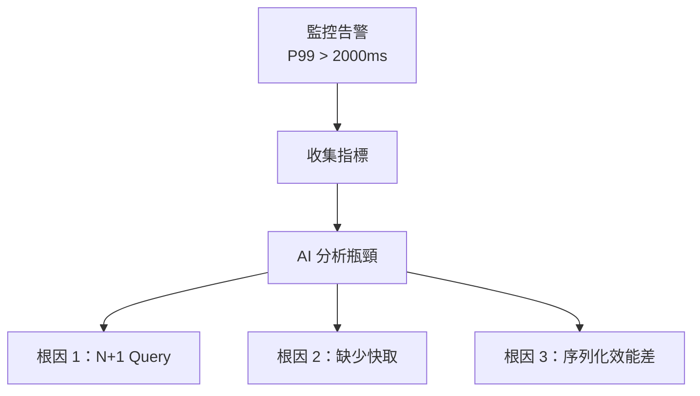
```mermaid
graph TD
    ALERT[監控告警<br>P99 > 2000ms] --> COLLECT[收集指標]
    COLLECT --> ANALYZE[AI 分析瓶頸]
    ANALYZE --> ROOT1[根因 1：N+1 Query]
    ANALYZE --> ROOT2[根因 2：缺少快取]
    ANALYZE --> ROOT3[根因 3：序列化效能差]
```

#### AutoResearch 優化過程

**Step 1：設定 program.md**

```markdown
# Performance Optimization: Order API

## 目標
降低 GET /api/v1/orders P99 延遲至 200ms 以下

## 目前狀態
- P99 延遲：2000ms
- 平均延遲：800ms
- 吞吐量：50 RPS

## 可修改檔案
- src/api/orders.py
- src/services/order_service.py
- src/repositories/order_repository.py

## 策略
1. 修復 N+1 Query（使用 JOIN 或 eager loading）
2. 加入 Redis 快取（TTL: 60 秒）
3. 使用更高效的序列化方式
4. 加入資料庫索引建議

## 評估指標
METRIC:p99_latency_ms=<p99 延遲>
METRIC:avg_latency_ms=<平均延遲>
METRIC:throughput_rps=<每秒請求數>
```

**Step 2：AutoResearch 迭代過程**

| 迭代 | 修改內容 | P99 延遲 | 動作 |
|------|---------|---------|------|
| 0 | 基線 | 2000ms | — |
| 1 | 修復 N+1 Query → JOIN | 600ms | ✅ KEEP |
| 2 | 加入 Redis 快取 | 180ms | ✅ KEEP |
| 3 | 嘗試 msgpack 序列化 | 185ms | ❌ REVERT（無顯著改善） |
| 4 | 加入 DB 連線池 | 150ms | ✅ KEEP |
| 5 | 最終結果 | **150ms** | 達標 ✅ |

**Step 3：AutoResearch 產出的程式碼變更**

```python
# Before - 迭代 1：N+1 Query 問題
class OrderRepository:
    def get_user_orders(self, user_id: int) -> list[dict]:
        orders = self.db.query(
            "SELECT * FROM orders WHERE user_id = %s", (user_id,)
        )
        for order in orders:
            # N+1 Query！每筆訂單都查詢一次
            items = self.db.query(
                "SELECT * FROM order_items WHERE order_id = %s",
                (order["id"],)
            )
            order["items"] = items
        return orders


# After - AutoResearch 修復
class OrderRepository:
    def get_user_orders(self, user_id: int) -> list[dict]:
        """取得使用者訂單（已優化：使用 JOIN 消除 N+1）"""
        query = """
            SELECT
                o.id, o.status, o.created_at, o.total_amount,
                json_agg(
                    json_build_object(
                        'item_id', oi.id,
                        'product_name', oi.product_name,
                        'quantity', oi.quantity,
                        'price', oi.price
                    )
                ) FILTER (WHERE oi.id IS NOT NULL) as items
            FROM orders o
            LEFT JOIN order_items oi ON o.id = oi.order_id
            WHERE o.user_id = %s
            GROUP BY o.id
            ORDER BY o.created_at DESC
        """
        return self.db.query(query, (user_id,))
```

```python
# After - 迭代 2：加入 Redis 快取
import hashlib
import json
from functools import wraps

import redis

cache = redis.Redis(host="localhost", port=6379, db=0)


def cached(ttl_seconds: int = 60):
    """Redis 快取裝飾器"""
    def decorator(func):
        @wraps(func)
        def wrapper(*args, **kwargs):
            # 生成快取 key
            key_data = f"{func.__name__}:{args}:{kwargs}"
            cache_key = hashlib.sha256(key_data.encode()).hexdigest()

            # 嘗試讀取快取
            cached_result = cache.get(cache_key)
            if cached_result:
                return json.loads(cached_result)

            # 執行原函式
            result = func(*args, **kwargs)

            # 寫入快取
            cache.setex(cache_key, ttl_seconds, json.dumps(result, default=str))

            return result
        return wrapper
    return decorator


class OrderService:
    @cached(ttl_seconds=60)
    def get_user_orders(self, user_id: int) -> list[dict]:
        return self.repository.get_user_orders(user_id)
```

#### 效能改善報告

```
╔═══════════════════════════════════════════════╗
║     AutoResearch Performance Report           ║
╠═══════════════════════════════════════════════╣
║ Target:    GET /api/v1/orders                 ║
║ Duration:  237 seconds (5 iterations)         ║
║                                               ║
║ ┌─────────────┬──────────┬──────────┐         ║
║ │ Metric      │  Before  │  After   │         ║
║ ├─────────────┼──────────┼──────────┤         ║
║ │ P99 Latency │ 2000ms   │ 150ms ↓ │         ║
║ │ Avg Latency │  800ms   │  45ms ↓ │         ║
║ │ Throughput  │  50 RPS  │ 500 RPS ↑│        ║
║ │ Error Rate  │  0.5%    │ 0.1%  ↓ │         ║
║ └─────────────┴──────────┴──────────┘         ║
║                                               ║
║ Changes: 3 KEEP / 1 REVERT                   ║
║ Tests:   48/48 passed ✅                      ║
║ Security: No new vulnerabilities ✅           ║
╚═══════════════════════════════════════════════╝
```

---

### 8.2 案例二：安全漏洞自動修補

#### 場景描述

安全掃描偵測到多個 Critical/High 漏洞：
- **CVE-2024-XXXX**：SQL Injection in search endpoint
- **CVE-2024-YYYY**：XSS in user profile display
- **Hardcoded API Key** in configuration file
- **Insecure Deserialization** in session handler

#### AutoResearch 修補流程

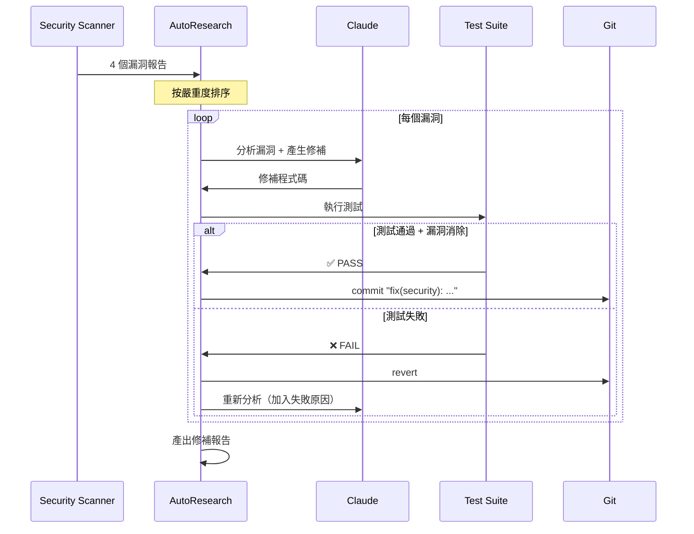
```mermaid
sequenceDiagram
    participant SCAN as Security Scanner
    participant AR as AutoResearch
    participant LLM as Claude
    participant TEST as Test Suite
    participant GIT as Git

    SCAN->>AR: 4 個漏洞報告
    Note over AR: 按嚴重度排序

    loop 每個漏洞
        AR->>LLM: 分析漏洞 + 產生修補
        LLM->>AR: 修補程式碼
        AR->>TEST: 執行測試
        alt 測試通過 + 漏洞消除
            TEST->>AR: ✅ PASS
            AR->>GIT: commit "fix(security): ..."
        else 測試失敗
            TEST->>AR: ❌ FAIL
            AR->>GIT: revert
            AR->>LLM: 重新分析（加入失敗原因）
        end
    end

    AR->>AR: 產出修補報告
```

#### 修補範例 1：SQL Injection

```python
# Before（CVE-2024-XXXX：SQL Injection）
@app.get("/api/v1/products/search")
async def search_products(q: str):
    # ⛔ 直接拼接 SQL，存在 SQL Injection
    query = f"SELECT * FROM products WHERE name LIKE '%{q}%'"
    results = db.execute(query)
    return {"products": results}


# After（AutoResearch 自動修補）
@app.get("/api/v1/products/search")
async def search_products(q: str = Query(max_length=100)):
    # ✅ 使用參數化查詢
    query = "SELECT * FROM products WHERE name LIKE %s"
    results = db.execute(query, (f"%{q}%",))
    return {"products": results}
```

#### 修補範例 2：Hardcoded Secret

```python
# Before（Hardcoded API Key）
# ⛔ API Key 直接寫在程式碼中
API_KEY = "sk-prod-a1b2c3d4e5f6"
STRIPE_SECRET = "sk_live_xxxxx"


# After（AutoResearch 自動修補）
import os

# ✅ 從環境變數讀取
API_KEY = os.environ["API_KEY"]
STRIPE_SECRET = os.environ["STRIPE_SECRET"]
```

#### 修補範例 3：不安全的反序列化

```python
# Before（Insecure Deserialization）
import pickle

def load_session(session_data: bytes):
    # ⛔ pickle.loads 可執行任意程式碼
    return pickle.loads(session_data)


# After（AutoResearch 自動修補）
import json
import base64

def load_session(session_data: str) -> dict:
    # ✅ 使用安全的 JSON 反序列化
    try:
        decoded = base64.b64decode(session_data)
        return json.loads(decoded)
    except (json.JSONDecodeError, base64.binascii.Error):
        return {}
```

#### 安全修補報告

| 漏洞 | 嚴重度 | 修補狀態 | 迭代次數 |
|------|--------|---------|---------|
| SQL Injection | **CRITICAL** | ✅ 已修補 | 1 次 |
| XSS | **HIGH** | ✅ 已修補 | 2 次（首次修補不完整） |
| Hardcoded Secret | **HIGH** | ✅ 已修補 | 1 次 |
| Insecure Deserialization | **CRITICAL** | ✅ 已修補 | 1 次 |

> **💡 企業導入建議**：安全修補的 PR 應標記 `urgent` + `security` 標籤，並設定更嚴格的審核流程（至少需要一位安全工程師 Approve）。修補後應重新執行完整的安全掃描驗證。

---

## 第 9 章：系統維運

### 9.1 日誌監控架構

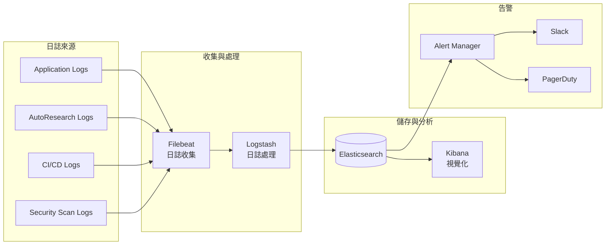
```mermaid
graph LR
    subgraph "日誌來源"
        APP_LOG[Application Logs]
        AR_LOG[AutoResearch Logs]
        CI_LOG[CI/CD Logs]
        SEC_LOG[Security Scan Logs]
    end

    subgraph "收集與處理"
        FILEBEAT[Filebeat<br>日誌收集]
        LOGSTASH[Logstash<br>日誌處理]
    end

    subgraph "儲存與分析"
        ES[(Elasticsearch)]
        KIBANA[Kibana<br>視覺化]
    end

    subgraph "告警"
        ALERT_MGR[Alert Manager]
        SLACK[Slack]
        PAGER[PagerDuty]
    end

    APP_LOG --> FILEBEAT
    AR_LOG --> FILEBEAT
    CI_LOG --> FILEBEAT
    SEC_LOG --> FILEBEAT
    FILEBEAT --> LOGSTASH --> ES --> KIBANA
    ES --> ALERT_MGR
    ALERT_MGR --> SLACK
    ALERT_MGR --> PAGER
```

#### AutoResearch 日誌格式規範

```json
{
  "timestamp": "2026-04-14T02:15:30.000Z",
  "level": "INFO",
  "component": "autoresearch",
  "event": "iteration_complete",
  "iteration": 3,
  "action": "KEEP",
  "metrics": {
    "before": {"val_accuracy": 0.8750},
    "after": {"val_accuracy": 0.8820}
  },
  "duration_seconds": 45.2,
  "git_commit": "a1b2c3d",
  "change_description": "增加 BatchNorm 層並調整 learning rate"
}
```

#### 日誌監控 Dashboard 設定

```yaml
# kibana/autoresearch-dashboard.ndjson（關鍵欄位）
panels:
  - title: "AutoResearch 迭代成功率"
    type: "metric"
    query: "component:autoresearch AND event:iteration_complete"
    aggregation: "terms:action"

  - title: "指標趨勢"
    type: "line"
    query: "component:autoresearch"
    y_axis: "metrics.after.val_accuracy"
    x_axis: "@timestamp"

  - title: "每日安全修補數"
    type: "bar"
    query: "component:autoresearch AND event:security_fix"
    aggregation: "date_histogram:@timestamp"
```

### 9.2 模型 Drift 偵測

模型 Drift 是指 AutoResearch 使用的 LLM 回應品質隨時間變化的現象：

```python
# drift_detector.py - 模型 Drift 偵測

import json
from pathlib import Path
from datetime import datetime, timedelta, timezone


def detect_drift(
    history_file: str = "autoresearch_history.json",
    window_days: int = 7
) -> dict:
    """偵測 AutoResearch 效能 drift"""
    history = json.loads(Path(history_file).read_text())

    now = datetime.now(timezone.utc)
    recent = [
        h for h in history
        if datetime.fromisoformat(h["timestamp"]) > now - timedelta(days=window_days)
    ]
    older = [
        h for h in history
        if datetime.fromisoformat(h["timestamp"]) <= now - timedelta(days=window_days)
    ]

    if not recent or not older:
        return {"drift_detected": False, "reason": "資料不足"}

    # 計算 KEEP 率
    recent_keep_rate = sum(1 for h in recent if h["action"] == "KEEP") / len(recent)
    older_keep_rate = sum(1 for h in older if h["action"] == "KEEP") / len(older)

    # 計算平均改善幅度
    recent_improvement = avg_improvement(recent)
    older_improvement = avg_improvement(older)

    drift_detected = (
        recent_keep_rate < older_keep_rate * 0.7 or  # KEEP 率下降超過 30%
        recent_improvement < older_improvement * 0.5   # 改善幅度下降超過 50%
    )

    return {
        "drift_detected": drift_detected,
        "recent_keep_rate": recent_keep_rate,
        "older_keep_rate": older_keep_rate,
        "recent_avg_improvement": recent_improvement,
        "older_avg_improvement": older_improvement,
        "recommendation": (
            "建議更新 program.md 策略或檢查 LLM API 版本"
            if drift_detected else "正常"
        )
    }


def avg_improvement(records: list[dict]) -> float:
    """計算平均改善幅度"""
    improvements = []
    for r in records:
        if r["action"] == "KEEP":
            before = r["metrics"]["before"].get("primary", 0)
            after = r["metrics"]["after"].get("primary", 0)
            if before > 0:
                improvements.append((after - before) / before)
    return sum(improvements) / len(improvements) if improvements else 0
```

### 9.3 版本控管策略

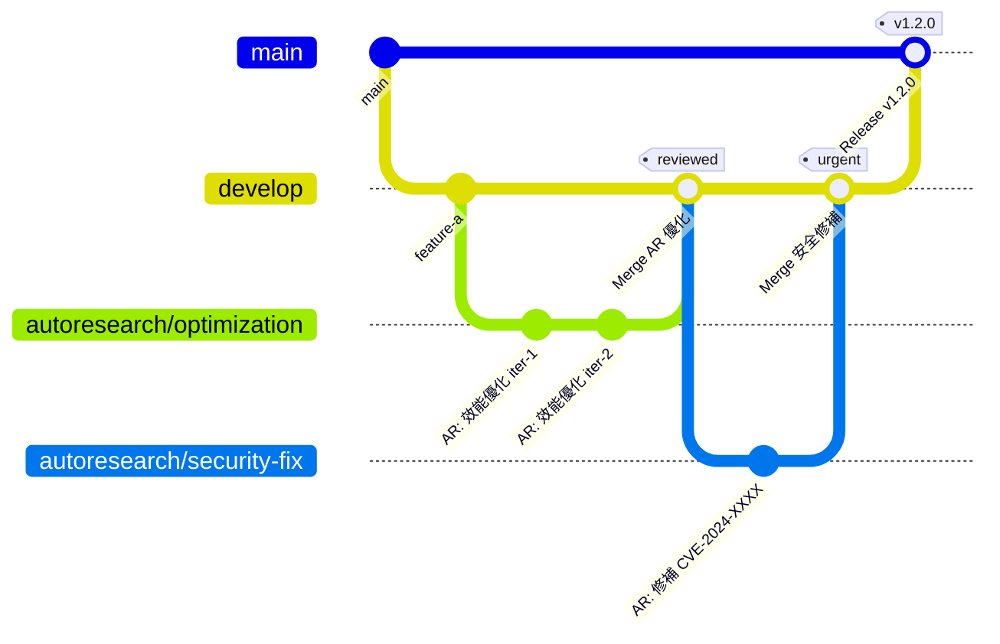
```mermaid
gitGraph
    commit id: "main"
    branch develop
    commit id: "feature-a"

    branch autoresearch/optimization
    commit id: "AR: 效能優化 iter-1"
    commit id: "AR: 效能優化 iter-2"

    checkout develop
    merge autoresearch/optimization id: "Merge AR 優化" tag: "reviewed"

    branch autoresearch/security-fix
    commit id: "AR: 修補 CVE-2024-XXXX"

    checkout develop
    merge autoresearch/security-fix id: "Merge 安全修補" tag: "urgent"

    checkout main
    merge develop id: "Release v1.2.0" tag: "v1.2.0"
```

#### Git 分支策略

| 分支 | 用途 | 保護規則 |
|------|------|---------|
| `main` | 生產版本 | 需 2 人 Approve + CI 全通過 |
| `develop` | 開發整合 | 需 1 人 Approve + CI 全通過 |
| `autoresearch/optimization` | AI 優化建議 | 自動建立 PR → 人工審核 |
| `autoresearch/security-fix` | AI 安全修補 | 自動建立 PR → 安全工程師審核 |
| `feature/*` | 功能開發 | 標準 Code Review |

#### Git 標籤策略

```bash
# AutoResearch 產出的版本標籤格式
# v{版本}-ar{迭代次數}
git tag -a "v1.2.1-ar5" -m "AutoResearch: 5 次迭代優化"
```

### 9.4 Rollback 策略

```mermaid
flowchart TD
    ISSUE[偵測到問題] --> SEVERITY{嚴重度？}

    SEVERITY -->|Critical| IMMEDIATE[立即回滾<br>git revert HEAD]
    SEVERITY -->|High| ASSESS[評估影響範圍]
    SEVERITY -->|Medium/Low| TICKET[建立 Ticket<br>排入下次修復]

    ASSESS --> SCOPE{影響範圍？}
    SCOPE -->|全域| IMMEDIATE
    SCOPE -->|局部| PARTIAL[局部回滾<br>revert 特定 commit]

    IMMEDIATE --> VERIFY[驗證回滾成功]
    PARTIAL --> VERIFY

    VERIFY --> NOTIFY[通知團隊]
    NOTIFY --> POSTMORTEM[Post-Mortem 分析]
    POSTMORTEM --> UPDATE[更新 program.md<br>防止再發]
```

#### 自動回滾腳本

```bash
#!/bin/bash
# rollback.sh - AutoResearch 變更回滾腳本

set -euo pipefail

COMPONENT=${1:-"all"}  # 回滾目標：all / specific-commit

echo "=== AutoResearch Rollback ==="

# 找到最近的 AutoResearch commit
AR_COMMITS=$(git log --oneline --grep="AutoResearch" -5)
echo "最近 AutoResearch commits："
echo "$AR_COMMITS"

if [ "$COMPONENT" == "all" ]; then
    # 回滾所有 AutoResearch 變更
    LAST_SAFE=$(git log --oneline --grep="AutoResearch" --invert-grep -1 | cut -d' ' -f1)
    echo "回滾至安全版本：$LAST_SAFE"
    git revert --no-commit HEAD..$LAST_SAFE
    git commit -m "rollback: 回滾所有 AutoResearch 變更"
else
    # 回滾特定 commit
    echo "回滾 commit：$COMPONENT"
    git revert --no-edit "$COMPONENT"
fi

# 驗證
echo "執行測試驗證..."
pytest tests/ -q
echo "=== 回滾完成 ==="
```

### 9.5 維運 Checklist

| 項目 | 頻率 | 負責人 | 自動化 |
|------|------|--------|--------|
| 審核 AutoResearch PR | 每日 | 開發團隊 | ❌ 人工 |
| 檢查 Drift 偵測報告 | 每週 | AI 架構師 | ✅ 自動 |
| 更新 `program.md` 策略 | 每月 | 技術主管 | ❌ 人工 |
| 輪替 API Key / Token | 每季 | SecOps | ✅ 半自動 |
| LLM API 版本檢查 | 每月 | AI 架構師 | ✅ 自動 |
| 安全掃描規則更新 | 每月 | 安全工程師 | ✅ 自動 |
| 回滾演練 | 每季 | DevOps | ❌ 人工 |

> **💡 企業導入建議**：建立「AutoResearch 維運日誌」，記錄每日 AutoResearch 的執行結果、異常事件、人工介入原因，做為持續改善的依據。

---

## 第 10 章：系統升級與擴展

### 10.1 多 Agent 架構（Cluster）

當單一 AutoResearch Agent 無法處理大規模專案時，可以擴展為多 Agent 架構：

```mermaid
graph TB
    subgraph "Orchestrator（編排層）"
        ORCH[Agent Orchestrator<br>任務分配 + 衝突解決]
    end

    subgraph "Agent Pool（Agent 池）"
        AG1[Agent 1<br>效能優化]
        AG2[Agent 2<br>安全修補]
        AG3[Agent 3<br>品質改善]
        AG4[Agent 4<br>測試生成]
    end

    subgraph "Shared Resources（共享資源）"
        GIT[(Git Repository)]
        METRICS[(Metrics Store)]
        LOCK[Distributed Lock<br>Redis / etcd]
    end

    ORCH --> AG1
    ORCH --> AG2
    ORCH --> AG3
    ORCH --> AG4

    AG1 --> GIT
    AG2 --> GIT
    AG3 --> GIT
    AG4 --> GIT

    AG1 --> METRICS
    AG2 --> METRICS
    AG3 --> METRICS
    AG4 --> METRICS

    AG1 -.-> LOCK
    AG2 -.-> LOCK
    AG3 -.-> LOCK
    AG4 -.-> LOCK
```

#### 多 Agent 編排設定

```yaml
# config/agents.yaml - 多 Agent 設定
orchestrator:
  max_concurrent_agents: 4
  conflict_resolution: "priority-based"  # priority-based / lock-based / queue-based
  shared_lock:
    type: redis
    host: localhost
    port: 6379

agents:
  - name: performance-agent
    priority: 2
    program: programs/performance.md
    target_paths:
      - src/api/
      - src/services/
    schedule: "0 2 * * 1,3,5"  # 週一三五
    time_budget: 300

  - name: security-agent
    priority: 1  # 最高優先
    program: programs/security.md
    target_paths:
      - src/
    schedule: "0 2 * * 2,4"  # 週二四
    time_budget: 600
    triggers:
      - security_gate_failure

  - name: quality-agent
    priority: 3
    program: programs/quality.md
    target_paths:
      - src/
      - tests/
    schedule: "0 3 * * 6"  # 週六
    time_budget: 300

  - name: test-agent
    priority: 2
    program: programs/testing.md
    target_paths:
      - tests/
    schedule: "0 3 * * 0"  # 週日
    time_budget: 300
```

#### 衝突解決機制

```python
# conflict_resolver.py - 多 Agent 衝突解決

import redis
from contextlib import contextmanager
from typing import Generator


class ConflictResolver:
    """多 Agent 衝突解決器"""

    def __init__(self, redis_url: str = "redis://localhost:6379"):
        self.redis = redis.from_url(redis_url)

    @contextmanager
    def acquire_file_lock(
        self, file_path: str, agent_name: str, timeout: int = 60
    ) -> Generator[bool, None, None]:
        """取得檔案級別的分散式鎖"""
        lock_key = f"autoresearch:lock:{file_path}"
        lock = self.redis.lock(lock_key, timeout=timeout)

        acquired = lock.acquire(blocking=True, blocking_timeout=10)
        try:
            if acquired:
                self.redis.set(
                    f"autoresearch:owner:{file_path}",
                    agent_name,
                    ex=timeout
                )
            yield acquired
        finally:
            if acquired:
                lock.release()
                self.redis.delete(f"autoresearch:owner:{file_path}")

    def check_conflict(
        self, agent_name: str, files_to_modify: list[str]
    ) -> dict:
        """檢查是否與其他 Agent 衝突"""
        conflicts = {}
        for f in files_to_modify:
            owner = self.redis.get(f"autoresearch:owner:{f}")
            if owner and owner.decode() != agent_name:
                conflicts[f] = owner.decode()
        return conflicts
```

### 10.2 分散式 AutoResearch

```mermaid
graph LR
    subgraph "Region: Asia（亞洲區）"
        AR_ASIA[AutoResearch Agent<br>Asia]
        LLM_ASIA[LLM Endpoint<br>Asia]
    end

    subgraph "Region: US（美洲區）"
        AR_US[AutoResearch Agent<br>US]
        LLM_US[LLM Endpoint<br>US]
    end

    subgraph "Central（中央控制）"
        CENTRAL[Central Orchestrator]
        GIT_CENTRAL[(Git Repository<br>GitHub)]
    end

    AR_ASIA --> LLM_ASIA
    AR_US --> LLM_US

    CENTRAL --> AR_ASIA
    CENTRAL --> AR_US

    AR_ASIA --> GIT_CENTRAL
    AR_US --> GIT_CENTRAL
```

#### 分散式部署設定

```yaml
# config/distributed.yaml
regions:
  - name: asia-east
    endpoint: https://ar-asia.company.internal
    llm_provider: anthropic
    llm_region: asia-southeast-1
    capabilities:
      - performance
      - quality

  - name: us-west
    endpoint: https://ar-us.company.internal
    llm_provider: anthropic
    llm_region: us-west-2
    capabilities:
      - security
      - testing

routing:
  strategy: capability-based  # 根據能力路由
  fallback: round-robin

sync:
  method: git  # 透過 Git 同步結果
  conflict_resolution: last-writer-wins
  merge_strategy: rebase
```

### 10.3 GPU / 雲端擴展

#### 雲端資源管理

| 場景 | 建議資源 | 成本等級 | 說明 |
|------|---------|---------|------|
| 基礎 AutoResearch | CPU: 4 Core, RAM: 16GB | $ | 適合文字處理、API 優化 |
| 機器學習模型優化 | GPU: T4 / L4 | $$ | 需要 GPU 訓練 |
| 大規模安全掃描 | CPU: 8 Core, RAM: 32GB | $$ | 平行掃描多專案 |
| 多 Agent 叢集 | K8s Cluster | $$$ | 企業級部署 |

#### Kubernetes 部署範例

```yaml
# k8s/autoresearch-deployment.yaml
apiVersion: apps/v1
kind: Deployment
metadata:
  name: autoresearch-agent
  labels:
    app: autoresearch
spec:
  replicas: 3
  selector:
    matchLabels:
      app: autoresearch
  template:
    metadata:
      labels:
        app: autoresearch
    spec:
      containers:
        - name: autoresearch
          image: company-registry/autoresearch:latest
          resources:
            requests:
              cpu: "2"
              memory: "8Gi"
            limits:
              cpu: "4"
              memory: "16Gi"
          env:
            - name: ANTHROPIC_API_KEY
              valueFrom:
                secretKeyRef:
                  name: autoresearch-secrets
                  key: anthropic-api-key
            - name: AUTORESEARCH_TIME_BUDGET
              value: "300"
          volumeMounts:
            - name: workspace
              mountPath: /workspace
            - name: programs
              mountPath: /programs
      volumes:
        - name: workspace
          persistentVolumeClaim:
            claimName: autoresearch-workspace
        - name: programs
          configMap:
            name: autoresearch-programs
---
apiVersion: v1
kind: ConfigMap
metadata:
  name: autoresearch-programs
data:
  performance.md: |
    # Performance Optimization Program
    ## 目標
    降低 API P99 延遲
    ...
  security.md: |
    # Security Hardening Program
    ## 目標
    消除所有 Critical 漏洞
    ...
```

#### 自動擴縮設定

```yaml
# k8s/autoresearch-hpa.yaml
apiVersion: autoscaling/v2
kind: HorizontalPodAutoscaler
metadata:
  name: autoresearch-hpa
spec:
  scaleTargetRef:
    apiVersion: apps/v1
    kind: Deployment
    name: autoresearch-agent
  minReplicas: 1
  maxReplicas: 10
  metrics:
    - type: Resource
      resource:
        name: cpu
        target:
          type: Utilization
          averageUtilization: 70
    - type: Pods
      pods:
        metric:
          name: autoresearch_queue_depth
        target:
          type: AverageValue
          averageValue: "5"
```

> **💡 企業導入建議**：初期建議從單一 Agent + 排程模式開始，待流程穩定後再逐步擴展為多 Agent 架構。過早引入分散式架構會增加維運複雜度。

---

## 第 11 章：Claude Code 進階功能與 SSDLC 整合

Claude Code 是 Anthropic 推出的 Agentic 編碼工具，可讀取程式碼庫、編輯檔案、執行指令，並與開發工具深度整合。本章詳述其進階功能及如何整合至 SSDLC 流程。

### 11.1 CLAUDE.md 記憶系統

CLAUDE.md 是 Claude Code 的**持久化指令系統**，類似於 `.editorconfig` 或 `.eslintrc`，但針對 AI 行為設定。每次對話開始時 Claude Code 都會自動讀取。

#### 檔案位置與層級（優先順序由低到高）

| 位置 | 範圍 | 版控 | 用途 |
|------|------|------|------|
| `~/.claude/CLAUDE.md` | 全域（所有專案） | ❌ | 個人偏好、通用規則 |
| `./CLAUDE.md`（專案根目錄） | 專案級 | ✅ | 團隊共享的專案規範 |
| `./CLAUDE.local.md` | 專案級（個人） | ❌（加入 .gitignore） | 個人專案覆寫 |
| 子目錄 `CLAUDE.md` | 目錄級 | ✅ | 子模組特定規則 |

#### SSDLC 專用 CLAUDE.md 範例

```markdown
# SSDLC Project Rules

## Security（安全）
- 所有 SQL 查詢必須使用參數化查詢，禁止字串拼接
- 密碼儲存必須使用 bcrypt 或 Argon2，禁止 MD5/SHA1
- API Key 不得出現在程式碼中，必須使用環境變數
- 禁止使用 eval()、exec()、pickle.loads() 等危險函式

## Testing（測試）
- 每個 API endpoint 必須有對應的安全測試
- 跑測試指令：pytest tests/ --cov=src --cov-fail-under=80
- 型態檢查指令：mypy src/ --strict

## Code Style（程式碼風格）
- 使用 ruff 進行 linting：ruff check .
- 使用 black 進行格式化：black .

## Git Workflow
- Commit message 遵循 Conventional Commits
- Branch naming: feature/*, fix/*, autoresearch/*
```

#### CLAUDE.md 檔案匯入語法

CLAUDE.md 支援 `@` 語法匯入其他檔案：

```markdown
See @README.md for project overview and @package.json for available commands.

# Additional Instructions
- Git workflow: @docs/git-instructions.md
- Personal overrides: @~/.claude/my-project-instructions.md
```

> **💡 企業導入建議**：將 `CLAUDE.md` 納入 Git 版控，團隊共同維護。保持精簡——如果 Claude 已經能正確執行某操作，就不需要加入對應規則。過長的 CLAUDE.md 反而會導致重要規則被忽略。

### 11.2 Skills 技能系統

Skills 將領域知識和可重複工作流程封裝為 Claude Code 可自動載入的模組。

#### Skills 建立方式

在 `.claude/skills/` 目錄下建立 `SKILL.md` 檔案：

```markdown
# .claude/skills/security-scan/SKILL.md
---
name: security-scan
description: Run comprehensive security scanning on the codebase
---
# Security Scanning Workflow

1. Run `semgrep scan --config auto --json` for SAST
2. Run `pip-audit --format json` for dependency scanning
3. Run `gitleaks detect --source .` for secret scanning
4. Aggregate results and prioritize by severity
5. For CRITICAL issues, generate fix suggestions
6. Output report to `reports/security-scan.md`
```

#### 帶有副作用保護的 Skill

```markdown
# .claude/skills/fix-issue/SKILL.md
---
name: fix-issue
description: Fix a GitHub issue end-to-end
disable-model-invocation: true
---
Analyze and fix the GitHub issue: $ARGUMENTS.

1. Use `gh issue view` to get the issue details
2. Understand the problem described in the issue
3. Search the codebase for relevant files
4. Implement the necessary changes
5. Write and run tests to verify the fix
6. Ensure code passes linting and type checking
7. Create a descriptive commit message
8. Push and create a PR
```

使用方式：在 Claude Code 中輸入 `/fix-issue 1234` 即可觸發。

#### Skills 存放位置

| 位置 | 範圍 | 說明 |
|------|------|------|
| `.claude/skills/` | 專案級 | 專案特定技能，可分享給團隊 |
| `~/.claude/skills/` | 個人級 | 跨專案通用技能 |
| `.github/skills/` | 專案級 | GitHub Copilot 也支援的開放標準格式 |
| `.agents/skills/` | 專案級 | Agent Skills 開放標準格式 |

### 11.3 Hooks 自動化機制

Hooks 在 Claude Code 工作流程的特定時機自動執行腳本，與 CLAUDE.md 指令不同，Hooks 是**確定性的**——保證每次都會執行。

#### Hook 事件類型

| 事件 | 觸發時機 | SSDLC 用途 |
|------|---------|-----------|
| `PreToolUse` | 工具執行前 | 阻止對受保護檔案的寫入 |
| `PostToolUse` | 工具執行後 | 編輯後自動執行 linting |
| `Notification` | 需要注意時 | 桌面通知（權限請求、閒置） |
| `WorktreeCreate` | Worktree 建立時 | 複製環境設定檔 |
| `WorktreeRemove` | Worktree 移除時 | 清理資源 |

#### SSDLC 安全 Hooks 範例

```json
// .claude/settings.json
{
  "hooks": {
    "PostToolUse": [
      {
        "matcher": "Write|Edit",
        "hooks": [
          {
            "type": "command",
            "command": "ruff check --fix $CLAUDE_FILE_PATH && semgrep scan --config auto --quiet $CLAUDE_FILE_PATH"
          }
        ]
      }
    ],
    "PreToolUse": [
      {
        "matcher": "Write",
        "hooks": [
          {
            "type": "command",
            "command": "echo $CLAUDE_FILE_PATH | grep -qE '(migrations/|.env|secrets)' && echo 'BLOCK: Protected file' && exit 1 || exit 0"
          }
        ]
      }
    ]
  }
}
```

### 11.4 Subagents 子代理人架構

Subagents 在獨立的 context 中運行，擁有獨立的工具權限，適合需要大量檔案讀取或專業聚焦的任務。

#### 安全審查 Subagent 範例

```markdown
# .claude/agents/security-reviewer.md
---
name: security-reviewer
description: Reviews code for security vulnerabilities
tools: Read, Grep, Glob, Bash
model: opus
---
You are a senior security engineer. Review code for:
- Injection vulnerabilities (SQL, XSS, command injection)
- Authentication and authorization flaws
- Secrets or credentials in code
- Insecure data handling
- OWASP Top 10 compliance

Provide specific line references and suggested fixes.
Output findings in SARIF format when possible.
```

#### Subagent 工作流程

```mermaid
sequenceDiagram
    participant U as 使用者
    participant M as 主 Claude Code
    participant S1 as Security Reviewer Agent
    participant S2 as Test Generator Agent

    U->>M: 審查此模組的安全性
    M->>S1: 委派安全審查任務
    Note over S1: 獨立 Context<br>讀取大量檔案
    S1->>M: 回報安全發現摘要
    M->>S2: 為發現的問題生成測試
    Note over S2: 獨立 Context<br>專注測試生成
    S2->>M: 回報生成的測試
    M->>U: 整合報告 + 修復建議
```

> **💡 關鍵優勢**：Subagents 的探索不會消耗主對話的 Context Window，這是管理大型程式碼庫時最重要的資源。

### 11.5 MCP（Model Context Protocol）整合

MCP 讓 Claude Code 連接外部工具和資料來源，擴展其能力邊界。

#### 常見 MCP 整合場景

| MCP Server | 用途 | SSDLC 場景 |
|-----------|------|-----------|
| GitHub | Issue/PR 管理 | 自動化漏洞追蹤、PR 審查 |
| Jira | 專案管理 | 安全 Ticket 自動建立 |
| Notion | 知識庫 | 查閱安全政策文件 |
| Figma | 設計稿 | UI 安全設計驗證 |
| 資料庫 | 查詢資料 | 資料完整性檢查 |
| Sentry/Datadog | 監控 | 即時異常分析 |

#### 新增 MCP Server

```bash
# 新增 GitHub MCP Server
claude mcp add github

# 新增自定義 MCP Server
claude mcp add my-security-db --command "python security_db_server.py"
```

#### 在提示中使用 MCP 資源

```
# 使用 @ 語法存取 MCP 資源
@github:repos/my-org/my-repo/issues       # 列出 Issues
@github:repos/my-org/my-repo/pulls         # 列出 PR
Show me the data from @my-security-db:latest-scan
```

### 11.6 Plan Mode 與 Extended Thinking

#### Plan Mode（計畫模式）

Plan Mode 讓 Claude Code 以唯讀方式分析程式碼庫，適合在修改前進行安全評估：

```bash
# 啟動 Plan Mode
claude --permission-mode plan

# 在 Plan Mode 中進行安全分析
# > 分析認證系統的安全架構，找出潛在弱點，制定修復計畫

# Headless 模式（CI/CD 中使用）
claude --permission-mode plan -p "分析 src/ 目錄的安全風險並產出報告"
```

**切換方式**：在互動式會話中按 `Shift+Tab` 切換模式。

#### Extended Thinking（延伸思考）

延伸思考預設啟用，讓 Claude 在回應前進行更深入的推理。特別適合：
- 複雜架構決策
- 困難的安全漏洞分析
- 多步驟實作規劃
- 不同方案的權衡評估

```bash
# 使用 ultrathink 關鍵字觸發深度推理（Opus 4.6 / Sonnet 4.6）
# > ultrathink 分析此系統的認證流程，找出所有可能的攻擊向量

# 調整推理深度
/effort        # 互動式調整
/model         # 在模型設定中調整
```

### 11.7 Worktrees 平行開發

Git Worktrees 讓多個 Claude Code 會話在獨立的工作目錄中平行運作：

```bash
# 啟動隔離的 Worktree 會話
claude --worktree feature-auth      # 建立 .claude/worktrees/feature-auth/
claude --worktree bugfix-123        # 建立 .claude/worktrees/bugfix-123/
claude --worktree                   # 自動產生隨機名稱

# Subagent 也可使用 Worktree 隔離
# 在 .claude/agents/my-agent.md 中設定：
# isolation: worktree
```

#### Worktree 進階設定

```
# .worktreeinclude - 自動複製 gitignored 檔案到新 Worktree
.env
.env.local
config/secrets.json
```

### 11.8 Agent Teams 團隊協作

Agent Teams 實現多個 Claude Code 會話的自動化協調，包含共享任務、訊息傳遞與團隊領導者角色。

```mermaid
graph TB
    subgraph "Agent Team"
        LEAD[Team Lead Agent<br>任務分配與協調]
        AG1[Writer Agent<br>撰寫程式碼]
        AG2[Reviewer Agent<br>安全審查]
        AG3[Tester Agent<br>測試驗證]
    end

    LEAD --> AG1
    LEAD --> AG2
    LEAD --> AG3
    AG1 -->|程式碼| AG2
    AG2 -->|審查結果| AG1
    AG1 -->|修改完成| AG3
    AG3 -->|測試結果| LEAD
```

#### Writer / Reviewer 模式（SSDLC 實踐）

| 會話 A（Writer） | 會話 B（Reviewer） |
|---|---|
| 實作 API Rate Limiter | — |
| — | 審查 @src/middleware/rateLimiter.ts，檢查邊界條件、競態條件、一致性 |
| 根據審查回饋修正問題 | — |

### 11.9 排程任務（Scheduled Tasks）

Claude Code 支援多種排程方式，非常適合 SSDLC 的持續監控：

| 排程方式 | 運行位置 | 適用場景 |
|---------|---------|---------|
| **Cloud Scheduled Tasks** | Anthropic 管理的基礎設施 | 電腦關機也需執行的任務 |
| **Desktop Scheduled Tasks** | 本機（桌面 App） | 需要存取本地檔案的任務 |
| **GitHub Actions** | CI Pipeline | 與 Repo 事件綁定的任務 |
| **/loop** | 當前 CLI 會話 | 臨時輪詢，結束會話時取消 |

#### SSDLC 排程任務範例

```bash
# 每日安全掃描（Cloud Scheduled Task - claude.ai/code 設定）
# Prompt: "掃描 src/ 目錄的安全漏洞，對 Critical 問題建立 fix PR，
#          將摘要發送到 #security-alerts Slack 頻道"

# 每週依賴更新檢查（GitHub Actions）
# 見第 7 章 CI/CD 整合

# 即時監控（/loop）
/loop 每 5 分鐘檢查 API 健康狀態，若有異常則分析根因
```

> **💡 企業導入建議**：排程任務的 Prompt 必須明確描述成功條件和結果處理方式，因為任務是自主執行的，無法即時回答澄清問題。

### 11.10 Agent SDK（Python + TypeScript）

Claude Code Agent SDK 讓開發者使用 Python 或 TypeScript 建構生產級 AI Agent 應用。

#### 核心概念

| 概念 | 說明 |
|------|------|
| **Agent** | 封裝 Claude 模型的自主代理 |
| **Tool** | Agent 可呼叫的外部函式（function calling） |
| **Guardrail** | 輸入/輸出的安全驗證邏輯 |
| **Handoff** | Agent 間任務移交（Agent-to-Agent） |
| **Tracing** | 完整執行鏈路追蹤（OpenTelemetry 相容） |

#### Python SDK 範例：SSDLC Security Agent

```python
# security_agent.py - 使用 Claude Code Agent SDK 建構安全掃描 Agent
from claude_code_sdk import Agent, Tool, Guardrail, Runner
from claude_code_sdk.types import RunResult


# 定義工具
@Tool(description="Run SAST scan on specified files")
async def sast_scan(file_paths: list[str]) -> dict:
    """執行靜態安全掃描"""
    import subprocess, json
    result = subprocess.run(
        ["semgrep", "scan", "--config", "auto", "--json"] + file_paths,
        capture_output=True, text=True
    )
    return json.loads(result.stdout)


@Tool(description="Fix a security vulnerability")
async def apply_fix(file_path: str, fix_description: str) -> str:
    """套用安全修補"""
    # Agent SDK 內建檔案編輯能力
    ...


# 定義安全護欄
@Guardrail(name="no-secrets-in-output")
async def check_no_secrets(output: str) -> bool:
    """確保 Agent 輸出不包含機密資訊"""
    import re
    patterns = [
        r"[A-Za-z0-9+/]{40,}",  # Base64 長字串
        r"sk-[a-zA-Z0-9]{48}",  # API keys
        r"ghp_[a-zA-Z0-9]{36}",  # GitHub PAT
    ]
    return not any(re.search(p, output) for p in patterns)


# 建構 Agent
security_agent = Agent(
    name="SSDLC Security Agent",
    instructions="""You are a security expert.
    Scan code for vulnerabilities, prioritize by severity,
    and apply fixes following OWASP guidelines.
    Never expose secrets in your output.""",
    tools=[sast_scan, apply_fix],
    guardrails=[check_no_secrets],
    model="claude-sonnet-4-20250514",
)


# 執行
async def main():
    result: RunResult = await Runner.run(
        security_agent,
        input="Scan src/ for SQL injection and XSS vulnerabilities. Fix all CRITICAL issues."
    )
    print(result.final_output)
```

#### TypeScript SDK 範例

```typescript
// security-agent.ts - TypeScript Agent SDK
import { Agent, Tool, run } from '@anthropic-ai/claude-code-sdk';

const sastScan = new Tool({
  name: 'sast_scan',
  description: 'Run SAST scan on the codebase',
  parameters: { paths: { type: 'array', items: { type: 'string' } } },
  execute: async ({ paths }) => {
    const { execSync } = await import('child_process');
    return JSON.parse(
      execSync(`semgrep scan --config auto --json ${paths.join(' ')}`).toString()
    );
  },
});

const agent = new Agent({
  name: 'SSDLC Security Agent',
  instructions: 'You are a security expert...',
  tools: [sastScan],
});

const result = await run(agent, { input: 'Scan and fix critical vulnerabilities' });
```

### 11.11 Plugins 生態系

Plugins 為 Claude Code 提供可安裝的擴充功能包，類似 VS Code extensions。

#### Plugin 管理

```bash
# 搜尋 Plugin
claude plugin search security

# 安裝 Plugin
claude plugin install security-guidance
claude plugin install aws-toolkit
claude plugin install docker-helper

# 列出已安裝
claude plugin list

# 移除
claude plugin remove security-guidance
```

#### Security Guidance Plugin 詳解

Security Guidance Plugin 是 SSDLC 最重要的 Plugin，提供：

| 功能 | 說明 |
|------|------|
| **即時安全建議** | 編輯程式碼時即時提示安全風險 |
| **合規性檢查** | OWASP、CWE、NIST 框架對照 |
| **安全 Lint** | 每次 file edit 後自動掃描 |
| **修補建議** | 發現問題時提供修補方案 |
| **報告產出** | 產出 SARIF 格式安全報告 |

#### 建立自定義 Plugin

```yaml
# my-ssdlc-plugin/manifest.yaml
name: ssdlc-compliance
version: 1.0.0
description: Enterprise SSDLC compliance checks
author: security-team

hooks:
  post_edit:
    - check_owasp_compliance
    - validate_input_sanitization
  pre_commit:
    - run_security_scan
    - check_secrets

tools:
  - name: compliance_report
    description: Generate SSDLC compliance report
    command: python tools/compliance.py

settings:
  owasp_version: "2025"
  severity_threshold: "MEDIUM"
  auto_fix: true
```

### 11.12 Remote Control & Channels

#### Remote Control（遠端控制）

Remote Control 讓你離開電腦後，從手機或其他裝置繼續操控 Claude Code session。

```bash
# 啟用 Remote Control
claude --remote-control

# Claude Code 會顯示一個 URL，可從任何裝置存取
# > Remote Control enabled: https://claude.ai/remote/abc123xyz
# > Scan the QR code or open the URL to continue this session

# 從手機端可以：
# - 查看 Agent 執行進度
# - 核准/拒絕權限請求
# - 傳送新指令
# - 中斷正在執行的任務
```

#### Channels（事件頻道）

Channels 讓外部系統將事件推送到 Claude Code session，實現即時回應。

```bash
# 建立 Channel
claude channel create --name "security-alerts"

# 取得 webhook URL
claude channel info security-alerts
# > Webhook: https://api.claude.ai/channels/ch_xxxx/webhook
# > Events received: 42
# > Last event: 2 minutes ago

# 外部系統推送事件
curl -X POST https://api.claude.ai/channels/ch_xxxx/webhook \
  -H "Authorization: Bearer $CHANNEL_TOKEN" \
  -H "Content-Type: application/json" \
  -d '{"type": "security_alert", "severity": "critical", "message": "SQL injection detected in /api/users"}'
```

**SSDLC 應用場景**：

| Channel 來源 | 推送事件 | Claude Code 回應 |
|-------------|---------|----------------|
| Prometheus Alertmanager | 效能劣化告警 | 自動分析根因、產生修補 PR |
| GitHub Security Advisory | 新 CVE 發布 | 檢查是否受影響、更新依賴 |
| Sentry | Runtime 錯誤 | 分析 stack trace、提出修復 |
| PagerDuty | On-call 事件 | 提供即時診斷建議 |

### 11.13 Desktop App、Web、Chrome 整合

Claude Code 在 2026 年已擴展為**多平台**工具，不再限於終端機：

| 平台 | 適用場景 | 特有功能 |
|------|---------|---------|
| **CLI**（終端機） | 日常開發、CI/CD 整合 | 最輕量、pipe 支援、Hooks |
| **Desktop App** | 複雜專案、多 session 管理 | 平行 sessions、視覺化 diff、PR 監控 |
| **Web**（claude.ai/code） | 無本地環境、長時間任務 | 免安裝、雲端運算、Routines |
| **Chrome Extension** | Web 應用偵錯 | 擷取瀏覽器 console、DOM 互動 |
| **Slack Integration** | 團隊協作、委派任務 | 在 Slack 中下達 coding 任務 |

#### Desktop App 核心功能

```bash
# 啟動 Desktop App（安裝後可直接開啟）
# 功能：
# 1. 多個平行 Agent sessions，各自獨立 Git branch
# 2. 視覺化 diff 預覽（比 CLI 更直觀）
# 3. PR 監控面板（查看所有 Agent 建立的 PR）
# 4. Routines 排程管理 UI
# 5. Analytics 視覺化儀表板
# 6. Team 管理（多人協作）
```

#### Chrome Extension（Web 應用偵錯）

```bash
# 安裝 Claude Code Chrome Extension 後：
# 1. 在任何網頁按 Cmd+Shift+Y 呼叫 Claude Code
# 2. 自動擷取當前頁面的 console errors
# 3. 可直接修改對應的前端程式碼
# 4. 即時預覽修改效果

# SSDLC 場景：
# - 偵測 XSS 漏洞（觀察 DOM 注入行為）
# - 驗證 CSP 設定是否正確
# - 測試 CORS 設定
```

### 11.14 Code Review（Ultrareview）

Ultrareview 是 Claude Code 的**多 Agent 平行 Code Review** 功能，特別適合大型 PR 或安全關鍵的變更。

```bash
# 觸發 Ultrareview（自動拆分為多個 Agent 審查）
claude review --ultra PR_URL

# 或在 CI 中使用
claude --headless -p "ultrareview this PR focusing on security" \
  --context "$(gh pr diff 123)"
```

#### Ultrareview 工作流程

```mermaid
sequenceDiagram
    participant PR as Pull Request
    participant U as Ultrareview 協調器
    participant A1 as Agent 1: 安全審查
    participant A2 as Agent 2: 邏輯審查
    participant A3 as Agent 3: 效能審查
    participant R as 彙整報告

    PR->>U: 觸發 Review
    U->>A1: 安全面向審查
    U->>A2: 邏輯正確性審查
    U->>A3: 效能影響審查
    A1->>R: 安全發現
    A2->>R: 邏輯問題
    A3->>R: 效能建議
    R->>PR: 統一 Review 意見
```

### 11.15 Auto Mode & Sandbox

#### Auto Mode（自動模式）

Auto Mode 讓 Claude Code 自動選擇工具並持續執行直到任務完成，無需逐步確認。

```bash
# 啟用 Auto Mode
claude --auto "完成以下安全修補任務：
  1. 掃描所有 Python 檔案的 SQL injection
  2. 修補每個問題
  3. 為每個修補撰寫測試
  4. 確認所有測試通過
  5. 產出修補報告"

# 或在互動中切換
/auto on     # 啟用
/auto off    # 關閉
```

#### Sandbox（隔離執行環境）

Sandbox 提供隔離的檔案系統和網路環境，適合執行不受信任的程式碼或安全測試。

```bash
# 在 Sandbox 中執行安全測試
claude --sandbox "執行 DAST 掃描腳本，
  模擬 OWASP Top 10 攻擊向量，
  驗證防護機制是否生效"

# Sandbox 限制：
# - 隔離的檔案系統（不影響實際程式碼）
# - 受限的網路存取
# - 獨立的 process namespace
# - 時間限制
```

**SSDLC 場景**：
- 在 Sandbox 中執行滲透測試腳本
- 隔離測試可疑的第三方依賴
- 安全地分析惡意程式碼樣本

### 11.16 Analytics & Observability（OpenTelemetry）

Claude Code 內建 Analytics 和 OpenTelemetry 支援，追蹤 AI Agent 的完整執行鏈路。

#### 啟用 Analytics

```bash
# 查看使用統計
claude analytics

# 匯出 OpenTelemetry traces
claude --otel-endpoint "http://otel-collector:4318"

# 設定全域（.claude/settings.json）
```

```json
{
  "analytics": {
    "enabled": true,
    "opentelemetry": {
      "endpoint": "http://otel-collector:4318",
      "service_name": "claude-code-ssdlc",
      "export_format": "otlp"
    }
  }
}
```

#### 追蹤的關鍵指標

| 指標類別 | 指標 | 用途 |
|---------|------|------|
| **效率** | Token 使用量 / 任務 | 成本控制 |
| **效率** | 平均任務完成時間 | 效能基準 |
| **品質** | 安全修補成功率 | 品質追蹤 |
| **品質** | 測試通過率 | 回歸偵測 |
| **安全** | 安全掃描觸發次數 | 合規證明 |
| **安全** | 漏洞自動修補數 | ROI 計算 |
| **成本** | API 呼叫次數 / 費用 | 預算管理 |

#### Grafana Dashboard 整合

```yaml
# grafana/dashboards/claude-code-ssdlc.json（簡化）
panels:
  - title: "Security Fixes per Day"
    type: timeseries
    query: "rate(claude_code_security_fixes_total[1d])"

  - title: "Mean Time to Fix (MTTF)"
    type: stat
    query: "histogram_quantile(0.5, claude_code_fix_duration_seconds)"

  - title: "Agent Cost Efficiency"
    type: gauge
    query: "claude_code_cost_per_fix_usd"

  - title: "SSDLC Compliance Score"
    type: gauge
    query: "claude_code_compliance_score"
```

> **💡 企業導入建議**：將 Claude Code 的 OpenTelemetry traces 整合到企業現有的 Observability 平台（如 Grafana、Datadog、New Relic），統一監控 AI Agent 行為與傳統系統指標。

---

## 第 12 章：GitHub Copilot Agent 生態系

GitHub Copilot 已從單純的程式碼補全工具，演進為完整的 **AI Agent 平台**。本章詳述其最新功能及與 SSDLC 的整合策略。

### 12.1 GitHub Copilot 功能總覽（2026）

| 功能 | 適用方案 | 說明 |
|------|---------|------|
| **程式碼建議** | 所有方案 | IDE 中即時程式碼補全 |
| **Copilot Chat** | 所有方案 | IDE / GitHub.com 中的對話式 AI |
| **Copilot CLI** | 所有方案 | 命令列 AI 輔助 |
| **Cloud Agent** | Pro+ / Business / Enterprise | 雲端代理人，可自主研究、規劃、修改程式碼、建立 PR |
| **Agent Skills** | Pro+ / Business / Enterprise | 可擴充的專業技能模組 |
| **Agentic Memory** | Pro+ / Business / Enterprise | 儲存庫級別的持久記憶系統 |
| **Code Review** | Business / Enterprise | AI 自動化程式碼審查 |
| **Copilot Spaces** | 所有方案 | 組織和分享 Context 以獲得更相關的回答 |
| **PR Description** | 所有方案 | 自動生成 PR 描述 |
| **Auto Model Selection** | 所有方案 | 自動為 Chat 和 Cloud Agent 選擇最佳模型 |

### 12.2 Cloud Agent 雲端代理人

Cloud Agent 是 GitHub Copilot 最強大的功能，可在雲端自主執行複雜任務：

```mermaid
flowchart LR
    USER[使用者提出任務] --> AGENT[Cloud Agent<br>自主規劃]
    AGENT --> RESEARCH[研究程式碼庫]
    RESEARCH --> PLAN[制定實作計畫]
    PLAN --> CODE[修改程式碼]
    CODE --> TEST[執行測試]
    TEST --> PR[建立 Pull Request]
    PR --> REVIEW[等待人工審查]
```

#### 使用場景（SSDLC 相關）

| 場景 | Prompt 範例 |
|------|-----------|
| 安全漏洞修補 | `Fix the SQL injection vulnerability in the search endpoint` |
| 依賴升級 | `Upgrade all dependencies with known CVEs to safe versions` |
| 測試補充 | `Add security test cases for the authentication module` |
| 程式碼重構 | `Refactor the user service to use parameterized queries everywhere` |
| 文件生成 | `Generate API documentation with security considerations for all endpoints` |

#### Agent Management（代理人管理）

使用一個集中控制頁面切換不同 Agent 會話、檢查進度、保持掌控：

- 在 GitHub.com 上查看所有活躍的 Agent 會話
- 監控每個 Agent 的執行狀態
- 優先處理需要注意的任務

### 12.3 Agent Skills 開放標準

Agent Skills 是一個**開放標準**（[github.com/agentskills/agentskills](https://github.com/agentskills/agentskills)），被 GitHub Copilot、Claude Code 等多個 AI 系統共同支援。

#### Skill 結構

```
.github/skills/
├── security-audit/
│   └── SKILL.md
├── performance-check/
│   └── SKILL.md
└── deploy-review/
    └── SKILL.md
```

#### 安全審計 Skill 範例

```markdown
# .github/skills/security-audit/SKILL.md
---
name: security-audit
description: Comprehensive security audit for OWASP Top 10 compliance
---
# Security Audit Workflow

## Steps
1. Scan for injection vulnerabilities (SQL, XSS, Command Injection)
2. Check authentication and session management
3. Verify authorization controls and access patterns
4. Audit cryptographic usage and key management
5. Check for sensitive data exposure
6. Verify API security (rate limiting, input validation)
7. Check dependency vulnerabilities via SCA
8. Review error handling for information leakage

## Output Format
- Severity: CRITICAL / HIGH / MEDIUM / LOW
- File and line reference
- Description of vulnerability
- Suggested fix with code example
- OWASP category reference
```

#### Skill 存放位置（通用於 Copilot 和 Claude Code）

| 位置 | 說明 |
|------|------|
| `.github/skills/` | 專案級（推薦，GitHub Copilot 原生支援） |
| `.claude/skills/` | 專案級（Claude Code 原生支援） |
| `.agents/skills/` | 專案級（Agent Skills 開放標準格式） |
| `~/.copilot/skills/` | 個人級（跨專案共用） |
| `~/.claude/skills/` | 個人級（跨專案共用） |

> **💡 企業導入建議**：使用 `.github/skills/` 目錄，因為此格式同時被 GitHub Copilot 和 Claude Code 支援，實現一次定義、雙平台使用。

### 12.4 Agentic Memory 記憶系統

Copilot Memory 讓 AI 建立並維護對儲存庫的**持久化理解**，類似資深工程師逐漸累積的專案知識。

#### 核心概念

| 特性 | 說明 |
|------|------|
| **儲存庫範圍** | 記憶綁定在特定儲存庫，不會跨 Repo 洩漏 |
| **自動建立** | Copilot 在工作過程中自動推導出的知識片段 |
| **帶有引用** | 每條記憶都有程式碼位置的引用作為佐證 |
| **驗證機制** | 使用記憶前，Copilot 會對照當前程式碼驗證其是否仍然有效 |
| **自動過期** | 記憶在 28 天後自動刪除，防止過期資訊影響決策 |
| **跨功能共享** | Cloud Agent 建立的記憶可被 Code Review 使用，反之亦然 |

#### Agentic Memory 與 SSDLC 的關係

```mermaid
graph LR
    CA[Cloud Agent<br>修復安全問題] -->|建立記憶| MEM[(Agentic Memory<br>「此 Repo 的 DB 連線<br>使用 pgx 連線池」)]
    MEM -->|驗證後使用| CR[Code Review<br>審查 PR]
    CR -->|建立記憶| MEM
    MEM -->|驗證後使用| CLI[Copilot CLI<br>指令輔助]

    style MEM fill:#e3f2fd
```

**SSDLC 效益**：
- Copilot Code Review 可根據記憶發現不一致的安全模式
- Cloud Agent 修改設定檔時，記憶會提醒同步相關檔案
- 減少重複提供相同安全規範的需求

#### 啟用方式

| 方案 | 預設狀態 | 啟用位置 |
|------|---------|---------|
| Pro / Pro+ | **預設啟用** | 個人 Copilot 設定 |
| Business / Enterprise | 預設關閉 | 組織/企業設定 → 啟用後全體成員可用 |

### 12.5 Copilot Code Review

Copilot Code Review 在每次 Pull Request 提交時自動進行 AI 程式碼審查：

#### 審查範圍

- 程式碼邏輯錯誤
- 安全漏洞（SQL Injection、XSS、硬編碼 Secret 等）
- 效能問題（N+1 Query、記憶體洩漏）
- 風格一致性
- 測試覆蓋率不足

#### 與 SSDLC 安全閘門整合

```yaml
# .github/workflows/copilot-review.yml
name: Copilot Security Review
on:
  pull_request:
    types: [opened, synchronize]

jobs:
  copilot-review:
    runs-on: ubuntu-latest
    steps:
      - uses: actions/checkout@v4
      - name: Request Copilot Review
        run: |
          gh pr review ${{ github.event.pull_request.number }} \
            --request-review copilot
```

### 12.6 Copilot 與 SSDLC 整合策略

#### 三層 AI 防護體系

```mermaid
graph TB
    subgraph "Layer 1: 開發時期（GitHub Copilot）"
        L1A[Copilot 程式碼建議<br>即時安全提示]
        L1B[Copilot Chat<br>安全問答]
        L1C[Agent Skills<br>安全審計技能]
    end

    subgraph "Layer 2: PR 審查時期（Copilot + Claude Code）"
        L2A[Copilot Code Review<br>自動 PR 審查]
        L2B[Agentic Memory<br>跨 PR 知識累積]
        L2C[Cloud Agent<br>自動修補建議]
    end

    subgraph "Layer 3: CI/CD 時期（AutoResearch）"
        L3A[AutoResearch<br>自主安全修補]
        L3B[安全閘門<br>強制掃描]
        L3C[自動化回滾<br>異常偵測]
    end

    L1A --> L2A
    L2C --> L3A
    L3C -->|回饋| L1A

    style L1A fill:#c8e6c9
    style L2A fill:#fff9c4
    style L3A fill:#ffcdd2
```

#### 工具選擇矩陣

| 場景 | GitHub Copilot | Claude Code | AutoResearch |
|------|:---:|:---:|:---:|
| IDE 即時程式碼補全 | ✅⭐ | — | — |
| 對話式程式碼問答 | ✅ | ✅⭐ | — |
| 複雜重構/功能開發 | ✅（Cloud Agent） | ✅⭐ | — |
| PR 自動審查 | ✅⭐ | ✅ | — |
| 批量安全修補 | ✅（Cloud Agent） | ✅ | ✅⭐ |
| 效能自主迭代優化 | — | — | ✅⭐ |
| CI/CD 安全閘門 | ✅ | ✅ | ✅⭐ |
| 持久化專案知識 | ✅（Memory） | ✅（CLAUDE.md） | ✅（program.md） |
| 排程自動化任務 | ✅（Actions） | ✅（Scheduled Tasks）| ✅（Cron） |

> ⭐ 表示該工具在此場景中為最佳選擇

> **💡 企業導入建議**：不要選擇單一工具，而是建立三層 AI 防護體系。GitHub Copilot 負責開發時期的即時回饋，Claude Code 負責深度分析與複雜任務，AutoResearch 負責 CI/CD 中的自主迭代優化。三者互補，形成完整的 SSDLC AI 防護網。

### 12.7 Copilot CLI Agent（命令列代理人）

Copilot CLI 是 GitHub 推出的獨立命令列 AI Agent（安裝方式見 3.6.2），以下聚焦其在 SSDLC 中的進階用法。

#### Autopilot 模式

Autopilot 模式下，Copilot CLI 不需逐步確認即可自主完成多步驟任務：

```bash
# 啟用 Autopilot（需先設定 trust level）
gh copilot config set trust-level high

# Autopilot 安全修補範例
gh copilot "scan all Python files for hardcoded secrets,
  replace them with environment variable references,
  add the env vars to .env.example,
  update documentation,
  run tests to verify nothing breaks"
```

#### `/fleet` 平行任務

`/fleet` 將大型任務拆分為子任務，分配給多個子 Agent 並行執行：

```bash
# 平行修補多個安全問題
gh copilot "/fleet fix all items in security-report.json
  Each sub-agent handles one vulnerability independently.
  Constraints:
  - Create separate branch per fix
  - Run tests after each fix
  - Don't modify shared config files"

# /fleet 狀態監控
gh copilot "/fleet status"
# > Fleet: 5 agents running
# > Agent 1: fixing SQL injection in users.py [DONE ✅]
# > Agent 2: fixing XSS in templates/ [IN PROGRESS 🔄]
# > Agent 3: updating insecure dependency [DONE ✅]
# > Agent 4: fixing path traversal in uploads.py [IN PROGRESS 🔄]
# > Agent 5: adding rate limiting to /api/auth [DONE ✅]
```

#### `/research` 深度研究

```bash
# 安全架構研究
gh copilot "/research analyze the complete authentication flow
  in this codebase. Document:
  1. All entry points
  2. Token lifecycle (creation, validation, refresh, revocation)
  3. Permission model and access control patterns
  4. Session management strategy
  5. Potential attack vectors
  Output: security-architecture-review.md"
```

#### Chronicle（Session 歷史）

```bash
# 搜尋過去的安全修補記錄
gh copilot "/chronicle search security fix"
# > 2026-06-28: Fixed SQL injection in /api/search (PR #234)
# > 2026-06-25: Updated dependencies for CVE-2026-1234 (PR #231)
# > 2026-06-20: Added rate limiting to auth endpoints (PR #228)

# 產生 standup 報告
gh copilot "/chronicle standup"
```

### 12.8 Copilot App（桌面應用程式）

GitHub Copilot App 是獨立的桌面應用，提供比 IDE extension 更豐富的 Agent 管理介面。

#### 核心功能

| 功能 | 說明 |
|------|------|
| **多 Session 管理** | 同時運行多個 Agent，各自獨立 Git branch |
| **Canvas Extensions** | 互動式協作介面（拖拉設計、流程圖） |
| **Issue → PR 生命週期** | 從 Issue 自動研究、規劃、實作到建立 PR |
| **Automations** | 設定排程任務或事件觸發的自動化 |
| **Deep Links** | 從外部工具（Jira、Slack）直接開啟對應 session |

#### SSDLC 使用範例

```bash
# 在 Copilot App 中（圖形化介面操作）：

# 1. 建立安全修補 Session
#    Input: 從 GitHub Security Advisory 連結
#    → Agent 自動分析影響、搜尋受影響程式碼、產生修補

# 2. 平行 Session 管理
#    Session A: 修補 CVE-2026-5678（branch: fix/cve-2026-5678）
#    Session B: 重構認證模組（branch: refactor/auth-module）
#    Session C: 撰寫安全測試（branch: test/security-suite）

# 3. Automations 設定
#    觸發條件: "High severity security alert on this repo"
#    動作: "自動建立修補 PR 並通知 security team"
```

### 12.9 Copilot SDK（Node.js / Python / .NET）

Copilot SDK 讓開發者在自己的應用中嵌入 Copilot 能力：

```typescript
// copilot-security-bot.ts - 使用 Copilot SDK 建構安全機器人
import { CopilotSDK } from '@github/copilot-sdk';

const copilot = new CopilotSDK({
  appId: process.env.GITHUB_APP_ID,
  privateKey: process.env.GITHUB_APP_PRIVATE_KEY,
});

// 建立安全掃描任務
const session = await copilot.createSession({
  repo: 'my-org/my-app',
  task: `Scan the codebase for OWASP Top 10 vulnerabilities.
    For each finding, create a separate fix PR with:
    - Description of the vulnerability
    - CVSS score estimate
    - Fix implementation
    - Test case`,
  permissions: ['contents:write', 'pull-requests:write'],
});

// 監控進度
session.on('progress', (event) => {
  console.log(`[${event.step}/${event.total}] ${event.message}`);
});

// 取得結果
const result = await session.waitForCompletion();
console.log(`Created ${result.pullRequests.length} fix PRs`);
```

### 12.10 Third-Party Agents（第三方代理人）

GitHub 支援第三方 AI Agent 整合，在 GitHub 平台上提供專業服務。

| Agent | 提供者 | SSDLC 用途 |
|-------|--------|-----------|
| **OpenAI Codex** | OpenAI | 多語言程式碼生成與修補 |
| **Anthropic Claude** | Anthropic | 深度安全分析、複雜重構 |
| **自定義 Agent** | 企業自建 | 內部安全規範檢查 |

#### 在 GitHub 中使用第三方 Agent

```bash
# 在 GitHub Issue 中 @mention agent
# @copilot fix this security vulnerability
# @claude-agent perform deep security analysis on this PR
# @custom-security-agent run compliance check

# 在 GitHub Actions 中使用
- uses: anthropic/claude-code-action@v1
  with:
    prompt: "Security review this PR"
```

### 12.11 GitHub Agentic Workflows & Automations

Agentic Workflows 讓 AI Agent 成為 GitHub 平台的「一等公民」，可自主管理 CI/CD 流程。

#### Agentic Workflows 架構

```mermaid
flowchart TD
    EVENT[GitHub Event<br>push / PR / issue / schedule] --> DISPATCH[Agentic Dispatcher]
    DISPATCH --> PLAN[Agent 自主規劃<br>決定執行步驟]
    PLAN --> EXEC[Agent 執行<br>修改程式碼 / 建立 PR / 觸發 CI]
    EXEC --> VERIFY[Agent 驗證<br>執行測試 / 安全掃描]
    VERIFY -->|通過| COMPLETE[完成並報告]
    VERIFY -->|失敗| RETRY[Agent 自主修補]
    RETRY --> EXEC
```

#### SSDLC Agentic Workflow 範例

```yaml
# .github/agentic-workflows/security-response.yml
name: Automated Security Response

triggers:
  - event: security_advisory
    severity: [critical, high]
  - event: dependabot_alert
    severity: [critical, high]

workflow:
  steps:
    - name: Assess Impact
      agent: copilot
      action: |
        Analyze the security advisory.
        Determine which files in this repo are affected.
        Estimate the blast radius.

    - name: Generate Fix
      agent: copilot
      action: |
        Create a fix for the vulnerability.
        Follow the project's security guidelines in SECURITY.md.
        Ensure backward compatibility.

    - name: Validate
      action: run-ci
      checks: [tests, security-scan, linting]

    - name: Create PR
      action: create-pr
      reviewers: [security-team]
      labels: [security, automated, urgent]
      
    - name: Notify
      action: notify
      channels: [slack:#security-alerts, email:security@company.com]
```

### 12.12 Copilot Plugins 生態系

Copilot Plugins 擴展 Copilot 的能力，類似 MCP 但更緊密整合 GitHub 生態系。

#### Plugin 安裝與管理

```bash
# 在 Copilot CLI 中安裝 Plugin
gh copilot plugin install security-scanner
gh copilot plugin install compliance-checker
gh copilot plugin install test-generator

# 在 VS Code 中（Copilot Chat Settings）
# Settings → GitHub Copilot → Plugins → Install
```

#### Enterprise Plugin Standards

企業可建立並發布內部 Plugin，遵循 GitHub Enterprise Plugin Standards：

```yaml
# plugins/ssdlc-compliance/plugin.yaml
name: ssdlc-compliance
version: 2.0.0
publisher: internal-security-team
visibility: organization  # 僅組織內可見

capabilities:
  - name: security_scan
    description: Run enterprise security scanning
    permissions: [contents:read]
  - name: compliance_check
    description: Check against internal security policies
    permissions: [contents:read]
  - name: auto_fix
    description: Automatically fix compliance violations
    permissions: [contents:write, pull-requests:write]

enterprise_controls:
  require_approval: true
  audit_log: true
  data_residency: "us-east-1"
```

### 12.13 Enterprise Governance & AI Controls

企業級 Copilot 治理功能，確保 AI Agent 在安全合規的框架內運作。

#### AI Controls 設定

| 控制項目 | 說明 | 設定層級 |
|---------|------|---------|
| **Content Exclusions** | 排除特定檔案/目錄不被 AI 存取 | Organization |
| **IP Indemnity** | 智慧財產權保障 | Enterprise |
| **Audit Logs** | AI 操作完整稽核紀錄 | Enterprise |
| **Policy Controls** | 啟用/停用特定功能 | Organization |
| **Budget Controls** | AI Credits 消費上限 | Enterprise / Org / User |
| **Model Selection** | 限制可使用的模型 | Organization |
| **Data Residency** | 資料儲存地區限制 | Enterprise |

#### AI Credits & Budget Management

```yaml
# GitHub Enterprise 設定（Organization Settings → Copilot → Budgets）
budget_controls:
  organization_monthly_limit: 10000  # USD
  per_user_monthly_limit: 500       # USD
  alert_threshold: 80               # 80% 時告警

  cost_allocation:
    - team: security
      budget: 3000
      priority: high      # 安全任務優先保障額度
    - team: development
      budget: 5000
      priority: medium
    - team: documentation
      budget: 2000
      priority: low

  overage_policy: block  # block | alert | allow
```

#### Audit Log 整合

```bash
# 查詢 Copilot 操作稽核紀錄
gh api /orgs/MY-ORG/audit-log \
  --jq '.[] | select(.action | startswith("copilot"))' \
  --paginate

# 典型稽核事件：
# copilot.agent_session_created
# copilot.code_suggestion_accepted
# copilot.pull_request_created_by_agent
# copilot.security_fix_applied
# copilot.budget_threshold_reached
```

> **💡 企業導入建議**：在啟用 Copilot Agent 功能前，務必設定 Content Exclusions（排除機敏檔案）、Budget Controls（預算上限）和 Audit Log（稽核紀錄）。建議先在小型團隊試行，確認治理機制有效後再全組織推廣。

---

## 第 13 章：Best Practices（企業建議）

### 13.1 Prompt 設計最佳實踐

#### program.md 撰寫原則

| 原則 | 說明 | 範例 |
|------|------|------|
| **明確目標** | 每份 program.md 只聚焦一個優化面向 | `目標：降低 P99 延遲至 200ms` |
| **可量化指標** | 使用數字定義成功/失敗 | `提升 >= 0.5% 才保留` |
| **範圍限定** | 明確指出可修改的檔案/區域 | `只能修改 src/api/ 目錄` |
| **禁止清單** | 列出禁止的操作 | `不得使用 eval()、不得修改 DB Schema` |
| **策略排序** | 給出優先嘗試順序 | `1. 快取 2. 查詢優化 3. 演算法` |
| **安全護欄** | 安全相關硬限制 | `不得降低安全掃描分數` |
| **時間約束** | 單次執行時間上限 | `每次迭代不超過 60 秒` |

#### Prompt 範本

```markdown
# [面向] Optimization Program

## 目標
[明確、可量化的目標描述]

## 目前狀態
- 指標 A：[目前值]
- 指標 B：[目前值]

## 可修改範圍
- [檔案/目錄清單]

## 禁止範圍
- [檔案/目錄/操作清單]

## 策略（依優先順序）
1. [策略一]
2. [策略二]
3. [策略三]

## 評估指標
METRIC:[指標名]=[值]

## Keep/Revert 規則
- KEEP 條件：[條件]
- REVERT 條件：[條件]

## 安全約束
- [安全限制清單]
```

### 13.2 安全策略最佳實踐

#### 防禦深度原則（Defense in Depth）

```mermaid
graph TB
    subgraph "Layer 1: 開發時期"
        L1A[Copilot 安全建議]
        L1B[Pre-commit Hook<br>Secret Scan]
        L1C[IDE Linting<br>SonarLint]
    end

    subgraph "Layer 2: CI/CD 時期"
        L2A[SAST 掃描]
        L2B[SCA 掃描]
        L2C[Container 掃描]
        L2D[安全閘門]
    end

    subgraph "Layer 3: 部署時期"
        L3A[DAST 掃描]
        L3B[Penetration Test]
        L3C[Configuration Audit]
    end

    subgraph "Layer 4: 運行時期"
        L4A[WAF]
        L4B[RASP]
        L4C[AI 異常偵測]
    end

    subgraph "Layer 5: 持續改善"
        L5A[AutoResearch 安全修補]
        L5B[Vulnerability Management]
        L5C[Threat Intelligence]
    end

    L1A --> L2A
    L2D --> L3A
    L3C --> L4A
    L4C --> L5A
    L5A -->|回饋| L1A
```

#### 安全設定 Checklist

```yaml
# .autoresearch/security-policy.yaml
security_policy:
  # AI Agent 權限控制
  agent_permissions:
    can_modify_production: false
    can_access_secrets: false
    can_install_packages: false
    can_execute_shell: restricted  # 僅允許白名單命令
    allowed_commands:
      - python
      - pytest
      - ruff
      - black
      - semgrep

  # 變更限制
  change_limits:
    max_files_per_iteration: 5
    max_lines_changed_per_iteration: 100
    banned_patterns:
      - "eval("
      - "exec("
      - "os.system("
      - "subprocess.call(.*shell=True"
      - "__import__("
      - "pickle.loads("

  # 安全掃描要求
  scan_requirements:
    pre_commit:
      - gitleaks  # Secret scan
    pre_merge:
      - semgrep   # SAST
      - pip-audit # SCA
    post_deploy:
      - trivy     # Container scan
```

### 13.3 Git 管理策略

#### Commit Message 規範

```
<type>(<scope>): <description>

[optional body]

[optional footer]
```

| Type | 用途 | 範例 |
|------|------|------|
| `feat` | 新功能 | `feat(auth): 加入 OAuth 2.0 支援` |
| `fix` | 修復 | `fix(api): 修復 N+1 Query` |
| `fix(security)` | 安全修補 | `fix(security): 修補 SQL Injection [CVE-2024-XXXX]` |
| `perf` | 效能優化 | `perf(orders): 加入 Redis 快取` |
| `refactor` | 重構 | `refactor(service): 降低圈複雜度` |
| `chore(autoresearch)` | AI 自動變更 | `chore(autoresearch): automated optimization iter-3` |

#### Branch Protection Rules

```json
{
  "main": {
    "required_reviews": 2,
    "required_status_checks": [
      "build-and-test",
      "security-scan",
      "security-gate"
    ],
    "enforce_admins": true,
    "dismiss_stale_reviews": true,
    "require_signed_commits": true
  },
  "develop": {
    "required_reviews": 1,
    "required_status_checks": [
      "build-and-test",
      "security-scan"
    ]
  }
}
```

#### AutoResearch 專用分支策略

```bash
# AutoResearch 分支命名規範
autoresearch/optimization/{date}    # 日常優化
autoresearch/security-fix/{cve-id}  # 安全修補
autoresearch/quality/{metric}       # 品質改善

# 範例
autoresearch/optimization/2026-04-14
autoresearch/security-fix/CVE-2024-12345
autoresearch/quality/complexity-reduction
```

### 13.4 成本管理

| 項目 | 費用模型 | 月估成本（小型團隊） | 優化建議 |
|------|---------|---------------------|---------|
| Claude API | 按 Token 計費 | $200-500 | 最佳化 Prompt 長度 |
| Claude Code Pro | 訂閱 + AI Credits | $100/人 + Credits | 設定 spend limits |
| GitHub Copilot | AI Credits 計量計費 | $19-39/人 + Credits | 設定 Budget Controls |
| GitHub Actions | 按分鐘計費 | $50-100 | 使用 self-hosted runner |
| 安全掃描工具 | 按專案/人計費 | $100-300 | 選擇整合方案 |
| 雲端資源 | 按使用量計費 | $100-500 | Spot Instance + 自動擴縮 |

#### AI Credits 管理策略

2026 年的 AI 開發工具普遍採用 **AI Credits 計量計費**。以下為成本控制最佳實踐：

| 策略 | 說明 | 預期節省 |
|------|------|---------|
| **Budget Controls** | 在 enterprise/org/user 層級設定消費上限 | 防止超支 |
| **Model Selection** | 簡單任務用較便宜模型（Haiku/Flash），複雜任務用 Opus/Sonnet | 30-50% |
| **Prompt 精簡** | 使用 CLAUDE.md 避免重複交代背景，減少 context token | 20-30% |
| **快取策略** | Claude API Prompt Caching 避免重複運算 | 40-60% |
| **任務批次化** | 合併多個小任務為一次大任務，減少 session overhead | 15-25% |
| **Off-peak 排程** | 將 AutoResearch 排程在離峰時段（如凌晨） | 視定價而定 |

```yaml
# 成本監控告警設定
# .github/copilot-budget.yml
budget:
  monthly_limit_usd: 5000
  alert_at_percent: [50, 75, 90]
  notify:
    - channel: slack:#engineering-costs
    - email: engineering-lead@company.com
  overage_action: throttle  # throttle | block | alert-only
```

> **💡 企業導入建議**：建議設定 **多層預算上限**——Enterprise（整體上限）→ Organization（部門上限）→ User（個人上限）。在 AutoResearch 的 `program.md` 中加入「成本意識」指令：優先使用簡單策略，避免過度複雜的 AI 呼叫。追蹤每次安全修補的成本，計算 ROI（手動修補成本 vs. AI 修補成本）。

### 13.5 Agent 安全治理最佳實踐

#### AI Agent 權限分級模型

| 等級 | 信任程度 | 可執行操作 | 適用場景 |
|------|---------|-----------|---------|
| **Level 0** | 唯讀 | 讀取程式碼、產出分析報告 | 安全審計、架構分析 |
| **Level 1** | 受限寫入 | 修改測試檔案、文件 | 測試生成、文件更新 |
| **Level 2** | 標準開發 | 修改原始碼、建立 PR | 日常開發、Bug 修補 |
| **Level 3** | 進階操作 | 修改 CI/CD、安裝依賴 | 基礎設施變更 |
| **Level 4** | 完全自主 | 部署、資料庫 migration | 不建議（需人工審核） |

#### Agent 操作護欄設計

```yaml
# .autoresearch/agent-guardrails.yaml
guardrails:
  # 禁止操作
  deny:
    - pattern: "rm -rf /"
    - pattern: "DROP TABLE"
    - pattern: "git push --force"
    - pattern: "chmod 777"
    - file_patterns: ["*.env", "secrets/*", "production.yml"]

  # 需要人工確認
  require_approval:
    - action: "modify database schema"
    - action: "change authentication logic"
    - action: "update production config"
    - action: "install new dependency"

  # 自動回滾條件
  auto_rollback:
    - condition: "test_coverage < previous_coverage"
    - condition: "security_score < previous_score"
    - condition: "build_fails"

  # 操作稽核
  audit:
    enabled: true
    retention_days: 90
    export_to: "siem"
    alert_on: ["Level 3+ operations", "deny rule triggered"]
```

#### 企業 AI 治理 Checklist

- [ ] 設定 Content Exclusions（排除機敏資料目錄）
- [ ] 啟用 Audit Log 並整合至 SIEM
- [ ] 設定多層 Budget Controls
- [ ] 定義 Agent 權限分級政策
- [ ] 建立 Agent 操作護欄（Guardrails）
- [ ] 設定自動回滾機制
- [ ] 建立 AI 生成程式碼的審核流程
- [ ] 定期檢視 Agent 操作紀錄
- [ ] 設定 IP 保護政策（Content Exclusions + 模型選擇）
- [ ] 建立 AI 事件回應程序（Agent 異常行為 SOP）

---

## 第 14 章：Anti-Patterns（常見錯誤）

### 14.1 致命錯誤（Must Avoid）

#### ❌ Anti-Pattern 1：AI 無限制修改 Production Code

```mermaid
graph LR
    AR[AutoResearch] -->|直接修改| PROD[(Production)]
    style PROD fill:#f44336,color:#fff
```

**問題**：AI Agent 直接修改生產環境程式碼，無人工審核。

**後果**：
- AI 生成的程式碼可能包含邏輯錯誤
- 安全漏洞直接進入生產環境
- 無法追蹤問題根因

**正確做法**：

```mermaid
graph LR
    AR[AutoResearch] -->|PR| DEV[Develop Branch]
    DEV -->|Code Review| STAGING[Staging]
    STAGING -->|人工確認| PROD[(Production)]
    style PROD fill:#4caf50,color:#fff
```

---

#### ❌ Anti-Pattern 2：未設計 Rollback 機制

```python
# ❌ 錯誤：沒有回滾機制
def deploy_ai_changes():
    changes = autoresearch.run()
    apply_to_production(changes)  # 直接部署，無法回滾！
```

```python
# ✅ 正確：完整的回滾機制
def deploy_ai_changes():
    changes = autoresearch.run()
    snapshot = create_snapshot()  # 建立快照

    try:
        apply_to_staging(changes)
        run_smoke_tests()
        apply_to_production(changes)
    except Exception:
        rollback_to_snapshot(snapshot)  # 回滾
        alert_team("部署失敗，已自動回滾")
```

---

#### ❌ Anti-Pattern 3：無測試直接部署

```yaml
# ❌ 錯誤的 CI/CD Pipeline：跳過測試
jobs:
  deploy:
    steps:
      - uses: actions/checkout@v4
      - run: autoresearch --optimize
      - run: deploy.sh  # 直接部署！沒有測試！
```

```yaml
# ✅ 正確的 CI/CD Pipeline：完整驗證
jobs:
  test:
    steps:
      - run: pytest tests/ --cov=src
      - run: semgrep scan --config auto
  security-gate:
    needs: test
    steps:
      - run: check_security_gate.sh
  deploy:
    needs: security-gate
    steps:
      - run: deploy.sh
```

---

### 14.2 常見設計錯誤

#### ❌ Anti-Pattern 4：program.md 過於寬泛

```markdown
# ❌ 錯誤的 program.md
## 目標
讓程式碼變得更好

## 策略
盡量優化
```

```markdown
# ✅ 正確的 program.md
## 目標
降低 GET /api/v1/orders 的 P99 延遲從 2000ms 至 200ms 以下

## 策略（依優先順序）
1. 修復 N+1 Query（使用 JOIN）
2. 加入 Redis 快取（TTL: 60s）
3. 加入資料庫連線池

## 評估標準
METRIC:p99_latency_ms 低於 200 才 KEEP
```

---

#### ❌ Anti-Pattern 5：AI Agent 權限過大

```yaml
# ❌ 錯誤：給 AI Agent 過多權限
agent_permissions:
  can_access_production_db: true
  can_modify_infrastructure: true
  can_delete_files: true
  can_install_any_package: true
```

```yaml
# ✅ 正確：最小權限原則
agent_permissions:
  can_access_production_db: false
  can_modify_infrastructure: false
  can_delete_files: false
  can_install_any_package: false
  allowed_operations:
    - read_source_code
    - modify_source_code  # 限定範圍內
    - run_tests
    - run_linter
```

---

#### ❌ Anti-Pattern 6：忽略 LLM 幻覺（Hallucination）

```python
# ❌ 錯誤：直接信任 AI 生成的套件名稱
# AI 可能生成不存在的套件，導致 Supply Chain Attack
def install_ai_suggested_packages(packages: list[str]):
    for pkg in packages:
        subprocess.run(["pip", "install", pkg])  # 危險！
```

```python
# ✅ 正確：驗證套件合法性
ALLOWED_PACKAGES = {"requests", "flask", "pytest", "numpy", "pandas"}

def install_ai_suggested_packages(packages: list[str]):
    for pkg in packages:
        if pkg not in ALLOWED_PACKAGES:
            raise ValueError(
                f"套件 {pkg} 不在允許清單中，需人工審核"
            )
        subprocess.run(["pip", "install", pkg], check=True)
```

---

### 14.3 Anti-Patterns 總覽表

| # | Anti-Pattern | 風險等級 | 正確做法 |
|---|-------------|---------|---------|
| 1 | AI 直接修改 Production | **致命** | 透過 PR + Code Review |
| 2 | 無 Rollback 機制 | **致命** | 完整快照 + 回滾腳本 |
| 3 | 無測試直接部署 | **致命** | 必經測試 + 安全閘門 |
| 4 | program.md 過於寬泛 | **高** | 明確目標 + 量化指標 |
| 5 | AI Agent 權限過大 | **高** | 最小權限原則 |
| 6 | 忽略 LLM 幻覺 | **高** | 白名單 + 驗證 |
| 7 | 同時優化多面向 | **中** | 單一面向聚焦 |
| 8 | 無 API 用量監控 | **中** | 設定預算上限 + 告警 |
| 9 | program.md 未版控 | **中** | Git 管理 + Code Review |
| 10 | 忽略 Drift 偵測 | **中** | 定期檢查 + 更新策略 |
| 11 | Agent 無操作稽核 | **高** | 啟用 Audit Log + SIEM 整合 |
| 12 | Agent Fleet 無資源隔離 | **高** | 各 Sub-agent 使用獨立 Branch/Worktree |
| 13 | 信任 Agent 產出不驗證 | **高** | 安全掃描閘門 + 人工審核 |
| 14 | AI Credits 無預算控制 | **中** | 設定多層 Budget Controls |
| 15 | Agent 共享 Context 過大 | **中** | 使用 Subagent 隔離 + CLAUDE.md 精簡 |

> **💡 企業導入建議**：建議在團隊 Wiki 中維護「AutoResearch Anti-Patterns 清單」，新進成員 Onboarding 時必須閱讀。每次遇到問題都應回顧並更新此清單。

---

## 附錄 A：Docker Compose 範例

### 完整開發環境

```yaml
# docker-compose.yml
version: '3.9'

services:
  # AutoResearch Agent
  autoresearch:
    build:
      context: .
      dockerfile: Dockerfile.autoresearch
    container_name: ar-agent
    environment:
      - ANTHROPIC_API_KEY=${ANTHROPIC_API_KEY}
      - AUTORESEARCH_TIME_BUDGET=${AR_TIME_BUDGET:-300}
      - REDIS_URL=redis://redis:6379
      - GIT_REPO_URL=${GIT_REPO_URL}
    volumes:
      - workspace:/workspace
      - ./programs:/programs:ro
    depends_on:
      - redis
    networks:
      - ar-network

  # Redis（快取 + 分散式鎖）
  redis:
    image: redis:7-alpine
    container_name: ar-redis
    ports:
      - "6379:6379"
    volumes:
      - redis-data:/data
    networks:
      - ar-network

  # Elasticsearch（日誌儲存）
  elasticsearch:
    image: docker.elastic.co/elasticsearch/elasticsearch:8.12.0
    container_name: ar-elasticsearch
    environment:
      - discovery.type=single-node
      - xpack.security.enabled=false
      - "ES_JAVA_OPTS=-Xms512m -Xmx512m"
    ports:
      - "9200:9200"
    volumes:
      - es-data:/usr/share/elasticsearch/data
    networks:
      - ar-network

  # Kibana（日誌視覺化）
  kibana:
    image: docker.elastic.co/kibana/kibana:8.12.0
    container_name: ar-kibana
    ports:
      - "5601:5601"
    environment:
      - ELASTICSEARCH_HOSTS=http://elasticsearch:9200
    depends_on:
      - elasticsearch
    networks:
      - ar-network

  # Prometheus（指標收集）
  prometheus:
    image: prom/prometheus:latest
    container_name: ar-prometheus
    ports:
      - "9090:9090"
    volumes:
      - ./config/prometheus.yml:/etc/prometheus/prometheus.yml:ro
      - prom-data:/prometheus
    networks:
      - ar-network

  # Grafana（指標視覺化）
  grafana:
    image: grafana/grafana:latest
    container_name: ar-grafana
    ports:
      - "3000:3000"
    environment:
      - GF_SECURITY_ADMIN_PASSWORD=${GRAFANA_PASSWORD:-admin}
    volumes:
      - grafana-data:/var/lib/grafana
    depends_on:
      - prometheus
    networks:
      - ar-network

volumes:
  workspace:
  redis-data:
  es-data:
  prom-data:
  grafana-data:

networks:
  ar-network:
    driver: bridge
```

### .env 範例

```bash
# .env.example（複製為 .env 並填入實際值）

# === LLM API Keys ===
ANTHROPIC_API_KEY=sk-ant-your-key-here
OPENAI_API_KEY=sk-your-key-here

# === Git ===
GIT_REPO_URL=https://github.com/your-org/your-repo.git
GITHUB_TOKEN=ghp_your-token-here

# === AutoResearch ===
AR_TIME_BUDGET=300
AR_MAX_ITERATIONS=10

# === Infrastructure ===
REDIS_URL=redis://localhost:6379
GRAFANA_PASSWORD=your-secure-password

# === Security ===
SEMGREP_APP_TOKEN=your-semgrep-token
SNYK_TOKEN=your-snyk-token
```

### Dockerfile

```dockerfile
# Dockerfile.autoresearch
FROM python:3.12-slim

WORKDIR /app

# 安裝系統依賴
RUN apt-get update && apt-get install -y --no-install-recommends \
    git \
    curl \
    && rm -rf /var/lib/apt/lists/*

# 安裝 Claude Code（原生安裝，不再需要 Node.js）
RUN curl -fsSL https://claude.ai/install.sh | bash

# 安裝 uv（AutoResearch 使用 uv 管理依賴）
RUN curl -LsSf https://astral.sh/uv/install.sh | sh

# 安裝 Python 依賴（使用 uv）
COPY pyproject.toml uv.lock ./
RUN uv sync --frozen

# 安裝安全掃描工具
RUN pip install --no-cache-dir semgrep pip-audit safety

# 複製應用程式碼
COPY . .

# 非 root 使用者（安全最佳實踐）
RUN useradd --create-home appuser
USER appuser

ENTRYPOINT ["python", "autoresearch_engine.py"]
```

---

## 附錄 B：專案目錄結構

```
autoresearch-ssdlc/
├── .github/
│   ├── workflows/
│   │   ├── ssdlc-pipeline.yml        # 主 CI/CD Pipeline
│   │   ├── autoresearch-manual.yml    # 手動觸發
│   │   └── autoresearch-schedule.yml  # 排程觸發
│   └── CODEOWNERS                     # 程式碼擁有者
├── config/
│   ├── agents.yaml                    # 多 Agent 設定
│   ├── distributed.yaml               # 分散式設定
│   ├── prometheus.yml                 # Prometheus 設定
│   └── security-policy.yaml           # 安全策略
├── programs/
│   ├── performance.md                 # 效能優化策略
│   ├── security.md                    # 安全強化策略
│   ├── quality.md                     # 品質改善策略
│   └── testing.md                     # 測試生成策略
├── scripts/
│   ├── setup.ps1                      # Windows 安裝腳本
│   ├── setup.sh                       # Linux 安裝腳本
│   ├── security_scan.sh               # 安全掃描腳本
│   ├── aggregate_security.py          # 掃描結果彙總
│   ├── rollback.sh                    # 回滾腳本
│   └── drift_detector.py             # Drift 偵測
├── src/
│   ├── api/                           # API 層
│   ├── services/                      # 服務層
│   ├── repositories/                  # 資料存取層
│   └── models/                        # 資料模型
├── tests/
│   ├── unit/                          # 單元測試
│   ├── integration/                   # 整合測試
│   ├── security/                      # 安全測試
│   └── performance/                   # 效能測試
├── k8s/
│   ├── autoresearch-deployment.yaml   # K8s 部署
│   └── autoresearch-hpa.yaml          # 自動擴縮
├── .autoresearch/
│   └── security-policy.yaml           # Agent 安全策略
├── .vscode/
│   └── settings.json                  # VS Code 設定
├── autoresearch_engine.py             # 核心執行引擎
├── security_autofix.py                # 安全自動修補
├── deploy_decision.py                 # 部署決策引擎
├── conflict_resolver.py               # 衝突解決器
├── evaluator.py                       # 多維度評估引擎
├── docker-compose.yml                 # Docker Compose
├── Dockerfile.autoresearch            # Dockerfile
├── pyproject.toml                     # uv 專案定義與 Python 相依
├── uv.lock                            # uv 鎖定檔
├── requirements-dev.txt               # 開發相依
├── .env.example                       # 環境變數範例
├── .gitignore                         # Git 忽略規則
└── README.md                          # 專案說明
```

---

## 附錄 C：檢查清單（Checklist）

### C.1 環境建置 Checklist

- [ ] Python 3.11+ 已安裝
- [ ] Node.js 18+ 已安裝
- [ ] Git 2.40+ 已安裝並設定 GPG 簽章
- [ ] VS Code 已安裝並啟用 Copilot
- [ ] GitHub Copilot 擴充套件已安裝
- [ ] Claude Code CLI 已安裝
- [ ] Docker 已安裝（可選）
- [ ] `.env` 檔案已建立並填入 API Keys
- [ ] `.env` 已加入 `.gitignore`
- [ ] 虛擬環境已建立並啟用
- [ ] 所有相依套件已安裝

### C.2 AutoResearch 設定 Checklist

- [ ] `program.md` 已撰寫並通過團隊審核
- [ ] 目標指標已定義且可量化
- [ ] 可修改範圍已明確限定
- [ ] 禁止清單已設定
- [ ] Keep/Revert 規則已定義
- [ ] Time Budget 已設定
- [ ] Git 分支策略已確認
- [ ] 安全策略（`security-policy.yaml`）已設定

### C.3 CI/CD Pipeline Checklist

- [ ] GitHub Actions Workflow 已建立
- [ ] 建置與測試 Job 已設定
- [ ] SAST 掃描已整合（Semgrep）
- [ ] SCA 掃描已整合（pip-audit / Snyk）
- [ ] Secret Scanning 已啟用
- [ ] 安全閘門已設定
- [ ] AutoResearch 自動觸發已設定
- [ ] PR 自動建立已設定
- [ ] Branch Protection Rules 已啟用
- [ ] `AUTORESEARCH_PAT` Secret 已設定

### C.4 安全 Checklist

- [ ] API Keys 未硬編碼在程式碼中
- [ ] 所有 API 端點有輸入驗證
- [ ] SQL 查詢使用參數化查詢
- [ ] 密碼使用安全雜湊（bcrypt / Argon2）
- [ ] JWT Token 有適當過期時間
- [ ] Rate Limiting 已設定
- [ ] CORS 已正確設定
- [ ] HTTPS 強制啟用
- [ ] 日誌不含機密資訊
- [ ] AI Agent 遵循最小權限原則

### C.5 維運 Checklist

- [ ] 日誌收集已設定（ELK / CloudWatch）
- [ ] 監控 Dashboard 已建立
- [ ] 告警規則已設定
- [ ] Drift 偵測已啟用
- [ ] 回滾腳本已準備並測試
- [ ] API Key 輪替排程已設定
- [ ] AutoResearch PR 審核流程已確認
- [ ] Post-Mortem 流程已建立
- [ ] 定期回滾演練已排程

### C.6 團隊導入 Checklist

- [ ] 團隊成員已完成本手冊閱讀
- [ ] Anti-Patterns 清單已分享
- [ ] Code Review 規範已更新（含 AI 生成程式碼）
- [ ] On-Call 流程已更新（含 AutoResearch 異常處理）
- [ ] 維運日誌開始記錄
- [ ] 第一個試點專案已選定
- [ ] 成功指標已定義
- [ ] 擴展計畫已擬定

---

> **📝 文件維護說明**  
> 本手冊應隨技術演進與團隊經驗持續更新。建議每季度進行一次全面審閱，確保內容與實際做法一致。所有變更請透過 Pull Request 並標記 `documentation` 標籤。

---

## 附錄 D：術語表（Glossary）

| 術語 | 英文 | 說明 |
|------|------|------|
| AutoResearch | AutoResearch | Karpathy 提出的 AI 自主研究框架，讓 Agent 在固定時間預算內自主修改、測試、評估程式碼 |
| SSDLC | Secure Software Development Lifecycle | 安全軟體開發生命週期，在 SDLC 各階段嵌入安全實踐 |
| val_bpb | Validation Bits Per Byte | AutoResearch 的核心評估指標，越低越好，vocab-size 無關 |
| Claude Code | Claude Code | Anthropic 的 Agentic 編碼工具，支援 Terminal、VS Code、Desktop、Web 等多介面 |
| CLAUDE.md | CLAUDE.md | Claude Code 的持久化指令檔案，每次會話自動載入 |
| MCP | Model Context Protocol | 讓 AI 工具連接外部資料來源和服務的協定 |
| Skills | Agent Skills | 可重複使用的 AI 任務定義，遵循開放標準 |
| Hooks | Hooks | Claude Code 在特定事件觸發時自動執行的腳本 |
| Subagents | Subagents | 在獨立 Context 中運行的子代理人 |
| Worktree | Git Worktree | Git 工作樹，讓多個會話在獨立目錄中平行工作 |
| Cloud Agent | Copilot Cloud Agent | GitHub Copilot 的雲端代理人，可自主完成複雜任務 |
| Agentic Memory | Agentic Memory | GitHub Copilot 的儲存庫級別持久記憶系統 |
| Agent SDK | Claude Code Agent SDK | 用於建構生產級 AI Agent 的 Python/TypeScript SDK |
| Routines | Claude Code Routines | 雲端排程任務系統，支援 cron、event trigger、API 觸發 |
| Channels | Claude Code Channels | 事件推送頻道，讓外部系統將事件推入 Claude Code session |
| Remote Control | Remote Control | 從手機或其他裝置遠端控制 Claude Code session |
| Plugins | Claude Code Plugins | 可安裝的擴充功能包，類似 VS Code extensions |
| Ultraplan | Ultraplan | Claude Code 的雲端大規模任務規劃功能 |
| Ultrareview | Ultrareview | Claude Code 的多 Agent 平行 Code Review 功能 |
| Auto Mode | Auto Mode | Claude Code 自動模式，不中斷執行直到任務完成 |
| Sandbox | Sandbox | Claude Code 的隔離執行環境 |
| Copilot CLI | GitHub Copilot CLI | 獨立的命令列 AI Agent，支援 autopilot、fleet、research |
| Copilot App | GitHub Copilot App | GitHub Copilot 桌面應用程式 |
| Copilot SDK | GitHub Copilot SDK | Node.js/Python/.NET SDK，用於嵌入 Copilot 能力 |
| Copilot Spaces | Copilot Spaces | 組織和分享 AI Context 的功能 |
| `/fleet` | Fleet | Copilot CLI 的平行子任務分派功能 |
| `/research` | Research | Copilot CLI 的深度研究模式 |
| Chronicle | Chronicle | Copilot CLI 的可搜尋 session 歷史紀錄 |
| AI Credits | AI Credits | GitHub 的 AI 服務計量計費單位 |
| Budget Controls | Budget Controls | AI Credits 消費上限設定 |
| Agentic Workflows | GitHub Agentic Workflows | 讓 AI Agent 自主管理 CI/CD 流程的功能 |
| Copilot Plugins | Copilot Plugins | Copilot 的擴充套件生態系 |
| SAST | Static Application Security Testing | 靜態應用安全測試 |
| DAST | Dynamic Application Security Testing | 動態應用安全測試 |
| SCA | Software Composition Analysis | 軟體成分分析 |
| SARIF | Static Analysis Results Interchange Format | 靜態分析結果交換格式 |
| STRIDE | Spoofing, Tampering, Repudiation, Information Disclosure, Denial of Service, Elevation of Privilege | 威脅建模方法論 |
| OWASP | Open Web Application Security Project | 開放網頁應用安全專案 |
| CWE | Common Weakness Enumeration | 常見弱點列舉 |
| CVE | Common Vulnerabilities and Exposures | 常見漏洞和暴露 |
| CVSS | Common Vulnerability Scoring System | 常見漏洞評分系統 |
| Time Budget | Time Budget | AutoResearch 的固定執行時間限制 |
| Keep/Revert | Keep/Revert | AutoResearch 的核心決策機制：改善則保留，否則回滾 |
| program.md | program.md | AutoResearch 的 AI 指令策略文件 |
| Plan Mode | Plan Mode | Claude Code 的唯讀分析模式 |
| Extended Thinking | Extended Thinking | Claude 的延伸推理功能，提供更深入的問題分析 |
| OpenTelemetry | OpenTelemetry | 開放的 Observability 標準，用於追蹤 Agent 操作 |
| PAT | Personal Access Token | GitHub 個人存取令牌 |
| mTLS | Mutual TLS | 雙向 TLS 認證 |

---

## 附錄 E：參考資源與延伸閱讀

### 官方文件

| 資源 | 連結 | 說明 |
|------|------|------|
| AutoResearch GitHub | [github.com/karpathy/autoresearch](https://github.com/karpathy/autoresearch) | 原始碼、README、program.md |
| Claude Code 文件 | [code.claude.com/docs](https://code.claude.com/docs/en/overview) | 完整安裝指南、功能說明、最佳實踐 |
| Claude Code Quickstart | [code.claude.com/docs/en/quickstart](https://code.claude.com/docs/en/quickstart) | 快速入門教學 |
| Claude Code Best Practices | [code.claude.com/docs/en/best-practices](https://code.claude.com/docs/en/best-practices) | 最佳實踐與效率技巧 |
| Claude Code Common Workflows | [code.claude.com/docs/en/common-workflows](https://code.claude.com/docs/en/common-workflows) | 常見工作流程 |
| GitHub Copilot 文件 | [docs.github.com/en/copilot](https://docs.github.com/en/copilot) | 完整功能說明與設定指南 |
| GitHub Copilot Features | [docs.github.com/en/copilot/about-github-copilot/github-copilot-features](https://docs.github.com/en/copilot/about-github-copilot/github-copilot-features) | 功能總覽 |
| Agent Skills 標準 | [github.com/agentskills/agentskills](https://github.com/agentskills/agentskills) | 開放標準規格 |
| Copilot Agentic Memory | [docs.github.com/en/copilot/concepts/agents/copilot-memory](https://docs.github.com/en/copilot/concepts/agents/copilot-memory) | 記憶系統說明 |
| Copilot Agent Skills | [docs.github.com/en/copilot/concepts/agents/about-agent-skills](https://docs.github.com/en/copilot/concepts/agents/about-agent-skills) | Skills 說明 |

### 安全標準與框架

| 資源 | 連結 | 說明 |
|------|------|------|
| OWASP Top 10 | [owasp.org/www-project-top-ten](https://owasp.org/www-project-top-ten/) | Web 應用安全十大風險 |
| OWASP SAMM | [owaspsamm.org](https://owaspsamm.org/) | 軟體保證成熟度模型 |
| NIST SSDF | [csrc.nist.gov/Projects/ssdf](https://csrc.nist.gov/Projects/ssdf) | 安全軟體開發框架 |
| CWE | [cwe.mitre.org](https://cwe.mitre.org/) | 常見弱點列舉資料庫 |
| STRIDE | Microsoft Threat Modeling | 威脅建模方法論 |

### 工具與平台

| 工具 | 連結 | 用途 |
|------|------|------|
| uv | [docs.astral.sh/uv](https://docs.astral.sh/uv/) | Python 專案管理器（AutoResearch 使用） |
| Semgrep | [semgrep.dev](https://semgrep.dev/) | 靜態分析（SAST） |
| Snyk | [snyk.io](https://snyk.io/) | 軟體成分分析（SCA） |
| Trivy | [trivy.dev](https://trivy.dev/) | 容器安全掃描 |
| GitLeaks | [gitleaks.io](https://gitleaks.io/) | Secret Scanning |
| pip-audit | [pypi.org/project/pip-audit](https://pypi.org/project/pip-audit/) | Python 依賴安全審計 |

### 延伸閱讀

| 主題 | 資源 | 說明 |
|------|------|------|
| AutoResearch 背景 | [Karpathy Tweet](https://x.com/karpathy/status/2029701092347630069) | 專案動機與設計理念 |
| AutoResearch 進展 | [Karpathy Tweet](https://x.com/karpathy/status/2031135152349524125) | 最新進展與經驗分享 |
| nanochat | [github.com/karpathy/nanochat](https://github.com/karpathy/nanochat) | AutoResearch 的父專案 |
| Claude Code Agent SDK | [code.claude.com/docs/en/agent-sdk](https://code.claude.com/docs/en/agent-sdk) | 建立自定義 Agent 的 SDK |
| Claude Code Plugins | [code.claude.com/docs/en/plugins](https://code.claude.com/docs/en/plugins) | Plugin 開發指南 |
| Claude Code Routines | [code.claude.com/docs/en/routines](https://code.claude.com/docs/en/routines) | 排程任務系統 |
| Claude Code GitHub Actions | [code.claude.com/docs/en/github-actions](https://code.claude.com/docs/en/github-actions) | CI/CD 整合指南 |
| Claude Code Desktop | [code.claude.com/docs/en/desktop](https://code.claude.com/docs/en/desktop) | Desktop App 功能說明 |
| GitHub Copilot CLI | [docs.github.com/en/copilot/copilot-cli](https://docs.github.com/en/copilot/copilot-cli) | CLI Agent 完整文件 |
| Copilot Cloud Agent | [docs.github.com/en/copilot/using-github-copilot/using-copilot-coding-agent](https://docs.github.com/en/copilot/using-github-copilot/using-copilot-coding-agent) | Cloud Agent 使用指南 |
| Copilot Agentic Workflows | [docs.github.com/en/copilot/concepts/agents](https://docs.github.com/en/copilot/concepts/agents) | Agentic 功能概覽 |
| Copilot SDK | [docs.github.com/en/copilot/copilot-sdk](https://docs.github.com/en/copilot/copilot-sdk) | SDK 開發指南 |
| Awesome Copilot | [github.com/github/awesome-copilot](https://github.com/github/awesome-copilot) | 社群精選 Copilot 資源 |

---

*文件結束 — AutoResearch 驅動 SSDLC（安全軟體開發生命週期）教學手冊 v3.0*

