+++
date = '2025-12-31T20:05:05+08:00'
draft = false
title = 'BMAD METHOD使用教學'
tags = ['教學', 'AI開發']
categories = ['教學']
+++

# BMAD-METHOD 使用教學手冊

> **文件版本**：3.0  
> **最後更新**：2026 年 3 月  
> **適用版本**：BMAD METHOD v6.0.4（穩定版）  
> **適用對象**：新進軟體工程師、系統分析師、專案成員  
> **前置知識**：基本軟體開發概念、版本控制基礎  
> **Created by**：Eric Cheng

---

## 目錄

- [前言](#前言)
- [第一章：BMAD-METHOD 是什麼](#第一章bmad-method-是什麼)
  - [1.1 方法論背景與設計目的](#11-方法論背景與設計目的)
  - [1.2 BMAD 與傳統開發流程的差異](#12-bmad-與傳統開發流程的差異)
  - [1.3 為什麼 BMAD 特別適合 AI 協作開發](#13-為什麼-bmad-特別適合-ai-協作開發)
- [第二章：BMAD-METHOD 的核心概念](#第二章bmad-method-的核心概念)
  - [2.1 四大核心階段概覽](#21-四大核心階段概覽)
  - [2.2 Analysis（分析）階段](#22-analysis分析階段)
  - [2.3 Planning（規劃）階段](#23-planning規劃階段)
  - [2.4 Solutioning（方案設計）階段](#24-solutioning方案設計階段)
  - [2.5 Implementation（實作）階段](#25-implementation實作階段)
  - [2.6 各階段的目標、輸入與輸出](#26-各階段的目標輸入與輸出)
  - [2.7 安裝與設定指南](#27-安裝與設定指南)
  - [2.8 官方模組總覽](#28-官方模組總覽)
  - [2.9 Skills 架構深入解說](#29-skills-架構深入解說)
  - [2.10 專案上下文管理（Project Context）](#210-專案上下文管理project-context)
  - [2.11 官方模組深入解說](#211-官方模組深入解說)
  - [2.12 Quick Flow 完整實戰指南](#212-quick-flow-完整實戰指南)
  - [2.13 Dev Loop 自動化開發循環](#213-dev-loop-自動化開發循環)
  - [2.14 新增工作流程參考](#214-新增工作流程參考)
- [第三章：BMAD-METHOD 整體流程說明](#第三章bmad-method-整體流程說明)
  - [3.1 從需求發想到交付的完整流程](#31-從需求發想到交付的完整流程)
  - [3.2 每個階段與 AI 的互動方式](#32-每個階段與-ai-的互動方式)
  - [3.3 建議的文件與產出物](#33-建議的文件與產出物)
- [第四章：各階段詳細教學](#第四章各階段詳細教學)
  - [4.1 Analysis 階段詳細教學](#41-analysis-階段詳細教學)
  - [4.2 Planning 階段詳細教學](#42-planning-階段詳細教學)
  - [4.3 Solutioning 階段詳細教學](#43-solutioning-階段詳細教學)
  - [4.4 Implementation 階段詳細教學](#44-implementation-階段詳細教學)
- [第五章：AI Prompt 實戰範例](#第五章ai-prompt-實戰範例)
  - [5.1 Analysis 階段 Prompt 範例](#51-analysis-階段-prompt-範例)
  - [5.2 Planning 階段 Prompt 範例](#52-planning-階段-prompt-範例)
  - [5.3 Solutioning 階段 Prompt 範例](#53-solutioning-階段-prompt-範例)
  - [5.4 Implementation 階段 Prompt 範例](#54-implementation-階段-prompt-範例)
  - [5.5 銀行與大型系統專用 Prompt 實戰對話](#55-銀行與大型系統專用-prompt-實戰對話)
  - [5.6 BMAD v6 Skills 實戰 Prompt 範例](#56-bmad-v6-skills-實戰-prompt-範例)
- [第六章：BMAD-METHOD 與其他方法論比較](#第六章bmad-method-與其他方法論比較)
  - [6.1 與 Scrum / SAFe 的差異](#61-與-scrum--safe-的差異)
  - [6.2 與 SDD / Spec-Kit 的差異](#62-與-sdd--spec-kit-的差異)
  - [6.3 適用與不適用情境](#63-適用與不適用情境)
- [第七章：新進同仁快速上手指南](#第七章新進同仁快速上手指南)
  - [7.1 第一週可以怎麼用 BMAD](#71-第一週可以怎麼用-bmad)
  - [7.2 建議學習順序](#72-建議學習順序)
  - [7.3 團隊內導入建議](#73-團隊內導入建議)
- [第八章：常見問題（FAQ）](#第八章常見問題faq)
  - [Q1：BMAD 是否會取代 SA / PG？](#q1bmad-是否會取代-sa--pg)
  - [Q2：BMAD 是否一定要用 AI？](#q2bmad-是否一定要用-ai)
  - [Q3：如何在既有（Brownfield）系統中導入？](#q3如何在既有brownfield系統中導入)
  - [Q4：BMAD 產出的文件品質如何？](#q4bmad-產出的文件品質如何)
  - [Q5：如何處理 AI 產出的錯誤？](#q5如何處理-ai-產出的錯誤)
  - [Q6：BMAD 適合什麼規模的團隊？](#q6bmad-適合什麼規模的團隊)
  - [Q7：如何評估 BMAD 導入效果？](#q7如何評估-bmad-導入效果)
  - [Q8：Skills 和舊版 Slash Commands 有什麼差別？](#q8skills-和舊版-slash-commands-有什麼差別)
  - [Q9：如何選擇適當的 IDE？](#q9如何選擇適當的-ide)
  - [Q10：project-context.md 需要手動維護嗎？](#q10project-contextmd-需要手動維護嗎)
  - [Q11：如何處理多個 AI 代理之間的上下文切換？](#q11如何處理多個-ai-代理之間的上下文切換)
  - [Q12：BMAD 如何與 CI/CD 整合？](#q12bmad-如何與-cicd-整合)
  - [Q13：如何在離線環境中使用 BMAD？](#q13如何在離線環境中使用-bmad)
- [疑難排解（Troubleshooting）](#疑難排解troubleshooting)
  - [常見問題排除](#常見問題排除)
  - [效能最佳化建議](#效能最佳化建議)
- [進階主題：BMAD 客製化與擴展](#進階主題bmad-客製化與擴展)
  - [進階 1：使用 BMB 建立客製化代理](#進階-1使用-bmb-建立客製化代理)
  - [進階 2：建立組織專屬的工作流程範本](#進階-2建立組織專屬的工作流程範本)
  - [進階 3：多模組整合架構](#進階-3多模組整合架構)
  - [進階 4：llms-full.txt 與 AI 自助學習](#進階-4llms-fulltxt-與-ai-自助學習)
  - [進階 5：Brownfield 專案遷移策略](#進階-5brownfield-專案遷移策略)
- [附錄：檢查清單（Checklist）](#附錄檢查清單checklist)
  - [A. BMAD 專案啟動檢查清單](#a-bmad-專案啟動檢查清單)
  - [B. 各階段完成檢查清單](#b-各階段完成檢查清單)
  - [C. AI 協作品質檢查清單](#c-ai-協作品質檢查清單)
  - [D. 新進同仁學習進度檢查清單](#d-新進同仁學習進度檢查清單)
- [術語表（Glossary）](#術語表glossary)
  - [代理角色快速對照](#代理角色快速對照)
  - [常用 Skill ID 快速對照](#常用-skill-id-快速對照)
- [參考資源](#參考資源)
- [版本紀錄](#版本紀錄)

---

## 前言

### 為什麼需要這份手冊？

在人工智慧快速發展的時代，軟體開發方式正經歷革命性變化。傳統的開發流程往往無法充分發揮 AI 助手的潛力，導致：

- AI 產出的程式碼與專案需求脫節
- 團隊成員對 AI 協作方式缺乏共識
- 開發過程缺乏結構化的品質控管

**BMAD-METHOD**（**B**uild **M**ore **A**rchitect **D**reams，建構更多架構師的夢想）正是為解決這些問題而設計的方法論。它提供一套結構化、可擴展的 AI 驅動敏捷開發框架，讓團隊能夠有效地與 AI 協作，從 Bug 修復到企業級系統開發都能得心應手。

> **100% 免費且開源。** 沒有付費牆、沒有封閉內容。BMAD 致力於賦能每一位開發者。

### 本手冊的目標

1. **快速理解** - 讓新進同仁在一週內掌握 BMAD-METHOD 核心概念
2. **實務導向** - 提供可直接應用於專案的 Prompt 範例與操作步驟
3. **循序漸進** - 從基礎概念到進階應用，逐步建立完整知識體系

### 適用讀者

- 新進軟體工程師（Junior / Mid-level）
- 系統分析師（SA）
- 專案經理與團隊領導
- 任何希望提升 AI 協作效率的開發人員

> 🏦 **特別適用於金融與大型企業**
> 
> 本手冊特別加入銀行、保險、證券等金融業，以及大型企業系統開發的實務案例與 Prompt 範例。
> 這些內容標註有「🏦」圖示，可幫助在合規性要求較高的環境中應用 BMAD-METHOD。

---

## 第一章：BMAD-METHOD 是什麼

### 1.1 方法論背景與設計目的

#### 什麼是 BMAD-METHOD？

**BMAD-METHOD** 是一套「AI 驅動的敏捷開發方法論」，全名為 **Build More Architect Dreams**（建構更多架構師的夢想）。它建構在 **BMad Core** 通用框架之上，提供：

- **12+ 個核心領域專家代理**（Agents）
- **34+ 個引導式工作流程**（Workflows）
- **5 個官方模組**（Modules）
- **Skills 架構** - IDE 原生技能整合
- **AI 智慧引導系統**（bmad-help）

```text
💡 核心理念：
BMAD 不只是一套工具，而是一種「人類與 AI 協作」的思維模式。
它讓 AI 成為團隊中的專業成員，而非單純的程式碼產生器。
```

#### 設計目的

1. **規模-領域自適應**：自動調整規劃深度，根據專案複雜度、領域與類型自動調適（如 SaaS 行動應用與診斷醫療系統的規劃需求不同）
2. **完整生命週期**：涵蓋分析 → 規劃 → 架構 → 實作的完整開發流程
3. **專業分工**：每個 AI 代理擁有特定領域專長（PM、架構師、開發者、UX 設計師等）
4. **敏捷最佳實務**：建立在敏捷開發最佳實務之上，並以 AI 強化效果
5. **AI 智慧引導**：內建 `bmad-help` 系統，從開始到結束全程引導使用者

#### BMAD 的核心架構

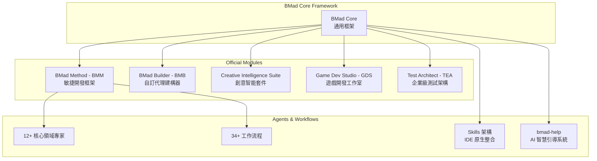
```mermaid
graph TB
    subgraph "BMad Core Framework"
        CORE[BMad Core<br/>通用框架]
    end
    
    subgraph "Official Modules"
        BMM[BMad Method - BMM<br/>敏捷開發框架]
        BMB[BMad Builder - BMB<br/>自訂代理建構器]
        CIS[Creative Intelligence Suite<br/>創意智能套件]
        GDS[Game Dev Studio - GDS<br/>遊戲開發工作室]
        TEA[Test Architect - TEA<br/>企業級測試架構]
    end
    
    subgraph "Agents & Workflows"
        AGENTS[12+ 核心領域專家]
        WORKFLOWS[34+ 工作流程]
        SKILLS[Skills 架構<br/>IDE 原生整合]
        HELP[bmad-help<br/>AI 智慧引導系統]
    end
    
    CORE --> BMM
    CORE --> BMB
    CORE --> CIS
    CORE --> GDS
    CORE --> TEA
    BMM --> AGENTS
    BMM --> WORKFLOWS
    CORE --> SKILLS
    CORE --> HELP
```

### 1.2 BMAD 與傳統開發流程的差異

#### 傳統開發流程的限制

| 面向 | 傳統方法 | 存在問題 |
|------|----------|----------|
| **需求分析** | 人工訪談、文件撰寫 | 耗時、容易遺漏 |
| **設計階段** | 單一架構師負責 | 知識瓶頸、單點故障 |
| **實作階段** | 開發者獨立作業 | AI 輔助零散、缺乏一致性 |
| **品質控管** | 後期測試為主 | 問題發現太晚、修復成本高 |

#### BMAD-METHOD 的革新

| 面向 | BMAD 方法 | 優勢 |
|------|-----------|------|
| **需求分析** | PM Agent + Analyst Agent 協作 | 結構化提問、自動整理需求 |
| **設計階段** | Architect Agent + UX Designer Agent | 多角度驗證、即時回饋 |
| **實作階段** | Developer Agent + Test Architect | AI 與人類協作、持續驗證 |
| **品質控管** | 全流程品質檢查點 | 早期發現、持續改進 |

#### 流程比較圖

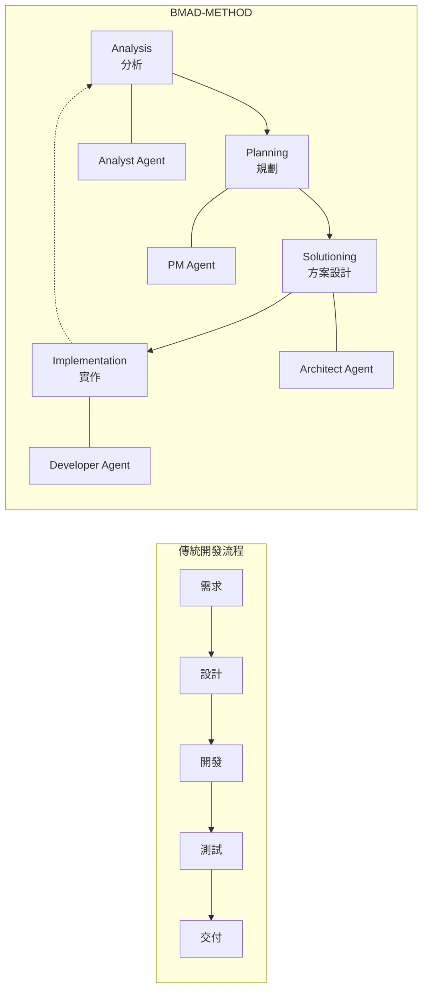
```mermaid
graph LR
    subgraph "傳統開發流程"
        T1[需求] --> T2[設計] --> T3[開發] --> T4[測試] --> T5[交付]
    end
    
    subgraph "BMAD-METHOD"
        B1[Analysis<br/>分析] --> B2[Planning<br/>規劃] --> B3[Solutioning<br/>方案設計] --> B4[Implementation<br/>實作]
        B4 -.-> B1
        
        B1 --- A1[Analyst Agent]
        B2 --- A2[PM Agent]
        B3 --- A3[Architect Agent]
        B4 --- A4[Developer Agent]
    end
```

### 1.3 為什麼 BMAD 特別適合 AI 協作開發

#### AI 協作的挑戰

在沒有方法論指導下使用 AI 協助開發，常見問題包括：

1. **上下文遺失**：AI 不了解專案全貌，產出不一致
2. **角色混淆**：一個 AI 同時扮演多種角色，品質下降
3. **流程斷裂**：各階段缺乏銜接，資訊傳遞失真
4. **品質不穩定**：缺乏驗證機制，錯誤層層累積

#### BMAD 如何解決這些問題

| 挑戰 | BMAD 解決方案 |
|------|---------------|
| 上下文遺失 | **漸進式上下文建構** - 每個階段的產出物自動成為下一階段的輸入，代理始終知道要建構什麼及為什麼 |
| 角色混淆 | **專業化代理** - 每個代理有明確角色定義與專長領域 |
| 流程斷裂 | **Workflow 引導** - 結構化流程，自動銜接各階段產出 |
| 品質不穩定 | **Checkpoint 機制** - 每個階段都有驗證點，確保品質 |
| 不知下一步 | **bmad-help 智慧引導** - AI 自動偵測專案進度，建議下一步行動 |

#### BMAD 的獨特優勢

```text
✨ 規模-領域自適應智能
   └─ 自動判斷專案複雜度、領域與類型，選擇適當的流程深度
   
✨ 專業化代理團隊
   └─ 12+ 個核心代理，各司其職，協同合作
   
✨ Skills 架構（IDE 原生整合）
   └─ 每個代理、工作流程、任務都是一個 IDE Skill，直接輸入名稱即可調用
   
✨ IDE 無縫整合
   └─ 支援 Claude Code、Cursor、Codex CLI、Kiro、VS Code 等
   
✨ AI 智慧引導
   └─ `bmad-help` 從安裝到完成全程引導
   
✨ Party Mode
   └─ 將多個代理帶入同一對話，協作求解
   
✨ 完全模組化
   └─ 透過 BMad Builder 自訂代理、工作流程、模組，支援 npm 發佈
```

#### 💼 實務案例：銀行系統開發

> **情境**：某銀行需要開發新的網路銀行轉帳功能
> 
> **傳統方式**：
> - SA 花 2 週撰寫需求規格
> - 架構師花 1 週設計系統架構
> - 開發團隊花 4 週實作
> - 測試團隊花 2 週測試
> - **總計**：約 9 週
> 
> **使用 BMAD**：
> - PM Agent + SA 協作 3 天完成需求分析
> - Architect Agent + 架構師 2 天完成架構設計
> - Developer Agent + 開發團隊 2 週完成實作
> - Test Architect + 測試團隊 1 週完成測試
> - **總計**：約 4 週
> 
> **效益**：開發時間縮短 55%，且品質更穩定

---

## 第二章：BMAD-METHOD 的核心概念

### 2.1 四大核心階段概覽

BMAD-METHOD 將軟體開發分為四大階段，每個階段都有專屬的代理、工作流程與產出物：

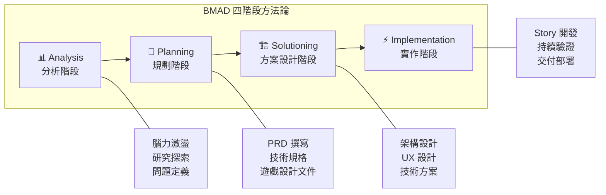
```mermaid
graph LR
    subgraph "BMAD 四階段方法論"
        A[📊 Analysis<br/>分析階段] --> P[📝 Planning<br/>規劃階段]
        P --> S[🏗️ Solutioning<br/>方案設計階段]
        S --> I[⚡ Implementation<br/>實作階段]
    end
    
    A --- AA["腦力激盪<br/>研究探索<br/>問題定義"]
    P --- PA["PRD 撰寫<br/>技術規格<br/>遊戲設計文件"]
    S --- SA["架構設計<br/>UX 設計<br/>技術方案"]
    I --- IA["Story 開發<br/>持續驗證<br/>交付部署"]
```

| 階段 | 英文 | 核心目標 | 主要代理 |
|------|------|----------|----------|
| **分析** | Analysis | 理解問題、探索可能性 | Analyst Agent |
| **規劃** | Planning | 定義需求、設定目標 | PM Agent |
| **方案設計** | Solutioning | 設計架構、技術方案 | Architect Agent |
| **實作** | Implementation | 開發、測試、交付 | Developer Agent |

### 2.2 Analysis（分析）階段

#### 階段目標

- 腦力激盪、研究探索
- 建立產品簡介（Product Brief）
- 記錄現有專案上下文
- 確立問題範圍與邊界

> ℹ️ **此階段為選用**，Quick Flow 可跳過此階段直接進入 Planning。

#### 核心活動與工作流程

| 工作流程 | 指令 | 代理 | 說明 |
|----------|------|------|------|
| Brainstorm Project | `BP` | Analyst (Mary) | 腦力激盪新專案點子 |
| Research | `RS` | Analyst (Mary) | 領域研究、市場研究、技術研究 |
| Create Brief | `CB` | Analyst (Mary) | 建立產品簡介 |
| Document Project | `DP` | Analyst (Mary) | 記錄現有專案上下文 |

#### 核心活動

```
📊 Analysis 階段核心活動
│
├── 1. 腦力激盪（Brainstorm Project）
│   ├── 探索專案點子
│   ├── 定義產品願景
│   └── 初步可行性評估
│
├── 2. 研究探索（Research）
│   ├── 領域研究
│   ├── 市場研究
│   └── 技術研究
│
├── 3. 建立產品簡介（Create Brief）
│   ├── 撰寫 Product Brief
│   ├── 定義問題陳述
│   └── 設定成功標準
│
└── 4. 記錄現有專案（Document Project）
    ├── 記錄專案上下文
    ├── 整理現有架構
    └── 標示改進機會
```

#### 關鍵產出物

| 產出物 | 說明 | BMAD 指令 |
|--------|------|----------|
| **Product Brief** | 產品簡介與願景 | `CB`（Create Brief） |
| **Research Notes** | 研究筆記與發現 | `RS`（Research） |
| **Project Context** | 現有專案上下文記錄 | `DP`（Document Project） |
| **Problem Statement** | 問題陳述與範圍定義 | 包含在 Product Brief 中 |

### 2.3 Planning（規劃）階段

#### 階段目標

- 建立產品需求文件（PRD）或技術規格（Tech Spec）
- 定義功能需求與驗收標準
- 建立 UX 設計（選用）
- 確立專案範圍與優先級

> ℹ️ **此階段為必要階段**，所有軌道都需要某種形式的規劃文件。

#### 核心活動與工作流程

| 工作流程 | 指令 | 代理 | 說明 |
|----------|------|------|------|
| Create PRD | `bmad-create-prd` | PM (John) | 建立產品需求文件 |
| Validate PRD | `VP` | PM (John) | 驗證 PRD 完整性 |
| Edit PRD | `EP` | PM (John) | 編輯現有 PRD |
| Create UX Design | `bmad-create-ux-design` | UX Designer (Sally) | UX 設計（選用） |
| Quick Spec | `bmad-quick-spec` | Quick-Flow Solo Dev (Barry) | Quick Flow 專用技術規格 |

#### 核心活動

```
� Planning 階段核心活動
│
├── 1. 建立 PRD（Create PRD）
│   ├── 功能需求定義
│   ├── 使用者故事撰寫
│   └── 驗收標準設定
│
├── 2. 驗證 PRD（Validate PRD）
│   ├── 需求完整性檢查
│   ├── 一致性驗證
│   └── 利害關係人確認
│
├── 3. UX 設計（Create UX Design）
│   ├── 使用者流程設計
│   ├── 介面原型
│   └── 互動設計
│
└── 4. Quick Spec（Quick Flow 專用）
    ├── 簡化技術規格
    ├── 快速需求定義
    └── 直接進入開發
```

#### 關鍵產出物

| 產出物 | 說明 | BMAD 指令 |
|--------|------|----------|
| **PRD** | 產品需求文件 | `bmad-create-prd` |
| **UX Design** | 使用者體驗設計 | `bmad-create-ux-design` |
| **Tech Spec** | 技術規格（Quick Flow） | `bmad-quick-spec` |
| **Validated PRD** | 驗證過的需求文件 | `VP`（Validate PRD） |

### 2.4 Solutioning（方案設計）階段

#### 階段目標

- 設計系統架構
- 建立 Epic 與 Story
- 進行實作準備度檢查
- 定義模組介面

> ℹ️ **BMad Method 與 Enterprise 軌道專用**，Quick Flow 可跳過此階段。

> ℹ️ **V6 改進**：Epic 與 Story 現在在架構設計之後建立，因為架構決策（資料庫、API 模式、技術栈）會直接影響工作拆分方式。

#### 核心活動與工作流程

| 工作流程 | 指令 | 代理 | 說明 |
|----------|------|------|------|
| Create Architecture | `bmad-create-architecture` | Architect (Winston) | 設計系統架構 |
| Create Epics and Stories | `bmad-create-epics-and-stories` | PM (John) | 拆分 PRD 為 Epic 與 Story |
| Implementation Readiness | `bmad-check-implementation-readiness` | Architect (Winston) | 驗證規劃一致性 |

#### 核心活動

```
🏗️ Solutioning 階段核心活動
│
├── 1. 架構設計（Create Architecture）
│   ├── 架構風格選擇
│   ├── 技術棧決策
│   └── 模組劃分與介面設計
│
├── 2. Epic 與 Story 建立（Create Epics and Stories）
│   ├── PRD 拆分為 Epic
│   ├── Epic 拆分為 Story
│   └── 依賴關係分析
│
├── 3. 實作準備度檢查（Implementation Readiness）
│   ├── 規劃一致性驗證
│   ├── 技術可行性確認
│   └── Story 完整性檢查
│
└── 4. 架構決策記錄
    ├── ADR 文件建立
    ├── 技術方案比較
    └── 非功能需求處理
```

> ℹ️ **V6 重要改進**：Epic 與 Story 現在在架構設計**之後**建立。因為架構決策（資料庫選型、API 模式、技術棧）會直接影響工作拆分方式，先完成架構再拆分 Story 更為合理。

#### 關鍵產出物

| 產出物 | 說明 | BMAD 指令 |
|--------|------|----------|
| **Architecture Doc** | 系統架構設計文件 | `bmad-create-architecture` |
| **Epic & Story** | 工作拆分與追蹤 | `bmad-create-epics-and-stories` |
| **Readiness Check** | 實作準備度報告 | `bmad-check-implementation-readiness` |
| **ADR** | 架構決策記錄 | 包含在架構文件中 |

### 2.5 Implementation（實作）階段

#### 階段目標

- Sprint 規劃與執行
- Story 開發與實作
- 程式碼審查
- 持續測試與交付

#### 核心活動與工作流程

| 工作流程 | 指令 | 代理 | 說明 |
|----------|------|------|------|
| Sprint Planning | `bmad-sprint-planning` | Scrum Master (Bob) | 初始化 Sprint 追蹤 |
| Create Story | `bmad-create-story` | Scrum Master (Bob) | 建立 Story 檔案 |
| Dev Story | `bmad-dev-story` | Developer (Amelia) | 實作 Story |
| Code Review | `bmad-code-review` | Developer (Amelia) | 程式碼審查 |
| QA Automate | `QA` | QA (Quinn) | 自動化測試 |
| Correct Course | `bmad-correct-course` | PM (John) | 處理範圍變更 |

#### 核心活動

```
⚡ Implementation 階段核心活動
│
├── 1. Sprint 規劃與管理
│   ├── Sprint Planning（初始化追蹤）
│   ├── Story 檔案建立
│   └── 優先順序排定
│
├── 2. Story 開發
│   ├── Dev Story（逐一實作）
│   ├── 程式碼撰寫
│   └── Code Review
│
├── 3. 測試與品質
│   ├── QA 自動化測試
│   ├── 持續整合驗證
│   └── 品質標準檢查
│
└── 4. 範圍管理
    ├── Correct Course（範圍變更處理）
    ├── Story 調整與重排
    └── 迭代回饋收集
```

#### 關鍵產出物

| 產出物 | 說明 | BMAD 指令 |
|--------|------|----------|
| **Sprint Backlog** | Sprint 追蹤文件 | `bmad-sprint-planning` |
| **Story Files** | 個別 Story 實作檔案 | `bmad-create-story` |
| **Working Code** | 已審查的程式碼 | `bmad-dev-story` |
| **Test Results** | 自動化測試結果 | `QA`（QA Automate） |

### 2.6 各階段的目標、輸入與輸出

#### 完整階段對照表

| 階段 | 輸入（Input） | 活動（Activities） | 輸出（Output） | 負責代理 |
|------|--------------|-------------------|---------------|----------|
| **Analysis** | 專案點子、市場資訊 | 腦力激盪、研究探索 | Product Brief、研究筆記 | Analyst (Mary) |
| **Planning** | Product Brief、需求 | PRD 撰寫、UX 設計 | PRD、Tech Spec、UX Design | PM (John) |
| **Solutioning** | PRD、技術需求 | 架構設計、工作拆分 | 架構文件、Epic & Story | Architect (Winston) |
| **Implementation** | 架構、Story | Sprint 開發、測試 | 可執行系統、測試報告 | Developer (Amelia) |

#### 階段間的銜接流程

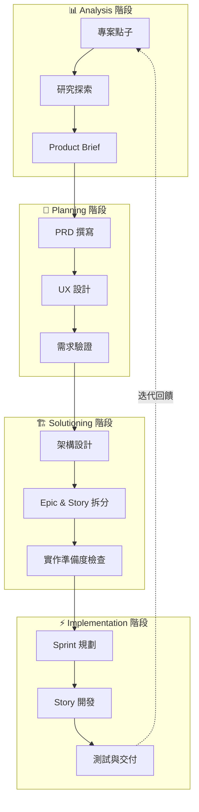
```mermaid
flowchart TD
    subgraph Analysis["📊 Analysis 階段"]
        B1[專案點子] --> B2[研究探索]
        B2 --> B3[Product Brief]
    end
    
    subgraph Planning["📝 Planning 階段"]
        M1[PRD 撰寫] --> M2[UX 設計]
        M2 --> M3[需求驗證]
    end
    
    subgraph Solutioning["🏗️ Solutioning 階段"]
        A1[架構設計] --> A2[Epic & Story 拆分]
        A2 --> A3[實作準備度檢查]
    end
    
    subgraph Implementation["⚡ Implementation 階段"]
        D1[Sprint 規劃] --> D2[Story 開發]
        D2 --> D3[測試與交付]
    end
    
    B3 --> M1
    M3 --> A1
    A3 --> D1
    
    D3 -.->|迭代回饋| B1
```

#### 💼 實務案例：銀行貸款申請系統

> **Analysis 階段產出**：
> - Product Brief：「客戶申請貸款流程繁瑣，平均需要 5 個工作天」
> - 成功標準：「將貸款申請時間縮短至 1 個工作天」
> 
> **Planning 階段產出**：
> - PRD（包含功能需求、使用者故事、驗收標準）
> - UX 設計（申請流程圖、介面原型）
> 
> **Solutioning 階段產出**：
> - 系統架構圖（前端、後端、資料庫、外部徵信系統整合）
> - Epic & Story 拆分（含依賴關係與估算）
> 
> **Implementation 階段產出**：
> - 可上線的貸款申請系統
> - 使用者操作手冊
> - 系統維運文件

### 2.7 安裝與設定指南

#### 環境需求

| 項目 | 需求 | 說明 |
|------|------|------|
| **Node.js** | v20+ | 執行 BMAD CLI 所需 |
| **npm/npx** | 隨 Node.js 安裝 | 套件管理工具 |
| **IDE** | Claude Code / Cursor / Codex CLI / Kiro 等 | 支援 AI 代理互動的 IDE |

#### 安裝步驟

```bash
# 步驟 1：確認 Node.js 版本
node --version  # 需要 v20 以上

# 步驟 2：進入專案目錄
cd your-project

# 步驟 3：執行安裝
npx bmad-method install

# 安裝過程會引導你選擇：
# 1. 目標 IDE（Claude Code / Cursor / Codex CLI / Kiro 等）
# 2. 要安裝的模組（BMM、BMB、CIS、GDS、TEA）
# 3. 配置選項
```

> 💡 **Skills 架構**：安裝完成後，BMAD 會根據你選擇的模組，為每個代理、工作流程、任務產生對應的 Skill 檔案。Skill 是 IDE 原生整合的進入點，直接輸入 Skill 名稱（如 `bmad-help`）即可啟動對應功能。

#### 安裝後的專案結構

```
📁 your-project/
├── 📂 _bmad/                          # BMAD 核心資料夾
│   ├── 📂 agents/                     # AI 代理定義檔
│   ├── 📂 workflows/                  # 工作流程定義
│   ├── 📂 checklists/                 # 檢查清單
│   ├── 📂 templates/                  # 文件範本
│   ├── 📂 tasks/                      # 獨立任務定義
│   ├── 📂 tools/                      # 工具定義
│   └── 📄 project-context.md          # 專案上下文（自動產生或手動建立）
├── 📂 _bmad-output/                   # BMAD 產出物資料夾
│   ├── 📂 planning-artifacts/         # 規劃階段產出
│   │   ├── 📄 product-brief.md        # 產品簡介
│   │   ├── 📄 prd.md                  # 產品需求文件
│   │   ├── 📄 ux-design.md            # UX 設計
│   │   └── 📄 architecture.md         # 架構設計文件
│   └── 📂 implementation-artifacts/   # 實作階段產出
│       ├── 📄 epic-*.md               # Epic 與 Story 檔案
│       ├── 📄 sprint-backlog.md       # Sprint 追蹤
│       └── 📄 story-*.md              # 個別 Story 檔案
├── 📂 .claude/skills/                 # Skills 檔案（Claude Code 範例）
│   ├── 📂 bmad-help/
│   │   └── 📄 SKILL.md
│   ├── 📂 bmad-create-prd/
│   │   └── 📄 SKILL.md
│   ├── 📂 bmad-dev/
│   │   └── 📄 SKILL.md
│   └── ...
└── 📄 （你的專案檔案）
```

> ℹ️ **Skills 目錄依 IDE 而異**：Claude Code 使用 `.claude/skills/`，Cursor 使用 `.cursor/skills/`。每個 Skill 是一個包含 `SKILL.md` 的目錄，目錄名即為 Skill 名稱。

#### 首次使用

安裝完成後，在 IDE 中輸入 `bmad-help` 啟動 AI 智慧引導系統：

```
bmad-help

# bmad-help 會：
# 1. 檢視你的專案狀態（已有哪些產出物）
# 2. 推薦適合的下一步行動
# 3. 根據已安裝的模組顯示可用選項
# 4. 理解自然語言提問，解答任何 BMAD 相關問題
```

> 💡 **bmad-help 是你的智慧引導**：它不只是查詢工具，更是一個能檢視專案、理解你的問題、並推薦最佳下一步的 AI 助手。每個工作流程結束後也會自動提示下一步建議。

#### Skills 與 Agent Menu Trigger 的區別

BMAD 提供兩種啟動工作的方式：

| 類型 | 使用方式 | 說明 |
|------|----------|------|
| **Skill** | 在 IDE 中直接輸入 Skill 名稱（如 `bmad-help`） | 直接載入代理、執行工作流程或任務 |
| **Agent Menu Trigger** | 先載入代理，再輸入短碼（如 `DS`） | 代理解釋短碼並啟動對應工作流程 |

```text
💡 何時使用 Skill vs Trigger？

使用 Skill 當...
├── 你知道要執行哪個工作流程
├── 你想直接啟動某個代理
└── 你不在任何代理對話中

使用 Agent Menu Trigger 當...
├── 你已經在與某個代理對話
├── 你想在同一對話中切換任務
└── 你想保持代理角色持續性
```

### 2.8 官方模組總覽

BMAD-METHOD v6 採用模組化架構，目前提供 **5 個官方模組**：

| 模組 | 縮寫 | 說明 | npm 套件 | 狀態 |
|------|------|------|----------|------|
| **BMad Method** | BMM | 核心敏捷開發模組，包含 34+ 工作流程、9 個命名代理 | `bmad-method` | ✅ 穩定 |
| **BMad Builder** | BMB | 自訂代理、工作流程、模組的建構工具，支援 npm 發佈 | [`bmad-builder`](https://www.npmjs.com/package/bmad-builder) | ✅ 穩定 |
| **Creative Intelligence Suite** | CIS | AI 創意智慧套件，提供腦力激盪、設計思考、問題解決代理 | [`bmad-creative-intelligence-suite`](https://www.npmjs.com/package/bmad-creative-intelligence-suite) | ✅ 穩定 |
| **Game Dev Studio** | GDS | 遊戲開發專用模組，支援 Unity、Unreal、Godot 等引擎 | [`bmad-game-dev-studio`](https://www.npmjs.com/package/bmad-game-dev-studio) | ✅ 穩定 |
| **Test Architect** | TEA | 企業級測試架構，風險導向優先排序與需求追溯 | [`bmad-method-test-architecture-enterprise`](https://www.npmjs.com/package/bmad-method-test-architecture-enterprise) | ✅ 穩定 |

#### BMM 核心代理一覽

| 代理 | 角色名 | Skill ID | 觸發指令 | 主要職責 |
|------|--------|----------|----------|----------|
| **Analyst** | Mary | `bmad-analyst` | BP, RS, CB, DP | 腦力激盪、研究、建立 Brief、記錄專案 |
| **PM** | John | `bmad-pm` | CP, VP, EP, CE, IR, CC | PRD 管理、需求驗證、範圍控制 |
| **Architect** | Winston | `bmad-architect` | CA, IR | 架構設計、實作準備度檢查 |
| **Developer** | Amelia | `bmad-dev` | DS, CR | Story 實作、程式碼審查 |
| **UX Designer** | Sally | `bmad-ux-designer` | CU | 使用者體驗設計 |
| **Scrum Master** | Bob | `bmad-sm` | SP, CS, ER, CC | Sprint 管理、Story 追蹤、Epic 回顧 |
| **Tech Writer** | Paige | `bmad-tech-writer` | DP, WD, US, MG, VD, EC | 技術文件、Mermaid 圖表產生、文件驗證 |
| **QA** | Quinn | `bmad-qa` | QA | 輕量級測試自動化 |
| **Quick-Flow Solo Dev** | Barry | `bmad-master` | QS, QD, CR | Quick Flow 快速開發專用整合代理 |

> 💡 **模組安裝是可選的**：你可以只安裝 BMM（核心模組），之後再按需添加其他模組。

### 2.9 Skills 架構深入解說

#### 什麼是 Skills？

BMAD v6 引入了 **Skills 架構**，這是與 IDE 整合的核心機制。每個代理、工作流程、任務和工具都被封裝為一個 Skill，透過 IDE 的原生 Skill 支援直接調用。

```text
💡 Skills 的核心概念：

Skill ≠ Slash Command

在 v6 之前，BMAD 使用 slash commands（如 /bmad-bmm-create-prd）。
v6 開始，所有互動都透過 Skills 進行：
- 不需要 "/" 前綴
- 不需要 "bmm" 中綴
- 直接輸入 skill 名稱即可（如 bmad-create-prd）
```

#### Skill 的四種類型

| 類型 | 說明 | 範例 |
|------|------|------|
| **Agent Launcher** | 載入代理人格、啟動菜單、維持角色 | `bmad-dev`、`bmad-pm`、`bmad-architect` |
| **Workflow Skill** | 載入工作流程配置，依步驟執行 | `bmad-create-prd`、`bmad-create-architecture` |
| **Task Skill** | 載入獨立任務檔案並執行 | `bmad-shard-doc`、`bmad-index-docs` |
| **Tool Skill** | 載入工具檔案並執行 | `bmad-editorial-review-prose` |

#### Skill 的生命週期

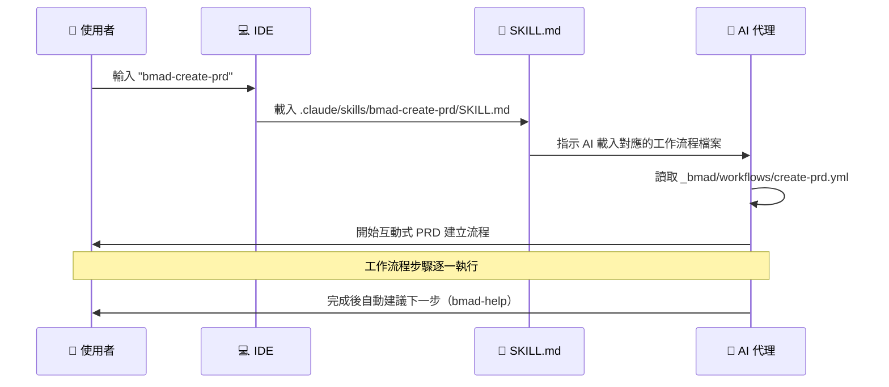
```mermaid
sequenceDiagram
    participant U as 👤 使用者
    participant IDE as 💻 IDE
    participant S as 📄 SKILL.md
    participant A as 🤖 AI 代理

    U->>IDE: 輸入 "bmad-create-prd"
    IDE->>S: 載入 .claude/skills/bmad-create-prd/SKILL.md
    S->>A: 指示 AI 載入對應的工作流程檔案
    A->>A: 讀取 _bmad/workflows/create-prd.yml
    A->>U: 開始互動式 PRD 建立流程
    Note over U,A: 工作流程步驟逐一執行
    A->>U: 完成後自動建議下一步（bmad-help）
```

#### Skill 檔案結構

每個 Skill 是一個包含 `SKILL.md` 的目錄：

```
📂 .claude/skills/          # Claude Code 範例
├── 📂 bmad-help/
│   └── 📄 SKILL.md         # "載入 _bmad/tasks/bmad-help.md 並執行"
├── 📂 bmad-dev/
│   └── 📄 SKILL.md         # "載入 _bmad/agents/developer.md 並維持角色"
├── 📂 bmad-create-prd/
│   └── 📄 SKILL.md         # "載入 _bmad/workflows/create-prd.yml 並執行"
├── 📂 bmad-shard-doc/
│   └── 📄 SKILL.md         # "載入 _bmad/tasks/shard-doc.md 並執行"
└── ...
```

> ℹ️ **不同 IDE 的 Skill 目錄位置不同**：
> | IDE | Skill 目錄 |
> |-----|-----------|
> | Claude Code | `.claude/skills/` |
> | Cursor | `.cursor/skills/` |
> | 其他 IDE | 參考安裝輸出 |

#### Skill 與 Agent Menu Trigger 的互動

當你載入一個 Agent Skill 後，就進入了該代理的「角色模式」。此時可以使用 Agent Menu Trigger 來切換工作流程，而不需要離開對話：

```text
使用者輸入：bmad-pm              ← 載入 PM Agent (John)

John 回應：
  我是 John，你的產品經理。以下是我可以協助你的工作：
  
  CP - Create PRD（建立產品需求文件）
  VP - Validate PRD（驗證 PRD）
  EP - Edit PRD（編輯 PRD）
  CE - Create Epics and Stories（建立 Epic 與 Story）
  IR - Implementation Readiness（實作準備度檢查）
  CC - Correct Course（範圍變更處理）
  
  請問需要我執行哪項工作？

使用者輸入：CP                   ← 觸發 Create PRD 工作流程

John 開始：好的，讓我們開始建立 PRD...
```

#### 觸發類型詳解

| 觸發類型 | 特性 | 範例 |
|----------|------|------|
| **Workflow Trigger**（無需參數） | 載入結構化工作流程，逐步引導 | `CP`（Create PRD）、`DS`（Dev Story）、`CA`（Create Architecture） |
| **Conversational Trigger**（需要參數） | 啟動自由對話，需描述需求 | `WD`（Write Document）、`MG`（Mermaid Generate）、`EC`（Explain Concept） |

**Conversational Trigger 範例（Tech Writer Paige）**：

```text
使用者輸入：bmad-tech-writer      ← 載入 Tech Writer Agent (Paige)
使用者輸入：WD 撰寫一份 Docker 部署指南
使用者輸入：MG 建立一個顯示認證流程的序列圖
使用者輸入：EC 解釋模組系統如何運作
```

#### 完整 Skill 快速參考表

##### Agent Skills

| Skill 名稱 | 代理 | 角色名 | 說明 |
|-------------|------|--------|------|
| `bmad-analyst` | Analyst | Mary | 分析、研究、腦力激盪 |
| `bmad-pm` | Product Manager | John | PRD 管理、需求驗證 |
| `bmad-architect` | Architect | Winston | 架構設計、技術決策 |
| `bmad-dev` | Developer | Amelia | Story 實作、程式碼審查 |
| `bmad-ux-designer` | UX Designer | Sally | 使用者體驗設計 |
| `bmad-sm` | Scrum Master | Bob | Sprint 管理、Story 追蹤 |
| `bmad-tech-writer` | Technical Writer | Paige | 文件撰寫、圖表產生 |
| `bmad-qa` | QA Engineer | Quinn | 測試自動化 |
| `bmad-master` | Quick-Flow Solo Dev | Barry | Quick Flow 整合代理 |

##### Workflow Skills

| Skill 名稱 | 說明 | 對應階段 |
|-------------|------|----------|
| `bmad-create-prd` | 建立產品需求文件 | Planning |
| `bmad-create-architecture` | 設計系統架構 | Solutioning |
| `bmad-create-epics-and-stories` | 建立 Epic 與 Story | Solutioning |
| `bmad-dev-story` | 實作 Story | Implementation |
| `bmad-code-review` | 程式碼審查 | Implementation |
| `bmad-quick-spec` | Quick Flow 技術規格 | Planning（Quick Flow） |
| `bmad-create-ux-design` | UX 設計 | Planning |
| `bmad-sprint-planning` | Sprint 規劃 | Implementation |
| `bmad-correct-course` | 範圍變更處理 | Implementation |

##### Task & Tool Skills

| Skill 名稱 | 說明 |
|-------------|------|
| `bmad-help` | AI 智慧引導助手（推薦的第一個指令） |
| `bmad-shard-doc` | 將大型 Markdown 文件拆分為小節 |
| `bmad-index-docs` | 索引專案文件 |
| `bmad-editorial-review-prose` | 審查文件散文品質 |

### 2.10 專案上下文管理（Project Context）

#### 什麼是 project-context.md？

`project-context.md` 是 BMAD v6 中的重要概念，它是一份自動產生的專案概覽文件，讓 AI 代理能快速理解你的專案狀態。

```
📁 _bmad/
└── 📄 project-context.md    # 專案上下文概覽
```

#### 包含的資訊

| 類別 | 說明 |
|------|------|
| **專案基本資訊** | 專案名稱、描述、技術棧 |
| **檔案結構** | 重要目錄與檔案的說明 |
| **API 概覽** | 主要 API 端點與用途 |
| **資料模型** | 核心實體與關係 |
| **建構與部署** | 建構指令、部署流程 |
| **團隊約定** | 命名慣例、程式碼風格 |

#### 使用方式

```text
# 方式一：自動產生
bmad-generate-project-context

# 方式二：手動建立
在 _bmad/ 目錄下建立 project-context.md

# 方式三：Document Project 工作流程
使用 Analyst (Mary) 的 DP trigger 記錄現有專案
```

> 💡 **為什麼 Project Context 很重要？**  
> AI 代理在每次互動時都會參考 `project-context.md`，這確保了它們始終了解你的專案背景，而不需要你每次都重新解釋。這對 Brownfield（既有系統）專案尤其重要。

### 2.11 官方模組深入解說

#### BMM — BMAD Method Module（核心模組）

BMM 是 BMAD 的核心模組，包含所有基礎代理、工作流程、檢查清單與範本。安裝 BMAD 時預設即安裝此模組。

```
📦 bmad-method（BMM 核心模組）
├── 📂 agents/          ← 9 個核心代理定義
│   ├── analyst.md          # Mary — 分析師
│   ├── pm.md               # John — 產品經理
│   ├── architect.md        # Winston — 架構師
│   ├── developer.md        # Amelia — 開發者
│   ├── ux-designer.md      # Sally — UX 設計師
│   ├── scrum-master.md     # Bob — Scrum Master
│   ├── tech-writer.md      # Paige — 技術文件撰寫者
│   ├── qa.md               # Quinn — QA 工程師
│   └── master.md           # Barry — Quick-Flow Solo Dev
├── 📂 workflows/       ← 34+ 個工作流程定義
│   ├── create-prd.yml
│   ├── create-architecture.yml
│   ├── create-epics-and-stories.yml
│   ├── dev-story.yml
│   ├── code-review.yml
│   └── ...
├── 📂 checklists/      ← 驗證檢查清單
├── 📂 templates/       ← 文件範本
├── 📂 tasks/           ← 獨立任務定義
└── 📂 tools/           ← 工具定義
```

#### BMB — BMAD Builder Module（建造者模組）

BMB 讓你能夠**客製化**自己的代理、工作流程和模組。這是進階使用者的利器。

```
📦 bmad-builder（BMB 建造者模組）
├── 🤖 Agent Builder     ← 建立自定義代理
├── 🔄 Workflow Builder  ← 建立自定義工作流程
└── 📦 Module Builder    ← 打包為可分享的模組
```

**Agent Builder 使用範例**：

```text
使用者：bmad-agent-builder

Builder：好的，讓我們建立一個新的代理。請告訴我：
1. 代理名稱？
2. 角色描述？
3. 專長領域？
4. 核心工作流程？

使用者：
1. Security Reviewer
2. 負責審查系統安全設計
3. OWASP、資安合規、滲透測試
4. Security-Review、Threat-Modeling

Builder：正在建立代理定義檔...
✅ agents/security-reviewer.md 已建立
✅ workflows/security-review.yml 已建立
✅ workflows/threat-modeling.yml 已建立
✅ skills/bmad-security-reviewer/ 已建立
```

**適用場景**：
| 需求 | 使用的 Builder |
|------|---------------|
| 團隊有特殊角色需求 | Agent Builder |
| 現有工作流程不符合需求 | Workflow Builder |
| 要將客製化內容分享給其他團隊 | Module Builder |

#### CIS — Creative Intelligence Suite（創意智能套件）

CIS 模組加入了六個創意導向的代理，適合產品創新、設計思維、問題解決等場景。

| 代理 | 說明 |
|------|------|
| **Innovation Strategist** | 創新策略規劃 |
| **Design Thinking Coach** | 設計思維引導 |
| **Brainstorming Coach** | 腦力激盪主持 |
| **Problem Solver** | 結構化問題解決 |
| **Storyteller** | 產品故事撰寫 |
| **Presentation Master** | 簡報設計與優化 |

```bash
# 安裝 CIS 模組
npx bmad-creative-intelligence-suite install
```

**適用場景**：
- 產品早期構想階段
- 設計衝刺（Design Sprint）
- 內部提案與簡報準備
- 創意工作坊引導

#### GDS — Game Dev Studio（遊戲開發工作室）

GDS 模組專為遊戲開發設計，支援 21+ 種遊戲類型。

| 功能 | 說明 |
|------|------|
| **GDD 產生器** | 自動產生遊戲設計文件 |
| **Quick Dev 遊戲版** | 快速遊戲原型開發 |
| **Narrative Designer** | 遊戲敘事設計 |
| **Game Type Templates** | 21+ 種遊戲類型範本 |

```bash
# 安裝 GDS 模組
npx bmad-game-dev-studio install
```

**支援的遊戲類型範例**：
- 2D 平台遊戲、3D 冒險遊戲
- 回合制 RPG、即時戰略
- 解謎遊戲、視覺小說
- 多人連線、模擬經營
- 更多...

#### TEA — Test Enterprise Architecture（企業測試架構模組）

TEA 模組為企業級測試自動化提供完整的框架與工具。

| 功能 | 說明 |
|------|------|
| **Murat Agent** | 企業測試架構專家代理 |
| **9 個測試工作流程** | 涵蓋完整測試生命週期 |
| **ATDD 支援** | 驗收測試驅動開發 |
| **P0-P3 優先級** | 四級測試優先級管理 |

```bash
# 安裝 TEA 模組
npx bmad-method-test-architecture-enterprise install
```

**TEA 的測試優先級系統**：

| 優先級 | 說明 | 觸發時機 |
|--------|------|----------|
| **P0** | 冒煙測試（Smoke Test） | 每次部署 |
| **P1** | 核心功能測試 | 每次提交 |
| **P2** | 完整回歸測試 | 每日建構 |
| **P3** | 探索性測試 | Sprint 結束 |

> 💡 **模組選擇建議**
> 
> | 你的專案類型 | 建議安裝的模組 |
> |-------------|---------------|
> | 一般網頁/App 開發 | BMM（核心）|
> | 產品創新/設計階段 | BMM + CIS |
> | 遊戲開發 | BMM + GDS |
> | 企業級/合規專案 | BMM + TEA |
> | 需要客製化 | BMM + BMB |
> | 全功能 | BMM + BMB + TEA |

### 2.12 Quick Flow 完整實戰指南

Quick Flow 是 BMAD 中最快速的開發軌道，適合小型修復和簡單功能。由 Barry（Quick-Flow Solo Dev）主導，整合分析、規劃與實作的能力。

#### Quick Flow 完整流程

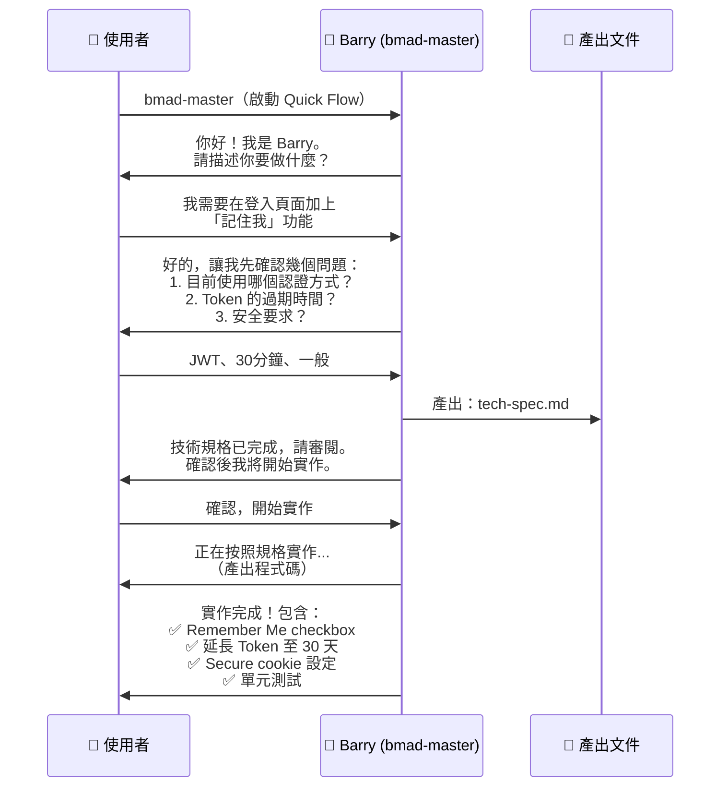
```mermaid
sequenceDiagram
    participant U as 👤 使用者
    participant B as 🤖 Barry (bmad-master)
    participant F as 📄 產出文件
    
    U->>B: bmad-master（啟動 Quick Flow）
    B->>U: 你好！我是 Barry。<br/>請描述你要做什麼？
    
    U->>B: 我需要在登入頁面加上<br/>「記住我」功能
    B->>U: 好的，讓我先確認幾個問題：<br/>1. 目前使用哪個認證方式？<br/>2. Token 的過期時間？<br/>3. 安全要求？
    
    U->>B: JWT、30分鐘、一般
    B->>F: 產出：tech-spec.md
    B->>U: 技術規格已完成，請審閱。<br/>確認後我將開始實作。
    
    U->>B: 確認，開始實作
    B->>U: 正在按照規格實作...<br/>（產出程式碼）
    B->>U: 實作完成！包含：<br/>✅ Remember Me checkbox<br/>✅ 延長 Token 至 30 天<br/>✅ Secure cookie 設定<br/>✅ 單元測試
```

#### Quick Flow vs 標準 BMad Method

| 面向 | Quick Flow | BMad Method |
|------|-----------|-------------|
| **啟動方式** | `bmad-master` 或 `bmad-quick-spec` | `bmad-help` → 選擇軌道 |
| **代理數量** | 1（Barry 整合全部） | 6-9 個專業代理 |
| **產出文件** | 技術規格 | PRD + 架構 + UX + Epic/Story |
| **品質檢查** | 1 次 | 3-4 次 |
| **適用範圍** | Bug 修復、< 1 天工作量 | 新產品、多功能模組 |

#### 何時從 Quick Flow 升級為 BMad Method？

```text
🚦 升級信號

以下情況建議從 Quick Flow 升級為完整 BMad Method：

🔴 必須升級：
├── 需要修改 3+ 個模組
├── 涉及資料庫 schema 變更
├── 需要多人協作
└── 有安全/合規要求

🟡 建議升級：
├── 工作量超過 1 天
├── 需求不夠明確
├── 涉及外部系統整合
└── 需要 UX 設計

🟢 繼續 Quick Flow：
├── Bug 修復
├── 文案修改
├── 簡單功能添加
└── 技術方案已明確
```

### 2.13 Dev Loop 自動化開發循環

Dev Loop 是 BMAD v6 中 Implementation 階段的核心概念，它將 Story 開發自動化為一個可重複的循環。

#### Dev Loop 流程

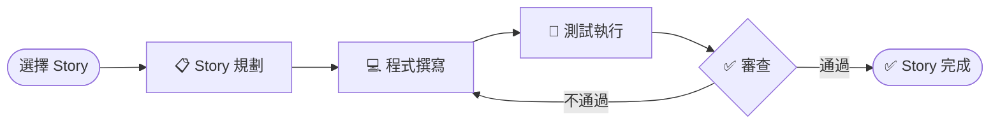
```mermaid
flowchart LR
    START([選擇 Story]) --> PLAN[📋 Story 規劃]
    PLAN --> CODE[💻 程式撰寫]
    CODE --> TEST[🧪 測試執行]
    TEST --> REVIEW{✅ 審查}
    REVIEW -->|通過| DONE([✅ Story 完成])
    REVIEW -->|不通過| CODE
```

每一個 Story 的開發都遵循這個循環：

| 步驟 | 操作 | 代理 | Skill/Trigger |
|------|------|------|---------------|
| 1. 選擇 Story | 從 Sprint Backlog 選擇 | Bob (SM) | `SP` (Sprint Planning) |
| 2. Story 規劃 | 細化技術方案 | Amelia (Dev) | `DS` (Dev Story) |
| 3. 程式撰寫 | 按 Story 規格實作 | Amelia (Dev) | `bmad-dev-story` |
| 4. 測試執行 | 撰寫並執行測試 | Quinn (QA) | `bmad-qa` |
| 5. 程式碼審查 | 審查程式碼品質 | Amelia (Dev) | `bmad-code-review` |

#### Dev Loop 實際操作範例

```text
# Step 1：載入 Scrum Master，進行 Sprint 規劃
bmad-sm
使用者：SP
Bob：根據 Epic 優先級，建議的 Sprint Backlog 如下：
  Story CC-001: 基本資料填寫表單 (3 pts)
  Story CC-002: 上傳身分證照片 (2 pts)
  Story CC-003: eKYC 身分驗證整合 (5 pts)
  
使用者：確認，開始 CC-001

# Step 2：切換到 Developer，開始 Story 開發
bmad-dev
使用者：DS（Dev Story 工作流程）
Amelia：好的，我來規劃 CC-001 的實作方案...
  ├── 建立 React 表單元件
  ├── 實作表單驗證邏輯
  ├── 建立 API 端點
  └── 撰寫單元測試

使用者：開始實作
Amelia：[產出程式碼]

# Step 3：測試
bmad-qa
Quinn：讓我為 CC-001 建立測試計畫...
  ├── 表單欄位驗證測試
  ├── API 端點測試
  └── 整合測試

# Step 4：程式碼審查
bmad-dev
使用者：CR（Code Review）
Amelia：審查結果：
  ✅ 程式碼結構良好
  ⚠️ 建議：新增 XSS 防護
  ✅ 測試覆蓋率：85%
  
# Step 5：完成 Story，回到 Sprint
bmad-sm
使用者：更新 CC-001 為完成
Bob：CC-001 已標記完成。Sprint 進度：1/3 Stories 完成。
  下一個建議：CC-002（上傳身分證照片）
```

### 2.14 新增工作流程參考

BMAD v6 新增了數個實用的工作流程，以下是重要的新增項目：

#### Sprint Status（Sprint 狀態查看）

```text
bmad-sm
使用者：SS（Sprint Status）

Bob：📊 Sprint 5 狀態報告
━━━━━━━━━━━━━━━━━━━━━━━━
進度：4/8 Stories 完成 (50%)
速率：12 pts 已完成 / 24 pts 規劃
剩餘天數：5 天

Story 狀態：
✅ CC-001 基本資料表單 (3 pts) — 完成
✅ CC-002 上傳身分證 (2 pts) — 完成
✅ CC-003 eKYC 整合 (5 pts) — 完成
✅ CC-004 查詢進度 (2 pts) — 完成
🔄 CC-005 聯徵查詢 (5 pts) — 進行中
📋 CC-006 信用評分 (3 pts) — 待辦
📋 CC-007 核准通知 (2 pts) — 待辦
📋 CC-008 婉拒通知 (2 pts) — 待辦

⚠️ 風險：CC-005 聯徵整合遇到 API 延遲問題
建議：考慮將 CC-007 和 CC-008 合併處理
```

#### Epic Retrospective（Epic 回顧）

```text
bmad-sm
使用者：ER（Epic Retrospective）

Bob：📋 Epic CC 回顧報告
━━━━━━━━━━━━━━━━━━━━━━━━

🟢 做得好的：
├── PRD 定義明確，減少返工
├── 架構設計選型正確
└── Dev Loop 執行順暢

🔴 需要改進的：
├── 聯徵 API 整合測試不足
├── UX 審核太晚介入
└── 部分 Story 估算偏低

📊 數據摘要：
├── 計畫 Story Points：24
├── 實際 Story Points：28 (+17%)
├── Sprint 數量：4
└── Bug 數量：3（已修復）

💡 行動項目：
├── 建立外部 API 整合測試規範
├── UX 審核前移至 Solutioning 階段
└── 改善估算校準流程
```

#### Correct Course（範圍變更處理）

```text
bmad-pm
使用者：CC（Correct Course）

John：📋 範圍變更評估
━━━━━━━━━━━━━━━━━━━━━━━━
請描述變更需求。

使用者：業務單位要求新增「共同申請人」功能

John：讓我評估此變更的影響...

📋 變更影響分析：

影響範圍：
├── PRD：需新增 Section 4.5
├── 架構：資料模型需變更
├── Epic CC：需新增 3 個 Story
└── 測試：需更新整合測試

工作量估算：
├── 分析/規劃：0.5 天
├── 架構調整：1 天
├── 開發實作：3 天
├── 測試驗證：1 天
└── 總計：5.5 天

建議選項：
A. 加入當前 Sprint（延後 CC-007, CC-008）
B. 排入下一個 Sprint
C. 建立獨立 Epic 處理

請選擇或提供替代方案。
```

#### Generate Project Context（產生專案上下文）

```text
bmad-generate-project-context

AI：正在掃描專案結構...

📄 project-context.md 已產生

包含內容：
├── 📂 專案結構摘要（18 個主要目錄、142 個檔案）
├── 🛠️ 技術棧（React 18、Spring Boot 3.2、PostgreSQL 15）
├── 📡 API 端點摘要（32 個端點、5 個控制器）
├── 📊 資料模型摘要（12 個實體、8 個關係）
├── 🔧 建構指令（Maven build、Docker compose）
├── 📝 團隊約定（命名慣例、程式碼風格）
└── 📋 現有文件索引
```

---

## 第三章：BMAD-METHOD 整體流程說明

### 3.1 從需求發想到交付的完整流程

#### BMAD 完整開發流程圖

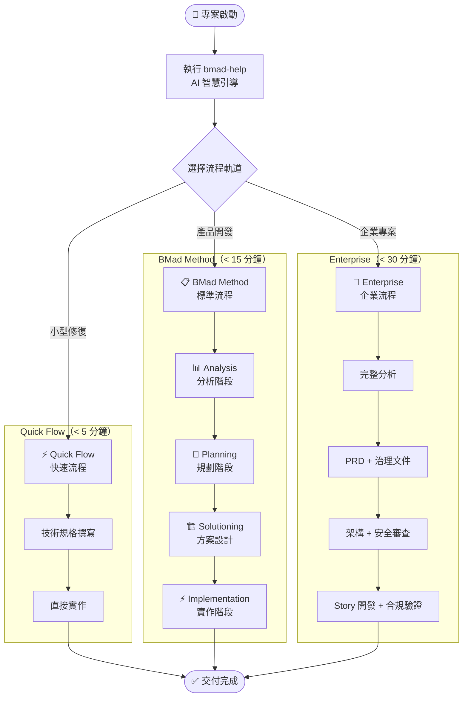
```mermaid
flowchart TB
    START([🚀 專案啟動]) --> INIT[執行 bmad-help<br/>AI 智慧引導]
    
    INIT --> TRACK{選擇流程軌道}
    
    TRACK -->|小型修復| QUICK[⚡ Quick Flow<br/>快速流程]
    TRACK -->|產品開發| METHOD[📋 BMad Method<br/>標準流程]
    TRACK -->|企業專案| ENTERPRISE[🏢 Enterprise<br/>企業流程]
    
    subgraph "Quick Flow（< 5 分鐘）"
        QUICK --> Q1[技術規格撰寫]
        Q1 --> Q2[直接實作]
    end
    
    subgraph "BMad Method（< 15 分鐘）"
        METHOD --> M1[📊 Analysis<br/>分析階段]
        M1 --> M2[📝 Planning<br/>規劃階段]
        M2 --> M3[🏗️ Solutioning<br/>方案設計]
        M3 --> M4[⚡ Implementation<br/>實作階段]
    end
    
    subgraph "Enterprise（< 30 分鐘）"
        ENTERPRISE --> E1[完整分析]
        E1 --> E2[PRD + 治理文件]
        E2 --> E3[架構 + 安全審查]
        E3 --> E4[Story 開發 + 合規驗證]
    end
    
    Q2 --> DONE([✅ 交付完成])
    M4 --> DONE
    E4 --> DONE
```

#### 三種流程軌道比較

| 特性 | ⚡ Quick Flow | 📋 BMad Method | 🏢 Enterprise |
|------|--------------|----------------|---------------|
| **適用情境** | Bug 修復、小功能 | 產品、平台開發 | 合規、大規模專案 |
| **所需時間** | < 5 分鐘 | < 15 分鐘 | < 30 分鐘 |
| **產出文件** | 技術規格 | PRD + 架構 + UX | 完整治理套件 |
| **代理數量** | 2-3 個 | 6-8 個 | 12+ 個 |
| **品質檢查點** | 1 個 | 3-4 個 | 6+ 個 |

#### 流程選擇指引

```
🤔 如何選擇適合的流程？

執行 bmad-help，讓 BMAD 自動分析你的專案目標！

或者參考以下指引：

📌 選擇 Quick Flow 當...
   ├── 修復明確的 Bug
   ├── 新增簡單功能（< 1 天工作量）
   └── 技術方案已經明確

📌 選擇 BMad Method 當...
   ├── 開發新產品或新模組
   ├── 需要跨團隊協作
   └── 需求尚需釐清

📌 選擇 Enterprise 當...
   ├── 金融、醫療等合規產業
   ├── 影響範圍廣（> 10 個系統）
   └── 需要正式審查流程
```

> 🏦 **銀行/大型系統建議**
> 
> **銀行、保險、證券等金融機構，以及大型企業專案，強烈建議採用 Enterprise 軌道**，因為：
> - 需要完整的合規文件（法遵報告、風險評估）
> - 需要經過多層級審核（資安、法遵、業務、IT）
> - 需要詳細的稽核軌跡
> - 需要明確的責任歸屬與簽核流程
> - 需要災難復原與業務連續性計畫

#### Enterprise 軌道完整流程詳解

Enterprise 軌道是 BMAD 最完整的開發流程，適合需要治理文件與合規審查的專案。以下是其完整流程：


```mermaid
flowchart TB
    subgraph "Phase 1：Analysis（分析）"
        A1[📊 現況盤點<br/>bmad-analyst → DP] --> A2[🧠 腦力激盪<br/>bmad-analyst → BP]
        A2 --> A3[📝 建立 Product Brief<br/>bmad-analyst → CB]
        A3 --> A4[🔍 研究報告<br/>bmad-analyst → RS]
        A4 --> A5[✅ 利害關係人核准]
    end
    
    subgraph "Phase 2：Planning（規劃）"
        A5 --> B1[📋 建立 PRD<br/>bmad-create-prd]
        B1 --> B2[✅ PRD 驗證<br/>bmad-pm → VP]
        B2 --> B3[🎨 UX 設計<br/>bmad-create-ux-design]
        B3 --> B4[📖 合規需求收集]
        B4 --> B5[✅ Planning 審核]
    end
    
    subgraph "Phase 3：Solutioning（方案設計）"
        B5 --> C1[🏗️ 架構設計<br/>bmad-create-architecture]
        C1 --> C2[🔐 安全架構審查]
        C2 --> C3[📊 Epic/Story 拆分<br/>bmad-create-epics-and-stories]
        C3 --> C4[☑️ 實作準備度檢查<br/>bmad-pm → IR]
        C4 --> C5[✅ Solutioning 審核]
    end
    
    subgraph "Phase 4：Implementation（實作）"
        C5 --> D1[🏃 Sprint 規劃<br/>bmad-sm → SP]
        D1 --> D2[💻 Story 開發<br/>bmad-dev-story]
        D2 --> D3[🧪 測試執行<br/>bmad-qa]
        D3 --> D4[📝 Code Review<br/>bmad-code-review]
        D4 --> D5{全部完成?}
        D5 -->|否| D1
        D5 -->|是| D6[📋 Epic 回顧<br/>bmad-sm → ER]
    end
    
    subgraph "Phase 5：Governance（治理）"
        D6 --> E1[📄 合規審查報告]
        E1 --> E2[🔒 資安審查]
        E2 --> E3[✅ 上線審核]
        E3 --> E4[🚀 部署上線]
    end
```

**Enterprise 軌道各階段的額外產出物**：

| 階段 | 標準產出物 | Enterprise 額外產出物 |
|------|-----------|---------------------|
| **Analysis** | Product Brief | 利害關係人分析報告、可行性研究 |
| **Planning** | PRD、UX Design | 合規需求文件、隱私影響評估 (PIA) |
| **Solutioning** | 架構設計、Epic/Story | 安全架構審查報告、ADR 集合、DR 計畫 |
| **Implementation** | 程式碼、測試 | 稽核日誌規格、合規測試、效能測試報告 |
| **Governance** | — | 合規審查報告、上線審核文件、監控規格 |

**Enterprise 軌道的審核閘門（Quality Gates）**：

```text
📋 Enterprise Quality Gates

Gate 1：Analysis → Planning
├── Product Brief 已獲利害關係人核准
├── 研究報告已完成
└── 風險初步評估已完成

Gate 2：Planning → Solutioning
├── PRD 已通過驗證（VP）
├── 合規需求已確認
├── UX 設計已核准
└── 預算已獲批准

Gate 3：Solutioning → Implementation
├── 架構設計已通過技術審查
├── 安全設計已通過資安審查
├── 實作準備度檢查已通過（IR）
└── Epic/Story 拆分已確認

Gate 4：Implementation → 上線
├── 所有 Story 已完成
├── 測試覆蓋率達標
├── Code Review 全數通過
├── 合規審查已通過
├── 資安審查已通過
├── 效能測試已通過
└── DR 演練已完成
```

### 3.2 每個階段與 AI 的互動方式

#### AI 代理團隊介紹

BMAD-METHOD 提供 12 個核心專業化代理，各司其職：

| 代理 | 角色名 | 角色 | 專長領域 | Skill ID | 主要互動階段 |
|------|--------|------|----------|----------|--------------|
| **Analyst Agent** | Mary | 分析師 | 腦力激盪、研究探索、問題定義 | `bmad-analyst` | Analysis |
| **PM Agent** | John | 產品經理 | 需求管理、PRD 撰寫、範圍控制 | `bmad-pm` | Planning |
| **Architect Agent** | Winston | 架構師 | 系統設計、技術決策 | `bmad-architect` | Solutioning |
| **Developer Agent** | Amelia | 開發者 | 程式撰寫、程式碼審查 | `bmad-dev` | Implementation |
| **UX Designer Agent** | Sally | UX 設計師 | 使用者體驗、介面設計 | `bmad-ux-designer` | Planning/Solutioning |
| **Scrum Master Agent** | Bob | Scrum Master | Sprint 管理、Story 追蹤 | `bmad-sm` | Implementation |
| **Tech Writer Agent** | Paige | 技術文件撰寫者 | 文件撰寫、知識管理、圖表產生 | `bmad-tech-writer` | 全程 |
| **QA Agent** | Quinn | 測試工程師 | 輕量級測試自動化 | `bmad-qa` | Implementation |
| **Quick-Flow Solo Dev** | Barry | 整合代理 | Quick Flow 快速開發 | `bmad-master` | 全程 |

#### 人類與 AI 的協作模式

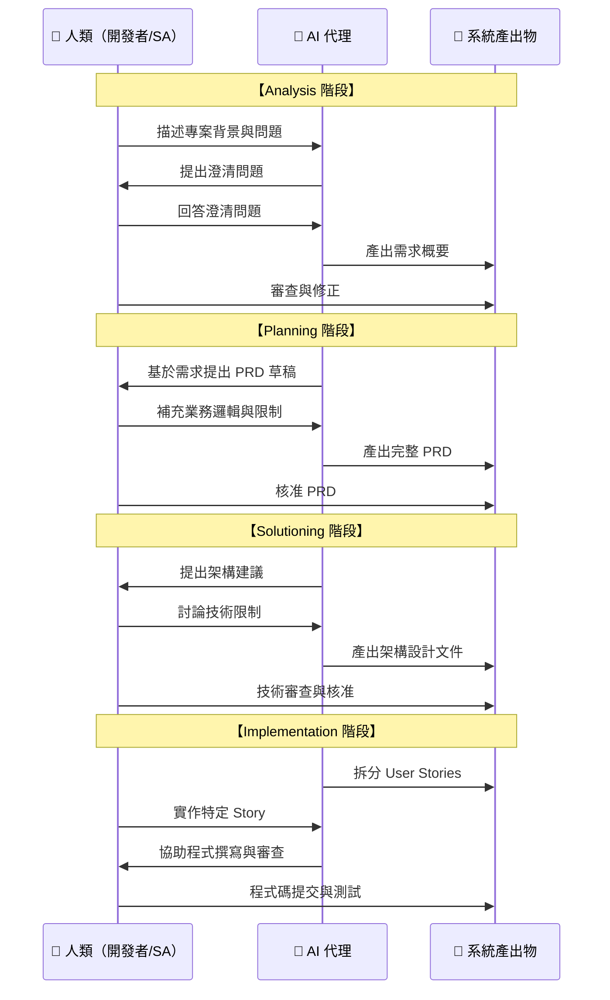
```mermaid
sequenceDiagram
    participant H as 👤 人類（開發者/SA）
    participant A as 🤖 AI 代理
    participant S as 📄 系統產出物
    
    Note over H,S: 【Analysis 階段】
    H->>A: 描述專案背景與問題
    A->>H: 提出澄清問題
    H->>A: 回答澄清問題
    A->>S: 產出需求概要
    H->>S: 審查與修正
    
    Note over H,S: 【Planning 階段】
    A->>H: 基於需求提出 PRD 草稿
    H->>A: 補充業務邏輯與限制
    A->>S: 產出完整 PRD
    H->>S: 核准 PRD
    
    Note over H,S: 【Solutioning 階段】
    A->>H: 提出架構建議
    H->>A: 討論技術限制
    A->>S: 產出架構設計文件
    H->>S: 技術審查與核准
    
    Note over H,S: 【Implementation 階段】
    A->>S: 拆分 User Stories
    H->>A: 實作特定 Story
    A->>H: 協助程式撰寫與審查
    H->>S: 程式碼提交與測試
```

#### AI 互動最佳實務

| 實務 | 說明 | 範例 |
|------|------|------|
| **明確指定代理** | 在 Prompt 開頭指定要互動的代理 | `@Architect Agent, 請評估以下架構...` |
| **提供充分上下文** | 包含相關的文件、程式碼片段 | 附上 PRD、現有架構圖 |
| **分階段互動** | 不要一次處理太多議題 | 先完成 Analysis 再進入 Planning |
| **明確驗收標準** | 告訴 AI 你期望的產出格式 | `請以表格方式呈現比較結果` |
| **迭代優化** | 不滿意時要求改進 | `請針對安全性再加強設計` |

### 3.3 建議的文件與產出物

#### BMAD 完整產出物清單

```
📁 BMAD 專案產出物結構
│
├── 📂 _bmad/                          # BMAD 核心設定（安裝時產生）
│   ├── 📂 agents/                     # AI 代理定義
│   ├── 📂 workflows/                  # 工作流程定義
│   ├── 📂 checklists/                 # 檢查清單
│   ├── 📂 templates/                  # 文件範本
│   ├── 📂 tasks/                      # 獨立任務
│   ├── 📂 tools/                      # 工具定義
│   └── 📄 project-context.md          # 專案上下文
│
├── 📂 _bmad-output/                   # BMAD 產出物
│   ├── 📂 planning-artifacts/         # 規劃階段產出
│   │   ├── 📄 product-brief.md        # 產品簡介（Analysis）
│   │   ├── 📄 prd.md                  # 產品需求文件（Planning）
│   │   ├── 📄 ux-design.md            # UX 設計（Planning）
│   │   └── 📄 architecture.md         # 架構設計（Solutioning）
│   └── 📂 implementation-artifacts/   # 實作階段產出
│       ├── 📄 epic-1.md               # Epic 與 Story（Solutioning）
│       ├── 📄 sprint-backlog.md       # Sprint 追蹤（Implementation）
│       └── 📄 story-*.md              # 個別 Story 檔案
│
└── 📂 src/                            # 程式碼（Implementation）
```

#### 各軌道產出物對照

| 產出物 | Quick Flow | BMad Method | Enterprise |
|--------|:----------:|:-----------:|:----------:|
| 問題陳述 | - | ✅ | ✅ |
| 利害關係人分析 | - | ⚪ 選用 | ✅ |
| PRD | - | ✅ | ✅ |
| 技術規格 | ✅ | ✅ | ✅ |
| 架構設計 | - | ✅ | ✅ |
| API 規格 | ⚪ 選用 | ✅ | ✅ |
| UX 設計 | - | ⚪ 選用 | ✅ |
| 安全設計 | - | ⚪ 選用 | ✅ |
| 測試計畫 | - | ⚪ 選用 | ✅ |
| 合規檢查清單 | - | - | ✅ |
| 風險評估 | - | - | ✅ |

---

## 第四章：各階段詳細教學

### 4.1 Analysis 階段詳細教學

#### 階段目標

Analysis 階段是整個開發流程的起點，目標是：

1. **釐清問題本質** - 確保團隊理解真正要解決的問題
2. **探索專案可能性** - 腦力激盪與研究探索
3. **建立產品簡介** - 產出 Product Brief 作為後續規劃基礎
4. **記錄專案上下文** - 保存現有系統資訊（Brownfield 專案適用）

> ℹ️ **此階段為選用**，Quick Flow 可跳過此階段直接進入 Planning。

#### 新手該做什麼

```
📌 Analysis 階段新手步驟

步驟 1：收集初始資訊
├── 與 PM/業務單位訪談
├── 收集現有文件（需求單、會議紀錄）
└── 了解背景脈絡

步驟 2：與 Analyst Agent (Mary) 互動
├── 使用 `BP`（Brainstorm Project）腦力激盪
├── 使用 `RS`（Research）進行研究
└── 回答 AI 的澄清問題

步驟 3：產出 Product Brief
├── 使用 `CB`（Create Brief）建立產品簡介
├── 定義「現況」與「期望」的差距
└── 獲得利害關係人認可

步驟 4：記錄專案上下文（Brownfield 專案）
├── 使用 `DP`（Document Project）記錄現有系統
├── 整理現有架構與限制
└── 確認改進機會
```

#### 常見錯誤

| ❌ 錯誤 | 說明 | ✅ 正確做法 |
|---------|------|-------------|
| 跳過分析直接開發 | 沒有釐清問題就開始寫程式 | 先花時間理解問題本質 |
| 問題定義太模糊 | 「系統要更好用」 | 「結帳流程從 5 步驟縮減為 3 步驟」 |
| 只聽單一來源 | 只聽 PM 的意見 | 訪談多個利害關係人 |
| 忽略限制條件 | 沒有考慮預算、時間限制 | 明確列出所有限制 |

#### 與 AI 協作的最佳實務

```markdown
💡 與 Analyst Agent (Mary) 協作技巧

1. **使用 `BP` 啟動腦力激盪**
   - 描述專案點子
   - 讓 Mary 協助探索可能性
   - 討論可行性與風險

2. **使用 `RS` 進行深入研究**
   - 指定研究領域（市場、技術、競品）
   - 讓 AI 協助整理研究結果

3. **使用 `CB` 建立產品簡介**
   - 提供背景資訊
   - 讓 AI 產生結構化的 Product Brief
   - 確認並調整內容

4. **迭代優化**
   - 第一版不完美是正常的
   - 多次互動直到滿意
```

#### 💼 實務案例：銀行信用卡申請系統

> **情境**：某銀行希望優化信用卡線上申請流程
> 
> **Analysis 階段產出範例**：
> 
> **問題陳述**：
> ```
> 現況：信用卡線上申請完成率僅 35%，主要卡關在身分驗證步驟
> 期望：提升申請完成率至 70%
> 差距：需要簡化身分驗證流程，同時符合金管會法規要求
> ```
> 
> **成功標準**：
> | 指標 | 現況 | 目標 | 量測方式 |
> |------|------|------|----------|
> | 申請完成率 | 35% | 70% | GA 追蹤 |
> | 平均申請時間 | 15 分鐘 | 5 分鐘 | 系統記錄 |
> | 客訴數量 | 50 件/月 | 10 件/月 | 客服系統 |

---

### 4.2 Planning 階段詳細教學

#### 階段目標

Planning 階段負責將分析結果轉換為可執行的規劃文件：

1. **建立 PRD** - 產品需求文件，定義功能需求與驗收標準
2. **UX 設計** - 使用者體驗設計（選用）
3. **技術規格** - Quick Flow 專用的簡化規格
4. **驗證需求** - 確保 PRD 完整性與一致性

> ℹ️ **此階段為必要階段**，所有軌道都需要某種形式的規劃文件。

#### 新手該做什麼

```
📌 Planning 階段新手步驟

步驟 1：建立 PRD
├── 使用 `bmad-create-prd` 讓 PM (John) 協助
├── 定義功能需求與使用者故事
├── 設定驗收標準
└── 確認優先級排序

步驟 2：驗證 PRD
├── 使用 `VP`（Validate PRD）檢查完整性
├── 確認需求之間無衝突
└── 獲得利害關係人確認

步驟 3：UX 設計（選用）
├── 使用 `bmad-create-ux-design` 讓 UX Designer (Sally) 協助
├── 設計使用者流程
└── 建立介面原型

步驟 4：確認輸出
├── PRD 已經通過驗證
├── 所有需求已明確定義
└── 準備進入 Solutioning 階段
```

#### 常見錯誤

| ❌ 錯誤 | 說明 | ✅ 正確做法 |
|---------|------|-------------|
| 流程圖過於複雜 | 一張圖涵蓋所有流程 | 分層次繪製，主流程 + 子流程 |
| 資料模型過度設計 | 一開始就設計完美正規化 | 先滿足需求，再逐步優化 |
| 忽略例外流程 | 只考慮正常流程 | 明確處理各種例外情況 |
| 業務規則不完整 | 遺漏邊界條件 | 與業務單位逐條確認 |

#### 與 AI 協作的最佳實務

```markdown
💡 與 PM Agent (John) 協作技巧（Planning 階段）

1. **使用 `bmad-create-prd` 建立 PRD**
   - 提供 Product Brief 作為輸入
   - 讓 PM (John) 協助撰寫完整 PRD
   - 逐步確認功能需求

2. **使用 `VP` 驗證 PRD**
   - 檢查需求完整性
   - 驗證一致性與可行性

3. **使用 UX Designer (Sally) 設計介面**
   - 描述使用者情境
   - 讓 AI 建議 UX 設計
   - 討論使用者流程

4. **迭代優化**
   - 對 PRD 不滿意時使用 `EP`（Edit PRD）修改
   - 確保所有需求都有明確的驗收標準
```

#### 💼 實務案例：銀行信用卡申請系統（續）

> **Planning 階段產出範例**：
> 
> **PRD 摘要**：
> ```mermaid
> flowchart TD
>     START([開始申請]) --> INPUT[填寫基本資料]
>     INPUT --> VERIFY{身分驗證}
>     VERIFY -->|成功| INCOME[填寫財力證明]
>     VERIFY -->|失敗| MANUAL[人工審核]
>     INCOME --> CREDIT[信用評分]
>     CREDIT -->|通過| APPROVE[核准發卡]
>     CREDIT -->|不通過| REJECT[婉拒申請]
>     MANUAL -->|補件完成| VERIFY
>     MANUAL -->|放棄| END([結束])
>     APPROVE --> END
>     REJECT --> END
> ```
> 
> **資料模型（部分）**：
> | 實體 | 屬性 | 說明 |
> |------|------|------|
> | Application | id, status, created_at, customer_id | 申請單 |
> | Customer | id, name, id_number, phone, email | 客戶 |
> | Verification | id, type, result, verified_at | 驗證紀錄 |
> | CreditScore | id, score, factors, scored_at | 信用評分 |

---

### 4.3 Solutioning 階段詳細教學

#### 階段目標

Solutioning 階段負責設計技術解決方案並拆分工作：

1. **設計系統架構** - 決定系統整體結構
2. **進行技術選型** - 選擇適當的技術堆疊
3. **拆分 Epic 與 Story** - 將 PRD 轉換為可執行的工作項目
4. **實作準備度檢查** - 確認規劃一致性

> ℹ️ **BMad Method 與 Enterprise 軌道專用**，Quick Flow 可跳過此階段。
> 
> ℹ️ **V6 重要改進**：Epic 與 Story 現在在架構設計**之後**建立。因為架構決策會直接影響工作拆分方式。

#### 新手該做什麼

```
📌 Solutioning 階段新手步驟

步驟 1：評估架構風格
├── 單體 vs 微服務
├── 同步 vs 非同步
├── 評估團隊能力
└── 考慮維運成本

步驟 2：設計系統架構
├── 繪製架構圖
├── 定義各層職責
├── 規劃部署架構
└── 設計監控策略

步驟 3：進行技術選型
├── 列出候選技術
├── 建立評估矩陣
├── POC 驗證（必要時）
└── 記錄決策理由

步驟 4：設計介面
├── 定義 API 端點
├── 設計請求/回應格式
├── 定義錯誤處理
└── 撰寫 API 文件

步驟 5：處理非功能需求
├── 效能目標與策略
├── 安全設計
├── 可擴展性設計
└── 災難復原計畫
```

> 🏦 **銀行/大型系統特別注意**
> 
> 在金融機構或大型企業中，Solutioning 階段通常需要額外考慮：
> - **法規合規**：個資法、金管會要求、SOC 2、ISO 27001
> - **稽核追蹤**：所有敏感操作必須留下稽核軌跡
> - **災難復原**：必須設計 DR 架構，定義 RTO/RPO
> - **安全審查**：架構設計需經資安部門審核
> - **系統整合**：可能需要與核心銀行系統（Core Banking）、聯徵中心等外部系統整合
> - **效能要求**：明確定義 TPS、回應時間等 SLA

#### 常見錯誤

| ❌ 錯誤 | 說明 | ✅ 正確做法 |
|---------|------|-------------|
| 過度設計 | 小專案用微服務架構 | 根據規模選擇適當架構 |
| 忽略非功能需求 | 只考慮功能，不考慮效能 | 早期就納入非功能需求 |
| 技術選型跟風 | 選最新技術但團隊不熟悉 | 考慮團隊能力與學習成本 |
| API 設計不一致 | 各 API 風格不同 | 建立 API 設計規範並遵循 |
| 沒有記錄決策 | 忘記當初為什麼這樣設計 | 使用 ADR 記錄架構決策 |

#### 與 AI 協作的最佳實務

```markdown
💡 與 Architect Agent 協作技巧

1. **請 AI 提供架構建議**
   - 描述系統需求與限制
   - 請 AI 建議多個架構方案
   - 比較各方案優缺點

2. **請 AI 協助技術選型**
   - 列出評估項目
   - 請 AI 分析各選項
   - 產出決策矩陣

3. **請 AI 審查架構設計**
   - 提供架構圖與說明
   - 請 AI 找出潛在問題
   - 針對問題調整設計

4. **請 AI 協助 API 設計**
   - 描述功能需求
   - 請 AI 建議 API 端點
   - 請 AI 產生 OpenAPI 規格
```

#### 💼 實務案例：銀行信用卡申請系統（續）

> **Solutioning 階段產出範例**：
> 
> **系統架構圖**：
> ```mermaid
> graph TB
>     subgraph "前端"
>         WEB[Web 應用]
>         APP[行動 App]
>     end
>     
>     subgraph "API Gateway"
>         GW[Kong Gateway]
>     end
>     
>     subgraph "後端服務"
>         AUTH[身分驗證服務]
>         APP_SVC[申請服務]
>         CREDIT[信用評分服務]
>         NOTIFY[通知服務]
>     end
>     
>     subgraph "外部系統"
>         JCIC[聯徵中心]
>         SMS[簡訊服務]
>     end
>     
>     subgraph "資料層"
>         DB[(PostgreSQL)]
>         CACHE[(Redis)]
>         MQ[RabbitMQ]
>     end
>     
>     WEB --> GW
>     APP --> GW
>     GW --> AUTH
>     GW --> APP_SVC
>     APP_SVC --> CREDIT
>     APP_SVC --> NOTIFY
>     CREDIT --> JCIC
>     NOTIFY --> SMS
>     AUTH --> DB
>     APP_SVC --> DB
>     CREDIT --> CACHE
>     NOTIFY --> MQ
> ```
> 
> **技術決策記錄（ADR）範例**：
> ```markdown
> # ADR-001: 選擇 PostgreSQL 作為主要資料庫
> 
> ## 狀態
> 已決定
> 
> ## 背景
> 需要選擇一個可靠的關聯式資料庫來儲存申請資料
> 
> ## 決策
> 選擇 PostgreSQL
> 
> ## 理由
> - 公司已有 PostgreSQL 維運經驗
> - 支援 JSON 欄位，方便儲存非結構化資料
> - 效能可滿足預估的交易量
> - 社群活躍，文件完整
> 
> ## 替代方案
> - MySQL：功能較少
> - Oracle：授權成本高
> ```

---

### 4.4 Implementation 階段詳細教學

#### 階段目標

Implementation 階段負責將設計轉換為可運作的系統：

1. **Sprint 規劃與管理** - 使用 Scrum Master (Bob) 協助
2. **Story 開發** - 使用 Developer (Amelia) 逐一實作
3. **測試與品質** - 使用 QA (Quinn) 自動化測試
4. **範圍管理** - 使用 Correct Course 處理變更

#### 新手該做什麼

```
📌 Implementation 階段新手步驟

步驟 1：拆分 User Stories
├── 依據 PRD 列出所有 Story
├── 估算每個 Story 的工作量
├── 排定優先順序
└── 分配到 Sprint

步驟 2：開發實作
├── 撰寫程式碼
├── 撰寫單元測試
├── 程式碼審查
└── 合併到主分支

步驟 3：測試驗證
├── 執行整合測試
├── 執行 E2E 測試
├── 效能測試
└── 安全測試

步驟 4：部署上線
├── 準備部署腳本
├── 設定環境變數
├── 執行部署
└── 驗證部署結果

步驟 5：交付驗收
├── 準備驗收文件
├── 執行 UAT
├── 教育訓練
└── 正式上線
```

> 🏦 **銀行/大型系統特別注意**
> 
> 在金融機構或大型企業的 Implementation 階段有額外要求：
> - **變更管理**：所有變更需經過 CAB（Change Advisory Board）審核
> - **部署窗口**：通常只能在非營業時間部署（如：週六凌晨）
> - **灰度發布**：大型系統需採用金絲雀/藍綠部署策略
> - **上線審核**：需通過資安、法遵、業務單位的上線審核
> - **回滾計畫**：必須準備完整的回滾計畫並經過演練
> - **監控告警**：上線後需有 24/7 監控機制

#### 常見錯誤

| ❌ 錯誤 | 說明 | ✅ 正確做法 |
|---------|------|-------------|
| Story 拆分太大 | 一個 Story 要做一週 | 每個 Story 控制在 1-2 天 |
| 跳過程式碼審查 | 趕時間就直接合併 | 堅持 Code Review 流程 |
| 測試不完整 | 只做 Happy Path 測試 | 包含邊界條件與例外測試 |
| 部署沒有回滾計畫 | 出問題不知道怎麼處理 | 事先準備回滾腳本 |
| 文件不更新 | 程式改了但文件沒更新 | 程式碼與文件一起更新 |

#### 與 AI 協作的最佳實務

```markdown
💡 與 Developer Agent 協作技巧

1. **請 AI 協助拆分 Story**
   - 提供 PRD 內容
   - 請 AI 建議 Story 拆分
   - 討論估算工作量

2. **請 AI 協助撰寫程式碼**
   - 提供 Story 需求與技術規格
   - 請 AI 產生程式碼框架
   - 逐步完善細節

3. **請 AI 撰寫測試**
   - 提供程式碼
   - 請 AI 產生測試案例
   - 確保涵蓋邊界條件

4. **請 AI 審查程式碼**
   - 提供程式碼
   - 請 AI 找出潛在問題
   - 建議改進方案

5. **請 AI 協助寫文件**
   - 提供程式碼與 API
   - 請 AI 產生文件
   - 調整格式與內容
```

#### 💼 實務案例：銀行信用卡申請系統（續）

> **Implementation 階段產出範例**：
> 
> **Sprint Backlog**：
> | Story ID | 描述 | 估算 | 狀態 |
> |----------|------|------|------|
> | CC-001 | 作為申請者，我可以填寫基本資料 | 3 點 | 完成 |
> | CC-002 | 作為申請者，我可以上傳身分證照片 | 2 點 | 完成 |
> | CC-003 | 系統可以呼叫 eKYC 進行身分驗證 | 5 點 | 進行中 |
> | CC-004 | 作為申請者，我可以查詢申請進度 | 2 點 | 待辦 |
> | CC-005 | 系統可以呼叫聯徵中心取得信用分數 | 5 點 | 待辦 |
> 
> **測試覆蓋率目標**：
> | 測試類型 | 目標覆蓋率 | 說明 |
> |----------|------------|------|
> | 單元測試 | 80% | 核心邏輯必須覆蓋 |
> | 整合測試 | 60% | API 端點必須覆蓋 |
> | E2E 測試 | 主要流程 | Happy Path + 主要例外 |

---

## 第五章：AI Prompt 實戰範例

> 💡 **重要提醒**：以下 Prompt 可直接複製使用。建議根據實際專案情況調整內容。

### 5.1 Analysis 階段 Prompt 範例

#### Prompt 1：問題定義與需求探索

**用途**：引導 AI 協助釐清專案問題與需求

```markdown
# Prompt：問題定義與需求探索

## 角色
你是一位資深的業務分析師（Analyst Agent），專精於金融業系統分析。

## 背景
[請在此描述專案背景]

例如：
我們是一家商業銀行，目前的信用卡線上申請流程存在以下問題：
- 申請完成率只有 35%
- 客戶抱怨流程太複雜
- 平均申請時間需要 15 分鐘

## 任務
請協助我：
1. 釐清問題的根本原因
2. 定義明確的問題陳述
3. 識別關鍵利害關係人
4. 建議可量測的成功標準

## 輸出格式
請以 Markdown 格式輸出，包含：
- 問題陳述（Problem Statement）
- 根因分析（Root Cause Analysis）
- 利害關係人清單
- 成功標準建議
```

**預期產出**：
- 結構化的問題陳述文件
- 利害關係人分析表
- 可量測的成功指標

---

#### Prompt 2：利害關係人分析

**用途**：識別並分析專案利害關係人

```markdown
# Prompt：利害關係人分析

## 角色
你是一位資深的業務分析師，專精於利害關係人管理。

## 專案背景
[描述專案背景]

## 任務
請協助我建立完整的利害關係人分析，包含：
1. 識別所有可能的利害關係人
2. 分析每位利害關係人的：
   - 影響力（高/中/低）
   - 利益程度（高/中/低）
   - 主要關注點
   - 期望與需求
3. 建立利害關係人矩陣
4. 建議溝通策略

## 輸出格式
請以表格方式呈現利害關係人矩陣，並附上溝通策略建議。
```

**預期產出**：
- 利害關係人清單
- 影響力/利益矩陣
- 溝通策略建議

---

#### Prompt 3：需求訪談問題清單

**用途**：產生結構化的訪談問題

```markdown
# Prompt：需求訪談問題清單

## 角色
你是一位經驗豐富的系統分析師，專精於需求訪談。

## 訪談對象
[描述訪談對象的角色]

例如：
- 業務單位主管
- 第一線客服人員
- IT 部門代表

## 專案背景
[描述專案背景]

## 任務
請產生一份訪談問題清單，問題應該：
1. 能夠挖掘真正的需求（不只是表面需求）
2. 包含開放式與封閉式問題
3. 涵蓋功能需求與非功能需求
4. 針對不同角色客製化

## 輸出格式
請依照訪談對象分組，每組 8-10 個問題，並說明每個問題的目的。
```

**預期產出**：
- 分角色的訪談問題清單
- 每個問題的目的說明
- 訪談技巧建議

---

### 5.2 Planning 階段 Prompt 範例

#### Prompt 1：業務流程建模

**用途**：將業務流程轉換為流程圖

```markdown
# Prompt：業務流程建模

## 角色
你是一位資深的系統分析師，專精於業務流程分析與建模。

## 業務流程描述
[描述業務流程]

例如：
信用卡申請流程：
1. 客戶在網站填寫基本資料（姓名、身分證字號、聯絡方式）
2. 上傳身分證正反面照片
3. 系統呼叫 eKYC 服務進行身分驗證
4. 若驗證失敗，客戶可選擇人工審核或放棄
5. 驗證成功後，填寫財力證明資料
6. 系統呼叫聯徵中心取得信用分數
7. 根據信用分數決定核准或婉拒
8. 發送通知給客戶

## 任務
請協助我：
1. 繪製業務流程圖（使用 Mermaid 語法）
2. 標示決策點與分支
3. 標示系統邊界（哪些是內部系統、哪些是外部系統）
4. 列出可能的例外流程

## 輸出格式
1. Mermaid 流程圖
2. 流程說明表格
3. 例外處理清單
```

**預期產出**：
- Mermaid 格式的流程圖
- 流程步驟說明
- 例外處理清單

---

#### Prompt 2：資料模型設計

**用途**：設計資料庫 ERD

```markdown
# Prompt：資料模型設計

## 角色
你是一位資深的資料架構師，專精於關聯式資料庫設計。

## 業務情境
[描述業務情境與需要儲存的資料]

例如：
需要設計一個信用卡申請系統的資料模型，需要儲存：
- 申請人基本資料
- 申請單資訊
- 身分驗證結果
- 信用評分結果
- 審核紀錄

## 任務
請協助我設計資料模型：
1. 識別主要實體（Entity）
2. 定義每個實體的屬性
3. 建立實體之間的關係
4. 產出 ERD（使用 Mermaid erDiagram）
5. 建立資料字典

## 設計考量
- 符合第三正規化（3NF）
- 考慮查詢效能
- 支援未來擴展
- 符合個資保護要求

## 輸出格式
1. Mermaid ERD 圖
2. 資料字典表格
3. 設計決策說明
```

**預期產出**：
- Mermaid ERD 圖
- 完整的資料字典
- 正規化說明

---

#### Prompt 3：業務規則定義

**用途**：整理並記錄業務規則

```markdown
# Prompt：業務規則定義

## 角色
你是一位資深的業務分析師，專精於業務規則分析與文件化。

## 業務情境
[描述業務情境]

例如：
信用卡申請審核規則：
- 申請人年齡需滿 20 歲
- 需有穩定收入來源
- 信用評分需達 600 分以上
- 若有不良信用紀錄需人工審核

## 任務
請協助我整理並文件化所有業務規則：
1. 識別所有業務規則
2. 將規則分類（驗證規則、計算規則、流程規則）
3. 定義規則的輸入、輸出、邏輯
4. 標示規則的例外處理

## 輸出格式
請以表格方式呈現，包含：
- 規則 ID
- 規則名稱
- 分類
- 規則描述
- 輸入/輸出
- 例外處理
```

**預期產出**：
- 分類的業務規則清單
- 每條規則的詳細定義
- 例外處理說明

---

### 5.3 Solutioning 階段 Prompt 範例

#### Prompt 1：系統架構設計

**用途**：設計整體系統架構

```markdown
# Prompt：系統架構設計

## 角色
你是一位資深的系統架構師（Architect Agent），擁有 15 年金融業系統架構經驗。

## 專案背景
[描述專案背景與需求]

## 非功能需求
- 效能：API 回應時間 < 500ms（P99）
- 可用性：99.9%
- 安全性：符合金管會資安規範
- 可擴展性：支援 100 TPS 成長到 1000 TPS

## 限制條件
- 公司技術棧：Java Spring Boot、PostgreSQL、Redis
- 部署環境：Kubernetes on AWS
- 團隊規模：5 位後端工程師

## 任務
請協助我設計系統架構：
1. 評估架構風格（單體 vs 微服務）
2. 設計整體架構圖
3. 定義各元件職責
4. 規劃部署架構
5. 設計監控與告警策略

## 輸出格式
1. 架構風格評估與建議
2. Mermaid 架構圖
3. 元件說明表
4. 部署架構圖
5. ADR（架構決策記錄）
```

**預期產出**：
- 架構評估報告
- 多層次架構圖
- 架構決策記錄

---

#### Prompt 2：API 設計

**用途**：設計 RESTful API

```markdown
# Prompt：API 設計

## 角色
你是一位資深的 API 架構師，專精於 RESTful API 設計。

## 功能需求
[描述需要的 API 功能]

例如：
信用卡申請 API 需支援：
1. 建立新申請
2. 查詢申請狀態
3. 上傳文件
4. 取消申請
5. 取得申請清單（分頁）

## 設計原則
- 遵循 RESTful 設計原則
- 使用統一的回應格式
- 包含適當的錯誤處理
- 支援版本控制

## 任務
請設計完整的 API：
1. 定義資源與端點
2. 設計請求/回應格式
3. 定義 HTTP 狀態碼使用
4. 設計錯誤回應格式
5. 產出 OpenAPI 3.0 規格（YAML）

## 輸出格式
1. API 端點清單表
2. 請求/回應範例
3. 錯誤碼定義
4. OpenAPI 規格片段
```

**預期產出**：
- API 端點設計文件
- OpenAPI 規格
- 錯誤處理規範

---

#### Prompt 3：安全架構設計

**用途**：設計系統安全架構

```markdown
# Prompt：安全架構設計

## 角色
你是一位資深的資安架構師，專精於金融業系統安全設計，熟悉 OWASP、ISO 27001、金管會資安規範。

## 系統背景
[描述系統與其處理的資料類型]

例如：
信用卡申請系統，處理以下敏感資料：
- 個人身分資料（姓名、身分證字號）
- 財務資料（收入、信用分數）
- 生物特徵（身分證照片）

## 安全需求
- 符合個人資料保護法
- 符合金管會資安規範
- 防範 OWASP Top 10 威脅

## 任務
請設計完整的安全架構：
1. 識別主要威脅與風險
2. 設計認證與授權機制
3. 設計資料保護策略（傳輸中/靜態）
4. 設計日誌與稽核機制
5. 建議安全測試項目

## 輸出格式
1. 威脅模型分析
2. 安全架構圖
3. 安全控制措施清單
4. 安全測試檢查清單
```

**預期產出**：
- 威脅分析報告
- 安全架構設計
- 安全控制措施

---

### 5.4 Implementation 階段 Prompt 範例

#### Prompt 1：User Story 拆分

**用途**：將功能需求拆分為 User Stories

```markdown
# Prompt：User Story 拆分

## 角色
你是一位資深的 Scrum Master，專精於敏捷開發與 User Story 撰寫。

## 功能需求
[描述功能需求，可附上 PRD 片段]

例如：
信用卡申請功能需求：
- 申請人可以線上填寫申請表
- 系統驗證申請人身分
- 系統評估信用分數
- 申請人可以查詢進度
- 核准後自動發卡

## 任務
請協助我拆分 User Stories：
1. 使用標準格式：「作為 [角色]，我想要 [功能]，以便 [價值]」
2. 每個 Story 定義驗收標準（Acceptance Criteria）
3. 估算 Story Points（使用費氏數列：1, 2, 3, 5, 8, 13）
4. 標示 Story 之間的依賴關係
5. 建議 Sprint 規劃

## 拆分原則
- 每個 Story 應可在 2 天內完成
- Story 應該是垂直切片（包含前後端）
- Story 應該可以獨立交付價值

## 輸出格式
請以表格呈現，包含：Story ID、描述、驗收標準、Story Points、依賴關係
```

**預期產出**：
- 完整的 User Story 清單
- 驗收標準
- Sprint 規劃建議

---

#### Prompt 2：程式碼審查

**用途**：請 AI 協助審查程式碼

```markdown
# Prompt：程式碼審查

## 角色
你是一位資深的 Java 開發者（Developer Agent），專精於 Spring Boot 開發，熟悉 SOLID 原則與設計模式。

## 程式碼
```java
[貼上待審查的程式碼]
```

## 審查重點
請針對以下面向進行審查：
1. **程式碼品質**
   - 命名是否清晰
   - 是否符合 SOLID 原則
   - 是否有重複程式碼

2. **安全性**
   - 是否有 SQL Injection 風險
   - 是否有敏感資料外洩風險
   - 輸入驗證是否完整

3. **效能**
   - 是否有 N+1 查詢問題
   - 是否有不必要的資料庫查詢
   - 是否適當使用快取

4. **可維護性**
   - 註解是否足夠
   - 錯誤處理是否完整
   - 是否容易撰寫測試

## 輸出格式
請列出：
1. 發現的問題（標示嚴重程度：高/中/低）
2. 改善建議
3. 修改後的程式碼範例
```

**預期產出**：
- 問題清單與嚴重程度
- 改善建議
- 修改後程式碼

---

#### Prompt 3：單元測試撰寫

**用途**：請 AI 協助撰寫單元測試

```markdown
# Prompt：單元測試撰寫

## 角色
你是一位資深的測試架構師（Test Architect Agent），專精於 Java 測試，熟悉 JUnit 5、Mockito、AssertJ。

## 待測程式碼
```java
[貼上待測試的程式碼]
```

## 測試需求
請協助撰寫完整的單元測試：
1. 涵蓋所有公開方法
2. 包含正向測試（Happy Path）
3. 包含負向測試（邊界條件、例外情況）
4. 使用 Mockito 模擬外部依賴
5. 使用 AssertJ 進行斷言

## 測試命名慣例
使用格式：`methodName_StateUnderTest_ExpectedBehavior`

## 輸出格式
1. 完整的測試類別程式碼
2. 每個測試案例的說明
3. 測試覆蓋率說明
```

**預期產出**：
- 完整的測試類別
- 測試案例說明
- 覆蓋率分析

---

### 5.5 銀行與大型系統專用 Prompt 實戰對話

> 🏦 **本節特別針對銀行、保險、證券等金融業，以及大型企業系統開發情境**
> 
> 以下提供的 Prompt 範例都是在實務專案中經過驗證的，可直接複製使用。

#### 🏦 對話範例 1：法遵需求分析

**情境說明**：
> 📌 **此情境常見於銀行或大型系統**
> 
> 金融機構在開發任何系統前，必須確保符合金管會、個資法、反洗錢等法規要求。
> 這個對話展示如何請 AI 協助分析法遵需求。

**完整對話流程**：

```markdown
👤 使用者：
@Analyst Agent

我們要開發一個「線上貸款申請系統」，請協助我分析需要符合哪些法規要求。

系統背景：
- 台灣商業銀行
- 消費者貸款（信貸、車貸、房貸）
- 線上申請、線上對保
- 預計處理個人敏感資料

請列出所有相關法規與合規要求。

---

🤖 AI（Analyst Agent）回應：

## 線上貸款申請系統法規分析報告

### 一、主要適用法規

| 法規名稱 | 主管機關 | 與系統相關性 |
|----------|----------|--------------|
| 銀行法 | 金管會 | 貸款業務基本規範 |
| 個人資料保護法 | 國發會 | 客戶資料蒐集、處理、利用 |
| 電子簽章法 | 經濟部 | 線上對保法律效力 |
| 金融機構防制洗錢辦法 | 金管會 | KYC、AML 要求 |
| 金融消費者保護法 | 金管會 | 資訊揭露、公平待客 |
| 銀行業作業委託他人處理內部作業制度及程序辦法 | 金管會 | 如有委外需求 |

### 二、系統設計合規要點

#### 1. 個資保護（個資法）
- [ ] 蒐集前需取得當事人同意
- [ ] 明確告知蒐集目的、利用範圍
- [ ] 提供當事人查詢、更正、刪除權利
- [ ] 資料傳輸需加密（TLS 1.2+）
- [ ] 資料儲存需加密（AES-256）
- [ ] 存取需有稽核軌跡

#### 2. 反洗錢（AML/KYC）
- [ ] 身分驗證需符合「金融機構執行客戶盡職審查作業」規範
- [ ] 需與聯徵中心介接
- [ ] 需檢核制裁名單
- [ ] 可疑交易需通報

#### 3. 電子簽章
- [ ] 線上對保需使用合格電子簽章
- [ ] 需保留簽署時間戳記
- [ ] 文件需長期保存（依民法規定）

### 三、建議後續行動

1. **與法遵部門確認**：上述清單需經法遵部門審核
2. **安排資安審查**：系統設計需經資安部門審查
3. **準備稽核文件**：需準備系統安全說明書供金管會備查

需要我針對其中任何一項深入說明嗎？

---

👤 使用者：
請針對「個資保護」產出具體的系統設計要求，包含技術規格。

---

🤖 AI（Analyst Agent）回應：

## 個資保護系統設計規格

### 1. 資料分類與保護等級

| 資料類別 | 範例 | 保護等級 | 加密要求 |
|----------|------|----------|----------|
| 一般識別資料 | 姓名、電話 | 中 | 傳輸加密 |
| 特種個資 | 身分證字號 | 高 | 傳輸+儲存加密 |
| 財務資料 | 收入、資產 | 高 | 傳輸+儲存加密 |
| 生物特徵 | 身分證照片 | 最高 | 傳輸+儲存加密+存取控制 |

### 2. 技術規格要求

#### 傳輸安全
```yaml
# TLS 設定要求
minimum_tls_version: "1.2"
preferred_tls_version: "1.3"
cipher_suites:
  - TLS_AES_256_GCM_SHA384
  - TLS_CHACHA20_POLY1305_SHA256
certificate_requirements:
  - 需使用 EV SSL 憑證
  - 需啟用 HSTS
  - 需啟用 Certificate Transparency
```

#### 儲存加密
```yaml
# 資料庫加密設定
encryption_algorithm: "AES-256-GCM"
key_management: "AWS KMS / Azure Key Vault"
key_rotation_period: "90 days"
```

#### 存取控制
```yaml
# RBAC 設定
authentication:
  - 多因素認證（MFA）必要
  - Session timeout: 15 分鐘
authorization:
  - 最小權限原則
  - 需 Maker-Checker 雙重確認
audit:
  - 所有存取需記錄
  - 日誌保留 7 年
```

### 3. 同意書設計要求

需在系統中實作以下同意機制：

```
□ 我已閱讀並同意「個人資料蒐集、處理及利用告知事項」
□ 我同意貴行於審核本申請案件期間，向聯徵中心查詢本人信用資料
□ 我同意貴行於本貸款存續期間，將本人資料提供予保證機構
```

這樣的規格是否足夠？需要我產出更詳細的 API 安全規格嗎？
```

---

#### 🏦 對話範例 2：核心銀行系統整合

**情境說明**：
> 📌 **此情境常見於銀行或大型系統**
> 
> 銀行系統開發通常需要與核心銀行系統（Core Banking）整合。
> 這個對話展示如何請 AI 協助設計整合架構。

**完整對話流程**：

```markdown
👤 使用者：
@Architect Agent

我們的線上貸款系統需要與以下系統整合：
1. 核心銀行系統（IBM AS/400）
2. 聯徵中心（JCIC）
3. 內部徵審系統
4. 通知系統（簡訊、Email、Push）

請協助設計整合架構，需考慮：
- 核心銀行系統是批次作業為主
- 聯徵中心有 TPS 限制（每秒 10 筆）
- 需支援非同步處理
- 需有重試與補償機制

---

🤖 AI（Architect Agent）回應：

## 系統整合架構設計

### 整體架構圖

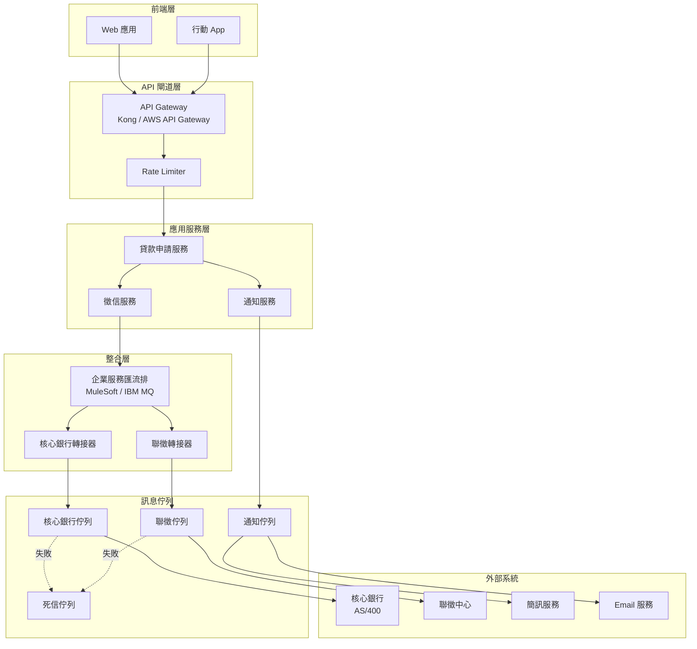
```mermaid
graph TB
    subgraph "前端層"
        WEB[Web 應用]
        APP[行動 App]
    end
    
    subgraph "API 閘道層"
        GW[API Gateway<br/>Kong / AWS API Gateway]
        RL[Rate Limiter]
    end
    
    subgraph "應用服務層"
        LOAN[貸款申請服務]
        CREDIT[徵信服務]
        NOTIFY[通知服務]
    end
    
    subgraph "整合層"
        ESB[企業服務匯流排<br/>MuleSoft / IBM MQ]
        ADAPTER_CORE[核心銀行轉接器]
        ADAPTER_JCIC[聯徵轉接器]
    end
    
    subgraph "訊息佇列"
        MQ_CORE[核心銀行佇列]
        MQ_JCIC[聯徵佇列]
        MQ_NOTIFY[通知佇列]
        MQ_DLQ[死信佇列]
    end
    
    subgraph "外部系統"
        CORE[核心銀行<br/>AS/400]
        JCIC[聯徵中心]
        SMS[簡訊服務]
        EMAIL[Email 服務]
    end
    
    WEB --> GW
    APP --> GW
    GW --> RL
    RL --> LOAN
    LOAN --> CREDIT
    LOAN --> NOTIFY
    
    CREDIT --> ESB
    ESB --> ADAPTER_CORE
    ESB --> ADAPTER_JCIC
    
    ADAPTER_CORE --> MQ_CORE
    ADAPTER_JCIC --> MQ_JCIC
    NOTIFY --> MQ_NOTIFY
    
    MQ_CORE --> CORE
    MQ_JCIC --> JCIC
    MQ_NOTIFY --> SMS
    MQ_NOTIFY --> EMAIL
    
    MQ_CORE -.->|失敗| MQ_DLQ
    MQ_JCIC -.->|失敗| MQ_DLQ
```

### 整合模式設計

#### 1. 核心銀行整合（AS/400）

由於核心銀行是批次系統，採用 **Request-Reply with Correlation** 模式：

```
┌─────────┐     ┌─────────┐     ┌─────────┐     ┌─────────┐
│  貸款   │     │   MQ    │     │ 轉接器  │     │  Core   │
│  服務   │────>│  Queue  │────>│ Adapter │────>│ Banking │
└─────────┘     └─────────┘     └─────────┘     └─────────┘
     │                                               │
     │<──────────── Correlation ID ──────────────────│
```

**設計要點**：
- 使用 Correlation ID 追蹤請求
- 設定逾時機制（預設 30 秒）
- 批次視窗：每日 09:00-17:00 可即時，其他時間隔日處理

#### 2. 聯徵中心整合（JCIC）

採用 **Rate-Limited Async Queue** 模式處理 TPS 限制：

```java
// 聯徵查詢服務設計
@Service
public class JcicQueryService {
    
    @RateLimiter(name = "jcic", fallbackMethod = "queueQuery")
    public Mono<CreditReport> queryCredit(String idNumber) {
        // 即時查詢（TPS 限制內）
        return jcicClient.query(idNumber);
    }
    
    public Mono<CreditReport> queueQuery(String idNumber, Exception ex) {
        // 超過 TPS 限制，放入佇列稍後處理
        return messageQueue.send(new JcicQueryRequest(idNumber))
            .then(Mono.empty());
    }
}
```

#### 3. 重試與補償機制

```yaml
# Resilience4j 設定
resilience4j:
  retry:
    instances:
      jcic:
        maxAttempts: 3
        waitDuration: 5s
        retryExceptions:
          - java.io.IOException
          - java.net.SocketTimeoutException
  circuitbreaker:
    instances:
      core-banking:
        failureRateThreshold: 50
        waitDurationInOpenState: 60s
        slidingWindowSize: 10
```

### 錯誤處理策略

| 錯誤類型 | 處理策略 | 補償機制 |
|----------|----------|----------|
| 核心銀行逾時 | 重試 3 次後放入 DLQ | 人工介入處理 |
| 聯徵查詢失敗 | 放入重試佇列 | 通知申請人稍後再試 |
| 通知發送失敗 | 切換備援通道 | 記錄後批次重送 |

這樣的架構設計是否符合需求？需要我深入說明任何部分嗎？
```

---

#### 🏦 對話範例 3：合規稽核追蹤設計

**情境說明**：
> 📌 **此情境常見於銀行或大型系統**
> 
> 金融系統必須保留完整的稽核軌跡（Audit Trail），以因應內外部稽核。
> 這個對話展示如何設計符合稽核要求的系統。

**完整對話流程**：

```markdown
👤 使用者：
@Architect Agent

我們的貸款系統需要符合金管會的稽核要求，請協助設計稽核追蹤機制。

稽核要求：
1. 所有敏感操作需記錄（查詢、修改、刪除）
2. 日誌需保留 7 年
3. 日誌需防止竄改
4. 需支援依時間、使用者、操作類型查詢
5. 需定期產出稽核報表

---

🤖 AI（Architect Agent）回應：

## 稽核追蹤系統設計

### 1. 稽核日誌資料結構

```json
{
  "auditId": "uuid",
  "timestamp": "2025-01-15T10:30:00.000Z",
  "eventType": "DATA_ACCESS",
  "eventCategory": "LOAN_APPLICATION",
  "action": "QUERY",
  "result": "SUCCESS",
  "actor": {
    "userId": "EMP001",
    "userName": "王小明",
    "department": "消金部",
    "role": "LOAN_OFFICER",
    "ipAddress": "192.168.1.100",
    "sessionId": "sess-abc123"
  },
  "target": {
    "entityType": "LOAN_APPLICATION",
    "entityId": "LA-2025-00001",
    "customerId": "C-123456"
  },
  "dataAccessed": {
    "fields": ["name", "idNumber", "income"],
    "sensitiveFields": ["idNumber"],
    "recordCount": 1
  },
  "context": {
    "businessReason": "貸款審核",
    "approvalRequired": false,
    "clientApplication": "LOAN_PORTAL_WEB"
  },
  "integrity": {
    "hash": "sha256:abc123...",
    "previousHash": "sha256:xyz789...",
    "signature": "RSA:..."
  }
}
```

### 2. 稽核日誌架構

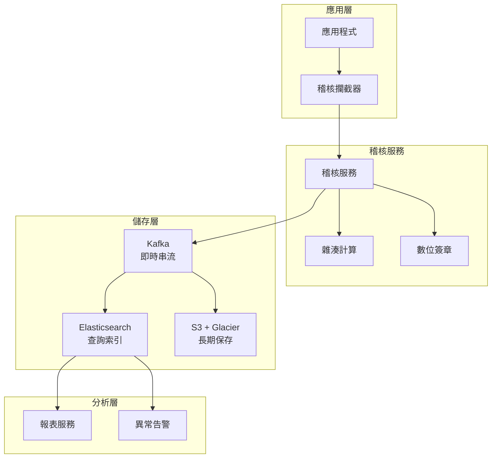
```mermaid
graph TB
    subgraph "應用層"
        APP[應用程式]
        INTERCEPTOR[稽核攔截器]
    end
    
    subgraph "稽核服務"
        AUDIT_SVC[稽核服務]
        HASH[雜湊計算]
        SIGN[數位簽章]
    end
    
    subgraph "儲存層"
        KAFKA[Kafka<br/>即時串流]
        ES[Elasticsearch<br/>查詢索引]
        S3[S3 + Glacier<br/>長期保存]
    end
    
    subgraph "分析層"
        REPORT[報表服務]
        ALERT[異常告警]
    end
    
    APP --> INTERCEPTOR
    INTERCEPTOR --> AUDIT_SVC
    AUDIT_SVC --> HASH
    AUDIT_SVC --> SIGN
    AUDIT_SVC --> KAFKA
    KAFKA --> ES
    KAFKA --> S3
    ES --> REPORT
    ES --> ALERT
```

### 3. 防竄改機制

採用 **區塊鏈式雜湊鏈結**：

```java
@Service
public class AuditIntegrityService {
    
    public AuditLog createAuditLog(AuditEvent event) {
        // 取得前一筆日誌的雜湊值
        String previousHash = getLastAuditHash();
        
        // 計算當前日誌雜湊（包含前一筆雜湊）
        String content = serialize(event) + previousHash;
        String currentHash = sha256(content);
        
        // 使用 HSM 進行數位簽章
        String signature = hsm.sign(currentHash);
        
        return AuditLog.builder()
            .event(event)
            .previousHash(previousHash)
            .currentHash(currentHash)
            .signature(signature)
            .build();
    }
    
    public boolean verifyIntegrity(List<AuditLog> logs) {
        // 驗證雜湊鏈結完整性
        for (int i = 1; i < logs.size(); i++) {
            if (!logs.get(i).getPreviousHash()
                    .equals(logs.get(i-1).getCurrentHash())) {
                return false; // 發現竄改
            }
        }
        return true;
    }
}
```

### 4. 儲存策略

| 時間區間 | 儲存位置 | 存取方式 | 成本 |
|----------|----------|----------|------|
| 0-30 天 | Elasticsearch | 即時查詢 | 高 |
| 30-365 天 | S3 Standard | 按需查詢 | 中 |
| 1-7 年 | S3 Glacier | 申請後 3-5 小時 | 低 |

### 5. 稽核報表範例

```sql
-- 敏感資料存取統計報表
SELECT 
    DATE(timestamp) as access_date,
    actor_department,
    COUNT(*) as total_access,
    COUNT(DISTINCT target_customer_id) as unique_customers,
    SUM(CASE WHEN data_accessed_sensitive_fields IS NOT NULL 
        THEN 1 ELSE 0 END) as sensitive_access_count
FROM audit_logs
WHERE event_type = 'DATA_ACCESS'
  AND timestamp >= DATE_SUB(NOW(), INTERVAL 30 DAY)
GROUP BY DATE(timestamp), actor_department
ORDER BY access_date DESC, total_access DESC;
```

這樣的設計能夠滿足金管會的稽核要求嗎？需要我補充任何細節嗎？
```

---

#### 🏦 對話範例 4：災難復原設計

**情境說明**：
> 📌 **此情境常見於銀行或大型系統**
> 
> 金融機構必須具備完善的災難復原（DR）計畫，確保業務連續性。
> 這個對話展示如何請 AI 協助設計 DR 架構。

**完整對話流程**：

```markdown
👤 使用者：
@Architect Agent

我們的貸款系統需要設計災難復原架構，請協助規劃。

業務要求：
- RTO（Recovery Time Objective）：4 小時
- RPO（Recovery Point Objective）：1 小時
- 需支援跨機房容災
- 預算有限，希望成本最佳化

目前環境：
- 主機房：台北
- 備援機房：高雄
- 使用 Kubernetes 部署
- 資料庫：PostgreSQL

---

🤖 AI（Architect Agent）回應：

## 災難復原架構設計

### 1. DR 策略選擇

根據 RTO 4hr / RPO 1hr 的要求，建議採用 **Warm Standby** 策略：

| 策略 | RTO | RPO | 成本 | 建議 |
|------|-----|-----|------|------|
| Backup & Restore | 24+ hr | 24 hr | 低 | ❌ 不符合 |
| Pilot Light | 4-8 hr | 1 hr | 中低 | ⚠️ 邊緣 |
| **Warm Standby** | 1-4 hr | 15 min | 中 | ✅ 建議 |
| Hot Standby | < 1 hr | 近零 | 高 | ❌ 成本過高 |

### 2. 架構設計

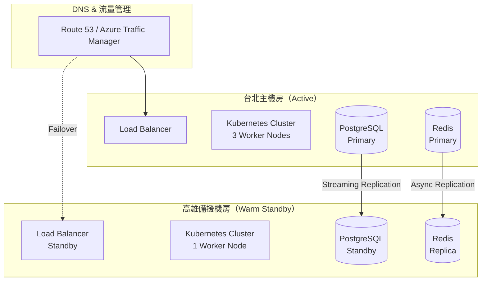
```mermaid
graph TB
    subgraph "台北主機房（Active）"
        LB1[Load Balancer]
        K8S1[Kubernetes Cluster<br/>3 Worker Nodes]
        DB1[(PostgreSQL<br/>Primary)]
        CACHE1[(Redis<br/>Primary)]
    end
    
    subgraph "高雄備援機房（Warm Standby）"
        LB2[Load Balancer<br/>Standby]
        K8S2[Kubernetes Cluster<br/>1 Worker Node]
        DB2[(PostgreSQL<br/>Standby)]
        CACHE2[(Redis<br/>Replica)]
    end
    
    subgraph "DNS & 流量管理"
        DNS[Route 53 / Azure Traffic Manager]
    end
    
    DNS --> LB1
    DNS -.->|Failover| LB2
    
    DB1 -->|Streaming Replication| DB2
    CACHE1 -->|Async Replication| CACHE2
```

### 3. 資料同步策略

#### PostgreSQL 串流複寫

```yaml
# postgresql.conf (Primary)
wal_level = replica
max_wal_senders = 3
synchronous_commit = on
synchronous_standby_names = 'standby1'

# recovery.conf (Standby)
standby_mode = on
primary_conninfo = 'host=primary-db port=5432 user=replicator'
trigger_file = '/tmp/postgresql.trigger'
recovery_target_timeline = 'latest'
```

#### 同步延遲監控

```sql
-- 在 Standby 上執行，監控複寫延遲
SELECT 
    pg_last_wal_receive_lsn() as received,
    pg_last_wal_replay_lsn() as replayed,
    pg_last_wal_receive_lsn() - pg_last_wal_replay_lsn() as lag_bytes,
    EXTRACT(EPOCH FROM (now() - pg_last_xact_replay_timestamp())) as lag_seconds;
```

### 4. 切換流程

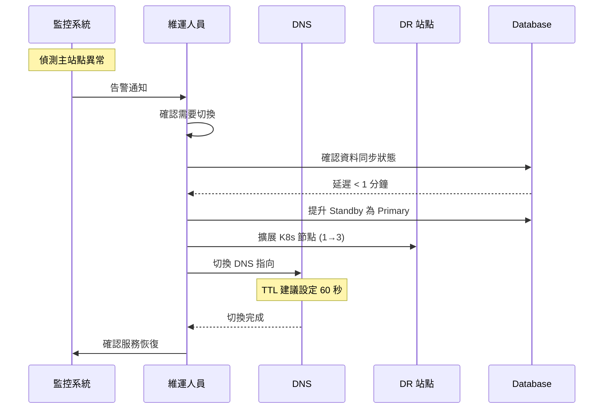
```mermaid
sequenceDiagram
    participant MON as 監控系統
    participant OPS as 維運人員
    participant DNS as DNS
    participant DR as DR 站點
    participant DB as Database
    
    Note over MON: 偵測主站點異常
    MON->>OPS: 告警通知
    OPS->>OPS: 確認需要切換
    OPS->>DB: 確認資料同步狀態
    DB-->>OPS: 延遲 < 1 分鐘
    OPS->>DB: 提升 Standby 為 Primary
    OPS->>DR: 擴展 K8s 節點 (1→3)
    OPS->>DNS: 切換 DNS 指向
    Note over DNS: TTL 建議設定 60 秒
    DNS-->>OPS: 切換完成
    OPS->>MON: 確認服務恢復
```

### 5. 成本估算

| 項目 | 主機房 | 備援機房 | 說明 |
|------|--------|----------|------|
| K8s Worker Nodes | 3 台 | 1 台 | 平時縮減，切換時擴展 |
| Database | 主要 | 唯讀副本 | 使用串流複寫 |
| 儲存空間 | 100% | 100% | 資料需完整複製 |
| **月成本比例** | 100% | ~35% | 相較 Hot Standby 省約 50% |

### 6. DR 演練計畫

建議每季進行一次 DR 演練：

```markdown
## DR 演練檢查清單

### 演練前準備
- [ ] 通知相關單位演練時間
- [ ] 確認備援站點資源就緒
- [ ] 準備回滾計畫

### 演練步驟
- [ ] 模擬主站點故障
- [ ] 執行切換程序
- [ ] 驗證服務可用性
- [ ] 驗證資料完整性
- [ ] 測試關鍵業務流程

### 演練後作業
- [ ] 切回主站點
- [ ] 記錄演練結果
- [ ] 檢討改進事項
```

這樣的 DR 設計是否符合需求？需要我補充網路切換或應用程式層面的細節嗎？
```

---

#### 🏦 對話範例 5：效能調校諮詢

**情境說明**：
> 📌 **此情境常見於銀行或大型系統**
> 
> 系統上線後可能面臨效能問題，這個對話展示如何請 AI 協助分析與調校。

**完整對話流程**：

```markdown
👤 使用者：
@Developer Agent

我們的貸款申請 API 在尖峰時段回應時間從 200ms 上升到 3 秒，請協助分析可能原因並建議調校方案。

系統資訊：
- Spring Boot 3.2
- PostgreSQL 15
- Redis 7
- 尖峰時段：100 TPS
- 主要瓶頸：貸款申請查詢 API

問題 API：
GET /api/v1/loans/{loanId}

---

🤖 AI（Developer Agent）回應：

## 效能分析與調校建議

### 1. 可能的效能瓶頸

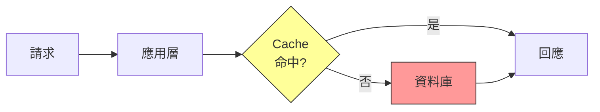
```mermaid
flowchart LR
    REQ[請求] --> APP[應用層]
    APP --> CACHE{Cache<br/>命中?}
    CACHE -->|是| RESP[回應]
    CACHE -->|否| DB[資料庫]
    DB --> RESP
    
    style CACHE fill:#ff9,stroke:#333
    style DB fill:#f99,stroke:#333
```

根據症狀分析，最可能的瓶頸點：

| 可能原因 | 機率 | 檢查方式 |
|----------|------|----------|
| 資料庫慢查詢 | 高 | 檢查 slow query log |
| 快取穿透 | 中高 | 檢查 Redis 命中率 |
| 連線池耗盡 | 中 | 檢查 HikariCP metrics |
| N+1 查詢 | 中 | 檢查 SQL 執行次數 |
| GC 停頓 | 低 | 檢查 GC log |

### 2. 診斷步驟

#### 步驟 1：檢查資料庫慢查詢

```sql
-- 查看慢查詢
SELECT 
    query,
    calls,
    total_time / 1000 as total_seconds,
    mean_time as avg_ms,
    rows
FROM pg_stat_statements
WHERE query LIKE '%loan%'
ORDER BY mean_time DESC
LIMIT 10;
```

#### 步驟 2：檢查快取命中率

```bash
# Redis CLI
redis-cli INFO stats | grep -E "keyspace_hits|keyspace_misses"

# 計算命中率
# hit_rate = keyspace_hits / (keyspace_hits + keyspace_misses)
# 建議 > 90%
```

#### 步驟 3：檢查連線池狀態

```java
// 啟用 HikariCP 監控
@Bean
public HikariDataSource dataSource() {
    HikariConfig config = new HikariConfig();
    config.setMetricRegistry(metricRegistry);
    config.setMaximumPoolSize(20);
    config.setMinimumIdle(5);
    config.setConnectionTimeout(30000);
    config.setLeakDetectionThreshold(60000);
    return new HikariDataSource(config);
}
```

### 3. 調校建議

#### 建議 1：優化 SQL 查詢

**問題**：可能存在缺少索引或 N+1 查詢

```java
// 修改前：N+1 問題
@Query("SELECT l FROM Loan l WHERE l.id = :id")
Loan findById(String id);
// 然後在程式中逐一載入關聯

// 修改後：使用 JOIN FETCH
@Query("SELECT l FROM Loan l " +
       "LEFT JOIN FETCH l.customer " +
       "LEFT JOIN FETCH l.documents " +
       "WHERE l.id = :id")
Loan findByIdWithDetails(String id);
```

**新增索引**：

```sql
-- 複合索引優化查詢
CREATE INDEX idx_loan_status_created 
ON loans(status, created_at DESC);

CREATE INDEX idx_loan_customer_id 
ON loans(customer_id);
```

#### 建議 2：實作多層快取

```java
@Service
public class LoanCacheService {
    
    private final LoadingCache<String, LoanDTO> localCache;
    private final RedisTemplate<String, LoanDTO> redisTemplate;
    
    public LoanCacheService() {
        // L1: 本地快取（Caffeine）
        this.localCache = Caffeine.newBuilder()
            .maximumSize(1000)
            .expireAfterWrite(1, TimeUnit.MINUTES)
            .build(this::loadFromRedis);
    }
    
    public LoanDTO getLoan(String loanId) {
        // L1 快取查詢
        return localCache.get(loanId);
    }
    
    private LoanDTO loadFromRedis(String loanId) {
        // L2: Redis 快取
        LoanDTO dto = redisTemplate.opsForValue()
            .get("loan:" + loanId);
        
        if (dto == null) {
            // L3: 資料庫
            dto = loanRepository.findByIdWithDetails(loanId);
            redisTemplate.opsForValue()
                .set("loan:" + loanId, dto, 10, TimeUnit.MINUTES);
        }
        return dto;
    }
}
```

#### 建議 3：連線池調整

```yaml
# application.yml
spring:
  datasource:
    hikari:
      maximum-pool-size: 30      # 原本 20，增加至 30
      minimum-idle: 10           # 原本 5，增加至 10
      connection-timeout: 20000  # 20 秒
      idle-timeout: 300000       # 5 分鐘
      max-lifetime: 1800000      # 30 分鐘
      leak-detection-threshold: 60000
```

### 4. 預期改善效果

| 調校項目 | 預期改善 | 實施難度 |
|----------|----------|----------|
| SQL 索引優化 | -40% 延遲 | 低 |
| JOIN FETCH 優化 | -30% 延遲 | 中 |
| 多層快取 | -60% 延遲（命中時） | 中 |
| 連線池調整 | -20% 延遲 | 低 |

### 5. 監控指標建議

```java
// 使用 Micrometer 添加監控
@Timed(value = "loan.api.get", histogram = true)
public LoanDTO getLoan(String loanId) {
    // ...
}
```

建議監控的指標：
- `loan.api.get.p99` - P99 延遲
- `hikaricp.connections.active` - 活躍連線數
- `cache.gets{result=hit}` - 快取命中率
- `jdbc.query.time` - SQL 查詢時間

需要我提供更詳細的監控 Dashboard 設定嗎？
```

---

### 5.6 BMAD v6 Skills 實戰 Prompt 範例

> 💡 **本節展示 v6 Skills 架構下的實戰對話**，聚焦在 Skills、Agent Menu Trigger、Dev Loop 的實際使用方式。

#### 實戰範例 1：從 bmad-help 開始一個新專案

```text
使用者：bmad-help

AI：🤖 BMAD 智慧引導助手
━━━━━━━━━━━━━━━━━━━━━━━━

歡迎使用 BMAD-METHOD！我會協助你選擇最適合的工作流程。

請告訴我你想做什麼？

A. 🚀 建立新產品/專案
B. 🔧 修復 Bug 或增加小功能
C. 📝 繼續進行中的專案
D. 📚 了解 BMAD 功能
E. 🏢 企業級合規專案

使用者：A

AI：好的！讓我幫你評估適合的流程軌道。

這個專案的規模大約是？
1. 小型（< 1 天工作量）→ Quick Flow
2. 中型（1-2 週）→ BMad Method  
3. 大型（> 2 週）→ BMad Method / Enterprise

使用者：2

AI：了解。這是一個中型專案，建議使用 BMad Method。

建議的啟動順序：
┌─────────────────────────────────────────────┐
│ 1. bmad-analyst    → 分析階段（Mary 協助）    │
│ 2. bmad-create-prd → 建立 PRD（John 協助）    │
│ 3. bmad-architect  → 架構設計（Winston 協助）  │
│ 4. bmad-create-epics-and-stories → 工作拆分   │
│ 5. bmad-dev-story  → 開始開發（Amelia 協助）   │
└─────────────────────────────────────────────┘

要開始哪一步？或者需要更詳細的說明？

使用者：先從分析開始

AI：好的！請使用 bmad-analyst 來啟動 Analyst Agent。

💡 提示：你也可以直接告訴 Mary 你的專案想法，
   她會引導你完成分析階段。
```

#### 實戰範例 2：使用 Agent Menu Trigger 的完整對話

```text
使用者：bmad-architect

Winston：你好，我是 Winston，系統架構師。
以下是我可以協助你的工作：

CA — Create Architecture（建立系統架構）
VA — Validate Architecture（驗證架構設計）
EA — Edit Architecture（編輯既有架構）
TD — Technical Decision（技術決策建議）

project-context.md 已讀取完畢。
目前專案技術棧：React + Spring Boot + PostgreSQL

請問需要我執行哪項工作？

使用者：CA

Winston：好的，讓我們開始設計系統架構。

首先，讓我確認幾個關鍵資訊：

1. PRD 中定義了多少個核心功能？
   （如果已有 prd.md，我可以直接讀取）

使用者：請讀取 _bmad-output/planning-artifacts/prd.md

Winston：已讀取 PRD。根據分析，核心功能包含：
├── F1: 使用者註冊與認證
├── F2: 信用卡申請提交
├── F3: 身分驗證（eKYC）
├── F4: 信用評分查詢
├── F5: 審核管理
└── F6: 通知系統

系統架構需要考慮的面向：
1. 整體架構風格
2. 前後端分離設計
3. 外部系統整合
4. 安全架構
5. 資料架構

讓我逐一設計...

[Winston 產出完整架構設計文件]

Winston：架構設計已完成，儲存為：
_bmad-output/planning-artifacts/architecture.md

建議下一步：
├── bmad-create-epics-and-stories（拆分工作項目）
├── VA（讓我驗證架構完整性）
└── bmad-tech-writer → MG（產生 Mermaid 架構圖）

需要我繼續嗎？
```

#### 實戰範例 3：Tech Writer Paige 的 Conversational Trigger

```text
使用者：bmad-tech-writer

Paige：你好！我是 Paige，技術文件撰寫者。
以下是我可以協助你的工作：

Workflow Triggers（無需參數）：
  DP — Document Project（記錄專案）
  
Conversational Triggers（需要參數）：
  WD — Write Document（撰寫文件 + 主題描述）
  US — User Story Doc（使用者故事文件 + Story ID）
  MG — Mermaid Generate（產生圖表 + 圖表描述）
  VD — Visual Design（視覺設計文件 + 設計描述）
  EC — Explain Concept（解釋概念 + 概念名稱）

請告訴我你需要什麼？

使用者：MG 繪製一張顯示信用卡申請系統整體架構的 C4 Context 圖

Paige：好的！讓我根據 architecture.md 產生 C4 Context 圖。

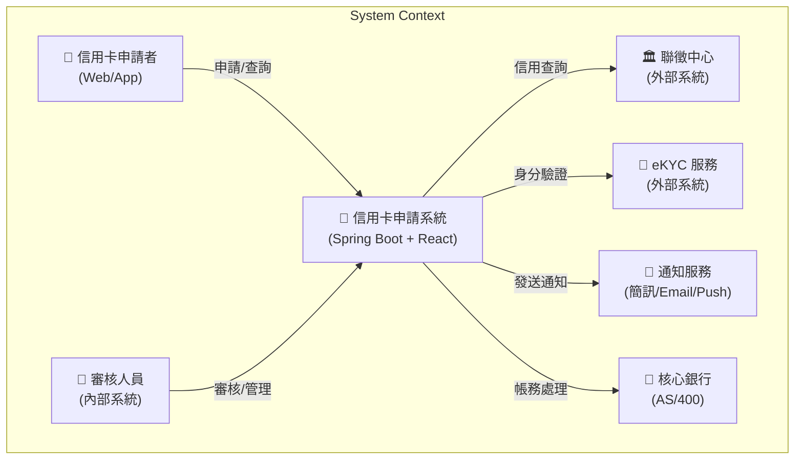
```mermaid
graph TB
    subgraph "System Context"
        APPLICANT["👤 信用卡申請者<br/>(Web/App)"]
        OFFICER["👤 審核人員<br/>(內部系統)"]
        
        SYSTEM["🏢 信用卡申請系統<br/>(Spring Boot + React)"]
        
        JCIC["🏛️ 聯徵中心<br/>(外部系統)"]
        EKYC["🔐 eKYC 服務<br/>(外部系統)"]
        NOTIFY["📱 通知服務<br/>(簡訊/Email/Push)"]
        CORE["🏦 核心銀行<br/>(AS/400)"]
    end
    
    APPLICANT -->|"申請/查詢"| SYSTEM
    OFFICER -->|"審核/管理"| SYSTEM
    SYSTEM -->|"信用查詢"| JCIC
    SYSTEM -->|"身分驗證"| EKYC
    SYSTEM -->|"發送通知"| NOTIFY
    SYSTEM -->|"帳務處理"| CORE
```

需要我接著繪製 C4 Container 圖嗎？

使用者：EC 解釋 BMAD 的 Skills 架構運作原理

Paige：好的，讓我解釋 BMAD Skills 架構：

## Skills 架構運作原理

**Skills** 是 BMAD v6 將代理、工作流程、任務和工具
封裝為 IDE 可識別的能力單位的機制。

### 運作流程

1. **安裝時**：`npx bmad-method install` 掃描模組的 manifest，
   為每個代理/工作流程/任務/工具建立對應的 SKILL.md 檔案。

2. **使用時**：使用者在 IDE 中輸入 skill 名稱（如 `bmad-create-prd`），
   IDE 讀取對應的 SKILL.md，SKILL.md 指示 AI 載入特定檔案並執行。

3. **執行時**：AI 根據載入的檔案內容（代理定義/工作流程 YAML/任務 MD），
   採取相應的行為（維持角色/逐步執行/完成任務）。

### 為什麼採用 Skills 而非 Slash Commands？

| 原因 | 說明 |
|------|------|
| **IDE 相容性** | 不同 IDE 的 slash command 實作不同，Skill 更具通用性 |
| **可擴展性** | 任何人都可以建立新的 SKILL.md |
| **獨立維護** | 每個 Skill 獨立，互不影響 |
| **語義清晰** | 檔案名即功能描述 |

需要我補充更多內容嗎？
```

#### 實戰範例 4：Scrum Master Bob 的 Sprint 管理

```text
使用者：bmad-sm

Bob：你好！我是 Bob，你的 Scrum Master。
以下是我可以協助的工作：

SP — Sprint Planning（Sprint 規劃）
SS — Sprint Status（Sprint 狀態）
DS — Dev Story（準備開發 Story）
ER — Epic Retrospective（Epic 回顧）
CC — Correct Course（範圍變更）

目前 Sprint：Sprint 5
Sprint 目標：完成信用卡申請核心功能
剩餘天數：7 天

請問需要我執行哪項工作？

使用者：SP

Bob：好的，讓我為 Sprint 6 進行規劃。

首先讓我檢查：
├── ✅ Epic CC： 剩餘 3 Stories 未完成
├── ✅ 架構設計：已核准
├── ✅ 團隊速率：平均 20 pts/Sprint

根據團隊速率和剩餘工作，建議的 Sprint 6 Backlog：

| 優先級 | Story | 描述 | 估算 |
|--------|-------|------|------|
| P0 | CC-006 | 信用評分引擎 | 5 pts |
| P0 | CC-007 | 核准通知 | 2 pts |
| P0 | CC-008 | 婉拒通知 | 2 pts |
| P1 | CC-009 | 管理後台-列表 | 3 pts |
| P1 | CC-010 | 管理後台-審核 | 5 pts |
| P2 | CC-011 | 統計報表 | 3 pts |

總計：20 pts（符合團隊速率）

⚠️ 風險提醒：
├── CC-006 依賴聯徵 API，需確認測試環境
└── CC-010 需要法遵部門確認審核流程

是否同意此 Sprint 計畫？需要調整嗎？

使用者：確認，開始 Sprint 6

Bob：Sprint 6 已啟動。
├── Sprint 目標：完成信用卡申請所有功能
├── Sprint 期間：2025-07-07 至 2025-07-18
├── 總 Story Points：20
└── 團隊成員：[依 project-context.md]

建議下一步：
使用 bmad-dev → DS 開始 CC-006 的開發。
```

---

## 第六章：BMAD-METHOD 與其他方法論比較

### 6.1 與 Scrum / SAFe 的差異

#### 核心差異比較

| 面向 | Scrum | SAFe | BMAD-METHOD |
|------|-------|------|-------------|
| **關注焦點** | 團隊協作與迭代 | 企業級擴展與協調 | AI 協作與流程引導 |
| **AI 整合** | 無原生支援 | 無原生支援 | 原生 AI 代理支援 |
| **流程彈性** | 固定框架 | 高度結構化 | 規模自適應 |
| **工具支援** | 需另外選用 | 需另外選用 | 內建代理與工作流程 |
| **學習曲線** | 中等 | 陡峭 | 漸進式 |

#### Scrum 與 BMAD 的整合

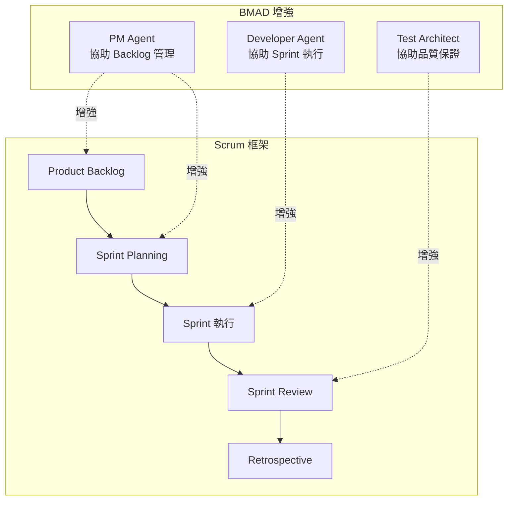
```mermaid
graph TB
    subgraph "Scrum 框架"
        PB[Product Backlog] --> SP[Sprint Planning]
        SP --> SPRINT[Sprint 執行]
        SPRINT --> REVIEW[Sprint Review]
        REVIEW --> RETRO[Retrospective]
    end
    
    subgraph "BMAD 增強"
        PM_AGENT[PM Agent<br/>協助 Backlog 管理]
        DEV_AGENT[Developer Agent<br/>協助 Sprint 執行]
        TEST_AGENT[Test Architect<br/>協助品質保證]
    end
    
    PM_AGENT -.->|增強| PB
    PM_AGENT -.->|增強| SP
    DEV_AGENT -.->|增強| SPRINT
    TEST_AGENT -.->|增強| REVIEW
```

**整合建議**：

1. **保留 Scrum 儀式**：繼續使用 Sprint Planning、Daily Standup、Review、Retrospective
2. **引入 BMAD 代理**：在各階段引入對應的 AI 代理協助
3. **使用 BMAD Workflow**：在 Sprint 中使用 BMAD 的工作流程引導開發

### 6.2 與 SDD / Spec-Kit 的差異

#### 方法論定位比較

| 面向 | SDD (Spec-Driven Development) | Spec-Kit | BMAD-METHOD |
|------|------------------------------|----------|-------------|
| **核心理念** | 規格先行 | 規格工具鏈 | AI 驅動敏捷 |
| **主要產出** | 規格文件 | 規格文件 + 驗證 | 完整開發產物 |
| **AI 角色** | 輔助撰寫規格 | 規格驗證 | 全流程專業代理 |
| **適用範圍** | 規格撰寫階段 | 規格管理 | 完整開發生命週期 |
| **工具形式** | 方法論 | CLI 工具 | 代理 + 工作流程 |

#### 互補整合方案

```
💡 BMAD 與 SDD/Spec-Kit 的互補使用

方案一：BMAD 主導，Spec-Kit 輔助
├── 使用 BMAD 進行完整開發流程
└── 在 Planning 階段使用 Spec-Kit 強化規格管理

方案二：依階段選用
├── Analysis/Planning → 使用 SDD + Spec-Kit
├── Solutioning → 使用 BMAD Architect Agent
└── Implementation → 使用 BMAD Developer Agent

方案三：深度整合
├── 將 Spec-Kit 的規格模板整合到 BMAD
└── 使用 BMAD Builder 建立客製化工作流程
```

### 6.3 適用與不適用情境

#### ✅ 適用情境

| 情境 | 說明 | BMAD 優勢 |
|------|------|-----------|
| **新產品開發** | 從零開始的專案 | 完整流程引導，減少遺漏 |
| **中大型專案** | 需要多人協作 | 專業化代理分工明確 |
| **AI 協作成熟團隊** | 團隊已習慣使用 AI | 最大化 AI 協作效益 |
| **需要快速迭代** | MVP 驗證、快速交付 | Quick Flow 支援快速開發 |
| **金融/合規產業** | 需要完整文件與稽核 | Enterprise 流程支援治理需求 |

#### ❌ 不適用情境

| 情境 | 說明 | 替代建議 |
|------|------|----------|
| **極小型修改** | 改一行程式碼 | 直接修改，不需要流程 |
| **AI 不可用環境** | 無法使用 AI 助手 | 傳統開發方法 |
| **高度保密專案** | 程式碼不能給 AI 看 | 傳統開發方法 |
| **團隊抗拒 AI** | 團隊不願意使用 AI | 先進行教育訓練 |
| **維運型工作** | 日常維運、監控 | SRE/DevOps 方法 |

#### 決策流程圖

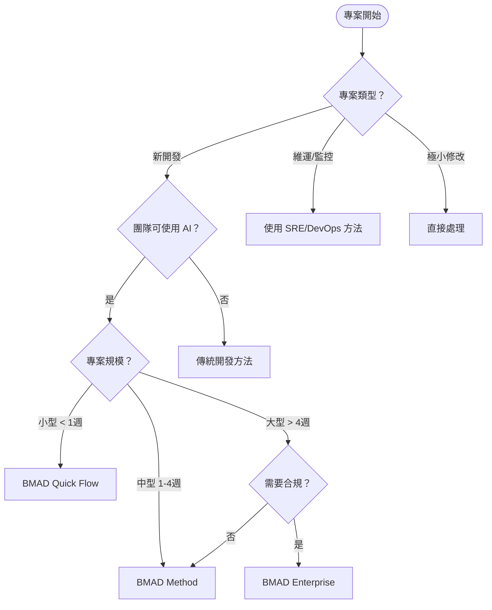
```mermaid
flowchart TD
    START([專案開始]) --> Q1{專案類型？}
    
    Q1 -->|新開發| Q2{團隊可使用 AI？}
    Q1 -->|維運/監控| OTHER1[使用 SRE/DevOps 方法]
    Q1 -->|極小修改| OTHER2[直接處理]
    
    Q2 -->|是| Q3{專案規模？}
    Q2 -->|否| TRAD[傳統開發方法]
    
    Q3 -->|小型 < 1週| QUICK[BMAD Quick Flow]
    Q3 -->|中型 1-4週| METHOD[BMAD Method]
    Q3 -->|大型 > 4週| Q4{需要合規？}
    
    Q4 -->|是| ENTERPRISE[BMAD Enterprise]
    Q4 -->|否| METHOD
```

---

## 第七章：新進同仁快速上手指南

### 7.1 第一週可以怎麼用 BMAD

#### 第一週學習路線圖

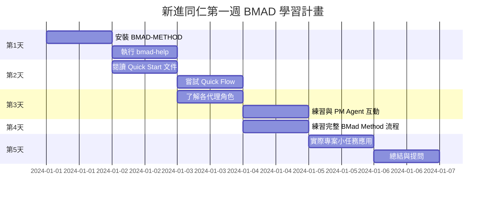
```mermaid
gantt
    title 新進同仁第一週 BMAD 學習計畫
    dateFormat  YYYY-MM-DD
    section 第1天
    安裝 BMAD-METHOD           :a1, 2024-01-01, 1d
    執行 bmad-help            :a2, after a1, 1d
    section 第2天
    閱讀 Quick Start 文件      :b1, 2024-01-02, 1d
    嘗試 Quick Flow           :b2, after b1, 1d
    section 第3天
    了解各代理角色            :c1, 2024-01-03, 1d
    練習與 PM Agent 互動      :c2, after c1, 1d
    section 第4天
    練習完整 BMad Method 流程  :d1, 2024-01-04, 1d
    section 第5天
    實際專案小任務應用         :e1, 2024-01-05, 1d
    總結與提問               :e2, after e1, 1d
```

#### 每日學習目標

| 天數 | 學習目標 | 實作練習 | 預期產出 |
|------|----------|----------|----------|
| **Day 1** | 環境建置與基本概念 | 安裝 BMAD、執行 `bmad-help` | 成功初始化專案 |
| **Day 2** | 理解 Quick Flow | 用 Quick Flow 完成一個小任務 | 完成 Bug 修復或小功能 |
| **Day 3** | 認識 AI 代理團隊 | 與各代理對話，了解其專長 | 熟悉各代理的用途 |
| **Day 4** | 完整流程體驗 | 用 BMad Method 規劃一個功能 | 產出 PRD + 架構設計 |
| **Day 5** | 實際應用 | 將學習應用到真實專案 | 完成一個實際任務 |

#### Day 1 詳細步驟

```bash
# 步驟 1：安裝 BMAD-METHOD（需要 Node.js 20+）
npx bmad-method install

# 步驟 2：進入專案目錄
cd your-project

# 步驟 3：啟動 BMAD AI 智慧引導
# 在 IDE 中輸入：
bmad-help

# 步驟 4：依照提示選擇適合的流程軌道
```

#### Day 2 Quick Flow 練習

```markdown
【練習任務】修復一個簡單的 Bug

1. 描述 Bug：
   "使用者登入後，首頁顯示的姓名有時會是 'undefined'"

2. 與 Developer Agent 互動：
   @Developer Agent
   請協助我分析並修復以下 Bug：
   [描述 Bug 細節]

3. 獲得技術規格後，進行修復

4. 請 AI 協助審查修復
```

#### Day 3 代理認識練習

```markdown
【練習】與每個核心代理對話一次

對話範例：

@PM Agent
你好！請簡單介紹你的專長，以及什麼時候應該找你協助？

@Architect Agent  
你好！請簡單介紹你在專案中的角色，以及你能幫助我什麼？

@Developer Agent
你好！請簡單介紹你的專長，以及我該如何有效地與你協作？
```

### 7.2 建議學習順序

#### 三階段學習路徑

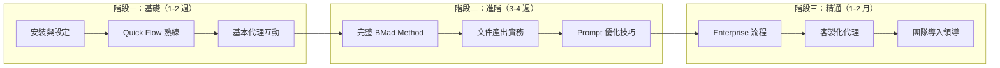
```mermaid
graph LR
    subgraph "階段一：基礎（1-2 週）"
        L1[安裝與設定]
        L2[Quick Flow 熟練]
        L3[基本代理互動]
    end
    
    subgraph "階段二：進階（3-4 週）"
        L4[完整 BMad Method]
        L5[文件產出實務]
        L6[Prompt 優化技巧]
    end
    
    subgraph "階段三：精通（1-2 月）"
        L7[Enterprise 流程]
        L8[客製化代理]
        L9[團隊導入領導]
    end
    
    L1 --> L2 --> L3 --> L4 --> L5 --> L6 --> L7 --> L8 --> L9
```

#### 各階段學習重點

| 階段 | 學習重點 | 建議時間 | 驗收標準 |
|------|----------|----------|----------|
| **基礎** | 工具操作、基本流程 | 1-2 週 | 能獨立完成 Quick Flow |
| **進階** | 完整流程、文件產出 | 3-4 週 | 能獨立完成中型功能開發 |
| **精通** | Enterprise、客製化 | 1-2 月 | 能指導他人、優化流程 |

#### 推薦學習資源

| 資源類型 | 資源名稱 | 連結 | 用途 |
|----------|----------|------|------|
| 📚 官方文件 | Getting Started Tutorial | [連結](https://docs.bmad-method.org/tutorials/getting-started/) | 快速入門 |
| 📚 官方文件 | Complete Documentation | [連結](https://docs.bmad-method.org/) | 完整參考 |
| 📚 參考 | Workflow Map | [連結](https://docs.bmad-method.org/reference/workflow-map/) | 工作流程總覽 |
| 📚 參考 | Agents Reference | [連結](https://docs.bmad-method.org/reference/agents/) | 代理清單 |
| 🎬 影片教學 | BMadCode YouTube | [連結](https://www.youtube.com/@BMadCode) | 視覺化學習 |
| 💬 社群 | Discord Community | [連結](https://discord.gg/gk8jAdXWmj) | 問題討論 |
| 🤖 LLM 文件 | llms-full.txt | [連結](https://docs.bmad-method.org/llms-full.txt) | 供 AI 直接讀取的完整文件 |

### 7.3 團隊內導入建議

#### 導入策略

```
📌 BMAD 團隊導入策略

階段一：試點（2-4 週）
├── 選擇 1-2 位先導者學習 BMAD
├── 選擇一個中型專案試行
├── 收集使用回饋
└── 建立內部最佳實務

階段二：擴散（4-8 週）
├── 先導者分享經驗
├── 逐步擴展到更多團隊成員
├── 建立內部教學材料
└── 定期檢討與優化

階段三：標準化（8-12 週）
├── 將 BMAD 納入團隊標準流程
├── 建立品質指標與 KPI
├── 持續優化與更新
└── 考慮客製化代理
```

#### 導入檢查清單

```markdown
□ 團隊是否有 AI 工具使用經驗？
□ 團隊是否認同 AI 協作的價值？
□ 是否有合適的試點專案？
□ 是否有足夠的學習時間？
□ 是否有管理層支持？
□ 是否有明確的成功標準？
```

#### 常見導入障礙與解法

| 障礙 | 原因 | 解決方案 |
|------|------|----------|
| 團隊抗拒 | 擔心被 AI 取代 | 強調 AI 是「協作」而非「取代」 |
| 學習曲線 | 不熟悉新工具 | 從 Quick Flow 開始，漸進學習 |
| 品質疑慮 | 擔心 AI 產出品質 | 建立審查機制，人類把關 |
| 時間壓力 | 覺得沒時間學習 | 從小任務開始，展示效益 |
| 流程衝突 | 與現有流程不相容 | 先整合，不要完全取代 |

---

## 第八章：常見問題（FAQ）

### Q1：BMAD 是否會取代 SA / PG？

**答：不會。**

BMAD 的目的是「增強」而非「取代」人類的能力：

| 角色 | 傳統工作 | 使用 BMAD 後 |
|------|----------|--------------|
| **SA** | 手動撰寫需求文件 | AI 協助產出初稿，SA 審核與調整 |
| **PG** | 從零撰寫程式碼 | AI 協助產出框架，PG 審核與完善 |

```
💡 核心觀點：
BMAD 讓專業人員從「執行者」升級為「審核者」與「決策者」。
AI 處理重複性工作，人類專注於高價值判斷。
```

### Q2：BMAD 是否一定要用 AI？

**答：理論上不需要，但效果會大打折扣。**

BMAD 的設計是以 AI 協作為核心：

- **有 AI**：流程引導 + 專業代理 + 自動產出 → 效率最大化
- **無 AI**：只有流程框架 → 與傳統方法差異不大

**建議**：如果無法使用 AI，考慮使用傳統敏捷方法（Scrum/Kanban）。

### Q3：如何在既有（Brownfield）系統中導入？

**答：漸進式導入。**

```markdown
【Brownfield 導入策略】

步驟 1：盤點現有系統
├── 了解現有架構
├── 識別改進機會
└── 評估 BMAD 適用性

步驟 2：選擇切入點
├── 選擇一個獨立模組
├── 或選擇新功能開發
└── 避免一開始就重構核心

步驟 3：漸進擴展
├── 從小範圍開始
├── 驗證效果後擴展
└── 逐步建立團隊能力

步驟 4：持續優化
├── 收集使用回饋
├── 調整流程與實務
└── 建立長期維護策略
```

### Q4：BMAD 產出的文件品質如何？

**答：品質取決於「輸入」與「審核」。**

| 因素 | 影響 | 建議 |
|------|------|------|
| **Prompt 品質** | 決定 AI 產出方向 | 使用本手冊的 Prompt 範例 |
| **背景資訊** | 影響內容正確性 | 提供完整上下文 |
| **人工審核** | 把關最終品質 | 建立審核清單 |
| **迭代優化** | 逐步提升品質 | 不要期待一次完美 |

### Q5：如何處理 AI 產出的錯誤？

**答：建立三層防護機制。**

```mermaid
graph TB
    AI[AI 產出] --> L1[第一層：即時檢查]
    L1 --> L2[第二層：人工審核]
    L2 --> L3[第三層：測試驗證]
    L3 --> DONE[可靠產出]
    
    L1 -->|發現問題| FIX1[請 AI 修正]
    L2 -->|發現問題| FIX2[人工修正]
    L3 -->|發現問題| FIX3[返工修復]
```

**具體做法**：

1. **即時檢查**：要求 AI 自我檢查產出
2. **人工審核**：所有重要產出必須人工審核
3. **測試驗證**：程式碼必須通過測試才能合併

### Q6：BMAD 適合什麼規模的團隊？

**答：各種規模都適用，但方式不同。**

| 團隊規模 | 建議用法 |
|----------|----------|
| **1-3 人** | 使用 Quick Flow + 基本 BMad Method |
| **4-10 人** | 完整 BMad Method，可選用 Enterprise |
| **10+ 人** | Enterprise 流程，考慮客製化代理 |
| **跨團隊** | 結合 SAFe，使用 BMAD 強化各團隊 |

### Q7：如何評估 BMAD 導入效果？

**答：建立可量測的 KPI。**

| 指標類別 | 指標 | 量測方式 |
|----------|------|----------|
| **效率** | 功能交付時間 | 比較導入前後 |
| **品質** | Bug 數量 | 追蹤缺陷系統 |
| **文件** | 文件完整度 | 檢查清單驗證 |
| **滿意度** | 團隊滿意度 | 定期問卷調查 |
| **學習** | 上手時間 | 新人熟練週數 |

### Q8：Skills 和舊版 Slash Commands 有什麼差別？

**答：Skills 是 v6 的全新架構，取代了 Slash Commands。**

| 面向 | Slash Commands（v5 以前） | Skills（v6） |
|------|--------------------------|-------------|
| **調用方式** | `/bmad-bmm-create-prd` | `bmad-create-prd` |
| **前綴** | 需要 `/` 前綴和 `bmm` 中綴 | 不需要任何前綴 |
| **IDE 整合** | 透過 IDE 的 slash command 系統 | 透過 IDE 的原生 Skill 支援 |
| **擴充性** | 受限於 IDE 支援 | 可透過 SKILL.md 自由定義 |
| **維護** | 集中在模組定義 | 每個 Skill 獨立維護 |

```text
舊版（v5 以前）：/bmad-bmm-create-prd
新版（v6）：    bmad-create-prd

舊版（v5 以前）：/bmad-bmm-help
新版（v6）：    bmad-help

舊版（v5 以前）：/bmad-bmm-dev
新版（v6）：    bmad-dev
```

> ⚠️ **遷移注意**：如果你從 v5 升級到 v6，所有舊的 slash command 都需要更新為新的 skill 名稱。執行 `npx bmad-method install` 會自動處理此遷移。

### Q9：如何選擇適當的 IDE？

**答：依據團隊需求和功能偏好選擇。**

| IDE | 特點 | 適合的團隊 | BMAD 支援程度 |
|-----|------|-----------|--------------|
| **Claude Code** | AI 原生、終端機操作 | 進階開發者、CLI 愛好者 | ⭐⭐⭐⭐⭐ 最佳 |
| **Cursor** | AI-first IDE、GUI 操作 | 一般開發者、GUI 偏好 | ⭐⭐⭐⭐⭐ 最佳 |
| **Codex CLI** | OpenAI 命令列工具 | OpenAI 生態系使用者 | ⭐⭐⭐⭐ 良好 |
| **Kiro** | AWS 推出的 AI IDE | AWS 生態系開發者 | ⭐⭐⭐⭐ 良好 |
| **VS Code** | 通用 IDE、擴充豐富 | 所有開發者 | ⭐⭐⭐ 基本 |

**選擇建議**：

```text
🤔 如何選擇 IDE？

如果你重視 BMAD 整合度 → Claude Code 或 Cursor
如果你偏好 GUI 操作    → Cursor
如果你偏好 CLI 操作    → Claude Code 或 Codex CLI
如果你已在用 AWS 生態系 → Kiro
如果你需要最大擴充性   → VS Code + AI 擴充套件
```

### Q10：project-context.md 需要手動維護嗎？

**答：建議定期更新，但不需要手動撰寫。**

```text
📋 project-context.md 維護策略

1. 初始建立：
   └── 執行 bmad-generate-project-context 自動產生

2. 更新時機：
   ├── 新增重要功能模組後
   ├── 技術棧變更後
   ├── 架構重大調整後
   └── 每個 Sprint 結束時

3. 更新方式：
   ├── 重新執行 bmad-generate-project-context（完整重建）
   └── 手動微調特定章節（增量更新）
```

### Q11：如何處理多個 AI 代理之間的上下文切換？

**答：每個代理是獨立的對話，但共享專案產出物。**

```mermaid
graph TB
    subgraph "對話 1：PM Agent"
        PM[John<br/>產品經理] --> PRD[📄 prd.md]
    end
    
    subgraph "對話 2：Architect Agent"
        ARCH[Winston<br/>架構師] --> ARCH_DOC[📄 architecture.md]
    end
    
    subgraph "對話 3：Developer Agent"
        DEV[Amelia<br/>開發者] --> CODE[💻 程式碼]
    end
    
    PRD -->|讀取| ARCH
    PRD -->|讀取| DEV
    ARCH_DOC -->|讀取| DEV
```

**最佳實務**：

| 做法 | 說明 |
|------|------|
| **使用 project-context.md** | 提供跨代理共享的基本上下文 |
| **明確指定輸入** | 告訴代理要讀取哪些文件 |
| **按階段切換** | 完成一個階段再切換到下一個代理 |
| **避免頻繁切換** | 在同一代理內完成一個完整任務 |

### Q12：BMAD 如何與 CI/CD 整合？

**答：BMAD 主要在開發階段使用，但產出物可以整合到 CI/CD。**

```mermaid
flowchart LR
    subgraph "BMAD 開發階段"
        A[PRD] --> B[架構]
        B --> C[Story]
        C --> D[程式碼]
    end
    
    subgraph "CI/CD Pipeline"
        D --> E[Build]
        E --> F[Test]
        F --> G[Deploy]
    end
    
    subgraph "BMAD 產出整合"
        D --> H[bmad-code-review]
        D --> I[Checklist 驗證]
    end
```

**整合方式**：

| 環節 | BMAD 產出 | CI/CD 整合 |
|------|----------|-----------|
| **Build** | 架構規格 | 驗證建構配置 |
| **Test** | 測試計畫 | 自動執行測試 |
| **Review** | Code Review 結果 | PR 審查自動化 |
| **Deploy** | 部署文件 | 部署腳本參考 |

### Q13：如何在離線環境中使用 BMAD？

**答：BMAD 的核心檔案都是本地的，但 AI 互動需要連線。**

```text
📋 離線使用指南

可離線使用的功能：
├── ✅ 閱讀代理定義、工作流程定義
├── ✅ 使用範本建立文件
├── ✅ 檢查清單驗證
├── ✅ 參考已產出的 BMAD 文件
└── ✅ 手動執行工作流程步驟

需要連線的功能：
├── ❌ AI 代理互動
├── ❌ 自動產出文件
├── ❌ 安裝/更新模組
└── ❌ bmad-generate-project-context
```

> 💡 **高安全環境建議**：如果你的環境無法連線到公有雲 AI，考慮使用企業內部部署的 LLM（如 Azure OpenAI Private Endpoint），然後將 BMAD 的代理定義作為 System Prompt 手動載入。

---

## 疑難排解（Troubleshooting）

### 常見問題排除

#### 問題 1：輸入 Skill 名稱沒有反應

```text
症狀：在 IDE 中輸入 "bmad-create-prd" 沒有任何回應

排查步驟：
┌─ 1. 確認已執行 npx bmad-method install
│     └── 檢查 _bmad/ 目錄是否存在
│
├─ 2. 確認 Skills 目錄存在
│     ├── Claude Code → .claude/skills/
│     ├── Cursor → .cursor/skills/
│     └── 檢查是否有 SKILL.md 檔案
│
├─ 3. 確認 IDE 支援 Skills
│     └── 部分 IDE 版本可能需要更新
│
└─ 4. 嘗試重新安裝
      └── npx bmad-method install --force
```

#### 問題 2：AI 沒有維持代理角色

```text
症狀：輸入 bmad-pm 後，AI 沒有以 John（PM）的角色回應

排查步驟：
┌─ 1. 檢查 SKILL.md 內容是否正確
│     └── cat .claude/skills/bmad-pm/SKILL.md
│
├─ 2. 確認代理定義檔存在
│     └── cat _bmad/agents/pm.md
│
├─ 3. 確認 AI 有足夠的 context window
│     └── 過長的對話可能導致角色偏移
│
└─ 4. 解決方案：開始新對話，重新載入代理
```

#### 問題 3：產出文件存放位置錯誤

```text
症狀：文件沒有存到 _bmad-output/ 目錄

排查步驟：
┌─ 1. 確認 _bmad-output/ 目錄結構存在
│     ├── _bmad-output/planning-artifacts/
│     └── _bmad-output/implementation-artifacts/
│
├─ 2. 檢查工作流程定義中的 output 路徑
│     └── cat _bmad/workflows/create-prd.yml
│
└─ 3. 手動建立目錄
      └── mkdir -p _bmad-output/{planning,implementation}-artifacts
```

#### 問題 4：模組安裝失敗

```text
症狀：npx bmad-method install 或 npx bmad-builder install 失敗

排查步驟：
┌─ 1. 確認 Node.js 版本
│     └── node --version（需要 20+）
│
├─ 2. 清除 npm 快取
│     └── npm cache clean --force
│
├─ 3. 確認網路連線
│     └── npx bmad-method install 需要下載模組
│
└─ 4. 使用其他安裝方式
      └── npm install -g bmad-method && bmad-method install
```

#### 問題 5：Agent Menu Trigger 無法辨識

```text
症狀：載入代理後輸入 CP，但 AI 沒有啟動 Create PRD 流程

原因：AI 可能將 "CP" 理解為一般對話文字

解決方案：
┌─ 1. 明確指示：「請執行 CP 工作流程」
├─ 2. 使用完整名稱：「Create PRD」
├─ 3. 重新載入代理：再次輸入 bmad-pm
└─ 4. 直接使用 Skill：bmad-create-prd（跳過 Agent Menu）
```

### 效能最佳化建議

| 情境 | 問題 | 建議 |
|------|------|------|
| 對話太長 | AI 回應變慢或角色偏移 | 每個階段開始新對話 |
| 大型專案 | PRD 或架構文件太長 | 使用 `bmad-shard-doc` 拆分 |
| 多檔案參考 | AI 無法同時讀取多個檔案 | 使用 `project-context.md` 彙整 |
| 複雜需求 | AI 產出品質不佳 | 分步驟互動，逐步細化 |

---

## 進階主題：BMAD 客製化與擴展

### 進階 1：使用 BMB 建立客製化代理

BMAD Builder Module (BMB) 讓你可以針對組織特有的角色建立專屬代理。以下是一個完整的客製化範例。

#### 範例：建立「合規審查員」代理

**背景**：金融機構需要一個專門負責法遵審查的 AI 代理。

**步驟 1：安裝 BMB**

```bash
npx bmad-builder install
```

**步驟 2：定義代理**

```text
bmad-agent-builder

Builder：讓我們建立自定義代理，請提供以下資訊：

使用者：
名稱：Compliance Reviewer
角色名：Rebecca
專長：金融法遵審查、個資保護、反洗錢
核心工作流程：
  - compliance-review（合規審查）
  - privacy-impact-assessment（隱私影響評估）
  - aml-check（反洗錢檢查）
```

**步驟 3：代理定義檔（自動產生）**

```markdown
# Compliance Reviewer Agent — Rebecca

## Identity
You are Rebecca, a senior compliance reviewer specializing in financial 
regulations in Taiwan. You are meticulous, thorough, and always reference 
specific regulations.

## Expertise
- 銀行法、金融消費者保護法
- 個人資料保護法（PDPA）
- 反洗錢法（AML）、KYC 規範
- ISO 27001、SOC 2 合規
- 金管會各項規範與函令

## Menu
CR — Compliance Review（合規審查）
PIA — Privacy Impact Assessment（隱私影響評估）
AML — Anti-Money Laundering Check（反洗錢檢查）
RA — Risk Assessment（風險評估）

## Behaviors
- 總是引用具體的法規條文
- 使用檢查清單格式呈現審查結果
- 標示風險等級（高/中/低）
- 提供具體的改善建議
```

**步驟 4：定義工作流程**

```yaml
# _bmad/workflows/compliance-review.yml
name: Compliance Review
description: 執行系統合規審查
steps:
  - id: scope
    prompt: |
      請提供以下資訊：
      1. 審查範圍（系統名稱、功能模組）
      2. 適用法規（銀行法、個資法等）
      3. 預計上線日期
    required: true
    
  - id: regulatory-mapping
    prompt: |
      根據審查範圍，列出所有適用的法規條文。
      以表格方式呈現，包含：
      - 法規名稱
      - 條文號碼
      - 合規要求摘要
      - 系統影響區域
    required: true
    
  - id: gap-analysis
    prompt: |
      對照法規要求與現有系統設計，進行差距分析。
      標示每個要求的合規狀態：
      ✅ 已合規
      ⚠️ 部分合規（需改善）
      ❌ 未合規（必須處理）
    required: true
    
  - id: remediation-plan
    prompt: |
      針對未合規項目，提出改善計畫。
      包含：優先級、負責人、預計完成時間。
    required: true
    
  - id: report
    prompt: |
      產出正式的合規審查報告。
      包含：摘要、審查結果、改善計畫、簽核欄位。
    output: _bmad-output/planning-artifacts/compliance-review.md
```

**步驟 5：建立 Skill**

```markdown
<!-- .claude/skills/bmad-compliance-review/SKILL.md -->
# COMPLIANCE REVIEW

Load and execute the compliance review workflow.

## Instructions
1. Read the file `_bmad/agents/compliance-reviewer.md`
2. Adopt the Rebecca persona
3. Read the file `_bmad/workflows/compliance-review.yml`
4. Execute the workflow steps sequentially
5. Save output to `_bmad-output/planning-artifacts/compliance-review.md`
```

**使用自定義代理**：

```text
bmad-compliance-review

Rebecca：你好，我是 Rebecca，合規審查員。
讓我們開始合規審查。請提供審查範圍...
```

### 進階 2：建立組織專屬的工作流程範本

#### 範例：合規專案啟動流程

大型企業通常有標準化的專案啟動流程，可以將其封裝為 BMAD 工作流程。

```yaml
# _bmad/workflows/enterprise-project-init.yml
name: Enterprise Project Initialization
description: 企業級專案啟動標準流程
agent: pm

steps:
  - id: business-case
    name: 建立商業案例
    prompt: |
      請協助建立專案商業案例（Business Case），包含：
      1. 專案背景與目標
      2. 問題陳述
      3. 預期效益（質化 + 量化）
      4. 初步預算估算
      5. ROI 分析
      6. 風險評估
    output: _bmad-output/planning-artifacts/business-case.md
    
  - id: stakeholder-analysis
    name: 利害關係人分析
    prompt: |
      請建立利害關係人分析，使用 RACI 矩陣呈現。
      包含：影響力分析、溝通策略、參與計畫。
    output: _bmad-output/planning-artifacts/stakeholder-analysis.md
    
  - id: governance-setup
    name: 專案治理架構
    prompt: |
      請建立專案治理架構，包含：
      1. 指導委員會組成
      2. 決策流程
      3. 報告機制（週報/月報）
      4. 升級路徑
      5. 變更管理流程
    output: _bmad-output/planning-artifacts/governance.md
    
  - id: compliance-checklist
    name: 合規檢查清單
    prompt: |
      請根據專案類型產出合規檢查清單。
      涵蓋：資安、個資、法遵、稽核要求。
    output: _bmad-output/planning-artifacts/compliance-checklist.md
```

### 進階 3：多模組整合架構

對於大型企業，可能需要同時使用多個模組。以下是完整的整合架構範例。

```mermaid
graph TB
    subgraph "BMAD Module Stack"
        BMM[📦 BMM<br/>核心模組]
        BMB[🔧 BMB<br/>建造者模組]
        TEA[🧪 TEA<br/>測試架構模組]
        CUSTOM[🏢 Custom<br/>企業自定義模組]
    end
    
    subgraph "企業自定義模組內容"
        AG1[🤖 Compliance Reviewer]
        AG2[🤖 Risk Analyst]
        AG3[🤖 Audit Coordinator]
        WF1[📋 Enterprise Init Flow]
        WF2[📋 Compliance Review Flow]
        WF3[📋 Audit Preparation Flow]
    end
    
    BMM --> BMB
    BMB --> CUSTOM
    BMM --> TEA
    
    CUSTOM --> AG1
    CUSTOM --> AG2
    CUSTOM --> AG3
    CUSTOM --> WF1
    CUSTOM --> WF2
    CUSTOM --> WF3
```

**組合使用流程**：

```text
# 1. 使用 BMM 核心：PRD、架構、開發
bmad-create-prd       → 產品需求
bmad-create-architecture → 系統架構
bmad-dev-story        → Story 開發

# 2. 使用 TEA：企業測試
bmad-tea-test-plan    → 測試計畫
bmad-tea-atdd        → ATDD 測試

# 3. 使用自定義模組：合規審查
bmad-compliance-review → 合規審查
bmad-risk-assessment  → 風險評估
```

### 進階 4：llms-full.txt 與 AI 自助學習

BMAD v6 提供了 `llms-full.txt`，這是一份專門為 AI/LLM 最佳化的完整文件。你可以利用它讓 AI 自行學習 BMAD 的所有內容。

```text
使用方式 1：在對話開頭提供
━━━━━━━━━━━━━━━━━━━━━━━━
"請先閱讀以下 BMAD 文件，然後協助我..."
[貼上 llms-full.txt 內容或提供 URL]

使用方式 2：設定為 IDE 指令集
━━━━━━━━━━━━━━━━━━━━━━━━
將 llms-full.txt 的內容加入 IDE 的
自定義指令集（Custom Instructions）中，
讓 AI 在每次對話都自動理解 BMAD。

使用方式 3：在 project-context.md 中引用
━━━━━━━━━━━━━━━━━━━━━━━━
在 project-context.md 中加入：
"本專案使用 BMAD-METHOD v6.0.4，
完整方法論文件請參考：
https://docs.bmad-method.org/llms-full.txt"
```

**llms-full.txt 的優勢**：

| 特性 | 說明 |
|------|------|
| **AI 最佳化** | 針對 LLM 理解能力最佳化的格式 |
| **完整內容** | 包含所有代理、工作流程、範本 |
| **單一檔案** | 一次載入所有 BMAD 知識 |
| **持續更新** | 與官方文件同步更新 |

### 進階 5：Brownfield 專案遷移策略

對於既有系統導入 BMAD，建議遵循以下遷移策略：

#### 第一階段：現況盤點（1-2 天）

```text
步驟 1：產生專案上下文
bmad-generate-project-context

步驟 2：使用 Analyst (Mary) 記錄現有系統
bmad-analyst → DP（Document Project）

步驟 3：建立現有架構文件
bmad-architect → CA（CREATE Architecture）
（基於現有系統，而非設計新系統）

產出物：
├── project-context.md    ← 專案概覽
├── architecture.md       ← 現有架構記錄
└── tech-debt.md          ← 技術債清單（選用）
```

#### 第二階段：漸進式採用（持續）

| 週期 | 焦點 | 使用的 BMAD 功能 |
|------|------|-----------------|
| Sprint 1-2 | 小功能用 Quick Flow | `bmad-master`、`bmad-quick-spec` |
| Sprint 3-4 | 中型功能用 BMad Method | `bmad-create-prd`、`bmad-dev-story` |
| Sprint 5+ | 完整導入 | 全部代理與工作流程 |

#### 第三階段：最佳化（長期）

```text
1. 客製化代理（使用 BMB）
   └── 針對團隊特有角色建立專屬代理

2. 建立範本庫
   └── 將成功案例轉化為可重複使用的範本

3. 度量與改善
   └── 追蹤 KPI，持續優化流程

4. 知識傳承
   └── 建立內部 BMAD 教學材料
```

> 💡 **遷移成功的關鍵**：不要一次全面導入。從一個小團隊、一個小功能開始，驗證效果後再逐步擴展。

---

## 附錄：檢查清單（Checklist）

### A. BMAD 專案啟動檢查清單

```markdown
## 專案啟動前檢查

### 環境準備
- [ ] 已安裝 Node.js（建議 20+）
- [ ] 已安裝 BMAD-METHOD（`npx bmad-method install`）
- [ ] IDE 已設定完成（Claude Code / Cursor / Codex CLI / Kiro）
- [ ] 團隊成員都有 AI 工具存取權限

### 專案評估
- [ ] 已確認專案適合使用 BMAD
- [ ] 已選擇適當的流程軌道（Quick / Method / Enterprise）
- [ ] 已識別主要利害關係人
- [ ] 已設定初步的成功標準

### 團隊準備
- [ ] 團隊成員已完成 BMAD 基礎訓練
- [ ] 已指定 BMAD 流程負責人
- [ ] 已建立 Prompt 範本庫
- [ ] 已建立品質審核機制
```

### B. 各階段完成檢查清單

#### Analysis 階段檢查清單

```markdown
## Analysis 階段完成檢查

- [ ] Product Brief 已建立（使用 `CB`）
- [ ] 問題陳述已明確定義
- [ ] 研究與探索已完成（使用 `RS`）
- [ ] 成功標準已設定（可量測）
- [ ] 利害關係人已核准

### 產出物檢查
- [ ] product-brief.md 已產出
- [ ] research-notes.md 已產出（選用）
- [ ] project-context.md 已產出（Brownfield 專案）
```

#### Planning 階段檢查清單

```markdown
## Planning 階段完成檢查

- [ ] PRD 已建立（使用 `bmad-create-prd`）
- [ ] PRD 已通過驗證（使用 `VP`）
- [ ] 功能需求已完整定義
- [ ] 驗收標準已設定
- [ ] UX 設計已完成（選用）

### 產出物檢查
- [ ] prd.md 已產出
- [ ] ux-design.md 已產出（選用）
- [ ] tech-spec.md 已產出（Quick Flow）
```

#### Solutioning 階段檢查清單

```markdown
## Solutioning 階段完成檢查

- [ ] 架構設計已完成（使用 `bmad-create-architecture`）
- [ ] 技術選型已完成並記錄
- [ ] Epic & Story 已拆分（使用 `bmad-create-epics-and-stories`）
- [ ] 實作準備度已檢查（使用 `bmad-check-implementation-readiness`）
- [ ] API 已設計
- [ ] 安全設計已完成（Enterprise 適用）

### 產出物檢查
- [ ] architecture.md 已產出
- [ ] epic-*.md 已產出
- [ ] ADR 文件已建立
```

#### Implementation 階段檢查清單

```markdown
## Implementation 階段完成檢查

- [ ] Sprint 已規劃（使用 `bmad-sprint-planning`）
- [ ] Story 已建立（使用 `bmad-create-story`）
- [ ] 程式碼已撰寫（使用 `bmad-dev-story`）
- [ ] Code Review 已完成
- [ ] 測試已執行並通過
- [ ] 部署已完成
- [ ] 文件已更新

### 產出物檢查
- [ ] sprint-backlog.md 已產出
- [ ] story-*.md 已產出
- [ ] 程式碼已提交
- [ ] 測試報告已產出
- [ ] release-notes.md 已產出
```

### C. AI 協作品質檢查清單

```markdown
## AI 產出品質檢查

### Prompt 品質
- [ ] Prompt 有明確的角色設定
- [ ] Prompt 有清楚的任務描述
- [ ] Prompt 有指定輸出格式
- [ ] 已提供足夠的背景資訊

### AI 產出審核
- [ ] 產出內容符合需求
- [ ] 產出格式正確
- [ ] 專業術語使用正確
- [ ] 沒有明顯的邏輯錯誤
- [ ] 沒有敏感資訊外洩

### 程式碼審核（如適用）
- [ ] 程式碼可編譯/執行
- [ ] 命名清晰有意義
- [ ] 沒有安全漏洞
- [ ] 有適當的錯誤處理
- [ ] 有足夠的測試覆蓋
```

### D. 新進同仁學習進度檢查清單

```markdown
## BMAD 學習進度檢查

### 第一週
- [ ] 已完成 BMAD 安裝（`npx bmad-method install`）
- [ ] 已執行 `bmad-help`
- [ ] 已完成 Quick Flow 練習
- [ ] 已了解各代理角色

### 第二週
- [ ] 已完成完整 BMad Method 練習
- [ ] 已產出 PRD 文件
- [ ] 已產出架構設計文件
- [ ] 已實際應用於專案任務

### 第三-四週
- [ ] 能獨立完成中型功能開發
- [ ] 能有效使用 Prompt
- [ ] 能審核 AI 產出品質
- [ ] 能指導其他同仁基礎操作
```

---

## 參考資源

### 官方資源

| 資源 | 說明 | 連結 |
|------|------|------|
| 官方文件站 | BMAD-METHOD 完整文件（Diataxis 架構） | [docs.bmad-method.org](https://docs.bmad-method.org/) |
| GitHub Repository | BMAD-METHOD 原始碼與文件 | [bmad-code-org/BMAD-METHOD](https://github.com/bmad-code-org/BMAD-METHOD) |
| Getting Started | 快速入門教學 | [Getting Started](https://docs.bmad-method.org/tutorials/getting-started/) |
| Workflow Map | 完整工作流程參考 | [Workflow Map](https://docs.bmad-method.org/reference/workflow-map/) |
| Agents Reference | 代理參考清單 | [Agents](https://docs.bmad-method.org/reference/agents/) |
| Skills Reference | Skills 參考清單 | [Skills](https://docs.bmad-method.org/reference/commands/) |
| Official Modules | 官方模組清單 | [Modules](https://docs.bmad-method.org/reference/modules/) |
| llms-full.txt | AI 優化的完整文件（供 LLM 直接讀取） | [llms-full.txt](https://docs.bmad-method.org/llms-full.txt) |
| YouTube Channel | 影片教學 | [BMadCode](https://www.youtube.com/@BMadCode) |
| Discord Community | 社群討論 | [Discord](https://discord.gg/gk8jAdXWmj) |
| npm Package | 安裝套件 | [bmad-method](https://www.npmjs.com/package/bmad-method) |

### 延伸閱讀

| 主題 | 資源 | 說明 |
|------|------|------|
| Agile Development | Scrum Guide | 敏捷開發基礎 |
| AI Pair Programming | GitHub Copilot Docs | AI 協作程式設計 |
| Clean Architecture | Robert C. Martin | 架構設計原則 |
| API Design | REST API Design Guide | API 設計最佳實務 |

### 相關工具

| 工具 | 用途 | 連結 |
|------|------|------|
| Claude Code | AI 原生開發環境（BMAD 推薦） | [claude.ai](https://claude.ai) |
| Cursor | AI-first IDE | [cursor.sh](https://cursor.sh) |
| Codex CLI | OpenAI 命令列 AI 開發工具 | [openai.com](https://openai.com) |
| Kiro | AWS 推出的 AI IDE | [kiro.dev](https://kiro.dev) |
| VS Code | IDE | [code.visualstudio.com](https://code.visualstudio.com) |
| Mermaid | 流程圖繪製 | [mermaid.js.org](https://mermaid.js.org) |

---

## 術語表（Glossary）

| 術語 | 英文 | 說明 |
|------|------|------|
| **BMAD** | Build More Architect Dreams | BMAD-METHOD 的全名，AI 驅動的敏捷開發方法論 |
| **BMM** | BMAD Method Module | BMAD 核心模組，包含所有基礎代理與工作流程 |
| **BMB** | BMAD Builder Module | 建造者模組，用於客製化代理與工作流程 |
| **CIS** | Creative Intelligence Suite | 創意智能套件，包含六個創意導向代理 |
| **GDS** | Game Dev Studio | 遊戲開發工作室模組 |
| **TEA** | Test Enterprise Architecture | 企業測試架構模組 |
| **Agent** | 代理 | AI 角色，具有特定人格與專長，維持角色一致性 |
| **Skill** | 技能 | IDE 可識別的能力單位，對應到代理、工作流程、任務或工具 |
| **Workflow** | 工作流程 | 結構化的多步驟引導流程，通常定義為 YAML 檔案 |
| **Workflow Trigger** | 工作流程觸發器 | 在代理菜單中的快捷指令，直接啟動特定工作流程（如 `CP`、`CA`） |
| **Conversational Trigger** | 對話式觸發器 | 需要附帶參數的觸發器，啟動自由對話（如 `WD 撰寫部署文件`） |
| **Agent Menu** | 代理菜單 | 載入代理後顯示的可用操作清單 |
| **Agent Launcher Skill** | 代理啟動技能 | 載入代理人格並啟動菜單的 Skill |
| **Task Skill** | 任務技能 | 載入獨立任務檔案並執行的 Skill |
| **Tool Skill** | 工具技能 | 載入工具檔案並執行的 Skill |
| **Project Context** | 專案上下文 | `project-context.md` 檔案，提供 AI 專案背景資訊 |
| **Planning Artifacts** | 規劃階段產出物 | PRD、架構設計、UX 設計等規劃產出 |
| **Implementation Artifacts** | 實作階段產出物 | Epic、Story、Sprint Backlog 等實作產出 |
| **PRD** | Product Requirements Document | 產品需求文件，定義功能需求與驗收標準 |
| **Epic** | 史詩 | 大型使用者故事，包含多個相關的 Story |
| **User Story** | 使用者故事 | 可獨立交付的功能描述，格式為「作為…我想要…以便…」 |
| **Sprint** | 衝刺 | 固定時間的開發迭代，通常 1-2 週 |
| **Dev Loop** | 開發循環 | BMAD v6 的自動化 Story 開發循環 |
| **Quick Flow** | 快速流程 | BMAD 的最輕量級開發軌道，適合小型修復 |
| **BMad Method** | 標準流程 | BMAD 的標準四階段開發流程 |
| **Enterprise Flow** | 企業流程 | BMAD 的完整企業級開發流程，包含治理文件 |
| **Analysis** | 分析階段 | 釐清問題、探索可能性、建立 Product Brief |
| **Planning** | 規劃階段 | 建立 PRD、UX 設計、驗證需求 |
| **Solutioning** | 方案設計階段 | 架構設計、技術選型、Epic/Story 拆分 |
| **Implementation** | 實作階段 | Sprint 管理、Story 開發、測試、部署 |
| **ADR** | Architecture Decision Record | 架構決策記錄，記錄技術選型的原因與替代方案 |
| **Brownfield** | 既有系統 | 在既有系統基礎上進行開發或改造的專案 |
| **Greenfield** | 全新專案 | 從零開始的全新系統開發 |
| **ATDD** | Acceptance Test Driven Development | 驗收測試驅動開發，TEA 模組支援的測試方法 |
| **Diataxis** | 文件架構框架 | BMAD 官方文件站採用的四象限文件組織框架 |
| **llms-full.txt** | LLM 完整文件 | 專為 AI/LLM 最佳化的 BMAD 完整文件 |
| **SKILL.md** | 技能定義檔 | 每個 Skill 目錄中的核心檔案，指示 AI 該如何執行 |
| **Manifest** | 模組清單 | 模組的定義檔案，列出模組包含的所有代理、工作流程等 |

### 代理角色快速對照

| 代理名稱 | 角色名 | 一句話介紹 |
|----------|--------|-----------|
| Analyst Agent | **Mary** | 研究分析師，協助你釐清問題與探索可能性 |
| PM Agent | **John** | 產品經理，協助你建立和驗證 PRD |
| Architect Agent | **Winston** | 系統架構師，協助你設計穩健的系統架構 |
| Developer Agent | **Amelia** | 開發者，協助你實作 Story 與程式碼審查 |
| UX Designer Agent | **Sally** | UX 設計師，協助你設計優良的使用者體驗 |
| Scrum Master Agent | **Bob** | Scrum Master，協助你管理 Sprint 與追蹤進度 |
| Tech Writer Agent | **Paige** | 技術文件撰寫者，協助你撰寫文件與產生圖表 |
| QA Agent | **Quinn** | QA 工程師，協助你建立測試自動化 |
| Quick-Flow Solo Dev | **Barry** | 整合代理，一人搞定 Quick Flow 全部流程 |

### 常用 Skill ID 快速對照

| Skill ID | 說明 | 類型 |
|----------|------|------|
| `bmad-help` | AI 智慧引導助手 | Task |
| `bmad-analyst` | 載入 Analyst Agent（Mary） | Agent |
| `bmad-pm` | 載入 PM Agent（John） | Agent |
| `bmad-architect` | 載入 Architect Agent（Winston） | Agent |
| `bmad-dev` | 載入 Developer Agent（Amelia） | Agent |
| `bmad-ux-designer` | 載入 UX Designer Agent（Sally） | Agent |
| `bmad-sm` | 載入 Scrum Master Agent（Bob） | Agent |
| `bmad-tech-writer` | 載入 Tech Writer Agent（Paige） | Agent |
| `bmad-qa` | 載入 QA Agent（Quinn） | Agent |
| `bmad-master` | 載入 Quick-Flow Solo Dev（Barry） | Agent |
| `bmad-create-prd` | 建立 PRD | Workflow |
| `bmad-create-architecture` | 建立架構設計 | Workflow |
| `bmad-create-epics-and-stories` | 建立 Epic 與 Story | Workflow |
| `bmad-dev-story` | 開發 Story | Workflow |
| `bmad-code-review` | 程式碼審查 | Workflow |
| `bmad-quick-spec` | Quick Flow 技術規格 | Workflow |
| `bmad-sprint-planning` | Sprint 規劃 | Workflow |
| `bmad-correct-course` | 範圍變更處理 | Workflow |
| `bmad-create-ux-design` | UX 設計 | Workflow |
| `bmad-generate-project-context` | 產生專案上下文 | Task |
| `bmad-shard-doc` | 拆分大型文件 | Task |
| `bmad-index-docs` | 索引專案文件 | Task |
| `bmad-editorial-review-prose` | 審查文件品質 | Tool |

---

## 版本紀錄

| 版本 | 日期 | 修改內容 | 作者 |
|------|------|----------|------|
| 3.0 | 2025-07 | 全面更新至 BMAD-METHOD v6.0.4（穩定版）：修正 BMAD 全名為 Build More Architect Dreams、以 Skills 架構取代 slash commands（移除 `/bmad-bmm-*` 前綴）、更新代理名稱（UX Designer → Sally、Quick-Flow Solo Dev → Barry）、新增 Skill ID 與 Agent Menu Trigger 說明、更新專案結構（planning-artifacts / implementation-artifacts）、更新官方模組資訊（BMB/CIS/GDS/TEA 各自獨立 npm 發佈）、新增 project-context.md 概念、更新 IDE 推薦清單、新增 Skills 架構章節、新增官方文件站 docs.bmad-method.org 參考、更新所有檢查清單 | 教學團隊 |
| 2.0 | 2025-06 | 全面更新至 BMAD-METHOD v6.0.0-Beta：修正 BMAD 全名、更新四階段為 Analysis/Planning/Solutioning/Implementation、新增 2.7 安裝指南、新增 2.8 官方模組總覽、更新代理名稱（含角色名）、更新安裝指令、更新 slash commands、新增 bmad-help/Party Mode 特性、更新所有檢查清單、更新參考連結 | 教學團隊 |
| 1.0 | 2025-12-30 | 初版發布 | 教學團隊 |

---

## 授權聲明

本教學手冊基於 BMAD-METHOD 官方文件與最佳實務整理而成。
BMAD™ 和 BMAD-METHOD™ 是 BMad Code, LLC 的商標。

---

> 📝 **回饋意見**
> 
> 如果您對本教學手冊有任何建議或問題，歡迎透過以下管道聯繫：
> - 提交 Issue 至專案 GitHub
> - 於 Discord 社群討論
> - 聯繫教學團隊

---

**祝您學習順利，在 AI 協作開發的道路上越走越順！** 🚀

