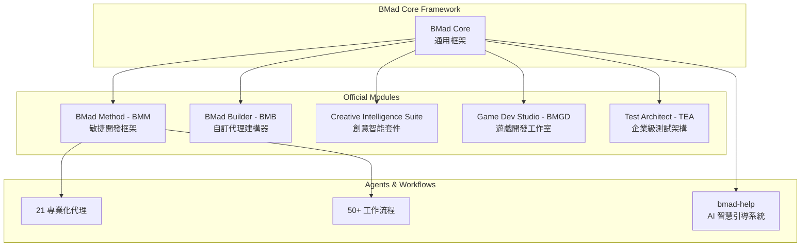
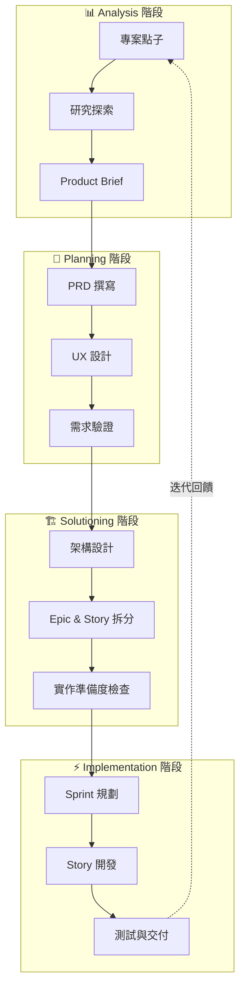
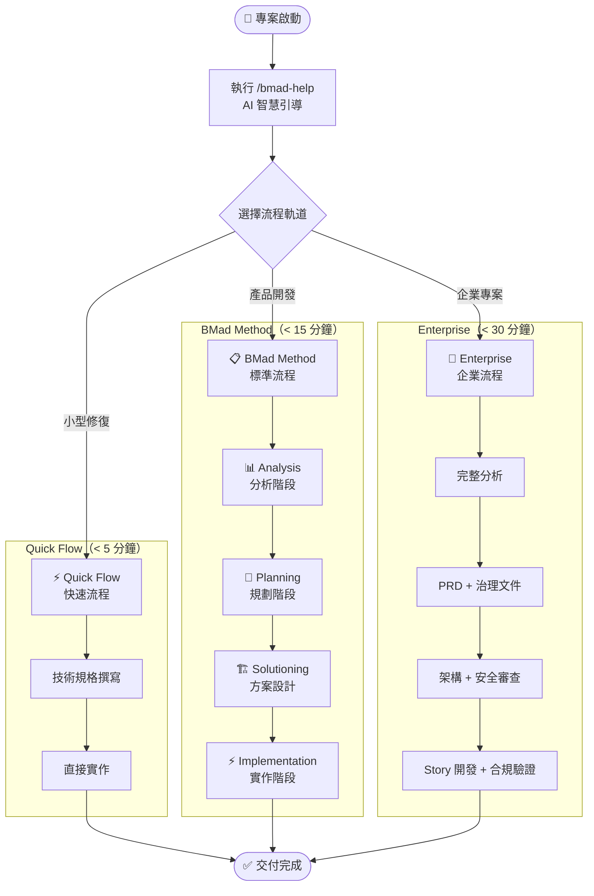

+++
date = '2025-12-31T20:05:05+08:00'
draft = false
title = 'BMAD METHOD使用教學'
tags = ['教學', 'AI開發']
categories = ['教學']
+++

# BMAD-METHOD 使用教學手冊

> **文件版本**：2.0  
> **最後更新**：2026 年 2 月  
> **適用版本**：BMAD METHOD v6.0.0-Beta  
> **適用對象**：新進軟體工程師、系統分析師、專案成員  
> **前置知識**：基本軟體開發概念、版本控制基礎  
> **Created by**：Eric Cheng

---

## 目錄

- [前言](#前言)
- [第一章：BMAD-METHOD 是什麼](#第一章bmad-method-是什麼)
  - [1.1 方法論背景與設計目的](#11-方法論背景與設計目的)
  - [1.2 BMAD 與傳統開發流程的差異](#12-bmad-與傳統開發流程的差異)
  - [1.3 為什麼 BMAD 特別適合 AI 協作開發](#13-為什麼-bmad-特別適合-ai-協作開發)
- [第二章：BMAD-METHOD 的核心概念](#第二章bmad-method-的核心概念)
  - [2.1 四大核心階段概覽](#21-四大核心階段概覽)
  - [2.2 Analysis（分析）階段](#22-analysis分析階段)
  - [2.3 Planning（規劃）階段](#23-planning規劃階段)
  - [2.4 Solutioning（方案設計）階段](#24-solutioning方案設計階段)
  - [2.5 Implementation（實作）階段](#25-implementation實作階段)
  - [2.6 各階段的目標、輸入與輸出](#26-各階段的目標輸入與輸出)
  - [2.7 安裝與設定指南](#27-安裝與設定指南)
  - [2.8 官方模組總覽](#28-官方模組總覽)
- [第三章：BMAD-METHOD 整體流程說明](#第三章bmad-method-整體流程說明)
  - [3.1 從需求發想到交付的完整流程](#31-從需求發想到交付的完整流程)
  - [3.2 每個階段與 AI 的互動方式](#32-每個階段與-ai-的互動方式)
  - [3.3 建議的文件與產出物](#33-建議的文件與產出物)
- [第四章：各階段詳細教學](#第四章各階段詳細教學)
  - [4.1 Analysis 階段詳細教學](#41-analysis-階段詳細教學)
  - [4.2 Planning 階段詳細教學](#42-planning-階段詳細教學)
  - [4.3 Solutioning 階段詳細教學](#43-solutioning-階段詳細教學)
  - [4.4 Implementation 階段詳細教學](#44-implementation-階段詳細教學)
- [第五章：AI Prompt 實戰範例](#第五章ai-prompt-實戰範例)
  - [5.1 Analysis 階段 Prompt 範例](#51-analysis-階段-prompt-範例)
  - [5.2 Planning 階段 Prompt 範例](#52-planning-階段-prompt-範例)
  - [5.3 Solutioning 階段 Prompt 範例](#53-solutioning-階段-prompt-範例)
  - [5.4 Implementation 階段 Prompt 範例](#54-implementation-階段-prompt-範例)
  - [5.5 銀行與大型系統專用 Prompt 實戰對話](#55-銀行與大型系統專用-prompt-實戰對話)
- [第六章：BMAD-METHOD 與其他方法論比較](#第六章bmad-method-與其他方法論比較)
  - [6.1 與 Scrum / SAFe 的差異](#61-與-scrum--safe-的差異)
  - [6.2 與 SDD / Spec-Kit 的差異](#62-與-sdd--spec-kit-的差異)
  - [6.3 適用與不適用情境](#63-適用與不適用情境)
- [第七章：新進同仁快速上手指南](#第七章新進同仁快速上手指南)
  - [7.1 第一週可以怎麼用 BMAD](#71-第一週可以怎麼用-bmad)
  - [7.2 建議學習順序](#72-建議學習順序)
  - [7.3 團隊內導入建議](#73-團隊內導入建議)
- [第八章：常見問題（FAQ）](#第八章常見問題faq)
  - [Q1：BMAD 是否會取代 SA / PG？](#q1bmad-是否會取代-sa--pg)
  - [Q2：BMAD 是否一定要用 AI？](#q2bmad-是否一定要用-ai)
  - [Q3：如何在既有（Brownfield）系統中導入？](#q3如何在既有brownfield系統中導入)
  - [Q4：BMAD 產出的文件品質如何？](#q4bmad-產出的文件品質如何)
  - [Q5：如何處理 AI 產出的錯誤？](#q5如何處理-ai-產出的錯誤)
  - [Q6：BMAD 適合什麼規模的團隊？](#q6bmad-適合什麼規模的團隊)
  - [Q7：如何評估 BMAD 導入效果？](#q7如何評估-bmad-導入效果)
- [附錄：檢查清單（Checklist）](#附錄檢查清單checklist)
  - [A. BMAD 專案啟動檢查清單](#a-bmad-專案啟動檢查清單)
  - [B. 各階段完成檢查清單](#b-各階段完成檢查清單)
  - [C. AI 協作品質檢查清單](#c-ai-協作品質檢查清單)
  - [D. 新進同仁學習進度檢查清單](#d-新進同仁學習進度檢查清單)
- [參考資源](#參考資源)
- [版本紀錄](#版本紀錄)

---

## 前言

### 為什麼需要這份手冊？

在人工智慧快速發展的時代，軟體開發方式正經歷革命性變化。傳統的開發流程往往無法充分發揮 AI 助手的潛力，導致：

- AI 產出的程式碼與專案需求脫節
- 團隊成員對 AI 協作方式缺乏共識
- 開發過程缺乏結構化的品質控管

**BMAD-METHOD**（**B**reakthrough **M**ethod of **A**gile AI **D**riven Development）正是為解決這些問題而設計的方法論。它提供一套結構化、可擴展的 AI 驅動敏捷開發框架，讓團隊能夠有效地與 AI 協作，從 Bug 修復到企業級系統開發都能得心應手。

> **100% 免費且開源。** 沒有付費牆、沒有封閉內容。BMAD 致力於賦能每一位開發者。

### 本手冊的目標

1. **快速理解** - 讓新進同仁在一週內掌握 BMAD-METHOD 核心概念
2. **實務導向** - 提供可直接應用於專案的 Prompt 範例與操作步驟
3. **循序漸進** - 從基礎概念到進階應用，逐步建立完整知識體系

### 適用讀者

- 新進軟體工程師（Junior / Mid-level）
- 系統分析師（SA）
- 專案經理與團隊領導
- 任何希望提升 AI 協作效率的開發人員

> 🏦 **特別適用於金融與大型企業**
> 
> 本手冊特別加入銀行、保險、證券等金融業，以及大型企業系統開發的實務案例與 Prompt 範例。
> 這些內容標註有「🏦」圖示，可幫助在合規性要求較高的環境中應用 BMAD-METHOD。

---

## 第一章：BMAD-METHOD 是什麼

### 1.1 方法論背景與設計目的

#### 什麼是 BMAD-METHOD？

**BMAD-METHOD** 是一套「AI 驅動的敏捷開發方法論」，全名為 **Breakthrough Method of Agile AI Driven Development**（突破性的敏捷 AI 驅動開發方法）。它建構在 **BMad Core** 通用框架之上，提供：

- **21 個專業化 AI 代理**（Agents）
- **50+ 個引導式工作流程**（Workflows）
- **6 個官方模組**（Modules）
- **AI 智慧引導系統**（bmad-help）

```text
💡 核心理念：
BMAD 不只是一套工具，而是一種「人類與 AI 協作」的思維模式。
它讓 AI 成為團隊中的專業成員，而非單純的程式碼產生器。
```

#### 設計目的

1. **規模-領域自適應**：自動調整規劃深度，根據專案複雜度、領域與類型自動調適（如 SaaS 行動應用與診斷醫療系統的規劃需求不同）
2. **完整生命週期**：涵蓋分析 → 規劃 → 架構 → 實作的完整開發流程
3. **專業分工**：每個 AI 代理擁有特定領域專長（PM、架構師、開發者、UX 設計師等）
4. **敏捷最佳實務**：建立在敏捷開發最佳實務之上，並以 AI 強化效果
5. **AI 智慧引導**：內建 `bmad-help` 系統，從開始到結束全程引導使用者

#### BMAD 的核心架構



### 1.2 BMAD 與傳統開發流程的差異

#### 傳統開發流程的限制

| 面向 | 傳統方法 | 存在問題 |
|------|----------|----------|
| **需求分析** | 人工訪談、文件撰寫 | 耗時、容易遺漏 |
| **設計階段** | 單一架構師負責 | 知識瓶頸、單點故障 |
| **實作階段** | 開發者獨立作業 | AI 輔助零散、缺乏一致性 |
| **品質控管** | 後期測試為主 | 問題發現太晚、修復成本高 |

#### BMAD-METHOD 的革新

| 面向 | BMAD 方法 | 優勢 |
|------|-----------|------|
| **需求分析** | PM Agent + Analyst Agent 協作 | 結構化提問、自動整理需求 |
| **設計階段** | Architect Agent + UX Designer Agent | 多角度驗證、即時回饋 |
| **實作階段** | Developer Agent + Test Architect | AI 與人類協作、持續驗證 |
| **品質控管** | 全流程品質檢查點 | 早期發現、持續改進 |

#### 流程比較圖


### 1.3 為什麼 BMAD 特別適合 AI 協作開發

#### AI 協作的挑戰

在沒有方法論指導下使用 AI 協助開發，常見問題包括：

1. **上下文遺失**：AI 不了解專案全貌，產出不一致
2. **角色混淆**：一個 AI 同時扮演多種角色，品質下降
3. **流程斷裂**：各階段缺乏銜接，資訊傳遞失真
4. **品質不穩定**：缺乏驗證機制，錯誤層層累積

#### BMAD 如何解決這些問題

| 挑戰 | BMAD 解決方案 |
|------|---------------|
| 上下文遺失 | **漸進式上下文建構** - 每個階段的產出物自動成為下一階段的輸入，代理始終知道要建構什麼及為什麼 |
| 角色混淆 | **專業化代理** - 每個代理有明確角色定義與專長領域 |
| 流程斷裂 | **Workflow 引導** - 結構化流程，自動銜接各階段產出 |
| 品質不穩定 | **Checkpoint 機制** - 每個階段都有驗證點，確保品質 |
| 不知下一步 | **bmad-help 智慧引導** - AI 自動偵測專案進度，建議下一步行動 |

#### BMAD 的獨特優勢

```text
✨ 規模-領域自適應智能
   └─ 自動判斷專案複雜度、領域與類型，選擇適當的流程深度
   
✨ 專業化代理團隊
   └─ 12+ 個核心代理，各司其職，協同合作
   
✨ IDE 無縫整合
   └─ 支援 Claude Code、Cursor、Windsurf、Kiro、VS Code 等
   
✨ AI 智慧引導
   └─ `/bmad-help` 從安裝到完成全程引導
   
✨ Party Mode
   └─ 將多個代理帶入同一對話，協作求解
   
✨ 客製化能力
   └─ 可調整代理個性、專長、溝通風格
```

#### 💼 實務案例：銀行系統開發

> **情境**：某銀行需要開發新的網路銀行轉帳功能
> 
> **傳統方式**：
> - SA 花 2 週撰寫需求規格
> - 架構師花 1 週設計系統架構
> - 開發團隊花 4 週實作
> - 測試團隊花 2 週測試
> - **總計**：約 9 週
> 
> **使用 BMAD**：
> - PM Agent + SA 協作 3 天完成需求分析
> - Architect Agent + 架構師 2 天完成架構設計
> - Developer Agent + 開發團隊 2 週完成實作
> - Test Architect + 測試團隊 1 週完成測試
> - **總計**：約 4 週
> 
> **效益**：開發時間縮短 55%，且品質更穩定

---

## 第二章：BMAD-METHOD 的核心概念

### 2.1 四大核心階段概覽

BMAD-METHOD 將軟體開發分為四大階段，每個階段都有專屬的代理、工作流程與產出物：


| 階段 | 英文 | 核心目標 | 主要代理 |
|------|------|----------|----------|
| **分析** | Analysis | 理解問題、探索可能性 | Analyst Agent |
| **規劃** | Planning | 定義需求、設定目標 | PM Agent |
| **方案設計** | Solutioning | 設計架構、技術方案 | Architect Agent |
| **實作** | Implementation | 開發、測試、交付 | Developer Agent |

### 2.2 Analysis（分析）階段

#### 階段目標

- 腦力激盪、研究探索
- 建立產品簡介（Product Brief）
- 記錄現有專案上下文
- 確立問題範圍與邊界

> ℹ️ **此階段為選用**，Quick Flow 可跳過此階段直接進入 Planning。

#### 核心活動與工作流程

| 工作流程 | 指令 | 代理 | 說明 |
|----------|------|------|------|
| Brainstorm Project | `BP` | Analyst (Mary) | 腦力激盪新專案點子 |
| Research | `RS` | Analyst (Mary) | 領域研究、市場研究、技術研究 |
| Create Brief | `CB` | Analyst (Mary) | 建立產品簡介 |
| Document Project | `DP` | Analyst (Mary) | 記錄現有專案上下文 |

#### 核心活動

```
📊 Analysis 階段核心活動
│
├── 1. 腦力激盪（Brainstorm Project）
│   ├── 探索專案點子
│   ├── 定義產品願景
│   └── 初步可行性評估
│
├── 2. 研究探索（Research）
│   ├── 領域研究
│   ├── 市場研究
│   └── 技術研究
│
├── 3. 建立產品簡介（Create Brief）
│   ├── 撰寫 Product Brief
│   ├── 定義問題陳述
│   └── 設定成功標準
│
└── 4. 記錄現有專案（Document Project）
    ├── 記錄專案上下文
    ├── 整理現有架構
    └── 標示改進機會
```

#### 關鍵產出物

| 產出物 | 說明 | BMAD 指令 |
|--------|------|----------|
| **Product Brief** | 產品簡介與願景 | `CB`（Create Brief） |
| **Research Notes** | 研究筆記與發現 | `RS`（Research） |
| **Project Context** | 現有專案上下文記錄 | `DP`（Document Project） |
| **Problem Statement** | 問題陳述與範圍定義 | 包含在 Product Brief 中 |

### 2.3 Planning（規劃）階段

#### 階段目標

- 建立產品需求文件（PRD）或技術規格（Tech Spec）
- 定義功能需求與驗收標準
- 建立 UX 設計（選用）
- 確立專案範圍與優先級

> ℹ️ **此階段為必要階段**，所有軌道都需要某種形式的規劃文件。

#### 核心活動與工作流程

| 工作流程 | 指令 | 代理 | 說明 |
|----------|------|------|------|
| Create PRD | `/bmad-bmm-create-prd` | PM (John) | 建立產品需求文件 |
| Validate PRD | `VP` | PM (John) | 驗證 PRD 完整性 |
| Edit PRD | `EP` | PM (John) | 編輯現有 PRD |
| Create UX Design | `/bmad-bmm-create-ux-design` | UX Designer (Alex) | UX 設計（選用） |
| Quick Spec | `/bmad-bmm-quick-spec` | Solo Dev | Quick Flow 專用技術規格 |

#### 核心活動

```
� Planning 階段核心活動
│
├── 1. 建立 PRD（Create PRD）
│   ├── 功能需求定義
│   ├── 使用者故事撰寫
│   └── 驗收標準設定
│
├── 2. 驗證 PRD（Validate PRD）
│   ├── 需求完整性檢查
│   ├── 一致性驗證
│   └── 利害關係人確認
│
├── 3. UX 設計（Create UX Design）
│   ├── 使用者流程設計
│   ├── 介面原型
│   └── 互動設計
│
└── 4. Quick Spec（Quick Flow 專用）
    ├── 簡化技術規格
    ├── 快速需求定義
    └── 直接進入開發
```

#### 關鍵產出物

| 產出物 | 說明 | BMAD 指令 |
|--------|------|----------|
| **PRD** | 產品需求文件 | `/bmad-bmm-create-prd` |
| **UX Design** | 使用者體驗設計 | `/bmad-bmm-create-ux-design` |
| **Tech Spec** | 技術規格（Quick Flow） | `/bmad-bmm-quick-spec` |
| **Validated PRD** | 驗證過的需求文件 | `VP`（Validate PRD） |

### 2.4 Solutioning（方案設計）階段

#### 階段目標

- 設計系統架構
- 建立 Epic 與 Story
- 進行實作準備度檢查
- 定義模組介面

> ℹ️ **BMad Method 與 Enterprise 軌道專用**，Quick Flow 可跳過此階段。

> ℹ️ **V6 改進**：Epic 與 Story 現在在架構設計之後建立，因為架構決策（資料庫、API 模式、技術栈）會直接影響工作拆分方式。

#### 核心活動與工作流程

| 工作流程 | 指令 | 代理 | 說明 |
|----------|------|------|------|
| Create Architecture | `/bmad-bmm-create-architecture` | Architect (Winston) | 設計系統架構 |
| Create Epics and Stories | `/bmad-bmm-create-epics-and-stories` | PM (John) | 拆分 PRD 為 Epic 與 Story |
| Implementation Readiness | `/bmad-bmm-check-implementation-readiness` | Architect (Winston) | 驗證規劃一致性 |

#### 核心活動

```
🏗️ Solutioning 階段核心活動
│
├── 1. 架構設計（Create Architecture）
│   ├── 架構風格選擇
│   ├── 技術棧決策
│   └── 模組劃分與介面設計
│
├── 2. Epic 與 Story 建立（Create Epics and Stories）
│   ├── PRD 拆分為 Epic
│   ├── Epic 拆分為 Story
│   └── 依賴關係分析
│
├── 3. 實作準備度檢查（Implementation Readiness）
│   ├── 規劃一致性驗證
│   ├── 技術可行性確認
│   └── Story 完整性檢查
│
└── 4. 架構決策記錄
    ├── ADR 文件建立
    ├── 技術方案比較
    └── 非功能需求處理
```

> ℹ️ **V6 重要改進**：Epic 與 Story 現在在架構設計**之後**建立。因為架構決策（資料庫選型、API 模式、技術棧）會直接影響工作拆分方式，先完成架構再拆分 Story 更為合理。

#### 關鍵產出物

| 產出物 | 說明 | BMAD 指令 |
|--------|------|----------|
| **Architecture Doc** | 系統架構設計文件 | `/bmad-bmm-create-architecture` |
| **Epic & Story** | 工作拆分與追蹤 | `/bmad-bmm-create-epics-and-stories` |
| **Readiness Check** | 實作準備度報告 | `/bmad-bmm-check-implementation-readiness` |
| **ADR** | 架構決策記錄 | 包含在架構文件中 |

### 2.5 Implementation（實作）階段

#### 階段目標

- Sprint 規劃與執行
- Story 開發與實作
- 程式碼審查
- 持續測試與交付

#### 核心活動與工作流程

| 工作流程 | 指令 | 代理 | 說明 |
|----------|------|------|------|
| Sprint Planning | `/bmad-bmm-sprint-planning` | Scrum Master (Bob) | 初始化 Sprint 追蹤 |
| Create Story | `/bmad-bmm-create-story` | Scrum Master (Bob) | 建立 Story 檔案 |
| Dev Story | `/bmad-bmm-dev-story` | Developer (Amelia) | 實作 Story |
| Code Review | `/bmad-bmm-code-review` | Developer (Amelia) | 程式碼審查 |
| QA Automate | `QA` | QA (Quinn) | 自動化測試 |
| Correct Course | `/bmad-bmm-correct-course` | PM (John) | 處理範圍變更 |

#### 核心活動

```
⚡ Implementation 階段核心活動
│
├── 1. Sprint 規劃與管理
│   ├── Sprint Planning（初始化追蹤）
│   ├── Story 檔案建立
│   └── 優先順序排定
│
├── 2. Story 開發
│   ├── Dev Story（逐一實作）
│   ├── 程式碼撰寫
│   └── Code Review
│
├── 3. 測試與品質
│   ├── QA 自動化測試
│   ├── 持續整合驗證
│   └── 品質標準檢查
│
└── 4. 範圍管理
    ├── Correct Course（範圍變更處理）
    ├── Story 調整與重排
    └── 迭代回饋收集
```

#### 關鍵產出物

| 產出物 | 說明 | BMAD 指令 |
|--------|------|----------|
| **Sprint Backlog** | Sprint 追蹤文件 | `/bmad-bmm-sprint-planning` |
| **Story Files** | 個別 Story 實作檔案 | `/bmad-bmm-create-story` |
| **Working Code** | 已審查的程式碼 | `/bmad-bmm-dev-story` |
| **Test Results** | 自動化測試結果 | `QA`（QA Automate） |

### 2.6 各階段的目標、輸入與輸出

#### 完整階段對照表

| 階段 | 輸入（Input） | 活動（Activities） | 輸出（Output） | 負責代理 |
|------|--------------|-------------------|---------------|----------|
| **Analysis** | 專案點子、市場資訊 | 腦力激盪、研究探索 | Product Brief、研究筆記 | Analyst (Mary) |
| **Planning** | Product Brief、需求 | PRD 撰寫、UX 設計 | PRD、Tech Spec、UX Design | PM (John) |
| **Solutioning** | PRD、技術需求 | 架構設計、工作拆分 | 架構文件、Epic & Story | Architect (Winston) |
| **Implementation** | 架構、Story | Sprint 開發、測試 | 可執行系統、測試報告 | Developer (Amelia) |

#### 階段間的銜接流程



#### 💼 實務案例：銀行貸款申請系統

> **Analysis 階段產出**：
> - Product Brief：「客戶申請貸款流程繁瑣，平均需要 5 個工作天」
> - 成功標準：「將貸款申請時間縮短至 1 個工作天」
> 
> **Planning 階段產出**：
> - PRD（包含功能需求、使用者故事、驗收標準）
> - UX 設計（申請流程圖、介面原型）
> 
> **Solutioning 階段產出**：
> - 系統架構圖（前端、後端、資料庫、外部徵信系統整合）
> - Epic & Story 拆分（含依賴關係與估算）
> 
> **Implementation 階段產出**：
> - 可上線的貸款申請系統
> - 使用者操作手冊
> - 系統維運文件

### 2.7 安裝與設定指南

#### 環境需求

| 項目 | 需求 | 說明 |
|------|------|------|
| **Node.js** | v20+ | 執行 BMAD CLI 所需 |
| **npm/npx** | 隨 Node.js 安裝 | 套件管理工具 |
| **IDE** | Claude Code / Cursor / Windsurf / Kiro 等 | 支援 AI 代理互動的 IDE |

#### 安裝步驟

```bash
# 步驟 1：確認 Node.js 版本
node --version  # 需要 v20 以上

# 步驟 2：進入專案目錄
cd your-project

# 步驟 3：執行安裝
npx bmad-method install

# 安裝過程會引導你選擇：
# 1. 目標 IDE（Claude Code / Cursor / Windsurf / Kiro 等）
# 2. 要安裝的模組（BMM、BMB、CIS、BMGD、TEA）
# 3. 配置選項
```

#### 安裝後的專案結構

```
📁 your-project/
├── 📂 _bmad/                    # BMAD 核心資料夾
│   ├── 📂 agents/               # AI 代理定義檔
│   ├── 📂 workflows/            # 工作流程定義
│   ├── 📂 checklists/           # 檢查清單
│   ├── 📂 templates/            # 文件範本
│   ├── 📂 personas/             # 代理人格設定
│   └── 📄 bmad-config.json      # BMAD 配置檔
├── 📂 _bmad-output/             # BMAD 產出物資料夾
│   ├── 📄 prd.md                # 產品需求文件
│   ├── 📄 architecture.md       # 架構設計文件
│   ├── 📄 epic-*.md             # Epic 與 Story 檔案
│   └── ...
└── 📄 （你的專案檔案）
```

#### 首次使用

安裝完成後，在 IDE 中使用 `/bmad-help` 啟動 AI 智慧引導系統：

```
/bmad-help

# bmad-help 會：
# 1. 分析你的專案狀態
# 2. 推薦適合的流程軌道
# 3. 引導你進入下一步驟
# 4. 解答任何 BMAD 相關問題
```

### 2.8 官方模組總覽

BMAD-METHOD v6 採用模組化架構，目前提供 **6 個官方模組**：

| 模組 | 縮寫 | 說明 | npm 套件 | 狀態 |
|------|------|------|----------|------|
| **BMad Method** | BMM | 核心方法論模組，包含 34+ 工作流程、9 個命名代理 | `bmad-method` | ✅ 穩定 |
| **BMad Builder** | BMB | 自訂代理、工作流程、模組的建構工具 | 包含在 BMM 中 | ✅ 穩定 |
| **Creative Intelligence Suite** | CIS | 創意智慧套件，遊戲設計、故事寫作等 | 獨立 repo | 🧪 Beta |
| **Game Dev Studio** | BMGD | 遊戲開發專用模組 | 獨立 repo | 🧪 Beta |
| **Test Architect** | TEA | 企業級測試模組，進階測試策略與自動化 | 獨立 repo | 🆕 新增 |
| **Core Framework** | - | 通用框架，規模-領域自適應引擎 | 內建 | ✅ 穩定 |

#### BMM 核心代理一覽

| 代理 | 角色名 | 觸發指令 | 主要職責 |
|------|--------|----------|----------|
| **Analyst** | Mary | BP, RS, CB, DP | 腦力激盪、研究、建立 Brief |
| **PM** | John | CP, VP, EP, CE, IR, CC | PRD 管理、需求驗證、範圍控制 |
| **Architect** | Winston | CA, IR | 架構設計、實作準備度檢查 |
| **Developer** | Amelia | — | Story 實作、程式碼審查 |
| **UX Designer** | Alex | — | 使用者體驗設計 |
| **Scrum Master** | Bob | — | Sprint 管理、Story 追蹤 |
| **Tech Writer** | Paige | — | 技術文件撰寫 |
| **QA** | Quinn | QA | 輕量級測試自動化 |
| **Quick-Flow Solo Dev** | — | — | Quick Flow 專用整合代理 |

> 💡 **模組安裝是可選的**：你可以只安裝 BMM（核心模組），之後再按需添加其他模組。

---

## 第三章：BMAD-METHOD 整體流程說明

### 3.1 從需求發想到交付的完整流程

#### BMAD 完整開發流程圖



#### 三種流程軌道比較

| 特性 | ⚡ Quick Flow | 📋 BMad Method | 🏢 Enterprise |
|------|--------------|----------------|---------------|
| **適用情境** | Bug 修復、小功能 | 產品、平台開發 | 合規、大規模專案 |
| **所需時間** | < 5 分鐘 | < 15 分鐘 | < 30 分鐘 |
| **產出文件** | 技術規格 | PRD + 架構 + UX | 完整治理套件 |
| **代理數量** | 2-3 個 | 6-8 個 | 12+ 個 |
| **品質檢查點** | 1 個 | 3-4 個 | 6+ 個 |

#### 流程選擇指引

```
🤔 如何選擇適合的流程？

執行 /bmad-help，讓 BMAD 自動分析你的專案目標！

或者參考以下指引：

📌 選擇 Quick Flow 當...
   ├── 修復明確的 Bug
   ├── 新增簡單功能（< 1 天工作量）
   └── 技術方案已經明確

📌 選擇 BMad Method 當...
   ├── 開發新產品或新模組
   ├── 需要跨團隊協作
   └── 需求尚需釐清

📌 選擇 Enterprise 當...
   ├── 金融、醫療等合規產業
   ├── 影響範圍廣（> 10 個系統）
   └── 需要正式審查流程
```

> 🏦 **銀行/大型系統建議**
> 
> **銀行、保險、證券等金融機構，以及大型企業專案，強烈建議採用 Enterprise 軌道**，因為：
> - 需要完整的合規文件（法遵報告、風險評估）
> - 需要經過多層級審核（資安、法遵、業務、IT）
> - 需要詳細的稽核軌跡
> - 需要明確的責任歸屬與簽核流程
> - 需要災難復原與業務連續性計畫

### 3.2 每個階段與 AI 的互動方式

#### AI 代理團隊介紹

BMAD-METHOD 提供 12 個核心專業化代理，各司其職：

| 代理 | 角色名 | 角色 | 專長領域 | 主要互動階段 |
|------|--------|------|----------|--------------|
| **Analyst Agent** | Mary | 分析師 | 腦力激盪、研究探索、問題定義 | Analysis |
| **PM Agent** | John | 產品經理 | 需求管理、PRD 撰寫、範圍控制 | Planning |
| **Architect Agent** | Winston | 架構師 | 系統設計、技術決策 | Solutioning |
| **Developer Agent** | Amelia | 開發者 | 程式撰寫、程式碼審查 | Implementation |
| **UX Designer Agent** | Alex | UX 設計師 | 使用者體驗、介面設計 | Planning/Solutioning |
| **Scrum Master Agent** | Bob | Scrum Master | Sprint 管理、Story 追蹤 | Implementation |
| **Tech Writer Agent** | Paige | 技術文件撰寫者 | 文件撰寫、知識管理 | 全程 |
| **QA Agent** | Quinn | 測試工程師 | 輕量級測試自動化 | Implementation |
| **Quick-Flow Solo Dev** | — | 整合代理 | Quick Flow 快速開發 | 全程 |

#### 人類與 AI 的協作模式


#### AI 互動最佳實務

| 實務 | 說明 | 範例 |
|------|------|------|
| **明確指定代理** | 在 Prompt 開頭指定要互動的代理 | `@Architect Agent, 請評估以下架構...` |
| **提供充分上下文** | 包含相關的文件、程式碼片段 | 附上 PRD、現有架構圖 |
| **分階段互動** | 不要一次處理太多議題 | 先完成 Analysis 再進入 Planning |
| **明確驗收標準** | 告訴 AI 你期望的產出格式 | `請以表格方式呈現比較結果` |
| **迭代優化** | 不滿意時要求改進 | `請針對安全性再加強設計` |

### 3.3 建議的文件與產出物

#### BMAD 完整產出物清單

```
📁 BMAD 專案產出物結構
│
├── 📂 _bmad/                    # BMAD 核心設定（安裝時產生）
│   ├── 📂 agents/               # AI 代理定義
│   ├── 📂 workflows/            # 工作流程定義
│   ├── 📂 checklists/           # 檢查清單
│   └── 📂 templates/            # 文件範本
│
├── 📂 _bmad-output/             # BMAD 產出物
│   ├── 📄 product-brief.md      # 產品簡介（Analysis）
│   ├── 📄 prd.md                # 產品需求文件（Planning）
│   ├── 📄 ux-design.md          # UX 設計（Planning）
│   ├── 📄 architecture.md       # 架構設計（Solutioning）
│   ├── 📄 epic-1.md             # Epic 與 Story（Solutioning）
│   ├── 📄 sprint-backlog.md     # Sprint 追蹤（Implementation）
│   └── 📄 story-*.md            # 個別 Story 檔案
│
└── 📂 src/                      # 程式碼（Implementation）
```

#### 各軌道產出物對照

| 產出物 | Quick Flow | BMad Method | Enterprise |
|--------|:----------:|:-----------:|:----------:|
| 問題陳述 | - | ✅ | ✅ |
| 利害關係人分析 | - | ⚪ 選用 | ✅ |
| PRD | - | ✅ | ✅ |
| 技術規格 | ✅ | ✅ | ✅ |
| 架構設計 | - | ✅ | ✅ |
| API 規格 | ⚪ 選用 | ✅ | ✅ |
| UX 設計 | - | ⚪ 選用 | ✅ |
| 安全設計 | - | ⚪ 選用 | ✅ |
| 測試計畫 | - | ⚪ 選用 | ✅ |
| 合規檢查清單 | - | - | ✅ |
| 風險評估 | - | - | ✅ |

---

## 第四章：各階段詳細教學

### 4.1 Analysis 階段詳細教學

#### 階段目標

Analysis 階段是整個開發流程的起點，目標是：

1. **釐清問題本質** - 確保團隊理解真正要解決的問題
2. **探索專案可能性** - 腦力激盪與研究探索
3. **建立產品簡介** - 產出 Product Brief 作為後續規劃基礎
4. **記錄專案上下文** - 保存現有系統資訊（Brownfield 專案適用）

> ℹ️ **此階段為選用**，Quick Flow 可跳過此階段直接進入 Planning。

#### 新手該做什麼

```
📌 Analysis 階段新手步驟

步驟 1：收集初始資訊
├── 與 PM/業務單位訪談
├── 收集現有文件（需求單、會議紀錄）
└── 了解背景脈絡

步驟 2：與 Analyst Agent (Mary) 互動
├── 使用 `BP`（Brainstorm Project）腦力激盪
├── 使用 `RS`（Research）進行研究
└── 回答 AI 的澄清問題

步驟 3：產出 Product Brief
├── 使用 `CB`（Create Brief）建立產品簡介
├── 定義「現況」與「期望」的差距
└── 獲得利害關係人認可

步驟 4：記錄專案上下文（Brownfield 專案）
├── 使用 `DP`（Document Project）記錄現有系統
├── 整理現有架構與限制
└── 確認改進機會
```

#### 常見錯誤

| ❌ 錯誤 | 說明 | ✅ 正確做法 |
|---------|------|-------------|
| 跳過分析直接開發 | 沒有釐清問題就開始寫程式 | 先花時間理解問題本質 |
| 問題定義太模糊 | 「系統要更好用」 | 「結帳流程從 5 步驟縮減為 3 步驟」 |
| 只聽單一來源 | 只聽 PM 的意見 | 訪談多個利害關係人 |
| 忽略限制條件 | 沒有考慮預算、時間限制 | 明確列出所有限制 |

#### 與 AI 協作的最佳實務

```markdown
💡 與 Analyst Agent (Mary) 協作技巧

1. **使用 `BP` 啟動腦力激盪**
   - 描述專案點子
   - 讓 Mary 協助探索可能性
   - 討論可行性與風險

2. **使用 `RS` 進行深入研究**
   - 指定研究領域（市場、技術、競品）
   - 讓 AI 協助整理研究結果

3. **使用 `CB` 建立產品簡介**
   - 提供背景資訊
   - 讓 AI 產生結構化的 Product Brief
   - 確認並調整內容

4. **迭代優化**
   - 第一版不完美是正常的
   - 多次互動直到滿意
```

#### 💼 實務案例：銀行信用卡申請系統

> **情境**：某銀行希望優化信用卡線上申請流程
> 
> **Analysis 階段產出範例**：
> 
> **問題陳述**：
> ```
> 現況：信用卡線上申請完成率僅 35%，主要卡關在身分驗證步驟
> 期望：提升申請完成率至 70%
> 差距：需要簡化身分驗證流程，同時符合金管會法規要求
> ```
> 
> **成功標準**：
> | 指標 | 現況 | 目標 | 量測方式 |
> |------|------|------|----------|
> | 申請完成率 | 35% | 70% | GA 追蹤 |
> | 平均申請時間 | 15 分鐘 | 5 分鐘 | 系統記錄 |
> | 客訴數量 | 50 件/月 | 10 件/月 | 客服系統 |

---

### 4.2 Planning 階段詳細教學

#### 階段目標

Planning 階段負責將分析結果轉換為可執行的規劃文件：

1. **建立 PRD** - 產品需求文件，定義功能需求與驗收標準
2. **UX 設計** - 使用者體驗設計（選用）
3. **技術規格** - Quick Flow 專用的簡化規格
4. **驗證需求** - 確保 PRD 完整性與一致性

> ℹ️ **此階段為必要階段**，所有軌道都需要某種形式的規劃文件。

#### 新手該做什麼

```
📌 Planning 階段新手步驟

步驟 1：建立 PRD
├── 使用 `/bmad-bmm-create-prd` 讓 PM (John) 協助
├── 定義功能需求與使用者故事
├── 設定驗收標準
└── 確認優先級排序

步驟 2：驗證 PRD
├── 使用 `VP`（Validate PRD）檢查完整性
├── 確認需求之間無衝突
└── 獲得利害關係人確認

步驟 3：UX 設計（選用）
├── 使用 `/bmad-bmm-create-ux-design` 讓 UX Designer (Alex) 協助
├── 設計使用者流程
└── 建立介面原型

步驟 4：確認輸出
├── PRD 已經通過驗證
├── 所有需求已明確定義
└── 準備進入 Solutioning 階段
```

#### 常見錯誤

| ❌ 錯誤 | 說明 | ✅ 正確做法 |
|---------|------|-------------|
| 流程圖過於複雜 | 一張圖涵蓋所有流程 | 分層次繪製，主流程 + 子流程 |
| 資料模型過度設計 | 一開始就設計完美正規化 | 先滿足需求，再逐步優化 |
| 忽略例外流程 | 只考慮正常流程 | 明確處理各種例外情況 |
| 業務規則不完整 | 遺漏邊界條件 | 與業務單位逐條確認 |

#### 與 AI 協作的最佳實務

```markdown
💡 與 PM Agent (John) 協作技巧（Planning 階段）

1. **使用 `/bmad-bmm-create-prd` 建立 PRD**
   - 提供 Product Brief 作為輸入
   - 讓 PM (John) 協助撰寫完整 PRD
   - 逐步確認功能需求

2. **使用 `VP` 驗證 PRD**
   - 檢查需求完整性
   - 驗證一致性與可行性

3. **使用 UX Designer (Alex) 設計介面**
   - 描述使用者情境
   - 讓 AI 建議 UX 設計
   - 討論使用者流程

4. **迭代優化**
   - 對 PRD 不滿意時使用 `EP`（Edit PRD）修改
   - 確保所有需求都有明確的驗收標準
```

#### 💼 實務案例：銀行信用卡申請系統（續）

> **Planning 階段產出範例**：
> 
> **PRD 摘要**：
> ```mermaid
> flowchart TD
>     START([開始申請]) --> INPUT[填寫基本資料]
>     INPUT --> VERIFY{身分驗證}
>     VERIFY -->|成功| INCOME[填寫財力證明]
>     VERIFY -->|失敗| MANUAL[人工審核]
>     INCOME --> CREDIT[信用評分]
>     CREDIT -->|通過| APPROVE[核准發卡]
>     CREDIT -->|不通過| REJECT[婉拒申請]
>     MANUAL -->|補件完成| VERIFY
>     MANUAL -->|放棄| END([結束])
>     APPROVE --> END
>     REJECT --> END
> ```
> 
> **資料模型（部分）**：
> | 實體 | 屬性 | 說明 |
> |------|------|------|
> | Application | id, status, created_at, customer_id | 申請單 |
> | Customer | id, name, id_number, phone, email | 客戶 |
> | Verification | id, type, result, verified_at | 驗證紀錄 |
> | CreditScore | id, score, factors, scored_at | 信用評分 |

---

### 4.3 Solutioning 階段詳細教學

#### 階段目標

Solutioning 階段負責設計技術解決方案並拆分工作：

1. **設計系統架構** - 決定系統整體結構
2. **進行技術選型** - 選擇適當的技術堆疊
3. **拆分 Epic 與 Story** - 將 PRD 轉換為可執行的工作項目
4. **實作準備度檢查** - 確認規劃一致性

> ℹ️ **BMad Method 與 Enterprise 軌道專用**，Quick Flow 可跳過此階段。
> 
> ℹ️ **V6 重要改進**：Epic 與 Story 現在在架構設計**之後**建立。因為架構決策會直接影響工作拆分方式。

#### 新手該做什麼

```
📌 Solutioning 階段新手步驟

步驟 1：評估架構風格
├── 單體 vs 微服務
├── 同步 vs 非同步
├── 評估團隊能力
└── 考慮維運成本

步驟 2：設計系統架構
├── 繪製架構圖
├── 定義各層職責
├── 規劃部署架構
└── 設計監控策略

步驟 3：進行技術選型
├── 列出候選技術
├── 建立評估矩陣
├── POC 驗證（必要時）
└── 記錄決策理由

步驟 4：設計介面
├── 定義 API 端點
├── 設計請求/回應格式
├── 定義錯誤處理
└── 撰寫 API 文件

步驟 5：處理非功能需求
├── 效能目標與策略
├── 安全設計
├── 可擴展性設計
└── 災難復原計畫
```

> 🏦 **銀行/大型系統特別注意**
> 
> 在金融機構或大型企業中，Solutioning 階段通常需要額外考慮：
> - **法規合規**：個資法、金管會要求、SOC 2、ISO 27001
> - **稽核追蹤**：所有敏感操作必須留下稽核軌跡
> - **災難復原**：必須設計 DR 架構，定義 RTO/RPO
> - **安全審查**：架構設計需經資安部門審核
> - **系統整合**：可能需要與核心銀行系統（Core Banking）、聯徵中心等外部系統整合
> - **效能要求**：明確定義 TPS、回應時間等 SLA

#### 常見錯誤

| ❌ 錯誤 | 說明 | ✅ 正確做法 |
|---------|------|-------------|
| 過度設計 | 小專案用微服務架構 | 根據規模選擇適當架構 |
| 忽略非功能需求 | 只考慮功能，不考慮效能 | 早期就納入非功能需求 |
| 技術選型跟風 | 選最新技術但團隊不熟悉 | 考慮團隊能力與學習成本 |
| API 設計不一致 | 各 API 風格不同 | 建立 API 設計規範並遵循 |
| 沒有記錄決策 | 忘記當初為什麼這樣設計 | 使用 ADR 記錄架構決策 |

#### 與 AI 協作的最佳實務

```markdown
💡 與 Architect Agent 協作技巧

1. **請 AI 提供架構建議**
   - 描述系統需求與限制
   - 請 AI 建議多個架構方案
   - 比較各方案優缺點

2. **請 AI 協助技術選型**
   - 列出評估項目
   - 請 AI 分析各選項
   - 產出決策矩陣

3. **請 AI 審查架構設計**
   - 提供架構圖與說明
   - 請 AI 找出潛在問題
   - 針對問題調整設計

4. **請 AI 協助 API 設計**
   - 描述功能需求
   - 請 AI 建議 API 端點
   - 請 AI 產生 OpenAPI 規格
```

#### 💼 實務案例：銀行信用卡申請系統（續）

> **Solutioning 階段產出範例**：
> 
> **系統架構圖**：
> ```mermaid
> graph TB
>     subgraph "前端"
>         WEB[Web 應用]
>         APP[行動 App]
>     end
>     
>     subgraph "API Gateway"
>         GW[Kong Gateway]
>     end
>     
>     subgraph "後端服務"
>         AUTH[身分驗證服務]
>         APP_SVC[申請服務]
>         CREDIT[信用評分服務]
>         NOTIFY[通知服務]
>     end
>     
>     subgraph "外部系統"
>         JCIC[聯徵中心]
>         SMS[簡訊服務]
>     end
>     
>     subgraph "資料層"
>         DB[(PostgreSQL)]
>         CACHE[(Redis)]
>         MQ[RabbitMQ]
>     end
>     
>     WEB --> GW
>     APP --> GW
>     GW --> AUTH
>     GW --> APP_SVC
>     APP_SVC --> CREDIT
>     APP_SVC --> NOTIFY
>     CREDIT --> JCIC
>     NOTIFY --> SMS
>     AUTH --> DB
>     APP_SVC --> DB
>     CREDIT --> CACHE
>     NOTIFY --> MQ
> ```
> 
> **技術決策記錄（ADR）範例**：
> ```markdown
> # ADR-001: 選擇 PostgreSQL 作為主要資料庫
> 
> ## 狀態
> 已決定
> 
> ## 背景
> 需要選擇一個可靠的關聯式資料庫來儲存申請資料
> 
> ## 決策
> 選擇 PostgreSQL
> 
> ## 理由
> - 公司已有 PostgreSQL 維運經驗
> - 支援 JSON 欄位，方便儲存非結構化資料
> - 效能可滿足預估的交易量
> - 社群活躍，文件完整
> 
> ## 替代方案
> - MySQL：功能較少
> - Oracle：授權成本高
> ```

---

### 4.4 Implementation 階段詳細教學

#### 階段目標

Implementation 階段負責將設計轉換為可運作的系統：

1. **Sprint 規劃與管理** - 使用 Scrum Master (Bob) 協助
2. **Story 開發** - 使用 Developer (Amelia) 逐一實作
3. **測試與品質** - 使用 QA (Quinn) 自動化測試
4. **範圍管理** - 使用 Correct Course 處理變更

#### 新手該做什麼

```
📌 Implementation 階段新手步驟

步驟 1：拆分 User Stories
├── 依據 PRD 列出所有 Story
├── 估算每個 Story 的工作量
├── 排定優先順序
└── 分配到 Sprint

步驟 2：開發實作
├── 撰寫程式碼
├── 撰寫單元測試
├── 程式碼審查
└── 合併到主分支

步驟 3：測試驗證
├── 執行整合測試
├── 執行 E2E 測試
├── 效能測試
└── 安全測試

步驟 4：部署上線
├── 準備部署腳本
├── 設定環境變數
├── 執行部署
└── 驗證部署結果

步驟 5：交付驗收
├── 準備驗收文件
├── 執行 UAT
├── 教育訓練
└── 正式上線
```

> 🏦 **銀行/大型系統特別注意**
> 
> 在金融機構或大型企業的 Implementation 階段有額外要求：
> - **變更管理**：所有變更需經過 CAB（Change Advisory Board）審核
> - **部署窗口**：通常只能在非營業時間部署（如：週六凌晨）
> - **灰度發布**：大型系統需採用金絲雀/藍綠部署策略
> - **上線審核**：需通過資安、法遵、業務單位的上線審核
> - **回滾計畫**：必須準備完整的回滾計畫並經過演練
> - **監控告警**：上線後需有 24/7 監控機制

#### 常見錯誤

| ❌ 錯誤 | 說明 | ✅ 正確做法 |
|---------|------|-------------|
| Story 拆分太大 | 一個 Story 要做一週 | 每個 Story 控制在 1-2 天 |
| 跳過程式碼審查 | 趕時間就直接合併 | 堅持 Code Review 流程 |
| 測試不完整 | 只做 Happy Path 測試 | 包含邊界條件與例外測試 |
| 部署沒有回滾計畫 | 出問題不知道怎麼處理 | 事先準備回滾腳本 |
| 文件不更新 | 程式改了但文件沒更新 | 程式碼與文件一起更新 |

#### 與 AI 協作的最佳實務

```markdown
💡 與 Developer Agent 協作技巧

1. **請 AI 協助拆分 Story**
   - 提供 PRD 內容
   - 請 AI 建議 Story 拆分
   - 討論估算工作量

2. **請 AI 協助撰寫程式碼**
   - 提供 Story 需求與技術規格
   - 請 AI 產生程式碼框架
   - 逐步完善細節

3. **請 AI 撰寫測試**
   - 提供程式碼
   - 請 AI 產生測試案例
   - 確保涵蓋邊界條件

4. **請 AI 審查程式碼**
   - 提供程式碼
   - 請 AI 找出潛在問題
   - 建議改進方案

5. **請 AI 協助寫文件**
   - 提供程式碼與 API
   - 請 AI 產生文件
   - 調整格式與內容
```

#### 💼 實務案例：銀行信用卡申請系統（續）

> **Implementation 階段產出範例**：
> 
> **Sprint Backlog**：
> | Story ID | 描述 | 估算 | 狀態 |
> |----------|------|------|------|
> | CC-001 | 作為申請者，我可以填寫基本資料 | 3 點 | 完成 |
> | CC-002 | 作為申請者，我可以上傳身分證照片 | 2 點 | 完成 |
> | CC-003 | 系統可以呼叫 eKYC 進行身分驗證 | 5 點 | 進行中 |
> | CC-004 | 作為申請者，我可以查詢申請進度 | 2 點 | 待辦 |
> | CC-005 | 系統可以呼叫聯徵中心取得信用分數 | 5 點 | 待辦 |
> 
> **測試覆蓋率目標**：
> | 測試類型 | 目標覆蓋率 | 說明 |
> |----------|------------|------|
> | 單元測試 | 80% | 核心邏輯必須覆蓋 |
> | 整合測試 | 60% | API 端點必須覆蓋 |
> | E2E 測試 | 主要流程 | Happy Path + 主要例外 |

---

## 第五章：AI Prompt 實戰範例

> 💡 **重要提醒**：以下 Prompt 可直接複製使用。建議根據實際專案情況調整內容。

### 5.1 Analysis 階段 Prompt 範例

#### Prompt 1：問題定義與需求探索

**用途**：引導 AI 協助釐清專案問題與需求

```markdown
# Prompt：問題定義與需求探索

## 角色
你是一位資深的業務分析師（Analyst Agent），專精於金融業系統分析。

## 背景
[請在此描述專案背景]

例如：
我們是一家商業銀行，目前的信用卡線上申請流程存在以下問題：
- 申請完成率只有 35%
- 客戶抱怨流程太複雜
- 平均申請時間需要 15 分鐘

## 任務
請協助我：
1. 釐清問題的根本原因
2. 定義明確的問題陳述
3. 識別關鍵利害關係人
4. 建議可量測的成功標準

## 輸出格式
請以 Markdown 格式輸出，包含：
- 問題陳述（Problem Statement）
- 根因分析（Root Cause Analysis）
- 利害關係人清單
- 成功標準建議
```

**預期產出**：
- 結構化的問題陳述文件
- 利害關係人分析表
- 可量測的成功指標

---

#### Prompt 2：利害關係人分析

**用途**：識別並分析專案利害關係人

```markdown
# Prompt：利害關係人分析

## 角色
你是一位資深的業務分析師，專精於利害關係人管理。

## 專案背景
[描述專案背景]

## 任務
請協助我建立完整的利害關係人分析，包含：
1. 識別所有可能的利害關係人
2. 分析每位利害關係人的：
   - 影響力（高/中/低）
   - 利益程度（高/中/低）
   - 主要關注點
   - 期望與需求
3. 建立利害關係人矩陣
4. 建議溝通策略

## 輸出格式
請以表格方式呈現利害關係人矩陣，並附上溝通策略建議。
```

**預期產出**：
- 利害關係人清單
- 影響力/利益矩陣
- 溝通策略建議

---

#### Prompt 3：需求訪談問題清單

**用途**：產生結構化的訪談問題

```markdown
# Prompt：需求訪談問題清單

## 角色
你是一位經驗豐富的系統分析師，專精於需求訪談。

## 訪談對象
[描述訪談對象的角色]

例如：
- 業務單位主管
- 第一線客服人員
- IT 部門代表

## 專案背景
[描述專案背景]

## 任務
請產生一份訪談問題清單，問題應該：
1. 能夠挖掘真正的需求（不只是表面需求）
2. 包含開放式與封閉式問題
3. 涵蓋功能需求與非功能需求
4. 針對不同角色客製化

## 輸出格式
請依照訪談對象分組，每組 8-10 個問題，並說明每個問題的目的。
```

**預期產出**：
- 分角色的訪談問題清單
- 每個問題的目的說明
- 訪談技巧建議

---

### 5.2 Planning 階段 Prompt 範例

#### Prompt 1：業務流程建模

**用途**：將業務流程轉換為流程圖

```markdown
# Prompt：業務流程建模

## 角色
你是一位資深的系統分析師，專精於業務流程分析與建模。

## 業務流程描述
[描述業務流程]

例如：
信用卡申請流程：
1. 客戶在網站填寫基本資料（姓名、身分證字號、聯絡方式）
2. 上傳身分證正反面照片
3. 系統呼叫 eKYC 服務進行身分驗證
4. 若驗證失敗，客戶可選擇人工審核或放棄
5. 驗證成功後，填寫財力證明資料
6. 系統呼叫聯徵中心取得信用分數
7. 根據信用分數決定核准或婉拒
8. 發送通知給客戶

## 任務
請協助我：
1. 繪製業務流程圖（使用 Mermaid 語法）
2. 標示決策點與分支
3. 標示系統邊界（哪些是內部系統、哪些是外部系統）
4. 列出可能的例外流程

## 輸出格式
1. Mermaid 流程圖
2. 流程說明表格
3. 例外處理清單
```

**預期產出**：
- Mermaid 格式的流程圖
- 流程步驟說明
- 例外處理清單

---

#### Prompt 2：資料模型設計

**用途**：設計資料庫 ERD

```markdown
# Prompt：資料模型設計

## 角色
你是一位資深的資料架構師，專精於關聯式資料庫設計。

## 業務情境
[描述業務情境與需要儲存的資料]

例如：
需要設計一個信用卡申請系統的資料模型，需要儲存：
- 申請人基本資料
- 申請單資訊
- 身分驗證結果
- 信用評分結果
- 審核紀錄

## 任務
請協助我設計資料模型：
1. 識別主要實體（Entity）
2. 定義每個實體的屬性
3. 建立實體之間的關係
4. 產出 ERD（使用 Mermaid erDiagram）
5. 建立資料字典

## 設計考量
- 符合第三正規化（3NF）
- 考慮查詢效能
- 支援未來擴展
- 符合個資保護要求

## 輸出格式
1. Mermaid ERD 圖
2. 資料字典表格
3. 設計決策說明
```

**預期產出**：
- Mermaid ERD 圖
- 完整的資料字典
- 正規化說明

---

#### Prompt 3：業務規則定義

**用途**：整理並記錄業務規則

```markdown
# Prompt：業務規則定義

## 角色
你是一位資深的業務分析師，專精於業務規則分析與文件化。

## 業務情境
[描述業務情境]

例如：
信用卡申請審核規則：
- 申請人年齡需滿 20 歲
- 需有穩定收入來源
- 信用評分需達 600 分以上
- 若有不良信用紀錄需人工審核

## 任務
請協助我整理並文件化所有業務規則：
1. 識別所有業務規則
2. 將規則分類（驗證規則、計算規則、流程規則）
3. 定義規則的輸入、輸出、邏輯
4. 標示規則的例外處理

## 輸出格式
請以表格方式呈現，包含：
- 規則 ID
- 規則名稱
- 分類
- 規則描述
- 輸入/輸出
- 例外處理
```

**預期產出**：
- 分類的業務規則清單
- 每條規則的詳細定義
- 例外處理說明

---

### 5.3 Solutioning 階段 Prompt 範例

#### Prompt 1：系統架構設計

**用途**：設計整體系統架構

```markdown
# Prompt：系統架構設計

## 角色
你是一位資深的系統架構師（Architect Agent），擁有 15 年金融業系統架構經驗。

## 專案背景
[描述專案背景與需求]

## 非功能需求
- 效能：API 回應時間 < 500ms（P99）
- 可用性：99.9%
- 安全性：符合金管會資安規範
- 可擴展性：支援 100 TPS 成長到 1000 TPS

## 限制條件
- 公司技術棧：Java Spring Boot、PostgreSQL、Redis
- 部署環境：Kubernetes on AWS
- 團隊規模：5 位後端工程師

## 任務
請協助我設計系統架構：
1. 評估架構風格（單體 vs 微服務）
2. 設計整體架構圖
3. 定義各元件職責
4. 規劃部署架構
5. 設計監控與告警策略

## 輸出格式
1. 架構風格評估與建議
2. Mermaid 架構圖
3. 元件說明表
4. 部署架構圖
5. ADR（架構決策記錄）
```

**預期產出**：
- 架構評估報告
- 多層次架構圖
- 架構決策記錄

---

#### Prompt 2：API 設計

**用途**：設計 RESTful API

```markdown
# Prompt：API 設計

## 角色
你是一位資深的 API 架構師，專精於 RESTful API 設計。

## 功能需求
[描述需要的 API 功能]

例如：
信用卡申請 API 需支援：
1. 建立新申請
2. 查詢申請狀態
3. 上傳文件
4. 取消申請
5. 取得申請清單（分頁）

## 設計原則
- 遵循 RESTful 設計原則
- 使用統一的回應格式
- 包含適當的錯誤處理
- 支援版本控制

## 任務
請設計完整的 API：
1. 定義資源與端點
2. 設計請求/回應格式
3. 定義 HTTP 狀態碼使用
4. 設計錯誤回應格式
5. 產出 OpenAPI 3.0 規格（YAML）

## 輸出格式
1. API 端點清單表
2. 請求/回應範例
3. 錯誤碼定義
4. OpenAPI 規格片段
```

**預期產出**：
- API 端點設計文件
- OpenAPI 規格
- 錯誤處理規範

---

#### Prompt 3：安全架構設計

**用途**：設計系統安全架構

```markdown
# Prompt：安全架構設計

## 角色
你是一位資深的資安架構師，專精於金融業系統安全設計，熟悉 OWASP、ISO 27001、金管會資安規範。

## 系統背景
[描述系統與其處理的資料類型]

例如：
信用卡申請系統，處理以下敏感資料：
- 個人身分資料（姓名、身分證字號）
- 財務資料（收入、信用分數）
- 生物特徵（身分證照片）

## 安全需求
- 符合個人資料保護法
- 符合金管會資安規範
- 防範 OWASP Top 10 威脅

## 任務
請設計完整的安全架構：
1. 識別主要威脅與風險
2. 設計認證與授權機制
3. 設計資料保護策略（傳輸中/靜態）
4. 設計日誌與稽核機制
5. 建議安全測試項目

## 輸出格式
1. 威脅模型分析
2. 安全架構圖
3. 安全控制措施清單
4. 安全測試檢查清單
```

**預期產出**：
- 威脅分析報告
- 安全架構設計
- 安全控制措施

---

### 5.4 Implementation 階段 Prompt 範例

#### Prompt 1：User Story 拆分

**用途**：將功能需求拆分為 User Stories

```markdown
# Prompt：User Story 拆分

## 角色
你是一位資深的 Scrum Master，專精於敏捷開發與 User Story 撰寫。

## 功能需求
[描述功能需求，可附上 PRD 片段]

例如：
信用卡申請功能需求：
- 申請人可以線上填寫申請表
- 系統驗證申請人身分
- 系統評估信用分數
- 申請人可以查詢進度
- 核准後自動發卡

## 任務
請協助我拆分 User Stories：
1. 使用標準格式：「作為 [角色]，我想要 [功能]，以便 [價值]」
2. 每個 Story 定義驗收標準（Acceptance Criteria）
3. 估算 Story Points（使用費氏數列：1, 2, 3, 5, 8, 13）
4. 標示 Story 之間的依賴關係
5. 建議 Sprint 規劃

## 拆分原則
- 每個 Story 應可在 2 天內完成
- Story 應該是垂直切片（包含前後端）
- Story 應該可以獨立交付價值

## 輸出格式
請以表格呈現，包含：Story ID、描述、驗收標準、Story Points、依賴關係
```

**預期產出**：
- 完整的 User Story 清單
- 驗收標準
- Sprint 規劃建議

---

#### Prompt 2：程式碼審查

**用途**：請 AI 協助審查程式碼

```markdown
# Prompt：程式碼審查

## 角色
你是一位資深的 Java 開發者（Developer Agent），專精於 Spring Boot 開發，熟悉 SOLID 原則與設計模式。

## 程式碼
```java
[貼上待審查的程式碼]
```

## 審查重點
請針對以下面向進行審查：
1. **程式碼品質**
   - 命名是否清晰
   - 是否符合 SOLID 原則
   - 是否有重複程式碼

2. **安全性**
   - 是否有 SQL Injection 風險
   - 是否有敏感資料外洩風險
   - 輸入驗證是否完整

3. **效能**
   - 是否有 N+1 查詢問題
   - 是否有不必要的資料庫查詢
   - 是否適當使用快取

4. **可維護性**
   - 註解是否足夠
   - 錯誤處理是否完整
   - 是否容易撰寫測試

## 輸出格式
請列出：
1. 發現的問題（標示嚴重程度：高/中/低）
2. 改善建議
3. 修改後的程式碼範例
```

**預期產出**：
- 問題清單與嚴重程度
- 改善建議
- 修改後程式碼

---

#### Prompt 3：單元測試撰寫

**用途**：請 AI 協助撰寫單元測試

```markdown
# Prompt：單元測試撰寫

## 角色
你是一位資深的測試架構師（Test Architect Agent），專精於 Java 測試，熟悉 JUnit 5、Mockito、AssertJ。

## 待測程式碼
```java
[貼上待測試的程式碼]
```

## 測試需求
請協助撰寫完整的單元測試：
1. 涵蓋所有公開方法
2. 包含正向測試（Happy Path）
3. 包含負向測試（邊界條件、例外情況）
4. 使用 Mockito 模擬外部依賴
5. 使用 AssertJ 進行斷言

## 測試命名慣例
使用格式：`methodName_StateUnderTest_ExpectedBehavior`

## 輸出格式
1. 完整的測試類別程式碼
2. 每個測試案例的說明
3. 測試覆蓋率說明
```

**預期產出**：
- 完整的測試類別
- 測試案例說明
- 覆蓋率分析

---

### 5.5 銀行與大型系統專用 Prompt 實戰對話

> 🏦 **本節特別針對銀行、保險、證券等金融業，以及大型企業系統開發情境**
> 
> 以下提供的 Prompt 範例都是在實務專案中經過驗證的，可直接複製使用。

#### 🏦 對話範例 1：法遵需求分析

**情境說明**：
> 📌 **此情境常見於銀行或大型系統**
> 
> 金融機構在開發任何系統前，必須確保符合金管會、個資法、反洗錢等法規要求。
> 這個對話展示如何請 AI 協助分析法遵需求。

**完整對話流程**：

```markdown
👤 使用者：
@Analyst Agent

我們要開發一個「線上貸款申請系統」，請協助我分析需要符合哪些法規要求。

系統背景：
- 台灣商業銀行
- 消費者貸款（信貸、車貸、房貸）
- 線上申請、線上對保
- 預計處理個人敏感資料

請列出所有相關法規與合規要求。

---

🤖 AI（Analyst Agent）回應：

## 線上貸款申請系統法規分析報告

### 一、主要適用法規

| 法規名稱 | 主管機關 | 與系統相關性 |
|----------|----------|--------------|
| 銀行法 | 金管會 | 貸款業務基本規範 |
| 個人資料保護法 | 國發會 | 客戶資料蒐集、處理、利用 |
| 電子簽章法 | 經濟部 | 線上對保法律效力 |
| 金融機構防制洗錢辦法 | 金管會 | KYC、AML 要求 |
| 金融消費者保護法 | 金管會 | 資訊揭露、公平待客 |
| 銀行業作業委託他人處理內部作業制度及程序辦法 | 金管會 | 如有委外需求 |

### 二、系統設計合規要點

#### 1. 個資保護（個資法）
- [ ] 蒐集前需取得當事人同意
- [ ] 明確告知蒐集目的、利用範圍
- [ ] 提供當事人查詢、更正、刪除權利
- [ ] 資料傳輸需加密（TLS 1.2+）
- [ ] 資料儲存需加密（AES-256）
- [ ] 存取需有稽核軌跡

#### 2. 反洗錢（AML/KYC）
- [ ] 身分驗證需符合「金融機構執行客戶盡職審查作業」規範
- [ ] 需與聯徵中心介接
- [ ] 需檢核制裁名單
- [ ] 可疑交易需通報

#### 3. 電子簽章
- [ ] 線上對保需使用合格電子簽章
- [ ] 需保留簽署時間戳記
- [ ] 文件需長期保存（依民法規定）

### 三、建議後續行動

1. **與法遵部門確認**：上述清單需經法遵部門審核
2. **安排資安審查**：系統設計需經資安部門審查
3. **準備稽核文件**：需準備系統安全說明書供金管會備查

需要我針對其中任何一項深入說明嗎？

---

👤 使用者：
請針對「個資保護」產出具體的系統設計要求，包含技術規格。

---

🤖 AI（Analyst Agent）回應：

## 個資保護系統設計規格

### 1. 資料分類與保護等級

| 資料類別 | 範例 | 保護等級 | 加密要求 |
|----------|------|----------|----------|
| 一般識別資料 | 姓名、電話 | 中 | 傳輸加密 |
| 特種個資 | 身分證字號 | 高 | 傳輸+儲存加密 |
| 財務資料 | 收入、資產 | 高 | 傳輸+儲存加密 |
| 生物特徵 | 身分證照片 | 最高 | 傳輸+儲存加密+存取控制 |

### 2. 技術規格要求

#### 傳輸安全
```yaml
# TLS 設定要求
minimum_tls_version: "1.2"
preferred_tls_version: "1.3"
cipher_suites:
  - TLS_AES_256_GCM_SHA384
  - TLS_CHACHA20_POLY1305_SHA256
certificate_requirements:
  - 需使用 EV SSL 憑證
  - 需啟用 HSTS
  - 需啟用 Certificate Transparency
```

#### 儲存加密
```yaml
# 資料庫加密設定
encryption_algorithm: "AES-256-GCM"
key_management: "AWS KMS / Azure Key Vault"
key_rotation_period: "90 days"
```

#### 存取控制
```yaml
# RBAC 設定
authentication:
  - 多因素認證（MFA）必要
  - Session timeout: 15 分鐘
authorization:
  - 最小權限原則
  - 需 Maker-Checker 雙重確認
audit:
  - 所有存取需記錄
  - 日誌保留 7 年
```

### 3. 同意書設計要求

需在系統中實作以下同意機制：

```
□ 我已閱讀並同意「個人資料蒐集、處理及利用告知事項」
□ 我同意貴行於審核本申請案件期間，向聯徵中心查詢本人信用資料
□ 我同意貴行於本貸款存續期間，將本人資料提供予保證機構
```

這樣的規格是否足夠？需要我產出更詳細的 API 安全規格嗎？
```

---

#### 🏦 對話範例 2：核心銀行系統整合

**情境說明**：
> 📌 **此情境常見於銀行或大型系統**
> 
> 銀行系統開發通常需要與核心銀行系統（Core Banking）整合。
> 這個對話展示如何請 AI 協助設計整合架構。

**完整對話流程**：

```markdown
👤 使用者：
@Architect Agent

我們的線上貸款系統需要與以下系統整合：
1. 核心銀行系統（IBM AS/400）
2. 聯徵中心（JCIC）
3. 內部徵審系統
4. 通知系統（簡訊、Email、Push）

請協助設計整合架構，需考慮：
- 核心銀行系統是批次作業為主
- 聯徵中心有 TPS 限制（每秒 10 筆）
- 需支援非同步處理
- 需有重試與補償機制

---

🤖 AI（Architect Agent）回應：

## 系統整合架構設計

### 整體架構圖


### 整合模式設計

#### 1. 核心銀行整合（AS/400）

由於核心銀行是批次系統，採用 **Request-Reply with Correlation** 模式：

```
┌─────────┐     ┌─────────┐     ┌─────────┐     ┌─────────┐
│  貸款   │     │   MQ    │     │ 轉接器  │     │  Core   │
│  服務   │────>│  Queue  │────>│ Adapter │────>│ Banking │
└─────────┘     └─────────┘     └─────────┘     └─────────┘
     │                                               │
     │<──────────── Correlation ID ──────────────────│
```

**設計要點**：
- 使用 Correlation ID 追蹤請求
- 設定逾時機制（預設 30 秒）
- 批次視窗：每日 09:00-17:00 可即時，其他時間隔日處理

#### 2. 聯徵中心整合（JCIC）

採用 **Rate-Limited Async Queue** 模式處理 TPS 限制：

```java
// 聯徵查詢服務設計
@Service
public class JcicQueryService {
    
    @RateLimiter(name = "jcic", fallbackMethod = "queueQuery")
    public Mono<CreditReport> queryCredit(String idNumber) {
        // 即時查詢（TPS 限制內）
        return jcicClient.query(idNumber);
    }
    
    public Mono<CreditReport> queueQuery(String idNumber, Exception ex) {
        // 超過 TPS 限制，放入佇列稍後處理
        return messageQueue.send(new JcicQueryRequest(idNumber))
            .then(Mono.empty());
    }
}
```

#### 3. 重試與補償機制

```yaml
# Resilience4j 設定
resilience4j:
  retry:
    instances:
      jcic:
        maxAttempts: 3
        waitDuration: 5s
        retryExceptions:
          - java.io.IOException
          - java.net.SocketTimeoutException
  circuitbreaker:
    instances:
      core-banking:
        failureRateThreshold: 50
        waitDurationInOpenState: 60s
        slidingWindowSize: 10
```

### 錯誤處理策略

| 錯誤類型 | 處理策略 | 補償機制 |
|----------|----------|----------|
| 核心銀行逾時 | 重試 3 次後放入 DLQ | 人工介入處理 |
| 聯徵查詢失敗 | 放入重試佇列 | 通知申請人稍後再試 |
| 通知發送失敗 | 切換備援通道 | 記錄後批次重送 |

這樣的架構設計是否符合需求？需要我深入說明任何部分嗎？
```

---

#### 🏦 對話範例 3：合規稽核追蹤設計

**情境說明**：
> 📌 **此情境常見於銀行或大型系統**
> 
> 金融系統必須保留完整的稽核軌跡（Audit Trail），以因應內外部稽核。
> 這個對話展示如何設計符合稽核要求的系統。

**完整對話流程**：

```markdown
👤 使用者：
@Architect Agent

我們的貸款系統需要符合金管會的稽核要求，請協助設計稽核追蹤機制。

稽核要求：
1. 所有敏感操作需記錄（查詢、修改、刪除）
2. 日誌需保留 7 年
3. 日誌需防止竄改
4. 需支援依時間、使用者、操作類型查詢
5. 需定期產出稽核報表

---

🤖 AI（Architect Agent）回應：

## 稽核追蹤系統設計

### 1. 稽核日誌資料結構

```json
{
  "auditId": "uuid",
  "timestamp": "2025-01-15T10:30:00.000Z",
  "eventType": "DATA_ACCESS",
  "eventCategory": "LOAN_APPLICATION",
  "action": "QUERY",
  "result": "SUCCESS",
  "actor": {
    "userId": "EMP001",
    "userName": "王小明",
    "department": "消金部",
    "role": "LOAN_OFFICER",
    "ipAddress": "192.168.1.100",
    "sessionId": "sess-abc123"
  },
  "target": {
    "entityType": "LOAN_APPLICATION",
    "entityId": "LA-2025-00001",
    "customerId": "C-123456"
  },
  "dataAccessed": {
    "fields": ["name", "idNumber", "income"],
    "sensitiveFields": ["idNumber"],
    "recordCount": 1
  },
  "context": {
    "businessReason": "貸款審核",
    "approvalRequired": false,
    "clientApplication": "LOAN_PORTAL_WEB"
  },
  "integrity": {
    "hash": "sha256:abc123...",
    "previousHash": "sha256:xyz789...",
    "signature": "RSA:..."
  }
}
```

### 2. 稽核日誌架構


### 3. 防竄改機制

採用 **區塊鏈式雜湊鏈結**：

```java
@Service
public class AuditIntegrityService {
    
    public AuditLog createAuditLog(AuditEvent event) {
        // 取得前一筆日誌的雜湊值
        String previousHash = getLastAuditHash();
        
        // 計算當前日誌雜湊（包含前一筆雜湊）
        String content = serialize(event) + previousHash;
        String currentHash = sha256(content);
        
        // 使用 HSM 進行數位簽章
        String signature = hsm.sign(currentHash);
        
        return AuditLog.builder()
            .event(event)
            .previousHash(previousHash)
            .currentHash(currentHash)
            .signature(signature)
            .build();
    }
    
    public boolean verifyIntegrity(List<AuditLog> logs) {
        // 驗證雜湊鏈結完整性
        for (int i = 1; i < logs.size(); i++) {
            if (!logs.get(i).getPreviousHash()
                    .equals(logs.get(i-1).getCurrentHash())) {
                return false; // 發現竄改
            }
        }
        return true;
    }
}
```

### 4. 儲存策略

| 時間區間 | 儲存位置 | 存取方式 | 成本 |
|----------|----------|----------|------|
| 0-30 天 | Elasticsearch | 即時查詢 | 高 |
| 30-365 天 | S3 Standard | 按需查詢 | 中 |
| 1-7 年 | S3 Glacier | 申請後 3-5 小時 | 低 |

### 5. 稽核報表範例

```sql
-- 敏感資料存取統計報表
SELECT 
    DATE(timestamp) as access_date,
    actor_department,
    COUNT(*) as total_access,
    COUNT(DISTINCT target_customer_id) as unique_customers,
    SUM(CASE WHEN data_accessed_sensitive_fields IS NOT NULL 
        THEN 1 ELSE 0 END) as sensitive_access_count
FROM audit_logs
WHERE event_type = 'DATA_ACCESS'
  AND timestamp >= DATE_SUB(NOW(), INTERVAL 30 DAY)
GROUP BY DATE(timestamp), actor_department
ORDER BY access_date DESC, total_access DESC;
```

這樣的設計能夠滿足金管會的稽核要求嗎？需要我補充任何細節嗎？
```

---

#### 🏦 對話範例 4：災難復原設計

**情境說明**：
> 📌 **此情境常見於銀行或大型系統**
> 
> 金融機構必須具備完善的災難復原（DR）計畫，確保業務連續性。
> 這個對話展示如何請 AI 協助設計 DR 架構。

**完整對話流程**：

```markdown
👤 使用者：
@Architect Agent

我們的貸款系統需要設計災難復原架構，請協助規劃。

業務要求：
- RTO（Recovery Time Objective）：4 小時
- RPO（Recovery Point Objective）：1 小時
- 需支援跨機房容災
- 預算有限，希望成本最佳化

目前環境：
- 主機房：台北
- 備援機房：高雄
- 使用 Kubernetes 部署
- 資料庫：PostgreSQL

---

🤖 AI（Architect Agent）回應：

## 災難復原架構設計

### 1. DR 策略選擇

根據 RTO 4hr / RPO 1hr 的要求，建議採用 **Warm Standby** 策略：

| 策略 | RTO | RPO | 成本 | 建議 |
|------|-----|-----|------|------|
| Backup & Restore | 24+ hr | 24 hr | 低 | ❌ 不符合 |
| Pilot Light | 4-8 hr | 1 hr | 中低 | ⚠️ 邊緣 |
| **Warm Standby** | 1-4 hr | 15 min | 中 | ✅ 建議 |
| Hot Standby | < 1 hr | 近零 | 高 | ❌ 成本過高 |

### 2. 架構設計


### 3. 資料同步策略

#### PostgreSQL 串流複寫

```yaml
# postgresql.conf (Primary)
wal_level = replica
max_wal_senders = 3
synchronous_commit = on
synchronous_standby_names = 'standby1'

# recovery.conf (Standby)
standby_mode = on
primary_conninfo = 'host=primary-db port=5432 user=replicator'
trigger_file = '/tmp/postgresql.trigger'
recovery_target_timeline = 'latest'
```

#### 同步延遲監控

```sql
-- 在 Standby 上執行，監控複寫延遲
SELECT 
    pg_last_wal_receive_lsn() as received,
    pg_last_wal_replay_lsn() as replayed,
    pg_last_wal_receive_lsn() - pg_last_wal_replay_lsn() as lag_bytes,
    EXTRACT(EPOCH FROM (now() - pg_last_xact_replay_timestamp())) as lag_seconds;
```

### 4. 切換流程


### 5. 成本估算

| 項目 | 主機房 | 備援機房 | 說明 |
|------|--------|----------|------|
| K8s Worker Nodes | 3 台 | 1 台 | 平時縮減，切換時擴展 |
| Database | 主要 | 唯讀副本 | 使用串流複寫 |
| 儲存空間 | 100% | 100% | 資料需完整複製 |
| **月成本比例** | 100% | ~35% | 相較 Hot Standby 省約 50% |

### 6. DR 演練計畫

建議每季進行一次 DR 演練：

```markdown
## DR 演練檢查清單

### 演練前準備
- [ ] 通知相關單位演練時間
- [ ] 確認備援站點資源就緒
- [ ] 準備回滾計畫

### 演練步驟
- [ ] 模擬主站點故障
- [ ] 執行切換程序
- [ ] 驗證服務可用性
- [ ] 驗證資料完整性
- [ ] 測試關鍵業務流程

### 演練後作業
- [ ] 切回主站點
- [ ] 記錄演練結果
- [ ] 檢討改進事項
```

這樣的 DR 設計是否符合需求？需要我補充網路切換或應用程式層面的細節嗎？
```

---

#### 🏦 對話範例 5：效能調校諮詢

**情境說明**：
> 📌 **此情境常見於銀行或大型系統**
> 
> 系統上線後可能面臨效能問題，這個對話展示如何請 AI 協助分析與調校。

**完整對話流程**：

```markdown
👤 使用者：
@Developer Agent

我們的貸款申請 API 在尖峰時段回應時間從 200ms 上升到 3 秒，請協助分析可能原因並建議調校方案。

系統資訊：
- Spring Boot 3.2
- PostgreSQL 15
- Redis 7
- 尖峰時段：100 TPS
- 主要瓶頸：貸款申請查詢 API

問題 API：
GET /api/v1/loans/{loanId}

---

🤖 AI（Developer Agent）回應：

## 效能分析與調校建議

### 1. 可能的效能瓶頸


根據症狀分析，最可能的瓶頸點：

| 可能原因 | 機率 | 檢查方式 |
|----------|------|----------|
| 資料庫慢查詢 | 高 | 檢查 slow query log |
| 快取穿透 | 中高 | 檢查 Redis 命中率 |
| 連線池耗盡 | 中 | 檢查 HikariCP metrics |
| N+1 查詢 | 中 | 檢查 SQL 執行次數 |
| GC 停頓 | 低 | 檢查 GC log |

### 2. 診斷步驟

#### 步驟 1：檢查資料庫慢查詢

```sql
-- 查看慢查詢
SELECT 
    query,
    calls,
    total_time / 1000 as total_seconds,
    mean_time as avg_ms,
    rows
FROM pg_stat_statements
WHERE query LIKE '%loan%'
ORDER BY mean_time DESC
LIMIT 10;
```

#### 步驟 2：檢查快取命中率

```bash
# Redis CLI
redis-cli INFO stats | grep -E "keyspace_hits|keyspace_misses"

# 計算命中率
# hit_rate = keyspace_hits / (keyspace_hits + keyspace_misses)
# 建議 > 90%
```

#### 步驟 3：檢查連線池狀態

```java
// 啟用 HikariCP 監控
@Bean
public HikariDataSource dataSource() {
    HikariConfig config = new HikariConfig();
    config.setMetricRegistry(metricRegistry);
    config.setMaximumPoolSize(20);
    config.setMinimumIdle(5);
    config.setConnectionTimeout(30000);
    config.setLeakDetectionThreshold(60000);
    return new HikariDataSource(config);
}
```

### 3. 調校建議

#### 建議 1：優化 SQL 查詢

**問題**：可能存在缺少索引或 N+1 查詢

```java
// 修改前：N+1 問題
@Query("SELECT l FROM Loan l WHERE l.id = :id")
Loan findById(String id);
// 然後在程式中逐一載入關聯

// 修改後：使用 JOIN FETCH
@Query("SELECT l FROM Loan l " +
       "LEFT JOIN FETCH l.customer " +
       "LEFT JOIN FETCH l.documents " +
       "WHERE l.id = :id")
Loan findByIdWithDetails(String id);
```

**新增索引**：

```sql
-- 複合索引優化查詢
CREATE INDEX idx_loan_status_created 
ON loans(status, created_at DESC);

CREATE INDEX idx_loan_customer_id 
ON loans(customer_id);
```

#### 建議 2：實作多層快取

```java
@Service
public class LoanCacheService {
    
    private final LoadingCache<String, LoanDTO> localCache;
    private final RedisTemplate<String, LoanDTO> redisTemplate;
    
    public LoanCacheService() {
        // L1: 本地快取（Caffeine）
        this.localCache = Caffeine.newBuilder()
            .maximumSize(1000)
            .expireAfterWrite(1, TimeUnit.MINUTES)
            .build(this::loadFromRedis);
    }
    
    public LoanDTO getLoan(String loanId) {
        // L1 快取查詢
        return localCache.get(loanId);
    }
    
    private LoanDTO loadFromRedis(String loanId) {
        // L2: Redis 快取
        LoanDTO dto = redisTemplate.opsForValue()
            .get("loan:" + loanId);
        
        if (dto == null) {
            // L3: 資料庫
            dto = loanRepository.findByIdWithDetails(loanId);
            redisTemplate.opsForValue()
                .set("loan:" + loanId, dto, 10, TimeUnit.MINUTES);
        }
        return dto;
    }
}
```

#### 建議 3：連線池調整

```yaml
# application.yml
spring:
  datasource:
    hikari:
      maximum-pool-size: 30      # 原本 20，增加至 30
      minimum-idle: 10           # 原本 5，增加至 10
      connection-timeout: 20000  # 20 秒
      idle-timeout: 300000       # 5 分鐘
      max-lifetime: 1800000      # 30 分鐘
      leak-detection-threshold: 60000
```

### 4. 預期改善效果

| 調校項目 | 預期改善 | 實施難度 |
|----------|----------|----------|
| SQL 索引優化 | -40% 延遲 | 低 |
| JOIN FETCH 優化 | -30% 延遲 | 中 |
| 多層快取 | -60% 延遲（命中時） | 中 |
| 連線池調整 | -20% 延遲 | 低 |

### 5. 監控指標建議

```java
// 使用 Micrometer 添加監控
@Timed(value = "loan.api.get", histogram = true)
public LoanDTO getLoan(String loanId) {
    // ...
}
```

建議監控的指標：
- `loan.api.get.p99` - P99 延遲
- `hikaricp.connections.active` - 活躍連線數
- `cache.gets{result=hit}` - 快取命中率
- `jdbc.query.time` - SQL 查詢時間

需要我提供更詳細的監控 Dashboard 設定嗎？
```

---

## 第六章：BMAD-METHOD 與其他方法論比較

### 6.1 與 Scrum / SAFe 的差異

#### 核心差異比較

| 面向 | Scrum | SAFe | BMAD-METHOD |
|------|-------|------|-------------|
| **關注焦點** | 團隊協作與迭代 | 企業級擴展與協調 | AI 協作與流程引導 |
| **AI 整合** | 無原生支援 | 無原生支援 | 原生 AI 代理支援 |
| **流程彈性** | 固定框架 | 高度結構化 | 規模自適應 |
| **工具支援** | 需另外選用 | 需另外選用 | 內建代理與工作流程 |
| **學習曲線** | 中等 | 陡峭 | 漸進式 |

#### Scrum 與 BMAD 的整合


**整合建議**：

1. **保留 Scrum 儀式**：繼續使用 Sprint Planning、Daily Standup、Review、Retrospective
2. **引入 BMAD 代理**：在各階段引入對應的 AI 代理協助
3. **使用 BMAD Workflow**：在 Sprint 中使用 BMAD 的工作流程引導開發

### 6.2 與 SDD / Spec-Kit 的差異

#### 方法論定位比較

| 面向 | SDD (Spec-Driven Development) | Spec-Kit | BMAD-METHOD |
|------|------------------------------|----------|-------------|
| **核心理念** | 規格先行 | 規格工具鏈 | AI 驅動敏捷 |
| **主要產出** | 規格文件 | 規格文件 + 驗證 | 完整開發產物 |
| **AI 角色** | 輔助撰寫規格 | 規格驗證 | 全流程專業代理 |
| **適用範圍** | 規格撰寫階段 | 規格管理 | 完整開發生命週期 |
| **工具形式** | 方法論 | CLI 工具 | 代理 + 工作流程 |

#### 互補整合方案

```
💡 BMAD 與 SDD/Spec-Kit 的互補使用

方案一：BMAD 主導，Spec-Kit 輔助
├── 使用 BMAD 進行完整開發流程
└── 在 Planning 階段使用 Spec-Kit 強化規格管理

方案二：依階段選用
├── Analysis/Planning → 使用 SDD + Spec-Kit
├── Solutioning → 使用 BMAD Architect Agent
└── Implementation → 使用 BMAD Developer Agent

方案三：深度整合
├── 將 Spec-Kit 的規格模板整合到 BMAD
└── 使用 BMAD Builder 建立客製化工作流程
```

### 6.3 適用與不適用情境

#### ✅ 適用情境

| 情境 | 說明 | BMAD 優勢 |
|------|------|-----------|
| **新產品開發** | 從零開始的專案 | 完整流程引導，減少遺漏 |
| **中大型專案** | 需要多人協作 | 專業化代理分工明確 |
| **AI 協作成熟團隊** | 團隊已習慣使用 AI | 最大化 AI 協作效益 |
| **需要快速迭代** | MVP 驗證、快速交付 | Quick Flow 支援快速開發 |
| **金融/合規產業** | 需要完整文件與稽核 | Enterprise 流程支援治理需求 |

#### ❌ 不適用情境

| 情境 | 說明 | 替代建議 |
|------|------|----------|
| **極小型修改** | 改一行程式碼 | 直接修改，不需要流程 |
| **AI 不可用環境** | 無法使用 AI 助手 | 傳統開發方法 |
| **高度保密專案** | 程式碼不能給 AI 看 | 傳統開發方法 |
| **團隊抗拒 AI** | 團隊不願意使用 AI | 先進行教育訓練 |
| **維運型工作** | 日常維運、監控 | SRE/DevOps 方法 |

#### 決策流程圖


---

## 第七章：新進同仁快速上手指南

### 7.1 第一週可以怎麼用 BMAD

#### 第一週學習路線圖


#### 每日學習目標

| 天數 | 學習目標 | 實作練習 | 預期產出 |
|------|----------|----------|----------|
| **Day 1** | 環境建置與基本概念 | 安裝 BMAD、執行 `/bmad-help` | 成功初始化專案 |
| **Day 2** | 理解 Quick Flow | 用 Quick Flow 完成一個小任務 | 完成 Bug 修復或小功能 |
| **Day 3** | 認識 AI 代理團隊 | 與各代理對話，了解其專長 | 熟悉各代理的用途 |
| **Day 4** | 完整流程體驗 | 用 BMad Method 規劃一個功能 | 產出 PRD + 架構設計 |
| **Day 5** | 實際應用 | 將學習應用到真實專案 | 完成一個實際任務 |

#### Day 1 詳細步驟

```bash
# 步驟 1：安裝 BMAD-METHOD（需要 Node.js 20+）
npx bmad-method install

# 步驟 2：進入專案目錄
cd your-project

# 步驟 3：啟動 BMAD AI 智慧引導
# 在 IDE 中輸入：
/bmad-help

# 步驟 4：依照提示選擇適合的流程軌道
```

#### Day 2 Quick Flow 練習

```markdown
【練習任務】修復一個簡單的 Bug

1. 描述 Bug：
   "使用者登入後，首頁顯示的姓名有時會是 'undefined'"

2. 與 Developer Agent 互動：
   @Developer Agent
   請協助我分析並修復以下 Bug：
   [描述 Bug 細節]

3. 獲得技術規格後，進行修復

4. 請 AI 協助審查修復
```

#### Day 3 代理認識練習

```markdown
【練習】與每個核心代理對話一次

對話範例：

@PM Agent
你好！請簡單介紹你的專長，以及什麼時候應該找你協助？

@Architect Agent  
你好！請簡單介紹你在專案中的角色，以及你能幫助我什麼？

@Developer Agent
你好！請簡單介紹你的專長，以及我該如何有效地與你協作？
```

### 7.2 建議學習順序

#### 三階段學習路徑


#### 各階段學習重點

| 階段 | 學習重點 | 建議時間 | 驗收標準 |
|------|----------|----------|----------|
| **基礎** | 工具操作、基本流程 | 1-2 週 | 能獨立完成 Quick Flow |
| **進階** | 完整流程、文件產出 | 3-4 週 | 能獨立完成中型功能開發 |
| **精通** | Enterprise、客製化 | 1-2 月 | 能指導他人、優化流程 |

#### 推薦學習資源

| 資源類型 | 資源名稱 | 連結 | 用途 |
|----------|----------|------|------|
| 📚 官方文件 | Quick Start Guide | [連結](https://github.com/bmad-code-org/BMAD-METHOD#quick-start) | 快速入門 |
| 📚 官方文件 | Complete Documentation | [連結](https://github.com/bmad-code-org/BMAD-METHOD/blob/main/docs/) | 完整參考 |
| 🎬 影片教學 | BMadCode YouTube | [連結](https://www.youtube.com/@BMadCode) | 視覺化學習 |
| 💬 社群 | Discord Community | [連結](https://discord.gg/gk8jAdXWmj) | 問題討論 |
| 🛠️ 練習 | Sample Projects | GitHub Samples | 實作練習 |

### 7.3 團隊內導入建議

#### 導入策略

```
📌 BMAD 團隊導入策略

階段一：試點（2-4 週）
├── 選擇 1-2 位先導者學習 BMAD
├── 選擇一個中型專案試行
├── 收集使用回饋
└── 建立內部最佳實務

階段二：擴散（4-8 週）
├── 先導者分享經驗
├── 逐步擴展到更多團隊成員
├── 建立內部教學材料
└── 定期檢討與優化

階段三：標準化（8-12 週）
├── 將 BMAD 納入團隊標準流程
├── 建立品質指標與 KPI
├── 持續優化與更新
└── 考慮客製化代理
```

#### 導入檢查清單

```markdown
□ 團隊是否有 AI 工具使用經驗？
□ 團隊是否認同 AI 協作的價值？
□ 是否有合適的試點專案？
□ 是否有足夠的學習時間？
□ 是否有管理層支持？
□ 是否有明確的成功標準？
```

#### 常見導入障礙與解法

| 障礙 | 原因 | 解決方案 |
|------|------|----------|
| 團隊抗拒 | 擔心被 AI 取代 | 強調 AI 是「協作」而非「取代」 |
| 學習曲線 | 不熟悉新工具 | 從 Quick Flow 開始，漸進學習 |
| 品質疑慮 | 擔心 AI 產出品質 | 建立審查機制，人類把關 |
| 時間壓力 | 覺得沒時間學習 | 從小任務開始，展示效益 |
| 流程衝突 | 與現有流程不相容 | 先整合，不要完全取代 |

---

## 第八章：常見問題（FAQ）

### Q1：BMAD 是否會取代 SA / PG？

**答：不會。**

BMAD 的目的是「增強」而非「取代」人類的能力：

| 角色 | 傳統工作 | 使用 BMAD 後 |
|------|----------|--------------|
| **SA** | 手動撰寫需求文件 | AI 協助產出初稿，SA 審核與調整 |
| **PG** | 從零撰寫程式碼 | AI 協助產出框架，PG 審核與完善 |

```
💡 核心觀點：
BMAD 讓專業人員從「執行者」升級為「審核者」與「決策者」。
AI 處理重複性工作，人類專注於高價值判斷。
```

### Q2：BMAD 是否一定要用 AI？

**答：理論上不需要，但效果會大打折扣。**

BMAD 的設計是以 AI 協作為核心：

- **有 AI**：流程引導 + 專業代理 + 自動產出 → 效率最大化
- **無 AI**：只有流程框架 → 與傳統方法差異不大

**建議**：如果無法使用 AI，考慮使用傳統敏捷方法（Scrum/Kanban）。

### Q3：如何在既有（Brownfield）系統中導入？

**答：漸進式導入。**

```markdown
【Brownfield 導入策略】

步驟 1：盤點現有系統
├── 了解現有架構
├── 識別改進機會
└── 評估 BMAD 適用性

步驟 2：選擇切入點
├── 選擇一個獨立模組
├── 或選擇新功能開發
└── 避免一開始就重構核心

步驟 3：漸進擴展
├── 從小範圍開始
├── 驗證效果後擴展
└── 逐步建立團隊能力

步驟 4：持續優化
├── 收集使用回饋
├── 調整流程與實務
└── 建立長期維護策略
```

### Q4：BMAD 產出的文件品質如何？

**答：品質取決於「輸入」與「審核」。**

| 因素 | 影響 | 建議 |
|------|------|------|
| **Prompt 品質** | 決定 AI 產出方向 | 使用本手冊的 Prompt 範例 |
| **背景資訊** | 影響內容正確性 | 提供完整上下文 |
| **人工審核** | 把關最終品質 | 建立審核清單 |
| **迭代優化** | 逐步提升品質 | 不要期待一次完美 |

### Q5：如何處理 AI 產出的錯誤？

**答：建立三層防護機制。**


**具體做法**：

1. **即時檢查**：要求 AI 自我檢查產出
2. **人工審核**：所有重要產出必須人工審核
3. **測試驗證**：程式碼必須通過測試才能合併

### Q6：BMAD 適合什麼規模的團隊？

**答：各種規模都適用，但方式不同。**

| 團隊規模 | 建議用法 |
|----------|----------|
| **1-3 人** | 使用 Quick Flow + 基本 BMad Method |
| **4-10 人** | 完整 BMad Method，可選用 Enterprise |
| **10+ 人** | Enterprise 流程，考慮客製化代理 |
| **跨團隊** | 結合 SAFe，使用 BMAD 強化各團隊 |

### Q7：如何評估 BMAD 導入效果？

**答：建立可量測的 KPI。**

| 指標類別 | 指標 | 量測方式 |
|----------|------|----------|
| **效率** | 功能交付時間 | 比較導入前後 |
| **品質** | Bug 數量 | 追蹤缺陷系統 |
| **文件** | 文件完整度 | 檢查清單驗證 |
| **滿意度** | 團隊滿意度 | 定期問卷調查 |
| **學習** | 上手時間 | 新人熟練週數 |

---

## 附錄：檢查清單（Checklist）

### A. BMAD 專案啟動檢查清單

```markdown
## 專案啟動前檢查

### 環境準備
- [ ] 已安裝 Node.js（建議 20+）
- [ ] 已安裝 BMAD-METHOD（`npx bmad-method install`）
- [ ] IDE 已設定完成（Claude Code / Cursor / Windsurf / Kiro）
- [ ] 團隊成員都有 AI 工具存取權限

### 專案評估
- [ ] 已確認專案適合使用 BMAD
- [ ] 已選擇適當的流程軌道（Quick / Method / Enterprise）
- [ ] 已識別主要利害關係人
- [ ] 已設定初步的成功標準

### 團隊準備
- [ ] 團隊成員已完成 BMAD 基礎訓練
- [ ] 已指定 BMAD 流程負責人
- [ ] 已建立 Prompt 範本庫
- [ ] 已建立品質審核機制
```

### B. 各階段完成檢查清單

#### Analysis 階段檢查清單

```markdown
## Analysis 階段完成檢查

- [ ] Product Brief 已建立（使用 `CB`）
- [ ] 問題陳述已明確定義
- [ ] 研究與探索已完成（使用 `RS`）
- [ ] 成功標準已設定（可量測）
- [ ] 利害關係人已核准

### 產出物檢查
- [ ] product-brief.md 已產出
- [ ] research-notes.md 已產出（選用）
- [ ] project-context.md 已產出（Brownfield 專案）
```

#### Planning 階段檢查清單

```markdown
## Planning 階段完成檢查

- [ ] PRD 已建立（使用 `/bmad-bmm-create-prd`）
- [ ] PRD 已通過驗證（使用 `VP`）
- [ ] 功能需求已完整定義
- [ ] 驗收標準已設定
- [ ] UX 設計已完成（選用）

### 產出物檢查
- [ ] prd.md 已產出
- [ ] ux-design.md 已產出（選用）
- [ ] tech-spec.md 已產出（Quick Flow）
```

#### Solutioning 階段檢查清單

```markdown
## Solutioning 階段完成檢查

- [ ] 架構設計已完成（使用 `/bmad-bmm-create-architecture`）
- [ ] 技術選型已完成並記錄
- [ ] Epic & Story 已拆分（使用 `/bmad-bmm-create-epics-and-stories`）
- [ ] 實作準備度已檢查（使用 `/bmad-bmm-check-implementation-readiness`）
- [ ] API 已設計
- [ ] 安全設計已完成（Enterprise 適用）

### 產出物檢查
- [ ] architecture.md 已產出
- [ ] epic-*.md 已產出
- [ ] ADR 文件已建立
```

#### Implementation 階段檢查清單

```markdown
## Implementation 階段完成檢查

- [ ] Sprint 已規劃（使用 `/bmad-bmm-sprint-planning`）
- [ ] Story 已建立（使用 `/bmad-bmm-create-story`）
- [ ] 程式碼已撰寫（使用 `/bmad-bmm-dev-story`）
- [ ] Code Review 已完成
- [ ] 測試已執行並通過
- [ ] 部署已完成
- [ ] 文件已更新

### 產出物檢查
- [ ] sprint-backlog.md 已產出
- [ ] story-*.md 已產出
- [ ] 程式碼已提交
- [ ] 測試報告已產出
- [ ] release-notes.md 已產出
```

### C. AI 協作品質檢查清單

```markdown
## AI 產出品質檢查

### Prompt 品質
- [ ] Prompt 有明確的角色設定
- [ ] Prompt 有清楚的任務描述
- [ ] Prompt 有指定輸出格式
- [ ] 已提供足夠的背景資訊

### AI 產出審核
- [ ] 產出內容符合需求
- [ ] 產出格式正確
- [ ] 專業術語使用正確
- [ ] 沒有明顯的邏輯錯誤
- [ ] 沒有敏感資訊外洩

### 程式碼審核（如適用）
- [ ] 程式碼可編譯/執行
- [ ] 命名清晰有意義
- [ ] 沒有安全漏洞
- [ ] 有適當的錯誤處理
- [ ] 有足夠的測試覆蓋
```

### D. 新進同仁學習進度檢查清單

```markdown
## BMAD 學習進度檢查

### 第一週
- [ ] 已完成 BMAD 安裝（`npx bmad-method install`）
- [ ] 已執行 `/bmad-help`
- [ ] 已完成 Quick Flow 練習
- [ ] 已了解各代理角色

### 第二週
- [ ] 已完成完整 BMad Method 練習
- [ ] 已產出 PRD 文件
- [ ] 已產出架構設計文件
- [ ] 已實際應用於專案任務

### 第三-四週
- [ ] 能獨立完成中型功能開發
- [ ] 能有效使用 Prompt
- [ ] 能審核 AI 產出品質
- [ ] 能指導其他同仁基礎操作
```

---

## 參考資源

### 官方資源

| 資源 | 說明 | 連結 |
|------|------|------|
| GitHub Repository | BMAD-METHOD 原始碼與文件 | [bmad-code-org/BMAD-METHOD](https://github.com/bmad-code-org/BMAD-METHOD) |
| Quick Start Guide | 快速入門指南 | [README Quick Start](https://github.com/bmad-code-org/BMAD-METHOD#quick-start) |
| Complete Documentation | 完整文件索引 | [docs/](https://github.com/bmad-code-org/BMAD-METHOD/blob/main/docs/) |
| Agent Customization | 代理客製化指南 | [BMad Builder](https://github.com/bmad-code-org/BMAD-METHOD/blob/main/docs/) |
| YouTube Channel | 影片教學 | [BMadCode](https://www.youtube.com/@BMadCode) |
| Discord Community | 社群討論 | [Discord](https://discord.gg/gk8jAdXWmj) |
| npm Package | 安裝套件 | [bmad-method](https://www.npmjs.com/package/bmad-method) |

### 延伸閱讀

| 主題 | 資源 | 說明 |
|------|------|------|
| Agile Development | Scrum Guide | 敏捷開發基礎 |
| AI Pair Programming | GitHub Copilot Docs | AI 協作程式設計 |
| Clean Architecture | Robert C. Martin | 架構設計原則 |
| API Design | REST API Design Guide | API 設計最佳實務 |

### 相關工具

| 工具 | 用途 | 連結 |
|------|------|------|
| Claude Code | AI 原生開發環境（BMAD 推薦） | [claude.ai](https://claude.ai) |
| Cursor | AI-first IDE | [cursor.sh](https://cursor.sh) |
| Windsurf | AI IDE | [windsurf.com](https://windsurf.com) |
| Kiro | AWS 推出的 AI IDE | [kiro.dev](https://kiro.dev) |
| VS Code | IDE | [code.visualstudio.com](https://code.visualstudio.com) |
| Mermaid | 流程圖繪製 | [mermaid.js.org](https://mermaid.js.org) |

---

## 版本紀錄

| 版本 | 日期 | 修改內容 | 作者 |
|------|------|----------|------|
| 2.0 | 2026-02 | 全面更新至 BMAD-METHOD v6.0.0-Beta：修正 BMAD 全名為 Breakthrough Method of Agile AI Driven Development、更新四階段為 Analysis/Planning/Solutioning/Implementation、新增 2.7 安裝指南、新增 2.8 官方模組總覽、更新代理名稱（含角色名）、更新安裝指令、更新 slash commands、新增 bmad-help/Party Mode 特性、更新所有檢查清單、更新參考連結 | 教學團隊 |
| 1.0 | 2025-12-30 | 初版發布 | 教學團隊 |

---

## 授權聲明

本教學手冊基於 BMAD-METHOD 官方文件與最佳實務整理而成。
BMAD™ 和 BMAD-METHOD™ 是 BMad Code, LLC 的商標。

---

> 📝 **回饋意見**
> 
> 如果您對本教學手冊有任何建議或問題，歡迎透過以下管道聯繫：
> - 提交 Issue 至專案 GitHub
> - 於 Discord 社群討論
> - 聯繫教學團隊

---

**祝您學習順利，在 AI 協作開發的道路上越走越順！** 🚀

