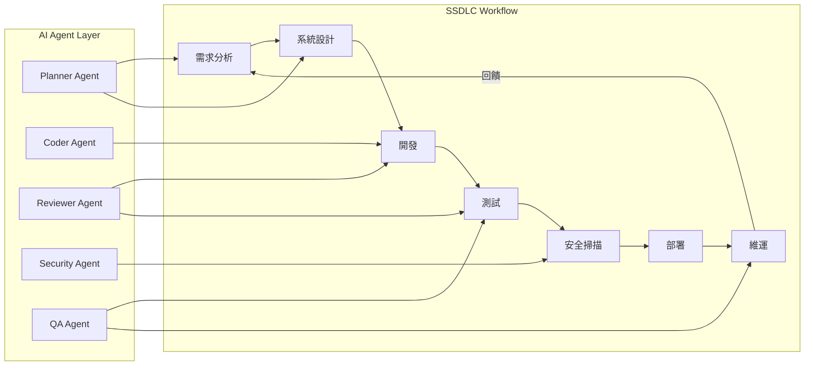
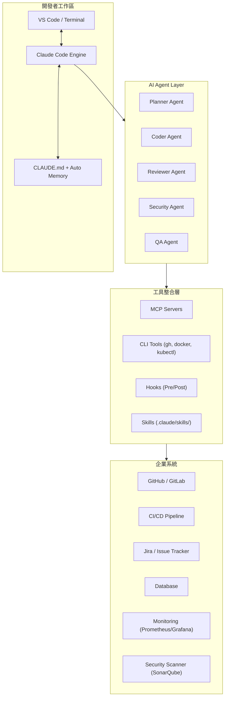
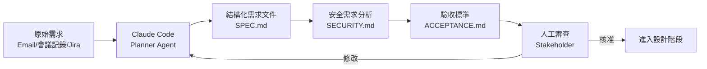
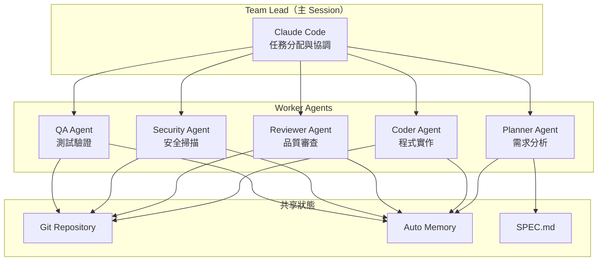
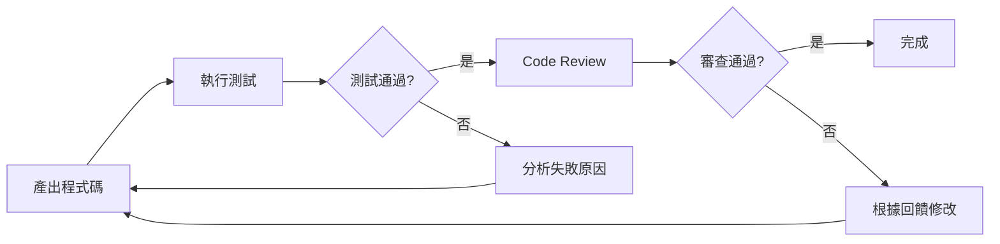
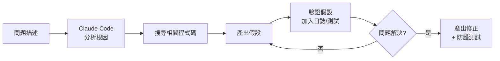
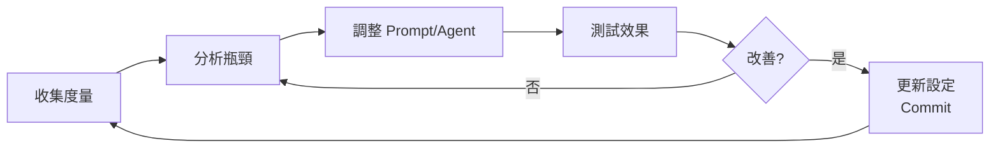
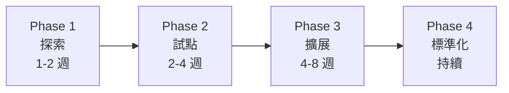

+++
date = '2026-04-15T16:21:12+08:00'
draft = false
title = 'Claude Code SSDLC（AI軟體開發生命週期）教學手冊'
tags = ['教學', 'AI開發']
categories = ['教學']
+++

# Claude Code SSDLC（AI 軟體開發生命週期）教學手冊

> **版本**：v2.0 ｜ **日期**：2026-07-15 ｜ **適用對象**：資深工程師 / 架構師 / DevOps / AI 工程師  
> **定位**：企業級實戰手冊，可直接作為團隊導入規範文件  
> **變更紀錄**：v2.0 — 全面更新至 Claude Code 最新版本，涵蓋 Hooks、Skills、Plugins、Agent Teams、Auto Memory、多平台支援等新特性

---

## 目錄

- [第 1 章：整體架構設計（Architecture）](#第-1-章整體架構設計architecture)
  - [1.1 Claude Code 在 SSDLC 的角色](#11-claude-code-在-ssdlc-的角色)
  - [1.2 AI Agent 在 SDLC 各階段的應用](#12-ai-agent-在-sdlc-各階段的應用)
  - [1.3 系統架構圖](#13-系統架構圖)
  - [1.4 多 Agent 協作模型](#14-多-agent-協作模型)
  - [1.5 與企業系統整合](#15-與企業系統整合)
  - [1.6 多平台支援](#16-多平台支援)
- [第 2 章：Claude Code 安裝與環境建置](#第-2-章claude-code-安裝與環境建置)
  - [2.1 Claude Code CLI 安裝](#21-claude-code-cli-安裝)
  - [2.2 VS Code 整合設定](#22-vs-code-整合設定)
  - [2.3 API Key 與認證設定](#23-api-key-與認證設定)
  - [2.4 Workspace 初始化](#24-workspace-初始化)
  - [2.5 常見錯誤與排除](#25-常見錯誤與排除)
- [第 3 章：專案結構設計（Best Practice）](#第-3-章專案結構設計best-practice)
  - [3.1 Claude Code 專案目錄結構](#31-claude-code-專案目錄結構)
  - [3.2 Prompt Template 設計](#32-prompt-template-設計)
  - [3.3 Agent Workflow 定義](#33-agent-workflow-定義)
  - [3.4 Context 管理策略](#34-context-管理策略)
  - [3.5 Skills / Rules / Plugins 結構](#35-skills--rules--plugins-結構)
- [第 4 章：SSDLC Workflow 設計（核心）](#第-4-章ssdlc-workflow-設計核心)
  - [4.1 需求階段（Requirements）](#41-需求階段requirements)
  - [4.2 設計階段（Design）](#42-設計階段design)
  - [4.3 開發階段（Development）](#43-開發階段development)
  - [4.4 測試階段（Testing）](#44-測試階段testing)
  - [4.5 部署階段（Deployment）](#45-部署階段deployment)
  - [4.6 維運階段（Operations）](#46-維運階段operations)
- [第 5 章：AI Agent Workflow 設計](#第-5-章ai-agent-workflow-設計)
  - [5.1 多 Agent 協作模式](#51-多-agent-協作模式)
  - [5.2 自我反饋迴圈（Self-Reflection Loop）](#52-自我反饋迴圈self-reflection-loop)
  - [5.3 自我優化系統（Self-Improving System）](#53-自我優化系統self-improving-system)
  - [5.4 Memory / Context 設計](#54-memory--context-設計)
  - [5.5 Agent Teams 與多 Session 協作](#55-agent-teams-與多-session-協作)
  - [5.6 Plugins 插件生態系](#56-plugins-插件生態系)
- [第 6 章：Prompt Engineering](#第-6-章prompt-engineering)
  - [6.1 Prompt 模板設計](#61-prompt-模板設計)
  - [6.2 可重用 Prompt Library](#62-可重用-prompt-library)
  - [6.3 Chain-of-Thought / ReAct 模式](#63-chain-of-thought--react-模式)
  - [6.4 安全 Prompt（避免 Hallucination）](#64-安全-prompt避免-hallucination)
- [第 7 章：實務案例](#第-7-章實務案例)
  - [7.1 案例 1：Web 系統（Spring Boot + Vue）](#71-案例-1web-系統spring-boot--vue)
  - [7.2 案例 2：批次系統（Batch Job）](#72-案例-2批次系統batch-job)
- [第 8 章：系統維運（Operations）](#第-8-章系統維運operations)
  - [8.1 日誌管理](#81-日誌管理)
  - [8.2 AI 輔助 Debug](#82-ai-輔助-debug)
  - [8.3 Incident 處理](#83-incident-處理)
- [第 9 章：系統升級與優化（Evolution）](#第-9-章系統升級與優化evolution)
  - [9.1 Prompt 版本控管](#91-prompt-版本控管)
  - [9.2 Agent 能力升級](#92-agent-能力升級)
  - [9.3 Workflow 優化策略](#93-workflow-優化策略)
- [第 10 章：最佳實務與建議（Best Practices）](#第-10-章最佳實務與建議best-practices)
  - [10.1 團隊導入策略](#101-團隊導入策略)
  - [10.2 治理（Governance）](#102-治理governance)
  - [10.3 安全（Security）](#103-安全security)
  - [10.4 成本控制（Token / API）](#104-成本控制token--api)
- [第 11 章：常見問題（FAQ）](#第-11-章常見問題faq)
- [附錄 A：快速檢查清單（Checklist）](#附錄-a快速檢查清單checklist)
- [附錄 B：常用指令速查表](#附錄-b常用指令速查表)
- [附錄 C：參考資料](#附錄-c參考資料)

---

## 第 1 章：整體架構設計（Architecture）

### 1.1 Claude Code 在 SSDLC 的角色

Claude Code 是 Anthropic 推出的 **Agentic Coding Tool**，可在 Terminal、VS Code、JetBrains、Desktop App、Web 以及 Chrome 瀏覽器中使用。它不只是程式碼補全工具，而是能夠：

- **讀取整個 Codebase**：理解專案結構、依賴關係、架構模式
- **執行指令**：自主運行 shell 命令、測試、建置
- **編輯檔案**：跨多個檔案進行精確修改
- **整合開發工具**：透過 MCP（Model Context Protocol）連接外部服務
- **自主解決問題**：Explore → Plan → Implement → Verify 的完整迴圈
- **持久記憶**：透過 CLAUDE.md 和 Auto Memory 跨 Session 保留專案知識
- **自動化工作流**：透過 Hooks、Skills、Plugins 實現確定性行為控制
- **多 Agent 協作**：透過 Subagents 和 Agent Teams 進行平行任務處理

在 SSDLC 中，Claude Code 扮演以下角色：

| SSDLC 階段 | Claude Code 角色 | 具體能力 |
|---|---|---|
| 需求分析 | 需求分析師 | 解析需求文件、產出規格書、識別安全需求 |
| 系統設計 | 架構顧問 | 產出架構圖、API 設計、識別設計缺陷 |
| 開發 | 自動化開發者 | 產碼、重構、Code Review |
| 測試 | QA 工程師 | 產出 Unit / Integration / E2E 測試 |
| 安全 | 安全審查員 | 安全掃描、弱點識別、OWASP 檢查 |
| 部署 | DevOps 助手 | CI/CD Pipeline 設計、IaC 產出 |
| 維運 | SRE 助手 | 日誌分析、Incident Debug、效能調校 |

### 1.2 AI Agent 在 SDLC 各階段的應用



**各階段 Agent 對應**：

1. **需求階段** → Planner Agent：自動解析需求文件、產出 User Story、整理驗收標準
2. **設計階段** → Planner Agent + Coder Agent：產出系統架構、API 規格、資料模型
3. **開發階段** → Coder Agent + Reviewer Agent：自動產碼、即時 Code Review
4. **測試階段** → QA Agent：自動產測試案例、執行測試、分析覆蓋率
5. **安全階段** → Security Agent：SAST/DAST 掃描、依賴檢查、合規驗證
6. **部署階段** → Coder Agent：產出 CI/CD Pipeline、Infrastructure as Code
7. **維運階段** → QA Agent：日誌分析、效能監控、Incident 根因分析

### 1.3 系統架構圖



### 1.4 多 Agent 協作模型

Claude Code 支援多種 Agent 協作模式：

#### 1.4.1 Subagent 模式

Claude Code 內建 **Subagent** 機制，可在 `.claude/agents/` 目錄定義專用 Agent：

```markdown
<!-- .claude/agents/security-reviewer.md -->
---
name: security-reviewer
description: 審查程式碼的安全漏洞
tools: Read, Grep, Glob, Bash
model: opus
---
你是資深資安工程師。審查程式碼是否有：
- 注入漏洞（SQL / XSS / Command Injection）
- 身份驗證與授權缺陷
- 程式碼中的密鑰或憑證
- 不安全的資料處理

提供具體行號引用與修復建議。
```

#### 1.4.2 Agent Teams 模式

利用 Claude Code 的 **Agent Teams** 功能，實現多 Session 協作：

| Agent 角色 | 職責 | 工具權限 |
|---|---|---|
| Planner | 需求拆解、任務規劃 | Read, Glob, Grep, WebSearch |
| Coder | 程式碼撰寫 | Read, Write, Edit, Bash |
| Reviewer | 程式碼審查 | Read, Grep, Glob |
| Security | 安全掃描 | Read, Grep, Bash |
| QA | 測試產出與執行 | Read, Write, Bash |

#### 1.4.3 Writer / Reviewer 模式

```
Session A（Writer）：實作功能
    ↓ 產出程式碼
Session B（Reviewer）：審查 Session A 的產出
    ↓ 回饋建議
Session A：根據回饋修改
```

### 1.5 與企業系統整合

#### GitHub 整合

```bash
# 安裝 GitHub CLI（Claude Code 會自動使用）
gh auth login

# Claude Code 可直接操作
claude -p "建立一個 PR，標題為 feat: add user authentication"
```

#### CI/CD 整合（GitHub Actions）

```yaml
# .github/workflows/claude-code-review.yml
name: Claude Code Review
on:
  pull_request:
    types: [opened, synchronize]

jobs:
  review:
    runs-on: ubuntu-latest
    steps:
      - uses: actions/checkout@v4
      - name: Claude Code Review
        uses: anthropics/claude-code-action@v1
        with:
          anthropic_api_key: ${{ secrets.ANTHROPIC_API_KEY }}
          review_type: comprehensive
```

#### MCP Server 整合

```bash
# 連接 Jira MCP Server
claude mcp add jira -- npx @anthropic-ai/mcp-server-jira

# 連接資料庫 MCP Server
claude mcp add postgres -- npx @anthropic-ai/mcp-server-postgres

# 連接 Sentry 監控
claude mcp add sentry -- npx @anthropic-ai/mcp-server-sentry
```

> **實務建議**：整合企業系統時，建議先在測試環境驗證，確認 MCP Server 的權限範圍後，再部署到正式環境。使用 `--scope project` 確保 MCP 設定只在特定專案生效。

### 1.6 多平台支援

Claude Code 支援多種開發介面，所有平台共用同一套 CLAUDE.md、Settings 和 MCP 設定：

| 平台 | 適用場景 | 特色 |
|---|---|---|
| **Terminal CLI** | 主力開發環境 | 完整功能、最高自由度 |
| **VS Code Extension** | IDE 整合開發 | 圖形化介面、內嵌面板 |
| **JetBrains Plugin** | IntelliJ / WebStorm 使用者 | IDE 原生整合 |
| **Desktop App** | 多 Session 並行管理 | 視覺化 Session 管理、獨立 Worktree |
| **Web（claude.ai）** | 遠端 / 行動裝置 | Anthropic 安全雲端 VM、隨時隨地使用 |
| **Chrome Extension** | 前端 UI 開發 | 開啟瀏覽器分頁、測試 UI、迭代修正 |

#### 跨平台協作方式

| 需求 | 使用方式 |
|---|---|
| 從手機繼續本地 Session | Remote Control |
| 從 Telegram / Discord / iMessage 推送事件到 Session | Channels |
| 定期排程執行任務 | Routines 或 Desktop 排程任務 |
| 自動化 PR Review 與 Issue 分類 | GitHub Actions / GitLab CI/CD |
| 偵錯線上 Web 應用程式 | Chrome Extension |
| 建立自訂 Agent 於自有工作流程中 | Agent SDK |

---

## 第 2 章：Claude Code 安裝與環境建置

### 2.1 Claude Code CLI 安裝

#### Windows 安裝

**PowerShell**（推薦）：

```powershell
irm https://claude.ai/install.ps1 | iex
```

**CMD**：

```cmd
curl -fsSL https://claude.ai/install.cmd -o install.cmd && install.cmd && del install.cmd
```

> **前置條件**：Windows 原生安裝需要先安裝 [Git for Windows](https://git-scm.com/downloads/win)。

**透過 WinGet**：

```powershell
winget install Anthropic.ClaudeCode
```

#### macOS / Linux 安裝

```bash
curl -fsSL https://claude.ai/install.sh | bash
```

**透過 Homebrew**（macOS / Linux）：

```bash
brew install --cask claude-code
```

> **注意**：透過 npm 安裝已被官方棄用（`npm install -g @anthropic-ai/claude-code` 不再建議）。原生安裝方式會自動在背景更新，保持最新版本。

#### 驗證安裝

```bash
claude --version
# 預期輸出：claude-code v2.x.x

# 首次啟動
cd your-project
claude
# 系統會提示登入
```

**安裝畫面說明**：
- 執行安裝指令後，終端機會顯示下載進度條
- 安裝完成後，會顯示 `Claude Code installed successfully`
- 首次執行 `claude` 會開啟瀏覽器進行帳號認證
- 認證完成後返回終端機，顯示互動式介面

### 2.2 VS Code 整合設定

#### 安裝 VS Code Extension

1. 開啟 VS Code
2. Extensions（`Ctrl+Shift+X`）
3. 搜尋 `Claude Code`
4. 安裝官方 Extension

#### 設定方式

VS Code 中使用 Claude Code：
- **快捷鍵**：`Ctrl+Esc` 開啟 Claude Code 面板
- **命令面板**：`Ctrl+Shift+P` → 輸入 `Claude Code`
- **終端整合**：在 VS Code 內建終端直接執行 `claude`

#### 推薦工作區設定

```jsonc
// .vscode/settings.json
{
  "claude-code.autoStart": true,
  "claude-code.defaultModel": "opus",
  "editor.formatOnSave": true,
  "terminal.integrated.defaultProfile.windows": "PowerShell"
}
```

### 2.3 API Key 與認證設定

#### 方式一：Claude Pro/Team 訂閱（推薦個人使用）

```bash
claude
# 首次執行自動開啟瀏覽器認證
```

#### 方式二：Anthropic Console API Key（推薦企業 CI/CD）

```bash
# 設定環境變數
export ANTHROPIC_API_KEY=sk-ant-api03-xxxxx

# Windows PowerShell
$env:ANTHROPIC_API_KEY = "sk-ant-api03-xxxxx"
```

#### 方式三：第三方 Provider

```bash
# Amazon Bedrock
export CLAUDE_CODE_USE_BEDROCK=1
# 需設定 AWS 認證（AWS_ACCESS_KEY_ID, AWS_SECRET_ACCESS_KEY）

# Google Vertex AI
export CLAUDE_CODE_USE_VERTEX=1
# 需設定 GCP 認證（GOOGLE_APPLICATION_CREDENTIALS）

# Microsoft Azure AI Foundry
export CLAUDE_CODE_USE_FOUNDRY=1
# 需設定 Azure 認證
```

> **安全建議**：
> - 永遠不要將 API Key 寫死在程式碼中
> - 使用環境變數或 Secret Manager
> - CI/CD 中使用 GitHub Secrets 或 Azure Key Vault
> - 定期輪換 API Key

### 2.4 Workspace 初始化

#### 步驟一：初始化 CLAUDE.md

```bash
cd your-project
claude
# 進入互動模式後執行
/init
```

執行 `/init` 後，Claude Code 會：
1. 分析你的 Codebase 結構
2. 偵測建置系統（Maven、Gradle、npm 等）
3. 偵測測試框架
4. 偵測程式碼風格
5. 產出 `CLAUDE.md` 初始檔案

> **進階初始化**：設定 `CLAUDE_CODE_NEW_INIT=1` 環境變數可啟用互動式多階段流程。`/init` 會詢問要設定哪些 Artifact（CLAUDE.md、Skills、Hooks），接著用 Subagent 探索 Codebase，透過追問填補缺漏，最終提出可審查的提案後才寫入檔案。如果已存在 CLAUDE.md，`/init` 會建議改善而非覆寫。

#### 步驟二：建立專案設定

```bash
# 建立 .claude 目錄結構
mkdir -p .claude/skills .claude/agents .claude/rules
```

#### 步驟三：設定權限規則

```jsonc
// .claude/settings.json
{
  "permissions": {
    "allow": [
      "Bash(npm run *)",
      "Bash(mvn *)",
      "Bash(git *)",
      "Bash(gh *)"
    ],
    "deny": [
      "Bash(rm -rf /)",
      "Bash(DROP TABLE*)"
    ]
  },
  "autoMemoryEnabled": true
}
```

### 2.5 常見錯誤與排除

| 問題 | 原因 | 解決方式 |
|---|---|---|
| `The token '&&' is not a valid statement separator` | 在 PowerShell 中執行 CMD 指令 | 確認是否在 PowerShell 中（提示符有 `PS`） |
| `'irm' is not recognized` | 在 CMD 中執行 PowerShell 指令 | 改用 CMD 安裝指令 |
| 認證失敗 | API Key 過期或錯誤 | 重新產生 API Key |
| `CLAUDE.md not found` | 未初始化專案 | 執行 `/init` |
| Context window 爆滿 | 單次對話累積過多 | 執行 `/clear` 清除，或 `/compact` 壓縮 |
| MCP Server 連線失敗 | 服務未啟動或權限不足 | 檢查 `claude mcp list` 並重啟服務 |
| 自動更新失敗 | 網路問題或權限不足 | 手動執行 `claude update` |

> **實務踩坑**：在企業防火牆環境下，Claude Code 的自動更新可能被擋。建議設定 Proxy：
> ```bash
> export HTTPS_PROXY=http://proxy.company.com:8080
> ```

---

## 第 3 章：專案結構設計（Best Practice）

### 3.1 Claude Code 專案目錄結構

#### 推薦目錄結構

```
your-project/
├── .claude/                          # Claude Code 設定根目錄
│   ├── CLAUDE.md                     # 專案級指令（團隊共用，commit 進 Git）
│   ├── settings.json                 # 專案級設定（權限、Hook 等）
│   ├── settings.local.json           # 個人本地設定（加入 .gitignore）
│   ├── agents/                       # 自訂 Subagent 定義
│   │   ├── planner.md                # 規劃 Agent
│   │   ├── security-reviewer.md      # 安全審查 Agent
│   │   ├── code-reviewer.md          # 程式碼審查 Agent
│   │   └── test-generator.md         # 測試產出 Agent
│   ├── skills/                       # 可重用技能
│   │   ├── fix-issue/
│   │   │   └── SKILL.md              # 修復 Issue 技能
│   │   ├── create-api/
│   │   │   └── SKILL.md              # 建立 API 技能
│   │   ├── security-scan/
│   │   │   └── SKILL.md              # 安全掃描技能
│   │   └── ssdlc-review/
│   │       └── SKILL.md              # SSDLC 審查技能
│   └── rules/                        # 規則檔案
│       ├── code-style.md             # 程式碼風格
│       ├── security.md               # 安全規則
│       ├── testing.md                # 測試規則
│       └── api-design.md             # API 設計規則
├── CLAUDE.md                         # 專案根目錄指令（或放 .claude/ 內）
├── CLAUDE.local.md                   # 個人偏好（加入 .gitignore）
├── src/
├── tests/
├── docs/
└── .github/
    └── workflows/
        └── claude-code-review.yml    # CI/CD 整合
```

#### 範例：根目錄 CLAUDE.md

```markdown
# 專案指引

## 建置與測試
- 建置：`mvn clean compile`
- 測試：`mvn test`
- 型別檢查：`mvn checkstyle:check`

## 程式碼風格
- 使用 4 空格縮排
- Java 類別使用 PascalCase
- 方法與變數使用 camelCase
- 常數使用 UPPER_SNAKE_CASE
- 使用 JavaDoc 格式撰寫註解

## 測試
- 每個 Service 類別必須有對應的 Unit Test
- 使用 JUnit 5 + Mockito
- 測試覆蓋率需達 80%
- 優先執行單一測試，避免整包跑

## Git 規範
- 分支命名：`feature/JIRA-123-description`
- Commit 訊息：`type(scope): description`
  - type: feat, fix, refactor, test, docs, chore
- PR 必須通過 Code Review 後才可合併

## 安全
- 敏感資料不可 hardcode
- 所有外部輸入必須驗證
- SQL 使用 Prepared Statement
- 啟用 CORS 白名單

## 參考
- @docs/architecture.md
- @docs/api-spec.md
```

### 3.2 Prompt Template 設計

#### Skill 設計範例

```markdown
<!-- .claude/skills/create-api/SKILL.md -->
---
name: create-api
description: 建立 RESTful API 端點
---
根據以下需求建立新的 API 端點：$ARGUMENTS

### 執行步驟
1. 分析需求，確認 HTTP Method、URL Path、Request/Response Schema
2. 在 `src/main/java/com/tutorial/api/` 建立 Controller
3. 在 `src/main/java/com/tutorial/service/` 建立 Service
4. 在 `src/main/java/com/tutorial/repository/` 建立 Repository（如需要）
5. 建立 DTO（Data Transfer Object）
6. 加入輸入驗證（使用 Jakarta Validation）
7. 撰寫 Unit Test
8. 撰寫 Integration Test
9. 更新 API 文件
10. 執行測試驗證

### 安全要求
- 所有輸入使用 @Valid 驗證
- 使用 Prepared Statement
- 啟用 Rate Limiting
- 記錄 Audit Log
```

使用方式：

```bash
# 在 Claude Code 中使用
/create-api 用戶管理 CRUD API，包含建立、查詢、更新、刪除
```

#### Hook 設計範例

```jsonc
// .claude/settings.json
{
  "hooks": {
    "PostToolUse": [
      {
        "matcher": "Edit|Write",
        "command": "npx eslint --fix $FILE 2>/dev/null || true"
      }
    ],
    "PreCommit": [
      {
        "command": "mvn checkstyle:check && mvn test"
      }
    ]
  }
}
```

### 3.3 Agent Workflow 定義

#### Planner Agent 定義

```markdown
<!-- .claude/agents/planner.md -->
---
name: planner
description: 負責需求分析與任務拆解
tools: Read, Glob, Grep, WebSearch, AskUserQuestion
model: opus
---
你是資深架構師。負責：

1. 閱讀需求文件，整理為結構化 User Story
2. 識別技術風險與安全需求
3. 將大任務拆解為可執行的小任務（每個任務 < 2hr）
4. 建立依賴關係圖
5. 產出 SPEC.md

### 輸出格式
```markdown
# Feature: [功能名稱]
## User Stories
- [ ] US-001: 描述...
## Tasks
- [ ] T-001: 描述... (預估：1hr)
## Security Requirements
- SR-001: 描述...
## Dependencies
- T-002 depends on T-001
```
```

#### Security Reviewer Agent 定義

```markdown
<!-- .claude/agents/security-reviewer.md -->
---
name: security-reviewer
description: 審查程式碼安全性，依據 OWASP Top 10
tools: Read, Grep, Glob, Bash
model: opus
---
你是資深資安工程師。依據 OWASP Top 10 (2025) 審查程式碼：

## 檢查項目
1. **A01 - Broken Access Control**：權限控制缺陷
2. **A02 - Cryptographic Failures**：加密不當
3. **A03 - Injection**：注入攻擊（SQL, XSS, Command）
4. **A04 - Insecure Design**：不安全的設計
5. **A05 - Security Misconfiguration**：配置錯誤
6. **A06 - Vulnerable Components**：含已知弱點的元件
7. **A07 - Auth Failures**：身份驗證失敗
8. **A08 - Data Integrity Failures**：資料完整性問題
9. **A09 - Logging Failures**：日誌與監控不足
10. **A10 - SSRF**：伺服器端請求偽造

## 輸出格式
| 嚴重度 | OWASP | 檔案:行號 | 問題描述 | 修復建議 |
```

### 3.4 Context 管理策略

Claude Code 的 Context Window 是最重要的資源。以下是管理策略：

#### 策略一：分離關注點

```
❌ 錯誤做法：在同一個 Session 討論不同主題
    → Context 混亂，AI 品質下降

✅ 正確做法：
    Session 1：需求分析 → /clear
    Session 2：架構設計 → /clear
    Session 3：功能實作 → /clear
```

#### 策略二：善用 Subagent

```bash
# 讓 Subagent 去探索 Codebase，不汙染主 Session
> 使用 subagent 調查 authentication 模組的 token refresh 機制
```

#### 策略三：Context 壓縮

```bash
# 手動壓縮：保留 API 變更的上下文
/compact 專注在 API 變更和安全修正

# 自動壓縮：CLAUDE.md 中設定
# 壓縮時，永遠保留修改過的檔案清單和測試指令
```

#### 策略四：Session 管理

```bash
# 恢復上次 Session
claude --continue

# 選擇歷史 Session
claude --resume

# 命名 Session 方便識別
/rename oauth-migration
```

> **實務建議**：
> - 每個 CLAUDE.md 控制在 200 行以內
> - 使用 `.claude/rules/` 分散規則，避免 CLAUDE.md 過載
> - 不常用的知識放在 Skills 中，按需載入
> - 每完成一個功能點就 `/clear`，保持 Context 乾淨

### 3.5 Skills / Rules / Plugins 結構

#### Skills 系統

Skills 是可重用的指令集，Claude 會根據任務自動載入相關 Skill，或由開發者以 `/skill-name` 手動呼叫。每個 Skill 是一個含有 `SKILL.md` 的目錄：

```
.claude/skills/
├── fix-issue/
│   └── SKILL.md          # 主指令（必要）
├── create-api/
│   ├── SKILL.md           # 主指令
│   ├── template.md        # 範本
│   └── examples/
│       └── sample.md      # 範例輸出
└── deploy/
    ├── SKILL.md
    └── scripts/
        └── validate.sh    # Claude 可執行的腳本
```

**SKILL.md Frontmatter 參考**：

```yaml
---
name: fix-issue                       # 顯示名稱，也是 /slash-command
description: 修復 GitHub Issue         # Claude 用此判斷何時自動載入
disable-model-invocation: true        # 僅手動呼叫，Claude 不會自動觸發
allowed-tools: Bash(git *) Read Edit  # 此 Skill 啟用時自動授權的工具
context: fork                         # 在獨立 Subagent Context 中執行
agent: Explore                        # context: fork 時使用的 Agent 類型
paths:                                # 限制 Skill 僅在特定路徑啟用
  - "src/api/**/*.ts"
---
```

| 欄位 | 說明 |
|---|---|
| `name` | Skill 名稱，小寫字母和連字號，最多 64 字元 |
| `description` | Claude 用以判斷何時自動載入；前 1,536 字元會放入 Context |
| `disable-model-invocation` | 設為 `true` 時，Claude 不會自動觸發（如 deploy、commit） |
| `context: fork` | 在獨立 Subagent Context 中執行，不汙染主對話 |
| `allowed-tools` | Skill 啟用時自動授權的工具，無需逐次確認 |
| `paths` | Glob 模式，僅在處理匹配檔案時載入 |

**內建 Bundled Skills**：Claude Code 內建 `/simplify`、`/batch`、`/debug`、`/loop`、`/claude-api` 等 Skill，每個 Session 皆可使用。

#### Rules（路徑限定規則）

`.claude/rules/` 目錄下的 Markdown 檔案可用 YAML frontmatter 限定適用路徑：

```markdown
<!-- .claude/rules/api-security.md -->
---
paths:
  - "src/api/**/*.ts"
  - "src/controllers/**/*.java"
---

# API 安全規則
- 所有 API 端點必須包含輸入驗證
- 使用標準化的錯誤回應格式
- 加入 OpenAPI 文件註解
```

**無 `paths` frontmatter 的規則**在 Session 啟動時全部載入；**有 `paths` 的規則**僅在 Claude 讀取匹配檔案時才載入，節省 Context。

#### Plugins 系統

Plugins 將 Skills、Agents、Hooks、MCP Servers 打包成可安裝、可分享的單元：

```
my-plugin/
├── .claude-plugin/
│   └── plugin.json          # 插件描述檔（name, version, description）
├── skills/                  # 插件內的 Skills
│   └── code-review/
│       └── SKILL.md
├── agents/                  # 插件內的 Agents
│   └── security-reviewer.md
├── hooks/
│   └── hooks.json           # 插件內的 Hooks
├── bin/                     # 可執行檔，啟用插件時加入 PATH
├── .mcp.json                # MCP Server 設定
├── .lsp.json                # LSP Server 設定（Code Intelligence）
└── settings.json            # 預設設定
```

安裝與管理：
```bash
# 瀏覽插件市集
/plugin

# 安裝插件
/plugin install my-plugin

# 本地開發測試
claude --plugin-dir ./my-plugin

# 重新載入插件（開發中修改後）
/reload-plugins
```

> **Plugin vs 獨立設定**：個人實驗和專案內使用放 `.claude/`；要跨專案分享或發佈到市場時，打包成 Plugin。Plugin 的 Skill 以 `/plugin-name:skill-name` 命名空間避免衝突。

---

## 第 4 章：SSDLC Workflow 設計（核心）

本章是整份手冊的核心，完整描述如何使用 Claude Code 建立安全軟體開發生命週期。

### 4.1 需求階段（Requirements）

#### 4.1.1 AI 自動產出需求文件

**流程**：



**使用方式**：

```bash
# 使用 Plan Mode 分析需求
claude
# 按 Ctrl+G 切換到 Plan Mode

> 閱讀以下需求文件，產出結構化的 SPEC.md：
> @docs/requirements/user-management.md
> 
> 需包含：
> 1. User Stories（含驗收標準）
> 2. 非功能性需求（效能、安全、可用性）
> 3. 安全需求（依 OWASP Top 10）
> 4. 資料模型
> 5. API 端點清單
> 6. 異常情境處理
```

**Prompt 模板**：

```markdown
<!-- .claude/skills/analyze-requirements/SKILL.md -->
---
name: analyze-requirements
description: 將原始需求轉化為結構化規格文件
---
分析以下需求並產出完整規格文件：$ARGUMENTS

### 輸出結構
1. **功能需求**
   - User Story 格式：As a [角色], I want [功能], so that [價值]
   - 每個 Story 附帶驗收標準（Given-When-Then）

2. **非功能性需求**
   - 效能：回應時間 < 200ms (P95)
   - 可用性：99.9% SLA
   - 安全：OWASP Top 10 防護

3. **安全需求**
   - 身份驗證方式
   - 授權模型（RBAC/ABAC）
   - 資料加密需求
   - 稽核日誌需求

4. **技術約束**
   - 相容性要求
   - 第三方依賴限制
```

#### 4.1.2 需求追蹤矩陣

```bash
# 讓 Claude Code 產出需求追蹤矩陣
> 讀取 SPEC.md，產出需求追蹤矩陣（Requirements Traceability Matrix），
> 格式為 Markdown 表格，包含需求 ID、描述、對應測試案例、狀態
```

### 4.2 設計階段（Design）

#### 4.2.1 系統設計（架構圖）

```bash
# 使用 Claude Code 產出架構設計
> 基於 @SPEC.md 的需求，設計系統架構：
> - 使用 Clean Architecture
> - 前端：Vue 3 + TypeScript
> - 後端：Spring Boot 3
> - 資料庫：PostgreSQL
> - 快取：Redis
> - 訊息佇列：RabbitMQ
> 
> 產出：
> 1. 系統架構圖（Mermaid）
> 2. 元件圖
> 3. 部署圖
> 4. 資料流圖
> 5. 安全架構圖
```

#### 4.2.2 API 設計

```bash
# 使用 Skill 產出 API 規格
/create-api 用戶管理模組，包含：
- POST /api/v1/users（建立用戶）
- GET /api/v1/users/{id}（查詢用戶）
- PUT /api/v1/users/{id}（更新用戶）
- DELETE /api/v1/users/{id}（刪除用戶）
- GET /api/v1/users（列表查詢，支援分頁）

需包含 OpenAPI 3.0 規格檔
```

#### 4.2.3 安全設計審查

```bash
# 使用 Security Agent 審查設計
> 使用 subagent security-reviewer 審查 @docs/architecture.md 的安全設計：
> - 認證機制是否安全
> - 授權模型是否完整
> - 資料傳輸是否加密
> - 敏感資料存儲策略
> - API 安全防護
```

### 4.3 開發階段（Development）

#### 4.3.1 Claude Code 自動產碼

**推薦流程：Explore → Plan → Implement → Verify**

> **官方最佳實務**：分離研究 / 規劃 / 實作階段是避免「解決錯誤問題」的關鍵。對於範圍明確的小修改（如修正錯字、增加日誌行），可直接讓 Claude 執行。規劃最適合用於不確定方法、跨多檔案變更、或對修改區域不熟悉的情境。

```bash
# 步驟 1：Explore（Plan Mode）
# 按 Ctrl+G 切換到 Plan Mode
> 閱讀 @src/main/java/com/tutorial/ 理解目前的程式架構和命名慣例。
> 同時看一下測試是怎麼寫的。

# 步驟 2：Plan（Plan Mode）
> 我要新增 UserService，需要哪些檔案需要修改？
> 建立實作計畫。

# 按 Ctrl+G 可在文字編輯器中直接修改計畫後再讓 Claude 執行

# 步驟 3：Implement（Normal Mode）
# 切回 Normal Mode
> 依照你的計畫實作 UserService。
> 寫完後執行測試，修正所有失敗的測試。

# 步驟 4：Verify
> 使用 subagent 審查剛才的修改，檢查邊界情況和安全問題。
```

> **驗證是最高槓桿操作**：提供測試、截圖或預期輸出讓 Claude 自行驗證。沒有明確的成功標準，Claude 可能產出看似正確但實際無法運作的程式碼。可用測試套件、Linter、或檢查輸出的 Bash 指令作為驗證手段。前端 UI 變更可使用 Chrome Extension 自動截圖比對。

#### 4.3.2 Code Review AI

```markdown
<!-- .claude/agents/code-reviewer.md -->
---
name: code-reviewer
description: 全面審查程式碼品質。Claude 在程式碼修改後會主動使用。
tools: Read, Grep, Glob, Bash
model: opus
memory: project
---
你是資深程式碼審查員。啟動後先執行 `git diff` 查看近期變更。

審查標準：

## 正確性
- 邏輯錯誤
- 邊界條件處理
- 空值處理
- 並發安全

## 可維護性
- 命名清晰度
- 方法長度（< 20 行）
- 類別職責單一
- 重複程式碼

## 效能
- N+1 查詢
- 不必要的記憶體配置
- 缺少快取
- 阻塞操作

## 安全
- 輸入驗證
- SQL Injection
- XSS
- 權限檢查

輸出格式：按嚴重度排列（Critical > Major > Minor > Info）
```

使用方式：

```bash
> 使用 subagent code-reviewer 審查 src/main/java/com/tutorial/service/ 的所有變更
```

### 4.4 測試階段（Testing）

#### 4.4.1 自動生成測試

```bash
# 產出 Unit Test
> 為 @src/main/java/com/tutorial/service/UserService.java 撰寫完整的 Unit Test：
> - 使用 JUnit 5 + Mockito
> - 覆蓋所有公開方法
> - 包含正常情境和異常情境
> - 包含邊界條件測試
> - 執行測試確認全部通過

# 產出 Integration Test
> 為 UserController 撰寫 Integration Test：
> - 使用 @SpringBootTest
> - 使用 TestRestTemplate
> - 測試完整 HTTP Request/Response
> - 包含認證測試
```

**測試產出 Skill**：

```markdown
<!-- .claude/skills/generate-tests/SKILL.md -->
---
name: generate-tests
description: 為指定類別產出完整測試
---
為以下類別產出完整測試：$ARGUMENTS

### 測試層級
1. **Unit Test**
   - Mock 所有外部依賴
   - 測試每個公開方法
   - 包含 Happy Path + Error Path + Edge Case

2. **Integration Test**（如為 Controller）
   - 測試完整 HTTP 流程
   - 驗證 Response Status / Body / Headers

3. **安全測試**
   - 未授權存取
   - 權限不足
   - 輸入驗證（XSS / SQL Injection payload）

### 測試命名規範
`test_[方法名]_[情境]_[預期結果]`

### 執行驗證
撰寫完後執行 `mvn test -pl :module-name` 驗證
```

#### 4.4.2 安全掃描

```bash
# 使用 Security Agent 進行安全掃描
> 使用 subagent security-reviewer 掃描整個 src/ 目錄：
> - 依據 OWASP Top 10
> - 檢查 hardcoded secrets
> - 檢查 SQL Injection
> - 檢查 XSS
> - 檢查不安全的依賴
> 
> 產出安全報告至 docs/security-report.md

# 依賴弱點掃描
> 執行 `mvn dependency-check:check` 並分析報告，
> 列出所有 CVE 漏洞及建議修復方式
```

### 4.5 部署階段（Deployment）

#### 4.5.1 CI/CD 整合

**GitHub Actions 完整範例**：

```yaml
# .github/workflows/ssdlc-pipeline.yml
name: SSDLC Pipeline

on:
  pull_request:
    branches: [main, develop]
  push:
    branches: [main]

jobs:
  # 階段 1：程式碼品質檢查
  quality-check:
    runs-on: ubuntu-latest
    steps:
      - uses: actions/checkout@v4
      - name: Setup Java
        uses: actions/setup-java@v4
        with:
          java-version: '21'
          distribution: 'temurin'
      - name: Code Style Check
        run: mvn checkstyle:check
      - name: Unit Tests
        run: mvn test
      - name: Coverage Report
        run: mvn jacoco:report

  # 階段 2：安全掃描
  security-scan:
    runs-on: ubuntu-latest
    needs: quality-check
    steps:
      - uses: actions/checkout@v4
      - name: SAST Scan
        run: mvn spotbugs:check
      - name: Dependency Check
        run: mvn dependency-check:check
      - name: Claude Code Security Review
        uses: anthropics/claude-code-action@v1
        with:
          anthropic_api_key: ${{ secrets.ANTHROPIC_API_KEY }}
          prompt: |
            審查此 PR 的安全性，依據 OWASP Top 10 進行檢查。
            如發現安全問題，請在對應程式碼行留下 Review Comment。

  # 階段 3：Claude Code Review
  ai-code-review:
    runs-on: ubuntu-latest
    needs: quality-check
    if: github.event_name == 'pull_request'
    steps:
      - uses: actions/checkout@v4
      - name: Claude Code Review
        uses: anthropics/claude-code-action@v1
        with:
          anthropic_api_key: ${{ secrets.ANTHROPIC_API_KEY }}
          review_type: comprehensive

  # 階段 4：建置與部署
  deploy:
    runs-on: ubuntu-latest
    needs: [security-scan, ai-code-review]
    if: github.ref == 'refs/heads/main'
    steps:
      - uses: actions/checkout@v4
      - name: Build
        run: mvn package -DskipTests
      - name: Deploy
        run: |
          # 部署邏輯
          echo "Deploying to production..."
```

#### 4.5.2 Dockerfile 產出

```bash
> 為這個 Spring Boot 專案產出最佳化的 multi-stage Dockerfile：
> - 使用 Eclipse Temurin JDK 21
> - 使用非 root 使用者
> - 最小化 image size
> - 設定健康檢查
> - 設定安全最佳實務（no-new-privileges, read-only filesystem）
```

### 4.6 維運階段（Operations）

#### 4.6.1 AI 監控與問題分析

```bash
# 日誌分析
cat application.log | claude -p "分析這份日誌，找出異常模式和潛在問題"

# 效能分析
> 分析 @monitoring/metrics.json，找出效能瓶頸：
> - API 回應時間異常
> - 記憶體洩漏跡象
> - 資料庫連線池使用率

# Incident 處理
> 線上系統出現以下錯誤：[貼上錯誤訊息]
> 1. 分析根因
> 2. 提供臨時修復方案
> 3. 提供永久修復方案
> 4. 建議防護措施避免再次發生
```

> **實務建議**：
> - 在 CI/CD 中加入 Claude Code Security Review 作為 Gate
> - 使用 Claude Code 的 `--permission-mode auto` 進行非互動式安全掃描
> - 建立 Slack/Teams 整合，讓 Incident 自動觸發 Claude Code 分析

---

## 第 5 章：AI Agent Workflow 設計

### 5.1 多 Agent 協作模式

#### 5.1.1 協作架構



#### 5.1.2 實作範例

```bash
# 主 Session：分配任務
> 我需要實作用戶管理模組。請：
> 1. 使用 subagent planner 分析 @SPEC.md 中的用戶管理需求
> 2. 根據分析結果，依序實作各個 API
> 3. 每完成一個 API，使用 subagent code-reviewer 審查
> 4. 最後使用 subagent security-reviewer 進行安全掃描
```

### 5.2 自我反饋迴圈（Self-Reflection Loop）



**實作方式**：

```bash
# 自動化反饋迴圈
> 實作 UserService.createUser() 方法：
> 1. 撰寫實作
> 2. 撰寫測試
> 3. 執行測試，修正到全部通過
> 4. 使用 subagent 審查程式碼品質
> 5. 根據審查結果修改，直到通過
> 6. 使用 subagent security-reviewer 檢查安全性
> 7. 修正安全問題
> 完成後 commit
```

### 5.3 自我優化系統（Self-Improving System）

Claude Code 的 **Auto Memory** 機制是自我優化的基礎：

#### 原理

```
Session 1：犯錯 → 被糾正 → Auto Memory 記錄教訓
Session 2：讀取 Memory → 避免相同錯誤 → 品質提升
Session N：累積大量知識 → 效率持續提升
```

#### Auto Memory 設定

```jsonc
// .claude/settings.json
{
  "autoMemoryEnabled": true
}
```

Auto Memory 儲存位置：`~/.claude/projects/<project>/memory/`

```
memory/
├── MEMORY.md          # 記憶索引（每次 Session 自動載入前 200 行）
├── debugging.md       # Debug 經驗
├── api-conventions.md # API 慣例
├── security-notes.md  # 安全筆記
└── build-issues.md    # 建置問題
```

#### 自我優化示範

```bash
# Session 1：Claude Code 第一次寫 DAO，使用了字串拼接
# 你糾正：必須使用 PreparedStatement
# → Auto Memory 自動記錄

# Session 2：Claude Code 寫新的 DAO
# → 自動使用 PreparedStatement，不再犯同樣錯誤

# 查看 Memory
/memory
# 選擇 Auto Memory folder 瀏覽
```

### 5.4 Memory / Context 設計

#### 記憶層次架構

| 層級 | 機制 | 生命週期 | 用途 |
|---|---|---|---|
| Session Context | 對話歷史 | 單次 Session | 當前任務 |
| Auto Memory | `~/.claude/projects/<project>/memory/MEMORY.md` | 跨 Session（本機） | Claude 自動累積的學習 |
| CLAUDE.md | 手動維護 | 永久（Git） | 專案規範、建置指令 |
| CLAUDE.local.md | 手動維護 | 永久（本機，gitignore） | 個人偏好 |
| Rules | `.claude/rules/*.md` | 永久（Git） | 路徑限定規則 |
| Skills | `.claude/skills/*/SKILL.md` | 永久（Git） | 可重用流程（按需載入） |
| Subagent Memory | `.claude/agent-memory/<agent-name>/` | 跨 Session | Subagent 獨立累積知識 |

> **Auto Memory 需 Claude Code v2.1.59 以上版本。**

#### CLAUDE.md 載入順序

| 位置 | 範圍 | 載入時機 |
|---|---|---|
| Managed Policy（`/Library/Application Support/ClaudeCode/CLAUDE.md`） | 組織全域，不可排除 | 啟動時 |
| `~/.claude/CLAUDE.md` | 使用者全域 | 啟動時 |
| `./CLAUDE.md` 或 `./.claude/CLAUDE.md` | 專案共用 | 啟動時 |
| `./CLAUDE.local.md` | 個人專案偏好 | 啟動時 |
| 子目錄 `CLAUDE.md` | 子目錄範圍 | Claude 讀取該目錄檔案時（延遲載入） |

所有發現的檔案**疊加載入**而非覆蓋。同一目錄內，`CLAUDE.local.md` 會在 `CLAUDE.md` 之後載入，因此衝突時個人偏好優先。

**Import 語法**：CLAUDE.md 可用 `@path/to/file` 引入外部檔案（最深 5 層），例如：

```markdown
參見 @README.md 了解專案概述，@package.json 查看可用指令。

# 額外指引
- Git 工作流程：@docs/git-instructions.md
- 個人覆寫：@~/.claude/my-project-instructions.md
```

#### Auto Memory 運作機制

```
~/.claude/projects/<project>/memory/
├── MEMORY.md          # 簡潔索引（每 Session 載入前 200 行 / 25KB）
├── debugging.md       # 除錯模式筆記（按需讀取）
├── api-conventions.md # API 設計決策（按需讀取）
└── ...                # Claude 自行建立的主題檔案
```

- `MEMORY.md` 為入口索引，Claude 每次 Session 自動讀取前 200 行（或 25KB）
- 超出的詳細內容會被移至獨立的主題檔案，由 Claude 按需讀取
- 同一 Git Repository 的所有 Worktree 和子目錄共用一個 Auto Memory 目錄
- 使用 `/memory` 可瀏覽和編輯所有 Memory 檔案

#### 最佳化策略

```bash
# 1. CLAUDE.md：簡潔精準（< 200 行）
# 只放 Claude 無法自己推斷的資訊

# 2. Rules：依路徑分類
# .claude/rules/frontend.md → 只在碰到前端檔案時載入
# .claude/rules/backend.md → 只在碰到後端檔案時載入

# 3. Skills：按需載入
# /fix-issue 1234 → 只在需要時觸發

# 4. Auto Memory：自動管理
# Claude 自行決定哪些值得記住
```

> **實務建議**：
> - 定期審閱 Auto Memory（`/memory`），刪除過時的記錄
> - CLAUDE.md 像程式碼一樣管理：有人修改就 Code Review
> - 每條規則都問自己：「拿掉這條，Claude 會犯錯嗎？」不會就刪掉

### 5.5 Agent Teams 與多 Session 協作

當 Subagent 的單一 Context Window 已不能滿足需求，可使用 **Agent Teams** 在多個獨立 Session 中協作。

> **啟用方式**：設定環境變數 `CLAUDE_CODE_EXPERIMENTAL_AGENT_TEAMS=1`

#### 運作原理

- 每個 Teammate 擁有獨立的 Context Window，不互相干擾
- 透過 `SendMessage` 工具在 Agent 之間傳遞訊息
- Team Lead 負責協調任務、分配工作、彙總結果
- 支援 `--worktree` 或 `isolation: "worktree"` 在獨立 Git Worktree 中工作

#### Writer / Reviewer 模式

一個常見的高品質工作流程：

| Session A（Writer） | Session B（Reviewer） |
|---|---|
| 實作 API Rate Limiter | |
| | 審查 `@src/middleware/rateLimiter.ts`，找出邊界情況、Race Condition 和一致性問題 |
| 根據審查回饋修正 | |

也可用於測試：一個 Claude 先寫測試，另一個 Claude 寫程式碼通過這些測試。

#### 多 Session 並行方式

| 方式 | 說明 |
|---|---|
| Desktop App | 視覺化管理多個 Session，每個 Session 獨立 Worktree |
| Web（claude.ai） | 在 Anthropic 安全雲端 VM 中執行 |
| Agent Teams | 自動化協調多 Session、共用任務列表和訊息 |

### 5.6 Plugins 插件生態系

Plugins 拓展了 Claude Code 的能力邊界，將 Skills、Agents、Hooks、MCP/LSP Servers 封裝成可安裝的社群或企業套件。

#### 插件市集

```bash
# 瀏覽官方插件市集
/plugin

# 安裝 Code Intelligence 插件（TypeScript、Python 等）
/plugin install typescript-intelligence

# 本地開發中測試插件
claude --plugin-dir ./my-plugin

# 重新載入已安裝的插件
/reload-plugins
```

#### Code Intelligence 插件

安裝語言對應的 LSP 插件後，Claude Code 可獲得精準的符號導航和自動錯誤偵測：

| 語言 | 插件 | 功能 |
|---|---|---|
| TypeScript | typescript-intelligence | 型別檢查、符號跳轉、自動 import |
| Python | python-intelligence | Pylance 整合、型別推斷 |
| Rust | rust-intelligence | rust-analyzer 整合 |

#### 插件安全限制

Plugin 來源的 Subagents **不支援** `hooks`、`mcpServers`、`permissionMode` frontmatter 欄位（會被忽略）。如需這些功能，將 Agent 檔案複製到 `.claude/agents/` 或 `~/.claude/agents/` 中使用。

---

## 第 6 章：Prompt Engineering

### 6.1 Prompt 模板設計

#### 基本原則

| 原則 | 錯誤示範 | 正確示範 |
|---|---|---|
| 具體 | `加一些測試` | `為 UserService.createUser() 撰寫 Unit Test，覆蓋正常建立、Email 重複、欄位為空的情境` |
| 指定來源 | `為什麼 ExecutionFactory API 很奇怪？` | `查看 ExecutionFactory 的 git history，總結它的 API 是如何演變成現在這樣的` |
| 指定驗證 | `實作 email 驗證` | `實作 validateEmail 函數。測試案例：user@example.com 為 true，invalid 為 false，user@.com 為 false。實作完後跑測試` |
| 參考模式 | `加一個日曆元件` | `看一下 HomePage 上現有的 Widget 是怎麼實作的，HotDogWidget.php 是好範例。照這個模式實作新的日曆元件` |
| `@` 參考 | `看 spec 檔案` | `基於 @docs/SPEC.md 實作，API 規格參考 @docs/api-spec.yaml` |

#### `@` 檔案參考語法

在 Prompt 中使用 `@` 可精確指向檔案或目錄，Claude 會自動讀取內容：

```bash
# 參考單一檔案
> 基於 @src/main/java/com/tutorial/service/UserService.java 撰寫測試

# 參考目錄（Claude 會遞迴讀取）
> 理解 @src/main/java/com/tutorial/ 的架構

# 參考 Agent
> 使用 subagent @security-reviewer 審查 @src/

# 組合使用
> 依照 @SPEC.md 的需求，參考 @src/service/OrderService.java 的模式，實作 PaymentService
```

#### `/btw` 側邊提問

使用 `/btw` 可在不干擾當前工作流程的情況下快速提問，回答不會進入主 Context：

```bash
# 當前正在實作功能，突然想查個語法
/btw Java 的 Optional.ofNullable 和 Optional.of 的差別？

# 不中斷當前 Context 的快速查詢
/btw Spring Security 6 的 SecurityFilterChain 怎麼設定？
```

#### 需求分析 Prompt 模板

```
我需要實作 [功能描述]。

## 背景
- 這是 [系統名稱] 的一部分
- 目標使用者：[角色]
- 技術棧：[語言/框架]

## 需求
1. [具體需求 1]
2. [具體需求 2]

## 約束
- [技術約束]
- [安全約束]
- [效能約束]

## 驗證標準
- [ ] [測試案例 1]
- [ ] [測試案例 2]
- [ ] 通過安全掃描
- [ ] 效能 < [閾值]

請先 Plan（不要直接寫程式），等我確認後再實作。
```

#### 程式碼實作 Prompt 模板

```
依照 @SPEC.md 中 [章節] 的需求，實作 [功能]。

## 參考
- 現有模式：看 @src/service/ExistingService.java 的實作方式
- API 規格：@docs/api-spec.yaml

## 實作要求
1. 遵循 Clean Architecture
2. 使用 DI（Dependency Injection）
3. 加入 Jakarta Validation
4. 寫完 Unit Test

## 測試驗證
實作完後：
1. 執行 `mvn test` 確認測試通過
2. 執行 `mvn checkstyle:check` 確認風格
3. 列出所有新增/修改的檔案
```

### 6.2 可重用 Prompt Library

#### 技能庫架構

```
.claude/skills/
├── requirements/
│   └── analyze-requirements/SKILL.md    # 需求分析
├── design/
│   ├── create-api/SKILL.md              # API 設計
│   ├── create-architecture/SKILL.md     # 架構設計
│   └── create-data-model/SKILL.md       # 資料模型設計
├── development/
│   ├── implement-feature/SKILL.md       # 功能實作
│   ├── fix-issue/SKILL.md               # 修復 Issue
│   └── refactor/SKILL.md               # 重構
├── testing/
│   ├── generate-tests/SKILL.md          # 測試產出
│   └── security-test/SKILL.md           # 安全測試
├── review/
│   ├── code-review/SKILL.md             # 程式碼審查
│   └── security-review/SKILL.md         # 安全審查
└── devops/
    ├── create-pipeline/SKILL.md         # CI/CD Pipeline
    └── create-dockerfile/SKILL.md       # Dockerfile
```

#### fix-issue Skill 範例

```markdown
<!-- .claude/skills/fix-issue/SKILL.md -->
---
name: fix-issue
description: 修復 GitHub Issue
disable-model-invocation: true
---
分析並修復 GitHub Issue：$ARGUMENTS

1. 使用 `gh issue view` 取得 Issue 詳情
2. 理解問題描述
3. 搜尋 Codebase 找到相關檔案
4. 實作修復
5. 撰寫並執行測試驗證
6. 確保 Lint 和型別檢查通過
7. 建立描述性 Commit Message
8. Push 並建立 PR
```

使用：`/fix-issue 1234`

### 6.3 Chain-of-Thought / ReAct 模式

#### Chain-of-Thought（CoT）

讓 Claude Code 先思考再行動：

```bash
> 我要修改 AuthService 的 token refresh 邏輯。
> 
> 在動手之前，請先：
> 1. 讀取目前的實作
> 2. 列出所有呼叫 refreshToken() 的地方
> 3. 分析目前的問題
> 4. 提出修改方案（至少 2 個）
> 5. 分析每個方案的優缺點
> 6. 等我選擇方案後再實作
```

#### ReAct（Reason + Act）

讓 Claude Code 在每一步都解釋原因：

```bash
> 調查 API /api/v1/users 的回應時間為什麼從 50ms 變成 500ms。
> 
> 每一步都要：
> 1. 說明你要做什麼（Reason）
> 2. 執行（Act）
> 3. 分析結果（Observe）
> 4. 決定下一步
> 
> 不要跳躍結論，每一步都要有證據。
```

#### Interview 模式

讓 Claude Code 先訪談你：

```bash
> 我想建立一個用戶認證系統。使用 AskUserQuestion 工具詳細訪談我。
> 
> 深入問技術實作、UI/UX、邊界情況、關注點和取捨。
> 不要問顯而易見的問題，挖掘我可能沒考慮到的困難點。
> 
> 訪談完後寫一份完整的 SPEC.md。
```

### 6.4 安全 Prompt（避免 Hallucination）

#### 防止 Hallucination 策略

```bash
# 策略 1：要求引用來源
> 分析 authentication 模組的安全性。
> 每個發現都要引用具體的檔案名和行號。
> 如果不確定，明確說「不確定」而不是猜測。

# 策略 2：提供驗證方法
> 實作 validateEmail 函數。
> 測試案例：user@example.com = true, invalid = false
> 實作完後跑測試。如果測試失敗，分析原因並修正。

# 策略 3：限制範圍
> 只修改 src/service/UserService.java 中的 createUser() 方法。
> 不要修改其他檔案。
> 不要新增依賴。

# 策略 4：交叉驗證
> 實作完後，使用 subagent 審查這段程式碼的正確性和安全性。
```

#### 安全 Prompt 模板

```
在回答之前，請遵守以下安全規則：

1. **不要猜測**：如果不確定，查看原始碼或詢問我
2. **不要產出危險程式碼**：
   - 不使用 eval()
   - 不使用字串拼接 SQL
   - 不 hardcode 密碼或 API Key
   - 不停用安全功能（CSRF, CORS 等）
3. **驗證所有輸入**：使用型別安全的驗證方式
4. **最小權限原則**：只申請必要的權限
5. **日誌安全**：不要在日誌中記錄敏感資料
```

> **實務建議**：
> - 將安全 Prompt 放在 `.claude/rules/security.md`，自動載入
> - 使用 Hook 在每次編輯後自動執行安全檢查
> - 高風險操作使用 `disable-model-invocation: true`，強制手動觸發

---

## 第 7 章：實務案例

### 7.1 案例 1：Web 系統（Spring Boot + Vue）

#### 需求描述

建立一個「任務管理系統（Task Manager）」：
- 用戶可以建立、查看、編輯、刪除任務
- 任務有狀態（待辦、進行中、完成）
- 支援分配任務給團隊成員
- 有權限控管（管理員 / 一般用戶）

#### 步驟 1：需求分析

```bash
claude
# Plan Mode
> 我要建立一個任務管理系統（Task Manager）。使用 AskUserQuestion 訪談我，
> 深入了解功能需求、技術需求、安全需求。
> 訪談完後產出 SPEC.md。
```

**Claude Code 會提問**：
- 「要支援多少並發用戶？」→ 回答：500
- 「認證方式偏好 Session 還是 JWT？」→ 回答：JWT
- 「需要支援哪些角色？」→ 回答：Admin, Manager, User
- ...

**產出 SPEC.md**（節錄）：

```markdown
# Task Manager 系統規格

## User Stories
- US-001: As a User, I want to create a task, so that I can track my work.
  - AC-1: Given valid input, When POST /api/v1/tasks, Then return 201 with task ID
  - AC-2: Given missing title, When POST /api/v1/tasks, Then return 400

## API Endpoints
| Method | Path | Description | Auth |
|---|---|---|---|
| POST | /api/v1/tasks | 建立任務 | User+ |
| GET | /api/v1/tasks | 列表查詢 | User+ |
| GET | /api/v1/tasks/{id} | 查詢單一 | User+ |
| PUT | /api/v1/tasks/{id} | 更新任務 | Owner/Admin |
| DELETE | /api/v1/tasks/{id} | 刪除任務 | Admin |

## Security Requirements
- SR-001: JWT Token 有效期 15 分鐘
- SR-002: Refresh Token 有效期 7 天
- SR-003: 所有 API 需要驗證
- SR-004: 刪除操作需 Admin 權限
```

#### 步驟 2：系統設計

```bash
# Plan Mode
> 基於 @SPEC.md，設計系統架構：
> - 後端：Spring Boot 3 + Java 21
> - 前端：Vue 3 + TypeScript
> - 資料庫：PostgreSQL
> - 認證：JWT
> 
> 產出：架構圖（Mermaid）、資料模型、API 規格（OpenAPI）
```

#### 步驟 3：後端開發

```bash
# Normal Mode
> 基於 @SPEC.md 和 @docs/architecture.md，依序實作：
> 
> 1. Entity 層：Task, User, Role
> 2. Repository 層：JPA Repository
> 3. Service 層：TaskService, UserService
> 4. Controller 層：TaskController, UserController
> 5. Security 配置：JWT Filter, SecurityConfig
> 6. DTO：Request/Response DTO
> 7. Exception Handler：Global Exception Handler
> 
> 每完成一層就寫測試並執行驗證。
```

#### 步驟 4：測試

```bash
# 產出測試
> /generate-tests TaskService - 包含建立、查詢、更新、刪除、權限檢查

# 安全測試
> 使用 subagent security-reviewer 掃描所有已寫的程式碼

# 效能測試基準
> 產出簡單的 JMH 基準測試，測量 TaskService 的 CRUD 效能
```

#### 步驟 5：部署

```bash
> 產出以下 DevOps 檔案：
> 1. Dockerfile（multi-stage, 非 root 用戶）
> 2. docker-compose.yml（包含 PostgreSQL, Redis）
> 3. GitHub Actions workflow（Build → Test → Security → Deploy）
> 4. Kubernetes manifest（Deployment + Service + Ingress）
```

### 7.2 案例 2：批次系統（Batch Job）

#### 需求描述

建立一個「報表產出排程系統」：
- 每日凌晨 2:00 產出前一天的交易報表
- 處理百萬筆交易紀錄
- 輸出 CSV 和 PDF 格式
- 異常時發送告警

#### 完整流程

```bash
# 步驟 1：需求分析
> 分析以下批次系統需求，產出 SPEC.md：
> - 每日凌晨 2:00 執行
> - 從交易資料庫讀取前一天的紀錄（預估 100 萬筆）
> - 產出 CSV 和 PDF 報表
> - 上傳至 S3
> - 異常發送 Email 告警
> 
> 特別考慮：效能、容錯、重試機制

# 步驟 2：設計
> 使用 Spring Batch 設計批次系統：
> - Chunk-oriented processing（chunk size: 1000）
> - 使用 JdbcPagingItemReader 讀取
> - Custom ItemProcessor 處理
> - CompositeItemWriter 輸出 CSV + PDF
> - 加入 Retry Policy（最多 3 次）
> - 加入 Skip Policy（容許 10 筆失敗）

# 步驟 3：實作
> 依照設計實作 Spring Batch Job：
> 1. BatchConfig：Job 和 Step 定義
> 2. TransactionReader：分頁讀取
> 3. ReportProcessor：資料轉換
> 4. CsvWriter：CSV 輸出
> 5. PdfWriter：PDF 輸出
> 6. NotificationListener：完成/失敗通知
> 
> 實作完後跑 Integration Test 驗證

# 步驟 4：安全審查
> 使用 subagent security-reviewer 審查批次系統：
> - 資料庫連線安全
> - 檔案存取權限
> - 密碼管理
> - 日誌中不可含敏感資料

# 步驟 5：部署
> 產出 Kubernetes CronJob manifest，排程每日凌晨 2:00 執行
```

> **實務踩坑經驗**：
> - 批次處理大量資料時，注意記憶體使用量。使用 `chunk` 模式而非一次載入
> - PDF 產出可能很慢，考慮非同步處理
> - 加入 JobRepository 持久化，支援斷點續跑
> - 務必設定 Job 的超時時間，避免無限執行

---

## 第 8 章：系統維運（Operations）

### 8.1 日誌管理

#### AI 輔助日誌分析

```bash
# 分析應用程式日誌
cat /var/log/app/application.log | claude -p "
分析這份日誌，找出：
1. ERROR 等級的錯誤模式
2. 重複出現的 WARN
3. 異常的回應時間
4. 可疑的安全事件
提供摘要和建議。
"

# 即時監控
tail -f application.log | claude -p "
持續監控日誌，如果發現以下情況立即告警：
- OOM（OutOfMemoryError）
- 連線池耗盡
- 認證失敗超過 5 次
- 回應時間 > 3 秒
"
```

#### 日誌 Skill

```markdown
<!-- .claude/skills/analyze-logs/SKILL.md -->
---
name: analyze-logs
description: 分析應用程式日誌找出問題
---
分析以下日誌或日誌檔案：$ARGUMENTS

### 分析維度
1. **錯誤模式**：分類並統計 ERROR/WARN
2. **效能問題**：找出慢查詢、慢回應
3. **安全事件**：認證失敗、異常存取
4. **資源問題**：記憶體、連線池、Thread

### 輸出格式
| 嚴重度 | 類型 | 出現次數 | 描述 | 建議 |
```

### 8.2 AI 輔助 Debug

#### Debug 流程



```bash
# Debug 範例
> API /api/v1/users 回傳 500 錯誤，錯誤訊息如下：
> [貼上 Stack Trace]
> 
> 請：
> 1. 分析 Stack Trace 找出根因
> 2. 在 Codebase 中找到問題點
> 3. 提出修復方案
> 4. 實作修復
> 5. 撰寫一個能重現此問題的測試
> 6. 確認測試通過
> 7. 提交修復
```

### 8.3 Incident 處理

#### Incident 處理 Skill

```markdown
<!-- .claude/skills/handle-incident/SKILL.md -->
---
name: handle-incident
description: 處理線上 Incident
disable-model-invocation: true
---
處理以下 Incident：$ARGUMENTS

### 處理流程
1. **評估影響**
   - 受影響的服務
   - 受影響的用戶數
   - 業務影響等級

2. **臨時修復（Mitigation）**
   - 能否 rollback 到上一版？
   - 能否關閉有問題的功能？
   - 能否增加 Circuit Breaker？

3. **根因分析（Root Cause Analysis）**
   - 閱讀相關日誌
   - 檢查最近的程式碼變更
   - 分析監控指標

4. **永久修復**
   - 實作修復
   - 撰寫防護測試
   - 更新監控規則

5. **Post-Mortem**
   - 時間線
   - 根因
   - 修復措施
   - 預防措施
```

> **實務建議**：
> - 建立 Incident Response Playbook，並作為 Skill 載入
> - 使用 Claude Code Channel 整合 Slack，讓 Incident 自動觸發分析
> - 每次 Incident 後更新 Auto Memory，避免同類問題重複發生
> - 使用 `Notification` Hook 將 Incident 事件即時推送到第三方監控系統

#### Hooks 事件監控

利用 Hooks 機制自動化 Incident 偵測和回應：

```jsonc
// .claude/settings.json — 維運 Hook 範例
{
  "hooks": {
    // 當 Claude 發現需要通知的事件時觸發
    "Notification": [
      {
        "command": "curl -X POST $SLACK_WEBHOOK -d '{\"text\": \"Claude Code Alert: $EVENT_MESSAGE\"}'",
        "if": "severity == 'error'"
      }
    ],
    // 當工作目錄中的檔案變動時觸發
    "FileChanged": [
      {
        "command": "bash scripts/check-config-drift.sh $FILE_PATH",
        "if": "path matches 'config/**'"
      }
    ]
  }
}
```

| Hook 事件 | 維運場景 |
|---|---|
| `Notification` | 錯誤告警推送至 Slack/Teams |
| `FileChanged` | 設定檔變更偵測（Config Drift） |
| `PostToolUse` | 每次工具操作後的稽核日誌 |
| `Stop` | Session 結束時產出工作摘要 |

---

## 第 9 章：系統升級與優化（Evolution）

### 9.1 Prompt 版本控管

#### 版本控管策略

```
.claude/
├── skills/
│   ├── v1/                    # 舊版本保留
│   │   └── fix-issue/
│   │       └── SKILL.md
│   └── fix-issue/             # 當前版本
│       └── SKILL.md
├── CHANGELOG.md               # 變更記錄
└── rules/
    └── versioning.md          # 版本規則
```

#### CHANGELOG 範例

```markdown
# Claude Code Settings Changelog

## 2026-04-15
- 新增 security-reviewer Agent
- 更新 fix-issue Skill：加入安全掃描步驟
- 更新 CLAUDE.md：加入 PostgreSQL 遷移規範

## 2026-04-01
- 新增 handle-incident Skill
- 修改 code-reviewer Agent：加入效能檢查
```

### 9.2 Agent 能力升級

#### 定期評估 Agent 效能

```bash
# 定期評估 Agent 效能
> 審查 security-reviewer Agent 最近一個月的表現：
> 1. 查看 Auto Memory 中的安全相關記錄
> 2. 是否有遺漏的安全問題
> 3. 是否有誤報
> 4. 建議改善 Agent 的指令

# 升級 Agent
# 修改 .claude/agents/security-reviewer.md
# 加入新的檢查項目
# commit 並通知團隊
```

#### Agent Memory 追蹤

透過 Agent 的 `memory` frontmatter 追蹤能力成長：

```markdown
<!-- .claude/agents/security-reviewer.md -->
---
name: security-reviewer
memory: project
---
```

- `memory: project`：Agent 的學習記錄儲存在專案層級 Auto Memory，團隊共用
- `memory: user`：儲存在使用者層級，跨專案生效
- `memory: local`：僅本機生效，不進 Git

**追蹤方式**：

```bash
# 查看特定 Agent 的累積知識
/memory
# 進入 Auto Memory → 檢視 Agent 相關的主題檔案

# 定期回顧 Agent 學到了什麼
> 列出 Auto Memory 中所有與 security-reviewer 相關的記錄，
> 評估哪些是有價值的、哪些需要更正
```

### 9.3 Workflow 優化策略

#### 度量指標

| 指標 | 定義 | 目標 |
|---|---|---|
| 需求轉換率 | 需求 → 可交付 Code 的速度 | < 2hr / User Story |
| 首次通過率 | Code Review 一次通過的比率 | > 80% |
| 安全掃描通過率 | 初次掃描無安全問題的比率 | > 90% |
| 測試覆蓋率 | AI 自動產出的測試覆蓋率 | > 80% |
| Context 使用效率 | 有效 Token / 總 Token | > 60% |

#### 優化迴圈



> **實務建議**：
> - 每月做一次 CLAUDE.md Review：刪除不再需要的規則
> - 每季做一次 Agent 效能評估：更新 Prompt 和工具權限
> - 追蹤 Token 使用量，找出浪費的模式

---

## 第 10 章：最佳實務與建議（Best Practices）

### 10.1 團隊導入策略

#### 分階段導入



| 階段 | 目標 | 活動 | 成功標準 |
|---|---|---|---|
| Phase 1：探索 | 熟悉工具 | 安裝、基本操作、個人專案試用 | 團隊 80% 完成安裝 |
| Phase 2：試點 | 驗證流程 | 選 1-2 個非關鍵專案導入 SSDLC | Code Review 效率提升 30% |
| Phase 3：擴展 | 規模化 | 所有新專案使用、建立 Skills 庫 | 全團隊日常使用 |
| Phase 4：標準化 | 持續改善 | CLAUDE.md 標準化、Agent 最佳化 | 度量指標持續改善 |

#### 團隊角色

| 角色 | 職責 |
|---|---|
| AI Champion | 推動導入、維護 CLAUDE.md 標準 |
| Prompt Engineer | 設計與優化 Skill 和 Agent |
| Security Guard | 審查 AI 產出的安全合規性 |
| 一般開發者 | 日常使用、回報問題、貢獻改善 |

### 10.2 治理（Governance）

#### 使用規範

```markdown
## AI 使用規範

### 允許的使用場景
- 程式碼撰寫與重構
- 測試產出
- 程式碼審查
- 日誌分析
- 文件撰寫

### 禁止的使用場景
- 將公司敏感資料貼入公有 API
- 未經審查直接部署 AI 產出的程式碼
- 停用安全功能以「提升效率」
- 使用 AI 產出繞過合規要求

### 審查要求
- 所有 AI 產出的程式碼必須經過人工 Code Review
- 安全相關的修改需要額外的安全審查
- AI 產出的測試需驗證是否真的在測試目標邏輯
```

#### 管理組織 CLAUDE.md

```markdown
<!-- C:\Program Files\ClaudeCode\CLAUDE.md -->
# 組織級 Claude Code 規範（Managed Policy）

## 安全規則（不可覆寫）
- 所有敏感資料必須使用環境變數
- 禁止在程式碼中 hardcode 任何憑證
- 所有 SQL 查詢必須使用 Parameterized Query
- 所有外部輸入必須驗證和消毒

## 合規要求
- 遵循公司資安政策
- 日誌不可記錄 PII（個人識別資訊）
- 所有 API 必須有認證和授權
```

### 10.3 安全（Security）

#### 安全層級

```
Layer 1：Managed Policy（組織級，不可覆寫）
    ↓
Layer 2：Permission Rules（專案級，限制工具使用）
    ↓
Layer 3：Hooks（自動觸發，確保安全檢查）
    ↓
Layer 4：Subagent Security Review（AI 層安全審查）
    ↓
Layer 5：CI/CD Security Gate（Pipeline 安全閘門）
```

#### 權限設定範例

```jsonc
// .claude/settings.json
{
  "permissions": {
    "allow": [
      "Bash(mvn *)",
      "Bash(npm run *)",
      "Bash(git commit *)",
      "Bash(git push *)",
      "Bash(gh pr create *)"
    ],
    "deny": [
      "Bash(rm -rf *)",
      "Bash(DROP *)",
      "Bash(curl * | bash)",
      "Bash(wget * | sh)",
      "Bash(*password*)",
      "Bash(*secret*)"
    ]
  }
}
```

#### 自動權限模式

在 CI/CD 或批次腳本中，使用 `--permission-mode auto` 可跳過互動確認：

```bash
# CI/CD 中的非互動式安全掃描
claude -p "掃描 src/ 的安全問題" --permission-mode auto --allowedTools "Read,Grep,Glob"

# 搭配 --allowedTools 限制可用工具，遵循最小權限原則
claude -p "修復 lint 錯誤" --permission-mode auto --allowedTools "Read,Edit,Bash(npm run lint*)"
```

> **注意**：`--permission-mode auto` 在受信任的 CI/CD 環境使用。本機開發建議使用預設的互動確認模式。

#### Hooks 安全自動化

Hooks 是確保安全合規的確定性機制（不依賴 AI 判斷）。Claude Code 支援四種 Hook 類型：

| Hook 類型 | 執行者 | 用途 |
|---|---|---|
| `command` | 本機 Shell | 執行腳本、CLI 工具、grep 掃描 |
| `http` | HTTP Request | 呼叫外部 API（告警、Webhook、SIEM） |
| `prompt` | 另一個 Claude 實例 | 用 AI 判斷是否允許操作 |
| `agent` | Agent Session | 啟動完整 Agent 執行複雜檢查 |

**常用 Hook 事件參考**：

| 事件 | 觸發時機 | 安全用途 |
|---|---|---|
| `PreToolUse` | 工具執行前 | 攔截危險操作（exit 2 = 阻擋） |
| `PostToolUse` | 工具執行後 | 稽核日誌、敏感資訊掃描 |
| `Stop` | Claude 完成回應前 | 結果合規審查 |
| `SessionStart` | Session 啟動時 | 環境驗證、安全基準檢查 |
| `Notification` | 需通知事件 | 推送告警至 Slack/SIEM |
| `ConfigChange` | 設定變更時 | 設定變更稽核 |
| `PreCompact` / `PostCompact` | Context 壓縮前後 | 確保壓縮不遺失關鍵安全資訊 |

**進階 Hook 範例**：

```jsonc
// .claude/settings.json
{
  "hooks": {
    "PreToolUse": [
      {
        // 使用 if 條件篩選：僅當工具為 Bash 時觸發
        "if": "tool == 'Bash'",
        "command": "bash scripts/check-dangerous-command.sh \"$COMMAND\"",
        // exit 0 = 允許, exit 2 = 阻擋
      }
    ],
    "PostToolUse": [
      {
        "matcher": "Edit|Write",
        "command": "grep -rn 'password\\|secret\\|api_key\\|token' $FILE && echo 'WARNING: 可能包含敏感資訊！' || true"
      },
      {
        // HTTP Hook：每次檔案編輯後通知審計系統
        "matcher": "Edit",
        "http": {
          "url": "https://audit.internal/api/events",
          "method": "POST",
          "headers": { "Authorization": "Bearer $AUDIT_TOKEN" }
        }
      }
    ],
    "ConfigChange": [
      {
        // 設定變更時自動記錄稽核日誌
        "command": "echo \"$(date) Config changed: $EVENT_DATA\" >> /var/log/claude-audit.log"
      }
    ]
  }
}
```

#### Fan-Out 模式安全

在多 Agent 並行（Fan-Out）場景中，必須對每個 Agent 設定限制：

```bash
# 安全的 Fan-Out：限制每個子程序的工具權限
for file in src/service/*.java; do
  claude -p "審查 $file 的安全性" \
    --permission-mode auto \
    --allowedTools "Read,Grep,Glob" &
done
wait

# 每個子程序只能讀取，不能修改檔案
```

### 10.4 成本控制（Token / API）

#### Token 使用優化

| 策略 | 說明 | 節省效果 |
|---|---|---|
| 頻繁 `/clear` | 在不同任務間清除 Context | 30-50% |
| 使用 Subagent | 探索在獨立 Context 進行 | 20-30% |
| CLAUDE.md 精簡 | 保持 < 200 行 | 10-15% |
| 善用 Skills | 按需載入，不全部載入 | 10-20% |
| Path-scoped Rules | 只在相關檔案時載入規則 | 5-10% |
| `/compact` 壓縮 | 保留關鍵內容，釋放 Context 空間 | 40-60% |
| `Esc+Esc` Rewind | 回退到之前的 Checkpoint，丟棄錯誤嘗試 | 不定 |

#### 常見反模式（避免浪費 Token）

| 反模式 | 問題 | 正確做法 |
|---|---|---|
| Kitchen Sink Session | 一個 Session 做所有事，Context 快速膨脹 | 每個任務一個 Session，完成後 `/clear` |
| 過度指定 CLAUDE.md | 放了 500 行規則，大部分不相關 | 保持 < 200 行，用 Rules 分路徑載入 |
| 無限探索 | 讓 Claude 反覆搜尋不存在的東西 | 明確指向檔案路徑，縮小搜尋範圍 |
| 反覆修正 | 同一個錯誤修了 5 次修不好 | `/clear` 後用更好的 Prompt 重來 |
| Debug 迴圈 | 循環 debug 不收斂 | 使用 `/rewind`，從合理的 Checkpoint 重啟 |

#### 成本監控

```bash
# 查看目前 Session 的 Context 使用量
# Claude Code 介面底部會顯示 Token 使用狀態

# 設定 Token 預算（CI/CD 環境）
claude -p "fix lint errors" --max-tokens 50000

# 使用自訂 Status Line 即時監控
# 在 CLAUDE.md 中設定
```

> **實務建議**：
> - 每月追蹤 API 費用，設定告警閾值
> - 大型遷移任務使用 `--allowedTools` 限制工具，減少不必要的操作
> - 一次處理效果不好時，不要反覆修正，`/clear` 重寫更好的 Prompt
> - 使用 `/compact` 搭配保留指示（如 `保留 API 設計決策和測試指令`），進行「有選擇性的遺忘」

---

## 第 11 章：常見問題（FAQ）

### Q1：Claude Code 和 GitHub Copilot 有什麼不同？

| 特性 | Claude Code | GitHub Copilot |
|---|---|---|
| 模式 | Agentic（自主代理） | Copilot（輔助補全為主） |
| 操作範圍 | 整個 Codebase + Shell | 主要是當前檔案 |
| 執行能力 | 可執行指令、修改多個檔案 | 主要是程式碼建議 |
| 安全審查 | 內建 Agent 支援 | 需額外工具 |
| 企業整合 | MCP, Hooks, Skills | Extensions |
| Context 管理 | Auto Memory, CLAUDE.md | .github/copilot-instructions.md |

**建議**：兩者可以並用。Copilot 用於日常程式碼補全，Claude Code 用於複雜任務、安全審查、架構設計。

### Q2：Context Window 爆了怎麼辦？

```bash
# 方法 1：清除重來
/clear

# 方法 2：壓縮保留重要內容
/compact 保留 API 變更和測試指令

# 方法 3：Rewind 到特定點
# 按 Esc + Esc 開啟 Rewind Menu
# 選擇 "Summarize from here"

# 方法 4：使用 Subagent 減少主 Context 負擔
> 使用 subagent 調查 auth 模組的實作方式
```

### Q3：Claude Code 產出的程式碼品質不好怎麼辦？

1. **檢查 CLAUDE.md**：是否有明確的程式碼風格和架構要求
2. **提供範例**：指向 Codebase 中好的範例讓 Claude 參考
3. **使用 Plan Mode**：先規劃再實作
4. **設定 Hook**：自動執行 Lint 和格式化
5. **使用 Reviewer Agent**：自動 Code Review
6. **更新 Auto Memory**：讓 Claude 學習你的偏好

### Q4：在企業防火牆環境下如何使用？

```bash
# 設定 Proxy
export HTTPS_PROXY=http://proxy.company.com:8080
export HTTP_PROXY=http://proxy.company.com:8080
export NO_PROXY=localhost,127.0.0.1

# 使用第三方 Provider（Bedrock / Vertex）
# 如果可以走內部雲端
export CLAUDE_CODE_USE_BEDROCK=1
```

### Q5：如何確保 AI 不會洩露公司敏感資料？

1. **使用 Managed CLAUDE.md**：組織級安全規則
2. **Permission Deny Rules**：禁止敏感操作
3. **使用私有 API Provider**（Bedrock / Vertex）
4. **不上傳生產資料**：使用模擬資料或匿名化資料
5. **設定 Sandbox**：限制檔案系統和網路存取

### Q6：如何衡量導入 Claude Code 的 ROI？

| 指標 | 導入前 | 導入後目標 | 衡量方式 |
|---|---|---|---|
| 程式碼撰寫速度 | X 行/天 | 2-3X 行/天 | Git 統計 |
| Code Review 時間 | Y 小時 | 0.3-0.5Y 小時 | PR 週轉時間 |
| 測試覆蓋率 | Z% | Z+20% | Jacoco Report |
| 安全漏洞數 | N 個/Release | < 0.5N | Security Scan |
| On-boarding 時間 | W 週 | 0.5W 週 | 新人產出首 PR |

### Q7：Subagent 和直接使用 Claude Code 有什麼不同？

- **Subagent** 在獨立的 Context Window 執行，不會汙染主 Session
- 適合用於：探索 Codebase、Code Review、安全掃描
- Subagent 只回傳摘要，不會把所有讀過的檔案帶進主 Context
- 可以為 Subagent 設定不同的 Model（如用 opus 做安全審查）

### Q8：Auto Memory 和 CLAUDE.md 該記錄什麼？

| 內容 | 放 CLAUDE.md | 放 Auto Memory |
|---|---|---|
| 建置指令 | ✅ | ✅（Claude 也會記） |
| 程式碼風格 | ✅ | ❌ |
| Git 規範 | ✅ | ❌ |
| Debug 經驗 | ❌ | ✅ |
| 踩坑記錄 | ❌ | ✅ |
| 架構決策 | ✅ | ❌ |
| 個人偏好 | CLAUDE.local.md | ✅ |

### Q9：Skills、Rules、Plugins 該怎麼選？

| 機制 | 使用時機 | 載入方式 |
|---|---|---|
| **CLAUDE.md** | 每次 Session 都需要的專案規範 | 永遠載入 |
| **Rules** | 路徑相關的規則（如前端/後端分開的規範） | 碰到匹配路徑時載入 |
| **Skills** | 可重用的任務流程（如 `/fix-issue`） | 使用者手動觸發（`/skill-name`） |
| **Agents** | 需要獨立 Context / 不同 Model 的專門角色 | Subagent 呼叫或 `@agent-name` |
| **Plugins** | 跨專案共用的 Skills + Agents + Hooks 套件 | `/plugin install` 安裝後自動可用 |

**決策流程**：是否每次都需要 → CLAUDE.md / Rules。是否只在特定情境觸發 → Skills。是否需要獨立 Context → Agent。是否跨團隊共用 → Plugin。

### Q10：Agent Teams 何時使用？和 Subagent 有什麼不同？

| | Subagent | Agent Teams |
|---|---|---|
| Context | 共享同一個 Repository 的 Context | 各自獨立的 Session 和 Context |
| 平行度 | 循序執行（一次一個） | 真正平行（多個 Session 同時跑） |
| 適用場景 | Code Review、探索、小任務 | 大型遷移、Writer+Reviewer、並行開發 |
| 啟用方式 | 指令中呼叫 | `CLAUDE_CODE_EXPERIMENTAL_AGENT_TEAMS=1` |
| 溝通方式 | 回傳摘要給主 Session | `SendMessage` 工具互傳訊息 |

### Q11：Hooks 失敗會怎樣？

- `exit 0`：Hook 成功，操作繼續
- `exit 2`：Hook 阻擋操作（用於 `PreToolUse`），Claude 會收到阻擋原因
- 其他 exit code：Hook 錯誤，操作仍會繼續（安全預設為不阻擋）
- Hook 輸出的 `stdout` 會被注入 Claude 的 Context
- 建議在 Hook 中使用 `|| true` 避免非預期的阻擋

### Q12：如何在不同平台間切換使用？

| 平台 | 最適合的場景 |
|---|---|
| Terminal | 大量產碼、批次操作、CI/CD 整合 |
| VS Code Extension | 日常開發、檔案編輯、Debug |
| JetBrains Plugin | Java/Kotlin 重度使用者 |
| Desktop App | 多 Session 管理、視覺化操作 |
| Web（claude.ai） | 無需本機環境、安全沙盒 |
| Chrome Extension | 從網頁直接引用內容到 Claude |

所有平台共用同一份 CLAUDE.md、Auto Memory（本機同步）和 Git 設定。

---

## 附錄 A：快速檢查清單（Checklist）

### 環境建置 Checklist

- [ ] 安裝 Claude Code CLI（`claude --version` 驗證）
- [ ] 安裝 VS Code Extension
- [ ] 設定認證（API Key 或 OAuth）
- [ ] 設定 Proxy（如有需要）
- [ ] 安裝 Git for Windows（Windows 環境）
- [ ] 安裝 GitHub CLI（`gh --version` 驗證）

### 專案初始化 Checklist

- [ ] 執行 `/init` 產出 CLAUDE.md
- [ ] 建立 `.claude/` 目錄結構
- [ ] 設定 `.claude/settings.json`（權限、Hook）
- [ ] 建立核心 Agents（planner, code-reviewer, security-reviewer）
- [ ] 建立核心 Skills（fix-issue, generate-tests, create-api）
- [ ] 建立 Rules（code-style, security, testing）
- [ ] 將 `CLAUDE.local.md` 和 `.claude/settings.local.json` 加入 `.gitignore`
- [ ] Commit 並 Push `.claude/` 目錄

### SSDLC 執行 Checklist

- [ ] **需求**：使用 Planner Agent 分析需求 → 產出 SPEC.md
- [ ] **設計**：使用 Plan Mode 設計架構 → 產出架構文件
- [ ] **開發**：Explore → Plan → Implement → Verify
- [ ] **測試**：自動產出 Unit/Integration Test → 執行驗證
- [ ] **安全**：使用 Security Agent 掃描 → 修復所有問題
- [ ] **Code Review**：使用 Reviewer Agent → 通過審查
- [ ] **部署**：CI/CD Pipeline 通過所有 Gate
- [ ] **維運**：設定 AI 日誌分析和告警

### 安全 Checklist

- [ ] 設定 Managed CLAUDE.md（組織規範）
- [ ] 設定 Permission Deny Rules
- [ ] 設定 PostToolUse Hook（安全檢查）
- [ ] 設定 PreToolUse Hook（危險指令攔截）
- [ ] 設定 ConfigChange Hook（設定變更稽核）
- [ ] API Key 使用環境變數或 Secret Manager
- [ ] CI/CD 中加入 Claude Code Security Review Gate
- [ ] 定期輪換 API Key
- [ ] 啟用 Sandbox（高安全需求場景）
- [ ] 確認 Fan-Out 腳本中每個子程序設定 `--allowedTools`

### Plugins 與 Auto Memory Checklist

- [ ] 安裝團隊需要的 Code Intelligence Plugins（如 typescript-intelligence）
- [ ] 驗證 Auto Memory 已啟用（`autoMemoryEnabled: true`）
- [ ] 檢視 `/memory` 中的累積知識是否正確
- [ ] 定期清理過時的 Auto Memory 記錄
- [ ] 將共用 Plugins 設定記錄在團隊文件中
- [ ] 確認 Plugin 來源的 Agent 安全限制已知悉（無 hooks/mcpServers/permissionMode）

---

## 附錄 B：常用指令速查表

### 互動模式指令

| 指令 | 說明 |
|---|---|
| `/init` | 初始化 CLAUDE.md |
| `/clear` | 清除 Context |
| `/compact [指示]` | 壓縮 Context（可指定保留內容） |
| `/memory` | 查看/管理 Auto Memory |
| `/rewind` | 回退到之前的狀態 |
| `/permissions` | 管理權限 |
| `/hooks` | 瀏覽 Hook 設定 |
| `/agents` | 瀏覽和管理 Agent |
| `/plugin` | 瀏覽插件市集 |
| `/plugin install [name]` | 安裝 Plugin |
| `/reload-plugins` | 重新載入已安裝的 Plugin |
| `/rename [名稱]` | 命名 Session |
| `/btw [問題]` | 側邊快速提問（不進入 Context） |
| `/[skill-name] [args]` | 觸發 Skill（如 `/fix-issue 1234`） |
| `/debug [描述]` | 內建 Debug Skill |
| `/batch [描述]` | 內建批次處理 Skill |
| `@[file-path]` | 在 Prompt 中參考檔案 |
| `@[agent-name]` | 在 Prompt 中呼叫 Agent |
| `Ctrl+G` | 切換 Plan Mode |
| `Ctrl+B` | 建立背景任務（Background Task） |
| `Esc` | 中斷 Claude 執行 |
| `Esc + Esc` | 開啟 Rewind Menu |

### CLI 指令

| 指令 | 說明 |
|---|---|
| `claude` | 啟動互動模式 |
| `claude -p "prompt"` | 非互動模式（一次性） |
| `claude --continue` | 恢復最近的 Session |
| `claude --resume` | 選擇歷史 Session |
| `claude --agent [name]` | 以指定 Agent 啟動 Session |
| `claude --permission-mode auto` | 自動權限模式（CI/CD 用） |
| `claude --output-format json` | JSON 輸出 |
| `claude --allowedTools "Read,Bash(git *)"` | 限制可用工具 |
| `claude --max-tokens 50000` | 限制最大 Token 用量 |
| `claude --plugin-dir ./my-plugin` | 以本地 Plugin 目錄啟動（開發用） |
| `claude --worktree` | 在獨立 Git Worktree 中啟動 |
| `claude mcp add [name] -- [command]` | 加入 MCP Server |
| `claude mcp list` | 列出 MCP Servers |
| `claude agents list` | 列出所有可用 Agent |
| `claude update` | 手動更新 |
| `claude --version` | 查看版本 |

### 快捷組合

```bash
# CI/CD 中自動修復 Lint 問題
claude -p "fix all lint errors" --permission-mode auto --allowedTools "Read,Edit,Bash(npm run lint*)"

# 批次遷移檔案（Fan-Out 模式）
for file in $(cat files.txt); do
  claude -p "Migrate $file from Java 11 to Java 21" \
    --permission-mode auto \
    --allowedTools "Read,Edit,Bash(git commit *)" &
done
wait

# 自動 Code Review（非互動，JSON 格式輸出）
claude -p "Review the changes in this PR for security and code quality issues" --output-format json

# 指定 Agent 啟動
claude --agent security-reviewer

# 在獨立 Worktree 中執行（不影響主分支）
claude --worktree -p "嘗試將 Hibernate 5 升級到 6，如果測試失敗就回退"
```

---

## 附錄 C：參考資料

### 官方文件

| 資源 | 連結 |
|---|---|
| Claude Code 官方文件 | https://code.claude.com/docs/en/overview |
| Claude Code Best Practices | https://code.claude.com/docs/en/best-practices |
| Claude Code Memory（CLAUDE.md） | https://code.claude.com/docs/en/memory |
| Claude Code Skills | https://code.claude.com/docs/en/skills |
| Claude Code Rules | https://code.claude.com/docs/en/rules |
| Claude Code Hooks | https://code.claude.com/docs/en/hooks-guide |
| Claude Code Subagents | https://code.claude.com/docs/en/sub-agents |
| Claude Code Agent SDK | https://code.claude.com/docs/en/agent-sdk |
| Claude Code Plugins | https://code.claude.com/docs/en/plugins |
| Claude Code Agent Teams | https://code.claude.com/docs/en/agent-teams |
| Claude Code Channels | https://code.claude.com/docs/en/channels |
| Claude Code Routines（排程） | https://code.claude.com/docs/en/routines |
| Claude Code Remote Control | https://code.claude.com/docs/en/remote-control |
| Claude Code Permissions | https://code.claude.com/docs/en/permissions |
| Claude Code GitHub Actions | https://code.claude.com/docs/en/github-actions |
| Claude Code Desktop App | https://code.claude.com/docs/en/desktop |
| Claude Code Chrome Extension | https://code.claude.com/docs/en/chrome |
| Claude Code Features Overview | https://code.claude.com/docs/en/features-overview |

### 社群與工具

| 資源 | 連結 |
|---|---|
| Claude Code GitHub Repository | https://github.com/anthropics/claude-code |
| Everything Claude Code (ECC) | https://github.com/affaan-m/everything-claude-code |
| Plugin Marketplace（提交入口） | https://claude.ai/settings/plugins/submit |
| Anthropic API 文件 | https://docs.anthropic.com |
| OWASP Top 10 | https://owasp.org/www-project-top-ten/ |

---

> **文件維護說明**：本手冊應隨 Claude Code 版本更新而修訂。建議每季進行一次內容審查，確保與最新版本一致。每次修改請更新頂部的版本號和日期。

