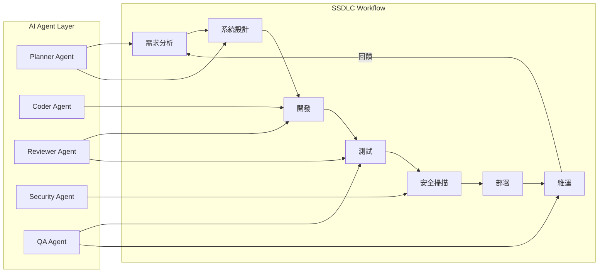
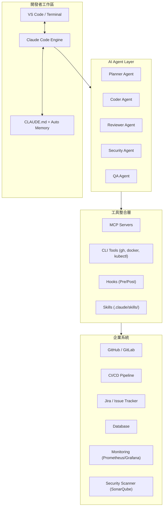
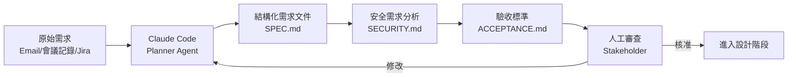
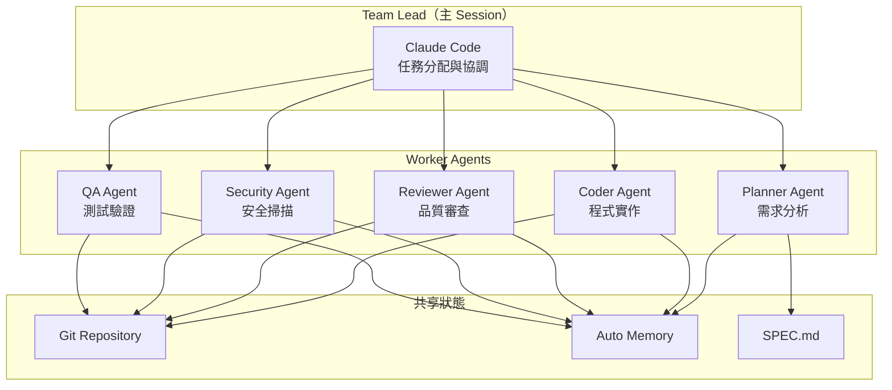
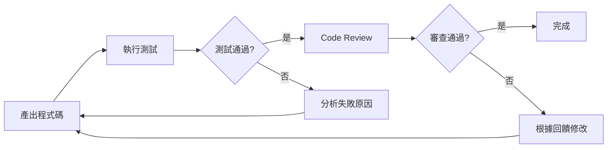
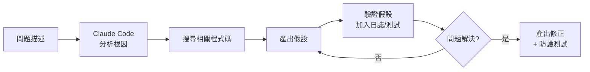
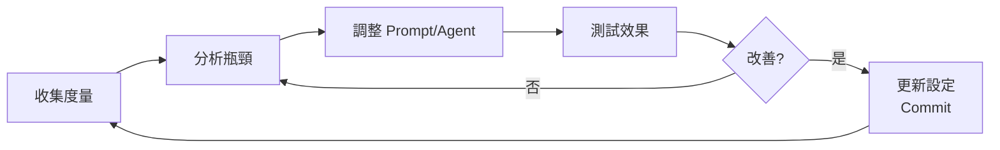
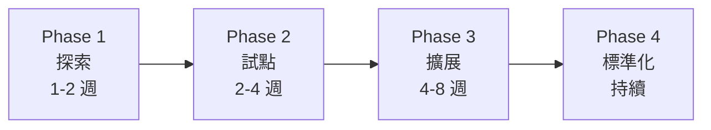

+++
date = '2026-04-15T16:21:12+08:00'
draft = false
title = 'Claude Code SSDLC（AI軟體開發生命週期）教學手冊'
tags = ['教學', 'AI開發']
categories = ['教學']
+++

# Claude Code SSDLC（AI 軟體開發生命週期）教學手冊

> **版本**：v3.0 ｜ **日期**：2026-08-13 ｜ **適用對象**：資深工程師 / 架構師 / DevOps / AI 工程師  
> **定位**：企業級實戰手冊，可直接作為團隊導入規範文件  
> **變更紀錄**：v2.0 — 全面更新至 Claude Code 最新版本，涵蓋 Hooks、Skills、Plugins、Agent Teams、Auto Memory、多平台支援等新特性；v2.1 — 修正巢狀程式碼區塊格式錯誤，補充 Hooks／Skills／Subagents 完整 Frontmatter 欄位，新增 Headless 模式與 Sandbox 模式說明，修正 Auto Memory 匯入層數誤植，補齊 Permission 模式完整列舉與附錄 CLI 旗標；v3.0 — 依官方文件全面校訂：修正 Agentic Loop 術語（改採「蒐集上下文→採取行動→驗證結果」的自適應循環描述）、大幅擴充 Headless 模式旗標與疑難排解、新增 Remote Control／排程任務（Scheduled Tasks 三層架構）／Output Styles／GitLab CI/CD／Plugin Marketplace 發現機制等全新章節，擴充 MCP（Transport／Scope／OAuth）、Hooks（完整事件清單）、Agent Teams（Display Mode／已知限制）、VS Code、GitHub Actions 內容

---

## 目錄

- [第 1 章：整體架構設計（Architecture）](#第-1-章整體架構設計architecture)
  - [1.1 Claude Code 在 SSDLC 的角色](#11-claude-code-在-ssdlc-的角色)
  - [1.2 AI Agent 在 SDLC 各階段的應用](#12-ai-agent-在-sdlc-各階段的應用)
  - [1.3 系統架構圖](#13-系統架構圖)
  - [1.4 多 Agent 協作模型](#14-多-agent-協作模型)
  - [1.5 與企業系統整合](#15-與企業系統整合)
  - [1.6 多平台支援](#16-多平台支援)
- [第 2 章：Claude Code 安裝與環境建置](#第-2-章claude-code-安裝與環境建置)
  - [2.1 Claude Code CLI 安裝](#21-claude-code-cli-安裝)
  - [2.2 VS Code 整合設定](#22-vs-code-整合設定)
  - [2.3 API Key 與認證設定](#23-api-key-與認證設定)
  - [2.4 Workspace 初始化](#24-workspace-初始化)
  - [2.5 常見錯誤與排除](#25-常見錯誤與排除)
  - [2.6 Headless 模式與自動化執行](#26-headless-模式與自動化執行)
  - [2.7 Remote Control 遠端控制](#27-remote-control-遠端控制)
  - [2.8 排程與自動化任務（Scheduled Tasks）](#28-排程與自動化任務scheduled-tasks)
- [第 3 章：專案結構設計（Best Practice）](#第-3-章專案結構設計best-practice)
  - [3.1 Claude Code 專案目錄結構](#31-claude-code-專案目錄結構)
  - [3.2 Prompt Template 設計](#32-prompt-template-設計)
  - [3.3 Agent Workflow 定義](#33-agent-workflow-定義)
  - [3.4 Context 管理策略](#34-context-管理策略)
  - [3.5 Skills / Rules / Plugins 結構](#35-skills--rules--plugins-結構)
  - [3.6 Output Styles 自訂輸出風格](#36-output-styles-自訂輸出風格)
- [第 4 章：SSDLC Workflow 設計（核心）](#第-4-章ssdlc-workflow-設計核心)
  - [4.1 需求階段（Requirements）](#41-需求階段requirements)
  - [4.2 設計階段（Design）](#42-設計階段design)
  - [4.3 開發階段（Development）](#43-開發階段development)
  - [4.4 測試階段（Testing）](#44-測試階段testing)
  - [4.5 部署階段（Deployment）](#45-部署階段deployment)
  - [4.6 維運階段（Operations）](#46-維運階段operations)
- [第 5 章：AI Agent Workflow 設計](#第-5-章ai-agent-workflow-設計)
  - [5.1 多 Agent 協作模式](#51-多-agent-協作模式)
  - [5.2 自我反饋迴圈（Self-Reflection Loop）](#52-自我反饋迴圈self-reflection-loop)
  - [5.3 自我優化系統（Self-Improving System）](#53-自我優化系統self-improving-system)
  - [5.4 Memory / Context 設計](#54-memory--context-設計)
  - [5.5 Agent Teams 與多 Session 協作](#55-agent-teams-與多-session-協作)
  - [5.6 Plugins 插件生態系](#56-plugins-插件生態系)
- [第 6 章：Prompt Engineering](#第-6-章prompt-engineering)
  - [6.1 Prompt 模板設計](#61-prompt-模板設計)
  - [6.2 可重用 Prompt Library](#62-可重用-prompt-library)
  - [6.3 Chain-of-Thought / ReAct 模式](#63-chain-of-thought--react-模式)
  - [6.4 安全 Prompt（避免 Hallucination）](#64-安全-prompt避免-hallucination)
- [第 7 章：實務案例](#第-7-章實務案例)
  - [7.1 案例 1：Web 系統（Spring Boot + Vue）](#71-案例-1web-系統spring-boot--vue)
  - [7.2 案例 2：批次系統（Batch Job）](#72-案例-2批次系統batch-job)
- [第 8 章：系統維運（Operations）](#第-8-章系統維運operations)
  - [8.1 日誌管理](#81-日誌管理)
  - [8.2 AI 輔助 Debug](#82-ai-輔助-debug)
  - [8.3 Incident 處理](#83-incident-處理)
- [第 9 章：系統升級與優化（Evolution）](#第-9-章系統升級與優化evolution)
  - [9.1 Prompt 版本控管](#91-prompt-版本控管)
  - [9.2 Agent 能力升級](#92-agent-能力升級)
  - [9.3 Workflow 優化策略](#93-workflow-優化策略)
- [第 10 章：最佳實務與建議（Best Practices）](#第-10-章最佳實務與建議best-practices)
  - [10.1 團隊導入策略](#101-團隊導入策略)
  - [10.2 治理（Governance）](#102-治理governance)
  - [10.3 安全（Security）](#103-安全security)
  - [10.4 成本控制（Token / API）](#104-成本控制token--api)
- [第 11 章：常見問題（FAQ）](#第-11-章常見問題faq)
- [附錄 A：快速檢查清單（Checklist）](#附錄-a快速檢查清單checklist)
- [附錄 B：常用指令速查表](#附錄-b常用指令速查表)
- [附錄 C：參考資料](#附錄-c參考資料)

---

## 第 1 章：整體架構設計（Architecture）

### 1.1 Claude Code 在 SSDLC 的角色

Claude Code 是 Anthropic 推出的 **Agentic Coding Tool**，核心執行環境涵蓋 Terminal、VS Code / Cursor、JetBrains、Desktop App，並延伸至 Web（claude.ai/code）、行動裝置 App 與 Chrome 瀏覽器；另外還有一層「整合型介面」讓 Claude Code 融入既有協作習慣，包括 Remote Control（用手機或任意瀏覽器操控本機 Session，詳見 [2.7 節](#27-remote-control-遠端控制)）、Slack `@Claude` 提及、Channels（Telegram / Discord / iMessage / 自訂 Webhook）、以及 GitHub Actions / GitLab CI/CD 管道整合。它不只是程式碼補全工具，而是能夠：

- **讀取整個 Codebase**：理解專案結構、依賴關係、架構模式
- **執行指令**：自主運行 shell 命令、測試、建置
- **編輯檔案**：跨多個檔案進行精確修改
- **整合開發工具**：透過 MCP（Model Context Protocol）連接外部服務
- **自主解決問題**：以「蒐集上下文（Gather Context）→ 採取行動（Take Action）→ 驗證結果（Verify Results）」為核心的**自適應迴圈**持續運作，而非單向的固定步驟（細節見 [1.2 節](#12-ai-agent-在-sdlc-各階段的應用)）
- **持久記憶**：透過 CLAUDE.md 和 Auto Memory 跨 Session 保留專案知識
- **自動化工作流**：透過 Hooks、Skills、Plugins、Output Styles 實現確定性行為控制與風格客製化
- **多 Agent 協作**：透過 Subagents 和 Agent Teams 進行平行任務處理

在 SSDLC 中，Claude Code 扮演以下角色：

| SSDLC 階段 | Claude Code 角色 | 具體能力 |
|---|---|---|
| 需求分析 | 需求分析師 | 解析需求文件、產出規格書、識別安全需求 |
| 系統設計 | 架構顧問 | 產出架構圖、API 設計、識別設計缺陷 |
| 開發 | 自動化開發者 | 產碼、重構、Code Review |
| 測試 | QA 工程師 | 產出 Unit / Integration / E2E 測試 |
| 安全 | 安全審查員 | 安全掃描、弱點識別、OWASP 檢查 |
| 部署 | DevOps 助手 | CI/CD Pipeline 設計、IaC 產出 |
| 維運 | SRE 助手 | 日誌分析、Incident Debug、效能調校 |

### 1.2 AI Agent 在 SDLC 各階段的應用


```mermaid
graph LR
    subgraph SSDLC["SSDLC Workflow"]
        A[需求分析] --> B[系統設計]
        B --> C[開發]
        C --> D[測試]
        D --> E[安全掃描]
        E --> F[部署]
        F --> G[維運]
        G -->|回饋| A
    end

    subgraph Agents["AI Agent Layer"]
        PA[Planner Agent]
        CA[Coder Agent]
        RA[Reviewer Agent]
        SA[Security Agent]
        QA[QA Agent]
    end

    PA --> A
    PA --> B
    CA --> C
    RA --> C
    RA --> D
    SA --> E
    QA --> D
    QA --> G
```

**各階段 Agent 對應**：

1. **需求階段** → Planner Agent：自動解析需求文件、產出 User Story、整理驗收標準
2. **設計階段** → Planner Agent + Coder Agent：產出系統架構、API 規格、資料模型
3. **開發階段** → Coder Agent + Reviewer Agent：自動產碼、即時 Code Review
4. **測試階段** → QA Agent：自動產測試案例、執行測試、分析覆蓋率
5. **安全階段** → Security Agent：SAST/DAST 掃描、依賴檢查、合規驗證
6. **部署階段** → Coder Agent：產出 CI/CD Pipeline、Infrastructure as Code
7. **維運階段** → QA Agent：日誌分析、效能監控、Incident 根因分析

### 1.3 系統架構圖


```mermaid
graph TB
    subgraph Developer["開發者工作區"]
        IDE["VS Code / Terminal"]
        CC["Claude Code Engine"]
        MEM["CLAUDE.md + Auto Memory"]
    end

    subgraph AgentLayer["AI Agent Layer"]
        PL["Planner Agent"]
        CD["Coder Agent"]
        RV["Reviewer Agent"]
        SC["Security Agent"]
        QAA["QA Agent"]
    end

    subgraph Tools["工具整合層"]
        MCP["MCP Servers"]
        CLI["CLI Tools (gh, docker, kubectl)"]
        HOOK["Hooks (Pre/Post)"]
        SKILL["Skills (.claude/skills/)"]
    end

    subgraph Enterprise["企業系統"]
        GH["GitHub / GitLab"]
        CICD["CI/CD Pipeline"]
        JIRA["Jira / Issue Tracker"]
        DB["Database"]
        MON["Monitoring (Prometheus/Grafana)"]
        SEC["Security Scanner (SonarQube)"]
    end

    IDE <--> CC
    CC <--> MEM
    CC --> AgentLayer
    AgentLayer --> Tools
    Tools --> Enterprise
```

### 1.4 多 Agent 協作模型

Claude Code 支援多種 Agent 協作模式：

#### 1.4.1 Subagent 模式

Claude Code 內建 **Subagent** 機制，可在 `.claude/agents/` 目錄定義專用 Agent：

```markdown
<!-- .claude/agents/security-reviewer.md -->
---
name: security-reviewer
description: 審查程式碼的安全漏洞
tools: Read, Grep, Glob, Bash
model: opus
---
你是資深資安工程師。審查程式碼是否有：
- 注入漏洞（SQL / XSS / Command Injection）
- 身份驗證與授權缺陷
- 程式碼中的密鑰或憑證
- 不安全的資料處理

提供具體行號引用與修復建議。
```

**進階 Frontmatter 欄位**：除了 `name`、`description`、`tools`、`model` 這類基本識別與工具授權欄位外，Subagent 還可設定執行邊界、資源隔離與協作識別等進階屬性，適合企業導入時依風險等級分層設定：

| 欄位 | 說明 |
|---|---|
| `disallowedTools` | 明確排除的工具清單，與 `tools` 互補 |
| `permissionMode` | 此 Subagent 專屬的權限模式，可比主 Session 更嚴格（如唯讀審查）或更寬鬆 |
| `maxTurns` | 限制此 Subagent 最多互動輪數，避免探索或除錯迴圈失控 |
| `mcpServers` | 限定此 Subagent 可連接的 MCP Server 清單 |
| `hooks` | 此 Subagent 專屬的 Hook 設定，獨立於主 Session 套用 |
| `background` | 是否以背景任務模式執行，不阻塞主 Session |
| `effort` | 控制此 Subagent 的推理力度，拿捏品質與成本 |
| `isolation` | Context 隔離層級設定（如獨立 Worktree） |
| `color` | 在多 Agent 視覺化介面中的識別顏色 |
| `initialPrompt` | Subagent 啟動時自動帶入的第一則訊息 |
| `memory` | Subagent 累積學習的儲存範圍，詳見第 9.2 節 |

#### 1.4.2 Agent Teams 模式

利用 Claude Code 的 **Agent Teams** 功能，實現多 Session 協作：

| Agent 角色 | 職責 | 工具權限 |
|---|---|---|
| Planner | 需求拆解、任務規劃 | Read, Glob, Grep, WebSearch |
| Coder | 程式碼撰寫 | Read, Write, Edit, Bash |
| Reviewer | 程式碼審查 | Read, Grep, Glob |
| Security | 安全掃描 | Read, Grep, Bash |
| QA | 測試產出與執行 | Read, Write, Bash |

#### 1.4.3 Writer / Reviewer 模式

```
Session A（Writer）：實作功能
    ↓ 產出程式碼
Session B（Reviewer）：審查 Session A 的產出
    ↓ 回饋建議
Session A：根據回饋修改
```

### 1.5 與企業系統整合

#### GitHub 整合

```bash
# 安裝 GitHub CLI（Claude Code 會自動使用）
gh auth login

# Claude Code 可直接操作
claude -p "建立一個 PR，標題為 feat: add user authentication"
```

#### CI/CD 整合（GitHub Actions）

```yaml
# .github/workflows/claude-code-review.yml
name: Claude Code Review
on:
  pull_request:
    types: [opened, synchronize]

jobs:
  review:
    runs-on: ubuntu-latest
    steps:
      - uses: actions/checkout@v4
      - name: Claude Code Review
        uses: anthropics/claude-code-action@v1
        with:
          anthropic_api_key: ${{ secrets.ANTHROPIC_API_KEY }}
          review_type: comprehensive
```

> **CI/CD 補充**：本節的 GitHub Actions 範例僅為概念示意，正式的觸發模式、存取控制與組織級部署方式請見 [4.5.1 節](#451-cicd-整合)；若企業使用 GitLab，對應的完整整合方式請見新增的 [4.5.3 節：GitLab CI/CD 整合](#453-gitlab-cicd-整合)。

#### MCP Server 整合

**MCP（Model Context Protocol）** 是一套開放的互操作標準，讓 Claude Code 在不修改核心程式的前提下連接外部系統。MCP Server 對 Claude 公開三類能力：**Tools**（可呼叫的函式，如查詢 Jira、寫入資料庫）、**Resources**（可讀取的資料，如檔案或設定）、**Prompts**（預先定義的提示範本）。

**四種 Transport 類型**：

| Transport | 拓撲 | 適用場景 | 認證方式 |
|---|---|---|---|
| `stdio` | 本機子行程 | 本機工具、CLI、資料庫驅動程式 | 環境變數、預先配置的密鑰 |
| `http` | 請求／回應 | 遠端 SaaS、雲端 API（**建議首選**） | OAuth 2.0、靜態 Token、`headersHelper` |
| `sse` | 單向事件流 | 事件通知（**已標示為棄用，建議改用 http**） | 靜態 Token |
| `ws`（WebSocket） | 雙向持久連線 | 需要伺服器主動推播的場景 | 靜態 Token、`headersHelper` |

**`claude mcp add` 常用語法**：

```bash
# stdio：本機子行程（適合資料庫驅動、內部腳本）
claude mcp add --transport stdio jira -- npx @anthropic-ai/mcp-server-jira \
  --env JIRA_TOKEN=xxxxx \
  --scope project

# http：遠端服務，優先使用 OAuth（不帶 --header 時會走自動探索 + 瀏覽器登入）
claude mcp add --transport http sentry https://mcp.sentry.dev/mcp

# http：需要靜態 Token 時（僅建議測試環境使用，正式環境改用 OAuth 或 headersHelper）
claude mcp add --transport http postgres-api https://internal.example.com/mcp \
  --header "Authorization: Bearer ${DB_API_TOKEN}"
```

**Scope 分層與優先權**（同名 Server 出現在多個 Scope 時，取用整條設定，欄位不會合併）：

| Scope | 儲存位置 | 是否隨 Git 共用 | 優先權 | 適用情境 |
|---|---|---|---|---|
| `local`（預設） | `~/.claude.json`（依專案路徑區分） | 否 | 最高 | 個人實驗、含機密憑證的設定 |
| `project` | 專案根目錄 `.mcp.json` | 是 | 次高 | 團隊共用、正式導入的服務 |
| `user` | `~/.claude.json`（全域） | 否 | 中 | 跨專案的個人常用工具 |
| Managed（組織原則） | 由管理員集中管理 | 是 | 最低 | 企業強制導入、不可個人覆寫 |

**`.mcp.json` 環境變數展開**：可用 `${VAR}` 或 `${VAR:-預設值}` 語法讓團隊共用同一份設定檔，實際密鑰由各開發者在本機環境變數提供：

```jsonc
// .mcp.json（可安全 commit 進 Git）
{
  "mcpServers": {
    "production-api": {
      "type": "http",
      "url": "${API_BASE_URL:-https://api.example.com}/mcp",
      "headers": { "Authorization": "Bearer ${PROD_API_TOKEN}" }
    }
  }
}
```

**企業導入建議**：

- **認證優先序**：OAuth 2.0（自動探索 + 瀏覽器登入）＞ `headersHelper` 動態產生短期憑證 ＞ 靜態 Token（僅限低風險場景）
- **權限邊界**：在 `.claude/settings.json` 的 `permissions` 中對 MCP 工具設定 `allow` / `deny` 規則（例如允許唯讀查詢、禁止 `DROP` 類工具）
- **稽核**：搭配 `PostToolUse` Hook 記錄所有 `mcp__*` 工具呼叫（範例見 [10.3 節](#103-安全security)）
- **診斷**：`claude mcp list` 顯示每個 Server 的連線狀態（已連線／需要授權／設定缺漏／連線失敗）；`claude mcp get <name>` 可查看詳細錯誤原因
- 整合企業系統時，建議先在測試環境驗證，確認 MCP Server 的權限範圍後，再部署到正式環境；使用 `--scope project` 確保設定只在特定專案生效，避免誤用個人 `local` Scope 造成團隊設定不一致

### 1.6 多平台支援

官方文件把 Claude Code 的使用介面（Surfaces）分成兩層：**核心執行 Surfaces**（實際跑 Agent 迴圈、讀寫檔案的環境）與**整合 Surfaces**（把 Claude Code 的能力接進既有協作管道，執行工作本身仍發生在核心 Surfaces 或 Anthropic 雲端）。所有核心 Surfaces 共用同一套 CLAUDE.md、Settings 和 MCP 設定：

#### 核心執行 Surfaces

| 平台 | 適用場景 | 特色 |
|---|---|---|
| **Terminal CLI** | 主力開發環境 | 完整功能、最高自由度 |
| **VS Code / Cursor Extension** | IDE 整合開發 | Inline Diff、`@` 檔案參考、Plan Review（詳見 [2.2 節](#22-vs-code-整合設定)） |
| **JetBrains Plugin** | IntelliJ / WebStorm / PyCharm 使用者 | IDE 原生整合 |
| **Desktop App** | 多 Session 並行管理 | 視覺化 Session 管理、獨立 Worktree；支援 macOS（Intel / Apple Silicon）、Windows x64 / ARM64 |
| **Web（claude.ai/code）** | 遠端 / 無本機環境 | Anthropic 安全雲端 VM、隨時隨地使用 |
| **行動裝置 App（iOS / Android）** | 移動辦公 | 搭配 Remote Control 或 Dispatch 操作任務 |
| **Chrome Extension** | 前端 UI 開發 | 開啟瀏覽器分頁、測試 UI、迭代修正 |
| **Artifacts** | 快速原型與資料視覺化 | 在對話中直接產出可預覽、可執行的互動式網頁或圖表 |

#### 整合型 Surfaces（協作與自動化管道）

| 平台 | 適用場景 | 特色 |
|---|---|---|
| **Remote Control** | 從手機或任意瀏覽器操控本機 Session | 本機檔案系統、MCP、工具設定都留在原機器，遠端裝置只是控制介面（詳見 [2.7 節](#27-remote-control-遠端控制)） |
| **Slack（`@Claude` 提及）** | 團隊在 Slack 頻道內請 Claude 協助 | 需組織管理員於後台啟用 Claude Tag |
| **Channels** | Telegram / Discord / iMessage / 自訂 Webhook 推送事件到 Session | 事件驅動觸發，適合外部系統整合 |
| **GitHub Actions / GitLab CI/CD** | CI 管道中自動審查、實作、回覆 | 詳見 [4.5 節](#45-部署階段deployment) |

#### 跨平台協作方式

| 需求 | 使用方式 |
|---|---|
| 從手機繼續本地 Session | Remote Control（[2.7 節](#27-remote-control-遠端控制)） |
| 從 Telegram / Discord / iMessage 推送事件到 Session | Channels |
| 於 Slack 頻道直接請 Claude 協助 | Slack `@Claude` 提及 |
| 定期排程執行任務 | 依持久性與運行位置分三層：`/loop`（會話內）、Desktop 排程任務（本機常駐）、雲端 Routines（永久，無需本機）；詳見 [2.8 節](#28-排程與自動化任務scheduled-tasks) |
| 自動化 PR Review 與 Issue 分類 | GitHub Actions（[4.5.1 節](#451-cicd-整合)） / GitLab CI/CD（[4.5.3 節](#453-gitlab-cicd-整合)） |
| 偵錯線上 Web 應用程式 | Chrome Extension |
| 建立自訂 Agent 於自有工作流程中 | Agent SDK |

---

## 第 2 章：Claude Code 安裝與環境建置

### 2.1 Claude Code CLI 安裝

#### Windows 安裝

**PowerShell**（推薦）：

```powershell
irm https://claude.ai/install.ps1 | iex
```

**CMD**：

```cmd
curl -fsSL https://claude.ai/install.cmd -o install.cmd && install.cmd && del install.cmd
```

> **前置條件**：Windows 原生安裝需要先安裝 [Git for Windows](https://git-scm.com/downloads/win)。

**透過 WinGet**：

```powershell
winget install Anthropic.ClaudeCode
```

#### macOS / Linux 安裝

```bash
curl -fsSL https://claude.ai/install.sh | bash
```

**透過 Homebrew**（macOS / Linux）：

```bash
brew install --cask claude-code
```

> **注意**：透過 npm 安裝已被官方棄用（`npm install -g @anthropic-ai/claude-code` 不再建議）。原生安裝方式會自動在背景更新，保持最新版本。

#### 驗證安裝

```bash
claude --version
# 預期輸出：claude-code v2.x.x

# 首次啟動
cd your-project
claude
# 系統會提示登入
```

**安裝畫面說明**：
- 執行安裝指令後，終端機會顯示下載進度條
- 安裝完成後，會顯示 `Claude Code installed successfully`
- 首次執行 `claude` 會開啟瀏覽器進行帳號認證
- 認證完成後返回終端機，顯示互動式介面

### 2.2 VS Code 整合設定

#### 安裝 VS Code Extension

1. 確認 VS Code 版本 ≥ 1.94.0（Cursor 使用者可直接安裝同一套擴充）
2. Extensions（`Ctrl+Shift+X`）
3. 搜尋 `Claude Code`
4. 安裝官方 Extension
5. 以 Claude 訂閱帳戶（Pro / Max / Team / Enterprise）或 Claude Console 帳戶登入，皆無須手動設定 API Key；若企業改用 Bedrock / Vertex / Foundry，需在延伸設定中額外指定 Provider（見下方）

#### 核心功能

VS Code 延伸不只是把 Terminal 內嵌進 IDE，還提供幾項僅在圖形介面才有的工作流：

| 功能 | 說明 |
|---|---|
| **Inline Diff 檢視** | Claude 提議的修改直接以左右對照方式顯示在編輯器中，可逐項接受（綠色勾）或拒絕（紅色叉），也可一次全部接受 |
| **`@` 檔案／行號參考** | 提示框輸入 `@` 自動補全專案內檔案路徑，並支援 `@ClassName.java:10-25` 指定行號範圍，精準縮小 Claude 的閱讀範圍 |
| **Plan Review（計畫審視）** | 進入 Plan Mode 後，Claude 執行前會先展示計畫概要，可在介面上直接修改文字後再核准，取代純文字對話中的來回確認 |
| **多 Session 標籤** | 同一視窗可開啟多個獨立對話標籤，或分割視窗並行處理不同任務 |

#### 快捷鍵

| 快捷鍵 | 功能 |
|---|---|
| `Ctrl+Esc` | 切換 Claude Code 面板開啟／關閉 |
| `Ctrl+Shift+P` → `Claude Code` | 開啟命令面板搜尋所有 Claude Code 指令 |
| `Ctrl+G` | 切換 Plan Mode（與 Terminal CLI 一致） |
| `Enter` / `Shift+Enter` | 提交提示 ／ 提示框內換行 |
| `/` | 於提示框開啟指令選單（如 `/model`、`/effort`、`/skill-name`） |

#### 推薦工作區設定

```jsonc
// .vscode/settings.json
{
  "claude-code.autoStart": true,
  "claude-code.defaultModel": "opus",
  "claude-code.acceptEditsAutomatically": false,
  "editor.formatOnSave": true,
  "terminal.integrated.defaultProfile.windows": "PowerShell"
}
```

#### 第三方雲端提供商設定

若企業改用 Amazon Bedrock、Google Cloud Agent Platform 或 Microsoft Azure AI Foundry，需在 VS Code 延伸設定中指定對應 Provider，設定方式與 [2.3 節](#23-api-key-與認證設定) 的環境變數相互呼應（延伸會沿用同一組系統環境變數，例如 `CLAUDE_CODE_USE_BEDROCK=1`）；若團隊成員混用不同 Provider，建議把這些變數放進各自的 `.vscode/settings.json` 或系統層級設定，而非寫進共用的 CLAUDE.md。

### 2.3 API Key 與認證設定

#### 方式一：Claude Pro/Team 訂閱（推薦個人使用）

```bash
claude
# 首次執行自動開啟瀏覽器認證
```

#### 方式二：Anthropic Console API Key（推薦企業 CI/CD）

```bash
# 設定環境變數
export ANTHROPIC_API_KEY=sk-ant-api03-xxxxx

# Windows PowerShell
$env:ANTHROPIC_API_KEY = "sk-ant-api03-xxxxx"
```

#### 方式三：第三方 Provider

```bash
# Amazon Bedrock
export CLAUDE_CODE_USE_BEDROCK=1
# 需設定 AWS 認證（AWS_ACCESS_KEY_ID, AWS_SECRET_ACCESS_KEY）

# Google Vertex AI
export CLAUDE_CODE_USE_VERTEX=1
# 需設定 GCP 認證（GOOGLE_APPLICATION_CREDENTIALS）

# Microsoft Azure AI Foundry
export CLAUDE_CODE_USE_FOUNDRY=1
# 需設定 Azure 認證
```

> **安全建議**：
> - 永遠不要將 API Key 寫死在程式碼中
> - 使用環境變數或 Secret Manager
> - CI/CD 中使用 GitHub Secrets 或 Azure Key Vault
> - 定期輪換 API Key

### 2.4 Workspace 初始化

#### 步驟一：初始化 CLAUDE.md

```bash
cd your-project
claude
# 進入互動模式後執行
/init
```

執行 `/init` 後，Claude Code 會：
1. 分析你的 Codebase 結構
2. 偵測建置系統（Maven、Gradle、npm 等）
3. 偵測測試框架
4. 偵測程式碼風格
5. 產出 `CLAUDE.md` 初始檔案

> **進階初始化**：設定 `CLAUDE_CODE_NEW_INIT=1` 環境變數可啟用互動式多階段流程。`/init` 會詢問要設定哪些 Artifact（CLAUDE.md、Skills、Hooks），接著用 Subagent 探索 Codebase，透過追問填補缺漏，最終提出可審查的提案後才寫入檔案。如果已存在 CLAUDE.md，`/init` 會建議改善而非覆寫。

#### 步驟二：建立專案設定

```bash
# 建立 .claude 目錄結構
mkdir -p .claude/skills .claude/agents .claude/rules
```

#### 步驟三：設定權限規則

```jsonc
// .claude/settings.json
{
  "permissions": {
    "allow": [
      "Bash(npm run *)",
      "Bash(mvn *)",
      "Bash(git *)",
      "Bash(gh *)"
    ],
    "deny": [
      "Bash(rm -rf /)",
      "Bash(DROP TABLE*)"
    ]
  },
  "autoMemoryEnabled": true
}
```

### 2.5 常見錯誤與排除

#### 基礎問題速查

| 問題 | 原因 | 解決方式 |
|---|---|---|
| `The token '&&' is not a valid statement separator` | 在 PowerShell 中執行 CMD 指令 | 確認是否在 PowerShell 中（提示符有 `PS`） |
| `'irm' is not recognized` | 在 CMD 中執行 PowerShell 指令 | 改用 CMD 安裝指令 |
| 認證失敗 | API Key 過期或錯誤 | 重新產生 API Key |
| `CLAUDE.md not found` | 未初始化專案 | 執行 `/init` |
| Context window 爆滿 | 單次對話累積過多 | 執行 `/clear` 清除，或 `/compact` 壓縮 |
| MCP Server 連線失敗 | 服務未啟動或權限不足 | 檢查 `claude mcp list` 並重啟服務 |
| 自動更新失敗 | 網路問題或權限不足 | 手動執行 `claude update` |

> **實務踩坑**：在企業防火牆環境下，Claude Code 的自動更新可能被擋。建議設定 Proxy：
> ```bash
> export HTTPS_PROXY=http://proxy.company.com:8080
> ```

#### 內建診斷指令

排查問題前，優先執行以下內建診斷工具，往往比逐條猜測原因更快定位問題：

| 指令 | 用途 |
|---|---|
| `/doctor`（互動模式）／ `claude doctor`（Shell，`claude` 無法啟動時使用） | 自動檢查安裝、設定檔、擴充套件、Context 狀態，多數問題可直接自動修復 |
| `/context` | 查看目前 Context 空間分配（對話歷史、檔案內容、Auto Memory 各占多少） |
| `/mcp` | 檢查每個 MCP Server 的連線狀態與工具定義所占的 Context 成本 |
| `/heapdump` | 匯出記憶體快照（`.heapsnapshot` + 診斷 JSON）至桌面，用於分析記憶體洩漏；**檔案含完整對話內容，勿對外分享** |
| `/terminal-setup` | 修復終端 GPU 渲染造成的文字亂碼／污跡問題 |
| `claude --safe-mode` | 停用所有 Hooks、Skills、Plugins、MCP，用於判斷問題是否由自訂設定引起 |

#### 效能與穩定性問題

| 問題 | 原因 | 解決方式 |
|---|---|---|
| Auto-Compaction Thrashing（`Autocompact is thrashing...`） | 單一檔案或工具輸出過大，多次自動壓縮仍無法收斂 | 執行 `/compact` 並明確指定保留範圍（如 `/compact 只保留最終修正方案`）；改用分段讀取大檔案；把探索性工作交給 Subagent 隔離 Context |
| Terminal 文字顯示為方框或亂碼 | 內建終端 GPU 加速渲染異常（常見於 VS Code / Cursor 內嵌終端） | 執行 `/terminal-setup`，或手動在 VS Code 設定 `"terminal.integrated.gpuAcceleration": "off"` |
| `@file` 無建議、Search 找不到應存在的檔案 | 系統 `ripgrep` 二進位不相容或損毀 | 安裝系統版 `ripgrep`（如 `winget install BurntSushi.ripgrep.MSVC`），並設定環境變數 `USE_BUILTIN_RIPGREP=0` 改用系統版本，執行 `claude doctor` 驗證 |
| WSL 環境下 Search 效能明顯低落 | 專案位於 `/mnt/c/`，跨 Windows／Linux 檔案系統邊界造成 I/O 延遲 | 將專案移至 WSL 原生檔案系統（如 `/home/`）下，或改在 Windows 原生環境執行 Claude Code |
| 大型 Markdown 表格在終端只顯示前 200 行 | 終端顯示上限，非資料遺失 | 完整內容仍在對話紀錄中；請 Claude 直接寫入檔案（如 `輸出成 report.csv`）取代終端顯示 |
| 指令無回應、終端卡住 | 單一操作異常阻塞 | 按 `Ctrl+C` 嘗試中斷；若無效，關閉終端後執行 `claude --resume` 恢復對話（Session 不會遺失） |
| CPU／記憶體使用率長時間偏高 | Context 累積過大，或 Plugin／Hook／MCP 造成的背景負擔 | 先用 `/context` 確認占用分布，執行 `/compact` 或 `/clear`；若懷疑是自訂設定，用 `claude --safe-mode` 重新測試比對 |

### 2.6 Headless 模式與自動化執行

本手冊後續章節大量使用 `claude -p` 進行單次任務，這裡集中說明其定位：Headless（非互動）模式讓 Claude Code 以無人值守的方式單次執行，輸入輸出皆可被腳本化串接，是 CI/CD、排程批次、大規模 Fan-Out 平行處理與事件驅動自動化的共同基礎。

**適用場景**：

| 場景 | 說明 |
|---|---|
| CI/CD 自動審查 | PR 開啟時觸發安全掃描、Code Review（對應第 4.5 節） |
| 排程批次任務 | 夜間報表、日誌彙整等定期工作（可搭配 [2.8 節](#28-排程與自動化任務scheduled-tasks) 的雲端 Routines 或 Desktop 排程任務） |
| Fan-Out 平行處理 | 對大量檔案逐一呼叫獨立 Session 處理（對應第 10.3 節 Fan-Out 模式） |
| 事件驅動整合 | 監控系統觸發告警時自動呼叫 Claude Code 分析根因 |

**基本旗標**：

| 旗標 | 用途 |
|---|---|
| `claude -p "<prompt>"` | 基本非互動執行，送出一次 Prompt 並取得結果後結束 |
| `--bare` | CI/CD 推薦模式：跳過 Hooks、Skills、Plugins、MCP、Auto Memory、CLAUDE.md 的自動載入，只保留 Bash / Read / Edit 三個基礎工具，啟動更快、行為更可預期；其餘元件需用下方旗標手動注入 |
| `--output-format text｜json｜stream-json` | 輸出格式：純文字（預設）／單次完整 JSON（含 `session_id`、`total_cost_usd` 等 metadata）／逐行 JSON 事件串流 |
| `--verbose` | 輸出詳細執行過程，便於排查非互動腳本失敗的原因 |
| `--include-partial-messages` | 搭配 `stream-json` 時包含逐字元的部分訊息，可做到真正的即時輸出 |

**輸出結構化：`--json-schema`**

需要把 Claude 的回應直接解析成程式可用的資料結構時，可強制輸出符合指定 JSON Schema：

```bash
claude -p "從 auth.py 擷取所有函式名稱" \
  --output-format json \
  --json-schema '{"type":"object","properties":{"functions":{"type":"array","items":{"type":"string"}}},"required":["functions"]}'
# 結果會落在回傳 JSON 的 structured_output 欄位
```

**權限與系統提示旗標**：

| 旗標 | 用途 |
|---|---|
| `--permission-mode acceptEdits｜auto｜dontAsk` | 全域權限策略；`acceptEdits` 只自動接受檔案編輯，`auto` 由背景安全檢查自動核准所有操作，`dontAsk` 僅允許 allow-list 內的操作 |
| `--allowedTools "Read,Bash(npm test *)"` | 精細授權，支援萬用字元前綴比對 |
| `--append-system-prompt "<文字>"` / `--append-system-prompt-file <path>` | 在預設系統提示後附加自訂指令，不覆蓋原有行為 |

**Runtime 設定注入（`--bare` 模式常用搭配）**：

| 旗標 | 用途 |
|---|---|
| `--settings '<JSON 或檔案路徑>'` | 覆蓋或補充 settings.json 內容 |
| `--mcp-config '<JSON 或檔案路徑>'` | 即時注入 MCP Server 設定，取代預設搜尋路徑 |
| `--agents '<JSON>'` | 即時定義 Subagent，無需落地成 `.claude/agents/*.md` |
| `--plugin-dir <path>` / `--plugin-url <url>` | 從本機目錄或遠端 zip 載入 Plugin（開發測試或 CI Artifact 常用） |

**對話延續與診斷**：

```bash
# 延續最近一次 Headless 對話
claude -p "初步分析已完成" 
claude -p "接著專注在資料庫效能" --continue

# 取得 session_id 後跨目錄恢復（例如先在 repo A 分析，再到 repo B 延續）
session_id=$(claude -p "Start review" --output-format json | jq -r '.session_id')
cd ../repo-b && claude -p "延續剛才的分析" --resume "$session_id"
```

**stream-json 事件格式範例**（用於串接自有監控或即時 UI）：

```json
{"type":"system","subtype":"init","session_id":"...","model":"sonnet","mcp_servers":[...]}
{"type":"stream_event","event":{"delta":{"type":"text_delta","text":"分析中..."}}}
{"type":"result","result":"完整回應內容","session_id":"...","total_cost_usd":0.05}
```

**背景任務與輸入限制**：

- 若 `-p` 模式下啟動了背景 Bash 任務（如暫時起一個 dev server 做驗證），該行程會在結果回傳後約 **5 秒**被自動終止；可透過環境變數 `CLAUDE_CODE_PRINT_BG_WAIT_CEILING_MS` 調整等待時間（毫秒，設為 `0` 表示不限制）
- 透過 Pipe 傳入的 stdin 內容上限為 **10MB**，超過會直接報錯；大型日誌檔案建議改用檔案路徑參考（如 `claude -p "分析 huge.log"`）而非 `cat huge.log | claude -p ...`

**典型 CI 腳本片段**：

```bash
claude --bare -p "審查這次 PR 變更的安全性與程式碼品質" \
  --permission-mode dontAsk \
  --allowedTools "Read,Grep,Glob" \
  --output-format stream-json \
  --verbose
```

> **實務建議**：CI/CD 中優先使用 `--bare` 搭配明確的 `--allowedTools`／`--settings`／`--mcp-config`，避免在無人值守情境下意外載入非預期的 Hooks 或 Plugin；除錯非互動腳本時，優先加上 `--verbose` 觀察實際執行步驟，而非單憑最終輸出猜測失敗原因。

### 2.7 Remote Control 遠端控制

Remote Control 讓開發者在辦公桌前啟動任務後，改用手機、平板或另一台電腦的瀏覽器繼續操作，不需重新開一個 Session。關鍵設計是：**本機執行環境（檔案系統、MCP Server、工具設定）完全不動，遠端裝置只是一層控制介面**，這與「把工作丟到雲端執行」的模式（如 Web claude.ai/code）本質不同。

#### 先決條件

- 需以 **claude.ai 帳戶**（Pro / Max / Team / Enterprise 訂閱）登入，執行 `claude auth login` 或互動模式內 `/login`；**不支援** API Key、Amazon Bedrock、Google Cloud Agent Platform、Microsoft Foundry 等第三方 Provider 認證
- 若系統設定了 `DISABLE_TELEMETRY`、`DO_NOT_TRACK`、`CLAUDE_CODE_DISABLE_NONESSENTIAL_TRAFFIC`、`DISABLE_GROWTHBOOK` 任一環境變數，Remote Control 會被停用
- Team / Enterprise 組織預設關閉此功能，需由 Owner 在後台管理介面手動開啟

#### 啟動方式

| 方式 | 指令 | 適用情境 |
|---|---|---|
| Server 模式（建議長期執行） | `claude remote-control --name "專案名稱"` | 進程持續在終端運行，顯示 Session URL 與 QR Code，適合開一整天的任務 |
| 互動模式 | `claude --remote-control "專案名稱"` | 本機仍可正常輸入，同時允許遠端裝置介入同一個對話 |
| 從既有 Session 啟用 | `/remote-control` | 已在對話中途才想開放遠端控制時使用，保留現有歷史紀錄 |
| VS Code | 面板內輸入 `/remote-control` | 連線狀態會顯示在提示框上方的橫幅 |

Server 模式常用旗標：

| 旗標 | 用途 |
|---|---|
| `--continue` / `-c` | 繼續此目錄下最近一次的 Remote Control Session |
| `--session-id <id>` | 指定特定 Session ID 繼續 |
| `--spawn same-dir｜worktree｜session` | 多 Session 管理策略：共用目錄／各自獨立 Git Worktree／僅服務單一連線 |
| `--capacity <N>` | 最大並行 Session 數（預設 32） |

啟動後於遠端裝置連線的三種方式：開啟終端顯示的 Session URL、掃描 QR Code（手機 Claude App）、或直接在 `claude.ai/code` 的 Session 清單中選取（遠端 Session 會標示電腦圖示與在線狀態）。

#### 自動啟用與行動推播

若希望每次啟動都自動開放遠端控制，可在 `.claude/settings.json`（專案）或 `~/.claude/settings.json`（個人）設定：

```jsonc
{
  "remoteControlAtStartup": true
}
```

搭配手機 Claude App 登入同一帳戶後，於 CLI 執行 `/config` 開啟「Push when Claude decides」與「Push when actions required」，可在長任務完成或需要人工決策時收到推播通知。

#### 安全性考量

- 所有流量皆透過 Anthropic API 的 HTTPS／TLS 加密，本機不會開啟任何入站埠
- 認證採多組短期憑證，各自獨立過期；若超過約 10 分鐘無網路連線，Session 會逾時結束，需重新執行 `claude remote-control` 啟動新 Session
- Team / Enterprise 可另外啟用 **Trusted Devices**（beta）：成員首次從新裝置存取時需完成生物辨識（Face ID／Touch ID／Windows Hello／Passkey）註冊，之後每 18 小時需重新確認身份

#### 與其他遠端工作方式的選擇

| 方式 | Claude 實際執行位置 | 最佳用途 |
|---|---|---|
| **Remote Control** | 本機（CLI／VS Code） | 中途從其他裝置接手同一個進行中的任務 |
| **Web（claude.ai/code）** | Anthropic 雲端 | 完全沒有本機環境時也能開新任務 |
| **Slack `@Claude`** | Anthropic 雲端 | 團隊在既有溝通管道中快速請 Claude 協助、審查 |
| **Channels（Telegram／Discord）** | 本機（CLI） | 對外部事件（如告警）自動反應 |

> **實務建議**：Remote Control 定位是「接手」而非「委派」——本機進程必須持續開著。若需要完全不依賴本機、指派後即可關機的自動化任務，改用 [2.8 節](#28-排程與自動化任務scheduled-tasks) 的雲端 Routines。

### 2.8 排程與自動化任務（Scheduled Tasks）

手冊舊版將排程功能統稱為「Routines」，但實務上 Claude Code 依「執行位置」與「持久性」分成三層機制，應依情境挑選，而非只有單一選項：

| 層級 | 運行位置 | 持久性 | 最小間隔 | 適用情境 |
|---|---|---|---|---|
| **`/loop`**（Session 內建） | 你目前的機器，依附在單一對話 Session | Session 結束即清除；7 天內可用 `--resume`／`--continue` 恢復未過期的排程 | 1 分鐘 | 短期輪詢、盯 CI 結果、監看 PR 進度 |
| **Desktop 排程任務** | 你的機器，由 OS 層排程器管理 | 系統重開機後仍持續 | 1 分鐘 | 需要存取本機檔案、且要長期運作的定期工作 |
| **雲端 Routines** | Anthropic 託管雲端 | 永久保存，不需本機在線 | 1 小時 | 無人值守的長期排程、與 CI 事件整合 |

#### `/loop`：Session 內的輪詢與自我維護

**固定間隔輪詢**：

```bash
/loop 5m 檢查這次部署是否成功
/loop every 2 hours 驗證服務健康狀態
```

系統會將間隔轉換為內部 cron 表達式，並加入隨機 Jitter（最多間隔的一半，或 ±30 分鐘）避免多個排程同時打 API。

**自適應間隔**（不指定固定週期，讓 Claude 自行判斷下次檢查時機）：

```bash
/loop 監控這次 PR 的 CI 狀態並回覆審查意見
```

Claude 會依觀察結果動態選擇 1 分鐘到 1 小時之間的延遲；活躍變化時縮短間隔，靜止時拉長間隔。

**無參數維護模式**：

```bash
/loop 15m
```

每輪會依序檢查：目前分支是否有未完成工作、PR 是否有新審查意見或 CI 失敗、是否有可清理的技術債。也可在 `~/.claude/loop.md` 或 `.claude/loop.md`（上限 25KB）自訂這個預設提示的內容。

**Cron 表達式參考**（5 欄位：分鐘 小時 日 月 週；支援 `*`、單值、`*/N` 步長、範圍、逗號列表，**不支援** `L`／`W`／`?`／星期別名）：

```
*/5 * * * *      每 5 分鐘
0 9 * * 1-5      工作日上午 9 點
0 0 1 * *        每月 1 日午夜
```

#### Desktop 排程任務

透過 Desktop App 設定的排程任務由作業系統層級排程器接手，優點是可存取本機檔案系統與已設定好的開發環境，且不受單一 Session 生命週期限制；適合「每天早上整理本機 log」這類需要本機資源、但又要長期穩定運作的工作。

#### 雲端 Routines

Routines 執行在 Anthropic 託管的雲端環境，不依賴任何本機程序在線，最小排程間隔為 1 小時，最適合：

- 無需存取本機專屬資源的長期定時任務（如每週產出程式碼品質報告）
- 需要與 CI 事件整合、但又不希望占用本機運算資源的自動化流程
- 期望「設定一次即可長期運作」的無人值守場景

> **實務建議**：三層方案並非互斥——常見組合是用 `/loop` 處理當下這個任務的短期輪詢，重要的長期例行工作則沉澱為 Routines 或 Desktop 排程任務。挑選時先問「這個任務需要本機資源嗎？」與「需要運作超過 7 天嗎？」，答案能快速篩掉不適用的層級。

---

## 第 3 章：專案結構設計（Best Practice）

### 3.1 Claude Code 專案目錄結構

#### 推薦目錄結構

```
your-project/
├── .claude/                          # Claude Code 設定根目錄
│   ├── CLAUDE.md                     # 專案級指令（團隊共用，commit 進 Git）
│   ├── settings.json                 # 專案級設定（權限、Hook 等）
│   ├── settings.local.json           # 個人本地設定（加入 .gitignore）
│   ├── agents/                       # 自訂 Subagent 定義
│   │   ├── planner.md                # 規劃 Agent
│   │   ├── security-reviewer.md      # 安全審查 Agent
│   │   ├── code-reviewer.md          # 程式碼審查 Agent
│   │   └── test-generator.md         # 測試產出 Agent
│   ├── skills/                       # 可重用技能
│   │   ├── fix-issue/
│   │   │   └── SKILL.md              # 修復 Issue 技能
│   │   ├── create-api/
│   │   │   └── SKILL.md              # 建立 API 技能
│   │   ├── security-scan/
│   │   │   └── SKILL.md              # 安全掃描技能
│   │   └── ssdlc-review/
│   │       └── SKILL.md              # SSDLC 審查技能
│   └── rules/                        # 規則檔案
│       ├── code-style.md             # 程式碼風格
│       ├── security.md               # 安全規則
│       ├── testing.md                # 測試規則
│       └── api-design.md             # API 設計規則
├── CLAUDE.md                         # 專案根目錄指令（或放 .claude/ 內）
├── CLAUDE.local.md                   # 個人偏好（加入 .gitignore）
├── src/
├── tests/
├── docs/
└── .github/
    └── workflows/
        └── claude-code-review.yml    # CI/CD 整合
```

#### 範例：根目錄 CLAUDE.md

```markdown
# 專案指引

## 建置與測試
- 建置：`mvn clean compile`
- 測試：`mvn test`
- 型別檢查：`mvn checkstyle:check`

## 程式碼風格
- 使用 4 空格縮排
- Java 類別使用 PascalCase
- 方法與變數使用 camelCase
- 常數使用 UPPER_SNAKE_CASE
- 使用 JavaDoc 格式撰寫註解

## 測試
- 每個 Service 類別必須有對應的 Unit Test
- 使用 JUnit 5 + Mockito
- 測試覆蓋率需達 80%
- 優先執行單一測試，避免整包跑

## Git 規範
- 分支命名：`feature/JIRA-123-description`
- Commit 訊息：`type(scope): description`
  - type: feat, fix, refactor, test, docs, chore
- PR 必須通過 Code Review 後才可合併

## 安全
- 敏感資料不可 hardcode
- 所有外部輸入必須驗證
- SQL 使用 Prepared Statement
- 啟用 CORS 白名單

## 參考
- @docs/architecture.md
- @docs/api-spec.md
```

### 3.2 Prompt Template 設計

#### Skill 設計範例

```markdown
<!-- .claude/skills/create-api/SKILL.md -->
---
name: create-api
description: 建立 RESTful API 端點
---
根據以下需求建立新的 API 端點：$ARGUMENTS

### 執行步驟
1. 分析需求，確認 HTTP Method、URL Path、Request/Response Schema
2. 在 `src/main/java/com/tutorial/api/` 建立 Controller
3. 在 `src/main/java/com/tutorial/service/` 建立 Service
4. 在 `src/main/java/com/tutorial/repository/` 建立 Repository（如需要）
5. 建立 DTO（Data Transfer Object）
6. 加入輸入驗證（使用 Jakarta Validation）
7. 撰寫 Unit Test
8. 撰寫 Integration Test
9. 更新 API 文件
10. 執行測試驗證

### 安全要求
- 所有輸入使用 @Valid 驗證
- 使用 Prepared Statement
- 啟用 Rate Limiting
- 記錄 Audit Log
```

使用方式：

```bash
# 在 Claude Code 中使用
/create-api 用戶管理 CRUD API，包含建立、查詢、更新、刪除
```

#### Hook 設計範例

```jsonc
// .claude/settings.json
{
  "hooks": {
    "PostToolUse": [
      {
        "matcher": "Edit|Write",
        "command": "npx eslint --fix $FILE 2>/dev/null || true"
      }
    ],
    "PreCommit": [
      {
        "command": "mvn checkstyle:check && mvn test"
      }
    ]
  }
}
```

### 3.3 Agent Workflow 定義

#### Planner Agent 定義

````markdown
<!-- .claude/agents/planner.md -->
---
name: planner
description: 負責需求分析與任務拆解
tools: Read, Glob, Grep, WebSearch, AskUserQuestion
model: opus
---
你是資深架構師。負責：

1. 閱讀需求文件，整理為結構化 User Story
2. 識別技術風險與安全需求
3. 將大任務拆解為可執行的小任務（每個任務 < 2hr）
4. 建立依賴關係圖
5. 產出 SPEC.md

### 輸出格式
```markdown
# Feature: [功能名稱]
## User Stories
- [ ] US-001: 描述...
## Tasks
- [ ] T-001: 描述... (預估：1hr)
## Security Requirements
- SR-001: 描述...
## Dependencies
- T-002 depends on T-001
```
````

#### Security Reviewer Agent 定義

```markdown
<!-- .claude/agents/security-reviewer.md -->
---
name: security-reviewer
description: 審查程式碼安全性，依據 OWASP Top 10
tools: Read, Grep, Glob, Bash
model: opus
---
你是資深資安工程師。依據 OWASP Top 10 (2025) 審查程式碼：

## 檢查項目
1. **A01 - Broken Access Control**：權限控制缺陷
2. **A02 - Cryptographic Failures**：加密不當
3. **A03 - Injection**：注入攻擊（SQL, XSS, Command）
4. **A04 - Insecure Design**：不安全的設計
5. **A05 - Security Misconfiguration**：配置錯誤
6. **A06 - Vulnerable Components**：含已知弱點的元件
7. **A07 - Auth Failures**：身份驗證失敗
8. **A08 - Data Integrity Failures**：資料完整性問題
9. **A09 - Logging Failures**：日誌與監控不足
10. **A10 - SSRF**：伺服器端請求偽造

## 輸出格式
| 嚴重度 | OWASP | 檔案:行號 | 問題描述 | 修復建議 |
```

### 3.4 Context 管理策略

Claude Code 的 Context Window 是最重要的資源。以下是管理策略：

#### 策略一：分離關注點

```
❌ 錯誤做法：在同一個 Session 討論不同主題
    → Context 混亂，AI 品質下降

✅ 正確做法：
    Session 1：需求分析 → /clear
    Session 2：架構設計 → /clear
    Session 3：功能實作 → /clear
```

#### 策略二：善用 Subagent

```bash
# 讓 Subagent 去探索 Codebase，不汙染主 Session
> 使用 subagent 調查 authentication 模組的 token refresh 機制
```

#### 策略三：Context 壓縮

```bash
# 手動壓縮：保留 API 變更的上下文
/compact 專注在 API 變更和安全修正

# 自動壓縮：CLAUDE.md 中設定
# 壓縮時，永遠保留修改過的檔案清單和測試指令
```

#### 策略四：Session 管理

```bash
# 恢復上次 Session
claude --continue

# 選擇歷史 Session
claude --resume

# 命名 Session 方便識別
/rename oauth-migration
```

> **實務建議**：
> - 每個 CLAUDE.md 控制在 200 行以內
> - 使用 `.claude/rules/` 分散規則，避免 CLAUDE.md 過載
> - 不常用的知識放在 Skills 中，按需載入
> - 每完成一個功能點就 `/clear`，保持 Context 乾淨

### 3.5 Skills / Rules / Plugins 結構

#### Skills 系統

Skills 是可重用的指令集，Claude 會根據任務自動載入相關 Skill，或由開發者以 `/skill-name` 手動呼叫。每個 Skill 是一個含有 `SKILL.md` 的目錄：

```
.claude/skills/
├── fix-issue/
│   └── SKILL.md          # 主指令（必要）
├── create-api/
│   ├── SKILL.md           # 主指令
│   ├── template.md        # 範本
│   └── examples/
│       └── sample.md      # 範例輸出
└── deploy/
    ├── SKILL.md
    └── scripts/
        └── validate.sh    # Claude 可執行的腳本
```

**SKILL.md Frontmatter 參考**：

```yaml
---
name: fix-issue                       # 顯示名稱，也是 /slash-command
description: 修復 GitHub Issue         # Claude 用此判斷何時自動載入
disable-model-invocation: true        # 僅手動呼叫，Claude 不會自動觸發
allowed-tools: Bash(git *) Read Edit  # 此 Skill 啟用時自動授權的工具
disallowed-tools: Bash(rm *)          # 明確禁用的工具，與 allowed-tools 互補
model: sonnet                         # 覆寫此 Skill 執行時使用的模型
argument-hint: "<issue-number>"       # /fix-issue 自動完成時顯示的參數提示
context: fork                         # 在獨立 Subagent Context 中執行
agent: Explore                        # context: fork 時使用的 Agent 類型
paths:                                # 限制 Skill 僅在特定路徑啟用
  - "src/api/**/*.ts"
---
```

| 欄位 | 說明 |
|---|---|
| `name` | Skill 名稱，小寫字母和連字號，最多 64 字元 |
| `description` | Claude 用以判斷何時自動載入；前 1,536 字元會放入 Context |
| `disable-model-invocation` | 設為 `true` 時，Claude 不會自動觸發（如 deploy、commit） |
| `user-invocable` | 是否允許使用者以 `/skill-name` 手動呼叫；與 `disable-model-invocation` 語意相近但作用相反的軸——一個管「Claude 能不能自動觸發」，一個管「使用者能不能手動觸發」，兩者可獨立設定 |
| `allowed-tools` | Skill 啟用時自動授權的工具，無需逐次確認 |
| `disallowed-tools` | 明確禁用的工具清單，即使主 Session 已授權也會被此 Skill 排除 |
| `model` | 覆寫此 Skill 執行時使用的模型（例如安全掃描類 Skill 可固定用較強的模型） |
| `effort` | 控制此 Skill 執行時的推理/工具呼叫力度，用於拿捏速度與成本 |
| `argument-hint` | 使用者輸入 `/skill-name` 時，自動完成介面顯示的參數提示文字 |
| `context: fork` | 在獨立 Subagent Context 中執行，不汙染主對話 |
| `paths` | Glob 模式，僅在處理匹配檔案時載入 |
| `when_to_use` | 補充 `description` 之外更細緻的觸發判斷依據，幫助 Claude 更準確決定何時自動載入 |
| `arguments` | 宣告具名參數（如 `arguments: [component, from, to]`），搭配內文 `$0`／`$component` 取代位置式的 `$ARGUMENTS` |
| `background` | 搭配 `context: fork` 使用；預設在背景執行不阻塞主對話，設為 `false` 可讓主 Session 等待 Fork 出去的結果 |
| `shell` | 指定 `` !`command` `` 反引號指令的執行環境為 `bash` 或 `powershell`，Windows 團隊常用於統一走 PowerShell |
| `metadata` | 自訂 YAML 鍵值，供外部工具或稽核腳本讀取，Claude Code 本身不解讀 |

**參數化 Skill 範例**：

```yaml
---
name: migrate-component
description: 將元件從一個框架遷移到另一個框架
arguments: [component, from_framework, to_framework]
---
將 $component 從 $from_framework 遷移到 $to_framework，並保留原有的公開介面。
```

若呼叫時省略某個具名參數，`$name` 形式會展開為空字串，索引式 `$0`／`$1` 則保留原文不變——設計 Skill 時應對兩種情況都給予合理預設行為。

**內建 Bundled Skills**：Claude Code 內建 `/run`（啟動並驅動應用程式）、`/verify`（建置並執行以驗證程式碼變更）、`/code-review`、`/simplify`、`/batch`、`/debug`、`/loop`、`/claude-api`、`/doctor` 等 Skill，每個 Session 皆可使用，即使停用自訂 Skills 也不受影響。

#### Rules（路徑限定規則）

`.claude/rules/` 目錄下的 Markdown 檔案可用 YAML frontmatter 限定適用路徑：

```markdown
<!-- .claude/rules/api-security.md -->
---
paths:
  - "src/api/**/*.ts"
  - "src/controllers/**/*.java"
---

# API 安全規則
- 所有 API 端點必須包含輸入驗證
- 使用標準化的錯誤回應格式
- 加入 OpenAPI 文件註解
```

**無 `paths` frontmatter 的規則**在 Session 啟動時全部載入；**有 `paths` 的規則**僅在 Claude 讀取匹配檔案時才載入，節省 Context。

#### Plugins 系統

Plugins 將 Skills、Agents、Hooks、MCP／LSP Servers 打包成可安裝、可分享的單元：

```
my-plugin/
├── .claude-plugin/
│   └── plugin.json          # 插件描述檔（必要：name、description；選填：version、author、homepage、repository、license）
├── skills/                  # 插件內的 Skills（新插件建議用法）
│   └── code-review/
│       └── SKILL.md
├── commands/                # 舊式扁平 Skills 目錄（向後相容，語法與 skills/ 相同）
│   └── legacy-skill.md
├── agents/                  # 插件內的 Agents，也可作為 Agent Teams 的 Teammate 類型
│   └── security-reviewer.md
├── hooks/
│   └── hooks.json           # 插件內的 Hooks
├── monitors/                # 插件內的背景監控設定
│   └── monitors.json        # 監控規則描述檔
├── output-styles/           # 插件內建的 Output Style（見 3.6 節）
├── bin/                     # 可執行檔，啟用插件時加入 PATH
├── .mcp.json                # MCP Server 設定
├── .lsp.json                # LSP Server 設定（Code Intelligence）
└── settings.json            # 預設設定（可含 agent 欄位，啟用插件時自動指定預設 Agent）
```

`plugin.json` 若省略 `version`，系統會改以市集托管來源的 Git Commit SHA 作為版本依據；正式對外發佈的 Plugin 建議明確填寫語意化版本號，方便使用者掌握相容性。

**安裝範疇（Scope）**：`/plugin install` 時可選擇安裝層級，優先權由高到低為 **Managed（組織強制）> Local（個人覆寫此專案）> Project（團隊共用，隨 Git）> User（個人跨專案）**：

| Scope | 儲存位置 | 適用情境 |
|---|---|---|
| User | `~/.claude/settings.json` | 個人跨專案常用的 Plugin |
| Project | `.claude/settings.json`（隨 Git 共用） | 團隊統一導入的 Plugin |
| Local | `.claude/settings.local.json` | 個人在此專案的覆寫（不進 Git） |
| Managed | 組織原則設定 | 管理員強制啟用／停用，成員無法修改 |

**安裝、開發與管理指令**：
```bash
# 瀏覽插件市集（Discover／Installed／Marketplaces／Errors 四個分頁）
/plugin

# 安裝插件（可指定來源市集，並選擇安裝 Scope）
/plugin install my-plugin@my-marketplace

# 本地開發測試
claude --plugin-dir ./my-plugin

# 從遠端 zip 載入（CI Artifact 或臨時測試）
claude --plugin-url https://example.com/my-plugin.zip

# 快速建立 Plugin 骨架
claude plugin init my-plugin

# 提交前本地驗證（--strict 會把警告視為錯誤）
claude plugin validate ./my-plugin --strict

# 重新載入插件（開發中修改後，注意 Prompt Cache 會失效）
/reload-plugins
```

> **Plugin vs 獨立設定**：個人實驗和專案內使用放 `.claude/`；要跨專案分享或發佈到市場時，打包成 Plugin。Plugin 的 Skill 以 `/plugin-name:skill-name` 命名空間避免衝突。Plugin Marketplace 的完整發現與團隊配置方式見 [5.6 節](#56-plugins-插件生態系)。

### 3.6 Output Styles 自訂輸出風格

Output Styles 修改的是 Claude 的**系統提示（角色、語氣、回覆格式）**，不改變它對專案本身的理解——這是與 CLAUDE.md、Skills、Agents 最關鍵的分工差異：

| 機制 | 修改的內容 | 載入時機 |
|---|---|---|
| **CLAUDE.md** | 以使用者訊息形式提供專案事實（架構、慣例、指令） | 每次 Session 啟動固定載入 |
| **Skills** | 特定任務的操作步驟 | 按需觸發（自動或手動） |
| **Agent** | 獨立 Context 與專屬系統提示的隔離執行環境 | 委派時才啟動 |
| **Output Style** | 全 Session 生效的系統提示修改（角色、語氣、格式偏好） | Session 啟動時讀取，改變後需 `/clear` 或開新 Session 才生效 |

#### 內建風格

| 名稱 | 效果 | 適用情境 |
|---|---|---|
| Default | 標準軟體工程最佳化行為 | 一般開發工作 |
| Proactive | 自動採用合理假設、減少停下來詢問，但仍保留必要的權限確認 | 自主性較高的工作流；注意這與 `--permission-mode auto`（自動核准工具）是兩個不同軸線，前者是「決策風格」，後者是「工具授權」 |
| Explanatory | 在回覆中穿插「Insights」段落，說明實作選擇與設計取捨 | 學習陌生 Codebase、理解架構決策 |
| Learning | 協作學習模式，會刻意保留小段程式碼以 `TODO(human)` 標記讓使用者親自完成 | 漸進式學習、新人培訓 |

#### 建立自訂風格

```bash
mkdir -p .claude/output-styles
```

```yaml
---
# .claude/output-styles/diagram-first.md
name: Diagram-First
description: 解說架構或資料流前，先畫 Mermaid 圖
keep-coding-instructions: true   # 保留預設的軟體工程行為，只疊加溝通風格
---
說明架構、資料流或程式邏輯時：
1. 先用 Mermaid 圖呈現整體結構
2. 再補充文字說明
3. 圖表節點數控制在 15 個以內，避免過度複雜
```

- 檔名即為風格名稱，`name` 欄位可覆寫顯示名稱
- `keep-coding-instructions` 預設為 `false`；設為 `true` 時僅疊加溝通風格，不動到底層的軟體工程行為準則
- 儲存位置比照 Skills：`~/.claude/output-styles/`（個人、全專案適用，優先權最低）＜ `.claude/output-styles/`（專案）＜ 組織 Managed 原則（最高）；Plugin 亦可捆綁 Output Style，並用 `force-for-plugin: true` 使其在啟用該 Plugin 時強制套用

#### 啟用方式

```bash
# 互動選單
/config
# → 選擇「Output style」→ 挑選風格

# 或直接寫入專案 / 個人設定
```

```jsonc
// .claude/settings.local.json
{
  "outputStyle": "Diagram-First"
}
```

> **實務建議**：Output Style 不會被 Subagent 繼承（Subagent 使用自己的系統提示），僅影響主 Session；若團隊需要統一的溝通風格（例如安全審查一律要求條列風險等級），優先考慮寫進對應 Agent 的系統提示而非全域 Output Style。修改風格內容後，因涉及系統提示且與 Prompt Cache 綁定，執行 `/clear` 或開新 Session 才會生效，也會讓下一次的輸入 Token 成本略增（快取重建）。

---

## 第 4 章：SSDLC Workflow 設計（核心）

本章是整份手冊的核心，完整描述如何使用 Claude Code 建立安全軟體開發生命週期。

### 4.1 需求階段（Requirements）

#### 4.1.1 AI 自動產出需求文件

**流程**：


```mermaid
graph LR
    A[原始需求<br/>Email/會議記錄/Jira] --> B[Claude Code<br/>Planner Agent]
    B --> C[結構化需求文件<br/>SPEC.md]
    C --> D[安全需求分析<br/>SECURITY.md]
    D --> E[驗收標準<br/>ACCEPTANCE.md]
    E --> F[人工審查<br/>Stakeholder]
    F -->|核准| G[進入設計階段]
    F -->|修改| B
```

**使用方式**：

```bash
# 使用 Plan Mode 分析需求
claude
# 按 Ctrl+G 切換到 Plan Mode

> 閱讀以下需求文件，產出結構化的 SPEC.md：
> @docs/requirements/user-management.md
> 
> 需包含：
> 1. User Stories（含驗收標準）
> 2. 非功能性需求（效能、安全、可用性）
> 3. 安全需求（依 OWASP Top 10）
> 4. 資料模型
> 5. API 端點清單
> 6. 異常情境處理
```

**Prompt 模板**：

```markdown
<!-- .claude/skills/analyze-requirements/SKILL.md -->
---
name: analyze-requirements
description: 將原始需求轉化為結構化規格文件
---
分析以下需求並產出完整規格文件：$ARGUMENTS

### 輸出結構
1. **功能需求**
   - User Story 格式：As a [角色], I want [功能], so that [價值]
   - 每個 Story 附帶驗收標準（Given-When-Then）

2. **非功能性需求**
   - 效能：回應時間 < 200ms (P95)
   - 可用性：99.9% SLA
   - 安全：OWASP Top 10 防護

3. **安全需求**
   - 身份驗證方式
   - 授權模型（RBAC/ABAC）
   - 資料加密需求
   - 稽核日誌需求

4. **技術約束**
   - 相容性要求
   - 第三方依賴限制
```

#### 4.1.2 需求追蹤矩陣

```bash
# 讓 Claude Code 產出需求追蹤矩陣
> 讀取 SPEC.md，產出需求追蹤矩陣（Requirements Traceability Matrix），
> 格式為 Markdown 表格，包含需求 ID、描述、對應測試案例、狀態
```

### 4.2 設計階段（Design）

#### 4.2.1 系統設計（架構圖）

```bash
# 使用 Claude Code 產出架構設計
> 基於 @SPEC.md 的需求，設計系統架構：
> - 使用 Clean Architecture
> - 前端：Vue 3 + TypeScript
> - 後端：Spring Boot 3
> - 資料庫：PostgreSQL
> - 快取：Redis
> - 訊息佇列：RabbitMQ
> 
> 產出：
> 1. 系統架構圖（Mermaid）
> 2. 元件圖
> 3. 部署圖
> 4. 資料流圖
> 5. 安全架構圖
```

#### 4.2.2 API 設計

```bash
# 使用 Skill 產出 API 規格
/create-api 用戶管理模組，包含：
- POST /api/v1/users（建立用戶）
- GET /api/v1/users/{id}（查詢用戶）
- PUT /api/v1/users/{id}（更新用戶）
- DELETE /api/v1/users/{id}（刪除用戶）
- GET /api/v1/users（列表查詢，支援分頁）

需包含 OpenAPI 3.0 規格檔
```

#### 4.2.3 安全設計審查

```bash
# 使用 Security Agent 審查設計
> 使用 subagent security-reviewer 審查 @docs/architecture.md 的安全設計：
> - 認證機制是否安全
> - 授權模型是否完整
> - 資料傳輸是否加密
> - 敏感資料存儲策略
> - API 安全防護
```

### 4.3 開發階段（Development）

#### 4.3.1 Claude Code 自動產碼

**底層機制：自適應的三相 Agentic Loop**

官方文件將 Claude Code 的核心執行方式定義為「**蒐集上下文（Gather Context）→ 採取行動（Take Action）→ 驗證結果（Verify Results）**」三個相位持續交織的**自適應迴圈**，而不是單向、一次性走完的線性流程：Claude 會依據上一步觀察到的結果，動態決定下一步要繼續蒐集資訊、採取行動，還是回頭驗證，過程中可隨時按 `Esc` 中斷並改變方向。

| 相位 | 內容 | 使用的工具類別 |
|---|---|---|
| 蒐集上下文 | 讀取檔案、搜尋 Codebase、理解依賴關係 | File Operations、Search、Code Intelligence |
| 採取行動 | 編輯檔案、執行指令、呼叫外部服務 | File Operations、Execution、Web |
| 驗證結果 | 執行測試、檢查輸出、比對預期行為 | Execution、Search |

**實務應用模式：Explore → Plan → Implement → Verify**

在團隊協作場景中，把這套底層迴圈拆成四個可管理、可審查的階段是常見的最佳實務：分離研究 / 規劃 / 實作階段是避免「解決錯誤問題」的關鍵。對於範圍明確的小修改（如修正錯字、增加日誌行），可直接讓 Claude 執行，不必走完整四階段；規劃最適合用於不確定方法、跨多檔案變更、或對修改區域不熟悉的情境。

```bash
# 步驟 1：Explore（Plan Mode）
# 按 Ctrl+G 切換到 Plan Mode
> 閱讀 @src/main/java/com/tutorial/ 理解目前的程式架構和命名慣例。
> 同時看一下測試是怎麼寫的。

# 步驟 2：Plan（Plan Mode）
> 我要新增 UserService，需要哪些檔案需要修改？
> 建立實作計畫。

# 按 Ctrl+G 可在文字編輯器中直接修改計畫後再讓 Claude 執行

# 步驟 3：Implement（Normal Mode）
# 切回 Normal Mode
> 依照你的計畫實作 UserService。
> 寫完後執行測試，修正所有失敗的測試。

# 步驟 4：Verify
> 使用 subagent 審查剛才的修改，檢查邊界情況和安全問題。
```

> **驗證是最高槓桿操作**：提供測試、截圖或預期輸出讓 Claude 自行驗證。沒有明確的成功標準，Claude 可能產出看似正確但實際無法運作的程式碼。可用測試套件、Linter、或檢查輸出的 Bash 指令作為驗證手段。前端 UI 變更可使用 Chrome Extension 自動截圖比對。

#### 4.3.2 Code Review AI

```markdown
<!-- .claude/agents/code-reviewer.md -->
---
name: code-reviewer
description: 全面審查程式碼品質。Claude 在程式碼修改後會主動使用。
tools: Read, Grep, Glob, Bash
model: opus
memory: project
---
你是資深程式碼審查員。啟動後先執行 `git diff` 查看近期變更。

審查標準：

## 正確性
- 邏輯錯誤
- 邊界條件處理
- 空值處理
- 並發安全

## 可維護性
- 命名清晰度
- 方法長度（< 20 行）
- 類別職責單一
- 重複程式碼

## 效能
- N+1 查詢
- 不必要的記憶體配置
- 缺少快取
- 阻塞操作

## 安全
- 輸入驗證
- SQL Injection
- XSS
- 權限檢查

輸出格式：按嚴重度排列（Critical > Major > Minor > Info）
```

使用方式：

```bash
> 使用 subagent code-reviewer 審查 src/main/java/com/tutorial/service/ 的所有變更
```

### 4.4 測試階段（Testing）

#### 4.4.1 自動生成測試

```bash
# 產出 Unit Test
> 為 @src/main/java/com/tutorial/service/UserService.java 撰寫完整的 Unit Test：
> - 使用 JUnit 5 + Mockito
> - 覆蓋所有公開方法
> - 包含正常情境和異常情境
> - 包含邊界條件測試
> - 執行測試確認全部通過

# 產出 Integration Test
> 為 UserController 撰寫 Integration Test：
> - 使用 @SpringBootTest
> - 使用 TestRestTemplate
> - 測試完整 HTTP Request/Response
> - 包含認證測試
```

**測試產出 Skill**：

```markdown
<!-- .claude/skills/generate-tests/SKILL.md -->
---
name: generate-tests
description: 為指定類別產出完整測試
---
為以下類別產出完整測試：$ARGUMENTS

### 測試層級
1. **Unit Test**
   - Mock 所有外部依賴
   - 測試每個公開方法
   - 包含 Happy Path + Error Path + Edge Case

2. **Integration Test**（如為 Controller）
   - 測試完整 HTTP 流程
   - 驗證 Response Status / Body / Headers

3. **安全測試**
   - 未授權存取
   - 權限不足
   - 輸入驗證（XSS / SQL Injection payload）

### 測試命名規範
`test_[方法名]_[情境]_[預期結果]`

### 執行驗證
撰寫完後執行 `mvn test -pl :module-name` 驗證
```

#### 4.4.2 安全掃描

```bash
# 使用 Security Agent 進行安全掃描
> 使用 subagent security-reviewer 掃描整個 src/ 目錄：
> - 依據 OWASP Top 10
> - 檢查 hardcoded secrets
> - 檢查 SQL Injection
> - 檢查 XSS
> - 檢查不安全的依賴
> 
> 產出安全報告至 docs/security-report.md

# 依賴弱點掃描
> 執行 `mvn dependency-check:check` 並分析報告，
> 列出所有 CVE 漏洞及建議修復方式
```

### 4.5 部署階段（Deployment）

#### 4.5.1 CI/CD 整合

**快速設定**：在 repo 根目錄執行 `claude /install-github-app`，Claude Code 會自動安裝官方 GitHub App、設定 `ANTHROPIC_API_KEY`（或訂閱帳戶的 `CLAUDE_CODE_OAUTH_TOKEN`，以 `claude setup-token` 產生）、推送 workflow 檔並開一個 PR 供審核；不需手動逐步設定。

**兩種運行模式**：`anthropics/claude-code-action@v1` 依是否提供 `prompt` 輸入自動判斷模式——**互動模式**（不帶 `prompt`）等待 `@claude`（或自訂 `trigger_phrase`）出現在 Issue／PR 留言中才觸發，回應會發佈為留言；**自動化模式**（帶 `prompt`）無需觸發詞即直接執行，結果寫入 workflow 日誌，適合排程任務或每次 PR 自動審查。執行前會做兩層存取控制：留言者需對 repo 有寫入權限（可用 `allowed_non_write_users` 例外）、且拒絕由 Bot 觸發（可用 `allowed_bots` 例外），避免觸發迴圈。

> **注意**：舊版範例中的 `review_type: comprehensive` 參數在目前的 `@v1` Action 中已不存在，正確做法是透過 `prompt` 或 `claude_args` 傳遞具體指令，如下方範例。

**完整 Pipeline 範例（品質檢查 → 自動化安全掃描 → PR 互動審查 → 部署）**：

```yaml
# .github/workflows/ssdlc-pipeline.yml
name: SSDLC Pipeline

on:
  pull_request:
    branches: [main, develop]
  push:
    branches: [main]
  issue_comment:
    types: [created]

jobs:
  # 階段 1：程式碼品質檢查
  quality-check:
    runs-on: ubuntu-latest
    steps:
      - uses: actions/checkout@v4
      - name: Setup Java
        uses: actions/setup-java@v4
        with:
          java-version: '21'
          distribution: 'temurin'
      - name: Code Style Check
        run: mvn checkstyle:check
      - name: Unit Tests
        run: mvn test
      - name: Coverage Report
        run: mvn jacoco:report

  # 階段 2：Claude Code 自動化安全掃描（自動化模式，無需 @claude 觸發）
  security-scan:
    runs-on: ubuntu-latest
    needs: quality-check
    if: github.event_name == 'pull_request'
    permissions:
      contents: read
      pull-requests: write
      issues: write
      id-token: write
    steps:
      - uses: actions/checkout@v4
        with:
          fetch-depth: 1
      - name: Dependency Check
        run: mvn dependency-check:check
      - name: Claude Code Security Review
        uses: anthropics/claude-code-action@v1
        with:
          anthropic_api_key: ${{ secrets.ANTHROPIC_API_KEY }}
          prompt: |
            審查此 PR 的安全性，依據 OWASP Top 10 進行檢查。
            如發現安全問題，請在對應程式碼行留下 Review Comment。
          claude_args: "--model claude-opus-4-8 --max-turns 6"

  # 階段 3：互動式 Code Review（留言含 @claude 才觸發）
  ai-code-review:
    runs-on: ubuntu-latest
    if: contains(github.event.comment.body, '@claude')
    permissions:
      contents: write
      pull-requests: write
      issues: write
      id-token: write
    steps:
      - uses: actions/checkout@v4
        with:
          fetch-depth: 0
      - name: Claude Code Review
        uses: anthropics/claude-code-action@v1
        with:
          anthropic_api_key: ${{ secrets.ANTHROPIC_API_KEY }}
          allowed_non_write_users: "external-reviewer"

  # 階段 4：建置與部署
  deploy:
    runs-on: ubuntu-latest
    needs: [security-scan]
    if: github.ref == 'refs/heads/main'
    steps:
      - uses: actions/checkout@v4
      - name: Build
        run: mvn package -DskipTests
      - name: Deploy
        run: |
          # 部署邏輯
          echo "Deploying to production..."
```

**常用 Action 輸入參數**：

| 參數 | 用途 |
|---|---|
| `anthropic_api_key` / `claude_code_oauth_token` | 二選一：Console API Key 或訂閱帳戶 Token |
| `prompt` | 提供時進入自動化模式；省略時等待 `trigger_phrase` |
| `trigger_phrase` | 互動模式觸發詞，預設 `@claude` |
| `claude_args` | 傳遞 CLI 旗標字串，如 `"--model claude-opus-4-8 --max-turns 8 --allowedTools 'Bash,Read,Edit'"` |
| `plugin_marketplaces` / `plugins` | 執行前載入指定市集與 Plugin，可搭配 `prompt: "/plugin-name:skill-name"` 呼叫 Plugin 內的 Skill |
| `allowed_non_write_users` / `allowed_bots` | 存取控制例外清單（換行分隔） |
| `use_bedrock` / `use_vertex` / `use_foundry` | 改用 Amazon Bedrock／Google Cloud Agent Platform／Microsoft Foundry |

**OIDC 聯邦身份驗證（無需長期密鑰）**：企業可在 workflow 中改用 `anthropic_federation_rule_id`、`anthropic_organization_id`、`anthropic_service_account_id`、`anthropic_workspace_id` 取代 `anthropic_api_key`，並在 `permissions` 加上 `id-token: write`，於 Claude Console 設定對應的 OIDC 規則後即可免除硬編碼密鑰。

**組織級部署建議**：GitHub App 可在組織層級一次安裝（涵蓋所有或選定 repo）；`ANTHROPIC_API_KEY` 可設為 Organization Secret 供全部 repo 複用；可將標準 workflow 定義為 Reusable Workflow，其餘 repo 以 `uses: org/templates/.github/workflows/claude-code.yml@main` 引用，統一維護升級。

**成本控制**：在 `claude_args` 中加上 `--max-turns <N>` 限制回合數，並用 `concurrency` 區塊避免同一 PR 疊加觸發多次執行。

#### 4.5.2 Dockerfile 產出

```bash
> 為這個 Spring Boot 專案產出最佳化的 multi-stage Dockerfile：
> - 使用 Eclipse Temurin JDK 21
> - 使用非 root 使用者
> - 最小化 image size
> - 設定健康檢查
> - 設定安全最佳實務（no-new-privileges, read-only filesystem）
```

#### 4.5.3 GitLab CI/CD 整合

Claude Code 對 GitLab CI/CD 的整合目前為 **Beta**，由 GitLab 官方維護，運作原理是在 CI Job 中安裝 Claude Code CLI、於隔離的 Runner 工作區內執行，變更透過標準 MR 流程送審，不會繞過既有的程式碼審查機制。

**快速開始**：

**步驟 1：設定 CI/CD 變數** — 於 repo **Settings → CI/CD → Variables** 新增 `ANTHROPIC_API_KEY`（勾選 Masked）。

**步驟 2：加入 Job** — 於 `.gitlab-ci.yml` 新增：

```yaml
stages:
  - ai

claude:
  stage: ai
  image: node:24-alpine3.21
  rules:
    - if: '$CI_PIPELINE_SOURCE == "web"'
    - if: '$CI_PIPELINE_SOURCE == "merge_request_event"'
  variables:
    GIT_STRATEGY: fetch
  before_script:
    - apk add --no-cache git curl bash
    - curl -fsSL https://claude.ai/install.sh | bash
    - export PATH="$HOME/.local/bin:$PATH"
  script:
    - >
      claude
      -p "${AI_FLOW_INPUT:-Review and implement requested changes}"
      --permission-mode acceptEdits
      --allowedTools "Bash,Read,Edit,Write,mcp__gitlab"
      --max-turns 8
```

**步驟 3：測試** — 於 **CI/CD → Pipelines → Run pipeline** 手動觸發，或直接開一個 MR 讓 rule 自動觸發。

**三種觸發方式**：

| 方式 | 說明 |
|---|---|
| 手動觸發（`$CI_PIPELINE_SOURCE == "web"`） | 在 Web UI 手動執行，可帶入 `AI_FLOW_INPUT` 變數，適合臨時任務 |
| MR 事件自動觸發（`merge_request_event`） | 每次建立／更新 MR 時自動執行，適合自動審查 |
| `@claude` 留言提及（需自建 Webhook） | 在 Issue／MR 留言中提及 `@claude`；需在 repo Settings → Webhooks 設定監聽「Comments」事件，由外部監聽服務（或自建）解析留言後呼叫 GitLab Pipeline Trigger API，帶入 `AI_FLOW_INPUT` 與 `AI_FLOW_CONTEXT` |

**常用 CI/CD 變數**：

| 變數 | 用途 |
|---|---|
| `ANTHROPIC_API_KEY` | Claude API 認證（預設模式） |
| `AI_FLOW_INPUT` | 使用者輸入的提示內容 |
| `AI_FLOW_CONTEXT` | 觸發事件的上下文（Issue／MR／留言 URL） |
| `CI_JOB_TOKEN` | GitLab 內建 Token，預設權限已足夠大多數 repo 內操作 |

**Amazon Bedrock／Google Cloud Agent Platform 整合**：兩者皆透過 GitLab 的 **OIDC id_tokens** 機制換取雲端臨時憑證，不需在 CI/CD 變數中存放長期金鑰：

```yaml
claude-bedrock:
  stage: ai
  image: node:24-alpine3.21
  id_tokens:
    GITLAB_OIDC_TOKEN:
      aud: https://gitlab.example.com
  before_script:
    - apk add --no-cache bash curl jq git aws-cli
    - curl -fsSL https://claude.ai/install.sh | bash
    - export PATH="$HOME/.local/bin:$PATH"
    - export AWS_WEB_IDENTITY_TOKEN_FILE="/tmp/oidc_token"
    - printf "%s" "$GITLAB_OIDC_TOKEN" > "$AWS_WEB_IDENTITY_TOKEN_FILE"
    - aws sts assume-role-with-web-identity --role-arn "$AWS_ROLE_TO_ASSUME"
      --role-session-name "gitlab-claude-$(date +%s)"
      --web-identity-token "file://$AWS_WEB_IDENTITY_TOKEN_FILE" > /tmp/aws_creds.json
    - export AWS_ACCESS_KEY_ID="$(jq -r .Credentials.AccessKeyId /tmp/aws_creds.json)"
    - export AWS_SECRET_ACCESS_KEY="$(jq -r .Credentials.SecretAccessKey /tmp/aws_creds.json)"
    - export AWS_SESSION_TOKEN="$(jq -r .Credentials.SessionToken /tmp/aws_creds.json)"
  script:
    - claude -p "${AI_FLOW_INPUT:-Review and implement requested changes}" --permission-mode acceptEdits --allowedTools "Bash,Read,Edit,Write,mcp__gitlab"
  variables:
    AWS_REGION: "us-west-2"
    CLAUDE_CODE_USE_BEDROCK: "1"
```

Google Cloud Agent Platform 版本原理相同，改用 **Workload Identity Federation** 交換 GitLab OIDC Token 為 GCP 存取權杖（需設定 `GCP_WORKLOAD_IDENTITY_PROVIDER`、`GCP_SERVICE_ACCOUNT`、`GCP_PROJECT_ID` 等變數），並將環境變數改為 `CLAUDE_CODE_USE_VERTEX=1`。

**最佳實務**：

- repo 根目錄建立 `CLAUDE.md` 定義編碼規範，CI 中執行的 Claude 會自動讀取遵循
- 密鑰一律透過 CI/CD 變數（Masked）注入，正式環境優先採用 OIDC 而非長期金鑰
- 用 `--max-turns` 與 job `timeout` 雙重限制成本；並行任務多時搭配 GitLab 的 `resource_group` 避免過度並發
- 需要額外權限（如跨 repo 操作）時，改用 Project Access Token 取代預設的 `CI_JOB_TOKEN`

> **與 GitHub Actions 的選擇**：兩者能力大致對等（互動觸發、自動化模式、雲端 Provider 支援），差異主要在於 GitLab CI/CD 目前仍為 Beta、觸發語法採 GitLab 原生的 `rules` 條件式，且 `@claude` 留言觸發需要自行架設 Webhook 轉派邏輯，不像 GitHub Actions 有官方 App 直接處理事件訂閱。企業若同時維運兩種平台，建議把 `CLAUDE.md` 與 Prompt 邏輯抽成共用模板，只有觸發層需個別維護。

### 4.6 維運階段（Operations）

#### 4.6.1 AI 監控與問題分析

```bash
# 日誌分析
cat application.log | claude -p "分析這份日誌，找出異常模式和潛在問題"

# 效能分析
> 分析 @monitoring/metrics.json，找出效能瓶頸：
> - API 回應時間異常
> - 記憶體洩漏跡象
> - 資料庫連線池使用率

# Incident 處理
> 線上系統出現以下錯誤：[貼上錯誤訊息]
> 1. 分析根因
> 2. 提供臨時修復方案
> 3. 提供永久修復方案
> 4. 建議防護措施避免再次發生
```

> **實務建議**：
> - 在 CI/CD 中加入 Claude Code Security Review 作為 Gate
> - 使用 Claude Code 的 `--permission-mode auto` 進行非互動式安全掃描
> - 建立 Slack/Teams 整合，讓 Incident 自動觸發 Claude Code 分析

---

## 第 5 章：AI Agent Workflow 設計

### 5.1 多 Agent 協作模式

#### 5.1.1 協作架構


```mermaid
graph TB
    subgraph TeamLead["Team Lead（主 Session）"]
        TL["Claude Code<br/>任務分配與協調"]
    end

    subgraph Workers["Worker Agents"]
        W1["Planner Agent<br/>需求分析"]
        W2["Coder Agent<br/>程式實作"]
        W3["Reviewer Agent<br/>品質審查"]
        W4["Security Agent<br/>安全掃描"]
        W5["QA Agent<br/>測試驗證"]
    end

    subgraph SharedState["共享狀態"]
        GIT["Git Repository"]
        MEM["Auto Memory"]
        SPEC["SPEC.md"]
    end

    TL --> W1
    TL --> W2
    TL --> W3
    TL --> W4
    TL --> W5

    W1 --> SPEC
    W2 --> GIT
    W3 --> GIT
    W4 --> GIT
    W5 --> GIT
    
    W1 --> MEM
    W2 --> MEM
    W3 --> MEM
    W4 --> MEM
    W5 --> MEM
```

#### 5.1.2 實作範例

```bash
# 主 Session：分配任務
> 我需要實作用戶管理模組。請：
> 1. 使用 subagent planner 分析 @SPEC.md 中的用戶管理需求
> 2. 根據分析結果，依序實作各個 API
> 3. 每完成一個 API，使用 subagent code-reviewer 審查
> 4. 最後使用 subagent security-reviewer 進行安全掃描
```

### 5.2 自我反饋迴圈（Self-Reflection Loop）


```mermaid
graph LR
    A[產出程式碼] --> B[執行測試]
    B --> C{測試通過?}
    C -->|是| D[Code Review]
    D --> E{審查通過?}
    E -->|是| F[完成]
    E -->|否| G[根據回饋修改]
    G --> A
    C -->|否| H[分析失敗原因]
    H --> A
```

**實作方式**：

```bash
# 自動化反饋迴圈
> 實作 UserService.createUser() 方法：
> 1. 撰寫實作
> 2. 撰寫測試
> 3. 執行測試，修正到全部通過
> 4. 使用 subagent 審查程式碼品質
> 5. 根據審查結果修改，直到通過
> 6. 使用 subagent security-reviewer 檢查安全性
> 7. 修正安全問題
> 完成後 commit
```

### 5.3 自我優化系統（Self-Improving System）

Claude Code 的 **Auto Memory** 機制是自我優化的基礎：

#### 原理

```
Session 1：犯錯 → 被糾正 → Auto Memory 記錄教訓
Session 2：讀取 Memory → 避免相同錯誤 → 品質提升
Session N：累積大量知識 → 效率持續提升
```

#### Auto Memory 設定

```jsonc
// .claude/settings.json
{
  "autoMemoryEnabled": true
}
```

Auto Memory 儲存位置：`~/.claude/projects/<project>/memory/`

```
memory/
├── MEMORY.md          # 記憶索引（每次 Session 自動載入前 200 行）
├── debugging.md       # Debug 經驗
├── api-conventions.md # API 慣例
├── security-notes.md  # 安全筆記
└── build-issues.md    # 建置問題
```

#### 自我優化示範

```bash
# Session 1：Claude Code 第一次寫 DAO，使用了字串拼接
# 你糾正：必須使用 PreparedStatement
# → Auto Memory 自動記錄

# Session 2：Claude Code 寫新的 DAO
# → 自動使用 PreparedStatement，不再犯同樣錯誤

# 查看 Memory
/memory
# 選擇 Auto Memory folder 瀏覽
```

### 5.4 Memory / Context 設計

#### 記憶層次架構

| 層級 | 機制 | 生命週期 | 用途 |
|---|---|---|---|
| Session Context | 對話歷史 | 單次 Session | 當前任務 |
| Auto Memory | `~/.claude/projects/<project>/memory/MEMORY.md` | 跨 Session（本機） | Claude 自動累積的學習 |
| CLAUDE.md | 手動維護 | 永久（Git） | 專案規範、建置指令 |
| CLAUDE.local.md | 手動維護 | 永久（本機，gitignore） | 個人偏好 |
| Rules | `.claude/rules/*.md` | 永久（Git） | 路徑限定規則 |
| Skills | `.claude/skills/*/SKILL.md` | 永久（Git） | 可重用流程（按需載入） |
| Subagent Memory | `.claude/agent-memory/<agent-name>/` | 跨 Session | Subagent 獨立累積知識 |

> **Auto Memory 需 Claude Code v2.1.59 以上版本。**

#### CLAUDE.md 載入順序

| 位置 | 範圍 | 載入時機 |
|---|---|---|
| Managed Policy（`/Library/Application Support/ClaudeCode/CLAUDE.md`） | 組織全域，不可排除 | 啟動時 |
| `~/.claude/CLAUDE.md` | 使用者全域 | 啟動時 |
| `./CLAUDE.md` 或 `./.claude/CLAUDE.md` | 專案共用 | 啟動時 |
| `./CLAUDE.local.md` | 個人專案偏好 | 啟動時 |
| 子目錄 `CLAUDE.md` | 子目錄範圍 | Claude 讀取該目錄檔案時（延遲載入） |

所有發現的檔案**疊加載入**而非覆蓋。同一目錄內，`CLAUDE.local.md` 會在 `CLAUDE.md` 之後載入，因此衝突時個人偏好優先。

**Import 語法**：CLAUDE.md 可用 `@path/to/file` 引入外部檔案（最深 4 層），例如：

```markdown
參見 @README.md 了解專案概述，@package.json 查看可用指令。

# 額外指引
- Git 工作流程：@docs/git-instructions.md
- 個人覆寫：@~/.claude/my-project-instructions.md
```

#### Auto Memory 運作機制

```
~/.claude/projects/<project>/memory/
├── MEMORY.md          # 簡潔索引（每 Session 載入前 200 行 / 25KB）
├── debugging.md       # 除錯模式筆記（按需讀取）
├── api-conventions.md # API 設計決策（按需讀取）
└── ...                # Claude 自行建立的主題檔案
```

- `MEMORY.md` 為入口索引，Claude 每次 Session 自動讀取前 200 行（或 25KB）
- 超出的詳細內容會被移至獨立的主題檔案，由 Claude 按需讀取
- 同一 Git Repository 的所有 Worktree 和子目錄共用一個 Auto Memory 目錄
- 使用 `/memory` 可瀏覽和編輯所有 Memory 檔案

#### 最佳化策略

```bash
# 1. CLAUDE.md：簡潔精準（< 200 行）
# 只放 Claude 無法自己推斷的資訊

# 2. Rules：依路徑分類
# .claude/rules/frontend.md → 只在碰到前端檔案時載入
# .claude/rules/backend.md → 只在碰到後端檔案時載入

# 3. Skills：按需載入
# /fix-issue 1234 → 只在需要時觸發

# 4. Auto Memory：自動管理
# Claude 自行決定哪些值得記住
```

> **實務建議**：
> - 定期審閱 Auto Memory（`/memory`），刪除過時的記錄
> - CLAUDE.md 像程式碼一樣管理：有人修改就 Code Review
> - 每條規則都問自己：「拿掉這條，Claude 會犯錯嗎？」不會就刪掉

### 5.5 Agent Teams 與多 Session 協作

當 Subagent 的單一 Context Window 已不能滿足需求，可使用 **Agent Teams** 在多個獨立 Session 中協作。此功能目前仍為**實驗性、預設關閉**。

> **啟用方式**：設定環境變數 `CLAUDE_CODE_EXPERIMENTAL_AGENT_TEAMS=1`（可寫入 `~/.claude/settings.json` 的 `"env"` 區塊）

#### 運作原理

- **Team Lead**：發起協作的主 Session，負責拆解任務、指派工作、彙總結果
- **Teammate**：獨立的 Claude Code Session，各自擁有獨立的 Context Window、可各自指定 Model 與 Effort Level
- **共享任務列表（Task List）**：所有 Teammate 可見的待辦事項，支援依賴關係（前置任務完成才解鎖後續任務）
- **Mailbox 通訊**：Teammate 之間可直接透過 `SendMessage` 工具互傳訊息，不必都經過 Team Lead 轉發；Lead 會自動收到「Idle」通知，不需要主動輪詢
- **Worktree 隔離**（可選）：搭配 `--worktree` 或 Agent 定義中的 `isolation: "worktree"`，讓每個 Teammate 在獨立的 Git Worktree 中工作，避免檔案衝突——注意這裡的「worktree」指的是 Git Worktree 機制本身，並非 Agent Teams 專屬的隔離技術，Team 本身的隔離靠的是各自獨立的 Context Window 與任務列表

> **版本變化**：v2.1.178 起，舊有的 `TeamCreate` / `TeamDelete` 工具已移除，產生 Teammate 不再需要手動建立團隊；`team_name` 欄位已棄用，改用依 Session ID 自動產生的名稱；Session 結束時的清理工作也已自動化。

#### Display Mode：多 Teammate 的呈現方式

| 模式 | 說明 | 限制 |
|---|---|---|
| `in-process`（預設） | 所有 Teammate 顯示在同一個終端機，以方向鍵切換 Agent Panel、Enter 進入個別對話 | 無法同時看到所有 Teammate 的即時輸出 |
| `tmux` | 用 tmux Split Pane 同時呈現多個 Teammate | 需已安裝 tmux；Windows Terminal／VS Code 內建終端不支援 |
| `iterm2` | macOS 上用 iTerm2 原生分割視窗 | 僅限 macOS，需 `it2` CLI |
| `auto` | 自動偵測環境並選擇 tmux／iTerm2，偵測不到則退回 `in-process` | — |

設定方式：`claude --teammate-mode tmux`，或在 `settings.json` 中設定 `"teammateMode": "auto"`。

#### Plan Approval（計畫審批）機制

指派任務給 Teammate 時可要求先進入唯讀的 Plan Mode 完成方案，再由 Team Lead 審批：Teammate 提交 Approval Request 後，Lead 可核准或退回；退回時 Teammate 會依回饋修改後重新提交，適合高風險或大範圍變更前的把關。

#### Writer / Reviewer 模式

一個常見的高品質工作流程：

| Session A（Writer） | Session B（Reviewer） |
|---|---|
| 實作 API Rate Limiter | |
| | 審查 `@src/middleware/rateLimiter.ts`，找出邊界情況、Race Condition 和一致性問題 |
| 根據審查回饋修正 | |

也可用於測試：一個 Claude 先寫測試，另一個 Claude 寫程式碼通過這些測試。

#### Model 選擇規則

Teammate **不會**自動繼承 Team Lead 的 Model，但會繼承 Lead 的 Effort Level。實際使用的模型依序決定：Spawn 時明確指定 → `/config` 中設定的「Default teammate model」→ 若組織 `availableModels` 限制了以上選擇，自動退回同系列最新可用版本，最終仍不可用時使用供應商預設模型。

#### 相關 Hook 事件

| 事件 | 觸發時機 |
|---|---|
| `TeammateIdle` | Teammate 即將閒置時；`exit 2` 可阻止並要求其繼續 |
| `TaskCreated` / `TaskCompleted` | 共享任務列表新增／標記完成任務時 |

#### 已知限制

- `/resume`／`/rewind` 目前**不會**恢復 `in-process` 模式下的 Teammate 對話
- 任務狀態偶有延遲，`TaskCompleted` 未必即時反映在任務列表上
- `in-process` 模式下的 Teammate 無法再啟動 Background Subagent
- 一個 Session 同一時間只能隸屬於一個 Team，無法建立多個具名的並行 Team

#### 多 Session 並行方式

| 方式 | 說明 |
|---|---|
| Desktop App | 視覺化管理多個 Session，每個 Session 獨立 Worktree |
| Web（claude.ai） | 在 Anthropic 安全雲端 VM 中執行 |
| Agent Teams | 自動化協調多 Session、共用任務列表和訊息 |

### 5.6 Plugins 插件生態系

Plugins 拓展了 Claude Code 的能力邊界，將 Skills、Agents、Hooks、MCP/LSP Servers、Output Styles 封裝成可安裝的社群或企業套件。

#### 發現與新增 Marketplace

Marketplace 是別人策展好的 Plugin 目錄，安裝流程分兩步：先新增 Marketplace 來源，再從中安裝個別 Plugin。首次互動時 Claude Code 會自動嘗試加入官方市集 `claude-plugins-official`；若企業網路政策擋下自動新增，可手動執行：

```bash
# 官方精選市集
/plugin marketplace add anthropics/claude-plugins-official

# 官方社群市集（經自動化驗證與安全篩檢）
/plugin marketplace add anthropics/claude-plugins-community
```

Marketplace 來源支援四種格式：

| 來源類型 | 指令範例 |
|---|---|
| GitHub `owner/repo` | `/plugin marketplace add anthropics/claude-code` |
| Git URL（GitLab／Bitbucket／自架） | `/plugin marketplace add https://gitlab.com/company/plugins.git` |
| 本機路徑 | `/plugin marketplace add ./my-marketplace` |
| 遠端 URL（直接指向 `marketplace.json`） | `/plugin marketplace add https://example.com/marketplace.json` |

管理指令：`/plugin marketplace list`（列出已加入的市集）、`/plugin marketplace update <name>`（手動刷新）、`/plugin marketplace remove <name>`（移除）。

#### Plugin Manager 介面（`/plugin`）

| 分頁 | 功能 |
|---|---|
| Discover | 瀏覽所有已加入 Marketplace 中的可安裝 Plugin |
| Installed | 依 Scope 分組檢視已安裝項目，含「近期未使用」分類與最後使用時間，方便定期清理 |
| Marketplaces | 管理已加入的市集、開關各市集的 Auto-update |
| Errors | 檢視 Plugin 載入失敗的錯誤日誌 |

#### 為團隊設定共用 Marketplace

團隊管理員可在專案 `.claude/settings.json` 中預先宣告市集與建議安裝的 Plugin，成員信任該專案資料夾後會自動收到安裝提示：

```jsonc
// .claude/settings.json
{
  "extraKnownMarketplaces": {
    "acme-corp-tools": {
      "source": { "source": "github", "repo": "acme-corp/claude-plugins" },
      "autoUpdate": true
    }
  },
  "enabledPlugins": [
    "security-review@acme-corp-tools",
    "internal-tools@acme-corp-tools"
  ]
}
```

#### Code Intelligence 插件

安裝語言對應的 LSP 插件後，Claude Code 可獲得精準的符號導航和自動錯誤偵測：

| 語言 | 插件 | 需先安裝的執行檔 | 功能 |
|---|---|---|---|
| TypeScript | typescript-intelligence | `typescript-language-server` | 型別檢查、符號跳轉、自動 import |
| Python | python-intelligence | `pyright-langserver` | 型別推斷、Diagnostics |
| Rust | rust-intelligence | `rust-analyzer` | 符號導航、Inlay Hints |
| Go | go-intelligence | `gopls` | 符號搜尋、Hover 資訊 |

啟用後 Claude 會在每次編輯後自動取得型別錯誤與缺漏 import 等診斷資訊，不必手動跑編譯器確認。

#### Auto-update 與版本管理

官方市集預設啟用 Auto-update（Session 啟動後隨機延遲數分鐘檢查），第三方／本機市集預設停用，需自行在 Marketplaces 分頁開啟。全域關閉：`DISABLE_AUTOUPDATER=1`；只保留 Plugin 更新、但關閉 Claude Code 本體自動更新：再加上 `FORCE_AUTOUPDATE_PLUGINS=1`。

#### 安全與信任

- Plugin 擁有高權限（可執行任意程式碼、連接 MCP Server），**只安裝來自信任來源的 Plugin**；Anthropic 不保證能驗證每個 Plugin 內容的安全性
- `--plugin-url` 載入遠端 zip 時適用相同信任原則，僅指向自己控制或已審核過的來源
- 組織可用 `strictKnownMarketplaces` 原則設定限制成員可使用的 Marketplace 範圍
- Plugin 來源的 Subagent 定義若被當作 Agent Teams 的 Teammate 使用，`hooks`、`mcpServers`、`permissionMode` frontmatter 欄位會被忽略（Teammate 改用 Project／User 層級的 Skills／MCP／權限設定）；如需這些功能，將 Agent 檔案複製到 `.claude/agents/` 或 `~/.claude/agents/` 中使用

---

## 第 6 章：Prompt Engineering

### 6.1 Prompt 模板設計

#### 基本原則

| 原則 | 錯誤示範 | 正確示範 |
|---|---|---|
| 具體 | `加一些測試` | `為 UserService.createUser() 撰寫 Unit Test，覆蓋正常建立、Email 重複、欄位為空的情境` |
| 指定來源 | `為什麼 ExecutionFactory API 很奇怪？` | `查看 ExecutionFactory 的 git history，總結它的 API 是如何演變成現在這樣的` |
| 指定驗證 | `實作 email 驗證` | `實作 validateEmail 函數。測試案例：user@example.com 為 true，invalid 為 false，user@.com 為 false。實作完後跑測試` |
| 參考模式 | `加一個日曆元件` | `看一下 HomePage 上現有的 Widget 是怎麼實作的，HotDogWidget.php 是好範例。照這個模式實作新的日曆元件` |
| `@` 參考 | `看 spec 檔案` | `基於 @docs/SPEC.md 實作，API 規格參考 @docs/api-spec.yaml` |

#### `@` 檔案參考語法

在 Prompt 中使用 `@` 可精確指向檔案或目錄，Claude 會自動讀取內容：

```bash
# 參考單一檔案
> 基於 @src/main/java/com/tutorial/service/UserService.java 撰寫測試

# 參考目錄（Claude 會遞迴讀取）
> 理解 @src/main/java/com/tutorial/ 的架構

# 參考 Agent
> 使用 subagent @security-reviewer 審查 @src/

# 組合使用
> 依照 @SPEC.md 的需求，參考 @src/service/OrderService.java 的模式，實作 PaymentService
```

#### `/btw` 側邊提問

使用 `/btw` 可在不干擾當前工作流程的情況下快速提問，回答不會進入主 Context：

```bash
# 當前正在實作功能，突然想查個語法
/btw Java 的 Optional.ofNullable 和 Optional.of 的差別？

# 不中斷當前 Context 的快速查詢
/btw Spring Security 6 的 SecurityFilterChain 怎麼設定？
```

#### 需求分析 Prompt 模板

```
我需要實作 [功能描述]。

## 背景
- 這是 [系統名稱] 的一部分
- 目標使用者：[角色]
- 技術棧：[語言/框架]

## 需求
1. [具體需求 1]
2. [具體需求 2]

## 約束
- [技術約束]
- [安全約束]
- [效能約束]

## 驗證標準
- [ ] [測試案例 1]
- [ ] [測試案例 2]
- [ ] 通過安全掃描
- [ ] 效能 < [閾值]

請先 Plan（不要直接寫程式），等我確認後再實作。
```

#### 程式碼實作 Prompt 模板

```
依照 @SPEC.md 中 [章節] 的需求，實作 [功能]。

## 參考
- 現有模式：看 @src/service/ExistingService.java 的實作方式
- API 規格：@docs/api-spec.yaml

## 實作要求
1. 遵循 Clean Architecture
2. 使用 DI（Dependency Injection）
3. 加入 Jakarta Validation
4. 寫完 Unit Test

## 測試驗證
實作完後：
1. 執行 `mvn test` 確認測試通過
2. 執行 `mvn checkstyle:check` 確認風格
3. 列出所有新增/修改的檔案
```

### 6.2 可重用 Prompt Library

#### 技能庫架構

```
.claude/skills/
├── requirements/
│   └── analyze-requirements/SKILL.md    # 需求分析
├── design/
│   ├── create-api/SKILL.md              # API 設計
│   ├── create-architecture/SKILL.md     # 架構設計
│   └── create-data-model/SKILL.md       # 資料模型設計
├── development/
│   ├── implement-feature/SKILL.md       # 功能實作
│   ├── fix-issue/SKILL.md               # 修復 Issue
│   └── refactor/SKILL.md               # 重構
├── testing/
│   ├── generate-tests/SKILL.md          # 測試產出
│   └── security-test/SKILL.md           # 安全測試
├── review/
│   ├── code-review/SKILL.md             # 程式碼審查
│   └── security-review/SKILL.md         # 安全審查
└── devops/
    ├── create-pipeline/SKILL.md         # CI/CD Pipeline
    └── create-dockerfile/SKILL.md       # Dockerfile
```

#### fix-issue Skill 範例

```markdown
<!-- .claude/skills/fix-issue/SKILL.md -->
---
name: fix-issue
description: 修復 GitHub Issue
disable-model-invocation: true
---
分析並修復 GitHub Issue：$ARGUMENTS

1. 使用 `gh issue view` 取得 Issue 詳情
2. 理解問題描述
3. 搜尋 Codebase 找到相關檔案
4. 實作修復
5. 撰寫並執行測試驗證
6. 確保 Lint 和型別檢查通過
7. 建立描述性 Commit Message
8. Push 並建立 PR
```

使用：`/fix-issue 1234`

### 6.3 Chain-of-Thought / ReAct 模式

#### Chain-of-Thought（CoT）

讓 Claude Code 先思考再行動：

```bash
> 我要修改 AuthService 的 token refresh 邏輯。
> 
> 在動手之前，請先：
> 1. 讀取目前的實作
> 2. 列出所有呼叫 refreshToken() 的地方
> 3. 分析目前的問題
> 4. 提出修改方案（至少 2 個）
> 5. 分析每個方案的優缺點
> 6. 等我選擇方案後再實作
```

#### ReAct（Reason + Act）

讓 Claude Code 在每一步都解釋原因：

```bash
> 調查 API /api/v1/users 的回應時間為什麼從 50ms 變成 500ms。
> 
> 每一步都要：
> 1. 說明你要做什麼（Reason）
> 2. 執行（Act）
> 3. 分析結果（Observe）
> 4. 決定下一步
> 
> 不要跳躍結論，每一步都要有證據。
```

#### Interview 模式

讓 Claude Code 先訪談你：

```bash
> 我想建立一個用戶認證系統。使用 AskUserQuestion 工具詳細訪談我。
> 
> 深入問技術實作、UI/UX、邊界情況、關注點和取捨。
> 不要問顯而易見的問題，挖掘我可能沒考慮到的困難點。
> 
> 訪談完後寫一份完整的 SPEC.md。
```

### 6.4 安全 Prompt（避免 Hallucination）

#### 防止 Hallucination 策略

```bash
# 策略 1：要求引用來源
> 分析 authentication 模組的安全性。
> 每個發現都要引用具體的檔案名和行號。
> 如果不確定，明確說「不確定」而不是猜測。

# 策略 2：提供驗證方法
> 實作 validateEmail 函數。
> 測試案例：user@example.com = true, invalid = false
> 實作完後跑測試。如果測試失敗，分析原因並修正。

# 策略 3：限制範圍
> 只修改 src/service/UserService.java 中的 createUser() 方法。
> 不要修改其他檔案。
> 不要新增依賴。

# 策略 4：交叉驗證
> 實作完後，使用 subagent 審查這段程式碼的正確性和安全性。
```

#### 安全 Prompt 模板

```
在回答之前，請遵守以下安全規則：

1. **不要猜測**：如果不確定，查看原始碼或詢問我
2. **不要產出危險程式碼**：
   - 不使用 eval()
   - 不使用字串拼接 SQL
   - 不 hardcode 密碼或 API Key
   - 不停用安全功能（CSRF, CORS 等）
3. **驗證所有輸入**：使用型別安全的驗證方式
4. **最小權限原則**：只申請必要的權限
5. **日誌安全**：不要在日誌中記錄敏感資料
```

> **實務建議**：
> - 將安全 Prompt 放在 `.claude/rules/security.md`，自動載入
> - 使用 Hook 在每次編輯後自動執行安全檢查
> - 高風險操作使用 `disable-model-invocation: true`，強制手動觸發

---

## 第 7 章：實務案例

### 7.1 案例 1：Web 系統（Spring Boot + Vue）

#### 需求描述

建立一個「任務管理系統（Task Manager）」：
- 用戶可以建立、查看、編輯、刪除任務
- 任務有狀態（待辦、進行中、完成）
- 支援分配任務給團隊成員
- 有權限控管（管理員 / 一般用戶）

#### 步驟 1：需求分析

```bash
claude
# Plan Mode
> 我要建立一個任務管理系統（Task Manager）。使用 AskUserQuestion 訪談我，
> 深入了解功能需求、技術需求、安全需求。
> 訪談完後產出 SPEC.md。
```

**Claude Code 會提問**：
- 「要支援多少並發用戶？」→ 回答：500
- 「認證方式偏好 Session 還是 JWT？」→ 回答：JWT
- 「需要支援哪些角色？」→ 回答：Admin, Manager, User
- ...

**產出 SPEC.md**（節錄）：

```markdown
# Task Manager 系統規格

## User Stories
- US-001: As a User, I want to create a task, so that I can track my work.
  - AC-1: Given valid input, When POST /api/v1/tasks, Then return 201 with task ID
  - AC-2: Given missing title, When POST /api/v1/tasks, Then return 400

## API Endpoints
| Method | Path | Description | Auth |
|---|---|---|---|
| POST | /api/v1/tasks | 建立任務 | User+ |
| GET | /api/v1/tasks | 列表查詢 | User+ |
| GET | /api/v1/tasks/{id} | 查詢單一 | User+ |
| PUT | /api/v1/tasks/{id} | 更新任務 | Owner/Admin |
| DELETE | /api/v1/tasks/{id} | 刪除任務 | Admin |

## Security Requirements
- SR-001: JWT Token 有效期 15 分鐘
- SR-002: Refresh Token 有效期 7 天
- SR-003: 所有 API 需要驗證
- SR-004: 刪除操作需 Admin 權限
```

#### 步驟 2：系統設計

```bash
# Plan Mode
> 基於 @SPEC.md，設計系統架構：
> - 後端：Spring Boot 3 + Java 21
> - 前端：Vue 3 + TypeScript
> - 資料庫：PostgreSQL
> - 認證：JWT
> 
> 產出：架構圖（Mermaid）、資料模型、API 規格（OpenAPI）
```

#### 步驟 3：後端開發

```bash
# Normal Mode
> 基於 @SPEC.md 和 @docs/architecture.md，依序實作：
> 
> 1. Entity 層：Task, User, Role
> 2. Repository 層：JPA Repository
> 3. Service 層：TaskService, UserService
> 4. Controller 層：TaskController, UserController
> 5. Security 配置：JWT Filter, SecurityConfig
> 6. DTO：Request/Response DTO
> 7. Exception Handler：Global Exception Handler
> 
> 每完成一層就寫測試並執行驗證。
```

#### 步驟 4：測試

```bash
# 產出測試
> /generate-tests TaskService - 包含建立、查詢、更新、刪除、權限檢查

# 安全測試
> 使用 subagent security-reviewer 掃描所有已寫的程式碼

# 效能測試基準
> 產出簡單的 JMH 基準測試，測量 TaskService 的 CRUD 效能
```

#### 步驟 5：部署

```bash
> 產出以下 DevOps 檔案：
> 1. Dockerfile（multi-stage, 非 root 用戶）
> 2. docker-compose.yml（包含 PostgreSQL, Redis）
> 3. GitHub Actions workflow（Build → Test → Security → Deploy）
> 4. Kubernetes manifest（Deployment + Service + Ingress）
```

### 7.2 案例 2：批次系統（Batch Job）

#### 需求描述

建立一個「報表產出排程系統」：
- 每日凌晨 2:00 產出前一天的交易報表
- 處理百萬筆交易紀錄
- 輸出 CSV 和 PDF 格式
- 異常時發送告警

#### 完整流程

```bash
# 步驟 1：需求分析
> 分析以下批次系統需求，產出 SPEC.md：
> - 每日凌晨 2:00 執行
> - 從交易資料庫讀取前一天的紀錄（預估 100 萬筆）
> - 產出 CSV 和 PDF 報表
> - 上傳至 S3
> - 異常發送 Email 告警
> 
> 特別考慮：效能、容錯、重試機制

# 步驟 2：設計
> 使用 Spring Batch 設計批次系統：
> - Chunk-oriented processing（chunk size: 1000）
> - 使用 JdbcPagingItemReader 讀取
> - Custom ItemProcessor 處理
> - CompositeItemWriter 輸出 CSV + PDF
> - 加入 Retry Policy（最多 3 次）
> - 加入 Skip Policy（容許 10 筆失敗）

# 步驟 3：實作
> 依照設計實作 Spring Batch Job：
> 1. BatchConfig：Job 和 Step 定義
> 2. TransactionReader：分頁讀取
> 3. ReportProcessor：資料轉換
> 4. CsvWriter：CSV 輸出
> 5. PdfWriter：PDF 輸出
> 6. NotificationListener：完成/失敗通知
> 
> 實作完後跑 Integration Test 驗證

# 步驟 4：安全審查
> 使用 subagent security-reviewer 審查批次系統：
> - 資料庫連線安全
> - 檔案存取權限
> - 密碼管理
> - 日誌中不可含敏感資料

# 步驟 5：部署
> 產出 Kubernetes CronJob manifest，排程每日凌晨 2:00 執行
```

> **實務踩坑經驗**：
> - 批次處理大量資料時，注意記憶體使用量。使用 `chunk` 模式而非一次載入
> - PDF 產出可能很慢，考慮非同步處理
> - 加入 JobRepository 持久化，支援斷點續跑
> - 務必設定 Job 的超時時間，避免無限執行

---

## 第 8 章：系統維運（Operations）

### 8.1 日誌管理

#### AI 輔助日誌分析

```bash
# 分析應用程式日誌
cat /var/log/app/application.log | claude -p "
分析這份日誌，找出：
1. ERROR 等級的錯誤模式
2. 重複出現的 WARN
3. 異常的回應時間
4. 可疑的安全事件
提供摘要和建議。
"

# 即時監控
tail -f application.log | claude -p "
持續監控日誌，如果發現以下情況立即告警：
- OOM（OutOfMemoryError）
- 連線池耗盡
- 認證失敗超過 5 次
- 回應時間 > 3 秒
"
```

#### 日誌 Skill

```markdown
<!-- .claude/skills/analyze-logs/SKILL.md -->
---
name: analyze-logs
description: 分析應用程式日誌找出問題
---
分析以下日誌或日誌檔案：$ARGUMENTS

### 分析維度
1. **錯誤模式**：分類並統計 ERROR/WARN
2. **效能問題**：找出慢查詢、慢回應
3. **安全事件**：認證失敗、異常存取
4. **資源問題**：記憶體、連線池、Thread

### 輸出格式
| 嚴重度 | 類型 | 出現次數 | 描述 | 建議 |
```

### 8.2 AI 輔助 Debug

#### Debug 流程


```mermaid
graph LR
    A[問題描述] --> B[Claude Code<br/>分析根因]
    B --> C[搜尋相關程式碼]
    C --> D[產出假設]
    D --> E[驗證假設<br/>加入日誌/測試]
    E --> F{問題解決?}
    F -->|是| G[產出修正<br/>+ 防護測試]
    F -->|否| D
```

```bash
# Debug 範例
> API /api/v1/users 回傳 500 錯誤，錯誤訊息如下：
> [貼上 Stack Trace]
> 
> 請：
> 1. 分析 Stack Trace 找出根因
> 2. 在 Codebase 中找到問題點
> 3. 提出修復方案
> 4. 實作修復
> 5. 撰寫一個能重現此問題的測試
> 6. 確認測試通過
> 7. 提交修復
```

### 8.3 Incident 處理

#### Incident 處理 Skill

```markdown
<!-- .claude/skills/handle-incident/SKILL.md -->
---
name: handle-incident
description: 處理線上 Incident
disable-model-invocation: true
---
處理以下 Incident：$ARGUMENTS

### 處理流程
1. **評估影響**
   - 受影響的服務
   - 受影響的用戶數
   - 業務影響等級

2. **臨時修復（Mitigation）**
   - 能否 rollback 到上一版？
   - 能否關閉有問題的功能？
   - 能否增加 Circuit Breaker？

3. **根因分析（Root Cause Analysis）**
   - 閱讀相關日誌
   - 檢查最近的程式碼變更
   - 分析監控指標

4. **永久修復**
   - 實作修復
   - 撰寫防護測試
   - 更新監控規則

5. **Post-Mortem**
   - 時間線
   - 根因
   - 修復措施
   - 預防措施
```

> **實務建議**：
> - 建立 Incident Response Playbook，並作為 Skill 載入
> - 使用 Claude Code Channel 整合 Slack，讓 Incident 自動觸發分析
> - 每次 Incident 後更新 Auto Memory，避免同類問題重複發生
> - 使用 `Notification` Hook 將 Incident 事件即時推送到第三方監控系統

#### Hooks 事件監控

利用 Hooks 機制自動化 Incident 偵測和回應：

```jsonc
// .claude/settings.json — 維運 Hook 範例
{
  "hooks": {
    // 當 Claude 發現需要通知的事件時觸發
    "Notification": [
      {
        "command": "curl -X POST $SLACK_WEBHOOK -d '{\"text\": \"Claude Code Alert: $EVENT_MESSAGE\"}'",
        "if": "severity == 'error'"
      }
    ],
    // 當工作目錄中的檔案變動時觸發
    "FileChanged": [
      {
        "command": "bash scripts/check-config-drift.sh $FILE_PATH",
        "if": "path matches 'config/**'"
      }
    ]
  }
}
```

| Hook 事件 | 維運場景 |
|---|---|
| `Notification` | 錯誤告警推送至 Slack/Teams |
| `FileChanged` | 設定檔變更偵測（Config Drift） |
| `PostToolUse` | 每次工具操作後的稽核日誌 |
| `Stop` | Session 結束時產出工作摘要 |

---

## 第 9 章：系統升級與優化（Evolution）

### 9.1 Prompt 版本控管

#### 版本控管策略

```
.claude/
├── skills/
│   ├── v1/                    # 舊版本保留
│   │   └── fix-issue/
│   │       └── SKILL.md
│   └── fix-issue/             # 當前版本
│       └── SKILL.md
├── CHANGELOG.md               # 變更記錄
└── rules/
    └── versioning.md          # 版本規則
```

#### CHANGELOG 範例

```markdown
# Claude Code Settings Changelog

## 2026-04-15
- 新增 security-reviewer Agent
- 更新 fix-issue Skill：加入安全掃描步驟
- 更新 CLAUDE.md：加入 PostgreSQL 遷移規範

## 2026-04-01
- 新增 handle-incident Skill
- 修改 code-reviewer Agent：加入效能檢查
```

### 9.2 Agent 能力升級

#### 定期評估 Agent 效能

```bash
# 定期評估 Agent 效能
> 審查 security-reviewer Agent 最近一個月的表現：
> 1. 查看 Auto Memory 中的安全相關記錄
> 2. 是否有遺漏的安全問題
> 3. 是否有誤報
> 4. 建議改善 Agent 的指令

# 升級 Agent
# 修改 .claude/agents/security-reviewer.md
# 加入新的檢查項目
# commit 並通知團隊
```

#### Agent Memory 追蹤

透過 Agent 的 `memory` frontmatter 追蹤能力成長：

```markdown
<!-- .claude/agents/security-reviewer.md -->
---
name: security-reviewer
memory: project
---
```

- `memory: project`：Agent 的學習記錄儲存在專案層級 Auto Memory，團隊共用
- `memory: user`：儲存在使用者層級，跨專案生效
- `memory: local`：僅本機生效，不進 Git

**追蹤方式**：

```bash
# 查看特定 Agent 的累積知識
/memory
# 進入 Auto Memory → 檢視 Agent 相關的主題檔案

# 定期回顧 Agent 學到了什麼
> 列出 Auto Memory 中所有與 security-reviewer 相關的記錄，
> 評估哪些是有價值的、哪些需要更正
```

### 9.3 Workflow 優化策略

#### 度量指標

| 指標 | 定義 | 目標 |
|---|---|---|
| 需求轉換率 | 需求 → 可交付 Code 的速度 | < 2hr / User Story |
| 首次通過率 | Code Review 一次通過的比率 | > 80% |
| 安全掃描通過率 | 初次掃描無安全問題的比率 | > 90% |
| 測試覆蓋率 | AI 自動產出的測試覆蓋率 | > 80% |
| Context 使用效率 | 有效 Token / 總 Token | > 60% |

#### 優化迴圈


```mermaid
graph LR
    A[收集度量] --> B[分析瓶頸]
    B --> C[調整 Prompt/Agent]
    C --> D[測試效果]
    D --> E{改善?}
    E -->|是| F[更新設定<br/>Commit]
    E -->|否| B
    F --> A
```

> **實務建議**：
> - 每月做一次 CLAUDE.md Review：刪除不再需要的規則
> - 每季做一次 Agent 效能評估：更新 Prompt 和工具權限
> - 追蹤 Token 使用量，找出浪費的模式

---

## 第 10 章：最佳實務與建議（Best Practices）

### 10.1 團隊導入策略

#### 分階段導入


```mermaid
graph LR
    A[Phase 1<br/>探索<br/>1-2 週] --> B[Phase 2<br/>試點<br/>2-4 週]
    B --> C[Phase 3<br/>擴展<br/>4-8 週]
    C --> D[Phase 4<br/>標準化<br/>持續]
```

| 階段 | 目標 | 活動 | 成功標準 |
|---|---|---|---|
| Phase 1：探索 | 熟悉工具 | 安裝、基本操作、個人專案試用 | 團隊 80% 完成安裝 |
| Phase 2：試點 | 驗證流程 | 選 1-2 個非關鍵專案導入 SSDLC | Code Review 效率提升 30% |
| Phase 3：擴展 | 規模化 | 所有新專案使用、建立 Skills 庫 | 全團隊日常使用 |
| Phase 4：標準化 | 持續改善 | CLAUDE.md 標準化、Agent 最佳化 | 度量指標持續改善 |

#### 團隊角色

| 角色 | 職責 |
|---|---|
| AI Champion | 推動導入、維護 CLAUDE.md 標準 |
| Prompt Engineer | 設計與優化 Skill 和 Agent |
| Security Guard | 審查 AI 產出的安全合規性 |
| 一般開發者 | 日常使用、回報問題、貢獻改善 |

### 10.2 治理（Governance）

#### 使用規範

```markdown
## AI 使用規範

### 允許的使用場景
- 程式碼撰寫與重構
- 測試產出
- 程式碼審查
- 日誌分析
- 文件撰寫

### 禁止的使用場景
- 將公司敏感資料貼入公有 API
- 未經審查直接部署 AI 產出的程式碼
- 停用安全功能以「提升效率」
- 使用 AI 產出繞過合規要求

### 審查要求
- 所有 AI 產出的程式碼必須經過人工 Code Review
- 安全相關的修改需要額外的安全審查
- AI 產出的測試需驗證是否真的在測試目標邏輯
```

#### 管理組織 CLAUDE.md

```markdown
<!-- C:\Program Files\ClaudeCode\CLAUDE.md -->
# 組織級 Claude Code 規範（Managed Policy）

## 安全規則（不可覆寫）
- 所有敏感資料必須使用環境變數
- 禁止在程式碼中 hardcode 任何憑證
- 所有 SQL 查詢必須使用 Parameterized Query
- 所有外部輸入必須驗證和消毒

## 合規要求
- 遵循公司資安政策
- 日誌不可記錄 PII（個人識別資訊）
- 所有 API 必須有認證和授權
```

### 10.3 安全（Security）

#### 安全層級

```
Layer 1：Managed Policy（組織級，不可覆寫）
    ↓
Layer 2：Permission Rules（專案級，限制工具使用）
    ↓
Layer 3：Hooks（自動觸發，確保安全檢查）
    ↓
Layer 4：Subagent Security Review（AI 層安全審查）
    ↓
Layer 5：CI/CD Security Gate（Pipeline 安全閘門）
```

#### 權限設定範例

```jsonc
// .claude/settings.json
{
  "permissions": {
    "allow": [
      "Bash(mvn *)",
      "Bash(npm run *)",
      "Bash(git commit *)",
      "Bash(git push *)",
      "Bash(gh pr create *)"
    ],
    "deny": [
      "Bash(rm -rf *)",
      "Bash(DROP *)",
      "Bash(curl * | bash)",
      "Bash(wget * | sh)",
      "Bash(*password*)",
      "Bash(*secret*)"
    ]
  }
}
```

#### 權限模式總覽

Claude Code 的 `--permission-mode` 共有 6 種模式，依「自動化程度」由低到高排列：

| 模式 | 行為 | 適用場景 |
|---|---|---|
| `default` | 每個操作逐步互動確認（預設值） | 一般本機開發 |
| `plan` | 僅規劃、不執行任何變更 | 架構設計、需求分析等只讀討論階段 |
| `acceptEdits` | 自動接受檔案編輯，其餘操作仍詢問 | 信任度較高的重構/實作階段 |
| `dontAsk` | 不主動彈出確認提示，但仍完整記錄稽核日誌 | 半自動化、需要事後稽核的場景 |
| `auto` | 全自動跳過確認 | CI/CD、批次腳本等受信任環境 |
| `bypassPermissions` | 完全略過權限檢查 | 僅限 Sandbox 或獨立 Worktree 內的全自動 Pipeline |

以 `auto` 為例，在 CI/CD 或批次腳本中可跳過互動確認：

```bash
# CI/CD 中的非互動式安全掃描
claude -p "掃描 src/ 的安全問題" --permission-mode auto --allowedTools "Read,Grep,Glob"

# 搭配 --allowedTools 限制可用工具，遵循最小權限原則
claude -p "修復 lint 錯誤" --permission-mode auto --allowedTools "Read,Edit,Bash(npm run lint*)"
```

> **注意**：`--permission-mode auto` 在受信任的 CI/CD 環境使用。本機開發建議使用預設的互動確認模式。
>
> **實務建議**：`bypassPermissions` 風險最高，僅建議搭配下方的 Sandbox 模式或獨立 Worktree 使用，將誤操作的影響範圍鎖在隔離環境內，不直接觸碰正式程式碼或正式環境。

#### Sandbox 模式

Sandbox 是作業系統層級的存取限制機制，與「自動權限模式」互補：即便 `auto`／`bypassPermissions` 判斷有誤，Sandbox 仍能把破壞範圍鎖在邊界內。Sandbox 主要分兩個維度：

- **檔案系統邊界**：限制 Claude Code 實際可寫入（甚至可讀取）的路徑白名單
- **網路邊界**：限制 Claude Code 可連線的網域，避免意外的對外請求或資料外洩

設定範例：

```jsonc
// .claude/settings.json
{
  "sandbox": {
    "filesystem": {
      "allowWrite": ["./src", "./tests"],
      "denyWrite": ["./node_modules", "./.git"]
    },
    "network": {
      "allowDomains": ["api.github.com", "registry.npmjs.org"]
    }
  }
}
```

> **實務建議**：Sandbox 屬於進階設定，多數團隊可先從 Permission Rules + Hooks 做起，待自動化程度提高（例如導入夜間批次 Pipeline）後，再導入 Sandbox 作為 `bypassPermissions` 的雙重防護。

#### Hooks 安全自動化

Hooks 是確保安全合規的確定性機制（不依賴 AI 判斷）。Claude Code 支援五種 Hook 執行者類型：

| Hook 類型 | 執行者 | 用途 |
|---|---|---|
| `command` | 本機 Shell | 執行腳本、CLI 工具、grep 掃描 |
| `http` | HTTP Request | 呼叫外部 API（告警、Webhook、SIEM） |
| `prompt` | 另一個 Claude 實例 | 用 AI 判斷是否允許操作 |
| `agent` | Agent Session | 啟動完整 Agent 執行複雜檢查 |
| `mcp_tool` | 已連接的 MCP Server 工具 | 直接呼叫企業既有 MCP 工具做為 Hook 動作，無需另寫腳本 |

**完整 Hook 事件參考**：官方目前定義超過 30 種事件，涵蓋從使用者輸入到 Claude 產出、從主 Session 到 Subagent／Agent Teams 的完整生命週期。依所在層級分類如下：

**使用者互動層**：

| 事件 | 觸發時機 | 安全用途 |
|---|---|---|
| `UserPromptSubmit` | 使用者送出 Prompt，Claude 處理前 | 輸入內容過濾、自動注入合規前綴（`exit 2` 可終止此次提示） |
| `UserPromptExpansion` | `/skill-name` 等指令展開為完整提示時 | 驗證指令調用、攔截特定 Skill 呼叫 |

**工具執行層**：

| 事件 | 觸發時機 | 安全用途 |
|---|---|---|
| `PreToolUse` | 工具執行前 | 攔截危險操作（`exit 2` = 阻擋，並可透過 JSON 回傳 `permissionDecision` 或改寫 `updatedInput`） |
| `PermissionRequest` | 即將跳出權限確認對話前 | 針對特定工具無聲自動核准，或動態調整權限模式 |
| `PermissionDenied` | `auto` 模式下工具被規則拒絕時 | 記錄拒絕原因；可回傳 `retry: true` 允許 Claude 重試 |
| `PostToolUse` | 工具執行成功後 | 稽核日誌、敏感資訊掃描、自動格式化 |
| `PostToolUseFailure` | 工具執行失敗後 | 錯誤處理、重試邏輯 |
| `PostToolBatch` | 一批並行工具呼叫全部結束後 | 批次統計、後處理協調 |

**上下文與設定層**：

| 事件 | 觸發時機 | 安全用途 |
|---|---|---|
| `SessionStart` | Session 啟動或恢復時 | 環境驗證、安全基準檢查；`exit 2` 僅顯示 stderr 並繼續，**不會**阻擋啟動 |
| `SessionEnd` | Session 結束時 | 清理暫存資源、產出 Session 摘要稽核紀錄 |
| `ConfigChange` | `.claude/settings.json` 或 Skill 檔被外部修改時 | 設定變更稽核；`exit 2` 可阻擋變更生效 |
| `CwdChanged` | 工作目錄變更（如執行 `cd`）時 | 觸發 direnv／devbox 等環境重新載入 |
| `FileChanged` | 監看中的檔案異動時 | 環境重新載入、自動測試、設定漂移偵測 |
| `InstructionsLoaded` | CLAUDE.md 或 `.claude/rules/*.md` 被載入進 Context 時 | 追蹤指令載入來源、監控指令內容變更 |
| `PreCompact` / `PostCompact` | Context 壓縮前後 | 確保壓縮不遺失關鍵安全資訊 |

**子代理與團隊層**：

| 事件 | 觸發時機 | 安全用途 |
|---|---|---|
| `SubagentStart` | Subagent 啟動時 | 追蹤委派任務 |
| `SubagentStop` | Subagent 完成任務時 | 對 Subagent 產出做二次合規檢查，再回傳給主 Session |
| `TeammateIdle` | Agent Teams 的 Teammate 即將閒置時 | 協調團隊工作流程（見 [5.5 節](#55-agent-teams-與多-session-協作)） |
| `TaskCreated` / `TaskCompleted` | 共享任務列表新增／完成任務時 | 任務進度稽核 |

**回應與通知層**：

| 事件 | 觸發時機 | 安全用途 |
|---|---|---|
| `Stop` | Claude 完成回應前 | 結果合規審查；`exit 2` 可要求 Claude 繼續而非停止 |
| `StopFailure` | 因 API 錯誤（限流、過載、認證失敗）中斷回合時 | 錯誤告警、重試邏輯 |
| `Notification` | 需要通知使用者的事件（權限提示、閒置提示等） | 推送告警至 Slack/SIEM |
| `Elicitation` / `ElicitationResult` | MCP Server 請求使用者輸入表單，及使用者回應送出前 | 自動代填、輸入驗證與轉換 |

**Exit Code 語意速查**：

| Exit Code | 一般語意 | 例外 |
|---|---|---|
| `0` | 無決策，流程照常繼續 | — |
| `2` | 阻擋此次操作，並將原因回饋給 Claude | `SessionStart`／`Setup` 例外：僅顯示 stderr、**不阻擋**啟動流程 |
| 其他非零值 | 視為 Hook 本身執行錯誤，預設不阻擋操作（安全預設值） | 建議搭配 `\|\| true` 避免非預期阻擋 |

**`if` 欄位：比 `matcher` 更細的條件篩選**：`matcher` 只能篩選工具名稱，`if` 則沿用權限規則語法，可進一步依工具的實際引數篩選（僅適用於工具相關事件：`PreToolUse`、`PostToolUse`、`PostToolUseFailure`、`PermissionRequest`、`PermissionDenied`）：

```jsonc
{
  "hooks": {
    "PreToolUse": [
      {
        "matcher": "Bash",
        "hooks": [
          { "type": "command", "if": "Bash(git push)", "command": "verify-branch-protection.sh" }
        ]
      }
    ]
  }
}
```

**`mcp_tool` Hook：直接呼叫已連接的 MCP 工具**：

```jsonc
{
  "hooks": {
    "ConfigChange": [
      {
        "hooks": [
          {
            "type": "mcp_tool",
            "server": "slack",
            "tool": "post_message",
            "input": { "channel": "#claude-audit", "text": "設定已變更：$HOOK_EVENT_SOURCE" }
          }
        ]
      }
    ]
  }
}
```

**進階 Hook 範例**：

```jsonc
// .claude/settings.json
{
  "hooks": {
    "PreToolUse": [
      {
        // 使用 if 條件篩選：僅當工具為 Bash 時觸發
        "if": "tool == 'Bash'",
        "command": "bash scripts/check-dangerous-command.sh \"$COMMAND\"",
        // exit 0 = 允許, exit 2 = 阻擋
      }
    ],
    "PostToolUse": [
      {
        "matcher": "Edit|Write",
        "command": "grep -rn 'password\\|secret\\|api_key\\|token' $FILE && echo 'WARNING: 可能包含敏感資訊！' || true"
      },
      {
        // HTTP Hook：每次檔案編輯後通知審計系統
        "matcher": "Edit",
        "http": {
          "url": "https://audit.internal/api/events",
          "method": "POST",
          "headers": { "Authorization": "Bearer $AUDIT_TOKEN" }
        }
      }
    ],
    "ConfigChange": [
      {
        // 設定變更時自動記錄稽核日誌
        "command": "echo \"$(date) Config changed: $EVENT_DATA\" >> /var/log/claude-audit.log"
      }
    ]
  }
}
```

#### Fan-Out 模式安全

在多 Agent 並行（Fan-Out）場景中，必須對每個 Agent 設定限制：

```bash
# 安全的 Fan-Out：限制每個子程序的工具權限
for file in src/service/*.java; do
  claude -p "審查 $file 的安全性" \
    --permission-mode auto \
    --allowedTools "Read,Grep,Glob" &
done
wait

# 每個子程序只能讀取，不能修改檔案
```

### 10.4 成本控制（Token / API）

#### Token 使用優化

| 策略 | 說明 | 節省效果 |
|---|---|---|
| 頻繁 `/clear` | 在不同任務間清除 Context | 30-50% |
| 使用 Subagent | 探索在獨立 Context 進行 | 20-30% |
| CLAUDE.md 精簡 | 保持 < 200 行 | 10-15% |
| 善用 Skills | 按需載入，不全部載入 | 10-20% |
| Path-scoped Rules | 只在相關檔案時載入規則 | 5-10% |
| `/compact` 壓縮 | 保留關鍵內容，釋放 Context 空間 | 40-60% |
| `Esc+Esc` Rewind | 回退到之前的 Checkpoint，丟棄錯誤嘗試 | 不定 |

#### 常見反模式（避免浪費 Token）

| 反模式 | 問題 | 正確做法 |
|---|---|---|
| Kitchen Sink Session | 一個 Session 做所有事，Context 快速膨脹 | 每個任務一個 Session，完成後 `/clear` |
| 過度指定 CLAUDE.md | 放了 500 行規則，大部分不相關 | 保持 < 200 行，用 Rules 分路徑載入 |
| 無限探索 | 讓 Claude 反覆搜尋不存在的東西 | 明確指向檔案路徑，縮小搜尋範圍 |
| 反覆修正 | 同一個錯誤修了 5 次修不好 | `/clear` 後用更好的 Prompt 重來 |
| Debug 迴圈 | 循環 debug 不收斂 | 使用 `/rewind`，從合理的 Checkpoint 重啟 |

#### 成本監控

```bash
# 查看目前 Session 的 Context 使用量
# Claude Code 介面底部會顯示 Token 使用狀態

# 設定 Token 預算（CI/CD 環境）
claude -p "fix lint errors" --max-tokens 50000

# 使用自訂 Status Line 即時監控
# 在 CLAUDE.md 中設定
```

> **實務建議**：
> - 每月追蹤 API 費用，設定告警閾值
> - 大型遷移任務使用 `--allowedTools` 限制工具，減少不必要的操作
> - 一次處理效果不好時，不要反覆修正，`/clear` 重寫更好的 Prompt
> - 使用 `/compact` 搭配保留指示（如 `保留 API 設計決策和測試指令`），進行「有選擇性的遺忘」

---

## 第 11 章：常見問題（FAQ）

### Q1：Claude Code 和 GitHub Copilot 有什麼不同？

| 特性 | Claude Code | GitHub Copilot |
|---|---|---|
| 模式 | Agentic（自主代理） | Copilot（輔助補全為主） |
| 操作範圍 | 整個 Codebase + Shell | 主要是當前檔案 |
| 執行能力 | 可執行指令、修改多個檔案 | 主要是程式碼建議 |
| 安全審查 | 內建 Agent 支援 | 需額外工具 |
| 企業整合 | MCP, Hooks, Skills | Extensions |
| Context 管理 | Auto Memory, CLAUDE.md | .github/copilot-instructions.md |

**建議**：兩者可以並用。Copilot 用於日常程式碼補全，Claude Code 用於複雜任務、安全審查、架構設計。

### Q2：Context Window 爆了怎麼辦？

```bash
# 方法 1：清除重來
/clear

# 方法 2：壓縮保留重要內容
/compact 保留 API 變更和測試指令

# 方法 3：Rewind 到特定點
# 按 Esc + Esc 開啟 Rewind Menu
# 選擇 "Summarize from here"

# 方法 4：使用 Subagent 減少主 Context 負擔
> 使用 subagent 調查 auth 模組的實作方式
```

### Q3：Claude Code 產出的程式碼品質不好怎麼辦？

1. **檢查 CLAUDE.md**：是否有明確的程式碼風格和架構要求
2. **提供範例**：指向 Codebase 中好的範例讓 Claude 參考
3. **使用 Plan Mode**：先規劃再實作
4. **設定 Hook**：自動執行 Lint 和格式化
5. **使用 Reviewer Agent**：自動 Code Review
6. **更新 Auto Memory**：讓 Claude 學習你的偏好

### Q4：在企業防火牆環境下如何使用？

```bash
# 設定 Proxy
export HTTPS_PROXY=http://proxy.company.com:8080
export HTTP_PROXY=http://proxy.company.com:8080
export NO_PROXY=localhost,127.0.0.1

# 使用第三方 Provider（Bedrock / Vertex）
# 如果可以走內部雲端
export CLAUDE_CODE_USE_BEDROCK=1
```

### Q5：如何確保 AI 不會洩露公司敏感資料？

1. **使用 Managed CLAUDE.md**：組織級安全規則
2. **Permission Deny Rules**：禁止敏感操作
3. **使用私有 API Provider**（Bedrock / Vertex）
4. **不上傳生產資料**：使用模擬資料或匿名化資料
5. **設定 Sandbox**：限制檔案系統和網路存取

### Q6：如何衡量導入 Claude Code 的 ROI？

| 指標 | 導入前 | 導入後目標 | 衡量方式 |
|---|---|---|---|
| 程式碼撰寫速度 | X 行/天 | 2-3X 行/天 | Git 統計 |
| Code Review 時間 | Y 小時 | 0.3-0.5Y 小時 | PR 週轉時間 |
| 測試覆蓋率 | Z% | Z+20% | Jacoco Report |
| 安全漏洞數 | N 個/Release | < 0.5N | Security Scan |
| On-boarding 時間 | W 週 | 0.5W 週 | 新人產出首 PR |

### Q7：Subagent 和直接使用 Claude Code 有什麼不同？

- **Subagent** 在獨立的 Context Window 執行，不會汙染主 Session
- 適合用於：探索 Codebase、Code Review、安全掃描
- Subagent 只回傳摘要，不會把所有讀過的檔案帶進主 Context
- 可以為 Subagent 設定不同的 Model（如用 opus 做安全審查）

### Q8：Auto Memory 和 CLAUDE.md 該記錄什麼？

| 內容 | 放 CLAUDE.md | 放 Auto Memory |
|---|---|---|
| 建置指令 | ✅ | ✅（Claude 也會記） |
| 程式碼風格 | ✅ | ❌ |
| Git 規範 | ✅ | ❌ |
| Debug 經驗 | ❌ | ✅ |
| 踩坑記錄 | ❌ | ✅ |
| 架構決策 | ✅ | ❌ |
| 個人偏好 | CLAUDE.local.md | ✅ |

### Q9：Skills、Rules、Plugins 該怎麼選？

| 機制 | 使用時機 | 載入方式 |
|---|---|---|
| **CLAUDE.md** | 每次 Session 都需要的專案規範 | 永遠載入 |
| **Rules** | 路徑相關的規則（如前端/後端分開的規範） | 碰到匹配路徑時載入 |
| **Skills** | 可重用的任務流程（如 `/fix-issue`） | 使用者手動觸發（`/skill-name`） |
| **Agents** | 需要獨立 Context / 不同 Model 的專門角色 | Subagent 呼叫或 `@agent-name` |
| **Plugins** | 跨專案共用的 Skills + Agents + Hooks 套件 | `/plugin install` 安裝後自動可用 |

**決策流程**：是否每次都需要 → CLAUDE.md / Rules。是否只在特定情境觸發 → Skills。是否需要獨立 Context → Agent。是否跨團隊共用 → Plugin。

### Q10：Agent Teams 何時使用？和 Subagent 有什麼不同？

| | Subagent | Agent Teams |
|---|---|---|
| Context | 共享同一個 Repository 的 Context | 各自獨立的 Session 和 Context |
| 平行度 | 循序執行（一次一個） | 真正平行（多個 Session 同時跑） |
| 適用場景 | Code Review、探索、小任務 | 大型遷移、Writer+Reviewer、並行開發 |
| 啟用方式 | 指令中呼叫 | `CLAUDE_CODE_EXPERIMENTAL_AGENT_TEAMS=1` |
| 溝通方式 | 回傳摘要給主 Session | `SendMessage` 工具互傳訊息 |

### Q11：Hooks 失敗會怎樣？

- `exit 0`：Hook 成功，操作繼續
- `exit 2`：Hook 阻擋操作（用於 `PreToolUse`），Claude 會收到阻擋原因
- 其他 exit code：Hook 錯誤，操作仍會繼續（安全預設為不阻擋）
- Hook 輸出的 `stdout` 會被注入 Claude 的 Context
- 建議在 Hook 中使用 `|| true` 避免非預期的阻擋

### Q12：如何在不同平台間切換使用？

| 平台 | 最適合的場景 |
|---|---|
| Terminal | 大量產碼、批次操作、CI/CD 整合 |
| VS Code Extension | 日常開發、檔案編輯、Debug |
| JetBrains Plugin | Java/Kotlin 重度使用者 |
| Desktop App | 多 Session 管理、視覺化操作 |
| Web（claude.ai） | 無需本機環境、安全沙盒 |
| Chrome Extension | 從網頁直接引用內容到 Claude |

所有平台共用同一份 CLAUDE.md、Auto Memory（本機同步）和 Git 設定。

### Q13：Output Style、CLAUDE.md、Skill、Agent 這麼多客製化機制，該怎麼選？

問自己「我想改變的是什麼」：

- 想讓 Claude 知道專案的架構、慣例、指令 → **CLAUDE.md**（永遠載入的事實）
- 想封裝一段可重複觸發的操作流程 → **Skill**（按需載入的步驟）
- 想要獨立 Context、甚至換一個模型處理特定任務 → **Agent / Subagent**（隔離的執行環境）
- 想改變 Claude 說話的語氣、角色或回覆格式，但不改變它對專案的理解 → **Output Style**（全 Session 的系統提示修改，見 [3.6 節](#36-output-styles-自訂輸出風格)）

四者可以疊加使用，彼此不互斥。

### Q14：排程任務要選 `/loop`、Desktop 排程，還是雲端 Routines？

先問兩個問題（詳見 [2.8 節](#28-排程與自動化任務scheduled-tasks)）：

1. **這個任務需要存取本機資源嗎？** 需要 → `/loop` 或 Desktop 排程任務；不需要 → 雲端 Routines
2. **需要運作超過 7 天嗎？** 是 → Desktop 排程任務或雲端 Routines；否，只是這次對話內的短期輪詢 → `/loop`

常見誤區是把所有排程都稱為「Routines」，但 `/loop` 依附在單一 Session、7 天後過期，與雲端永久運行的 Routines 是不同機制，選錯會導致排程「莫名消失」。

### Q15：CI/CD 該用 GitHub Actions 還是 GitLab CI/CD？

兩者能力已大致對等（互動觸發、自動化模式、Bedrock／Vertex 雲端 Provider 支援），實務上直接依團隊使用的托管平台決定即可，細節差異見 [4.5.1 節](#451-cicd-整合) 與 [4.5.3 節](#453-gitlab-cicd-整合)：

| 考量點 | GitHub Actions | GitLab CI/CD |
|---|---|---|
| 成熟度 | 正式版（`@v1`） | Beta |
| `@claude` 留言觸發 | 官方 GitHub App 直接處理事件訂閱 | 需自行架設 Webhook 轉派邏輯 |
| 快速設定 | `claude /install-github-app` 一鍵完成 | 需手動建立 CI/CD 變數與 Job |

若企業同時維運兩種平台，建議把 `CLAUDE.md` 內容與 Prompt 邏輯抽成共用模板，只有觸發層需要個別維護。

---

## 附錄 A：快速檢查清單（Checklist）

### 環境建置 Checklist

- [ ] 安裝 Claude Code CLI（`claude --version` 驗證）
- [ ] 安裝 VS Code Extension
- [ ] 設定認證（API Key 或 OAuth）
- [ ] 設定 Proxy（如有需要）
- [ ] 安裝 Git for Windows（Windows 環境）
- [ ] 安裝 GitHub CLI（`gh --version` 驗證）

### 專案初始化 Checklist

- [ ] 執行 `/init` 產出 CLAUDE.md
- [ ] 建立 `.claude/` 目錄結構
- [ ] 設定 `.claude/settings.json`（權限、Hook）
- [ ] 建立核心 Agents（planner, code-reviewer, security-reviewer）
- [ ] 建立核心 Skills（fix-issue, generate-tests, create-api）
- [ ] 建立 Rules（code-style, security, testing）
- [ ] 將 `CLAUDE.local.md` 和 `.claude/settings.local.json` 加入 `.gitignore`
- [ ] Commit 並 Push `.claude/` 目錄

### SSDLC 執行 Checklist

- [ ] **需求**：使用 Planner Agent 分析需求 → 產出 SPEC.md
- [ ] **設計**：使用 Plan Mode 設計架構 → 產出架構文件
- [ ] **開發**：Explore → Plan → Implement → Verify
- [ ] **測試**：自動產出 Unit/Integration Test → 執行驗證
- [ ] **安全**：使用 Security Agent 掃描 → 修復所有問題
- [ ] **Code Review**：使用 Reviewer Agent → 通過審查
- [ ] **部署**：CI/CD Pipeline 通過所有 Gate
- [ ] **維運**：設定 AI 日誌分析和告警

### 安全 Checklist

- [ ] 設定 Managed CLAUDE.md（組織規範）
- [ ] 設定 Permission Deny Rules
- [ ] 設定 PostToolUse Hook（安全檢查）
- [ ] 設定 PreToolUse Hook（危險指令攔截）
- [ ] 設定 ConfigChange Hook（設定變更稽核）
- [ ] API Key 使用環境變數或 Secret Manager
- [ ] CI/CD 中加入 Claude Code Security Review Gate
- [ ] 定期輪換 API Key
- [ ] 啟用 Sandbox（高安全需求場景）
- [ ] 確認 Fan-Out 腳本中每個子程序設定 `--allowedTools`

### Plugins 與 Auto Memory Checklist

- [ ] 安裝團隊需要的 Code Intelligence Plugins（如 typescript-intelligence）
- [ ] 驗證 Auto Memory 已啟用（`autoMemoryEnabled: true`）
- [ ] 檢視 `/memory` 中的累積知識是否正確
- [ ] 定期清理過時的 Auto Memory 記錄
- [ ] 將共用 Plugins 設定記錄在團隊文件中
- [ ] 確認 Plugin 來源的 Agent 安全限制已知悉（無 hooks/mcpServers/permissionMode）

---

## 附錄 B：常用指令速查表

### 互動模式指令

| 指令 | 說明 |
|---|---|
| `/init` | 初始化 CLAUDE.md |
| `/clear` | 清除 Context |
| `/compact [指示]` | 壓縮 Context（可指定保留內容） |
| `/context` | 查看目前 Context 空間使用分布 |
| `/memory` | 查看/管理 Auto Memory |
| `/rewind` | 回退到之前的狀態 |
| `/permissions` | 管理權限 |
| `/config` | 開啟設定選單（模型、Output Style、行動推播、Teammate 模式等） |
| `/hooks` | 瀏覽 Hook 設定 |
| `/agents` | 瀏覽和管理 Agent |
| `/plugin` | 開啟 Plugin Manager（Discover／Installed／Marketplaces／Errors） |
| `/plugin install [name]@[marketplace]` | 安裝 Plugin |
| `/plugin marketplace add/list/update/remove` | 管理 Plugin Marketplace 來源 |
| `/reload-plugins` | 重新載入已安裝的 Plugin |
| `/remote-control [名稱]` | 從既有 Session 啟用 Remote Control |
| `/loop [間隔] [任務描述]` | 建立 Session 內排程輪詢（見 [2.8 節](#28-排程與自動化任務scheduled-tasks)） |
| `/doctor` | 自動檢查安裝、設定、Context 狀態 |
| `/heapdump` | 匯出記憶體診斷快照 |
| `/terminal-setup` | 修復終端 GPU 渲染造成的文字亂碼 |
| `/mcp` | 檢查 MCP Server 連線狀態 |
| `/rename [名稱]` | 命名 Session |
| `/btw [問題]` | 側邊快速提問（不進入 Context） |
| `/[skill-name] [args]` | 觸發 Skill（如 `/fix-issue 1234`） |
| `/debug [描述]` | 內建 Debug Skill |
| `/batch [描述]` | 內建批次處理 Skill |
| `/verify` | 建置並執行以驗證程式碼變更 |
| `@[file-path]` / `@[file-path]:10-25` | 在 Prompt 中參考檔案，可指定行號範圍 |
| `@[agent-name]` | 在 Prompt 中呼叫 Agent |
| `Ctrl+G` | 切換 Plan Mode |
| `Ctrl+B` | 建立背景任務（Background Task） |
| `Shift+Tab` | 循環切換 Permission Mode（Manual／Accept Edits／Plan／Auto） |
| `Esc` | 中斷 Claude 執行 |
| `Esc + Esc` | 開啟 Rewind Menu |

### CLI 指令

| 指令 | 說明 |
|---|---|
| `claude` | 啟動互動模式 |
| `claude -p "prompt"` | 非互動模式（一次性） |
| `claude --bare -p "prompt"` | 跳過 Hooks/Skills/Plugins/MCP/Auto Memory/CLAUDE.md 的精簡非互動模式，CI/CD 推薦 |
| `claude --continue` | 恢復最近的 Session |
| `claude --resume [session_id]` | 選擇或指定歷史 Session 恢復（支援跨目錄） |
| `claude --agent [name]` | 以指定 Agent 啟動 Session |
| `claude --permission-mode auto｜acceptEdits｜dontAsk` | 設定權限模式（CI/CD 用） |
| `claude --output-format json` | JSON 輸出（單次完整結果） |
| `claude --output-format stream-json` | 串流結構化輸出，適合長任務即時監控 |
| `claude --json-schema '<schema>'` | 強制輸出符合指定 JSON Schema 的結構化結果 |
| `claude --allowedTools "Read,Bash(git *)"` | 限制可用工具 |
| `claude --disallowedTools "Bash(rm *)"` | 明確排除可用工具清單，與 `--allowedTools` 互補 |
| `claude --append-system-prompt "<文字>"` | 附加自訂系統提示，不覆蓋預設行為 |
| `claude --settings '<JSON/檔案路徑>'` | Runtime 注入或覆蓋 settings.json 內容 |
| `claude --agents '<JSON>'` | Runtime 即時定義 Subagent，無需落地成檔案 |
| `claude --max-tokens 50000` | 限制最大 Token 用量 |
| `claude --model [name]` | 指定本次 Session 使用的模型 |
| `claude --effort [level]` | 指定本次 Session 的推理力度 |
| `claude --verbose` | 輸出詳細執行日誌，便於除錯非互動腳本 |
| `claude --safe-mode` | 停用所有 Hooks、Skills、Plugins、MCP，用於判斷問題是否由自訂設定引起 |
| `claude --permission-prompt-tool [script]` | 自訂權限確認時呼叫的工具，取代預設互動提示 |
| `claude --exclude-dynamic-system-prompt-sections` | 排除動態組裝的系統提示片段，用於精簡 Token 或除錯 |
| `claude --mcp-config [file]` | 以指定設定檔載入 MCP Server，取代預設搜尋路徑 |
| `claude --plugin-dir ./my-plugin` | 以本地 Plugin 目錄啟動（開發用） |
| `claude --plugin-url [url]` | 從遠端 zip 載入 Plugin |
| `claude --worktree` | 在獨立 Git Worktree 中啟動 |
| `claude remote-control [--name "..."]` | 啟動 Remote Control Server 模式（見 [2.7 節](#27-remote-control-遠端控制)） |
| `claude mcp add --transport stdio｜http [name] -- [command/url]` | 加入 MCP Server（指定 Transport 類型） |
| `claude mcp list` / `claude mcp get [name]` | 列出／查詢 MCP Servers 連線狀態 |
| `claude plugin init [name]` | 建立 Plugin 骨架 |
| `claude plugin validate ./my-plugin --strict` | 提交前驗證 Plugin 結構 |
| `claude setup-token` | 產生訂閱帳戶用的 `CLAUDE_CODE_OAUTH_TOKEN`（供 CI 使用） |
| `claude agents list` | 列出所有可用 Agent |
| `claude doctor` | Shell 層級診斷（`claude` 無法啟動時使用） |
| `claude update` | 手動更新 |
| `claude --version` | 查看版本 |

### 快捷組合

```bash
# CI/CD 中自動修復 Lint 問題
claude -p "fix all lint errors" --permission-mode auto --allowedTools "Read,Edit,Bash(npm run lint*)"

# 批次遷移檔案（Fan-Out 模式）
for file in $(cat files.txt); do
  claude -p "Migrate $file from Java 11 to Java 21" \
    --permission-mode auto \
    --allowedTools "Read,Edit,Bash(git commit *)" &
done
wait

# 自動 Code Review（非互動，JSON 格式輸出）
claude -p "Review the changes in this PR for security and code quality issues" --output-format json

# 指定 Agent 啟動
claude --agent security-reviewer

# 在獨立 Worktree 中執行（不影響主分支）
claude --worktree -p "嘗試將 Hibernate 5 升級到 6，如果測試失敗就回退"
```

---

## 附錄 C：參考資料

### 官方文件

| 資源 | 連結 |
|---|---|
| Claude Code 總覽 | https://code.claude.com/docs/en/overview |
| Claude Code 運作原理（Agentic Loop） | https://code.claude.com/docs/en/how-claude-code-works |
| Claude Code Best Practices | https://code.claude.com/docs/en/best-practices |
| Claude Code Memory（CLAUDE.md） | https://code.claude.com/docs/en/memory |
| Claude Code Skills | https://code.claude.com/docs/en/skills |
| Claude Code Rules | https://code.claude.com/docs/en/rules |
| Claude Code Output Styles | https://code.claude.com/docs/en/output-styles |
| Claude Code Hooks | https://code.claude.com/docs/en/hooks-guide |
| Claude Code Subagents | https://code.claude.com/docs/en/sub-agents |
| Claude Code Agent SDK | https://code.claude.com/docs/en/agent-sdk |
| Claude Code Plugins | https://code.claude.com/docs/en/plugins |
| Claude Code Discover Plugins（Marketplace） | https://code.claude.com/docs/en/discover-plugins |
| Claude Code Agent Teams | https://code.claude.com/docs/en/agent-teams |
| Claude Code MCP | https://code.claude.com/docs/en/mcp |
| Claude Code Channels | https://code.claude.com/docs/en/channels |
| Claude Code Scheduled Tasks（排程任務） | https://code.claude.com/docs/en/scheduled-tasks |
| Claude Code Remote Control | https://code.claude.com/docs/en/remote-control |
| Claude Code Permissions | https://code.claude.com/docs/en/permissions |
| Claude Code Headless 模式 | https://code.claude.com/docs/en/headless |
| Claude Code GitHub Actions | https://code.claude.com/docs/en/github-actions |
| Claude Code GitLab CI/CD | https://code.claude.com/docs/en/gitlab-ci-cd |
| Claude Code VS Code 整合 | https://code.claude.com/docs/en/vs-code |
| Claude Code Desktop App | https://code.claude.com/docs/en/desktop |
| Claude Code Chrome Extension | https://code.claude.com/docs/en/chrome |
| Claude Code 疑難排解 | https://code.claude.com/docs/en/troubleshooting |
| Claude Code Features Overview | https://code.claude.com/docs/en/features-overview |

### 社群與工具

| 資源 | 連結 |
|---|---|
| Claude Code GitHub Repository | https://github.com/anthropics/claude-code |
| Everything Claude Code (ECC) | https://github.com/affaan-m/everything-claude-code |
| Plugin Marketplace（提交入口） | https://claude.ai/settings/plugins/submit |
| Anthropic API 文件 | https://docs.anthropic.com |
| OWASP Top 10 | https://owasp.org/www-project-top-ten/ |

### 延伸閱讀（同系列文章）

| 資源 | 連結 |
|---|---|
| 軟體開發標準程序（SSDLC）教學手冊 | https://chihhung.github.io/Blog/posts/指引/設計開發/軟體開發標準程序software-development-standard-process教學手冊/ |
| Claude Code 生態圈教學手冊 | https://chihhung.github.io/Blog/posts/教學/ai開發/claude-code生態圈教學手冊/ |

---

> **文件維護說明**：本手冊應隨 Claude Code 版本更新而修訂。建議每季進行一次內容審查，確保與最新版本一致。每次修改請更新頂部的版本號和日期。

