+++
date = '2026-01-09T18:11:11+08:00'
draft = false
title = 'Claude Code生態圈教學手冊'
tags = ['教學', 'AI開發']
categories = ['教學']

> **版本**: 1.0  
> **最後更新**: 2026年1月9日  
> **適用於**: Claude Code 
> **Created by**: Eric Cheng
+++

# Claude Code 生態圈教學手冊

> 📖 **版本**: v1.0  
> 📅 **最後更新**: 2026 年 1 月  
> 👥 **目標讀者**: 資深軟體工程師、技術主管、架構師

---

## 目錄

- [第一部分：基礎概念 (Foundation)](#第一部分基礎概念-foundation)
  - [1.1 Claude Code 簡介](#11-claude-code-簡介)
    - [1.1.1 產品定位與核心價值](#111-產品定位與核心價值)
    - [1.1.2 與傳統 IDE 的差異](#112-與傳統-ide-的差異)
    - [1.1.3 適用場景與限制](#113-適用場景與限制)
    - [1.1.4 安裝與環境配置](#114-安裝與環境配置)
  - [1.2 核心架構概覽](#12-核心架構概覽)
    - [1.2.1 系統架構圖](#121-系統架構圖)
    - [1.2.2 各組件之間的關係](#122-各組件之間的關係)
    - [1.2.3 資料流與執行流程](#123-資料流與執行流程)
- [第二部分：核心功能詳解](#第二部分核心功能詳解)
  - [2.1 Subagents (子代理)](#21-subagents-子代理)
    - [2.1.1 概念說明](#211-概念說明)
    - [2.1.2 使用場景](#212-使用場景)
    - [2.1.3 實作範例](#213-實作範例)
    - [2.1.4 進階技巧](#214-進階技巧)
  - [2.2 Skills (技能系統)](#22-skills-技能系統)
    - [2.2.1 Skills 架構](#221-skills-架構)
    - [2.2.2 開發自訂 Skills](#222-開發自訂-skills)
    - [2.2.3 實用 Skills 範例](#223-實用-skills-範例)
    - [2.2.4 Skills 管理](#224-skills-管理)
  - [2.3 Plugins (插件系統)](#23-plugins-插件系統)
    - [2.3.1 Plugin 生態系統](#231-plugin-生態系統)
    - [2.3.2 Plugin 開發指南](#232-plugin-開發指南)
    - [2.3.3 常用 Plugins 推薦](#233-常用-plugins-推薦)
    - [2.3.4 Plugin 最佳實踐](#234-plugin-最佳實踐)
  - [2.4 Hooks (鉤子機制)](#24-hooks-鉤子機制)
    - [2.4.1 Hooks 系統概述](#241-hooks-系統概述)
    - [2.4.2 Hook 類別詳解](#242-hook-類別詳解)
    - [2.4.3 實作案例](#243-實作案例)
    - [2.4.4 進階應用](#244-進階應用)
  - [2.5 MCP (Model Context Protocol)](#25-mcp-model-context-protocol)
    - [2.5.1 MCP 核心概念](#251-mcp-核心概念)
    - [2.5.2 MCP Server 架構](#252-mcp-server-架構)
    - [2.5.3 上下文優化技術](#253-上下文優化技術)
    - [2.5.4 實際應用案例](#254-實際應用案例)
    - [2.5.5 MCP 最佳實踐](#255-mcp-最佳實踐)
- [第三部分：整合與最佳實踐](#第三部分整合與最佳實踐)
  - [3.1 整合工作流程](#31-整合工作流程)
    - [3.1.1 完整開發工作流程](#311-完整開發工作流程)
    - [3.1.2 組件協作模式](#312-組件協作模式)
    - [3.1.3 事件驅動整合](#313-事件驅動整合)
  - [3.2 團隊協作指南](#32-團隊協作指南)
    - [3.2.1 共享配置管理](#321-共享配置管理)
    - [3.2.2 角色與權限設定](#322-角色與權限設定)
    - [3.2.3 協作工作流程](#323-協作工作流程)
  - [3.3 效能優化](#33-效能優化)
    - [3.3.1 效能監控](#331-效能監控)
    - [3.3.2 效能優化策略](#332-效能優化策略)
  - [3.4 疑難排解](#34-疑難排解)
    - [3.4.1 常見問題診斷](#341-常見問題診斷)
    - [3.4.2 錯誤處理最佳實踐](#342-錯誤處理最佳實踐)
    - [3.4.3 日誌與追蹤](#343-日誌與追蹤)
- [第四部分：進階主題](#第四部分進階主題)
  - [4.1 企業級部署](#41-企業級部署)
    - [4.1.1 部署架構](#411-部署架構)
    - [4.1.2 安全性配置](#412-安全性配置)
    - [4.1.3 合規性支援](#413-合規性支援)
  - [4.2 CI/CD 整合](#42-cicd-整合)
    - [4.2.1 GitHub Actions 整合](#421-github-actions-整合)
    - [4.2.2 Jenkins Pipeline 整合](#422-jenkins-pipeline-整合)
    - [4.2.3 GitLab CI 整合](#423-gitlab-ci-整合)
  - [4.3 自訂開發](#43-自訂開發)
    - [4.3.1 自訂 Agent 開發](#431-自訂-agent-開發)
    - [4.3.2 自訂 Skill 開發](#432-自訂-skill-開發)
    - [4.3.3 自訂 Plugin 開發](#433-自訂-plugin-開發)
- [第五部分：附錄](#第五部分附錄)
  - [附錄 A：API 參考](#附錄-aapi-參考)
    - [A.1 Subagent API](#a1-subagent-api)
    - [A.2 Skill API](#a2-skill-api)
    - [A.3 Plugin API](#a3-plugin-api)
    - [A.4 Hook API](#a4-hook-api)
    - [A.5 MCP API](#a5-mcp-api)
  - [附錄 B：配置範本](#附錄-b配置範本)
    - [B.1 專案配置範本](#b1-專案配置範本)
    - [B.2 團隊配置範本](#b2-團隊配置範本)
  - [附錄 C：術語表](#附錄-c術語表)
  - [附錄 D：Quick Reference Card](#附錄-dquick-reference-card)
    - [D.1 常用命令](#d1-常用命令)
    - [D.2 VS Code 快捷鍵](#d2-vs-code-快捷鍵)
    - [D.3 配置速查](#d3-配置速查)
  - [附錄 E：自我檢核清單](#附錄-e自我檢核清單)
    - [E.1 導入前檢核](#e1-導入前檢核)
    - [E.2 開發期間檢核](#e2-開發期間檢核)
    - [E.3 上線前檢核](#e3-上線前檢核)
    - [E.4 維運檢核](#e4-維運檢核)
- [結語](#結語)

---

# 第一部分：基礎概念 (Foundation)

## 1.1 Claude Code 簡介

### 1.1.1 產品定位與核心價值

**Claude Code** 是 Anthropic 推出的 AI 輔助程式開發工具，定位為**開發者的智慧協作夥伴**，而非單純的程式碼生成器。

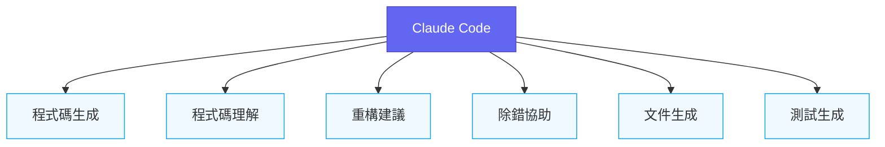

#### 核心價值主張

| 價值面向 | 說明 | 實際效益 |
|---------|------|----------|
| **開發效率** | 減少重複性工作，加速原型開發 | 效率提升 30-50% |
| **程式品質** | 自動建議最佳實踐與設計模式 | 減少技術債 |
| **知識傳承** | 協助解讀遺留程式碼 | 降低學習曲線 |
| **協作增強** | 統一團隊程式風格 | 提升 Code Review 效率 |

#### ✨ 最佳實踐

> Claude Code 不是要取代開發者，而是要成為開發者的「智慧副駕駛」。將 AI 視為協作者，而非工具，才能發揮最大效益。

### 1.1.2 與傳統 IDE 的差異

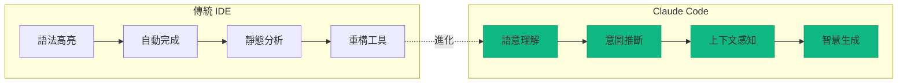

| 比較項目 | 傳統 IDE | Claude Code |
|---------|----------|-------------|
| **自動完成** | 基於語法與 API | 基於語意與上下文 |
| **錯誤檢測** | 靜態規則 | 動態推理 + 意圖理解 |
| **重構支援** | 預定義模式 | 智慧建議 + 解釋原因 |
| **學習曲線** | 需熟悉快捷鍵 | 自然語言互動 |
| **擴展性** | Plugin 架構 | Subagents + Skills + MCP |

### 1.1.3 適用場景與限制

#### ✅ 適用場景

```plaintext
1. 快速原型開發
   - 從需求文字快速生成初版程式碼
   - 產生 API 骨架與資料模型

2. 遺留系統維護
   - 解讀複雜的舊程式碼
   - 漸進式重構建議

3. 程式碼審查輔助
   - 自動檢測潛在問題
   - 提供改善建議

4. 文件與測試生成
   - 自動產生 API 文件
   - 生成單元測試案例

5. 學習與教學
   - 解釋程式碼邏輯
   - 示範設計模式
```

#### ⚠️ 注意事項：不適用場景

```plaintext
1. 高度機密的商業邏輯
   - 需評估資料外洩風險
   - 考慮使用私有部署版本

2. 即時系統的關鍵路徑
   - AI 回應延遲不確定
   - 不適合作為線上服務依賴

3. 需要 100% 正確性的場景
   - AI 可能產生「看似正確但有缺陷」的程式碼
   - 永遠需要人工審查

4. 複雜的演算法開發
   - AI 擅長套用模式，但創新能力有限
   - 核心演算法仍需人工設計
```

### 1.1.4 安裝與環境配置

#### 系統需求

| 項目 | 最低需求 | 建議配置 |
|-----|---------|----------|
| **作業系統** | Windows 10 / macOS 10.15 / Ubuntu 20.04 | 最新穩定版本 |
| **記憶體** | 8 GB | 16 GB 以上 |
| **網路** | 穩定連線 | 低延遲連線 |
| **VS Code** | 1.85+ | 最新版本 |

#### 安裝步驟

**步驟 1：安裝 Claude Code CLI**

```bash
# macOS / Linux
curl -fsSL https://claude.ai/install.sh | sh

# Windows (PowerShell)
irm https://claude.ai/install.ps1 | iex

# 使用 npm 安裝（跨平台）
npm install -g @anthropic-ai/claude-code
```

**步驟 2：驗證安裝**

```bash
# 檢查版本
claude --version

# 預期輸出
# Claude Code CLI v1.x.x
```

**步驟 3：設定 API 金鑰**

```bash
# 設定環境變數（推薦方式）
export ANTHROPIC_API_KEY="your-api-key-here"

# 或使用互動式設定
claude auth login
```

**步驟 4：VS Code 整合**

```bash
# 安裝 VS Code 擴充功能
code --install-extension anthropic.claude-code

# 或在 VS Code 擴充功能市場搜尋 "Claude Code"
```

#### 配置檔案結構

```plaintext
專案根目錄/
├── .claude/
│   ├── config.json          # 專案配置
│   ├── skills/              # 自訂 Skills
│   ├── hooks/               # Hooks 配置
│   └── context/             # Context 快取
├── .claudeignore            # 忽略檔案清單
└── claude.config.js         # 進階配置（可選）
```

**基本配置範例 (.claude/config.json)**：

```json
{
  "version": "1.0",
  "project": {
    "name": "my-project",
    "language": "typescript",
    "framework": "react"
  },
  "model": {
    "default": "claude-sonnet-4-20250514",
    "maxTokens": 8192,
    "temperature": 0.7
  },
  "context": {
    "maxFiles": 50,
    "excludePatterns": [
      "node_modules/**",
      "dist/**",
      "*.log"
    ]
  },
  "features": {
    "autoSave": true,
    "telemetry": false,
    "experimentalFeatures": false
  }
}
```

#### 💡 小技巧

> 建議將 `.claude/` 目錄加入 `.gitignore`，但保留 `.claude/config.json` 作為團隊共享配置。敏感資訊（如 API 金鑰）應使用環境變數管理。

---

## 1.2 核心架構概覽

### 1.2.1 系統架構圖

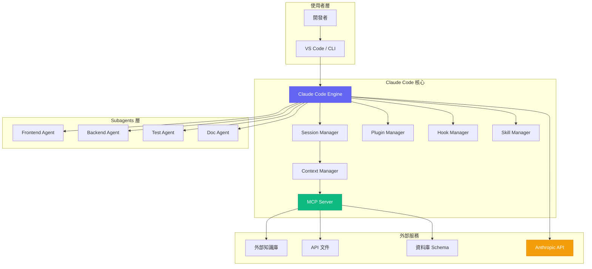

### 1.2.2 各組件之間的關係

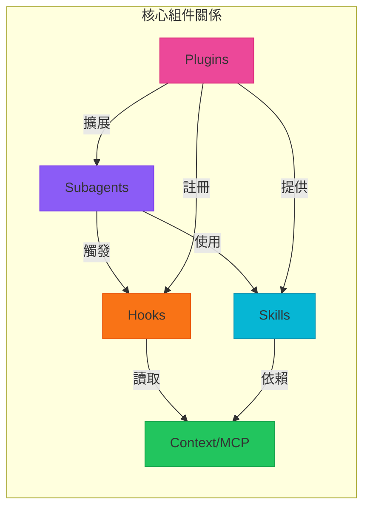

#### 組件職責說明

| 組件 | 職責 | 互動對象 |
|-----|------|---------|
| **Subagents** | 任務分解與專業處理 | Skills, Hooks, Context |
| **Skills** | 可重用的能力單元 | Context, 外部工具 |
| **Plugins** | 擴展核心功能 | 所有組件 |
| **Hooks** | 事件攔截與處理 | 執行流程各階段 |
| **MCP** | Context 管理與優化 | 外部資源, Token 管理 |

### 1.2.3 資料流與執行流程

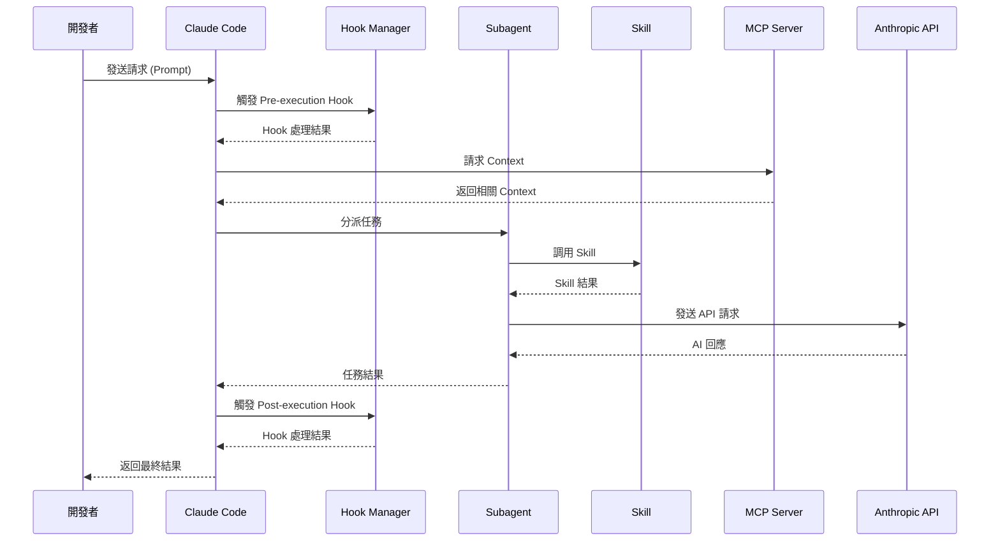

#### 執行流程詳解

**階段 1：請求接收與前處理**

```typescript
// 虛擬碼示意執行流程
async function handleRequest(request: UserRequest): Promise<Response> {
  // 1. 前置 Hook 處理
  const preHookResult = await hookManager.executePreHooks(request);
  if (preHookResult.abort) {
    return preHookResult.response;
  }
  
  // 2. Context 收集
  const context = await mcpServer.gatherContext({
    query: request.prompt,
    maxTokens: config.context.maxTokens,
    relevanceThreshold: 0.7
  });
  
  // 3. 任務路由
  const agent = selectSubagent(request.taskType);
  
  // 4. 任務執行
  const result = await agent.execute({
    prompt: request.prompt,
    context: context,
    skills: await skillManager.getAvailableSkills()
  });
  
  // 5. 後置 Hook 處理
  const postHookResult = await hookManager.executePostHooks(result);
  
  return postHookResult.response;
}
```

**階段 2：Context 智慧選擇**

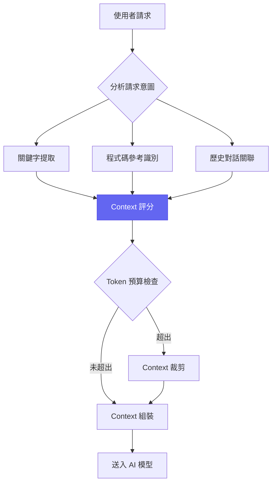

**階段 3：結果後處理**

```typescript
interface PostProcessingPipeline {
  // 程式碼格式化
  formatCode(code: string, language: string): string;
  
  // 安全性檢查
  securityScan(code: string): SecurityReport;
  
  // 品質評估
  qualityAssessment(code: string): QualityScore;
  
  // 文件生成
  generateDocs(code: string): Documentation;
}
```

---

### 實務案例：專案初始化流程

以下展示如何在新專案中完整配置 Claude Code：

```bash
# 1. 建立新專案
mkdir my-new-project && cd my-new-project

# 2. 初始化 Claude Code
claude init

# 3. 互動式配置
? Project name: my-new-project
? Primary language: TypeScript
? Framework: React
? Enable Subagents: Yes
? Enable MCP Server: Yes
? Configure Git hooks: Yes

# 4. 完成配置
✓ Created .claude/config.json
✓ Created .claude/skills/
✓ Created .claude/hooks/
✓ Initialized MCP server
✓ Setup complete!

# 5. 啟動 Claude Code
claude start
```

#### ⚠️ 注意事項

> 首次執行時，Claude Code 會掃描專案結構以建立初始 Context 索引。大型專案可能需要數分鐘，請耐心等待。建議在 `.claudeignore` 中排除不必要的目錄（如 `node_modules`、`vendor` 等）以加速索引過程。

---

**📌 第一部分重點摘要**

1. Claude Code 定位為「智慧協作夥伴」，而非程式碼生成器
2. 核心價值在於提升效率、品質與知識傳承
3. 五大核心組件：Subagents、Skills、Plugins、Hooks、MCP
4. 資料流遵循「請求 → Context → 處理 → Hook → 回應」流程
5. 配置檔案集中於 `.claude/` 目錄，支援團隊共享

---

# 第二部分：核心功能詳解

## 2.1 Subagents (子代理)

### 2.1.1 概念說明

#### 什麼是 Subagents？

**Subagents（子代理）** 是 Claude Code 中用於任務分解與專業化處理的核心機制。每個 Subagent 是一個具有特定職責範圍的 AI 代理，能夠專注於特定類型的任務，並與其他 Subagents 協作完成複雜工作。

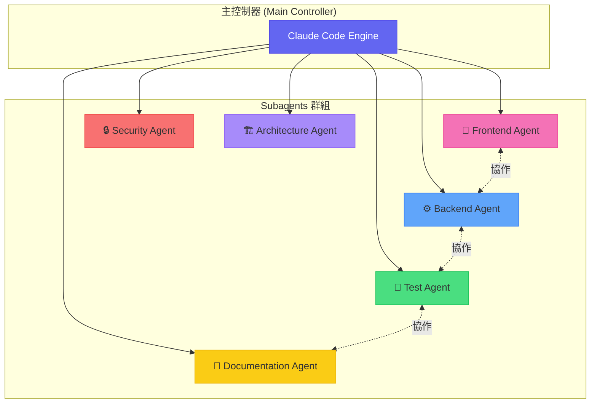

#### 設計理念

Subagents 的設計遵循以下核心原則：

| 原則 | 說明 | 效益 |
|-----|------|------|
| **單一職責** | 每個 Agent 專注於一個領域 | 提升專業度與準確性 |
| **鬆耦合** | Agents 之間通過訊息傳遞溝通 | 易於擴展與維護 |
| **可組合** | 多個 Agents 可組合執行複雜任務 | 靈活應對各種需求 |
| **可替換** | 可自訂或替換任何 Agent | 高度客製化能力 |

```typescript
// Subagent 介面定義
interface Subagent {
  // 唯一識別碼
  id: string;
  
  // Agent 名稱
  name: string;
  
  // 專業領域標籤
  domain: AgentDomain[];
  
  // 能力描述（用於任務路由）
  capabilities: string[];
  
  // 優先級（0-100，越高越優先）
  priority: number;
  
  // 執行任務
  execute(task: Task, context: Context): Promise<TaskResult>;
  
  // 判斷是否能處理該任務
  canHandle(task: Task): boolean;
}

type AgentDomain = 
  | 'frontend' 
  | 'backend' 
  | 'database' 
  | 'testing' 
  | 'documentation'
  | 'security'
  | 'devops'
  | 'architecture';
```

### 2.1.2 使用場景

#### 場景一：任務分解與並行處理

當面對複雜的開發任務時，Claude Code 會自動將任務分解並分派給適當的 Subagents：

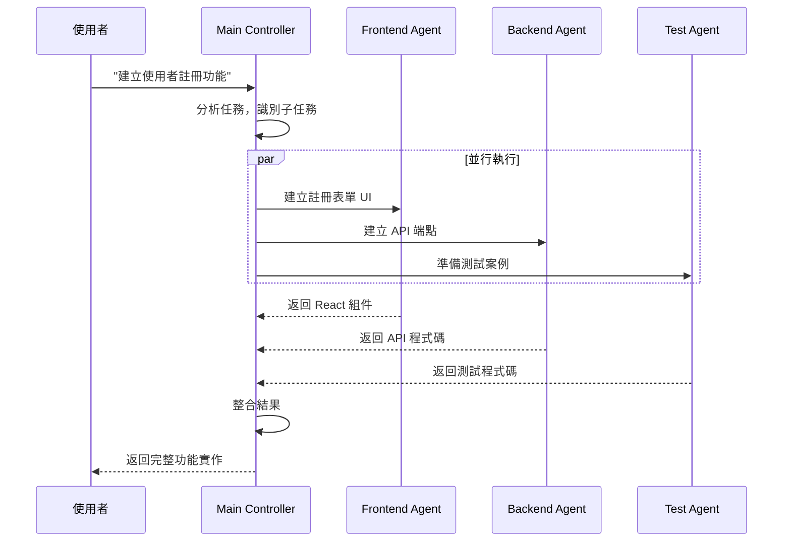

**實際使用範例**：

```bash
# 使用 CLI 觸發多 Agent 協作
claude task "建立使用者註冊功能，包含前端表單、後端 API 和測試"

# Claude Code 自動分析並分派：
# ├─ Frontend Agent: 產生 React 註冊表單
# ├─ Backend Agent: 產生 Express API 路由
# └─ Test Agent: 產生 Jest 測試案例
```

#### 場景二：專業領域分工

```typescript
// 專業領域 Agent 配置範例
const agentConfigurations = {
  frontend: {
    id: 'frontend-agent',
    name: 'Frontend Specialist',
    domain: ['frontend'],
    capabilities: [
      'React/Vue/Angular 組件開發',
      'CSS/Tailwind 樣式設計',
      '狀態管理（Redux/Zustand）',
      '效能優化',
      'Accessibility (a11y)'
    ],
    systemPrompt: `你是一位專業的前端開發者，精通：
      - React 18+ 與 Hooks
      - TypeScript 嚴格模式
      - 現代 CSS（Flexbox, Grid, Container Queries）
      - 效能優化（懶載入、Code Splitting）
      請提供符合最佳實踐的程式碼。`
  },
  
  backend: {
    id: 'backend-agent',
    name: 'Backend Specialist',
    domain: ['backend', 'database'],
    capabilities: [
      'API 設計（REST/GraphQL）',
      '資料庫設計與優化',
      '認證與授權',
      '快取策略',
      '微服務架構'
    ],
    systemPrompt: `你是一位專業的後端開發者，專精：
      - Node.js/Java/Python 後端開發
      - 資料庫設計（SQL/NoSQL）
      - API 安全最佳實踐
      - 高可用性架構設計
      請確保程式碼安全、高效、可維護。`
  },
  
  security: {
    id: 'security-agent',
    name: 'Security Specialist',
    domain: ['security'],
    capabilities: [
      'OWASP Top 10 檢測',
      '程式碼安全審查',
      '依賴漏洞掃描',
      '認證機制設計',
      '資料加密建議'
    ],
    systemPrompt: `你是一位資安專家，負責：
      - 識別潛在安全漏洞
      - 建議安全的實作方式
      - 審查敏感資料處理
      - 提供合規性建議
      安全永遠是第一優先。`
  }
};
```

#### 場景三：複雜專案的模組化管理

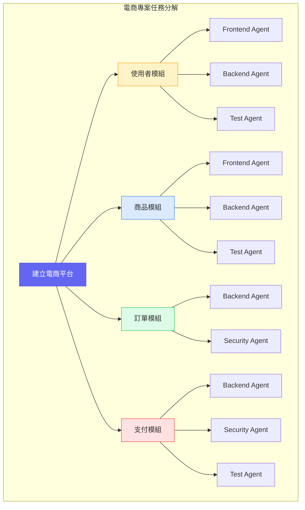

### 2.1.3 實作範例

#### 建立自訂 Subagent 的完整流程

**步驟 1：定義 Agent 配置檔**

在 `.claude/agents/` 目錄下建立配置：

```yaml
# .claude/agents/java-spring-agent.yaml
id: java-spring-agent
name: Java Spring Specialist
version: 1.0.0

# Agent 元資料
metadata:
  author: DevTeam
  description: 專精於 Java Spring Boot 開發的 Agent
  tags:
    - java
    - spring-boot
    - backend

# 專業領域
domain:
  - backend
  - database
  - devops

# 能力清單（用於任務路由決策）
capabilities:
  - Spring Boot 應用開發
  - JPA/Hibernate 資料存取
  - Spring Security 認證授權
  - RESTful API 設計
  - 微服務架構
  - 單元測試與整合測試

# 優先級配置
priority:
  default: 80
  conditions:
    - when: "task.language == 'java'"
      priority: 95
    - when: "task.framework == 'spring'"
      priority: 99

# 系統提示詞
systemPrompt: |
  你是一位資深的 Java Spring Boot 開發專家，具備以下專業能力：
  
  ## 技術專長
  - Spring Boot 3.x / Spring Framework 6.x
  - Spring Data JPA、Spring Security、Spring Cloud
  - 關聯式資料庫（PostgreSQL、MySQL）
  - 訊息佇列（Kafka、RabbitMQ）
  
  ## 程式風格
  - 遵循 Clean Code 原則
  - 使用 Builder 模式建立複雜物件
  - 善用 Optional 處理空值
  - 完整的 JavaDoc 文件
  
  ## 輸出要求
  - 所有程式碼必須可直接編譯執行
  - 包含完整的錯誤處理
  - 提供對應的單元測試

# Skills 依賴
skills:
  - code-generation
  - code-review
  - test-generation
  - documentation

# 環境變數
environment:
  JAVA_VERSION: "21"
  SPRING_BOOT_VERSION: "3.2.0"
  BUILD_TOOL: "maven"
```

**步驟 2：實作 Agent 處理邏輯**

```typescript
// .claude/agents/java-spring-agent.ts
import { 
  Subagent, 
  Task, 
  Context, 
  TaskResult,
  SkillManager,
  Logger
} from '@anthropic-ai/claude-code';

export class JavaSpringAgent implements Subagent {
  id = 'java-spring-agent';
  name = 'Java Spring Specialist';
  domain = ['backend', 'database', 'devops'];
  capabilities = [
    'Spring Boot 應用開發',
    'JPA/Hibernate 資料存取',
    'Spring Security 認證授權'
  ];
  priority = 80;
  
  private skillManager: SkillManager;
  private logger: Logger;
  
  constructor(skillManager: SkillManager, logger: Logger) {
    this.skillManager = skillManager;
    this.logger = logger;
  }
  
  /**
   * 判斷是否能處理該任務
   * @param task 待處理任務
   * @returns 是否可處理
   */
  canHandle(task: Task): boolean {
    // 基於任務特徵判斷
    const javaKeywords = ['java', 'spring', 'boot', 'maven', 'gradle', 'jpa'];
    const taskText = `${task.description} ${task.context}`.toLowerCase();
    
    return javaKeywords.some(keyword => taskText.includes(keyword));
  }
  
  /**
   * 執行任務
   * @param task 任務物件
   * @param context 執行上下文
   * @returns 任務結果
   */
  async execute(task: Task, context: Context): Promise<TaskResult> {
    this.logger.info(`[JavaSpringAgent] 開始處理任務: ${task.id}`);
    
    try {
      // 1. 分析任務類型
      const taskType = this.analyzeTaskType(task);
      
      // 2. 根據類型選擇 Skill
      const skill = await this.selectSkill(taskType);
      
      // 3. 準備增強的上下文
      const enhancedContext = await this.prepareContext(context, task);
      
      // 4. 執行 Skill
      const result = await skill.execute({
        task,
        context: enhancedContext,
        config: this.getSkillConfig(taskType)
      });
      
      // 5. 後處理（格式化、驗證）
      const processedResult = await this.postProcess(result);
      
      this.logger.info(`[JavaSpringAgent] 任務完成: ${task.id}`);
      
      return {
        success: true,
        output: processedResult,
        metadata: {
          agentId: this.id,
          taskType,
          executionTime: Date.now() - task.createdAt
        }
      };
      
    } catch (error) {
      this.logger.error(`[JavaSpringAgent] 任務失敗: ${error.message}`);
      
      return {
        success: false,
        error: error.message,
        suggestions: this.generateErrorSuggestions(error)
      };
    }
  }
  
  /**
   * 分析任務類型
   */
  private analyzeTaskType(task: Task): string {
    const patterns = {
      'entity-creation': /建立|建立|create.*entity|model/i,
      'api-development': /api|endpoint|controller|rest/i,
      'service-layer': /service|business.*logic|業務/i,
      'repository': /repository|dao|資料.*存取/i,
      'security': /security|認證|授權|auth/i,
      'testing': /test|測試|單元|整合/i
    };
    
    for (const [type, pattern] of Object.entries(patterns)) {
      if (pattern.test(task.description)) {
        return type;
      }
    }
    
    return 'general';
  }
  
  /**
   * 選擇適當的 Skill
   */
  private async selectSkill(taskType: string) {
    const skillMapping = {
      'entity-creation': 'code-generation',
      'api-development': 'code-generation',
      'service-layer': 'code-generation',
      'repository': 'code-generation',
      'security': 'security-review',
      'testing': 'test-generation'
    };
    
    const skillId = skillMapping[taskType] || 'code-generation';
    return this.skillManager.getSkill(skillId);
  }
  
  /**
   * 準備增強上下文
   */
  private async prepareContext(
    context: Context, 
    task: Task
  ): Promise<Context> {
    // 添加 Spring Boot 專案結構資訊
    const projectStructure = await this.analyzeProjectStructure();
    
    // 添加現有實體和服務的資訊
    const existingComponents = await this.findRelatedComponents(task);
    
    return {
      ...context,
      additionalContext: {
        projectStructure,
        existingComponents,
        conventions: this.getProjectConventions()
      }
    };
  }
  
  /**
   * 取得專案慣例
   */
  private getProjectConventions() {
    return {
      packageNaming: 'com.company.project.{module}',
      entitySuffix: '',
      repositorySuffix: 'Repository',
      serviceSuffix: 'Service',
      controllerSuffix: 'Controller',
      testSuffix: 'Test',
      useRecord: true,  // Java 17+ Record for DTOs
      useLombok: false  // 偏好明確程式碼
    };
  }
}
```

**步驟 3：註冊 Agent**

```typescript
// .claude/config.ts
import { ClaudeCodeConfig } from '@anthropic-ai/claude-code';
import { JavaSpringAgent } from './agents/java-spring-agent';

export const config: ClaudeCodeConfig = {
  agents: {
    custom: [
      {
        module: './agents/java-spring-agent',
        class: 'JavaSpringAgent',
        enabled: true
      }
    ],
    
    // 覆寫內建 Agent 的優先級
    overrides: {
      'default-backend-agent': {
        priority: 70  // 降低預設 Agent 優先級
      }
    }
  }
};
```

#### 配置檔案結構與參數說明

```plaintext
.claude/
├── agents/
│   ├── index.ts                    # Agent 註冊入口
│   ├── java-spring-agent.yaml      # Agent 配置
│   ├── java-spring-agent.ts        # Agent 實作
│   └── prompts/
│       ├── entity-creation.md      # 實體建立提示詞
│       ├── api-development.md      # API 開發提示詞
│       └── testing.md              # 測試生成提示詞
├── config.ts                       # 主配置檔
└── skills/                         # Agent 使用的 Skills
```

#### 多個 Subagents 協作的實戰案例

**案例：全端功能開發協作流程**

```typescript
// 協作流程定義
const collaborativeWorkflow = {
  name: 'Full-Stack Feature Development',
  description: '前後端功能完整開發流程',
  
  stages: [
    {
      name: 'architecture-review',
      agent: 'architecture-agent',
      inputs: ['feature-requirements'],
      outputs: ['architecture-design', 'component-list'],
      timeout: 60000
    },
    {
      name: 'backend-development',
      agent: 'java-spring-agent',
      inputs: ['architecture-design'],
      outputs: ['api-code', 'entity-code', 'service-code'],
      parallel: true
    },
    {
      name: 'frontend-development',
      agent: 'frontend-agent',
      inputs: ['architecture-design', 'api-code'],
      outputs: ['ui-components', 'state-management'],
      parallel: true,
      dependsOn: ['backend-development']  // 等待 API 定義
    },
    {
      name: 'test-generation',
      agent: 'test-agent',
      inputs: ['api-code', 'service-code', 'ui-components'],
      outputs: ['unit-tests', 'integration-tests', 'e2e-tests'],
      dependsOn: ['backend-development', 'frontend-development']
    },
    {
      name: 'security-review',
      agent: 'security-agent',
      inputs: ['api-code', 'ui-components'],
      outputs: ['security-report', 'fix-suggestions'],
      dependsOn: ['backend-development', 'frontend-development']
    },
    {
      name: 'documentation',
      agent: 'documentation-agent',
      inputs: ['api-code', 'ui-components', 'architecture-design'],
      outputs: ['api-docs', 'readme-update'],
      dependsOn: ['test-generation']
    }
  ],
  
  // 錯誤處理策略
  errorHandling: {
    retryCount: 2,
    retryDelay: 5000,
    fallbackAgent: 'default-agent',
    onFailure: 'notify-and-continue'
  }
};
```

**執行協作流程**：

```bash
# 啟動協作任務
claude workflow run full-stack-feature \
  --requirements "建立使用者個人資料編輯功能" \
  --modules "user-profile" \
  --parallel

# 輸出範例
╭─────────────────────────────────────────────────────────╮
│  Full-Stack Feature Development                          │
╰─────────────────────────────────────────────────────────╯

Stage 1/6: architecture-review
  ├─ Agent: architecture-agent
  ├─ Status: ✓ Completed (12.3s)
  └─ Output: 3 components identified

Stage 2/6: backend-development
  ├─ Agent: java-spring-agent
  ├─ Status: ✓ Completed (28.7s)
  └─ Output: 4 files generated

Stage 3/6: frontend-development
  ├─ Agent: frontend-agent
  ├─ Status: ✓ Completed (24.1s)
  └─ Output: 6 components generated

Stage 4/6: test-generation
  ├─ Agent: test-agent
  ├─ Status: ✓ Completed (18.5s)
  └─ Output: 12 test cases generated

Stage 5/6: security-review
  ├─ Agent: security-agent
  ├─ Status: ✓ Completed (8.2s)
  └─ Output: 0 critical, 2 warnings

Stage 6/6: documentation
  ├─ Agent: documentation-agent
  ├─ Status: ✓ Completed (6.8s)
  └─ Output: API docs updated

╭─────────────────────────────────────────────────────────╮
│  ✓ Workflow completed successfully in 98.6s             │
│  Files generated: 23 | Tests: 12 | Warnings: 2          │
╰─────────────────────────────────────────────────────────╯
```

### 2.1.4 進階技巧

#### Subagent 的優先級設定

```typescript
// 優先級決策邏輯
interface PriorityConfig {
  // 基礎優先級 (0-100)
  base: number;
  
  // 條件式優先級調整
  conditions: PriorityCondition[];
  
  // 動態優先級計算
  dynamicCalculation?: (task: Task, context: Context) => number;
}

interface PriorityCondition {
  // 條件表達式
  when: string;
  
  // 優先級調整值（可為正負）
  adjustment: number;
  
  // 或直接設定優先級
  setPriority?: number;
}

// 實際配置範例
const priorityConfig: PriorityConfig = {
  base: 50,
  
  conditions: [
    // 語言匹配時提升優先級
    { when: "task.language === 'java'", adjustment: +30 },
    
    // 框架匹配時提升優先級
    { when: "task.framework === 'spring-boot'", setPriority: 95 },
    
    // 緊急任務提升優先級
    { when: "task.priority === 'urgent'", adjustment: +20 },
    
    // 安全相關任務優先
    { when: "task.tags.includes('security')", adjustment: +15 }
  ],
  
  // 動態計算：基於歷史表現調整
  dynamicCalculation: (task, context) => {
    const historicalSuccess = context.agentMetrics?.successRate || 0.5;
    return Math.round(historicalSuccess * 20);  // 最多 +20
  }
};
```

#### 錯誤處理與容錯機制

```typescript
// 錯誤處理策略配置
const errorHandlingConfig = {
  // 重試策略
  retry: {
    maxAttempts: 3,
    backoffMultiplier: 2,
    initialDelay: 1000,
    maxDelay: 30000,
    
    // 可重試的錯誤類型
    retryableErrors: [
      'RATE_LIMIT_EXCEEDED',
      'TIMEOUT',
      'TEMPORARY_FAILURE'
    ]
  },
  
  // 降級策略
  fallback: {
    // 主 Agent 失敗時的備援 Agent
    agents: ['default-backend-agent', 'general-agent'],
    
    // 降級時的行為
    behavior: 'try-next-agent',  // 或 'return-partial', 'fail-fast'
  },
  
  // 斷路器配置
  circuitBreaker: {
    enabled: true,
    failureThreshold: 5,      // 連續失敗次數
    resetTimeout: 60000,      // 重試等待時間
    halfOpenRequests: 3       // 半開狀態測試請求數
  },
  
  // 錯誤通知
  notification: {
    channels: ['slack', 'email'],
    minSeverity: 'warning',
    aggregationWindow: 300000  // 5 分鐘內相同錯誤只通知一次
  }
};

// 實作錯誤處理包裝器
class ResilientAgentWrapper {
  private agent: Subagent;
  private config: typeof errorHandlingConfig;
  private circuitState: 'closed' | 'open' | 'half-open' = 'closed';
  private failureCount = 0;
  
  async execute(task: Task, context: Context): Promise<TaskResult> {
    // 檢查斷路器狀態
    if (this.circuitState === 'open') {
      return this.handleCircuitOpen(task, context);
    }
    
    let lastError: Error;
    
    // 重試邏輯
    for (let attempt = 1; attempt <= this.config.retry.maxAttempts; attempt++) {
      try {
        const result = await this.executeWithTimeout(task, context);
        
        // 成功時重置狀態
        this.resetCircuitBreaker();
        return result;
        
      } catch (error) {
        lastError = error;
        
        if (!this.isRetryable(error)) {
          break;
        }
        
        // 等待後重試
        await this.delay(this.calculateBackoff(attempt));
      }
    }
    
    // 所有重試失敗，嘗試降級
    this.recordFailure();
    return this.attemptFallback(task, context, lastError);
  }
  
  private async attemptFallback(
    task: Task, 
    context: Context,
    originalError: Error
  ): Promise<TaskResult> {
    for (const fallbackAgentId of this.config.fallback.agents) {
      try {
        const fallbackAgent = AgentRegistry.get(fallbackAgentId);
        if (fallbackAgent.canHandle(task)) {
          return await fallbackAgent.execute(task, context);
        }
      } catch (error) {
        continue;  // 嘗試下一個備援
      }
    }
    
    // 所有備援都失敗
    throw new AgentExecutionError(
      `All agents failed for task ${task.id}`,
      { originalError, task }
    );
  }
}
```

#### 效能優化建議

```typescript
// 效能優化配置
const performanceConfig = {
  // 並行處理配置
  parallelization: {
    maxConcurrentTasks: 5,
    taskQueueSize: 100,
    
    // 資源感知調度
    resourceAware: {
      enabled: true,
      cpuThreshold: 80,     // CPU 使用率閾值
      memoryThreshold: 85   // 記憶體使用率閾值
    }
  },
  
  // 快取配置
  caching: {
    enabled: true,
    
    // 任務結果快取
    taskResults: {
      ttl: 3600000,  // 1 小時
      maxSize: 1000,
      keyStrategy: 'content-hash'  // 基於內容雜湊
    },
    
    // Context 快取
    context: {
      ttl: 300000,   // 5 分鐘
      invalidateOn: ['file-change', 'config-change']
    }
  },
  
  // 批次處理
  batching: {
    enabled: true,
    maxBatchSize: 10,
    maxWaitTime: 2000,  // 最多等待 2 秒
    
    // 可批次處理的任務類型
    batchableTaskTypes: ['code-review', 'documentation', 'linting']
  },
  
  // 預熱配置
  warmup: {
    enabled: true,
    onStartup: true,
    agents: ['java-spring-agent', 'frontend-agent'],
    preloadContext: ['project-structure', 'common-patterns']
  }
};
```

**💡 小技巧：Agent 選擇最佳化**

```typescript
// 使用機器學習模型預測最佳 Agent
class SmartAgentSelector {
  private model: AgentSelectionModel;
  
  async selectBestAgent(task: Task, context: Context): Promise<Subagent> {
    // 收集特徵
    const features = {
      taskType: this.classifyTask(task),
      language: this.detectLanguage(task, context),
      complexity: this.estimateComplexity(task),
      contextSize: context.files.length,
      historicalAgentPerformance: await this.getHistoricalMetrics()
    };
    
    // 預測最佳 Agent
    const prediction = await this.model.predict(features);
    
    // 返回預測的最佳 Agent
    return AgentRegistry.get(prediction.agentId);
  }
}
```

---

### 實務案例：多 Agent 協作開發 REST API

**需求**：為電商平台建立商品管理 API

```bash
# 執行多 Agent 協作
claude multi-agent execute \
  --task "建立商品管理 REST API，包含 CRUD 操作、分頁查詢、圖片上傳" \
  --agents "architecture-agent,java-spring-agent,security-agent,test-agent"
```

**執行結果**：

```plaintext
=== Architecture Agent ===
設計產出：
├─ ProductController.java    (REST 控制器)
├─ ProductService.java       (業務邏輯層)
├─ ProductRepository.java    (資料存取層)
├─ Product.java              (實體類)
├─ ProductDTO.java           (資料傳輸物件)
└─ ProductMapper.java        (物件映射)

=== Java Spring Agent ===
程式碼產出：
├─ 完整 CRUD API 實作
├─ 分頁與排序支援
├─ 圖片上傳 MultipartFile 處理
└─ 輸入驗證 (@Valid)

=== Security Agent ===
安全審查：
├─ ✓ SQL Injection 防護已實作
├─ ✓ 檔案上傳類型驗證
├─ ⚠️ 建議：添加上傳檔案大小限制
└─ ⚠️ 建議：實作速率限制

=== Test Agent ===
測試產出：
├─ ProductControllerTest.java  (15 測試案例)
├─ ProductServiceTest.java     (12 測試案例)
└─ ProductRepositoryTest.java  (8 測試案例)
```

#### ⚠️ 注意事項

> 1. **Agent 數量控制**：同時啟用過多 Agents 會增加協調成本，建議根據任務複雜度選擇 2-4 個核心 Agents
> 2. **上下文一致性**：多 Agent 協作時需確保共享相同的專案上下文，避免產生不一致的程式碼
> 3. **結果驗證**：即使有 Security Agent 審查，仍需人工進行最終安全審核

---

## 2.2 Skills (技能系統)

### 2.2.1 Skills 架構

#### Skills 的定義與分類

**Skills（技能）** 是 Claude Code 中可重用、可組合的能力單元。每個 Skill 封裝了特定的功能邏輯，可被 Subagents 或直接被使用者調用。

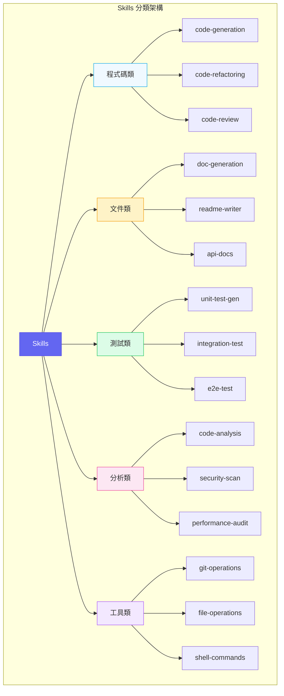

| Skill 類別 | 說明 | 典型場景 |
|-----------|------|---------|
| **程式碼類** | 程式碼生成、重構、審查 | 開發新功能、優化現有程式碼 |
| **文件類** | 文件生成與更新 | API 文件、README、變更日誌 |
| **測試類** | 測試案例生成與執行 | 單元測試、整合測試、E2E |
| **分析類** | 程式碼品質與安全分析 | 靜態分析、安全掃描 |
| **工具類** | 外部工具整合 | Git 操作、檔案處理、Shell |

#### 內建 Skills vs 自訂 Skills

```typescript
// 內建 Skill 介面
interface BuiltInSkill {
  id: string;
  category: SkillCategory;
  version: string;
  
  // 內建 Skills 由 Claude Code 團隊維護
  maintainer: 'anthropic';
  
  // 穩定性等級
  stability: 'stable' | 'beta' | 'experimental';
}

// 自訂 Skill 介面
interface CustomSkill extends BuiltInSkill {
  maintainer: string;
  
  // 自訂 Skill 需要額外的元資料
  repository?: string;
  license?: string;
  
  // 依賴的內建 Skills
  dependencies?: string[];
}

// 內建 Skills 清單（部分）
const builtInSkills: BuiltInSkill[] = [
  {
    id: 'code-generation',
    category: 'code',
    version: '1.5.0',
    maintainer: 'anthropic',
    stability: 'stable'
  },
  {
    id: 'test-generation',
    category: 'testing',
    version: '1.3.0',
    maintainer: 'anthropic',
    stability: 'stable'
  },
  {
    id: 'security-scan',
    category: 'analysis',
    version: '1.0.0',
    maintainer: 'anthropic',
    stability: 'beta'
  }
];
```

#### Skills 的生命週期

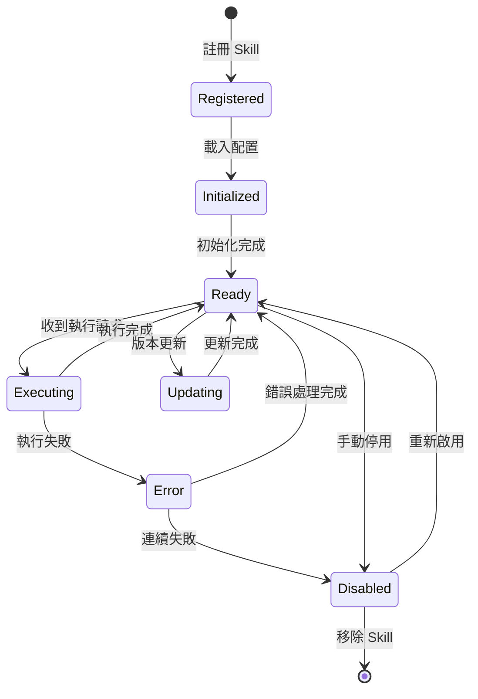

```typescript
// Skill 生命週期管理
class SkillLifecycleManager {
  // 註冊新 Skill
  async register(skill: Skill): Promise<void> {
    await this.validateSkill(skill);
    await this.loadDependencies(skill);
    this.skills.set(skill.id, skill);
    
    this.emit('skill:registered', skill);
  }
  
  // 初始化 Skill
  async initialize(skillId: string): Promise<void> {
    const skill = this.skills.get(skillId);
    
    // 載入配置
    const config = await this.loadSkillConfig(skillId);
    
    // 執行初始化邏輯
    await skill.onInit?.(config);
    
    skill.state = 'ready';
    this.emit('skill:initialized', skill);
  }
  
  // 執行 Skill
  async execute(skillId: string, input: SkillInput): Promise<SkillOutput> {
    const skill = this.skills.get(skillId);
    
    if (skill.state !== 'ready') {
      throw new SkillNotReadyError(skillId);
    }
    
    skill.state = 'executing';
    
    try {
      const result = await skill.execute(input);
      skill.state = 'ready';
      return result;
      
    } catch (error) {
      skill.state = 'error';
      await this.handleSkillError(skill, error);
      throw error;
    }
  }
  
  // 更新 Skill
  async update(skillId: string, newVersion: string): Promise<void> {
    const skill = this.skills.get(skillId);
    skill.state = 'updating';
    
    // 備份當前版本
    await this.backupSkill(skill);
    
    // 下載新版本
    const newSkill = await this.downloadSkillVersion(skillId, newVersion);
    
    // 驗證新版本
    await this.validateSkill(newSkill);
    
    // 替換並重新初始化
    this.skills.set(skillId, newSkill);
    await this.initialize(skillId);
    
    this.emit('skill:updated', newSkill);
  }
}
```

### 2.2.2 開發自訂 Skills

#### Skill 開發框架說明

**步驟 1：建立 Skill 專案結構**

```plaintext
.claude/skills/
└── my-custom-skill/
    ├── skill.yaml          # Skill 定義檔
    ├── index.ts            # 主要邏輯
    ├── prompts/
    │   ├── main.md         # 主提示詞
    │   └── variations/     # 變體提示詞
    ├── schemas/
    │   ├── input.json      # 輸入 Schema
    │   └── output.json     # 輸出 Schema
    ├── tests/
    │   └── skill.test.ts   # 測試案例
    └── examples/
        └── usage.md        # 使用範例
```

**步驟 2：定義 Skill 配置**

```yaml
# skill.yaml
id: java-entity-generator
name: Java Entity Generator
version: 1.0.0
description: 根據資料庫 Schema 或描述生成 Java Entity 類

# 分類與標籤
category: code
tags:
  - java
  - entity
  - jpa
  - code-generation

# 作者資訊
author:
  name: DevTeam
  email: dev@company.com

# 輸入輸出定義
io:
  input:
    schema: ./schemas/input.json
    examples:
      - name: 從描述生成
        value:
          entityName: User
          description: 使用者實體，包含姓名、電子郵件、密碼
          options:
            useLombok: false
            useRecord: false
            generateBuilder: true
      
      - name: 從 DDL 生成
        value:
          ddl: |
            CREATE TABLE users (
              id BIGINT PRIMARY KEY AUTO_INCREMENT,
              username VARCHAR(50) NOT NULL,
              email VARCHAR(100) NOT NULL,
              created_at TIMESTAMP DEFAULT CURRENT_TIMESTAMP
            );
          options:
            useLombok: true
  
  output:
    schema: ./schemas/output.json
    format: code

# 依賴的其他 Skills
dependencies:
  - code-generation
  - code-formatting

# 執行配置
execution:
  timeout: 30000
  retryable: true
  maxRetries: 2

# 能力聲明（用於 Agent 選擇）
capabilities:
  - Java Entity 類生成
  - JPA 註解配置
  - Lombok 整合
  - Builder 模式實作
  - DDL 解析
```

**步驟 3：定義輸入輸出 Schema**

```json
// schemas/input.json
{
  "$schema": "http://json-schema.org/draft-07/schema#",
  "type": "object",
  "oneOf": [
    {
      "properties": {
        "entityName": {
          "type": "string",
          "description": "實體類名稱",
          "pattern": "^[A-Z][a-zA-Z0-9]*$"
        },
        "description": {
          "type": "string",
          "description": "實體描述，包含欄位資訊"
        },
        "options": { "$ref": "#/definitions/options" }
      },
      "required": ["entityName", "description"]
    },
    {
      "properties": {
        "ddl": {
          "type": "string",
          "description": "CREATE TABLE DDL 語句"
        },
        "options": { "$ref": "#/definitions/options" }
      },
      "required": ["ddl"]
    }
  ],
  "definitions": {
    "options": {
      "type": "object",
      "properties": {
        "useLombok": {
          "type": "boolean",
          "default": false,
          "description": "是否使用 Lombok"
        },
        "useRecord": {
          "type": "boolean", 
          "default": false,
          "description": "是否使用 Java Record（Java 17+）"
        },
        "generateBuilder": {
          "type": "boolean",
          "default": true,
          "description": "是否生成 Builder 模式"
        },
        "packageName": {
          "type": "string",
          "default": "com.example.entity",
          "description": "套件名稱"
        },
        "tablePrefix": {
          "type": "string",
          "description": "資料表前綴（會被移除）"
        }
      }
    }
  }
}
```

```json
// schemas/output.json
{
  "$schema": "http://json-schema.org/draft-07/schema#",
  "type": "object",
  "properties": {
    "entityClass": {
      "type": "string",
      "description": "生成的 Entity 類程式碼"
    },
    "dtoClass": {
      "type": "string",
      "description": "生成的 DTO 類程式碼（可選）"
    },
    "repositoryInterface": {
      "type": "string",
      "description": "生成的 Repository 介面（可選）"
    },
    "metadata": {
      "type": "object",
      "properties": {
        "tableName": { "type": "string" },
        "fields": {
          "type": "array",
          "items": {
            "type": "object",
            "properties": {
              "name": { "type": "string" },
              "type": { "type": "string" },
              "nullable": { "type": "boolean" }
            }
          }
        }
      }
    }
  },
  "required": ["entityClass"]
}
```

#### API 介面定義

```typescript
// index.ts - Skill 主要邏輯
import {
  Skill,
  SkillContext,
  SkillInput,
  SkillOutput,
  SkillConfig,
  Logger
} from '@anthropic-ai/claude-code';

interface EntityGeneratorInput {
  entityName?: string;
  description?: string;
  ddl?: string;
  options?: EntityGeneratorOptions;
}

interface EntityGeneratorOptions {
  useLombok?: boolean;
  useRecord?: boolean;
  generateBuilder?: boolean;
  packageName?: string;
  tablePrefix?: string;
}

interface EntityGeneratorOutput {
  entityClass: string;
  dtoClass?: string;
  repositoryInterface?: string;
  metadata: {
    tableName: string;
    fields: FieldInfo[];
  };
}

interface FieldInfo {
  name: string;
  type: string;
  nullable: boolean;
  annotations: string[];
}

export class JavaEntityGeneratorSkill implements Skill<EntityGeneratorInput, EntityGeneratorOutput> {
  id = 'java-entity-generator';
  name = 'Java Entity Generator';
  
  private logger: Logger;
  private config: SkillConfig;
  
  /**
   * Skill 初始化
   * 在 Skill 首次載入時調用
   */
  async onInit(config: SkillConfig): Promise<void> {
    this.config = config;
    this.logger = config.logger;
    this.logger.info(`[${this.id}] Skill initialized`);
  }
  
  /**
   * 驗證輸入
   * @param input 使用者輸入
   * @returns 驗證結果
   */
  async validate(input: EntityGeneratorInput): Promise<ValidationResult> {
    const errors: string[] = [];
    
    // 必須提供 entityName+description 或 ddl
    if (!input.ddl && (!input.entityName || !input.description)) {
      errors.push('必須提供 entityName 和 description，或提供 ddl');
    }
    
    // 驗證 entityName 格式
    if (input.entityName && !/^[A-Z][a-zA-Z0-9]*$/.test(input.entityName)) {
      errors.push('entityName 必須以大寫字母開頭，只能包含字母和數字');
    }
    
    return {
      valid: errors.length === 0,
      errors
    };
  }
  
  /**
   * 執行 Skill
   * @param input 驗證後的輸入
   * @param context 執行上下文
   * @returns Skill 輸出
   */
  async execute(
    input: EntityGeneratorInput,
    context: SkillContext
  ): Promise<EntityGeneratorOutput> {
    this.logger.info(`[${this.id}] Executing with input:`, input);
    
    // 1. 解析輸入，確定欄位資訊
    const fields = input.ddl 
      ? await this.parseFromDDL(input.ddl, input.options)
      : await this.parseFromDescription(input.description!, input.options);
    
    // 2. 決定實體名稱
    const entityName = input.entityName || this.extractEntityNameFromDDL(input.ddl!);
    
    // 3. 生成程式碼
    const entityClass = await this.generateEntityClass(
      entityName,
      fields,
      input.options || {}
    );
    
    // 4. 生成輔助類（可選）
    const dtoClass = await this.generateDTO(entityName, fields, input.options);
    const repositoryInterface = await this.generateRepository(entityName, input.options);
    
    return {
      entityClass,
      dtoClass,
      repositoryInterface,
      metadata: {
        tableName: this.toSnakeCase(entityName),
        fields
      }
    };
  }
  
  /**
   * 從 DDL 解析欄位
   */
  private async parseFromDDL(
    ddl: string, 
    options?: EntityGeneratorOptions
  ): Promise<FieldInfo[]> {
    // DDL 解析邏輯
    const fields: FieldInfo[] = [];
    
    // 使用正則表達式解析 CREATE TABLE 語句
    const columnPattern = /(\w+)\s+([\w()]+)(?:\s+(NOT NULL|NULL))?/gi;
    let match;
    
    while ((match = columnPattern.exec(ddl)) !== null) {
      const [, columnName, dataType, nullability] = match;
      
      // 跳過特殊關鍵字
      if (['PRIMARY', 'KEY', 'FOREIGN', 'CONSTRAINT'].includes(columnName.toUpperCase())) {
        continue;
      }
      
      fields.push({
        name: this.toCamelCase(columnName),
        type: this.mapSqlTypeToJava(dataType),
        nullable: nullability !== 'NOT NULL',
        annotations: this.determineAnnotations(columnName, dataType)
      });
    }
    
    return fields;
  }
  
  /**
   * 從描述解析欄位（使用 AI）
   */
  private async parseFromDescription(
    description: string,
    options?: EntityGeneratorOptions
  ): Promise<FieldInfo[]> {
    // 這裡會調用 AI 來解析自然語言描述
    const prompt = `
      分析以下實體描述，提取欄位資訊：
      "${description}"
      
      請以 JSON 陣列格式返回，每個欄位包含：
      - name: 欄位名稱（camelCase）
      - type: Java 類型
      - nullable: 是否可為空
      - annotations: JPA 註解陣列
    `;
    
    // 調用 AI 模型
    const response = await this.config.aiClient.complete({
      prompt,
      responseFormat: 'json'
    });
    
    return JSON.parse(response.content);
  }
  
  /**
   * 生成 Entity 類
   */
  private async generateEntityClass(
    entityName: string,
    fields: FieldInfo[],
    options: EntityGeneratorOptions
  ): Promise<string> {
    const packageName = options.packageName || 'com.example.entity';
    
    // 構建程式碼
    let code = '';
    
    // Package 聲明
    code += `package ${packageName};\n\n`;
    
    // Imports
    code += this.generateImports(fields, options);
    code += '\n';
    
    // 類註解
    code += '@Entity\n';
    code += `@Table(name = "${this.toSnakeCase(entityName)}")\n`;
    
    if (options.useLombok) {
      code += '@Data\n';
      code += '@NoArgsConstructor\n';
      code += '@AllArgsConstructor\n';
      if (options.generateBuilder) {
        code += '@Builder\n';
      }
    }
    
    // 類定義
    code += `public class ${entityName} {\n\n`;
    
    // 欄位
    for (const field of fields) {
      // 欄位註解
      for (const annotation of field.annotations) {
        code += `    ${annotation}\n`;
      }
      code += `    private ${field.type} ${field.name};\n\n`;
    }
    
    // 如果不使用 Lombok，生成 Getters/Setters
    if (!options.useLombok) {
      code += this.generateGettersSetters(fields);
      
      if (options.generateBuilder) {
        code += this.generateBuilderPattern(entityName, fields);
      }
    }
    
    code += '}\n';
    
    return code;
  }
  
  // ... 其他輔助方法
}

export default JavaEntityGeneratorSkill;
```

### 2.2.3 實用 Skills 範例

#### 範例一：程式碼審查 Skill

```typescript
// code-review-skill.ts
export class CodeReviewSkill implements Skill {
  id = 'code-review';
  name = 'Code Review Assistant';
  
  async execute(input: CodeReviewInput, context: SkillContext): Promise<CodeReviewOutput> {
    const { code, language, reviewType = 'comprehensive' } = input;
    
    // 根據審查類型選擇提示詞
    const prompt = this.buildReviewPrompt(code, language, reviewType);
    
    const review = await context.ai.complete({
      prompt,
      systemPrompt: `你是一位資深的 ${language} 程式碼審查專家。
        請仔細審查程式碼，提供建設性的反饋。
        
        審查重點：
        1. 程式碼品質與可讀性
        2. 潛在的 Bug 和邏輯錯誤
        3. 效能問題
        4. 安全漏洞
        5. 設計模式與架構
        6. 測試建議`
    });
    
    return {
      summary: review.summary,
      issues: review.issues,
      suggestions: review.suggestions,
      score: this.calculateScore(review)
    };
  }
  
  private buildReviewPrompt(
    code: string, 
    language: string, 
    reviewType: ReviewType
  ): string {
    const focusAreas = {
      'comprehensive': '全面審查',
      'security': '專注於安全性問題',
      'performance': '專注於效能優化',
      'maintainability': '專注於可維護性'
    };
    
    return `
      請審查以下 ${language} 程式碼，${focusAreas[reviewType]}：
      
      \`\`\`${language}
      ${code}
      \`\`\`
      
      請以結構化格式提供審查結果，包含：
      1. 總結（2-3 句話）
      2. 問題清單（嚴重性、位置、描述、建議修復）
      3. 改善建議（優先級排序）
      4. 整體評分（1-10）
    `;
  }
}
```

**使用範例**：

```bash
# CLI 使用
claude skill run code-review \
  --file src/UserService.java \
  --type comprehensive

# 輸出範例
╭─────────────────────────────────────────────────────────╮
│  Code Review Report                                      │
│  File: src/UserService.java                             │
│  Score: 7.5/10                                          │
╰─────────────────────────────────────────────────────────╯

📋 Summary
  程式碼整體結構良好，遵循 Spring 最佳實踐。
  發現 2 個中等問題和 3 個建議改善項目。

🚨 Issues Found (2)

  ⚠️ [Medium] Line 45-48
     N+1 查詢問題
     建議：使用 @EntityGraph 或 JOIN FETCH

  ⚠️ [Medium] Line 72
     密碼未加密儲存
     建議：使用 BCrypt 加密

💡 Suggestions (3)

  1. [High] 考慮使用 Optional 處理 findById 返回值
  2. [Medium] 添加輸入驗證 (@Valid)
  3. [Low] 建議拆分過長的方法 (>30 行)
```

#### 範例二：自動化測試生成 Skill

```typescript
// test-generation-skill.ts
export class TestGenerationSkill implements Skill {
  id = 'test-generation';
  name = 'Test Case Generator';
  
  async execute(
    input: TestGenInput, 
    context: SkillContext
  ): Promise<TestGenOutput> {
    const { sourceCode, language, framework, coverage = 'standard' } = input;
    
    // 分析原始碼結構
    const codeAnalysis = await this.analyzeCode(sourceCode, language);
    
    // 識別需要測試的單元
    const testableUnits = this.identifyTestableUnits(codeAnalysis);
    
    // 為每個單元生成測試
    const testCases: TestCase[] = [];
    
    for (const unit of testableUnits) {
      const tests = await this.generateTestsForUnit(unit, {
        framework,
        coverage,
        context
      });
      testCases.push(...tests);
    }
    
    // 組合成完整的測試檔案
    const testFile = this.assembleTestFile(testCases, {
      language,
      framework,
      sourceFile: input.sourceFile
    });
    
    return {
      testFile,
      testCases,
      coverage: this.estimateCoverage(testCases, codeAnalysis),
      suggestions: this.generateTestingSuggestions(codeAnalysis)
    };
  }
  
  private async generateTestsForUnit(
    unit: CodeUnit,
    options: TestGenOptions
  ): Promise<TestCase[]> {
    const { framework, coverage, context } = options;
    
    // 決定測試策略
    const strategies = this.selectTestStrategies(unit, coverage);
    
    const tests: TestCase[] = [];
    
    for (const strategy of strategies) {
      const prompt = this.buildTestPrompt(unit, strategy, framework);
      
      const response = await context.ai.complete({
        prompt,
        systemPrompt: this.getSystemPrompt(framework)
      });
      
      tests.push({
        name: response.testName,
        code: response.testCode,
        strategy: strategy.name,
        targetUnit: unit.name,
        assertions: response.assertions
      });
    }
    
    return tests;
  }
  
  private selectTestStrategies(unit: CodeUnit, coverage: string): TestStrategy[] {
    const strategies: TestStrategy[] = [
      { name: 'happy-path', description: '正常流程測試' }
    ];
    
    if (coverage === 'standard' || coverage === 'comprehensive') {
      strategies.push(
        { name: 'edge-cases', description: '邊界條件測試' },
        { name: 'null-handling', description: '空值處理測試' }
      );
    }
    
    if (coverage === 'comprehensive') {
      strategies.push(
        { name: 'exception-handling', description: '例外處理測試' },
        { name: 'performance', description: '效能測試' },
        { name: 'concurrency', description: '並發測試' }
      );
    }
    
    return strategies;
  }
  
  private getSystemPrompt(framework: string): string {
    const frameworkGuides = {
      'junit5': `
        使用 JUnit 5 撰寫測試，遵循以下原則：
        - 使用 @DisplayName 提供清晰的測試描述
        - 使用 @Nested 組織相關測試
        - 使用 @ParameterizedTest 處理多組輸入
        - 使用 AssertJ 的流暢 API
        - Mock 外部依賴 (Mockito)
      `,
      'jest': `
        使用 Jest 撰寫測試，遵循以下原則：
        - 使用 describe/it 結構組織測試
        - 使用 beforeEach/afterEach 處理設置與清理
        - 使用 jest.mock() 模擬模組
        - 測試命名採用 "should ... when ..." 格式
      `
    };
    
    return frameworkGuides[framework] || frameworkGuides['junit5'];
  }
}
```

**生成的測試範例（Java/JUnit 5）**：

```java
// UserServiceTest.java - 自動生成
package com.example.service;

import org.junit.jupiter.api.*;
import org.junit.jupiter.params.ParameterizedTest;
import org.junit.jupiter.params.provider.ValueSource;
import org.mockito.*;
import static org.assertj.core.api.Assertions.*;
import static org.mockito.Mockito.*;

@DisplayName("UserService 測試")
class UserServiceTest {

    @Mock
    private UserRepository userRepository;
    
    @Mock
    private PasswordEncoder passwordEncoder;
    
    @InjectMocks
    private UserService userService;
    
    @BeforeEach
    void setUp() {
        MockitoAnnotations.openMocks(this);
    }
    
    @Nested
    @DisplayName("createUser 方法")
    class CreateUserTests {
        
        @Test
        @DisplayName("應該成功建立新使用者")
        void shouldCreateUserSuccessfully() {
            // Given
            CreateUserRequest request = new CreateUserRequest(
                "john@example.com",
                "password123"
            );
            when(passwordEncoder.encode(anyString()))
                .thenReturn("encodedPassword");
            when(userRepository.save(any(User.class)))
                .thenAnswer(inv -> inv.getArgument(0));
            
            // When
            User result = userService.createUser(request);
            
            // Then
            assertThat(result)
                .isNotNull()
                .satisfies(user -> {
                    assertThat(user.getEmail()).isEqualTo("john@example.com");
                    assertThat(user.getPassword()).isEqualTo("encodedPassword");
                });
            
            verify(userRepository).save(any(User.class));
        }
        
        @Test
        @DisplayName("當電子郵件已存在時應拋出例外")
        void shouldThrowExceptionWhenEmailExists() {
            // Given
            CreateUserRequest request = new CreateUserRequest(
                "existing@example.com",
                "password123"
            );
            when(userRepository.existsByEmail(request.getEmail()))
                .thenReturn(true);
            
            // When & Then
            assertThatThrownBy(() -> userService.createUser(request))
                .isInstanceOf(DuplicateEmailException.class)
                .hasMessageContaining("already exists");
        }
        
        @ParameterizedTest
        @ValueSource(strings = {"", " ", "invalid-email"})
        @DisplayName("當電子郵件格式無效時應拋出驗證例外")
        void shouldThrowValidationExceptionForInvalidEmail(String invalidEmail) {
            // Given
            CreateUserRequest request = new CreateUserRequest(
                invalidEmail,
                "password123"
            );
            
            // When & Then
            assertThatThrownBy(() -> userService.createUser(request))
                .isInstanceOf(ValidationException.class);
        }
    }
    
    @Nested
    @DisplayName("findById 方法")
    class FindByIdTests {
        
        @Test
        @DisplayName("應該返回存在的使用者")
        void shouldReturnUserWhenExists() {
            // Given
            Long userId = 1L;
            User expectedUser = new User(userId, "john@example.com");
            when(userRepository.findById(userId))
                .thenReturn(Optional.of(expectedUser));
            
            // When
            Optional<User> result = userService.findById(userId);
            
            // Then
            assertThat(result)
                .isPresent()
                .hasValue(expectedUser);
        }
        
        @Test
        @DisplayName("當使用者不存在時應返回空值")
        void shouldReturnEmptyWhenUserNotFound() {
            // Given
            Long userId = 999L;
            when(userRepository.findById(userId))
                .thenReturn(Optional.empty());
            
            // When
            Optional<User> result = userService.findById(userId);
            
            // Then
            assertThat(result).isEmpty();
        }
    }
}
```

#### 範例三：文件生成 Skill

```typescript
// doc-generation-skill.ts
export class DocGenerationSkill implements Skill {
  id = 'doc-generation';
  name = 'Documentation Generator';
  
  async execute(input: DocGenInput, context: SkillContext): Promise<DocGenOutput> {
    const { sourceFiles, docType, outputFormat } = input;
    
    // 分析原始碼
    const codeAnalysis = await this.analyzeSourceFiles(sourceFiles, context);
    
    // 根據文件類型生成內容
    let documentation: string;
    
    switch (docType) {
      case 'api':
        documentation = await this.generateApiDocs(codeAnalysis, context);
        break;
      case 'readme':
        documentation = await this.generateReadme(codeAnalysis, context);
        break;
      case 'javadoc':
        documentation = await this.generateJavaDoc(codeAnalysis, context);
        break;
      case 'architecture':
        documentation = await this.generateArchitectureDocs(codeAnalysis, context);
        break;
      default:
        throw new Error(`Unsupported doc type: ${docType}`);
    }
    
    // 格式轉換
    const formattedDoc = await this.formatOutput(documentation, outputFormat);
    
    return {
      content: formattedDoc,
      format: outputFormat,
      metadata: {
        generatedAt: new Date().toISOString(),
        sourceFiles: sourceFiles.length,
        wordCount: this.countWords(formattedDoc)
      }
    };
  }
  
  private async generateApiDocs(
    analysis: CodeAnalysis, 
    context: SkillContext
  ): Promise<string> {
    const endpoints = analysis.endpoints;
    
    let docs = '# API Documentation\n\n';
    docs += '## Overview\n\n';
    docs += await this.generateApiOverview(analysis, context);
    docs += '\n\n## Endpoints\n\n';
    
    for (const endpoint of endpoints) {
      docs += await this.generateEndpointDoc(endpoint, context);
      docs += '\n---\n\n';
    }
    
    docs += '## Models\n\n';
    docs += await this.generateModelDocs(analysis.models, context);
    
    docs += '## Error Codes\n\n';
    docs += this.generateErrorCodeTable(analysis.errorCodes);
    
    return docs;
  }
  
  private async generateEndpointDoc(
    endpoint: ApiEndpoint,
    context: SkillContext
  ): Promise<string> {
    return `
### ${endpoint.method} ${endpoint.path}

${endpoint.description}

**Authentication**: ${endpoint.requiresAuth ? '✅ Required' : '❌ Not Required'}

#### Request

${endpoint.method !== 'GET' ? this.generateRequestBodyDoc(endpoint.requestBody) : '*No request body*'}

**Query Parameters**:

${this.generateParamsTable(endpoint.queryParams)}

**Path Parameters**:

${this.generateParamsTable(endpoint.pathParams)}

#### Response

**Success Response (${endpoint.successStatus})**:

\`\`\`json
${JSON.stringify(endpoint.responseExample, null, 2)}
\`\`\`

**Error Responses**:

${this.generateErrorResponsesDoc(endpoint.errorResponses)}

#### Example

\`\`\`bash
curl -X ${endpoint.method} \\
  ${endpoint.baseUrl}${endpoint.path} \\
  -H "Authorization: Bearer <token>" \\
  -H "Content-Type: application/json"${endpoint.requestBody ? ` \\
  -d '${JSON.stringify(endpoint.requestBody.example)}'` : ''}
\`\`\`
`;
  }
}
```

#### 範例四：重構建議 Skill

```typescript
// refactoring-suggestion-skill.ts
export class RefactoringSuggestionSkill implements Skill {
  id = 'refactoring-suggestion';
  name = 'Refactoring Advisor';
  
  async execute(
    input: RefactoringInput, 
    context: SkillContext
  ): Promise<RefactoringOutput> {
    const { code, language, focusAreas = ['all'] } = input;
    
    // 程式碼品質分析
    const qualityMetrics = await this.analyzeCodeQuality(code, language);
    
    // 識別重構機會
    const opportunities = await this.identifyRefactoringOpportunities(
      code,
      language,
      qualityMetrics,
      focusAreas,
      context
    );
    
    // 為每個機會生成具體的重構建議
    const suggestions: RefactoringSuggestion[] = [];
    
    for (const opportunity of opportunities) {
      const suggestion = await this.generateSuggestion(
        opportunity,
        code,
        context
      );
      suggestions.push(suggestion);
    }
    
    // 排序建議（按影響度和實作難度）
    const prioritizedSuggestions = this.prioritizeSuggestions(suggestions);
    
    return {
      summary: this.generateSummary(qualityMetrics, suggestions),
      qualityMetrics,
      suggestions: prioritizedSuggestions,
      estimatedImpact: this.calculateOverallImpact(suggestions)
    };
  }
  
  private async identifyRefactoringOpportunities(
    code: string,
    language: string,
    metrics: QualityMetrics,
    focusAreas: string[],
    context: SkillContext
  ): Promise<RefactoringOpportunity[]> {
    const opportunities: RefactoringOpportunity[] = [];
    
    // 檢測代碼異味 (Code Smells)
    const codeSmells = await this.detectCodeSmells(code, language, context);
    opportunities.push(...codeSmells.map(smell => ({
      type: 'code-smell',
      category: smell.category,
      location: smell.location,
      description: smell.description,
      severity: smell.severity
    })));
    
    // 檢測設計問題
    if (focusAreas.includes('all') || focusAreas.includes('design')) {
      const designIssues = await this.detectDesignIssues(code, language, context);
      opportunities.push(...designIssues);
    }
    
    // 檢測效能問題
    if (focusAreas.includes('all') || focusAreas.includes('performance')) {
      const perfIssues = await this.detectPerformanceIssues(code, language, context);
      opportunities.push(...perfIssues);
    }
    
    // 檢測可維護性問題
    if (focusAreas.includes('all') || focusAreas.includes('maintainability')) {
      const maintainabilityIssues = this.detectMaintainabilityIssues(metrics);
      opportunities.push(...maintainabilityIssues);
    }
    
    return opportunities;
  }
  
  private async generateSuggestion(
    opportunity: RefactoringOpportunity,
    originalCode: string,
    context: SkillContext
  ): Promise<RefactoringSuggestion> {
    // 確定適用的重構技術
    const technique = this.selectRefactoringTechnique(opportunity);
    
    // 生成重構後的程式碼
    const refactoredCode = await this.generateRefactoredCode(
      originalCode,
      opportunity,
      technique,
      context
    );
    
    return {
      title: technique.name,
      description: this.formatDescription(opportunity, technique),
      location: opportunity.location,
      severity: opportunity.severity,
      effort: technique.estimatedEffort,
      impact: technique.expectedImpact,
      
      // 重構前後對比
      before: this.extractRelevantCode(originalCode, opportunity.location),
      after: refactoredCode,
      
      // 步驟說明
      steps: technique.steps,
      
      // 相關資源
      references: technique.references
    };
  }
}
```

### 2.2.4 Skills 管理

#### 版本控制策略

```yaml
# .claude/skills/skill-versions.yaml
versioning:
  strategy: semver  # 使用語意化版本
  
  # 版本升級規則
  rules:
    major:
      - 破壞性 API 變更
      - 移除已棄用的功能
      - 輸入/輸出格式變更
    
    minor:
      - 新增功能（向後相容）
      - 新增可選參數
      - 效能改善
    
    patch:
      - Bug 修復
      - 文件更新
      - 內部重構（無 API 變更）

  # 棄用政策
  deprecation:
    warningPeriod: 90  # 天
    removalDelay: 180  # 天
    notificationChannels:
      - changelog
      - console-warning
      - email

# 已安裝 Skills 版本鎖定
installed:
  code-generation: "1.5.0"
  test-generation: "^1.3.0"  # 允許 patch 更新
  security-scan: "~1.0.0"    # 允許 minor 更新
  
  # 自訂 Skills
  java-entity-generator: "1.0.0"
```

#### Skills 市場與分享機制

```typescript
// 發布 Skill 到市場
interface SkillPublishConfig {
  // 基本資訊
  name: string;
  version: string;
  description: string;
  
  // 分類
  category: SkillCategory;
  tags: string[];
  
  // 可見性
  visibility: 'public' | 'private' | 'organization';
  
  // 授權
  license: string;
  
  // 定價（如果適用）
  pricing?: {
    model: 'free' | 'paid' | 'freemium';
    price?: number;
    trialDays?: number;
  };
  
  // 審核資訊
  review?: {
    securityScan: boolean;
    codeReview: boolean;
    testCoverage: number;
  };
}

// 發布命令
// claude skill publish --config publish.yaml
```

#### 安全性考量

```typescript
// Skill 安全性檢查清單
interface SkillSecurityChecks {
  // 程式碼安全
  codeAnalysis: {
    // 禁止危險操作
    noFileSystemAccess: boolean;    // 除非明確聲明
    noNetworkAccess: boolean;       // 除非明確聲明
    noProcessExecution: boolean;    // 禁止執行外部程式
    noEval: boolean;                // 禁止 eval/動態程式碼執行
  };
  
  // 資料安全
  dataHandling: {
    noSensitiveDataLogging: boolean;
    dataEncryptionAtRest: boolean;
    dataEncryptionInTransit: boolean;
    gdprCompliant: boolean;
  };
  
  // 依賴安全
  dependencies: {
    noKnownVulnerabilities: boolean;
    licensesApproved: boolean;
    supplyChainVerified: boolean;
  };
  
  // 執行時安全
  runtime: {
    sandboxed: boolean;
    resourceLimited: boolean;
    timeoutEnforced: boolean;
  };
}
```

**⚠️ 注意事項**

> 1. **Skill 權限最小化**：只請求 Skill 運作所需的最小權限
> 2. **敏感資料處理**：避免在 Skill 中處理或記錄敏感資料
> 3. **版本鎖定**：生產環境中使用精確版本號，避免自動更新造成問題
> 4. **安全審查**：使用第三方 Skills 前，務必審查其程式碼和權限聲明

---

## 2.3 Plugins (插件系統)

### 2.3.1 Plugin 生態系統

#### 官方 Plugins 目錄

Claude Code 提供豐富的官方插件，涵蓋開發工作流的各個面向：

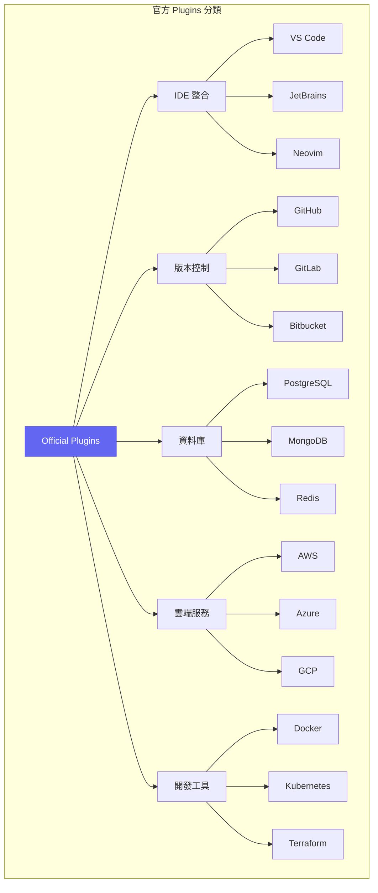

| Plugin 類別 | 官方插件 | 功能說明 | 最低版本 |
|------------|---------|---------|---------|
| **IDE 整合** | `@claude/vscode` | VS Code 深度整合 | v1.0.0 |
| **版本控制** | `@claude/github` | GitHub API 整合 | v1.0.0 |
| **資料庫** | `@claude/database` | 多資料庫支援 | v1.1.0 |
| **雲端** | `@claude/aws` | AWS 服務整合 | v1.2.0 |
| **容器** | `@claude/docker` | Docker 操作 | v1.0.0 |
| **CI/CD** | `@claude/ci` | CI/CD Pipeline 整合 | v1.3.0 |

#### 第三方 Plugin 資源

```yaml
# 推薦的第三方 Plugin 來源
sources:
  # 官方市場
  - name: Claude Code Marketplace
    url: https://marketplace.claude.ai/plugins
    trusted: true
    
  # npm registry
  - name: npm
    url: https://www.npmjs.com
    prefix: claude-plugin-
    verification: required
    
  # GitHub
  - name: GitHub
    url: https://github.com
    topics: 
      - claude-code-plugin
      - claude-plugin
    verification: recommended

# 熱門第三方 Plugins
popular:
  - name: claude-plugin-eslint
    description: ESLint 深度整合
    downloads: 50000+
    rating: 4.8
    
  - name: claude-plugin-sonarqube
    description: SonarQube 程式碼品質整合
    downloads: 30000+
    rating: 4.6
    
  - name: claude-plugin-jira
    description: Jira 任務追蹤整合
    downloads: 45000+
    rating: 4.7
```

#### Plugin 安全性檢核

```typescript
// Plugin 安全性檢核流程
interface PluginSecurityAudit {
  // 基本檢查
  basicChecks: {
    validManifest: boolean;
    signatureValid: boolean;
    publisherVerified: boolean;
  };
  
  // 權限審查
  permissionAudit: {
    requestedPermissions: Permission[];
    justifications: Map<Permission, string>;
    riskLevel: 'low' | 'medium' | 'high' | 'critical';
  };
  
  // 程式碼分析
  codeAnalysis: {
    staticAnalysisResult: AnalysisResult;
    dependencyVulnerabilities: Vulnerability[];
    maliciousPatternDetected: boolean;
  };
  
  // 行為分析
  behaviorAnalysis: {
    networkCalls: NetworkCallPattern[];
    fileSystemAccess: FileAccessPattern[];
    sensitiveDataHandling: DataHandlingPattern[];
  };
}

// 安全檢核執行
async function auditPlugin(pluginId: string): Promise<PluginSecurityAudit> {
  const plugin = await downloadPlugin(pluginId);
  
  // 1. 基本檢查
  const basicChecks = await performBasicChecks(plugin);
  
  // 2. 權限審查
  const permissionAudit = await auditPermissions(plugin.manifest.permissions);
  
  // 3. 靜態程式碼分析
  const codeAnalysis = await analyzePluginCode(plugin.source);
  
  // 4. 依賴漏洞掃描
  const vulnerabilities = await scanDependencies(plugin.dependencies);
  
  // 5. 沙箱行為測試
  const behaviorAnalysis = await testInSandbox(plugin);
  
  return {
    basicChecks,
    permissionAudit,
    codeAnalysis: { ...codeAnalysis, dependencyVulnerabilities: vulnerabilities },
    behaviorAnalysis
  };
}
```

### 2.3.2 Plugin 開發指南

#### 開發環境設置

**步驟 1：建立 Plugin 專案**

```bash
# 使用官方腳手架建立 Plugin 專案
npx create-claude-plugin my-awesome-plugin

# 或手動建立
mkdir my-awesome-plugin && cd my-awesome-plugin
npm init -y
npm install @anthropic-ai/claude-plugin-sdk typescript --save-dev
```

**步驟 2：專案結構**

```plaintext
my-awesome-plugin/
├── package.json
├── tsconfig.json
├── claude-plugin.json      # Plugin 清單檔
├── src/
│   ├── index.ts            # 主入口
│   ├── commands/           # 命令處理
│   │   └── index.ts
│   ├── providers/          # 資料提供者
│   │   └── index.ts
│   ├── views/              # UI 視圖
│   │   └── index.ts
│   └── utils/              # 工具函數
│       └── index.ts
├── assets/
│   ├── icon.png            # Plugin 圖示
│   └── screenshots/        # 截圖
├── tests/
│   └── plugin.test.ts
└── README.md
```

**步驟 3：配置 Plugin 清單**

```json
// claude-plugin.json
{
  "$schema": "https://claude.ai/schemas/plugin-manifest-v1.json",
  "id": "my-awesome-plugin",
  "name": "My Awesome Plugin",
  "version": "1.0.0",
  "description": "一個功能強大的 Claude Code 插件",
  "publisher": {
    "id": "my-company",
    "name": "My Company",
    "url": "https://mycompany.com"
  },
  "icon": "./assets/icon.png",
  "main": "./dist/index.js",
  
  "engines": {
    "claude-code": "^1.5.0"
  },
  
  "categories": [
    "Development Tools",
    "Code Quality"
  ],
  
  "keywords": [
    "productivity",
    "code-quality",
    "automation"
  ],
  
  "permissions": [
    {
      "type": "fileSystem",
      "access": "readWrite",
      "scope": "workspace",
      "justification": "需要讀寫專案檔案以執行分析和修改"
    },
    {
      "type": "network",
      "domains": ["api.myservice.com"],
      "justification": "需要連接到我們的雲端服務進行分析"
    }
  ],
  
  "contributes": {
    "commands": [
      {
        "id": "myPlugin.analyze",
        "title": "分析專案",
        "category": "My Plugin",
        "icon": "$(search)"
      },
      {
        "id": "myPlugin.fix",
        "title": "自動修復",
        "category": "My Plugin"
      }
    ],
    
    "menus": {
      "editor/context": [
        {
          "command": "myPlugin.analyze",
          "when": "editorTextFocus"
        }
      ],
      "commandPalette": [
        {
          "command": "myPlugin.analyze"
        },
        {
          "command": "myPlugin.fix"
        }
      ]
    },
    
    "configuration": {
      "title": "My Awesome Plugin",
      "properties": {
        "myPlugin.enabled": {
          "type": "boolean",
          "default": true,
          "description": "啟用插件"
        },
        "myPlugin.apiKey": {
          "type": "string",
          "default": "",
          "description": "API 金鑰",
          "scope": "machine"
        },
        "myPlugin.analysisLevel": {
          "type": "string",
          "enum": ["basic", "standard", "comprehensive"],
          "default": "standard",
          "description": "分析深度"
        }
      }
    },
    
    "viewsContainers": {
      "activitybar": [
        {
          "id": "myPluginContainer",
          "title": "My Plugin",
          "icon": "./assets/icon.png"
        }
      ]
    },
    
    "views": {
      "myPluginContainer": [
        {
          "id": "myPlugin.resultsView",
          "name": "分析結果"
        },
        {
          "id": "myPlugin.historyView",
          "name": "歷史記錄"
        }
      ]
    }
  },
  
  "activationEvents": [
    "onCommand:myPlugin.analyze",
    "onLanguage:java",
    "onLanguage:typescript",
    "workspaceContains:**/pom.xml"
  ]
}
```

#### Plugin 架構與接口

```typescript
// src/index.ts - Plugin 主入口
import {
  Plugin,
  PluginContext,
  Disposable,
  commands,
  workspace,
  window,
  EventEmitter
} from '@anthropic-ai/claude-plugin-sdk';

import { AnalyzeCommand } from './commands/analyze';
import { FixCommand } from './commands/fix';
import { ResultsViewProvider } from './views/results';
import { AnalysisService } from './services/analysis';

export class MyAwesomePlugin implements Plugin {
  private context: PluginContext;
  private disposables: Disposable[] = [];
  private analysisService: AnalysisService;
  
  // Plugin 啟動事件
  private readonly _onDidActivate = new EventEmitter<void>();
  public readonly onDidActivate = this._onDidActivate.event;
  
  /**
   * Plugin 啟動時調用
   * @param context Plugin 上下文
   */
  async activate(context: PluginContext): Promise<void> {
    this.context = context;
    
    console.log('My Awesome Plugin is now active!');
    
    // 初始化服務
    this.analysisService = new AnalysisService(context);
    
    // 註冊命令
    this.registerCommands();
    
    // 註冊視圖
    this.registerViews();
    
    // 註冊事件監聽
    this.registerEventListeners();
    
    // 載入配置
    await this.loadConfiguration();
    
    // 觸發啟動完成事件
    this._onDidActivate.fire();
  }
  
  /**
   * Plugin 停用時調用
   */
  async deactivate(): Promise<void> {
    console.log('My Awesome Plugin is being deactivated');
    
    // 清理資源
    this.disposables.forEach(d => d.dispose());
    
    // 儲存狀態
    await this.saveState();
  }
  
  /**
   * 註冊命令
   */
  private registerCommands(): void {
    // 分析命令
    const analyzeCommand = new AnalyzeCommand(this.analysisService);
    this.disposables.push(
      commands.registerCommand('myPlugin.analyze', async () => {
        await analyzeCommand.execute();
      })
    );
    
    // 修復命令
    const fixCommand = new FixCommand(this.analysisService);
    this.disposables.push(
      commands.registerCommand('myPlugin.fix', async () => {
        await fixCommand.execute();
      })
    );
  }
  
  /**
   * 註冊視圖
   */
  private registerViews(): void {
    // 結果視圖
    const resultsProvider = new ResultsViewProvider(this.context);
    this.disposables.push(
      window.registerTreeDataProvider('myPlugin.resultsView', resultsProvider)
    );
    
    // 監聽分析完成事件，更新視圖
    this.analysisService.onAnalysisComplete(result => {
      resultsProvider.refresh(result);
    });
  }
  
  /**
   * 註冊事件監聽
   */
  private registerEventListeners(): void {
    // 檔案變更監聽
    this.disposables.push(
      workspace.onDidSaveTextDocument(async (document) => {
        const config = workspace.getConfiguration('myPlugin');
        if (config.get('analyzeOnSave')) {
          await this.analysisService.analyzeFile(document.uri);
        }
      })
    );
    
    // 配置變更監聽
    this.disposables.push(
      workspace.onDidChangeConfiguration((event) => {
        if (event.affectsConfiguration('myPlugin')) {
          this.loadConfiguration();
        }
      })
    );
  }
  
  /**
   * 載入配置
   */
  private async loadConfiguration(): Promise<void> {
    const config = workspace.getConfiguration('myPlugin');
    
    this.analysisService.configure({
      enabled: config.get('enabled', true),
      apiKey: config.get('apiKey', ''),
      analysisLevel: config.get('analysisLevel', 'standard')
    });
  }
  
  /**
   * 儲存狀態
   */
  private async saveState(): Promise<void> {
    await this.context.globalState.update(
      'lastAnalysis',
      this.analysisService.getLastAnalysisResult()
    );
  }
}

// 匯出 Plugin 建構函數
export function createPlugin(): Plugin {
  return new MyAwesomePlugin();
}
```

#### 事件監聽與觸發機制

```typescript
// 完整的事件系統
import { EventEmitter, Event, Disposable } from '@anthropic-ai/claude-plugin-sdk';

// 定義事件類型
interface PluginEvents {
  // 分析相關事件
  'analysis:started': { fileUri: string; timestamp: number };
  'analysis:progress': { fileUri: string; progress: number };
  'analysis:completed': { fileUri: string; result: AnalysisResult };
  'analysis:error': { fileUri: string; error: Error };
  
  // 修復相關事件
  'fix:applied': { fileUri: string; changes: Change[] };
  'fix:rejected': { fileUri: string; reason: string };
  
  // 配置相關事件
  'config:changed': { key: string; oldValue: any; newValue: any };
}

// 類型安全的事件發射器
class TypedEventEmitter<T extends Record<string, any>> {
  private emitters = new Map<keyof T, EventEmitter<any>>();
  
  on<K extends keyof T>(event: K, listener: (data: T[K]) => void): Disposable {
    let emitter = this.emitters.get(event);
    if (!emitter) {
      emitter = new EventEmitter<T[K]>();
      this.emitters.set(event, emitter);
    }
    return emitter.event(listener);
  }
  
  emit<K extends keyof T>(event: K, data: T[K]): void {
    const emitter = this.emitters.get(event);
    if (emitter) {
      emitter.fire(data);
    }
  }
  
  dispose(): void {
    this.emitters.forEach(emitter => emitter.dispose());
    this.emitters.clear();
  }
}

// 在 Plugin 中使用
class AnalysisService {
  private events = new TypedEventEmitter<PluginEvents>();
  
  // 暴露事件訂閱
  public readonly onAnalysisStarted = (listener: (data: PluginEvents['analysis:started']) => void) =>
    this.events.on('analysis:started', listener);
  
  public readonly onAnalysisCompleted = (listener: (data: PluginEvents['analysis:completed']) => void) =>
    this.events.on('analysis:completed', listener);
  
  async analyzeFile(fileUri: string): Promise<AnalysisResult> {
    // 發送開始事件
    this.events.emit('analysis:started', {
      fileUri,
      timestamp: Date.now()
    });
    
    try {
      // 執行分析
      const result = await this.performAnalysis(fileUri);
      
      // 發送完成事件
      this.events.emit('analysis:completed', {
        fileUri,
        result
      });
      
      return result;
      
    } catch (error) {
      // 發送錯誤事件
      this.events.emit('analysis:error', {
        fileUri,
        error
      });
      throw error;
    }
  }
}
```

#### 與 IDE 的整合方式

```typescript
// IDE 整合範例：VS Code 編輯器裝飾
import {
  window,
  TextEditorDecorationType,
  DecorationRenderOptions,
  Range,
  TextEditor
} from '@anthropic-ai/claude-plugin-sdk';

class CodeHighlighter {
  private decorationTypes: Map<string, TextEditorDecorationType> = new Map();
  
  constructor() {
    this.initDecorationTypes();
  }
  
  private initDecorationTypes(): void {
    // 錯誤標記
    this.decorationTypes.set('error', window.createTextEditorDecorationType({
      backgroundColor: 'rgba(255, 0, 0, 0.2)',
      borderWidth: '1px',
      borderStyle: 'solid',
      borderColor: 'red',
      after: {
        contentText: ' ⚠️',
        color: 'red'
      }
    }));
    
    // 警告標記
    this.decorationTypes.set('warning', window.createTextEditorDecorationType({
      backgroundColor: 'rgba(255, 255, 0, 0.1)',
      borderWidth: '1px',
      borderStyle: 'dashed',
      borderColor: 'orange'
    }));
    
    // 建議標記
    this.decorationTypes.set('suggestion', window.createTextEditorDecorationType({
      backgroundColor: 'rgba(0, 255, 0, 0.1)',
      after: {
        contentText: ' 💡',
        color: 'green'
      }
    }));
  }
  
  /**
   * 標記分析結果
   */
  highlightIssues(editor: TextEditor, issues: Issue[]): void {
    const groupedIssues = this.groupByType(issues);
    
    for (const [type, typeIssues] of groupedIssues) {
      const decorationType = this.decorationTypes.get(type);
      if (decorationType) {
        const ranges = typeIssues.map(issue => 
          new Range(
            issue.startLine - 1,
            issue.startColumn,
            issue.endLine - 1,
            issue.endColumn
          )
        );
        editor.setDecorations(decorationType, ranges);
      }
    }
  }
  
  /**
   * 清除標記
   */
  clearHighlights(editor: TextEditor): void {
    for (const decorationType of this.decorationTypes.values()) {
      editor.setDecorations(decorationType, []);
    }
  }
}

// Code Actions（快速修復）
import { CodeActionProvider, CodeAction, CodeActionKind } from '@anthropic-ai/claude-plugin-sdk';

class QuickFixProvider implements CodeActionProvider {
  async provideCodeActions(
    document: TextDocument,
    range: Range,
    context: CodeActionContext
  ): Promise<CodeAction[]> {
    const actions: CodeAction[] = [];
    
    // 從診斷資訊中取得問題
    for (const diagnostic of context.diagnostics) {
      if (diagnostic.source === 'myPlugin') {
        // 建立快速修復
        const fix = new CodeAction(
          `修復: ${diagnostic.message}`,
          CodeActionKind.QuickFix
        );
        
        // 設定修復動作
        fix.edit = await this.createFixEdit(document, diagnostic);
        fix.diagnostics = [diagnostic];
        fix.isPreferred = true;
        
        actions.push(fix);
      }
    }
    
    return actions;
  }
  
  private async createFixEdit(
    document: TextDocument,
    diagnostic: Diagnostic
  ): Promise<WorkspaceEdit> {
    const edit = new WorkspaceEdit();
    
    // 根據診斷類型生成修復
    const fixContent = await this.generateFix(document, diagnostic);
    
    edit.replace(
      document.uri,
      diagnostic.range,
      fixContent
    );
    
    return edit;
  }
}
```

### 2.3.3 常用 Plugins 推薦

#### Git 整合插件

```typescript
// @claude/github Plugin 使用範例
import { github } from '@claude/github';

// 建立 Pull Request
async function createPR(title: string, body: string, branch: string) {
  const pr = await github.pullRequests.create({
    title,
    body,
    head: branch,
    base: 'main',
    draft: false
  });
  
  // 自動添加 Reviewers
  await github.pullRequests.requestReviewers(pr.number, {
    reviewers: ['team-lead', 'senior-dev'],
    team_reviewers: ['code-review-team']
  });
  
  // 添加標籤
  await github.issues.addLabels(pr.number, ['enhancement', 'needs-review']);
  
  return pr;
}

// 自動化程式碼審查
async function automatedReview(prNumber: number) {
  const pr = await github.pullRequests.get(prNumber);
  const files = await github.pullRequests.listFiles(prNumber);
  
  for (const file of files) {
    // 取得檔案變更
    const patch = file.patch;
    
    // 使用 Claude 進行審查
    const reviewComments = await analyzeChanges(patch);
    
    // 添加審查評論
    for (const comment of reviewComments) {
      await github.pullRequests.createReviewComment(prNumber, {
        path: file.filename,
        line: comment.line,
        body: comment.message
      });
    }
  }
  
  // 提交審查
  await github.pullRequests.createReview(prNumber, {
    event: reviewComments.some(c => c.severity === 'error') 
      ? 'REQUEST_CHANGES' 
      : 'APPROVE',
    body: '自動化程式碼審查完成'
  });
}
```

#### 資料庫管理插件

```typescript
// @claude/database Plugin 使用範例
import { database } from '@claude/database';

// 連接資料庫
const connection = await database.connect({
  type: 'postgresql',
  host: 'localhost',
  port: 5432,
  database: 'myapp',
  username: process.env.DB_USER,
  password: process.env.DB_PASSWORD
});

// 自動生成 Entity
async function generateEntitiesFromSchema() {
  // 取得資料庫 Schema
  const tables = await connection.getSchema();
  
  for (const table of tables) {
    // 分析表結構
    const columns = await connection.getTableColumns(table.name);
    const relations = await connection.getTableRelations(table.name);
    
    // 生成 Entity 類
    const entityCode = await generateEntity({
      tableName: table.name,
      columns,
      relations,
      options: {
        framework: 'jpa',
        useLombok: true,
        generateRepository: true
      }
    });
    
    // 寫入檔案
    await workspace.writeFile(
      `src/main/java/entity/${toPascalCase(table.name)}.java`,
      entityCode
    );
  }
}

// 執行並解釋 SQL
async function explainQuery(sql: string) {
  // 取得執行計劃
  const plan = await connection.explain(sql);
  
  // 使用 AI 解釋
  const explanation = await claude.explain({
    type: 'sql-execution-plan',
    content: plan,
    language: 'zh-TW'
  });
  
  // 提供優化建議
  const suggestions = await claude.suggestOptimizations({
    sql,
    executionPlan: plan,
    tableStats: await connection.getTableStats()
  });
  
  return { plan, explanation, suggestions };
}
```

#### API 測試插件

```typescript
// @claude/api-testing Plugin 使用範例
import { apiTesting } from '@claude/api-testing';

// 從 OpenAPI 規格生成測試
async function generateApiTests(openapiSpec: string) {
  const spec = await apiTesting.parseOpenAPI(openapiSpec);
  
  const testSuite = await apiTesting.generateTestSuite({
    spec,
    framework: 'jest',
    coverage: 'comprehensive',
    options: {
      includeAuthTests: true,
      includeEdgeCases: true,
      includePerformanceTests: true,
      mockStrategy: 'auto'
    }
  });
  
  return testSuite;
}

// 執行 API 測試並收集結果
async function runApiTests(testSuite: TestSuite) {
  const results = await apiTesting.runTests(testSuite, {
    baseUrl: 'http://localhost:8080',
    timeout: 5000,
    retries: 2,
    parallel: true
  });
  
  // 生成報告
  const report = await apiTesting.generateReport(results, {
    format: 'html',
    includeDetails: true,
    includeCoverage: true
  });
  
  return { results, report };
}

// 監控 API 效能
async function monitorApiPerformance(endpoints: string[]) {
  const monitor = apiTesting.createMonitor({
    endpoints,
    interval: 60000,  // 每分鐘
    thresholds: {
      responseTime: 500,  // ms
      errorRate: 0.01     // 1%
    }
  });
  
  monitor.on('threshold-exceeded', (alert) => {
    notifyTeam(alert);
  });
  
  monitor.start();
  return monitor;
}
```

#### 部署自動化插件

```typescript
// @claude/deployment Plugin 使用範例
import { deployment } from '@claude/deployment';

// 配置部署流程
const deploymentConfig = {
  name: 'production-deployment',
  
  stages: [
    {
      name: 'build',
      steps: [
        { run: 'npm ci' },
        { run: 'npm run build' },
        { run: 'npm run test' }
      ]
    },
    {
      name: 'docker',
      steps: [
        { 
          action: 'docker-build',
          image: 'myapp',
          tag: '${VERSION}',
          dockerfile: './Dockerfile'
        },
        {
          action: 'docker-push',
          registry: 'ecr.aws',
          image: 'myapp:${VERSION}'
        }
      ]
    },
    {
      name: 'deploy',
      environment: 'production',
      approval: 'required',
      steps: [
        {
          action: 'kubernetes-deploy',
          cluster: 'prod-cluster',
          namespace: 'myapp',
          manifests: './k8s/production/'
        }
      ]
    },
    {
      name: 'verify',
      steps: [
        {
          action: 'health-check',
          url: 'https://myapp.com/health',
          timeout: 300
        },
        {
          action: 'smoke-test',
          suite: './tests/smoke/'
        }
      ]
    }
  ],
  
  rollback: {
    automatic: true,
    conditions: ['health-check-failed', 'error-rate-spike'],
    strategy: 'previous-version'
  },
  
  notifications: {
    slack: '#deployments',
    email: ['ops@company.com']
  }
};

// 執行部署
async function deploy(version: string) {
  const pipeline = deployment.createPipeline(deploymentConfig);
  
  pipeline.on('stage:started', (stage) => {
    console.log(`開始執行: ${stage.name}`);
  });
  
  pipeline.on('stage:completed', (stage, result) => {
    console.log(`完成: ${stage.name} - ${result.status}`);
  });
  
  pipeline.on('approval:required', async (stage) => {
    // 發送審批請求
    await requestApproval(stage);
  });
  
  const result = await pipeline.run({
    variables: { VERSION: version }
  });
  
  return result;
}
```

### 2.3.4 Plugin 最佳實踐

#### 效能優化

```typescript
// 效能優化策略
const performanceOptimizations = {
  // 延遲載入
  lazyLoading: {
    // 只在需要時載入重型模組
    async loadHeavyModule() {
      if (!this._heavyModule) {
        this._heavyModule = await import('./heavy-module');
      }
      return this._heavyModule;
    }
  },
  
  // 防抖動
  debouncing: {
    // 避免頻繁執行分析
    analyzeDocument: debounce(async (document) => {
      await performAnalysis(document);
    }, 500)
  },
  
  // 快取策略
  caching: {
    // 使用 LRU 快取分析結果
    analysisCache: new LRUCache<string, AnalysisResult>({
      max: 100,
      maxAge: 1000 * 60 * 5  // 5 分鐘
    }),
    
    async getOrAnalyze(fileUri: string): Promise<AnalysisResult> {
      const cached = this.analysisCache.get(fileUri);
      if (cached) return cached;
      
      const result = await this.analyze(fileUri);
      this.analysisCache.set(fileUri, result);
      return result;
    }
  },
  
  // 批次處理
  batching: {
    private pendingFiles: Set<string> = new Set();
    private batchTimer: NodeJS.Timeout | null = null;
    
    queueForAnalysis(fileUri: string): void {
      this.pendingFiles.add(fileUri);
      
      if (!this.batchTimer) {
        this.batchTimer = setTimeout(() => {
          this.processBatch();
          this.batchTimer = null;
        }, 100);
      }
    },
    
    async processBatch(): Promise<void> {
      const files = Array.from(this.pendingFiles);
      this.pendingFiles.clear();
      
      // 並行處理，但限制並發數
      await pLimit(5)(
        files.map(file => () => this.analyze(file))
      );
    }
  }
};
```

#### 記憶體管理

```typescript
// 記憶體管理最佳實踐
class MemoryManagedPlugin {
  private disposables: Disposable[] = [];
  private cache: Map<string, WeakRef<any>> = new Map();
  private finalizationRegistry: FinalizationRegistry<string>;
  
  constructor() {
    // 使用 FinalizationRegistry 追蹤物件回收
    this.finalizationRegistry = new FinalizationRegistry((key: string) => {
      this.cache.delete(key);
      console.log(`Cache entry "${key}" was garbage collected`);
    });
  }
  
  // 使用 WeakRef 快取大型物件
  setCachedObject(key: string, value: any): void {
    const weakRef = new WeakRef(value);
    this.cache.set(key, weakRef);
    this.finalizationRegistry.register(value, key);
  }
  
  getCachedObject(key: string): any | undefined {
    const weakRef = this.cache.get(key);
    return weakRef?.deref();
  }
  
  // 定期清理
  startPeriodicCleanup(): void {
    setInterval(() => {
      this.cleanupStaleEntries();
      this.reportMemoryUsage();
    }, 60000);  // 每分鐘
  }
  
  private cleanupStaleEntries(): void {
    for (const [key, weakRef] of this.cache) {
      if (!weakRef.deref()) {
        this.cache.delete(key);
      }
    }
  }
  
  private reportMemoryUsage(): void {
    const usage = process.memoryUsage();
    console.log(`Memory usage: ${Math.round(usage.heapUsed / 1024 / 1024)} MB`);
    
    // 如果記憶體使用過高，觸發清理
    if (usage.heapUsed > 200 * 1024 * 1024) {  // > 200MB
      this.aggressiveCleanup();
    }
  }
  
  // 確保資源正確釋放
  dispose(): void {
    this.disposables.forEach(d => d.dispose());
    this.disposables = [];
    this.cache.clear();
  }
}
```

#### 錯誤處理

```typescript
// 完善的錯誤處理策略
import { window, OutputChannel } from '@anthropic-ai/claude-plugin-sdk';

class PluginErrorHandler {
  private outputChannel: OutputChannel;
  private errorCounts: Map<string, number> = new Map();
  
  constructor() {
    this.outputChannel = window.createOutputChannel('My Plugin');
  }
  
  // 包裝非同步操作
  async withErrorHandling<T>(
    operation: () => Promise<T>,
    context: ErrorContext
  ): Promise<T | null> {
    try {
      return await operation();
      
    } catch (error) {
      await this.handleError(error, context);
      return null;
    }
  }
  
  // 處理錯誤
  async handleError(error: unknown, context: ErrorContext): Promise<void> {
    const normalizedError = this.normalizeError(error);
    
    // 記錄錯誤
    this.logError(normalizedError, context);
    
    // 追蹤錯誤頻率
    const errorKey = `${context.operation}:${normalizedError.code}`;
    const count = (this.errorCounts.get(errorKey) || 0) + 1;
    this.errorCounts.set(errorKey, count);
    
    // 根據錯誤類型決定處理方式
    if (normalizedError.recoverable) {
      // 可恢復的錯誤：顯示通知
      await this.showErrorNotification(normalizedError, context);
      
    } else if (count >= 3) {
      // 重複錯誤：建議停用功能
      await this.suggestDisableFeature(context.feature);
      
    } else {
      // 嚴重錯誤：顯示詳細錯誤訊息
      await this.showDetailedError(normalizedError, context);
    }
    
    // 發送遙測（如果使用者同意）
    if (this.telemetryEnabled) {
      await this.sendErrorTelemetry(normalizedError, context);
    }
  }
  
  private normalizeError(error: unknown): NormalizedError {
    if (error instanceof PluginError) {
      return error;
    }
    
    if (error instanceof Error) {
      return new PluginError(
        error.message,
        'UNKNOWN_ERROR',
        false,
        error.stack
      );
    }
    
    return new PluginError(
      String(error),
      'UNEXPECTED_ERROR',
      false
    );
  }
  
  private logError(error: NormalizedError, context: ErrorContext): void {
    const timestamp = new Date().toISOString();
    const logMessage = `
[${timestamp}] ERROR in ${context.operation}
Code: ${error.code}
Message: ${error.message}
Recoverable: ${error.recoverable}
Context: ${JSON.stringify(context, null, 2)}
${error.stack ? `Stack:\n${error.stack}` : ''}
`.trim();
    
    this.outputChannel.appendLine(logMessage);
  }
  
  private async showErrorNotification(
    error: NormalizedError,
    context: ErrorContext
  ): Promise<void> {
    const action = await window.showErrorMessage(
      `${context.feature}: ${error.message}`,
      '查看詳情',
      '忽略'
    );
    
    if (action === '查看詳情') {
      this.outputChannel.show();
    }
  }
}
```

---

### ⚠️ Plugin 開發注意事項

> 1. **權限最小化原則**：只請求 Plugin 實際需要的權限
> 2. **非同步操作**：所有 I/O 操作都應該是非同步的，避免阻塞主線程
> 3. **資源清理**：確保在 `deactivate()` 中清理所有資源
> 4. **版本相容性**：明確聲明支援的 Claude Code 版本範圍
> 5. **錯誤邊界**：不要讓 Plugin 錯誤影響 Claude Code 核心功能

---

## 2.4 Hooks (鉤子機制)

### 2.4.1 Hooks 系統概述

#### 事件驅動架構

**Hooks（鉤子）** 是 Claude Code 中用於攔截和擴展執行流程的機制。透過 Hooks，開發者可以在 Claude Code 執行的各個階段插入自訂邏輯，實現自動化工作流程。

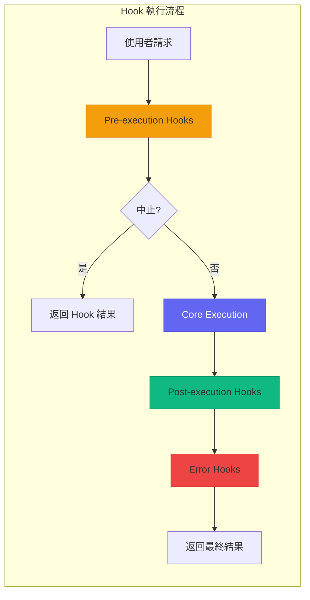

#### 可用的 Hook 類型清單

| Hook 類型 | 觸發時機 | 典型用途 |
|----------|---------|---------|
| **PrePrompt** | Prompt 送出前 | 輸入驗證、內容過濾 |
| **PostPrompt** | 收到回應後 | 結果處理、格式化 |
| **PreExecution** | 程式碼執行前 | 安全檢查、備份 |
| **PostExecution** | 程式碼執行後 | 結果驗證、通知 |
| **OnFileChange** | 檔案變更時 | 自動格式化、同步 |
| **OnError** | 發生錯誤時 | 錯誤記錄、恢復 |
| **OnSessionStart** | 會話開始時 | 環境初始化 |
| **OnSessionEnd** | 會話結束時 | 清理、報告 |
| **OnAgentSwitch** | Agent 切換時 | 上下文傳遞 |
| **OnSkillInvoke** | Skill 調用時 | 權限檢查、日誌 |

```typescript
// Hook 類型定義
type HookType = 
  | 'pre-prompt'
  | 'post-prompt'
  | 'pre-execution'
  | 'post-execution'
  | 'on-file-change'
  | 'on-error'
  | 'on-session-start'
  | 'on-session-end'
  | 'on-agent-switch'
  | 'on-skill-invoke';

interface Hook<T extends HookType = HookType> {
  id: string;
  type: T;
  name: string;
  description: string;
  priority: number;  // 執行順序（數字越小越先執行）
  enabled: boolean;
  
  // Hook 處理函數
  handler: HookHandler<T>;
  
  // 條件過濾（可選）
  condition?: HookCondition;
  
  // 超時設定
  timeout?: number;
  
  // 錯誤處理策略
  onError?: 'continue' | 'abort' | 'retry';
}
```

#### Hook 的執行順序

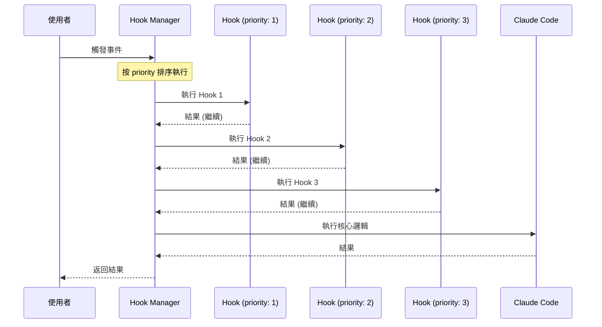

```typescript
// Hook 執行管理器
class HookManager {
  private hooks: Map<HookType, Hook[]> = new Map();
  
  /**
   * 註冊 Hook
   */
  register(hook: Hook): void {
    const typeHooks = this.hooks.get(hook.type) || [];
    typeHooks.push(hook);
    
    // 按 priority 排序
    typeHooks.sort((a, b) => a.priority - b.priority);
    
    this.hooks.set(hook.type, typeHooks);
  }
  
  /**
   * 執行指定類型的所有 Hooks
   */
  async execute<T extends HookType>(
    type: T,
    context: HookContext<T>
  ): Promise<HookResult<T>> {
    const hooks = this.hooks.get(type) || [];
    let result: HookResult<T> = { continue: true, data: context.data };
    
    for (const hook of hooks) {
      // 檢查是否啟用
      if (!hook.enabled) continue;
      
      // 檢查條件
      if (hook.condition && !this.evaluateCondition(hook.condition, context)) {
        continue;
      }
      
      try {
        // 執行 Hook（帶超時）
        const hookResult = await this.executeWithTimeout(
          hook.handler,
          context,
          hook.timeout || 5000
        );
        
        // 合併結果
        result = this.mergeResults(result, hookResult);
        
        // 檢查是否中止
        if (!result.continue) {
          break;
        }
        
      } catch (error) {
        result = await this.handleHookError(hook, error, context, result);
        
        if (hook.onError === 'abort') {
          break;
        }
      }
    }
    
    return result;
  }
}
```

### 2.4.2 Hook 類別詳解

#### Pre-execution Hooks（執行前）

```typescript
// Pre-execution Hook 範例：安全性檢查
const securityCheckHook: Hook<'pre-execution'> = {
  id: 'security-check',
  type: 'pre-execution',
  name: 'Security Check Hook',
  description: '在執行程式碼前進行安全性檢查',
  priority: 1,
  enabled: true,
  timeout: 10000,
  
  async handler(context: PreExecutionContext): Promise<HookResult> {
    const { code, language } = context;
    
    // 檢查危險操作
    const dangerousPatterns = [
      /rm\s+-rf\s+\//,                    // 刪除根目錄
      /DROP\s+DATABASE/i,                  // 刪除資料庫
      /eval\s*\(/,                         // eval 執行
      /exec\s*\(/,                         // 命令執行
      /child_process/,                     // 子程序
      /fs\.(unlink|rmdir|rm)Sync/,        // 同步刪除
    ];
    
    for (const pattern of dangerousPatterns) {
      if (pattern.test(code)) {
        return {
          continue: false,
          abort: true,
          reason: `檢測到危險操作: ${pattern.source}`,
          suggestion: '請審查程式碼中的危險操作'
        };
      }
    }
    
    // 檢查敏感資訊
    const sensitivePatterns = [
      /api[_-]?key\s*[:=]\s*["'][^"']+["']/i,
      /password\s*[:=]\s*["'][^"']+["']/i,
      /secret\s*[:=]\s*["'][^"']+["']/i,
    ];
    
    const warnings: string[] = [];
    for (const pattern of sensitivePatterns) {
      if (pattern.test(code)) {
        warnings.push(`可能包含敏感資訊: ${pattern.source}`);
      }
    }
    
    return {
      continue: true,
      warnings,
      metadata: {
        checkedAt: new Date().toISOString(),
        patternsChecked: dangerousPatterns.length + sensitivePatterns.length
      }
    };
  }
};
```

#### Post-execution Hooks（執行後）

```typescript
// Post-execution Hook 範例：自動格式化與驗證
const autoFormatHook: Hook<'post-execution'> = {
  id: 'auto-format',
  type: 'post-execution',
  name: 'Auto Format Hook',
  description: '自動格式化生成的程式碼',
  priority: 10,
  enabled: true,
  
  condition: {
    // 只對程式碼生成結果執行
    resultType: ['code-generation', 'code-refactoring']
  },
  
  async handler(context: PostExecutionContext): Promise<HookResult> {
    const { result, language } = context;
    
    if (!result.code) {
      return { continue: true };
    }
    
    try {
      // 使用適當的格式化器
      const formatter = getFormatter(language);
      const formattedCode = await formatter.format(result.code, {
        tabWidth: 2,
        useTabs: false,
        printWidth: 100,
        semi: true
      });
      
      // 語法驗證
      const syntaxErrors = await validateSyntax(formattedCode, language);
      
      if (syntaxErrors.length > 0) {
        return {
          continue: true,
          warnings: syntaxErrors.map(e => e.message),
          data: {
            ...result,
            code: result.code,  // 保留原始程式碼
            formattingFailed: true
          }
        };
      }
      
      return {
        continue: true,
        data: {
          ...result,
          code: formattedCode,
          formatted: true
        }
      };
      
    } catch (error) {
      return {
        continue: true,
        warnings: [`格式化失敗: ${error.message}`],
        data: result
      };
    }
  }
};

// Post-execution Hook 範例：自動測試
const autoTestHook: Hook<'post-execution'> = {
  id: 'auto-test',
  type: 'post-execution',
  name: 'Auto Test Hook',
  description: '對生成的程式碼執行測試',
  priority: 20,
  enabled: true,
  
  condition: {
    resultType: ['code-generation'],
    hasTest: true  // 只在有測試檔案時執行
  },
  
  async handler(context: PostExecutionContext): Promise<HookResult> {
    const { result, workspace } = context;
    
    // 尋找對應的測試檔案
    const testFile = await findTestFile(result.filePath, workspace);
    
    if (!testFile) {
      return {
        continue: true,
        info: ['未找到對應的測試檔案']
      };
    }
    
    // 執行測試
    const testResult = await runTests(testFile);
    
    return {
      continue: true,
      data: {
        ...result,
        testResult: {
          passed: testResult.passed,
          failed: testResult.failed,
          coverage: testResult.coverage
        }
      },
      warnings: testResult.failed > 0 
        ? [`${testResult.failed} 個測試失敗`]
        : undefined
    };
  }
};
```

#### Error Hooks（錯誤處理）

```typescript
// Error Hook 範例：錯誤記錄與通知
const errorLoggingHook: Hook<'on-error'> = {
  id: 'error-logging',
  type: 'on-error',
  name: 'Error Logging Hook',
  description: '記錄錯誤並發送通知',
  priority: 1,
  enabled: true,
  
  async handler(context: ErrorContext): Promise<HookResult> {
    const { error, operation, timestamp, sessionId } = context;
    
    // 結構化日誌
    const logEntry = {
      timestamp,
      sessionId,
      operation,
      error: {
        name: error.name,
        message: error.message,
        stack: error.stack,
        code: error.code
      },
      context: {
        file: context.file,
        line: context.line,
        input: context.input?.substring(0, 500)  // 截斷長輸入
      }
    };
    
    // 寫入日誌檔案
    await appendToLog('error.log', JSON.stringify(logEntry));
    
    // 根據錯誤嚴重性決定是否通知
    if (isCriticalError(error)) {
      await sendNotification({
        channel: 'slack',
        webhook: process.env.SLACK_WEBHOOK,
        message: formatErrorNotification(logEntry)
      });
    }
    
    // 嘗試自動恢復
    const recovery = await attemptRecovery(error, context);
    
    if (recovery.success) {
      return {
        continue: true,
        recovered: true,
        data: recovery.result
      };
    }
    
    return {
      continue: true,
      logged: true
    };
  }
};

// Error Hook 範例：自動重試
const autoRetryHook: Hook<'on-error'> = {
  id: 'auto-retry',
  type: 'on-error',
  name: 'Auto Retry Hook',
  description: '對可重試的錯誤自動重試',
  priority: 5,
  enabled: true,
  
  async handler(context: ErrorContext): Promise<HookResult> {
    const { error, operation, retryCount = 0 } = context;
    
    // 判斷是否可重試
    const retryableErrors = [
      'RATE_LIMIT_EXCEEDED',
      'TIMEOUT',
      'NETWORK_ERROR',
      'SERVICE_UNAVAILABLE'
    ];
    
    if (!retryableErrors.includes(error.code)) {
      return { continue: true };
    }
    
    // 最多重試 3 次
    if (retryCount >= 3) {
      return {
        continue: true,
        info: ['已達最大重試次數']
      };
    }
    
    // 指數退避
    const delay = Math.pow(2, retryCount) * 1000;
    await sleep(delay);
    
    // 重新執行操作
    try {
      const result = await retryOperation(operation, context);
      
      return {
        continue: true,
        retried: true,
        retryCount: retryCount + 1,
        data: result
      };
      
    } catch (retryError) {
      // 遞增重試次數
      return {
        continue: true,
        retryCount: retryCount + 1,
        error: retryError
      };
    }
  }
};
```

#### Lifecycle Hooks（生命週期）

```typescript
// Session Start Hook
const sessionStartHook: Hook<'on-session-start'> = {
  id: 'session-init',
  type: 'on-session-start',
  name: 'Session Initialization',
  description: '會話開始時初始化環境',
  priority: 1,
  enabled: true,
  
  async handler(context: SessionStartContext): Promise<HookResult> {
    const { sessionId, workspace, user } = context;
    
    // 載入使用者偏好設定
    const preferences = await loadUserPreferences(user.id);
    
    // 載入專案配置
    const projectConfig = await loadProjectConfig(workspace);
    
    // 初始化專案特定的上下文
    const projectContext = await buildProjectContext(workspace, {
      maxFiles: projectConfig.context?.maxFiles || 50,
      excludePatterns: projectConfig.context?.excludePatterns || []
    });
    
    // 檢查並安裝必要的依賴
    if (projectConfig.autoInstall) {
      await checkAndInstallDependencies(workspace);
    }
    
    // 載入歷史會話（如果有）
    const previousSession = await loadPreviousSession(workspace, user.id);
    
    return {
      continue: true,
      data: {
        preferences,
        projectConfig,
        projectContext,
        previousSession
      },
      info: [`會話 ${sessionId} 已初始化`]
    };
  }
};

// Session End Hook
const sessionEndHook: Hook<'on-session-end'> = {
  id: 'session-cleanup',
  type: 'on-session-end',
  name: 'Session Cleanup',
  description: '會話結束時清理並儲存狀態',
  priority: 100,
  enabled: true,
  
  async handler(context: SessionEndContext): Promise<HookResult> {
    const { sessionId, workspace, statistics } = context;
    
    // 儲存會話歷史
    await saveSessionHistory(sessionId, {
      startTime: statistics.startTime,
      endTime: Date.now(),
      operationsCount: statistics.operationsCount,
      tokensUsed: statistics.tokensUsed,
      filesModified: statistics.filesModified
    });
    
    // 生成會話報告
    const report = await generateSessionReport(statistics);
    
    // 清理臨時檔案
    await cleanupTempFiles(workspace, sessionId);
    
    // 同步變更到版本控制（如果配置）
    if (context.config?.autoCommit) {
      await autoCommitChanges(workspace, `Claude Code session ${sessionId}`);
    }
    
    return {
      continue: true,
      data: { report },
      info: [`會話 ${sessionId} 已結束，${statistics.filesModified} 個檔案被修改`]
    };
  }
};
```

### 2.4.3 實作案例

#### 程式碼品質檢查 Hook

```typescript
// 完整的程式碼品質檢查 Hook
const codeQualityHook: Hook<'post-execution'> = {
  id: 'code-quality-check',
  type: 'post-execution',
  name: 'Code Quality Check',
  description: '檢查生成程式碼的品質指標',
  priority: 15,
  enabled: true,
  
  condition: {
    resultType: ['code-generation', 'code-refactoring']
  },
  
  async handler(context: PostExecutionContext): Promise<HookResult> {
    const { result, language, config } = context;
    
    if (!result.code) {
      return { continue: true };
    }
    
    const qualityReport: QualityReport = {
      metrics: {},
      issues: [],
      suggestions: []
    };
    
    // 1. 計算複雜度指標
    const complexityMetrics = await analyzeComplexity(result.code, language);
    qualityReport.metrics.complexity = complexityMetrics;
    
    if (complexityMetrics.cyclomaticComplexity > 10) {
      qualityReport.issues.push({
        severity: 'warning',
        type: 'complexity',
        message: `循環複雜度過高 (${complexityMetrics.cyclomaticComplexity})，建議拆分方法`
      });
    }
    
    // 2. 執行靜態分析
    const lintResult = await runLinter(result.code, language, config.lintConfig);
    qualityReport.metrics.lintErrors = lintResult.errors.length;
    qualityReport.metrics.lintWarnings = lintResult.warnings.length;
    
    for (const error of lintResult.errors) {
      qualityReport.issues.push({
        severity: 'error',
        type: 'lint',
        message: error.message,
        location: { line: error.line, column: error.column }
      });
    }
    
    // 3. 檢查程式碼風格
    const styleIssues = await checkCodeStyle(result.code, language, config.styleGuide);
    qualityReport.issues.push(...styleIssues);
    
    // 4. 檢查最佳實踐
    const bestPracticeIssues = await checkBestPractices(result.code, language);
    qualityReport.suggestions.push(...bestPracticeIssues.map(issue => ({
      type: 'best-practice',
      message: issue.message,
      suggestion: issue.fix
    })));
    
    // 5. 計算整體品質分數
    qualityReport.score = calculateQualityScore(qualityReport);
    
    // 根據配置決定是否阻止低品質程式碼
    const minScore = config.minQualityScore || 60;
    
    if (qualityReport.score < minScore) {
      return {
        continue: false,
        abort: true,
        reason: `程式碼品質分數 (${qualityReport.score}) 低於最低要求 (${minScore})`,
        data: { qualityReport }
      };
    }
    
    return {
      continue: true,
      data: {
        ...result,
        qualityReport
      },
      warnings: qualityReport.issues
        .filter(i => i.severity === 'warning')
        .map(i => i.message)
    };
  }
};
```

#### 自動備份 Hook

```typescript
// 自動備份 Hook
const autoBackupHook: Hook<'pre-execution'> = {
  id: 'auto-backup',
  type: 'pre-execution',
  name: 'Auto Backup',
  description: '在修改檔案前自動備份',
  priority: 5,
  enabled: true,
  
  condition: {
    operationType: ['file-modify', 'file-delete', 'refactor']
  },
  
  async handler(context: PreExecutionContext): Promise<HookResult> {
    const { targetFiles, workspace, sessionId } = context;
    
    if (!targetFiles || targetFiles.length === 0) {
      return { continue: true };
    }
    
    const backupDir = path.join(workspace, '.claude', 'backups', sessionId);
    await fs.ensureDir(backupDir);
    
    const backupManifest: BackupManifest = {
      sessionId,
      timestamp: Date.now(),
      files: []
    };
    
    for (const file of targetFiles) {
      try {
        // 檢查檔案是否存在
        if (!await fs.pathExists(file)) {
          continue;
        }
        
        // 計算檔案雜湊
        const content = await fs.readFile(file);
        const hash = crypto.createHash('sha256').update(content).digest('hex');
        
        // 檢查是否已有相同內容的備份
        const existingBackup = await findExistingBackup(backupDir, hash);
        
        if (!existingBackup) {
          // 建立備份
          const backupPath = path.join(backupDir, `${hash.substring(0, 8)}_${path.basename(file)}`);
          await fs.copy(file, backupPath);
        }
        
        backupManifest.files.push({
          originalPath: file,
          hash,
          size: content.length
        });
        
      } catch (error) {
        console.warn(`備份檔案失敗: ${file}`, error);
      }
    }
    
    // 儲存備份清單
    await fs.writeJson(
      path.join(backupDir, 'manifest.json'),
      backupManifest,
      { spaces: 2 }
    );
    
    // 清理舊備份（保留最近 10 個會話）
    await cleanupOldBackups(path.join(workspace, '.claude', 'backups'), 10);
    
    return {
      continue: true,
      data: {
        backupDir,
        filesBackedUp: backupManifest.files.length
      },
      info: [`已備份 ${backupManifest.files.length} 個檔案`]
    };
  }
};

// 備份恢復 Skill（與 Hook 配合使用）
const restoreBackupSkill = {
  id: 'restore-backup',
  name: 'Restore Backup',
  
  async execute(input: { sessionId: string; files?: string[] }): Promise<RestoreResult> {
    const { sessionId, files } = input;
    
    const backupDir = path.join(workspace, '.claude', 'backups', sessionId);
    const manifest = await fs.readJson(path.join(backupDir, 'manifest.json'));
    
    const restored: string[] = [];
    const failed: string[] = [];
    
    const filesToRestore = files 
      ? manifest.files.filter(f => files.includes(f.originalPath))
      : manifest.files;
    
    for (const fileInfo of filesToRestore) {
      try {
        const backupFile = await findBackupByHash(backupDir, fileInfo.hash);
        
        if (backupFile) {
          await fs.copy(backupFile, fileInfo.originalPath);
          restored.push(fileInfo.originalPath);
        } else {
          failed.push(fileInfo.originalPath);
        }
        
      } catch (error) {
        failed.push(fileInfo.originalPath);
      }
    }
    
    return { restored, failed };
  }
};
```

#### 日誌記錄 Hook

```typescript
// 完整的日誌記錄 Hook
const loggingHook: Hook<'post-execution'> = {
  id: 'comprehensive-logging',
  type: 'post-execution',
  name: 'Comprehensive Logging',
  description: '記錄所有操作的詳細日誌',
  priority: 100,  // 最後執行
  enabled: true,
  
  async handler(context: PostExecutionContext): Promise<HookResult> {
    const {
      operation,
      result,
      sessionId,
      timestamp,
      duration,
      tokenUsage
    } = context;
    
    const logEntry: LogEntry = {
      timestamp: new Date(timestamp).toISOString(),
      sessionId,
      operation: {
        type: operation.type,
        input: sanitizeInput(operation.input),
        agent: operation.agent?.id
      },
      result: {
        success: result.success,
        outputType: result.type,
        outputSize: result.output?.length || 0,
        filesModified: result.filesModified || []
      },
      performance: {
        duration,
        tokenUsage: {
          prompt: tokenUsage.prompt,
          completion: tokenUsage.completion,
          total: tokenUsage.total
        }
      },
      metadata: {
        claudeCodeVersion: context.version,
        modelVersion: context.modelVersion
      }
    };
    
    // 寫入日誌檔案
    const logFile = getLogFilePath(sessionId);
    await appendJsonLine(logFile, logEntry);
    
    // 更新統計資料
    await updateStatistics({
      sessionsCount: 1,
      operationsCount: 1,
      tokensUsed: tokenUsage.total,
      avgDuration: duration
    });
    
    // 如果啟用分析，發送到分析服務
    if (context.config?.analytics?.enabled) {
      await sendToAnalytics(logEntry);
    }
    
    return { continue: true };
  }
};

// 敏感資訊過濾
function sanitizeInput(input: string): string {
  // 移除 API 金鑰
  let sanitized = input.replace(
    /(['"]?(?:api[_-]?key|token|secret|password)['"]?\s*[:=]\s*)(['"][^'"]+['"])/gi,
    '$1"[REDACTED]"'
  );
  
  // 移除信用卡號
  sanitized = sanitized.replace(
    /\b\d{4}[\s-]?\d{4}[\s-]?\d{4}[\s-]?\d{4}\b/g,
    '[CREDIT_CARD_REDACTED]'
  );
  
  // 移除電子郵件（可選）
  // sanitized = sanitized.replace(/\b[\w.%-]+@[\w.-]+\.[a-z]{2,}\b/gi, '[EMAIL_REDACTED]');
  
  return sanitized;
}
```

#### 通知整合 Hook

```typescript
// 多管道通知 Hook
const notificationHook: Hook<'post-execution'> = {
  id: 'multi-channel-notification',
  type: 'post-execution',
  name: 'Multi-Channel Notification',
  description: '根據條件發送多管道通知',
  priority: 90,
  enabled: true,
  
  condition: {
    // 只在特定條件下觸發
    or: [
      { resultType: 'deployment' },
      { hasErrors: true },
      { executionTime: { gt: 60000 } }  // 超過 1 分鐘
    ]
  },
  
  async handler(context: PostExecutionContext): Promise<HookResult> {
    const { result, operation, config } = context;
    
    // 構建通知內容
    const notification = buildNotification(result, operation);
    
    // 決定通知管道
    const channels = determineChannels(notification, config.notifications);
    
    const results: NotificationResult[] = [];
    
    // Slack 通知
    if (channels.includes('slack')) {
      results.push(await sendSlackNotification({
        webhook: config.notifications.slack.webhook,
        channel: config.notifications.slack.channel,
        message: notification.message,
        attachments: notification.details ? [{
          color: notification.success ? 'good' : 'danger',
          fields: Object.entries(notification.details).map(([k, v]) => ({
            title: k,
            value: String(v),
            short: true
          }))
        }] : []
      }));
    }
    
    // Teams 通知
    if (channels.includes('teams')) {
      results.push(await sendTeamsNotification({
        webhook: config.notifications.teams.webhook,
        title: notification.title,
        text: notification.message,
        themeColor: notification.success ? '00ff00' : 'ff0000'
      }));
    }
    
    // Email 通知
    if (channels.includes('email')) {
      results.push(await sendEmailNotification({
        to: config.notifications.email.recipients,
        subject: notification.title,
        html: renderEmailTemplate(notification)
      }));
    }
    
    // Discord 通知
    if (channels.includes('discord')) {
      results.push(await sendDiscordNotification({
        webhook: config.notifications.discord.webhook,
        embeds: [{
          title: notification.title,
          description: notification.message,
          color: notification.success ? 0x00ff00 : 0xff0000
        }]
      }));
    }
    
    return {
      continue: true,
      data: {
        notificationsSent: results.filter(r => r.success).length,
        notificationsFailed: results.filter(r => !r.success).length
      }
    };
  }
};

// 通知內容構建
function buildNotification(result: ExecutionResult, operation: Operation): Notification {
  const success = result.success;
  
  if (operation.type === 'deployment') {
    return {
      success,
      title: success ? '✅ 部署成功' : '❌ 部署失敗',
      message: success 
        ? `成功部署到 ${result.environment}`
        : `部署失敗: ${result.error?.message}`,
      details: {
        '環境': result.environment,
        '版本': result.version,
        '耗時': `${result.duration}ms`,
        '變更': result.changes?.length || 0
      }
    };
  }
  
  if (!success) {
    return {
      success: false,
      title: '⚠️ 執行失敗',
      message: `操作 "${operation.type}" 執行失敗`,
      details: {
        '錯誤': result.error?.message,
        '操作': operation.type,
        '時間': new Date().toISOString()
      }
    };
  }
  
  return {
    success: true,
    title: '✓ 執行完成',
    message: `操作 "${operation.type}" 已完成`,
    details: {}
  };
}
```

### 2.4.4 進階應用

#### 條件式 Hook 觸發

```typescript
// 進階條件配置
interface HookCondition {
  // 簡單條件
  resultType?: string | string[];
  operationType?: string | string[];
  language?: string | string[];
  hasErrors?: boolean;
  
  // 數值條件
  executionTime?: { gt?: number; lt?: number; eq?: number };
  fileCount?: { gt?: number; lt?: number; eq?: number };
  tokenUsage?: { gt?: number; lt?: number; eq?: number };
  
  // 邏輯組合
  and?: HookCondition[];
  or?: HookCondition[];
  not?: HookCondition;
  
  // 自訂函數
  custom?: (context: HookContext) => boolean | Promise<boolean>;
}

// 條件評估器
class ConditionEvaluator {
  async evaluate(condition: HookCondition, context: HookContext): Promise<boolean> {
    // 處理邏輯組合
    if (condition.and) {
      const results = await Promise.all(
        condition.and.map(c => this.evaluate(c, context))
      );
      return results.every(r => r);
    }
    
    if (condition.or) {
      const results = await Promise.all(
        condition.or.map(c => this.evaluate(c, context))
      );
      return results.some(r => r);
    }
    
    if (condition.not) {
      return !(await this.evaluate(condition.not, context));
    }
    
    // 處理簡單條件
    let result = true;
    
    if (condition.resultType) {
      const types = Array.isArray(condition.resultType) 
        ? condition.resultType 
        : [condition.resultType];
      result = result && types.includes(context.result?.type);
    }
    
    if (condition.operationType) {
      const types = Array.isArray(condition.operationType)
        ? condition.operationType
        : [condition.operationType];
      result = result && types.includes(context.operation?.type);
    }
    
    if (condition.language) {
      const languages = Array.isArray(condition.language)
        ? condition.language
        : [condition.language];
      result = result && languages.includes(context.language);
    }
    
    if (condition.hasErrors !== undefined) {
      result = result && (context.result?.errors?.length > 0) === condition.hasErrors;
    }
    
    // 處理數值條件
    if (condition.executionTime) {
      result = result && this.evaluateNumeric(
        context.duration,
        condition.executionTime
      );
    }
    
    // 處理自訂條件
    if (condition.custom) {
      result = result && await condition.custom(context);
    }
    
    return result;
  }
  
  private evaluateNumeric(
    value: number,
    condition: { gt?: number; lt?: number; eq?: number }
  ): boolean {
    if (condition.gt !== undefined && value <= condition.gt) return false;
    if (condition.lt !== undefined && value >= condition.lt) return false;
    if (condition.eq !== undefined && value !== condition.eq) return false;
    return true;
  }
}

// 使用範例
const conditionalHook: Hook = {
  id: 'conditional-example',
  type: 'post-execution',
  name: 'Conditional Hook Example',
  priority: 50,
  enabled: true,
  
  condition: {
    and: [
      { language: ['java', 'typescript'] },
      { operationType: ['code-generation'] },
      {
        or: [
          { executionTime: { gt: 30000 } },  // 超過 30 秒
          { hasErrors: true }
        ]
      }
    ]
  },
  
  async handler(context): Promise<HookResult> {
    // 只有在條件滿足時才會執行
    return { continue: true };
  }
};
```

#### Hook 鏈式組合

```typescript
// Hook 鏈式組合配置
interface HookChain {
  id: string;
  name: string;
  description: string;
  
  // 鏈中的 Hooks
  hooks: {
    hookId: string;
    config?: Record<string, any>;
    
    // 控制流
    onSuccess?: 'continue' | 'skip-rest' | string;  // 成功時跳到指定 Hook
    onFailure?: 'continue' | 'abort' | 'retry' | string;
  }[];
  
  // 共享上下文
  sharedContext?: boolean;
  
  // 錯誤聚合
  errorHandling?: 'fail-fast' | 'collect-all';
}

// Hook 鏈管理器
class HookChainManager {
  async executeChain(
    chain: HookChain,
    initialContext: HookContext
  ): Promise<ChainResult> {
    let context = { ...initialContext };
    const results: HookResult[] = [];
    const errors: Error[] = [];
    
    for (let i = 0; i < chain.hooks.length; i++) {
      const hookConfig = chain.hooks[i];
      const hook = this.getHook(hookConfig.hookId);
      
      try {
        // 執行 Hook
        const result = await hook.handler(context, hookConfig.config);
        results.push(result);
        
        // 更新共享上下文
        if (chain.sharedContext && result.data) {
          context = { ...context, ...result.data };
        }
        
        // 處理成功後的控制流
        if (hookConfig.onSuccess === 'skip-rest') {
          break;
        } else if (hookConfig.onSuccess && hookConfig.onSuccess !== 'continue') {
          // 跳到指定 Hook
          const targetIndex = chain.hooks.findIndex(h => h.hookId === hookConfig.onSuccess);
          if (targetIndex > i) {
            i = targetIndex - 1;  // -1 因為迴圈會 +1
          }
        }
        
        // 檢查是否中止
        if (!result.continue) {
          break;
        }
        
      } catch (error) {
        errors.push(error);
        
        if (chain.errorHandling === 'fail-fast') {
          break;
        }
        
        if (hookConfig.onFailure === 'abort') {
          break;
        } else if (hookConfig.onFailure === 'retry') {
          i--;  // 重試當前 Hook
        }
      }
    }
    
    return {
      success: errors.length === 0,
      results,
      errors,
      finalContext: context
    };
  }
}

// 定義 Hook 鏈
const codeGenerationChain: HookChain = {
  id: 'code-generation-chain',
  name: 'Code Generation Pipeline',
  description: '完整的程式碼生成處理流程',
  sharedContext: true,
  errorHandling: 'collect-all',
  
  hooks: [
    {
      hookId: 'input-validation',
      onFailure: 'abort'
    },
    {
      hookId: 'security-check',
      onFailure: 'abort'
    },
    {
      hookId: 'code-formatting',
      onFailure: 'continue'
    },
    {
      hookId: 'quality-check',
      onSuccess: 'continue',
      onFailure: 'quality-fix'  // 失敗時跳到修復 Hook
    },
    {
      hookId: 'quality-fix',
      onFailure: 'continue'
    },
    {
      hookId: 'test-generation',
      onFailure: 'continue'
    },
    {
      hookId: 'notification',
      onFailure: 'continue'
    },
    {
      hookId: 'logging'
    }
  ]
};
```

#### 非同步 Hook 處理

```typescript
// 非同步 Hook 處理器
class AsyncHookProcessor {
  // 並行執行多個 Hooks
  async executeParallel(
    hooks: Hook[],
    context: HookContext
  ): Promise<ParallelHookResult> {
    const results = await Promise.allSettled(
      hooks.map(hook => this.executeWithTimeout(hook, context))
    );
    
    const successes = results
      .filter((r): r is PromiseFulfilledResult<HookResult> => r.status === 'fulfilled')
      .map(r => r.value);
    
    const failures = results
      .filter((r): r is PromiseRejectedResult => r.status === 'rejected')
      .map(r => r.reason);
    
    return { successes, failures };
  }
  
  // 競速執行（取最快完成的）
  async executeRace(
    hooks: Hook[],
    context: HookContext
  ): Promise<HookResult> {
    return Promise.race(
      hooks.map(hook => this.executeWithTimeout(hook, context))
    );
  }
  
  // 帶重試的執行
  async executeWithRetry(
    hook: Hook,
    context: HookContext,
    options: RetryOptions = { maxRetries: 3, backoff: 'exponential' }
  ): Promise<HookResult> {
    let lastError: Error;
    
    for (let attempt = 0; attempt <= options.maxRetries; attempt++) {
      try {
        return await this.executeWithTimeout(hook, context);
        
      } catch (error) {
        lastError = error;
        
        if (attempt < options.maxRetries) {
          const delay = this.calculateBackoff(attempt, options.backoff);
          await sleep(delay);
        }
      }
    }
    
    throw lastError;
  }
  
  // 帶超時的執行
  private async executeWithTimeout(
    hook: Hook,
    context: HookContext
  ): Promise<HookResult> {
    const timeout = hook.timeout || 5000;
    
    return Promise.race([
      hook.handler(context),
      new Promise<never>((_, reject) => 
        setTimeout(() => reject(new TimeoutError(`Hook ${hook.id} timeout`)), timeout)
      )
    ]);
  }
  
  private calculateBackoff(attempt: number, strategy: string): number {
    switch (strategy) {
      case 'exponential':
        return Math.pow(2, attempt) * 1000;
      case 'linear':
        return attempt * 1000;
      case 'constant':
      default:
        return 1000;
    }
  }
}

// 使用範例：非同步事件處理
const asyncNotificationHook: Hook = {
  id: 'async-notification',
  type: 'post-execution',
  name: 'Async Notification',
  priority: 100,
  enabled: true,
  
  async handler(context): Promise<HookResult> {
    // 不阻塞主流程，非同步發送通知
    setImmediate(async () => {
      try {
        await sendNotifications(context);
      } catch (error) {
        console.error('Notification failed:', error);
      }
    });
    
    // 立即返回，讓主流程繼續
    return { continue: true };
  }
};
```

---

### ⚠️ Hook 使用注意事項

> 1. **效能影響**：過多的 Hooks 會影響執行效能，建議只啟用必要的 Hooks
> 2. **執行順序**：注意 Hooks 的 priority 設定，確保執行順序正確
> 3. **錯誤處理**：每個 Hook 都應該有完善的錯誤處理，避免影響其他 Hooks
> 4. **超時設定**：為耗時的 Hooks 設定合理的超時，避免阻塞
> 5. **資源清理**：在 Hook 中使用的資源要確保正確釋放

---

## 2.5 MCP (Model Context Protocol)

### 2.5.1 MCP 核心概念

#### 什麼是 MCP？

**Model Context Protocol (MCP)** 是 Claude Code 用於管理和優化模型上下文的協議。它定義了如何收集、組織、傳遞和優化上下文資訊，以確保 AI 模型能夠獲得最相關的資訊來完成任務。

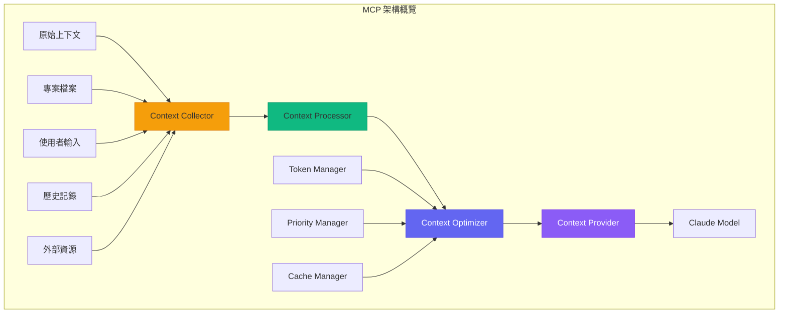

#### MCP 的重要性

| 挑戰 | MCP 解決方案 |
|-----|------------|
| Token 限制 | 智能截斷和壓縮 |
| 相關性不足 | 語義搜尋和排序 |
| 上下文過時 | 即時更新機制 |
| 資訊碎片化 | 結構化組織 |
| 效能瓶頸 | 快取和預載入 |

#### MCP 組件架構

```typescript
// MCP 核心介面定義
interface MCPConfig {
  // 上下文收集配置
  collection: {
    maxFiles: number;           // 最大檔案數
    maxFileSize: number;        // 單檔案大小限制
    includePatterns: string[];  // 包含的檔案模式
    excludePatterns: string[];  // 排除的檔案模式
    followSymlinks: boolean;    // 是否追蹤符號連結
  };
  
  // 上下文處理配置
  processing: {
    extractImports: boolean;    // 提取導入資訊
    extractTypes: boolean;      // 提取類型定義
    extractComments: boolean;   // 提取註解
    parseAST: boolean;          // 解析 AST
    detectLanguage: boolean;    // 自動語言偵測
  };
  
  // 上下文優化配置
  optimization: {
    maxTokens: number;          // 最大 Token 數
    compressionLevel: 'none' | 'light' | 'aggressive';
    priorityWeights: {
      recency: number;          // 近期性權重
      relevance: number;        // 相關性權重
      frequency: number;        // 頻率權重
    };
    chunkSize: number;          // 分塊大小
    overlapSize: number;        // 重疊大小
  };
  
  // 快取配置
  caching: {
    enabled: boolean;
    ttl: number;                // 快取存活時間
    maxSize: number;            // 快取大小限制
    strategy: 'lru' | 'lfu' | 'fifo';
  };
}

// MCP 上下文類型
interface MCPContext {
  // 專案上下文
  project: {
    name: string;
    type: string;
    rootPath: string;
    structure: ProjectStructure;
    dependencies: Dependency[];
    config: Record<string, any>;
  };
  
  // 檔案上下文
  files: {
    active: FileContext[];      // 活動檔案
    related: FileContext[];     // 相關檔案
    recent: FileContext[];      // 最近檔案
  };
  
  // 程式碼上下文
  code: {
    currentFile?: CodeContext;
    selection?: SelectionContext;
    symbols: SymbolContext[];
    imports: ImportContext[];
  };
  
  // 會話上下文
  session: {
    history: ConversationTurn[];
    operations: OperationRecord[];
    errors: ErrorRecord[];
  };
  
  // 元資料
  metadata: {
    timestamp: number;
    tokenCount: number;
    compressionRatio: number;
    relevanceScore: number;
  };
}
```

### 2.5.2 MCP Server 架構

#### Server 設計模式

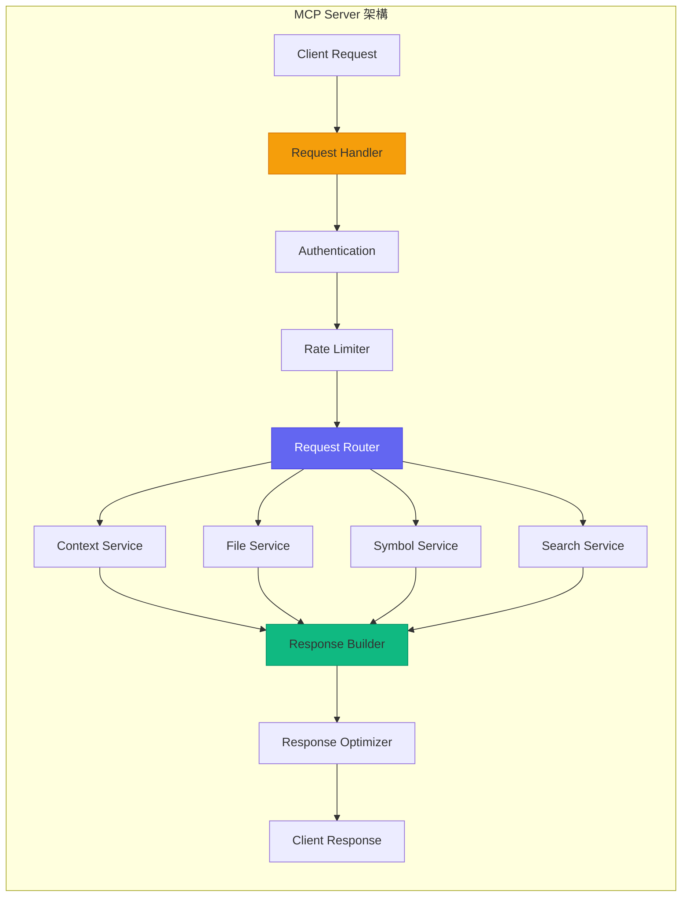

#### MCP Server 實作

```typescript
// MCP Server 完整實作
import { Server } from '@modelcontextprotocol/sdk/server/index.js';
import { StdioServerTransport } from '@modelcontextprotocol/sdk/server/stdio.js';

// 定義 MCP Server
class ClaudeMCPServer {
  private server: Server;
  private contextManager: ContextManager;
  private fileService: FileService;
  private symbolService: SymbolService;
  
  constructor(config: MCPServerConfig) {
    this.server = new Server(
      {
        name: 'claude-code-mcp',
        version: '1.0.0'
      },
      {
        capabilities: {
          resources: {},
          tools: {},
          prompts: {}
        }
      }
    );
    
    this.contextManager = new ContextManager(config.context);
    this.fileService = new FileService(config.files);
    this.symbolService = new SymbolService(config.symbols);
    
    this.setupHandlers();
  }
  
  private setupHandlers(): void {
    // 資源列表處理
    this.server.setRequestHandler(ListResourcesRequestSchema, async () => {
      return {
        resources: [
          {
            uri: 'project://context',
            name: 'Project Context',
            description: '專案完整上下文資訊',
            mimeType: 'application/json'
          },
          {
            uri: 'file://current',
            name: 'Current File',
            description: '當前編輯的檔案內容',
            mimeType: 'text/plain'
          },
          {
            uri: 'symbols://workspace',
            name: 'Workspace Symbols',
            description: '工作區符號索引',
            mimeType: 'application/json'
          }
        ]
      };
    });
    
    // 資源讀取處理
    this.server.setRequestHandler(ReadResourceRequestSchema, async (request) => {
      const { uri } = request.params;
      
      switch (uri) {
        case 'project://context':
          return this.getProjectContext();
        case 'file://current':
          return this.getCurrentFile();
        case 'symbols://workspace':
          return this.getWorkspaceSymbols();
        default:
          throw new Error(`Unknown resource: ${uri}`);
      }
    });
    
    // 工具列表處理
    this.server.setRequestHandler(ListToolsRequestSchema, async () => {
      return {
        tools: [
          {
            name: 'search_code',
            description: '在專案中搜尋程式碼',
            inputSchema: {
              type: 'object',
              properties: {
                query: { type: 'string', description: '搜尋查詢' },
                fileTypes: { type: 'array', items: { type: 'string' } },
                maxResults: { type: 'number', default: 20 }
              },
              required: ['query']
            }
          },
          {
            name: 'get_file_context',
            description: '取得檔案的完整上下文',
            inputSchema: {
              type: 'object',
              properties: {
                filePath: { type: 'string' },
                includeRelated: { type: 'boolean', default: true }
              },
              required: ['filePath']
            }
          },
          {
            name: 'analyze_dependencies',
            description: '分析專案依賴關係',
            inputSchema: {
              type: 'object',
              properties: {
                targetFile: { type: 'string' },
                depth: { type: 'number', default: 3 }
              }
            }
          }
        ]
      };
    });
    
    // 工具呼叫處理
    this.server.setRequestHandler(CallToolRequestSchema, async (request) => {
      const { name, arguments: args } = request.params;
      
      switch (name) {
        case 'search_code':
          return this.searchCode(args as SearchCodeArgs);
        case 'get_file_context':
          return this.getFileContext(args as FileContextArgs);
        case 'analyze_dependencies':
          return this.analyzeDependencies(args as DependencyArgs);
        default:
          throw new Error(`Unknown tool: ${name}`);
      }
    });
  }
  
  // 取得專案上下文
  private async getProjectContext(): Promise<ResourceContent> {
    const context = await this.contextManager.buildProjectContext();
    
    return {
      contents: [{
        uri: 'project://context',
        mimeType: 'application/json',
        text: JSON.stringify(context, null, 2)
      }]
    };
  }
  
  // 程式碼搜尋
  private async searchCode(args: SearchCodeArgs): Promise<ToolResult> {
    const results = await this.fileService.search({
      query: args.query,
      fileTypes: args.fileTypes,
      maxResults: args.maxResults || 20
    });
    
    return {
      content: [{
        type: 'text',
        text: JSON.stringify({
          totalResults: results.length,
          results: results.map(r => ({
            file: r.filePath,
            line: r.line,
            preview: r.preview,
            relevance: r.score
          }))
        }, null, 2)
      }]
    };
  }
  
  // 啟動 Server
  async start(): Promise<void> {
    const transport = new StdioServerTransport();
    await this.server.connect(transport);
    console.log('MCP Server started');
  }
}

// 啟動 MCP Server
const server = new ClaudeMCPServer({
  context: {
    maxTokens: 100000,
    compressionLevel: 'light'
  },
  files: {
    maxFileSize: 1024 * 1024,
    excludePatterns: ['node_modules/**', 'dist/**']
  },
  symbols: {
    indexOnStartup: true,
    watchForChanges: true
  }
});

server.start();
```

#### MCP Server 工具定義

```typescript
// 完整的 MCP 工具定義
const mcpTools: MCPTool[] = [
  // 檔案操作工具
  {
    name: 'read_file',
    description: '讀取指定檔案的內容',
    inputSchema: {
      type: 'object',
      properties: {
        path: { type: 'string', description: '檔案路徑' },
        encoding: { type: 'string', default: 'utf-8' },
        startLine: { type: 'number', description: '起始行' },
        endLine: { type: 'number', description: '結束行' }
      },
      required: ['path']
    },
    handler: async (args) => {
      const content = await fs.readFile(args.path, args.encoding);
      
      if (args.startLine || args.endLine) {
        const lines = content.split('\n');
        const start = args.startLine || 1;
        const end = args.endLine || lines.length;
        return lines.slice(start - 1, end).join('\n');
      }
      
      return content;
    }
  },
  
  // 目錄瀏覽工具
  {
    name: 'list_directory',
    description: '列出目錄內容',
    inputSchema: {
      type: 'object',
      properties: {
        path: { type: 'string', description: '目錄路徑' },
        recursive: { type: 'boolean', default: false },
        includeHidden: { type: 'boolean', default: false },
        pattern: { type: 'string', description: '過濾模式' }
      },
      required: ['path']
    },
    handler: async (args) => {
      const entries = await listDirectory(args.path, {
        recursive: args.recursive,
        includeHidden: args.includeHidden,
        pattern: args.pattern
      });
      
      return entries.map(e => ({
        name: e.name,
        type: e.isDirectory ? 'directory' : 'file',
        size: e.size,
        modified: e.mtime
      }));
    }
  },
  
  // 符號搜尋工具
  {
    name: 'find_symbols',
    description: '搜尋程式碼符號（類別、方法、變數等）',
    inputSchema: {
      type: 'object',
      properties: {
        query: { type: 'string', description: '搜尋查詢' },
        type: {
          type: 'string',
          enum: ['class', 'function', 'variable', 'interface', 'all'],
          default: 'all'
        },
        scope: {
          type: 'string',
          enum: ['file', 'workspace'],
          default: 'workspace'
        }
      },
      required: ['query']
    },
    handler: async (args) => {
      const symbols = await symbolService.search({
        query: args.query,
        type: args.type,
        scope: args.scope
      });
      
      return symbols.map(s => ({
        name: s.name,
        type: s.kind,
        file: s.filePath,
        line: s.line,
        signature: s.signature
      }));
    }
  },
  
  // Git 操作工具
  {
    name: 'git_status',
    description: '取得 Git 狀態資訊',
    inputSchema: {
      type: 'object',
      properties: {
        path: { type: 'string', description: '倉庫路徑' },
        includeUntracked: { type: 'boolean', default: true }
      }
    },
    handler: async (args) => {
      const status = await git.status(args.path);
      
      return {
        branch: status.current,
        tracking: status.tracking,
        modified: status.modified,
        staged: status.staged,
        untracked: args.includeUntracked ? status.not_added : [],
        ahead: status.ahead,
        behind: status.behind
      };
    }
  },
  
  // 執行命令工具
  {
    name: 'execute_command',
    description: '執行終端機命令',
    inputSchema: {
      type: 'object',
      properties: {
        command: { type: 'string', description: '要執行的命令' },
        cwd: { type: 'string', description: '工作目錄' },
        timeout: { type: 'number', default: 30000 }
      },
      required: ['command']
    },
    handler: async (args) => {
      const result = await executeCommand(args.command, {
        cwd: args.cwd,
        timeout: args.timeout
      });
      
      return {
        exitCode: result.exitCode,
        stdout: result.stdout,
        stderr: result.stderr
      };
    }
  }
];
```

### 2.5.3 上下文優化技術

#### Token 管理策略

```typescript
// Token 管理器
class TokenManager {
  private readonly maxTokens: number;
  private tokenizer: Tokenizer;
  
  constructor(config: TokenManagerConfig) {
    this.maxTokens = config.maxTokens;
    this.tokenizer = new Tokenizer(config.model);
  }
  
  /**
   * 計算文字的 Token 數量
   */
  countTokens(text: string): number {
    return this.tokenizer.encode(text).length;
  }
  
  /**
   * 智能截斷文字以符合 Token 限制
   */
  truncate(text: string, maxTokens?: number): string {
    const limit = maxTokens || this.maxTokens;
    const tokens = this.tokenizer.encode(text);
    
    if (tokens.length <= limit) {
      return text;
    }
    
    // 優先保留開頭和結尾
    const headRatio = 0.6;
    const tailRatio = 0.4;
    
    const headTokens = Math.floor(limit * headRatio);
    const tailTokens = Math.floor(limit * tailRatio);
    
    const head = this.tokenizer.decode(tokens.slice(0, headTokens));
    const tail = this.tokenizer.decode(tokens.slice(-tailTokens));
    
    return `${head}\n\n... [truncated ${tokens.length - limit} tokens] ...\n\n${tail}`;
  }
  
  /**
   * 按優先級分配 Token 預算
   */
  allocateBudget(items: ContextItem[], totalBudget: number): Map<string, number> {
    // 計算總權重
    const totalWeight = items.reduce((sum, item) => sum + item.priority, 0);
    
    // 分配預算
    const allocation = new Map<string, number>();
    let remainingBudget = totalBudget;
    
    // 先滿足最低需求
    for (const item of items) {
      const minTokens = item.minTokens || 100;
      allocation.set(item.id, minTokens);
      remainingBudget -= minTokens;
    }
    
    // 按權重分配剩餘預算
    if (remainingBudget > 0) {
      for (const item of items) {
        const weight = item.priority / totalWeight;
        const additionalTokens = Math.floor(remainingBudget * weight);
        const maxTokens = item.maxTokens || Infinity;
        
        const current = allocation.get(item.id) || 0;
        allocation.set(item.id, Math.min(current + additionalTokens, maxTokens));
      }
    }
    
    return allocation;
  }
  
  /**
   * 壓縮上下文內容
   */
  compress(content: string, level: 'light' | 'aggressive'): string {
    let compressed = content;
    
    // 移除多餘空白
    compressed = compressed.replace(/\n{3,}/g, '\n\n');
    compressed = compressed.replace(/[ \t]+$/gm, '');
    
    if (level === 'aggressive') {
      // 移除註解
      compressed = this.removeComments(compressed);
      
      // 縮短變數名（保留語意）
      compressed = this.shortenIdentifiers(compressed);
      
      // 移除空行
      compressed = compressed.replace(/^\s*\n/gm, '');
    }
    
    return compressed;
  }
}
```

#### 上下文優先級排序

```typescript
// 上下文優先級管理器
class ContextPriorityManager {
  private weights: PriorityWeights;
  
  constructor(weights: PriorityWeights) {
    this.weights = weights;
  }
  
  /**
   * 計算內容的優先級分數
   */
  calculatePriority(item: ContextItem, context: EvaluationContext): number {
    let score = 0;
    
    // 1. 相關性分數（基於語意相似度）
    const relevanceScore = this.calculateRelevance(item, context.query);
    score += relevanceScore * this.weights.relevance;
    
    // 2. 近期性分數（基於修改時間）
    const recencyScore = this.calculateRecency(item.modifiedAt);
    score += recencyScore * this.weights.recency;
    
    // 3. 使用頻率分數
    const frequencyScore = this.calculateFrequency(item.accessCount);
    score += frequencyScore * this.weights.frequency;
    
    // 4. 結構相關性（基於檔案關係）
    const structuralScore = this.calculateStructuralRelevance(item, context.activeFile);
    score += structuralScore * this.weights.structural;
    
    // 5. 類型權重（程式碼 > 註解 > 文件）
    const typeScore = this.getTypeWeight(item.type);
    score += typeScore * this.weights.type;
    
    return score;
  }
  
  /**
   * 計算語意相關性
   */
  private calculateRelevance(item: ContextItem, query: string): number {
    // 使用嵌入向量計算餘弦相似度
    const itemEmbedding = item.embedding || this.getEmbedding(item.content);
    const queryEmbedding = this.getEmbedding(query);
    
    return this.cosineSimilarity(itemEmbedding, queryEmbedding);
  }
  
  /**
   * 計算近期性分數
   */
  private calculateRecency(modifiedAt: number): number {
    const now = Date.now();
    const age = now - modifiedAt;
    
    // 使用指數衰減
    const halfLife = 24 * 60 * 60 * 1000;  // 24 小時
    return Math.exp(-age / halfLife);
  }
  
  /**
   * 排序上下文項目
   */
  sortByPriority(items: ContextItem[], context: EvaluationContext): ContextItem[] {
    return items
      .map(item => ({
        item,
        priority: this.calculatePriority(item, context)
      }))
      .sort((a, b) => b.priority - a.priority)
      .map(({ item }) => item);
  }
}

// 上下文選擇器
class ContextSelector {
  private tokenManager: TokenManager;
  private priorityManager: ContextPriorityManager;
  
  /**
   * 選擇最佳上下文組合
   */
  async selectOptimalContext(
    candidates: ContextItem[],
    query: string,
    budget: number
  ): Promise<SelectedContext> {
    // 1. 計算優先級並排序
    const sorted = this.priorityManager.sortByPriority(
      candidates,
      { query, activeFile: null }
    );
    
    // 2. 貪婪選擇（在預算內選擇最高優先級項目）
    const selected: ContextItem[] = [];
    let usedTokens = 0;
    
    for (const item of sorted) {
      const itemTokens = this.tokenManager.countTokens(item.content);
      
      if (usedTokens + itemTokens <= budget) {
        selected.push(item);
        usedTokens += itemTokens;
      } else if (itemTokens > budget * 0.3) {
        // 嘗試截斷大項目
        const remainingBudget = budget - usedTokens;
        const truncated = this.tokenManager.truncate(item.content, remainingBudget);
        
        if (truncated !== item.content) {
          selected.push({ ...item, content: truncated });
          usedTokens += this.tokenManager.countTokens(truncated);
        }
      }
    }
    
    // 3. 建立最終上下文
    return {
      items: selected,
      totalTokens: usedTokens,
      coverage: selected.length / candidates.length
    };
  }
}
```

#### 上下文快取機制

```typescript
// 上下文快取管理器
class ContextCache {
  private cache: LRUCache<string, CacheEntry>;
  private indexer: ContextIndexer;
  
  constructor(config: CacheConfig) {
    this.cache = new LRUCache({
      max: config.maxSize,
      ttl: config.ttl,
      updateAgeOnGet: true
    });
    
    this.indexer = new ContextIndexer();
  }
  
  /**
   * 取得或建立上下文快取
   */
  async getOrCreate(
    key: string,
    creator: () => Promise<ContextItem>,
    options?: CacheOptions
  ): Promise<ContextItem> {
    // 檢查快取
    const cached = this.cache.get(key);
    
    if (cached && !this.isStale(cached, options)) {
      return cached.data;
    }
    
    // 建立新上下文
    const item = await creator();
    
    // 儲存到快取
    this.cache.set(key, {
      data: item,
      createdAt: Date.now(),
      version: item.version || 1
    });
    
    // 更新索引
    await this.indexer.index(item);
    
    return item;
  }
  
  /**
   * 批量預熱快取
   */
  async warmUp(paths: string[]): Promise<void> {
    const promises = paths.map(async path => {
      const content = await fs.readFile(path, 'utf-8');
      const item = await this.buildContextItem(path, content);
      
      this.cache.set(path, {
        data: item,
        createdAt: Date.now(),
        version: 1
      });
    });
    
    await Promise.all(promises);
  }
  
  /**
   * 監聽檔案變更並更新快取
   */
  setupFileWatcher(workspace: string): void {
    const watcher = chokidar.watch(workspace, {
      ignored: /node_modules|\.git/,
      persistent: true
    });
    
    watcher.on('change', async (path) => {
      if (this.cache.has(path)) {
        // 標記為過期
        const entry = this.cache.get(path);
        entry.stale = true;
        
        // 背景更新
        setImmediate(async () => {
          const content = await fs.readFile(path, 'utf-8');
          const item = await this.buildContextItem(path, content);
          
          this.cache.set(path, {
            data: item,
            createdAt: Date.now(),
            version: (entry.version || 0) + 1
          });
        });
      }
    });
    
    watcher.on('unlink', (path) => {
      this.cache.delete(path);
      this.indexer.remove(path);
    });
  }
}
```

### 2.5.4 實際應用案例

#### 智能程式碼補全上下文

```typescript
// 程式碼補全的上下文提供器
class CodeCompletionContextProvider implements MCPContextProvider {
  async provide(request: CompletionRequest): Promise<MCPContext> {
    const { file, position, prefix } = request;
    
    // 1. 收集當前檔案上下文
    const currentFileContext = await this.buildFileContext(file, position);
    
    // 2. 找出相關的導入和引用
    const importedModules = await this.analyzeImports(file);
    const relatedFiles = await this.findRelatedFiles(file, importedModules);
    
    // 3. 收集類型定義
    const typeDefinitions = await this.collectTypeDefinitions(
      currentFileContext.symbols,
      importedModules
    );
    
    // 4. 取得使用範例（從專案中）
    const usageExamples = await this.findUsageExamples(
      prefix,
      currentFileContext.symbols
    );
    
    // 5. 組合上下文
    return {
      project: await this.getProjectSummary(),
      files: {
        active: [currentFileContext],
        related: relatedFiles,
        recent: await this.getRecentFiles(5)
      },
      code: {
        currentFile: currentFileContext.code,
        selection: null,
        symbols: currentFileContext.symbols,
        imports: importedModules
      },
      supplementary: {
        typeDefinitions,
        usageExamples
      },
      metadata: {
        timestamp: Date.now(),
        tokenCount: 0,  // 稍後計算
        relevanceScore: 0
      }
    };
  }
  
  private async buildFileContext(
    file: string,
    position: Position
  ): Promise<FileContext> {
    const content = await fs.readFile(file, 'utf-8');
    const lines = content.split('\n');
    
    // 取得光標周圍的上下文
    const contextLines = 50;
    const startLine = Math.max(0, position.line - contextLines);
    const endLine = Math.min(lines.length, position.line + contextLines);
    
    const surroundingCode = lines.slice(startLine, endLine).join('\n');
    
    // 解析符號
    const symbols = await this.parseSymbols(file);
    
    // 找出當前作用域
    const currentScope = this.findScope(symbols, position);
    
    return {
      path: file,
      content: surroundingCode,
      language: this.detectLanguage(file),
      symbols,
      currentScope,
      code: {
        before: lines.slice(startLine, position.line).join('\n'),
        after: lines.slice(position.line + 1, endLine).join('\n'),
        currentLine: lines[position.line]
      }
    };
  }
  
  private async findUsageExamples(
    prefix: string,
    symbols: Symbol[]
  ): Promise<UsageExample[]> {
    const examples: UsageExample[] = [];
    
    // 從專案中搜尋類似的使用方式
    const searchResults = await this.searchCodebase(prefix, {
      maxResults: 10,
      excludeFile: symbols[0]?.file
    });
    
    for (const result of searchResults) {
      examples.push({
        file: result.file,
        code: result.context,
        relevance: result.score
      });
    }
    
    return examples;
  }
}
```

#### 重構建議上下文

```typescript
// 重構分析的上下文提供器
class RefactoringContextProvider implements MCPContextProvider {
  async provide(request: RefactoringRequest): Promise<MCPContext> {
    const { files, refactoringType, targetSymbol } = request;
    
    // 1. 分析目標符號
    const symbolAnalysis = await this.analyzeSymbol(targetSymbol);
    
    // 2. 找出所有使用點
    const usages = await this.findAllUsages(targetSymbol);
    
    // 3. 分析依賴關係
    const dependencies = await this.analyzeDependencies(files, targetSymbol);
    
    // 4. 收集測試案例
    const relatedTests = await this.findRelatedTests(targetSymbol);
    
    // 5. 評估影響範圍
    const impactAnalysis = await this.analyzeImpact(usages, dependencies);
    
    return {
      refactoring: {
        type: refactoringType,
        target: symbolAnalysis,
        usages: usages.map(u => ({
          file: u.file,
          line: u.line,
          context: u.surroundingCode,
          usageType: u.type  // 'read', 'write', 'call', 'extend'
        })),
        dependencies: {
          upstream: dependencies.upstream,
          downstream: dependencies.downstream,
          circular: dependencies.circular
        },
        impact: {
          filesAffected: impactAnalysis.files.length,
          usagesCount: usages.length,
          breakingChanges: impactAnalysis.breakingChanges,
          suggestedOrder: impactAnalysis.suggestedRefactoringOrder
        }
      },
      tests: relatedTests.map(t => ({
        file: t.file,
        testName: t.name,
        coverage: t.coverage,
        status: t.lastResult
      })),
      suggestions: await this.generateSuggestions(
        refactoringType,
        symbolAnalysis,
        impactAnalysis
      )
    };
  }
  
  private async analyzeImpact(
    usages: Usage[],
    dependencies: Dependencies
  ): Promise<ImpactAnalysis> {
    const filesAffected = new Set(usages.map(u => u.file));
    const breakingChanges: BreakingChange[] = [];
    
    // 檢查公共 API 變更
    for (const usage of usages) {
      if (usage.isPublicAPI) {
        breakingChanges.push({
          type: 'public-api',
          location: { file: usage.file, line: usage.line },
          severity: 'high',
          suggestion: '需要更新公共 API 文件和通知使用者'
        });
      }
    }
    
    // 檢查跨模組依賴
    for (const dep of dependencies.downstream) {
      if (dep.isExternal) {
        breakingChanges.push({
          type: 'external-dependency',
          location: { file: dep.file, line: dep.line },
          severity: 'medium',
          suggestion: '需要協調外部模組的更新'
        });
      }
    }
    
    // 計算建議的重構順序（拓撲排序）
    const suggestedOrder = this.topologicalSort(
      Array.from(filesAffected),
      dependencies
    );
    
    return {
      files: Array.from(filesAffected),
      usagesCount: usages.length,
      breakingChanges,
      suggestedRefactoringOrder: suggestedOrder
    };
  }
}
```

#### 程式碼審查上下文

```typescript
// 程式碼審查的上下文提供器
class CodeReviewContextProvider implements MCPContextProvider {
  async provide(request: CodeReviewRequest): Promise<MCPContext> {
    const { pullRequest, focusAreas } = request;
    
    // 1. 取得 PR 變更
    const changes = await this.getPRChanges(pullRequest);
    
    // 2. 分析每個變更檔案
    const fileAnalyses = await Promise.all(
      changes.files.map(f => this.analyzeFileChanges(f))
    );
    
    // 3. 收集相關上下文
    const relatedContext = await this.collectRelatedContext(changes);
    
    // 4. 取得專案規範
    const projectStandards = await this.getProjectStandards();
    
    // 5. 查找類似的歷史 PR
    const similarPRs = await this.findSimilarPRs(changes);
    
    return {
      pullRequest: {
        id: pullRequest.id,
        title: pullRequest.title,
        description: pullRequest.description,
        author: pullRequest.author,
        targetBranch: pullRequest.targetBranch
      },
      changes: fileAnalyses.map(analysis => ({
        file: analysis.file,
        additions: analysis.additions,
        deletions: analysis.deletions,
        hunks: analysis.hunks,
        complexity: analysis.complexityChange,
        coverage: analysis.coverageChange,
        issues: analysis.potentialIssues
      })),
      context: {
        relatedFiles: relatedContext.files,
        affectedTests: relatedContext.tests,
        dependencies: relatedContext.dependencies
      },
      standards: {
        codeStyle: projectStandards.codeStyle,
        namingConventions: projectStandards.naming,
        testRequirements: projectStandards.testing,
        documentationRequirements: projectStandards.documentation
      },
      history: {
        similarPRs: similarPRs.map(pr => ({
          id: pr.id,
          title: pr.title,
          reviewComments: pr.comments,
          resolution: pr.resolution
        })),
        fileHistory: await this.getFileHistories(changes.files)
      },
      focusAreas: focusAreas || ['security', 'performance', 'maintainability']
    };
  }
  
  private async analyzeFileChanges(file: FileChange): Promise<FileAnalysis> {
    const before = file.previousContent;
    const after = file.currentContent;
    
    // 計算複雜度變化
    const complexityBefore = await calculateComplexity(before);
    const complexityAfter = await calculateComplexity(after);
    
    // 偵測潛在問題
    const issues = await this.detectIssues(after, {
      checkSecurity: true,
      checkPerformance: true,
      checkStyle: true
    });
    
    return {
      file: file.path,
      additions: file.additions,
      deletions: file.deletions,
      hunks: file.hunks,
      complexityChange: {
        before: complexityBefore,
        after: complexityAfter,
        delta: complexityAfter - complexityBefore
      },
      coverageChange: await this.getCoverageChange(file.path),
      potentialIssues: issues
    };
  }
}
```

### 2.5.5 MCP 最佳實踐

#### 上下文品質保證

```typescript
// 上下文品質檢查器
class ContextQualityChecker {
  /**
   * 驗證上下文品質
   */
  async validate(context: MCPContext): Promise<QualityReport> {
    const issues: QualityIssue[] = [];
    
    // 1. 檢查完整性
    const completeness = await this.checkCompleteness(context);
    if (!completeness.passed) {
      issues.push(...completeness.issues);
    }
    
    // 2. 檢查相關性
    const relevance = await this.checkRelevance(context);
    if (!relevance.passed) {
      issues.push(...relevance.issues);
    }
    
    // 3. 檢查一致性
    const consistency = await this.checkConsistency(context);
    if (!consistency.passed) {
      issues.push(...consistency.issues);
    }
    
    // 4. 檢查時效性
    const freshness = await this.checkFreshness(context);
    if (!freshness.passed) {
      issues.push(...freshness.issues);
    }
    
    return {
      passed: issues.length === 0,
      score: this.calculateScore(completeness, relevance, consistency, freshness),
      issues,
      suggestions: this.generateSuggestions(issues)
    };
  }
  
  private async checkCompleteness(context: MCPContext): Promise<CheckResult> {
    const issues: QualityIssue[] = [];
    
    // 檢查必要欄位
    if (!context.project) {
      issues.push({
        type: 'missing-field',
        field: 'project',
        severity: 'error',
        message: '缺少專案資訊'
      });
    }
    
    // 檢查檔案上下文
    if (!context.files?.active || context.files.active.length === 0) {
      issues.push({
        type: 'missing-field',
        field: 'files.active',
        severity: 'warning',
        message: '沒有活動檔案上下文'
      });
    }
    
    return {
      passed: issues.filter(i => i.severity === 'error').length === 0,
      issues
    };
  }
}
```

#### 效能優化建議

```yaml
# MCP 效能優化配置建議
optimization:
  # 快取策略
  caching:
    enabled: true
    strategy: "lru"
    maxSize: 100MB
    ttl: 3600  # 秒
    
    # 分層快取
    layers:
      - name: "memory"
        size: 50MB
        ttl: 300
      - name: "disk"
        size: 500MB
        ttl: 86400
        
  # Token 預算管理
  tokens:
    maxTotal: 100000
    reserveForResponse: 4000
    
    # 預算分配
    allocation:
      project: 5%
      currentFile: 30%
      relatedFiles: 25%
      symbols: 15%
      history: 15%
      examples: 10%
      
  # 預載入策略
  preloading:
    enabled: true
    triggers:
      - fileOpen
      - symbolHover
      - completionRequest
    maxPreloadFiles: 10
    
  # 壓縮策略
  compression:
    enabled: true
    level: "light"
    
    # 按內容類型壓縮
    rules:
      - contentType: "code"
        removeComments: false
        removeWhitespace: true
      - contentType: "documentation"
        summarize: true
        maxLength: 1000
      - contentType: "test"
        removeComments: true
        keepAssertions: true
        
  # 增量更新
  incremental:
    enabled: true
    debounceMs: 500
    batchSize: 10
```

---

### ⚠️ MCP 使用注意事項

> 1. **Token 預算**：始終預留足夠的 Token 給模型回應，建議至少保留 4000 Tokens
> 2. **上下文新鮮度**：定期驗證快取的上下文是否過時，特別是在多人協作環境
> 3. **隱私考量**：確保 MCP 不會將敏感資訊（API 金鑰、密碼）送出
> 4. **效能監控**：監控 MCP 的延遲和資源使用，避免影響開發體驗
> 5. **降級策略**：當 MCP 服務不可用時，要有適當的降級處理

---

# 第三部分：整合與最佳實踐

## 3.1 整合工作流程

### 3.1.1 完整開發工作流程

#### 端到端開發流程設計

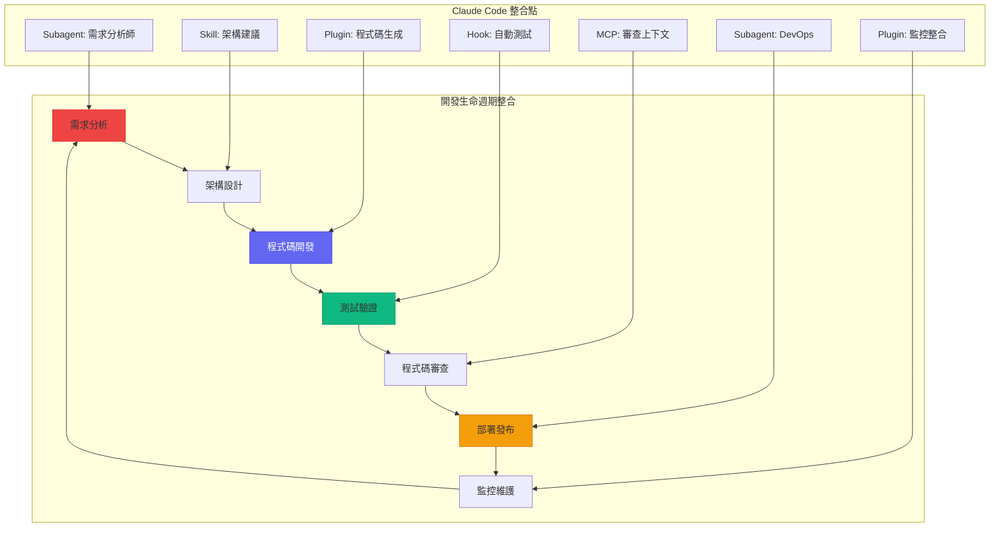

#### 工作流程配置

```yaml
# .claude/workflows/development.yaml
name: 完整開發工作流程
version: "1.0"

stages:
  - name: requirements
    description: 需求分析階段
    agent: requirements-analyst
    skills:
      - user-story-analysis
      - acceptance-criteria-generation
    outputs:
      - requirements.md
      - acceptance-criteria.yaml
      
  - name: design
    description: 架構設計階段
    agent: architect
    skills:
      - architecture-design
      - api-design
      - database-design
    inputs:
      - requirements.md
    outputs:
      - architecture.md
      - api-spec.yaml
      - database-schema.sql
      
  - name: implementation
    description: 實作階段
    agent: developer
    plugins:
      - code-generator
      - test-generator
    hooks:
      - pre: code-quality-check
      - post: auto-format
    inputs:
      - architecture.md
      - api-spec.yaml
    outputs:
      - src/**/*.java
      - src/**/*.ts
      
  - name: testing
    description: 測試階段
    agent: qa-engineer
    skills:
      - unit-test-execution
      - integration-test
      - coverage-analysis
    hooks:
      - pre: auto-backup
      - post: coverage-report
    inputs:
      - src/**/*
    outputs:
      - test-report.html
      - coverage-report.html
      
  - name: review
    description: 程式碼審查階段
    agent: code-reviewer
    mcp:
      providers:
        - code-review-context
        - pr-history-context
    skills:
      - code-review
      - security-audit
    outputs:
      - review-comments.md
      
  - name: deployment
    description: 部署階段
    agent: devops
    plugins:
      - docker-deployer
      - kubernetes-deployer
    hooks:
      - pre: security-scan
      - post: smoke-test
    inputs:
      - docker-compose.yaml
      - k8s/*.yaml
    outputs:
      - deployment-report.md

transitions:
  - from: requirements
    to: design
    condition: requirements-approved
    
  - from: design
    to: implementation
    condition: design-approved
    
  - from: implementation
    to: testing
    condition: build-success
    
  - from: testing
    to: review
    condition: tests-passed
    
  - from: review
    to: deployment
    condition: review-approved
    
  - from: deployment
    to: requirements
    condition: deployment-success
    type: feedback-loop
```

### 3.1.2 組件協作模式

#### Subagent 與 Skill 協作

```typescript
// Subagent 與 Skill 的協作實作
class DevelopmentOrchestrator {
  private subagentManager: SubagentManager;
  private skillRegistry: SkillRegistry;
  
  /**
   * 執行開發任務
   */
  async executeTask(task: DevelopmentTask): Promise<TaskResult> {
    // 1. 根據任務類型選擇 Subagent
    const agent = this.selectAgent(task);
    
    // 2. 取得 Agent 所需的 Skills
    const requiredSkills = agent.getRequiredSkills(task);
    
    // 3. 驗證 Skills 可用性
    for (const skillId of requiredSkills) {
      const skill = this.skillRegistry.get(skillId);
      if (!skill || !skill.enabled) {
        throw new Error(`Required skill not available: ${skillId}`);
      }
    }
    
    // 4. 準備執行上下文
    const context = await this.buildExecutionContext(task, agent);
    
    // 5. 執行任務
    const result = await agent.execute(task, {
      context,
      skills: requiredSkills.map(id => this.skillRegistry.get(id)),
      onSkillInvoke: (skill, input) => this.logSkillInvocation(skill, input)
    });
    
    return result;
  }
  
  /**
   * 技能鏈執行
   */
  async executeSkillChain(
    skills: string[],
    initialInput: any
  ): Promise<SkillChainResult> {
    let input = initialInput;
    const results: SkillResult[] = [];
    
    for (const skillId of skills) {
      const skill = this.skillRegistry.get(skillId);
      
      try {
        const result = await skill.execute(input);
        results.push({ skillId, success: true, output: result });
        
        // 下一個 Skill 使用上一個的輸出作為輸入
        input = result;
        
      } catch (error) {
        results.push({ skillId, success: false, error });
        
        // 根據配置決定是否繼續
        if (skill.config.failureAction === 'abort') {
          break;
        }
      }
    }
    
    return {
      finalOutput: input,
      skillResults: results,
      success: results.every(r => r.success)
    };
  }
}
```

#### Plugin 與 Hook 協作

```typescript
// Plugin 與 Hook 的協作實作
class PluginHookCoordinator {
  private pluginManager: PluginManager;
  private hookManager: HookManager;
  
  /**
   * 執行帶 Hook 的 Plugin 操作
   */
  async executePluginWithHooks(
    pluginId: string,
    operation: string,
    params: any
  ): Promise<OperationResult> {
    const plugin = this.pluginManager.get(pluginId);
    
    // 1. 執行 Pre-execution Hooks
    const preHookResult = await this.hookManager.execute(
      'pre-execution',
      {
        plugin: pluginId,
        operation,
        params,
        timestamp: Date.now()
      }
    );
    
    if (!preHookResult.continue) {
      return {
        success: false,
        aborted: true,
        reason: preHookResult.reason
      };
    }
    
    // 使用 Hook 修改後的參數
    const finalParams = preHookResult.data?.modifiedParams || params;
    
    try {
      // 2. 執行 Plugin 操作
      const operationResult = await plugin.execute(operation, finalParams);
      
      // 3. 執行 Post-execution Hooks
      const postHookResult = await this.hookManager.execute(
        'post-execution',
        {
          plugin: pluginId,
          operation,
          params: finalParams,
          result: operationResult,
          timestamp: Date.now()
        }
      );
      
      return {
        success: true,
        result: postHookResult.data || operationResult,
        hookResults: {
          pre: preHookResult,
          post: postHookResult
        }
      };
      
    } catch (error) {
      // 4. 執行 Error Hooks
      const errorHookResult = await this.hookManager.execute(
        'on-error',
        {
          plugin: pluginId,
          operation,
          params: finalParams,
          error,
          timestamp: Date.now()
        }
      );
      
      // 檢查是否恢復
      if (errorHookResult.recovered) {
        return {
          success: true,
          result: errorHookResult.data,
          recovered: true
        };
      }
      
      return {
        success: false,
        error: error.message,
        hookResults: {
          pre: preHookResult,
          error: errorHookResult
        }
      };
    }
  }
}
```

#### MCP 與其他組件整合

```typescript
// MCP 整合層
class MCPIntegrationLayer {
  private mcpServer: MCPServer;
  private contextBuilder: ContextBuilder;
  
  /**
   * 為 Subagent 提供上下文
   */
  async provideContextForAgent(
    agent: Subagent,
    task: Task
  ): Promise<AgentContext> {
    // 收集基礎上下文
    const baseContext = await this.mcpServer.getContext({
      type: 'agent-task',
      agent: agent.id,
      task: task.id
    });
    
    // 根據 Agent 類型增強上下文
    const enhancedContext = await this.enhanceContextForAgent(
      baseContext,
      agent
    );
    
    // 優化 Token 使用
    const optimizedContext = await this.contextBuilder.optimize(
      enhancedContext,
      {
        maxTokens: agent.config.maxContextTokens,
        priority: agent.config.contextPriorities
      }
    );
    
    return optimizedContext;
  }
  
  /**
   * 為 Skill 提供上下文
   */
  async provideContextForSkill(
    skill: Skill,
    input: SkillInput
  ): Promise<SkillContext> {
    // 取得 Skill 特定的上下文需求
    const contextRequirements = skill.getContextRequirements();
    
    // 從 MCP 取得所需上下文
    const rawContext = await this.mcpServer.getContext({
      type: 'skill-execution',
      skill: skill.id,
      requirements: contextRequirements
    });
    
    // 轉換為 Skill 可用的格式
    return this.transformContextForSkill(rawContext, skill);
  }
  
  /**
   * 為 Plugin 提供上下文
   */
  async provideContextForPlugin(
    plugin: Plugin,
    operation: string
  ): Promise<PluginContext> {
    const contextConfig = plugin.getContextConfig(operation);
    
    return await this.mcpServer.getContext({
      type: 'plugin-operation',
      plugin: plugin.id,
      operation,
      config: contextConfig
    });
  }
}
```

### 3.1.3 事件驅動整合

```typescript
// 事件總線實作
class ClaudeCodeEventBus {
  private handlers: Map<string, EventHandler[]> = new Map();
  private middlewares: EventMiddleware[] = [];
  
  /**
   * 註冊事件處理器
   */
  on(event: string, handler: EventHandler): void {
    const handlers = this.handlers.get(event) || [];
    handlers.push(handler);
    this.handlers.set(event, handlers);
  }
  
  /**
   * 發送事件
   */
  async emit(event: string, data: any): Promise<void> {
    // 執行中介軟體
    let processedData = data;
    for (const middleware of this.middlewares) {
      processedData = await middleware.process(event, processedData);
    }
    
    // 執行處理器
    const handlers = this.handlers.get(event) || [];
    await Promise.all(
      handlers.map(handler => handler(processedData))
    );
    
    // 發送通配符事件
    const wildcardHandlers = this.handlers.get('*') || [];
    await Promise.all(
      wildcardHandlers.map(handler => handler({ event, data: processedData }))
    );
  }
  
  /**
   * 新增中介軟體
   */
  use(middleware: EventMiddleware): void {
    this.middlewares.push(middleware);
  }
}

// 事件定義
const CLAUDE_CODE_EVENTS = {
  // Agent 事件
  AGENT_STARTED: 'agent:started',
  AGENT_COMPLETED: 'agent:completed',
  AGENT_ERROR: 'agent:error',
  AGENT_SWITCHED: 'agent:switched',
  
  // Skill 事件
  SKILL_INVOKED: 'skill:invoked',
  SKILL_COMPLETED: 'skill:completed',
  SKILL_ERROR: 'skill:error',
  
  // Plugin 事件
  PLUGIN_ACTIVATED: 'plugin:activated',
  PLUGIN_DEACTIVATED: 'plugin:deactivated',
  PLUGIN_ERROR: 'plugin:error',
  
  // Hook 事件
  HOOK_EXECUTED: 'hook:executed',
  HOOK_ABORTED: 'hook:aborted',
  
  // MCP 事件
  CONTEXT_UPDATED: 'context:updated',
  CONTEXT_INVALIDATED: 'context:invalidated',
  
  // 檔案事件
  FILE_CREATED: 'file:created',
  FILE_MODIFIED: 'file:modified',
  FILE_DELETED: 'file:deleted',
  
  // 會話事件
  SESSION_STARTED: 'session:started',
  SESSION_ENDED: 'session:ended'
};

// 使用範例
const eventBus = new ClaudeCodeEventBus();

// 日誌中介軟體
eventBus.use({
  async process(event, data) {
    console.log(`[Event] ${event}:`, data);
    return data;
  }
});

// 監聽 Agent 完成事件
eventBus.on(CLAUDE_CODE_EVENTS.AGENT_COMPLETED, async (data) => {
  // 觸發後續處理
  if (data.result.needsReview) {
    await triggerCodeReview(data);
  }
});

// 監聽錯誤事件
eventBus.on(CLAUDE_CODE_EVENTS.AGENT_ERROR, async (data) => {
  await sendErrorNotification(data);
  await logError(data);
});
```

## 3.2 團隊協作指南

### 3.2.1 共享配置管理

```yaml
# .claude/team-config.yaml
team:
  name: "Development Team"
  settings:
    # 共享的 Agent 配置
    agents:
      defaults:
        maxIterations: 10
        timeout: 300000
        model: "claude-3-opus"
        
      presets:
        - name: "code-review-standard"
          config:
            focus:
              - security
              - performance
              - maintainability
            strictness: "high"
            
        - name: "rapid-prototype"
          config:
            focus:
              - functionality
            strictness: "low"
            skipTests: true
            
    # 共享的 Skill 配置
    skills:
      enabled:
        - code-generation
        - test-generation
        - documentation
        - refactoring
        
      disabled:
        - experimental-feature
        
      overrides:
        code-generation:
          templates: "./templates/code"
          style: "team-standard"
          
    # 共享的 Plugin 配置
    plugins:
      required:
        - git-integration
        - linter
        - test-runner
        
      optional:
        - docker-support
        - kubernetes-support
        
    # 共享的 Hook 配置
    hooks:
      enforced:
        - security-check
        - code-quality
        
    # 程式碼風格
    codeStyle:
      language:
        java:
          formatter: "google-java-format"
          indentation: 2
          maxLineLength: 120
          
        typescript:
          formatter: "prettier"
          indentation: 2
          maxLineLength: 100
          singleQuote: true
          
    # 命名規範
    namingConventions:
      java:
        class: "PascalCase"
        method: "camelCase"
        constant: "UPPER_SNAKE_CASE"
        variable: "camelCase"
        
      typescript:
        class: "PascalCase"
        function: "camelCase"
        constant: "UPPER_SNAKE_CASE"
        variable: "camelCase"
        interface: "PascalCase"
        type: "PascalCase"
```

### 3.2.2 角色與權限設定

```typescript
// 團隊角色定義
interface TeamRole {
  id: string;
  name: string;
  permissions: Permission[];
  restrictions: Restriction[];
}

const TEAM_ROLES: TeamRole[] = [
  {
    id: 'tech-lead',
    name: '技術負責人',
    permissions: [
      'agent:configure',
      'skill:manage',
      'plugin:install',
      'hook:configure',
      'config:override',
      'deploy:production'
    ],
    restrictions: []
  },
  {
    id: 'senior-developer',
    name: '資深開發者',
    permissions: [
      'agent:use',
      'skill:use',
      'plugin:use',
      'hook:use',
      'config:read',
      'deploy:staging'
    ],
    restrictions: [
      { action: 'deploy:production', requires: 'approval' }
    ]
  },
  {
    id: 'developer',
    name: '開發者',
    permissions: [
      'agent:use',
      'skill:use',
      'plugin:use'
    ],
    restrictions: [
      { action: 'hook:modify', denied: true },
      { action: 'deploy:*', requires: 'approval' }
    ]
  },
  {
    id: 'junior-developer',
    name: '初級開發者',
    permissions: [
      'agent:use:limited',
      'skill:use:approved'
    ],
    restrictions: [
      { action: 'plugin:*', requires: 'supervision' },
      { action: 'deploy:*', denied: true }
    ]
  }
];

// 權限檢查器
class PermissionChecker {
  private userRoles: Map<string, string[]>;
  
  async checkPermission(
    userId: string,
    action: string,
    resource?: string
  ): Promise<PermissionResult> {
    const userRoleIds = this.userRoles.get(userId) || [];
    const roles = userRoleIds.map(id => 
      TEAM_ROLES.find(r => r.id === id)
    ).filter(Boolean);
    
    for (const role of roles) {
      // 檢查限制
      for (const restriction of role.restrictions) {
        if (this.matchAction(restriction.action, action)) {
          if (restriction.denied) {
            return { allowed: false, reason: 'denied-by-role' };
          }
          if (restriction.requires) {
            return { 
              allowed: false, 
              reason: 'requires-approval',
              requirementType: restriction.requires
            };
          }
        }
      }
      
      // 檢查權限
      for (const permission of role.permissions) {
        if (this.matchAction(permission, action)) {
          return { allowed: true };
        }
      }
    }
    
    return { allowed: false, reason: 'no-permission' };
  }
  
  private matchAction(pattern: string, action: string): boolean {
    if (pattern === action) return true;
    if (pattern.endsWith(':*')) {
      const prefix = pattern.slice(0, -1);
      return action.startsWith(prefix);
    }
    return false;
  }
}
```

### 3.2.3 協作工作流程

```typescript
// 協作工作流程管理器
class CollaborationWorkflowManager {
  /**
   * 程式碼審查流程
   */
  async initiateCodeReview(
    pullRequest: PullRequest,
    reviewer: User
  ): Promise<ReviewSession> {
    // 1. 建立審查會話
    const session = await this.createReviewSession({
      pullRequest,
      reviewer,
      status: 'pending'
    });
    
    // 2. 準備審查上下文
    const context = await this.mcpProvider.getCodeReviewContext(pullRequest);
    
    // 3. 執行自動審查
    const autoReviewResult = await this.runAutoReview(pullRequest, context);
    
    // 4. 生成審查建議
    const suggestions = await this.generateReviewSuggestions(
      pullRequest,
      autoReviewResult,
      context
    );
    
    // 5. 更新會話
    session.autoReviewResult = autoReviewResult;
    session.suggestions = suggestions;
    session.status = 'ready-for-review';
    
    // 6. 通知審查者
    await this.notifyReviewer(reviewer, session);
    
    return session;
  }
  
  /**
   * 結對程式設計流程
   */
  async initiatePairProgramming(
    driver: User,
    navigator: User,
    task: Task
  ): Promise<PairSession> {
    // 1. 建立配對會話
    const session = await this.createPairSession({
      driver,
      navigator,
      task,
      startTime: Date.now()
    });
    
    // 2. 設定共享上下文
    await this.setupSharedContext(session);
    
    // 3. 配置 Claude Code 協助
    await this.configurePairAssistant(session, {
      mode: 'pair-programming',
      // 提供給兩人的建議
      suggestionMode: 'collaborative',
      // 角色輪換提醒
      roleRotationReminder: 25 * 60 * 1000  // 25 分鐘
    });
    
    return session;
  }
  
  /**
   * 知識分享流程
   */
  async createKnowledgeSharingSession(
    topic: string,
    presenter: User,
    audience: User[]
  ): Promise<KnowledgeSession> {
    // 1. 建立知識分享會話
    const session = await this.createKnowledgeSession({
      topic,
      presenter,
      audience,
      status: 'preparing'
    });
    
    // 2. 收集相關資源
    const resources = await this.collectTopicResources(topic);
    
    // 3. 生成教學內容
    const content = await this.generateTeachingContent(topic, resources);
    
    // 4. 準備互動練習
    const exercises = await this.generateExercises(topic, content);
    
    session.resources = resources;
    session.content = content;
    session.exercises = exercises;
    session.status = 'ready';
    
    return session;
  }
}
```

## 3.3 效能優化

### 3.3.1 效能監控

```typescript
// 效能監控系統
class PerformanceMonitor {
  private metrics: MetricsCollector;
  private alertManager: AlertManager;
  
  /**
   * 監控 Agent 效能
   */
  monitorAgentPerformance(agent: Subagent): AgentMetrics {
    return {
      executionTime: this.metrics.track(`agent.${agent.id}.execution_time`),
      tokenUsage: this.metrics.track(`agent.${agent.id}.token_usage`),
      successRate: this.metrics.track(`agent.${agent.id}.success_rate`),
      errorRate: this.metrics.track(`agent.${agent.id}.error_rate`)
    };
  }
  
  /**
   * 監控 Skill 效能
   */
  monitorSkillPerformance(skill: Skill): SkillMetrics {
    return {
      invocationCount: this.metrics.track(`skill.${skill.id}.invocations`),
      avgLatency: this.metrics.track(`skill.${skill.id}.latency`),
      cacheHitRate: this.metrics.track(`skill.${skill.id}.cache_hits`)
    };
  }
  
  /**
   * 監控 MCP 效能
   */
  monitorMCPPerformance(): MCPMetrics {
    return {
      contextBuildTime: this.metrics.track('mcp.context_build_time'),
      tokenUtilization: this.metrics.track('mcp.token_utilization'),
      cacheEfficiency: this.metrics.track('mcp.cache_efficiency'),
      compressionRatio: this.metrics.track('mcp.compression_ratio')
    };
  }
  
  /**
   * 設定效能警報
   */
  setupAlerts(): void {
    // Agent 執行時間過長
    this.alertManager.addRule({
      name: 'agent-slow-execution',
      metric: 'agent.*.execution_time',
      condition: { percentile: 95, threshold: 30000 },
      action: 'notify'
    });
    
    // Token 使用過高
    this.alertManager.addRule({
      name: 'high-token-usage',
      metric: 'agent.*.token_usage',
      condition: { avg: true, threshold: 50000 },
      action: 'throttle'
    });
    
    // 錯誤率過高
    this.alertManager.addRule({
      name: 'high-error-rate',
      metric: '*.error_rate',
      condition: { rate: true, threshold: 0.1 },
      action: 'alert'
    });
  }
  
  /**
   * 生成效能報告
   */
  async generateReport(timeRange: TimeRange): Promise<PerformanceReport> {
    const data = await this.metrics.query(timeRange);
    
    return {
      summary: {
        totalOperations: data.count,
        avgLatency: data.avgLatency,
        errorRate: data.errorRate,
        tokenUsage: data.totalTokens
      },
      byAgent: this.aggregateByAgent(data),
      bySkill: this.aggregateBySkill(data),
      trends: this.calculateTrends(data),
      recommendations: await this.generateRecommendations(data)
    };
  }
}
```

### 3.3.2 效能優化策略

```typescript
// 效能優化器
class PerformanceOptimizer {
  /**
   * 優化 Agent 執行
   */
  async optimizeAgentExecution(agent: Subagent): Promise<OptimizationResult> {
    const optimizations: Optimization[] = [];
    
    // 1. 分析歷史執行資料
    const history = await this.getExecutionHistory(agent);
    
    // 2. 識別瓶頸
    const bottlenecks = this.identifyBottlenecks(history);
    
    // 3. 套用優化
    for (const bottleneck of bottlenecks) {
      switch (bottleneck.type) {
        case 'slow-context-loading':
          optimizations.push(await this.optimizeContextLoading(agent));
          break;
          
        case 'excessive-iterations':
          optimizations.push(await this.optimizeIterationCount(agent));
          break;
          
        case 'redundant-skill-calls':
          optimizations.push(await this.optimizeSkillCalls(agent));
          break;
          
        case 'large-token-usage':
          optimizations.push(await this.optimizeTokenUsage(agent));
          break;
      }
    }
    
    return {
      agent: agent.id,
      optimizations,
      estimatedImprovement: this.estimateImprovement(optimizations)
    };
  }
  
  /**
   * 優化上下文載入
   */
  private async optimizeContextLoading(agent: Subagent): Promise<Optimization> {
    return {
      type: 'context-loading',
      actions: [
        {
          action: 'enable-lazy-loading',
          description: '啟用延遲載入，只在需要時載入上下文'
        },
        {
          action: 'increase-cache-size',
          description: '增加快取大小以減少重複載入'
        },
        {
          action: 'preload-common-context',
          description: '預載入常用上下文項目'
        }
      ]
    };
  }
  
  /**
   * 優化 Token 使用
   */
  private async optimizeTokenUsage(agent: Subagent): Promise<Optimization> {
    return {
      type: 'token-usage',
      actions: [
        {
          action: 'enable-compression',
          description: '啟用上下文壓縮'
        },
        {
          action: 'adjust-context-priority',
          description: '調整上下文優先級以減少不必要的內容'
        },
        {
          action: 'implement-chunking',
          description: '實作分塊處理以處理大型上下文'
        }
      ]
    };
  }
}

// 快取優化
class CacheOptimizer {
  /**
   * 分析快取效能
   */
  async analyzeCachePerformance(): Promise<CacheAnalysis> {
    const stats = await this.getCacheStats();
    
    return {
      hitRate: stats.hits / (stats.hits + stats.misses),
      avgLookupTime: stats.totalLookupTime / stats.lookups,
      memoryUsage: stats.memoryUsage,
      evictionRate: stats.evictions / stats.total,
      recommendations: this.generateCacheRecommendations(stats)
    };
  }
  
  /**
   * 優化快取配置
   */
  optimizeCacheConfig(analysis: CacheAnalysis): CacheConfig {
    const config: CacheConfig = {};
    
    // 根據命中率調整大小
    if (analysis.hitRate < 0.8) {
      config.maxSize = Math.ceil(analysis.memoryUsage * 1.5);
    }
    
    // 根據驅逐率調整策略
    if (analysis.evictionRate > 0.3) {
      config.strategy = 'lfu';  // 改用 LFU 策略
    }
    
    // 根據查找時間調整結構
    if (analysis.avgLookupTime > 10) {
      config.indexing = true;  // 啟用索引
    }
    
    return config;
  }
}
```

## 3.4 疑難排解

### 3.4.1 常見問題診斷

```typescript
// 診斷工具
class DiagnosticTool {
  /**
   * 執行完整診斷
   */
  async runFullDiagnostics(): Promise<DiagnosticReport> {
    const results: DiagnosticResult[] = [];
    
    // 1. 系統環境檢查
    results.push(await this.checkEnvironment());
    
    // 2. 配置檢查
    results.push(await this.checkConfiguration());
    
    // 3. 連線檢查
    results.push(await this.checkConnectivity());
    
    // 4. 權限檢查
    results.push(await this.checkPermissions());
    
    // 5. 相容性檢查
    results.push(await this.checkCompatibility());
    
    // 6. 效能檢查
    results.push(await this.checkPerformance());
    
    return {
      timestamp: Date.now(),
      results,
      summary: this.generateSummary(results),
      recommendations: this.generateRecommendations(results)
    };
  }
  
  /**
   * Agent 問題診斷
   */
  async diagnoseAgentIssue(
    agent: Subagent,
    error: Error
  ): Promise<AgentDiagnosis> {
    const diagnosis: AgentDiagnosis = {
      agent: agent.id,
      error: error.message,
      possibleCauses: [],
      suggestedFixes: []
    };
    
    // 分析錯誤類型
    if (error.name === 'TimeoutError') {
      diagnosis.possibleCauses.push('執行時間過長');
      diagnosis.suggestedFixes.push({
        action: 'increase-timeout',
        description: '增加 Agent 超時設定',
        config: { timeout: agent.config.timeout * 2 }
      });
      diagnosis.suggestedFixes.push({
        action: 'reduce-complexity',
        description: '簡化任務以減少執行時間'
      });
    }
    
    if (error.name === 'TokenLimitError') {
      diagnosis.possibleCauses.push('Token 使用超出限制');
      diagnosis.suggestedFixes.push({
        action: 'enable-compression',
        description: '啟用上下文壓縮'
      });
      diagnosis.suggestedFixes.push({
        action: 'split-task',
        description: '將任務拆分為較小的子任務'
      });
    }
    
    if (error.name === 'ContextError') {
      diagnosis.possibleCauses.push('上下文載入失敗');
      diagnosis.suggestedFixes.push({
        action: 'check-file-access',
        description: '檢查檔案存取權限'
      });
      diagnosis.suggestedFixes.push({
        action: 'clear-cache',
        description: '清除上下文快取'
      });
    }
    
    return diagnosis;
  }
  
  /**
   * Skill 問題診斷
   */
  async diagnoseSkillIssue(
    skill: Skill,
    error: Error
  ): Promise<SkillDiagnosis> {
    const diagnosis: SkillDiagnosis = {
      skill: skill.id,
      error: error.message,
      possibleCauses: [],
      suggestedFixes: []
    };
    
    // 檢查依賴
    const dependencyCheck = await this.checkSkillDependencies(skill);
    if (!dependencyCheck.allSatisfied) {
      diagnosis.possibleCauses.push('依賴未滿足');
      diagnosis.suggestedFixes.push({
        action: 'install-dependencies',
        description: '安裝缺失的依賴',
        dependencies: dependencyCheck.missing
      });
    }
    
    // 檢查配置
    const configCheck = await this.validateSkillConfig(skill);
    if (!configCheck.valid) {
      diagnosis.possibleCauses.push('配置無效');
      diagnosis.suggestedFixes.push({
        action: 'fix-config',
        description: '修正配置問題',
        issues: configCheck.issues
      });
    }
    
    return diagnosis;
  }
}
```

### 3.4.2 錯誤處理最佳實踐

```typescript
// 統一錯誤處理
class ErrorHandler {
  private handlers: Map<string, ErrorHandlerFn> = new Map();
  private fallbackHandler: ErrorHandlerFn;
  
  /**
   * 註冊錯誤處理器
   */
  register(errorType: string, handler: ErrorHandlerFn): void {
    this.handlers.set(errorType, handler);
  }
  
  /**
   * 處理錯誤
   */
  async handle(error: ClaudeCodeError): Promise<ErrorResult> {
    // 記錄錯誤
    await this.logError(error);
    
    // 尋找對應的處理器
    const handler = this.handlers.get(error.type) || this.fallbackHandler;
    
    try {
      const result = await handler(error);
      
      // 如果恢復成功，記錄
      if (result.recovered) {
        await this.logRecovery(error, result);
      }
      
      return result;
      
    } catch (handlerError) {
      // 處理器本身出錯
      return {
        handled: false,
        recovered: false,
        error: handlerError
      };
    }
  }
  
  /**
   * 建立錯誤邊界
   */
  createBoundary<T>(
    operation: () => Promise<T>,
    options?: BoundaryOptions
  ): () => Promise<T> {
    return async () => {
      try {
        return await operation();
      } catch (error) {
        const result = await this.handle(
          this.normalizeError(error)
        );
        
        if (result.recovered && result.value !== undefined) {
          return result.value as T;
        }
        
        if (options?.fallback !== undefined) {
          return options.fallback;
        }
        
        throw error;
      }
    };
  }
}

// 常見錯誤處理器
const commonErrorHandlers: Record<string, ErrorHandlerFn> = {
  // 網路錯誤
  'NetworkError': async (error) => {
    // 等待並重試
    await sleep(1000);
    return { handled: true, recovered: false, shouldRetry: true };
  },
  
  // 速率限制
  'RateLimitError': async (error) => {
    const retryAfter = error.retryAfter || 60000;
    await sleep(retryAfter);
    return { handled: true, recovered: false, shouldRetry: true };
  },
  
  // 認證錯誤
  'AuthenticationError': async (error) => {
    // 嘗試刷新憑證
    const newCredentials = await refreshCredentials();
    if (newCredentials) {
      return { handled: true, recovered: true };
    }
    return { handled: true, recovered: false };
  },
  
  // 驗證錯誤
  'ValidationError': async (error) => {
    // 記錄詳細錯誤資訊
    console.error('Validation failed:', error.details);
    return { handled: true, recovered: false };
  }
};
```

### 3.4.3 日誌與追蹤

```typescript
// 結構化日誌系統
class StructuredLogger {
  private transports: LogTransport[] = [];
  private context: LogContext = {};
  
  /**
   * 建立子 Logger
   */
  child(context: LogContext): StructuredLogger {
    const child = new StructuredLogger();
    child.transports = this.transports;
    child.context = { ...this.context, ...context };
    return child;
  }
  
  /**
   * 記錄操作
   */
  log(level: LogLevel, message: string, data?: any): void {
    const entry: LogEntry = {
      timestamp: new Date().toISOString(),
      level,
      message,
      data,
      context: this.context
    };
    
    for (const transport of this.transports) {
      transport.write(entry);
    }
  }
  
  /**
   * 記錄 Agent 操作
   */
  logAgentOperation(
    agent: string,
    operation: string,
    result: any
  ): void {
    this.log('info', `Agent operation: ${operation}`, {
      agent,
      operation,
      result: this.sanitize(result)
    });
  }
  
  /**
   * 記錄效能指標
   */
  logPerformance(
    operation: string,
    duration: number,
    metrics: Record<string, number>
  ): void {
    this.log('debug', `Performance: ${operation}`, {
      operation,
      duration,
      metrics
    });
  }
}

// 分散式追蹤
class DistributedTracer {
  /**
   * 開始追蹤
   */
  startTrace(name: string): Trace {
    return new Trace({
      id: generateTraceId(),
      name,
      startTime: Date.now(),
      spans: []
    });
  }
  
  /**
   * 建立 Span
   */
  createSpan(trace: Trace, name: string, parent?: Span): Span {
    const span = new Span({
      id: generateSpanId(),
      traceId: trace.id,
      parentId: parent?.id,
      name,
      startTime: Date.now()
    });
    
    trace.spans.push(span);
    return span;
  }
  
  /**
   * 匯出追蹤資料
   */
  async export(trace: Trace): Promise<void> {
    // 匯出到追蹤後端（如 Jaeger、Zipkin）
    await this.traceBackend.send({
      traceId: trace.id,
      spans: trace.spans.map(s => ({
        spanId: s.id,
        parentSpanId: s.parentId,
        operationName: s.name,
        startTime: s.startTime,
        duration: s.duration,
        tags: s.tags,
        logs: s.logs
      }))
    });
  }
}

// 使用範例
const logger = new StructuredLogger();
const tracer = new DistributedTracer();

async function executeWithTracing(task: Task) {
  const trace = tracer.startTrace('task-execution');
  const taskLogger = logger.child({ taskId: task.id });
  
  // Agent 執行 Span
  const agentSpan = tracer.createSpan(trace, 'agent-execution');
  taskLogger.log('info', 'Starting agent execution');
  
  try {
    const result = await agent.execute(task);
    agentSpan.setTag('status', 'success');
    taskLogger.logAgentOperation(agent.id, 'execute', result);
    
  } catch (error) {
    agentSpan.setTag('status', 'error');
    agentSpan.log('error', error.message);
    taskLogger.log('error', 'Agent execution failed', { error });
    
  } finally {
    agentSpan.finish();
    await tracer.export(trace);
  }
}
```

---

### 💡 第三部分重點整理

> **整合工作流程**：
> - 設計端到端的開發流程，整合所有 Claude Code 組件
> - 使用事件驅動架構實現組件間的鬆耦合協作
> - 配置工作流程以適應不同的開發場景
>
> **團隊協作**：
> - 建立共享配置確保團隊一致性
> - 設定角色與權限控制存取
> - 實作協作工作流程（程式碼審查、結對程式設計）
>
> **效能優化**：
> - 監控關鍵效能指標
> - 識別並解決效能瓶頸
> - 優化快取和資源使用
>
> **疑難排解**：
> - 使用診斷工具識別問題
> - 實作統一的錯誤處理
> - 建立完善的日誌和追蹤系統

---

# 第四部分：進階主題

## 4.1 企業級部署

### 4.1.1 部署架構

#### 高可用架構設計

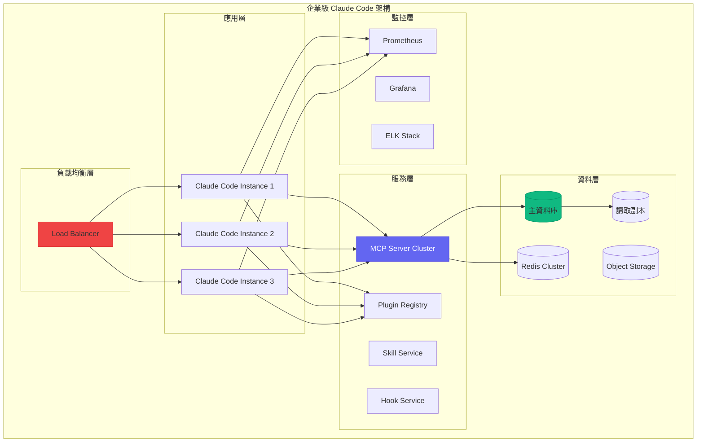

#### Kubernetes 部署配置

```yaml
# claude-code-deployment.yaml
apiVersion: apps/v1
kind: Deployment
metadata:
  name: claude-code
  namespace: ai-tools
spec:
  replicas: 3
  selector:
    matchLabels:
      app: claude-code
  template:
    metadata:
      labels:
        app: claude-code
    spec:
      containers:
      - name: claude-code
        image: company-registry/claude-code:v2.0.0
        ports:
        - containerPort: 8080
        resources:
          requests:
            memory: "2Gi"
            cpu: "1000m"
          limits:
            memory: "4Gi"
            cpu: "2000m"
        env:
        - name: CLAUDE_API_KEY
          valueFrom:
            secretKeyRef:
              name: claude-secrets
              key: api-key
        - name: MCP_SERVER_URL
          value: "http://mcp-service:3000"
        - name: REDIS_URL
          value: "redis://redis-cluster:6379"
        volumeMounts:
        - name: config
          mountPath: /app/config
        - name: plugins
          mountPath: /app/plugins
        livenessProbe:
          httpGet:
            path: /health
            port: 8080
          initialDelaySeconds: 30
          periodSeconds: 10
        readinessProbe:
          httpGet:
            path: /ready
            port: 8080
          initialDelaySeconds: 5
          periodSeconds: 5
      volumes:
      - name: config
        configMap:
          name: claude-code-config
      - name: plugins
        persistentVolumeClaim:
          claimName: plugins-pvc

---
apiVersion: v1
kind: Service
metadata:
  name: claude-code-service
  namespace: ai-tools
spec:
  selector:
    app: claude-code
  ports:
  - port: 80
    targetPort: 8080
  type: ClusterIP

---
apiVersion: networking.k8s.io/v1
kind: Ingress
metadata:
  name: claude-code-ingress
  namespace: ai-tools
  annotations:
    nginx.ingress.kubernetes.io/ssl-redirect: "true"
    nginx.ingress.kubernetes.io/proxy-body-size: "50m"
spec:
  ingressClassName: nginx
  tls:
  - hosts:
    - claude-code.company.com
    secretName: claude-code-tls
  rules:
  - host: claude-code.company.com
    http:
      paths:
      - path: /
        pathType: Prefix
        backend:
          service:
            name: claude-code-service
            port:
              number: 80

---
# MCP Server 部署
apiVersion: apps/v1
kind: Deployment
metadata:
  name: mcp-server
  namespace: ai-tools
spec:
  replicas: 2
  selector:
    matchLabels:
      app: mcp-server
  template:
    metadata:
      labels:
        app: mcp-server
    spec:
      containers:
      - name: mcp-server
        image: company-registry/mcp-server:v1.0.0
        ports:
        - containerPort: 3000
        resources:
          requests:
            memory: "1Gi"
            cpu: "500m"
          limits:
            memory: "2Gi"
            cpu: "1000m"
        env:
        - name: WORKSPACE_ROOT
          value: "/workspaces"
        - name: CACHE_SIZE
          value: "500MB"
        volumeMounts:
        - name: workspaces
          mountPath: /workspaces
      volumes:
      - name: workspaces
        persistentVolumeClaim:
          claimName: workspaces-pvc
```

### 4.1.2 安全性配置

```typescript
// 企業安全配置
interface EnterpriseSecurityConfig {
  // 認證配置
  authentication: {
    provider: 'saml' | 'oauth2' | 'ldap';
    config: AuthProviderConfig;
    mfa: {
      enabled: boolean;
      methods: ('totp' | 'sms' | 'email')[];
    };
    sessionTimeout: number;
  };
  
  // 授權配置
  authorization: {
    provider: 'rbac' | 'abac';
    roles: RoleDefinition[];
    policies: PolicyDefinition[];
  };
  
  // 資料保護
  dataProtection: {
    encryption: {
      atRest: boolean;
      inTransit: boolean;
      algorithm: 'AES-256-GCM' | 'ChaCha20-Poly1305';
    };
    masking: {
      enabled: boolean;
      patterns: DataMaskingPattern[];
    };
    retention: {
      maxAge: number;
      autoDelete: boolean;
    };
  };
  
  // 稽核配置
  audit: {
    enabled: boolean;
    events: AuditEvent[];
    storage: 'database' | 'elasticsearch' | 'splunk';
    retention: number;
  };
  
  // 網路安全
  network: {
    allowedIPs: string[];
    blockedIPs: string[];
    rateLimit: {
      enabled: boolean;
      requestsPerMinute: number;
      burstLimit: number;
    };
  };
}

// 安全管理器實作
class EnterpriseSecurityManager {
  private config: EnterpriseSecurityConfig;
  private auditLogger: AuditLogger;
  
  /**
   * 驗證請求
   */
  async validateRequest(request: SecurityRequest): Promise<ValidationResult> {
    // 1. IP 檢查
    if (!this.isIPAllowed(request.ip)) {
      await this.auditLogger.log({
        event: 'access-denied',
        reason: 'ip-blocked',
        ip: request.ip
      });
      return { valid: false, reason: 'ip-blocked' };
    }
    
    // 2. 速率限制檢查
    if (this.config.network.rateLimit.enabled) {
      const rateCheck = await this.checkRateLimit(request);
      if (!rateCheck.allowed) {
        return { valid: false, reason: 'rate-limit-exceeded' };
      }
    }
    
    // 3. 認證檢查
    const authResult = await this.authenticate(request);
    if (!authResult.authenticated) {
      return { valid: false, reason: 'authentication-failed' };
    }
    
    // 4. 授權檢查
    const authzResult = await this.authorize(authResult.user, request.resource);
    if (!authzResult.authorized) {
      return { valid: false, reason: 'authorization-failed' };
    }
    
    return { valid: true, user: authResult.user };
  }
  
  /**
   * 敏感資料遮罩
   */
  maskSensitiveData(data: string): string {
    if (!this.config.dataProtection.masking.enabled) {
      return data;
    }
    
    let masked = data;
    for (const pattern of this.config.dataProtection.masking.patterns) {
      masked = masked.replace(pattern.regex, pattern.replacement);
    }
    
    return masked;
  }
  
  /**
   * 加密資料
   */
  async encryptData(data: Buffer): Promise<EncryptedData> {
    const algorithm = this.config.dataProtection.encryption.algorithm;
    const key = await this.getEncryptionKey();
    
    if (algorithm === 'AES-256-GCM') {
      const iv = crypto.randomBytes(12);
      const cipher = crypto.createCipheriv('aes-256-gcm', key, iv);
      
      const encrypted = Buffer.concat([
        cipher.update(data),
        cipher.final()
      ]);
      
      const authTag = cipher.getAuthTag();
      
      return {
        algorithm,
        iv: iv.toString('base64'),
        authTag: authTag.toString('base64'),
        data: encrypted.toString('base64')
      };
    }
    
    throw new Error(`Unsupported algorithm: ${algorithm}`);
  }
}

// 敏感資料遮罩模式
const DATA_MASKING_PATTERNS: DataMaskingPattern[] = [
  {
    name: 'api-key',
    regex: /(['"]?(?:api[_-]?key|token|secret)['"]?\s*[:=]\s*)(['"][^'"]{4})[^'"]*(['"])/gi,
    replacement: '$1$2****$3'
  },
  {
    name: 'password',
    regex: /(['"]?password['"]?\s*[:=]\s*)(['"])[^'"]+(['"])/gi,
    replacement: '$1$2********$3'
  },
  {
    name: 'credit-card',
    regex: /\b(\d{4})[\s-]?\d{4}[\s-]?\d{4}[\s-]?(\d{4})\b/g,
    replacement: '$1-****-****-$2'
  },
  {
    name: 'ssn',
    regex: /\b(\d{3})[-\s]?(\d{2})[-\s]?\d{4}\b/g,
    replacement: '$1-$2-****'
  }
];
```

### 4.1.3 合規性支援

```typescript
// 合規性管理器
class ComplianceManager {
  /**
   * GDPR 合規檢查
   */
  async checkGDPRCompliance(): Promise<ComplianceReport> {
    const checks: ComplianceCheck[] = [
      // 資料最小化
      {
        name: 'data-minimization',
        check: async () => this.checkDataMinimization(),
        requirement: 'GDPR Article 5(1)(c)'
      },
      // 資料保留限制
      {
        name: 'storage-limitation',
        check: async () => this.checkStorageLimitation(),
        requirement: 'GDPR Article 5(1)(e)'
      },
      // 資料主體權利
      {
        name: 'data-subject-rights',
        check: async () => this.checkDataSubjectRights(),
        requirement: 'GDPR Articles 15-22'
      },
      // 資料外洩通知
      {
        name: 'breach-notification',
        check: async () => this.checkBreachNotification(),
        requirement: 'GDPR Articles 33-34'
      }
    ];
    
    const results = await Promise.all(
      checks.map(async c => ({
        name: c.name,
        requirement: c.requirement,
        result: await c.check()
      }))
    );
    
    return {
      framework: 'GDPR',
      timestamp: new Date().toISOString(),
      overallCompliant: results.every(r => r.result.compliant),
      checks: results,
      recommendations: this.generateRecommendations(results)
    };
  }
  
  /**
   * SOC 2 合規檢查
   */
  async checkSOC2Compliance(): Promise<ComplianceReport> {
    const trustServiceCriteria = [
      // 安全性
      {
        category: 'Security',
        criteria: 'CC6.1',
        description: '邏輯和實體存取控制',
        check: async () => this.checkAccessControls()
      },
      // 可用性
      {
        category: 'Availability',
        criteria: 'A1.1',
        description: '系統可用性監控',
        check: async () => this.checkAvailabilityMonitoring()
      },
      // 處理完整性
      {
        category: 'Processing Integrity',
        criteria: 'PI1.1',
        description: '資料處理完整性',
        check: async () => this.checkProcessingIntegrity()
      },
      // 保密性
      {
        category: 'Confidentiality',
        criteria: 'C1.1',
        description: '機密資訊保護',
        check: async () => this.checkConfidentiality()
      },
      // 隱私
      {
        category: 'Privacy',
        criteria: 'P1.1',
        description: '個人資訊收集通知',
        check: async () => this.checkPrivacyNotices()
      }
    ];
    
    // 執行所有檢查
    const results = await Promise.all(
      trustServiceCriteria.map(async c => ({
        ...c,
        result: await c.check()
      }))
    );
    
    return {
      framework: 'SOC 2 Type II',
      timestamp: new Date().toISOString(),
      overallCompliant: results.every(r => r.result.compliant),
      checks: results,
      recommendations: this.generateRecommendations(results)
    };
  }
  
  /**
   * 產生合規報告
   */
  async generateComplianceReport(
    frameworks: ('GDPR' | 'SOC2' | 'HIPAA' | 'PCI-DSS')[]
  ): Promise<FullComplianceReport> {
    const reports: ComplianceReport[] = [];
    
    for (const framework of frameworks) {
      switch (framework) {
        case 'GDPR':
          reports.push(await this.checkGDPRCompliance());
          break;
        case 'SOC2':
          reports.push(await this.checkSOC2Compliance());
          break;
        case 'HIPAA':
          reports.push(await this.checkHIPAACompliance());
          break;
        case 'PCI-DSS':
          reports.push(await this.checkPCIDSSCompliance());
          break;
      }
    }
    
    return {
      generatedAt: new Date().toISOString(),
      reports,
      overallStatus: reports.every(r => r.overallCompliant) 
        ? 'compliant' 
        : 'non-compliant',
      actionItems: this.consolidateActionItems(reports)
    };
  }
}
```

## 4.2 CI/CD 整合

### 4.2.1 GitHub Actions 整合

```yaml
# .github/workflows/claude-code-ci.yaml
name: Claude Code CI/CD

on:
  push:
    branches: [main, develop]
  pull_request:
    branches: [main]

env:
  CLAUDE_API_KEY: ${{ secrets.CLAUDE_API_KEY }}

jobs:
  code-analysis:
    runs-on: ubuntu-latest
    steps:
      - uses: actions/checkout@v4
      
      - name: Setup Node.js
        uses: actions/setup-node@v4
        with:
          node-version: '20'
          
      - name: Install dependencies
        run: npm ci
        
      - name: Run Claude Code Analysis
        uses: anthropic/claude-code-action@v1
        with:
          command: analyze
          config: .claude/config.yaml
          output-format: sarif
          
      - name: Upload analysis results
        uses: github/codeql-action/upload-sarif@v2
        with:
          sarif_file: claude-code-results.sarif
          
  code-review:
    runs-on: ubuntu-latest
    if: github.event_name == 'pull_request'
    steps:
      - uses: actions/checkout@v4
        with:
          fetch-depth: 0
          
      - name: Claude Code Review
        uses: anthropic/claude-code-action@v1
        with:
          command: review
          pr-number: ${{ github.event.pull_request.number }}
          review-config: .claude/review-config.yaml
        env:
          GITHUB_TOKEN: ${{ secrets.GITHUB_TOKEN }}
          
  test-generation:
    runs-on: ubuntu-latest
    needs: code-analysis
    steps:
      - uses: actions/checkout@v4
      
      - name: Generate missing tests
        uses: anthropic/claude-code-action@v1
        with:
          command: generate-tests
          coverage-threshold: 80
          
      - name: Run generated tests
        run: npm test
        
      - name: Upload coverage report
        uses: codecov/codecov-action@v3
        with:
          file: ./coverage/lcov.info
          
  security-scan:
    runs-on: ubuntu-latest
    needs: code-analysis
    steps:
      - uses: actions/checkout@v4
      
      - name: Claude Security Analysis
        uses: anthropic/claude-code-action@v1
        with:
          command: security-scan
          severity-threshold: medium
          
      - name: Check security results
        run: |
          if [ -f security-issues.json ]; then
            HIGH_COUNT=$(jq '[.issues[] | select(.severity == "high")] | length' security-issues.json)
            if [ "$HIGH_COUNT" -gt 0 ]; then
              echo "Found $HIGH_COUNT high severity issues"
              exit 1
            fi
          fi
          
  deploy:
    runs-on: ubuntu-latest
    needs: [code-review, test-generation, security-scan]
    if: github.ref == 'refs/heads/main'
    steps:
      - uses: actions/checkout@v4
      
      - name: Deploy with Claude Code
        uses: anthropic/claude-code-action@v1
        with:
          command: deploy
          environment: production
          approval-required: true
```

### 4.2.2 Jenkins Pipeline 整合

```groovy
// Jenkinsfile
pipeline {
    agent any
    
    environment {
        CLAUDE_API_KEY = credentials('claude-api-key')
        DOCKER_REGISTRY = 'registry.company.com'
    }
    
    stages {
        stage('Checkout') {
            steps {
                checkout scm
            }
        }
        
        stage('Claude Code Analysis') {
            steps {
                script {
                    def analysisResult = claudeCode(
                        command: 'analyze',
                        config: '.claude/config.yaml'
                    )
                    
                    if (analysisResult.issues.any { it.severity == 'critical' }) {
                        error "Critical issues found in code analysis"
                    }
                }
            }
        }
        
        stage('Build') {
            steps {
                sh 'npm ci'
                sh 'npm run build'
            }
        }
        
        stage('Test Generation') {
            steps {
                script {
                    claudeCode(
                        command: 'generate-tests',
                        coverageThreshold: 80
                    )
                }
                sh 'npm test'
            }
            post {
                always {
                    publishHTML([
                        allowMissing: false,
                        alwaysLinkToLastBuild: true,
                        keepAll: true,
                        reportDir: 'coverage',
                        reportFiles: 'index.html',
                        reportName: 'Coverage Report'
                    ])
                }
            }
        }
        
        stage('Security Scan') {
            steps {
                script {
                    def securityResult = claudeCode(
                        command: 'security-scan',
                        severityThreshold: 'medium'
                    )
                    
                    archiveArtifacts artifacts: 'security-report.json'
                }
            }
        }
        
        stage('Code Review (PR only)') {
            when {
                changeRequest()
            }
            steps {
                script {
                    claudeCode(
                        command: 'review',
                        prNumber: env.CHANGE_ID
                    )
                }
            }
        }
        
        stage('Deploy to Staging') {
            when {
                branch 'develop'
            }
            steps {
                script {
                    claudeCode(
                        command: 'deploy',
                        environment: 'staging'
                    )
                }
            }
        }
        
        stage('Deploy to Production') {
            when {
                branch 'main'
            }
            steps {
                input message: 'Deploy to production?', ok: 'Deploy'
                script {
                    claudeCode(
                        command: 'deploy',
                        environment: 'production'
                    )
                }
            }
        }
    }
    
    post {
        always {
            cleanWs()
        }
        failure {
            script {
                claudeCode(
                    command: 'analyze-failure',
                    buildUrl: env.BUILD_URL
                )
            }
            emailext(
                subject: "Pipeline Failed: ${env.JOB_NAME} [${env.BUILD_NUMBER}]",
                body: "Check console output at ${env.BUILD_URL}",
                to: 'team@company.com'
            )
        }
    }
}
```

### 4.2.3 GitLab CI 整合

```yaml
# .gitlab-ci.yml
stages:
  - analyze
  - test
  - security
  - review
  - deploy

variables:
  CLAUDE_API_KEY: ${CLAUDE_API_KEY}

# 程式碼分析
code-analysis:
  stage: analyze
  image: anthropic/claude-code:latest
  script:
    - claude-code analyze --config .claude/config.yaml --output analysis-report.json
  artifacts:
    reports:
      codequality: analysis-report.json
    paths:
      - analysis-report.json
    expire_in: 1 week

# 單元測試與測試生成
test:
  stage: test
  image: node:20
  script:
    - npm ci
    - claude-code generate-tests --coverage-threshold 80
    - npm test -- --coverage
  coverage: '/All files[^|]*\|[^|]*\s+([\d\.]+)/'
  artifacts:
    reports:
      junit: junit.xml
      coverage_report:
        coverage_format: cobertura
        path: coverage/cobertura-coverage.xml
    paths:
      - coverage/
    expire_in: 1 week

# 安全掃描
security-scan:
  stage: security
  image: anthropic/claude-code:latest
  script:
    - claude-code security-scan --severity-threshold medium --output security-report.json
  artifacts:
    reports:
      sast: security-report.json
    paths:
      - security-report.json
    expire_in: 1 week

# MR 程式碼審查
code-review:
  stage: review
  image: anthropic/claude-code:latest
  script:
    - claude-code review --mr-iid ${CI_MERGE_REQUEST_IID}
  only:
    - merge_requests
  variables:
    GIT_STRATEGY: clone
    GIT_DEPTH: 0

# 部署到 Staging
deploy-staging:
  stage: deploy
  image: anthropic/claude-code:latest
  script:
    - claude-code deploy --environment staging
  environment:
    name: staging
    url: https://staging.company.com
  only:
    - develop

# 部署到 Production
deploy-production:
  stage: deploy
  image: anthropic/claude-code:latest
  script:
    - claude-code deploy --environment production
  environment:
    name: production
    url: https://www.company.com
  when: manual
  only:
    - main
```

## 4.3 自訂開發

### 4.3.1 自訂 Agent 開發

```typescript
// 完整的自訂 Agent 實作
import { 
  BaseAgent, 
  AgentConfig, 
  AgentContext, 
  AgentResult,
  SkillRegistry,
  HookManager
} from '@claude-code/sdk';

// 領域特定 Agent: API 設計師
class APIDesignerAgent extends BaseAgent {
  readonly id = 'api-designer';
  readonly name = 'API Designer Agent';
  readonly description = 'Specialized agent for designing RESTful and GraphQL APIs';
  
  // Agent 專屬配置
  private designPatterns: DesignPattern[] = [];
  private openApiGenerator: OpenAPIGenerator;
  private graphqlGenerator: GraphQLGenerator;
  
  constructor(config: APIDesignerConfig) {
    super(config);
    
    this.openApiGenerator = new OpenAPIGenerator(config.openapi);
    this.graphqlGenerator = new GraphQLGenerator(config.graphql);
    
    // 載入設計模式
    this.loadDesignPatterns(config.patterns);
  }
  
  /**
   * Agent 能力聲明
   */
  getCapabilities(): AgentCapability[] {
    return [
      {
        id: 'rest-api-design',
        name: 'REST API Design',
        description: 'Design RESTful APIs following best practices',
        inputSchema: {
          type: 'object',
          properties: {
            resourceName: { type: 'string' },
            operations: { type: 'array', items: { type: 'string' } },
            relationships: { type: 'array' }
          }
        }
      },
      {
        id: 'graphql-schema-design',
        name: 'GraphQL Schema Design',
        description: 'Design GraphQL schemas',
        inputSchema: {
          type: 'object',
          properties: {
            types: { type: 'array' },
            queries: { type: 'array' },
            mutations: { type: 'array' }
          }
        }
      },
      {
        id: 'api-documentation',
        name: 'API Documentation Generation',
        description: 'Generate comprehensive API documentation'
      }
    ];
  }
  
  /**
   * 主要執行邏輯
   */
  async execute(
    task: APIDesignTask,
    context: AgentContext
  ): Promise<AgentResult<APIDesignResult>> {
    // 1. 分析需求
    const requirements = await this.analyzeRequirements(task.description, context);
    
    // 2. 選擇設計模式
    const selectedPatterns = this.selectPatterns(requirements);
    
    // 3. 生成 API 設計
    let apiDesign: APIDesign;
    
    if (task.type === 'rest') {
      apiDesign = await this.designRESTAPI(requirements, selectedPatterns);
    } else if (task.type === 'graphql') {
      apiDesign = await this.designGraphQLAPI(requirements, selectedPatterns);
    } else {
      // 混合模式
      apiDesign = await this.designHybridAPI(requirements, selectedPatterns);
    }
    
    // 4. 驗證設計
    const validation = await this.validateDesign(apiDesign);
    
    if (!validation.valid) {
      // 自動修正問題
      apiDesign = await this.fixDesignIssues(apiDesign, validation.issues);
    }
    
    // 5. 生成文件
    const documentation = await this.generateDocumentation(apiDesign);
    
    // 6. 生成程式碼骨架（可選）
    let codeSkeletons: CodeSkeleton[] | undefined;
    if (task.generateCode) {
      codeSkeletons = await this.generateCodeSkeletons(apiDesign, task.targetLanguages);
    }
    
    return {
      success: true,
      data: {
        design: apiDesign,
        documentation,
        codeSkeletons,
        validation
      }
    };
  }
  
  /**
   * 設計 REST API
   */
  private async designRESTAPI(
    requirements: Requirements,
    patterns: DesignPattern[]
  ): Promise<RESTAPIDesign> {
    // 使用 LLM 生成初始設計
    const initialDesign = await this.llm.generate({
      system: `You are an expert REST API designer. Follow these patterns: ${patterns.map(p => p.name).join(', ')}`,
      prompt: `Design a REST API for: ${JSON.stringify(requirements)}`,
      schema: RESTAPIDesignSchema
    });
    
    // 應用設計模式增強
    let enhancedDesign = initialDesign;
    
    for (const pattern of patterns) {
      enhancedDesign = await pattern.apply(enhancedDesign);
    }
    
    // 生成 OpenAPI 規格
    const openApiSpec = await this.openApiGenerator.generate(enhancedDesign);
    
    return {
      ...enhancedDesign,
      openApiSpec
    };
  }
  
  /**
   * 生成程式碼骨架
   */
  private async generateCodeSkeletons(
    design: APIDesign,
    languages: string[]
  ): Promise<CodeSkeleton[]> {
    const skeletons: CodeSkeleton[] = [];
    
    for (const language of languages) {
      const generator = this.getCodeGenerator(language);
      
      // 生成控制器
      const controllers = await generator.generateControllers(design.endpoints);
      
      // 生成模型
      const models = await generator.generateModels(design.schemas);
      
      // 生成路由
      const routes = await generator.generateRoutes(design.endpoints);
      
      // 生成驗證
      const validators = await generator.generateValidators(design.schemas);
      
      skeletons.push({
        language,
        files: [...controllers, ...models, ...routes, ...validators]
      });
    }
    
    return skeletons;
  }
}

// Agent 註冊
const agentRegistry = ClaudeCode.getAgentRegistry();
agentRegistry.register(new APIDesignerAgent({
  openapi: { version: '3.1.0' },
  graphql: { version: '2023-06' },
  patterns: ['resource-oriented', 'hateoas', 'pagination']
}));
```

### 4.3.2 自訂 Skill 開發

```typescript
// 完整的自訂 Skill 實作
import { 
  BaseSkill, 
  SkillConfig, 
  SkillContext, 
  SkillResult,
  ValidationResult
} from '@claude-code/sdk';

// 領域特定 Skill: 資料庫 Schema 分析
class DatabaseSchemaAnalysisSkill extends BaseSkill {
  readonly id = 'database-schema-analysis';
  readonly name = 'Database Schema Analysis';
  readonly description = 'Analyze database schemas for optimization and best practices';
  readonly version = '1.0.0';
  
  private schemaParser: SchemaParser;
  private analyzer: SchemaAnalyzer;
  
  constructor(config: DatabaseSchemaSkillConfig) {
    super(config);
    
    this.schemaParser = new SchemaParser({
      supportedDialects: config.dialects || ['postgresql', 'mysql', 'sqlite']
    });
    
    this.analyzer = new SchemaAnalyzer({
      rules: config.analysisRules
    });
  }
  
  /**
   * 輸入 Schema 定義
   */
  getInputSchema(): JSONSchema {
    return {
      type: 'object',
      properties: {
        schema: {
          oneOf: [
            { type: 'string', description: 'SQL DDL statements' },
            { type: 'object', description: 'Parsed schema object' }
          ]
        },
        dialect: {
          type: 'string',
          enum: ['postgresql', 'mysql', 'sqlite', 'sqlserver', 'oracle'],
          default: 'postgresql'
        },
        analysisOptions: {
          type: 'object',
          properties: {
            checkNormalization: { type: 'boolean', default: true },
            checkIndexing: { type: 'boolean', default: true },
            checkNaming: { type: 'boolean', default: true },
            checkConstraints: { type: 'boolean', default: true },
            checkPerformance: { type: 'boolean', default: true }
          }
        }
      },
      required: ['schema']
    };
  }
  
  /**
   * 輸出 Schema 定義
   */
  getOutputSchema(): JSONSchema {
    return {
      type: 'object',
      properties: {
        parsedSchema: { type: 'object' },
        analysis: {
          type: 'object',
          properties: {
            score: { type: 'number', minimum: 0, maximum: 100 },
            issues: { type: 'array' },
            suggestions: { type: 'array' },
            metrics: { type: 'object' }
          }
        },
        optimizedSchema: { type: 'string' },
        migrationScript: { type: 'string' }
      }
    };
  }
  
  /**
   * 執行技能
   */
  async execute(
    input: DatabaseSchemaInput,
    context: SkillContext
  ): Promise<SkillResult<DatabaseSchemaAnalysisResult>> {
    try {
      // 1. 解析 Schema
      const parsedSchema = typeof input.schema === 'string'
        ? await this.schemaParser.parse(input.schema, input.dialect)
        : input.schema;
      
      // 2. 執行分析
      const analysisResult = await this.analyzeSchema(
        parsedSchema,
        input.analysisOptions
      );
      
      // 3. 生成優化建議
      const suggestions = await this.generateSuggestions(
        parsedSchema,
        analysisResult
      );
      
      // 4. 生成優化後的 Schema（如果有問題）
      let optimizedSchema: string | undefined;
      let migrationScript: string | undefined;
      
      if (analysisResult.issues.some(i => i.autoFixable)) {
        const optimizationResult = await this.optimizeSchema(
          parsedSchema,
          analysisResult.issues.filter(i => i.autoFixable)
        );
        
        optimizedSchema = optimizationResult.schema;
        migrationScript = optimizationResult.migration;
      }
      
      return {
        success: true,
        data: {
          parsedSchema,
          analysis: {
            score: analysisResult.score,
            issues: analysisResult.issues,
            suggestions,
            metrics: analysisResult.metrics
          },
          optimizedSchema,
          migrationScript
        }
      };
      
    } catch (error) {
      return {
        success: false,
        error: {
          code: 'ANALYSIS_FAILED',
          message: error.message,
          details: { originalError: error }
        }
      };
    }
  }
  
  /**
   * 分析 Schema
   */
  private async analyzeSchema(
    schema: ParsedSchema,
    options: AnalysisOptions
  ): Promise<AnalysisResult> {
    const issues: SchemaIssue[] = [];
    const metrics: SchemaMetrics = {
      tableCount: schema.tables.length,
      columnCount: 0,
      indexCount: 0,
      foreignKeyCount: 0,
      normalizationLevel: 0
    };
    
    // 遍歷每個表
    for (const table of schema.tables) {
      metrics.columnCount += table.columns.length;
      metrics.indexCount += table.indexes?.length || 0;
      metrics.foreignKeyCount += table.foreignKeys?.length || 0;
      
      // 命名規範檢查
      if (options.checkNaming) {
        issues.push(...this.checkNamingConventions(table));
      }
      
      // 索引檢查
      if (options.checkIndexing) {
        issues.push(...this.checkIndexing(table));
      }
      
      // 約束檢查
      if (options.checkConstraints) {
        issues.push(...this.checkConstraints(table));
      }
    }
    
    // 正規化檢查
    if (options.checkNormalization) {
      const normalizationResult = this.checkNormalization(schema);
      metrics.normalizationLevel = normalizationResult.level;
      issues.push(...normalizationResult.issues);
    }
    
    // 效能檢查
    if (options.checkPerformance) {
      issues.push(...this.checkPerformance(schema));
    }
    
    // 計算分數
    const score = this.calculateScore(issues, metrics);
    
    return { score, issues, metrics };
  }
  
  /**
   * 檢查索引
   */
  private checkIndexing(table: TableDefinition): SchemaIssue[] {
    const issues: SchemaIssue[] = [];
    
    // 檢查主鍵
    if (!table.primaryKey) {
      issues.push({
        type: 'missing-primary-key',
        severity: 'error',
        table: table.name,
        message: `表 ${table.name} 缺少主鍵`,
        suggestion: '每個表都應該有主鍵',
        autoFixable: true,
        fix: {
          type: 'add-column',
          column: { name: 'id', type: 'SERIAL PRIMARY KEY' }
        }
      });
    }
    
    // 檢查外鍵索引
    for (const fk of table.foreignKeys || []) {
      const hasIndex = table.indexes?.some(
        idx => idx.columns.includes(fk.column)
      );
      
      if (!hasIndex) {
        issues.push({
          type: 'missing-foreign-key-index',
          severity: 'warning',
          table: table.name,
          column: fk.column,
          message: `外鍵欄位 ${fk.column} 缺少索引`,
          suggestion: '為外鍵欄位建立索引可以提升 JOIN 效能',
          autoFixable: true,
          fix: {
            type: 'add-index',
            index: { 
              name: `idx_${table.name}_${fk.column}`,
              columns: [fk.column]
            }
          }
        });
      }
    }
    
    return issues;
  }
}

// Skill 註冊
const skillRegistry = ClaudeCode.getSkillRegistry();
skillRegistry.register(new DatabaseSchemaAnalysisSkill({
  dialects: ['postgresql', 'mysql'],
  analysisRules: {
    maxTableNameLength: 63,
    namingConvention: 'snake_case',
    requirePrimaryKey: true,
    requireForeignKeyIndex: true
  }
}));
```

### 4.3.3 自訂 Plugin 開發

```typescript
// 完整的自訂 Plugin 實作
import {
  Plugin,
  PluginContext,
  PluginAPI,
  CommandContribution,
  ViewContribution
} from '@claude-code/sdk';

// 專案管理 Plugin
class ProjectManagementPlugin implements Plugin {
  readonly id = 'project-management';
  readonly name = 'Project Management';
  readonly version = '1.0.0';
  readonly description = 'Integrate project management features with Claude Code';
  
  private api: PluginAPI;
  private jiraClient: JiraClient;
  private githubClient: GitHubClient;
  private taskCache: Map<string, Task[]> = new Map();
  
  /**
   * Plugin 啟動
   */
  async activate(context: PluginContext): Promise<void> {
    this.api = context.api;
    
    // 初始化外部服務客戶端
    this.jiraClient = new JiraClient(context.config.jira);
    this.githubClient = new GitHubClient(context.config.github);
    
    // 註冊命令
    this.registerCommands(context);
    
    // 註冊視圖
    this.registerViews(context);
    
    // 註冊 Skill 貢獻
    this.registerSkills(context);
    
    // 設定事件監聽
    this.setupEventListeners(context);
    
    // 預載入任務
    await this.preloadTasks();
  }
  
  /**
   * Plugin 停用
   */
  async deactivate(): Promise<void> {
    // 清理資源
    this.taskCache.clear();
    await this.jiraClient.disconnect();
    await this.githubClient.disconnect();
  }
  
  /**
   * 註冊命令
   */
  private registerCommands(context: PluginContext): void {
    // 建立任務命令
    context.registerCommand({
      id: 'pm.createTask',
      title: 'Create Task',
      handler: async (args) => {
        const task = await this.createTaskInteractive(args);
        return { success: true, task };
      }
    });
    
    // 列出任務命令
    context.registerCommand({
      id: 'pm.listTasks',
      title: 'List Tasks',
      handler: async (args) => {
        const tasks = await this.listTasks(args.filter);
        return { success: true, tasks };
      }
    });
    
    // 同步任務命令
    context.registerCommand({
      id: 'pm.syncTasks',
      title: 'Sync Tasks with Jira',
      handler: async () => {
        const result = await this.syncWithJira();
        return { success: true, ...result };
      }
    });
    
    // 從程式碼建立任務
    context.registerCommand({
      id: 'pm.createTaskFromCode',
      title: 'Create Task from Code Selection',
      handler: async (args) => {
        const selection = this.api.getActiveSelection();
        if (!selection) {
          return { success: false, error: 'No code selected' };
        }
        
        // 使用 Claude 分析程式碼並建議任務
        const taskSuggestion = await this.analyzeCodeForTask(selection);
        
        // 讓使用者確認
        const confirmed = await this.api.showConfirmDialog(
          'Create Task',
          `Create task: "${taskSuggestion.title}"?`
        );
        
        if (confirmed) {
          const task = await this.createTask(taskSuggestion);
          return { success: true, task };
        }
        
        return { success: false, cancelled: true };
      }
    });
  }
  
  /**
   * 註冊視圖
   */
  private registerViews(context: PluginContext): void {
    // 任務面板視圖
    context.registerView({
      id: 'pm.taskPanel',
      title: 'Tasks',
      location: 'sidebar',
      render: async () => {
        const tasks = await this.listTasks({ status: 'open' });
        
        return {
          type: 'list',
          items: tasks.map(task => ({
            id: task.id,
            title: task.title,
            description: task.description,
            icon: this.getTaskIcon(task.type),
            badge: task.priority,
            actions: [
              { id: 'view', icon: 'eye', tooltip: 'View details' },
              { id: 'edit', icon: 'edit', tooltip: 'Edit task' },
              { id: 'complete', icon: 'check', tooltip: 'Mark complete' }
            ]
          })),
          onItemClick: (item) => this.showTaskDetails(item.id),
          onAction: (item, action) => this.handleTaskAction(item.id, action)
        };
      }
    });
    
    // 任務看板視圖
    context.registerView({
      id: 'pm.kanbanBoard',
      title: 'Kanban Board',
      location: 'panel',
      render: async () => {
        const tasks = await this.listTasks({});
        const columns = this.groupTasksByStatus(tasks);
        
        return {
          type: 'kanban',
          columns: columns.map(col => ({
            id: col.status,
            title: col.title,
            items: col.tasks.map(task => ({
              id: task.id,
              title: task.title,
              labels: task.labels,
              assignee: task.assignee
            }))
          })),
          onDragEnd: (taskId, newColumn) => 
            this.updateTaskStatus(taskId, newColumn)
        };
      }
    });
  }
  
  /**
   * 註冊 Skill 貢獻
   */
  private registerSkills(context: PluginContext): void {
    // 任務建議 Skill
    context.contributeSkill({
      id: 'pm.suggestTasks',
      name: 'Suggest Tasks',
      description: 'Analyze code and suggest tasks',
      execute: async (input: { code: string; context: string }) => {
        const analysis = await this.api.analyze(input.code, {
          aspects: ['todos', 'improvements', 'bugs']
        });
        
        const suggestions = analysis.findings.map(finding => ({
          type: this.mapFindingToTaskType(finding.type),
          title: finding.title,
          description: finding.description,
          priority: finding.severity,
          codeReference: {
            file: input.context,
            line: finding.line
          }
        }));
        
        return { suggestions };
      }
    });
  }
  
  /**
   * 與 Jira 同步
   */
  async syncWithJira(): Promise<SyncResult> {
    const localTasks = await this.getAllLocalTasks();
    const remoteTasks = await this.jiraClient.getTasks();
    
    const created: Task[] = [];
    const updated: Task[] = [];
    const conflicts: TaskConflict[] = [];
    
    // 同步本地 -> 遠端
    for (const local of localTasks) {
      const remote = remoteTasks.find(r => r.id === local.externalId);
      
      if (!remote) {
        // 建立遠端任務
        const newRemote = await this.jiraClient.createTask(local);
        local.externalId = newRemote.id;
        created.push(local);
      } else if (local.updatedAt > remote.updatedAt) {
        // 本地較新，更新遠端
        await this.jiraClient.updateTask(remote.id, local);
        updated.push(local);
      } else if (remote.updatedAt > local.updatedAt) {
        // 遠端較新，更新本地
        await this.updateLocalTask(local.id, remote);
        updated.push(local);
      } else if (this.hasConflict(local, remote)) {
        // 有衝突
        conflicts.push({ local, remote });
      }
    }
    
    // 同步遠端 -> 本地（新任務）
    for (const remote of remoteTasks) {
      const local = localTasks.find(l => l.externalId === remote.id);
      
      if (!local) {
        const newLocal = await this.createLocalTask(remote);
        created.push(newLocal);
      }
    }
    
    return { created, updated, conflicts };
  }
}

// Plugin 註冊
export default ProjectManagementPlugin;
```

---

### 💡 第四部分重點整理

> **企業級部署**：
> - 設計高可用架構，使用 Kubernetes 部署
> - 實作完整的安全配置（認證、授權、加密）
> - 支援 GDPR、SOC 2 等合規框架
>
> **CI/CD 整合**：
> - GitHub Actions、Jenkins、GitLab CI 整合範例
> - 自動化程式碼分析、測試生成、安全掃描
> - 部署自動化與審批流程
>
> **自訂開發**：
> - 建立領域特定 Agent（如 API 設計師）
> - 開發專業 Skill（如資料庫 Schema 分析）
> - 擴展 Plugin（如專案管理整合）

---

# 第五部分：附錄

## 附錄 A：API 參考

### A.1 Subagent API

```typescript
// Subagent 基礎 API
interface SubagentAPI {
  // 生命週期
  register(agent: Subagent): void;
  unregister(agentId: string): void;
  get(agentId: string): Subagent | undefined;
  list(): Subagent[];
  
  // 執行
  execute(agentId: string, task: Task, context?: Context): Promise<AgentResult>;
  executeWithConfig(agentId: string, task: Task, config: AgentConfig): Promise<AgentResult>;
  
  // 事件
  onAgentStarted(callback: (agent: Subagent, task: Task) => void): Disposable;
  onAgentCompleted(callback: (agent: Subagent, result: AgentResult) => void): Disposable;
  onAgentError(callback: (agent: Subagent, error: Error) => void): Disposable;
  onAgentProgress(callback: (agent: Subagent, progress: Progress) => void): Disposable;
}

// Subagent 介面
interface Subagent {
  readonly id: string;
  readonly name: string;
  readonly description: string;
  readonly version: string;
  readonly capabilities: Capability[];
  
  // 配置
  configure(config: AgentConfig): void;
  getConfig(): AgentConfig;
  
  // 執行
  execute(task: Task, context: AgentContext): Promise<AgentResult>;
  canHandle(task: Task): boolean;
  
  // 生命週期
  activate(): Promise<void>;
  deactivate(): Promise<void>;
}

// 任務定義
interface Task {
  id: string;
  type: string;
  description: string;
  input: any;
  constraints?: TaskConstraints;
  metadata?: Record<string, any>;
}

// 執行結果
interface AgentResult<T = any> {
  success: boolean;
  data?: T;
  error?: AgentError;
  metrics?: ExecutionMetrics;
  artifacts?: Artifact[];
}
```

### A.2 Skill API

```typescript
// Skill 基礎 API
interface SkillAPI {
  // 註冊管理
  register(skill: Skill): void;
  unregister(skillId: string): void;
  get(skillId: string): Skill | undefined;
  list(filter?: SkillFilter): Skill[];
  
  // 執行
  invoke(skillId: string, input: any, context?: SkillContext): Promise<SkillResult>;
  invokeChain(skillIds: string[], input: any): Promise<ChainResult>;
  
  // 事件
  onSkillInvoked(callback: (skill: Skill, input: any) => void): Disposable;
  onSkillCompleted(callback: (skill: Skill, result: SkillResult) => void): Disposable;
}

// Skill 介面
interface Skill {
  readonly id: string;
  readonly name: string;
  readonly description: string;
  readonly version: string;
  readonly category: SkillCategory;
  
  // Schema
  getInputSchema(): JSONSchema;
  getOutputSchema(): JSONSchema;
  
  // 執行
  execute(input: any, context: SkillContext): Promise<SkillResult>;
  validate(input: any): ValidationResult;
  
  // 上下文需求
  getContextRequirements(): ContextRequirement[];
}

// Skill 類別
type SkillCategory = 
  | 'code-generation'
  | 'code-analysis'
  | 'testing'
  | 'documentation'
  | 'refactoring'
  | 'security'
  | 'performance'
  | 'custom';
```

### A.3 Plugin API

```typescript
// Plugin 基礎 API
interface PluginAPI {
  // 安裝管理
  install(source: string | PluginPackage): Promise<void>;
  uninstall(pluginId: string): Promise<void>;
  update(pluginId: string): Promise<void>;
  
  // 啟用管理
  activate(pluginId: string): Promise<void>;
  deactivate(pluginId: string): Promise<void>;
  
  // 查詢
  get(pluginId: string): Plugin | undefined;
  list(filter?: PluginFilter): Plugin[];
  getInstalled(): Plugin[];
  
  // 配置
  getConfig(pluginId: string): PluginConfig;
  setConfig(pluginId: string, config: Partial<PluginConfig>): void;
}

// Plugin 介面
interface Plugin {
  readonly id: string;
  readonly name: string;
  readonly version: string;
  readonly description: string;
  readonly author: string;
  readonly permissions: Permission[];
  
  // 生命週期
  activate(context: PluginContext): Promise<void>;
  deactivate(): Promise<void>;
  
  // 貢獻點
  getContributions(): PluginContributions;
}

// Plugin 上下文
interface PluginContext {
  // 訂閱管理
  subscriptions: Disposable[];
  
  // API 存取
  readonly api: ClaudeCodeAPI;
  
  // 配置
  readonly config: PluginConfig;
  
  // 儲存
  readonly globalState: Memento;
  readonly workspaceState: Memento;
  
  // 註冊
  registerCommand(command: Command): Disposable;
  registerView(view: View): Disposable;
  registerSkill(skill: Skill): Disposable;
  registerHook(hook: Hook): Disposable;
}
```

### A.4 Hook API

```typescript
// Hook 基礎 API
interface HookAPI {
  // 註冊管理
  register(hook: Hook): void;
  unregister(hookId: string): void;
  
  // 執行
  execute(type: HookType, context: HookContext): Promise<HookResult>;
  
  // 查詢
  get(hookId: string): Hook | undefined;
  list(type?: HookType): Hook[];
  
  // 啟用控制
  enable(hookId: string): void;
  disable(hookId: string): void;
}

// Hook 介面
interface Hook<T extends HookType = HookType> {
  readonly id: string;
  readonly type: T;
  readonly name: string;
  readonly description: string;
  readonly priority: number;
  readonly enabled: boolean;
  
  // 執行
  handler(context: HookContext<T>): Promise<HookResult>;
  
  // 條件
  condition?: HookCondition;
  
  // 配置
  timeout?: number;
  onError?: 'continue' | 'abort' | 'retry';
}

// Hook 類型
type HookType = 
  | 'pre-prompt'
  | 'post-prompt'
  | 'pre-execution'
  | 'post-execution'
  | 'on-file-change'
  | 'on-error'
  | 'on-session-start'
  | 'on-session-end';
```

### A.5 MCP API

```typescript
// MCP 基礎 API
interface MCPAPI {
  // 上下文管理
  getContext(options: ContextOptions): Promise<MCPContext>;
  updateContext(updates: ContextUpdate[]): Promise<void>;
  invalidateContext(keys: string[]): Promise<void>;
  
  // 資源存取
  listResources(): Promise<Resource[]>;
  readResource(uri: string): Promise<ResourceContent>;
  
  // 工具執行
  listTools(): Promise<Tool[]>;
  callTool(name: string, args: any): Promise<ToolResult>;
  
  // 提示管理
  listPrompts(): Promise<Prompt[]>;
  getPrompt(name: string, args?: any): Promise<PromptContent>;
  
  // 訂閱
  subscribeToResource(uri: string, callback: ResourceCallback): Disposable;
}

// 上下文選項
interface ContextOptions {
  type: 'full' | 'minimal' | 'custom';
  maxTokens?: number;
  include?: string[];
  exclude?: string[];
  priority?: Record<string, number>;
}

// MCP 上下文
interface MCPContext {
  project: ProjectContext;
  files: FileContext[];
  code: CodeContext;
  session: SessionContext;
  metadata: ContextMetadata;
}
```

## 附錄 B：配置範本

### B.1 專案配置範本

```yaml
# .claude/config.yaml - 完整專案配置範本
version: "2.0"

# 專案基本資訊
project:
  name: "My Project"
  type: "web-application"
  language: "typescript"
  framework: "react"
  
# Agent 配置
agents:
  defaults:
    model: "claude-3-opus"
    maxIterations: 10
    timeout: 300000
    temperature: 0.7
    
  overrides:
    code-reviewer:
      temperature: 0.3
      maxIterations: 5
    
    test-generator:
      temperature: 0.5
      
# Skill 配置
skills:
  enabled:
    - code-generation
    - test-generation
    - code-review
    - refactoring
    - documentation
    
  disabled:
    - experimental-feature
    
  config:
    code-generation:
      style: "clean-code"
      includeComments: true
      maxFileSize: 500
      
    test-generation:
      framework: "jest"
      coverageTarget: 80
      includeEdgeCases: true
      
# Plugin 配置
plugins:
  enabled:
    - git-integration
    - eslint
    - prettier
    
  config:
    git-integration:
      autoCommit: false
      commitMessageFormat: "conventional"
      
    eslint:
      configFile: ".eslintrc.js"
      autoFix: true
      
# Hook 配置
hooks:
  enabled:
    - security-check
    - code-quality
    - auto-format
    
  config:
    security-check:
      severity: "medium"
      blockOnHigh: true
      
    auto-format:
      onSave: true
      
# MCP 配置
mcp:
  maxTokens: 100000
  caching:
    enabled: true
    ttl: 3600
    
  context:
    maxFiles: 50
    excludePatterns:
      - "node_modules/**"
      - "dist/**"
      - "*.min.js"
      
# 程式碼風格
codeStyle:
  indentation: 2
  maxLineLength: 100
  semicolons: true
  quotes: "single"
  
# 命名規範
naming:
  files: "kebab-case"
  classes: "PascalCase"
  functions: "camelCase"
  constants: "UPPER_SNAKE_CASE"
  
# 測試配置
testing:
  framework: "jest"
  directory: "src/__tests__"
  pattern: "**/*.test.ts"
  coverage:
    target: 80
    branches: 70
    
# 文件配置
documentation:
  format: "jsdoc"
  includePrivate: false
  outputDir: "docs"
```

### B.2 團隊配置範本

```yaml
# .claude/team-config.yaml - 團隊共享配置範本
version: "1.0"

team:
  name: "Engineering Team"
  
# 角色定義
roles:
  - id: "tech-lead"
    permissions:
      - "agent:*"
      - "skill:*"
      - "plugin:*"
      - "config:*"
      
  - id: "senior-developer"
    permissions:
      - "agent:use"
      - "skill:use"
      - "plugin:use"
      - "config:read"
      
  - id: "developer"
    permissions:
      - "agent:use:limited"
      - "skill:use:approved"
      
# 工作流程
workflows:
  code-review:
    required: true
    minReviewers: 1
    autoAssign: true
    
  testing:
    required: true
    coverageThreshold: 80
    
  deployment:
    requireApproval: true
    approvers:
      - "tech-lead"
      
# 品質標準
quality:
  codeQuality:
    minScore: 70
    blockOnViolation: true
    
  security:
    scanEnabled: true
    blockOnHigh: true
    
  performance:
    checkEnabled: true
    budgets:
      bundleSize: 500KB
      loadTime: 3000ms
```

## 附錄 C：術語表

| 術語 | 英文 | 說明 |
|-----|------|-----|
| 子代理 | Subagent | 專門處理特定任務的 AI 代理，由主代理協調 |
| 技能 | Skill | 可重複使用的原子化功能單元 |
| 外掛 | Plugin | 擴展 Claude Code 功能的模組 |
| 鉤子 | Hook | 在特定事件發生時執行的回調機制 |
| 模型上下文協議 | MCP | 管理和優化 AI 模型上下文的協議 |
| 上下文 | Context | 提供給 AI 模型的背景資訊 |
| Token | Token | 語言模型處理的基本文字單位 |
| 嵌入 | Embedding | 文字的向量表示 |
| 提示 | Prompt | 發送給 AI 模型的指令或問題 |
| 補全 | Completion | AI 模型生成的回應 |
| 串流 | Streaming | 逐步傳輸回應的方式 |
| 快取 | Cache | 暫存資料以提升效能 |
| 工作流程 | Workflow | 定義任務執行順序的流程 |
| 管道 | Pipeline | 連續處理的階段序列 |
| 中介軟體 | Middleware | 處理請求/回應的中間層 |

## 附錄 D：Quick Reference Card

### D.1 常用命令

```bash
# 專案初始化
claude init                          # 初始化 Claude Code 配置
claude init --template enterprise    # 使用企業範本初始化

# Agent 操作
claude agent list                    # 列出可用 Agents
claude agent run <agent-id> <task>   # 執行 Agent
claude agent config <agent-id>       # 配置 Agent

# Skill 操作
claude skill list                    # 列出可用 Skills
claude skill invoke <skill-id>       # 調用 Skill
claude skill install <package>       # 安裝 Skill 套件

# Plugin 操作
claude plugin list                   # 列出已安裝 Plugins
claude plugin install <package>      # 安裝 Plugin
claude plugin enable <plugin-id>     # 啟用 Plugin
claude plugin disable <plugin-id>    # 停用 Plugin

# 分析與審查
claude analyze                       # 分析當前專案
claude review                        # 程式碼審查
claude test generate                 # 生成測試

# 配置管理
claude config show                   # 顯示配置
claude config set <key> <value>      # 設定配置
claude config reset                  # 重設配置
```

### D.2 VS Code 快捷鍵

| 動作 | Windows/Linux | macOS |
|-----|--------------|-------|
| 開啟 Claude Code | `Ctrl+Shift+C` | `Cmd+Shift+C` |
| 快速提問 | `Ctrl+Shift+I` | `Cmd+Shift+I` |
| 程式碼解釋 | `Ctrl+Shift+E` | `Cmd+Shift+E` |
| 生成程式碼 | `Ctrl+Shift+G` | `Cmd+Shift+G` |
| 程式碼審查 | `Ctrl+Shift+R` | `Cmd+Shift+R` |
| 生成測試 | `Ctrl+Shift+T` | `Cmd+Shift+T` |
| 重構建議 | `Ctrl+Shift+F` | `Cmd+Shift+F` |
| 文件生成 | `Ctrl+Shift+D` | `Cmd+Shift+D` |

### D.3 配置速查

```yaml
# 最小配置
version: "2.0"
project:
  language: "typescript"
agents:
  defaults:
    model: "claude-3-opus"

# 程式碼生成配置
skills:
  config:
    code-generation:
      style: "clean-code"
      includeComments: true

# 測試配置
testing:
  framework: "jest"
  coverage:
    target: 80

# 安全配置
hooks:
  enabled:
    - security-check
  config:
    security-check:
      blockOnHigh: true
```

## 附錄 E：自我檢核清單

### E.1 導入前檢核

- [ ] **環境準備**
  - [ ] Node.js 18+ 已安裝
  - [ ] VS Code 最新版本
  - [ ] Claude Code 擴展已安裝
  - [ ] API 金鑰已配置

- [ ] **專案準備**
  - [ ] 版本控制已初始化 (Git)
  - [ ] `.claude/` 目錄已建立
  - [ ] 基本配置檔案已建立

- [ ] **團隊準備**
  - [ ] 團隊成員已了解基本概念
  - [ ] 共享配置已建立
  - [ ] 角色權限已定義

### E.2 開發期間檢核

- [ ] **每日檢核**
  - [ ] Agent 執行是否正常？
  - [ ] 是否有未處理的錯誤？
  - [ ] Token 使用量是否合理？

- [ ] **每週檢核**
  - [ ] 程式碼品質分數趨勢
  - [ ] 測試覆蓋率趨勢
  - [ ] 安全掃描結果

- [ ] **每月檢核**
  - [ ] 效能指標回顧
  - [ ] 配置優化需求
  - [ ] 新功能評估

### E.3 上線前檢核

- [ ] **功能完整性**
  - [ ] 所有 Agent 正常運作
  - [ ] 所有 Skill 已測試
  - [ ] 所有 Hook 已驗證

- [ ] **安全性**
  - [ ] 安全掃描已完成
  - [ ] 敏感資料已處理
  - [ ] 權限設定正確

- [ ] **效能**
  - [ ] 回應時間符合要求
  - [ ] 資源使用量合理
  - [ ] 快取配置優化

- [ ] **監控**
  - [ ] 日誌記錄已配置
  - [ ] 警報已設定
  - [ ] 儀表板已建立

### E.4 維運檢核

- [ ] **日常維運**
  - [ ] 監控儀表板正常
  - [ ] 錯誤率在可接受範圍
  - [ ] 備份已執行

- [ ] **異常處理**
  - [ ] 錯誤通知機制正常
  - [ ] 降級策略已準備
  - [ ] 復原程序已文件化

- [ ] **版本更新**
  - [ ] 變更日誌已記錄
  - [ ] 向後相容性已確認
  - [ ] 測試已通過

---

## 結語

本手冊涵蓋了 Claude Code 生態圈的所有核心組件和進階應用。透過系統性地學習和實踐這些內容，您的團隊將能夠：

1. **高效利用 AI 輔助開發**：充分發揮 Subagents、Skills、Plugins、Hooks 和 MCP 的能力
2. **建立標準化流程**：透過配置和工作流程確保團隊一致性
3. **確保程式碼品質**：利用自動化檢查和審查機制
4. **提升開發效率**：減少重複工作，專注於創造價值

建議的學習路徑：


**持續學習資源**：
- 官方文件：[Claude Code Documentation](https://docs.anthropic.com/claude-code)
- 社群論壇：[Claude Code Community](https://community.anthropic.com)
- 範例專案：[Claude Code Examples](https://github.com/anthropic/claude-code-examples)

---

*最後更新：2026 年 1 月*

*版本：1.0.0*


