+++
date = '2026-01-09T18:11:11+08:00'
draft = false
title = 'Claude Code生態圈教學手冊'
tags = ['教學', 'AI開發']
categories = ['教學']
+++

> **版本**: 3.0  
> **最後更新**: 2026年3月26日
> **適用於**: Claude Code v2.x (GA, 2025-2026)  
> **Created by**: Eric Cheng

# Claude Code 生態圈教學手冊

> 📖 **版本**: v3.0  
> 📅 **最後更新**: 2026年3月26日 
> 👥 **目標讀者**: 資深軟體工程師、技術主管、架構師  
> 📋 **基於官方文件**: [Claude Code Documentation](https://code.claude.com/docs/en/overview)  
> 🆕 **本版新增**: Desktop App、Channels & Dispatch、Agent Skills Open Standard、Cowork 協同開發章節、Output Styles、Scheduled Tasks、完整 Plugin Marketplace 體系


## 目錄

- [第一部分：基礎概念 (Foundation)](#第一部分基礎概念-foundation)
  - [1.1 Claude Code 簡介](#11-claude-code-簡介)
    - [1.1.1 產品定位與核心價值](#111-產品定位與核心價值)
    - [1.1.2 多平台支援總覽](#112-多平台支援總覽)
    - [1.1.3 適用場景與限制](#113-適用場景與限制)
    - [1.1.4 安裝與環境配置](#114-安裝與環境配置)
    - [1.1.5 Claude Code 的運作原理](#115-claude-code-的運作原理)
    - [1.1.6 Desktop App 與 Web 介面](#116-desktop-app-與-web-介面)
    - [1.1.7 Channels 與 Dispatch](#117-channels-與-dispatch)
  - [1.2 核心架構概覽](#12-核心架構概覽)
    - [1.2.1 系統架構圖](#121-系統架構圖)
    - [1.2.2 各組件之間的關係](#122-各組件之間的關係)
    - [1.2.3 資料流與執行流程](#123-資料流與執行流程)
    - [1.2.4 記憶體與設定架構](#124-記憶體與設定架構)
    - [1.2.5 權限與安全模型](#125-權限與安全模型)
    - [1.2.6 工具系統詳解](#126-工具系統詳解)
    - [1.2.7 Agentic Loop 深入解析](#127-agentic-loop-深入解析)
  - [1.3 快速上手實戰](#13-快速上手實戰)
    - [1.3.1 第一次對話](#131-第一次對話)
    - [1.3.2 建立 CLAUDE.md](#132-建立-claudemd)
    - [1.3.3 常見操作範例](#133-常見操作範例)
    - [1.3.4 效率提升技巧](#134-效率提升技巧)
- [第二部分：核心功能詳解](#第二部分核心功能詳解)
  - [2.1 Subagents (子代理)](#21-subagents-子代理)
    - [2.1.1 概念說明](#211-概念說明)
    - [2.1.2 內建子代理類型](#212-內建子代理類型)
    - [2.1.3 自訂子代理](#213-自訂子代理)
    - [2.1.4 使用場景與實作範例](#214-使用場景與實作範例)
    - [2.1.5 進階技巧](#215-進階技巧)
    - [2.1.6 Subagent 完整實戰範例](#216-subagent-完整實戰範例)
  - [2.2 Agent Teams（多代理協作）](#22-agent-teams多代理協作)
    - [2.2.1 Agent Teams 概述](#221-agent-teams-概述)
    - [2.2.2 啟動與使用 Agent Teams](#222-啟動與使用-agent-teams)
    - [2.2.3 Agent Teams 的協調機制](#223-agent-teams-的協調機制)
    - [2.2.4 應用場景與最佳實踐](#224-應用場景與最佳實踐)
    - [2.2.5 Agent Teams 進階模式](#225-agent-teams-進階模式)
    - [2.2.6 Agent Teams 搭配 Hooks](#226-agent-teams-搭配-hooks)
  - [2.3 Skills（技能系統）](#23-skills技能系統)
    - [2.3.1 Skills 概述](#231-skills-概述)
    - [2.3.2 內建 Skills（Slash Commands）](#232-內建-skillsslash-commands)
    - [2.3.3 SKILL.md 檔案格式](#233-skillmd-檔案格式)
    - [2.3.4 Agent Skills（附加在 Agent 上的 Skills）](#234-agent-skills附加在-agent-上的-skills)
    - [2.3.5 開發自訂 Skills](#235-開發自訂-skills)
    - [2.3.6 Skills 最佳實踐](#236-skills-最佳實踐)
    - [2.3.7 Skill 進階範例集](#237-skill-進階範例集)
  - [2.4 Plugins（插件系統）](#24-plugins插件系統)
    - [2.4.1 Plugin 概述](#241-plugin-概述)
    - [2.4.2 Plugin 目錄結構](#242-plugin-目錄結構)
    - [2.4.3 Plugin 的發現與安裝](#243-plugin-的發現與安裝)
    - [2.4.4 開發自訂 Plugin](#244-開發自訂-plugin)
    - [2.4.5 Plugin 安全與信任](#245-plugin-安全與信任)
    - [2.4.6 Plugin 實戰範例](#246-plugin-實戰範例)
    - [2.4.7 Plugin 與其他機制的關係](#247-plugin-與其他機制的關係)
  - [2.5 Hooks（鉤子機制）](#25-hooks鉤子機制)
    - [2.5.1 Hooks 系統概述](#251-hooks-系統概述)
    - [2.5.2 Hook 事件類型（25+ 種）](#252-hook-事件類型25-種)
    - [2.5.3 Hook 類型（4 種）](#253-hook-類型4-種)
    - [2.5.4 Hook 配置詳解](#254-hook-配置詳解)
    - [2.5.5 實用 Hook 範例](#255-實用-hook-範例)
    - [2.5.6 Hook 執行規則與最佳實踐](#256-hook-執行規則與最佳實踐)
    - [2.5.7 進階 Hook 架構模式](#257-進階-hook-架構模式)
  - [2.6 MCP（Model Context Protocol）](#26-mcpmodel-context-protocol)
    - [2.6.1 MCP 概述](#261-mcp-概述)
    - [2.6.2 配置 MCP Server](#262-配置-mcp-server)
    - [2.6.3 工具搜尋（Tool Search）](#263-工具搜尋tool-search)
    - [2.6.4 MCP 認證](#264-mcp-認證)
    - [2.6.5 企業級 MCP 管理](#265-企業級-mcp-管理)
    - [2.6.6 常見 MCP Server 推薦](#266-常見-mcp-server-推薦)
    - [2.6.7 自行開發 MCP Server](#267-自行開發-mcp-server)
    - [2.6.8 MCP 除錯與疑難排解](#268-mcp-除錯與疑難排解)
  - [2.7 Output Styles（輸出風格）](#27-output-styles輸出風格)
    - [2.7.1 Output Styles 概述](#271-output-styles-概述)
    - [2.7.2 配置 Output Styles](#272-配置-output-styles)
    - [2.7.3 自訂輸出範本](#273-自訂輸出範本)
    - [2.7.4 場景化輸出風格](#274-場景化輸出風格)
    - [2.7.5 Output Styles 覆寫機制](#275-output-styles-覆寫機制)
    - [2.7.6 與 Agent/Skill 結合](#276-與-agentskill-結合)
  - [2.8 Scheduled Tasks（排程任務）](#28-scheduled-tasks排程任務)
    - [2.8.1 Scheduled Tasks 概述](#281-scheduled-tasks-概述)
    - [2.8.2 配置排程任務](#282-配置排程任務)
    - [2.8.3 應用場景](#283-應用場景)
    - [2.8.4 排程任務搭配 Headless 模式](#284-排程任務搭配-headless-模式)
    - [2.8.5 排程任務監控與通知](#285-排程任務監控與通知)
    - [2.8.6 排程任務最佳實踐](#286-排程任務最佳實踐)
- [第三部分：整合與最佳實踐](#第三部分整合與最佳實踐)
  - [3.1 VS Code Extension 整合](#31-vs-code-extension-整合)
    - [3.1.1 安裝與啟用](#311-安裝與啟用)
    - [3.1.2 核心功能](#312-核心功能)
    - [3.1.3 Checkpoints（檢查點）](#313-checkpoints檢查點)
    - [3.1.4 Worktree 整合](#314-worktree-整合)
    - [3.1.5 第三方 AI Provider](#315-第三方-ai-provider)
    - [3.1.6 VS Code 快捷鍵與命令總覽](#316-vs-code-快捷鍵與命令總覽)
    - [3.1.7 Plan Mode（規劃模式）詳解](#317-plan-mode規劃模式詳解)
    - [3.1.8 URI Handler 與 Plugin 管理 UI](#318-uri-handler-與-plugin-管理-ui)
    - [3.1.9 VS Code 多實例與 Terminal 整合](#319-vs-code-多實例與-terminal-整合)
  - [3.2 Remote Control（遠端控制）](#32-remote-control遠端控制)
    - [3.2.1 概述](#321-概述)
    - [3.2.2 啟動與連接](#322-啟動與連接)
    - [3.2.3 API 操作](#323-api-操作)
    - [3.2.4 應用場景](#324-應用場景)
    - [3.2.5 Remote Control 進階整合模式](#325-remote-control-進階整合模式)
  - [3.3 Headless 模式與 SDK](#33-headless-模式與-sdk)
    - [3.3.1 Headless 模式](#331-headless-模式)
    - [3.3.2 SDK 整合](#332-sdk-整合)
    - [3.3.3 應用場景](#333-應用場景)
    - [3.3.4 Headless 模式進階用法](#334-headless-模式進階用法)
  - [3.4 整合工作流程](#34-整合工作流程)
    - [3.4.1 端到端開發流程](#341-端到端開發流程)
    - [3.4.2 多元件協作實例](#342-多元件協作實例)
    - [3.4.3 自動化配置組合範例](#343-自動化配置組合範例)
    - [3.4.4 完整工作流程範例：從 Issue 到 PR](#344-完整工作流程範例從-issue-到-pr)
    - [3.4.5 完整配置檔整合範例](#345-完整配置檔整合範例)
  - [3.5 團隊協作指南](#35-團隊協作指南)
    - [3.5.1 共享配置管理](#351-共享配置管理)
    - [3.5.2 協作模式](#352-協作模式)
    - [3.5.3 知識共享](#353-知識共享)
    - [3.5.4 新人入職（Onboarding）工作流程](#354-新人入職onboarding工作流程)
    - [3.5.5 Code Review 工作流程](#355-code-review-工作流程)
    - [3.5.6 團隊開發標準化流程](#356-團隊開發標準化流程)
  - [3.6 效能優化](#36-效能優化)
    - [3.6.1 Token 使用優化](#361-token-使用優化)
    - [3.6.2 Context 管理優化](#362-context-管理優化)
    - [3.6.3 執行效率優化](#363-執行效率優化)
    - [3.6.4 成本控制策略](#364-成本控制策略)
  - [3.7 疑難排解](#37-疑難排解)
    - [3.7.1 常見問題與解決方案](#371-常見問題與解決方案)
    - [3.7.2 診斷方法](#372-診斷方法)
    - [3.7.3 效能問題排查](#373-效能問題排查)
    - [3.7.4 取得幫助](#374-取得幫助)
  - [3.8 Cowork 協同開發實戰](#38-cowork-協同開發實戰)
    - [3.8.1 Cowork 概念與模式](#381-cowork-概念與模式)
    - [3.8.2 團隊共享 CLAUDE.md 策略](#382-團隊共享-claudemd-策略)
    - [3.8.3 多人協作工作流程](#383-多人協作工作流程)
    - [3.8.4 Agent Teams 協同開發](#384-agent-teams-協同開發)
    - [3.8.5 跨團隊 Plugin Marketplace](#385-跨團隊-plugin-marketplace)
    - [3.8.6 Remote Control 遠端協作](#386-remote-control-遠端協作)
    - [3.8.7 Channels 與 Dispatch 即時協作](#387-channels-與-dispatch-即時協作)
    - [3.8.8 Cowork 最佳實踐與防踩坑指南](#388-cowork-最佳實踐與防踩坑指南)
- [第四部分：進階主題](#第四部分進階主題)
  - [4.1 企業級部署](#41-企業級部署)
    - [4.1.1 企業管理架構](#411-企業管理架構)
    - [4.1.2 安全性配置](#412-安全性配置)
    - [4.1.3 SSO 與認證整合](#413-sso-與認證整合)
    - [4.1.4 稽核日誌與合規性](#414-稽核日誌與合規性)
    - [4.1.5 企業部署架構模式](#415-企業部署架構模式)
    - [4.1.6 企業級配置管理策略](#416-企業級配置管理策略)
  - [4.2 CI/CD 整合](#42-cicd-整合)
    - [4.2.1 GitHub Actions 整合](#421-github-actions-整合)
    - [4.2.2 GitLab CI/CD 整合](#422-gitlab-cicd-整合)
    - [4.2.3 通用 CI/CD 整合模式](#423-通用-cicd-整合模式)
    - [4.2.4 CI/CD 最佳實踐](#424-cicd-最佳實踐)
    - [4.2.5 進階 CI/CD 場景](#425-進階-cicd-場景)
  - [4.3 自訂開發](#43-自訂開發)
    - [4.3.1 開發自訂 MCP Server](#431-開發自訂-mcp-server)
    - [4.3.2 開發自訂 Skill](#432-開發自訂-skill)
    - [4.3.3 開發自訂 Plugin](#433-開發自訂-plugin)
    - [4.3.4 自訂開發整合模式](#434-自訂開發整合模式)
  - [4.4 Channels 與 Dispatch 深入解析](#44-channels-與-dispatch-深入解析)
    - [4.4.1 Channels 架構與協定](#441-channels-架構與協定)
    - [4.4.2 支援的通訊管道](#442-支援的通訊管道)
    - [4.4.3 Dispatch 行動端整合](#443-dispatch-行動端整合)
    - [4.4.4 自建 Channel MCP Server](#444-自建-channel-mcp-server)
    - [4.4.5 企業級 Channel 部署](#445-企業級-channel-部署)
  - [4.5 Agent Skills Open Standard](#45-agent-skills-open-standard)
    - [4.5.1 開放標準概述](#451-開放標準概述)
    - [4.5.2 agentskills.io 規範](#452-agentskillsio-規範)
    - [4.5.3 跨工具互通性](#453-跨工具互通性)
    - [4.5.4 社群生態與未來發展](#454-社群生態與未來發展)
- [第五部分：附錄](#第五部分附錄)
  - [附錄 A：CLI 命令參考](#附錄-acli-命令參考)
    - [A.1 啟動與基本操作](#a1-啟動與基本操作)
    - [A.2 Slash Commands（互動式模式）](#a2-slash-commands互動式模式)
    - [A.3 Custom Slash Commands](#a3-custom-slash-commands)
    - [A.4 CLI 配置命令](#a4-cli-配置命令)
    - [A.5 進階 CLI 選項](#a5-進階-cli-選項)
    - [A.6 CLI 環境變數](#a6-cli-環境變數)
    - [A.7 退出碼（Exit Codes）](#a7-退出碼exit-codes)
    - [A.8 CLI 使用範例集](#a8-cli-使用範例集)
  - [附錄 B：配置檔案參考](#附錄-b配置檔案參考)
    - [B.1 配置檔案一覽](#b1-配置檔案一覽)
    - [B.2 settings.json 完整結構](#b2-settingsjson-完整結構)
    - [B.3 .mcp.json 完整結構](#b3-mcpjson-完整結構)
    - [B.4 CLAUDE.md 建議結構](#b4-claudemd-建議結構)
    - [B.5 managed-settings.json（企業管理員配置）](#b5-managed-settingsjson企業管理員配置)
    - [B.6 managed-mcp.json（企業 MCP 管理）](#b6-managed-mcpjson企業-mcp-管理)
    - [B.7 .claudeignore 語法](#b7-claudeignore-語法)
    - [B.8 配置優先級完整圖](#b8-配置優先級完整圖)
  - [附錄 C：Hook Events 完整參考](#附錄-chook-events-完整參考)
    - [C.1 所有事件](#c1-所有事件)
    - [C.2 Hook 類型](#c2-hook-類型)
    - [C.3 環境變數](#c3-環境變數)
    - [C.4 各事件詳細範例](#c4-各事件詳細範例)
    - [C.5 常見 Hook 配方集](#c5-常見-hook-配方集)
    - [C.6 Hook 執行流程與錯誤處理](#c6-hook-執行流程與錯誤處理)
  - [附錄 D：常見 MCP Servers 一覽](#附錄-d常見-mcp-servers-一覽)
    - [D.1 官方 MCP Servers](#d1-官方-mcp-servers)
    - [D.2 社群熱門 MCP Servers](#d2-社群熱門-mcp-servers)
    - [D.3 依場景選擇 MCP Server](#d3-依場景選擇-mcp-server)
    - [D.4 MCP Server 配置範本](#d4-mcp-server-配置範本)
    - [D.5 MCP Server 開發快速入門](#d5-mcp-server-開發快速入門)
    - [D.6 MCP Server 除錯與監控](#d6-mcp-server-除錯與監控)
    - [D.7 MCP Server 安全最佳實踐](#d7-mcp-server-安全最佳實踐)
  - [附錄 E：術語表](#附錄-e術語表)
  - [附錄 F：常見問題 FAQ](#附錄-f常見問題-faq)
    - [F.1 安裝與設定](#f1-安裝與設定)
    - [F.2 使用技巧](#f2-使用技巧)
    - [F.3 企業使用](#f3-企業使用)
    - [F.4 成本與效能](#f4-成本與效能)
    - [F.5 MCP 整合](#f5-mcp-整合)
    - [F.6 Agent Teams 與協作](#f6-agent-teams-與協作)
    - [F.7 Skills 與 Plugins](#f7-skills-與-plugins)
    - [F.8 安全與隱私](#f8-安全與隱私)
- [結語](#結語)

---

# 第一部分：基礎概念 (Foundation)

## 1.1 Claude Code 簡介

### 1.1.1 產品定位與核心價值

**Claude Code** 是 Anthropic 推出的 AI 輔助程式開發工具，定位為**開發者的智慧協作夥伴**，而非單純的程式碼生成器。

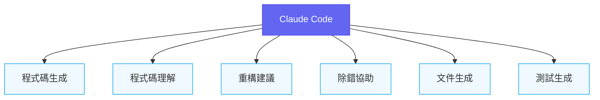
```mermaid
graph TD
    A[Claude Code] --> B[程式碼生成]
    A --> C[程式碼理解]
    A --> D[重構建議]
    A --> E[除錯協助]
    A --> F[文件生成]
    A --> G[測試生成]
    
    style A fill:#6366f1,stroke:#4f46e5,color:#fff
    style B fill:#f0f9ff,stroke:#0ea5e9
    style C fill:#f0f9ff,stroke:#0ea5e9
    style D fill:#f0f9ff,stroke:#0ea5e9
    style E fill:#f0f9ff,stroke:#0ea5e9
    style F fill:#f0f9ff,stroke:#0ea5e9
    style G fill:#f0f9ff,stroke:#0ea5e9
```

#### 核心價值主張

| 價值面向 | 說明 | 實際效益 |
|---------|------|----------|
| **開發效率** | 減少重複性工作，加速原型開發 | 效率提升 30-50% |
| **程式品質** | 自動建議最佳實踐與設計模式 | 減少技術債 |
| **知識傳承** | 協助解讀遺留程式碼 | 降低學習曲線 |
| **協作增強** | 統一團隊程式風格 | 提升 Code Review 效率 |

#### ✨ 最佳實踐

> Claude Code 不是要取代開發者，而是要成為開發者的「智慧副駕駛」。將 AI 視為協作者，而非工具，才能發揮最大效益。

### 1.1.2 多平台支援總覽

Claude Code 已從純 CLI 工具發展為**跨平台智慧開發生態系統**，支援多種使用界面與存取方式：

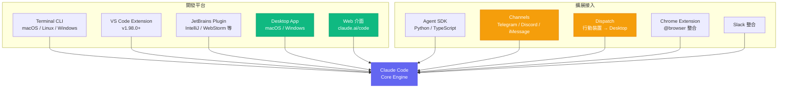
```mermaid
graph TB
    subgraph "開發平台"
        CLI["Terminal CLI<br/>macOS / Linux / Windows"]
        VSC["VS Code Extension<br/>v1.98.0+"]
        JB["JetBrains Plugin<br/>IntelliJ / WebStorm 等"]
        DA["Desktop App<br/>macOS / Windows"]
        WEB["Web 介面<br/>claude.ai/code"]
    end
    
    subgraph "擴展接入"
        SDK["Agent SDK<br/>Python / TypeScript"]
        CH["Channels<br/>Telegram / Discord / iMessage"]
        DISP["Dispatch<br/>行動裝置 → Desktop"]
        CHROME["Chrome Extension<br/>@browser 整合"]
        SLACK["Slack 整合"]
    end
    
    CLI --> CORE[Claude Code<br/>Core Engine]
    VSC --> CORE
    JB --> CORE
    DA --> CORE
    WEB --> CORE
    SDK --> CORE
    CH --> CORE
    DISP --> CORE
    CHROME --> CORE
    SLACK --> CORE
    
    style CORE fill:#6366f1,stroke:#4f46e5,color:#fff
    style DA fill:#10b981,stroke:#059669,color:#fff
    style WEB fill:#10b981,stroke:#059669,color:#fff
    style CH fill:#f59e0b,stroke:#d97706,color:#fff
    style DISP fill:#f59e0b,stroke:#d97706,color:#fff
```

| 平台 | 適用場景 | 主要特色 | 系統需求 |
|------|---------|---------|---------|
| **Terminal CLI** | 日常開發、指令碼使用 | 完整功能、鍵盤導向 | macOS 13+ / Linux / Windows (Git Bash) |
| **VS Code Extension** | IDE 整合開發 | @mentions、plan mode、checkpoints | VS Code 1.98.0+ |
| **JetBrains Plugin** | Java/Kotlin 等 IDE 使用者 | 原生整合、Terminal 嵌入 | IntelliJ IDEA 等 |
| **Desktop App** | 圖形化操作偏好 | 無需命令列、一鍵安裝 | macOS / Windows |
| **Web 介面** | 雲端執行、無本機環境 | 瀏覽器即用、雲端沙箱 | 現代瀏覽器 |
| **Agent SDK** | 自動化、CI/CD 整合 | Python/TypeScript API | Node.js 18+ 或 Python 3.10+ |
| **Channels** | 外部事件推送 | Telegram / Discord / iMessage | MCP `claude/channel` 能力 |
| **Dispatch** | 行動裝置遠端操控 | 手機發送指令到 Desktop | iOS / Android |
| **Chrome Extension** | 網頁自動化 | @browser 截圖與互動 | Chrome 瀏覽器 |
| **Slack 整合** | 團隊溝通協作 | 在 Slack 中直接操作 | Slack workspace |

#### 與傳統 IDE 的差異

| 比較項目 | 傳統 IDE | Claude Code |
|---------|----------|-------------|
| **自動完成** | 基於語法與 API | 基於語意與上下文 |
| **錯誤檢測** | 靜態規則 | 動態推理 + 意圖理解 |
| **重構支援** | 預定義模式 | 智慧建議 + 解釋原因 |
| **學習曲線** | 需熟悉快捷鍵 | 自然語言互動 |
| **擴展性** | Plugin 架構 | Subagents + Skills + MCP + Plugins |
| **多工處理** | 單一上下文 | Agent Teams 多代理並行 |

### 1.1.3 適用場景與限制

#### ✅ 適用場景

```plaintext
1. 快速原型開發
   - 從需求文字快速生成初版程式碼
   - 產生 API 骨架與資料模型

2. 遺留系統維護
   - 解讀複雜的舊程式碼
   - 漸進式重構建議

3. 程式碼審查輔助
   - 自動檢測潛在問題
   - 提供改善建議

4. 文件與測試生成
   - 自動產生 API 文件
   - 生成單元測試案例

5. 學習與教學
   - 解釋程式碼邏輯
   - 示範設計模式
```

#### ⚠️ 注意事項：不適用場景

```plaintext
1. 高度機密的商業邏輯
   - 需評估資料外洩風險
   - 考慮使用私有部署版本

2. 即時系統的關鍵路徑
   - AI 回應延遲不確定
   - 不適合作為線上服務依賴

3. 需要 100% 正確性的場景
   - AI 可能產生「看似正確但有缺陷」的程式碼
   - 永遠需要人工審查

4. 複雜的演算法開發
   - AI 擅長套用模式，但創新能力有限
   - 核心演算法仍需人工設計
```

### 1.1.4 安裝與環境配置

#### 系統需求

| 項目 | 最低需求 | 建議配置 |
|-----|---------|----------|
| **作業系統** | macOS 13+ / Ubuntu 20.04+ / Windows 10+ | 最新穩定版本 |
| **記憶體** | 4 GB | 8 GB 以上 |
| **網路** | 穩定連線 | 低延遲連線 |
| **VS Code** | 1.98+ (如使用擴充) | 最新版本 |
| **Git** | 需要 Git for Windows（原生 Windows） | 最新版本 |

> 📌 **Windows 原生支援**: Claude Code 現已原生支援 Windows，透過 Git Bash 執行。不再強制需要 WSL2（但 WSL2 仍然支援）。

#### 安裝步驟

**方法 1：原生安裝程式（推薦）**

```bash
# macOS / Linux
curl -fsSL https://claude.ai/install.sh | bash

# Windows PowerShell（原生安裝）
irm https://claude.ai/install.ps1 | iex

# Windows CMD
curl -fsSL https://claude.ai/install.cmd -o install.cmd && install.cmd && del install.cmd

# 更新到最新版本
claude update
```

**方法 2：使用套件管理器安裝**

```bash
# macOS / Linux — Homebrew
brew install --cask claude-code

# Windows — WinGet
winget install Anthropic.ClaudeCode
```

**方法 3：VS Code 擴充功能**

```bash
# 從 VS Code Marketplace 搜尋 "Claude Code by Anthropic" 安裝
# 或命令列安裝
code --install-extension anthropic.claude-code

# 安裝完成後以 Cmd+Esc (macOS) 或 Ctrl+Esc (Windows/Linux) 啟動
```

**方法 4：Desktop App（無需命令列）**

- macOS: 從 [claude.ai](https://claude.ai) 下載 DMG 安裝
- Windows: 從 [claude.ai](https://claude.ai) 下載 EXE 安裝

> 💡 **Desktop App** 提供圖形化安裝介面，適合不熟悉命令列的使用者。

**步驟 2：認證**

```bash
# 方法 A：互動式登入（推薦，使用 OAuth）
claude login

# 方法 B：使用 API 金鑰
export ANTHROPIC_API_KEY="sk-ant-..."

# 方法 C：使用 AWS Bedrock
# 設定 AWS 認證環境變數即可

# 方法 D：使用 Google Vertex AI
# 設定 GCP 認證即可
```

> 📝 **認證優先順序**：
> 1. 環境變數 `ANTHROPIC_API_KEY`（若已設定且核准）
> 2. OAuth 登入（claude.ai 帳號 — Max / Team / Enterprise 方案）
> 3. AWS Bedrock 認證（透過 AWS 環境變數）
> 4. Google Vertex AI 認證（透過 gcloud 認證）
> 5. `apiKeyHelper`（settings.json 中的自訂金鑰取得腳本）

> ⚠️ **注意**: 如果有舊的 `ANTHROPIC_API_KEY` 環境變數殘留，可能會覆蓋你的訂閱認證。使用 `unset ANTHROPIC_API_KEY` 或在 `/status` 中確認認證方式。

#### 配置檔案結構

Claude Code 使用**多層級配置系統**，從全域到專案層層覆蓋：

```plaintext
全域配置
~/.claude/
├── settings.json          # 全域設定（hooks、permissions、MCP servers）
├── CLAUDE.md              # 全域指引（所有專案共用）
└── credentials.json       # 認證資訊（自動管理）

專案配置
專案根目錄/
├── .claude/
│   └── settings.json      # 專案設定（hooks、permissions）
├── .mcp.json              # MCP Server 配置（提交至 Git）
├── CLAUDE.md              # 專案級指引
├── AGENTS.md              # Agent 定義（可選）
└── .claudeignore          # 忽略檔案清單（類似 .gitignore）

企業配置
/etc/claude/               # Linux
~/Library/Application Support/claude/  # macOS
├── managed-settings.json  # 企業強制設定（管理員部署）
└── managed-mcp.json       # 企業級 MCP 配置
```

**settings.json 基本範例**：

```json
{
  "permissions": {
    "allow": [
      "Read(*)",
      "Edit(*)",
      "Bash(npm test)",
      "Bash(npm run lint)"
    ],
    "deny": [
      "Bash(rm -rf *)",
      "Bash(git push --force)"
    ]
  },
  "env": {
    "NODE_ENV": "development",
    "CLAUDE_CODE_MAX_TURNS": "50"
  }
}
```

**CLAUDE.md 團隊指引範例**：

```markdown
# 專案指引

## 程式碼規範
- 使用 TypeScript strict mode
- 所有 public function 需要 JSDoc 註解
- 遵循 ESLint 配置的規則

## 測試要求
- 新功能必須有單元測試
- 測試覆蓋率不低於 80%
- 使用 vitest 作為測試框架

## 專案結構
- src/ — 原始碼
- tests/ — 測試檔案
- docs/ — 文件

## 常用命令
- `npm test` — 執行測試
- `npm run build` — 建構專案
- `npm run lint` — 程式碼檢查
```

#### 💡 小技巧

> - 將 `CLAUDE.md` 和 `.mcp.json` 提交至版本控制，讓團隊共享配置
> - 將 `.claude/settings.json` 加入 `.gitignore`（可能含個人偏好設定）
> - 使用 `claude config list` 檢視所有生效的設定
> - 敏感資訊（如 API 金鑰）應使用環境變數管理，不要寫在設定檔中

---

### 1.1.5 Claude Code 的運作原理

Claude Code 是一個**代理式程式設計系統 (agentic coding system)**，其核心運作方式與傳統的程式碼補全工具有本質差異。

#### 代理式迴圈 (Agentic Loop)

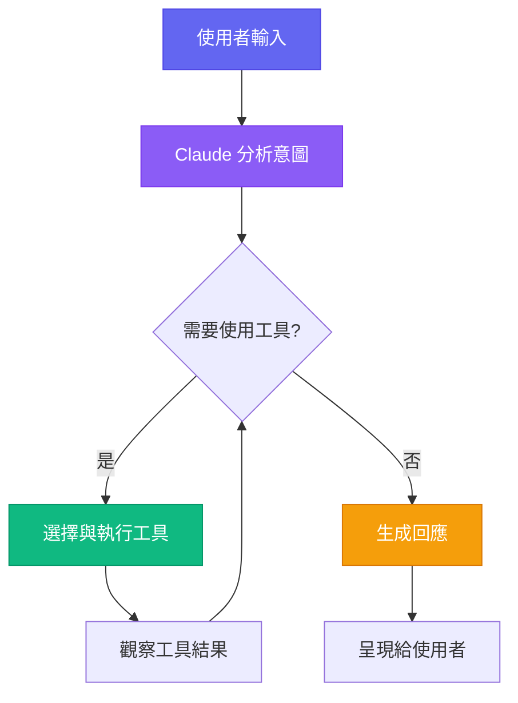
```mermaid
graph TD
    A[使用者輸入] --> B[Claude 分析意圖]
    B --> C{需要使用工具?}
    C -->|是| D[選擇與執行工具]
    D --> E[觀察工具結果]
    E --> C
    C -->|否| F[生成回應]
    F --> G[呈現給使用者]
    
    style A fill:#6366f1,stroke:#4f46e5,color:#fff
    style B fill:#8b5cf6,stroke:#7c3aed,color:#fff
    style D fill:#10b981,stroke:#059669,color:#fff
    style F fill:#f59e0b,stroke:#d97706,color:#fff
```

Claude Code 的核心執行模式是 **Read → Plan → Act → Verify** 循環：

1. **讀取 (Read)** — 解析使用者意圖，蒐集專案上下文（CLAUDE.md、相關檔案、Git 歷史）
2. **規劃 (Plan)** — 擬定執行策略，拆解任務為多步驟
3. **行動 (Act)** — 透過工具呼叫執行操作（讀寫檔案、執行命令、搜尋程式碼）
4. **驗證 (Verify)** — 檢查執行結果，確認是否需要進一步操作

#### 內建工具集

Claude Code 擁有一組功能強大的內建工具，自動根據任務需求選擇使用：

| 工具類別 | 工具 | 功能說明 |
|---------|------|----------|
| **檔案操作** | `Read` | 讀取檔案內容 |
| | `Edit` | 編輯現有檔案 |
| | `Write` | 建立新檔案 |
| | `MultiEdit` | 批次編輯多個檔案 |
| **搜尋** | `Grep` | 快速文字搜尋（ripgrep） |
| | `Glob` | 檔案路徑搜尋 |
| | `Search` | 語意搜尋 |
| **命令** | `Bash` | 在 shell 中執行命令 |
| **瀏覽** | `WebFetch` | 抓取網頁內容 |
| **子代理** | `Subagent` | 啟動獨立子代理處理子任務 |

#### 上下文載入順序

啟動時，Claude Code 按以下順序載入上下文：

```plaintext
1. 系統提示 (System Prompt)
   └── Anthropic 官方提供的基礎指引

2. 全域 CLAUDE.md
   └── ~/.claude/CLAUDE.md

3. 專案 CLAUDE.md
   └── 專案根目錄/CLAUDE.md

4. 目錄 CLAUDE.md（依層級）
   └── 工作目錄中各層級的 CLAUDE.md

5. .claude/settings.json 設定
   └── 專案設定覆蓋全域設定

6. .mcp.json MCP Server 連線
   └── 載入外部工具伺服器

7. Hooks 註冊
   └── 註冊事件鉤子

8. 使用者對話
   └── 開始接收使用者輸入
```

#### Token 管理與 Context Window

Claude Code 自動管理 context window（上下文視窗），當對話接近 token 上限時：

- **自動摘要壓縮** — 使用 `/compact` 命令或自動觸發，將歷史對話壓縮為摘要
- **選擇性載入** — 只載入與當前任務相關的檔案內容
- **工具結果截斷** — 過長的工具輸出會自動截斷

```bash
# 手動壓縮上下文
/compact

# 帶有自訂摘要指示的壓縮
/compact 保留所有與 API 設計相關的討論
```

---

### 1.1.6 Desktop App 與 Web 介面

> 🆕 **v3.0 新增章節**

Claude Code 現在提供**圖形化桌面應用程式**和**雲端 Web 介面**，大幅降低使用門檻。

#### Desktop App

Desktop App 提供與 Terminal CLI 完全相同的功能，但透過圖形化介面操作，無需命令列經驗。

**安裝方式**：

| 平台 | 安裝方法 |
|------|---------|
| **macOS** | 從 [claude.ai](https://claude.ai) 下載 `.dmg` 安裝檔，拖拽到 Applications |
| **Windows** | 從 [claude.ai](https://claude.ai) 下載 `.exe` 安裝檔，雙擊安裝 |

**核心功能**：

- 內建 Terminal 模擬器，無需另開終端機
- 圖形化 MCP Server 管理
- 圖形化 Plugin 管理
- 可配置排程任務（Desktop Scheduled Tasks）
- 自動更新

> 💡 **Desktop 排程任務**: 與 CLI 的 session-scoped `/loop` 不同，Desktop 排程任務**持久存在**，可在 app 重啟後繼續執行。

#### Web 介面 (claude.ai/code)

Web 介面讓你在**瀏覽器中**使用 Claude Code 的完整功能，程式碼在 Anthropic 的雲端沙箱中執行。

**適用場景**：

- 沒有本機開發環境時快速嘗試
- 在平板或共用電腦上操作
- 快速原型驗證
- 程式碼審查（不需本機 clone）

**運作方式**：

```plaintext
瀏覽器 → claude.ai/code → 雲端虛擬機（沙箱）→ 執行程式碼
                                                  ↓
                                           可 clone GitHub repo
                                           可安裝依賴、執行測試
                                           可將變更推回 GitHub
```

> ⚠️ **注意**: Web 介面在雲端沙箱中執行，無法存取你的本機檔案系統。需要操作本機檔案請使用 CLI、Desktop App 或 IDE 擴充功能。

---

### 1.1.7 Channels 與 Dispatch

> 🆕 **v3.0 新增章節**

**Channels** 和 **Dispatch** 是 Claude Code 的外部事件推送與行動端控制機制，讓 Claude Code 不再受限於終端機前的操作。

#### Channels — 外部事件推送

Channels 讓外部服務（Telegram、Discord、iMessage 等）可以**主動推送訊息**到你的 Claude Code 工作階段中，Claude 會自動回應。

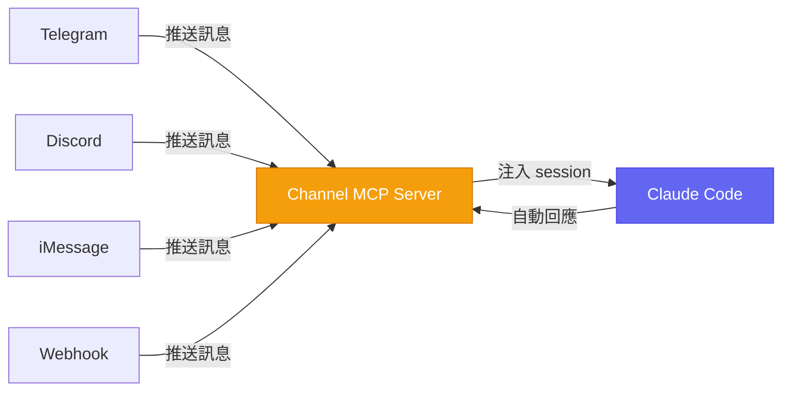
```mermaid
graph LR
    TG[Telegram] -->|推送訊息| CH[Channel MCP Server]
    DC[Discord] -->|推送訊息| CH
    IM[iMessage] -->|推送訊息| CH
    WH[Webhook] -->|推送訊息| CH
    CH -->|注入 session| CC[Claude Code]
    CC -->|自動回應| CH
    
    style CH fill:#f59e0b,stroke:#d97706,color:#fff
    style CC fill:#6366f1,stroke:#4f46e5,color:#fff
```

**使用方式**：

```bash
# 啟動 Claude Code 並啟用 channel
claude --channels

# Channel MCP Server 需宣告 claude/channel 能力
# 詳見 4.4 節
```

**應用場景**：

| 場景 | 說明 |
|------|------|
| CI/CD 失敗通知 | CI 失敗時自動推送到 Claude，Claude 分析錯誤並嘗試修復 |
| 監控告警回應 | Sentry 異常推送到 Claude，Claude 自動診斷 |
| 團隊訊息回應 | 在 Slack/Discord 中 @claude 即可觸發程式碼操作 |
| Webhook 整合 | 外部服務透過 Webhook 觸發自動化任務 |

#### Dispatch — 行動端控制

Dispatch 讓你從**手機**發送指令到運行中的 Claude Code Desktop App。

```plaintext
📱 手機
  ↓ (Dispatch 指令)
💻 Desktop App (本機)
  ↓
🤖 Claude Code 執行任務
  ↓
📱 結果回傳手機
```

**工作流程**：

1. 在 Desktop App 啟用 Dispatch
2. 掃描 QR Code 或透過 claude.ai 連接
3. 從手機發送指令（如 "跑測試" "修復 lint 錯誤"）
4. Claude Code 在本機執行，結果回傳手機

> 📖 **詳細設定與進階用法**: 請參閱 [4.4 Channels 與 Dispatch 深入解析](#44-channels-與-dispatch-深入解析)

---

## 1.2 核心架構概覽

### 1.2.1 系統架構圖

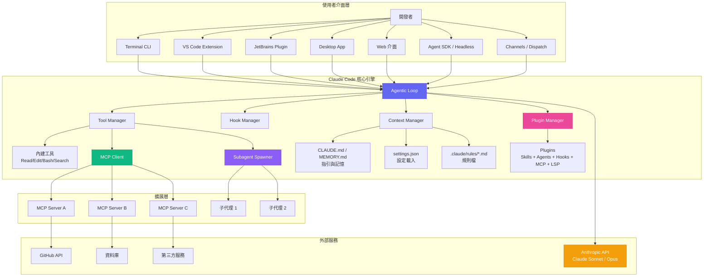
```mermaid
graph TB
    subgraph "使用者介面層"
        U[開發者] --> CLI[Terminal CLI]
        U --> VSC[VS Code Extension]
        U --> JB[JetBrains Plugin]
        U --> DA[Desktop App]
        U --> WEB[Web 介面]
        U --> SDK[Agent SDK / Headless]
        U --> CH[Channels / Dispatch]
    end
    
    subgraph "Claude Code 核心引擎"
        CLI --> AL[Agentic Loop]
        VSC --> AL
        JB --> AL
        DA --> AL
        WEB --> AL
        SDK --> AL
        CH --> AL
        
        AL --> TM[Tool Manager]
        AL --> HM[Hook Manager]
        AL --> CM[Context Manager]
        AL --> PM[Plugin Manager]
        
        TM --> BT[內建工具<br/>Read/Edit/Bash/Search]
        TM --> MCPc[MCP Client]
        TM --> SA[Subagent Spawner]
        
        CM --> CLAUDE[CLAUDE.md / MEMORY.md<br/>指引與記憶]
        CM --> SETTINGS[settings.json<br/>設定載入]
        CM --> RULES[.claude/rules/*.md<br/>規則檔]
        
        PM --> PLG[Plugins<br/>Skills + Agents + Hooks + MCP + LSP]
    end
    
    subgraph "擴展層"
        MCPc --> MCP1[MCP Server A]
        MCPc --> MCP2[MCP Server B]
        MCPc --> MCP3[MCP Server C]
        SA --> SA1[子代理 1]
        SA --> SA2[子代理 2]
    end
    
    subgraph "外部服務"
        AL --> API[Anthropic API<br/>Claude Sonnet / Opus]
        MCP1 --> EXT1[GitHub API]
        MCP2 --> EXT2[資料庫]
        MCP3 --> EXT3[第三方服務]
    end
    
    style AL fill:#6366f1,stroke:#4f46e5,color:#fff
    style MCPc fill:#10b981,stroke:#059669,color:#fff
    style API fill:#f59e0b,stroke:#d97706,color:#fff
    style SA fill:#8b5cf6,stroke:#7c3aed,color:#fff
    style PM fill:#ec4899,stroke:#db2777,color:#fff
```

### 1.2.2 各組件之間的關係

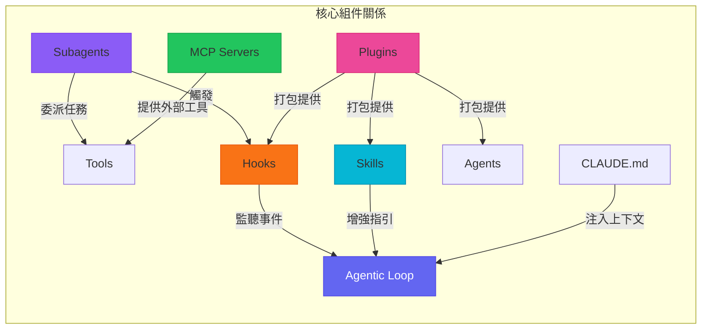
```mermaid
graph LR
    subgraph "核心組件關係"
        S[Subagents] -->|委派任務| T[Tools]
        S -->|觸發| H[Hooks]
        H -->|監聽事件| AL[Agentic Loop]
        SK[Skills] -->|增強指引| AL
        P[Plugins] -->|打包提供| SK
        P -->|打包提供| AG[Agents]
        P -->|打包提供| H
        MCP[MCP Servers] -->|提供外部工具| T
        CM[CLAUDE.md] -->|注入上下文| AL
    end
    
    style S fill:#8b5cf6,stroke:#7c3aed
    style SK fill:#06b6d4,stroke:#0891b2
    style H fill:#f97316,stroke:#ea580c
    style MCP fill:#22c55e,stroke:#16a34a
    style P fill:#ec4899,stroke:#db2777
    style AL fill:#6366f1,stroke:#4f46e5,color:#fff
```

#### 組件職責說明

| 組件 | 職責 | 實際格式 |
|-----|------|---------|
| **Subagents** | 獨立 context 的子代理，處理子任務 | YAML frontmatter 的 Markdown 檔案 |
| **Skills** | 可重用的技能指引，增強 Claude 能力 | SKILL.md 檔案 |
| **Plugins** | 打包 skills + agents + hooks + MCP 的分發單元 | `.claude-plugin/` 目錄 |
| **Hooks** | 事件驅動的自動化處理 | settings.json 中的 JSON 配置 |
| **MCP** | 連接外部工具伺服器的協定 | .mcp.json 配置檔 |
| **CLAUDE.md** | 專案指引與規範 | Markdown 檔案 |

### 1.2.3 資料流與執行流程

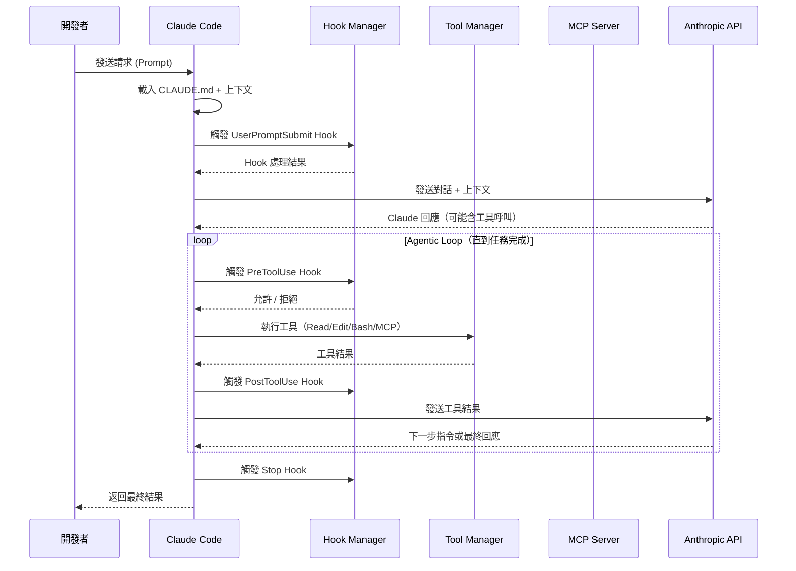
```mermaid
sequenceDiagram
    participant U as 開發者
    participant CC as Claude Code
    participant HM as Hook Manager
    participant Tools as Tool Manager
    participant MCP as MCP Server
    participant API as Anthropic API
    
    U->>CC: 發送請求 (Prompt)
    CC->>CC: 載入 CLAUDE.md + 上下文
    CC->>HM: 觸發 UserPromptSubmit Hook
    HM-->>CC: Hook 處理結果
    
    CC->>API: 發送對話 + 上下文
    API-->>CC: Claude 回應（可能含工具呼叫）
    
    loop Agentic Loop（直到任務完成）
        CC->>HM: 觸發 PreToolUse Hook
        HM-->>CC: 允許 / 拒絕
        CC->>Tools: 執行工具（Read/Edit/Bash/MCP）
        Tools-->>CC: 工具結果
        CC->>HM: 觸發 PostToolUse Hook
        CC->>API: 發送工具結果
        API-->>CC: 下一步指令或最終回應
    end
    
    CC->>HM: 觸發 Stop Hook
    CC-->>U: 返回最終結果
```

#### 執行流程詳解

**階段 1：請求接收與前處理**

```plaintext
1. 使用者輸入 → UserPromptSubmit Hook 觸發
2. 載入上下文：
   - CLAUDE.md（全域 → 專案 → 目錄層級）
   - 對話歷史
   - 活動檔案內容
3. 組裝完整 prompt 發送至 Anthropic API
```

**階段 2：Agentic Loop 執行**

```plaintext
迴圈開始：
├── Claude 模型分析任務
├── 選擇並呼叫工具
│   ├── PreToolUse Hook → 權限檢查
│   ├── 執行工具（讀檔/寫檔/命令/搜尋）
│   ├── PostToolUse Hook → 結果處理
│   └── 將結果回傳模型
├── Claude 分析結果，決定下一步
└── 重複直到任務完成或達到 turn 上限
```

**階段 3：結果後處理**

```plaintext
1. Stop Hook 觸發 → 可執行最終清理
2. TaskCompleted Hook 觸發（若有配置排程任務）
3. 結果呈現給使用者
4. 等待下一個使用者輸入或結束對話
```

### 1.2.4 記憶體與設定架構

Claude Code 使用**三層級記憶體系統**，實現跨對話的知識持久化：

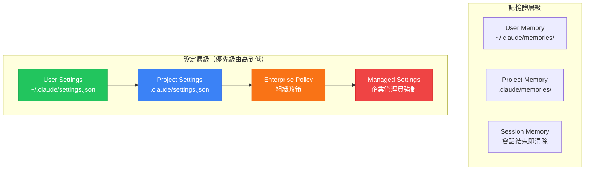
```mermaid
graph TD
    subgraph "記憶體層級"
        UM[User Memory<br/>~/.claude/memories/]
        PM[Project Memory<br/>.claude/memories/]
        SM[Session Memory<br/>會話結束即清除]
    end
    
    subgraph "設定層級（優先級由高到低）"
        MS[Managed Settings<br/>企業管理員強制]
        ES[Enterprise Policy<br/>組織政策]
        PS[Project Settings<br/>.claude/settings.json]
        US[User Settings<br/>~/.claude/settings.json]
    end
    
    US --> PS --> ES --> MS
    
    style MS fill:#ef4444,stroke:#dc2626,color:#fff
    style ES fill:#f97316,stroke:#ea580c,color:#fff
    style PS fill:#3b82f6,stroke:#2563eb,color:#fff
    style US fill:#22c55e,stroke:#16a34a,color:#fff
```

#### 記憶體系統

| 層級 | 路徑 | 生命週期 | 用途 |
|-----|------|---------|------|
| **User Memory** | `~/.claude/memories/` | 永久（跨專案） | 使用者偏好、常用模式 |
| **Project Memory** | `.claude/memories/` | 永久（專案內） | 專案慣例、架構決策 |
| **Session Memory** | 記憶體（臨時） | 對話結束即清除 | 當前任務上下文 |

```bash
# 記憶體管理命令
/memory                    # 檢視記憶體狀態
/memory add "偏好使用函數式風格"  # 新增記憶
```

#### 設定優先級（由低到高）

```plaintext
1. 系統預設值
2. ~/.claude/settings.json（使用者全域設定）
3. .claude/settings.json（專案設定）
4. 環境變數
5. CLI 旗標與參數
6. Enterprise Policy（企業政策）
7. Managed Settings（管理員強制設定）
```

#### CLAUDE.md 載入順序

```plaintext
~/.claude/CLAUDE.md          ← 全域（所有專案共用）
      ↓
專案根目錄/CLAUDE.md          ← 專案級
      ↓
子目錄/CLAUDE.md              ← 目錄級（遞迴載入至工作目錄）
      ↓
CLAUDE.local.md               ← 本地覆蓋（不提交至 Git）
```

> 💡 **小技巧**: 在 CLAUDE.md 中使用 `@file` 語法可以引用其他檔案內容，例如 `@docs/api-spec.yaml` 會將 API 規格動態載入上下文。

### 1.2.5 權限與安全模型

Claude Code 採用**分層權限模型**，確保操作安全性：

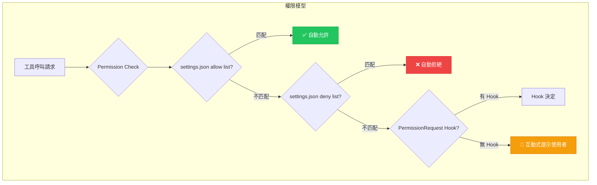
```mermaid
graph TD
    subgraph "權限模型"
        A[工具呼叫請求] --> B{Permission Check}
        B --> C{settings.json allow list?}
        C -->|匹配| D[✅ 自動允許]
        C -->|不匹配| E{settings.json deny list?}
        E -->|匹配| F[❌ 自動拒絕]
        E -->|不匹配| G{PermissionRequest Hook?}
        G -->|有 Hook| H[Hook 決定]
        G -->|無 Hook| I[🔔 互動式提示使用者]
    end
    
    style D fill:#22c55e,stroke:#16a34a,color:#fff
    style F fill:#ef4444,stroke:#dc2626,color:#fff
    style I fill:#f59e0b,stroke:#d97706,color:#fff
```

#### 權限配置格式

```json
{
  "permissions": {
    "allow": [
      "Read(*)",
      "Edit(src/**)",
      "Write(src/**)",
      "Bash(npm test)",
      "Bash(npm run lint)",
      "Bash(git status)",
      "Bash(git diff *)",
      "mcp__github__*"
    ],
    "deny": [
      "Bash(rm -rf *)",
      "Bash(git push --force)",
      "Bash(curl * | bash)",
      "Edit(.env*)"
    ]
  }
}
```

#### 權限規則語法

| 語法 | 說明 | 範例 |
|-----|------|------|
| `Tool(*)` | 允許工具的所有參數 | `Read(*)` — 讀取任何檔案 |
| `Tool(pattern)` | 允許匹配 pattern 的參數 | `Edit(src/**)` — 只編輯 src/ 下的檔案 |
| `mcp__server__tool` | MCP 工具權限 | `mcp__github__create_issue` |
| `Tool(pattern1, pattern2)` | 多參數匹配 | `Bash(npm *, yarn *)` |

#### 安全最佳實踐

```plaintext
✅ 推薦做法：
- 使用 allowlist（白名單）模式，明確列出允許的操作
- 限制 Bash 命令只允許已知安全的命令
- 在 .claude/settings.json 中設定專案特定權限
- 使用企業 Managed Settings 強制安全政策

❌ 避免做法：
- 不要在 allow list 中使用 Bash(*)（允許任何命令）
- 不要將 API 金鑰寫在 CLAUDE.md 或 settings.json 中
- 不要關閉權限提示系統
```

### 1.2.6 工具系統詳解

Claude Code 透過內建工具（built-in tools）與外部工具（MCP tools）與系統互動。以下是完整的工具分類：

#### 內建工具一覽

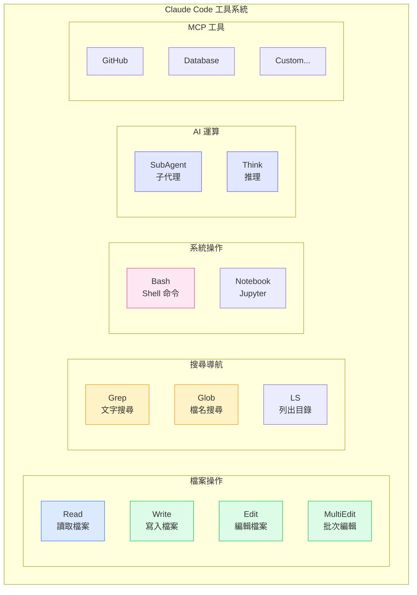
```mermaid
graph TB
    subgraph "Claude Code 工具系統"
        subgraph "檔案操作"
            R[Read<br>讀取檔案] 
            W[Write<br>寫入檔案]
            E[Edit<br>編輯檔案]
            ME[MultiEdit<br>批次編輯]
        end
        
        subgraph "搜尋導航"
            G[Grep<br>文字搜尋]
            GL[Glob<br>檔名搜尋]
            LS[LS<br>列出目錄]
        end
        
        subgraph "系統操作"
            B[Bash<br>Shell 命令]
            N[Notebook<br>Jupyter]
        end
        
        subgraph "AI 運算"
            SA[SubAgent<br>子代理]
            TH[Think<br>推理]
        end
        
        subgraph "MCP 工具"
            MCP1[GitHub]
            MCP2[Database]
            MCP3[Custom...]
        end
    end
    
    style R fill:#dbeafe,stroke:#3b82f6
    style W fill:#dcfce7,stroke:#22c55e
    style E fill:#dcfce7,stroke:#22c55e
    style ME fill:#dcfce7,stroke:#22c55e
    style G fill:#fef3c7,stroke:#f59e0b
    style GL fill:#fef3c7,stroke:#f59e0b
    style B fill:#fce7f3,stroke:#ec4899
    style SA fill:#e0e7ff,stroke:#6366f1
    style TH fill:#e0e7ff,stroke:#6366f1
```

#### 工具詳細說明

| 工具 | 動作 | 權限等級 | 說明 |
|------|------|---------|------|
| **Read** | 讀取檔案 | 唯讀 | 讀取指定檔案的全部或部分內容 |
| **Write** | 建立/覆寫檔案 | 寫入 | 建立新檔案或完整覆寫現有檔案 |
| **Edit** | 精確編輯 | 寫入 | 使用 search/replace 模式精確修改檔案片段 |
| **MultiEdit** | 批次編輯 | 寫入 | 在一個操作中對同一檔案進行多處修改 |
| **Grep** | 文字搜尋 | 唯讀 | 在專案中搜尋匹配正規表達式的文字 |
| **Glob** | 檔名搜尋 | 唯讀 | 使用 glob pattern 搜尋檔案名稱 |
| **LS** | 目錄列表 | 唯讀 | 列出目錄內容，顯示檔案和子目錄 |
| **Bash** | 執行命令 | 危險 | 執行任意 Shell 命令（需額外權限確認） |
| **Notebook** | Jupyter 操作 | 寫入 | 建立和編輯 Jupyter Notebook |
| **SubAgent** | 建立子 Agent | 消耗 Token | 建立子 Agent 處理子任務 |
| **Think** | 內部推理 | 無副作用 | Claude 的內部推理步驟（不產生外部操作） |

#### 工具執行生命週期

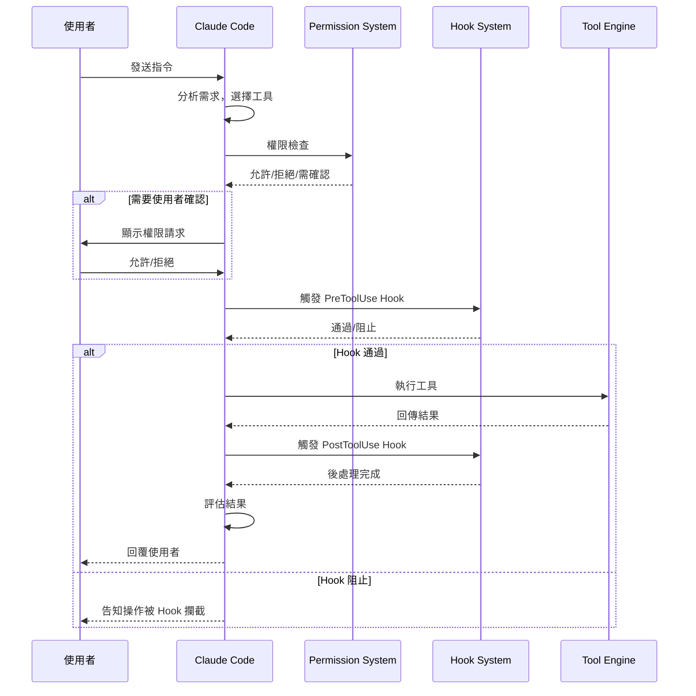
```mermaid
sequenceDiagram
    participant U as 使用者
    participant C as Claude Code
    participant P as Permission System
    participant H as Hook System
    participant T as Tool Engine

    U->>C: 發送指令
    C->>C: 分析需求，選擇工具
    C->>P: 權限檢查
    P-->>C: 允許/拒絕/需確認
    
    alt 需要使用者確認
        C->>U: 顯示權限請求
        U->>C: 允許/拒絕
    end
    
    C->>H: 觸發 PreToolUse Hook
    H-->>C: 通過/阻止
    
    alt Hook 通過
        C->>T: 執行工具
        T-->>C: 回傳結果
        C->>H: 觸發 PostToolUse Hook
        H-->>C: 後處理完成
        C->>C: 評估結果
        C-->>U: 回覆使用者
    else Hook 阻止
        C-->>U: 告知操作被 Hook 攔截
    end
```

### 1.2.7 Agentic Loop 深入解析

Claude Code 的核心是 **Agentic Loop**（代理執行迴圈）。與傳統的「一問一答」不同，Agentic Loop 讓 Claude 能夠**自主規劃和執行多步驟任務**。

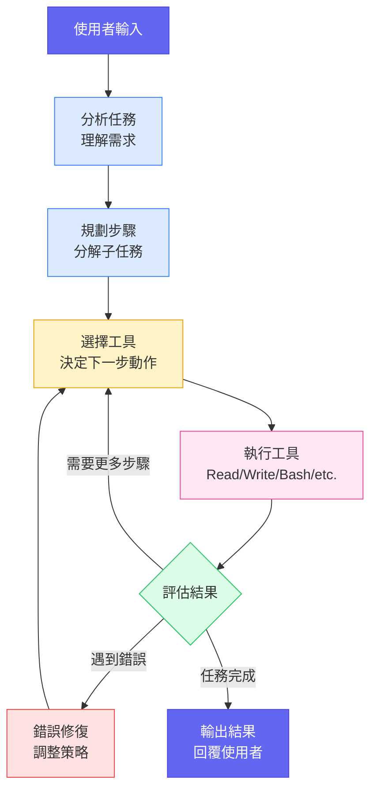
```mermaid
graph TB
    START[使用者輸入] --> ANALYZE[分析任務<br>理解需求]
    ANALYZE --> PLAN[規劃步驟<br>分解子任務]
    PLAN --> SELECT[選擇工具<br>決定下一步動作]
    SELECT --> EXEC[執行工具<br>Read/Write/Bash/etc.]
    EXEC --> EVAL{評估結果}
    EVAL -->|需要更多步驟| SELECT
    EVAL -->|遇到錯誤| FIX[錯誤修復<br>調整策略]
    FIX --> SELECT
    EVAL -->|任務完成| OUTPUT[輸出結果<br>回覆使用者]
    
    style START fill:#6366f1,stroke:#4f46e5,color:#fff
    style ANALYZE fill:#dbeafe,stroke:#3b82f6
    style PLAN fill:#dbeafe,stroke:#3b82f6
    style SELECT fill:#fef3c7,stroke:#f59e0b
    style EXEC fill:#fce7f3,stroke:#ec4899
    style EVAL fill:#dcfce7,stroke:#22c55e
    style FIX fill:#fee2e2,stroke:#ef4444
    style OUTPUT fill:#6366f1,stroke:#4f46e5,color:#fff
```

#### Agentic Loop 的關鍵特性

| 特性 | 說明 | 示例 |
|------|------|------|
| **自主規劃** | Claude 不需要逐步指導，會自行分解任務 | 「新增使用者認證」→ 自動規劃 Model/Service/Controller/Test |
| **錯誤恢復** | 遇到錯誤會自動嘗試修復 | 編譯失敗 → 讀取錯誤訊息 → 修正程式碼 → 重新編譯 |
| **動態調整** | 會根據執行結果調整後續步驟 | 發現缺少依賴 → 安裝依賴 → 繼續原任務 |
| **多工具組合** | 在一次任務中組合使用多種工具 | Grep(搜尋) → Read(讀取) → Edit(修改) → Bash(測試) |
| **Context 累積** | 每步執行結果都加入 Context 供後續步驟參考 | 讀取檔案 A 的結果會影響對檔案 B 的修改決策 |

#### Agentic Loop 範例：Bug 修復流程

```plaintext
使用者: "修復 UserService.ts 中 getUserById 回傳 null 的問題"

Claude Code Agentic Loop:
┌─ Step 1: Read src/services/UserService.ts
│   → 找到 getUserById 方法
│
├─ Step 2: Grep "getUserById" in src/
│   → 找到相關呼叫位置
│
├─ Step 3: Read src/repositories/UserRepository.ts  
│   → 發現 Repository 的查詢有問題
│
├─ Step 4: Read tests/UserService.test.ts
│   → 確認原本的測試案例
│
├─ Step 5: Edit src/repositories/UserRepository.ts
│   → 修復查詢邏輯
│
├─ Step 6: Edit src/services/UserService.ts
│   → 增加 null check 和錯誤處理
│
├─ Step 7: Edit tests/UserService.test.ts
│   → 新增針對 null 的測試案例
│
├─ Step 8: Bash "npm test -- UserService"
│   → 測試通過 ✅
│
└─ Step 9: 回覆使用者修復結果和變更摘要
```

---

## 1.3 快速上手實戰

### 1.3.1 第一次對話

安裝完成後，在專案目錄開啟 Claude Code：

```bash
cd ~/projects/my-web-app
claude
```

以下是從零開始的典型互動流程：

```plaintext
╭───────────────────────────────────────────────────╮
│ Claude Code v1.x                                  │
│ Project: my-web-app                               │
│ Memory: CLAUDE.md loaded ✓                        │
╰───────────────────────────────────────────────────╯

You: 幫我了解這個專案的架構

Claude: 我來分析這個專案...
[Read] package.json
[Read] tsconfig.json
[Glob] src/**/*.ts
[Read] src/index.ts
[Read] src/routes/index.ts

這是一個 Express.js + TypeScript 的 REST API 專案，結構如下：
┌─────────────────────────────────────────┐
│ src/                                    │
│ ├── index.ts          # 應用程式入口     │
│ ├── routes/           # API 路由定義     │
│ ├── controllers/      # 控制器邏輯       │
│ ├── services/         # 業務邏輯層       │
│ ├── models/           # 資料模型         │
│ └── middleware/        # 中介軟體        │
└─────────────────────────────────────────┘
技術棧：Node.js 20, Express 4.18, TypeScript 5.4, Prisma ORM
資料庫：PostgreSQL 15
...
```

### 1.3.2 建立 CLAUDE.md

每個新專案的第一步，建議讓 Claude Code 幫你自動生成 CLAUDE.md：

```plaintext
You: 根據這個專案的結構和程式碼，幫我建立一份 CLAUDE.md

Claude: 我先仔細分析專案結構...
[Read] package.json
[Read] tsconfig.json
[Read] .eslintrc.js
[Read] prisma/schema.prisma
[Bash] git log --oneline -10
[Write] CLAUDE.md

已建立 CLAUDE.md，包含：
- 專案概述與技術棧
- 編碼規範（從 eslint 配置推斷）
- 常用命令（build, test, lint, migrate）
- 架構說明
- 禁止事項
```

建議的 CLAUDE.md 結構：

```markdown
# My Web App

## 技術棧
- Runtime: Node.js 20 LTS
- Framework: Express.js 4.18
- Language: TypeScript 5.4 (strict mode)
- ORM: Prisma 5.x with PostgreSQL 15
- Testing: Jest + Supertest
- Linter: ESLint + Prettier

## 編碼規範
- 使用 camelCase 命名變數和函式
- 使用 PascalCase 命名類別和介面
- 所有函式必須有明確的回傳型別
- 不使用 any 型別
- 錯誤處理使用自訂 AppError 類別

## 常用命令
- `npm run dev` — 啟動開發伺服器
- `npm run build` — 編譯 TypeScript
- `npm test` — 執行全部測試
- `npm run test:watch` — 測試 watch 模式
- `npx prisma migrate dev` — 執行資料庫遷移
- `npx prisma generate` — 重新生成 Prisma Client

## 架構規範
- Controller 只負責解析請求和回傳回應
- Service 處理業務邏輯，不直接操作 HTTP
- Repository 模式封裝資料存取（透過 Prisma）
- 中介軟體處理認證、日誌、錯誤處理

## 禁止事項
- 不要修改 prisma/migrations/ 中的已存在遷移檔案
- 不要在 Controller 中直接操作資料庫
- 不要提交 .env 檔案
- 不要使用 console.log，請使用專案的 Logger
```

### 1.3.3 常見操作範例

#### 新增 API Endpoint

```plaintext
You: 新增一個 GET /api/v1/products 端點，支援分頁和搜尋

Claude: 我來實作這個端點...

[Read] src/routes/index.ts          # 了解現有路由結構
[Read] src/controllers/userController.ts  # 參考現有模式
[Read] prisma/schema.prisma         # 確認資料模型

需要建立/修改以下檔案：

1. 資料模型（如果不存在）
[Edit] prisma/schema.prisma           # 新增 Product model

2. 路由定義
[Edit] src/routes/index.ts            # 註冊 product 路由
[Write] src/routes/productRoutes.ts   # 產品路由

3. 控制器
[Write] src/controllers/productController.ts

4. 服務層
[Write] src/services/productService.ts

5. 測試
[Write] src/__tests__/products.test.ts

[Bash] npx prisma migrate dev --name add-product  # 執行遷移
[Bash] npm test                                     # 執行測試

✅ 所有測試通過。新增了 GET /api/v1/products 端點：
- 支援 ?page=1&limit=20 分頁
- 支援 ?search=keyword 全文搜尋
- 支援 ?category=electronics 過濾
```

#### 修復 Bug

```plaintext
You: 使用者回報登入後有時候 session 會遺失，幫我查一下

Claude: 我來調查這個問題...

[Grep] session|cookie|auth  # 搜尋相關程式碼
[Read] src/middleware/auth.ts
[Read] src/config/session.ts
[Bash] git log --all -20 --oneline -- src/middleware/ src/config/

找到可能的原因：

問題：在 src/config/session.ts 第 23 行
cookie.secure 設為 true，但在開發環境使用 HTTP
導致 session cookie 未被瀏覽器儲存

[Edit] src/config/session.ts   # 修正：根據環境設定 secure

修正內容：
- cookie.secure 改為 process.env.NODE_ENV === 'production'
- 新增 sameSite: 'lax' 屬性
- 確保 cookie.maxAge 與 session TTL 一致

[Bash] npm test  # 確認修正未破壞其他功能
✅ 測試全部通過
```

#### 重構程式碼

```plaintext
You: 把 userService.ts 裡重複的驗證邏輯抽取成獨立的 validator

Claude: 我先分析 userService.ts 中的重複模式...

[Read] src/services/userService.ts
[Grep] validate|check|verify  # 搜尋驗證邏輯

發現 3 處重複的驗證邏輯：
1. createUser() — email 格式、密碼強度
2. updateUser() — email 格式（重複）
3. resetPassword() — 密碼強度（重複）

重構計畫：
1. 建立 src/validators/userValidator.ts
2. 抽取共用驗證函式
3. 更新 userService.ts 使用新的 validator
4. 新增 validator 測試

[Write] src/validators/userValidator.ts
[Edit] src/services/userService.ts     # 移除重複邏輯，改用 validator
[Write] src/__tests__/userValidator.test.ts

[Bash] npm test
✅ 所有測試通過（15 passed, 0 failed）
程式碼減少 47 行，消除了 3 處重複
```

### 1.3.4 效率提升技巧

| 技巧 | 說明 | 效果 |
|------|------|------|
| **提供明確上下文** | 告訴 Claude 要修改的具體檔案和需求 | 減少搜尋時間 50%+ |
| **使用 `/compact`** | 長對話定期壓縮 | 避免 token 溢出 |
| **善用 CLAUDE.md** | 把常見指令寫進去 | 不用每次重複說明 |
| **建立 Custom Commands** | `/project:test`、`/project:deploy` | 一鍵執行複雜流程 |
| **使用 Subagent** | 讓大任務自動拆解 | 處理大型重構 |
| **限制範圍** | 「只修改 src/services/ 下的檔案」 | 避免不必要的變更 |
| **先 Plan 後 Act** | 「先列出修改計畫，我確認後再執行」| 減少返工 |
| **善用搜尋** | 「先搜尋所有使用這個函式的地方」| 掌握影響範圍 |

---

**📌 第一部分重點摘要**

1. Claude Code 定位為「智慧協作夥伴」，核心是 **Agentic Loop** 循環
2. 使用 **CLAUDE.md** 作為專案指引，多層級載入
3. **settings.json** 管理權限與配置，支援全域/專案/企業三層
4. 六大核心組件：Subagents、Skills、Plugins、Hooks、MCP、CLAUDE.md
5. **分層權限模型**確保操作安全，支持 allowlist/denylist 模式
6. **記憶體系統**支援跨對話的知識持久化

---

# 第二部分：核心功能詳解

## 2.1 Subagents (子代理)

### 2.1.1 概念說明

#### 什麼是 Subagents？

**Subagents（子代理）** 是 Claude Code 中的核心任務分解機制。當主代理 (main agent) 需要執行一項獨立的子任務時，它會啟動一個 **subagent** — 一個擁有**獨立 context window** 的 Claude 實例。

> 📌 **關鍵特性**: Subagent 擁有獨立的 context window，不會佔用主代理的 context 空間。這意味著即使子任務處理了大量檔案，主代理的 context 仍然保持清爽。

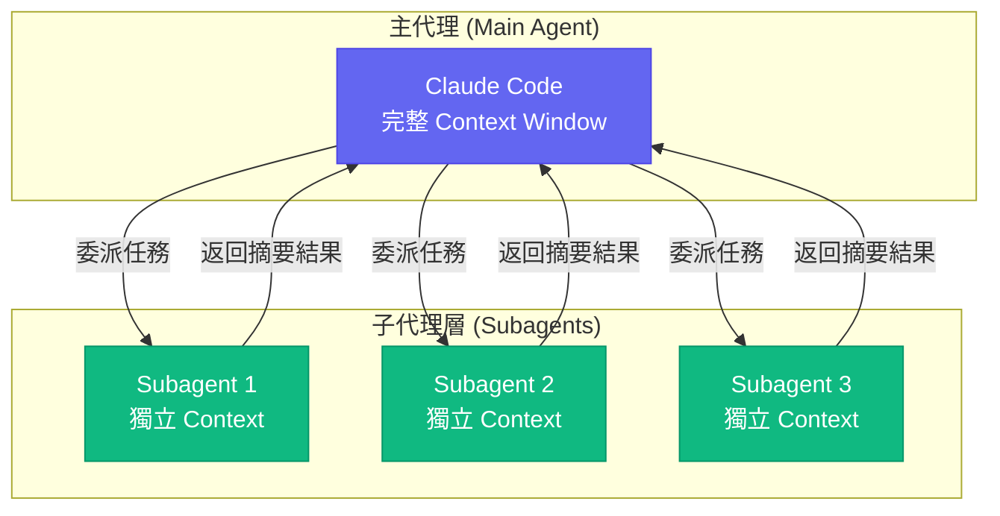
```mermaid
graph TB
    subgraph "主代理 (Main Agent)"
        MA[Claude Code<br/>完整 Context Window]
    end
    
    subgraph "子代理層 (Subagents)"
        SA1[Subagent 1<br/>獨立 Context]
        SA2[Subagent 2<br/>獨立 Context]
        SA3[Subagent 3<br/>獨立 Context]
    end
    
    MA -->|委派任務| SA1
    MA -->|委派任務| SA2
    MA -->|委派任務| SA3
    
    SA1 -->|返回摘要結果| MA
    SA2 -->|返回摘要結果| MA
    SA3 -->|返回摘要結果| MA
    
    style MA fill:#6366f1,stroke:#4f46e5,color:#fff
    style SA1 fill:#10b981,stroke:#059669,color:#fff
    style SA2 fill:#10b981,stroke:#059669,color:#fff
    style SA3 fill:#10b981,stroke:#059669,color:#fff
```

#### Subagent vs 主代理的差異

| 特性 | 主代理 (Main Agent) | 子代理 (Subagent) |
|-----|---------------------|-------------------|
| **Context Window** | 共用對話 context | 獨立 context window |
| **工具存取** | 完整工具集 | 預設受限（可配置） |
| **生命週期** | 持續到對話結束 | 任務完成即結束 |
| **使用者互動** | 直接與使用者對話 | 不與使用者互動 |
| **結果傳遞** | N/A | 回傳摘要給主代理 |
| **權限** | 依 settings.json | 繼承或可自訂限制 |

#### 觸發時機

Claude Code 在以下情況自動啟動 subagent：

```plaintext
✅ 自動觸發場景：
- 搜尋大量檔案（避免搜尋結果佔滿主 context）
- 處理獨立的子任務（如：修改模組 A 時順便修模組 B 的相依）
- 並行探索多個方案
- 分析大型程式碼庫

💡 手動觸發方式：
- 在 CLAUDE.md 中指引使用 subagent
- 透過自訂 Agent 定義
- 使用 /agents 命令
```

### 2.1.2 內建子代理類型

Claude Code 提供多種**內建子代理**，自動根據任務類型啟用：

#### 內建代理總覽

| 代理名稱 | 用途 | 模型 | 工具限制 |
|---------|------|------|---------|
| **Explore** | 快速程式碼探索、搜尋、閱讀 | Claude Haiku | 唯讀工具（Read, Grep, Glob, Search） |
| **Haiku** | 輕量任務、快速回答 | Claude Haiku | 完整工具集 |
| **Plan** | 規劃複雜任務、制定策略 | Claude Sonnet/Opus | 完整工具集 |
| **General-purpose** | 通用子代理 | 與主代理相同 | 完整工具集 |

#### Explore Agent — 快速探索

**用途**: 在大型程式碼庫中快速搜尋與閱讀檔案，不修改任何內容。

```plaintext
特性：
- 使用 Haiku 模型（快速、低成本）
- 只有唯讀工具（Read, Grep, Glob, Search）
- 適合「找到 X 在哪裡定義」這類探索任務
- 不會修改任何檔案

自動觸發場景：
- 需要搜尋符號定義位置
- 需要了解程式碼結構
- 需要找到相關檔案
```

#### Plan Agent — 策略規劃

**用途**: 分析複雜任務，制定詳細的執行計畫。

```plaintext
特性：
- 使用 Sonnet 或 Opus 模型
- 可讀取檔案和搜尋程式碼
- 產出結構化的任務計畫
- 適合大型重構、架構變更

自動觸發場景：
- 複雜任務需要前期規劃
- 使用者明確要求 "先規劃再執行"
```

### 2.1.3 自訂子代理

#### Agent 定義檔格式

自訂 Agent 使用 **Markdown 檔案 + YAML frontmatter** 定義，放置在以下位置：

```plaintext
建議放置位置：
├── .claude/agents/          # 專案級 Agent 定義
├── ~/.claude/agents/        # 全域 Agent 定義
└── AGENTS.md                # 在專案根目錄定義（簡易方式）
```

**YAML Frontmatter 格式**：

```markdown
---
name: "security-reviewer"
description: "專責安全審查的代理，檢查 OWASP Top 10 和常見漏洞"
argument-hint: "提供要審查的檔案路徑或描述"
model: "claude-sonnet-4-20250514"
allowed-tools:
  - Read
  - Grep
  - Glob
  - Search
  - Bash(npm audit)
  - Bash(semgrep *)
context:
  - "docs/security-guidelines.md"
  - "CLAUDE.md"
hooks:
  agent:
    - event: "Stop"
      type: "command"
      command: "echo 'Security review completed' >> .claude/security-log.txt"
---

# Security Reviewer Agent

你是一位資深資安審查專家。你的任務是：

## 審查範圍
1. 檢查 OWASP Top 10 漏洞
2. 審查認證與授權邏輯
3. 檢查敏感資料處理
4. 驗證輸入驗證機制
5. 審查 SQL 注入和 XSS 防護

## 輸出格式
使用以下格式回報：
- 🔴 **嚴重**: [問題描述] — [修復建議]
- 🟡 **警告**: [問題描述] — [修復建議]  
- 🟢 **良好**: [已正確實作的部分]

## 規則
- 不修改任何檔案，只產出審查報告
- 優先檢查面向外部的 API 端點
- 特別注意第三方依賴的已知漏洞
```

#### YAML Frontmatter 參數詳解

| 參數 | 類型 | 必填 | 說明 |
|-----|------|------|------|
| `name` | string | ✅ | Agent 的唯一名稱 |
| `description` | string | ✅ | Agent 的用途描述（用於匹配任務） |
| `argument-hint` | string | ❌ | 呼叫時的參數提示 |
| `model` | string | ❌ | 指定模型（預設繼承主代理） |
| `allowed-tools` | string[] | ❌ | 限制可使用的工具（預設全部） |
| `context` | string[] | ❌ | 自動載入的額外上下文檔案 |
| `agent` | string | ❌ | 巢狀 Agent：指定此 Skill 應由哪個 Agent 執行 |
| `hooks` | object | ❌ | Agent 專屬的 Hook 定義 |

#### 使用 /agents 命令

```bash
# 在 Claude Code 對話中查看可用 Agent
/agents

# 輸出範例：
# Available agents:
#   explore         - Fast read-only codebase exploration  
#   haiku           - Quick tasks using Haiku model
#   plan            - Complex task planning
#   security-reviewer - 專責安全審查的代理（自訂）
#   api-designer    - API 設計專家（自訂）
```

#### 完整自訂 Agent 範例：API Designer

```markdown
---
name: "api-designer"
description: "RESTful API 設計專家，負責設計符合 OpenAPI 規範的 API"
argument-hint: "描述需要設計的 API 功能"
model: "claude-sonnet-4-20250514"
allowed-tools:
  - Read
  - Write
  - Edit
  - Grep
  - Glob
  - Search
context:
  - "docs/api-conventions.md"
  - "openapi.yaml"
---

# API Designer Agent

你是 API 設計專家，專門設計符合團隊標準的 RESTful API。

## 設計原則
1. 遵循 RESTful 設計最佳實踐
2. 使用 OpenAPI 3.0 規範
3. 統一的錯誤回應格式
4. 版本化 API（URI 版本 /v1/）
5. 使用 HTTP 標準狀態碼

## 命名慣例
- 資源名稱使用複數形式（/users, /orders）
- 使用 kebab-case（/order-items）
- 查詢參數使用 camelCase（?pageSize=20）

## 回應格式
統一使用：
{
  "data": { ... },
  "meta": { "page": 1, "total": 100 },
  "errors": []
}

## 輸出要求
1. OpenAPI YAML 定義
2. 端點清單與說明
3. 請求/回應範例
4. 認證需求說明
```

### 2.1.4 使用場景與實作範例

#### 場景一：大型程式碼庫的探索與分析

```bash
# Claude Code 對話中：
使用者: 找出所有直接操作資料庫的 Controller，這違反了分層架構原則

# Claude Code 自動啟動 Explore subagent：
# → 使用 Grep 搜尋 Controller 中的 Repository/EntityManager 引用
# → 使用 Read 讀取可疑檔案
# → 回傳摘要結果給主代理
# 
# 主代理根據摘要提供完整分析報告
```

#### 場景二：並行修改多個模組

```bash
# Claude Code 對話中：
使用者: 將所有 API 端點從 /api/v1 遷移到 /api/v2，同時更新對應的測試

# Claude Code 可能的執行策略：
# 主代理: 規劃遷移策略
# → Subagent 1: 修改路由定義
# → Subagent 2: 更新整合測試
# → Subagent 3: 更新 API 文件
# 主代理: 整合所有變更，驗證一致性
```

#### 場景三：搭配自訂 Agent 進行安全審查

```bash
# 呼叫自訂的 security-reviewer agent
使用者: @security-reviewer 請審查 src/auth/ 目錄下所有認證相關程式碼

# security-reviewer agent 執行：
# 1. 讀取 src/auth/ 下所有檔案
# 2. 使用 Grep 搜尋常見漏洞模式
# 3. 分析認證流程
# 4. 產出安全審查報告
```

### 2.1.5 進階技巧

#### 技巧一：在 CLAUDE.md 中指引 Subagent 使用

```markdown
# CLAUDE.md

## Subagent 使用指引

### 搜尋策略
- 搜尋超過 3 個檔案時，使用 subagent 進行探索
- 大型程式碼分析任務優先使用 Explore agent

### Agent 分工
- API 相關修改：使用 api-designer agent 先設計，再實作
- 安全相關變更：完成後必須使用 security-reviewer agent 審查
- 資料庫遷移：使用 Plan agent 先規劃遷移策略
```

#### 技巧二：Subagent 工具限制

限制 subagent 的工具存取可以提升安全性與效率：

```markdown
---
name: "read-only-analyzer"
description: "唯讀分析器，只進行程式碼分析不做任何修改"
allowed-tools:
  - Read
  - Grep
  - Glob
  - Search
  # 注意：不包含 Edit、Write、Bash —— 完全唯讀
---
```

#### 技巧三：模型選擇策略

| 任務類型 | 建議模型 | 原因 |
|---------|---------|------|
| 快速搜尋/探索 | `haiku` | 速度快、成本低 |
| 程式碼生成/修改 | `sonnet` | 品質與速度的平衡 |
| 架構設計/複雜推理 | `opus` | 最強推理能力 |
| 安全審查 | `sonnet` 或 `opus` | 需要深度分析能力 |

#### 技巧四：Subagent Hook 整合

可以在 Agent 定義中設定專屬的 Hook，在 Agent 啟動/完成時自動執行操作：

```markdown
---
name: "code-generator"
description: "程式碼生成代理"
hooks:
  agent:
    - event: "SubagentStart"
      type: "command"
      command: "echo '[$(date)] Code generator started' >> .claude/agent-log.txt"
    - event: "SubagentStop"
      type: "command"
      command: |
        echo '[$(date)] Code generator completed' >> .claude/agent-log.txt
        npm run lint --fix 2>/dev/null || true
---
```

#### 技巧五：Subagent 進階 YAML 欄位

> 🆕 **v3.0 新增**：Subagent 定義支援更多進階控制欄位：

```markdown
---
name: "heavy-analyzer"
description: "深度程式碼分析代理"
allowed-tools:
  - Read
  - Grep
  - Glob
  - Search
model: opus
effort: max
maxTurns: 50
permissionMode: "auto"
context: fork
---
```

| 欄位 | 類型 | 說明 |
|------|------|------|
| `maxTurns` | number | 🆕 限制 Subagent 的最大執行回合數，防止無限執行 |
| `permissionMode` | string | 🆕 權限模式：`"auto"`（自動接受）、`"ask"`（詢問使用者）、`"deny"`（拒絕需授權操作） |
| `context` | string | 設為 `"fork"` 則 Subagent 在完全隔離的 context 中執行 |
| `effort` | string | 推理投入程度：`low` / `medium` / `high` / `max`（max 僅適用 Opus） |

#### 技巧六：前景與背景執行模式

> 🆕 Subagent 支援兩種執行模式：

| 模式 | 行為 | 適用場景 |
|------|------|---------|
| **前景（Foreground）** | 主代理等待 Subagent 完成後才繼續 | 需要 Subagent 結果才能進行下一步 |
| **背景（Background）** | Subagent 在背景執行，主代理可繼續其他工作 | 獨立任務（如掃描、文件生成）不需要即時結果 |

```plaintext
# 前景執行（預設）
Claude: 我委派 security-reviewer 分析這段程式碼...
（等待 security-reviewer 完成）
Claude: 安全審查結果顯示...

# 背景執行
Claude: 我在背景啟動了 doc-generator 來產生文件，同時繼續處理你的修改需求...
（doc-generator 在背景執行）
Claude: 修改已完成。文件生成也在背景完成了，結果如下...
```

#### 技巧七：Subagent 持久記憶

> 🆕 Subagent 可以存取三層持久記憶：

| 記憶範圍 | 路徑 | 說明 |
|---------|------|------|
| **使用者記憶** | `~/.claude/` | 跨所有專案持久保存的使用者偏好 |
| **專案記憶** | `.claude/` | 專案級的記憶（提交到 Git） |
| **本地記憶** | `.claude.local/` | 本地記憶（不提交到 Git） |

Subagent 啟動時會自動載入這些記憶，確保 Subagent 了解專案的 context 和規範。

#### 技巧八：Subagent 自動壓縮與恢復

- **自動壓縮**：長時間執行的 Subagent 在接近 context window 上限時會自動壓縮對話歷史
- **恢復執行**：🆕 使用 `SendMessage` 工具可以向已存在的 Subagent 發送後續訊息，無需重新啟動

```plaintext
# 恢復之前的 Subagent 會話
Claude 使用 SendMessage 工具：
- target: "security-reviewer"  
- message: "請繼續檢查 controllers/ 目錄"
→ security-reviewer 在之前的 context 基礎上繼續工作
```

#### ⚠️ 注意事項

> 1. **Context 隔離**: Subagent 有獨立 context，它看不到主代理的完整對話歷史。確保在委派任務時提供足夠的背景信息
> 2. **成本考量**: 每個 subagent 都會產生獨立的 API 呼叫費用。適當使用 Haiku 模型可降低成本
> 3. **結果摘要**: Subagent 回傳的是摘要結果，不是完整 context。如果需要詳細資訊，在指引中要求詳細輸出
> 4. **maxTurns 防護**: 🆕 對於可能長時間執行的 Subagent，建議設定 `maxTurns` 避免 Token 消耗失控
> 5. **permissionMode**: 🆕 在 CI/CD 環境中建議使用 `"auto"` 模式，互動開發時建議 `"ask"` 模式

### 2.1.6 Subagent 完整實戰範例

#### 範例一：全棧功能開發 Subagent 群

以下展示如何為一個全棧專案設計完整的 Subagent 協作體系：

```plaintext
.claude/agents/
├── api-designer.md          # API 設計師
├── db-migration.md          # 資料庫遷移專家
├── frontend-component.md    # 前端元件開發
├── test-writer.md           # 測試撰寫專家
├── security-reviewer.md     # 安全審查員
└── performance-analyzer.md  # 效能分析師
```

##### api-designer.md

```markdown
---
name: "api-designer"
description: "設計 RESTful API 端點，產出 OpenAPI 規格"
allowed-tools:
  - Read
  - Grep
  - Glob
  - Write
---

# API 設計專家

## 工作流程
1. 分析需求描述
2. 檢查現有 API 端點（src/routes/ 和 src/controllers/）
3. 設計新的 API 端點，遵循現有命名慣例
4. 產出 OpenAPI 3.0 規格片段
5. 撰寫 Controller 和 Route 程式碼

## 設計規範
- URL 使用 kebab-case 命名
- 使用 RESTful 動詞：GET（查詢）、POST（建立）、PUT（完整更新）、PATCH（部分更新）、DELETE（刪除）
- 分頁使用 cursor-based pagination
- 錯誤回應使用 RFC 7807 Problem Details 格式
- 所有端點需要驗證 JWT Token

## 回應格式
```json
{
  "方案摘要": "...",
  "新增端點": [
    {
      "method": "POST",
      "path": "/api/v1/...",
      "description": "...",
      "request_body": "...",
      "response": "..."
    }
  ],
  "需要修改的檔案": ["..."],
  "OpenAPI 規格": "..."
}
```
```

##### test-writer.md

```markdown
---
name: "test-writer"
description: "為指定模組撰寫完整的單元測試和整合測試"
allowed-tools:
  - Read
  - Grep
  - Glob
  - Write
  - Bash
---

# 測試撰寫專家

## 測試策略
1. 先讀取目標原始碼，理解所有公開方法
2. 為每個公開方法撰寫測試案例
3. 測試案例包含：正常路徑、邊界條件、錯誤處理
4. 執行測試確認全部通過

## 測試模板
- 使用 describe/it 結構
- 採用 AAA（Arrange-Act-Assert）模式
- Mock 外部依賴（資料庫、API 呼叫）
- 測試檔案放在 __tests__/ 或 *.test.ts 中

## 覆蓋率要求
- 行覆蓋率 > 80%
- 分支覆蓋率 > 70%
- 所有公開方法 100% 覆蓋
```

##### performance-analyzer.md

```markdown
---
name: "performance-analyzer"
description: "分析程式碼效能瓶頸，提供具體優化建議"
allowed-tools:
  - Read
  - Grep
  - Glob
  - Search
---

# 效能分析專家

## 分析重點
1. **資料庫查詢**：N+1 問題、缺少索引、不必要的 JOIN
2. **記憶體使用**：大陣列操作、記憶體洩漏、不必要的物件複製
3. **API 效能**：回應時間、Payload 大小、快取策略
4. **前端效能**：Bundle 大小、渲染效能、圖片優化

## 輸出格式
| 問題 | 位置 | 嚴重度 | 建議修復 | 預期改善 |
|------|------|--------|---------|---------|
| ... | file:line | 高/中/低 | ... | ~30% 改善 |
```

#### 範例二：Subagent 工作流程編排

在 CLAUDE.md 中定義完整的 Subagent 工作流程：

```markdown
# CLAUDE.md

## 功能開發標準流程

當要開發新功能時，按以下順序執行：

### Step 1: 設計
- 使用 `api-designer` agent 設計 API
- 輸出 OpenAPI 規格和程式碼架構

### Step 2: 實作
- 主 Agent 根據設計結果實作程式碼
- 包含 Controller、Service、Repository、Model

### Step 3: 測試
- 使用 `test-writer` agent 撰寫測試
- 確保覆蓋率達標

### Step 4: 資料庫
- 如需 DB 變更，使用 `db-migration` agent
- 產出 migration 檔案

### Step 5: 安全審查
- 使用 `security-reviewer` agent 進行安全掃描
- 修復所有「高」嚴重度問題

### Step 6: 效能分析
- 使用 `performance-analyzer` agent 分析效能
- 修復所有效能瓶頸
```

#### Subagent 選擇決策流程

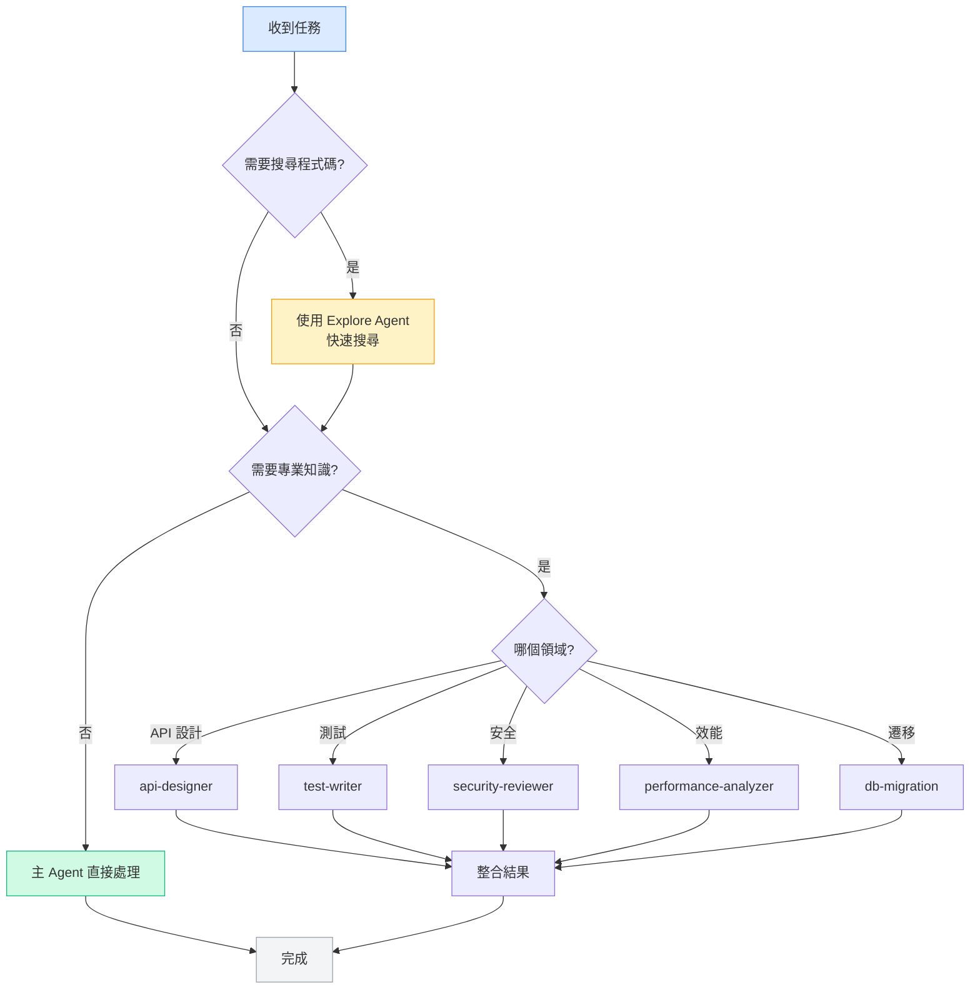
```mermaid
flowchart TB
    START[收到任務] --> Q1{需要搜尋程式碼?}
    Q1 -->|是| EXPLORE[使用 Explore Agent<br>快速搜尋]
    Q1 -->|否| Q2{需要專業知識?}
    EXPLORE --> Q2
    Q2 -->|是| Q3{哪個領域?}
    Q2 -->|否| MAIN[主 Agent 直接處理]
    Q3 -->|API 設計| API[api-designer]
    Q3 -->|測試| TEST[test-writer]
    Q3 -->|安全| SEC[security-reviewer]
    Q3 -->|效能| PERF[performance-analyzer]
    Q3 -->|遷移| DB[db-migration]
    API --> INTEGRATE[整合結果]
    TEST --> INTEGRATE
    SEC --> INTEGRATE
    PERF --> INTEGRATE
    DB --> INTEGRATE
    MAIN --> DONE[完成]
    INTEGRATE --> DONE
    
    style START fill:#dbeafe,stroke:#3b82f6
    style EXPLORE fill:#fef3c7,stroke:#f59e0b
    style MAIN fill:#d1fae5,stroke:#10b981
    style DONE fill:#f3f4f6,stroke:#9ca3af
```

---

## 2.2 Agent Teams（多代理協作）

### 2.2.1 Agent Teams 概述

#### 什麼是 Agent Teams？

**Agent Teams** 是 Claude Code 的多代理並行協作功能（又稱 **Cowork 模式**）。它允許一個「領導代理（Lead Agent）」同時協調多個「隊友代理（Teammate Agent）」，各自在獨立的 git worktree 中並行工作，實現真正的多任務同時開發。

> 🆕 **v3.0 更新**：Agent Teams 目前為**實驗性功能**，需要 Claude Code **v2.1.32+** 版本。啟用方式：
>
> ```bash
> export CLAUDE_CODE_EXPERIMENTAL_AGENT_TEAMS=1
> claude
> ```

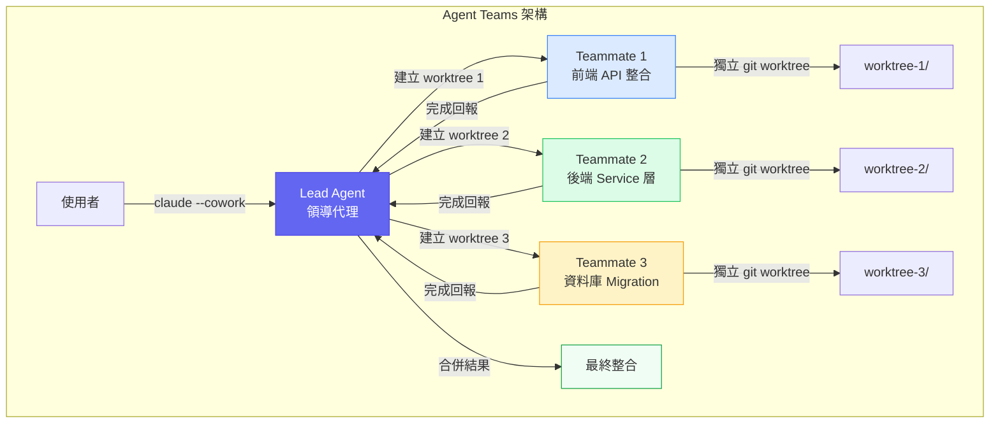
```mermaid
graph TB
    subgraph "Agent Teams 架構"
        U[使用者] -->|claude --cowork| LA[Lead Agent<br>領導代理]
        
        LA -->|建立 worktree 1| T1[Teammate 1<br>前端 API 整合]
        LA -->|建立 worktree 2| T2[Teammate 2<br>後端 Service 層]
        LA -->|建立 worktree 3| T3[Teammate 3<br>資料庫 Migration]
        
        T1 -->|獨立 git worktree| W1[worktree-1/]
        T2 -->|獨立 git worktree| W2[worktree-2/]
        T3 -->|獨立 git worktree| W3[worktree-3/]
        
        T1 -->|完成回報| LA
        T2 -->|完成回報| LA
        T3 -->|完成回報| LA
        
        LA -->|合併結果| R[最終整合]
    end
    
    style LA fill:#6366f1,stroke:#4f46e5,color:#fff
    style T1 fill:#dbeafe,stroke:#3b82f6
    style T2 fill:#dcfce7,stroke:#22c55e
    style T3 fill:#fef3c7,stroke:#f59e0b
    style R fill:#f0fdf4,stroke:#16a34a
```

#### Lead Agent 與 Teammate 的角色差異

| 特性 | Lead Agent（領導代理） | Teammate Agent（隊友代理） |
|------|----------------------|--------------------------|
| **啟動方式** | `claude --cowork` | 由 Lead Agent 自動啟動 |
| **工作目錄** | 主倉庫目錄 | 獨立 git worktree |
| **職責** | 規劃任務、分配工作、整合結果 | 執行具體開發任務 |
| **互動方式** | 與使用者互動 | 與 Lead Agent 溝通 |
| **Git 操作** | 合併 worktree 分支 | 在自己的 worktree 中提交 |
| **並行數量** | 1 個 | 多個同時運行 |
| **生命週期** | 整個會話期間 | 任務完成後可釋放 |

### 2.2.2 啟動與使用 Agent Teams

#### 啟動 Cowork 模式

```bash
# 🆕 先啟用實驗性功能旗標
export CLAUDE_CODE_EXPERIMENTAL_AGENT_TEAMS=1

# 以 Cowork 模式啟動（成為 Lead Agent）
claude --cowork

# 或在互動模式中使用 /agents 啟動
> /agents

# 也可以在互動式會話中使用 /leaders 或 /teammates 命令管理
```

#### 🆕 共享任務清單（Shared Task List）

> Lead Agent 與 Teammates 透過**共享任務清單**協調工作進度：

```plaintext
Agent Teams 共享任務清單：
┌────┬────────────────────────┬───────────┬──────────┐
│ ID │ 任務描述                │ 負責人     │ 狀態      │
├────┼────────────────────────┼───────────┼──────────┤
│ 1  │ 重構 UserService 認證   │ Teammate 1│ ✅ 完成   │
│ 2  │ 新增 BatchOrderAPI      │ Teammate 2│ 🔄 進行中 │
│ 3  │ 更新單元測試            │ Teammate 3│ ⏳ 等待中 │
│ 4  │ 整合測試                │ Lead Agent│ ⏳ 等待中 │
└────┴────────────────────────┴───────────┴──────────┘
```

- Lead Agent 在建立任務時會自動產生共享任務清單
- Teammates 完成任務後會更新狀態
- 透過 `TaskCreated` 和 `TaskCompleted` Hook 事件追蹤進度

#### 🆕 信箱訊息（Mailbox Messaging）

> Lead Agent 與 Teammates 透過**非同步信箱**溝通（而非直接對話）：

```plaintext
Lead Agent → [Mailbox] → Teammate 1
  "請優先處理認證中介層的重構"

Teammate 1 → [Mailbox] → Lead Agent
  "認證重構完成，發現需要同步更新 middleware/auth.ts"

Lead Agent → [Mailbox] → Teammate 2
  "注意 auth middleware 有變更，請在你的 worktree 中 pull 最新程式碼"
```

#### 🆕 顯示模式（Display Modes）

Agent Teams 支援不同的視覺呈現方式：

| 模式 | 工具 | 說明 |
|------|------|------|
| **In-process** | 預設 | Lead 與 Teammates 在同一終端中交替顯示 |
| **Split Panes** | tmux | 🆕 透過 tmux 分割視窗，各 Agent 有獨立面板 |
| **多視窗** | iTerm2 | 🆕 在 iTerm2 中為每個 Agent 開啟獨立分頁 |

```bash
# 使用 tmux 分割面板顯示 (macOS/Linux)
# Agent Teams 會自動偵測 tmux 環境
tmux
claude --cowork  # 每個 Teammate 自動在獨立 pane 中顯示
```

啟動後，Lead Agent 會進入協調模式，可以：

1. **分析任務**：理解使用者需求並拆分為可並行的子任務
2. **建立 Worktree**：為每個子任務建立獨立的 git worktree
3. **分配隊友**：在每個 worktree 中啟動 teammate agent
4. **監控進度**：追蹤每個 teammate 的工作狀態
5. **整合結果**：合併所有 worktree 的變更

#### 實際使用範例

```plaintext
# 使用者在 Cowork 模式下的對話：

User: 我需要同時完成以下三個任務：
      1. 重構 UserService，將認證邏輯抽離
      2. 為 OrderAPI 新增批次查詢端點
      3. 更新所有相關的單元測試

Lead Agent: 我會建立三個並行工作流來處理這些任務。

[建立 worktree: .worktrees/refactor-auth]
  → Teammate 1: 重構 UserService 認證邏輯

[建立 worktree: .worktrees/batch-order-api]
  → Teammate 2: 新增 OrderAPI 批次查詢端點

[建立 worktree: .worktrees/update-tests]
  → Teammate 3: 等待前兩個任務完成後更新測試

Status:
  ✓ Teammate 1: 正在分析 UserService 依賴...
  ✓ Teammate 2: 正在建立 BatchOrderController...
  ○ Teammate 3: 等待中...
```

#### Git Worktree 運作機制

Agent Teams 利用 git worktree 實現隔離的並行開發：

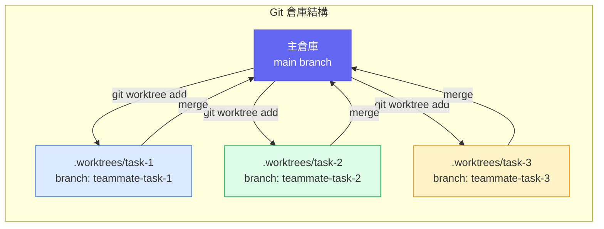
```mermaid
graph LR
    subgraph "Git 倉庫結構"
        M[主倉庫<br>main branch] 
        
        M -->|git worktree add| W1[.worktrees/task-1<br>branch: teammate-task-1]
        M -->|git worktree add| W2[.worktrees/task-2<br>branch: teammate-task-2]
        M -->|git worktree add| W3[.worktrees/task-3<br>branch: teammate-task-3]
        
        W1 -->|merge| M
        W2 -->|merge| M
        W3 -->|merge| M
    end
    
    style M fill:#6366f1,stroke:#4f46e5,color:#fff
    style W1 fill:#dbeafe,stroke:#3b82f6
    style W2 fill:#dcfce7,stroke:#22c55e
    style W3 fill:#fef3c7,stroke:#f59e0b
```

**Worktree 的優勢**：

- **完全隔離**：每個 teammate 在獨立的目錄中工作，不會互相干擾
- **標準 Git 流程**：每個 worktree 就是一個標準的 git 分支，可用常規 Git 工具管理
- **資源效率**：worktree 共享 `.git` 物件庫，不需要完整 clone
- **易於整合**：透過 merge 或 rebase 將變更整合回主分支

### 2.2.3 Agent Teams 的協調機制

#### 任務分配策略

Lead Agent 使用智慧型任務分配，考量以下因素：

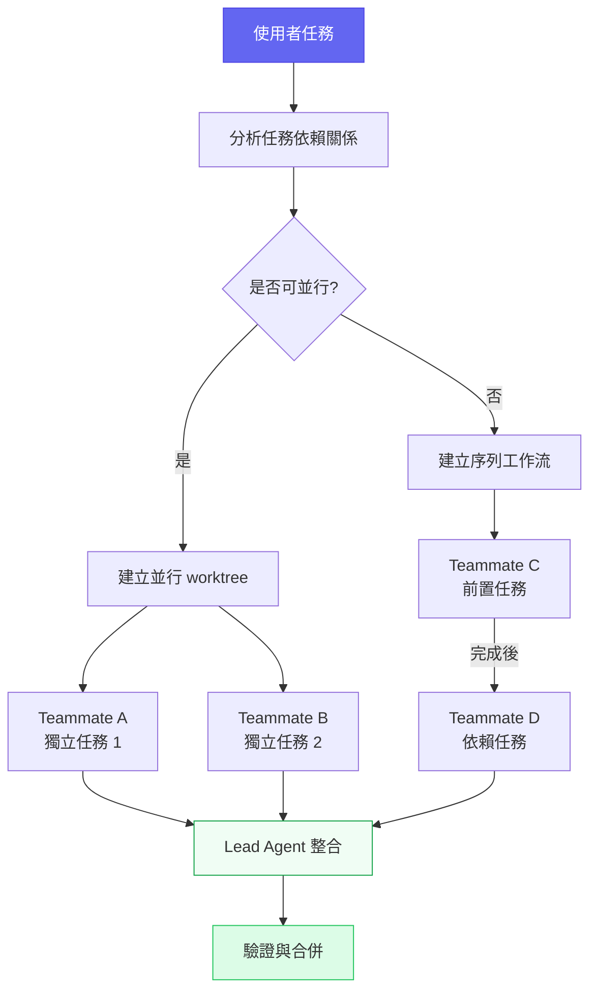
```mermaid
flowchart TD
    T[使用者任務] --> A[分析任務依賴關係]
    A --> B{是否可並行?}
    
    B -->|是| P[建立並行 worktree]
    B -->|否| S[建立序列工作流]
    
    P --> P1[Teammate A<br>獨立任務 1]
    P --> P2[Teammate B<br>獨立任務 2]
    
    S --> S1[Teammate C<br>前置任務]
    S1 -->|完成後| S2[Teammate D<br>依賴任務]
    
    P1 --> M[Lead Agent 整合]
    P2 --> M
    S2 --> M
    
    M --> V[驗證與合併]
    
    style T fill:#6366f1,stroke:#4f46e5,color:#fff
    style M fill:#f0fdf4,stroke:#16a34a
    style V fill:#dcfce7,stroke:#22c55e
```

#### 通訊與狀態管理

Teammate Agent 透過以下機制與 Lead Agent 通訊：

| 機制 | 說明 | 用途 |
|------|------|------|
| **任務描述** | Lead 在建立 worktree 時提供的指令 | 初始任務說明 |
| **檔案系統** | 透過共享的 git 物件 | 程式碼變更 |
| **狀態回報** | Teammate 完成時返回摘要 | 進度追蹤 |
| **Hook 事件** | `TeammateIdle`、`WorktreeCreate`、`WorktreeRemove` | 生命週期管理 |

#### 相關 Hook 事件

Agent Teams 引入了專屬的 Hook 事件，可用於監控和自訂協作流程：

```json
{
  "hooks": {
    "TeammateIdle": [
      {
        "type": "command",
        "command": "echo '[$(date)] Teammate idle in $(pwd)' >> .claude/team-log.txt"
      }
    ],
    "WorktreeCreate": [
      {
        "type": "command",
        "command": "echo '[$(date)] Worktree created: $WORKTREE_PATH' >> .claude/team-log.txt"
      }
    ],
    "WorktreeRemove": [
      {
        "type": "command",
        "command": "echo '[$(date)] Worktree removed: $WORKTREE_PATH' >> .claude/team-log.txt"
      }
    ]
  }
}
```

### 2.2.4 應用場景與最佳實踐

#### 場景一：全棧功能開發

```plaintext
任務：實作「使用者通知偏好設定」功能

Lead Agent 計劃：
├── Teammate 1 (worktree: notification-backend)
│   ├── 建立 NotificationPreference 模型
│   ├── 實作 CRUD API 端點
│   └── 新增資料庫 migration
├── Teammate 2 (worktree: notification-frontend)
│   ├── 建立偏好設定頁面元件
│   ├── 實作表單驗證邏輯
│   └── 串接後端 API
└── Teammate 3 (worktree: notification-tests)
    ├── 等待 Teammate 1 & 2 完成
    ├── 撰寫後端 API 整合測試
    └── 撰寫前端元件測試
```

#### 場景二：大規模重構

```plaintext
任務：將 Monolith 中的 Payment 模組拆分為獨立微服務

Lead Agent 計劃：
├── Teammate 1 (worktree: extract-payment-service)
│   └── 抽離 Payment 相關程式碼到新模組
├── Teammate 2 (worktree: update-api-gateway)
│   └── 更新 API Gateway 路由配置
├── Teammate 3 (worktree: migrate-database)
│   └── 建立獨立的 Payment 資料庫 schema
└── 整合順序：Teammate 3 → Teammate 1 → Teammate 2
```

#### 場景三：跨團隊程式碼審查

```plaintext
任務：對 PR #1234 進行全面審查

Lead Agent 計劃：
├── Teammate 1: 安全性審查（SQL Injection、XSS、認證）
├── Teammate 2: 效能審查（N+1 查詢、記憶體洩漏、索引）
├── Teammate 3: 架構合規審查（設計模式、SOLID 原則）
└── Lead Agent: 彙整所有審查意見並生成統一報告
```

#### ⚠️ 注意事項與最佳實踐

> 1. **任務獨立性**：儘量確保分配給不同 teammate 的任務修改不同的檔案，避免合併衝突
> 2. **Worktree 管理**：完成後及時清理不再需要的 worktree，避免佔用磁碟空間
> 3. **依賴排序**：有依賴關係的任務應設定正確的執行順序，避免在不完整的程式碼上工作
> 4. **合併策略**：Lead Agent 會按序合併各 worktree 的變更，注意處理潛在的合併衝突
> 5. **成本考量**：每個 teammate 都是獨立的 Claude Code 會話，會產生對應的 API 費用
> 6. **🆕 實驗性功能**：Agent Teams 需要 v2.1.32+ 版本並設定 `CLAUDE_CODE_EXPERIMENTAL_AGENT_TEAMS=1` 環境變數
> 7. **🆕 Teammate 數量**：建議 3-5 個 teammates，過多會增加 Lead Agent 的協調負擔

#### 🆕 Agent Teams 專屬 Hook 事件

| Hook 事件 | 觸發時機 | 用途 |
|-----------|---------|------|
| `TaskCreated` | Lead Agent 建立新任務時 | 記錄任務分配、通知相關人員 |
| `TaskCompleted` | Teammate 完成任務時 | 觸發下一步任務、更新進度 |
| `TeammateIdle` | Teammate Agent 閒置時 | Lead Agent 分配新任務 |
| `WorktreeCreate` | 建立新 worktree 時 | 自動安裝依賴、設定環境 |
| `WorktreeRemove` | 清理 worktree 時 | 清理暫存資料 |

### 2.2.5 Agent Teams 進階模式

#### 模式一：Pipeline 模式（串聯）

當任務有明確的先後依賴關係時，使用 Pipeline 模式：

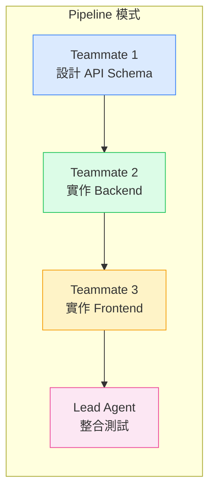
```mermaid
graph LR
    subgraph "Pipeline 模式"
        T1["Teammate 1<br>設計 API Schema"] --> T2["Teammate 2<br>實作 Backend"]
        T2 --> T3["Teammate 3<br>實作 Frontend"]
        T3 --> T4["Lead Agent<br>整合測試"]
    end
    
    style T1 fill:#dbeafe,stroke:#3b82f6
    style T2 fill:#dcfce7,stroke:#22c55e
    style T3 fill:#fef3c7,stroke:#f59e0b
    style T4 fill:#fce7f3,stroke:#ec4899
```

```plaintext
You: 使用 pipeline 模式實作使用者認證功能：
     1. 先設計 API 規格（OpenAPI）
     2. 按照規格實作後端
     3. 按照規格實作前端
     4. 整合測試
```

#### 模式二：Fan-out/Fan-in 模式（扇出扇入）

獨立任務平行處理，最後彙整：

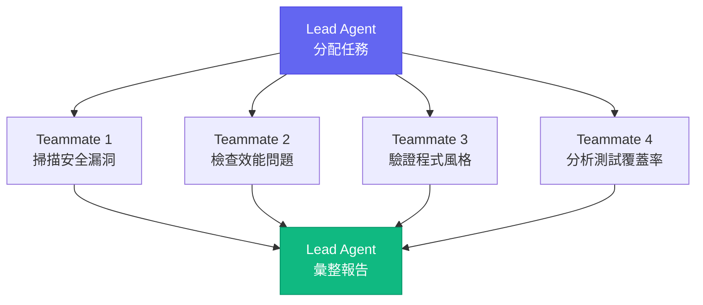
```mermaid
graph TB
    L[Lead Agent<br>分配任務] --> T1[Teammate 1<br>掃描安全漏洞]
    L --> T2[Teammate 2<br>檢查效能問題]
    L --> T3[Teammate 3<br>驗證程式風格]
    L --> T4[Teammate 4<br>分析測試覆蓋率]
    
    T1 --> R[Lead Agent<br>彙整報告]
    T2 --> R
    T3 --> R
    T4 --> R
    
    style L fill:#6366f1,stroke:#4f46e5,color:#fff
    style R fill:#10b981,stroke:#059669,color:#fff
```

#### 模式三：Specialist 模式（專家分工）

每個 teammate 是不同領域的專家：

```plaintext
You: 使用專家模式重新設計購物車系統

Lead Agent 分配：
├── 架構師 Agent（使用 opus 模型）
│   └── 設計整體架構、定義介面
├── 後端專家 Agent  
│   └── 實作 API 和業務邏輯
├── 前端專家 Agent
│   └── 實作 UI 元件和狀態管理
├── DBA 專家 Agent
│   └── 設計 database schema 和最佳化查詢
└── QA 專家 Agent
    └── 撰寫測試計畫和自動化測試
```

#### 模式選擇指南

| 模式 | 適用場景 | 優勢 | 劣勢 |
|------|---------|------|------|
| **Pipeline** | 有明確依賴的任務 | 品質可控、循序漸進 | 速度較慢 |
| **Fan-out/Fan-in** | 彼此獨立的分析任務 | 速度最快 | 無法處理依賴 |
| **Specialist** | 需要多領域專業知識 | 專業且深入 | 成本較高 |
| **混合** | 複雜專案 | 靈活組合 | 配置較複雜 |

### 2.2.6 Agent Teams 搭配 Hooks

透過 Hooks 可以在 Agent Teams 的關鍵時刻自動執行操作：

```json
{
  "hooks": {
    "TeammateNotification": [
      {
        "hooks": [
          {
            "type": "command",
            "command": "echo '[Teammate Update] $(date)' >> .claude/cowork-log.txt"
          }
        ]
      }
    ],
    "WorktreeCreate": [
      {
        "hooks": [
          {
            "type": "command",
            "command": "echo 'Worktree created: ${CLAUDE_WORKTREE_PATH}' >> .claude/worktree-log.txt"
          }
        ]
      }
    ],
    "WorktreeRemove": [
      {
        "hooks": [
          {
            "type": "command",
            "command": "echo 'Worktree removed: ${CLAUDE_WORKTREE_PATH}' >> .claude/worktree-log.txt"
          }
        ]
      }
    ],
    "SubagentStop": [
      {
        "hooks": [
          {
            "type": "command",
            "command": "node .claude/hooks/notify-teammate-done.js"
          }
        ]
      }
    ]
  }
}
```

---

## 2.3 Skills（技能系統）

### 2.3.1 Skills 概述

#### 什麼是 Skills？

**Skills** 是 Claude Code 中可重用、可組合的能力模組。每個 Skill 透過 **SKILL.md** 檔案定義，使用 Markdown 格式搭配 YAML frontmatter 描述其用途、觸發條件與行為指引。Skills 可以被 Agents、Subagents 或使用者直接調用，用來封裝特定領域的專業知識和操作流程。

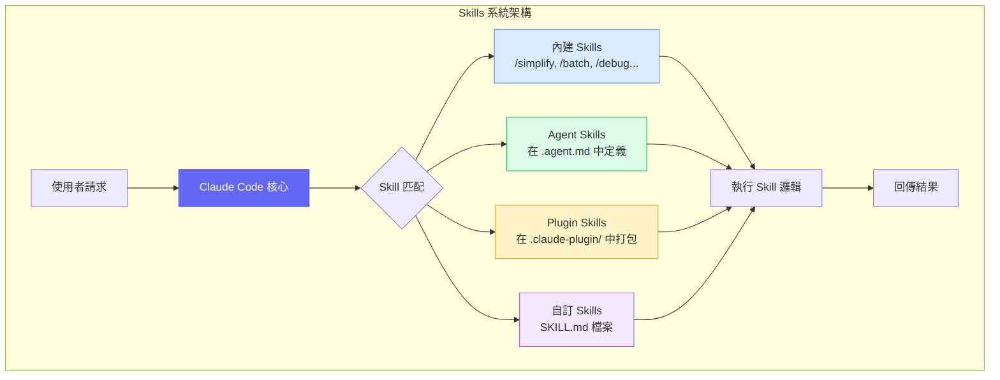
```mermaid
graph TB
    subgraph "Skills 系統架構"
        U[使用者請求] --> CC[Claude Code 核心]
        CC --> SD{Skill 匹配}
        
        SD --> BS[內建 Skills<br>/simplify, /batch, /debug...]
        SD --> AS[Agent Skills<br>在 .agent.md 中定義]
        SD --> PS[Plugin Skills<br>在 .claude-plugin/ 中打包]
        SD --> CS[自訂 Skills<br>SKILL.md 檔案]
        
        BS --> E[執行 Skill 邏輯]
        AS --> E
        PS --> E
        CS --> E
        
        E --> R[回傳結果]
    end
    
    style CC fill:#6366f1,stroke:#4f46e5,color:#fff
    style BS fill:#dbeafe,stroke:#3b82f6
    style AS fill:#dcfce7,stroke:#22c55e
    style PS fill:#fef3c7,stroke:#f59e0b
    style CS fill:#f3e8ff,stroke:#a855f7
```

#### Skill 類型總覽

| 類型 | 位置 | 觸發方式 | 說明 |
|------|------|---------|------|
| **內建 Slash Commands** | Claude Code 內建 | `/command` 斜線命令 | 由 Anthropic 維護的預設 Skills |
| **Agent Skills** | `.agent.md` YAML frontmatter | Agent 執行時自動載入 | 附加在特定 Agent 上的 Skills |
| **Plugin Skills** | `.claude-plugin/skills/SKILL.md` | 安裝 Plugin 後可用 | 隨 Plugin 一起分發的 Skills |
| **專案自訂 Skills** | `.claude/skills/SKILL.md` | 偵測專案上下文後匹配 | 團隊自定義的專案級 Skills |
| **全域自訂 Skills** | `~/.claude/skills/SKILL.md` | 所有專案可用 | 使用者個人的全域 Skills |

### 2.3.2 內建 Skills（Slash Commands）

Claude Code 內建了多個以斜線命令（Slash Command）形式提供的 Skills：

| 命令 | 功能說明 | 使用場景 |
|------|---------|---------|
| **`/simplify`** | 簡化複雜程式碼，降低認知複雜度 | 程式碼過於冗長或難以維護時 |
| **`/batch`** | 對多個檔案執行批次相同操作 | 需要對多處程式碼做相同變更時 |
| **`/debug`** | 系統化偵錯流程，分析錯誤原因 | 遇到難以排查的 bug 時 |
| **`/loop`** | 反覆執行命令直到條件滿足 | 需要自動化 lint、test 修復迴圈時 |
| **`/claude-api`** | 查詢 Claude API 文件與範例 | 需要 API 整合說明時 |
| **`/compact`** | 壓縮對話歷史以釋放 context 空間 | 對話過長、接近 token 上限時 |
| **`/memory`** | 管理專案記憶（CLAUDE.md） | 新增或修改長期記憶項目 |
| **`/skills`** | 列出可用的 Skills | 查看當前環境可用的所有 Skills |
| **`/agents`** | 列出可用的 Agents | 查看當前環境可用的所有 Agents |

**使用範例**：

```plaintext
# 在 Claude Code 會話中直接使用
> /debug 這個 API 調用總是回傳 401，但 token 是有效的

Claude Code 會啟動系統化偵錯流程：
1. 檢查 HTTP 請求 headers
2. 驗證 token 格式與過期時間
3. 追蹤認證中介層邏輯
4. 識別出 Bearer prefix 缺失問題

> /batch 將所有 .java 檔案中的 javax.persistence 改為 jakarta.persistence

Claude Code 會：
1. 掃描所有 .java 檔案
2. 列出受影響的檔案清單
3. 逐一執行替換
4. 驗證編譯是否通過
```

### 2.3.3 SKILL.md 檔案格式

#### 基本結構

自訂 Skills 使用 **SKILL.md** 檔案定義，遵循 Markdown + YAML frontmatter 格式：

```markdown
---
name: java-entity-generator
description: >
  根據資料庫 Schema 描述或 DDL 語句，自動生成符合 JPA 規範的
  Java Entity 類別，支援 Lombok、Builder Pattern 等選項。
---

# Java Entity Generator

## 使用時機

當使用者需要：
- 從資料庫表結構生成 Java Entity
- 建立新的 JPA 實體類
- 將 DDL 轉換為 Java 程式碼

## 操作步驟

1. 分析使用者提供的表結構資訊或 DDL
2. 確認目標套件路徑和命名規範
3. 生成 Entity 類別，包含：
   - 適當的 JPA 註解（@Entity, @Table, @Column 等）
   - 主鍵策略（@Id, @GeneratedValue）
   - 關聯映射（@OneToMany, @ManyToOne 等）
   - Auditing 欄位（@CreatedDate, @LastModifiedDate）
4. 如啟用 Lombok，加入 @Data, @Builder 等註解
5. 生成對應的 Repository 介面

## 輸出格式

- 使用專案現有的程式碼風格
- 遵循專案的套件結構慣例
- 包含必要的 import 陳述式

## 範例

輸入：使用者表，包含 id、username、email、created_at
輸出：User.java Entity + UserRepository.java
```

#### YAML Frontmatter 參數說明

> 🆕 **v3.0 更新**：新增多個 frontmatter 欄位，支援更精細的 Skill 控制

| 參數 | 類型 | 必填 | 說明 |
|------|------|------|------|
| `name` | string | ✅ | Skill 的唯一識別名稱（同時作為 `/name` 斜線命令） |
| `description` | string | ✅ | Skill 功能的詳細描述，用於 AI 匹配 |
| `argument-hint` | string | | 🆕 提示使用者此 Skill 需要什麼參數（在自動完成時顯示） |
| `user-invocable` | boolean | | 是否可被使用者透過 `/name` 手動呼叫（預設 true） |
| `disable-model-invocation` | boolean | | 設為 true 則 Claude 不會自動判斷使用此 Skill |
| `allowed-tools` | list | | 限制此 Skill 可使用的工具，如 `Read`、`Edit`、`Bash(npm test*)` |
| `model` | string | | 覆寫使用的模型：`sonnet` 或 `opus` |
| `effort` | string | | 推理投入程度：`low` / `medium` / `high` / 🆕 `max`（max 啟用 Opus 最強推理，又稱「ultrathink」） |
| `context` | string | | 設為 `fork` 則在獨立子代理中執行（隔離 context） |
| `agent` | string | | 指定在哪個 agent 中執行此 Skill |
| `hooks` | object | | Skill 專屬的 hooks 配置 |
| `shell` | string | | 🆕 指定 `` !`command` `` 動態 context 使用的 shell（如 `bash`、`zsh`） |
| `paths` | list | | 🆕 限制此 Skill 僅在特定路徑下的檔案操作時觸發 |

> **📌 核心概念**：SKILL.md 的 description 內容非常重要，Claude Code 使用它來判斷何時應該觸發此 Skill。描述越精確，匹配越準確。

#### 🆕 進階 Frontmatter 範例

```markdown
---
name: spring-migration
description: 將 Spring Boot 2.x 專案遷移至 3.x
argument-hint: "指定目標 Spring Boot 版本（如 3.2.0）"
allowed-tools:
  - Read
  - Edit
  - Bash(mvn *)
  - Bash(./gradlew *)
model: opus
effort: max
paths:
  - "src/main/java/**"
  - "pom.xml"
  - "build.gradle"
shell: bash
---
```

#### 🆕 特殊變數與替換

| 變數 | 說明 |
|------|------|
| `$ARGUMENTS` | 使用者呼叫時提供的完整參數文字 |
| `$ARGUMENTS[0]`、`$1` | 🆕 第一個位置參數（空格分隔） |
| `$ARGUMENTS[1]`、`$2` | 🆕 第二個位置參數 |
| `${CLAUDE_SKILL_DIR}` | 🆕 此 SKILL.md 所在的目錄路徑 |
| `${CLAUDE_SESSION_ID}` | 🆕 當前會話的唯一 ID |

```markdown
---
name: test-file
description: 為指定檔案生成測試
---

# 為 $1 生成測試

讀取 $1 的內容，並使用 ${CLAUDE_SKILL_DIR}/templates/test-template.ts 
作為模板生成對應的測試檔案。
```

#### 🆕 Skill 權限規則

在 `settings.json` 中可以為特定 Skill 配置獨立的權限規則：

```json
{
  "permissions": {
    "allow": [
      "Skill(spring-migration)",
      "Skill(security-review)"
    ],
    "deny": [
      "Skill(dangerous-skill)"
    ]
  }
}
```

#### 🆕 輸出字元預算

透過 `SLASH_COMMAND_TOOL_CHAR_BUDGET` 環境變數可以控制 Skill 工具輸出的最大字元數，避免過大的工具輸出佔滿 context：

```bash
export SLASH_COMMAND_TOOL_CHAR_BUDGET=50000  # 預設值
```

#### $ARGUMENTS 動態參數

在 SKILL.md 內容中使用 `$ARGUMENTS` 佔位符，會在使用者呼叫時被替換為實際參數：

```markdown
---
name: explain
description: 解釋指定的程式碼或概念
user-invocable: true
---

請詳細解釋以下內容：$ARGUMENTS

使用者呼叫方式：
```
/explain React useEffect 的 cleanup 機制
```
```

#### !command 動態 Context

使用 `` !`command` `` 語法可在 SKILL.md 中嵌入動態 context：

```markdown
---
name: review-changes
description: 審查目前的 git 變更
---

# 審查目前變更

以下是目前的 git diff：
!`git diff --staged`

請根據以上變更進行程式碼審查。
```

### 2.3.4 Agent Skills（附加在 Agent 上的 Skills）

Skills 可以透過 Agent 的 YAML frontmatter 進行關聯，讓特定 Agent 在執行時自動載入相關的 Skills：

```markdown
---
# .claude/agents/security-reviewer.md
name: security-reviewer
description: 安全性程式碼審查代理
skills:
  - name: owasp-checker
    description: 檢查 OWASP Top 10 安全漏洞
    file: .claude/skills/owasp-checker/SKILL.md
  - name: dependency-auditor
    description: 檢查第三方依賴的已知漏洞
    file: .claude/skills/dependency-auditor/SKILL.md
tools:
  - Bash
  - Read
  - Grep
---

# Security Reviewer Agent

## 審查流程
1. 載入 owasp-checker 和 dependency-auditor Skills
2. 掃描目標程式碼
3. 依照 OWASP Top 10 逐項檢查
4. 執行 npm audit / mvn dependency-check
5. 生成統一安全報告
```

**Agent Skills 的載入流程**：

```mermaid
sequenceDiagram
    participant U as 使用者
    participant CC as Claude Code
    participant A as Agent
    participant S as Skill

    U->>CC: 調用 security-reviewer Agent
    CC->>A: 載入 Agent 定義
    A->>A: 解析 YAML frontmatter
    A->>S: 載入 owasp-checker SKILL.md
    A->>S: 載入 dependency-auditor SKILL.md
    A->>A: 將 Skill 指引注入 context
    A->>CC: 開始執行審查任務
    CC->>U: 回傳審查結果
```

### 2.3.5 開發自訂 Skills

#### 步驟一：規劃 Skill 範圍

設計 Skill 時，遵循「單一職責」原則：

```plaintext
✅ 好的 Skill 設計：
├── api-endpoint-generator    → 專注於生成 REST API 端點
├── unit-test-writer          → 專注於撰寫單元測試
├── sql-optimizer             → 專注於 SQL 查詢優化
└── changelog-generator       → 專注於生成變更日誌

❌ 不好的 Skill 設計：
└── do-everything-skill       → 範圍太廣，什麼都做
```

#### 步驟二：建立 SKILL.md 檔案

```plaintext
專案結構：
.claude/
└── skills/
    ├── api-endpoint-generator/
    │   └── SKILL.md
    ├── unit-test-writer/
    │   └── SKILL.md
    └── sql-optimizer/
        └── SKILL.md
```

**完整範例 — Spring Boot API 端點產生器**：

```markdown
---
name: spring-boot-api-generator
description: >
  根據業務需求描述，生成完整的 Spring Boot REST API 端點，
  包含 Controller、Service、Repository 三層架構程式碼，
  以及對應的 DTO、Exception Handler 和 Swagger 文件註解。
---

# Spring Boot API 端點產生器

## 觸發條件

當使用者請求以下操作時啟動：
- 建立新的 REST API 端點
- 為現有 Entity 新增 CRUD API
- 生成 Spring Boot Controller + Service + Repository

## 生成規範

### Controller 層
- 使用 @RestController 和 @RequestMapping
- 實作標準 HTTP 方法（GET/POST/PUT/DELETE）
- 加入 @Operation (Swagger) 註解
- 使用 @Valid 進行請求驗證
- 回傳適當的 HTTP 狀態碼

### Service 層
- 定義 Service 介面和實作類
- 實作業務邏輯和資料轉換
- 使用 @Transactional 管理交易
- 處理業務例外

### Repository 層
- 繼承 JpaRepository
- 定義自訂查詢方法
- 使用 @Query 處理複雜查詢

### DTO 層
- 建立 Request/Response DTO
- 使用 Jakarta Validation 註解
- 實作 Entity ↔ DTO 轉換

## 命名規範
- 遵循專案現有的命名慣例
- Controller: XxxController
- Service: XxxService / XxxServiceImpl
- Repository: XxxRepository
- DTO: XxxRequest / XxxResponse
```

#### 步驟三：在 Agent 中引用 Skill

```markdown
---
# .claude/agents/backend-developer.md
name: backend-developer
description: Spring Boot 後端開發代理
skills:
  - name: spring-boot-api-generator
    description: 生成 Spring Boot REST API
    file: .claude/skills/api-endpoint-generator/SKILL.md
  - name: java-entity-generator
    description: 生成 JPA Entity
    file: .claude/skills/java-entity-generator/SKILL.md
---

# Backend Developer Agent
（Agent 的詳細指引...）
```

### 2.3.6 Skills 最佳實踐

#### 設計原則

```mermaid
graph LR
    subgraph "SKILL.md 設計四原則"
        P1[🎯 精確描述<br>description 決定匹配品質]
        P2[📋 步驟明確<br>操作步驟要可執行]
        P3[📐 範圍適中<br>不過大也不過小]
        P4[📝 範例豐富<br>提供輸入輸出範例]
    end
    
    P1 --> P2 --> P3 --> P4
```

| 原則 | 說明 | 範例 |
|------|------|------|
| **精確描述** | description 是 AI 匹配的關鍵，要包含具體的技術細節 | ❌ "生成程式碼" → ✅ "根據 OpenAPI 3.0 規範生成 TypeScript axios client" |
| **步驟可執行** | 操作步驟要具體到 Claude 可以執行 | ❌ "分析程式碼" → ✅ "使用 grep 搜尋所有 @Deprecated 標記的方法" |
| **範圍適中** | 一個 Skill 只解決一類問題 | ❌ "全端開發" → ✅ "Spring Boot Controller 生成" |
| **範例豐富** | 提供 2-3 個典型的輸入輸出範例 | 包含簡單案例和複雜案例 |

#### 組織管理

```plaintext
推薦的 Skills 目錄結構：

.claude/
├── skills/                          # 專案級 Skills
│   ├── code-generation/
│   │   ├── SKILL.md                 # API 產生器
│   │   └── templates/               # 可選：模板檔案
│   ├── testing/
│   │   └── SKILL.md                 # 測試產生器
│   └── documentation/
│       └── SKILL.md                 # 文件產生器
├── agents/                          # Agent 定義
│   └── backend-developer.md         # 引用上述 Skills
└── CLAUDE.md                        # 專案級指引

~/.claude/
└── skills/                          # 全域 Skills（所有專案共用）
    ├── personal-style/
    │   └── SKILL.md                 # 個人程式碼風格
    └── review-checklist/
        └── SKILL.md                 # 個人 code review 清單
```

#### ⚠️ 注意事項

> 1. **Description 品質**：SKILL.md 的 `description` 是 Claude Code 判斷是否啟用該 Skill 的核心依據。模糊的描述會導致 Skill 無法正確觸發
> 2. **不要重複造輪子**：使用 `/skills` 命令查看現有 Skills，避免建立功能重複的 Skill
> 3. **與 Agent 搭配**：Skills 最佳使用方式是透過 Agent 的 `skills` 欄位引用，這樣可以確保在正確的上下文中被觸發
> 4. **版本管理**：將 SKILL.md 納入 Git 版本控制，確保團隊成員使用一致的 Skills 定義

### 2.3.7 Skill 進階範例集

以下提供多個實戰級 Skill 範例，可直接複製使用或作為開發參考：

#### 資料庫遷移審查 Skill

```markdown
---
name: migration-review
description: 審查資料庫遷移腳本的安全性、效能影響和向後相容性。
  支援 Prisma、TypeORM、Flyway、Liquibase 等遷移框架。
tools: read_file, grep_search, semantic_search
---

# Database Migration Review

## 審查清單

### 安全性
- 是否有資料遺失風險？（DROP TABLE, DROP COLUMN）
- 大表變更是否使用 online DDL？
- 是否需要資料回填（backfill）？

### 效能
- 是否在大表上建立索引？（需要 CONCURRENTLY）
- 是否有鎖表風險？
- 預估執行時間

### 向後相容性
- 新舊版本程式碼能否同時運行？
- 是否需要分階段部署？
  1. 先部署相容的程式碼
  2. 執行遷移
  3. 部署使用新 schema 的程式碼

## 輸出格式
| 項目 | 狀態 | 說明 |
|------|------|------|
| 資料安全 | ✅/⚠️/❌ | 詳細說明 |
| 效能影響 | ✅/⚠️/❌ | 預估影響 |
| 向後相容 | ✅/⚠️/❌ | 相容性分析 |
| 回滾方案 | 有/無 | 如何回滾 |
```

#### Git Commit 訊息生成 Skill

```markdown
---
name: commit-message
description: 根據已暫存的變更生成 Conventional Commit 格式的 commit 訊息。
  支援 feat/fix/refactor/docs/test/chore 等類型。
tools: bash
---

# Commit Message Generator

## 分析步驟
1. 執行 `git diff --staged --stat` 查看變更摘要
2. 執行 `git diff --staged` 查看詳細變更
3. 根據變更內容判斷 commit 類型

## Commit 訊息格式
type(scope): 簡短描述

詳細說明（如果需要）

## 類型判斷規則
- feat: 新功能
- fix: Bug 修復
- refactor: 重構（不改變功能）
- docs: 文件變更
- test: 測試相關
- chore: 建置/工具改動
- perf: 效能改善
- style: 程式碼格式

## 範例
feat(auth): 新增 OAuth 2.0 Google 登入支援

- 實作 Google OAuth2 flow
- 新增 /api/auth/google callback endpoint
- 整合現有的 JWT token 系統
```

#### 依賴升級 Skill

```markdown
---
name: dependency-upgrade
description: 分析和執行專案依賴升級，包含安全漏洞修復、
  breaking changes 檢查、和升級路徑規劃。
tools: read_file, bash, write_file, grep_search
---

# Dependency Upgrade Skill

## 升級流程
1. 執行 `npm outdated` 或 `mvn versions:display-dependency-updates`
   了解哪些依賴有新版本
2. 檢查每個依賴的 CHANGELOG 和 breaking changes
3. 分類為：patch（安全）、minor（通常安全）、major（需要檢查）
4. 逐步升級，每次只升級一個 major 版本
5. 每次升級後執行測試

## 優先順序
1. 🔴 有已知 CVE 的依賴 → 立即升級
2. 🟡 Major 版本落後 2+ 的依賴 → 規劃升級
3. 🟢 Minor/Patch 更新 → 批量升級

## 輸出格式
| 套件 | 目前版本 | 最新版本 | 類型 | Breaking Changes | 建議 |
|------|---------|---------|------|-----------------|------|
```

---

## 2.4 Plugins（插件系統）

### 2.4.1 Plugin 概述

#### 什麼是 Plugin？

**Plugin** 是 Claude Code 的功能擴展封裝單元。每個 Plugin 是一個 `.claude-plugin/` 目錄，可以包含 Agents、Skills、Slash Commands 和 CLAUDE.md 指引，作為一個整體進行分發和安裝。Plugin 讓開發者可以將一組相關的功能打包成可重用的擴展包。

```mermaid
graph TB
    subgraph "Plugin 架構"
        P[Plugin 目錄<br>.claude-plugin/]
        
        P --> M[plugin.json<br>清單檔]
        P --> A[agents/<br>Agent 定義]
        P --> S[skills/<br>SKILL.md 檔案]
        P --> C[commands/<br>Slash Commands]
        P --> I[CLAUDE.md<br>Plugin 指引]
        
        M --> D[名稱、版本、描述<br>依賴、權限宣告]
        A --> A1[agent-1.md]
        A --> A2[agent-2.md]
        S --> S1[skill-1/SKILL.md]
        S --> S2[skill-2/SKILL.md]
    end
    
    style P fill:#6366f1,stroke:#4f46e5,color:#fff
    style M fill:#dbeafe,stroke:#3b82f6
    style A fill:#dcfce7,stroke:#22c55e
    style S fill:#fef3c7,stroke:#f59e0b
    style C fill:#fce7f3,stroke:#ec4899
    style I fill:#f3e8ff,stroke:#a855f7
```

#### Plugin vs 其他擴展機制比較

| 特性 | Plugin | Agent | Skill | MCP Server |
|------|--------|-------|-------|------------|
| **封裝範圍** | 多個 Agent + Skill + Command | 單一代理角色 | 單一能力 | 外部工具 |
| **目錄結構** | `.claude-plugin/` | `.claude/agents/*.md` | `.claude/skills/*/SKILL.md` | `.mcp.json` |
| **分發方式** | 市場 / Git 倉庫 | 隨專案或全域 | 隨專案或全域 | 獨立服務 |
| **安裝方式** | `/install-plugin` | 放入目錄即可 | 放入目錄即可 | `.mcp.json` 配置 |
| **適用場景** | 完整功能包 | 特定角色 | 特定能力 | 外部服務整合 |

### 2.4.2 Plugin 目錄結構

#### plugin.json 清單檔

每個 Plugin 的核心是 `plugin.json` 清單檔，定義了 Plugin 的元資料和內容：

```json
{
  "name": "spring-boot-toolkit",
  "version": "1.0.0",
  "description": "Spring Boot 開發工具包，包含 API 生成器、Entity 生成器和測試輔助",
  "author": "DevTeam",
  "license": "MIT",
  "repository": "https://github.com/example/claude-spring-boot-toolkit",
  
  "agents": [
    {
      "name": "spring-boot-developer",
      "file": "agents/spring-boot-developer.md",
      "description": "Spring Boot 全棧開發代理"
    },
    {
      "name": "spring-test-writer",
      "file": "agents/spring-test-writer.md",
      "description": "Spring Boot 測試撰寫代理"
    }
  ],
  
  "skills": [
    {
      "name": "api-generator",
      "file": "skills/api-generator/SKILL.md",
      "description": "生成 REST API Controller + Service + Repository"
    },
    {
      "name": "entity-generator",
      "file": "skills/entity-generator/SKILL.md",
      "description": "生成 JPA Entity 和 Repository"
    }
  ],
  
  "commands": [
    {
      "name": "/spring-init",
      "file": "commands/spring-init.md",
      "description": "初始化 Spring Boot 專案結構"
    }
  ]
}
```

#### 完整的 Plugin 目錄結構

> 🆕 **v3.0 更新**：Plugin 支援更多配置檔案，包括 MCP Server、LSP Server、settings.json

```plaintext
my-plugin/
├── .claude-plugin/
│   └── plugin.json                  # Plugin 清單檔（必要）
├── CLAUDE.md                        # Plugin 級指引（自動載入）
├── settings.json                    # 🆕 Plugin 的預設設定（agent 配置等）
├── .mcp.json                        # 🆕 Plugin 提供的 MCP Server 配置
├── .lsp.json                        # 🆕 Plugin 提供的 LSP Server 配置
├── agents/
│   ├── spring-boot-developer.md     # Agent 定義（YAML frontmatter + 指引）
│   └── spring-test-writer.md
├── skills/
│   ├── api-generator/
│   │   └── SKILL.md                 # Skill 定義
│   └── entity-generator/
│       └── SKILL.md
├── hooks/
│   └── hooks.json                   # 🆕 Plugin 提供的 Hook 定義
└── commands/
    └── spring-init.md               # 自訂 Slash Command
```

> **📌 重要**：`plugin.json` 放在 `.claude-plugin/` 子目錄中，而 `settings.json`、`.mcp.json`、`.lsp.json` 放在 Plugin **根目錄**（非 `.claude-plugin/` 中）。

#### 🆕 Plugin MCP Server 配置

Plugin 可以自帶 MCP Server，使用特殊路徑變數：

```json
// .mcp.json（Plugin 根目錄）
{
  "mcpServers": {
    "my-plugin-server": {
      "command": "node",
      "args": ["${CLAUDE_PLUGIN_ROOT}/mcp-server/dist/index.js"],
      "env": {
        "DATA_DIR": "${CLAUDE_PLUGIN_DATA}"
      }
    }
  }
}
```

| 變數 | 說明 |
|------|------|
| `${CLAUDE_PLUGIN_ROOT}` | 🆕 Plugin 安裝的根目錄路徑 |
| `${CLAUDE_PLUGIN_DATA}` | 🆕 Plugin 的資料儲存目錄路徑 |

#### 🆕 Plugin LSP Server 配置

Plugin 可以提供 LSP（Language Server Protocol）整合，為特定語言提供增強的程式碼智能：

```json
// .lsp.json（Plugin 根目錄）
{
  "servers": {
    "java": {
      "command": "jdtls",
      "args": ["--data", "${CLAUDE_PLUGIN_DATA}/jdtls-data"]
    }
  }
}
```

#### 🆕 Namespaced Skills（命名空間技能）

Plugin 的 Skills 使用 `plugin-name:skill-name` 的命名空間格式，避免跨 Plugin 名稱衝突：

```plaintext
# 呼叫 Plugin 的 Skill
> /spring-boot-toolkit:api-generator 建立使用者管理 API

# 不帶命名空間時，Claude Code 會自動匹配最相關的 Skill
> /api-generator 建立使用者管理 API
```

### 2.4.3 Plugin 的發現與安裝

> 🆕 **v3.0 更新**：全新 Plugin Marketplace 系統、安裝範圍、自動更新

#### 🆕 Plugin Marketplace（插件市集）

Claude Code 提供官方 Plugin Marketplace，按分類組織插件：

| 分類 | 說明 | 主要插件 |
|------|------|---------|
| **Code Intelligence** | 程式語言增強支援 | C/C++, C#, Go, Java, Kotlin, Lua, PHP, Python, Rust, Swift, TypeScript |
| **External Integrations** | 外部服務整合 | GitHub, GitLab, Atlassian, Asana, Linear, Notion, Figma, Vercel, Firebase, Supabase, Slack, Sentry |
| **Development Workflows** | 開發工作流程 | commit-commands, pr-review-toolkit, agent-sdk-dev, plugin-dev |
| **Output Styles** | 輸出風格插件 | 各種自訂輸出格式 |

#### 發現 Plugins

```plaintext
# 🆕 從官方 Marketplace 搜尋
> /plugin marketplace search spring-boot

# 🆕 瀏覽分類
> /plugin marketplace browse --category "code-intelligence"

# 🆕 從 Marketplace 安裝
> /plugin marketplace add java

# 搜尋已發布的 Plugins
> /plugins search spring-boot

Found 5 plugins matching "spring-boot":
  1. spring-boot-toolkit (v1.0.0) - Spring Boot 開發工具包
  2. spring-security-helper (v0.8.0) - Spring Security 配置輔助
  ...

# 查看已安裝的 Plugins
> /plugins list
```

#### 安裝 Plugins（多種來源）

```plaintext
# 🆕 從官方 Marketplace 安裝
> /plugin marketplace add java

# 從 Git 倉庫安裝
> /install-plugin https://github.com/example/claude-spring-boot-toolkit

# 從本地目錄安裝（適合開發測試）
> /install-plugin /path/to/my-plugin

# 安裝特定版本
> /install-plugin spring-boot-toolkit@1.0.0
```

#### 🆕 安裝範圍（Installation Scopes）

| 範圍 | 說明 | 持久性 |
|------|------|--------|
| **user** | 安裝到使用者全域，所有專案可用 | 持久 |
| **project** | 安裝到當前專案（`.claude-plugins/`） | 持久（提交 Git） |
| **local** | 安裝到本地（不提交 Git） | 持久 |
| **managed** | 由管理員統一部署 | 持久（使用者不可移除） |

```plaintext
# 指定安裝範圍
> /install-plugin spring-boot-toolkit --scope project
> /install-plugin security-scanner --scope user
```

#### 🆕 Plugin 開發與測試

```bash
# 使用 --plugin-dir 載入本地 Plugin 進行測試（不需安裝）
claude --plugin-dir ./my-plugin-dev

# 重新載入所有 Plugins（無需重啟）
> /reload-plugins
```

#### 🆕 Plugin 自動更新

已安裝的 Marketplace 插件會自動檢查更新：

```bash
# 強制更新所有插件
export FORCE_AUTOUPDATE_PLUGINS=1
claude
```

#### 🆕 團隊 Marketplace（內部插件分發）

組織可以建立內部 Marketplace 來分發自研插件：

```json
// ~/.claude/settings.json
{
  "extraKnownMarketplaces": [
    "https://github.com/your-org/claude-plugins-internal",
    "git@github.com:your-org/claude-plugins-private.git"
  ]
}
```

Marketplace 來源支援：
- **GitHub owner/repo**（公開倉庫）
- **Git URL**（支援 SSH 和 HTTPS）
- **本地路徑**（如 `/opt/company/claude-plugins`）
- **遠端 URL**（如 `https://plugins.company.internal/list.json`）

安裝後，Plugin 的 Agents 會出現在 `/agents` 清單中，Skills 會出現在 `/skills` 清單中（使用 `plugin-name:skill-name` 命名空間）。

#### 企業級 Plugin 管理

組織可以透過 **managed-settings.json** 控制 Plugin 的安裝和使用：

```json
{
  "plugins": {
    "allowed": [
      "spring-boot-toolkit",
      "security-scanner",
      "code-quality-checker"
    ],
    "blocked": [
      "untrusted-plugin-*"
    ],
    "required": [
      "company-code-standards"
    ],
    "sources": {
      "allowedRegistries": [
        "https://plugins.company.internal"
      ]
    }
  }
}
```

### 2.4.4 開發自訂 Plugin

#### 步驟一：建立 Plugin 結構

```bash
# 建立 Plugin 目錄
mkdir -p .claude-plugin/{agents,skills,commands}

# 建立 plugin.json
cat > .claude-plugin/plugin.json << 'EOF'
{
  "name": "my-custom-plugin",
  "version": "0.1.0",
  "description": "我的自訂 Plugin",
  "author": "My Team"
}
EOF
```

#### 步驟二：加入 Agent 定義

```markdown
<!-- .claude-plugin/agents/my-agent.md -->
---
name: my-custom-agent
description: 自訂的開發輔助代理
skills:
  - name: my-skill
    description: 自訂能力
    file: skills/my-skill/SKILL.md
tools:
  - Read
  - Edit
  - Write
  - Bash
---

# My Custom Agent

## 角色
你是一個專門處理 [特定領域] 的開發代理。

## 工作流程
1. 分析使用者需求
2. 搜尋相關程式碼
3. 執行變更
4. 驗證結果
```

#### 步驟三：加入 SKILL.md

```markdown
<!-- .claude-plugin/skills/my-skill/SKILL.md -->
---
name: my-custom-skill
description: 專門處理 [特定任務] 的能力模組
---

# My Custom Skill

## 使用時機
（描述何時應該使用此 Skill）

## 操作步驟
（詳細的操作指引）
```

#### 步驟四：加入 Plugin 級指引

```markdown
<!-- .claude-plugin/CLAUDE.md -->
# My Custom Plugin 指引

使用此 Plugin 時，請遵循以下原則：

1. 所有生成的程式碼必須通過 lint 檢查
2. 遵循專案現有的命名慣例
3. 變更前先確認不會破壞現有功能
```

### 2.4.5 Plugin 安全與信任

#### 安全模型

Plugin 的安全性透過多層機制保障：

```mermaid
flowchart TD
    I[安裝 Plugin] --> V{來源驗證}
    V -->|官方市場| T1[✅ 已審核]
    V -->|Git 倉庫| T2[⚠️ 需人工審查]
    V -->|本地目錄| T3[✅ 使用者自行負責]
    
    T1 --> P[權限審查]
    T2 --> P
    T3 --> P
    
    P --> P1{要求哪些工具?}
    P1 -->|Read, Grep| L[低風險]
    P1 -->|Edit, Write| M[中風險]
    P1 -->|Bash| H[高風險 - 需確認]
    
    L --> R[執行]
    M --> R
    H -->|使用者確認| R
    
    style I fill:#6366f1,stroke:#4f46e5,color:#fff
    style L fill:#dcfce7,stroke:#22c55e
    style M fill:#fef3c7,stroke:#f59e0b
    style H fill:#fee2e2,stroke:#ef4444
```

#### 最佳實踐

| 面向 | 建議 |
|------|------|
| **Plugin 開發** | 遵循最小權限原則，只宣告必要的 tools |
| **Plugin 安裝** | 安裝前審查 plugin.json 中的權限宣告 |
| **企業管理** | 使用 managed-settings.json 控制允許的 Plugin |
| **版本管理** | 固定 Plugin 版本號，避免意外更新 |
| **程式碼審查** | 第三方 Plugin 安裝前審查其 Agent 和 Skill 定義 |

#### ⚠️ 注意事項

> 1. **權限最小化**：Plugin 只應宣告完成功能所需的最少工具權限
> 2. **來源信任**：優先使用官方市場的已驗證 Plugin，謹慎使用來路不明的 Plugin
> 3. **定期更新**：關注 Plugin 的安全更新，及時升級到修復漏洞的版本
> 4. **企業合規**：在企業環境中，透過 managed-settings.json 統一管理允許的 Plugin 清單

### 2.4.6 Plugin 實戰範例

#### 範例一：Spring Boot 開發 Plugin

```json
{
  "name": "spring-boot-dev",
  "version": "1.0.0",
  "description": "Spring Boot 開發輔助工具集",
  "tools": [
    {
      "name": "spring-init",
      "description": "快速初始化 Spring Boot 模組（Controller, Service, Repository, DTO）",
      "command": "./tools/spring-init.sh",
      "args": ["--type", "{type}", "--name", "{name}", "--package", "{package}"]
    },
    {
      "name": "spring-test",
      "description": "生成 Spring Boot 測試（Unit, Integration, Slice Test）",
      "command": "./tools/spring-test.sh",
      "args": ["--target", "{target_class}", "--type", "{test_type}"]
    },
    {
      "name": "spring-actuator-check",
      "description": "檢查 Actuator 端點健康狀態並生成報告",
      "command": "./tools/actuator-check.sh",
      "args": ["--url", "{base_url}"]
    }
  ],
  "agents": [
    {
      "name": "spring-architect",
      "path": "./agents/spring-architect.md"
    }
  ],
  "skills": [
    { "path": "./skills/entity-design/" },
    { "path": "./skills/api-design/" },
    { "path": "./skills/security-config/" }
  ]
}
```

**對應的 Agent 定義**：

```markdown
# agents/spring-architect.md

---
name: spring-architect
description: Spring Boot 架構顧問，負責設計 API、規劃模組結構、審查架構決策
model: claude-sonnet-4-20250514
skills:
  - ./skills/entity-design/
  - ./skills/api-design/
  - ./skills/security-config/
tools:
  - read_file
  - grep_search
  - semantic_search
  - spring-init
  - spring-test
---

## 角色
你是一位 Spring Boot 架構師，精通 Spring 生態圈所有核心模組。

## 設計原則
- 遵循 Clean Architecture / Hexagonal Architecture
- API 設計遵循 RESTful 最佳實踐
- 安全配置遵循 OWASP 指引
- 資料庫設計遵循 Third Normal Form

## 輸出標準
- 每個設計決策都要說明「為什麼」
- 提供替代方案的比較
- 附帶適當的 UML 圖（Mermaid 格式）
```

#### 範例二：前端元件庫 Plugin

```json
{
  "name": "react-component-toolkit",
  "version": "1.0.0",
  "description": "React 元件開發工具集，含 Storybook 整合",
  "tools": [
    {
      "name": "create-component",
      "description": "建立 React 元件（含 TSX, Styles, Tests, Stories）",
      "command": "./tools/create-component.sh",
      "args": ["--name", "{name}", "--type", "{type}"]
    },
    {
      "name": "a11y-audit",
      "description": "對元件執行無障礙可及性 (a11y) 檢查",
      "command": "./tools/a11y-audit.sh",
      "args": ["--component", "{component_path}"]
    }
  ],
  "agents": [
    {
      "name": "ui-reviewer",
      "path": "./agents/ui-reviewer.md"
    }
  ]
}
```

#### 範例三：資安合規 Plugin

```json
{
  "name": "security-compliance",
  "version": "2.0.0",
  "description": "自動化安全合規檢查，支援 OWASP/SOC2/GDPR",
  "tools": [
    {
      "name": "owasp-scan",
      "description": "執行 OWASP Top 10 漏洞掃描",
      "command": "./tools/owasp-scan.sh"
    },
    {
      "name": "secret-scan",
      "description": "掃描程式碼中的密鑰和敏感資料洩漏",
      "command": "./tools/secret-scan.sh"
    },
    {
      "name": "license-check",
      "description": "檢查所有依賴的授權協議合規性",
      "command": "./tools/license-check.sh"
    },
    {
      "name": "gdpr-check",
      "description": "檢查個人資料處理流程是否符合 GDPR",
      "command": "./tools/gdpr-check.sh"
    }
  ],
  "skills": [
    { "path": "./skills/threat-modeling/" },
    { "path": "./skills/compliance-report/" }
  ]
}
```

### 2.4.7 Plugin 與其他機制的關係

```mermaid
graph TB
    subgraph "Plugin 生態系統"
        PL[Plugin] --> AG[Agents]
        PL --> SK[Skills]
        PL --> TL[Tools]
        PL --> MC[MCP Servers]
        PL --> PR[Prompts]
        
        AG --> SK
        AG -->|使用| TL
        AG -->|使用| MC
        SK -->|參考| PR
    end
    
    subgraph "Claude Code 核心"
        CC[Claude Code] --> PL
        CC --> HK[Hooks]
        CC --> CF[CLAUDE.md]
        CC --> ST[Settings]
        
        HK -.- PL
        CF -.- PL
    end
    
    style PL fill:#6366f1,stroke:#4f46e5,color:#fff
    style CC fill:#10b981,stroke:#059669,color:#fff
```

| 機制 | Plugin 中的角色 | 說明 |
|------|---------------|------|
| **Agent** | 封裝在 Plugin 中 | Plugin 可包含多個專用 Agent |
| **Skill** | 封裝在 Plugin 中 | Agent 引用 Plugin 內的 Skills |
| **Tool** | Plugin 提供自訂工具 | 透過 shell script 實作 |
| **MCP Server** | Plugin 可內建 MCP Server | 提供更複雜的工具能力 |
| **Hook** | 透過 settings.json 配合 | Plugin 安裝後可建議 Hook 配置 |
| **CLAUDE.md** | Plugin 可提供 CLAUDE.md 片段 | 自動附加到專案指引 |

---

## 2.5 Hooks（鉤子機制）

### 2.5.1 Hooks 系統概述

#### 什麼是 Hooks？

**Hooks** 是 Claude Code 的事件驅動擴展機制。透過 Hooks，你可以在 Claude Code 執行流程的各個階段插入自訂邏輯（Shell 命令、HTTP Webhook、Prompt 注入或 Agent 處理），實現自動化的安全檢查、日誌記錄、通知、程式碼品質控制等工作流程。

Hooks 在 `settings.json` 中以宣告式 JSON 配置，**不需要撰寫任何 TypeScript/JavaScript SDK 程式碼**。

```mermaid
graph LR
    subgraph "Hook 執行流程"
        A[使用者輸入] --> B[UserPromptSubmit Hook]
        B --> C[Claude 處理]
        C --> D[PreToolUse Hook]
        D --> E{通過?}
        E -->|是| F[執行工具]
        E -->|否| G[攔截/修改]
        F --> H[PostToolUse Hook]
        H --> I[Stop Hook]
        I --> J[回傳結果]
    end
    
    style B fill:#f59e0b,stroke:#d97706
    style D fill:#f59e0b,stroke:#d97706
    style H fill:#10b981,stroke:#059669
    style I fill:#6366f1,stroke:#4f46e5,color:#fff
```

### 2.5.2 Hook 事件類型（25+ 種）

> 🆕 **v3.0 更新**：新增 FileChanged、CwdChanged、Elicitation、ElicitationResult、PostCompact、StopFailure 等事件

Claude Code 支援 **25+ 種 Hook 事件**，涵蓋整個會話生命週期：

#### 會話生命週期事件

| 事件名稱 | 觸發時機 | 典型用途 |
|----------|---------|---------|
| **`SessionStart`** | 會話開始時 | 環境初始化、載入設定 |
| **`InstructionsLoaded`** | CLAUDE.md 等指引載入後 | 驗證指引完整性、動態注入指引 |
| **`ConfigChange`** | 設定檔（settings.json）變更時 | 重新載入設定、同步配置 |
| **`SessionEnd`** | 會話結束時 | 清理暫存、生成報告 |

#### 使用者互動事件

| 事件名稱 | 觸發時機 | 典型用途 |
|----------|---------|---------|
| **`UserPromptSubmit`** | 使用者送出 prompt 後 | 輸入過濾、日誌記錄 |
| **`Elicitation`** | Claude 發起澄清問題時 | 自動回應、日誌 |
| **`ElicitationResult`** | 使用者回答澄清問題後 | 記錄回答、後續處理 |
| **`Stop`** | Claude 正常停止回應時 | 結果驗證、通知 |
| **`StopFailure`** | Claude 異常停止時 | 錯誤記錄、告警、自動重試 |

#### 工具執行事件

| 事件名稱 | 觸發時機 | 典型用途 |
|----------|---------|---------|
| **`PreToolUse`** | 工具執行前 | 安全檢查、權限驗證 |
| **`PermissionRequest`** | 需要權限確認時 | 自動審批/拒絕 |
| **`PostToolUse`** | 工具執行成功後 | 結果驗證、日誌、自動格式化 |
| **`PostToolUseFailure`** | 工具執行失敗後 | 錯誤記錄、告警 |

#### 檔案與環境事件

| 事件名稱 | 觸發時機 | 典型用途 |
|----------|---------|---------|
| **`FileChanged`** | 檔案被修改時 | 自動 lint、即時同步 |
| **`CwdChanged`** | 工作目錄切換時 | 環境感知、重新載入配置 |

#### Subagent 事件

| 事件名稱 | 觸發時機 | 典型用途 |
|----------|---------|---------|
| **`SubagentStart`** | Subagent 啟動時 | 追蹤、日誌 |
| **`SubagentStop`** | Subagent 完成時 | 結果收集、品質檢查 |

#### Agent Teams 事件

| 事件名稱 | 觸發時機 | 典型用途 |
|----------|---------|---------|
| **`TeammateIdle`** | Teammate 閒置時 | 任務重新分配 |
| **`WorktreeCreate`** | 建立 git worktree 時 | 環境初始化 |
| **`WorktreeRemove`** | 移除 git worktree 時 | 資源清理 |

#### Context 管理事件

| 事件名稱 | 觸發時機 | 典型用途 |
|----------|---------|---------|
| **`PreCompact`** | 執行 /compact 前 | 保存重要 context |
| **`PostCompact`** | 執行 /compact 後 | 驗證壓縮結果、重新載入關鍵資訊 |

#### 其他事件

| 事件名稱 | 觸發時機 | 典型用途 |
|----------|---------|---------|
| **`TaskCompleted`** | 任務完成時 | 整合通知 |
| **`Notification`** | 系統通知觸發時 | 轉發通知 |

### 2.5.3 Hook 類型（4 種）

每個 Hook 可以配置為以下四種類型之一：

#### 1. Command Hook（Shell 命令）

最常用的 Hook 類型，執行 Shell 命令：

```json
{
  "hooks": {
    "PostToolUse": [
      {
        "matcher": "Write|Edit|MultiEdit",
        "type": "command",
        "command": "npx prettier --write \"$TOOL_INPUT_FILE_PATH\" 2>/dev/null || true"
      }
    ]
  }
}
```

**環境變數**：Hook 命令可使用 Claude Code 注入的環境變數：

| 環境變數 | 說明 | 可用事件 |
|---------|------|---------|
| `$TOOL_NAME` | 當前工具名稱 | PreToolUse, PostToolUse |
| `$TOOL_INPUT_*` | 工具輸入參數 | PreToolUse, PostToolUse |
| `$SESSION_ID` | 會話 ID | 所有事件 |
| `$WORKTREE_PATH` | Worktree 路徑 | WorktreeCreate, WorktreeRemove |

#### 2. HTTP Hook（Webhook）

發送 HTTP 請求到指定端點：

```json
{
  "hooks": {
    "Stop": [
      {
        "type": "http",
        "url": "https://hooks.slack.com/services/YOUR/WEBHOOK/URL",
        "method": "POST",
        "headers": {
          "Content-Type": "application/json"
        }
      }
    ]
  }
}
```

#### 3. Prompt Hook（Prompt 注入）

在 AI 處理流程中注入額外的 prompt 指引：

```json
{
  "hooks": {
    "PreToolUse": [
      {
        "matcher": "Bash",
        "type": "prompt",
        "prompt": "在執行任何 Shell 命令前，請確認：1) 不包含 rm -rf 2) 不會修改系統檔案 3) 不包含敏感資訊"
      }
    ]
  }
}
```

#### 4. Agent Hook（代理處理）

委派給一個 Agent 處理 Hook 邏輯：

```json
{
  "hooks": {
    "PostToolUse": [
      {
        "matcher": "Write|Edit",
        "type": "agent",
        "agent": "code-reviewer",
        "prompt": "請審查剛才的程式碼變更，確認是否符合團隊規範"
      }
    ]
  }
}
```

### 2.5.4 Hook 配置詳解

#### 配置位置

Hooks 配置在 `settings.json` 中，支援三個層級：

```plaintext
優先順序（由高到低）：
1. 專案級：.claude/settings.json
2. 使用者級：~/.claude/settings.json
3. 企業級：managed-settings.json（由組織管理員控制）
```

#### 完整配置範例

```json
{
  "hooks": {
    "SessionStart": [
      {
        "type": "command",
        "command": "echo '[SESSION START] $(date)' >> .claude/session.log"
      }
    ],
    
    "UserPromptSubmit": [
      {
        "type": "command",
        "command": "echo '[PROMPT] $(date): ${PROMPT_PREVIEW}' >> .claude/audit.log"
      }
    ],
    
    "PreToolUse": [
      {
        "matcher": "Bash",
        "type": "command",
        "command": "bash .claude/hooks/check-bash-safety.sh"
      },
      {
        "matcher": "Write|Edit|MultiEdit",
        "type": "command",
        "command": "bash .claude/hooks/pre-write-check.sh"
      }
    ],
    
    "PostToolUse": [
      {
        "matcher": "Write|Edit|MultiEdit",
        "type": "command",
        "command": "npx prettier --write \"$TOOL_INPUT_FILE_PATH\" 2>/dev/null; npx eslint --fix \"$TOOL_INPUT_FILE_PATH\" 2>/dev/null || true"
      }
    ],
    
    "Stop": [
      {
        "type": "http",
        "url": "https://hooks.slack.com/services/T.../B.../xxx",
        "method": "POST",
        "headers": { "Content-Type": "application/json" }
      },
      {
        "type": "command",
        "command": "echo '[STOP] $(date)' >> .claude/session.log"
      }
    ],
    
    "SessionEnd": [
      {
        "type": "command",
        "command": "bash .claude/hooks/cleanup.sh"
      }
    ]
  }
}
```

#### Matcher 語法

`matcher` 欄位用於過濾特定工具或條件，支援正規表達式：

| Matcher 範例 | 說明 |
|-------------|------|
| `"Bash"` | 僅匹配 Bash 工具 |
| `"Write\|Edit\|MultiEdit"` | 匹配任一寫入工具 |
| `"Read\|Grep\|Glob"` | 匹配任一讀取工具 |
| `".*"` | 匹配所有工具 |
| 不設定 matcher | 對該事件的所有觸發都執行 |

#### 🆕 `if` 條件欄位（v2.1.85+）

> 🆕 **v3.0 更新**：`if` 欄位提供比 `matcher` 更精細的過濾控制：

```json
{
  "hooks": {
    "PreToolUse": [
      {
        "matcher": "Bash",
        "if": "tool_input.command contains 'rm' && tool_input.command contains '-rf'",
        "hooks": [
          {
            "type": "command",
            "command": "echo 'BLOCK: 禁止 rm -rf 命令' >&2; exit 1"
          }
        ]
      },
      {
        "matcher": "Edit",
        "if": "tool_input.file_path matches '.*\\.lock$'",
        "hooks": [
          {
            "type": "command",
            "command": "echo 'BLOCK: 禁止直接編輯 lock 檔案' >&2; exit 1"
          }
        ]
      }
    ]
  }
}
```

`if` 欄位支援對工具輸入參數進行條件判斷，比 `matcher` 更能精準控制觸發時機。

#### 🆕 結構化 JSON 輸出（hookSpecificOutput）

Hook 命令可以輸出結構化 JSON 到 stdout（而非純文字），讓 Claude Code 進行程式化處理：

```json
// Hook 輸出的 JSON 格式
{
  "hookSpecificOutput": {
    "permissionDecision": "allow"
  }
}
```

| `permissionDecision` 值 | 說明 |
|------------------------|------|
| `"allow"` | 允許工具執行（跳過使用者確認） |
| `"deny"` | 拒絕工具執行 |
| `"ask"` | 讓使用者決定是否允許 |

**範例：自動化權限決策 Hook**

```bash
#!/bin/bash
# auto-permission.sh — 根據規則自動決定權限
TOOL_NAME="$CLAUDE_TOOL_NAME"
FILE_PATH="$CLAUDE_FILE_PATH"

# 對測試檔案自動允許
if echo "$FILE_PATH" | grep -qE '\.(test|spec)\.(ts|js)$'; then
  echo '{"hookSpecificOutput": {"permissionDecision": "allow"}}'
  exit 0
fi

# 對 production 目錄檔案要求確認
if echo "$FILE_PATH" | grep -q '/prod/'; then
  echo '{"hookSpecificOutput": {"permissionDecision": "ask"}}'
  exit 0
fi

exit 0
```

#### 🆕 `updatedInput` 輸入重寫

PreToolUse Hook 可以透過 `updatedInput` 欄位修改工具的輸入參數：

```bash
#!/bin/bash
# rewrite-path.sh — 自動修正檔案路徑
# Hook stdout 輸出 JSON，包含 updatedInput 欄位
echo "{\"updatedInput\": {\"file_path\": \"$(echo $CLAUDE_FILE_PATH | sed 's|src/old/|src/new/|')\"}}"
```

#### 🆕 `CLAUDE_ENV_FILE` 環境持久化

Hook 可以透過 `CLAUDE_ENV_FILE` 環境變數指向的檔案來設定持久環境變數，後續的 Hook 和工具呼叫都能讀取：

```bash
#!/bin/bash
# setup-env.sh — 在 SessionStart Hook 中設定持久環境
echo "PROJECT_VERSION=$(cat VERSION)" >> "$CLAUDE_ENV_FILE"
echo "BUILD_NUMBER=$(git rev-list --count HEAD)" >> "$CLAUDE_ENV_FILE"
```

#### 🆕 `stop_hook_active` 防止無限迴圈

當 Hook 觸發的操作本身又可能觸發 Hook 時（如 PostToolUse Hook 呼叫了額外的工具），Claude Code 會自動設定 `stop_hook_active` 標記來防止無限遞迴。

#### 🆕 `disableAllHooks` 全域停用

在 `settings.json` 中可以快速停用所有 Hooks（適用於除錯場景）：

```json
{
  "disableAllHooks": true
}
```

#### 🆕 Hook 配置位置總覽

| 位置 | 說明 | 優先級 |
|------|------|--------|
| `managed-settings.json` | 企業管理員強制 Hook | 最高 |
| `~/.claude/settings.json` | 使用者全域 Hook | 高 |
| `.claude/settings.json` | 專案級 Hook | 中 |
| Plugin `hooks/hooks.json` | Plugin 提供的 Hook | 低 |
| Skill/Agent frontmatter `hooks:` | 技能/代理專屬 Hook | 最低 |

### 2.5.5 實用 Hook 範例

#### 範例一：自動程式碼格式化

```json
{
  "hooks": {
    "PostToolUse": [
      {
        "matcher": "Write|Edit|MultiEdit",
        "type": "command",
        "command": "FILE=\"$TOOL_INPUT_FILE_PATH\"; case \"$FILE\" in *.ts|*.tsx|*.js|*.jsx) npx prettier --write \"$FILE\" 2>/dev/null;; *.java) google-java-format -i \"$FILE\" 2>/dev/null;; *.py) black \"$FILE\" 2>/dev/null;; esac || true"
      }
    ]
  }
}
```

#### 範例二：安全性 Bash 命令攔截

```bash
#!/bin/bash
# .claude/hooks/check-bash-safety.sh
# 檢查即將執行的 Bash 命令是否安全

COMMAND="$TOOL_INPUT_COMMAND"

# 危險命令模式清單
DANGEROUS_PATTERNS=(
    "rm -rf /"
    "rm -rf ~"
    "mkfs"
    "dd if="
    "> /dev/sd"
    "chmod 777"
    "curl.*|.*sh"
    "wget.*|.*sh"
)

for pattern in "${DANGEROUS_PATTERNS[@]}"; do
    if echo "$COMMAND" | grep -qE "$pattern"; then
        echo "❌ BLOCKED: 偵測到潛在危險命令模式: $pattern"
        echo "命令: $COMMAND"
        exit 1  # 非零退出碼會阻止工具執行
    fi
done

echo "✅ 命令安全檢查通過"
exit 0
```

#### 範例三：變更時自動執行測試

```json
{
  "hooks": {
    "PostToolUse": [
      {
        "matcher": "Write|Edit",
        "type": "command",
        "command": "FILE=\"$TOOL_INPUT_FILE_PATH\"; if echo \"$FILE\" | grep -qE '\\.(ts|js|java|py)$'; then echo '🧪 Running related tests...'; npm test -- --findRelatedTests \"$FILE\" 2>/dev/null || true; fi"
      }
    ]
  }
}
```

#### 範例四：Slack 通知整合

```json
{
  "hooks": {
    "TaskCompleted": [
      {
        "type": "http",
        "url": "https://hooks.slack.com/services/T.../B.../xxx",
        "method": "POST",
        "headers": {
          "Content-Type": "application/json"
        }
      }
    ]
  }
}
```

#### 範例五：使用 Prompt Hook 進行安全提醒

```json
{
  "hooks": {
    "PreToolUse": [
      {
        "matcher": "Bash",
        "type": "prompt",
        "prompt": "安全提醒：執行 Shell 命令前請確認：\n1. 不會刪除重要檔案\n2. 不會暴露敏感資訊（API keys、密碼等）\n3. 不會對生產環境造成影響\n如果命令有風險，請先向使用者確認。"
      }
    ]
  }
}
```

### 2.5.6 Hook 執行規則與最佳實踐

#### 執行規則

```mermaid
flowchart TD
    E[事件觸發] --> M{有 matcher?}
    M -->|有| MC{matcher 匹配?}
    M -->|無| EX[執行 Hook]
    MC -->|匹配| EX
    MC -->|不匹配| SK[跳過]
    
    EX --> T{Hook 類型}
    T -->|command| CMD[執行 Shell 命令]
    T -->|http| HTTP[發送 HTTP 請求]
    T -->|prompt| PRM[注入 Prompt]
    T -->|agent| AGT[委派 Agent]
    
    CMD --> RC{退出碼}
    RC -->|0| OK[✅ 繼續執行]
    RC -->|非 0| BLK[❌ 阻止工具執行]
    
    HTTP --> OK
    PRM --> OK
    AGT --> OK
    
    style E fill:#6366f1,stroke:#4f46e5,color:#fff
    style OK fill:#dcfce7,stroke:#22c55e
    style BLK fill:#fee2e2,stroke:#ef4444
```

**關鍵規則**：

| 規則 | 說明 |
|------|------|
| **Command 退出碼** | 退出碼為 0 表示通過，非 0 表示阻止（僅 PreToolUse 有效） |
| **多 Hook 執行順序** | 同一事件的多個 Hook 按配置順序依次執行 |
| **Hook 逾時** | Command Hook 預設逾時 30 秒，超時視為失敗 |
| **錯誤隔離** | 單個 Hook 失敗不影響其他 Hook 執行 |
| **安全限制** | Hook 不能修改 Claude Code 的核心行為，只能攔截或補充 |

#### ⚠️ 注意事項

> 1. **效能影響**：Hook 會增加每次操作的執行時間，避免在 Hook 中執行耗時操作
> 2. **非零退出碼**：Command Hook 的退出碼在 PreToolUse 事件中有特殊意義——非零會阻止工具執行
> 3. **安全性**：Hook 命令以使用者權限執行，需注意命令注入風險
> 4. **偵錯方式**：使用日誌檔案記錄 Hook 執行情況，方便排查問題
> 5. **企業管控**：組織管理員可透過 managed-settings.json 強制套用安全 Hooks

### 2.5.7 進階 Hook 架構模式

#### 模式一：多層防禦（Defense in Depth）

建立多層 Hook 防禦機制，每層負責不同的安全檢查：

```json
{
  "hooks": {
    "PreToolUse": [
      {
        "matcher": "bash",
        "hooks": [
          {
            "type": "command",
            "command": "bash .claude/hooks/layer1-blocklist.sh"
          },
          {
            "type": "command",
            "command": "bash .claude/hooks/layer2-path-check.sh"
          },
          {
            "type": "prompt",
            "prompt": "Layer 3: 執行此命令前，請確認不會影響生產環境資料或系統穩定性"
          }
        ]
      },
      {
        "matcher": "write_file|edit_file",
        "hooks": [
          {
            "type": "command",
            "command": "bash .claude/hooks/file-protection.sh"
          }
        ]
      }
    ]
  }
}
```

```bash
#!/bin/bash
# .claude/hooks/layer1-blocklist.sh — 第一層：命令黑名單

BLOCKLIST=(
  "rm -rf /"
  "rm -rf ~"
  "rm -rf \$HOME"
  "mkfs"
  "dd if=/dev"
  "> /dev/sd"
  "chmod -R 777 /"
  ":(){ :|:& };:"
)

INPUT="$CLAUDE_TOOL_INPUT"
for pattern in "${BLOCKLIST[@]}"; do
  if echo "$INPUT" | grep -qF "$pattern"; then
    echo "BLOCK: 命令包含黑名單模式: $pattern" >&2
    exit 1
  fi
done
exit 0
```

```bash
#!/bin/bash
# .claude/hooks/layer2-path-check.sh — 第二層：路徑保護

PROTECTED_PATHS=(
  "/etc"
  "/usr"
  "/var/lib"
  "$HOME/.ssh"
  "$HOME/.aws"
  "$HOME/.kube"
)

INPUT="$CLAUDE_TOOL_INPUT"
for path in "${PROTECTED_PATHS[@]}"; do
  if echo "$INPUT" | grep -q "$path"; then
    echo "BLOCK: 命令涉及受保護路徑: $path" >&2
    exit 1
  fi
done
exit 0
```

#### 模式二：品質管道（Quality Pipeline）

在檔案修改後自動執行一系列品質檢查：

```json
{
  "hooks": {
    "PostToolUse": [
      {
        "matcher": "write_file|edit_file",
        "hooks": [
          {
            "type": "command",
            "command": "bash .claude/hooks/quality-pipeline.sh"
          }
        ]
      }
    ]
  }
}
```

```bash
#!/bin/bash
# .claude/hooks/quality-pipeline.sh — 完整品質管道

FILE="$CLAUDE_FILE_PATH"
EXT="${FILE##*.}"
REPORT=""
PASS=true

# Stage 1: 格式化
case "$EXT" in
  ts|tsx|js|jsx)
    npx prettier --write "$FILE" 2>/dev/null
    RESULT=$(npx eslint "$FILE" 2>&1)
    if [ $? -ne 0 ]; then
      REPORT="$REPORT\n⚠️ ESLint: $(echo "$RESULT" | grep -c 'error') errors"
      npx eslint --fix "$FILE" 2>/dev/null
    fi
    ;;
  py)
    python -m black "$FILE" 2>/dev/null
    RESULT=$(python -m ruff check "$FILE" 2>&1)
    if [ $? -ne 0 ]; then
      REPORT="$REPORT\n⚠️ Ruff: $(echo "$RESULT" | wc -l) issues"
      python -m ruff check --fix "$FILE" 2>/dev/null
    fi
    ;;
  java)
    google-java-format --replace "$FILE" 2>/dev/null
    ;;
  go)
    gofmt -w "$FILE" 2>/dev/null
    RESULT=$(go vet "./$(dirname "$FILE")/..." 2>&1)
    if [ $? -ne 0 ]; then
      REPORT="$REPORT\n⚠️ Go vet: $(echo "$RESULT" | wc -l) issues"
    fi
    ;;
esac

# Stage 2: Type Checking (TypeScript/Java)
case "$EXT" in
  ts|tsx)
    RESULT=$(npx tsc --noEmit "$FILE" 2>&1)
    if [ $? -ne 0 ]; then
      REPORT="$REPORT\n❌ TypeScript: 型別錯誤"
      PASS=false
    fi
    ;;
esac

# Stage 3: 安全性快速掃描
if grep -qE "(eval\(|exec\(|__import__|subprocess\.call)" "$FILE" 2>/dev/null; then
  REPORT="$REPORT\n🔒 Security: 偵測到潛在危險函數呼叫"
fi

# 輸出報告
if [ -n "$REPORT" ]; then
  echo -e "📋 品質檢查報告 ($FILE):$REPORT"
fi

# 記錄到日誌
echo "[$(date -Iseconds)] Quality check: $FILE${REPORT:+ |$REPORT}" >> .claude/quality-log.txt

exit 0  # PostToolUse hook 不阻止操作
```

#### 模式三：環境感知 Hook

根據執行環境（開發/測試/生產）自動調整 Hook 行為：

```json
{
  "hooks": {
    "PreToolUse": [
      {
        "matcher": "bash",
        "hooks": [
          {
            "type": "command",
            "command": "bash -c 'ENV=${CLAUDE_ENV:-development}; if [ \"$ENV\" = \"production\" ]; then echo \"BLOCK: 生產環境禁止執行 Shell 命令\" >&2; exit 1; fi'"
          }
        ]
      }
    ],
    "PostToolUse": [
      {
        "matcher": "write_file|edit_file",
        "hooks": [
          {
            "type": "command",
            "command": "bash -c 'ENV=${CLAUDE_ENV:-development}; if [ \"$ENV\" = \"development\" ]; then npx prettier --write \"$CLAUDE_FILE_PATH\" 2>/dev/null; fi; if [ \"$ENV\" = \"staging\" ] || [ \"$ENV\" = \"production\" ]; then npx eslint \"$CLAUDE_FILE_PATH\" 2>&1 || true; fi'"
          }
        ]
      }
    ]
  }
}
```

#### Hook 架構比較

| 模式 | 適用場景 | 複雜度 | 效能影響 |
|------|---------|--------|---------|
| **基本 Hook** | 個人開發、簡單格式化 | 低 | 極小 |
| **多層防禦** | 團隊開發、安全要求高 | 中 | 小 |
| **品質管道** | CI-like 品質管控 | 中高 | 中 |
| **環境感知** | 多環境部署 | 中 | 小 |
| **Webhook 整合** | 外部系統通知 | 中 | 依網路 |

---

## 2.6 MCP（Model Context Protocol）

> 🆕 **v3.0 更新**：HTTP Streamable Transport（推薦）、80+ 官方推薦 MCP Server、headersHelper 動態認證、Elicitation 互動、Tool Search、MCP Prompts

### 2.6.1 MCP 概述

#### 什麼是 MCP？

**Model Context Protocol (MCP)** 是一個開放標準協議，定義了 AI 應用程式（如 Claude Code）與外部工具伺服器之間的通訊介面。透過 MCP，Claude Code 可以連接到各種外部服務（資料庫、API、雲端平台、DevOps 工具等），讓 AI 直接操作這些外部資源。

> **📌 重要澄清**：MCP **不是** Claude Code 內部的上下文管理機制。它是一個**外部工具整合協議**，讓第三方開發者可以建立 MCP Server 來擴展 Claude Code 的能力。

```mermaid
graph TB
    subgraph "MCP 架構"
        CC[Claude Code<br>MCP Client] 
        
        CC <-->|MCP Protocol| S1[MCP Server<br>GitHub]
        CC <-->|MCP Protocol| S2[MCP Server<br>PostgreSQL]
        CC <-->|MCP Protocol| S3[MCP Server<br>Jira]
        CC <-->|MCP Protocol| S4[MCP Server<br>AWS]
        CC <-->|MCP Protocol| S5[MCP Server<br>自訂服務]
        
        S1 --> T1[建立 PR / 搜尋 Issues]
        S2 --> T2[查詢資料 / 執行 SQL]
        S3 --> T3[建立工單 / 更新狀態]
        S4 --> T4[部署 / 監控]
        S5 --> T5[任意自訂功能]
    end
    
    style CC fill:#6366f1,stroke:#4f46e5,color:#fff
    style S1 fill:#dbeafe,stroke:#3b82f6
    style S2 fill:#dcfce7,stroke:#22c55e
    style S3 fill:#fef3c7,stroke:#f59e0b
    style S4 fill:#fce7f3,stroke:#ec4899
    style S5 fill:#f3e8ff,stroke:#a855f7
```

#### MCP 核心概念

| 概念 | 說明 |
|------|------|
| **MCP Client** | Claude Code 本身，負責發現和呼叫 MCP Server 提供的工具 |
| **MCP Server** | 外部工具伺服器，提供一組特定功能的工具 |
| **Tools** | MCP Server 暴露的具體功能（如 `query_database`、`create_issue`） |
| **Resources** | MCP Server 提供的靜態資源（如文件、範本） |
| **Transport** | 通訊方式：`stdio`（本地程序）、`sse`（HTTP SSE）、`http`（HTTP Streamable） |

### 2.6.2 配置 MCP Server

#### .mcp.json 配置檔

MCP Server 透過專案根目錄的 `.mcp.json` 檔案配置：

> 🆕 **v3.0 更新**：支援環境變數預設值語法 `${VAR:-default}`、三層配置範圍

```json
{
  "mcpServers": {
    "github": {
      "type": "stdio",
      "command": "npx",
      "args": ["-y", "@modelcontextprotocol/server-github"],
      "env": {
        "GITHUB_TOKEN": "${GITHUB_TOKEN}"
      }
    },
    
    "postgres": {
      "type": "stdio",
      "command": "npx",
      "args": ["-y", "@modelcontextprotocol/server-postgres"],
      "env": {
        "DATABASE_URL": "${DATABASE_URL:-postgresql://localhost:5432/devdb}"
      }
    },
    
    "filesystem": {
      "type": "stdio",
      "command": "npx",
      "args": ["-y", "@modelcontextprotocol/server-filesystem", "/path/to/allowed/dir"]
    },
    
    "custom-api": {
      "type": "sse",
      "url": "https://mcp.company.internal/api/sse",
      "headers": {
        "Authorization": "Bearer ${API_TOKEN}"
      }
    }
  }
}
```

> **📌 環境變數語法**：🆕 支援 `${VAR}` 和 `${VAR:-default}` 兩種格式。後者在環境變數未設定時使用預設值。

#### 🆕 MCP 配置範圍（Scope）

| 範圍 | 位置 | 說明 |
|------|------|------|
| **Local**（專案級） | `.mcp.json` | 隨 Git 提交，團隊共享 |
| **User**（使用者級） | `~/.claude/.mcp.json` | 個人全域配置 |
| **Managed**（企業級） | `managed-mcp.json` | 管理員強制配置 |

優先順序：Managed > Local > User。Local 和 User 的設定會合併，Managed 的設定無法被覆蓋。
```

#### Transport 類型比較

| Transport | 配置方式 | 適用場景 | 說明 |
|-----------|---------|---------|------|
| **http**（🆕 推薦） | `url` | 遠端 MCP Server | HTTP Streamable Transport，最新推薦方式 |
| **sse** | `url` | 遠端 MCP Server | HTTP Server-Sent Events，舊版遠端方式 |
| **stdio** | `command` + `args` | 本地 MCP Server | 啟動本地程序，透過 stdin/stdout 通訊 |

> **📌 注意**：新專案建議使用 **HTTP Streamable Transport**（`"type": "http"`），它比 SSE 更穩定且支援雙向通訊。

#### 使用 Claude Code 互動式新增 MCP Server

```bash
# 使用 /mcp 命令互動式新增
> /mcp add github npx -y @modelcontextprotocol/server-github

# 列出已設定的 MCP Servers
> /mcp list

# 移除 MCP Server
> /mcp remove github

# 測試 MCP Server 連線
> /mcp status
```

### 2.6.3 工具搜尋（Tool Search）

當配置了多個 MCP Server 且工具數量很多時，Claude Code 使用 **Tool Search** 機制來有效率地找到正確的工具：

```mermaid
sequenceDiagram
    participant U as 使用者
    participant CC as Claude Code
    participant TS as Tool Search
    participant S1 as MCP Server 1
    participant S2 as MCP Server 2

    U->>CC: "查詢上個月的銷售數據"
    CC->>TS: 搜尋相關工具
    TS->>TS: 語義匹配工具描述
    TS-->>CC: 匹配結果: postgres.query_database
    CC->>S1: 呼叫 query_database
    S1-->>CC: 查詢結果
    CC->>U: 回傳分析結果
```

**Tool Search 的工作方式**：

- Claude Code 會自動索引所有已配置 MCP Server 的工具清單
- 當使用者提出請求時，透過語義匹配找到最相關的工具
- 支援跨多個 MCP Server 的工具搜尋
- 使用者也可以透過 `/tools` 命令手動瀏覽可用工具

#### 🆕 Tool Search 模式

透過 `ENABLE_TOOL_SEARCH` 環境變數控制 Tool Search 的行為：

| 模式 | 值 | 說明 |
|------|-----|------|
| **auto**（🆕 推薦） | `auto` | 工具數量少時直接載入，多時啟用延遲搜尋（deferred loading） |
| **啟用** | `1` 或 `true` | 強制啟用 Tool Search，所有 MCP 工具都延遲載入 |
| **停用** | `0` 或 `false` | 停用 Tool Search，所有工具在啟動時載入 |

```bash
# 推薦：自動模式（根據工具數量自動決定）
export ENABLE_TOOL_SEARCH=auto

# 強制啟用（適合連接大量 MCP Server 的場景）
export ENABLE_TOOL_SEARCH=1
```

> **📌 說明**：`auto` 模式下，當 MCP 工具總數較少（<50 個）時會在啟動時全部載入；工具數量多時會啟用延遲搜尋，只在需要時才載入相關工具的描述，降低 context 佔用。

#### 🆕 MCP Resources（資源引用）

MCP Server 可以暴露 **Resources**（靜態資源），使用者可以透過 `@` 提及將資源加入 context：

```plaintext
# 在 VS Code 中使用 @ 引用 MCP 資源
@mcp:postgres/schema/users      → 引用 users 表的 schema 定義
@mcp:confluence/page/12345      → 引用 Confluence 頁面內容
@mcp:github/file/src/README.md  → 引用 GitHub 上的檔案

# 在 CLI 中使用
> 幫我分析 @mcp:postgres/schema/orders 這個表的效能問題
```

#### 🆕 MAX_MCP_OUTPUT_TOKENS

控制單次 MCP 工具呼叫的最大輸出量，避免過大的回應佔滿 context：

```bash
# 預設 25,000 tokens，超過 10,000 tokens 會顯示警告
export MAX_MCP_OUTPUT_TOKENS=25000
```

#### 🆕 Claude Code 作為 MCP Server

Claude Code 本身可以作為 MCP Server 被其他工具呼叫：

```bash
# 啟動 Claude Code 作為 MCP Server
claude mcp serve

# 其他 MCP Client 可以連接到 Claude Code 的 stdio
# 使用 Claude Code 的所有工具（Read, Edit, Bash 等）
```

### 2.6.4 MCP 認證

#### OAuth 2.0 認證

遠端 MCP Server 可以使用 OAuth 2.0 進行認證：

```json
{
  "mcpServers": {
    "company-mcp": {
      "type": "sse",
      "url": "https://mcp.company.com/sse",
      "auth": {
        "type": "oauth2",
        "clientId": "claude-code-client",
        "scope": "read write",
        "authorizationUrl": "https://auth.company.com/oauth/authorize",
        "tokenUrl": "https://auth.company.com/oauth/token"
      }
    }
  }
}
```

#### 環境變數安全

最佳做法是使用環境變數管理敏感資訊：

```json
{
  "mcpServers": {
    "database": {
      "type": "stdio",
      "command": "npx",
      "args": ["-y", "@modelcontextprotocol/server-postgres"],
      "env": {
        "DATABASE_URL": "${DB_CONNECTION_STRING}"
      }
    }
  }
}
```

> **📌 安全提示**：永遠不要在 `.mcp.json` 中硬編碼 API keys 或密碼。使用 `${ENV_VAR}` 語法引用環境變數。

#### headersHelper 動態認證

> 🆕 **v3.0 新增**：`headersHelper` 允許在每次請求時動態產生認證 header（例如短期 token）：

```json
{
  "mcpServers": {
    "internal-api": {
      "type": "http",
      "url": "https://mcp.company.internal/api",
      "headersHelper": "node ./scripts/get-auth-header.js"
    }
  }
}
```

`headersHelper` 指定的命令會在每次 MCP 呼叫前執行，stdout 應輸出 JSON 格式的 headers。

#### Elicitation（互動式確認）

> 🆕 MCP Server 可以透過 **Elicitation** 向使用者發起互動式確認請求：

```plaintext
MCP Server 回傳 elicitation 請求
  → Claude Code 顯示問題給使用者
  → 使用者回答
  → 回傳給 MCP Server 繼續處理
```

例如：資料庫 MCP Server 在執行 DELETE 語句前，可以透過 elicitation 要求使用者確認。

#### MCP Prompts（命令式提示）

> 🆕 MCP Server 可以暴露 **Prompts** 作為可呼叫的命令，使用者可以像斜線命令一樣使用：

```plaintext
# MCP Server 暴露的 prompt 會出現在可用命令中
> /mcp-server-name:prompt-name

# 例如 GitHub MCP Server 提供的 prompt
> /github:create-pr-description
```

### 2.6.5 企業級 MCP 管理

#### managed-mcp.json

> 🆕 **v3.0 更新**：新增 `allowlist` / `denylist` 精細控制

組織管理員可以透過 **managed-mcp.json** 統一管理 MCP Server 配置：

```json
{
  "mcpServers": {
    "company-tools": {
      "type": "http",
      "url": "https://mcp.company.internal/api",
      "auth": {
        "type": "oauth2",
        "clientId": "claude-code",
        "scope": "company-tools"
      }
    },
    "security-scanner": {
      "type": "stdio",
      "command": "/usr/local/bin/security-mcp-server",
      "args": ["--strict-mode"]
    }
  },
  "policy": {
    "allowUserMcpServers": true,
    "allowlist": [
      "@anthropic/mcp-server-*",
      "company-*"
    ],
    "denylist": [
      "*torrent*",
      "*proxy*",
      "*bypass*"
    ],
    "requiredServers": [
      "company-tools",
      "security-scanner"
    ]
  }
}
```

**managed-mcp.json 的功能**：

| 功能 | 說明 |
|------|------|
| **強制安裝** | `requiredServers` 中的 MCP Server 無法被使用者移除 |
| **白名單** | `allowlist` 限制只能安裝符合 glob 模式的 MCP Server |
| **黑名單** | `denylist` 阻止安裝符合 glob 模式的 MCP Server |
| **統一配置** | 組織級的 MCP Server 自動套用到所有使用者 |
| **OAuth 憑證** | 統一管理企業 OAuth 認證設定 |

### 2.6.6 常見 MCP Server 推薦

> 🆕 **v3.0 更新**：官方文件列出 **80+ 常用 MCP Server**，以下為精選分類推薦：

| 分類 | MCP Server | 功能 | 安裝方式 |
|------|-----------|------|---------|
| **版本控制** | `@anthropic/mcp-server-github` | GitHub Issues、PR、搜尋 | `claude mcp add github -- npx -y @anthropic/mcp-server-github` |
| | `@anthropic/mcp-server-gitlab` | GitLab MR、Issues | 同上模式 |
| **資料庫** | `@anthropic/mcp-server-postgres` | PostgreSQL 查詢 | `claude mcp add postgres -- npx -y @anthropic/mcp-server-postgres` |
| | `@anthropic/mcp-server-sqlite` | SQLite 操作 | 同上模式 |
| **搜尋** | `@anthropic/mcp-server-brave-search` | Brave 搜尋引擎 | 同上模式 |
| **記憶** | `@anthropic/mcp-server-memory` | 持久化知識圖譜 | 同上模式 |
| **DevOps** | `@anthropic/mcp-server-kubernetes` | K8s 叢集管理 | 同上模式 |
| | `@anthropic/mcp-server-docker` | Docker 容器管理 | 同上模式 |
| **雲端** | `@anthropic/mcp-server-aws` | AWS 服務整合 | 同上模式 |
| | `@anthropic/mcp-server-gcp` | GCP 服務整合 | 同上模式 |
| **通訊** | `@anthropic/mcp-server-slack` | Slack 訊息與頻道 | 同上模式 |
| **監控** | `@anthropic/mcp-server-sentry` | Sentry 錯誤追蹤 | 同上模式 |
| | `@anthropic/mcp-server-datadog` | Datadog 監控 | 同上模式 |
| **文件** | `@anthropic/mcp-server-notion` | Notion 頁面操作 | 同上模式 |
| | `@anthropic/mcp-server-confluence` | Confluence Wiki | 同上模式 |

> 📖 完整 MCP Server 清單請參考：[code.claude.com/docs/en/mcp](https://code.claude.com/docs/en/mcp)

### 2.6.7 自行開發 MCP Server

MCP Server 開發核心步驟：

```mermaid
graph LR
    subgraph "MCP Server 開發流程"
        S1[選擇 SDK] --> S2[定義 Tools]
        S2 --> S3[實作邏輯]
        S3 --> S4[選擇 Transport]
        S4 --> S5[測試]
        S5 --> S6[部署]
    end
    
    S1 -.- N1["TypeScript SDK<br>Python SDK"]
    S4 -.- N4["stdio / SSE /<br>Streamable HTTP"]
    S6 -.- N6["npm publish /<br>Docker / 雲端"]
    
    style S1 fill:#dbeafe,stroke:#3b82f6
    style S5 fill:#fef3c7,stroke:#f59e0b
    style S6 fill:#dcfce7,stroke:#22c55e
```

#### TypeScript MCP Server 範例

```typescript
// my-mcp-server/src/index.ts
import { McpServer } from "@modelcontextprotocol/sdk/server/mcp.js";
import { StdioServerTransport } from "@modelcontextprotocol/sdk/server/stdio.js";
import { z } from "zod";

const server = new McpServer({
  name: "company-internal-tools",
  version: "1.0.0",
});

// 定義工具：查詢公司內部 Wiki
server.tool(
  "search_wiki",
  "搜尋公司內部 Wiki 文件",
  {
    query: z.string().describe("搜尋關鍵字"),
    limit: z.number().optional().default(5).describe("最多返回幾筆"),
  },
  async ({ query, limit }) => {
    const results = await searchInternalWiki(query, limit);
    return {
      content: [
        {
          type: "text",
          text: JSON.stringify(results, null, 2),
        },
      ],
    };
  }
);

// 定義工具：查詢部署狀態
server.tool(
  "deployment_status",
  "查詢應用程式的部署狀態",
  {
    app_name: z.string().describe("應用程式名稱"),
    environment: z.enum(["dev", "staging", "production"]).describe("環境"),
  },
  async ({ app_name, environment }) => {
    const status = await getDeploymentStatus(app_name, environment);
    return {
      content: [
        {
          type: "text",
          text: `${app_name} (${environment}): ${status.state}\n` +
                `版本: ${status.version}\n` +
                `上次部署: ${status.lastDeployed}`,
        },
      ],
    };
  }
);

// 啟動 Server
const transport = new StdioServerTransport();
await server.connect(transport);
```

#### 在 Claude Code 中使用自訂 MCP Server

```json
// .mcp.json
{
  "mcpServers": {
    "company-tools": {
      "command": "node",
      "args": ["./my-mcp-server/dist/index.js"],
      "env": {
        "WIKI_API_KEY": "${WIKI_API_KEY}",
        "DEPLOY_API_URL": "https://deploy.company.internal"
      }
    }
  }
}
```

### 2.6.8 MCP 除錯與疑難排解

#### 常見問題

| 問題 | 原因 | 解決方式 |
|------|------|---------|
| MCP Server 連線失敗 | 指令路徑錯誤或套件未安裝 | 確認 `command` 和 `args` 正確，手動執行測試 |
| 工具未出現在可用清單 | Server 啟動時發生錯誤 | 使用 `claude --mcp-debug` 查看詳細日誌 |
| 環境變數未生效 | `.mcp.json` 中的 `env` 寫法錯誤 | 確認使用 `${VAR}` 語法引用環境變數 |
| SSE 連線逾時 | 網路不穩定或遠端 Server 回應慢 | 檢查網路連線，增加 timeout 設定 |
| 認證失敗 | Token 過期或權限不足 | 重新執行 OAuth flow 或更新 API Key |
| Token 使用量過高 | 太多 MCP Server 或工具描述過長 | 減少 Server 數量，精簡 tool description |

#### 除錯命令

```bash
# 啟動 MCP debug 模式
claude --mcp-debug

# 互動模式中查看 MCP 狀態
/mcp

# 手動測試 MCP Server 啟動
npx -y @modelcontextprotocol/server-github 2>&1

# 檢查 MCP Server 日誌
cat ~/.claude/logs/mcp-*.log
```

#### ⚠️ MCP 安全注意事項

> 1. **安全性**：MCP Server 有權限執行外部操作（查詢資料庫、呼叫 API 等），安裝前需審查其權限範圍
> 2. **Token 消耗**：每個 MCP Server 的工具描述會佔用 context token，過多的 MCP Server 會影響可用 context
> 3. **網路依賴**：SSE/HTTP Transport 的 MCP Server 需要網路連線，確保在使用環境中可達
> 4. **版本相容**：確認 MCP Server 版本與 Claude Code 版本相容
> 5. **企業合規**：在企業環境中透過 managed-mcp.json 統一管理，避免員工任意連接不受控的外部服務
> 6. **避免 Prompt Injection**：MCP Server 返回的資料可能包含惡意注入內容，注意工具的輸入驗證

---

## 2.7 Output Styles（輸出風格）

### 2.7.1 Output Styles 概述

> 🆕 **v3.0 更新**：全新的 Output Styles 系統，支援內建風格、自訂 `.md` 風格檔案

**Output Styles** 讓你可以自訂 Claude Code 的回應格式和風格。透過內建風格、自訂風格檔案或 CLAUDE.md 設定，控制回應的詳細程度、語氣、格式偏好等特性。

#### 內建輸出風格

| 風格 | 說明 | 適用場景 |
|------|------|---------|
| **Default** | 預設模式，平衡簡潔與詳細 | 一般開發工作 |
| **Explanatory** | 解釋模式，提供更多原理說明 | 除錯、理解複雜邏輯 |
| **Learning** | 教學模式，包含概念教學與範例。🆕 在此模式下，Claude 會在需要人工審核的地方插入 `TODO(human)` 標記，方便搜尋定位 | 學習新技術、新手引導 |

> 🆕 **快速切換**：可在會話中執行 `/config` 指令，從互動式選單中選擇 Output Style。選擇後的偏好自動儲存至 `.claude/settings.local.json`（不進 Git）。

#### 自訂輸出風格檔案

> 🆕 自訂風格使用 `.md` 檔案定義，放在 `~/.claude/output-styles/` 或 `.claude/output-styles/` 目錄：

```markdown
<!-- ~/.claude/output-styles/enterprise-report.md -->
---
name: enterprise-report
description: 企業報告風格，正式語氣、結構化輸出
keep-coding-instructions: true
---

## 輸出規範
- 使用正式中文語氣
- 每次回應以「摘要」開始
- 使用表格呈現結構化資訊
- 程式碼區塊附帶語言標記
- 變更清單使用勾選框格式
```

**自訂風格 frontmatter 欄位**：

| 欄位 | 類型 | 說明 |
|------|------|------|
| `name` | string | 風格名稱（用於切換） |
| `description` | string | 風格描述 |
| `keep-coding-instructions` | boolean | 是否保留 Claude 預設的寫程式指引（預設 true） |

### 2.7.2 配置 Output Styles

#### 透過 settings.json 設定

```json
{
  "outputStyle": "concise",
  
  "outputPreferences": {
    "codeComments": "minimal",
    "explanationLevel": "brief",
    "language": "zh-TW"
  }
}
```

#### 透過 CLAUDE.md 設定

```markdown
# CLAUDE.md 中的輸出風格設定

## 輸出偏好
- 回應請使用繁體中文
- 程式碼註解使用英文
- 優先展示程式碼，解釋放在後面
- 變更摘要使用表格格式
- 每次修改後列出受影響的檔案清單
```

#### 即時切換

```plaintext
# 在會話中即時調整
> /output-style concise    # 切換為簡潔模式
> /output-style detailed   # 切換為詳細模式
```

### 2.7.3 自訂輸出範本

你可以在 CLAUDE.md 中定義自訂的輸出範本，讓 Claude Code 在特定場景下使用固定格式：

```markdown
## 程式碼生成輸出格式

生成程式碼時，請遵循以下格式：

1. **摘要**：一行說明這次變更做了什麼
2. **檔案清單**：列出所有修改的檔案
3. **程式碼**：展示變更的程式碼
4. **驗證**：說明如何驗證變更是否正確

## Code Review 輸出格式

進行程式碼審查時，請使用以下格式：

| 嚴重度 | 位置 | 問題描述 | 建議修復 |
|--------|------|---------|---------|
| 🔴 高 | 檔案:行號 | 描述 | 修復方式 |
| 🟡 中 | 檔案:行號 | 描述 | 修復方式 |
| 🟢 低 | 檔案:行號 | 描述 | 修復方式 |
```

### 2.7.4 場景化輸出風格

不同開發情境適合不同的輸出風格組合，以下是常見場景的建議配置：

#### PR Review 專用風格

```markdown
# CLAUDE.md — PR Review 輸出風格

## 輸出偏好（PR Review 模式）
- 先列出整體評估摘要（一段話）
- 使用表格列出所有問題，按嚴重度排序
- 對每個問題提供「修正前 vs 修正後」的對比程式碼
- 最後給出「Approve / Request Changes / Comment」建議
- 統計數據：新增行數、刪除行數、影響的模組

## 嚴重度分類
| 等級 | 定義 | 是否阻擋合併 |
|------|------|-------------|
| 🔴 Critical | 安全漏洞、資料遺失風險 | 是 |
| 🟠 High | 效能問題、邏輯錯誤 | 是 |
| 🟡 Medium | 程式風格、可讀性 | 否 |
| 🟢 Low | 建議改善、最佳實踐 | 否 |
```

#### 除錯專用風格

```markdown
# CLAUDE.md — 除錯模式輸出風格

## 輸出偏好（除錯模式）
- 先重現問題：列出錯誤訊息和 stack trace
- 分析根本原因（Root Cause Analysis）
- 列出可能的原因（機率從高到低）
- 每個可能原因提供：
  1. 驗證方法（如何確認是否為此原因）
  2. 修復方案
  3. 預防措施
- 使用流程圖展示除錯步驟
```

#### 文件撰寫專用風格

```markdown
# CLAUDE.md — 文件撰寫輸出風格

## 輸出偏好（文件撰寫模式）
- 使用正式語氣
- 包含目的、適用對象、前置條件
- 步驟使用有序列表，每步搭配截圖說明佔位符
- 重要注意事項使用 admonition 格式（> **⚠️ 注意**）
- 所有專有名詞第一次出現時附英文原名
- 末尾包含 FAQ 和相關文件連結
```

### 2.7.5 Output Styles 覆寫機制

Output Styles 遵循多層級覆寫規則：

```mermaid
graph TB
    subgraph "覆寫優先順序（高→低）"
        L1["會話中即時指令<br>如：/output-style concise"] 
        L2["專案層 CLAUDE.md<br>outputPreferences 設定"]
        L3["使用者層 settings.json<br>~/.claude/settings.json"]
        L4["系統預設<br>normal 模式"]
    end
    
    L1 --> L2 --> L3 --> L4
    
    style L1 fill:#fee2e2,stroke:#ef4444
    style L2 fill:#fef3c7,stroke:#f59e0b
    style L3 fill:#dbeafe,stroke:#3b82f6
    style L4 fill:#f3f4f6,stroke:#9ca3af
```

**覆寫規則說明**：

| 情境 | 生效的設定 | 說明 |
|------|----------|------|
| 未做任何設定 | 系統預設（normal） | 標準輸出模式 |
| 只設 settings.json | 使用者層設定 | 影響所有專案 |
| settings.json + CLAUDE.md | CLAUDE.md 優先 | 專案覆寫使用者設定 |
| 全部都設 + 即時指令 | 即時指令優先 | 當次會話臨時調整 |

### 2.7.6 與 Agent/Skill 結合

在定義 Agent 或 Skill 時，可以指定輸出風格，使其在特定任務中自動套用：

```markdown
# agents/senior-reviewer.md

---
name: senior-reviewer
description: 資深程式碼審查者，用嚴格標準檢查程式碼
output-style: detailed
---

## 角色定義
你是一位具有 15 年經驗的資深軟體工程師...

## 輸出風格要求
- 使用專業語氣，引用具體 RFC 或規範
- 問題描述包含「為什麼這是問題」的解釋
- 提供 benchmark 數據（如適用）
- 每個建議標注「必須修改」或「建議修改」
```

**在 Subagent 呼叫中指定風格**：

```markdown
# CLAUDE.md

## Subagent 風格配置
呼叫 code-reviewer agent 時，使用 detailed 檢查模式。
呼叫 quick-fix agent 時，使用 concise 模式，僅輸出修改的檔案和行號。
呼叫 documentation agent 時，使用 pedagogical 教學模式，附帶完整範例。
```

---

## 2.8 Scheduled Tasks（排程任務）

### 2.8.1 Scheduled Tasks 概述

> 🆕 **v3.0 更新**：三種排程方式、`/loop` 技能、CronCreate/List/Delete 工具

**Scheduled Tasks** 讓你可以設定 Claude Code 定期自動執行特定任務。v3.0 提供三種排程方式，適用於不同場景：

| 排程方式 | 適用場景 | 需要 | 特性 |
|---------|---------|------|------|
| **Cloud 排程** | 長期自動化任務 | Max 訂閱 | 雲端執行，不需本機開啟 |
| **Desktop App 排程** | 本機定期任務 | Desktop App | Desktop App 開啟時執行 |
| **Session /loop 排程** | 當前會話中反覆執行 | 任意版本 | 會話結束即停止，3 天過期 |

#### /loop 技能（Session 排程）

`/loop` 是內建 Skill，讓 Claude 在當前會話中反覆執行指定任務：

```plaintext
> /loop 每 30 分鐘檢查 npm test 是否全部通過，如果有失敗的測試就修復它

Claude 會：
1. 執行 npm test
2. 如果有失敗，嘗試修復
3. 等待 30 分鐘後再次執行
4. 持續循環直到使用者中止或會話結束
```

#### CronCreate / CronList / CronDelete 工具

Claude Code 內建排程管理工具：

```plaintext
# 在會話中使用自然語言建立排程
> 幫我設定一個每天早上 9 點跑安全掃描的排程任務

Claude 會呼叫 CronCreate 工具：
- name: "daily-security-scan"
- schedule: "0 9 * * *"  
- prompt: "執行 OWASP Top 10 安全掃描..."

# 列出所有排程
> 列出我目前所有的排程任務
→ 呼叫 CronList

# 刪除排程
> 刪除 daily-security-scan 排程
→ 呼叫 CronDelete
```

> **⚠️ Session 排程限制**：
> - 透過 `/loop` 建立的 Session 排程有 **3 天過期時間**（recurring task 超過 3 天未觸發即自動刪除）
> - 排程觸發時間會加入 **jitter（隨機抖動）**：為 period 的 10%，且上限為 15 分鐘（例如：間隔 1 小時 → jitter 上限 6 分鐘；間隔 3 小時 → jitter 上限 15 分鐘）
> - 排程為 **session-scoped**：關閉會話或終端即停止，不會在背景持續執行
> - **無 catch-up 機制**：若錯過觸發時間，不會補執行
> - 若需完全停用排程功能，設定環境變數 `CLAUDE_CODE_DISABLE_CRON=1`

### 2.8.2 配置排程任務

#### 設定格式

排程任務在 `settings.json` 中配置：

```json
{
  "scheduledTasks": [
    {
      "name": "dependency-check",
      "schedule": "0 9 * * 1",
      "prompt": "檢查所有專案依賴是否有已知的安全漏洞，並生成報告",
      "outputPath": ".claude/reports/dependency-check.md"
    },
    {
      "name": "weekly-code-review",
      "schedule": "0 10 * * 5",
      "prompt": "對本週新增的所有程式碼進行全面審查，包括安全性、效能和程式碼品質",
      "agent": "code-reviewer",
      "outputPath": ".claude/reports/weekly-review.md"
    },
    {
      "name": "daily-test-run",
      "schedule": "0 6 * * *",
      "prompt": "執行所有測試套件並生成覆蓋率報告",
      "outputPath": ".claude/reports/test-results.md"
    }
  ]
}
```

#### Schedule 語法

使用標準 cron 表達式：

| 欄位 | 說明 | 值範圍 |
|------|------|--------|
| 分鐘 | 第幾分鐘 | 0-59 |
| 小時 | 第幾小時 | 0-23 |
| 日 | 月中第幾天 | 1-31 |
| 月 | 第幾月 | 1-12 |
| 週 | 週幾 | 0-6（0=週日） |

**常用範例**：

| Cron 表達式 | 說明 |
|------------|------|
| `0 9 * * 1` | 每週一早上 9:00 |
| `0 6 * * *` | 每天早上 6:00 |
| `0 10 * * 5` | 每週五早上 10:00 |
| `0 0 1 * *` | 每月一號凌晨 |

### 2.8.3 應用場景

#### 自動化安全掃描

```json
{
  "name": "security-scan",
  "schedule": "0 2 * * *",
  "prompt": "對整個程式碼庫進行安全掃描，檢查 OWASP Top 10 常見漏洞，並將結果寫入報告",
  "agent": "security-reviewer",
  "outputPath": ".claude/reports/security-scan.md",
  "notification": {
    "type": "slack",
    "webhook": "${SLACK_WEBHOOK_URL}",
    "onlyOnIssues": true
  }
}
```

#### 自動化依賴更新

```json
{
  "name": "dependency-update",
  "schedule": "0 8 * * 1",
  "prompt": "檢查所有 npm 依賴的最新版本，建立更新 PR 並確保測試通過",
  "outputPath": ".claude/reports/dependency-update.md"
}
```

#### 自動化程式碼品質報告

```json
{
  "name": "code-quality-report",
  "schedule": "0 7 * * 1-5",
  "prompt": "分析程式碼庫的品質指標，包括：測試覆蓋率趨勢、程式碼重複度、循環複雜度排行、新增的 TODO/FIXME 統計。輸出為 Markdown 表格。",
  "outputPath": ".claude/reports/code-quality.md",
  "notification": {
    "type": "slack",
    "channel": "#dev-metrics"
  }
}
```

#### 自動化文件同步檢查

```json
{
  "name": "doc-sync-check",
  "schedule": "0 11 * * 3",
  "prompt": "比對 API 程式碼和文件，找出文件中缺少或過時的 API endpoint 描述。列出不一致之處。",
  "agent": "documentation",
  "outputPath": ".claude/reports/doc-sync.md"
}
```

### 2.8.4 排程任務搭配 Headless 模式

在實際生產環境中，排程任務通常需要搭配 **系統層級的排程器**（如 cron、Windows Task Scheduler、systemd timer）以及 Claude Code 的 **Headless 模式** 來實現：

#### Linux cron + Headless 範例

```bash
# /etc/cron.d/claude-tasks

# 每天凌晨 2:00 執行安全掃描
0 2 * * * devops cd /opt/projects/myapp && claude -p "執行 OWASP Top 10 安全掃描" --output-format json > /var/log/claude/security-scan-$(date +\%Y\%m\%d).json 2>&1

# 每週一 9:00 檢查依賴更新
0 9 * * 1 devops cd /opt/projects/myapp && claude -p "檢查所有依賴是否有安全漏洞或新版本" --output-format json > /var/log/claude/deps-$(date +\%Y\%m\%d).json 2>&1

# 每週五 17:00 生成週報
0 17 * * 5 devops cd /opt/projects/myapp && claude -p "根據本週的 git log 生成開發週報" > /opt/reports/weekly-$(date +\%Y\%m\%d).md 2>&1
```

#### Windows Task Scheduler + PowerShell 範例

```powershell
# scheduled-security-scan.ps1
$projectPath = "D:\Projects\MyApp"
$reportPath = "D:\Reports\claude"
$timestamp = Get-Date -Format "yyyyMMdd-HHmmss"

Set-Location $projectPath

# 執行掃描
$result = claude -p "對程式碼執行完整安全掃描" --output-format json 2>&1

# 儲存報告
$result | Out-File "$reportPath\security-$timestamp.json" -Encoding UTF8

# 檢查是否有高嚴重度問題並發通知
$parsed = $result | ConvertFrom-Json
if ($parsed.issues | Where-Object { $_.severity -eq "critical" }) {
    Send-MailMessage -To "security@company.com" `
        -Subject "Claude 安全掃描發現 Critical 問題" `
        -Body "詳見報告：$reportPath\security-$timestamp.json" `
        -SmtpServer "smtp.company.com"
}
```

### 2.8.5 排程任務監控與通知

```mermaid
graph LR
    subgraph "排程任務監控流程"
        T[排程觸發] --> E[執行 Claude 任務]
        E --> R{結果判斷}
        R -->|成功且無問題| L[寫入日誌]
        R -->|發現問題| N[發送通知]
        R -->|執行失敗| A[觸發警報]
        N --> L
        A --> L
    end
    
    style T fill:#dbeafe,stroke:#3b82f6
    style R fill:#fef3c7,stroke:#f59e0b
    style A fill:#fee2e2,stroke:#ef4444
```

#### 通知整合方式

| 通知管道 | 適用場景 | 設定方式 |
|---------|---------|---------|
| **Slack** | 團隊即時通知 | Webhook URL |
| **Email** | 正式報告、管理層通知 | SMTP 設定 |
| **Microsoft Teams** | 企業通訊整合 | Incoming Webhook |
| **PagerDuty** | 緊急事件升級 | Integration Key |
| **GitHub Issues** | 追蹤需修復的問題 | GitHub Token |

#### 報告歸檔建議

| 報告類型 | 保留期限 | 歸檔位置 |
|---------|---------|---------|
| 安全掃描 | 1 年 | `.claude/reports/security/` |
| 依賴檢查 | 6 個月 | `.claude/reports/deps/` |
| 品質報告 | 3 個月 | `.claude/reports/quality/` |
| 週報 | 1 年 | `.claude/reports/weekly/` |

### 2.8.6 排程任務最佳實踐

| 實踐 | 說明 |
|------|------|
| **避免尖峰時段** | 排程在離峰時間執行，避免影響團隊日常工作 |
| **設定 Timeout** | 為每個任務設定合理的超時時間，避免無限等待 |
| **錯誤重試** | 設定重試次數和間隔，應對暫時性失敗 |
| **成本監控** | 追蹤每個排程任務的 token 使用量，設定預算上限 |
| **結果驗證** | 自動檢查輸出檔案是否為空或格式異常 |
| **版本控制** | 將排程設定檔納入版本控制 |
| **權限最小化** | 排程任務的執行帳號應使用最小權限原則 |
| **日誌輪替** | 設定日誌檔案的自動輪替和壓縮 |

> **⚠️ 注意事項**
>
> 1. **排程任務需要 Claude Code 持續運行**（或透過 Headless 模式搭配系統排程器）
> 2. **成本考量**：排程任務會消耗 API 額度，合理設定執行頻率
> 3. **結果檢視**：建議將排程任務的輸出寫入報告檔案，方便事後檢視
> 4. **與 CI/CD 整合**：複雜的排程需求建議透過 CI/CD pipeline 搭配 Headless 模式實現
> 5. **安全性**：排程腳本中不要明碼存放 API Key，使用環境變數或密鑰管理服務

---

# 第三部分：整合與最佳實踐

## 3.1 VS Code Extension 整合

> 🆕 **v3.0 更新**：需要 VS Code **1.98.0+**、新增 `@browser` mention、Plugin 管理 UI、URI handler

### 3.1.1 安裝與啟用

Claude Code 提供官方 VS Code 擴充套件，將 AI 輔助開發直接整合到 IDE 中。

#### 系統需求

- **VS Code 1.98.0** 或更新版本（🆕 最低版本要求提升）
- Claude Code CLI 已安裝
- 已通過 Anthropic 認證

#### 安裝方式

```plaintext
# 方法一：VS Code 擴充套件市場搜尋
在 Extensions 面板搜尋 "Claude Code" 並安裝

# 方法二：命令列安裝
code --install-extension anthropic.claude-code

# 方法三：在 Claude Code CLI 中啟用
claude --install-vscode
```

### 3.1.2 核心功能

#### Spark 圖示（✨）

VS Code 整合最顯著的功能是在編輯器旁的 **Spark（✨）圖示**，點擊即可啟動 Claude Code 對話：

| 功能 | 觸發方式 | 說明 |
|------|---------|------|
| **內嵌對話** | 點擊 ✨ 圖示 | 在編輯器中直接開啟 AI 對話 |
| **選取程式碼** | 選取後右鍵 → Claude Code | 對選取的程式碼進行操作 |
| **@-mention** | 在聊天中輸入 `@file` | 引用特定檔案作為 context |
| **Plan 模式** | 切換到 Plan 模式 | 只規劃不執行，待確認後再實施 |

#### @-mention 語法

在 VS Code 的 Claude Code 面板中，可以使用 @-mention 語法引用 context：

```plaintext
@filename.ts        → 引用特定檔案
@src/services/      → 引用整個目錄
@git:diff           → 引用目前的 git diff
@git:log            → 引用最近的 git 歷史
@terminal           → 引用終端機輸出
@problems           → 引用 VS Code 問題面板
@selection          → 引用目前選取的程式碼
@browser            → 🆕 引用瀏覽器頁面內容（DevTools 整合）
```

#### 自動接受模式（Auto-Accept）

```json
// VS Code settings.json
{
  "claude-code.autoAccept": true,
  "claude-code.autoAcceptPatterns": [
    "*.test.ts",
    "*.spec.ts",
    "*.md"
  ]
}
```

啟用後，Claude Code 對符合模式的檔案變更會自動接受，不需逐一確認。

### 3.1.3 Checkpoints（檢查點）

VS Code 整合提供 **Checkpoints** 功能，在 Claude Code 進行每次重大變更前自動建立檢查點：

```mermaid
graph LR
    C1[Checkpoint 1<br>初始狀態] --> E1[Claude 修改<br>Service 層]
    E1 --> C2[Checkpoint 2]
    C2 --> E2[Claude 修改<br>Controller 層]
    E2 --> C3[Checkpoint 3]
    C3 --> E3[Claude 修改<br>測試]
    E3 --> C4[Checkpoint 4<br>當前狀態]
    
    C3 -.->|回滾| RB[回到 Checkpoint 3]
    
    style C1 fill:#dbeafe,stroke:#3b82f6
    style C4 fill:#dcfce7,stroke:#22c55e
    style RB fill:#fee2e2,stroke:#ef4444
```

- **自動建立**：每次 Claude Code 進行檔案修改前自動建立
- **一鍵回滾**：在 Claude Code 面板中點擊即可回到任何檢查點
- **差異比較**：可以查看任意兩個檢查點之間的差異

### 3.1.4 Worktree 整合

VS Code 可以直接管理 Agent Teams 使用的 git worktree：

- **多 Tab 支援**：每個 worktree 可在獨立的 VS Code 視窗中打開
- **狀態同步**：主倉庫和 worktree 的 Git 狀態即時同步
- **合併輔助**：在 VS Code 中直接處理 worktree 合併衝突

#### Worktree 操作流程

```mermaid
sequenceDiagram
    participant U as 使用者
    participant VS as VS Code
    participant CC as Claude Code
    participant Git as Git Worktree

    U->>CC: /agents 啟動 Agent Teams
    CC->>Git: git worktree add ./worktree-1
    CC->>Git: git worktree add ./worktree-2
    Git-->>VS: 新增 Worktree 1 資料夾
    Git-->>VS: 新增 Worktree 2 資料夾
    CC->>VS: 在新視窗開啟 Worktree 1
    CC->>VS: 在新視窗開啟 Worktree 2
    Note over VS: 每個 Worktree 有獨立的<br>Claude Code 實例
    CC-->>Git: Teammate 1 在 Worktree 1 工作
    CC-->>Git: Teammate 2 在 Worktree 2 工作
    CC->>Git: Lead Agent 整合所有 worktree
    CC->>Git: git worktree remove ./worktree-1
    CC->>Git: git worktree remove ./worktree-2
```

#### Worktree 管理最佳實踐

| 操作 | 命令 | 說明 |
|------|------|------|
| **建立 Worktree** | `git worktree add ../feature-1 -b feature-1` | 在父目錄建立新 worktree |
| **列出 Worktrees** | `git worktree list` | 查看所有 worktree 狀態 |
| **移除 Worktree** | `git worktree remove ../feature-1` | 移除已完成的 worktree |
| **清理 Worktree** | `git worktree prune` | 清理已刪除目錄的 worktree 參照 |

> **💡 提示**：使用 Agent Teams 時，Claude Code 會自動管理 worktree 的建立和清除。使用者不需手動操作，但了解底層機制有助於排查問題。

### 3.1.5 第三方 AI Provider

VS Code Extension 支援配置第三方 AI Provider：

```json
// VS Code settings.json
{
  "claude-code.provider": "anthropic",
  "claude-code.model": "claude-sonnet-4-20250514",
  
  // 或使用第三方 Provider
  "claude-code.provider": "custom",
  "claude-code.apiEndpoint": "https://api.custom-provider.com/v1",
  "claude-code.apiKey": "${CUSTOM_API_KEY}"
}
```

#### 支援的 Provider

| Provider | 設定值 | 說明 |
|----------|--------|------|
| **Anthropic** | `anthropic` | 官方直連 Anthropic API（預設） |
| **Amazon Bedrock** | `bedrock` | 透過 AWS Bedrock 存取 Claude 模型 |
| **Google Vertex AI** | `vertex` | 透過 GCP Vertex AI 存取 Claude 模型 |
| **Custom** | `custom` | 自訂 API 端點（企業內部代理等） |

#### 使用 Amazon Bedrock

```bash
# 設定環境變數
export CLAUDE_CODE_USE_BEDROCK=1
export AWS_REGION=us-east-1
export AWS_ACCESS_KEY_ID=your-key
export AWS_SECRET_ACCESS_KEY=your-secret

# 或使用 AWS Profile
export AWS_PROFILE=your-profile
```

#### 使用 Google Vertex AI

```bash
# 設定環境變數
export CLAUDE_CODE_USE_VERTEX=1
export CLOUD_ML_REGION=us-east5
export ANTHROPIC_VERTEX_PROJECT_ID=your-project-id

# 確保已通過 gcloud 認證
gcloud auth application-default login
```

### 3.1.6 VS Code 快捷鍵與命令總覽

#### 核心快捷鍵

| 快捷鍵 (macOS) | 快捷鍵 (Windows/Linux) | 功能 |
|----------------|----------------------|------|
| `Cmd+Esc` | `Ctrl+Esc` | 開啟/切換 Claude Code 面板 |
| `Cmd+Shift+P` → "Claude" | `Ctrl+Shift+P` → "Claude" | 搜尋 Claude Code 命令 |
| `Cmd+I` | `Ctrl+I` | 行內 AI 建議（Spark 模式） |
| `Cmd+L` | `Ctrl+L` | 選取目前行並傳送到 Claude |
| `Cmd+Shift+L` | `Ctrl+Shift+L` | 選取全部並傳送到 Claude |

#### VS Code 命令面板命令

```plaintext
Claude Code: Open Chat               → 開啟聊天面板
Claude Code: Explain Selection        → 解釋選取的程式碼
Claude Code: Fix Selection            → 修正選取的程式碼
Claude Code: Generate Tests           → 為選取的程式碼生成測試
Claude Code: Refactor Selection       → 重構選取的程式碼
Claude Code: Add Documentation        → 為選取的程式碼加上文件
Claude Code: Send to Terminal         → 將命令傳送到終端機
Claude Code: Toggle Plan Mode         → 切換 Plan 模式
Claude Code: Toggle Auto-Accept       → 切換自動接受模式
```

### 3.1.7 Plan Mode（規劃模式）詳解

**Plan Mode** 是 VS Code Extension 的重要功能，讓 Claude Code 先產出計畫，經使用者確認後才執行實際操作：

```mermaid
graph TB
    subgraph "Plan Mode 流程"
        A[使用者提出需求] --> B[Claude 分析需求]
        B --> C[產生執行計畫]
        C --> D{使用者審核}
        D -->|✅ 核准| E[按計畫執行]
        D -->|❌ 拒絕| F[修改計畫]
        D -->|✏️ 調整| G[使用者修改計畫]
        F --> C
        G --> C
        E --> H[完成]
    end
    
    style A fill:#dbeafe,stroke:#3b82f6
    style D fill:#fef3c7,stroke:#f59e0b
    style E fill:#dcfce7,stroke:#22c55e
    style H fill:#d1fae5,stroke:#10b981
```

#### Plan Mode 使用場景

| 場景 | 建議模式 | 原因 |
|------|---------|------|
| **大型重構** | Plan Mode | 變更範圍大，需要先確認策略 |
| **資料庫 Schema 變更** | Plan Mode | 不可逆操作，需要謹慎確認 |
| **刪除/移動檔案** | Plan Mode | 避免誤刪重要檔案 |
| **小修小補** | Auto Mode | 修改範圍小，可以直接執行 |
| **新增測試** | Auto Mode | 風險低，可以快速迭代 |
| **文件更新** | Auto Mode | 低風險，直接執行效率更高 |

#### Plan Mode 輸出格式

```markdown
## 執行計畫

### 步驟 1：分析現有程式碼結構
- 讀取 `src/services/UserService.ts`
- 讀取 `src/models/User.ts`
- 讀取 `src/tests/UserService.test.ts`

### 步驟 2：重構 UserService
- 將認證邏輯抽取到 `AuthService`
- 修改 `UserService` 移除認證相關程式碼
- 更新導入路徑

### 步驟 3：更新測試
- 新增 `AuthService.test.ts`
- 更新 `UserService.test.ts` 移除認證測試
- 確保覆蓋率不下降

### 影響範圍
- 修改：3 個檔案
- 新增：2 個檔案
- 刪除：0 個檔案

是否繼續執行？ [Y/n]
```

### 3.1.8 🆕 URI Handler 與 Plugin 管理 UI

#### URI Handler

VS Code Extension 支援 URI 深度連結，可從外部連結直接開啟 Claude Code 另帶入指定 context：

```plaintext
# 從瀏覽器或其他應用程式開啟 Claude Code
vscode://anthropic.claude-code/open?prompt=分析這個專案的架構

# 帶入檔案 context
vscode://anthropic.claude-code/open?file=src/services/UserService.ts&prompt=審查這個檔案

# 帶入指定技能
vscode://anthropic.claude-code/open?skill=code-review&prompt=Review%20this%20PR
```

這讓團隊可以在文件、內部 Wiki 或 Issue Tracker 中嵌入「Click to Claude」連結，簡化工作流程。

#### Plugin 管理 UI

🆕 VS Code Extension 提供圖形化的 Plugin 管理介面：

| 功能 | 說明 |
|------|------|
| **已安裝 Plugin 列表** | 顯示所有已安裝的 Plugin，含版本、範圍（user/project/local） |
| **Marketplace 瀏覽** | 直接瀏覽、搜尋、安裝 Plugin，無需命令列 |
| **Plugin 設定** | 圖形化編輯 Plugin 的 settings.json 和 .mcp.json |
| **啟用/停用** | 一鍵切換 Plugin 啟用狀態 |

### 3.1.9 VS Code 多實例與 Terminal 整合

#### 多實例管理

VS Code 允許同時開啟多個 Claude Code 面板，各自處理不同任務：

```mermaid
graph LR
    subgraph "VS Code 主視窗"
        P1[Claude Code 面板 1<br>主要開發]
        P2[Claude Code 面板 2<br>測試撰寫]
        T1[Terminal 1<br>前端 dev server]
        T2[Terminal 2<br>後端 server]
    end
    
    subgraph "VS Code 視窗 2（Worktree）"
        P3[Claude Code 面板 3<br>Feature 開發]
    end
    
    style P1 fill:#dbeafe,stroke:#3b82f6
    style P2 fill:#ddd6fe,stroke:#8b5cf6
    style P3 fill:#dcfce7,stroke:#22c55e
```

> **注意**：多個 Claude Code 實例會各自消耗 Token。建議在必要時才開啟多個實例。

#### Terminal 整合

Claude Code 與 VS Code 內建終端機深度整合：

| 功能 | 說明 |
|------|------|
| **自動偵測** | Claude Code 可以自動讀取終端機的錯誤輸出 |
| **命令執行** | Claude Code 可以在 VS Code 終端中執行命令 |
| **環境感知** | 自動偵測目前工作目錄和環境變數 |
| **歷史引用** | 使用 `@terminal` 可以引用終端的歷史輸出 |

#### VS Code Settings 完整參考

```json
{
  // === Claude Code 核心設定 ===
  "claude-code.enable": true,
  "claude-code.provider": "anthropic",
  "claude-code.model": "claude-sonnet-4-20250514",
  
  // === 行為設定 ===
  "claude-code.autoAccept": false,
  "claude-code.planMode": false,
  "claude-code.showSpark": true,
  "claude-code.inlineSuggestions": true,
  
  // === 顯示設定 ===
  "claude-code.panelPosition": "right",
  "claude-code.fontSize": 14,
  "claude-code.theme": "auto",
  
  // === 進階設定 ===
  "claude-code.maxTokens": 200000,
  "claude-code.timeout": 300,
  "claude-code.debugMode": false,
  "claude-code.telemetry": true,
  
  // === Terminal 整合 ===
  "claude-code.terminal.autoDetect": true,
  "claude-code.terminal.shell": "default"
}
```

---

## 3.2 Remote Control（遠端控制）

### 3.2.1 概述

**Remote Control** 讓你可以透過 WebSocket API 從外部程式控制 Claude Code 的會話，實現自動化腳本、IDE 整合、自訂 UI 等進階應用。

```mermaid
graph LR
    subgraph "Remote Control 架構"
        EXT[外部程式<br>腳本/IDE/Web UI] <-->|WebSocket| API[Claude Code<br>WebSocket API]
        API <--> CC[Claude Code<br>核心引擎]
    end
    
    style EXT fill:#fef3c7,stroke:#f59e0b
    style API fill:#dbeafe,stroke:#3b82f6
    style CC fill:#6366f1,stroke:#4f46e5,color:#fff
```

### 3.2.2 啟動與連接

```bash
# 啟動 Claude Code 並開啟 Remote Control
claude --remote-control

# 或在會話中啟用
> /remote-control start

# API 預設監聽在 localhost 的動態端口
# 啟動後會輸出 WebSocket URL
```

### 3.2.3 API 操作

透過 WebSocket 可以執行以下操作：

| 操作 | 說明 | 範例 |
|------|------|------|
| **send_message** | 傳送訊息給 Claude | 自動化腳本送出任務指令 |
| **get_status** | 取得目前會話狀態 | 監控 Claude 是否在執行中 |
| **list_conversations** | 列出對話歷史 | 建立自訂 UI |
| **execute_command** | 執行 slash command | 自動化工作流程 |

```python
# Python 範例：透過 WebSocket 控制 Claude Code
import asyncio
import websockets
import json

async def control_claude():
    uri = "ws://localhost:PORT/ws"
    async with websockets.connect(uri) as ws:
        # 傳送任務
        await ws.send(json.dumps({
            "type": "send_message",
            "message": "幫我找出所有未處理的 TODO 註解並建立 issue 清單"
        }))
        
        # 接收回應
        while True:
            response = json.loads(await ws.recv())
            if response["type"] == "response":
                print(response["content"])
            elif response["type"] == "done":
                break

asyncio.run(control_claude())
```

### 3.2.4 應用場景

| 場景 | 說明 |
|------|------|
| **自動化腳本** | 透過腳本批次控制 Claude Code 執行任務 |
| **自訂 IDE 整合** | 在非官方 IDE（如 IntelliJ、Sublime）中整合 |
| **Web Dashboard** | 建立 Web 介面監控和控制多個 Claude Code 實例 |
| **CI/CD Pipeline** | 在 CI/CD 流程中透過 API 呼叫 Claude Code |

#### 範例：Node.js Remote Control Client

```javascript
const WebSocket = require('ws');

class ClaudeRemoteClient {
  constructor(url) {
    this.url = url;
    this.ws = null;
  }

  async connect() {
    return new Promise((resolve, reject) => {
      this.ws = new WebSocket(this.url);
      this.ws.on('open', resolve);
      this.ws.on('error', reject);
    });
  }

  async sendMessage(message) {
    return new Promise((resolve, reject) => {
      const responses = [];
      
      this.ws.on('message', (data) => {
        const parsed = JSON.parse(data);
        if (parsed.type === 'response') {
          responses.push(parsed.content);
        } else if (parsed.type === 'done') {
          resolve(responses.join('\n'));
        }
      });

      this.ws.send(JSON.stringify({
        type: 'send_message',
        message: message
      }));
    });
  }

  async getStatus() {
    return new Promise((resolve) => {
      this.ws.on('message', (data) => {
        resolve(JSON.parse(data));
      });
      this.ws.send(JSON.stringify({ type: 'get_status' }));
    });
  }

  disconnect() {
    if (this.ws) this.ws.close();
  }
}

// 使用範例
async function main() {
  const client = new ClaudeRemoteClient('ws://localhost:PORT/ws');
  await client.connect();
  
  // 檢查狀態
  const status = await client.getStatus();
  console.log('Claude Code 狀態:', status);
  
  // 傳送任務
  const result = await client.sendMessage(
    '分析 src/services/ 目錄下所有 Service 的依賴關係，繪製 Mermaid 圖'
  );
  console.log('結果:', result);
  
  client.disconnect();
}

main().catch(console.error);
```

#### 範例：監控 Dashboard

```python
# dashboard.py - 多實例監控
import asyncio
import websockets
import json

class ClaudeDashboard:
    def __init__(self):
        self.instances = {}
    
    async def add_instance(self, name, url):
        """新增一個 Claude Code 實例到監控"""
        ws = await websockets.connect(url)
        self.instances[name] = {
            'ws': ws,
            'url': url,
            'status': 'connected'
        }
    
    async def monitor_all(self):
        """監控所有實例狀態"""
        while True:
            for name, instance in self.instances.items():
                try:
                    await instance['ws'].send(
                        json.dumps({'type': 'get_status'})
                    )
                    response = json.loads(
                        await asyncio.wait_for(
                            instance['ws'].recv(), timeout=5
                        )
                    )
                    instance['status'] = response.get('state', 'unknown')
                    print(f"[{name}] 狀態: {instance['status']}")
                except Exception as e:
                    instance['status'] = 'disconnected'
                    print(f"[{name}] 連線中斷: {e}")
            
            await asyncio.sleep(10)  # 每 10 秒檢查一次
```

#### Remote Control 安全注意事項

| 項目 | 說明 | 建議 |
|------|------|------|
| **綁定地址** | 預設綁定 `localhost` | 勿改為 `0.0.0.0` 除非在受保護網路 |
| **連線認證** | WebSocket 無內建認證 | 在前端增加 Token 驗證 |
| **命令注入** | 外部輸入可能含惡意指令 | 對使用者輸入進行清理 |
| **日誌記錄** | Remote Control 操作不自動記錄 | 在客戶端記錄所有操作 |
| **超時機制** | 長時間運行可能超時 | 設定合理的 timeout |

### 3.2.5 Remote Control 進階整合模式

#### 模式一：Event-Driven 自動化

利用 Remote Control 監聽 Claude Code 的事件流，在特定事件發生時觸發外部系統：

```python
# event_driven_automation.py
import asyncio
import websockets
import json
import subprocess

class EventDrivenAutomation:
    """基於 Claude Code 事件的自動化觸發器"""
    
    def __init__(self, ws_url, handlers=None):
        self.ws_url = ws_url
        self.handlers = handlers or {}
    
    def on(self, event_type, handler):
        """註冊事件處理器"""
        self.handlers[event_type] = handler
    
    async def start(self):
        """啟動事件監聽"""
        async with websockets.connect(self.ws_url) as ws:
            # 訂閱所有事件
            await ws.send(json.dumps({
                "type": "subscribe",
                "events": ["tool_use", "file_change", "error", "done"]
            }))
            
            while True:
                message = json.loads(await ws.recv())
                event_type = message.get("type", "unknown")
                
                if event_type in self.handlers:
                    await self.handlers[event_type](message)

# 使用範例
automation = EventDrivenAutomation("ws://localhost:PORT/ws")

async def on_file_change(event):
    """檔案變更時自動執行測試"""
    changed_files = event.get("files", [])
    test_files = [f for f in changed_files if "test" in f or "spec" in f]
    
    if test_files:
        print(f"偵測到測試檔變更: {test_files}")
        # 自動觸發相關測試
        result = subprocess.run(
            ["npm", "test", "--", "--findRelatedTests"] + test_files,
            capture_output=True, text=True
        )
        print(f"測試結果: {'通過' if result.returncode == 0 else '失敗'}")

async def on_error(event):
    """錯誤發生時通知 Slack"""
    error_msg = event.get("message", "未知錯誤")
    # 發送 Slack 通知（簡化範例）
    print(f"⚠️ Claude Code 錯誤: {error_msg}")

automation.on("file_change", on_file_change)
automation.on("error", on_error)

# asyncio.run(automation.start())
```

#### 模式二：多實例負載分配

```python
# load_balancer.py - 多實例任務分配
import asyncio
import websockets
import json
from collections import deque

class ClaudeLoadBalancer:
    """在多個 Claude Code 實例之間分配任務"""
    
    def __init__(self):
        self.instances = {}  # name -> {ws, status, current_task}
        self.task_queue = deque()
    
    async def register_instance(self, name, url):
        """註冊一個 Claude Code 實例"""
        ws = await websockets.connect(url)
        self.instances[name] = {
            "ws": ws,
            "url": url,
            "status": "idle",
            "current_task": None
        }
        print(f"已註冊實例: {name}")
    
    def get_idle_instance(self):
        """取得一個閒置的實例"""
        for name, inst in self.instances.items():
            if inst["status"] == "idle":
                return name
        return None
    
    async def submit_task(self, task):
        """提交任務到佇列"""
        self.task_queue.append(task)
        await self._dispatch()
    
    async def _dispatch(self):
        """分配佇列中的任務給閒置實例"""
        while self.task_queue:
            name = self.get_idle_instance()
            if not name:
                print("所有實例忙碌中，任務排隊等待")
                break
            
            task = self.task_queue.popleft()
            inst = self.instances[name]
            inst["status"] = "busy"
            inst["current_task"] = task["id"]
            
            print(f"分配任務 [{task['id']}] 到 {name}")
            await inst["ws"].send(json.dumps({
                "type": "send_message",
                "message": task["message"]
            }))
    
    async def get_status_report(self):
        """取得所有實例的狀態報告"""
        report = []
        for name, inst in self.instances.items():
            report.append({
                "instance": name,
                "status": inst["status"],
                "current_task": inst["current_task"]
            })
        return report

# 使用範例
async def main():
    lb = ClaudeLoadBalancer()
    
    # 註冊多個實例
    await lb.register_instance("worker-1", "ws://localhost:3001/ws")
    await lb.register_instance("worker-2", "ws://localhost:3002/ws")
    await lb.register_instance("worker-3", "ws://localhost:3003/ws")
    
    # 批次提交任務
    tasks = [
        {"id": "review-1", "message": "Review src/auth/ 所有檔案的安全性"},
        {"id": "review-2", "message": "Review src/api/ 所有 endpoint 的錯誤處理"},
        {"id": "review-3", "message": "Review src/db/ 所有 query 的 SQL injection 風險"},
        {"id": "test-1", "message": "為 src/services/OrderService.ts 撰寫完整單元測試"},
        {"id": "doc-1", "message": "為 src/api/ 所有 controller 生成 OpenAPI 文件"},
    ]
    
    for task in tasks:
        await lb.submit_task(task)
    
    # 查看狀態
    status = await lb.get_status_report()
    for s in status:
        print(f"  {s['instance']}: {s['status']} (任務: {s['current_task']})")

# asyncio.run(main())
```

#### 模式三：自訂 Web UI 整合

```javascript
// web-ui-integration.js - 將 Claude Code 嵌入自訂 Web 應用
const express = require('express');
const WebSocket = require('ws');
const app = express();

// Claude Code WebSocket 連線池
const claudeConnections = new Map();

// REST API 端點，讓前端透過 HTTP 與 Claude Code 互動
app.post('/api/claude/task', express.json(), async (req, res) => {
  const { instanceId, message } = req.body;
  
  let ws = claudeConnections.get(instanceId);
  if (!ws || ws.readyState !== WebSocket.OPEN) {
    ws = new WebSocket(`ws://localhost:${3000 + parseInt(instanceId)}/ws`);
    await new Promise((resolve) => ws.on('open', resolve));
    claudeConnections.set(instanceId, ws);
  }
  
  const responses = [];
  
  return new Promise((resolve) => {
    ws.on('message', (data) => {
      const parsed = JSON.parse(data);
      if (parsed.type === 'response') {
        responses.push(parsed.content);
      } else if (parsed.type === 'done') {
        res.json({ success: true, result: responses.join('\n') });
        resolve();
      }
    });

    ws.send(JSON.stringify({
      type: 'send_message',
      message: message
    }));
  });
});

// 取得所有實例狀態
app.get('/api/claude/status', async (req, res) => {
  const statuses = [];
  for (const [id, ws] of claudeConnections) {
    statuses.push({
      id,
      connected: ws.readyState === WebSocket.OPEN,
      url: `ws://localhost:${3000 + parseInt(id)}/ws`
    });
  }
  res.json(statuses);
});

app.listen(8080, () => {
  console.log('Claude Code Web UI API 啟動於 port 8080');
});
```

#### Remote Control 架構決策指南

```mermaid
graph TD
    A[需要外部控制 Claude Code?] -->|是| B{使用場景}
    B -->|單次自動化| C[Headless 模式<br>更簡單直接]
    B -->|持續監控| D[Remote Control<br>Event 訂閱]
    B -->|多實例管理| E[Remote Control<br>Load Balancer]
    B -->|Web 介面| F[Remote Control<br>REST API 包裝]
    B -->|CI/CD 整合| G{需要即時互動?}
    G -->|否| C
    G -->|是| D
    
    style A fill:#dbeafe,stroke:#3b82f6
    style C fill:#dcfce7,stroke:#22c55e
    style D fill:#fef3c7,stroke:#f59e0b
    style E fill:#fce7f3,stroke:#ec4899
    style F fill:#e0e7ff,stroke:#6366f1
```

| 模式 | 適用場景 | 複雜度 | 效能 |
|------|---------|--------|------|
| **直接 WebSocket** | 簡單自動化腳本 | 低 | 高 |
| **Event-Driven** | 監控、自動觸發 | 中 | 高 |
| **Load Balancer** | 大量任務批次處理 | 高 | 中 |
| **REST API 包裝** | Web UI、跨平台整合 | 中 | 中 |

---

## 3.3 Headless 模式與 SDK

> 🆕 **v3.0 更新**：Agent SDK（Python / TypeScript）、`--bare` 模式、`--json-schema` 結構化輸出、`stream-json` 格式

### 3.3.1 Headless 模式

**Headless 模式** 讓 Claude Code 在無互動式終端的環境中運行，適用於 CI/CD、自動化腳本、排程任務等場景。

```bash
# 基本 Headless 執行
claude -p "分析 src/ 目錄下所有 Java 檔案的程式碼品質"

# 指定輸出格式
claude -p "列出所有 TODO 註解" --output-format json

# 🆕 串流 JSON 輸出（每個事件獨立一行 JSON）
claude -p "分析程式碼" --output-format stream-json

# 🆕 結構化 JSON Schema 輸出
claude -p "列出所有 API endpoint" --output-format json --json-schema '{"type":"object","properties":{"endpoints":{"type":"array","items":{"type":"object","properties":{"method":{"type":"string"},"path":{"type":"string"}}}}}}'

# 🆕 --bare 模式（跳過自動發現，極速啟動）
claude -p "直接回答：1+1=?" --bare

# 從 stdin 讀取輸入
echo "重構 UserService 的認證邏輯" | claude -p -

# 使用 Headless 模式 + Agent
claude -p "進行安全掃描" --agent security-reviewer
```

#### --bare 模式

> 🆕 `--bare` 跳過所有自動發現流程（CLAUDE.md、.mcp.json、settings.json 等），以最快速度啟動。適用於不需要專案 context 的簡單任務。

在 `--bare` 模式下，可透過以下 flag 手動注入配置：

```bash
# 追加系統提示
claude -p "分析程式碼" --bare --append-system-prompt "你是安全專家。請專注 OWASP Top 10。"

# 從檔案追加系統提示
claude -p "審查 PR" --bare --append-system-prompt-file ./prompts/security-review.md

# 指定設定檔
claude -p "分析" --bare --settings ./custom-settings.json

# 指定 MCP 配置
claude -p "查詢" --bare --mcp-config ./custom-mcp.json

# 載入特定 agents
claude -p "審查" --bare --agents ./agents/

# 載入特定 plugin
claude -p "分析" --bare --plugin-dir ./my-plugin/
```

> **💡 提示**：`--append-system-prompt` 和 `--append-system-prompt-file` 也可在非 bare 模式下使用，用於在現有設定上額外疊加指令。

#### 輸出格式比較

| 格式 | 參數 | 說明 |
|------|------|------|
| **text** | `--output-format text` | 純文字輸出（預設） |
| **json** | `--output-format json` | 完整 JSON 結果物件 |
| **stream-json** | `--output-format stream-json` | 🆕 每個事件一行 JSON |

#### 🆕 stream-json 事件類型

| 事件類型 | 說明 | 範例內容 |
|----------|------|---------|
| `system` | 系統訊息（啟動、配置載入） | `{"type":"system","message":"Session started"}` |
| `text` | Claude 回應文字片段 | `{"type":"text","content":"分析結果..."}` |
| `tool_use` | 工具呼叫開始 | `{"type":"tool_use","tool":"Read","input":{"file":"src/app.ts"}}` |
| `tool_result` | 工具執行結果 | `{"type":"tool_result","output":"..."}` |
| `api_retry` | API 重試事件（速率限制等） | `{"type":"api_retry","attempt":2,"delay_ms":1000}` |
| `done` | 完成事件，含成本摘要 | `{"type":"done","cost":{"input_tokens":1200,"output_tokens":500}}` |

#### 🆕 結構化輸出（Structured Output）

搭配 `--json-schema` 使用時，JSON 輸出中包含 `structured_output` 欄位，保證符合指定 schema：

```bash
claude -p "列出所有 API endpoints" \
  --output-format json \
  --json-schema '{"type":"object","properties":{"endpoints":{"type":"array","items":{"type":"object","properties":{"method":{"type":"string"},"path":{"type":"string"},"description":{"type":"string"}},"required":["method","path"]}}}}'

# 回傳的 JSON 中包含：
# {
#   "result": "success",
#   "output": "...",
#   "structured_output": {
#     "endpoints": [
#       {"method": "GET", "path": "/api/users", "description": "列出所有使用者"},
#       {"method": "POST", "path": "/api/users", "description": "建立新使用者"}
#     ]
#   }
# }
```

#### Headless vs 互動式模式

| 特性 | 互動式模式 | Headless 模式 |
|------|-----------|--------------|
| **啟動方式** | `claude` | `claude -p "prompt"` |
| **使用者互動** | 即時對話 | 無互動，直接執行 |
| **權限確認** | 逐一確認 | 自動接受（可配置） |
| **適用環境** | 終端機 | CI/CD、腳本、排程 |
| **輸出方式** | 互動式終端 | stdout / 檔案 |

### 3.3.2 Agent SDK 整合

> 🆕 v3.0 提供 **Agent SDK**（支援 **Python** 和 **TypeScript**），讓開發者在自己的應用程式中嵌入 Claude Code 的能力：

#### TypeScript SDK

```typescript
import { ClaudeCode } from '@anthropic-ai/claude-code';

// 建立 Claude Code 實例
const claude = new ClaudeCode({
  apiKey: process.env.CLAUDE_API_KEY,
});

// 執行任務
const result = await claude.run({
  prompt: "分析這段程式碼的安全漏洞",
  context: {
    files: ["src/auth/login.ts"],
  },
});

console.log(result.output);
```

#### Python SDK

> 🆕 v3.0 新增 Python SDK 支援

```python
from claude_code import ClaudeCode

# 建立 Claude Code 實例
claude = ClaudeCode(api_key=os.environ["CLAUDE_API_KEY"])

# 執行任務
result = claude.run(
    prompt="分析 src/auth/ 目錄的安全性",
    output_format="json"
)

print(result.output)
```

#### Multi-turn 對話

SDK 支援多輪對話模式，適用於需要多步驟互動的場景：

```typescript
import { ClaudeCode, Conversation } from '@anthropic-ai/claude-code';

const claude = new ClaudeCode({
  apiKey: process.env.CLAUDE_API_KEY,
});

// 建立多輪對話
const conversation = claude.createConversation({
  systemPrompt: "你是一個專業的程式碼審查員",
  workingDirectory: "/path/to/project",
});

// 第一輪：分析程式碼結構
const step1 = await conversation.send(
  "分析 src/services/ 的程式碼結構"
);
console.log("結構分析:", step1.output);

// 第二輪：基於第一輪結果，深入分析
const step2 = await conversation.send(
  "針對你發現的問題，提供具體的重構建議"
);
console.log("重構建議:", step2.output);

// 第三輪：執行重構
const step3 = await conversation.send(
  "請執行第一項重構建議"
);
console.log("重構結果:", step3.output);

// 結束對話
await conversation.close();
```

#### 串流輸出（Streaming）

```typescript
const claude = new ClaudeCode({
  apiKey: process.env.CLAUDE_API_KEY,
});

// 使用串流模式獲取即時輸出
const stream = claude.stream({
  prompt: "解釋 src/core/engine.ts 的運作原理",
});

for await (const chunk of stream) {
  switch (chunk.type) {
    case 'text':
      process.stdout.write(chunk.content);
      break;
    case 'tool_use':
      console.log(`\n[工具呼叫] ${chunk.tool}: ${chunk.input}`);
      break;
    case 'tool_result':
      console.log(`[工具結果] ${chunk.output.substring(0, 100)}...`);
      break;
    case 'done':
      console.log('\n完成');
      break;
  }
}
```

#### 輸出格式選項

| 格式 | 參數 | 說明 | 適用場景 |
|------|------|------|---------|
| **text** | `--output-format text` | 純文字輸出 | 人類閱讀、日誌 |
| **json** | `--output-format json` | JSON 結構化輸出 | 程式解析、API 整合 |
| **stream-json** | `--output-format stream-json` | 串流 JSON | 即時處理、大量輸出 |

```bash
# JSON 輸出範例
claude -p "列出 src/ 下的所有 TODO" --output-format json

# 輸出：
{
  "result": "success",
  "output": "找到 15 個 TODO 項目...",
  "files_read": ["src/services/UserService.ts", "..."],
  "files_modified": [],
  "tokens": {
    "input": 12500,
    "output": 3200
  },
  "cost": 0.05
}
```

### 3.3.3 應用場景

| 場景 | 模式 | 說明 |
|------|------|------|
| **GitHub Actions** | Headless | 在 PR 中自動執行程式碼審查 |
| **GitLab CI/CD** | Headless | 在 Pipeline 中自動執行品質檢查 |
| **排程任務** | Headless | 搭配 cron 定期執行安全掃描 |
| **自訂工具** | SDK | 在內部工具中嵌入 AI 輔助功能 |
| **ChatOps** | SDK | 在 Slack Bot 中整合 Claude Code |

#### 場景實作：Slack ChatOps Bot

```typescript
import { App } from '@slack/bolt';
import { ClaudeCode } from '@anthropic-ai/claude-code';

const slackApp = new App({
  token: process.env.SLACK_BOT_TOKEN,
  signingSecret: process.env.SLACK_SIGNING_SECRET,
});

const claude = new ClaudeCode({
  apiKey: process.env.CLAUDE_API_KEY,
});

// 監聽 Slack 命令
slackApp.command('/claude', async ({ command, ack, respond }) => {
  await ack();

  // 使用 Claude Code 執行任務
  const result = await claude.run({
    prompt: command.text,
    workingDirectory: '/path/to/project',
    outputFormat: 'text',
  });

  await respond({
    text: `Claude Code 回覆:\n\`\`\`\n${result.output}\n\`\`\``,
  });
});

// 監聽 PR 審查請求
slackApp.event('app_mention', async ({ event, say }) => {
  if (event.text.includes('review PR')) {
    const prNumber = event.text.match(/PR #(\d+)/)?.[1];
    if (prNumber) {
      const result = await claude.run({
        prompt: `Review PR #${prNumber}. Focus on security and code quality.`,
        workingDirectory: '/path/to/project',
        outputFormat: 'json',
      });
      
      await say({
        text: `PR #${prNumber} 審查完成:\n${result.output}`,
        thread_ts: event.ts,
      });
    }
  }
});

slackApp.start(3000);
```

#### 場景實作：定期安全掃描腳本

```bash
#!/bin/bash
# security-scan.sh - 搭配 cron 執行定期安全掃描

REPO_DIR="/path/to/project"
REPORT_DIR="/path/to/reports"
DATE=$(date +%Y-%m-%d)

cd "$REPO_DIR"

# 執行安全掃描
RESULT=$(claude -p "
  執行完整的安全審查：
  1. 檢查所有依賴是否有已知漏洞
  2. 掃描程式碼中的安全漏洞模式（SQL injection、XSS、CSRF 等）
  3. 檢查認證和授權邏輯
  4. 檢查敏感資料處理（密碼、API key 等）
  5. 產出 JSON 格式的安全報告
" --output-format json)

# 儲存報告
echo "$RESULT" > "$REPORT_DIR/security-scan-$DATE.json"

# 檢查是否有高危漏洞
HIGH_RISK=$(echo "$RESULT" | python3 -c "
import json, sys
data = json.load(sys.stdin)
# 解析高風險項目數量
print(data.get('high_risk_count', 0))
")

if [ "$HIGH_RISK" -gt 0 ]; then
  # 發送告警通知
  curl -X POST "$SLACK_WEBHOOK_URL" \
    -H 'Content-Type: application/json' \
    -d "{\"text\": \"⚠️ 安全掃描發現 $HIGH_RISK 個高風險漏洞！報告：$REPORT_DIR/security-scan-$DATE.json\"}"
fi
```

#### Headless 模式最佳實踐

| 最佳實踐 | 說明 |
|----------|------|
| **明確的提示** | Headless 模式無法追問，提示必須足夠明確 |
| **指定輸出格式** | 始終使用 `--output-format` 以便程式解析 |
| **設定超時** | 使用 `--timeout` 避免無限等待 |
| **錯誤處理** | 在腳本中處理非零退出碼 |
| **日誌記錄** | 將輸出重定向到日誌檔案以便追蹤 |
| **Token 預算** | 使用 `--max-tokens` 控制成本 |
| **安全配置** | 在 CI/CD 中使用 `--allowedTools` 限制可用工具 |

### 3.3.4 Headless 模式進階用法

#### 多步驟自動化管道

將多個 Headless 呼叫串連成完整的自動化管道：

```bash
#!/bin/bash
# auto-feature-pipeline.sh — 自動化功能開發管道
# 用法: ./auto-feature-pipeline.sh "功能描述"

FEATURE_DESC="$1"
PROJECT_DIR=$(pwd)
LOG_DIR=".claude/pipeline-logs"
mkdir -p "$LOG_DIR"
TIMESTAMP=$(date +%Y%m%d_%H%M%S)

echo "🚀 啟動自動化功能開發管道..."

# Step 1: 需求分析
echo "📋 Step 1: 分析需求..."
ANALYSIS=$(claude -p "
分析以下功能需求，產出實施計畫：
$FEATURE_DESC

輸出 JSON 格式包含：
- affected_files: 需要修改的檔案清單
- new_files: 需要新建的檔案清單
- dependencies: 需要新增的依賴
- estimated_complexity: low/medium/high
- implementation_steps: 實施步驟
" --output-format json 2>"$LOG_DIR/step1-$TIMESTAMP.log")

echo "$ANALYSIS" > "$LOG_DIR/analysis-$TIMESTAMP.json"
echo "   分析完成 ✓"

# Step 2: 實作程式碼
echo "💻 Step 2: 實作程式碼..."
claude -p "
根據以下分析結果實作功能：
$ANALYSIS

要求：
- 遵循專案現有的程式碼風格
- 包含錯誤處理
- 加上必要的註解
- 不要修改不相關的檔案
" --output-format text > "$LOG_DIR/step2-$TIMESTAMP.log" 2>&1

echo "   實作完成 ✓"

# Step 3: 撰寫測試
echo "🧪 Step 3: 撰寫測試..."
claude -p "
為剛才新增/修改的檔案撰寫測試：

已修改的檔案：
$(git diff --name-only)

要求：
- 單元測試覆蓋所有公開方法
- 包含正向和反向測試案例
- 使用 describe/it 結構
" --output-format text > "$LOG_DIR/step3-$TIMESTAMP.log" 2>&1

echo "   測試撰寫完成 ✓"

# Step 4: 執行驗證
echo "🔍 Step 4: 驗證..."
npm test 2>"$LOG_DIR/step4-test-$TIMESTAMP.log"
TEST_EXIT=$?

npm run lint 2>"$LOG_DIR/step4-lint-$TIMESTAMP.log"
LINT_EXIT=$?

if [ $TEST_EXIT -eq 0 ] && [ $LINT_EXIT -eq 0 ]; then
    echo "   驗證通過 ✓"
else
    echo "   ⚠️ 驗證失敗，嘗試自動修復..."
    claude -p "
    修復以下問題：
    Test output: $(cat "$LOG_DIR/step4-test-$TIMESTAMP.log" | tail -30)
    Lint output: $(cat "$LOG_DIR/step4-lint-$TIMESTAMP.log" | tail -30)
    " --output-format text > "$LOG_DIR/step4-fix-$TIMESTAMP.log" 2>&1
fi

# Step 5: 產出摘要
echo "📝 Step 5: 產出變更摘要..."
SUMMARY=$(claude -p "
產出本次功能開發的變更摘要：
$(git diff --stat)

格式：
- 功能描述
- 修改的檔案和原因
- 測試覆蓋情況
- PR 建議標題和描述
" --output-format text 2>/dev/null)

echo "$SUMMARY" > "$LOG_DIR/summary-$TIMESTAMP.md"
echo ""
echo "=================================="
echo "$SUMMARY"
echo "=================================="
echo ""
echo "✅ 管道完成！日誌位於: $LOG_DIR/"
```

#### 串流模式處理（Stream JSON）

```python
#!/usr/bin/env python3
"""stream_claude.py - 處理 Claude Code 串流輸出"""

import subprocess
import json
import sys

def stream_claude(prompt: str, project_dir: str):
    """串流接收 Claude Code 回應"""
    process = subprocess.Popen(
        [
            'claude', '-p', prompt,
            '--output-format', 'stream-json',
            '--verbose'
        ],
        cwd=project_dir,
        stdout=subprocess.PIPE,
        stderr=subprocess.PIPE,
        text=True
    )
    
    full_response = []
    
    for line in process.stdout:
        line = line.strip()
        if not line:
            continue
            
        try:
            event = json.loads(line)
            event_type = event.get('type', '')
            
            if event_type == 'assistant':
                # Claude 回應文字
                content = event.get('content', '')
                print(content, end='', flush=True)
                full_response.append(content)
                
            elif event_type == 'tool_use':
                # 工具呼叫
                tool = event.get('tool', '')
                print(f"\n🔧 使用工具: {tool}", flush=True)
                
            elif event_type == 'tool_result':
                # 工具執行結果
                status = event.get('status', '')
                print(f"   結果: {status}", flush=True)
                
            elif event_type == 'error':
                # 錯誤
                error = event.get('message', '')
                print(f"\n❌ 錯誤: {error}", file=sys.stderr)
                
            elif event_type == 'done':
                # 完成
                cost = event.get('cost', {})
                print(f"\n\n💰 費用: ${cost.get('total', 0):.4f}")
                print(f"📊 Input tokens: {cost.get('input_tokens', 0)}")
                print(f"📊 Output tokens: {cost.get('output_tokens', 0)}")
                
        except json.JSONDecodeError:
            continue
    
    process.wait()
    return ''.join(full_response), process.returncode

if __name__ == '__main__':
    prompt = sys.argv[1] if len(sys.argv) > 1 else "分析專案架構"
    project = sys.argv[2] if len(sys.argv) > 2 else "."
    
    response, code = stream_claude(prompt, project)
    sys.exit(code)
```

#### 批次任務執行器

```bash
#!/bin/bash
# batch-claude.sh — 批次執行多個 Claude Code 任務
# 用法: ./batch-claude.sh tasks.txt

TASK_FILE="$1"
RESULT_DIR="results/$(date +%Y%m%d)"
mkdir -p "$RESULT_DIR"

if [ ! -f "$TASK_FILE" ]; then
    echo "用法: $0 <task-file>"
    echo "task-file 每行一個任務提示"
    exit 1
fi

TOTAL=$(wc -l < "$TASK_FILE")
CURRENT=0
SUCCESS=0
FAILED=0

while IFS= read -r task; do
    CURRENT=$((CURRENT + 1))
    echo "[$CURRENT/$TOTAL] 執行: ${task:0:50}..."
    
    OUTPUT_FILE="$RESULT_DIR/task-$CURRENT.md"
    
    if claude -p "$task" --output-format text > "$OUTPUT_FILE" 2>&1; then
        echo "  ✓ 成功"
        SUCCESS=$((SUCCESS + 1))
    else
        echo "  ✗ 失敗"
        FAILED=$((FAILED + 1))
    fi
done < "$TASK_FILE"

echo ""
echo "======= 批次執行結果 ======="
echo "總計: $TOTAL"
echo "成功: $SUCCESS"
echo "失敗: $FAILED"
echo "結果目錄: $RESULT_DIR"
```

---

## 3.4 整合工作流程

本節展示如何將 Claude Code 的各項功能（Agents、Skills、Hooks、MCP、Headless）組合成完整的開發工作流程。

### 3.4.1 端到端開發流程

Claude Code 可以在開發生命週期的每個階段提供協助：

```mermaid
graph TB
    subgraph "開發生命週期"
        A[需求分析] --> B[架構設計]
        B --> C[程式碼開發]
        C --> D[測試驗證]
        D --> E[程式碼審查]
        E --> F[部署發布]
    end
    
    subgraph "Claude Code 整合"
        A --- A1["claude -p 'analyze requirements'<br>Headless 模式"]
        B --- B1["Agent: architect<br>搭配 MCP 取得文件"]
        C --- C1["Agent Teams (Cowork)<br>多 Agent 平行開發"]
        D --- D1["Hooks: PostToolUse<br>自動執行測試"]
        E --- E1["claude -p 'review PR'<br>GitHub Actions"]
        F --- F1["Hooks: PostSession<br>自動部署"]
    end
    
    style A fill:#dbeafe,stroke:#3b82f6
    style C fill:#ddd6fe,stroke:#8b5cf6
    style D fill:#dcfce7,stroke:#22c55e
    style F fill:#fef3c7,stroke:#f59e0b
```

#### 在 CLAUDE.md 中定義完整流程

```markdown
# 開發工作流程

## 需求分析
當收到新需求時：
1. 先查閱 /docs/requirements/ 中的現有文件
2. 建立 User Story 並寫入 /docs/stories/
3. 產生 Acceptance Criteria

## 架構設計
設計新功能時：
1. 遵循 /docs/architecture/ 中的架構決策記錄 (ADR)
2. 使用 Mermaid 繪製架構圖
3. 考慮現有模組的相容性

## 程式碼開發
實作程式碼時：
1. 遵循 /docs/coding-standards.md 中的編碼規範
2. 寫程式碼前先寫測試（TDD）
3. 每個功能建立獨立分支

## 測試驗證
完成開發後：
1. 確保所有現有測試通過
2. 新增功能的測試覆蓋率 > 80%
3. 執行整合測試

## 程式碼審查
提交 PR 前：
1. 自我審查所有變更
2. 確認 CHANGELOG 已更新
3. 檢查是否有安全疑慮
```

### 3.4.2 多元件協作實例

#### 場景：自動化 Pull Request 流程

結合 Hooks、Headless 模式和 CLAUDE.md 實現完整的 PR 自動化：

**Step 1：設定 Hooks 自動格式化程式碼**

```json
// .claude/settings.json
{
  "hooks": {
    "PreToolUse": [
      {
        "matcher": "write_file",
        "hooks": [
          {
            "type": "command",
            "command": "echo 'Validating code patterns...'"
          }
        ]
      }
    ],
    "PostToolUse": [
      {
        "matcher": "write_file",
        "hooks": [
          {
            "type": "command",
            "command": "npx prettier --write $CLAUDE_FILE_PATH"
          }
        ]
      }
    ]
  }
}
```

**Step 2：使用 MCP 取得 PR Context**

```json
// .mcp.json
{
  "mcpServers": {
    "github": {
      "command": "npx",
      "args": ["-y", "@modelcontextprotocol/server-github"],
      "env": { "GITHUB_TOKEN": "..." }
    }
  }
}
```

**Step 3：Headless 模式执行 PR Review**

```bash
# 在 GitHub Actions 中
claude -p "
  Review the changes in this PR.
  Check for:
  1. Code quality and readability
  2. Test coverage
  3. Security vulnerabilities
  4. Performance implications
  
  Output your review as structured JSON.
" --output-format json
```

#### 場景：Agent Teams 重構大型專案

```bash
# 啟動 Cowork 模式進行大型重構
> /agents

# 在 Agent 聊天中分配任務
Lead Agent：「將單體應用拆分為微服務」

# Lead Agent 自動建立 git worktree 並分配 Teammate
# Teammate 1: 拆分 UserService → user-service/
# Teammate 2: 拆分 OrderService → order-service/  
# Teammate 3: 拆分 PaymentService → payment-service/

# 每個 Teammate 在獨立 worktree 中工作
# Lead Agent 負責整合和衝突解決
```

### 3.4.3 自動化配置組合範例

以下展示一個完整的 Claude Code 專案配置：

```plaintext
project-root/
├── CLAUDE.md                    # 專案層級指令
├── .claude/
│   └── settings.json            # Hooks、權限配置
├── .mcp.json                    # MCP Server 配置
├── .claude-plugins/             # 本地 Plugin
│   └── my-plugin/
│       ├── plugin.json
│       └── tools/
├── src/
│   ├── CLAUDE.md                # src 目錄特定指令
│   ├── services/
│   │   └── CLAUDE.md            # services 目錄特定指令
│   └── tests/
│       └── CLAUDE.md            # 測試目錄特定指令
└── docs/
    └── CLAUDE.md                # 文件目錄特定指令
```

**根目錄 CLAUDE.md：**

```markdown
# MyProject

## 技術棧
- Language: TypeScript 5.x
- Runtime: Node.js 20
- Framework: Express.js
- Database: PostgreSQL 16
- ORM: Prisma

## 開發規範
- 使用 ESLint + Prettier
- 測試框架：Vitest
- 提交訊息遵循 Conventional Commits
- 分支策略：Git Flow

## 禁止事項
- 不要修改 prisma/migrations/ 中的已有遷移檔案
- 不要在 production 環境直接修改資料庫
- 不要在程式碼中硬編碼密碼或 API key
```

**tests/ 目錄 CLAUDE.md：**

```markdown
# 測試規範

- 測試檔案命名：*.test.ts
- 使用 describe/it 區塊組織測試
- 每個公開方法至少一個測試
- Mock 外部依賴，不要 mock 被測試的模組本身
- 使用 factory pattern 建立測試資料
```

### 3.4.4 完整工作流程範例：從 Issue 到 PR

以下展示一個完整的開發流程，從收到 GitHub Issue 到提交 PR：

```mermaid
sequenceDiagram
    participant U as 開發者
    participant CC as Claude Code
    participant GH as GitHub (MCP)
    participant CI as CI/CD
    
    U->>CC: 幫我處理 Issue #42
    CC->>GH: 讀取 Issue #42 詳細內容
    GH-->>CC: Bug: 使用者編輯資料後未即時更新
    
    CC->>CC: 分析 codebase 定位問題
    CC->>CC: 建立修復計畫
    CC-->>U: 分析結果和修復計畫
    
    U->>CC: 計畫 OK，開始修復
    CC->>CC: git checkout -b fix/issue-42
    CC->>CC: 修改程式碼
    CC->>CC: 撰寫/更新測試
    CC->>CC: 執行測試確認
    CC->>CC: git commit（Conventional Commit）
    CC->>GH: 建立 PR（引用 Issue #42）
    
    GH->>CI: 觸發 CI Pipeline
    CI-->>GH: 測試通過 ✅
    
    CC-->>U: PR 已建立，CI 通過
```

#### 實際對話流程

```plaintext
You: 幫我處理 GitHub Issue #42

Claude: 正在透過 MCP 讀取 Issue #42...

[mcp__github__get_issue] Issue #42: 使用者編輯資料後畫面未即時更新
分類：Bug | 優先級：High | 標籤：frontend

問題描述：使用者在 /settings/profile 編輯個人資料後，
需要重新整理頁面才能看到更新後的內容。

我來分析相關程式碼...

[Read] src/pages/settings/Profile.tsx
[Read] src/hooks/useProfile.ts
[Read] src/services/profileService.ts
[Grep] 搜尋 mutate|invalidate|refetch

分析結果：
- Profile.tsx 呼叫 updateProfile API 後沒有 invalidate React Query cache
- 導致快取中的舊資料持續顯示

修復計畫：
1. 在 useProfile.ts 中的 mutation 成功回呼中，
   加入 queryClient.invalidateQueries(['profile'])
2. 新增樂觀更新（Optimistic Update）提升 UX
3. 新增對應的測試案例

確認後我開始修復？

You: 好，開始

Claude: 
[Bash] git checkout -b fix/issue-42-profile-update
[Edit] src/hooks/useProfile.ts    # 加入 cache invalidation
[Edit] src/pages/settings/Profile.tsx  # 加入 loading 狀態
[Write] src/__tests__/useProfile.test.ts  # 新增測試

[Bash] npm test -- --testPathPattern=useProfile
✅ 4 tests passed

[Bash] git add -A && git commit -m "fix(profile): invalidate query cache after profile update

- Add queryClient.invalidateQueries on mutation success
- Add optimistic update for better UX
- Add unit tests for cache invalidation

Closes #42"

[mcp__github__create_pull_request]
✅ PR #58 已建立：fix(profile): invalidate query cache after profile update
  - 引用 Issue #42
  - 自動加入 Labels: bug, frontend
  - CI pipeline 已觸發
```

### 3.4.5 完整配置檔整合範例

將所有配置整合在一起的完整範例：

#### .claude/settings.json（完整版）

```json
{
  "permissions": {
    "allow": [
      "Read(*)",
      "Edit(src/**)",
      "Write(src/**)",
      "Bash(npm test *)",
      "Bash(npm run lint *)",
      "Bash(npm run build)",
      "Bash(npx prisma *)",
      "Bash(git status)",
      "Bash(git diff *)",
      "Bash(git add *)",
      "Bash(git commit *)",
      "Bash(git checkout *)",
      "Bash(git branch *)",
      "mcp__github__*"
    ],
    "deny": [
      "Bash(rm -rf *)",
      "Bash(git push --force *)",
      "Bash(git reset --hard *)",
      "Bash(npx prisma migrate deploy *)",
      "Edit(.env*)",
      "Edit(prisma/migrations/**)"
    ]
  },
  "hooks": {
    "PreToolUse": [
      {
        "matcher": "Edit",
        "hooks": [
          {
            "type": "command",
            "command": "node .claude/hooks/check-file-size.js"
          }
        ]
      }
    ],
    "PostToolUse": [
      {
        "matcher": "Edit",
        "hooks": [
          {
            "type": "command",
            "command": "npx eslint --fix ${CLAUDE_FILE_PATH} 2>/dev/null || true"
          }
        ]
      }
    ],
    "Notification": [
      {
        "hooks": [
          {
            "type": "command",
            "command": "node .claude/hooks/send-slack-notification.js"
          }
        ]
      }
    ]
  }
}
```

#### .mcp.json（完整版）

```json
{
  "mcpServers": {
    "github": {
      "command": "npx",
      "args": ["-y", "@modelcontextprotocol/server-github"],
      "env": { "GITHUB_TOKEN": "${GITHUB_TOKEN}" }
    },
    "postgres": {
      "command": "npx",
      "args": ["-y", "@modelcontextprotocol/server-postgres"],
      "env": { "DATABASE_URL": "${DEV_DATABASE_URL}" }
    },
    "memory": {
      "command": "npx",
      "args": ["-y", "@modelcontextprotocol/server-memory"]
    }
  }
}
```

---

## 3.5 團隊協作指南

Claude Code 支援團隊層級的共享配置，確保團隊成員使用一致的開發規範。

### 3.5.1 共享配置管理

#### 使用 CLAUDE.md 統一團隊規範

在專案根目錄的 `CLAUDE.md` 中定義團隊共享規範，所有團隊成員使用 Claude Code 時會自動載入：

```markdown
# 團隊開發規範

## 程式碼風格
- 使用 Prettier 格式化（設定見 .prettierrc）
- 使用 ESLint 檢查（設定見 .eslintrc.js）
- 每個檔案不超過 300 行
- 每個方法不超過 30 行

## Git 規範
- 提交訊息遵循 Conventional Commits
- 分支策略：main → develop → feature/*
- PR 必須有至少一個 Reviewer
- Squash merge 到 main

## 架構規範
- Service 層不直接存取資料庫，透過 Repository
- Controller 不包含業務邏輯
- 使用 DTO 進行資料轉換
- 所有 API 需要有 OpenAPI 文件
```

#### 使用 managed-settings.json 強制團隊設定

管理員可透過 `managed-settings.json`（見 2.4 Plugins 章節）強制執行團隊設定：

```json
{
  "permissions": {
    "deny": [
      "mcp tool edit in directory /prod/",
      "shell command rm -rf"
    ]
  },
  "hooks": {
    "PostToolUse": [
      {
        "matcher": "write_file",
        "hooks": [
          {
            "type": "command",
            "command": "npx eslint --fix $CLAUDE_FILE_PATH"
          }
        ]
      }
    ]
  }
}
```

### 3.5.2 協作模式

#### 使用 Agent Teams 分工

對於大型功能開發，團隊可以使用 Cowork 模式讓多個 Agent 並行工作：

| 角色 | 負責範圍 | 工具 |
|------|---------|------|
| **Lead Agent** | 整體協調、任務分派、整合 | `/agents` 啟動 Cowork |
| **Teammate: Frontend** | 前端 UI 元件開發 | 獨立 git worktree |
| **Teammate: Backend** | 後端 API 和商業邏輯 | 獨立 git worktree |
| **Teammate: Testing** | 測試案例撰寫 | 獨立 git worktree |

#### 使用 Git 分支保護避免衝突

```markdown
# CLAUDE.md 中的分支規範
## Git 分支保護
- 不要直接推送到 main 或 develop
- 所有變更透過 PR 合併
- PR 標題格式：[類型] 描述（如 [feat] 新增使用者認證）
```

### 3.5.3 知識共享

#### 透過 CLAUDE.md 傳遞專案知識

```markdown
# 專案知識庫

## 系統架構
本系統採用微服務架構，包含以下服務：
- user-service: 使用者管理（Port 8081）
- order-service: 訂單管理（Port 8082）
- payment-service: 支付處理（Port 8083）
- notification-service: 通知服務（Port 8084）

## 常見問題
- 連線 Redis 逾時：檢查 VPN 是否連線
- 測試資料庫 schema 不同步：執行 npm run db:push
- Docker build 失敗：確認 Node.js 版本 >= 20

## API 設計慣例
- 分頁用 cursor-based pagination
- 錯誤回應用 RFC 7807（Problem Details）
- 認證用 JWT，透過 Authorization: Bearer 標頭
```

#### 使用 Custom Slash Commands 標準化常見操作

```markdown
# CLAUDE.md

## Custom Commands

### /project:setup
初始化開發環境：
1. npm install
2. cp .env.example .env
3. docker compose up -d
4. npm run db:migrate
5. npm run db:seed

### /project:review
執行完整的程式碼審查：
1. 檢查所有修改的檔案
2. 執行 npm run lint
3. 執行 npm run test
4. 檢查測試覆蓋率
5. 列出潛在的安全問題
```

### 3.5.4 新人入職（Onboarding）工作流程

| 步驟 | 操作 | Claude Code 協助 |
|------|------|-----------------|
| **1. 環境設定** | 執行 `/project:setup` | 自動安裝依賴、啟動服務 |
| **2. 架構理解** | 詢問 Claude 專案架構 | 根據 CLAUDE.md 說明系統架構 |
| **3. 程式碼導覽** | 逐模組查看程式碼 | 使用 Explore Agent 快速搜尋 |
| **4. 第一個 Bug Fix** | 使用 Claude 輔助修復 Bug | 提供修改建議和測試 |
| **5. 第一個 Feature** | 使用 Plan Mode 規劃 | 產出實施計畫、逐步執行 |

#### Onboarding CLAUDE.md 範本

```markdown
# 新人入職指南

## 專案簡介
本專案是 [產品名稱] 的後端服務，提供 RESTful API 給前端和行動端使用。

## 技術棧速覽
- **語言**：Java 17 + Spring Boot 3.2
- **資料庫**：PostgreSQL 16（主資料庫）、Redis 7（快取）
- **訊息佇列**：RabbitMQ 3.12
- **容器化**：Docker + Kubernetes
- **CI/CD**：GitHub Actions

## 核心模組
| 模組 | 路徑 | 說明 |
|------|------|------|
| 認證 | src/auth/ | OAuth2 + JWT 認證 |
| 使用者 | src/user/ | 使用者 CRUD + 權限管理 |
| 訂單 | src/order/ | 訂單處理與狀態機 |
| 支付 | src/payment/ | 第三方支付整合 |

## 常用命令
- `./gradlew bootRun` - 啟動開發伺服器
- `./gradlew test` - 執行測試
- `./gradlew spotlessApply` - 格式化程式碼
- `docker compose up -d` - 啟動相依服務

## 環境變數
參見 `.env.example` 檔案

## 分支策略
- `main` - 生產環境
- `develop` - 開發環境
- `feature/*` - 功能分支
- `hotfix/*` - 緊急修復

## 新人常見問題
1. Redis 連線失敗 → 執行 `docker compose up -d redis`
2. 資料庫 migration 失敗 → 執行 `./gradlew flywayRepair`
3. 測試資料不存在 → 執行 `./gradlew seedTestData`
```

### 3.5.5 Code Review 工作流程

團隊可以利用 Claude Code 建立標準化的 Code Review 流程：

```mermaid
sequenceDiagram
    participant Dev as 開發者
    participant CC as Claude Code
    participant PR as Pull Request
    participant Rev as Reviewer

    Dev->>CC: 開發功能（使用 Claude 輔助）
    CC->>Dev: 程式碼 + 測試
    Dev->>CC: /project:review（自我審查）
    CC->>Dev: 審查報告（lint、test、安全）
    Dev->>PR: 建立 Pull Request
    PR->>CC: GitHub Action 自動觸發
    CC->>PR: 自動程式碼審查評論
    Rev->>PR: 人工審查（參考 AI 評論）
    Rev->>PR: 核准/請求修改
    PR->>Dev: 合併或修改
```

#### 自動化 Code Review 配置

```json
// settings.json - Code Review Hook
{
  "hooks": {
    "Notification": [
      {
        "matcher": ".*",
        "hooks": [
          {
            "type": "command",
            "command": "echo \"[$(date)] Claude Code notification: $CLAUDE_NOTIFICATION\" >> /tmp/claude-review.log"
          }
        ]
      }
    ]
  }
}
```

#### Code Review Checklist

Claude Code 在進行程式碼審查時，可以根據以下 checklist 進行檢查：

| 類別 | 檢查項目 | 優先級 |
|------|---------|--------|
| **安全性** | SQL Injection 防護 | 🔴 高 |
| **安全性** | XSS 防護 | 🔴 高 |
| **安全性** | 認證/授權檢查 | 🔴 高 |
| **安全性** | 敏感資料加密 | 🔴 高 |
| **程式碼品質** | 方法長度 < 30 行 | 🟡 中 |
| **程式碼品質** | 迴圈複雜度 < 10 | 🟡 中 |
| **程式碼品質** | 無重複程式碼 | 🟡 中 |
| **測試** | 單元測試覆蓋率 > 80% | 🟡 中 |
| **測試** | 邊界條件測試 | 🟡 中 |
| **文件** | 公開 API 有文件 | 🟢 低 |
| **文件** | 複雜邏輯有註解 | 🟢 低 |
| **效能** | 無 N+1 查詢 | 🟡 中 |
| **效能** | 適當使用快取 | 🟢 低 |

### 3.5.6 團隊開發標準化流程

#### 完整的功能開發 Lifecycle

```mermaid
graph TD
    subgraph "Phase 1: 規劃"
        A1[建立 Issue] --> A2[Plan Mode 分析需求]
        A2 --> A3[產出技術方案]
        A3 --> A4[團隊審核方案]
    end
    
    subgraph "Phase 2: 開發"
        B1[建立 feature branch] --> B2[Claude Code 輔助開發]
        B2 --> B3[撰寫單元測試]
        B3 --> B4[執行 /project:review]
    end
    
    subgraph "Phase 3: 審查"
        C1[建立 PR] --> C2[GitHub Action 自動審查]
        C2 --> C3[人工 Code Review]
        C3 --> C4[修改回饋]
        C4 --> C3
    end
    
    subgraph "Phase 4: 交付"
        D1[合併到 develop] --> D2[自動化測試]
        D2 --> D3[合併到 main]
        D3 --> D4[自動部署]
    end
    
    A4 --> B1
    B4 --> C1
    C3 -->|核准| D1
    
    style A1 fill:#dbeafe,stroke:#3b82f6
    style B2 fill:#dcfce7,stroke:#22c55e
    style C2 fill:#fef3c7,stroke:#f59e0b
    style D4 fill:#fce7f3,stroke:#ec4899
```

#### 團隊角色與 Claude Code 使用策略

| 角色 | 主要使用方式 | 推薦配置 |
|------|------------|---------|
| **Tech Lead** | 架構設計、Code Review、技術決策 | Plan Mode 為主，配合 Explore Agent |
| **Senior Dev** | 核心功能開發、重構 | Agent Teams (Cowork)、Subagents |
| **Junior Dev** | 功能開發、Bug 修復、學習 | 標準模式 + CLAUDE.md 規範引導 |
| **QA Engineer** | 測試案例撰寫、驗證 | Custom Commands、Headless 模式 |
| **DevOps** | CI/CD 配置、部署腳本 | Hooks + CI 模式 + MCP 整合 |

#### 衝突解決最佳實踐

當多個團隊成員（或多個 Claude Code 實例）同時修改相同程式碼時：

```markdown
# CLAUDE.md 衝突預防策略

## 檔案鎖定規則
- 同一 Sprint 中，每個 Service 檔案只由一個工程師負責修改
- Schema migration 檔案由 DBA 角色統一管理
- 共用工具函式修改需在 Stand-up 會議中提出

## Agent Teams 衝突預防
使用 Cowork 模式時：
1. Lead Agent 先進行模組切分
2. 每個 Teammate 只在指定的目錄工作
3. 公共介面的變更必須經過 Lead Agent 確認
4. 使用獨立的 git worktree 避免檔案衝突
```

#### 團隊知識累積機制

```mermaid
graph LR
    subgraph "知識輸入"
        I1[專案文件] --> KB[CLAUDE.md<br>知識庫]
        I2[常見問題] --> KB
        I3[架構決策] --> KB
        I4[除錯經驗] --> KB
    end
    
    subgraph "知識使用"
        KB --> U1[新人 Onboarding]
        KB --> U2[Claude Code 自動參考]
        KB --> U3[Custom Commands]
        KB --> U4[Code Review 規範]
    end
    
    subgraph "知識更新"
        U2 --> F1[開發回饋] --> KB
        U4 --> F2[審查回饋] --> KB
    end
    
    style KB fill:#fef3c7,stroke:#f59e0b
    style I1 fill:#dbeafe,stroke:#3b82f6
    style U1 fill:#dcfce7,stroke:#22c55e
```

**Knowledge Base 維護排程**：

| 頻率 | 項目 | 負責人 |
|------|------|--------|
| **每次 Sprint** | 更新常見問題 | 全體 |
| **每月** | 審核架構規範 | Tech Lead |
| **每季** | 更新技術棧資訊 | 架構師 |
| **每次 Retrospective** | 新增除錯經驗 | 全體 |
| **人員異動** | 更新 Onboarding 指南 | HR + Tech Lead |

#### 團隊導入 Claude Code 評估矩陣

在組織引入 Claude Code 前，可利用以下評估矩陣：

| 評估維度 | 評估項目 | 分數（1-5） | 備註 |
|---------|---------|------------|------|
| **技術就緒** | 團隊對 AI 工具的熟悉度 | | |
| **技術就緒** | 現有 CI/CD 成熟度 | | |
| **技術就緒** | 版本控制規範完整度 | | |
| **安全合規** | 程式碼機密性要求 | | |
| **安全合規** | 資料分類政策 | | |
| **安全合規** | 第三方工具使用政策 | | |
| **組織文化** | 對自動化的接受度 | | |
| **組織文化** | 持續學習的意願 | | |
| **投資報酬** | 預期生產力提升 | | |
| **投資報酬** | 導入和培訓成本 | | |

> **評分指南**：
> - 4-5 分：立即導入，可快速看到效益
> - 3 分：建議先在小團隊試行
> - 1-2 分：需要額外準備或培訓

---

## 3.6 效能優化

### 3.6.1 Token 使用優化

Claude Code 的主要成本來自 Token 使用。以下是優化 Token 消耗的策略：

#### 精簡 CLAUDE.md

```markdown
# 不建議：過度冗長的指令
這個專案是一個使用 TypeScript 開發的網路應用程式，
我們使用了很多現代的開發工具和框架...
（大量描述性文字）

# 建議：精準的指令
## 技術棧
TypeScript 5.x | Node.js 20 | Express | PostgreSQL | Prisma

## 規範
- Conventional Commits
- 測試覆蓋率 > 80%
- 不允許 any 型別
```

#### 使用 .claudeignore 排除不必要的檔案

```plaintext
# .claudeignore
node_modules/
dist/
build/
.next/
coverage/
*.min.js
*.lock
package-lock.json
```

#### 目錄層級的 CLAUDE.md

只在需要特殊指令的目錄放置 CLAUDE.md，而非所有目錄：

```plaintext
project/
├── CLAUDE.md              # 專案全域指令
├── src/
│   └── CLAUDE.md          # 僅在需要時：如特殊編碼規範
├── tests/
│   └── CLAUDE.md          # 測試規範
└── docs/                  # 不需要 CLAUDE.md
```

### 3.6.2 Context 管理優化

#### 精確的 @-mention

在 VS Code 中，使用精確的 @-mention 而非載入整個目錄：

```plaintext
# 不建議：載入整個目錄
@src/

# 建議：只引用需要的檔案
@src/services/UserService.ts
@src/models/User.ts
```

#### 分階段執行複雜任務

```bash
# 不建議：一次給予過多任務
claude -p "重構整個專案的所有 Service、Controller、Model、Test..."

# 建議：分階段執行
claude -p "先分析 UserService 的程式碼結構，列出建議的重構項目"
# 確認後
claude -p "根據上述分析，重構 UserService 的認證邏輯"
# 確認後
claude -p "為重構後的 UserService 更新測試"
```

### 3.6.3 執行效率優化

#### 善用 Hooks 自動化重複工作

```json
{
  "hooks": {
    "PostToolUse": [
      {
        "matcher": "write_file",
        "hooks": [
          {
            "type": "command",
            "command": "npx prettier --write $CLAUDE_FILE_PATH && npx eslint --fix $CLAUDE_FILE_PATH"
          }
        ]
      }
    ]
  }
}
```

#### 善用 Compact 模式控制 Context 窗口

```bash
# 在長對話中，使用 /compact 壓縮歷史對話
> /compact

# 帶自訂提示的 compact
> /compact 保留關於 UserService 重構的決策和進度

# 設定自動 compact
# 在 settings.json 中：
{
  "autoCompact": true,
  "autoCompactThreshold": 80
}
```

### 3.6.4 成本控制策略

#### Token 使用分析與預算管理

```mermaid
graph TB
    subgraph "Token 消耗分佈"
        A[Context Window<br>200K tokens] 
        A --> B[System Prompt<br>~5%]
        A --> C[CLAUDE.md<br>~10-15%]
        A --> D[File Contents<br>~40-50%]
        A --> E[Conversation<br>~20-30%]
        A --> F[Tool Results<br>~10-15%]
    end
    
    style A fill:#dbeafe,stroke:#3b82f6
    style D fill:#fee2e2,stroke:#ef4444
    style E fill:#fef3c7,stroke:#f59e0b
```

#### 成本估算表

| 操作類型 | 預估 Token | 預估成本 (USD) | 說明 |
|---------|-----------|---------------|------|
| **簡單問答** | 1K-5K | $0.01-0.05 | 解釋程式碼、回答問題 |
| **Bug 修復** | 10K-30K | $0.05-0.30 | 讀取+分析+修改+驗證 |
| **小功能開發** | 20K-50K | $0.10-0.50 | 完整的 feature 開發 |
| **大型重構** | 50K-200K | $0.50-2.00 | 跨檔案重構 |
| **專案初始化** | 100K-300K | $1.00-3.00 | 建立完整專案架構 |
| **Agent Teams** | 200K-500K+ | $2.00-5.00+ | 多 Agent 平行工作 |

#### 降低成本的實用技巧

| 技巧 | 節省幅度 | 說明 |
|------|---------|------|
| **使用 .claudeignore** | 20-40% | 排除 node_modules、build 等大型目錄 |
| **精簡 CLAUDE.md** | 10-15% | 移除不必要的冗長說明 |
| **使用 /compact** | 30-50% | 壓縮歷史對話，釋放 context 空間 |
| **分段提交任務** | 15-25% | 避免一次載入過多檔案 |
| **選擇適當模型** | 30-50% | 簡單任務使用 Haiku 模型 |
| **善用 Cache** | 50-80% | Claude 的 prompt caching 自動降低重複 token 成本 |
| **使用 Explore Agent** | 10-20% | 比主 Agent 更輕量的搜尋操作 |

#### Prompt Caching 最佳化

Claude Code 支援 **Prompt Caching**，相同的 context（如 CLAUDE.md、常用檔案）在同一會話中只計費一次：

```plaintext
首次載入 CLAUDE.md:
  Cache Write: 5,000 tokens （完整計費）

後續使用:
  Cache Read: 5,000 tokens  （僅 10% 費用）

節省: 90% 的重複 context 費用
```

> **💡 提示**：將經常參考的內容放在 CLAUDE.md 中，而不是每次在對話中重複說明。這樣可以利用 cache 大幅降低成本。

---

## 3.7 疑難排解

> 🆕 **v3.0 更新**：新增 Windows Git Bash 問題、`/doctor` 診斷、CLAUDE_CODE_GIT_BASH_PATH、musl/glibc 相容性

### 3.7.1 常見問題與解決方案

#### 安裝問題

| 問題 | 原因 | 解決方案 |
|------|------|---------|
| **Claude Code 無法啟動** | Node.js 版本過低 | 確認 Node.js >= 18，建議 >= 20 |
| **Windows 執行失敗** | 🆕 缺少 Git Bash | 安裝 Git for Windows，或設定 `CLAUDE_CODE_GIT_BASH_PATH` 指向 bash.exe |
| **Linux 安裝卡住** | 🆕 Docker 環境中安裝 hanging | 使用 `--ignore-scripts` 安裝，或改用預建映像 |
| **musl/glibc 錯誤** | 🆕 Alpine Linux 使用 musl | 改用 glibc-based 映像（如 Debian/Ubuntu） |
| **低記憶體安裝失敗** | 記憶體不足 | 至少 4GB RAM，或增加 swap |
| **🆕 看到 HTML 而非安裝腳本** | curl 被企業 proxy 攔截 | 檢查 proxy 設定，嘗試 `curl -fsSL --tlsv1.2` |
| **🆕 curl TLS 握手失敗** | 舊版 curl 不支援 TLS 1.2+ | 升級 curl，或使用 `wget` 替代 |
| **🆕 多個 Claude 安裝衝突** | npm global + Homebrew 同時安裝 | 執行 `which -a claude` 找出所有安裝路徑，保留一個 |
| **🆕 二進制驗證失敗** | 下載不完整或遭竄改 | 移除後重新安裝：`npm uninstall -g @anthropic-ai/claude-code && npm install -g @anthropic-ai/claude-code` |

#### 🆕 WSL2 特定問題

| 問題 | 原因 | 解決方案 |
|------|------|---------|
| **WSL2 中 OAuth 瀏覽器未開啟** | WSL2 無法自動開啟 Windows 瀏覽器 | 手動複製認證 URL 到 Windows 瀏覽器，或設定 `BROWSER` 環境變數指向 `wslview` (`sudo apt install wslu`) |
| **WSL2 檔案系統效能慢** | 跨 FS 存取 `/mnt/c/` 效能差 | 將專案放在 WSL2 原生檔案系統（`~/projects/`）中 |
| **WSL2 權限問題** | Windows/Linux 權限模型不同 | 在 `/etc/wsl.conf` 中設定 `[automount] options = "metadata"` |

#### 🆕 Docker 安裝問題

| 問題 | 原因 | 解決方案 |
|------|------|---------|
| **Docker 容器內安裝 hanging** | 互動式 postinstall 腳本 | 使用 `npm install -g @anthropic-ai/claude-code --ignore-scripts` |
| **Alpine 映像報錯** | musl libc 不相容 | 改用 `node:20-slim`（Debian-based）映像 |
| **容器內無 Git** | 基礎映像未包含 Git | `apt-get install -y git` 或使用包含 Git 的映像 |

#### 🆕 JetBrains IDE 問題

| 問題 | 原因 | 解決方案 |
|------|------|---------|
| **JetBrains 未偵測到 WSL2** | Plugin 未正確偵測 WSL 環境 | 在 JetBrains Terminal 中手動執行 `claude`，確認 WSL2 中的 Node.js 路徑正確 |
| **Escape 鍵衝突** | Escape 鍵同時被 IDE 和 Claude Code 捕捉 | 在 JetBrains Keymap 設定中修改 Claude Code 的快捷鍵，或使用 `Ctrl+C` 替代 |

#### 認證問題

| 問題 | 原因 | 解決方案 |
|------|------|---------|
| **OAuth 認證失敗** | Token 過期 | 🆕 執行 `claude auth login` 重新認證 |
| **API Key 衝突** | 🆕 同時設定 OAuth 和 API Key | 確認認證優先順序：OAuth > `ANTHROPIC_API_KEY` > API Key 設定 |
| **Bedrock/Vertex 認證錯誤** | 雲端憑證配置錯誤 | 確認 AWS/GCP 憑證已正確設定 |

#### 執行時問題

| 問題 | 原因 | 解決方案 |
|------|------|---------|
| **MCP Server 連線失敗** | 路徑錯誤或 Server 未安裝 | 檢查 `.mcp.json` 配置 |
| **Hook 未觸發** | matcher 不匹配 | 使用 `claude --debug` 檢查 |
| **Agent 回應品質差** | CLAUDE.md 指令不足 | 增加更具體的專案 context |
| **Token 使用過高** | Context 過大 | 使用 `.claudeignore`、`/compact` |
| **VS Code 擴充套件無反應** | 🆕 VS Code 版本過低 | 更新至 VS Code **1.98.0** 或以上 |

### 3.7.2 診斷方法

#### /doctor 診斷命令

> 🆕 `/doctor` 是 v3.0 新增的一站式診斷工具，自動檢測常見問題：

```plaintext
> /doctor

Claude Code Doctor 診斷結果：
✅ Node.js 版本: v22.4.0
✅ Git: 已安裝 (2.45.0)
✅ Git Bash: 已偵測到 (Windows)
✅ 認證: OAuth 有效
✅ MCP Servers: 3/3 連線正常
⚠️ 設定檔: CLAUDE.md 超過 5000 字，可能影響效能
❌ Plugin: my-plugin 版本過舊，建議更新
```

#### 設定檔位置總覽

> 🆕 v3.0 設定檔完整路徑參考：

| 設定類型 | 路徑 | 用途 |
|---------|------|------|
| **專案設定** | `.claude/settings.json` | 專案級 hooks、權限、偏好 |
| **使用者設定** | `~/.claude/settings.json` | 使用者級設定 |
| **企業設定** | `managed-settings.json` | 組織級強制設定 |
| **MCP 配置** | `.mcp.json` | 專案級 MCP Server |
| **企業 MCP** | `managed-mcp.json` | 組織級 MCP Server |
| **專案記憶** | `.claude/CLAUDE.md` | 專案級指引 |
| **全域記憶** | `~/.claude/CLAUDE.md` | 全域指引 |
| **自動記憶** | `.claude/MEMORY.md` | 🆕 Claude 自動維護的記憶 |
| **輸出風格** | `~/.claude/output-styles/*.md` | 🆕 自訂輸出風格 |
| **日誌** | `~/.claude/logs/` | 執行日誌和 MCP 日誌 |

#### 使用 Debug 模式

```bash
# 啟動 Claude Code 的 Debug 模式
claude --debug

# 查看詳細日誌
claude --verbose

# 檢查配置
> /config

# 查看已載入的 CLAUDE.md 檔案
> /memory
```

#### 常用診斷 Slash Commands

| 命令 | 說明 |
|------|------|
| `/config` | 顯示目前的配置狀態 |
| `/memory` | 顯示已載入的 Memory 和 CLAUDE.md |
| `/cost` | 顯示目前會話的 Token 使用和成本 |
| `/status` | 顯示 Claude Code 的運行狀態 |
| `/doctor` | 執行診斷檢查 |
| `/bug` | 回報問題給 Anthropic |

### 3.7.3 效能問題排查

#### Token 使用分析

```bash
# 查看目前會話的 Token 使用量
> /cost

# 輸出範例：
# Session cost: $0.42
# Input tokens: 125,000
# Output tokens: 15,000
# Cache read: 80,000 tokens
# Cache write: 45,000 tokens

# 如果 Token 使用過高，檢查：
# 1. 是否有過大的檔案被載入到 context
# 2. CLAUDE.md 是否包含過多不必要的內容
# 3. 是否可以使用 /compact 壓縮歷史
```

#### MCP Server 問題排查

```bash
# 測試 MCP Server 是否正常啟動
npx -y @modelcontextprotocol/server-github

# 檢查 .mcp.json 格式是否正確
cat .mcp.json | python -m json.tool

# 在 Claude Code 中檢查已連接的 MCP Servers
> /mcp

# 重新連接 MCP Server
> /mcp reset
```

#### MCP Server 常見錯誤

| 錯誤訊息 | 原因 | 解決方案 |
|---------|------|---------|
| `Failed to start MCP server` | npx 找不到套件 | 確認套件名稱正確，試用 `npx -y <package>` |
| `Connection refused` | Server 未啟動或端口錯誤 | 檢查 server 是否正常運行 |
| `Authentication failed` | API Token 無效 | 更新 `.mcp.json` 中的 env 設定 |
| `Timeout waiting for server` | Server 啟動太慢 | 增加 timeout 設定或改用本地 server |
| `Tool not found` | 工具名稱不匹配 | 使用 `/mcp` 列出可用工具 |

#### Hook 問題排查

```bash
# 檢查 Hook 是否被正確載入
claude --debug

# Hook 不觸發的常見原因：
# 1. matcher 不匹配 → 確認使用正確的工具名稱
# 2. command 路徑錯誤 → 使用絕對路徑
# 3. 權限不足 → chmod +x hook-script.sh
# 4. 環境變數未設定 → 檢查 Hook 環境變數

# Hook 調試範例（在 command 中加入日誌）
# "command": "echo \"[DEBUG] Hook triggered: tool=$CLAUDE_TOOL_NAME file=$CLAUDE_FILE_PATH\" >> /tmp/claude-hooks.log && your-actual-command"
```

#### Agent 和 Skill 問題排查

| 問題 | 排查步驟 |
|------|---------|
| **Agent 未被列出** | 檢查 `.claude/agents/` 或 `.claude-plugin/agents/` 目錄和檔案格式 |
| **Skill 未被觸發** | 檢查 SKILL.md 的 YAML frontmatter 中的 `description` 是否準確 |
| **Agent 回應品質差** | 加強 Agent Markdown 中的指令明確度和範例 |
| **Plugin 安裝失敗** | 確認 `plugin.json` 格式正確，所有參照的檔案存在 |
| **工具未被授權** | 檢查 `settings.json` 的 `permissions.allow` |

### 3.7.4 取得幫助

```bash
# 查看 Claude Code 說明
claude --help

# 查看特定命令的說明
claude run --help

# 回報 Bug
> /bug

# 加入社群
# GitHub Discussions: github.com/anthropics/claude-code/discussions
# Discord: Anthropic 官方 Discord
```

#### 有用的線上資源

| 資源 | 網址 | 說明 |
|------|------|------|
| **官方文件** | docs.anthropic.com/en/docs/claude-code | 完整官方文件 |
| **GitHub Repo** | github.com/anthropics/claude-code | 原始碼和 Issue Tracker |
| **GitHub Discussions** | github.com/anthropics/claude-code/discussions | 社群討論區 |
| **Discord** | Anthropic 官方 Discord | 即時技術支援 |
| **Blog** | anthropic.com/blog | 官方公告和深度文章 |
| **Changelog** | docs.anthropic.com/en/docs/claude-code/changelog | 版本更新日誌 |
| **MCP 官網** | modelcontextprotocol.io | MCP 協定官方文件 |
| **MCP Servers 目錄** | github.com/modelcontextprotocol/servers | 可用的 MCP Servers 清單 |

#### 問題回報模板

當需要向社群或 Anthropic 回報問題時，請提供以下資訊：

```markdown
## 環境資訊
- Claude Code 版本: [claude --version]
- Node.js 版本: [node --version]
- 作業系統: [macOS/Linux/Windows WSL]
- IDE: [VS Code 版本 / Terminal]

## 問題描述
[清楚描述問題]

## 重現步驟
1. [步驟 1]
2. [步驟 2]
3. [觀察到的結果]

## 預期行為
[預期應該發生什麼]

## 實際行為
[實際發生了什麼]

## 相關配置
```json
// settings.json
{}

// .mcp.json
{}
```

## 日誌輸出
```
[claude --debug 的輸出]
```
```

---

## 3.8 Cowork 協同開發實戰

> 🆕 **v3.0 新增章節**：本章節全面介紹如何在團隊中實現 Claude Code 的協同開發模式。

### 3.8.1 Cowork 概念與模式

**Cowork（協同開發）** 是指多位開發者透過 Claude Code 的各種機制，實現高效的人機協作與團隊協作。Claude Code 提供多層次的協同模式：

```mermaid
graph TB
    subgraph "個人層 (Solo)"
        S1[單人 + Claude Code]
        S2[使用 Subagent 委派子任務]
    end
    
    subgraph "雙人層 (Pair)"
        P1[開發者 A + Claude Code]
        P2[開發者 B + Claude Code]
        P1 -.->|共享 CLAUDE.md| P2
        P1 -.->|共享 .mcp.json| P2
    end
    
    subgraph "團隊層 (Team)"
        T1[Agent Teams<br/>Lead + Teammates]
        T2[Plugin Marketplace<br/>共享工具與技能]
        T3[CI/CD 整合<br/>自動化協作]
    end
    
    subgraph "組織層 (Org)"
        O1[Managed Settings<br/>企業統一配置]
        O2[Team Marketplaces<br/>內部插件分發]
        O3[Channels / Dispatch<br/>跨平台協作]
    end
    
    S1 --> P1
    P1 --> T1
    T1 --> O1
    
    style T1 fill:#6366f1,stroke:#4f46e5,color:#fff
    style O1 fill:#f59e0b,stroke:#d97706,color:#fff
```

| 協同模式 | 適用場景 | 核心機制 |
|---------|---------|---------|
| **Solo + Subagents** | 個人多任務開發 | Subagent delegation、background tasks |
| **Shared Config** | 多人開發同一專案 | CLAUDE.md、.mcp.json、.claude/settings.json |
| **Agent Teams** | 複雜任務並行開發 | Lead-Teammate 架構、task list、mailbox |
| **Plugin Marketplace** | 跨團隊知識共享 | 公司內部 marketplace、plugin distribution |
| **Remote Control** | 遠端協助與監控 | Server mode、API 操作 |
| **Channels + Dispatch** | 跨平台即時協作 | 外部訊息推送、行動端操控 |
| **CI/CD Integration** | 自動化協作 | GitHub Actions、GitLab CI/CD |

### 3.8.2 團隊共享 CLAUDE.md 策略

#### 多層級 CLAUDE.md 架構

```plaintext
組織根目錄/
├── CLAUDE.md                        # 全組織共用指引
├── frontend/
│   ├── CLAUDE.md                    # 前端團隊指引
│   └── packages/
│       └── ui-components/
│           └── CLAUDE.md            # 子專案指引
├── backend/
│   ├── CLAUDE.md                    # 後端團隊指引
│   └── services/
│       └── auth-service/
│           └── CLAUDE.md            # 微服務指引
└── .claude/
    ├── settings.json                # 專案共享設定（提交至 Git）
    ├── settings.local.json          # 個人覆寫（不提交）
    └── rules/
        ├── security.md              # 安全規則（自動載入）
        ├── code-style.md            # 風格規則
        └── testing.md               # 測試規則
```

#### CLAUDE.md 團隊規範範本

```markdown
# 專案指引 — 電商平台

## 🏗️ 架構決策
- 前端使用 Next.js 14 App Router
- 後端使用 NestJS + Prisma
- 資料庫使用 PostgreSQL 16
- 快取使用 Redis 7

## 📐 編碼規範
- TypeScript strict mode，禁止 any
- 使用 ESLint flat config
- CSS 使用 Tailwind CSS
- 所有 API 需有 OpenAPI 文件

## 🧪 測試要求
- 單元測試覆蓋率 ≥ 80%
- 使用 Vitest + Testing Library
- E2E 測試使用 Playwright
- 執行 `npm test` 確認所有測試通過

## 🔒 安全規範
- 禁止 hardcode 任何密鑰
- SQL 必須使用 parameterized query
- API 必須驗證 JWT token
- 禁止 `eval()` 和 `innerHTML`

## 📦 常用命令
- `npm test` — 執行測試
- `npm run build` — 建構
- `npm run lint` — 風格檢查
- `npm run db:migrate` — 資料庫遷移
```

#### Auto Memory 與 MEMORY.md

Claude Code 支援**自動記憶 (Auto Memory)** 機制，會自動將重要的專案事實寫入 MEMORY.md 檔案。

```plaintext
~/.claude/
├── CLAUDE.md          # 全域指引（前 200 行自動載入）

專案根目錄/
├── CLAUDE.md          # 專案指引（前 200 行自動載入）
├── CLAUDE.local.md    # 個人本地指引（不提交 Git）
```

> 📝 **最佳實踐**: CLAUDE.md 的前 200 行會在啟動時自動載入到上下文中。將最重要的規則放在開頭。

### 3.8.3 多人協作工作流程

#### 場景：前後端團隊並行開發

```mermaid
sequenceDiagram
    participant FE as 前端開發者
    participant FE_CC as FE Claude Code
    participant GIT as Git Repository
    participant BE_CC as BE Claude Code
    participant BE as 後端開發者
    
    par 前端開發
        FE->>FE_CC: 實作 UI 元件
        FE_CC->>FE_CC: 讀取 CLAUDE.md (前端規範)
        FE_CC->>GIT: 提交 PR
    and 後端開發
        BE->>BE_CC: 實作 API 端點
        BE_CC->>BE_CC: 讀取 CLAUDE.md (後端規範)
        BE_CC->>GIT: 提交 PR
    end
    
    GIT->>GIT: GitHub Actions @claude review
    GIT-->>FE: Review 結果
    GIT-->>BE: Review 結果
```

#### 場景：共享 MCP Server 配置

```json
// .mcp.json（提交至 Git，團隊共享）
{
  "mcpServers": {
    "github": {
      "type": "http",
      "url": "https://api.githubcopilot.com/mcp/"
    },
    "jira": {
      "type": "http",
      "url": "${JIRA_MCP_URL:-https://mcp.atlassian.com/v1/mcp}"
    },
    "sentry": {
      "type": "http",
      "url": "https://mcp.sentry.dev/mcp"
    },
    "db": {
      "type": "stdio",
      "command": "npx",
      "args": ["-y", "@bytebase/dbhub", "--dsn", "${DATABASE_URL}"],
      "env": {}
    }
  }
}
```

> 💡 `.mcp.json` 支援 `${VAR}` 和 `${VAR:-default}` 環境變數展開，讓團隊共用配置但各自提供自己的認證資訊。

### 3.8.4 Agent Teams 協同開發

Agent Teams 讓一個 **Lead Agent** 可以指揮多個 **Teammate Agent** 並行工作，適合大型任務拆分。

```bash
# 啟用 Agent Teams（實驗性功能）
export CLAUDE_CODE_EXPERIMENTAL_AGENT_TEAMS=1
claude
```

#### Agent Teams 協同開發範例

```plaintext
使用者: "重構 auth 模組，包含前端表單、後端 API、資料庫遷移"

Lead Agent（你的對話）:
├── 分析任務 → 建立 task list
├── 指派 Teammate 1: "處理資料庫遷移"
├── 指派 Teammate 2: "重構後端 API"
├── 指派 Teammate 3: "更新前端表單"
└── 匯總結果 → 確認整合

Teammate 1 (worktree):     Teammate 2 (worktree):     Teammate 3 (worktree):
├── 讀取 schema            ├── 讀取現有 API            ├── 讀取 UI 元件
├── 建立 migration         ├── 重構 controllers        ├── 更新表單邏輯
├── 執行 db:migrate        ├── 更新 middleware          ├── 更新樣式
└── 回報完成               ├── 撰寫測試               └── 回報完成
                           └── 回報完成
```

> 📌 **建議**: 使用 3-5 個 teammates，每個 teammate 處理一個明確的子任務。每個 teammate 在獨立的 git worktree 中工作，避免衝突。

### 3.8.5 跨團隊 Plugin Marketplace

組織可以建立**內部 Plugin Marketplace** 來分享團隊開發的技能、代理和工具：

```json
// ~/.claude/settings.json（團隊成員配置）
{
  "extraKnownMarketplaces": [
    "https://github.com/your-org/claude-plugins-internal"
  ]
}
```

**企業 Marketplace 發佈流程**：

```plaintext
1. 開發 Plugin
   └── .claude-plugin/plugin.json + skills/ + agents/ + hooks/

2. 測試 Plugin
   └── claude --plugin-dir ./my-plugin

3. 發佈到內部 Marketplace
   └── git push 到 org 的 marketplace repo

4. 團隊成員安裝
   └── 在 Claude Code 中搜尋並安裝

5. 自動更新
   └── Marketplace 更新後自動同步
```

### 3.8.6 Remote Control 遠端協作

透過 Remote Control Server Mode，團隊可實現跨機器的協作：

```bash
# 在開發機器上啟動 server mode
claude --server --spawn

# 產生 QR Code 供其他裝置連接
# 或透過 claude.ai/code 連接
```

**適用場景**：

| 場景 | 操作方式 |
|------|---------|
| **Pair Programming** | 一人操作，另一人透過 Remote Control 觀看與發送指令 |
| **Code Review** | 資深開發者透過 Remote Control 引導初級開發者 |
| **On-call 緊急修復** | 在手機上透過 Dispatch 發送修復指令到公司電腦 |
| **教學演示** | 講師透過 Web 介面展示操作 |

### 3.8.7 Channels 與 Dispatch 即時協作

```mermaid
graph TD
    subgraph "開發團隊"
        DEV1[開發者 A<br/>Desktop App]
        DEV2[開發者 B<br/>VS Code]
        DEV3[開發者 C<br/>Terminal CLI]
    end
    
    subgraph "通訊平台"
        SLACK[Slack]
        TG[Telegram]
        DC[Discord]
    end
    
    subgraph "CI/CD"
        GHA[GitHub Actions]
        GL[GitLab CI]
    end
    
    SLACK -->|@claude 訊息| CH[Channel Hub]
    TG -->|訊息推送| CH
    DC -->|指令觸發| CH
    GHA -->|CI 結果| CH
    GL -->|Pipeline 狀態| CH
    
    CH -->|路由| DEV1
    CH -->|路由| DEV2
    CH -->|路由| DEV3
    
    style CH fill:#f59e0b,stroke:#d97706,color:#fff
```

### 3.8.8 Cowork 最佳實踐與防踩坑指南

#### ✅ 最佳實踐

| 實踐 | 說明 |
|------|------|
| **統一 CLAUDE.md** | 將團隊規範寫入 CLAUDE.md 並提交 Git |
| **共享 .mcp.json** | MCP Server 配置用環境變數處理成員差異 |
| **規範 Plugin 來源** | 使用 `extraKnownMarketplaces` 限制插件來源 |
| **CI/CD 自動化** | 設定 `@claude` 自動 review PR |
| **Agent Teams 任務明確** | 每個 teammate 負責一個明確的子任務 |
| **定期 /compact** | 長對話定期壓縮，保持上下文品質 |

#### ⚠️ 常見陷阱

| 陷阱 | 解決方案 |
|------|---------|
| CLAUDE.md 太長（超過 200 行） | 將重要規則放前 200 行，其餘用 `@import` |
| MCP Server 認證衝突 | 使用 `.mcp.json` 環境變數展開：`${VAR}` |
| Agent Teams worktree 衝突 | 確保每個 teammate 操作不同的檔案 |
| 多人同時修改同一檔案 | 使用 Git 分支策略，搭配 lock 機制 |
| Hooks 在不同環境行為不同 | 使用 `$CLAUDE_PROJECT_DIR` 參照腳本路徑 |
| Plugin 版本不一致 | 啟用 marketplace 自動更新 |

---


# 第四部分：進階主題

## 4.1 企業級部署

### 4.1.1 企業管理架構

Claude Code 為企業環境提供集中管理能力，管理員可以透過 **managed-settings.json** 和 **managed-mcp.json** 控制整個組織的 Claude Code 使用。

```mermaid
graph TB
    subgraph "企業 Claude Code 管理架構"
        Admin[IT 管理員] --> MS[managed-settings.json<br>集中設定部署]
        Admin --> MM[managed-mcp.json<br>MCP Server 管理]
        
        MS --> D1[開發者 A<br>自動套用設定]
        MS --> D2[開發者 B<br>自動套用設定]
        MS --> D3[開發者 C<br>自動套用設定]
        
        MM --> D1
        MM --> D2
        MM --> D3
        
        D1 --> CC1[Claude Code 實例]
        D2 --> CC2[Claude Code 實例]
        D3 --> CC3[Claude Code 實例]
    end
    
    style Admin fill:#ef4444,stroke:#dc2626,color:#fff
    style MS fill:#dbeafe,stroke:#3b82f6
    style MM fill:#dbeafe,stroke:#3b82f6
```

#### managed-settings.json 配置

管理員部署到每位開發者的 `~/.claude/managed-settings.json`：

```json
{
  "permissions": {
    "allow": [
      "Read",
      "Edit",
      "Bash(npm run *)",
      "Bash(npx prettier *)",
      "Bash(npx eslint *)",
      "Bash(git *)"
    ],
    "deny": [
      "Bash(rm -rf *)",
      "Bash(curl *)",
      "Bash(wget *)",
      "mcp tool edit in directory /etc/",
      "mcp tool edit in directory /prod/"
    ]
  },
  "env": {
    "ANTHROPIC_API_KEY": "",
    "CLAUDE_CODE_MAX_TOKENS": "100000",
    "CLAUDE_CODE_DISABLE_NONESSENTIAL_TRAFFIC": "1"
  },
  "hooks": {
    "PostSession": [
      {
        "matcher": "",
        "hooks": [
          {
            "type": "command",
            "command": "python3 /opt/company/audit-log.py --session-end"
          }
        ]
      }
    ]
  }
}
```

#### managed-mcp.json 配置

管理員可以預先配置組織核心的 MCP Server：

```json
{
  "mcpServers": {
    "company-knowledge-base": {
      "command": "npx",
      "args": ["-y", "@company/mcp-knowledge-base"],
      "env": {
        "KB_API_URL": "https://kb.company.com/api"
      }
    },
    "company-jira": {
      "command": "npx",
      "args": ["-y", "@company/mcp-jira"],
      "env": {
        "JIRA_URL": "https://jira.company.com"
      }
    }
  }
}
```

### 4.1.2 安全性配置

#### 權限分層管理

```mermaid
graph TB
    subgraph "企業權限分層"
        L1[managed-settings.json<br>管理員強制] --> L2[.claude/settings.json<br>企業專案]
        L2 --> L3[CLAUDE.md<br>專案層級]
        L3 --> L4[使用者互動<br>即時授權]
    end
    
    L1 ---|"deny 規則最優先<br>不可被覆蓋"| Note1[安全底線]
    L2 ---|"專案特定設定<br>補充管理員設定"| Note2[專案需求]
    L3 ---|"開發規範<br>Context 指令"| Note3[團隊共識]
    
    style L1 fill:#fee2e2,stroke:#ef4444
    style Note1 fill:#fee2e2,stroke:#ef4444
```

#### 資料保護最佳實踐

| 策略 | 實作方式 | 說明 |
|------|---------|------|
| **API Key 管理** | 環境變數 + Secret Manager | 不在程式碼中硬編碼 |
| **審計日誌** | PostSession Hook | 記錄所有 Claude Code 會話 |
| **檔案存取限制** | permissions.deny | 禁止存取敏感目錄 |
| **網路限制** | 防火牆 + deny 規則 | 限制外部連線 |
| **資料外洩防護** | .claudeignore + deny | 排除機密檔案 |
| **合規報告** | Hook + 外部工具 | 自動生成合規報告 |

#### .claudeignore 安全設定

```plaintext
# .claudeignore - 排除敏感檔案
.env
.env.*
*.pem
*.key
*.p12
secrets/
credentials/
*.secret
config/production.yaml
```

### 4.1.3 SSO 與認證整合

Claude Code 支援多種認證方式：

| 認證方式 | 說明 | 適用場景 |
|---------|------|---------|
| **API Key** | 直接使用 Anthropic API Key | 個人開發 |
| **OAuth 2.0** | 瀏覽器授權流程 | 團隊/企業環境 |
| **Enterprise SSO** | 透過企業 IdP 認證 | 大型企業 |
| **API Gateway** | 透過企業 API Gateway | 自建基礎設施 |

```bash
# 設定企業 OAuth
claude config set oauthProvider "https://sso.company.com"

# 使用企業 API endpoint
claude config set apiEndpoint "https://api-proxy.company.com/claude"

# 登入（會開啟瀏覽器進行 OAuth 授權）
claude login
```

### 4.1.4 稽核日誌與合規性

企業部署需要追蹤所有 Claude Code 的使用紀錄，以滿足合規性要求。

#### 稽核日誌架構

```mermaid
graph LR
    subgraph "稽核日誌流程"
        CC[Claude Code<br>使用者操作] --> H[Hooks<br>PostToolUse]
        H --> L[Log Collector<br>日誌收集器]
        L --> S1[SIEM System<br>安全資訊管理]
        L --> S2[Cloud Storage<br>長期保存]
        L --> S3[Dashboard<br>即時監控]
    end
    
    style CC fill:#dbeafe,stroke:#3b82f6
    style L fill:#ddd6fe,stroke:#8b5cf6
    style S1 fill:#fee2e2,stroke:#ef4444
```

#### 使用 Hooks 實現稽核日誌

```json
// managed-settings.json（企業管理員設定）
{
  "hooks": {
    "PreToolUse": [
      {
        "matcher": ".*",
        "hooks": [
          {
            "type": "command",
            "command": "echo '{\"timestamp\":\"'$(date -u +%Y-%m-%dT%H:%M:%SZ)'\",\"user\":\"'$USER'\",\"tool\":\"'$CLAUDE_TOOL_NAME'\",\"action\":\"pre\"}' >> /var/log/claude-audit.jsonl"
          }
        ]
      }
    ],
    "PostToolUse": [
      {
        "matcher": ".*",
        "hooks": [
          {
            "type": "command",
            "command": "echo '{\"timestamp\":\"'$(date -u +%Y-%m-%dT%H:%M:%SZ)'\",\"user\":\"'$USER'\",\"tool\":\"'$CLAUDE_TOOL_NAME'\",\"action\":\"post\"}' >> /var/log/claude-audit.jsonl"
          }
        ]
      }
    ]
  }
}
```

#### 合規性檢核清單

| 合規框架 | 相關控制項 | Claude Code 對應措施 |
|---------|----------|---------------------|
| **SOC 2** | CC6.1 存取控制 | managed-settings.json 權限控制 |
| **SOC 2** | CC7.2 系統監控 | Hook 稽核日誌 |
| **GDPR** | 資料最小化 | .claudeignore 排除個資檔案 |
| **GDPR** | 資料處理紀錄 | 稽核日誌記錄所有操作 |
| **ISO 27001** | A.9 存取控制 | deny/allow 權限清單 |
| **ISO 27001** | A.12 操作安全 | Hook 自動安全檢查 |
| **HIPAA** | 技術保障措施 | SSO + API Gateway + 加密傳輸 |
| **PCI DSS** | 要求 10 追蹤監控 | 完整稽核日誌 |

### 4.1.5 企業部署架構模式

#### 模式一：直連 Anthropic API

```mermaid
graph LR
    DEV[開發者<br>Claude Code] -->|HTTPS| API[Anthropic API<br>api.anthropic.com]
    ADM[管理員] -->|部署| MS[managed-settings.json<br>企業配置中心]
    MS -->|下發| DEV
    
    style DEV fill:#dbeafe,stroke:#3b82f6
    style API fill:#6366f1,stroke:#4f46e5,color:#fff
    style ADM fill:#fef3c7,stroke:#f59e0b
```

#### 模式二：透過 API Gateway

```mermaid
graph LR
    DEV[開發者<br>Claude Code] -->|HTTPS| GW[API Gateway<br>速率限制/日誌/鑑權]
    GW -->|HTTPS| API[Anthropic API]
    GW -->|日誌| LOG[日誌系統]
    ADM[管理員] -->|管理| GW
    
    style DEV fill:#dbeafe,stroke:#3b82f6
    style GW fill:#fef3c7,stroke:#f59e0b
    style API fill:#6366f1,stroke:#4f46e5,color:#fff
```

#### 模式三：透過雲端服務（Bedrock / Vertex AI）

```mermaid
graph LR
    DEV[開發者<br>Claude Code] -->|AWS SDK| BR[Amazon Bedrock]
    DEV2[開發者<br>Claude Code] -->|GCP SDK| VX[Google Vertex AI]
    BR --> IAM[AWS IAM<br>權限管理]
    VX --> GCP[GCP IAM<br>權限管理]
    
    style DEV fill:#dbeafe,stroke:#3b82f6
    style DEV2 fill:#dbeafe,stroke:#3b82f6
    style BR fill:#fef3c7,stroke:#f59e0b
    style VX fill:#dcfce7,stroke:#22c55e
```

#### 模式比較

| 特性 | 直連 API | API Gateway | Bedrock / Vertex |
|------|---------|-------------|-----------------|
| **設定複雜度** | ⭐ | ⭐⭐⭐ | ⭐⭐ |
| **安全控制力** | 低 | 高 | 高 |
| **成本管理** | 按用量計費 | 可限制用量 | 雲端帳單整合 |
| **合規性** | 需額外措施 | 完整控制 | 雲端合規認證 |
| **網路需求** | 外網存取 | 可內網隔離 | 雲端 VPC |
| **認證方式** | API Key | 企業 SSO | Cloud IAM |

### 4.1.6 企業級配置管理策略

#### 配置分發工作流程

```mermaid
sequenceDiagram
    participant ADM as 資安管理員
    participant REPO as 配置儲存庫<br>Git
    participant MDM as MDM/配置管理系統
    participant DEV as 開發者工作站

    ADM->>REPO: 1. 提交 managed-settings.json
    ADM->>REPO: 2. 提交 managed-mcp.json
    ADM->>REPO: 3. PR 審核 + 合併
    REPO->>MDM: 4. CI/CD 觸發配置包建置
    MDM->>DEV: 5. 自動分發到 ~/.claude/
    DEV->>DEV: 6. Claude Code 啟動時載入
    DEV->>ADM: 7. 稽核日誌回報
```

#### 多環境配置模板

```json
// managed-settings.json — 生產環境配置（最嚴格）
{
  "env": "production",
  "permissions": {
    "allow": [],
    "deny": [
      "shell command rm -rf",
      "shell command DROP",
      "shell command TRUNCATE",
      "mcp tool edit in directory /prod/",
      "mcp tool edit in directory /release/",
      "shell command docker rm",
      "shell command docker rmi",
      "shell command kubectl delete"
    ]
  },
  "api": {
    "provider": "bedrock",
    "region": "ap-northeast-1",
    "model": "claude-sonnet-4-20250514"
  },
  "hooks": {
    "PostToolUse": [
      {
        "matcher": "write_file|edit_file",
        "hooks": [
          {
            "type": "command",
            "command": "bash -c 'echo \"{\\\"timestamp\\\": \\\"$(date -Iseconds)\\\", \\\"user\\\": \\\"$USER\\\", \\\"action\\\": \\\"file_modified\\\", \\\"file\\\": \\\"$CLAUDE_FILE_PATH\\\"}\" >> /var/log/claude-code/audit.jsonl'"
          }
        ]
      }
    ],
    "PreToolUse": [
      {
        "matcher": "bash",
        "hooks": [
          {
            "type": "command",
            "command": "bash /opt/claude-code/hooks/enterprise-safety-check.sh"
          }
        ]
      }
    ]
  },
  "disable_nonessential_traffic": true
}
```

```json
// managed-settings.json — 開發環境配置（較寬鬆）
{
  "env": "development",
  "permissions": {
    "allow": [
      "shell command npm",
      "shell command npx",
      "shell command git",
      "shell command docker compose"
    ],
    "deny": [
      "shell command rm -rf /",
      "shell command sudo"
    ]
  },
  "api": {
    "provider": "anthropic",
    "model": "claude-sonnet-4-20250514"
  }
}
```

#### 企業安全 Checklist

| 分類 | 檢查項目 | 狀態 |
|------|---------|------|
| **存取控制** | API Key 使用組織統一管理 | ☐ |
| **存取控制** | 已設定 managed-settings.json deny 規則 | ☐ |
| **存取控制** | 敏感目錄已加入 .claudeignore | ☐ |
| **網路安全** | 已設定 API Gateway 或 Bedrock/Vertex | ☐ |
| **網路安全** | 已停用非必要流量（DISABLE_NONESSENTIAL_TRAFFIC） | ☐ |
| **網路安全** | 已設定 HTTP_PROXY（如有需要） | ☐ |
| **稽核追蹤** | 已設定 PostToolUse 稽核 Hook | ☐ |
| **稽核追蹤** | 稽核日誌已接入 SIEM 系統 | ☐ |
| **稽核追蹤** | 定期檢閱稽核日誌 | ☐ |
| **配置管理** | managed-settings.json 已納入版本控制 | ☐ |
| **配置管理** | 配置變更需要 PR 審核 | ☐ |
| **配置管理** | 配置分發已自動化 | ☐ |
| **教育訓練** | 開發團隊已完成安全培訓 | ☐ |
| **教育訓練** | 已建立 CLAUDE.md 使用規範 | ☐ |
| **事件回應** | 已定義安全事件處理流程 | ☐ |
| **事件回應** | 已測試 Hook 攔截機制 | ☐ |

---

## 4.2 CI/CD 整合

> 🆕 **v3.0 更新**：GitHub Actions **v1 正式版**（GA）、GitLab CI/CD **Beta**、`claude_args` 傳遞參數、`/install-github-app` 快速設定

### 4.2.1 GitHub Actions 整合

> 🆕 Claude Code GitHub Action 已從 Beta 升級為 **v1 正式版 (GA)**

Claude Code 提供官方 GitHub Action：**anthropics/claude-code-action@v1**。

#### 快速安裝

```bash
# 🆕 使用 /install-github-app 一鍵安裝到 GitHub 倉庫
> /install-github-app
```

#### 基本設定

```yaml
# .github/workflows/claude-review.yml
name: Claude Code Review
on:
  pull_request:
    types: [opened, synchronize]

permissions:
  contents: read
  pull-requests: write

jobs:
  review:
    runs-on: ubuntu-latest
    steps:
      - uses: actions/checkout@v4
        with:
          fetch-depth: 0
          
      - uses: anthropics/claude-code-action@v1
        with:
          anthropic_api_key: ${{ secrets.ANTHROPIC_API_KEY }}
          prompt: |
            Review the changes in this PR.
            Focus on:
            1. Code quality and readability
            2. Potential bugs
            3. Security vulnerabilities
            4. Test coverage
            
            Provide actionable suggestions as PR comments.
```

#### 進階配置

```yaml
# .github/workflows/claude-advanced.yml
name: Claude Code Advanced
on:
  pull_request:
    types: [opened, synchronize]
  issue_comment:
    types: [created]

jobs:
  # 自動 PR 審查
  auto-review:
    if: github.event_name == 'pull_request'
    runs-on: ubuntu-latest
    steps:
      - uses: actions/checkout@v4
      - uses: anthropics/claude-code-action@v1
        with:
          anthropic_api_key: ${{ secrets.ANTHROPIC_API_KEY }}
          model: claude-sonnet-4-20250514
          timeout_minutes: 10
          # 🆕 claude_args 傳遞額外參數
          claude_args: "--output-format json --bare"
          prompt: |
            Perform a thorough code review.
            Check for OWASP Top 10 security issues.
            
  # 回應 PR 中的 @claude 提及
  respond-to-mention:
    if: >
      github.event_name == 'issue_comment' &&
      contains(github.event.comment.body, '@claude')
    runs-on: ubuntu-latest
    steps:
      - uses: actions/checkout@v4
      - uses: anthropics/claude-code-action@v1
        with:
          anthropic_api_key: ${{ secrets.ANTHROPIC_API_KEY }}
          trigger_phrase: "@claude"
```

#### 使用 Amazon Bedrock / Google Vertex AI

> 🆕 GitHub Actions 支援 Bedrock / Vertex 後端：

```yaml
# 使用 Amazon Bedrock
- uses: anthropics/claude-code-action@v1
  with:
    use_bedrock: true
    aws_region: us-east-1
    aws_access_key_id: ${{ secrets.AWS_ACCESS_KEY_ID }}
    aws_secret_access_key: ${{ secrets.AWS_SECRET_ACCESS_KEY }}

# 使用 Google Vertex AI
- uses: anthropics/claude-code-action@v1
  with:
    use_vertex: true
    vertex_project_id: ${{ secrets.GCP_PROJECT_ID }}
    vertex_region: us-east5
```

### 4.2.2 GitLab CI/CD 整合

> 🆕 **v3.0 新增**：GitLab CI/CD 整合現為 **Beta** 階段

```yaml
# .gitlab-ci.yml
stages:
  - review

claude-code-review:
  stage: review
  image: node:20
  rules:
    - if: $CI_PIPELINE_SOURCE == "merge_request_event"
  variables:
    ANTHROPIC_API_KEY: $ANTHROPIC_API_KEY
    # 🆕 AI_FLOW_* 變數由 GitLab CI 自動注入
    # AI_FLOW_MR_IID: Merge Request ID
    # AI_FLOW_PROJECT_PATH: 專案路徑
    # AI_FLOW_BASE_SHA: 基準 commit SHA
  before_script:
    - npm install -g @anthropic-ai/claude-code
  script:
    - |
      claude -p "
        Review the merge request changes.
        Files changed: $(git diff --name-only origin/$CI_MERGE_REQUEST_TARGET_BRANCH_NAME)
        
        Focus on:
        1. Code quality
        2. Security issues
        3. Breaking changes
        
        Output as structured markdown.
      " --output-format text > review-report.md
    - cat review-report.md
  artifacts:
    paths:
      - review-report.md
    expire_in: 7 days
```

#### GitLab 中使用 @claude

> 🆕 在 GitLab MR 和 Issues 中可以使用 `@claude` 提及來觸發 Claude Code：

```plaintext
# 在 MR 評論中
@claude 請審查這個 MR 的安全性

# 在 Issue 中
@claude 這個 bug 可能的原因是什麼？請分析相關程式碼
```

### 4.2.3 通用 CI/CD 整合模式

#### Headless 模式在 CI 中的應用

```bash
#!/bin/bash
# ci-claude-tasks.sh

# 1. 程式碼品質檢查
claude -p "Analyze code quality in src/ directory. Report issues." \
  --output-format json > quality-report.json

# 2. 安全掃描
claude -p "Scan for security vulnerabilities in the codebase." \
  --output-format json > security-report.json

# 3. 文件生成
claude -p "Generate API documentation for all public endpoints." \
  --output-format text > api-docs.md

# 4. 變更摘要
claude -p "Summarize all changes since the last tag." \
  --output-format text > changelog-entry.md
```

#### 在 CI 中使用 CLAUDE.md

```markdown
# CLAUDE.md - CI 環境特別指令

## CI 環境注意事項
- 這是 CI 環境，不要嘗試開啟瀏覽器或互動式界面
- 所有輸出應該是結構化的（JSON 或 Markdown）
- 不要修改 .github/ 或 .gitlab-ci.yml
- 測試失敗時提供詳細的錯誤分析，不要嘗試修復

## 審查標準
- 依照 /docs/code-review-checklist.md 的清單
- 安全問題標記為 CRITICAL
- 效能問題標記為 WARNING
- 程式碼風格問題標記為 INFO
```

### 4.2.4 CI/CD 最佳實踐

#### CI/CD 整合流程圖

```mermaid
graph TB
    subgraph "CI/CD Pipeline 中的 Claude Code"
        PR[PR 建立/更新] --> T1[Trigger:<br>GitHub Action]
        T1 --> R1[Stage 1:<br>程式碼審查]
        R1 --> R2[Stage 2:<br>安全掃描]
        R2 --> R3[Stage 3:<br>文件生成]
        R3 --> R4[Stage 4:<br>變更摘要]
        R4 --> OUT[輸出:<br>PR Comment]
    end
    
    subgraph "Quality Gates"
        R1 -->|CRITICAL| FAIL[❌ 阻擋合併]
        R2 -->|CRITICAL| FAIL
        R1 -->|WARNING| WARN[⚠️ 需要人工確認]
        R1 -->|INFO| PASS[✅ 通過]
    end
    
    style PR fill:#dbeafe,stroke:#3b82f6
    style FAIL fill:#fee2e2,stroke:#ef4444
    style WARN fill:#fef3c7,stroke:#f59e0b
    style PASS fill:#dcfce7,stroke:#22c55e
```

#### 安全注意事項

在 CI/CD 環境中使用 Claude Code 需要特別注意安全性：

| 注意事項 | 說明 | 建議 |
|---------|------|------|
| **API Key 管理** | 不要在程式碼中硬編碼 | 使用 GitHub Secrets / GitLab CI Variables |
| **網路存取** | Claude Code 會存取外網 | 設定網路政策限制出站流量 |
| **工具限制** | CI 中應限制可用工具 | 使用 `--allowedTools` 限制為唯讀操作 |
| **超時設定** | CI 任務可能超時 | 設定合理的 `--timeout` |
| **成本控制** | CI 觸發頻率可能很高 | 只在特定事件觸發，設定每日預算 |
| **輸出過濾** | 避免洩漏敏感資訊 | 審查 Claude 的輸出是否包含敏感資料 |

#### CI 觸發策略

| 觸發事件 | 建議的 Claude Code 操作 | 頻率 |
|---------|----------------------|------|
| **PR 建立** | 完整程式碼審查 + 安全掃描 | 每次 PR |
| **PR 更新** | 差異審查（只看新增/修改的檔案） | 每次推送 |
| **定時排程** | 全面安全掃描 + 依賴檢查 | 每日/每週 |
| **Tag 建立** | 產生 Release Notes | 每次 release |
| **Issue 建立** | 分析 Issue 並建議修復方案 | 每個 Issue |

### 4.2.5 進階 CI/CD 場景

#### 場景一：自動 Release Notes 生成

```yaml
# .github/workflows/release-notes.yml
name: Auto Release Notes
on:
  push:
    tags:
      - 'v*'

jobs:
  release-notes:
    runs-on: ubuntu-latest
    permissions:
      contents: write
    steps:
      - uses: actions/checkout@v4
        with:
          fetch-depth: 0
          
      - name: Get previous tag
        id: prev_tag
        run: echo "tag=$(git describe --tags --abbrev=0 HEAD~1 2>/dev/null || echo '')" >> $GITHUB_OUTPUT
          
      - name: Generate Release Notes with Claude
        uses: anthropics/claude-code-action@v1
        with:
          anthropic_api_key: ${{ secrets.ANTHROPIC_API_KEY }}
          prompt: |
            Generate release notes for ${{ github.ref_name }}.
            Compare changes since ${{ steps.prev_tag.outputs.tag }}.
            
            Format:
            ## What's New
            - Feature descriptions with PR references
            
            ## Bug Fixes
            - Bug fix descriptions
            
            ## Breaking Changes
            - Any breaking changes (highlight clearly)
            
            ## Contributors
            - List contributors
            
            Write in both English and Traditional Chinese (繁體中文).
          timeout_minutes: 5
```

#### 場景二：Issue 自動分析與修復建議

```yaml
# .github/workflows/issue-analysis.yml
name: Issue Auto Analysis
on:
  issues:
    types: [opened]

jobs:
  analyze:
    runs-on: ubuntu-latest
    permissions:
      issues: write
      contents: read
    steps:
      - uses: actions/checkout@v4
      
      - uses: anthropics/claude-code-action@v1
        with:
          anthropic_api_key: ${{ secrets.ANTHROPIC_API_KEY }}
          prompt: |
            Analyze issue #${{ github.event.issue.number }}:
            Title: ${{ github.event.issue.title }}
            Body: ${{ github.event.issue.body }}
            
            Tasks:
            1. Identify the type (bug/feature/question)
            2. If bug: locate likely affected files and suggest a fix
            3. If feature: suggest implementation approach
            4. Estimate complexity (low/medium/high)
            5. Suggest labels
            
            Output as a helpful comment on the issue.
          trigger_phrase: "auto-analyze"
```

#### 場景三：依賴更新安全審查

```yaml
# .github/workflows/dependency-review.yml
name: Dependency Security Review
on:
  pull_request:
    paths:
      - 'package.json'
      - 'package-lock.json'
      - 'pom.xml'
      - 'build.gradle'
      - 'requirements.txt'
      - 'go.mod'

jobs:
  review-deps:
    runs-on: ubuntu-latest
    permissions:
      pull-requests: write
    steps:
      - uses: actions/checkout@v4
        with:
          fetch-depth: 0
      
      - name: Get changed dependency files
        id: deps
        run: |
          echo "files=$(git diff --name-only ${{ github.event.pull_request.base.sha }} -- | grep -E '(package\.json|pom\.xml|build\.gradle|requirements\.txt|go\.mod)' | tr '\n' ' ')" >> $GITHUB_OUTPUT
      
      - uses: anthropics/claude-code-action@v1
        with:
          anthropic_api_key: ${{ secrets.ANTHROPIC_API_KEY }}
          model: claude-sonnet-4-20250514
          prompt: |
            Review dependency changes in files: ${{ steps.deps.outputs.files }}
            
            For each changed dependency:
            1. Check if it's a known vulnerable version
            2. Verify the version bump is appropriate (major/minor/patch)
            3. Check license compatibility
            4. Flag any dependencies with known security issues
            
            Rate overall risk: LOW / MEDIUM / HIGH / CRITICAL
```

#### 場景四：Bitbucket Pipelines 整合

```yaml
# bitbucket-pipelines.yml
pipelines:
  pull-requests:
    '**':
      - step:
          name: Claude Code Review
          image: node:20
          script:
            - npm install -g @anthropic-ai/claude-code
            - |
              claude -p "
                Review the code changes in this pull request.
                Changed files: $(git diff --name-only origin/$BITBUCKET_PR_DESTINATION_BRANCH)
                
                Focus on:
                1. Code quality and maintainability
                2. Security vulnerabilities (OWASP Top 10)
                3. Performance issues
                4. Test coverage
                
                Output as structured markdown suitable for PR comment.
              " --output-format text > review.md
            - cat review.md
          artifacts:
            - review.md

  custom:
    weekly-security-scan:
      - step:
          name: Weekly Security Audit
          image: node:20
          script:
            - npm install -g @anthropic-ai/claude-code
            - claude -p "Perform a comprehensive security audit of the entire codebase. Focus on OWASP Top 10. Output findings in JSON format." --output-format json > security-audit.json
          artifacts:
            - security-audit.json
```

#### 場景五：Azure DevOps Pipeline 整合

```yaml
# azure-pipelines.yml
trigger:
  - none

pr:
  branches:
    include:
      - main
      - develop

pool:
  vmImage: 'ubuntu-latest'

steps:
  - task: NodeTool@0
    inputs:
      versionSpec: '20.x'
    displayName: 'Install Node.js'

  - script: npm install -g @anthropic-ai/claude-code
    displayName: 'Install Claude Code'

  - script: |
      claude -p "
        Review the code changes in the current PR.
        Changed files: $(git diff --name-only origin/$(System.PullRequest.TargetBranch))
        
        Provide:
        1. Summary of changes
        2. Code quality assessment
        3. Security review
        4. Suggestions for improvement
      " --output-format text > $(Build.ArtifactStagingDirectory)/review.md
    displayName: 'Claude Code Review'
    env:
      ANTHROPIC_API_KEY: $(ANTHROPIC_API_KEY)

  - task: PublishBuildArtifacts@1
    inputs:
      PathtoPublish: '$(Build.ArtifactStagingDirectory)/review.md'
      ArtifactName: 'claude-review'
    displayName: 'Publish Review'
```

#### CI/CD 平台整合比較

| 平台 | 整合方式 | 官方支援 | 建議用法 |
|------|---------|---------|---------|
| **GitHub Actions** | claude-code-action@v1 | ✅ 官方 Action | PR 審查、Issue 分析、Release Notes |
| **GitLab CI** | Headless Mode (claude -p) | ❌ 需自行設定 | MR 審查、安全掃描 |
| **Bitbucket Pipelines** | Headless Mode (claude -p) | ❌ 需自行設定 | PR 審查、程式碼掃描 |
| **Azure DevOps** | Headless Mode (claude -p) | ❌ 需自行設定 | PR 審查、品質報告 |
| **Jenkins** | Headless Mode (claude -p) | ❌ 需自行設定 | 自訂管道整合 |
| **CircleCI** | Headless Mode (claude -p) | ❌ 需自行設定 | 輕量審查 |

---

## 4.3 自訂開發

### 4.3.1 開發自訂 MCP Server

MCP Server 是擴充 Claude Code 能力最強大的方式。以下展示如何開發自訂 MCP Server：

#### 使用 TypeScript 開發 MCP Server

```typescript
// my-mcp-server/src/index.ts
import { McpServer } from "@modelcontextprotocol/sdk/server/mcp.js";
import { StdioServerTransport } from "@modelcontextprotocol/sdk/server/stdio.js";
import { z } from "zod";

const server = new McpServer({
  name: "company-tools",
  version: "1.0.0",
});

// 定義工具：查詢 JIRA Issue
server.tool(
  "get-jira-issue",
  "取得 JIRA Issue 的詳細資訊",
  {
    issueKey: z.string().describe("JIRA Issue Key，例如 PROJ-123"),
  },
  async ({ issueKey }) => {
    const response = await fetch(
      `https://jira.company.com/rest/api/2/issue/${issueKey}`,
      {
        headers: {
          "Authorization": `Bearer ${process.env.JIRA_TOKEN}`,
          "Content-Type": "application/json",
        },
      }
    );
    const issue = await response.json();
    
    return {
      content: [
        {
          type: "text",
          text: JSON.stringify({
            key: issue.key,
            summary: issue.fields.summary,
            status: issue.fields.status.name,
            assignee: issue.fields.assignee?.displayName,
            description: issue.fields.description,
          }, null, 2),
        },
      ],
    };
  }
);

// 定義工具：搜尋 Confluence 文件
server.tool(
  "search-confluence",
  "搜尋 Confluence 知識庫",
  {
    query: z.string().describe("搜尋關鍵字"),
    spaceKey: z.string().optional().describe("Confluence Space Key"),
  },
  async ({ query, spaceKey }) => {
    const cql = spaceKey
      ? `space = "${spaceKey}" AND text ~ "${query}"`
      : `text ~ "${query}"`; 
    
    const response = await fetch(
      `https://confluence.company.com/rest/api/content/search?cql=${encodeURIComponent(cql)}`,
      {
        headers: {
          "Authorization": `Bearer ${process.env.CONFLUENCE_TOKEN}`,
        },
      }
    );
    const results = await response.json();
    
    return {
      content: [
        {
          type: "text",
          text: JSON.stringify(
            results.results.map((r: any) => ({
              title: r.title,
              url: `https://confluence.company.com${r._links.webui}`,
              excerpt: r.excerpt,
            })),
            null,
            2
          ),
        },
      ],
    };
  }
);

// 啟動 Server
async function main() {
  const transport = new StdioServerTransport();
  await server.connect(transport);
  console.error("Company Tools MCP Server running");
}

main().catch(console.error);
```

#### 在 .mcp.json 中配置自訂 Server

```json
{
  "mcpServers": {
    "company-tools": {
      "command": "node",
      "args": ["./my-mcp-server/dist/index.js"],
      "env": {
        "JIRA_TOKEN": "${JIRA_TOKEN}",
        "CONFLUENCE_TOKEN": "${CONFLUENCE_TOKEN}"
      }
    }
  }
}
```

### 4.3.2 開發自訂 Skill

#### Skill 開發完整流程

```mermaid
graph TB
    subgraph "Skill 開發生命週期"
        D1[1. 定義需求] --> D2[2. 建立 SKILL.md]
        D2 --> D3[3. 測試 Skill]
        D3 --> D4[4. 迭代改善]
        D4 --> D5[5. 團隊共享]
    end
    
    D1 -.- N1["確定使用場景<br>和觸發條件"]
    D2 -.- N2["撰寫描述和<br>操作步驟"]
    D3 -.- N3["在對話中測試<br>觸發和品質"]
    D4 -.- N4["根據結果調整<br>指令和範例"]
    D5 -.- N5["放入 Plugin 或<br>共享倉庫"]
    
    style D2 fill:#dbeafe,stroke:#3b82f6
    style D5 fill:#dcfce7,stroke:#22c55e
```

#### 建立 SKILL.md

```markdown
---
name: security-review
description: 進行程式碼安全審查，檢查 OWASP Top 10 漏洞
tools: read_file, grep_search, semantic_search
---

# Security Review Skill

## 審查流程
1. 讀取目標檔案
2. 檢查以下安全問題：
   - SQL Injection
   - XSS (Cross-Site Scripting)
   - CSRF (Cross-Site Request Forgery)
   - Insecure Direct Object References
   - Security Misconfiguration
   - Sensitive Data Exposure
   - Missing Authentication
   - Broken Access Control

## 輸出格式
以 Markdown 表格輸出，包含：
- 檔案名稱
- 行號
- 漏洞類型
- 嚴重程度（Critical/High/Medium/Low）
- 建議修正方式

## 注意事項
- 只報告確認的漏洞，避免誤報
- 對於不確定的問題，標記為「建議審查」
- 提供具體的修正程式碼範例
```

#### 更多 Skill 範例

**範例：Performance Review Skill**

```markdown
---
name: performance-review
description: 分析程式碼效能問題，識別 N+1 查詢、記憶體洩漏、不必要的計算
tools: read_file, grep_search, semantic_search
---

# Performance Review Skill

## 檢查項目
1. **資料庫**
   - N+1 查詢模式
   - 缺少索引的查詢
   - 過大的查詢結果集

2. **記憶體**
   - 未關閉的資源（Stream、Connection）
   - 不必要的大型集合
   - 快取未設定過期時間

3. **演算法**
   - O(n²) 或更高複雜度的迴圈
   - 重複計算
   - 不必要的字串拼接

## 輸出格式
| 檔案 | 行號 | 問題類型 | 影響程度 | 建議 |
|------|------|---------|---------|------|
```

**範例：API Documentation Skill**

```markdown
---
name: api-doc-generator
description: 從程式碼自動產生 API 文件，支援 RESTful 和 GraphQL
tools: read_file, grep_search, write_file
---

# API Documentation Generator

## 支援格式
- OpenAPI 3.0 (Swagger)
- Markdown
- API Blueprint

## 生成流程
1. 掃描 Controller/Route 定義
2. 提取：HTTP Method, Path, Parameters, Request Body, Response
3. 從程式碼註解提取描述
4. 產生 OpenAPI YAML 文件
5. 產生人類可讀的 Markdown 文件

## 輸出位置
- OpenAPI: `docs/api/openapi.yaml`
- Markdown: `docs/api/README.md`
```

#### Skill 品質檢查清單

| 項目 | 說明 | 重要性 |
|------|------|--------|
| **描述準確** | `description` 能準確觸發 Skill | 🔴 高 |
| **工具列表** | `tools` 列出所有需要的工具 | 🔴 高 |
| **步驟清晰** | 操作步驟具體且可執行 | 🔴 高 |
| **有範例** | 包含輸入/輸出範例 | 🟡 中 |
| **有限制** | 說明什麼不做 | 🟡 中 |
| **格式指定** | 明確定義輸出格式 | 🟡 中 |
| **錯誤處理** | 說明異常情況的處理方式 | 🟢 低 |

### 4.3.3 開發自訂 Plugin

#### Plugin 開發完整流程

```mermaid
graph LR
    subgraph "Plugin 開發流程"
        P1[建立目錄結構] --> P2[撰寫 plugin.json]
        P2 --> P3[實作工具腳本]
        P3 --> P4[撰寫 Agent/Skill]
        P4 --> P5[本地測試]
        P5 --> P6[發布/共享]
    end
    
    style P1 fill:#dbeafe,stroke:#3b82f6
    style P5 fill:#fef3c7,stroke:#f59e0b
    style P6 fill:#dcfce7,stroke:#22c55e
```

#### Plugin 目錄結構

```plaintext
my-plugin/
├── plugin.json          # Plugin 描述檔
├── agents/              # Agent 定義
│   ├── reviewer.md      # 程式碼審查 Agent
│   └── architect.md     # 架構設計 Agent
├── skills/              # Skill 定義
│   ├── SKILL.md         # 根 Skill
│   └── security/
│       └── SKILL.md     # 安全相關 Skill
├── tools/
│   ├── analyze.sh       # 分析工具
│   ├── generate.sh      # 生成工具
│   └── validate.sh      # 驗證工具
├── prompts/
│   └── review.md        # Prompt 模板
├── mcp-servers/
│   └── custom-server/   # 自訂 MCP Server
│       ├── index.ts
│       └── package.json
└── README.md            # 說明文件
```

#### plugin.json 完整結構

```json
{
  "name": "company-dev-tools",
  "version": "1.0.0",
  "description": "公司內部開發工具集",
  "author": "DevOps Team",
  "license": "MIT",
  "repository": "https://github.com/company/claude-plugin-dev-tools",
  "claude-code": {
    "minVersion": "1.0.0"
  },
  "tools": [
    {
      "name": "analyze-dependencies",
      "description": "分析專案依賴的安全性和版本狀態",
      "command": "./tools/analyze.sh",
      "args": ["--format", "json"]
    },
    {
      "name": "generate-api-client",
      "description": "從 OpenAPI spec 生成 API client",
      "command": "./tools/generate.sh",
      "args": ["--spec", "{spec_url}", "--output", "{output_dir}"]
    },
    {
      "name": "validate-schema",
      "description": "驗證資料庫 schema 變更的向後相容性",
      "command": "./tools/validate.sh",
      "args": ["--migration", "{migration_file}"]
    }
  ],
  "agents": [
    {
      "name": "code-reviewer",
      "path": "./agents/reviewer.md"
    },
    {
      "name": "solution-architect",
      "path": "./agents/architect.md"
    }
  ],
  "skills": [
    {
      "path": "./skills/"
    }
  ],
  "configuration": {
    "registry_url": {
      "type": "string",
      "description": "公司 npm registry URL",
      "default": "https://npm.company.com"
    },
    "team_name": {
      "type": "string",
      "description": "團隊名稱，用於產生的文件標頭"
    }
  }
}
```

#### Plugin 工具實作範例

```bash
#!/bin/bash
# tools/analyze.sh - 依賴分析工具

set -euo pipefail

FORMAT=${1:-"text"}

echo "Analyzing project dependencies..."

# 檢查 Node.js 專案
if [ -f "package.json" ]; then
    echo "## Node.js Dependencies"
    npm audit --json 2>/dev/null | jq '.vulnerabilities | to_entries[] | {
        package: .key,
        severity: .value.severity,
        title: .value.title,
        url: .value.url
    }'
fi

# 檢查 Java 專案
if [ -f "pom.xml" ] || [ -f "build.gradle" ]; then
    echo "## Java Dependencies"
    if [ -f "pom.xml" ]; then
        mvn dependency:tree -DoutputType=dot 2>/dev/null
    fi
fi

# 檢查 Python 專案
if [ -f "requirements.txt" ] || [ -f "pyproject.toml" ]; then
    echo "## Python Dependencies"
    pip-audit --format json 2>/dev/null || echo "pip-audit not installed"
fi
```

#### Plugin 安全與信任

| 安全層級 | 說明 | 使用者動作 |
|---------|------|----------|
| **首方 Plugin** | Anthropic 官方提供 | 自動信任 |
| **組織 Plugin** | 組織內部開發 | 管理員核准即可 |
| **第三方 Plugin** | 社群或第三方開發 | 需使用者明確核准 |
| **未知 Plugin** | 未經審查的 Plugin | 顯示警告，需手動確認 |

> **⚠️ 安全提醒**：安裝第三方 Plugin 前，請務必檢查其原始碼和權限需求。Plugin 的工具腳本可以執行任意命令。

### 4.3.4 自訂開發整合模式

#### 模式一：Domain-Specific AI Assistant

將 MCP Server + Skill + CLAUDE.md 組合，打造領域專屬 AI 助理：

```plaintext
醫療系統開發套件
├── .mcp.json
│   └── mcpServers:
│       ├── fhir-server      ← FHIR API 整合
│       ├── hl7-parser       ← HL7 訊息解析
│       └── medical-terms    ← 醫學術語查詢
├── .claude/
│   └── skills/
│       ├── hipaa-check/SKILL.md    ← HIPAA 合規檢查
│       ├── phi-detection/SKILL.md  ← PHI 資料偵測
│       └── audit-log/SKILL.md      ← 存取稽核
└── CLAUDE.md
    └── 醫療系統開發規範、合規要求、術語對照
```

```json
// .mcp.json
{
  "mcpServers": {
    "fhir-server": {
      "command": "node",
      "args": ["./tools/mcp-fhir/dist/index.js"],
      "env": {
        "FHIR_BASE_URL": "${FHIR_SERVER_URL}",
        "FHIR_AUTH_TOKEN": "${FHIR_TOKEN}"
      }
    },
    "medical-terms": {
      "command": "node",
      "args": ["./tools/mcp-medical-terms/dist/index.js"],
      "env": {
        "TERMINOLOGY_DB": "./data/medical-terms.db"
      }
    }
  }
}
```

```markdown
<!-- .claude/skills/hipaa-check/SKILL.md -->
---
name: hipaa-compliance-check
description: 檢查程式碼是否符合 HIPAA 法規要求，包括 PHI 保護、存取控制、稽核日誌
tools: read_file, grep_search, semantic_search
---

# HIPAA 合規檢查

## 檢查項目
1. **PHI 處理**
   - 所有 PHI 欄位是否加密儲存
   - 傳輸中是否使用 TLS
   - 日誌中是否不含 PHI

2. **存取控制**
   - 是否實作 RBAC
   - 是否有 session timeout
   - 是否記錄存取日誌

3. **稽核**
   - 是否記錄所有 PHI 存取
   - 日誌是否不可竄改
   - 是否有定期審查機制

## 輸出格式
| 規則 | 狀態 | 檔案 | 行號 | 說明 |
|------|------|------|------|------|
```

#### 模式二：多語言專案統一管理

```json
// CLAUDE.md 中定義多語言開發規範和 Custom Commands
```

```markdown
# 全端專案開發規範

## 各子系統 CLAUDE.md 架構
本專案包含多個子系統，各自有獨立的 CLAUDE.md：

### 前端（frontend/CLAUDE.md）
- React 18 + TypeScript 5.5
- 使用 Tailwind CSS
- 測試用 Vitest + Testing Library
- 分支策略：feature/* → develop → main

### 後端（backend/CLAUDE.md）  
- Go 1.23 + Gin Framework
- PostgreSQL 16 + Redis 7
- 測試用 go test + testify
- API 規範：RESTful + OpenAPI 3.1

### 基礎設施（infra/CLAUDE.md）
- Terraform 1.9 + AWS
- Kubernetes 1.31
- ArgoCD + GitOps
- 監控：Prometheus + Grafana

## 跨系統 Custom Commands

### /project:fullstack-feature
開發完整的全端功能：
1. 在 backend/ 建立 API endpoint
2. 在 frontend/ 建立對應的 UI 元件
3. 撰寫前後端的測試
4. 更新 OpenAPI 文件
5. 建立 database migration（如需要）

### /project:deploy-check
跨系統部署前檢查：
1. 後端 API 相容性檢查
2. 前端 bundle size 檢查
3. Database migration 向後相容性
4. Kubernetes manifest 驗證
5. 環境變數完整性確認
```

#### 模式三：測試自動化框架

```markdown
<!-- .claude/skills/test-framework/SKILL.md -->
---
name: comprehensive-test-generator
description: 產生全面的測試案例，包括單元測試、整合測試、E2E 測試
tools: read_file, write_file, grep_search, run_terminal_command
---

# 全面測試生成框架

## 測試層次
1. **單元測試**（target: 80%+ 覆蓋率）
   - Happy path
   - Edge cases（null、空值、邊界值）
   - Error cases（exception、timeout）
   
2. **整合測試**
   - API endpoint 測試
   - Database query 測試
   - 第三方服務 mock 測試

3. **E2E 測試**
   - 使用者關鍵路徑
   - 認證/授權流程
   - 交易流程

## 測試命名規範
- 格式：should_[預期行為]_when_[條件]
- 範例：should_return_404_when_user_not_found

## 測試資料策略
- 使用 Factory Pattern 建立測試資料
- 每個測試獨立的資料隔離
- 不依賴外部服務（使用 stub/mock）

## 輸出結構
```plaintext
tests/
├── unit/           ← 單元測試（映射 src/ 結構）
├── integration/    ← 整合測試
├── e2e/           ← E2E 測試
└── fixtures/       ← 測試資料 factory
```
```

#### 自訂開發成熟度模型

| 等級 | 名稱 | 配置內容 | 適用團隊 |
|------|------|---------|---------|
| **L1 基礎** | 單一 CLAUDE.md | 基本規範、常用命令 | 個人開發者 |
| **L2 標準** | CLAUDE.md + Custom Commands | 標準化流程、共享配置 | 小團隊（3-5人） |
| **L3 進階** | + Skills + Hooks | 自動化品質檢查、CI/CD | 中型團隊（5-15人） |
| **L4 平台** | + MCP Servers + Plugins | 企業工具整合、統一平台 | 大型團隊（15+人） |
| **L5 生態** | + Agent Teams + 自動化 | 全自動化開發流程 | 組織級導入 |

```mermaid
graph LR
    L1[L1 基礎<br>CLAUDE.md] --> L2[L2 標準<br>+Custom Commands]
    L2 --> L3[L3 進階<br>+Skills +Hooks]
    L3 --> L4[L4 平台<br>+MCP +Plugins]
    L4 --> L5[L5 生態<br>+Agent Teams]
    
    style L1 fill:#f3f4f6,stroke:#9ca3af
    style L2 fill:#dbeafe,stroke:#3b82f6
    style L3 fill:#dcfce7,stroke:#22c55e
    style L4 fill:#fef3c7,stroke:#f59e0b
    style L5 fill:#fce7f3,stroke:#ec4899
```

---

## 4.4 Channels 與 Dispatch 深入解析

> 🆕 **v3.0 新增章節**

### 4.4.1 Channels 架構與協定

Channels 是建立在 MCP (Model Context Protocol) 之上的**事件推送機制**。Channel MCP Server 透過宣告 `claude/channel` 能力，讓外部事件可以主動注入 Claude Code 的工作階段中。

```mermaid
graph TB
    subgraph "外部事件來源"
        TG[Telegram Bot]
        DC[Discord Bot]
        WH[Webhook Endpoint]
        CI[CI/CD Pipeline]
    end
    
    subgraph "Channel MCP Server"
        direction TB
        CAP["宣告能力:<br/>claude/channel"]
        RECV[接收外部事件]
        PUSH[推送到 session]
    end
    
    subgraph "Claude Code Session"
        Q[訊息佇列]
        AL[Agentic Loop]
        RESP[產生回應]
    end
    
    TG --> RECV
    DC --> RECV
    WH --> RECV
    CI --> RECV
    
    RECV --> PUSH
    PUSH --> Q
    Q --> AL
    AL --> RESP
    RESP -->|回傳| TG
    RESP -->|回傳| DC
    
    style CAP fill:#f59e0b,stroke:#d97706
    style AL fill:#6366f1,stroke:#4f46e5,color:#fff
```

**啟動方式**：

```bash
# 啟動 Claude Code 並啟用已配置的 channel
claude --channels

# channels 會在啟動時連接所有宣告 claude/channel 能力的 MCP Server
```

### 4.4.2 支援的通訊管道

| 通訊管道 | 類型 | 說明 |
|---------|------|------|
| **Telegram** | 官方支援 | 透過 Telegram Bot 雙向溝通 |
| **Discord** | 官方支援 | 透過 Discord Bot 在頻道中互動 |
| **iMessage** | 官方支援 | macOS 上的 iMessage 整合 |
| **Slack** | MCP 整合 | 透過 Slack MCP Server |
| **Webhook** | 自訂 | 接收任意 HTTP Webhook 事件 |

### 4.4.3 Dispatch 行動端整合

Dispatch 讓你從手機發送指令到 Claude Code Desktop App，無需坐在電腦前。

**設定流程**：

1. 在 Desktop App 中啟用 Dispatch
2. 掃描 QR Code 或從 claude.ai 連接
3. 從手機 Claude app 發送指令
4. Desktop App 在本機執行，結果即時回傳

**Dispatch vs Remote Control vs Channels 比較**：

| 特性 | Dispatch | Remote Control | Channels |
|------|---------|---------------|----------|
| **方向** | 手機 → Desktop | 任意客戶端 → server | 外部事件 → session |
| **需要** | Claude app | API client | MCP Server |
| **即時性** | 即時 | 即時 | 事件驅動 |
| **執行環境** | 本機 Desktop | 本機（任意）| 當前 session |
| **認證** | QR Code / claude.ai | Token auth | MCP 連線 |

### 4.4.4 自建 Channel MCP Server

建立自訂 Channel MCP Server 以接收特定來源的事件：

```python
# channel_server.py — 簡易 Channel MCP Server 範例概念
"""
Channel MCP Server 需要：
1. 宣告 claude/channel capability
2. 實作訊息接收與推送邏輯
3. 遵循 MCP protocol 規範

詳細規範請參考：
- MCP SDK: https://modelcontextprotocol.io/quickstart/server
- Channels reference: https://code.claude.com/docs/en/channels-reference
"""
```

### 4.4.5 企業級 Channel 部署

```plaintext
企業 Channel 架構：

┌─────────────────────────────────────────┐
│           企業訊息匯流排                    │
│  (Slack / Teams / 自建系統)               │
└────────┬────────────┬───────────────────┘
         │            │
    ┌────▼────┐  ┌───▼────┐
    │ Channel │  │Channel │
    │ Server A│  │Server B│
    └────┬────┘  └───┬────┘
         │           │
    ┌────▼───────────▼────┐
    │  Claude Code 實例    │
    │  (managed-mcp.json) │
    └─────────────────────┘
```

---

## 4.5 Agent Skills Open Standard

> 🆕 **v3.0 新增章節**

### 4.5.1 開放標準概述

**Agent Skills** 是一個開放標準，定義了 AI 編輯器技能的可移植格式。由 Anthropic 倡議，目標是讓技能檔案可以在不同的 AI coding 工具之間共享。

### 4.5.2 agentskills.io 規範

Agent Skills 的規範發佈在 [agentskills.io](https://agentskills.io)，核心理念：

- **SKILL.md 格式**: 以 Markdown + YAML frontmatter 定義技能
- **跨工具相容**: 不綁定特定 AI 編輯器
- **宣告式描述**: 技能的能力、限制、觸發條件
- **可組合性**: 技能可以引用其他技能

**SKILL.md 標準格式**：

```markdown
---
name: my-skill
description: 技能的簡要描述
user-invocable: true
disable-model-invocation: false
allowed-tools:
  - Read
  - Edit
  - Bash(npm test*)
model: sonnet
effort: high
---

# 技能指引

[技能的完整指引內容，Claude 會依據這些指引執行任務]

## 使用方式

使用者可以透過 `/my-skill` 呼叫此技能。

$ARGUMENTS 會被替換為使用者提供的參數。
```

**可用的 frontmatter 欄位**：

| 欄位 | 類型 | 說明 |
|------|------|------|
| `name` | string | 技能名稱（用於 `/name` 呼叫） |
| `description` | string | 描述，用於自動判斷何時使用 |
| `user-invocable` | boolean | 是否可被使用者手動呼叫 |
| `disable-model-invocation` | boolean | 是否禁止 Claude 自動判斷使用 |
| `allowed-tools` | list | 此技能可使用的工具列表 |
| `model` | string | 覆寫使用的模型（sonnet / opus） |
| `effort` | string | 推理投入程度（low / medium / high） |
| `context` | string | 設為 `fork` 則在獨立子代理中執行 |
| `agent` | string | 指定在哪個 agent 中執行此技能 |
| `hooks` | object | 技能專屬的 hooks 配置 |
| `shell` | string | 指定 `!` 指令`` ` 使用的 shell |

### 4.5.3 跨工具互通性

Agent Skills 標準的設計目標是**可移植性**：

```plaintext
SKILL.md             SKILL.md             SKILL.md
    ↓                    ↓                    ↓
Claude Code          VS Code Copilot      其他 AI Editor
    ↓                    ↓                    ↓
相同行為              相同行為              相同行為
```

### 4.5.4 社群生態與未來發展

- **官方 Skills**: Claude Code 內建 5 個 bundled skills：`/batch`、`/claude-api`、`/debug`、`/loop`、`/simplify`
- **Plugin Skills**: 透過 Plugin Marketplace 分發的第三方 skills
- **社群 Skills**: 開源社群開發的 skills
- **企業 Skills**: 內部開發的領域特定 skills

> 📖 **相關資源**:
> - Agent Skills 規範: [agentskills.io](https://agentskills.io)
> - Claude Code Skills 文件: [code.claude.com/docs/en/skills](https://code.claude.com/docs/en/skills)

---

# 第五部分：附錄

## 附錄 A：CLI 命令參考

### A.1 啟動與基本操作

```bash
# 啟動互動式 Claude Code
claude

# 啟動並恢復最近的對話
claude --continue
claude -c

# Headless 模式（非互動式）
claude -p "你的 prompt"
claude --print "你的 prompt"

# 指定輸出格式
claude -p "prompt" --output-format json
claude -p "prompt" --output-format text
claude -p "prompt" --output-format stream-json

# 🆕 結構化輸出（JSON Schema）
claude -p "列出 API" --output-format json --json-schema '{"type":"object",...}'

# 🆕 --bare 模式（跳過自動發現，極速啟動）
claude -p "prompt" --bare

# 從 stdin 讀取
echo "prompt" | claude -p -
cat file.txt | claude -p "分析這個檔案"

# 指定模型
claude --model claude-sonnet-4-20250514
claude --model claude-opus-4-20250514

# 🆕 啟動 Server 模式（Remote Control）
claude --server
claude --spawn

# 🆕 啟用 Channels
claude --channels

# Debug 模式
claude --debug
claude --verbose
```

### A.2 Slash Commands（互動式模式）

| 命令 | 說明 |
|------|------|
| `/help` | 顯示所有可用命令 |
| `/compact` | 壓縮對話歷史以節省 Token |
| `/compact [指示]` | 帶自訂指示的壓縮 |
| `/config` | 顯示目前配置 |
| `/cost` | 顯示目前會話的 Token 使用量和花費 |
| `/doctor` | 🆕 執行一站式診斷檢查 |
| `/memory` | 顯示已載入的 Memory（CLAUDE.md）|
| `/status` | 顯示系統狀態 |
| `/bug` | 回報 Bug 給 Anthropic |
| `/agents` | 啟動 Agent Teams（Cowork）模式 |
| `/mcp` | 管理 MCP Server 連線 |
| `/skills` | 🆕 列出所有可用 Skills |
| `/loop` | 🆕 啟動反覆執行排程 |
| `/output-style` | 🆕 切換輸出風格 |
| `/install-github-app` | 🆕 安裝 GitHub App 整合 |
| `/clear` | 清除對話歷史 |
| `/login` | 重新登入 |
| `/logout` | 登出 |
| `/vim` | 切換 vim 編輯模式 |

### A.3 Custom Slash Commands

在 CLAUDE.md 中定義自訂命令：

```markdown
## Custom Commands

### /project:setup
執行專案初始化步驟...

### /project:test
執行完整測試套件...

### /project:deploy
執行部署流程...
```

使用方式：在互動模式中輸入 `/project:setup` 即可觸發。

### A.4 CLI 配置命令

```bash
# 查看配置
claude config list

# 設定配置值
claude config set <key> <value>

# 重設配置
claude config reset

# 常用配置項
claude config set theme dark
claude config set autoCompact true
claude config set preferredModel claude-sonnet-4-20250514
```

### A.5 進階 CLI 選項

```bash
# 指定最大 Token 數
claude -p "prompt" --max-tokens 4096

# 停用特定工具
claude --disable-tool Bash
claude --disable-tool Edit

# 指定 CLAUDE.md 路徑
claude --memory /path/to/CLAUDE.md

# 指定允許的權限（非互動模式重要）
claude -p "prompt" --allowedTools "Read,Edit,Bash(npm test)"

# 完全跳過權限提示（CI 用）
claude -p "prompt" --dangerously-skip-permissions

# 設定 API Base URL（企業 Proxy）
claude --api-base-url https://proxy.company.com/v1

# 啟用 MCP debug
claude --mcp-debug

# 指定配置目錄
claude --config-dir /custom/config/path

# 多輪 Headless 對話（帶 session ID）
claude -p "分析這段程式碼" --session-id my-session-123
claude -p "繼續上面的分析" --session-id my-session-123 --continue

# 🆕 追加系統提示（可與 --bare 搭配）
claude -p "prompt" --append-system-prompt "額外系統指令"
claude -p "prompt" --append-system-prompt-file ./system-prompt.md

# 🆕 指定配置檔案（搭配 --bare 模式）
claude -p "prompt" --bare --settings ./custom-settings.json
claude -p "prompt" --bare --mcp-config ./custom-mcp.json
claude -p "prompt" --bare --agents ./agents/
claude -p "prompt" --bare --plugin-dir ./my-plugin/
```

### A.6 CLI 環境變數

| 環境變數 | 說明 | 預設值 |
|---------|------|--------|
| `ANTHROPIC_API_KEY` | Anthropic API 金鑰 | （必要） |
| `CLAUDE_CODE_USE_BEDROCK` | 使用 AWS Bedrock | `0` |
| `CLAUDE_CODE_USE_VERTEX` | 使用 GCP Vertex AI | `0` |
| `AWS_REGION` | Bedrock 區域 | `us-east-1` |
| `ANTHROPIC_MODEL` | 預設模型 | `claude-sonnet-4-20250514` |
| `CLAUDE_CODE_MAX_TOKENS` | 最大回應 Token 數 | 模型限制 |
| `CLAUDE_CODE_DISABLE_NONESSENTIAL_TRAFFIC` | 停用遙測 | `0` |
| `CLAUDE_CODE_API_BASE_URL` | API 基礎 URL | `https://api.anthropic.com` |
| `CLAUDE_CODE_GIT_BASH_PATH` | 🆕 Windows Git Bash 路徑 | 自動偵測 |
| `ENABLE_TOOL_SEARCH` | 🆕 啟用 MCP Tool Search（`1` 或 `auto`） | `0` |
| `MAX_MCP_OUTPUT_TOKENS` | 🆕 MCP 工具回傳最大 Token 數 | `25000` |
| `CLAUDE_CODE_DISABLE_CRON` | 🆕 停用排程任務功能 | `0` |
| `FORCE_AUTOUPDATE_PLUGINS` | 🆕 強制自動更新所有 Plugin | `0` |
| `SLASH_COMMAND_TOOL_CHAR_BUDGET` | 🆕 Skill 輸出字元預算 | - |
| `HTTP_PROXY` / `HTTPS_PROXY` | 代理伺服器 | -  |
| `CLAUDE_CODE_CONFIG_DIR` | 自訂配置路徑 | `~/.claude` |
| `CLAUDE_CODE_SKIP_OOBE` | 跳過首次使用體驗 | `0` |

### A.7 退出碼（Exit Codes）

| 退出碼 | 含義 | 說明 |
|--------|------|------|
| `0` | 成功 | 正常完成 |
| `1` | 一般錯誤 | 執行中發生錯誤 |
| `2` | 使用者取消 | 使用者手動中止 |
| `3` | 權限拒絕 | 缺少必要權限 |
| `4` | API 錯誤 | API 通訊失敗 |
| `5` | 配置錯誤 | 配置檔案語法錯誤或缺少必要設定 |

### A.8 CLI 使用範例集

#### 範例一：程式碼分析與重構

```bash
# 分析程式碼複雜度
claude -p "分析 src/ 目錄下所有檔案的程式碼複雜度，列出 Cyclomatic Complexity > 10 的方法" \
  --output-format json > complexity-report.json

# 尋找技術債
claude -p "搜尋專案中的所有 TODO、FIXME、HACK 註解，依嚴重度分類並建議處理順序" \
  --output-format text > tech-debt-report.md

# 程式碼風格一致性檢查
claude -p "檢查專案是否有不一致的命名慣例（camelCase vs snake_case），列出所有不一致的地方" \
  --output-format text

# 跨檔案依賴分析
claude -p "分析 src/services/ 下所有 Service 的依賴關係，產出 Mermaid 依賴圖" \
  --output-format text > dependency-graph.md
```

#### 範例二：文件生成自動化

```bash
# 生成 API 文件
claude -p "為 src/controllers/ 下所有 Controller 生成 OpenAPI 3.0 規格文件" \
  --output-format text > openapi-spec.yaml

# 生成 README
claude -p "根據專案的 package.json、目錄結構和主要原始碼，生成完整的 README.md，包含安裝步驟、使用方式、API 說明" \
  --output-format text > README.md

# 生成 CHANGELOG
claude -p "根據 git log 生成從上一個 tag 到現在的 CHANGELOG，使用 Keep a Changelog 格式" \
  --output-format text > CHANGELOG-entry.md

# 生成架構文件
claude -p "分析專案架構，產出系統架構文件，包含 Mermaid 架構圖、模組說明、資料流" \
  --output-format text > architecture.md
```

#### 範例三：測試自動化

```bash
# 為特定檔案生成測試
claude -p "為 src/services/PaymentService.ts 生成完整的單元測試，包含正向、反向、邊界測試案例" \
  --output-format text

# 分析測試覆蓋率缺口
claude -p "分析 coverage/lcov.info，找出測試覆蓋率低於 80% 的檔案，建議需要補充的測試案例" \
  --output-format json > coverage-gaps.json

# 生成 E2E 測試場景
claude -p "根據 src/routes/ 的 API 端點，生成 Playwright E2E 測試場景" \
  --output-format text

# 修復失敗的測試
claude -p "以下測試失敗了，請分析原因並修復：$(npm test 2>&1 | tail -50)" \
  --output-format text
```

#### 範例四：安全與合規

```bash
# OWASP 安全掃描
claude -p "掃描專案程式碼，檢查 OWASP Top 10 安全漏洞，產出詳細報告" \
  --output-format json > security-scan.json

# 授權檢查
claude -p "檢查所有依賴的授權（license），標記任何可能與 MIT License 不相容的依賴" \
  --output-format text

# 敏感資料掃描
claude -p "掃描專案中是否有硬編碼的密碼、API Key、Token 等敏感資料（不包含 .env.example）" \
  --output-format json > secrets-scan.json
```

#### 範例五：Git 工作流整合

```bash
# 智慧 Commit 訊息
claude -p "根據 $(git diff --cached) 生成符合 Conventional Commits 格式的提交訊息" \
  --output-format text

# PR 描述生成
claude -p "根據 $(git log --oneline origin/main..HEAD) 的提交歷史，生成 Pull Request 描述，包含變更摘要、測試步驟、影響範圍" \
  --output-format text > pr-description.md

# 衝突分析
claude -p "分析 $(git diff --name-only --diff-filter=U) 中的合併衝突，建議最佳的解決方案" \
  --output-format text
```

---

## 附錄 B：配置檔案參考

### B.1 配置檔案一覽

| 檔案 | 位置 | 用途 | 優先級 |
|------|------|------|--------|
| `managed-settings.json` | `~/.claude/` | 管理員強制設定（最高） | 1（最高）|
| `settings.json`（Enterprise） | `~/.claude/` | 企業使用者設定 | 2 |
| `settings.json`（Project） | `.claude/` | 專案設定 | 3 |
| `CLAUDE.md` | 各目錄 | 開發指令、規範 | 4 |
| `.mcp.json` | 專案根目錄 | MCP Server 配置 | - |
| `.claudeignore` | 專案根目錄 | 排除檔案（類似 .gitignore） | - |

### B.2 settings.json 完整結構

```json
{
  "permissions": {
    "allow": [
      "Read",
      "Edit",
      "Bash(npm run *)",
      "mcp tool server_name tool_name"
    ],
    "deny": [
      "Bash(rm -rf *)",
      "mcp tool edit in directory /production/"
    ]
  },
  "hooks": {
    "PreToolUse": [
      {
        "matcher": "tool_name",
        "hooks": [
          {
            "type": "command",
            "command": "script.sh"
          }
        ]
      }
    ],
    "PostToolUse": [],
    "PrePrompt": [],
    "PostPrompt": [],
    "Notification": [],
    "Stop": [],
    "SubagentStop": [],
    "PreCompact": [],
    "PostCompact": [],
    "PreToolUse_Edit": [],
    "PostSession": []
  },
  "env": {
    "VARIABLE_NAME": "value"
  }
}
```

### B.3 .mcp.json 完整結構

```json
{
  "mcpServers": {
    "server-name": {
      "command": "npx",
      "args": ["-y", "@scope/server-package"],
      "env": {
        "API_KEY": "value"
      },
      "cwd": "/optional/working/directory"
    },
    "remote-server": {
      "type": "sse",
      "url": "https://mcp-server.example.com/sse",
      "headers": {
        "Authorization": "Bearer token"
      }
    },
    "streamable-http-server": {
      "type": "streamable-http",
      "url": "https://mcp-server.example.com/mcp"
    }
  }
}
```

### B.4 CLAUDE.md 建議結構

```markdown
# 專案名稱

## 技術棧
（列出語言、框架、資料庫等）

## 編碼規範
（列出命名慣例、格式規範等）

## 架構說明
（描述專案架構、目錄結構等）

## 常用命令
（列出 build、test、deploy 等命令）

## 禁止事項
（列出 Claude Code 不應該做的事情）

## Custom Commands
（定義專案特定的 slash commands）
```

### B.5 managed-settings.json（企業管理員配置）

企業管理員使用 `managed-settings.json` 強制套用組織政策。此檔案的設定**無法被使用者覆寫**。

```json
{
  "permissions": {
    "deny": [
      "Bash(curl * | bash)",
      "Bash(wget * | sh)",
      "Bash(rm -rf /)",
      "Bash(git push --force *)",
      "Edit(/etc/*)",
      "Edit(*.pem)",
      "Edit(*.key)"
    ]
  },
  "hooks": {
    "PreToolUse": [
      {
        "matcher": "Bash",
        "hooks": [
          {
            "type": "command",
            "command": "/opt/security/audit-command.sh"
          }
        ]
      }
    ],
    "PostSession": [
      {
        "hooks": [
          {
            "type": "command",
            "command": "/opt/security/session-audit.sh"
          }
        ]
      }
    ]
  },
  "env": {
    "CLAUDE_CODE_DISABLE_NONESSENTIAL_TRAFFIC": "1",
    "ANTHROPIC_API_BASE_URL": "https://claude-proxy.company.internal/v1"
  }
}
```

### B.6 managed-mcp.json（企業 MCP 管理）

統一管理組織允許和強制使用的 MCP Server：

```json
{
  "mcpServers": {
    "company-auth": {
      "command": "npx",
      "args": ["-y", "@company/mcp-auth-server"],
      "env": {
        "AUTH_URL": "https://auth.company.internal"
      }
    },
    "company-wiki": {
      "command": "npx",
      "args": ["-y", "@company/mcp-wiki-server"],
      "env": {
        "WIKI_URL": "https://wiki.company.internal"
      }
    }
  }
}
```

### B.7 .claudeignore 語法

`.claudeignore` 使用與 `.gitignore` 相同的語法：

```plaintext
# 排除大型資料目錄
data/
*.csv
*.parquet

# 排除建置輸出
dist/
build/
node_modules/

# 排除敏感檔案
*.pem
*.key
.env*
secrets/

# 排除非程式碼檔案
*.jpg
*.png
*.gif
*.mp4
*.zip

# 排除日誌
logs/
*.log

# 但保留特定日誌
!error.log
```

**建議排除的檔案類型**：

| 類型 | 原因 | 範例 |
|------|------|------|
| **二進位檔** | Claude 無法解讀 | `*.exe`, `*.dll`, `*.so` |
| **大型資料** | 佔用過多 token | `*.csv`, `*.json`(大型) |
| **建置產物** | 非原始碼 | `dist/`, `build/`, `target/` |
| **框架快取** | 無分析價值 | `node_modules/`, `.gradle/` |
| **媒體檔案** | 非程式碼 | `*.jpg`, `*.mp4` |
| **密鑰檔案** | 安全考量 | `*.pem`, `*.key`, `.env` |

### B.8 配置優先級完整圖

```mermaid
graph TB
    subgraph "配置優先級（高→低）"
        M1["managed-settings.json<br>(管理員強制，不可覆寫)"]
        M2["managed-mcp.json<br>(管理員強制 MCP)"]
        M3["~/.claude/settings.json<br>(使用者全域設定)"]
        M4[".claude/settings.json<br>(專案層級設定)"]
        M5["CLAUDE.md (各層級)<br>(指引與摘要)"]
        M6[".mcp.json<br>(專案 MCP 配置)"]
    end
    
    M1 --> M2 --> M3 --> M4 --> M5 --> M6
    
    style M1 fill:#fee2e2,stroke:#ef4444
    style M2 fill:#fef3c7,stroke:#f59e0b
    style M3 fill:#dbeafe,stroke:#3b82f6
    style M4 fill:#e0e7ff,stroke:#6366f1
    style M5 fill:#dcfce7,stroke:#22c55e
    style M6 fill:#f3f4f6,stroke:#9ca3af
```

---

## 附錄 C：Hook Events 完整參考

> 🆕 **v3.0 更新**：新增 FileChanged、CwdChanged、Elicitation、ElicitationResult、PostCompact、StopFailure 等事件

### C.1 所有事件

| 事件名稱 | 觸發時機 | matcher 對象 |
|---------|---------|-------------|
| **SessionStart** | 🆕 會話開始時 | - |
| **InstructionsLoaded** | 🆕 CLAUDE.md 等指引載入後 | - |
| **ConfigChange** | 🆕 設定檔變更時 | - |
| **UserPromptSubmit** | 🆕 使用者送出 prompt 後 | - |
| **PreToolUse** | 工具執行前 | 工具名稱 |
| **PermissionRequest** | 🆕 需要權限確認時 | 工具名稱 |
| **PostToolUse** | 工具執行後 | 工具名稱 |
| **PostToolUseFailure** | 🆕 工具執行失敗後 | 工具名稱 |
| **FileChanged** | 🆕 檔案被修改時 | 檔案路徑 |
| **CwdChanged** | 🆕 工作目錄切換時 | 目錄路徑 |
| **Elicitation** | 🆕 Claude 發起澄清問題時 | - |
| **ElicitationResult** | 🆕 使用者回答澄清問題後 | - |
| **Stop** | Agent 正常停止時 | 停止原因 |
| **StopFailure** | 🆕 Agent 異常停止時 | 錯誤類型 |
| **SubagentStart** | 🆕 Subagent 啟動時 | Agent 名稱 |
| **SubagentStop** | Subagent 停止時 | Agent 名稱 |
| **PreCompact** | 壓縮對話前 | - |
| **PostCompact** | 🆕 壓縮對話後 | - |
| **Notification** | 需要通知時 | 通知類型 |
| **TaskCompleted** | 🆕 任務完成時 | - |
| **TeammateIdle** | Teammate Agent 閒置時 | Agent 名稱 |
| **WorktreeCreate** | 建立 git worktree 時 | Worktree 路徑 |
| **WorktreeRemove** | 移除 git worktree 時 | Worktree 路徑 |
| **SessionEnd** | 🆕 會話結束時 | - |

### C.2 Hook 類型

| 類型 | 格式 | 說明 |
|------|------|------|
| **command** | `{"type": "command", "command": "shell command"}` | 執行 Shell 命令 |
| **http** | `{"type": "http", "url": "https://...", "method": "POST"}` | 發送 HTTP 請求 |
| **prompt** | `{"type": "prompt", "prompt": "指令文字"}` | 注入額外 Prompt |
| **agent** | `{"type": "agent", "agent": "agent-name"}` | 觸發另一個 Agent |

### C.3 環境變數

在 Hook command 中可使用的環境變數：

| 變數 | 說明 |
|------|------|
| `CLAUDE_TOOL_NAME` | 當前觸發的工具名稱 |
| `CLAUDE_FILE_PATH` | 相關檔案路徑 |
| `CLAUDE_SESSION_ID` | 當前會話 ID |
| `CLAUDE_PROJECT_DIR` | 專案根目錄路徑 |
| `CLAUDE_TOOL_INPUT` | 工具的輸入參數（JSON 格式） |
| `CLAUDE_TOOL_OUTPUT` | 工具的輸出結果（僅 PostToolUse） |
| `CLAUDE_NOTIFICATION` | 通知內容（僅 Notification 事件） |
| `CLAUDE_STOP_REASON` | 停止原因（僅 Stop 事件） |

### C.4 各事件詳細範例

#### PreToolUse — 工具執行前的守門員

在任何工具執行前觸發，可用於權限檢查、檔案保護、操作審批。

```json
// settings.json — 保護關鍵檔案不被修改
{
  "hooks": {
    "PreToolUse": [
      {
        "matcher": "write_file|edit_file",
        "hooks": [
          {
            "type": "command",
            "command": "bash -c 'if echo \"$CLAUDE_FILE_PATH\" | grep -qE \"(migrations/|.env$|package-lock.json)\"; then echo \"BLOCK: 禁止修改受保護檔案: $CLAUDE_FILE_PATH\" >&2; exit 1; fi'"
          }
        ]
      },
      {
        "matcher": "bash",
        "hooks": [
          {
            "type": "command",
            "command": "bash -c 'if echo \"$CLAUDE_TOOL_INPUT\" | grep -qE \"(rm -rf|drop table|truncate)\"; then echo \"BLOCK: 危險命令被攔截\" >&2; exit 1; fi'"
          }
        ]
      }
    ]
  }
}
```

#### PostToolUse — 工具執行後的品質閘門

在工具執行完成後觸發，可用於自動格式化、Lint 檢查、測試執行、通知發送。

```json
// settings.json — 全方位自動化品質檢查
{
  "hooks": {
    "PostToolUse": [
      {
        "matcher": "write_file|edit_file",
        "hooks": [
          {
            "type": "command",
            "command": "bash -c 'EXT=\"${CLAUDE_FILE_PATH##*.}\"; case $EXT in ts|tsx|js|jsx) npx prettier --write \"$CLAUDE_FILE_PATH\" && npx eslint --fix \"$CLAUDE_FILE_PATH\" 2>/dev/null;; py) python -m black \"$CLAUDE_FILE_PATH\" && python -m ruff check --fix \"$CLAUDE_FILE_PATH\" 2>/dev/null;; go) gofmt -w \"$CLAUDE_FILE_PATH\";; rs) rustfmt \"$CLAUDE_FILE_PATH\";; esac'"
          }
        ]
      },
      {
        "matcher": "write_file",
        "hooks": [
          {
            "type": "command",
            "command": "bash -c 'if echo \"$CLAUDE_FILE_PATH\" | grep -qE \"\\.(ts|tsx|js|jsx)$\"; then npx tsc --noEmit \"$CLAUDE_FILE_PATH\" 2>&1 | head -20; fi'"
          }
        ]
      }
    ]
  }
}
```

#### Notification — 通知事件

Claude Code 在需要通知使用者時觸發（如長時間運行的任務完成、遇到需要確認的情況）。

```json
// settings.json — 通知整合
{
  "hooks": {
    "Notification": [
      {
        "matcher": ".*",
        "hooks": [
          {
            "type": "command",
            "command": "bash -c 'curl -s -X POST \"https://hooks.slack.com/services/YOUR/WEBHOOK/URL\" -H \"Content-type: application/json\" -d \"{\\\"text\\\": \\\"Claude Code 通知: $CLAUDE_NOTIFICATION\\\"}\"'"
          },
          {
            "type": "command",
            "command": "bash -c 'osascript -e \"display notification \\\"$CLAUDE_NOTIFICATION\\\" with title \\\"Claude Code\\\"\" 2>/dev/null || notify-send \"Claude Code\" \"$CLAUDE_NOTIFICATION\" 2>/dev/null || true'"
          }
        ]
      }
    ]
  }
}
```

#### Stop / SubagentStop — Agent 停止事件

```json
// settings.json — 會話結束摘要與日誌
{
  "hooks": {
    "Stop": [
      {
        "matcher": ".*",
        "hooks": [
          {
            "type": "command",
            "command": "bash -c 'echo \"[$(date +\"%Y-%m-%d %H:%M:%S\")] Session $CLAUDE_SESSION_ID stopped. Reason: $CLAUDE_STOP_REASON\" >> ~/.claude/session-log.txt'"
          }
        ]
      }
    ],
    "SubagentStop": [
      {
        "matcher": ".*",
        "hooks": [
          {
            "type": "command",
            "command": "bash -c 'echo \"[$(date)] Subagent completed\" >> ~/.claude/subagent-log.txt'"
          }
        ]
      }
    ]
  }
}
```

#### PreCompact / PostCompact — 壓縮對話事件

```json
// settings.json — 在壓縮前後加入自訂邏輯
{
  "hooks": {
    "PreCompact": [
      {
        "matcher": ".*",
        "hooks": [
          {
            "type": "prompt",
            "prompt": "在壓縮對話前，請先總結目前的工作進度、已完成的項目、待處理的項目，放在壓縮後的摘要中"
          }
        ]
      }
    ],
    "PostCompact": [
      {
        "matcher": ".*",
        "hooks": [
          {
            "type": "command",
            "command": "bash -c 'echo \"[$(date)] Conversation compacted in session $CLAUDE_SESSION_ID\" >> ~/.claude/compact-log.txt'"
          }
        ]
      }
    ]
  }
}
```

#### PostSession — 會話結束事件

```json
// settings.json — 會話結束時自動生成工作報告
{
  "hooks": {
    "PostSession": [
      {
        "matcher": ".*",
        "hooks": [
          {
            "type": "command",
            "command": "bash -c 'echo \"--- Session $CLAUDE_SESSION_ID ended at $(date) ---\" >> ~/claude-work-log.md'"
          },
          {
            "type": "command",
            "command": "bash -c 'git diff --stat HEAD 2>/dev/null >> ~/claude-work-log.md || true'"
          }
        ]
      }
    ]
  }
}
```

#### WorktreeCreate / WorktreeRemove — Worktree 生命週期

```json
// settings.json — Git worktree 自動化管理
{
  "hooks": {
    "WorktreeCreate": [
      {
        "matcher": ".*",
        "hooks": [
          {
            "type": "command",
            "command": "bash -c 'echo \"[$(date)] Worktree created: $CLAUDE_FILE_PATH\" >> ~/.claude/worktree-log.txt && cd \"$CLAUDE_FILE_PATH\" && npm install --silent 2>/dev/null || true'"
          }
        ]
      }
    ],
    "WorktreeRemove": [
      {
        "matcher": ".*",
        "hooks": [
          {
            "type": "command",
            "command": "bash -c 'echo \"[$(date)] Worktree removed: $CLAUDE_FILE_PATH\" >> ~/.claude/worktree-log.txt'"
          }
        ]
      }
    ]
  }
}
```

### C.5 常見 Hook 配方集

以下是經過實戰驗證的 Hook 配方，可直接複製使用：

#### 配方 1：全自動程式碼品質管線

```json
{
  "hooks": {
    "PostToolUse": [
      {
        "matcher": "write_file|edit_file",
        "hooks": [
          {
            "type": "command",
            "command": "bash -c 'npx prettier --write \"$CLAUDE_FILE_PATH\" 2>/dev/null && npx eslint --fix \"$CLAUDE_FILE_PATH\" 2>/dev/null && echo \"✓ 格式化與 Lint 完成\"'"
          },
          {
            "type": "command",
            "command": "bash -c 'FILE=\"$CLAUDE_FILE_PATH\"; TEST=\"${FILE%.ts}.test.ts\"; if [ -f \"$TEST\" ]; then npx jest \"$TEST\" --passWithNoTests 2>&1 | tail -5; fi'"
          }
        ]
      }
    ]
  }
}
```

#### 配方 2：Git Commit 規範強制

```json
{
  "hooks": {
    "PreToolUse": [
      {
        "matcher": "bash",
        "hooks": [
          {
            "type": "command",
            "command": "bash -c 'if echo \"$CLAUDE_TOOL_INPUT\" | grep -q \"git commit\"; then if ! echo \"$CLAUDE_TOOL_INPUT\" | grep -qE \"(feat|fix|docs|style|refactor|test|chore|perf|ci|build|revert)(\\(.+\\))?:\"; then echo \"BLOCK: Commit 訊息必須遵循 Conventional Commits 規範\" >&2; exit 1; fi; fi'"
          }
        ]
      }
    ]
  }
}
```

#### 配方 3：Docker 安全防護

```json
{
  "hooks": {
    "PreToolUse": [
      {
        "matcher": "bash",
        "hooks": [
          {
            "type": "command",
            "command": "bash -c 'if echo \"$CLAUDE_TOOL_INPUT\" | grep -qE \"docker (rm|rmi|system prune|volume rm)\"; then echo \"BLOCK: 禁止刪除 Docker 資源，請手動操作\" >&2; exit 1; fi'"
          }
        ]
      }
    ]
  }
}
```

#### 配方 4：變更追蹤與稽核日誌

```json
{
  "hooks": {
    "PostToolUse": [
      {
        "matcher": "write_file|edit_file|bash",
        "hooks": [
          {
            "type": "command",
            "command": "bash -c 'echo \"{\\\"timestamp\\\": \\\"$(date -Iseconds)\\\", \\\"session\\\": \\\"$CLAUDE_SESSION_ID\\\", \\\"tool\\\": \\\"$CLAUDE_TOOL_NAME\\\", \\\"file\\\": \\\"$CLAUDE_FILE_PATH\\\"}\" >> ~/.claude/audit-log.jsonl'"
          }
        ]
      }
    ]
  }
}
```

#### 配方 5：CI/CD 觸發

```json
{
  "hooks": {
    "Stop": [
      {
        "matcher": ".*",
        "hooks": [
          {
            "type": "command",
            "command": "bash -c 'if git diff --cached --name-only | grep -q \".\"; then echo \"偵測到暫存的變更，建議執行 CI 測試\"; fi'"
          }
        ]
      }
    ]
  }
}
```

### C.6 Hook 執行流程與錯誤處理

```mermaid
flowchart TB
    A[事件觸發] --> B{是否有匹配的 Hook?}
    B -->|否| C[繼續正常流程]
    B -->|是| D[依序執行 Hook]
    D --> E{Hook 類型?}
    E -->|command| F[執行 Shell 命令]
    E -->|http| G[發送 HTTP 請求]
    E -->|prompt| H[注入 Prompt]
    E -->|agent| I[觸發指定 Agent]
    F --> J{執行結果?}
    G --> J
    H --> K[繼續對話]
    I --> K
    J -->|成功 exit 0| K
    J -->|失敗 exit 非0| L{事件類型?}
    L -->|PreToolUse| M[阻止工具執行<br>回報錯誤給使用者]
    L -->|其他| N[記錄錯誤<br>繼續正常流程]
    K --> O[完成]
    M --> O
    N --> O
    
    style A fill:#dbeafe,stroke:#3b82f6
    style M fill:#fee2e2,stroke:#ef4444
    style K fill:#d1fae5,stroke:#10b981
    style O fill:#f3f4f6,stroke:#9ca3af
```

#### Hook 錯誤處理規則

| 事件類別 | Hook 失敗行為 | 說明 |
|---------|-------------|------|
| **PreToolUse** | 阻止工具執行 | stderr 輸出的 `BLOCK:` 開頭訊息會顯示給使用者 |
| **PostToolUse** | 記錄錯誤並繼續 | 不影響已完成的工具操作 |
| **Notification** | 靜默失敗 | 通知失敗不應中斷工作流程 |
| **Stop/PostSession** | 記錄錯誤 | Agent 已停止，Hook 失敗不影響結果 |
| **PreCompact** | 記錄錯誤並繼續壓縮 | 壓縮操作不應被 Hook 失敗阻止 |
| **Worktree 事件** | 記錄錯誤 | Worktree 操作已完成，Hook 失敗不影響 |

#### Hook 超時與效能

| 配置 | 預設值 | 說明 |
|------|-------|------|
| **command 超時** | 60 秒 | Shell 命令超過此時間自動終止 |
| **http 超時** | 30 秒 | HTTP 請求超過此時間自動終止 |
| **並行執行** | 否 | 同一事件的多個 Hook 依序執行 |
| **失敗重試** | 否 | Hook 失敗不會自動重試 |

> **⚠️ 注意**：Hook 命令應該輕量且快速。避免在 Hook 中執行耗時操作（如完整測試套件），否則會嚴重影響 Claude Code 的回應速度。

---

## 附錄 D：常見 MCP Servers 一覽

> 🆕 **v3.0 更新**：官方列出 **80+ 常用 MCP Server**，支援一行安裝 `claude mcp add`

### D.1 官方 MCP Servers

| Server | 套件名稱 | 用途 |
|--------|---------|------|
| **GitHub** | `@modelcontextprotocol/server-github` | GitHub Issues、PR、程式碼搜尋 |
| **GitLab** | `@modelcontextprotocol/server-gitlab` | GitLab 專案管理 |
| **Filesystem** | `@modelcontextprotocol/server-filesystem` | 檔案系統操作 |
| **PostgreSQL** | `@modelcontextprotocol/server-postgres` | PostgreSQL 查詢 |
| **SQLite** | `@modelcontextprotocol/server-sqlite` | SQLite 資料庫查詢 |
| **Slack** | `@modelcontextprotocol/server-slack` | Slack 訊息收發 |
| **Google Drive** | `@modelcontextprotocol/server-gdrive` | Google Drive 檔案存取 |
| **Puppeteer** | `@modelcontextprotocol/server-puppeteer` | 網頁自動化與截圖 |
| **Brave Search** | `@modelcontextprotocol/server-brave-search` | Brave 搜尋引擎 |
| **Memory** | `@modelcontextprotocol/server-memory` | 持久化知識圖譜記憶 |
| **Fetch** | `@modelcontextprotocol/server-fetch` | HTTP 請求與網頁擷取 |
| **Sentry** | `@modelcontextprotocol/server-sentry` | 錯誤追蹤與監控 |
| **Linear** | `@modelcontextprotocol/server-linear` | Linear 專案管理 |
| **Google Maps** | `@modelcontextprotocol/server-google-maps` | Google Maps API |
| **EverArt** | `@modelcontextprotocol/server-everart` | AI 圖片生成 |

### D.2 社群熱門 MCP Servers

| Server  | 用途 | 分類 |
|---------|------|------|
| **mcp-server-docker** | Docker 容器管理 | DevOps |
| **mcp-server-kubernetes** | Kubernetes 叢集管理 | DevOps |
| **mcp-server-aws** | AWS 服務操作 | 雲端 |
| **mcp-server-azure** | Azure 服務操作 | 雲端 |
| **mcp-server-notion** | Notion 頁面讀寫 | 生產力 |
| **mcp-server-jira** | Jira 專案管理 | 專案管理 |
| **mcp-server-confluence** | Confluence 文件管理 | 文件 |
| **mcp-server-mysql** | MySQL 資料庫 | 資料庫 |
| **mcp-server-mongodb** | MongoDB 資料庫 | 資料庫 |
| **mcp-server-redis** | Redis 快取操作 | 資料庫 |
| **mcp-server-elasticsearch** | Elasticsearch 搜尋 | 搜尋 |
| **mcp-server-playwright** | Playwright 瀏覽器自動化 | 測試 |
| **mcp-server-obsidian** | Obsidian 筆記管理 | 生產力 |
| **mcp-server-todoist** | Todoist 任務管理 | 生產力 |

### D.3 依場景選擇 MCP Server

```mermaid
graph TB
    subgraph "場景分類"
        S1[版本控制] --> M1["GitHub / GitLab"]
        S2[資料庫] --> M2["PostgreSQL / MySQL<br>MongoDB / Redis"]
        S3[專案管理] --> M3["Linear / Jira<br>Notion"]
        S4[DevOps] --> M4["Docker / K8s<br>AWS / Azure"]
        S5[搜尋與資料] --> M5["Brave Search / Fetch<br>Elasticsearch"]
        S6[溝通] --> M6["Slack / Teams"]
        S7[測試] --> M7["Puppeteer / Playwright"]
    end
    
    style S1 fill:#dbeafe,stroke:#3b82f6
    style S2 fill:#dcfce7,stroke:#22c55e
    style S3 fill:#fef3c7,stroke:#f59e0b
    style S4 fill:#fce7f3,stroke:#ec4899
    style S5 fill:#e0e7ff,stroke:#6366f1
    style S6 fill:#ccfbf1,stroke:#14b8a6
    style S7 fill:#fef9c3,stroke:#eab308
```

### D.4 MCP Server 配置範本

#### 全端開發者推薦配置

```json
{
  "mcpServers": {
    "github": {
      "command": "npx",
      "args": ["-y", "@modelcontextprotocol/server-github"],
      "env": { "GITHUB_TOKEN": "${GITHUB_TOKEN}" }
    },
    "postgres": {
      "command": "npx",
      "args": ["-y", "@modelcontextprotocol/server-postgres"],
      "env": { "DATABASE_URL": "${DATABASE_URL}" }
    },
    "fetch": {
      "command": "npx",
      "args": ["-y", "@modelcontextprotocol/server-fetch"]
    },
    "filesystem": {
      "command": "npx",
      "args": ["-y", "@modelcontextprotocol/server-filesystem", "/docs", "/specs"]
    }
  }
}
```

#### DevOps 工程師推薦配置

```json
{
  "mcpServers": {
    "github": {
      "command": "npx",
      "args": ["-y", "@modelcontextprotocol/server-github"],
      "env": { "GITHUB_TOKEN": "${GITHUB_TOKEN}" }
    },
    "docker": {
      "command": "npx",
      "args": ["-y", "mcp-server-docker"]
    },
    "sentry": {
      "command": "npx",
      "args": ["-y", "@modelcontextprotocol/server-sentry"],
      "env": { "SENTRY_AUTH_TOKEN": "${SENTRY_TOKEN}" }
    },
    "slack": {
      "command": "npx",
      "args": ["-y", "@modelcontextprotocol/server-slack"],
      "env": { "SLACK_BOT_TOKEN": "${SLACK_BOT_TOKEN}" }
    }
  }
}
```

### D.5 MCP Server 開發快速入門

如果現有的 MCP Server 不符合需求，可以快速開發自訂 Server：

#### TypeScript MCP Server 模板

```typescript
// src/index.ts - 自訂 MCP Server 骨架
import { Server } from "@modelcontextprotocol/sdk/server/index.js";
import { StdioServerTransport } from "@modelcontextprotocol/sdk/server/stdio.js";
import {
  CallToolRequestSchema,
  ListToolsRequestSchema,
} from "@modelcontextprotocol/sdk/types.js";

const server = new Server(
  { name: "my-custom-server", version: "1.0.0" },
  { capabilities: { tools: {} } }
);

// 定義可用工具
server.setRequestHandler(ListToolsRequestSchema, async () => ({
  tools: [
    {
      name: "query_internal_api",
      description: "查詢公司內部 API 取得服務狀態",
      inputSchema: {
        type: "object",
        properties: {
          service: { type: "string", description: "服務名稱" },
          environment: {
            type: "string",
            enum: ["dev", "staging", "prod"],
            description: "環境"
          }
        },
        required: ["service"]
      }
    },
    {
      name: "search_wiki",
      description: "搜尋公司內部知識庫",
      inputSchema: {
        type: "object",
        properties: {
          query: { type: "string", description: "搜尋關鍵字" },
          category: { type: "string", description: "分類過濾" }
        },
        required: ["query"]
      }
    }
  ]
}));

// 實作工具邏輯
server.setRequestHandler(CallToolRequestSchema, async (request) => {
  const { name, arguments: args } = request.params;

  switch (name) {
    case "query_internal_api": {
      const env = (args as any).environment || "prod";
      const service = (args as any).service;
      // 實際查詢內部 API（此處為範例）
      const response = await fetch(
        `https://api.internal.company.com/${env}/services/${encodeURIComponent(service)}/status`
      );
      const data = await response.json();
      return {
        content: [{
          type: "text",
          text: JSON.stringify(data, null, 2)
        }]
      };
    }

    case "search_wiki": {
      const query = (args as any).query;
      const category = (args as any).category;
      const params = new URLSearchParams({ q: query });
      if (category) params.append("category", category);
      const response = await fetch(
        `https://wiki.internal.company.com/api/search?${params}`
      );
      const results = await response.json();
      return {
        content: [{
          type: "text",
          text: results.items.map((item: any) =>
            `### ${item.title}\n${item.summary}\n[連結](${item.url})`
          ).join("\n\n")
        }]
      };
    }

    default:
      throw new Error(`Unknown tool: ${name}`);
  }
});

// 啟動 Server
const transport = new StdioServerTransport();
server.connect(transport);
```

#### 對應的 package.json

```json
{
  "name": "my-custom-mcp-server",
  "version": "1.0.0",
  "type": "module",
  "main": "dist/index.js",
  "scripts": {
    "build": "tsc",
    "start": "node dist/index.js"
  },
  "dependencies": {
    "@modelcontextprotocol/sdk": "^1.12.0"
  },
  "devDependencies": {
    "typescript": "^5.8.0",
    "@types/node": "^22.0.0"
  }
}
```

#### 在 Claude Code 中註冊自訂 Server

```json
// .mcp.json
{
  "mcpServers": {
    "company-tools": {
      "command": "node",
      "args": ["./tools/my-custom-mcp-server/dist/index.js"],
      "env": {
        "API_TOKEN": "${COMPANY_API_TOKEN}",
        "WIKI_TOKEN": "${WIKI_TOKEN}"
      }
    }
  }
}
```

### D.6 MCP Server 除錯與監控

#### 除錯方法

```bash
# 方法 1：使用 MCP Inspector
npx @anthropic-ai/mcp-inspector

# 方法 2：直接測試 Server 的 stdio 通訊
echo '{"jsonrpc":"2.0","method":"tools/list","id":1}' | node dist/index.js

# 方法 3：Claude Code 內建除錯
claude mcp list            # 列出已註冊的 Server
claude mcp get server-name # 查看特定 Server 狀態
```

#### 常見問題排解

| 問題 | 可能原因 | 解決方案 |
|------|---------|---------|
| **Server 無回應** | 進程啟動失敗 | 確認 `command` 路徑正確，手動執行測試 |
| **工具不顯示** | `ListTools` handler 未實作 | 確認 `setRequestHandler(ListToolsRequestSchema, ...)` 已註冊 |
| **JSON 解析錯誤** | stdout 輸出非 JSON | 確保 Server 只透過 stdout 輸出 JSON-RPC 訊息 |
| **環境變數未載入** | env 配置遺漏 | 檢查 `.mcp.json` 中的 `env` 欄位 |
| **timeout 錯誤** | Server 處理過慢 | 優化 API 呼叫或增加 timeout 設定 |
| **權限錯誤** | Token 過期或無效 | 更新環境變數中的 Token |
| **多次啟動** | 舊 process 未關閉 | 使用 `claude mcp reset server-name` 重啟 |

#### MCP Server 效能監控腳本

```bash
#!/bin/bash
# mcp-monitor.sh - 監控 MCP Server 健康狀態

MCP_SERVERS=("github" "postgres" "company-tools")

echo "=== MCP Server 健康檢查 ==="
echo "時間: $(date '+%Y-%m-%d %H:%M:%S')"
echo ""

for server in "${MCP_SERVERS[@]}"; do
    # 檢查 Server 狀態
    status=$(claude mcp get "$server" 2>&1)
    
    if echo "$status" | grep -q "connected"; then
        echo "✅ $server: 運行中"
        
        # 測試工具列舉
        tool_count=$(echo "$status" | grep -c "tool:")
        echo "   工具數量: $tool_count"
    elif echo "$status" | grep -q "starting"; then
        echo "⏳ $server: 啟動中..."
    else
        echo "❌ $server: 未連線"
        echo "   嘗試重啟: claude mcp reset $server"
    fi
done

echo ""
echo "提示: 使用 'claude mcp list' 查看完整列表"
```

### D.7 MCP Server 安全最佳實踐

| 實踐 | 說明 | 實作方式 |
|------|------|---------|
| **最小權限** | Server 只申請必要的權限 | 限定 API scope、資料庫只讀連線 |
| **Token 隔離** | 每個 Server 使用獨立 Token | 在 env 中分別設定，不共用 |
| **網路限制** | 限制 Server 的網路存取範圍 | 使用防火牆規則或 Docker 網路 |
| **日誌審計** | 記錄所有 MCP 呼叫 | Server 端實作 logging middleware |
| **Input 驗證** | 驗證所有工具呼叫參數 | 在 handler 中使用 schema validation |
| **超時控制** | 設定合理的執行超時 | 實作 AbortController、timeout wrapper |
| **錯誤處理** | 不洩露內部錯誤細節 | 回傳通用錯誤訊息，內部記錄詳細資訊 |
| **版本管理** | 鎖定 Server 版本 | 使用確切版本號而非 latest |

#### 安全配置範例

```json
// .mcp.json - 安全配置範本
{
  "mcpServers": {
    "database": {
      "command": "npx",
      "args": [
        "-y",
        "@modelcontextprotocol/server-postgres@1.2.3"
      ],
      "env": {
        "DATABASE_URL": "${DB_READONLY_URL}"
      }
    }
  }
}
```

```json
// .claude/settings.json - 限制 MCP 工具的權限
{
  "permissions": {
    "allow": [
      "mcp__database__query",
      "mcp__database__describe_table"
    ],
    "deny": [
      "mcp__database__execute",
      "mcp__database__drop_table"
    ]
  }
}
```

更多 MCP Servers 可在 MCP Registry 中搜尋：[https://github.com/modelcontextprotocol/servers](https://github.com/modelcontextprotocol/servers)

---

## 附錄 E：術語表

> 🆕 **v3.0 更新**：新增 Channels、Dispatch、Agent Skills、Desktop App、/loop、--bare 等術語

| 術語 | 英文 | 說明 |
|------|------|------|
| **Agentic Loop** | Agentic Loop | Claude Code 的核心執行迴圈：接收指令 → 分析 → 選擇工具 → 執行 → 評估結果 → 重複 |
| **Agent Skills** | Agent Skills | 🆕 開放標準（agentskills.io），定義跨 AI 編輯器的技能可移植格式 |
| **Agent Teams** | Agent Teams / Cowork | 多個 Claude Code Agent 透過 git worktree 並行協作的模式 |
| **Channels** | Channels | 🆕 基於 MCP 的事件推送機制，讓外部事件（Telegram/Discord/Webhook）可注入 Claude Code session |
| **Checkpoint** | Checkpoint | VS Code 中 Claude Code 每次變更前自動建立的還原點 |
| **CLAUDE.md** | CLAUDE.md | Claude Code 的指令檔案，類似 README 但專為 AI 撰寫 |
| **Compact** | Compact | 壓縮對話歷史以釋放 Token 空間的操作 |
| **Context Window** | Context Window | 模型一次可處理的最大 Token 數量（約 200K tokens） |
| **Desktop App** | Desktop App | 🆕 Claude Code 桌面應用程式（macOS/Windows），支援排程任務和 Dispatch |
| **Dispatch** | Dispatch | 🆕 從手機端控制 Desktop App 的遠端功能 |
| **Elicitation** | Elicitation | 🆕 MCP Server 向使用者發起互動式確認的機制 |
| **headersHelper** | headersHelper | 🆕 MCP 配置中動態產生認證 header 的命令 |
| **Headless Mode** | Headless Mode | 無互動式 UI 的 Claude Code 執行模式（`claude -p`） |
| **Hook** | Hook | 在特定事件觸發時自動執行的腳本或動作 |
| **Lead Agent** | Lead Agent | Agent Teams 中負責分配任務和協調的主要 Agent |
| **managed-settings.json** | managed-settings.json | 管理員部署的強制設定檔，優先級最高 |
| **MCP** | Model Context Protocol | 連接外部工具和資料來源的標準協議 |
| **MCP Server** | MCP Server | 實作 MCP 協議、提供特定工具和資源存取的服務程式 |
| **MEMORY.md** | MEMORY.md | 🆕 Claude Code 自動維護的記憶檔案（`.claude/MEMORY.md`） |
| **Output Style** | Output Style | 控制 Claude Code 回應格式的預設風格 |
| **Permission** | Permission | Claude Code 的權限控制，使用 allow/deny 規則 |
| **Plugin** | Plugin | 透過 `.claude-plugin/` 目錄安裝的工具擴充 |
| **Plugin Marketplace** | Plugin Marketplace | 🆕 Claude Code 官方插件市集（claude.com/plugins） |
| **Remote Control** | Remote Control | 透過 WebSocket API 從外部程式控制 Claude Code |
| **Scheduled Task** | Scheduled Task | 使用 cron 語法排程的自動執行任務 |
| **settings.json** | settings.json | Claude Code 的核心配置檔案 |
| **Skill** | Skill | 透過 SKILL.md 定義的可重複使用的專業能力 |
| **Slash Command** | Slash Command | 以 `/` 開頭的互動式命令（如 `/help`、`/compact`） |
| **Subagent** | Subagent | Claude Code 在背景建立的子 Agent，用於平行處理子任務 |
| **Teammate** | Teammate | Agent Teams 中在獨立 worktree 工作的協作 Agent |
| **Token** | Token | 語言模型處理的基本文字單位（中文約 1-2 字/token） |
| **Tool** | Tool | Claude Code 可呼叫的內建功能（如 read_file、write_file、bash） |
| **Tool Search** | Tool Search | MCP 工具的延遲載入機制，需要時才搜尋和載入 |
| **Worktree** | Git Worktree | Git 的工作樹功能，允許一個 repo 有多個工作目錄 |
| **--bare** | --bare mode | 🆕 跳過自動發現的極速啟動模式 |
| **--json-schema** | --json-schema | 🆕 Headless 模式中指定 JSON Schema 結構化輸出 |
| **/doctor** | /doctor | 🆕 一站式診斷命令，自動檢測常見問題 |
| **/loop** | /loop | 🆕 反覆執行排程的內建 Skill |
| **@-mention** | @-mention | 在 VS Code 中使用 `@` 符號引用檔案或符號，將其加入 Context |
| **Anthropic Console** | Anthropic Console | Anthropic 官方管理平台，用於管理 API Key、監控用量 |
| **API Key** | API Key | 用於驗證 Claude API 呼叫的金鑰 |
| **Auto Compact** | Auto Compact | 當 Context 使用率超過閾值時自動壓縮對話的功能 |
| **AWS Bedrock** | AWS Bedrock | Amazon 的 AI 模型託管服務，可作為 Claude Code 的替代 API 端點 |
| **Cache Read / Write** | Cache Read / Write | Prompt Caching 中的讀取與寫入操作，Cache Read 僅計費 10% |
| **CI Mode** | CI Mode | Claude Code 在 CI/CD 環境中的無互動執行模式 |
| **claude-code-action** | claude-code-action | Claude Code 官方 GitHub Action，用於自動化 PR 審查等任務 |
| **Custom Command** | Custom Command | 透過 CLAUDE.md 定義的自訂 Slash Command |
| **Deny Rule** | Deny Rule | 在 permissions 中禁止特定工具或操作的規則 |
| **Explore Agent** | Explore Agent | Claude Code 內建的輕量搜尋子代理，用於快速程式碼搜尋 |
| **Fan-out Pattern** | Fan-out/Fan-in | Agent Teams 的協作模式：Lead Agent 分派任務，多 Teammate 並行，最後彙整結果 |
| **GCP Vertex AI** | GCP Vertex AI | Google Cloud 的 AI 模型託管服務，可作為替代 API 端點 |
| **JSON Output** | JSON Output | Headless 模式的結構化輸出格式（`--output-format json`） |
| **matcher** | matcher | Hook 配置中用於匹配特定工具或事件的條件字串 |
| **Memory** | Memory | Claude Code 載入的 CLAUDE.md 指令和專案上下文 |
| **Model Selection** | Model Selection | 使用 `--model` 參數選擇不同的 Claude 模型（Haiku/Sonnet/Opus） |
| **OAuth** | OAuth | 企業版 Claude Code 支援的授權協議 |
| **Pipeline Pattern** | Pipeline | Agent Teams 的協作模式：任務按順序在不同 Teammate 間流轉 |
| **Plan Mode** | Plan Mode | Claude Code 的規劃模式（Shift+Tab 切換），只分析不執行 |
| **Prompt Caching** | Prompt Caching | Claude API 的快取機制，相同 context 在同會話中只計費一次 |
| **Prompt Injection** | Prompt Injection | 惡意輸入企圖操控 AI 行為的安全攻擊方式 |
| **SAML SSO** | SAML SSO | 企業版支援的單一登入（Single Sign-On）協議 |
| **Specialist Pattern** | Specialist | Agent Teams 的協作模式：每個 Teammate 專注於特定領域 |
| **Streaming** | Streaming | Headless 模式的串流輸出，即時接收回應（`--output-format stream-json`） |
| **System Prompt** | System Prompt | Claude Code 的系統級指令，包含核心行為定義 |
| **Timeout** | Timeout | Claude Code 各種操作的超時設定（秒為單位） |
| **WebSocket** | WebSocket | Remote Control 使用的雙向通訊協議 |

---

## 附錄 F：常見問題 FAQ

### F.1 安裝與設定

**Q: Claude Code 支援哪些作業系統？**

A: Claude Code 支援 macOS、Linux、Windows。🆕 v3.0 起 Windows 原生支援（透過 PowerShell 安裝 `irm https://claude.ai/install.ps1 | iex`），不再強制要求 WSL2。但仍需安裝 Git for Windows（提供 Git Bash）。

**Q: 需要什麼版本的 Node.js？**

A: 需要 Node.js 18 以上版本。建議使用 LTS 版本（20.x 或 22.x）。

**Q: 🆕 Windows 上安裝出現 Git Bash 相關錯誤怎麼辦？**

A: Claude Code 在 Windows 上需要 Git Bash。(1) 安裝 Git for Windows (2) 如果自動偵測失敗，設定環境變數 `CLAUDE_CODE_GIT_BASH_PATH` 指向 bash.exe 路徑。

**Q: 如何在公司防火牆環境使用？**

A: 設定 `HTTP_PROXY` / `HTTPS_PROXY` 環境變數，或使用 `--api-base-url` 指定企業代理。

**Q: 🆕 Desktop App 和 CLI 版有什麼差別？**

A: Desktop App 提供圖形介面、系統排程任務、Dispatch 行動端控制等功能。CLI 版更適合終端重度使用者和 CI/CD 整合。兩者可以共存。

### F.2 使用技巧

**Q: 為什麼 Claude Code 不讀取某些檔案？**

A: 檢查：(1) `.claudeignore` 是否排除了該檔案 (2) 檔案是否為二進位檔 (3) 檔案是否過大（超過 Context Window 限制）。

**Q: 如何讓 Claude Code 記住專案偏好？**

A: 在專案根目錄建立 `CLAUDE.md`，寫入專案的編碼規範、技術棧、常用命令等資訊。

**Q: 對話越來越慢怎麼辦？**

A: 使用 `/compact` 壓縮對話歷史。長對話中建議定期壓縮。也可以設定 `autoCompact` 自動壓縮。

**Q: 如何避免 Claude Code 修改不該改的檔案？**

A: (1) 在 `settings.json` 的 `deny` 中設定禁止的路徑 (2) 使用 `.claudeignore` 排除檔案 (3) 在 `CLAUDE.md` 中明確說明禁止事項。

### F.3 企業使用

**Q: 程式碼會被傳送到外部嗎？**

A: Claude Code 會將程式碼發送到 Anthropic API（或您配置的 Bedrock/Vertex 端點）。使用 Bedrock/Vertex 可確保資料不離開您的雲端環境。設定 `CLAUDE_CODE_DISABLE_NONESSENTIAL_TRAFFIC=1` 可停用非必要流量。

**Q: 如何批量部署到開發團隊？**

A: 使用 `managed-settings.json` 和 `managed-mcp.json` 建立統一配置，透過 MDM 或群組原則分發到 `~/.claude/` 目錄。

**Q: 支援 SSO 嗎？**

A: 企業方案支援 OAuth / SAML SSO 整合。需要聯絡 Anthropic 銷售團隊啟用。

### F.4 成本與效能

**Q: 使用 Claude Code 大約花費多少？**

A: 取決於使用頻率和模型。Sonnet 模型成本較低，Opus 模型品質較高但成本約 5 倍。日常重度使用者每月約 $50-200（Sonnet）。使用 `/cost` 命令可即時查看花費。

**Q: 如何降低 Token 消耗？**

A: (1) 使用 `/compact` 定期壓縮 (2) 使用 `.claudeignore` 排除不需要的大型檔案 (3) 在 CLAUDE.md 中精簡指令 (4) 使用 `concise` 輸出風格 (5) 善用 Prompt Caching。

### F.5 MCP 整合

**Q: MCP Server 啟動失敗怎麼辦？**

A: 排查步驟：(1) 執行 `npx -y <package-name>` 確認套件可安裝 (2) 檢查 `.mcp.json` 的 JSON 語法是否正確 (3) 確認 `env` 中的環境變數已設定 (4) 使用 `/mcp` 查看 server 狀態 (5) 使用 `--debug` 模式啟動查看詳細日誌。

**Q: 可以同時連接多個 MCP Server 嗎？**

A: 可以。在 `.mcp.json` 的 `mcpServers` 中定義多個 server 即可。Claude Code 會自動管理所有 server 的生命週期。但注意太多 server 會增加 Context 佔用。

**Q: 如何自行開發 MCP Server？**

A: 使用 `@modelcontextprotocol/sdk`（TypeScript）或 `mcp` Python 套件。實作 `listTools()` 和 `callTool()` 方法，定義工具的輸入輸出 schema。詳見 2.6.7 節。

**Q: MCP Server 支援認證嗎？**

A: 支援。透過 `.mcp.json` 中的 `env` 屬性設定 API Token，或使用 OAuth 流程。建議將敏感資訊存在環境變數中，而非直接寫在配置檔案中。

### F.6 Agent Teams 與協作

**Q: Agent Teams 最多可以有幾個 Teammate？**

A: 技術上沒有硬性限制，但建議不超過 5 個 Teammate。太多 Teammate 會增加 Lead Agent 的協調成本和 Token 消耗。通常 2-3 個 Teammate 是最佳實踐。

**Q: Teammate 之間如何溝通？**

A: Teammate 之間不直接溝通。所有協調由 Lead Agent 負責。Teammate 透過各自的 git worktree 獨立工作，完成後由 Lead Agent 整合結果。如果需要 Teammate 之間互相參考，可使用共享的 CLAUDE.md 傳遞資訊。

**Q: Agent Teams 工作中如果某個 Teammate 失敗了怎麼辦？**

A: Lead Agent 會收到失敗通知，可以：(1) 重新指派任務給其他 Teammate (2) 自己接手完成 (3) 修改需求後重新分派。使用 `SubagentStop` Hook 可以設定自動失敗處理邏輯。

**Q: 可以在 CI/CD 中使用 Agent Teams 嗎？**

A: 目前 Agent Teams 需要互動式 session（使用 `/agents` 啟動），不支援在 Headless 模式中直接使用。CI/CD 建議使用 Headless 模式搭配多個平行的 `claude -p` 呼叫來達到類似效果。

### F.7 Skills 與 Plugins

**Q: Skills 和 Plugins 有什麼區別？**

A: Skills 是透過 `SKILL.md` 定義的知識和行為指引，主要影響 Claude 「如何思考」；Plugins 是透過 `.claude-plugin/` 目錄安裝的工具擴充，主要提供「新的能力」。Skills 是被動的（由 Claude 判斷何時使用），Plugins 可以包含 Agents、Skills、MCP Servers 等完整生態。

**Q: 如何知道我的 Skill 有沒有被正確載入？**

A: 使用 `/memory` 命令可以查看目前載入的所有指令來源。如果 Skill 未被載入，檢查：(1) `SKILL.md` 的 YAML frontmatter 是否正確 (2) `description` 是否足夠明確 (3) 檔案路徑是否正確。

**Q: Plugin 可以覆蓋系統設定嗎？**

A: 不可以。Plugin 的配置優先級低於使用者和管理員設定。Plugin 提供的 Hook、MCP Server、Agent 是「額外新增」，不會覆蓋已有的設定。但 Plugin 的 `deny` 規則會與現有規則合併。

### F.8 安全與隱私

**Q: Claude Code 會把我的程式碼存在哪裡？**

A: Claude Code 會將程式碼傳送到 Anthropic API 進行處理（或您配置的 Bedrock/Vertex 端點）。Anthropic 不會使用您的程式碼進行模型訓練。程式碼在傳輸過程中使用 TLS 加密。

**Q: 如何在高安全需求環境使用？**

A: (1) 使用 AWS Bedrock 或 GCP Vertex AI 確保資料不離開您的雲端環境 (2) 使用 `managed-settings.json` 強制安全策略 (3) 設定 `CLAUDE_CODE_DISABLE_NONESSENTIAL_TRAFFIC=1` 停用遙測 (4) 使用 `.claudeignore` 排除敏感檔案 (5) 透過 `deny` 規則限制危險操作。

**Q: Hook 中的 Shell 命令有安全風險嗎？**

A: 有。Hook 命令以使用者權限執行，可以存取檔案系統和網路。建議：(1) 僅在信任的 Hook 配置中使用 (2) 避免使用 `eval` 或動態拼接命令 (3) 使用 `managed-settings.json` 強制 Hook 配置 (4) 定期審查 Hook 配置。

**Q: 如何防止 Prompt Injection？**

A: (1) 不要在 CLAUDE.md 中引用不信任的外部內容 (2) 使用 PreToolUse Hook 檢查輸入 (3) 限制工具權限（deny 敏感操作）(4) 在 CI/CD 中使用 `--allowedTools` 限制可用工具。

---

## 結語

本手冊涵蓋了 Claude Code 生態圈的完整內容，從基礎安裝到企業級部署。透過系統性地學習和實踐，您將能夠：

1. **掌握核心架構**：理解 Agentic Loop、工具系統、權限模型的運作原理
2. **善用擴充機制**：靈活運用 Subagents、Agent Teams、Skills、Plugins、Hooks、MCP
3. **整合開發流程**：將 Claude Code 嵌入 VS Code、CI/CD、自動化腳本
4. **確保安全合規**：透過分層權限、企業管理設定保護組織安全

### 學習路徑建議

根據您的角色和需求，建議以下學習路徑：

```mermaid
graph TB
    START[開始使用 Claude Code] --> ROLE{您的角色？}
    
    ROLE -->|個人開發者| IND[個人開發者路徑]
    IND --> IND1[1.1 安裝設定]
    IND1 --> IND2[1.3 快速上手]
    IND2 --> IND3[2.5 Hooks 自動化]
    IND3 --> IND4[2.6 MCP 擴充]
    IND4 --> IND5[3.6 效能優化]
    
    ROLE -->|團隊技術主管| LEAD[技術主管路徑]
    LEAD --> LEAD1[1.2 核心架構]
    LEAD1 --> LEAD2[2.2 Agent Teams]
    LEAD2 --> LEAD3[3.5 團隊協作]
    LEAD3 --> LEAD4[4.1 企業部署]
    LEAD4 --> LEAD5[4.2 CI/CD 整合]
    
    ROLE -->|DevOps 工程師| OPS[DevOps 路徑]
    OPS --> OPS1[4.2 CI/CD 整合]
    OPS1 --> OPS2[3.3 Headless 模式]
    OPS2 --> OPS3[2.8 排程任務]
    OPS3 --> OPS4[4.1 企業部署]
    OPS4 --> OPS5[2.5 Hooks 自動化]
    
    ROLE -->|平台工程師| PLAT[平台工程師路徑]
    PLAT --> PLAT1[2.3 Skills 開發]
    PLAT1 --> PLAT2[2.4 Plugins 開發]
    PLAT2 --> PLAT3[2.6 MCP Server 開發]
    PLAT3 --> PLAT4[4.3 自訂開發]
    PLAT4 --> PLAT5[3.2 Remote Control]
    
    style START fill:#6366f1,stroke:#4f46e5,color:#fff
    style IND fill:#10b981,stroke:#059669
    style LEAD fill:#f59e0b,stroke:#d97706
    style OPS fill:#3b82f6,stroke:#2563eb,color:#fff
    style PLAT fill:#ef4444,stroke:#dc2626,color:#fff
```

### 持續學習

Claude Code 持續快速演進。建議：

| 資源 | 頻率 | 說明 |
|------|------|------|
| **Changelog** | 每週 | 追蹤 Claude Code 的版本更新 |
| **GitHub Discussions** | 有需要時 | 社群討論最佳實踐和疑問 |
| **Anthropic Blog** | 每月 | 了解 Claude 模型和功能的重大更新 |
| **MCP Servers 目錄** | 每月 | 發掘新的 MCP Server 工具 |
| **本手冊** | 每季度 | 隨 Claude Code 更新而持續維護 |

```mermaid
graph LR
    A[基礎安裝<br>Part 1] --> B[核心功能<br>Part 2]
    B --> C[整合實踐<br>Part 3]
    C --> D[進階主題<br>Part 4]
    D --> E[附錄參考<br>Part 5]
    
    style A fill:#6366f1,stroke:#4f46e5,color:#fff
    style B fill:#10b981,stroke:#059669
    style C fill:#f59e0b,stroke:#d97706
    style D fill:#ef4444,stroke:#dc2626,color:#fff
    style E fill:#8b5cf6,stroke:#7c3aed,color:#fff
```

**官方資源**：
- Anthropic 官方文件：[https://docs.anthropic.com/en/docs/claude-code](https://docs.anthropic.com/en/docs/claude-code)
- MCP 協議規範：[https://modelcontextprotocol.io](https://modelcontextprotocol.io)
- MCP Servers 目錄：[https://github.com/modelcontextprotocol/servers](https://github.com/modelcontextprotocol/servers)
- Claude Code GitHub：[https://github.com/anthropics/claude-code](https://github.com/anthropics/claude-code)

---

*最後更新：2026 年 3 月 26 日*

*版本：3.0*
