+++
date = '2026-01-09T18:11:11+08:00'
draft = false
title = 'Claude Code生態圈教學手冊'
tags = ['教學', 'AI開發']
categories = ['教學']
+++

# Claude Code 生態圈教學手冊

> - 📖 **版本**：v3.5（企業技術白皮書版）
> - 📅 **最後更新**：2026 年 9 月 24 日
> - 🔎 **查證基準**：Claude Code v2.1.281（2026-09-23），逐頁比對 [code.claude.com 官方文件](https://code.claude.com/docs/en/overview)
> - 👥 **目標讀者**：資深軟體工程師、技術主管、架構師、平台／DevOps 工程師、資安與 IT 管理員
> - ✍️ **Created by**：Eric Cheng

## 文件資訊

### 適用範圍

本手冊涵蓋 Claude Code 在 **Terminal CLI、VS Code／JetBrains、Desktop App、Web（claude.ai/code）、CI/CD** 等介面上的使用方式，以及 Subagents、Agent Teams、Skills、Plugins、Hooks、MCP、Output Styles、排程任務、Remote Control、Channels 等擴充與協作機制，並提供企業部署、治理、成本與安全的實務建議。

### 閱讀指引

| 讀者 | 建議閱讀順序 |
| --- | --- |
| 第一次使用 | 第一部分 → 2.3 Skills → 2.5 Hooks → 3.7 疑難排解 |
| 技術主管 | 1.2 → 2.1／2.2 → 3.5 團隊協作 → 3.6 成本 → 4.2 CI/CD |
| 平台／DevOps | 3.3 Headless → 4.2 CI/CD → 2.4 Plugins → 2.6 MCP → 4.3 自訂開發 |
| 資安／IT 管理員 | 1.2.5 權限與沙箱 → 2.5.9 Hook 治理 → 2.6.5 MCP 管理 → 4.1 企業部署 → 附錄 B |

### 標示說明

| 標示 | 意義 |
| --- | --- |
| 🆕 **v3.5 新增／更新** | 本版依官方文件新增或更新的內容 |
| ⚠️ **v3.5 更正** | 舊版內容與官方文件不符，已更正（原錯誤寫法會一併說明，方便團隊清查既有設定） |
| 🔐 | 安全與治理相關的重點 |
| 🏢／企業導入檢核要點 | 企業導入時的建議與檢核清單 |

### v3.5 修訂重點

> 🆕 **v3.5（2026-09-24）**：以 v2.1.281 為基準，逐頁比對使用者指定的 17 個官方頁面與約 40 個延伸頁面（完整清單見[附錄 H](#附錄-hv35-查證記錄與變更摘要)）。
>
> 1. **修正會造成安全漏洞的錯誤範例**：約 25 處 hook 範例依賴不存在的 `$CLAUDE_FILE_PATH` 等環境變數、阻擋型 hook 誤用 `exit 1`；Subagent 誤用 `allowed-tools`（會繼承全部工具）；把 Skill 的 `allowed-tools` 誤解為限制；權限規則比對順序寫反；不存在的 `.claudeignore`。
> 2. **移除虛構的設定與指令**：`scheduledTasks`、managed-mcp 的 `policy` 物件、`plugins.allowed`、`/plugin marketplace search`、`/install-plugin`、`claude-code.*` VS Code 設定、`@anthropic/mcp-server-*` 套件、plugin manifest 的 `tools[]`、細分的退出碼等。
> 3. **同步 2026 年 8–9 月的功能**：Opus 5.5 成為預設模型與 effort、Fable 5.1、AGENTS.md 原生支援、auto mode 起始模式與伺服器端分類器、fork mode、Dynamic Workflows、Agent view、Cross-session messaging、Projects、`/skill-doctor`、Plugin Evals、MCP 2026-07-28 協定、`/output-style` 恢復、Concise 風格、Routines 觸發、Self-hosted Environments、`--restricted`、版本範圍強制等。
> 4. **白皮書化**：新增文件資訊、各部摘要、企業導入檢核要點、沙箱、成本治理、Code Review 三種做法、功能演進時間軸（附錄 G）與查證記錄（附錄 H）。
> 5. **格式與目錄**：依實際標題重新產生三層目錄，並以 Hugo 實際建置驗證所有錨點連結。
>
> 📜 **v3.4（2026-08-13）**：修正 Auto Memory、Agent Teams 工作目錄、managed-settings 路徑；移除虛構的 Remote Control WebSocket API、`ClaudeCode` SDK 類別與多個不存在的 CLI 旗標；同步 6–8 月約 30 個版本的變更。

## 目錄

- [文件資訊](#文件資訊)
- [第一部分：基礎概念 (Foundation)](#第一部分基礎概念-foundation)
  - [1.1 Claude Code 簡介](#11-claude-code-簡介)
    - [1.1.1 產品定位與核心價值](#111-產品定位與核心價值)
    - [1.1.2 多平台支援總覽](#112-多平台支援總覽)
    - [1.1.3 適用場景與限制](#113-適用場景與限制)
    - [1.1.4 安裝與環境配置](#114-安裝與環境配置)
    - [1.1.5 Claude Code 的運作原理](#115-claude-code-的運作原理)
    - [1.1.6 Desktop App 與 Web 介面](#116-desktop-app-與-web-介面)
    - [1.1.7 Channels 與 Dispatch](#117-channels-與-dispatch)
    - [1.1.8 模型陣容與推理投入程度（Effort）](#118-模型陣容與推理投入程度effort)
  - [1.2 核心架構概覽](#12-核心架構概覽)
    - [1.2.1 系統架構圖](#121-系統架構圖)
    - [1.2.2 各組件之間的關係](#122-各組件之間的關係)
    - [1.2.3 資料流與執行流程](#123-資料流與執行流程)
    - [1.2.4 記憶體與設定架構](#124-記憶體與設定架構)
    - [1.2.5 權限與安全模型](#125-權限與安全模型)
    - [1.2.6 工具系統詳解](#126-工具系統詳解)
    - [1.2.7 Agentic Loop 深入解析](#127-agentic-loop-深入解析)
  - [1.3 快速上手實戰](#13-快速上手實戰)
    - [1.3.1 第一次對話](#131-第一次對話)
    - [1.3.2 建立 CLAUDE.md](#132-建立-claudemd)
    - [1.3.3 常見操作範例](#133-常見操作範例)
    - [1.3.4 效率提升技巧](#134-效率提升技巧)
- [第二部分：核心功能詳解](#第二部分核心功能詳解)
  - [2.1 Subagents (子代理)](#21-subagents-子代理)
    - [2.1.1 概念說明](#211-概念說明)
    - [2.1.2 內建子代理類型](#212-內建子代理類型)
    - [2.1.3 自訂子代理](#213-自訂子代理)
    - [2.1.4 使用場景與實作範例](#214-使用場景與實作範例)
    - [2.1.5 進階技巧](#215-進階技巧)
    - [2.1.6 Subagent 完整實戰範例](#216-subagent-完整實戰範例)
  - [2.2 Agent Teams（多代理協作）](#22-agent-teams多代理協作)
    - [2.2.1 Agent Teams 概述](#221-agent-teams-概述)
    - [2.2.2 啟動與使用 Agent Teams](#222-啟動與使用-agent-teams)
    - [2.2.3 Agent Teams 的協調機制](#223-agent-teams-的協調機制)
    - [2.2.4 應用場景與最佳實踐](#224-應用場景與最佳實踐)
    - [2.2.5 Agent Teams 進階模式](#225-agent-teams-進階模式)
    - [2.2.6 Agent Teams 搭配 Hooks](#226-agent-teams-搭配-hooks)
    - [2.2.7 Teammate 權限、安全與成本](#227-teammate-權限安全與成本)
    - [2.2.8 官方平行執行方式分類與新型協作機制](#228-官方平行執行方式分類與新型協作機制)
  - [2.3 Skills（技能系統）](#23-skills技能系統)
    - [2.3.1 Skills 概述](#231-skills-概述)
    - [2.3.2 內建 Skills（Slash Commands）](#232-內建-skillsslash-commands)
    - [2.3.3 SKILL.md 檔案格式](#233-skillmd-檔案格式)
    - [2.3.4 Agent Skills（附加在 Agent 上的 Skills）](#234-agent-skills附加在-agent-上的-skills)
    - [2.3.5 開發自訂 Skills](#235-開發自訂-skills)
    - [2.3.6 Skills 最佳實踐](#236-skills-最佳實踐)
    - [2.3.7 Skill 進階範例集](#237-skill-進階範例集)
    - [2.3.8 Skill 來源、優先順序與雲端同步](#238-skill-來源優先順序與雲端同步)
  - [2.4 Plugins（插件系統）](#24-plugins插件系統)
    - [2.4.1 Plugin 概述](#241-plugin-概述)
    - [2.4.2 Plugin 目錄結構](#242-plugin-目錄結構)
    - [2.4.3 Plugin 的發現與安裝](#243-plugin-的發現與安裝)
    - [2.4.4 開發自訂 Plugin](#244-開發自訂-plugin)
    - [2.4.5 Plugin 安全與信任](#245-plugin-安全與信任)
    - [2.4.6 Plugin 實戰範例](#246-plugin-實戰範例)
    - [2.4.7 Plugin 與其他機制的關係](#247-plugin-與其他機制的關係)
  - [2.5 Hooks（鉤子機制）](#25-hooks鉤子機制)
    - [2.5.1 Hooks 系統概述](#251-hooks-系統概述)
    - [2.5.2 Hook 事件類型（33 種）](#252-hook-事件類型33-種)
    - [2.5.3 Hook 類型（5 種）](#253-hook-類型5-種)
    - [2.5.4 Hook 配置詳解](#254-hook-配置詳解)
    - [2.5.5 實用 Hook 範例](#255-實用-hook-範例)
    - [2.5.6 Hook 執行規則與最佳實踐](#256-hook-執行規則與最佳實踐)
    - [2.5.7 進階 Hook 架構模式](#257-進階-hook-架構模式)
    - [2.5.8 Hook 進階控制機制](#258-hook-進階控制機制)
    - [2.5.9 非同步 Hook、一次性 Hook 與企業治理](#259-非同步-hook一次性-hook-與企業治理)
  - [2.6 MCP（Model Context Protocol）](#26-mcpmodel-context-protocol)
    - [2.6.1 MCP 概述](#261-mcp-概述)
    - [2.6.2 配置 MCP Server](#262-配置-mcp-server)
    - [2.6.3 工具搜尋（Tool Search）](#263-工具搜尋tool-search)
    - [2.6.4 MCP 認證](#264-mcp-認證)
    - [2.6.5 企業級 MCP 管理](#265-企業級-mcp-管理)
    - [2.6.6 常見 MCP Server 推薦](#266-常見-mcp-server-推薦)
    - [2.6.7 自行開發 MCP Server](#267-自行開發-mcp-server)
    - [2.6.8 MCP 進階機制](#268-mcp-進階機制)
    - [2.6.9 MCP 除錯與疑難排解](#269-mcp-除錯與疑難排解)
    - [2.6.10 MCP 2026-07-28 協定、claude.ai Connectors 與新增控制](#2610-mcp-2026-07-28-協定claudeai-connectors-與新增控制)
  - [2.7 Output Styles（輸出風格）](#27-output-styles輸出風格)
    - [2.7.1 Output Styles 概述](#271-output-styles-概述)
    - [2.7.2 配置 Output Styles](#272-配置-output-styles)
    - [2.7.3 自訂輸出範本](#273-自訂輸出範本)
    - [2.7.4 場景化輸出風格](#274-場景化輸出風格)
    - [2.7.5 Output Styles 覆寫機制](#275-output-styles-覆寫機制)
    - [2.7.6 與 Agent/Skill 結合](#276-與-agentskill-結合)
  - [2.8 Scheduled Tasks（排程任務）](#28-scheduled-tasks排程任務)
    - [2.8.1 Scheduled Tasks 概述](#281-scheduled-tasks-概述)
    - [2.8.2 配置排程任務](#282-配置排程任務)
    - [2.8.3 應用場景](#283-應用場景)
    - [2.8.4 排程任務搭配 Headless 模式](#284-排程任務搭配-headless-模式)
    - [2.8.5 排程任務監控與通知](#285-排程任務監控與通知)
    - [2.8.6 排程任務最佳實踐](#286-排程任務最佳實踐)
- [第三部分：整合與最佳實踐](#第三部分整合與最佳實踐)
  - [3.1 VS Code Extension 整合](#31-vs-code-extension-整合)
    - [3.1.1 安裝與啟用](#311-安裝與啟用)
    - [3.1.2 核心功能](#312-核心功能)
    - [3.1.3 Checkpoints（檢查點）](#313-checkpoints檢查點)
    - [3.1.4 Worktree 整合](#314-worktree-整合)
    - [3.1.5 第三方 AI Provider](#315-第三方-ai-provider)
    - [3.1.6 VS Code 快捷鍵與命令總覽](#316-vs-code-快捷鍵與命令總覽)
    - [3.1.7 Plan Mode（規劃模式）詳解](#317-plan-mode規劃模式詳解)
    - [3.1.8 🆕 URI Handler 與 Plugin 管理 UI](#318--uri-handler-與-plugin-管理-ui)
    - [3.1.9 VS Code 多實例與 Terminal 整合](#319-vs-code-多實例與-terminal-整合)
  - [3.2 Remote Control（遠端控制）](#32-remote-control遠端控制)
    - [3.2.1 概述](#321-概述)
    - [3.2.2 啟動與連接](#322-啟動與連接)
    - [3.2.3 連線安全與 Trusted Devices](#323-連線安全與-trusted-devices)
    - [3.2.4 應用場景：如何在「不在電腦前」的情境中選擇合適機制](#324-應用場景如何在不在電腦前的情境中選擇合適機制)
    - [3.2.5 手機推播通知與限制](#325-手機推播通知與限制)
    - [3.2.6 自動連線、Session 恢復與已連線裝置的行為](#326-自動連線session-恢復與已連線裝置的行為)
  - [3.3 Headless 模式與 SDK](#33-headless-模式與-sdk)
    - [3.3.1 Headless 模式](#331-headless-模式)
    - [3.3.2 Agent SDK 整合](#332-agent-sdk-整合)
    - [3.3.3 應用場景](#333-應用場景)
    - [3.3.4 Headless 模式進階用法](#334-headless-模式進階用法)
  - [3.4 整合工作流程](#34-整合工作流程)
    - [3.4.1 端到端開發流程](#341-端到端開發流程)
    - [3.4.2 多元件協作實例](#342-多元件協作實例)
    - [3.4.3 自動化配置組合範例](#343-自動化配置組合範例)
    - [3.4.4 完整工作流程範例：從 Issue 到 PR](#344-完整工作流程範例從-issue-到-pr)
    - [3.4.5 完整配置檔整合範例](#345-完整配置檔整合範例)
  - [3.5 團隊協作指南](#35-團隊協作指南)
    - [3.5.1 共享配置管理](#351-共享配置管理)
    - [3.5.2 協作模式](#352-協作模式)
    - [3.5.3 知識共享](#353-知識共享)
    - [3.5.4 新人入職（Onboarding）工作流程](#354-新人入職onboarding工作流程)
    - [3.5.5 Code Review 工作流程](#355-code-review-工作流程)
    - [3.5.6 團隊開發標準化流程](#356-團隊開發標準化流程)
    - [3.5.7 社群與業界導入實務（社群建議）](#357-社群與業界導入實務社群建議)
  - [3.6 效能優化](#36-效能優化)
    - [3.6.1 Token 使用優化](#361-token-使用優化)
    - [3.6.2 Context 管理優化](#362-context-管理優化)
    - [3.6.3 執行效率優化](#363-執行效率優化)
    - [3.6.4 成本控制策略](#364-成本控制策略)
    - [3.6.5 企業成本治理](#365-企業成本治理)
  - [3.7 疑難排解](#37-疑難排解)
    - [3.7.1 常見問題與解決方案](#371-常見問題與解決方案)
    - [3.7.2 診斷方法](#372-診斷方法)
    - [3.7.3 效能問題排查](#373-效能問題排查)
    - [3.7.4 取得幫助](#374-取得幫助)
  - [3.8 Cowork 協同開發實戰](#38-cowork-協同開發實戰)
    - [3.8.1 Cowork 概念與模式](#381-cowork-概念與模式)
    - [3.8.2 團隊共享 CLAUDE.md 策略](#382-團隊共享-claudemd-策略)
    - [3.8.3 多人協作工作流程](#383-多人協作工作流程)
    - [3.8.4 Agent Teams 協同開發](#384-agent-teams-協同開發)
    - [3.8.5 跨團隊 Plugin Marketplace](#385-跨團隊-plugin-marketplace)
    - [3.8.6 Remote Control 遠端協作](#386-remote-control-遠端協作)
    - [3.8.7 Channels 與 Dispatch 即時協作](#387-channels-與-dispatch-即時協作)
    - [3.8.8 Cowork 最佳實踐與防踩坑指南](#388-cowork-最佳實踐與防踩坑指南)
- [第四部分：進階主題](#第四部分進階主題)
  - [4.1 企業級部署](#41-企業級部署)
    - [4.1.1 企業管理架構](#411-企業管理架構)
    - [4.1.2 安全性配置](#412-安全性配置)
    - [4.1.3 SSO 與認證整合](#413-sso-與認證整合)
    - [4.1.4 稽核日誌與合規性](#414-稽核日誌與合規性)
    - [4.1.5 企業部署架構模式](#415-企業部署架構模式)
    - [4.1.6 企業級配置管理策略](#416-企業級配置管理策略)
    - [4.1.7 Managed Settings 傳遞機制、版本控管與 Self-hosted Environments](#417-managed-settings-傳遞機制版本控管與-self-hosted-environments)
  - [4.2 CI/CD 整合](#42-cicd-整合)
    - [4.2.1 GitHub Actions 整合](#421-github-actions-整合)
    - [4.2.2 GitLab CI/CD 整合](#422-gitlab-cicd-整合)
    - [4.2.3 通用 CI/CD 整合模式](#423-通用-cicd-整合模式)
    - [4.2.4 CI/CD 最佳實踐](#424-cicd-最佳實踐)
    - [4.2.5 進階 CI/CD 場景](#425-進階-cicd-場景)
    - [4.2.6 AI Code Review 的三種官方做法](#426-ai-code-review-的三種官方做法)
  - [4.3 自訂開發](#43-自訂開發)
    - [4.3.1 開發自訂 MCP Server](#431-開發自訂-mcp-server)
    - [4.3.2 開發自訂 Skill](#432-開發自訂-skill)
    - [4.3.3 開發自訂 Plugin](#433-開發自訂-plugin)
    - [4.3.4 自訂開發整合模式](#434-自訂開發整合模式)
  - [4.4 Channels 與 Dispatch 深入解析](#44-channels-與-dispatch-深入解析)
    - [4.4.1 Channels 架構與協定](#441-channels-架構與協定)
    - [4.4.2 支援的通訊管道](#442-支援的通訊管道)
    - [4.4.3 Dispatch 行動端整合](#443-dispatch-行動端整合)
    - [4.4.4 自建 Channel MCP Server](#444-自建-channel-mcp-server)
    - [4.4.5 企業級 Channel 部署](#445-企業級-channel-部署)
  - [4.5 Agent Skills Open Standard](#45-agent-skills-open-standard)
    - [4.5.1 開放標準概述](#451-開放標準概述)
    - [4.5.2 agentskills.io 規範](#452-agentskillsio-規範)
    - [4.5.3 跨工具互通性](#453-跨工具互通性)
    - [4.5.4 社群生態與未來發展](#454-社群生態與未來發展)
- [第五部分：附錄](#第五部分附錄)
  - [附錄 A：CLI 命令參考](#附錄-acli-命令參考)
    - [A.1 啟動與基本操作](#a1-啟動與基本操作)
    - [A.2 Slash Commands（互動式模式）](#a2-slash-commands互動式模式)
    - [A.3 Custom Slash Commands](#a3-custom-slash-commands)
    - [A.4 CLI 配置命令](#a4-cli-配置命令)
    - [A.5 進階 CLI 選項](#a5-進階-cli-選項)
    - [A.6 CLI 環境變數](#a6-cli-環境變數)
    - [A.7 退出碼（Exit Codes）](#a7-退出碼exit-codes)
    - [A.8 CLI 使用範例集](#a8-cli-使用範例集)
  - [附錄 B：配置檔案參考](#附錄-b配置檔案參考)
    - [B.1 配置檔案一覽](#b1-配置檔案一覽)
    - [B.2 settings.json 完整結構](#b2-settingsjson-完整結構)
    - [B.3 .mcp.json 完整結構](#b3-mcpjson-完整結構)
    - [B.4 CLAUDE.md 建議結構](#b4-claudemd-建議結構)
    - [B.5 managed-settings.json（企業管理員配置）](#b5-managed-settingsjson企業管理員配置)
    - [B.6 managed-mcp.json（企業 MCP 管理）](#b6-managed-mcpjson企業-mcp-管理)
    - [B.7 敏感檔案與大型檔案排除（取代 .claudeignore）](#b7-敏感檔案與大型檔案排除取代-claudeignore)
    - [B.8 配置優先級完整圖](#b8-配置優先級完整圖)
  - [附錄 C：Hook Events 完整參考](#附錄-chook-events-完整參考)
    - [C.1 所有事件](#c1-所有事件)
    - [C.2 Hook 類型](#c2-hook-類型)
    - [C.3 環境變數](#c3-環境變數)
    - [C.4 各事件詳細範例](#c4-各事件詳細範例)
    - [C.5 常見 Hook 配方集](#c5-常見-hook-配方集)
    - [C.6 Hook 執行流程與錯誤處理](#c6-hook-執行流程與錯誤處理)
  - [附錄 D：常見 MCP Servers 一覽](#附錄-d常見-mcp-servers-一覽)
    - [D.1 官方 MCP Servers](#d1-官方-mcp-servers)
    - [D.2 社群熱門 MCP Servers](#d2-社群熱門-mcp-servers)
    - [D.3 依場景選擇 MCP Server](#d3-依場景選擇-mcp-server)
    - [D.4 MCP Server 配置範本](#d4-mcp-server-配置範本)
    - [D.5 MCP Server 開發快速入門](#d5-mcp-server-開發快速入門)
    - [D.6 MCP Server 除錯與監控](#d6-mcp-server-除錯與監控)
    - [D.7 MCP Server 安全最佳實踐](#d7-mcp-server-安全最佳實踐)
  - [附錄 E：術語表](#附錄-e術語表)
  - [附錄 F：常見問題 FAQ](#附錄-f常見問題-faq)
    - [F.1 安裝與設定](#f1-安裝與設定)
    - [F.2 使用技巧](#f2-使用技巧)
    - [F.3 企業使用](#f3-企業使用)
    - [F.4 成本與效能](#f4-成本與效能)
    - [F.5 MCP 整合](#f5-mcp-整合)
    - [F.6 Agent Teams 與協作](#f6-agent-teams-與協作)
    - [F.7 Skills 與 Plugins](#f7-skills-與-plugins)
    - [F.8 安全與隱私](#f8-安全與隱私)
  - [附錄 G：2026 功能演進時間軸](#附錄-g2026-功能演進時間軸)
    - [G.1 如何使用這份時間軸](#g1-如何使用這份時間軸)
    - [G.2 季度重點總覽](#g2-季度重點總覽)
    - [G.3 逐週對照表](#g3-逐週對照表)
    - [G.4 週報之後（v2.1.270–281，2026-09-12 至 09-23）](#g4-週報之後v212702812026-09-12-至-09-23)
  - [附錄 H：v3.5 查證記錄與變更摘要](#附錄-hv35-查證記錄與變更摘要)
    - [H.1 查證資訊](#h1-查證資訊)
    - [H.2 已逐頁覆核的官方頁面](#h2-已逐頁覆核的官方頁面)
    - [H.3 v3.4 → v3.5 重大更正](#h3-v34--v35-重大更正)
    - [H.4 v3.5 新增章節](#h4-v35-新增章節)
    - [H.5 待覆核項目](#h5-待覆核項目)
    - [H.6 建議覆核節奏](#h6-建議覆核節奏)
- [結語](#結語)
  - [學習路徑建議](#學習路徑建議)
  - [持續學習](#持續學習)

---

# 第一部分：基礎概念 (Foundation)

> 📌 **本部摘要**：說明 Claude Code 的定位、各介面、安裝與認證（1.1），agentic loop、context、記憶、權限模式與沙箱等核心架構（1.2），以及第一次使用的實作流程（1.3）。讀完本部應能判斷「Claude 在哪裡執行、看得到什麼、能做什麼、如何被限制」。

## 1.1 Claude Code 簡介

### 1.1.1 產品定位與核心價值

**Claude Code** 是 Anthropic 推出的 AI 輔助程式開發工具，定位為**開發者的智慧協作夥伴**，而非單純的程式碼生成器。

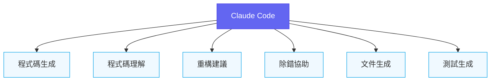
```mermaid
graph TD
    A[Claude Code] --> B[程式碼生成]
    A --> C[程式碼理解]
    A --> D[重構建議]
    A --> E[除錯協助]
    A --> F[文件生成]
    A --> G[測試生成]
    
    style A fill:#6366f1,stroke:#4f46e5,color:#fff
    style B fill:#f0f9ff,stroke:#0ea5e9
    style C fill:#f0f9ff,stroke:#0ea5e9
    style D fill:#f0f9ff,stroke:#0ea5e9
    style E fill:#f0f9ff,stroke:#0ea5e9
    style F fill:#f0f9ff,stroke:#0ea5e9
    style G fill:#f0f9ff,stroke:#0ea5e9
```

#### 核心價值主張

| 價值面向 | 說明 | 實際效益 |
|---------|------|----------|
| **開發效率** | 減少重複性工作，加速原型開發 | 效率提升 30-50% |
| **程式品質** | 自動建議最佳實踐與設計模式 | 減少技術債 |
| **知識傳承** | 協助解讀遺留程式碼 | 降低學習曲線 |
| **協作增強** | 統一團隊程式風格 | 提升 Code Review 效率 |

#### ✨ 最佳實踐

> Claude Code 不是要取代開發者，而是要成為開發者的「智慧副駕駛」。將 AI 視為協作者，而非工具，才能發揮最大效益。

### 1.1.2 多平台支援總覽

Claude Code 已從純 CLI 工具發展為**跨平台智慧開發生態系統**，支援多種使用界面與存取方式：

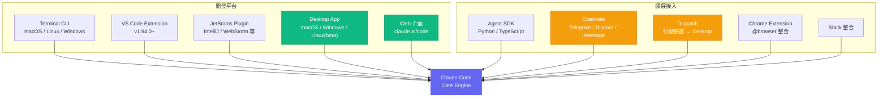
```mermaid
graph TB
    subgraph "開發平台"
        CLI["Terminal CLI<br/>macOS / Linux / Windows"]
        VSC["VS Code Extension<br/>v1.94.0+"]
        JB["JetBrains Plugin<br/>IntelliJ / WebStorm 等"]
        DA["Desktop App<br/>macOS / Windows / Linux(beta)"]
        WEB["Web 介面<br/>claude.ai/code"]
    end
    
    subgraph "擴展接入"
        SDK["Agent SDK<br/>Python / TypeScript"]
        CH["Channels<br/>Telegram / Discord / iMessage"]
        DISP["Dispatch<br/>行動裝置 → Desktop"]
        CHROME["Chrome Extension<br/>@browser 整合"]
        SLACK["Slack 整合"]
    end
    
    CLI --> CORE[Claude Code<br/>Core Engine]
    VSC --> CORE
    JB --> CORE
    DA --> CORE
    WEB --> CORE
    SDK --> CORE
    CH --> CORE
    DISP --> CORE
    CHROME --> CORE
    SLACK --> CORE
    
    style CORE fill:#6366f1,stroke:#4f46e5,color:#fff
    style DA fill:#10b981,stroke:#059669,color:#fff
    style WEB fill:#10b981,stroke:#059669,color:#fff
    style CH fill:#f59e0b,stroke:#d97706,color:#fff
    style DISP fill:#f59e0b,stroke:#d97706,color:#fff
```

| 平台 | 適用場景 | 主要特色 | 系統需求 |
|------|---------|---------|---------|
| **Terminal CLI** | 日常開發、指令碼使用 | 完整功能、鍵盤導向 | macOS 13+ / Ubuntu 20.04+ / Windows 10 1809+（建議安裝 Git for Windows） |
| **VS Code Extension** | IDE 整合開發 | @mentions、plan review、checkpoints、Focus view | VS Code 1.94.0+（Cursor 亦可安裝） |
| **JetBrains Plugin** | Java/Kotlin 等 IDE 使用者 | 互動式 diff、選取內容分享 | IntelliJ IDEA 等；需另裝 CLI |
| **Desktop App** | 圖形化操作偏好 | 無需命令列、內含 Claude Code | macOS / Windows x64・ARM64 / Ubuntu・Debian（beta）；需付費訂閱 |
| **Web 介面** | 雲端執行、無本機環境 | 瀏覽器即用、雲端沙箱 | 現代瀏覽器 |
| **Agent SDK** | 自動化、CI/CD 整合 | Python/TypeScript API | Node.js 18+ 或 Python 3.10+ |
| **Channels** | 外部事件推送 | Telegram / Discord / iMessage | MCP `claude/channel` 能力 |
| **Dispatch** | 行動裝置遠端操控 | 手機發送指令到 Desktop | iOS / Android |
| **Chrome Extension** | 網頁自動化 | @browser 截圖與互動 | Chrome 瀏覽器 |
| **Slack 整合** | 團隊溝通協作 | 在 Slack 中直接操作 | Slack workspace |

#### 與傳統 IDE 的差異

| 比較項目 | 傳統 IDE | Claude Code |
|---------|----------|-------------|
| **自動完成** | 基於語法與 API | 基於語意與上下文 |
| **錯誤檢測** | 靜態規則 | 動態推理 + 意圖理解 |
| **重構支援** | 預定義模式 | 智慧建議 + 解釋原因 |
| **學習曲線** | 需熟悉快捷鍵 | 自然語言互動 |
| **擴展性** | Plugin 架構 | Subagents + Skills + MCP + Plugins |
| **多工處理** | 單一上下文 | Agent Teams 多代理並行 |

### 1.1.3 適用場景與限制

#### ✅ 適用場景

```plaintext
1. 快速原型開發
   - 從需求文字快速生成初版程式碼
   - 產生 API 骨架與資料模型

2. 遺留系統維護
   - 解讀複雜的舊程式碼
   - 漸進式重構建議

3. 程式碼審查輔助
   - 自動檢測潛在問題
   - 提供改善建議

4. 文件與測試生成
   - 自動產生 API 文件
   - 生成單元測試案例

5. 學習與教學
   - 解釋程式碼邏輯
   - 示範設計模式
```

#### ⚠️ 注意事項：不適用場景

```plaintext
1. 高度機密的商業邏輯
   - 需評估資料外洩風險
   - 考慮使用私有部署版本

2. 即時系統的關鍵路徑
   - AI 回應延遲不確定
   - 不適合作為線上服務依賴

3. 需要 100% 正確性的場景
   - AI 可能產生「看似正確但有缺陷」的程式碼
   - 永遠需要人工審查

4. 複雜的演算法開發
   - AI 擅長套用模式，但創新能力有限
   - 核心演算法仍需人工設計
```

### 1.1.4 安裝與環境配置

#### 系統需求

| 項目 | 最低需求 | 建議配置 |
|-----|---------|----------|
| **作業系統** | macOS 13.0+ / Ubuntu 20.04+ / Windows 10 1809+ 或 Windows Server 2019+ | 最新穩定版本 |
| **硬體** | 4 GB+ RAM，x64 或 ARM64 處理器 | 8 GB 以上 |
| **網路** | 需要網際網路連線（企業防火牆須放行官方 network-config 所列網域） | 低延遲連線 |
| **VS Code** | 1.94.0+（如使用擴充） | 最新版本 |
| **Git** | 原生 Windows **建議**安裝 Git for Windows（非必要） | 最新版本 |

> 📌 **Windows 原生支援（v3.5 更正）**：自 2026 年 4 月底（v2.1.120 起）起，原生 Windows **不再強制需要 Git Bash**。有安裝 Git for Windows 時，Claude Code 使用 Bash 工具；沒有安裝時，改用 **PowerShell 工具**作為 shell。WSL 環境則不需要 Git for Windows。如需指定 bash 路徑，可在 `settings.json` 的 `env` 設定 `CLAUDE_CODE_GIT_BASH_PATH`。

#### 安裝步驟

**方法 1：原生安裝程式（推薦）**

```bash
# macOS / Linux
curl -fsSL https://claude.ai/install.sh | bash

# Windows PowerShell（原生安裝）
irm https://claude.ai/install.ps1 | iex

# Windows CMD
curl -fsSL https://claude.ai/install.cmd -o install.cmd && install.cmd && del install.cmd

# 更新到最新版本
claude update
```

**方法 2：使用套件管理器安裝**

```bash
# macOS / Linux — Homebrew（有兩個 cask：claude-code 是穩定通道，落後約一週且會跳過重大回歸版本；
# claude-code@latest 則是最新通道，新版釋出即可安裝）
brew install --cask claude-code
# 或
brew install --cask claude-code@latest

# Windows — WinGet
winget install Anthropic.ClaudeCode

# Debian / Fedora / RHEL / Alpine — 系統套件管理器
apt install claude-code      # Debian / Ubuntu
dnf install claude-code      # Fedora / RHEL
apk add claude-code          # Alpine
```

> ⚠️ 原生安裝程式（方法 1）會**自動在背景更新**至最新版；Homebrew 與 WinGet 安裝**不會自動更新**，須自行定期執行 `brew upgrade claude-code`（或 `@latest`）／`winget upgrade Anthropic.ClaudeCode`。

**方法 3：IDE 擴充功能**

```bash
# VS Code：從 Marketplace 搜尋 "Claude Code by Anthropic"，或命令列安裝
code --install-extension anthropic.claude-code
# Cursor 使用者可用相同方式安裝（擴充功能相容）

# 安裝完成後以 Cmd+Shift+P (macOS) 或 Ctrl+Shift+P (Windows/Linux) 開啟命令面板，
# 輸入 "Claude Code" 並選擇「Open in New Tab」

# JetBrains（IntelliJ IDEA / PyCharm / WebStorm 等）：
# 從 JetBrains Marketplace 安裝 "Claude Code" 外掛，重啟 IDE
# 仍需另外安裝 Claude Code CLI（外掛透過 CLI 運作）
```

**方法 4：Desktop App（無需命令列）**

- macOS: 從 [claude.ai](https://claude.ai) 下載 DMG 安裝（支援 Intel 與 Apple Silicon）
- Windows: 從 [claude.ai](https://claude.ai) 下載 EXE 安裝（x64 與 ARM64）

> 💡 **Desktop App** 提供圖形化安裝介面，可視覺化檢視 diff、同時並行多個工作階段、排程重複性任務，並可一鍵發起雲端工作階段，適合不熟悉命令列的使用者。需要付費訂閱方案。

**步驟 2：認證**

```bash
# 方法 A：互動式登入（推薦，使用 OAuth）——首次執行 claude 會自動引導；
# 也可在 session 內輸入 /login，或在 shell 使用 auth 子命令
claude auth login              # --sso 強制 SSO、--console 改用 Console（API 計費）
claude auth status --text      # 查看目前登入狀態（未登入時 exit code 為 1）

# 方法 B：使用 API 金鑰（互動模式首次會詢問是否核准此金鑰）
export ANTHROPIC_API_KEY="sk-ant-..."

# 方法 C：CI／腳本使用長效 OAuth token
claude setup-token             # 產生 token 後設為 CLAUDE_CODE_OAUTH_TOKEN

# 方法 D：雲端供應商（Amazon Bedrock／Google Cloud Agent Platform／Microsoft Foundry）
export CLAUDE_CODE_USE_BEDROCK=1   # 或 CLAUDE_CODE_USE_VERTEX=1 / CLAUDE_CODE_USE_FOUNDRY=1
```

> 📝 **認證優先順序（v3.5 依官方 authentication 頁更正）**：同時存在多組憑證時，Claude Code 依下列順序選用第一個成立者：
>
> 1. 雲端供應商憑證（設定了 `CLAUDE_CODE_USE_BEDROCK`／`CLAUDE_CODE_USE_VERTEX`／`CLAUDE_CODE_USE_FOUNDRY` 時）
> 2. `ANTHROPIC_AUTH_TOKEN`（以 `Authorization: Bearer` 送出，適用 LLM gateway／proxy）
> 3. `ANTHROPIC_API_KEY`（以 `X-Api-Key` 送出）
> 4. `apiKeyHelper` 腳本輸出（適合從 vault 取得的短效憑證）
> 5. `CLAUDE_CODE_OAUTH_TOKEN`（`claude setup-token` 產生的長效 token）
> 6. Anthropic profile／Workload Identity Federation 憑證
> 7. `/login` 取得的訂閱 OAuth 憑證（Pro／Max／Team／Enterprise 的預設）
>
> 已登入的 **Claude apps gateway** session 不在此清單內，它的優先權高於上述所有來源。

> ⚠️ **注意**：如果有舊的 `ANTHROPIC_API_KEY` 環境變數殘留，核准後會優先於訂閱登入，若該金鑰所屬組織已停用就會認證失敗。使用 `unset ANTHROPIC_API_KEY` 退回訂閱，並在 `/status` 確認目前生效的認證方式。**雲端 session 永遠使用訂閱憑證**，在雲端環境設定 API key 不會覆蓋。

> 🔐 **憑證儲存位置**：macOS 存放在加密的 Keychain（Keychain 拒絕寫入時，例如 SSH 下鎖定，退回 `~/.claude/.credentials.json`，權限 `0600`）；Linux 為 `~/.claude/.credentials.json`（`0600`）；Windows 為 `%USERPROFILE%\.claude\.credentials.json`。設定 `CLAUDE_CONFIG_DIR` 時會改存到該目錄。

#### 配置檔案結構

Claude Code 使用**多層級配置系統**，從全域到專案層層覆蓋：

```plaintext
全域配置
~/.claude/
├── settings.json          # 使用者設定（hooks、permissions、plugins…）
├── CLAUDE.md              # 全域指引（所有專案共用）
├── agents/  skills/       # 個人 Subagent 與 Skill
├── projects/<project>/    # 對話紀錄（明文 JSONL）與 Auto Memory
└── .credentials.json      # 認證資訊（Linux／Windows；macOS 存於 Keychain）
~/.claude.json             # 偏好、OAuth session、user／local 範圍的 MCP 設定

專案配置
專案根目錄/
├── .claude/
│   ├── settings.json      # 專案共享設定（提交至 Git）
│   ├── settings.local.json# 個人本地設定（自動加入 git 排除）
│   ├── agents/ skills/ rules/  # 專案 Subagent、Skill、路徑規則
├── .mcp.json              # 專案範圍 MCP Server 配置（提交至 Git）
├── CLAUDE.md              # 專案級指引（或 .claude/CLAUDE.md）
├── CLAUDE.local.md        # 個人專案指引（不進版控）
└── AGENTS.md              # 跨工具共用的專案指引；沒有 CLAUDE.md 時會直接讀取（v2.1.277+）

企業配置（系統目錄，需管理員權限）
/Library/Application Support/ClaudeCode/   # macOS
/etc/claude-code/                          # Linux / WSL
C:\Program Files\ClaudeCode\               # Windows
├── managed-settings.json  # 企業強制設定
├── managed-settings.d/    # 多團隊分檔維護的 drop-in 設定（與上者合併）
├── managed-mcp.json       # 企業級 MCP 配置
└── CLAUDE.md              # 組織層級指引
```

> ⚠️ **v3.5 更正**：Claude Code **沒有 `.claudeignore` 機制**，官方文件從未定義這個檔案，寫了也不會生效。要讓 Claude 讀不到特定檔案，請使用 `permissions.deny` 的 `Read(...)` 規則（例如 `Read(./.env)`、`Read(./secrets/**)`）；`Read` deny 規則也會一併阻擋同路徑的 Edit／Write。檔案選擇器（`@` 提及）預設會遵守 `.gitignore`，可用設定 `respectGitignore` 調整。詳見 [B.7](#b7-敏感檔案與大型檔案排除取代-claudeignore)。

**settings.json 基本範例**：

```json
{
  "permissions": {
    "allow": [
      "Read(*)",
      "Edit(*)",
      "Bash(npm test)",
      "Bash(npm run lint)"
    ],
    "deny": [
      "Bash(rm -rf *)",
      "Bash(git push --force)"
    ]
  },
  "env": {
    "NODE_ENV": "development",
    "CLAUDE_CODE_MAX_TURNS": "50"
  }
}
```

**CLAUDE.md 團隊指引範例**：

```markdown
# 專案指引

## 程式碼規範
- 使用 TypeScript strict mode
- 所有 public function 需要 JSDoc 註解
- 遵循 ESLint 配置的規則

## 測試要求
- 新功能必須有單元測試
- 測試覆蓋率不低於 80%
- 使用 vitest 作為測試框架

## 專案結構
- src/ — 原始碼
- tests/ — 測試檔案
- docs/ — 文件

## 常用命令
- `npm test` — 執行測試
- `npm run build` — 建構專案
- `npm run lint` — 程式碼檢查
```

#### 💡 小技巧

> - 將 `CLAUDE.md`、`.mcp.json` 與 **`.claude/settings.json`** 提交至版本控制，讓團隊共享權限、hooks 與 plugins；個人偏好放在 `.claude/settings.local.json`（Claude Code 建立時會自動排除於 git；手動建立者須自行加入 `.gitignore`）
> - 在 session 內用 `/status` 查看生效的設定來源（Setting sources），用 `/config` 調整設定；`claude doctor`（互動模式為 `/doctor`）可檢查被忽略或無效的設定
> - ⚠️ `claude config list`、`claude config set` 等指令**不存在**（v3.4 已更正），請勿寫進團隊文件
> - 敏感資訊（如 API 金鑰）應使用環境變數或 `apiKeyHelper` 管理，不要寫在設定檔中

---

### 1.1.5 Claude Code 的運作原理

Claude Code 是一個**代理式程式設計系統 (agentic coding system)**，其核心運作方式與傳統的程式碼補全工具有本質差異。官方文件將 Claude Code 定位為圍繞 Claude 模型打造的「**agentic harness（代理式執行殼層）**」——由它提供工具、context 管理與執行環境，把單純會推理的語言模型變成真正能動手做事的程式開發代理人。

#### 代理式迴圈 (Agentic Loop)

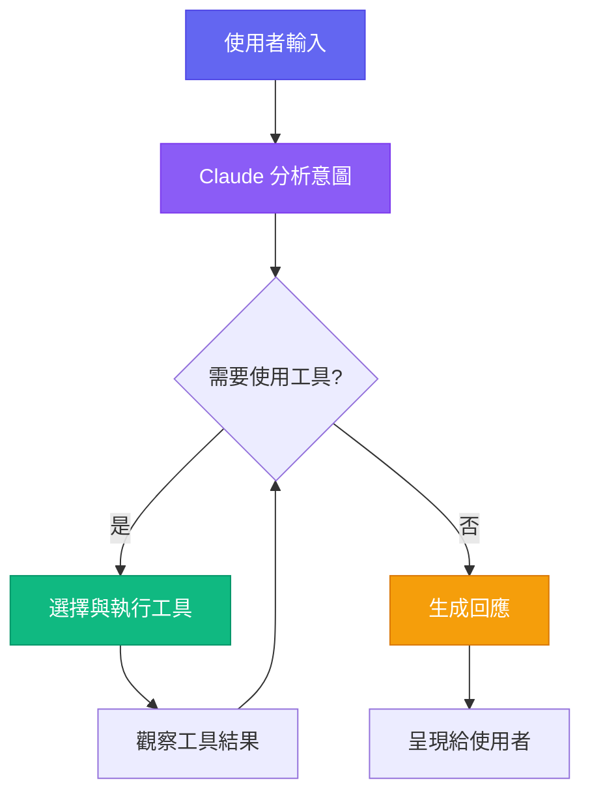
```mermaid
graph TD
    A[使用者輸入] --> B[Claude 分析意圖]
    B --> C{需要使用工具?}
    C -->|是| D[選擇與執行工具]
    D --> E[觀察工具結果]
    E --> C
    C -->|否| F[生成回應]
    F --> G[呈現給使用者]
    
    style A fill:#6366f1,stroke:#4f46e5,color:#fff
    style B fill:#8b5cf6,stroke:#7c3aed,color:#fff
    style D fill:#10b981,stroke:#059669,color:#fff
    style F fill:#f59e0b,stroke:#d97706,color:#fff
```

官方文件將 Agentic Loop 定義為三個交織進行的階段：**蒐集上下文（gather context）→ 採取行動（take action）→ 驗證結果（verify results）**，並依任務動態調整——單純的程式碼提問可能只需要蒐集上下文，Bug 修復會反覆經歷三個階段，大型重構則可能需要密集驗證。這三階段可再拆解為更細的實務步驟：

1. **讀取 (Read)** — 解析使用者意圖，蒐集專案上下文（CLAUDE.md、Auto Memory、相關檔案、Git 歷史）
2. **規劃 (Plan)** — 擬定執行策略，拆解任務為多步驟
3. **行動 (Act)** — 透過工具呼叫執行操作（讀寫檔案、執行命令、搜尋程式碼）
4. **驗證 (Verify)** — 檢查執行結果，確認是否需要進一步操作

你隨時可以在迴圈執行中插話：按 `Esc` 立即中斷並取消目前的工具呼叫，或直接輸入修正內容並按 `Enter`——不會中斷正在執行的動作，Claude 會在目前步驟完成後讀取你的訊息再決定下一步。

#### 內建工具集

Claude Code 的內建工具依「能動性層級」分為五大類（File operations／Search／Execution／Web／🆕 Code intelligence），完整分類與逐一工具說明見 [1.2.6 工具系統詳解](#126-工具系統詳解)。核心心法：Claude 依提示與過程中蒐集到的資訊自主決定用哪個工具、以什麼順序使用，例如「修好失敗的測試」通常會依序觸發「跑測試 → 讀錯誤輸出 → 搜尋相關原始碼 → 讀取理解 → 編輯修正 → 重跑測試驗證」——每一步的結果都會回饋進迴圈、影響下一步決策。

#### 上下文載入順序

啟動時，Claude Code 先解析設定，再組裝模型看到的 context。兩者要分開看：**設定（settings.json、hooks、權限）決定「能做什麼」，不佔 context；context 決定「知道什麼」，會消耗 token。**

```plaintext
【啟動時解析（不佔 context）】
A. 設定合併：Managed → CLI 旗標 → .claude/settings.local.json → .claude/settings.json → ~/.claude/settings.json
B. Hooks 註冊、權限規則與權限模式決定
C. MCP Server 連線（背景連線；Claude 可用 WaitForMcpServers 等待尚未就緒者）

【載入 context（佔用 token）】
1. 系統提示與內建工具定義
2. 組織 managed CLAUDE.md → ~/.claude/CLAUDE.md
3. 工作目錄與所有上層目錄的 CLAUDE.md／CLAUDE.local.md／.claude/rules/*.md
   └── 沒有任何 CLAUDE.md 時，改讀 AGENTS.md（v2.1.277+）
4. Auto Memory：MEMORY.md 前 200 行或 25KB（取先達到者）
5. Skills 的名稱與描述（完整內容用到才載入）
6. MCP：預設只載入工具名稱與 server instructions，完整 schema 經 Tool Search 隨需載入
7. Git 狀態（目前分支、未提交變更、近期 commit）
8. 使用者對話
   └── 子目錄的 CLAUDE.md 會在 Claude 讀取該目錄檔案時才隨需注入
```

> 💡 用 `/context` 可看到上述各項實際佔用的 token；官方另提供互動式的 [Explore the context window](https://code.claude.com/docs/en/context-window) 頁面，逐步說明各項目在何時載入。

#### Token 管理與 Context Window

Context window 裝載對話歷史、檔案內容、命令輸出、CLAUDE.md、Auto Memory、已載入的 Skills 與系統指令。當對話接近上限時，Claude Code 會**自動**先清除較舊的工具輸出，若仍不夠才對對話做摘要壓縮：

- **自動摘要壓縮** — 使用 `/compact` 命令或自動觸發；你的請求與關鍵程式碼片段會保留，但對話早期的細節指示可能遺失——因此持久性規則應寫進 CLAUDE.md，而不是依賴對話記憶
- **選擇性載入** — 只載入與當前任務相關的檔案內容
- **工具結果截斷** — 過長的工具輸出會自動截斷
- **可控摘要焦點** — 在 CLAUDE.md 中加入「Compact Instructions」段落，或直接對 `/compact` 附帶焦點說明

```bash
# 手動壓縮上下文
/compact

# 帶有自訂摘要指示的壓縮
/compact 保留所有與 API 設計相關的討論

# 檢視目前 context window 各項目的用量佔比
/context
```

> ⚠️ **🆕 Thrashing 保護**：若單一檔案或工具輸出過大，導致每次摘要後 context 又立刻被同一內容填滿，Claude Code 會在嘗試幾次後自動停止 auto-compact 並回報錯誤，而不會無限迴圈消耗 token。
>
> 💡 Skills 採隨需載入（只有描述常駐 context，實際內容用到才載入），Subagent 則擁有完全獨立的 context——這兩者是除了壓縮之外，控制 context 用量的主要手段，詳見 [2.1 Subagents](#21-subagents-子代理) 與 [2.3 Skills](#23-skills技能系統)。

#### 🆕 Session、Checkpoint 與執行環境

> 🆕 **v3.5 新增**：依官方 `how-claude-code-works` 頁補齊。

**Session 是本機的明文紀錄**：每則訊息、工具呼叫與結果都寫入 `~/.claude/projects/` 下的 **明文 JSONL** 檔案，這是 rewind、resume、fork 的基礎。企業須把這個目錄納入端點資料保護與保存政策（可能含程式碼片段與命令輸出中的敏感資訊）。

| 操作 | 指令 | 結果 |
|------|------|------|
| 接續最近一次 | `claude --continue` | 同一個 session ID，新訊息接在原對話後 |
| 選擇接續 | `claude --resume`／`/resume` | 選單預設只列目前 worktree 的 session，可用快捷鍵擴大到其他 worktree／專案 |
| 分支 | `--fork-session`、`/branch` | 複製歷史到**新的** session ID，原 session 不變 |
| 複製為背景 session | `/fork` | 複製目前對話成背景 session，本視窗繼續工作 |

- **Session 彼此獨立**：新 session 從全新 context 開始，跨 session 的延續只靠 CLAUDE.md 與 Auto Memory。
- **Session 綁定目錄**：切換 git 分支後，Claude 會看到新分支的檔案，但對話歷史不變；要真正平行工作，請用 git worktree（`claude --worktree`）。

**Checkpoint 只保護檔案編輯**：Claude 編輯檔案前會先快照，按兩次 `Esc`（或 `/rewind`）可回到先前狀態。Checkpoint 獨立於 git、resume 後仍可使用，但：

- **不涵蓋**資料庫、API、部署等遠端副作用，也不涵蓋 symlink／hard link 的檔案
- 由 Bash 命令造成的檔案變更同樣不在保護範圍內
- 這些風險要靠權限模式與權限規則控管，而不是 checkpoint

**三種執行環境**：Agentic loop 與工具在任何介面都相同，差別在於程式碼在哪裡執行。

| 環境 | 程式碼在哪裡執行 | 典型用途 |
|------|----------------|---------|
| **Local** | 你的電腦 | 預設；可存取本機檔案、工具與環境 |
| **Cloud** | Anthropic 管理的 VM，或組織自行營運的 **self-hosted environments** | 把任務丟到雲端、處理本機沒有的 repo |
| **Remote Control** | 你的電腦，由瀏覽器／手機操控 | 用 Web UI 操作，但執行與檔案仍留在本機 |

---

### 1.1.6 Desktop App 與 Web 介面

> 🆕 **v3.0 新增章節**

Claude Code 現在提供**圖形化桌面應用程式**和**雲端 Web 介面**，大幅降低使用門檻。

#### Desktop App

Desktop App（Claude 桌面應用程式的 **Code** 分頁）與 CLI 共用同一個 Claude Code 引擎、同一套 CLAUDE.md／settings／MCP，但功能**並非完全相同**（v3.5 更正）：Desktop 多了視覺化 diff、Browser 預覽窗格、Computer use、Dispatch、SSH session 與檔案附件；CLI 則獨有 `dontAsk` 模式、第三方供應商原生設定、`--print` 腳本化與 Agent Teams。

**安裝方式**：

| 平台 | 安裝方法 |
|------|---------|
| **macOS** | 從 [claude.ai](https://claude.ai) 下載 `.dmg` 安裝檔（Intel 與 Apple Silicon 通用），拖曳到 Applications |
| **Windows** | 下載 x64 或 ARM64 安裝程式，雙擊安裝 |
| **Linux（beta）** | Ubuntu／Debian 以 apt 安裝，步驟見官方 `desktop-linux` 頁面 |

安裝後登入並點選 **Code** 分頁即可開始；Desktop App 已內含 Claude Code，**不需要另外安裝 CLI**，但需要付費訂閱。

**核心功能**：

- 內建 Terminal 窗格、檔案編輯器與視覺化 **diff view**（可逐行留言請 Claude 修改）
- **Browser 窗格**：Claude 可啟動 dev server 並在窗格中預覽、驗證變更，也能開啟外部網站（`Cmd/Ctrl+Shift+B`）
- 圖形化 Connectors（MCP）與 Plugin 管理 UI
- 可配置排程任務（Desktop Scheduled Tasks）
- 同時並排檢視、操作多個工作階段（側邊欄分頁），可選擇 **worktree** 隔離，或一鍵發起雲端工作階段
- **SSH sessions**：以 Desktop 為介面，在遠端 VM／dev container 上執行 Claude Code
- **Side chat**（`Cmd/Ctrl+;` 或 `/btw`）：提問但不寫回主對話
- **Computer use**（研究預覽，macOS／Windows，限 Pro／Max）：操作沒有 CLI 的桌面應用程式
- 🆕 **Session Groups**：在側邊欄以右鍵將多個工作階段歸類分組管理
- 🆕 可用 `/resume` 接續在終端機開始的 session；面板可彈出為獨立視窗；額度重置後可自動續跑
- 自動更新

> ⚠️ **Desktop 不支援的項目**：Agent Teams（僅 CLI；Desktop 內多代理協作請改用 Dynamic Workflows）、`dontAsk` 模式、`--print` 腳本化；`/permissions` 這類需要終端機互動面板的指令在 Code 分頁會回覆 `isn't available in this environment`。企業可透過 Admin console、managed settings 與 MDM policy 管控 Desktop。

> 💡 **Desktop 排程任務**: 與 CLI 的 session-scoped `/loop` 不同，Desktop 排程任務**持久存在**，可在 app 重啟後繼續執行；雲端執行的 **Routines** 則連電腦關機也不受影響，三者的完整比較見 [2.8 Scheduled Tasks](#28-scheduled-tasks排程任務)。

> 🔀 **跨裝置接續工作**：在 Terminal 中執行 `/desktop` 可將目前 CLI 工作階段交接到 Desktop App（需 claude.ai 訂閱，支援 macOS 與 x64 Windows），改用圖形化介面檢視 diff；反向操作則可用 `claude --teleport` 把手機或 Web 上發起的雲端工作階段拉回本機終端機繼續（需 claude.ai 訂閱）。

#### Web 介面 (claude.ai/code)

Web 介面讓你在**瀏覽器中**使用 Claude Code 的完整功能，程式碼在 Anthropic 的雲端沙箱中執行；也可透過 [Claude 行動應用程式](https://claude.ai)（iOS / Android）存取。

**適用場景**：

- 沒有本機開發環境時快速嘗試
- 在平板或共用電腦上操作
- 快速原型驗證
- 程式碼審查（不需本機 clone）
- 同時平行執行多個長時間任務，完成後再回來查看

**運作方式**：

```plaintext
瀏覽器 → claude.ai/code → 雲端虛擬機（沙箱）→ 執行程式碼
                                                  ↓
                                           可 clone GitHub repo
                                           可安裝依賴、執行測試
                                           可將變更推回 GitHub
```

**與本機工作階段互轉**：

```bash
# 從本機終端機把目前任務丟到雲端執行
claude --cloud

# 之後可在 Claude 行動應用程式接續查看/操作
# 或反向：在雲端／行動裝置發起的任務，用 --teleport 拉回本機終端機繼續
claude --teleport
```

> ⚠️ **注意**: Web 介面在雲端沙箱中執行，無法存取你的本機檔案系統。需要操作本機檔案請使用 CLI、Desktop App 或 IDE 擴充功能。

---

### 1.1.7 Channels 與 Dispatch

> 🆕 **v3.0 新增章節**

**Channels** 和 **Dispatch** 是 Claude Code 的外部事件推送與行動端控制機制，讓 Claude Code 不再受限於終端機前的操作。

#### Channels — 外部事件推送

Channels 讓外部服務（Telegram、Discord、iMessage 等）可以**主動推送訊息**到你的 Claude Code 工作階段中，Claude 會自動回應。

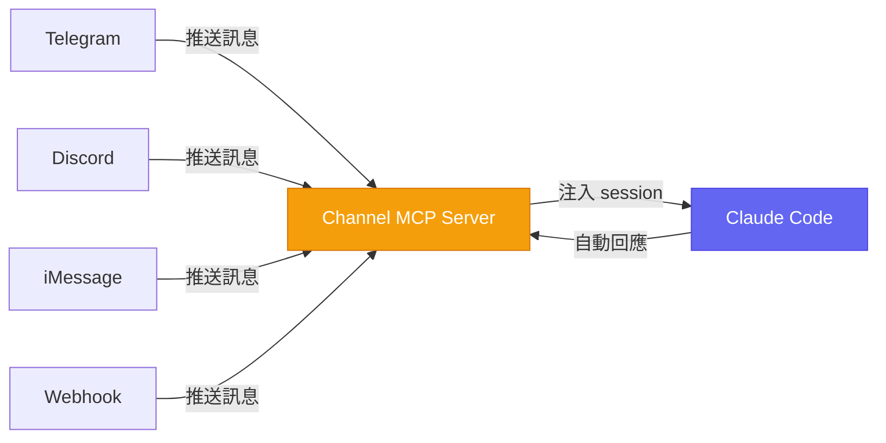
```mermaid
graph LR
    TG[Telegram] -->|推送訊息| CH[Channel MCP Server]
    DC[Discord] -->|推送訊息| CH
    IM[iMessage] -->|推送訊息| CH
    WH[Webhook] -->|推送訊息| CH
    CH -->|注入 session| CC[Claude Code]
    CC -->|自動回應| CH
    
    style CH fill:#f59e0b,stroke:#d97706,color:#fff
    style CC fill:#6366f1,stroke:#4f46e5,color:#fff
```

**使用方式**：

```bash
# 1. 安裝 channel plugin（官方 Telegram／Discord／iMessage／fakechat 皆以 Bun 執行）
#    在 Claude Code session 內執行：/plugin install fakechat@claude-plugins-official

# 2. 重新啟動並「逐 session 明確選用」channel（可空白分隔多個）
claude --channels plugin:fakechat@claude-plugins-official

# 3. 開發自建 channel 時（未列入允許清單），改用開發旗標（會要求確認）
claude --dangerously-load-development-channels server:webhook
```

> ⚠️ **研究預覽（Research preview）限制**：Channels 需以 claude.ai 或 Console API key 認證，**不支援 Bedrock／Vertex（Agent Platform）／Foundry**；`--channels` 在預覽期間不會出現在 `claude --help`，且只接受 Anthropic 維護的允許清單（或組織以 `allowedChannelPlugins` 取代的清單）。**Team／Enterprise 預設封鎖**，需由 Owner 在 Admin settings 啟用或在 managed settings 設 `channelsEnabled: true`。僅寫在 `.mcp.json` 不足以推送訊息，必須在 `--channels` 中列名。

**應用場景**：

| 場景 | 說明 |
|------|------|
| CI/CD 失敗通知 | CI 失敗時自動推送到 Claude，Claude 分析錯誤並嘗試修復 |
| 監控告警回應 | Sentry 異常推送到 Claude，Claude 自動診斷 |
| 聊天橋接 | 在 Telegram／Discord／iMessage 發問，工作在本機實際檔案上執行，答覆回到同一個聊天室 |
| Webhook 整合 | 外部服務透過自建 webhook receiver channel 觸發 |

> 🔐 **安全模型**：每個官方 channel plugin 都維護**寄件者允許清單**，Telegram／Discord 以配對碼（pairing code）加入，iMessage 以 `/imessage:access allow` 加入，其他寄件者的訊息會被靜默丟棄。若 channel 宣告了 permission relay 能力，**任何能透過該 channel 回覆的人都能核准或拒絕你 session 的工具呼叫**，只應加入你信任的對象。
>
> 📌 **Slack 的 `@Claude` 不是 Channel**：它會開一個新的雲端 session（Claude in Slack），而 Channel 是把事件推進你**已開啟的本機 session**。

#### Dispatch — 行動端控制

Dispatch 讓你從**手機**發送指令到運行中的 Claude Code Desktop App。

```plaintext
📱 手機
  ↓ (Dispatch 指令)
💻 Desktop App (本機)
  ↓
🤖 Claude Code 執行任務
  ↓
📱 結果回傳手機
```

**工作流程**：

1. Dispatch 是位於 Claude 桌面應用程式 **Cowork** 分頁中的一段持續對話；依 Anthropic 說明文件完成手機配對
2. 從手機傳訊給 Dispatch（如「開一個 Claude Code session 修好登入 bug」）
3. Dispatch 自行判斷任務類型：開發類工作（修 bug、更新依賴、跑測試、開 PR）會產生一個 Code session；研究、文件、試算表則留在 Cowork
4. 產生的 Code session 會出現在 Code 分頁側邊欄並帶有 **Dispatch** 標記；完成或需要核准時，手機會收到推播

> ⚠️ **方案限制（v3.5 補充）**：Dispatch 需要 **Pro 或 Max** 方案，**Team／Enterprise 無法使用**。若 Dispatch 產生的 session 啟用了 Computer use，應用程式核准在 30 分鐘後失效並重新詢問。企業情境要「離開電腦仍能繼續工作」，請改用 [Remote Control](#32-remote-control遠端控制)。

> 📖 **詳細設定與進階用法**: 請參閱 [4.4 Channels 與 Dispatch 深入解析](#44-channels-與-dispatch-深入解析)

### 1.1.8 模型陣容與推理投入程度（Effort）

> 🆕 **v3.5 新增**：依官方 `model-config` 頁整理（基準版本 v2.1.281）。模型與預設值在 2026 年變動極快（Sonnet 5 → Opus 5 → Opus 5.5 相繼成為預設），企業應把本節列入每季覆核項目。

#### 目前的模型別名與解析結果

| 別名 | 用途 | Anthropic API 解析為 |
|------|------|---------------------|
| `default` | 清除覆寫，回到帳號類型的執行期預設 | **Opus 5.5**（v2.1.280 起，Pro／Max／Team／Enterprise／API 皆同） |
| `opus` | 複雜推理、架構決策 | Opus 5.5 |
| `sonnet` | 日常開發 | Sonnet 5（原生 1M context） |
| `haiku` | 簡單、快速的任務 | Haiku 4.5 |
| `fable` | 最困難、跨多次工作時段的長時間任務 | Fable 5.1（需 v2.1.257+） |
| `best` | Fable 可用時等同 `fable`，否則等同 `opus` | — |
| `opusplan` | Plan mode 用 `opus`，執行階段切換為 `sonnet` | — |
| `opus[1m]`／`sonnet[1m]` | 使用 1M token context window | — |

> ⚠️ **供應商差異**：`opus`／`sonnet` 解析結果依供應商而不同，例如 Bedrock 與 Google Cloud Agent Platform 的 `sonnet` 仍是 Sonnet 4.5，Microsoft Foundry 的 `default` 是 Sonnet 4.5、`opus` 是 Opus 4.6。第三方供應商部署**務必以 `ANTHROPIC_DEFAULT_OPUS_MODEL` 等變數釘選模型 ID**，避免版本升級時模型被悄悄替換。

**Fable 模型的特殊規則**：Fable 不是任何方案的預設模型，必須以 `/model fable` 或 `--model fable` 明確選用；依方案與席次，Fable 用量可能改計入 **usage credits**，互動模式會先顯示同意提示，但 `-p` 與 Agent SDK **不會詢問、直接計費**。觸發安全分類器（常見於資安、生物領域）時會自動換模型（automatic model fallback）。

#### 模型設定的優先順序

1. Session 中 `/model <別名>`（`Enter` 儲存為預設、`s` 僅限本次 session）
2. 啟動時 `claude --model <別名>`
3. 環境變數 `ANTHROPIC_MODEL`
4. 設定檔的 `model` 欄位
5. `ANTHROPIC_DEFAULT_MODEL`（新 session 的預設）

Enterprise 管理員可在 claude.ai Admin console 設定**組織預設模型**（可依自訂角色設定，需 v2.1.196+），並可選擇是否覆寫使用者選擇；要「限制」可選模型則使用 `availableModels`（搭配 `enforceAvailableModels`）或組織模型限制。`modelPicker` 設定可自訂 `/model` 選單列出的模型、順序與標籤。

#### Effort：控制每一步要想多深

| 模型 | 可用等級 | 預設值 |
|------|---------|--------|
| Fable 5.1／Fable 5 | `low`、`medium`、`high`、`xhigh`、`max` | `high` |
| **Opus 5.5** | `low`、`medium`、`high`、`xhigh`、`max` | **`medium`** |
| Opus 5／Sonnet 5／Opus 4.8 | `low`、`medium`、`high`、`xhigh`、`max` | `high` |
| Opus 4.7 | 同上 | `xhigh` |
| Opus 4.6／Sonnet 4.6 | `low`、`medium`、`high`、`max` | `high` |

- 設定方式（先成立者優先）：`CLAUDE_CODE_EFFORT_LEVEL` 環境變數、`--effort` 旗標或 `/effort` → 設定檔中依模型儲存的等級（`modelSettings`）或 `effortLevel` → 模型預設值。
- ⚠️ **頂層 `effortLevel` 對 Opus 5.5 不生效**，Opus 5.5 會從自己的預設 `medium` 開始，需要以 `/effort` 為該模型另存等級。
- `max` 只套用於當次 session（除非用環境變數設定）；`/effort` 選單中的 **`ultracode`** 不是模型等級，而是送出 `xhigh` 並讓 Claude 對實質任務自動編排 [Dynamic Workflows](#228-官方平行執行方式分類與新型協作機制)。
- **企業上限**：`maxEffortLevel` managed setting 可在**所有供應商**（含 Bedrock／Vertex／Foundry）限制最高 effort，也能依模型個別設定；Enterprise 方案另可在 Admin console 依角色設定上限。

#### Fallback model chain（備援模型鏈）

主模型過載或無法使用時，可依序改用備援模型（最多 3 個，只影響當次 turn）：

```bash
# 單次 session
claude --fallback-model sonnet,haiku
```

```json
{
  "fallbackModel": ["claude-sonnet-5", "claude-haiku-4-5"]
}
```

> 📌 認證、計費、rate limit 與組織政策拒絕**不會**觸發備援；不在 `availableModels` 允許清單內的模型會先被剔除；`/status` 不會顯示備援鏈，第一次切換時的提示才是唯一可見訊號。

#### 企業導入檢核要點

- [ ] 第三方供應商已釘選 `ANTHROPIC_DEFAULT_OPUS_MODEL`／`ANTHROPIC_DEFAULT_SONNET_MODEL`／`ANTHROPIC_DEFAULT_HAIKU_MODEL`
- [ ] 以 `availableModels` + `enforceAvailableModels` 限制可用模型，並決定是否開放 Fable（usage credits 成本）
- [ ] 以 `maxEffortLevel` 設定 effort 上限，避免 `max`／`xhigh` 造成成本失控
- [ ] 在 CI（`-p`）中明確指定 `--model` 與 `--effort`，不依賴會隨版本改變的預設值
- [ ] 每季比對官方 `model-config` 頁，確認預設模型與預設 effort 是否改變

---

---

## 1.2 核心架構概覽

### 1.2.1 系統架構圖

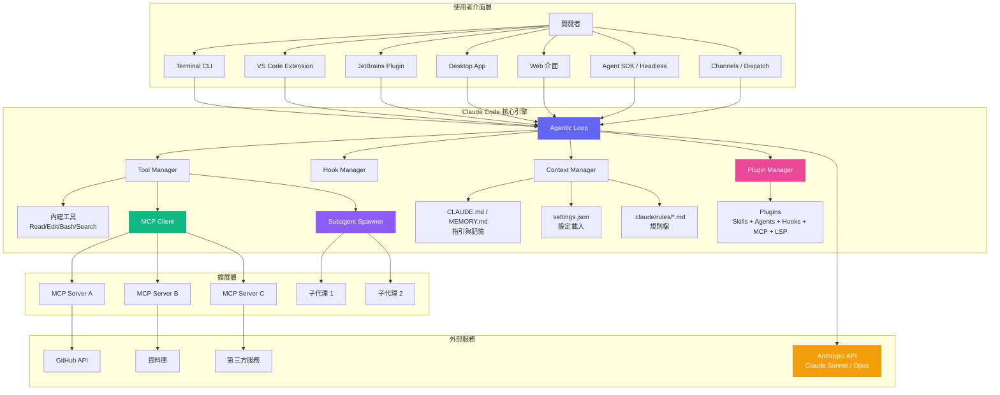
```mermaid
graph TB
    subgraph "使用者介面層"
        U[開發者] --> CLI[Terminal CLI]
        U --> VSC[VS Code Extension]
        U --> JB[JetBrains Plugin]
        U --> DA[Desktop App]
        U --> WEB[Web 介面]
        U --> SDK[Agent SDK / Headless]
        U --> CH[Channels / Dispatch]
    end
    
    subgraph "Claude Code 核心引擎"
        CLI --> AL[Agentic Loop]
        VSC --> AL
        JB --> AL
        DA --> AL
        WEB --> AL
        SDK --> AL
        CH --> AL
        
        AL --> TM[Tool Manager]
        AL --> HM[Hook Manager]
        AL --> CM[Context Manager]
        AL --> PM[Plugin Manager]
        
        TM --> BT[內建工具<br/>Read/Edit/Bash/Search]
        TM --> MCPc[MCP Client]
        TM --> SA[Subagent Spawner]
        
        CM --> CLAUDE[CLAUDE.md / MEMORY.md<br/>指引與記憶]
        CM --> SETTINGS[settings.json<br/>設定載入]
        CM --> RULES[.claude/rules/*.md<br/>規則檔]
        
        PM --> PLG[Plugins<br/>Skills + Agents + Hooks + MCP + LSP]
    end
    
    subgraph "擴展層"
        MCPc --> MCP1[MCP Server A]
        MCPc --> MCP2[MCP Server B]
        MCPc --> MCP3[MCP Server C]
        SA --> SA1[子代理 1]
        SA --> SA2[子代理 2]
    end
    
    subgraph "外部服務"
        AL --> API[Anthropic API<br/>Claude Sonnet / Opus]
        MCP1 --> EXT1[GitHub API]
        MCP2 --> EXT2[資料庫]
        MCP3 --> EXT3[第三方服務]
    end
    
    style AL fill:#6366f1,stroke:#4f46e5,color:#fff
    style MCPc fill:#10b981,stroke:#059669,color:#fff
    style API fill:#f59e0b,stroke:#d97706,color:#fff
    style SA fill:#8b5cf6,stroke:#7c3aed,color:#fff
    style PM fill:#ec4899,stroke:#db2777,color:#fff
```

### 1.2.2 各組件之間的關係

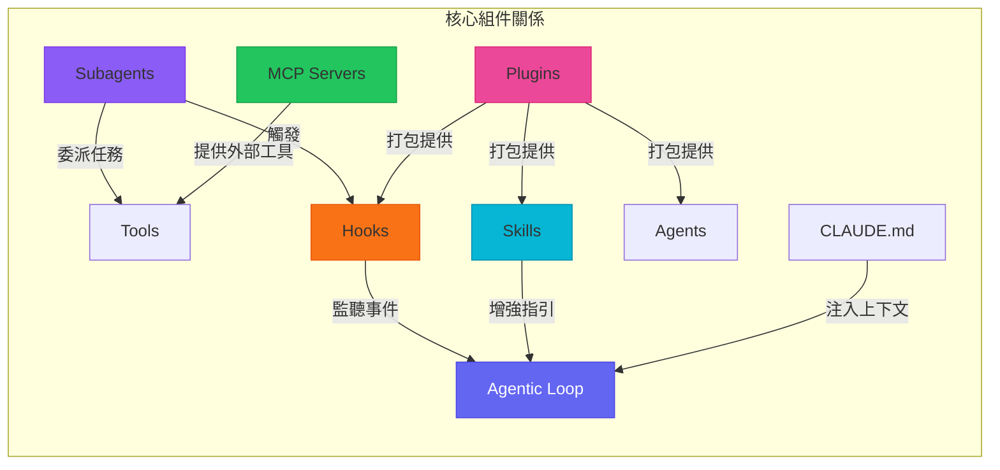
```mermaid
graph LR
    subgraph "核心組件關係"
        S[Subagents] -->|委派任務| T[Tools]
        S -->|觸發| H[Hooks]
        H -->|監聽事件| AL[Agentic Loop]
        SK[Skills] -->|增強指引| AL
        P[Plugins] -->|打包提供| SK
        P -->|打包提供| AG[Agents]
        P -->|打包提供| H
        MCP[MCP Servers] -->|提供外部工具| T
        CM[CLAUDE.md] -->|注入上下文| AL
    end
    
    style S fill:#8b5cf6,stroke:#7c3aed
    style SK fill:#06b6d4,stroke:#0891b2
    style H fill:#f97316,stroke:#ea580c
    style MCP fill:#22c55e,stroke:#16a34a
    style P fill:#ec4899,stroke:#db2777
    style AL fill:#6366f1,stroke:#4f46e5,color:#fff
```

#### 組件職責說明

| 組件 | 職責 | 實際格式 |
|-----|------|---------|
| **Subagents** | 獨立 context 的子代理，處理子任務 | YAML frontmatter 的 Markdown 檔案 |
| **Skills** | 可重用的技能指引，增強 Claude 能力 | SKILL.md 檔案 |
| **Plugins** | 打包 skills + agents + hooks + MCP 的分發單元 | `.claude-plugin/` 目錄 |
| **Hooks** | 事件驅動的自動化處理 | settings.json 中的 JSON 配置 |
| **MCP** | 連接外部工具伺服器的協定 | .mcp.json 配置檔 |
| **CLAUDE.md** | 專案指引與規範 | Markdown 檔案 |

### 1.2.3 資料流與執行流程

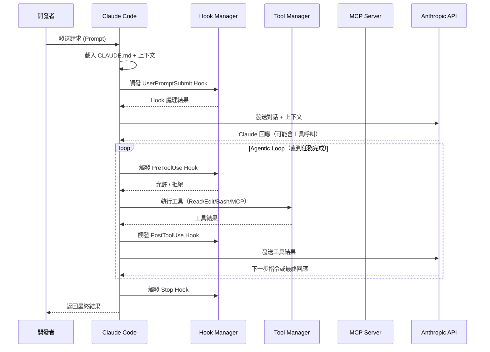
```mermaid
sequenceDiagram
    participant U as 開發者
    participant CC as Claude Code
    participant HM as Hook Manager
    participant Tools as Tool Manager
    participant MCP as MCP Server
    participant API as Anthropic API
    
    U->>CC: 發送請求 (Prompt)
    CC->>CC: 載入 CLAUDE.md + 上下文
    CC->>HM: 觸發 UserPromptSubmit Hook
    HM-->>CC: Hook 處理結果
    
    CC->>API: 發送對話 + 上下文
    API-->>CC: Claude 回應（可能含工具呼叫）
    
    loop Agentic Loop（直到任務完成）
        CC->>HM: 觸發 PreToolUse Hook
        HM-->>CC: 允許 / 拒絕
        CC->>Tools: 執行工具（Read/Edit/Bash/MCP）
        Tools-->>CC: 工具結果
        CC->>HM: 觸發 PostToolUse Hook
        CC->>API: 發送工具結果
        API-->>CC: 下一步指令或最終回應
    end
    
    CC->>HM: 觸發 Stop Hook
    CC-->>U: 返回最終結果
```

#### 執行流程詳解

**階段 1：請求接收與前處理**

```plaintext
1. 使用者輸入 → UserPromptSubmit Hook 觸發
2. 載入上下文：
   - CLAUDE.md（全域 → 專案 → 目錄層級）
   - 對話歷史
   - 活動檔案內容
3. 組裝完整 prompt 發送至 Anthropic API
```

**階段 2：Agentic Loop 執行**

```plaintext
迴圈開始：
├── Claude 模型分析任務
├── 選擇並呼叫工具
│   ├── PreToolUse Hook → 權限檢查
│   ├── 執行工具（讀檔/寫檔/命令/搜尋）
│   ├── PostToolUse Hook → 結果處理
│   └── 將結果回傳模型
├── Claude 分析結果，決定下一步
└── 重複直到任務完成或達到 turn 上限
```

**階段 3：結果後處理**

```plaintext
1. Stop Hook 觸發 → 可執行最終清理
2. 若該輪有工作項目被標記完成，另會觸發 TaskCompleted Hook（任務清單／Agent Teams 共用任務）
3. 結果呈現給使用者
4. 等待下一個使用者輸入或結束對話
```

### 1.2.4 記憶體與設定架構

Claude Code 用**兩套互補機制**在無狀態的對話之間傳遞知識：**CLAUDE.md**（你寫的指引）與 **Auto Memory**（Claude 自己寫的筆記）。兩者都會在每次會話開始時載入，且都被 Claude 當作「情境（context）」參考，而非強制生效的設定——若需要不論 Claude 判斷結果都強制阻擋的規則，應改用 `PreToolUse` Hook（見 [2.5 Hooks](#25-hooks鉤子機制)）。

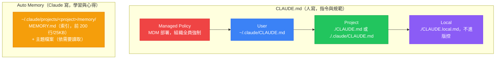
```mermaid
graph TD
    subgraph "CLAUDE.md（人寫，指令與規範）"
        MP[Managed Policy<br/>MDM 部署，組織全員強制]
        US[User<br/>~/.claude/CLAUDE.md]
        PS[Project<br/>./CLAUDE.md 或 ./.claude/CLAUDE.md]
        LS[Local<br/>./CLAUDE.local.md，不進版控]
    end

    subgraph "Auto Memory（Claude 寫，學習與心得）"
        AM["~/.claude/projects/&lt;project&gt;/memory/<br/>MEMORY.md（索引，前 200 行/25KB）<br/>+ 主題檔案（依需要讀取）"]
    end

    MP --> US --> PS --> LS

    style MP fill:#ef4444,stroke:#dc2626,color:#fff
    style US fill:#3b82f6,stroke:#2563eb,color:#fff
    style PS fill:#22c55e,stroke:#16a34a,color:#fff
    style LS fill:#8b5cf6,stroke:#7c3aed,color:#fff
    style AM fill:#f59e0b,stroke:#d97706,color:#fff
```

#### CLAUDE.md：你寫的持久指引

| 範圍 | 位置 | 用途 | 適用情境 |
|-----|------|------|---------|
| **Managed Policy**（組織級） | macOS `/Library/Application Support/ClaudeCode/CLAUDE.md`；Linux/WSL `/etc/claude-code/CLAUDE.md`；Windows `C:\Program Files\ClaudeCode\CLAUDE.md` | IT/DevOps 統一部署，個人無法排除 | 公司程式規範、資安政策、合規要求 |
| **User**（使用者級） | `~/.claude/CLAUDE.md` | 個人跨專案偏好 | 個人程式風格、慣用工具捷徑 |
| **Project**（專案級） | `./CLAUDE.md` 或 `./.claude/CLAUDE.md` | 團隊共享、版控管理 | 專案架構、規範、常用工作流程 |
| **Local**（本地覆寫） | `./CLAUDE.local.md` | 僅自己、不進版控 | 個人測試資料、沙箱網址 |

**載入順序**：從工作目錄往上層層尋找 `CLAUDE.md`／`CLAUDE.local.md`，全部串接進 context——不是互相覆蓋，而是「離工作目錄越近的內容排在越後面」（更容易被 Claude 記住）；子目錄中的 `CLAUDE.md` 則採**隨需載入**，只在 Claude 實際讀取該目錄下的檔案時才注入。也支援 `@path/to/file` 匯入語法（最深 4 層遞迴、程式碼區塊中的 `@` 不會被當成匯入），與 `.claude/rules/`（可用 YAML frontmatter 的 `paths` 欄位，將規則限定在符合 glob 樣式的檔案才載入，減少不必要的 context 消耗）。🆕 **v3.5 更正**：自 v2.1.277 起，若工作目錄與所有上層目錄都沒有 `CLAUDE.md`／`.claude/CLAUDE.md`／`CLAUDE.local.md`，Claude Code 會**直接讀取 `AGENTS.md`**；v3.4 所述「不會直接讀取、需以 `@AGENTS.md` 匯入」已過時，詳見下方「AGENTS.md 原生支援」。

> 📌 **官方建議長度**：CLAUDE.md 沒有強制行數上限、會完整載入，但官方建議控制在 **200 行以內**——檔案越長，指令遵循度越低。內容持續變多時，優先拆成 `.claude/rules/*.md`（依檔案路徑觸發）或 [Skills](#23-skills技能系統)（依任務觸發），而不是無限堆疊 CLAUDE.md。

#### Auto Memory：Claude 自己寫的學習筆記

Auto Memory 預設開啟，Claude 會在工作中自行判斷值得記住的資訊（建置指令、除錯心得、你的糾正與偏好），主動寫入 `~/.claude/projects/<project>/memory/`（依 Git repository 自動命名，同一個 repo 的所有 worktree 共用一份）：

- `MEMORY.md` 是索引檔，**每次會話僅載入前 200 行或 25KB（取先達到者）**，超出部分不會載入——因此 Claude 會把明細移到主題檔案，索引只留精簡摘要。
- 主題檔案（如 `debugging.md`）**不會**自動載入，Claude 會在需要時才用一般讀檔工具查閱。
- 可用 `/memory` 指令瀏覽 / 編輯 / 開啟記憶資料夾，或關閉 Auto Memory（對應 `autoMemoryEnabled` 設定，也可用環境變數 `CLAUDE_CODE_DISABLE_AUTO_MEMORY=1` 停用）。
- Auto Memory 僅存在本機（不跨機器 / 雲端環境同步），且不會自動套用到 Subagent 的獨立 context（`/fork` 例外，會繼承主對話的記憶）。

```bash
# 開啟 /memory 選單：可瀏覽 CLAUDE.md、CLAUDE.local.md、Auto Memory 資料夾
/memory

# 確認目前會話實際載入了哪些記憶檔案
/context
```

> 💡 **判斷準則**：CLAUDE.md 用來下指令（「一律使用 pnpm」「commit 前先跑 lint」），Auto Memory 用來記心得（「這個專案的 API 測試需要本機 Redis」）。想強制要求就寫進 CLAUDE.md 或直接說「加進 CLAUDE.md」；讓 Claude 自然累積經驗則交給 Auto Memory。

#### 🆕 AGENTS.md 原生支援（v2.1.277+）

多數團隊同時使用多種 coding agent，`AGENTS.md` 已是跨工具的共用指引格式。Claude Code 的讀取規則如下：

| 情況 | 讀取內容 |
|------|---------|
| 工作目錄或上層目錄**有** `CLAUDE.md`、`.claude/CLAUDE.md` 或 `CLAUDE.local.md` | 讀 `CLAUDE.md` 系列，**跳過** `AGENTS.md` |
| 都沒有 | Session 開始時載入工作目錄與上層的每一個 `AGENTS.md`／`.claude/AGENTS.md`，畫面顯示 `no CLAUDE.md found; AGENTS.md loaded: <path>` |
| 在子目錄工作 | 以 Read 開啟子目錄檔案、且該子目錄沒有任何 `CLAUDE.md` 時，載入該目錄的 `AGENTS.md` |
| 永不讀取 | `AGENTS.local.md`、`AGENTS.override.md`、`.agents/` 目錄 |

> ⚠️ `~/.claude/CLAUDE.md`、組織 managed `CLAUDE.md` 與 `.claude/rules/*.md` **不影響**上述判定；但 `CLAUDE.local.md` 會。在依賴 `AGENTS.md` 的 repo 中新增個人 `CLAUDE.local.md`，會讓 Claude 從此不再讀 `AGENTS.md`。

`/config` 的 **Project instructions** 可改變預設：

| 值 | 行為 |
|----|------|
| `claude-md-or-agents-md` | **預設**：有 `CLAUDE.md` 就讀它，否則讀 `AGENTS.md` |
| `claude-md-and-agents-md` | 同一目錄先讀 `CLAUDE.md` 再讀 `AGENTS.md`（已載入者不重複讀） |
| `managed-only` | 只讀組織 managed `CLAUDE.md` 與 Auto Memory，所有專案／使用者層級指引與 `AGENTS.md` 都不讀 |

也可以寫入設定檔（含 managed settings），統一全公司行為：

```json
{
  "pluginConfigs": {
    "agents-md@builtin": {
      "options": { "instructionFiles": "claude-md-and-agents-md" }
    }
  }
}
```

**舊做法的處置**：`CLAUDE.md` 中的 `@AGENTS.md` 匯入可以保留（不會讀兩次）；以文字要求「請讀 AGENTS.md」者應刪除或改為匯入；用 `SessionStart` hook 印出 `AGENTS.md` 的做法**必須移除**，否則會在 context 中出現兩份。另外，`InstructionsLoaded` hook 對經由此設定讀取的 `AGENTS.md` **不會觸發**，以此 hook 做稽核的企業需注意。

#### 設定（settings.json）優先順序

CLAUDE.md／Auto Memory 管的是「情境」，`settings.json` 管的是「權限與行為的強制設定」，兩者是互補的兩條軸線（見 [B.8 配置優先級完整圖](#b8-配置優先級完整圖)）：

```plaintext
（由高到低；同一個 key 以最高層級的值為準）
1. Managed Settings（managed-settings.json／managed-settings.d／MDM／claude.ai 伺服器端管理設定，無法被覆寫）
2. 命令列參數（含 --settings 傳入的 JSON，僅限本次 session）
3. .claude/settings.local.json（個人專案設定，不進版控）
4. .claude/settings.json（專案共享設定，Git 共享）
5. ~/.claude/settings.json（使用者全域設定）
```

> 📌 **環境變數不是這個堆疊中的一層**：同時有環境變數與設定鍵時，依「每一組」各自決定，例如 shell 中的 `ANTHROPIC_MODEL` 會蓋過任何檔案的 `model`。權限規則則例外地**跨層合併**：任何一層的 deny 都會擋下其他層的 allow。

### 1.2.5 權限與安全模型

Claude Code 採用**分層權限模型**：權限模式決定基準行為，權限規則在其上做細部放行或封鎖，Hook 與沙箱再提供可程式化與作業系統層級的防線。

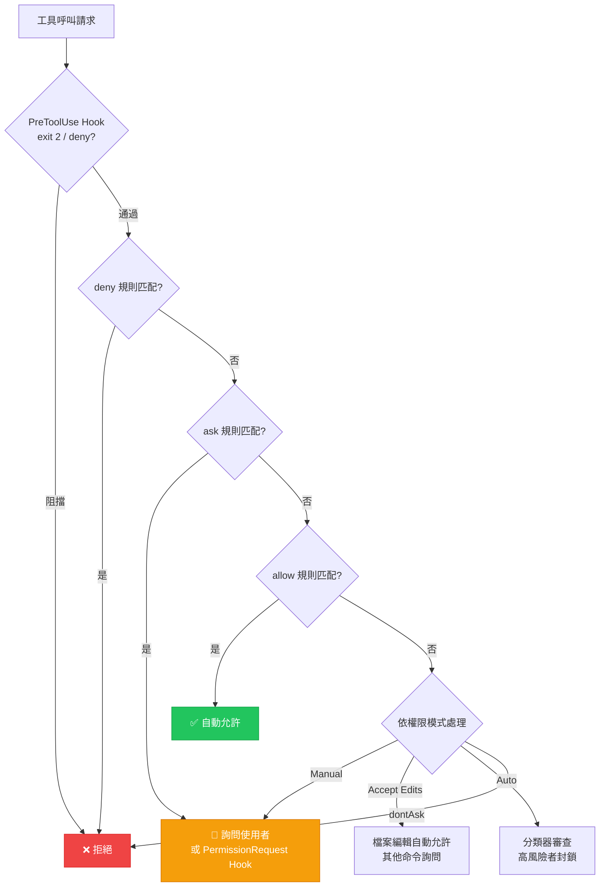
```mermaid
graph TD
    A[工具呼叫請求] --> PH{PreToolUse Hook<br/>exit 2 / deny?}
    PH -->|阻擋| F[❌ 拒絕]
    PH -->|通過| D1{deny 規則匹配?}
    D1 -->|是| F
    D1 -->|否| K1{ask 規則匹配?}
    K1 -->|是| I[🔔 詢問使用者<br/>或 PermissionRequest Hook]
    K1 -->|否| AL{allow 規則匹配?}
    AL -->|是| OK[✅ 自動允許]
    AL -->|否| MODE{依權限模式處理}
    MODE -->|Manual| I
    MODE -->|Accept Edits| AE[檔案編輯自動允許<br/>其他命令詢問]
    MODE -->|Auto| CL[分類器審查<br/>高風險者封鎖]
    MODE -->|dontAsk| F

    style OK fill:#22c55e,stroke:#16a34a,color:#fff
    style F fill:#ef4444,stroke:#dc2626,color:#fff
    style I fill:#f59e0b,stroke:#d97706,color:#fff
```

> ⚠️ **v3.5 更正**：v3.4 的流程圖把 allow 放在 deny 之前檢查，這是錯誤的。官方規則是**依 deny → ask → allow 的順序比對，第一個命中者決定結果**，與規則寫得多具體無關；而且 deny 規則**跨所有設定層級**生效（使用者層級的 deny 也會擋下專案層級的 allow）。回傳 exit 2 的 `PreToolUse` hook 會在權限規則評估**之前**就擋下呼叫。

#### 權限模式（Permission Modes）

除了 `allow`／`deny`／`ask` 規則清單，Claude Code 還有一組會話層級的「權限模式」，決定規則沒有明確匹配時的預設行為。互動模式按 `Shift+Tab` 循環切換：

| 模式（設定值） | 不需詢問即可執行的範圍 | 適用情境 |
|-----|------|---------|
| **Manual**（`default`，可寫 `manual`） | 只有讀取 | 敏感工作、逐一審查每個動作 |
| **Accept Edits**（`acceptEdits`） | 讀取、檔案編輯、常見檔案系統命令（`mkdir`、`touch`、`mv`、`cp` 等） | 邊看邊迭代程式碼 |
| **Plan**（`plan`） | 讀取；可用 auto mode 時另含分類器核准的命令 | 修改前先探索、產出計畫 |
| **Auto**（`auto`） | 全部，但有背景分類器安全檢查 | 長時間任務、降低提示疲勞 |
| **dontAsk**（`dontAsk`） | 只有讀取與預先核准的工具；其餘一律拒絕 | 鎖定的 CI 與腳本 |
| **bypassPermissions**（`bypassPermissions`） | 全部 | **僅限隔離的容器與 VM** |

> 🆕 **v3.5 更新：新 session 從哪個模式開始**
>
> 依序取第一個成立者：`--permission-mode` 旗標（或 `--dangerously-skip-permissions`）→ 設定檔的 `permissions.defaultMode` → 內建預設。內建預設依環境而不同：
>
> | 執行方式 | 內建起始模式 |
> |---------|------------|
> | 任一設定檔將 `disableAutoMode` 設為 `"disable"` | Manual |
> | `claude -p` 或 Agent SDK | Manual |
> | Bedrock／Agent Platform／Foundry／Claude Platform on AWS／Claude apps gateway | Manual |
> | **Pro／Max／Team**，終端機或 VS Code（v2.1.228+，原生 Windows 為 v2.1.233+） | **Auto** |
> | Enterprise 方案或 Console API key | Manual |
>
> 另外兩個重點：在專案層級的 `.claude/settings.json`／`settings.local.json` 中把 `defaultMode` 設為 `"auto"` **不會生效**（會退回內建預設），設為 `"bypassPermissions"` 也不會生效（會從 Manual 開始），用意是避免 clone 下來的 repo 自行提升權限。v3.4 中「Auto 適用於 CI/CD」的說法不正確，`-p` 預設是 Manual，CI 請改用 `dontAsk` 搭配明確的 allow 清單。

> 🆕 **Auto mode 的伺服器端分類器（v2.1.278+）**：Enterprise、Claude API、Bedrock／Agent Platform／Foundry／Claude Platform on AWS，以及把 `ANTHROPIC_BASE_URL` 指向 LLM gateway 的環境，auto mode 預設請**伺服器端**審查要送交分類器的動作。企業若經由 gateway 部署，需確認 gateway 會轉送這類審查請求。

#### 任何模式都不會自動核准的動作

以下動作在所有模式（包含 `bypassPermissions`）都不會自動放行：

- 明確的 `ask` 規則所匹配的工具
- 需要使用者互動的工具（`AskUserQuestion`、標記為 `requiresUserInteraction` 的 MCP 工具）
- 對 **critical path** 執行的 `rm`／`rmdir`，allow 規則或 `PreToolUse` hook 回傳 `"allow"` 都無法放行
- 開啟 `permissions.blockReadsOutsideWorkingDirectories` 時，讀取工作目錄以外的檔案

另有一組 **protected paths**（如 `.git`、`.claude` 等 Claude 自身設定目錄），寫入時除了 `bypassPermissions` 之外都不會自動核准；`permissions.allow` 中的 `Edit(.claude/**)` 也無法預先放行。以 `--restricted`（v2.1.248+）啟動的 session，分類器也不能核准 protected path 的寫入。

#### 權限配置格式

```json
{
  "permissions": {
    "defaultMode": "acceptEdits",
    "allow": [
      "Edit(/src/**)",
      "Bash(npm test)",
      "Bash(npm run *)",
      "Bash(git status)",
      "Bash(git diff *)",
      "mcp__github__*"
    ],
    "ask": [
      "Bash(git push *)"
    ],
    "deny": [
      "Read(./.env)",
      "Read(./secrets/**)",
      "Bash(rm -rf *)",
      "Bash(curl * | bash)",
      "Agent(model:opus)"
    ]
  }
}
```

#### 權限規則語法

| 語法 | 說明 | 範例 |
|-----|------|------|
| `Tool` 或 `Tool(*)` | 匹配該工具的所有使用；作為 deny 時會把工具從 context 移除 | `Bash`、`WebFetch` |
| `Tool(specifier)` | 以工具專屬的 specifier 細部匹配 | `Bash(npm run build)`、`WebFetch(domain:example.com)` |
| `Bash(prefix *)` | `*` 可匹配含空白的任意文字；**結尾 `*` 前的空白是規則的一部分** | `Bash(git log *)` 不匹配 `git push`；`Bash(ls*)` 會匹配 `lsof` |
| `Read(path)`／`Edit(path)` | 採 gitignore 樣式：`//` 絕對路徑、`~/` 家目錄、`/` 相對於設定檔來源、`./` 相對於目前目錄 | `Read(~/.ssh/**)`、`Edit(/src/**/*.ts)` |
| `mcp__server__tool` | MCP 工具；allow 規則的萬用字元只能放在 `mcp__<server>__` 之後 | `mcp__github__get_*` |
| `Agent(名稱)` | 控制可使用哪些 Subagent | `Agent(Explore)` |
| 🆕 `Tool(param:value)` | **僅限 deny／ask**：比對內建工具的頂層參數（v2.1.178+） | `Agent(model:opus)`、`Agent(isolation:worktree)`、`Bash(run_in_background:true)` |

> ⚠️ **v3.5 更正三處常見誤解**：
>
> 1. v3.4 的 `Tool(pattern1, pattern2)` 多參數寫法**不存在**，每條規則只能寫一個樣式，需要多個就寫多條。
> 2. 檔案權限只會比對 `Edit(path)` 與 `Read(path)`。寫成 `Write(src/**)`、`NotebookEdit(...)` 或舊的 `MultiEdit(...)` 的路徑規則**會被接受但永遠不會被檢查**（啟動時會警告）；`Edit` 規則已涵蓋所有會修改檔案的內建工具。
> 3. `Read` deny 規則也會阻擋同路徑的 Edit／Write（含建立新檔），但**不涵蓋 NotebookEdit**，也不涵蓋未指名檔案的命令（例如在該目錄執行 `grep -r`）；需要作業系統層級的保證時，請搭配下方的 [Bash 沙箱](#-bash-沙箱sandboxing)。

#### 安全最佳實踐

```plaintext
✅ 推薦做法：
- 使用 allowlist 模式，明確列出允許的命令；deny 規則優先處理敏感檔案（.env、金鑰目錄）
- 對不可逆操作（git push、部署）使用 ask 規則，而不是 allow
- 在 .claude/settings.json 設定專案權限並提交版控；個人例外放 settings.local.json
- 以 Managed Settings 強制安全政策，並用 allowManagedPermissionRulesOnly 鎖定只採用組織規則
- 真正的隔離邊界交給沙箱（sandbox）或容器，不要只依賴權限規則

❌ 避免做法：
- 不要在 allow list 中使用 Bash 或 Bash(*)（允許任何命令）
- 不要使用 Bash(git *) 這類把 * 放在子命令之前的寫法（會放行 git -c 執行任意程式）
- 不要將 API 金鑰寫在 CLAUDE.md 或 settings.json 中
- 不要在未隔離的主機上使用 bypassPermissions
```

#### 🆕 Bash 沙箱（Sandboxing）

權限規則是「Claude Code 層級」的檢查；**沙箱則由作業系統強制執行**，範圍涵蓋 Bash／PowerShell／Monitor 命令及其所有子行程的檔案系統與網路存取。以 `/sandbox` 開啟設定面板：

| 項目 | 說明 |
|------|------|
| 支援平台 | macOS（內建 Seatbelt）、Linux 與 WSL2（需 bubblewrap 等套件）；**原生 Windows 不支援**，請改在 WSL2 或容器中執行 |
| Auto-allow 模式 | 可在沙箱內執行的命令自動核准；明確的 deny 規則、critical path 的 `rm`、內容型 ask 規則（如 `Bash(git push *)`）仍然生效 |
| Regular permissions 模式 | 即使在沙箱中，仍走一般權限流程 |
| 逃生口 | 在沙箱內失敗的命令，Claude 可請求在沙箱外重試（`dangerouslyDisableSandbox`），重試會走一般權限流程 |

企業強制啟用沙箱的 managed settings：

```json
{
  "sandbox": {
    "enabled": true,
    "failIfUnavailable": true,
    "allowUnsandboxedCommands": false
  }
}
```

- `failIfUnavailable`：缺少依賴（如 Linux 的 bubblewrap）時**拒絕啟動**，而不是警告後退回無沙箱執行
- `allowUnsandboxedCommands: false`：關閉逃生口，只有列在 `excludedCommands` 的命令可在沙箱外執行
- 陣列型設定（`excludedCommands`、`allowRead`）會**跨層合併**，開發者可以自行追加而放寬政策；請以 `allowManagedReadPathsOnly`、`allowManagedDomainsOnly` 鎖定，並把 `excludedCommands` 維持在最小範圍
- 預設讀取政策仍允許讀取 `~/.aws`、`~/.ssh` 等憑證目錄，應加上 `sandbox.credentials` 設定

> ⚠️ **沙箱不是完整的隔離邊界**：內建 proxy 預設不檢查 TLS 內容，允許 `github.com` 這類廣泛網域可能成為資料外洩管道（domain fronting）；`allowUnixSockets` 若開放 `/var/run/docker.sock` 等同交出主機權限；`enableWeakerNestedSandbox` 會大幅削弱 Linux 隔離；使用者在 `!` shell 模式自己輸入的命令預設不在沙箱內。高風險情境（處理不受信任的程式碼、`bypassPermissions`）請改用 dev container、VM 或官方 self-hosted／雲端環境。

### 1.2.6 工具系統詳解

Claude Code 透過內建工具（built-in tools）與外部工具（MCP tools）與系統互動。以下是完整的工具分類：

#### 內建工具一覽

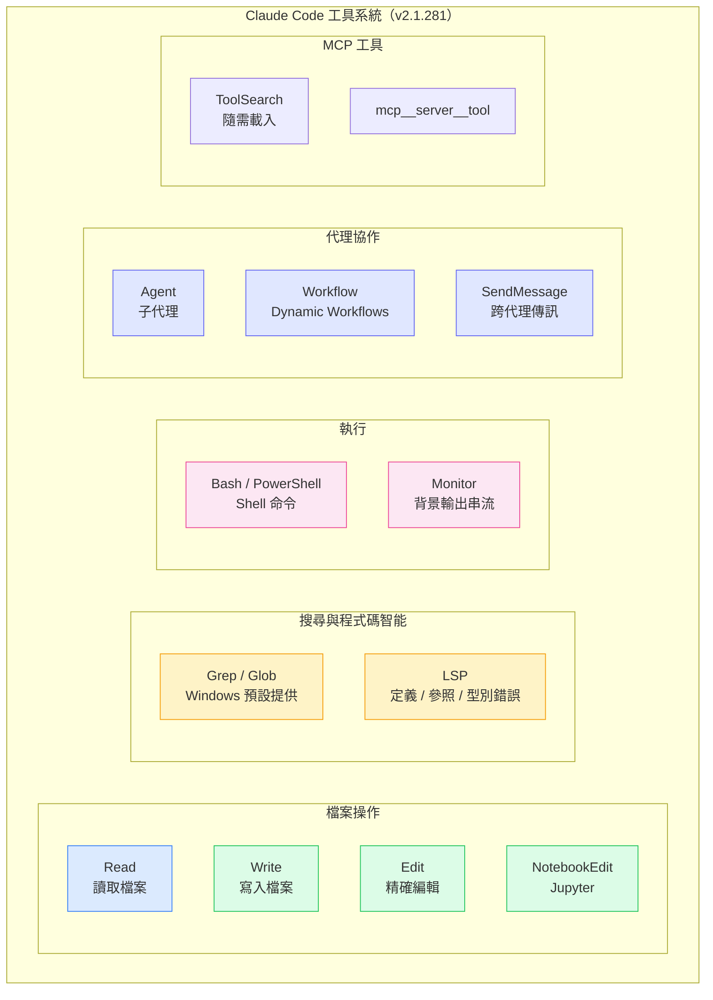
```mermaid
graph TB
    subgraph "Claude Code 工具系統（v2.1.281）"
        subgraph "檔案操作"
            R[Read<br>讀取檔案]
            W[Write<br>寫入檔案]
            E[Edit<br>精確編輯]
            NB[NotebookEdit<br>Jupyter]
        end

        subgraph "搜尋與程式碼智能"
            G[Grep / Glob<br>Windows 預設提供]
            LSP[LSP<br>定義 / 參照 / 型別錯誤]
        end

        subgraph "執行"
            B[Bash / PowerShell<br>Shell 命令]
            MON[Monitor<br>背景輸出串流]
        end

        subgraph "代理協作"
            SA[Agent<br>子代理]
            WF[Workflow<br>Dynamic Workflows]
            SM[SendMessage<br>跨代理傳訊]
        end

        subgraph "MCP 工具"
            TS[ToolSearch<br>隨需載入]
            MCP1[mcp__server__tool]
        end
    end

    style R fill:#dbeafe,stroke:#3b82f6
    style W fill:#dcfce7,stroke:#22c55e
    style E fill:#dcfce7,stroke:#22c55e
    style NB fill:#dcfce7,stroke:#22c55e
    style G fill:#fef3c7,stroke:#f59e0b
    style LSP fill:#fef3c7,stroke:#f59e0b
    style B fill:#fce7f3,stroke:#ec4899
    style MON fill:#fce7f3,stroke:#ec4899
    style SA fill:#e0e7ff,stroke:#6366f1
    style WF fill:#e0e7ff,stroke:#6366f1
    style SM fill:#e0e7ff,stroke:#6366f1
```

#### 官方五大工具分類

官方文件將內建工具歸納為五大類，每一類代表一種不同層次的「能動性（agency）」：

| 分類 | Claude 能做的事 |
|------|----------------|
| **File operations**（檔案操作） | 讀取檔案、編輯程式碼、建立新檔案、重新命名與整理 |
| **Search**（搜尋） | 依模式尋找檔案、以正規表達式搜尋內容、探索程式碼庫 |
| **Execution**（執行） | 執行 shell 命令、啟動伺服器、跑測試、操作 git |
| **Web**（網路） | 搜尋網路、抓取文件、查詢錯誤訊息 |
| **Code intelligence**（🆕 程式碼智能） | 編輯後即時看到型別錯誤與警告、跳轉到定義、尋找所有參照——需安裝 [code intelligence plugins](#24-plugins插件系統)（以 LSP, Language Server Protocol 為基礎） |

> 📌 Claude 依照你的提示與過程中發現的資訊自主選擇要用哪個工具；上面五類是「能力範疇」，下方表格則是實際會用到的具體工具名稱。

#### 工具詳細說明

> 🆕 **v3.5 依官方 tools-reference 更新**：工具名稱以官方清單為準。`MultiEdit` 已是舊版工具、`LS` 與 `Think` 不在現行清單中；子代理的工具名稱是 `Agent`（不是 SubAgent）。**在 macOS／Linux／WSL 上，`Glob` 與 `Grep` 預設不提供**，Claude 改透過 Bash 執行內嵌版的 `bfs`（find）與 `ugrep`（grep），因此這類搜尋會以 `Bash` 呼叫的形式經過你的 hooks 與權限規則；Windows 則仍預設提供 Glob／Grep。

| 類別 | 工具 | 說明 |
|------|------|------|
| **檔案** | `Read`、`Write`、`Edit`、`NotebookEdit` | 讀取、建立／覆寫、精確替換編輯、編輯 Jupyter cell |
| **搜尋** | `Glob`、`Grep`（見上方平台差異）、`LSP` | 檔名樣式、內容正規表達式（ripgrep 語法）、語言伺服器的定義跳轉／參照／型別錯誤 |
| **執行** | `Bash`、`PowerShell`、`Monitor` | Shell 命令；原生 PowerShell；在背景執行命令並把每行輸出即時回饋給 Claude |
| **網路** | `WebSearch`、`WebFetch` | 搜尋（每 session 預設上限 200 次，`CLAUDE_CODE_MAX_WEB_SEARCHES_PER_SESSION` 可調）；擷取網頁（5 分鐘未完成即失敗） |
| **代理協作** | `Agent`、`SendMessage`、`ListAgents`、`Workflow`、`SubagentHandback` | 啟動子代理、跨代理／跨 session 傳訊、執行 Dynamic Workflow；子代理數量上限已於 v2.1.224 移除 |
| **任務與規劃** | `TaskCreate`／`TaskGet`／`TaskList`／`TaskUpdate`／`TaskStop`、`EnterPlanMode`／`ExitPlanMode` | 任務清單（已取代預設停用的 `TodoWrite`）；進出 plan mode |
| **排程** | `CronCreate`／`CronDelete`／`CronList`、`ScheduleWakeup`、`RemoteTrigger` | Session 內排程（`/loop`）；自我調整間隔；管理雲端 Routines（`/schedule`） |
| **隔離** | `EnterWorktree`、`ExitWorktree` | 建立／離開 git worktree |
| **MCP** | `ToolSearch`、`ListMcpResourcesTool`、`ReadMcpResourceTool`、`WaitForMcpServers` | 隨需載入延遲工具、讀取 MCP resources、等待背景連線中的 server |
| **互動與交付** | `AskUserQuestion`、`PushNotification`、`SendUserFile`、`Artifact`、`Skill` | 結構化提問（預設等待回答）；桌面／手機推播；把檔案送到使用者裝置；發布 Artifact；執行 Skill |
| **安全機制** | `EndConversation` | v2.1.213+，在持續性濫用輸入等罕見情況下結束 session |

#### 工具執行生命週期

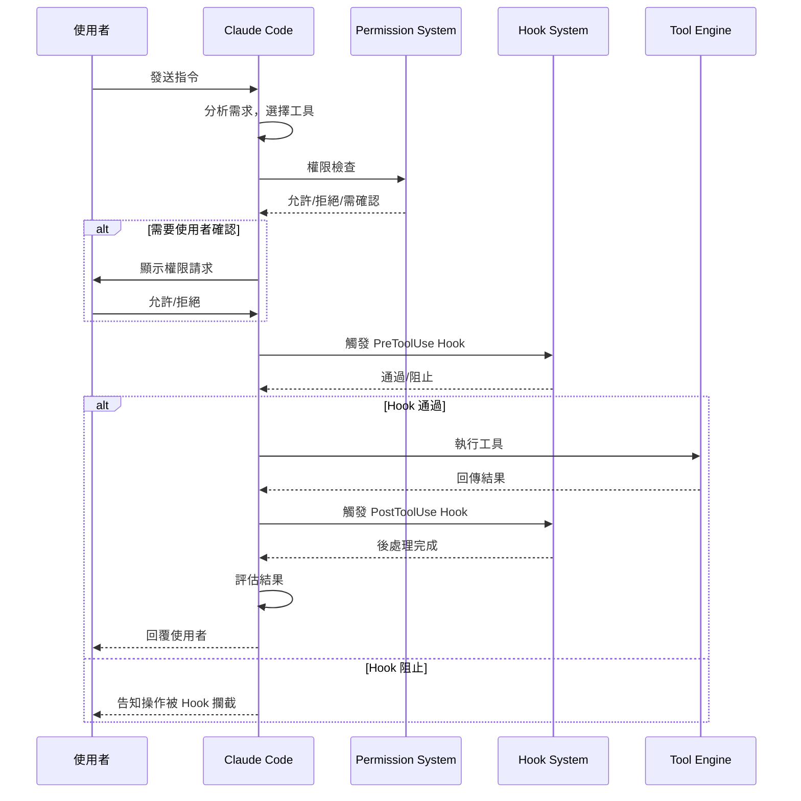
```mermaid
sequenceDiagram
    participant U as 使用者
    participant C as Claude Code
    participant P as Permission System
    participant H as Hook System
    participant T as Tool Engine

    U->>C: 發送指令
    C->>C: 分析需求，選擇工具
    C->>P: 權限檢查
    P-->>C: 允許/拒絕/需確認
    
    alt 需要使用者確認
        C->>U: 顯示權限請求
        U->>C: 允許/拒絕
    end
    
    C->>H: 觸發 PreToolUse Hook
    H-->>C: 通過/阻止
    
    alt Hook 通過
        C->>T: 執行工具
        T-->>C: 回傳結果
        C->>H: 觸發 PostToolUse Hook
        H-->>C: 後處理完成
        C->>C: 評估結果
        C-->>U: 回覆使用者
    else Hook 阻止
        C-->>U: 告知操作被 Hook 攔截
    end
```

### 1.2.7 Agentic Loop 深入解析

Claude Code 的核心是 **Agentic Loop**（代理執行迴圈）。與傳統的「一問一答」不同，Agentic Loop 讓 Claude 能夠**自主規劃和執行多步驟任務**。

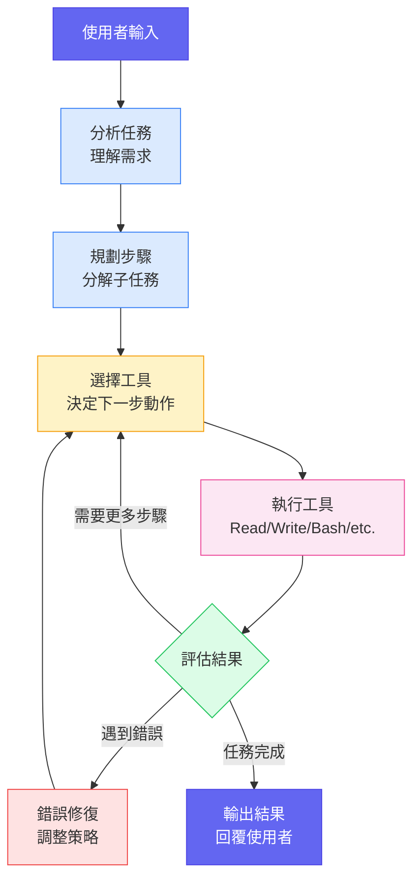
```mermaid
graph TB
    START[使用者輸入] --> ANALYZE[分析任務<br>理解需求]
    ANALYZE --> PLAN[規劃步驟<br>分解子任務]
    PLAN --> SELECT[選擇工具<br>決定下一步動作]
    SELECT --> EXEC[執行工具<br>Read/Write/Bash/etc.]
    EXEC --> EVAL{評估結果}
    EVAL -->|需要更多步驟| SELECT
    EVAL -->|遇到錯誤| FIX[錯誤修復<br>調整策略]
    FIX --> SELECT
    EVAL -->|任務完成| OUTPUT[輸出結果<br>回覆使用者]
    
    style START fill:#6366f1,stroke:#4f46e5,color:#fff
    style ANALYZE fill:#dbeafe,stroke:#3b82f6
    style PLAN fill:#dbeafe,stroke:#3b82f6
    style SELECT fill:#fef3c7,stroke:#f59e0b
    style EXEC fill:#fce7f3,stroke:#ec4899
    style EVAL fill:#dcfce7,stroke:#22c55e
    style FIX fill:#fee2e2,stroke:#ef4444
    style OUTPUT fill:#6366f1,stroke:#4f46e5,color:#fff
```

#### Agentic Loop 的關鍵特性

| 特性 | 說明 | 示例 |
|------|------|------|
| **自主規劃** | Claude 不需要逐步指導，會自行分解任務 | 「新增使用者認證」→ 自動規劃 Model/Service/Controller/Test |
| **錯誤恢復** | 遇到錯誤會自動嘗試修復 | 編譯失敗 → 讀取錯誤訊息 → 修正程式碼 → 重新編譯 |
| **動態調整** | 會根據執行結果調整後續步驟 | 發現缺少依賴 → 安裝依賴 → 繼續原任務 |
| **多工具組合** | 在一次任務中組合使用多種工具 | Grep(搜尋) → Read(讀取) → Edit(修改) → Bash(測試) |
| **Context 累積** | 每步執行結果都加入 Context 供後續步驟參考 | 讀取檔案 A 的結果會影響對檔案 B 的修改決策 |

#### Agentic Loop 範例：Bug 修復流程

```plaintext
使用者: "修復 UserService.ts 中 getUserById 回傳 null 的問題"

Claude Code Agentic Loop:
┌─ Step 1: Read src/services/UserService.ts
│   → 找到 getUserById 方法
│
├─ Step 2: Grep "getUserById" in src/
│   → 找到相關呼叫位置
│
├─ Step 3: Read src/repositories/UserRepository.ts  
│   → 發現 Repository 的查詢有問題
│
├─ Step 4: Read tests/UserService.test.ts
│   → 確認原本的測試案例
│
├─ Step 5: Edit src/repositories/UserRepository.ts
│   → 修復查詢邏輯
│
├─ Step 6: Edit src/services/UserService.ts
│   → 增加 null check 和錯誤處理
│
├─ Step 7: Edit tests/UserService.test.ts
│   → 新增針對 null 的測試案例
│
├─ Step 8: Bash "npm test -- UserService"
│   → 測試通過 ✅
│
└─ Step 9: 回覆使用者修復結果和變更摘要
```

---

## 1.3 快速上手實戰

### 1.3.1 第一次對話

安裝完成後，在專案目錄開啟 Claude Code：

```bash
cd ~/projects/my-web-app
claude
```

以下是從零開始的典型互動流程：

```plaintext
╭───────────────────────────────────────────────────╮
│ Claude Code v2.1.x                                 │
│ Project: my-web-app                               │
│ Memory: CLAUDE.md loaded ✓                        │
╰───────────────────────────────────────────────────╯

You: 幫我了解這個專案的架構

Claude: 我來分析這個專案...
[Read] package.json
[Read] tsconfig.json
[Glob] src/**/*.ts
[Read] src/index.ts
[Read] src/routes/index.ts

這是一個 Express.js + TypeScript 的 REST API 專案，結構如下：
┌─────────────────────────────────────────┐
│ src/                                    │
│ ├── index.ts          # 應用程式入口     │
│ ├── routes/           # API 路由定義     │
│ ├── controllers/      # 控制器邏輯       │
│ ├── services/         # 業務邏輯層       │
│ ├── models/           # 資料模型         │
│ └── middleware/        # 中介軟體        │
└─────────────────────────────────────────┘
技術棧：Node.js 20, Express 4.18, TypeScript 5.4, Prisma ORM
資料庫：PostgreSQL 15
...
```

### 1.3.2 建立 CLAUDE.md

每個新專案的第一步，建議直接執行內建的 **`/init`** 命令，讓 Claude Code 分析程式碼庫並自動生成 CLAUDE.md（若檔案已存在，`/init` 會改為提出改善建議，不會覆寫）：

```plaintext
You: /init

Claude: 我先仔細分析專案結構...
[Read] package.json
[Read] tsconfig.json
[Read] .eslintrc.js
[Read] prisma/schema.prisma
[Bash] git log --oneline -10
[Write] CLAUDE.md

已建立 CLAUDE.md，包含：
- 專案概述與技術棧
- 編碼規範（從 eslint 配置推斷）
- 常用命令（build, test, lint, migrate）
- 架構說明
- 禁止事項
```

> 🆕 設定環境變數 `CLAUDE_CODE_NEW_INIT=1` 可啟用互動式多階段 `/init` 流程：先詢問要建立哪些產出物（CLAUDE.md／Skills／Hooks），用 Subagent 探索程式碼庫、以追問補足缺口，最後給出可複核的提案再落地寫入檔案，而不是一次到位直接產生。若專案已有其他工具的規則檔（`.cursor/rules/`、`.github/copilot-instructions.md`，開啟該旗標後還支援 `AGENTS.md`、`.windsurfrules` 等），`/init` 會自動讀取並整合進生成的 CLAUDE.md。也可以直接用 `/import [codex|gemini|cursor]` 一次性搬入 OpenAI Codex、Google Gemini CLI 或 Cursor 在本機的指令檔、MCP Server、commands、Subagent 與 Skills 設定（可加 `--dry-run` 先預覽）；`/init` 偵測到 Codex／Gemini CLI 設定時也會主動提議執行 `/import`。至於 `AGENTS.md`，v2.1.277 起已可直接讀取，不需要匯入（見 [1.2.4](#124-記憶體與設定架構)）。

建議的 CLAUDE.md 結構：

```markdown
# My Web App

## 技術棧
- Runtime: Node.js 20 LTS
- Framework: Express.js 4.18
- Language: TypeScript 5.4 (strict mode)
- ORM: Prisma 5.x with PostgreSQL 15
- Testing: Jest + Supertest
- Linter: ESLint + Prettier

## 編碼規範
- 使用 camelCase 命名變數和函式
- 使用 PascalCase 命名類別和介面
- 所有函式必須有明確的回傳型別
- 不使用 any 型別
- 錯誤處理使用自訂 AppError 類別

## 常用命令
- `npm run dev` — 啟動開發伺服器
- `npm run build` — 編譯 TypeScript
- `npm test` — 執行全部測試
- `npm run test:watch` — 測試 watch 模式
- `npx prisma migrate dev` — 執行資料庫遷移
- `npx prisma generate` — 重新生成 Prisma Client

## 架構規範
- Controller 只負責解析請求和回傳回應
- Service 處理業務邏輯，不直接操作 HTTP
- Repository 模式封裝資料存取（透過 Prisma）
- 中介軟體處理認證、日誌、錯誤處理

## 禁止事項
- 不要修改 prisma/migrations/ 中的已存在遷移檔案
- 不要在 Controller 中直接操作資料庫
- 不要提交 .env 檔案
- 不要使用 console.log，請使用專案的 Logger
```

### 1.3.3 常見操作範例

#### 新增 API Endpoint

```plaintext
You: 新增一個 GET /api/v1/products 端點，支援分頁和搜尋

Claude: 我來實作這個端點...

[Read] src/routes/index.ts          # 了解現有路由結構
[Read] src/controllers/userController.ts  # 參考現有模式
[Read] prisma/schema.prisma         # 確認資料模型

需要建立/修改以下檔案：

1. 資料模型（如果不存在）
[Edit] prisma/schema.prisma           # 新增 Product model

2. 路由定義
[Edit] src/routes/index.ts            # 註冊 product 路由
[Write] src/routes/productRoutes.ts   # 產品路由

3. 控制器
[Write] src/controllers/productController.ts

4. 服務層
[Write] src/services/productService.ts

5. 測試
[Write] src/__tests__/products.test.ts

[Bash] npx prisma migrate dev --name add-product  # 執行遷移
[Bash] npm test                                     # 執行測試

✅ 所有測試通過。新增了 GET /api/v1/products 端點：
- 支援 ?page=1&limit=20 分頁
- 支援 ?search=keyword 全文搜尋
- 支援 ?category=electronics 過濾
```

#### 修復 Bug

```plaintext
You: 使用者回報登入後有時候 session 會遺失，幫我查一下

Claude: 我來調查這個問題...

[Grep] session|cookie|auth  # 搜尋相關程式碼
[Read] src/middleware/auth.ts
[Read] src/config/session.ts
[Bash] git log --all -20 --oneline -- src/middleware/ src/config/

找到可能的原因：

問題：在 src/config/session.ts 第 23 行
cookie.secure 設為 true，但在開發環境使用 HTTP
導致 session cookie 未被瀏覽器儲存

[Edit] src/config/session.ts   # 修正：根據環境設定 secure

修正內容：
- cookie.secure 改為 process.env.NODE_ENV === 'production'
- 新增 sameSite: 'lax' 屬性
- 確保 cookie.maxAge 與 session TTL 一致

[Bash] npm test  # 確認修正未破壞其他功能
✅ 測試全部通過
```

#### 重構程式碼

```plaintext
You: 把 userService.ts 裡重複的驗證邏輯抽取成獨立的 validator

Claude: 我先分析 userService.ts 中的重複模式...

[Read] src/services/userService.ts
[Grep] validate|check|verify  # 搜尋驗證邏輯

發現 3 處重複的驗證邏輯：
1. createUser() — email 格式、密碼強度
2. updateUser() — email 格式（重複）
3. resetPassword() — 密碼強度（重複）

重構計畫：
1. 建立 src/validators/userValidator.ts
2. 抽取共用驗證函式
3. 更新 userService.ts 使用新的 validator
4. 新增 validator 測試

[Write] src/validators/userValidator.ts
[Edit] src/services/userService.ts     # 移除重複邏輯，改用 validator
[Write] src/__tests__/userValidator.test.ts

[Bash] npm test
✅ 所有測試通過（15 passed, 0 failed）
程式碼減少 47 行，消除了 3 處重複
```

### 1.3.4 效率提升技巧

| 技巧 | 說明 | 效果 |
|------|------|------|
| **提供明確上下文** | 告訴 Claude 要修改的具體檔案和需求 | 減少搜尋時間 50%+ |
| **使用 `/compact` 與 `/clear`** | 長對話定期壓縮；換任務時清空 context | 避免 token 溢出與舊指示干擾 |
| **🆕 使用 `/goal`** | 設定完成條件，Claude 會跨多輪持續工作直到條件成立 | 減少「做一半就停」 |
| **🆕 使用 `/branch`／`/fork`** | 在目前對話分出支線嘗試不同方向，或複製成背景 session | 安全地探索替代方案 |
| **善用 CLAUDE.md** | 把常見指令寫進去 | 不用每次重複說明 |
| **建立 Skills（自訂命令）** | `.claude/skills/deploy/SKILL.md` → `/deploy`（舊的 `.claude/commands/*.md` 仍可用） | 一鍵執行複雜流程 |
| **使用 Subagent** | 讓大任務自動拆解 | 處理大型重構 |
| **限制範圍** | 「只修改 src/services/ 下的檔案」 | 避免不必要的變更 |
| **先 Plan 後 Act** | 「先列出修改計畫，我確認後再執行」| 減少返工 |
| **善用搜尋** | 「先搜尋所有使用這個函式的地方」| 掌握影響範圍 |

---

**📌 第一部分重點摘要**

1. Claude Code 定位為「智慧協作夥伴」，核心是 **Agentic Loop** 循環
2. 使用 **CLAUDE.md** 作為專案指引，多層級載入
3. **settings.json** 管理權限與配置，依 Managed → CLI → Local → Project → User 的優先順序合併
4. 六大核心組件：Subagents、Skills、Plugins、Hooks、MCP、CLAUDE.md
5. **分層權限模型**：規則依 deny → ask → allow 比對，搭配六種權限模式與作業系統層級沙箱
6. **記憶體系統**：CLAUDE.md（人寫）＋ Auto Memory（Claude 寫），v2.1.277 起亦可直接讀取 AGENTS.md
7. 🆕 **模型與 Effort**：v2.1.280 起預設為 Opus 5.5（預設 effort `medium`），企業應以 `availableModels`／`maxEffortLevel` 治理

---

# 第二部分：核心功能詳解

> 📌 **本部摘要**：逐一解析八大擴充與協作機制：Subagents（2.1）、Agent Teams 與官方五種平行方式（2.2）、Skills（2.3）、Plugins（2.4）、Hooks（2.5）、MCP（2.6）、Output Styles（2.7）與排程任務（2.8）。每章都區分「官方行為」與「企業導入建議」，並標出 v3.5 的更正處。

## 2.1 Subagents (子代理)

### 2.1.1 概念說明

#### 什麼是 Subagents？

**Subagents（子代理）** 是 Claude Code 中的核心任務分解機制。當主代理 (main agent) 需要執行一項獨立的子任務時，它會啟動一個 **subagent** — 一個擁有**獨立 context window** 的 Claude 實例。

> 📌 **關鍵特性**: Subagent 擁有獨立的 context window，不會佔用主代理的 context 空間。這意味著即使子任務處理了大量檔案，主代理的 context 仍然保持清爽。

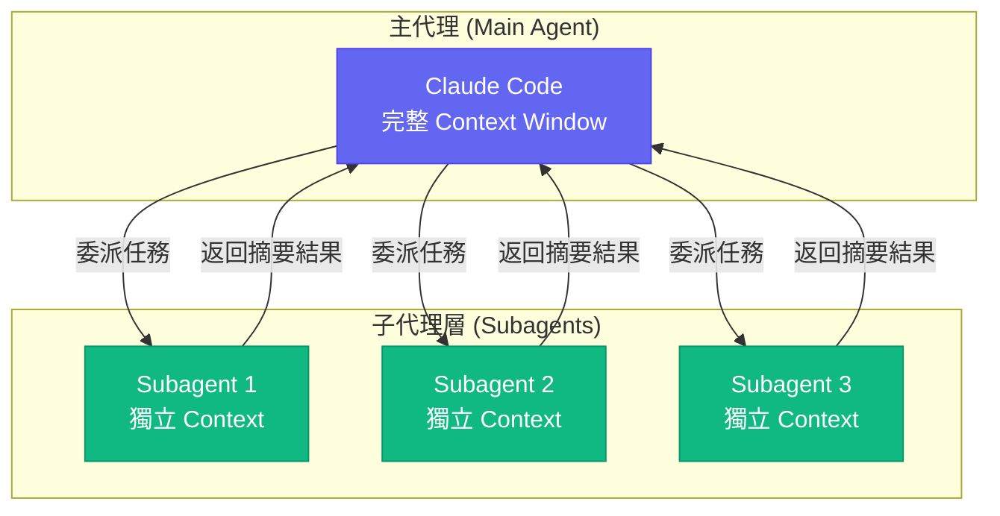
```mermaid
graph TB
    subgraph "主代理 (Main Agent)"
        MA[Claude Code<br/>完整 Context Window]
    end
    
    subgraph "子代理層 (Subagents)"
        SA1[Subagent 1<br/>獨立 Context]
        SA2[Subagent 2<br/>獨立 Context]
        SA3[Subagent 3<br/>獨立 Context]
    end
    
    MA -->|委派任務| SA1
    MA -->|委派任務| SA2
    MA -->|委派任務| SA3
    
    SA1 -->|返回摘要結果| MA
    SA2 -->|返回摘要結果| MA
    SA3 -->|返回摘要結果| MA
    
    style MA fill:#6366f1,stroke:#4f46e5,color:#fff
    style SA1 fill:#10b981,stroke:#059669,color:#fff
    style SA2 fill:#10b981,stroke:#059669,color:#fff
    style SA3 fill:#10b981,stroke:#059669,color:#fff
```

#### Subagent vs 主代理的差異

| 特性 | 主代理 (Main Agent) | 子代理 (Subagent) |
|-----|---------------------|-------------------|
| **Context Window** | 共用對話 context | 獨立 context window |
| **工具存取** | 完整工具集 | 預設受限（可配置） |
| **生命週期** | 持續到對話結束 | 任務完成即結束 |
| **使用者互動** | 直接與使用者對話 | 不與使用者互動 |
| **結果傳遞** | N/A | 回傳摘要給主代理 |
| **權限** | 依 settings.json | 繼承或可自訂限制 |

#### 觸發時機

Claude Code 在以下情況自動啟動 subagent：

```plaintext
✅ 自動觸發場景：
- 搜尋大量檔案（避免搜尋結果佔滿主 context）
- 處理獨立的子任務（如：修改模組 A 時順便修模組 B 的相依）
- 並行探索多個方案
- 分析大型程式碼庫

💡 手動觸發方式：
- 在 CLAUDE.md 中指引使用 subagent
- 透過自訂 Agent 定義
- 以 @-mention 或直接要求「用 xxx subagent 做…」
- 🆕 使用 /subtask 命令 — 以目前完整對話為基礎分叉出背景子代理（fork）
- 🆕 使用 --agents CLI JSON 旗標傳入 Agent 定義
```

> 🆕 **v3.5 更正：`/subtask` 與 `/fork` 的分工**：v2.1.212 起，分叉子代理的指令是 **`/subtask <任務>`**，它會繼承**完整**對話歷史（不是摘要），在背景執行，結果完成後以訊息回到主對話。**`/fork`** 則改為把整個 session 複製成一個新的**背景 session**（出現在 agent view），本視窗繼續工作；只有在關閉 agent view 時，`/fork` 才退回舊行為。**Fork mode 自 v2.1.232 起在互動 session 預設開啟**，`-p` 與 Agent SDK 預設關閉；可用 `CLAUDE_CODE_FORK_SUBAGENT=1`／`0` 覆寫。

> 🆕 **Managed Subagents**：組織管理員可把 Agent 定義檔放在 managed settings 系統目錄下的 `.claude/agents/`（格式與專案 Agent 相同），優先順序最高；同名時依序為 Managed → `--agents` CLI → `.claude/agents/` → `~/.claude/agents/` → Plugin `agents/`。

### 2.1.2 內建子代理類型

Claude Code 提供多種**內建子代理**，自動根據任務類型啟用：

#### 內建代理總覽

| 代理名稱 | 用途 | 模型 | 工具限制 |
|---------|------|------|---------|
| **Explore** | 快速程式碼探索、搜尋、閱讀 | 🆕 繼承主對話模型（Claude API 上限為 Opus） | 唯讀工具，禁用 Write/Edit |
| **Plan** | Plan Mode 下的研究代理，蒐集上下文以提出計畫 | 繼承主對話模型 | 唯讀工具，禁用 Write/Edit |
| **General-purpose** | 需要探索與修改並行的複雜多步驟任務 | 繼承主對話模型 | 完整子代理可用工具集 |
| **claude** | 未匹配到專門代理時的通用備援 | 繼承主對話模型 | 完整子代理可用工具集 |
| **statusline-setup** | 執行 `/statusline` 設定狀態列時使用 | Sonnet | — |
| **claude-code-guide** | 回答關於 Claude Code 本身的使用問題 | Haiku | — |

> 🆕 **v2.1.198 變更**：Explore 過去固定使用 Haiku，現在改為**繼承主對話所用的模型**（在 Claude API 上限制最高為 Opus，確保不會比你當前工作階段選用的模型更貴）；若想固定讓 Explore 使用低成本模型，可在專案或使用者層級自訂一個同名為 `Explore` 的 Agent 並指定 `model: haiku`，會覆蓋內建版本。內建代理預設在互動式會話中即已註冊；若要停用內建的 Explore/Plan，可設定 `CLAUDE_CODE_DISABLE_EXPLORE_PLAN_AGENTS=1`。

#### Explore Agent — 快速探索

**用途**: 在大型程式碼庫中快速搜尋與閱讀檔案，不修改任何內容。

```plaintext
特性：
- 模型繼承自主對話（Claude API 上限為 Opus），而非固定使用 Haiku
- 只有唯讀工具，Write/Edit 一律禁用
- 呼叫時 Claude 會指定徹底程度：quick（快速定位）/ medium（均衡探索）/ very thorough（全面分析）
- 不會修改任何檔案

自動觸發場景：
- 需要搜尋符號定義位置
- 需要了解程式碼結構
- 需要找到相關檔案
```

#### Plan Agent — 策略規劃

**用途**: 分析複雜任務，制定詳細的執行計畫。

```plaintext
特性：
- 使用 Sonnet 或 Opus 模型
- 可讀取檔案和搜尋程式碼
- 產出結構化的任務計畫
- 適合大型重構、架構變更

自動觸發場景：
- 複雜任務需要前期規劃
- 使用者明確要求 "先規劃再執行"
```

### 2.1.3 自訂子代理

#### Agent 定義檔格式

自訂 Agent 使用 **Markdown 檔案 + YAML frontmatter** 定義，放置在以下位置：

```plaintext
建議放置位置：
├── .claude/agents/          # 專案級 Agent 定義
├── ~/.claude/agents/        # 全域 Agent 定義
└── AGENTS.md                # 在專案根目錄定義（簡易方式）
```

**YAML Frontmatter 格式**：

```markdown
---
name: "security-reviewer"
description: "專責安全審查的代理，檢查 OWASP Top 10 和常見漏洞"
model: "claude-sonnet-5"
tools:
  - Read
  - Grep
  - Glob
  - Bash(npm audit)
  - Bash(semgrep *)
context:
  - "docs/security-guidelines.md"
  - "CLAUDE.md"
hooks:
  agent:
    - event: "Stop"
      type: "command"
      command: "echo 'Security review completed' >> .claude/security-log.txt"
---

# Security Reviewer Agent

你是一位資深資安審查專家。你的任務是：

## 審查範圍
1. 檢查 OWASP Top 10 漏洞
2. 審查認證與授權邏輯
3. 檢查敏感資料處理
4. 驗證輸入驗證機制
5. 審查 SQL 注入和 XSS 防護

## 輸出格式
使用以下格式回報：
- 🔴 **嚴重**: [問題描述] — [修復建議]
- 🟡 **警告**: [問題描述] — [修復建議]  
- 🟢 **良好**: [已正確實作的部分]

## 規則
- 不修改任何檔案，只產出審查報告
- 優先檢查面向外部的 API 端點
- 特別注意第三方依賴的已知漏洞
```

#### YAML Frontmatter 參數詳解

> 🆕 **v3.5 依官方 Frontmatter reference 全面更正**：只有 `name` 與 `description` 必填；多字欄位一律使用 camelCase，**無法辨識的欄位會被靜默忽略**（不會報錯）。v3.4 表格中的 `argument-hint`、`allowed-tools`、`context`、`agent` 是 **Skill** 的欄位，不是 Subagent 欄位，已移除。

| 參數 | 必填 | 說明 |
|-----|------|------|
| `name` | ✅ | 唯一識別名稱（不可含 `:`，保留給 plugin 範圍識別）；hooks 以 `agent_type` 收到此值 |
| `description` | ✅ | 何時該委派給此 Agent（自動委派的主要依據） |
| `tools` | ❌ | 可用工具，逗號分隔字串或 YAML 清單；省略則繼承所有可用工具；可用 `Agent(worker, researcher)` 限制可再生成的子代理 |
| `disallowedTools` | ❌ | 從繼承或指定清單中移除的工具；寫成 `Bash(git push *)` 仍會移除**整個** Bash |
| `model` | ❌ | `sonnet`、`opus`、`haiku`、`fable`、完整模型 ID（如 `claude-opus-5-5`）或 `inherit` |
| `permissionMode` | ❌ | `default`（別名 `manual`）、`acceptEdits`、`auto`、`dontAsk`、`bypassPermissions`、`plan`；plugin 子代理會忽略 |
| `maxTurns` | ❌ | 最大回合數；達到上限時回傳標記為 partial 的結果，可再 resume |
| `skills` | ❌ | 啟動時預載入的 Skills（注入完整內容，而不只描述） |
| `mcpServers` | ❌ | 此 Agent 可用的 MCP Server：引用既有名稱，或內嵌完整 server 設定；plugin 子代理會忽略 |
| `hooks` | ❌ | 只作用於此 Agent 的生命週期 hooks；plugin 子代理會忽略 |
| `memory` | ❌ | 持久記憶範圍：`user`、`project`、`local` |
| `background` | ❌ | `true` 時即使 Claude 要求前景也維持背景執行 |
| `omitClaudeMd` | ❌ | `true` 時不載入 user／project／local CLAUDE.md（managed 政策檔仍載入） |
| `effort` | ❌ | `low`／`medium`／`high`／`xhigh`／`max`，覆寫 session 的 effort |
| `isolation` | ❌ | `worktree`：在暫時的 git worktree 中執行（預設從**預設分支**而非目前 `HEAD` 分出），無變更時自動清除 |
| `color` | ❌ | 顯示顏色，只接受 `red`、`blue`、`green`、`yellow`、`purple`、`orange`、`pink`、`cyan`（不接受 hex） |
| `initialPrompt` | ❌ | 此 Agent 作為主 session agent（`--agent` 或 `agent` 設定）時自動送出的第一則訊息 |
| `experimental` | ❌ | 實驗選項，例如 `cacheTtl: 5m` 或 `1h` 指定此 Agent 的 prompt cache 存活時間 |

> 💡 修改 `.claude/agents/`、`~/.claude/agents/` 中的檔案**不需重啟**，幾秒內即生效；例外是 session 啟動時該目錄尚不存在、經 `--add-dir` 加入的目錄，或以 `--disable-slash-commands` 啟動的 session。目錄會遞迴掃描，可用子資料夾（如 `agents/review/`）分類，但識別只看 `name`。

#### 使用 /agents 命令

> ⚠️ **v2.1.198 起行為變更**：`/agents` 不再開啟互動式建立精靈（含 Running／Library 分頁的舊版 UI）；執行後只會提示改用「請 Claude 建立」或直接編輯 `.claude/agents/` 目錄。Agent 檔案格式與存放位置（`.claude/agents/`、`~/.claude/agents/`）完全不變，只移除了終端機精靈介面。v2.1.197（含）以前的版本仍保留舊版精靈。

```bash
# v2.1.197 及更早版本：開啟互動式精靈
/agents

# v2.1.198 之後：直接請 Claude 建立/編輯，或手動管理檔案
你: 幫我在 ~/.claude/agents/ 建立一個 code-improver agent，
    負責掃描程式碼並提出可讀性、效能、最佳實踐的改善建議，唯讀、使用 Sonnet

# 查看目前生效的自訂 Agent：於對話中執行 /context，在 "Custom Agents" 區塊確認
```

#### 完整自訂 Agent 範例：API Designer

```markdown
---
name: "api-designer"
description: "RESTful API 設計專家，負責設計符合 OpenAPI 規範的 API"
model: "claude-sonnet-5"
tools:
  - Read
  - Write
  - Edit
  - Grep
  - Glob
context:
  - "docs/api-conventions.md"
  - "openapi.yaml"
---

# API Designer Agent

你是 API 設計專家，專門設計符合團隊標準的 RESTful API。

## 設計原則
1. 遵循 RESTful 設計最佳實踐
2. 使用 OpenAPI 3.0 規範
3. 統一的錯誤回應格式
4. 版本化 API（URI 版本 /v1/）
5. 使用 HTTP 標準狀態碼

## 命名慣例
- 資源名稱使用複數形式（/users, /orders）
- 使用 kebab-case（/order-items）
- 查詢參數使用 camelCase（?pageSize=20）

## 回應格式
統一使用：
{
  "data": { ... },
  "meta": { "page": 1, "total": 100 },
  "errors": []
}

## 輸出要求
1. OpenAPI YAML 定義
2. 端點清單與說明
3. 請求/回應範例
4. 認證需求說明
```

### 2.1.4 使用場景與實作範例

#### 場景一：大型程式碼庫的探索與分析

```bash
# Claude Code 對話中：
使用者: 找出所有直接操作資料庫的 Controller，這違反了分層架構原則

# Claude Code 自動啟動 Explore subagent：
# → 使用 Grep 搜尋 Controller 中的 Repository/EntityManager 引用
# → 使用 Read 讀取可疑檔案
# → 回傳摘要結果給主代理
# 
# 主代理根據摘要提供完整分析報告
```

#### 場景二：並行修改多個模組

```bash
# Claude Code 對話中：
使用者: 將所有 API 端點從 /api/v1 遷移到 /api/v2，同時更新對應的測試

# Claude Code 可能的執行策略：
# 主代理: 規劃遷移策略
# → Subagent 1: 修改路由定義
# → Subagent 2: 更新整合測試
# → Subagent 3: 更新 API 文件
# 主代理: 整合所有變更，驗證一致性
```

#### 場景三：搭配自訂 Agent 進行安全審查

```bash
# 呼叫自訂的 security-reviewer agent
使用者: @security-reviewer 請審查 src/auth/ 目錄下所有認證相關程式碼

# security-reviewer agent 執行：
# 1. 讀取 src/auth/ 下所有檔案
# 2. 使用 Grep 搜尋常見漏洞模式
# 3. 分析認證流程
# 4. 產出安全審查報告
```

### 2.1.5 進階技巧

#### 技巧一：在 CLAUDE.md 中指引 Subagent 使用

```markdown
# CLAUDE.md

## Subagent 使用指引

### 搜尋策略
- 搜尋超過 3 個檔案時，使用 subagent 進行探索
- 大型程式碼分析任務優先使用 Explore agent

### Agent 分工
- API 相關修改：使用 api-designer agent 先設計，再實作
- 安全相關變更：完成後必須使用 security-reviewer agent 審查
- 資料庫遷移：使用 Plan agent 先規劃遷移策略
```

#### 技巧二：Subagent 工具限制

限制 subagent 的工具存取可以提升安全性與效率：

```markdown
---
name: "read-only-analyzer"
description: "唯讀分析器，只進行程式碼分析不做任何修改"
tools:
  - Read
  - Grep
  - Glob
  # 注意：不包含 Edit、Write、Bash —— 完全唯讀
---
```

#### 技巧三：模型選擇策略

| 任務類型 | 建議模型 | 原因 |
|---------|---------|------|
| 快速搜尋/探索 | `haiku` | 速度快、成本低 |
| 程式碼生成/修改 | `sonnet` | 品質與速度的平衡 |
| 架構設計/複雜推理 | `opus` | 最強推理能力 |
| 安全審查 | `sonnet` 或 `opus` | 需要深度分析能力 |

#### 技巧四：Subagent Hook 整合

可以在 Agent 定義中設定專屬的 Hook，在 Agent 啟動/完成時自動執行操作：

```markdown
---
name: "code-generator"
description: "程式碼生成代理"
hooks:
  agent:
    - event: "SubagentStart"
      type: "command"
      command: "echo '[$(date)] Code generator started' >> .claude/agent-log.txt"
    - event: "SubagentStop"
      type: "command"
      command: |
        echo '[$(date)] Code generator completed' >> .claude/agent-log.txt
        npm run lint --fix 2>/dev/null || true
---
```

#### 技巧五：Subagent 進階 YAML 欄位

> 🆕 **v3.5 更正**：v3.4 範例中的 `allowed-tools`、`context: fork`、hex 色碼、`permissionMode: "ask"`／`"deny"` 都不是有效的 Subagent 設定，已改為官方欄位。

```markdown
---
name: heavy-analyzer
description: 深度程式碼分析代理。重大重構或安全審查前主動使用。
tools: Read, Grep, Glob, Bash
disallowedTools: Edit, Write
model: opus
effort: xhigh
maxTurns: 50
permissionMode: plan
isolation: worktree
color: purple
omitClaudeMd: true
skills:
  - owasp-checker
  - dependency-auditor
mcpServers:
  - sonarqube
---
```

| 欄位 | 說明 |
|------|------|
| `maxTurns` | 限制最大回合數；達上限時結果標記為 partial，主代理可用 `SendMessage` 讓它接續 |
| `permissionMode` | `default`／`acceptEdits`／`auto`／`dontAsk`／`bypassPermissions`／`plan` |
| `effort` | `low`～`max`，可用等級依模型而定（見 [1.1.8](#118-模型陣容與推理投入程度effort)） |
| `isolation` | `worktree`：獨立 git worktree，避免與主工作區互相覆寫 |
| `omitClaudeMd` | 不載入專案 CLAUDE.md，適合「所需資訊全在委派 prompt 中」的專用代理，可節省 token |
| `skills`／`mcpServers` | 預載 Skill 完整內容；限定此代理可用的 MCP Server |

> 📌 **分叉（fork）不是 frontmatter 欄位**：要讓子代理繼承完整對話，請使用 `/subtask` 或讓 Claude 請求 `fork` 子代理類型；Skill 的 `context: fork` 則是「把 Skill 放到子代理中執行」，兩者不同。

#### 技巧六：前景與背景執行模式

Subagent 支援兩種執行模式：

| 模式 | 行為 | 適用場景 |
|------|------|---------|
| **前景（Foreground）** | 主代理等待 Subagent 完成後才繼續，權限提示會直接轉給你 | 需要 Subagent 結果才能進行下一步 |
| **背景（Background）** 🆕 **v2.1.198 起為預設** | Subagent 在背景執行，主代理可繼續其他工作；工具集縮減為唯讀/編輯類工具（不含如 `Task` 等特殊工具），權限提示仍會浮現在主對話中請你核准 | 獨立任務（如掃描、文件生成）不需要立即結果——現在也是 Claude 的預設選擇 |

> 🆕 **v2.1.198 重大變更**：Subagent 現在**預設在背景執行**。v3.5 補充目前的判定順序：（1）由 in-process Agent Teams 隊友生成的子代理一律前景；（2）設定 `CLAUDE_CODE_DISABLE_BACKGROUND_TASKS=1` 時一律前景；（3）**fork mode 開啟時（互動 session 預設開啟）一律背景**，Claude 無法要求前景；（4）fork mode 關閉時（`-p`、Agent SDK 預設），Claude 預設背景、需要結果時才用前景，`background: true` 可強制背景。背景子代理的權限提示會浮現在主 session 並標示是哪個子代理提出；若你選擇「本 session 持續允許」，**該授權會套用到整個 session**（含主對話）。若要整體停用背景任務功能，設定環境變數 `CLAUDE_CODE_DISABLE_BACKGROUND_TASKS=1`。也可以手動介入：請 Claude 明確以背景/前景執行任務，或按 `Ctrl+B` 把執行中的任務轉為背景。

```plaintext
# 前景執行（Claude 判斷需要立即拿到結果時）
Claude: 我委派 security-reviewer 分析這段程式碼...
（等待 security-reviewer 完成）
Claude: 安全審查結果顯示...

# 背景執行（🆕 現在是預設行為）
Claude: 我在背景啟動了 doc-generator 來產生文件，同時繼續處理你的修改需求...
（doc-generator 在背景執行，可用 /tasks 查看狀態）
Claude: 修改已完成。文件生成也在背景完成了，結果如下...
```

#### 技巧七：Subagent 持久記憶

透過 Agent frontmatter 的 **`memory` 欄位**，可讓 Subagent 擁有跨會話持久保存的記憶目錄（屬於 [Auto Memory](#124-記憶體與設定架構) 機制的一部分，若整體停用 Auto Memory，此欄位就不生效）：

| `memory` 值 | 實際路徑 | 適用情境 |
|---------|------|------|
| `user` | `~/.claude/agent-memory/<agent-name>/` | 該 Subagent 的學習心得要套用到所有專案 |
| `project`（建議預設） | `.claude/agent-memory/<agent-name>/` | 專案特定知識，可透過版控與團隊共享 |
| `local` | `.claude/agent-memory-local/<agent-name>/` | 專案特定但不進版控的個人筆記 |

```yaml
---
name: code-reviewer
description: 審查程式碼品質與最佳實踐
memory: project
---

你是程式碼審查專家。審查過程中，請把發現的模式、慣例與常見問題更新到你的記憶中。
```

啟用後，Subagent 的系統提示會自動包含記憶目錄中 `MEMORY.md` 的前 200 行（或 25KB，取先達到者），並自動取得 Read/Write/Edit 工具以維護自己的記憶檔案。建議明確請 Subagent「先查閱記憶再開始」與「完成後把學到的存回記憶」，才能真正累積效果。

#### 技巧八：Subagent 自動壓縮與恢復

- **自動壓縮**：長時間執行的 Subagent 在接近 context window 上限時會自動壓縮對話歷史
- **恢復執行**：🆕 使用 `SendMessage` 工具可以向已存在的 Subagent 發送後續訊息，無需重新啟動

```plaintext
# 恢復之前的 Subagent 會話
Claude 使用 SendMessage 工具：
- target: "security-reviewer"  
- message: "請繼續檢查 controllers/ 目錄"
→ security-reviewer 在之前的 context 基礎上繼續工作
```

#### 🆕 技巧九：`Agent(agent_type)` 限制子代理生成

在 YAML frontmatter 的 `tools` 欄位中，可使用 `Agent(agent_type)` 語法限制該 Subagent 只能生成特定類型的子代理，防止 Subagent 無限擴展代理鏈：

```markdown
---
name: "team-lead"
description: "團隊領導，只能委派給 analyzer 和 implementer"
tools:
  - Read
  - Edit
  - Bash
  - Agent(analyzer)
  - Agent(implementer)
  # 只能生成 analyzer 和 implementer 兩種子代理
  # 不能生成其他類型的子代理
---
```

> 📌 **使用情境**：在多層代理架構中，透過 `Agent(agent_type)` 限制代理間的委派關係，可建立嚴格的分工邊界。例如 `team-lead` 只能委派給 `analyzer` 和 `implementer`，而 `analyzer` 本身則設為唯讀，不具備委派能力。

#### 🆕 技巧十：Resume 子代理（接續先前的工作）

每次委派預設都會建立**新的**子代理實例。要讓它接著做，只要直接要求 Claude「接續剛才的 code review，再分析授權邏輯」，Claude 會以 `SendMessage` 工具（`to` 填 agent ID 或名稱）喚醒該子代理，它保有完整的歷史（含所有工具呼叫與結果），並在背景接續執行。

```plaintext
Use the code-reviewer subagent to review the authentication module
[子代理完成，Claude 取得其 agent ID]
Continue that code review and now analyze the authorization logic
[Claude 以 SendMessage 喚醒同一個子代理，接續完整 context]
```

> ⚠️ **v3.5 更正 Resume 限制**：v3.4 所述「僅支援 `context: fork` 或 `isolation: worktree`」不正確。實際限制是：內建 **Explore 與 Plan 是一次性代理、不回傳 agent ID，無法 resume**（需要接續時改用 `general-purpose` 或自訂子代理）；你用 `/tasks` 的 `x` 或 SDK `stop_task` **手動停止**的子代理不會自動恢復。`SendMessage` 不需要啟用 Agent Teams。

#### 🆕 併發與巢狀上限

| 限制 | 預設 | 調整方式 |
|------|------|---------|
| 巢狀層數 | 主對話之下 **3 層**（v2.1.219+） | `CLAUDE_CODE_MAX_SUBAGENT_SPAWN_DEPTH`；設 `1` 關閉巢狀 |
| 同時執行數 | **20 個**，超過時回報 `Concurrent subagent limit reached` | `CLAUDE_CODE_MAX_CONCURRENT_SUBAGENTS` |
| Session 總數 | 無上限（舊的 `CLAUDE_CODE_MAX_SUBAGENTS_PER_SESSION` 已於 v2.1.224 移除） | — |

> 📌 版本差異：v2.1.172–v2.1.216 預設可巢狀 5 層且不可調整；v2.1.217–218 預設 1 層；v2.1.219 起預設 3 層。在較舊的文章看到「5 層」屬於舊版行為。

#### 🆕 技巧十一：`/btw` 旁支提問（side question）

`/btw <問題>` 讓你針對目前 session 提問，**答案不會寫回主對話**，因此不會污染 context、也不會讓 Claude 偏離手上的工作。適合「順便確認一下這個函式的用途」這類問題；不帶參數執行 `/btw` 可瀏覽先前的旁支問答。

```plaintext
> /btw 這個專案的 Logger 是在哪裡初始化的？

# Claude 在側邊回答，主對話的任務與 context 不受影響
```

> ⚠️ **v3.5 更正**：`/btw` 不是用來「告訴 Claude 一件要記住的事」。要讓規則持續生效，請寫進 CLAUDE.md；要在執行中修正方向，直接輸入訊息並按 `Enter`（會排入佇列，在目前工具呼叫完成後被讀取）。

#### ⚠️ 注意事項

> 1. **Context 隔離**: Subagent 有獨立 context，它看不到主代理的完整對話歷史。確保在委派任務時提供足夠的背景信息
> 2. **成本考量**: 每個 subagent 都會產生獨立的 API 呼叫費用。適當使用 Haiku 模型可降低成本
> 3. **結果摘要**: Subagent 回傳的是摘要結果，不是完整 context。如果需要詳細資訊，在指引中要求詳細輸出
> 4. **maxTurns 防護**: 🆕 對於可能長時間執行的 Subagent，建議設定 `maxTurns` 避免 Token 消耗失控
> 5. **permissionMode**: 🆕 唯讀型代理（審查、探索）建議 `plan` 或以 `tools` 限制為唯讀工具；CI 中的代理建議 `dontAsk` 搭配明確的 allow 規則。背景子代理的「持續允許」授權會擴及整個 session，核准前請確認提出者

### 2.1.6 Subagent 完整實戰範例

#### 範例一：全棧功能開發 Subagent 群

以下展示如何為一個全棧專案設計完整的 Subagent 協作體系：

```plaintext
.claude/agents/
├── api-designer.md          # API 設計師
├── db-migration.md          # 資料庫遷移專家
├── frontend-component.md    # 前端元件開發
├── test-writer.md           # 測試撰寫專家
├── security-reviewer.md     # 安全審查員
└── performance-analyzer.md  # 效能分析師
```

##### api-designer.md

````markdown
---
name: "api-designer"
description: "設計 RESTful API 端點，產出 OpenAPI 規格"
tools:
  - Read
  - Grep
  - Glob
  - Write
---

# API 設計專家

## 工作流程
1. 分析需求描述
2. 檢查現有 API 端點（src/routes/ 和 src/controllers/）
3. 設計新的 API 端點，遵循現有命名慣例
4. 產出 OpenAPI 3.0 規格片段
5. 撰寫 Controller 和 Route 程式碼

## 設計規範
- URL 使用 kebab-case 命名
- 使用 RESTful 動詞：GET（查詢）、POST（建立）、PUT（完整更新）、PATCH（部分更新）、DELETE（刪除）
- 分頁使用 cursor-based pagination
- 錯誤回應使用 RFC 7807 Problem Details 格式
- 所有端點需要驗證 JWT Token

## 回應格式
```json
{
  "方案摘要": "...",
  "新增端點": [
    {
      "method": "POST",
      "path": "/api/v1/...",
      "description": "...",
      "request_body": "...",
      "response": "..."
    }
  ],
  "需要修改的檔案": ["..."],
  "OpenAPI 規格": "..."
}
```
````

##### test-writer.md

```markdown
---
name: "test-writer"
description: "為指定模組撰寫完整的單元測試和整合測試"
tools:
  - Read
  - Grep
  - Glob
  - Write
  - Bash
---

# 測試撰寫專家

## 測試策略
1. 先讀取目標原始碼，理解所有公開方法
2. 為每個公開方法撰寫測試案例
3. 測試案例包含：正常路徑、邊界條件、錯誤處理
4. 執行測試確認全部通過

## 測試模板
- 使用 describe/it 結構
- 採用 AAA（Arrange-Act-Assert）模式
- Mock 外部依賴（資料庫、API 呼叫）
- 測試檔案放在 __tests__/ 或 *.test.ts 中

## 覆蓋率要求
- 行覆蓋率 > 80%
- 分支覆蓋率 > 70%
- 所有公開方法 100% 覆蓋
```

##### performance-analyzer.md

```markdown
---
name: "performance-analyzer"
description: "分析程式碼效能瓶頸，提供具體優化建議"
tools:
  - Read
  - Grep
  - Glob
---

# 效能分析專家

## 分析重點
1. **資料庫查詢**：N+1 問題、缺少索引、不必要的 JOIN
2. **記憶體使用**：大陣列操作、記憶體洩漏、不必要的物件複製
3. **API 效能**：回應時間、Payload 大小、快取策略
4. **前端效能**：Bundle 大小、渲染效能、圖片優化

## 輸出格式
| 問題 | 位置 | 嚴重度 | 建議修復 | 預期改善 |
|------|------|--------|---------|---------|
| ... | file:line | 高/中/低 | ... | ~30% 改善 |
```

#### 範例二：Subagent 工作流程編排

在 CLAUDE.md 中定義完整的 Subagent 工作流程：

```markdown
# CLAUDE.md

## 功能開發標準流程

當要開發新功能時，按以下順序執行：

### Step 1: 設計
- 使用 `api-designer` agent 設計 API
- 輸出 OpenAPI 規格和程式碼架構

### Step 2: 實作
- 主 Agent 根據設計結果實作程式碼
- 包含 Controller、Service、Repository、Model

### Step 3: 測試
- 使用 `test-writer` agent 撰寫測試
- 確保覆蓋率達標

### Step 4: 資料庫
- 如需 DB 變更，使用 `db-migration` agent
- 產出 migration 檔案

### Step 5: 安全審查
- 使用 `security-reviewer` agent 進行安全掃描
- 修復所有「高」嚴重度問題

### Step 6: 效能分析
- 使用 `performance-analyzer` agent 分析效能
- 修復所有效能瓶頸
```

#### Subagent 選擇決策流程

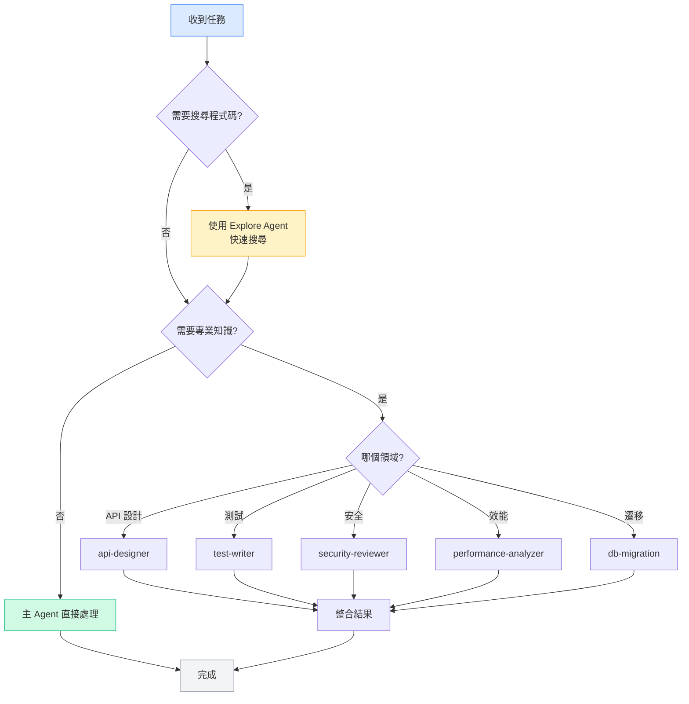
```mermaid
flowchart TB
    START[收到任務] --> Q1{需要搜尋程式碼?}
    Q1 -->|是| EXPLORE[使用 Explore Agent<br>快速搜尋]
    Q1 -->|否| Q2{需要專業知識?}
    EXPLORE --> Q2
    Q2 -->|是| Q3{哪個領域?}
    Q2 -->|否| MAIN[主 Agent 直接處理]
    Q3 -->|API 設計| API[api-designer]
    Q3 -->|測試| TEST[test-writer]
    Q3 -->|安全| SEC[security-reviewer]
    Q3 -->|效能| PERF[performance-analyzer]
    Q3 -->|遷移| DB[db-migration]
    API --> INTEGRATE[整合結果]
    TEST --> INTEGRATE
    SEC --> INTEGRATE
    PERF --> INTEGRATE
    DB --> INTEGRATE
    MAIN --> DONE[完成]
    INTEGRATE --> DONE
    
    style START fill:#dbeafe,stroke:#3b82f6
    style EXPLORE fill:#fef3c7,stroke:#f59e0b
    style MAIN fill:#d1fae5,stroke:#10b981
    style DONE fill:#f3f4f6,stroke:#9ca3af
```

---

## 2.2 Agent Teams（多代理協作）

### 2.2.1 Agent Teams 概述

#### 什麼是 Agent Teams？

**Agent Teams** 是 Claude Code 的多代理協作功能：一個「領導代理（Lead Agent，也就是你的主對話）」同時協調多個「隊友代理（Teammate）」，各自擁有獨立的 context window、直接互相通訊，而不像 Subagent 只能向主代理回報。

> ⚠️ **重要修正**：Teammate **預設共用同一個工作目錄**，並不會自動幫每個 Teammate 建立獨立的 git worktree——官方文件明確提醒「兩個 Teammate 同時編輯同一檔案會互相覆寫，務必把工作拆成每人負責不同檔案」。若確實需要檔案系統層級的隔離，須自行手動搭配 [Git Worktree](#314-worktree-整合)（屬於「你自己手動管理的平行 session」，官方文件將其列為 Agent Teams 之外的替代方案，而非 Agent Teams 內建行為）。

> 🧪 **Agent Teams 仍是實驗性功能，預設關閉**。啟用方式是設定環境變數（可放在 `settings.json` 的 `env` 區塊，或直接匯出）：
>
> ```bash
> export CLAUDE_CODE_EXPERIMENTAL_AGENT_TEAMS=1
> claude
> ```
>
> 未設定此環境變數時，Claude Code 完全不會建立團隊目錄，也不會生成或提議 Teammate。

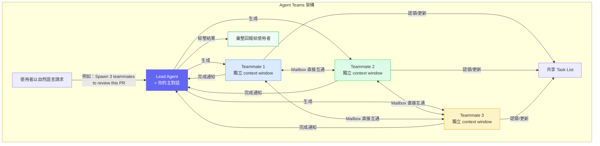
```mermaid
graph TB
    subgraph "Agent Teams 架構"
        U[使用者以自然語言請求] -->|例如：Spawn 3 teammates to review this PR| LA[Lead Agent<br>= 你的主對話]

        LA -->|生成| T1[Teammate 1<br>獨立 context window]
        LA -->|生成| T2[Teammate 2<br>獨立 context window]
        LA -->|生成| T3[Teammate 3<br>獨立 context window]

        T1 <-->|Mailbox 直接互通| T2
        T2 <-->|Mailbox 直接互通| T3
        T1 <-->|Mailbox 直接互通| T3

        T1 -->|認領/更新| TL[共享 Task List]
        T2 -->|認領/更新| TL
        T3 -->|認領/更新| TL

        T1 -->|完成通知| LA
        T2 -->|完成通知| LA
        T3 -->|完成通知| LA

        LA -->|綜整結果| R[彙整回報給使用者]
    end

    style LA fill:#6366f1,stroke:#4f46e5,color:#fff
    style T1 fill:#dbeafe,stroke:#3b82f6
    style T2 fill:#dcfce7,stroke:#22c55e
    style T3 fill:#fef3c7,stroke:#f59e0b
    style R fill:#f0fdf4,stroke:#16a34a
```

> 📌 這裡刻意不畫 worktree：Teammate 預設就在你啟動 Claude Code 的同一個工作目錄下讀寫檔案，彼此看到的是同一份程式碼；隔離的是**each Teammate 的 context window**，不是檔案系統。

#### Lead Agent 與 Teammate 的角色差異

| 特性 | Lead Agent（領導代理） | Teammate（隊友） |
|------|----------------------|--------------------------|
| **啟動方式** | 你的主對話本身，設定實驗性旗標後即為 Lead | 由 Lead 依你的自然語言請求生成，或 Lead 主動提議、經你確認 |
| **工作目錄** | 主對話的工作目錄 | 🆕 預設與 Lead **共用同一個工作目錄**（除非你另外手動指派 worktree） |
| **職責** | 規劃任務、分配工作、核准計畫、整合結果 | 執行具體開發任務，可主動認領未分配任務 |
| **互動方式** | 與使用者互動；可直接點選任一 Teammate 傳訊息 | Teammate 之間可直接互傳訊息，不需經過 Lead 轉達 |
| **Context** | 主對話的 context window | 各自獨立的 context window，載入 CLAUDE.md／MCP／Skills，但不繼承 Lead 的對話歷史 |
| **並行數量** | 1 個（同一 session 只能有一個 Lead，且不能轉移領導權） | 官方建議 3–5 個為佳，過多會使協調成本抵銷平行效益 |
| **生命週期** | 整個會話期間 | 任務完成後可請 Lead 要求優雅關閉；session 結束時團隊目錄自動清除 |

### 2.2.2 啟動與使用 Agent Teams

#### 啟動 Agent Teams

> ⚠️ **修正**：目前官方文件中**沒有** `claude --cowork`、`/leaders`、`/teammates` 這些指令。啟用方式只有「設定環境變數」，之後**直接用自然語言描述任務與想要的隊友**即可，Claude 會自動生成 Teammate；若判斷任務適合平行處理，Claude 也可能主動提議組隊，但一定會等你確認才會真的生成 Teammate。

```bash
# 先啟用實驗性功能旗標（一般會話即可，不需要特殊模式）
export CLAUDE_CODE_EXPERIMENTAL_AGENT_TEAMS=1
claude
```

```text
你: 我在設計一個追蹤程式碼庫 TODO 註解的 CLI 工具，請生成三位隊友從
    不同角度探索：一位負責 UX、一位負責技術架構、一位負責唱反調找漏洞。
```

Claude 會據此生成對應的 Teammate、建立共享任務清單，並在完成後綜整所有人的發現。若明確要求「用 Agent Team」但 Claude 只生成了 Subagent，代理面板本身無法直接分辨兩者（介面相同），需重新明確要求「用 Agent Team」。

#### 🆕 共享任務清單（Shared Task List）

> Lead Agent 與 Teammates 透過**共享任務清單**協調工作進度：

```plaintext
Agent Teams 共享任務清單：
┌────┬────────────────────────┬───────────┬──────────┐
│ ID │ 任務描述                │ 負責人     │ 狀態      │
├────┼────────────────────────┼───────────┼──────────┤
│ 1  │ 重構 UserService 認證   │ Teammate 1│ ✅ 完成   │
│ 2  │ 新增 BatchOrderAPI      │ Teammate 2│ 🔄 進行中 │
│ 3  │ 更新單元測試            │ Teammate 3│ ⏳ 等待中 │
│ 4  │ 整合測試                │ Lead Agent│ ⏳ 等待中 │
└────┴────────────────────────┴───────────┴──────────┘
```

- Lead Agent 在建立任務時會自動產生共享任務清單
- Teammates 完成任務後會更新狀態
- 透過 `TaskCreated` 和 `TaskCompleted` Hook 事件追蹤進度

#### 🆕 信箱訊息（Mailbox Messaging）

> Lead Agent 與 Teammates 透過**非同步信箱**溝通（而非直接對話）：

```plaintext
Lead Agent → [Mailbox] → Teammate 1
  "請優先處理認證中介層的重構"

Teammate 1 → [Mailbox] → Lead Agent
  "認證重構完成，middleware/auth.ts 已同步更新"

Teammate 1 → [Mailbox] → Teammate 2（可直接互傳，不需經過 Lead）
  "auth middleware 介面有變更，你負責的 OrderAPI 呼叫記得對應調整"
```

實際上每個 Agent 的信箱是磁碟上的一個 JSON 檔案：`~/.claude/teams/{team-name}/inboxes/{agent-name}.json`，只有成功寫入該檔案，Claude Code 才會回報「訊息已送達」；格式不合法的訊息項目會被記錄為錯誤並從檔案中移除，其餘合法訊息仍正常送達。

#### 顯示模式（Display Modes）

Agent Teams 只有兩種顯示模式（沒有獨立的「多視窗」第三種）：

| 模式 | 說明 | 需求 |
|------|------|------|
| **In-process**（🆕 v2.1.179 起為預設） | 所有 Teammate 都在你的主終端機內執行，用上下鍵在代理面板中選擇、Enter 檢視並傳訊息 | 任何終端機皆可，免額外設定 |
| **Split panes**（分割面板） | 每個 Teammate 各有自己的面板，可同時看到所有輸出，點進面板即可直接互動 | 需要 tmux，或裝有 `it2` CLI 的 iTerm2 |

```json
// ~/.claude/settings.json — 變更預設顯示模式
{
  "teammateMode": "auto"   // "in-process"（預設）｜"auto"｜"tmux"｜"iterm2"
}
```

```bash
# 或針對單一 session 指定（實驗性旗標，--help 不會列出）
claude --teammate-mode auto
```

`"auto"` 模式會在偵測到你已身處 tmux，或終端機是裝有 `it2` CLI 的 iTerm2 時自動切為分割面板，否則退回 in-process。

#### 團隊規模與檔案分工建議

- **官方建議 3–5 位 Teammate**：協調成本會隨人數線性增加，超過一定規模後邊際效益遞減；15 個獨立任務時，3 個 Teammate 通常就是不錯的起點。
- **依「檔案所有權」而非任務名稱拆分工作**：因為 Teammate 共用同一份工作目錄，兩人同時改同一個檔案會互相覆寫，務必讓每位 Teammate 負責彼此不重疊的檔案集合。
- 若某個 Teammate 確實需要檔案系統層級的完全隔離（例如要做破壞性實驗），可在生成時指名使用一個設有 `isolation: worktree` 的 [Subagent 定義](#21-subagents-子代理) 作為該 Teammate 的類型，讓它在獨立 git worktree 中執行；這是需要另外設定的進階做法，並非預設行為。

### 2.2.3 Agent Teams 的協調機制

#### 任務分配策略

Lead Agent 使用智慧型任務分配，考量以下因素：

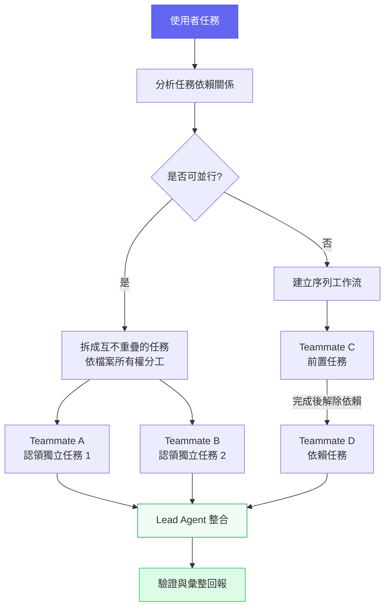
```mermaid
flowchart TD
    T[使用者任務] --> A[分析任務依賴關係]
    A --> B{是否可並行?}

    B -->|是| P[拆成互不重疊的任務<br>依檔案所有權分工]
    B -->|否| S[建立序列工作流]

    P --> P1[Teammate A<br>認領獨立任務 1]
    P --> P2[Teammate B<br>認領獨立任務 2]

    S --> S1[Teammate C<br>前置任務]
    S1 -->|完成後解除依賴| S2[Teammate D<br>依賴任務]

    P1 --> M[Lead Agent 整合]
    P2 --> M
    S2 --> M

    M --> V[驗證與彙整回報]

    style T fill:#6366f1,stroke:#4f46e5,color:#fff
    style M fill:#f0fdf4,stroke:#16a34a
    style V fill:#dcfce7,stroke:#22c55e
```

> 📌 任務之間可設定相依關係：有未完成依賴的任務無法被認領，等依賴任務完成後才會自動解鎖，全程由 Claude Code 用檔案鎖定機制避免多個 Teammate 搶認領同一任務。

#### 通訊與狀態管理

Teammate 透過以下機制與 Lead Agent、彼此協調：

| 機制 | 說明 | 用途 |
|------|------|------|
| **產生時的任務說明** | Lead 生成 Teammate 時給的初始 prompt（不含 Lead 的對話歷史） | 初始任務說明 |
| **共享工作目錄** | 預設與 Lead 及其他 Teammate 共用同一份檔案（非各自 worktree） | 程式碼變更彼此可見，需自行避免檔案衝突 |
| **Mailbox 訊息** | 送達會自動通知收件者，Teammate 之間可直接互傳，不需經過 Lead | 即時溝通、回報進度 |
| **共享 Task List** | 所有 Agent 皆可查看任務狀態、認領未分配任務 | 進度追蹤與工作分配 |
| **閒置通知** | Teammate 結束回合會自動通知 Lead；因 API 錯誤中斷時會回報失敗與錯誤內容 | 生命週期管理 |

> ⚠️ `WorktreeCreate`／`WorktreeRemove` 是**通用的** Hook 事件，會在任何 git worktree 建立/移除時觸發——包括 `--worktree` 旗標、Subagent 的 `isolation: worktree`，或背景 session——但**不是** Agent Teams 專屬機制，Agent Teams 預設共用工作目錄時完全不會觸發它們。

#### 相關 Hook 事件

Agent Teams 提供三個可用於監控與品管的專屬 Hook 事件：

| 事件 | 觸發時機 | 用途 |
|------|---------|------|
| `TeammateIdle` | Teammate 即將轉為閒置前 | 以 exit code 2 回饋意見、要求它繼續工作 |
| `TaskCreated` | 任務被建立時 | 以 exit code 2 阻止建立並回饋原因 |
| `TaskCompleted` | 任務被標記完成時 | 以 exit code 2 阻止標記完成、要求補做 |

```json
{
  "hooks": {
    "TeammateIdle": [
      {
        "hooks": [
          { "type": "command", "command": "echo '[$(date)] Teammate idle' >> .claude/team-log.txt" }
        ]
      }
    ],
    "TaskCompleted": [
      {
        "hooks": [
          { "type": "command", "command": "./scripts/verify-task-tests-pass.sh" }
        ]
      }
    ]
  }
}
```

### 2.2.4 應用場景與最佳實踐

#### 場景一：全棧功能開發

```plaintext
任務：實作「使用者通知偏好設定」功能

Lead Agent 計劃（依檔案所有權分工，共用同一份工作目錄）：
├── Teammate 1（負責 src/models/、src/api/notification-preference*、migrations/）
│   ├── 建立 NotificationPreference 模型
│   ├── 實作 CRUD API 端點
│   └── 新增資料庫 migration
├── Teammate 2（負責 src/components/notification-settings/）
│   ├── 建立偏好設定頁面元件
│   ├── 實作表單驗證邏輯
│   └── 串接後端 API
└── Teammate 3（任務設有依賴：等 Teammate 1 & 2 的任務完成才解鎖）
    ├── 撰寫後端 API 整合測試
    └── 撰寫前端元件測試
```

#### 場景二：大規模重構

```plaintext
任務：將 Monolith 中的 Payment 模組拆分為獨立微服務

Lead Agent 計劃（依任務依賴排序，各自負責不重疊的檔案）：
├── Teammate 1（負責 src/services/payment/ 抽離）
│   └── 抽離 Payment 相關程式碼到新模組
├── Teammate 2（負責 src/gateway/ 路由設定，依賴 Teammate 1 完成）
│   └── 更新 API Gateway 路由配置
├── Teammate 3（負責 db/payment-schema/，可與 Teammate 1 平行進行）
│   └── 建立獨立的 Payment 資料庫 schema
└── 認領順序（由任務相依關係自動控制）：Teammate 3 與 Teammate 1 平行 → Teammate 2
```

#### 場景三：跨團隊程式碼審查

```plaintext
任務：對 PR #1234 進行全面審查

Lead Agent 計劃：
├── Teammate 1: 安全性審查（SQL Injection、XSS、認證）
├── Teammate 2: 效能審查（N+1 查詢、記憶體洩漏、索引）
├── Teammate 3: 架構合規審查（設計模式、SOLID 原則）
└── Lead Agent: 彙整所有審查意見並生成統一報告
```

#### ⚠️ 注意事項與最佳實踐

> 1. **任務獨立性**：分配給不同 Teammate 的任務務必修改不同的檔案——因為預設共用同一個工作目錄，同檔案的並行修改會直接互相覆寫，不是靠合併機制化解
> 2. **給足上下文**：Teammate 不會繼承 Lead 的對話歷史，生成時務必把必要背景（受影響的檔案、限制條件、既有約定）寫進 prompt
> 3. **依賴排序**：有依賴關係的任務應設定正確的 Task 相依，避免在不完整的程式碼上工作
> 4. **持續盯場**：放著團隊長時間無人看管，出錯或做白工的風險會提高；定期檢查進度、視需要即時導正方向
> 5. **成本考量**：每個 Teammate 都是獨立的 Claude Code 會話，會產生對應的 API 費用，且用量隨人數線性增加
> 6. **實驗性功能**：Agent Teams 目前仍是實驗性功能，預設關閉，需設定 `CLAUDE_CODE_EXPERIMENTAL_AGENT_TEAMS=1` 環境變數才會啟用
> 7. **Teammate 數量**：官方建議 3–5 個 Teammate 為佳，過多會讓協調成本抵銷平行效益
> 8. **已知限制**：一個 session 僅能有一個團隊、Teammate 不能再生出自己的 Teammate（無巢狀團隊）、In-process 模式的 Teammate 無法隨 `/resume` 還原（session 恢復後需請 Lead 重新生成）、關閉團隊時 Teammate 會等目前這輪任務做完才真正結束（可能需要一點時間）

#### Agent Teams 專屬 Hook 事件

| Hook 事件 | 觸發時機 | 用途 |
|-----------|---------|------|
| `TaskCreated` | 任務被建立時 | exit code 2 可阻止建立並回饋原因 |
| `TaskCompleted` | 任務被標記完成時 | exit code 2 可阻止標記完成、要求補做（例如強制先跑測試） |
| `TeammateIdle` | Teammate 即將轉為閒置前 | exit code 2 可回饋意見、讓它繼續工作而不真正閒置 |

> 📌 `WorktreeCreate`／`WorktreeRemove` 也是可用的 Hook 事件，但屬於通用的 worktree 生命週期事件（`--worktree`、`isolation: worktree`、背景 session 都會觸發），並非 Agent Teams 專屬——除非你額外指定 Teammate 使用 `isolation: worktree` 的 Subagent 定義，否則預設共用工作目錄的 Agent Teams 不會觸發它們。

### 2.2.5 Agent Teams 進階模式

#### 模式一：Pipeline 模式（串聯）

當任務有明確的先後依賴關係時，使用 Pipeline 模式：

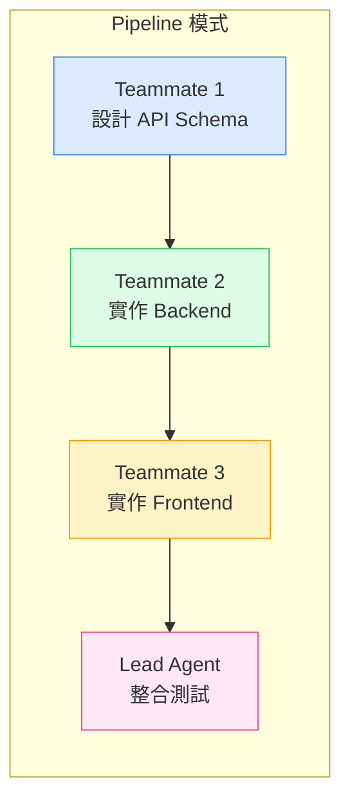
```mermaid
graph LR
    subgraph "Pipeline 模式"
        T1["Teammate 1<br>設計 API Schema"] --> T2["Teammate 2<br>實作 Backend"]
        T2 --> T3["Teammate 3<br>實作 Frontend"]
        T3 --> T4["Lead Agent<br>整合測試"]
    end
    
    style T1 fill:#dbeafe,stroke:#3b82f6
    style T2 fill:#dcfce7,stroke:#22c55e
    style T3 fill:#fef3c7,stroke:#f59e0b
    style T4 fill:#fce7f3,stroke:#ec4899
```

```plaintext
You: 使用 pipeline 模式實作使用者認證功能：
     1. 先設計 API 規格（OpenAPI）
     2. 按照規格實作後端
     3. 按照規格實作前端
     4. 整合測試
```

#### 模式二：Fan-out/Fan-in 模式（扇出扇入）

獨立任務平行處理，最後彙整：

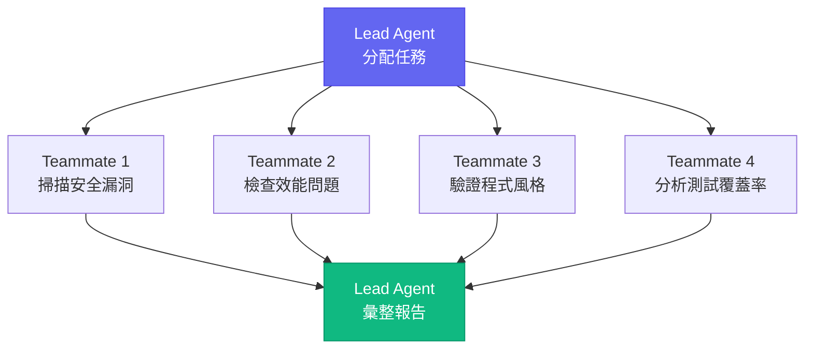
```mermaid
graph TB
    L[Lead Agent<br>分配任務] --> T1[Teammate 1<br>掃描安全漏洞]
    L --> T2[Teammate 2<br>檢查效能問題]
    L --> T3[Teammate 3<br>驗證程式風格]
    L --> T4[Teammate 4<br>分析測試覆蓋率]
    
    T1 --> R[Lead Agent<br>彙整報告]
    T2 --> R
    T3 --> R
    T4 --> R
    
    style L fill:#6366f1,stroke:#4f46e5,color:#fff
    style R fill:#10b981,stroke:#059669,color:#fff
```

#### 模式三：Specialist 模式（專家分工）

每個 teammate 是不同領域的專家：

```plaintext
You: 使用專家模式重新設計購物車系統

Lead Agent 分配：
├── 架構師 Agent（使用 opus 模型）
│   └── 設計整體架構、定義介面
├── 後端專家 Agent  
│   └── 實作 API 和業務邏輯
├── 前端專家 Agent
│   └── 實作 UI 元件和狀態管理
├── DBA 專家 Agent
│   └── 設計 database schema 和最佳化查詢
└── QA 專家 Agent
    └── 撰寫測試計畫和自動化測試
```

#### 模式選擇指南

| 模式 | 適用場景 | 優勢 | 劣勢 |
|------|---------|------|------|
| **Pipeline** | 有明確依賴的任務 | 品質可控、循序漸進 | 速度較慢 |
| **Fan-out/Fan-in** | 彼此獨立的分析任務 | 速度最快 | 無法處理依賴 |
| **Specialist** | 需要多領域專業知識 | 專業且深入 | 成本較高 |
| **混合** | 複雜專案 | 靈活組合 | 配置較複雜 |

### 2.2.6 Agent Teams 搭配 Hooks

透過 Hooks 可以在 Agent Teams 的關鍵時刻自動執行操作，以下範例用 `TaskCompleted` 強制在任務被標記完成前先跑測試，並用 `TeammateIdle` 記錄每次有 Teammate 閒置：

```json
{
  "hooks": {
    "TaskCompleted": [
      {
        "hooks": [
          {
            "type": "command",
            "command": "./scripts/verify-tests-pass.sh"
          }
        ]
      }
    ],
    "TeammateIdle": [
      {
        "hooks": [
          {
            "type": "command",
            "command": "echo '[Teammate idle] $(date)' >> .claude/team-log.txt"
          }
        ]
      }
    ]
  }
}
```

`./scripts/verify-tests-pass.sh` 讀取 stdin 的 JSON 輸入判斷任務內容，若驗證失敗以 exit code 2 回傳，Claude Code 就會阻止該任務被標記完成，並把腳本的錯誤訊息回饋給嘗試結案的 Teammate。

### 2.2.7 Teammate 權限、安全與成本

> 🆕 **v3.5 新增**：依官方 `agent-teams` 頁補齊企業導入時最常被忽略的權限與成本細節。

#### 啟用條件與隱性行為

- 需設定 `CLAUDE_CODE_EXPERIMENTAL_AGENT_TEAMS=1`，而且**只在互動 session 生效**：`-p` 與 Agent SDK 不會生成 Teammate，Claude 命名的子代理會退回一般 Subagent。
- ⚠️ **啟用後會改變一般委派行為**：Claude 可能自行替子代理命名，而**被命名的子代理會以 Teammate 身分啟動**，因此即使你沒有要求，也可能形成團隊。若只想用 Subagent，請不要在全域設定中常駐開啟此變數。
- 團隊設定（`~/.claude/teams/{team-name}/config.json`）是**執行期狀態**，不要手動編輯或預先撰寫；專案中的 `.claude/teams/teams.json` 之類檔案**不會被識別為設定**。要重複使用角色，請以 [Subagent 定義](#213-自訂子代理) 生成 Teammate。

#### 以 Subagent 定義生成 Teammate 時套用哪些欄位

| 欄位 | In-process Teammate | Split-pane Teammate |
|------|--------------------|--------------------|
| `tools` | 套用，並自動加入 `SendMessage`（與 Task 系列工具） | 套用 |
| `model` | 生成指令未指定模型時套用 | 同左 |
| 本文（body） | **附加**到預設 system prompt | **取代**預設 system prompt |
| `skills` | 不套用，改從專案與使用者設定載入 | 不套用 |
| `mcpServers` | 忽略 | 依 Subagent 規則套用 |

#### 權限模型

- Teammate **繼承 Lead 的權限模式**，但 **`dontAsk` 不會被繼承**；若 Lead 以 `--dangerously-skip-permissions` 啟動，**所有 Teammate 也會跳過權限檢查**。
- 生成後可個別調整 Teammate 的權限模式，但**無法在生成時就指定**每個 Teammate 的模式。
- Teammate 的權限提示都出現在 Lead session，由你核准；唯一例外是 plan approval，由 Lead 直接核准。
- **Agent 之間的訊息不等於你的同意**：Teammate 不能代你核准權限，被拒絕的動作也不能轉給其他 Teammate 繞過。Auto mode 下，分類器會把其他代理轉述的「已核准」視為不受信任輸入，並在投遞前審查每則訊息。

#### 成本與規模

- Token 用量隨 Teammate 數量**線性成長**；In-process Teammate 的 prompt cache 預設只保留 5 分鐘（含訂閱方案），可用 `subagentPromptCacheTtl` 設為 1 小時。
- 官方建議**從 3–5 個 Teammate 開始**；15 個獨立任務用 3 個 Teammate 起步即可。「三個專注的 Teammate 往往勝過五個分散的」。
- Split-pane 模式**不支援** VS Code 內建終端機、Windows Terminal 與 Ghostty，這些環境請使用預設的 in-process 模式。

#### 企業導入檢核要點

- [ ] 只在需要的專案或 session 開啟 `CLAUDE_CODE_EXPERIMENTAL_AGENT_TEAMS`，避免意外形成團隊
- [ ] 禁止 Lead 以 `--dangerously-skip-permissions` 啟動（會擴散到全體 Teammate）
- [ ] 以 `TeammateIdle`／`TaskCreated`／`TaskCompleted` hooks 建立品質閘門（見 [2.2.6](#226-agent-teams-搭配-hooks)）
- [ ] 以檔案分工或 `isolation: worktree` 的 Subagent 定義避免同檔衝突
- [ ] 在 `/usage` 中追蹤 Agent Teams 的 token 用量，訂定團隊規模上限

### 2.2.8 官方平行執行方式分類與新型協作機制

> 🆕 **v3.5 新增**：2026 年官方把「平行執行」整理成五種方式（官方 `agents` 頁），另有跨 session 傳訊作為輕量的協調管道。本節協助你依任務特性選擇，避免「什麼都用 Agent Teams」。

#### 五種平行方式比較

| 方式 | 本質 | 何時使用 | 狀態 |
|------|------|---------|------|
| **Subagents** | 單一 session 內的委派工作者，各自有 context，回傳摘要 | 側支任務會用大量搜尋結果或日誌塞滿主對話 | GA |
| **Agent view**（`claude agents`） | 一個畫面派工並監看多個**本機背景 session** | 多個獨立任務，想交出去、一眼看狀態、需要時才介入 | 研究預覽 |
| **Agent Teams** | Lead 管理多個 session，共享任務清單與信箱 | 需要 Claude 拆分、指派並同步多個工作者 | 實驗性，預設關閉 |
| **Projects** | claude.ai/code 或 Desktop 中的一段持續對話，由 Claude 啟動並追蹤多個**雲端** thread | 橫跨數天到數週、電腦關機也要繼續 | Pro／Max 公開 Beta |
| **Dynamic Workflows** | 由腳本編排數十到數百個子代理，並交叉驗證結果 | 全 repo 掃描、500 檔遷移、需要多角度互相檢核的研究 | 所有付費方案 |

#### Dynamic Workflows：把「編排邏輯」寫成程式

Subagents、Skills、Agent Teams 都由 Claude 逐輪決定下一步；**Workflow 則把迴圈、分支與中間結果放進 JavaScript 腳本**，由 runtime 在背景執行，session 保持可互動。

| 項目 | 說明 |
|------|------|
| 觸發方式 | 在提示中要求使用 workflow；或在 `/effort` 選 `ultracode` 讓 Claude 自行判斷；內建 `/deep-research <問題>` |
| 執行前 | 可先核准計畫；可儲存為可重複執行的命令，或放進 plugin 發佈 |
| 監看 | `/workflows` 顯示每個代理的 token 用量，可隨時停止；同一 session 中可恢復 |
| 限制 | 執行中不接受使用者輸入；腳本本身不能直接存取檔案系統或 shell；不能 `import()`；預設最多 16 個代理同時執行（`CLAUDE_CODE_WORKFLOW_MAX_CONCURRENT_AGENTS`，1–256）；每次執行最多 1,000 個代理 |
| 成本警示 | 排程超過 25 個代理或預估超過 150 萬 token 時顯示 `Large workflow` 警告（僅提示，不會中止） |
| 規模建議 | `workflowSizeGuideline`：`small`（<5）／`medium`（<10，預設；Pro 為 `small`）／`large`（<50）／`unrestricted` |
| 停用 | 個人：`/config` 或 `"disableWorkflows": true`；組織：managed settings 設 `disableWorkflows` 或在 Admin settings 關閉 |

> 💡 **Workflow 的品質價值不只是「更多代理」**：腳本可以讓多個獨立代理**對抗式地互相審查**發現，或從多個角度草擬計畫再比較，得到比單次處理更可信的結果。先在小範圍（單一目錄）試跑以估算成本。

#### Agent view 與背景 session

- `claude agents` 開啟 agent view，依「需要輸入／執行中／已完成」分組列出背景 session；可 peek、回覆或 attach 進入完整對話。也可在 session 內用 `/bg`、`/background` 或 `claude --bg` 把工作送到背景。
- **檔案隔離**：背景 session 在編輯檔案前，會自動移入 `.claude/worktrees/` 下的 git worktree；非 git repo、已在 worktree 中或寫入工作目錄以外時例外。可用 `worktree.bgIsolation: "none"` 關閉。
- 背景 session 由 **supervisor 行程**託管，關閉終端機後仍會繼續；閒置約一小時的未附著 session 會被暫停（對話仍保存在磁碟）。
- 企業可用 `disableAgentView: true`（或 `CLAUDE_CODE_DISABLE_AGENT_VIEW`）透過 managed settings 整體停用。

#### Cross-session messaging：讓你的 session 互相通知

v2.1.224 起（原生 Windows v2.1.234 起）預設開啟。Claude 以 `ListAgents` 找到可聯絡的 session，再用 `SendMessage` 傳送**純文字**訊息，例如「schema 遷移完成，新欄位是 tenant_id，現在可以 rebase main」。`/list-agents`（別名 `/peers`）可檢查可達的 session。

收到的訊息有嚴格限制：**不能核准任何權限、不能要求修改設定或 CLAUDE.md、訊息中的 `/compact` 等指令不會被執行**，需要的權限仍照常詢問。

```json
{
  "isolatePeerMachines": true,
  "crossSessionInbound": "refuse",
  "permissions": { "deny": ["SendMessage", "ListAgents"] }
}
```

- `isolatePeerMachines: true`：訊息要送往**其他機器或雲端 session** 前必須經你核准（即使在 `bypassPermissions`）
- `crossSessionInbound: "refuse"`：丟棄所有收到的 session 訊息
- Deny `SendMessage`／`ListAgents`：停止傳送與列出。⚠️ 這也會**一併停用**對 Subagent 與 Agent Teams 隊友的傳訊

#### Claude Projects（雲端長期專案協調）

Project 是一段持續的對話，Claude 為每個任務開一個 **thread（雲端 session）**，每個 thread 都帶有專案的 repo、指示與記憶，可在電腦關機後繼續，並在 Overview 顯示哪些需要你。企業導入前須注意：

- 目前為 **Pro／Max 公開 Beta，Team／Enterprise 尚不可用**，且 **Beta 期間沒有組織層級控制**
- 不支援終端機 CLI，也不支援 Bedrock／Agent Platform／Foundry
- Thread 的沙箱在兩輪之間會暫停，若無法恢復會從新的 clone 繼續，**未 commit 的變更可能遺失**，長任務應要求 Claude 定期 commit 與 push
- Project 屬於單一使用者，無法分享

#### 如何選擇：決策流程

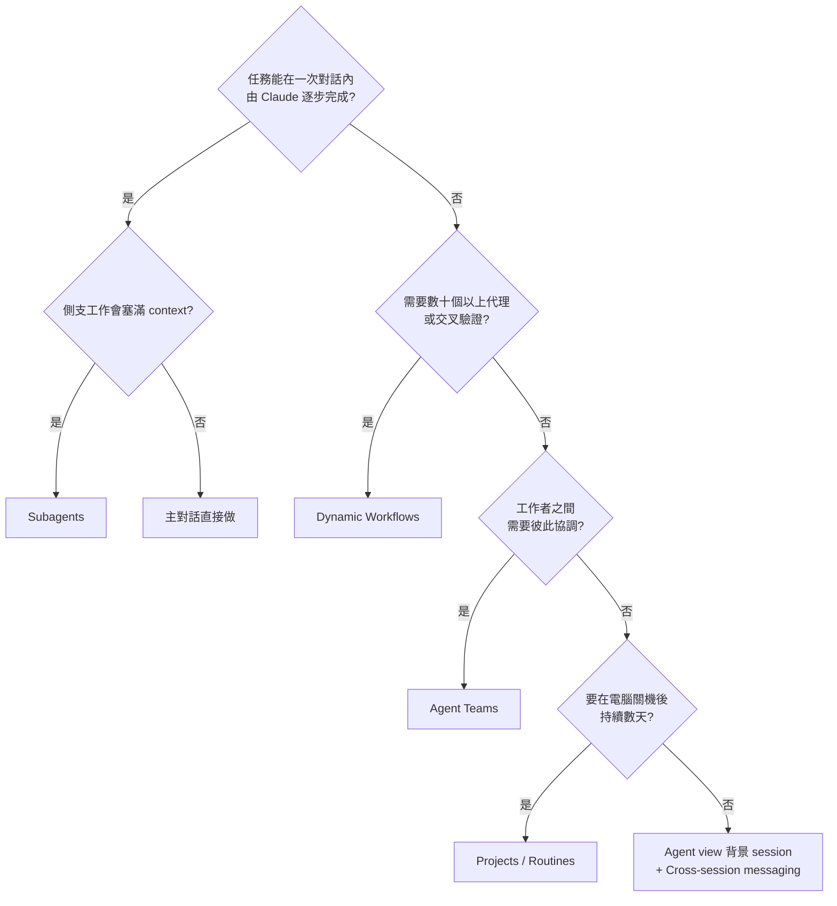
```mermaid
graph TD
    Q1{任務能在一次對話內<br/>由 Claude 逐步完成?} -->|是| Q2{側支工作會塞滿 context?}
    Q2 -->|是| SA[Subagents]
    Q2 -->|否| MAIN[主對話直接做]
    Q1 -->|否| Q3{需要數十個以上代理<br/>或交叉驗證?}
    Q3 -->|是| WF[Dynamic Workflows]
    Q3 -->|否| Q4{工作者之間<br/>需要彼此協調?}
    Q4 -->|是| AT[Agent Teams]
    Q4 -->|否| Q5{要在電腦關機後<br/>持續數天?}
    Q5 -->|是| PJ[Projects / Routines]
    Q5 -->|否| AV[Agent view 背景 session<br/>+ Cross-session messaging]
```

---

## 2.3 Skills（技能系統）

### 2.3.1 Skills 概述

#### 什麼是 Skills？

**Skills** 是 Claude Code 中可重用、可組合的能力模組。每個 Skill 透過 **SKILL.md** 檔案定義，使用 Markdown 格式搭配 YAML frontmatter 描述其用途、觸發條件與行為指引。Skills 可以被 Agents、Subagents 或使用者直接調用，用來封裝特定領域的專業知識和操作流程。

> 📌 **Custom Commands 已併入 Skills**：`.claude/commands/deploy.md`（舊式扁平檔案）與 `.claude/skills/deploy/SKILL.md`（新式目錄）現在是**同一套機制**，兩者都會產生 `/deploy` 指令、行為完全相同；既有的 `.claude/commands/` 檔案不需遷移也能繼續運作。Skill 目錄形式多出的優勢是：可搭配同目錄下的輔助檔案、frontmatter 可控制「誰能觸發它」（見下方 `disable-model-invocation`），以及 Claude 可依任務自動判斷是否要使用它——這是與純指令最大的差異：**Skill 內容只有在被使用時才載入 context**，比起把等量內容塞進 CLAUDE.md 幾乎不佔用額外 token。

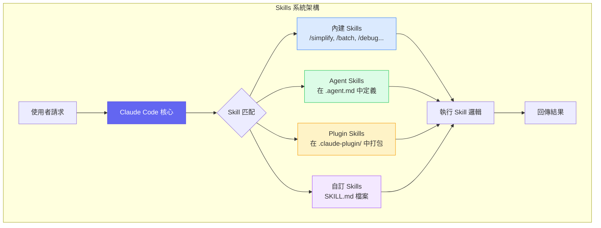
```mermaid
graph TB
    subgraph "Skills 系統架構"
        U[使用者請求] --> CC[Claude Code 核心]
        CC --> SD{Skill 匹配}
        
        SD --> BS[內建 Skills<br>/simplify, /batch, /debug...]
        SD --> AS[Agent Skills<br>在 .agent.md 中定義]
        SD --> PS[Plugin Skills<br>在 .claude-plugin/ 中打包]
        SD --> CS[自訂 Skills<br>SKILL.md 檔案]
        
        BS --> E[執行 Skill 邏輯]
        AS --> E
        PS --> E
        CS --> E
        
        E --> R[回傳結果]
    end
    
    style CC fill:#6366f1,stroke:#4f46e5,color:#fff
    style BS fill:#dbeafe,stroke:#3b82f6
    style AS fill:#dcfce7,stroke:#22c55e
    style PS fill:#fef3c7,stroke:#f59e0b
    style CS fill:#f3e8ff,stroke:#a855f7
```

#### Skill 類型總覽

| 類型 | 位置 | 觸發方式 | 說明 |
|------|------|---------|------|
| **內建 Slash Commands** | Claude Code 內建 | `/command` 斜線命令 | 由 Anthropic 維護的預設 Skills |
| **Agent Skills** | `.agent.md` YAML frontmatter | Agent 執行時自動載入 | 附加在特定 Agent 上的 Skills |
| **Plugin Skills** | `.claude-plugin/skills/SKILL.md` | 安裝 Plugin 後可用 | 隨 Plugin 一起分發的 Skills |
| **專案自訂 Skills** | `.claude/skills/SKILL.md` | 偵測專案上下文後匹配 | 團隊自定義的專案級 Skills |
| **全域自訂 Skills** | `~/.claude/skills/SKILL.md` | 所有專案可用 | 使用者個人的全域 Skills |

### 2.3.2 內建 Skills（Slash Commands）

> 🆕 **v3.5 更正**：官方把「以 prompt 驅動、讓 Claude 用工具編排工作」的指令稱為 **Bundled skills**，在 commands 參考中標示為 **Skill**；`/compact`、`/memory`、`/skills`、`/agents` 等則是執行固定邏輯的**內建命令**，不是 Skill。可用 `disableBundledSkills` 設定整體關閉 bundled skills。

| 命令 | 類型 | 功能說明 |
|------|------|---------|
| **`/code-review [low…max\|ultra] [--fix] [--comment]`** | Skill | 審查目前 diff、PR、分支或路徑的正確性問題；`ultra` 為雲端多代理深度審查（見 [4.2](#42-cicd-整合)） |
| **`/simplify [target]`** | Skill | 審查變更中可重用、簡化、提升效率之處並直接套用修正（只看品質，不找 bug） |
| **`/batch <instruction>`** | Skill | 研究程式碼庫、拆解並平行執行大規模變更 |
| **`/debug [description]`** | Skill | 為目前 session 啟用除錯紀錄，並閱讀 debug log 排查問題 |
| **`/loop [interval] [prompt]`** | Skill | Session 開啟期間反覆執行 prompt；省略間隔則由 Claude 自行調整節奏（見 [2.8](#28-scheduled-tasks排程任務)） |
| **`/run`** | Skill | 啟動並實際操作專案應用程式，確認變更真的可用，而不只是測試通過 |
| **`/verify`** | Skill | 建置、執行並觀察應用程式，確認變更達到預期（只在你呼叫時執行） |
| **`/run-skill-generator`** | Skill | 教 `/run` 與 `/verify` 如何從乾淨環境建置、啟動與操作你的應用程式 |
| **`/claude-api`** | Skill | Claude API／Anthropic SDK 參考 |
| **`/doctor`**（別名 `/checkup`） | Skill | 安裝與設定健檢，可自動修正 |
| **`/deep-research <question>`** | Workflow | 多角度搜尋、交叉驗證來源並產生附引用的報告（見 [2.2.8](#228-官方平行執行方式分類與新型協作機制)） |
| **`/skills`** | 內建命令 | 列出可用 Skills；按 `t` 依 token 數排序、`Space` 切換 `skillOverrides` 狀態 |
| **`/skill-doctor`** | 內建命令 | 🆕 顯示每個 Skill 的 context 成本與使用頻率，找出應關閉的 Skill（v2.1.252+） |
| **`/agents`** | 內建命令 | v2.1.198 起只提示你請 Claude 建立／管理 Subagent 或直接編輯 `.claude/agents/` |

**使用範例**：

```plaintext
# 在 Claude Code 會話中直接使用
> /debug 這個 API 調用總是回傳 401，但 token 是有效的

Claude Code 會啟動系統化偵錯流程：
1. 檢查 HTTP 請求 headers
2. 驗證 token 格式與過期時間
3. 追蹤認證中介層邏輯
4. 識別出 Bearer prefix 缺失問題

> /batch 將所有 .java 檔案中的 javax.persistence 改為 jakarta.persistence

Claude Code 會：
1. 掃描所有 .java 檔案
2. 列出受影響的檔案清單
3. 逐一執行替換
4. 驗證編譯是否通過
```

### 2.3.3 SKILL.md 檔案格式

#### 基本結構

自訂 Skills 使用 **SKILL.md** 檔案定義，遵循 Markdown + YAML frontmatter 格式：

```markdown
---
name: java-entity-generator
description: >
  根據資料庫 Schema 描述或 DDL 語句，自動生成符合 JPA 規範的
  Java Entity 類別，支援 Lombok、Builder Pattern 等選項。
---

# Java Entity Generator

## 使用時機

當使用者需要：
- 從資料庫表結構生成 Java Entity
- 建立新的 JPA 實體類
- 將 DDL 轉換為 Java 程式碼

## 操作步驟

1. 分析使用者提供的表結構資訊或 DDL
2. 確認目標套件路徑和命名規範
3. 生成 Entity 類別，包含：
   - 適當的 JPA 註解（@Entity, @Table, @Column 等）
   - 主鍵策略（@Id, @GeneratedValue）
   - 關聯映射（@OneToMany, @ManyToOne 等）
   - Auditing 欄位（@CreatedDate, @LastModifiedDate）
4. 如啟用 Lombok，加入 @Data, @Builder 等註解
5. 生成對應的 Repository 介面

## 輸出格式

- 使用專案現有的程式碼風格
- 遵循專案的套件結構慣例
- 包含必要的 import 陳述式

## 範例

輸入：使用者表，包含 id、username、email、created_at
輸出：User.java Entity + UserRepository.java
```

#### YAML Frontmatter 參數說明

> 🆕 **v3.5 依官方 Frontmatter reference 更正**：所有欄位都是**選填**（`description` 為建議填寫）；欄位名稱使用小寫加連字號（`when_to_use` 例外），**拼錯的欄位會被靜默忽略**。YAML 解析失敗時 Skill 仍會載入，但所有欄位都不生效。

| 參數 | 說明 |
|-----|------|
| `name` | 顯示名稱，預設為目錄名稱 |
| `description` | 做什麼、何時使用；Claude 依此決定是否套用。**與 `when_to_use` 合計超過 1,536 字元會被截斷**，關鍵用途要寫在前面 |
| `when_to_use` | 補充觸發情境或範例請求，附加在 description 之後並計入 1,536 字元上限 |
| `argument-hint` | 自動完成時顯示的參數提示，如 `[issue-number]` |
| `arguments` | 具名位置參數，供 `$name` 替換（依序對應位置） |
| `disable-model-invocation` | `true`：只有你能以 `/name` 呼叫，Claude 不會自動載入；也不能預載入 Subagent 或由排程觸發。適用於 `/deploy`、`/commit` 等有副作用的流程 |
| `user-invocable` | `false`：只有 Claude 能呼叫，從 `/` 選單隱藏。適用於背景知識型 Skill |
| `allowed-tools` | ⚠️ **預先核准**：在呼叫此 Skill 的那一輪中，列出的工具**不需詢問**即可使用；下一則訊息後失效。**這不是限制清單** |
| `disallowed-tools` | Skill 啟用期間從可用工具中**移除**的工具（真正的限制請用這個） |
| `model` | 本輪使用的模型（不寫入設定）；可用 `inherit` |
| `effort` | `low`／`medium`／`high`／`xhigh`／`max` |
| `context` | 設為 `fork` 時在分叉的子代理中執行 |
| `agent` | `context: fork` 時使用的子代理類型 |
| `background` | 僅與 `context: fork` 搭配；`false` 時等待子代理結果（v2.1.218+） |
| `hooks` | 呼叫 Skill 時註冊、並在 session 剩餘時間持續生效的 hooks |
| `paths` | Glob 樣式；設定後只有處理符合的檔案時才自動載入 |
| `shell` | `` !`command` `` 使用的 shell：`bash`（預設）或 `powershell` |
| `metadata` | 自訂 key-value（Claude Code 不處理，供自家工具讀取） |
| `license`／`compatibility` | Agent Skills 開放標準欄位，Claude Code 接受但不處理 |

> 🔐 **安全警示**：專案 Skill 的 `allowed-tools` **不受 workspace trust 管控**，即使在從未信任過的資料夾中以 `-p` 執行，只要 Skill 被呼叫就會生效。Skill 可以替自己授予廣泛的工具權限，因此**審查 repo 中 Skill 的 `allowed-tools` 應列入 code review 清單**。

#### 🆕 進階 Frontmatter 範例

```markdown
---
name: spring-migration
description: 將 Spring Boot 2.x 專案遷移至 3.x
argument-hint: "指定目標 Spring Boot 版本（如 3.2.0）"
allowed-tools:
  - Read
  - Edit
  - Bash(mvn *)
  - Bash(./gradlew *)
model: opus
effort: max
paths:
  - "src/main/java/**"
  - "pom.xml"
  - "build.gradle"
shell: bash
---
```

#### 🆕 特殊變數與替換

| 變數 | 說明 |
|------|------|
| `$ARGUMENTS` | 使用者呼叫時提供的完整參數文字 |
| `$ARGUMENTS[0]`、`$0` | 第一個位置參數（**從 0 起算**，v3.5 更正） |
| `$ARGUMENTS[1]`、`$1` | 第二個位置參數 |
| `$name` | 🆕 `arguments` 中定義的具名參數 |
| `${CLAUDE_SKILL_DIR}` | 此 SKILL.md 所在的目錄路徑 |
| `${CLAUDE_SESSION_ID}` | 當前會話的唯一 ID |
| `${CLAUDE_EFFORT}` | 🆕 當前 effort：`low`／`medium`／`high`／`xhigh`／`max`（ultracode 回報為 `xhigh`） |
| `${CLAUDE_PROJECT_DIR}` | 🆕 專案根目錄（與 hooks、MCP server 收到的值相同） |
| `${CLAUDE_PLUGIN_ROOT}`／`${CLAUDE_PLUGIN_DATA}` | 🆕 僅限 plugin Skill：plugin 安裝目錄／跨更新保留的資料目錄 |

```markdown
---
name: test-file
description: 為指定檔案生成測試
---

# 為 $1 生成測試

讀取 $1 的內容，並使用 ${CLAUDE_SKILL_DIR}/templates/test-template.ts 
作為模板生成對應的測試檔案。
```

#### 🆕 Skill 權限規則

在 `settings.json` 中可以為特定 Skill 配置獨立的權限規則：

```json
{
  "permissions": {
    "allow": [
      "Skill(spring-migration)",
      "Skill(security-review)"
    ],
    "deny": [
      "Skill(dangerous-skill)"
    ]
  }
}
```

#### 🆕 Skill 清單預算

`SLASH_COMMAND_TOOL_CHAR_BUDGET` 環境變數控制的是 **Skill 清單**（名稱＋描述）佔用的字元預算，而不是 Skill 的輸出大小（v3.5 更正）。清單超出預算時，名稱一定保留，但較不重要的描述會被截短，可能讓 Claude 找不到觸發關鍵字。建議改用下方 [2.3.6](#236-skills-最佳實踐) 的 `skillListingBudgetFraction` 設定。

#### $ARGUMENTS 動態參數

在 SKILL.md 內容中使用 `$ARGUMENTS` 佔位符，會在使用者呼叫時被替換為實際參數：

````markdown
---
name: explain
description: 解釋指定的程式碼或概念
---

請詳細解釋以下內容：$ARGUMENTS
````

使用者呼叫方式：

```text
/explain React useEffect 的 cleanup 機制
```

#### !command 動態 Context

使用 `` !`command` `` 語法可在 SKILL.md 中嵌入動態 context：

```markdown
---
name: review-changes
description: 審查目前的 git 變更
---

# 審查目前變更

以下是目前的 git diff：
!`git diff --staged`

請根據以上變更進行程式碼審查。
```

### 2.3.4 Agent Skills（附加在 Agent 上的 Skills）

Skills 可以透過 Agent 的 YAML frontmatter 進行關聯，讓特定 Agent 在執行時自動載入相關的 Skills：

```markdown
---
# .claude/agents/security-reviewer.md
name: security-reviewer
description: 安全性程式碼審查代理
skills:
  - name: owasp-checker
    description: 檢查 OWASP Top 10 安全漏洞
    file: .claude/skills/owasp-checker/SKILL.md
  - name: dependency-auditor
    description: 檢查第三方依賴的已知漏洞
    file: .claude/skills/dependency-auditor/SKILL.md
tools:
  - Bash
  - Read
  - Grep
---

# Security Reviewer Agent

## 審查流程
1. 載入 owasp-checker 和 dependency-auditor Skills
2. 掃描目標程式碼
3. 依照 OWASP Top 10 逐項檢查
4. 執行 npm audit / mvn dependency-check
5. 生成統一安全報告
```

**Agent Skills 的載入流程**：

```mermaid
sequenceDiagram
    participant U as 使用者
    participant CC as Claude Code
    participant A as Agent
    participant S as Skill

    U->>CC: 調用 security-reviewer Agent
    CC->>A: 載入 Agent 定義
    A->>A: 解析 YAML frontmatter
    A->>S: 載入 owasp-checker SKILL.md
    A->>S: 載入 dependency-auditor SKILL.md
    A->>A: 將 Skill 指引注入 context
    A->>CC: 開始執行審查任務
    CC->>U: 回傳審查結果
```

### 2.3.5 開發自訂 Skills

#### 步驟一：規劃 Skill 範圍

設計 Skill 時，遵循「單一職責」原則：

```plaintext
✅ 好的 Skill 設計：
├── api-endpoint-generator    → 專注於生成 REST API 端點
├── unit-test-writer          → 專注於撰寫單元測試
├── sql-optimizer             → 專注於 SQL 查詢優化
└── changelog-generator       → 專注於生成變更日誌

❌ 不好的 Skill 設計：
└── do-everything-skill       → 範圍太廣，什麼都做
```

#### 步驟二：建立 SKILL.md 檔案

```plaintext
專案結構：
.claude/
└── skills/
    ├── api-endpoint-generator/
    │   └── SKILL.md
    ├── unit-test-writer/
    │   └── SKILL.md
    └── sql-optimizer/
        └── SKILL.md
```

**完整範例 — Spring Boot API 端點產生器**：

```markdown
---
name: spring-boot-api-generator
description: >
  根據業務需求描述，生成完整的 Spring Boot REST API 端點，
  包含 Controller、Service、Repository 三層架構程式碼，
  以及對應的 DTO、Exception Handler 和 Swagger 文件註解。
---

# Spring Boot API 端點產生器

## 觸發條件

當使用者請求以下操作時啟動：
- 建立新的 REST API 端點
- 為現有 Entity 新增 CRUD API
- 生成 Spring Boot Controller + Service + Repository

## 生成規範

### Controller 層
- 使用 @RestController 和 @RequestMapping
- 實作標準 HTTP 方法（GET/POST/PUT/DELETE）
- 加入 @Operation (Swagger) 註解
- 使用 @Valid 進行請求驗證
- 回傳適當的 HTTP 狀態碼

### Service 層
- 定義 Service 介面和實作類
- 實作業務邏輯和資料轉換
- 使用 @Transactional 管理交易
- 處理業務例外

### Repository 層
- 繼承 JpaRepository
- 定義自訂查詢方法
- 使用 @Query 處理複雜查詢

### DTO 層
- 建立 Request/Response DTO
- 使用 Jakarta Validation 註解
- 實作 Entity ↔ DTO 轉換

## 命名規範
- 遵循專案現有的命名慣例
- Controller: XxxController
- Service: XxxService / XxxServiceImpl
- Repository: XxxRepository
- DTO: XxxRequest / XxxResponse
```

#### 步驟三：在 Agent 中引用 Skill

```markdown
---
# .claude/agents/backend-developer.md
name: backend-developer
description: Spring Boot 後端開發代理
skills:
  - name: spring-boot-api-generator
    description: 生成 Spring Boot REST API
    file: .claude/skills/api-endpoint-generator/SKILL.md
  - name: java-entity-generator
    description: 生成 JPA Entity
    file: .claude/skills/java-entity-generator/SKILL.md
---

# Backend Developer Agent
（Agent 的詳細指引...）
```

### 2.3.6 Skills 最佳實踐

#### 設計原則

```mermaid
graph LR
    subgraph "SKILL.md 設計四原則"
        P1[🎯 精確描述<br>description 決定匹配品質]
        P2[📋 步驟明確<br>操作步驟要可執行]
        P3[📐 範圍適中<br>不過大也不過小]
        P4[📝 範例豐富<br>提供輸入輸出範例]
    end
    
    P1 --> P2 --> P3 --> P4
```

| 原則 | 說明 | 範例 |
|------|------|------|
| **精確描述** | description 是 AI 匹配的關鍵，要包含具體的技術細節 | ❌ "生成程式碼" → ✅ "根據 OpenAPI 3.0 規範生成 TypeScript axios client" |
| **步驟可執行** | 操作步驟要具體到 Claude 可以執行 | ❌ "分析程式碼" → ✅ "使用 grep 搜尋所有 @Deprecated 標記的方法" |
| **範圍適中** | 一個 Skill 只解決一類問題 | ❌ "全端開發" → ✅ "Spring Boot Controller 生成" |
| **範例豐富** | 提供 2-3 個典型的輸入輸出範例 | 包含簡單案例和複雜案例 |

#### 🆕 Skill 內容生命週期與自動壓縮

> 🆕 **v3.2 新增，v3.3 補充 token 預算細節**

Skill 內容在載入到 context 後，會受到 Claude Code 的 context 管理機制影響：

1. **載入時機**：Skill 在使用者呼叫 `/name` 或 AI 自動匹配時載入到 context
2. **常駐 context**：渲染後的 SKILL.md 以單一訊息進入對話，**之後各輪都會保留**；但 `allowed-tools` 的授權在下一則訊息後就失效
3. **重複呼叫**：內容相同時只加一段「已載入」的註記，不會重複放入；參數或動態 context 不同時才會放入新版本
4. **壓縮後保留規則**：auto-compaction 會在摘要後重新附上每個 Skill **最近一次**的呼叫內容：
   - **單一 Skill 上限**：保留前 **5,000 tokens**
   - **所有 Skills 總預算**：合計 **25,000 tokens**，超出的較舊 Skill 會被捨棄
5. ⚠️ **不會自動重讀檔案**（v3.5 更正）：Claude Code 不會在後續輪次重新讀取 SKILL.md；若 Skill 看似「失效」，通常內容仍在，只是模型選擇了其他做法，請強化 `description` 或改用 hooks 強制執行

> 📌 **設計建議**：將 Skill 最重要的操作步驟放在檔案前段，確保壓縮時關鍵資訊被保留。可使用 `/doctor` 命令檢查 Skill 的 token 使用量，診斷預算分配問題。

#### 🆕 即時變更偵測

Claude Code 會監視 SKILL.md 檔案的變更：

- 修改 SKILL.md 檔案後，**無需重啟會話**即可生效
- 新增或刪除 SKILL.md 檔案也會即時反映在 `/skills` 清單中
- 透過 `ConfigChange` Hook 可以監聽 skills 設定變更

#### 🆕 `skillOverrides` 設定

`skillOverrides` 用來在**設定檔中控制 Skill 的可見性**，適合你不想修改 SKILL.md 的情況（例如共享 repo 中的 Skill）。在 `/skills` 選單中選取 Skill、按 `Space` 循環切換狀態、`Esc` 儲存，即會自動寫入：

| 值 | 對 Claude 列出 | 出現在 `/` 選單 |
|----|--------------|--------------|
| `"on"`（未列出時的預設） | 名稱與描述 | 是 |
| `"name-only"` | 只有名稱 | 是 |
| `"user-invocable-only"`（選單標示為 `user-only`） | 隱藏 | 是 |
| `"off"` | 隱藏 | 隱藏（v2.1.199 起也對 Remote Control 與 Agent SDK 隱藏） |

```json
{
  "skillOverrides": {
    "legacy-context": "name-only",
    "deploy": "off"
  }
}
```

> ⚠️ **v3.5 更正**：v3.4 範例中以 `skillOverrides` 覆寫 `model`、`effort`、`allowed-tools` 的寫法**不存在**，此設定只接受上述四種狀態字串。Plugin 的 Skill 不受 `skillOverrides` 影響，請改用 `/plugin` 管理。在 managed settings 中可透過別名（如 `checkup` → `/doctor`）進一步限制，但只能收緊、不能放寬。

#### 🆕 `skillListingBudgetFraction` 與 `skillListingMaxDescChars` 設定

每一輪 Claude 都會看到 Skills 清單，Claude Code 會把清單限制在 context window 的一定比例內：

| 設定 | 說明 | 預設值 |
|------|------|--------|
| `skillListingBudgetFraction` | 清單佔 context window 的比例（0 < 值 ≤ 1） | **`0.01`（1%）** |
| `skillListingMaxDescChars` | 每個 Skill 的 description＋when_to_use 最多顯示字元數 | `1536` |
| `SLASH_COMMAND_TOOL_CHAR_BUDGET` | 以固定字元數設定清單預算（環境變數） | — |

```json
{
  "skillListingBudgetFraction": 0.02,
  "skillListingMaxDescChars": 800
}
```

> ⚠️ **v3.5 更正**：v3.4 記載的預設值 `0.05` 與 `maxSkillDescriptionChars` 設定鍵皆不正確，官方鍵名為 `skillListingMaxDescChars`。
>
> 📌 **調校流程**：先執行 `/doctor` 看清單的 context 成本與最大貢獻者 → 執行 **`/skill-doctor`** 找出從未被呼叫、成本最高的 Skill → 以 `skillOverrides` 設為 `"name-only"` 或 `"off"` → 仍不足才提高預算。`/context` 的 Skills 列顯示的是套用預算後、模型實際收到的大小。

#### 組織管理

```plaintext
推薦的 Skills 目錄結構：

.claude/
├── skills/                          # 專案級 Skills
│   ├── code-generation/
│   │   ├── SKILL.md                 # API 產生器
│   │   └── templates/               # 可選：模板檔案
│   ├── testing/
│   │   └── SKILL.md                 # 測試產生器
│   └── documentation/
│       └── SKILL.md                 # 文件產生器
├── agents/                          # Agent 定義
│   └── backend-developer.md         # 引用上述 Skills
└── CLAUDE.md                        # 專案級指引

~/.claude/
└── skills/                          # 全域 Skills（所有專案共用）
    ├── personal-style/
    │   └── SKILL.md                 # 個人程式碼風格
    └── review-checklist/
        └── SKILL.md                 # 個人 code review 清單
```

#### ⚠️ 注意事項

> 1. **Description 品質**：SKILL.md 的 `description` 是 Claude Code 判斷是否啟用該 Skill 的核心依據。模糊的描述會導致 Skill 無法正確觸發
> 2. **不要重複造輪子**：使用 `/skills` 命令查看現有 Skills，避免建立功能重複的 Skill
> 3. **與 Agent 搭配**：Skills 最佳使用方式是透過 Agent 的 `skills` 欄位引用，這樣可以確保在正確的上下文中被觸發
> 4. **版本管理**：將 SKILL.md 納入 Git 版本控制，確保團隊成員使用一致的 Skills 定義

### 2.3.7 Skill 進階範例集

以下提供多個實戰級 Skill 範例，可直接複製使用或作為開發參考：

#### 資料庫遷移審查 Skill

```markdown
---
name: migration-review
description: 審查資料庫遷移腳本的安全性、效能影響和向後相容性。
  支援 Prisma、TypeORM、Flyway、Liquibase 等遷移框架。
allowed-tools: Read Grep Glob
---

# Database Migration Review

## 審查清單

### 安全性
- 是否有資料遺失風險？（DROP TABLE, DROP COLUMN）
- 大表變更是否使用 online DDL？
- 是否需要資料回填（backfill）？

### 效能
- 是否在大表上建立索引？（需要 CONCURRENTLY）
- 是否有鎖表風險？
- 預估執行時間

### 向後相容性
- 新舊版本程式碼能否同時運行？
- 是否需要分階段部署？
  1. 先部署相容的程式碼
  2. 執行遷移
  3. 部署使用新 schema 的程式碼

## 輸出格式
| 項目 | 狀態 | 說明 |
|------|------|------|
| 資料安全 | ✅/⚠️/❌ | 詳細說明 |
| 效能影響 | ✅/⚠️/❌ | 預估影響 |
| 向後相容 | ✅/⚠️/❌ | 相容性分析 |
| 回滾方案 | 有/無 | 如何回滾 |
```

#### Git Commit 訊息生成 Skill

```markdown
---
name: commit-message
description: 根據已暫存的變更生成 Conventional Commit 格式的 commit 訊息。
  支援 feat/fix/refactor/docs/test/chore 等類型。
tools: bash
---

# Commit Message Generator

## 分析步驟
1. 執行 `git diff --staged --stat` 查看變更摘要
2. 執行 `git diff --staged` 查看詳細變更
3. 根據變更內容判斷 commit 類型

## Commit 訊息格式
type(scope): 簡短描述

詳細說明（如果需要）

## 類型判斷規則
- feat: 新功能
- fix: Bug 修復
- refactor: 重構（不改變功能）
- docs: 文件變更
- test: 測試相關
- chore: 建置/工具改動
- perf: 效能改善
- style: 程式碼格式

## 範例
feat(auth): 新增 OAuth 2.0 Google 登入支援

- 實作 Google OAuth2 flow
- 新增 /api/auth/google callback endpoint
- 整合現有的 JWT token 系統
```

#### 依賴升級 Skill

```markdown
---
name: dependency-upgrade
description: 分析和執行專案依賴升級，包含安全漏洞修復、
  breaking changes 檢查、和升級路徑規劃。
allowed-tools: Read Grep Glob Bash(npm outdated *) Bash(npm audit *)
---

# Dependency Upgrade Skill

## 升級流程
1. 執行 `npm outdated` 或 `mvn versions:display-dependency-updates`
   了解哪些依賴有新版本
2. 檢查每個依賴的 CHANGELOG 和 breaking changes
3. 分類為：patch（安全）、minor（通常安全）、major（需要檢查）
4. 逐步升級，每次只升級一個 major 版本
5. 每次升級後執行測試

## 優先順序
1. 🔴 有已知 CVE 的依賴 → 立即升級
2. 🟡 Major 版本落後 2+ 的依賴 → 規劃升級
3. 🟢 Minor/Patch 更新 → 批量升級

## 輸出格式
| 套件 | 目前版本 | 最新版本 | 類型 | Breaking Changes | 建議 |
|------|---------|---------|------|-----------------|------|
```

### 2.3.8 Skill 來源、優先順序與雲端同步

> 🆕 **v3.5 新增**：依官方 `skills` 頁補齊 Skill 的載入來源、同名衝突規則，以及 claude.ai 同步機制，這些都是企業治理擴充來源時必須掌握的細節。

#### 七種載入來源

| 來源 | 路徑 | 載入範圍 |
|------|------|---------|
| Enterprise | managed settings 系統目錄下的 `.claude/skills/<name>/SKILL.md` | 組織部署到的所有機器 |
| Personal | `~/.claude/skills/<name>/SKILL.md` | 本機所有專案（**不含** Cowork 與雲端 session） |
| Project | `.claude/skills/<name>/SKILL.md`（從啟動目錄往上找到 repo 根目錄） | 此 repo；提交後團隊共享 |
| Nested | `<subdir>/.claude/skills/<name>/SKILL.md` | 在該子目錄啟動，或 Claude 開始處理該目錄的檔案後 |
| Additional directory | `--add-dir` 目錄中的 `.claude/skills/` | 該 session |
| Plugin | `<plugin>/skills/<name>/SKILL.md` | 啟用該 plugin 之處，以 `/plugin-name:skill-name` 呼叫 |
| claude.ai 帳號 | claude.ai 上啟用的 Skills | Cowork、雲端 session，以及以該帳號登入的終端機 session |

> 📌 `.claude/commands/*.md` 是舊格式，仍可使用，支援與 Skill 相同的 frontmatter（`name` 與 `paths` 除外）；同名時 Skill 優先。資料夾名稱不可使用 `synced`（保留給同步 Skill）。

#### 同名衝突時執行哪一個

| 同名出現在 | 執行 |
|-----------|------|
| Enterprise、Personal、Project 之間 | **Enterprise > Personal > Project** |
| 上述任一與 bundled skill | 你的 Skill 取代 bundled 命令，但**不取代其別名**（專案的 `code-review` 會取代 `/code-review`，但 `/review` 仍是 bundled 版本） |
| Skill 與 `.claude/commands/` 檔案 | Skill |
| 專案根目錄與 nested | 兩者都載入；`/deploy` 執行根目錄版，`/apps/web:deploy` 執行 nested 版 |
| Plugin 與其他來源 | 兩者都載入（plugin 有命名空間） |
| claude.ai 同步 Skill 與其他來源 | 其他來源；同步版仍可用 `/anthropic-skills:<name>` 呼叫 |

#### claude.ai 同步 Skill（企業需特別注意）

以 claude.ai 帳號登入終端機時，Claude Code 會在背景把帳號啟用的 Skills 下載到 `~/.claude/skills/synced/`，並約每 10 分鐘檢查更新；同步**只下載、不上傳**，本機修改會被下次同步覆寫。以下情況不會同步：API key／`ANTHROPIC_AUTH_TOKEN`／`CLAUDE_CODE_OAUTH_TOKEN`／`apiKeyHelper` 認證、Bedrock 或 `CLAUDE_CODE_DISABLE_NONESSENTIAL_TRAFFIC`、bare mode 或 `--safe-mode`、managed settings 以 `strictPluginOnlyCustomization` 鎖定 Skill 來源。

> 🔐 **治理重點**：同步 Skill 是一條**繞過私有 plugin marketplace** 的擴充來源。若企業只允許經審核的 Skill，請在 managed settings 設定 `syncClaudeAiSkills: false`，或以 `strictPluginOnlyCustomization` 將 Skills／Agents／Hooks／MCP 限定為 plugin 與 managed 來源。

#### Cowork、雲端 session 與 Routines

Cowork 與雲端 session（含 **Routines**）**不會讀取**你本機的 `~/.claude/skills/`。Routine 呼叫只存在於個人目錄的 Skill 時，會回報 skill not found。解法：在 claude.ai 帳號啟用該 Skill，或把 Skill 提交到 repo 的 `.claude/skills/`。Desktop 排程任務在本機執行，因此會讀取 `~/.claude/skills/`。

#### 企業導入檢核要點

- [ ] 核心 Skill 以 Enterprise 來源或內部 plugin marketplace 發佈，避免個人版本意外覆蓋專案版本（Personal 優先於 Project）
- [ ] Code review 清單加入「檢查 Skill 的 `allowed-tools` 與 `!` 動態命令」
- [ ] 有副作用的 Skill（部署、發佈、傳訊）一律設 `disable-model-invocation: true`
- [ ] 每季執行 `/skill-doctor`，以 `skillOverrides` 關閉從未使用的高成本 Skill
- [ ] 決定是否允許 claude.ai 同步 Skill（`syncClaudeAiSkills`）

---

## 2.4 Plugins（插件系統）

### 2.4.1 Plugin 概述

#### 什麼是 Plugin？

**Plugin** 是 Claude Code 的功能擴展封裝單元。每個 Plugin 是一個目錄（manifest 放在其中的 `.claude-plugin/plugin.json`），可以包含 Skills、Agents、Hooks、MCP／LSP Server、Output Styles、Workflows、Monitors 與 `bin/` 執行檔，作為一個整體進行分發和安裝。Plugin 讓開發者可以將一組相關的功能打包成可重用的擴展包。

```mermaid
graph TB
    subgraph "Plugin 架構"
        P[Plugin 根目錄]
        
        P --> M[plugin.json<br>清單檔]
        P --> A[agents/<br>Agent 定義]
        P --> S[skills/<br>SKILL.md 檔案]
        P --> C[commands/<br>Slash Commands]
        P --> I[hooks/ .mcp.json<br>monitors/ bin/]
        
        M --> D[名稱、版本、描述<br>元件路徑、userConfig、依賴]
        A --> A1[agent-1.md]
        A --> A2[agent-2.md]
        S --> S1[skill-1/SKILL.md]
        S --> S2[skill-2/SKILL.md]
    end
    
    style P fill:#6366f1,stroke:#4f46e5,color:#fff
    style M fill:#dbeafe,stroke:#3b82f6
    style A fill:#dcfce7,stroke:#22c55e
    style S fill:#fef3c7,stroke:#f59e0b
    style C fill:#fce7f3,stroke:#ec4899
    style I fill:#f3e8ff,stroke:#a855f7
```

#### Plugin vs 其他擴展機制比較

| 特性 | Plugin | Agent | Skill | MCP Server |
|------|--------|-------|-------|------------|
| **封裝範圍** | Skills、Agents、Hooks、MCP／LSP、Monitors、`bin/` | 單一代理角色 | 單一能力 | 外部工具 |
| **目錄結構** | plugin 根目錄＋`.claude-plugin/plugin.json` | `.claude/agents/*.md` | `.claude/skills/*/SKILL.md` | `.mcp.json` |
| **分發方式** | 市場 / Git 倉庫 | 隨專案或全域 | 隨專案或全域 | 獨立服務 |
| **安裝方式** | `/plugin install <name>@<marketplace>` | 放入目錄即可 | 放入目錄即可 | `claude mcp add` 或 `.mcp.json` |
| **適用場景** | 完整功能包 | 特定角色 | 特定能力 | 外部服務整合 |

### 2.4.2 Plugin 目錄結構

#### plugin.json 清單檔

`.claude-plugin/plugin.json` 定義 Plugin 的元資料與設定。**Manifest 是選填的**：省略時 Claude Code 會在預設位置自動探索元件，並以目錄名稱作為 plugin 名稱；有 manifest 時，**只有 `name` 必填**（kebab-case）。

```json
{
  "name": "spring-boot-toolkit",
  "displayName": "Spring Boot Toolkit",
  "version": "1.0.0",
  "description": "Spring Boot 開發工具包，包含 API 生成器、Entity 生成器和測試輔助",
  "author": { "name": "DevTeam", "email": "devteam@example.com" },
  "homepage": "https://docs.example.com/spring-boot-toolkit",
  "repository": "https://github.com/example/claude-spring-boot-toolkit",
  "license": "MIT",
  "keywords": ["spring-boot", "java"],
  "agents": ["./agents/spring-boot-developer.md", "./agents/spring-test-writer.md"],
  "hooks": "./hooks/hooks.json",
  "mcpServers": "./.mcp.json",
  "userConfig": {
    "api_endpoint": {
      "type": "string",
      "title": "API endpoint",
      "description": "團隊 API 端點"
    }
  },
  "dependencies": [
    { "name": "java-lsp", "version": "~1.2.0" }
  ]
}
```

> ⚠️ **v3.5 更正**：v3.4 範例中以物件陣列列舉 `agents[].file`、`skills[].file`、`commands[].name` 的寫法**不是官方 schema**。元件路徑欄位接受**路徑字串或路徑陣列**：`skills` 是**附加**到預設 `skills/` 掃描；`commands`、`agents`、`outputStyles`、`workflows` 則會**取代**預設目錄；`hooks`、`mcpServers`、`lspServers` 可以是路徑或內嵌設定。其他重要欄位：`userConfig`（啟用時詢問使用者，`sensitive: true` 的值存入安全儲存區）、`dependencies`（其他 plugin 與 semver 限制）、`channels`、`experimental.monitors`／`themes`／`evals`。

#### 完整的 Plugin 目錄結構

> 🆕 **v3.5 依官方 Standard plugin layout 更新**：manifest 為選填；除 `plugin.json` 外，**所有目錄都必須放在 plugin 根目錄**，不可放進 `.claude-plugin/`。

```plaintext
my-plugin/
├── .claude-plugin/
│   └── plugin.json                  # Plugin 清單檔（選填）
├── settings.json                    # 預設設定（僅支援 agent、subagentStatusLine）
├── .mcp.json                        # Plugin 提供的 MCP Server 配置
├── .lsp.json                        # Plugin 提供的 LSP Server 配置
├── agents/
│   ├── spring-boot-developer.md     # Agent 定義（YAML frontmatter + 指引）
│   └── spring-test-writer.md
├── skills/
│   ├── api-generator/
│   │   └── SKILL.md                 # Skill 定義
│   └── entity-generator/
│       └── SKILL.md
├── hooks/
│   └── hooks.json                   # Plugin 提供的 Hook 定義
├── monitors/                        # 🆕 背景監控器設定
│   └── monitors.json
├── workflows/                       # 🆕 Dynamic Workflow 腳本
├── output-styles/                   # Output Style 定義
├── bin/                             # 🆕 可執行工具
│   └── lint-check                   #     Plugin 附帶的 CLI 工具
└── commands/
    └── spring-init.md               # 扁平 .md 格式的 Skill（新 plugin 建議改用 skills/）
```

> ⚠️ **v3.5 更正**：plugin 根目錄的 `CLAUDE.md` **不會被載入**成 context。Plugin 要提供會進入 context 的指引，請寫成 Skill（或 Agent 的本文、hooks）。

> **📌 重要**：`plugin.json` 放在 `.claude-plugin/` 子目錄中，而 `settings.json`、`.mcp.json`、`.lsp.json` 放在 Plugin **根目錄**（非 `.claude-plugin/` 中）。

| 目錄/檔案 | 說明 |
|-----------|------|
| `monitors/` | 🆕 背景監控器設定（`monitors.json`），Plugin 啟用時自動啟動 |
| `bin/` | 🆕 Plugin 附帶的可執行檔，啟用期間加入 Bash 工具的 `PATH`，可直接以名稱呼叫 |
| `.lsp.json` | 🆕 LSP Server 配置，為特定語言提供增強的程式碼智能 |
| `settings.json` | 啟用時套用的預設設定，**只支援** `agent` 與 `subagentStatusLine` |

#### 🆕 Plugin MCP Server 配置

Plugin 可以自帶 MCP Server，使用特殊路徑變數：

```json
// .mcp.json（Plugin 根目錄）
{
  "mcpServers": {
    "my-plugin-server": {
      "command": "node",
      "args": ["${CLAUDE_PLUGIN_ROOT}/mcp-server/dist/index.js"],
      "env": {
        "DATA_DIR": "${CLAUDE_PLUGIN_DATA}"
      }
    }
  }
}
```

| 變數 | 說明 |
|------|------|
| `${CLAUDE_PLUGIN_ROOT}` | 🆕 Plugin 安裝的根目錄路徑 |
| `${CLAUDE_PLUGIN_DATA}` | 🆕 Plugin 的資料儲存目錄路徑 |

#### 🆕 Plugin LSP Server 配置

Plugin 可以提供 LSP（Language Server Protocol）整合，為特定語言提供增強的程式碼智能：

```json
// .lsp.json（Plugin 根目錄）
{
  "servers": {
    "java": {
      "command": "jdtls",
      "args": ["--data", "${CLAUDE_PLUGIN_DATA}/jdtls-data"]
    }
  }
}
```

#### 🆕 Namespaced Skills（命名空間技能）

Plugin 的 Skills 使用 `plugin-name:skill-name` 的命名空間格式，避免跨 Plugin 名稱衝突：

```plaintext
# 呼叫 Plugin 的 Skill
> /spring-boot-toolkit:api-generator 建立使用者管理 API

# 不帶命名空間時，Claude Code 會自動匹配最相關的 Skill
> /api-generator 建立使用者管理 API
```

### 2.4.3 Plugin 的發現與安裝

> 🆕 **v3.5 依官方 `discover-plugins` 與 `plugin-marketplaces` 頁全面改寫**：v3.4 中的 `/plugin marketplace search`、`/plugin marketplace browse`、`/plugins search`、`/plugins list`、`/install-plugin`、`--scope` 參數、`.claude-plugins/` 目錄、陣列格式的 `extraKnownMarketplaces`，以及 managed settings 的 `plugins.allowed／blocked／required` 物件，**皆不是官方語法**，已全部更正。

#### Plugin Marketplace（插件市集）

Marketplace 是 plugin 的**目錄**，使用分兩步：**先加入 marketplace（只註冊目錄，不安裝任何東西）→ 再安裝個別 plugin**。

| Marketplace | 名稱 | 說明 |
|------|------|------|
| **官方** | `claude-plugins-official` | Anthropic 策展；**首次互動式啟動時自動加入**。目錄也可在 claude.com/plugins 瀏覽 |
| **社群** | `claude-community`（repo：`anthropics/claude-plugins-community`） | 第三方 plugin，已通過 Anthropic 自動化驗證與安全篩檢，每個 plugin 釘選到特定 commit SHA；需手動加入 |

> 📌 應用程式內的提交表單會把 plugin 加入**社群** marketplace，而不是官方 marketplace；是否收錄進官方由 Anthropic 決定。

| 官方分類 | 說明 | 代表 plugin |
|------|------|---------|
| **Code intelligence** | 以 LSP 提供編輯後的型別錯誤、跳轉定義、尋找參照 | C/C++、C#、Go、Java、Kotlin、Lua、PHP、Python、Rust、Swift、TypeScript 等 |
| **External integrations** | 外部服務整合（多數內含 MCP server） | GitHub、GitLab、Atlassian、Asana、Linear、Notion、Figma、Vercel、Firebase、Supabase、Slack、Sentry |
| **Automatic security review** | 自動安全審查 | security-guidance、Claude Security |
| **Development workflows** | 開發流程 | commit-commands、pr-review-toolkit、agent-sdk-dev、plugin-dev |
| **Output styles** | 輸出風格 | 各種自訂輸出格式 |

#### 瀏覽、安裝與管理

```plaintext
# 開啟互動式 plugin 管理器（Discover／Installed／Marketplaces／Errors／Stats 分頁）
> /plugin

# 從官方 marketplace 安裝
> /plugin install github@claude-plugins-official

# 加入 marketplace（來源可為 GitHub owner/repo、任一 Git URL、本機路徑、marketplace.json 的 URL）
> /plugin marketplace add anthropics/claude-plugins-community
> /plugin marketplace add https://gitlab.example.com/team/plugins.git
> /plugin marketplace add ./my-marketplace

# 加入 marketplace 並安裝，一次完成（v2.1.275+，會先顯示來源並要求確認）
> /plugin install quality-review-plugin --marketplace your-org/plugins

# 管理 marketplace（可簡寫為 /plugin market、rm）
> /plugin marketplace list
> /plugin marketplace update marketplace-name
> /plugin marketplace remove marketplace-name   # ⚠️ 會一併解除安裝來自它的 plugin

# 套用 plugin 變更而不重啟
> /reload-plugins
```

```bash
# 非互動（shell）安裝：預設安裝到 user scope
claude plugin install github@claude-plugins-official --scope project

# 從 claude.ai 列出的組織 plugin library 加入 marketplace
claude plugin marketplace add --claudeai claudeai-organization-library
```

> 📌 自 v2.1.221 起，從 `/plugin` 介面安裝後通常會**立即生效**（摘要顯示 `Plugin is now active.`）；若啟用會讓 prompt cache 失效，則顯示 `Run /reload-plugins to activate.` 並自動執行重新載入。在 Desktop App 請使用 plugin browser，在 VS Code 請使用 **Manage plugins** 對話框。

#### 安裝範圍（Installation Scopes）

| 範圍 | 寫入位置 | 對象 |
|------|------|--------|
| **user** | `~/.claude/settings.json` | 你自己、所有專案 |
| **project** | `.claude/settings.json` 的 `enabledPlugins` | 此 repo 的所有協作者（提交 Git） |
| **local** | `.claude/settings.local.json` | 你自己、只在此 repo |
| **managed** | managed settings | 管理員部署，使用者不可修改 |

> ⚠️ 自 v2.1.195 起，**只由專案 `.claude/settings.json` 啟用、且來自外部來源**（GitHub repo、npm 等）的 plugin，**不會**因為加入 marketplace 就自動安裝，需要使用者自己安裝；這是為了防止 clone 下來的 repo 偷偷帶入第三方程式碼。

#### Plugin 開發與測試

```bash
# 以本機目錄載入 plugin（僅限本次 session，不需安裝）
claude --plugin-dir ./my-plugin-dev

# 以 URL 載入 .zip 格式 plugin（僅限本次 session）
claude --plugin-url https://example.com/plugins/my-plugin.zip
```

#### Plugin 自動更新

Claude Code 在 session 啟動後（隨機延遲最多 10 分鐘）於背景更新 marketplace 與已安裝 plugin，執行中的 session 仍使用啟動時載入的版本，更新後會提示執行 `/reload-plugins`。

| 對象 | 預設 |
|------|------|
| `claude-plugins-official`、多數 Anthropic 官方 marketplace、從 claude.ai 加入者 | 自動更新**開啟** |
| 其他第三方與本機開發 marketplace | 自動更新**關閉**（在 `/plugin` → Marketplaces 個別切換） |

```bash
# 停用 Claude Code 與 plugin 的自動更新
export DISABLE_AUTOUPDATER=1
# 只保留 plugin 自動更新
export FORCE_AUTOUPDATE_PLUGINS=1
```

#### 團隊 Marketplace（內部插件分發）

在專案 `.claude/settings.json` 宣告 marketplace 與要啟用的 plugin；成員**信任該資料夾後**，Claude Code 會自動加入這些 marketplace：

```json
{
  "extraKnownMarketplaces": {
    "my-team-tools": {
      "source": { "source": "github", "repo": "your-org/claude-plugins" },
      "autoUpdate": true
    }
  },
  "enabledPlugins": {
    "code-standards@my-team-tools": true
  }
}
```

安裝後，Plugin 的 Skills 以 `plugin-name:skill-name` 命名空間出現在 `/skills`，Agents 以 `plugin-name:agent-name` 識別。

#### 企業級 Plugin 管理

組織透過 managed settings 控制 plugin **來源**，常用的設定鍵如下：

| 設定 | 作用 |
|------|------|
| `strictKnownMarketplaces` | Marketplace **允許清單**。未設定＝不限制；`[]`＝完全封鎖（**包含官方 marketplace**）；列出來源＝只允許符合者。支援 `github`、`url`、`hostPattern`（適合 GitHub Enterprise Server／自建 GitLab）與 `acme-corp/*` 擁有者萬用字元（v2.1.223+） |
| `blockedMarketplaces` | Marketplace **封鎖清單**；可加入 `{"source": "skills-dir"}` 封鎖由 skills 目錄載入的 plugin |
| `extraKnownMarketplaces` | 自動替使用者註冊組織 marketplace，可設 `"autoUpdate": true` |
| `enabledPlugins` | 預設啟用（在 managed 層級即為必要）的 plugin |
| `syncClaudeAiPlugins` | `false`：停止載入 claude.ai 帳號上啟用的 plugin（`strictKnownMarketplaces: []` **管不到**這條來源） |
| `pluginTrustMessage` | 在 plugin 信任警告中加入組織自訂文字 |

```json
{
  "strictKnownMarketplaces": [
    { "source": "github", "repo": "anthropics/claude-plugins-official" },
    { "source": "github", "repo": "acme-corp/*" }
  ],
  "extraKnownMarketplaces": {
    "acme-approved": {
      "source": { "source": "github", "repo": "acme-corp/approved-plugins" },
      "autoUpdate": true
    }
  },
  "syncClaudeAiPlugins": false
}
```

> ⚠️ `strictKnownMarketplaces` 比對的是 plugin **來自哪個 marketplace**，而不是 marketplace 內的條目，因此允許的 marketplace 中若有 `command` 來源的 plugin，仍可被安裝；要一併封鎖請參考官方 `plugin-marketplaces` 頁的 command source 相關設定。另外，**Anthropic 不控制 plugin 內含的 MCP server、檔案或其他軟體**，安裝前務必確認來源可信。

### 2.4.4 開發自訂 Plugin

#### 🆕 `claude plugin init`（腳手架命令）

`claude plugin init <name>`（別名 `claude plugin new`）會在 **`~/.claude/skills/<name>/`** 建立 plugin 骨架；下次啟動 session 時自動以 `<name>@skills-dir` 載入，出現在 `/plugin` 與 `claude plugin list` 中，**不需要安裝步驟**。

```bash
# 最小骨架（manifest + 預設 Skill）
claude plugin init my-helper

# 同時建立其他元件：skills、agents、hooks、mcp、lsp、output-style、channel
claude plugin init my-helper --with skills hooks mcp --description "團隊共用工具"

# 產生的結構（依 --with 而定）
~/.claude/skills/my-helper/
├── .claude-plugin/
│   └── plugin.json          # manifest（author 預設取自 git config）
├── SKILL.md                 # 預設 Skill（以 my-helper 為命名空間）
├── agents/                  # --with agents
├── hooks/hooks.json         # --with hooks
├── .mcp.json                # --with mcp（含 HTTP 與 stdio 範例）
└── .lsp.json                # --with lsp
```

> ⚠️ **v3.5 更正**：`--dir` 選項不存在，骨架固定建立在 `~/.claude/skills/` 下。**Skills-directory plugin** 適合個人或小型團隊快速分享，但管理員可以用 `strictKnownMarketplaces` 或在 `blockedMarketplaces` 加入 `{"source": "skills-dir"}` 封鎖此來源；放在專案 `.claude/skills/` 的 skills-directory plugin 需要先信任資料夾。

#### 🆕 驗證 Plugin 結構

```bash
# 驗證 manifest 與目錄結構；--strict 讓警告也視為錯誤
claude plugin validate ./my-awesome-plugin --strict

# 沒有 manifest 的 plugin：直接驗證 agents 目錄（v2.1.233+）
claude plugin validate ./my-plugin/agents

# 在會話中重新載入已變更的 Plugin
> /reload-plugins
```

> 📌 `claude plugin validate` 會把無法辨識的欄位列為警告；多數欄位型別錯誤（例如 `keywords` 寫成字串而不是陣列）則會讓 plugin **無法載入**。

#### 🆕 Plugin Evals：以測試套件驗證 plugin 行為

> 🆕 **v3.5 新增**（需 v2.1.269+）

`claude plugin eval` 會用一組測試案例執行你的 plugin 並評分。每個案例是一段真實的 prompt 加上一或多個 **grader**（對結果的通過／不通過檢查，例如回覆的 regex、是否呼叫了某個工具，或交給第二個模型依 rubric 判定）。

| 機制 | 說明 |
|------|------|
| 案例位置 | plugin 內的 `evals/` 目錄，每個案例一個子目錄（`prompt.md`／`case.yaml` + graders） |
| 執行方式 | 每次執行都啟動一個**隔離的非互動 session**，只載入你的 plugin |
| 評分 | 每個案例預設跑 **3 次**取平均，降低非決定性的影響 |
| **無 plugin 基準線** | 預設同時在**不載入 plugin** 的情況下重跑，產生 `WITH`、`W/OUT` 兩個分數與差值 `Δ`，證明 plugin 真的有幫助 |
| 工具授權 | 執行中**永不詢問權限**；未授權的 Bash／Write／Edit／WebFetch 等會被移除。授予 `Bash` 時一律在 OS 沙箱中執行 |
| 報告 | HTML 報告與 JSON 結果，可接入 CI 作為品質閘門 |

```bash
# 讓 Claude 訪談你並提出案例、graders，試跑後寫入檔案
claude plugin eval init

# 在 plugin 根目錄執行全部案例，並授予必要工具
claude plugin eval . --allow-tools Write Edit "Bash(npm test *)"

# 只跑特定案例或標籤
claude plugin eval . --case "security-*" --tag regression
```

> 💰 每次 eval 執行與每個 judge grader 都是**真實的模型呼叫**，會計入方案用量或 API 帳單。企業建議：內部 plugin 上架前必須通過 eval 並顯示正向 `Δ`；模型升級時重跑 eval 以抓出回歸。

#### 手動建立 Plugin 結構

若需要更精細控制，也可手動建立 Plugin 結構：

```bash
# 建立 Plugin 目錄
mkdir -p .claude-plugin/{agents,skills,commands}

# 建立 plugin.json
cat > .claude-plugin/plugin.json << 'EOF'
{
  "name": "my-custom-plugin",
  "version": "0.1.0",
  "description": "我的自訂 Plugin",
  "author": "My Team"
}
EOF
```

#### 步驟二：加入 Agent 定義

```markdown
<!-- .claude-plugin/agents/my-agent.md -->
---
name: my-custom-agent
description: 自訂的開發輔助代理
skills:
  - name: my-skill
    description: 自訂能力
    file: skills/my-skill/SKILL.md
tools:
  - Read
  - Edit
  - Write
  - Bash
---

# My Custom Agent

## 角色
你是一個專門處理 [特定領域] 的開發代理。

## 工作流程
1. 分析使用者需求
2. 搜尋相關程式碼
3. 執行變更
4. 驗證結果
```

#### 步驟三：加入 SKILL.md

```markdown
<!-- .claude-plugin/skills/my-skill/SKILL.md -->
---
name: my-custom-skill
description: 專門處理 [特定任務] 的能力模組
---

# My Custom Skill

## 使用時機
（描述何時應該使用此 Skill）

## 操作步驟
（詳細的操作指引）
```

#### 步驟四：加入 Plugin 級指引

Plugin 根目錄的 `CLAUDE.md` 不會被載入，因此「使用此 plugin 時要遵循的原則」應寫成一個只由 Claude 觸發的背景知識型 Skill：

```markdown
<!-- skills/plugin-guidelines/SKILL.md -->
---
name: plugin-guidelines
description: 使用 my-custom-plugin 的任何 Skill 或 Agent 產生程式碼時，必須遵循的團隊原則
user-invocable: false
---

1. 所有生成的程式碼必須通過 lint 檢查
2. 遵循專案現有的命名慣例
3. 變更前先確認不會破壞現有功能
```

### 2.4.5 Plugin 安全與信任

#### 安全模型

> ⚠️ **v3.5 更正**：Plugin **沒有「權限宣告」機制**，v3.4 流程圖中「依要求的工具評估風險」並不存在。Plugin 的 hooks、MCP server、monitors 與 `bin/` 執行檔都會以**與你相同的權限、在沙箱之外**執行；Anthropic 也**不控制** plugin 內含的 MCP server、檔案或其他軟體。因此 plugin 的安全性取決於**來源治理**與**安裝前審查**。

```mermaid
flowchart TD
    I[安裝 Plugin] --> S{來源}
    S -->|claude-plugins-official| O[Anthropic 策展]
    S -->|claude-community| C[自動化驗證與安全篩檢<br/>釘選 commit SHA]
    S -->|組織 / 第三方 marketplace| T[⚠️ 需自行審查]
    S -->|--plugin-dir / skills-dir| L[⚠️ 本機開發用途]

    O --> G{managed settings 允許此來源?<br/>strictKnownMarketplaces / blockedMarketplaces}
    C --> G
    T --> G
    L --> G
    G -->|否| X[❌ 拒絕安裝]
    G -->|是| R[人工審查 hooks / .mcp.json / monitors / bin/]
    R --> E[啟用：元件以使用者權限執行]

    style X fill:#fee2e2,stroke:#ef4444
    style T fill:#fef3c7,stroke:#f59e0b
    style L fill:#fef3c7,stroke:#f59e0b
```

#### 最佳實踐

| 面向 | 建議 |
|------|------|
| **來源治理** | 以 `strictKnownMarketplaces` 限定允許的 marketplace；以 `syncClaudeAiPlugins: false` 關閉未經審核的 claude.ai 同步來源 |
| **安裝前審查** | 逐一檢查 `hooks/`、`.mcp.json`、`monitors/`、`bin/` 與 Skill 的 `allowed-tools`，這些是會實際執行程式碼的元件 |
| **版本管理** | 組織 marketplace 以 git tag／`ref` 釘選版本；第三方 marketplace 預設不自動更新，升級前重新審查 |
| **品質閘門** | 內部 plugin 上架前執行 `claude plugin validate --strict` 與 `claude plugin eval` |
| **專案範圍** | 專案 scope 的 plugin 需通過 workspace trust 才會載入；外部來源的專案 plugin 不會自動安裝 |

#### ⚠️ 注意事項

> 1. **執行權限**：Plugin 的 hooks 與 monitors 在沙箱外執行，等同於你親手執行的程式
> 2. **來源信任**：優先使用官方與組織審核過的 marketplace，謹慎使用來路不明的 Plugin
> 3. **定期更新**：關注 Plugin 的安全更新；移除 marketplace 會一併解除安裝來自它的 plugin
> 4. **企業合規**：在企業環境中，透過 managed settings 的 `strictKnownMarketplaces`、`blockedMarketplaces`、`enabledPlugins` 統一管理

#### 🆕 Plugin `settings.json` 預設設定

Plugin 根目錄的 `settings.json` 會在 plugin 啟用時套用預設設定，但**只支援 `agent` 與 `subagentStatusLine` 兩個鍵**（v3.5 更正：`model` 不受支援）：

```json
{
  "agent": "spring-architect",
  "subagentStatusLine": true
}
```

| 欄位 | 說明 |
|------|------|
| `agent` | 以 plugin 提供的 Agent 作為主 session agent |
| `subagentStatusLine` | 子代理執行時的狀態列設定 |

> 📌 需要讓使用者填寫的值（API 端點、token 等）請使用 manifest 的 `userConfig`，不要要求使用者手動編輯 `settings.json`。

#### 🆕 Plugin Hints（插件推薦安裝提示）

Plugin Hints 是給 **CLI／SDK 維護者**的協定（v3.5 更正：不是在 `plugin.json` 設定 `hints` 欄位）。Claude Code 會對它透過 Bash／PowerShell 工具與 hooks 執行的每個命令設定環境變數 `CLAUDECODE=1`（v2.1.172 起另設 `CLAUDE_CODE_CHILD_SESSION=1`）。你的 CLI 偵測到後，在 stderr 輸出一行標記：

```javascript
if (process.env.CLAUDECODE) {
  process.stderr.write(
    '<claude-code-hint v="1" type="plugin" value="example-cli@claude-plugins-official" />
',
  )
}
```

Claude Code 會在輸出送進模型前移除這行，確認該 plugin **列在官方 Anthropic marketplace**、尚未安裝且未提示過，才顯示安裝提示；**永遠不會自動安裝**。

Anthropic 維護兩個公開 Marketplace：**`claude-plugins-official`**（官方策展，首次互動式啟動 Claude Code 時會自動註冊；若曾在自動註冊前以非互動模式執行、或曾被 marketplace 政策擋下，需自行執行 `claude plugin marketplace add anthropics/claude-plugins-official`）與 **`claude-community`**（社群審核後上架，使用者以 `/plugin marketplace add anthropics/claude-plugins-community` 加入，安裝時以 `@claude-community` 為前綴）。

發佈 Plugin 前，建議先在本機執行 `claude plugin validate ./your-plugin` 驗證結構與 `plugin.json` 格式（審核流程會執行相同檢查，加上自動化安全掃描）。提交至社群 Marketplace 審核的入口：

| 入口 | 適用對象 | 網址 |
|------|---------|------|
| **claude.ai 表單** | Team／Enterprise 組織（Owner 預設有權限） | `claude.ai/admin-settings/directory/submissions/plugins/new` |
| **Console 表單** | 非 Team／Enterprise 的個人開發者 | `platform.claude.com/plugins/submit` |

審核通過的 Plugin 會被釘選到 `anthropics/claude-plugins-community` 倉庫中的特定 commit SHA，並隨後續推送自動更新釘選版本；公開目錄每晚才會同步一次，通過審核到能實際安裝之間可能有延遲。`claude-plugins-official` 則由 Anthropic 自行決策收錄名單，沒有對應的申請流程。

#### 🆕 Background Monitors（背景監控器）

Plugin 可在 `monitors/monitors.json`（或 `plugin.json` 的 `experimental.monitors`）宣告背景監控器。Plugin 啟用時，Claude Code 自動啟動這些命令，並把**每一行 stdout 作為通知**送給 Claude，讓它對日誌、部署狀態等即時反應：

```json
[
  {
    "name": "deploy-status",
    "command": "\"${CLAUDE_PLUGIN_ROOT}\"/scripts/poll-deploy.sh",
    "description": "部署狀態變化"
  },
  {
    "name": "error-log",
    "command": "tail -F ./logs/error.log",
    "description": "應用程式錯誤日誌",
    "when": "on-skill-invoke:debug"
  }
]
```

| 欄位 | 說明 |
|------|------|
| `name`（必填） | Plugin 內唯一，避免重新載入時重複啟動 |
| `command`（必填） | 在 session 工作目錄以持續背景行程執行的 shell 命令 |
| `description`（必填） | 顯示於任務面板與通知摘要 |
| `when` | `"always"`（預設）或 `"on-skill-invoke:<skill>"` |

> ⚠️ Monitors 屬於實驗性元件，**只在互動式 CLI session 執行**，且與 hooks 相同、**在沙箱之外**執行；session 中停用 plugin 並不會停止已在執行的 monitor。v3.4 範例中的 `watch`／`trigger`／`action` 欄位不是官方格式。

### 2.4.6 Plugin 實戰範例

> ⚠️ **v3.5 全面改寫**：v3.4 範例使用了官方不存在的 manifest `tools[]`（含 `command`／`args` 模板）欄位，以及 `read_file`、`grep_search`、`semantic_search` 等其他 AI 工具的工具名稱。Claude Code plugin 要提供「自訂工具」有三種正規做法：**`bin/` 執行檔**（加入 Bash 的 `PATH`，由 Skill 指示 Claude 呼叫）、**MCP Server**（`.mcp.json`，提供結構化工具）、**Skill 內的 `!` 動態命令**。以下範例皆依官方 Standard plugin layout 撰寫。

#### 範例一：Spring Boot 開發 Plugin

```plaintext
spring-boot-dev/
├── .claude-plugin/
│   └── plugin.json
├── bin/
│   ├── spring-init            # 產生 Controller／Service／Repository／DTO 骨架
│   └── spring-actuator-check  # 檢查 Actuator 端點並輸出報告
├── skills/
│   ├── entity-design/SKILL.md
│   ├── api-design/SKILL.md
│   └── security-config/SKILL.md
├── agents/
│   └── spring-architect.md
└── hooks/
    └── hooks.json             # 編輯 .java 後自動執行格式化
```

```json
{
  "name": "spring-boot-dev",
  "version": "1.0.0",
  "description": "Spring Boot 開發輔助工具集",
  "author": { "name": "Platform Team" },
  "keywords": ["spring-boot", "java"],
  "userConfig": {
    "base_package": {
      "type": "string",
      "title": "Base package",
      "description": "產生程式碼時使用的根套件，例如 com.acme.order"
    }
  }
}
```

**對應的 Agent 定義**（`agents/spring-architect.md`，在 UI 中顯示為 `spring-boot-dev:spring-architect`）：

```markdown
---
name: spring-architect
description: Spring Boot 架構顧問。設計 API、規劃模組結構或審查架構決策時主動使用。
model: sonnet
tools: Read, Grep, Glob, Bash
skills:
  - spring-boot-dev:entity-design
  - spring-boot-dev:api-design
  - spring-boot-dev:security-config
---

你是 Spring Boot 架構顧問。需要產生模組骨架時，執行 `spring-init --type <type> --name <name>`；
需要確認執行中服務的健康狀態時，執行 `spring-actuator-check --url <base-url>`。
所有建議都要附上對應的檔案路徑與理由。
```

**對應的 Skill**（`skills/api-design/SKILL.md`）：

```markdown
---
description: 設計或修改 Spring Boot REST API 時使用。涵蓋 URL 命名、DTO 分層、錯誤回應格式與 OpenAPI 註解。
paths: "src/main/java/**/controller/**/*.java"
---

1. URL 使用複數名詞與 kebab-case，版本放在路徑（/api/v1/...）
2. Controller 只做請求解析與回應組裝，業務邏輯放 Service
3. 錯誤回應統一使用 RFC 9457 Problem Details
4. 新增端點後執行 `spring-init --type test --name <Controller>` 產生測試骨架
```

> 📌 Plugin 中 Agent 的 `permissionMode`、`hooks`、`mcpServers` 欄位**會被忽略**（安全考量），需要的 hooks 請放在 plugin 的 `hooks/hooks.json`。

#### 範例二：前端元件庫 Plugin

```plaintext
react-component-kit/
├── .claude-plugin/plugin.json
├── bin/
│   ├── create-component       # 建立 TSX、樣式、測試與 Story
│   └── a11y-audit             # 以 axe-core 檢查元件無障礙可及性
├── skills/
│   └── component-conventions/SKILL.md
├── agents/
│   └── ui-reviewer.md
└── .mcp.json                  # 連接 Storybook MCP server
```

```json
{
  "name": "react-component-kit",
  "version": "1.2.0",
  "description": "React 元件開發工具集，含 Storybook 整合",
  "mcpServers": "./.mcp.json"
}
```

```markdown
---
name: ui-reviewer
description: 審查 React 元件的可及性、一致性與效能。元件新增或修改後主動使用。
tools: Read, Grep, Glob, Bash
disallowedTools: Edit, Write
---

先執行 `a11y-audit --component <path>`，再依團隊設計規範逐項審查，只提出建議、不直接修改。
```

#### 範例三：資安合規 Plugin

```plaintext
security-compliance/
├── .claude-plugin/plugin.json
├── bin/
│   ├── secret-scan            # 包裝 gitleaks
│   ├── license-check          # 檢查依賴授權
│   └── owasp-scan             # 包裝 SAST 工具
├── skills/
│   ├── threat-modeling/SKILL.md
│   └── compliance-report/SKILL.md
├── hooks/hooks.json           # PreToolUse：阻擋寫入含密鑰的內容
└── evals/                     # plugin eval 測試案例（上架前品質閘門）
```

```json
{
  "hooks": {
    "PreToolUse": [
      {
        "matcher": "Edit|Write",
        "hooks": [
          {
            "type": "command",
            "command": "\"${CLAUDE_PLUGIN_ROOT}\"/bin/secret-scan --stdin-hook"
          }
        ]
      }
    ]
  }
}
```

> 💡 **企業建議**：資安類 plugin 應放在組織 marketplace，以 managed settings 的 `enabledPlugins` 強制啟用，並在上架前以 `claude plugin eval` 確認偵測率（見 [2.4.4](#244-開發自訂-plugin)）。

### 2.4.7 Plugin 與其他機制的關係

```mermaid
graph TB
    subgraph "Plugin 生態系統"
        PL[Plugin] --> AG[Agents]
        PL --> SK[Skills]
        PL --> TL[bin/ 執行檔]
        PL --> MC[MCP Servers]
        PL --> PR[Hooks / Monitors]
        
        AG --> SK
        AG -->|使用| TL
        AG -->|使用| MC
        SK -->|參考| PR
    end
    
    subgraph "Claude Code 核心"
        CC[Claude Code] --> PL
        CC --> HK[Hooks]
        CC --> CF[CLAUDE.md]
        CC --> ST[Settings]
        
        HK -.- PL
        CF -.- PL
    end
    
    style PL fill:#6366f1,stroke:#4f46e5,color:#fff
    style CC fill:#10b981,stroke:#059669,color:#fff
```

| 機制 | Plugin 中的角色 | 說明 |
|------|---------------|------|
| **Agent** | 封裝在 Plugin 中 | Plugin 可包含多個專用 Agent |
| **Skill** | 封裝在 Plugin 中 | Agent 引用 Plugin 內的 Skills |
| **Tool** | `bin/` 執行檔 | 加入 Bash 工具的 `PATH`，由 Skill／Agent 指示 Claude 呼叫 |
| **MCP Server** | Plugin 可內建 MCP Server | 提供更複雜的工具能力 |
| **Hook** | `hooks/hooks.json` | Plugin 啟用時自動註冊，與使用者 hooks 合併 |
| **CLAUDE.md** | 不支援 | Plugin 根目錄的 CLAUDE.md 不會載入，改用背景知識型 Skill |

---

## 2.5 Hooks（鉤子機制）

### 2.5.1 Hooks 系統概述

#### 什麼是 Hooks？

**Hooks** 是 Claude Code 的事件驅動擴展機制。透過 Hooks，你可以在 Claude Code 執行流程的各個階段插入自訂邏輯（Shell 命令、HTTP Webhook、Prompt 注入或 Agent 處理），實現自動化的安全檢查、日誌記錄、通知、程式碼品質控制等工作流程。

Hooks 在 `settings.json` 中以宣告式 JSON 配置，**不需要撰寫任何 TypeScript/JavaScript SDK 程式碼**。

```mermaid
graph LR
    subgraph "Hook 執行流程"
        A[使用者輸入] --> B[UserPromptSubmit Hook]
        B --> C[Claude 處理]
        C --> D[PreToolUse Hook]
        D --> E{通過?}
        E -->|是| F[執行工具]
        E -->|否| G[攔截/修改]
        F --> H[PostToolUse Hook]
        H --> I[Stop Hook]
        I --> J[回傳結果]
    end
    
    style B fill:#f59e0b,stroke:#d97706
    style D fill:#f59e0b,stroke:#d97706
    style H fill:#10b981,stroke:#059669
    style I fill:#6366f1,stroke:#4f46e5,color:#fff
```

### 2.5.2 Hook 事件類型（33 種）

> 🆕 **v3.5 更新**：依官方 hooks 頁重新覆核，新增 **`DirectoryAdded`**、**`PreModelSwitch`**（v2.1.251+）、**`PostModelSwitch`** 三個事件，總計 **33 種**；並補上各事件 exit code 2 的實際行為（見本節末的速查表）。

Claude Code 支援 **33 種 Hook 事件**，涵蓋整個會話生命週期：

#### 會話生命週期事件

| 事件名稱 | 觸發時機 | Matcher 匹配欄位 | 典型用途 |
|----------|---------|-----------------|---------|
| **`SessionStart`** | 會話開始或恢復時（只支援 `command` 與 `mcp_tool` 類型；啟動當下 MCP 尚未就緒，`mcp_tool` 會被略過） | `startup`/`resume`/`clear`/`compact`/`fork` | 環境初始化、載入設定 |
| **`Setup`** | 🆕 使用 `--init-only` 啟動，或在 `-p` 模式下使用 `--init`/`--maintenance` | `init`/`maintenance` | CI/CD 一次性準備工作 |
| **`InstructionsLoaded`** | CLAUDE.md 等指引載入後 | `session_start`/`nested_traversal`/`path_glob_match`/`include`/`compact` | 驗證指引完整性、動態注入指引 |
| **`ConfigChange`** | 設定檔（settings.json）變更時 | `user_settings`/`project_settings`/`local_settings`/`policy_settings`/`skills` | 重新載入設定、稽核追蹤 |
| **`SessionEnd`** | 會話結束時 | `clear`/`resume`/`logout`/`prompt_input_exit`/`bypass_permissions_disabled`/`other` | 清理暫存、生成報告 |

#### 使用者互動事件

| 事件名稱 | 觸發時機 | Matcher 匹配欄位 | 典型用途 |
|----------|---------|-----------------|---------|
| **`UserPromptSubmit`** | 使用者送出 prompt 後 | 無（每次觸發） | 輸入過濾、日誌記錄 |
| **`UserPromptExpansion`** | 🆕 使用者輸入的命令展開為 prompt 前 | 命令名稱 | 阻止特定命令展開、日誌 |
| **`Notification`** | 系統通知觸發時 | `permission_prompt`/`idle_prompt`/`auth_success`/`elicitation_dialog`/`elicitation_complete`/`elicitation_response` | 桌面通知、轉發通知 |
| **`MessageDisplay`** | 🆕 助理訊息文字顯示時 | 無（每次觸發） | 訊息監控、即時日誌 |
| **`Stop`** | Claude 正常停止回應時 | 無（每次觸發） | 結果驗證、通知 |
| **`StopFailure`** | Claude 異常停止時（API 錯誤） | `rate_limit`/`authentication_failed`/`oauth_org_not_allowed`/`billing_error`/`invalid_request`/`model_not_found`/`server_error`/`max_output_tokens`/`unknown` | 錯誤記錄、告警 |

#### 工具執行事件

| 事件名稱 | 觸發時機 | Matcher 匹配欄位 | 典型用途 |
|----------|---------|-----------------|---------|
| **`PreToolUse`** | 工具執行前 | 工具名稱（如 `Bash`/`Edit\|Write`） | 安全檢查、權限驗證 |
| **`PermissionRequest`** | 需要權限確認對話框時 | 工具名稱 | 自動審批/拒絕 |
| **`PermissionDenied`** | 🆕 工具呼叫被自動模式分類器拒絕時 | 工具名稱 | 記錄拒絕事件、回傳 `{retry: true}` 允許重試 |
| **`PostToolUse`** | 工具執行成功後 | 工具名稱 | 結果驗證、日誌、自動格式化 |
| **`PostToolUseFailure`** | 工具執行失敗後 | 工具名稱 | 錯誤記錄、告警 |
| **`PostToolBatch`** | 🆕 一整批並行工具呼叫完成後 | 無（每次觸發） | 批次結果驗證、下一輪前處理 |

#### 檔案與環境事件

| 事件名稱 | 觸發時機 | Matcher 匹配欄位 | 典型用途 |
|----------|---------|-----------------|---------|
| **`FileChanged`** | 監視的檔案被修改時 | 文字檔案名稱（如 `.envrc\|.env`） | 自動 lint、環境重新載入 |
| **`CwdChanged`** | 工作目錄切換時 | 無（每次觸發） | 環境感知、重新載入 direnv 設定 |
| **`DirectoryAdded`** | 🆕 以 `/add-dir` 或 SDK 在 session 中加入工作目錄時 | 無（每次觸發） | 稽核新增的存取範圍、初始化目錄環境 |
| **`WorktreeCreate`** | 建立 git worktree 時（`--worktree`、Subagent `isolation: worktree`、或背景 session） | 無（每次觸發） | 取代預設 git 行為、環境初始化；此事件失敗時一律視為錯誤，不論 exit code |
| **`WorktreeRemove`** | 移除 git worktree 時（session 結束、Subagent 完成、或刪除背景 session） | 無（每次觸發） | 資源清理 |

#### Subagent 事件

| 事件名稱 | 觸發時機 | Matcher 匹配欄位 | 典型用途 |
|----------|---------|-----------------|---------|
| **`SubagentStart`** | Subagent 啟動時 | Agent 類型名稱 | 追蹤、日誌 |
| **`SubagentStop`** | Subagent 完成時 | Agent 類型名稱 | 結果收集、品質檢查 |

#### Agent Teams 事件

| 事件名稱 | 觸發時機 | Matcher 匹配欄位 | 典型用途 |
|----------|---------|-----------------|---------|
| **`TeammateIdle`** | Teammate 即將轉為閒置前 | 無（每次觸發） | exit code 2 可回饋意見、留住 Teammate 繼續工作 |
| **`TaskCreated`** | 任務被建立時 | 無（每次觸發） | exit code 2 可阻止建立並回饋原因 |
| **`TaskCompleted`** | 任務被標記完成時 | 無（每次觸發） | exit code 2 可阻止標記完成、要求補做 |

> 📌 `WorktreeCreate`／`WorktreeRemove` 常被誤認為 Agent Teams 專屬事件，實際上它們是**通用的 git worktree 生命週期事件**，見下方「檔案與環境事件」——只要透過 `--worktree`、Subagent 的 `isolation: worktree`，或背景 session 建立/移除 worktree 就會觸發，與是否使用 Agent Teams 無關；Agent Teams 預設共用同一份工作目錄，並不會觸發它們。

#### Context 管理事件

| 事件名稱 | 觸發時機 | Matcher 匹配欄位 | 典型用途 |
|----------|---------|-----------------|---------|
| **`PreCompact`** | 執行 /compact 前 | `manual`/`auto` | 保存重要 context |
| **`PostCompact`** | 執行 /compact 後 | `manual`/`auto` | 驗證壓縮結果、重新載入關鍵資訊 |

#### 🆕 模型切換事件

| 事件名稱 | 觸發時機 | Matcher 匹配欄位 | 典型用途 |
|----------|---------|-----------------|---------|
| **`PreModelSwitch`** | 使用者或 client 要求切換模型、在套用之前（`/model`、`Alt+P`、`/config`、開啟 fast mode、SDK／Remote Control 的 `set_model`）；**自動 fallback 不觸發** | 目標模型的正式名稱（忽略 `[1m]`） | 阻擋切換到昂貴模型、切換前顯示成本 |
| **`PostModelSwitch`** | Session 模型改變之後（含 Claude Code 自行切換，如自動 fallback、resume 時還原模型） | 模型名稱 | 稽核模型使用、成本追蹤 |

#### MCP 互動事件

| 事件名稱 | 觸發時機 | Matcher 匹配欄位 | 典型用途 |
|----------|---------|-----------------|---------|
| **`Elicitation`** | MCP Server 請求使用者輸入時 | MCP Server 名稱 | 自動回應、日誌 |
| **`ElicitationResult`** | 使用者回答 MCP 澄清問題後 | MCP Server 名稱 | 記錄回答、後續處理 |

#### 🆕 Exit code 2 行為速查（v3.5 依官方覆核）

「能否阻擋」是設計 hook 時最容易誤判的地方。以下為官方定義：

| 可以阻擋（exit 2 生效） | 效果 |
|------|------|
| `PreToolUse` | 阻擋工具呼叫（在權限規則評估**之前**） |
| `UserPromptSubmit` | 阻擋 prompt 處理並**清除**該 prompt |
| `UserPromptExpansion` | 阻擋命令展開 |
| `Stop`／`SubagentStop` | 阻止停止，讓 Claude／子代理繼續工作 |
| `TeammateIdle`／`TaskCreated`／`TaskCompleted` | 讓 Teammate 繼續工作／撤銷建立／阻止標記完成 |
| `ConfigChange` | 阻擋設定變更生效（**`policy_settings` 除外**） |
| `PostToolBatch` | 在下一次模型呼叫前**中止 agentic loop** |
| `PreCompact` | **阻擋壓縮** |
| `PreModelSwitch` | 阻擋模型切換並向使用者顯示 stderr |
| `Elicitation`／`ElicitationResult` | 拒絕 elicitation／把回應改為 decline |
| `WorktreeCreate`／`WorktreeRemove` | **任何非 0** exit code 都會讓建立／移除失敗 |

| 無法阻擋 | 說明 |
|------|------|
| `PermissionRequest` | exit 2 **不被採用**，要拒絕請用 JSON 的 `decision` 物件 |
| `PostToolUse`／`PostToolUseFailure` | stderr 顯示給 Claude，但工具已經執行／失敗 |
| `PermissionDenied` | 拒絕已發生；可用 JSON `hookSpecificOutput.retry: true` 告訴模型可重試 |
| `SessionStart`／`SessionEnd`／`SubagentStart`／`CwdChanged`／`FileChanged`／`PostCompact`／`PostModelSwitch` | stderr 只顯示給使用者 |
| `Notification`／`Setup`／`InstructionsLoaded`／`StopFailure`／`MessageDisplay`／`DirectoryAdded` | 忽略 exit code（`DirectoryAdded` 的 stderr 寫入 debug log） |

### 2.5.3 Hook 類型（5 種）

> 🆕 **v3.2 更新**：新增 MCP Tool Hook（`mcp_tool`）類型，總計 5 種 Hook 類型

每個 Hook 可以配置為以下五種類型之一：

#### 1. Command Hook（Shell 命令）

最常用的 Hook 類型，執行 Shell 命令。Hook 的 stdin 接收事件 JSON 資料，透過 exit code 和 stdout/stderr 回傳結果：

```json
{
  "hooks": {
    "PostToolUse": [
      {
        "matcher": "Write|Edit",
        "hooks": [
          {
            "type": "command",
            "command": "jq -r '.tool_input.file_path' | xargs npx prettier --write"
          }
        ]
      }
    ]
  }
}
```

> 📌 **注意**：Hook 命令透過 stdin 接收 JSON 格式的事件資料，使用 `jq` 解析欄位。exit code 0 表示無決定（正常流程繼續），exit code 2 表示阻止工具執行。

**環境變數**：Hook 命令可使用 Claude Code 注入的環境變數：

| 環境變數 | 說明 | 可用事件 |
|---------|------|---------|
| `$CLAUDE_PROJECT_DIR` | 專案根目錄路徑 | 所有事件 |
| `$CLAUDE_ENV_FILE` | 環境變數檔案路徑 | SessionStart, CwdChanged |
| `$SESSION_ID` | 會話 ID | 所有事件（透過 stdin JSON） |

#### 2. HTTP Hook（Webhook）

將事件資料以 POST 方式發送到 HTTP 端點，回應使用與 Command Hook 相同的 JSON 格式：

```json
{
  "hooks": {
    "PostToolUse": [
      {
        "hooks": [
          {
            "type": "http",
            "url": "http://localhost:8080/hooks/tool-use",
            "headers": {
              "Authorization": "Bearer $MY_TOKEN"
            },
            "allowedEnvVars": ["MY_TOKEN"]
          }
        ]
      }
    ]
  }
}
```

> 🆕 `allowedEnvVars` 欄位可以指定哪些環境變數會在 header 值中展開。未列入的環境變數 `$VAR` 引用會保持為空值，確保敏感資訊不外洩。

#### 3. MCP Tool Hook（MCP 工具呼叫）

> 🆕 **v3.2 新增**

呼叫已連接的 MCP Server 上的工具，適用於需要外部服務處理的 Hook 邏輯。欄位為 `server`（plugin 內建的 server 須寫成 `plugin:<plugin>:<server>`）、`tool` 與 `input`（字串值支援 `${tool_input.file_path}` 這類替換；v3.5 更正：不是 `arguments` 與 `{{ }}`）。Server 未連線或工具回傳 `isError: true` 時，會產生非阻擋性錯誤：

```json
{
  "hooks": {
    "PostToolUse": [
      {
        "matcher": "Write|Edit",
        "hooks": [
          {
            "type": "mcp_tool",
            "server": "code-quality",
            "tool": "analyze_file",
            "input": {
              "path": "${tool_input.file_path}"
            }
          }
        ]
      }
    ]
  }
}
```

#### 4. Prompt Hook（LLM 單輪評估）

使用 Claude 模型（預設 Haiku）進行單輪 LLM 評估，做出 `ok: true/false` 判斷決策：

```json
{
  "hooks": {
    "Stop": [
      {
        "hooks": [
          {
            "type": "prompt",
            "prompt": "Check if all tasks are complete. If not, respond with {\"ok\": false, \"reason\": \"what remains to be done\"}.",
            "model": "haiku"
          }
        ]
      }
    ]
  }
}
```

> 📌 **行為說明**：`ok: false` 時行為因事件而異 — `Stop`/`SubagentStop` 會將 `reason` 回饋給 Claude 使其繼續工作；`PreToolUse` 會拒絕工具呼叫。

#### 5. Agent Hook（多輪代理驗證）⚠️ 實驗性

> ⚠️ **實驗性功能**：Agent Hook 的行為和配置可能在未來版本中變更。正式環境建議優先使用 Command Hook。

委派給一個具備工具存取能力的子代理處理 Hook 邏輯，可讀取檔案、搜尋程式碼、執行命令後回傳判斷：

```json
{
  "hooks": {
    "Stop": [
      {
        "hooks": [
          {
            "type": "agent",
            "prompt": "Verify that all unit tests pass. Run the test suite and check the results. $ARGUMENTS",
            "timeout": 120
          }
        ]
      }
    ]
  }
}
```

> 📌 **Agent Hook vs Prompt Hook**：當 Hook 輸入資料本身就足以做出判斷時，使用 Prompt Hook；當需要對程式碼庫實際狀態進行驗證時，使用 Agent Hook。Agent Hook 預設 timeout 60 秒，最多 50 次工具呼叫。

**Hook 類型 timeout 預設值摘要**：

| Hook 類型 | 預設 Timeout | 說明 |
|-----------|-------------|------|
| `command` | 10 分鐘 | `UserPromptSubmit`、`PreModelSwitch`、`PostModelSwitch` 降至 30 秒；`MessageDisplay` 10 秒；`SessionEnd` 共用 1.5 秒預算 |
| `http` | 10 分鐘 | 同上 |
| `mcp_tool` | 10 分鐘 | 同上 |
| `prompt` | 30 秒 | — |
| `agent` | 60 秒 | 可透過 `timeout` 欄位覆寫 |

### 2.5.4 Hook 配置詳解

#### 配置位置

Hooks 配置在 `settings.json` 中，支援多個層級：

```plaintext
Hook 來源（v3.5 更正：hooks 不是「覆寫」關係，而是所有來源的 hooks 都會註冊並平行執行）：
- ~/.claude/settings.json          所有專案（本機）
- .claude/settings.json            單一專案（可提交版控）
- .claude/settings.local.json      單一專案（不進版控）
- Managed policy settings          全組織（管理員控制；可用 allowManagedHooksOnly 只執行這一層）
- Plugin 的 hooks/hooks.json       plugin 啟用期間
- Skill frontmatter                Skill 被呼叫後的 session 剩餘時間
- Subagent frontmatter             該子代理執行期間
```

> 📌 **停用所有 Hooks**：在 settings.json 中設定 `"disableAllHooks": true` 可停用所有 Hooks。Managed settings 中的 Hooks 不受此設定影響，除非 `disableAllHooks` 也設定在 managed settings 中。

#### 完整配置範例

> 🆕 **v3.2 格式修正**：Hooks 配置結構中，每個事件名稱下包含 **Hook 群組陣列**，每個群組含 `matcher` 和 `hooks` 子陣列。

```json
{
  "hooks": {
    "SessionStart": [
      {
        "hooks": [
          {
            "type": "command",
            "command": "echo 'Reminder: use Bun, not npm. Run bun test before committing.'"
          }
        ]
      }
    ],
    
    "PreToolUse": [
      {
        "matcher": "Bash",
        "hooks": [
          {
            "type": "command",
            "command": "\"$CLAUDE_PROJECT_DIR\"/.claude/hooks/check-bash-safety.sh"
          }
        ]
      },
      {
        "matcher": "Edit|Write",
        "hooks": [
          {
            "type": "command",
            "command": "\"$CLAUDE_PROJECT_DIR\"/.claude/hooks/protect-files.sh"
          }
        ]
      }
    ],
    
    "PostToolUse": [
      {
        "matcher": "Edit|Write",
        "hooks": [
          {
            "type": "command",
            "command": "jq -r '.tool_input.file_path' | xargs npx prettier --write"
          }
        ]
      }
    ],
    
    "Notification": [
      {
        "matcher": "",
        "hooks": [
          {
            "type": "command",
            "command": "powershell -Command \"[System.Reflection.Assembly]::LoadWithPartialName('System.Windows.Forms'); [System.Windows.Forms.MessageBox]::Show('Claude Code needs your attention','Claude Code')\""
          }
        ]
      }
    ],
    
    "Stop": [
      {
        "hooks": [
          {
            "type": "command",
            "command": "echo '[STOP] $(date)' >> .claude/session.log"
          }
        ]
      }
    ],
    
    "SessionEnd": [
      {
        "hooks": [
          {
            "type": "command",
            "command": "bash .claude/hooks/cleanup.sh"
          }
        ]
      }
    ]
  }
}
```

> ⚠️ **結構注意**：每個事件鍵值下是 **群組陣列**，每個群組可包含 `matcher`（選填）和 `hooks`（必填，Hook 定義陣列）。一個群組內的所有 hooks 共享同一個 matcher。

#### `if` 欄位 — 精細過濾工具名稱與參數

> 需要 Claude Code v2.1.85 或更新版本

`if` 欄位使用[權限規則語法](https://code.claude.com/docs/en/permissions)同時過濾工具名稱和參數，僅在匹配時才啟動 hook 進程：

```json
{
  "hooks": {
    "PreToolUse": [
      {
        "matcher": "Bash",
        "hooks": [
          {
            "type": "command",
            "if": "Bash(git *)",
            "command": "\"$CLAUDE_PROJECT_DIR\"/.claude/hooks/check-git-policy.sh"
          }
        ]
      }
    ]
  }
}
```

> 📌 `if` 僅適用於工具事件：`PreToolUse`、`PostToolUse`、`PostToolUseFailure`、`PermissionRequest`、`PermissionDenied`。加在其他事件上會導致 hook 無法執行。

#### Matcher 語法

`matcher` 欄位用於過濾特定工具或條件，支援正規表達式：

| Matcher 範例 | 說明 |
|-------------|------|
| `"Bash"` | 僅匹配 Bash 工具 |
| `"Write\|Edit"` | 匹配任一寫入工具 |
| `"Read\|Grep\|Glob"` | 匹配任一讀取工具 |
| `".*"` | 匹配所有工具 |
| 不設定 matcher | 對該事件的所有觸發都執行 |

> 📌 `matcher` 對非工具事件有不同的匹配欄位，詳見 2.5.2 各事件的「Matcher 匹配欄位」欄。

#### 🆕 結構化 JSON 輸出（hookSpecificOutput）

Hook 命令可以輸出結構化 JSON 到 stdout（而非純文字），讓 Claude Code 進行程式化處理：

```json
// Hook 輸出的 JSON 格式
{
  "hookSpecificOutput": {
    "permissionDecision": "allow"
  }
}
```

| `permissionDecision` 值 | 說明 |
|------------------------|------|
| `"allow"` | 允許工具執行（跳過使用者確認） |
| `"deny"` | 拒絕工具執行 |
| `"ask"` | 讓使用者決定是否允許 |

**範例：自動化權限決策 Hook**

```bash
#!/bin/bash
# auto-permission.sh — 根據規則自動決定權限
# Hook 資料透過 stdin 的 JSON 傳入（沒有 $CLAUDE_TOOL_NAME／$CLAUDE_FILE_PATH 環境變數）
INPUT=$(cat)
TOOL_NAME=$(echo "$INPUT" | jq -r '.tool_name')
FILE_PATH=$(echo "$INPUT" | jq -r '.tool_input.file_path // empty')

# 對測試檔案自動允許
if echo "$FILE_PATH" | grep -qE '\.(test|spec)\.(ts|js)$'; then
  echo '{"hookSpecificOutput": {"hookEventName": "PreToolUse", "permissionDecision": "allow", "permissionDecisionReason": "測試檔案自動允許"}}'
  exit 0
fi

# 對 production 目錄檔案要求確認
if echo "$FILE_PATH" | grep -q '/prod/'; then
  echo '{"hookSpecificOutput": {"hookEventName": "PreToolUse", "permissionDecision": "ask", "permissionDecisionReason": "production 目錄需人工確認"}}'
  exit 0
fi

exit 0
```

#### 🆕 `updatedInput` 輸入重寫

PreToolUse Hook 可以透過 `updatedInput` 欄位修改工具的輸入參數：

```bash
#!/bin/bash
# rewrite-path.sh — 自動修正檔案路徑
# updatedInput 必須放在 hookSpecificOutput 中，且會「整個取代」原輸入，未修改的欄位也要一併帶上
jq '{hookSpecificOutput: {hookEventName: "PreToolUse", permissionDecision: "allow",
     updatedInput: (.tool_input | .file_path |= sub("src/old/"; "src/new/"))}}'
```

#### 🆕 `CLAUDE_ENV_FILE` 環境持久化

Hook 可以透過 `CLAUDE_ENV_FILE` 環境變數指向的檔案來設定持久環境變數，後續的 Hook 和工具呼叫都能讀取：

```bash
#!/bin/bash
# setup-env.sh — 在 SessionStart Hook 中設定持久環境
echo "PROJECT_VERSION=$(cat VERSION)" >> "$CLAUDE_ENV_FILE"
echo "BUILD_NUMBER=$(git rev-list --count HEAD)" >> "$CLAUDE_ENV_FILE"
```

#### 🆕 `stop_hook_active` 防止無限迴圈

當 Hook 觸發的操作本身又可能觸發 Hook 時（如 PostToolUse Hook 呼叫了額外的工具），Claude Code 會自動設定 `stop_hook_active` 標記來防止無限遞迴。

#### 🆕 FileChanged `watchPaths` 過濾

FileChanged 事件可以使用 `watchPaths` 限制只監聽特定路徑的檔案變更：

```json
{
  "hooks": {
    "FileChanged": [
      {
        "watchPaths": ["src/**/*.ts", "src/**/*.tsx"],
        "hooks": [
          {
            "type": "command",
            "command": "jq -r '.tool_input.file_path' | xargs npx eslint --fix 2>/dev/null || true"
          }
        ]
      },
      {
        "watchPaths": [".env", ".env.*"],
        "hooks": [
          {
            "type": "command",
            "command": "echo 'WARNING: 環境變數檔案已變更！' >&2"
          }
        ]
      }
    ]
  }
}
```

> 📌 `watchPaths` 使用 glob 語法，僅在匹配路徑的檔案變更時觸發 Hook。

### 2.5.5 實用 Hook 範例

#### 範例一：自動程式碼格式化

```json
{
  "hooks": {
    "PostToolUse": [
      {
        "matcher": "Edit|Write",
        "hooks": [
          {
            "type": "command",
            "command": "jq -r '.tool_input.file_path' | xargs npx prettier --write 2>/dev/null || true"
          }
        ]
      }
    ]
  }
}
```

#### 範例二：安全性 Bash 命令攔截

```bash
#!/bin/bash
# .claude/hooks/check-bash-safety.sh
# 從 stdin 讀取 JSON，檢查即將執行的 Bash 命令是否安全

COMMAND=$(jq -r '.tool_input.command' < /dev/stdin)

# 危險命令模式清單
DANGEROUS_PATTERNS=(
    "rm -rf /"
    "rm -rf ~"
    "mkfs"
    "dd if="
    "> /dev/sd"
    "chmod 777"
    "curl.*|.*sh"
    "wget.*|.*sh"
)

for pattern in "${DANGEROUS_PATTERNS[@]}"; do
    if echo "$COMMAND" | grep -qE "$pattern"; then
        echo "❌ BLOCKED: 偵測到潛在危險命令模式: $pattern" >&2
        exit 2  # exit 2 = 阻止工具執行
    fi
done

exit 0  # exit 0 = 無決定，正常流程繼續
```

#### 範例三：變更時自動執行測試

```json
{
  "hooks": {
    "PostToolUse": [
      {
        "matcher": "Edit|Write",
        "hooks": [
          {
            "type": "command",
            "command": "jq -r '.tool_input.file_path' | xargs -I{} sh -c 'echo \"$1\" | grep -qE \"\\.(ts|js)$\" && npm test -- --findRelatedTests \"$1\" 2>/dev/null || true' _ {}"
          }
        ]
      }
    ]
  }
}
```

#### 範例四：Slack 通知整合

```json
{
  "hooks": {
    "Stop": [
      {
        "hooks": [
          {
            "type": "http",
            "url": "https://hooks.slack.com/services/T.../B.../xxx",
            "headers": {
              "Content-Type": "application/json"
            }
          }
        ]
      }
    ]
  }
}
```

#### 範例五：使用 Prompt Hook 在 Stop 時驗證完成度

```json
{
  "hooks": {
    "Stop": [
      {
        "hooks": [
          {
            "type": "prompt",
            "prompt": "Review the work done so far. Are all tasks complete? If not, respond with {\"ok\": false, \"reason\": \"what remains\"} to continue working."
          }
        ]
      }
    ]
  }
}
```

### 2.5.6 Hook 執行規則與最佳實踐

#### 執行規則

```mermaid
flowchart TD
    E[事件觸發] --> M{有 matcher?}
    M -->|有| MC{matcher 匹配?}
    M -->|無| EX[執行 Hook]
    MC -->|匹配| IF{有 if 條件?}
    MC -->|不匹配| SK[跳過]
    IF -->|有且匹配| EX
    IF -->|有且不匹配| SK
    IF -->|無| EX
    
    EX --> T{Hook 類型}
    T -->|command| CMD[執行 Shell 命令]
    T -->|http| HTTP[發送 HTTP POST]
    T -->|mcp_tool| MCP[呼叫 MCP 工具]
    T -->|prompt| PRM[單輪 LLM 評估]
    T -->|agent| AGT[多輪代理驗證]
    
    CMD --> RC{退出碼}
    RC -->|0| NOOP[無決定 — 繼續]
    RC -->|2| BLK[❌ 阻止工具執行]
    RC -->|其他非 0| ERR[⚠️ Hook 錯誤]
    
    HTTP --> RESP[解析 JSON 回應]
    MCP --> RESP
    PRM --> DECISION{ok: true?}
    AGT --> DECISION
    DECISION -->|true| OK[✅ 允許]
    DECISION -->|false| BLK
    
    style E fill:#6366f1,stroke:#4f46e5,color:#fff
    style OK fill:#dcfce7,stroke:#22c55e
    style NOOP fill:#dcfce7,stroke:#22c55e
    style BLK fill:#fee2e2,stroke:#ef4444
    style ERR fill:#fef3c7,stroke:#f59e0b
```

**關鍵規則**：

| 規則 | 說明 |
|------|------|
| **Command 退出碼** | 0 = 無決定（繼續），2 = 阻止工具執行，其他非 0 = Hook 錯誤 |
| **JSON stdout 回傳** | Command/HTTP Hook 可輸出 JSON 到 stdout 攜帶結構化結果 |
| **多 Hook 執行順序** | 同一群組內的多個 Hook 按順序依次執行 |
| **Hook 逾時** | Command/HTTP/MCP 預設 10 分鐘，Prompt 30 秒，Agent 60 秒 |
| **錯誤隔離** | 單個 Hook 失敗不影響其他 Hook 執行 |
| **安全限制** | Hook 不能修改 Claude Code 的核心行為，只能攔截或補充 |

#### ⚠️ 注意事項

> 1. **效能影響**：Hook 會增加每次操作的執行時間，避免在 Hook 中執行耗時操作
> 2. **非零退出碼**：Command Hook 的退出碼在 PreToolUse 事件中有特殊意義——非零會阻止工具執行
> 3. **安全性**：Hook 命令以使用者權限執行，需注意命令注入風險
> 4. **偵錯方式**：使用日誌檔案記錄 Hook 執行情況，方便排查問題
> 5. **企業管控**：組織管理員可透過 managed-settings.json 強制套用安全 Hooks

### 2.5.7 進階 Hook 架構模式

#### 模式一：多層防禦（Defense in Depth）

建立多層 Hook 防禦機制，每層負責不同的安全檢查：

```json
{
  "hooks": {
    "PreToolUse": [
      {
        "matcher": "Bash",
        "hooks": [
          {
            "type": "command",
            "command": "bash .claude/hooks/layer1-blocklist.sh"
          },
          {
            "type": "command",
            "command": "bash .claude/hooks/layer2-path-check.sh"
          },
          {
            "type": "prompt",
            "prompt": "Layer 3: 執行此命令前，請確認不會影響生產環境資料或系統穩定性"
          }
        ]
      },
      {
        "matcher": "Edit|Write",
        "hooks": [
          {
            "type": "command",
            "command": "bash .claude/hooks/file-protection.sh"
          }
        ]
      }
    ]
  }
}
```

```bash
#!/bin/bash
# .claude/hooks/layer1-blocklist.sh — 第一層：命令黑名單

BLOCKLIST=(
  "rm -rf /"
  "rm -rf ~"
  "rm -rf \$HOME"
  "mkfs"
  "dd if=/dev"
  "> /dev/sd"
  "chmod -R 777 /"
  ":(){ :|:& };:"
)

INPUT=$(jq -r '.tool_input.command // empty')   # 從 stdin JSON 取出 Bash 命令
for pattern in "${BLOCKLIST[@]}"; do
  if echo "$INPUT" | grep -qF "$pattern"; then
    echo "BLOCK: 命令包含黑名單模式: $pattern" >&2
    exit 2
  fi
done
exit 0
```

```bash
#!/bin/bash
# .claude/hooks/layer2-path-check.sh — 第二層：路徑保護

PROTECTED_PATHS=(
  "/etc"
  "/usr"
  "/var/lib"
  "$HOME/.ssh"
  "$HOME/.aws"
  "$HOME/.kube"
)

INPUT=$(jq -r '.tool_input.command // empty')   # 從 stdin JSON 取出 Bash 命令
for path in "${PROTECTED_PATHS[@]}"; do
  if echo "$INPUT" | grep -q "$path"; then
    echo "BLOCK: 命令涉及受保護路徑: $path" >&2
    exit 2
  fi
done
exit 0
```

#### 模式二：品質管道（Quality Pipeline）

在檔案修改後自動執行一系列品質檢查：

```json
{
  "hooks": {
    "PostToolUse": [
      {
        "matcher": "Edit|Write",
        "hooks": [
          {
            "type": "command",
            "command": "bash .claude/hooks/quality-pipeline.sh"
          }
        ]
      }
    ]
  }
}
```

```bash
#!/bin/bash
# .claude/hooks/quality-pipeline.sh — 完整品質管道

FILE=$(jq -r '.tool_input.file_path // empty')   # 從 stdin JSON 取出檔案路徑
EXT="${FILE##*.}"
REPORT=""
PASS=true

# Stage 1: 格式化
case "$EXT" in
  ts|tsx|js|jsx)
    npx prettier --write "$FILE" 2>/dev/null
    RESULT=$(npx eslint "$FILE" 2>&1)
    if [ $? -ne 0 ]; then
      REPORT="$REPORT\n⚠️ ESLint: $(echo "$RESULT" | grep -c 'error') errors"
      npx eslint --fix "$FILE" 2>/dev/null
    fi
    ;;
  py)
    python -m black "$FILE" 2>/dev/null
    RESULT=$(python -m ruff check "$FILE" 2>&1)
    if [ $? -ne 0 ]; then
      REPORT="$REPORT\n⚠️ Ruff: $(echo "$RESULT" | wc -l) issues"
      python -m ruff check --fix "$FILE" 2>/dev/null
    fi
    ;;
  java)
    google-java-format --replace "$FILE" 2>/dev/null
    ;;
  go)
    gofmt -w "$FILE" 2>/dev/null
    RESULT=$(go vet "./$(dirname "$FILE")/..." 2>&1)
    if [ $? -ne 0 ]; then
      REPORT="$REPORT\n⚠️ Go vet: $(echo "$RESULT" | wc -l) issues"
    fi
    ;;
esac

# Stage 2: Type Checking (TypeScript/Java)
case "$EXT" in
  ts|tsx)
    RESULT=$(npx tsc --noEmit "$FILE" 2>&1)
    if [ $? -ne 0 ]; then
      REPORT="$REPORT\n❌ TypeScript: 型別錯誤"
      PASS=false
    fi
    ;;
esac

# Stage 3: 安全性快速掃描
if grep -qE "(eval\(|exec\(|__import__|subprocess\.call)" "$FILE" 2>/dev/null; then
  REPORT="$REPORT\n🔒 Security: 偵測到潛在危險函數呼叫"
fi

# 輸出報告
if [ -n "$REPORT" ]; then
  echo -e "📋 品質檢查報告 ($FILE):$REPORT"
fi

# 記錄到日誌
echo "[$(date -Iseconds)] Quality check: $FILE${REPORT:+ |$REPORT}" >> .claude/quality-log.txt

exit 0  # PostToolUse hook 不阻止操作
```

#### 模式三：環境感知 Hook

根據執行環境（開發/測試/生產）自動調整 Hook 行為：

```json
{
  "hooks": {
    "PreToolUse": [
      {
        "matcher": "Bash",
        "hooks": [
          {
            "type": "command",
            "command": "bash -c 'ENV=${CLAUDE_ENV:-development}; if [ \"$ENV\" = \"production\" ]; then echo \"BLOCK: 生產環境禁止執行 Shell 命令\" >&2; exit 2; fi'"
          }
        ]
      }
    ],
    "PostToolUse": [
      {
        "matcher": "Edit|Write",
        "hooks": [
          {
            "type": "command",
            "command": "bash -c 'ENV=${CLAUDE_ENV:-development}; if [ \"$ENV\" = \"development\" ]; then jq -r .tool_input.file_path | xargs npx prettier --write 2>/dev/null; fi; if [ \"$ENV\" = \"staging\" ] || [ \"$ENV\" = \"production\" ]; then jq -r .tool_input.file_path | xargs npx eslint 2>&1 || true; fi'"
          }
        ]
      }
    ]
  }
}
```

#### Hook 架構比較

| 模式 | 適用場景 | 複雜度 | 效能影響 |
|------|---------|--------|---------|
| **基本 Hook** | 個人開發、簡單格式化 | 低 | 極小 |
| **多層防禦** | 團隊開發、安全要求高 | 中 | 小 |
| **品質管道** | CI-like 品質管控 | 中高 | 中 |
| **環境感知** | 多環境部署 | 中 | 小 |
| **Webhook 整合** | 外部系統通知 | 中 | 依網路 |

### 2.5.8 Hook 進階控制機制

> 🆕 **v3.3 新增**

#### `PermissionRequest` 的 `updatedPermissions` 與 `setMode`

`PermissionRequest` Hook 除了回傳 `permissionDecision`（allow/deny/ask）外，還可透過 `updatedPermissions` 和 `setMode` 精細控制權限行為：

> ⚠️ **v3.5 更正**：`PermissionRequest` 的決策放在 `hookSpecificOutput.decision` 物件中（`behavior: "allow"|"deny"`），不是 `permissionDecision`；`updatedPermissions` 是**型別化的更新項目陣列**，`setMode` 是其中一種項目，不是獨立欄位。PermissionRequest 以 exit 2 結束而沒有 `decision` 物件時，權限流程**不變**。

```json
{
  "hookSpecificOutput": {
    "hookEventName": "PermissionRequest",
    "decision": {
      "behavior": "allow",
      "updatedPermissions": [
        {
          "type": "addRules",
          "rules": [{ "toolName": "Bash", "ruleContent": "npm test" }],
          "behavior": "allow",
          "destination": "session"
        },
        {
          "type": "setMode",
          "mode": "acceptEdits",
          "destination": "session"
        }
      ]
    }
  }
}
```

| 欄位 | 說明 |
|------|------|
| `decision.behavior` | `"allow"` 或 `"deny"`；**仍會評估 deny 與 ask 規則**，hook 的 allow 蓋不過符合的 deny 規則 |
| `decision.updatedInput` | 僅 allow：修改工具輸入（整個取代，須含未修改欄位），修改後會再比對 deny／ask 規則 |
| `decision.updatedPermissions` | 僅 allow：`addRules`／`replaceRules`／`removeRules`／`setMode`／`addDirectories`／`removeDirectories` 等項目 |
| `decision.message`／`interrupt` | 僅 deny：告訴 Claude 拒絕原因；`interrupt: true` 會停止 Claude |

> ⚠️ **安全性考量**：`updatedPermissions` 和 `setMode` 具有很高的權限控制能力。在企業環境中，建議僅在 managed-settings.json 的 Hooks 中使用，避免專案級 Hooks 擅自擴大權限範圍。

#### Stop Hook 阻擋上限機制

Stop／SubagentStop Hook 可以透過 exit 2、JSON `decision: "block"`，或 prompt hook 回傳 `{"ok": false}` 來阻止 Claude 停止工作。但為防止無限迴圈，系統設有**連續阻擋上限**（`CLAUDE_CODE_STOP_HOOK_BLOCK_CAP`），hook 也可從輸入的 `stop_hook_active` 判斷自己是否已處於阻擋迴圈中：

| 機制 | 說明 |
|------|------|
| **預設阻擋上限** | Stop／SubagentStop Hook 最多可連續阻擋 **8 次**，超過後 Claude Code 強制結束該回合；設為 `0` 可取消上限 |
| **環境變數調整** | 透過 `CLAUDE_CODE_STOP_HOOK_BLOCK_CAP=N` 自訂上限值 |
| **重置條件** | 使用者手動輸入新的 prompt 後，阻擋計數器重置為 0 |

```bash
# 設定 Stop Hook 阻擋上限為 12 次
export CLAUDE_CODE_STOP_HOOK_BLOCK_CAP=12

# 或在 .env 中設定
echo "CLAUDE_CODE_STOP_HOOK_BLOCK_CAP=12" >> .env
```

> 📌 **使用情境**：結合 Stop Hook 的 Prompt 類型，可實現「完成度自動驗證」機制——Claude 每次嘗試停止時，Hook 會評估工作是否完整，若不完整則阻擋並附上原因。阻擋上限確保此機制不會陷入無限循環。

#### Exec Form（陣列形式命令）

Hook 的 command 支援 **exec form**，以 JSON 陣列形式指定命令和參數，避免 shell 解析帶來的安全風險：

```json
{
  "hooks": {
    "PostToolUse": [
      {
        "matcher": "Edit|Write",
        "hooks": [
          {
            "type": "command",
            "command": "node",
            "args": ["${CLAUDE_PROJECT_DIR}/.claude/hooks/format.js"]
          }
        ]
      }
    ]
  }
}
```

> 📌 **Exec form 優點**：直接執行二進位檔而不經過 shell，避免命令注入風險。適合在安全敏感的企業環境中使用。

### 2.5.9 非同步 Hook、一次性 Hook 與企業治理

> 🆕 **v3.5 新增**：補齊官方 hooks 頁中與企業部署直接相關、但 v3.4 未涵蓋的欄位與安全規則。

#### 共通欄位補充

| 欄位 | 說明 |
|------|------|
| `if` | 以**一條**權限規則語法過濾（如 `"Bash(git *)"`、`"Edit(*.ts)"`），沒有 `&&`／`||`；多條件請拆成多個 handler |
| `timeout` | 秒數；預設 `command`／`http`／`mcp_tool` 600 秒、`prompt` 30 秒、`agent` 60 秒 |
| `statusMessage` | Hook 執行時顯示的自訂 spinner 訊息 |
| `once` | `true` 時第一次**成功**執行後即移除（失敗、exit 2、逾時則保留）；只適用於 Skill／Agent frontmatter 中宣告的 hooks |
| `async` | 僅 `command` 類型：在背景執行，不阻擋 Claude（見下方） |

> 📌 所有符合的 hooks **平行執行**；同一個 handler 定義在多個設定檔中只會執行一次（plugin 或 Skill 的副本則各自獨立）。

#### 非同步 Hook（`async: true`）

長時間工作（部署、完整測試、呼叫外部 API）可以在背景執行，Claude 不必等待：

```json
{
  "hooks": {
    "PostToolUse": [
      {
        "matcher": "Write",
        "hooks": [
          { "type": "command", "command": "\"$CLAUDE_PROJECT_DIR\"/scripts/run-tests.sh", "async": true }
        ]
      }
    ]
  }
}
```

- 非同步 hook **不能阻擋或控制** Claude；背景行程結束後，JSON 回應中的 `additionalContext` 與 `systemMessage` 會在**下一輪**送給 Claude（不顯示給你）
- 背景執行後不再強制 `timeout`（`asyncRewake` 例外；`asyncRewake` 以 exit 2 結束時會立即喚醒閒置中的 Claude）
- `-p` 模式結束時，仍在執行的非同步 hook 會被終止並標記為 `cancelled`；需要比 session 活得更久的工作請自行啟動完全分離的行程
- 每次觸發都是獨立行程，**不會去重**

#### Workspace trust：Hook 什麼時候會被執行

| Session 類型 | 行為 |
|-------------|------|
| **互動式** | 在你接受該資料夾（或上層目錄）的 **workspace trust 對話框**之前，**所有設定檔**的 hooks（包含你自己的 `~/.claude/settings.json`）都不會執行 |
| **`-p` 或 SDK** | **不會顯示信任對話框、直接視為已信任**，因此 repo 中 `.claude/settings.json` 提交的 hooks 會在你從未信任過的資料夾中執行 |

> 🔐 **CI／自動化的關鍵風險**：對不是你撰寫的 repo 執行 `claude -p` 前，請先審查它的 `.claude/` 設定，或以 `--bare` 啟動，或以 `--settings '{"disableAllHooks": true}'` 關閉該次執行的 hooks。

#### 企業治理設定

| 設定 | 作用 |
|------|------|
| `allowManagedHooksOnly` | 只執行組織透過 managed settings 部署的 hooks |
| `disableAllHooks` | 關閉 hooks（以及自訂 status line 等）；在使用者／專案層級設定**無法停用 managed hooks**，只有 managed 層級可以 |
| `allowedHttpHookUrls` | 限制 HTTP hooks 可呼叫的 URL |
| `httpHookAllowedEnvVars` | 限制 HTTP hooks 可在 header 中展開的環境變數 |

```json
{
  "allowManagedHooksOnly": true,
  "allowedHttpHookUrls": ["https://audit.internal.example.com/*"],
  "httpHookAllowedEnvVars": ["AUDIT_TOKEN"],
  "hooks": {
    "PreToolUse": [
      {
        "matcher": "Bash",
        "hooks": [
          { "type": "http", "url": "https://audit.internal.example.com/claude/pre-tool", "headers": { "Authorization": "Bearer $AUDIT_TOKEN" }, "allowedEnvVars": ["AUDIT_TOKEN"] }
        ]
      }
    ]
  }
}
```

#### 撰寫 Hook 的安全守則

- Command hook 以**你的完整使用者權限**執行，可存取、修改、刪除你能存取的任何檔案
- 驗證並清理 stdin 輸入，永遠不要盲目信任
- Shell 變數一律加引號（`"$VAR"`），並檢查路徑中的 `..` 以防路徑穿越
- 腳本使用絕對路徑（`"$CLAUDE_PROJECT_DIR"/scripts/...`）
- 避免讀取 `.env`、`.git/`、金鑰等敏感檔案

---

## 2.6 MCP（Model Context Protocol）

> 🆕 **v3.2 更新**：`streamable-http` 取代 `http` 作為推薦 Transport 名稱、SSE 已標記為 deprecated、`alwaysLoad` 欄位、per-server `timeout`、`workspace` 保留名稱、OAuth `authServerMetadataUrl`/`oauth.scopes`、`CLAUDE_PROJECT_DIR` 環境變數注入

### 2.6.1 MCP 概述

#### 什麼是 MCP？

**Model Context Protocol (MCP)** 是一個開放標準協議，定義了 AI 應用程式（如 Claude Code）與外部工具伺服器之間的通訊介面。透過 MCP，Claude Code 可以連接到各種外部服務（資料庫、API、雲端平台、DevOps 工具等），讓 AI 直接操作這些外部資源。

> **📌 重要澄清**：MCP **不是** Claude Code 內部的上下文管理機制。它是一個**外部工具整合協議**，讓第三方開發者可以建立 MCP Server 來擴展 Claude Code 的能力。

```mermaid
graph TB
    subgraph "MCP 架構"
        CC[Claude Code<br>MCP Client] 
        
        CC <-->|MCP Protocol| S1[MCP Server<br>GitHub]
        CC <-->|MCP Protocol| S2[MCP Server<br>PostgreSQL]
        CC <-->|MCP Protocol| S3[MCP Server<br>Jira]
        CC <-->|MCP Protocol| S4[MCP Server<br>AWS]
        CC <-->|MCP Protocol| S5[MCP Server<br>自訂服務]
        
        S1 --> T1[建立 PR / 搜尋 Issues]
        S2 --> T2[查詢資料 / 執行 SQL]
        S3 --> T3[建立工單 / 更新狀態]
        S4 --> T4[部署 / 監控]
        S5 --> T5[任意自訂功能]
    end
    
    style CC fill:#6366f1,stroke:#4f46e5,color:#fff
    style S1 fill:#dbeafe,stroke:#3b82f6
    style S2 fill:#dcfce7,stroke:#22c55e
    style S3 fill:#fef3c7,stroke:#f59e0b
    style S4 fill:#fce7f3,stroke:#ec4899
    style S5 fill:#f3e8ff,stroke:#a855f7
```

#### MCP 核心概念

| 概念 | 說明 |
|------|------|
| **MCP Client** | Claude Code 本身，負責發現和呼叫 MCP Server 提供的工具 |
| **MCP Server** | 外部工具伺服器，提供一組特定功能的工具 |
| **Tools** | MCP Server 暴露的具體功能（如 `query_database`、`create_issue`） |
| **Resources** | MCP Server 提供的靜態資源（如文件、範本） |
| **Transport** | 通訊方式：`stdio`（本地程序）、`streamable-http`（🆕 推薦）、`sse`（⚠️ deprecated） |

### 2.6.2 配置 MCP Server

#### .mcp.json 配置檔

MCP Server 透過專案根目錄的 `.mcp.json` 檔案配置：

> 🆕 **v3.0 更新**：支援環境變數預設值語法 `${VAR:-default}`、三層配置範圍

```json
{
  "mcpServers": {
    "github": {
      "type": "http",
      "url": "https://api.githubcopilot.com/mcp/",
      "headers": {
        "Authorization": "Bearer ${GITHUB_TOKEN}"
      }
    },
    
    "postgres": {
      "type": "stdio",
      "command": "npx",
      "args": ["-y", "@bytebase/dbhub", "--dsn", "${DATABASE_URL:-postgresql://localhost:5432/devdb}"]
    },
    
    "filesystem": {
      "type": "stdio",
      "command": "npx",
      "args": ["-y", "@modelcontextprotocol/server-filesystem", "/path/to/allowed/dir"]
    },
    
    "custom-api": {
      "type": "sse",
      "url": "https://mcp.company.internal/api/sse",
      "headers": {
        "Authorization": "Bearer ${API_TOKEN}"
      }
    }
  }
}
```

> **📌 環境變數語法**：🆕 支援 `${VAR}` 和 `${VAR:-default}` 兩種格式。後者在環境變數未設定時使用預設值。

#### 🆕 MCP 配置範圍（Scope）

> 🆕 **v3.5 依官方 mcp 頁更正**：可由使用者設定的範圍只有 Local／Project／User 三種；Plugin 與 claude.ai connectors 是另外的來源；組織以 `managedMcpServers` 提供的 server 優先順序**高於以上全部**。

| 範圍 | 位置 | 說明 |
|------|------|------|
| **Local**（本地級） | `~/.claude.json` 中對應專案路徑 | 預設範圍，per-project per-user |
| **Project**（專案級） | `.mcp.json`（專案根目錄） | 版控共享，團隊統一配置 |
| **User**（使用者級） | `~/.claude.json`（global 區段） | 個人全域配置 |
| **Plugin** | Plugin 目錄下的 `.mcp.json` | 隨 Plugin 分發 |
| **Managed**（企業級） | `managed-mcp.json` | 管理員強制配置 |

**優先順序**：（組織 `managedMcpServers`）> Local > Project > User > Plugin-provided > claude.ai connectors。同一 server 只連線一次，採用最高優先來源的**完整定義**（欄位不跨範圍合併）；三種範圍依**名稱**判定重複，plugin 與 connectors 則依**端點**（URL 或命令）判定。

> 📌 **`workspace` 保留名稱**（🆕 v3.2）：MCP Server 名稱 `workspace` 是保留名稱，Claude Code 內部使用。請勿將自訂 MCP Server 命名為 `workspace`。

#### Transport 類型比較

| Transport | 配置方式 | 適用場景 | 說明 |
|-----------|---------|---------|------|
| **http**（推薦） | `url` | 遠端 MCP Server | Streamable HTTP；JSON 中 `streamable-http` 為其別名；支援 OAuth |
| **ws**（🆕） | `url` | 需要主動推送事件的遠端 Server | WebSocket 持久雙向連線；只支援 header 認證（`headers`／`headersHelper`），不支援 OAuth |
| **sse**（⚠️ deprecated） | `url` | 遠端 MCP Server | HTTP Server-Sent Events，已不建議使用 |
| **stdio** | `command` + `args` | 本地 MCP Server | 啟動本地程序，透過 stdin/stdout 通訊 |

> ⚠️ **SSE 已標記為 deprecated**：新專案請使用 `http`。對只提供 SSE 端點的服務，`claude mcp add --transport http` 會先嘗試 HTTP、失敗再自動改用 SSE。
>
> ⚠️ JSON 中**有 `url` 卻沒有 `type`** 的項目是設定錯誤（會被當成 stdio 而略過），請明確寫 `"type": "http"`。

#### 使用 `claude mcp` 命令管理 MCP Server

> ⚠️ **v3.5 更正**：在 CLI 中，新增、列出、移除 server 是在 **shell** 執行的 `claude mcp` 子命令（VS Code 擴充功能則可在 `/mcp` 對話框中新增）；CLI session 內的 `/mcp` 是檢視狀態、驗證、啟用／停用的互動面板，只接受 `reconnect <server>`、`enable`／`disable [<server>|all]` 等參數，**不接受** `/mcp add`、`/mcp list`。

```bash
# 遠端 HTTP server（推薦）；--scope 可為 local（預設）、project、user
claude mcp add --transport http notion https://mcp.notion.com/mcp
claude mcp add --transport http github https://api.githubcopilot.com/mcp/   --header "Authorization: Bearer YOUR_GITHUB_PAT" --scope project

# 本機 stdio server（-- 之後是啟動命令）
claude mcp add --transport stdio db -- npx -y @bytebase/dbhub --dsn "postgresql://..."

# 以 JSON 新增（適合 ws 或複雜設定）
claude mcp add-json events-server '{"type":"ws","url":"wss://mcp.example.com/socket"}'

# 管理
claude mcp list                 # 列出並顯示健康狀態（✔ Connected／! Needs authentication／✘ Failed）
claude mcp get notion
claude mcp remove notion        # 同時刪除該 server 的 OAuth token
claude mcp login sentry         # 🆕 在 shell 直接跑 OAuth（v2.1.186+）；無瀏覽器時加 --no-browser
claude mcp logout sentry
```

```plaintext
# session 內：查看狀態、驗證、停用或重新連線
> /mcp
> /mcp reconnect github
> /mcp disable all

# 重設專案 .mcp.json server 的核准選擇（shell）
claude mcp reset-project-choices
```

#### 🆕 進階 MCP Server 配置欄位

```json
{
  "mcpServers": {
    "critical-server": {
      "type": "stdio",
      "command": "npx",
      "args": ["-y", "@company/mcp-server-core"],
      "alwaysLoad": true,
      "timeout": 30000,
      "env": {
        "PROJECT_DIR": "${CLAUDE_PROJECT_DIR}"
      }
    }
  }
}
```

| 欄位 | 類型 | 說明 |
|------|------|------|
| `alwaysLoad` | boolean | 🆕 設為 true 時，此 Server 的工具不受 Tool Search 延遲載入影響，始終載入到 context |
| `timeout` | number | 🆕 此 server 的**工具執行**逾時（毫秒），例如 `600000` 為 10 分鐘，覆蓋全域 `MCP_TOOL_TIMEOUT` |
| `env` | object | 傳給 stdio server 的環境變數；值支援 `${VAR}` 與 `${VAR:-預設值}` 展開（MCP server 也會收到 `CLAUDE_PROJECT_DIR`） |

> 📌 MCP server 也可以在個別工具的 `_meta` 中加入 `"anthropic/alwaysLoad": true`，只讓該工具始終載入。設定 `alwaysLoad` 會讓啟動等待該 server 的工具（上限為標準的 5 秒連線逾時），請只用於真正每次都需要的 server。

### 2.6.3 工具搜尋（Tool Search）

當配置了多個 MCP Server 且工具數量很多時，Claude Code 使用 **Tool Search** 機制來有效率地找到正確的工具：

```mermaid
sequenceDiagram
    participant U as 使用者
    participant CC as Claude Code
    participant TS as Tool Search
    participant S1 as MCP Server 1
    participant S2 as MCP Server 2

    U->>CC: "查詢上個月的銷售數據"
    CC->>TS: 搜尋相關工具
    TS->>TS: 語義匹配工具描述
    TS-->>CC: 匹配結果: postgres.query_database
    CC->>S1: 呼叫 query_database
    S1-->>CC: 查詢結果
    CC->>U: 回傳分析結果
```

**Tool Search 的工作方式**：

- Session 開始時只載入各 MCP server 的**工具名稱與 server instructions**，完整的工具定義（schema）延遲載入
- Claude 需要某個工具時，呼叫內建的 `ToolSearch` 工具搜尋並載入其定義
- 支援跨多個 MCP Server 的工具搜尋；Claude Code 不對每個 server 設工具數量上限
- 以 `/mcp` 查看各 server 與工具，以 `/context` 查看 MCP 實際佔用的 context（v3.5 更正：沒有 `/tools` 命令）

#### 🆕 Tool Search 模式

Tool Search **預設開啟**：session 開始時只載入工具名稱與 server instructions，完整定義在 Claude 需要時才經 `ToolSearch` 載入，因此多加 MCP server 對 context 的影響很小。以 `ENABLE_TOOL_SEARCH` 調整：

| 值 | 行為 |
|----|------|
| （未設定） | 全部延遲載入；但 `ANTHROPIC_BASE_URL` 指向非第一方主機（多數 proxy 不轉送 `tool_reference`）、Agent Platform 上 4.5 以前的模型、Azure 上的 Foundry 部署，會改為**啟動時全部載入** |
| `true` | 強制延遲載入（上述 Agent Platform 舊模型與 Azure Foundry 除外） |
| `auto` | 門檻模式：工具定義合計**未達 context window 10%** 時直接載入，達到後全部延遲 |
| `auto:N` | 自訂門檻百分比，例如 `auto:5` |
| `false` | 全部在啟動時載入 |

```bash
# 經由 LLM gateway 但確認 gateway 會轉送 tool_reference 時，明確開啟
export ENABLE_TOOL_SEARCH=true

# 自訂 5% 門檻
ENABLE_TOOL_SEARCH=auto:5 claude
```

> ⚠️ **v3.5 更正**：v3.4 所述「`auto` 為推薦值、工具少於 50 個時全部載入」不正確，預設（未設定）就是全部延遲載入，`auto` 是以 **context 佔比**判斷。設定 `CLAUDE_CODE_DISABLE_EXPERIMENTAL_BETAS` 會強制關閉 Tool Search；企業可透過 managed settings 保持開啟（v2.1.227+）。Server 作者須注意：每個工具描述與 server instructions 預設在 **2,048 字元**截斷（`CLAUDE_CODE_MAX_MCP_DESCRIPTION_LENGTH` 可調，v2.1.280+），重要資訊請放在前面。

#### 🆕 MCP Resources（資源引用）

MCP Server 可以暴露 **Resources**（靜態資源），使用者可以透過 `@` 提及將資源加入 context：

```plaintext
# 在 VS Code 中使用 @ 引用 MCP 資源
@mcp:postgres/schema/users      → 引用 users 表的 schema 定義
@mcp:confluence/page/12345      → 引用 Confluence 頁面內容
@mcp:github/file/src/README.md  → 引用 GitHub 上的檔案

# 在 CLI 中使用
> 幫我分析 @mcp:postgres/schema/orders 這個表的效能問題
```

#### 🆕 MAX_MCP_OUTPUT_TOKENS

控制單次 MCP 工具呼叫的最大輸出量，避免過大的回應佔滿 context：

```bash
# 預設 25,000 tokens，超過 10,000 tokens 會顯示警告
export MAX_MCP_OUTPUT_TOKENS=25000
```

#### 🆕 Claude Code 作為 MCP Server

Claude Code 本身可以作為 MCP Server 被其他工具呼叫：

```bash
# 啟動 Claude Code 作為 MCP Server
claude mcp serve

# 其他 MCP Client 可以連接到 Claude Code 的 stdio
# 使用 Claude Code 的所有工具（Read, Edit, Bash 等）
```

### 2.6.4 MCP 認證

#### OAuth 2.0 認證

> ⚠️ **v3.5 更正**：MCP 的 OAuth 設定只有 **`oauth` 物件**，v3.4 範例中的 `auth` 物件（`type: oauth2`、`authorizationUrl`、`tokenUrl` 等）不是官方格式；Claude Code 會依 MCP 規範自動探索授權伺服器，通常**不需要任何 OAuth 設定**，只要在 `/mcp` 或 `claude mcp login <name>` 完成瀏覽器登入即可。

需要自訂時，可用的欄位如下：

```json
{
  "mcpServers": {
    "company-mcp": {
      "type": "http",
      "url": "https://mcp.company.com/mcp",
      "oauth": {
        "clientId": "claude-code-client",
        "callbackPort": 8080,
        "authServerMetadataUrl": "https://auth.company.com/.well-known/openid-configuration",
        "scopes": "mcp:read mcp:write"
      }
    }
  }
}
```

| 欄位 | 說明 |
|------|------|
| `oauth.clientId` | 預先註冊的 OAuth client ID（伺服器不支援動態註冊時使用）；client secret 以 `claude mcp add ... --client-secret` 遮罩輸入，不寫在檔案中 |
| `oauth.callbackPort` | 固定的本機 OAuth 回呼埠（授權伺服器要求預先登錄 redirect URI 時使用） |
| `oauth.authServerMetadataUrl` | 指定授權伺服器 metadata URL（必須 https），略過預設探索流程 |
| `oauth.scopes` | 以**空白分隔的字串**釘選要請求的 scope，優先於探索結果；企業可藉此限定為資安核准的子集 |

```bash
# 以命令列加入並設定 OAuth client（secret 以遮罩方式輸入）
claude mcp add --transport http company-mcp https://mcp.company.com/mcp   --client-id claude-code-client --client-secret --callback-port 8080
```

#### 環境變數安全

最佳做法是使用環境變數管理敏感資訊：

```json
{
  "mcpServers": {
    "database": {
      "type": "stdio",
      "command": "npx",
      "args": ["-y", "@modelcontextprotocol/server-postgres"],
      "env": {
        "DATABASE_URL": "${DB_CONNECTION_STRING}"
      }
    }
  }
}
```

> **📌 安全提示**：永遠不要在 `.mcp.json` 中硬編碼 API keys 或密碼。使用 `${ENV_VAR}` 語法引用環境變數。

#### headersHelper 動態認證

> 🆕 **v3.0 新增**：`headersHelper` 允許在每次請求時動態產生認證 header（例如短期 token）：

```json
{
  "mcpServers": {
    "internal-api": {
      "type": "http",
      "url": "https://mcp.company.internal/api",
      "headersHelper": "node ./scripts/get-auth-header.js"
    }
  }
}
```

`headersHelper` 指定的命令會在**連線時**執行（非每次呼叫），stdout 輸出 JSON 格式的 headers 並與 `headers` 合併；適用於 Kerberos、短期 token、內部 SSO 等非 OAuth 認證。它也適用於 `ws` 類型的 server。

#### Elicitation（互動式確認）

> 🆕 MCP Server 可以透過 **Elicitation** 向使用者發起互動式確認請求：

```plaintext
MCP Server 回傳 elicitation 請求
  → Claude Code 顯示問題給使用者
  → 使用者回答
  → 回傳給 MCP Server 繼續處理
```

例如：資料庫 MCP Server 在執行 DELETE 語句前，可以透過 elicitation 要求使用者確認。

#### MCP Prompts（命令式提示）

> 🆕 MCP Server 可以暴露 **Prompts** 作為可呼叫的命令。在 Claude Code 中，MCP Prompts 會自動轉換為斜線命令：

```plaintext
# 輸入 / 即可看到 MCP prompts，列為 /<server>:<prompt> (MCP)
> /github:create-pr-description

# 也可輸入完整形式
> /mcp__github__list_prs

# 參數以空白分隔傳入（每個參數是一個 token）
> /mcp__github__pr_review 456
```

> 📌 MCP Prompts 和自訂 Skills 的差異：MCP Prompts 由 MCP Server 端定義並動態載入，Skills 是本地的 SKILL.md 檔案。兩者都以斜線命令形式呈現給使用者。

### 2.6.5 企業級 MCP 管理

> ⚠️ **v3.5 依官方 `managed-mcp` 頁全面改寫**：v3.4 範例中 `managed-mcp.json` 內的 `policy` 物件（`allowUserMcpServers`、`allowlist`、`denylist`、`requiredServers`）以及 `serverName:pattern` 字串語法**皆不存在**。官方機制分為三個：`managed-mcp.json`（獨佔式固定清單）、`managedMcpServers`（提供 server 但不獨佔）、`allowedMcpServers`／`deniedMcpServers`（允許／封鎖清單，寫在 managed settings）。

#### 選擇管控模式

| 模式 | 效果 | 設定方式 |
|------|------|---------|
| **停用 MCP** | 不載入任何 server（主程式註冊的 in-process server 與 `managedMcpServers` 除外） | `managed-mcp.json` 放空的 `mcpServers` |
| **固定部署** | 所有人使用同一組 server，**不能自行新增** | `managed-mcp.json` |
| **提供 server** | 所有人都拿到你列出的遠端 server，同時保留自己的 | managed settings 的 `managedMcpServers` |
| **核准目錄** | 公布核准清單，使用者自行加入，其餘一律封鎖 | `allowedMcpServers` + `allowManagedMcpServersOnly: true` |
| **只允許 plugin server** | 使用者不能經 `~/.claude.json` 或 `.mcp.json` 新增 | `strictPluginOnlyCustomization` |
| **軟性允許清單** | 允許清單可被使用者在自己設定中擴充 | 只設 `allowedMcpServers` |
| **只用封鎖清單** | 封鎖已知風險 server，其餘允許 | `deniedMcpServers` |

> 📌 Claude Code **沒有內建可瀏覽的 MCP registry**。採用「核准目錄」模式時，請把核准清單與對應的 `claude mcp add` 命令放在內部 wiki，或包成內部 plugin 發佈。

#### `managed-mcp.json`：獨佔式固定清單

部署在系統目錄（macOS `/Library/Application Support/ClaudeCode/`、Linux／WSL `/etc/claude-code/`、Windows `C:\Program Files\ClaudeCode\`），格式與專案 `.mcp.json` 相同。它是獨立檔案，**無法透過 server-managed settings 發送**，需以 Jamf、Intune、Group Policy 等 MDM 工具部署：

```json
{
  "mcpServers": {
    "github": { "type": "http", "url": "https://api.githubcopilot.com/mcp/" },
    "sentry": { "type": "http", "url": "https://mcp.sentry.dev/mcp" },
    "company-internal": {
      "type": "stdio",
      "command": "/usr/local/bin/company-mcp-server",
      "args": ["--config", "/etc/company/mcp-config.json"],
      "env": { "COMPANY_API_URL": "https://internal.example.com" }
    }
  }
}
```

部署後，**使用者不能新增、修改或使用任何其他 MCP server**，包含 plugin 提供的 server 與 `--mcp-config` 傳入的 server；也會停用 Claude Code 自行抓取的 claude.ai connectors（除非設定 `allowAllClaudeAiMcps`）。

#### `managedMcpServers`：提供 server 但不獨佔

```json
{
  "managedMcpServers": {
    "search": { "type": "http", "url": "https://search.example.com/mcp" },
    "records": {
      "type": "http",
      "url": "https://records.example.com/mcp",
      "headers": { "X-Records-Key": "key-issued-for-all-claude-code-users" }
    }
  }
}
```

> ⚠️ 能讀取該機器 managed settings 的人（包含使用者本人）都看得到這裡的 header 值，只能放**發給整個使用者群體**的憑證；個人憑證請讓使用者以 OAuth 自行登入。

#### `allowedMcpServers`／`deniedMcpServers`：允許與封鎖清單

每個項目是只含一個 key 的物件：

| Key | 比對對象 | 適用 |
|-----|---------|------|
| `serverUrl` | 遠端 URL，可用 `*` 萬用字元 | HTTP／SSE server |
| `serverCommand` | 啟動 stdio server 的**完整命令與參數**（精確比對） | stdio server |
| `serverName` | 使用者自訂的標籤，**精確比對、不支援萬用字元** | 兩者皆可，但**不是安全控制** |

```json
{
  "allowManagedMcpServersOnly": true,
  "allowedMcpServers": [
    { "serverUrl": "https://api.githubcopilot.com/*" },
    { "serverUrl": "https://*.internal.example.com/*" },
    { "serverCommand": ["npx", "-y", "@modelcontextprotocol/server-filesystem", "."] }
  ],
  "deniedMcpServers": [
    { "serverUrl": "https://*.untrusted.example.com/*" },
    { "serverCommand": ["npx", "-y", "unapproved-package"] },
    { "serverName": "claude.ai Slack" }
  ]
}
```

**評估順序**：（1）合併所有層級的清單（`allowManagedMcpServersOnly: true` 時只採用 managed 的允許清單；封鎖清單永遠跨層合併）→（2）**封鎖清單命中即封鎖，沒有任何例外** →（3）有設定允許清單時，server 必須符合。一旦允許清單中出現任何 `serverUrl`，**所有遠端 server 都必須符合 URL**；出現任何 `serverCommand`，所有 stdio server 都必須符合命令。組織自己的 `managedMcpServers` 與未使用 `${VAR}` 展開的 `managed-mcp.json` 項目可略過允許清單檢查。

| 設定 | 未設定（預設） | 空陣列 `[]` | 有內容 |
|------|--------------|------------|-------|
| `allowedMcpServers` | 全部允許 | 全部不允許（組織自己的除外） | 只允許符合者 |
| `deniedMcpServers` | 不封鎖 | 不封鎖 | 封鎖符合者 |

> 🔐 **三個常見陷阱**：（1）`serverName` 是使用者自己取的名字，任何 server 都能被命名為 `github`，**不能拿來當允許條件**；（2）沒有 `allowManagedMcpServersOnly` 時，使用者可在自己的 `~/.claude/settings.json` 擴充允許清單；（3）`allowManagedPermissionRulesOnly` 只鎖權限規則，**不會**強制 MCP 允許清單。要關閉 Claude Code 自行抓取的所有 claude.ai connectors，使用 `disableClaudeAiConnectors`。

### 2.6.6 常見 MCP Server 推薦

> ⚠️ **v3.5 更正**：v3.4 表格中的 `@anthropic/mcp-server-*` 系列套件**並不存在**，直接照抄會安裝失敗，甚至可能安裝到搶註的惡意套件。以下改列官方文件範例與各服務商自行維護的端點；實際網址請以服務商文件為準，並在納入允許清單前完成安全評估。

| 分類 | Server | 連線方式（範例） | 說明 |
|------|--------|-----------------|------|
| **版本控制** | GitHub（官方遠端 server） | `claude mcp add --transport http github https://api.githubcopilot.com/mcp/` | Issues、PR、程式碼搜尋；以 PAT 或 OAuth 認證 |
| **錯誤追蹤** | Sentry | `claude mcp add --transport http sentry https://mcp.sentry.dev/mcp` | 錯誤事件查詢；以 `claude mcp login sentry` 完成 OAuth |
| **文件協作** | Notion | `claude mcp add --transport http notion https://mcp.notion.com/mcp` | 頁面讀寫 |
| **資料庫** | DBHub（Bytebase） | `claude mcp add --transport stdio db -- npx -y @bytebase/dbhub --dsn "..."` | PostgreSQL／MySQL 等查詢；**建議使用唯讀帳號** |
| **檔案系統** | MCP 參考實作 | `npx -y @modelcontextprotocol/server-filesystem <dir>` | 官方 MCP 專案的參考 server，常用於允許清單範例 |
| **瀏覽器** | Claude in Chrome | 內建整合（見官方 `chrome` 頁） | 操作與除錯實際網頁 |
| **企業 SaaS** | claude.ai connectors | 在 claude.ai 的 Connectors 設定新增 | 以 claude.ai 訂閱登入時自動出現在 `/mcp`；Team／Enterprise 只有管理員可新增 |

> 📌 **從其他工具的設定搬過來**：官方支援把寫給其他 MCP client 的設定轉入（見 `mcp` 頁「Add a server from setup instructions written for another client」），也可用 `claude mcp add-from-claude-desktop` 匯入 Claude Desktop 的 server。
>
> 📖 官方的 server 探索入口：Anthropic Directory（claude.ai/directory）與 MCP 官方 registry；完整說明請參考 [code.claude.com/docs/en/mcp](https://code.claude.com/docs/en/mcp)。

### 2.6.7 自行開發 MCP Server

MCP Server 開發核心步驟：

```mermaid
graph LR
    subgraph "MCP Server 開發流程"
        S1[選擇 SDK] --> S2[定義 Tools]
        S2 --> S3[實作邏輯]
        S3 --> S4[選擇 Transport]
        S4 --> S5[測試]
        S5 --> S6[部署]
    end
    
    S1 -.- N1["TypeScript SDK<br>Python SDK"]
    S4 -.- N4["stdio / SSE /<br>Streamable HTTP"]
    S6 -.- N6["npm publish /<br>Docker / 雲端"]
    
    style S1 fill:#dbeafe,stroke:#3b82f6
    style S5 fill:#fef3c7,stroke:#f59e0b
    style S6 fill:#dcfce7,stroke:#22c55e
```

#### TypeScript MCP Server 範例

```typescript
// my-mcp-server/src/index.ts
import { McpServer } from "@modelcontextprotocol/sdk/server/mcp.js";
import { StdioServerTransport } from "@modelcontextprotocol/sdk/server/stdio.js";
import { z } from "zod";

const server = new McpServer({
  name: "company-internal-tools",
  version: "1.0.0",
});

// 定義工具：查詢公司內部 Wiki
server.tool(
  "search_wiki",
  "搜尋公司內部 Wiki 文件",
  {
    query: z.string().describe("搜尋關鍵字"),
    limit: z.number().optional().default(5).describe("最多返回幾筆"),
  },
  async ({ query, limit }) => {
    const results = await searchInternalWiki(query, limit);
    return {
      content: [
        {
          type: "text",
          text: JSON.stringify(results, null, 2),
        },
      ],
    };
  }
);

// 定義工具：查詢部署狀態
server.tool(
  "deployment_status",
  "查詢應用程式的部署狀態",
  {
    app_name: z.string().describe("應用程式名稱"),
    environment: z.enum(["dev", "staging", "production"]).describe("環境"),
  },
  async ({ app_name, environment }) => {
    const status = await getDeploymentStatus(app_name, environment);
    return {
      content: [
        {
          type: "text",
          text: `${app_name} (${environment}): ${status.state}\n` +
                `版本: ${status.version}\n` +
                `上次部署: ${status.lastDeployed}`,
        },
      ],
    };
  }
);

// 啟動 Server
const transport = new StdioServerTransport();
await server.connect(transport);
```

#### 在 Claude Code 中使用自訂 MCP Server

```json
// .mcp.json
{
  "mcpServers": {
    "company-tools": {
      "command": "node",
      "args": ["./my-mcp-server/dist/index.js"],
      "env": {
        "WIKI_API_KEY": "${WIKI_API_KEY}",
        "DEPLOY_API_URL": "https://deploy.company.internal"
      }
    }
  }
}
```

### 2.6.8 MCP 進階機制

#### 🆕 `list_changed` 動態工具更新

MCP Server 可以透過 `list_changed` 通知，在 runtime 動態新增或移除工具。Claude Code 收到此通知後，會自動重新讀取該 Server 的工具清單，無需重新連線：

```plaintext
MCP Server → 發送 notifications/tools/list_changed
Claude Code → 重新呼叫 tools/list
Claude Code → 更新可用工具列表
```

這在「依據使用者角色動態載入工具」或「根據專案類型調整工具集」的場景中非常有用。

#### 🆕 `anthropic/maxResultSizeChars` 工具標註

MCP Server 的工具可以使用 `annotations` 欄位宣告 `anthropic/maxResultSizeChars`，告知 Claude Code 此工具預期的最大回傳字元數：

```json
{
  "name": "query_database",
  "description": "執行 SQL 查詢",
  "annotations": {
    "anthropic/maxResultSizeChars": 50000
  }
}
```

> 📌 如果工具實際回傳超過此限制，Claude Code 會自動截斷。另可透過環境變數 `MAX_MCP_OUTPUT_TOKENS`（預設 25000）全域控制。

#### 🆕 OAuth 固定回呼端口

遠端 MCP Server 使用 OAuth 認證時，Claude Code 支援**固定回呼端口**，避免每次認證使用隨機端口（適用於企業防火牆環境需要白名單的場景）。

#### 🆕 Plugin 提供的 MCP Server

Plugins（`.claude-plugin/`）可以包含內建的 MCP Server 配置。安裝 Plugin 後，其定義的 MCP Server 會自動註冊到 Claude Code 中，無需手動在 `.mcp.json` 中配置。

#### 🆕 MCP 工具自動背景化（v2.1.213）

長時間執行的 MCP 工具呼叫（例如觸發一個耗時的資料匯出、長時間查詢）預設在執行超過 **2 分鐘**後會自動轉為背景執行，讓 Claude 可以繼續處理其他工作，等結果就緒時再回來讀取，不會整個工作階段被單一 MCP 工具呼叫卡住：

```bash
# 調整自動轉背景的時間門檻（毫秒）
export CLAUDE_CODE_MCP_AUTO_BACKGROUND_MS=300000   # 改為 5 分鐘
```

### 2.6.9 MCP 除錯與疑難排解

#### 常見問題

| 問題 | 原因 | 解決方式 |
|------|------|---------|
| MCP Server 連線失敗 | 指令路徑錯誤或套件未安裝 | 確認 `command` 和 `args` 正確，手動執行測試 |
| 工具未出現在可用清單 | Server 啟動時發生錯誤 | 使用 `claude --debug=mcp` 查看詳細日誌（沒有專屬的 `--mcp-debug` 旗標，用通用 `--debug` 加分類） |
| 環境變數未生效 | `.mcp.json` 中的 `env` 寫法錯誤 | 確認使用 `${VAR}` 語法引用環境變數 |
| SSE 連線逾時 | 網路不穩定或遠端 Server 回應慢 | 檢查網路連線，增加 timeout 設定 |
| 認證失敗 | Token 過期或權限不足 | 重新執行 OAuth flow 或更新 API Key |
| Token 使用量過高 | 太多 MCP Server 或工具描述過長 | 減少 Server 數量，精簡 tool description |

#### 除錯命令

```bash
# 啟動 debug 模式並過濾 MCP 相關訊息
claude --debug=mcp

# 互動模式中查看 MCP 狀態
/mcp

# 手動測試 MCP Server 啟動
npx -y @modelcontextprotocol/server-github 2>&1

# 檢查 MCP Server 日誌
cat ~/.claude/logs/mcp-*.log
```

#### ⚠️ MCP 安全注意事項

> 1. **安全性**：MCP Server 有權限執行外部操作（查詢資料庫、呼叫 API 等），安裝前需審查其權限範圍
> 2. **Token 消耗**：每個 MCP Server 的工具描述會佔用 context token，過多的 MCP Server 會影響可用 context
> 3. **網路依賴**：SSE/HTTP Transport 的 MCP Server 需要網路連線，確保在使用環境中可達
> 4. **版本相容**：確認 MCP Server 版本與 Claude Code 版本相容
> 5. **企業合規**：在企業環境中透過 managed-mcp.json 統一管理，避免員工任意連接不受控的外部服務
> 6. **避免 Prompt Injection**：MCP Server 返回的資料可能包含惡意注入內容，注意工具的輸入驗證

### 2.6.10 MCP 2026-07-28 協定、claude.ai Connectors 與新增控制

> 🆕 **v3.5 新增**：依官方 `mcp` 頁（基準 v2.1.281）整理 2026 下半年的 MCP 變動。

#### 兩種 MCP client runtime

| Runtime | 基礎 | 何時使用 |
|---------|------|---------|
| **v1** | MCP TypeScript SDK 1.x | 舊版行為 |
| **v2** | MCP TypeScript SDK 2.0，支援協定版本 **2026-07-28** | 會抓取 feature flag 的 session：v2.1.232+；Bedrock／Agent Platform／Foundry／gateway／關閉遙測的 session：v2.1.274+ |

v2 runtime 的行為差異：

- 詢問 HTTP server 是否支援新協定，支援者就使用新版；以持續開啟的串流接收 `list_changed` 通知
- **OAuth 授權回應的 issuer 不符預期時，登入直接失敗**（防止授權伺服器混淆攻擊）
- 以新協定連線的 **channel server 不會被註冊**（新協定無法承載 channel 訊息）
- 手動選擇：`MCP_SDK_GENERATION=v1|v2`；是否協商新協定：`MCP_PROTOCOL_NEGOTIATION=auto|legacy`

> ⚠️ **企業影響**：自建 channel 或舊版內部 MCP server 若在升級後失效，先檢查是否因 v2 runtime 協商到新協定；可暫時以 `MCP_PROTOCOL_NEGOTIATION=legacy` 排除，但應安排 server 升級。

#### claude.ai Connectors

以 claude.ai 訂閱登入時，你在 claude.ai 加入的 connectors 會自動出現在 `/mcp`（Team／Enterprise 只有管理員能新增）。以下情況**不會載入** connectors：`ANTHROPIC_API_KEY`／`ANTHROPIC_AUTH_TOKEN`／`apiKeyHelper` 認證、第三方供應商、Anthropic profile／federation 憑證、`CLAUDE_CODE_OAUTH_TOKEN`。看不到 connector 時先用 `/status` 確認認證方式。組織可用 `disableClaudeAiConnectors` 全面關閉，或以 `deniedMcpServers` 的 `serverName`（顯示名稱，如 `"claude.ai Slack"`）個別封鎖。

#### 強制每次都要人工核准的工具

MCP server 作者可在 `tools/list` 的工具項目設定 `_meta["anthropic/requiresUserInteraction"]: true`（v2.1.199+）。該工具**每次呼叫都會詢問**，即使在 `acceptEdits`、`auto`、`bypassPermissions` 模式也一樣，且不提供「不再詢問」；Remote Control 與 Agent SDK 的一鍵核准也會被停用。適用於授權、同意這類「核准本身就是重點」的工具。

#### Elicitation 的兩種模式

| 模式 | 行為 | 風險控管 |
|------|------|---------|
| Form mode | 顯示 server 定義的表單欄位（例如帳號密碼） | 只在信任的 server 上填寫機敏資訊 |
| URL mode | 以系統 URL handler 開啟瀏覽器完成驗證或核准 | ⚠️ **可能成為釣魚入口**：核准前確認網域；可用 `Elicitation` hook 自動拒絕非核准網域 |

#### 輸出上限與大型結果

- 單一工具輸出超過 **10,000 tokens** 時顯示警告；預設上限 **25,000 tokens**（`MAX_MCP_OUTPUT_TOKENS` 可調）
- 工具可用 `anthropic/maxResultSizeChars` 宣告自己的上限，此時不受環境變數影響
- 超過上限且不含圖片的結果會**存成檔案**，對話中改以檔案路徑取代，Claude 需要時再讀取

#### 企業導入檢核要點

- [ ] 選定 MCP 管控模式（固定部署／提供 server／核准目錄），並以 `allowManagedMcpServersOnly` 鎖定允許清單
- [ ] 允許清單只使用 `serverUrl`／`serverCommand`，不使用 `serverName`
- [ ] 決定是否允許 claude.ai connectors（`disableClaudeAiConnectors`）
- [ ] 經由 LLM gateway 部署時，確認 Tool Search 是否可用（gateway 是否轉送 `tool_reference`）
- [ ] 內部 MCP server 升級至支援 2026-07-28 協定，並驗證 OAuth issuer 設定
- [ ] 以 OpenTelemetry 監控實際使用的 MCP server（見官方 managed-mcp 頁「Monitor MCP usage」）

---

## 2.7 Output Styles（輸出風格）

### 2.7.1 Output Styles 概述

> 🆕 **v3.0 更新**：全新的 Output Styles 系統，支援內建風格、自訂 `.md` 風格檔案

**Output Styles** 讓你可以自訂 Claude Code 的回應格式和風格。透過內建風格、自訂風格檔案或 CLAUDE.md 設定，控制回應的詳細程度、語氣、格式偏好等特性。

#### 內建輸出風格

🆕 **v3.5 更新**：除了 **Default**（不套用任何風格指示）之外，官方目前有 **4 種**內建風格；v2.1.234 新增 **Concise**：

| 風格 | 說明 | 適用場景 |
|------|------|---------|
| **Default** | 既有的系統提示，聚焦有效完成軟體開發任務 | 一般開發工作 |
| **Proactive** | 立即執行、對例行決策採合理假設而非停下來詢問，比 Auto 權限模式更強調自主執行——但不改變你的權限模式，該有的權限提示仍會照常出現 | 想要更少確認、更快推進，又不想切換權限模式 |
| **Concise**（🆕） | 回應第一句就說明結果或答案，省略開場、逐步敘述與結尾重述；簡單問題以一到三句回答，但工程工作一樣完整。你要求詳細說明、錯誤報告、失敗測試輸出、安全警示與破壞性操作確認仍會完整呈現 | 預設回應太長、只想看結論 |
| **Explanatory** | 在協助完成任務之間穿插 `★ Insight` 區塊，說明選擇背後的理由 | 除錯、理解實作選擇與程式碼庫模式 |
| **Learning** | 協作、邊做邊學模式：除了穿插 Insights，還會請你親自完成一小段策略性程式碼，並在該處留下 `TODO(human)` 標記 | 學習新技術、新手引導 |

> 📌 **v3.5 更正**：自 v2.1.251 起，會話中切換風格會**從下一則訊息開始生效**，不再需要 `/clear` 或開新會話（切換後的第一則訊息會重建 prompt cache）。但在終端機中，**風格檔案是啟動時讀取的**，執行中新增或修改自訂風格檔需重新啟動。

> 🆕 **快速切換**：`/output-style <風格>`（如 `/output-style concise`，v2.1.269+）、`/config` 選單，或 VS Code 命令選單的 **Output styles**。選擇後的偏好自動儲存至 `.claude/settings.local.json`（不進 Git）。

#### 自訂輸出風格檔案

> 🆕 自訂風格使用 `.md` 檔案定義，可放在三個層級：使用者 `~/.claude/output-styles/`、專案 `.claude/output-styles/`（從工作目錄往上到 repo 根目錄，同名時取最近者），以及 managed settings 目錄下的 `.claude/output-styles/`（組織強制）；Plugin 也可在 `output-styles/` 提供。檔名即風格名稱（除非 frontmatter 設定 `name`）：

```markdown
<!-- ~/.claude/output-styles/enterprise-report.md -->
---
name: enterprise-report
description: 企業報告風格，正式語氣、結構化輸出
keep-coding-instructions: true
---

## 輸出規範
- 使用正式中文語氣
- 每次回應以「摘要」開始
- 使用表格呈現結構化資訊
- 程式碼區塊附帶語言標記
- 變更清單使用勾選框格式
```

**自訂風格 frontmatter 欄位**：

| 欄位 | 類型 | 說明 | 預設值 |
|------|------|------|--------|
| `name` | string | 風格名稱，未設定則沿用檔名 | 檔名 |
| `description` | string | 風格描述，顯示在 `/config` 選單中 | 無 |
| `keep-coding-instructions` | boolean | 是否保留 Claude Code 內建的軟體工程指引（範圍界定、註解風格、驗證方式等） | ⚠️ **`false`**——自訂風格預設會捨棄內建的寫程式指引，僅在你確實還要 Claude 繼續寫程式、只是想改變溝通方式時才設為 `true` |
| `force-for-plugin` | boolean | 🆕 僅限 Plugin 提供的風格：啟用 Plugin 時自動套用此風格，會覆蓋使用者自己的 `outputStyle` 設定；多個已啟用 Plugin 都設定時，採用最先載入的一個 | `false` |

> ⚠️ **常見誤區修正**：`keep-coding-instructions` 預設是 **關閉**，不是原文誤植的「預設 true」——若你的自訂風格沒有明確設 `true`，Claude 會完全跳脫工程師身分（適合寫作助理、資料分析等非開發情境），這通常不是多數團隊想要的行為，請依需求明確指定。

### 2.7.2 配置 Output Styles

#### 透過 settings.json 設定

`outputStyle` 是唯一對應的設定欄位，值為內建風格名稱（`"Proactive"`／`"Concise"`／`"Explanatory"`／`"Learning"`）或自訂風格的 `name`。⚠️ **值區分大小寫**：寫成 `explanatory` 會退回 Default（`/output-style` 指令則不分大小寫）。要跨專案預設某風格，寫在 `~/.claude/settings.json`：

```json
{
  "outputStyle": "Explanatory"
}
```

> ⚠️ **修正**：Output Style 只負責語氣／角色／輸出格式，**不是**用來設定「使用繁體中文」「程式碼註解用英文」這類專案慣例的地方——這類偏好請寫進 CLAUDE.md（見下方），不存在文件中曾提及的 `outputPreferences`（`codeComments`／`explanationLevel`／`language`）設定物件。

#### 透過 CLAUDE.md 設定專案慣例

```markdown
# CLAUDE.md 中的輸出偏好（非 Output Style，屬於一般指引）

## 輸出偏好
- 回應請使用繁體中文
- 程式碼註解使用英文
- 優先展示程式碼，解釋放在後面
- 變更摘要使用表格格式
- 每次修改後列出受影響的檔案清單
```

#### 即時切換

```plaintext
# 直接切換（不分大小寫；不帶參數會列出可選風格並標示目前使用中）
> /output-style concise

# 或從選單選擇
> /config
```

> 🆕 **v3.5 更正：`/output-style` 指令已恢復**。此指令曾在 v2.1.73 棄用、之後移除，但 **v2.1.269 重新加入**為 `/output-style [style]`，可列出與切換風格，且可在非互動模式、Agent SDK、雲端 session 與 Remote Control（僅內建風格）中使用。Desktop App 沒有終端機選單，請直接在設定檔寫 `outputStyle`。

### 2.7.3 自訂輸出範本

你可以在 CLAUDE.md 中定義自訂的輸出範本，讓 Claude Code 在特定場景下使用固定格式：

```markdown
## 程式碼生成輸出格式

生成程式碼時，請遵循以下格式：

1. **摘要**：一行說明這次變更做了什麼
2. **檔案清單**：列出所有修改的檔案
3. **程式碼**：展示變更的程式碼
4. **驗證**：說明如何驗證變更是否正確

## Code Review 輸出格式

進行程式碼審查時，請使用以下格式：

| 嚴重度 | 位置 | 問題描述 | 建議修復 |
|--------|------|---------|---------|
| 🔴 高 | 檔案:行號 | 描述 | 修復方式 |
| 🟡 中 | 檔案:行號 | 描述 | 修復方式 |
| 🟢 低 | 檔案:行號 | 描述 | 修復方式 |
```

### 2.7.4 場景化輸出風格

不同開發情境適合不同的輸出風格組合，以下是常見場景的建議配置：

#### PR Review 專用風格

```markdown
# CLAUDE.md — PR Review 輸出風格

## 輸出偏好（PR Review 模式）
- 先列出整體評估摘要（一段話）
- 使用表格列出所有問題，按嚴重度排序
- 對每個問題提供「修正前 vs 修正後」的對比程式碼
- 最後給出「Approve / Request Changes / Comment」建議
- 統計數據：新增行數、刪除行數、影響的模組

## 嚴重度分類
| 等級 | 定義 | 是否阻擋合併 |
|------|------|-------------|
| 🔴 Critical | 安全漏洞、資料遺失風險 | 是 |
| 🟠 High | 效能問題、邏輯錯誤 | 是 |
| 🟡 Medium | 程式風格、可讀性 | 否 |
| 🟢 Low | 建議改善、最佳實踐 | 否 |
```

#### 除錯專用風格

```markdown
# CLAUDE.md — 除錯模式輸出風格

## 輸出偏好（除錯模式）
- 先重現問題：列出錯誤訊息和 stack trace
- 分析根本原因（Root Cause Analysis）
- 列出可能的原因（機率從高到低）
- 每個可能原因提供：
  1. 驗證方法（如何確認是否為此原因）
  2. 修復方案
  3. 預防措施
- 使用流程圖展示除錯步驟
```

#### 文件撰寫專用風格

```markdown
# CLAUDE.md — 文件撰寫輸出風格

## 輸出偏好（文件撰寫模式）
- 使用正式語氣
- 包含目的、適用對象、前置條件
- 步驟使用有序列表，每步搭配截圖說明佔位符
- 重要注意事項使用 admonition 格式（> **⚠️ 注意**）
- 所有專有名詞第一次出現時附英文原名
- 末尾包含 FAQ 和相關文件連結
```

### 2.7.5 Output Styles 覆寫機制

> ⚠️ **修正核心觀念**：Output Style 只有 **一個** 設定來源——`settings.json` 的 `outputStyle` 欄位，依一般 [settings 優先順序](#124-記憶體與設定架構)（Managed > CLI 參數 > Local > Project > User，v3.5 更正原文順序）解析；例外是 Plugin 風格設定 `force-for-plugin: true` 時會覆蓋使用者的 `outputStyle`，**沒有**獨立的「即時指令 > CLAUDE.md > settings.json > 系統預設」四層覆寫鏈，也沒有 CLAUDE.md 中的 `outputPreferences` 設定——CLAUDE.md 與 Output Style 是兩個平行機制，不是誰覆寫誰：

| 機制 | 運作方式 | 何時用 |
|------|---------|--------|
| **Output Style** | 直接修改系統提示，套用到每一次回應 | 想要不同的角色／語氣／預設輸出格式 |
| **CLAUDE.md** | 在系統提示之後，以一則使用者訊息附加 | Claude 應該隨時知道的專案慣例與程式碼庫背景 |
| **`--append-system-prompt`** | 附加到系統提示尾端，不移除任何內容 | 單次呼叫想額外補充一段指令 |
| **Agents（Subagent）** | 整段替換為 Agent 自己的系統提示、模型、工具 | 需要範疇獨立的專職助手 |
| **Skills** | 依呼叫或相關性才載入的任務指引 | 可重複使用的工作流程 |

```mermaid
graph TB
    subgraph "outputStyle 設定解析順序（由高到低，與一般 settings 相同）"
        L4["Managed Policy（企業強制）"]
        L0["CLI 參數 / --settings"]
        L1["Local: .claude/settings.local.json"]
        L2["Project: .claude/settings.json"]
        L3["User: ~/.claude/settings.json"]
    end

    L4 --> L0 --> L1 --> L2 --> L3

    style L4 fill:#fee2e2,stroke:#ef4444
    style L1 fill:#fef3c7,stroke:#f59e0b
    style L2 fill:#dbeafe,stroke:#3b82f6
    style L3 fill:#f3f4f6,stroke:#9ca3af
```

### 2.7.6 與 Agent/Skill 結合

> ⚠️ **v3.5 更正**：Subagent 與 Skill 的 frontmatter **都沒有** `output-style` 欄位（寫了會被靜默忽略）。Subagent 只接收自己定義檔的本文作為 system prompt（加上工作目錄等基本環境資訊），**不會套用主 session 的 Output Style**；要控制子代理的輸出格式，請直接寫在它的本文中。

```markdown
<!-- .claude/agents/senior-reviewer.md -->
---
name: senior-reviewer
description: 資深程式碼審查者。PR 審查或重大變更後主動使用。
tools: Read, Grep, Glob
---

你是一位具有 15 年經驗的資深軟體工程師。

## 輸出格式（寫在本文即生效）
- 使用專業語氣，引用具體 RFC 或規範
- 問題描述包含「為什麼這是問題」
- 每個建議標注「必須修改」或「建議修改」
- 以表格列出：嚴重度｜檔案:行號｜問題｜建議修正
```

**Skill** 則在呼叫時把內容注入主對話，可在 Skill 本文中規定該任務的輸出格式（例如 release notes 範本）；它與目前 session 的 Output Style **同時生效**，因此兩者的格式要求不宜互相衝突。

**Plugin** 可在 `output-styles/` 提供風格；設定 `force-for-plugin: true` 時，啟用該 plugin 就會自動套用並覆蓋使用者的 `outputStyle`，企業可藉此在特定團隊統一輸出格式。

---

## 2.8 Scheduled Tasks（排程任務）

### 2.8.1 Scheduled Tasks 概述

> 🆕 **v3.5 依官方 `scheduled-tasks`、`routines`、`desktop-scheduled-tasks` 頁全面更正**：v3.4 中的「Routines 需要 Max 訂閱」、「7 天未觸發自動刪除」、「jitter 為間隔的 10%、上限 15 分鐘」、「每位使用者 50 個」、專案根目錄的 `loop.md`，以及 `settings.json` 中的 `scheduledTasks` 陣列設定，皆與官方不符，已全部更正。

Claude Code 提供三種排程方式：

| 比較維度 | Cloud **Routines** | **Desktop** 排程任務 | Session **`/loop`** |
|---------|---------------|------------------------|-----------------|
| **執行位置** | Anthropic 雲端（或組織的 self-hosted environment） | 你的電腦 | 你的電腦 |
| **需要電腦開機** | ❌ | ✅（且 Desktop App 開啟中） | ✅ |
| **需要 session 開啟** | ❌ | ❌ | ✅ |
| **重啟後仍持續** | ✅ | ✅ | 僅 `--resume`／`--continue` 且未過期時恢復 |
| **可存取本機檔案** | ❌（每次全新 clone） | ✅ | ✅ |
| **MCP** | 每個 routine 選用 claude.ai connectors（本機 `claude mcp add` 的 server 不會出現） | 設定檔與 connectors | 繼承目前 session |
| **權限提示** | 無，全自動執行 | 每個任務可設定 | 繼承目前 session |
| **觸發方式** | 排程、**API**（HTTP POST）、**GitHub 事件** | 排程 | 間隔或 Claude 自訂節奏 |
| **最短間隔** | **1 小時** | 1 分鐘 | 1 分鐘 |
| **方案／狀態** | Pro／Max／Team／Enterprise；研究預覽 | Desktop 1.1.5368+ | 所有版本 |
| **建立方式** | claude.ai/code/routines、Desktop，或 CLI `/schedule` | Desktop 的 **Routines** 頁 → New routine → Local | `/loop`、自然語言請 Claude 排程 |

> 📌 **選用原則（官方）**：需要「電腦關機也可靠執行」→ Routines；需要存取本機檔案與工具 → Desktop 排程任務；只是在目前 session 中臨時輪詢 → `/loop`。要對事件「即時反應」而不是輪詢，請改用 [Channels](#117-channels-與-dispatch)。

#### `/loop`：在 session 中反覆執行

`/loop` 是 bundled skill，間隔與 prompt 都可省略：

| 輸入 | 範例 | 行為 |
|------|------|------|
| 間隔＋prompt | `/loop 5m check the deploy` | 以固定排程執行（轉為 cron） |
| 只有 prompt | `/loop check whether CI passed and address any review comments` | **由 Claude 每輪自行決定間隔**（1 分鐘～1 小時；忙碌時縮短、平靜時拉長） |
| 只有間隔或什麼都不給 | `/loop`、`/loop 15m` | 執行**內建維護 prompt**，或你的 `loop.md` |

```plaintext
# 間隔可放在前面（30m）或後面（every 2 hours）；單位 s／m／h／d，秒數會進位到分鐘
> /loop 10m npm test，若失敗就修復
> /loop check the release/next PR every 2 hours

# 把 Skill 當 prompt（只有 Claude 可自行呼叫的 Skill 才會被執行）
> /loop 20m /review-pr 1234
```

**內建維護 prompt**（裸 `/loop`）依序：接續對話中未完成的工作 → 處理目前分支 PR 的 review 意見、失敗的 CI、合併衝突 → 沒有待辦時做 bug hunt 或簡化；不會開啟範圍外的新工作，push、刪除等不可逆動作只在延續逐字稿中已授權的工作時才執行。

**`loop.md` 自訂預設 prompt**：放在 `.claude/loop.md`（專案，優先）或 `~/.claude/loop.md`（使用者）。它定義的是裸 `/loop` 的**單一預設 prompt**，不是排程清單；修改後下一輪即生效，超過 25,000 bytes 會被截斷。

```markdown
<!-- .claude/loop.md -->
Check the `release/next` PR. If CI is red, pull the failing job log,
diagnose, and push a minimal fix. If new review comments have arrived,
address each one and resolve the thread. If everything is green and
quiet, say so in one line.
```

> 💡 **搭配 Monitor 工具**：動態間隔的 `/loop` 中，Claude 可能直接改用 **Monitor** 工具，在背景執行腳本並即時串流每行輸出，完全不需輪詢，通常更省 token、反應更快。

**停止**：自我調整節奏的 `/loop` 在等待下一輪時按 `Esc` 即可取消；Claude 判斷任務完成時也會以 `ScheduleWakeup`（`stop: true`）自行結束。固定間隔的 loop 需以自然語言要求取消，或等 7 天到期。

#### 一次性提醒與排程管理

一次性提醒**不用 `/loop`**，直接用自然語言：

```plaintext
> remind me at 3pm to push the release branch
> in 45 minutes, check whether the integration tests passed
> what scheduled tasks do I have?
> cancel the deploy check job
```

底層工具：`CronCreate`（5 欄位 cron 表達式、prompt、是否重複）、`CronList`、`CronDelete`（以 8 字元 ID 取消）。

> **⚠️ Session 排程的限制（官方）**：
>
> - **每個 session** 最多同時 **50 個**排程任務
> - 重複任務在**建立後 7 天**自動到期：最後觸發一次後刪除自己（避免被遺忘的 loop 無限執行）
> - **Jitter**：重複任務最多延後 **30 分鐘**觸發（間隔小於一小時者最多延後半個間隔）；排在整點或半點的一次性任務最多**提早 90 秒**。需要精準時間時，避開 `:00`／`:30`（例如 `3 9 * * *`）
> - 只在 Claude Code **執行中且閒置**時觸發（在兩輪之間，不會打斷正在進行的回應）；時間以**本機時區**解讀
> - **沒有補跑**：忙碌時錯過的觸發，只會在閒置後補觸發一次
> - 開新對話會清除所有 session 排程；把 session 送到背景（agent view）則會帶著 `/loop` 任務繼續執行
> - 停用排程：`CLAUDE_CODE_DISABLE_CRON=1`

### 2.8.2 配置排程任務

#### Cloud Routines

Routine 是一組「prompt＋一或多個 repository＋connectors」的已儲存設定，可同時掛上多種觸發：

```plaintext
# 在任一 CLI session 以對話方式建立排程型 routine
> /schedule daily PR review at 9am
> /schedule tomorrow at 9am, summarize yesterday's merged PRs     # 一次性
> /schedule in 2 weeks, open a cleanup PR that removes the feature flag

# 管理既有 routine
> /schedule list
> /schedule update          # 例如改成自訂 cron 表達式
> /schedule run             # 立即執行
> /schedule why did my nightly review do nothing this morning?
```

| 觸發 | 設定位置 | 說明 |
|------|---------|------|
| **Schedule** | Web、Desktop、CLI | 預設頻率（hourly／daily／weekdays／weekly）或一次性；自訂 cron 用 `/schedule update`，**最短 1 小時** |
| **API** | 只能在 Web 設定 | 每個 routine 一個專屬 `/fire` 端點與 bearer token（只顯示一次）；POST 的 `text` 欄位會以 `<routine-fire-payload>` 包裝成**不受信任資料**，routine 的 prompt 必須明確要求處理它 |
| **GitHub** | Web 或 CLI | 例如 `pull_request.opened`、合併後的 `pull_request.closed`；需在 repo 安裝 Claude GitHub App；每個事件都開新 session |

```bash
# 以 API 觸發 routine（研究預覽，使用 dated beta header）
curl -X POST https://api.anthropic.com/v1/claude_code/routines/trig_01ABCDEFGHJKLMNOPQRSTUVW/fire \
  -H "Authorization: Bearer sk-ant-oat01-xxxxx" \
  -H "anthropic-beta: experimental-cc-routine-2026-04-01" \
  -H "anthropic-version: 2023-06-01" \
  -H "Content-Type: application/json" \
  -d '{"text": "Sentry alert SEN-4521 fired in prod. Stack trace attached."}'
```

**企業須知**：

- Routine 預設推送到 `claude/` 前綴分支；推送到受保護分支、他人有開啟中 PR 的分支、或含他人 commit 的分支會被拒絕
- 每個 routine 使用一個 cloud environment（預設為 **Trusted** 網路存取，只允許預設允許清單網域）
- 除一般訂閱用量外，另有**每帳號每日 routine 執行次數上限**（一次性執行不計入）；開啟 usage credits 可在超量後以計量方式繼續
- 執行清單中的綠色狀態只代表 session 正常結束，**不代表任務成功**，需開啟逐字稿確認
- Team／Enterprise 的 Owner 可在 Admin settings 關閉 Routines，關閉後既有 routine 停止執行

#### Desktop 排程任務

在 Desktop 的 **Code** 分頁點選 **Routines** → **New routine** → **Local**，填寫 Name（轉為 kebab-case 作為磁碟資料夾名稱）、Description、Instructions（可選權限模式與模型、工作資料夾）與 Schedule。預設在工作目錄的**目前狀態**（含未提交變更）執行，建議開啟 **worktree** 選項讓每次執行都在獨立的 git worktree 中進行。

#### Cron 語法（`CronCreate`／Routines 自訂排程）

| 欄位 | 值範圍 |
|------|--------|
| 分鐘 | 0-59 |
| 小時 | 0-23 |
| 日 | 1-31 |
| 月 | 1-12 |
| 週 | 0-7（0 與 7 都是週日） |

支援 `*`、單一值、`*/15`、`1-5`、`1,15,30`；**不支援** `L`、`W`、`?` 與 `MON`、`JAN` 等別名。同時限制日與週時，任一符合即觸發（vixie-cron 語意）。

| Cron 表達式 | 說明 |
|------------|------|
| `3 9 * * 1-5` | 平日 9:03（避開整點 jitter） |
| `0 6 * * *` | 每天 6:00 |
| `0 10 * * 5` | 每週五 10:00 |
| `0 0 1 * *` | 每月一號凌晨 |

### 2.8.3 應用場景

官方建議的 Routine 場景，每一個都搭配一種觸發方式：

| 場景 | 觸發 | Routine 的工作 |
|------|------|---------------|
| **Backlog 維護** | 排程（平日晚上） | 透過 connector 讀取上次執行後新開的 issue，貼標籤、依程式碼區域指派負責人，並把摘要貼到 Slack |
| **告警分流** | API（監控系統觸發） | 告警內容以 `text` 傳入；拉 stack trace、比對近期部署，開出修正 PR 草稿 |
| **客製化 code review** | GitHub `pull_request.opened` | 套用團隊自己的審查清單，留下安全、效能、風格的行內意見與摘要 |
| **部署驗證** | API（CD pipeline 在部署後呼叫） | 對新版本跑 smoke check、掃描錯誤日誌，回報 go／no-go |
| **文件漂移** | 排程（每週） | 掃描已合併 PR，找出引用已變更 API 的文件，開更新 PR |
| **函式庫移植** | GitHub 合併後的 `pull_request.closed` | 把一個 SDK 的變更移植到另一種語言的 SDK，並開對應 PR |

以「部署驗證」為例，routine 的 prompt 應**明確要求處理 fire payload**，否則傳入的 `text` 只會被視為不可執行的背景資料：

```markdown
你是部署驗證代理。請調查 routine-fire-payload 區塊中描述的部署事件：
1. 對 payload 中的版本號執行 smoke tests（scripts/smoke.sh）
2. 查詢該版本部署後 15 分鐘內的錯誤日誌，與前一版比較
3. 以「GO／NO-GO＋三行理由」格式回報，並透過 Slack connector 貼到 #release
4. 不要修改任何程式碼；發現問題時只開 issue
```

### 2.8.4 排程任務搭配 Headless 模式

在實際生產環境中，排程任務通常需要搭配 **系統層級的排程器**（如 cron、Windows Task Scheduler、systemd timer）以及 Claude Code 的 **Headless 模式** 來實現：

#### Linux cron + Headless 範例

```bash
# /etc/cron.d/claude-tasks

# 每天凌晨 2:00 執行安全掃描
0 2 * * * devops cd /opt/projects/myapp && claude -p "執行 OWASP Top 10 安全掃描" --output-format json > /var/log/claude/security-scan-$(date +\%Y\%m\%d).json 2>&1

# 每週一 9:00 檢查依賴更新
0 9 * * 1 devops cd /opt/projects/myapp && claude -p "檢查所有依賴是否有安全漏洞或新版本" --output-format json > /var/log/claude/deps-$(date +\%Y\%m\%d).json 2>&1

# 每週五 17:00 生成週報
0 17 * * 5 devops cd /opt/projects/myapp && claude -p "根據本週的 git log 生成開發週報" > /opt/reports/weekly-$(date +\%Y\%m\%d).md 2>&1
```

#### Windows Task Scheduler + PowerShell 範例

```powershell
# scheduled-security-scan.ps1
$projectPath = "D:\Projects\MyApp"
$reportPath = "D:\Reports\claude"
$timestamp = Get-Date -Format "yyyyMMdd-HHmmss"

Set-Location $projectPath

# 執行掃描
$result = claude -p "對程式碼執行完整安全掃描" --output-format json 2>&1

# 儲存報告
$result | Out-File "$reportPath\security-$timestamp.json" -Encoding UTF8

# --output-format json 的輸出是單一結果物件（result、is_error、total_cost_usd 等欄位），
# 不含自訂的 issues 陣列；要取得結構化結果請搭配 --json-schema（見 3.3 節）
$parsed = $result | ConvertFrom-Json
if ($parsed.is_error -or $parsed.result -match "CRITICAL") {
    Send-MailMessage -To "security@company.com" `
        -Subject "Claude 安全掃描發現 Critical 問題" `
        -Body "詳見報告：$reportPath\security-$timestamp.json" `
        -SmtpServer "smtp.company.com"
}
```

### 2.8.5 排程任務監控與通知

```mermaid
graph LR
    subgraph "排程任務監控流程"
        T[排程觸發] --> E[執行 Claude 任務]
        E --> R{結果判斷}
        R -->|成功且無問題| L[寫入日誌]
        R -->|發現問題| N[發送通知]
        R -->|執行失敗| A[觸發警報]
        N --> L
        A --> L
    end
    
    style T fill:#dbeafe,stroke:#3b82f6
    style R fill:#fef3c7,stroke:#f59e0b
    style A fill:#fee2e2,stroke:#ef4444
```

#### 通知整合方式

| 通知管道 | 適用場景 | 設定方式 |
|---------|---------|---------|
| **Slack** | 團隊即時通知 | Webhook URL |
| **Email** | 正式報告、管理層通知 | SMTP 設定 |
| **Microsoft Teams** | 企業通訊整合 | Incoming Webhook |
| **PagerDuty** | 緊急事件升級 | Integration Key |
| **GitHub Issues** | 追蹤需修復的問題 | GitHub Token |

#### 報告歸檔建議

| 報告類型 | 保留期限 | 歸檔位置 |
|---------|---------|---------|
| 安全掃描 | 1 年 | `.claude/reports/security/` |
| 依賴檢查 | 6 個月 | `.claude/reports/deps/` |
| 品質報告 | 3 個月 | `.claude/reports/quality/` |
| 週報 | 1 年 | `.claude/reports/weekly/` |

### 2.8.6 排程任務最佳實踐

| 實踐 | 說明 |
|------|------|
| **避免尖峰時段** | 排程在離峰時間執行，避免影響團隊日常工作 |
| **設定 Timeout** | 為每個任務設定合理的超時時間，避免無限等待 |
| **錯誤重試** | 設定重試次數和間隔，應對暫時性失敗 |
| **成本監控** | 追蹤每個排程任務的 token 使用量，設定預算上限 |
| **結果驗證** | 自動檢查輸出檔案是否為空或格式異常 |
| **版本控制** | 將排程設定檔納入版本控制 |
| **權限最小化** | 排程任務的執行帳號應使用最小權限原則 |
| **日誌輪替** | 設定日誌檔案的自動輪替和壓縮 |

> **⚠️ 注意事項**
>
> 1. **排程任務需要 Claude Code 持續運行**（或透過 Headless 模式搭配系統排程器）
> 2. **成本考量**：排程任務會消耗 API 額度，合理設定執行頻率
> 3. **結果檢視**：建議將排程任務的輸出寫入報告檔案，方便事後檢視
> 4. **與 CI/CD 整合**：複雜的排程需求建議透過 CI/CD pipeline 搭配 Headless 模式實現
> 5. **安全性**：排程腳本中不要明碼存放 API Key，使用環境變數或密鑰管理服務

---

# 第三部分：整合與最佳實踐

> 📌 **本部摘要**：把前兩部的機制放進日常工作：VS Code 整合（3.1）、Remote Control（3.2）、Headless 與 Agent SDK（3.3）、端到端工作流程（3.4）、團隊協作（3.5）、效能與成本治理（3.6）、疑難排解（3.7）與團隊協同模式（3.8）。

## 3.1 VS Code Extension 整合

> 🆕 **v3.5 依官方 `vs-code` 頁全面改寫**：需求版本更正為 **VS Code 1.94.0+**。v3.4 中的 `claude --install-vscode`、`@git:diff`／`@git:log`／`@problems`／`@selection` 等 mention、`Cmd+I`／`Cmd+L` 快捷鍵、「Explain Selection／Generate Tests」等命令面板命令，以及所有 `claude-code.*` 設定鍵（`autoAccept`、`provider`、`apiEndpoint`、`maxTokens` 等）**皆不存在**；正確的設定鍵前綴是 `claudeCode.`。以下依官方文件重寫。

### 3.1.1 安裝與啟用

#### 系統需求

- **VS Code 1.94.0** 或更新版本（Cursor 可用相同擴充功能）
- Anthropic 帳號：任何付費 Claude 訂閱（Pro／Max／Team／Enterprise）或 Claude Console 帳號，**不需要 API key**；使用 Bedrock／Agent Platform／Foundry 者見 [3.1.5](#315-第三方-ai-provider)
- **不需要另外安裝 CLI**：擴充功能內含私有的 CLI 副本供聊天面板使用；但它**不會**把 `claude` 加入 shell 的 PATH，要在終端機使用 CLI 仍需獨立安裝

#### 安裝方式

```plaintext
# 方法一：Extensions 面板（Cmd/Ctrl+Shift+X）搜尋 "Claude Code" 並安裝
# 方法二：命令列
code --install-extension anthropic.claude-code
# 方法三：直接開啟安裝連結 vscode:extension/anthropic.claude-code（Cursor 為 cursor:extension/anthropic.claude-code）
```

#### 開啟方式

| 入口 | 說明 |
|------|------|
| **Editor Toolbar 的 Spark 圖示** | 編輯器右上角，有開啟檔案時才顯示；最快的開啟方式 |
| **Activity Bar 的 Spark 圖示** | 左側欄，開啟 session 清單，永遠可見 |
| **Command Palette** | `Cmd/Ctrl+Shift+P` → 輸入 "Claude Code" → 例如 **Open in New Tab** |
| **Status Bar** | `preferredLocation` 設為 `sidebar` 時，右下角的 **✻ Claude Code** |

第一次開啟會顯示登入畫面；登入後出現 **Learn Claude Code** 檢查清單，也可執行 **Claude Code: Open Walkthrough** 取得導覽。若 shell 已設 `ANTHROPIC_API_KEY` 卻仍要求登入，通常是 VS Code 沒有繼承 shell 環境，請從終端機以 `code .` 啟動。

### 3.1.2 核心功能

#### Prompt box 的主要功能

| 功能 | 操作方式 | 說明 |
|------|---------|------|
| **權限模式** | 點擊 prompt box 底部的模式指示 | Auto（Pro／Max／Team 預設）、Manual、Plan、Edit automatically；在 Manual 模式下，編輯會以並排 diff 顯示，可逐段 **Accept／Reject this change** |
| **模型與 Effort** | 命令選單 **Switch model…** 或點擊底部模型名稱 | 模型支援時會出現 **Effort** 列 |
| **命令選單** | 輸入或點擊 `/` | Customize 區可管理 MCP、Output styles、Hooks、Permissions、Memory、Instructions、Status、Sandbox、Claude in Chrome；Settings 區有 **Focus view** 與 **Enable Remote Control for all sessions** |
| **Side question** | `/btw <問題>` | 答案顯示在側邊面板，不寫回主對話 |
| **Context 指示器** | prompt box 內 | 顯示 context 使用量；另有 **prompt cache 倒數時鐘**，變紅代表 cache 可能已過期、下一則訊息會較慢且較貴 |
| **Agent map** | 點擊「N agents」或輸入 `/tasks` | 以樹狀顯示子代理的狀態、耗時、token 數，以及背景 shell 與 monitors |
| **Extended thinking** | 命令選單切換 | 推理內容以可展開的區塊顯示 |
| **多行輸入** | `Shift+Enter` | 換行不送出 |

#### @-mention 與 context

```plaintext
@auth                       → 模糊比對檔案（auth.js、AuthService.ts…）
@src/components/            → 以結尾斜線引用資料夾
@terminal:<終端機名稱>       → 引用該終端機的輸出（錯誤訊息、日誌）
@browser <指令>              → 透過 Claude in Chrome 操作瀏覽器（需安裝 Chrome 擴充功能）
```

- 編輯器中**選取的文字會自動提供給 Claude**；`Option+K`（Mac）／`Alt+K`（Windows/Linux）可插入帶行號的參照，如 `@file.ts#5-10`
- Claude 也會看到目前開啟的檔案（可用 `attachOpenFile` 設定關閉，只傳選取文字）
- 符合 `files.exclude`／`search.exclude` 的工作區檔案，選取內容不會送出，只傳路徑；要完全排除 `.env` 等敏感檔，請設定 `Read` deny 規則
- 貼上圖片可直接附加；按住 `Shift` 拖曳檔案可附加檔案；大型 PDF 可要求只讀特定頁數

#### 自動接受編輯

v3.4 所述的 `claude-code.autoAccept`／`autoAcceptPatterns` 設定不存在。要讓 Claude 不經詢問直接編輯，請在 prompt box 將權限模式切到 **Edit automatically**（即 `acceptEdits`）或 **Auto**；要依檔案範圍放行，請在 `.claude/settings.json` 設定 `Edit(...)` 權限規則（見 [1.2.5](#125-權限與安全模型)）。

### 3.1.3 Checkpoints（檢查點）

VS Code 擴充功能支援 checkpoint，追蹤 Claude 的檔案編輯並可回到先前狀態。將滑鼠移到任一則訊息上，點擊 rewind 按鈕，有三種選擇：

| 選項 | 效果 |
|------|------|
| **Fork conversation from here** | 從這則訊息開一條新的對話分支，**保留**所有程式碼變更 |
| **Rewind code to here** | 把檔案變更還原到這個時間點，**保留**完整對話歷史 |
| **Fork conversation and rewind code** | 開新的對話分支，同時還原檔案 |

> ⚠️ Checkpoint 只涵蓋 Claude 以檔案工具做的編輯；Bash 命令造成的變更、資料庫、API、部署等遠端副作用**無法還原**（見 [1.1.5](#115-claude-code-的運作原理)）。

### 3.1.4 Worktree 整合

> ⚠️ **修正核心觀念**：git worktree 隔離是**手動、通用**的平行工作機制，不是 [Agent Teams](#22-agent-teams多代理協作) 自動幫你做的事——Agent Teams 預設所有 Teammate 共用同一份工作目錄。

Claude Code 提供四種取得 worktree 隔離的方式，彼此獨立：

| 方式 | 用法 | 說明 |
|------|------|------|
| CLI 旗標 | `claude --worktree feature-auth`（簡寫 `-w`） | 以獨立 worktree 啟動 session，建立於 `.claude/worktrees/` |
| Subagent | frontmatter `isolation: worktree` | 子代理在暫時 worktree 中執行，預設從**預設分支**分出，無變更時自動清除 |
| 背景 session | agent view／`/bg` | 編輯前自動移入 worktree（見 [2.2.8](#228-官方平行執行方式分類與新型協作機制)） |
| Desktop | 開始 session 時勾選 **worktree** | 圖形化的 session 隔離 |

在 VS Code 中，可請 Claude 在 worktree 中啟動，或自行以 `git worktree` 建立目錄後，在該目錄開一個 VS Code 視窗。

| 操作 | 命令 |
|------|------|
| 建立 | `git worktree add ../feature-1 -b feature-1` |
| 列出 | `git worktree list` |
| 移除 | `git worktree remove ../feature-1` |
| 清理 | `git worktree prune` |

> 💡 `worktree.baseRef` 設定可指定 worktree 的基準分支；非 git 環境可用 `WorktreeCreate`／`WorktreeRemove` hooks 取代預設 git 行為。

### 3.1.5 第三方 AI Provider

VS Code 擴充功能與 CLI **共用 `~/.claude/settings.json`**，第三方供應商的設定寫在那裡，而不是 VS Code 的 `settings.json`：

1. 開啟 VS Code 設定 **Claude Code › Disable Login Prompt**（`claudeCode.disableLoginPrompt`）
2. 依供應商指南在 `~/.claude/settings.json` 設定環境變數：

```json
{
  "env": {
    "CLAUDE_CODE_USE_BEDROCK": "1",
    "AWS_REGION": "us-east-1",
    "AWS_PROFILE": "your-profile",
    "ANTHROPIC_DEFAULT_OPUS_MODEL": "us.anthropic.claude-opus-5-5-v1:0"
  }
}
```

```json
{
  "env": {
    "CLAUDE_CODE_USE_VERTEX": "1",
    "CLOUD_ML_REGION": "us-east5",
    "ANTHROPIC_VERTEX_PROJECT_ID": "your-project-id"
  }
}
```

| 供應商 | 啟用變數 |
|--------|---------|
| Amazon Bedrock | `CLAUDE_CODE_USE_BEDROCK=1` |
| Google Cloud Agent Platform（Vertex AI） | `CLAUDE_CODE_USE_VERTEX=1`（另需 `gcloud auth application-default login`） |
| Microsoft Foundry | `CLAUDE_CODE_USE_FOUNDRY=1` |
| LLM gateway | `ANTHROPIC_BASE_URL` ＋ `ANTHROPIC_AUTH_TOKEN` |

> ⚠️ 上方 Bedrock 模型 ID 僅為格式示意，請以你的 AWS 帳號中實際可用的 inference profile ID 為準。使用第三方供應商時，擴充功能**不提供**需要 claude.ai 帳號的功能：方案用量條、語音輸入、雲端 session 的 Web 分頁；先前 `/login` 留下的 claude.ai 登入也不會被使用。

### 3.1.6 VS Code 快捷鍵與命令總覽

#### 核心快捷鍵

| 命令 | macOS | Windows/Linux | 說明 |
|------|-------|---------------|------|
| Focus Input | `Cmd+Esc` | `Ctrl+Esc` | 在編輯器與 Claude 之間切換焦點 |
| Open in New Tab | `Cmd+Shift+Esc` | `Ctrl+Shift+Esc` | 以編輯器分頁開新對話 |
| New Conversation | `Cmd+N` | `Ctrl+N` | 需 Claude 取得焦點且開啟 `enableNewConversationShortcut` |
| Reopen Closed Session | `Cmd+Shift+T` | `Ctrl+Shift+T` | 重新開啟最近關閉的 Claude 分頁 |
| Insert @-Mention Reference | `Option+K` | `Alt+K` | 插入目前檔案與選取範圍的參照（需編輯器取得焦點） |
| Toggle Focus view | `Ctrl+Option+F` | `Ctrl+Alt+F` | 隱藏／顯示工具活動（v2.1.221+） |

#### 命令面板命令（輸入 "Claude Code"）

```plaintext
Claude Code: Open in Side Bar / Open in Terminal / Open in New Tab / Open in New Window
Claude Code: Focus last message          → 焦點移到最新訊息或等待中的權限提示
Claude Code: Accept Change at Cursor     → 逐段審查 diff 時接受游標處變更（v2.1.275+）
Claude Code: Reject Change at Cursor     → 逐段審查 diff 時還原游標處變更（v2.1.275+）
Claude Code: Rename Session Tab / Add Session Tab to Group / Mark Session as Unread
Claude Code: Open Walkthrough / Show Logs / Logout
```

### 3.1.7 Plan Mode（規劃模式）詳解

**Plan Mode** 讓 Claude 先唯讀探索並產出計畫，經你核准後才修改檔案。在 VS Code 中，計畫會**自動以完整的 Markdown 文件開啟**，你可以在計畫中**加上行內註解**作為回饋，再讓 Claude 開始實作。

```plaintext
# 在 prompt box 中（v2.1.280+）
/plan                      → 切換到 plan mode；已在 plan mode 時顯示目前計畫
/plan fix the auth bug     → 切換到 plan mode 並開始規劃此任務
/plan open                 → 在編輯器中開啟計畫檔
```

```mermaid
graph TB
    A[使用者提出需求] --> B[Plan mode：唯讀探索<br/>必要時委派 Plan 子代理]
    B --> C[計畫以 Markdown 文件開啟]
    C --> D{使用者審核}
    D -->|行內註解回饋| B
    D -->|核准| E[切換到執行模式並實作]
    E --> F[完成與驗證]

    style C fill:#dbeafe,stroke:#3b82f6
    style D fill:#fef3c7,stroke:#f59e0b
    style E fill:#dcfce7,stroke:#22c55e
```

| 場景 | 建議模式 | 原因 |
|------|---------|------|
| 大型重構、跨模組變更 | Plan | 先對齊策略，避免大量返工 |
| 資料庫 Schema 變更 | Plan | 不可逆，需要謹慎確認 |
| 刪除／搬移檔案 | Plan 或 Manual | 避免誤刪 |
| 小修小補、新增測試 | Edit automatically 或 Auto | 風險低，快速迭代 |

> 📌 Resume 一個在 plan mode 結束的對話時，Claude Code 會還原 plan mode（v2.1.246+）。CLI 中可用 `Ctrl+G` 在編輯器中編輯計畫；`opusplan` 模型別名可在規劃時用 Opus、執行時改用 Sonnet。

### 3.1.8 🆕 URI Handler 與 Plugin 管理 UI

#### URI Handler

擴充功能註冊了兩個 URI：

```plaintext
# 開啟新的 Claude Code 分頁；prompt 會預先填入但不會自動送出
vscode://anthropic.claude-code/open?prompt=review%20my%20changes

# 接續指定 session（必須屬於目前開啟的工作區，找不到則開新對話）
vscode://anthropic.claude-code/open?session=<session-id>

# 直接開啟某個 plugin 的安裝對話框（marketplace 預設為 anthropics/claude-plugins-official）
vscode://anthropic.claude-code/install-plugin?plugin=code-review&marketplace=anthropics/claude-plugins-official
```

> ⚠️ **v3.5 更正**：`/open` 只接受 `prompt` 與 `session` 兩個參數，v3.4 的 `file=`、`skill=` 參數不存在。GitHub README 等會移除非 http(s) 連結，請把 `vscode://` 網址放在程式碼區塊中。

#### Plugin 管理 UI

在 prompt box 輸入 `/plugins` 開啟 **Manage plugins**：

| 分頁 | 功能 |
|------|------|
| **Plugins** | 已安裝者在上方並有啟用／停用開關；下方列出已設定 marketplace 中可安裝的 plugin；可搜尋；安裝時選擇 **Install for you**（user）、**Install for this project**（project）或 **Install locally**（local） |
| **Marketplaces** | 輸入 GitHub repo、URL 或本機路徑新增 marketplace；重新整理或移除 |

> 📌 擴充功能底層使用相同的 CLI 命令，在擴充功能中設定的 plugin 與 marketplace 在 CLI 中同樣可用，反之亦然；變更會立即套用到該 VS Code 視窗中已開啟的 session。

### 3.1.9 VS Code 多實例與 Terminal 整合

#### 多個對話與 session 管理

- **Open in New Tab**／**Open in New Window** 可開多個對話，各自有獨立的歷史與 context；分頁上 Spark 圖示的**藍點**表示有待處理的權限請求，**橘點**表示分頁隱藏時 Claude 已完成
- 可把 Claude 面板拖曳到次要側邊欄、主要側邊欄或編輯器區域
- **Session 群組**（v2.1.229+）：在 Activity Bar 的 session 清單中右鍵建立具名、可收合的群組
- **Session history**：可搜尋、重新命名、封存；預設 14 天無活動自動封存（`archiveInactiveSessions`）；**Web** 分頁可接續 claude.ai 上的雲端 session（需 claude.ai 訂閱登入）
- 擴充功能與 CLI **共用對話歷史**：在終端機執行 `claude --resume` 即可接續擴充功能中的對話
- 視窗重新載入後，被中斷的步驟會自動接續（`continueAfterReload`，v2.1.274+）

> **注意**：多個對話會各自消耗 token，必要時才開啟多個實例。

#### Terminal 整合

| 功能 | 說明 |
|------|------|
| **Terminal mode** | 開啟 `claudeCode.useTerminal`，以 CLI 樣式介面取代圖形面板 |
| **在整合終端機執行 CLI** | `` Ctrl+` `` 開啟終端機後執行 `claude`；CLI 會自動透過內建的 `ide` MCP server 與 VS Code 整合（diff 檢視、診斷資訊共享）；外部終端機可用 `/ide` 連線 |
| **引用終端機輸出** | `@terminal:<名稱>` |
| **背景行程** | `/tasks` 開啟 agent map 查看 dev server 等背景任務 |

> 🔐 **內建 `ide` MCP server**：綁定 `127.0.0.1` 的隨機埠（10000–65535），傳輸為未加密的 loopback `ws://`；只對模型公開 `mcp__ide__getDiagnostics`（唯讀）與 `mcp__ide__executeCode`（在 Jupyter kernel 執行，**每次都會跳出 VS Code 原生確認**）。若組織以 `PreToolUse` hook 做 MCP 工具允許清單，需把這兩個工具納入考量。

#### VS Code 擴充功能設定（`claudeCode.*`）

| 設定 | 預設 | 說明 |
|------|------|------|
| `useTerminal` | `false` | 以終端機模式取代圖形面板 |
| `initialPermissionMode` | — | 新對話的起始權限模式：`default`（`manual`）、`plan`、`acceptEdits`、`bypassPermissions`；**只讀使用者設定，忽略工作區設定** |
| `preferredLocation` | `panel` | `sidebar`（右側）或 `panel`（新分頁） |
| `lockEditorGroups` | `true` | 鎖定 Claude 分頁所在的編輯器群組 |
| `autosave` | `true` | Claude 讀寫前自動儲存檔案 |
| `attachOpenFile` | `true` | 把目前開啟的檔案附加到訊息 |
| `useCtrlEnterToSend` | `false` | 改用 `Ctrl/Cmd+Enter` 送出 |
| `focusView` | `false` | 隱藏工具呼叫、結果與思考過程 |
| `respectGitIgnore` | `true` | 檔案搜尋與選取 context 排除 `.gitignore` 樣式 |
| `archiveInactiveSessions` | `14` | 無活動幾天後自動封存（0 為關閉） |
| `environmentVariables` | `[]` | Claude 行程的環境變數（共享設定請改用 Claude Code settings） |
| `disableLoginPrompt` | `false` | 第三方供應商時略過登入提示 |
| `allowDangerouslySkipPermissions` | `false` | 在模式選單加入 Bypass permissions，**僅限無網路的沙箱** |
| `claudeProcessWrapper` | — | 用來啟動 Claude 行程的執行檔（例如改用另外安裝的 `claude`） |

> 💡 在 `~/.claude/settings.json` 加上 `"$schema": "https://json.schemastore.org/claude-code-settings.json"`，即可在 VS Code 中取得所有 Claude Code 設定的自動完成與即時驗證。

#### VS Code 擴充功能與 CLI 的差異

| 功能 | CLI | VS Code 擴充功能 |
|------|-----|-----------------|
| Commands 與 Skills | 全部 | 子集（輸入 `/` 查看） |
| MCP 設定 | ✅ | ✅（`/mcp` 對話框可新增與管理） |
| Checkpoints | ✅ | ✅ |
| `!` Bash 捷徑 | ✅ | ❌ |
| Tab 補全 | ✅ | ❌ |

---

## 3.2 Remote Control（遠端控制）

### 3.2.1 概述

> ⚠️ **重大修正**：Remote Control **不是**開放給你寫程式串接的本機 WebSocket 自動化 API。它是消費者導向的功能，讓你把**手機、平板或任一裝置的瀏覽器**（透過 [claude.ai/code](https://claude.ai/code) 或 Claude 手機 App）連接到一個正在你電腦上執行的本機 Claude Code 會話，接續操作——例如在辦公室啟動一個任務，走去沙發上用手機繼續看/接手。

**Remote Control** 的核心特性：

- 程式碼執行與檔案系統存取**始終留在你的電腦上**；手機／瀏覽器只是這個本機 session 的一個視窗。
- 本機端只會發出 **outbound HTTPS 請求**，不會開放任何 inbound port；連線經由 Anthropic API 中繼，所有流量走 TLS。
- 對話、Subagent 與 dynamic workflow 的進度會**跨裝置即時同步**，可以在終端機、瀏覽器、手機之間交錯發訊息。
- 可從手機／瀏覽器附加照片或檔案；照片會直接被 Claude 看到，其他檔案會先下載到本機再以 `@` 檔案參照傳入。
- 目前為 Research Preview，**所有付費方案皆可用**（Pro／Max／Team／Enterprise，不支援純 API Key）；Team／Enterprise 預設關閉，需管理員在 [claude.ai/admin-settings/claude-code](https://claude.ai/admin-settings/claude-code) 開啟。

它與 [Claude Code on the web](#116-desktop-app-與-web-介面)（雲端沙箱執行）不同：Remote Control 執行在**你自己的機器**上，本機 MCP Server、工具與專案設定都能直接沿用；web 版本則是在雲端全新環境執行，適合完全不需要本機環境、想同時跑多個任務的情境。

### 3.2.2 啟動與連接

三種啟動方式，複雜度與用途遞增：

```bash
# 方式一：Server 模式 — 常駐終端機，可同時服務多個遠端連線（預設上限 32 個）
claude remote-control
# 按空白鍵可顯示 QR Code 供手機掃描連接

# 方式二：一般互動會話 + 開啟 Remote Control（可同時在本機打字，也能被遠端操作）
claude --remote-control
claude --rc "My Project"       # 可選：自訂 session 名稱

# 方式三：已在會話中，臨時開啟（會延續目前對話歷史）
> /remote-control
> /rc My Project
```

**Server 模式常用旗標**：

| 旗標 | 說明 |
|------|------|
| `--name "My Project"` | 自訂顯示在 claude.ai/code 清單中的名稱 |
| `--spawn <same-dir\|worktree\|session>` | 新連線如何取得工作目錄：`same-dir`（預設，共用目錄，可能衝突）／`worktree`（每個連線各自獨立 worktree）／`session`（單一會話模式，只服務一個連線） |
| `--capacity <N>` | 同時服務的連線數上限，預設 32 |
| `-c`／`--continue`、`--session-id <id>` | 恢復先前的 Remote Control 會話（v2.1.200+） |
| `--sandbox` / `--no-sandbox` | 是否啟用檔案系統／網路沙箱隔離（預設關閉） |

VS Code 擴充功能中則是在提示框輸入 `/remote-control` 或 `/rc`，連線狀態會顯示在提示框上方的橫幅。

**啟用需求檢查**：需以 claude.ai 帳號登入（`/login`，不支援純 API Key 或 `claude setup-token` 產生的長效權杖）；不支援 Amazon Bedrock／Google Cloud Agent Platform／Microsoft Foundry、指向 `api.anthropic.com` 以外的 `ANTHROPIC_BASE_URL`（如 LLM gateway），也不支援經 **Claude apps gateway** 登入；需先在該專案目錄執行過一次 `claude` 並通過 workspace trust 對話框（家目錄不會儲存信任，請從專案目錄啟動）。

> ⚠️ **企業常見陷阱（v3.5 補充）**：`DISABLE_TELEMETRY`、`DO_NOT_TRACK`、`CLAUDE_CODE_DISABLE_NONESSENTIAL_TRAFFIC`、`DISABLE_GROWTHBOOK` 任一個都會關閉 feature-flag 評估，而 Remote Control 的可用性依賴它，因此**關閉遙測的企業環境會出現 `Remote Control requires feature-flag evaluation` 錯誤**。

### 3.2.3 連線安全與 Trusted Devices

Remote Control 的連線憑證是多個各自獨立、短時效的憑證，各自僅限單一用途；完整的 session transcript（訊息、回應、工具活動）會保存在 Anthropic 伺服器上以維持跨裝置同步，並依 [Data usage 政策](https://code.claude.com/docs/en/data-usage)保留。可用 `disableRemoteControl` 設定完全關閉此功能；有 Zero Data Retention 合規要求的組織無法啟用。

**Trusted Devices**（Beta，Team／Enterprise，預設關閉）：組織可要求「已註冊裝置 + 18 小時內的登入」才能檢視或操作 Remote Control 會話。裝置註冊只在完整登入後才會提示；之後日常只需 Face ID／Touch ID／Windows Hello／Passkey 之類的生物辨識確認，Anthropic 不會收到或儲存生物特徵資料本身，只儲存裝置公鑰與基本中繼資料。遺失裝置可在 [claude.ai/settings/account](https://claude.ai/settings/account#trusted-devices) 自行移除。

### 3.2.4 應用場景：如何在「不在電腦前」的情境中選擇合適機制

Claude Code 提供好幾種讓你「不在電腦前也能工作」的機制，容易互相混淆。官方文件用下表依「觸發方式」「Claude 實際在哪裡執行」「所需設定」區分：

| 機制 | 觸發方式 | Claude 實際執行位置 | 設定需求 | 最適合 |
|------|---------|-------------------|---------|--------|
| **[Dispatch](#443-dispatch-行動端整合)** | 在 Claude 手機 App 發訊息交辦任務 | 你的電腦（Desktop App） | 手機 App 與 Desktop App 配對 | 出門在外臨時交辦、設定門檻最低 |
| **Remote Control** | 從 claude.ai/code 或手機 App 操作一個「正在跑」的 session | 你的電腦（CLI 或 VS Code） | 執行 `claude remote-control` | 接續、操控本機正在進行中的工作 |
| **[Channels](#44-channels-與-dispatch-深入解析)** | Telegram／Discord 等聊天工具或自架 webhook 推播事件 | 你的電腦（CLI） | 安裝 channel plugin，或自建 | 對 CI 失敗、聊天訊息等外部事件即時反應 |
| **[Slack 整合](#117-channels-與-dispatch)** | 團隊頻道中 @Claude | Anthropic 雲端 | 安裝 Slack App，並啟用 Web 版 Claude Code | 從團隊聊天直接產出 PR／Review |
| **[Self-hosted environments](#41-企業級部署)** | 發起雲端 session 並選擇組織自架環境 | 組織自有基礎設施 | 部署 runner（Team／Enterprise） | 雲端 session 但程式碼不能離開內網 |
| **[Scheduled Tasks](#28-scheduled-tasks排程任務)** | 設定排程（Cron／`/loop`） | CLI／Desktop／雲端（依選擇） | 挑選頻率 | 每天早上 PR review 之類的重複性自動化 |

### 3.2.5 手機推播通知與限制

**Remote Control 連線期間，Claude 可主動推播通知到手機**：由 Claude 自行判斷何時該推（例如長任務完成、需要你做決定才能繼續），也可以直接在提示中要求「測試跑完通知我」。設定步驟：安裝 Claude 手機 App → 用同一組帳號登入 → 允許系統通知權限 → 在終端機執行 `/config`，開啟 **Push when Claude decides**（主動通知）與／或 **Push when actions required**（需要你回應時通知）。專注在已連線的終端機視窗時，Claude Code 會略過推播；也可設定 `CLAUDE_CODE_CLIENT_PRESENCE_FILE` 搭配螢幕鎖定監控腳本，把「人在電腦前」的判斷擴大到你切到其他視窗、但沒離開座位的情況。

**已知限制**：

- **一個互動式 process 只能承載一個遠端連線**：要同時服務多個裝置／多個並行任務，需改用 Server 模式（`claude remote-control`）。
- **本機 process 必須持續執行**：關掉終端機、關閉 VS Code 或結束 `claude` process，遠端連線就會跟著結束；若是透過 SSH 連進遠端機器操作，建議把 `claude remote-control` 包在 `tmux`／`screen` 裡執行，避免斷線就中止。
- **網路中斷**（v3.5 更正）：**Server 模式**約 10 分鐘後放棄，`claude remote-control` process 結束，需重新執行；**互動 session** 則會在中斷期間持續重試，網路恢復後自動重連，本機可照常工作。連線後若遇到 VPN 切換造成的 HTTP 403，會持續重試最多 3 分鐘。
- **Server 模式 session 當機**：從已連線裝置傳一則訊息，Claude Code 會重新服務該 session，不需重啟 server（v2.1.238+）。
- **部分指令僅限本機終端機**：如 `/plugin`、`/resume` 只能在本機執行；`/compact`、`/clear`、`/context`、`/usage`、`/recap`、`/reload-plugins` 等文字輸出型指令，以及帶參數的 `/model sonnet`、`/effort high`、`/fast`、`/rename`、`/output-style concise`、`/advisor opus`、`/autocompact 500k` 可從手機／網頁使用；手機上的 `/config key=value` 可直接設定。
- **Fable usage credits 同意提示不會轉送**到遠端裝置，只顯示在 session 執行的位置。
- **不支援**：Amazon Bedrock、Google Cloud Agent Platform、Microsoft Foundry，以及自訂 `ANTHROPIC_BASE_URL`（如企業 LLM Gateway）的環境；有 Zero Data Retention 合規要求的組織也無法啟用。

> 📌 若你的團隊過去看過標榜「Claude Code WebSocket API／`send_message`／`get_status`」這類本機自動化介面的說法——那並非官方功能，如需程式化控制 Claude Code，正確途徑是 [Headless 模式](#33-headless-模式與-sdk)（`claude -p`）或 [Agent SDK](#332-agent-sdk-整合)，而不是 Remote Control。

### 3.2.6 自動連線、Session 恢復與已連線裝置的行為

> 🆕 **v3.5 新增**：依官方 `remote-control` 頁補齊 2026 下半年的新行為。

#### 連線狀態與 URL 提醒

- 連線中的互動 session，終端機會顯示 **`/rc active`** 指示（連到 claude.ai 上的 session）；連線失敗時顯示原因，執行 `/remote-control` 可重連
- Claude Code 會在「適合改用手機」的時機提醒 session URL：回合執行過久時顯示 **Still working → Check in from your phone**；連續回答多個權限提示後顯示 **Approve tool calls from your phone**
- 從其他裝置連線：開啟 session URL、掃描 QR code（Server 模式按空白鍵切換顯示），或在 claude.ai/code／Claude App 的 **Code** 清單中尋找（Remote Control session 以帶綠點的電腦圖示標示）；`/mobile` 可顯示 App 下載 QR code

#### 已連線裝置看得到什麼、能做什麼

| 項目 | 行為 |
|------|------|
| 背景子代理與 workflows | 連線時顯示已在執行的項目；從裝置停止，本機也會停止 |
| Diff 面板 | session 目錄是 git repo 時，裝置可檢視變更（diff 在你的電腦上計算） |
| 模型與 effort | 從裝置選擇模型會套用到本機 session（v2.1.238+）；從模型控制項選的只限本次 session，送出 `/model <name>` 則也會設為新 session 預設；effort 同理只影響本次 session |
| 執行中送出的 prompt | 排入佇列，於目前回合結束後處理 |
| 跨機器訊息 | 透過同一連線承載 [cross-session messaging](#228-官方平行執行方式分類與新型協作機制) |

#### 所有 session 自動連線

`/config` 中的 **Enable Remote Control for all sessions**，或在 `~/.claude/settings.json`／managed settings 設定：

```json
{
  "remoteControlAtStartup": true
}
```

Desktop 對應 **Settings > Claude Code > Enable remote control by default**；VS Code 在命令選單的 Settings 區（v2.1.203+）。自動連線使用你自己的 claude.ai 帳號，只會出現在你自己的 Claude App 中，不會授權給其他人；每個互動 process 註冊一個遠端 session。

> 🏢 **企業設定建議**：Team／Enterprise 由 Owner 在 Admin settings 開啟 Remote Control 後，可用 managed settings 的 `remoteControlAtStartup` 設定預設值（managed 的 `true` 優先於使用者的 `false`）；不允許使用時設定 `disableRemoteControl`；需要更高保障時搭配 **Trusted Devices**（見 [3.2.3](#323-連線安全與-trusted-devices)）。

#### 停止後恢復 session

以 `Ctrl+C` 停止 `claude remote-control` 後，**約 4 小時內**可以恢復：

```bash
claude remote-control                    # 恢復 server 先前服務的所有 session
claude remote-control --continue         # 只恢復 server 啟動時的那個 session
claude remote-control --session-id <id>  # 只恢復指定 session（ID 取自 claude.ai/code/ 之後的網址片段）
```

以 `claude --remote-control` 或 `/remote-control` 啟動者，改用 `claude --continue`／`--resume` 接續對話。若在第二個終端機 resume 同一段對話，而第一個仍開著 Remote Control，第二個終端機不會搶走連線。

---

## 3.3 Headless 模式與 SDK

> 🆕 **v3.0 更新**：Agent SDK（Python / TypeScript）、`--bare` 模式、`--json-schema` 結構化輸出、`stream-json` 格式

### 3.3.1 Headless 模式

**Headless 模式** 讓 Claude Code 在無互動式終端的環境中運行，適用於 CI/CD、自動化腳本、排程任務等場景。

```bash
# 基本 Headless 執行
claude -p "分析 src/ 目錄下所有 Java 檔案的程式碼品質"

# 指定輸出格式
claude -p "列出所有 TODO 註解" --output-format json

# 🆕 串流 JSON 輸出（每個事件獨立一行 JSON）
claude -p "分析程式碼" --output-format stream-json

# 🆕 結構化 JSON Schema 輸出
claude -p "列出所有 API endpoint" --output-format json --json-schema '{"type":"object","properties":{"endpoints":{"type":"array","items":{"type":"object","properties":{"method":{"type":"string"},"path":{"type":"string"}}}}}}'

# 🆕 --bare 模式（跳過自動發現，極速啟動；需設定 ANTHROPIC_API_KEY）
claude --bare -p "Summarize README.md" --allowedTools "Read"

# 🆕 權限模式（Headless 必備；-p 的內建起始模式在所有方案都是 Manual）
claude -p "重構 UserService" --permission-mode acceptEdits  # 自動接受編輯與常見檔案系統命令
claude -p "分析程式碼" --permission-mode dontAsk            # 需要詢問的操作一律拒絕
claude -p "更新依賴並跑測試" --permission-mode auto --permission-prompts none  # 🆕 無人值守（v2.1.259+）

# 以管線傳入資料（stdin 上限 10MB）
cat build-error.txt | claude -p "精簡說明這個建置錯誤的根因" > output.txt

# 恢復之前的對話
claude -p "繼續之前的分析" --continue   # 恢復最近的對話
claude -p "接續" --resume <session-id>  # 恢復指定的對話

# 使用 Headless 模式 + Agent
claude -p "進行安全掃描" --agent security-reviewer
```

#### --bare 模式

> 🆕 `--bare` 跳過 hooks、skills、自訂命令、subagents、plugins、MCP servers、auto memory 與 CLAUDE.md 的自動探索，以最快速度啟動，並讓**每台機器得到相同結果**（隊友 `~/.claude` 中的 hook 或專案 `.mcp.json` 中的 server 都不會執行）。官方建議腳本與 SDK 呼叫一律使用 `--bare`，未來它將成為 `-p` 的預設。
>
> ⚠️ **兩個關鍵差異**：（1）bare mode **不讀取 OAuth 憑證與系統 keychain**，必須設定 `ANTHROPIC_API_KEY` 或以 `--settings` 提供 `apiKeyHelper`；（2）**不加 `--bare` 的 `-p` 會執行專案 `.claude/settings.json` 中的 hooks 並連線 `.mcp.json` 的 server，即使你從未信任該資料夾**，對不受信任的 repo 請務必使用 `--bare`。

在 `--bare` 模式下，可透過以下 flag 手動注入配置：

```bash
# 追加系統提示
claude -p "分析程式碼" --bare --append-system-prompt "你是安全專家。請專注 OWASP Top 10。"

# 從檔案追加系統提示
claude -p "審查 PR" --bare --append-system-prompt-file ./prompts/security-review.md

# 指定設定檔
claude -p "分析" --bare --settings ./custom-settings.json

# 指定 MCP 配置
claude -p "查詢" --bare --mcp-config ./custom-mcp.json

# 以 JSON 定義本次可用的 agents（--agents 接受 JSON，不是目錄）
claude -p "審查" --bare --agents '{"reviewer":{"description":"Code reviewer","prompt":"You are a strict code reviewer.","tools":["Read","Grep","Glob"]}}'

# 載入特定 plugin
claude -p "分析" --bare --plugin-dir ./my-plugin/
```

> **💡 提示**：`--append-system-prompt` 和 `--append-system-prompt-file` 也可在非 bare 模式下使用，用於在現有設定上額外疊加指令。

#### 輸出格式比較

| 格式 | 參數 | 說明 |
|------|------|------|
| **text** | `--output-format text` | 純文字輸出（預設） |
| **json** | `--output-format json` | 完整 JSON 結果物件 |
| **stream-json** | `--output-format stream-json` | 🆕 每個事件一行 JSON |

#### 🆕 stream-json 事件類型

> ⚠️ **修正**：串流的最後一行事件是 **`result`**（不是常見誤傳的 `done`），內含最終回應文字、成本與 session metadata。

| 事件類型 | 說明 | 備註 |
|----------|------|---------|
| `system`（`subtype: "init"`） | 開場的系統訊息，回報 model、tools、MCP servers、已載入 plugins | 通常是串流第一個事件（除非有 `plugin_install` 或 hook 事件排在前面） |
| `assistant` / `user` | 對話訊息本體；來自 Subagent 的訊息會帶有 `parent_tool_use_id` 指向產生它的工具呼叫 | 搭配 `--include-partial-messages` 可看到逐字元的 `stream_event`／`text_delta` |
| `system`（`subtype: "api_retry"`） | API 重試事件（速率限制、伺服器錯誤等） | 含 `attempt`／`max_retries`／`retry_delay_ms`／`error` 分類 |
| `system`（`subtype: "plugin_install"`） | 🆕 Marketplace Plugin 安裝進度（需設定 `CLAUDE_CODE_SYNC_PLUGIN_INSTALL`） | `status` 為 `started`／`installed`／`failed`／`completed` |
| **`result`** | **串流的最後一行**，內含最終回應文字（`result` 欄位）、`total_cost_usd`、逐模型費用細項、session ID | 用 `jq -r '.result'` 取出純文字結果 |

#### 🆕 結構化輸出（Structured Output）

搭配 `--json-schema` 使用時，JSON 輸出中包含 `structured_output` 欄位，保證符合指定 schema：

```bash
claude -p "列出所有 API endpoints" \
  --output-format json \
  --json-schema '{"type":"object","properties":{"endpoints":{"type":"array","items":{"type":"object","properties":{"method":{"type":"string"},"path":{"type":"string"},"description":{"type":"string"}},"required":["method","path"]}}}}'

# 回傳的 JSON（節錄）中包含：
# {
#   "type": "result",
#   "subtype": "success",
#   "is_error": false,
#   "result": "...",
#   "session_id": "...",
#   "total_cost_usd": 0.0421,
#   "structured_output": {
#     "endpoints": [
#       {"method": "GET", "path": "/api/users", "description": "列出所有使用者"},
#       {"method": "POST", "path": "/api/users", "description": "建立新使用者"}
#     ]
#   }
# }
```

#### Headless vs 互動式模式

| 特性 | 互動式模式 | Headless 模式 |
|------|-----------|--------------|
| **啟動方式** | `claude` | `claude -p "prompt"` |
| **使用者互動** | 即時對話 | 無互動，直接執行 |
| **權限確認** | 逐一確認 | `--permission-mode` 控制 |
| **權限模式** | N/A | `dontAsk`（拒絕）/ `acceptEdits`（接受編輯） |
| **適用環境** | 終端機 | CI/CD、腳本、排程 |
| **輸出方式** | 互動式終端 | stdout / 檔案 |
| **對話延續** | 自動保存 | `--continue` / `--resume` |

### 3.3.2 Agent SDK 整合

> ⚠️ **重大修正**：以下為原文提出的 `ClaudeCode` 類別（`new ClaudeCode({apiKey})`、`.run()`、`.createConversation()`、`.stream()`）與套件名稱 `@anthropic-ai/claude-code` / `claude_code`——**這些都不是實際的 SDK API**。官方 Agent SDK 是以 **`query()` async generator 函式**為核心，套件名稱也不同，已全數替換為正確用法。

Agent SDK（支援 **Python** 與 **TypeScript**）讓開發者在自己的應用程式中嵌入 Claude Code 背後同一套工具、agent loop 與 context 管理機制，用來打造自訂代理。

#### TypeScript SDK

```bash
npm install @anthropic-ai/claude-agent-sdk
```

```typescript
import { query } from "@anthropic-ai/claude-agent-sdk";

for await (const message of query({
  prompt: "分析 src/auth/login.ts 的安全漏洞",
  options: {
    model: "claude-sonnet-5",
    permissionMode: "acceptEdits",
  },
})) {
  console.log(message);
}
```

#### Python SDK

```bash
pip install claude-agent-sdk
```

```python
import asyncio
from claude_agent_sdk import query, ClaudeAgentOptions

async def main():
    options = ClaudeAgentOptions(
        system_prompt="你是資深的安全審查專家",
        permission_mode="acceptEdits",
    )
    async for message in query(prompt="分析 src/auth/ 目錄的安全性", options=options):
        print(message)

asyncio.run(main())
```

#### Multi-turn 對話

一次性任務用 `query()` 即可；需要在同一個 session 中保留上下文的多輪對話，改用 **`ClaudeSDKClient`**（Python）或帶 `continue`/`resume` 選項的 `query()`（TypeScript）：

```python
# Python：ClaudeSDKClient 維持同一會話上下文
import asyncio
from claude_agent_sdk import ClaudeSDKClient, AssistantMessage, TextBlock

async def main():
    async with ClaudeSDKClient() as client:
        await client.query("分析 src/services/ 的程式碼結構")
        async for message in client.receive_response():
            if isinstance(message, AssistantMessage):
                for block in message.content:
                    if isinstance(block, TextBlock):
                        print(block.text)

        # 同一會話中的後續追問，保留前面的上下文
        await client.query("針對你發現的問題，提供具體的重構建議")
        async for message in client.receive_response():
            if isinstance(message, AssistantMessage):
                for block in message.content:
                    if isinstance(block, TextBlock):
                        print(block.text)

asyncio.run(main())
```

```typescript
// TypeScript：用 continue 選項延續最近一次會話
import { query } from "@anthropic-ai/claude-agent-sdk";

for await (const message of query({
  prompt: "針對你發現的問題，提供具體的重構建議",
  options: { continue: true },
})) {
  console.log(message);
}
```

#### 串流輸出（Streaming）

`query()` 本身就是 async generator，訊息會即時到達，不需要額外的 `.stream()` 方法；設定 `includePartialMessages` 還可拿到逐字元的部分訊息事件：

```typescript
import { query } from "@anthropic-ai/claude-agent-sdk";

for await (const message of query({
  prompt: "解釋 src/core/engine.ts 的運作原理",
  options: { includePartialMessages: true },
})) {
  switch (message.type) {
    case "system":        // subtype "init"：模型、工具、MCP servers
      console.log("session:", message.session_id);
      break;
    case "assistant":     // 完整的助理訊息；content 內含 text 與 tool_use 區塊
      for (const block of message.message.content) {
        if (block.type === "tool_use") console.log(`[工具呼叫] ${block.name}`);
      }
      break;
    case "stream_event":  // includePartialMessages 開啟時的逐字事件
      if (message.event.type === "content_block_delta" && message.event.delta.type === "text_delta") {
        process.stdout.write(message.event.delta.text);
      }
      break;
    case "result":        // 最後一則：結果、成本與用量
      console.log("
完成，成本 USD:", message.total_cost_usd);
      break;
  }
}
```

#### 輸出格式選項

| 格式 | 參數 | 說明 | 適用場景 |
|------|------|------|---------|
| **text** | `--output-format text` | 純文字輸出 | 人類閱讀、日誌 |
| **json** | `--output-format json` | JSON 結構化輸出 | 程式解析、API 整合 |
| **stream-json** | `--output-format stream-json` | 串流 JSON | 即時處理、大量輸出 |

```bash
# JSON 輸出範例
claude -p "列出 src/ 下的所有 TODO" --output-format json

# 輸出（節錄；v3.5 更正：沒有 output／files_read／files_modified／cost 等欄位）：
{
  "type": "result",
  "subtype": "success",
  "is_error": false,
  "result": "找到 15 個 TODO 項目...",
  "session_id": "0b6a...",
  "num_turns": 4,
  "duration_ms": 18234,
  "total_cost_usd": 0.05,
  "usage": { "input_tokens": 12500, "output_tokens": 3200 }
}
```

### 3.3.3 應用場景

| 場景 | 模式 | 說明 |
|------|------|------|
| **GitHub Actions** | Headless | 在 PR 中自動執行程式碼審查 |
| **GitLab CI/CD** | Headless | 在 Pipeline 中自動執行品質檢查 |
| **排程任務** | Headless | 搭配 cron 定期執行安全掃描 |
| **自訂工具** | SDK | 在內部工具中嵌入 AI 輔助功能 |
| **ChatOps** | SDK | 在 Slack Bot 中整合 Claude Code |

#### 場景實作：Slack ChatOps Bot

> 📌 官方本身已提供現成的 [Slack 整合](https://code.claude.com/docs/en/slack)（在頻道中 @Claude 即可觸發），以下範例是想額外自訂 ChatOps 行為時，改用 Agent SDK 自行串接的寫法：

```typescript
import { App } from '@slack/bolt';
import { query } from '@anthropic-ai/claude-agent-sdk';

const slackApp = new App({
  token: process.env.SLACK_BOT_TOKEN,
  signingSecret: process.env.SLACK_SIGNING_SECRET,
});

async function runClaude(prompt: string, cwd: string): Promise<string> {
  let output = '';
  for await (const message of query({ prompt, options: { cwd, permissionMode: 'acceptEdits' } })) {
    // 最後一則 result 訊息的 result 欄位即為最終回覆文字
    if (message.type === 'result' && message.subtype === 'success') output = message.result;
  }
  return output;
}

// 監聽 Slack 命令
slackApp.command('/claude', async ({ command, ack, respond }) => {
  await ack();
  const output = await runClaude(command.text, '/path/to/project');
  await respond({ text: `Claude Code 回覆:\n\`\`\`\n${output}\n\`\`\`` });
});

// 監聽 PR 審查請求
slackApp.event('app_mention', async ({ event, say }) => {
  if (event.text.includes('review PR')) {
    const prNumber = event.text.match(/PR #(\d+)/)?.[1];
    if (prNumber) {
      const output = await runClaude(
        `Review PR #${prNumber}. Focus on security and code quality.`,
        '/path/to/project'
      );
      await say({ text: `PR #${prNumber} 審查完成:\n${output}`, thread_ts: event.ts });
    }
  }
});

slackApp.start(3000);
```

#### 場景實作：定期安全掃描腳本

```bash
#!/bin/bash
# security-scan.sh - 搭配 cron 執行定期安全掃描

REPO_DIR="/path/to/project"
REPORT_DIR="/path/to/reports"
DATE=$(date +%Y-%m-%d)

cd "$REPO_DIR"

# 執行安全掃描
RESULT=$(claude -p "
  執行完整的安全審查：
  1. 檢查所有依賴是否有已知漏洞
  2. 掃描程式碼中的安全漏洞模式（SQL injection、XSS、CSRF 等）
  3. 檢查認證和授權邏輯
  4. 檢查敏感資料處理（密碼、API key 等）
  5. 產出 JSON 格式的安全報告
" --output-format json)

# 儲存報告
echo "$RESULT" > "$REPORT_DIR/security-scan-$DATE.json"

# 檢查是否有高危漏洞
HIGH_RISK=$(echo "$RESULT" | python3 -c "
import json, sys
data = json.load(sys.stdin)
# 解析高風險項目數量
print(data.get('high_risk_count', 0))
")

if [ "$HIGH_RISK" -gt 0 ]; then
  # 發送告警通知
  curl -X POST "$SLACK_WEBHOOK_URL" \
    -H 'Content-Type: application/json' \
    -d "{\"text\": \"⚠️ 安全掃描發現 $HIGH_RISK 個高風險漏洞！報告：$REPORT_DIR/security-scan-$DATE.json\"}"
fi
```

#### Headless 模式最佳實踐

| 最佳實踐 | 說明 |
|----------|------|
| **明確的提示** | Headless 模式無法追問，提示必須足夠明確 |
| **指定輸出格式** | 始終使用 `--output-format json` 以便程式解析，成本資訊會在 `total_cost_usd` 欄位 |
| **加速啟動** | CI／腳本情境優先用 `--bare`，跳過 hooks／skills／plugins／MCP／Auto Memory／CLAUDE.md 的自動探索，確保每台機器結果一致 |
| **錯誤處理** | 依 exit code 分流（0 為成功），並用外部逾時工具（如 `timeout 300 claude -p ...`）包住呼叫，避免無限等待 |
| **日誌記錄** | 將輸出重定向到日誌檔案以便追蹤 |
| **安全配置** | 用 `--allowedTools` 或 `--permission-mode dontAsk` 限制可用工具，CI 中避免無人值守卻擁有完整權限 |

### 3.3.4 Headless 模式進階用法

#### 多步驟自動化管道

將多個 Headless 呼叫串連成完整的自動化管道：

```bash
#!/bin/bash
# auto-feature-pipeline.sh — 自動化功能開發管道
# 用法: ./auto-feature-pipeline.sh "功能描述"

FEATURE_DESC="$1"
PROJECT_DIR=$(pwd)
LOG_DIR=".claude/pipeline-logs"
mkdir -p "$LOG_DIR"
TIMESTAMP=$(date +%Y%m%d_%H%M%S)

echo "🚀 啟動自動化功能開發管道..."

# Step 1: 需求分析
echo "📋 Step 1: 分析需求..."
ANALYSIS=$(claude -p "
分析以下功能需求，產出實施計畫：
$FEATURE_DESC

輸出 JSON 格式包含：
- affected_files: 需要修改的檔案清單
- new_files: 需要新建的檔案清單
- dependencies: 需要新增的依賴
- estimated_complexity: low/medium/high
- implementation_steps: 實施步驟
" --output-format json 2>"$LOG_DIR/step1-$TIMESTAMP.log")

echo "$ANALYSIS" > "$LOG_DIR/analysis-$TIMESTAMP.json"
echo "   分析完成 ✓"

# Step 2: 實作程式碼
echo "💻 Step 2: 實作程式碼..."
claude -p "
根據以下分析結果實作功能：
$ANALYSIS

要求：
- 遵循專案現有的程式碼風格
- 包含錯誤處理
- 加上必要的註解
- 不要修改不相關的檔案
" --output-format text > "$LOG_DIR/step2-$TIMESTAMP.log" 2>&1

echo "   實作完成 ✓"

# Step 3: 撰寫測試
echo "🧪 Step 3: 撰寫測試..."
claude -p "
為剛才新增/修改的檔案撰寫測試：

已修改的檔案：
$(git diff --name-only)

要求：
- 單元測試覆蓋所有公開方法
- 包含正向和反向測試案例
- 使用 describe/it 結構
" --output-format text > "$LOG_DIR/step3-$TIMESTAMP.log" 2>&1

echo "   測試撰寫完成 ✓"

# Step 4: 執行驗證
echo "🔍 Step 4: 驗證..."
npm test 2>"$LOG_DIR/step4-test-$TIMESTAMP.log"
TEST_EXIT=$?

npm run lint 2>"$LOG_DIR/step4-lint-$TIMESTAMP.log"
LINT_EXIT=$?

if [ $TEST_EXIT -eq 0 ] && [ $LINT_EXIT -eq 0 ]; then
    echo "   驗證通過 ✓"
else
    echo "   ⚠️ 驗證失敗，嘗試自動修復..."
    claude -p "
    修復以下問題：
    Test output: $(cat "$LOG_DIR/step4-test-$TIMESTAMP.log" | tail -30)
    Lint output: $(cat "$LOG_DIR/step4-lint-$TIMESTAMP.log" | tail -30)
    " --output-format text > "$LOG_DIR/step4-fix-$TIMESTAMP.log" 2>&1
fi

# Step 5: 產出摘要
echo "📝 Step 5: 產出變更摘要..."
SUMMARY=$(claude -p "
產出本次功能開發的變更摘要：
$(git diff --stat)

格式：
- 功能描述
- 修改的檔案和原因
- 測試覆蓋情況
- PR 建議標題和描述
" --output-format text 2>/dev/null)

echo "$SUMMARY" > "$LOG_DIR/summary-$TIMESTAMP.md"
echo ""
echo "=================================="
echo "$SUMMARY"
echo "=================================="
echo ""
echo "✅ 管道完成！日誌位於: $LOG_DIR/"
```

#### 串流模式處理（Stream JSON）

```python
#!/usr/bin/env python3
"""stream_claude.py - 處理 Claude Code 串流輸出"""

import subprocess
import json
import sys

def stream_claude(prompt: str, project_dir: str):
    """串流接收 Claude Code 回應"""
    process = subprocess.Popen(
        [
            'claude', '-p', prompt,
            '--output-format', 'stream-json',
            '--verbose'
        ],
        cwd=project_dir,
        stdout=subprocess.PIPE,
        stderr=subprocess.PIPE,
        text=True
    )
    
    full_response = []
    
    for line in process.stdout:
        line = line.strip()
        if not line:
            continue
            
        try:
            event = json.loads(line)
            event_type = event.get('type', '')
            
            if event_type == 'assistant':
                # 完整助理訊息：content 陣列內含 text 與 tool_use 區塊
                for block in event.get('message', {}).get('content', []):
                    if block.get('type') == 'text':
                        print(block.get('text', ''), end='', flush=True)
                        full_response.append(block.get('text', ''))
                    elif block.get('type') == 'tool_use':
                        print(f"
🔧 使用工具: {block.get('name')}", flush=True)

            elif event_type == 'user':
                # 工具執行結果以 user 訊息中的 tool_result 區塊回傳
                for block in event.get('message', {}).get('content', []):
                    if isinstance(block, dict) and block.get('type') == 'tool_result':
                        status = '錯誤' if block.get('is_error') else '完成'
                        print(f"   結果: {status}", flush=True)

            elif event_type == 'system' and event.get('subtype') == 'api_retry':
                print(f"
⚠️ API 重試 {event.get('attempt')}/{event.get('max_retries')}", file=sys.stderr)

            elif event_type == 'result':
                # 串流最後一行（v3.5 更正：不是 done）
                usage = event.get('usage', {})
                print(f"

💰 費用: ${event.get('total_cost_usd', 0):.4f}")
                print(f"📊 Input tokens: {usage.get('input_tokens', 0)}")
                print(f"📊 Output tokens: {usage.get('output_tokens', 0)}")
                if event.get('is_error'):
                    print(f"❌ 執行失敗: {event.get('subtype')}", file=sys.stderr)

        except json.JSONDecodeError:
            continue
    
    process.wait()
    return ''.join(full_response), process.returncode

if __name__ == '__main__':
    prompt = sys.argv[1] if len(sys.argv) > 1 else "分析專案架構"
    project = sys.argv[2] if len(sys.argv) > 2 else "."
    
    response, code = stream_claude(prompt, project)
    sys.exit(code)
```

#### 批次任務執行器

```bash
#!/bin/bash
# batch-claude.sh — 批次執行多個 Claude Code 任務
# 用法: ./batch-claude.sh tasks.txt

TASK_FILE="$1"
RESULT_DIR="results/$(date +%Y%m%d)"
mkdir -p "$RESULT_DIR"

if [ ! -f "$TASK_FILE" ]; then
    echo "用法: $0 <task-file>"
    echo "task-file 每行一個任務提示"
    exit 1
fi

TOTAL=$(wc -l < "$TASK_FILE")
CURRENT=0
SUCCESS=0
FAILED=0

while IFS= read -r task; do
    CURRENT=$((CURRENT + 1))
    echo "[$CURRENT/$TOTAL] 執行: ${task:0:50}..."
    
    OUTPUT_FILE="$RESULT_DIR/task-$CURRENT.md"
    
    if claude -p "$task" --output-format text > "$OUTPUT_FILE" 2>&1; then
        echo "  ✓ 成功"
        SUCCESS=$((SUCCESS + 1))
    else
        echo "  ✗ 失敗"
        FAILED=$((FAILED + 1))
    fi
done < "$TASK_FILE"

echo ""
echo "======= 批次執行結果 ======="
echo "總計: $TOTAL"
echo "成功: $SUCCESS"
echo "失敗: $FAILED"
echo "結果目錄: $RESULT_DIR"
```

---

## 3.4 整合工作流程

本節展示如何將 Claude Code 的各項功能（Agents、Skills、Hooks、MCP、Headless）組合成完整的開發工作流程。

### 3.4.1 端到端開發流程

Claude Code 可以在開發生命週期的每個階段提供協助：

```mermaid
graph TB
    subgraph "開發生命週期"
        A[需求分析] --> B[架構設計]
        B --> C[程式碼開發]
        C --> D[測試驗證]
        D --> E[程式碼審查]
        E --> F[部署發布]
    end
    
    subgraph "Claude Code 整合"
        A --- A1["claude -p 'analyze requirements'<br>Headless 模式"]
        B --- B1["Agent: architect<br>搭配 MCP 取得文件"]
        C --- C1["Agent Teams<br>多 Agent 平行開發"]
        D --- D1["Hooks: PostToolUse<br>自動執行測試"]
        E --- E1["claude -p 'review PR'<br>GitHub Actions"]
        F --- F1["Hooks: SessionEnd<br>自動部署"]
    end
    
    style A fill:#dbeafe,stroke:#3b82f6
    style C fill:#ddd6fe,stroke:#8b5cf6
    style D fill:#dcfce7,stroke:#22c55e
    style F fill:#fef3c7,stroke:#f59e0b
```

#### 在 CLAUDE.md 中定義完整流程

```markdown
# 開發工作流程

## 需求分析
當收到新需求時：
1. 先查閱 /docs/requirements/ 中的現有文件
2. 建立 User Story 並寫入 /docs/stories/
3. 產生 Acceptance Criteria

## 架構設計
設計新功能時：
1. 遵循 /docs/architecture/ 中的架構決策記錄 (ADR)
2. 使用 Mermaid 繪製架構圖
3. 考慮現有模組的相容性

## 程式碼開發
實作程式碼時：
1. 遵循 /docs/coding-standards.md 中的編碼規範
2. 寫程式碼前先寫測試（TDD）
3. 每個功能建立獨立分支

## 測試驗證
完成開發後：
1. 確保所有現有測試通過
2. 新增功能的測試覆蓋率 > 80%
3. 執行整合測試

## 程式碼審查
提交 PR 前：
1. 自我審查所有變更
2. 確認 CHANGELOG 已更新
3. 檢查是否有安全疑慮
```

### 3.4.2 多元件協作實例

#### 場景：自動化 Pull Request 流程

結合 Hooks、Headless 模式和 CLAUDE.md 實現完整的 PR 自動化：

**Step 1：設定 Hooks 自動格式化程式碼**

```json
// .claude/settings.json
{
  "hooks": {
    "PreToolUse": [
      {
        "matcher": "Write",
        "hooks": [
          {
            "type": "command",
            "command": "echo 'Validating code patterns...'"
          }
        ]
      }
    ],
    "PostToolUse": [
      {
        "matcher": "Write",
        "hooks": [
          {
            "type": "command",
            "command": "jq -r '.tool_input.file_path' | xargs npx prettier --write"
          }
        ]
      }
    ]
  }
}
```

**Step 2：使用 MCP 取得 PR Context**

```json
// .mcp.json
{
  "mcpServers": {
    "github": {
      "command": "npx",
      "args": ["-y", "@modelcontextprotocol/server-github"],
      "env": { "GITHUB_TOKEN": "..." }
    }
  }
}
```

**Step 3：Headless 模式执行 PR Review**

```bash
# 在 GitHub Actions 中
claude -p "
  Review the changes in this PR.
  Check for:
  1. Code quality and readability
  2. Test coverage
  3. Security vulnerabilities
  4. Performance implications
  
  Output your review as structured JSON.
" --output-format json
```

#### 場景：Agent Teams 重構大型專案

```bash
# 先啟用實驗性功能旗標
export CLAUDE_CODE_EXPERIMENTAL_AGENT_TEAMS=1
claude

# 直接用自然語言請求，不需要特殊指令
你：「把單體應用拆分為微服務，請生成三位隊友分頭進行」

# Lead 依檔案／目錄所有權分工（Teammate 預設共用同一份工作目錄）：
# Teammate 1: 負責 user-service/ 的 UserService 拆分
# Teammate 2: 負責 order-service/ 的 OrderService 拆分
# Teammate 3: 負責 payment-service/ 的 PaymentService 拆分

# Lead Agent 負責整合與衝突排解
```

### 3.4.3 自動化配置組合範例

以下展示一個完整的 Claude Code 專案配置：

```plaintext
project-root/
├── CLAUDE.md                    # 專案層級指令
├── .claude/
│   ├── settings.json            # Hooks、權限、enabledPlugins（提交 Git）
│   ├── settings.local.json      # 個人覆寫（不進 Git）
│   ├── skills/                  # 專案 Skills（/名稱 呼叫）
│   ├── agents/                  # 專案 Subagents
│   ├── rules/                   # 依路徑觸發的規則（paths frontmatter）
│   └── hooks/                   # Hook 腳本
├── .mcp.json                    # MCP Server 配置
├── src/
│   ├── CLAUDE.md                # src 目錄特定指令
│   ├── services/
│   │   └── CLAUDE.md            # services 目錄特定指令
│   └── tests/
│       └── CLAUDE.md            # 測試目錄特定指令
└── docs/
    └── CLAUDE.md                # 文件目錄特定指令
```

**根目錄 CLAUDE.md：**

```markdown
# MyProject

## 技術棧
- Language: TypeScript 5.x
- Runtime: Node.js 20
- Framework: Express.js
- Database: PostgreSQL 16
- ORM: Prisma

## 開發規範
- 使用 ESLint + Prettier
- 測試框架：Vitest
- 提交訊息遵循 Conventional Commits
- 分支策略：Git Flow

## 禁止事項
- 不要修改 prisma/migrations/ 中的已有遷移檔案
- 不要在 production 環境直接修改資料庫
- 不要在程式碼中硬編碼密碼或 API key
```

**tests/ 目錄 CLAUDE.md：**

```markdown
# 測試規範

- 測試檔案命名：*.test.ts
- 使用 describe/it 區塊組織測試
- 每個公開方法至少一個測試
- Mock 外部依賴，不要 mock 被測試的模組本身
- 使用 factory pattern 建立測試資料
```

### 3.4.4 完整工作流程範例：從 Issue 到 PR

以下展示一個完整的開發流程，從收到 GitHub Issue 到提交 PR：

```mermaid
sequenceDiagram
    participant U as 開發者
    participant CC as Claude Code
    participant GH as GitHub (MCP)
    participant CI as CI/CD
    
    U->>CC: 幫我處理 Issue #42
    CC->>GH: 讀取 Issue #42 詳細內容
    GH-->>CC: Bug: 使用者編輯資料後未即時更新
    
    CC->>CC: 分析 codebase 定位問題
    CC->>CC: 建立修復計畫
    CC-->>U: 分析結果和修復計畫
    
    U->>CC: 計畫 OK，開始修復
    CC->>CC: git checkout -b fix/issue-42
    CC->>CC: 修改程式碼
    CC->>CC: 撰寫/更新測試
    CC->>CC: 執行測試確認
    CC->>CC: git commit（Conventional Commit）
    CC->>GH: 建立 PR（引用 Issue #42）
    
    GH->>CI: 觸發 CI Pipeline
    CI-->>GH: 測試通過 ✅
    
    CC-->>U: PR 已建立，CI 通過
```

#### 實際對話流程

```plaintext
You: 幫我處理 GitHub Issue #42

Claude: 正在透過 MCP 讀取 Issue #42...

[mcp__github__get_issue] Issue #42: 使用者編輯資料後畫面未即時更新
分類：Bug | 優先級：High | 標籤：frontend

問題描述：使用者在 /settings/profile 編輯個人資料後，
需要重新整理頁面才能看到更新後的內容。

我來分析相關程式碼...

[Read] src/pages/settings/Profile.tsx
[Read] src/hooks/useProfile.ts
[Read] src/services/profileService.ts
[Grep] 搜尋 mutate|invalidate|refetch

分析結果：
- Profile.tsx 呼叫 updateProfile API 後沒有 invalidate React Query cache
- 導致快取中的舊資料持續顯示

修復計畫：
1. 在 useProfile.ts 中的 mutation 成功回呼中，
   加入 queryClient.invalidateQueries(['profile'])
2. 新增樂觀更新（Optimistic Update）提升 UX
3. 新增對應的測試案例

確認後我開始修復？

You: 好，開始

Claude: 
[Bash] git checkout -b fix/issue-42-profile-update
[Edit] src/hooks/useProfile.ts    # 加入 cache invalidation
[Edit] src/pages/settings/Profile.tsx  # 加入 loading 狀態
[Write] src/__tests__/useProfile.test.ts  # 新增測試

[Bash] npm test -- --testPathPattern=useProfile
✅ 4 tests passed

[Bash] git add -A && git commit -m "fix(profile): invalidate query cache after profile update

- Add queryClient.invalidateQueries on mutation success
- Add optimistic update for better UX
- Add unit tests for cache invalidation

Closes #42"

[mcp__github__create_pull_request]
✅ PR #58 已建立：fix(profile): invalidate query cache after profile update
  - 引用 Issue #42
  - 自動加入 Labels: bug, frontend
  - CI pipeline 已觸發
```

### 3.4.5 完整配置檔整合範例

將所有配置整合在一起的完整範例：

#### .claude/settings.json（完整版）

```json
{
  "permissions": {
    "allow": [
      "Edit(/src/**)",
      "Bash(npm test *)",
      "Bash(npm run lint *)",
      "Bash(npm run build)",
      "Bash(npx prisma *)",
      "Bash(git status)",
      "Bash(git diff *)",
      "Bash(git add *)",
      "Bash(git commit *)",
      "Bash(git checkout *)",
      "Bash(git branch *)",
      "mcp__github__*"
    ],
    "deny": [
      "Bash(rm -rf *)",
      "Bash(git push --force *)",
      "Bash(git reset --hard *)",
      "Bash(npx prisma migrate deploy *)",
      "Read(./.env*)",
      "Edit(/prisma/migrations/**)"
    ],
    "ask": [
      "Bash(git push *)"
    ]
  },
  "hooks": {
    "PreToolUse": [
      {
        "matcher": "Edit|Write",
        "hooks": [
          {
            "type": "command",
            "command": "node \"$CLAUDE_PROJECT_DIR\"/.claude/hooks/check-file-size.js"
          }
        ]
      }
    ],
    "PostToolUse": [
      {
        "matcher": "Edit",
        "hooks": [
          {
            "type": "command",
            "command": "jq -r '.tool_input.file_path' | xargs npx eslint --fix 2>/dev/null || true"
          }
        ]
      }
    ],
    "Notification": [
      {
        "hooks": [
          {
            "type": "command",
            "command": "node .claude/hooks/send-slack-notification.js"
          }
        ]
      }
    ]
  }
}
```

#### .mcp.json（完整版）

```json
{
  "mcpServers": {
    "github": {
      "type": "http",
      "url": "https://api.githubcopilot.com/mcp/",
      "headers": { "Authorization": "Bearer ${GITHUB_TOKEN}" }
    },
    "postgres": {
      "type": "stdio",
      "command": "npx",
      "args": ["-y", "@bytebase/dbhub", "--dsn", "${DEV_DATABASE_URL}"]
    }
  }
}
```

---

## 3.5 團隊協作指南

Claude Code 支援團隊層級的共享配置，確保團隊成員使用一致的開發規範。

### 3.5.1 共享配置管理

#### 使用 CLAUDE.md 統一團隊規範

在專案根目錄的 `CLAUDE.md` 中定義團隊共享規範，所有團隊成員使用 Claude Code 時會自動載入：

```markdown
# 團隊開發規範

## 程式碼風格
- 使用 Prettier 格式化（設定見 .prettierrc）
- 使用 ESLint 檢查（設定見 .eslintrc.js）
- 每個檔案不超過 300 行
- 每個方法不超過 30 行

## Git 規範
- 提交訊息遵循 Conventional Commits
- 分支策略：main → develop → feature/*
- PR 必須有至少一個 Reviewer
- Squash merge 到 main

## 架構規範
- Service 層不直接存取資料庫，透過 Repository
- Controller 不包含業務邏輯
- 使用 DTO 進行資料轉換
- 所有 API 需要有 OpenAPI 文件
```

#### 使用 managed-settings.json 強制團隊設定

管理員可透過部署在系統目錄的 `managed-settings.json`、MDM 或 claude.ai 的 server-managed settings（見 [4.1](#41-企業級部署)）強制執行團隊設定：

```json
{
  "permissions": {
    "deny": [
      "Edit(/prod/**)",
      "Bash(rm -rf *)"
    ]
  },
  "hooks": {
    "PostToolUse": [
      {
        "matcher": "Write",
        "hooks": [
          {
            "type": "command",
            "command": "jq -r '.tool_input.file_path' | xargs npx eslint --fix"
          }
        ]
      }
    ]
  }
}
```

### 3.5.2 協作模式

#### 使用 Agent Teams 分工

對於大型功能開發，團隊可以啟用 Agent Teams（`CLAUDE_CODE_EXPERIMENTAL_AGENT_TEAMS=1`）讓多個 Teammate 並行工作，依「檔案所有權」分工以避免衝突（Teammate 預設共用同一份工作目錄，不是自動各自獨立的 worktree）：

| 角色 | 負責範圍 | 分工依據 |
|------|---------|------|
| **Lead Agent** | 整體協調、任務分派、整合 | 你的主對話 |
| **Teammate: Frontend** | 前端 UI 元件開發 | 只碰 `src/components/`、`src/pages/` |
| **Teammate: Backend** | 後端 API 和商業邏輯 | 只碰 `src/api/`、`src/services/` |
| **Teammate: Testing** | 測試案例撰寫 | 只碰 `tests/`，且任務設依賴，等前兩者完成才認領 |

#### 使用 Git 分支保護避免衝突

```markdown
# CLAUDE.md 中的分支規範
## Git 分支保護
- 不要直接推送到 main 或 develop
- 所有變更透過 PR 合併
- PR 標題格式：[類型] 描述（如 [feat] 新增使用者認證）
```

### 3.5.3 知識共享

#### 透過 CLAUDE.md 傳遞專案知識

```markdown
# 專案知識庫

## 系統架構
本系統採用微服務架構，包含以下服務：
- user-service: 使用者管理（Port 8081）
- order-service: 訂單管理（Port 8082）
- payment-service: 支付處理（Port 8083）
- notification-service: 通知服務（Port 8084）

## 常見問題
- 連線 Redis 逾時：檢查 VPN 是否連線
- 測試資料庫 schema 不同步：執行 npm run db:push
- Docker build 失敗：確認 Node.js 版本 >= 20

## API 設計慣例
- 分頁用 cursor-based pagination
- 錯誤回應用 RFC 7807（Problem Details）
- 認證用 JWT，透過 Authorization: Bearer 標頭
```

#### 使用 Skills（自訂命令）標準化常見操作

> ⚠️ **v3.5 更正**：`/project:setup` 這種帶 `project:` 前綴的寫法是早期版本的命令命名方式（本版已全文改為新名稱）。現在 `.claude/skills/setup/SKILL.md` 或 `.claude/commands/setup.md` 都以 **`/setup`** 呼叫（子目錄 `commands/frontend/component.md` 才會變成 `/frontend:component`），且流程應寫在 Skill 檔案中，而不是 CLAUDE.md 的標題。以下保留原範例的流程內容，命令名稱已更新。

```markdown
# .claude/skills/setup/SKILL.md 與 .claude/skills/review/SKILL.md 的內容摘要

## Custom Commands

### /setup
初始化開發環境：
1. npm install
2. cp .env.example .env
3. docker compose up -d
4. npm run db:migrate
5. npm run db:seed

### /review
執行完整的程式碼審查：
1. 檢查所有修改的檔案
2. 執行 npm run lint
3. 執行 npm run test
4. 檢查測試覆蓋率
5. 列出潛在的安全問題
```

### 3.5.4 新人入職（Onboarding）工作流程

| 步驟 | 操作 | Claude Code 協助 |
|------|------|-----------------|
| **1. 環境設定** | 執行 `/setup` | 自動安裝依賴、啟動服務 |
| **2. 架構理解** | 詢問 Claude 專案架構 | 根據 CLAUDE.md 說明系統架構 |
| **3. 程式碼導覽** | 逐模組查看程式碼 | 使用 Explore Agent 快速搜尋 |
| **4. 第一個 Bug Fix** | 使用 Claude 輔助修復 Bug | 提供修改建議和測試 |
| **5. 第一個 Feature** | 使用 Plan Mode 規劃 | 產出實施計畫、逐步執行 |

> 🆕 **`/team-onboarding`（v3.5 補充）**：由資深成員執行，Claude 會分析過去 30 天的 session、常用命令與 MCP server 使用情況，產生一份新成員可直接貼成第一則訊息的 Markdown 入職指南；claude.ai 訂閱者（Pro／Max／Team／Enterprise）另會取得可在 Claude Code 中直接開啟的分享連結。搭配 `/init`（或 `CLAUDE_CODE_NEW_INIT=1` 的互動式流程）產出的 CLAUDE.md，可大幅縮短新人上手時間。

#### Onboarding CLAUDE.md 範本

```markdown
# 新人入職指南

## 專案簡介
本專案是 [產品名稱] 的後端服務，提供 RESTful API 給前端和行動端使用。

## 技術棧速覽
- **語言**：Java 17 + Spring Boot 3.2
- **資料庫**：PostgreSQL 16（主資料庫）、Redis 7（快取）
- **訊息佇列**：RabbitMQ 3.12
- **容器化**：Docker + Kubernetes
- **CI/CD**：GitHub Actions

## 核心模組
| 模組 | 路徑 | 說明 |
|------|------|------|
| 認證 | src/auth/ | OAuth2 + JWT 認證 |
| 使用者 | src/user/ | 使用者 CRUD + 權限管理 |
| 訂單 | src/order/ | 訂單處理與狀態機 |
| 支付 | src/payment/ | 第三方支付整合 |

## 常用命令
- `./gradlew bootRun` - 啟動開發伺服器
- `./gradlew test` - 執行測試
- `./gradlew spotlessApply` - 格式化程式碼
- `docker compose up -d` - 啟動相依服務

## 環境變數
參見 `.env.example` 檔案

## 分支策略
- `main` - 生產環境
- `develop` - 開發環境
- `feature/*` - 功能分支
- `hotfix/*` - 緊急修復

## 新人常見問題
1. Redis 連線失敗 → 執行 `docker compose up -d redis`
2. 資料庫 migration 失敗 → 執行 `./gradlew flywayRepair`
3. 測試資料不存在 → 執行 `./gradlew seedTestData`
```

### 3.5.5 Code Review 工作流程

團隊可以利用 Claude Code 建立標準化的 Code Review 流程：

```mermaid
sequenceDiagram
    participant Dev as 開發者
    participant CC as Claude Code
    participant PR as Pull Request
    participant Rev as Reviewer

    Dev->>CC: 開發功能（使用 Claude 輔助）
    CC->>Dev: 程式碼 + 測試
    Dev->>CC: /review（自我審查）
    CC->>Dev: 審查報告（lint、test、安全）
    Dev->>PR: 建立 Pull Request
    PR->>CC: GitHub Action 自動觸發
    CC->>PR: 自動程式碼審查評論
    Rev->>PR: 人工審查（參考 AI 評論）
    Rev->>PR: 核准/請求修改
    PR->>Dev: 合併或修改
```

#### 自動化 Code Review 配置

```json
// settings.json - Code Review Hook
{
  "hooks": {
    "Notification": [
      {
        "matcher": ".*",
        "hooks": [
          {
            "type": "command",
            "command": "echo \"[$(date)] Claude Code notification: $CLAUDE_NOTIFICATION\" >> /tmp/claude-review.log"
          }
        ]
      }
    ]
  }
}
```

#### Code Review Checklist

Claude Code 在進行程式碼審查時，可以根據以下 checklist 進行檢查：

| 類別 | 檢查項目 | 優先級 |
|------|---------|--------|
| **安全性** | SQL Injection 防護 | 🔴 高 |
| **安全性** | XSS 防護 | 🔴 高 |
| **安全性** | 認證/授權檢查 | 🔴 高 |
| **安全性** | 敏感資料加密 | 🔴 高 |
| **程式碼品質** | 方法長度 < 30 行 | 🟡 中 |
| **程式碼品質** | 迴圈複雜度 < 10 | 🟡 中 |
| **程式碼品質** | 無重複程式碼 | 🟡 中 |
| **測試** | 單元測試覆蓋率 > 80% | 🟡 中 |
| **測試** | 邊界條件測試 | 🟡 中 |
| **文件** | 公開 API 有文件 | 🟢 低 |
| **文件** | 複雜邏輯有註解 | 🟢 低 |
| **效能** | 無 N+1 查詢 | 🟡 中 |
| **效能** | 適當使用快取 | 🟢 低 |

### 3.5.6 團隊開發標準化流程

#### 完整的功能開發 Lifecycle

```mermaid
graph TD
    subgraph "Phase 1: 規劃"
        A1[建立 Issue] --> A2[Plan Mode 分析需求]
        A2 --> A3[產出技術方案]
        A3 --> A4[團隊審核方案]
    end
    
    subgraph "Phase 2: 開發"
        B1[建立 feature branch] --> B2[Claude Code 輔助開發]
        B2 --> B3[撰寫單元測試]
        B3 --> B4[執行 /review]
    end
    
    subgraph "Phase 3: 審查"
        C1[建立 PR] --> C2[GitHub Action 自動審查]
        C2 --> C3[人工 Code Review]
        C3 --> C4[修改回饋]
        C4 --> C3
    end
    
    subgraph "Phase 4: 交付"
        D1[合併到 develop] --> D2[自動化測試]
        D2 --> D3[合併到 main]
        D3 --> D4[自動部署]
    end
    
    A4 --> B1
    B4 --> C1
    C3 -->|核准| D1
    
    style A1 fill:#dbeafe,stroke:#3b82f6
    style B2 fill:#dcfce7,stroke:#22c55e
    style C2 fill:#fef3c7,stroke:#f59e0b
    style D4 fill:#fce7f3,stroke:#ec4899
```

#### 團隊角色與 Claude Code 使用策略

| 角色 | 主要使用方式 | 推薦配置 |
|------|------------|---------|
| **Tech Lead** | 架構設計、Code Review、技術決策 | Plan Mode 為主，配合 Explore Agent |
| **Senior Dev** | 核心功能開發、重構 | Agent Teams、Subagents |
| **Junior Dev** | 功能開發、Bug 修復、學習 | 標準模式 + CLAUDE.md 規範引導 |
| **QA Engineer** | 測試案例撰寫、驗證 | Custom Commands、Headless 模式 |
| **DevOps** | CI/CD 配置、部署腳本 | Hooks + CI 模式 + MCP 整合 |

#### 衝突解決最佳實踐

當多個團隊成員（或多個 Claude Code 實例）同時修改相同程式碼時：

```markdown
# CLAUDE.md 衝突預防策略

## 檔案鎖定規則
- 同一 Sprint 中，每個 Service 檔案只由一個工程師負責修改
- Schema migration 檔案由 DBA 角色統一管理
- 共用工具函式修改需在 Stand-up 會議中提出

## Agent Teams 衝突預防
使用 Agent Teams 時：
1. Lead Agent 先進行模組切分
2. 每個 Teammate 只在指定的檔案／目錄工作（預設共用同一份工作目錄，靠分工而非自動隔離避免衝突）
3. 公共介面的變更必須經過 Lead Agent 確認
4. 若某任務真的需要完全隔離，另外指定該 Teammate 使用設有 `isolation: worktree` 的 Subagent 定義
```

#### 團隊知識累積機制

```mermaid
graph LR
    subgraph "知識輸入"
        I1[專案文件] --> KB[CLAUDE.md<br>知識庫]
        I2[常見問題] --> KB
        I3[架構決策] --> KB
        I4[除錯經驗] --> KB
    end
    
    subgraph "知識使用"
        KB --> U1[新人 Onboarding]
        KB --> U2[Claude Code 自動參考]
        KB --> U3[Custom Commands]
        KB --> U4[Code Review 規範]
    end
    
    subgraph "知識更新"
        U2 --> F1[開發回饋] --> KB
        U4 --> F2[審查回饋] --> KB
    end
    
    style KB fill:#fef3c7,stroke:#f59e0b
    style I1 fill:#dbeafe,stroke:#3b82f6
    style U1 fill:#dcfce7,stroke:#22c55e
```

**Knowledge Base 維護排程**：

| 頻率 | 項目 | 負責人 |
|------|------|--------|
| **每次 Sprint** | 更新常見問題 | 全體 |
| **每月** | 審核架構規範 | Tech Lead |
| **每季** | 更新技術棧資訊 | 架構師 |
| **每次 Retrospective** | 新增除錯經驗 | 全體 |
| **人員異動** | 更新 Onboarding 指南 | HR + Tech Lead |

#### 團隊導入 Claude Code 評估矩陣

在組織引入 Claude Code 前，可利用以下評估矩陣：

| 評估維度 | 評估項目 | 分數（1-5） | 備註 |
|---------|---------|------------|------|
| **技術就緒** | 團隊對 AI 工具的熟悉度 | | |
| **技術就緒** | 現有 CI/CD 成熟度 | | |
| **技術就緒** | 版本控制規範完整度 | | |
| **安全合規** | 程式碼機密性要求 | | |
| **安全合規** | 資料分類政策 | | |
| **安全合規** | 第三方工具使用政策 | | |
| **組織文化** | 對自動化的接受度 | | |
| **組織文化** | 持續學習的意願 | | |
| **投資報酬** | 預期生產力提升 | | |
| **投資報酬** | 導入和培訓成本 | | |

> **評分指南**：
> - 4-5 分：立即導入，可快速看到效益
> - 3 分：建議先在小團隊試行
> - 1-2 分：需要額外準備或培訓

### 3.5.7 社群與業界導入實務（社群建議）

> 🆕 **v3.5 新增｜社群建議**：本節彙整 2026 年公開的企業導入經驗與研究，**屬於社群觀點而非官方規格**，請搭配自家情境評估。來源列於節末。

#### 導入策略：先建「Harness」，再擴大使用

多篇導入報告的共同結論是：**成果差異主要來自環境建置，而不是模型本身**。只發放帳號、沒有投資在分層 CLAUDE.md、確定性的 hooks、聚焦的 Skills、集中管理的 plugins 與 code intelligence（LSP）的組織，成效普遍平庸。

| 階段 | 建議動作 |
|------|---------|
| **0. 指定負責人** | 指派 DRI（Directly Responsible Individual）負責 Claude Code 慣例、設定檔與 plugin marketplace 的長期維護 |
| **1. 最小基礎建設** | 為主要 codebase 撰寫根目錄 CLAUDE.md，至少寫清楚 Claude 猜不到的 build／test／lint 指令；部署 managed settings 基線 |
| **2. 小規模試點** | 以低風險 repo 試點，記錄被擋下的動作與開發者卡關點，據此調整權限規則；開啟遙測 |
| **3. 紅隊演練** | 針對實際工作流程演練提示注入、秘密外洩、危險命令，驗證 hooks 與沙箱真的擋得住 |
| **4. 依風險分級擴大** | 依 repo 風險等級（一般／含個資／受法規管制）分批開放，並設定不同的權限模式與 MCP 允許清單 |

#### 權限模式的起點

社群普遍建議以 **Accept Edits** 作為多數團隊的起點（檔案編輯免詢問、其他命令仍需核准），而**不要在初期導入使用 `bypassPermissions`**，即使團隊經驗豐富。官方在 Pro／Max／Team 預設的 Auto mode 也需要搭配 deny 規則與沙箱，並先在試點中觀察分類器的放行與阻擋紀錄（`claude auto-mode config` 可查看生效規則）。

#### 成效與成本：來自研究的提醒

一項針對大型企業導入 Claude Code 的學術研究指出，採用者在四個月觀察期內**合併的 PR 數約增加 24%**，且效果持續；但同一研究也指出，**以用量計費的大規模導入需要在路由層（gateway）建立治理**，多數團隊在導入初期並沒有準備好。對應到本手冊：以 Claude apps gateway 或 LLM gateway 做每人支出上限與歸因（[3.6.5](#365-企業成本治理)），並以 OpenTelemetry 監控。

> ⚠️ 研究數據反映特定組織與期間，**不應直接作為 ROI 承諾**；請以自家試點的前後對照（PR 週期、缺陷率、review 負擔）為準。

#### 日常工作流程的共識做法

| 做法 | 說明 | 對應章節 |
|------|------|---------|
| **精簡 CLAUDE.md** | 只放每次都需要的事實；流程移到 Skills、依路徑規則移到 `.claude/rules/` | [1.2.4](#124-記憶體與設定架構)、[2.3](#23-skills技能系統) |
| **先 Plan 再編輯** | 非瑣碎的變更先進 plan mode 對齊方案 | [3.1.7](#317-plan-mode規劃模式詳解) |
| **子代理處理雜訊工作** | 研究、日誌、測試輸出交給子代理；維持 5–7 個「單一職責、最小工具、固定回傳格式」的子代理名冊，勝過一個萬用代理 | [2.1](#21-subagents-子代理) |
| **平行工作用 worktree** | 平行任務各自在 git worktree 中進行 | [3.1.4](#314-worktree-整合) |
| **Hooks 作為護欄** | CLAUDE.md 與 Skills 是「請求」不是「保證」；必須每次發生的事（格式化、阻擋寫出 repo、遮蔽秘密）寫成 hook | [2.5](#25-hooks鉤子機制) |
| **以工具產出的證據驗證** | 要求 Claude 附上測試輸出、型別檢查結果，而不是口頭宣稱完成 | [2.5.2](#252-hook-事件類型33-種) 的 Stop hook |
| **把決策寫在對話之外** | 計畫、決策與進度寫入檔案（或 Auto Memory），確保壓縮或換 session 後可恢復 | [1.1.5](#115-claude-code-的運作原理) |

**參考來源（社群）**：Anthropic〈Claude Code in enterprise codebases〉導讀（pasqualepillitteri.it）、systemprompt.io〈Claude Code Enterprise Rollout Playbook〉、General Analysis〈Claude Code Enterprise Security Deployment〉、TheRouter.ai 對 Microsoft 企業導入研究的整理、axify.io〈Claude Code Best Practices for Engineering Teams〉、Totalum〈Claude Code subagents: the 2026 production playbook〉、ofox.ai〈Hooks, Subagents & Skills Complete Guide〉。

---

## 3.6 效能優化

### 3.6.1 Token 使用優化

Claude Code 的主要成本來自 Token 使用。以下是優化 Token 消耗的策略：

#### 精簡 CLAUDE.md

```markdown
# 不建議：過度冗長的指令
這個專案是一個使用 TypeScript 開發的網路應用程式，
我們使用了很多現代的開發工具和框架...
（大量描述性文字）

# 建議：精準的指令
## 技術棧
TypeScript 5.x | Node.js 20 | Express | PostgreSQL | Prisma

## 規範
- Conventional Commits
- 測試覆蓋率 > 80%
- 不允許 any 型別
```

#### 排除不必要的大型檔案（取代 `.claudeignore`）

> ⚠️ **v3.5 更正**：Claude Code **沒有 `.claudeignore`**。要讓 Claude 不讀取建置產物與大型檔案，請使用 `Read` deny 規則；`@` 檔案選擇器預設已遵守 `.gitignore`（`respectGitignore`）。

```json
{
  "permissions": {
    "deny": [
      "Read(./node_modules/**)",
      "Read(./dist/**)",
      "Read(./build/**)",
      "Read(./.next/**)",
      "Read(./coverage/**)",
      "Read(./**/*.min.js)",
      "Read(./package-lock.json)"
    ]
  }
}
```

#### 目錄層級的 CLAUDE.md

只在需要特殊指令的目錄放置 CLAUDE.md，而非所有目錄：

```plaintext
project/
├── CLAUDE.md              # 專案全域指令
├── src/
│   └── CLAUDE.md          # 僅在需要時：如特殊編碼規範
├── tests/
│   └── CLAUDE.md          # 測試規範
└── docs/                  # 不需要 CLAUDE.md
```

### 3.6.2 Context 管理優化

#### 精確的 @-mention

在 VS Code 中，使用精確的 @-mention 而非載入整個目錄：

```plaintext
# 不建議：載入整個目錄
@src/

# 建議：只引用需要的檔案
@src/services/UserService.ts
@src/models/User.ts
```

#### 分階段執行複雜任務

```bash
# 不建議：一次給予過多任務
claude -p "重構整個專案的所有 Service、Controller、Model、Test..."

# 建議：分階段執行
claude -p "先分析 UserService 的程式碼結構，列出建議的重構項目"
# 確認後
claude -p "根據上述分析，重構 UserService 的認證邏輯"
# 確認後
claude -p "為重構後的 UserService 更新測試"
```

### 3.6.3 執行效率優化

#### 善用 Hooks 自動化重複工作

```json
{
  "hooks": {
    "PostToolUse": [
      {
        "matcher": "Write|Edit",
        "hooks": [
          {
            "type": "command",
            "command": "F=$(jq -r '.tool_input.file_path'); npx prettier --write \"$F\" && npx eslint --fix \"$F\""
          }
        ]
      }
    ]
  }
}
```

#### 善用 Compact 模式控制 Context 窗口

```bash
# 在長對話中，使用 /compact 壓縮歷史對話
> /compact

# 帶自訂提示的 compact
> /compact 保留關於 UserService 重構的決策和進度

# 調整自動壓縮的觸發視窗（本次 session；也可在 session 中用 /autocompact）
claude --autocompact 500k
```

### 3.6.4 成本控制策略

#### Token 使用分析與預算管理

```mermaid
graph TB
    subgraph "Token 消耗分佈"
        A[Context Window<br>200K～1M tokens（依模型）] 
        A --> B[System Prompt<br>~5%]
        A --> C[CLAUDE.md<br>~10-15%]
        A --> D[File Contents<br>~40-50%]
        A --> E[Conversation<br>~20-30%]
        A --> F[Tool Results<br>~10-15%]
    end
    
    style A fill:#dbeafe,stroke:#3b82f6
    style D fill:#fee2e2,stroke:#ef4444
    style E fill:#fef3c7,stroke:#f59e0b
```

#### 成本估算表

| 操作類型 | 預估 Token | 預估成本 (USD) | 說明 |
|---------|-----------|---------------|------|
| **簡單問答** | 1K-5K | $0.01-0.05 | 解釋程式碼、回答問題 |
| **Bug 修復** | 10K-30K | $0.05-0.30 | 讀取+分析+修改+驗證 |
| **小功能開發** | 20K-50K | $0.10-0.50 | 完整的 feature 開發 |
| **大型重構** | 50K-200K | $0.50-2.00 | 跨檔案重構 |
| **專案初始化** | 100K-300K | $1.00-3.00 | 建立完整專案架構 |
| **Agent Teams** | 200K-500K+ | $2.00-5.00+ | 多 Agent 平行工作 |

#### 降低成本的實用技巧

| 技巧 | 節省幅度 | 說明 |
|------|---------|------|
| **以 `Read` deny 排除大型目錄** | 20-40% | 排除 node_modules、build 等大型目錄（無 `.claudeignore`） |
| **精簡 CLAUDE.md** | 10-15% | 移除不必要的冗長說明 |
| **使用 /compact** | 30-50% | 壓縮歷史對話，釋放 context 空間 |
| **分段提交任務** | 15-25% | 避免一次載入過多檔案 |
| **選擇適當模型** | 30-50% | 簡單任務使用 Haiku 模型 |
| **善用 Cache** | 50-80% | Claude 的 prompt caching 自動降低重複 token 成本 |
| **把冗長操作交給 Subagent** | 10-20% | 測試、日誌、文件擷取的大量輸出留在子代理 context，主對話只收摘要（Explore 現在繼承主模型，要省錢可自訂 `model: haiku` 的 Explore） |
| **降低 effort／關閉 thinking** | 依任務 | 簡單任務以 `/effort low` 或在 `/config` 關閉 extended thinking（thinking token 以 output 計價） |
| **優先使用 CLI 工具** | 依任務 | `gh`、`aws`、`gcloud` 比 MCP server 更省 context |
| **把流程指引從 CLAUDE.md 移到 Skills** | 5-15% | Skill 只在用到時載入完整內容 |

#### Prompt Caching 最佳化

Claude Code 自動使用 **Prompt Caching**，重複送出的 context（系統提示、CLAUDE.md、先前對話）以快取讀取價格計費。訂閱方案的 cache 存活約 **1 小時**、API 預設 **5 分鐘**；休息超過存活時間後的第一則訊息會 cache miss、重新處理整段 context（VS Code 的 prompt cache 倒數時鐘可提醒你）：

```plaintext
首次載入 CLAUDE.md:
  Cache Write: 5,000 tokens （完整計費）

後續使用:
  Cache Read: 5,000 tokens  （僅 10% 費用）

節省: 90% 的重複 context 費用
```

> **💡 提示**：將經常參考的內容放在 CLAUDE.md 中，而不是每次在對話中重複說明。這樣可以利用 cache 大幅降低成本。注意：切換模型、啟用或停用 plugin、切換 output style 都會讓 cache 失效。

### 3.6.5 企業成本治理

> 🆕 **v3.5 新增**：依官方 `costs` 頁整理。官方公布的企業部署平均成本約為 **每位開發者每個活躍日 13 美元、每月 150–250 美元**，90% 使用者每個活躍日低於 30 美元，可作為預算起點（實際仍應以小規模試點量測）。

| 部署方式 | 看支出 | 設上限 | 取得每人數據 |
|---------|-------|-------|-------------|
| **Claude Team／Enterprise** | org analytics 的 spend report（每日更新、可匯出 CSV） | 席次額度（5 小時與每週滾動視窗，與 Claude chat、Cowork 共用）；開啟 usage credits 後設定組織／成員支出上限 | Enterprise Analytics API |
| **Claude Console（API）** | Console usage 頁；首次認證自動建立 "Claude Code" workspace | Workspace spend limit 與 rate limit | Console 的 Claude Code dashboard、Claude Code Analytics API |
| **Bedrock／Agent Platform／Foundry** | 雲端帳單主控台 | 雲端預算控制 | OpenTelemetry、Claude apps gateway（含每人支出上限）或 LLM gateway（如 LiteLLM） |

**個人層級工具**：`/usage`（別名 `/cost`、`/stats`）顯示本 session 成本與逐模型明細；訂閱方案另會標出佔近期用量 10% 以上的行為（cache miss、長 context、大量子代理或高平行度），並可切換最近 24 小時／7 天。

**長 session 用量飆升的常見原因**：每次請求都會送出完整對話與工具結果（長 context）、休息後的 cache miss、背景子代理與 workflows、Agent Teams（在 plan mode 下約為一般 session 的 **7 倍** token）。對策是換任務時 `/clear`（先 `/rename` 方便日後 `/resume`）、以 `Compact instructions` 控制摘要內容、把大量輸出交給子代理。

#### 企業導入檢核要點

- [ ] 依部署方式開啟對應的支出報表與上限（spend limits／workspace limits／雲端預算）
- [ ] 以 OpenTelemetry 匯出每人 token 與成本指標到自家觀測平台（唯一適用所有部署方式的即時方案）
- [ ] 以 `availableModels`、`maxEffortLevel`、`workflowSizeGuideline` 管控高成本用法
- [ ] Fable 模型與 usage credits 的使用政策（`-p` 與 SDK 不會詢問就計費）
- [ ] 每月檢視 `/usage` 歸因結果，找出 cache miss 或過度平行化的團隊並提供指導

---

## 3.7 疑難排解

> 🆕 **v3.5 依官方 `troubleshooting`、`troubleshoot-install` 頁更新**：原生安裝（native binary）已是主要安裝方式，**不再需要 Node.js**（npm 安裝方式需 Node.js 22+）；原生 Windows **不再強制需要 Git Bash**；新增 `claude doctor`（shell）與 `/doctor`（別名 `/checkup`）健檢、`--safe-mode` 排除客製化問題、`/heapdump` 記憶體診斷。

**先判斷要看哪一份官方文件**：

| 症狀 | 對應方向 |
|------|---------|
| `command not found`、安裝失敗、PATH、`EACCES`、TLS 錯誤 | 安裝疑難排解（下方「安裝問題」） |
| 登入迴圈、OAuth 錯誤、`403 Forbidden`、organization disabled、Bedrock／Agent Platform／Foundry 憑證 | 認證問題 |
| 設定沒生效、hook 不觸發、MCP server 沒載入 | 設定除錯（`/status`、`claude doctor`、`--safe-mode`） |
| Session 一開始就是 auto mode、Claude 不詢問就編輯 | 權限模式的內建起始值（見 [1.2.5](#125-權限與安全模型)） |
| `API Error: 5xx`、`529 Overloaded`、`429`、`model not found` | 官方 errors 參考頁 |
| CPU／記憶體過高、回應慢、卡住、搜尋找不到檔案 | 3.7.3 效能問題排查 |

> 💡 **不確定時**：在 session 中執行 `/doctor`，它會自動檢查安裝、設定、擴充與 context 用量，並在你確認後套用可自動修正的項目；若 `claude` 完全無法啟動，改在 shell 執行 **`claude doctor`**（唯讀診斷，不啟動 session）。

### 3.7.1 常見問題與解決方案

#### 安裝問題

| 問題 | 原因 | 解決方案 |
|------|------|---------|
| **安裝腳本回傳 HTML** | 企業 proxy／防火牆攔截下載 | 檢查 proxy 設定與 network-config 所列網域；改用 Homebrew、WinGet 或 apt／dnf／apk 安裝 |
| **Windows 下出現 `The token '&&' is not a valid statement separator`** | 在 PowerShell 執行了 CMD 版命令 | PowerShell 用 `irm https://claude.ai/install.ps1 \| iex`；CMD 才用 `install.cmd` |
| **Windows 需要 Git for Windows 或 PowerShell** | 兩者皆無可用的 shell | 安裝 Git for Windows（使用 Bash 工具），或確保 PowerShell 可用；可用 `CLAUDE_CODE_GIT_BASH_PATH` 指定 bash.exe |
| **32 位元 Windows** | 不支援 | 改用 64 位元 Windows 或 WSL2 |
| **Docker 內安裝卡住** | 以 root 在 `/` 執行時安裝程式掃描整個檔案系統 | Dockerfile 先設 `WORKDIR /tmp` 再執行安裝腳本；Docker Desktop 調高記憶體 |
| **低記憶體 Linux 安裝被 kill** | 記憶體不足 | 至少 4 GB RAM，或增加 swap |
| **`libstdc++.so.6` 等共享函式庫錯誤** | 安裝程式誤判 musl／glibc | `ldd --version` 確認；glibc 系統重新安裝；Alpine 等 musl 系統執行 `apk add libgcc libstdc++ ripgrep` |
| **多個 claude 互相衝突** | npm、Homebrew、原生安裝並存 | `which -a claude`（Windows 用 `where.exe claude`）找出所有路徑，只保留一個 |
| **`Exec format error`（WSL1）** | WSL1 不支援 | 升級到 WSL2 |
| **npm 安裝後找不到原生 binary** | npm 套件需 Node.js 22+ | 升級 Node.js，或改用原生安裝；**不要使用 `sudo npm install -g`** |

#### WSL2 特定問題

| 問題 | 原因 | 解決方案 |
|------|------|---------|
| **OAuth 瀏覽器未開啟或 redirect 失敗** | 瀏覽器在 Windows 端，無法回呼 WSL 內的本機 callback | `export BROWSER="/mnt/c/Program Files/Google/Chrome/Application/chrome.exe"`；或在登入提示按 `c` 複製 URL，於 Windows 瀏覽器開啟後貼回代碼；也可改用 `claude auth login` |
| **檔案系統效能慢** | 跨 FS 存取 `/mnt/c/` | 專案放在 WSL2 原生檔案系統（`~/projects/`） |
| **沙箱無法使用** | 需安裝 bubblewrap 等套件 | 依 `/sandbox` 面板的 Dependencies 分頁安裝 |

#### JetBrains IDE 問題

| 問題 | 原因 | 解決方案 |
|------|------|---------|
| **JetBrains 未偵測到 Claude／WSL2** | Plugin 透過 CLI 運作 | 確認已另外安裝 CLI；在 IDE 的 Terminal 執行 `claude` 並以 `/ide` 連線 |
| **Escape 鍵衝突** | Esc 同時被 IDE 與 Claude Code 捕捉 | 在 JetBrains Keymap 調整 terminal 的 Esc 行為 |

#### 認證問題

| 問題 | 原因 | 解決方案 |
|------|------|---------|
| **Token 過期或 Not logged in** | OAuth 失效 | `/login` 或 `claude auth login` 重新登入；`claude auth status --text` 檢查狀態 |
| **登入後 403 Forbidden** | 帳號沒有 Claude Code 權限、組織停用或 API key 殘留 | 確認方案／席次；檢查是否有 `ANTHROPIC_API_KEY` 殘留 |
| **API Key 蓋過訂閱** | 同時存在 API key 與 OAuth | 依官方優先順序，已核准的 `ANTHROPIC_API_KEY` 高於 `/login`（完整順序見 [1.1.4](#114-安裝與環境配置)）；`unset ANTHROPIC_API_KEY` 後以 `/status` 確認 |
| **Bedrock／Agent Platform／Foundry 憑證沒載入** | 雲端憑證或 region 設定錯誤 | 確認 `CLAUDE_CODE_USE_*` 與 AWS／GCP／Azure 憑證；以 `/status` 檢查 provider |

#### 執行時問題

| 問題 | 原因 | 解決方案 |
|------|------|---------|
| **MCP Server 連線失敗** | 設定錯誤、`url` 項目缺 `type`、未完成 OAuth | `claude mcp list` 看健康狀態；`claude mcp login <name>`；`/mcp` 重新連線 |
| **Hook 未觸發或無效** | matcher 不符、workspace 未信任、誤用不存在的環境變數 | `/hooks` 檢視已載入的 hooks；`claude --debug=hooks`；確認以 stdin JSON 取值（見附錄 C.3） |
| **設定沒生效** | 被更高優先層級覆蓋或 JSON 錯誤 | `/status` 看 Setting sources；`claude doctor` 列出無效設定 |
| **懷疑是 plugin／MCP／hook 造成** | 客製化衝突 | 以 `claude --safe-mode` 啟動（停用 CLAUDE.md、skills、plugins、hooks、MCP 等所有客製化）比對 |
| **Token 使用過高** | Context 過大 | 以 `Read` deny 排除大型檔案、`/compact`、`/context` 找出最大佔用者、`/usage` 看用量歸因 |
| **VS Code 擴充套件無反應** | 版本過低或未登入 | 更新至 VS Code **1.94.0** 以上；執行 **Developer: Reload Window** |

### 3.7.2 診斷方法

#### `/doctor` 與 `claude doctor`

```plaintext
# session 內：完整健檢（別名 /checkup），可在確認後自動修正
> /doctor

# shell：不啟動 session 的唯讀診斷（安裝健康度、設定檔驗證錯誤、被忽略的設定等）
claude doctor
```

`/doctor` 也會估算 **Skills 清單的 context 成本**與最大貢獻者；搭配 `/skill-doctor` 可找出應關閉的 Skill（見 [2.3.6](#236-skills-最佳實踐)）。

#### 設定檔位置總覽

| 設定類型 | 路徑 | 用途 |
|---------|------|------|
| **專案設定** | `.claude/settings.json` | 專案 hooks、權限、plugins（提交 Git） |
| **專案個人設定** | `.claude/settings.local.json` | 個人覆寫（不進 Git） |
| **使用者設定** | `~/.claude/settings.json` | 使用者級設定 |
| **偏好與 MCP（user／local）** | `~/.claude.json` | OAuth session、偏好、user／local 範圍 MCP |
| **企業設定** | 系統目錄的 `managed-settings.json`＋`managed-settings.d/` | 組織級強制設定 |
| **MCP 配置** | `.mcp.json` | 專案級 MCP Server |
| **企業 MCP** | 系統目錄的 `managed-mcp.json` | 組織級固定 MCP 清單 |
| **專案指引** | `CLAUDE.md` 或 `.claude/CLAUDE.md`（或 `AGENTS.md`） | 專案級指引 |
| **全域指引** | `~/.claude/CLAUDE.md` | 全域指引 |
| **自動記憶** | `~/.claude/projects/<project>/memory/MEMORY.md` | Claude 自動維護的記憶 |
| **對話紀錄** | `~/.claude/projects/<project>/*.jsonl` | 明文 session transcript |
| **除錯日誌** | `~/.claude/debug/<session-id>.txt` | 以 `--debug` 啟動時寫入 |

> 🔐 **v3.5 補充**：`~/.claude/` 下的 transcript、debug log 與 `/heapdump` 產生的 `.heapsnapshot` 都可能包含完整對話內容甚至憑證，**不要附加到公開 issue**；回報記憶體問題時只附 `-diagnostics.json`。

#### 使用 Debug 模式

```bash
# 啟用除錯（可指定分類，例如只看 hooks 或 mcp）
claude --debug
claude --debug="hooks,mcp"   # 過濾分類必須用 = 形式；空白分隔不會過濾

# 顯示完整的 turn-by-turn 輸出
claude --verbose

# 排除客製化造成的問題
claude --safe-mode
```

#### 常用診斷 Slash Commands

| 命令 | 說明 |
|------|------|
| `/status` | 版本、帳號、模型、生效的設定來源（Setting sources）、MCP 狀態 |
| `/config` | 開啟設定選單；`/config key=value` 可直接設定 |
| `/context` | 以圖表顯示目前 context 各項目的用量 |
| `/memory` | 瀏覽與編輯 CLAUDE.md、Auto Memory |
| `/hooks` | 檢視已載入的 hooks |
| `/mcp` | MCP server 狀態、認證、重新連線 |
| `/usage` | session 成本、方案用量上限與歸因（`/cost`、`/stats` 為別名） |
| `/doctor` | 安裝與設定健檢（別名 `/checkup`） |
| `/feedback`／`/bug` | 回報問題（⚠️ 會附上對話內容，企業可用政策關閉） |

### 3.7.3 效能問題排查

#### 🆕 Auto Compaction 振盪問題

如果 Claude Code 頻繁進行 auto compaction（壓縮對話），導致 CPU 使用率升高或回應速度變慢：

| 症狀 | 原因 | 解決方案 |
|------|------|---------|
| **頻繁出現 "Compacting conversation..."** | Context window 接近上限，壓縮後又快速填滿 | 以 `Read` deny 規則排除大型檔案，精簡 CLAUDE.md |
| **CPU／記憶體持續偏高** | 大型程式碼庫、長對話、客製化元件 | 定期 `/compact`、主要任務之間重啟、以 `--safe-mode` 排除 plugin／MCP／hook；heap 超過 2.5 GB 會出現警告，重啟後以 `claude --continue` 接續；仍偏高時以 `/heapdump` 取得診斷 |
| **Autocompact is thrashing 錯誤** | 某個檔案或工具輸出在壓縮後立刻再次塞滿 context | 請 Claude 分段讀取大檔；`/compact keep only the plan and the diff`；把大檔工作交給 subagent；或 `/clear` |
| **壓縮後遺失重要 context** | 壓縮時未保留關鍵資訊 | 使用 PreCompact Hook 注入保留指示 |
| **WSL2 搜尋效能差** | 跨 FS 存取 `/mnt/c/` | 將專案放在 WSL2 原生檔案系統 `~/` |

```bash
# 手動觸發壓縮（帶保留指示）
> /compact 保留關於 UserService 重構的所有決策和進度

# 僅本次 session 調整 auto-compact 視窗（值同 /autocompact：auto 或 token 數）
claude --autocompact 500k
```

#### 🆕 Markdown 格式化問題

| 問題 | 解決方案 |
|------|---------|
| 回應中的 Markdown 表格顯示異常 | 以 `/output-style` 或 `/config` 確認目前的輸出風格；若使用自訂風格，檢查其格式指示是否與 CLAUDE.md 衝突 |
| 程式碼區塊未正確高亮 | 確認 VS Code 版本 >= 1.94.0 |
| 超過 200 列的表格被截斷 | 終端機只顯示前 200 列，完整內容仍在對話中，可用 `/copy` 複製 |
| VS Code／Cursor 整合終端機字元亂碼 | 執行 `/terminal-setup` 調整 GPU 渲染設定 |
| Mermaid 圖表無法渲染 | 檢查 Hugo/VS Code 的 Mermaid 擴充是否正確配置 |

#### Token 使用分析

```bash
# 查看目前 session 的成本與用量（/cost 為 /usage 的別名）
> /usage

# 輸出範例：
# Session cost: $0.42
# Input tokens: 125,000
# Output tokens: 15,000
# Cache read: 80,000 tokens
# Cache write: 45,000 tokens

# 如果 Token 使用過高，檢查：
# 1. 是否有過大的檔案被載入到 context
# 2. CLAUDE.md 是否包含過多不必要的內容
# 3. 是否可以使用 /compact 壓縮歷史
```

#### MCP Server 問題排查

```bash
# 列出所有 MCP server 與健康狀態（✔ Connected／! Needs authentication／✘ Failed）
claude mcp list

# 單獨測試 stdio server 能否啟動（以你的 server 命令替換）
npx -y @modelcontextprotocol/server-filesystem .

# 檢查 .mcp.json 格式是否正確
cat .mcp.json | python -m json.tool

# 在 Claude Code 中檢查已連接的 MCP Servers
> /mcp

# 重新連接指定的 MCP Server
> /mcp reconnect github
```

#### MCP Server 常見錯誤

| 錯誤訊息 | 原因 | 解決方案 |
|---------|------|---------|
| `Failed to start MCP server` | npx 找不到套件 | 確認套件名稱正確，試用 `npx -y <package>` |
| `Connection refused` | Server 未啟動或端口錯誤 | 檢查 server 是否正常運行 |
| `Authentication failed` | API Token 無效 | 更新 `.mcp.json` 中的 env 設定 |
| `Timeout waiting for server` | Server 啟動太慢 | 增加 timeout 設定或改用本地 server |
| `Tool not found` | 工具名稱不匹配 | 使用 `/mcp` 列出可用工具 |

#### Hook 問題排查

```bash
# 檢查 Hook 是否被正確載入
claude --debug

# Hook 不觸發的常見原因：
# 1. matcher 不匹配 → 確認使用正確的工具名稱
# 2. command 路徑錯誤 → 使用絕對路徑
# 3. 權限不足 → chmod +x hook-script.sh
# 4. 誤用不存在的環境變數 → Hook 資料只從 stdin 的 JSON 取得（如 .tool_name、.tool_input.file_path）
#    可用的環境變數僅有 CLAUDE_PROJECT_DIR、CLAUDE_ENV_FILE（部分事件）、CLAUDE_CODE_REMOTE 等

# Hook 調試範例：把收到的 stdin JSON 原樣記錄下來
# "command": "tee -a /tmp/claude-hooks.log >/dev/null"
# 或以 claude --debug 啟動，查看 hook 的執行與輸出
```

#### Agent 和 Skill 問題排查

| 問題 | 排查步驟 |
|------|---------|
| **Agent 未被列出** | 檢查 `.claude/agents/`、`~/.claude/agents/` 或 plugin 根目錄的 `agents/`；frontmatter 缺 `name`／`description` 或 YAML 解析失敗的檔案會被**靜默略過**，可用 `claude plugin validate` 檢查 plugin agents |
| **Skill 未被觸發** | 檢查 SKILL.md 的 YAML frontmatter 中的 `description` 是否準確 |
| **Agent 回應品質差** | 加強 Agent Markdown 中的指令明確度和範例 |
| **Plugin 安裝失敗** | 確認 `plugin.json` 格式正確，所有參照的檔案存在 |
| **工具未被授權** | 檢查 `settings.json` 的 `permissions.allow` |

### 3.7.4 取得幫助

```bash
# 查看 Claude Code 說明
claude --help

# 查看子命令的說明
claude mcp --help
claude plugin --help

# 回報 Bug（Claude 可協助草擬；會附上對話內容）
> /feedback

# 加入社群
# GitHub Discussions: github.com/anthropics/claude-code/discussions
# Discord: Anthropic 官方 Discord
```

#### 有用的線上資源

| 資源 | 網址 | 說明 |
|------|------|------|
| **官方文件**（⚠️ 修正：現行網域為 code.claude.com，非舊版 docs.anthropic.com） | code.claude.com/docs/en/overview | 完整官方文件 |
| **GitHub Repo** | github.com/anthropics/claude-code | 原始碼和 Issue Tracker |
| **GitHub Discussions** | github.com/anthropics/claude-code/discussions | 社群討論區 |
| **Discord** | Anthropic 官方 Discord | 即時技術支援 |
| **Blog** | claude.com/blog | 官方公告和深度文章 |
| **Changelog** | code.claude.com/docs/en/changelog | 版本更新日誌 |
| **MCP 官網** | modelcontextprotocol.io | MCP 協定官方文件 |
| **MCP Servers 目錄** | github.com/modelcontextprotocol/servers | 可用的 MCP Servers 清單 |

#### 問題回報模板

當需要向社群或 Anthropic 回報問題時，請提供以下資訊：

````markdown
## 環境資訊
- Claude Code 版本: [claude --version]
- 安裝方式: [原生安裝／Homebrew／WinGet／npm]
- 供應商: [Anthropic API／Bedrock／Agent Platform／Foundry／gateway]
- 作業系統: [macOS/Linux/Windows WSL]
- IDE: [VS Code 版本 / Terminal]

## 問題描述
[清楚描述問題]

## 重現步驟
1. [步驟 1]
2. [步驟 2]
3. [觀察到的結果]

## 預期行為
[預期應該發生什麼]

## 實際行為
[實際發生了什麼]

## 相關配置
```json
// settings.json
{}

// .mcp.json
{}
```

## 日誌輸出
```text
[claude --debug 的輸出；~/.claude/debug/<session-id>.txt]
```
````

---

## 3.8 Cowork 協同開發實戰

> 🆕 **v3.0 新增章節**：本章節全面介紹如何在團隊中實現 Claude Code 的協同開發模式。

### 3.8.1 Cowork 概念與模式

**Cowork（協同開發）** 是指多位開發者透過 Claude Code 的各種機制，實現高效的人機協作與團隊協作。Claude Code 提供多層次的協同模式：

> ⚠️ **名詞區分（v3.5 補充）**：本章的「Cowork」是本手冊用來統稱「團隊協同開發模式」的概念。Anthropic 另有一個**同名產品 Cowork**：Claude 桌面應用程式中處理研究、文件、試算表等知識工作的分頁（Dispatch 即位於其中），兩者不同，閱讀官方文件時請勿混淆。

```mermaid
graph TB
    subgraph "個人層 (Solo)"
        S1[單人 + Claude Code]
        S2[使用 Subagent 委派子任務]
    end
    
    subgraph "雙人層 (Pair)"
        P1[開發者 A + Claude Code]
        P2[開發者 B + Claude Code]
        P1 -.->|共享 CLAUDE.md| P2
        P1 -.->|共享 .mcp.json| P2
    end
    
    subgraph "團隊層 (Team)"
        T1[Agent Teams<br/>Lead + Teammates]
        T2[Plugin Marketplace<br/>共享工具與技能]
        T3[CI/CD 整合<br/>自動化協作]
    end
    
    subgraph "組織層 (Org)"
        O1[Managed Settings<br/>企業統一配置]
        O2[Team Marketplaces<br/>內部插件分發]
        O3[Channels / Dispatch<br/>跨平台協作]
    end
    
    S1 --> P1
    P1 --> T1
    T1 --> O1
    
    style T1 fill:#6366f1,stroke:#4f46e5,color:#fff
    style O1 fill:#f59e0b,stroke:#d97706,color:#fff
```

| 協同模式 | 適用場景 | 核心機制 |
|---------|---------|---------|
| **Solo + Subagents** | 個人多任務開發 | Subagent delegation、background tasks |
| **Shared Config** | 多人開發同一專案 | CLAUDE.md、.mcp.json、.claude/settings.json |
| **Agent Teams** | 複雜任務並行開發 | Lead-Teammate 架構、task list、mailbox |
| **Plugin Marketplace** | 跨團隊知識共享 | 公司內部 marketplace、plugin distribution |
| **Remote Control** | 從手機／瀏覽器接續操作本機 session | Server mode、跨裝置即時同步 |
| **Channels + Dispatch** | 跨平台即時協作 | 外部訊息推送、行動端操控（Dispatch 僅 Pro／Max） |
| **CI/CD Integration** | 自動化協作 | GitHub Actions、GitLab CI/CD、GitHub Code Review |
| 🆕 **Cross-session messaging** | 個人多個 session 互通進度 | `SendMessage`／`ListAgents`，見 [2.2.8](#228-官方平行執行方式分類與新型協作機制) |
| 🆕 **Claude in Slack／Claude Tag** | 從團隊頻道交辦工作 | 頻道中 `@Claude` 開啟雲端 session 並回傳 PR；Claude Tag 讓頻道成員共同給工作與引導（Team／Enterprise） |
| 🆕 **Artifacts／`/team-onboarding`** | 分享成果與入職知識 | 發布可分享的頁面；由使用紀錄產生入職指南 |

### 3.8.2 團隊共享 CLAUDE.md 策略

#### 多層級 CLAUDE.md 架構

```plaintext
組織根目錄/
├── CLAUDE.md                        # 全組織共用指引
├── frontend/
│   ├── CLAUDE.md                    # 前端團隊指引
│   └── packages/
│       └── ui-components/
│           └── CLAUDE.md            # 子專案指引
├── backend/
│   ├── CLAUDE.md                    # 後端團隊指引
│   └── services/
│       └── auth-service/
│           └── CLAUDE.md            # 微服務指引
└── .claude/
    ├── settings.json                # 專案共享設定（提交至 Git）
    ├── settings.local.json          # 個人覆寫（不提交）
    └── rules/
        ├── security.md              # 安全規則（自動載入）
        ├── code-style.md            # 風格規則
        └── testing.md               # 測試規則
```

#### CLAUDE.md 團隊規範範本

```markdown
# 專案指引 — 電商平台

## 🏗️ 架構決策
- 前端使用 Next.js 14 App Router
- 後端使用 NestJS + Prisma
- 資料庫使用 PostgreSQL 16
- 快取使用 Redis 7

## 📐 編碼規範
- TypeScript strict mode，禁止 any
- 使用 ESLint flat config
- CSS 使用 Tailwind CSS
- 所有 API 需有 OpenAPI 文件

## 🧪 測試要求
- 單元測試覆蓋率 ≥ 80%
- 使用 Vitest + Testing Library
- E2E 測試使用 Playwright
- 執行 `npm test` 確認所有測試通過

## 🔒 安全規範
- 禁止 hardcode 任何密鑰
- SQL 必須使用 parameterized query
- API 必須驗證 JWT token
- 禁止 `eval()` 和 `innerHTML`

## 📦 常用命令
- `npm test` — 執行測試
- `npm run build` — 建構
- `npm run lint` — 風格檢查
- `npm run db:migrate` — 資料庫遷移
```

#### Auto Memory 與 MEMORY.md

Claude Code 支援**自動記憶（Auto Memory）**機制：Claude 會在工作過程中自行判斷哪些資訊值得跨會話保留（如建置指令、除錯心得、程式風格偏好），主動寫入 `MEMORY.md` 與其他主題檔案，不需要人工維護。實際儲存位置是 `~/.claude/projects/<project>/memory/`（依 Git repository 自動命名，同一個 repo 底下所有 worktree 共用同一份記憶），而不是專案內的 `.claude/` 目錄：

```plaintext
~/.claude/
├── CLAUDE.md                          # 全域指引（完整載入，不受行數限制）

專案根目錄/
├── CLAUDE.md                          # 專案指引（完整載入，建議 < 200 行以維持遵循度）
├── CLAUDE.local.md                    # 個人本地指引（不提交 Git）

~/.claude/projects/<project>/memory/   # Auto Memory 儲存目錄（依 repo 自動對應）
├── MEMORY.md                          # 索引檔（每次會話僅載入前 200 行或 25KB，取先達到者）
├── debugging.md                       # 主題檔案（依需要才由 Claude 讀取，不會自動載入）
└── api-conventions.md
```

> 📝 **最佳實踐**: `MEMORY.md` 只有前 200 行（或 25KB，以先到者為準）會在會話開始時自動載入；超出部分不會載入，因此 Claude 會主動把明細移到主題檔案，只在 `MEMORY.md` 保留精簡索引。CLAUDE.md 則是完整載入，沒有行數上限，但官方建議控制在 200 行內以維持指令遵循度。可用 `/memory` 指令瀏覽、編輯或關閉 Auto Memory（對應 `autoMemoryEnabled` 設定）。

### 3.8.3 多人協作工作流程

#### 場景：前後端團隊並行開發

```mermaid
sequenceDiagram
    participant FE as 前端開發者
    participant FE_CC as FE Claude Code
    participant GIT as Git Repository
    participant BE_CC as BE Claude Code
    participant BE as 後端開發者
    
    par 前端開發
        FE->>FE_CC: 實作 UI 元件
        FE_CC->>FE_CC: 讀取 CLAUDE.md (前端規範)
        FE_CC->>GIT: 提交 PR
    and 後端開發
        BE->>BE_CC: 實作 API 端點
        BE_CC->>BE_CC: 讀取 CLAUDE.md (後端規範)
        BE_CC->>GIT: 提交 PR
    end
    
    GIT->>GIT: GitHub Actions @claude review
    GIT-->>FE: Review 結果
    GIT-->>BE: Review 結果
```

#### 場景：共享 MCP Server 配置

```json
// .mcp.json（提交至 Git，團隊共享）
{
  "mcpServers": {
    "github": {
      "type": "http",
      "url": "https://api.githubcopilot.com/mcp/"
    },
    "jira": {
      "type": "http",
      "url": "${JIRA_MCP_URL:-https://mcp.atlassian.com/v1/mcp}"
    },
    "sentry": {
      "type": "http",
      "url": "https://mcp.sentry.dev/mcp"
    },
    "db": {
      "type": "stdio",
      "command": "npx",
      "args": ["-y", "@bytebase/dbhub", "--dsn", "${DATABASE_URL}"],
      "env": {}
    }
  }
}
```

> 💡 `.mcp.json` 支援 `${VAR}` 和 `${VAR:-default}` 環境變數展開，讓團隊共用配置但各自提供自己的認證資訊。

### 3.8.4 Agent Teams 協同開發

Agent Teams 讓一個 **Lead Agent** 可以指揮多個 **Teammate Agent** 並行工作，適合大型任務拆分。

```bash
# 啟用 Agent Teams（實驗性功能）
export CLAUDE_CODE_EXPERIMENTAL_AGENT_TEAMS=1
claude
```

#### Agent Teams 協同開發範例

```plaintext
使用者: "重構 auth 模組，包含前端表單、後端 API、資料庫遷移"

Lead Agent（你的對話）:
├── 分析任務 → 建立 task list
├── 指派 Teammate 1: "處理資料庫遷移"
├── 指派 Teammate 2: "重構後端 API"
├── 指派 Teammate 3: "更新前端表單"
└── 匯總結果 → 確認整合

Teammate 1（負責 migrations/）  Teammate 2（負責 src/api/）      Teammate 3（負責 src/components/）
├── 讀取 schema                ├── 讀取現有 API              ├── 讀取 UI 元件
├── 建立 migration             ├── 重構 controllers          ├── 更新表單邏輯
├── 執行 db:migrate            ├── 更新 middleware           ├── 更新樣式
└── 回報完成                   ├── 撰寫測試                  └── 回報完成
                               └── 回報完成
```

> 📌 **建議**: 使用 3-5 個 teammates，每個 teammate 處理一個明確的子任務。⚠️ Teammate **預設共用同一份工作目錄**，不是各自獨立的 git worktree——避免衝突的方法是像上例一樣依檔案／目錄分工，讓每個 Teammate 只碰自己負責的檔案，而非依賴自動隔離。

### 3.8.5 跨團隊 Plugin Marketplace

組織可以建立**內部 Plugin Marketplace** 來分享團隊開發的技能、代理和工具：

```json
// 專案 .claude/settings.json 或 managed settings（v3.5 更正：物件格式，不是字串陣列）
{
  "extraKnownMarketplaces": {
    "acme-internal": {
      "source": { "source": "github", "repo": "your-org/claude-plugins-internal" },
      "autoUpdate": true
    }
  },
  "strictKnownMarketplaces": [
    { "source": "github", "repo": "your-org/*" },
    { "source": "github", "repo": "anthropics/claude-plugins-official" }
  ]
}
```

**企業 Marketplace 發佈流程**：

```plaintext
1. 開發 Plugin
   └── .claude-plugin/plugin.json + skills/ + agents/ + hooks/

2. 驗證與測試 Plugin
   ├── claude plugin validate ./my-plugin --strict
   ├── claude plugin eval ./my-plugin（確認 WITH／W/OUT 差值為正）
   └── claude --plugin-dir ./my-plugin

3. 發佈到內部 Marketplace
   └── 更新 .claude-plugin/marketplace.json 後 git push（以 tag 管理版本）

4. 團隊成員安裝
   └── /plugin install my-plugin@acme-internal，或由 managed settings 的 enabledPlugins 強制啟用

5. 自動更新
   └── Marketplace 更新後自動同步
```

### 3.8.6 Remote Control 遠端協作

透過 Remote Control Server 模式，**你自己的**多個裝置可同時連進同一台開發機器（本機執行、瀏覽器/手機只是操作視窗）。⚠️ Remote Control session 以你的 claude.ai 帳號登入，只出現在**你自己帳號**的 Claude App 中，**不會授權給其他人**，因此它不是多人共用 session 的工具（v3.5 更正）：

```bash
# 在開發機器上啟動 server 模式（預設同時最多服務 32 個連線）
claude remote-control

# 按空白鍵顯示 QR Code 供手機掃描連接
# 或直接開啟輸出的 claude.ai/code 連結
```

**適用場景**：

| 場景 | 操作方式 |
|------|---------|
| **離開座位繼續工作** | 在電腦上啟動長任務，用手機追蹤進度、核准權限提示 |
| **On-call 緊急修復** | 在手機上透過 Remote Control 操作已在公司電腦上開著的 session（Dispatch 僅限 Pro／Max，Team／Enterprise 無法使用） |
| **多任務並行** | Server 模式搭配 `--spawn worktree`，每個新連線各自在獨立 worktree 工作 |
| **Pair programming／教學演示** | 請改用螢幕分享或共享 Artifact；需要多人共同引導同一個 Claude 時，可評估 Claude Tag（Slack，Team／Enterprise） |

### 3.8.7 Channels 與 Dispatch 即時協作

```mermaid
graph TD
    subgraph "開發團隊"
        DEV1[開發者 A<br/>Desktop App]
        DEV2[開發者 B<br/>VS Code]
        DEV3[開發者 C<br/>Terminal CLI]
    end
    
    subgraph "通訊平台"
        SLACK[Slack]
        TG[Telegram]
        DC[Discord]
    end
    
    subgraph "CI/CD"
        GHA[GitHub Actions]
        GL[GitLab CI]
    end
    
    SLACK -->|@claude 訊息| CH[Channel Hub]
    TG -->|訊息推送| CH
    DC -->|指令觸發| CH
    GHA -->|CI 結果| CH
    GL -->|Pipeline 狀態| CH
    
    CH -->|路由| DEV1
    CH -->|路由| DEV2
    CH -->|路由| DEV3
    
    style CH fill:#f59e0b,stroke:#d97706,color:#fff
```

> 📌 **v3.5 補充**：上圖是概念示意。實際上 Channels 是「每個開發者在自己的 session 中以 `--channels` 選用」的 plugin，事件只會推進**已開啟的本機 session**，不存在跨開發者自動路由的中央「Channel Hub」；Slack 的 `@Claude` 則會開啟新的**雲端** session（Claude in Slack），不經過 Channels。團隊要把 CI 事件分派給人，請在 CI 端決定要呼叫誰的 webhook channel，或改用 Routines 的 API trigger。

### 3.8.8 Cowork 最佳實踐與防踩坑指南

#### ✅ 最佳實踐

| 實踐 | 說明 |
|------|------|
| **統一 CLAUDE.md** | 將團隊規範寫入 CLAUDE.md 並提交 Git |
| **共享 .mcp.json** | MCP Server 配置用環境變數處理成員差異 |
| **規範 Plugin 來源** | 以 `strictKnownMarketplaces` 限制來源，`extraKnownMarketplaces` 自動註冊組織 marketplace |
| **CI/CD 自動化** | 設定 `@claude` 自動 review PR |
| **Agent Teams 任務明確** | 每個 teammate 負責一個明確的子任務 |
| **定期 /compact** | 長對話定期壓縮，保持上下文品質 |

#### ⚠️ 常見陷阱

| 陷阱 | 解決方案 |
|------|---------|
| CLAUDE.md 太長（超過 200 行） | CLAUDE.md 會完整載入，但越長遵循度越低；把依路徑適用的規則移到 `.claude/rules/`（`paths` frontmatter）、把流程移到 Skills |
| MCP Server 認證衝突 | 使用 `.mcp.json` 環境變數展開：`${VAR}` |
| Agent Teams 多人同時改到同一檔案 | Teammate 預設共用工作目錄，需依檔案所有權分工；真的要隔離則另指定 `isolation: worktree` |
| 多人同時修改同一檔案 | 使用 Git 分支策略，搭配 lock 機制 |
| Hooks 在不同環境行為不同 | 使用 `$CLAUDE_PROJECT_DIR` 參照腳本路徑 |
| Plugin 版本不一致 | 啟用 marketplace 自動更新 |

---


# 第四部分：進階主題

> 📌 **本部摘要**：面向平台與治理角色：企業部署與 managed settings（4.1）、CI/CD 與 AI Code Review（4.2）、自訂 MCP／Skill／Plugin 開發（4.3）、Channels 與 Dispatch（4.4），以及 Agent Skills 開放標準（4.5）。

## 4.1 企業級部署

### 4.1.1 企業管理架構

Claude Code 為企業環境提供集中管理能力，管理員可以透過 **managed-settings.json** 和 **managed-mcp.json** 控制整個組織的 Claude Code 使用。

```mermaid
graph TB
    subgraph "企業 Claude Code 管理架構"
        Admin[IT 管理員] --> MS[managed-settings.json<br>集中設定部署]
        Admin --> MM[managed-mcp.json<br>MCP Server 管理]
        
        MS --> D1[開發者 A<br>自動套用設定]
        MS --> D2[開發者 B<br>自動套用設定]
        MS --> D3[開發者 C<br>自動套用設定]
        
        MM --> D1
        MM --> D2
        MM --> D3
        
        D1 --> CC1[Claude Code 實例]
        D2 --> CC2[Claude Code 實例]
        D3 --> CC3[Claude Code 實例]
    end
    
    style Admin fill:#ef4444,stroke:#dc2626,color:#fff
    style MS fill:#dbeafe,stroke:#3b82f6
    style MM fill:#dbeafe,stroke:#3b82f6
```

#### managed-settings.json 配置

> ⚠️ **修正位置**：`managed-settings.json` 部署在**系統層級路徑**，不是使用者可寫入的 `~/.claude/`（否則使用者能自行覆寫，失去強制管理的意義）：macOS 為 `/Library/Application Support/ClaudeCode/managed-settings.json`；Linux/WSL 為 `/etc/claude-code/managed-settings.json`；Windows 為 `C:\Program Files\ClaudeCode\managed-settings.json`。

```json
{
  "permissions": {
    "allow": [
      "Read",
      "Edit",
      "Bash(npm run *)",
      "Bash(npx prettier *)",
      "Bash(npx eslint *)",
      "Bash(git status)",
      "Bash(git diff *)",
      "Bash(git log *)"
    ],
    "deny": [
      "Bash(rm -rf *)",
      "Bash(curl *)",
      "Bash(wget *)",
      "Edit(/etc/**)",
      "Edit(/prod/**)"
    ]
  },
  "env": {
    "ANTHROPIC_API_KEY": "",
    "CLAUDE_CODE_MAX_OUTPUT_TOKENS": "100000"
  },
  "allowManagedPermissionRulesOnly": true,
  "requiredMinimumVersion": "2.1.281",
  "hooks": {
    "SessionEnd": [
      {
        "matcher": "",
        "hooks": [
          {
            "type": "command",
            "command": "python3 /opt/company/audit-log.py --session-end"
          }
        ]
      }
    ]
  }
}
```

> ⚠️ **v3.5 修正與補充**：（1）allow 清單避免使用 `Bash(git *)`，它會放行 `git -c core.fsmonitor=<script>` 這類可執行任意程式的寫法，應逐一列出子命令；（2）v3.4 範例中的 `CLAUDE_CODE_DISABLE_NONESSENTIAL_TRAFFIC` 會一併關閉 feature-flag 評估，導致 **Remote Control、claude.ai 同步 Skill／connectors、auto mode 預設**等功能無法使用，除非組織確定不需要這些功能，否則應改用官方「Turn telemetry off for your organization」的做法個別關閉；（3）`git push` 這類不可逆操作建議放在 `ask`。

#### managed-mcp.json 配置

管理員可以預先配置組織核心的 MCP Server：

```json
{
  "mcpServers": {
    "company-knowledge-base": {
      "command": "npx",
      "args": ["-y", "@company/mcp-knowledge-base"],
      "env": {
        "KB_API_URL": "https://kb.company.com/api"
      }
    },
    "company-jira": {
      "command": "npx",
      "args": ["-y", "@company/mcp-jira"],
      "env": {
        "JIRA_URL": "https://jira.company.com"
      }
    }
  }
}
```

### 4.1.2 安全性配置

#### 權限分層管理

```mermaid
graph TB
    subgraph "企業權限分層"
        L1[Managed settings<br>server-managed / MDM / 檔案] --> L2[.claude/settings.json<br>專案共享]
        L2 --> L3[CLAUDE.md<br>行為指引（非強制）]
        L3 --> L4[使用者互動<br>即時授權]
    end
    
    L1 ---|"deny 規則最優先<br>不可被覆蓋"| Note1[安全底線]
    L2 ---|"專案特定設定<br>補充管理員設定"| Note2[專案需求]
    L3 ---|"開發規範<br>Context 指令"| Note3[團隊共識]
    
    style L1 fill:#fee2e2,stroke:#ef4444
    style Note1 fill:#fee2e2,stroke:#ef4444
```

#### 資料保護最佳實踐

| 策略 | 實作方式 | 說明 |
|------|---------|------|
| **API Key 管理** | 環境變數 + Secret Manager | 不在程式碼中硬編碼 |
| **審計日誌** | SessionEnd Hook | 記錄所有 Claude Code 會話 |
| **檔案存取限制** | permissions.deny | 禁止存取敏感目錄 |
| **網路限制** | 防火牆 + deny 規則 | 限制外部連線 |
| **資料外洩防護** | `Read`／`Edit` deny + 沙箱 | 排除機密檔案 |
| **合規報告** | Hook + 外部工具 | 自動生成合規報告 |

#### 敏感檔案排除設定（取代 `.claudeignore`）

Claude Code 沒有 `.claudeignore`（v3.5 更正）。企業應在 **managed settings** 以 `Read` deny 規則封鎖敏感檔案；`Read` deny 也會阻擋同路徑的 Edit／Write，但**不涵蓋未指名檔案的命令**（例如在該目錄執行 `grep -r`），需要作業系統層級保證時請搭配沙箱的 `sandbox.credentials`／檔案系統設定（見 [1.2.5](#125-權限與安全模型)）。

```json
{
  "permissions": {
    "deny": [
      "Read(./.env)",
      "Read(./.env.*)",
      "Read(./**/*.pem)",
      "Read(./**/*.key)",
      "Read(./**/*.p12)",
      "Read(./secrets/**)",
      "Read(./credentials/**)",
      "Read(./config/production.yaml)",
      "Read(~/.aws/**)",
      "Read(~/.ssh/**)"
    ]
  },
  "allowManagedPermissionRulesOnly": true
}
```

### 4.1.3 SSO 與認證整合

Claude Code 支援多種認證方式：

| 認證方式 | 說明 | 適用場景 |
|---------|------|---------|
| **API Key** | 直接使用 Anthropic API Key | 個人開發 |
| **OAuth 2.0** | 瀏覽器授權流程 | 團隊/企業環境 |
| **Enterprise SSO** | 透過企業 IdP 認證 | 大型企業 |
| **API Gateway** | 透過企業 API Gateway | 自建基礎設施 |

```bash
# 企業 SSO：強制走 SSO 登入（IdP 設定在 claude.ai 組織後台，非 CLI 指令）
claude auth login --sso

# 使用企業 API Proxy／Gateway：透過環境變數指向自訂端點（見 1.1.4）
export ANTHROPIC_BASE_URL="https://api-proxy.company.com/claude"
```

> 🔐 **強制登入到公司組織**：在 managed settings（需以 MDM 或檔案部署，server-managed settings 無法影響第一次登入）設定 `forceLoginMethod`（如 `"claudeai"`、`"console"`、`"gateway"`）與 `forceLoginOrgUUID`，可防止員工以個人帳號登入。混用 server-managed 與 MDM 時，這兩個鍵要兩邊都設。
>
> ⚠️ 沒有 `claude config set oauthProvider`／`apiEndpoint` 這類指令；SSO 身分提供者是在組織的 claude.ai 管理後台設定，自訂 API 端點則一律透過 `ANTHROPIC_BASE_URL` 環境變數控制。

### 4.1.4 稽核日誌與合規性

企業部署需要追蹤所有 Claude Code 的使用紀錄，以滿足合規性要求。

#### 稽核日誌架構

```mermaid
graph LR
    subgraph "稽核日誌流程"
        CC[Claude Code<br>使用者操作] --> H[Hooks<br>PostToolUse]
        H --> L[Log Collector<br>日誌收集器]
        L --> S1[SIEM System<br>安全資訊管理]
        L --> S2[Cloud Storage<br>長期保存]
        L --> S3[Dashboard<br>即時監控]
    end
    
    style CC fill:#dbeafe,stroke:#3b82f6
    style L fill:#ddd6fe,stroke:#8b5cf6
    style S1 fill:#fee2e2,stroke:#ef4444
```

#### 使用 Hooks 實現稽核日誌

```json
// managed-settings.json（企業管理員設定）
{
  "hooks": {
    "PreToolUse": [
      {
        "matcher": ".*",
        "hooks": [
          {
            "type": "command",
            "command": "jq -c --arg user \"$USER\" '{timestamp: (now|todate), user: $user, session: .session_id, tool: .tool_name, action: \"pre\"}' >> /var/log/claude-audit.jsonl"
          }
        ]
      }
    ],
    "PostToolUse": [
      {
        "matcher": ".*",
        "hooks": [
          {
            "type": "command",
            "command": "jq -c --arg user \"$USER\" '{timestamp: (now|todate), user: $user, session: .session_id, tool: .tool_name, action: \"post\"}' >> /var/log/claude-audit.jsonl"
          }
        ]
      }
    ]
  }
}
```

#### 合規性檢核清單

| 合規框架 | 相關控制項 | Claude Code 對應措施 |
|---------|----------|---------------------|
| **SOC 2** | CC6.1 存取控制 | managed-settings.json 權限控制 |
| **SOC 2** | CC7.2 系統監控 | Hook 稽核日誌 |
| **GDPR** | 資料最小化 | 以 `Read` deny 規則排除個資檔案 |
| **GDPR** | 資料處理紀錄 | 稽核日誌記錄所有操作 |
| **ISO 27001** | A.9 存取控制 | deny/allow 權限清單 |
| **ISO 27001** | A.12 操作安全 | Hook 自動安全檢查 |
| **HIPAA** | 技術保障措施 | SSO + API Gateway + 加密傳輸 |
| **PCI DSS** | 要求 10 追蹤監控 | 完整稽核日誌 |

### 4.1.5 企業部署架構模式

#### 模式一：直連 Anthropic API

```mermaid
graph LR
    DEV[開發者<br>Claude Code] -->|HTTPS| API[Anthropic API<br>api.anthropic.com]
    ADM[管理員] -->|部署| MS[managed-settings.json<br>企業配置中心]
    MS -->|下發| DEV
    
    style DEV fill:#dbeafe,stroke:#3b82f6
    style API fill:#6366f1,stroke:#4f46e5,color:#fff
    style ADM fill:#fef3c7,stroke:#f59e0b
```

#### 模式二：透過 API Gateway

```mermaid
graph LR
    DEV[開發者<br>Claude Code] -->|HTTPS| GW[API Gateway<br>速率限制/日誌/鑑權]
    GW -->|HTTPS| API[Anthropic API]
    GW -->|日誌| LOG[日誌系統]
    ADM[管理員] -->|管理| GW
    
    style DEV fill:#dbeafe,stroke:#3b82f6
    style GW fill:#fef3c7,stroke:#f59e0b
    style API fill:#6366f1,stroke:#4f46e5,color:#fff
```

#### 模式三：透過雲端服務（Bedrock / Vertex AI）

```mermaid
graph LR
    DEV[開發者<br>Claude Code] -->|AWS SDK| BR[Amazon Bedrock]
    DEV2[開發者<br>Claude Code] -->|GCP SDK| VX[Google Vertex AI]
    BR --> IAM[AWS IAM<br>權限管理]
    VX --> GCP[GCP IAM<br>權限管理]
    
    style DEV fill:#dbeafe,stroke:#3b82f6
    style DEV2 fill:#dbeafe,stroke:#3b82f6
    style BR fill:#fef3c7,stroke:#f59e0b
    style VX fill:#dcfce7,stroke:#22c55e
```

#### 模式比較

| 特性 | 直連 API | API Gateway | Bedrock / Vertex |
|------|---------|-------------|-----------------|
| **設定複雜度** | ⭐ | ⭐⭐⭐ | ⭐⭐ |
| **安全控制力** | 低 | 高 | 高 |
| **成本管理** | 按用量計費 | 可限制用量 | 雲端帳單整合 |
| **合規性** | 需額外措施 | 完整控制 | 雲端合規認證 |
| **網路需求** | 外網存取 | 可內網隔離 | 雲端 VPC |
| **認證方式** | API Key | 企業 SSO | Cloud IAM |

### 4.1.6 企業級配置管理策略

#### 配置分發工作流程

```mermaid
sequenceDiagram
    participant ADM as 資安管理員
    participant REPO as 配置儲存庫<br>Git
    participant MDM as MDM/配置管理系統
    participant DEV as 開發者工作站

    ADM->>REPO: 1. 提交 managed-settings.json
    ADM->>REPO: 2. 提交 managed-mcp.json
    ADM->>REPO: 3. PR 審核 + 合併
    REPO->>MDM: 4. CI/CD 觸發配置包建置
    MDM->>DEV: 5. 自動分發到 ~/.claude/
    DEV->>DEV: 6. Claude Code 啟動時載入
    DEV->>ADM: 7. 稽核日誌回報
```

#### 多環境配置模板

```json
// managed-settings.json — 生產環境配置（最嚴格）
{
  "permissions": {
    "allow": [],
    "deny": [
      "Bash(rm -rf *)",
      "Bash(*DROP*)",
      "Bash(*TRUNCATE*)",
      "Edit(/prod/**)",
      "Edit(/release/**)",
      "Bash(docker rm *)",
      "Bash(docker rmi *)",
      "Bash(kubectl delete *)"
    ]
  },
  "env": {
    "CLAUDE_CODE_USE_BEDROCK": "1",
    "AWS_REGION": "ap-northeast-1",
    "ANTHROPIC_DEFAULT_OPUS_MODEL": "<Bedrock 上 Opus 的 inference profile ID>",
    "ANTHROPIC_DEFAULT_SONNET_MODEL": "<Bedrock 上 Sonnet 的 inference profile ID>",
    "CLAUDE_CODE_DISABLE_NONESSENTIAL_TRAFFIC": "1"
  },
  "hooks": {
    "PostToolUse": [
      {
        "matcher": "Write|Edit",
        "hooks": [
          {
            "type": "command",
            "command": "jq -c --arg user \"$USER\" '{timestamp: (now|todate), user: $user, session: .session_id, action: \"file_modified\", file: .tool_input.file_path}' >> /var/log/claude-code/audit.jsonl"
          }
        ]
      }
    ],
    "PreToolUse": [
      {
        "matcher": "Bash",
        "hooks": [
          {
            "type": "command",
            "command": "bash /opt/claude-code/hooks/enterprise-safety-check.sh"
          }
        ]
      }
    ]
  }
}
```

```json
// managed-settings.json — 開發環境配置（較寬鬆）
{
  "permissions": {
    "allow": [
      "Bash(npm *)",
      "Bash(npx *)",
      "Bash(git *)",
      "Bash(docker compose *)"
    ],
    "deny": [
      "Bash(rm -rf /*)",
      "Bash(sudo *)"
    ]
  },
  "env": {
    "ANTHROPIC_MODEL": "claude-sonnet-5"
  }
}
```

> ⚠️ 上方兩份範例原先使用 `shell command X`／`mcp tool edit in directory Y` 這類不存在的權限語法，以及不存在的頂層 `env`（字串）／`api` 設定物件，已修正為文件其他章節已建立的正確語法：`Bash(pattern)`／`Edit(path/**)` 權限規則，與透過 `env` 區塊設定的環境變數（Bedrock/Vertex 等後端切換皆用環境變數，無獨立的 `api.provider` 欄位）。

#### 企業安全 Checklist

| 分類 | 檢查項目 | 狀態 |
|------|---------|------|
| **存取控制** | API Key 使用組織統一管理 | ☐ |
| **存取控制** | 已設定 managed-settings.json deny 規則 | ☐ |
| **存取控制** | 敏感目錄已加入 managed settings 的 `Read` deny 規則 | ☐ |
| **網路安全** | 已設定 API Gateway 或 Bedrock/Vertex | ☐ |
| **網路安全** | 已停用非必要流量（DISABLE_NONESSENTIAL_TRAFFIC） | ☐ |
| **網路安全** | 已設定 HTTP_PROXY（如有需要） | ☐ |
| **稽核追蹤** | 已設定 PostToolUse 稽核 Hook | ☐ |
| **稽核追蹤** | 稽核日誌已接入 SIEM 系統 | ☐ |
| **稽核追蹤** | 定期檢閱稽核日誌 | ☐ |
| **配置管理** | managed-settings.json 已納入版本控制 | ☐ |
| **配置管理** | 配置變更需要 PR 審核 | ☐ |
| **配置管理** | 配置分發已自動化 | ☐ |
| **教育訓練** | 開發團隊已完成安全培訓 | ☐ |
| **教育訓練** | 已建立 CLAUDE.md 使用規範 | ☐ |
| **事件回應** | 已定義安全事件處理流程 | ☐ |
| **事件回應** | 已測試 Hook 攔截機制 | ☐ |

### 4.1.7 Managed Settings 傳遞機制、版本控管與 Self-hosted Environments

> 🆕 **v3.5 新增**：依官方 `managed-settings`、`settings-reference`、`self-hosted-environments` 頁（基準 v2.1.281）整理企業部署最關鍵、也最常出錯的幾件事。

#### 四種傳遞機制與優先順序

| 優先 | 來源 | 儲存位置 | 適用 |
|------|------|---------|------|
| 1 | **Server-managed settings** | claude.ai 管理後台（或 Claude apps gateway）；本機保留快取 | 以 claude.ai 組織帳號登入的 session（**只有它會送到雲端 session**） |
| 2 | **MDM／OS 政策** | macOS `com.anthropic.claudecode` 設定描述檔；Windows `HKLM\SOFTWARE\Policies\ClaudeCode` 的 `Settings` 值 | 由 Jamf、Intune、Group Policy 管理的裝置 |
| 3 | **檔案** | 系統目錄的 `managed-settings.json` ＋ `managed-settings.d/*.json` | 任何能以管理員權限寫入系統路徑的機制 |
| 4 | Windows HKCU registry | `HKCU\SOFTWARE\Policies\ClaudeCode`（使用者可寫） | 後備，不視為管理員來源 |

- **預設為 `first-wins`**：只採用最高優先、且至少提供一個政策鍵的來源，其餘**不合併**（少數跨來源鍵例外）。要合併所有來源，設定 `managedSourcesBehavior: "merge"`。
- **多團隊分工**：`managed-settings.d/` 中的檔案依字母順序合併（建議以 `10-telemetry.json`、`20-security.json` 命名）；單值後者覆蓋、清單聯集去重、巢狀區塊逐鍵合併。
- **驗證是否生效**：在開發者電腦執行 `/status` 看 **Setting sources**（例如 `Enterprise managed settings (remote)`、`(HKLM)`、`(file + drop-ins)`）；`Skipped sources` 會列出被略過的來源；server-managed 的抓取結果與 Team／Enterprise 組織設定可用 `claude doctor` 的 `Organization policy` 行確認。

#### 只能由 managed 來源設定的鍵（常用）

| 設定 | 作用 |
|------|------|
| `allowManagedPermissionRulesOnly` | 只採用 managed 的權限規則 |
| `allowManagedHooksOnly` | 只執行組織部署的 hooks |
| `allowManagedMcpServersOnly` | 只採用 managed 的 MCP 允許清單 |
| `strictKnownMarketplaces`／`blockedMarketplaces` | Plugin marketplace 允許／封鎖清單 |
| `strictPluginOnlyCustomization` | Skills、agents、hooks、MCP 只能來自 plugin 與 managed |
| `disableSideloadFlags` | 拒絕 `--plugin-dir`、`--plugin-url`、`--agents`、`--mcp-config` 等旁載旗標 |
| `forceRemoteSettingsRefresh` | 啟動時必須成功抓到最新的 server-managed settings，否則結束 |
| `channelsEnabled`／`allowedChannelPlugins` | Channels 總開關與允許清單 |
| `sandbox.network.allowManagedDomainsOnly`／`sandbox.filesystem.allowManagedReadPathsOnly` | 鎖定沙箱網域與讀取路徑 |

> ⚠️ 這些鍵寫在使用者或專案設定檔中**不會生效，也不會有警告**。

#### 版本控管

```json
{
  "requiredMinimumVersion": "2.1.281",
  "requiredMaximumVersion": "2.1.300",
  "autoUpdatesChannel": "stable",
  "minimumVersion": "2.1.281"
}
```

| 設定 | 作用 |
|------|------|
| `requiredMinimumVersion` | 低於此版本時**拒絕啟動**，並提示依組織方式更新（managed 專用） |
| `requiredMaximumVersion` | 高於此版本時拒絕啟動；背景更新與 `claude update` 會略過超過上限的版本（managed 專用） |
| `autoUpdatesChannel` | `stable`（約晚一週、略過有重大回歸的版本）或 `latest` |
| `minimumVersion` | 只限制「更新」不會降到此版本以下，不會阻止啟動 |

> 📌 **建議基準**：本手冊查證時的最新版為 v2.1.281。2026 年 9 月間 v2.1.269–281 修正了多項權限與沙箱繞過問題，且混用 server-managed 與 MDM 者需 v2.1.273 以上，企業最低版本建議訂在 **v2.1.281**，並每月檢視一次。

#### `--restricted`：共用機器上的受限模式

`claude --restricted`（v2.1.248+）適用於評估框架（evaluation harness）在共用機器上驅動 `claude`、而 Claude Code 不得執行命令或讀取該機器使用者與專案設定的情境；在此模式下，auto mode 分類器也無法核准 protected path 的寫入。

#### Self-hosted Environments（公開 Beta）

讓**雲端 session 在組織自己的基礎設施上執行**（概念類似 self-hosted CI runner）：

| 元件 | 說明 |
|------|------|
| **Environment** | 在 claude.ai 管理後台 **Cloud environments** 頁建立的具名目的地 |
| **Runner** | 你在內網主機上執行的程式，負責執行 session；可常駐或以 autoscaling orchestrator 依需求啟動 |
| **Session** | 開發者從 claude.ai/code、手機／桌面 App、Routines 或 `claude --cloud` 發起的任務 |

| 項目 | 說明 |
|------|------|
| 方案 | Team／Enterprise 公開 Beta，**預設關閉**，由 Owner 在 Cloud environments 頁開啟 |
| 不支援 | 啟用 Zero Data Retention 的組織；推論**不能**改走 Bedrock／Agent Platform／Foundry 或 LLM gateway |
| 資料 | Repository checkout 與建置產物留在自有基礎設施，但 **session 內容仍會送到 `api.anthropic.com` 做推論** |
| Repository | 從 GitHub checkout |
| 帳務 | 與 Anthropic 託管環境相同，計入組織的 Claude Code 用量 |
| 設定 | Runner 映像中的 managed settings 檔案也會被讀取 |

> 💡 **何時需要 self-host**：session 必須存取內網服務、資料庫或私有 registry，需要預裝內部工具鏈，或合規要求 checkout 與產物留在自有環境。若只是想在自己常開的機器上執行並從其他裝置操控，使用 [Remote Control](#32-remote-control遠端控制) 即可。

#### 企業導入檢核要點

- [ ] 選定 managed settings 傳遞機制，並以 `/status` 在代表性機器上驗證 `Setting sources`
- [ ] 設定 `requiredMinimumVersion`（建議 v2.1.281），建立每月升版與回歸檢查流程
- [ ] 以 `forceLoginMethod`／`forceLoginOrgUUID` 防止個人帳號登入
- [ ] 鎖定擴充來源：`strictKnownMarketplaces`、`allowManagedMcpServersOnly`、`allowManagedHooksOnly`、`disableSideloadFlags`
- [ ] 決定 auto mode、Remote Control、雲端 session、Channels、Routines 的組織開關
- [ ] 需要內網存取的雲端工作，評估 self-hosted environments 並規劃 runner 映像

---

## 4.2 CI/CD 整合

> 🆕 **v3.0 更新**：GitHub Actions **v1 正式版**（GA）、GitLab CI/CD **Beta**、`claude_args` 傳遞參數、`/install-github-app` 快速設定

### 4.2.1 GitHub Actions 整合

> 🆕 Claude Code GitHub Action 已從 Beta 升級為 **v1 正式版 (GA)**

Claude Code 提供官方 GitHub Action：**anthropics/claude-code-action@v1**。

#### 快速安裝

```bash
# 使用 /install-github-app 引導安裝 Claude GitHub App 並設定 secrets（需 repo 管理員權限）
> /install-github-app
```

> 🆕 **v3.5 補充：兩種執行模式**（action 會依 workflow 設定自動判斷，beta 版的 `mode` 輸入已移除）
>
> - **互動模式**：未提供 `prompt` 時，等待 issue／PR 留言、PR review 或新開 issue 內文中的觸發詞（預設 `@claude`，可用 `trigger_phrase` 修改）
> - **自動化模式**：提供 `prompt`（純文字或 `/skill-name`）時直接執行，可掛在任何 GitHub 事件（含 `schedule`）
>
> **誰能觸發**：issue／PR 事件的觸發者必須有 repo **寫入權限**（例外名單用 `allowed_non_write_users` 並自備 `github_token`）；bot 觸發一律拒絕，除非列在 `allowed_bots`，以避免迴圈。
>
> 🔐 **GitHub App 權限**：Claude GitHub App 由 GitHub Action、Code Review 與 PR auto-fix 共用，安裝時必須接受**完整權限集**（Actions、Contents、Issues、Pull requests、Workflows 等讀寫）。組織若只允許最小權限，應自建 GitHub App（Contents、Issues、Pull requests 讀寫）並以 `github_token` 傳入。

#### 基本設定

```yaml
# .github/workflows/claude-review.yml
name: Claude Code Review
on:
  pull_request:
    types: [opened, synchronize]

permissions:
  contents: read
  pull-requests: write

jobs:
  review:
    runs-on: ubuntu-latest
    steps:
      - uses: actions/checkout@v6
        with:
          fetch-depth: 0
          
      - uses: anthropics/claude-code-action@v1
        with:
          anthropic_api_key: ${{ secrets.ANTHROPIC_API_KEY }}
          prompt: |
            Review the changes in this PR.
            Focus on:
            1. Code quality and readability
            2. Potential bugs
            3. Security vulnerabilities
            4. Test coverage
            
            Provide actionable suggestions as PR comments.
```

#### 進階配置

```yaml
# .github/workflows/claude-advanced.yml
name: Claude Code Advanced
on:
  pull_request:
    types: [opened, synchronize]
  issue_comment:
    types: [created]

jobs:
  # 自動 PR 審查
  auto-review:
    if: github.event_name == 'pull_request'
    runs-on: ubuntu-latest
    steps:
      - uses: actions/checkout@v6
      - uses: anthropics/claude-code-action@v1
        with:
          anthropic_api_key: ${{ secrets.ANTHROPIC_API_KEY }}
          # ⚠️ 修正：模型、逾時等 CLI 選項一律透過 claude_args 傳遞，
          # 沒有獨立的 model / timeout_minutes 輸入欄位
          claude_args: "--model claude-sonnet-5 --max-turns 10"
          prompt: |
            Perform a thorough code review.
            Check for OWASP Top 10 security issues.
            
  # 回應 PR 中的 @claude 提及
  respond-to-mention:
    if: >
      github.event_name == 'issue_comment' &&
      contains(github.event.comment.body, '@claude')
    runs-on: ubuntu-latest
    steps:
      - uses: actions/checkout@v6
      - uses: anthropics/claude-code-action@v1
        with:
          anthropic_api_key: ${{ secrets.ANTHROPIC_API_KEY }}
          trigger_phrase: "@claude"
```

#### 執行 Skill 或 Plugin

`prompt` 可直接呼叫 Skill：repo 內 `.claude/skills/` 的 Skill 需先 `actions/checkout`；plugin 中的 Skill 則以 `plugin_marketplaces` 與 `plugins` 輸入安裝：

```yaml
- uses: anthropics/claude-code-action@v1
  with:
    anthropic_api_key: ${{ secrets.ANTHROPIC_API_KEY }}
    plugin_marketplaces: "https://github.com/anthropics/claude-code.git"
    plugins: "code-review@claude-code-plugins"
    prompt: "/code-review:code-review --comment ${{ github.repository }}/pull/${{ github.event.pull_request.number }}"
    claude_args: '--allowedTools "mcp__github_inline_comment__create_inline_comment"'
```

#### 常用 Action 參數

| 參數 | 說明 |
|------|------|
| `prompt` | 指示（純文字或 Skill 呼叫）；省略時進入互動模式 |
| `claude_args` | 任意 CLI 參數，如 `--model`、`--max-turns`、`--allowedTools`、`--mcp-config`、`--append-system-prompt` |
| `anthropic_api_key`／`claude_code_oauth_token` | API key，或以 `claude setup-token` 產生的訂閱 OAuth token |
| `github_token` | 省略時以 Claude GitHub App 身分操作 |
| `plugin_marketplaces`／`plugins` | 執行前安裝 plugin |
| `settings` | Claude Code 設定（JSON 字串或檔案路徑），可放權限、hooks |
| `trigger_phrase` | 互動模式的觸發詞 |
| `use_bedrock`／`use_vertex`／`use_foundry` | 改用雲端供應商 |

> 📌 **從 beta 升級**：`@beta` 改為 `@v1`、移除 `mode`、`direct_prompt` 改為 `prompt`、`max_turns`／`model` 移入 `claude_args`、`custom_instructions` 改用 `--append-system-prompt`。

#### 使用 Amazon Bedrock / Google Cloud Agent Platform / Microsoft Foundry

GitHub Actions 支援三種雲端後端，分別用 `use_bedrock: "true"`／`use_vertex: "true"`／`use_foundry: "true"` 切換：

```yaml
- uses: anthropics/claude-code-action@v1
  with:
    use_bedrock: "true"
```

> ⚠️ **修正**：三種後端皆透過 **OIDC 身分聯合（identity federation）** 認證，不需要（也不支援）把 `aws_access_key_id`／`aws_secret_access_key` 這類長效金鑰直接當作 action 輸入傳入；實際的 Role/Workload Identity 設定步驟請參閱 [Use Claude Code GitHub Actions with cloud providers](https://code.claude.com/docs/en/github-actions-cloud-providers)。

### 4.2.2 GitLab CI/CD 整合

> 🆕 GitLab CI/CD 整合目前為 **Beta**，且**由 GitLab 維護**（支援請洽 GitLab issue 573776）。它建立在 Claude Code CLI 與 Agent SDK 之上：每次互動在隔離的容器 job 中執行，所有變更都以 MR 呈現供審查；供應商可選 Claude API、Amazon Bedrock（GitLab AWS OIDC）或 Google Cloud Agent Platform（Workload Identity Federation）。

**官方 Quick setup（v3.5 更新：改用原生安裝，不再使用 npm）**：先在 **Settings → CI/CD → Variables** 新增 masked 的 `ANTHROPIC_API_KEY`，再加入：

```yaml
stages:
  - ai

claude:
  stage: ai
  image: node:24-alpine3.21
  rules:
    - if: '$CI_PIPELINE_SOURCE == "web"'
    - if: '$CI_PIPELINE_SOURCE == "merge_request_event"'
  variables:
    GIT_STRATEGY: fetch
  before_script:
    - apk update
    - apk add --no-cache git curl bash
    - curl -fsSL https://claude.ai/install.sh | bash
    - export PATH="$HOME/.local/bin:$PATH"   # 安裝程式放在 ~/.local/bin
  script:
    # 透過 web／API 觸發並帶入 context 時，使用 AI_FLOW_INPUT／AI_FLOW_CONTEXT／AI_FLOW_EVENT
    - >
      claude
      -p "${AI_FLOW_INPUT:-'Review this MR and implement the requested changes'}"
      --permission-mode acceptEdits
      --allowedTools "Bash Read Edit Write mcp__gitlab"
```

> 🔐 正式環境建議：GitLab API 操作預設用 `CI_JOB_TOKEN`，或建立具 `api` scope 的 Project Access Token 存為 masked 的 `GITLAB_ACCESS_TOKEN`；Bedrock／Agent Platform 以 OIDC／WIF 取得短期憑證，不要存放長效雲端金鑰。

**以 headless 模式自行撰寫審查 job**（不依賴 GitLab 的 `@claude` 整合）：

```yaml
claude-code-review:
  stage: review
  image: node:24-alpine3.21
  rules:
    - if: $CI_PIPELINE_SOURCE == "merge_request_event"
  before_script:
    - apk add --no-cache git curl bash
    - curl -fsSL https://claude.ai/install.sh | bash
    - export PATH="$HOME/.local/bin:$PATH"
  script:
    - |
      claude -p "
        Review the merge request changes.
        Files changed: $(git diff --name-only origin/$CI_MERGE_REQUEST_TARGET_BRANCH_NAME)
        
        Focus on:
        1. Code quality
        2. Security issues
        3. Breaking changes
        
        Output as structured markdown.
      " --bare --permission-mode dontAsk --allowedTools "Read,Grep,Glob,Bash(git diff *)" --output-format text > review-report.md
    - cat review-report.md
  artifacts:
    paths:
      - review-report.md
    expire_in: 7 days
```

#### GitLab 中使用 @claude

> 🆕 在 GitLab MR 和 Issues 中可以使用 `@claude` 提及來觸發 Claude Code：

```plaintext
# 在 MR 評論中
@claude 請審查這個 MR 的安全性

# 在 Issue 中
@claude 這個 bug 可能的原因是什麼？請分析相關程式碼
```

### 4.2.3 通用 CI/CD 整合模式

#### Headless 模式在 CI 中的應用

```bash
#!/bin/bash
# ci-claude-tasks.sh

# 1. 程式碼品質檢查
claude -p "Analyze code quality in src/ directory. Report issues." \
  --output-format json > quality-report.json

# 2. 安全掃描
claude -p "Scan for security vulnerabilities in the codebase." \
  --output-format json > security-report.json

# 3. 文件生成
claude -p "Generate API documentation for all public endpoints." \
  --output-format text > api-docs.md

# 4. 變更摘要
claude -p "Summarize all changes since the last tag." \
  --output-format text > changelog-entry.md
```

#### 在 CI 中使用 CLAUDE.md

```markdown
# CLAUDE.md - CI 環境特別指令

## CI 環境注意事項
- 這是 CI 環境，不要嘗試開啟瀏覽器或互動式界面
- 所有輸出應該是結構化的（JSON 或 Markdown）
- 不要修改 .github/ 或 .gitlab-ci.yml
- 測試失敗時提供詳細的錯誤分析，不要嘗試修復

## 審查標準
- 依照 /docs/code-review-checklist.md 的清單
- 安全問題標記為 CRITICAL
- 效能問題標記為 WARNING
- 程式碼風格問題標記為 INFO
```

### 4.2.4 CI/CD 最佳實踐

#### CI/CD 整合流程圖

```mermaid
graph TB
    subgraph "CI/CD Pipeline 中的 Claude Code"
        PR[PR 建立/更新] --> T1[Trigger:<br>GitHub Action]
        T1 --> R1[Stage 1:<br>程式碼審查]
        R1 --> R2[Stage 2:<br>安全掃描]
        R2 --> R3[Stage 3:<br>文件生成]
        R3 --> R4[Stage 4:<br>變更摘要]
        R4 --> OUT[輸出:<br>PR Comment]
    end
    
    subgraph "Quality Gates"
        R1 -->|CRITICAL| FAIL[❌ 阻擋合併]
        R2 -->|CRITICAL| FAIL
        R1 -->|WARNING| WARN[⚠️ 需要人工確認]
        R1 -->|INFO| PASS[✅ 通過]
    end
    
    style PR fill:#dbeafe,stroke:#3b82f6
    style FAIL fill:#fee2e2,stroke:#ef4444
    style WARN fill:#fef3c7,stroke:#f59e0b
    style PASS fill:#dcfce7,stroke:#22c55e
```

#### 安全注意事項

在 CI/CD 環境中使用 Claude Code 需要特別注意安全性：

| 注意事項 | 說明 | 建議 |
|---------|------|------|
| **API Key 管理** | 不要在程式碼中硬編碼 | 使用 GitHub Secrets / GitLab CI Variables |
| **網路存取** | Claude Code 會存取外網 | 設定網路政策限制出站流量 |
| **工具限制** | CI 中應限制可用工具 | 使用 `--allowedTools` 限制為唯讀操作 |
| **超時設定** | CI 任務可能超時 | Claude Code CLI 本身沒有 `--timeout` 旗標，改用 CI 平台的 job timeout，或以 shell 的 `timeout` 指令包住呼叫 |
| **成本控制** | CI 觸發頻率可能很高 | 只在特定事件觸發，用 `--max-budget-usd` 限制單次呼叫花費 |
| **輸出過濾** | 避免洩漏敏感資訊 | 審查 Claude 的輸出是否包含敏感資料 |

#### CI 觸發策略

| 觸發事件 | 建議的 Claude Code 操作 | 頻率 |
|---------|----------------------|------|
| **PR 建立** | 完整程式碼審查 + 安全掃描 | 每次 PR |
| **PR 更新** | 差異審查（只看新增/修改的檔案） | 每次推送 |
| **定時排程** | 全面安全掃描 + 依賴檢查 | 每日/每週 |
| **Tag 建立** | 產生 Release Notes | 每次 release |
| **Issue 建立** | 分析 Issue 並建議修復方案 | 每個 Issue |

### 4.2.5 進階 CI/CD 場景

#### 場景一：自動 Release Notes 生成

```yaml
# .github/workflows/release-notes.yml
name: Auto Release Notes
on:
  push:
    tags:
      - 'v*'

jobs:
  release-notes:
    runs-on: ubuntu-latest
    permissions:
      contents: write
    steps:
      - uses: actions/checkout@v6
        with:
          fetch-depth: 0
          
      - name: Get previous tag
        id: prev_tag
        run: echo "tag=$(git describe --tags --abbrev=0 HEAD~1 2>/dev/null || echo '')" >> $GITHUB_OUTPUT
          
      - name: Generate Release Notes with Claude
        uses: anthropics/claude-code-action@v1
        with:
          anthropic_api_key: ${{ secrets.ANTHROPIC_API_KEY }}
          prompt: |
            Generate release notes for ${{ github.ref_name }}.
            Compare changes since ${{ steps.prev_tag.outputs.tag }}.
            
            Format:
            ## What's New
            - Feature descriptions with PR references
            
            ## Bug Fixes
            - Bug fix descriptions
            
            ## Breaking Changes
            - Any breaking changes (highlight clearly)
            
            ## Contributors
            - List contributors
            
            Write in both English and Traditional Chinese (繁體中文).
          timeout_minutes: 5
```

#### 場景二：Issue 自動分析與修復建議

```yaml
# .github/workflows/issue-analysis.yml
name: Issue Auto Analysis
on:
  issues:
    types: [opened]

jobs:
  analyze:
    runs-on: ubuntu-latest
    permissions:
      issues: write
      contents: read
    steps:
      - uses: actions/checkout@v6
      
      - uses: anthropics/claude-code-action@v1
        with:
          anthropic_api_key: ${{ secrets.ANTHROPIC_API_KEY }}
          prompt: |
            Analyze issue #${{ github.event.issue.number }}:
            Title: ${{ github.event.issue.title }}
            Body: ${{ github.event.issue.body }}
            
            Tasks:
            1. Identify the type (bug/feature/question)
            2. If bug: locate likely affected files and suggest a fix
            3. If feature: suggest implementation approach
            4. Estimate complexity (low/medium/high)
            5. Suggest labels
            
            Output as a helpful comment on the issue.
          trigger_phrase: "auto-analyze"
```

#### 場景三：依賴更新安全審查

```yaml
# .github/workflows/dependency-review.yml
name: Dependency Security Review
on:
  pull_request:
    paths:
      - 'package.json'
      - 'package-lock.json'
      - 'pom.xml'
      - 'build.gradle'
      - 'requirements.txt'
      - 'go.mod'

jobs:
  review-deps:
    runs-on: ubuntu-latest
    permissions:
      pull-requests: write
    steps:
      - uses: actions/checkout@v6
        with:
          fetch-depth: 0
      
      - name: Get changed dependency files
        id: deps
        run: |
          echo "files=$(git diff --name-only ${{ github.event.pull_request.base.sha }} -- | grep -E '(package\.json|pom\.xml|build\.gradle|requirements\.txt|go\.mod)' | tr '\n' ' ')" >> $GITHUB_OUTPUT
      
      - uses: anthropics/claude-code-action@v1
        with:
          anthropic_api_key: ${{ secrets.ANTHROPIC_API_KEY }}
          model: claude-sonnet-5
          prompt: |
            Review dependency changes in files: ${{ steps.deps.outputs.files }}
            
            For each changed dependency:
            1. Check if it's a known vulnerable version
            2. Verify the version bump is appropriate (major/minor/patch)
            3. Check license compatibility
            4. Flag any dependencies with known security issues
            
            Rate overall risk: LOW / MEDIUM / HIGH / CRITICAL
```

> 📌 **v3.5 更正（適用本節所有 CI 範例）**：Claude Code 已改為原生 binary 安裝，npm 套件（`@anthropic-ai/claude-code`）自 v2.1.198 起需要 **Node.js 22+**，舊範例的 `node:20` 映像會安裝失敗。CI 中建議：以 `curl -fsSL https://claude.ai/install.sh | bash` 安裝、加上 `--bare`（不讀取 repo 內的 hooks 與 `.mcp.json`，結果可重現）、以 `--permission-mode dontAsk` 搭配明確的 `--allowedTools`，並以 `requiredMinimumVersion` 或固定版本控制 runner 上的版本。

#### 場景四：Bitbucket Pipelines 整合

```yaml
# bitbucket-pipelines.yml
pipelines:
  pull-requests:
    '**':
      - step:
          name: Claude Code Review
          image: debian:bookworm-slim
          script:
            - apt-get update && apt-get install -y curl git ca-certificates
            - curl -fsSL https://claude.ai/install.sh | bash && export PATH="$HOME/.local/bin:$PATH"
            - |
              claude -p "
                Review the code changes in this pull request.
                Changed files: $(git diff --name-only origin/$BITBUCKET_PR_DESTINATION_BRANCH)
                
                Focus on:
                1. Code quality and maintainability
                2. Security vulnerabilities (OWASP Top 10)
                3. Performance issues
                4. Test coverage
                
                Output as structured markdown suitable for PR comment.
              " --output-format text > review.md
            - cat review.md
          artifacts:
            - review.md

  custom:
    weekly-security-scan:
      - step:
          name: Weekly Security Audit
          image: debian:bookworm-slim
          script:
            - apt-get update && apt-get install -y curl git ca-certificates
            - curl -fsSL https://claude.ai/install.sh | bash && export PATH="$HOME/.local/bin:$PATH"
            - claude -p "Perform a comprehensive security audit of the entire codebase. Focus on OWASP Top 10. Output findings in JSON format." --output-format json > security-audit.json
          artifacts:
            - security-audit.json
```

#### 場景五：Azure DevOps Pipeline 整合

```yaml
# azure-pipelines.yml
trigger:
  - none

pr:
  branches:
    include:
      - main
      - develop

pool:
  vmImage: 'ubuntu-latest'

steps:
  - script: |
      curl -fsSL https://claude.ai/install.sh | bash
      echo "##vso[task.prependpath]$HOME/.local/bin"
    displayName: 'Install Claude Code（原生安裝，不需 Node.js）'

  - script: |
      claude -p "
        Review the code changes in the current PR.
        Changed files: $(git diff --name-only origin/$(System.PullRequest.TargetBranch))
        
        Provide:
        1. Summary of changes
        2. Code quality assessment
        3. Security review
        4. Suggestions for improvement
      " --output-format text > $(Build.ArtifactStagingDirectory)/review.md
    displayName: 'Claude Code Review'
    env:
      ANTHROPIC_API_KEY: $(ANTHROPIC_API_KEY)

  - task: PublishBuildArtifacts@1
    inputs:
      PathtoPublish: '$(Build.ArtifactStagingDirectory)/review.md'
      ArtifactName: 'claude-review'
    displayName: 'Publish Review'
```

#### CI/CD 平台整合比較

| 平台 | 整合方式 | 官方支援 | 建議用法 |
|------|---------|---------|---------|
| **GitHub Actions** | claude-code-action@v1 | ✅ 官方 Action | PR 審查、Issue 分析、Release Notes |
| **GitLab CI** | Headless Mode (claude -p) | ⚠️ GitLab 維護的 Beta 整合（見 [4.2.2](#422-gitlab-cicd-整合)） | MR 審查、安全掃描 |
| **Bitbucket Pipelines** | Headless Mode (claude -p) | ❌ 需自行設定 | PR 審查、程式碼掃描 |
| **Azure DevOps** | Headless Mode (claude -p) | ❌ 需自行設定 | PR 審查、品質報告 |
| **Jenkins** | Headless Mode (claude -p) | ❌ 需自行設定 | 自訂管道整合 |
| **CircleCI** | Headless Mode (claude -p) | ❌ 需自行設定 | 輕量審查 |

### 4.2.6 AI Code Review 的三種官方做法

> 🆕 **v3.5 新增**：除了在 CI 中自己跑 `claude -p`，官方目前提供三種層級的程式碼審查，企業可依成本與治理需求組合使用。

| 做法 | 執行位置 | 觸發 | 特色 | 狀態／成本 |
|------|---------|------|------|-----------|
| **本機 `/code-review`**（別名 `/review`） | 你的電腦（背景子代理） | 手動；可加 `low`～`max` effort、`--fix`、`--comment`、PR 編號／分支／路徑 | 找正確性 bug；`--fix` 直接套用修正、`--comment` 以行內留言貼到 PR | bundled skill，計入一般用量 |
| **Ultrareview**（`/code-review ultra`，別名 `/ultrareview`） | Anthropic 雲端沙箱 | 手動；CI 可用 `claude ultrareview [target] --json` | 大量 reviewer 代理平行檢查，**每個發現都經獨立重現與驗證**；分支審查會上傳 repo 狀態，PR 審查則不上傳本機內容；啟動前顯示估計成本 | 研究預覽；需 claude.ai 帳號登入 |
| **GitHub Code Review**（託管服務） | Anthropic 基礎設施 | PR 開啟、每次 push 或留言 `@claude review` | 多代理分析＋驗證步驟過濾誤報；以 🔴 Important／🟡 Nit／🟣 Pre-existing 標示嚴重度，**不會 approve 或 block PR** | 研究預覽，Team／Enterprise；平均每次 **15–25 美元**；不支援 ZDR |

**客製化審查標準**：在 repo 放 `CLAUDE.md` 或專用的 `REVIEW.md`，說明「什麼算 Important」、要限制多少 nit、哪些不要回報、哪些一定要檢查。

```markdown
<!-- REVIEW.md -->
## What Important means here
- 會造成資料遺失、權限繞過或金額計算錯誤的問題

## Cap the nits
- 每個 PR 最多 3 個 nit

## Do not report
- 格式問題（由 Prettier／ESLint 處理）

## Always check
- 新增 API 是否有授權檢查與輸入驗證
- 資料庫遷移是否可回滾
```

> 🏢 **企業建議**：（1）以本機 `/code-review` 作為開發者提交前的自我檢查；（2）對高風險 repo 開啟 GitHub Code Review，並由 Owner 在分析儀表板監控支出與設定上限；（3）重大發版前對關鍵分支執行 ultrareview；（4）三者都只是輔助，**AI 審查不能取代人類 review 與既有的品質閘門**。

---

## 4.3 自訂開發

### 4.3.1 開發自訂 MCP Server

MCP Server 是擴充 Claude Code 能力最強大的方式。以下展示如何開發自訂 MCP Server：

#### 使用 TypeScript 開發 MCP Server

```typescript
// my-mcp-server/src/index.ts
import { McpServer } from "@modelcontextprotocol/sdk/server/mcp.js";
import { StdioServerTransport } from "@modelcontextprotocol/sdk/server/stdio.js";
import { z } from "zod";

const server = new McpServer({
  name: "company-tools",
  version: "1.0.0",
});

// 定義工具：查詢 JIRA Issue
server.tool(
  "get-jira-issue",
  "取得 JIRA Issue 的詳細資訊",
  {
    issueKey: z.string().describe("JIRA Issue Key，例如 PROJ-123"),
  },
  async ({ issueKey }) => {
    const response = await fetch(
      `https://jira.company.com/rest/api/2/issue/${issueKey}`,
      {
        headers: {
          "Authorization": `Bearer ${process.env.JIRA_TOKEN}`,
          "Content-Type": "application/json",
        },
      }
    );
    const issue = await response.json();
    
    return {
      content: [
        {
          type: "text",
          text: JSON.stringify({
            key: issue.key,
            summary: issue.fields.summary,
            status: issue.fields.status.name,
            assignee: issue.fields.assignee?.displayName,
            description: issue.fields.description,
          }, null, 2),
        },
      ],
    };
  }
);

// 定義工具：搜尋 Confluence 文件
server.tool(
  "search-confluence",
  "搜尋 Confluence 知識庫",
  {
    query: z.string().describe("搜尋關鍵字"),
    spaceKey: z.string().optional().describe("Confluence Space Key"),
  },
  async ({ query, spaceKey }) => {
    const cql = spaceKey
      ? `space = "${spaceKey}" AND text ~ "${query}"`
      : `text ~ "${query}"`; 
    
    const response = await fetch(
      `https://confluence.company.com/rest/api/content/search?cql=${encodeURIComponent(cql)}`,
      {
        headers: {
          "Authorization": `Bearer ${process.env.CONFLUENCE_TOKEN}`,
        },
      }
    );
    const results = await response.json();
    
    return {
      content: [
        {
          type: "text",
          text: JSON.stringify(
            results.results.map((r: any) => ({
              title: r.title,
              url: `https://confluence.company.com${r._links.webui}`,
              excerpt: r.excerpt,
            })),
            null,
            2
          ),
        },
      ],
    };
  }
);

// 啟動 Server
async function main() {
  const transport = new StdioServerTransport();
  await server.connect(transport);
  console.error("Company Tools MCP Server running");
}

main().catch(console.error);
```

#### 在 .mcp.json 中配置自訂 Server

```json
{
  "mcpServers": {
    "company-tools": {
      "command": "node",
      "args": ["./my-mcp-server/dist/index.js"],
      "env": {
        "JIRA_TOKEN": "${JIRA_TOKEN}",
        "CONFLUENCE_TOKEN": "${CONFLUENCE_TOKEN}"
      }
    }
  }
}
```

### 4.3.2 開發自訂 Skill

#### Skill 開發完整流程

```mermaid
graph TB
    subgraph "Skill 開發生命週期"
        D1[1. 定義需求] --> D2[2. 建立 SKILL.md]
        D2 --> D3[3. 測試 Skill]
        D3 --> D4[4. 迭代改善]
        D4 --> D5[5. 團隊共享]
    end
    
    D1 -.- N1["確定使用場景<br>和觸發條件"]
    D2 -.- N2["撰寫描述和<br>操作步驟"]
    D3 -.- N3["在對話中測試<br>觸發和品質"]
    D4 -.- N4["根據結果調整<br>指令和範例"]
    D5 -.- N5["放入 Plugin 或<br>共享倉庫"]
    
    style D2 fill:#dbeafe,stroke:#3b82f6
    style D5 fill:#dcfce7,stroke:#22c55e
```

#### 建立 SKILL.md

> ⚠️ **v3.5 更正**：Skill 沒有 `tools` 欄位，v3.4 範例中的 `read_file`、`grep_search`、`semantic_search`、`write_file`、`run_terminal_command` 也不是 Claude Code 的工具名稱。Skill 以 `allowed-tools` **預先核准**（而非限制）呼叫當輪可免詢問使用的工具；要限制則用 `disallowed-tools`（見 [2.3.3](#233-skillmd-檔案格式)）。本版已全文更正。


```markdown
---
name: security-review
description: 進行程式碼安全審查，檢查 OWASP Top 10 漏洞
allowed-tools: Read Grep Glob
---

# Security Review Skill

## 審查流程
1. 讀取目標檔案
2. 檢查以下安全問題：
   - SQL Injection
   - XSS (Cross-Site Scripting)
   - CSRF (Cross-Site Request Forgery)
   - Insecure Direct Object References
   - Security Misconfiguration
   - Sensitive Data Exposure
   - Missing Authentication
   - Broken Access Control

## 輸出格式
以 Markdown 表格輸出，包含：
- 檔案名稱
- 行號
- 漏洞類型
- 嚴重程度（Critical/High/Medium/Low）
- 建議修正方式

## 注意事項
- 只報告確認的漏洞，避免誤報
- 對於不確定的問題，標記為「建議審查」
- 提供具體的修正程式碼範例
```

#### 更多 Skill 範例

**範例：Performance Review Skill**

```markdown
---
name: performance-review
description: 分析程式碼效能問題，識別 N+1 查詢、記憶體洩漏、不必要的計算
allowed-tools: Read Grep Glob
---

# Performance Review Skill

## 檢查項目
1. **資料庫**
   - N+1 查詢模式
   - 缺少索引的查詢
   - 過大的查詢結果集

2. **記憶體**
   - 未關閉的資源（Stream、Connection）
   - 不必要的大型集合
   - 快取未設定過期時間

3. **演算法**
   - O(n²) 或更高複雜度的迴圈
   - 重複計算
   - 不必要的字串拼接

## 輸出格式
| 檔案 | 行號 | 問題類型 | 影響程度 | 建議 |
|------|------|---------|---------|------|
```

**範例：API Documentation Skill**

```markdown
---
name: api-doc-generator
description: 從程式碼自動產生 API 文件，支援 RESTful 和 GraphQL
allowed-tools: Read Grep Glob Write
---

# API Documentation Generator

## 支援格式
- OpenAPI 3.0 (Swagger)
- Markdown
- API Blueprint

## 生成流程
1. 掃描 Controller/Route 定義
2. 提取：HTTP Method, Path, Parameters, Request Body, Response
3. 從程式碼註解提取描述
4. 產生 OpenAPI YAML 文件
5. 產生人類可讀的 Markdown 文件

## 輸出位置
- OpenAPI: `docs/api/openapi.yaml`
- Markdown: `docs/api/README.md`
```

#### Skill 品質檢查清單

| 項目 | 說明 | 重要性 |
|------|------|--------|
| **描述準確** | `description` 能準確觸發 Skill | 🔴 高 |
| **工具列表** | `tools` 列出所有需要的工具 | 🔴 高 |
| **步驟清晰** | 操作步驟具體且可執行 | 🔴 高 |
| **有範例** | 包含輸入/輸出範例 | 🟡 中 |
| **有限制** | 說明什麼不做 | 🟡 中 |
| **格式指定** | 明確定義輸出格式 | 🟡 中 |
| **錯誤處理** | 說明異常情況的處理方式 | 🟢 低 |

### 4.3.3 開發自訂 Plugin

#### Plugin 開發完整流程

```mermaid
graph LR
    subgraph "Plugin 開發流程"
        P1[建立目錄結構] --> P2[撰寫 plugin.json]
        P2 --> P3[實作工具腳本]
        P3 --> P4[撰寫 Agent/Skill]
        P4 --> P5[本地測試]
        P5 --> P6[發布/共享]
    end
    
    style P1 fill:#dbeafe,stroke:#3b82f6
    style P5 fill:#fef3c7,stroke:#f59e0b
    style P6 fill:#dcfce7,stroke:#22c55e
```

#### Plugin 目錄結構

> ⚠️ **v3.5 更正**：`plugin.json` 必須放在 `.claude-plugin/` 內，其他目錄都在 plugin 根目錄；「工具」以 `bin/` 執行檔或 MCP server 提供，沒有 `tools/`＋manifest `tools[]` 的機制，也沒有 `prompts/` 目錄（見 [2.4.2](#242-plugin-目錄結構)）。

```plaintext
company-dev-tools/
├── .claude-plugin/
│   └── plugin.json          # Manifest（選填，建議提供）
├── agents/
│   ├── reviewer.md          # 程式碼審查 Agent
│   └── architect.md         # 架構設計 Agent
├── skills/
│   ├── api-client/SKILL.md  # 指示 Claude 何時、如何呼叫 generate-api-client
│   └── security/SKILL.md
├── bin/
│   ├── analyze-dependencies # 啟用期間加入 Bash 的 PATH
│   ├── generate-api-client
│   └── validate-schema
├── hooks/hooks.json
├── .mcp.json                # 內含 custom-server 的啟動設定
├── mcp-servers/custom-server/
│   ├── index.ts
│   └── package.json
├── evals/                   # claude plugin eval 測試案例
└── README.md
```

#### plugin.json 完整結構

```json
{
  "name": "company-dev-tools",
  "displayName": "Company Dev Tools",
  "version": "1.0.0",
  "description": "公司內部開發工具集",
  "author": { "name": "DevOps Team", "email": "devops@company.com" },
  "license": "MIT",
  "repository": "https://github.com/company/claude-plugin-dev-tools",
  "keywords": ["internal", "devtools"],
  "userConfig": {
    "registry_url": {
      "type": "string",
      "title": "npm registry URL",
      "description": "公司 npm registry URL"
    },
    "registry_token": {
      "type": "string",
      "title": "Registry token",
      "description": "存取私有 registry 的 token",
      "sensitive": true
    }
  },
  "dependencies": [
    { "name": "java-lsp", "version": "~1.2.0" }
  ]
}
```

> 📌 未列出 `agents`、`skills`、`hooks`、`mcpServers` 時，Claude Code 會自動掃描預設目錄。`userConfig` 的值在 plugin 啟用時詢問使用者；`sensitive: true` 的值存入安全儲存區，非敏感值寫入使用者設定的 `pluginConfigs[<plugin-id>].options`。v3.4 範例中的 `claude-code.minVersion`、`tools[]`、`configuration` 欄位**不是官方 schema**。

**對應的 Skill**（讓 Claude 知道何時使用 `bin/` 中的工具）：

```markdown
---
description: 需要依 OpenAPI 規格產生 API client 時使用
---

執行 `generate-api-client --spec <spec 檔案或 URL> --output <輸出目錄>`，
完成後執行專案的型別檢查，並回報產生了哪些檔案。
```

#### Plugin 工具實作範例

```bash
#!/bin/bash
# tools/analyze.sh - 依賴分析工具

set -euo pipefail

FORMAT=${1:-"text"}

echo "Analyzing project dependencies..."

# 檢查 Node.js 專案
if [ -f "package.json" ]; then
    echo "## Node.js Dependencies"
    npm audit --json 2>/dev/null | jq '.vulnerabilities | to_entries[] | {
        package: .key,
        severity: .value.severity,
        title: .value.title,
        url: .value.url
    }'
fi

# 檢查 Java 專案
if [ -f "pom.xml" ] || [ -f "build.gradle" ]; then
    echo "## Java Dependencies"
    if [ -f "pom.xml" ]; then
        mvn dependency:tree -DoutputType=dot 2>/dev/null
    fi
fi

# 檢查 Python 專案
if [ -f "requirements.txt" ] || [ -f "pyproject.toml" ]; then
    echo "## Python Dependencies"
    pip-audit --format json 2>/dev/null || echo "pip-audit not installed"
fi
```

#### Plugin 安全與信任

| 來源 | 審核程度 | 企業建議 |
|------|---------|---------|
| **`claude-plugins-official`** | Anthropic 策展 | 仍需依組織政策評估 MCP 與 hooks 內容 |
| **`claude-community`** | 通過 Anthropic 自動化驗證與安全篩檢，釘選 commit SHA | 納入允許清單前做人工審查 |
| **組織內部 marketplace** | 組織自行審核 | 以 `strictKnownMarketplaces` 放行、`enabledPlugins` 強制啟用 |
| **其他第三方／`--plugin-dir`** | 無 | 以 `blockedMarketplaces`、`disableSideloadFlags` 封鎖 |

> **⚠️ 安全提醒**：Plugin 的 hooks、monitors、MCP server 與 `bin/` 執行檔都以使用者權限在沙箱外執行，Anthropic 也不控制 plugin 內含的軟體。安裝第三方 Plugin 前務必檢查原始碼（見 [2.4.5](#245-plugin-安全與信任)）。

### 4.3.4 自訂開發整合模式

#### 模式一：Domain-Specific AI Assistant

將 MCP Server + Skill + CLAUDE.md 組合，打造領域專屬 AI 助理：

```plaintext
醫療系統開發套件
├── .mcp.json
│   └── mcpServers:
│       ├── fhir-server      ← FHIR API 整合
│       ├── hl7-parser       ← HL7 訊息解析
│       └── medical-terms    ← 醫學術語查詢
├── .claude/
│   └── skills/
│       ├── hipaa-check/SKILL.md    ← HIPAA 合規檢查
│       ├── phi-detection/SKILL.md  ← PHI 資料偵測
│       └── audit-log/SKILL.md      ← 存取稽核
└── CLAUDE.md
    └── 醫療系統開發規範、合規要求、術語對照
```

```json
// .mcp.json
{
  "mcpServers": {
    "fhir-server": {
      "command": "node",
      "args": ["./tools/mcp-fhir/dist/index.js"],
      "env": {
        "FHIR_BASE_URL": "${FHIR_SERVER_URL}",
        "FHIR_AUTH_TOKEN": "${FHIR_TOKEN}"
      }
    },
    "medical-terms": {
      "command": "node",
      "args": ["./tools/mcp-medical-terms/dist/index.js"],
      "env": {
        "TERMINOLOGY_DB": "./data/medical-terms.db"
      }
    }
  }
}
```

```markdown
<!-- .claude/skills/hipaa-check/SKILL.md -->
---
name: hipaa-compliance-check
description: 檢查程式碼是否符合 HIPAA 法規要求，包括 PHI 保護、存取控制、稽核日誌
allowed-tools: Read Grep Glob
---

# HIPAA 合規檢查

## 檢查項目
1. **PHI 處理**
   - 所有 PHI 欄位是否加密儲存
   - 傳輸中是否使用 TLS
   - 日誌中是否不含 PHI

2. **存取控制**
   - 是否實作 RBAC
   - 是否有 session timeout
   - 是否記錄存取日誌

3. **稽核**
   - 是否記錄所有 PHI 存取
   - 日誌是否不可竄改
   - 是否有定期審查機制

## 輸出格式
| 規則 | 狀態 | 檔案 | 行號 | 說明 |
|------|------|------|------|------|
```

#### 模式二：多語言專案統一管理

```json
// CLAUDE.md 中定義多語言開發規範和 Custom Commands
```

```markdown
# 全端專案開發規範

## 各子系統 CLAUDE.md 架構
本專案包含多個子系統，各自有獨立的 CLAUDE.md：

### 前端（frontend/CLAUDE.md）
- React 18 + TypeScript 5.5
- 使用 Tailwind CSS
- 測試用 Vitest + Testing Library
- 分支策略：feature/* → develop → main

### 後端（backend/CLAUDE.md）  
- Go 1.23 + Gin Framework
- PostgreSQL 16 + Redis 7
- 測試用 go test + testify
- API 規範：RESTful + OpenAPI 3.1

### 基礎設施（infra/CLAUDE.md）
- Terraform 1.9 + AWS
- Kubernetes 1.31
- ArgoCD + GitOps
- 監控：Prometheus + Grafana

## 跨系統 Custom Commands

### /fullstack-feature
開發完整的全端功能：
1. 在 backend/ 建立 API endpoint
2. 在 frontend/ 建立對應的 UI 元件
3. 撰寫前後端的測試
4. 更新 OpenAPI 文件
5. 建立 database migration（如需要）

### /deploy-check
跨系統部署前檢查：
1. 後端 API 相容性檢查
2. 前端 bundle size 檢查
3. Database migration 向後相容性
4. Kubernetes manifest 驗證
5. 環境變數完整性確認
```

#### 模式三：測試自動化框架

````markdown
<!-- .claude/skills/test-framework/SKILL.md -->
---
name: comprehensive-test-generator
description: 產生全面的測試案例，包括單元測試、整合測試、E2E 測試
allowed-tools: Read Grep Glob Write Bash(npm test *)
---

# 全面測試生成框架

## 測試層次
1. **單元測試**（target: 80%+ 覆蓋率）
   - Happy path
   - Edge cases（null、空值、邊界值）
   - Error cases（exception、timeout）
   
2. **整合測試**
   - API endpoint 測試
   - Database query 測試
   - 第三方服務 mock 測試

3. **E2E 測試**
   - 使用者關鍵路徑
   - 認證/授權流程
   - 交易流程

## 測試命名規範
- 格式：should_[預期行為]_when_[條件]
- 範例：should_return_404_when_user_not_found

## 測試資料策略
- 使用 Factory Pattern 建立測試資料
- 每個測試獨立的資料隔離
- 不依賴外部服務（使用 stub/mock）

## 輸出結構
```plaintext
tests/
├── unit/           ← 單元測試（映射 src/ 結構）
├── integration/    ← 整合測試
├── e2e/           ← E2E 測試
└── fixtures/       ← 測試資料 factory
```
````

#### 自訂開發成熟度模型

| 等級 | 名稱 | 配置內容 | 適用團隊 |
|------|------|---------|---------|
| **L1 基礎** | 單一 CLAUDE.md | 基本規範、常用命令 | 個人開發者 |
| **L2 標準** | CLAUDE.md + Custom Commands | 標準化流程、共享配置 | 小團隊（3-5人） |
| **L3 進階** | + Skills + Hooks | 自動化品質檢查、CI/CD | 中型團隊（5-15人） |
| **L4 平台** | + MCP Servers + Plugins | 企業工具整合、統一平台 | 大型團隊（15+人） |
| **L5 生態** | + Agent Teams + 自動化 | 全自動化開發流程 | 組織級導入 |

```mermaid
graph LR
    L1[L1 基礎<br>CLAUDE.md] --> L2[L2 標準<br>+Custom Commands]
    L2 --> L3[L3 進階<br>+Skills +Hooks]
    L3 --> L4[L4 平台<br>+MCP +Plugins]
    L4 --> L5[L5 生態<br>+Agent Teams]
    
    style L1 fill:#f3f4f6,stroke:#9ca3af
    style L2 fill:#dbeafe,stroke:#3b82f6
    style L3 fill:#dcfce7,stroke:#22c55e
    style L4 fill:#fef3c7,stroke:#f59e0b
    style L5 fill:#fce7f3,stroke:#ec4899
```

---

## 4.4 Channels 與 Dispatch 深入解析

> 🆕 **v3.5 依官方 `channels`、`channels-reference`、`desktop` 頁全面改寫**：更正 `claude --channels` 的用法（必須逐一指定 plugin）、Remote Control 的認證方式（claude.ai 帳號，不是 API token），以及 Dispatch 的方案限制（僅 Pro／Max）。

### 4.4.1 Channels 架構與協定

Channel 是一個**與 Claude Code 在同一台機器上執行的 MCP server**：Claude Code 以子行程啟動它、透過 **stdio** 溝通，它負責把外部事件轉成 session 中的訊息。

- **聊天平台**（Telegram、Discord）：plugin 在本機輪詢平台 API，有人私訊 bot 時轉交給 Claude，**不需要對外開放 URL**
- **Webhook**（CI、監控）：server 在本機 HTTP 埠監聽，外部系統 POST 到該埠後轉送給 Claude
- **雙向 channel** 另外提供 **reply 工具**，讓 Claude 把回覆送回同一個聊天室

```mermaid
graph LR
    subgraph "外部系統"
        TG[Telegram / Discord<br/>（plugin 輪詢）]
        WH[CI / 監控<br/>（HTTP POST 到本機埠）]
    end

    subgraph "你的電腦"
        CH["Channel MCP server<br/>capabilities.experimental<br/>'claude/channel'"]
        CC[Claude Code session<br/>以 --channels 選用]
    end

    TG --> CH
    WH --> CH
    CH -->|"notifications/claude/channel<br/>（stdio）"| CC
    CC -->|reply 工具（雙向）| CH
    CH -->|回覆| TG

    style CH fill:#f59e0b,stroke:#d97706
    style CC fill:#6366f1,stroke:#4f46e5,color:#fff
```

事件到達 Claude 時會包成 `<channel>` 標籤，`meta` 的每個鍵成為屬性：

```text
<channel source="webhook" severity="high" run_id="1234">
build failed on main: https://ci.example.com/run/1234
</channel>
```

- Claude Code **不會回傳送達確認**；`mcp.notification()` 只代表寫入傳輸層成功，需要狀態回報請用 reply 工具
- Claude 忙碌時到達的多個事件會排隊，並在下一輪**一起**處理
- 以 `-p` 非互動模式執行時，需要終端機輸入的工具（多選問題、plan 核准）會被停用，避免卡住

**啟動方式**：

```bash
# 官方或允許清單中的 channel plugin（逐一列出，空白分隔）
claude --channels plugin:telegram@claude-plugins-official plugin:discord@claude-plugins-official

# 自建、尚未列入允許清單的 channel（開發用，會顯示全螢幕警告）
claude --dangerously-load-development-channels server:webhook
```

> ⚠️ **v3.5 更正**：沒有「`claude --channels` 會自動連接所有宣告 `claude/channel` 的 server」這回事；只寫在 `.mcp.json` 不足以推送訊息，server 必須在 `--channels` 中列名。

### 4.4.2 支援的通訊管道

| 通訊管道 | 類型 | 說明 |
|---------|------|------|
| **Telegram** | 官方 channel plugin | `telegram@claude-plugins-official`；以配對碼加入寄件者允許清單 |
| **Discord** | 官方 channel plugin | `discord@claude-plugins-official`；以配對碼加入允許清單 |
| **iMessage** | 官方 channel plugin | macOS；傳訊給自己自動通過，其他聯絡人以 `/imessage:access allow` 加入 |
| **fakechat** | 官方示範 plugin | 本機 `http://localhost:8787` 聊天 UI，無需任何帳號，適合先試用 |
| **Webhook** | 自建 channel | 依官方 channels-reference 的 webhook receiver 範例建置 |
| **Slack** | ⚠️ 不是 channel | Slack 中的 `@Claude` 由 **Claude in Slack** 開啟**雲端** session；若要讓 Slack 訊息推進本機 session，需自建 channel |

> 📌 所有官方 channel plugin 都需要 **Bun** 執行環境。

### 4.4.3 Dispatch 行動端整合

Dispatch 是 Claude 桌面應用程式 **Cowork** 分頁中的一段持續對話。你從手機傳訊交辦任務，Dispatch 判斷為開發工作時（修 bug、更新依賴、跑測試、開 PR）會產生一個 Code session，出現在 Code 分頁側邊欄並帶有 **Dispatch** 標記；完成或需要核准時推播到手機。配對與設定請依 Anthropic 說明中心的 Dispatch 文章進行。

> ⚠️ Dispatch 需要 **Pro 或 Max** 方案，**Team／Enterprise 無法使用**。

**Dispatch、Remote Control、Channels、Claude in Slack 比較**：

| 特性 | Dispatch | Remote Control | Channels | Claude in Slack |
|------|---------|---------------|----------|-----------------|
| **觸發** | 手機 Claude App 傳訊給 Dispatch | 從 claude.ai/code 或 App 操作**執行中的** session | 外部事件推送 | 頻道中 `@Claude` |
| **執行位置** | 你的電腦（Desktop App） | 你的電腦（CLI／VS Code／Desktop） | 你的電腦（CLI session） | Anthropic 雲端 |
| **認證** | claude.ai 帳號 | claude.ai 帳號（不支援 API key、第三方供應商、gateway） | 依 channel plugin（配對碼、允許清單） | Slack App＋claude.ai |
| **方案** | Pro／Max | 所有方案（Team／Enterprise 需 Owner 開啟） | 研究預覽（Team／Enterprise 需開啟） | 依 Slack 整合設定 |
| **最適合** | 出門在外臨時交辦 | 接續、操控本機進行中的工作 | 對 CI 失敗、聊天訊息即時反應 | 從團隊討論直接產出 PR |

### 4.4.4 自建 Channel MCP Server

需求只有 `@modelcontextprotocol/sdk` 與 Node 相容的執行環境（Bun、Node、Deno 皆可）。Server 必須：（1）宣告 `claude/channel` 能力；（2）在事件發生時送出 `notifications/claude/channel`；（3）以 stdio 連線。以下為官方 webhook receiver 範例的精簡版：

```typescript
#!/usr/bin/env bun
// webhook.ts
import { Server } from '@modelcontextprotocol/sdk/server/index.js'
import { StdioServerTransport } from '@modelcontextprotocol/sdk/server/stdio.js'

const mcp = new Server(
  { name: 'webhook', version: '0.0.1' },
  {
    capabilities: { experimental: { 'claude/channel': {} } },   // 讓 Claude Code 把它當成 channel
    instructions: 'Events from the webhook channel arrive as <channel source="webhook" ...>. They are one-way: read them and act, no reply expected.',
  },
)
await mcp.connect(new StdioServerTransport())

const ALLOWED_TOKEN = process.env.WEBHOOK_TOKEN   // 閘門：沒有正確 token 的請求一律丟棄

Bun.serve({
  port: 8788,
  hostname: '127.0.0.1',               // 只接受本機請求
  async fetch(req) {
    if (req.headers.get('x-webhook-token') !== ALLOWED_TOKEN) {
      return new Response('forbidden', { status: 403 })
    }
    await mcp.notification({
      method: 'notifications/claude/channel',
      params: { content: await req.text(), meta: { path: new URL(req.url).pathname } },
    })
    return new Response('ok')
  },
})
```

```json
{
  "mcpServers": {
    "webhook": { "command": "bun", "args": ["./webhook.ts"] }
  }
}
```

```bash
claude --dangerously-load-development-channels server:webhook
curl -X POST localhost:8788 -H "x-webhook-token: $WEBHOOK_TOKEN" -d "build failed on main"
```

> 🔐 **未設閘門的 channel 就是 prompt injection 入口**：任何能連到端點的人都能把文字送到 Claude 面前。聊天平台與公開端點必須在呼叫 `mcp.notification()` 前比對寄件者允許清單。若 channel 宣告了 **permission relay** 能力，能透過 channel 回覆的人就能核准或拒絕工具呼叫，允許清單只應包含你願意授予此權限的人。完成後可包成 plugin，透過組織 marketplace 發佈並以 `allowedChannelPlugins` 列入允許清單。

### 4.4.5 企業級 Channel 部署

```plaintext
企業 Channel 架構（每位開發者的本機 session 各自選用）：

┌─────────────────────────────────────────┐
│   CI／監控／內部聊天系統                     │
└────────┬───────────────────┬────────────┘
         │ webhook（含驗證）    │ 聊天 API
    ┌────▼────┐         ┌───▼─────┐
    │ Channel │         │ Channel │   ← 組織 marketplace 發佈的 channel plugin
    │ plugin A│         │ plugin B│
    └────┬────┘         └───┬─────┘
         │ stdio            │ stdio
    ┌────▼──────────────────▼────┐
    │ 開發者的 Claude Code session │  ← claude --channels plugin:A@acme plugin:B@acme
    └────────────────────────────┘
```

| 控制項 | 設定 |
|-------|------|
| 組織總開關 | Admin settings 的 Channels 開關，或 managed settings `channelsEnabled: true`（Team／Enterprise 預設封鎖） |
| 允許的 channel plugin | managed settings `allowedChannelPlugins`（取代 Anthropic 預設清單）；設為 `[]` 仍可被開發旗標繞過，要完全封鎖請不設定 `channelsEnabled` |
| 可用範圍 | 需 claude.ai 或 Console API key 認證；**不支援** Bedrock、Agent Platform、Foundry |
| 協定相容 | v2 MCP runtime 若協商到 2026-07-28 新協定，channel 不會被註冊（見 [2.6.10](#2610-mcp-2026-07-28-協定claudeai-connectors-與新增控制)） |

```json
{
  "channelsEnabled": true,
  "allowedChannelPlugins": [
    { "marketplace": "claude-plugins-official", "plugin": "telegram" },
    { "marketplace": "acme-corp-plugins", "plugin": "internal-alerts" }
  ]
}
```

---


## 4.5 Agent Skills Open Standard

> 🆕 **v3.0 新增章節**

### 4.5.1 開放標準概述

**Agent Skills** 是一個開放標準，定義了 AI 編輯器技能的可移植格式。由 Anthropic 倡議，目標是讓技能檔案可以在不同的 AI coding 工具之間共享。

### 4.5.2 agentskills.io 規範

Agent Skills 的規範發佈在 [agentskills.io](https://agentskills.io)，核心理念：

- **SKILL.md 格式**: 以 Markdown + YAML frontmatter 定義技能
- **跨工具相容**: 不綁定特定 AI 編輯器
- **宣告式描述**: 技能的能力、限制、觸發條件
- **可組合性**: 技能可以引用其他技能

**SKILL.md 標準格式（可攜版）**：

> ⚠️ **v3.5 更正**：v3.4 表格把 `user-invocable`、`disable-model-invocation`、`model`、`effort`、`context`、`agent`、`hooks`、`shell` 列為開放標準欄位，這是錯誤的。**Agent Skills 規範只有 6 個欄位**：`name`、`description`、`license`、`compatibility`、`metadata`、`allowed-tools`；其餘都是 **Claude Code 的擴充欄位**，只在 Claude Code（含 plugin Skill）中有效。上傳到 claude.ai、Skills API，或用 anthropics/skills 的 `package_skill.py` 打包時，出現規範以外的欄位會**直接報錯**（`Unexpected key(s) in SKILL.md frontmatter`），而不是忽略。

```markdown
---
name: my-skill
description: 技能做什麼、何時使用（關鍵用途寫在前面）
license: Apache-2.0
compatibility: Requires git and Node.js 22+
metadata:
  owner: platform-team
  version: "1.2.0"
allowed-tools: Read Grep Glob
---

# 技能指引

[技能的完整指引內容]
```

| 欄位 | 開放標準 | Claude Code | 說明 |
|------|:------:|:------:|------|
| `name` | ✅ | ✅ | 技能名稱 |
| `description` | ✅ | ✅ | 何時使用（Claude Code 中與 `when_to_use` 合計截斷於 1,536 字元） |
| `license` | ✅ | 接受但不處理 | 授權 |
| `compatibility` | ✅ | 接受但不處理 | 環境需求（最多 500 字元） |
| `metadata` | ✅ | 接受但不處理 | 自訂 key-value |
| `allowed-tools` | ✅ | ✅ | Claude Code 中為**預先核准**當輪可免詢問的工具 |
| `when_to_use`、`argument-hint`、`arguments` | ❌ | ✅ | Claude Code 擴充 |
| `disable-model-invocation`、`user-invocable` | ❌ | ✅ | 控制誰能呼叫 |
| `model`、`effort`、`context`、`agent`、`background` | ❌ | ✅ | 執行方式 |
| `hooks`、`paths`、`shell`、`disallowed-tools` | ❌ | ✅ | 生命週期、觸發路徑、shell、限制工具 |

> 💡 **可攜性建議**：要同時給 Claude Code 與其他工具（或 claude.ai）使用的 Skill，frontmatter 只寫 6 個標準欄位；Claude Code 專屬的 `` !`command` `` 動態 context 注入等本文功能，在 claude.ai chat 或 Skills API 中也不會運作。

### 4.5.3 跨工具互通性

Agent Skills 標準的設計目標是**可移植性**：

```plaintext
SKILL.md             SKILL.md             SKILL.md
    ↓                    ↓                    ↓
Claude Code          VS Code Copilot      其他 AI Editor
    ↓                    ↓                    ↓
相同行為              相同行為              相同行為
```

### 4.5.4 社群生態與未來發展

- **官方 Skills**: Claude Code 的 bundled skills 已超過 5 個（v3.5 更新），包括 `/code-review`、`/simplify`、`/batch`、`/debug`、`/loop`、`/run`、`/verify`、`/run-skill-generator`、`/claude-api`、`/doctor` 等（見 [2.3.2](#232-內建-skillsslash-commands)）；Anthropic 另在 [github.com/anthropics/skills](https://github.com/anthropics/skills) 公開範例 Skill，其中 `pdf`、`xlsx` 等會隨 claude.ai 帳號同步
- **跨工具採用**：`AGENTS.md` 與 SKILL.md 已成為多種 coding agent 共用的格式；Claude Code 自 v2.1.277 起原生讀取 `AGENTS.md`，`/import` 可搬入 Codex、Gemini CLI、Cursor 的設定
- **Plugin Skills**: 透過 Plugin Marketplace 分發的第三方 skills
- **社群 Skills**: 開源社群開發的 skills
- **企業 Skills**: 內部開發的領域特定 skills

> 📖 **相關資源**:
> - Agent Skills 規範: [agentskills.io](https://agentskills.io)
> - Claude Code Skills 文件: [code.claude.com/docs/en/skills](https://code.claude.com/docs/en/skills)

---

# 第五部分：附錄

> 📌 **本部摘要**：速查資料：CLI 命令（A）、設定檔（B）、Hook 事件（C）、MCP Servers（D）、術語（E）、FAQ（F）、2026 功能演進時間軸（G）與 v3.5 查證記錄（H）。

## 附錄 A：CLI 命令參考

### A.1 啟動與基本操作

> 🆕 **v3.5 依官方 cli-reference 覆核**（基準 v2.1.281）。

```bash
# 啟動互動式 Claude Code（可帶初始 prompt）
claude
claude "explain this project"

# 接續最近一次對話／依 ID 或名稱接續
claude -c
claude -r "auth-refactor" "Finish this PR"
claude --resume                       # 開啟 session 選單
claude --fork-session -r <id>         # 以新 session ID 分支

# 非互動（Headless）
claude -p "你的 prompt"
claude -c -p "Check for type errors"
cat file.txt | claude -p "分析這個檔案"      # stdin 上限 10MB

# 輸出格式與結構化輸出
claude -p "prompt" --output-format json          # text（預設）／json／stream-json
claude -p "列出 API" --output-format json --json-schema '{"type":"object",...}'

# 腳本與 CI 建議（不讀取 hooks、MCP、CLAUDE.md 等，需 ANTHROPIC_API_KEY）
claude --bare -p "prompt" --allowedTools "Read"

# 權限模式
claude --permission-mode plan                     # manual／acceptEdits／plan／auto／dontAsk／bypassPermissions
claude -p "prompt" --permission-mode auto --permission-prompts none

# 模型與 effort
claude --model opus                               # 別名：default／best／fable／opus／sonnet／haiku／opusplan
claude --model claude-opus-5-5 --effort high
claude --fallback-model sonnet,haiku

# 隔離與平行
claude --worktree feature-auth                    # 簡寫 -w
claude --bg "fix the flaky test"                  # 直接以背景 session 啟動

# 遠端與雲端
claude remote-control                             # Server 模式
claude --remote-control "My Project"              # 互動 session 並開啟 Remote Control（簡寫 --rc）
claude --cloud "run the migration"                # 在雲端執行
claude --teleport                                 # 把雲端 session 拉回本機

# Channels（研究預覽，需逐一指定 plugin）
claude --channels plugin:telegram@claude-plugins-official

# 除錯與排除
claude --debug="mcp,hooks"                        # 分類過濾需用 = 形式
claude --verbose
claude --safe-mode                                # 停用所有客製化
claude --restricted                               # 共用機器上的受限模式
```

#### 子命令（Subcommands）

| 命令 | 說明 |
|------|------|
| `claude update`／`claude install [version\|stable\|latest]` | 更新；安裝或重裝指定版本的原生 binary |
| `claude auth login`／`logout`／`status` | 登入（`--sso`、`--console`）、登出、檢查狀態（`--text`） |
| `claude setup-token` | 產生 CI 用的長效 OAuth token（需訂閱） |
| `claude doctor` | 不啟動 session 的唯讀診斷 |
| `claude mcp …` | `add`／`add-json`／`list`／`get`／`remove`／`login`／`logout`／`serve`／`reset-project-choices`／`add-from-claude-desktop` |
| `claude plugin …` | `install`／`uninstall`／`enable`／`disable`／`update`／`list`／`details`／`validate`／`init`／`eval`／`prune`／`tag`、`marketplace …` |
| `claude agents` | 開啟 agent view；`attach`／`logs`／`stop`／`respawn`／`rm <id>` 管理背景 session |
| `claude remote-control` | Remote Control Server 模式 |
| `claude ultrareview [target]` | 非互動執行 ultrareview（`--json`、`--timeout`） |
| `claude import [codex\|gemini\|cursor]` | 從其他 coding agent 匯入設定 |
| `claude auto-mode defaults`／`config`／`reset` | 查看或重設 auto mode 分類器規則 |
| `claude project purge [path]` | 刪除某專案的所有本機 Claude Code 狀態（transcript、debug log、檔案編輯歷史等） |
| `claude self-hosted-runner` | 啟動 self-hosted environment 的 runner |
| `claude gateway` | 啟動自架的 Claude apps gateway（管理員用） |
| `claude daemon status`／`stop` | 背景 session supervisor 的狀態與停止 |

### A.2 Slash Commands（互動式模式）

| 命令 | 說明 |
|------|------|
| `/help` | 顯示所有可用命令 |
| `/clear` | 開始新對話（清除 context） |
| `/compact [指示]` | 壓縮對話歷史，可指定保留重點 |
| `/context [all]` | 以色塊圖顯示 context 使用量與最佳化建議 |
| `/rewind` | 回到先前的對話或程式碼狀態（等同按兩次 `Esc`） |
| `/branch [name]`／`/fork [prompt]`／`/subtask <task>` | 分支對話／複製為背景 session／分叉背景子代理 |
| `/resume [session]`／`/rename [name]` | 接續、重新命名 session |
| `/model [model]`／`/effort [level]`／`/fast` | 切換模型、effort、fast mode |
| `/plan [description]` | 直接進入 plan mode |
| `/config [key=value]` | 設定選單或直接設定 |
| `/output-style [style]` | 🆕 列出或切換輸出風格（v2.1.269 重新加入） |
| `/permissions` | 管理 allow／ask／deny 規則 |
| `/sandbox` | 切換沙箱模式 |
| `/hooks` | 檢視 hook 設定 |
| `/mcp [reconnect\|enable\|disable]` | MCP 狀態、認證與連線 |
| `/plugin`／`/reload-plugins` | Plugin 管理器；套用 plugin 變更 |
| `/skills`／`/skill-doctor` | 列出 Skills；檢查 Skill 的 context 成本 |
| `/agents` | v2.1.198 起只提示你請 Claude 建立 subagent 或編輯 `.claude/agents/`（**不是**啟動 Agent Teams 的指令） |
| `/tasks`／`/workflows` | 背景工作與子代理；Dynamic Workflows 進度 |
| `/memory`／`/init` | 管理 CLAUDE.md 與 Auto Memory；產生 CLAUDE.md |
| `/add-dir <path>`／`/cd <path>` | 增加工作目錄；移動 session 到新目錄 |
| `/usage` | 成本、方案用量上限與歸因（`/cost`、`/stats` 為別名） |
| `/status` | 版本、帳號、模型、設定來源 |
| `/doctor` | 安裝與設定健檢（別名 `/checkup`） |
| `/code-review`／`/review` | 審查目前 diff、PR 或分支；`ultra` 為雲端深度審查 |
| `/loop`／`/schedule` | Session 內排程；雲端 Routines |
| `/remote-control`（`/rc`）／`/teleport`／`/desktop` | 遠端操控；拉回雲端 session；交接到 Desktop |
| `/background`（`/bg`） | 把目前 session 送到背景 |
| `/btw [question]` | 不寫回主對話的旁支提問 |
| `/export [filename]` | 匯出對話為純文字 |
| `/install-github-app` | 設定 GitHub Actions 整合 |
| `/statusline`／`/terminal-setup`／`/keybindings` | 狀態列、終端機換行快捷鍵、快捷鍵設定 |
| `/feedback`／`/bug` | 回報問題（會附上對話內容） |
| `/login`／`/logout` | 登入、登出 |

> ⚠️ **v3.5 更正**：`/vim` 已於 v2.1.92 移除，Vim 編輯模式改在 `/config` → Editor mode 切換。

### A.3 Custom Slash Commands

> ⚠️ **v3.5 更正**：自訂命令**不是**寫在 CLAUDE.md 的標題中。現行做法是 Skill（`.claude/skills/<name>/SKILL.md`）或舊格式的命令檔（`.claude/commands/<name>.md`），兩者都以 `/<name>` 呼叫。

```plaintext
.claude/
├── skills/
│   └── setup/SKILL.md        → /setup
└── commands/
    ├── test.md               → /test
    └── deploy/staging.md     → /deploy:staging（子目錄以 : 分隔）
```

```markdown
<!-- .claude/skills/deploy/SKILL.md -->
---
description: 部署到 staging 環境
disable-model-invocation: true
argument-hint: "[service-name]"
---

部署 $ARGUMENTS 到 staging：
1. 執行測試套件
2. 建置
3. 部署並驗證健康檢查
```

### A.4 CLI 配置命令

> ⚠️ **修正**：沒有 `claude config list`／`config set`／`config reset` 這類子指令。設定一律透過**編輯 settings.json 檔案**，或在互動式會話中執行 `/config` 開啟選單調整：

```bash
# 查看目前實際生效的設定與其來源
> /config

# 直接編輯使用者層級設定檔
${EDITOR:-vim} ~/.claude/settings.json

# 或編輯專案層級設定檔
${EDITOR:-vim} .claude/settings.json
```

```json
// ~/.claude/settings.json 範例：設定偏好模型
{
  "env": {
    "ANTHROPIC_MODEL": "claude-sonnet-5"
  }
}
```

### A.5 進階 CLI 選項

> ⚠️ **修正**：以下曾誤植 `--max-tokens`、`--disable-tool`、`--memory`、`--api-base-url`、`--mcp-debug`、`--config-dir` 等 **不存在的旗標**，已對照官方 CLI Reference 全數替換為實際存在的用法。

```bash
# 限制單次呼叫的最大花費金額（非「最大 Token 數」）
claude -p "prompt" --max-budget-usd 0.50

# 限制可用的內建工具 / 拒絕特定工具（沒有 --disable-tool，用 --tools 或 --disallowedTools）
claude -p "prompt" --tools "Read,Grep,Glob"
claude -p "prompt" --disallowedTools "Bash,Edit"

# CLAUDE.md 沒有指定路徑的旗標——它是依目錄樹自動探索載入的；
# 若要控制載入哪些設定來源，改用 --setting-sources
claude -p "prompt" --setting-sources project,local

# 指定允許的權限（非互動模式重要）
claude -p "prompt" --allowedTools "Read,Edit,Bash(npm test)"

# 🆕 權限模式（取代 --dangerously-skip-permissions）
claude -p "prompt" --permission-mode dontAsk    # 自動拒絕所有需要確認的操作
claude -p "prompt" --permission-mode acceptEdits # 自動接受檔案編輯，拒絕其他

# 完全跳過權限提示（CI 用，不建議在生產環境使用）
claude -p "prompt" --dangerously-skip-permissions

# 企業 Proxy／自訂端點，用環境變數而非 CLI 旗標
ANTHROPIC_BASE_URL=https://proxy.company.com/v1 claude -p "prompt"

# 啟用 debug 模式（沒有專屬的 --mcp-debug，用通用 --debug 並可過濾分類）
claude --debug=mcp

# 多輪 Headless 對話：先取得本次的 session ID，之後用 --resume 接續
session_id=$(claude -p "分析這段程式碼" --output-format json | jq -r '.session_id')
claude -p "繼續上面的分析" --resume "$session_id"

# 🆕 追加系統提示（可與 --bare 搭配）
claude -p "prompt" --append-system-prompt "額外系統指令"
claude -p "prompt" --append-system-prompt-file ./system-prompt.md

# 🆕 指定配置檔案（搭配 --bare 模式）
claude -p "prompt" --bare --settings ./custom-settings.json
claude -p "prompt" --bare --mcp-config ./custom-mcp.json
claude -p "prompt" --bare --agents '{"reviewer":{"description":"Reviewer","prompt":"Review code strictly."}}'   # 接受 JSON
claude -p "prompt" --bare --plugin-dir ./my-plugin/
```

### A.6 CLI 環境變數

> 🆕 **v3.5 依官方 env-vars 頁覆核**：v3.4 註記「未能查證」的 `ENABLE_TOOL_SEARCH`、`MAX_MCP_OUTPUT_TOKENS`、`FORCE_AUTOUPDATE_PLUGINS`、`SLASH_COMMAND_TOOL_CHAR_BUDGET` 其實**都是官方變數**；設定目錄的正確名稱是 `CLAUDE_CONFIG_DIR`（不是 `CLAUDE_CODE_CONFIG_DIR`），`CLAUDE_CODE_SKIP_OOBE` 則查無此變數。

| 分類 | 環境變數 | 說明 |
|------|---------|------|
| **認證** | `ANTHROPIC_API_KEY` | API 金鑰（互動模式首次需核准） |
| | `ANTHROPIC_AUTH_TOKEN` | 以 Bearer 送出的 token（LLM gateway） |
| | `CLAUDE_CODE_OAUTH_TOKEN` | `claude setup-token` 產生的長效 token |
| **供應商** | `CLAUDE_CODE_USE_BEDROCK`／`CLAUDE_CODE_USE_VERTEX`／`CLAUDE_CODE_USE_FOUNDRY` | 改用雲端供應商 |
| | `ANTHROPIC_BASE_URL` | 自訂 API 端點（企業 proxy／gateway） |
| | `AWS_REGION`、`CLOUD_ML_REGION`、`ANTHROPIC_VERTEX_PROJECT_ID` | 雲端區域與專案 |
| **模型** | `ANTHROPIC_MODEL` | 本次 session 的模型（優先於設定檔的 `model`） |
| | `ANTHROPIC_DEFAULT_MODEL` | 新 session 的預設模型 |
| | `ANTHROPIC_DEFAULT_OPUS_MODEL`／`_SONNET_MODEL`／`_HAIKU_MODEL`／`_FABLE_MODEL` | 釘選別名對應的模型 ID（第三方供應商必設） |
| | `CLAUDE_CODE_SUBAGENT_MODEL` | 子代理使用的模型 |
| | `CLAUDE_CODE_EFFORT_LEVEL` | Effort 等級 |
| | `CLAUDE_CODE_MAX_OUTPUT_TOKENS` | 最大輸出 token 數 |
| **代理與平行** | `CLAUDE_CODE_EXPERIMENTAL_AGENT_TEAMS` | 啟用 Agent Teams |
| | `CLAUDE_CODE_FORK_SUBAGENT` | fork mode 開關（`1`／`0`） |
| | `CLAUDE_CODE_MAX_SUBAGENT_SPAWN_DEPTH`／`CLAUDE_CODE_MAX_CONCURRENT_SUBAGENTS` | 子代理巢狀層數（預設 3）／同時數（預設 20） |
| | `CLAUDE_CODE_DISABLE_BACKGROUND_TASKS` | 停用背景任務 |
| | `CLAUDE_CODE_WORKFLOW_MAX_CONCURRENT_AGENTS`／`CLAUDE_CODE_DISABLE_WORKFLOWS` | Workflow 同時代理數／停用 workflows |
| **MCP** | `ENABLE_TOOL_SEARCH` | Tool Search：`true`／`auto`／`auto:N`／`false` |
| | `MAX_MCP_OUTPUT_TOKENS` | MCP 工具輸出上限（預設 25,000） |
| | `MCP_TIMEOUT` | MCP server 啟動逾時（毫秒） |
| | `MCP_SDK_GENERATION`／`MCP_PROTOCOL_NEGOTIATION` | MCP runtime（v1／v2）與協定協商 |
| **Skills／排程** | `SLASH_COMMAND_TOOL_CHAR_BUDGET` | Skill 清單的字元預算 |
| | `CLAUDE_CODE_DISABLE_CRON` | 停用 session 排程與 `/loop` |
| **更新** | `DISABLE_AUTOUPDATER`／`FORCE_AUTOUPDATE_PLUGINS` | 停用自動更新／僅保留 plugin 自動更新 |
| **環境** | `CLAUDE_CONFIG_DIR` | 改用其他設定目錄（取代 `~/.claude`） |
| | `CLAUDE_CODE_GIT_BASH_PATH` | Windows 上 bash.exe 路徑 |
| | `CLAUDE_CODE_DISABLE_NONESSENTIAL_TRAFFIC` | 停用非必要流量（⚠️ 同時停用 feature flag 相關功能，如 Remote Control） |
| | `HTTP_PROXY`／`HTTPS_PROXY`／`NO_PROXY` | 企業代理伺服器 |

### A.7 退出碼（Exit Codes）

> ⚠️ **v3.5 更正**：官方只定義「**0 表示成功、非 0 表示失敗**」，v3.4 表格中 2～5 的細分代碼（使用者取消、權限拒絕、API 錯誤、配置錯誤）並非官方定義，已移除。腳本應以「是否為 0」判斷，並從 `--output-format json` 的 `is_error`／`subtype` 取得失敗原因。

| 退出碼 | 情境 |
|--------|------|
| `0` | 成功完成 |
| 非 0 | 執行失敗（無效旗標會在執行前輸出到 stderr；執行中的失敗會反映在結果中） |
| `143` | 以 SIGTERM 終止 `claude -p`（進行中的回合不會完成，resume 後會接續） |
| `claude auth status` 的 `1` | 未登入 |
| `claude ultrareview` 的 `1` | 審查執行失敗 |

### A.8 CLI 使用範例集

#### 範例一：程式碼分析與重構

```bash
# 分析程式碼複雜度
claude -p "分析 src/ 目錄下所有檔案的程式碼複雜度，列出 Cyclomatic Complexity > 10 的方法" \
  --output-format json > complexity-report.json

# 尋找技術債
claude -p "搜尋專案中的所有 TODO、FIXME、HACK 註解，依嚴重度分類並建議處理順序" \
  --output-format text > tech-debt-report.md

# 程式碼風格一致性檢查
claude -p "檢查專案是否有不一致的命名慣例（camelCase vs snake_case），列出所有不一致的地方" \
  --output-format text

# 跨檔案依賴分析
claude -p "分析 src/services/ 下所有 Service 的依賴關係，產出 Mermaid 依賴圖" \
  --output-format text > dependency-graph.md
```

#### 範例二：文件生成自動化

```bash
# 生成 API 文件
claude -p "為 src/controllers/ 下所有 Controller 生成 OpenAPI 3.0 規格文件" \
  --output-format text > openapi-spec.yaml

# 生成 README
claude -p "根據專案的 package.json、目錄結構和主要原始碼，生成完整的 README.md，包含安裝步驟、使用方式、API 說明" \
  --output-format text > README.md

# 生成 CHANGELOG
claude -p "根據 git log 生成從上一個 tag 到現在的 CHANGELOG，使用 Keep a Changelog 格式" \
  --output-format text > CHANGELOG-entry.md

# 生成架構文件
claude -p "分析專案架構，產出系統架構文件，包含 Mermaid 架構圖、模組說明、資料流" \
  --output-format text > architecture.md
```

#### 範例三：測試自動化

```bash
# 為特定檔案生成測試
claude -p "為 src/services/PaymentService.ts 生成完整的單元測試，包含正向、反向、邊界測試案例" \
  --output-format text

# 分析測試覆蓋率缺口
claude -p "分析 coverage/lcov.info，找出測試覆蓋率低於 80% 的檔案，建議需要補充的測試案例" \
  --output-format json > coverage-gaps.json

# 生成 E2E 測試場景
claude -p "根據 src/routes/ 的 API 端點，生成 Playwright E2E 測試場景" \
  --output-format text

# 修復失敗的測試
claude -p "以下測試失敗了，請分析原因並修復：$(npm test 2>&1 | tail -50)" \
  --output-format text
```

#### 範例四：安全與合規

```bash
# OWASP 安全掃描
claude -p "掃描專案程式碼，檢查 OWASP Top 10 安全漏洞，產出詳細報告" \
  --output-format json > security-scan.json

# 授權檢查
claude -p "檢查所有依賴的授權（license），標記任何可能與 MIT License 不相容的依賴" \
  --output-format text

# 敏感資料掃描
claude -p "掃描專案中是否有硬編碼的密碼、API Key、Token 等敏感資料（不包含 .env.example）" \
  --output-format json > secrets-scan.json
```

#### 範例五：Git 工作流整合

```bash
# 智慧 Commit 訊息
claude -p "根據 $(git diff --cached) 生成符合 Conventional Commits 格式的提交訊息" \
  --output-format text

# PR 描述生成
claude -p "根據 $(git log --oneline origin/main..HEAD) 的提交歷史，生成 Pull Request 描述，包含變更摘要、測試步驟、影響範圍" \
  --output-format text > pr-description.md

# 衝突分析
claude -p "分析 $(git diff --name-only --diff-filter=U) 中的合併衝突，建議最佳的解決方案" \
  --output-format text
```

---

## 附錄 B：配置檔案參考

### B.1 配置檔案一覽

| 檔案 | 位置 | 用途 | 優先級 |
|------|------|------|--------|
| Managed settings | server-managed（claude.ai）／MDM（plist、HKLM）／系統目錄的 `managed-settings.json`＋`managed-settings.d/`（macOS `/Library/Application Support/ClaudeCode/`；Linux／WSL `/etc/claude-code/`；Windows `C:\Program Files\ClaudeCode\`） | 管理員強制設定 | 1（最高） |
| 命令列參數 | `--settings`、`--model` 等 | 單次 session | 2 |
| `settings.local.json`（Local） | `.claude/` | 個人專案設定（不進 Git） | 3 |
| `settings.json`（Project） | `.claude/` | 專案共享設定 | 4 |
| `settings.json`（User） | `~/.claude/` | 使用者全域設定 | 5 |
| `~/.claude.json` | 家目錄 | 偏好、OAuth session、user／local 範圍 MCP | - |
| `CLAUDE.md`／`AGENTS.md`／`.claude/rules/` | 各目錄 | 開發指令與規範（context，非強制設定） | - |
| `.mcp.json` | 專案根目錄 | 專案範圍 MCP Server | - |
| `managed-mcp.json` | 系統目錄 | 組織固定的 MCP 清單（獨佔） | - |
| ~~`.claudeignore`~~ | — | ⚠️ 不存在（v3.5 更正），改用 `permissions.deny` 的 `Read(...)` 規則，見 B.7 | - |

### B.2 settings.json 完整結構

```json
{
  "permissions": {
    "allow": [
      "Read",
      "Edit",
      "Bash(npm run *)",
      "mcp__server_name__tool_name"
    ],
    "ask": [
      "Bash(git push *)"
    ],
    "deny": [
      "Read(./.env*)",
      "Bash(rm -rf *)",
      "Edit(/production/**)"
    ],
    "defaultMode": "acceptEdits",
    "additionalDirectories": ["../shared-lib"]
  },
  "model": "opus",
  "fallbackModel": ["sonnet", "haiku"],
  "outputStyle": "Concise",
  "respectGitignore": true,
  "enabledPlugins": { "code-review@claude-plugins-official": true },
  "extraKnownMarketplaces": {},
  "skillOverrides": { "legacy-context": "name-only" },
  "sandbox": { "enabled": true },
  "hooks": {
    "PreToolUse": [
      {
        "matcher": "Bash",
        "hooks": [
          {
            "type": "command",
            "command": "\"$CLAUDE_PROJECT_DIR\"/.claude/hooks/check.sh"
          }
        ]
      }
    ],
    "PostToolUse": [],
    "UserPromptSubmit": [],
    "Notification": [],
    "Stop": [],
    "SubagentStop": [],
    "PreCompact": [],
    "PostCompact": [],
    "SessionEnd": []
  },
  "env": {
    "VARIABLE_NAME": "value"
  }
}
```

> ⚠️ 上例僅列出常用事件；原文曾誤植 `PrePrompt`、`PostPrompt`、`PreToolUse_Edit`、`PostSession` 等不存在的事件名稱與語法（matcher 是獨立欄位，不會像 `PreToolUse_Edit` 這樣併進事件名稱），已修正。完整 33 種事件清單見 [附錄 C.1](#c1-所有事件)。在 `~/.claude/settings.json` 加上 `"$schema": "https://json.schemastore.org/claude-code-settings.json"` 可在編輯器中取得自動完成與驗證；完整設定鍵請參考官方 settings-reference。

### B.3 .mcp.json 完整結構

```json
{
  "mcpServers": {
    "server-name": {
      "type": "stdio",
      "command": "npx",
      "args": ["-y", "@scope/server-package"],
      "env": {
        "API_KEY": "value"
      },
      "cwd": "/optional/working/directory"
    },
    "remote-server": {
      "type": "http",
      "url": "https://mcp-server.example.com/mcp",
      "headers": {
        "Authorization": "Bearer ${API_TOKEN}"
      }
    },
    "legacy-sse-server": {
      "type": "sse",
      "url": "https://mcp-server.example.com/sse"
    },
    "events-server": {
      "type": "ws",
      "url": "wss://mcp.example.com/socket"
    }
  }
}
```

### B.4 CLAUDE.md 建議結構

```markdown
# 專案名稱

## 技術棧
（列出語言、框架、資料庫等）

## 編碼規範
（列出命名慣例、格式規範等）

## 架構說明
（描述專案架構、目錄結構等）

## 常用命令
（列出 build、test、deploy 等命令）

## 禁止事項
（列出 Claude Code 不應該做的事情）

## Compact instructions
（壓縮對話時要保留的重點，例如測試輸出與程式碼變更）
```

> 📌 自訂命令請寫成 `.claude/skills/<name>/SKILL.md`，不要放在 CLAUDE.md（見 A.3）；CLAUDE.md 建議控制在 200 行內，依路徑適用的規則移到 `.claude/rules/`。

### B.5 managed-settings.json（企業管理員配置）

企業管理員使用 managed settings 強制套用組織政策，設定**無法被使用者覆寫**。傳遞機制、優先順序與只能由 managed 來源設定的鍵見 [4.1.7](#417-managed-settings-傳遞機制版本控管與-self-hosted-environments)。

```json
{
  "permissions": {
    "deny": [
      "Bash(curl * | bash)",
      "Bash(wget * | sh)",
      "Bash(rm -rf /)",
      "Bash(git push --force *)",
      "Edit(//etc/**)",
      "Read(./**/*.pem)",
      "Read(./**/*.key)"
    ]
  },
  "allowManagedPermissionRulesOnly": true,
  "allowManagedHooksOnly": true,
  "strictKnownMarketplaces": [
    { "source": "github", "repo": "acme-corp/*" }
  ],
  "requiredMinimumVersion": "2.1.281",
  "forceLoginMethod": "claudeai",
  "forceLoginOrgUUID": "<your-org-uuid>",
  "hooks": {
    "PreToolUse": [
      {
        "matcher": "Bash",
        "hooks": [
          {
            "type": "command",
            "command": "/opt/security/audit-command.sh"
          }
        ]
      }
    ],
    "SessionEnd": [
      {
        "hooks": [
          {
            "type": "command",
            "command": "/opt/security/session-audit.sh"
          }
        ]
      }
    ]
  },
  "env": {
    "ANTHROPIC_BASE_URL": "https://claude-proxy.company.internal/v1"
  }
}
```

> 📌 `Edit(//etc/**)` 以 `//` 表示檔案系統絕對路徑；`Read` deny 同時會阻擋同路徑的編輯。經由 `ANTHROPIC_BASE_URL` 指向 gateway 時，Remote Control 無法使用、Tool Search 預設關閉（除非明確設定 `ENABLE_TOOL_SEARCH`）。

### B.6 managed-mcp.json（企業 MCP 管理）

部署 `managed-mcp.json` 後，**使用者只能使用這裡定義的 server**（獨佔式）；若只想「提供」server 而保留使用者自己的，改用 managed settings 的 `managedMcpServers`；要以允許／封鎖清單管理，用 `allowedMcpServers`／`deniedMcpServers`（見 [2.6.5](#265-企業級-mcp-管理)）：

```json
{
  "mcpServers": {
    "company-auth": {
      "command": "npx",
      "args": ["-y", "@company/mcp-auth-server"],
      "env": {
        "AUTH_URL": "https://auth.company.internal"
      }
    },
    "company-wiki": {
      "command": "npx",
      "args": ["-y", "@company/mcp-wiki-server"],
      "env": {
        "WIKI_URL": "https://wiki.company.internal"
      }
    }
  }
}
```

### B.7 敏感檔案與大型檔案排除（取代 .claudeignore）

> ⚠️ **v3.5 更正**：v3.4 以 `.gitignore` 語法介紹的 `.claudeignore` **不是 Claude Code 的功能**，官方文件與設定參考都沒有這個檔案，建立它不會有任何效果。請改用以下三種官方機制：

| 目的 | 官方機制 | 範例 |
|------|---------|------|
| 禁止 Claude 讀取（也會阻擋編輯與建立） | `permissions.deny` 的 `Read(...)` 規則 | `"Read(./secrets/**)"` |
| 禁止修改（含 NotebookEdit） | `permissions.deny` 的 `Edit(...)` 規則 | `"Edit(./migrations/**)"` |
| `@` 檔案選擇器不顯示 gitignore 的檔案 | `respectGitignore`（預設開啟） | `"respectGitignore": true` |
| 作業系統層級的讀取限制 | 沙箱 `sandbox.filesystem`／`sandbox.credentials` | 見 [1.2.5](#125-權限與安全模型) |

`Read`／`Edit` 規則採 gitignore 樣式的路徑語法：

| 樣式 | 意義 | 範例 |
|------|------|------|
| `//path` | 檔案系統根目錄起算的絕對路徑 | `Read(//etc/ssl/private/**)` |
| `~/path` | 家目錄起算 | `Read(~/.aws/**)` |
| `/path` | 相對於**設定檔來源**（專案設定中即專案根目錄） | `Edit(/src/**/*.ts)` |
| `path` 或 `./path` | 相對於目前目錄 | `Read(./.env)` |

```json
{
  "permissions": {
    "deny": [
      "Read(./.env*)",
      "Read(./**/*.pem)",
      "Read(./**/*.key)",
      "Read(./secrets/**)",
      "Read(./data/**/*.parquet)",
      "Read(./dist/**)",
      "Read(./node_modules/**)"
    ]
  }
}
```

**建議排除的檔案類型**：

| 類型 | 原因 | 範例 |
|------|------|------|
| **密鑰檔案** | 安全考量（最優先） | `*.pem`, `*.key`, `.env*` |
| **大型資料** | 佔用過多 token | `*.csv`, `*.parquet` |
| **建置產物** | 非原始碼 | `dist/`, `build/`, `target/` |
| **框架快取** | 無分析價值 | `node_modules/`, `.gradle/` |
| **二進位與媒體檔** | Claude 無法有效解讀 | `*.exe`, `*.dll`, `*.mp4` |

### B.8 配置優先級完整圖

> ⚠️ **v3.5 更正**：v3.4 圖中把 `~/.claude/settings.json`（使用者）放在 `.claude/settings.json`（專案）之上，順序相反。官方順序為 **Managed > 命令列參數 > Local > Project > User**；CLAUDE.md 與 MCP 設定是另外的軸線，不在這個覆寫鏈中。

```mermaid
graph TB
    subgraph "settings 覆寫順序（高→低，同一個 key 取最高者）"
        M1["Managed settings<br/>server-managed → MDM → 檔案（預設 first-wins）"]
        M2["命令列參數<br/>--settings、--model 等（僅本次 session）"]
        M3[".claude/settings.local.json<br/>（個人專案設定）"]
        M4[".claude/settings.json<br/>（專案共享設定）"]
        M5["~/.claude/settings.json<br/>（使用者設定）"]
    end
    M1 --> M2 --> M3 --> M4 --> M5

    subgraph "另外的軸線"
        C1["CLAUDE.md / AGENTS.md / rules<br/>全部串接載入（context，非強制）"]
        C2["MCP：managedMcpServers > Local > Project > User > Plugin > claude.ai connectors<br/>（managed-mcp.json 存在時為獨佔）"]
    end

    style M1 fill:#fee2e2,stroke:#ef4444
    style M2 fill:#fef3c7,stroke:#f59e0b
    style M3 fill:#dbeafe,stroke:#3b82f6
    style M4 fill:#e0e7ff,stroke:#6366f1
    style M5 fill:#f3f4f6,stroke:#9ca3af
```

**三條例外規則**：

1. **權限規則跨層合併**：任何一層的 deny 都會擋下其他層的 allow；`allowManagedPermissionRulesOnly` 可讓只有 managed 的規則生效。
2. **環境變數不是一層**：同時有環境變數與設定鍵時逐組判定（例如 `ANTHROPIC_MODEL` 會蓋過所有檔案中的 `model`）。
3. **陣列型設定合併**：`permissions.allow`、`sandbox.filesystem.allowRead` 等清單會跨層聯集，需要鎖定時使用對應的 `allowManaged*Only` 設定。

---

## 附錄 C：Hook Events 完整參考

> 🆕 **v3.5 更新**：依官方 hooks 頁覆核，總計 **33 種**事件（新增 `DirectoryAdded`、`PreModelSwitch`、`PostModelSwitch`），各事件 exit 2 能否阻擋請見表後連結的速查表。

### C.1 所有事件

| 事件名稱 | 觸發時機 | Matcher 匹配欄位 |
|---------|---------|-----------------|
| **SessionStart** | 會話開始或恢復時 | `startup`/`resume`/`clear`/`compact`/`fork` |
| **Setup** | 🆕 `--init-only` 啟動或 `-p` 模式 `--init`/`--maintenance` | `init`/`maintenance` |
| **InstructionsLoaded** | CLAUDE.md 等指引載入後 | `session_start`/`nested_traversal`/`path_glob_match`/`include`/`compact` |
| **ConfigChange** | settings.json 變更時 | `user_settings`/`project_settings`/`local_settings`/`policy_settings`/`skills` |
| **UserPromptSubmit** | 使用者送出 prompt 後 | 無 |
| **UserPromptExpansion** | 🆕 命令展開為 prompt 前 | 命令名稱 |
| **PreToolUse** | 工具執行前 | 工具名稱 |
| **PermissionRequest** | 需要權限確認對話框時 | 工具名稱 |
| **PermissionDenied** | 🆕 工具呼叫被自動模式分類器拒絕時 | 工具名稱 |
| **PostToolUse** | 工具執行成功後 | 工具名稱 |
| **PostToolUseFailure** | 工具執行失敗後 | 工具名稱 |
| **PostToolBatch** | 🆕 一整批並行工具呼叫完成後 | 無 |
| **FileChanged** | 監視的檔案被修改時 | 文字檔案名稱（如 `.envrc\|.env`） |
| **CwdChanged** | 工作目錄切換時 | 無 |
| **DirectoryAdded** | 🆕 以 `/add-dir` 或 SDK 加入工作目錄時 | 無 |
| **Notification** | 系統通知觸發時 | `permission_prompt`/`idle_prompt`/`auth_success`/`elicitation_dialog`/`elicitation_complete`/`elicitation_response` |
| **MessageDisplay** | 🆕 助理訊息文字顯示時 | 無 |
| **Stop** | Claude 正常停止回應時 | 無 |
| **StopFailure** | Claude 異常停止時 | `rate_limit`/`authentication_failed`/`oauth_org_not_allowed`/`billing_error`/`invalid_request`/`model_not_found`/`server_error`/`max_output_tokens`/`unknown` |
| **SubagentStart** | Subagent 啟動時 | Agent 類型名稱 |
| **SubagentStop** | Subagent 完成時 | Agent 類型名稱 |
| **TeammateIdle** | Teammate 閒置時 | 無 |
| **TaskCreated** | 🆕 透過 TaskCreate 建立任務時 | 無 |
| **TaskCompleted** | 任務完成時 | 無 |
| **WorktreeCreate** | 建立 git worktree 時 | 無 |
| **WorktreeRemove** | 移除 git worktree 時 | 無 |
| **PreCompact** | 執行 /compact 前 | `manual`/`auto` |
| **PostCompact** | 執行 /compact 後 | `manual`/`auto` |
| **PreModelSwitch** | 🆕 使用者／client 要求切換模型、套用之前（v2.1.251+） | 目標模型正式名稱 |
| **PostModelSwitch** | 🆕 Session 模型改變之後（含自動 fallback） | 模型名稱 |
| **Elicitation** | MCP Server 請求使用者輸入時 | MCP Server 名稱 |
| **ElicitationResult** | 使用者回答 MCP 澄清問題後 | MCP Server 名稱 |
| **SessionEnd** | 會話結束時 | `clear`/`resume`/`logout`/`prompt_input_exit`/`bypass_permissions_disabled`/`other` |

### C.2 Hook 類型

| 類型 | 格式 | 說明 |
|------|------|------|
| **command** | `{"type": "command", "command": "shell command"}` | 執行 Shell 命令，stdin 接收事件 JSON |
| **http** | `{"type": "http", "url": "https://..."}` | 發送 HTTP POST 請求 |
| **mcp_tool** | 🆕 `{"type": "mcp_tool", "server": "name", "tool": "name", "input": {...}}` | 呼叫已連線 MCP Server 的工具；`input` 字串支援 `${tool_input.file_path}` 替換 |
| **prompt** | `{"type": "prompt", "prompt": "指令文字"}` | 單輪 LLM 評估，回傳 JSON 決策（預設逾時 30 秒） |
| **agent** | `{"type": "agent", "prompt": "任務描述"}` | ⚠️ 實驗性：以子代理（可用 Read、Grep、Glob）驗證後回傳決策（預設逾時 60 秒） |

**各事件支援的 hook 類型**（v3.5 新增）：

| 支援範圍 | 事件 |
|---------|------|
| 五種全部（command／http／mcp_tool／prompt／agent） | `PreToolUse`、`PostToolUse`、`PostToolUseFailure`、`PostToolBatch`、`PermissionDenied`、`UserPromptSubmit`、`UserPromptExpansion`、`Stop`、`SubagentStop`、`TaskCreated`、`TaskCompleted`、`TeammateIdle` |
| command／http／mcp_tool／prompt（無 agent） | `PermissionRequest` |
| command／http／mcp_tool | `ConfigChange`、`CwdChanged`、`DirectoryAdded`、`Elicitation`、`ElicitationResult`、`FileChanged`、`InstructionsLoaded`、`MessageDisplay`、`Notification`、`PreCompact`、`PostCompact`、`PreModelSwitch`、`PostModelSwitch`、`SessionEnd`、`StopFailure`、`SubagentStart`、`WorktreeCreate`、`WorktreeRemove` |
| 只有 command／mcp_tool | `SessionStart`、`Setup` |

> 📌 各事件 exit 2 能否阻擋，見 [2.5.2 的速查表](#252-hook-事件類型33-種)；共通欄位 `if`、`timeout`、`statusMessage`、`once`、`async` 見 [2.5.9](#259-非同步-hook一次性-hook-與企業治理)。

### C.3 環境變數

在 Hook command 中可使用的環境變數：

| 變數 | 說明 |
|------|------|
| `CLAUDE_PROJECT_DIR` | 專案根目錄路徑（所有事件可用；exec form 的 `args` 中可寫成 `${CLAUDE_PROJECT_DIR}`） |
| `CLAUDE_ENV_FILE` | 環境變數持久化檔案路徑（`SessionStart`、`CwdChanged` 等事件） |
| `CLAUDE_CODE_REMOTE` | 在雲端（Web）環境為 `"true"`，本機 CLI 不設定 |
| `CLAUDE_PLUGIN_ROOT`／`CLAUDE_PLUGIN_DATA` | 僅 plugin 提供的 hook：plugin 安裝目錄／持久資料目錄 |

> ⚠️ **v3.5 更正（重要）**：Hook **沒有** `CLAUDE_FILE_PATH`、`CLAUDE_TOOL_NAME`、`CLAUDE_TOOL_INPUT`、`CLAUDE_SESSION_ID` 這類環境變數；v3.4 全文約 25 處範例依賴它們，照抄會拿到空字串、使 hook 靜默失效（阻擋型 hook 等於沒有防護）。事件資料一律從 **stdin 的 JSON** 取得，常用欄位：`session_id`、`transcript_path`、`cwd`、`permission_mode`、`hook_event_name`、`tool_name`、`tool_input`（如 `.tool_input.file_path`、`.tool_input.command`）、`tool_response`。stdin 只能讀一次，需要多個欄位時先 `IN=$(cat)` 再以 `jq` 解析。此外，PreToolUse 要阻擋必須 **exit 2**，exit 1 只是非阻擋錯誤、工具仍會執行（本版已一併修正所有範例）。

```bash
#!/bin/bash
# 正確的 hook 腳本骨架
IN=$(cat)
TOOL=$(echo "$IN" | jq -r '.tool_name')
FILE=$(echo "$IN" | jq -r '.tool_input.file_path // empty')
CMD=$(echo "$IN" | jq -r '.tool_input.command // empty')
if [[ "$CMD" == *"rm -rf /"* ]]; then
  echo "BLOCK: 危險命令" >&2
  exit 2          # 只有 exit 2 會阻擋
fi
exit 0
```

### C.4 各事件詳細範例

#### PreToolUse — 工具執行前的守門員

在任何工具執行前觸發，可用於權限檢查、檔案保護、操作審批。

```json
// settings.json — 保護關鍵檔案不被修改
{
  "hooks": {
    "PreToolUse": [
      {
        "matcher": "Write|Edit",
        "hooks": [
          {
            "type": "command",
            "command": "bash -c 'IN=$(cat); F=$(echo \"$IN\" | jq -r .tool_input.file_path); if echo \"$F\" | grep -qE \"(migrations/|.env$|package-lock.json)\"; then echo \"BLOCK: 禁止修改受保護檔案: $F\" >&2; exit 2; fi'"
          }
        ]
      },
      {
        "matcher": "Bash",
        "hooks": [
          {
            "type": "command",
            "command": "bash -c 'IN=$(cat); C=$(echo \"$IN\" | jq -r .tool_input.command); if echo \"$C\" | grep -qE \"(rm -rf|drop table|truncate)\"; then echo \"BLOCK: 危險命令被攔截\" >&2; exit 2; fi'"
          }
        ]
      }
    ]
  }
}
```

#### PostToolUse — 工具執行後的品質閘門

在工具執行完成後觸發，可用於自動格式化、Lint 檢查、測試執行、通知發送。

```json
// settings.json — 自動格式化
{
  "hooks": {
    "PostToolUse": [
      {
        "matcher": "Edit|Write",
        "hooks": [
          {
            "type": "command",
            "command": "jq -r '.tool_input.file_path' | xargs npx prettier --write 2>/dev/null || true"
          }
        ]
      }
    ]
  }
}
```

#### Notification — 通知事件

Claude Code 在需要通知使用者時觸發（如權限確認、閒置提示、認證完成）。

```json
// settings.json — 通知整合
{
  "hooks": {
    "Notification": [
      {
        "matcher": "permission_prompt|idle_prompt",
        "hooks": [
          {
            "type": "command",
            "command": "jq -r '.notification.message // empty' | xargs -I{} curl -s -X POST 'https://hooks.slack.com/services/YOUR/WEBHOOK/URL' -H 'Content-type: application/json' -d '{\"text\": \"Claude Code: {}\"}'"
          }
        ]
      }
    ]
  }
}
```

#### Stop / SubagentStop — Agent 停止事件

```json
// settings.json — 會話結束摘要與日誌
{
  "hooks": {
    "Stop": [
      {
        "hooks": [
          {
            "type": "command",
            "command": "jq -r '{session: .session_id, ts: now | todate}' >> ~/.claude/session-log.jsonl"
          }
        ]
      }
    ],
    "SubagentStop": [
      {
        "hooks": [
          {
            "type": "command",
            "command": "jq -r '.agent_name // \"unknown\"' | xargs -I{} bash -c 'echo \"[$(date)] Subagent {} completed\" >> ~/.claude/subagent-log.txt'"
          }
        ]
      }
    ]
  }
}
```

#### PreCompact / PostCompact — 壓縮對話事件

```json
// settings.json — 在自動壓縮前備份 transcript，壓縮後記錄
// ⚠️ v3.5 更正：PreCompact／PostCompact 只支援 command、http、mcp_tool 類型，不支援 prompt hook。
//    要控制摘要保留的內容，請在 CLAUDE.md 加入 "Compact instructions" 段落，或以 /compact <重點> 執行；
//    PreCompact 以 exit 2 或 {"decision": "block"} 可阻擋壓縮。
{
  "hooks": {
    "PreCompact": [
      {
        "matcher": "auto",
        "hooks": [
          {
            "type": "command",
            "command": "bash -c 'IN=$(cat); cp \"$(echo \"$IN\" | jq -r .transcript_path)\" ~/.claude/compact-backup-$(date +%s).jsonl'"
          }
        ]
      }
    ],
    "PostCompact": [
      {
        "matcher": ".*",
        "hooks": [
          {
            "type": "command",
            "command": "bash -c 'IN=$(cat); S=$(echo \"$IN\" | jq -r .session_id); echo \"[$(date)] Conversation compacted in session $S\" >> ~/.claude/compact-log.txt'"
          }
        ]
      }
    ]
  }
}
```

#### SessionEnd — 會話結束事件

```json
// settings.json — 會話結束時自動生成工作報告
{
  "hooks": {
    "SessionEnd": [
      {
        "matcher": ".*",
        "hooks": [
          {
            "type": "command",
            "command": "bash -c 'IN=$(cat); S=$(echo \"$IN\" | jq -r .session_id); echo \"--- Session $S ended at $(date) ---\" >> ~/claude-work-log.md'"
          },
          {
            "type": "command",
            "command": "bash -c 'git diff --stat HEAD 2>/dev/null >> ~/claude-work-log.md || true'"
          }
        ]
      }
    ]
  }
}
```

#### WorktreeCreate / WorktreeRemove — Worktree 生命週期

```json
// settings.json — Git worktree 自動化管理
{
  "hooks": {
    "WorktreeCreate": [
      {
        "matcher": ".*",
        "hooks": [
          {
            "type": "command",
            "command": "bash -c 'NAME=$(jq -r .name); DIR=\"$CLAUDE_PROJECT_DIR/.claude/worktrees/$NAME\"; git -C \"$CLAUDE_PROJECT_DIR\" worktree add \"$DIR\" -b \"claude/$NAME\" >&2 && (cd \"$DIR\" && npm install --silent >&2); echo \"[$(date)] Worktree created: $DIR\" >> ~/.claude/worktree-log.txt; echo \"$DIR\"'"
          }
        ]
      }
    ],
    "WorktreeRemove": [
      {
        "matcher": ".*",
        "hooks": [
          {
            "type": "command",
            "command": "bash -c 'P=$(jq -r .worktree_path); git worktree remove --force \"$P\" >&2; echo \"[$(date)] Worktree removed: $P\" >> ~/.claude/worktree-log.txt'"
          }
        ]
      }
    ]
  }
}
```

### C.5 常見 Hook 配方集

以下是經過實戰驗證的 Hook 配方，可直接複製使用：

#### 配方 1：全自動程式碼品質管線

```json
{
  "hooks": {
    "PostToolUse": [
      {
        "matcher": "Write|Edit",
        "hooks": [
          {
            "type": "command",
            "command": "bash -c 'IN=$(cat); F=$(echo \"$IN\" | jq -r .tool_input.file_path); npx prettier --write \"$F\" 2>/dev/null && npx eslint --fix \"$F\" 2>/dev/null && echo \"✓ 格式化與 Lint 完成\"'"
          },
          {
            "type": "command",
            "command": "bash -c 'IN=$(cat); F=$(echo \"$IN\" | jq -r .tool_input.file_path); FILE=\"$F\"; TEST=\"${FILE%.ts}.test.ts\"; if [ -f \"$TEST\" ]; then npx jest \"$TEST\" --passWithNoTests 2>&1 | tail -5; fi'"
          }
        ]
      }
    ]
  }
}
```

#### 配方 2：Git Commit 規範強制

```json
{
  "hooks": {
    "PreToolUse": [
      {
        "matcher": "Bash",
        "hooks": [
          {
            "type": "command",
            "command": "bash -c 'IN=$(cat); C=$(echo \"$IN\" | jq -r .tool_input.command); if echo \"$C\" | grep -q \"git commit\"; then if ! echo \"$C\" | grep -qE \"(feat|fix|docs|style|refactor|test|chore|perf|ci|build|revert)(\\(.+\\))?:\"; then echo \"BLOCK: Commit 訊息必須遵循 Conventional Commits 規範\" >&2; exit 2; fi; fi'"
          }
        ]
      }
    ]
  }
}
```

#### 配方 3：Docker 安全防護

```json
{
  "hooks": {
    "PreToolUse": [
      {
        "matcher": "Bash",
        "hooks": [
          {
            "type": "command",
            "command": "bash -c 'IN=$(cat); C=$(echo \"$IN\" | jq -r .tool_input.command); if echo \"$C\" | grep -qE \"docker (rm|rmi|system prune|volume rm)\"; then echo \"BLOCK: 禁止刪除 Docker 資源，請手動操作\" >&2; exit 2; fi'"
          }
        ]
      }
    ]
  }
}
```

#### 配方 4：變更追蹤與稽核日誌

```json
{
  "hooks": {
    "PostToolUse": [
      {
        "matcher": "Write|Edit|Bash",
        "hooks": [
          {
            "type": "command",
            "command": "bash -c 'IN=$(cat); F=$(echo \"$IN\" | jq -r .tool_input.file_path); T=$(echo \"$IN\" | jq -r .tool_name); S=$(echo \"$IN\" | jq -r .session_id); echo \"{\\\"timestamp\\\": \\\"$(date -Iseconds)\\\", \\\"session\\\": \\\"$S\\\", \\\"tool\\\": \\\"$T\\\", \\\"file\\\": \\\"$F\\\"}\" >> ~/.claude/audit-log.jsonl'"
          }
        ]
      }
    ]
  }
}
```

#### 配方 5：CI/CD 觸發

```json
{
  "hooks": {
    "Stop": [
      {
        "matcher": ".*",
        "hooks": [
          {
            "type": "command",
            "command": "bash -c 'if git diff --cached --name-only | grep -q \".\"; then echo \"偵測到暫存的變更，建議執行 CI 測試\"; fi'"
          }
        ]
      }
    ]
  }
}
```

### C.6 Hook 執行流程與錯誤處理

```mermaid
flowchart TB
    A[事件觸發] --> B{是否有匹配的 Hook?}
    B -->|否| C[繼續正常流程]
    B -->|是| D[依序執行 Hook]
    D --> E{Hook 類型?}
    E -->|command| F[執行 Shell 命令]
    E -->|http| G[發送 HTTP 請求]
    E -->|prompt| H[注入 Prompt]
    E -->|agent| I[觸發指定 Agent]
    F --> J{執行結果?}
    G --> J
    H --> K[繼續對話]
    I --> K
    J -->|成功 exit 0| K
    J -->|失敗 exit 非0| L{事件類型?}
    L -->|PreToolUse| M[阻止工具執行<br>回報錯誤給使用者]
    L -->|其他| N[記錄錯誤<br>繼續正常流程]
    K --> O[完成]
    M --> O
    N --> O
    
    style A fill:#dbeafe,stroke:#3b82f6
    style M fill:#fee2e2,stroke:#ef4444
    style K fill:#d1fae5,stroke:#10b981
    style O fill:#f3f4f6,stroke:#9ca3af
```

#### Hook 錯誤處理規則

> ⚠️ **v3.5 更正**：v3.4 表格中「PreToolUse 失敗即阻止」「PreCompact 失敗仍繼續壓縮」「Worktree 事件失敗不影響」都不正確。實際規則是：**只有 exit 2（或 JSON 決策）會阻擋**，其他非 0 exit code 對多數事件只是非阻擋錯誤。

| 事件類別 | exit 2 | 其他非 0 exit code |
|---------|--------|------------------|
| **PreToolUse** | 阻擋工具呼叫，stderr 作為拒絕理由給 Claude | 非阻擋錯誤，**工具照常執行** |
| **PostToolUse／PostToolUseFailure** | stderr 顯示給 Claude（工具已執行） | 非阻擋錯誤 |
| **PreCompact** | **阻擋壓縮**（自動壓縮在接近上限時被擋，可能導致後續請求失敗） | 非阻擋錯誤 |
| **Stop／SubagentStop** | 阻止停止，讓 Claude 繼續工作 | 非阻擋錯誤 |
| **WorktreeCreate／WorktreeRemove** | **任何非 0 都會讓建立／移除失敗** | 同左 |
| **Notification、SessionStart、SessionEnd 等** | 不阻擋（stderr 顯示給使用者或被忽略） | 非阻擋錯誤 |

#### Hook 超時與效能

| 配置 | 預設值 | 說明 |
|------|-------|------|
| **command／http／mcp_tool 逾時** | 600 秒 | 以 `timeout` 欄位（秒）調整；`UserPromptSubmit`、`PreModelSwitch`、`PostModelSwitch` 降為 30 秒，`MessageDisplay` 為 10 秒；`SessionEnd` 共用 1.5 秒預算（可調高至最多 60 秒）；`async: true` 的 command 在背景執行後不受逾時限制 |
| **prompt 逾時** | 30 秒 | — |
| **agent 逾時** | 60 秒 | — |
| **並行執行** | **是** | 所有符合的 hooks 平行執行；相同 handler 在多個設定檔中只執行一次 |
| **失敗重試** | 否 | Hook 失敗不會自動重試 |

> **⚠️ 注意**：Hook 命令應該輕量且快速。避免在 Hook 中執行耗時操作（如完整測試套件），否則會嚴重影響 Claude Code 的回應速度。

---

## 附錄 D：常見 MCP Servers 一覽

> 🆕 **v3.0 更新**：官方列出 **80+ 常用 MCP Server**，支援一行安裝 `claude mcp add`

### D.1 官方 MCP Servers

> ⚠️ **v3.5 更正**：MCP 官方 `modelcontextprotocol/servers` repo 在 2025 年把多數服務整合型 server（GitHub、GitLab、PostgreSQL、SQLite、Slack、Google Drive、Puppeteer、Brave Search、Sentry、Google Maps、EverArt 等）**移到封存 repo，不再維護**，原則上改由各服務商自行提供（多半是遠端 HTTP server）。本手冊其他章節中仍出現 `@modelcontextprotocol/server-github`／`server-postgres` 的範例僅為示意 stdio 設定格式，**正式導入請改用下表的現行來源**。

**MCP 參考實作（仍維護，適合學習與內部使用）**：

| Server | 啟動方式 | 用途 |
|--------|---------|------|
| **Filesystem** | `npx -y @modelcontextprotocol/server-filesystem <dir>` | 受限目錄的檔案操作 |
| **Memory** | `npx -y @modelcontextprotocol/server-memory` | 知識圖譜式持久記憶 |
| **Fetch** | `uvx mcp-server-fetch` | 擷取網頁並轉成 Markdown |
| **Git** | `uvx mcp-server-git` | 讀取與操作 git repo |
| **Sequential Thinking** | `npx -y @modelcontextprotocol/server-sequential-thinking` | 結構化逐步推理 |
| **Time** | `uvx mcp-server-time` | 時間與時區換算 |
| **Everything** | `npx -y @modelcontextprotocol/server-everything` | 協定功能測試用 |

**服務商官方維護的 server（建議優先使用）**：

| 服務 | 連線方式 | 說明 |
|------|---------|------|
| **GitHub** | `https://api.githubcopilot.com/mcp/`（HTTP） | GitHub 官方遠端 server |
| **Sentry** | `https://mcp.sentry.dev/mcp`（HTTP，OAuth） | Sentry 官方 |
| **Notion** | `https://mcp.notion.com/mcp`（HTTP） | Notion 官方 |
| **Linear／Atlassian／Asana 等** | 各服務商提供的遠端端點，或 claude.ai connectors | 以服務商文件為準 |
| **資料庫** | `@bytebase/dbhub`（stdio） | 官方文件範例使用的多資料庫 server |

### D.2 社群熱門 MCP Servers

| Server  | 用途 | 分類 |
|---------|------|------|
| **mcp-server-docker** | Docker 容器管理 | DevOps |
| **mcp-server-kubernetes** | Kubernetes 叢集管理 | DevOps |
| **mcp-server-aws** | AWS 服務操作 | 雲端 |
| **mcp-server-azure** | Azure 服務操作 | 雲端 |
| **mcp-server-notion** | Notion 頁面讀寫 | 生產力 |
| **mcp-server-jira** | Jira 專案管理 | 專案管理 |
| **mcp-server-confluence** | Confluence 文件管理 | 文件 |
| **mcp-server-mysql** | MySQL 資料庫 | 資料庫 |
| **mcp-server-mongodb** | MongoDB 資料庫 | 資料庫 |
| **mcp-server-redis** | Redis 快取操作 | 資料庫 |
| **mcp-server-elasticsearch** | Elasticsearch 搜尋 | 搜尋 |
| **mcp-server-playwright** | Playwright 瀏覽器自動化 | 測試 |
| **mcp-server-obsidian** | Obsidian 筆記管理 | 生產力 |
| **mcp-server-todoist** | Todoist 任務管理 | 生產力 |

### D.3 依場景選擇 MCP Server

```mermaid
graph TB
    subgraph "場景分類"
        S1[版本控制] --> M1["GitHub / GitLab"]
        S2[資料庫] --> M2["PostgreSQL / MySQL<br>MongoDB / Redis"]
        S3[專案管理] --> M3["Linear / Jira<br>Notion"]
        S4[DevOps] --> M4["Docker / K8s<br>AWS / Azure"]
        S5[搜尋與資料] --> M5["Brave Search / Fetch<br>Elasticsearch"]
        S6[溝通] --> M6["Slack / Teams"]
        S7[測試] --> M7["Puppeteer / Playwright"]
    end
    
    style S1 fill:#dbeafe,stroke:#3b82f6
    style S2 fill:#dcfce7,stroke:#22c55e
    style S3 fill:#fef3c7,stroke:#f59e0b
    style S4 fill:#fce7f3,stroke:#ec4899
    style S5 fill:#e0e7ff,stroke:#6366f1
    style S6 fill:#ccfbf1,stroke:#14b8a6
    style S7 fill:#fef9c3,stroke:#eab308
```

### D.4 MCP Server 配置範本

#### 全端開發者推薦配置

```json
{
  "mcpServers": {
    "github": {
      "command": "npx",
      "args": ["-y", "@modelcontextprotocol/server-github"],
      "env": { "GITHUB_TOKEN": "${GITHUB_TOKEN}" }
    },
    "postgres": {
      "command": "npx",
      "args": ["-y", "@modelcontextprotocol/server-postgres"],
      "env": { "DATABASE_URL": "${DATABASE_URL}" }
    },
    "fetch": {
      "command": "npx",
      "args": ["-y", "@modelcontextprotocol/server-fetch"]
    },
    "filesystem": {
      "command": "npx",
      "args": ["-y", "@modelcontextprotocol/server-filesystem", "/docs", "/specs"]
    }
  }
}
```

#### DevOps 工程師推薦配置

```json
{
  "mcpServers": {
    "github": {
      "command": "npx",
      "args": ["-y", "@modelcontextprotocol/server-github"],
      "env": { "GITHUB_TOKEN": "${GITHUB_TOKEN}" }
    },
    "docker": {
      "command": "npx",
      "args": ["-y", "mcp-server-docker"]
    },
    "sentry": {
      "command": "npx",
      "args": ["-y", "@modelcontextprotocol/server-sentry"],
      "env": { "SENTRY_AUTH_TOKEN": "${SENTRY_TOKEN}" }
    },
    "slack": {
      "command": "npx",
      "args": ["-y", "@modelcontextprotocol/server-slack"],
      "env": { "SLACK_BOT_TOKEN": "${SLACK_BOT_TOKEN}" }
    }
  }
}
```

### D.5 MCP Server 開發快速入門

如果現有的 MCP Server 不符合需求，可以快速開發自訂 Server：

#### TypeScript MCP Server 模板

```typescript
// src/index.ts - 自訂 MCP Server 骨架
import { Server } from "@modelcontextprotocol/sdk/server/index.js";
import { StdioServerTransport } from "@modelcontextprotocol/sdk/server/stdio.js";
import {
  CallToolRequestSchema,
  ListToolsRequestSchema,
} from "@modelcontextprotocol/sdk/types.js";

const server = new Server(
  { name: "my-custom-server", version: "1.0.0" },
  { capabilities: { tools: {} } }
);

// 定義可用工具
server.setRequestHandler(ListToolsRequestSchema, async () => ({
  tools: [
    {
      name: "query_internal_api",
      description: "查詢公司內部 API 取得服務狀態",
      inputSchema: {
        type: "object",
        properties: {
          service: { type: "string", description: "服務名稱" },
          environment: {
            type: "string",
            enum: ["dev", "staging", "prod"],
            description: "環境"
          }
        },
        required: ["service"]
      }
    },
    {
      name: "search_wiki",
      description: "搜尋公司內部知識庫",
      inputSchema: {
        type: "object",
        properties: {
          query: { type: "string", description: "搜尋關鍵字" },
          category: { type: "string", description: "分類過濾" }
        },
        required: ["query"]
      }
    }
  ]
}));

// 實作工具邏輯
server.setRequestHandler(CallToolRequestSchema, async (request) => {
  const { name, arguments: args } = request.params;

  switch (name) {
    case "query_internal_api": {
      const env = (args as any).environment || "prod";
      const service = (args as any).service;
      // 實際查詢內部 API（此處為範例）
      const response = await fetch(
        `https://api.internal.company.com/${env}/services/${encodeURIComponent(service)}/status`
      );
      const data = await response.json();
      return {
        content: [{
          type: "text",
          text: JSON.stringify(data, null, 2)
        }]
      };
    }

    case "search_wiki": {
      const query = (args as any).query;
      const category = (args as any).category;
      const params = new URLSearchParams({ q: query });
      if (category) params.append("category", category);
      const response = await fetch(
        `https://wiki.internal.company.com/api/search?${params}`
      );
      const results = await response.json();
      return {
        content: [{
          type: "text",
          text: results.items.map((item: any) =>
            `### ${item.title}\n${item.summary}\n[連結](${item.url})`
          ).join("\n\n")
        }]
      };
    }

    default:
      throw new Error(`Unknown tool: ${name}`);
  }
});

// 啟動 Server
const transport = new StdioServerTransport();
server.connect(transport);
```

#### 對應的 package.json

```json
{
  "name": "my-custom-mcp-server",
  "version": "1.0.0",
  "type": "module",
  "main": "dist/index.js",
  "scripts": {
    "build": "tsc",
    "start": "node dist/index.js"
  },
  "dependencies": {
    "@modelcontextprotocol/sdk": "^1.12.0"
  },
  "devDependencies": {
    "typescript": "^5.8.0",
    "@types/node": "^22.0.0"
  }
}
```

#### 在 Claude Code 中註冊自訂 Server

```json
// .mcp.json
{
  "mcpServers": {
    "company-tools": {
      "command": "node",
      "args": ["./tools/my-custom-mcp-server/dist/index.js"],
      "env": {
        "API_TOKEN": "${COMPANY_API_TOKEN}",
        "WIKI_TOKEN": "${WIKI_TOKEN}"
      }
    }
  }
}
```

### D.6 MCP Server 除錯與監控

#### 除錯方法

```bash
# 方法 1：使用 MCP Inspector
npx @anthropic-ai/mcp-inspector

# 方法 2：直接測試 Server 的 stdio 通訊
echo '{"jsonrpc":"2.0","method":"tools/list","id":1}' | node dist/index.js

# 方法 3：Claude Code 內建除錯
claude mcp list            # 列出已註冊的 Server
claude mcp get server-name # 查看特定 Server 狀態
```

#### 常見問題排解

| 問題 | 可能原因 | 解決方案 |
|------|---------|---------|
| **Server 無回應** | 進程啟動失敗 | 確認 `command` 路徑正確，手動執行測試 |
| **工具不顯示** | `ListTools` handler 未實作 | 確認 `setRequestHandler(ListToolsRequestSchema, ...)` 已註冊 |
| **JSON 解析錯誤** | stdout 輸出非 JSON | 確保 Server 只透過 stdout 輸出 JSON-RPC 訊息 |
| **環境變數未載入** | env 配置遺漏 | 檢查 `.mcp.json` 中的 `env` 欄位 |
| **timeout 錯誤** | Server 處理過慢 | 優化 API 呼叫或增加 timeout 設定 |
| **權限錯誤** | Token 過期或無效 | 更新環境變數中的 Token |
| **多次啟動** | 舊 process 未關閉 | 在 session 中執行 `/mcp reconnect <server>`，或重新啟動 Claude Code |

#### MCP Server 效能監控腳本

```bash
#!/bin/bash
# mcp-monitor.sh - 監控 MCP Server 健康狀態

MCP_SERVERS=("github" "postgres" "company-tools")

echo "=== MCP Server 健康檢查 ==="
echo "時間: $(date '+%Y-%m-%d %H:%M:%S')"
echo ""

for server in "${MCP_SERVERS[@]}"; do
    # 檢查 Server 狀態
    status=$(claude mcp get "$server" 2>&1)
    
    if echo "$status" | grep -q "connected"; then
        echo "✅ $server: 運行中"
        
        # 測試工具列舉
        tool_count=$(echo "$status" | grep -c "tool:")
        echo "   工具數量: $tool_count"
    elif echo "$status" | grep -q "starting"; then
        echo "⏳ $server: 啟動中..."
    else
        echo "❌ $server: 未連線"
        echo "   嘗試在 session 中執行: /mcp reconnect $server"
    fi
done

echo ""
echo "提示: 使用 'claude mcp list' 查看完整列表"
```

### D.7 MCP Server 安全最佳實踐

| 實踐 | 說明 | 實作方式 |
|------|------|---------|
| **最小權限** | Server 只申請必要的權限 | 限定 API scope、資料庫只讀連線 |
| **Token 隔離** | 每個 Server 使用獨立 Token | 在 env 中分別設定，不共用 |
| **網路限制** | 限制 Server 的網路存取範圍 | 使用防火牆規則或 Docker 網路 |
| **日誌審計** | 記錄所有 MCP 呼叫 | Server 端實作 logging middleware |
| **Input 驗證** | 驗證所有工具呼叫參數 | 在 handler 中使用 schema validation |
| **超時控制** | 設定合理的執行超時 | 實作 AbortController、timeout wrapper |
| **錯誤處理** | 不洩露內部錯誤細節 | 回傳通用錯誤訊息，內部記錄詳細資訊 |
| **版本管理** | 鎖定 Server 版本 | 使用確切版本號而非 latest |

#### 安全配置範例

```json
// .mcp.json - 安全配置範本
{
  "mcpServers": {
    "database": {
      "command": "npx",
      "args": [
        "-y",
        "@modelcontextprotocol/server-postgres@1.2.3"
      ],
      "env": {
        "DATABASE_URL": "${DB_READONLY_URL}"
      }
    }
  }
}
```

```json
// .claude/settings.json - 限制 MCP 工具的權限
{
  "permissions": {
    "allow": [
      "mcp__database__query",
      "mcp__database__describe_table"
    ],
    "deny": [
      "mcp__database__execute",
      "mcp__database__drop_table"
    ]
  }
}
```

更多 MCP Servers 可在 MCP Registry 中搜尋：[https://github.com/modelcontextprotocol/servers](https://github.com/modelcontextprotocol/servers)

---

## 附錄 E：術語表

> 🆕 **v3.5 更新**：新增 Agent view、AGENTS.md、Cross-session messaging、Dynamic Workflows、Effort、Fable、Fork mode、Plugin Evals、Projects、Routines、Sandbox、Self-hosted Environments、Ultrareview 等術語，並更正 Checkpoint、Context Window、Custom Command、skillOverrides、/fork、Explore Agent 等定義

| 術語 | 英文 | 說明 |
|------|------|------|
| **Agentic Loop** | Agentic Loop | Claude Code 的核心執行迴圈：接收指令 → 分析 → 選擇工具 → 執行 → 評估結果 → 重複 |
| **Agent Skills** | Agent Skills | 🆕 開放標準（agentskills.io），定義跨 AI 編輯器的技能可移植格式 |
| **Agent Teams** | Agent Teams | 多個 Claude Code Agent（Lead + Teammates）並行協作的模式，Teammate 預設共用同一份工作目錄，非自動使用 git worktree |
| **alwaysLoad** | alwaysLoad | 🆕 MCP Server 配置欄位，設為 true 可跳過 Tool Search 延遲載入，始終載入工具 |
| **Channels** | Channels | 🆕 基於 MCP 的事件推送機制，讓外部事件（Telegram/Discord/Webhook）可注入 Claude Code session |
| **Checkpoint** | Checkpoint | Claude 以檔案工具編輯前自動建立的快照（CLI、VS Code、Desktop 皆有）；按兩次 `Esc` 或 `/rewind` 還原；不涵蓋 Bash 變更與遠端副作用 |
| **CLAUDE.md** | CLAUDE.md | Claude Code 的指令檔案，類似 README 但專為 AI 撰寫 |
| **CLAUDE_PROJECT_DIR** | CLAUDE_PROJECT_DIR | 🆕 Claude Code 自動注入的環境變數，指向專案根目錄路徑 |
| **Compact** | Compact | 壓縮對話歷史以釋放 Token 空間的操作 |
| **Context Window** | Context Window | 模型一次可處理的最大 Token 數量（依模型為 200K～1M tokens，例如 Sonnet 5、`opus[1m]`、Fable 5.1 為 1M） |
| **Desktop App** | Desktop App | Claude 桌面應用程式的 Code 分頁（macOS／Windows／Linux beta），支援排程任務、Browser 窗格、SSH session 與 Dispatch |
| **Dispatch** | Dispatch | 位於 Desktop Cowork 分頁的持續對話，從手機交辦任務並自動產生 Code session（僅 Pro／Max） |
| **Elicitation** | Elicitation | 🆕 MCP Server 向使用者發起互動式確認的機制 |
| **headersHelper** | headersHelper | 🆕 MCP 配置中動態產生認證 header 的命令 |
| **Headless Mode** | Headless Mode | 無互動式 UI 的 Claude Code 執行模式（`claude -p`） |
| **Hook** | Hook | 在特定事件觸發時自動執行的腳本或動作 |
| **Lead Agent** | Lead Agent | Agent Teams 中負責分配任務和協調的主要 Agent |
| **managed-settings.json** | managed-settings.json | 管理員部署的強制設定檔，優先級最高 |
| **MCP** | Model Context Protocol | 連接外部工具和資料來源的標準協議 |
| **MCP Server** | MCP Server | 實作 MCP 協議、提供特定工具和資源存取的服務程式 |
| **mcp_tool** | mcp_tool Hook | 🆕 Hook 類型之一，直接呼叫 MCP Server 工具的 Hook |
| **MEMORY.md** | MEMORY.md | 🆕 Claude Code 自動維護的記憶索引檔（`~/.claude/projects/<project>/memory/MEMORY.md`，每次會話僅載入前 200 行或 25KB） |
| **Output Style** | Output Style | 控制 Claude Code 回應格式的預設風格 |
| **Permission** | Permission | Claude Code 的權限控制，依 deny → ask → allow 順序比對規則，搭配六種權限模式 |
| **Plugin** | Plugin | 打包 Skills、Agents、Hooks、MCP／LSP server、Monitors、`bin/` 的分發單元；manifest 位於 `.claude-plugin/plugin.json` |
| **Plugin Marketplace** | Plugin Marketplace | Plugin 目錄；官方為 `claude-plugins-official`（瀏覽頁 claude.com/plugins），另有社群 `claude-community` 與組織自建 marketplace |
| **Remote Control** | Remote Control | 讓手機或瀏覽器（claude.ai/code、Claude App）接續操作本機 Claude Code session 的功能，執行仍在本機進行；不是給開發者串接的 API |
| **Scheduled Task** | Scheduled Task | 排程任務，分為雲端 Routines、Desktop 本機排程與 session 內的 `/loop` 三種 |
| **settings.json** | settings.json | Claude Code 的核心配置檔案 |
| **Skill** | Skill | 透過 SKILL.md 定義的可重複使用的專業能力 |
| **Slash Command** | Slash Command | 以 `/` 開頭的互動式命令（如 `/help`、`/compact`） |
| **skillOverrides** | skillOverrides | 在設定檔中控制 Skill 可見性的機制，值為 `on`／`name-only`／`user-invocable-only`／`off` |
| **streamable-http** | Streamable HTTP | MCP 推薦的遠端傳輸方式（Claude Code 設定中 `type: "http"`，`streamable-http` 為別名），取代已 deprecated 的 SSE |
| **Subagent** | Subagent | 擁有獨立 context 的委派工作者（互動 session 預設背景執行），完成後回傳摘要；預設可巢狀 3 層、同時 20 個 |
| **Teammate** | Teammate | Agent Teams 中由 Lead 生成的協作 Agent，各自獨立 context window，預設與 Lead 共用同一份工作目錄 |
| **Token** | Token | 語言模型處理的基本文字單位（中文約 1-2 字/token） |
| **Tool** | Tool | Claude Code 可呼叫的內建功能（如 Read、Write、Edit、Bash） |
| **Tool Search** | Tool Search | MCP 工具的延遲載入機制，需要時才搜尋和載入 |
| **Worktree** | Git Worktree | Git 的工作樹功能，允許一個 repo 有多個工作目錄 |
| **--bare** | --bare mode | 🆕 跳過自動發現的極速啟動模式 |
| **--json-schema** | --json-schema | 🆕 Headless 模式中指定 JSON Schema 結構化輸出 |
| **--permission-mode** | --permission-mode | 指定起始權限模式：`default`（`manual`）、`acceptEdits`、`plan`、`auto`、`dontAsk`、`bypassPermissions` |
| **--resume** | --resume | 🆕 恢復指定 session-id 的歷史對話 |
| **/doctor** | /doctor | 安裝與設定健檢（別名 `/checkup`），可在確認後自動修正；shell 版為 `claude doctor` |
| **/fork** | /fork | 把目前對話複製成新的背景 session（agent view）；分叉「子代理」請用 `/subtask` |
| **/loop** | /loop | 🆕 反覆執行排程的內建 Skill，支援 s/m/h/d 間隔語法 |
| **list_changed** | list_changed | 🆕 MCP Server 動態更新工具列表的通知機制 |
| **watchPaths** | watchPaths | 🆕 FileChanged Hook 的路徑過濾，使用 glob 語法 |
| **@-mention** | @-mention | 在 VS Code 中使用 `@` 符號引用檔案或符號，將其加入 Context |
| **Anthropic Console** | Anthropic Console | Anthropic 官方管理平台，用於管理 API Key、監控用量 |
| **API Key** | API Key | 用於驗證 Claude API 呼叫的金鑰 |
| **Auto Compact** | Auto Compact | 當 Context 使用率超過閾值時自動壓縮對話的功能 |
| **AWS Bedrock** | AWS Bedrock | Amazon 的 AI 模型託管服務，可作為 Claude Code 的替代 API 端點 |
| **Cache Read / Write** | Cache Read / Write | Prompt Caching 中的讀取與寫入操作，Cache Read 僅計費 10% |
| **CI Mode** | CI Mode | Claude Code 在 CI/CD 環境中的無互動執行模式 |
| **claude-code-action** | claude-code-action | Claude Code 官方 GitHub Action，用於自動化 PR 審查等任務 |
| **Custom Command** | Custom Command | 以 `.claude/skills/<name>/SKILL.md` 或 `.claude/commands/<name>.md` 定義、以 `/<name>` 呼叫的自訂命令 |
| **Deny Rule** | Deny Rule | 在 permissions 中禁止特定工具或操作的規則 |
| **Explore Agent** | Explore Agent | 內建唯讀搜尋子代理；v2.1.198 起繼承主對話模型（Claude API 上限為 Opus），不再固定使用 Haiku |
| **Fan-out Pattern** | Fan-out/Fan-in | Agent Teams 的協作模式：Lead Agent 分派任務，多 Teammate 並行，最後彙整結果 |
| **GCP Vertex AI** | GCP Vertex AI | Google Cloud 的 AI 模型託管服務，可作為替代 API 端點 |
| **JSON Output** | JSON Output | Headless 模式的結構化輸出格式（`--output-format json`） |
| **matcher** | matcher | Hook 配置中用於匹配特定工具或事件的條件字串 |
| **Memory** | Memory | 跨 session 傳遞知識的兩套機制：CLAUDE.md（人寫）與 Auto Memory（Claude 寫） |
| **Model Selection** | Model Selection | 使用 `--model` 參數選擇不同的 Claude 模型（Haiku/Sonnet/Opus） |
| **OAuth** | OAuth | 企業版 Claude Code 支援的授權協議 |
| **Pipeline Pattern** | Pipeline | Agent Teams 的協作模式：任務按順序在不同 Teammate 間流轉 |
| **Plan Mode** | Plan Mode | 規劃模式（Shift+Tab 或 `/plan`），唯讀探索並提出計畫，核准後才修改檔案 |
| **Prompt Caching** | Prompt Caching | 重複送出的 context 以快取讀取價格計費；訂閱方案存活約 1 小時、API 預設 5 分鐘 |
| **Prompt Injection** | Prompt Injection | 惡意輸入企圖操控 AI 行為的安全攻擊方式 |
| **SAML SSO** | SAML SSO | 企業版支援的單一登入（Single Sign-On）協議 |
| **Specialist Pattern** | Specialist | Agent Teams 的協作模式：每個 Teammate 專注於特定領域 |
| **Streaming** | Streaming | Headless 模式的串流輸出，即時接收回應（`--output-format stream-json`） |
| **System Prompt** | System Prompt | Claude Code 的系統級指令，包含核心行為定義 |
| **Timeout** | Timeout | Claude Code 各種操作的超時設定（秒為單位） |
| **Trusted Devices** | Trusted Devices | 🆕 Team／Enterprise 專屬功能（Beta），要求裝置註冊 + 近期登入才能操作 Remote Control 會話 |
| **AGENTS.md** | AGENTS.md | 🆕 跨 coding agent 的專案指引檔；v2.1.277 起沒有 CLAUDE.md 時 Claude Code 會直接讀取 |
| **Agent view** | Agent view | 🆕 `claude agents` 開啟的畫面，派工與監看本機背景 session |
| **Auto mode** | Auto mode | 🆕 以背景分類器審查動作、取代逐一詢問的權限模式；Pro／Max／Team 的內建起始模式 |
| **Claude apps gateway** | Claude apps gateway | 🆕 組織自架的閘道，提供 SSO、政策與每人支出上限（`claude gateway`） |
| **Cross-session messaging** | Cross-session messaging | 🆕 讓你的多個 session 以 `SendMessage` 互傳純文字訊息（v2.1.224+） |
| **Dynamic Workflows** | Dynamic Workflows | 🆕 以 JavaScript 腳本編排數十到數百個子代理並交叉驗證的機制；`/deep-research` 為內建 workflow |
| **Effort** | Effort level | 🆕 控制推理深度：`low`～`max`；Opus 5.5 預設 `medium`；`maxEffortLevel` 可設組織上限 |
| **Fable** | Claude Fable | 🆕 最強的長時間任務模型（Fable 5.1 為目前版本），需明確選用，可能計入 usage credits |
| **Fork mode** | Fork mode | 🆕 互動 session 預設開啟：子代理一律背景執行，Claude 可請求繼承完整對話的 `fork` 子代理 |
| **Plugin Evals** | Plugin Evals | 🆕 `claude plugin eval`，以測試案例與 grader 評分 plugin，並與「無 plugin」基準比較 |
| **Projects** | Claude Projects | 🆕 claude.ai/code 上由 Claude 協調多個雲端 thread 的長期專案（Pro／Max 公開 Beta） |
| **Routines** | Routines | 🆕 在雲端依排程、API 或 GitHub 事件執行的已儲存設定（`/schedule`） |
| **Sandbox** | Sandbox | 🆕 作業系統層級的 Bash 檔案系統與網路隔離（macOS、Linux、WSL2；原生 Windows 不支援） |
| **Self-hosted Environments** | Self-hosted Environments | 🆕 在組織自有基礎設施上執行雲端 session 的 runner 機制（Team／Enterprise 公開 Beta） |
| **Server-managed settings** | Server-managed settings | 🆕 由 claude.ai 管理後台下發的 managed settings，優先於 MDM 與檔案 |
| **Ultrareview** | Ultrareview | 🆕 `/code-review ultra`，在雲端以大量代理進行並驗證每個發現的深度程式碼審查 |

---

## 附錄 F：常見問題 FAQ

### F.1 安裝與設定

**Q: Claude Code 支援哪些作業系統？**

A: 支援 macOS 13+、Ubuntu 20.04+ 等 Linux、Windows 10 1809+／Windows Server 2019+（x64 或 ARM64），以及 WSL2。原生 Windows 以 PowerShell 執行 `irm https://claude.ai/install.ps1 | iex` 安裝；**Git for Windows 為建議而非必要**，沒有安裝時 Claude Code 改用 PowerShell 工具。Desktop App 另提供 Linux（Ubuntu／Debian）beta 版。

**Q: 需要什麼版本的 Node.js？**

A: **原生安裝（建議）不需要 Node.js**。只有改用 npm 安裝 `@anthropic-ai/claude-code` 時才需要 Node.js，且自 v2.1.198 起需 **Node.js 22 以上**（v3.5 更正）。

**Q: Windows 上出現「需要 Git for Windows 或 PowerShell」的錯誤怎麼辦？**

A: Claude Code 需要 Git for Windows（使用 Bash 工具）**或** PowerShell 其中之一。(1) 安裝 Git for Windows，或確認 PowerShell 可用 (2) bash 自動偵測失敗時，設定 `CLAUDE_CODE_GIT_BASH_PATH` 指向 bash.exe (3) 32 位元 Windows 不支援。

**Q: 如何在公司防火牆環境使用？**

A: 設定 `HTTP_PROXY`／`HTTPS_PROXY`（必要時加 `NO_PROXY`），並依官方 network-config 放行所需網域；需要經過企業 LLM gateway 時設定 `ANTHROPIC_BASE_URL`（沒有 `--api-base-url` 旗標）。注意 gateway 環境下 Remote Control 無法使用、Tool Search 預設關閉。

**Q: 🆕 Desktop App 和 CLI 版有什麼差別？**

A: 兩者共用同一個引擎與 CLAUDE.md／settings／MCP。Desktop 多了視覺化 diff、Browser 窗格、Computer use、SSH session、本機排程與 Dispatch；CLI 獨有 `dontAsk` 模式、`--print` 腳本化、第三方供應商原生設定與 Agent Teams。兩者可以共存，並可用 `/desktop` 與 `/resume` 互相接續。

### F.2 使用技巧

**Q: 為什麼 Claude Code 不讀取某些檔案？**

A: 檢查：(1) `permissions.deny` 是否有符合該檔案的 `Read(...)` 規則 (2) 檔案是否為二進位檔 (3) 檔案是否過大（超過 Context Window 限制）。

**Q: 如何讓 Claude Code 記住專案偏好？**

A: 在專案根目錄建立 `CLAUDE.md`（或沿用既有的 `AGENTS.md`，v2.1.277 起可直接讀取），寫入專案的編碼規範、技術棧、常用命令等資訊；Claude 也會以 Auto Memory 自動記下學到的心得（`/memory` 可檢視）。

**Q: 對話越來越慢怎麼辦？**

A: 換任務時用 `/clear`（先 `/rename` 方便之後 `/resume`）；同一任務中用 `/compact <保留重點>`；以 `/context` 找出最大佔用者；必要時用 `--autocompact <auto|tokens>` 或 `/autocompact` 調整自動壓縮視窗。

**Q: 如何避免 Claude Code 修改不該改的檔案？**

A: (1) 在 `settings.json` 的 `deny` 中設定禁止的路徑 (2) 以 `Read`／`Edit` deny 規則排除檔案，並以 managed settings 強制 (3) 在 `CLAUDE.md` 中明確說明禁止事項。

### F.3 企業使用

**Q: 程式碼會被傳送到外部嗎？**

A: Claude Code 會將程式碼發送到 Anthropic API（或您配置的 Bedrock/Vertex 端點）。使用 Bedrock/Vertex 可確保資料不離開您的雲端環境。設定 `CLAUDE_CODE_DISABLE_NONESSENTIAL_TRAFFIC=1` 可停用非必要流量。

**Q: 如何批量部署到開發團隊？**

A: 使用 `managed-settings.json` 和 `managed-mcp.json` 建立統一配置，透過 MDM 或群組原則分發到系統層級路徑（macOS `/Library/Application Support/ClaudeCode/`；Linux `/etc/claude-code/`；Windows `C:\Program Files\ClaudeCode\`）——刻意不放在使用者可寫入的 `~/.claude/`，才能確保設定無法被個別開發者覆寫。

**Q: 支援 SSO 嗎？**

A: 支援。Team／Enterprise 可在 claude.ai 組織後台設定 SSO，使用者以 `claude auth login --sso` 登入；管理員可用 managed settings 的 `forceLoginMethod`、`forceLoginOrgUUID` 強制登入到公司組織。第三方供應商則可透過 Claude apps gateway 提供 SSO 與政策。

### F.4 成本與效能

**Q: 使用 Claude Code 大約花費多少？**

A: 依官方統計，企業部署平均約為**每位開發者每個活躍日 13 美元、每月 150–250 美元**，90% 使用者每個活躍日低於 30 美元（實際仍依模型、effort 與使用習慣而定）。使用 `/usage`（別名 `/cost`）可即時查看花費與用量歸因；組織層級見 [3.6.5](#365-企業成本治理)。

**Q: 如何降低 Token 消耗？**

A: (1) 使用 `/compact` 定期壓縮 (2) 以 `Read` deny 規則排除不需要的大型檔案 (3) 在 CLAUDE.md 中精簡指令、控制在 200 行內 (4) 適當使用 `--bare` 跳過非必要的自動探索 (5) 善用 Prompt Caching。

### F.5 MCP 整合

**Q: MCP Server 啟動失敗怎麼辦？**

A: 排查步驟：(1) `claude mcp list` 查看健康狀態 (2) 檢查 JSON 語法，遠端 server 必須有 `"type": "http"`（有 `url` 無 `type` 會被略過） (3) 需要 OAuth 時執行 `claude mcp login <name>` (4) 在 session 中用 `/mcp` 查看並 `/mcp reconnect <name>` (5) 以 `claude --debug=mcp` 查看日誌 (6) 若套件是已封存的舊版 reference server，改用服務商提供的官方 server。

**Q: 可以同時連接多個 MCP Server 嗎？**

A: 可以。Tool Search 預設開啟，只有工具名稱與 server instructions 會常駐 context，完整定義用到才載入，因此多加 server 對 context 影響很小；但仍建議停用不用的 server，並優先使用 `gh`、`aws` 等 CLI 工具。

**Q: 如何自行開發 MCP Server？**

A: 使用 `@modelcontextprotocol/sdk`（TypeScript）或 `mcp` Python 套件。實作 `listTools()` 和 `callTool()` 方法，定義工具的輸入輸出 schema。詳見 2.6.7 節。

**Q: MCP Server 支援認證嗎？**

A: 支援。遠端 server 可用 `headers`（支援 `${VAR}` 展開）、`headersHelper` 動態產生 header，或 OAuth（在 `/mcp` 或 `claude mcp login` 完成）；v2 runtime 會驗證 OAuth issuer。敏感資訊請放環境變數，不要直接寫在 `.mcp.json`。

### F.6 Agent Teams 與協作

**Q: Agent Teams 最多可以有幾個 Teammate？**

A: 技術上沒有硬性限制，但官方建議 3-5 個 Teammate 為佳。太多 Teammate 會增加協調成本和 Token 消耗，邊際效益遞減；15 個獨立任務時，3 個 Teammate 通常就是不錯的起點。

**Q: Teammate 之間如何溝通？**

A: ⚠️ 修正：Teammate 之間**可以直接透過 Mailbox 互傳訊息**，不需要每次都經過 Lead Agent 轉達（訊息送達會自動通知收件者）；共享任務清單也讓所有 Agent 都能看到彼此的進度。另外 Teammate 預設是**共用同一份工作目錄**，不是各自獨立的 git worktree——所以分工時務必依「檔案所有權」劃分，避免兩個 Teammate 同時改到同一份檔案。

**Q: Agent Teams 工作中如果某個 Teammate 失敗了怎麼辦？**

A: Teammate 因 API 錯誤結束時會通知 Lead 並附上錯誤內容，Lead 可以：(1) 重新指派任務給其他 Teammate (2) 自己接手完成 (3) 修改需求後重新分派。可用 `TeammateIdle`、`TaskCompleted` hook（exit 2）建立品質閘門；任務狀態偶爾會延遲更新，卡住時請檢查工作是否已完成並手動更新。

**Q: 可以在 CI/CD 中使用 Agent Teams 嗎？**

A: 目前 Agent Teams 需要互動式 session（設定 `CLAUDE_CODE_EXPERIMENTAL_AGENT_TEAMS=1` 後以自然語言請求生成 Teammate，並非透過 `/agents` 啟動），不支援在 Headless 模式中直接使用。CI/CD 建議使用 Headless 模式搭配多個平行的 `claude -p` 呼叫來達到類似效果。

### F.7 Skills 與 Plugins

**Q: Skills 和 Plugins 有什麼區別？**

A: Skill 是以 `SKILL.md` 定義的指引與流程（可用 `/name` 呼叫或由 Claude 自動載入）；Plugin 是**分發單元**，可以打包多個 Skills，以及 Agents、Hooks、MCP／LSP server、Monitors、`bin/` 執行檔，透過 marketplace 安裝與更新。換言之，Skill 是能力本身，Plugin 是打包與發佈能力的方式。

**Q: 如何知道我的 Skill 有沒有被正確載入？**

A: 使用 `/skills` 查看可用的 Skills 與其可見性、`/context` 查看 Skills 清單實際佔用的大小、`/skill-doctor` 查看每個 Skill 的成本與使用頻率。未載入時檢查：(1) frontmatter 的 `---` 是否在第一行、YAML 是否有效 (2) `description` 是否夠明確且關鍵字在前 1,536 字元內 (3) 路徑是否為 `.claude/skills/<name>/SKILL.md` (4) 是否被 `skillOverrides` 設為 `off` 或清單預算截斷。

**Q: Plugin 可以覆蓋系統設定嗎？**

A: 基本上不行。Plugin 根目錄的 `settings.json` 只支援 `agent` 與 `subagentStatusLine`；plugin 提供的 Hooks、MCP Server、Agents 是「額外新增」。但要注意：plugin 的 hooks、monitors、MCP server 與 `bin/` 會以使用者權限執行，且 `force-for-plugin` 的 output style 會覆蓋使用者的 `outputStyle`，因此仍須審查來源。

### F.8 安全與隱私

**Q: Claude Code 會把我的程式碼存在哪裡？**

A: 送給模型的內容（包含讀取的程式碼片段）會傳送到 Anthropic API（或您配置的 Bedrock／Agent Platform／Foundry 端點）處理，傳輸使用 TLS；商業方案的資料不會用於訓練模型（詳見官方 data-usage 頁）。本機方面，session transcript 以**明文 JSONL** 存於 `~/.claude/projects/`；使用 Remote Control 或雲端 session 時，transcript 也會存在 Anthropic 伺服器以供跨裝置同步。

**Q: 如何在高安全需求環境使用？**

A: (1) 使用 AWS Bedrock 或 GCP Vertex AI 確保資料不離開您的雲端環境 (2) 使用 `managed-settings.json` 強制安全策略 (3) 設定 `CLAUDE_CODE_DISABLE_NONESSENTIAL_TRAFFIC=1` 停用非必要流量（注意：這也會停用 Remote Control、claude.ai 同步 Skill 等依賴 feature flag 的功能） (4) 以 `Read` deny 規則排除敏感檔案 (5) 透過 `deny` 規則限制危險操作，並啟用沙箱。

**Q: Hook 中的 Shell 命令有安全風險嗎？**

A: 有。Hook 命令以使用者權限執行，可以存取檔案系統和網路。建議：(1) 僅在信任的 Hook 配置中使用 (2) 避免使用 `eval` 或動態拼接命令 (3) 使用 `managed-settings.json` 強制 Hook 配置 (4) 定期審查 Hook 配置。

**Q: 如何防止 Prompt Injection？**

A: (1) 不要在 CLAUDE.md 中引用不信任的外部內容 (2) 使用 PreToolUse Hook（exit 2）攔截危險命令 (3) 以 deny 規則與沙箱限制工具與網路 (4) 對不受信任的 repo 以 `claude --bare -p` 執行，避免載入其 hooks 與 `.mcp.json` (5) Channels 與 webhook 必須設寄件者允許清單 (6) Routines 的 API `text` 會被標示為不受信任資料，prompt 中明確限定處理方式 (7) 在 CI/CD 中使用 `--allowedTools` 與 `dontAsk`。

---

## 附錄 G：2026 功能演進時間軸

> 🆕 **v3.5 新增**。依官方 `whats-new` 週報（2026-w13 至 w37；官方未發布 w31）與 changelog（至 v2.1.281，2026-09-23）整理，並對應到本手冊章節。週報只挑「最可能改變工作方式」的功能，完整修正請看官方 changelog。

### G.1 如何使用這份時間軸

1. **判斷網路文章是否過時**：對照文章日期與下表，確認它是否早於某個關鍵變更（例如 w32 auto mode 成為預設、w18 Windows 不再需要 Git Bash、v2.1.280（9/22）Opus 5.5 成為預設模型）。
2. **規劃版本升級**：把 `requiredMinimumVersion` 往後推時，先看中間跨過哪些週次的變更。
3. **定期維運**：每月閱讀新週報並補進本表，同時覆核附錄 H 的待覆核項目。

### G.2 季度重點總覽

| 期間 | 主題 | 對企業影響最大的變更 |
| --- | --- | --- |
| **2026 Q1 末（w13–w14）** | 自主化起步 | auto mode 研究預覽；Computer use 進入 CLI |
| **Q2 前半（w15–w20）** | 雲端與背景工作 | Routines、Ultraplan、`/ultrareview`、原生 binary、agent view、Windows 不再需要 Git Bash |
| **Q2 後半（w21–w26）** | 模型與成本透明 | Opus 4.8、`/usage` 用量歸因、Dynamic Workflows、版本範圍強制、deny 規則可比對工具參數 |
| **Q3 前半（w27–w32）** | 預設值大翻轉 | Sonnet 5 與 Opus 5、subagent 預設背景執行、**auto mode 成為 Pro／Max／Team 的預設**、self-hosted environments 公開 Beta |
| **Q3 後半（w33–w37）** | 治理細化 | fork mode 預設開啟、`modelPicker`、`--restricted`、Fable 5.1、`/skill-doctor`、`maxEffortLevel`、`claude plugin eval` |
| **週報之後（v2.1.270–281）** | 相容與預設模型 | **AGENTS.md 原生支援**、auto mode 伺服器端分類器、**Opus 5.5 成為預設模型**、MCP URL-mode elicitation |

### G.3 逐週對照表

| 週次 | 日期 | 版本 | 重點 | 本手冊章節 |
| --- | --- | --- | --- | --- |
| **w13** | 3/23–3/27 | 2.1.83–85 | Auto mode 研究預覽；Desktop computer use；Windows 原生 PowerShell 工具；hook 的 `if` 條件 | [1.2.5](#125-權限與安全模型)、[2.5.9](#259-非同步-hook一次性-hook-與企業治理) |
| **w14** | 3/30–4/3 | 2.1.86–91 | Computer use 進入 CLI；MCP 單一工具結果上限提高；plugin 執行檔加入 Bash 的 `PATH` | [2.4.2](#242-plugin-目錄結構) |
| **w15** | 4/6–4/10 | 2.1.92–101 | Ultraplan 早期預覽；**Monitor** 工具；`/loop` 自動調整間隔；`/team-onboarding` | [2.8.1](#281-scheduled-tasks-概述)、[3.5.4](#354-新人入職onboarding工作流程) |
| **w16** | 4/13–4/17 | 2.1.105–113 | Opus 4.7 與 `xhigh` effort；**Routines**；行動推播；`/usage`；**CLI 改為原生 binary** | [1.1.8](#118-模型陣容與推理投入程度effort)、[2.8.2](#282-配置排程任務) |
| **w17** | 4/20–4/24 | 2.1.114–119 | `/ultrareview` 公開研究預覽；session recap；自訂主題 | [4.2.6](#426-ai-code-review-的三種官方做法) |
| **w18** | 4/27–5/1 | 2.1.120–126 | **Windows 不再需要 Git Bash**；`claude ultrareview` 可用於 CI；`claude project purge` | [1.1.4](#114-安裝與環境配置)、[3.7.1](#371-常見問題與解決方案) |
| **w19** | 5/4–5/8 | 2.1.128–136 | Plugin 可從 `.zip` 與 URL 載入；`worktree.baseRef`；auto mode 硬性 deny 規則 | [2.4.3](#243-plugin-的發現與安裝) |
| **w20** | 5/11–5/15 | 2.1.139–142 | **Agent view**（`claude agents`）；`/goal`；Rewind 的「Summarize up to here」 | [2.2.8](#228-官方平行執行方式分類與新型協作機制) |
| **w21** | 5/18–5/22 | 2.1.143–149 | Auto mode 開放 Pro；`/usage` 依 skill、subagent、plugin、MCP 歸因；新的 `/code-review` | [3.6.5](#365-企業成本治理) |
| **w22** | 5/25–5/29 | 2.1.150–157 | Opus 4.8；**Dynamic Workflows**；security-guidance plugin | [2.2.8](#228-官方平行執行方式分類與新型協作機制) |
| **w23** | 6/1–6/5 | 2.1.158–165 | Auto mode 支援 Bedrock／Vertex／Foundry；`/plugin list`；**版本範圍強制**（`requiredMinimumVersion`） | [4.1.7](#417-managed-settings-傳遞機制版本控管與-self-hosted-environments) |
| **w24** | 6/8–6/12 | 2.1.166–176 | `/cd`；subagent 可再 spawn subagent；`--safe-mode`；`fallbackModel` 最多 3 個 | [2.1.5](#215-進階技巧)、[1.1.8](#118-模型陣容與推理投入程度effort) |
| **w25** | 6/15–6/19 | 2.1.178–183 | Artifacts beta；**deny／ask 規則可比對工具參數**；`/config key=value` | [1.2.5](#125-權限與安全模型) |
| **w26** | 6/22–6/26 | 2.1.185–193 | `claude mcp login`；背景 subagent 權限提示顯示在主 session | [2.6.4](#264-mcp-認證)、[2.1.5](#215-進階技巧) |
| **w27** | 6/29–7/3 | 2.1.195–201 | Sonnet 5；Claude in Chrome GA；**subagent 預設背景執行**；Linux 版 Desktop beta；Manual 模式更名 | [2.1.5](#215-進階技巧)、[1.1.6](#116-desktop-app-與-web-介面) |
| **w28** | 7/6–7/10 | 2.1.202–206 | Desktop 內建瀏覽器；`/doctor` 完整健檢（別名 `/checkup`） | [3.7.2](#372-診斷方法) |
| **w29** | 7/13–7/17 | 2.1.207–212 | Artifacts 可呼叫 MCP connectors；螢幕閱讀器模式；`/subtask` | [2.1.1](#211-概念說明) |
| **w30** | 7/20–7/24 | 2.1.214–219 | **Opus 5**；Claude Security plugin；`/code-review` 改在背景 subagent 執行 | [4.2.6](#426-ai-code-review-的三種官方做法) |
| **w32** | 8/3–8/7 | 2.1.220–224 | **Cross-session messaging**；**self-hosted environments 公開 Beta**；**auto mode 自 8/14 起成為 Pro、Max、Team 新 session 的預設**；VS Code Focus view | [2.2.8](#228-官方平行執行方式分類與新型協作機制)、[4.1.7](#417-managed-settings-傳遞機制版本控管與-self-hosted-environments) |
| **w33** | 8/10–8/14 | 2.1.225–233 | Desktop 額度重置後自動續跑；**fork mode 在互動 session 預設開啟**；`@` 提及其他 session | [2.1.5](#215-進階技巧) |
| **w34** | 8/17–8/21 | 2.1.234–239 | `/design` 研究預覽；內建 **Concise** output style；Remote Control 裝置卡片 | [2.7.1](#271-output-styles-概述)、[3.2.6](#326-自動連線session-恢復與已連線裝置的行為) |
| **w35** | 8/24–8/28 | 2.1.240–250 | 在 Desktop 以 `/resume` 接續終端機 session；**`--restricted`**；**`modelPicker`** | [4.1.7](#417-managed-settings-傳遞機制版本控管與-self-hosted-environments) |
| **w36** | 8/31–9/4 | 2.1.251–261 | **Fable 5.1**；`/diff` 即時面板；**`/skill-doctor`**；PreModelSwitch hook | [1.1.8](#118-模型陣容與推理投入程度effort)、[2.3.6](#236-skills-最佳實踐) |
| **w37** | 9/7–9/11 | 2.1.263–269 | **`claude plugin eval`**；**`maxEffortLevel`**；`/output-style` 重新加入 | [2.4.4](#244-開發自訂-plugin)、[2.7.2](#272-配置-output-styles) |

### G.4 週報之後（v2.1.270–281，2026-09-12 至 09-23）

| 版本 | 重點 | 本手冊章節 |
| --- | --- | --- |
| 2.1.275 | `/plugin install <name> --marketplace <source>` 一次完成加入與安裝；VS Code 逐段 Accept／Reject 變更 | [2.4.3](#243-plugin-的發現與安裝)、[3.1.6](#316-vs-code-快捷鍵與命令總覽) |
| 2.1.277 | **原生讀取 `AGENTS.md`**，新增 Project instructions 設定 | [1.2.4](#124-記憶體與設定架構) |
| 2.1.278 | Auto mode 分類器預設改為**伺服器端**審查（Enterprise、API、第三方供應商、gateway） | [1.2.5](#125-權限與安全模型) |
| 2.1.280 | **Opus 5.5 成為所有方案的預設模型**（Foundry 除外），預設 effort `medium`；VS Code `/plan` | [1.1.8](#118-模型陣容與推理投入程度effort)、[3.1.7](#317-plan-mode規劃模式詳解) |
| 2.1.281 | MCP URL-mode elicitation（2026-07-28 協定）；`claude plugin validate` 增加 MCP 檢查；`"attribution": false` 可隱藏 commit／PR 署名 | [2.6.10](#2610-mcp-2026-07-28-協定claudeai-connectors-與新增控制) |

> 🎯 **趨勢解讀**：2026 年的 Claude Code 在三件事上持續加速：（1）**預設值由保守轉向自主**（auto mode、背景 subagent、fork mode）；（2）**治理能力同步補強**（版本範圍、參數化 deny、`modelPicker`、`maxEffortLevel`、managed-only 鍵）；（3）**執行位置持續擴張**（本機 → 雲端 → self-hosted → Projects）。企業的治理規範若不跟著每季更新，**預設值的改變就會替你做決定**。

---

## 附錄 H：v3.5 查證記錄與變更摘要

### H.1 查證資訊

| 項目 | 內容 |
| --- | --- |
| 查證日期 | 2026-09-24 |
| 基準版本 | Claude Code v2.1.281（2026-09-23） |
| 主要依據 | code.claude.com 官方文件（逐頁下載原文比對） |
| 撰寫原則 | 官方事實以官方頁面為準；社群實務與建議另外標示；不確定者標示為待覆核 |

### H.2 已逐頁覆核的官方頁面

| 分類 | 頁面 | 對應章節 |
| --- | --- | --- |
| 使用者指定（17 頁） | overview、how-claude-code-works、remote-control、vs-code、github-actions、gitlab-ci-cd、sub-agents、agent-teams、plugins、discover-plugins、skills、scheduled-tasks、output-styles、hooks-guide、headless、mcp、troubleshooting | 全文 |
| 延伸覆核 | hooks、permissions、permission-modes、sandboxing、model-config、memory、settings、settings-reference、managed-settings、managed-mcp、authentication、setup、troubleshoot-install、cli-reference、commands、tools-reference、env-vars、plugins-reference、plugin-marketplaces、plugin-evals、plugin-hints、channels、channels-reference、desktop、desktop-scheduled-tasks、routines、agent-view、agents、workflows、cross-session-messaging、claude-projects、self-hosted-environments、code-review、ultrareview、costs、changelog | 對應各章 |

### H.3 v3.4 → v3.5 重大更正

| # | v3.4 的記載 | v3.5 更正 | 位置 |
| --- | --- | --- | --- |
| 1 | Hook 範例使用 `$CLAUDE_FILE_PATH`、`$CLAUDE_TOOL_INPUT` 等環境變數（約 25 處） | **這些變數不存在**，資料只從 stdin JSON 取得；阻擋型 hook 必須 **exit 2**（exit 1 不會阻擋） | 2.5、3.4、3.5、4.1、附錄 C |
| 2 | 存在 `.claudeignore` | **不存在**，改用 `Read`／`Edit` deny 規則與沙箱 | 1.1.4、3.6、4.1、附錄 B.7 |
| 3 | Subagent 範例用 `allowed-tools:` | Subagent 欄位是 **`tools:`**（寫錯會被靜默忽略、繼承全部工具） | 2.1 |
| 4 | Skill 的 `allowed-tools` 是限制清單 | 是**預先核准**，且不受 workspace trust 管控；限制請用 `disallowed-tools` | 2.3.3、4.3.2、4.5 |
| 5 | 權限規則先比對 allow 再比對 deny | **deny → ask → allow**，deny 跨所有層級生效 | 1.2.5 |
| 6 | `Write(...)` 路徑規則、多參數 `Tool(a, b)` | Write 規則**永遠不會被檢查**；多參數語法不存在 | 1.2.5、3.4.5 |
| 7 | `AGENTS.md` 不會被讀取／是 Agent 定義 | v2.1.277 起沒有 CLAUDE.md 時**直接讀取**，是專案指引 | 1.1.4、1.2.4 |
| 8 | `/output-style` 已移除；內建 3 種風格 | v2.1.269 **重新加入**；內建 4 種（新增 Concise） | 2.7 |
| 9 | `skillOverrides` 可覆寫 model／effort；預算預設 5% | 只控制**可見性**；預算預設 **1%**，鍵名 `skillListingMaxDescChars` | 2.3.6 |
| 10 | managed-mcp.json 的 `policy` 物件、`serverName:` 字串語法 | 官方為 `managed-mcp.json`（獨佔）＋`managedMcpServers`＋`allowedMcpServers`／`deniedMcpServers` 物件 | 2.6.5 |
| 11 | `@anthropic/mcp-server-*` 套件、`/mcp add` | 套件不存在；新增 server 用 shell 的 `claude mcp add` | 2.6、附錄 D |
| 12 | `/plugin marketplace search`、`/install-plugin`、`plugins.allowed` 等 | 官方為 `/plugin install <name>@<marketplace>`、`strictKnownMarketplaces` 等 | 2.4.3 |
| 13 | Plugin manifest 的 `tools[]`、`hints`、plugin 根目錄 CLAUDE.md | 皆非官方機制；工具用 `bin/`／MCP，指引寫成 Skill | 2.4、4.3.3 |
| 14 | `settings.json` 的 `scheduledTasks` 陣列 | **不存在**；排程為 Routines／Desktop／`/loop` | 2.8 |
| 15 | VS Code 1.98+、`claude-code.*` 設定、`@git:diff` 等 mention | **1.94+**、`claudeCode.*` 設定、官方 mention 語法 | 3.1 |
| 16 | JSON 輸出含 `output`、`files_read`、`cost` | 官方欄位為 `type`、`subtype`、`is_error`、`result`、`total_cost_usd` 等 | 3.3 |
| 17 | 認證優先順序以 API key 為首 | 雲端供應商 → `ANTHROPIC_AUTH_TOKEN` → API key → `apiKeyHelper` → OAuth token → profile → `/login` | 1.1.4 |
| 18 | 設定優先順序 User 高於 Project | **Managed > CLI > Local > Project > User** | 1.2.4、附錄 B.8 |
| 19 | 需要 Node.js 18+、Windows 需 Git Bash | 原生安裝**不需要 Node.js**（npm 需 22+）；Git for Windows 為建議 | 1.1.4、3.7、附錄 F |
| 20 | 退出碼 2～5 的細分定義 | 官方只定義 0／非 0（SIGTERM 為 143） | 附錄 A.7 |
| 21 | Remote Control 可多人協作、Dispatch 適用企業 | Remote Control 只限本人帳號；Dispatch 僅 Pro／Max | 1.1.7、3.8.6、4.4 |

> 📌 **經查證維持原記載者**：subagent 預設巢狀 **3 層**（v2.1.219 起；週報中的「5 層」為 v2.1.172–216 的舊值）。

### H.4 v3.5 新增章節

| 章節 | 主題 |
| --- | --- |
| [1.1.5](#115-claude-code-的運作原理) 小節 | Session、Checkpoint 與三種執行環境 |
| [1.1.8](#118-模型陣容與推理投入程度effort) | 模型陣容、Effort、備援模型鏈 |
| [1.2.4](#124-記憶體與設定架構) 小節 | AGENTS.md 原生支援 |
| [1.2.5](#125-權限與安全模型) 小節 | 六種權限模式、起始模式、不自動核准的動作、Bash 沙箱 |
| [2.1.5](#215-進階技巧) 小節 | 併發與巢狀上限、Resume 更正 |
| [2.2.7](#227-teammate-權限安全與成本) | Teammate 權限、安全與成本 |
| [2.2.8](#228-官方平行執行方式分類與新型協作機制) | 五種平行方式、Dynamic Workflows、Agent view、Cross-session messaging、Projects |
| [2.3.8](#238-skill-來源優先順序與雲端同步) | Skill 來源、優先順序與 claude.ai 同步 |
| [2.4.4](#244-開發自訂-plugin) 小節 | Plugin Evals |
| [2.5.9](#259-非同步-hook一次性-hook-與企業治理) | 非同步 Hook、workspace trust、企業治理 |
| [2.6.10](#2610-mcp-2026-07-28-協定claudeai-connectors-與新增控制) | MCP 2026-07-28 協定、connectors、requiresUserInteraction |
| [3.2.6](#326-自動連線session-恢復與已連線裝置的行為) | Remote Control 自動連線與恢復 |
| [3.6.5](#365-企業成本治理) | 企業成本治理 |
| [3.5.7](#357-社群與業界導入實務社群建議) | 社群與業界導入實務（社群建議） |
| [4.1.7](#417-managed-settings-傳遞機制版本控管與-self-hosted-environments) | Managed settings 傳遞、版本控管、`--restricted`、self-hosted |
| [4.2.6](#426-ai-code-review-的三種官方做法) | `/code-review`、ultrareview、GitHub Code Review |
| 附錄 G、H | 功能演進時間軸；查證記錄 |

### H.5 待覆核項目

| 項目 | 原因 | 建議 |
| --- | --- | --- |
| 各章的社群實務範例（Spring Boot、React、HIPAA 等） | 為示意用途，未逐一實測 | 導入前在實際專案試跑 |
| 3.4、4.3.4 的長篇整合範例 | 已修正錯誤語法，但未完整執行驗證 | 以 `claude plugin validate`、`claude doctor` 驗證 |
| 模型 ID（特別是 Bedrock／Vertex） | 依雲端供應商與區域而異 | 以雲端主控台實際可用的 ID 為準 |
| Desktop、Claude Tag、Artifacts 等頁面 | 本版只摘錄與開發流程相關的部分 | 下一版補齊 |
| 研究預覽功能（Channels、Routines、Remote Control 部分行為、Projects、ultrareview） | 官方明示可能變更 | **每月覆核** |

### H.6 建議覆核節奏

| 頻率 | 動作 |
| --- | --- |
| 每週 | 瀏覽官方 changelog，標記影響權限、hooks、MCP、預設值的變更 |
| 每月 | 閱讀 `whats-new` 週報並更新附錄 G；覆核 H.5 的研究預覽項目 |
| 每季 | 重新比對本手冊引用的官方頁面；調整 `requiredMinimumVersion` 與模型／effort 治理設定 |

---

## 結語

本手冊涵蓋了 Claude Code 生態圈的完整內容，從基礎安裝到企業級部署。透過系統性地學習和實踐，您將能夠：

1. **掌握核心架構**：理解 Agentic Loop、工具系統、權限模型的運作原理
2. **善用擴充機制**：靈活運用 Subagents、Agent Teams、Skills、Plugins、Hooks、MCP
3. **整合開發流程**：將 Claude Code 嵌入 VS Code、CI/CD、自動化腳本
4. **確保安全合規**：透過分層權限、企業管理設定保護組織安全

### 學習路徑建議

根據您的角色和需求，建議以下學習路徑：

```mermaid
graph TB
    START[開始使用 Claude Code] --> ROLE{您的角色？}
    
    ROLE -->|個人開發者| IND[個人開發者路徑]
    IND --> IND1[1.1 安裝設定]
    IND1 --> IND2[1.3 快速上手]
    IND2 --> IND3[2.5 Hooks 自動化]
    IND3 --> IND4[2.6 MCP 擴充]
    IND4 --> IND5[3.6 效能優化]
    
    ROLE -->|團隊技術主管| LEAD[技術主管路徑]
    LEAD --> LEAD1[1.2 核心架構]
    LEAD1 --> LEAD2[2.2 Agent Teams]
    LEAD2 --> LEAD3[3.5 團隊協作]
    LEAD3 --> LEAD4[4.1 企業部署]
    LEAD4 --> LEAD5[4.2 CI/CD 整合]
    
    ROLE -->|DevOps 工程師| OPS[DevOps 路徑]
    OPS --> OPS1[4.2 CI/CD 整合]
    OPS1 --> OPS2[3.3 Headless 模式]
    OPS2 --> OPS3[2.8 排程任務]
    OPS3 --> OPS4[4.1 企業部署]
    OPS4 --> OPS5[2.5 Hooks 自動化]
    
    ROLE -->|平台工程師| PLAT[平台工程師路徑]
    PLAT --> PLAT1[2.3 Skills 開發]
    PLAT1 --> PLAT2[2.4 Plugins 開發]
    PLAT2 --> PLAT3[2.6 MCP Server 開發]
    PLAT3 --> PLAT4[4.3 自訂開發]
    PLAT4 --> PLAT5[3.2 Remote Control]
    
    style START fill:#6366f1,stroke:#4f46e5,color:#fff
    style IND fill:#10b981,stroke:#059669
    style LEAD fill:#f59e0b,stroke:#d97706
    style OPS fill:#3b82f6,stroke:#2563eb,color:#fff
    style PLAT fill:#ef4444,stroke:#dc2626,color:#fff
```

### 持續學習

Claude Code 持續快速演進。建議：

| 資源 | 頻率 | 說明 |
|------|------|------|
| **Changelog** | 每週 | 追蹤 Claude Code 的版本更新 |
| **GitHub Discussions** | 有需要時 | 社群討論最佳實踐和疑問 |
| **Anthropic Blog** | 每月 | 了解 Claude 模型和功能的重大更新 |
| **MCP Servers 目錄** | 每月 | 發掘新的 MCP Server 工具 |
| **本手冊** | 每季度 | 隨 Claude Code 更新而持續維護 |

```mermaid
graph LR
    A[基礎安裝<br>Part 1] --> B[核心功能<br>Part 2]
    B --> C[整合實踐<br>Part 3]
    C --> D[進階主題<br>Part 4]
    D --> E[附錄參考<br>Part 5]
    
    style A fill:#6366f1,stroke:#4f46e5,color:#fff
    style B fill:#10b981,stroke:#059669
    style C fill:#f59e0b,stroke:#d97706
    style D fill:#ef4444,stroke:#dc2626,color:#fff
    style E fill:#8b5cf6,stroke:#7c3aed,color:#fff
```

**官方資源**：

- Anthropic 官方文件：[https://code.claude.com/docs/en/overview](https://code.claude.com/docs/en/overview)
- MCP 協議規範：[https://modelcontextprotocol.io](https://modelcontextprotocol.io)
- MCP Servers 目錄：[https://github.com/modelcontextprotocol/servers](https://github.com/modelcontextprotocol/servers)
- Claude Code GitHub：[https://github.com/anthropics/claude-code](https://github.com/anthropics/claude-code)

---


