+++
date = '2026-07-15T15:22:23+08:00'
draft = false
title = 'Cognee 教學手冊'
tags = ['教學', 'AI開發']
categories = ['教學']
+++
# Cognee 教學手冊

> **副標題：** Enterprise AI Memory Platform & Knowledge Graph for AI Agents
> **版本：** v1.3.0 系列（查證截至 2026-07-15）
> **適用對象：** 資深後端／AI 應用工程師、企業級 Java／Spring Boot 架構師、AI Agent 架構師、知識圖譜與 RAG 系統負責人、DevSecOps 顧問、Tech Lead
> **技術棧：** Python 3.11+、PostgreSQL（含 pgvector）／Neo4j／SQLite、Docker、MCP（Model Context Protocol）
> **文件等級：** 企業標準教育訓練教材（實戰與維運導向）
> **參考來源：** [topoteretes/cognee](https://github.com/topoteretes/cognee) 官方 Repository（README、`docs/`、`cognee-mcp/`）、官方文件站 [docs.cognee.ai](https://docs.cognee.ai)（Getting Started、Core Concepts、Setup Configuration、Guides、Integrations 等頁面）、官方網站 [cognee.ai](https://cognee.ai)、研究論文《Optimizing the Interface Between Knowledge Graphs and LLMs for Complex Reasoning》（arXiv:2505.24478），並以自身企業架構經驗重新消化整理，非逐字翻譯官方文案。
>
> **⚠️ 版本快照提醒：** Cognee 是一個仍在快速迭代中的開源專案（Apache-2.0 授權，查證時點約 27.9k ★、2.8k fork，8,600+ commits）。查證當下最新版本約為 **v1.3.0**（2026-07-12 發布）。特別注意：Cognee **v1.0 之後的公開 API 已從早期的 `add()` + `cognify()` + `search()` 三段式，演進為更高階的 `remember()` / `recall()` / `forget()` / `improve()` 四個動詞**；本手冊第三章會完整說明兩者的對應關係與歷史脈絡。本文所有具體事實（指令、參數、套件名稱等）均查證截至 **2026-07-15**，企業導入前務必以官方最新文件（[docs.cognee.ai](https://docs.cognee.ai)）再次核對，避免版本落差造成的認知落差。

---

## 目錄

- [使用建議](#使用建議)
- [前言](#前言)
- [第一章 Cognee 介紹](#第一章-cognee-介紹)
- [第二章 整體架構](#第二章-整體架構)
- [第三章 ECL Pipeline](#第三章-ecl-pipeline)
- [第四章 Memory Architecture](#第四章-memory-architecture)
- [第五章 Knowledge Graph](#第五章-knowledge-graph)
- [第六章 Storage](#第六章-storage)
- [第七章 Installation](#第七章-installation)
- [第八章 Configuration](#第八章-configuration)
- [第九章 CLI](#第九章-cli)
- [第十章 Python API](#第十章-python-api)
- [第十一章 MCP Integration](#第十一章-mcp-integration)
- [第十二章 LangGraph Integration](#第十二章-langgraph-integration)
- [第十三章 CrewAI Integration](#第十三章-crewai-integration)
- [第十四章 Google ADK Integration](#第十四章-google-adk-integration)
- [第十五章 Claude Code Integration](#第十五章-claude-code-integration)
- [第十六章 GitHub Copilot Integration](#第十六章-github-copilot-integration)
- [第十七章 Web Application 開發](#第十七章-web-application-開發)
- [第十八章 Legacy System Reverse Engineering](#第十八章-legacy-system-reverse-engineering)
- [第十九章 Framework 升級](#第十九章-framework-升級)
- [第二十章 AI Coding Workflow](#第二十章-ai-coding-workflow)
- [第二十一章 Enterprise Knowledge Management](#第二十一章-enterprise-knowledge-management)
- [第二十二章 Security](#第二十二章-security)
- [第二十三章 Performance Optimization](#第二十三章-performance-optimization)
- [第二十四章 Monitoring](#第二十四章-monitoring)
- [第二十五章 Troubleshooting](#第二十五章-troubleshooting)
- [第二十六章 Best Practice](#第二十六章-best-practice)
- [第二十七章 Anti Pattern](#第二十七章-anti-pattern)
- [第二十八章 Case Study](#第二十八章-case-study)
- [第二十九章 與其他方案比較](#第二十九章-與其他方案比較)
- [第三十章 企業導入建議](#第三十章-企業導入建議)
- [第三十一章 建立 AI Agent Coding Platform](#第三十一章-建立-ai-agent-coding-platform)
- [第三十二章 附錄](#第三十二章-附錄)

---

## 使用建議

依讀者角色不同，建議的閱讀路徑如下，不需要從頭到尾逐章閱讀：

| 讀者角色 | 建議優先閱讀章節 |
| --- | --- |
| 初次評估導入可行性的技術主管 / 架構師 | 前言、[第一章](#第一章-cognee-介紹)、[第二十九章](#第二十九章-與其他方案比較)、[第三十章](#第三十章-企業導入建議) |
| 負責安裝與環境建置的工程師 | [第七章](#第七章-installation)、[第八章](#第八章-configuration)、[第六章](#第六章-storage) |
| AI 應用 / 後端工程師（日常開發） | [第九章](#第九章-cli)、[第十章](#第十章-python-api)、[第四章](#第四章-memory-architecture)、[第五章](#第五章-knowledge-graph) |
| AI Coding 導入負責人（Claude Code／Copilot） | [第十一章](#第十一章-mcp-integration)、[第十五章](#第十五章-claude-code-integration)、[第十六章](#第十六章-github-copilot-integration)、[第二十章](#第二十章-ai-coding-workflow) |
| Agent Framework 工程師（LangGraph／CrewAI／ADK） | [第十二章](#第十二章-langgraph-integration)、[第十三章](#第十三章-crewai-integration)、[第十四章](#第十四章-google-adk-integration) |
| 負責舊系統現代化 / 框架升級的團隊 | [第十八章](#第十八章-legacy-system-reverse-engineering)、[第十九章](#第十九章-framework-升級)、[第二十八章](#第二十八章-case-study) |
| 資安 / 合規負責人 | [第二十二章](#第二十二章-security)、[第三十章](#第三十章-企業導入建議) |
| 維運 / SRE / 平台工程師 | [第二十三章](#第二十三章-performance-optimization)、[第二十四章](#第二十四章-monitoring)、[第二十五章](#第二十五章-troubleshooting) |
| 企業知識管理 / AI Platform 建置負責人 | [第二十一章](#第二十一章-enterprise-knowledge-management)、[第三十一章](#第三十一章-建立-ai-agent-coding-platform) |

> 無論何種角色，建議先讀過首頁的「⚠️ 版本快照提醒」——Cognee 的公開 API 在 v1.0 前後有明顯改版，本文所有具體事實查證截至 2026-07-15，實際導入前請以官方文件（[docs.cognee.ai](https://docs.cognee.ai)）再次核對。

---

## 前言

### Cognee 是什麼

Cognee（[github.com/topoteretes/cognee](https://github.com/topoteretes/cognee)）是一套開源的 **AI 記憶平台（AI Memory Platform）**，官方定位是「讓 AI Agent 具備跨 session 的持久長期記憶，透過自架（self-hosted）知識圖譜引擎」。它不是又一個向量資料庫的包裝層，而是一套把「文件攝取 → 實體/關係抽取 → 知識圖譜建構 → 向量化 → 混合檢索」串起來的完整記憶基礎設施，讓開發者用幾行程式碼就能為 LLM 應用加上會「記得」的能力。查證當下，Cognee 在 GitHub 累積約 27.9k 顆星、2.8k 次 fork，採 Apache-2.0 授權，主要以 Python 撰寫（另有 TypeScript／Rust client）。

對於習慣了「RAG（Retrieval-Augmented Generation）就是把文件切一切丟進向量資料庫」這種心智模型的團隊，Cognee 想解決的核心問題其實很直接：**單純的向量相似度搜尋，記不住「誰跟誰有關係」，也記不住「上次對話講過什麼」**。它把記憶拆成可以獨立演進的分層架構（詳見第四章），並用知識圖譜承載結構化的實體關係（詳見第五章），讓 AI Agent 的「記憶」更接近人類認知科學中對長期記憶、情節記憶、語意記憶的分類方式。

### 發展背景與為何誕生

Cognee 由 topoteretes 團隊發起，其研究脈絡可回溯到論文《Optimizing the Interface Between Knowledge Graphs and LLMs for Complex Reasoning》（arXiv:2505.24478）。這篇論文指出的核心觀察是：純向量檢索在「多跳推理（multi-hop reasoning）」場景下表現不佳——例如「A 的主管的上一份工作是在哪家公司做什麼職位」這類需要串接多筆事實才能回答的問題，向量相似度搜尋很容易斷鏈；而知識圖譜的結構化關聯，天生適合處理這類推理鏈。

從企業導入的角度看，理解「為什麼從純 RAG 走向 GraphRAG／記憶平台」比死記 API 更重要：

1. **多跳推理需求成長**：企業內部知識往往是「人 - 專案 - 系統 - 決策」交織的關係網，而非孤立文件片段，單純向量搜尋難以還原這種關聯。
2. **AI Agent 從「單次問答」走向「長期協作」**：當 AI Agent 需要跨多次對話、跨多個 session 記得使用者偏好、專案脈絡、過去決策時，純 stateless 的 LLM 呼叫已經不夠用。
3. **自架化與資料主權需求**：企業對「對話紀錄、內部文件是否流向第三方雲端記憶服務」高度敏感，Cognee 主打 self-hosted，資料庫層可完全落地內部（PostgreSQL / Neo4j / SQLite 皆可地端部署）。

### 解決哪些問題

- **記憶的持久化**：AI Agent 預設是無狀態的，每次呼叫都是一張白紙。Cognee 把「記住這件事」變成一個明確的 API 呼叫（`remember`），並讓記憶跨 session、跨程序持久保存。
- **結構化推理能力**：透過知識圖譜將非結構化文字轉換為節點與邊，讓檢索不只是「找相似句子」，而能做「順著關係走」的推理式查詢。
- **多來源資料的統一記憶層**：文件、對話紀錄、程式碼、資料庫紀錄都能經由同一套 Pipeline（Task／Pipeline／DataPoint 架構，詳見第二章）轉換為統一的記憶結構，不需要為每種資料來源各自維運一套檢索系統。
- **AI 開發流程的知識沉澱**：特別是搭配 Claude Code、GitHub Copilot 等 AI Coding 工具使用時，Cognee 能把每次開發過程中的架構決策、Bug 修復脈絡、程式碼慣例沉澱成可查詢的記憶，而不是隨對話視窗關閉就消失。

### 傳統 RAG 的限制

| 限制 | 說明 | Cognee 的因應方式 |
| --- | --- | --- |
| 只有相似度、沒有關聯性 | 向量搜尋回傳「語意相近」的片段，但不理解片段之間「誰引用誰」「誰是誰的下屬」等結構關係 | 知識圖譜原生承載實體與關係，檢索可沿邊traversal |
| Chunk 切分破壞上下文 | 固定長度切 chunk 容易把一句完整的因果關係切斷在兩個 chunk 中 | Cognify 階段做實體/關係抽取後以圖結構重組上下文，而非僅依賴 chunk 邊界 |
| 無跨 session 記憶 | 多數 RAG pipeline 是「查詢時才檢索」，不會主動累積、更新記憶 | `remember` / `improve` 操作讓記憶隨時間持續演進，而非一次性索引 |
| 多跳推理表現差 | 需要串接多筆事實才能回答的問題，向量相似度搜尋容易漏掉間接相關的片段 | Graph traversal + Hybrid Search 讓多跳查詢有明確路徑可循（詳見第五章） |
| 缺乏遺忘機制 | 傳統向量索引一旦寫入很少設計「主動遺忘」 | 明確提供 `forget` 操作，支援依 dataset / scope 刪除記憶，呼應 GDPR 等合規需求 |

### 為什麼需要長期記憶

企業級 AI Agent 應用（客服 Agent、內部知識助理、AI Coding Assistant）若缺乏長期記憶，會反覆出現三種症狀：「每次對話都要重新自我介紹背景」「同樣的問題被重複糾正卻學不會」「跨團隊、跨系統的知識無法沉澱給下一個使用者」。長期記憶的價值不在於「聊天記錄保存」，而在於把散落的互動轉換成**結構化、可檢索、可推理**的知識資產——這正是 Cognee 定位在「記憶平台」而非「聊天記錄資料庫」的原因。

### Knowledge Graph 與 Vector Search 差異

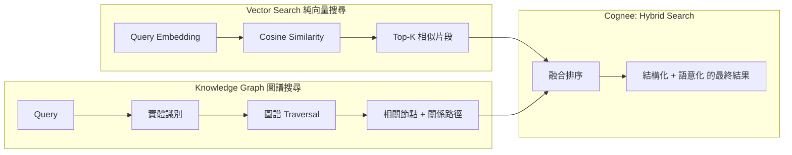

兩者並非互斥，而是互補：向量搜尋擅長「語意相近」的模糊比對，知識圖譜擅長「精確關聯」的結構推理。Cognee 的設計哲學是兩者疊加成 Hybrid Search，而非二選一（詳見第五章 5.x 節）。

### AI Agent Memory Evolution

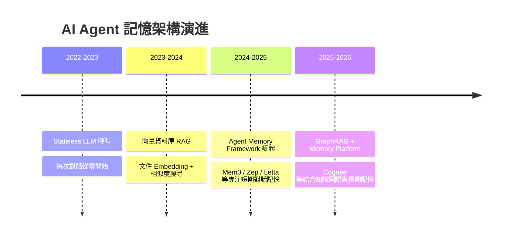

> **企業導入提醒**：Cognee 目前仍屬快速迭代階段（API 曾有 v0.x → v1.0 的破壞性改版），若專案時程緊迫、團隊無法承擔 API 變動風險，建議先以非核心模組（內部知識助理、Side Project）試點，並將版本鎖定在 requirements/lockfile 中明確釘住，而非直接綁定於對外主力產品的關鍵路徑。

---

## 第一章 Cognee 介紹

### 1.1 核心特色

1. **三層儲存架構（Three-Layer Storage）**：官方文件將 Cognee 的儲存拆為 Relational Store（追蹤文件、chunk、來源脈絡）、Vector Store（語意 embedding）、Graph Store（實體與關係）。三者可以全部落在同一個 PostgreSQL 實例（搭配 pgvector 與 Cognee 自家的 Postgres graph 實作），也可以分開部署到 Neo4j、Qdrant 等專用資料庫（詳見第六章）。
2. **DataPoint / Task / Pipeline 三段式建構元件**：這是 Cognee 內部最基礎的抽象——DataPoint 是「會變成圖節點的結構化資料單元」，Task 是「對資料做轉換/抽取的處理單元」，Pipeline 是「把多個 Task 串成流水線」的編排層。理解這三個概念，才能真正看懂第三章的 ECL Pipeline 與第十章的自訂 Pipeline 開發。
3. **`remember` / `recall` / `forget` / `improve` 四動詞 API（v1.0+）**：相較於早期版本的 `add()` + `cognify()` + `search()`，新版 API 把「記憶」的動詞語意化，降低一般應用工程師的學習門檻（詳見第三章、第十章）。
4. **原生 MCP Server**：官方提供 `cognee/cognee-mcp` Docker image，支援 HTTP／SSE／stdio 三種 transport，讓 Claude Code、Cursor、Continue、Cline 等任何支援 MCP 的工具都能直接把 Cognee 當作記憶後端（詳見第十一章）。
5. **多元 Agent Framework 整合**：LangGraph、CrewAI、Google ADK、Strands、OpenAI Agent SDK、Hermes Agent 等主流 Agent 框架皆有官方整合範例（詳見第十二～十四章）。
6. **可觀測性內建**：原生支援 OpenTelemetry，可對接任何 OTLP 相容後端做 tracing（詳見第二十四章）。

### 1.2 優缺點分析

| 面向 | 優點 | 缺點 / 風險 |
| --- | --- | --- |
| 架構完整度 | 三層儲存 + 圖譜 + 向量原生整合，不需自行拼接多套系統 | 元件多，初期學習曲線比單純向量資料庫陡峭 |
| 自架能力 | 全部元件皆可地端部署，資料主權完全掌握在企業手上 | 地端部署需要自行維運 PostgreSQL / Neo4j 等多個有狀態服務，維運成本不可忽視 |
| API 穩定性 | v1.0 後 API 語意化、易懂 | 專案仍在快速迭代（v0.x → v1.0 曾有破壞性改版），企業導入需鎖定版本 |
| 生態整合 | MCP、LangGraph、CrewAI、Claude Code 等整合齊全 | 部分整合（如 Google ADK、Strands）文件相對精簡，實務落地需自行補測試 |
| 推理能力 | 知識圖譜天生適合多跳推理，優於純向量 RAG | Cognify（實體/關係抽取）依賴 LLM，抽取品質與成本會隨文件量線性甚至超線性成長 |
| 社群成熟度 | GitHub 星數與活躍度高（27.9k ★，8,600+ commits） | 相較 Neo4j GraphRAG、LlamaIndex 等，企業級案例公開分享仍偏少，需自行累積內部最佳實務 |

### 1.3 適用情境與不適用情境

**適用情境：**

- 需要跨 session 記住使用者偏好、對話脈絡的客服 / 內部知識助理 Agent
- 企業內部知識庫具有明顯的「實體 - 關係」結構（組織架構、系統相依關係、專案脈絡），單純向量搜尋難以還原關聯
- AI Coding Assistant（Claude Code、GitHub Copilot）需要跨 session 記住架構決策、程式碼慣例、Bug 修復歷史
- 資料主權要求高、必須自架（On-Premise）部署的金融、政府、醫療產業

**不適用或需謹慎評估的情境：**

- 純粹的一次性問答系統，沒有跨 session 記憶需求（單純向量 RAG 即已足夠，不需引入圖譜的額外複雜度）
- 團隊沒有餘力維運 PostgreSQL / Neo4j 等有狀態服務，且無法採用 Cognee Cloud 代管方案
- 對 API 穩定性要求極高、無法承受版本迭代風險的關鍵路徑系統
- 純結構化資料（如標準關聯式資料庫報表查詢）——這類場景傳統 SQL / BI 工具通常比知識圖譜更直接有效

### 1.4 與其他記憶方案的定位差異（前導）

| 方案類型 | 代表 | 核心定位 |
| --- | --- | --- |
| 短期對話記憶框架 | Mem0、Zep、Letta | 專注對話層的短期/中期記憶管理，多數不強調自架知識圖譜 |
| 純 GraphRAG 函式庫 | Neo4j GraphRAG、Microsoft GraphRAG | 提供圖譜建構與查詢能力，但通常不含完整的「記憶生命週期」（remember/forget/improve）語意 |
| 通用 RAG 框架 | LlamaIndex、Haystack | 泛用資料連接與檢索框架，知識圖譜只是眾多檢索策略之一 |
| Cognee | — | 同時具備「記憶生命週期 API」+「原生知識圖譜」+「三層儲存」+「MCP/Agent Framework 整合」，定位更接近完整記憶平台而非單一函式庫 |

完整的逐項比較表請見第二十九章。

### 1.5 FAQ

**Q1：Cognee 是向量資料庫嗎？**
不是。Cognee 是建構在向量資料庫、圖資料庫、關聯式資料庫之上的「記憶編排層」，它可以選用 pgvector、Qdrant 等作為底層向量儲存，但本身提供的是資料攝取、實體抽取、圖譜建構、混合檢索、記憶生命週期管理的完整流程。

**Q2：一定要用 PostgreSQL 嗎？**
不一定。官方套件安裝後**未設定任何環境變數時的實際零安裝預設值**是 `sqlite` + `lancedb` + `kuzu`（詳見第六、八章，已於官方 `.env.template` 查證），適合本機開發與小型應用；PostgreSQL（同時承擔 relational + vector + graph 三種角色）則是官方與社群實務上最常見的**生產環境建議組合**，需要在 `.env` 中顯式指定，並非套件安裝後自動套用的預設值，兩者不要混為一談。

**Q3：Cognee 與 LangChain／LlamaIndex 衝突嗎？**
不衝突，且經常互補。Cognee 可以作為 LangGraph（LangChain 生態的一部分）Agent 的記憶工具（`add_tool` / `search_tool`），也可以單獨作為資料攝取與檢索後端提供給任何自訂 RAG pipeline 使用。

**Q4：Cognee Cloud 與自架開源版本的費用差異？**
自架開源版本（`pip install cognee`）本身免費、無需註冊帳號，僅需自行負擔 LLM Token 成本與基礎設施費用。若採用官方代管的 **Cognee Cloud**（platform.cognee.ai），查證當下（來源：cognee.ai/pricing 行銷網站，非 docs 文件子網域，企業導入前務必再次核實）分為三層：**Free**（每月 100 萬 token、1 個 workspace，無需信用卡）、**Standard**（每百萬 token 2.5 美元，每增加一個 workspace 加收 5 美元／月，支援 Slack／Notion／Google Drive 等資料來源連接器）、**Enterprise**（客製報價，提供 BYOC〔Bring Your Own Cloud〕與 SLA 保證）。金融、政府等高合規產業若選擇自架路線，這筆費用會轉換為自行維運 PostgreSQL／Neo4j 等基礎設施的人力與硬體成本，兩種模式的總體擁有成本（TCO）需個別估算比較，不能只看表面訂閱費用。

### 1.6 注意事項

- Cognee 的 Cognify（實體/關係抽取）階段需要呼叫 LLM，這代表**每一次資料攝取都有 Token 成本**，不是免費的本地索引，企業導入前務必先做成本估算（詳見第二十三章）。
- v1.0 前後的 API 破壞性改版意味著：**若你的專案是基於較舊版本教學文件學習的，務必重新核對官方最新 API**，本手冊以 v1.3.0 系列為準。

### 1.7 企業案例（概覽）

某金融科技公司的內部維運知識助理專案，將過去三年的 Runbook、Incident Postmortem、架構決策紀錄（ADR）匯入 Cognee，建立起「事件 → 根因 → 修復方式 → 負責系統」的知識圖譜。值班工程師遇到新告警時，Agent 能透過圖譜 traversal 找出「歷史上類似告警的根因與修復步驟」，而非僅靠關鍵字或語意相似度做模糊比對。完整案例分析見第二十八章。

### 1.8 Checklist：導入前自我評估

- [ ] 是否有明確的跨 session 記憶需求（而非單次問答即可滿足）？
- [ ] 企業資料是否有明顯的實體 - 關係結構，值得投入知識圖譜建模？
- [ ] 團隊是否有能力維運 PostgreSQL / Neo4j 等有狀態服務，或已規劃使用代管方案？
- [ ] 是否已估算 Cognify 階段的 LLM Token 成本？
- [ ] 是否已鎖定 Cognee 版本並規劃升級策略，以因應快速迭代的 API？

---

## 第二章 整體架構

### 2.1 Architecture Overview

Cognee 的整體架構可以由下往上理解為五層：Storage Layer（實際落地儲存）、Graph/Vector Layer（結構化與語意化索引）、Knowledge Layer（DataPoint / 實體 / 關係 / Ontology）、Memory Layer（remember/recall/forget/improve 生命週期語意）、API/整合 Layer（Python SDK、CLI、MCP Server、Agent Framework 整合）。

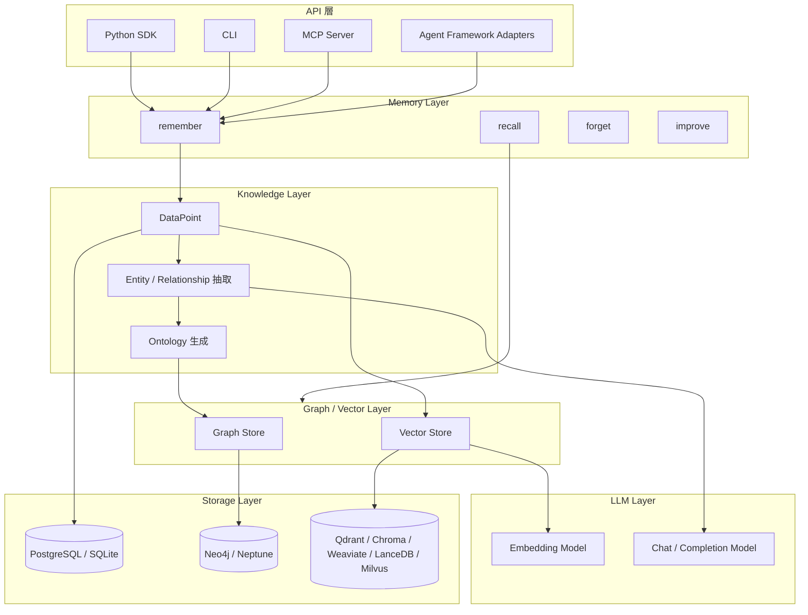

### 2.2 各層職責說明

| 層級 | 職責 | 對應章節 |
| --- | --- | --- |
| API / 整合層 | 提供 Python SDK、CLI、MCP Server、Agent Framework Adapter 等多種存取方式 | 第九～十六章 |
| Memory Layer | 定義記憶生命週期語意：新增（remember）、查詢（recall）、刪除（forget）、精煉（improve） | 第四章 |
| Knowledge Layer | 把原始資料轉換為 DataPoint，再抽取實體、關係，並可生成 Ontology（本體論結構） | 第五章 |
| Graph / Vector Layer | 承載結構化圖譜（節點/邊）與語意向量索引，支援 Hybrid Search | 第五、六章 |
| Storage Layer | 實際落地的資料庫（PostgreSQL、Neo4j、Qdrant 等） | 第六章 |
| LLM Layer | 負責 Embedding 生成與 Cognify 階段的實體/關係抽取推理 | 第八、二十三章 |
| Retrieval Layer | 橫跨 Graph/Vector Layer 之上的混合檢索邏輯，決定何時走圖譜、何時走向量 | 第五章 |

### 2.3 Task / Pipeline / DataPoint：三個最基礎的抽象

- **DataPoint**：可以想成「準備要變成圖節點的結構化資料單元」，帶有內容（content）與 metadata（來源、時間戳、scope 等）。
- **Task**：對 DataPoint 做轉換的最小處理單元，例如「切分文件」「抽取實體」「產生 embedding」都各自是一個 Task。
- **Pipeline**：把多個 Task 依序（或平行）串接成一條處理流水線，例如「Extract → Cognify → Load」就是一條典型 Pipeline。

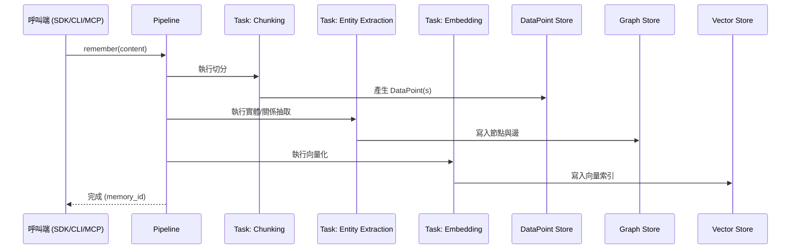

### 2.4 架構設計思維：為何拆這麼多層？

企業導入時常見的疑問是「為什麼不直接向量資料庫 + Prompt 硬做就好？」。分層架構的價值在於**關注點分離（Separation of Concerns）**：

1. Storage Layer 抽換不影響 Knowledge Layer 的抽取邏輯（例如從 SQLite 換到 PostgreSQL 生產環境，不需重寫 Pipeline）。
2. Knowledge Layer 與 Memory Layer 分離，讓「知識怎麼被結構化」與「記憶生命週期怎麼被管理」可以獨立演進——這也是 v0.x 到 v1.0 能夠在不改變底層 Pipeline 架構的前提下，重新設計出更好用的 `remember`/`recall` API 的原因。
3. API/整合層可以任意擴充（新增一個 Agent Framework Adapter），而不需要改動底層儲存與知識抽取邏輯。

### 2.5 Best Practice

- 生產環境建議固定使用 PostgreSQL 作為 Relational + Vector（pgvector）的統一底座，降低跨資料庫一致性維運負擔；圖譜需求量大、查詢複雜時再評估獨立 Neo4j。
- 針對不同資料來源（文件、對話、程式碼）建議建立不同的 dataset/scope，避免所有記憶混在單一命名空間中，導致 `forget` 時難以精準刪除。

### 2.6 Anti Pattern

- ❌ **把 Cognee 當純向量資料庫用**：只呼叫 `remember` 塞資料，從不利用圖譜 traversal 或 Hybrid Search，等於花了知識圖譜的維運成本卻只拿到向量搜尋的效果。
- ❌ **所有環境（開發/測試/生產）共用同一個 dataset**：測試資料污染生產記憶圖譜，且難以清理。

### 2.7 FAQ

**Q：DataPoint、Node、Chunk 是同一個東西嗎？**
不完全是。Chunk 是文件切分後的原始片段，DataPoint 是 Chunk（或其他來源資料）經過封裝後、準備進入 Pipeline 處理的結構化單元，Node 則是 DataPoint 經過 Cognify 階段的實體抽取後，最終落地到 Graph Store 的圖節點。三者是資料在 Pipeline 中依序轉換的不同階段型態。

---

## 第三章 ECL Pipeline

### 3.1 ECL 是什麼：歷史脈絡與現況

Cognee 最初、也是至今核心概念上最重要的資料處理框架，是 **ECL：Extract（萃取）→ Cognify（認知化）→ Load（載入）**。這個命名本身就是對傳統資料工程 ETL（Extract-Transform-Load）的致敬與延伸——差別在於 Cognee 把中間的 Transform 替換成 **Cognify**，強調「不是單純的格式轉換，而是讓 LLM 對資料做語意理解、抽取實體與關係、建構知識結構」的認知化過程。

必須特別說明的是：**查證當下（2026-07-15）的官方文件站已不再以「ECL」作為主要對外行銷詞彙**，v1.0 之後的高階 API 是語意化的 `remember()` / `recall()` / `forget()` / `improve()` 四個動詞，官方 `cognee-cli` 文件明確稱之為「新工作流程的首選介面」。但 ECL 所描述的三段式處理邏輯，**在底層 Pipeline 架構中依然完整存在**——`remember()` 呼叫時，內部依然是「Extract 原始內容 → Cognify 抽取實體關係 → Load 寫入 Graph/Vector Store」的流程，只是這個流程被封裝進更易用的高階動詞底下。與 ECL 對齊的 `add()`/`cognify()`/`search()` 三段式 Core API **並未被移除**，官方將其標註為 legacy commands 保留使用（詳見第十章 10.1 節）。理解 ECL，等於理解 `remember()` 背後實際發生了什麼事，這對除錯、效能調校、自訂 Pipeline 都至關重要。

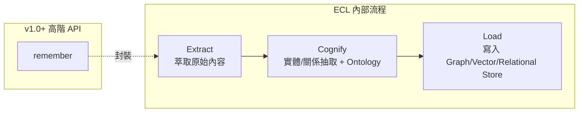

### 3.2 Extract：資料如何流入

Extract 階段負責把各種來源格式（PDF、Markdown、程式碼、資料庫紀錄、對話訊息、圖片等）統一轉換為 Cognee 可處理的原始內容單元。企業實務上常見的資料來源與對應處理策略：

| 資料來源 | 常見處理方式 | 注意事項 |
| --- | --- | --- |
| 文件（PDF/Word/Markdown） | 文字抽取 + 結構保留（標題階層） | 掃描版 PDF 需先過 OCR，否則抽取為空 |
| 程式碼庫 | 依檔案/函式為單位切分，保留檔案路徑作為 metadata | 大型 Monorepo 建議先依模組拆批匯入，避免單次 Pipeline 過重 |
| 對話紀錄 | 依 session_id 分組，保留時間戳與角色（user/assistant） | 需注意 PII（個資）遮罩，詳見第二十二章 |
| 資料庫紀錄 | 透過 dlt（data load tool）等連接器批次匯入 | 建議先做欄位篩選，避免把敏感欄位整表匯入知識圖譜 |

### 3.3 Cognify：資料如何變成知識圖譜

Cognify 是整個 ECL 中最「重」的一步，也是 LLM Token 成本主要發生的地方，主要包含：

1. **Entity Extraction（實體抽取）**：辨識文字中的人物、系統、專案、概念等具名實體。
2. **Relationship Extraction（關係抽取）**：判斷實體之間的關係（例如「服務 A 依賴服務 B」「工程師 X 負責模組 Y」）。
3. **Embedding 生成**：為抽取出的實體、關係、原始片段生成向量表示，供後續語意相似度檢索使用。
4. **Ontology 生成（可選）**：將抽取出的實體/關係進一步歸納為更高層次的概念分類體系（本體論），提升跨文件的知識一致性。

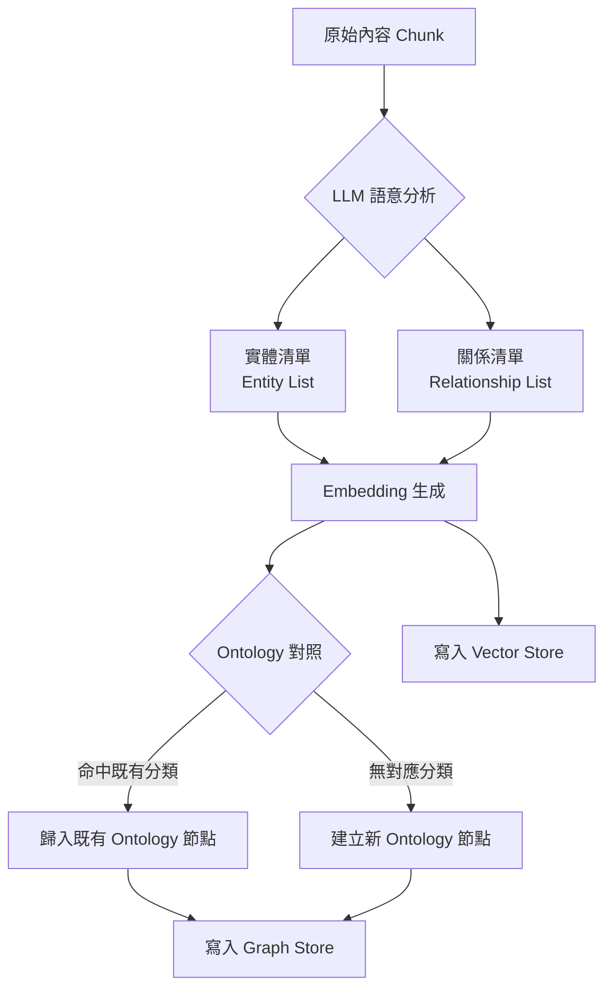

> **📌 版本更新（v1.3.0）**：Ontology 生成除了讓 LLM 自動歸納既有分類體系，官方也已開放**顯式匯入既有本體論**：CLI 與 Python API 皆支援指定 RDF／SPARQL 格式的外部 Ontology 檔案（CLI 對應 `--ontology-file` 旗標，詳見第九章），並支援匯出既有圖譜的 Ontology 供跨專案重用。對於已有明確產業本體論（如金融業的 FIBO、醫療業的 SNOMED CT）的企業，這代表可以直接接軌既有本體論標準，而不需完全仰賴 LLM 從零推斷分類體系，也呼應第五章 5.8 節「核心領域 Ontology 應人工審核」的建議——顯式匯入是比事後審核更根本的品質控制手段。

### 3.4 Load：知識圖譜建立流程

Load 階段把 Cognify 產出的實體、關係、Embedding 分別寫入對應的儲存後端：實體與關係成為 Graph Store 中的節點與邊，Embedding 寫入 Vector Store，而原始內容與來源脈絡（provenance）則保留在 Relational Store，供之後追溯「這個知識是從哪份文件、哪次對話得來的」。

### 3.5 Context Building 與 Memory Building

- **Context Building（上下文建構）**：在 `recall` 查詢時，Cognee 不是只回傳單一最相似的節點，而是會沿著圖譜關係擴展出「與查詢相關的子圖」，組成更完整的上下文再交給 LLM 生成回答，這是它相較純向量 RAG 的核心優勢。
- **Memory Building（記憶建構）**：`improve` 操作允許把新資訊與既有記憶做合併、修正或補強，而不是單純疊加新節點造成知識圖譜膨脹、矛盾並存。

### 3.6 效能建議

- Cognify 階段是 LLM 呼叫密集區，建議**批次（batch）處理**而非逐筆呼叫 `remember`，並視 LLM Provider 的 rate limit 調整並行度（詳見第二十三章）。
- 大型文件匯入前先評估切分粒度：切太細會增加 LLM 呼叫次數與成本，切太粗會降低實體抽取的精準度，需依實際文件類型（技術文件 vs. 對話紀錄）調校。

### 3.7 Best Practice

- 對於高重複性的內部文件（如標準 Runbook 模板），可以先用小規模樣本測試 Cognify 抽取品質，確認實體/關係抽取符合預期後再大批量匯入，避免一次性花費大量 Token 卻得到低品質的知識圖譜。

### 3.8 Anti Pattern

- ❌ **把 ECL 誤解為一次性 ETL Job**：ECL 是可以持續增量執行的記憶建構流程，不是傳統資料倉儲那種「跑一次、產出報表就結束」的批次工作。
- ❌ **忽略 Ontology 一致性**：長期不檢視 Ontology 生成結果，容易讓同一概念在圖譜中出現多個命名不一致的節點（例如「客戶」與「Customer」被視為不同實體），降低檢索召回率。

### 3.9 企業案例

某製造業客戶將設備維修紀錄（半結構化 Excel）與工程師的維修心得（自由文字）一併匯入 ECL Pipeline。透過自訂 Extract 階段的欄位對應，讓「設備型號」「故障代碼」被明確標記為實體，Cognify 階段便能穩定抽取出「設備型號 → 故障代碼 → 修復方式」的關係鏈，後續新進工程師可透過 `recall` 直接查到類似故障的歷史修復路徑，大幅縮短平均故障排除時間（MTTR）。

### 3.10 Checklist

- [ ] 是否已確認資料來源的 Extract 策略（尤其 PII 遮罩、敏感欄位篩選）？
- [ ] Cognify 的 LLM 呼叫是否已評估 Token 成本並設定批次策略？
- [ ] 是否定期檢視 Ontology 一致性，避免同義實體重複建立？
- [ ] 是否理解 `remember()` 高階 API 與底層 ECL 流程的對應關係，以利除錯？

---

## 第四章 Memory Architecture

### 4.1 記憶分層總覽

Cognee 的記憶架構可以對應到認知科學常見的記憶分類方式來理解，但**必須清楚區分「官方明確定義的分層」與「概念性延伸類比」**——避免把類比誤讀為官方保證的架構規格：

| 記憶類型 | 官方對應概念 | 說明 |
| --- | --- | --- |
| Session Memory（已查證） | Relational Store 中的 session-scoped 快取 | 依 `session_id` 隔離的短期上下文，非同步同步進永久圖譜 |
| Permanent Graph（已查證） | Graph Store | 跨 session 持久保存的實體/關係知識 |
| Vector Memory（已查證） | Vector Store | 語意 embedding，支援相似度檢索 |
| Metadata（已查證） | Relational Store 中的 provenance 資訊 | 記錄知識來源、時間戳、scope 等脈絡 |
| Working Memory（概念性延伸） | Pipeline 執行過程中的暫存狀態 | 非官方正式分層名詞，此處借用認知科學詞彙描述 Pipeline 執行期間的暫存資料，企業導入時不應假設有獨立可設定的「Working Memory」API |
| Semantic / Episodic Memory（概念性延伸） | 知識圖譜中的概念節點 vs. 帶時間戳的事件節點 | Cognee 不強制區分這兩種記憶型態，但企業可以透過 DataPoint 的 metadata 設計（例如標記 `type: concept` vs `type: event`）自行實作這種語意分層 |

### 4.2 Long-term Memory 如何運作

長期記憶對應到 Graph Store + Vector Store 的持久化組合。當呼叫 `remember()` 時，內容經過 ECL Pipeline 處理後，實體與關係寫入 Graph Store，向量寫入 Vector Store，兩者共同構成可長期查詢的記憶資產，不會因程序重啟、session 結束而消失。

### 4.3 Session / Working Memory 如何運作

Session Memory 是「SQL-based 的快取層」，設計目的是讓同一個對話 session 內的高頻互動不需要每次都重新走一次完整的圖譜查詢，而是先命中快取，並**非同步（asynchronously）**同步進永久圖譜。這個設計對高併發客服場景特別關鍵：即時互動走快取，長期知識沉澱走圖譜，兩者解耦。

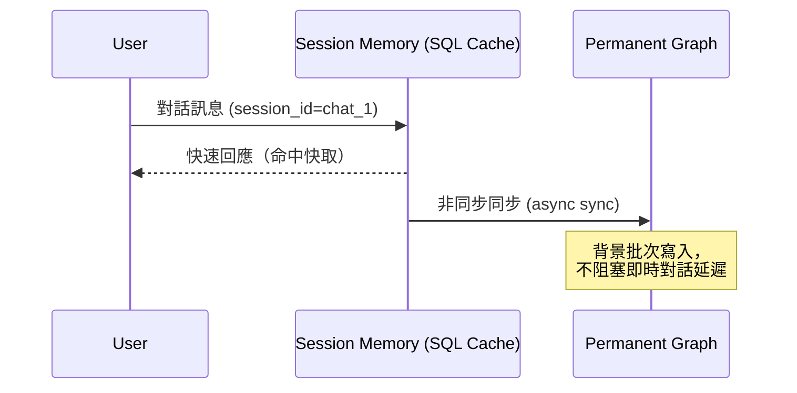

### 4.4 記憶如何查詢：recall

`recall()` 是查詢記憶的統一入口，官方定位為「自動選擇最佳檢索策略」——依查詢內容特性，自動決定要走向量相似度、圖譜 traversal，還是兩者混合。企業實務上仍建議針對關鍵查詢場景做 A/B 測試，驗證自動路由策略是否符合預期，必要時透過參數顯式指定檢索策略（詳見第十章）。

### 4.5 記憶如何更新：improve

`improve()` 讓既有記憶可以被「精煉」而非單純疊加。實務情境包括：使用者糾正了先前記錄的錯誤資訊、新文件補充了既有實體的更多細節、多個來源對同一事實有衝突需要合併判斷。這是 Cognee 相較單純「append-only」向量索引的重要差異——長期不做 `improve` 的知識圖譜會隨時間累積矛盾節點，檢索品質逐漸劣化。

> **📌 版本更新（v1.2.0–v1.2.2）**：`improve()` 近期新增兩項機制值得企業關注：
>
> 1. **Auto-distill（自動萃取）**：`improve()` 可自動將 Session Memory 中累積的對話內容萃取重點、去除雜訊後橋接進 Permanent Graph，降低人工判斷「哪些內容值得精煉」的負擔，也強化了 4.3 節提到的 Session→Graph 非同步同步機制的品質。
> 2. **"Truth Subspace" 檢索重排序 + 回饋權重**：新版引入以「真值子空間（truth subspace）」為基礎的檢索結果重排序，並支援 `DEFAULT_FEEDBACK_INFLUENCE` 環境變數（opt-in），讓使用者對檢索結果的回饋（例如標記某次 `recall` 結果有幫助／無幫助）可以反向影響後續同類查詢的排序權重。企業導入時建議先在非核心 dataset 試行回饋權重機制，確認回饋來源可信（避免惡意或誤觸回饋污染排序）後，再擴大到核心知識圖譜。

### 4.6 記憶如何刪除：forget

`forget()` 支援依 dataset、scope、時間範圍等維度刪除記憶，這對合規場景（GDPR「被遺忘權」、企業內部資料保留政策）是必要能力。刪除時需注意：**圖譜中的節點若被多筆來源共同支撐，刪除單一來源不一定會立即刪除節點本身**，需理解底層的 provenance 追蹤機制，避免「以為刪除了、實際上關聯節點仍殘留」的誤判。

### 4.7 安全性建議

- 對於高敏感 session（如客服對話中出現的身分證字號、信用卡卡號），建議在 Extract 階段就做 PII 遮罩或標記，而非期待 `forget` 事後補救。
- `forget --all` 或大範圍刪除操作應比照「資料庫 DROP TABLE」等級的操作，納入雙人覆核（Two-Person Rule）與操作紀錄稽核。

### 4.8 維護建議

- 定期（例如每季）執行知識圖譜健檢：檢查孤立節點（無任何邊連接）、重複實體（同義詞未歸併）、過期事實（已被新資訊取代但未被 `improve` 更新的舊節點）。

### 4.9 Best Practice

- 將「使用者可自行請求刪除」的個資類記憶，設計成獨立的 dataset/scope，確保 `forget` 操作範圍精準、不誤刪其他知識。

### 4.10 Anti Pattern

- ❌ **把所有記憶都當長期記憶處理**：高頻、低價值的即時互動也全部寫入永久圖譜，會讓圖譜迅速膨脹且充斥雜訊，應善用 Session Memory 做前置緩衝。
- ❌ **從未呼叫 `improve`，只靠反覆 `remember` 疊加新事實**：長期會導致同一實體上掛滿彼此矛盾的關係，檢索結果不穩定。

### 4.11 FAQ

**Q：Working Memory 有獨立的 API 可以設定容量或 TTL 嗎？**
沒有官方公開的獨立 API。如第 4.1 節所述，這是概念性延伸描述，實務上 Session Memory（可設定同步策略）與 Pipeline 執行期暫存是最接近的對應機制，建議以官方文件實際參數為準，不要預設存在「Working Memory 專屬設定」。

### 4.12 企業案例

某零售企業的客服 Agent 導入 Session Memory + Permanent Graph 分層設計：同一通對話內的追問（如「剛剛說的那個訂單」）由 Session Memory 快速解析上下文代名詞，對話結束後才非同步彙整進客戶的長期知識圖譜（購買偏好、歷史客訴類型）。相較於「每句話都寫回永久圖譜」的樸素設計，對話延遲降低，且永久圖譜的雜訊節點大幅減少。

### 4.13 Checklist

- [ ] 是否已規劃哪些互動走 Session Memory、哪些沉澱進 Permanent Graph？
- [ ] 是否已針對 PII／敏感資料設計獨立 dataset 以利精準 `forget`？
- [ ] 是否有定期知識圖譜健檢機制（孤立節點、重複實體、過期事實）？
- [ ] `forget --all` 等高風險操作是否已納入雙人覆核與稽核紀錄？

---

## 第五章 Knowledge Graph

### 5.1 Graph Database 基礎概念

知識圖譜由 **Node（節點，代表實體）** 與 **Edge（邊，代表關係）** 構成。Cognee 的圖譜可以落地在自家的 Postgres graph 實作，也可以落地在專用圖資料庫 Neo4j／Neptune（詳見第六章）。企業導入時，選擇何種 Graph Store 直接影響查詢效能與可維運性，而非只是「哪個比較潮」的技術選型問題。

### 5.2 Nodes、Edges、Entity、Relationship

| 概念 | 說明 | 範例 |
| --- | --- | --- |
| Entity（實體） | 具名的、可辨識的物件 | 「訂單服務」「王小明」「PostgreSQL 15」 |
| Relationship（關係） | 兩個實體之間的具名連結 | 「訂單服務 —依賴→ 庫存服務」 |
| Node（節點） | 實體在圖資料庫中的實際落地表示 | 對應 Entity 的 Graph Store 記錄 |
| Edge（邊） | 關係在圖資料庫中的實際落地表示，通常帶方向與型別 | 對應 Relationship 的 Graph Store 記錄 |

### 5.3 Traversal 與 Graph Query

Graph Traversal（圖譜遍歷）是沿著邊從一個節點走訪到相鄰節點的操作，這是知識圖譜能做「多跳推理」的根本機制。以「找出王小明所屬團隊負責的所有系統」為例，需要走訪「王小明 → 所屬團隊 → 團隊負責系統」兩跳關係，這種查詢用純向量相似度幾乎無法穩定達成，但圖譜 traversal 是原生能力。

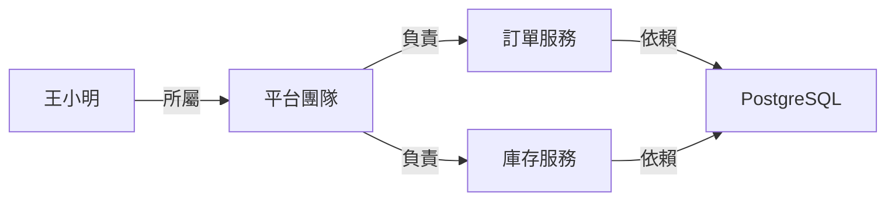

### 5.4 Graph Search、Semantic Search、Vector Search

| 檢索方式 | 原理 | 適用場景 |
| --- | --- | --- |
| Vector Search | 計算 Query Embedding 與內容 Embedding 的相似度 | 模糊語意比對，如「找相關文件」 |
| Semantic Search | 廣義詞，常指結合語意理解（而非純字面比對）的檢索，Cognee 中多以向量相似度為基礎實作 | 同 Vector Search，但強調語意而非關鍵字 |
| Graph Search | 從指定實體出發，沿關係做結構化查詢 | 「找出 X 的所有下屬」「找出依賴 Y 服務的所有系統」等結構性問題 |
| Hybrid Search | 融合前述多種策略的排序結果 | 大多數企業實務查詢，兼顧語意模糊比對與結構精確關聯 |

### 5.5 GraphRAG 與 Knowledge Graph RAG

GraphRAG 泛指「以知識圖譜作為檢索增強生成（RAG）的檢索來源」這一類技術路線的統稱，Cognee 是其中一種具體實作。與傳統 Chunk-based RAG 相比，GraphRAG 的核心優勢在於：檢索結果不再是孤立的文字片段，而是「片段 + 其結構化上下文（相關實體與關係）」，讓 LLM 在生成回答時有更完整的推理依據。

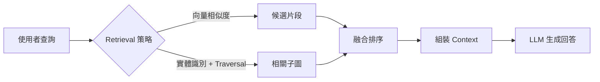

### 5.6 效能建議

- 圖譜查詢的效能瓶頸多半出現在**過深的 traversal 跳數**（例如超過 3-4 跳），實務上建議在 Ontology 設計階段就控制關係鏈的深度，或針對高頻查詢路徑建立快取。
- Neo4j 等專用圖資料庫在大規模、高複雜度查詢下通常優於通用型 Postgres graph 實作，資料量與查詢複雜度成長到一定規模後應評估遷移。

### 5.7 安全性建議

- 圖譜查詢介面若開放給終端使用者（例如透過 Agent 的自然語言查詢），需注意 **Query Injection** 風險——惡意輸入是否可能被誘導組出超出授權範圍的圖譜查詢，建議在 Retrieval 層加上明確的 scope/tenant 隔離檢查，而非僅依賴 LLM「自律」。

### 5.8 Best Practice

- 針對企業核心領域（如組織架構、系統相依關係），建議手動定義或審核初始 Ontology，而非完全交給 LLM 自動生成，避免核心知識結構因 LLM 判斷不穩定而反覆變動。

### 5.9 Anti Pattern

- ❌ **無限深度 traversal 查詢，未設定跳數上限**：容易在稠密圖譜中造成查詢時間爆炸性成長（Combinatorial Explosion）。
- ❌ **完全依賴自動 Ontology 生成，從未人工審核**：核心業務實體的命名/分類會隨 LLM 抽取結果漂移，長期造成圖譜品質不穩定。

### 5.10 FAQ

**Q：Hybrid Search 的融合排序邏輯可以自訂嗎？**
Cognee 提供高階自動路由（`recall` 的自動策略選擇），若需要自訂融合權重或排序邏輯，建議透過 Python API 直接組裝自訂 Pipeline（詳見第十章），而非期待單一參數就能覆蓋所有企業客製需求。

### 5.11 企業案例

某保險公司將理賠案件、保單條款、核保規則匯入知識圖譜，建立「保單條款 → 適用險種 → 歷史理賠案例」的關係網。核保人員查詢新案件時，Agent 能透過 Graph Traversal 找出條款層面相關聯的歷史案例，輔助判斷是否符合理賠條件，相較人工逐條翻閱條款手冊大幅提升效率，也降低因遺漏相關條款導致的核保爭議。

### 5.12 Checklist

- [ ] 是否已針對核心業務實體設計/審核 Ontology，而非完全依賴自動生成？
- [ ] 高頻查詢路徑是否已評估 traversal 深度並設定合理上限？
- [ ] 圖譜查詢介面是否已加上 scope/tenant 隔離，避免 Query Injection 風險？
- [ ] 資料規模成長後，是否已規劃 Graph Store 從通用型遷移至專用圖資料庫的評估時機？

---

## 第六章 Storage

### 6.1 支援的 Storage 總覽

| 類型 | 支援選項 | 官方查證狀態 |
| --- | --- | --- |
| Relational / Cache | PostgreSQL、SQLite、Redis | 已於官方文件查證 |
| Vector Store | pgvector、LanceDB（零安裝內建預設）、Qdrant、ChromaDB、Weaviate、Milvus、AWS Neptune Analytics | 已於官方文件查證 |
| Graph Store | Kuzu（零安裝內建預設，嵌入式）、Neo4j、AWS Neptune（部分整合指南提及，導入前建議再核對原始碼）、FalkorDB（社群 adapter） | 已於官方 `.env.template` 與文件查證 |
| 零安裝預設組合 | `DB_PROVIDER=sqlite` + `VECTOR_DB_PROVIDER=lancedb` + `GRAPH_DATABASE_PROVIDER=kuzu` | 官方套件安裝後未設定任何環境變數時的實際預設值，適合本機開發／PoC |
| 生產環境推薦組合 | PostgreSQL 同時承擔 Relational + Vector（pgvector）角色，Graph 視規模選用 PostgreSQL 自家實作或獨立 Neo4j | 官方與社群實務常見的生產環境建議堆疊（需顯式於 `.env` 設定，不會自動套用） |

### 6.2 各 Storage 優缺點與適用情境

| Storage | 優點 | 缺點 | 適用情境 |
| --- | --- | --- | --- |
| SQLite | 零安裝、單檔案、適合快速原型 | 不支援高併發寫入、無法橫向擴展 | 本機開發、PoC、單機小型應用 |
| PostgreSQL（+ pgvector） | 一套資料庫同時處理三種角色，維運複雜度低，生態成熟 | 圖譜查詢效能在超大規模、深度 traversal 場景不如專用圖資料庫 | 多數企業生產環境的預設首選 |
| Neo4j | 專為圖查詢優化，Cypher 查詢語言成熟，社群與工具鏈完整 | 需額外維運一套獨立服務，授權模式（企業版）需評估成本 | 圖譜規模大、查詢複雜度高、需要進階圖演算法（如社群偵測）的場景 |
| AWS Neptune | 全代管，與 AWS 生態整合佳，免除自行維運圖資料庫的負擔 | 綁定 AWS 生態，跨雲遷移成本高 | 已深度採用 AWS 的企業 |
| Qdrant / Milvus / Weaviate / ChromaDB / LanceDB | 專用向量資料庫，各自在效能、擴展性、部署形式上有不同取捨（例如 LanceDB 為 embedded 型態） | 需額外維運獨立向量服務（LanceDB 除外），與 Relational/Graph Store 資料一致性需自行保證 | 向量檢索量體極大、或已有既定向量資料庫技術選型的企業 |

### 6.3 企業選型建議

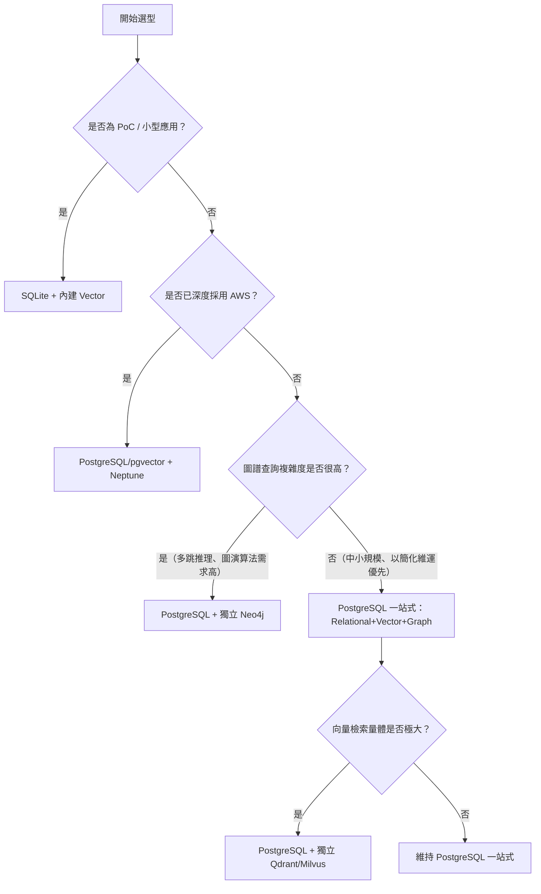

### 6.4 Memory Storage 與快取層

Session Memory 所使用的 SQL 快取層，實務上建議與主要 Relational Store 分開評估效能隔離——高頻讀寫的 Session 快取若與知識圖譜的批次寫入共用同一個資料庫實例，可能在流量尖峰時互相拖累，中大型部署建議將 Session 快取獨立到 Redis 或獨立的 PostgreSQL 連線池。

### 6.5 效能建議

- pgvector 的索引策略（IVFFlat vs HNSW）需依資料規模與查詢延遲要求調整，資料量成長後未調整索引策略是常見的效能劣化原因。
- Neo4j 的記憶體設定（Page Cache、Heap Size）需依圖譜規模調校，預設值多數情況下不適合生產環境大型圖譜。

### 6.6 安全性建議

- 資料庫連線資訊（DB_PASSWORD 等）務必透過密鑰管理服務（Vault、AWS Secrets Manager 等）注入，不可寫死於 `.env` 並提交進版控（詳見第二十二章）。
- 多租戶（Multi-tenant）場景務必在 Storage 層設計租戶隔離（獨立 schema 或獨立資料庫實例），避免僅靠應用層邏輯做隔離導致資料外洩風險。

### 6.7 維護建議

- 定期備份 Graph Store 與 Vector Store，並演練還原流程——知識圖譜一旦累積數月甚至數年的企業知識，其重建成本（重新跑一次全量 Cognify）可能遠高於單純資料庫還原。

### 6.8 Best Practice

- 生產環境初期建議從「PostgreSQL 一站式」起步，只有在實際觀測到圖譜查詢效能瓶頸或向量檢索量體大幅成長時，才逐步拆分到專用 Neo4j / Qdrant，避免過早最佳化（Premature Optimization）帶來的額外維運負擔。

### 6.9 Anti Pattern

- ❌ **開發環境用 SQLite、生產環境臨時才發現需要遷移到 PostgreSQL，卻未事先規劃資料遷移腳本**。
- ❌ **多租戶應用共用同一個 Graph Store 命名空間，僅靠應用層 `WHERE tenant_id = ?` 過濾**，一旦查詢邏輯有漏洞就是嚴重的資料外洩事故。

### 6.10 FAQ

**Q：可以同時使用多種 Vector Store 嗎？例如一部分資料用 Qdrant、一部分用 pgvector？**
架構上 Cognee 透過 Provider 設定決定使用哪一種 Vector Store，同一個 Cognee 實例通常設定單一 Vector Store Provider；若企業需要依資料類型分流不同向量資料庫，建議透過部署多個獨立的 Cognee 實例（不同 `.env` 設定）並在應用層做路由，而非期待單一實例原生支援多 Provider 並存。

### 6.11 企業案例

某大型零售集團初期以 SQLite 快速驗證 Cognee PoC，驗證可行後遷移至 PostgreSQL（pgvector + 自家 graph）作為生產環境統一底座；半年後隨商品知識圖譜規模成長至千萬級節點，圖譜查詢延遲明顯上升，才進一步將 Graph Store 拆分至獨立 Neo4j 叢集，Vector Store 維持在 pgvector（因向量檢索量體尚未達到需要獨立向量資料庫的規模）。此漸進式演進路徑避免了專案初期就過度投資基礎設施。

### 6.12 Checklist

- [ ] 是否已依「PoC / 生產環境」「資料規模」「是否深度採用特定雲」選擇合適的 Storage 組合？
- [ ] 多租戶場景是否已在 Storage 層設計隔離，而非僅依賴應用層邏輯？
- [ ] 是否已規劃資料庫密鑰的安全注入方式，避免明文寫入版控？
- [ ] 是否已建立 Graph/Vector Store 的定期備份與還原演練機制？
- [ ] 是否已設定隨資料規模成長的效能監控指標，作為後續拆分/升級 Storage 的觸發依據？

---

## 第七章 Installation

### 7.1 系統需求

- Python 3.11 以上（官方套件與 `uv`／`pip` 皆以此為基準）
- 若需要 Docker 部署：Docker Engine 24+ 與 Docker Compose v2
- 生產環境建議：PostgreSQL 15+（若採用 pgvector 需另裝該擴充套件）

### 7.2 macOS / Linux 安裝（uv / pip）

```bash
# 建議使用 uv（比 pip 快，官方 quickstart 首選）
uv pip install cognee

# 需要 PostgreSQL 支援時安裝對應 extras
pip install "cognee[postgres]"
```

### 7.3 Windows / WSL 安裝

Windows 原生環境可直接使用上述 `uv pip install cognee` 或 `pip install cognee`；若專案同時仰賴需要編譯原生擴充套件的向量/圖資料庫 driver（例如部分 `kuzu`、`lancedb` 版本），建議改用 **WSL2 + Ubuntu** 執行，可避免 Windows 原生環境常見的原生依賴編譯失敗問題，這與多數 Python AI 生態（PyTorch、FAISS 等）的建議做法一致。

```powershell
# Windows PowerShell：建立虛擬環境
python -m venv .venv
.venv\Scripts\Activate.ps1
pip install cognee
```

### 7.4 Virtual Environment / Poetry

Cognee 官方文件表明相容 `pip`、`poetry`、`uv` 或任何慣用的 Python 套件管理工具，沒有強制綁定特定工具鏈。企業內部若已有標準化的 Python 套件管理規範（例如統一用 Poetry 管理 lockfile），可直接將 `cognee` 加入既有 `pyproject.toml`：

```toml
[tool.poetry.dependencies]
cognee = { version = "^1.3", extras = ["postgres"] }
```

### 7.5 Docker / Docker Compose 安裝

**從原始碼以 Docker Compose 啟動（推薦用於本機完整體驗）：**

```bash
git clone https://github.com/topoteretes/cognee.git
cd cognee
cp .env.template .env   # 編輯 .env，至少設定 LLM_API_KEY
docker compose up       # API Server 啟動於 http://localhost:8000
```

**依需求啟用額外 Profile：**

```bash
docker compose --profile ui up        # 啟動前端 Workspace UI
docker compose --profile mcp up       # 啟動 MCP Server
docker compose --profile postgres up  # 啟動 Postgres / PGVector
docker compose --profile neo4j up     # 啟動 Neo4j
```

**使用官方預建映像檔（不需 clone 原始碼）：**

```bash
docker run --env-file ./.env -p 8000:8000 cognee/cognee:main
docker run -e TRANSPORT_MODE=http --env-file ./.env -p 8000:8000 cognee/cognee-mcp:main
```

### 7.6 Podman

官方文件目前聚焦於 Docker / Docker Compose 情境，未見獨立的 Podman 專屬文件。企業若因合規要求必須使用 Podman 而非 Docker，實務上可利用 Podman 的 Docker CLI 相容模式（`podman-docker` 套件或 `alias docker=podman`）直接沿用上述 `docker run` / `docker compose` 指令，惟需自行驗證 rootless 模式下的 volume mount 權限行為，這部分**屬於概念性延伸建議，非官方明文保證**，正式導入前務必在測試環境完整驗證。

### 7.7 安裝驗證

```bash
python -c "import cognee; print(cognee.__version__)"
```

或透過 CLI 確認：

```bash
cognee-cli --version
```

### 7.8 Best Practice

- CI/CD 環境建議固定 `cognee` 版本（例如 `cognee==1.3.0`）而非使用浮動版本號，避免上游 API 破壞性變更（v0.x → v1.0 曾發生過）在未預期的情況下中斷 Pipeline。
- 本機開發建議搭配 `docker compose --profile ui up` 啟用 Workspace UI，能直接視覺化檢視知識圖譜建構結果，加速除錯。

### 7.9 Anti Pattern

- ❌ **生產環境直接使用 `docker compose up`（不指定 profile、使用預設 SQLite）**：預設組態通常僅適合開發／PoC，生產環境務必明確設定 PostgreSQL 等生產級 Storage（詳見第六、八章）。

### 7.10 Checklist

- [ ] Python 版本是否符合 3.11+ 需求？
- [ ] 是否已依團隊標準選定 uv / pip / poetry 其中一種套件管理方式並統一？
- [ ] Windows 環境是否已評估改用 WSL2 避免原生依賴編譯問題？
- [ ] 是否已鎖定 `cognee` 版本號，避免上游破壞性更新影響 CI/CD？
- [ ] 是否已完成安裝驗證（`import cognee` 或 `cognee-cli --version`）？

---

## 第八章 Configuration

### 8.1 Environment Variables 總覽

Cognee 透過環境變數（或 `.env` 檔）驅動幾乎所有組態，以下依用途分類整理（已於官方文件 `docs.cognee.ai/setup-configuration` 查證，2026-07-15）：

**LLM Provider：**

| 變數 | 說明 | 預設值 |
| --- | --- | --- |
| `LLM_PROVIDER` | LLM 供應商，支援 `openai`／`azure`／`gemini`／`anthropic`／`ollama`／`mistral`／`bedrock`／`custom` | `openai` |
| `LLM_MODEL` | 模型代號，格式為 `provider/model-name` | `openai/gpt-5-mini` |
| `LLM_API_KEY` | LLM API 金鑰 | — |
| `LLM_ENDPOINT` | 自訂端點（Ollama／vLLM 必填） | — |
| `LLM_API_VERSION` | API 版本（Azure 必填） | — |
| `LLM_TEMPERATURE` | 生成溫度，範圍 0.0–2.0 | `0.0` |

**Embedding：**

| 變數 | 說明 | 預設值 |
| --- | --- | --- |
| `EMBEDDING_PROVIDER` | 支援 `openai`／`ollama`／`fastembed`／`gemini`／`mistral`／`bedrock`／`custom` | `openai` |
| `EMBEDDING_MODEL` | Embedding 模型代號 | `openai/text-embedding-3-large` |
| `EMBEDDING_DIMENSIONS` | 向量維度，須與 Vector Store 設定相符 | `3072` |
| `EMBEDDING_API_KEY` | 未設定時 fallback 至 `LLM_API_KEY` | — |
| `EMBEDDING_BATCH_SIZE` | 批次處理大小 | — |

**Vector / Graph / Relational Database：**

| 變數 | 說明 | 預設值 |
| --- | --- | --- |
| `VECTOR_DB_PROVIDER` | 內建：`lancedb`／`pgvector`／`chromadb`／`neptune_analytics`；社群 adapter：`qdrant`／`redis`／`falkordb` | `lancedb` |
| `GRAPH_DATABASE_PROVIDER` | `kuzu`／`kuzu-remote`／`neo4j`／`falkordb`（社群 adapter，另有 `neptune` 見於部分整合指南，正式採用前建議再核對原始碼） | `kuzu`（Cognee 內建的嵌入式圖引擎，直接查證官方 `.env.template` 原始檔確認） |
| `DB_PROVIDER` | 關聯式資料庫：`sqlite`／`postgres` | `sqlite` |

> **⚠️ 重要澄清**：Cognee 的預設組態（`lancedb` + `kuzu` + `sqlite`）是**針對零安裝快速上手優化的組合**，`kuzu` 是 Cognee 內建的嵌入式圖引擎（非需要另外部署的獨立服務；官方 `.env.template` 中 `GRAPH_DATABASE_PROVIDER` 的預設值即為 `"kuzu"`）。這與部分行銷文案強調的「單一 PostgreSQL 承擔三種角色」屬於**另一種生產環境建議組態**，兩者並不矛盾，但企業導入時務必明確在 `.env` 中顯式指定 `DB_PROVIDER=postgres`、`VECTOR_DB_PROVIDER=pgvector`、`GRAPH_DATABASE_PROVIDER=neo4j`（或維持 Postgres 圖實作，依第六章選型建議），不要依賴預設值直接上生產環境。

**Storage & Logging：**

| 變數 | 說明 | 預設值 |
| --- | --- | --- |
| `STORAGE_BACKEND` | `local`／`s3` | `local` |
| `DATA_ROOT_DIRECTORY` | 使用者資料落地路徑 | `.data_storage` |
| `LOG_LEVEL` | `DEBUG`／`INFO`／`WARNING`／`ERROR` | `INFO` |
| `COGNEE_LOG_FILE` | 是否輸出檔案型日誌 | — |

**Security / Access Control：**

| 變數 | 說明 |
| --- | --- |
| `ENABLE_BACKEND_ACCESS_CONTROL` | 是否啟用後端存取控制 |
| `REQUIRE_AUTHENTICATION` | 是否強制要求認證 |
| `FASTAPI_USERS_JWT_SECRET` | JWT 簽章密鑰 |
| `JWT_LIFETIME_SECONDS` | JWT 有效期 |
| `ALLOW_CYPHER_QUERY` | 是否允許直接執行 Cypher 查詢（高風險，詳見第二十二章） |

**Session / Cache：**

| 變數 | 說明 | 預設值 |
| --- | --- | --- |
| `CACHING` | 是否啟用 Session 快取 | `true` |
| `CACHE_BACKEND` | `fs`／`redis`／`tapes` | `fs` |
| `SESSION_TTL_SECONDS` | Session 過期秒數 | `604800`（7 天） |

### 8.2 範例：生產環境 PostgreSQL 組態

```bash
# .env（生產環境範例）
LLM_PROVIDER=openai
LLM_MODEL=openai/gpt-5-mini
LLM_API_KEY=${LLM_API_KEY}

EMBEDDING_PROVIDER=openai
EMBEDDING_MODEL=openai/text-embedding-3-large
EMBEDDING_DIMENSIONS=3072

DB_PROVIDER=postgres
DB_HOST=cognee-db.internal
DB_PORT=5432
DB_USERNAME=cognee
DB_PASSWORD=${DB_PASSWORD}

VECTOR_DB_PROVIDER=pgvector
GRAPH_DATABASE_PROVIDER=neo4j
GRAPH_DATABASE_URL=bolt://cognee-neo4j.internal:7687
GRAPH_DATABASE_USERNAME=neo4j
GRAPH_DATABASE_PASSWORD=${GRAPH_DATABASE_PASSWORD}

CACHE_BACKEND=redis
CACHE_HOST=cognee-redis.internal

LOG_LEVEL=INFO
ENABLE_BACKEND_ACCESS_CONTROL=true
REQUIRE_AUTHENTICATION=true
```

### 8.3 Configuration Files 與程式碼內設定

除了環境變數，也可以在 Python 程式碼中動態設定（適合多租戶、需要依請求切換設定的場景）：

```python
import os
os.environ["LLM_API_KEY"] = "YOUR_OPENAI_API_KEY"
os.environ["DB_PROVIDER"] = "postgres"
```

### 8.4 安全性建議

- `LLM_API_KEY`、`DB_PASSWORD`、`GRAPH_DATABASE_PASSWORD`、`FASTAPI_USERS_JWT_SECRET` 等機敏變數，一律透過密鑰管理服務（Vault、AWS Secrets Manager、Kubernetes Secrets）注入執行環境，**禁止**明文寫入 `.env` 並提交進版控。
- `ALLOW_CYPHER_QUERY` 若無明確需求應維持關閉，開放直接 Cypher 查詢等同開放對圖資料庫的低階存取通道，是常見的權限過度授予（Over-Privilege）風險點。
- `REQUIRE_AUTHENTICATION` 在任何對外暴露的部署（非純本機開發）都應設為 `true`。

### 8.5 效能建議

- `EMBEDDING_DIMENSIONS` 與 Vector Store 實際索引維度必須一致，中途調整 Embedding 模型（改變維度）需要重建整個向量索引，務必在專案初期就審慎決定 Embedding 模型，避免後期大規模遷移成本。
- `CACHE_BACKEND` 在高併發場景建議由預設 `fs`（檔案系統）切換為 `redis`，避免檔案系統 I/O 成為 Session 快取的效能瓶頸。

### 8.6 Best Practice

- 依環境（dev / staging / prod）分別維護獨立的 `.env` 檔案（或對應的 Secrets 命名空間），並在 CI/CD Pipeline 中明確驗證關鍵變數（如 `DB_PROVIDER`、`REQUIRE_AUTHENTICATION`）在生產環境部署前已被正確覆寫，而非沿用開發預設值。

### 8.7 Anti Pattern

- ❌ **生產環境直接沿用預設 `kuzu` + `sqlite` + `lancedb` 組合**：對單機小型應用可行，但缺乏高併發寫入與水平擴展能力，企業級生產環境應顯式切換至 PostgreSQL/Neo4j 等組合。
- ❌ **多環境共用同一組 `LLM_API_KEY`**：無法個別追蹤/限制各環境的 Token 用量與成本，也提高金鑰外洩時的影響範圍。

### 8.8 FAQ

**Q：`kuzu` 是什麼？跟 Postgres graph 實作是什麼關係？**
`kuzu` 是 Cognee 內建的嵌入式（embedded）圖資料庫引擎（[Kùzu](https://kuzudb.com/) 為獨立開源嵌入式圖資料庫專案，Cognee 將其作為零外部依賴的預設選項），適合快速上手與小型應用；若企業選擇以 PostgreSQL 承擔 Graph 角色，則是另一條路徑，兩者是 `GRAPH_DATABASE_PROVIDER` 底下不同的可選值，並非同一套實作，選型時請依第六章的規模與維運考量決定。

### 8.9 Checklist

- [ ] 所有機敏變數是否已透過密鑰管理服務注入，而非明文寫在 `.env` 版控？
- [ ] 生產環境是否已明確覆寫 `DB_PROVIDER`／`VECTOR_DB_PROVIDER`／`GRAPH_DATABASE_PROVIDER`，而非沿用預設值？
- [ ] `REQUIRE_AUTHENTICATION` 與 `ENABLE_BACKEND_ACCESS_CONTROL` 是否已在對外部署中啟用？
- [ ] `EMBEDDING_DIMENSIONS` 是否與實際 Vector Store 索引設定一致？
- [ ] 是否已依 dev/staging/prod 分離組態，並於 CI/CD 中驗證？

---

## 第九章 CLI

### 9.1 指令總覽

`cognee-cli` 是官方提供的命令列工具，核心指令對應第三、四章介紹的記憶生命週期語意：

```bash
cognee-cli remember "Cognee turns documents into AI memory."
cognee-cli recall "What does Cognee do?"
cognee-cli improve
cognee-cli forget --all
cognee-cli -ui  # 啟動本地 Workspace UI（需要 Docker）
```

> **📌 API 分層說明**：官方 `cognee-cli` 文件明確將 `remember`／`recall`／`improve`／`forget` 稱為「新工作流程的首選介面（preferred interface for new workflows）」，而對應第十章 Core API 的 `add`／`cognify`／`search`／`delete` 則被官方明確標註為 **legacy commands**——保留可用，但非新專案建議的起點。這呼應第十章 10.1 節的兩層 API 說明，企業新專案建議優先採用 Memory 語意指令。

### 9.2 常用參數與範例

| 指令 | 用途 | 範例 |
| --- | --- | --- |
| `cognee-cli remember "<內容>"` | 將內容寫入記憶（未指定 session 時直接進永久圖譜） | `cognee-cli remember "王小明負責訂單服務"` |
| `cognee-cli remember "<內容>" --session-id <id>` | 寫入指定 Session 的短期快取 | `cognee-cli remember "使用者偏好英文回覆" --session-id chat_42` |
| `cognee-cli recall "<查詢>"` | 查詢記憶，自動路由檢索策略 | `cognee-cli recall "誰負責訂單服務"` |
| `cognee-cli improve` | 觸發記憶精煉（auto-distill／合併矛盾事實，詳見第四章 4.5） | `cognee-cli improve --dataset project_web_app` |
| `cognee-cli forget --dataset <name>` | 刪除指定 dataset 的記憶 | `cognee-cli forget --dataset legacy_docs_2024` |
| `cognee-cli forget --all` | 清空所有記憶（高風險操作） | — |
| `cognee-cli cognify --ontology-file <path>` | 執行 Cognify 時顯式指定外部 RDF/SPARQL Ontology 檔案（詳見第三章 3.3） | `cognee-cli cognify --ontology-file ./ontologies/fibo.rdf` |
| `cognee-cli config list` / `get <key>` / `set <key> <value>` / `unset <key>` | 查詢或調整本地儲存的 CLI 組態（等同於部分第八章環境變數的 CLI 介面） | `cognee-cli config set DB_PROVIDER postgres` |
| `cognee-cli --api-url <url>` | 將指令委派至遠端 Cognee Server（而非操作本機資料），適合團隊共用中央部署 | `cognee-cli --api-url https://cognee.internal recall "..."` |
| `cognee-cli -ui` | 啟動本地 Workspace UI，可視覺化瀏覽知識圖譜 | — |
| `cognee-cli --version` | 顯示版本號 | — |

### 9.3 CLI 在 CI/CD 中的應用

企業可將 `cognee-cli remember` 整合進文件發布流程，例如在內部技術文件（架構決策紀錄 ADR、Runbook）合併進主分支時，透過 CI Pipeline 自動呼叫 CLI 將新文件寫入企業知識圖譜，確保知識庫與文件庫同步演進，而非仰賴人工另行匯入：

```yaml
# .github/workflows/sync-knowledge.yml（示意）
- name: Sync ADR into Cognee
  run: |
    cognee-cli remember "$(cat docs/adr/${{ github.event.head_commit.id }}.md)" \
      --dataset architecture_decisions
```

### 9.4 Best Practice

- 將高風險指令（`forget --all`、`forget --dataset <生產核心 dataset>`）獨立封裝為需要額外確認旗標或人工核准的內部腳本，避免誤觸。
- CLI 適合輕量整合（CI Hook、Shell Script），複雜的批次處理、自訂 Pipeline 邏輯建議改用第十章的 Python API，取得更完整的錯誤處理與型別檢查能力。

### 9.5 Anti Pattern

- ❌ **在無人值守的排程任務中直接呼叫 `forget --all`**：應改用有明確 scope 的 `forget --dataset <name>`，降低誤刪範圍。

### 9.6 Checklist

- [ ] 是否已確認 CLI 版本與 Python SDK 版本一致（避免行為不一致）？
- [ ] 高風險指令是否已限制執行權限或加上二次確認機制？
- [ ] CI/CD 中呼叫 CLI 的流程是否已妥善保護 `LLM_API_KEY` 等機敏變數？

---

## 第十章 Python API

### 10.1 兩層 API：Core API 與 Memory API

如第三章所述，Cognee 目前並存兩層公開 API，企業導入時應清楚選擇適合場景的層級：

| 層級 | 核心函式 | 特性 | 適合場景 |
| --- | --- | --- | --- |
| Core API（ECL 對齊，官方明確標註為 legacy） | `cognee.add()`、`cognee.cognify()`、`cognee.search()`、`cognee.prune()` | 對 Pipeline 各階段有明確控制權，可拆分執行、除錯；官方文件保留其可用性，但已不作為新專案的建議起點 | 需要自訂 Pipeline 行為、精細控制 Cognify 階段的進階場景 |
| Memory API（v1.0+，高階、新工作流程首選） | `cognee.remember()`、`cognee.recall()`、`cognee.forget()`、`cognee.improve()` | 語意化、易懂，內部自動完成 add+cognify+load | 一般應用開發、快速整合 |

> **⚠️ 精確度澄清**：Core API 並未被移除或棄用（deprecated），而是官方 `cognee-cli` 文件明確將其標註為 **legacy commands**——意即「保留可用、持續維護，但非新專案建議的預設起點」。企業若既有系統已大量使用 Core API，不需要因此感到急迫的遷移壓力；但新專案建議優先評估 Memory API 是否已能滿足需求。

### 10.2 Core API 範例

```python
import cognee
import asyncio

async def main():
    # 1. Extract：將資料加入待處理佇列
    await cognee.add("Cognee 是一套開源 AI 記憶平台。", dataset_name="intro")

    # 2. Cognify：執行實體/關係抽取、建構知識圖譜
    await cognee.cognify(datasets=["intro"])

    # 3. 檢索：依 SearchType 選擇檢索策略
    results = await cognee.search(
        query_text="Cognee 是什麼？",
        query_type="GRAPH_COMPLETION",  # 亦可用 RAG_COMPLETION / CHUNKS / CODE
    )
    for r in results:
        print(r)

    # 清空記憶（測試環境常用）
    await cognee.prune.prune_data()
    await cognee.prune.prune_system()

asyncio.run(main())
```

### 10.3 Memory API 範例

```python
import cognee
import asyncio

async def main():
    await cognee.remember("Cognee turns documents into AI memory.")
    await cognee.remember("User prefers detailed explanations.", session_id="chat_1")

    results = await cognee.recall("What does Cognee do?")
    for result in results:
        print(result)

    await cognee.forget(dataset="main_dataset")

asyncio.run(main())
```

### 10.4 SearchType 一覽

| SearchType | 說明 |
| --- | --- |
| `GRAPH_COMPLETION` | 結合完整圖譜上下文的 LLM 推理式問答，適合需要多跳推理的查詢 |
| `RAG_COMPLETION` | 傳統以文件 chunk 為基礎的 RAG 問答 |
| `CHUNKS` | 純語意相似度搜尋，回傳具體文字片段 |
| `CODE` | 針對程式碼結構與邏輯的專用檢索模式 |

### 10.5 雲端模式：cognee.serve()

需要連接團隊共用的 Cognee Cloud 或自架中央後端時：

```python
await cognee.serve(url="https://instance.cognee.ai", api_key="ck_...")
```

### 10.6 REST API Server 模式

除了 Python SDK 與第九章的 CLI，官方文件站（`docs.cognee.ai/api-reference`）另外記載了一套**獨立的 REST API**，適合非 Python 技術棧（例如 Java／Spring Boot 後端）直接整合 Cognee，而不需要透過 Python Process 呼叫。

| 端點 | 用途 |
| --- | --- |
| `POST /api/v1/add` | 上傳/新增內容至指定 dataset（對應 Core API 的 `add()`） |
| `POST /api/v1/cognify` | 觸發 Cognify Pipeline（對應 `cognify()`） |
| `POST /api/v1/search` | 執行檢索查詢（對應 `search()`／`recall()`） |
| `DELETE /api/v1/datasets` | 刪除指定 dataset（對應 `forget()`／`delete_dataset`） |

**認證模式依部署型態而異**：

- **Cognee Cloud**：透過 `X-Api-Key` Header 傳遞 API Key。
- **自架版本**：透過 JWT Bearer Token，需先設定第八章的 `REQUIRE_AUTHENTICATION=true`，並呼叫 `/api/v1/auth/register`、`/api/v1/auth/login` 取得 Token。

```bash
# 自架版本：先登入取得 JWT，再呼叫 REST API
curl -X POST https://cognee.internal/api/v1/auth/login \
  -d '{"email":"svc-account@company.com","password":"..."}'

curl -X POST https://cognee.internal/api/v1/search \
  -H "Authorization: Bearer <JWT_TOKEN>" \
  -d '{"query_text":"訂單服務由誰負責","query_type":"GRAPH_COMPLETION"}'
```

對於 Java／Spring Boot 為主要技術棧的企業（本手冊的核心讀者群之一），REST API 是比「另外維運一套 Python 服務」更輕量的整合路徑：後端服務可直接以標準 HTTP Client（`RestClient`／`WebClient`）呼叫，不需要引入 Python 執行環境。企業導入前務必以 `docs.cognee.ai/api-reference` 當下版本為準，端點路徑與參數可能隨版本調整。

### 10.7 效能建議

- `cognify()` 支援指定 `datasets` 參數分批執行，大型資料集務必分批呼叫，避免單次 Pipeline 執行時間過長、失敗時難以定位是哪個子集出錯。
- 高併發應用中，`add()`／`remember()` 建議搭配非同步佇列（Celery、RQ 或雲端 Queue 服務）而非在請求處理路徑中同步等待 Cognify 完成，因為 Cognify 涉及 LLM 呼叫，延遲不可忽視。

### 10.8 安全性建議

- `query_text` 若直接來自使用者輸入且會被組進 `search()` 呼叫，需注意提示注入（Prompt Injection）風險，尤其在 `GRAPH_COMPLETION` 模式下，惡意查詢可能誘導 LLM 生成超出預期範圍的圖譜遍歷行為，建議在應用層對查詢加上長度與內容過濾。
- REST API 若對外暴露，務必確認 JWT Token 的有效期與刷新機制符合企業資安政策，避免長效 Token 外洩後的風險窗口過大。

### 10.9 Best Practice

- 開發階段善用 `cognee.prune.prune_data()` / `prune_system()` 快速重置測試環境的知識圖譜狀態，避免測試資料污染累積。
- 針對需要長期維運的專案，建議將 Core API 呼叫封裝進企業內部的 Repository/Service 層，而不是讓 Cognee 的兩層 API 呼叫散落在各業務程式碼中，方便未來 API 版本升級時集中修改。

### 10.10 Anti Pattern

- ❌ **在單一請求-回應週期內同步呼叫 `cognify()` 後立即回傳結果**：Cognify 涉及 LLM 呼叫，同步等待會讓使用者面對數秒甚至數十秒的延遲，應改為非同步處理 + 輪詢/通知機制。
- ❌ **混用 Core API 與 Memory API 卻未釐清彼此的資料範疇**：例如用 `add()`+`cognify()` 寫入的資料，跟用 `remember()` 寫入的資料，若未妥善規劃 dataset 命名，容易搞不清楚該用哪一層 API 查詢。

### 10.11 FAQ

**Q：`remember()` 底層真的是呼叫 `add()` + `cognify()` 嗎？**
概念上是（詳見第三章 3.1 節的封裝關係說明），但實際內部實作細節（是否有額外最佳化、批次合併等）屬於 Cognee 內部實作，建議不要在企業程式碼中假設兩者行為完全等價，需要精細控制時仍應直接使用 Core API。

**Q：Python SDK、CLI、REST API 三者該選哪一個？**
三者是同一套後端能力的不同存取介面，非互斥關係：Python 應用建議直接用 SDK（型別檢查、錯誤處理最完整）；CI/CD Hook、Shell Script 適合用 CLI（第九章）；非 Python 技術棧（如 Java／Spring Boot 後端）或需要跨語言整合時，適合直接呼叫 REST API（10.6 節）。三者可以在同一企業內並存，只要共用同一個後端部署與一致的 dataset 命名規範即可。

### 10.12 企業案例

某 SaaS 平台的內部技術支援 Agent 採用「Core API 建構知識庫、Memory API 處理即時對話」的混合架構：技術文件、API 文件透過排程 Job 呼叫 `add()` + `cognify()` 批次匯入（可控制批次大小與重試邏輯），而客服對話則使用 `remember()` / `recall()` 處理即時互動，兩者共用底層 Graph Store 但透過不同 dataset 區隔，兼顧了批次匯入的穩定性與即時對話的開發便利性。

### 10.13 Checklist

- [ ] 是否已依場景明確選擇 Core API 或 Memory API，而非混用不清？
- [ ] `cognify()` 是否已規劃非同步處理機制，避免阻塞請求-回應週期？
- [ ] 是否已針對使用者輸入的查詢文字做適當的長度/內容過濾，降低 Prompt Injection 風險？
- [ ] API 呼叫是否已封裝進獨立的 Service/Repository 層，利於未來版本升級？
- [ ] 若採用 REST API，是否已確認自架版本的 JWT 認證流程與 Cognee Cloud 的 API Key 模式不會混用錯誤？

---

## 第十一章 MCP Integration

### 11.1 為何 MCP 是企業整合的核心樞紐

MCP（Model Context Protocol）是 Anthropic 提出、目前已成為多數 AI Coding 工具（Claude Code、Cursor、Continue、Cline 等）共通支援的開放協定，讓工具與資料源之間不需要各自客製整合程式碼。Cognee 提供官方 `cognee-mcp` Server，等於一次串接就能讓「任何支援 MCP 的 AI 工具」存取同一份企業知識圖譜，這是企業導入 Cognee 時最具槓桿效益的整合點——不需要為 Claude Code 寫一套整合、為 Cursor 再寫一套。

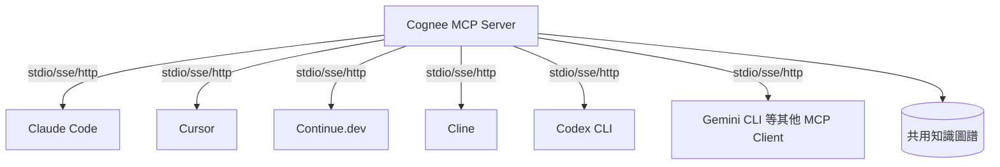

### 11.2 MCP Server 架構模式

Cognee MCP 支援兩種運作模式：

- **Standalone Mode**：自帶本地資料庫，無需外部後端，適合個人開發者或單一團隊小規模使用。
- **API Mode**：連接集中式 Cognee 後端，適合需要跨團隊共享知識圖譜的企業場景。

### 11.3 安裝與啟動

**從原始碼啟動（開發模式）：**

```bash
git clone https://github.com/topoteretes/cognee.git
cd cognee/cognee-mcp
pip install uv
uv sync --dev --all-extras --reinstall
source .venv/bin/activate
echo 'LLM_API_KEY="YOUR_OPENAI_API_KEY"' > .env
python src/server.py
```

**使用官方預建 Docker 映像（推薦用於企業部署）：**

```bash
docker pull cognee/cognee-mcp:main
echo 'LLM_API_KEY="YOUR_OPENAI_API_KEY"' > .env
docker run -e TRANSPORT_MODE=sse --env-file ./.env -p 8000:8000 --rm -it cognee/cognee-mcp:main
```

### 11.4 Transport 模式

| Transport | 啟動方式 | 適用場景 |
| --- | --- | --- |
| stdio（預設） | `python src/server.py` | 單機本地整合，MCP Client 直接透過子程序 stdio 溝通 |
| SSE | `python src/server.py --transport sse` | 需要串流回應、跨主機存取的場景 |
| HTTP | `python src/server.py --transport http --host 127.0.0.1 --port 8000 --path /mcp` | 官方建議用於 Web 情境，適合部署為企業內部共用服務 |

Docker 環境下請改用環境變數 `-e TRANSPORT_MODE=sse` 而非 CLI 旗標；Mac/Windows 上 API Mode 需連接 Docker 外部服務時使用 `host.docker.internal`，Linux 建議搭配 `--network host`。

### 11.5 MCP 工具清單（Tools Reference）

> **⚠️ 版本提醒**：MCP 工具清單隨 Cognee 版本迭代變動較快（v1.0 前後曾有一輪明顯改版）。以下依 `docs.cognee.ai/cognee-mcp/mcp-tools` 官方頁面直接查證的**當前（v1.3.0 系列）清單**為準，共 14 個工具，分為四類。若你參考的是較舊教學（例如仍列出 `add`、`codify`、`visualize_graph_ui`、`upload_file_ui`、`open_cognee_workspace` 等工具名稱），代表該教學對應的是官方改版前的舊清單，這些工具名稱在目前官方文件中已查無對應項目，企業導入前務必以官方當下頁面為準。

| 分類 | 工具 | 用途 |
| --- | --- | --- |
| 記憶管理（v1.0+ 高階） | `remember` | 將內容寫入 Session 快取或永久圖譜 |
| | `recall` | 自動路由檢索（先查 Session 快取、再查圖譜） |
| | `forget` | 依 dataset 刪除，或清空目前使用者的全部記憶 |
| | `improve` | 精煉既有知識圖譜／將 Session 記憶橋接進永久圖譜（含 auto-distill，詳見第四章 4.5） |
| 記憶管理（Core，低階） | `cognify` | 將已匯入的資料轉為結構化知識圖譜 |
| | `search` | 對知識圖譜執行明確指定策略的查詢（含 `GRAPH_COMPLETION` 等） |
| | `prune` | 重置本地 MCP 管理的記憶儲存 |
| 文件與 Chunk 查詢 | `get_document` | 取得來源文件本身與其對應的 chunk |
| | `get_chunk_neighbors` | 取得同一文件中相鄰的 chunk，用於補足上下文 |
| 互動沉澱 | `save_interaction` | 將使用者-助理互動保存，供後續處理為記憶或開發規則 |
| 資料管理 | `list_data` | 列出目前使用者的 dataset 與資料項目 ID（供刪除操作使用） |
| | `delete` | 刪除 dataset 中的特定資料項目 |
| | `delete_dataset` | 依名稱刪除整個 dataset |
| 執行狀態 | `cognify_status` | 查詢指定 dataset 目前/近期的 Cognify Pipeline 執行狀態 |

**與舊版的主要差異**：`add`（新增記憶物件）目前保留在 REST API（見第十章新增小節）與 CLI 的 legacy 指令中，但**未列在目前的 MCP 工具清單**；`codify`（程式碼專屬圖譜）與三個 Workspace UI 工具（`visualize_graph_ui`／`upload_file_ui`／`open_cognee_workspace`）在當前官方 MCP 文件中已查無對應項目，可視覺化操作建議改用第 7.5 節 `docker compose --profile ui up` 啟動的獨立 Workspace UI。

### 11.6 MCP Client 設定範例

**SSE 模式（Claude Desktop / Claude Code 風格設定，`~/.claude.json` 或對應 MCP 設定檔）：**

```json
{
  "mcpServers": {
    "cognee-sse": {
      "type": "sse",
      "url": "http://localhost:8000/sse"
    }
  }
}
```

**HTTP 模式：**

```json
{
  "mcpServers": {
    "cognee-http": {
      "type": "http",
      "url": "http://localhost:8000/mcp"
    }
  }
}
```

### 11.7 安全性建議

- API Mode 部署於企業內網時，務必設定 `REQUIRE_AUTHENTICATION=true`（第八章），避免內網任何人皆可透過 MCP 存取企業知識圖譜。
- `ALLOW_CYPHER_QUERY`（若使用 Neo4j）在 MCP Server 對外暴露時應關閉，防止透過自然語言誘導組出任意 Cypher 查詢。
- Docker 部署時避免將 MCP Server Port 直接暴露於公網，建議透過內網 VPN 或 Reverse Proxy + 認證層存取。

### 11.8 維護建議

- 定期檢視 `save_interaction` 累積產生的開發規則，防止規則庫隨時間膨脹出過時或彼此矛盾的內容（呼應第四章 `improve` 的必要性）。

### 11.9 Best Practice

- 企業內建議統一部署一個 API Mode 的中央 MCP Server，讓所有開發者的 Claude Code / Cursor 等工具連接同一個知識圖譜，而非每人各自跑 Standalone Mode——後者會導致知識分散、無法沉澱團隊共同記憶。

### 11.10 Anti Pattern

- ❌ **每位工程師各自在筆電跑 Standalone MCP Server**：知識圖譜停留在個人電腦，無法形成團隊資產，且離職/換機時知識直接遺失。

### 11.11 FAQ

**Q：MCP Server 與直接使用 Python API 有什麼差異？**
MCP Server 讓「不寫程式碼的 AI 工具」（如 Claude Code 的對話介面）也能存取 Cognee 記憶，本質上是把 Python/Core API 包裝成標準化的工具呼叫介面；若你在開發自己的後端服務，直接用 Python API（第十章）通常更直接、效能開銷更低。

### 11.12 Checklist

- [ ] 是否已決定採用 Standalone Mode 或 API Mode，並依團隊規模選擇？
- [ ] Transport 模式是否符合實際部署環境（本機 stdio / 內網 SSE / Web HTTP）？
- [ ] MCP Server 是否已設定認證，且未直接暴露於公網？
- [ ] 團隊是否已統一連接同一個中央 MCP Server，避免知識分散？

---

## 第十二章 LangGraph Integration

### 12.1 整合定位

Cognee 官方在 `cognee-integrations` repository 提供 `langgraph` 範例資料夾，核心整合方式是把 Cognee 包裝為 LangGraph Agent 可呼叫的工具（`add_tool` / `search_tool`），讓開發者用 `create_agent` 建構具備持久記憶的 Agent，而不需要手動管理 LangGraph 的 State/Checkpoint 邏輯來實作記憶。

### 12.2 Memory 與 Checkpoint 的分工

LangGraph 原生的 Checkpoint 機制負責「單次執行流程內的狀態保存與可恢復性（例如中斷後從某個 Node 續跑）」，這與 Cognee 負責的「跨對話、跨 session 的長期知識記憶」是互補而非重疊的兩層概念：

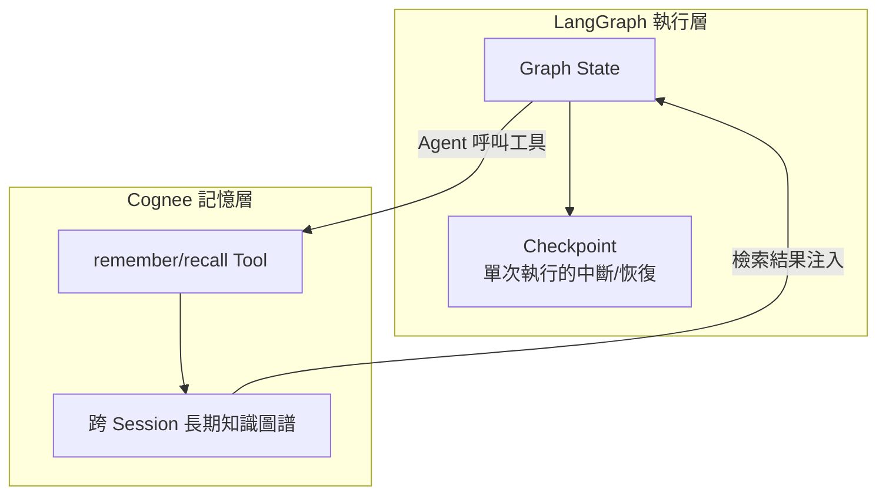

### 12.3 範例：具備長期記憶的 LangGraph Agent（概念性示範）

```python
from langgraph.prebuilt import create_agent
from cognee_langgraph import add_tool, search_tool  # 套件名稱請以 cognee-integrations repo 實際版本為準

agent = create_agent(
    model="anthropic:claude-sonnet-5",
    tools=[add_tool, search_tool],
    system_prompt="你是企業內部知識助理，遇到需要長期記憶的資訊請呼叫 add_tool 儲存，"
                  "回答問題前先呼叫 search_tool 檢索既有知識。",
)

result = agent.invoke({
    "messages": [{"role": "user", "content": "記住：訂單服務由平台團隊負責維護"}]
})
```

> ⚠️ 上述套件匯入路徑（`cognee_langgraph`）為示意性寫法，實際模組名稱、參數簽名請以 [topoteretes/cognee-integrations](https://github.com/topoteretes/cognee-integrations/tree/main/integrations/langgraph) 當下版本的範例程式碼為準，避免直接照抄本手冊程式碼上生產環境。

### 12.4 Agent State 與 Graph State 的知識注入策略

企業實務上常見的模式，是在 LangGraph 的每個關鍵 Node 進入前，先呼叫 Cognee `search_tool` 把相關企業知識注入 Agent State，再讓 LLM 基於補充後的上下文做決策，而非把知識檢索的責任完全交給 LLM 自行判斷「要不要查」。

### 12.5 Best Practice

- 將「何時該呼叫 Cognee 工具」的判斷邏輯，盡量透過明確的 System Prompt 規則或 Graph 路由邏輯控制，而非完全放任 LLM 自由決定，可提升行為的可預測性與可測試性。

### 12.6 Anti Pattern

- ❌ **把 Cognee 記憶工具當成 LangGraph Checkpoint 的替代品**：兩者職責不同，Checkpoint 負責流程可恢復性，Cognee 負責跨 session 知識記憶，混用會讓除錯時難以判斷問題出在哪一層。

### 12.7 企業案例

某物流企業以 LangGraph 建構多步驟的「異常包裹處理」Agent，透過 Cognee `search_tool` 在流程開始時檢索該包裹相關的歷史異常紀錄與處理慣例，Agent 據此決定後續路由（自動退貨 / 轉人工 / 補寄），相較純 LLM 判斷，錯誤路由率明顯下降，因為決策有結構化歷史知識支撐而非僅憑當次對話內容推測。

### 12.8 Checklist

- [ ] 是否已釐清 LangGraph Checkpoint 與 Cognee 記憶各自的職責邊界？
- [ ] 知識注入時機是否已透過明確規則控制，而非完全交由 LLM 自由決定？
- [ ] 整合套件版本是否已對照官方 `cognee-integrations` repo 當下版本核對？

---

## 第十三章 CrewAI Integration

### 13.1 整合定位

CrewAI 是強調「多角色協作（Multi-Agent Crew）」的 Agent 框架，Cognee 在此情境下的價值是提供 **Shared Crew Memory**——讓一個 Crew 內的多個 Agent（例如「研究員 Agent」「撰稿 Agent」「審核 Agent」）共享同一份知識圖譜，而不是各自維護獨立、彼此不通的記憶。

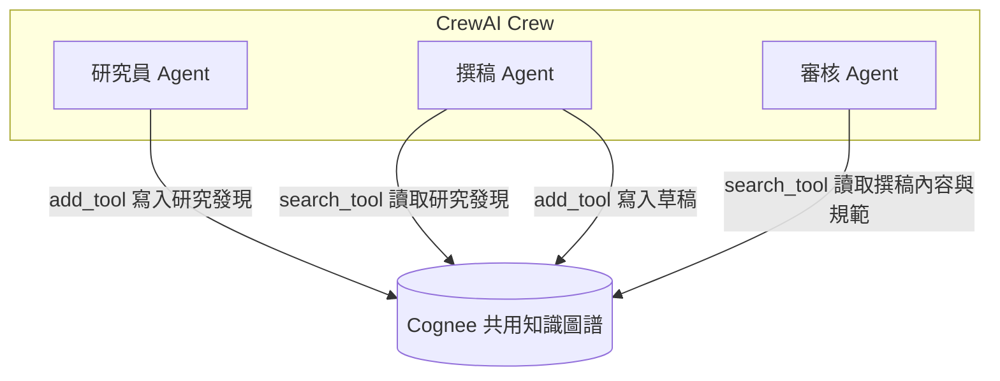

### 13.2 範例：Shared Memory 設定（概念性示範）

```python
from crewai import Agent, Crew, Task
from cognee_crewai import add_tool, search_tool  # 套件名稱請以 cognee-integrations repo 實際版本為準

researcher = Agent(
    role="研究員",
    goal="蒐集並記錄產業趨勢",
    tools=[add_tool, search_tool],
)

writer = Agent(
    role="撰稿人",
    goal="根據研究員的既有發現撰寫報告",
    tools=[search_tool],
)

crew = Crew(agents=[researcher, writer], tasks=[...])
crew.kickoff()
```

### 13.3 Multi-Agent 記憶設計要點

- **命名空間規劃**：建議依 Crew 或專案設定獨立 dataset，避免不同專案的 Crew 共享記憶造成知識污染。
- **寫入權限分工**：並非所有 Agent 角色都需要 `add_tool`（寫入權限），審核類 Agent 通常只需要 `search_tool`（唯讀），降低誤寫入風險。

### 13.4 安全性建議

- Multi-Agent 場景下若允許多個 Agent 皆具備寫入權限，務必透過 `save_interaction` 或自訂 metadata 記錄「哪個 Agent 在何時寫入了什麼」，確保知識圖譜的異動可追溯（Auditability）。

### 13.5 Best Practice

- 對高風險決策（如涉及財務、法遵的 Crew 任務），建議在審核 Agent 的 Task 中明確要求引用 Cognee 檢索到的具體知識來源，而非讓 LLM 憑空生成結論，提升決策可追溯性。

### 13.6 Anti Pattern

- ❌ **所有 Agent 角色皆授予無限制的寫入權限**：容易讓知識圖譜被低品質或錯誤的中間產物污染，且難以追責。

### 13.7 企業案例

某顧問公司使用 CrewAI 建構「產業研究報告生成 Crew」，研究員 Agent 將蒐集到的公開資料與內部歷史案例透過 `add_tool` 寫入 Cognee，撰稿 Agent 與審核 Agent 皆以唯讀方式 `search_tool` 存取這份共享知識，確保多次報告產出之間的用詞、數據引用具備一致性，而不會因為 Agent 各自「記憶斷片」而產生前後矛盾的報告內容。

### 13.8 Checklist

- [ ] 是否已依 Crew/專案規劃獨立的知識命名空間？
- [ ] 各 Agent 角色的讀寫權限是否已依職責最小化原則分配？
- [ ] 高風險決策 Task 是否已要求引用具體知識來源？

---

## 第十四章 Google ADK Integration

### 14.1 整合定位

Google ADK（Agent Development Kit）是 Google 推出的 Agent 開發框架，官方 `cognee-integrations` repo 提供 `google-adk` 範例資料夾。查證顯示 Cognee 與 ADK 的整合特別針對 **`LongRunningFunctionTool`**（ADK 用於處理非同步、耗時工具呼叫的機制）做原生支援，這與 Cognee `cognify()` 階段可能耗時數秒到數十秒的特性高度契合——避免同步等待阻塞 Agent 的事件迴圈。

### 14.2 Agent Memory 與 Tool Calling 整合模式

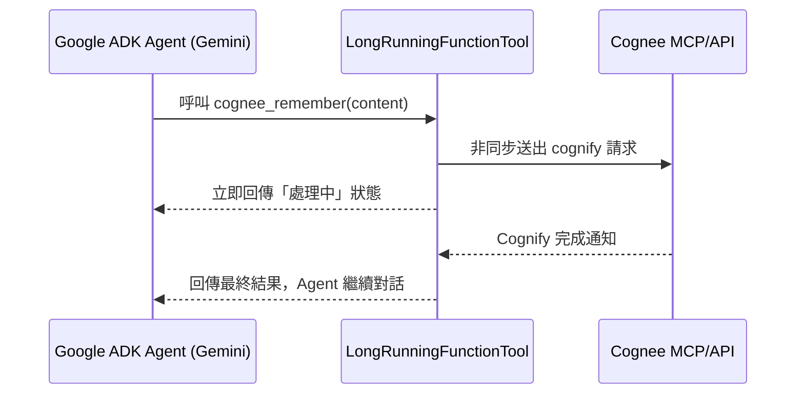

### 14.3 範例：ADK Agent 掛載 Cognee 記憶（概念性示範）

```python
from google.adk.agents import Agent
from google.adk.tools import LongRunningFunctionTool
from cognee_adk import cognee_remember, cognee_recall  # 套件名稱請以 cognee-integrations repo 實際版本為準

memory_tool = LongRunningFunctionTool(func=cognee_remember)
recall_tool = LongRunningFunctionTool(func=cognee_recall)

agent = Agent(
    model="gemini-2.5-pro",
    tools=[memory_tool, recall_tool],
    instruction="需要記住的資訊請呼叫 cognee_remember，回答前先呼叫 cognee_recall 檢索既有知識。",
)
```

### 14.4 Knowledge 與 Graph 整合注意事項

由於 ADK 場景常見於企業客服 / 內部助理，建議比照第四章 Session Memory 的設計，將單次對話的即時上下文交給 ADK 原生的對話狀態管理，只有需要跨對話持久保存的知識才透過 `LongRunningFunctionTool` 寫入 Cognee，避免每一句對話都觸發一次完整的 Cognify Pipeline。

### 14.5 Best Practice

- 善用 `LongRunningFunctionTool` 的非同步特性，讓 Cognify 在背景執行，同時讓 Agent 先以既有上下文回應使用者，稍後再把新知識補齊，避免使用者感受到明顯延遲。

### 14.6 Anti Pattern

- ❌ **用一般同步 Function Tool 呼叫 Cognee 的 `cognify`／`remember`**：容易在 ADK 的事件迴圈中造成阻塞，尤其在高併發客服場景會顯著拉長回應時間。

### 14.7 FAQ

**Q：Google ADK 整合是否也支援透過 MCP Server 存取 Cognee？**
可以。ADK 本身也支援作為 MCP Client 呼叫外部 MCP Server，因此除了官方 `google-adk` 專屬整合套件外，企業也可以選擇讓 ADK Agent 直接透過第十一章介紹的 Cognee MCP Server 存取記憶，兩條路徑可依團隊既有工具鏈選擇。

### 14.8 Checklist

- [ ] 是否已採用 `LongRunningFunctionTool`（或等效非同步機制）避免 Cognify 阻塞 Agent 事件迴圈？
- [ ] 是否已規劃「單次對話上下文」與「跨對話持久知識」的分流策略？
- [ ] 整合方式（專屬套件 vs. MCP Server）是否已依團隊工具鏈現況做出明確選擇？

---

## 第十五章 Claude Code Integration

### 15.1 官方 Plugin 架構

Cognee 提供官方 Claude Code Plugin，安裝方式為：

```bash
claude plugin install cognee-memory@cognee
```

此 Plugin 會在本機啟動一個 Cognee API 服務（預設 `http://localhost:8011`），並掛載進 Claude Code 的生命週期事件（Lifecycle Hooks）：`SessionStart`、`UserPromptSubmit`、`PostToolUse`、`Stop`、`PreCompact`、`SessionEnd`。這代表 Cognee 不是「你手動呼叫的工具」，而是**自動融入 Claude Code 每一次互動的記憶層**。

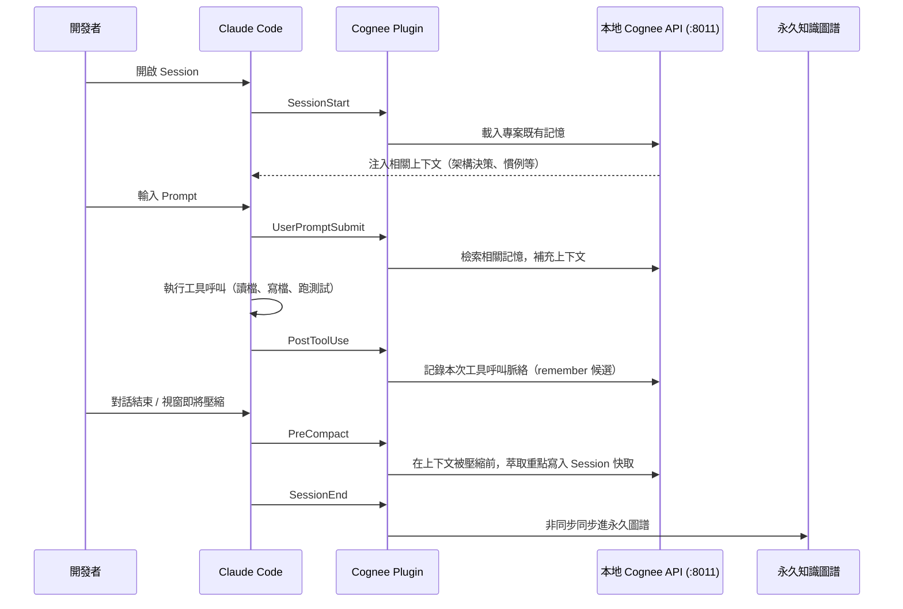

### 15.2 大型企業 Web Application 開發情境下的完整實作指南

這是本手冊「特別要求」第 1 項的重點情境：如何用 Cognee + Claude Code 開發大型企業 Web Application。建議的落地步驟如下：

**步驟 1：專案初始化時建立知識圖譜基線**

```bash
# 在專案根目錄安裝 Plugin
claude plugin install cognee-memory@cognee

# 將既有架構文件、ADR、API 規格批次匯入（可用 CLI 或 Python API，見第九、十章）
cognee-cli remember "$(cat docs/architecture-overview.md)" --dataset project_web_app
cognee-cli remember "$(cat docs/adr/0001-use-hexagonal-architecture.md)" --dataset project_web_app
```

**步驟 2：開發過程中讓 Claude Code 自動沉澱知識**

Plugin 掛載後，`PostToolUse` 與 `SessionEnd` 會自動把「本次 Session 做了什麼修改、遇到什麼問題、如何解決」沉澱為記憶。企業建議在專案 `CLAUDE.md` 中明確要求 Claude Code 在完成重大架構決策後主動呼叫 `save_interaction`（MCP 工具，第十一章）以強化沉澱品質，而非完全依賴自動 Hook。

**步驟 3：跨 Session 記憶的實際效益**

| 沒有 Cognee 的情境 | 導入 Cognee 後的情境 |
| --- | --- |
| 每次開新 Session，需要重新在 Prompt 中描述專案架構背景 | `SessionStart` 自動注入既有架構知識，Claude Code 立即具備專案脈絡 |
| Bug 修復方式僅存在於已關閉的對話視窗中，難以追溯 | `remember`/`save_interaction` 沉澱修復脈絡，未來遇到類似 Bug 可透過 `recall` 找到歷史修復方式 |
| 程式碼慣例（Coding Style）需要每次在 Prompt 中重複交代 | 慣例可沉澱為知識圖譜節點，`UserPromptSubmit` 階段自動補充相關慣例上下文 |
| 架構決策的「為什麼這樣設計」隨時間被遺忘 | ADR 與決策脈絡持久保存在圖譜中，新加入的工程師（或新開的 Claude Code Session）皆可查詢 |

**步驟 4：Migration History 的記憶化**

框架升級、資料庫遷移等長期專案（詳見第十九章），建議每完成一個遷移里程碑，就明確透過 `remember` 記錄「遷移了什麼、遇到什麼相容性問題、如何解決」，讓後續里程碑的 Claude Code Session 能夠 `recall` 到前面里程碑的實際經驗，避免同樣的相容性問題在專案不同階段被重複踩坑。

### 15.3 效能建議

- `PreCompact` Hook 涉及對即將被壓縮的上下文做萃取與寫入，若單一 Session 對話量極大，建議關注此階段的延遲，必要時可調整 Plugin 設定降低萃取頻率。

### 15.4 安全性建議

- 本地 Cognee API（預設 `:8011`）僅應綁定 localhost，若團隊需要共享同一份專案記憶，建議改用第十一章的 API Mode 中央 MCP Server，而非讓每位開發者的本機 API 互相暴露存取。
- 專案原始碼中若含有機敏資訊（內部 API Token、客戶資料範例），務必在 `.gitignore` / Cognee 匯入白名單中明確排除，避免 `PostToolUse` 自動把機敏內容寫入知識圖譜。

### 15.5 Best Practice

- 專案初期即建立「哪些內容該沉澱進 Cognee」的團隊共識（架構決策、Bug 修復脈絡、慣例 → 值得沉澱；一次性除錯過程、機敏資料 → 不該沉澱），並寫進團隊的 `CLAUDE.md` 規範中。

### 15.6 Anti Pattern

- ❌ **從未檢視 Cognee 自動沉澱的記憶內容，任其無限累積**：長期會讓知識圖譜充斥低價值雜訊，稀釋真正重要知識的檢索排序。
- ❌ **多位工程師各自跑 Standalone 本地 Cognee，從未同步**：等同每人維護一份互不相通的專案記憶，喪失團隊知識沉澱的核心價值。

### 15.7 FAQ

**Q：Cognee Plugin 會不會讓 Claude Code 的 Context Window 消耗更快？**
`SessionStart` / `UserPromptSubmit` 注入的是「檢索後的相關摘要」，而非整個知識圖譜，理論上比工程師手動貼上大段背景文件更精簡；但實務上仍建議監控注入內容的長度，必要時調整檢索的 Top-K 或相關性門檻，避免注入過多低相關性內容。

### 15.8 企業案例

參見第二十八章「AI Coding Assistant」案例，完整說明某金融科技公司如何用 Cognee + Claude Code 建立跨團隊共享的架構知識圖譜。

### 15.9 Checklist

- [ ] 是否已在專案初期匯入既有架構文件、ADR 作為知識圖譜基線？
- [ ] 團隊是否已就「哪些內容該沉澱」達成共識並寫入 `CLAUDE.md`？
- [ ] 是否已評估從 Standalone 本地模式升級為團隊共用的 API Mode？
- [ ] 機敏資訊是否已從自動沉澱範圍中明確排除？
- [ ] 是否有定期檢視/清理自動沉澱記憶品質的機制？

---

## 第十六章 GitHub Copilot Integration

### 16.1 整合路徑：透過 MCP，而非官方專屬 Plugin

必須先釐清一個重要事實：查證當下（2026-07-15），Cognee 官方 `cognee-integrations` repo 中**沒有**如 Claude Code 般的專屬 GitHub Copilot Plugin 資料夾；但 GitHub Copilot（在 VS Code 中）已原生支援 MCP Server 設定，因此企業導入路徑是透過第十一章介紹的 **Cognee MCP Server**，將其註冊為 Copilot 可存取的 MCP 工具來源，而非期待存在官方 Copilot 專屬套件。這與 Claude Code 有官方 Plugin 是明確不同的整合路徑，企業導入前務必認知此差異。

### 16.2 VS Code + GitHub Copilot 設定步驟

**步驟 1：啟動 Cognee MCP Server（企業建議 API Mode + HTTP transport）**

```bash
docker run -e TRANSPORT_MODE=http --env-file ./.env -p 8000:8000 cognee/cognee-mcp:main
```

**步驟 2：在 VS Code 專案的 MCP 設定檔中註冊（`.vscode/mcp.json`，實際設定檔位置與 schema 請以當下 VS Code / GitHub Copilot 官方文件為準）**

```json
{
  "servers": {
    "cognee": {
      "type": "http",
      "url": "http://localhost:8000/mcp"
    }
  }
}
```

**步驟 3：於 Copilot Chat 中確認工具可用**

啟用後，Copilot Chat 的 Agent 模式應能看到 `remember`、`recall`、`search`、`cognify` 等工具，可在對話中明確要求「請用 Cognee 記住這個架構決策」或「查詢一下 Cognee 裡關於訂單服務的既有知識」。

### 16.3 Workspace Memory 與 Project Knowledge 建立流程

| 目標 | 作法 |
| --- | --- |
| Workspace Memory（工作區記憶） | 專案初始化時批次匯入 README、CONTRIBUTING、架構文件至專屬 dataset（如 `project_<repo_name>`） |
| Project Knowledge（專案知識） | 開發過程中透過 Copilot Chat 明確要求呼叫 `remember` 沉澱重大決策，比照第十五章 Claude Code 的做法 |
| Coding Convention（程式碼慣例） | 將團隊 Style Guide、Lint 規則說明匯入知識圖譜，Copilot 回答風格問題時可 `recall` 取得團隊慣例而非泛用建議 |
| Architecture Memory（架構記憶） | 匯入 ADR、系統設計文件，建立實體（服務、模組）與關係（依賴、負責團隊） |
| Repository Memory（版控記憶） | 可透過 CI Hook（比照第九章 9.3 節）在重大 PR 合併時自動同步匯入 Cognee |

### 16.4 跨 Session 長期記憶的實務案例

以往 GitHub Copilot 的建議品質高度依賴「當下開啟的檔案與最近的對話」，換一個新的 VS Code 視窗或新對話，先前討論過的架構考量往往需要重新輸入。導入 Cognee MCP 後，Copilot 可在新對話中主動呼叫 `recall` 查詢「這個專案關於認證機制的既有決策」，取得跨 Session 保存的知識，而不需工程師每次重複說明背景。

### 16.5 安全性建議

- MCP Server 若部署為團隊共用（API Mode），務必確認僅限公司內網或 VPN 存取，並啟用第八章介紹的 `REQUIRE_AUTHENTICATION`。
- Copilot 對話內容可能包含程式碼片段與內部邏輯，透過 `remember` 沉澱前應建立團隊規範，排除客戶資料、密鑰等機敏內容。

### 16.6 Best Practice

- 比照第十五章，建立團隊層級的「沉澱準則」文件，明確哪些對話內容值得呼叫 `remember`，並定期由 Tech Lead 檢視知識圖譜品質。

### 16.7 Anti Pattern

- ❌ **誤以為存在官方 Copilot 專屬 Cognee Plugin 而尋找不存在的安裝指令**：務必透過 MCP 路徑整合，並以官方文件目前的整合現況為準。

### 16.8 FAQ

**Q：GitHub Copilot 與 Claude Code 接同一個 Cognee MCP Server，記憶會互通嗎？**
會。只要兩者連接的是同一個 API Mode 中央 MCP Server、且使用相同的 dataset/scope 命名，記憶即可互通——這正是 MCP 作為標準協定的核心價值：不同 AI 工具可以共用同一份企業知識圖譜，而不需要各自維護孤立的記憶庫。

### 16.9 Checklist

- [ ] 是否已確認 Copilot 整合路徑為 MCP，而非尋找不存在的官方專屬 Plugin？
- [ ] MCP Server 端點是否已限制於內網存取並啟用認證？
- [ ] 是否已建立團隊沉澱準則，避免機敏內容被自動記入知識圖譜？
- [ ] 若團隊同時使用 Claude Code 與 Copilot，是否已規劃共用同一份知識圖譜的 dataset 命名策略？

---

## 第十七章 Web Application 開發

### 17.1 定位：Cognee 在 Web 開發生命週期中的角色

本章討論的不是「用 Cognee 開發一個 Web 應用程式的產品功能」，而是**用 Cognee 作為 AI 開發輔助的記憶基礎設施，加速大型企業 Web Application 的開發與維運**——這正是使用者「特別要求」第 1 項的核心情境。無論後端是 Spring Boot、.NET、Node.js／NestJS，前端是 Vue、Angular、React，Cognee 扮演的都是「跨技術棧、跨團隊的知識沉澱層」，而非取代任何一個框架本身。

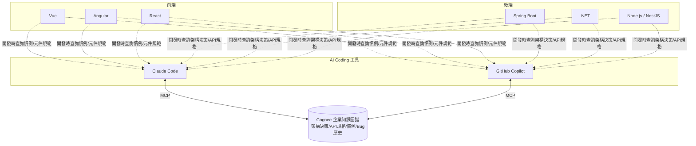

### 17.2 依架構風格的知識圖譜建模建議

| 架構風格 | 建議的知識實體/關係設計 |
| --- | --- |
| Clean Architecture / Hexagonal Architecture | 以「Port」「Adapter」「Use Case」為實體，關係標註「哪個 Adapter 實作哪個 Port」，避免 AI 生成程式碼時誤把商業邏輯寫進 Adapter 層 |
| DDD（Domain-Driven Design） | 以「Bounded Context」「Aggregate」「Domain Event」為核心實體，關係標註 Context 之間的整合方式（Anti-Corruption Layer、Shared Kernel 等） |
| Microservices | 以「Service」為節點，「依賴」「呼叫」「共用資料庫」為邊，快速讓 AI Coding 工具理解服務間的耦合關係，避免建議出違反服務邊界的變更 |
| Monolith（模組化單體） | 以「Module」「Package」為節點，標註模組間允許/禁止的依賴方向，輔助 AI 工具遵守既有的分層規範 |

### 17.3 實作步驟：建立 Web Application 專案知識庫

**步驟 1：架構基線匯入**

```bash
cognee-cli remember "$(cat docs/architecture/clean-architecture-overview.md)" --dataset webapp_core
cognee-cli remember "$(cat docs/api/openapi.yaml)" --dataset webapp_core
```

**步驟 2：前後端慣例分流匯入**

```bash
cognee-cli remember "$(cat frontend/STYLE_GUIDE.md)" --dataset webapp_frontend
cognee-cli remember "$(cat backend/CODING_CONVENTIONS.md)" --dataset webapp_backend
```

**步驟 3：搭配 Claude Code / Copilot 的開發迴圈**

開發新功能時，工程師在 AI Coding 工具中描述需求，工具透過 MCP 呼叫 `recall` 檢索 `webapp_core` 與對應的 `webapp_frontend`／`webapp_backend` dataset，取得架構邊界與慣例後再生成程式碼建議，大幅降低「AI 生成的程式碼不符合既有架構規範」的返工率。

### 17.4 效能建議

- 大型 Web 專案的 API 規格（OpenAPI/Swagger）建議拆分成多個較小的 dataset（依 Bounded Context 或模組），避免單一查詢需要在龐大文件中做語意搜尋，拖慢 `recall` 回應速度。

### 17.5 安全性建議

- 前端專案常見的 `.env.local`、API Key 範例檔，務必列入匯入白名單的排除清單，避免不慎沉澱進企業知識圖譜。

### 17.6 Best Practice

- 建立「架構守門」流程：重大架構決策先寫成 ADR、經 Tech Lead 審核後才匯入 `webapp_core` dataset，避免未經審核的個人偏好被 AI 工具當作「官方慣例」持續複製擴散。

### 17.7 Anti Pattern

- ❌ **把所有前後端文件不分模組全部塞進單一 dataset**：檢索精準度下降，AI 工具容易取得不相關模組的慣例，生成出風格混雜的程式碼。

### 17.8 企業案例

某跨國零售集團的大型電商後台（Spring Boot 微服務 + Vue 前端），導入 Cognee 後將 30+ 個微服務的 API 規格、服務依賴關係、共用元件庫慣例統一沉澱，新加入的工程師透過 Claude Code 詢問「訂單服務對外暴露哪些 API、依賴哪些下游服務」，可直接從知識圖譜取得結構化答案，取代過去需要翻閱多份分散文件、詢問多位資深工程師的做法，新人上手時間顯著縮短。

### 17.9 Checklist

- [ ] 是否已依架構風格（Clean/Hexagonal/DDD/Microservices/Monolith）設計對應的知識實體與關係？
- [ ] 前後端慣例是否已分流至獨立 dataset，避免檢索雜訊？
- [ ] 是否已建立「架構決策先審核、後匯入」的守門流程？
- [ ] 機敏設定檔是否已列入匯入白名單排除清單？

---

## 第十八章 Legacy System Reverse Engineering

### 18.1 定位：從「讀懂舊系統」到「知識圖譜化」

這是「特別要求」第 3 項的核心情境。Legacy System（老舊 Java／Spring／.NET 系統）逆向工程的傳統痛點是「知識只存在於資深工程師腦中」與「文件與程式碼早已脫節」。Cognee 的價值在於把逆向工程過程中萃取出的結構性知識（依賴關係、資料庫結構、API 對應、商業規則）持久化為可查詢的知識圖譜，而不是每次都要重新從頭讀 Code。

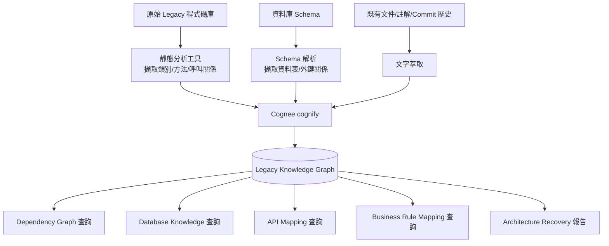

### 18.2 完整流程

**步驟 1：Dependency Graph 建立**

透過既有靜態分析工具（如 Java 生態的 `jdeps`、`ArchUnit` 產出的模組依賴報告，或 .NET 的 `NDepend`）產出結構化的依賴清單，再匯入 Cognee：

```python
import cognee, asyncio, json

async def import_dependencies():
    deps = json.load(open("jdeps-output.json"))
    for module, depends_on in deps.items():
        await cognee.add(
            f"模組 {module} 依賴於：{', '.join(depends_on)}",
            dataset_name="legacy_dependency_graph",
        )
    await cognee.cognify(datasets=["legacy_dependency_graph"])

asyncio.run(import_dependencies())
```

**步驟 2：Database Knowledge 建立**

從 Legacy 資料庫的 `information_schema` 匯出表格、欄位、外鍵關係，轉為自然語言描述後匯入，讓 Cognee 的實體抽取能辨識出「資料表」與「外鍵關聯」作為結構化知識：

```sql
-- 匯出資料庫結構供轉換（示意）
SELECT table_name, column_name, foreign_table_name, foreign_column_name
FROM information_schema_foreign_keys;
```

**步驟 3：API Mapping 建立**

針對 Legacy 系統對外暴露的 API（可能缺乏 OpenAPI 規格），透過程式碼掃描或既有整合測試反推 API 清單，記錄「API 端點 → 呼叫的 Service 方法 → 存取的資料表」的完整鏈路。

**步驟 4：Business Rule Mapping**

這是逆向工程中最困難、但 Cognee 最能發揮價值的一步：將散落在 Code Comment、Commit Message、內部 Wiki、資深工程師訪談紀錄中的商業規則說明，統一匯入知識圖譜，並明確標註規則與對應程式碼位置的關聯，讓「為什麼這段邏輯這樣寫」不再只存在於單一工程師的記憶中。

**步驟 5：Architecture Recovery 報告產出**

匯入完成後，透過 `recall` / `search`（`GRAPH_COMPLETION` 模式）向知識圖譜提問，例如「這個系統有哪些對外部門的整合點」「哪些模組直接存取資料庫、違反了分層架構」，產出可讀的架構還原報告，作為後續重構或升級（第十九章）的依據。

### 18.3 效能建議

- 大型 Legacy 系統（數十萬行程式碼）建議先以模組為單位分批匯入，並優先處理「高變更頻率」或「即將進行升級」的模組，而非一次性對整個系統做全量逆向工程，控制 Cognify 的 LLM 成本與時程風險。

### 18.4 安全性建議

- Legacy 系統的資料庫 Schema 匯出常包含客戶資料表結構、內部系統整合金鑰等敏感資訊，匯入前務必先做欄位層級的敏感性分類與遮罩。

### 18.5 Best Practice

- 逆向工程產出的知識圖譜應搭配資深工程師的人工審核關卡（尤其 Business Rule Mapping 階段），LLM 從 Comment/Commit Message 推斷出的商業規則可能有誤讀，未經審核直接視為權威知識風險較高。

### 18.6 Anti Pattern

- ❌ **完全仰賴 LLM 自動推斷商業規則，跳過資深工程師審核**：Legacy 系統的商業邏輯往往有大量「歷史包袱式」的特殊處理（Edge Case），LLM 容易誤判為一般規則。
- ❌ **逆向工程完成後知識圖譜束之高閣，未接入日常開發流程**：應搭配第十五、十六章的 AI Coding 整合，讓知識圖譜持續被查詢、驗證、更新，而非做完一次性報告就結束。

### 18.7 企業案例

某銀行核心系統（20 年歷史的 Java Monolith）在評估微服務化拆分前，先用 Cognee 建立完整的 Dependency Graph 與 Database Knowledge，發現多個「文件上標示獨立」的模組實際上透過共用資料表產生隱性耦合。這個發現直接影響了拆分順序的規劃，避免了原先規劃中會產生分散式交易問題的拆分方案，詳細案例分析見第二十八章。

### 18.8 Checklist

- [ ] 是否已依模組優先順序分批進行逆向工程，而非一次性處理全量系統？
- [ ] 資料庫 Schema 匯入前是否已完成敏感欄位分類與遮罩？
- [ ] Business Rule Mapping 是否已建立資深工程師審核關卡？
- [ ] 逆向工程知識圖譜是否已接入日常 AI Coding 開發流程，而非一次性產出報告？

---

## 第十九章 Framework 升級

### 19.1 定位：升級知識庫、相依性分析與遷移策略

這是「特別要求」第 4 項的核心情境：Java、Spring Boot、Jakarta EE、Vue、Angular、React、.NET、Python、Node.js 等框架版本升級，都面臨相似的挑戰——**API 變更點多、相依套件連鎖影響難以評估、遷移過程中的踩坑經驗難以系統化沉澱**。Cognee 的角色是把升級所需的知識（Breaking Changes、相依性影響範圍、遷移步驟、踩坑紀錄）結構化為可查詢的知識圖譜，讓 AI Coding 工具能基於具體專案脈絡給出遷移建議，而非泛用的官方遷移指南。

### 19.2 升級知識庫建立流程

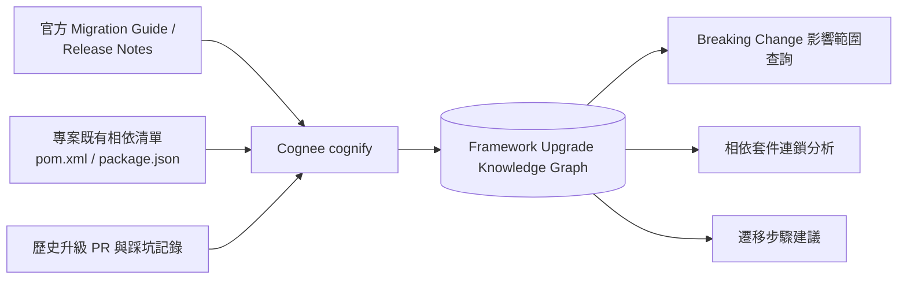

**步驟 1：匯入官方升級文件與 Breaking Changes**

```bash
cognee-cli remember "$(cat spring-boot-3.x-migration-guide.md)" --dataset upgrade_spring_boot3
```

**步驟 2：匯入專案既有相依關係，建立「框架版本 → 相依套件 → 使用模組」的關係鏈**

```python
import cognee, asyncio

async def import_dependency_tree(pom_analysis: dict):
    for dep, info in pom_analysis.items():
        await cognee.add(
            f"套件 {dep}（版本 {info['version']}）被以下模組使用：{', '.join(info['used_by'])}，"
            f"與目標框架版本的相容性狀態：{info['compat_status']}",
            dataset_name="upgrade_spring_boot3",
        )
    await cognee.cognify(datasets=["upgrade_spring_boot3"])
```

**步驟 3：每完成一個模組的升級，沉澱實際踩坑經驗**

```bash
cognee-cli remember "模組 order-service 升級至 Spring Boot 3 時，javax.persistence 需全面替換為 jakarta.persistence，
且 Hibernate 6 對 @Query 中的原生 SQL 語法有變更，需額外調整分頁查詢寫法。" --dataset upgrade_spring_boot3
```

**步驟 4：後續模組升級時，透過 `recall` 檢索已知踩坑，提前規避**

### 19.3 各框架升級的知識建模重點

| 框架 | 建議重點知識 |
| --- | --- |
| Java / Jakarta EE | `javax.*` → `jakarta.*` 命名空間遷移影響範圍、各模組使用的 Jakarta EE 規範版本 |
| Spring Boot | 設定屬性（`application.yml`）變更、自動配置行為變更、相依套件版本相容矩陣 |
| Vue 2 → Vue 3 | Composition API 遷移範圍、破壞性變更的元件清單、第三方套件相容性狀態 |
| Angular | 各版本間的 Breaking Changes（如 Ivy 引擎、Standalone Components）、`ng update` 執行紀錄與人工修正項目 |
| React | Class Component → Function Component + Hooks 遷移範圍、已棄用生命週期方法的使用清單 |
| .NET | Framework → .NET Core/5+ 的 API 相容性分析、NuGet 套件遷移狀態 |

### 19.4 相依性分析與遷移策略

透過知識圖譜的 Graph Traversal（第五章），可以直接查詢「若升級套件 A 至新版本，會連鎖影響哪些模組」，這比傳統只看 `pom.xml`/`package.json` 平面清單更能還原「間接相依」的完整影響範圍，尤其在大型 Monorepo 或微服務叢集中，這種連鎖影響往往是升級專案延誤的主因。

### 19.5 效能建議

- 升級知識庫建議按框架/技術棧分開建立獨立 dataset（如 `upgrade_spring_boot3`、`upgrade_vue3`），避免不同技術棧的升級知識互相干擾檢索結果。

### 19.6 維護建議

- 升級專案結束後，知識庫不應立即棄置——下一次框架大版本升級時，即便技術細節不同，過去累積的「模組優先順序規劃邏輯」「風險評估方法」等流程性知識依然有參考價值，建議保留並延續使用。

### 19.7 Best Practice

- 升級前先用 Cognee 產出「影響範圍報告」（哪些模組受影響、風險等級），作為與利害關係人溝通排程與資源需求的具體依據，而非僅憑經驗估算。

### 19.8 Anti Pattern

- ❌ **升級過程中的踩坑經驗只記錄在個人筆記或 Slack 對話中，未沉澱進共用知識庫**：下一個模組升級時同樣的問題重複發生，重複花費除錯時間。
- ❌ **忽略間接相依，只評估直接相依套件的相容性**：容易在升級後期才發現深層相依的破壞性變更，導致時程大幅延誤。

### 19.9 企業案例

某保險公司同時維運 12 個 Spring Boot 微服務，統一從 Spring Boot 2.7 升級至 3.x。透過 Cognee 建立的相依知識圖譜，專案團隊在升級前就識別出 3 個服務共用一個尚未支援 Jakarta EE 9+ 的內部共用函式庫，因而調整了升級順序（先升級共用函式庫並驗證相容性，再升級依賴它的服務），避免了原訂計畫中可能發生的多服務同時升級失敗、難以定位問題根源的風險。

### 19.10 Checklist

- [ ] 是否已將官方 Migration Guide 與專案既有相依清單一併匯入知識圖譜？
- [ ] 是否已透過 Graph Traversal 評估間接相依的連鎖影響範圍？
- [ ] 每個模組升級完成後，是否已將實際踩坑經驗沉澱進共用知識庫？
- [ ] 升級知識庫是否已按技術棧分流至獨立 dataset？

---

## 第二十章 AI Coding Workflow

### 20.1 完整流程設計

結合前述章節，企業可以建立一套以 Cognee 為記憶骨幹的 AI Coding 完整工作流程：

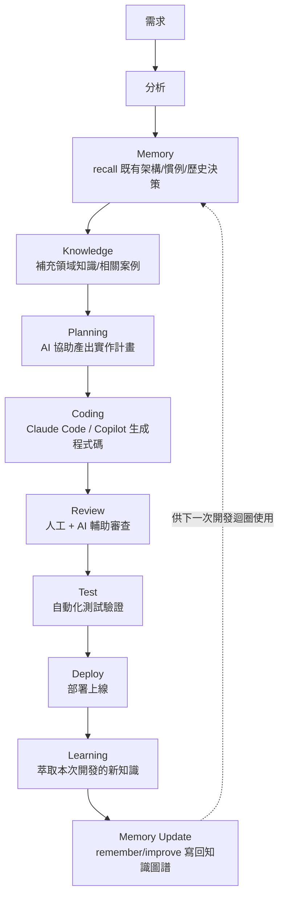

### 20.2 各階段與 Cognee 的對應操作

| 階段 | 對應 Cognee 操作 | 說明 |
| --- | --- | --- |
| Memory | `recall` | 檢索既有架構決策、程式碼慣例、歷史 Bug 修復經驗 |
| Knowledge | `search`（`GRAPH_COMPLETION`） | 針對需求涉及的領域知識做多跳推理式查詢 |
| Planning | LLM + 檢索結果 | AI Coding 工具基於已注入的上下文產出實作計畫 |
| Coding | — | 一般程式碼生成，非 Cognee 直接負責範疇 |
| Review | `search`（比對既有慣例） | 檢查生成程式碼是否符合已知架構邊界與慣例 |
| Test | — | 一般測試工具負責範疇 |
| Deploy | — | 一般 CI/CD 負責範疇 |
| Learning | 人工/自動萃取重點 | 從本次開發過程萃取值得沉澱的新知識 |
| Memory Update | `remember` / `improve` | 將新知識寫回知識圖譜，供下次開發迴圈使用 |

### 20.3 為何「Memory Update」是常被忽略卻最關鍵的一步

多數團隊導入 AI Coding 工具後，容易只使用到「Coding」階段的生成能力，卻忽略了 Loop 的閉環設計——如果每次開發完成後沒有把新知識（新的架構決策、新發現的 Edge Case、新的慣例調整）寫回知識圖譜，那麼下一次的「Memory」階段就無法真正檢索到最新知識，整個 Workflow 會退化成「有記憶但記憶不會更新」的半殘狀態。

### 20.4 Best Practice

- 將「Memory Update」步驟明確納入團隊的 Definition of Done（完成定義），例如 PR 合併前需確認是否有值得沉澱的架構/慣例變更，並已透過 `remember`/`improve` 寫回知識圖譜。

### 20.5 Anti Pattern

- ❌ **只導入 AI Coding 工具的生成能力，跳過 Memory/Knowledge 的檢索與 Learning/Memory Update 的沉澱**：等同只用了 Cognee 生態系中最基本的一小部分價值，長期效益與純 Prompt Engineering 差異不大。

### 20.6 企業案例

參見第三十一章「建立 AI Agent Coding Platform」的完整企業實作案例，說明如何把本章的 Workflow 落地為平台級能力。

### 20.7 Checklist

- [ ] 團隊是否已將完整 Workflow（而非僅 Coding 階段）納入開發流程規範？
- [ ] Memory Update 是否已明確納入 Definition of Done？
- [ ] Review 階段是否已納入「比對既有慣例」的檢查點？
- [ ] 是否有定期檢視 Workflow 各階段的實際採用率與效益？

---

## 第二十一章 Enterprise Knowledge Management

### 21.1 從個人記憶到企業知識資產

前面章節多聚焦於「單一專案」或「單一 Agent」的記憶，本章討論的是更高層次的問題：大型企業如何把 Cognee 用作**跨團隊、跨系統的統一知識管理骨幹**。這需要組織層面的命名空間規劃、治理流程，而不只是技術整合。

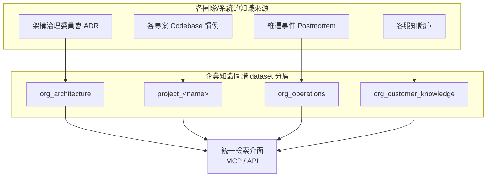

### 21.2 六大知識類型的治理建議

| 知識類型 | dataset 命名建議 | 治理負責人 | 更新頻率 |
| --- | --- | --- | --- |
| Architecture Memory（架構記憶） | `org_architecture` | 架構治理委員會 / Principal Engineer | 重大決策發生時 |
| Project Memory（專案記憶） | `project_<name>` | 各專案 Tech Lead | 持續（隨開發迴圈） |
| Coding Memory（程式碼記憶） | `org_coding_conventions` | 工程實務委員會 | 季度審視 |
| Operation Memory（維運記憶） | `org_operations` | SRE / 維運團隊 | 事件發生後即時 |
| Troubleshooting Memory（疑難排解記憶） | `org_troubleshooting` | 各團隊值班工程師 | 事件發生後即時 |
| Customer / Domain Knowledge（客戶/領域知識） | `org_customer_knowledge` | 業務 / 產品團隊 | 持續 |

### 21.3 治理流程設計

企業級知識管理最容易失敗的原因不是技術，而是**沒有明確的知識「誰能寫、誰該審、多久過期」治理流程**。建議比照企業文件治理的成熟做法，為每個 dataset 定義：

1. **Owner（負責人）**：誰對這個知識領域的正確性負責。
2. **Write Policy（寫入政策）**：是否任何人可寫入，或需經審核（比照第十七章的「架構守門」流程）。
3. **Review Cadence（審視週期）**：多久檢視一次過期或矛盾知識（呼應第四章 `improve` 的必要性）。
4. **Retention Policy（保留政策）**：知識的保留期限，是否有合規要求的強制刪除時限（詳見第二十二章）。

### 21.4 效能建議

- 跨團隊統一檢索介面（MCP Server 或內部 API Gateway）應在應用層做查詢範圍限制，避免單一查詢掃過所有 dataset 造成不必要的效能開銷與跨團隊資料曝光。

### 21.5 Best Practice

- 導入初期先選 1-2 個知識類型（建議從 Architecture Memory 或 Troubleshooting Memory 開始，價值最容易被工程團隊直接感受到）做試點，證明價值後再擴大到全部六類，避免一次性大規模導入導致治理流程跟不上。

### 21.6 Anti Pattern

- ❌ **知識圖譜治理完全交給技術團隊，業務/產品知識由工程師代為輸入**：容易導致業務語意失真，應由對應領域的實際負責人參與知識審核。

### 21.7 企業案例

詳見第二十八章「Knowledge Management」案例，說明某大型集團如何跨 12 個事業體建立統一但各自治理的知識圖譜架構。

### 21.8 Checklist

- [ ] 是否已依六大知識類型規劃 dataset 命名與治理負責人？
- [ ] 每個 dataset 是否已明確定義 Write Policy、Review Cadence、Retention Policy？
- [ ] 是否已從高價值試點知識類型開始導入，而非一次性全面鋪開？
- [ ] 業務/領域知識的審核是否已納入對應業務負責人，而非僅由工程團隊代管？

---

## 第二十二章 Security

### 22.1 Data Privacy 與 Local Deployment

Cognee 主打 self-hosted 架構，這是它相較部分雲端記憶服務（如純 SaaS 型 Agent Memory 平台）在資料主權上的核心優勢——PostgreSQL、Neo4j 等儲存元件皆可完全落地企業內網，資料不需要流向第三方雲端服務即可運作完整功能。對高合規要求產業（金融、政府、醫療），這是評估導入可行性時的關鍵因素。

### 22.2 RBAC 與權限治理：釐清 Self-Hosted 與 Cloud 的差異

**必須特別澄清的重要事實**：查證當下，官方文件中詳細的 **Role-Based Access Control（RBAC）、多使用者工作區、細粒度 dataset 權限、審計日誌（Audit Logging）** 等企業級權限治理功能，主要文件化於 **Cognee Cloud** 產品線的「Permissions & Security」頁面。這意味著企業若採用純自架開源版本，在導入前務必實際驗證：這些權限治理能力在自架版本中的實作完整度是否符合企業需求，而不要預設開源版與 Cloud 版的權限功能完全對等。第八章介紹的 `ENABLE_BACKEND_ACCESS_CONTROL`、`REQUIRE_AUTHENTICATION`、`FASTAPI_USERS_JWT_SECRET` 等環境變數是自架版本可確認已存在的基礎存取控制能力。

### 22.3 Encryption（加密）

| 層級 | 建議做法 |
| --- | --- |
| 傳輸中加密（In-Transit） | MCP Server／API 對外端點務必啟用 TLS（HTTPS/WSS），避免內網明文傳輸知識查詢內容 |
| 靜態加密（At-Rest） | PostgreSQL／Neo4j 等底層資料庫應啟用資料庫層加密（如 PostgreSQL 的 TDE 方案或雲端代管服務內建的靜態加密） |
| 金鑰管理 | `LLM_API_KEY`、`DB_PASSWORD`、`GRAPH_DATABASE_PASSWORD`、`FASTAPI_USERS_JWT_SECRET` 統一透過企業密鑰管理服務（Vault / AWS Secrets Manager / Azure Key Vault）管理 |

### 22.4 Permission、Secret、Credential 管理

- 遵循最小權限原則（Least Privilege）：不同角色（一般查詢使用者 vs. 知識管理員 vs. 系統管理員）應有對應的存取範圍區隔，即便自架版本的原生 RBAC 尚不完整，也可透過 API Gateway 層自行實作角色區隔作為過渡方案。
- `ALLOW_CYPHER_QUERY`（第八章）等允許直接執行底層查詢語言的開關，應視為高權限操作，僅限受信任的內部維運工具開啟。

### 22.5 Compliance 與 Audit

- **GDPR「被遺忘權」**：透過第四章介紹的 `forget()` API，企業需建立明確的個資刪除 SOP（誰能發起、如何驗證刪除範圍、如何留存刪除紀錄本身以利稽核）。
- **資料保留政策**：搭配第二十一章的 Retention Policy，定期執行知識圖譜的過期資料清理。
- **稽核紀錄**：即便原生 Audit Logging 功能視版本而定，企業仍應在應用層（API Gateway / MCP Server 前置代理）記錄「誰在何時查詢/寫入/刪除了什麼」，作為合規稽核的最低限度保障。

### 22.6 GitHub Secure Open Source 相關考量

作為採用開源專案的一般實務，企業導入前應納入標準的開源軟體供應鏈安全檢查：確認 Apache-2.0 授權條款符合企業合規要求、對 `cognee` 套件與其相依套件執行 SCA（Software Composition Analysis）掃描、追蹤官方 GitHub Security Advisories 以掌握已知漏洞修補狀態，並將版本更新納入企業既有的相依套件更新治理流程（詳見第十九章的框架升級方法論同樣適用於 Cognee 自身的版本升級）。

### 22.7 企業安全建議總表

| 風險項目 | 建議控制措施 |
| --- | --- |
| API 端點未認證即可存取 | 啟用 `REQUIRE_AUTHENTICATION`，對外端點加上 API Gateway 認證層 |
| 機敏資料誤入知識圖譜 | Extract 階段建立 PII 偵測與遮罩機制（詳見第三章） |
| 過度授權的 Cypher 查詢 | 預設關閉 `ALLOW_CYPHER_QUERY`，僅限白名單服務帳號開啟 |
| 多租戶資料外洩 | Storage 層設計租戶隔離（獨立 schema/實例），不僅依賴應用層過濾（詳見第六章） |
| 密鑰硬編碼於版控 | 強制使用密鑰管理服務，並於 CI 中加入密鑰掃描（Secret Scanning） |
| 缺乏刪除稽核 | 應用層記錄所有 `forget` 操作的發起者、範圍、時間 |

### 22.8 Anti Pattern

- ❌ **假設自架開源版本自動具備 Cognee Cloud 文件中描述的完整 RBAC/審計能力**：務必實測驗證，必要時自行於應用層補強。
- ❌ **內部工具/儀表板直接以最高權限服務帳號存取 Cognee，未依角色分權**：一旦內部工具本身被入侵，攻擊者可取得對整個企業知識圖譜的完整存取權。

### 22.9 Checklist

- [ ] 是否已針對「自架版本 vs. Cloud 版本」的權限治理能力差異做過實測確認？
- [ ] 傳輸中與靜態加密是否皆已到位？
- [ ] `forget` 操作是否已建立稽核紀錄與 SOP？
- [ ] 是否已對 `cognee` 及其相依套件執行 SCA 掃描並追蹤安全公告？
- [ ] 多租戶場景是否已在 Storage 層（而非僅應用層）落實隔離？

---

## 第二十三章 Performance Optimization

### 23.1 效能瓶頸全景圖

```mermaid
graph LR
    A[Extract] -->|I/O 密集| B[Cognify]
    B -->|LLM 呼叫密集，最大瓶頸| C[Load]
    C -->|資料庫寫入密集| D[recall 查詢]
    D -->|向量/圖譜查詢密集| E[回應]
```

Cognee 的效能瓶頸主要集中在 **Cognify 階段的 LLM 呼叫** 與 **大規模圖譜的 Traversal 查詢**，這兩者的最佳化策略截然不同，需分開處理。

> **📌 版本更新（v1.3.0）**：官方 Changelog 揭露近期兩項對本章效能建議有直接影響的改善：（1）**LanceDB 併發存取延遲大幅降低**（官方基準測試約由 1,371ms 降至 246ms），對預設零安裝組態（第六章）下的高併發讀寫場景直接受益；（2）**Cognify Pipeline 的實體/關係抽取速度大幅提升**（官方基準測試約 9,000 倍），主要來自圖抽取階段的演算法最佳化。企業若在較舊版本已針對這兩處做過客製化效能調校（例如自行實作查詢佇列繞過 LanceDB 併發限制），升級後建議重新評估這些客製化方案是否仍有必要。

### 23.2 Embedding 最佳化

- 選用維度較低但品質足夠的 Embedding 模型可降低儲存與計算成本；`EMBEDDING_DIMENSIONS`（第八章）務必與實際業務對檢索精準度的要求相匹配，並非維度越高越好。
- 善用 `EMBEDDING_BATCH_SIZE` 批次生成向量，減少 API 呼叫次數帶來的網路往返開銷。
- **Per-stage LLM Model Routing（分階段模型路由，v1.3.0 起）**：官方已支援為 Pipeline 中不同階段（如實體抽取 vs. 關係抽取 vs. Ontology 歸納）指定不同的 LLM 模型，讓企業可以將成本敏感、精準度要求較低的階段路由至較便宜的模型，僅在關鍵抽取階段使用高階模型，藉此在總體 Cognify 成本與抽取品質間取得更細緻的平衡，而非全 Pipeline 統一套用單一 `LLM_MODEL`。

### 23.3 Chunk 策略最佳化

- Chunk 過小會顯著增加 Cognify 階段的 LLM 呼叫次數與總 Token 成本；Chunk 過大則會降低單一 Chunk 內實體/關係抽取的精準度。建議依文件類型（技術文件 vs. 對話紀錄 vs. 結構化表格）分別調校切分策略，而非全站套用單一固定長度。

### 23.4 Caching 快取策略

- Session Memory（第四章）的 `CACHE_BACKEND` 在高併發場景務必由預設 `fs` 切換至 `redis`，避免檔案系統成為瓶頸。
- 針對高頻重複查詢（如客服常見問題），可在應用層額外疊加一層查詢結果快取（Query Result Cache），避免每次都重新走一次完整的 Hybrid Search。

### 23.5 Batch 與 Parallel 處理

- 大規模資料匯入（如第十八章的 Legacy 逆向工程場景）務必分批（Batch）呼叫 `cognify()`，並依 LLM Provider 的 Rate Limit 設定合理的並行度（Parallel），避免觸發 API 限流導致整批任務失敗。
- 批次大小建議透過實測找出「吞吐量」與「單批失敗重試成本」的平衡點，而非一味追求最大並行度。

### 23.6 Graph Query 與 Hybrid Search 最佳化

- 承第五章，控制 Traversal 深度、避免無上限的多跳查詢。
- 針對高頻查詢路徑（例如「查詢某服務的所有依賴」），可考慮建立專用的物化視圖（Materialized View）或快取層，避免每次都即時計算。

### 23.7 Index 索引策略

- pgvector：資料量小時 IVFFlat 已足夠，資料量成長至百萬級以上建議評估 HNSW 索引以維持查詢延遲。
- Neo4j：針對高頻查詢的實體屬性（如「服務名稱」）建立對應的屬性索引，避免全圖掃描。

### 23.8 效能建議總表

| 場景 | 建議措施 |
| --- | --- |
| Cognify 成本過高 | 調整 Chunk 策略、批次處理、評估是否所有資料都需要完整 Cognify（低價值資料可考慮僅做輕量 Extract） |
| recall 延遲過高 | 檢查 Traversal 深度、評估 Graph Store 索引策略、導入查詢結果快取 |
| 高併發寫入拖慢查詢 | Session Memory 快取後端切換至 Redis，讀寫分離 |
| 向量檢索延遲隨資料量成長惡化 | 評估索引策略升級（IVFFlat → HNSW）或遷移至專用向量資料庫 |

### 23.9 Anti Pattern

- ❌ **未做任何批次/並行控制，直接對數萬筆資料逐筆呼叫 `remember`**：容易觸發 LLM Provider 限流，且總執行時間難以預估。
- ❌ **效能問題發生後才第一次檢視索引策略**：索引調校應納入常態容量規劃，而非被動的救火行為。

### 23.10 企業案例

某製造業客戶初期以逐筆呼叫 `remember` 匯入十萬筆設備維修紀錄，執行超過 20 小時仍未完成且頻繁因 Rate Limit 失敗中斷；改為批次 500 筆、並行度 5 的 `cognify()` 呼叫策略後，總執行時間縮短至約 3 小時，且透過批次重試機制大幅降低了因單筆錯誤導致整批失敗的風險。

### 23.11 Checklist

- [ ] 是否已依文件類型調校 Chunk 切分策略？
- [ ] 大規模資料匯入是否已採用批次 + 並行控制，並考量 LLM Rate Limit？
- [ ] Session Memory 快取後端是否已依併發規模評估切換至 Redis？
- [ ] Vector/Graph Store 索引策略是否已隨資料規模成長定期檢視？

---

## 第二十四章 Monitoring

### 24.1 Logging

第八章介紹的 `LOG_LEVEL`、`COGNEE_LOG_FILE`、`COGNEE_LOG_MAX_BYTES`、`COGNEE_LOG_BACKUP_COUNT` 等環境變數，是 Cognee 內建的檔案型日誌機制基礎設定。生產環境建議：

- `LOG_LEVEL` 設為 `INFO`（避免 `DEBUG` 等級在生產環境產生過量日誌）。
- 日誌統一透過既有企業日誌收集管線（Fluentd / Filebeat 等）彙整至集中式日誌平台（ELK、Loki 等），而非僅依賴本機日誌檔案。

### 24.2 Metrics 與 Tracing：OpenTelemetry

官方明確支援 **OpenTelemetry**，可為每一個 Pipeline Task（Extract/Cognify/Load 各階段）匯出 Span，對接任何 OTLP 相容後端，包括 Grafana（Tempo）、Jaeger、Honeycomb、Dash0 等。

> **📌 版本更新（v1.2.2）**：Cognee 已移除先前內建的 Sentry／Langfuse 整合，將可觀測性介面統一收斂到 OpenTelemetry 單一標準。若企業是參考較舊版本教學，設定了 `SENTRY_DSN` 或 Langfuse 相關環境變數，升級至 v1.2.2 以後版本時需改為透過本節的 OTLP Collector 路徑重新串接監控後端，原本的 Sentry/Langfuse 專屬設定將不再生效。這也呼應本章一貫的立場——不需要為 Cognee 另建一套獨立監控體系，直接收斂進企業既有的 OTel 可觀測性平台即可。

```mermaid
graph LR
    A[Cognee Pipeline Tasks] -->|OTLP Span| B[OpenTelemetry Collector]
    B --> C[Grafana Tempo]
    B --> D[Jaeger]
    B --> E[Honeycomb / Dash0]
    C --> F[Grafana Dashboard]
```

### 24.3 Prometheus / Grafana 整合建議

Cognee 本身以 OpenTelemetry 為主要可觀測性介面，Prometheus 風格的 Metrics 收集建議透過 **OpenTelemetry Collector 的 Prometheus Exporter** 轉換 OTLP 資料，而非期待 Cognee 原生直接暴露 `/metrics` 端點——這是多數採用 OTel 為主要標準的現代服務常見的整合模式，企業導入前建議先確認當下版本是否已提供原生 Prometheus Exporter。

### 24.4 Health Check

生產環境建議針對以下面向建立健康檢查：

| 檢查項目 | 建議做法 |
| --- | --- |
| API Server 存活 | 對 HTTP API 端點設定基本 liveness probe |
| Storage 連線 | 定期驗證 PostgreSQL/Neo4j/Vector Store 連線是否正常 |
| MCP Server 可用性 | 針對第十一章的中央 MCP Server 設定獨立健康檢查，避免影響所有連接的 AI Coding 工具 |
| LLM Provider 可用性 | 監控 Cognify/Embedding 呼叫的錯誤率，及早發現 LLM Provider 端的服務異常 |

### 24.5 Alert 告警設計

建議針對以下指標設定告警門檻：

- Cognify 任務失敗率超過門檻（可能代表 LLM Provider 異常或資料格式問題）
- recall 查詢延遲 P95/P99 超過 SLA
- Session Memory 快取命中率異常下降（可能代表快取後端異常或 TTL 設定不當）
- Storage 磁碟使用率／連線池飽和度接近上限

### 24.6 維護建議

- 建議每季檢視一次 Tracing 資料，找出耗時最長的 Pipeline Task 類型，作為第二十三章效能最佳化的資料驅動依據，而非憑感覺猜測瓶頸位置。

### 24.7 Best Practice

- 將 Cognee 的可觀測性資料與既有企業 APM（Application Performance Monitoring）平台整合，而非另建一套獨立的監控體系，降低維運認知負擔。

### 24.8 Anti Pattern

- ❌ **只監控 API Server 是否存活，未監控 Cognify 任務的實際成功率**：容易出現「服務看起來正常，但知識其實沒有真正寫入圖譜」的隱性故障。

### 24.9 Checklist

- [ ] 是否已將 Cognee 日誌整合進企業集中式日誌平台？
- [ ] 是否已啟用 OpenTelemetry 並對接既有 Tracing 後端？
- [ ] 是否已針對 API/Storage/MCP Server/LLM Provider 分別建立健康檢查？
- [ ] 是否已針對 Cognify 失敗率、查詢延遲、快取命中率設定告警？

---

## 第二十五章 Troubleshooting

> 本章依十大類別整理共 100 個企業實務中常見的問題，每項包含原因分析、解決方式與最佳實務提示。部分項目屬於「依 Cognee 目前架構特性推導出的合理排查方向」，而非官方逐條記載的錯誤代碼對照表，實際錯誤訊息請以當下版本、當下 Log 內容為準。

### 25.1 安裝與環境（10 項）

| # | 問題 | 原因分析 | 解決方式 |
| --- | --- | --- | --- |
| 1 | `pip install cognee` 安裝時原生依賴編譯失敗（Windows） | 部分向量/圖資料庫 driver 需要 C/C++ 編譯工具鏈 | 改用 WSL2 或安裝對應的 Visual C++ Build Tools（第七章 7.3） |
| 2 | `import cognee` 報 ImportError | extras 未安裝（如需要 postgres 支援卻只裝了基礎套件） | `pip install "cognee[postgres]"` 安裝對應 extras |
| 3 | Docker Compose 啟動後 API 無回應 | `.env` 未正確設定 `LLM_API_KEY` 導致啟動時初始化失敗 | 檢查容器日誌，確認 `.env` 已由 `.env.template` 正確複製並填值 |
| 4 | `uv pip install cognee` 找不到 `uv` 指令 | 尚未安裝 uv 工具本身 | 先執行 `pip install uv` 或依官方安裝腳本安裝 |
| 5 | 虛擬環境啟動後版本與預期不符 | 系統中存在多個 Python 版本，虛擬環境綁定錯誤版本 | 建立虛擬環境時明確指定 `python3.11 -m venv .venv` |
| 6 | Docker 映像檔啟動後立即 Exit | 缺少必要環境變數導致啟動腳本 early exit | 檢查 `docker logs <container>` 詳細錯誤訊息，比對第八章必要變數清單 |
| 7 | Poetry 專案加入 cognee 後解析相依衝突 | Poetry 的相依解析器與 cognee 部分 extras 版本區間衝突 | 明確釘選 cognee 版本並執行 `poetry lock --no-update` 排查衝突來源 |
| 8 | WSL2 中 Docker 無法存取 Windows 檔案系統效能差 | WSL2 對 `/mnt/c` 路徑的 I/O 效能天生較低 | 將專案與資料目錄放在 WSL2 原生檔案系統內，而非 Windows 掛載路徑 |
| 9 | `cognee-cli` 安裝後指令找不到（command not found） | CLI 進入點未加入 PATH，或安裝於非啟用中的虛擬環境 | 確認虛擬環境已啟用，或改用 `python -m cognee_cli` 呼叫 |
| 10 | Docker Compose 多個 Profile 同時啟用互相衝突 | Profile 之間有埠號或服務命名衝突 | 逐一啟用 Profile 排查衝突來源，或調整 `docker-compose.override.yml` 埠號設定 |

### 25.2 Configuration 與連線（10 項）

| # | 問題 | 原因分析 | 解決方式 |
| --- | --- | --- | --- |
| 11 | 啟動時報錯找不到 `LLM_API_KEY` | 環境變數未設定或 `.env` 未被正確載入 | 確認執行目錄下存在 `.env` 且格式正確，或改用 `os.environ` 顯式設定 |
| 12 | PostgreSQL 連線逾時 | `DB_HOST`/`DB_PORT` 設定錯誤，或資料庫防火牆未開放來源 IP | 檢查連線字串與網路規則，使用 `psql` 手動測試連線 |
| 13 | Neo4j 連線報認證失敗 | `GRAPH_DATABASE_USERNAME`/`GRAPH_DATABASE_PASSWORD` 錯誤或帳號權限不足 | 於 Neo4j Browser 手動驗證帳密，確認帳號具備讀寫權限 |
| 14 | 切換 Embedding 模型後查詢結果全部異常 | `EMBEDDING_DIMENSIONS` 與既有向量索引維度不一致 | 重建向量索引，或維持與既有索引一致的 Embedding 模型 |
| 15 | Azure OpenAI 設定後呼叫失敗 | 缺少 `LLM_API_VERSION`（Azure 為必填） | 依 Azure 官方文件補上對應 API 版本號 |
| 16 | Ollama 本地模型無法連線 | `LLM_ENDPOINT` 未設定或指向錯誤的本地服務位址 | 確認 Ollama 服務已啟動並正確設定 `LLM_ENDPOINT` |
| 17 | 多環境（dev/staging/prod）設定互相污染 | 共用同一份 `.env`，未依環境區隔 | 依環境拆分獨立設定檔或 Secrets 命名空間（第八章 8.6） |
| 18 | `VECTOR_DB_PROVIDER=qdrant` 啟動失敗 | Qdrant 屬社群 adapter，可能未預裝對應相依套件 | 確認已安裝對應 extras，或改用官方內建 Provider |
| 19 | `.env` 中密碼含特殊字元導致連線字串解析錯誤 | 特殊字元未做 URL Encode | 對連線字串中的密碼部分做適當跳脫或改用環境變數分離設定 |
| 20 | 修改設定後服務未生效 | 服務未重啟，仍使用舊的環境變數快取 | 確認設定變更後已完整重啟服務程序，而非僅重新載入部分模組 |

### 25.3 LLM / Embedding 相關（10 項）

| # | 問題 | 原因分析 | 解決方式 |
| --- | --- | --- | --- |
| 21 | Cognify 執行大量失敗，錯誤訊息與 Rate Limit 有關 | 並行度設定過高，超過 LLM Provider 的 QPS/TPM 限制 | 降低並行度並加入指數退避重試（Exponential Backoff） |
| 22 | LLM 回應內容格式異常，實體抽取失敗 | 模型輸出未符合預期的結構化格式（如 JSON Schema） | 確認使用支援 Structured Output 的模型版本，必要時調整 Prompt |
| 23 | Embedding 呼叫成本異常飆高 | 未使用批次呼叫，或重複對相同內容重新生成 Embedding | 導入內容去重（Deduplication）機制與批次呼叫 |
| 24 | 自訂 `LLM_MODEL` 格式錯誤導致無法辨識 Provider | 未依 `provider/model-name` 格式填寫 | 依官方格式規範填寫，例如 `openai/gpt-5-mini` |
| 25 | `LLM_TEMPERATURE` 設太高導致實體抽取結果不穩定 | 高溫度提升生成隨機性，不利結構化抽取任務 | Cognify 階段建議維持低溫度（預設 `0.0`），避免非必要的隨機性 |
| 26 | Bedrock 模型呼叫權限錯誤 | AWS IAM 角色未授予對應 Bedrock 模型的呼叫權限 | 檢查 IAM Policy 是否包含目標模型 ARN 的 `bedrock:InvokeModel` 權限 |
| 27 | 中文內容實體抽取品質不佳 | 所選模型對中文語意理解能力較弱 | 評估更換為中文表現較佳的模型，或調整 Prompt 加強語境提示 |
| 28 | Embedding API 呼叫逾時 | 網路延遲或批次過大導致單次請求時間過長 | 縮小 `EMBEDDING_BATCH_SIZE`，並設定合理的請求逾時與重試 |
| 29 | 混用多個 LLM Provider 導致行為不一致 | 不同 Provider 對同類型 Prompt 的抽取品質、格式穩定性有差異 | 生產環境建議固定單一 Provider/模型，變更前先做 A/B 品質驗證 |
| 30 | LLM 呼叫費用無法歸因到特定專案/團隊 | 全公司共用單一 API Key，缺乏用量標記 | 依團隊/專案切分 API Key 或導入用量標記與計費歸因機制 |

### 25.4 Cognify / Pipeline 相關（10 項）

| # | 問題 | 原因分析 | 解決方式 |
| --- | --- | --- | --- |
| 31 | `cognify()` 執行時間過長且無進度回饋 | 大型 dataset 一次性執行，缺乏分批與進度追蹤 | 依模組/批次拆分執行，搭配第二十四章的 Tracing 觀察各 Task 耗時 |
| 32 | 部分文件 Cognify 後查無對應知識節點 | 該文件 Extract 階段抽取失敗（如掃描版 PDF 未過 OCR） | 檢查 Extract 階段的原始內容是否為有效文字 |
| 33 | 同一實體在圖譜中出現多個重複節點 | Ontology 未收斂，LLM 對同義詞抽取結果不一致 | 定期審視 Ontology，必要時透過 `improve()` 手動合併 |
| 34 | Pipeline 執行到一半中斷，資料處於不一致狀態 | 未妥善處理異常中斷後的復原邏輯 | 確認批次處理具備冪等性（Idempotency），中斷後可安全重跑 |
| 35 | 自訂 Task 加入 Pipeline 後整體流程失敗 | 自訂 Task 的輸入/輸出格式與既有 DataPoint 結構不相容 | 詳讀官方 Pipeline 開發文件，確認 Task 介面契約 |
| 36 | Cognify 結果的關係抽取方向錯誤（主客體顛倒） | LLM 對特定語法結構的關係方向判斷失準 | 針對高重要性關係，考慮加入人工審核或後處理校正規則 |
| 37 | 大量重複文件重複匯入，圖譜節點爆量 | 缺乏匯入前去重機制 | Extract 階段加入內容雜湊比對，避免重複匯入相同文件 |
| 38 | Cognify 對表格型資料（Excel）抽取效果差 | 表格資料未先轉換為結構化描述即直接丟入純文字處理流程 | 匯入前先將表格轉為明確的欄位對應描述（如第三章 3.9 企業案例） |
| 39 | Prune 操作後部分殘留資料未清除 | `prune_data()`／`prune_system()` 職責不同，僅執行其中一個 | 依實際需求同時執行資料與系統層級的 Prune |
| 40 | Pipeline 在 CI 環境中的行為與本機不一致 | CI 環境變數設定與本機不同（如指向測試用資料庫） | 確認 CI Pipeline 明確設定獨立的測試環境變數，避免誤用生產設定 |

### 25.5 Storage / Database 相關（10 項）

| # | 問題 | 原因分析 | 解決方式 |
| --- | --- | --- | --- |
| 41 | pgvector 查詢延遲隨資料量增長明顯上升 | 索引策略未隨資料規模調整（仍用預設 IVFFlat） | 評估升級為 HNSW 索引（第二十三章 23.7） |
| 42 | Neo4j 記憶體不足導致查詢失敗 | Page Cache / Heap Size 設定過小，不適合實際圖譜規模 | 依圖譜規模調整 Neo4j 記憶體設定 |
| 43 | SQLite 在高併發寫入下出現鎖定錯誤 | SQLite 天生不適合高併發寫入場景 | 生產環境高併發場景改用 PostgreSQL（第六章） |
| 44 | 資料庫磁碟空間即將耗盡 | 缺乏資料保留政策，歷史記憶無限累積 | 依第二十一、二十二章建立 Retention Policy 並定期清理 |
| 45 | 跨環境遷移資料後圖譜關係遺失 | 遷移腳本僅搬移 Relational 資料，未同步搬移 Graph/Vector Store | 遷移流程需涵蓋所有三層 Storage，並驗證關係完整性 |
| 46 | 多租戶查詢效能因未分區而互相干擾 | 所有租戶資料落在同一張表/命名空間 | 依租戶規模評估獨立 Schema 或分區策略 |
| 47 | AWS Neptune 連線出現間歇性逾時 | VPC 網路設定或安全群組規則限制連線 | 檢查 VPC Peering、Security Group 是否正確開放 |
| 48 | 資料庫備份還原後應用程式無法正常查詢 | 還原流程未同步還原對應的索引結構 | 備份/還原 SOP 中明確涵蓋索引重建步驟 |
| 49 | LanceDB（embedded 模式）在多程序併發存取時出現異常 | Embedded 型態資料庫通常不支援多程序同時寫入 | 高併發場景改用需要獨立服務的向量資料庫（Qdrant/pgvector 等） |
| 50 | 資料庫連線池耗盡 | `POOL_ARGS`／`VECTOR_POOL_ARGS` 未依實際併發量調校 | 依生產流量評估並調整連線池大小 |

### 25.6 Graph / Search / Retrieval 相關（10 項）

| # | 問題 | 原因分析 | 解決方式 |
| --- | --- | --- | --- |
| 51 | `recall()` 回傳結果與預期不相關 | 自動路由策略選擇的檢索方式不適合該類查詢 | 改用 `search()` 顯式指定 `SearchType`（第十章） |
| 52 | `GRAPH_COMPLETION` 查詢回應速度慢 | Traversal 跳數過深或子圖範圍過大 | 限制 Traversal 深度，優化 Ontology 減少不必要的間接關係 |
| 53 | 查詢結果包含明顯過期/矛盾的知識 | 長期未執行 `improve()`，舊知識未被更新或標記淘汰 | 建立定期知識圖譜健檢與更新機制（第四章 4.8） |
| 54 | 向量相似度搜尋回傳語意不相關的結果 | Embedding 模型與內容語言/領域不匹配 | 評估更換更適合該領域/語言的 Embedding 模型 |
| 55 | 圖譜查詢在稠密節點附近效能急遽下降 | 稠密節點（Super Node，如「公司」這類被大量引用的實體）造成 Traversal 組合爆炸 | 針對稠密節點設計特殊查詢策略或分層 Ontology 拆解 |
| 56 | 混合檢索（Hybrid Search）排序結果不符合業務預期 | 自動融合排序權重不適合特定業務場景 | 透過 Python API 自訂排序邏輯（第五章 5.10） |
| 57 | `CODE` 檢索模式對非主流語言支援度不佳 | 程式碼結構解析器對該語言的支援尚不成熟 | 確認語言支援清單，必要時搭配自訂 Task 補強解析 |
| 58 | 查詢結果的來源脈絡（Provenance）無法追溯 | 匯入時未妥善保留來源 metadata | Extract 階段務必保留來源文件、時間戳等 metadata |
| 59 | 相同查詢在不同時間得到不一致結果 | 圖譜持續在背景更新（非同步同步），查詢當下資料狀態不同 | 對一致性要求高的場景，評估是否需要查詢快照機制 |
| 60 | 跨語言查詢（中文查詢英文知識庫）效果不佳 | Embedding 模型的跨語言對齊能力有限 | 評估支援多語言對齊較佳的 Embedding 模型，或建立雙語 Ontology 對照 |

### 25.7 MCP / Agent Framework Integration 相關（10 項）

| # | 問題 | 原因分析 | 解決方式 |
| --- | --- | --- | --- |
| 61 | Claude Code 無法偵測到 Cognee Plugin | Plugin 未正確安裝或 Claude Code 版本過舊不支援 | 確認 `claude plugin install cognee-memory@cognee` 執行成功，並確認 Claude Code 版本 |
| 62 | MCP Client 連不上 Cognee MCP Server（SSE 模式） | URL 設定錯誤或防火牆阻擋對應埠號 | 檢查 `mcpServers` 設定中的 URL 與埠號，並確認網路可達 |
| 63 | GitHub Copilot 看不到 Cognee 提供的工具 | `.vscode/mcp.json` 設定格式錯誤或 VS Code 版本不支援該 MCP schema | 對照 VS Code 官方 MCP 文件核對設定檔格式 |
| 64 | LangGraph Agent 呼叫 `add_tool` 後未見知識寫入 | 非同步呼叫未正確 `await`，或 dataset 名稱設定錯誤 | 檢查程式碼是否正確等待非同步呼叫完成，核對 dataset 命名 |
| 65 | CrewAI 多個 Agent 寫入同一 dataset 造成衝突 | 缺乏寫入協調機制，多 Agent 併發寫入同一資源 | 規劃寫入責任分工，避免多 Agent 同時對同一實體做衝突性修改 |
| 66 | Google ADK 的 `LongRunningFunctionTool` 逾時 | Cognify 處理時間超過工具預設逾時設定 | 調整逾時參數，或將大型內容拆分為多次較小的呼叫 |
| 67 | MCP Server Docker 容器中 `TRANSPORT_MODE` 設定未生效 | 誤用 CLI 旗標而非環境變數（Docker 中應使用 `-e TRANSPORT_MODE=`） | 依第十一章 11.4 節說明改用環境變數設定 |
| 68 | 多個 AI 工具（Claude Code + Copilot）看到不一致的知識 | 分別連接不同的 MCP Server 實例（Standalone 模式各自獨立） | 統一改接同一個 API Mode 中央 MCP Server |
| 69 | MCP 工具呼叫回傳權限錯誤 | `REQUIRE_AUTHENTICATION` 啟用但 Client 未攜帶有效憑證 | 於 MCP Client 設定中補上對應的認證資訊 |
| 70 | Docker Desktop（Mac/Windows）中 API Mode 無法連線本機服務 | 未使用 `host.docker.internal` 而誤用 `localhost` | 依第十一章說明，Mac/Windows 改用 `host.docker.internal` |

### 25.8 Performance 相關（10 項）

| # | 問題 | 原因分析 | 解決方式 |
| --- | --- | --- | --- |
| 71 | 首次匯入大量歷史文件耗時遠超預期 | 未採用批次與並行策略，逐筆處理 | 依第二十三章建立批次匯入策略 |
| 72 | 高峰時段 recall 查詢延遲明顯上升 | Session Memory 快取後端在高併發下成為瓶頸 | 快取後端由 `fs` 切換至 `redis`，並評估水平擴展 |
| 73 | Cognify 成本隨業務成長線性甚至超線性上升 | 未區分高低價值資料，統一做完整 Cognify | 依資料價值分級，低價值資料考慮僅做輕量 Extract |
| 74 | 向量索引重建耗時過長影響服務可用性 | 重建索引未採滾動式（Rolling）策略，直接全量重建阻塞查詢 | 評估支援線上重建或藍綠部署的索引更新策略 |
| 75 | 批次匯入偶發性大幅變慢 | 未設定重試與退避機制，個別請求逾時拖累整批進度 | 加入指數退避重試，並將逾時請求隔離重試而非阻塞整批 |
| 76 | API Server 在流量尖峰時 CPU 使用率飆高 | 單一實例無法負荷實際流量，缺乏水平擴展 | 評估將 API Server 以多實例 + 負載平衡方式部署 |
| 77 | 查詢延遲監控數據與使用者實際感受不符 | 監控僅涵蓋伺服器端處理時間，未計入網路延遲與前端渲染 | 建立端到端（End-to-End）延遲監控，而非僅監控後端處理時間 |
| 78 | 大型知識圖譜的視覺化 UI 載入緩慢 | 一次性載入過大範圍的圖譜資料 | 視覺化介面採用漸進式載入或範圍限制查詢 |
| 79 | 效能測試結果在正式環境無法重現 | 測試環境資料規模、硬體規格與生產環境差異過大 | 效能測試應盡量以貼近生產規模的資料集與硬體規格進行 |
| 80 | 長時間運行後服務效能逐漸劣化 | 記憶體洩漏或連線池未正確釋放 | 監控長期執行下的記憶體與連線數趨勢，定期滾動重啟作為短期緩解 |

### 25.9 Security / Permission 相關（10 項）

| # | 問題 | 原因分析 | 解決方式 |
| --- | --- | --- | --- |
| 81 | 內部人員可查詢到不屬於自己團隊的知識 | 缺乏 dataset 層級的存取控制 | 依第二十一、二十二章規劃 dataset 隔離與應用層權限檢查 |
| 82 | 客戶個資意外出現於知識圖譜查詢結果中 | Extract 階段未做 PII 遮罩 | 建立標準化的 PII 偵測與遮罩流程 |
| 83 | `.env` 檔案意外提交進版控 | 缺乏 CI 端的密鑰掃描機制 | 導入 Secret Scanning（如 GitHub Secret Scanning、gitleaks） |
| 84 | 前員工帳號離職後仍可存取 MCP Server | 帳號/憑證未隨人員異動即時撤銷 | 將 Cognee 存取權限納入企業 IAM 生命週期管理流程 |
| 85 | `forget` 操作缺乏紀錄，事後無法稽核是誰刪除了什麼 | 應用層未建立操作稽核紀錄 | 於 API Gateway/前置代理記錄所有刪除操作的發起者與範圍 |
| 86 | Cypher 查詢被誘導執行超出預期範圍的操作 | `ALLOW_CYPHER_QUERY` 未妥善限制使用對象 | 預設關閉，僅限白名單服務帳號在受控環境下開啟 |
| 87 | 多租戶 SaaS 場景中租戶 A 可查詢到租戶 B 的知識 | Storage 層未落實租戶隔離，僅靠應用層過濾 | 依第六章建議於 Storage 層設計獨立 Schema/實例隔離 |
| 88 | API 金鑰外洩後難以快速輪替 | 缺乏金鑰輪替（Key Rotation）機制與流程 | 導入密鑰管理服務並建立定期/緊急輪替 SOP |
| 89 | 稽核日誌本身缺乏完整性保護，可能被竄改 | 日誌儲存於可被應用程式自身修改的位置 | 稽核日誌應寫入獨立、具備防竄改機制的集中式日誌系統 |
| 90 | 合規稽核時無法證明已依請求刪除特定使用者資料 | 缺乏刪除證明與留存機制 | `forget` 操作應留存「已刪除」的中繼資料證明（不含原始個資本身） |

### 25.10 CLI / API 使用相關（10 項）

| # | 問題 | 原因分析 | 解決方式 |
| --- | --- | --- | --- |
| 91 | `cognee-cli remember` 在 Shell Script 中因特殊字元導致參數解析錯誤 | 內容含引號、換行等特殊字元未妥善跳脫 | 改用 Python API 或以檔案方式傳遞內容，避免 Shell 跳脫問題 |
| 92 | Python API 呼叫回傳型別與文件描述不一致 | 版本升級後回傳型別有變動，文件未即時更新 | 以官方最新原始碼中的型別註記為準，必要時直接檢視原始碼 |
| 93 | 非同步 API 呼叫未正確處理例外，錯誤被靜默吞掉 | `asyncio` 呼叫缺乏適當的例外處理 | 於所有 `await` 呼叫外層加上明確的 try/except 與日誌記錄 |
| 94 | REST API 呼叫回傳 401 但本機 Python API 呼叫正常 | REST API 與 Python SDK 的認證機制不同 | 確認 REST API 呼叫已正確攜帶對應的認證 Header |
| 95 | CLI 版本與 Python SDK 版本不一致導致行為差異 | 分開安裝/升級，未保持版本同步 | 統一透過同一套套件管理流程升級 CLI 與 SDK |
| 96 | `search()` 的 `query_type` 參數值拼寫錯誤未報明確錯誤 | 部分版本對非法列舉值的錯誤訊息不夠明確 | 對照官方文件核對合法的 `SearchType` 列舉值 |
| 97 | 大型回應內容在 CLI 輸出中被截斷 | 終端機緩衝區或 CLI 預設輸出長度限制 | 改用 Python API 取得完整回應，或將 CLI 輸出導向檔案 |
| 98 | 自訂 Task/Pipeline 開發時型別檢查大量報錯 | 專案未同步安裝 cognee 對應版本的型別定義 | 確認開發環境的 cognee 版本與型別定義套件版本一致 |
| 99 | API Server REST 端點文件與實際行為不符 | 文件版本與部署版本不一致 | 以 `/api/v1` 端點的當下版本 OpenAPI 規格（若提供）為準，而非僅憑文件網站 |
| 100 | 升級 cognee 版本後既有整合程式碼大量失敗 | 遇到破壞性 API 變更（如 v0.x → v1.0） | 升級前詳閱 Release Notes，於獨立分支充分測試後才合併，必要時暫緩升級並鎖定舊版本 |

### 25.11 Best Practice

- 建立企業內部的「Cognee 疑難排解知識庫」——這本身就是一個絕佳的 Dogfooding 場景：把本章列出的問題與團隊實際遇到的新問題，直接沉澱進 Cognee 自身的 `org_troubleshooting` dataset（第二十一章），讓 AI Coding 工具在協助除錯時能直接 `recall` 到團隊的排錯經驗。

### 25.12 Checklist

- [ ] 是否已將本章分類建立為團隊內部的排錯手冊索引？
- [ ] 高風險類別（Security/Permission）的問題是否已納入上線前檢查清單？
- [ ] 是否已建立將新排錯經驗回饋進知識庫的固定流程？

---

## 第二十六章 Best Practice

> 本章彙整全書各章節提及的最佳實務，依 Memory Strategy、Graph Strategy、Prompt Strategy、Architecture Strategy、Migration Strategy 五大類別重新歸納，方便團隊快速查閱與制定內部規範。

### 26.1 Memory Strategy

1. 明確區分「值得沉澱的知識」與「一次性雜訊」，建立團隊共識而非放任自動沉澱無限累積（第十五章）。
2. 將「Memory Update」納入開發流程的 Definition of Done，避免記憶只讀不寫（第二十章）。
3. 高頻即時互動走 Session Memory、長期知識沉澱走 Permanent Graph，兩者職責分離（第四章）。
4. 個資/敏感資料獨立 dataset，確保 `forget` 操作精準（第四章、第二十二章）。
5. 定期執行知識圖譜健檢，處理孤立節點、重複實體、過期事實（第四章）。
6. 善用 `improve()` 精煉既有記憶，而非僅靠 `remember()` 無限疊加（第四章）。
7. 依六大知識類型（架構/專案/程式碼/維運/疑難排解/客戶）規劃命名空間與治理負責人（第二十一章）。

### 26.2 Graph Strategy

1. 核心業務實體的 Ontology 建議人工審核，不完全依賴自動生成（第五章）。
2. 控制 Graph Traversal 深度，避免無上限查詢造成組合爆炸（第五章、第二十三章）。
3. 稠密節點（Super Node）需要特殊查詢與 Ontology 拆解策略（第二十五章 25.6）。
4. 圖譜規模成長後，適時從通用型 Storage 拆分至專用圖資料庫（第六章）。
5. 針對高頻查詢路徑建立快取或物化視圖，避免重複即時計算（第二十三章）。

### 26.3 Prompt Strategy

1. 明確透過 System Prompt 或路由規則控制「AI 何時該呼叫 Cognee 工具」，避免完全放任 LLM 自由判斷（第十二章）。
2. 高風險決策情境要求 AI 明確引用檢索到的具體知識來源，提升可追溯性（第十三章）。
3. 對使用者輸入的查詢文字做長度與內容過濾，降低 Prompt Injection 風險（第十章）。
4. Cognify 階段維持低溫度設定，優先求穩定的結構化抽取而非創意生成（第二十五章 25.3）。

### 26.4 Architecture Strategy

1. 分層架構（Storage/Graph-Vector/Knowledge/Memory/API）讓元件可獨立演進與替換（第二章）。
2. 生產環境優先從「PostgreSQL 一站式」起步，觀測到瓶頸後才拆分至專用元件，避免過早最佳化（第六章）。
3. 依架構風格（Clean/Hexagonal/DDD/Microservices/Monolith）設計對應的知識實體與關係模型（第十七章）。
4. 統一部署中央 MCP Server，讓所有 AI 工具共用同一份企業知識圖譜（第十一章）。
5. 多租戶場景務必在 Storage 層落實隔離，而非僅依賴應用層過濾（第六章、第二十二章）。

### 26.5 Migration Strategy

1. 升級前用 Cognee 產出影響範圍報告，作為排程與資源溝通的具體依據（第十九章）。
2. 每個升級/遷移里程碑完成後，明確沉澱踩坑經驗供後續里程碑查詢（第十五、十九章）。
3. 透過 Graph Traversal 評估間接相依，避免只看直接相依清單而遺漏連鎖影響（第十九章）。
4. Legacy 逆向工程的 Business Rule Mapping 須經資深工程師審核，不可完全仰賴 LLM 推斷（第十八章）。
5. 框架自身（cognee）的版本升級，也應納入企業既有的相依套件升級治理流程（第二十二章）。

### 26.6 FAQ

**Q：這些 Best Practice 需要一次全部導入嗎？**
不需要，也不建議。比照第二十一章的試點建議，應優先導入對當下痛點最直接相關的幾項，證明價值後再逐步擴大，避免治理流程與團隊能力跟不上導入速度。

### 26.7 Checklist：企業導入 Best Practice 自我檢核

- [ ] Memory Strategy：知識沉澱範疇與 Memory Update 流程是否已明確？
- [ ] Graph Strategy：Ontology 審核與 Traversal 深度控制是否到位？
- [ ] Prompt Strategy：AI 工具呼叫 Cognee 的時機是否可控、可測試？
- [ ] Architecture Strategy：Storage 選型是否依實際規模漸進式演進，而非一步到位過度設計？
- [ ] Migration Strategy：升級/遷移經驗是否有系統化沉澱機制？

---

## 第二十七章 Anti Pattern

> 彙整全書提及與延伸的常見錯誤，共 52 項，依技術/治理/安全/流程四大構面分類。

### 27.1 技術面 Anti Pattern（1-18）

1. 把 Cognee 當純向量資料庫用，從未利用圖譜 Traversal（第二章）。
2. 無限深度 Graph Traversal，未設定跳數上限（第五章）。
3. 完全依賴自動 Ontology 生成，從未人工審核（第五章）。
4. 開發用 SQLite、生產環境臨時遷移卻未事先規劃遷移腳本（第六章）。
5. 在單一請求-回應週期內同步呼叫 `cognify()`，阻塞使用者等待（第十章）。
6. 混用 Core API 與 Memory API 卻未釐清資料範疇（第十章）。
7. 未做批次/並行控制，逐筆呼叫 `remember` 匯入大量資料（第二十三章）。
8. 效能問題發生後才第一次檢視索引策略（第二十三章）。
9. 只監控 API Server 存活，未監控 Cognify 實際成功率（第二十四章）。
10. 生產環境沿用預設的 `kuzu` + `sqlite` + `lancedb` 零安裝組合（第八章）。
11. Chunk 切分策略全站套用單一固定長度，不分文件類型（第二十三章）。
12. 向量索引重建採全量阻塞式，未考慮滾動式更新（第二十五章 25.8）。
13. 誤把 Working Memory 當作有獨立可設定 API 的正式分層（第四章）。
14. 把 LangGraph Checkpoint 與 Cognee 記憶混為一談（第十二章）。
15. 用一般同步 Function Tool 呼叫 Cognee，阻塞 ADK 事件迴圈（第十四章）。
16. 多個 AI 工具各自連接不同的 Standalone MCP Server 實例（第十一、二十五章）。
17. LanceDB 等 Embedded 型態資料庫用於高併發多程序寫入場景（第二十五章 25.5）。
18. 自訂 Pipeline Task 未確認輸入輸出介面契約即倉促上線（第二十五章 25.4）。

### 27.2 治理面 Anti Pattern（19-32）

19. 知識圖譜治理完全交給技術團隊，業務知識由工程師代為輸入（第二十一章）。
20. 所有環境（開發/測試/生產）共用同一個 dataset（第二章）。
21. 從未呼叫 `improve()`，只靠反覆 `remember()` 疊加新事實（第四章）。
22. 忽略 Ontology 一致性，長期不檢視同義實體重複問題（第三章）。
23. 一次性大規模導入六大知識類型，未從試點開始（第二十一章）。
24. 升級知識庫踩坑經驗只記在個人筆記，未沉澱進共用知識庫（第十九章）。
25. Cognee 自動沉澱的記憶內容從未檢視，任其無限累積雜訊（第十五章）。
26. 多位工程師各自跑本地 Cognee，從未同步團隊記憶（第十五章）。
27. 把所有前後端文件不分模組全部塞進單一 dataset（第十七章）。
28. 逆向工程完成後知識圖譜束之高閣，未接入日常開發流程（第十八章）。
29. 只用 AI Coding 工具的生成能力，跳過 Memory/Knowledge 檢索與 Learning 沉澱（第二十章）。
30. 誤以為存在不存在的官方專屬整合套件，未確認實際整合路徑（第十六章）。
31. 升級專案結束後知識庫立即棄置，未延續給下次升級參考（第十九章）。
32. 未經審核的個人偏好被 AI 工具當作官方慣例持續複製擴散（第十七章）。

### 27.3 安全面 Anti Pattern（33-44）

33. 假設自架開源版本自動具備 Cloud 版文件描述的完整 RBAC/審計能力（第二十二章）。
34. 內部工具以最高權限服務帳號存取 Cognee，未依角色分權（第二十二章）。
35. 多租戶應用共用同一個 Graph Store 命名空間，僅靠應用層過濾（第六章、第二十二章）。
36. `.env` 機敏變數明文寫死並提交進版控（第八章）。
37. `ALLOW_CYPHER_QUERY` 無明確需求卻長期開啟（第八、二十二章）。
38. `forget --all` 等高風險操作未納入雙人覆核與稽核紀錄（第四章）。
39. Extract 階段未做 PII 偵測與遮罩，個資直接進入知識圖譜（第三、二十二章）。
40. MCP Server 直接暴露於公網，未透過內網/VPN/認證層保護（第十一章）。
41. 稽核日誌儲存於可被應用程式自身竄改的位置（第二十五章 25.9）。
42. 前員工帳號未隨人員異動即時撤銷存取權限（第二十五章 25.9）。
43. Multi-Agent 場景所有角色皆授予無限制寫入權限（第十三章）。
44. API 金鑰外洩後缺乏快速輪替機制（第二十五章 25.9）。

### 27.4 流程面 Anti Pattern（45-52）

45. Legacy 逆向工程的 Business Rule Mapping 完全仰賴 LLM 推斷，跳過資深工程師審核（第十八章）。
46. 忽略間接相依，升級評估只看直接相依套件清單（第十九章）。
47. CI/CD 使用浮動版本號而非鎖定 `cognee` 版本，暴露於破壞性升級風險（第七章）。
48. 效能測試環境規模與生產環境差異過大，測試結果不具參考性（第二十五章 25.8）。
49. 監控僅涵蓋後端處理時間，未建立端到端延遲監控（第二十五章 25.8）。
50. 高風險排錯指令（`forget --all`）可在無人值守排程中直接執行（第九章）。
51. 導入前未評估 Cognify 的 LLM Token 成本，上線後才驚覺成本超支（第一、二十三章）。
52. 框架版本升級（含 cognee 自身）未依 Release Notes 於獨立分支充分測試即直接合併（第二十五章 25.10）。

### 27.5 Checklist：Anti Pattern 自我體檢

- [ ] 是否已對照上述 52 項，逐一確認團隊目前的實作是否誤踩？
- [ ] 是否已將高風險項目（安全面 33-44）納入上線前強制檢查清單？
- [ ] 是否已指派專人（如 Tech Lead / 架構治理委員會）定期複查治理面與流程面的 Anti Pattern？

---

## 第二十八章 Case Study

> 本章案例為依據常見企業導入情境重新歸納整理的複合式參考案例（Composite Case Study），用以說明架構決策與實務效益，並非單一具名企業的公開實錄；企業導入前應以自身實際場景為準做可行性評估。

### 28.1 銀行：核心系統知識圖譜化

**背景**：某銀行核心交易系統為 20 年歷史的 Java Monolith，長年僅有少數資深工程師掌握完整架構脈絡，新人培訓週期長達數月。

**做法**：依第十八章流程，先對高變更頻率模組進行逆向工程，建立 Dependency Graph 與 Database Knowledge，再逐步擴展 Business Rule Mapping，並要求資深工程師審核所有自動推斷的商業規則。

**成效與教訓**：微服務化拆分規劃階段，透過知識圖譜發現多個「文件標示獨立」的模組實際存在隱性資料庫耦合，避免了原訂拆分方案可能引發的分散式交易問題。教訓是：Business Rule Mapping 階段若跳過人工審核，容易把「歷史包袱式」的特殊處理誤判為一般規則，須嚴格遵守第十八章的審核關卡。

### 28.2 保險：核保知識輔助決策

**背景**：保單條款、核保規則、歷史理賠案例分散於多份文件與資深核保人員的經驗中，新進核保人員難以快速掌握條款間的關聯。

**做法**：依第五章 5.11 節，建立「保單條款 → 適用險種 → 歷史理賠案例」知識圖譜，核保人員透過 Graph Traversal 查詢條款關聯案例。

**成效與教訓**：核保效率提升、因遺漏相關條款導致的爭議降低。教訓是：條款類知識屬於高合規敏感內容，須確保 Ontology 由法遵/核保專業人員審核（呼應第二十一章的業務負責人參與治理原則），不能僅由工程團隊代管。

### 28.3 政府：跨部門知識整合

**背景**：政府機關內部跨部門、跨系統的規章、辦理流程長年缺乏統一查詢介面，市民與承辦人員皆需要跨多個系統反覆查找。

**做法**：以 Enterprise Knowledge Management（第二十一章）架構，依部門/業務類別建立獨立 dataset，統一透過中央 MCP Server（第十一章）供內部承辦系統查詢，並嚴格落實第二十二章的稽核與存取控制要求（政府場景對合規稽核的要求通常高於一般企業）。

**成效與教訓**：承辦人員查找跨部門規章的時間明顯縮短。教訓是：政府場景對資料主權與稽核的要求極高，**必須採用完全自架部署**，且需要更嚴謹的 RBAC 補強方案（呼應第二十二章關於自架版本權限治理現況的澄清）。

### 28.4 製造業：設備維修知識庫

**背景**：設備故障排除高度仰賴資深工程師的個人經驗，經驗傳承主要靠師徒制，人員流動時知識大量流失。

**做法**：依第三章 3.9 節，將半結構化維修紀錄與工程師心得一併匯入 ECL Pipeline，建立「設備型號 → 故障代碼 → 修復方式」關係鏈。

**成效與教訓**：新進工程師可透過 `recall` 查詢類似故障的歷史修復路徑，平均故障排除時間（MTTR）縮短。教訓是：大量歷史資料首次匯入時，務必依第二十三章的批次與並行策略處理，避免像本手冊 23.10 節案例一樣因逐筆處理導致執行時間與 Rate Limit 問題。

### 28.5 大型 Web Platform：跨微服務架構知識沉澱

**背景**：某跨國零售集團電商後台由 30+ 微服務組成，服務邊界與依賴關係複雜，新人上手困難。

**做法**：依第十七章，統一沉澱 API 規格、服務依賴關係、共用元件庫慣例，並按 Bounded Context 分流 dataset。

**成效與教訓**：新人可直接透過 Claude Code 查詢服務依賴脈絡取代翻閱分散文件（詳見第十七章 17.8）。教訓是：API 規格務必拆分成較小的 dataset，否則單一查詢在龐大文件中做語意搜尋會拖慢回應速度。

### 28.6 AI Coding Assistant：金融科技公司架構知識助理

**背景**：某金融科技公司多團隊並行開發，架構決策與 Bug 修復脈絡容易隨對話視窗關閉而遺失，新 Session 需要反覆說明背景。

**做法**：依第十五章導入 Claude Code Plugin，建立跨團隊共用的 API Mode 中央 MCP Server，並將 Runbook、Incident Postmortem、ADR 統一匯入知識圖譜（呼應第一章 1.7 節提及的維運知識助理原型）。

**成效與教訓**：值班工程師遇到新告警時能透過圖譜 Traversal 找出歷史類似告警的根因與修復步驟。教訓是：多位工程師若各自跑 Standalone 本地模式，記憶不會互通，必須及早規劃升級為 API Mode。

### 28.7 Legacy Migration：跨團隊框架升級知識庫

**背景**：某保險公司 12 個 Spring Boot 微服務需同步從 2.7 升級至 3.x，各服務相依關係複雜，升級順序規劃困難。

**做法**：依第十九章 19.9 節，建立升級知識圖譜，透過 Graph Traversal 評估間接相依影響範圍，識別出跨服務共用的相容性風險模組。

**成效與教訓**：提前調整升級順序，避免多服務同時升級失敗、難以定位問題根源的風險。教訓是：升級知識庫應按技術棧分流獨立 dataset，且踩坑經驗須即時沉澱供後續模組參考，而非事後補記。

### 28.8 Knowledge Management：集團級跨事業體知識治理

**背景**：大型集團旗下多個事業體各自累積知識，長年缺乏統一但保留各自治理彈性的知識管理架構。

**做法**：依第二十一章的六大知識類型分層設計，各事業體維持獨立 dataset 與治理負責人，僅在架構層（Architecture Memory）與維運層（Operation Memory）建立跨事業體的共同標準與統一檢索介面。

**成效與教訓**：兼顧集團標準化與事業體治理彈性。教訓是：統一檢索介面務必在應用層做查詢範圍限制，避免單一查詢掃過所有事業體 dataset，既影響效能也可能造成跨事業體資料曝光風險。

### 28.9 Checklist：案例研讀後的自我提問

- [ ] 我們的場景與哪個案例最相似？該案例的教訓是否適用於我們？
- [ ] 是否已確認我方場景的合規/稽核要求等級，並對應調整自架部署與權限治理策略？
- [ ] 是否已規劃從 Standalone 個人模式升級至團隊 API Mode 的時間點？
- [ ] 高敏感知識領域（核保條款、法遵規章）是否已納入對應業務專家的審核機制？

---

## 第二十九章 與其他方案比較

### 29.1 比較對象總覽

| 方案 | 核心定位 | 授權/部署 |
| --- | --- | --- |
| 傳統 RAG（Chunk-based） | 文件切分 + 向量相似度檢索，泛用型基礎架構模式 | 依實作而定，通常為自建 |
| GraphRAG（泛稱） | 以知識圖譜作為檢索來源的技術路線統稱 | 依實作而定 |
| Mem0 | 對話記憶為主，Hybrid 向量+圖+Key-Value 儲存，社群採用度高（約 60.9K GitHub ★，查證於 2026-07-15） | 開源 + 雲端服務 |
| Zep | 時序知識圖譜（Temporal Knowledge Graph），強調「事實如何隨時間變化」的推理（約 4.75K GitHub ★） | 開源 + 雲端服務 |
| Letta | Agent 自行管理記憶的 OS 啟發式架構，記憶即 Agent Context 的一部分（約 23.8K GitHub ★） | 開源 + 雲端服務 |
| LangMem | LangChain 生態原生的向量優先個人化記憶方案（約 1.56K GitHub ★） | 開源，深度綁定 LangChain |
| Neo4j GraphRAG | 圖資料庫廠商官方提供的 GraphRAG 建構套件 | 開源套件 + Neo4j 商業授權 |
| LlamaIndex | 泛用資料連接與檢索框架，知識圖譜為眾多檢索策略之一 | 開源 |
| Haystack | 泛用 NLP/RAG Pipeline 框架 | 開源 |
| Microsoft GraphRAG | 微軟研究院提出的 GraphRAG 方法論與參考實作 | 開源（研究導向） |
| **Cognee** | 記憶生命週期 API + 原生知識圖譜 + 三層儲存 + MCP/Agent Framework 整合的完整記憶平台 | 開源（Apache-2.0）+ Cloud 代管 |

### 29.2 詳細功能比較表

| 面向 | 傳統 RAG | Mem0 | Zep | Letta | Cognee |
| --- | --- | --- | --- | --- | --- |
| Memory 生命週期語意 | 無明確語意，多為一次性索引 | 有（新增/檢索為主） | 有（含時序更新） | 有（Agent 自管理） | 完整（remember/recall/forget/improve） |
| 知識圖譜 | 無 | 部分支援（Hybrid） | 原生（時序圖譜） | 無（Context-based） | 原生（三層儲存） |
| Hybrid Search | 無 | 有 | 有 | 不適用 | 有（Graph+Vector 融合） |
| 長期記憶 | 弱 | 中 | 強（時序追蹤） | 強（Context 持久化） | 強（Permanent Graph） |
| Multi-Agent 支援 | 不適用 | 部分 | 部分 | 部分 | 有（CrewAI Shared Memory 等） |
| 企業自架能力 | 依實作 | 有 | 有 | 有 | 強（三層儲存皆可地端部署） |
| 安全性（原生 RBAC 成熟度） | 依實作 | 依版本 | 依版本 | 依版本 | 需搭配第二十二章補強（自架版本） |
| 生態整合 | 依實作 | 中 | 中 | 中 | 強（MCP + LangGraph + CrewAI + ADK + Claude Code） |
| 學習能力（隨使用改善） | 無 | 有限 | 有（時序修正） | 有（Agent 自我管理） | 強調自我改善（`improve`，依評測描述表現突出） |
| 部署複雜度 | 低 | 低-中 | 中 | 中 | 中-高（多元件架構） |
| 效能（公開評測參考） | — | LongMemEval 約 49.0% | LongMemEval 約 63.8%（另有 LOCOMO 84%→75.14%→58.44% 的爭議修正過程） | 依場景而異 | 依第三方評測（如 particula.tech、theaiengineer 等）表現居前，惟各方評測方法論差異大，需審慎解讀 |
| 適用場景 | 單次問答、簡單檢索 | 快速為既有 Agent 加上記憶 | 事實隨時間變化的場景（客服歷程、合約狀態追蹤） | 需要 Agent 自主管理記憶的長時間運行服務 | 需要完整知識圖譜 + 多元整合 + 企業自架的場景 |

> **⚠️ 評測數字使用提醒**：AI 記憶框架的公開評測（LongMemEval、LOCOMO 等）普遍存在「各家廠商各自發布對自己有利的評測結果」現象，且同一榜單不同機構重現的分數落差可能極大（如 Zep 的 LOCOMO 分數在不同來源分別被引用為 84%、75.14%、58.44%）。企業選型**不應僅憑公開評測排名**做決策，務必以自身實際資料與查詢場景做 POC（概念驗證）比較。

### 29.3 選型決策樹

```mermaid
flowchart TD
    A[開始選型] --> B{是否需要自架/資料主權?}
    B -->|是，且需要完整知識圖譜| C[評估 Cognee]
    B -->|否，可接受雲端服務| D{核心需求是什麼?}
    D -->|快速為既有 Agent 加記憶| E[評估 Mem0]
    D -->|事實隨時間變化的推理| F[評估 Zep]
    D -->|Agent 自主管理記憶| G[評估 Letta]
    D -->|深度綁定 LangChain 生態| H[評估 LangMem]
    C --> I{是否已有 Neo4j 投資?}
    I -->|是| J[可搭配 Cognee 的 Neo4j Graph Store Provider]
    I -->|否| K[使用 Cognee 內建 kuzu/PostgreSQL 起步]
```

### 29.4 Best Practice

- 選型階段務必以「自身實際資料規模 + 實際查詢場景」做至少兩套候選方案的 POC 比較，而非僅依公開評測榜單或社群星數決策。
- 若企業已有明確的 MCP/多 AI 工具整合需求（Claude Code + Copilot + Cursor 並存），Cognee 的原生 MCP 整合廣度是值得優先評估的差異化因素。

### 29.5 Anti Pattern

- ❌ **僅憑 GitHub 星數或單一評測榜單排名做選型決策**：星數反映社群關注度，不直接等於適合企業自身場景的技術契合度。

### 29.6 Checklist

- [ ] 是否已釐清核心需求是「快速加記憶」「時序推理」「Agent 自管理」還是「完整知識圖譜 + 企業自架」？
- [ ] 是否已排除僅憑公開評測數字做決策，改以自身場景 POC 驗證？
- [ ] 是否已評估團隊既有生態（LangChain/Neo4j/MCP 工具鏈）與候選方案的契合度？

---

## 第三十章 企業導入建議

### 30.1 金融業

**核心考量**：高合規要求（金管會相關法規、個資法）、資料不可外流、稽核追溯需求高。

**建議**：全面自架部署（PostgreSQL/Neo4j 皆落地內網），啟用第八章全部安全性設定（`REQUIRE_AUTHENTICATION`、`ENABLE_BACKEND_ACCESS_CONTROL`），並自行於應用層補強審計日誌（呼應第二十二章對自架版 RBAC 現況的提醒）。優先導入場景建議從「核心系統逆向工程」（第十八章）與「維運知識助理」（第一章 1.7）切入，效益最容易量化呈現。

### 30.2 政府

**核心考量**：資料主權、跨部門資料不可任意共享、公開透明與可稽核性要求。

**建議**：比照第二十八章 28.3 節案例，依部門/業務類別做嚴格的 dataset 隔離，中央 MCP Server 僅作查詢路由，不做跨部門資料混用。導入前應完成資安專責機關要求的資安評估程序。

### 30.3 醫療

**核心考量**：病患資料的極高敏感性（個資法、醫療法規）、知識更新的時效性（醫療指引持續更新）。

**建議**：Extract 階段的 PII 遮罩機制（第二十二章）須特別針對病歷格式做客製化規則。醫療指引類知識務必落實第四章的 `improve()` 更新機制，避免過期指引持續被檢索為權威答案。建議優先導入「臨床決策輔助」場景，但**務必保留人工最終判斷權**，Cognee 僅作為知識檢索輔助，不應直接產出診療決策。

### 30.4 製造

**核心考量**：設備知識傳承、供應鏈與生產流程的複雜關聯。

**建議**：比照第二十八章 28.4 節案例，從設備維修知識庫切入，逐步擴展至供應鏈依賴關係圖譜。製造業資料常涉及大量半結構化表格（Excel、MES 系統匯出），匯入前務必做結構化轉換（第三章 3.9）。

### 30.5 零售

**核心考量**：客戶體驗即時性、商品知識圖譜規模龐大、多通路資料整合。

**建議**：比照第二十八章 28.5 節案例，Session Memory 與 Permanent Graph 分層設計對零售客服場景尤其關鍵（即時對話延遲敏感）。商品知識圖譜規模成長後，應提前規劃 Storage 拆分時機（第六章 6.11 節案例）。

### 30.6 教育

**核心考量**：預算限制通常較企業寬鬆度低，知識更新頻率因學制/課綱調整而具週期性。

**建議**：可從自架成本較低的組合起步（PostgreSQL 一站式，第六章），優先導入「課程知識庫」「行政規章查詢助理」等場景，善用 Cognee 開源特性降低授權成本負擔。

### 30.7 SaaS

**核心考量**：多租戶架構、需要對外提供 API/整合能力、成本需隨用戶規模線性可控。

**建議**：多租戶隔離務必落實在 Storage 層（第六章、第二十二章），並針對 Cognify 的 LLM 成本建立按租戶的用量計費與監控機制（第二十三、二十四章），避免單一大型租戶的用量拖垮整體成本結構。

### 30.8 產業導入優先順序總表

| 產業 | 建議首波導入場景 | 關鍵風險控制點 |
| --- | --- | --- |
| 金融業 | 核心系統逆向工程、維運知識助理 | 稽核追溯、資料不可外流 |
| 政府 | 跨部門規章查詢 | 部門資料隔離、資安評估程序 |
| 醫療 | 臨床決策輔助（人工最終判斷） | PII 遮罩、知識時效性更新 |
| 製造 | 設備維修知識庫 | 半結構化資料轉換品質 |
| 零售 | 客服知識助理 | 即時性延遲、圖譜規模擴展規劃 |
| 教育 | 課程/行政知識庫 | 成本控制、週期性知識更新 |
| SaaS | 多租戶知識產品化 | 租戶隔離、用量計費歸因 |

### 30.9 Checklist：產業導入前共通檢核

- [ ] 是否已依產業合規要求（金融/醫療/政府相關法規）完成資安與隱私衝擊評估？
- [ ] 是否已選定與產業風險等級相符的部署模式（全自架 vs. 混合 vs. Cloud）？
- [ ] 是否已從本產業建議的首波場景切入，而非一次性全面導入？
- [ ] 是否已建立與產業特性相符的知識更新與審核機制？

---

## 第三十一章 建立 AI Agent Coding Platform

### 31.1 平台化的意義：從「工具整合」到「可持續學習的開發環境」

前面章節多聚焦於單點整合（第十一至十六章），本章討論的是「特別要求」第 5 項的完整情境：如何把 Cognee、MCP、LangGraph、Knowledge Graph 與多種 AI Agent 整合成一個**企業級平台**，讓開發環境本身具備「持續從團隊實作中學習」的能力，而不只是把各項工具分別接起來。

### 31.2 平台架構總覽

```mermaid
graph TD
    subgraph 開發者端
        DEV1[Claude Code]
        DEV2[GitHub Copilot]
        DEV3[Cursor / 其他 MCP Client]
    end
    subgraph 平台核心層
        MCP[中央 Cognee MCP Server<br/>API Mode]
        ORCH[LangGraph 編排的<br/>企業 Agent Workflow]
        KG[(統一企業知識圖譜<br/>依第21章六大知識類型分層)]
    end
    subgraph 資料來源
        SRC1[Git Repository / PR / Commit]
        SRC2[CI/CD Pipeline 事件]
        SRC3[Incident / Runbook]
        SRC4[架構治理委員會 ADR]
    end
    subgraph 治理與可觀測性
        GOV[存取控制 + 稽核日誌<br/>第22章]
        OBS[OpenTelemetry + 監控告警<br/>第24章]
    end

    DEV1 & DEV2 & DEV3 -->|MCP| MCP
    MCP <--> KG
    ORCH <--> KG
    ORCH -->|自動化知識沉澱| MCP
    SRC1 & SRC2 & SRC3 & SRC4 -->|CI Hook 自動匯入，第9章9.3節| KG
    MCP --> GOV
    MCP --> OBS
    KG --> OBS
```

### 31.3 平台建置步驟

**步驟 1：建立平台核心 —— 中央 MCP Server**

依第十一章部署 API Mode 的中央 `cognee-mcp` 服務，作為所有 AI Coding 工具的統一記憶入口。

**步驟 2：建立自動化知識沉澱管線**

依第九章 9.3 節、第十七章的做法，將 Git Repository 的 ADR、PR 描述、Commit Message，以及 CI/CD 的建置/部署事件、Incident 系統的 Postmortem，透過 CI Hook 自動匯入知識圖譜，減少人工手動維護的負擔。

**步驟 3：以 LangGraph 建構平台級 Agent Workflow**

依第十二章，用 LangGraph 建構「架構審查 Agent」「升級影響分析 Agent」等平台級自動化流程，這些 Agent 本身也讀寫同一份中央知識圖譜，形成「開發者手動查詢」與「平台自動化 Agent」共享同一知識底座的架構。

**步驟 4：落實治理與可觀測性**

依第二十一、二十二、二十四章，為平台建立知識治理流程、存取控制、稽核日誌與可觀測性監控，確保平台本身的知識品質與安全性隨規模成長依然可控。

**步驟 5：建立回饋迴圈，形成「可持續學習」**

依第二十章的 AI Coding Workflow，確保每一次開發迴圈的 Learning/Memory Update 階段確實被執行，讓平台知識圖譜隨團隊實際開發經驗持續演進，而不是上線時建立一次就停滯。

### 31.4 平台成熟度模型

| 成熟度階段 | 特徵 | 對應章節 |
| --- | --- | --- |
| Level 1：個人試點 | 個別工程師本機 Standalone 模式試用 | 第七、十五章 |
| Level 2：團隊共用 | 團隊統一 API Mode MCP Server，手動匯入知識 | 第十一章 |
| Level 3：自動化沉澱 | CI Hook 自動匯入 Git/CI/Incident 資料 | 第九、十七章 |
| Level 4：平台化編排 | LangGraph 平台級 Agent Workflow 讀寫共用知識圖譜 | 第十二、二十章 |
| Level 5：治理成熟 | 完整存取控制、稽核、可觀測性、多產業/多團隊治理框架 | 第二十一、二十二、二十四章 |

### 31.5 效能與安全性建議

- 平台規模擴大後，務必比照第二十三章持續監控 Cognify 成本與查詢延遲，並依第三十章的產業風險等級調整安全性投入優先順序。
- 平台級 Agent（LangGraph Workflow）若具備自動寫入知識圖譜的能力，務必比照第十三章的 Multi-Agent 權限分工原則，明確區分哪些 Agent 有寫入權限，避免自動化流程本身成為知識污染源。

### 31.6 Best Practice

- 採用第31.4節的成熟度模型分階段推進，不要跳過中間階段直接追求 Level 5，治理能力需要隨平台規模同步成熟，而非一步到位。

### 31.7 Anti Pattern

- ❌ **平台建置優先考慮技術整合的完整度，卻未同步建立第31.3步驟4的治理機制**：規模擴大後容易演變成知識品質失控、難以稽核的技術負債。

### 31.8 企業案例

延續第二十八章 28.6 節的金融科技公司案例，該公司在維運知識助理試點成功後，進一步將經驗擴展為涵蓋開發、維運、架構治理的平台級能力：CI Pipeline 自動把每次 PR 合併的架構異動摘要匯入知識圖譜，LangGraph 編排的「升級影響分析 Agent」在框架升級前自動產出影響範圍報告（呼應第十九章），開發者透過 Claude Code / Copilot 共用同一份持續演進的企業知識圖譜。

### 31.9 Checklist

- [ ] 是否已依成熟度模型評估目前平台所處階段，並規劃下一階段的具體投入？
- [ ] 自動化知識沉澱管線是否已涵蓋 Git/CI/Incident 等主要資料來源？
- [ ] 平台級 Agent 的讀寫權限是否已明確分工？
- [ ] 治理與可觀測性建設是否與平台規模擴張同步推進，而非事後補救？

---

## 第三十二章 附錄

### 32.1 名詞解釋

| 名詞 | 說明 |
| --- | --- |
| ECL Pipeline | Extract-Cognify-Load，Cognee 底層資料處理流程（第三章） |
| DataPoint | 準備進入 Pipeline 處理的結構化資料單元（第二章） |
| Cognify | 將原始內容轉為知識圖譜的核心處理步驟（第三章） |
| GraphRAG | 以知識圖譜作為 RAG 檢索來源的技術路線統稱（第五章） |
| Hybrid Search | 融合向量相似度與圖譜 Traversal 的混合檢索策略（第五章） |
| Session Memory | 依 session_id 隔離的短期 SQL 快取層（第四章） |
| Permanent Graph | 跨 session 持久保存的知識圖譜（第四章） |
| MCP（Model Context Protocol） | AI 工具與資料源之間的標準化整合協定（第十一章） |
| Ontology | 實體/關係的更高層次概念分類體系（第三章） |
| Provenance | 知識的來源脈絡追蹤資訊（第三、四章） |

### 32.2 官方整合總覽表

Cognee 官方整合範例橫跨 Agent Framework、Coding Agent、No/Low-code、Agent IDE（透過 MCP）、Observability、Evaluation 等六大類，查證當下共 23 項。本手冊已針對其中六項建立專章（見下表「對應章節」欄），其餘項目簡述其定位，供企業依既有工具鏈評估延伸整合的可能性：

| 分類 | 官方整合項目 | 定位／備註 | 對應章節 |
| --- | --- | --- | --- |
| Agent Framework | LangGraph | 圖狀態機編排的 Agent Framework | 第十二章 |
| | CrewAI | 角色分工的 Multi-Agent 協作框架 | 第十三章 |
| | Google ADK | Google 官方 Agent Development Kit | 第十四章 |
| | Strands | AWS 生態的 Agent Framework | 本手冊未闢專章，整合方式與第十二章 LangGraph 類似（Tool-based 記憶掛載），可類推套用 |
| | OpenAI Agent SDK | OpenAI 官方 Agent SDK，官方文件站有獨立整合頁面 | 本手冊未闢專章，概念與第十四章 ADK 整合模式相近 |
| | Hermes Agent | 社群 Agent Framework 整合 | 未涵蓋，屬較小眾生態 |
| | OpenClaw | 社群 Agent Framework 整合 | 未涵蓋，屬較小眾生態 |
| Coding Agent | Claude Code | 官方 Plugin，深度掛載 Lifecycle Hooks | 第十五章 |
| | Codex | OpenAI Codex CLI 整合 | 本手冊於第十一章 11.1 圖示中列為 MCP Client 之一，未另闢專章 |
| No/Low-code | n8n | 視覺化工作流程平台的 Cognee 節點 | 未涵蓋，企業如已採用 n8n 做流程自動化可延伸評估 |
| | Dify | LLM 應用開發平台整合 | 未涵蓋 |
| Agent IDE（經 MCP） | Cursor / Continue / Cline | 皆透過第十一章 Cognee MCP Server 存取，無需個別專屬 Plugin | 第十一章 |
| | GitHub Copilot | 同樣經 MCP 存取，官方未提供專屬 Plugin | 第十六章 |
| Observability | OpenTelemetry | 官方主要可觀測性介面 | 第二十四章 |
| | Keywords AI | LLM 可觀測性平台整合 | 未涵蓋 |
| Evaluation | DeepEval | LLM/RAG 評測框架整合，適合驗證 Cognify/檢索品質 | 未涵蓋，適合與第二十三章效能驗證流程搭配使用 |
| Cloud LLM | AWS Bedrock | 作為 `LLM_PROVIDER`／`EMBEDDING_PROVIDER` 選項之一 | 第八章環境變數已涵蓋 `bedrock` 選項 |
| 資料擷取 | ScrapeGraphAI | 網頁爬取轉知識圖譜的資料來源整合 | 未涵蓋 |
| | Gmail | 郵件內容轉記憶的資料來源整合 | 未涵蓋 |

> 上述清單查證於 2026-07-15，Cognee 整合生態擴展速度快，企業導入前建議直接查閱 `docs.cognee.ai/integrations` 當下頁面確認是否有更新的官方整合項目。

### 32.3 CLI Cheat Sheet

```bash
cognee-cli remember "<內容>"                      # 寫入記憶
cognee-cli remember "<內容>" --session-id <id>     # 寫入 Session 快取
cognee-cli recall "<查詢>"                         # 查詢記憶
cognee-cli improve                                 # 精煉既有記憶（auto-distill）
cognee-cli forget --dataset <name>                 # 刪除指定 dataset
cognee-cli forget --all                            # 清空所有記憶（高風險）
cognee-cli cognify --ontology-file <path>           # 指定外部 RDF/SPARQL Ontology
cognee-cli config set <key> <value>                 # 調整本地 CLI 組態
cognee-cli --api-url <url> recall "<查詢>"          # 委派至遠端 Cognee Server
cognee-cli -ui                                      # 啟動本地 Workspace UI
cognee-cli --version                                # 顯示版本
```

### 32.4 API Cheat Sheet

```python
# Core API（低階，ECL 對齊，官方標註為 legacy commands）
await cognee.add(content, dataset_name="...")
await cognee.cognify(datasets=["..."])
await cognee.search(query_text="...", query_type="GRAPH_COMPLETION")
await cognee.prune.prune_data()
await cognee.prune.prune_system()

# Memory API（高階，v1.0+，新工作流程首選）
await cognee.remember(content, session_id="...")
await cognee.recall(query)
await cognee.forget(dataset="...")
await cognee.improve(...)

# 雲端模式
await cognee.serve(url="https://instance.cognee.ai", api_key="ck_...")
```

```bash
# REST API（非 Python 技術棧，詳見第十章 10.6）
curl -X POST https://<host>/api/v1/search \
  -H "Authorization: Bearer <JWT_TOKEN>" \
  -d '{"query_text":"...","query_type":"GRAPH_COMPLETION"}'
```

### 32.5 Mermaid 範例（架構圖速查）

```mermaid
graph TD
    A[資料來源] --> B[Extract]
    B --> C[Cognify]
    C --> D[Load]
    D --> E[(知識圖譜)]
    E --> F[recall / search]
```

### 32.6 Prompt 範例：要求 AI Coding 工具沉澱知識

```text
請將這次架構決策的重點（決策內容、考量因素、被否決的替代方案）整理成摘要，
並呼叫 remember 工具寫入 dataset "org_architecture"，方便未來查詢。
```

```text
在開始實作前，請先呼叫 recall 查詢 "org_coding_conventions" 與 "project_<name>"
兩個 dataset，確認是否有既有的相關架構決策或程式碼慣例需要遵守。
```

### 32.7 Architecture Template（企業導入架構模板）

```mermaid
graph TD
    subgraph 部署選型
        A1[開發/PoC: SQLite 一站式]
        A2[生產: PostgreSQL 一站式]
        A3[大規模: PostgreSQL + 獨立 Neo4j/Qdrant]
    end
    subgraph 整合層
        B1[中央 MCP Server]
        B2[LangGraph/CrewAI/ADK Adapter]
    end
    subgraph 治理層
        C1[dataset 命名與 Owner 規劃]
        C2[存取控制與稽核]
        C3[OpenTelemetry 可觀測性]
    end
    A1 -.演進.-> A2 -.演進.-> A3
    A2 & A3 --> B1 --> B2
    B1 --> C1 --> C2 --> C3
```

### 32.8 Migration Checklist（框架升級專用）

- [ ] 已匯入官方 Migration Guide 與 Breaking Changes 清單
- [ ] 已建立專案相依關係圖譜並評估間接相依影響
- [ ] 已規劃分模組升級順序（依風險/相依複雜度排序）
- [ ] 每個模組升級完成後已沉澱踩坑經驗
- [ ] 已在獨立分支充分測試後才合併主分支

### 32.9 Deployment Checklist

- [ ] 已依規模選定 Storage 組合（SQLite / PostgreSQL 一站式 / 拆分式）
- [ ] 已鎖定 `cognee` 版本號
- [ ] 已設定所有必要環境變數，並確認未使用不安全的預設值
- [ ] 已完成安裝驗證與基本健康檢查
- [ ] 已規劃備份與還原演練機制

### 32.10 Security Checklist

- [ ] 所有機敏變數已透過密鑰管理服務注入
- [ ] `REQUIRE_AUTHENTICATION`、`ENABLE_BACKEND_ACCESS_CONTROL` 已於對外部署啟用
- [ ] `ALLOW_CYPHER_QUERY` 預設關閉，僅白名單開啟
- [ ] PII 偵測與遮罩機制已於 Extract 階段建立
- [ ] `forget` 操作已有稽核紀錄與雙人覆核（高風險場景）
- [ ] 多租戶已於 Storage 層落實隔離

### 32.11 Production Checklist

- [ ] 已啟用 OpenTelemetry 並對接企業既有 Tracing/日誌平台
- [ ] 已針對 Cognify 失敗率、查詢延遲、快取命中率設定告警
- [ ] 已建立批次匯入與並行處理策略，避免觸發 LLM Rate Limit
- [ ] 已建立知識圖譜定期健檢機制（孤立節點、重複實體、過期事實）
- [ ] 已完成產業對應的合規與隱私衝擊評估（第三十章）

### 32.12 Reference

- 官方 Repository：[github.com/topoteretes/cognee](https://github.com/topoteretes/cognee)
- 官方文件站：[docs.cognee.ai](https://docs.cognee.ai)
- 官方網站：[cognee.ai](https://cognee.ai)
- 官方整合範例 Repository：[github.com/topoteretes/cognee-integrations](https://github.com/topoteretes/cognee-integrations)
- MCP Server 套件：[github.com/topoteretes/cognee/tree/main/cognee-mcp](https://github.com/topoteretes/cognee/tree/main/cognee-mcp)
- 研究論文：《Optimizing the Interface Between Knowledge Graphs and LLMs for Complex Reasoning》（arXiv:2505.24478）
- Release Notes：請參考官方 GitHub Releases 頁面，掌握版本間的破壞性變更

### 32.13 延伸閱讀建議

- Model Context Protocol 官方規格文件（了解 MCP 協定本身的設計原則，有助於理解 Cognee MCP Server 的架構選擇）
- LangGraph、CrewAI、Google ADK 各自的官方文件（深入理解 Agent Framework 本身的 State/Memory 機制，才能正確劃分與 Cognee 記憶層的職責邊界）
- GraphRAG 相關學術論文（理解知識圖譜輔助檢索增強生成的理論基礎）

### 32.14 全書總 Checklist（新進成員快速上手用）

- [ ] 已閱讀前言與第一章，理解 Cognee 的定位與適用情境
- [ ] 已理解第三章 ECL Pipeline 與 remember/recall/forget/improve 的對應關係
- [ ] 已完成本機安裝與基本 CLI/API 操作練習（第七、九、十章）
- [ ] 已理解 Core API 與 Memory API 的差異與各自適用場景
- [ ] 已依所屬角色（開發/維運/資安/治理）閱讀對應章節（見「使用建議」）
- [ ] 已知悉本專案（或所屬團隊）目前採用的 dataset 命名與治理規範
- [ ] 已知悉高風險操作（`forget --all`、`ALLOW_CYPHER_QUERY`）的使用限制
- [ ] 已知悉如何透過 MCP 讓 Claude Code / GitHub Copilot 存取團隊知識圖譜

---

> 本手冊內容依 Cognee 官方 Repository、官方文件站與公開資料查證整理，查證時間點為 2026-07-15。Cognee 為快速迭代中的開源專案，實際指令、參數、預設值請以官方當下版本為準。如發現本手冊內容與官方最新文件有出入，請以官方文件為準，並歡迎回饋更新本手冊。
