+++
date = '2026-06-30T12:00:00+08:00'
draft = false
title = 'Compound Engineering 教學手冊'
tags = ['教學', 'AI開發','指引']
categories = ['教學']
+++

# Compound Engineering 教學手冊

> **版本**：v3.16.0（2026-06-30）  
> **適用平台**：Claude Code / Cursor / Codex / OpenCode / GitHub Copilot / Kimi Code / Antigravity (agy) / Factory Droid / Qwen Code / Pi 等  
> **授權**：MIT License  
> **GitHub**：<https://github.com/EveryInc/compound-engineering-plugin>  
> **文件等級**：企業標準技術白皮書  
> **最後更新**：2026-06-30

---

## 目錄

- [第一章：概述](#第一章概述)
  - [1.1 什麼是 Compound Engineering（複利工程）](#11-什麼是-compound-engineering複利工程)
  - [1.2 與傳統 AI Coding 工具比較](#12-與傳統-ai-coding-工具比較)
  - [1.3 核心設計哲學](#13-核心設計哲學)
  - [1.4 適用場景](#14-適用場景)
  - [1.5 開發成熟度階段模型](#15-開發成熟度階段模型)
- [第二章：系統架構整合](#第二章系統架構整合)
  - [2.1 整體架構圖](#21-整體架構圖)
  - [2.2 Plugin 元件總覽](#22-plugin-元件總覽)
  - [2.3 核心概念詞彙表](#23-核心概念詞彙表)
  - [2.4 與企業系統整合方式](#24-與企業系統整合方式)
  - [2.5 Skill Workflow 設計](#25-skill-workflow-設計)
  - [2.6 知識庫（Knowledge Base）設計](#26-知識庫knowledge-base設計)
- [第三章：安裝與環境建置](#第三章安裝與環境建置)
  - [3.1 前置需求](#31-前置需求)
  - [3.2 Claude Code 安裝](#32-claude-code-安裝)
  - [3.3 Cursor 安裝](#33-cursor-安裝)
  - [3.4 Codex 安裝（App / CLI）](#34-codex-安裝app--cli)
  - [3.5 GitHub Copilot 安裝](#35-github-copilot-安裝)
  - [3.6 其他平台安裝](#36-其他平台安裝)
  - [3.7 升級現有安裝](#37-升級現有安裝)
  - [3.8 ce-setup 環境診斷與初始化](#38-ce-setup-環境診斷與初始化)
  - [3.9 Windows 環境設定](#39-windows-環境設定)
  - [3.10 CI/CD 環境設定](#310-cicd-環境設定)
  - [3.11 本地開發模式](#311-本地開發模式)
- [第四章：核心功能教學](#第四章核心功能教學)
  - [4.1 核心工作流總覽](#41-核心工作流總覽)
  - [4.2 /ce-ideate — 創意探索](#42-ce-ideate--創意探索)
  - [4.3 /ce-brainstorm — 需求發散](#43-ce-brainstorm--需求發散)
  - [4.4 /ce-plan — 計畫制定](#44-ce-plan--計畫制定)
  - [4.5 /ce-work — 開發執行](#45-ce-work--開發執行)
  - [4.6 /ce-simplify-code — 程式碼精簡](#46-ce-simplify-code--程式碼精簡)
  - [4.7 /ce-code-review — 結構化品質審查](#47-ce-code-review--結構化品質審查)
  - [4.8 /ce-compound — 知識沉澱](#48-ce-compound--知識沉澱)
  - [4.9 /ce-debug — 除錯追蹤](#49-ce-debug--除錯追蹤)
  - [4.10 /ce-optimize — 最佳化迴圈](#410-ce-optimize--最佳化迴圈)
  - [4.11 /ce-pov — 技術裁決](#411-ce-pov--技術裁決)
  - [4.12 /ce-strategy — 策略定錨](#412-ce-strategy--策略定錨)
  - [4.13 /ce-product-pulse — 產品脈搏](#413-ce-product-pulse--產品脈搏)
  - [4.14 /ce-dogfood — 自動化瀏覽器 QA](#414-ce-dogfood--自動化瀏覽器-qa)
  - [4.15 /ce-test-browser — 瀏覽器測試](#415-ce-test-browser--瀏覽器測試)
  - [4.16 /ce-test-xcode — iOS 應用測試](#416-ce-test-xcode--ios-應用測試)
  - [4.17 /lfg — 全自動工程工作流](#417-lfg--全自動工程工作流)
  - [4.18 錯誤案例與修正](#418-錯誤案例與修正)
- [第五章：企業級開發流程設計](#第五章企業級開發流程設計)
  - [5.1 AI Agent 開發流程（SSDLC 整合）](#51-ai-agent-開發流程ssdlc-整合)
  - [5.2 與 Git Flow 整合](#52-與-git-flow-整合)
  - [5.3 與 CI/CD 整合](#53-與-cicd-整合)
  - [5.4 Code Review 自動化](#54-code-review-自動化)
  - [5.5 測試策略](#55-測試策略)
- [第六章：最佳實務（Best Practices）](#第六章最佳實務best-practices)
  - [6.1 Prompt Engineering — 如何寫好 ce-plan](#61-prompt-engineering--如何寫好-ce-plan)
  - [6.2 Context Engineering — 上下文管理](#62-context-engineering--上下文管理)
  - [6.3 Knowledge Reuse — 複利最大化](#63-knowledge-reuse--複利最大化)
  - [6.4 防止 AI Hallucination](#64-防止-ai-hallucination)
  - [6.5 隱私與安全政策](#65-隱私與安全政策)
  - [6.6 Agent-Native 架構設計](#66-agent-native-架構設計)
  - [6.7 需要放下的信念](#67-需要放下的信念)
- [第七章：系統維運（Maintenance）](#第七章系統維運maintenance)
  - [7.1 知識庫管理策略](#71-知識庫管理策略)
  - [7.2 Plugin 效能調校](#72-plugin-效能調校)
  - [7.3 Log / Monitoring 設計](#73-log--monitoring-設計)
  - [7.4 問題排查（Troubleshooting）](#74-問題排查troubleshooting)
- [第八章：系統升級（Upgrade Strategy）](#第八章系統升級upgrade-strategy)
  - [8.1 Plugin 升級流程](#81-plugin-升級流程)
  - [8.2 知識庫版本控制](#82-知識庫版本控制)
  - [8.3 向下相容策略](#83-向下相容策略)
  - [8.4 災難復原（Disaster Recovery）](#84-災難復原disaster-recovery)
- [第九章：企業導入建議](#第九章企業導入建議)
  - [9.1 導入策略（Pilot → Rollout）](#91-導入策略pilot--rollout)
  - [9.2 團隊角色轉變](#92-團隊角色轉變)
  - [9.3 KPI 設計](#93-kpi-設計)
  - [9.4 教育訓練計畫](#94-教育訓練計畫)
  - [9.5 團隊協作模式](#95-團隊協作模式)
- [第十章：完整實戰案例](#第十章完整實戰案例)
  - [10.1 案例背景](#101-案例背景)
  - [10.2 ce-brainstorm — 需求發散](#102-ce-brainstorm--需求發散)
  - [10.3 ce-plan — 任務拆解](#103-ce-plan--任務拆解)
  - [10.4 ce-work — 產生程式碼](#104-ce-work--產生程式碼)
  - [10.5 ce-simplify-code — 精簡程式碼](#105-ce-simplify-code--精簡程式碼)
  - [10.6 ce-code-review — 改善品質](#106-ce-code-review--改善品質)
  - [10.7 ce-compound — 知識沉澱](#107-ce-compound--知識沉澱)
- [附錄 A：Skills 完整參考表](#附錄-askills-完整參考表)
- [附錄 B：Specialist Prompt Assets 參考表](#附錄-bspecialist-prompt-assets-參考表)
- [附錄 C：常用指令 Cheat Sheet](#附錄-c常用指令-cheat-sheet)
- [附錄 D：新進成員檢查清單（Checklist）](#附錄-d新進成員檢查清單checklist)
- [附錄 E：參考資源與延伸閱讀](#附錄-e參考資源與延伸閱讀)

---

## 第一章：概述

### 1.1 什麼是 Compound Engineering（複利工程）

**Compound Engineering**（複利工程）是由 [Every Inc.](https://every.to/) 提出的軟體工程方法論，以開源 Plugin 形式實現。其核心理念為：

> **每一單位的工程工作，都應該讓下一單位變得更容易——而非更難。**

傳統軟體開發隨著功能增長會累積技術債：每個功能增加複雜度，Bug 修復留下更多只存在於某人腦中的本地知識，程式碼庫變得越來越難以維護。Compound Engineering 反轉了這個趨勢：

- **80% 的時間用於規劃與審查**，20% 用於執行
- 每次開發循環都會產生可複用的知識（稱為 **Solution Doc**）
- Bug、失敗的測試、問題解決的洞見都被記錄至 `docs/solutions/` 供未來的 Agent 使用
- 程式碼複雜度仍然增長，但 AI 對程式碼庫的理解同步增長

**實務效果**：Every 內部使用此方法運行五個軟體產品（Cora、Monologue、Sparkle、Spiral、Every.to），每個產品各由一位主要開發者維護。這些產品每天被數千人使用於重要工作中——並非展示用的 Demo。

**起源與發展**：

| 時間 | 里程碑 | 說明 |
|------|--------|------|
| **2025-08** | 概念提出 | Kieran Klaassen 發表 *["My AI Had Already Fixed the Code Before I Saw It"](https://every.to/source-code/my-ai-had-already-fixed-the-code-before-i-saw-it)*，首次提出「Compounding Engineering」概念 |
| **2025-11** | Plan-first 策略 | Kieran Klaassen 發表 *["Stop Coding and Start Planning"](https://every.to/source-code/stop-coding-and-start-planning)*，深入探討 AI Agent 時代的規劃優先策略 |
| **2025-12** | 方法論系統化 | Dan Shipper & Kieran Klaassen 共同發表 *["Compound Engineering: How Every Codes With Agents"](https://every.to/chain-of-thought/compound-engineering-how-every-codes-with-agents)*，闡述四步驟工程方法論 |
| **2026-01** | 開源 Plugin | 開源倉庫快速迭代，支援 Claude Code 與 Cursor |
| **2026-06-24** | v3.14.0 架構重構 | **重大版本**：改為 root-native, skills-only layout，移除獨立 agents/commands 目錄 |
| **2026-06-27** | v3.15.0 統一計畫文件 | brainstorm 與 plan 合併為一個 readiness-staged 統一文件；新增跨模型對抗性審查 |
| **2026-06-30** | v3.16.0 最新穩定版 | 新增 `/ce-pov` 技術裁決技能；`/ce-dogfood` 從 beta 升為 stable；共 **27 Skills**、185+ releases、22.3k stars、73 contributors |

### 1.2 與傳統 AI Coding 工具比較

| 比較維度 | GitHub Copilot | ChatGPT / Claude Chat | Compound Engineering |
|----------|---------------|----------------------|---------------------|
| **互動模式** | 行內自動補全 | 對話式問答 | 完整工作流循環 |
| **規劃能力** | 無 | 手動提示 | `/ce-plan` 結構化規劃 + confidence check |
| **知識累積** | 無 | 單次對話 | `/ce-compound` 自動沉澱至 `docs/solutions/` |
| **程式碼審查** | 基本建議 | 手動請求 | `/ce-code-review` 多 persona 結構化審查 |
| **程式碼精簡** | 無 | 手動請求 | `/ce-simplify-code` 行為保留式精簡 |
| **團隊知識共享** | 無 | 無 | Solution docs 自動被下次循環引用 |
| **學習迴圈** | 無 | 無 | Brainstorm → Plan → Work → Simplify → Review → Compound |
| **適用規模** | 個人片段 | 個人問題 | 企業級系統 |
| **自主工作流** | 無 | 無 | `/lfg` 全自動從計畫到 green PR |

### 1.3 核心設計哲學

```text
傳統開發：Feature₁ → Debt₁ → Feature₂ → Debt₂ → ... → 越來越難
複利工程：Feature₁ → Learn₁ → Feature₂ → Learn₂ → ... → 越來越快
```

**四大原則**：

1. **Plan thoroughly before writing code**（編碼前徹底規劃）  
   — 使用 `/ce-brainstorm` 和 `/ce-plan` 產出 readiness-based plan artifact
2. **Review to catch issues and calibrate judgment**（審查以捕捉問題並校準判斷）  
   — 使用 `/ce-code-review` 和 `/ce-doc-review` 進行結構化審查
3. **Codify knowledge so it's reusable**（將知識編碼化使其可複用）  
   — 使用 `/ce-compound` 寫入 `docs/solutions/`，下次循環自動引用
4. **Keep quality high so future changes are easy**（保持高品質讓未來變更更容易）  
   — 使用 `/ce-simplify-code` 在審查前精簡程式碼

**50/50 法則**：

> 將 50% 的工程時間投入建構功能，50% 投入改善系統——建立 review agents、記錄 patterns、建構 test generators。每一小時花在建立 review agent 上，可以在未來一年節省 10 小時的人工審查。

### 1.4 適用場景

**最適合的場景**：

| 場景 | 說明 |
|------|------|
| **銀行 / 金融系統** | 高合規要求、嚴格程式碼審查、知識需規範化 |
| **大型企業 Web 平台** | 微服務架構、多團隊協作、規範統一 |
| **長期維護產品** | 技術債管理、知識傳承、人員流動 |
| **多產品組織** | 跨專案知識共享、最佳實務標準化 |
| **快速迭代新創** | 每位開發者效能最大化（每人承擔一個產品） |
| **原型快速探索** | `/lfg` + Vibe Coding 模式，從想法到 PR 全自動 |

> **⚠️ 注意事項**：Compound Engineering 不是入門等級的 AI 輔助工具。它需要團隊具備一定的 AI Agent 開發經驗，且適合已有持續整合/部署流程的組織。建議從「Stage 3: Plan-first, PR-only review」階段開始導入。

### 1.5 開發成熟度階段模型

Compound Engineering 定義了開發者與 AI 協作的五個成熟度階段：

| 階段 | 名稱 | 描述 | CE 對應功能 |
|------|------|------|-----------|
| **Stage 0** | Manual Development | 傳統手工編碼，無 AI 輔助 | — |
| **Stage 1** | Chat-based Assistance | 使用 AI 作為智慧參考工具（ChatGPT、Copilot） | — |
| **Stage 2** | Agentic with Line-by-line Review | Agent 修改程式碼，人工逐行審查 | 基礎 `/ce-brainstorm` |
| **Stage 3** | Plan-first, PR-only Review | 詳細計畫後 Agent 實作，人工只審 PR | `/ce-brainstorm` → `/ce-plan` → `/ce-work` → `/ce-code-review` |
| **Stage 4** | Idea to PR (Single Machine) | 給出想法，Agent 全程處理到 PR | `/lfg` 單機模式 |
| **Stage 5** | Parallel Cloud Execution | 多 Agent 並行在雲端執行，指揮艦隊 | `/lfg` + 多 worktree 並行 |

**升級路徑關鍵轉換**：

- **2 → 3（關鍵轉折）**：投入規劃、讓 Agent 研究、在 PR 層級審查而非逐行審查
- **3 → 4**：給出結果描述而非指令，讓 Agent 負責規劃
- **4 → 5**：將執行移至雲端、並行運行多個 feature 開發、建立任務佇列

---

## 第二章：系統架構整合

### 2.1 整體架構圖

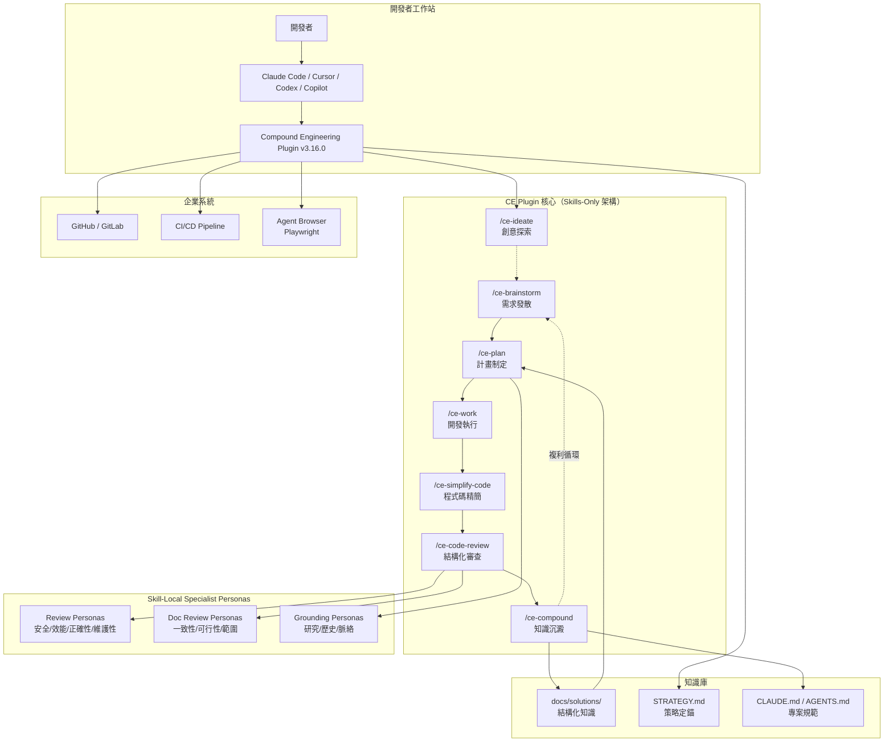

### 2.2 Plugin 元件總覽

Compound Engineering Plugin v3.16.0 採用 **root-native, skills-only** 架構：

| 元件類型 | 數量 | 說明 |
|---------|------|------|
| **Skills（技能）** | 27 | 使用者直接呼叫的斜線指令，是主要入口點 |
| **Standalone Agents** | 0 | v3.14.0 起取消獨立 Agent；專業行為改由 Skill 內部調用 |
| **Specialist Prompt Assets** | 多個 | Skill 內部的 persona 提示檔，定義專業審查/研究角色 |

> **⚠️ v3.14.0 架構重大變更**：自 v3.14.0 起，Plugin 從 `plugins/compound-engineering/` 子目錄遷移至 **repository root-native layout**。不再有獨立的 `agents/`、`commands/` 目錄。所有專業行為（reviewer、researcher）改為 **skill-local prompt assets**——由擁有該行為的 Skill 控制何時載入、使用哪個 model tier、如何合併輸出。

**Skills 分類**：

| 分類 | 代表指令 | 說明 |
|------|---------|------|
| **Core Loop** | `/ce-brainstorm` `/ce-plan` `/ce-work` `/ce-compound` | 核心工作流四階段 |
| **Around the Loop** | `/ce-strategy` `/ce-product-pulse` `/ce-compound-refresh` | 定錨、回饋、維護知識 |
| **On-Demand** | `/ce-pov` `/ce-debug` `/ce-code-review` `/ce-doc-review` `/ce-simplify-code` `/ce-optimize` | 特定需求時調用 |
| **Git Workflow** | `/ce-commit` `/ce-commit-push-pr` `/ce-worktree` | Git 操作自動化 |
| **Autonomous Pipeline** | `/lfg` | 全自動工程工作流 |
| **Frontend & UX** | `/ce-polish` | 對話式 UX 打磨 |
| **Collaboration** | `/ce-proof` | Proof 協作編輯器整合 |
| **Workflow Utilities** | `/ce-promote` `/ce-resolve-pr-feedback` `/ce-dogfood` `/ce-test-browser` `/ce-test-xcode` `/ce-setup` | 流程輔助工具 |

### 2.3 核心概念詞彙表

根據官方 [CONCEPTS.md](https://github.com/EveryInc/compound-engineering-plugin/blob/main/CONCEPTS.md)，以下為本 Plugin 的核心概念：

| 概念 | 定義 |
|------|------|
| **Skill** | 使用者調用的能力，定義於自己的目錄中。Skill 負責編排：漸進式載入參考檔案、派遣 subagents。與 Agent 不同之處在於 Skill 是用戶發起且負責協調 |
| **Agent / Subagent** | 在隔離上下文中運行的單一用途 worker，執行有界範圍工作後回傳結果。目前 CE 的專業行為不以獨立 Agent 暴露，而是由 Skill 用 specialist prompt assets 種子化 generic subagents |
| **Specialist Prompt Asset** | 由某個 Skill 擁有的內部提示檔，定義專業 persona 或研究/審查角色。不是外部暴露的 Plugin 元件——擁有它的 Skill 控制何時載入、使用何種 model/tool policy |
| **Pipeline** | Skills 的鏈式進展，將一件工作從策略/構思，經過 brainstorm、plan、execution、review，到學習記錄。每個階段將持久化的 artifact 交給下一階段 |
| **Learning（Solution Doc）** | 對過去問題的文件化解決方案——bug fix、convention、workflow pattern——作為複利知識的基本單位存入 `docs/solutions/`。攜帶結構化 metadata（category、tags、problem type） |
| **Pattern Doc** | 從多個 Learnings 泛化出的更廣泛規則。比單一事件級 Learning 槓桿更高，但過時風險也更高 |
| **Model Tier** | 派遣 subagent 的語義成本分類——extraction（最便宜）、generation（中等）、ceiling（繼承 orchestrator 的模型） |
| **Confidence Anchor** | 離散自評信心值，每個等級綁定行為準則，用於 gate 和 rank review findings。跨 personas 的 corroboration 可提升一個等級 |
| **Autofix Class** | 審查發現的修復分類：silent apply / confirm-then-apply / human-resolve / advisory |
| **Headless Mode** | 無人值守模式——Skill 不發出 user prompts，產出書面報告，對真正模糊的決策保守延後 |
| **Evidence Dossier** | 批量證據文件——verbatim quotes + source pointers，由低成本 scout agent 寫入 scratch storage，orchestrator 只攜帶簡短摘要 |

### 2.4 與企業系統整合方式

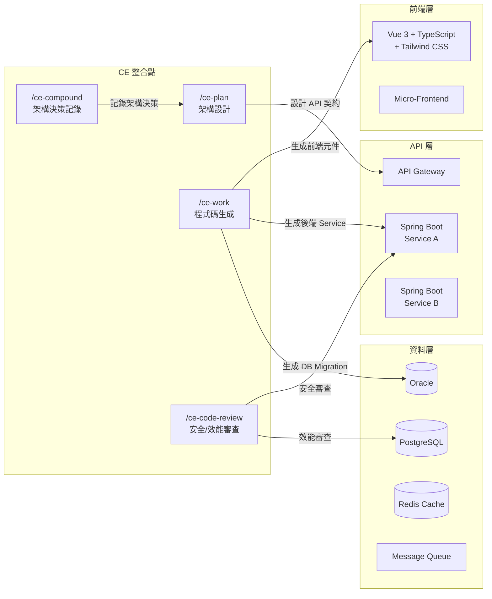

**整合要點**：

1. **前端整合**：`/ce-work` 搭配 `/ce-polish` 生成並迭代 UI 元件
2. **後端整合**：`/ce-plan` 設計 API 契約，`/ce-work` 生成 Spring Boot Controller / Service / Repository
3. **資料庫整合**：review personas 中的 data-integrity-guardian 檢查 DB migration 安全性
4. **CI/CD 整合**：`/ce-commit-push-pr` 自動建立 PR 並觸發 pipeline

### 2.5 Skill Workflow 設計

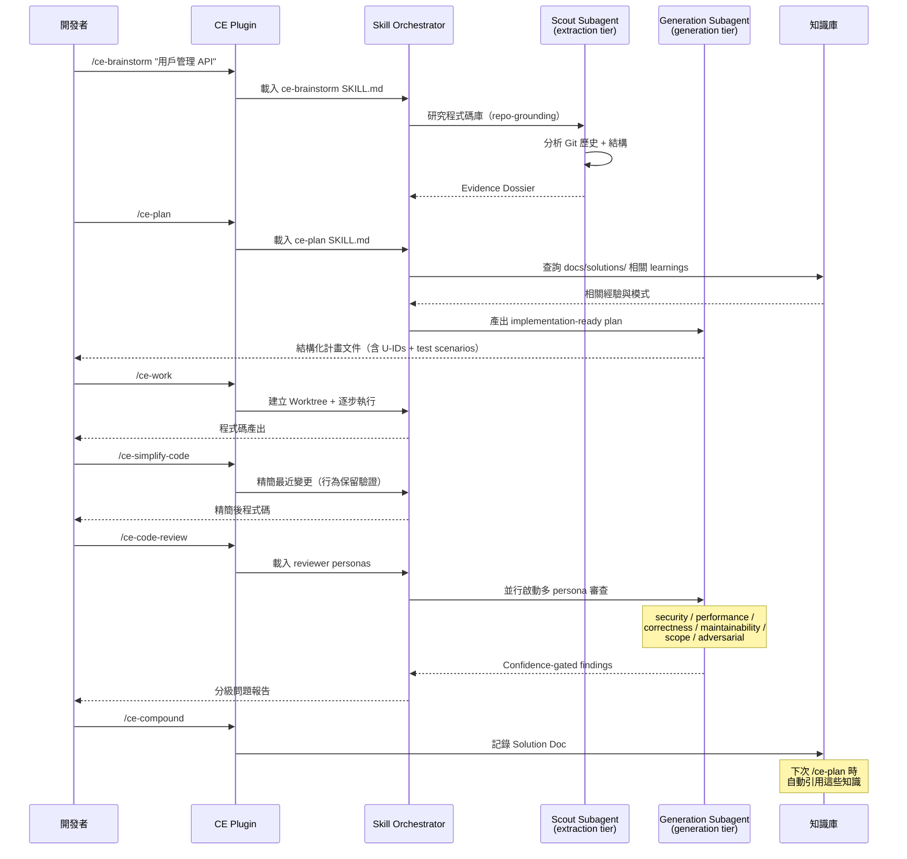

### 2.6 知識庫（Knowledge Base）設計

Compound Engineering 的知識庫採用**檔案化設計**，知識直接存放在程式碼庫中：

```text
project-root/
├── CLAUDE.md              # 專案整體規範（Agent 自動讀取）
├── AGENTS.md              # Agent 行為規範
├── STRATEGY.md            # 策略定錨（/ce-strategy 產出）
├── .claude/
│   ├── commands/          # 自訂斜線指令
│   └── settings.json      # Claude Code 設定
├── docs/
│   ├── solutions/         # /ce-compound 產出的知識（Solution Docs）
│   │   ├── api-pagination-retry-pattern.md
│   │   ├── cache-invalidation-saga.md
│   │   └── auth-jwt-refresh-token.md
│   └── pulse-reports/     # /ce-product-pulse 產出的報告
└── .compound-engineering/  # Plugin 本地設定（gitignored）
```

**知識分層**：

| 層級 | 位置 | 範圍 | 說明 |
|------|------|------|------|
| **策略級** | `STRATEGY.md` | 單一專案 | `/ce-strategy` 產出，被 ideate/brainstorm/plan 讀取為 grounding |
| **專案級** | `CLAUDE.md` / `AGENTS.md` | 單一專案 | 專案編碼規範、架構約束 |
| **學習級** | `docs/solutions/` | 單一專案 | `/ce-compound` 自動產出的 Solution Docs |
| **脈搏級** | `docs/pulse-reports/` | 單一專案 | `/ce-product-pulse` 時間窗口化產品報告 |
| **個人級** | `~/.claude/skills/` | 開發者個人 | 個人累積的 Skills |

> **💡 實務建議**：知識庫採用 Git 版本控制。`/ce-compound` 產出的 Solution Docs 攜帶 YAML frontmatter（category、tags、problem type），使得未來的 `/ce-brainstorm` 和 `/ce-plan` 可自動搜尋並引用相關經驗。定期使用 `/ce-compound-refresh` 清理過時知識（五種結果：Keep / Update / Consolidate / Replace / Delete）。

---

## 第三章：安裝與環境建置

### 3.1 前置需求

| 項目 | 需求 | 說明 |
|------|------|------|
| **Git** | v2.30+ | 版本控制與 Worktree |
| **gh CLI** | v2.0+ | GitHub CLI（用於 PR 操作） |
| **AI Coding Tool** | 至少一個 | Claude Code / Cursor / Codex / Copilot 等 |

> **ℹ️ v3.14.0 架構簡化**：自 v3.14.0 起，Plugin 安裝不再需要 Bun 或 Node.js。每個平台都有**原生安裝方式**。Bun 僅在您要開發 Plugin 本身時才需要。

### 3.2 各平台安裝方式

#### Claude Code（Plugin Marketplace）

```bash
# 方法一：Marketplace（推薦）
# 在 Claude Code 中執行：
/install-plugin https://github.com/EveryInc/compound-engineering-plugin

# 方法二：手動 clone
cd ~/.claude/plugins/
git clone https://github.com/EveryInc/compound-engineering-plugin.git
```

#### Cursor

```bash
# 在 Cursor 中執行：
/add-plugin https://github.com/EveryInc/compound-engineering-plugin
```

#### Codex App（Custom Marketplace）

```bash
# 透過 Custom Marketplace plugin 安裝
codex plugin install https://github.com/EveryInc/compound-engineering-plugin
```

#### Codex CLI

```bash
codex install https://github.com/EveryInc/compound-engineering-plugin
```

#### GitHub Copilot（VS Code Plugin + CLI）

在 VS Code 中安裝 GitHub Copilot Chat 後：

```bash
# VS Code 中添加 Plugin
# Settings → GitHub Copilot → Plugins → Add Plugin URL:
# https://github.com/EveryInc/compound-engineering-plugin

# CLI 安裝
gh copilot plugin add https://github.com/EveryInc/compound-engineering-plugin
```

#### Kimi Code CLI

```bash
kimi-code plugin install https://github.com/EveryInc/compound-engineering-plugin
```

#### OpenCode

在專案根目錄建立或編輯 `opencode.json`：

```json
{
  "plugins": [
    {
      "url": "https://github.com/EveryInc/compound-engineering-plugin",
      "branch": "main"
    }
  ]
}
```

#### Pi

```bash
pi plugin install https://github.com/EveryInc/compound-engineering-plugin
```

#### Antigravity CLI（agy）

```bash
agy plugin install https://github.com/EveryInc/compound-engineering-plugin
```

> **ℹ️ 注意**：Antigravity CLI（`agy`）已取代原本的 Gemini CLI 成為推薦的 Google 系 coding agent。

#### Factory Droid

```bash
droid plugin add https://github.com/EveryInc/compound-engineering-plugin
```

#### Qwen Code

```bash
qwen-code plugin install https://github.com/EveryInc/compound-engineering-plugin
```

### 3.3 支援平台完整清單

| 平台 | 安裝方式 | 狀態 |
|------|---------|------|
| **Claude Code** | Plugin Marketplace / Git clone | ✅ 主要平台 |
| **Cursor** | `/add-plugin` | ✅ 穩定 |
| **Codex App** | Custom Marketplace | ✅ 穩定 |
| **Codex CLI** | `codex install` | ✅ 穩定 |
| **GitHub Copilot** | VS Code Plugin + CLI | ✅ 穩定 |
| **Kimi Code CLI** | `kimi-code plugin install` | ✅ 穩定 |
| **OpenCode** | `opencode.json` 設定 | ✅ 穩定 |
| **Pi** | `pi plugin install` | ✅ 穩定 |
| **Antigravity CLI (agy)** | `agy plugin install` | ✅ 穩定 |
| **Factory Droid** | `droid plugin add` | ✅ 穩定 |
| **Qwen Code** | `qwen-code plugin install` | ✅ 穩定 |

### 3.4 既有安裝升級

```bash
# ⚠️ 重要：升級前務必在 Marketplace 中重新整理（refresh）
# 以確保取得最新版本資訊

# Claude Code：在 Marketplace 中 Refresh → Update
/update-plugin compound-engineering-plugin

# Cursor：移除後重新安裝
/remove-plugin compound-engineering
/add-plugin https://github.com/EveryInc/compound-engineering-plugin

# 手動 clone 方式：
cd ~/.claude/plugins/compound-engineering-plugin
git pull origin main
```

> **⚠️ v3.14.0 遷移注意**：若您的專案仍有 `plugins/compound-engineering/` 子目錄，需刪除它並重新安裝。v3.14.0 改為 root-native layout，舊的子目錄結構不再被識別。

### 3.5 ce-setup 環境診斷與初始化

`/ce-setup` 是**專案初始化的最佳起點**。在任何專案的 AI coding tool 中執行：

```
/ce-setup
```

它會自動執行：

1. **環境診斷**：檢查 Git、gh CLI 等工具版本
2. **專案配置**：初始化 `CLAUDE.md`、`AGENTS.md`、建議的專案結構
3. **知識庫初始化**：建立 `docs/solutions/` 目錄
4. **健康檢查**：確認 Plugin 所有 Skills 可正常載入

**輸出範例**：

```
✅ Git v2.45.0
✅ gh v2.50.0
✅ Plugin v3.16.0 — 27 skills loaded
✅ Project config bootstrapped
✅ CLAUDE.md created with recommended defaults
✅ docs/solutions/ initialized
🎉 Setup complete! Run /ce-brainstorm to get started.
```

### 3.6 Windows 環境設定

```powershell
# 1. 安裝 GitHub CLI
winget install GitHub.cli

# 2. 安裝 Claude Code（若使用 Claude Code 作為主要工具）
winget install Anthropic.ClaudeCode

# 3. 在 Claude Code 中安裝 Plugin
# /install-plugin https://github.com/EveryInc/compound-engineering-plugin

# 4. 執行初始化
# /ce-setup
```

> **⚠️ Windows 注意事項**：
> - 建議使用 Windows Terminal + PowerShell 7
> - Git Worktree 功能需確保路徑不超過 260 字元限制（或啟用長路徑支援）
> - `/ce-worktree` 在 Windows 上完整支援，但建議專案路徑簡短

### 3.7 CI/CD 環境設定

在 GitHub Actions 中使用 CE Plugin 進行自動審查：

```yaml
# .github/workflows/ce-review.yml
name: CE Auto Review
on:
  pull_request:
    types: [opened, synchronize]

jobs:
  ce-review:
    runs-on: ubuntu-latest
    steps:
      - uses: actions/checkout@v4
        with:
          fetch-depth: 0

      - name: Install Claude Code
        run: curl -fsSL https://claude.ai/install | sh

      - name: Install CE Plugin
        run: claude plugin install https://github.com/EveryInc/compound-engineering-plugin

      - name: Run CE Code Review
        env:
          ANTHROPIC_API_KEY: ${{ secrets.ANTHROPIC_API_KEY }}
        run: |
          claude -p "Run /ce-code-review on the changes in this PR"
```

> **💡 實務建議**：CI 環境中建議將 Plugin clone 為 Git submodule 或使用 Actions Cache，避免每次重新下載。

---

## 第四章：核心功能教學

### 4.1 核心工作流總覽

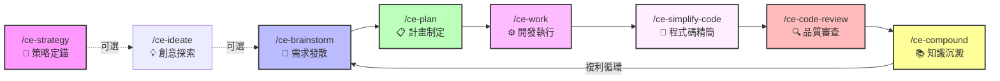

**工作流六步驟**（v3.15.0+ 標準流程）：

| 階段 | 指令 | 時間佔比 | 說明 |
|------|------|---------|------|
| 1. Brainstorm | `/ce-brainstorm` | **40%** | 需求發散與研究 |
| 2. Plan | `/ce-plan` | **20%** | 結構化計畫制定 |
| 3. Work | `/ce-work` | **15%** | 開發執行 |
| 4. Simplify | `/ce-simplify-code` | **5%** | 行為保留式精簡 |
| 5. Review | `/ce-code-review` | **15%** | 多 persona 審查 |
| 6. Compound | `/ce-compound` | **5%** | 知識沉澱 |

> **💡 關鍵原則**：80% 的時間投入規劃與審查（步驟 1、2、5），20% 投入執行與沉澱（步驟 3、4、6）。

### 4.2 /ce-ideate — 創意探索

**用途**：無方向性的創意發散，發現高影響力改善機會。

```bash
# 開放式探索
/ce-ideate

# 帶方向的探索
/ce-ideate "效能優化方向"
/ce-ideate "安全性改善"
```

**工作機制**：
1. 分析程式碼庫結構與歷史
2. 讀取 `STRATEGY.md` 作為方向 grounding
3. 透過「發散式思考」產生改善想法
4. 透過「對抗性過濾」篩選出可行方案
5. 輸出優先排序的改善建議

**適用時機**：
- Sprint Planning 前的腦力激盪
- 技術債清理規劃
- 架構重構方向探索

### 4.3 /ce-brainstorm — 需求發散

**用途**：**主要入口點**。將模糊的想法精煉為清晰的需求計畫。

```bash
# 開始腦力激盪
/ce-brainstorm "客戶需要一個帳戶管理功能"

# 帶更多上下文
/ce-brainstorm "需要支援 JWT 認證的 REST API，包含登入、登出、Token 更新"
```

**工作機制**（v3.15.0 統一計畫文件）：
1. 啟動 **repo-grounding**：scout subagent 研究程式碼庫結構、Git 歷史
2. 查詢 `docs/solutions/` 中的相關 learnings
3. 與開發者進行**互動式 Q&A**，釐清需求
4. 當需求足夠清晰時，**自動跳過多餘儀式**（short-circuit）
5. 輸出 **unified plan artifact**（統一計畫文件），可由 `/ce-plan` 直接消費

**Prompt 範例（企業案例）**：

```
/ce-brainstorm "我們的銀行帳戶系統需要新增轉帳功能。
需求：
- 支援即時轉帳與預約轉帳
- 需要雙因素驗證（2FA）
- 單日轉帳上限為 500 萬
- 需要與現有的 Spring Boot 帳戶服務整合
- 前端使用 Vue 3
技術約束：
- 必須通過安全審查
- 需要完整的審計日誌
- 效能要求：< 3秒完成轉帳"
```

### 4.4 /ce-plan — 計畫制定

**用途**：將需求文件轉化為 **implementation-ready 的技術計畫**，包含 U-IDs、test scenarios 和 confidence check。

```bash
# 接續 brainstorm 的結果
/ce-plan

# 直接給定詳細想法
/ce-plan "實作 Spring Boot REST API，支援 CRUD 操作
- Controller: TransferController
- Service: TransferService
- Repository: TransferRepository
- 使用 JPA + Oracle
- 需要 input validation
- 需要 integration test"
```

**Plan 工作流程**：

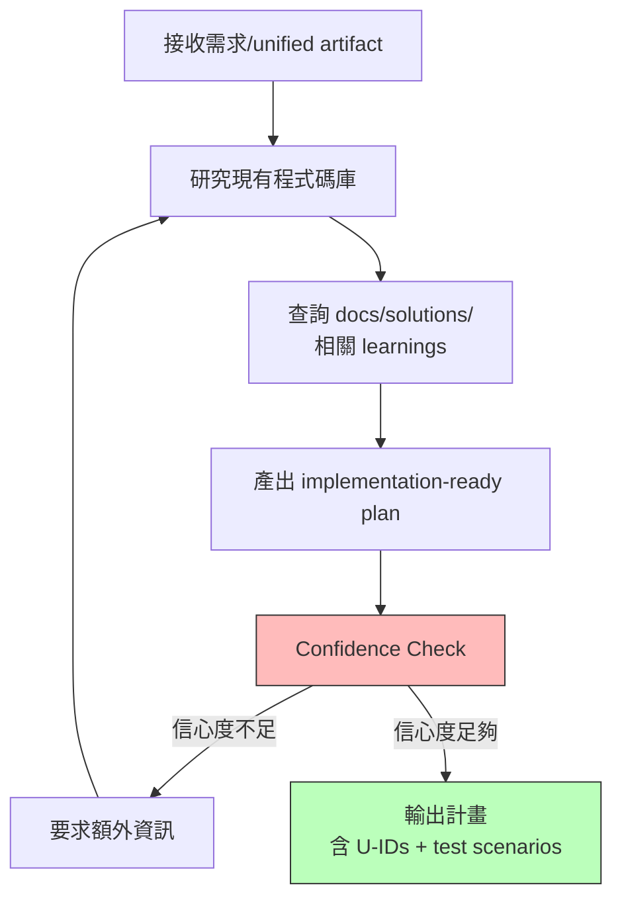

**v3.15.0 計畫文件格式**：

```markdown
# Implementation Plan: 轉帳功能 API

## U-001: Transfer Entity + Migration
- **Description**: 建立 Transfer entity 與 Oracle migration
- **Test Scenario**: Migration up/down 可重複執行
- **Confidence**: HIGH

## U-002: TransferService — 即時轉帳
- **Description**: 實作即時轉帳邏輯含 OTP 驗證
- **Test Scenario**: 成功轉帳 / 餘額不足 / OTP 失敗 / 限額超過
- **Confidence**: HIGH

## U-003: TransferController
- **Description**: REST endpoints + input validation
- **Test Scenario**: Happy path / validation errors / auth failure
- **Confidence**: MEDIUM (需確認 API 契約)

## Referenced Solutions
- docs/solutions/oracle-jpa-performance.md
- docs/solutions/jwt-best-practices.md
```

### 4.5 /ce-work — 開發執行

**用途**：根據計畫**系統性地執行開發工作**。

```bash
# 執行 Plan 中的任務
/ce-work

# 指定特定任務
/ce-work "執行 U-001 到 U-003"
```

**工作機制**：
1. 讀取 Plan 文件（unified plan artifact）
2. **建立 Git Worktree**（隔離工作環境）
3. 逐步執行每個 U-ID 任務
4. 每步驟後自動編譯確認
5. 產出對應的測試

**Worktree 管理**：

```bash
# 獨立管理 Git worktree（用於並行開發）
/ce-worktree
```

### 4.6 /ce-simplify-code — 程式碼精簡

**用途**：在 Code Review 之前，對最近變更進行**行為保留式精簡**，移除不必要的複雜度。

```bash
# 精簡最近的變更
/ce-simplify-code

# 指定範圍
/ce-simplify-code "精簡 TransferService 相關變更"
```

**工作機制**：
1. 識別最近的程式碼變更（diff-based）
2. 分析每段變更是否有更簡潔的等價實作
3. **驗證行為不變**：確保精簡後的程式碼通過相同的測試
4. 產出精簡建議並自動套用（silent apply class）

**精簡類型**：

| 精簡類型 | 說明 | 範例 |
|---------|------|------|
| Dead code removal | 移除未使用的程式碼 | 未呼叫的 private method |
| Simplification | 用更簡潔的等價表達 | Stream 替代 for-loop |
| Redundancy elimination | 移除重複邏輯 | 合併相似的 validation |
| Naming improvement | 更清晰的命名 | `processData` → `validateTransfer` |

> **💡 實務建議**：`/ce-simplify-code` 是 v3.15.0 新增的核心步驟，放在 `/ce-work` 之後、`/ce-code-review` 之前。這能大幅減少 review 階段的噪音，讓 reviewer personas 專注於真正的邏輯問題。

### 4.7 /ce-code-review — 結構化程式碼審查

**用途**：啟動**多 persona 並行程式碼審查**，是 CE 品質保障的核心。

```bash
# 審查當前變更
/ce-code-review

# 審查特定 PR
/ce-code-review "review PR #42"
```

**審查架構**：

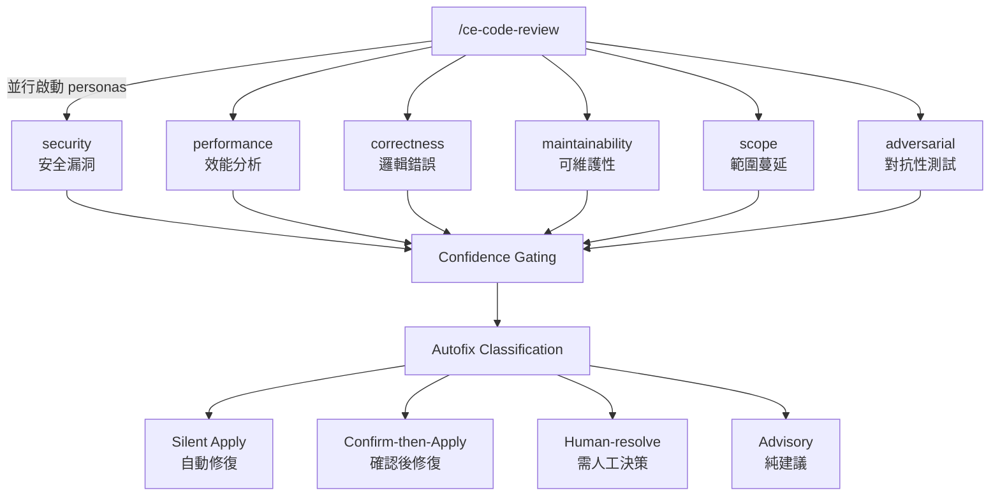

**Confidence-gated 審查機制**：

每個 persona 的每條發現都附帶 **Confidence Anchor**（信心度分級）：

| 信心度 | 定義 | 行為 |
|--------|------|------|
| **HIGH** | 跨 personas 佐證 + 明確證據 | 自動修復（silent apply） |
| **MEDIUM** | 單一 persona 有信心 | 確認後修復 |
| **LOW** | 可能是假陽性 | 純建議（advisory） |
| **CONFLICT** | Personas 意見分歧 | 升級為人工決策 |

**v3.15.0 跨模型對抗性審查**：

```
# 新功能：Adversarial Cross-Model Review
# 當同一發現被不同 model tier 的 persona 佐證時，
# 信心度自動提升一級（corroboration boost）
```

### 4.8 /ce-compound — 知識沉澱

**用途**：**複利工程的核心**。將本次開發循環的學習記錄為結構化的 Solution Doc。

```bash
# 記錄本次學習
/ce-compound

# 指定重點
/ce-compound "記錄 Oracle JPA 批次操作的效能最佳化方法"
```

**工作機制**：
1. 分析本次 Brainstorm → Plan → Work → Simplify → Review 的完整過程
2. 提取關鍵學習：Bug、效能問題、安全發現、新的解決方法
3. 將學習轉化為**結構化 Solution Doc**（含 YAML frontmatter）
4. 存入 `docs/solutions/`

**Solution Doc 格式**：

```markdown
---
category: performance
tags: [oracle, jpa, batch-insert]
problem_type: performance-degradation
confidence: high
created: 2026-06-30
---

# Solution: Oracle JPA 批次操作效能最佳化

## Problem
使用 `saveAll()` 批次寫入 1000 筆轉帳記錄時，耗時超過 30 秒。

## Root Cause
JPA 預設逐筆 INSERT，未啟用 JDBC batch。

## Solution
1. 設定 `spring.jpa.properties.hibernate.jdbc.batch_size=50`
2. 啟用 `hibernate.order_inserts=true`
3. 使用 `@BatchSize(size=50)` 標註 Collection

## Verification
- 批次寫入 1000 筆：30s → 2s
- p6spy 確認只產生 20 個 batch INSERT

## Applicability
所有需要批次寫入 Oracle 的 Service
```

**知識刷新**：

```bash
# 刷新過時的知識
/ce-compound-refresh
```

`/ce-compound-refresh` 會逐一檢查現有 Solution Docs，產出五種結果之一：

| 結果 | 說明 |
|------|------|
| **Keep** | 仍然有效，不做變更 |
| **Update** | 內容需要更新（如版本變更） |
| **Consolidate** | 多份相似 docs 合併為一份 |
| **Replace** | 完全重寫（原始問題已有更好解法） |
| **Delete** | 已不適用（如已棄用的技術） |

### 4.9 /ce-debug — 除錯追蹤

```bash
# 系統性除錯
/ce-debug "TransferService.execute() 在高併發下回傳 500 錯誤"
```

**工作機制**：
1. **因果鏈追蹤**（Causal Chain Tracing）：從錯誤逆向追溯原因
2. **假設產生**：形成可測試的假設清單
3. **Test-first 修復**：先寫失敗測試再修 Bug
4. **驗證確認**：確保修復不影響其他功能

### 4.10 /ce-optimize — 最佳化迴圈

```bash
# 執行最佳化迴圈
/ce-optimize "API 回應時間最佳化"
```

**工作機制**：

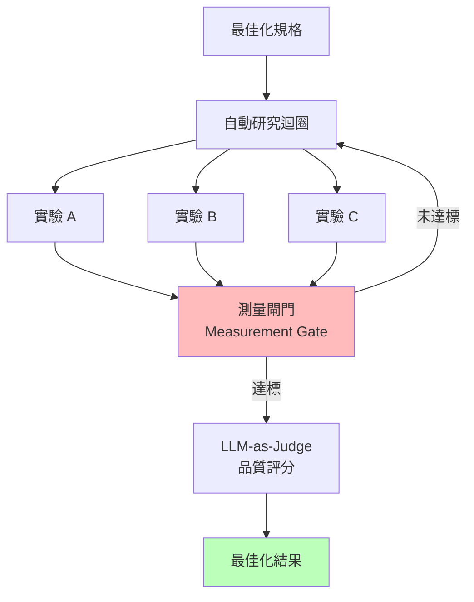

### 4.11 /ce-pov — 技術裁決

**用途**：對技術決策進行結構化的 **Point of View** 裁決，產出可供團隊參考的技術意見書。

```bash
# 技術選型裁決
/ce-pov "Redis vs Memcached 作為 session store"

# 架構決策裁決
/ce-pov "微服務 vs 模組化單體 for 轉帳系統"

# 方案評估
/ce-pov "是否應該引入 Event Sourcing"
```

**工作機制**：
1. 研究程式碼庫現狀與約束條件
2. 蒐集多方證據（框架文件、社群經驗、專案 learnings）
3. 從正反兩面分析
4. 產出**結構化技術裁決文件**，含推薦、風險、替代方案

**輸出格式**：

```markdown
# POV: Redis vs Memcached for Session Store

## Verdict: Redis
**Confidence: HIGH**

## Rationale
1. 專案已使用 Redis 作為 cache（無需引入新依賴）
2. 支援持久化（AOF/RDB），符合金融合規要求
3. 原生支援 TTL + pub/sub（session 過期通知）

## Risks
- Redis 單線程在極高併發下可能成為瓶頸
- 需監控記憶體使用（session data 可能膨脹）

## Alternatives Considered
- Memcached：更簡單但無持久化、無 pub/sub
- Database sessions：最安全但效能最差
```

### 4.12 /ce-strategy — 策略定錨

**用途**：產出或更新 `STRATEGY.md`，為專案定義策略方向，作為所有後續 ideate/brainstorm/plan 的 grounding。

```bash
# 初始化策略文件
/ce-strategy

# 更新策略
/ce-strategy "Q3 目標：效能優化 + 微服務拆分"
```

**STRATEGY.md 用途**：
- 定義專案的長期技術方向
- 被 `/ce-ideate` 和 `/ce-brainstorm` 讀取，確保建議與策略對齊
- 被 `/ce-plan` 用作 grounding，確保計畫不偏離方向
- 定期由 Tech Lead 審查更新

### 4.13 /ce-product-pulse — 產品脈搏報告

**用途**：對專案的近期活動產出結構化的**產品脈搏報告**，涵蓋 commits、PRs、issues 等。

```bash
# 產出最近一週的脈搏報告
/ce-product-pulse

# 指定時間範圍
/ce-product-pulse "last 2 weeks"
```

**報告產出位置**：`docs/pulse-reports/`

**報告內容**：
- 最近新增/修改的功能摘要
- 開啟/關閉的 issues 統計
- PR merge 速率與審查時間
- 技術債趨勢
- 建議的下一步行動

### 4.14 /ce-dogfood — 瀏覽器 QA

**用途**：使用 Agent Browser（Playwright）對應用進行 **dogfooding 式的 QA 測試**——像真實用戶一樣操作應用。

```bash
# 對當前 PR 影響的頁面執行 dogfood 測試
/ce-dogfood

# 指定測試範圍
/ce-dogfood "測試轉帳功能的完整 happy path"
```

**工作機制**：
1. 識別 PR 影響的頁面/功能
2. 啟動 Playwright 瀏覽器
3. 模擬用戶操作流程
4. 截圖記錄每個步驟
5. 報告發現的問題（UI 壞掉、功能異常、console errors）

> **ℹ️ v3.16.0 升級**：`/ce-dogfood` 從 beta 升級為 stable，可安全用於生產環境的 QA 流程。

### 4.15 /ce-test-browser — 瀏覽器測試

**用途**：對 PR 影響的頁面執行結構化的瀏覽器自動化測試。

```bash
/ce-test-browser
```

**與 /ce-dogfood 的差異**：
- `/ce-dogfood`：探索性測試，像用戶一樣自由操作
- `/ce-test-browser`：結構化測試，依據測試計畫逐步驗證

### 4.16 /lfg — 全自動工程工作流

**用途**：`/lfg`（Let's F***ing Go）是一個**完全自主的工程工作流**，將 brainstorm → plan → work → simplify-code → code-review → compound 全部自動化，目標是從想法直接到 green PR。

```bash
# 啟動全自動工作流
/lfg "實作用戶管理 CRUD API"
```

**適用時機**：
- 需求明確、範圍小的功能開發
- 原型快速建置（Vibe Coding 模式）
- Stage 4/5 成熟度的團隊

**v3.15.0 增強**：`/lfg` 現在包含 `/ce-simplify-code` 步驟，在 review 前自動精簡程式碼。

> **⚠️ 使用建議**：對於生產級功能開發，仍建議使用分步工作流以確保每個階段的品質控制。`/lfg` 最適合在信任度高（Stage 4+）的環境中使用。

### 4.17 錯誤案例與修正

#### 錯誤 1：Plan 產出空泛不具體

```bash
# ❌ 錯誤：描述太模糊
/ce-plan "做一個 API"

# ✅ 正確：提供足夠上下文
/ce-plan "實作 RESTful 轉帳 API
- POST /api/v1/transfers（即時轉帳）
- POST /api/v1/transfers/scheduled（預約轉帳）
- 使用現有的 AccountService 查詢餘額
- 需要 JWT 認證 + 2FA 驗證
- Oracle DB 寫入需要 XA Transaction"
```

#### 錯誤 2：Review 結果太多噪音

```bash
# ❌ 問題：所有 persona 都報告大量低優先級問題
# ✅ 解法：在 CLAUDE.md 中設定審查規則與 Confidence 閾值
```

```markdown
# CLAUDE.md 中新增
## Review 規則
- 只報告 Confidence >= MEDIUM 的發現
- security persona: 只報告 CRITICAL 和 HIGH
- performance persona: 只報告回應時間 > 1s 的問題
- maintainability persona: 忽略生成的程式碼
```

#### 錯誤 3：Compound 知識未被使用

```bash
# ❌ 問題：/ce-plan 未引用過去的 Solution Docs
# ✅ 解法：確認 docs/solutions/ 目錄存在且有內容
```

```markdown
# CLAUDE.md
## Knowledge Base
- 專案知識：docs/solutions/
- 在 Plan 階段一定查詢相關 Solution Docs
- 在 Brainstorm 階段引用 STRATEGY.md
```

---

## 第五章：企業級開發流程設計

### 5.1 AI Agent 開發流程（SSDLC 整合）

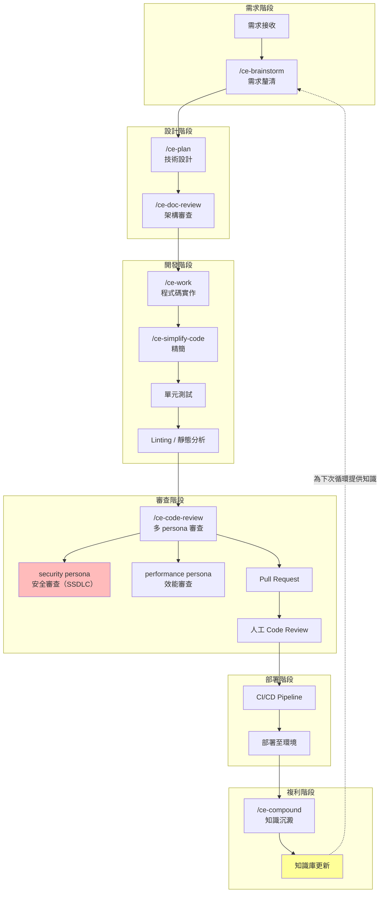

**SSDLC 整合要點**：

| SSDLC 階段 | CE 對應功能 | 說明 |
|------------|-----------|------|
| 威脅建模 | `/ce-plan` + security-lens persona | 在計畫階段就考慮安全威脅 |
| 安全編碼 | `/ce-work` + CLAUDE.md 安全規範 | Agent 遵循安全編碼準則 |
| 安全審查 | `/ce-code-review` → security + security-sentinel personas | 雙重安全 persona 審查 |
| 滲透測試 | `/ce-debug` + `/ce-test-browser` | 自動化安全測試 |
| 安全知識 | `/ce-compound` | 安全相關學習自動記錄 |

### 5.2 與 Git Flow 整合

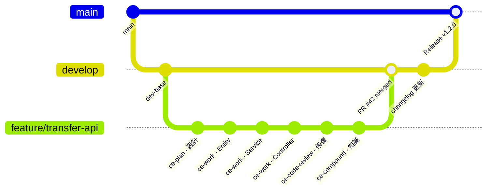

**Git Workflow Skills**：

```bash
# 建立 commit 並推送 + 開 PR
/ce-commit-push-pr

# 單純 commit
/ce-commit

# 管理 worktree（並行開發）
/ce-worktree
```

### 5.3 與 CI/CD 整合

```yaml
# .github/workflows/compound-engineering.yml
name: Compound Engineering Pipeline
on:
  pull_request:
    types: [opened, synchronize]
  push:
    branches: [main, develop]

jobs:
  # 階段 1：自動審查
  ce-review:
    runs-on: ubuntu-latest
    if: github.event_name == 'pull_request'
    steps:
      - uses: actions/checkout@v4
      - name: CE Review
        env:
          ANTHROPIC_API_KEY: ${{ secrets.ANTHROPIC_API_KEY }}
        run: |
          bunx @every-env/compound-plugin install compound-engineering
          # 觸發自動化審查

  # 階段 2：標準 CI
  build-test:
    runs-on: ubuntu-latest
    steps:
      - uses: actions/checkout@v4
      - uses: actions/setup-java@v4
        with:
          java-version: '21'
          distribution: 'temurin'
      - name: Build & Test
        run: mvn clean verify

  # 階段 3：合併後 Compound
  compound:
    runs-on: ubuntu-latest
    if: github.event_name == 'push' && github.ref == 'refs/heads/main'
    needs: build-test
    steps:
      - uses: actions/checkout@v4
      - name: Auto Compound
        env:
          ANTHROPIC_API_KEY: ${{ secrets.ANTHROPIC_API_KEY }}
        run: |
          # 自動提取並記錄本次合併的學習
          echo "Extracting learnings from merged PR..."
```

### 5.4 Code Review 自動化

**三層審查機制**：

| 層級 | 執行者 | 工具 | 說明 |
|------|--------|------|------|
| **Layer 1** | AI Agent | `/ce-code-review` 多 persona | 自動化多維度審查 |
| **Layer 2** | CI/CD | Linter + SonarQube + Unit Test | 靜態分析與測試 |
| **Layer 3** | 人工 | GitHub PR Review | 架構判斷與業務邏輯確認 |

**PR Feedback 自動處理**：

```bash
# 自動解決 PR 審查意見
/ce-resolve-pr-feedback
```

### 5.5 測試策略

| 測試類型 | CE 支援方式 | 工具 |
|---------|-----------|------|
| **Unit Test** | `/ce-work` 自動產出 | JUnit 5 / Mockito |
| **Integration Test** | `/ce-plan` 中規劃 | Spring Boot Test |
| **E2E Test** | `/ce-test-browser` `/ce-dogfood` | Playwright |
| **Security Test** | security persona | OWASP ZAP |
| **Performance Test** | performance persona | JMeter / K6 |

```bash
# 執行瀏覽器測試
/ce-test-browser

# 探索式 QA 測試
/ce-dogfood

# Testing persona 檢查覆蓋率
# testing persona 會自動檢查：
# - 測試覆蓋缺口
# - 弱斷言（weak assertions）
# - 缺少的邊界測試
```

---

## 第六章：最佳實務（Best Practices）

### 6.1 Prompt Engineering — 如何寫好 ce-plan

**金字塔原則**：

```
Level 1（必備）：What — 要做什麼
Level 2（重要）：Why — 為什麼要做
Level 3（建議）：How — 技術約束與偏好
Level 4（加分）：Context — 參考資料與過去經驗
```

**範例對比**：

```bash
# ❌ 差的 Prompt
/ce-plan "做登入功能"

# ⚠️ 普通的 Prompt
/ce-plan "實作 JWT 登入 API，使用 Spring Security"

# ✅ 好的 Prompt
/ce-plan "實作銀行客戶登入功能
## What
- POST /api/v1/auth/login（帳號密碼登入）
- POST /api/v1/auth/refresh（Token 更新）
- POST /api/v1/auth/logout（登出並作廢 Token）

## Why
- 替換現有的 Session-based 認證
- 支援 Micro-Frontend 的跨域需求

## How
- 使用 Spring Security 6 + JWT
- Access Token 有效期 15 分鐘
- Refresh Token 有效期 7 天，存入 Redis
- 密碼使用 BCrypt 加密
- 失敗 5 次鎖定帳號 30 分鐘

## Context
- 參考 docs/solutions/jwt-best-practices.md
- 現有的 UserService 已有查詢用戶方法
- 需通過 security persona 審查"
```

### 6.2 Context Engineering — 上下文管理

**CLAUDE.md 設計原則**：

```markdown
# CLAUDE.md — 範例

## 專案概述
這是銀行核心帳務系統的轉帳模組，使用 Spring Boot 3.2 + JPA + Oracle 19c。

## 架構規範
- 使用 Clean Architecture（Controller → Service → Repository）
- 所有 Service 方法需有 @Transactional
- 所有 Controller 需有 @PreAuthorize
- API 格式遵循 RESTful 規範

## 編碼規範
- 使用 Java 21 + Record 替代傳統 DTO
- 使用 Optional 替代 null 回傳
- 命名：PascalCase（類別）、camelCase（方法）、UPPER_SNAKE_CASE（常數）

## 安全規範
- 所有 API 需要 JWT 認證
- SQL 參數必須使用 PreparedStatement
- 禁止在日誌中輸出敏感資訊（密碼、Token、身份證號）

## 知識庫
- 專案知識：docs/solutions/
- 在 Plan 階段必須查閱相關 Solution Docs
```

### 6.3 Knowledge Reuse — 複利最大化

**知識複利循環**：

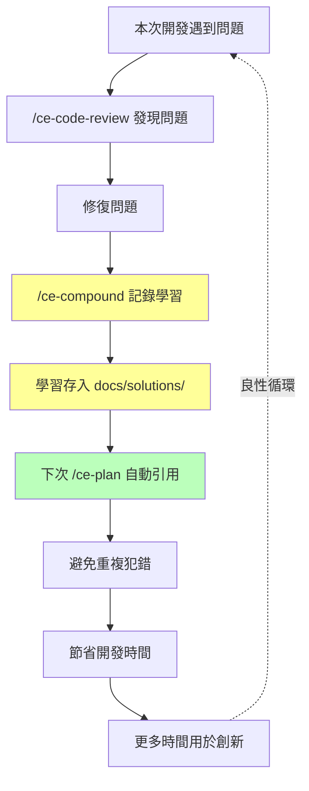

**最佳化策略**：

1. **定期刷新**：每月執行 `/ce-compound-refresh` 清理過時知識
2. **分類管理**：按技術領域分類（安全、效能、架構、DB）
3. **YAML frontmatter**：每份 Solution Doc 都有 category/tags/problem_type
4. **知識審查**：Solution Docs 同樣經過 PR review

### 6.4 防止 AI Hallucination

| 策略 | 做法 |
|------|------|
| **信心度校準** | `/ce-plan` 內建 Confidence Check，信心度不足時會要求更多資訊 |
| **知識庫對照** | Agent 優先使用 docs/solutions/ 內部知識，減少依賴外部知識 |
| **多 persona 交叉驗證** | `/ce-code-review` 多 personas 從不同角度驗證 + cross-model corroboration |
| **人工最終確認** | 重要決策（架構、安全）一定經過人工審查 |
| **測試驗證** | `/ce-work` 產出的程式碼必須通過自動化測試 |
| **Source 引用** | Plan 中要求列出參考來源（Referenced Solutions） |

### 6.5 隱私與安全政策

Compound Engineering Plugin 遵循明確的隱私與安全政策（詳見官方 [PRIVACY.md](https://github.com/EveryInc/compound-engineering-plugin/blob/main/PRIVACY.md) 與 [SECURITY.md](https://github.com/EveryInc/compound-engineering-plugin/blob/main/SECURITY.md)）。企業導入時應特別注意以下要點：

**資料處理原則**：

| 項目 | 說明 |
|------|------|
| **程式碼傳輸** | 程式碼透過 AI 提供者 API 傳輸，需確認符合企業資料分類政策 |
| **知識庫儲存** | Solution Docs 儲存於本地檔案系統（Git repo），不外傳至第三方 |
| **API Key 管理** | `ANTHROPIC_API_KEY` 等金鑰必須透過環境變數或 Secret Manager 管理 |
| **會話資料** | Claude Code 會話历史儲存於本地，`/ce-sessions` 查詢不外傳 |

**企業安全檢查清單**：

- [ ] 確認 AI API Key 不會被 commit 到 Git 倉庫
- [ ] 在 `.gitignore` 中排除敏感設定檔（`.env`、`secrets.json` 等）
- [ ] 設定 CLAUDE.md 中的安全規範（禁止日誌輸出密碼、Token 等）
- [ ] 確認 `/ce-code-review` 的 security 與 security-sentinel personas 已啟用
- [ ] 建立 API Key 輪換（Rotation）機制
- [ ] 確認 CI/CD 中的 API Key 使用 GitHub Secrets 或等價機制
- [ ] 對於金融、醫療等法規存全的產業，確認 AI 處理的資料符合法規要求

> **⚠️ 重要提醒**：在使用 `/ce-brainstorm` 或 `/ce-plan` 時，避免在 Prompt 中包含實際的客戶資料、密碼或其他敏感資訊。使用化名或模擬資料來描述需求。

---

## 第七章：系統維運（Maintenance）

### 7.1 知識庫管理策略

**生命週期管理**：


**管理指令**：

```bash
# 刷新知識庫（檢查過時內容）
/ce-compound-refresh
```

**定期維護時程**：

| 頻率 | 動作 | 負責人 |
|------|------|--------|
| **每週** | `/ce-compound-refresh` 快速檢查 | 各專案負責人 |
| **每月** | 知識庫全面盤點、清理過時 Solution Docs | Tech Lead |
| **每季** | 跨專案知識同步、Best Practices 更新 | Architect |

### 7.2 Plugin 效能調校

**Token 使用最佳化**：

| 情境 | 建議 |
|------|------|
| `CLAUDE.md` 過大 | 拆分為多個檔案，使用 `@import` 參照 |
| Review 時間過長 | 在 CLAUDE.md 中限制 reviewer 範圍 |
| Plan 太冗長 | 分拆為多個小型 Plan |
| Compound 知識過多 | 定期 refresh 並 archive 過時知識 |

**效能監控指標**：

```markdown
## 建議追蹤的指標
- Plan 產出時間（目標：< 5 分鐘）
- Review 完成時間（目標：< 10 分鐘）
- Token 使用量 / 每次循環
- 知識庫引用率（被 Plan 引用的學習百分比）
- Hallucination 率（被人工修正的比例）
```

### 7.3 Log / Monitoring 設計

```bash
# 查詢歷史會話
/ce-sessions "最近的錯誤和問題"

# 查看 Plugin 更新狀態
/ce-update
```

**建議的監控架構**：

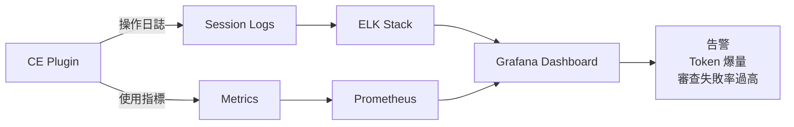

### 7.4 問題排查（Troubleshooting）

| 問題 | 可能原因 | 解決方案 |
|------|---------|---------|
| `/ce-plan` 產出內容空泛 | 輸入太模糊 | 提供更具體的需求描述、技術約束 |
| `/ce-code-review` 無回應 | API Key 過期或額度用盡 | 檢查 `ANTHROPIC_API_KEY`、查看 API 用量 |
| `/ce-work` 產出編譯失敗 | CLAUDE.md 缺少技術棧資訊 | 補充 Java 版本、框架版本、依賴資訊 |
| `/ce-compound` 未記錄學習 | docs/solutions/ 目錄不存在 | 執行 `/ce-setup` 重新初始化 |
| Plugin 版本過舊 | marketplace 快取未更新 | Refresh marketplace 後更新 Plugin |
| Agent 幻覺嚴重 | 上下文不足 | 增加 CLAUDE.md 中的專案描述 |
| Review 報告太多噪音 | 未設定 Confidence 閾值 | 在 CLAUDE.md 中設定報告層級 |
| Git Worktree 衝突 | 路徑過長（Windows） | 啟用 Windows 長路徑支援 |

---

## 第八章：系統升級（Upgrade Strategy）

### 8.1 Plugin 升級流程

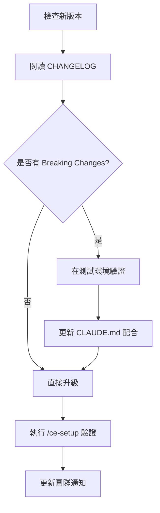

**升級指令**：

```bash
# Claude Code 中更新（先 Refresh marketplace）
/update-plugin compound-engineering-plugin

# 手動 clone 方式
cd ~/.claude/plugins/compound-engineering-plugin
git pull origin main

# 驗證版本
/ce-setup
```

**版本策略**：

| 版本策略 | 說明 |
|---------|------|
| **Patch（x.x.1）** | Bug 修復、立即升級 |
| **Minor（x.1.0）** | 新功能、新 Agent，在測試環境驗證後升級 |
| **Major（1.0.0）** | 可能有 Breaking Changes，需排定升級計畫 |

### 8.2 知識庫版本控制

```bash
# 知識庫與程式碼一同管理
git add docs/solutions/
git commit -m "compound: 新增 Oracle 批次效能最佳化 Solution Doc"

# 透過 PR 審查知識品質
/ce-commit-push-pr
```

**分支策略**：

- `main`：已審查通過的穩定知識
- `develop`：開發中的知識（可能未審查）
- Feature branch：單一功能的知識累積

### 8.3 向下相容策略

1. **CLAUDE.md 版本標記**：在文件中標記適用的 CE 版本

```markdown
# CLAUDE.md
<!-- CE Plugin >= v2.60.0 -->
```

2. **知識遷移腳本**：大版本升級時提供遷移工具
3. **逐步切換**：先在一個專案試點，確認無問題後推廣

### 8.4 災難復原（Disaster Recovery）

| 場景 | 復原方式 |
|------|---------|
| **知識庫損毀** | Git 回滾至上一個穩定版本 |
| **Plugin 異常** | 使用 `--branch` 切換至穩定分支或 checkout 特定 tag |
| **CLAUDE.md 錯誤** | Git revert 還原 |
| **API Key 洩漏** | 立即 rotate key、檢查 Git 歷史、清除敏感資料 |

```bash
# 切換至特定穩定版本
cd ~/.claude/plugins/compound-engineering-plugin
git checkout v3.16.0

# 回滾知識庫
git revert HEAD~3..HEAD -- docs/solutions/
```

---

## 第九章：企業導入建議

### 9.1 導入策略（Pilot → Rollout）

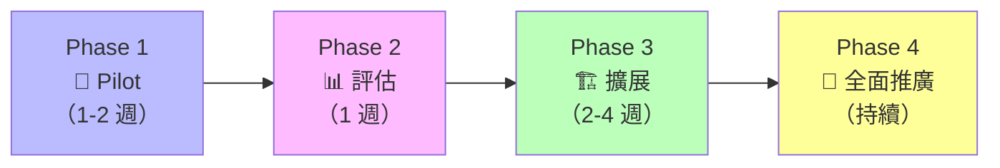

**Phase 1：Pilot（1-2 週）**
- 選擇 1 個小型專案
- 2-3 位熟悉 AI 工具的資深工程師
- 安裝 CE Plugin + 基本設定
- 跑完完整的 Brainstorm → Plan → Work → Review → Compound 循環

**Phase 2：評估（1 週）**
- 收集回饋：開發效率、程式碼品質、知識累積效果
- 比較 KPI：開發速度、Bug 率、Code Review 時間
- 整理 CLAUDE.md 最佳實務

**Phase 3：擴展（2-4 週）**
- 擴展至 3-5 個專案
- 納入不同背景的工程師（資深 + 中階）
- 建立團隊級知識庫
- 整合 CI/CD pipeline

**Phase 4：全面推廣（持續）**
- 所有新專案預設使用 CE
- 定期知識庫維護
- 持續追蹤 KPI

### 9.2 團隊角色轉變

| 傳統角色 | 轉變後角色 | 核心技能變化 |
|---------|-----------|------------|
| **Junior Developer** | AI Operator | 學習撰寫好的 Prompt、理解 Agent 輸出 |
| **Senior Developer** | AI Architect | 設計 Plan、審查 Agent 產出、維護知識庫 |
| **Tech Lead** | Compound Strategist | 設計知識架構、制定 CLAUDE.md 規範 |
| **QA Engineer** | AI Review Specialist | 設計審查規則、定義品質標準 |
| **DevOps Engineer** | AI Pipeline Engineer | 整合 CE 到 CI/CD、監控 Agent 效能 |

### 9.3 KPI 設計

**效率指標**：

| KPI | 計算方式 | 目標 |
|-----|---------|------|
| **開發速度** | Story Points / Sprint | 提升 200%+ |
| **PM Lead Time** | 需求到上線時間 | 縮短 50%+ |
| **Code Review 時間** | PR 開到合併平均時間 | 縮短 60%+ |

**品質指標**：

| KPI | 計算方式 | 目標 |
|-----|---------|------|
| **Bug 率** | Bugs / Feature | 降低 40%+ |
| **安全漏洞** | Security Issues / Release | 降低 70%+ |
| **測試覆蓋率** | Coverage % | > 80% |

**複利指標**：

| KPI | 計算方式 | 目標 |
|-----|---------|------|
| **知識庫增長率** | Learnings / 月 | 穩定增長 |
| **知識引用率** | 被 Plan 引用的 Learnings % | > 60% |
| **重複問題率** | 同類 Bug 再發生率 | < 10% |

### 9.4 教育訓練計畫

| 週次 | 主題 | 內容 | 實作 |
|------|------|------|------|
| **W1** | 基礎概念 | CE 理念、安裝、/ce-setup | 完成環境建置 |
| **W2** | 核心工作流 | brainstorm → plan → work → simplify | 完成一個小功能開發 |
| **W3** | 品質審查 | code-review → compound | 執行完整循環 |
| **W4** | 企業實戰 | CLAUDE.md 設計、CI/CD 整合 | 專案實際導入 |
| **W5-W6** | 進階應用 | /lfg 自動化、/ce-strategy、知識庫設計 | 團隊知識庫建置 |
| **持續** | 回顧優化 | KPI 追蹤、知識刷新 | 每月回顧會議 |

---

## 第十章：完整實戰案例

### 10.1 案例背景

**專案**：銀行轉帳模組  
**技術棧**：
- Backend：Spring Boot 3.2 + JPA + Oracle 19c
- Frontend：Vue 3 + TypeScript + Tailwind CSS
- 認證：JWT（Spring Security 6）

**需求**：實作轉帳功能，包含即時轉帳、預約轉帳、交易查詢

### 10.2 ce:brainstorm — 需求發散

```bash
/ce-brainstorm "銀行轉帳模組開發
需要支援：
1. 即時轉帳（同行/跨行）
2. 預約轉帳（指定日期）
3. 轉帳交易查詢
4. 雙因素驗證（OTP）
5. 單日轉帳限額控制
技術環境：Spring Boot 3.2 + Vue 3 + Oracle 19c"
```

**CE 互動式 Q&A**：
```
CE: 跨行轉帳是否需要對接外部金資中心 API？
Dev: 是的，需要透過內部 Gateway 轉發

CE: OTP 驗證使用什麼方式？SMS 或 App Push？
Dev: 使用 TOTP（Time-based OTP），整合現有的 OTP Service

CE: 預約轉帳的排程機制？
Dev: 使用 Spring Scheduler + Quartz，每日 00:00 批次處理

CE: 單日限額是全行統一還是客戶等級不同？
Dev: 依客戶等級：一般戶 50萬、VIP 200萬、企業戶 500萬
```

**輸出**：結構化需求文件（`requirements-transfer.md`）

### 10.3 ce:plan — 任務拆解

```bash
/ce-plan
```

**Plan 產出**：

```markdown
# 實作計畫：銀行轉帳模組

## Phase 1: 資料層（Day 1-2）
1. Transfer Entity + Enum (TransferType, TransferStatus)
2. Oracle migration scripts (Flyway)
3. TransferRepository (JPA + Custom Query)

## Phase 2: 業務邏輯（Day 3-5）
4. TransferService — 即時轉帳邏輯
5. TransferService — 預約轉帳邏輯
6. TransferLimitService — 限額檢查
7. OtpVerificationService — TOTP 驗證整合
8. TransferScheduler — Quartz 排程設定

## Phase 3: API 層（Day 6-7）
9. TransferController — REST endpoints
10. TransferQueryController — 查詢 endpoints
11. Input Validation（@Valid + custom validator）
12. Exception Handler（GlobalExceptionHandler）

## Phase 4: 前端（Day 8-10）
13. TransferForm.vue — 轉帳表單元件
14. TransferHistory.vue — 交易查詢元件
15. OtpDialog.vue — OTP 驗證彈窗

## Phase 5: 測試（Day 11-12）
16. Unit Tests (Service + Repository)
17. Integration Tests (Controller + Oracle)
18. E2E Tests (Playwright)

## 參考 Solutions
- docs/solutions/oracle-jpa-performance.md
- docs/solutions/jwt-best-practices.md
```

### 10.4 ce-work — 產生程式碼

```bash
/ce-work
```

**Agent 自動執行**：

```java
// 自動產出 Transfer Entity
@Entity
@Table(name = "T_TRANSFER")
public class Transfer {
    @Id
    @GeneratedValue(strategy = GenerationType.SEQUENCE, generator = "transfer_seq")
    @SequenceGenerator(name = "transfer_seq", sequenceName = "SEQ_TRANSFER", allocationSize = 1)
    private Long id;

    @Column(name = "FROM_ACCOUNT", nullable = false, length = 16)
    private String fromAccount;

    @Column(name = "TO_ACCOUNT", nullable = false, length = 16)
    private String toAccount;

    @Column(name = "AMOUNT", nullable = false, precision = 18, scale = 2)
    private BigDecimal amount;

    @Enumerated(EnumType.STRING)
    @Column(name = "TRANSFER_TYPE", nullable = false)
    private TransferType transferType;

    @Enumerated(EnumType.STRING)
    @Column(name = "STATUS", nullable = false)
    private TransferStatus status;

    @Column(name = "SCHEDULED_DATE")
    private LocalDate scheduledDate;

    @Column(name = "CREATED_AT", nullable = false)
    private LocalDateTime createdAt;

    @Column(name = "EXECUTED_AT")
    private LocalDateTime executedAt;

    // constructors, getters, audit fields...
}
```

```java
// 自動產出 TransferService
@Service
@Transactional
@RequiredArgsConstructor
public class TransferService {

    private final TransferRepository transferRepository;
    private final AccountService accountService;
    private final TransferLimitService limitService;
    private final OtpVerificationService otpService;
    private final TransferEventPublisher eventPublisher;

    public TransferResponse executeTransfer(TransferRequest request, String otpCode) {
        // 1. 驗證 OTP
        otpService.verify(request.getUserId(), otpCode);

        // 2. 檢查限額
        limitService.checkDailyLimit(request.getUserId(), request.getAmount());

        // 3. 檢查餘額
        accountService.validateSufficientBalance(
            request.getFromAccount(), request.getAmount()
        );

        // 4. 執行轉帳
        Transfer transfer = Transfer.builder()
            .fromAccount(request.getFromAccount())
            .toAccount(request.getToAccount())
            .amount(request.getAmount())
            .transferType(TransferType.IMMEDIATE)
            .status(TransferStatus.PROCESSING)
            .createdAt(LocalDateTime.now())
            .build();

        transfer = transferRepository.save(transfer);

        // 5. 呼叫帳務核心（扣款 + 入帳）
        accountService.debit(request.getFromAccount(), request.getAmount());
        accountService.credit(request.getToAccount(), request.getAmount());

        transfer.setStatus(TransferStatus.COMPLETED);
        transfer.setExecutedAt(LocalDateTime.now());
        transferRepository.save(transfer);

        // 6. 發送審計事件
        eventPublisher.publishTransferCompleted(transfer);

        return TransferResponse.from(transfer);
    }
}
```

### 10.5 ce-code-review — 改善品質

```bash
/ce-code-review
```

**多 persona 並行審查結果**：

```
🔴 CRITICAL (security-reviewer):
- TransferService.executeTransfer() 缺少 @PreAuthorize 註解
- 轉帳金額未檢查是否為正數

🟡 WARNING (performance-oracle):
- TransferRepository 缺少 fromAccount + createdAt 的複合索引
- 建議使用 @BatchSize 優化交易查詢的 N+1 問題

🟡 WARNING (reliability-reviewer):
- 扣款和入帳不在同一個 DB Transaction 中
- 建議使用 Saga Pattern 或 XA Transaction

🟢 INFO (maintainability-reviewer):
- TransferService 方法過長（45行），建議拆分為 private method
- 建議將帳務操作抽取為 AccountTransactionService

🟢 INFO (testing-reviewer):
- 缺少 OTP 驗證失敗的測試案例
- 缺少轉帳限額超過的邊界測試
```

**修復後重新審查**：

```bash
# 修復完成後
/ce-code-review
# ✅ All personas passed with no CRITICAL issues
```

### 10.6 ce-compound — 知識沉澱

```bash
/ce-compound
```

**自動產出的 Solution Doc**：

```markdown
# Learning: 銀行轉帳模組開發最佳實務

## 日期
2026-04-13

## 關鍵學習

### 1. 安全性
- 所有金融交易 API 必須加上 @PreAuthorize
- 金額參數必須驗證為正數且有上限
- OTP 驗證必須在業務邏輯之前執行

### 2. 效能
- Oracle 複合索引：(from_account, created_at) 用於交易查詢
- 使用 @BatchSize(size = 50) 避免 N+1 查詢

### 3. 可靠性
- 跨帳戶金融操作必須使用 XA Transaction 或 Saga Pattern
- 不可在不同 DB Transaction 中分別處理扣款和入帳

### 4. 測試
- 金融功能必須覆蓋：成功路徑、餘額不足、限額超過、OTP 失敗、併發操作
- 使用 @Sql 載入測試資料，避免測試間相互影響

## 適用範圍
所有金融交易相關的 Service 開發
```

> **💡 複利效果**：下次使用 `/ce-plan` 開發「定期定額轉帳」功能時，Agent 會自動引用這份 Solution Doc，從一開始就加入 `@PreAuthorize`、金額驗證、XA Transaction 設計，避免重複犯錯。

---

## 附錄 A：Skills 完整參考表（v3.16.0）

### Core Loop（核心循環）

| 指令 | 說明 |
|------|------|
| `/ce-brainstorm` | 互動式需求發散，精煉想法為 unified plan artifact |
| `/ce-plan` | 結構化計畫制定，含 U-IDs、test scenarios、confidence check |
| `/ce-work` | 使用 Worktree 系統性執行開發任務 |
| `/ce-compound` | 記錄 Solution Doc，沉澱至 `docs/solutions/` |

### Around the Loop（循環周邊）

| 指令 | 說明 |
|------|------|
| `/ce-strategy` | 產出/更新 STRATEGY.md，為所有後續 skill 定錨方向 |
| `/ce-product-pulse` | 產出時間窗口化產品脈搏報告至 `docs/pulse-reports/` |
| `/ce-compound-refresh` | 刷新過時知識（Keep / Update / Consolidate / Replace / Delete） |

### On-Demand（按需調用）

| 指令 | 說明 |
|------|------|
| `/ce-ideate` | 發散式創意探索，發現高影響力改善機會 |
| `/ce-pov` | 技術裁決：結構化 Point of View 文件 |
| `/ce-debug` | 系統性除錯：因果追蹤 + test-first 修復 |
| `/ce-code-review` | 多 persona 並行程式碼審查（confidence-gated） |
| `/ce-doc-review` | 多 persona 並行文件審查 |
| `/ce-simplify-code` | 行為保留式程式碼精簡 |
| `/ce-optimize` | 迭代最佳化迴圈：並行實驗 + 測量閘門 + LLM-as-Judge |

### Research & Context（研究與上下文）

| 指令 | 說明 |
|------|------|
| `/ce-riffrec-feedback-analysis` | 分析用戶回饋數據 |

### Git Workflow（Git 工作流）

| 指令 | 說明 |
|------|------|
| `/ce-commit` | 建立具價值描述的 commit message |
| `/ce-commit-push-pr` | 一鍵 commit → push → 開 PR |
| `/ce-worktree` | 管理 Git worktree 用於並行開發 |

### Autonomous Pipeline（自主流水線）

| 指令 | 說明 |
|------|------|
| `/lfg` | 全自動工程工作流：brainstorm → plan → work → simplify → review → compound |

### Frontend Design（前端設計）

| 指令 | 說明 |
|------|------|
| `/ce-polish` | 對話式 UX 打磨迭代 |

### Collaboration（協作）

| 指令 | 說明 |
|------|------|
| `/ce-proof` | 透過 Proof 協作編輯器建立、編輯和分享文件 |

### Workflow Utilities（流程工具）

| 指令 | 說明 |
|------|------|
| `/ce-promote` | 推廣/發佈工作成果 |
| `/ce-resolve-pr-feedback` | 並行解決 PR 審查意見 |
| `/ce-dogfood` | Agent Browser QA 測試（Playwright，v3.16.0 升為 stable） |
| `/ce-test-browser` | 對 PR 影響頁面執行結構化瀏覽器測試 |
| `/ce-test-xcode` | 在 iOS Simulator 上建置並測試（使用 XcodeBuildMCP） |
| `/ce-setup` | 環境診斷、專案初始化 |

---

## 附錄 B：Specialist Prompt Assets 參考表

> **⚠️ 架構說明**：自 v3.14.0 起，CE Plugin 不再有獨立暴露的 Agent。以下專業角色以 **skill-local prompt assets** 形式存在——由擁有該行為的 Skill 控制何時載入。

### Code Review Personas（`/ce-code-review` 內部）

| Persona | 職責 |
|---------|------|
| `security` | 可被利用的安全漏洞（含信心度校準） |
| `performance` | 效能分析與最佳化建議 |
| `correctness` | 邏輯錯誤、邊界情況、狀態 bug |
| `maintainability` | 耦合度、複雜度、命名、死碼 |
| `scope` | 範圍蔓延、不相關的變更 |
| `adversarial` | 跨元件邊界失敗場景建構（跨模型佐證） |

### Document Review Personas（`/ce-doc-review` 內部）

| Persona | 職責 |
|---------|------|
| `coherence` | 內部一致性、矛盾、術語偏移 |
| `feasibility` | 技術方案是否經得起實務考驗 |
| `scope-guardian` | 不合理的複雜度、範圍蔓延、過早抽象 |
| `security-lens` | 計畫層級的安全缺口 |
| `adversarial-document` | 挑戰前提假設、壓力測試決策 |

### Grounding / Research Personas（`/ce-brainstorm`、`/ce-plan` 內部）

| Persona | 職責 |
|---------|------|
| `repo-grounding` | 研究程式碼庫結構與慣例 |
| `git-history` | 分析 Git 歷史與程式碼演進 |
| `solutions-researcher` | 搜尋 `docs/solutions/` 中的歷史解決方案 |
---

## 附錄 C：常用指令 Cheat Sheet

```bash
# === 安裝 ===
/install-plugin https://github.com/EveryInc/compound-engineering-plugin
/ce-setup                           # 環境診斷 + 初始化

# === 核心工作流（六步驟）===
/ce-brainstorm "需求描述"            # 需求發散（主要入口）
/ce-plan                            # 計畫制定（含 confidence check）
/ce-work                            # 開發執行（自動建立 worktree）
/ce-simplify-code                   # 程式碼精簡（行為保留）
/ce-code-review                     # 多 persona 審查
/ce-compound                        # 知識沉澱至 docs/solutions/

# === 策略與方向 ===
/ce-strategy                        # 產出/更新 STRATEGY.md
/ce-ideate                          # 創意探索
/ce-pov "技術選型問題"               # 技術裁決

# === 除錯與最佳化 ===
/ce-debug "問題描述"                 # 系統性除錯
/ce-optimize "最佳化目標"            # 迭代最佳化

# === Git 操作 ===
/ce-commit                          # 建立 commit
/ce-commit-push-pr                  # commit + push + PR
/ce-worktree                        # 管理 worktree

# === 品質與測試 ===
/ce-doc-review                      # 文件審查
/ce-dogfood                         # 探索式瀏覽器 QA
/ce-test-browser                    # 結構化瀏覽器測試
/ce-test-xcode                      # iOS 模擬器測試

# === 維護與工具 ===
/ce-compound-refresh                # 刷新過時知識
/ce-product-pulse                   # 產品脈搏報告
/ce-resolve-pr-feedback             # 解決 PR 意見
/lfg "任務描述"                      # 全自動工作流
```

---

## 附錄 D：新進成員檢查清單（Checklist）

### 環境建置

- [ ] 安裝 Git v2.30+ 及 GitHub CLI（gh）
- [ ] 安裝 AI Coding Tool（Claude Code / Cursor / Codex / Copilot 至少一個）
- [ ] 安裝 Compound Engineering Plugin（依平台原生方式）
- [ ] 執行 `/ce-setup` 完成環境診斷與專案初始化

### 專案設定

- [ ] 閱讀專案 `CLAUDE.md`，理解專案規範
- [ ] 閱讀專案 `AGENTS.md`，理解 Agent 行為規範
- [ ] 閱讀 `STRATEGY.md`，理解策略方向
- [ ] 瀏覽 `docs/solutions/` 中的現有 Solution Docs

### 基本操作

- [ ] 完成一次 `/ce-brainstorm` → `/ce-plan` 流程
- [ ] 完成一次 `/ce-work` 執行開發
- [ ] 完成一次 `/ce-simplify-code` 精簡程式碼
- [ ] 完成一次 `/ce-code-review` 品質審查
- [ ] 完成一次 `/ce-compound` 知識沉澱
- [ ] 完成一次完整的 Brainstorm → Plan → Work → Simplify → Review → Compound 循環

### 進階技能

- [ ] 學會使用 `/ce-worktree` 進行並行開發
- [ ] 學會使用 `/ce-commit-push-pr` 一鍵發 PR
- [ ] 學會使用 `/ce-debug` 進行系統性除錯
- [ ] 理解 Confidence Anchor 的分級機制（HIGH / MEDIUM / LOW / CONFLICT）
- [ ] 理解 Autofix Class 的分類（silent / confirm / human / advisory）
- [ ] 學會在 `CLAUDE.md` 中設定審查規則與 Confidence 閾值

### 團隊協作

- [ ] 了解團隊的知識庫結構（`docs/solutions/`）
- [ ] 參加 CE 使用回顧會議（每月）
- [ ] 至少貢獻一份 `/ce-compound` 的 Solution Doc
- [ ] 了解 CI/CD 中的 CE Code Review 自動化流程

### 安全與合規

- [ ] 確認 `ANTHROPIC_API_KEY` 安全存放（不可 commit 到 Git）
- [ ] 了解程式碼中禁止輸出的敏感資訊類型
- [ ] 確認 `/ce-code-review` 的安全 persona 審查結果無 CRITICAL 問題
- [ ] 了解 SSDLC 流程中 CE 的角色

---

## 附錄 E：參考資源與延伸閱讀

### 官方資源

| 資源 | 連結 | 說明 |
|------|------|------|
| **GitHub Repo** | <https://github.com/EveryInc/compound-engineering-plugin> | 原始碼與最新版本（22.3k stars） |
| **README** | [README.md](https://github.com/EveryInc/compound-engineering-plugin/blob/main/README.md) | 安裝指南與平台支援 |
| **Skills 文件** | [docs/skills/README.md](https://github.com/EveryInc/compound-engineering-plugin/blob/main/docs/skills/README.md) | 完整 Skills 分類與說明 |
| **核心概念** | [CONCEPTS.md](https://github.com/EveryInc/compound-engineering-plugin/blob/main/CONCEPTS.md) | 術語定義與架構概念 |
| **Releases** | [GitHub Releases](https://github.com/EveryInc/compound-engineering-plugin/releases) | 版本更新歷史（185+ releases） |
| **隱私政策** | [PRIVACY.md](https://github.com/EveryInc/compound-engineering-plugin/blob/main/PRIVACY.md) | 資料處理說明 |
| **安全政策** | [SECURITY.md](https://github.com/EveryInc/compound-engineering-plugin/blob/main/SECURITY.md) | 漏洞回報與安全機制 |
| **授權** | MIT License | 開源授權 |

### 核心文章

| 文章 | 作者 | 日期 | 說明 |
|------|------|------|------|
| [Compound Engineering: How Every Codes With Agents](https://every.to/chain-of-thought/compound-engineering-how-every-codes-with-agents) | Dan Shipper & Kieran Klaassen | 2025-12 | 系統性闡述四步驟工程方法論 |
| [My AI Had Already Fixed the Code Before I Saw It](https://every.to/source-code/my-ai-had-already-fixed-the-code-before-i-saw-it) | Kieran Klaassen | 2025-08 | 首次提出 Compounding Engineering 概念 |
| [Stop Coding and Start Planning](https://every.to/source-code/stop-coding-and-start-planning) | Kieran Klaassen | 2025-11 | Plan-first 開發策略與 CLAUDE.md 設計 |
| [Teach Your AI to Think Like a Senior Engineer](https://every.to/source-code/teach-your-ai-to-think-like-a-senior-engineer) | Kieran Klaassen | — | 如何讓 AI 學習資深工程師的思維 |
| [How Every Is Harnessing the World-changing Shift of Opus 4.5](https://every.to/source-code/how-every-is-harnessing-the-world-changing-shift-of-opus-4-5) | — | — | Opus 4.5 對 Compound Engineering 的影響 |

### 相關技術

| 技術 | 連結 | 與 CE 的關係 |
|------|------|------------|
| **Claude Code** | <https://www.anthropic.com/claude-code> | CE 的主要運行平台 |
| **MCP (Model Context Protocol)** | <https://modelcontextprotocol.io/> | `/ce-work` 透過 MCP 連接 Playwright 等工具 |
| **Playwright** | <https://playwright.dev/> | `/ce-dogfood`、`/ce-test-browser` 的底層瀏覽器自動化框架 |
| **XcodeBuildMCP** | — | `/ce-test-xcode` 的底層 iOS 測試框架 |

---

> **文件維護說明**：  
> 本手冊隨 Compound Engineering Plugin 版本更新。當前對應版本為 **v3.16.0**（發佈日期：2026-06-30）。  
> 官方倉庫：<https://github.com/EveryInc/compound-engineering-plugin>  
> 建議每次 Plugin 大版本更新時，同步更新本手冊。  
> 如有問題或建議，請透過 GitHub Issues 回報。

