+++
date = '2026-04-13T19:36:38+08:00'
draft = false
title = 'Compound Engineering 教學手冊'
tags = ['教學', 'AI開發','指引']
categories = ['教學']
+++

# Compound Engineering 教學手冊

> **版本**：v2.65.0（2026-04-11）  
> **適用平台**：Claude Code / Cursor / Codex / OpenCode / GitHub Copilot 等  
> **授權**：MIT License  
> **GitHub**：<https://github.com/EveryInc/compound-engineering-plugin>  
> **文件等級**：企業標準技術白皮書  
> **最後更新**：2026-04-13

---

## 目錄

- [第一章：概述](#第一章概述)
  - [1.1 什麼是 Compound Engineering（複利工程）](#11-什麼是-compound-engineering複利工程)
  - [1.2 與傳統 AI Coding 工具比較](#12-與傳統-ai-coding-工具比較)
  - [1.3 核心設計哲學](#13-核心設計哲學)
  - [1.4 適用場景](#14-適用場景)
- [第二章：系統架構整合](#第二章系統架構整合)
  - [2.1 整體架構圖](#21-整體架構圖)
  - [2.2 Plugin 元件總覽](#22-plugin-元件總覽)
  - [2.3 與企業系統整合方式](#23-與企業系統整合方式)
  - [2.4 Agent Workflow 設計](#24-agent-workflow-設計)
  - [2.5 知識庫（Knowledge Base / Wiki）設計](#25-知識庫knowledge-base--wiki設計)
- [第三章：安裝與環境建置](#第三章安裝與環境建置)
  - [3.1 前置需求](#31-前置需求)
  - [3.2 Claude Code 安裝](#32-claude-code-安裝)
  - [3.3 Plugin 安裝（Claude Code）](#33-plugin-安裝claude-code)
  - [3.4 Cursor 安裝](#34-cursor-安裝)
  - [3.5 其他平台安裝（Codex / Copilot / OpenCode / Pi / OpenClaw 等）](#35-其他平台安裝codex--copilot--opencode--pi--openclaw-等)
  - [3.6 ce-setup 環境診斷與初始化](#36-ce-setup-環境診斷與初始化)
  - [3.7 Windows 環境設定](#37-windows-環境設定)
  - [3.8 CI/CD 環境設定](#38-cicd-環境設定)
  - [3.9 跨平台設定同步（Sync）](#39-跨平台設定同步sync)
- [第四章：核心功能教學](#第四章核心功能教學)
  - [4.1 核心工作流總覽](#41-核心工作流總覽)
  - [4.2 /ce:ideate — 創意探索](#42-ceideate--創意探索)
  - [4.3 /ce:brainstorm — 需求發散](#43-cebrainstorm--需求發散)
  - [4.4 /ce:plan — 計畫制定](#44-ceplan--計畫制定)
  - [4.5 /ce:work — 開發執行](#45-cework--開發執行)
  - [4.6 /ce:review — 品質審查](#46-cereview--品質審查)
  - [4.7 /ce:compound — 知識沉澱](#47-cecompound--知識沉澱)
  - [4.8 /ce-debug — 除錯追蹤](#48-ce-debug--除錯追蹤)
  - [4.9 /ce-optimize — 最佳化迴圈](#49-ce-optimize--最佳化迴圈)
  - [4.10 /test-xcode — iOS 應用測試](#410-test-xcode--ios-應用測試)
  - [4.11 /lfg — 全自動工程工作流（實驗性）](#411-lfg--全自動工程工作流實驗性)
  - [4.12 錯誤案例與修正](#412-錯誤案例與修正)
- [第五章：企業級開發流程設計](#第五章企業級開發流程設計)
  - [5.1 AI Agent 開發流程（SSDLC 整合）](#51-ai-agent-開發流程ssdlc-整合)
  - [5.2 與 Git Flow 整合](#52-與-git-flow-整合)
  - [5.3 與 CI/CD 整合](#53-與-cicd-整合)
  - [5.4 Code Review 自動化](#54-code-review-自動化)
  - [5.5 測試策略](#55-測試策略)
- [第六章：最佳實務（Best Practices）](#第六章最佳實務best-practices)
  - [6.1 Prompt Engineering — 如何寫好 ce-plan](#61-prompt-engineering--如何寫好-ce-plan)
  - [6.2 Context Engineering — 上下文管理](#62-context-engineering--上下文管理)
  - [6.3 Knowledge Reuse — 複利最大化](#63-knowledge-reuse--複利最大化)
  - [6.4 防止 AI Hallucination](#64-防止-ai-hallucination)
  - [6.5 隱私與安全政策](#65-隱私與安全政策)
- [第七章：系統維運（Maintenance）](#第七章系統維運maintenance)
  - [7.1 知識庫管理策略](#71-知識庫管理策略)
  - [7.2 Plugin 效能調校](#72-plugin-效能調校)
  - [7.3 Log / Monitoring 設計](#73-log--monitoring-設計)
  - [7.4 問題排查（Troubleshooting）](#74-問題排查troubleshooting)
- [第八章：系統升級（Upgrade Strategy）](#第八章系統升級upgrade-strategy)
  - [8.1 Plugin 升級流程](#81-plugin-升級流程)
  - [8.2 知識庫版本控制](#82-知識庫版本控制)
  - [8.3 向下相容策略](#83-向下相容策略)
  - [8.4 災難復原（Disaster Recovery）](#84-災難復原disaster-recovery)
- [第九章：企業導入建議](#第九章企業導入建議)
  - [9.1 導入策略（Pilot → Rollout）](#91-導入策略pilot--rollout)
  - [9.2 團隊角色轉變](#92-團隊角色轉變)
  - [9.3 KPI 設計](#93-kpi-設計)
  - [9.4 教育訓練計畫](#94-教育訓練計畫)
- [第十章：完整實戰案例](#第十章完整實戰案例)
  - [10.1 案例背景](#101-案例背景)
  - [10.2 ce:brainstorm — 需求發散](#102-cebrainstorm--需求發散)
  - [10.3 ce:plan — 任務拆解](#103-ceplan--任務拆解)
  - [10.4 ce:work — 產生程式碼](#104-cework--產生程式碼)
  - [10.5 ce:review — 改善品質](#105-cereview--改善品質)
  - [10.6 ce:compound — 知識沉澱](#106-cecompound--知識沉澱)
- [附錄 A：Skills 完整參考表](#附錄-askills-完整參考表)
- [附錄 B：Agents 完整參考表](#附錄-bagents-完整參考表)
- [附錄 C：常用指令 Cheat Sheet](#附錄-c常用指令-cheat-sheet)
- [附錄 D：新進成員檢查清單（Checklist）](#附錄-d新進成員檢查清單checklist)
- [附錄 E：參考資源與延伸閱讀](#附錄-e參考資源與延伸閱讀)

---

## 第一章：概述

### 1.1 什麼是 Compound Engineering（複利工程）

**Compound Engineering**（複利工程）是由 [Every Inc.](https://every.to/) 提出的全新軟體工程方法論。其核心理念為：

> **每一單位的工程工作，都應該讓下一單位變得更容易——而非更難。**

傳統軟體開發隨著功能增長會累積技術債：每個功能增加複雜度，程式碼庫變得越來越難以維護。Compound Engineering 反轉了這個趨勢：

- **80% 的時間用於規劃與審查**，20% 用於執行
- 每次開發循環都會產生可複用的知識
- Bug、失敗的測試、問題解決的洞見都被記錄下來供未來的 Agent 使用
- 程式碼複雜度仍然增長，但 AI 對程式碼庫的理解同步增長

**實務效果**：Every 內部使用此方法，每位開發者可完成過去 5 位開發者的工作量，且五個軟體產品各只需一位主要開發者維護。這些產品每天被數千人使用於重要工作中——它們不僅僅是展示用的 Demo。

**起源與發展**：

- **2025-08**: Kieran Klaassen 發表 *["My AI Had Already Fixed the Code Before I Saw It"](https://every.to/source-code/my-ai-had-already-fixed-the-code-before-i-saw-it)*，首次提出「Compounding Engineering」概念——建立自我改進的開發系統，讓每次 Pull Request、Bug 修復、Code Review 都變成永久的學習。
- **2025-11**: Kieran Klaassen 發表 *["Stop Coding and Start Planning"](https://every.to/source-code/stop-coding-and-start-planning)*，深入探討 AI Agent 時代的規劃優先策略。
- **2025-12**: Dan Shipper & Kieran Klaassen 共同發表 *["Compound Engineering: How Every Codes With Agents"](https://every.to/chain-of-thought/compound-engineering-how-every-codes-with-agents)*，系統性地闡述四步驟工程方法論：Plan → Work → Assess → Compound。
- **2026-01 起**：開源 Plugin 快速迭代，至 v2.65.0 已支援 10+ AI 編碼平台，擁有 50+ Agents 與 41+ Skills。

### 1.2 與傳統 AI Coding 工具比較

| 比較維度 | GitHub Copilot | ChatGPT / Claude Chat | Compound Engineering |
|----------|---------------|----------------------|---------------------|
| **互動模式** | 行內自動補全 | 對話式問答 | 完整工作流循環 |
| **規劃能力** | 無 | 手動提示 | `/ce:plan` 結構化規劃 |
| **知識累積** | 無 | 單次對話 | `/ce:compound` 自動沉澱 |
| **程式碼審查** | 無 | 手動請求 | 12+ 專業子代理並行審查 |
| **團隊共享** | 無 | 無 | 知識自動分發至團隊 |
| **學習迴圈** | 無 | 無 | Plan → Work → Review → Compound |
| **適用規模** | 個人片段 | 個人問題 | 企業級系統 |

### 1.3 核心設計哲學

```text
傳統開發：Feature₁ → Debt₁ → Feature₂ → Debt₂ → ... → 越來越難
複利工程：Feature₁ → Learn₁ → Feature₂ → Learn₂ → ... → 越來越快
```

**四大原則**：

1. **Plan thoroughly before writing code**（編碼前徹底規劃）
2. **Review to catch issues and capture learnings**（審查以捕捉問題與學習）
3. **Codify knowledge so it's reusable**（將知識編碼化使其可複用）
4. **Keep quality high so future changes are easy**（保持高品質讓未來變更更容易）

### 1.4 適用場景

**最適合的場景**：

| 場景 | 說明 |
|------|------|
| **銀行 / 金融系統** | 高合規要求、嚴格程式碼審查、知識需規範化 |
| **大型企業 Web 平台** | 微服務架構、多團隊協作、規範統一 |
| **長期維護產品** | 技術債管理、知識傳承、人員流動 |
| **多產品組織** | 跨專案知識共享、最佳實務標準化 |
| **快速迭代新創** | 每位開發者效能最大化 |

> **⚠️ 注意事項**：Compound Engineering 不是入門等級的 AI 輔助工具。它需要團隊具備一定的 AI Agent 開發經驗，且適合已有持續整合/部署流程的組織。

---

## 第二章：系統架構整合

### 2.1 整體架構圖

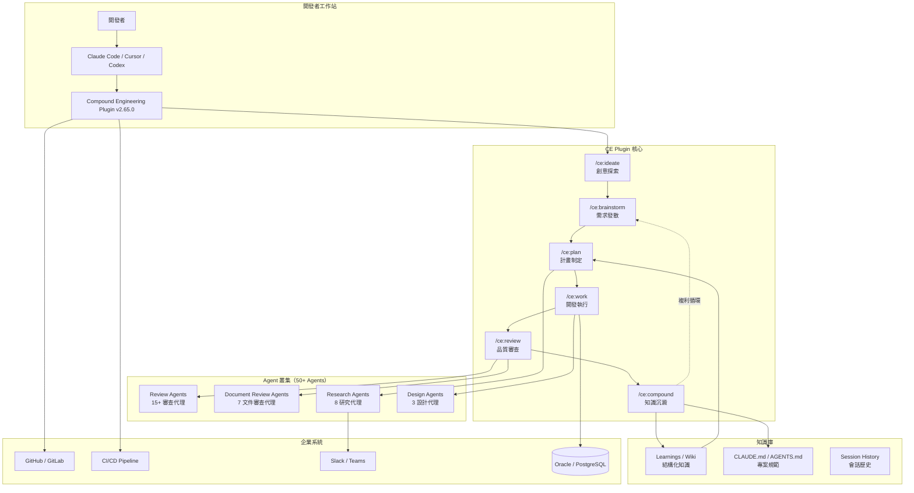

### 2.2 Plugin 元件總覽

Compound Engineering Plugin v2.65.0 包含以下元件：

| 元件類型 | 數量 | 說明 |
|---------|------|------|
| **Skills（技能）** | 41+ | 可直接呼叫的斜線指令 |
| **Agents（代理）** | 50+ | 由 Skills 內部調用的專業子代理 |
| **Commands** | 內建 | Claude Code 原生斜線指令 |

**Skills 分類**：

| 分類 | 代表指令 | 說明 |
|------|---------|------|
| Core Workflow | `/ce:ideate` `/ce:brainstorm` `/ce:plan` `/ce:work` `/ce:review` `/ce:compound` | 核心工作流六階段 |
| Research & Context | `/ce-sessions` `/ce-slack-research` | 研究與上下文取得 |
| Git Workflow | `git-commit` `git-commit-push-pr` `git-worktree` | Git 操作自動化 |
| Workflow Utilities | `/ce-setup` `/ce-update` `/changelog` `/ce-demo-reel` | 流程輔助工具 |
| Development Frameworks | `agent-native-architecture` `frontend-design` `dhh-rails-style` `dspy-ruby` `andrew-kane-gem-writer` | 開發框架模板 |
| Review & Quality | `claude-permissions-optimizer` `document-review` | 品質與權限管理 |
| Content & Collaboration | `every-style-editor` `proof` `todo-create` | 內容編輯與協作 |
| Automation & Tools | `gemini-imagegen` | 自動化與工具 |
| Debug & Optimize | `/ce-debug` `/ce-optimize` | 除錯與最佳化 |
| Beta / Experimental | `/lfg` | 全自動工程工作流（實驗性） |

### 2.3 與企業系統整合方式

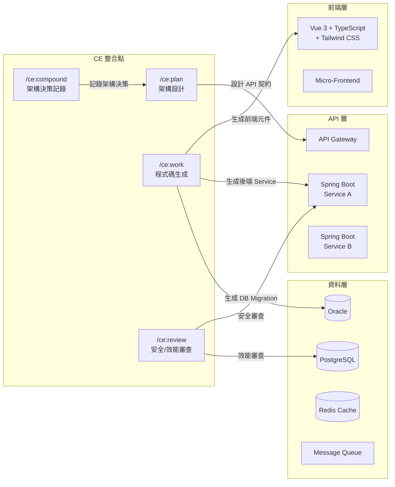

**整合要點**：

1. **前端整合**：`/ce:work` 搭配 `frontend-design` skill 生成 Vue 3 元件
2. **後端整合**：`/ce:plan` 設計 API 契約，`/ce:work` 生成 Spring Boot Controller / Service / Repository
3. **資料庫整合**：`data-integrity-guardian` agent 檢查 DB migration 安全性
4. **CI/CD 整合**：`git-commit-push-pr` skill 自動建立 PR 並觸發 pipeline

### 2.4 Agent Workflow 設計

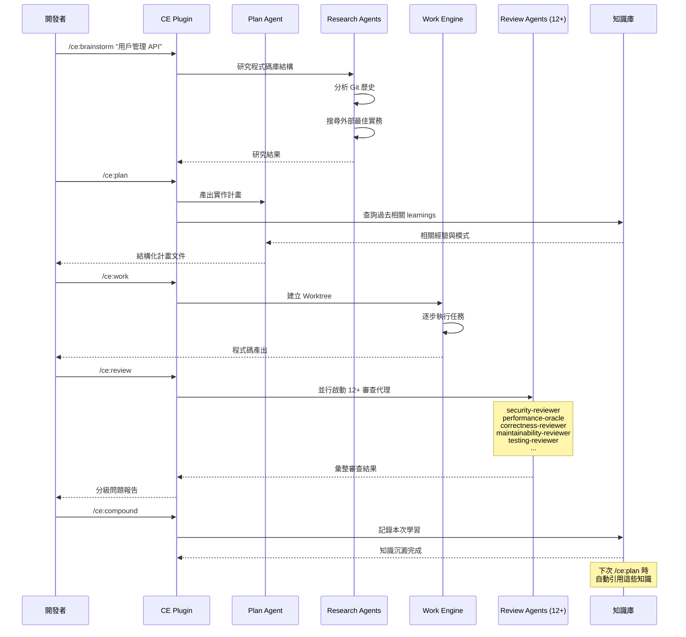

### 2.5 知識庫（Knowledge Base / Wiki）設計

Compound Engineering 的知識庫採用**檔案化設計**，知識直接存放在程式碼庫中：

```text
project-root/
├── CLAUDE.md              # 專案整體規範（Agent 自動讀取）
├── AGENTS.md              # Agent 行為規範
├── .claude/
│   ├── commands/          # 自訂斜線指令
│   └── settings.json      # Claude Code 設定
├── docs/
│   └── learnings/         # CE Compound 產出的知識
│       ├── 2026-04-01-api-pagination.md
│       ├── 2026-04-05-cache-invalidation.md
│       └── 2026-04-10-auth-jwt-refresh.md
└── .github/
    └── compound/          # 團隊級知識
        ├── patterns/      # 已驗證的設計模式
        ├── anti-patterns/  # 已知反模式
        └── decisions/      # 架構決策記錄
```

**知識分層**：

| 層級 | 位置 | 範圍 | 說明 |
|------|------|------|------|
| **專案級** | `CLAUDE.md` / `AGENTS.md` | 單一專案 | 專案編碼規範、架構約束 |
| **學習級** | `docs/learnings/` | 單一專案 | `/ce:compound` 自動產出 |
| **團隊級** | `.github/compound/` | 跨專案 | 團隊共用的模式與決策 |
| **個人級** | `~/.claude/skills/` | 開發者個人 | 個人累積的 Skills |

> **💡 實務建議**：知識庫採用 Git 版本控制，每次 `/ce:compound` 產出的知識同樣經過 PR review 流程，確保知識品質。

---

## 第三章：安裝與環境建置

### 3.1 前置需求

| 項目 | 需求 | 說明 |
|------|------|------|
| **Node.js** | v18+ | 用於 CLI 工具 |
| **Bun** | v1.0+ | 用於 Plugin CLI（`bunx`） |
| **Git** | v2.30+ | 版本控制與 Worktree |
| **gh CLI** | v2.0+ | GitHub CLI（用於 PR 操作） |
| **Claude Code** | 最新版 | 主要開發環境 |
| **jq** | v1.6+ | JSON 處理（審查用） |

**可選工具**（`/ce-setup` 會自動檢查並安裝）：

- `vhs`：終端錄製
- `silicon`：程式碼截圖
- `ffmpeg`：影片處理（Demo Reel 用）

> **ℹ️ v2.65.0 變更說明**：自 v2.65.0 起，`agent-browser`、`rclone`、`lint`、`bug-reproduction-validator` 等工具已從內建相依性中移除，不再作為必要或推薦的可選工具。若您從舊版升級，這些工具可安全移除。

### 3.2 Claude Code 安裝

```bash
# macOS / Linux
curl -fsSL https://claude.ai/install | sh

# Windows (PowerShell)
winget install Anthropic.ClaudeCode

# 驗證安裝
claude --version
```

### 3.3 Plugin 安裝（Claude Code）

**方法一：Plugin Marketplace（推薦）**

```bash
# 在 Claude Code 中執行
/plugin marketplace add EveryInc/compound-engineering-plugin
/plugin install compound-engineering
```

**方法二：npm 全域安裝**

```bash
# 使用 bunx（無需全域安裝）
bunx @every-env/compound-plugin install compound-engineering
```

**驗證安裝**：

```bash
# 在 Claude Code 中輸入
/ce-setup
```

成功後會看到環境診斷報告，並自動安裝缺少的工具。

### 3.4 Cursor 安裝

```bash
# 在 Cursor 中執行
/add-plugin compound-engineering
```

### 3.5 其他平台安裝（Codex / Copilot / OpenCode / Pi / OpenClaw 等）

CE Plugin 提供 CLI 工具，可將 Claude Code 插件格式轉換為其他平台格式：

```bash
# Codex
bunx @every-env/compound-plugin install compound-engineering --to codex

# GitHub Copilot
bunx @every-env/compound-plugin install compound-engineering --to copilot

# OpenCode
bunx @every-env/compound-plugin install compound-engineering --to opencode

# Factory Droid
bunx @every-env/compound-plugin install compound-engineering --to droid

# Pi
bunx @every-env/compound-plugin install compound-engineering --to pi

# Gemini CLI
bunx @every-env/compound-plugin install compound-engineering --to gemini

# Kiro CLI
bunx @every-env/compound-plugin install compound-engineering --to kiro

# Windsurf
bunx @every-env/compound-plugin install compound-engineering --to windsurf

# Windsurf（Workspace 範圍）
bunx @every-env/compound-plugin install compound-engineering --to windsurf --scope workspace

# OpenClaw
bunx @every-env/compound-plugin install compound-engineering --to openclaw

# Qwen Code
bunx @every-env/compound-plugin install compound-engineering --to qwen

# 自動偵測並安裝至所有已安裝工具
bunx @every-env/compound-plugin install compound-engineering --to all
```

**支援平台完整清單**：

| 平台 | 狀態 | 說明 |
|--------|--------|------|
| **Claude Code** | ✅ 穩定 | 主要開發平台，Plugin Marketplace 原生支援 |
| **Cursor** | ✅ 穩定 | `/add-plugin` 原生支援 |
| **Codex** | ✅ 穩定 | CLI 轉換格式 |
| **OpenCode** | ✅ 穩定 | CLI 轉換格式 |
| **Factory Droid** | ✅ 穩定 | CLI 轉換格式 |
| **GitHub Copilot** | 🧪 實驗性 | CLI 轉換格式 |
| **Gemini CLI** | 🧪 實驗性 | CLI 轉換格式 |
| **Kiro CLI** | 🧪 實驗性 | CLI 轉換格式 |
| **Windsurf** | 🧪 實驗性 | 支援 Global / Workspace scope |
| **Pi** | 🧪 實驗性 | CLI 轉換格式 |
| **OpenClaw** | 🧪 實驗性 | 僅 Skills 同步，MCP 尚未支援 |
| **Qwen Code** | 🧪 實驗性 | CLI 轉換格式 |

### 3.6 ce-setup 環境診斷與初始化

`/ce-setup` 是**專案初始化的最佳起點**。在任何專案中執行：

```bash
/ce-setup
```

它會自動執行：

1. **環境診斷**：檢查 Node.js、Git、gh、jq 等工具版本
2. **工具安裝**：自動安裝缺少的工具（agent-browser、vhs、silicon、ffmpeg）
3. **專案配置**：初始化 `CLAUDE.md`、`.claude/` 目錄、建議的專案結構
4. **健康檢查**：確認 Plugin 可正常運作

**輸出範例**：

```
✅ Node.js v22.0.0
✅ Git v2.45.0
✅ gh v2.50.0
✅ jq v1.7
✅ Project config bootstrapped
✅ CLAUDE.md created with recommended defaults
🎉 Setup complete! Run /ce:brainstorm to get started.
```

### 3.7 Windows 環境設定

```powershell
# 1. 安裝 Bun（Windows）
powershell -c "irm bun.sh/install.ps1 | iex"

# 2. 安裝 GitHub CLI
winget install GitHub.cli

# 3. 安裝 jq
winget install jqlang.jq

# 4. 設定 PATH（將以下加入系統環境變數）
$env:PATH += ";$env:USERPROFILE\.bun\bin"

# 5. 安裝 Compound Engineering Plugin
bunx @every-env/compound-plugin install compound-engineering

# 6. Claude Code 中執行初始化
# /ce-setup
```

> **⚠️ Windows 注意事項**：
> - 建議使用 Windows Terminal + PowerShell 7
> - Git Worktree 功能需確保路徑不超過 260 字元限制（或啟用長路徑支援）
> - `vhs` 和 `silicon` 在 Windows 上需要額外安裝 Go 工具鏈

### 3.8 CI/CD 環境設定

在 GitHub Actions 中使用 CE Plugin：

```yaml
# .github/workflows/ce-review.yml
name: CE Auto Review
on:
  pull_request:
    types: [opened, synchronize]

jobs:
  ce-review:
    runs-on: ubuntu-latest
    steps:
      - uses: actions/checkout@v4
        with:
          fetch-depth: 0

      - uses: actions/setup-node@v4
        with:
          node-version: '22'

      - name: Install Bun
        uses: oven-sh/setup-bun@v2

      - name: Install CE Plugin
        run: bunx @every-env/compound-plugin install compound-engineering

      - name: Run CE Review
        env:
          ANTHROPIC_API_KEY: ${{ secrets.ANTHROPIC_API_KEY }}
        run: |
          claude --plugin-dir ./plugins/compound-engineering \
            -m "Please review this PR using /ce:review"
```

> **💡 實務建議**：CI 環境中建議將 Plugin 快取至 GitHub Actions Cache，避免每次重新下載。

### 3.9 跨平台設定同步（Sync）

`/sync` 可將您的 Claude Code 個人設定（`~/.claude/`）同步到其他 AI 編碼工具，包括 Skills、Slash Commands 和 MCP Servers。

```bash
# 同步到所有偵測到的工具（預設）
bunx @every-env/compound-plugin sync

# 同步到特定工具
bunx @every-env/compound-plugin sync --target opencode
bunx @every-env/compound-plugin sync --target codex
bunx @every-env/compound-plugin sync --target copilot
bunx @every-env/compound-plugin sync --target gemini
bunx @every-env/compound-plugin sync --target windsurf
bunx @every-env/compound-plugin sync --target kiro
bunx @every-env/compound-plugin sync --target qwen
bunx @every-env/compound-plugin sync --target pi
bunx @every-env/compound-plugin sync --target droid
bunx @every-env/compound-plugin sync --target openclaw

# 同步到所有工具（明確指定）
bunx @every-env/compound-plugin sync --target all
```

**同步內容**：

| 同步項目 | 來源 | 方式 |
|---------|------|------|
| **個人 Skills** | `~/.claude/skills/` | 符號連結（symlink），變更即時反映 |
| **Slash Commands** | `~/.claude/commands/` | 轉換為目標平台的原生格式 |
| **MCP Servers** | `~/.claude/settings.json` | 合併至目標平台設定檔 |

**各平台同步特殊說明**：

| 平台 | 同步細節 |
|--------|----------|
| **Codex** | 保留非受管的 `config.toml` 內容，包含遠端 MCP Servers |
| **Copilot** | Skills 寫入 `~/.copilot/skills/`，MCP 寫入 `~/.copilot/mcp-config.json` |
| **Gemini** | MCP 寫入 `~/.gemini/`，避免鏡像已發現的 Skills 以防止重複警告 |
| **OpenClaw** | 僅同步 Skills；MCP 同步暫不支援（官方尚未明確 MCP 設定契約） |
| **Droid / Windsurf / Kiro / Qwen** | 合併 MCP Servers 至各平台的用戶設定檔 |

> **💡 實務建議**：Skills 使用 symlink 而非複製，因此在 Claude Code 中的變更會立即反映到所有已同步的工具。建議在初始安裝後執行一次 `sync`，之後無需重複執行。

---

## 第四章：核心功能教學

### 4.1 核心工作流總覽

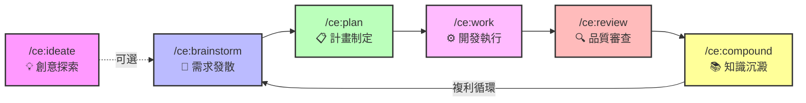

**工作流原則**：

| 階段 | 時間佔比 | 說明 |
|------|---------|------|
| Plan + Review | **80%** | 規劃與審查是核心 |
| Work + Compound | **20%** | 執行與沉澱高度自動化 |

### 4.2 /ce:ideate — 創意探索

**用途**：主動發現程式碼庫中高影響力的改善機會。

```bash
# 基本用法
/ce:ideate

# 帶方向的探索
/ce:ideate "效能優化方向"
/ce:ideate "安全性改善"
```

**工作機制**：
1. 分析程式碼庫結構與歷史
2. 透過「發散式思考」產生改善想法
3. 透過「對抗性過濾」篩選出可行方案
4. 輸出優先排序的改善建議

**適用時機**：
- Sprint Planning 前的腦力激盪
- 技術債清理規劃
- 架構重構方向探索

### 4.3 /ce:brainstorm — 需求發散

**用途**：**主要入口點**。將模糊的想法精煉為清晰的需求計畫。

```bash
# 開始腦力激盪
/ce:brainstorm "客戶需要一個帳戶管理功能"

# 帶更多上下文
/ce:brainstorm "需要支援 JWT 認證的 REST API，包含登入、登出、Token 更新"
```

**工作機制**：
1. 與開發者進行**互動式 Q&A**
2. 釐清需求範圍、技術約束、驗收標準
3. 當需求足夠清晰時，**自動跳過多餘儀式**（short-circuit）
4. 輸出結構化的需求文件

**Prompt 範例（企業案例）**：

```
/ce:brainstorm "我們的銀行帳戶系統需要新增轉帳功能。
需求：
- 支援即時轉帳與預約轉帳
- 需要雙因素驗證（2FA）
- 單日轉帳上限為 500 萬
- 需要與現有的 Spring Boot 帳戶服務整合
- 前端使用 Vue 3
技術約束：
- 必須通過安全審查
- 需要完整的審計日誌
- 效能要求：< 3秒完成轉帳"
```

### 4.4 /ce:plan — 計畫制定

**用途**：將需求文件或想法轉化為**結構化的技術實作計畫**。

```bash
# 接續 brainstorm 的結果
/ce:plan

# 直接給定詳細想法
/ce:plan "實作 Spring Boot REST API，支援 CRUD 操作
- Controller: TransferController
- Service: TransferService
- Repository: TransferRepository
- 使用 JPA + Oracle
- 需要 input validation
- 需要 integration test"
```

**Plan Agent 的工作流程**：

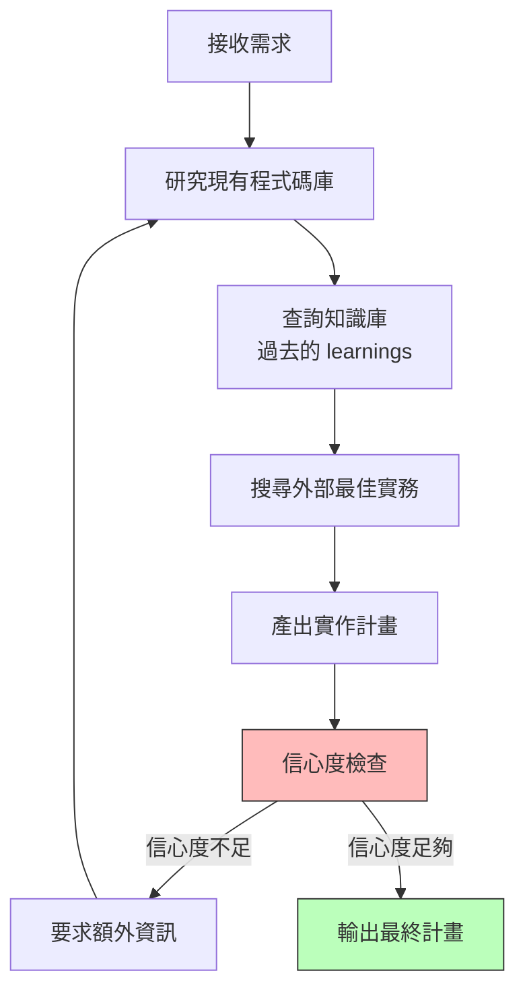

**輸出範例**：

```markdown
# 實作計畫：轉帳功能 API

## 目標
實作銀行轉帳 REST API，支援即時與預約轉帳

## 架構設計
- Controller Layer: TransferController (REST endpoints)
- Service Layer: TransferService (業務邏輯 + 2FA 驗證)
- Repository Layer: TransferRepository (JPA + Oracle)
- Event Layer: TransferEventPublisher (審計日誌)

## 任務清單
1. [ ] 建立 Transfer entity 與 DB migration
2. [ ] 實作 TransferRepository
3. [ ] 實作 TransferService（含 2FA 驗證邏輯）
4. [ ] 實作 TransferController（含 input validation）
5. [ ] 實作 TransferEventPublisher（審計日誌）
6. [ ] 撰寫 Unit Tests
7. [ ] 撰寫 Integration Tests
8. [ ] 更新 API 文件

## 參考來源
- 現有 AccountService 的分層架構
- learnings/2026-03-15-oracle-jpa-performance.md
- Spring Security 2FA best practices

## 成功標準
- 所有測試通過
- API 回應時間 < 3 秒
- 通過 security-reviewer 審查
```

### 4.5 /ce:work — 開發執行

**用途**：根據計畫**系統性地執行開發工作**。

```bash
# 執行 Plan 中的任務
/ce:work

# 指定特定任務
/ce:work "開始執行任務 1-3"
```

**工作機制**：
1. 讀取 Plan 文件
2. **建立 Git Worktree**（隔離工作環境）
3. 將計畫轉為待辦清單
4. 逐步執行每個任務
5. 可搭配 MCP（如 Playwright）進行即時測試

**企業級範例 — Spring Boot API 開發**：

```bash
# 1. 先確保 Plan 已完成
/ce:plan "實作用戶管理 CRUD API"

# 2. 開始執行
/ce:work

# Agent 會自動：
# - 建立 Git worktree (feature/user-crud-api)
# - 依序建立 Entity → Repository → Service → Controller
# - 每步驟後自動編譯確認
# - 產出對應的測試
```

**Worktree 管理**：

```bash
# 管理 Git worktree
git-worktree

# 清理已合併的分支
git-clean-gone-branches
```

### 4.6 /ce:review — 品質審查

**用途**：啟動**多代理並行程式碼審查**，是 CE 最強大的功能之一。

```bash
# 審查當前變更
/ce:review

# 審查特定 PR
/ce:review "review PR #42"
```

**審查架構**：

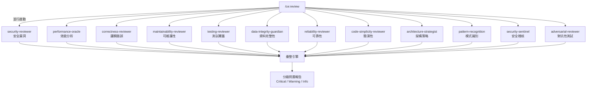

**15+ Review Agents 說明**：

| Agent | 職責 |
|-------|------|
| `security-reviewer` | 可被利用的安全漏洞（含信心度校準） |
| `performance-oracle` | 效能分析與最佳化建議 |
| `correctness-reviewer` | 邏輯錯誤、邊界情況、狀態 bug |
| `maintainability-reviewer` | 耦合度、複雜度、命名、死碼 |
| `testing-reviewer` | 測試覆蓋缺口、弱斷言 |
| `data-integrity-guardian` | 資料庫 migration 與資料完整性 |
| `reliability-reviewer` | 生產環境可靠性與故障模式 |
| `code-simplicity-reviewer` | 最後的簡潔性與最小化檢查 |
| `architecture-strategist` | 架構決策與合規性 |
| `pattern-recognition-specialist` | 模式與反模式識別 |
| `security-sentinel` | 安全稽核與漏洞評估 |
| `adversarial-reviewer` | 建構跨元件邊界的失敗場景 |
| `api-contract-reviewer` | 偵測破壞性 API 契約變更 |
| `data-migration-expert` | 驗證 ID 映射、檢查交換值 |
| `data-migrations-reviewer` | Migration 安全性（含信心度校準） |
| `deployment-verification-agent` | Go/No-Go 部署清單 |
| `schema-drift-detector` | 偵測非相關的 schema 變更 |
| `project-standards-reviewer` | CLAUDE.md 與 AGENTS.md 合規性 |
| `agent-native-reviewer` | 驗證功能是否符合 agent-native 架構 |
| `cli-agent-readiness-reviewer` | 評估 CLI 的 agent 友善度（7 大核心原則） |
| `kieran-rails-reviewer` | Rails 程式碼審查（嚴格慣例） |
| `kieran-python-reviewer` | Python 程式碼審查（嚴格慣例） |
| `kieran-typescript-reviewer` | TypeScript 程式碼審查（嚴格慣例） |

### 4.7 /ce:compound — 知識沉澱

**用途**：**複利工程的核心**。將本次開發循環的學習記錄下來。

```bash
# 記錄本次學習
/ce:compound

# 指定重點
/ce:compound "記錄 Oracle JPA 批次操作的效能最佳化方法"
```

**工作機制**：
1. 分析本次 Plan → Work → Review 的完整過程
2. 提取關鍵學習：Bug、效能問題、新的問題解決方法
3. 將學習轉化為**結構化的知識文件**
4. 存入專案知識庫（`docs/learnings/` 或 `CLAUDE.md`）

**輸出範例**：

```markdown
# Learning: Oracle JPA 批次操作效能最佳化

## 問題
使用 `saveAll()` 批次寫入 1000 筆轉帳記錄時，耗時超過 30 秒。

## 根因
JPA 預設逐筆 INSERT，未啟用 JDBC batch。

## 解決方案
1. 在 `application.yml` 設定 `spring.jpa.properties.hibernate.jdbc.batch_size=50`
2. 使用 `@Modifying` + native query 進行批次操作
3. 關閉 `hibernate.order_inserts=true` 讓 Hibernate 重排 INSERT 順序

## 驗證
- 批次寫入 1000 筆：30s → 2s
- 使用 `p6spy` 確認只產生 20 個 batch INSERT

## 適用場景
所有需要批次寫入 Oracle 的 Service
```

**知識刷新**：

```bash
# 刷新過時的知識
/ce:compound-refresh
```

此指令會檢查現有 learnings，決定**保留、更新、替換或封存**。

### 4.8 /ce-debug — 除錯追蹤

```bash
# 系統性除錯
/ce-debug "TransferService.execute() 在高併發下回傳 500 錯誤"
```

**工作機制**：
1. 追蹤因果鏈（Causal Chain Tracing）
2. 形成可測試的假設
3. 實作 test-first 修復
4. 驗證修復結果

### 4.9 /ce-optimize — 最佳化迴圈

```bash
# 執行最佳化迴圈
/ce-optimize "API 回應時間最佳化"
```

**工作機制**：
1. 並行實驗（Parallel Experiments）
2. 測量閘門（Measurement Gates）
3. LLM-as-Judge 品質評分
4. 迭代優化直到達標

**`/ce-optimize` 工作流架構**：

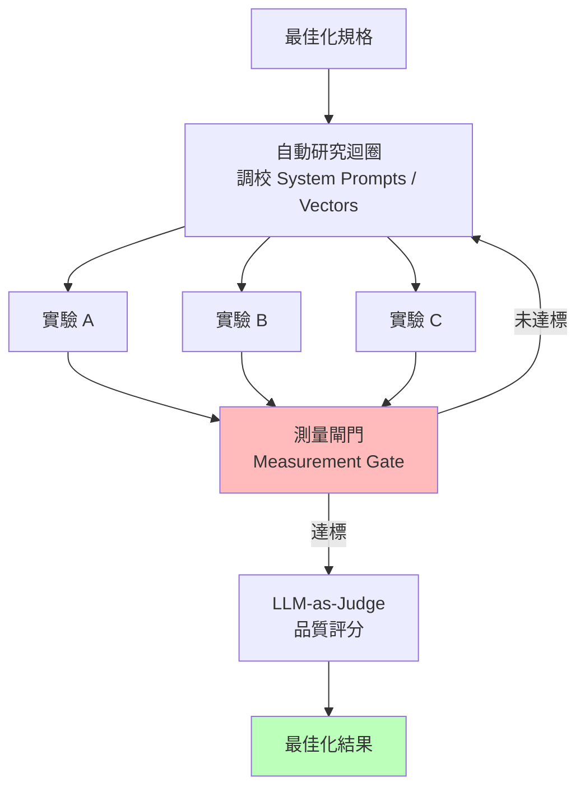

> **📖 詳細文件**：完整的 `/ce-optimize` 使用指南、規格範例與工作流文件，請參閱 [skills/ce-optimize/README.md](https://github.com/EveryInc/compound-engineering-plugin/blob/main/plugins/compound-engineering/skills/ce-optimize/README.md)。

### 4.10 /test-xcode — iOS 應用測試

**用途**：在模擬器上建置並測試 iOS 應用程式，使用 XcodeBuildMCP。

```bash
# 執行 iOS 模擬器測試
/test-xcode
```

**工作機制**：
1. 偵測專案中的 Xcode 專案配置
2. 在 iOS Simulator 上建置應用
3. 執行測試並回報結果

> **⚠️ 注意事項**：此功能需要 macOS 環境且已安裝 Xcode。Windows / Linux 環境不適用。

### 4.11 /lfg — 全自動工程工作流（實驗性）

**用途**：`/lfg`（Let's F***ing Go）是一個**完全自主的工程工作流**，將 brainstorm → plan → work → review → compound 全部自動化。

```bash
# 啟動全自動工作流
/lfg "實作用戶管理 CRUD API"
```

**適用時機**：
- 需求明確、範圍小的功能開發
- 原型快速建置
- 較不需要人工介入的標準化開發任務

> **⚠️ 實驗性質**：此功能仍在 Beta 階段，建議在非關鍵環境中使用。對於生產級功能開發，仍建議使用分步工作流以確保每個階段的品質控制。

### 4.12 錯誤案例與修正

#### 錯誤 1：Plan 產出空泛不具體

```bash
# ❌ 錯誤：描述太模糊
/ce:plan "做一個 API"

# ✅ 正確：提供足夠上下文
/ce:plan "實作 RESTful 轉帳 API
- POST /api/v1/transfers（即時轉帳）
- POST /api/v1/transfers/scheduled（預約轉帳）
- 使用現有的 AccountService 查詢餘額
- 需要 JWT 認證 + 2FA 驗證
- Oracle DB 寫入需要 XA Transaction"
```

#### 錯誤 2：Review 結果太多噪音

```bash
# ❌ 問題：所有 agent 都報告大量低優先級問題
# ✅ 解法：在 CLAUDE.md 中設定審查規則
```

```markdown
# CLAUDE.md 中新增
## Review 規則
- security-reviewer: 只報告 CRITICAL 和 HIGH
- performance-reviewer: 只報告回應時間 > 1s 的問題
- maintainability-reviewer: 忽略生成的程式碼
```

#### 錯誤 3：Compound 知識未被使用

```bash
# ❌ 問題：/ce:plan 未引用過去的 learnings
# ✅ 解法：確認 learnings 目錄路徑在 CLAUDE.md 中正確設定
```

```markdown
# CLAUDE.md
## Knowledge Base
- 專案知識：docs/learnings/
- 團隊知識：.github/compound/
- 在 Plan 階段一定考慮過去的 learnings
```

---

## 第五章：企業級開發流程設計

### 5.1 AI Agent 開發流程（SSDLC 整合）

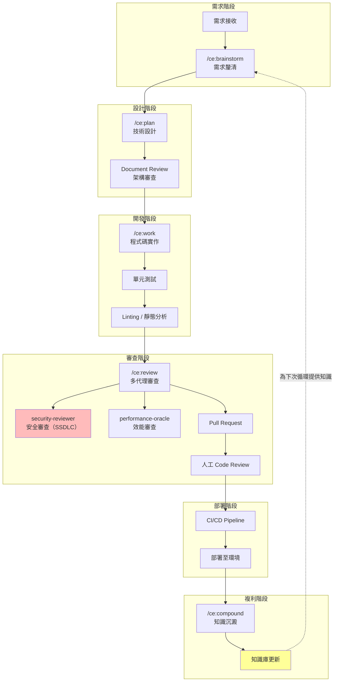

**SSDLC 整合要點**：

| SSDLC 階段 | CE 對應功能 | 說明 |
|------------|-----------|------|
| 威脅建模 | `/ce:plan` + `security-lens-reviewer` | 在計畫階段就考慮安全威脅 |
| 安全編碼 | `/ce:work` + CLAUDE.md 安全規範 | Agent 遵循安全編碼準則 |
| 安全審查 | `/ce:review` → `security-reviewer` + `security-sentinel` | 雙重安全代理審查 |
| 滲透測試 | `/ce-debug` + `/test-browser` | 自動化安全測試 |
| 安全知識 | `/ce:compound` | 安全相關學習自動記錄 |

### 5.2 與 Git Flow 整合

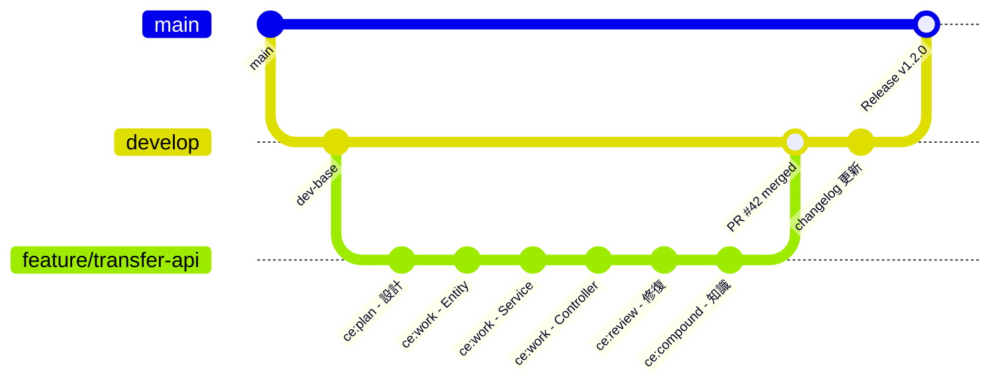

**Git Workflow Skills**：

```bash
# 建立 commit 並推送
git-commit-push-pr

# 管理 worktree（並行開發）
git-worktree

# 清理已合併的分支
git-clean-gone-branches

# 產出 changelog
/changelog
```

### 5.3 與 CI/CD 整合

```yaml
# .github/workflows/compound-engineering.yml
name: Compound Engineering Pipeline
on:
  pull_request:
    types: [opened, synchronize]
  push:
    branches: [main, develop]

jobs:
  # 階段 1：自動審查
  ce-review:
    runs-on: ubuntu-latest
    if: github.event_name == 'pull_request'
    steps:
      - uses: actions/checkout@v4
      - name: CE Review
        env:
          ANTHROPIC_API_KEY: ${{ secrets.ANTHROPIC_API_KEY }}
        run: |
          bunx @every-env/compound-plugin install compound-engineering
          # 觸發自動化審查

  # 階段 2：標準 CI
  build-test:
    runs-on: ubuntu-latest
    steps:
      - uses: actions/checkout@v4
      - uses: actions/setup-java@v4
        with:
          java-version: '21'
          distribution: 'temurin'
      - name: Build & Test
        run: mvn clean verify

  # 階段 3：合併後 Compound
  compound:
    runs-on: ubuntu-latest
    if: github.event_name == 'push' && github.ref == 'refs/heads/main'
    needs: build-test
    steps:
      - uses: actions/checkout@v4
      - name: Auto Compound
        env:
          ANTHROPIC_API_KEY: ${{ secrets.ANTHROPIC_API_KEY }}
        run: |
          # 自動提取並記錄本次合併的學習
          echo "Extracting learnings from merged PR..."
```

### 5.4 Code Review 自動化

**三層審查機制**：

| 層級 | 執行者 | 工具 | 說明 |
|------|--------|------|------|
| **Layer 1** | AI Agent | `/ce:review` 12+ 子代理 | 自動化多維度審查 |
| **Layer 2** | CI/CD | Linter + SonarQube + Unit Test | 靜態分析與測試 |
| **Layer 3** | 人工 | GitHub PR Review | 架構判斷與業務邏輯確認 |

**PR Feedback 自動處理**：

```bash
# 自動解決 PR 審查意見
/resolve-pr-feedback
```

### 5.5 測試策略

| 測試類型 | CE 支援方式 | 工具 |
|---------|-----------|------|
| **Unit Test** | `/ce:work` 自動產出 | JUnit 5 / Mockito |
| **Integration Test** | `/ce:plan` 中規劃 | Spring Boot Test |
| **E2E Test** | `/test-browser` | Playwright |
| **Security Test** | `security-reviewer` agent | OWASP ZAP |
| **Performance Test** | `performance-oracle` agent | JMeter / K6 |

```bash
# 執行瀏覽器測試
/test-browser

# Testing 相關 Review Agent 檢查覆蓋率
# testing-reviewer 會自動檢查：
# - 測試覆蓋缺口
# - 弱斷言（weak assertions）
# - 缺少的邊界測試
```

---

## 第六章：最佳實務（Best Practices）

### 6.1 Prompt Engineering — 如何寫好 ce-plan

**金字塔原則**：

```
Level 1（必備）：What — 要做什麼
Level 2（重要）：Why — 為什麼要做
Level 3（建議）：How — 技術約束與偏好
Level 4（加分）：Context — 參考資料與過去經驗
```

**範例對比**：

```bash
# ❌ 差的 Prompt
/ce:plan "做登入功能"

# ⚠️ 普通的 Prompt
/ce:plan "實作 JWT 登入 API，使用 Spring Security"

# ✅ 好的 Prompt
/ce:plan "實作銀行客戶登入功能
## What
- POST /api/v1/auth/login（帳號密碼登入）
- POST /api/v1/auth/refresh（Token 更新）
- POST /api/v1/auth/logout（登出並作廢 Token）

## Why
- 替換現有的 Session-based 認證
- 支援 Micro-Frontend 的跨域需求

## How
- 使用 Spring Security 6 + JWT
- Access Token 有效期 15 分鐘
- Refresh Token 有效期 7 天，存入 Redis
- 密碼使用 BCrypt 加密
- 失敗 5 次鎖定帳號 30 分鐘

## Context
- 參考 docs/learnings/2026-03-20-jwt-best-practices.md
- 現有的 UserService 已有查詢用戶方法
- 需通過 security-reviewer 審查"
```

### 6.2 Context Engineering — 上下文管理

**CLAUDE.md 設計原則**：

```markdown
# CLAUDE.md — 範例

## 專案概述
這是銀行核心帳務系統的轉帳模組，使用 Spring Boot 3.2 + JPA + Oracle 19c。

## 架構規範
- 使用 Clean Architecture（Controller → Service → Repository）
- 所有 Service 方法需有 @Transactional
- 所有 Controller 需有 @PreAuthorize
- API 格式遵循 RESTful 規範

## 編碼規範
- 使用 Java 21 + Record 替代傳統 DTO
- 使用 Optional 替代 null 回傳
- 命名：PascalCase（類別）、camelCase（方法）、UPPER_SNAKE_CASE（常數）

## 安全規範
- 所有 API 需要 JWT 認證
- SQL 參數必須使用 PreparedStatement
- 禁止在日誌中輸出敏感資訊（密碼、Token、身份證號）

## 知識庫
- 專案知識：docs/learnings/
- 在 Plan 階段必須查閱相關 learnings
```

### 6.3 Knowledge Reuse — 複利最大化

**知識複利循環**：

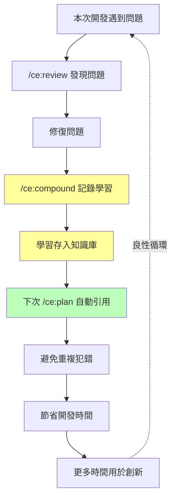

**最佳化策略**：

1. **定期刷新**：每月執行 `/ce:compound-refresh` 清理過時知識
2. **分類管理**：按技術領域分類（安全、效能、架構、DB）
3. **跨專案共享**：團隊級知識放在 `.github/compound/`
4. **知識審查**：Learnings 同樣經過 PR review

### 6.4 防止 AI Hallucination

| 策略 | 做法 |
|------|------|
| **信心度校準** | `/ce:plan` 內建 Confidence Check，信心度不足時會要求更多資訊 |
| **知識庫對照** | Agent 優先使用專案內部知識，減少依賴外部知識 |
| **多代理交叉驗證** | `/ce:review` 12+ agents 從不同角度驗證 |
| **人工最終確認** | 重要決策（架構、安全）一定經過人工審查 |
| **測試驗證** | `/ce:work` 產出的程式碼必須通過自動化測試 |
| **Source 引用** | Plan 中要求列出參考來源 |

### 6.5 隱私與安全政策

Compound Engineering Plugin 遵循明確的隱私與安全政策（詳見官方 [PRIVACY.md](https://github.com/EveryInc/compound-engineering-plugin/blob/main/PRIVACY.md) 與 [SECURITY.md](https://github.com/EveryInc/compound-engineering-plugin/blob/main/SECURITY.md)）。企業導入時應特別注意以下要點：

**資料處理原則**：

| 項目 | 說明 |
|------|------|
| **程式碼傳輸** | 程式碼透過 AI 提供者 API 傳輸，需確認符合企業資料分類政策 |
| **知識庫儲存** | 學習成果儲存於本地檔案系統（Git repo），不外傳至第三方 |
| **API Key 管理** | `ANTHROPIC_API_KEY` 等金鑰必須透過環境變數或 Secret Manager 管理 |
| **會話資料** | Claude Code 會話历史儲存於本地，`/ce-sessions` 查詢不外傳 |

**企業安全檢查清單**：

- [ ] 確認 AI API Key 不會被 commit 到 Git 倉庫
- [ ] 在 `.gitignore` 中排除敢感設定檔（`.env`、`secrets.json` 等）
- [ ] 設定 CLAUDE.md 中的安全規範（禁止日誌輸出密碼、Token 等）
- [ ] 確認 `/ce:review` 的 `security-reviewer` 與 `security-sentinel` 已啟用
- [ ] 建立 API Key 輪換（Rotation）機制
- [ ] 確認 CI/CD 中的 API Key 使用 GitHub Secrets 或等價機制
- [ ] 對於金融、醫療等法規存全的產業，確認 AI 處理的資料符合法規要求

> **⚠️ 重要提醒**：在使用 `/ce:brainstorm` 或 `/ce:plan` 時，避免在 Prompt 中包含實際的客戶資料、密碼或其他敢感資訊。使用化名或模擬資料來描述需求。

---

## 第七章：系統維運（Maintenance）

### 7.1 知識庫管理策略

**生命週期管理**：

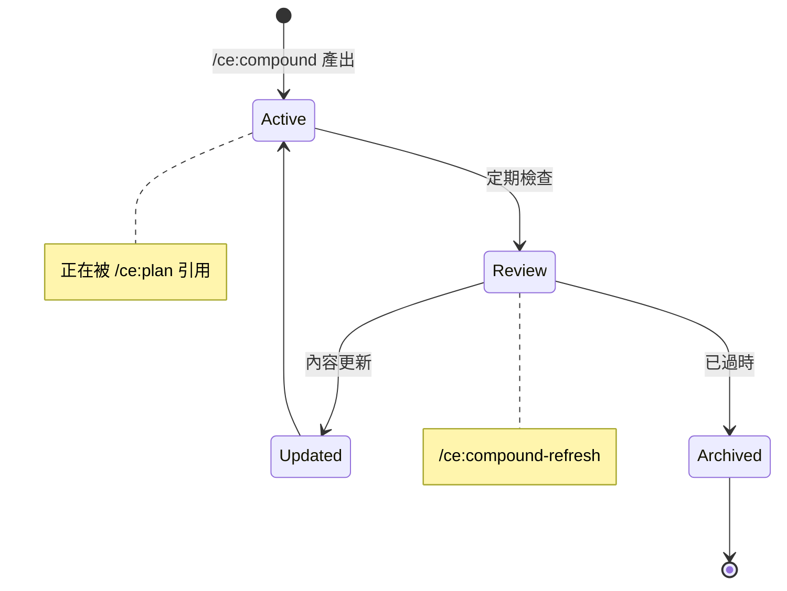

**管理指令**：

```bash
# 刷新知識庫（檢查過時內容）
/ce:compound-refresh

# 查詢歷史會話
/ce-sessions "過去關於 Oracle 效能的討論"

# 搜尋 Slack 中的組織上下文
/ce-slack-research "轉帳模組的架構討論"
```

**定期維護時程**：

| 頻率 | 動作 | 負責人 |
|------|------|--------|
| **每週** | `/ce:compound-refresh` 快速檢查 | 各專案負責人 |
| **每月** | 知識庫全面盤點、清理過時學習 | Tech Lead |
| **每季** | 跨專案知識同步、Best Practices 更新 | Architect |

### 7.2 Plugin 效能調校

**Token 使用最佳化**：

| 情境 | 建議 |
|------|------|
| `CLAUDE.md` 過大 | 拆分為多個檔案，使用 `@import` 參照 |
| Review 時間過長 | 在 CLAUDE.md 中限制 reviewer 範圍 |
| Plan 太冗長 | 分拆為多個小型 Plan |
| Compound 知識過多 | 定期 refresh 並 archive 過時知識 |

**效能監控指標**：

```markdown
## 建議追蹤的指標
- Plan 產出時間（目標：< 5 分鐘）
- Review 完成時間（目標：< 10 分鐘）
- Token 使用量 / 每次循環
- 知識庫引用率（被 Plan 引用的學習百分比）
- Hallucination 率（被人工修正的比例）
```

### 7.3 Log / Monitoring 設計

```bash
# 查詢歷史會話
/ce-sessions "最近的錯誤和問題"

# 查看 Plugin 更新狀態
/ce-update
```

**建議的監控架構**：

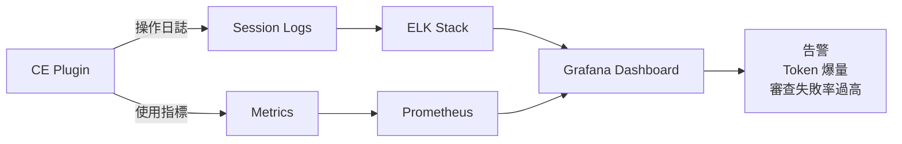

### 7.4 問題排查（Troubleshooting）

| 問題 | 可能原因 | 解決方案 |
|------|---------|---------|
| `/ce:plan` 產出內容空泛 | 輸入太模糊 | 提供更具體的需求描述、技術約束 |
| `/ce:review` 無回應 | API Key 過期或額度用盡 | 檢查 `ANTHROPIC_API_KEY`、查看 API 用量 |
| `/ce:work` 產出編譯失敗 | CLAUDE.md 缺少技術棧資訊 | 補充 Java 版本、框架版本、依賴資訊 |
| `/ce:compound` 未記錄學習 | 知識庫目錄不存在 | 執行 `/ce-setup` 重新初始化 |
| Plugin 版本過舊 | 快取未更新 | 執行 `/ce-update` 更新 |
| Agent 幻覺嚴重 | 上下文不足 | 增加 CLAUDE.md 中的專案描述 |
| Review 報告太多噪音 | 未設定審查規則 | 在 CLAUDE.md 中設定報告層級 |
| Git Worktree 衝突 | 路徑過長（Windows） | 啟用 Windows 長路徑支援 |

---

## 第八章：系統升級（Upgrade Strategy）

### 8.1 Plugin 升級流程

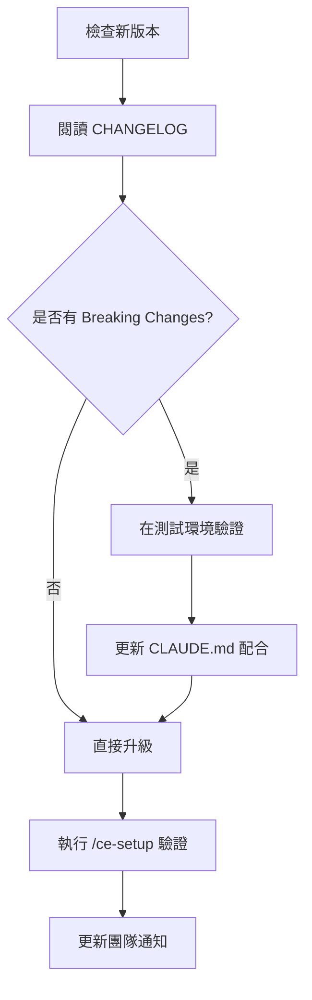

**升級指令**：

```bash
# Claude Code 中更新
/ce-update

# CLI 更新
bunx @every-env/compound-plugin install compound-engineering

# 指定版本
bunx @every-env/compound-plugin install compound-engineering@2.65.0

# 驗證版本
/ce-setup
```

**版本策略**：

| 版本策略 | 說明 |
|---------|------|
| **Patch（x.x.1）** | Bug 修復、立即升級 |
| **Minor（x.1.0）** | 新功能、新 Agent，在測試環境驗證後升級 |
| **Major（1.0.0）** | 可能有 Breaking Changes，需排定升級計畫 |

### 8.2 知識庫版本控制

```bash
# 知識庫與程式碼一同管理
git add docs/learnings/
git commit -m "compound: 新增 Oracle 批次效能最佳化學習"

# 透過 PR 審查知識品質
git-commit-push-pr
```

**分支策略**：

- `main`：已審查通過的穩定知識
- `develop`：開發中的知識（可能未審查）
- Feature branch：單一功能的知識累積

### 8.3 向下相容策略

1. **CLAUDE.md 版本標記**：在文件中標記適用的 CE 版本

```markdown
# CLAUDE.md
<!-- CE Plugin >= v2.60.0 -->
```

2. **知識遷移腳本**：大版本升級時提供遷移工具
3. **逐步切換**：先在一個專案試點，確認無問題後推廣

### 8.4 災難復原（Disaster Recovery）

| 場景 | 復原方式 |
|------|---------|
| **知識庫損毀** | Git 回滾至上一個穩定版本 |
| **Plugin 異常** | 使用 `--branch` 切換至穩定分支 |
| **CLAUDE.md 錯誤** | Git revert 還原 |
| **API Key 洩漏** | 立即 rotate key、檢查 Git 歷史、清除敏感資料 |

```bash
# 切換至特定穩定版本
claude --plugin-dir "$(bunx @every-env/compound-plugin plugin-path \
  compound-engineering --branch v2.60.0)"

# 回滾知識庫
git revert HEAD~3..HEAD -- docs/learnings/
```

---

## 第九章：企業導入建議

### 9.1 導入策略（Pilot → Rollout）

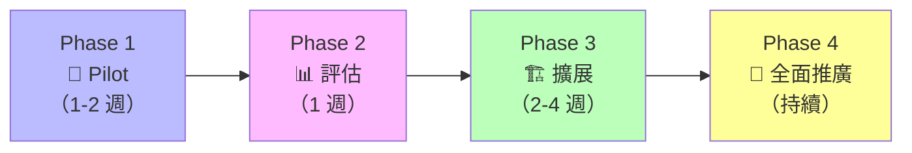

**Phase 1：Pilot（1-2 週）**
- 選擇 1 個小型專案
- 2-3 位熟悉 AI 工具的資深工程師
- 安裝 CE Plugin + 基本設定
- 跑完完整的 Brainstorm → Plan → Work → Review → Compound 循環

**Phase 2：評估（1 週）**
- 收集回饋：開發效率、程式碼品質、知識累積效果
- 比較 KPI：開發速度、Bug 率、Code Review 時間
- 整理 CLAUDE.md 最佳實務

**Phase 3：擴展（2-4 週）**
- 擴展至 3-5 個專案
- 納入不同背景的工程師（資深 + 中階）
- 建立團隊級知識庫
- 整合 CI/CD pipeline

**Phase 4：全面推廣（持續）**
- 所有新專案預設使用 CE
- 定期知識庫維護
- 持續追蹤 KPI

### 9.2 團隊角色轉變

| 傳統角色 | 轉變後角色 | 核心技能變化 |
|---------|-----------|------------|
| **Junior Developer** | AI Operator | 學習撰寫好的 Prompt、理解 Agent 輸出 |
| **Senior Developer** | AI Architect | 設計 Plan、審查 Agent 產出、維護知識庫 |
| **Tech Lead** | Compound Strategist | 設計知識架構、制定 CLAUDE.md 規範 |
| **QA Engineer** | AI Review Specialist | 設計審查規則、定義品質標準 |
| **DevOps Engineer** | AI Pipeline Engineer | 整合 CE 到 CI/CD、監控 Agent 效能 |

### 9.3 KPI 設計

**效率指標**：

| KPI | 計算方式 | 目標 |
|-----|---------|------|
| **開發速度** | Story Points / Sprint | 提升 200%+ |
| **PM Lead Time** | 需求到上線時間 | 縮短 50%+ |
| **Code Review 時間** | PR 開到合併平均時間 | 縮短 60%+ |

**品質指標**：

| KPI | 計算方式 | 目標 |
|-----|---------|------|
| **Bug 率** | Bugs / Feature | 降低 40%+ |
| **安全漏洞** | Security Issues / Release | 降低 70%+ |
| **測試覆蓋率** | Coverage % | > 80% |

**複利指標**：

| KPI | 計算方式 | 目標 |
|-----|---------|------|
| **知識庫增長率** | Learnings / 月 | 穩定增長 |
| **知識引用率** | 被 Plan 引用的 Learnings % | > 60% |
| **重複問題率** | 同類 Bug 再發生率 | < 10% |

### 9.4 教育訓練計畫

| 週次 | 主題 | 內容 | 實作 |
|------|------|------|------|
| **W1** | 基礎概念 | CE 理念、安裝、/ce-setup | 完成環境建置 |
| **W2** | 核心工作流 | brainstorm → plan → work | 完成一個小功能開發 |
| **W3** | 品質審查 | review → compound | 執行完整循環 |
| **W4** | 企業實戰 | CLAUDE.md 設計、CI/CD 整合 | 專案實際導入 |
| **W5-W6** | 進階應用 | 自訂 Agents、知識庫設計 | 團隊知識庫建置 |
| **持續** | 回顧優化 | KPI 追蹤、知識刷新 | 每月回顧會議 |

---

## 第十章：完整實戰案例

### 10.1 案例背景

**專案**：銀行轉帳模組  
**技術棧**：
- Backend：Spring Boot 3.2 + JPA + Oracle 19c
- Frontend：Vue 3 + TypeScript + Tailwind CSS
- 認證：JWT（Spring Security 6）

**需求**：實作轉帳功能，包含即時轉帳、預約轉帳、交易查詢

### 10.2 ce:brainstorm — 需求發散

```bash
/ce:brainstorm "銀行轉帳模組開發
需要支援：
1. 即時轉帳（同行/跨行）
2. 預約轉帳（指定日期）
3. 轉帳交易查詢
4. 雙因素驗證（OTP）
5. 單日轉帳限額控制
技術環境：Spring Boot 3.2 + Vue 3 + Oracle 19c"
```

**CE 互動式 Q&A**：
```
CE: 跨行轉帳是否需要對接外部金資中心 API？
Dev: 是的，需要透過內部 Gateway 轉發

CE: OTP 驗證使用什麼方式？SMS 或 App Push？
Dev: 使用 TOTP（Time-based OTP），整合現有的 OTP Service

CE: 預約轉帳的排程機制？
Dev: 使用 Spring Scheduler + Quartz，每日 00:00 批次處理

CE: 單日限額是全行統一還是客戶等級不同？
Dev: 依客戶等級：一般戶 50萬、VIP 200萬、企業戶 500萬
```

**輸出**：結構化需求文件（`requirements-transfer.md`）

### 10.3 ce:plan — 任務拆解

```bash
/ce:plan
```

**Plan Agent 產出**：

```markdown
# 實作計畫：銀行轉帳模組

## Phase 1: 資料層（Day 1-2）
1. Transfer Entity + Enum (TransferType, TransferStatus)
2. Oracle migration scripts (Flyway)
3. TransferRepository (JPA + Custom Query)

## Phase 2: 業務邏輯（Day 3-5）
4. TransferService — 即時轉帳邏輯
5. TransferService — 預約轉帳邏輯
6. TransferLimitService — 限額檢查
7. OtpVerificationService — TOTP 驗證整合
8. TransferScheduler — Quartz 排程設定

## Phase 3: API 層（Day 6-7）
9. TransferController — REST endpoints
10. TransferQueryController — 查詢 endpoints
11. Input Validation（@Valid + custom validator）
12. Exception Handler（GlobalExceptionHandler）

## Phase 4: 前端（Day 8-10）
13. TransferForm.vue — 轉帳表單元件
14. TransferHistory.vue — 交易查詢元件
15. OtpDialog.vue — OTP 驗證彈窗

## Phase 5: 測試（Day 11-12）
16. Unit Tests (Service + Repository)
17. Integration Tests (Controller + Oracle)
18. E2E Tests (Playwright)

## 參考 Learnings
- docs/learnings/2026-03-15-oracle-jpa-performance.md
- docs/learnings/2026-03-20-jwt-best-practices.md
```

### 10.4 ce:work — 產生程式碼

```bash
/ce:work
```

**Agent 自動執行**：

```java
// 自動產出 Transfer Entity
@Entity
@Table(name = "T_TRANSFER")
public class Transfer {
    @Id
    @GeneratedValue(strategy = GenerationType.SEQUENCE, generator = "transfer_seq")
    @SequenceGenerator(name = "transfer_seq", sequenceName = "SEQ_TRANSFER", allocationSize = 1)
    private Long id;

    @Column(name = "FROM_ACCOUNT", nullable = false, length = 16)
    private String fromAccount;

    @Column(name = "TO_ACCOUNT", nullable = false, length = 16)
    private String toAccount;

    @Column(name = "AMOUNT", nullable = false, precision = 18, scale = 2)
    private BigDecimal amount;

    @Enumerated(EnumType.STRING)
    @Column(name = "TRANSFER_TYPE", nullable = false)
    private TransferType transferType;

    @Enumerated(EnumType.STRING)
    @Column(name = "STATUS", nullable = false)
    private TransferStatus status;

    @Column(name = "SCHEDULED_DATE")
    private LocalDate scheduledDate;

    @Column(name = "CREATED_AT", nullable = false)
    private LocalDateTime createdAt;

    @Column(name = "EXECUTED_AT")
    private LocalDateTime executedAt;

    // constructors, getters, audit fields...
}
```

```java
// 自動產出 TransferService
@Service
@Transactional
@RequiredArgsConstructor
public class TransferService {

    private final TransferRepository transferRepository;
    private final AccountService accountService;
    private final TransferLimitService limitService;
    private final OtpVerificationService otpService;
    private final TransferEventPublisher eventPublisher;

    public TransferResponse executeTransfer(TransferRequest request, String otpCode) {
        // 1. 驗證 OTP
        otpService.verify(request.getUserId(), otpCode);

        // 2. 檢查限額
        limitService.checkDailyLimit(request.getUserId(), request.getAmount());

        // 3. 檢查餘額
        accountService.validateSufficientBalance(
            request.getFromAccount(), request.getAmount()
        );

        // 4. 執行轉帳
        Transfer transfer = Transfer.builder()
            .fromAccount(request.getFromAccount())
            .toAccount(request.getToAccount())
            .amount(request.getAmount())
            .transferType(TransferType.IMMEDIATE)
            .status(TransferStatus.PROCESSING)
            .createdAt(LocalDateTime.now())
            .build();

        transfer = transferRepository.save(transfer);

        // 5. 呼叫帳務核心（扣款 + 入帳）
        accountService.debit(request.getFromAccount(), request.getAmount());
        accountService.credit(request.getToAccount(), request.getAmount());

        transfer.setStatus(TransferStatus.COMPLETED);
        transfer.setExecutedAt(LocalDateTime.now());
        transferRepository.save(transfer);

        // 6. 發送審計事件
        eventPublisher.publishTransferCompleted(transfer);

        return TransferResponse.from(transfer);
    }
}
```

### 10.5 ce:review — 改善品質

```bash
/ce:review
```

**12+ Agent 並行審查結果**：

```
🔴 CRITICAL (security-reviewer):
- TransferService.executeTransfer() 缺少 @PreAuthorize 註解
- 轉帳金額未檢查是否為正數

🟡 WARNING (performance-oracle):
- TransferRepository 缺少 fromAccount + createdAt 的複合索引
- 建議使用 @BatchSize 優化交易查詢的 N+1 問題

🟡 WARNING (reliability-reviewer):
- 扣款和入帳不在同一個 DB Transaction 中
- 建議使用 Saga Pattern 或 XA Transaction

🟢 INFO (maintainability-reviewer):
- TransferService 方法過長（45行），建議拆分為 private method
- 建議將帳務操作抽取為 AccountTransactionService

🟢 INFO (testing-reviewer):
- 缺少 OTP 驗證失敗的測試案例
- 缺少轉帳限額超過的邊界測試
```

**修復後重新審查**：

```bash
# 修復完成後
/ce:review
# ✅ All reviewers passed with no CRITICAL issues
```

### 10.6 ce:compound — 知識沉澱

```bash
/ce:compound
```

**自動產出的知識**：

```markdown
# Learning: 銀行轉帳模組開發最佳實務

## 日期
2026-04-13

## 關鍵學習

### 1. 安全性
- 所有金融交易 API 必須加上 @PreAuthorize
- 金額參數必須驗證為正數且有上限
- OTP 驗證必須在業務邏輯之前執行

### 2. 效能
- Oracle 複合索引：(from_account, created_at) 用於交易查詢
- 使用 @BatchSize(size = 50) 避免 N+1 查詢

### 3. 可靠性
- 跨帳戶金融操作必須使用 XA Transaction 或 Saga Pattern
- 不可在不同 DB Transaction 中分別處理扣款和入帳

### 4. 測試
- 金融功能必須覆蓋：成功路徑、餘額不足、限額超過、OTP 失敗、併發操作
- 使用 @Sql 載入測試資料，避免測試間相互影響

## 適用範圍
所有金融交易相關的 Service 開發
```

> **💡 複利效果**：下次使用 `/ce:plan` 開發「定期定額轉帳」功能時，Agent 會自動引用這份學習，從一開始就加入 `@PreAuthorize`、金額驗證、XA Transaction 設計，避免重複犯錯。

---

## 附錄 A：Skills 完整參考表

### Core Workflow（核心工作流）

| 指令 | 說明 |
|------|------|
| `/ce:ideate` | 發散式創意探索，發現高影響力改善機會 |
| `/ce:brainstorm` | 互動式需求發散，精煉想法為需求計畫 |
| `/ce:plan` | 結構化計畫制定，含信心度檢查 |
| `/ce:work` | 使用 Worktree 系統性執行開發任務 |
| `/ce:review` | 多代理並行程式碼審查 |
| `/ce:compound` | 記錄學習成果，沉澱為可複用知識 |
| `/ce:compound-refresh` | 刷新過時知識，決定保留/更新/封存 |
| `/ce-debug` | 系統性除錯：因果追蹤 + test-first 修復 |
| `/ce-optimize` | 迭代最佳化迴圈：並行實驗 + 測量閘門 |

### Research & Context（研究與上下文）

| 指令 | 說明 |
|------|------|
| `/ce-sessions` | 查詢 Claude Code / Codex / Cursor 歷史會話 |
| `/ce-slack-research` | 搜尋 Slack 中的組織決策與上下文 |

### Git Workflow（Git 工作流）

| 指令 | 說明 |
|------|------|
| `git-clean-gone-branches` | 清理遠端已刪除的本地分支 |
| `git-commit` | 建立具價值描述的 commit message |
| `git-commit-push-pr` | 一鍵 commit → push → 開 PR |
| `git-worktree` | 管理 Git worktree 用於並行開發 |

### Workflow Utilities（流程工具）

| 指令 | 說明 |
|------|------|
| `/changelog` | 為近期合併產出 changelog |
| `/ce-demo-reel` | 擷取 PR 視覺展示素材（GIF、終端錄影、截圖） |
| `/report-bug-ce` | 回報 CE Plugin 的 Bug |
| `/resolve-pr-feedback` | 並行解決 PR 審查意見 |
| `/sync` | 同步 Claude Code 設定到其他機器與平台 |
| `/test-browser` | 對 PR 影響的頁面執行瀏覽器測試 |
| `/test-xcode` | 在 iOS Simulator 上建置並測試 iOS 應用（使用 XcodeBuildMCP） |
| `/onboarding` | 產生 ONBOARDING.md 幫助新成員理解程式碼庫 |
| `/ce-setup` | 環境診斷、工具安裝、專案初始化 |
| `/ce-update` | 檢查 Plugin 版本並修復過時快取 |
| `/todo-resolve` | 並行解決待辦事項 |
| `/todo-triage` | 分類與排序待辦事項 |

### Development Frameworks（開發框架）

| 指令 | 說明 |
|------|------|
| `agent-native-architecture` | 建構 AI Agent 的 prompt-native 架構 |
| `frontend-design` | 建立生產級前端介面 |
| `dhh-rails-style` | DHH 風格的 Ruby/Rails 開發 |
| `dspy-ruby` | 使用 DSPy.rb 建構 LLM 應用 |
| `andrew-kane-gem-writer` | 依循 Andrew Kane 模式撰寫 Ruby gems |

### Review & Quality（品質）

| 指令 | 說明 |
|------|------|
| `claude-permissions-optimizer` | 從 session 歷史最佳化 Claude Code 權限 |
| `document-review` | 使用並行 persona agents 審查文件 |

### Content & Collaboration（內容與協作）

| 指令 | 說明 |
|------|------|
| `every-style-editor` | 依據 Every 風格指南審查文案 |
| `proof` | 透過 Proof 協作編輯器建立、編輯和分享文件 |
| `todo-create` | 檔案式待辦事項追蹤系統 |

### Automation & Tools（自動化與工具）

| 指令 | 說明 |
|------|------|
| `gemini-imagegen` | 使用 Google Gemini API 產生和編輯圖片 |

### Beta / Experimental（實驗性）

| 指令 | 說明 |
|------|------|
| `/lfg` | 全自動工程工作流（實驗性質） |

---

## 附錄 B：Agents 完整參考表

### Review Agents（審查代理）

| Agent | 職責 |
|-------|------|
| `security-reviewer` | 可被利用的安全漏洞（含信心度校準） |
| `security-sentinel` | 安全稽核與漏洞評估 |
| `performance-oracle` | 效能分析與最佳化 |
| `performance-reviewer` | 運行效能（含信心度校準） |
| `correctness-reviewer` | 邏輯錯誤、邊界情況、狀態 bug |
| `maintainability-reviewer` | 耦合度、複雜度、命名、死碼 |
| `testing-reviewer` | 測試覆蓋缺口與弱斷言 |
| `reliability-reviewer` | 生產可靠性與故障模式 |
| `code-simplicity-reviewer` | 簡潔性與最小化最終審查 |
| `architecture-strategist` | 架構決策與合規性 |
| `pattern-recognition-specialist` | 模式與反模式識別 |
| `api-contract-reviewer` | 偵測破壞性 API 契約變更 |
| `data-integrity-guardian` | DB migration 與資料完整性 |
| `data-migration-expert` | ID 映射驗證、交換值檢查 |
| `data-migrations-reviewer` | Migration 安全性（含信心度校準） |
| `deployment-verification-agent` | Go/No-Go 部署清單 |
| `schema-drift-detector` | 偵測非相關的 schema 變更 |
| `project-standards-reviewer` | CLAUDE.md / AGENTS.md 合規性 |
| `adversarial-reviewer` | 跨元件邊界失敗場景建構 |
| `agent-native-reviewer` | 驗證功能是否符合 agent-native 架構（action + context 對等） |
| `cli-agent-readiness-reviewer` | 評估 CLI 的 agent 友善度（7 大核心原則） |
| `cli-readiness-reviewer` | CLI agent-readiness persona（條件式、結構化 JSON） |
| `dhh-rails-reviewer` | DHH 風格的 Rails 審查 |
| `julik-frontend-races-reviewer` | JavaScript/Stimulus 程式碼的競爭條件審查 |
| `kieran-rails-reviewer` | Rails 程式碼審查（嚴格慣例） |
| `kieran-python-reviewer` | Python 程式碼審查（嚴格慣例） |
| `kieran-typescript-reviewer` | TypeScript 程式碼審查（嚴格慣例） |

### Document Review Agents（文件審查代理）

| Agent | 職責 |
|-------|------|
| `coherence-reviewer` | 內部一致性、矛盾、術語偏移 |
| `design-lens-reviewer` | 遺漏的設計決策、互動狀態 |
| `feasibility-reviewer` | 技術方案是否經得起實務考驗 |
| `product-lens-reviewer` | 問題框架、範圍決策、目標對齊 |
| `scope-guardian-reviewer` | 不合理的複雜度、範圍蔓延、過早抽象 |
| `security-lens-reviewer` | 計畫層級的安全缺口（認證、資料、API） |
| `adversarial-document-reviewer` | 挑戰前提假設、壓力測試決策 |

### Research Agents（研究代理）

| Agent | 職責 |
|-------|------|
| `best-practices-researcher` | 收集外部最佳實務與範例 |
| `framework-docs-researcher` | 研究框架文件與最佳實務 |
| `git-history-analyzer` | 分析 Git 歷史與程式碼演進 |
| `issue-intelligence-analyst` | 分析 GitHub issues 中的重複主題 |
| `learnings-researcher` | 搜尋機構知識中的相關歷史方案 |
| `repo-research-analyst` | 研究 repository 結構與慣例 |
| `session-historian` | 搜尋過去的 Claude Code / Codex / Cursor 會話 |
| `slack-researcher` | 搜尋 Slack 中的組織上下文 |

### Design Agents（設計代理）

| Agent | 職責 |
|-------|------|
| `design-implementation-reviewer` | 驗證 UI 實作是否符合 Figma 設計 |
| `design-iterator` | 透過系統性設計迭代精煉 UI |
| `figma-design-sync` | 同步 Web 實作與 Figma 設計 |

### Workflow Agents（工作流代理）

| Agent | 職責 |
|-------|------|
| `pr-comment-resolver` | 處理 PR 評論並實作修復 |
| `spec-flow-analyzer` | 分析使用者流程並識別規格缺口 |

### Docs Agents（文件代理）

| Agent | 職責 |
|-------|------|
| `ankane-readme-writer` | 依循 Ankane 風格模板建立 Ruby gems 的 README |

---

## 附錄 C：常用指令 Cheat Sheet

```bash
# === 安裝與設定 ===
/plugin marketplace add EveryInc/compound-engineering-plugin
/plugin install compound-engineering
/ce-setup                           # 環境診斷 + 初始化
/ce-update                          # 檢查更新

# === 核心工作流 ===
/ce:ideate                          # 創意探索
/ce:brainstorm "需求描述"            # 需求發散（主要入口）
/ce:plan                            # 計畫制定
/ce:work                            # 開發執行
/ce:review                          # 多代理審查
/ce:compound                        # 知識沉澱
/ce:compound-refresh                # 刷新過時知識

# === 除錯與最佳化 ===
/ce-debug "問題描述"                 # 系統性除錯
/ce-optimize "最佳化目標"            # 迭代最佳化

# === Git 操作 ===
git-commit                          # 建立 commit
git-commit-push-pr                  # commit + push + PR
git-worktree                        # 管理 worktree
git-clean-gone-branches             # 清理已合併分支

# === 輔助工具 ===
/changelog                          # 產出 changelog
/ce-demo-reel                       # 擷取展示素材
/resolve-pr-feedback                # 解決 PR 意見
/test-browser                       # 瀏覽器測試
/onboarding                         # 產出新手文件
/ce-sessions "查詢主題"              # 查詢歷史會話

# === 跨平台安裝與同步 ===
bunx @every-env/compound-plugin install compound-engineering --to codex
bunx @every-env/compound-plugin install compound-engineering --to copilot
bunx @every-env/compound-plugin install compound-engineering --to opencode
bunx @every-env/compound-plugin install compound-engineering --to droid
bunx @every-env/compound-plugin install compound-engineering --to pi
bunx @every-env/compound-plugin install compound-engineering --to gemini
bunx @every-env/compound-plugin install compound-engineering --to kiro
bunx @every-env/compound-plugin install compound-engineering --to windsurf
bunx @every-env/compound-plugin install compound-engineering --to openclaw
bunx @every-env/compound-plugin install compound-engineering --to qwen
bunx @every-env/compound-plugin install compound-engineering --to all
bunx @every-env/compound-plugin sync                    # 同步個人設定
bunx @every-env/compound-plugin sync --target copilot    # 同步至特定平台
```

---

## 附錄 D：新進成員檢查清單（Checklist）

### 環境建置

- [ ] 安裝 Node.js v18+
- [ ] 安裝 Bun v1.0+
- [ ] 安裝 Git v2.30+ 及 GitHub CLI（gh）
- [ ] 安裝 Claude Code（或 Cursor / Codex）
- [ ] 安裝 Compound Engineering Plugin
- [ ] 執行 `/ce-setup` 完成環境診斷
- [ ] 確認所有工具安裝成功（agent-browser、jq、vhs 等）

### 專案設定

- [ ] 閱讀專案 `CLAUDE.md`，理解專案規範
- [ ] 閱讀專案 `AGENTS.md`，理解 Agent 行為規範
- [ ] 了解 `docs/learnings/` 中的現有知識
- [ ] 執行 `/onboarding` 產出個人化的程式碼庫導覽

### 基本操作

- [ ] 完成一次 `/ce:brainstorm` → `/ce:plan` 流程
- [ ] 完成一次 `/ce:work` 執行開發
- [ ] 完成一次 `/ce:review` 品質審查
- [ ] 完成一次 `/ce:compound` 知識沉澱
- [ ] 完成一次完整的 Brainstorm → Plan → Work → Review → Compound 循環

### 進階技能

- [ ] 學會使用 `git-worktree` 進行並行開發
- [ ] 學會使用 `git-commit-push-pr` 一鍵發 PR
- [ ] 學會使用 `/ce-debug` 進行系統性除錯
- [ ] 理解 Review Agent 的報告分級（Critical / Warning / Info）
- [ ] 學會在 `CLAUDE.md` 中設定審查規則

### 團隊協作

- [ ] 了解團隊的知識庫結構（`docs/learnings/`、`.github/compound/`）
- [ ] 參加 CE 使用回顧會議（每月）
- [ ] 至少貢獻一份 `/ce:compound` 知識
- [ ] 了解 CI/CD 中的 CE Review 自動化流程

### 安全與合規

- [ ] 確認 `ANTHROPIC_API_KEY` 安全存放（不可 commit 到 Git）
- [ ] 了解程式碼中禁止輸出的敏感資訊類型
- [ ] 確認 `/ce:review` 的安全審查結果無 CRITICAL 問題
- [ ] 了解 SSDLC 流程中 CE 的角色

---

## 附錄 E：參考資源與延伸閱讀

### 官方資源

| 資源 | 連結 | 說明 |
|------|------|------|
| **GitHub Repo** | <https://github.com/EveryInc/compound-engineering-plugin> | 原始碼與最新版本 |
| **Plugin README** | [plugins/compound-engineering/README.md](https://github.com/EveryInc/compound-engineering-plugin/blob/main/plugins/compound-engineering/README.md) | 完整元件參考（Skills / Agents / Commands） |
| **CHANGELOG** | [CHANGELOG.md](https://github.com/EveryInc/compound-engineering-plugin/blob/main/CHANGELOG.md) | 版本更新歷史 |
| **npm Package** | [@every-env/compound-plugin](https://www.npmjs.com/package/@every-env/compound-plugin) | CLI 工具 |
| **隱私政策** | [PRIVACY.md](https://github.com/EveryInc/compound-engineering-plugin/blob/main/PRIVACY.md) | 資料處理說明 |
| **安全政策** | [SECURITY.md](https://github.com/EveryInc/compound-engineering-plugin/blob/main/SECURITY.md) | 漏洞回報與安全機制 |
| **授權** | MIT License | 開源授權 |

### 核心文章

| 文章 | 作者 | 日期 | 說明 |
|------|------|------|------|
| [Compound Engineering: How Every Codes With Agents](https://every.to/chain-of-thought/compound-engineering-how-every-codes-with-agents) | Dan Shipper & Kieran Klaassen | 2025-12 | 系統性闡述四步驟工程方法論 |
| [My AI Had Already Fixed the Code Before I Saw It](https://every.to/source-code/my-ai-had-already-fixed-the-code-before-i-saw-it) | Kieran Klaassen | 2025-08 | 首次提出 Compounding Engineering 概念 |
| [Stop Coding and Start Planning](https://every.to/source-code/stop-coding-and-start-planning) | Kieran Klaassen | 2025-11 | Plan-first 開發策略與 CLAUDE.md 設計 |
| [Teach Your AI to Think Like a Senior Engineer](https://every.to/source-code/teach-your-ai-to-think-like-a-senior-engineer) | Kieran Klaassen | — | 如何讓 AI 學習資深工程師的思維 |
| [How Every Is Harnessing the World-changing Shift of Opus 4.5](https://every.to/source-code/how-every-is-harnessing-the-world-changing-shift-of-opus-4-5) | — | — | Opus 4.5 對 Compound Engineering 的影響 |

### 相關技術

| 技術 | 連結 | 與 CE 的關係 |
|------|------|------------|
| **Claude Code** | <https://www.anthropic.com/claude-code> | CE 的主要運行平台 |
| **MCP (Model Context Protocol)** | <https://modelcontextprotocol.io/> | `/ce:work` 透過 MCP 連接 Playwright 等工具 |
| **Playwright** | <https://playwright.dev/> | `/test-browser` 的底層瀏覽器自動化框架 |
| **XcodeBuildMCP** | — | `/test-xcode` 的底層 iOS 測試框架 |

---

> **文件維護說明**：  
> 本手冊隨 Compound Engineering Plugin 版本更新。當前對應版本為 **v2.65.0**（發佈日期：2026-04-11）。  
> 官方倉庫：<https://github.com/EveryInc/compound-engineering-plugin>  
> 建議每次 Plugin 大版本更新時，同步更新本手冊。  
> 如有問題或建議，請透過 `/report-bug-ce` 回報。

