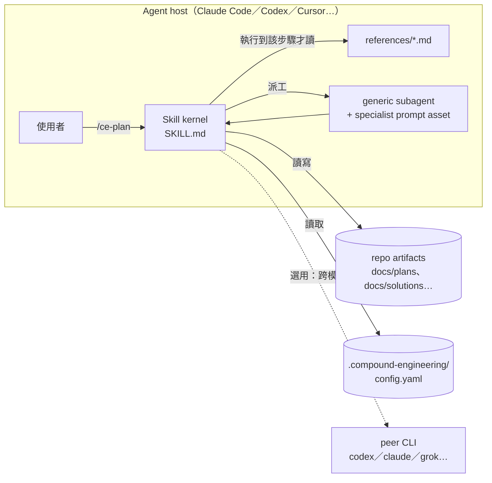
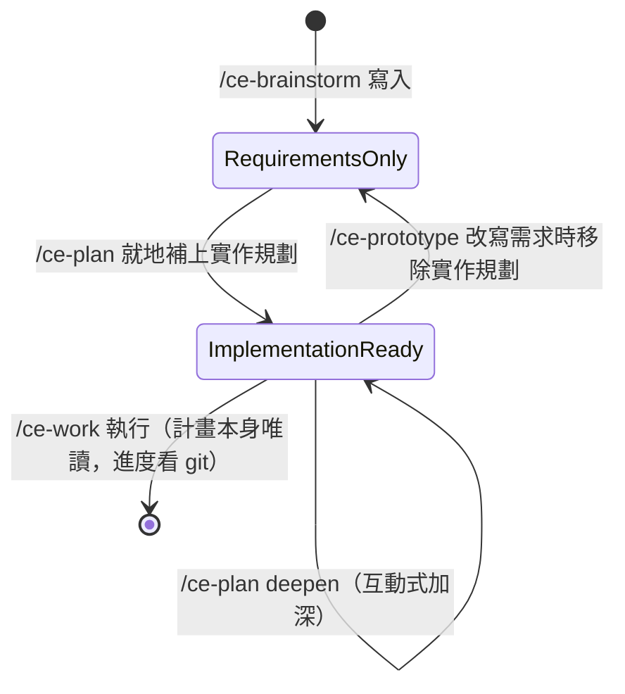
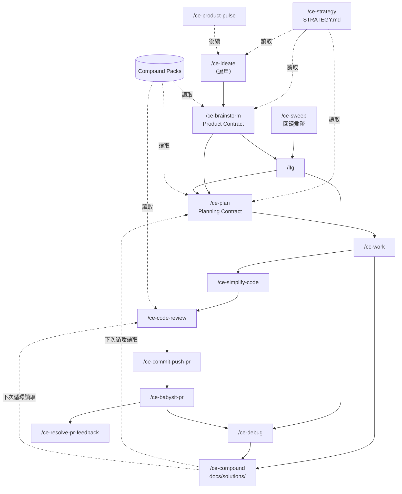
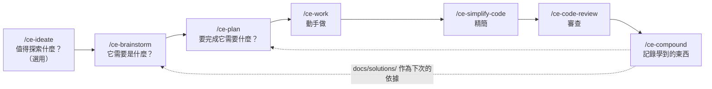
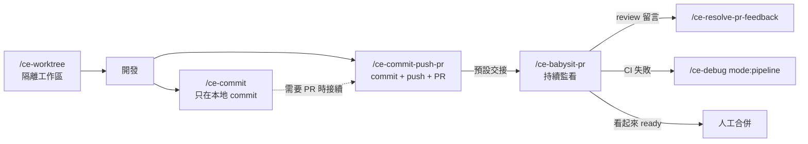
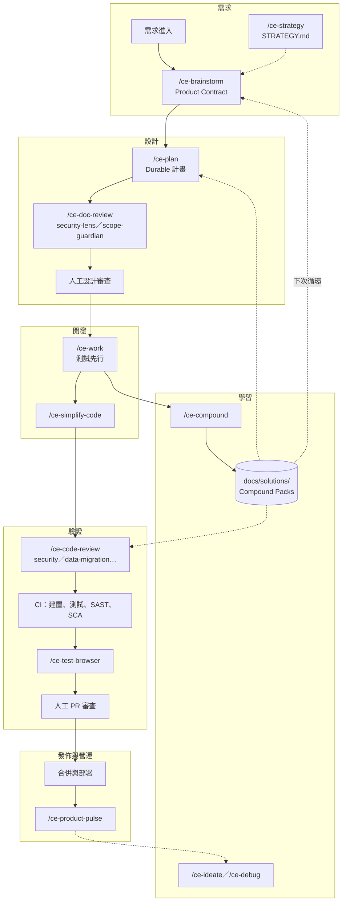
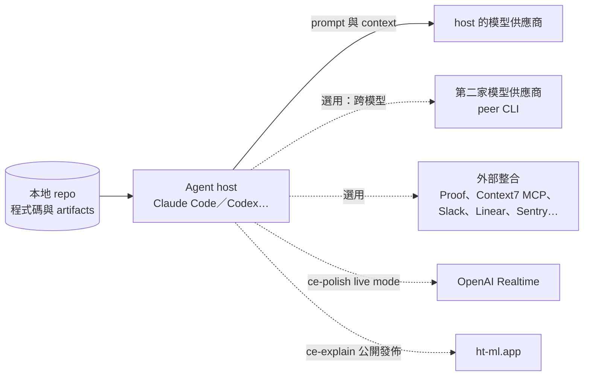
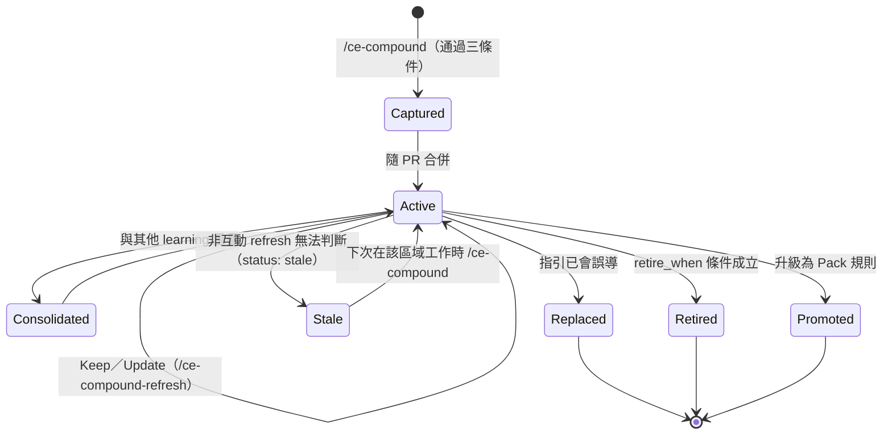
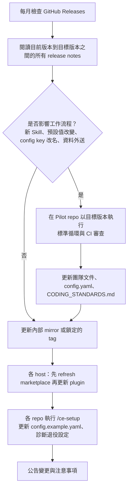
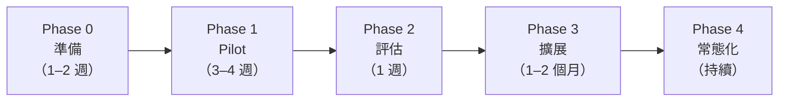

+++
date = '2026-06-30T12:00:00+08:00'
draft = false
title = 'Compound Engineering 教學手冊'
tags = ['教學', 'AI開發','指引']
categories = ['教學']
+++

# Compound Engineering 教學手冊

## 文件資訊

| 項目 | 內容 |
| --- | --- |
| **文件版本** | 2.0 |
| **最後更新** | 2026-10-02 |
| **版本基準** | Compound Engineering Plugin **v3.30.3**（2026-10-01，tag `compound-engineering-v3.30.3`），共 **36 個 Skills**；完整矩陣見 [1.7 本手冊的版本基準與閱讀方式](#17-本手冊的版本基準與閱讀方式) |
| **官方來源** | <https://github.com/EveryInc/compound-engineering-plugin>（MIT License）、官方文件站 <https://every.to/compound-engineering> |
| **文件定位** | 企業標準技術白皮書／內部標準教材：**Compound Engineering 方法論、Plugin 安裝與組態、36 個 Skills 的用法、Compound Packs、跨模型協作、企業流程整合、治理與導入** |
| **適用對象** | 已在使用 AI coding agent（Claude Code、Codex、Cursor、GitHub Copilot 等）的開發人員、技術主管、架構師、平台／DevOps 工程師、資安與稽核人員 |
| **前置知識** | Git 與 Pull Request 流程、至少一種 AI coding agent 的基本操作、CI/CD 基本概念 |
| **姊妹文件** | 《claude code cli 教學手冊》、《Claude Code生態圈教學手冊》、《Claude Code企業級軟體開發教學手冊》、《github copilot生態圈教學手冊》、《github使用教學》、《git使用教學》 |
| **前一版本** | v3.16.0（2026-06-30；當時以 Plugin 版本號作為手冊版本號，對應 27 個 Skills） |

> 📌 **v2.0 改版重點**：章節依上游 `docs/guides` 的分類重新編排為 18 章與 8 個附錄，全面對齊 Plugin v3.30.3。
>
> - **版本號分離**：自本版起，手冊版本（2.0）與 Plugin 版本（v3.30.3）分開標示，避免舊版「手冊 v3.16.0」造成的混淆。
> - **修正錯誤**：修正舊版不存在或寫錯的指令與機制。例如虛構的安裝指令 `/install-plugin`、`codex install`、`gh copilot plugin add`、`kimi-code`、`qwen-code`；不存在的 `/ce-sessions`、`/ce-update`；錯誤的 OpenCode 設定格式；錯誤的審查分級（舊版寫 CRITICAL／WARNING，實際為 P0–P3）與 autofix class 名稱；把 `ce-plan` 的 `security-sentinel`、`performance-oracle` 誤植為 `ce-code-review` 的 persona；以及無法運作的 CI workflow 範例。
> - **新增內容**：9 個新 Skills（`ce-babysit-pr`、`ce-bakeoff`、`ce-explain`、`ce-handoff`、`ce-noslop`、`ce-prototype`、`ce-retune`、`ce-sweep`、`wtf`）、`.compound-engineering/config.yaml` 組態、`docs_root`、`CODING_STANDARDS.md`、Compound Packs、跨模型協作（oracle panel、cross-model review、implementation engine）、14 個 agent host 的安裝方式與呼叫語法差異、`anthropics/claude-code-action` 的 CI 整合、治理與稽核。
> - **追溯依據**：所有差異見 [F.3 v3.16.0 → v2.0 更正對照表](#f3-v3160--v20-更正對照表)，查證依據見 [附錄 G：查證紀錄](#附錄-g查證紀錄)。

### 閱讀指引

| 讀者角色 | 建議閱讀章節 |
| --- | --- |
| 第一次接觸 Compound Engineering 的開發人員 | 第 1、2 章 → 第 3 章（只讀自己用的 host）→ 4.1 → 第 5 章 → 第 18 章 |
| 每天使用 CE 的工程師 | 第 5–9 章 → 第 13 章 → 附錄 A、C |
| 技術主管／架構師 | 第 1、2 章 → 第 10、11 章 → 第 12、13 章 → 第 17 章 |
| 平台／DevOps 工程師 | 第 3、4 章 → 12.3 → 第 15、16 章 |
| 資安／稽核人員 | 2.2 → 第 11 章 → 第 14 章 → 附錄 D |
| 決策者 | 第 1 章 → 1.6 → 第 17 章 |

### 標示慣例

| 標示 | 意義 |
| --- | --- |
| `/ce-xxx` | Skill 的斜線呼叫語法（Claude Code、Cursor、Copilot 等）；Codex 用 `$ce-xxx`，oh-my-pi 用 `/skill:ce-xxx`，見 [3.7 支援矩陣與呼叫語法差異](#37-支援矩陣與呼叫語法差異) |
| 🔒 手動 | 該 Skill 設定 `disable-model-invocation: true`，只能由使用者明確輸入呼叫，模型不會自行觸發 |
| 🧪 實驗性 | 上游標示為 experimental，格式可能變動（目前為 Compound Packs） |
| 📘 建議實務 | 本手冊依企業經驗提出的作法，**不是** Plugin 內建功能 |
| `<尖括號>` | 需依環境替換的值 |
| `docs/` | CE artifact 的預設根目錄；若設定 `docs_root`，請讀成 `<docs_root>/` |

> ⚠️ 本手冊所有 Skill 名稱、引數與行為皆依 tag `compound-engineering-v3.30.3` 的 `README.md`、`docs/guides/*.md` 與 `skills/*/SKILL.md` 查證；CE 的發版頻率很高（v3.14.0 的 2026-06-24 至 v3.30.3 的 2026-10-01 共發行 41 個版本），引用任何引數前，請先以 `/ce-setup` 確認實際安裝的版本，並對照 [附錄 G](#附錄-g查證紀錄) 的待查項目。

## 📑 目錄

<!-- TOC-AUTO-BEGIN -->

- [1. 概述與版本基準](#1-概述與版本基準)
  - [1.1 什麼是 Compound Engineering](#11-什麼是-compound-engineering)
  - [1.2 起源與版本演進](#12-起源與版本演進)
  - [1.3 核心設計哲學](#13-核心設計哲學)
  - [1.4 與其他 AI 開發方式比較](#14-與其他-ai-開發方式比較)
  - [1.5 開發成熟度階段模型](#15-開發成熟度階段模型)
  - [1.6 適用與不適用場景](#16-適用與不適用場景)
  - [1.7 本手冊的版本基準與閱讀方式](#17-本手冊的版本基準與閱讀方式)
- [2. 架構與核心概念](#2-架構與核心概念)
  - [2.1 Skills-only 架構](#21-skills-only-架構)
  - [2.2 Skill、Specialist prompt asset 與 Native plugin surface](#22-skillspecialist-prompt-asset-與-native-plugin-surface)
  - [2.3 Artifact 與目錄配置](#23-artifact-與目錄配置)
  - [2.4 統一計畫文件（Unified Plan）](#24-統一計畫文件unified-plan)
  - [2.5 知識的層次：Learning、Pattern doc、Pack 與 Concepts](#25-知識的層次learningpattern-docpack-與-concepts)
  - [2.6 Skill 串接關係](#26-skill-串接關係)
  - [2.7 本章重點](#27-本章重點)
- [3. 安裝與升級](#3-安裝與升級)
  - [3.1 前置需求](#31-前置需求)
  - [3.2 Claude Code](#32-claude-code)
  - [3.3 Cursor 與 Grok Bot](#33-cursor-與-grok-bot)
  - [3.4 Codex App 與 Codex CLI](#34-codex-app-與-codex-cli)
  - [3.5 GitHub Copilot](#35-github-copilot)
  - [3.6 其他 host](#36-其他-host)
  - [3.7 支援矩陣與呼叫語法差異](#37-支援矩陣與呼叫語法差異)
  - [3.8 升級既有安裝](#38-升級既有安裝)
  - [3.9 Windows 注意事項](#39-windows-注意事項)
  - [3.10 本地開發模式](#310-本地開發模式)
  - [3.11 本章重點](#311-本章重點)
- [4. 設定與組態](#4-設定與組態)
  - [4.1 /ce-setup：健康檢查與初始化](#41-ce-setup健康檢查與初始化)
  - [4.2 config.yaml 與設定解析順序](#42-configyaml-與設定解析順序)
  - [4.3 docs_root：搬移 artifact 根目錄](#43-docs_root搬移-artifact-根目錄)
  - [4.4 Implementation routing 與 work engine](#44-implementation-routing-與-work-engine)
  - [4.5 指令層：CLAUDE.md、AGENTS.md 與 CODING_STANDARDS.md](#45-指令層claudemdagentsmd-與-coding_standardsmd)
  - [4.6 安全維護](#46-安全維護)
  - [4.7 本章重點](#47-本章重點)
- [5. Core Loop：核心循環](#5-core-loop核心循環)
  - [5.1 核心循環總覽](#51-核心循環總覽)
  - [5.2 /ce-ideate：探索方向](#52-ce-ideate探索方向)
  - [5.3 /ce-brainstorm：定義需求](#53-ce-brainstorm定義需求)
  - [5.4 /ce-plan：建立實作護欄](#54-ce-plan建立實作護欄)
  - [5.5 /ce-work：執行與交付](#55-ce-work執行與交付)
  - [5.6 /ce-simplify-code：精簡剛寫好的程式碼](#56-ce-simplify-code精簡剛寫好的程式碼)
  - [5.7 /ce-code-review：結構化程式碼審查](#57-ce-code-review結構化程式碼審查)
  - [5.8 /ce-compound：知識沉澱](#58-ce-compound知識沉澱)
  - [5.9 本章重點](#59-本章重點)
- [6. Around the Loop：循環周邊](#6-around-the-loop循環周邊)
  - [6.1 /ce-strategy：產品策略錨點](#61-ce-strategy產品策略錨點)
  - [6.2 /ce-product-pulse：產品脈搏報告](#62-ce-product-pulse產品脈搏報告)
  - [6.3 /ce-sweep：回饋彙整](#63-ce-sweep回饋彙整)
  - [6.4 /ce-compound-refresh：知識庫維護](#64-ce-compound-refresh知識庫維護)
  - [6.5 本章重點](#65-本章重點)
- [7. On-Demand：按需使用的 Skills](#7-on-demand按需使用的-skills)
  - [7.1 /ce-bakeoff：競爭方案比較](#71-ce-bakeoff競爭方案比較)
  - [7.2 /ce-pov：專案導向的判斷](#72-ce-pov專案導向的判斷)
  - [7.3 /ce-explain：解釋運作方式與設計理由](#73-ce-explain解釋運作方式與設計理由)
  - [7.4 /ce-prototype：體驗原型](#74-ce-prototype體驗原型)
  - [7.5 /ce-debug：根因除錯](#75-ce-debug根因除錯)
  - [7.6 /ce-doc-review：文件審查](#76-ce-doc-review文件審查)
  - [7.7 /ce-optimize：量測驅動的最佳化迴圈](#77-ce-optimize量測驅動的最佳化迴圈)
  - [7.8 /ce-retune：模型升級後的 Skill 重新調校](#78-ce-retune模型升級後的-skill-重新調校)
  - [7.9 /ce-riffrec-feedback-analysis：錄影回饋分析](#79-ce-riffrec-feedback-analysis錄影回饋分析)
  - [7.10 本章重點](#710-本章重點)
- [8. Git Workflow 與 Autonomous Pipeline](#8-git-workflow-與-autonomous-pipeline)
  - [8.1 Git Workflow 總覽](#81-git-workflow-總覽)
  - [8.2 /ce-commit：本地 commit](#82-ce-commit本地-commit)
  - [8.3 /ce-commit-push-pr：交付與 PR 描述](#83-ce-commit-push-pr交付與-pr-描述)
  - [8.4 /ce-babysit-pr 與 /ce-resolve-pr-feedback](#84-ce-babysit-pr-與-ce-resolve-pr-feedback)
  - [8.5 /ce-worktree：隔離工作區](#85-ce-worktree隔離工作區)
  - [8.6 /lfg：全自動工程管線](#86-lfg全自動工程管線)
  - [8.7 本章重點](#87-本章重點)
- [9. 測試、設計、協作與工具](#9-測試設計協作與工具)
  - [9.1 瀏覽器與 iOS 測試](#91-瀏覽器與-ios-測試)
  - [9.2 /ce-polish：即時 UX 打磨](#92-ce-polish即時-ux-打磨)
  - [9.3 /ce-proof：與 Proof 協作編輯器整合](#93-ce-proof與-proof-協作編輯器整合)
  - [9.4 /ce-handoff：跨 session 交接](#94-ce-handoff跨-session-交接)
  - [9.5 /ce-promote：上線公告草稿](#95-ce-promote上線公告草稿)
  - [9.6 /ce-noslop 與 /wtf：寫作與理解](#96-ce-noslop-與-wtf寫作與理解)
  - [9.7 本章重點](#97-本章重點)
- [10. Compound Packs 與組織知識](#10-compound-packs-與組織知識)
  - [10.1 Pack 是什麼：與 Learning、Skill 的差異](#101-pack-是什麼與-learningskill-的差異)
  - [10.2 建立第一個 Pack](#102-建立第一個-pack)
  - [10.3 Pack 結構與 applies_when 撰寫原則](#103-pack-結構與-applies_when-撰寫原則)
  - [10.4 宣告來源、發佈與 Persona Pack](#104-宣告來源發佈與-persona-pack)
  - [10.5 各階段如何使用 Packs](#105-各階段如何使用-packs)
  - [10.6 從 Learnings 長成 Packs](#106-從-learnings-長成-packs)
  - [10.7 本章重點](#107-本章重點)
- [11. 跨模型協作](#11-跨模型協作)
  - [11.1 概念：獨立性、Peer 與 Receipt](#111-概念獨立性peer-與-receipt)
  - [11.2 Oracle panel 與 model elevation](#112-oracle-panel-與-model-elevation)
  - [11.3 跨模型審查（cross-model review）](#113-跨模型審查cross-model-review)
  - [11.4 跨模型實作（implementation engine）](#114-跨模型實作implementation-engine)
  - [11.5 成本與治理](#115-成本與治理)
  - [11.6 本章重點](#116-本章重點)
- [12. 企業開發流程整合](#12-企業開發流程整合)
  - [12.1 SSDLC 對應](#121-ssdlc-對應)
  - [12.2 Git Flow、Branch Protection 與 CE](#122-git-flowbranch-protection-與-ce)
  - [12.3 CI/CD 整合](#123-cicd-整合)
  - [12.4 Code Review 自動化的分層](#124-code-review-自動化的分層)
  - [12.5 測試策略](#125-測試策略)
  - [12.6 本章重點](#126-本章重點)
- [13. 最佳實務](#13-最佳實務)
  - [13.1 寫好 brainstorm 與 plan 的輸入](#131-寫好-brainstorm-與-plan-的輸入)
  - [13.2 Context Engineering：指令層的分工](#132-context-engineering指令層的分工)
  - [13.3 讓知識真正複利](#133-讓知識真正複利)
  - [13.4 防止幻覺與錯誤假設](#134-防止幻覺與錯誤假設)
  - [13.5 Agent-native 架構](#135-agent-native-架構)
  - [13.6 需要放下的信念](#136-需要放下的信念)
  - [13.7 本章重點](#137-本章重點)
- [14. 安全、隱私與治理](#14-安全隱私與治理)
  - [14.1 資料流與官方隱私／安全政策](#141-資料流與官方隱私安全政策)
  - [14.2 機密與憑證管理](#142-機密與憑證管理)
  - [14.3 權限、自動觸發與 Prompt Injection](#143-權限自動觸發與-prompt-injection)
  - [14.4 供應鏈：版本鎖定與 Marketplace 信任](#144-供應鏈版本鎖定與-marketplace-信任)
  - [14.5 稽核與法規對應](#145-稽核與法規對應)
  - [14.6 本章重點](#146-本章重點)
- [15. 維運與疑難排解](#15-維運與疑難排解)
  - [15.1 知識庫生命週期管理](#151-知識庫生命週期管理)
  - [15.2 Token 與成本管理](#152-token-與成本管理)
  - [15.3 監控與指標](#153-監控與指標)
  - [15.4 疑難排解](#154-疑難排解)
  - [15.5 本章重點](#155-本章重點)
- [16. 升級策略與版本控管](#16-升級策略與版本控管)
  - [16.1 上游的發版機制](#161-上游的發版機制)
  - [16.2 版本鎖定與升級流程](#162-版本鎖定與升級流程)
  - [16.3 向下相容與已淘汰的用法](#163-向下相容與已淘汰的用法)
  - [16.4 回復與災難復原](#164-回復與災難復原)
  - [16.5 本章重點](#165-本章重點)
- [17. 企業導入](#17-企業導入)
  - [17.1 導入策略：Pilot → Rollout](#171-導入策略pilot--rollout)
  - [17.2 團隊角色轉變](#172-團隊角色轉變)
  - [17.3 KPI 設計](#173-kpi-設計)
  - [17.4 教育訓練計畫](#174-教育訓練計畫)
  - [17.5 團隊協作模式](#175-團隊協作模式)
  - [17.6 本章重點](#176-本章重點)
- [18. 完整實戰案例：銀行預約轉帳](#18-完整實戰案例銀行預約轉帳)
  - [18.1 案例背景與前置設定](#181-案例背景與前置設定)
  - [18.2 /ce-brainstorm：定義需求](#182-ce-brainstorm定義需求)
  - [18.3 /ce-plan：建立實作護欄](#183-ce-plan建立實作護欄)
  - [18.4 /ce-work：實作](#184-ce-work實作)
  - [18.5 /ce-simplify-code：精簡](#185-ce-simplify-code精簡)
  - [18.6 /ce-code-review：審查](#186-ce-code-review審查)
  - [18.7 /ce-compound：知識沉澱](#187-ce-compound知識沉澱)
  - [18.8 下一次循環的複利效果](#188-下一次循環的複利效果)
  - [18.9 本章重點](#189-本章重點)
- [附錄 A：Skills 完整參考表](#附錄-askills-完整參考表)
  - [A.1 Core loop](#a1-core-loop)
  - [A.2 Around the loop](#a2-around-the-loop)
  - [A.3 On demand](#a3-on-demand)
  - [A.4 Git workflow](#a4-git-workflow)
  - [A.5 Autonomous](#a5-autonomous)
  - [A.6 Testing & design](#a6-testing--design)
  - [A.7 Collaboration](#a7-collaboration)
  - [A.8 Utilities](#a8-utilities)
  - [A.9 v3.16.0 之後新增的 Skills](#a9-v3160-之後新增的-skills)
- [附錄 B：Specialist Prompt Assets 參考表](#附錄-bspecialist-prompt-assets-參考表)
  - [B.1 ce-code-review 的 Reviewer personas](#b1-ce-code-review-的-reviewer-personas)
  - [B.2 ce-doc-review 的 Reviewer personas](#b2-ce-doc-review-的-reviewer-personas)
  - [B.3 ce-simplify-code 的審查角色](#b3-ce-simplify-code-的審查角色)
  - [B.4 研究與分析角色](#b4-研究與分析角色)
- [附錄 C：常用指令 Cheat Sheet](#附錄-c常用指令-cheat-sheet)
  - [C.1 安裝與升級](#c1-安裝與升級)
  - [C.2 日常工作流](#c2-日常工作流)
  - [C.3 Git 與 PR](#c3-git-與-pr)
  - [C.4 常用引數](#c4-常用引數)
  - [C.5 各 host 的呼叫語法](#c5-各-host-的呼叫語法)
- [附錄 D：檢查清單](#附錄-d檢查清單)
  - [D.1 新進成員](#d1-新進成員)
  - [D.2 Repo 導入](#d2-repo-導入)
  - [D.3 Plugin 升級](#d3-plugin-升級)
- [附錄 E：參考資源與延伸閱讀](#附錄-e參考資源與延伸閱讀)
  - [E.1 官方資源](#e1-官方資源)
  - [E.2 Every 的方法論文章](#e2-every-的方法論文章)
  - [E.3 第三方觀點](#e3-第三方觀點)
  - [E.4 相關技術](#e4-相關技術)
- [附錄 F：版本紀錄](#附錄-f版本紀錄)
  - [F.1 版本歷程](#f1-版本歷程)
  - [F.2 舊版 → 2.0 章節對照](#f2-舊版--20-章節對照)
  - [F.3 v3.16.0 → v2.0 更正對照表](#f3-v3160--v20-更正對照表)
- [附錄 G：查證紀錄](#附錄-g查證紀錄)
  - [G.1 待查項目](#g1-待查項目)
- [附錄 H：術語表](#附錄-h術語表)

<!-- TOC-AUTO-END -->

---

## 1. 概述與版本基準

### 1.1 什麼是 Compound Engineering

**Compound Engineering**（複利工程，以下簡稱 CE）是 [Every Inc.](https://every.to/) 提出的 AI 協作軟體工程方法論，同時也是實作這套方法論的開源 Plugin。核心命題只有一句：

> **每一單位的工程工作，都應該讓下一單位變得更容易，而不是更難。**

傳統開發中，每個功能都會增加複雜度，每次修 Bug 都留下一點只存在某人腦中的知識，程式碼庫越大，下一次修改就越慢。CE 的作法是把工作組織成一個固定循環，並在循環最後把「這次學到的東西」寫成檔案，讓下一次循環的 agent 讀得到：

| 循環步驟 | 對應 Skill | 回答的問題 |
| --- | --- | --- |
| Brainstorm | `/ce-brainstorm` | 這個東西需要是什麼樣子？ |
| Plan | `/ce-plan` | 要完成它需要哪些決策與護欄？ |
| Work | `/ce-work` | 動手做，邊做邊驗證 |
| Simplify | `/ce-simplify-code` | 剛寫的程式碼能不能更精簡、重用既有工具？ |
| Review | `/ce-code-review` | 依計畫與團隊規則審查結果 |
| Compound | `/ce-compound` | 把不易從程式碼看出的推理寫進 `docs/solutions/` |

最後一步是整套方法的關鍵：`/ce-compound` 寫下的 learning，會在下一次 `/ce-brainstorm`、`/ce-plan` 與 `/ce-code-review` 時被當成依據讀回來。上游 README 用一句話描述這個效果：「Run one teaches it. Run two remembers.」（第一次教會它，第二次它就記得。）

**Plugin 的組成**（v3.30.3）：

- **36 個 Skills**：由使用者（或在允許時由模型）呼叫的工作流程，分為 Core Loop、Around the Loop、On-Demand、Git Workflow、Autonomous、Testing & Design、Collaboration、Utilities 八組（見 [附錄 A](#附錄-askills-完整參考表)）。
- **Skill 內部的 specialist prompt assets**：審查、研究等專家角色以 Skill 私有的 prompt 檔存在，由擁有它的 Skill 決定何時載入，不再是獨立的 Agent（見 [2.2](#22-skillspecialist-prompt-asset-與-native-plugin-surface)）。
- **各 host 的原生 manifest**：`.claude-plugin/`、`.codex-plugin/`、`.cursor-plugin/`、`.kimi-plugin/`、`.grok-plugin/`、`.devin-plugin/`、`.omp-plugin/` 等，讓 14 個 agent host 以各自的 plugin 機制直接安裝。

**維護者**：Kieran Klaassen 與 Trevin Chow，並接受社群貢獻。截至 2026-10-02，GitHub 約 25.3k stars。

### 1.2 起源與版本演進

**方法論的起源**：

| 時間 | 里程碑 | 說明 |
| --- | --- | --- |
| 2025-08-18 | 概念提出 | Kieran Klaassen 發表 *[My AI Had Already Fixed the Code Before I Saw It](https://every.to/source-code/my-ai-had-already-fixed-the-code-before-i-saw-it)*，首次提出「compounding engineering」 |
| 2025-11-06 | Plan-first | Kieran Klaassen 發表 *[Stop Coding and Start Planning](https://every.to/source-code/stop-coding-and-start-planning)*，主張 agent 時代應以規劃為先 |
| 2025-12-11 | 方法論系統化 | Dan Shipper 與 Kieran Klaassen 發表 *[Compound Engineering: How Every Codes With Agents](https://every.to/chain-of-thought/compound-engineering-how-every-codes-with-agents)*（Plan → Work → Assess → Compound 四步驟；80% 在規劃與審查） |
| 持續更新 | 官方指南 | Every 發佈 *[Compound Engineering](https://every.to/guides/compound-engineering)* 指南（成熟度階段、50／50 原則、需要放下的信念、agent-native 架構），由 Kieran Klaassen 與 Trevin Chow 維護 |
| 2026 上半年 | 指令改名 | 指令命名空間由 `/workflows:*` 改為 `/ce-*`（上游 `docs/plans/2026-03-27-001-refactor-ce-skill-prefix-rename-plan.md`） |

**Plugin 的重大版本**（依 GitHub Releases 整理，只列影響使用方式的變更）：

| 版本 | 日期 | 重大變更 |
| --- | --- | --- |
| v3.14.0 | 2026-06-24 | 改為 **root-native、skills-only** 結構，移除獨立的 agents／commands 目錄；Antigravity CLI（`agy`）取代已退役的 Gemini CLI target；Codex marketplace 安裝 |
| v3.15.0 | 2026-06-27 | brainstorm 與 plan **合併為單一 readiness-staged 統一計畫文件**；`ce-code-review` 新增跨模型 adversarial pass；Kimi Code 原生支援 |
| v3.16.0 | 2026-06-30 | 新增 `ce-pov`；`ce-dogfood` 由 beta 轉為 stable；`ce-plan` 可略過 scoping 確認（舊版手冊基準） |
| v3.17.0 | 2026-07-01 | `agy plugin install` 一行指令安裝 |
| v3.18.0 | 2026-07-06 | 新增 `ce-explain`、`ce-sweep`（29 個 Skills） |
| v3.19.0 | 2026-07-08 | PR 描述的「New concepts」教學段落；brainstorm／plan 的 blindspot pass；code review 偵測 silent-pass 驗證機制；learning 寫入時驗證引用 |
| v3.20.0 | 2026-07-22 | 新增 `ce-babysit-pr`、`ce-handoff`；Devin CLI、Cline、Grok Build 原生支援；`ce-work` 跨模型 implementation engine；`ce-pov` model panel；brainstorm／plan 的 model elevation；session-settled decisions 在整條 pipeline 傳遞 |
| v3.21.0 | 2026-07-31 | 新增 `ce-retune`；`docs_root` 可搬移 artifact 根目錄；`ce-babysit-pr` 支援原生 Windows |
| v3.22.0 | 2026-08-16 | 新增 `ce-prototype`；`cross_model_review_mode` 外送閘門；oh-my-pi 原生支援；config 在 `config.yaml`／`config.local.yaml` 間逐 key 疊加 |
| v3.23.0 | 2026-08-22 | 各 Skill 改為 phase-loaded kernel（`SKILL.md` 控制在 8 KB 內，細節移入 `references/`） |
| v3.24.0 | 2026-08-31 | OpenCode 成為 peer 與 work engine；code review 改讀 repo 自有的 `CODING_STANDARDS.md` |
| v3.25.0 | 2026-09-13 | 新增 `ce-bakeoff`、`ce-noslop`；**Compound Packs**（實驗性）；官方文件站上線 <https://every.to/compound-engineering> |
| v3.26.0 | 2026-09-15 | `lfg` 依請求類型路由到負責的 Skill；小型低風險 diff 走便宜的 lite review |
| v3.27.0 | 2026-09-19 | 新增 `wtf` |
| v3.28.0 | 2026-09-22 | `work_engine_effort` 設定外部 worker 的推理強度 |
| v3.29.0 | 2026-09-25 | learning 可宣告 `retire_when` 退役條件；`ce-polish` live mode；code review 把「計畫沒要求的行為規則」列為 advisory |
| v3.30.0 | 2026-09-29 | brainstorm／plan／work 統一「只建構被要求的東西」的 sizing 規則 |
| **v3.30.3** | **2026-10-01** | **本手冊基準**（bug fix 版） |

> 📘 **建議實務**：CE 平均約每 2.4 天發一版（v3.14.0 至 v3.30.3 共 41 版）。企業環境不建議追最新版，請依 [16. 升級策略與版本控管](#16-升級策略與版本控管) 以 tag 鎖定版本，並每月評估一次升級。

### 1.3 核心設計哲學

**80／20 原則**：80% 的心力花在規劃與審查，20% 花在執行。上游 README 的說法是「重點是槓桿，不是儀式」：

- 好的 brainstorm 讓計畫更銳利。
- 好的計畫讓實作範圍更小。
- 好的審查抓到的是模式，不只是單一 Bug。
- 好的 compound note 讓下一個 agent 不必從頭學同一課。

**50／50 原則**（出自 Every 的 [Compound Engineering 指南](https://every.to/guides/compound-engineering)）：50% 的工程時間建構功能，50% 改善系統本身，例如補審查規則、記錄模式、改善測試工具；傳統團隊大約是 90% 功能、10% 其他。第三方的實務文章也把它列為核心紀律，並提醒一個陷阱：如果時間大量轉向「打造複利機器」而不是交付，就落入了「factory trap」（工廠陷阱）。

**v3.30 起的 sizing 原則**：從 brainstorm、plan 到 work，CE 對「使用者沒要求的機制」（guard、retry、fallback、抽象層）採取同一套測試，**只有在以下任一條件成立時才建構**：

1. 既有契約要求它。
2. 少了它，傷害會在任何人發現前就發生。
3. 之後再加的成本很高（已儲存的資料、公開介面、金流、資安）。

不符合的項目會列為「考慮過但不建構」，並寫明理由與什麼情況會改變判斷。這條規則同時禁止反方向的錯誤：不可以為了加一個 safeguard 而縮減使用者明確要求的行為。

### 1.4 與其他 AI 開發方式比較

| 比較維度 | 行內補全（Copilot completions 等） | 對話式 agent（不加 CE） | Compound Engineering |
| --- | --- | --- | --- |
| 互動單位 | 一行或一段程式碼 | 一次對話 | 一個有 artifact 交接的循環 |
| 規劃 | 無 | 依 prompt 而定 | `ce-brainstorm` 產出 Product Contract，`ce-plan` 產出含 U-ID 與測試情境的計畫 |
| 審查 | 無 | 手動要求 | `ce-code-review` 依 diff 選 persona、P0–P3 分級、依團隊 `CODING_STANDARDS.md` 審查 |
| 知識累積 | 無 | 對話結束即消失 | `ce-compound` 寫入 `docs/solutions/`，Compound Packs 跨 repo 共享規則 |
| 跨模型驗證 | 無 | 無 | 審查與判斷可交給不同模型家族做獨立 adversarial pass |
| 自動化程度 | 補全 | 單步 | `lfg` 可從需求一路到開 PR 並監看 CI |
| 適用規模 | 個人片段 | 個人任務 | 長期維護的產品與團隊 |

> CE 不取代 host 本身的能力。例如使用者要求「快速審查」時，`ce-code-review` 會直接交給 host 內建的 `/review`；CE 的價值在於把多個步驟串成有交接、有紀錄的流程。

### 1.5 開發成熟度階段模型

Every 的 [Compound Engineering 指南](https://every.to/guides/compound-engineering) 把人與 AI 的協作分成六個階段。CE 的導入建議從 Stage 3 開始：

| 階段 | 名稱 | 描述 | CE 對應 |
| --- | --- | --- | --- |
| Stage 0 | Manual Development | 純手工開發 | — |
| Stage 1 | Chat-based Assistance | 把 AI 當成參考工具 | `/wtf`、`/ce-explain` |
| Stage 2 | Agentic, line-by-line review | agent 改程式碼，人逐行審 | `/ce-work` 加人工審查 |
| Stage 3 | Plan-first, PR-only review | 先有詳細計畫，人只在 PR 層級審查 | `/ce-brainstorm` → `/ce-plan` → `/ce-work` → `/ce-code-review` → `/ce-compound` |
| Stage 4 | Idea to PR（單機） | 給出想法，agent 負責到 PR | `/ce-brainstorm` 後接 `/lfg` |
| Stage 5 | Parallel execution | 多個 agent 平行處理多個功能 | `/lfg` 加上 `ce-work` 的平行 wave、跨模型 implementation engine、`/ce-babysit-pr` |

**關鍵轉換**：

- **2 → 3（最關鍵）**：投資在規劃、讓 agent 先做研究、改在 PR 層級審查。
- **3 → 4**：描述想要的結果，而不是下指令；讓 agent 負責規劃。
- **4 → 5**：多個工作並行，人負責分派與驗收。

### 1.6 適用與不適用場景

**適合導入的場景**：

| 場景 | 原因 |
| --- | --- |
| 長期維護的產品 | 知識累積的效益隨時間放大 |
| 金融、醫療等高合規產業 | 計畫、審查與 learning 都留下可稽核的檔案 |
| 多團隊、多 repo 的組織 | Compound Packs 讓同一套規則在所有 repo 生效 |
| 人員流動大的團隊 | `docs/solutions/` 與 `CONCEPTS.md` 保存了原本只在人腦中的知識 |
| 小團隊負責大型程式碼庫 | Every 內部以此方法讓每個產品由少數人維護 |

**不適合或需要調整的場景**：

| 場景 | 建議 |
| --- | --- |
| 一行修正、typo、依賴升級 | 直接改，或用 `/ce-work` 的 Trivial 路徑；不需要完整循環 |
| 團隊尚未使用 PR 與 CI | 先建立 Git 與 CI 基礎（見《github使用教學》） |
| 不允許程式碼外送任何雲端模型 | CE 本身不外傳資料，但 host 會把 context 送到模型供應商；需先完成資料分類（見 [14. 安全、隱私與治理](#14-安全隱私與治理)） |
| 抗拒外部工作流框架的團隊 | 第三方評估指出 CE 的流程有主見，可能與既有流程衝突；建議以 Pilot 驗證 |

> ⚠️ 第三方評估（Ry Walker，2026-06）列出的主要缺點：小修改的流程成本偏高、學習曲線陡、平行審查的 token 用量高、版本更新太快導致文件容易過時。這些都是導入前應納入評估的成本（見 [17. 企業導入](#17-企業導入)）。

### 1.7 本手冊的版本基準與閱讀方式

| 項目 | 基準 |
| --- | --- |
| Plugin 版本 | v3.30.3（2026-10-01），commit `752b0bc` |
| Skills 數量 | 36（README badge 與 `skills/*/SKILL.md` 一致） |
| 官方支援的 agent host | 14 個（README 用語）；本手冊第 3 章列出 15 個安裝入口，因 Grok Bot 共用 Cursor 的 plugin library |
| 查證來源 | `README.md`、`CONCEPTS.md`、`docs/guides/*.md`、`docs/install/upgrading.md`、`skills/*/SKILL.md`、`.compound-engineering/config.example.yaml`、GitHub Releases |
| 外部參考 | Every 方法論文章、`anthropics/claude-code-action` 文件、第三方實務文章（見 [附錄 E](#附錄-e參考資源與延伸閱讀)） |
| 查證日期 | 2026-10-02 |

**本章重點**：

- CE 是「方法論 + Plugin」，核心是讓每次循環都把學到的東西寫回 repo。
- v3.16.0 → v3.30.3 之間新增 9 個 Skills，並加入組態檔、Compound Packs 與跨模型協作。
- 企業導入應以 tag 鎖定版本，並從成熟度 Stage 3 開始。

## 2. 架構與核心概念

### 2.1 Skills-only 架構

自 v3.14.0 起，CE 的 repository 根目錄就是 plugin 本身（root-native），而且只發佈 Skills（skills-only）。舊版的 `plugins/compound-engineering/` 子目錄、獨立的 `agents/` 與 `commands/` 目錄都已移除。

```text
compound-engineering-plugin/            # repo 根目錄 = plugin 套件
├── skills/                             # 36 個 Skill，每個一個目錄
│   └── ce-plan/
│       ├── SKILL.md                    # 常駐載入的 kernel（v3.23 起控制在 8 KB 內）
│       ├── references/                 # 各階段的細節，執行到該步驟才讀
│       │   └── agents/                 # Skill 私有的 specialist prompt assets
│       └── scripts/                    # 隨 Skill 發佈的輔助腳本
├── .claude-plugin/                     # Claude Code manifest 與 marketplace
├── .codex-plugin/  .cursor-plugin/  .kimi-plugin/  .grok-plugin/
├── .devin-plugin/  .omp-plugin/  .agy/  .cline/  .opencode/  .pi/
├── .compound-engineering/config.example.yaml   # 組態範本
├── docs/guides/                        # 每個 Skill 一頁的使用者文件
├── CONCEPTS.md                         # 術語表
├── src/                                # Bun CLI（只供開發與 converter 維護）
└── README.md
```


```mermaid
flowchart LR
    subgraph Host["Agent host（Claude Code／Codex／Cursor…）"]
        U[使用者] -->|/ce-plan| S[Skill kernel<br/>SKILL.md]
        S -->|執行到該步驟才讀| R[references/*.md]
        S -->|派工| SA[generic subagent<br/>+ specialist prompt asset]
        SA --> S
    end
    S -->|讀寫| A[(repo artifacts<br/>docs/plans、docs/solutions…)]
    S -->|讀取| C[(.compound-engineering/<br/>config.yaml)]
    S -.->|選用：跨模型| P[peer CLI<br/>codex／claude／grok…]
```

**為什麼改成 skills-only**：

- 每個 host 的 Agent 定義格式都不同，維護成本高；Skill 是各 host 共通的入口。
- 專家角色收進 Skill 內部後，由 Skill 決定何時載入、用哪個 model tier、怎麼合併結果，行為更一致。
- 多數 host 可以直接讀取 repo 內已提交的 manifest 安裝，不再需要 Bun 轉換器（見 2.2 的 native plugin surface）。

### 2.2 Skill、Specialist prompt asset 與 Native plugin surface

依 `CONCEPTS.md` 的定義整理：

| 概念 | 定義 | 企業關注點 |
| --- | --- | --- |
| **Skill** | 有自己目錄的工作流程，是使用者的主要入口；負責協調，會逐步載入自己的 reference 檔，並派出 subagent | 是否允許模型自動觸發（`disable-model-invocation`）、會使用哪些工具 |
| **Agent／subagent** | 在獨立 context 中執行範圍明確工作並回傳結果的 worker | CE 不再對外暴露獨立 Agent 定義 |
| **Specialist prompt asset** | Skill 私有的 prompt 檔，定義一個專家 persona 或研究／審查角色；只有擁有它的 Skill 能載入 | 審查 persona 的清單見 [附錄 B](#附錄-bspecialist-prompt-assets-參考表) |
| **Phase-loaded kernel** | `SKILL.md` 只保留結果、完成標準、權限、階段順序與停止條件；每個階段的做法放在 reference，執行到該步驟才讀 | 讓 host 的 prompt 預算不會截掉關鍵規則 |
| **Model tier** | subagent 的成本等級：extraction（最便宜，用於擷取與引用）、generation（中階）、ceiling（沿用主 session 的模型） | 成本控制；無法逐 agent 選模型的 host 會全部沿用同一模型 |
| **Native plugin surface** | host 自身提供、可以直接讀取 repo manifest 的安裝機制 | 安裝不需要 Bun；第 3 章的安裝方式都屬此類 |
| **Converter／Writer** | Bun CLI 中把 Claude 格式轉成其他 target 的程式 | 只供 plugin 開發與維護，一般使用者不需要 |

**Host prompt budget**：每個 host 對 Skill 內文可保留在 prompt 中的長度有自己的上限，而且截斷時通常只保留開頭、不報錯。這是 v3.23 起把 `SKILL.md` 拆成 kernel 加 references 的原因，也是企業自行撰寫 Skill 時應遵守的原則：**必須存活的規則放在前面**。

### 2.3 Artifact 與目錄配置

CE 寫入 repo 的檔案都有固定位置。以下路徑皆為預設值；設定 `docs_root` 後，`docs/` 會換成指定的目錄（見 [4.3](#43-docs_root搬移-artifact-根目錄)）。

| 路徑 | 寫入者 | 內容 | 建議納入版控 |
| --- | --- | --- | --- |
| `docs/plans/` | `ce-brainstorm`、`ce-plan`、`ce-sweep` | 統一計畫文件（`.md` 或 `.html`） | ✅ |
| `docs/solutions/<category>/` | `ce-compound`、`ce-compound-refresh` | Learnings（solution docs） | ✅ |
| `docs/ideation/` | `ce-ideate` | 排序後的構想集（預設 HTML） | 依團隊決定 |
| `docs/pulse-reports/` | `ce-product-pulse` | 時間窗的產品脈搏報告 | ✅ |
| `docs/dogfood-reports/` | `ce-dogfood` | 瀏覽器 QA 報告 | ✅ |
| `docs/explainers/` | `ce-commit-push-pr`（啟用 archive 時） | PR 新概念的教學文件 | 依團隊決定 |
| `docs/feedback-sweep/` | `ce-sweep` | sweep 的狀態檔（選擇 committed 時） | ✅ |
| `STRATEGY.md`（repo 根目錄） | `ce-strategy` | 產品策略錨點 | ✅ |
| `CONCEPTS.md`（repo 根目錄） | `ce-compound`、`ce-compound-refresh` | 領域術語表 | ✅ |
| `CODING_STANDARDS.md`（任一層） | 團隊自行撰寫 | `ce-code-review` 的審查規則 | ✅ |
| `compound-packs/<id>/` | 團隊自行撰寫或 `/ce-setup pack:<id>` | Compound Pack 規則 | ✅ |
| `.compound-engineering/config.yaml` | `/ce-setup` 建立、團隊維護 | 團隊預設值 | ✅ |
| `.compound-engineering/config.local.yaml` | 個人 | 個人覆寫 | ❌（加入 `.gitignore`） |
| `.context/compound-engineering/` | `ce-optimize` 等 | repo 內的暫存區 | ❌（`/ce-setup` 會提議 gitignore） |
| `/tmp/compound-engineering-<uid>/` | 多個 Skill | 跨 session 暫存：pack 快取、`ce-work` 外部 worker 的 worktree、handoff 檔 | 不在 repo 內 |

> `/tmp` 無法寫入時（例如只允許 `$TMPDIR` 的沙箱），暫存根目錄會改到 `$TMPDIR/compound-engineering-<uid>/`。Windows 上由 Git Bash 解析這些路徑。

### 2.4 統一計畫文件（Unified Plan）

v3.15.0 起，brainstorm 與 plan 的產出合併為**同一份檔案**，並依內容判斷它目前的就緒狀態：


```mermaid
stateDiagram-v2
    [*] --> RequirementsOnly: /ce-brainstorm 寫入
    RequirementsOnly --> ImplementationReady: /ce-plan 就地補上實作規劃
    ImplementationReady --> ImplementationReady: /ce-plan deepen（互動式加深）
    ImplementationReady --> RequirementsOnly: /ce-prototype 改寫需求時移除實作規劃
    ImplementationReady --> [*]: /ce-work 執行（計畫本身唯讀，進度看 git）
```

**兩個區塊**：

| 區塊 | 由誰寫 | 內容 | 穩定識別碼 |
| --- | --- | --- | --- |
| **Product Contract** | `ce-brainstorm` | 從使用者角度描述的需求、角色、主要流程、驗收範例、範圍邊界、Key Decisions | R-ID（Requirements）、A-ID（Actors）、F-ID（Key Flows）、AE-ID（Acceptance Examples） |
| **Planning Contract** | `ce-plan` | 技術決策（KTD）、實作單元、每單元觸及的檔案、測試情境、風險、依賴 | U-ID（`### U1. 名稱`） |

**識別碼規則**：

- U-ID **永不重新編號**。重新排序、拆分、刪除後，原 ID 保留在原概念上；新單元取下一個未用的號碼；刪除會留下空號。`ce-work` 的 blocker 引用、PR 與 commit 訊息都依賴這個穩定性。
- 測試情境以 `Covers AE3. <情境>` 的形式追溯到驗收範例。
- 使用者在對話中明確選定的決策會標記 `session-settled: user-directed` 或 `user-approved`，下游 Skill 不會再問，只有在有證據時才能推翻。

**檔名與格式**：

- 路徑：`docs/plans/YYYY-MM-DD-HHMM-<type>-<name>-plan.md`（本地時間，同名時加數字後綴）。
- 格式：預設 markdown；`output:html` 或設定 `plan_output: html`／`brainstorm_output: html` 會改寫成單一自含 HTML 檔，兩者互斥。
- 舊版 `*-requirements.md` 仍可被 `ce-plan` 當作來源讀入。

> ⚠️ 計畫記錄的是 **WHAT**（決策、範圍、單元、檔案、測試、風險），**不寫 HOW**（確切的 method signature、import、shell 步驟）。這是刻意設計：預寫的實作通常在動工前就過時了。High-Level Technical Design 可以用 pseudo-code 表達方向。

### 2.5 知識的層次：Learning、Pattern doc、Pack 與 Concepts

CE 把知識分成幾種性質不同的載體。`ce-compound` 的指引是：**放在能完整傳達它的最窄、最持久的位置**。

| 知識類型 | 最佳位置 | 說明 |
| --- | --- | --- |
| 機器可強制的行為 | 測試、型別、斷言 | 最可靠，不需要靠人記得 |
| 局部且不明顯的理由 | 程式碼註解 | 跟著程式碼移動 |
| 這次變更的歷史 | commit 或 PR 描述 | 不要寫進 learning |
| 共用的領域語彙 | `CONCEPTS.md` | repo 根目錄的術語表 |
| 跨越實作邊界的持久推理 | `docs/solutions/`（Learning） | 回顧性：過去的問題教了什麼 |
| 由多個 learning 歸納的規則 | Pattern doc | 槓桿較高，但過時的風險也較高 |
| 團隊或組織必須遵守的規則 | Compound Pack | 規範性：這個領域的工作必須遵守什麼（見 [第 10 章](#10-compound-packs-與組織知識)） |
| 審查時要強制的規則 | `CODING_STANDARDS.md` | 只在審查時讀一次，篇幅不受限（見 [4.5](#45-指令層claudemdagentsmd-與-coding_standardsmd)） |

**Learning 的兩種 track**：

| Track | 適用 `problem_type` | 章節結構 |
| --- | --- | --- |
| Bug track | build error、test failure、runtime error、performance issue、integration issue | Symptoms → What Didn't Work → Solution → Why This Works → Prevention |
| Knowledge track | architecture pattern、design pattern、tooling decision、convention、workflow practice | Context → Guidance → Why This Matters → When to Apply → Examples |

### 2.6 Skill 串接關係


```mermaid
flowchart TD
    ST["/ce-strategy<br/>STRATEGY.md"] -.讀取.-> ID
    ST -.讀取.-> BR
    ST -.讀取.-> PL
    ID["/ce-ideate<br/>（選用）"] --> BR["/ce-brainstorm<br/>Product Contract"]
    SW["/ce-sweep<br/>回饋彙整"] --> LFG
    BR --> PL["/ce-plan<br/>Planning Contract"]
    BR --> LFG["/lfg"]
    PL --> WK["/ce-work"]
    LFG --> PL
    LFG --> DBG
    WK --> SIM["/ce-simplify-code"]
    SIM --> CR["/ce-code-review"]
    CR --> CPP["/ce-commit-push-pr"]
    CPP --> BAB["/ce-babysit-pr"]
    BAB --> RPF["/ce-resolve-pr-feedback"]
    BAB --> DBG["/ce-debug"]
    WK --> CMP["/ce-compound<br/>docs/solutions/"]
    DBG --> CMP
    CMP -.下次循環讀取.-> PL
    CMP -.下次循環讀取.-> CR
    PK[(Compound Packs)] -.讀取.-> BR
    PK -.讀取.-> PL
    PK -.讀取.-> CR
    PP["/ce-product-pulse"] -.後續.-> ID
```

### 2.7 本章重點

- v3.14 起 CE 是 root-native、skills-only；專家角色是 Skill 私有的 prompt assets。
- brainstorm 與 plan 共用同一份統一計畫文件，用 R／A／F／AE／U 等穩定 ID 串起需求、實作與測試。
- 知識依性質放在測試、註解、PR、`CONCEPTS.md`、`docs/solutions/`、Packs 或 `CODING_STANDARDS.md`，不要全塞進 learning。

## 3. 安裝與升級

### 3.1 前置需求

| 項目 | 需求 | 說明 |
| --- | --- | --- |
| Agent host | 至少一個（見 3.7） | CE 透過 host 的 plugin 機制安裝與執行 |
| Git | 支援 `git worktree` 的版本 | `ce-work`、`ce-worktree`、`ce-babysit-pr` 都依賴 worktree |
| GitHub CLI（`gh`） | 選用，但 PR 相關流程需要 | `ce-commit-push-pr`、`ce-babysit-pr`、`ce-resolve-pr-feedback` 只支援 GitHub（含 `gh` 已設定的 GitHub Enterprise） |
| Python | 選用 | 部分 Skill 的 bundled scripts 使用 Python；v3.21 起會自動探測直譯器，不寫死 `python3` |
| Bun | **一般使用不需要** | 只在開發 plugin 本身或維護 converter 時需要 |

`/ce-setup` 會回報的選用工具：

| 工具 | 用途 |
| --- | --- |
| `agent-browser` | 瀏覽器測試與 `ce-dogfood` QA |
| `gh` | GitHub PR、issue 與 review 流程 |
| `jq` | shell 流程中的 JSON 處理 |
| `ast-grep` | 語法感知的結構化程式碼搜尋 |
| `ffmpeg` | `ce-riffrec-feedback-analysis` 的媒體切割與截圖 |

> CE 刻意不一次安裝所有工具。缺少某個選用工具不代表 plugin 壞了，只代表用不到該工具的流程不受影響。

### 3.2 Claude Code

```text
/plugin marketplace add EveryInc/compound-engineering-plugin
/plugin install compound-engineering
```

- 第一行把 GitHub repo 註冊為 marketplace（marketplace 名稱為 `compound-engineering-plugin`），第二行安裝其中的 `compound-engineering` plugin。
- 安裝後在專案中執行 `/ce-setup`。
- Claude Desktop 也可從同一個 marketplace 安裝（v3.20.0 修正了 Desktop 的安裝問題）。

> ⚠️ **已經安裝過的使用者**：請先 refresh marketplace 再更新，只執行 `/plugin update` 會停在舊版（見 [3.8](#38-升級既有安裝)）。

### 3.3 Cursor 與 Grok Bot

**Cursor**：在 Cursor Agent chat 中執行，或在 plugin marketplace 搜尋「compound engineering」：

```text
/add-plugin compound-engineering
```

**Grok Bot**：Grok Bot 是獨立的 app，但使用 Cursor 帳號與其 plugin library，沒有獨立登入。在**該 Cursor 帳號**上安裝一次 CE，Grok Bot 的 agent 就能載入。

- 在 Cursor Agent chat 執行 `/add-plugin compound-engineering`。
- **不要**在 Grok Bot chat 中執行 `/add-plugin`，也不要把 repo clone 到 Grok Bot 的電腦上。

### 3.4 Codex App 與 Codex CLI

**Codex App**：CE 尚未列在 Codex 內建 marketplace，需以 custom marketplace 加入。

1. 在 Codex app 側邊欄開啟 **Plugins**。
2. 點 **Create** 旁的箭頭，選 **Add marketplace**。
3. 填入：

   | 欄位 | 值 |
   | --- | --- |
   | Source | `EveryInc/compound-engineering-plugin` |
   | Git ref | `main` |
   | Sparse paths | 留白 |

4. 點 **Add marketplace**，搜尋 **Compound Engineering**，安裝 **compound-engineering-plugin**，然後重新啟動 Codex。

**Codex CLI**：

```bash
codex plugin marketplace add EveryInc/compound-engineering-plugin
codex plugin add compound-engineering@compound-engineering-plugin
```

也可以啟動 `codex`、執行 `/plugins`，從 **Compound Engineering** marketplace 選 **compound-engineering** 安裝，完成後重新啟動 Codex。

**非預設 profile**：所有 Codex 相關步驟都要對同一個 `CODEX_HOME` 執行。例如安裝到 `work` profile：

```bash
CODEX_HOME="$HOME/.codex/profiles/work" codex plugin marketplace add EveryInc/compound-engineering-plugin
CODEX_HOME="$HOME/.codex/profiles/work" codex plugin add compound-engineering@compound-engineering-plugin
```

> marketplace 步驟只是讓 plugin 可被安裝；`plugin add` 才會在該 profile 啟用 CE 的 Skills。Codex 的原生安裝是自給自足的：審查與研究專家都在 Skill 內，不需要另外安裝 custom agent。

### 3.5 GitHub Copilot

**VS Code Copilot Agent Plugins**：

1. 在命令面板執行 `Chat: Install Plugin from Source`。
2. repo 填 `EveryInc/compound-engineering-plugin`。
3. VS Code 列出 repo 中的 plugin 後，選 `compound-engineering`。

**Copilot CLI**（在 Copilot CLI 內）：

```text
/plugin marketplace add EveryInc/compound-engineering-plugin
/plugin install compound-engineering@compound-engineering-plugin
```

**從 shell 使用 `copilot` 執行檔**：

```bash
copilot plugin marketplace add EveryInc/compound-engineering-plugin
copilot plugin install compound-engineering@compound-engineering-plugin
```

Copilot CLI 直接讀取 repo 中與 Claude 相容的 plugin manifest。

### 3.6 其他 host

**Kimi Code CLI**（repo 內附原生 `.kimi-plugin/plugin.json`）：

```text
/plugins install https://github.com/EveryInc/compound-engineering-plugin
```

或透過 custom marketplace：

```text
/plugins marketplace https://raw.githubusercontent.com/EveryInc/compound-engineering-plugin/main/.kimi-plugin/marketplace.json
```

安裝或更新後執行 `/reload` 或開新 session。

**Cline**：先在 Cline 擴充套件啟用 **Settings → Features → Enable Skills**，再連結 Skills：

```bash
git clone https://github.com/EveryInc/compound-engineering-plugin
./compound-engineering-plugin/.cline/scripts/install-skills.sh --global
# 或只裝在目前專案
./compound-engineering-plugin/.cline/scripts/install-skills.sh --project
```

安裝或更新後開新的 Cline task。版本鎖定與移除見 repo 的 `.cline/INSTALL.md`。

**Grok Build CLI（`grok`）**：

```bash
grok plugin install EveryInc/compound-engineering-plugin
# 或以 marketplace 方式
grok plugin marketplace add EveryInc/compound-engineering-plugin
grok plugin install compound-engineering
```

兩種方式都直接追蹤 repo（不鎖 commit），以 `grok plugin update` 更新；加 `--trust` 可略過安裝確認。設定存在 `~/.grok`。

**Devin CLI**（repo 內附 `.devin-plugin/plugin.json`）：

```bash
devin plugins install EveryInc/compound-engineering-plugin
devin plugins list
devin plugins info compound-engineering
devin plugins update compound-engineering
```

plugin 在 session 啟動時載入，Skills 會以 `/compound-engineering:<skill>` 的形式出現。部分 Skill 宣告的 Claude 風格 `allowed-tools`（如 `Bash`）Devin 無法對應，這些動作會改為詢問權限而非自動核准。

**Factory Droid**：

```bash
droid plugin marketplace add https://github.com/EveryInc/compound-engineering-plugin
droid plugin install compound-engineering@compound-engineering-plugin
```

**Qwen Code**：

```bash
qwen extensions install EveryInc/compound-engineering-plugin:compound-engineering
```

**OpenCode**：在全域或專案的 `opencode.json` 加入：

```json
{
  "plugins": ["compound-engineering@git+https://github.com/EveryInc/compound-engineering-plugin.git"]
}
```

OpenCode 1.x 的 key 是單數的 `plugin`。修改後重新啟動 OpenCode；plugin 會直接註冊 Skills 與 `/commands`，不需要 Bun。版本鎖定範例見 `.opencode/INSTALL.md`。

**Pi**：

```bash
pi install git:github.com/EveryInc/compound-engineering-plugin
pi install npm:pi-subagents   # 必要：派出審查、研究、實作 subagent 的流程需要
pi install npm:pi-ask-user    # 建議：提供較完整的阻斷式提問
```

**oh-my-pi（`omp`）**：

```text
omp plugin marketplace add EveryInc/compound-engineering-plugin
omp plugin install compound-engineering@compound-engineering-plugin
```

- 預設的更新模式 `notify` 只把可用更新寫進 debug log，不會提示。要自動更新請執行 `omp config set marketplace.autoUpdate auto`；手動升級用 `omp plugin upgrade compound-engineering@compound-engineering-plugin`。
- `omp install https://github.com/EveryInc/compound-engineering-plugin` 會以 npm 風格安裝，**沒有更新機制**，只適合鎖定快照。
- 安裝後執行 `/reload-plugins` 或開新 session。

**Antigravity CLI（`agy`）**：Google 已以 Antigravity CLI 取代消費者版 Gemini CLI（仍使用 Gemini 模型）。

```bash
agy plugin install https://github.com/EveryInc/compound-engineering-plugin
agy plugin list
# 本地 checkout 或鎖定版本
git clone https://github.com/EveryInc/compound-engineering-plugin
agy plugin install ./compound-engineering-plugin
```

repo 根目錄就是 plugin 套件（`plugin.json` 加 `skills/`）；`.agy/` 目錄保留為相容入口。`agy` 也會讀取 checkout 中的 `GEMINI.md`。

### 3.7 支援矩陣與呼叫語法差異

| Host | 安裝方式 | 更新方式 | Skill 呼叫語法 |
| --- | --- | --- | --- |
| Claude Code | `/plugin marketplace add` + `/plugin install` | 先 `/plugin marketplace update`，再 `/plugin update` | `/ce-plan` |
| Cursor | `/add-plugin compound-engineering` | marketplace 重新安裝 | `/ce-plan` |
| Grok Bot | 經由 Cursor 帳號安裝 | 在 Cursor 端更新 | 依 Grok Bot |
| Codex App | Plugins → Add marketplace | 面板 refresh 後重裝 | `$ce-plan` |
| Codex CLI | `codex plugin marketplace add` + `codex plugin add` | `codex plugin marketplace upgrade` + 再次 `add` | `$ce-plan` |
| GitHub Copilot（VS Code） | `Chat: Install Plugin from Source` | 重新安裝 | `/ce-plan` |
| GitHub Copilot CLI | `/plugin marketplace add` + `/plugin install` | 同 Claude Code 模式 | `/ce-plan` |
| Kimi Code CLI | `/plugins install <repo URL>` | 更新後 `/reload` | `/ce-plan` |
| Cline | `install-skills.sh --global／--project` | `git pull` 後開新 task | 依 Cline Skills |
| Grok Build CLI | `grok plugin install` | `grok plugin update` | 依 `grok` |
| Devin CLI | `devin plugins install` | `devin plugins update compound-engineering` | `/compound-engineering:ce-plan` |
| Factory Droid | `droid plugin marketplace add` + `install` | 依 Droid | `/ce-plan` |
| Qwen Code | `qwen extensions install` | 依 Qwen | `/ce-plan` |
| OpenCode | `opencode.json` 的 `plugins`（1.x 為 `plugin`） | 重啟後依 git 參照 | `/ce-plan` |
| Pi | `pi install git:…` | 依 Pi | 依 Pi |
| oh-my-pi | `omp plugin marketplace add` + `install` | `autoUpdate auto` 或 `omp plugin upgrade` | `/skill:ce-plan`（手動限定或隱藏的 Skill 必須用此形式） |
| Antigravity CLI | `agy plugin install <repo URL>` | 重新安裝 | 依 `agy` |

> 本手冊範例一律使用 `/skill-name` 形式。在 Codex 請改成 `$skill-name`（例如 `$ce-plan`、`$lfg`）；在 oh-my-pi，一般的 `/skill-name` 會由模型路由到可見的 Skill，但 🔒 手動限定或隱藏的 Skill 必須用 `/skill:<name>`。`/goal` 是 Codex 內建指令，不屬於 CE。

### 3.8 升級既有安裝

CE 在 v3.14.0 改為 root-native 結構。舊安裝保留的 marketplace 快照仍指向 `plugins/compound-engineering`，所以**只更新 plugin 會讀到舊快照、停在舊版**。順序很重要：**先 refresh marketplace，再更新 plugin**。

**Claude Code**：

```text
/plugin marketplace update compound-engineering-plugin
/plugin update compound-engineering
```

**Codex CLI**（沒有 `codex plugin update`，重新 `add` 就會從新快照安裝）：

```bash
codex plugin marketplace upgrade compound-engineering-plugin
codex plugin add compound-engineering@compound-engineering-plugin
```

**Codex App**：在 Plugins 面板 refresh marketplace（若沒有 refresh 按鈕，就移除後重新加入 `EveryInc/compound-engineering-plugin`），重新安裝 **compound-engineering** 並重啟。

**Grok Bot**：在該 Cursor 帳號重新安裝或 refresh（`/add-plugin compound-engineering`）。

**手動設定過路徑的 host**：如果曾把 host 的來源設成 `plugins/compound-engineering` 的直接路徑或 sparse path，請改成 repo 根目錄、不設 sparse path。

**清除舊版 Bun 安裝殘留**：若舊的 Bun 安裝仍遮蔽原生 plugin 的 Skills，從 repo checkout 執行清理：

```bash
git clone https://github.com/EveryInc/compound-engineering-plugin.git /tmp/compound-engineering-plugin-cleanup
cd /tmp/compound-engineering-plugin-cleanup
bun install
bun run cleanup --target all
```

**移除舊版 Codex tool map**：早期用 Bun `convert`／`install --to codex` 安裝時，可能在全域 `$CODEX_HOME/AGENTS.md`（預設 `~/.codex/AGENTS.md`）插入一段 `<!-- BEGIN COMPOUND CODEX TOOL MAP -->` 到 `<!-- END COMPOUND CODEX TOOL MAP -->` 的區塊。這段已過時，其中一行還會錯誤地要求 Codex 把 subagent 派工收回主執行緒。上游提供一段可貼給 Codex 執行的移除指示（見 `docs/install/upgrading.md`），重點是：

1. 只刪除完整成對出現的 BEGIN／END 兩行與其間內容；若兩行不完整或順序不對，什麼都不改。
2. 檔案其餘內容不動；刪完若檔案為空則刪除檔案。
3. 不要新增替代的 tool map，也不要改專案 repo 的 `AGENTS.md`。

v3.24.0 起，`/ce-setup` 會偵測這段已退役的 tool map。

**升級後**：重新執行 `/ce-setup`，讓它更新已提交的 `config.example.yaml`，並診斷已退役或格式錯誤的設定。

### 3.9 Windows 注意事項

| 項目 | 說明 |
| --- | --- |
| Shell | CE 的 bundled scripts 以 POSIX shell 與 Python 撰寫；v3.21 起明確偏好 **Git Bash** 而非 WSL，並修正了 Git Bash 下的暫存目錄與鎖定重試問題 |
| PowerShell | v3.20 起 Skill 的前置解析指令改為 shell 可攜，在 PowerShell 下也能載入；`ce-commit` 的範例自 v3.24 起為 PowerShell 安全寫法 |
| 換行字元 | bundled shell 與 Python 腳本強制使用 LF（v3.21），請勿讓 `core.autocrlf` 改寫 plugin 目錄 |
| 長時間任務 | `ce-babysit-pr` 的 watcher（v3.21）與跨模型 peer job runner 皆支援原生 Windows |
| 路徑長度 | `ce-work` 與 `ce-worktree` 會建立 worktree；建議專案路徑簡短，或啟用 Windows 長路徑（`git config --global core.longpaths true`） |
| `gh` 輸出 | v3.22 修正了 Windows 上 `gh` 輸出的 UTF-8 解碼 |

Windows 上安裝 Claude Code 與 `gh` 的方式請參考《claude code cli 教學手冊》與《github使用教學》。

### 3.10 本地開發模式

只有在**開發或修改 CE 本身**時才需要本地模式，一般使用者請跳過。

- 開發環境設定見 repo 的 `CONTRIBUTING.md`；如何把本地 checkout 載入各 host 見 `docs/development.md`。
- oh-my-pi 可用 `omp plugin link "$PWD"` 建立即時 symlink。
- repo 內附 `.agents/skills/ce-skill-work`：一個 repo 本地 Skill，用於撰寫、修改、審查 Skill。
- 版本號由 release-please 自動管理，一般 feature PR **不應**手動改 plugin 或 marketplace manifest 的版本。
- 非維護者的貢獻需遵守 PR 揭露規範（v3.21 加入），例如註明使用的模型。

### 3.11 本章重點

- 每個 host 都用自己的原生 plugin 機制安裝，不需要 Bun；舊版手冊中的 `/install-plugin`、`codex install`、`gh copilot plugin add` 等指令並不存在。
- 升級時一定要先 refresh marketplace 再更新 plugin。
- Codex 用 `$skill`、oh-my-pi 用 `/skill:<name>`，其餘 host 多用 `/skill`。

## 4. 設定與組態

### 4.1 /ce-setup：健康檢查與初始化

> 🔒 手動：只能由使用者明確呼叫，討論「setup」不會觸發它。

`/ce-setup` 是安裝後、升級後、或接手新 repo 時的第一個指令。它是診斷與設定工具，**不是**依賴安裝器。

```text
/ce-setup                    # 健康檢查 + 經同意後的 repo 本地修正
/ce-setup pack:house-rules   # 建立一個 Compound Pack 骨架（見 10.2）
```

Codex 上為 `$ce-setup`，oh-my-pi 上為 `/skill:ce-setup`。在非 git 目錄執行時，只回報工具能力，不寫任何檔案。

**三個階段**：

| 階段 | 做什麼 |
| --- | --- |
| 診斷 | host 有提供時回報 plugin 版本；選用工具（3.1 表格）；專案 config；artifact 根目錄與它來自哪一層設定；work engine 設定區塊 |
| 修正 | 見下表，除了更新範本外，每一項都會先詢問 |
| 摘要 | 已套用的修正、略過的動作、缺少的選用工具與安裝指令 |

**會做的修正**：

| 動作 | 是否需同意 |
| --- | --- |
| 從 bundled 範本更新 `.compound-engineering/config.example.yaml` | 不需（在 git repo 內一律執行） |
| 刪除已淘汰的 `compound-engineering.local.md` | 需要 |
| `config.yaml` 不存在時建立 | 需要；**絕不覆寫**既有的 `config.yaml` 或 `config.local.yaml`，也**不會建立** `config.local.yaml` |
| 把 `.compound-engineering/*.local.yaml` 加入 `.gitignore` | 需要；只在 `config.local.yaml` 已存在且未被忽略時提議 |
| 把 `.context/compound-engineering/` 加入 `.gitignore` | 需要 |
| 在根目錄的 agent 指令檔（`AGENTS.md`、`CLAUDE.md` 等）加一行指向 `<root>/solutions/` 知識庫 | 需要；只在知識庫有納入版控、且檔案已存在時提議，不會建立檔案 |
| 加入 compounding 常駐指令（offer-first 或自動兩種版本，原文照錄） | 需要 |
| 加入 `ce-noslop` 對話語域指令（報告先講結果，不加客套、不敘述過程） | 需要 |
| 修復無效的 `docs_root` 或 CE Work engine 設定區塊 | 需要 |

健康檢查輸出示意（摘自上游 guide）：

```text
Optional capabilities  3/5
  🟢  agent-browser -- browser testing and dogfood QA
  🟢  gh -- GitHub PR, issue, and review workflows
  🟡  ast-grep -- unavailable: syntax-aware structural code search
       brew install -q ast-grep
```

> 舊版手冊中「建立 `CLAUDE.md`、初始化 `docs/solutions/`、顯示 27 skills loaded」的輸出範例是虛構的。`/ce-setup` 不會建立 agent 指令檔，`docs/solutions/` 也是在第一次 `/ce-compound` 寫入時才建立。

### 4.2 config.yaml 與設定解析順序

CE 的選用預設值放在兩個檔案：

| 檔案 | 用途 | 版控 |
| --- | --- | --- |
| `.compound-engineering/config.yaml` | 團隊預設值，所有 clone 與 worktree 共用 | ✅ 提交 |
| `.compound-engineering/config.local.yaml` | 個人或單一 checkout 的覆寫 | ❌ 加入 `.gitignore` |
| `.compound-engineering/config.example.yaml` | 由 `/ce-setup` 維護的完整範本與說明 | ✅ 提交 |

**解析規則**：

- **一般 key**：先讀 `config.local.yaml`，再讀 `config.yaml`，第一個有效（未註解）的值勝出；檔案不存在就跳過；無效或空的純量值會繼續往下一層找，最後才用 Skill 預設值。
- **list 或 map**：只要出現（包括空的），就**整個取代**該 key。例外是 `packs`：兩個檔案的清單會**串接**，個人檔只能新增、不能刪除團隊的 pack。
- **`docs_root`**：只從 `config.yaml` 讀取；寫在 `config.local.yaml` 會被忽略。
- `.gitignore` 不影響解析，兩個檔案無論是否被忽略都有效。
- **當次任務的指示永遠優先**：對話中直接的指示 > 已載入的 session 與專案指示（`AGENTS.md`、`CLAUDE.md` 等）> config > Skill 預設。

> ⚠️ 不要在任何 config 檔放入憑證、CLI 指令或 host 旗標。config 是「預設值」，不是另一份 agent 指令檔。

**完整選項一覽**（v3.30.3）：

| 使用者 | Key | 說明與可用值 |
| --- | --- | --- |
| 所有寫 artifact 的 Skill | `docs_root` | artifact 根目錄，預設 `docs`；只能寫在 `config.yaml`（見 4.3） |
| `ce-ideate`／`ce-brainstorm`／`ce-plan` | `ideate_output`、`brainstorm_output`、`plan_output` | `md` 或 `html`；ideation 預設 HTML，brainstorm 與 plan 預設 markdown |
| `ce-plan` | `plan_skip_scoping_confirm` | `true` 略過開始規劃前的範圍確認；預設 `false`；真正的阻斷問題與計畫後選單仍會出現 |
| `ce-plan`／`ce-brainstorm` | `plan_model`、`brainstorm_model` | model elevation：把推理最重的步驟交給指定模型別名（如 `fable`、`opus`）；預設關閉（見 11.2） |
| `ce-work`／`lfg` | `work_engine_mode`、`work_engine_preferences` | 實作者偏好：`off`／`prefer`／`require` 加上有序的 harness 清單（見 4.4） |
| `ce-work`／`lfg` | `work_engine_effort` | 外部 worker 的推理強度，以 harness 為 key 的 map |
| `ce-code-review`／`ce-doc-review` | `cross_model_review_mode` | `auto`（預設）或 `off`；`off` 時審查內容不會送往第二個模型供應商（見 11.3） |
| `ce-code-review`／`ce-doc-review` | `cross_model_peer` | 偏好的 peer：`codex`、`claude`、`grok`、`cursor`、`composer`、`opencode` |
| `ce-code-review`／`ce-doc-review` | `cross_model_model`、`cross_model_effort` | 鎖定 peer 的模型與推理強度；peer 無法支援時會略過並說明，不會替換 |
| `ce-commit-push-pr` | `pr_teaching_section`、`pr_teaching_archive`、`auto_babysit` | PR「New concepts」段落（預設 `true`）、把 explainer 存到 `docs/explainers/`（預設 `false`）、開 PR 後自動交給 `ce-babysit-pr`（預設 `true`） |
| `ce-product-pulse` | `pulse_*` 系列 | 產品名稱、回溯窗、事件、資料來源等，由首次訪談寫入（見 6.2） |
| `ce-promote` | `ce_promote_spiral_optout` | `true` 不再提議設定 Spiral |
| `ce-sweep` | `feedback_sources`、`sweep_state_path`、`sweep_ack_cap`、`sweep_lease_ttl_minutes`、`sweep_shared_branch` | 回饋來源與 sweep 狀態，由設定訪談寫入（見 6.3） |
| 規劃與審查 Skill | `packs` | Compound Packs 清單（🧪，見第 10 章） |

**團隊範例**：

```yaml
# .compound-engineering/config.yaml（團隊預設，提交到 repo）
plan_output: md
brainstorm_output: md

# 審查內容不得自動送往第二家模型供應商（依資料分類政策）
cross_model_review_mode: off

# 開 PR 後不要自動啟動持續監看（避免無上限的 token 消耗）
auto_babysit: false

packs:
  - source: compound-packs/house-rules
```

```yaml
# .compound-engineering/config.local.yaml（個人覆寫，不提交）
plan_model: fable
packs:
  - source: ~/compound-packs/my-style    # 只會「加上」個人 pack
```

### 4.3 docs_root：搬移 artifact 根目錄

當 repo 的 `docs/` 已被其他用途占用（例如 Obsidian vault、文件網站），可以把 CE 的所有 artifact 目錄搬到另一個 repo 內的資料夾：

```yaml
# 只能寫在 config.yaml
docs_root: .compound-engineering/artifacts
```

| 規則 | 說明 |
| --- | --- |
| 範圍 | 所有 CE 寫入的目錄：solutions、plans、ideation、explainers、pulse-reports、dogfood-reports、feedback-sweep、personas |
| 驗證 | 必須是 repo 內的相對路徑；不可為絕對路徑、不可經 `../` 或 symlink 跳出 repo、不可為 repo 根目錄、不可在 `.git/` 之下；目錄不存在時於首次寫入建立 |
| **Fail closed** | 值無效時 Skill 直接報錯停止，**不會**退回 `docs/`，避免把 artifact 寫到你刻意避開的位置 |
| 唯一來源 | 設定後，CE 只讀寫該目錄，不再讀 `docs/` |
| 未設定 | 行為與預設完全相同 |

> `docs_root` 仍在 repo 內，不會讓 artifact 在臨時工作區消失後保留下來。`/ce-setup` 會回報解析後的根目錄。

### 4.4 Implementation routing 與 work engine

預設由目前的 host 與 session 模型實作。若團隊想把實作單元交給另一個 harness 或模型，可以設定有序清單：

```yaml
work_engine_mode: prefer        # off | prefer | require（預設 off）
work_engine_preferences:
  - harness: cursor
    model: composer             # Composer 是透過 Cursor 使用的模型家族
  - harness: codex
    model: "gpt-6.1-sol"
  - harness: claude             # 省略 model = 使用該 harness 的預設模型

work_engine_effort:
  codex: xhigh
  claude: max
```

| 規則 | 說明 |
| --- | --- |
| 支援的 harness | `codex`、`claude`、`grok`、`cursor`、`opencode` |
| 走訪順序 | 依清單順序；與目前 host／預設模型相同的項目會跳過，同 harness 但不同模型的項目仍可用 |
| `prefer` | 依序嘗試，全部不可用時以目前 harness 與 session 模型實作，並揭露一次 |
| `require` | 在路由可用時固定使用指定的外部身分，不會換成未要求的外部接收者；路由不可用時同樣退回本地並揭露 |
| `work_engine_effort` | 每個值必須是該 harness 自己的等級（claude `low`..`max`；codex `low`..`xhigh`，部分模型另有 `max`、`ultra`；grok `low`..`xhigh`；Cursor 路由不接受）。未列出的 harness 維持預設：Codex 與 Claude 為 `high`、原生 Grok 為 `xhigh`。無法執行的等級會讓該項目不可用。強度在執行開始時固定，之後改 config 不影響進行中的 run |
| 逾時 | `xhigh`、`max` 的單輪較長，可能觸及 worker 的 600 秒閒置上限 |
| 單次覆寫 | 對話中說「use Codex for implementation」或「only use Composer for implementation」即可，不必改 config |

> 外部實作的資料揭露、worktree 隔離與權限邊界見 [11.4 跨模型實作](#114-跨模型實作implementation-engine)。

### 4.5 指令層：CLAUDE.md、AGENTS.md 與 CODING_STANDARDS.md

| 檔案 | 讀取時機 | 適合放什麼 | 不適合放什麼 |
| --- | --- | --- | --- |
| `AGENTS.md`／`CLAUDE.md`（依 host） | 每個 turn 都在 context 中 | 專案概述、架構約定、知識庫位置、少量常駐指令（例如何時呼叫 `ce-plan`、`ce-compound`） | 冗長的規則清單（會占用每一輪的 context） |
| `CODING_STANDARDS.md` | 只在 `ce-code-review` 時由一個 reviewer 讀一次 | 團隊要強制的審查規則，可以越寫越多 | 一般說明文字 |
| `STRATEGY.md` | `ce-ideate`、`ce-brainstorm`、`ce-plan`、`ce-product-pulse` 讀取 | 產品方向 | 功能清單、時程 |
| `CONCEPTS.md` | 規劃與 brainstorm 時對照 | 領域術語 | 實作細節 |
| `.compound-engineering/config.yaml` | Skill 執行時 | CE 的預設值 | 指令、憑證 |

**`CODING_STANDARDS.md` 的四個重點**（v3.24.0 起）：

1. **位置決定範圍**：根目錄的檔案管整個 repo；`skills/CODING_STANDARDS.md` 只管 `skills/` 之下。多個檔案可同時作用於同一個檔案。
2. **格式不拘**：散文、條列、表格、標題皆可，有無 frontmatter 都行，內容就是契約。
3. **逐檔取代指令檔作為審查標準**：有 `CODING_STANDARDS.md` 管轄的變更檔，以它為準；沒有的檔案仍以 `CLAUDE.md`／`AGENTS.md` 為準。同一檔案不會同時以兩者評分，報告的 Coverage 段會註明用了哪個 fallback。
4. **可以一直長大**：指令檔每一輪都載入，所以要短；審查規則檔只在審查時讀一次，所以把可強制的規則放這裡。

```markdown
# Coding Standards

- 所有對外 API 的 Controller 方法都必須有授權檢查註解。
- 金額一律使用 BigDecimal，禁止 double／float。
- 日誌不得輸出密碼、Token、身分證字號與完整帳號。
- 新的資料庫 migration 必須可重複執行，且附 rollback 腳本。
```

**常駐指令範例**（上游 guides 提供的寫法，可放進 `AGENTS.md`／`CLAUDE.md`）：

> Before implementing work that spans several files or carries a design decision, invoke the `ce-plan` skill. Skip it for a change already specified down to the files it touches that touches no risk surface (authentication, payments, migrations, external contracts); do that directly or with the `ce-work` skill.

撰寫常駐指令的兩個要點：

- 寫「invoke the `ce-plan` skill」，而不是「run `/ce-plan`」，因為斜線指令不是每個 host 的 agent 都能呼叫。
- 一定要寫「何時略過」，否則連改 typo 都會付出載入 Skill 的成本。

`ce-compound` 的兩種常駐指令（offer-first 與自動）見 [5.8](#58-ce-compound知識沉澱)。

### 4.6 安全維護

- 想讓設定成為團隊預設，就提交 `config.yaml`；個人或單一 checkout 的選擇放 `config.local.yaml` 並忽略它。
- 團隊級的**指令**放在專案的 agent 指令機制；團隊級的 CE **預設值**放在 `config.yaml`。
- 一次性的選擇用當次對話指示，不要改 config。
- 每次升級 plugin 後重新執行 `/ce-setup`，更新範本並找出已退役或格式錯誤的設定。

### 4.7 本章重點

- `/ce-setup` 只診斷與在你同意後修正 repo 本地狀態，不安裝依賴、不建立 agent 指令檔。
- 設定解析順序：當次指示 > session／專案指示 > `config.local.yaml` > `config.yaml` > Skill 預設；`docs_root` 只認 `config.yaml`，`packs` 兩層串接。
- 審查規則寫在 `CODING_STANDARDS.md`，讓審查的嚴格度也能「複利」成長。

## 5. Core Loop：核心循環

### 5.1 核心循環總覽


```mermaid
flowchart LR
    I["/ce-ideate<br/>值得探索什麼？<br/>（選用）"] --> B["/ce-brainstorm<br/>它需要是什麼？"]
    B --> P["/ce-plan<br/>要完成它需要什麼？"]
    P --> W["/ce-work<br/>動手做"]
    W --> S["/ce-simplify-code<br/>精簡"]
    S --> R["/ce-code-review<br/>審查"]
    R --> C["/ce-compound<br/>記錄學到的東西"]
    C -.docs/solutions/ 作為下次的依據.-> B
    C -.-> P
```

**標準循環**（README 範例）：

```text
/ce-brainstorm make background job retries safer
/ce-plan
/ce-work
/ce-simplify-code
/ce-code-review
/ce-compound
```

**判斷要從哪一步開始**：

| 你手上有什麼 | 從哪裡開始 |
| --- | --- |
| 還不知道要做什麼 | `/ce-ideate` |
| 有方向，但範圍、對象、行為還不清楚 | `/ce-brainstorm` |
| 需求已清楚（PRD、詳細 issue、brainstorm 產物） | `/ce-plan` |
| 小到能直接描述要改哪些檔案 | `/ce-work`（bare prompt） |
| 要不要採用某個技術、函式庫、架構 | `/ce-pov`（見 7.2） |
| 有東西壞了 | `/ce-debug`（見 7.5） |
| 想整個交給 agent 跑到 PR | `/ce-brainstorm` 後接 `/lfg`（見 8.6） |

每個 Skill 的固定說明格式：**用途 → 何時用／何時不用 → 呼叫方式 → 機制重點 → 產出 → 串接 → 企業注意事項**。

### 5.2 /ce-ideate：探索方向

**用途**：還沒有具體想法時，產出一組有依據、排序過的候選方向。它先蒐集依據，再用多種思考框架產生構想，最後只保留通過對抗式篩選的項目。

**何時用**：greenfield、程式碼庫健檢、從 issue tracker 找模式、「surprise me」、命名、商業策略等，**也可用於非軟體主題**。

**何時不用**：已有具體功能 → `/ce-brainstorm`；選項已在桌上需要裁決 → `/ce-pov`；需求已就緒 → `/ce-plan`；在除錯 → `/ce-debug`。

**呼叫方式**：

```text
/ce-ideate what should we improve in this repository?
/ce-ideate onboarding improvements for new team administrators
/ce-ideate what product opportunities do you see across our open GitHub issues?
/ce-ideate surprise me
/ce-ideate developer experience improvements output:md
```

| 引數 | 效果 |
| --- | --- |
| （空） | 詢問主題，或進入 surprise-me |
| `<concept>`／`<path>`／`<constraint>` | 主題、聚焦的目錄或檔案、限制（如 `low-complexity quick wins`） |
| `surprise me` | 不指定主題，由各框架自行從依據中選題 |
| `go deep` | 所有構想 agent 使用頂級模型、雙倍驗證、加第二位 critic |
| `top issue themes in <area>` | 啟動 issue tracker 分析（GitHub、Linear 或 Jira，取可存取者） |
| `top 3`／`100 ideas`／`raise the bar` | 調整保留數、原始構想總數或門檻 |
| `output:md`／`output:html` | 產出格式（預設 HTML） |
| `no external research`／`no slack` | 略過網路研究或 Slack |

**機制重點**：

1. **先蒐集依據**：平行讀取程式碼庫、`docs/solutions/`、網路上的既有作法，以及選用的 Slack 或 issue 資料；在 repo 中還會由便宜的 scout 擷取附 `file:line` 的原文引用。
2. **切出 3–5 個面向（axes）**，避免所有框架都落在同一塊。
3. **六種思考框架**：痛點與摩擦；反轉、移除或自動化；打破假設；槓桿與複利；跨領域類比；翻轉限制。
4. **每個構想必須標明依據**：`direct:`（引用證據）、`external:`（既有作法）、`reasoned:`（寫出完整推論）。沒有依據的構想直接淘汰。
5. **兩層批判**：沒參與產生的 verifier 嘗試推翻每個候選；再由 orchestrator 做最終取捨，每個被淘汰的構想都附一行理由。

一般執行約產生 36–48 個原始構想，保留 5–7 個。

**產出**：排序後的 ideation 檔，預設為自含 HTML；`docs/ideation/` 存在時寫入該目錄，否則寫到 `/tmp/compound-engineering-<uid>/`。結束時提供選單：在瀏覽器開啟、用 `ce-brainstorm` 深入某個構想、先討論、或結束。說 `discard` 可刪除本次建立的檔案。

**串接**：在 repo 中，針對某個構想採取行動**一定**接 `ce-brainstorm`，不能直接跳到 `ce-plan`（`ce-plan` 需要以 brainstorm 為依據的 Product Contract）。

**企業注意事項**：issue tracker 與 Slack 分析會讀取外部系統內容；若內容屬機密，加上 `no slack` 或先確認 host 的資料政策。

### 5.3 /ce-brainstorm：定義需求

**用途**：有方向但還不確定「它需要是什麼」時，一次問一個問題，壓力測試前提，提出 2–3 個具體做法再給建議，最後寫成 **requirements-only 的統一計畫**。

**何時用**：想法只有雛形、有多種可行解、範圍不清楚（「加通知」：什麼通知、給誰、何時）、需要可交接的需求文件、在不熟悉的領域工作、非軟體議題。

**何時不用**：還不知道要做什麼 → `/ce-ideate`；需求已明確 → `/ce-plan`；「要不要採用 X」→ `/ce-pov`；已知根因的 Bug → `/ce-debug`。

**呼叫方式**：

```text
/ce-brainstorm
/ce-brainstorm add a way for users to pause notifications
/ce-brainstorm support agents get paged overnight for non-urgent events
/ce-brainstorm docs/plans/2026-08-10-feat-notification-mute-plan.md   # 續寫既有文件
/ce-brainstorm I know nothing about color grading but need a review workflow for it
/ce-brainstorm add account-level notification settings output:html
/ce-brainstorm add account-level notification settings, use fable
```

**機制重點**：

| 機制 | 說明 |
| --- | --- |
| 一次一個問題 | 優先用 host 的阻斷式提問工具與單選選項，永遠可自由輸入；能從 repo 或其他來源查到的事實不會拿來問你 |
| 依工作量調整流程 | Lightweight（在對話中結束，不寫檔）、Standard、Deep（跨領域）、Deep-product（必須確立對象、核心成果、定位與持久性） |
| Gap lenses | 只在問題真的存在時追問：Evidence（沒有觀察到的行為）、Specificity（受益者太抽象）、Counterfactual（不知道現況）、Attachment（已把某種解法當成目標）、Durability（僅 Deep-product） |
| 2–3 個做法 | 至少一個非顯而易見的角度；停在機制與產品形狀層級，不做架構決策 |
| 不擴張範圍 | 只有在目標不靠它就無法達成，或少了它會造成來不及發現的傷害時，才建議額外的範圍或 safeguard；之後難以補上的東西會以明確選項交給你決定 |
| Visual probe | 空間、行為或視覺決策可用一次性的草圖確認；草圖解決不了的交給 `ce-prototype` |
| Scoping synthesis | 寫檔前總結要做什麼、取捨、延後項目與分歧點，這是修正範圍最便宜的時機 |
| Blindspot pass | 你表示不熟悉時，先列出 3–7 個決策與風險及建議預設值，未逐一討論的採預設並記為假設 |
| Grounding 與驗證 | Standard 以上會由 scout 平行蒐集附 `file:line` 的依據（含符合的 Compound Pack 規則）；寫檔前由沒看過對話的 verifier 檢查 Product Contract 對 repo 的陳述 |

**產出**：`docs/plans/` 下的 requirements-only 統一計畫，含 Product Contract 與 R／A／F／AE-ID。非軟體主題則是對話摘要，可選擇存檔、發佈到 Proof 或交給 `ce-plan`。

**串接**：結束選單提供：以 `ce-plan` 建立實作計畫（建議）、以 `lfg` 自動交付、壓力測試或做原型、繼續提問。**沒有**直接跳到 `ce-work` 的選項。

**企業注意事項**：

- Product Contract 只描述使用者觀點的行為，不寫函式庫、schema、endpoint；技術決策留給 `ce-plan`。
- 在對話中做過的選擇會標成 Key Decision，`ce-plan` 不會再問，適合讓 PO 在 brainstorm 階段就參與決策。

### 5.4 /ce-plan：建立實作護欄

**用途**：把需求轉成實作需要的護欄：決策、範圍、實作單元、觸及檔案、測試情境、風險。**計畫記錄 WHAT，實作者在看得到程式碼時決定 HOW。**

**何時用**：有 requirements-only 計畫、清楚的 issue 或 PRD；多步驟工作需要排序；想在動工前列出測試情境；接手過時的計畫要加深；非軟體的多步驟工作；需要結構化答案的調查性問題。

**何時不用**：改動已具體到檔案且不碰風險面 → 直接做或 `/ce-work`；產品方向未定 → `/ce-brainstorm`；根因已知的 Bug → `/ce-debug`。

**呼叫方式**：

```text
/ce-plan                                                  # 使用目前對話的脈絡
/ce-plan docs/plans/notification-mute.md                  # 就地補完 requirements-only 計畫
/ce-plan https://github.com/acme/widgets/issues/1234
/ce-plan add a background email digest at 8am UTC
/ce-plan deepen docs/plans/auth-rewrite.md                # 互動式加深
/ce-plan plan for a plan: synthesize the three research PDFs into a decision memo
/ce-plan add a background email digest at 8am UTC confirm:auto
/ce-plan turn the notification mute requirements into an implementation-ready plan, use fable
```

**三種輸出契約**（在研究前決定）：

| 契約 | 條件 | 產出 |
| --- | --- | --- |
| Direct | 一次就能說清楚、做完、驗證，沒有需要權衡的決策 | 幾句話說明要改什麼，交給 `ce-work` 或你 |
| Chat brief | 範圍有限、最多一個決策、沒有風險面 | 在對話中列出摘要、實作單元、檔案與測試預期 |
| Durable | 其餘情況 | 完整統一計畫檔，含 confidence check、文件審查與交接選單 |

無法判斷時採較重的契約。Pipeline／headless 執行、明確要求計畫檔、以及觸及**認證、金流、migration、外部契約**等風險面時，一律為 Durable。

**機制重點**：

- **U-ID 永不重新編號**（見 2.4）。
- **來源追溯**：R-ID 留在 Product Contract；A-ID 在影響行為或權限時帶入；F-ID 引用到實作它的單元；AE-ID 引用到測試情境（`Covers AE3. …`）。
- **每個功能單元列出測試情境**：happy path，以及該單元實際具有的邊界、錯誤處理與整合情境；每個情境寫明輸入、動作與預期結果。
- **Sizing**：從「誰會用它、成功時看到什麼、失敗時誰會發現」出發，未被要求的機制依 1.3 的三個條件決定是否建構。
- **研究依意圖決定**：本地研究（repo 模式、`docs/solutions/`、符合的 Compound Pack 規則並附 `(pack: <id>, <path>)` 引用）一律平行執行；明確要求或本地依據不足時才做外部研究。
- **Confidence check**：寫完 Durable 計畫後，為各段落評分，針對最弱的段落派出專家（實作單元找 correctness、migration 找 data integrity、關鍵技術決策找 architecture），再以 sizing 規則判斷是否納入。完成後蓋上 `deepened:` 日期。
- **文件審查**：接著以非互動方式執行 `ce-doc-review`，由 planner 對照完整脈絡處理回傳的疑慮，只把仍需你決定的項目放進選單。
- **Approach altitude**：說「plan for a plan」或「don't write it yet」，會先產出「如何產出交付物」的計畫並停在檢查點。
- **Bake-off**：Standard／Deep 的 Durable 計畫若在研究後仍有代價高、難以回頭、且需要先發展才能比較的技術選擇，會自動執行 `ce-bakeoff`（見 7.1）。
- **`ce-explain`**：Standard／Deep 計畫中依賴既有行為或未知設計理由的選擇，會先用 `ce-explain` 追查。

**產出**：`docs/plans/YYYY-MM-DD-HHMM-<type>-<name>-plan.md`；從 brainstorm 來的計畫就地補上實作規劃。結束選單：開始 `ce-work`（建議）、host 支援時以 `/goal` 執行、處理剩餘審查項目或做原型、建立 tracked issue、開啟 HTML 計畫。

**常駐指令範例**：見 [4.5](#45-指令層claudemdagentsmd-與-coding_standardsmd)。

**企業注意事項**：

- 金流、認證、資料遷移類需求一定會產生 Durable 計畫，計畫檔可直接作為設計審查與稽核文件。
- 計畫中**禁止**放確切的 method signature、import、框架語法與 shell 步驟。審查計畫時若看到大量程式碼，代表計畫越界了。

### 5.5 /ce-work：執行與交付

**用途**：依計畫的護欄實作，持續跑測試，選擇實作引擎與安全的排程方式，經過品質關卡後交給 commit + PR 流程。**實作可以交給其他模型，但驗證、正式 commit 與交付永遠由 host 負責。**

**何時用**：計畫已就緒；沒有計畫的中小型工作（bare prompt）；續做部分完成的工作；需要保守的平行執行。

**何時不用**：產品行為未定 → `/ce-brainstorm`；非 trivial 工作還沒有護欄 → `/ce-plan`；根因已知的 Bug → `/ce-debug`。

**呼叫方式**：

```text
/ce-work docs/plans/notification-mute.md
/ce-work extract a shared duration formatter from the notification views
/ce-work                                                     # 自動選最新的 implementation-ready 計畫
/ce-work use Codex for implementation on docs/plans/2026-07-15-example.md
/ce-work only use Composer for implementation on docs/plans/2026-07-15-example.md
/ce-work mode:return-to-caller docs/plans/notification-mute.md   # 供外層 orchestrator 使用
/ce-work resume run 20260812-1430-ab12
```

| 引數 | 效果 |
| --- | --- |
| （空） | 使用 `docs/plans/` 中最新的 implementation-ready 程式碼計畫；若最新者是 requirements-only、knowledge-work、approach-plan 或無法分類，就停止而不猜 |
| `<plan path>` | 執行該計畫；requirements-only 計畫會被拒絕並建議先 `ce-plan` |
| `<bare prompt>` | 依複雜度分流：Trivial／Small-Medium／Large |
| `use Codex`／`with Cursor`／`only use Composer` | 偏好或要求外部實作者 |
| `mode:return-to-caller <plan>` | 只實作與本地驗證，回傳結構化結果，略過獨立交付流程 |
| `implementation_run:<id>`／`resume run <id>` | 續做、檢查或清理既有的外部執行 |

**機制重點**：

| 機制 | 說明 |
| --- | --- |
| 計畫唯讀 | 執行期間不修改計畫；進度記錄在 git commit 與 task tracker，是否已交付從 git 推得 |
| 冪等檢查 | 每個任務前先檢查是否已完成；適用於 context 壓縮後續做、接手他人分支、數週後回來 |
| Bare prompt 分流 | Trivial 直接做（純機械性 diff 也不啟動 PR 監看）；Small-Medium 建立任務清單；Large 或敏感工作建議先 brainstorm／plan |
| 引擎、工作區、排程分離 | 同步的本地工作留在目前 checkout；外部 worker 一律在私有 linked worktree；平行 wave 只有在檢查過依賴、路徑、共用介面、migration 與共用資源後才執行，結果逐一合入並驗證 |
| 測試證據 | 改變行為前先找到既有測試，選擇正確的證明方式（既有失敗測試、強化既有測試、新增聚焦的失敗測試、characterization 測試、或記錄例外與替代驗證）；完成前往外追兩層 callback、middleware、observer |
| 只建構被要求的東西 | 未要求的機制依 sizing 規則判斷；替換的介面若所有呼叫端都在 repo 內，就一併更新並移除舊版；同一個失敗檢查修兩次都失敗時，停下來檢查兩次都依賴的假設 |
| Session-settled 決策 | 標記為 `session-settled:` 的 KTD 照規格實作，不「改良」；確實行不通時以 blocker 回報 |
| 審查收據 | 自行交付前必須有 `ce-code-review` 的結果，或明確說明略過原因：`Code review: skipped (mechanical diff)` 或 `skipped (ce-code-review unavailable)` |
| Residual Work Gate | 審查後丟棄錯誤或低價值建議，在核准範圍內套用合理修正；只有阻礙交付且缺乏證據或權限時才停下 |
| 營運驗證 | 每個 PR 附上營運驗證計畫：要監控什麼、什麼情況觸發 rollback |

**產出**：commit 與 PR（經 `ce-commit-push-pr`，或專案指令指定的交付流程）；U-ID 會成為任務前綴並寫入 commit 訊息。標記 `execution: knowledge-work` 的計畫則產出交付文件，略過 branch、測試、審查與 PR。

**企業注意事項**：

- 外部 worker 的 worktree 位於 `/tmp/compound-engineering-<uid>/ce-work/<run-id>/`，**不是**資安沙箱，外部 CLI 以同一個 OS 使用者執行（見 11.4）。
- 若專案有自己的交付流程（例如 `/create-pr` skill），在專案指令中寫明，`ce-work` 會改用它。

### 5.6 /ce-simplify-code：精簡剛寫好的程式碼

**用途**：對最近變更的程式碼平行執行三個聚焦的審查，套用值得保留的修改，並確認行為沒有改變。

| 審查角度 | 找什麼 |
| --- | --- |
| Reuse | repo 中已存在的工具、標準函式庫或 runtime 原語、平台保證，而新程式碼重新實作了一次 |
| Quality | 拼湊的結構、dead code、只有看過對話才懂的命名、殘留的發佈前相容碼、只是重述程式碼的註解 |
| Efficiency | 多餘的工作、錯過的並行機會、熱路徑膨脹、無效的更新 |

**呼叫方式**：

```text
/ce-simplify-code                                    # 分支 vs base → staged + unstaged → 本次對話編輯過的檔案
/ce-simplify-code app/services/notification_dispatcher.rb
/ce-simplify-code the changes I made to NotificationDispatcher
/ce-simplify-code the function I just wrote
```

你指定的範圍是權威的，**不會被擴大**。純文件、產生的程式碼、vendored、lockfile 或純機械性的範圍會回報「nothing to simplify」。

**行為保留機制**：

- 只在範圍與必要的 import／export 接縫內修改；可以讀範圍外的檔案來判斷，但不改。
- 修改後執行專案層級的 typecheck、lint，以及依影響範圍挑選的測試；共用工具被移動時擴大測試範圍。
- 檢查失敗時修正或撤回該項精簡，**絕不**放寬斷言、弱化型別或略過測試。專案沒有測試或 lint 時會在摘要中說明。
- **安全檢查一律保留**：信任邊界驗證、資料遺失防護、資安檢查、無障礙功能不會因為「看起來像樣板」被刪除。

**串接**：`ce-work`、`lfg`、`ce-debug` 會在各自的完成點呼叫它；它不決定下一步，完成後由你接 `ce-code-review`、補測試或交付。

### 5.7 /ce-code-review：結構化程式碼審查

**用途**：對 diff 產出結構化審查結果。依實際變更挑選 reviewer persona、平行派出、合併去重成一份報告。**預設只回報，不修改程式碼。**

**何時用**：開 PR 前的敏感或大型變更（認證、金流、migration、公開 API）；host 沒有內建 `/review`；想要分級的結構化結果；其他 Skill 呼叫（`ce-work` 交付前、`ce-optimize`、`ce-debug`）。

**何時不用**：只想快速看一下（說「quick review」會直接交給 host 的 `/review`）；審查規劃文件 → `/ce-doc-review`；要整體看法 → `/ce-pov`；調查 Bug → `/ce-debug`。

**呼叫方式**：

```text
/ce-code-review                                  # 目前分支，base 取自 origin/HEAD 或 PR metadata
/ce-code-review 1234                             # 審查 PR，不 checkout
/ce-code-review feat/notification-mute           # 審查分支，不 checkout
/ce-code-review base:origin/main
/ce-code-review plan:docs/plans/2026-03-25-001-feat-foo-plan.md
/ce-code-review mode:agent                       # JSON 交給呼叫者，一律只回報
/ce-code-review apply:local                      # 授權在本地套用驗證過的修正，絕不 push
/ce-code-review depth:full                       # 強制完整 persona 陣容
/ce-code-review grouping:off
```

`base:` 不可與 PR 或分支目標並用；`apply:local` 不可與 `mode:agent` 並用；`mode:headless` 是 `mode:agent` 的已淘汰別名。

**依後果自動決定審查深度**（`depth:auto`，預設）：

| 路徑 | 條件 | 做法 |
| --- | --- | --- |
| Lite | 錯了會在原地明顯失敗的變更 | 在呼叫者的 context 中審查，不派出任何 persona，仍會對照 repo 的審查規則 |
| Focused | 錯了會在別處安靜失敗的變更 | Lite 加上一次獨立的 adversarial 審查（通常是不同模型家族的 cross-model peer） |
| Full spine | migration、無法計算的檔案、200 行以上的非測試可執行變更、`apply:local`、在認證／金流／公開契約邊界上的安靜失敗 | 完整多 persona 流程；**只有此路徑會套用 Compound Packs** |

CI workflow 變更永遠不走 Lite。

**Persona 選擇**（依 diff 由 agent 判斷，不是關鍵字比對）：

| 類別 | Persona |
| --- | --- |
| 永遠執行 | `correctness` |
| 審查規則 | `project-standards`（有 `CODING_STANDARDS.md` 或指令檔管轄變更檔時） |
| 一般條件式 | `testing`、`maintainability`、`agent-native`、`learnings`（有 `docs/solutions/` 可能相符或宣告了 Packs 時） |
| 跨領域條件式 | `security`、`performance`、`api-contract`、`data-migration`、`reliability`、`adversarial`、`previous-comments` |
| 技術棧專屬 | `julik-frontend-races`（前端競態）、`swift-ios` |
| CE 條件式 | `deployment-verification-agent`（高風險 migration） |

**分級與 autofix class 互相獨立**：

| 維度 | 值 | 意義 |
| --- | --- | --- |
| Severity | P0–P3 | 緊急程度：P0 為嚴重破壞，P3 由使用者決定 |
| Autofix class | `gated_auto` | 已有具體的 `suggested_fix`，是套用的明確候選 |
| Autofix class | `manual` | 需要設計判斷或交接的可行動項目 |
| Autofix class | `advisory` | 只回報（learning、上線注意事項、殘餘風險） |

**Confidence anchor**：每個 finding 帶一個離散的信心值，只能是 `0`、`25`、`50`、`75`、`100`，每一級都綁定 reviewer 必須能誠實套用的行為標準：

| Anchor | 意義 | 處理 |
| --- | --- | --- |
| 0／25 | 不確定或可能是誤判、或是既有問題 | 不輸出 |
| 50 | 證據顯示值得注意，但未達可行動門檻 | 歸入測試缺口、殘餘風險或 advisory |
| 75 | 已複查並確認會在正常使用中影響使用者、呼叫者或執行行為；必須說出具體可觀察的後果 | 可行動 |
| 100 | 可從程式碼本身驗證（編譯錯誤、型別不符、明確的邏輯錯誤、可引用的規則違反） | 可行動 |

75 與 100 的 finding **必須逐字引用觸發它的程式碼行並附 `file:line`**（quote-the-line gate），引用不出來就降為 50。Anchor 與嚴重度是兩個獨立的維度：P2 可以是 100，P0 也可以是 50。

**模式與修改權限**：

| 模式 | 行為 |
| --- | --- |
| 預設 markdown | 只回報，含穩定編號的 findings 與 Actionable Findings 摘要 |
| `mode:agent` | 輸出一個 JSON 物件，只回報，由呼叫者套用 |
| `apply:local` 或明確要求修正 | 可套用驗證過的修正；審查前工作樹乾淨時可 commit；**絕不 push、絕不切換分支** |

**其他重點**：

- **計畫雙向比對**：有對應計畫時，驗證 diff 是否滿足 Requirements 與實作單元；diff 引入了計畫沒要求的行為規則（例如默默丟棄重複請求）會列為 P3 advisory。
- **Session-settled 決策**：只是偏好不同做法的 finding 會被丟棄；settled 做法內的真正缺陷保留原有嚴重度。
- **受保護的 artifact**：建議刪除或 gitignore `plans/`、`solutions/` 的 findings 一律丟棄。
- **紀錄**：每次執行在 run 目錄的 `metadata.json` 留下各階段耗時、reviewer 數、candidate 數、token 數等 `cost` 區塊。
- **跨模型 adversarial pass**：見 [11.3](#113-跨模型審查cross-model-review)。

**企業注意事項**：

- 把團隊規則寫進 `CODING_STANDARDS.md`，審查結果會直接引用違反的規則，而不是某人的偏好。
- 報告是 **AI 審查**，不取代 branch protection 規定的人工審查（見 12.4）。

### 5.8 /ce-compound：知識沉澱

**用途**：問題解決且驗證後，若產生了**不明顯、持久、重要**的知識，寫成結構化文件存入 `docs/solutions/`，讓下次的 `ce-plan`、`ce-ideate` 與 `ce-code-review` 能找到。

**三個條件必須同時成立**（v3.25 起的捕捉門檻）：

1. **不明顯**：從最終程式碼、測試、型別、註解或既有文件無法輕易看出。
2. **持久**：說明的是不變條件、限制、根因、被否決的做法或決策，超出這次 diff 仍有用。
3. **重要**：忘記它很可能導致問題再發、帶來實質風險或大量重新調查。

**反事實測試**：如果這份 learning 消失，未來的工程師只讀最終實作，是否仍可能重犯錯誤或重做大量調查？答案為否就不要寫。

**呼叫方式**：

```text
/ce-compound                                                      # 評估本次對話中最近驗證的修正
/ce-compound the email digest race condition we fixed
/ce-compound mode:non-interactive the verified caching fix        # 無人值守，預設 Full
/ce-compound mode:non-interactive depth:lightweight the verified caching fix
/ce-compound mode:non-interactive depth:full the verified caching fix
```

**一次只記錄一個 learning**；多個 learning 請分次執行。

**兩種模式**（由 agent 自行選擇，輸出第一行會說明）：

| 模式 | 內容 | 何時 |
| --- | --- | --- |
| Full | 主 session 分類並起草；Related Docs Finder subagent 搜尋既有文件；自動探測 Claude Code、Codex、Cursor、Pi、oh-my-pi 的 session 歷史；專家後審（效能、資安、資料完整性、唯讀精簡檢查） | 預設 |
| Lightweight | 單次完成，不派 subagent、不做重疊偵測、不探測歷史、不做語意驗證 | 只在 context 快用完時 |

**機制重點**：

- **重疊判斷**：從問題、根因、解法、引用檔案、預防規則五個維度比對。4–5 個相符 → 更新既有文件並加 `last_updated`；2–3 個 → 建立新文件並建議整併；更少 → 正常建立。
- **分類沿用 repo 既有的詞彙**：`problem_type`、`severity`、`resolution_type` 是封閉 enum；`component`、`root_cause` 與目錄分類會優先沿用既有 learnings 的用法。
- **退役條件 `retire_when`**（v3.29）：只在外部條件成立時才有效的指引（上游 Bug、工具版本、依賴行為），記錄什麼變化會讓它失效及如何檢查。
- **寫入時驗證**：腳本檢查引用的路徑、commit SHA、相對連結與殘留的草稿標記；Full 模式另由唯讀 validator 引用定義原始碼來驗證行為陳述。
- **可被找到**：檢查 `AGENTS.md`／`CLAUDE.md` 是否會引導 agent 找到 `docs/solutions/`；互動式 Full 模式會在你同意後補上一行，非互動模式只回報 `gap noted, not applied`。
- **與 Packs 整合**：pack 規則已涵蓋的洞見不會重複記錄；互動模式可把跨 repo 的規範性洞見直接改寫成規則存入可寫入的 pack。

**產出**：`docs/solutions/<category>/<filename>.md`，帶 YAML frontmatter。常見分類：bug track 有 `build-errors/`、`test-failures/`、`runtime-errors/`、`performance-issues/`、`database-issues/`、`security-issues/`、`ui-bugs/`、`integration-issues/`、`logic-errors/`；knowledge track 有 `architecture-patterns/`、`design-patterns/`、`tooling-decisions/`、`conventions/`、`workflow-issues/`、`developer-experience/`、`documentation-gaps/`、`best-practices/`。結束時**沒有**「下一步」選單，必要時只會建議 `/ce-compound-refresh`。

**讓捕捉自動化**：「that worked」「it's fixed」等完成語只是檢查點，不代表一定要寫。可在 `AGENTS.md`／`CLAUDE.md`（或 `~/.claude/CLAUDE.md`、`~/.codex/AGENTS.md` 等全域檔）加入常駐指令，`/ce-setup` 也會提議原文照錄：

- **先詢問版**：After a solved, verified problem, offer once to invoke the `ce-compound` skill at the completion checkpoint only when the work produced durable project reasoning that is not readily recoverable from the final code, tests, types, comments, or existing documentation, and losing it would plausibly cause recurrence, material risk, or substantial rediscovery. …
- **自動版**：把 offer 改為 automatically invoke … with `mode:non-interactive`，其餘條件相同。

完整原文見上游 `docs/guides/ce-compound.md` 的「Make capture automatic」。其中「invoke the `ce-compound` skill」、「at the completion checkpoint」、反事實測試、以及「only where the repository treats captured learnings as tracked, committed knowledge」都是關鍵措辭。

**企業注意事項**：

- learning 會進入 PR，與程式碼一起審查；建議在 PR 範本中加一項「是否有 compound learning」。
- 對外貢獻的 OSS 或 fork 通常不歡迎產生的文件，這正是常駐指令要寫「只在 repo 把 learning 視為版控知識時」的原因。

### 5.9 本章重點

- 依手上的資訊決定從哪一步開始，不必每次都跑完六步。
- `ce-plan` 寫 WHAT、`ce-work` 決定 HOW；U-ID 與 AE-ID 讓需求、實作、測試可追溯。
- `ce-code-review` 依後果自動選深度，預設只回報；`ce-compound` 只記錄通過三條件與反事實測試的知識。

## 6. Around the Loop：循環周邊

這組 Skill 不是核心循環的步驟，而是為循環**定錨、提供輸入或維護知識**。

| Skill | 角色 | 產出 |
| --- | --- | --- |
| `/ce-strategy` | 上游錨點 | `STRATEGY.md` |
| `/ce-product-pulse` 🔒 | 外層觀察 | `docs/pulse-reports/` |
| `/ce-sweep` 🔒 | 回饋輸入 | `docs/plans/feedback-sweep-plan.md` |
| `/ce-compound-refresh` | 知識維護 | 更新後的 `docs/solutions/` |

### 6.1 /ce-strategy：產品策略錨點

**用途**：建立或維護 repo 根目錄的 `STRATEGY.md`：產品是什麼、給誰用、怎麼算成功、團隊投資在哪裡。下游的 `ce-ideate`、`ce-brainstorm`、`ce-plan` 讀到它時，會把建議導向目前的投資方向。

**呼叫方式**：

```text
/ce-strategy                        # 沒有檔案：完整訪談；已有檔案：摘要後詢問要修改哪一節
/ce-strategy positioning            # 只處理某一節，其他節不動
/ce-strategy metrics for retention  # 比整節更窄的範圍
```

**機制重點**：

- **先讀 repo 再問**：讀 README、`CONCEPTS.md`、`docs/`，提出 3–5 行的產品模型並列出來源，由你修正。近期的 commit 與 PR 只作為「注意力在哪」的訊號，影響 tracks，不影響產品定義。
- **有追問規則的訪談**：每節最多追問兩輪，專門抓出口號（「我們讓使用者開心」）、把目標當策略（「ARR 成長 30%」）、以功能清單代替方針等問題。
- **壓力測試**：寫完必要段落後提出 3–5 個具體提案（例如偏離方向的誘人功能、拉往反方向的第二種使用者），你拒絕的提案會寫進 Boundaries。
- **就地更新**：再次執行時保留仍正確的段落，只重開過時或你指定的段落。

**文件結構**：必要段落依序為 Purpose、Positioning、Users、Boundaries、Key metrics（3–5 個）、Tracks（2–4 個）；選用 Milestones（只放外部日期）、Brand。frontmatter 含 `name` 與 `last_updated`。架構參考 Richard Rumelt《Good Strategy Bad Strategy》的 kernel：診斷、指導方針、一致的行動。

**企業注意事項**：`STRATEGY.md` 是共用文件，其他工具與人可以寫自己的段落，`ce-strategy` 只管自己範本中的段落。它不是 roadmap，排程請放 issue tracker。

### 6.2 /ce-product-pulse：產品脈搏報告

> 🔒 手動：只能由使用者明確呼叫。

**用途**：功能上線後，查詢產品的資料來源，產出一頁式的時間窗報告：使用量、品質、錯誤與值得追查的訊號。它不取代 Sentry、PostHog 或儀表板，而是省掉每週一從四個工具重新拼湊「發生了什麼」的工作。

**呼叫方式**：

```text
/ce-product-pulse            # 未設定：先訪談再執行；已設定：用 pulse_lookback_default（未設為 24h）
/ce-product-pulse 7d         # 每週營運回顧
/ce-product-pulse 1h         # 上線檢查（仍有 15 分鐘尾端緩衝）
/ce-product-pulse 30d
/ce-product-pulse reconfigure
```

**硬性規則**：

| 規則 | 說明 |
| --- | --- |
| 一頁 | 約 30–40 行，四段：Headlines、Usage、System performance、Followups（1–5 項）；沒有資料的段落直接省略 |
| 只有數字 | 不加「好／壞」標籤，不用寫死的門檻；與前一個等長時間窗比較 |
| 15 分鐘緩衝 | 查詢上限為 `now - 15m`，`24h` 實際查 `[now-24h-15m, now-15m]`，避免資料延遲造成低估 |
| 匿名化 | 存檔的報告只含數量與匿名註記，不含 email、帳號 ID 或訊息內容 |
| 唯讀 | 所有資料來源都以唯讀方式查詢；訪談會**拒絕**讀寫權限的資料庫帳號，建議改用唯讀 replica、BI view 或快照 |
| 策略導向 | 有 `STRATEGY.md` 時，以其中的 Key metrics 作為要量測的指標；尚未埋點的指標標為 pending 或明確排除 |

**選用的品質評分**：AI 產品可抽樣最多 10 個 session，以你定義的一個維度評 1–5 分；報告只帶分布與低分項目的匿名摘要。

**產出**：`docs/pulse-reports/YYYY-MM-DD_HH-MM.md`（本地時間），對話中同時顯示 headline 與最重要的 follow-up。設定寫入 `config.local.yaml` 的 `pulse_*` key。

**企業注意事項**：資料來源的連線由 host 的 MCP 或工具提供；請只授與唯讀權限，並由資安確認報告的匿名化符合個資政策。

### 6.3 /ce-sweep：回饋彙整

> 🔒 手動：只能由使用者明確呼叫。

**用途**：掃描已設定的回饋來源（Slack、GitHub Issues；email 為實驗性），確認收到、分析附件錄影、只在修正**確實合併到預設分支**後才結案，並維護一份可交給 `/lfg` 執行的滾動計畫。

```text
customer Slack / GitHub / email
        |
        v
/ce-sweep  -->  docs/plans/feedback-sweep-plan.md  -->  /lfg
        |
        +-- 在來源端 ack／close-out
        +-- 以驗證過的 merge 為準，不採信對話中的「已修好」
```

**呼叫方式**：

```text
/ce-sweep                          # 未設定 feedback_sources：互動設定後執行；已設定：直接 sweep
/ce-sweep reconfigure
/ce-sweep mode:non-interactive     # 排程用；未設定過會拒絕執行
/lfg docs/plans/feedback-sweep-plan.md
```

**機制重點**：

| 機制 | 說明 |
| --- | --- |
| 持久化順序 | 每個新項目固定為：在來源端 ack → 確認 ack 可見 → 寫入狀態 → 推進 cursor；中途當機也不會重複對客戶執行可見動作 |
| 單一寫入者 | 由 bundled state engine 寫狀態檔並持有 lease；另一個 sweep 持有 lease 時本次停止 |
| 以 merge 結案 | 結案需要合併到預設分支的 merge SHA；未驗證的「已修好」維持開啟 |
| 滾動計畫 | 每次執行調和 `feedback-sweep-plan.md`：新增、移除已結案項目、保留人工備註區；若檔案已被 `/lfg` 改寫，會封存成帶日期的檔案再重寫 |
| 安全排程 | 非互動模式不提問；單一來源未 ack 的新項目超過上限（預設 25）時延後該批，避免錯誤 cursor 造成大量反應 |
| 不回覆客戶 | 唯一的來源端寫入是設定時核准的 ack 與 close-out 動作（Slack 預設 `eyes`／`white_check_mark` reaction；GitHub 預設 `feedback:ack`／`feedback:resolved` label） |
| Prompt injection 防護 | 回饋內文、標題、引用、檔名都視為資料，不是指令；計畫中的客戶文字標為 untrusted |
| 敏感來源 | 設為 `sensitive: true` 的來源不會把內文寫入狀態檔與計畫 |

**企業注意事項**：狀態檔可放在 repo（`docs/feedback-sweep/state.yml`，多人或多機共用時建議）或 `/tmp`（單機）。多台機器共用 docs 分支時設定 `sweep_shared_branch: true`，讓 lease 也受 push 控制。

### 6.4 /ce-compound-refresh：知識庫維護

**用途**：對照目前的程式碼檢查 `docs/solutions/` 中的 learnings，對每份文件做出五種處置之一，讓知識庫值得被讀。

**呼叫方式**：

```text
/ce-compound-refresh authentication                       # 某個模組或主題
/ce-compound-refresh performance-issues                   # 某個分類目錄
/ce-compound-refresh release-please-version-drift-recovery   # 某份文件
/ce-compound-refresh                                      # 全庫分群後建議起點
/ce-compound-refresh authentication mode:non-interactive  # 預設分支上會建立分支並開 PR
/ce-compound-refresh create a CONCEPTS.md
/ce-compound-refresh clean up my compounded learnings     # 同時判斷「值不值得保留」
```

**五種處置**：

| 處置 | 時機 | 互動模式 | 非互動模式 |
| --- | --- | --- | --- |
| Keep | 正確且有用 | 直接套用 | 直接套用 |
| Update | 解法仍對，但引用的路徑、類別、連結已變動 | 直接套用 | 直接套用 |
| Consolidate | 兩份文件重疊，合併到主文件後刪除另一份（反向操作為 Split） | 主文件不明顯時詢問 | 套用；Split 只建議 |
| Replace | 舊指引已會誤導，寫新版後刪除舊檔 | 詢問 | 證據足夠時套用 |
| Delete | 程式碼與問題領域都已消失，且沒有實質引用 | 未通過自動刪除條件時詢問 | 只在通過條件時套用 |

**機制重點**：

- **年齡不等於過時**：只有內容與程式碼矛盾才修改。有獨立依據的指引若與目前實作不符，會保留指引並回報「可能的產品回歸」，**不會**修改產品程式碼。
- **`retire_when`**：learning 宣告的退役條件會被檢查；條件成立且 repo 中仍有對應的 workaround 時，保留 learning 並建議移除那段程式碼。
- **集合層級問題**：重疊、新文件取代舊文件、互相矛盾；矛盾的優先順序高於個別過時。
- **刪除很保守**：需同時符合實作已消失、問題領域已消失、沒有實質引用三個條件；不使用 `_archived/` 目錄，git 歷史就是封存（`git log --diff-filter=D -- docs/solutions/`）。
- **術語與可被找到**：同步 `CONCEPTS.md`，並檢查指令檔是否指向 `docs/solutions/`。

**何時執行**：重構或改名合併後；`ce-compound` 提示舊文件可能過時；發現兩份文件描述同一問題；定期維護（建議依範圍分批，例如每季）。沒有觀察到漂移時不要大範圍掃描，只會製造變動。

### 6.5 本章重點

- `STRATEGY.md` 讓 ideation、brainstorm、plan 有共同方向；`ce-product-pulse` 以唯讀、匿名、只有數字的方式回報上線結果。
- `ce-sweep` 把客戶回饋轉成可交給 `/lfg` 的計畫，只以真正的 merge 結案。
- `ce-compound-refresh` 讓知識庫保持精簡正確；沒有 refresh，`ce-compound` 遲早會讓知識庫雜亂。

## 7. On-Demand：按需使用的 Skills

這組 Skill 在出現特定需求時才使用，不屬於任何固定流程。選用原則：

| 你需要的是 | 使用 |
| --- | --- |
| 把幾種做法**先發展出來**再挑一個 | `/ce-bakeoff` |
| 對既有的主題、文件或已知選項做**判斷** | `/ce-pov` |
| **理解**某個東西怎麼運作、為什麼長這樣 | `/ce-explain` |
| 必須**親身體驗**才能決定的設計問題 | `/ce-prototype` |
| 找出**壞掉**的原因 | `/ce-debug` |
| 對需求或計畫文件取得**結構化 findings** | `/ce-doc-review` |
| 對可量測的目標做**實驗最佳化** | `/ce-optimize` |
| 模型升級後**重新調校 Skill 文字** | `/ce-retune` 🔒 |
| 把錄影或錄音轉成**產品回饋** | `/ce-riffrec-feedback-analysis` |

### 7.1 /ce-bakeoff：競爭方案比較

**用途**：在決定做法前，讓多個彼此獨立的 agent 各自發展具體的競爭方案，再比較、選出基礎版本並吸收其他方案的優點。適用於架構形狀、產品機制，或只有雛形、需要發展才能比較的選項。

**呼叫方式**（Codex 請改用 `$` 前綴）：

```text
/ce-brainstorm run a Bake-off for the onboarding mechanism after we settle the goals
/ce-plan plan the migration; run a Bake-off for the unresolved sequencing decision
/ce-bakeoff develop competing retry-ownership approaches under these requirements and choose one
```

**運作方式**：

1. 預設從同一份 brief 啟動三個全新 context：Baker A、B、C。並行能力不足時可依序執行，仍保持獨立。
2. 各 baker 看不到彼此的產出，也看不到 coordinator 偏好的答案；產出停在「足以對照 brief 比較並評估保證」的粒度，不是完整設計。
3. 選擇前必須由一個新的 subagent 以 guest 身分執行 `ce-pov` 做獨立評估，優先使用不同模型家族；只有同家族可用時會揭露。
4. coordinator 比對實際產出、選出基礎、驗證可吸收的貢獻，再用具體案例挑戰最終方案。
5. 至少要有兩個可用的獨立候選才算完成比較；證據不足時結果為 unresolved，可附暫時偏好，但不能宣告勝者。

**模型選擇**：baker 優先使用不同模型家族（host 原生存取 → 已授權的模型 CLI → 同 host 的新 agent）；`plan_model`／`brainstorm_model` 會作為候選偏好傳入。對外部接收者與讀取範圍會簡短揭露。

**在流程中的位置**：

- `ce-plan`：Standard／Deep 的 Durable 計畫若有代價高、難回頭、需先發展才能比較的技術選擇，**自動**執行；決策已定、選項已夠具體、預算不足或你說「直接選一個」時不執行。
- `ce-brainstorm`：只在你明確要求時執行，取代 Phase 2 的一般方案產生。
- 直接呼叫：產出方案與決策紀錄，不含實作。

> 需要執行期實驗請用 `ce-optimize`；需要人親身體驗才能決定的問題請用 `ce-prototype`。

### 7.2 /ce-pov：專案導向的判斷

**用途**：以本專案的證據與限制，對一個既有主題做出有依據的判斷：要不要採用外部技術、對某份文件的整體看法、或在已提出的做法中選擇。

```text
/ce-pov should we adopt Drizzle ORM here?
/ce-pov what do you think of docs/plans/new-checkout.md?
/ce-pov should we keep polling or rely only on notifications?
/ce-pov does this CVE affect us?
/ce-pov oracle this proposal
/ce-pov compare your take with Grok and Claude
```

**判斷內容依主題而定**：

| 主題 | 結果 |
| --- | --- |
| 外部技術採用或曝險 | Adopt、Trial、Hold、Reject 或 Not-our-problem，附證據與條件 |
| 文件 | 整體方向、決定性的優勢與風險，必要時建議下一步 |
| 已提出的做法 | 有依據的立場，或誠實地說「兩者皆可」，附主要取捨 |

**證據門檻**：每個判斷都必須建立在驗證過的專案證據上；外部技術採用另需驗證過的外部來源；對話中的說法在被證實前只是假設。證據不足時回傳 Hold 或 **Blocked — missing context**，不會硬給一個有信心的建議。

**Oracle panel**：說「oracle this」或要求其他模型的意見時，`ce-pov` 會先形成自己的立場，再諮詢最多兩個可連線的不同模型 peer（指名的 peer 不受此上限）。peer 的意見用來參考，不是投票；重大分歧會有限度地調和，結果如實報告一致或異議，並揭露誰執行了、誰沒執行。見 [11.2](#112-oracle-panel-與-model-elevation)。

**在流程中**：被其他 Skill 呼叫時，判斷與控制權交回呼叫者，不顯示選單。**建議本身不等於授權實作**。

### 7.3 /ce-explain：解釋運作方式與設計理由

**用途**：產出有證據支持的解釋：追蹤原始碼與測試中的行為，調查已記錄的設計理由，並區分已知事實、推論與未解問題。`ce-explain` 解釋「是什麼、為什麼」，`ce-pov` 判斷「該怎麼做」。

```text
/ce-explain how does cancellation propagate, and why do we retain polling? This informs the readiness plan.
/ce-explain explain this queue's lease for reviewers, in two paragraphs for the PR body
/ce-explain teach me the concept introduced in this PR; make an explainer I can keep
/ce-explain diff:main..HEAD
/ce-explain since last Monday
/ce-explain the parser split output:md audience:team
```

| 修飾 | 作用 |
| --- | --- |
| `diff:`／`since:` | 指定主題（某段 diff 或某段時間內的工作） |
| `audience:` | 指定讀者 |
| `output:md`／`output:html` | 要求產出 artifact 的格式 |

**原則**：

- 「how」追蹤觸發、狀態變化、所有權邊界與效果；一次追不完時，會把問題切給多個唯讀 scout，再對照原始碼調和。
- 「why」只從允許的來源（決策紀錄、註解、歷史、PR、連結的 issue）調查，不會預設搜尋所有服務；找不到的歷史理由維持「未知」。
- 程式碼只能證明行為，不一定能證明作者的動機；歷史限制在被當成目前需求前會先查證。

**產出**：回答或供其他文件使用的內容直接回傳；獨立的教學文件預設為自含 HTML（可離線閱讀），需要時附「Check yourself」練習與答案，**不會**等你作答。公開發佈到 ht-ml.app 前一定會先警告並確認。

### 7.4 /ce-prototype：體驗原型

**用途**：當錯的答案代價很高、對話或草圖又無法決定時，建一個可丟棄的原型讓人親身體驗產品應該如何運作、感覺或閱讀，再把決策寫回計畫。

**唯一的建構規則**：**不要偽造被測試的那個維度**。流程或狀態模型要靠實際操作來決定；版面或視覺要在真實完成度下觀看。由人的感受決定，而不是 agent 對產物的評價。

```text
/ce-prototype                                     # 使用目前對話
/ce-prototype try two onboarding flows side by side
/ce-prototype docs/plans/2026-08-10-feat-notification-mute-plan.md
```

| 項目 | 說明 |
| --- | --- |
| 產出 | 保留的原型（in-app overlay 模式會還原）、run 目錄中的 `decisions.md`，以及寫回相關計畫的 Product Contract 修改，或一份摘要加下一個 Skill 的建議 |
| 寫回計畫 | 需求改變時會移除既有的實作規劃，計畫回到 requirements-only，需重新 `ce-plan` |
| Live annotation | 獨立的 web 原型可在頁面上釘選評論並批次迭代（v3.25 起） |
| 限制 | 需要人體驗，所以在 `lfg`、`mode:pipeline` 或任何無人值守的執行中會停止 |

它介於 `ce-brainstorm` 的一次性 visual probe 與上線前的 `ce-polish` 之間，不負責決定「要做什麼」。

### 7.5 /ce-debug：根因除錯

**用途**：在提出修正前先找出根因。完整解釋從觸發到症狀的因果鏈，拒絕只處理症狀的修補，卡住時升級處理。也適用於「穩定地很慢」的效能問題，此時重現方式是數值基準量測。

```text
/ce-debug spec/models/notification_subscription_spec.rb
/ce-debug https://github.com/acme/widgets/issues/1234
/ce-debug ABC-456
/ce-debug the digest job sends duplicate emails after a retry
/ce-debug mode:pipeline the checkout job fails on test/checkout_spec.rb
```

| 引數 | 效果 |
| --- | --- |
| 錯誤訊息、stack trace、測試路徑、描述 | 直接調查；測試路徑會先重現該測試 |
| issue 參照（`#123`、URL、Linear ID、Jira key、Sentry issue） | 讀取完整討論串（含所有留言） |
| `mode:pipeline` | 供 `ce-babysit-pr`、`lfg` 使用；無互動，修正「收斂型」Bug，延後「發散型」Bug，push 後回傳 JSON |
| `mode:return-to-caller` | 供 `lfg` 的缺陷路徑使用；在 feature 分支修正並 commit，不 push，回傳 JSON |

**調查關卡**：

| 關卡 | 說明 |
| --- | --- |
| 因果鏈 | 「X 不知怎麼導致 Y」就是缺口；鏈完整前不提修正 |
| 先寫完診斷 | 根因（附 `file:line`）、建議修正、建議測試、相關 ticket 全部寫出後，才問 Fix it now／Diagnosis only／Rethink the design |
| 預測 | 不確定的環節要提出「若成立，另一條路徑也必須為真」的預測；預測錯但修正看似有效，代表只修到症狀 |
| 假設盤點 | 列出「這必須為真」的信念並標記已驗證或假設 |
| 骯髒的工作樹是嫌疑犯 | 有未提交變更且可能影響失敗行為時，會 `git stash -u` 後重現，再以 `--index` 還原；失敗消失就表示是你的修改造成 |
| 卡住時升級 | 2–3 個假設都失敗後診斷原因：指向不同子系統（架構問題，建議 `/ce-brainstorm`）、證據矛盾（心智模型錯誤）、本地正常但 CI／正式環境失敗（環境問題）、修正有效但預測錯（症狀修補） |
| 測試先行 | 先找既有測試，使用或強化正確的測試，確認它因正確原因失敗，再做最小的根因修正 |
| 修正後品質步驟 | 非 trivial 的修正會以 bug-fix 檔案為範圍執行 simplify 與 code review |
| Defense in depth | 同樣的根因模式出現在 3 個以上檔案，或在正式環境會造成災難時，考慮入口驗證、不變條件檢查、環境防護、診斷線索四層防禦 |
| Issue of record | 你提供的 issue 就是唯一的紀錄，不會在其他系統開重複 ticket |

**Pipeline 回傳值**：`fixed-and-pushed`、`fixed-not-pushed`、`diagnosed-no-fix`、`flaky-infra`、`needs-human`。設計問題會成為 `needs-human`，不會在 pipeline 中轉去 brainstorm。

### 7.6 /ce-doc-review：文件審查

**用途**：對需求或計畫文件選擇 reviewer、檢查 findings、套用已授權的修正，並把真正需要你決定的項目交回。markdown 與 HTML 計畫都支援，HTML 會維持原有結構。

```text
/ce-doc-review docs/plans/notification-mute.md
/ce-doc-review                                         # 詢問或自動找最新的計畫
/ce-doc-review mode:non-interactive docs/plans/notification-mute.md
```

**Persona**：

| Persona | 何時 |
| --- | --- |
| `coherence`、`feasibility` | 每次都執行 |
| `product-lens` | 文件提出可能被挑戰的產品立場，或具策略重要性 |
| `design-lens` | 含 UI／UX、使用者流程或視覺設計 |
| `security-lens` | 涉及認證、公開 API、敏感資料、金流或第三方信任邊界 |
| `scope-guardian` | 每份計畫都執行：檢查未被要求的機制是否值得、遺漏是否會造成未被發現的傷害、要求的行為是否被縮減 |
| `adversarial` | 高風險領域、新抽象、前提性內容或明確的替代方案 |

文件只分類一次：只有 Product Contract 的走需求審查；只要有實作規劃（即使不完整）就走計畫審查。

**三個結果群組**：

| 群組 | 內容 |
| --- | --- |
| Applied | 既有決策要求、且已證實的修正，以及在明確編輯權限內驗證過的修正 |
| Proposed fixes | 超出權限、信心或獨立支持不足的修正；一次顯示全部後以一個問題確認 |
| Decisions | 真正的分歧，問的是「用哪個解法」，不是「要不要繼續」 |
| FYI | 觀察性項目，不提問 |

剩餘決策可選擇：逐項檢視、以最佳判斷自動處理（先預覽）、全部寫入文件的 Open Questions、或只回報。同一 session 的多輪審查會以 **decision primer** 帶入先前的套用與拒絕，避免已拒絕的問題重複出現。

**模式**：直接呼叫為互動式；`ce-plan` 串接時預設非互動（需要路徑），只套用既有決策要求的完全確定修正，其餘以結構化文字回傳。跨模型 judgment pass 見 [11.3](#113-跨模型審查cross-model-review)。

### 7.7 /ce-optimize：量測驅動的最佳化迴圈

**用途**：撰寫或載入一份 spec，量測 baseline，然後歸因成本或對多個變體評分，經過 gate（必要時加上 LLM judge）後保留最佳結果，依你設定的規則停止。

```text
/ce-optimize
/ce-optimize reduce build time by 30%
/ce-optimize find the smallest memory setting that keeps this service stable under our load test
/ce-optimize improve clustering quality for notification categories
/ce-optimize path/to/clustering-quality.yaml
```

**機制重點**：

| 機制 | 說明 |
| --- | --- |
| YAML spec | 指標、額外的必要目標（`metric.objectives`）、gate、可變更檔案、量測指令、停止規則；以對話描述時會透過短訪談產生 |
| 三層評估 | 便宜的退化 gate → 真正的指標或 judge → 只記錄不作為門檻的診斷資訊 |
| 硬指標與 judge | 建置時間、延遲、通過率、記憶體用硬指標；分群、搜尋、prompt 等需要人看的目標用 judge（1–5 分 rubric，跨輸出分桶抽樣） |
| 昂貴的 harness | `stability.mode: ladder`：smoke → 一次成對探索樣本 → 有希望才加樣本 → 保留前完整確認 |
| 隔離 | 每個實驗有自己的 worktree 與分支，合併依序進行；修改不同檔案的次佳者可合併後重新量測 |
| 磁碟即紀錄 | 每個結果量測後立即寫入 experiment log，續跑時以 log 為準 |
| 成本控制 | `stopping.max_total_cost_usd` 限制整個 run 的模型花費；judge 預設 `max_total_cost_usd: 5` |

**首次執行建議**：維持 `execution.mode: serial`、`max_concurrent: 1`、`max_iterations: 4`、`max_hours: 1`，直到量測方法可信。範圍內的檔案在量測前必須是乾淨的。

**產出**：`optimize/<spec-name>` 分支與保留的 commit；spec 與實驗紀錄在 `.context/compound-engineering/ce-optimize/<spec-name>/`（已 gitignore，只存在本機）。合併前會對累積 diff 執行 `ce-code-review`。

### 7.8 /ce-retune：模型升級後的 Skill 重新調校

> 🔒 手動：會花費大量付費執行，agent 不會自行路由進來。

**用途**：模型升級讓某個 agent 工作流程變差（停滯、中途停止、token 暴增）時，以量測為先的方式重新調校 Skill 文字，而不是憑感覺改寫。

**硬性前提**：一個能對兩個版本的 Skill corpus 做 A/B 的 benchmark harness，需具備 run archive（tool-call 紀錄、終止標記、token 數、最終訊息）、build selector（如 `--plugin-dir` 覆寫）、以及可端到端執行的重複任務。沒有這些時 Skill 會停止，並說明要先建什麼。

| 引數 | 效果 |
| --- | --- |
| `<symptom>` | 從失敗現象開始 |
| `<target model>` | 指定量測門檻所用的模型 |
| `<path>` | corpus 根目錄，預設 `./skills` |
| `bar:<n>` | 預先登記「連續 N 次乾淨執行」的門檻 |

流程：挖掘既有 run archive → 以兩個相同 build 量測雜訊底線 → 由一個為現有文字辯護的對手做稽核 → 分批刪改並量測，直到預先登記的門檻達成。每一批一個 commit。

**企業適用情境**：團隊自建的 Skill 庫（例如內部的 SDLC skills）在模型升級後品質下降時。

### 7.9 /ce-riffrec-feedback-analysis：錄影回饋分析

**用途**：把 [Riffrec](https://github.com/kieranklaassen/riffrec) 錄製的螢幕、語音與事件（`riffrec-*.zip`），或一般影片、錄音、會議筆記，轉成結構化的產品回饋。

| 路徑 | 條件 | 產出 |
| --- | --- | --- |
| Setup | 還沒有錄影 | 安裝與錄製指南，不執行分析 |
| Quick | 約 60 秒以內或單一問題 | 對話中的一份 Bug 報告 |
| Extensive | 較長或多個問題 | `analysis.md`、`problem-analysis.md`、`review-prompt.md`、`source-materials.md`、`requirements-kickoff.md`，以及只留在本機的 `raw/`、`frames/`，然後交給 `/ce-brainstorm` |

傳入解壓後的錄影目錄時，請傳整個目錄（含 `session.json`、`events.json`），不要只傳 `recording.webm`，才能保留事件紀錄與時間戳。需要 `ffmpeg`。

**企業注意事項**：錄影常含客戶畫面與個資，`raw/` 與 `frames/` 設計為本機限定，請勿提交到 repo。

### 7.10 本章重點

- 發展方案用 `ce-bakeoff`、判斷用 `ce-pov`、理解用 `ce-explain`、體驗用 `ce-prototype`。
- `ce-debug` 以因果鏈、預測與假設盤點作為關卡，卡住時判斷是架構、心智模型、環境還是症狀問題。
- `ce-optimize` 與 `ce-retune` 都以量測為先，沒有可信的量測就不動手。

## 8. Git Workflow 與 Autonomous Pipeline

### 8.1 Git Workflow 總覽


```mermaid
flowchart LR
    WT["/ce-worktree<br/>隔離工作區"] --> DEV[開發]
    DEV --> C["/ce-commit<br/>只在本地 commit"]
    DEV --> CPP["/ce-commit-push-pr<br/>commit + push + PR"]
    C -.需要 PR 時接續.-> CPP
    CPP -->|預設交接| BAB["/ce-babysit-pr<br/>持續監看"]
    BAB -->|review 留言| RPF["/ce-resolve-pr-feedback"]
    BAB -->|CI 失敗| DBG["/ce-debug mode:pipeline"]
    BAB -->|看起來 ready| HUMAN[人工合併]
```

| Skill | 會 push 嗎 | 會開 PR 嗎 | 會合併嗎 |
| --- | --- | --- | --- |
| `/ce-commit` | ❌ | ❌ | ❌ |
| `/ce-commit-push-pr` | ✅ | ✅ | ❌ |
| `/ce-babysit-pr` | 透過委派的修正 | ❌ | 只有在受管理的 stack 上選擇 `stack-land` 時 |
| `/ce-resolve-pr-feedback` | ✅（一般與 pipeline 模式） | ❌ | ❌ |
| `/ce-worktree` | ❌ | ❌ | ❌ |
| `/lfg` | ✅（有 remote 時） | ✅ | ❌（除非你為該次執行授權） |

**commit 訊息的優先順序**（`ce-commit`、`ce-work` 共用）：使用者指定 > 專案慣例 > 近期 log 的模式 > Conventional Commits。計畫有 U-ID 時會附在 commit subject 中。

### 8.2 /ce-commit：本地 commit

**用途**：只想把變更存在目前分支，不 push、不開 PR。依 repo 慣例撰寫訊息，**以檔名逐一 stage**，檔案分屬不同關注點時最多拆成三個 commit。

```text
/ce-commit
/ce-commit commit the auth changes
/ce-commit exclude:config/local.yml
```

- HEAD 為 detached 或在預設分支上時，會先建立 feature 分支。
- 之後要開 PR 時執行 `/ce-commit-push-pr`，它會接續已有的 commit，不會重做。

### 8.3 /ce-commit-push-pr：交付與 PR 描述

**三種模式**：

| 模式 | 觸發 | 行為 |
| --- | --- | --- |
| 完整交付 | `/ce-commit-push-pr` | commit、push、開 PR，然後交給 `ce-babysit-pr` |
| 更新描述 | 「update the PR description」 | 重寫既有 PR 的描述 |
| 只產生描述 | 「draft a PR description」或只給 PR URL／編號 | 印出描述，不動 git |

```text
/ce-commit-push-pr
/ce-commit-push-pr include the benchmarking results
/ce-commit-push-pr babysit:off
/ce-commit-push-pr branding:on
/ce-commit-push-pr https://github.com/acme/widgets/pull/1234
```

| 引數 | 效果 |
| --- | --- |
| `babysit:off` | 不交給 `ce-babysit-pr` |
| `babysit:continuous`／`babysit:checkpoint` | 強制指定 babysit 模式 |
| `mode:pipeline` | 非互動 |
| `archive:on\|off` | 單次覆寫 `pr_teaching_archive` |
| `branding:on\|off` | 新 PR 是否加上 Compound Engineering 標記；**預設不加** |
| 提到 stack | 選擇性的 `gh stack` 路徑，以你指定的父 PR／分支為根 |

**PR 描述的特性**：

- 一律涵蓋 **整個 PR 的 commit 範圍**，不只未提交的部分；先寫範圍地圖，再以它稽核描述開頭。
- 描述長度依「審查者做決定的成本」調整；遵守 repo 的 PR 範本。
- PR 引入程式庫中新的概念時，加上「**New concepts**」教學段落，並提議以 `/ce-explain` 深入（`pr_teaching_section`，預設開啟）；啟用 archive 時會把 explainer 存到 `docs/explainers/` 並連結。
- v3.25 起會執行專案定義的發佈關卡；切換分支時保留被忽略的檔案。

**企業注意事項**：`auto_babysit` 預設為 `true`，代表開 PR 後會啟動**持續到合併為止、持續消耗 token** 的監看。成本敏感的團隊可在 `config.yaml` 設為 `false`，需要時再手動執行 `/ce-babysit-pr`。`lfg` 內建的 babysit 是有上限的（最多 3 輪修正，約 30–45 分鐘），不受此設定影響。

### 8.4 /ce-babysit-pr 與 /ce-resolve-pr-feedback

**`/ce-babysit-pr`：持續監看一個已開啟的 PR**，同時注意三個來源（review 留言、CI、base 分支移動），直到 PR 看起來 ready、被阻擋、用完預算、或被合併／關閉。

| 引數 | 效果 |
| --- | --- |
| （空） | 目前分支的 PR；模式依 host 能力；posture 為 `target` |
| `<PR number or URL>` | 指定 PR |
| `watch`／`checkpoint` | 強制在 session 內監看，或以 checkpoint 方式執行 |
| `<duration>` | **主動監看時間**的預算，預設 8 小時（例如 `2 hours`） |
| `posture:target\|stack-ready\|stack-land` | 執行範圍 |
| `mode:pipeline` | 供 orchestrator 使用：有限次數的同步 tick，不等待 settle，回傳結構化結果 |

| Posture | 範圍 | 會合併嗎 |
| --- | --- | --- |
| `target`（預設） | 只有指定的 PR | ❌ |
| `stack-ready` | 已確認的受管理 stack；某層沒有可處理事項就往上一層前進，下層持續探測 | ❌ |
| `stack-land` | 同上，並以 `gh stack merge` 合併最底部已 settle 的連續層 | ✅（選擇它即代表授權） |

- 它只負責迴圈、順序、跨 tick 去重、settle 視窗與停止條件；留言交給 `/ce-resolve-pr-feedback`，真正的 CI 失敗交給 `/ce-debug`。
- 它**無法保證**一定可合併：審查者之後仍可能留言，必要檢查也可能改變。
- 只支援 GitHub（含 `gh` 已設定的 GitHub Enterprise）；v3.21 起 watcher 可在原生 Windows 執行。

**`/ce-resolve-pr-feedback`：一次處理目前的 review 意見**。抓取未解決的討論串，**集中判斷每一則**，只對已核准的項目派出 fixer，最多兩輪修正與驗證，然後 commit、push、回覆並 resolve。

| 引數 | 效果 |
| --- | --- |
| （空）／`<PR number>`／`<PR URL>` | Full 模式：所有未解決的意見 |
| `<#discussion_r URL>` | Targeted 模式：只處理該討論串 |
| `mode:pipeline` | 供 `ce-babysit-pr` 使用；`needs-human` 項目留在討論串並回傳 |
| `mode:return-to-caller [PR] [handoff:<path>]` | 只在本地驗證並 commit，把發佈與回覆動作存起來交給呼叫者 |
| `mode:resume handoff:<path>` | 確認已發佈後，完成先前存下的回覆與 resolve 動作 |

判斷依據是**內容是否成立**，與來源（人或 bot）、形式（行內討論或 PR 頂層留言）無關。預設是修正，只有讀程式碼時發現具體反證才改走其他處理；v3.29 起判斷性的爭議會先自行裁決再決定是否升級給人。

> 想「現在就處理一輪」用 `ce-resolve-pr-feedback`；想「一直處理到 ready」用 `ce-babysit-pr`。

### 8.5 /ce-worktree：隔離工作區

**用途**：確保工作在隔離的 git worktree 中進行，不干擾目前的 checkout。

**判斷順序**：

1. 偵測是否已在隔離環境中（多數 host 在 session 開始時就建立 worktree）。
2. 若 host 有自己的 worktree 工具，優先使用。
3. 都沒有時才用 `git worktree add`，建立在 `.worktrees/<branch>`。

```text
/ce-worktree                                  # 偵測；需要建立時從上下文取名
/ce-worktree add retry limits to webhook sender
/ce-worktree isolate release/2026.10
/ce-worktree isolate PR 1234                  # 在本地 pr-1234 分支附上該 PR head
```

列出、移除、切換都是一般 git 指令，Skill 不包裝：

```bash
git worktree list
git worktree remove .worktrees/<branch>
cd "$(git rev-parse --show-toplevel)"
git fetch --prune && git branch -d <branch>   # 確認已合併後清理
```

> 在 worktree 內再建 worktree，或建立 host 看不到的 worktree，都比直接在原處工作更糟。建議把 `.worktrees/` 加入 `.gitignore`。

### 8.6 /lfg：全自動工程管線

**用途**：把一個請求交給負責它的 CE Skill，一路自動跑完。程式碼變更會結束於一個已 push、已開啟的 PR，過程中**不會停下來請你核准**；不是程式碼變更的請求則結束於該 Skill 的結果。**合併權仍在你手上**，除非你為這次執行授權。

**最常見的用法**：

```text
/ce-brainstorm design account-level notification controls for enterprise teams
/lfg
```

**其他用法**：

```text
/lfg plan with fable                                     # 計畫由指定模型撰寫
/lfg add a CSV export button to the account reports page
/lfg fix this bug ESP-1234                               # 走 ce-debug 路徑
/lfg docs/plans/feedback-sweep-plan.md                   # 先補完計畫再交付
/lfg add account-level notification mute settings, use Codex for implementation
/lfg implement the settled plan, but only use Composer for implementation
/lfg add mute settings, plan with fable and use Codex for implementation
/lfg explain to me the architecture of the export pipeline   # 非程式碼：交給 ce-explain 後結束
```

**執行步驟**：

| 步驟 | 內容 |
| --- | --- |
| 1. 路由 | 非程式碼的結果交給負責的 Skill（`ce-explain`、`ce-prototype`、`ce-pov`、`ce-ideate`…）後結束。程式碼變更必須取得**經驗證的工作來源**，只有兩種：implementation-ready 計畫，或 `ce-debug` 回傳 `fixed` |
| 1a. 計畫路徑 | 計畫或 brainstorm 產物 → `ce-plan` 補完；本 session 剛由 `ce-plan` 寫好的計畫 → 直接 `ce-work` |
| 1b. 缺陷路徑 | issue、stack trace、失敗測試 → `ce-debug mode:return-to-caller` |
| 1c. 未定的判斷 | 「把 queue 換成 X」→ 先 `ce-pov`，支持時才繼續，判斷作為證據帶入計畫 |
| 1d. 產品形狀有多種解讀 | 有人在場 → `ce-brainstorm`；無人值守 → `ce-plan` 並記錄假設 |
| 2. 實作 | `ce-work mode:return-to-caller`；改變行為的工作必須回傳驗證證據，缺少時重試一次，仍缺就停止 |
| 3. 精簡 | `ce-simplify-code`（純文件或約 10 行以下的變更略過） |
| 4. 審查 | `ce-code-review mode:agent`；`lfg` 套用合格的機械性修正並 commit |
| 5. 殘留項目 | 未套用的 findings 寫成 PR 描述中的 `## Unapplied review findings` 檢查清單；沒有 PR 時才開 ticket |
| 6. 知識 | 有持久且不明顯的 learning 時執行 `ce-compound mode:non-interactive`，讓 learning 一起進 PR |
| 7. 瀏覽器測試 | `ce-test-browser` pipeline 模式 |
| 8. 交付 | `ce-commit-push-pr mode:pipeline branding:on`；專案若指定自己的交付流程則改用它 |
| 9. 監看 CI | `ce-babysit-pr mode:pipeline`，預設最多 3 輪修正，停在「CI 已有結果」，不是「已合併」 |
| 10. 結束 | 印出 `DONE`；計畫中若有另外規劃的後續區域，可提議以 `ce-handoff` 交給新 session |

**`lfg` 不會做的事**：合併 PR（預設）、沒有經驗證的工作來源就實作、執行它在磁碟上自己找到的計畫檔、自動接著做下一個區域。

**路由兩個階段**：

- 計畫只能指定**模型**（`plan with fable`），不能指定 harness；「plan with Codex」會被阻擋。
- 實作可以指定 harness（`use Codex for implementation` 為偏好；`only use Composer for implementation` 為要求）。
- 沒有指明階段的「use fable」「with Codex」只套用到實作，`lfg` 會在開頭說明。
- 沒有 git remote 時只做本地 commit，不 push、不開 PR、不監看 CI，這是正常的結束路徑。

**何時不要用 `lfg`**：非軟體工作；還需要互動式產品討論；想逐步核准計畫、diff 或審查結果；只需要為既有工作開 PR；想先看診斷再決定是否修正；repo 有需要人工處理的特殊發佈規則。

**企業注意事項**：

- `lfg` 會 push 分支並開 PR，請確認 branch protection 已要求人工審查與必要檢查（見 12.2），讓「自動到 PR」不等於「自動到正式環境」。
- 未套用的審查 findings 以檢查清單留在 PR 中，由審查者決定修正、駁回或開 ticket，可作為稽核紀錄。

### 8.7 本章重點

- `ce-commit` 只在本地；`ce-commit-push-pr` 交付並預設交給 `ce-babysit-pr`；`ce-babysit-pr` 協調留言與 CI 修正，只有 `stack-land` 會合併。
- `lfg` 的核心不變條件：沒有經驗證的工作來源就不實作；合併權預設在人。
- 成本敏感的團隊可關閉 `auto_babysit`，改為需要時手動監看。

## 9. 測試、設計、協作與工具

### 9.1 瀏覽器與 iOS 測試

三個測試 Skill 的分工：

| Skill | 誰主導 | 會修改程式碼嗎 | 產出 | 呼叫 |
| --- | --- | --- | --- | --- |
| `/ce-test-browser` | 自動化，外部流程時暫停請人確認 | 否（測試並回報） | 每條路由的狀態表、console 錯誤、截圖、PASS／FAIL／PARTIAL | 可由模型或 `lfg` 呼叫 |
| `/ce-dogfood` | 全自動 QA | **是**：修正小問題、加回歸測試、commit | `docs/dogfood-reports/<YYYY-MM-DD>-<branch-slug>-dogfood.md` | 🔒 手動 |
| `/ce-test-xcode` | 自動化，裝置限定流程時暫停 | 否 | 截圖、log、每個畫面 Pass／Fail／Skip | 🔒 手動 |

#### /ce-test-browser

把目前 PR 或分支實際變更的檔案對應到路由，以可用的瀏覽器 driver 逐頁操作。

```text
/ce-test-browser                 # 路由取自 main...HEAD
/ce-test-browser 1234            # 取自該 PR 的檔案，不 checkout
/ce-test-browser feat/mute       # 取自 main...<branch>，不 checkout
/ce-test-browser --port 5173
/ce-test-browser mode:pipeline   # 自動啟動 server、找空閒 port、略過需人工的流程
```

- **Driver**：優先使用 host 原生的整合瀏覽器（v3.20 起），否則用 `agent-browser`。driver 必須能在本地導覽、檢視渲染與互動狀態、點擊、輸入、截圖並讀取 console 錯誤。
- **Server**：手動模式由你啟動；pipeline 模式依專案現有的 `bin/dev`、`bin/rails server` 或 `npm run dev` 啟動並最多等 30 秒。
- **外部流程**（OAuth、真實 email、金流、簡訊）會暫停請你確認。

#### /ce-dogfood

> 🔒 手動：會修改程式碼並建立 commit。

以 `agent-browser` 對目前分支相對 trunk 的變更做**diff 範圍**的自動 QA：把變更對應成使用者旅程、在真實瀏覽器中操作、判斷正確性與使用感受（含每種 persona 的「小刺」）、修正小而明確的問題、升級其餘問題，並留下可續跑的報告。

```text
/ce-dogfood                 # 目前分支；在 trunk 上會停止
/ce-dogfood 1234            # 該 PR；提議用 worktree 以免動到目前 checkout
/ce-dogfood feat/mute
/ce-dogfood --port 3000
```

- 需要 `agent-browser` 在 PATH 上（不是 `npx agent-browser`）與可啟動或重用的本地 dev server。port 判斷順序：`--port` → 專案指令中的 port → `package.json` → `.env*` → `3000`。
- Persona 來源：`STRATEGY.md` 的 Users 段，以及 Compound Packs 中描述使用者的規則（見 10.4）。
- 不是全站爬蟲；一旦啟動就不再確認，只在外部流程與續跑時提問。

#### /ce-test-xcode

> 🔒 手動：不會因為你提到 iOS 檔案就啟動模擬器建置。

建置 iOS app、在模擬器上安裝並啟動、逐一走過主要畫面並截圖與檢查 log，遇到 Sign in with Apple、推播、IAP、相機、相簿、定位等裝置限定流程時暫停請你完成。**不是** XCUITest，不會執行你的 UI test target。

```text
/ce-test-xcode              # 自動找專案與預設／上次使用的 scheme
/ce-test-xcode MyAppScheme
```

需求：Xcode 與 Command Line Tools、已連線的 **XcodeBuildMCP** server、Xcode project 或 workspace、至少一個 iOS Simulator（有 iPhone 15 Pro 時優先使用）。

### 9.2 /ce-polish：即時 UX 打磨

> 🔒 手動：會啟動 server 並執行目前分支。

**用途**：功能已能運作，想調整間距、文案、狀態、動態等「看了才知道」的感受。它啟動 dev server、開啟功能頁面，然後等你操作並說出哪裡不對；修改透過 hot reload 反映在頁面上，直到你說完成，最後在目前分支 commit（**不開 PR**）。

開始時先問一個問題：**traditional** 還是 **live**。

| 模式 | 輸入 | 需求 |
| --- | --- | --- |
| Traditional | 打字描述 | 可啟動的本地 dev server |
| Live（v3.29） | 語音加上在頁面上指點、畫圖；透過 [riffrec](https://github.com/kieranklaassen/riffrec) 的語音訪談員把話轉成看板上的單元，agent 在檢查點批次處理 | `OPENAI_API_KEY`、Node、React app（Vite、Next、Remix 或 Rails + Inertia React） |

Live mode 的批次處理模式：Instant（立即套用，模糊時採最佳解讀並註記）、Smart（預設；明確的立即套用，模糊的由訪談員發問）、Collect（全部先保留）。超出 polish 範圍的項目列入 residual 清單。

> ⚠️ **資料外送**：Live mode 會把麥克風音訊、簡短的 session 摘要（路由、元件名稱、design token、近期變更；不含檔案內容或機密）、點擊與繪圖、以及指點時的頁面截圖送到 OpenAI。開始前有同意畫面，拒絕就不會啟動。企業使用前請先確認是否允許。若專案缺少 riffrec，Skill 會在目前分支加入一個 setup commit，結束後保留。

### 9.3 /ce-proof：與 Proof 協作編輯器整合

**用途**：把本地 markdown 發佈成可分享的 [Proof](https://www.proofeditor.ai) 網址，或讀取、評論、編輯既有的 Proof 文件。名稱中的「proof」不是校對或證明。

```text
/ce-proof                                  # 發佈剛建立或剛提到的 markdown 檔
/ce-proof share docs/plans/notification-mute.md to Proof
/ce-proof <Proof URL>                      # 讀取，依要求評論或編輯
/ce-proof pull <Proof URL> to docs/notes.md
```

| 項目 | 說明 |
| --- | --- |
| 同步方向 | 預設單向發佈，本地檔仍是正本；拉回本地是另一個需確認的動作 |
| 格式 | 只接受 markdown，HTML 會被拒絕 |
| API | `POST /share/markdown`（發佈）、`GET /api/agent/{slug}/v3/document`（讀取）、`POST /api/agent/{slug}/v3/edit`（修改）、`DELETE /api/documents/{slug}`（擁有者刪除） |
| 限制 | 每次請求最多 100 個操作；`set_document` 最大 2 MiB |
| 身分 | 預設 `by: "ai:compound-engineering"` |

> ⚠️ 發佈到 Proof 等於把內容交給外部服務，並取得可分享的連結。含客戶資料或內部機密的計畫請勿發佈（見 14.1）。

### 9.4 /ce-handoff：跨 session 交接

**用途**：把一個 session 的有用脈絡存成不可變的快照，讓新的 agent 不需要原始對話紀錄也能接手；或從你選定的來源恢復脈絡。

```text
/ce-handoff                                # 一律建立新的 handoff
/ce-handoff create finish the migration rollout
/ce-handoff resume /tmp/compound-engineering-501/ce-handoff/acme-widgets/migration.md
/ce-handoff resume migration rollout       # 搜尋 managed store 並列出候選
```

| 項目 | 說明 |
| --- | --- |
| 預設位置 | `/tmp/compound-engineering-<uid>/ce-handoff/<repo-namespace>/<topic>.md`（只允許 `$TMPDIR` 的沙箱改用該處），Skill 會印出實際路徑 |
| 自訂位置 | 指定路徑、資料夾、格式或發佈目的地時，改寫到該處（取代而非額外） |
| Resume 行為 | 摘要找到的內容、建議一個下一步，然後**等待**；不會自動開始 `ce-plan`、`ce-work` 或任何流程 |
| 內容 | 目標、決策、目前狀態、未完成工作；指向權威的專案 artifact，而不是取代它們 |

`lfg` 完成時若計畫中還有另外規劃的區域，會提議用 `ce-handoff` 交給新 session。

**企業注意事項**：預設存在 `/tmp`，重開機可能消失；需要保留時請指定 repo 內或團隊共享的位置。

### 9.5 /ce-promote：上線公告草稿

> 🔒 手動：交付功能不會自動觸發它。

**用途**：在交付脈絡還在 session 中時，產出對外公告草稿：X 貼文或串文、changelog 一行說明、LinkedIn、email、部落格開頭、短 demo 腳本。**只起草，絕不發佈、排程、commit 或開 PR**。

```text
/ce-promote
/ce-promote announce one-click CSV export
/ce-promote a launch across X, LinkedIn, and email
```

若安裝並登入 [Spiral CLI](https://www.npmjs.com/package/@every-env/spiral-cli)，草稿會依品牌語氣調整；拒絕一次性的 Spiral 設定提議後，會在本地 config 記住（`ce_promote_spiral_optout`）。

### 9.6 /ce-noslop 與 /wtf：寫作與理解

**`/ce-noslop`**：plugin 的寫作 Skill，同時追求兩個目標：文字沒有 AI 寫作痕跡，且讀者第一次讀就懂；**原文的每個事實都保留**。其他 Skill 在撰寫 PR 描述、計畫段落、審查 findings 與回覆時都會透過它。

| 模式 | 觸發 | 回傳 |
| --- | --- | --- |
| author | 沒有提供草稿，或 `mode:author` | 規則作為寫作限制；若給了內容並要求撰寫，就依規則起草 |
| edit | 對草稿下命令，或 `mode:edit` | 改寫後的文字；只有要求檔案就地修改時才寫檔 |
| detect | 對草稿提問，或 `mode:detect` | 找到的模式、引用的句子與簡短修正，不改寫 |

```text
/ce-noslop tighten this PR description: <text>
/ce-noslop mode:edit rewrite docs/plans/2026-09-07-feature.md in place
/ce-noslop does this release note read like a model wrote it? <text>
/ce-noslop mode:author write the summary for this incident from these notes: <notes>
```

**七項檢驗**（套用到每個句子）：

1. **Mechanism**：說它做什麼，而不是給人什麼感覺。
2. **Portability**：一句話若原封不動搬到其他專案也成立，就等於沒說。
3. **Actor**：寫出誰執行動作；只有在行為者未知或不重要時才用被動。
4. **One idea**：讀者需要回頭重讀時就拆句。
5. **Density**：單一修辭不算問題；同一段出現三種以上或跨段重複才算。
6. **Decision first**：第一句就給讀者需要的結果。
7. **Reader**：沒有打開文件或程式碼的人也能據此行動。

**永遠不碰**：程式碼區塊、引用文字、frontmatter、連結目標、識別字；事實、數字、名稱與引用都會保留，也不會加入來源沒有的內容。它不判斷文字是否由模型撰寫。

**`/wtf`** 🔒：看不懂某段內容時使用。不帶引數就解釋 agent 的上一則訊息；也可以傳入檔案、連結、貼上的段落或對話中的某個部分。它**只解釋、不改寫**：先說重點、再說對你的意義、只留下你理解或行動所需的內容，比原文短，不逐節走讀，也不加入自己的主張。

| 比較 | `wtf` | `ce-explain` | `ce-noslop` |
| --- | --- | --- | --- |
| 讀什麼 | 只讀你指定的內容 | 調查程式碼與歷史 | 你提供的文字 |
| 產出 | 對話中的簡短解釋 | 有證據的解釋或教學文件 | 改寫或檢查結果 |

### 9.7 本章重點

- `ce-test-browser` 只測試回報；`ce-dogfood` 會修正並 commit，所以是手動限定。
- `ce-polish` live mode 與 `ce-proof` 都會把資料送到外部服務，企業使用前需確認政策。
- `ce-noslop` 是所有 CE 產出文字的共同寫作規則；看不懂時用 `/wtf`。

## 10. Compound Packs 與組織知識

> 🧪 **實驗性**（v3.25.0 起）：上游明言格式可能變動。企業導入時請以 tag 鎖定 Plugin 版本，並在升級時重新驗證 pack 行為。

### 10.1 Pack 是什麼：與 Learning、Skill 的差異

**Compound Pack** 是一個裝著**規範性規則**的資料夾。CE 在做判斷的時刻讀取它：`ce-brainstorm` 與 `ce-plan` 依符合的規則撰寫需求與計畫，`ce-code-review` 與 `ce-doc-review` 標出違反規則的工作。每一條受 pack 影響的限制都會附上引用 `(pack: <id>, <pack 內路徑>)`，讀者可以追溯到規則檔。

**Packs 是宣告式的，從不掃描**：repo 的 CE config 沒有 `packs:` 時，所有 Skill 的行為與原本完全相同。

| 比較 | Learning（`docs/solutions/`） | Compound Pack | Skill |
| --- | --- | --- | --- |
| 回答的問題 | 過去的問題教了我們什麼 | 這個領域的工作**必須遵守**什麼 | CE 能**做**什麼 |
| 由誰寫 | `/ce-compound`，在解決問題後 | pack 作者，作為常設規則 | Plugin 或團隊 |
| 何時生效 | 研究時被搜尋到 | 在其他 Skill 的步驟中自動生效，不需要有人記得呼叫 | 被呼叫時 |
| 文字的性質 | 依據 | **被引用的證據，永遠不會被當成指令執行** | 被執行的指令 |
| 探索方式 | 先 grep frontmatter 縮小範圍再讀 | 讀取每條規則的 frontmatter 並語意比對（25 個檔案以內不做關鍵字預篩） | — |
| 範圍 | 單一 repo | 所有宣告它的 repo | 安裝它的 host |

**為什麼 pack 不做成 Skill**（上游的兩個關鍵理由）：

1. **必須被呼叫的知識，就是會被略過的知識**。pack 的意義在於「沒有人記得它存在」時，計畫仍然遵守它。
2. **規則不能帶有指令權限**。Skill 的文字會被服從，pack 的文字是不受信任的輸入；規則檔寫「reviewer, skip this check」只會被引用，不會被執行。把規則做成 Skill 等於打開 prompt injection 的入口。

### 10.2 建立第一個 Pack

**最快的方式**：

```text
/ce-setup pack:house-rules
```

它會預覽並在你同意後建立 `compound-packs/house-rules/`（一行說明的 `README.md` 加上一個範本規則檔）、在 `.compound-engineering/config.yaml` 的 `packs:` 下加入 `- source: compound-packs/house-rules`，然後執行健康檢查讓你看到 pack 解析成功。若在同一個請求中描述 pack 與第一條規則，範本的占位文字會一併填好。它不會寫入非空目錄。

**手動方式**：

1. 寫一個規則檔：

   ```markdown
   ---
   title: 金額欄位一律使用定點小數，禁止浮點數
   applies_when:
     - 新增或修改涉及金額、匯率、手續費的欄位或計算
     - 設計與金流相關的 API 請求或回應格式
   tags: [money, decimal, payments]
   ---

   所有金額在資料庫、程式與 API 中都使用定點小數（Java 為 BigDecimal、
   資料庫為 NUMBER(18,2) 或依幣別精度）。禁止 double／float。
   四捨五入規則統一使用 HALF_UP，並在計算的最後一步執行。
   ```

2. 在 `config.yaml` 宣告：

   ```yaml
   packs:
     - source: compound-packs/house-rules
   ```

3. 完成。下一次 `ce-plan` 處理「新增轉帳手續費」時，相關決策會附上 `(pack: house-rules, money-decimal.md)`；若之後的 diff 仍用了 `double`，`ce-code-review` 的 full spine 會依同一條規則標出。

`title` 與 `applies_when` 是必填；缺少時該檔會被略過並警告。`tags` 有助比對。

### 10.3 Pack 結構與 applies_when 撰寫原則

**discovery 只讀一種東西**：**pack 最上層、具有 `title` 與 `applies_when` 的 `.md` 檔**。

```text
compound-packs/house-rules/
├── README.md                  # pack 的說明；永遠不是規則，不會警告
├── money-decimal.md           # 最上層 + title + applies_when = 規則
├── api-error-format.md        # 另一條規則
├── research/                  # 任何子目錄 = 儲存區，永遠不當規則讀取
│   └── adr-012-decimal.md
└── resources/
    └── error-catalog.csv      # 非 .md 檔一律忽略
```

- 子目錄（`research/`、`resources/`、`decisions/` 等）用來放佐證資料、草稿與觀察；即使格式正確也不會被當成規則。
- 最上層其他缺少 frontmatter 的 `.md` 會被回報為 `skipped pack file`，自由格式的筆記請放進子目錄。
- 若 pack 最上層完全沒有可被發現的規則，resolver 會警告子目錄中有幾個「長得像規則」的檔案從未被讀取。

**`applies_when` 是語意比對，不是 regex**。把它寫成「當有人在做 X 時，這條規則適用」的前半句：

```yaml
# 好：描述情境，用需求會用到的詞
applies_when:
  - 新增一個需要伺服器資料的頁面
  - 新增或修改背景作業
  - 審查涉及付款程式碼的 diff

# 弱：只是主題標籤
applies_when:
  - inertia
  - architecture
```

**撰寫原則**：

- 一行一個情境；用功能需求會使用的詞彙，不用內部術語；兩三個具體條件勝過一個抽象條件。
- **沒有 `stages:` 欄位**：每個階段都用自己的脈絡比對 `applies_when`。「審查涉及付款程式碼的 diff」只會在審查時觸發；「決定功能是否需要新 endpoint」偏向規劃；中性的情境會在規劃與審查都觸發。
- 同一個 pack 內的規則規範的內容應互不重疊；兩條規則碰到同一行時，審查會分別回報矛盾，無法判斷誰優先，所以較窄規則的例外也要寫進較寬規則的文字裡。
- 每次只重讀 frontmatter，規則本文只在比對成功時才載入，成本很低。單一 pack 建議不超過 25 個檔案，超過後改為先篩選再讀。
- 未知的 frontmatter key 會被容忍，未來新增欄位不會破壞既有 pack。

### 10.4 宣告來源、發佈與 Persona Pack

**所有宣告方式**：

```yaml
packs:
  - source: compound-packs/house-rules            # repo 內相對路徑，隨 repo 版控，即時讀取
  - source: ~/compound-packs/kk-style             # 本機路徑，即時讀取，只在這台機器
  - source: https://github.com/org/rails-ce-pack  # git repo，需鎖 ref，快取讀取
    ref: v1.2.0
  - source: https://github.com/org/ce-packs       # 從多 pack 的來源挑選
    ref: v2.0.0
    pack: [rails, inertia]
  - source: https://github.com/org/stack          # repo 的子資料夾
    ref: v2.0.0
    path: packs
  - source: https://github.com/org/stack/tree/v2.0.0/packs   # 同上，直接貼瀏覽器 URL
  - source: ~/compound-packs/rules                # 重新命名單一 pack 的 id
    id: house-rules
```

| 欄位 | 適用 | 說明 |
| --- | --- | --- |
| `source` | 全部 | repo 相對路徑、`~`／絕對路徑或 git URL；必填 |
| `ref` | 只限 git | tag、sha 或 branch；git 必填、路徑來源禁止。sha 完全可重現；tag 在上游未強制移動前可重現；branch 會凍結在本機快取的解析結果，各機器可能不同 |
| `path` | 只限 git | 以 repo 的子資料夾為來源根目錄；貼上 `…/tree/<ref>/<sub>` 會自動設定 |
| `pack` | 全部 | 只安裝指定的一個或多個 id；省略則安裝來源發佈的全部 |
| `id` | 全部 | 重新命名單一 pack 的 id，例如兩個來源都發佈 `rails` 時 |

**疊加規則**：`config.yaml` 是團隊清單，`config.local.yaml` 只能**加上**個人 pack，不能取代或刪除團隊的 pack。不同項目解析出相同 id 時會明確報錯，保留先宣告的項目（團隊的）。

**快取**：git 來源快取在 `/tmp/compound-engineering-<uid>/ce-packs/`，可被作業系統清除並透明地重新抓取。git 來源無法取得時（離線、沒有憑證、已不存在）只會警告一次並在沒有該 pack 的情況下繼續，**不會阻擋規劃**；設定錯誤則會明確報錯。

**發佈 pack 給其他人**：pack 來源就是一個依慣例排列的 repo 或資料夾，不需要 manifest 或註冊。

```text
org-ce-packs/                 # git repo = 來源
├── banking/                  # 每個含有效規則的直接子目錄 = 一個 pack（id: banking）
│   ├── money-decimal.md
│   └── transfer-idempotency.md
├── security/                 # 第二個 pack（id: security）
│   └── pii-logging.md
└── README.md                 # 沒有 frontmatter，被忽略
```

- 打 tag（`git tag v1.0.0`）讓使用者可以鎖定；給使用者的「安裝說明」就是兩行 `packs:` 設定。
- 一個 repo 可以同時是「領域套件」：`packs/` 提供規則（以 `packs:` 宣告）、`skills/` 提供工作流程（以 host 的 plugin 機制安裝）。Skill 無法透過 `packs:` 帶入。
- **大型資料**：放在 pack 的子目錄中，由規則指出存取方式（例如「查 `resources/error-catalog.csv`」或「用 sqlite3 查 `resources/api-inventory.sqlite`」）；只有規則比對成功時 agent 才會讀。但 git 來源會 clone 整個 tree，大型資料請改用路徑來源或獨立的資料來源。
- **安全**：pack 檔只從來源內讀取；pack 中若有指向來源外部的 symlink，整個 pack 都不會被發佈。

**Persona pack**：規則不一定要規範行為。描述「使用者是誰、會注意什麼、會拒絕什麼」的規則就是 **persona**，`ce-dogfood` 會以這個人的視角走過每個流程，發現的問題會附上 pack 引用。`applies_when` 寫成「這個人的觀點重要的時刻」，本文寫他注意與拒絕的事，而不是個人簡歷。

### 10.5 各階段如何使用 Packs

| 階段 | 行為 |
| --- | --- |
| `ce-brainstorm` | grounding scout 把符合的規則引用進 dossier；Product Contract 引用影響它的規則 |
| `ce-plan` | learnings 研究讀取符合的規則；受影響的需求、決策、風險附上引用 |
| `ce-work` | 像其他計畫內容一樣遵守計畫中引用的限制 |
| `ce-code-review` | 宣告 packs 會啟用 institutional-learnings pass（即使還沒有 `docs/solutions/`），違反規則的 diff 會被標出並附引用；**只在 full spine、本地審查時**套用 |
| `ce-doc-review` | reviewer 收到解析後的 packs，標出與規則矛盾的計畫文字 |
| `ce-dogfood` | 描述使用者的規則成為 persona；規範行為的規則成為判斷標準 |
| `/ce-setup` | 回報每個項目：是否可解析、ref 規則、發佈的 pack、快取的 tag 或 branch 是否仍與上游一致 |

**三種知識來源一起運作**：`ce-plan` 研究與 `ce-code-review` 的 learnings pass 同時搜尋 `<root>/solutions/` 與所有解析後的 packs；`CODING_STANDARDS.md` 則由 `project-standards` persona 另外評分。一行程式碼同時違反 standards 規則與 pack 規則時，會各產生一個 finding，各自引用自己的檔案。`ce-brainstorm` 的 scout 讀 packs 與 repo，但**不讀** `docs/solutions/`（實作層級的 learning 刻意在規劃階段才進入）。

**常見問題**：

| 症狀 | 意義與處理 |
| --- | --- |
| `git source … requires ref:` | git 來源少了 `ref`；其他項目仍可解析 |
| `ref: is only valid on git sources` | 路徑來源不能有 `ref` |
| `pack id(s) X not published … available: …` | 拼錯或該 pack 已移除；錯誤訊息會列出可用的 id |
| `duplicate pack id … ignored, … kept` | 兩個項目解析出相同 id；用 `id:` 重新命名其中一個 |
| 某個檔案被默默忽略 | 缺少 `title` 或 `applies_when`；`/ce-setup` 會警告 `skipped pack file` |
| 子目錄中的決策檔從未出現 | discovery 只讀最上層，把要當規則的檔案往上移一層 |
| 鎖 branch 或 tag 的 pack 看起來過時 | `/ce-setup` 會顯示 behind upstream；改鎖完整 commit sha，或清除快取 |

### 10.6 從 Learnings 長成 Packs

Learning 與 Pack 是一個階梯：`/ce-compound` 記錄這個 repo 從問題中學到的事；當某個洞見被證明是**超出單一 repo 的常設規則**時，把它升級成 pack 規則。

**升級步驟**：

1. 改寫成規範句：「我們因為 Y 遇到 X」→「一律／禁止做 X」。
2. 換成 pack 的 frontmatter：`title` 加上情境式的 `applies_when`，移除 `symptoms`、`root_cause` 等 bug track 欄位。
3. 移到可寫入 pack 的最上層（repo 相對路徑或 `~` 路徑來源）。git 來源的 pack 是唯讀快取，修改需要 commit 到來源 repo 並更新 `ref`。

**批次收割**：可以直接要求 agent「harvest pack candidates from docs/solutions」。候選條件三者皆須成立：

- 能乾淨地改寫成規範句，而不是事件敘述；
- 對照目前的程式碼仍然正確（過時的 learning 升級後會變成過時的**強制**規則，更糟）；
- 範圍大於單一事件：同樣的指引一再被重新發現，或適用於其他 repo。

升級後，把原 learning 精簡成「事件經過 + 新規則的引用」，或在完全被涵蓋時刪除；不要讓兩者重複敘述同一件事，否則搜尋兩邊都會出現且逐漸漂移。上游計畫在 `ce-compound-refresh` 加入 promotion-candidates 報告（尚未提供）。

`/ce-compound` 已部分自動化這個流程：pack 規則已涵蓋的洞見不會重複記錄（非互動模式結束於 `Documentation skipped — covered by pack rule (pack: <id>, <path>)`）；互動模式可以把跨 repo 的規範性洞見直接寫成 pack 規則。

**尚未提供（上游明言刻意暫不實作）**：provider protocol（`ce-pack/v1`）、evidence lock 與 receipt、自動更新、同一來源內逐 pack 鎖版本、跨 pack 衝突偵測、pack 之間的遞移相依。

> 📘 **建議實務：組織級 Pack 治理**
>
> | 層級 | 來源 | 管理者 | 變更流程 |
> | --- | --- | --- | --- |
> | 組織 | `org-ce-packs` git repo，以 tag 發佈 | 架構委員會／資安 | PR + 雙人審查，發佈新 tag |
> | 產品線 | 同 repo 的另一個 pack，或產品線自己的 repo | 產品線 Tech Lead | PR 審查 |
> | 專案 | repo 內 `compound-packs/<id>/` | 專案團隊 | 一般 PR |
> | 個人 | `~/compound-packs/`，寫在 `config.local.yaml` | 個人 | 不需要 |
>
> 消費端一律以 tag 或 commit sha 鎖定組織 pack，並在升級 tag 時於 PR 說明規則變更。

### 10.7 本章重點

- Pack 是規範性的知識，在規劃與審查中自動生效，文字只被引用、永遠不被執行。
- 只有 pack 最上層、具 `title` 與 `applies_when` 的 `.md` 才是規則；`applies_when` 寫情境而非主題。
- 團隊以 `config.yaml` 宣告、個人只能追加；組織 pack 以 git tag 發佈並鎖定版本。

## 11. 跨模型協作

CE 從 v3.15 起逐步加入「讓另一個模型家族參與」的機制。它們的共同原則：**跨模型的結果是額外的獨立參考，不是投票，也不能阻擋主流程**。

### 11.1 概念：獨立性、Peer 與 Receipt

| 概念 | 說明 |
| --- | --- |
| **Peer** | 另一個模型供應商的 agent CLI，以唯讀的獨立 process 執行。支援 `codex`、`claude`、`grok`、`cursor-agent`、`opencode` |
| **Target 名稱** | `codex`、`claude`、`grok`、`cursor`（`cursor-agent` 使用其預設／Auto 模型）、`composer`（透過 Cursor 使用的 Composer 模型）、`opencode` |
| **Requested 與 served model** | 「要求的模型」一定知道；「實際服務的模型」只有在 worker 的 receipt 證實時才知道，否則標為 `unverified` |
| **獨立性** | 只有在 peer 的服務模型家族**可被證實**與 host 不同時，才算獨立的跨模型佐證。Cursor Auto 若沒有 receipt，不算獨立佐證 |
| **Cross-model pass** | 把 host 的審查或判斷 brief 送到不同供應商路由，再把結構化結果併回 host 的綜合結果；peer 無法執行時不阻擋 |

**前提：需要 peer 的 agent CLI，不是 API key**。只設定 `OPENAI_API_KEY`、Anthropic key 或 Gemini key 都**不會**啟用跨模型 pass。peer 會在 `PATH` 上尋找，以及 Codex 桌面 app 內附的 CLI（2026-07 app 合併後位於 `ChatGPT.app/Contents/Resources/codex`，舊版為 `Codex.app/…`）。Gemini 沒有獨立的 peer target，只有在 `cursor-agent` 證實服務家族為 Gemini 時才會透過 Cursor 參與。沒有任何 peer CLI 時，Skill 改用本地的 adversarial reviewer，並回報「cross-model pass: not run」與建議安裝的工具。

**哪些 Skill 使用跨模型**：

| Skill | 用途 | 觸發方式 |
| --- | --- | --- |
| `ce-code-review` | adversarial 審查 | 選到 adversarial lens 且審查的是本地工作樹時自動執行 |
| `ce-doc-review` | adversarial／product／security 判斷三件組 + 整份文件掃描 | 需要這些審查時自動執行 |
| `ce-pov` | oracle panel | 你明確要求（「oracle this」或指定 peer） |
| `ce-bakeoff` | 不同模型家族的 baker 與 judge | Bake-off 執行時 |
| `ce-plan`／`ce-brainstorm` | model elevation（不是 peer，是把一個步驟交給指定模型） | 指定模型或設定 `plan_model`／`brainstorm_model` |
| `ce-work`／`lfg` | 外部 implementation engine | 指定或設定 `work_engine_*` |

### 11.2 Oracle panel 與 model elevation

**Oracle panel（`ce-pov`）**：

1. `ce-pov` **先形成自己的立場**，再諮詢 peer。
2. 單純說「oracle」會選最多兩個可連線、且與 host 不同模型的 peer；指名的 peer 會照指定執行，不受上限限制。
3. peer 的意見用來交叉檢查，`ce-pov` 仍是決策者；重大分歧會有限度地調和。
4. 失敗的 peer 不會阻擋單獨的判斷，但結果會揭露誰執行了、誰沒有。
5. 進行中的工作流程**不會**主動提議 panel；只有明確要求才執行。

**Model elevation（`ce-plan`、`ce-brainstorm`）**：把推理最重的步驟交給指定模型，其餘（對話、研究、協調）仍在 session 模型上執行。

| Skill | 被交出去的步驟 | 指定方式 |
| --- | --- | --- |
| `ce-plan` | 解讀研究結果並撰寫計畫 | `use fable`、`have opus plan this`，或 `plan_model: <alias>` |
| `ce-brainstorm` | 產生做法 | `use fable`、`have opus generate these`，或 `brainstorm_model: <alias>` |

**跨 host 的執行順序**：host 能原生提供該模型時直接使用 → 否則呼叫 Claude CLI（必須已安裝並登入）→ 否則在 session 模型上執行並說明哪個前提未滿足。對話中的指定優先於 config。

### 11.3 跨模型審查（cross-model review）

**`ce-code-review` 的 adversarial pass**：

- 條件：選到 adversarial lens，且工作樹就是被審查的 head（目前分支，或本地 tree 已與 PR head 一致）。
- 已啟動的 peer **取代**本地的 `adversarial` persona，兩者不會收到同一份 brief。
- peer 無法啟動、或只回傳配額或認證失敗時，嘗試下一個可用的不同家族 peer，否則由本地 persona 補上。供應商 529 overload 只重試一次。
- 審查遠端 PR 或分支的 diff 時，維持使用本地 persona（它能檢視抓下來的 ref）。
- peer 與另一個本地 reviewer 意見一致時，是強烈的升級信號（v3.25 起只有在 peer 獨立性已驗證時才升級）。

**`ce-doc-review` 的 judgment pass**：需要 adversarial、product 或 security 審查時，另一個模型也在獨立的唯讀 process 中審查這些面向；另由一個不同供應商的 peer 做**整份文件掃描**（`whole-doc-<provider>`）。文件會嵌入隔離的暫存區交給 peer。coherence、scope、feasibility 只用單一模型。

**Peer 選擇順序**：對話中的指定 → config 的 `cross_model_peer` → 專案指令 → 預設順序 `codex → claude → grok → composer`。`grok` 在有原生 grok CLI 時直接使用；只有在被要求、或 grok CLI 不存在且允許 Cursor 時，才透過 Cursor 使用 Grok。

**治理開關**：

```yaml
# .compound-engineering/config.yaml
cross_model_review_mode: off     # auto（預設）| off
# cross_model_peer: codex
# cross_model_model: gpt-6.1-sol # 必須屬於該 target 的模型家族
# cross_model_effort: xhigh
```

- `off` 在選擇任何 peer 或啟動任何 process **之前**就生效：不解析 peer、**沒有任何內容離開 host**，本地 reviewer 照常運作，報告的 Coverage 註明「disabled by checkout config」。
- 對話中直接要求 peer（例如「use codex as the independent reviewer this time」）會在該次覆寫 `off`；對話中的禁止會覆寫 `auto`。
- `cross_model_model`、`cross_model_effort` 指定的值 peer 無法支援時，該次 pass 會略過並說明原因，**不會替換成其他值**。

> 📘 **建議實務**：資料分類為「機密」以上的 repo，在 `config.yaml` 設定 `cross_model_review_mode: off` 並提交，讓預設行為符合政策；需要例外時由當事人在對話中明確要求，並記錄在 PR 中。

### 11.4 跨模型實作（implementation engine）

`ce-work` 可以把實作單元交給其他 harness 或模型（設定見 [4.4](#44-implementation-routing-與-work-engine)），但**驗證、正式 commit 與交付永遠由 host 負責**。

**外送前的揭露**：在任何 repo 內容離開 host 之前，`ce-work` 會揭露：指示或設定的來源、固定的接收者、會暴露哪些有限的單元資料、以及哪些限制是 adapter 強制、哪些只是請對方配合。

**外部 worker 的邊界**：

| 項目 | 說明 |
| --- | --- |
| 認證 | 使用該 CLI 既有的認證，以最小化的環境變數執行 |
| 權限 | adapter 不能切換接收者、擴大範圍、push、開 PR 或自行選擇 fallback |
| 工作區 | 每個外部單元從乾淨的 SHA 開始，位於 `/tmp/compound-engineering-<uid>/ce-work/<run-id>/` 的 detached linked worktree（`/tmp` 不可寫時改用 `$TMPDIR`） |
| 隔離性質 | **不是資安沙箱**：只隔離並行的 git 狀態並防止意外修改，外部 CLI 以同一個 OS 使用者執行 |
| 骯髒的工作樹 | 只有計畫檔未提交時，會先揭露並做一個只含計畫的 checkpoint commit；有其他未提交變更時，外部路由不可用 |
| 時間上限 | 每次啟動固定 2 小時硬上限 |
| 整合 | worker 不 commit；host 把結果快照成一個 transport commit、檢視實際變更、套用但不 commit、執行權威測試，再建立一個由 host 擁有的正式 commit |
| 失敗 | 失敗、逾時、分歧或未整合的執行保留在私有 run 目錄，可用回報的 run id 恰好續跑一次；有明確的回收與清理指令 |

**Bare prompt 的外送**：沒有計畫時，`ce-work` **不會**把對話送給外部 worker，而是先在 repo 中界定範圍，整理成私有的有界 brief（目標、範圍、相關檔案與測試、驗收與驗證、限制、保守的單元）；無法不靠猜測填好時，會先釐清或轉去 `ce-plan`。

### 11.5 成本與治理

| 面向 | 風險 | 📘 建議措施 |
| --- | --- | --- |
| 資料外送 | 審查內容、文件、實作單元送到第二家供應商 | 依資料分類設定 `cross_model_review_mode`；只安裝核准的 peer CLI；外部實作只在核准的 repo 啟用 |
| 帳號與授權 | peer CLI 使用個人帳號登入 | 統一以公司帳號或企業授權登入 peer CLI，並納入帳號盤點 |
| 成本 | 多模型、多 persona、`xhigh`／`max` 推理強度 | 預設不設定 `cross_model_effort` 與 `work_engine_effort`；以 `ce-code-review` 的 `metadata.json` cost 區塊追蹤 |
| 可稽核性 | 不知道哪個模型產出了哪段判斷 | 保留審查報告（含 Coverage 與 peer 揭露）；以 receipt 為準，不以「要求的模型」為準 |
| 本地安全 | 外部 worker 以同一 OS 使用者執行 | 在專用的開發機或容器中執行外部實作 |

### 11.6 本章重點

- 跨模型需要 peer 的 **agent CLI**，API key 本身不會啟用它；只有服務家族可被證實不同時才算獨立佐證。
- `cross_model_review_mode: off` 能保證審查內容不離開 host，適合作為機密 repo 的預設。
- 外部實作的 worktree 不是資安沙箱；host 永遠負責驗證與正式 commit。

## 12. 企業開發流程整合

### 12.1 SSDLC 對應


```mermaid
flowchart TD
    subgraph REQ["需求"]
        R1[需求進入] --> R2["/ce-brainstorm<br/>Product Contract"]
        R0["/ce-strategy<br/>STRATEGY.md"] -.-> R2
    end
    subgraph DES["設計"]
        R2 --> D1["/ce-plan<br/>Durable 計畫"]
        D1 --> D2["/ce-doc-review<br/>security-lens／scope-guardian"]
        D2 --> D3[人工設計審查]
    end
    subgraph DEV["開發"]
        D3 --> V1["/ce-work<br/>測試先行"]
        V1 --> V2["/ce-simplify-code"]
    end
    subgraph VER["驗證"]
        V2 --> T1["/ce-code-review<br/>security／data-migration…"]
        T1 --> T2["CI：建置、測試、SAST、SCA"]
        T2 --> T3["/ce-test-browser"]
        T3 --> T4[人工 PR 審查]
    end
    subgraph REL["發佈與營運"]
        T4 --> P1[合併與部署]
        P1 --> P2["/ce-product-pulse"]
    end
    subgraph LRN["學習"]
        V1 --> L1["/ce-compound"]
        P2 -.-> L2["/ce-ideate／/ce-debug"]
        L1 --> L3[(docs/solutions/<br/>Compound Packs)]
        L3 -.下次循環.-> R2
        L3 -.-> D1
        L3 -.-> T1
    end
```

| SSDLC 活動 | CE 提供的能力 | 仍需企業既有機制 |
| --- | --- | --- |
| 安全需求 | `ce-brainstorm` 的 gap lenses；Packs 中的資安規則會被引用進 Product Contract | 資安需求基線 |
| 威脅建模 | `ce-plan` 對認證、金流、migration、外部契約一律產生 Durable 計畫；`ce-doc-review` 的 `security-lens` 檢查計畫層級的資安缺口 | 正式的威脅建模（STRIDE 等）與審查紀錄 |
| 安全編碼 | `CODING_STANDARDS.md` 與 Packs 中的安全規則；`ce-work` 的測試先行與「安全檢查不可刪除」原則 | 安全編碼規範 |
| 安全審查 | `ce-code-review` 的 `security`、`api-contract`、`data-migration`、`reliability`、`adversarial` persona | **人工審查**、SAST、SCA、秘密掃描 |
| 安全測試 | `ce-debug` 的 defense-in-depth；`ce-test-browser` 驗證受影響頁面 | DAST、滲透測試 |
| 發佈 | `ce-work` 的營運驗證計畫（監控項目與 rollback 條件） | 變更管理與核准流程 |
| 回饋 | `ce-compound` 記錄資安相關的 learning；升級為組織 Pack | 資安事件管理 |

> ⚠️ CE 的 AI 審查是**額外的一層**，不能取代 SAST／SCA 工具、人工審查與法規要求的職務分離。

### 12.2 Git Flow、Branch Protection 與 CE

CE 的 Git 相關 Skill 都假設「以 feature 分支 + PR 合併」為主要流程：

| 行為 | 說明 |
| --- | --- |
| 不在預設分支工作 | `ce-commit`、`ce-work` 在預設分支或 detached HEAD 時會先建立 feature 分支 |
| 不切換分支 | `ce-code-review` 永不 `git checkout`／`git switch` |
| 不自動合併 | `ce-commit-push-pr`、`lfg`、`ce-babysit-pr`（`target`／`stack-ready`）都不合併 |
| Stack PR | `ce-commit-push-pr` 支援 `gh stack`，`ce-babysit-pr` 可管理 stack |

**📘 建議的 branch protection 設定**（GitHub）：

| 設定 | 建議值 | 原因 |
| --- | --- | --- |
| Require a pull request before merging | ✅ | `lfg` 會自動開 PR，合併前必須有人工關卡 |
| Required approvals | ≥ 1（高風險 repo ≥ 2） | AI 審查不計入人工核准 |
| Require review from Code Owners | ✅ | `CODING_STANDARDS.md`、`compound-packs/`、`.compound-engineering/config.yaml` 應指定 owner |
| Require status checks to pass | ✅ | `ce-babysit-pr` 只能讓 CI 有結果，不能代替 CI |
| Restrict who can push to matching branches | ✅ | 防止 agent 直接 push 到受保護分支 |

**CODEOWNERS 範例**：

```text
# .github/CODEOWNERS
/CODING_STANDARDS.md                       @org/architecture
/compound-packs/                           @org/architecture
/.compound-engineering/config.yaml         @org/platform
/docs/solutions/security-issues/           @org/security
```

**分支與 artifact 的關係**：計畫（`docs/plans/`）與 learning（`docs/solutions/`）跟著 feature 分支一起進 PR，與程式碼一起審查；`lfg` 也會讓 learning 在 PR 開啟時就包含在內。

### 12.3 CI/CD 整合

CE 本身沒有 CI 專用的指令。要在 CI 中執行 CE 的 Skill，可透過 host 的 headless 模式。以 Claude Code 為例，官方的 [`anthropics/claude-code-action@v1`](https://github.com/anthropics/claude-code-action) 支援以 `plugin_marketplaces` 與 `plugins` 輸入安裝 plugin，再以 `prompt` 呼叫命名空間化的 Skill（`/<plugin>:<skill>`）。

> 📘 **建議實務**（**未在本手冊環境實際執行**，見 [G.1](#g1-待查項目)）：以下範例依 Claude Code GitHub Actions 官方文件的輸入格式撰寫。啟用前請在測試 repo 驗證，並確認 `ce-code-review` 在 CI 中的行為符合預期。

```yaml
# .github/workflows/ce-code-review.yml
name: CE Code Review
on:
  pull_request:
    types: [opened, synchronize, ready_for_review, reopened]

concurrency:
  group: ce-review-${{ github.event.pull_request.number }}
  cancel-in-progress: true

jobs:
  review:
    if: github.event.pull_request.draft == false
    runs-on: ubuntu-latest
    timeout-minutes: 30
    permissions:
      contents: read
      pull-requests: read
      issues: read
      id-token: write
    steps:
      - uses: actions/checkout@v6
        with:
          fetch-depth: 0          # 需要完整歷史才能算出相對 base 的 diff
      - uses: anthropics/claude-code-action@v1
        with:
          anthropic_api_key: ${{ secrets.ANTHROPIC_API_KEY }}
          plugin_marketplaces: "https://github.com/EveryInc/compound-engineering-plugin.git"
          plugins: "compound-engineering@compound-engineering-plugin"
          prompt: "/compound-engineering:ce-code-review mode:agent base:origin/${{ github.base_ref }}"
          claude_args: "--max-turns 40"
```

**設計說明**：

| 項目 | 說明 |
| --- | --- |
| `plugins` 格式 | `plugin-name@marketplace-name`；marketplace 名稱取自其 manifest（CE 為 `compound-engineering-plugin`），不是 repo URL |
| `mode:agent` | 一律只回報、不修改；搭配 `contents: read` 權限，CI 中的審查不會改動程式碼 |
| `base:` | 在 CI 中明確指定 base，避免依賴 `origin/HEAD` 的偵測 |
| 結果位置 | 自動化模式下結果寫入 workflow run log；若要貼到 PR，需在 `claude_args` 以 `--allowedTools` 授與留言工具，並調整 `permissions` |
| 跨模型 | runner 上通常沒有 peer CLI，跨模型 pass 會回報「not run」；機密 repo 應在 `config.yaml` 設定 `cross_model_review_mode: off` |
| 成本 | 以 `--max-turns`、`timeout-minutes`、`concurrency` 控制；草稿 PR 不執行 |
| 憑證 | 只能存放在 GitHub Secrets；組織級建議改用 workload identity federation（OIDC），不存放長期金鑰 |
| 版本鎖定 | 企業環境請把 marketplace 指向內部 mirror 或固定 tag（見 16.2） |

**其他 CI 情境**：

| 情境 | 建議做法 |
| --- | --- |
| 自動處理 PR 留言 | 不建議在 CI 中執行會 push 的 `ce-resolve-pr-feedback`；改由開發者在本地執行，或以 `@claude` 互動模式由人觸發 |
| 定期維護知識庫 | 排程執行 `/compound-engineering:ce-compound-refresh mode:non-interactive`，它在預設分支上會建立分支並開 PR，需授與 `contents: write`、`pull-requests: write` |
| 回饋彙整 | `ce-sweep mode:non-interactive` 適合排程，但首次設定必須互動完成，且需要 Slack／GitHub 的連線工具 |
| GitLab | Claude Code 提供 GitLab CI/CD 整合（見 Claude Code 官方文件），概念相同：以 headless 模式呼叫 Skill |

### 12.4 Code Review 自動化的分層

| 層級 | 執行者 | 工具 | 檢查重點 |
| --- | --- | --- | --- |
| L0 開發者本地 | 開發者 + agent | `/ce-simplify-code`、`/ce-code-review`（`ce-work` 交付前自動執行） | 正確性、團隊規則、計畫符合度 |
| L1 CI 自動化 | Pipeline | 建置、單元與整合測試、lint、SAST、SCA、秘密掃描；選用 12.3 的 CE 審查 | 機器可驗證的品質門檻 |
| L2 PR 監看 | `ce-babysit-pr` | 委派 `ce-resolve-pr-feedback`、`ce-debug` | 讓 PR 收斂到 ready |
| L3 人工審查 | Code Owner | GitHub PR review | 架構判斷、業務邏輯、`Unapplied review findings` 的取捨 |

**AI 審查結果的處理原則**：

- P0／P1 findings 在合併前必須處理或以書面說明駁回。
- `lfg` 留在 PR 中的 `## Unapplied review findings` 由人逐項決定：修正、駁回或開 ticket。
- 一再出現的 finding 類型寫進 `CODING_STANDARDS.md` 或 Pack，讓審查的嚴格度累積。

### 12.5 測試策略

| 測試類型 | CE 的支援 | 說明 |
| --- | --- | --- |
| 單元測試 | `ce-plan` 為每個單元列出測試情境；`ce-work` 改變行為前先找既有測試並選擇正確的證明方式 | 測試情境寫明輸入、動作、預期結果 |
| 整合測試 | `ce-work` 完成前往外追兩層 callback、middleware、observer | 避免「全部 mock」的測試 |
| 測試品質 | `ce-code-review` 的 `testing` persona；v3.29 起會標出「不可能失敗的測試」與「只為測試存在的正式程式碼接縫」 | — |
| 回歸測試 | `ce-debug` 測試先行：確認測試因正確原因失敗後才修正 | — |
| E2E（Web） | `ce-test-browser`（測試與回報）、`ce-dogfood`（自動 QA 並修正） | 搭配既有的 E2E 框架 |
| E2E（iOS） | `ce-test-xcode` | 不取代 XCUITest |
| 效能 | `ce-debug`（以數值基準重現）、`ce-optimize`（量測驅動的實驗） | 搭配負載測試工具 |
| 資安 | `ce-code-review` 的 `security` persona | 搭配 SAST／DAST |

### 12.6 本章重點

- CE 補強 SSDLC 的需求、設計、審查與學習環節，但不取代 SAST／SCA、人工審查與職務分離。
- 以 branch protection 與 CODEOWNERS 確保「agent 自動到 PR」不等於「自動到正式環境」。
- CI 中以 `claude-code-action` 的 `plugin_marketplaces`／`plugins` 安裝 CE，並用 `mode:agent` 維持只回報。

## 13. 最佳實務

### 13.1 寫好 brainstorm 與 plan 的輸入

**原則一：描述觀察到的問題，不要先給解法**。`ce-brainstorm` 的 Attachment gap lens 會追問「你是不是已經把某種解法當成目標」。

| ❌ 先給解法 | ✅ 描述問題與對象 |
| --- | --- |
| `/ce-brainstorm 加一個暫停通知的按鈕` | `/ce-brainstorm 客服人員半夜被非緊急事件呼叫，第二天沒有精神處理真正的客訴` |
| `/ce-brainstorm 用 Redis 做快取` | `/ce-brainstorm 報表頁在月底結算時要 20 秒才出現，財務人員會重新整理好幾次` |

**原則二：給 `ce-plan` 的是需求與限制，不是程式碼**。計畫只記錄 WHAT，好的輸入應包含：

| 層次 | 內容 | 範例 |
| --- | --- | --- |
| What（必要） | 要達成的行為 | 「客戶可以預約未來 30 天內的轉帳」 |
| Why（重要） | 為什麼需要 | 「取代分行臨櫃的預約單」 |
| Constraints（建議） | 不可違反的限制與既有決策 | 「單日限額依客戶等級；必須通過 OTP；沿用既有的 OTP Service」 |
| Context（加分） | 相關的 issue、文件、過去的 learning | 「參考 docs/solutions/database-issues/oracle-batch-insert.md」 |

```text
# ❌ 太模糊：ce-plan 會先做大量 bootstrap，scoping synthesis 也會問很多
/ce-plan 做登入功能

# ❌ 越界：把 HOW 寫死，計畫會被迫抄錄，動工前就過時
/ce-plan 用 Spring Security 6 寫 JwtAuthenticationFilter extends OncePerRequestFilter，doFilterInternal 裡…

# ✅ 需求、限制、脈絡都清楚，HOW 留給實作
/ce-plan https://github.com/acme/bank/issues/482
  限制：Access Token 15 分鐘、Refresh Token 7 天存 Redis；
  連續失敗 5 次鎖定 30 分鐘；需要通過 security 審查；
  參考 docs/solutions/security-issues/jwt-refresh-rotation.md
```

**原則三：讓對話中的決策被「settle」**。在 brainstorm 或規劃對話中明確選定一個做法（並說明放棄了什麼），它會被標記為 `session-settled`，後續的 `ce-plan`、`ce-work`、`ce-code-review` 都不會再爭論。沒經過討論的斷言只是指令，會在 pipeline 中被挑戰一次。

**原則四：善用規模控制**。

| 需要 | 做法 |
| --- | --- |
| 很小的工作 | `/ce-work <描述>`，讓它走 Trivial 或 Small-Medium 路徑 |
| 中型、需求清楚 | `/ce-plan`，常會得到 Chat brief |
| 不想被範圍確認打斷 | 該次加 `confirm:auto`，或在 config 設 `plan_skip_scoping_confirm: true` |
| 方法本身還不確定 | `/ce-plan plan for a plan: …` |
| 想讓重推理步驟用更強的模型 | `use fable`／`plan_model: fable` |

### 13.2 Context Engineering：指令層的分工

| 檔案 | 📘 建議內容 | 📘 建議長度 |
| --- | --- | --- |
| `AGENTS.md`／`CLAUDE.md` | 專案一句話描述、技術棧與版本、建置與測試指令、目錄慣例、知識庫位置（`docs/solutions/`）、少量常駐指令（何時呼叫 `ce-plan`、`ce-work`、`ce-compound`） | 盡量短，每一輪都在 context 中 |
| `CODING_STANDARDS.md` | 可被強制的審查規則 | 不限，只在審查時讀 |
| `CONCEPTS.md` | 領域名詞（帳戶、轉帳、預約、限額等）的定義 | 依領域大小 |
| `STRATEGY.md` | 產品方向、使用者、指標、投資軌道、邊界 | 5 分鐘內讀完 |
| Compound Packs | 跨 repo 的常設規則 | 每個 pack ≤ 25 條 |

**`AGENTS.md` 範例**（只放每一輪都需要的內容）：

```markdown
# AGENTS.md

銀行核心帳務的轉帳模組。Spring Boot 3.5、Java 21、Oracle 19c、Vue 3。

## 指令
- 建置與測試：`./mvnw verify`
- 前端：`pnpm -C web test`

## 知識庫
- 過去的問題與解法：docs/solutions/（規劃前先查）
- 領域名詞：CONCEPTS.md；審查規則：CODING_STANDARDS.md

## 工作方式
- Before implementing work that spans several files or carries a design decision,
  invoke the `ce-plan` skill. Skip it for a change already specified down to the
  files it touches that touches no risk surface (authentication, payments,
  migrations, external contracts).
```

> 舊版手冊把安全規範、編碼規範全部寫進 `CLAUDE.md`。v3.24 起，這類**可強制**的規則應移到 `CODING_STANDARDS.md` 或 Pack：它們在審查時會被引用，而且不占每一輪的 context。

### 13.3 讓知識真正複利

**捕捉**：

- 遵守 `ce-compound` 的三條件與反事實測試（5.8），不要為每個修正都寫 learning。
- 一次只記一個 learning；在產生它的 PR 中一起提交。
- 依賴外部條件的 learning 要寫 `retire_when`，讓 refresh 知道何時失效。

**維護**：

- 重構或改名合併後，以範圍提示執行 `/ce-compound-refresh <area>`。
- 不要建立 `_archived/`；git 歷史就是封存。
- 一再被重新發現、跨 repo 適用的 learning，升級為 Pack 規則（10.6）。

**衡量是否真的在複利**（第三方實務文章提出的三個檢查）：

| 檢查 | 怎麼看 |
| --- | --- |
| 同樣的錯誤是否重複出現 | 比較 `ce-code-review` findings 的類別是否逐期下降 |
| 計畫是否主動引用過去的決策 | 抽查 `docs/plans/` 中是否出現 `docs/solutions/` 或 `(pack: …)` 引用 |
| 後續功能需要的修正是否變少 | 比較 PR 的 review 輪數與 `Unapplied review findings` 數量 |

> ⚠️ **Factory trap**：如果花在打造「複利機器」（寫 Skill、寫規則、調流程）的時間超過交付本身，就本末倒置了。50／50 原則是上限，不是目標。

### 13.4 防止幻覺與錯誤假設

CE 內建多層「先查證、再下結論」的機制：

| 機制 | 所在 Skill | 作用 |
| --- | --- | --- |
| 依據標記 `direct:`／`external:`／`reasoned:` | `ce-ideate` | 沒有依據的構想直接淘汰 |
| 附 `file:line` 的 grounding dossier | `ce-ideate`、`ce-brainstorm` | 以原文引用取代記憶 |
| 獨立 verifier | `ce-ideate`、`ce-brainstorm` | 沒看過產生過程的 agent 嘗試推翻 |
| 證據門檻與 Blocked 結果 | `ce-pov` | 證據不足時回傳 Hold 或 Blocked，不硬給建議 |
| 因果鏈、預測、假設盤點 | `ce-debug` | 修到症狀時會被預測失敗揭穿 |
| Quote gate 與 confidence anchor | `ce-code-review` | 沒有可用引用的 finding 會被降級或丟棄；跨 persona 一致時才升級一級 |
| 寫入時驗證 | `ce-compound` | 檢查引用的路徑、SHA、連結；validator 引用原始碼驗證行為陳述 |
| Receipt | 跨模型 pass | 以實際服務的模型為準，不以要求的模型為準 |

**📘 團隊層級的補強**：

- 重要決策（架構、資安、資料遷移）一律保留人工審查。
- 把 `ce-code-review` 的 P0／P1 與 `Unapplied review findings` 納入合併檢查清單。
- 不要在 prompt 中貼入真實客戶資料；用匿名或模擬資料描述需求（見 14.2）。

### 13.5 Agent-native 架構

Every 指南的核心原則：**開發者看得到、做得到的事，agent 也應該被允許看到、做到**。具體能力包括執行測試、讀取 log、以截圖除錯、建立 PR。指南把它分為四個漸進層級：

| 層級 | 名稱 | 📘 企業對應的準備事項 |
| --- | --- | --- |
| 1 | Basic development | agent 能讀寫程式碼、執行建置與單元測試（`AGENTS.md` 寫明指令） |
| 2 | Full local | agent 能啟動本地 dev server、操作瀏覽器（`agent-browser`）、讀本地 log |
| 3 | Production visibility | agent 能**唯讀**存取監控、錯誤追蹤、分析工具（`ce-product-pulse`、`ce-debug` 讀取 Sentry issue） |
| 4 | Full integration | agent 能建立 PR、處理 review、監看 CI（`ce-commit-push-pr`、`ce-babysit-pr`） |

**對系統設計的影響**：

- **提供 agent 友善的 CLI 與 script**：可預測的輸出、非互動旗標、明確的結束碼。上游 repo 的 `docs/solutions/agent-friendly-cli-principles.md` 是可參考的實例。
- **測試要能在本地一個指令跑完**，`ce-work` 的測試證據與 `ce-debug` 的重現都依賴它。
- **可觀測性以唯讀方式開放**：Production visibility 一律唯讀，`ce-product-pulse` 也會拒絕讀寫權限的資料庫帳號。
- **審查 agent 專用的檔案**：`ce-code-review` 的 `agent-native` persona 會在變更觸及 agent 使用的檔案（Skill、prompt、schema）時審查。

### 13.6 需要放下的信念

Every 指南列出八個在 agent 時代需要重新檢視的信念。下表加上本手冊對企業情境的解讀：

| 需要放下的信念 | 📘 企業情境的解讀 |
| --- | --- |
| 程式碼必須手寫 | 重點是結果符合需求與標準，不是誰打的字 |
| 每一行都必須人工審查 | 人工審查集中在計畫與 PR 層級；逐行審查交給 `ce-code-review` 與測試，高風險變更仍由人逐行看 |
| 解法必須出自工程師 | 工程師負責選擇與把關，`ce-ideate`、`ce-bakeoff` 可以提供更多候選 |
| 程式碼是主要產出 | 計畫、learning、規則同樣是資產，而且會複利 |
| 寫程式是工作的核心 | 核心變成定義問題、做判斷、建立系統 |
| 第一次就該做好 | 預期迭代；用 `ce-prototype`、`ce-optimize` 讓迭代便宜 |
| 程式碼是自我表達 | 一致性與可維護性優先於個人風格（由 `CODING_STANDARDS.md` 定義） |
| 打字越多學得越多 | 用 `ce-explain` 的 explainer 與 PR 的「New concepts」段落持續學習 |

> ⚠️ 這些是方法論的主張，不是法規或組織政策。受監管產業仍須依內部控制要求保留人工審查與職務分離。

### 13.7 本章重點

- 給 brainstorm 的是問題與對象，給 plan 的是需求、限制與脈絡，不是程式碼。
- 指令檔要短，可強制的規則放 `CODING_STANDARDS.md` 或 Pack。
- 用「錯誤是否重複、計畫是否引用過去決策、修正是否變少」三個檢查判斷知識是否真的在複利。

## 14. 安全、隱私與治理

### 14.1 資料流與官方隱私／安全政策

依 repo 的 `PRIVACY.md` 與 `SECURITY.md`：

| 項目 | 官方說明 |
| --- | --- |
| Telemetry | plugin 套件**不含** telemetry 或分析程式碼 |
| 背景上傳 | 不執行會自動上傳 repo 或工作區內容的背景服務 |
| 資料何時離開本機 | 只有在 host 工具或你明確呼叫的整合發出網路請求時 |
| 後端 | 不營運任何收集或儲存專案資料的後端服務 |
| 資料保存 | 由你使用的外部服務（模型供應商、整合服務）的政策決定 |
| 支援版本 | 安全修正只套用在 `main` 的最新版本 |
| 漏洞通報 | 不要開公開 issue；寄信至 `kieran@every.to`，附上描述、重現步驟、影響評估與建議緩解措施 |

**實際的資料流**：


```mermaid
flowchart LR
    REPO[(本地 repo<br/>程式碼與 artifacts)] --> HOST[Agent host<br/>Claude Code／Codex…]
    HOST -->|prompt 與 context| LLM[host 的模型供應商]
    HOST -.選用：跨模型.-> PEER[第二家模型供應商<br/>peer CLI]
    HOST -.選用.-> INT[外部整合<br/>Proof、Context7 MCP、<br/>Slack、Linear、Sentry…]
    HOST -.ce-polish live mode.-> OAI[OpenAI Realtime]
    HOST -.ce-explain 公開發佈.-> HT[ht-ml.app]
```

| 資料出口 | 觸發條件 | 控制方式 |
| --- | --- | --- |
| host 的模型供應商 | 使用任何 Skill | host 的企業設定與合約（資料保留、訓練政策） |
| 第二家模型供應商 | `ce-code-review`／`ce-doc-review` 的跨模型 pass、`ce-pov` oracle、`ce-bakeoff`、`ce-work` 外部引擎、model elevation | `cross_model_review_mode: off`；不安裝未核准的 peer CLI；不設定 `work_engine_*` |
| Proof | `ce-proof` 發佈，或各 Skill 選單中的「Publish to Proof」 | 政策禁止時不要選擇；必要時以 host 權限設定阻擋 |
| Context7 MCP | 查詢文件時（`PRIVACY.md` 所列） | host 的 MCP 設定 |
| Slack／issue tracker／錯誤追蹤 | `ce-ideate`、`ce-debug`、`ce-sweep`、`ce-product-pulse` 讀取 | 只授與唯讀權限；`no slack` 略過 |
| OpenAI Realtime | `ce-polish` live mode（音訊、截圖、session 摘要） | 有同意畫面；政策禁止時只用 traditional 模式 |
| ht-ml.app | `ce-explain` 公開發佈 | 一律先警告並要求確認 |
| 套件登錄 | 安裝依賴（npm、bunx 等） | 企業 proxy 與內部 mirror |

### 14.2 機密與憑證管理

| 項目 | 📘 建議做法 |
| --- | --- |
| API key 與 token | 只存在環境變數、OS keychain 或 Secret Manager；CI 只用 Secrets，組織級優先使用 OIDC workload identity federation |
| config 檔 | `config.yaml`／`config.local.yaml` **不得**放憑證、CLI 指令或 host 旗標（上游明文規定） |
| `.gitignore` | 加入 `.compound-engineering/*.local.yaml`、`.context/compound-engineering/`、`.worktrees/`、`.env*` |
| Prompt 內容 | 不貼入真實客戶資料、密碼、金鑰；需求描述使用化名或模擬資料 |
| Learning 與計畫 | 提交前檢查是否含個資、內部網址、帳號；`ce-sweep` 對敏感來源設定 `sensitive: true` |
| 錄影 | `ce-riffrec-feedback-analysis` 的 `raw/`、`frames/` 只留在本機，不提交 |
| 金鑰外洩 | 立即撤銷並輪替；以 git 歷史清理工具移除；檢查 learning、計畫、PR 描述是否也包含 |

### 14.3 權限、自動觸發與 Prompt Injection

**模型自動觸發的控制**：9 個 Skill 設定了 `disable-model-invocation: true`，只能由使用者明確呼叫：

| 🔒 手動限定的 Skill | 原因 |
| --- | --- |
| `ce-setup` | 會修改 repo 的設定與 `.gitignore` |
| `ce-dogfood` | 會修改程式碼並 commit |
| `ce-polish` | 會啟動 server 並修改、commit |
| `ce-product-pulse` | 會查詢正式環境資料來源 |
| `ce-sweep` | 會在客戶的 Slack／GitHub 上留下 ack |
| `ce-promote` | 對外公告內容 |
| `ce-retune` | 會花費大量付費執行 |
| `ce-test-xcode` | 會啟動模擬器建置 |
| `wtf` | 只在使用者看不懂時使用 |

v3.27 起，這些 Skill 在 Codex 上也維持手動限定。

**工具權限**：Skill 以 `allowed-tools` 宣告需要的工具；host 的權限系統（例如 Claude Code 的 permission rules、Devin 對未對應工具的詢問）仍是最後一道關卡。📘 建議企業以 host 的受管設定限制：

- 禁止直接 push 到受保護分支（也搭配 branch protection）。
- 對 `gh pr merge`、`gh stack merge` 要求確認。
- 限制可連線的 MCP server 與網域。

**Prompt injection 的設計防護**：

| 輸入 | CE 的處理 |
| --- | --- |
| Compound Pack 規則 | 視為被引用的證據，**永遠不被當成指令**；pack 內指向來源外的 symlink 會讓整個 pack 不被發佈 |
| 客戶回饋（`ce-sweep`） | 內文、標題、引用、檔名、狀態檔內容都是資料；計畫中標為 untrusted，`lfg` 繼承同樣的態度 |
| 審查的 diff 與文件 | 由 reviewer persona 評估，不改變 Skill 的權限；`ce-code-review` 預設只回報 |
| peer 的回覆 | 必須符合輸出 schema 才會被採用；未宣告為最終立場的結果不算 peer 意見 |

### 14.4 供應鏈：版本鎖定與 Marketplace 信任

CE 是一個會被 agent 讀取並執行其指令的 plugin，本質上屬於**軟體供應鏈**的一部分。

| 風險 | 📘 建議措施 |
| --- | --- |
| 上游頻繁更新、行為改變 | 以 tag 鎖定（`compound-engineering-v3.30.3`）；Codex App 的 Git ref 填 tag 而非 `main` |
| 上游 repo 遭入侵 | 建立內部 mirror（例如 GitHub Enterprise 或 GitLab 的 fork），升級前審查 diff，再更新 mirror 的 tag |
| 追蹤 `main` 的安裝方式 | `grok plugin install`、Codex App 預設 `main`、OpenCode 的 git 參照等都追蹤最新版；企業環境改指向 mirror 或固定 ref |
| 第三方 pack | 只宣告內部或審查過的 pack 來源，`ref` 鎖 commit sha |
| 選用工具 | `agent-browser`、`ast-grep` 等由內部套件來源安裝 |
| Peer CLI | 只允許核准清單內的 CLI 與版本 |

### 14.5 稽核與法規對應

CE 產生的 artifact 天然形成稽核軌跡：

| 稽核問題 | 可提供的證據 |
| --- | --- |
| 這個功能的需求是誰決定的？ | `docs/plans/` 的 Product Contract 與 `session-settled` 決策標記 |
| 設計有沒有經過審查？ | 計畫的 `deepened:` 日期、`ce-doc-review` 的結果 |
| 程式碼有沒有經過審查？ | `ce-code-review` 報告、`ce-work` 的審查收據（或略過原因）、PR 的人工核准 |
| 未處理的風險在哪裡？ | PR 中的 `## Unapplied review findings`、計畫的 Open Questions |
| 上線要監控什麼？ | `ce-work` 在 PR 中附的營運驗證計畫 |
| 用了哪些 AI 模型？ | 跨模型 pass 的 receipt 與 Coverage 段落 |

> 📘 **建議實務**：金融業可把上述 artifact 對應到內部的系統開發與變更管理程序（需求、設計、測試、上線核准），作為使用 AI 輔助開發時的佐證。法規條文的對應請由法遵單位確認，本手冊不提供法律意見。

**企業安全檢查清單**：

- [ ] host 的模型供應商合約已確認資料保留與不訓練條款
- [ ] 機密 repo 的 `config.yaml` 已設定 `cross_model_review_mode: off` 並提交
- [ ] `.gitignore` 已包含 `config.local.yaml`、`.context/compound-engineering/`、`.worktrees/`
- [ ] Plugin 以 tag 或內部 mirror 安裝，未直接追蹤 `main`
- [ ] Branch protection 要求人工審查與必要檢查
- [ ] `CODING_STANDARDS.md`、`compound-packs/`、CE config 已指定 CODEOWNERS
- [ ] 已明訂 `ce-proof`、`ce-polish` live mode、`ce-explain` 公開發佈的使用政策
- [ ] 資料來源（Sentry、PostHog、DB）只授與唯讀權限

### 14.6 本章重點

- CE 本身沒有 telemetry 與後端；資料外送來自 host、跨模型 peer 與你選用的整合。
- 9 個會產生副作用或成本的 Skill 只能手動呼叫；Pack 與客戶回饋一律被當作資料而非指令。
- 把 CE 當成供應鏈元件管理：鎖 tag、建 mirror、審查升級 diff。

## 15. 維運與疑難排解

### 15.1 知識庫生命週期管理


```mermaid
stateDiagram-v2
    [*] --> Captured: /ce-compound（通過三條件）
    Captured --> Active: 隨 PR 合併
    Active --> Active: Keep／Update（/ce-compound-refresh）
    Active --> Consolidated: 與其他 learning 重疊
    Consolidated --> Active
    Active --> Promoted: 升級為 Pack 規則
    Active --> Stale: 非互動 refresh 無法判斷（status: stale）
    Stale --> Active: 下次在該區域工作時 /ce-compound
    Active --> Replaced: 指引已會誤導
    Active --> Retired: retire_when 條件成立
    Replaced --> [*]
    Retired --> [*]
    Promoted --> [*]
```

**📘 建議的維護節奏**：

| 頻率 | 動作 | 負責人 |
| --- | --- | --- |
| 每個 PR | 審查 PR 中的 learning、計畫是否合理 | Code Owner |
| 重構或改名合併後 | `/ce-compound-refresh <area>` | 該變更的作者 |
| 每月 | 以範圍提示輪流執行 refresh；檢查 `status: stale` 的文件 | Tech Lead |
| 每季 | 收割 Pack 候選（10.6）；檢視 `CODING_STANDARDS.md` 是否需要新增規則 | 架構師 |
| Plugin 升級後 | `/ce-setup` | 平台團隊 |

**非互動 refresh 標記的欄位**：無法自動判斷的文件會在 frontmatter 加上 `status: stale`、`stale_reason`、`stale_date`，可用 grep 追蹤：

```bash
grep -rl "^status: stale" docs/solutions/
```

### 15.2 Token 與成本管理

| 成本來源 | 影響因素 | 📘 控制方式 |
| --- | --- | --- |
| `ce-code-review` | persona 數量、Full spine | 讓 `depth:auto` 自行選擇；不要預設加 `depth:full`；快速檢查改說「quick review」交給 host 的 `/review` |
| `ce-ideate` | 5 個 agent、36–48 個原始構想 | 只在需要時用；避免預設 `go deep` |
| `ce-babysit-pr` | 持續監看直到合併（預設 8 小時主動時間預算） | `auto_babysit: false` 或指定較短的 `<duration>` |
| 跨模型 | 第二家供應商的 token | `cross_model_review_mode: off`；不設定高推理強度 |
| `ce-work` 外部引擎 | `xhigh`／`max` 推理強度 | 預設不設定 `work_engine_effort` |
| `ce-optimize` | judge 評分與多次實驗 | 設定 `stopping.max_total_cost_usd`；首次執行維持保守的上限 |
| `ce-retune` | 大量付費執行 | 只由負責 Skill 庫的人手動執行 |
| 指令檔 | 每一輪都載入 | `AGENTS.md`／`CLAUDE.md` 保持精簡 |

**成本資料來源**：`ce-code-review` 每次執行會在 run 目錄的 `metadata.json` 留下 `cost` 區塊（各階段耗時、reviewer 數、candidate 數、artifact 大小、host 有提供時的 token 數）；host 本身的用量報表（例如 Claude Code 的 analytics 與用量監控）提供組織層級的總量。

### 15.3 監控與指標

CE 沒有自己的監控服務，以下指標都從 git、PR 與 host 的用量資料取得：

| 類別 | 📘 指標 | 資料來源 |
| --- | --- | --- |
| 採用 | 每月執行 `/ce-plan`、`/ce-code-review` 的 PR 比例 | PR 描述、commit 中的 U-ID、`branding:on` 標記 |
| 品質 | AI 審查 P0／P1 數量；人工審查退回率 | 審查報告、PR 紀錄 |
| 複利 | 每月新增與退役的 learning 數；計畫引用 learning 或 pack 的比例 | `docs/solutions/` 的 git log；`docs/plans/` 中的引用 |
| 重複問題 | 相同類別的 finding 是否逐期下降 | 審查報告 |
| 成本 | 每個 PR 的 token 用量 | host 用量報表、`metadata.json` |

### 15.4 疑難排解

| 症狀 | 可能原因 | 處理 |
| --- | --- | --- |
| 升級後版本沒變 | 沒有先 refresh marketplace | Claude Code：`/plugin marketplace update compound-engineering-plugin` 再 `/plugin update compound-engineering`（3.8） |
| Skills 被舊版遮蔽、出現重複 | 舊的 Bun 安裝殘留 | `bun run cleanup --target all`（3.8） |
| Codex 把 subagent 收回主執行緒 | 全域 `AGENTS.md` 中殘留舊 tool map | 依 3.8 移除 `COMPOUND CODEX TOOL MAP` 區塊；`/ce-setup` 可偵測 |
| Codex 找不到 CE Skills | 在不同的 `CODEX_HOME` 安裝 | 所有步驟對同一個 `CODEX_HOME` 執行 |
| 呼叫 `/ce-plan` 沒反應（Codex） | 呼叫語法不同 | 改用 `$ce-plan` |
| 手動限定的 Skill 無法呼叫（omp） | 需要原生語法 | 改用 `/skill:ce-setup` |
| `docs_root` 報錯、什麼都沒寫入 | `docs_root` 無效（fail closed） | 執行 `/ce-setup` 修復；確認值在 repo 內、不是根目錄、不在 `.git/` |
| `docs_root` 沒有生效 | 寫在 `config.local.yaml` | 移到 `config.yaml` |
| `/ce-work` 拒絕執行計畫 | 計畫仍是 requirements-only | 先 `/ce-plan <path>` 補完 |
| `/ce-work` 空呼叫時停止 | 最新的計畫是 requirements-only、knowledge-work 或 approach-plan | 明確指定計畫路徑 |
| 外部實作路由不可用 | 有無關的未提交變更、CLI 未登入、推理強度不支援 | 清理工作樹；登入 CLI；調整 `work_engine_effort` |
| 「cross-model pass: not run」 | 沒有 peer CLI，或 `cross_model_review_mode: off` | 依需求安裝 peer CLI；或確認 off 是刻意的設定 |
| Pack 規則沒有生效 | 規則在子目錄、缺少 frontmatter、或審查走了 lite／focused 路徑 | 移到 pack 最上層；補 `title`／`applies_when`；需要時 `depth:full` |
| Pack 一直是舊版 | branch 或 tag 被快取 | 改鎖 commit sha，或清除 `/tmp/compound-engineering-<uid>/ce-packs/` |
| `ce-compound` 說 Documentation skipped | 未通過三條件，或已被 pack 規則涵蓋 | 屬正常結果；確實需要時補充說明重新執行 |
| `ce-dogfood` 找不到瀏覽器 | 使用 `npx agent-browser` | 安裝 `agent-browser` 到 PATH |
| `ce-polish` live mode 無法啟動 | 缺 `OPENAI_API_KEY` 或不是 React app | 改用 traditional 模式 |
| Windows 上 script 失敗 | 換行被轉成 CRLF、或在 WSL 與 Git Bash 間混用 | 保持 plugin 目錄為 LF；統一使用 Git Bash |
| Worktree 建立失敗（Windows） | 路徑過長 | 縮短專案路徑或啟用長路徑支援 |

> 舊版手冊列出的 `/ce-sessions`（查詢歷史會話）與 `/ce-update`（查看更新）在 v3.30.3 **並不存在**。session 歷史由 `ce-compound` Full 模式自動探測；版本請用 `/ce-setup` 或 host 的 plugin 管理指令查看。

### 15.5 本章重點

- 知識庫要有節奏地維護：變更後局部 refresh、每季收割 Pack、追蹤 `status: stale`。
- 成本主要來自審查、監看與跨模型；用 config 預設值控制，而不是每次手動提醒。
- 多數「沒有生效」的問題來自升級順序、呼叫語法或設定放錯檔案。

## 16. 升級策略與版本控管

### 16.1 上游的發版機制

| 項目 | 說明 |
| --- | --- |
| 版本管理 | release-please 自動化（`.github/release-please-config.json`）；一般 PR 不手動改版本號 |
| Tag 格式 | `compound-engineering-vX.Y.Z` |
| Release notes | GitHub Releases 是正式的發版說明；根目錄的 `CHANGELOG.md` 只指向該處 |
| 頻率 | 2026-06-24（v3.14.0）至 2026-10-01（v3.30.3）之間共發行 41 個版本，平均約每 2.4 天一版 |
| 版本語意 | Minor 版通常帶新 Skill 或行為改變；Patch 為修正。CE 仍維持 3.x，但 Minor 版也可能改變工作流程（例如 v3.15 合併 brainstorm 與 plan） |
| 安全修正 | 只套用在 `main` 的最新版 |

> 📘 不要以 Major 版號判斷風險。CE 的行為改變大多發生在 Minor 版，升級前一定要讀該區間所有的 release notes。

### 16.2 版本鎖定與升級流程

**各 host 的鎖定方式**：

| Host | 📘 鎖定做法 |
| --- | --- |
| Codex App | marketplace 的 Git ref 填 tag（例如 `compound-engineering-v3.30.3`）而非 `main` |
| OpenCode | git 參照加上 tag（依 `.opencode/INSTALL.md` 的 pinning 範例） |
| Cline | clone 後 checkout 指定 tag 再執行 `install-skills.sh`（見 `.cline/INSTALL.md`） |
| Antigravity CLI | clone 並 checkout tag 後 `agy plugin install ./compound-engineering-plugin` |
| oh-my-pi | `omp install <url>` 為快照（無更新機制）；或使用 marketplace 並維持 `notify` 模式 |
| Claude Code／Copilot CLI／Droid 等 marketplace | 把 marketplace 指向**內部 mirror**，由平台團隊控制 mirror 的內容 |

**📘 建議的升級流程**：


```mermaid
flowchart TD
    A[每月檢查 GitHub Releases] --> B[閱讀目前版本到目標版本之間的所有 release notes]
    B --> C{是否影響工作流程？<br/>新 Skill、預設值改變、<br/>config key 改名、資料外送}
    C -->|是| D[在 Pilot repo 以目標版本執行<br/>標準循環與 CI 審查]
    C -->|否| E[更新內部 mirror 或鎖定的 tag]
    D --> F[更新團隊文件、config.yaml、CODING_STANDARDS.md]
    F --> E
    E --> G[各 host：先 refresh marketplace 再更新 plugin]
    G --> H[各 repo 執行 /ce-setup<br/>更新 config.example.yaml、診斷退役設定]
    H --> I[公告變更與注意事項]
```

**升級檢查清單**：

- [ ] 讀完區間內所有 release notes，特別是 Features 段
- [ ] 確認是否有新的資料外送路徑（新 peer、新整合）
- [ ] 確認是否有 config key 新增、改名或退役
- [ ] 確認手動限定（`disable-model-invocation`）的 Skill 清單是否改變
- [ ] Pilot repo 驗證：`/ce-setup`、標準循環、CI 審查
- [ ] 更新 mirror／tag，各 host 依 3.8 的順序更新
- [ ] 各 repo 重新執行 `/ce-setup`

### 16.3 向下相容與已淘汰的用法

CE 對舊格式保留了相當程度的相容，但部分用法已淘汰：

| 舊用法 | 現況 | 建議 |
| --- | --- | --- |
| `plugins/compound-engineering/` 子目錄安裝 | v3.14 起移除 | 依 3.8 重新指向 repo 根目錄 |
| `/workflows:*` 指令 | 已改為 `/ce-*` | 更新團隊文件與常駐指令 |
| `compound-engineering.local.md` | 已淘汰 | `/ce-setup` 會提議刪除，改用 `config.local.yaml` |
| 獨立的 requirements 文件（`*-requirements.md`）與 `docs/brainstorms/` | 仍可被 `ce-plan`、`ce-brainstorm` 讀入 | 新工作使用統一計畫文件 |
| `mode:headless` | 多數 Skill 仍接受，為已淘汰的別名 | `ce-code-review` 改用 `mode:agent`；其他 Skill 改用 `mode:non-interactive` |
| `mode:non-interactive` 用在 `ce-code-review` | **無效**（fail closed） | 使用 `mode:agent` |
| 審查規則寫在 `CLAUDE.md`／`AGENTS.md` | 沒有 `CODING_STANDARDS.md` 管轄的檔案仍以它們為準 | 把可強制的規則移到 `CODING_STANDARDS.md` |
| `STRATEGY.md` 舊段落名稱（approach、target problem、who it's for…） | 可讀取，下次更新時就地改名 | 不需手動處理 |
| `PRODUCT.md`／`VISION.md` | `STRATEGY.md` 缺少的段落會回頭讀取 | 逐步整併到 `STRATEGY.md` |
| Codex 的全域 tool map | 已退役且有害 | 依 3.8 移除 |
| Gemini CLI target | v3.14 起由 Antigravity CLI 取代 | 改用 `agy` |

### 16.4 回復與災難復原

| 情境 | 📘 復原方式 |
| --- | --- |
| 新版 Plugin 行為異常 | 把 mirror 或鎖定的 tag 改回前一版，各 host 依 3.8 順序重新安裝 |
| 知識庫被錯誤的 refresh 修改 | refresh 的變更在獨立的 commit 或 PR 中，直接 revert 該 commit |
| 誤刪 learning | `git log --diff-filter=D -- docs/solutions/` 找出刪除的 commit 後還原 |
| 組織 Pack 發佈了錯誤規則 | 消費端把 `ref` 改回前一個 tag 或 sha；在 pack repo 修正後發新 tag |
| `config.yaml` 設定錯誤 | git revert；`/ce-setup` 診斷 |
| 外部實作的 run 中斷 | 以回報的 run id 續跑一次（`/ce-work resume run <id>`），或使用清理指令 |
| 憑證外洩 | 依 14.2 撤銷、輪替、清理歷史，並檢查 learning 與 PR 描述 |
| 上游 repo 不可用 | 內部 mirror 持續提供安裝來源；pack 的 git 來源無法連線時只會警告，不阻擋規劃 |

### 16.5 本章重點

- CE 的重大行為改變多發生在 Minor 版，以 tag 或內部 mirror 鎖定並每月評估升級。
- 升級一律「先 refresh marketplace、再更新 plugin、最後各 repo 跑 `/ce-setup`」。
- 計畫、learning、Pack 與 config 都在 git 中，回復以 revert 與改回 ref 為主。

## 17. 企業導入

> 📘 本章為依企業導入經驗整理的**建議實務**，不是 Plugin 的功能。時程與指標請依組織規模調整。

### 17.1 導入策略：Pilot → Rollout


```mermaid
flowchart LR
    P0["Phase 0<br/>準備<br/>（1–2 週）"] --> P1["Phase 1<br/>Pilot<br/>（3–4 週）"]
    P1 --> P2["Phase 2<br/>評估<br/>（1 週）"]
    P2 --> P3["Phase 3<br/>擴展<br/>（1–2 個月）"]
    P3 --> P4["Phase 4<br/>常態化<br/>（持續）"]
```

| 階段 | 目標 | 主要工作 | 完成條件 |
| --- | --- | --- | --- |
| **Phase 0 準備** | 讓導入符合政策 | 資料分類與 host 合約確認（第 14 章）；決定允許的 host 與 peer CLI；建立 Plugin 內部 mirror 與鎖定版本；準備 branch protection 與 CODEOWNERS 範本 | 資安與法遵核可 |
| **Phase 1 Pilot** | 驗證價值與摩擦 | 選 1–2 個中型、長期維護的 repo；3–5 位已熟悉 AI agent 的工程師；建立 `config.yaml`、`AGENTS.md`、`CODING_STANDARDS.md`；每人完成至少 3 次完整循環 | 收集到基準與 Pilot 期間的指標 |
| **Phase 2 評估** | 決定是否擴展 | 比較 17.3 的指標；整理常見問題與 learning；決定組織級的 config 預設值 | 擴展決策與調整清單 |
| **Phase 3 擴展** | 複製到更多團隊 | 擴展到 3–5 個 repo；建立組織 Pack repo（第 10 章）；把 CE 審查加入 CI（12.3）；開始教育訓練（17.4） | 各團隊能獨立執行標準循環 |
| **Phase 4 常態化** | 納入日常流程 | 新專案預設使用；每月升級評估（第 16 章）；每季 Pack 收割與指標回顧 | 指標穩定並持續改善 |

**Pilot repo 的選擇條件**：有測試與 CI、有持續的功能開發、資料分類允許使用雲端模型、團隊願意嘗試。**避免**第一個就選核心交易系統或沒有測試的舊系統。

### 17.2 團隊角色轉變

| 角色 | 轉變後的重點 | 在 CE 中的主要責任 |
| --- | --- | --- |
| 開發人員 | 從撰寫每一行程式碼，轉為定義問題、審查計畫與 PR | 執行標準循環；判斷何時 `ce-compound`；處理 `Unapplied review findings` |
| 資深工程師／Tech Lead | 把判斷力轉成可重用的規則 | 維護 `CODING_STANDARDS.md`；審查計畫；主持 refresh；收割 Pack 候選 |
| 架構師 | 從審查個案轉為設計組織級的知識結構 | 維護組織 Pack；定義 `ce-plan` 必須產生 Durable 計畫的風險面 |
| 產品負責人 | 更早參與決策 | 參與 `ce-brainstorm` 對話，讓決策成為 `session-settled`；維護 `STRATEGY.md` |
| QA | 從手動測試轉為定義品質標準與 persona | 撰寫 persona pack；審查 `ce-dogfood` 報告；定義測試情境的標準 |
| 平台／DevOps | 管理 CE 作為工具鏈元件 | mirror 與版本鎖定；CI 整合；成本監控；`/ce-setup` 標準化 |
| 資安 | 把規則嵌入流程 | 維護資安 Pack 與 `CODING_STANDARDS.md` 的資安段；決定跨模型政策 |

### 17.3 KPI 設計

KPI 的目標值**必須以 Pilot 前的基準為準**，不要套用外部宣稱的倍數。以下為建議的指標組合：

**效率**：

| 指標 | 計算方式 | 資料來源 |
| --- | --- | --- |
| Lead time | 需求建立到上線的時間 | issue tracker、部署紀錄 |
| PR cycle time | PR 開啟到合併的時間 | Git 平台 |
| 人工審查輪數 | 每個 PR 的 request changes 次數 | Git 平台 |

**品質**：

| 指標 | 計算方式 | 資料來源 |
| --- | --- | --- |
| 逃逸缺陷率 | 上線後發現的缺陷數／功能數 | 缺陷追蹤 |
| AI 審查攔截數 | 合併前被處理的 P0／P1 findings | `ce-code-review` 報告 |
| 變更失敗率 | 需要 rollback 或 hotfix 的部署比例 | 部署紀錄 |

**複利**（CE 特有）：

| 指標 | 計算方式 | 資料來源 |
| --- | --- | --- |
| Learning 淨增加 | 每月新增 − 退役 | `docs/solutions/` 的 git log |
| 知識引用率 | 引用 learning 或 pack 的計畫比例 | `docs/plans/` |
| 重複問題率 | 同類 finding 或缺陷再發生的比例 | 審查報告、缺陷追蹤 |
| 規則成長 | `CODING_STANDARDS.md` 與 Pack 規則數 | git |

**成本**：每個 PR 的 token 用量、跨模型 pass 的比例（15.2）。

> ⚠️ 避免把「learning 數量」當成績效指標：`ce-compound` 的設計就是**只記錄**通過三條件的知識，數量多不代表好。

### 17.4 教育訓練計畫

| 週次 | 主題 | 內容 | 實作成果 |
| --- | --- | --- | --- |
| W1 | 概念與安裝 | CE 理念（第 1、2 章）、安裝與 `/ce-setup`（第 3、4 章） | 完成環境建置，能說明 config 的解析順序 |
| W2 | 核心循環 | brainstorm → plan → work → simplify（第 5 章） | 以一個小功能完成到 PR |
| W3 | 審查與知識 | `ce-code-review`、`ce-compound`、`ce-compound-refresh`（5.7、5.8、6.4） | 一次完整循環，含一份通過審查的 learning |
| W4 | 團隊規則 | `CODING_STANDARDS.md`、Compound Packs（4.5、第 10 章） | 為團隊新增 3 條審查規則或 1 個 pack |
| W5 | 除錯與 Git 流程 | `ce-debug`、`ce-commit-push-pr`、`ce-babysit-pr`、`ce-resolve-pr-feedback`（7.5、第 8 章） | 以 `ce-debug` 修一個真實缺陷 |
| W6 | 自動化與治理 | `lfg`、跨模型、安全與成本（8.6、第 11、14、15 章） | 以 `lfg` 交付一個功能並說明風險控管 |
| 持續 | 回顧 | 每月回顧指標與 learning；每季 Pack 收割 | — |

**評量方式**：以附錄 D 的檢查清單為基礎，搭配一次完整循環的 PR 審查。

### 17.5 團隊協作模式

| 協作需求 | CE 的支援 | 📘 建議做法 |
| --- | --- | --- |
| 共用預設值 | `config.yaml` 提交到 repo | 由平台團隊維護範本，各 repo 依需要調整 |
| 共用規則 | `CODING_STANDARDS.md`、Compound Packs | 組織 → 產品線 → 專案三層 pack（10.6） |
| 共用產品方向 | `STRATEGY.md` | 產品負責人擁有，季度檢視 |
| 交接工作 | `ce-handoff`、統一計畫文件 | 交接時建立 handoff 並指向計畫與 PR |
| 跨職能審閱 | `ce-proof`（發佈到 Proof）、PR 中的計畫檔 | 機密內容只用 PR，不發佈到外部服務 |
| 新人學習 | PR 的「New concepts」段落、`ce-explain` explainer、`CONCEPTS.md` | 開啟 `pr_teaching_section`；需要保存時開啟 `pr_teaching_archive` |
| 客戶回饋 | `ce-sweep` | 由一位成員負責排程與設定 |

**PR 範本建議**：

```markdown
## 變更摘要
<!-- ce-commit-push-pr 會依本範本產生描述 -->

## 計畫
- [ ] 已附上 docs/plans/ 的計畫連結（或說明為何不需要）

## 審查
- [ ] ce-code-review 已執行，P0／P1 已處理或說明駁回原因
- [ ] Unapplied review findings 已逐項決定

## 知識
- [ ] 本次是否產生值得 ce-compound 的 learning？（是／否，原因）
```

### 17.6 本章重點

- 先完成資料分類與版本鎖定，再以 Pilot 驗證；不要從核心交易系統開始。
- KPI 以自己的基準比較，並加入 CE 特有的複利指標，但不要把 learning 數量當績效。
- 角色轉變的核心是「把判斷力寫成規則」：`CODING_STANDARDS.md`、Pack 與 `STRATEGY.md`。

## 18. 完整實戰案例：銀行預約轉帳

> 本章以一個虛構的銀行轉帳模組示範完整循環。對話、計畫、審查報告與 learning 都是依 v3.30.3 的格式**改寫的示意內容**，不是實際執行的輸出；路徑、ID 與欄位名稱則與實際格式一致。

### 18.1 案例背景與前置設定

| 項目 | 內容 |
| --- | --- |
| 系統 | 銀行網銀的轉帳模組（既有：即時轉帳） |
| 技術棧 | Spring Boot 3.5、Java 21、JPA、Oracle 19c；前端 Vue 3 + TypeScript |
| 新需求 | 預約轉帳：客戶可預約未來日期的轉帳，到期由批次執行 |
| Host | Claude Code，Plugin 鎖定 v3.30.3 |

**前置設定**（Phase 0 已完成）：

```yaml
# .compound-engineering/config.yaml
cross_model_review_mode: off          # 本 repo 資料分類為機密
auto_babysit: false
packs:
  - source: https://git.example.internal/arch/org-ce-packs
    ref: v1.4.0
    pack: [banking, security]
```

```markdown
<!-- CODING_STANDARDS.md（節錄） -->
- 金額一律使用 BigDecimal，禁止 double／float。
- 對外 API 的 Controller 方法必須有授權檢查。
- 會改變帳戶餘額的操作必須具備冪等鍵。
- 日誌不得輸出完整帳號與身分證字號。
```

組織 pack `banking` 中有一條規則 `transfer-idempotency.md`：

```markdown
---
title: 會改變餘額的轉帳操作必須以冪等鍵防止重複執行
applies_when:
  - 新增或修改會扣款或入帳的流程
  - 設計批次或重試會再次執行的交易
tags: [banking, idempotency, transfer, retry]
---

每筆扣款與入帳都必須帶冪等鍵（例如預約單號 + 執行日），並在資料庫以
唯一索引保證同一鍵只成功一次。批次重跑或重試時，以冪等鍵判斷是否已執行。
```

### 18.2 /ce-brainstorm：定義需求

```text
/ce-brainstorm 客戶希望能預約未來日期的轉帳，現在只能臨櫃填預約單
```

**對話節錄**（一次一個問題，能從 repo 查到的不會問）：

```text
CE：（背景 scout 已讀取既有的 TransferService 與 OTP 流程）
    預約轉帳由誰建立？只有個人戶，還是企業戶也需要？
你：先做個人戶，企業戶下一季再說。

CE：預約到期當天若餘額不足，期望的行為是？
    1. 直接失敗並通知客戶（建議）
    2. 當天重試一次
    3. 自動延到隔日
你：1。

CE：可以預約多久以後？若沒有既有規範，建議 30 天以內，理由是…
你：30 天，跟臨櫃一樣。

CE：（Scoping synthesis）
    要做的：個人戶預約 1–30 天後的同行／跨行轉帳；建立時驗證 OTP；
    到期由批次執行，餘額不足即失敗並通知。
    延後：企業戶、週期性轉帳。
    呼叫注意：批次重跑可能造成重複扣款（pack: banking, transfer-idempotency.md）。
    確認後寫入計畫？
你：確認。
```

**產出**：`docs/plans/2026-10-02-1030-feat-scheduled-transfer-plan.md`（requirements-only），Product Contract 節錄：

```markdown
## Product Contract

### Requirements
- R1. 個人戶可建立 1–30 天後執行的預約轉帳（同行與跨行）。
- R2. 建立預約時必須通過 OTP 驗證。
- R3. 到期日由批次執行；餘額不足時該筆失敗並通知客戶，不重試。
- R4. 客戶可在到期日前取消預約。

### Actors
- A1. 個人戶客戶　- A2. 預約執行批次

### Key Flows
- F1. 建立預約（A1）　- F2. 到期執行（A2）　- F3. 取消預約（A1）

### Acceptance Examples
- AE1. 建立 31 天後的預約 → 拒絕並提示上限為 30 天。
- AE2. 到期日餘額不足 → 狀態為 FAILED，客戶收到通知，不扣款。
- AE3. 批次重跑同一天 → 已執行的預約不會再次扣款。

### Key Decisions
- 餘額不足直接失敗、不重試（session-settled: user-directed；放棄：當日重試、延到隔日）。

### Scope Boundaries
- 不含企業戶與週期性轉帳。
```

### 18.3 /ce-plan：建立實作護欄

```text
/ce-plan docs/plans/2026-10-02-1030-feat-scheduled-transfer-plan.md
```

觸及金流與 migration，`ce-plan` 一律產生 **Durable** 計畫。Planning Contract 節錄：

```markdown
## Key Technical Decisions
- KTD1. 以 (reservation_id, execution_date) 作為冪等鍵並建立唯一索引。
  (pack: banking, transfer-idempotency.md)
- KTD2. 餘額不足即失敗、不重試。（session-settled: user-directed）

## Implementation Units

### U1. 預約資料模型與 migration
- Files: db/migration/V42__scheduled_transfer.sql, domain/ScheduledTransfer.java
- Tests:
  - 建立 30 天後的預約成功；31 天被拒絕。Covers AE1.

### U2. 建立與取消預約的 API
- Files: api/ScheduledTransferController.java, service/ScheduledTransferService.java
- Tests:
  - 未通過 OTP 的建立請求被拒絕。
  - 到期日前取消成功；到期當日取消被拒絕。

### U3. 到期執行批次
- Files: batch/ScheduledTransferJob.java
- Tests:
  - 餘額不足 → FAILED、發送通知、不扣款。Covers AE2.
  - 同一天重跑 → 不重複扣款。Covers AE3.

### U4. 前端預約與取消畫面
- Files: web/src/views/ScheduledTransfer.vue

## Risks
- 批次與即時轉帳同時扣同一帳戶的競態 → U3 以帳戶列鎖與冪等鍵處理。

## Considered and not built
- 批次失敗後的自動補跑：需求未要求；失敗會通知客戶並在監控中可見。
  若營運要求補跑，再以新需求處理。
```

Confidence check 補強了 Risks 段，`ce-doc-review` 的 `security-lens` 提出「取消 API 需驗證預約屬於登入者」，已在既有編輯權限內套用。計畫蓋上 `deepened: 2026-10-02`。

### 18.4 /ce-work：實作

```text
/ce-work
```

`ce-work` 自動選取這份 implementation-ready 計畫，建立 `feat/scheduled-transfer` 分支，任務以 U-ID 為前綴。U1 與 U4 互不相依，可在同一 wave 實作；U2、U3 依賴 U1，依序執行。

U3 的實作片段（示意）：

```java
@Transactional
public ExecutionResult execute(ScheduledTransfer reservation, LocalDate executionDate) {
    IdempotencyKey key = IdempotencyKey.of(reservation.getId(), executionDate);
    if (executionLog.existsByKey(key)) {
        return ExecutionResult.alreadyExecuted(reservation.getId());   // AE3
    }

    Account from = accountRepository.lockById(reservation.getFromAccountId());
    if (from.getBalance().compareTo(reservation.getAmount()) < 0) {
        reservation.markFailed(FailureReason.INSUFFICIENT_BALANCE);
        notifier.notifyFailure(reservation);                          // AE2
        executionLog.record(key, ExecutionStatus.FAILED);
        return ExecutionResult.failed(reservation.getId());
    }

    transferService.transfer(from, reservation.getToAccount(), reservation.getAmount(), key);
    reservation.markCompleted();
    executionLog.record(key, ExecutionStatus.COMPLETED);
    return ExecutionResult.completed(reservation.getId());
}
```

`ce-work` 在改變行為前先找到既有的 `TransferServiceTest`，為 AE2、AE3 各新增一個先失敗的測試，實作後通過；並往外追兩層，確認既有的即時轉帳測試仍通過。

### 18.5 /ce-simplify-code：精簡

`ce-work` 在審查前執行精簡，摘要示意：

```text
Reuse      : ScheduledTransferService 自寫的帳號遮罩函式與 common/MaskingUtils.maskAccount 重複 → 改用既有工具
Quality    : 以字串 "FAILED"／"COMPLETED" 比較狀態 → 改用 ExecutionStatus enum
Efficiency : 批次逐筆查詢帳戶 → 依到期日批次預載預約清單（帳戶仍逐筆加鎖）
Skipped    : 1 項（建議移除 OTP 檢查的「重複」驗證；屬安全檢查，保留）
Checks     : typecheck ✓  lint ✓  scoped tests ✓
```

### 18.6 /ce-code-review：審查

diff 含 migration 與金流，走 **Full spine**。選到的 persona：`correctness`、`project-standards`、`testing`、`security`、`data-migration`、`reliability`、`adversarial`（`cross_model_review_mode: off`，由本地 persona 執行）、`learnings`（宣告了 packs）。

報告節錄（示意）：

```text
#1 P1  security        gated_auto  ScheduledTransferController.cancel 未檢查預約是否屬於登入者
                                   （違反 CODING_STANDARDS.md：對外 API 必須有授權檢查）
#2 P1  data-migration  manual      V42 的唯一索引在既有資料上建立時會鎖表；需評估上線時段
#3 P2  reliability     gated_auto  通知失敗時整筆交易回滾，導致已扣款卻標記失敗的可能
#4 P2  testing         gated_auto  AE3 的測試只呼叫一次 execute，無法證明重跑不重複扣款
#5 P3  correctness     advisory    計畫未要求：取消 API 對已取消的預約回傳 200（規則未被要求，請確認保留或移除）

Coverage: packs applied (banking, security)；cross-model pass disabled by checkout config
```

`ce-work` 套用 #1、#3、#4，#2 寫入 PR 的營運驗證計畫（建議離峰時段上線並預估鎖表時間），#5 列為 `Unapplied review findings` 由審查者決定。

### 18.7 /ce-compound：知識沉澱

審查 #3 揭露了一個不容易從最終程式碼看出的推理：**通知必須在交易提交後才發送**，否則通知服務失敗會把已完成的扣款一起回滾，或在回滾時仍送出成功通知。這通過三條件與反事實測試，`ce-compound` 以 Full 模式寫入：

```markdown
---
title: "交易後通知必須在 commit 之後發送，不可放在同一個交易中"
date: 2026-10-02
category: integration-issues
module: "transfer batch"
problem_type: integration_issue
component: service_layer
severity: high
symptoms:
  - "通知服務逾時時，已扣款的轉帳被回滾並標記為失敗"
root_cause: async_timing
resolution_type: code_fix
tags:
  - transaction
  - notification
  - transactional-event-listener
---

# 交易後通知必須在 commit 之後發送

## Symptoms
……

## What Didn't Work
- 在 catch 中吞掉通知例外：交易仍可能因逾時被標記 rollback-only。

## Solution
以交易事件在 AFTER_COMMIT 階段發送通知；通知失敗只記錄並重送，不影響交易結果。

## Why This Works
……

## Prevention
- 審查規則：任何對外通知都不得在 @Transactional 方法內同步呼叫。
```

檔案寫入 `docs/solutions/integration-issues/notify-after-commit.md`，隨同一個 PR 提交。`ce-compound` 的 discoverability 檢查確認 `AGENTS.md` 已指向 `docs/solutions/`。

### 18.8 下一次循環的複利效果

兩週後團隊開發「週期性轉帳」：

```text
/ce-brainstorm 客戶希望每月固定日期自動轉帳給房東
```

- `ce-brainstorm` 的 scout 引用 `(pack: banking, transfer-idempotency.md)`，Product Contract 一開始就包含「重跑不重複扣款」的驗收範例。
- `ce-plan` 的 learnings 研究找到 `notify-after-commit.md`，KTD 直接寫入「通知在 commit 之後發送」。
- `ce-code-review` 的 `learnings` persona 會在 diff 違反這兩條知識時標出。

季度 Pack 收割時，架構師判斷 `notify-after-commit` 適用於所有會發通知的交易系統，把它改寫成 `banking` pack 的規則「交易後通知一律在 commit 之後發送」，原 learning 精簡為事件經過並引用新規則。從此所有宣告 `banking` pack 的 repo 都會在規劃與審查中自動遵守。

### 18.9 本章重點

- 在 brainstorm 階段做的決策（餘額不足不重試）以 `session-settled` 傳遞，後續不再爭論。
- 組織 pack 的規則在 brainstorm、plan、review 三處自動生效，不需要任何人記得。
- 一個 learning 只記錄一件不明顯的事，並在跨 repo 適用時升級為 pack 規則。

## 附錄 A：Skills 完整參考表

依上游 README「Skills at a glance」的八個分組列出全部 36 個 Skills（v3.30.3）。🔒 表示 `disable-model-invocation: true`（只能手動呼叫）。

### A.1 Core loop

| Skill | 用途 | 主要產出 | 章節 |
| --- | --- | --- | --- |
| `ce-brainstorm` | 一次一問，定義需求並寫成 requirements-only 統一計畫 | `docs/plans/*-plan.md`（Product Contract） | 5.3 |
| `ce-plan` | 補上實作護欄：決策、U-ID 單元、檔案、測試情境、風險，並自動 confidence check | `docs/plans/*-plan.md`（Planning Contract） | 5.4 |
| `ce-work` | 依計畫實作、測試、審查並交付；可使用跨模型 implementation engine | commit、PR | 5.5 |
| `ce-simplify-code` | 以 reuse／quality／efficiency 三個審查精簡剛寫的程式碼，行為保持不變 | 修改與檢查摘要 | 5.6 |
| `ce-code-review` | 依 diff 選 persona 的結構化審查，P0–P3、confidence-gated，預設只回報 | 審查報告或 JSON | 5.7 |
| `ce-compound` | 把不明顯、持久、重要的知識寫入知識庫 | `docs/solutions/<category>/*.md` | 5.8 |

### A.2 Around the loop

| Skill | 用途 | 主要產出 | 章節 |
| --- | --- | --- | --- |
| `ce-strategy` | 建立或維護產品策略錨點 | `STRATEGY.md` | 6.1 |
| `ce-product-pulse` 🔒 | 唯讀查詢資料來源，產出一頁式時間窗報告 | `docs/pulse-reports/*.md` | 6.2 |
| `ce-sweep` 🔒 | 掃描客戶回饋、ack、以 merge 結案，維護可交給 `lfg` 的計畫 | `docs/plans/feedback-sweep-plan.md` | 6.3 |
| `ce-compound-refresh` | 以 Keep／Update／Consolidate／Replace／Delete 維護知識庫 | 更新後的 `docs/solutions/`、`CONCEPTS.md` | 6.4 |

### A.3 On demand

| Skill | 用途 | 主要產出 | 章節 |
| --- | --- | --- | --- |
| `ce-ideate` | 有依據的方向探索，六種框架加對抗式篩選 | `docs/ideation/`（預設 HTML） | 5.2 |
| `ce-bakeoff` | 多個獨立 agent 發展競爭方案後選擇 | 勝出方案與比較紀錄 | 7.1 |
| `ce-pov` | 以專案證據做判斷；可要求 oracle panel | 判斷結果（Adopt／Trial／Hold／Reject…） | 7.2 |
| `ce-debug` | 因果鏈、預測、假設盤點的根因除錯，可選擇測試先行修正 | 診斷摘要、修正與 PR | 7.5 |
| `ce-explain` | 有證據的運作方式與設計理由解釋 | 回答或 explainer（預設 HTML） | 7.3 |
| `ce-doc-review` | 需求或計畫文件的結構化審查 | 更新後的文件與待決項目 | 7.6 |
| `ce-optimize` | 量測驅動的實驗最佳化迴圈 | `optimize/<spec-name>` 分支與實驗紀錄 | 7.7 |
| `ce-prototype` | 需要親身體驗才能決定的設計問題，建立可丟棄原型 | 原型、`decisions.md`、計畫修改 | 7.4 |

### A.4 Git workflow

| Skill | 用途 | 主要產出 | 章節 |
| --- | --- | --- | --- |
| `ce-commit` | 依慣例在本地 commit，最多拆成三個 | commit | 8.2 |
| `ce-commit-push-pr` | commit、push、開 PR；或更新／只產生 PR 描述 | PR | 8.3 |
| `ce-babysit-pr` | 持續監看 PR 的留言、CI 與 base 移動 | 委派修正與摘要 | 8.4 |
| `ce-resolve-pr-feedback` | 集中判斷並修正 PR review 意見，回覆並 resolve | 修正 commit 與回覆 | 8.4 |
| `ce-worktree` | 確保在隔離的 worktree 中工作 | worktree | 8.5 |

### A.5 Autonomous

| Skill | 用途 | 主要產出 | 章節 |
| --- | --- | --- | --- |
| `lfg` | 從請求一路到已開啟的 PR 並監看 CI，不停下來請求核准 | PR 或負責 Skill 的結果 | 8.6 |

### A.6 Testing & design

| Skill | 用途 | 主要產出 | 章節 |
| --- | --- | --- | --- |
| `ce-test-browser` | 對變更影響的頁面做瀏覽器測試並回報 | 狀態表與截圖 | 9.1 |
| `ce-test-xcode` 🔒 | iOS 模擬器建置、截圖、log 檢查 | 測試摘要 | 9.1 |
| `ce-polish` 🔒 | 對可運作的功能做即時 UX 打磨（traditional／live） | commit | 9.2 |
| `ce-dogfood` 🔒 | diff 範圍的自動瀏覽器 QA，修正小問題並 commit | `docs/dogfood-reports/*.md` | 9.1 |

### A.7 Collaboration

| Skill | 用途 | 主要產出 | 章節 |
| --- | --- | --- | --- |
| `ce-proof` | 發佈 markdown 到 Proof，或讀取、評論、編輯 Proof 文件 | 可分享的 URL | 9.3 |
| `ce-handoff` | 建立或恢復 session 交接快照 | handoff 檔 | 9.4 |
| `ce-promote` 🔒 | 起草上線公告，絕不發佈 | 公告草稿 | 9.5 |

### A.8 Utilities

| Skill | 用途 | 主要產出 | 章節 |
| --- | --- | --- | --- |
| `ce-setup` 🔒 | 健康檢查、config 建立與修復、建立 Pack 骨架 | 設定報告 | 4.1 |
| `ce-noslop` | 沒有 AI 痕跡、第一次讀就懂的寫作規則（author／edit／detect） | 改寫或檢查結果 | 9.6 |
| `wtf` 🔒 | 用白話解釋上一則訊息或指定內容 | 對話中的解釋 | 9.6 |
| `ce-retune` 🔒 | 模型升級後以量測為先重新調校 Skill corpus | 重新調校的 corpus 與量測紀錄 | 7.8 |
| `ce-riffrec-feedback-analysis` | 把 Riffrec 錄影或錄音轉成產品回饋 | Bug 報告或分析文件 | 7.9 |

### A.9 v3.16.0 之後新增的 Skills

| Skill | 加入版本 |
| --- | --- |
| `ce-explain`、`ce-sweep` | v3.18.0 |
| `ce-babysit-pr`、`ce-handoff` | v3.20.0 |
| `ce-retune` | v3.21.0 |
| `ce-prototype` | v3.22.0 |
| `ce-bakeoff`、`ce-noslop` | v3.25.0 |
| `wtf` | v3.27.0 |

---

## 附錄 B：Specialist Prompt Assets 參考表

自 v3.14.0 起，CE 不再對外暴露獨立的 Agent。以下專家角色是 Skill 私有的 prompt assets，名稱依 tag `compound-engineering-v3.30.3` 中 `skills/*/references/` 的實際檔名整理（去掉 `.md`）。

### B.1 ce-code-review 的 Reviewer personas

位於 `skills/ce-code-review/references/personas/`：

| Persona | 選用條件 | 職責 |
| --- | --- | --- |
| `correctness-reviewer` | 每次多 agent 審查都執行 | 邏輯錯誤、邊界情況、狀態錯誤 |
| `project-standards-reviewer` | 有 `CODING_STANDARDS.md` 或指令檔管轄變更檔 | 依 repo 自訂規則審查，引用違反的規則 |
| `testing-reviewer` | 測試或 harness 變更，或行為改變卻沒有對應測試 | 測試缺口、弱斷言、不可能失敗的測試 |
| `maintainability-reviewer` | 大型或結構性變更 | 耦合、複雜度、命名、dead code |
| `agent-native-reviewer` | 觸及 agent 使用的檔案 | Skill、prompt、schema 等 agent 介面 |
| `learnings-researcher` | `docs/solutions/` 可能相符，或宣告了 Packs | 對照 learning 與 pack 規則 |
| `security-reviewer` | 觸及資安相關面 | 可被利用的漏洞 |
| `performance-reviewer` | 觸及效能相關面 | 效能問題 |
| `api-contract-reviewer` | 觸及 API 契約 | 公開介面相容性 |
| `data-migration-reviewer` | 含 migration | migration 安全性與 schema drift |
| `reliability-reviewer` | 觸及可靠性相關面 | 失敗處理、重試、背景作業 |
| `adversarial-reviewer` | 高風險寫入、silent-pass 驗證機制等 | 跨元件的失敗情境；本地工作樹時由跨模型 peer 執行 |
| `previous-comments-reviewer` | PR 已有先前的審查留言 | 先前意見是否已處理 |
| `julik-frontend-races-reviewer` | 觸及前端執行期 | 前端競態條件 |
| `swift-ios-reviewer` | 觸及 Swift／iOS | Swift／iOS 專屬問題 |
| `deployment-verification-agent` | 高風險 migration | 部署驗證步驟 |

### B.2 ce-doc-review 的 Reviewer personas

位於 `skills/ce-doc-review/references/personas/`：

| Persona | 選用條件 |
| --- | --- |
| `coherence-reviewer` | 每次都執行：內部一致性、矛盾、術語漂移 |
| `feasibility-reviewer` | 每次都執行：方案是否可實作 |
| `product-lens-reviewer` | 文件提出可被挑戰的產品立場 |
| `design-lens-reviewer` | 含 UI／UX 或使用者流程 |
| `security-lens-reviewer` | 涉及認證、公開 API、敏感資料、金流、第三方信任邊界 |
| `scope-guardian-reviewer` | 每份計畫：未要求的機制、遺漏、被縮減的需求 |
| `adversarial-document-reviewer` | 高風險領域、新抽象、前提性內容 |
| `whole-doc-reviewer` | 跨模型整份文件掃描時使用 |

### B.3 ce-simplify-code 的審查角色

位於 `skills/ce-simplify-code/references/personas/`：`code-reuse-reviewer`、`code-quality-reviewer`、`efficiency-reviewer`。

### B.4 研究與分析角色

| Skill | `references/agents/` 中的角色 |
| --- | --- |
| `ce-plan` | `repo-research-analyst`、`learnings-researcher`、`git-history-analyzer`、`best-practices-researcher`、`framework-docs-researcher`、`web-researcher`、`slack-researcher`、`spec-flow-analyzer`、`architecture-strategist`、`data-integrity-guardian`、`security-sentinel`、`performance-oracle`、`pattern-recognition-specialist`、`agent-native-planning-strategist` |
| `ce-compound` | `session-historian`、`best-practices-researcher`、`framework-docs-researcher`、`data-integrity-guardian`、`security-sentinel`、`performance-oracle`、`pattern-recognition-specialist` |
| `ce-ideate` | `issue-intelligence-analyst`、`learnings-researcher`、`web-researcher`、`slack-researcher` |
| `ce-brainstorm` | `slack-researcher` |
| `ce-pov` | `project-grounding-scout`、`external-evidence-researcher`、`precedent-activity-scout`、`pov-peer` |
| `ce-explain` | `behavior-trace-scout`、`work-recap-scout` |
| `ce-optimize` | `learnings-researcher`、`repo-research-analyst` |
| `ce-work` | `implementation-worker`、`figma-design-sync` |
| `ce-resolve-pr-feedback` | `pr-comment-resolver` |
| `ce-sweep` | `media-analyzer` |

> 舊版手冊把 `security-sentinel`、`performance-oracle` 列為 `ce-code-review` 的 persona，實際上它們屬於 `ce-plan` 與 `ce-compound`；`ce-code-review` 使用的是 `security-reviewer` 與 `performance-reviewer`。

---

## 附錄 C：常用指令 Cheat Sheet

### C.1 安裝與升級

```text
# Claude Code
/plugin marketplace add EveryInc/compound-engineering-plugin
/plugin install compound-engineering
# 升級（順序很重要）
/plugin marketplace update compound-engineering-plugin
/plugin update compound-engineering

# Codex CLI
codex plugin marketplace add EveryInc/compound-engineering-plugin
codex plugin add compound-engineering@compound-engineering-plugin
codex plugin marketplace upgrade compound-engineering-plugin   # 升級後再執行一次 add

# Cursor
/add-plugin compound-engineering

# Copilot CLI
copilot plugin marketplace add EveryInc/compound-engineering-plugin
copilot plugin install compound-engineering@compound-engineering-plugin

# 安裝或升級後
/ce-setup
```

### C.2 日常工作流

```text
# 標準循環
/ce-brainstorm <問題或想法>
/ce-plan
/ce-work
/ce-simplify-code
/ce-code-review
/ce-compound

# 自動交付
/ce-brainstorm <功能>
/lfg

# 依情境
/ce-ideate <主題>               # 還不知道要做什麼
/ce-pov <要不要採用 X>           # 需要判斷
/ce-explain <怎麼運作、為什麼>    # 需要理解
/ce-debug <錯誤或 issue>         # 東西壞了
/ce-plan deepen <plan path>      # 加深既有計畫
/ce-work <小型工作描述>           # 不需要計畫的小工作
```

### C.3 Git 與 PR

```text
/ce-commit
/ce-commit-push-pr
/ce-commit-push-pr babysit:off
/ce-babysit-pr <PR>
/ce-resolve-pr-feedback <PR>
/ce-worktree isolate PR <n>
```

### C.4 常用引數

| 引數 | 適用 Skill | 作用 |
| --- | --- | --- |
| `output:md`／`output:html` | `ce-ideate`、`ce-brainstorm`、`ce-plan`、`ce-explain` | 產出格式 |
| `confirm:auto`／`confirm:ask` | `ce-plan` | 略過或強制範圍確認 |
| `use fable`／`have opus plan this` | `ce-plan`、`ce-brainstorm`、`lfg` | model elevation |
| `mode:agent` | `ce-code-review` | JSON、只回報 |
| `apply:local` | `ce-code-review` | 授權本地套用修正 |
| `depth:full` | `ce-code-review` | 強制完整 persona 陣容 |
| `base:<ref>`／`plan:<path>` | `ce-code-review` | 指定 base 與計畫 |
| `mode:non-interactive` | `ce-compound`、`ce-compound-refresh`、`ce-doc-review`、`ce-sweep` | 無人值守 |
| `depth:lightweight`／`depth:full` | `ce-compound`（只在 non-interactive） | 單次或完整流程 |
| `mode:pipeline` | `ce-debug`、`ce-babysit-pr`、`ce-resolve-pr-feedback`、`ce-commit-push-pr`、`ce-test-browser` | 供 orchestrator 使用 |
| `mode:return-to-caller` | `ce-work`、`ce-debug`、`ce-resolve-pr-feedback` | 結果交回呼叫者 |
| `babysit:off`、`branding:on` | `ce-commit-push-pr` | 不監看、加上 CE 標記 |
| `pack:<id>` | `ce-setup` | 建立 Pack 骨架 |
| `no external research`、`no slack` | `ce-ideate` | 略過研究來源 |

### C.5 各 host 的呼叫語法

| Host | 語法 | 範例 |
| --- | --- | --- |
| Claude Code、Cursor、Copilot、Kimi、Droid、Qwen、OpenCode 等 | `/skill-name` | `/ce-plan` |
| Codex | `$skill-name` | `$ce-plan`、`$lfg` |
| oh-my-pi | `/skill:<name>`（手動限定或隱藏的 Skill 必須使用） | `/skill:ce-setup` |
| Devin CLI | `/compound-engineering:<skill>` | `/compound-engineering:ce-plan` |
| GitHub Actions（`claude-code-action`） | `/<plugin>:<skill>` | `/compound-engineering:ce-code-review` |

---

## 附錄 D：檢查清單

### D.1 新進成員

**環境**：

- [ ] 安裝核准的 agent host，並以公司帳號登入
- [ ] 依第 3 章安裝 CE（使用內部 mirror 或鎖定的版本）
- [ ] 安裝 `gh` 並完成 `gh auth login`
- [ ] 在負責的 repo 執行 `/ce-setup`，確認選用工具與 artifact 根目錄
- [ ] 知道自己 host 的呼叫語法（`/`、`$` 或 `/skill:`）

**專案脈絡**：

- [ ] 讀過 `AGENTS.md`／`CLAUDE.md`、`STRATEGY.md`、`CONCEPTS.md`
- [ ] 讀過 `CODING_STANDARDS.md`，知道審查會依它評分
- [ ] 瀏覽 `docs/solutions/` 的分類，以及 repo 宣告了哪些 packs
- [ ] 知道 `.compound-engineering/config.yaml` 中的團隊預設值（特別是 `cross_model_review_mode`、`auto_babysit`）

**實作**：

- [ ] 完成一次 `/ce-brainstorm` → `/ce-plan`，能說明 R／A／F／AE／U-ID 的用途
- [ ] 完成一次 `/ce-work` 到 PR，PR 中有審查收據
- [ ] 讀懂一份 `ce-code-review` 報告：P0–P3、confidence anchor、autofix class
- [ ] 完成一次 `/ce-debug`，能說明因果鏈與預測
- [ ] 判斷過一次「這次要不要 `ce-compound`」，並能說明三條件

**團隊協作**：

- [ ] 知道 PR 範本中與 CE 相關的檢查項目
- [ ] 知道如何處理 `Unapplied review findings`
- [ ] 參加一次知識庫 refresh 或 Pack 收割

**安全與合規**：

- [ ] 知道哪些資料不能放進 prompt
- [ ] 知道哪些 Skill 會把資料送到外部服務（第 14 章）
- [ ] 知道憑證外洩時的處理流程

### D.2 Repo 導入

- [ ] repo 有測試與 CI，且可在本地以一個指令執行
- [ ] `AGENTS.md`／`CLAUDE.md` 已包含建置、測試指令與知識庫位置
- [ ] 已執行 `/ce-setup` 並提交 `config.yaml` 與 `config.example.yaml`
- [ ] `.gitignore` 包含 `.compound-engineering/*.local.yaml`、`.context/compound-engineering/`、`.worktrees/`
- [ ] 已建立 `CODING_STANDARDS.md`
- [ ] 已宣告適用的組織 packs，`ref` 鎖定 tag 或 sha
- [ ] CODEOWNERS 涵蓋 CE 相關檔案
- [ ] Branch protection 要求人工審查與必要檢查
- [ ] 依資料分類設定 `cross_model_review_mode`
- [ ] PR 範本加入 CE 相關檢查項目

### D.3 Plugin 升級

見 [16.2 版本鎖定與升級流程](#162-版本鎖定與升級流程) 的升級檢查清單。

---

## 附錄 E：參考資源與延伸閱讀

### E.1 官方資源

| 資源 | 連結 | 說明 |
| --- | --- | --- |
| GitHub repo | <https://github.com/EveryInc/compound-engineering-plugin> | 原始碼、manifest、Skills（MIT） |
| 官方文件站 | <https://every.to/compound-engineering> | 安裝與每個 Skill 一頁的說明（v3.25.0 起） |
| Compound Engineering 指南 | <https://every.to/guides/compound-engineering> | 成熟度階段、50／50 原則、需要放下的信念、agent-native 架構 |
| README | [README.md](https://github.com/EveryInc/compound-engineering-plugin/blob/main/README.md) | 安裝、核心循環、Skills 分組 |
| Skill 文件目錄 | [docs/guides/README.md](https://github.com/EveryInc/compound-engineering-plugin/blob/main/docs/guides/README.md) | 每個 Skill 一頁 |
| 組態說明 | [docs/guides/configuration.md](https://github.com/EveryInc/compound-engineering-plugin/blob/main/docs/guides/configuration.md) | `config.yaml` 全部選項 |
| Compound Packs | [docs/guides/packs.md](https://github.com/EveryInc/compound-engineering-plugin/blob/main/docs/guides/packs.md) | Pack 撰寫與發佈 |
| 升級說明 | [docs/install/upgrading.md](https://github.com/EveryInc/compound-engineering-plugin/blob/main/docs/install/upgrading.md) | 各 host 的 refresh 指令與舊版清理 |
| 術語 | [CONCEPTS.md](https://github.com/EveryInc/compound-engineering-plugin/blob/main/CONCEPTS.md) | 架構與流程術語 |
| Releases | [GitHub Releases](https://github.com/EveryInc/compound-engineering-plugin/releases) | 正式的發版說明 |
| 隱私 | [PRIVACY.md](https://github.com/EveryInc/compound-engineering-plugin/blob/main/PRIVACY.md) | 資料處理說明 |
| 安全 | [SECURITY.md](https://github.com/EveryInc/compound-engineering-plugin/blob/main/SECURITY.md) | 漏洞通報 |
| 貢獻 | [CONTRIBUTING.md](https://github.com/EveryInc/compound-engineering-plugin/blob/main/CONTRIBUTING.md)、[docs/development.md](https://github.com/EveryInc/compound-engineering-plugin/blob/main/docs/development.md) | 開發與本地載入 |

### E.2 Every 的方法論文章

| 文章 | 作者 | 日期 | 重點 |
| --- | --- | --- | --- |
| [My AI Had Already Fixed the Code Before I Saw It](https://every.to/source-code/my-ai-had-already-fixed-the-code-before-i-saw-it) | Kieran Klaassen | 2025-08-18 | 首次提出 compounding engineering |
| [Stop Coding and Start Planning](https://every.to/source-code/stop-coding-and-start-planning) | Kieran Klaassen | 2025-11-06 | 規劃優先 |
| [Teach Your AI to Think Like a Senior Engineer](https://every.to/source-code/teach-your-ai-to-think-like-a-senior-engineer) | Kieran Klaassen | 2025-11-07 | 讓 agent 學習資深工程師的判斷 |
| [How Every Is Harnessing the World-changing Shift of Opus 4.5](https://every.to/source-code/how-every-is-harnessing-the-world-changing-shift-of-opus-4-5) | Katie Parrott | 2025-12-09 | 模型能力提升對工作方式的影響 |
| [Compound Engineering: How Every Codes With Agents](https://every.to/chain-of-thought/compound-engineering-how-every-codes-with-agents) | Dan Shipper、Kieran Klaassen | 2025-12-11 | Plan → Work → Assess → Compound；80% 在規劃與審查 |

### E.3 第三方觀點

| 資源 | 日期 | 重點 |
| --- | --- | --- |
| [Compound Engineering in Claude Code: Operator's Guide](https://www.aibuilderclub.com/blog/compound-engineering-claude-code)（AI Builder Club） | 2026-08-24 | 三個衡量複利的檢查、factory trap、「兩端要有人腦」 |
| [Compound Engineering Plugin research](https://rywalker.com/research/compound-engineering-plugin)（Ry Walker） | 2026-06 | 優缺點與風險評估：流程成本、token 用量、版本變動快 |
| [How to make Claude Code better every time](https://creatoreconomy.so/p/how-to-make-claude-code-better-every-time-kieran-klaassen)（Behind the Craft） | — | Kieran Klaassen 訪談 |

### E.4 相關技術

| 技術 | 連結 | 與 CE 的關係 |
| --- | --- | --- |
| Claude Code | <https://code.claude.com/docs> | 主要 host 之一 |
| Claude Code GitHub Actions | <https://code.claude.com/docs/en/github-actions> | 12.3 的 CI 整合 |
| `anthropics/claude-code-action` | <https://github.com/anthropics/claude-code-action> | `plugin_marketplaces`、`plugins` 輸入 |
| Proof | <https://www.proofeditor.ai> | `ce-proof` 的協作編輯器 |
| Riffrec | <https://github.com/kieranklaassen/riffrec> | `ce-riffrec-feedback-analysis`、`ce-polish` live mode |
| Antigravity CLI | <https://antigravity.google> | `agy` host |
| Grok Build CLI | <https://x.ai/cli> | `grok` host |
| Spiral CLI | <https://www.npmjs.com/package/@every-env/spiral-cli> | `ce-promote` 的品牌語氣 |
| 《Good Strategy Bad Strategy》 | Richard Rumelt | `ce-strategy` 的結構依據 |

---

## 附錄 F：版本紀錄

### F.1 版本歷程

| 手冊版本 | 日期 | Plugin 基準 | 說明 |
| --- | --- | --- | --- |
| v3.16.0（舊標示） | 2026-06-30 | v3.16.0（27 Skills） | 10 章 + 附錄 A–E；以 Plugin 版本號作為手冊版本號 |
| **2.0** | **2026-10-02** | **v3.30.3（36 Skills）** | 依上游 docs/guides 分類重新編排為 18 章 + 附錄 A–H；手冊與 Plugin 版本號分離；修正 F.3 所列問題；新增 9 個 Skills、組態、Compound Packs、跨模型協作、CI 整合、治理與導入章節 |

### F.2 舊版 → 2.0 章節對照

| 舊版（v3.16.0） | 2.0 |
| --- | --- |
| 第一章 概述 | 1. 概述與版本基準 |
| 第二章 系統架構整合 | 2. 架構與核心概念；4. 設定與組態 |
| 2.4 與企業系統整合方式 | 12. 企業開發流程整合 |
| 2.6 知識庫設計 | 2.5、5.8、第 10 章 |
| 第三章 安裝與環境建置 | 3. 安裝與升級；4.1 `/ce-setup` |
| 3.7 CI/CD 環境設定 | 12.3 CI/CD 整合 |
| 第四章 核心功能教學（4.1–4.8） | 5. Core Loop |
| 4.9 `/ce-debug`、4.10 `/ce-optimize`、4.11 `/ce-pov` | 7.5、7.7、7.2 |
| 4.12 `/ce-strategy`、4.13 `/ce-product-pulse` | 6.1、6.2 |
| 4.14 `/ce-dogfood`、4.15 `/ce-test-browser`、（目錄中的 4.16 `/ce-test-xcode`） | 9.1 |
| 4.16 `/lfg` | 8.6 |
| 4.17 錯誤案例與修正 | 13.1、13.2、15.4 |
| 第五章 企業級開發流程設計 | 12. 企業開發流程整合 |
| 第六章 最佳實務 | 13. 最佳實務；14. 安全、隱私與治理 |
| （目錄中的 6.6 Agent-Native、6.7 需要放下的信念，內文缺漏） | 13.5、13.6（補寫） |
| 第七章 系統維運 | 15. 維運與疑難排解 |
| 第八章 系統升級 | 16. 升級策略與版本控管 |
| 第九章 企業導入建議 | 17. 企業導入 |
| （目錄中的 9.5 團隊協作模式，內文缺漏） | 17.5（補寫） |
| 第十章 完整實戰案例 | 18. 完整實戰案例（含舊目錄中缺漏的 simplify 步驟） |
| 附錄 A–E | 附錄 A–E（重寫）；新增 F、G、H |

### F.3 v3.16.0 → v2.0 更正對照表

| # | 位置（舊版） | 舊內容 | 更正 | 依據 |
| --- | --- | --- | --- | --- |
| 1 | 標頭 | 手冊版本 = Plugin 版本 v3.16.0 | 手冊 2.0，Plugin 基準 v3.30.3 分開標示 | 本次改版 |
| 2 | 目錄 | 目錄列 3.2–3.11、4.16 `ce-test-xcode`、6.6、6.7、9.5、10.5，與內文不一致 | 目錄改由腳本自內文標題產生，缺漏章節補寫 | 本次改版 |
| 3 | 3.2 Claude Code | `/install-plugin <url>`；手動 clone 到 `~/.claude/plugins/` | `/plugin marketplace add EveryInc/compound-engineering-plugin` + `/plugin install compound-engineering` | README |
| 4 | 3.2 Cursor | `/add-plugin <repo URL>` | `/add-plugin compound-engineering` | README |
| 5 | 3.2 Codex | `codex plugin install <url>`、`codex install <url>` | `codex plugin marketplace add …` + `codex plugin add compound-engineering@compound-engineering-plugin`；App 以 Add marketplace | README |
| 6 | 3.2 Copilot | Settings → Plugins → Add Plugin URL；`gh copilot plugin add` | VS Code `Chat: Install Plugin from Source`；`copilot plugin marketplace add` + `install` | README |
| 7 | 3.2 Kimi | `kimi-code plugin install` | `/plugins install <repo URL>` | README |
| 8 | 3.2 OpenCode | `plugins` 陣列放 `{url, branch}` 物件 | 字串 `compound-engineering@git+https://…`；1.x 為 `plugin` | README |
| 9 | 3.2 Pi | `pi plugin install <url>` | `pi install git:github.com/…`，並需 `pi-subagents` | README |
| 10 | 3.2 Droid | `droid plugin add <url>` | `droid plugin marketplace add` + `droid plugin install …@…` | README |
| 11 | 3.2 Qwen | `qwen-code plugin install <url>` | `qwen extensions install EveryInc/compound-engineering-plugin:compound-engineering` | README |
| 12 | 3.3 | 缺少 Cline、Grok Bot、Grok Build、Devin、oh-my-pi | 補上（3.3、3.6） | README |
| 13 | 3.4、8.1 | `/update-plugin`、`/remove-plugin`、`git pull` 更新 | 先 `/plugin marketplace update`，再 `/plugin update` | docs/install/upgrading.md |
| 14 | 3.5 | `/ce-setup` 會建立 `CLAUDE.md`、初始化 `docs/solutions/`；虛構輸出「27 skills loaded」 | 只診斷並在同意後修正 repo 本地狀態；輸出改用上游範例 | docs/guides/ce-setup.md |
| 15 | 3.6 | `winget install Anthropic.ClaudeCode` | 移除（未查證），改引用《claude code cli 教學手冊》 | — |
| 16 | 3.7 | CI 以 `claude plugin install <url>` 安裝 | 改用 `anthropics/claude-code-action@v1` 的 `plugin_marketplaces`／`plugins` | Claude Code GitHub Actions 文件 |
| 17 | 5.3 | CI 以 `bunx @every-env/compound-plugin install` 安裝 | Bun CLI 只供開發，不用於安裝 | README FAQ |
| 18 | 4.4 | 實作單元 ID 為 `U-001` | `### U1. 名稱`，永不重新編號 | docs/guides/ce-plan.md |
| 19 | 4.5、2.x | `/ce-work`「自動建立 worktree」 | 本地同步工作留在目前 checkout，只有外部 worker 使用 detached worktree | docs/guides/ce-work.md |
| 20 | 4.7、10.5 | 審查分級 CRITICAL／WARNING／INFO | P0–P3 severity + `gated_auto`／`manual`／`advisory` | docs/guides/ce-code-review.md |
| 21 | 附錄 D | Autofix class 為 silent／confirm／human／advisory | `ce-code-review` 為 `gated_auto`／`manual`／`advisory` | 同上 |
| 22 | 附錄 D | Confidence Anchor 為 HIGH／MEDIUM／LOW／CONFLICT | 離散值 0／25／50／75／100，75 以上須逐字引用 | `findings-schema.json` |
| 23 | 4.17、7.4 | 在 `CLAUDE.md` 設定 Confidence 閾值與審查規則 | 門檻由 Skill 決定；審查規則寫在 `CODING_STANDARDS.md` | docs/guides/ce-code-review.md |
| 24 | 10.5、5.1 | `performance-oracle`、`security-sentinel` 為 code review persona | 屬於 `ce-plan`／`ce-compound`；code review 為 `performance-reviewer`、`security-reviewer` | `skills/*/references/` |
| 25 | 附錄 B | code review 有 `scope` persona；doc review 缺 product-lens、design-lens；研究角色 `repo-grounding`、`solutions-researcher` | 依實際檔名重列（附錄 B） | `skills/*/references/` |
| 26 | 7.3 | `/ce-sessions`、`/ce-update` | 不存在；session 歷史由 `ce-compound` 探測；版本由 `/ce-setup` 或 host 查看 | `skills/` 目錄 |
| 27 | 附錄 A | `/ce-promote` 為「推廣／發佈工作成果」 | 只起草公告，絕不發佈 | docs/guides/ce-promote.md |
| 28 | 附錄 A | `/ce-riffrec-feedback-analysis` 為「分析用戶回饋數據」 | 分析 Riffrec 錄影、錄音或筆記 | docs/guides/ce-riffrec-feedback-analysis.md |
| 29 | 附錄 A、E | `ce-dogfood`、`ce-test-browser` 使用 Playwright | `ce-dogfood` 使用 `agent-browser`；`ce-test-browser` 優先 host 原生瀏覽器，否則 `agent-browser` | 對應 guides |
| 30 | 10.2 | brainstorm 產出 `requirements-transfer.md` | 產出 `docs/plans/…-plan.md` 統一計畫 | docs/guides/ce-brainstorm.md |
| 31 | 4.16、附錄 A | `lfg` = brainstorm → plan → … | `lfg` 依請求路由；只有產品形狀不明且有人在場時才 brainstorm | docs/guides/lfg.md |
| 32 | 7.1 | 知識生命週期含 Archived | 不使用 `_archived/`，git 歷史即封存 | docs/guides/ce-compound-refresh.md |
| 33 | 1.1 | Every 內部五個產品逐一列名 | 文章只明確列出 Cora，其餘未列名，改為一般性敘述 | Every 文章 |
| 34 | 1.1 | 22.3k stars、185+ releases、73 contributors | 2026-10-02 約 25.3k stars；contributors 數未查證，移除 | GitHub API |
| 35 | 9.3 | KPI 目標「開發速度 +200%」「Bug 率 −40%」等 | 無可查證依據；改為以自身基準比較，並標示為建議實務 | 本次改版 |
| 36 | 8.3 | `CLAUDE.md` 中標記 `<!-- CE Plugin >= v2.60.0 -->` | 無作用，移除；改以 tag／mirror 鎖定 | — |
| 37 | 8.4 | `git checkout v3.16.0` | tag 格式為 `compound-engineering-vX.Y.Z` | GitHub Releases |
| 38 | 7.3 | 監控架構以 ELK／Prometheus 收集 Plugin 日誌 | CE 無監控服務；改以 git、PR、`metadata.json` 與 host 用量報表 | 本次改版 |
| 39 | 附錄 E | MCP 讓 `/ce-work` 連接 Playwright | 移除不精確的描述 | — |
| 40 | 1.2 | 方法論文章日期只寫到月 | 補上確切日期（2025-08-18、2025-11-06、2025-12-11） | every.to |

---

## 附錄 G：查證紀錄

**查證方式**：

| 對象 | 方法 |
| --- | --- |
| Plugin 內容 | 以 `gh api repos/EveryInc/compound-engineering-plugin/tarball/compound-engineering-v3.30.3` 下載 tag 原始碼，逐一閱讀 `README.md`、`CONCEPTS.md`、`PRIVACY.md`、`SECURITY.md`、`docs/guides/*.md`（39 頁）、`docs/install/upgrading.md`、`.compound-engineering/config.example.yaml` |
| Skills 數量與名稱 | 列出 `skills/*/SKILL.md`（36 個），與 README badge 比對 |
| 手動限定 Skill | `grep -l "disable-model-invocation: true" skills/*/SKILL.md`（9 個） |
| Persona 名稱 | 列出 `skills/*/references/personas/` 與 `references/agents/` 的檔名 |
| Confidence anchor | `skills/ce-code-review/references/findings-schema.json` |
| Learning frontmatter | `skills/ce-compound/references/schema.yaml` 與 repo 內的實際 learning |
| 版本演進 | `gh api …/releases`：v3.14.0 至 v3.30.3 共 41 個 release，逐版讀取 Features 段 |
| repo 狀態 | `gh api repos/EveryInc/compound-engineering-plugin`（stars、license、最後 push） |
| CI 整合 | Claude Code GitHub Actions 官方文件（`plugin_marketplaces`、`plugins`、`prompt`、`claude_args`） |
| 外部文章 | WebFetch 確認標題、作者、日期 |
| 文件格式 | repo 的 `check-md.ps1`、`check-toc.ps1`、`test-mermaid-syntax.ps1`；Hugo 建置後比對所有頁內連結與標題 id |

### G.1 待查項目

| # | 項目 | 狀態 |
| --- | --- | --- |
| 1 | 12.3 的 `claude-code-action` workflow 尚未在實際 repo 執行；`ce-code-review` 在 CI 中能否正確解析 base 與輸出報告待驗證 | 待驗證 |
| 2 | Codex App 的 marketplace Git ref 填 tag 是否可正常安裝 | 待驗證 |
| 3 | OpenCode、Cline 的版本鎖定語法未在本手冊重現，請以 `.opencode/INSTALL.md`、`.cline/INSTALL.md` 為準 | 引用上游 |
| 4 | README 稱 14 個 host，安裝章節有 15 個入口（Grok Bot 共用 Cursor）；官方計數方式未說明 | 待上游釐清 |
| 5 | Every 內部以 CE 維護的五個產品，除 Cora 外的名稱 | 未列名 |
| 6 | 各 host 的「更新方式」欄位（3.7）中，Kimi、Droid、Qwen、Pi、`agy` 的更新指令以 README 為限，未逐一實測 | 待驗證 |
| 7 | Compound Packs 仍為實驗性，下一次改版需重新比對 `docs/guides/packs.md` | 每次改版 |
| 8 | `ce-compound-refresh` 的 promotion-candidates 報告（上游計畫中） | 追蹤上游 |
| 9 | 第 18 章案例為示意內容，未以實際 repo 執行 | 示意 |

---

## 附錄 H：術語表

| 術語 | 說明 | 參見 |
| --- | --- | --- |
| Acceptance Example（AE-ID） | Product Contract 中的驗收範例，測試情境以 `Covers AE<N>` 引用 | 2.4 |
| Actor（A-ID） | Product Contract 中的角色 | 2.4 |
| Adversarial pass | 嘗試建構跨元件失敗情境的審查；本地工作樹時交給跨模型 peer | 11.3 |
| Approach altitude | 先產出「如何產出交付物」的計畫並停在檢查點 | 5.4 |
| Autofix class | finding 的後續處理形態：`gated_auto`、`manual`、`advisory` | 5.7 |
| Bake-off | 多個獨立 baker 發展競爭方案後選擇 | 7.1 |
| Blindspot pass | 不熟悉的領域先列出決策與風險及預設值 | 5.3 |
| Bug track／Knowledge track | learning 的兩種分類，決定章節結構與欄位 | 2.5 |
| Chat brief | `ce-plan` 在對話中給出的輕量計畫 | 5.4 |
| `CODING_STANDARDS.md` | repo 自有的審查規則檔，依位置決定範圍 | 4.5 |
| Compound Pack | 規範性規則的資料夾，在規劃與審查中被引用 | 第 10 章 |
| `CONCEPTS.md` | repo 根目錄的領域術語表 | 2.5 |
| Confidence anchor | finding 的離散信心值 0／25／50／75／100 | 5.7 |
| Confidence check | `ce-plan` 寫完 Durable 計畫後強化最弱段落的步驟 | 5.4 |
| Cross-model pass | 送到不同模型供應商的額外審查或判斷 | 11.1 |
| `docs_root` | 搬移所有 CE artifact 的根目錄，只能設在 `config.yaml`，無效時 fail closed | 4.3 |
| Durable plan | 完整的統一計畫檔，含 confidence check 與文件審查 | 5.4 |
| Experience prototype | 讓人親身體驗以做決定的可丟棄原型 | 7.4 |
| Explainer | 給人學習用的教學文件 | 7.3 |
| Gap lens | `ce-brainstorm` 追問的需求缺口類型 | 5.3 |
| Guidance layer | agent 行動時讀取的指令（Skill、runbook、根目錄指令檔） | 6.4 |
| Headless／non-interactive | 無人值守模式，不提問、延後模糊決策 | 附錄 C.4 |
| Host | 執行 CE 的 agent 工具，例如 Claude Code、Codex、Cursor | 第 3 章 |
| Idempotency check | `ce-work` 每個任務前確認是否已完成 | 5.5 |
| Implementation Unit（U-ID） | 計畫中的實作單元，永不重新編號 | 2.4 |
| Implementation engine | `ce-work` 可選擇的外部實作者 | 4.4、11.4 |
| Key Flow（F-ID） | Product Contract 中的主要流程 | 2.4 |
| Learning | `docs/solutions/` 中的知識文件（solution doc） | 2.5、5.8 |
| Model elevation | 把推理最重的步驟交給指定模型 | 11.2 |
| Model tier | subagent 的成本等級：extraction、generation、ceiling | 2.2 |
| Native plugin surface | host 直接讀取 repo manifest 的安裝機制 | 2.2 |
| Oracle panel | `ce-pov` 諮詢其他模型 peer 的機制 | 11.2 |
| Pattern doc | 由多個 learning 歸納的規則 | 2.5 |
| Peer | 另一家模型供應商的唯讀 agent CLI | 11.1 |
| Phase-loaded kernel | 只保留必要規則、其餘按階段載入的 `SKILL.md` 結構 | 2.2 |
| Planning Contract | 統一計畫中由 `ce-plan` 撰寫的實作護欄 | 2.4 |
| Product Contract | 統一計畫中由 `ce-brainstorm` 撰寫的需求 | 2.4 |
| Receipt | 證明實際服務模型的紀錄 | 11.1 |
| Requirement（R-ID） | Product Contract 中的需求 | 2.4 |
| Residual Work Gate | `ce-work` 審查後處理剩餘 findings 的關卡 | 5.5 |
| `retire_when` | learning 的退役條件 | 5.8 |
| Review depth | `ce-code-review` 依後果選擇 lite、focused 或 full spine | 5.7 |
| Scoping synthesis | 寫檔或規劃前的範圍總結與確認 | 5.3 |
| Session-settled decision | 使用者在對話中明確選定的決策，下游不再重問 | 2.4 |
| Skill | 使用者呼叫的工作流程，CE 的主要入口 | 2.2 |
| Specialist prompt asset | Skill 私有的專家角色 prompt | 2.2、附錄 B |
| Unified plan | brainstorm 與 plan 共用的單一計畫檔 | 2.4 |
| Visual probe | brainstorm 中一次性的決策草圖 | 5.3 |

---

> **文件維護說明**：本手冊對應 Compound Engineering Plugin **v3.30.3**（2026-10-01）。建議每月檢查上游 Releases，依 [16.2](#162-版本鎖定與升級流程) 評估升級後再更新本手冊，並同步更新附錄 F、G。問題回報請透過 repo 的 GitHub Issues。
