+++
date = '2026-09-18T20:49:05+08:00'
draft = false
title = 'Context Mode 企業級 AI Agent 軟體開發教學手冊'
tags = ['教學', 'AI開發']
categories = ['教學']
+++

<!-- markdownlint-disable MD013 MD024 MD025 MD028 MD029 MD033 MD036 MD060 -->

# Context Mode 企業級 AI Agent 軟體開發教學手冊

> **Enterprise Context Engineering Handbook for AI Coding Agents**
> 把 AI Coding Agent 從「把資料搬進 Context Window 的搬運工」改造成「設計分析程式的工程師」——一份可直接作為團隊開發規範的完整導入手冊

---

## 文件資訊

| 項目 | 內容 |
| --- | --- |
| **文件名稱** | Context Mode 企業級 AI Agent 軟體開發教學手冊 |
| **文件版本** | **v1.1.0**（前版 v1.0.0；本版更新摘要見 [文件維護](#文件維護)） |
| **文件日期** | 2026-09-18 |
| **技術來源** | [mksglu/context-mode](https://github.com/mksglu/context-mode) |
| **研究版本** | **v1.0.169**（GitHub Release 發布於 2026-06-29；repo 最後推送 2026-09-17）。⚠️ 此版本有 **compaction 迴圈**重大缺陷，導入前**必讀** [第 25 章專節](#v10169-的-compaction-迴圈風險必讀) |
| **最後查證日期** | **2026-09-18**。查證範圍：官方 Repository 檔案樹、README 全文、`BENCHMARK.md`、`package.json`、`skills/context-mode/SKILL.md`、GitHub Releases API、GitHub Issues API、官方網站 context-mode.com。查證清單見 [附錄 D](#附錄-d官方參考資料) |
| **專案規模** | ⭐ 23,466｜Fork 1,689｜Open Issues 257｜建立於 2026-02-23｜主要語言 TypeScript |
| **授權** | **Elastic License 2.0（ELv2，source-available）**。可使用、fork、修改、散布；**不可**作為 hosted / managed service 對外提供，**不可**移除授權標示。此條款直接影響企業「共用中央服務」的設計，詳見 [22.4](#224-elv2-授權對企業架構的實質限制) |
| **Runtime 需求** | **Node.js ≥ 22.5**（或 Bun）。Linux + Node < 22.5 為**官方不支援**組合 |
| **文件定位** | **企業正式技術標準 / Training Handbook / Developer Guide**。實戰與維運導向；**不是**官方 README 翻譯，**不是**行銷文案轉述 |
| **適用對象** | PM、SA、Architect、Developer、QA、DevOps / SRE、DevSecOps、AI Engineer、資安與 AI Governance 小組 |
| **適用環境** | 一般企業、大型企業、銀行 / 金融機構。開發端以 Windows 11 + PowerShell 為主，同時提供 macOS / Linux 指令 |
| **商業模式** | **雙層產品**：OSS Plugin（免費，ELv2，全本機）＋ Insight Platform（**每席 USD 20／月**，須 opt-in）。企業採購與治理影響見 [23.3](#233-ctx_insight-與-insight-platform-的企業處理原則) |
| **篇幅** | 卷首 + 9 個 Part + **6 個附錄（A–F）**，共 **31 章** |
| **姊妹文件** | [RTK (Rust Token Killer) 教學手冊](./RTK%20(Rust%20Token%20Killer)%20教學手冊.md)、[headroom 教學手冊](./headroom%20教學手冊.md)、[Anthropic Model Context Protocol (MCP) 教學手冊](./Anthropic%20Model%20Context%20Protocol%20(MCP)%20教學手冊.md)、[Claude Code企業級軟體開發教學手冊](./Claude%20Code企業級軟體開發教學手冊.md)。本手冊**自成完整**，不要求先讀其他文件；重疊的概念會以 Context Engineering 視角重新寫齊 |

---

## 可信度標示制度（請務必先讀）

Context Mode 是一個**高速演進中的 source-available 專案**：2026-02 建立，到 2026-09 已發布 169 個版本，平均約 1.2 天一個版本。網路上（包含中文技術文章、影片、AI 產生的內容）有大量描述**已經過時**，而過時的部分往往正是企業最在意的：平台支援範圍、Hook 能力、安全邊界、節省比例。

更重要的是：**官方 README 的行銷數字與官方 BENCHMARK 的實測數字並不相同**。本手冊會把兩者分開陳述。

因此本手冊對每個重要論述標示來源等級：

| 標記 | 意義 | 讀者該怎麼看待 |
| --- | --- | --- |
| **[Official]** | 官方 Repository / README / BENCHMARK / package.json 明確記載的內容，已於 2026-09-18 查證 | 可直接採信，但升級版本後需重新確認 |
| **[Benchmark]** | 來自官方 `BENCHMARK.md` 的實測數據，或本手冊建議企業自行量測的項目 | 數字**情境相依**，不可當成保證值 |
| **[Community]** | GitHub Issues / Discussions / 社群回報的實際使用經驗 | 代表真實踩過的坑，但不一定是官方立場 |
| **[Enterprise Recommendation]** | 本手冊針對企業環境提出的治理建議，**Context Mode 原生不提供** | 需要你的團隊自行建立制度與工具 |
| **[AI Analysis]** | 本手冊綜合多份資料推導出的架構判斷 | 是分析不是事實，請自行驗證後採用 |

> **最重要的一條**：凡是標示 **[Enterprise Recommendation]** 的內容，都**不是** Context Mode 的原生功能。不要因為手冊寫了，就以為安裝完就自動具備。

### 三個必須先知道的落差 [AI Analysis]

在讀任何章節之前，先建立這三個認知，它們會影響你對整份手冊的判讀：

**落差一：「98% reduction」是子集數字，不是全域保證值**

官方 README 首頁寫「315 KB becomes 5.4 KB. 98% reduction.」，但翻開官方 `BENCHMARK.md`：

| 量測範圍 | Raw | Context | 節省 |
| --- | --- | --- | --- |
| 全部 21 個情境（官方總計） | 376 KB | 16.5 KB | **96%** |
| 其中 `ctx_execute_file` 子集（14 個情境） | 315 KB | 5.5 KB | 98% |
| 其中 `ctx_index` + `ctx_search` 子集（6 個情境） | 60.3 KB | 11.0 KB | **僅 82%** |

首頁那個 98% 只涵蓋 `ctx_execute_file` 路徑。知識檢索路徑（`ctx_index` + `ctx_search`）只有 82%，因為它**刻意保留完整程式碼區塊不做摘要**——這其實是優點，但不能拿去當 KPI。詳見 [第 26 章](#第-26-章-企業自建-benchmark)。

**落差二：平台數量官方自己就不一致**

Repo description 與 README 內文都寫「17 platforms」，但 README 的 Platform Compatibility 表格實際列出 **18 個平台**（多了 Qwen Code）。本手冊**以表格為準**，採用 18 個平台。詳見 [第 9 章](#第-9-章-平台相容性矩陣)。

**落差三：這是一個「開源核心 + 商業平台」的雙層產品，不是純 OSS 工具**

README 的 Privacy 章節寫「No telemetry, no cloud sync, no account required」，工具清單裡的
`ctx_insight` 則是「opens the hosted Insight dashboard（context-mode.com/insight）」。
很多人讀到這裡會以為官方說法自相矛盾——**其實不是，官方現在已把兩層講清楚了** [Official]：

| 層級 | 內容 | 資料流向 | 費用 |
| --- | --- | --- | --- |
| **OSS Plugin（預設）** | sandbox、SQLite、FTS5、hooks | **全部留在本機**；僅在本機捕捉結構化事件（工具名稱、檔案路徑、錯誤計數） | 免費（ELv2） |
| **Insight Platform（需主動 opt-in）** | 組織層級分析儀表板、FinOps 成本歸因 | 同一批**結構化事件**轉發至私有 workspace | **每席 USD 20／月** |

官方明確聲明轉發內容「never source code、never prompt content、never file content」。

> **[AI Analysis] 但企業要注意的是**：「只有結構化 metadata」**不等於沒有敏感資訊**。
> **檔案路徑本身就可能洩漏內部專案代號、客戶名稱、甚至併購案代號**
> （例如 `src/projects/acme-merger/…`）。官方的聲明是真的，但它保護的範圍未必涵蓋你的風險。

> **[Enterprise Recommendation]** `ctx_insight` **預設停用**；要啟用須先完成
> ①「路徑命名是否洩漏敏感資訊」的評估 ② 與供應商簽署資料處理協議（DPA）。
> 金融業建議維持禁用。詳見 [23.3](#233-ctx_insight-與-insight-platform-的企業處理原則)
> 與 [第 31 章](#第-31-章-token-成本可視化與-finops-歸因)。

---

## 目錄

> 本目錄列到**章**層級。各章的**節（x.y）層級子目錄**於每個 Part 開頭列出，全部可直接點擊跳轉。

### 卷首

- [文件資訊](#文件資訊)
- [可信度標示制度（請務必先讀）](#可信度標示制度請務必先讀)
- [原始 62 章需求 ↔ 本手冊章節對照表](#原始-62-章需求--本手冊章節對照表)

### [Part 1 概念篇：為什麼需要 Context Mode](#part-1-概念篇為什麼需要-context-mode)

- [第 1 章 Executive Summary](#第-1-章-executive-summary)
- [第 2 章 AI Agent 的 Context Window 問題](#第-2-章-ai-agent-的-context-window-問題)

### [Part 2 架構篇：Context Mode 如何運作](#part-2-架構篇context-mode-如何運作)

- [第 3 章 整體架構](#第-3-章-整體架構)
- [第 4 章 核心設計：MCP Server 與 Tool Routing](#第-4-章-核心設計mcp-server-與-tool-routing)
- [第 5 章 Sandbox 與 Think in Code](#第-5-章-sandbox-與-think-in-code)
- [第 6 章 FTS5 與 Persistent Knowledge](#第-6-章-fts5-與-persistent-knowledge)
- [第 7 章 Session Continuity](#第-7-章-session-continuity)
- [第 8 章 MCP + Hooks：Routing Enforcement](#第-8-章-mcp--hooksrouting-enforcement)

### [Part 3 平台與安裝篇](#part-3-平台與安裝篇)

- [第 9 章 平台相容性矩陣](#第-9-章-平台相容性矩陣)
- [第 10 章 Claude Code 安裝](#第-10-章-claude-code-安裝)
- [第 11 章 GitHub Copilot 生態系安裝](#第-11-章-github-copilot-生態系安裝)
- [第 12 章 Codex CLI / Cursor 安裝](#第-12-章-codex-cli--cursor-安裝)
- [第 13 章 其他平台安裝](#第-13-章-其他平台安裝)
- [第 14 章 企業標準安裝流程與設定管理](#第-14-章-企業標準安裝流程與設定管理)

### [Part 4 工具實戰篇](#part-4-工具實戰篇)

- [第 15 章 11 個 MCP Tools 完整教學](#第-15-章-11-個-mcp-tools-完整教學)
- [第 16 章 AI Agent Prompt 標準](#第-16-章-ai-agent-prompt-標準)

### [Part 5 開發情境實戰篇](#part-5-開發情境實戰篇)

- [第 17 章 Web Application 開發實戰](#第-17-章-web-application-開發實戰)
- [第 18 章 Legacy System 逆向工程](#第-18-章-legacy-system-逆向工程)
- [第 19 章 Framework Upgrade](#第-19-章-framework-upgrade)
- [第 20 章 大型 Repository、Log 與基礎設施分析](#第-20-章-大型-repositorylog-與基礎設施分析)
- [第 21 章 測試、安全與相依性稽核](#第-21-章-測試安全與相依性稽核)

### [Part 6 方法論與架構篇](#part-6-方法論與架構篇)

- [第 22 章 Context Engineering 企業級規則](#第-22-章-context-engineering-企業級規則)

### [Part 7 企業治理篇](#part-7-企業治理篇)

- [第 23 章 資料分類與安全治理](#第-23-章-資料分類與安全治理)

### [Part 8 維運篇](#part-8-維運篇)

- [第 24 章 日常維運](#第-24-章-日常維運)
- [第 25 章 Troubleshooting](#第-25-章-troubleshooting)

### [Part 9 度量與導入篇](#part-9-度量與導入篇)

- [第 26 章 企業自建 Benchmark](#第-26-章-企業自建-benchmark)
- [第 27 章 開發者使用規範](#第-27-章-開發者使用規範)
- [第 28 章 企業導入 Roadmap](#第-28-章-企業導入-roadmap)
- [第 29 章 導入風險分析](#第-29-章-導入風險分析)
- [第 30 章 十大企業使用原則](#第-30-章-十大企業使用原則)
- [第 31 章 Token 成本可視化與 FinOps 歸因](#第-31-章-token-成本可視化與-finops-歸因)

### [附錄](#附錄)

- [附錄 A：Context Mode Developer Cheat Sheet](#附錄-acontext-mode-developer-cheat-sheet)
- [附錄 B：Mermaid 圖表索引](#附錄-bmermaid-圖表索引)
- [附錄 C：指令版本對照表](#附錄-c指令版本對照表)
- [附錄 D：官方參考資料](#附錄-d官方參考資料)
- [附錄 E：三項自我審查結果](#附錄-e三項自我審查結果)
- [附錄 F：新進成員總檢查清單](#附錄-f新進成員總檢查清單)
- [文件維護](#文件維護)

---

## 原始 62 章需求 ↔ 本手冊章節對照表

本手冊依主題重組為 Part 分卷，以下對照表確保原始需求的 62 個項目**全部落地**，方便逐項驗收。

| # | 原始需求 | 本手冊位置 |
| --- | --- | --- |
| 1 | Executive Summary | [第 1 章](#第-1-章-executive-summary) |
| 2 | AI Agent Context Window 問題 | [第 2 章](#第-2-章-ai-agent-的-context-window-問題) |
| 3 | Context Mode 整體架構 | [第 3 章](#第-3-章-整體架構) |
| 4 | Context Mode 核心設計 | [第 4 章](#第-4-章-核心設計mcp-server-與-tool-routing)、[第 15 章](#第-15-章-11-個-mcp-tools-完整教學) |
| 5 | Sandbox Tool Output | [第 5 章](#第-5-章-sandbox-與-think-in-code) |
| 6 | FTS5 與 Persistent Knowledge | [第 6 章](#第-6-章-fts5-與-persistent-knowledge) |
| 7 | Session Continuity | [第 7 章](#第-7-章-session-continuity) |
| 8 | MCP + Hooks 架構 | [第 8 章](#第-8-章-mcp--hooksrouting-enforcement) |
| 9 | AI Coding Agent Platform 矩陣 | [第 9 章](#第-9-章-平台相容性矩陣) |
| 10 | Claude Code 安裝 | [第 10 章](#第-10-章-claude-code-安裝) |
| 11 | GitHub Copilot / Copilot CLI | [第 11 章](#第-11-章-github-copilot-生態系安裝) |
| 12 | Codex CLI | [12.1](#121-codex-cli) |
| 13 | Cursor | [12.2](#122-cursor) |
| 14 | OpenCode / KiloCode / OpenClaw / Pi / OMP | [第 13 章](#第-13-章-其他平台安裝) |
| 15 | MCP Tools 實戰 | [第 15 章](#第-15-章-11-個-mcp-tools-完整教學) |
| 16 | Web Application 開發實戰 | [第 17 章](#第-17-章-web-application-開發實戰) |
| 17 | Legacy Reverse Engineering | [第 18 章](#第-18-章-legacy-system-逆向工程) |
| 18 | Software Framework Upgrade | [第 19 章](#第-19-章-framework-upgrade) |
| 19 | 大型 Repository 分析 | [20.1](#201-大型-repository-分析) |
| 20 | Log Analysis | [20.2](#202-log-analysis) |
| 21 | API / HTML / Browser Analysis | [20.3](#203-api--html--browser-analysis) |
| 22 | Git / GitHub 分析 | [20.4](#204-git--github-分析) |
| 23 | Docker / Kubernetes 分析 | [20.5](#205-docker--kubernetes-分析) |
| 24 | Testing | [21.1](#211-testing) |
| 25 | Security / Dependency Audit | [21.2](#212-security--dependency-audit) |
| 26 | Context Engineering Best Practices | [22.1](#221-context-engineering-十條規則) |
| 27 | 與其他工具比較 | [22.2](#222-context-mode-與其他技術的定位比較) |
| 28 | 與 RTK / Headroom / Code Graph | [22.3](#223-與-rtk--headroom--code-graph-的共存架構) |
| 29 | 企業 AI Agent Architecture | [22.5](#225-企業-ai-agent-標準架構) |
| 30 | AI-Assisted SDLC | [22.6](#226-ai-assisted-sdlc-逐階段對照) |
| 31 | PM / SA / Developer / QA / DevOps 工作方式 | [22.7](#227-角色別使用方式) |
| 32 | Enterprise Installation Architecture | [22.4](#224-elv2-授權對企業架構的實質限制)、[14.4](#144-企業部署架構) |
| 33 | Security | [第 23 章](#第-23-章-資料分類與安全治理) |
| 34 | Banking / Financial Considerations | [23.5](#235-銀行--金融業補充考量) |
| 35 | Installation Standard | [14.1](#141-企業標準安裝流程八步驟) |
| 36 | Configuration Management | [14.2](#142-四層設定策略) |
| 37 | Maintenance | [第 24 章](#第-24-章-日常維運) |
| 38 | Upgrade | [24.2](#242-升級流程) |
| 39 | Troubleshooting | [第 25 章](#第-25-章-troubleshooting) |
| 40 | ctx doctor / stats SOP | [24.3](#243-ctx-doctor--ctx-stats-診斷-sop) |
| 41 | Benchmark | [第 26 章](#第-26-章-企業自建-benchmark) |
| 42 | 企業 KPI | [26.3](#263-企業-kpi-定義) |
| 43 | Developer Usage Guidelines | [第 27 章](#第-27-章-開發者使用規範) |
| 44 | AI Agent Prompt Standards | [第 16 章](#第-16-章-ai-agent-prompt-標準) |
| 45 | Spec-Driven Development 整合 | [22.8](#228-與-spec-driven-development-整合) |
| 46 | Context Mode + Claude Code | [22.9](#229-三大平台的職責拆解) |
| 47 | Context Mode + GitHub Copilot | [22.9](#229-三大平台的職責拆解) |
| 48 | Context Mode + Codex | [22.9](#229-三大平台的職責拆解) |
| 49 | Context Mode 與 Agent Memory | [22.10](#2210-context-mode-與-agent-memory-的分類) |
| 50 | Enterprise Reference Architecture | [22.5](#225-企業-ai-agent-標準架構) |
| 51 | 企業導入 Roadmap | [第 28 章](#第-28-章-企業導入-roadmap) |
| 52 | 導入風險 | [第 29 章](#第-29-章-導入風險分析) |
| 53 | 最佳實務總結（十大原則） | [第 30 章](#第-30-章-十大企業使用原則) |
| 54 | One-page Cheat Sheet | [附錄 A](#附錄-acontext-mode-developer-cheat-sheet) |
| 55 | 完整實戰案例 A / B / C | [第 17](#第-17-章-web-application-開發實戰)、[18](#第-18-章-legacy-system-逆向工程)、[19 章](#第-19-章-framework-upgrade) |
| 56 | 輸出格式要求 | 全文（繁體中文 + 技術名詞保留英文） |
| 57 | Mermaid 圖表要求 | [附錄 B](#附錄-bmermaid-圖表索引) |
| 58 | 指令版本要求 | [附錄 C](#附錄-c指令版本對照表) |
| 59 | 官方資料與版本資訊 | [文件資訊](#文件資訊)、[附錄 D](#附錄-d官方參考資料) |
| 60 | 資訊可信度標記 | [可信度標示制度](#可信度標示制度請務必先讀) |
| 61 | Technical / Architecture / Usability Review | [附錄 E](#附錄-e三項自我審查結果) |
| 62 | 單一 Markdown 檔案 | 本檔案 |

**v1.1.0 新增（超出原始 62 項需求）**

| # | 主題 | 本手冊位置 | 新增原因 |
| --- | --- | --- | --- |
| 63 | Token 成本可視化與 FinOps 歸因 | [第 31 章](#第-31-章-token-成本可視化與-finops-歸因) | v1.0.167–169 新增能力，原始需求撰寫時尚不存在 |
| 64 | Large Output Externalization | [6.6](#66-large-output-externalization大型輸出外部化) | 官方 BENCHMARK 第三類機制，前版遺漏 |
| 65 | Insight Platform 商業模式與資料流治理 | [23.3](#233-ctx_insight-與-insight-platform-的企業處理原則) | 官方已公開條款，前版記載為「未說明」已過時 |
| 66 | v1.0.169 Compaction 迴圈風險 | [第 25 章專節](#v10169-的-compaction-迴圈風險必讀) | 直接影響本手冊指定的企業基準版 |
| 67 | 中文／emoji 內容導致 session 損毀 | [問題 11](#問題-11中文emoji-內容導致-session-損毀http-500) | 中文環境踩中機率高於英文 |

---

# Part 1 概念篇：為什麼需要 Context Mode

> **本 Part 的目標**：讓任何一位同仁——不論是 PM 還是資深後端——在讀完之後能用三句話說清楚「Context Mode 是什麼、解決什麼、什麼時候該用」。

---

<details>
<summary><strong>本 Part 章節導覽</strong>（點擊展開）</summary>

- [第 1 章 Executive Summary](#第-1-章-executive-summary)
  - [1.1 一句話定義](#11-一句話定義)
  - [1.2 它解決什麼問題](#12-它解決什麼問題)
  - [1.3 為什麼 AI Agent 需要 Context Optimization](#13-為什麼-ai-agent-需要-context-optimization)
  - [1.4 為什麼大型 Web Application 更需要](#14-為什麼大型-web-application-更需要)
  - [1.5 與傳統 MCP Server 的差異 [AI Analysis]](#15-與傳統-mcp-server-的差異-ai-analysis)
  - [1.6 與一般 RAG 的差異 [AI Analysis]](#16-與一般-rag-的差異-ai-analysis)
  - [1.7 與一般 Memory 的差異 [AI Analysis]](#17-與一般-memory-的差異-ai-analysis)
  - [1.8 與 Agent Harness 的關係 [AI Analysis]](#18-與-agent-harness-的關係-ai-analysis)
  - [1.9 對企業 AI SDLC 的價值](#19-對企業-ai-sdlc-的價值)
  - [1.10 傳統 AI Agent vs Context Mode AI Agent 對照表](#110-傳統-ai-agent-vs-context-mode-ai-agent-對照表)
  - [1.11 本章實務案例](#111-本章實務案例)
  - [1.12 本章注意事項](#112-本章注意事項)
  - [1.13 本章檢查清單](#113-本章檢查清單)
- [第 2 章 AI Agent 的 Context Window 問題](#第-2-章-ai-agent-的-context-window-問題)
  - [2.1 Context Window](#21-context-window)
  - [2.2 Input Token](#22-input-token)
  - [2.3 Output Token](#23-output-token)
  - [2.4 Tool Output](#24-tool-output)
  - [2.5 Context Pollution](#25-context-pollution)
  - [2.6 Context Bloat](#26-context-bloat)
  - [2.7 Context Compaction](#27-context-compaction)
  - [2.8 Agent Memory Loss](#28-agent-memory-loss)
  - [2.9 Tool Output Explosion](#29-tool-output-explosion)
  - [2.10 Token Cost](#210-token-cost)
  - [2.11 Reasoning Quality](#211-reasoning-quality)
  - [2.12 資料有價值與資料該進 Context 是兩件事](#212-資料有價值與資料該進-context-是兩件事)
  - [2.13 本章實務案例](#213-本章實務案例)
  - [2.14 本章注意事項](#214-本章注意事項)
  - [2.15 本章檢查清單](#215-本章檢查清單)

</details>

## 第 1 章 Executive Summary

### 1.1 一句話定義

> **Context Mode 是一個 MCP Server，它把 AI Coding Agent 的「工具輸出」與「對話 Context」分離開來：資料在沙箱裡被處理，只有結論進入 Context Window。** [Official]

如果只能記一件事，記這張圖：

```text
傳統做法                          Context Mode 做法
─────────────────                 ─────────────────
Tool                              Tool
 ↓                                 ↓
Huge Output（56 KB）               Sandbox（獨立 subprocess）
 ↓                                 ↓
LLM Context                       Process / Script
 ↓                                 ↓
Context Bloat                     Filter / Aggregate / Search
 ↓                                 ↓
推理品質下降                        Small Result（299 B）
                                   ↓
                                  LLM Context
```

### 1.2 它解決什麼問題

官方把問題拆成四個面向 [Official]：

| # | 問題 | 症狀 | Context Mode 的做法 |
| --- | --- | --- | --- |
| 1 | **Context Bloat** | 一個 Playwright snapshot 吃掉 56 KB、20 個 GitHub Issues 吃掉 59 KB、一份 access log 吃掉 45 KB。半小時後 40% 的 Context 沒了 | 把工具輸出導向獨立 subprocess，**只有 stdout 進 Context** |
| 2 | **Session Amnesia** | 對話被 compact 之後，Agent 忘了它在改哪些檔案、做到哪一步、你剛剛要求什麼 | 所有事件寫入 SQLite，compaction 前建 snapshot，compaction 後還原 |
| 3 | **Inefficient Data Processing** | Agent 讀 50 個檔案進 Context 只為了數函式數量 | **Think in Code**：讓 LLM 寫分析程式，只 `console.log` 結果 |
| 4 | **Routing 不該靠簡短提示** | 用 prompt 叫模型「回答簡短一點」會傷害推理品質 | 用 **Hook 程式化攔截**，只管「資料去哪裡」，不管「模型怎麼講話」 |

> **第 4 點值得特別注意** [Official]：官方明確引用了 Moonshot AI 對 `kimi-k2.5` 的觀察——**激進的簡短化提示會降低 coding / reasoning benchmark 分數**。所以 Context Mode 刻意**不去約束模型的輸出風格**，只約束資料流向。這對企業很重要：你可以同時要求「省 Token」和「答案要完整」，這兩件事在 Context Mode 的設計裡不衝突。

### 1.3 為什麼 AI Agent 需要 Context Optimization

Context Window 是一個**固定大小的預算**，而且它同時裝著四樣東西：

1. System Prompt + 專案規則（`CLAUDE.md` / `AGENTS.md` / `copilot-instructions.md`）
2. 對話歷史（你問的、模型答的）
3. **工具輸出**（最容易失控的一項）
4. 模型當前要生成的內容

前三項會不斷累積。當總量逼近上限時，Agent Harness 會執行 **compaction**——把舊訊息壓縮或丟棄。問題是：**被丟掉的往往是你真正需要的工作記憶**，而佔位的往往是那份你只看了一行的 45 KB log。

這就是官方說的「the other half of the context problem」：大家都在討論怎麼把 Context Window 做大（100K → 200K → 1M），很少人討論**怎麼不要浪費它**。

### 1.4 為什麼大型 Web Application 更需要

企業級 Web Application 的開發，每一個環節都會產生大量文字輸出：

| 環節 | 典型輸出量 | 你真正需要的 |
| --- | --- | --- |
| `mvn dependency:tree` | 數千行 | 3 個版本衝突 |
| `npm audit` | 數百個項目 | 5 個 High / Critical |
| E2E 測試報告 | 數萬行 | 哪 3 個 case 失敗、失敗原因 |
| Nginx access log | 數 GB | 那 12 筆 500 錯誤的共同特徵 |
| `kubectl describe pod` | 每個 pod 數百行 | 哪個 container OOMKilled |
| Playwright snapshot | 56 KB / 10K–135K tokens | 登入表單有哪些欄位 |
| DB schema dump | 數百張表 | 訂單相關的 8 張表與外鍵 |
| Git history | 數千 commits | 這個模組最近誰改過、改了什麼 |

**每一列的「輸出量」與「真正需要的」之間，差距都是兩到三個數量級。** 這個差距就是 Context Mode 的作用空間。

### 1.5 與傳統 MCP Server 的差異 [AI Analysis]

這是最常見的誤解，必須講清楚：

| 面向 | 傳統 MCP Server | Context Mode |
| --- | --- | --- |
| 定位 | **提供工具能力**（我能做什麼） | **管理工具輸出去向**（結果放哪裡） |
| 輸出行為 | 工具回傳值直接進 Context | 工具在 sandbox 執行，只有 stdout 進 Context |
| 是否攔截其他工具 | 否 | **是**，透過 Hook 攔截 Bash / Read / WebFetch 等原生工具 |
| 是否有持久化 | 通常沒有 | 有，per-project SQLite + FTS5 |
| 是否跨 session | 否 | 是（session snapshot / restore） |
| 典型例子 | GitHub MCP、Playwright MCP、Jira MCP | Context Mode |

關鍵句：**一般 MCP Server 是 Context 的「消費者」，Context Mode 是 Context 的「守門人」。**

事實上 Context Mode 還會**保護你不被其他 MCP Server 淹死**——它有一個 `CONTEXT_MODE_EXTERNAL_MCP_NUDGE_EVERY` 設定（預設 10），每 10 次工具呼叫就重新提醒模型「把大型 external MCP payload 包進 `ctx_execute`」[Official]。這個設計來自真實案例：一個 session 裡打了 50+ 次 Jira / Slack / Notion MCP，提示只講一次會在 compaction 後失效。

### 1.6 與一般 RAG 的差異 [AI Analysis]

| 面向 | 一般 RAG | Context Mode |
| --- | --- | --- |
| 索引對象 | 事先準備好的知識庫、文件庫 | **當下工具產生的臨時輸出** |
| 檢索方式 | Vector embedding + 相似度 | **SQLite FTS5 + BM25**（關鍵字，非語意） |
| 是否需要 embedding model | 需要（要 API 或本地模型） | **不需要**，純本地 SQLite |
| 資料生命週期 | 長期維護 | **14 天自動清除**，臨時性 |
| 主要目的 | 讓模型知道它不知道的事 | 讓模型**不必把已知的事全部載入** |
| 成本 | Embedding API + Vector DB | 幾乎為零（本地 SQLite） |

一句話：**RAG 是「擴充知識」，Context Mode 是「節流輸入」。** 兩者不互斥，企業可以同時用。

### 1.7 與一般 Memory 的差異 [AI Analysis]

| 面向 | Agent Memory（如 `CLAUDE.md`、claude-mem） | Context Mode Session Continuity |
| --- | --- | --- |
| 保存什麼 | 使用者偏好、專案長期規則、跨專案知識 | **本次 session 的工作狀態**（改了哪些檔、哪些錯誤未解、上一個指令是什麼） |
| 保存多久 | 長期 / 永久 | 本次 session；**不 `--continue` 就立刻刪除** [Official] |
| 誰維護 | 人工撰寫或模型主動寫入 | Hook **自動捕捉**，不需人工介入 |
| 用途 | 「我是誰、我們怎麼做事」 | 「我剛剛做到哪裡」 |

> **[Official]** 官方對此有明確設計：「If you don't `--continue`, previous session data is deleted immediately — a fresh session means a clean slate.」**新 session 就是乾淨的白紙**，這對資安其實是好事（見 [第 23 章](#第-23-章-資料分類與安全治理)）。

### 1.8 與 Agent Harness 的關係 [AI Analysis]

**Agent Harness** 指的是 Claude Code、Copilot CLI、Codex CLI、Cursor 這些「跑 Agent 的外殼」——它們負責管理對話、呼叫工具、執行 compaction、提供 Hook 生命週期。

Context Mode **不取代 Harness，而是插進 Harness 的縫隙裡**：

```text
Harness 提供的擴充點          Context Mode 插入的東西
──────────────────          ────────────────────
MCP Server 註冊機制      →   11 個 ctx_* 工具
PreToolUse Hook          →   攔截並改寫 / 阻擋高輸出工具
PostToolUse Hook         →   捕捉事件寫入 SQLite
PreCompact Hook          →   建立 ≤2 KB 的 resume snapshot
SessionStart Hook        →   注入 routing 指示 + 還原工作狀態
UserPromptSubmit Hook    →   捕捉使用者決策與修正
Stop Hook                →   記錄回合結束狀態
```

**推論**：Harness 的 Hook 能力決定了 Context Mode 能發揮多少效果。這也是為什麼同樣裝了 Context Mode，Claude Code 能拿到約 98% 的節省，而 Zed 只有約 60%——因為 Zed 根本沒有 Hook [Official]。詳見 [第 9 章](#第-9-章-平台相容性矩陣)。

### 1.9 對企業 AI SDLC 的價值

| 價值面向 | 具體效益 | 可量測指標 |
| --- | --- | --- |
| **成本** | 相同任務消耗更少 input token | AI cost per task |
| **品質** | Context 不被雜訊污染，推理品質維持 | Task completion rate、Rework rate |
| **連續性** | Compaction 後不需重新交代背景 | Session continuity rate |
| **工作時長** | 官方宣稱單一 session 從約 30 分鐘延長到約 3 小時 [Benchmark] | Average task duration |
| **可稽核** | 所有 session 事件落在本地 SQLite | 稽核軌跡完整度 |
| **標準化** | Hook 是程式化強制，不依賴開發者自律 | Routing compliance rate |

> **最後一點常被低估** [Enterprise Recommendation]：企業導入 AI 工具最大的難題不是「工具好不好」，而是「怎麼確保 50 個開發者都照規範用」。**寫在 `CLAUDE.md` 裡的規範，模型遵循率約 60%；用 Hook 強制執行，約 98%** [Official]。這 38 個百分點就是治理能力的差距。

### 1.10 傳統 AI Agent vs Context Mode AI Agent 對照表

| 比較項目 | 傳統 AI Agent | Context Mode AI Agent |
| --- | --- | --- |
| 讀 100 個檔案 | 呼叫 100 次 Read，全部進 Context | 1 次 `ctx_execute` 寫腳本，只回傳統計 |
| 分析 10 GB log | 不可能，或只能 `head -100` 看片段 | sandbox 內全量掃描，回傳彙整結果 |
| Playwright snapshot | 10K–135K tokens 進 Context | `filename` 存檔 → `ctx_index` → `ctx_search`，約 430 B |
| 查外部文件 | WebFetch 整頁進 Context | `ctx_fetch_and_index` → `ctx_search`，命中片段才進 |
| 跨多次查詢同一份資料 | 每次重新 fetch / 重新讀 | 索引一次，24h TTL 內重複 search |
| Compaction 之後 | 忘記工作狀態，需要你重新交代 | 從 snapshot 還原 18 類工作狀態 |
| 資料留存 | 只在對話裡，對話沒了就沒了 | 本地 SQLite，可 `ctx_search` 回查 |
| 工具輸出與 Context 的關係 | **等號** | **分離** |
| LLM 的角色 | 資料搬運工 | **分析程式的設計者** |
| Routing 強制力 | 靠 prompt 提醒（約 60%） | 靠 Hook 攔截（約 98%） |
| 成本模型 | 輸出量 × 單價 | 結論量 × 單價 |

### 1.11 本章實務案例

**情境**：某銀行內部網銀專案，要查「昨天下午的 500 錯誤是不是都來自同一個 API」。

**傳統做法**：

```text
開發者：幫我看一下 access.log 昨天下午的 500 錯誤
Agent：（執行 Bash: grep " 500 " access.log | tail -200）
       → 200 行 log 進入 Context（約 18 KB）
Agent：我看到有一些 500 錯誤，主要在 /api/transfer...
開發者：那 4xx 呢？
Agent：（再 grep 一次）→ 又 20 KB 進 Context
```

兩次查詢吃掉約 38 KB，而且 `tail -200` **丟掉了前面所有資料**，結論其實不可靠。

**Context Mode 做法**：

```text
開發者：幫我看一下 access.log 昨天下午的 500 錯誤
Agent：（呼叫 ctx_execute_file，語言 python）
       腳本在 sandbox 內全量掃描整份 log：
       - 依 status code 分組計數
       - 抽出 500 錯誤的 URI pattern 與時間分布
       - 找出 top 5 client IP
       → 只有 1.2 KB 的統計結果進入 Context
Agent：昨天 13:00-18:00 共 1,247 筆 500，其中 1,198 筆（96%）
       集中在 POST /api/transfer/verify，時間高峰 14:32-14:41，
       全部來自 payment-gateway 的 3 個內網 IP。
```

**差異不只是省 Token，而是結論可靠度**：第二種做法看的是全量資料，第一種只看了尾巴 200 行。

### 1.12 本章注意事項

1. **不要把 Context Mode 當成「壓縮工具」**。它不是把 56 KB 壓成 5 KB，而是**在沙箱裡分析 56 KB，只把 299 B 的結論送進來**。原始資料還在磁碟上，隨時可以再分析。
2. **不要以為裝了就自動省 98%**。沒有 Hook 的平台只有約 60%，而且該數字是官方對「指令檔遵循率」的估計 [Official]。
3. **不要在需要「編輯」檔案時用 `ctx_execute_file`**。官方 SKILL 明確規定：**要編輯的檔案用一般 Read 工具，Context Mode 只負責分析** [Official]。
4. **ELv2 授權要先過法務**。企業內部自用一般沒問題，但**不可包裝成內部 managed service 對外（或對其他法人）提供**。
5. **這是 source-available，不是 open source**。採購 / 資安流程上要用「第三方元件」的標準審查，不能當成 MIT 套件隨便帶進來。

### 1.13 本章檢查清單

- [ ] 我能用一句話說清楚 Context Mode 和一般 MCP Server 的差別
- [ ] 我知道「98%」這個數字的實際適用範圍（`ctx_execute_file` 子集，非全域）
- [ ] 我知道 Context Mode 不是 RAG、不是 Memory、不取代 Agent Harness
- [ ] 我知道有無 Hook 對效果的影響（約 98% vs 約 60%）
- [ ] 我知道本專案授權是 ELv2，需要法務確認使用範圍
- [ ] 我能舉出自己工作中至少 3 個「輸出量遠大於所需資訊」的場景

---

## 第 2 章 AI Agent 的 Context Window 問題

> 本章是整份手冊的理論基礎。如果你不理解這一章，後面所有的「最佳實務」對你來說都只是規定，而不是原則。

### 2.1 Context Window

**定義**：LLM 在單次推理時能「看見」的 token 總量上限。

它常被誤解為「記憶體」，但更精確的比喻是**一張攤開的桌面**：

- 桌面大小固定（例如 200K tokens）
- 所有要用的東西都得攤在桌上，模型才看得到
- 桌子滿了，就得把東西收走（compaction）
- **收走什麼由 Harness 決定，不由你決定**

Context Window 的組成：

```text
┌─────────────────────────────────────────┐
│ System Prompt + 工具定義                 │ ← 固定成本，通常 5–20 KB
├─────────────────────────────────────────┤
│ 專案規則（CLAUDE.md / AGENTS.md）        │ ← 固定成本
├─────────────────────────────────────────┤
│ 對話歷史（user / assistant 訊息）        │ ← 線性成長
├─────────────────────────────────────────┤
│ ★ 工具輸出（Tool Results）★             │ ← 爆炸性成長，本手冊的主戰場
├─────────────────────────────────────────┤
│ 本次生成的回應                           │ ← output token
└─────────────────────────────────────────┘
```

> **關鍵認知**：在一個真實的開發 session 裡，**工具輸出通常佔 Context 消耗的 60–90%**，而不是對話本身 [AI Analysis]。所以優化對話長度的效益遠小於優化工具輸出。

### 2.2 Input Token

**定義**：每次呼叫模型時，送進去的所有內容（含整段對話歷史與所有工具輸出）。

最重要的一件事：**Input Token 每一輪都會重算**。

```text
第 1 輪：System(10K) + 對話(1K)                      = 11K input
第 2 輪：System(10K) + 對話(2K) + 工具輸出A(45K)     = 57K input
第 3 輪：System(10K) + 對話(3K) + 工具輸出A(45K)
                                + 工具輸出B(56K)     = 114K input
第 4 輪：...                                          = 170K input
```

那份 45 KB 的 log，**不是只付一次錢，是之後每一輪都付一次**。這是最多人算錯的地方。

如果一個 session 有 30 輪對話，第 2 輪進來的 45 KB log 會被重複計費大約 29 次。

> **[Enterprise Recommendation]** 跟財務或主管解釋 AI 成本時，用這個公式：
> **單次工具輸出的真實成本 ≈ 輸出大小 × 剩餘輪數 × input 單價**
> 這遠比「這次呼叫花了多少錢」更貼近真實。Prompt Caching 可以緩解但無法消除此效應（cache 有 TTL，且被 compaction 打斷後會失效）。

### 2.3 Output Token

**定義**：模型生成的內容，包含最終回答與**工具呼叫的參數**。

工具參數也算 output token，這點常被忽略，而且會製造一個經典陷阱：

```text
錯誤做法：
  1. 呼叫 Playwright browser_snapshot()  → 135K tokens 進 Context（input）
  2. 把結果貼進 ctx_index(content: <135K>) → 135K tokens 再算一次（output）
  = 總共 270K tokens ★ 加倍了 ★

正確做法：
  1. browser_snapshot(filename: "/tmp/snap.md")  → 約 50 B 確認訊息
  2. ctx_index(path: "/tmp/snap.md")              → 約 80 B 確認訊息（server 端讀檔）
  3. ctx_search(queries: [...])                   → 約 300 B 命中片段
  = 總共約 430 B
```

> **[Official]** 這是官方 SKILL.md 明確標記的頭號 anti-pattern：**「Never use `ctx_index(content: large_data)`. Use `ctx_index(path: ...)`」**。`content` 參數只能用於你自己寫的小段文字。

### 2.4 Tool Output

工具輸出的本質問題：**它的大小由外部世界決定，不由你決定**。

你寫 `kubectl get pods`，可能回 5 行，也可能回 500 行——取決於叢集規模。你不能預先知道。

官方列出的實測大小 [Benchmark]：

| 工具輸出 | 實測大小 |
| --- | --- |
| Playwright page snapshot（Hacker News） | 56.2 KB |
| GitHub Issues（facebook/react，20 筆） | 58.9 KB |
| Nginx access log（500 requests） | 45.1 KB |
| Analytics CSV（500 rows） | 85.5 KB |
| MCP tools/list（40 個工具） | 17.0 KB |
| Git log（150+ commits） | 11.6 KB |
| vitest 輸出（30 suites） | 6.0 KB |
| tsc 錯誤（50 個） | 4.9 KB |
| 子代理深度研究（repo research） | **986 KB** |

最後一列特別值得注意：**subagent 的輸出會回到主 Agent 的 Context**。你派出去的研究子任務，回來的報告也在燒你的 Context。

### 2.5 Context Pollution

**定義**：Context 裡塞滿了與當前任務無關的內容，干擾模型的注意力分配。

這不只是「浪費空間」，而是**主動傷害推理品質**。LLM 的 attention 機制會在所有 token 之間分配權重；當 Context 裡有 45 KB 的 log 行，模型在回答「這個函式該怎麼重構」時，仍然要在那些 log 行上花注意力。

典型症狀：

- 模型開始引用不相關的內容（「根據你剛才提供的 log…」但你問的是架構）
- 模型忽略你明確給過的指示
- 模型在長 session 後期變得「遲鈍」，重複問已經回答過的問題

### 2.6 Context Bloat

**定義**：Context 使用量隨時間不斷累積、逼近上限的現象。

典型的 Context 消耗曲線（無 Context Mode）：

```text
Context 使用率
100% ┤                                    ╭──── compaction
     │                               ╭────╯
 75% ┤                          ╭────╯
     │                    ╭─────╯
 50% ┤              ╭─────╯       ← 官方說法：30 分鐘後 40% 消失
     │        ╭─────╯
 25% ┤   ╭────╯
     │╭──╯
  0% ┼─────────────────────────────────────────→ 時間
     0    10   20   30   40   50   60 分鐘
```

有 Context Mode 之後，曲線變得平緩，官方宣稱 session 可用時間從約 30 分鐘延長到約 3 小時 [Benchmark]。

> **[Benchmark]** 這個「30 分鐘 → 3 小時」是官方數字，**取決於你的工作型態**。如果你的工作本來就很少產生大輸出（例如純寫新程式碼、不做分析），改善幅度會小很多。企業請自行量測，方法見 [第 26 章](#第-26-章-企業自建-benchmark)。

### 2.7 Context Compaction

**定義**：Context 逼近上限時，Harness 自動壓縮或丟棄舊訊息以騰出空間的機制。

Compaction 是**必要的**，但它有兩個副作用：

1. **資訊遺失**：被丟掉的細節不會回來
2. **遺失的選擇權不在你手上**：Harness 用的是通用策略，它不知道哪些對你重要

Context Mode 的做法是**在 compaction 發生前搶先保存**：

```text
PreCompact Hook 觸發
  → 從 SQLite 讀出本次 session 所有事件
  → 依優先級建立 ≤ 2 KB 的 XML snapshot
  → 寫入 session_resume 表

（Harness 執行 compaction，舊訊息被丟棄）

SessionStart Hook 觸發（source: "compact"）
  → 取出 snapshot
  → 寫成結構化事件檔並自動索引進 FTS5
  → 組裝 Session Guide（18 類）
  → 注入 <session_knowledge> 指示
  → 模型從你的「上一個 prompt」接著做
```

> **[Official]** snapshot 有 **2 KB 的硬預算**，超出時**優先丟低優先級事件**（intent 分類、MCP 工具呼叫次數），一定保留的是：active files、tasks、rules、decisions。

### 2.8 Agent Memory Loss

Compaction 之後 Agent 具體會忘記什麼？官方整理的捕捉清單反推出以下遺失項目 [Official]：

| 遺失的東西 | 實際後果 |
| --- | --- |
| 正在修改哪些檔案 | 模型重新去 glob / grep 找檔案，又燒一輪 Context |
| 已完成哪些任務 | 重做已經做完的事，或漏掉沒做的 |
| 遇到哪些錯誤 | 重蹈覆轍，再次觸發同一個編譯錯誤 |
| 哪些錯誤已經解決 | 對已修好的問題重複提出修法 |
| 使用者做了哪些決策 | **最嚴重**：你說過「不要用 Lombok」，它又用了 |
| 被你否決的方案 | 重新提出你剛剛拒絕的做法 |
| Git 操作紀錄 | 不知道已經 commit 過，重複 commit |
| 專案規則檔位置 | 不再遵循 `CLAUDE.md` |
| 環境狀態（venv、cwd、worktree） | 在錯的目錄下執行指令 |

> **「使用者做了哪些決策」是體感最差的一項** [AI Analysis]。開發者對「模型忘記檔案」的容忍度很高，但對「我講過的話它忘了」會直接失去信任。這也是為什麼 `UserPromptSubmit` Hook 的有無，在平台評估時權重要拉高（見 [第 9 章](#第-9-章-平台相容性矩陣)）。

### 2.9 Tool Output Explosion

**定義**：單一工具呼叫產生遠超預期的輸出量。

幾個真實的爆炸點：

**Playwright `browser_snapshot`**
官方數據：回傳 **10K–135K tokens** 的 accessibility tree [Official]。而且 `browser_navigate` 會**自動夾帶一份 snapshot** ——你以為你只是換頁，其實已經吃掉幾萬 token。

> **[Official]** 官方 SKILL 明確警告：「`browser_navigate` returns a snapshot automatically — ignore it, use `browser_snapshot(filename)` for any inspection.」

**大型 JSON API**
官方 Try It 範例用了一個 **7.5 MB / 20,000 筆紀錄**的 JSON。傳統做法根本無法處理（直接超過 Context 上限）；Context Mode 的做法是在 sandbox 內解析，只回傳那筆被藏起來的紀錄，約 0.9 KB。

**Maven / Gradle build output**
一次完整建置的輸出動輒上萬行，其中你要的可能只是「哪 3 個模組編譯失敗、錯在第幾行」。

**`kubectl logs`**
沒加 `--tail` 的話，是整個 container 生命週期的 log。

**`git log` / `git diff`**
`git diff HEAD~50` 在大型專案裡可能是數十萬行。

### 2.10 Token Cost

成本計算的三個常見錯誤 [AI Analysis]：

**錯誤一：只算一次**
見 [2.2](#22-input-token)。一筆大輸出會在後續每一輪重複計費。

**錯誤二：忽略 output token 的單價差**
多數模型的 output token 單價是 input 的 3–5 倍。所以「把大資料當成工具參數傳出去」（例如 `ctx_index(content: ...)`）比「讓大資料進 input」更貴。

**錯誤三：把 stats 的節省量直接當成省下的錢**

> **[Official] [AI Analysis]** `ctx_stats` 顯示的是「避免進入 Context 的資料量」，**不等於**實際帳單減少額。原因：
>
> 1. 那些資料**本來也未必會全部被讀進去**（人可能會 `head -50`）
> 2. Prompt Caching 會讓重複的 input token 折價
> 3. 不同模型單價不同
> 4. Context Mode 自身的工具定義與 routing 提示也佔 Context（`CONTEXT_MODE_EXTERNAL_MCP_NUDGE_EVERY` 設為 1 時，每次呼叫約增加 250 tokens）
>
> 事實上官方 issue 追蹤中就有一則回報 `ctx_stats` 數字自相矛盾的 bug（per-chat「kept out」2.7 MB 超過 all-projects 總計 868 KB，且零 `ctx_execute` 呼叫的 session 顯示 100% savings）[Community]。**企業 KPI 請以自建 benchmark 為準**，見 [第 26 章](#第-26-章-企業自建-benchmark)。

### 2.11 Reasoning Quality

這是最難量化、但影響最大的一項。

已知的三個機制 [AI Analysis]：

1. **Lost in the Middle**：長 Context 中間位置的資訊，模型的取用率明顯低於開頭和結尾。你的關鍵指示如果被埋在 45 KB log 中間，等於沒說。
2. **Attention 稀釋**：注意力預算被無關 token 分走。
3. **Compaction 造成的斷裂**：壓縮後的摘要不等於原文，細節（變數名、行號、錯誤碼）流失。

而官方特別點出的第四個機制值得企業注意 [Official]：

4. **激進的簡短化提示會傷害推理**。很多團隊為了省 token 在 `CLAUDE.md` 裡寫「回答要極簡」「不要解釋」，官方引用 Moonshot AI 對 `kimi-k2.5` 的觀察指出這會**降低 coding / reasoning benchmark 分數**。

> **這推導出一條重要的企業規範** [Enterprise Recommendation]：
> **省 Context 要從「資料流向」下手，不要從「模型話術」下手。**
> 請檢查你們現有的 `CLAUDE.md` / `copilot-instructions.md`，把「請簡短回答」這類指令移除，改成 routing 規則。

### 2.12 資料有價值與資料該進 Context 是兩件事

這是本章的結論，也是整份手冊的核心命題。

```text
  資料本身有價值
        ≠
  資料應該全部進入 Context
```

用一張表說清楚：

| 資料 | 有沒有價值？ | 該不該進 Context？ | 該怎麼處理？ |
| --- | --- | --- | --- |
| 10 GB 的 production log | **極有價值** | 絕對不該 | sandbox 內分析，回傳異常樣態 |
| 500 個 source files | **極有價值** | 不該 | 腳本統計 / 索引後搜尋 |
| 200 個 GitHub Issues | 有價值 | 不該 | `ctx_fetch_and_index` → `ctx_search` |
| 那 3 個編譯錯誤的行號 | 有價值 | **該** | 直接進 Context |
| 使用者說「不要用 Lombok」 | **極有價值** | **該**，而且要保存 | `UserPromptSubmit` Hook 捕捉為 decision |
| 完整的 DB schema dump | 有價值 | 不該 | 索引後查詢相關表 |
| 「訂單表與 8 張表有外鍵關聯」 | 有價值 | **該** | 分析後的結論 |

**判斷準則一句話**：
> **會被模型「引用」的東西才該進 Context；只會被「計算」的東西，交給程式。**

### 2.13 本章實務案例

**情境**：某製造業 ERP 系統升級專案，要盤點 1,200 個 Java 類別中哪些還在用已被淘汰的 `SimpleDateFormat`。

**傳統做法的失敗過程**：

```text
第 1 輪：Agent 執行 grep -r "SimpleDateFormat" src/
        → 380 筆結果，約 32 KB 進 Context
第 2 輪：開發者問「這些裡面哪些是在多執行緒環境用的？」
        → Agent 需要讀每個檔案的 class 宣告
        → 開始一個一個 Read，讀到第 40 個檔案時 Context 就滿了
第 3 輪：compaction 觸發
        → Agent 忘了原本的 380 筆清單
        → 開發者必須重新說明一次任務
```

**Context Mode 做法**：

```text
第 1 輪：Agent 呼叫 ctx_execute（shell + python 混合）
        腳本在 sandbox 內：
        1. 掃描全部 1,200 個 .java
        2. 找出使用 SimpleDateFormat 的檔案
        3. 同時檢查該類別是否為 @Service / @Component（Spring singleton）
        4. 檢查是否宣告為 static field（執行緒不安全的關鍵徵兆）
        5. 依風險分級輸出

        → 進入 Context 的只有：
          「380 個檔案使用 SimpleDateFormat。
            高風險（Spring singleton + static field）：12 個，清單如下…
            中風險（method local，但在 @Async 方法內）：45 個…
            低風險（method local）：323 個」
        → 約 2 KB
```

**關鍵差異**：第二種做法**一次呼叫就回答了第一種做法三輪都答不出來的問題**，因為判斷邏輯寫在程式裡，而不是靠模型逐檔閱讀。

### 2.14 本章注意事項

1. **Input token 會重複計費**，這是成本估算最容易錯的一點。
2. **工具參數也算 token**，把大資料當參數傳出去比讓它進 input 更貴。
3. **`ctx_stats` 的節省量是觀測值，不是帳單金額**，官方自己都有相關 bug 回報 [Community]。
4. **不要用「請簡短回答」來省 token**，官方引用的研究指出這會傷害推理品質。
5. **Playwright 的 `browser_navigate` 會自動夾帶 snapshot**，這是隱形的 token 消耗來源。
6. **Subagent 的回傳也佔主 Agent 的 Context**，官方實測有 986 KB 的案例。

### 2.15 本章檢查清單

- [ ] 我能解釋為什麼「一次 45 KB 的 log」實際成本遠高於 45 KB
- [ ] 我知道 `ctx_index(content:)` 與 `ctx_index(path:)` 的成本差異（差一倍以上）
- [ ] 我能區分「Context Pollution」與「Context Bloat」
- [ ] 我知道 compaction 之後 Agent 會忘記哪 9 類資訊
- [ ] 我知道「使用者決策」的遺失是體感最差的一項
- [ ] 我已檢查團隊現有的 `CLAUDE.md` 是否有「請簡短回答」這類會傷害推理的指令
- [ ] 我能用 [2.12](#212-資料有價值與資料該進-context-是兩件事) 的表格判斷一筆資料該不該進 Context

---

# Part 2 架構篇：Context Mode 如何運作

> **本 Part 的目標**：讓工程師理解 Context Mode 的每一個元件在做什麼，之後遇到問題時能自己推斷是哪一層出錯，而不是只能重裝。

---

<details>
<summary><strong>本 Part 章節導覽</strong>（點擊展開）</summary>

- [第 3 章 整體架構](#第-3-章-整體架構)
  - [3.1 分層總覽](#31-分層總覽)
  - [3.2 逐層說明](#32-逐層說明)
  - [3.3 一次完整的資料流](#33-一次完整的資料流)
  - [3.4 儲存位置與磁碟佔用](#34-儲存位置與磁碟佔用)
  - [3.5 本章實務案例](#35-本章實務案例)
  - [3.6 本章注意事項](#36-本章注意事項)
  - [3.7 本章檢查清單](#37-本章檢查清單)
- [第 4 章 核心設計：MCP Server 與 Tool Routing](#第-4-章-核心設計mcp-server-與-tool-routing)
  - [4.1 11 個工具的分類](#41-11-個工具的分類)
  - [4.2 MCP Architecture](#42-mcp-architecture)
  - [4.3 Tool Output Routing 決策流](#43-tool-output-routing-決策流)
  - [4.4 Intent-driven Filtering](#44-intent-driven-filtering)
  - [4.5 Progressive Throttling（漸進式節流）](#45-progressive-throttling漸進式節流)
  - [4.6 平台偵測機制](#46-平台偵測機制)
  - [4.7 本章實務案例](#47-本章實務案例)
  - [4.8 本章注意事項](#48-本章注意事項)
  - [4.9 本章檢查清單](#49-本章檢查清單)
- [第 5 章 Sandbox 與 Think in Code](#第-5-章-sandbox-與-think-in-code)
  - [5.1 Sandbox 到底做了什麼](#51-sandbox-到底做了什麼)
  - [5.2 12 種語言與選用原則](#52-12-種語言與選用原則)
  - [5.3 Think in Code：核心方法論](#53-think-in-code核心方法論)
  - [5.4 Think in Code 的四條紀律](#54-think-in-code-的四條紀律)
  - [5.5 常見的三種錯誤用法](#55-常見的三種錯誤用法)
  - [5.6 Playwright 的三種正確工作流](#56-playwright-的三種正確工作流)
  - [5.7 本章實務案例](#57-本章實務案例)
  - [5.8 本章注意事項](#58-本章注意事項)
  - [5.9 本章檢查清單](#59-本章檢查清單)
- [第 6 章 FTS5 與 Persistent Knowledge](#第-6-章-fts5-與-persistent-knowledge)
  - [6.1 為什麼選 SQLite FTS5 而不是 Vector DB](#61-為什麼選-sqlite-fts5-而不是-vector-db)
  - [6.2 索引流程](#62-索引流程)
  - [6.3 檢索流程：RRF 雙路徑融合](#63-檢索流程rrf-雙路徑融合)
  - [6.4 查詢策略（給開發者的實用建議）](#64-查詢策略給開發者的實用建議)
  - [6.5 TTL Cache](#65-ttl-cache)
  - [6.6 Large Output Externalization（大型輸出外部化）](#66-large-output-externalization大型輸出外部化)
  - [6.7 「把資料保存起來」≠「把資料放進 Context」](#67-把資料保存起來把資料放進-context)
  - [6.8 本章實務案例](#68-本章實務案例)
  - [6.9 本章注意事項](#69-本章注意事項)
  - [6.10 本章檢查清單](#610-本章檢查清單)
- [第 7 章 Session Continuity](#第-7-章-session-continuity)
  - [7.1 六個 Hook 的職責](#71-六個-hook-的職責)
  - [7.2 完整的 Session Continuity 流程](#72-完整的-session-continuity-流程)
  - [7.3 捕捉了哪些事件](#73-捕捉了哪些事件)
  - [7.4 Session Guide：還原後模型看到什麼](#74-session-guide還原後模型看到什麼)
  - [7.5 `/resume` 與非最新 session 的處理](#75-resume-與非最新-session-的處理)
  - [7.6 平台差異：不要假設每個平台都一樣](#76-平台差異不要假設每個平台都一樣)
  - [7.7 本章實務案例](#77-本章實務案例)
  - [7.8 本章注意事項](#78-本章注意事項)
  - [7.9 本章檢查清單](#79-本章檢查清單)
- [第 8 章 MCP + Hooks：Routing Enforcement](#第-8-章-mcp--hooksrouting-enforcement)
  - [8.1 為什麼單靠 MCP 不夠](#81-為什麼單靠-mcp-不夠)
  - [8.2 Hook Architecture](#82-hook-architecture)
  - [8.3 Hook 的通訊協定](#83-hook-的通訊協定)
  - [8.4 Routing Enforcement 的實際效果](#84-routing-enforcement-的實際效果)
  - [8.5 一個歷史教訓：不要污染 git tree](#85-一個歷史教訓不要污染-git-tree)
  - [8.6 Fail-open 設計與它的代價](#86-fail-open-設計與它的代價)
  - [8.7 本章實務案例](#87-本章實務案例)
  - [8.8 本章注意事項](#88-本章注意事項)
  - [8.9 本章檢查清單](#89-本章檢查清單)

</details>

## 第 3 章 整體架構

### 3.1 分層總覽

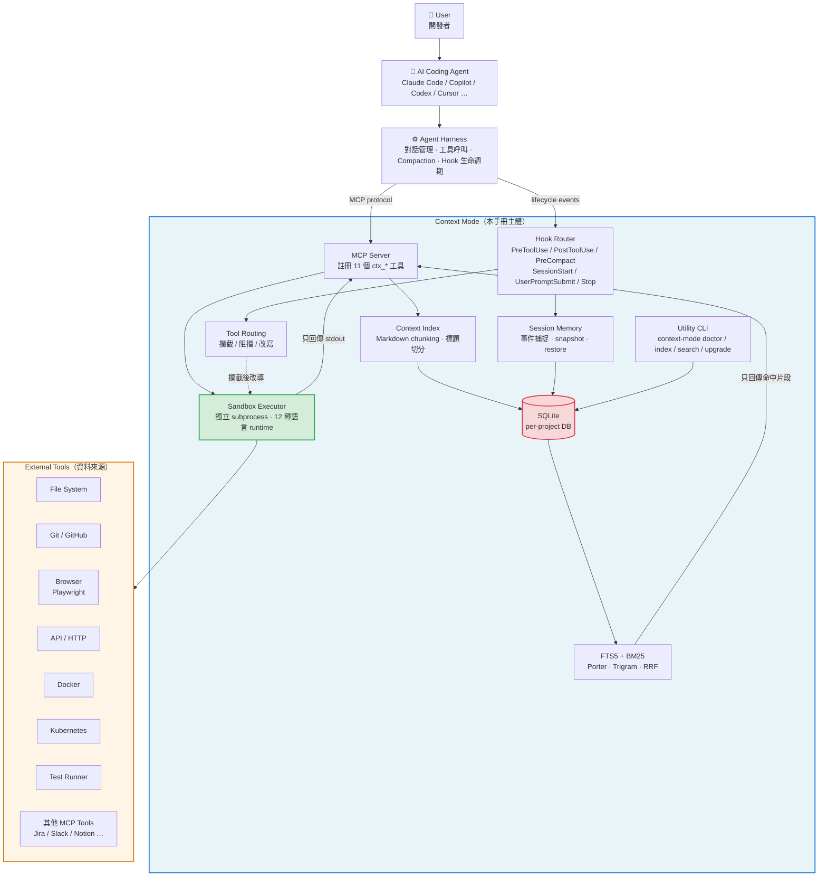
```mermaid
flowchart TD
    User["👤 User<br/>開發者"]
    Agent["🤖 AI Coding Agent<br/>Claude Code / Copilot / Codex / Cursor …"]
    Harness["⚙️ Agent Harness<br/>對話管理 · 工具呼叫 · Compaction · Hook 生命週期"]

    subgraph CM["Context Mode（本手冊主體）"]
        direction TB
        MCP["MCP Server<br/>註冊 11 個 ctx_* 工具"]
        HookRouter["Hook Router<br/>PreToolUse / PostToolUse / PreCompact<br/>SessionStart / UserPromptSubmit / Stop"]
        Sandbox["Sandbox Executor<br/>獨立 subprocess · 12 種語言 runtime"]
        Index["Context Index<br/>Markdown chunking · 標題切分"]
        SQLite[("SQLite<br/>per-project DB")]
        FTS5["FTS5 + BM25<br/>Porter · Trigram · RRF"]
        Session["Session Memory<br/>事件捕捉 · snapshot · restore"]
        Routing["Tool Routing<br/>攔截 / 阻擋 / 改寫"]
        CLI["Utility CLI<br/>context-mode doctor / index / search / upgrade"]
    end

    subgraph EXT["External Tools（資料來源）"]
        direction LR
        FS["File System"]
        Git["Git / GitHub"]
        Browser["Browser<br/>Playwright"]
        API["API / HTTP"]
        Docker["Docker"]
        K8s["Kubernetes"]
        Test["Test Runner"]
        OtherMCP["其他 MCP Tools<br/>Jira / Slack / Notion …"]
    end

    User --> Agent
    Agent --> Harness
    Harness -->|"MCP protocol"| MCP
    Harness -->|"lifecycle events"| HookRouter
    MCP --> Sandbox
    MCP --> Index
    HookRouter --> Routing
    HookRouter --> Session
    Routing -.->|"攔截後改導"| Sandbox
    Index --> SQLite
    Session --> SQLite
    SQLite --> FTS5
    FTS5 -->|"只回傳命中片段"| MCP
    Sandbox -->|"只回傳 stdout"| MCP
    CLI --> SQLite
    Sandbox --> EXT

    style CM fill:#e8f4f8,stroke:#0366d6,stroke-width:2px
    style EXT fill:#fff5e6,stroke:#d97706,stroke-width:2px
    style Sandbox fill:#d4edda,stroke:#28a745,stroke-width:2px
    style SQLite fill:#f8d7da,stroke:#dc3545,stroke-width:2px
```

**這張圖要看懂三條線** [AI Analysis]：

1. **藍線（MCP protocol）**：Agent 主動呼叫 `ctx_*` 工具。這條線需要模型「願意用」。
2. **虛線（Routing 攔截）**：Agent 想用 Bash / Read / WebFetch 時，Hook 在執行前攔下來。這條線**不需要模型配合**，是程式化強制。
3. **紅框（SQLite）**：所有持久化都落在這裡。**它是企業資安審查的重點對象**（見 [第 23 章](#第-23-章-資料分類與安全治理)）。

### 3.2 逐層說明

#### 3.2.1 MCP Server

**職責**：向 Agent Harness 註冊工具清單，並處理工具呼叫請求。 [Official]

- 使用 `@modelcontextprotocol/sdk`（官方 `package.json` 依賴 `^1.26.0`）
- 透過 stdio 與 Harness 溝通
- 註冊 **11 個工具**：6 個 sandbox 工具 + 5 個 meta 工具
- **平台自動偵測**：透過 MCP handshake 的 `clientInfo.name` 判斷跑在哪個平台，不需人工設定

> **[Official]** 有一個例外要注意：**OpenCode 與 KiloCode 不走 MCP**，而是以 TypeScript plugin 的形式 in-process 註冊工具，因此沒有額外的 stdio 子行程。這也導致一個經典陷阱：如果設定檔裡**同時**有 `plugin: ["context-mode"]` 和 `mcp.context-mode`，會註冊到 **0 個** `ctx_*` 工具。詳見 [13.2](#132-opencode--kilocode)。

#### 3.2.2 Hook Router

**職責**：接收 Harness 發出的生命週期事件，執行對應動作。 [Official]

實作形式是 CLI 子指令：

```bash
context-mode hook <platform> <event>
```

例如 `context-mode hook claude-code pretooluse`。事件資料由 Harness 透過 **stdin 以 JSON 傳入**，Hook 以 **stdout 回傳 JSON** 決定後續行為。

六個事件的職責：

| 事件 | 職責 | 失效後果 |
| --- | --- | --- |
| `PreToolUse` | **攔截**高輸出工具，阻擋或改導到 sandbox | Routing 從約 98% 掉到約 60% |
| `PostToolUse` | **捕捉**工具執行結果，抽取結構化事件寫入 SQLite | Session 事件不完整，snapshot 失去內容 |
| `UserPromptSubmit` | 捕捉使用者 prompt、決策、修正、blocker | Agent 會忘記你說過的話 |
| `Stop` | 記錄 assistant 回合結束狀態 | 回合邊界資訊遺失 |
| `PreCompact` | 在 compaction 前建立 ≤2 KB snapshot | Compaction 後無法還原 |
| `SessionStart` | 注入 routing 指示 + 還原前次工作狀態 | 模型不知道要用 `ctx_*`，也不知道之前做到哪 |

> **[Official]** 重要的設計決策：**Hook 失敗是 fail-open**。官方在 Copilot CLI 章節明確寫道，舊版全域 binary 會讓 hook「inert（no routing/capture）」但**不會阻擋你的工具**。這對企業是好消息——Context Mode 掛掉不會讓開發停擺——但也代表**你不會馬上發現它壞了**。這是 [第 24 章](#第-24-章-日常維運) 要定期跑 `ctx doctor` 的原因。

#### 3.2.3 Sandbox Executor

**職責**：在獨立的 subprocess 內執行程式碼，只把 stdout 帶回。 [Official]

- 每次 `ctx_execute` 呼叫**產生一個獨立的 process boundary**
- 腳本之間**不能互相存取記憶體或狀態**（這點很重要：不要期待第二次呼叫還記得第一次的變數）
- 12 種語言 runtime：JavaScript、TypeScript、Python、Shell、Ruby、Go、Rust、PHP、Perl、R、Elixir、C#
- **Bun 自動偵測**，JS/TS 執行速度快 3–5 倍

> **[Official] 安全邊界必讀**：官方自己講得很清楚——`ctx_execute` 與 `ctx_batch_execute` **執行任意程式碼，並繼承該 process 的檔案系統存取權限**。專案根目錄圍籬（`ctx_execute_file` 的 `File access blocked`）是針對**檔案讀取工具**的縱深防禦，**不是完整的 OS sandbox**。
>
> 換句話說：**核准一次 `ctx_execute` 等於核准執行任意程式碼**。請保持 host 層級的 sandbox 開啟。

#### 3.2.4 Context Index

**職責**：把 Markdown 內容依標題切塊，保持程式碼區塊完整，存入 FTS5。 [Official]

切塊策略的兩個重點：

- **依 heading 切分**（`#`、`##`、`###` 為邊界）
- **程式碼區塊保持完整**（不會在 ``` 中間切斷）

第二點對開發場景至關重要：文件檢索如果把 code block 切一半，回傳的範例就不能用了。

#### 3.2.5 SQLite / FTS5

**職責**：持久化儲存與全文檢索。 [Official]

後端**在 runtime 自動選擇**：

| 執行環境 | 使用的 SQLite | 說明 |
| --- | --- | --- |
| Bun | `bun:sqlite` | 內建，無需 native 編譯 |
| Node.js ≥ 22.5 | `node:sqlite` | 內建模組，**避開 native addon** |
| 其他 | `better-sqlite3 ^12.6.2` | native addon，有 prebuilt binary |

> **[Official]** 為什麼 Linux + Node ≥22.5 一定要用 `node:sqlite`？官方說明是為了避開 **V8 的 `madvise(MADV_DONTNEED)` 破壞 addon `.got.plt` section** 導致的偶發 SIGSEGV（[nodejs/node#62515](https://github.com/nodejs/node/issues/62515)）。也因此 **Linux + Node < 22.5 是官方不支援組合**（[#564](https://github.com/mksglu/context-mode/issues/564)），`npm install` 會直接失敗。
>
> **企業意涵**：如果你的 Linux 開發機或 CI 容器還在跑 Node 20 LTS，**必須先升級 Node 才能導入 Context Mode**。這常常是 PoC 階段最大的卡點。

#### 3.2.6 Session Memory

**職責**：捕捉 session 事件、建立 snapshot、compaction 後還原。 [Official]

詳見 [第 7 章](#第-7-章-session-continuity)。

#### 3.2.7 Tool Routing

**職責**：決定「這個工具呼叫該不該直接執行」。 [Official]

官方的 routing 政策寫在 `skills/context-mode/SKILL.md` 裡，核心是一份 **Bash 白名單**：

```text
白名單（可直接用 Bash 執行）：
  檔案異動  mkdir、mv、cp、rm、touch、chmod
  Git 寫入  git add、git commit、git push、git checkout、git branch、git merge
  導航      cd、pwd、which
  程序控制  kill、pkill
  套件安裝  npm install、npm publish、pip install
  簡單輸出  echo、printf

其餘一律走 ctx_execute / ctx_execute_file
```

**判斷原則一句話** [Official]：
> 任何會 **read / query / fetch / list / log / test / build / diff / inspect / 呼叫外部服務** 的指令，都走 Context Mode。包含所有 CLI（`gh`、`aws`、`kubectl`、`docker`、`terraform`、`gcloud`…）。**不確定的時候，用 Context Mode。**

#### 3.2.8 Utility CLI

**職責**：不進 AI session 也能操作。 [Official]

```bash
context-mode doctor                                          # 診斷安裝狀態
context-mode index . --source project:my-app                 # 索引本地目錄
context-mode search "authentication middleware" --source project:my-app
context-mode upgrade                                         # 升級並修復 hook 設定
context-mode insight                                         # 開啟 hosted dashboard（企業建議停用）
context-mode statusline                                      # Claude Code 狀態列
bash scripts/ctx-debug.sh                                    # 產生完整診斷報告（回報 bug 用）
```

### 3.3 一次完整的資料流

以「分析 5,000 行的 Nginx access log」為例：

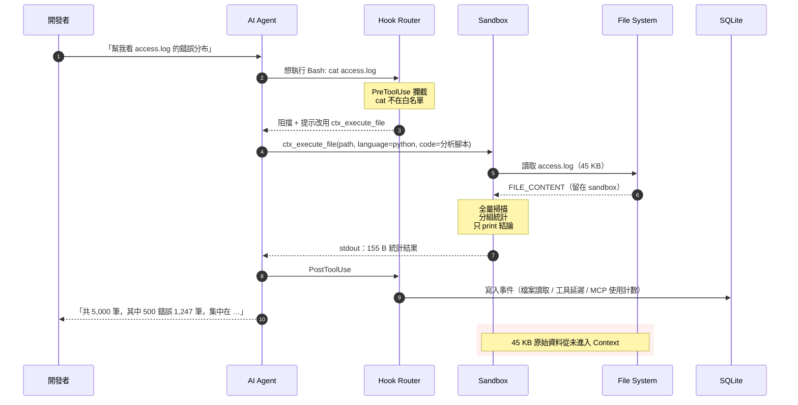
```mermaid
sequenceDiagram
    autonumber
    participant U as 開發者
    participant A as AI Agent
    participant H as Hook Router
    participant S as Sandbox
    participant F as File System
    participant D as SQLite

    U->>A: 「幫我看 access.log 的錯誤分布」
    A->>H: 想執行 Bash: cat access.log
    Note over H: PreToolUse 攔截<br/>cat 不在白名單
    H-->>A: 阻擋 + 提示改用 ctx_execute_file
    A->>S: ctx_execute_file(path, language=python, code=分析腳本)
    S->>F: 讀取 access.log（45 KB）
    F-->>S: FILE_CONTENT（留在 sandbox）
    Note over S: 全量掃描<br/>分組統計<br/>只 print 結論
    S-->>A: stdout：155 B 統計結果
    A->>H: PostToolUse
    H->>D: 寫入事件（檔案讀取 / 工具延遲 / MCP 使用計數）
    A-->>U: 「共 5,000 筆，其中 500 錯誤 1,247 筆，集中在 …」

    rect rgb(255, 240, 240)
    Note over F,S: 45 KB 原始資料從未進入 Context
    end
```

### 3.4 儲存位置與磁碟佔用

> **以下為 v1.0.169 的行為** [Official]

| 內容 | 預設位置 | 清理機制 |
| --- | --- | --- |
| Session 事件與 stats | `<root>/sessions` | 不 `--continue` 即立刻刪除前次 session 資料 |
| 索引內容 | `<root>/content`（README 另提及 `~/.context-mode/content/`） | **14 天**自動清除（啟動時） |

`<root>` 的決定方式：

1. 若設定 `CONTEXT_MODE_DIR`（v1.0.147+）→ 使用該絕對路徑
2. 否則使用 adapter 預設，例如 `~/.claude/context-mode`、`~/.codex/context-mode`、`~/.omp/context-mode`

> **[Official]** `CONTEXT_MODE_DIR` 的三個限制：**必須絕對路徑**、**不展開 `~`**、**空白字串視同未設定**（且會被 `ctx_doctor` 標出）。
>
> **Windows 範例**：`CONTEXT_MODE_DIR=D:\ai\context-mode`（不要用 `%USERPROFILE%` 以外的相對寫法）。

> **[Community]** 已知問題：有 issue 回報 **stale content DB 清理會誤刪「還活著但閒置」的 session**（僅看 WAL mtime，沒做 liveness 檢查）。長時間掛著不動的 session 有遺失索引的風險。

### 3.5 本章實務案例

**情境**：SA 接手一個沒有文件的 Spring Boot 專案，想先掌握「這個系統對外開了哪些 API」。

**架構層面發生了什麼**：

```text
1. SA 輸入：「列出所有 REST endpoint 與對應的權限註解」

2. Agent 原本想做：Read 每個 @RestController 檔案
   → PreToolUse（Tool Routing 層）攔截：這會產生大量讀取

3. Agent 改用 ctx_execute（Sandbox Executor 層）：
   寫一支 shell + python 腳本，掃描全部 .java，
   用正則抽出 @GetMapping/@PostMapping/@PreAuthorize

4. Sandbox 讀檔（File System 層）→ 分析 → 只 print 表格

5. 結果約 3 KB 進 Context（MCP Server 層回傳）

6. PostToolUse（Hook Router 層）把「讀取了哪些檔案」寫入 SQLite
   → 之後 compaction 時，Session Memory 層知道 SA 正在看哪個模組
```

**六層全部參與了這一次操作。** 理解分層之後，當結果不如預期時你才知道該查哪一層：

- 結果太大 → Sandbox 腳本沒做彙整（第 3 層問題）
- Agent 還是直接 Read → Hook 沒生效（第 2 層問題）
- Compaction 後忘光 → Session Memory 沒捕捉到（第 6 層問題）

### 3.6 本章注意事項

1. **`ctx_execute` 不是 OS sandbox**。它執行任意程式碼並繼承檔案系統權限，host 層級的沙箱必須保持開啟。
2. **每次 `ctx_execute` 是獨立 process**，不要寫「上次那個變數」這種依賴。
3. **Node 版本是硬門檻**。Linux + Node < 22.5 直接不支援，PoC 前先確認開發機與 CI 的 Node 版本。
4. **`CONTEXT_MODE_DIR` 不展開 `~`**，Windows 上請給完整磁碟路徑。
5. **Hook 是 fail-open**，壞掉不會報錯，要靠定期 `ctx doctor` 才發現。
6. **OpenCode / KiloCode 不走 MCP**，plugin 與 mcp 設定不可並存。

### 3.7 本章檢查清單

- [ ] 我能畫出 Context Mode 的六個核心元件與它們的關係
- [ ] 我知道「MCP 呼叫」與「Hook 攔截」是兩條不同的路徑
- [ ] 我知道所有持久化都落在本機 SQLite，位置在哪裡
- [ ] 我知道 `ctx_execute` 的安全邊界到哪裡（不是 OS sandbox）
- [ ] 我已確認自己的開發環境 Node 版本 ≥ 22.5
- [ ] 我知道索引內容 14 天會自動清除

---

## 第 4 章 核心設計：MCP Server 與 Tool Routing

### 4.1 11 個工具的分類

> **[Official]** 官方在 Claude Code 安裝章節明確寫出：plugin 註冊「all hooks ... and **11 MCP tools** — six sandbox tools plus five meta-tools」。
>
> **注意一個文件不一致**：README 的 Tools 對照表只列了 10 個（漏掉 `ctx_insight`）。本手冊採用 **11 個**的說法，與 Claude Code 章節、Utility Commands 章節一致。

| 分類 | 工具 | 一句話職責 |
| --- | --- | --- |
| **Sandbox（6）** | `ctx_execute` | 在 sandbox 跑程式碼，只有 stdout 進 Context |
| | `ctx_execute_file` | 在 sandbox 處理檔案，原始內容不外流 |
| | `ctx_batch_execute` | 一次呼叫執行多個指令 + 多個查詢 |
| | `ctx_index` | 把 Markdown 切塊索引進 FTS5 |
| | `ctx_search` | 查詢已索引內容 |
| | `ctx_fetch_and_index` | 抓 URL → 轉 Markdown → 切塊 → 索引 |
| **Meta（5）** | `ctx_stats` | 顯示節省量、呼叫次數、session 統計 |
| | `ctx_doctor` | 診斷 runtime / hook / FTS5 / 版本 |
| | `ctx_upgrade` | 從 GitHub 更新、重建、重設 hook |
| | `ctx_purge` | **永久刪除**所有索引內容 |
| | `ctx_insight` | 開啟 hosted 分析 dashboard（**企業建議停用**） |

完整的參數、範例與常見錯誤，見 [第 15 章](#第-15-章-11-個-mcp-tools-完整教學)。

### 4.2 MCP Architecture

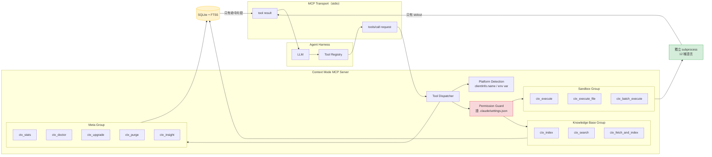
```mermaid
flowchart LR
    subgraph Harness["Agent Harness"]
        LLM["LLM"]
        ToolReg["Tool Registry"]
    end

    subgraph Transport["MCP Transport（stdio）"]
        Req["tools/call request"]
        Resp["tool result"]
    end

    subgraph Server["Context Mode MCP Server"]
        Dispatch["Tool Dispatcher"]
        Detect["Platform Detection<br/>clientInfo.name / env var"]
        Guard["Permission Guard<br/>讀 .claude/settings.json"]

        subgraph SandboxG["Sandbox Group"]
            E1["ctx_execute"]
            E2["ctx_execute_file"]
            E3["ctx_batch_execute"]
        end

        subgraph KBG["Knowledge Base Group"]
            K1["ctx_index"]
            K2["ctx_search"]
            K3["ctx_fetch_and_index"]
        end

        subgraph MetaG["Meta Group"]
            M1["ctx_stats"]
            M2["ctx_doctor"]
            M3["ctx_upgrade"]
            M4["ctx_purge"]
            M5["ctx_insight"]
        end
    end

    Proc["獨立 subprocess<br/>12 種語言"]
    DB[("SQLite + FTS5")]

    LLM --> ToolReg
    ToolReg --> Req
    Req --> Dispatch
    Dispatch --> Detect
    Dispatch --> Guard
    Guard --> SandboxG
    Guard --> KBG
    Dispatch --> MetaG
    SandboxG --> Proc
    KBG --> DB
    MetaG --> DB
    Proc -->|"只有 stdout"| Resp
    DB -->|"只有命中片段"| Resp
    Resp --> LLM

    style Guard fill:#f8d7da,stroke:#dc3545
    style Proc fill:#d4edda,stroke:#28a745
    style DB fill:#fff3cd,stroke:#ffc107
```

**Permission Guard 這一層是企業最該注意的** [Official]：

Context Mode **沿用 Claude Code 的權限設定格式**，而且**所有平台都讀這份設定**——即使你跑在 Gemini CLI、VS Code Copilot 或 OpenCode 上：

```json
{
  "permissions": {
    "deny": [
      "Bash(sudo *)",
      "Bash(rm -rf /*)",
      "Read(.env)",
      "Read(**/.env*)"
    ],
    "allow": [
      "Bash(git:*)",
      "Bash(npm:*)"
    ]
  }
}
```

規則語意 [Official]：

- 格式是 `Tool(要比對的內容)`，`*` 代表「任意」
- **`deny` 永遠勝過 `allow`**
- **專案層級規則覆蓋全域規則**
- 用 `&&`、`;`、`|` 串接的指令會**拆開逐段檢查**——`echo hello && sudo rm -rf /tmp` 會因為 `sudo` 那段被擋
- **零設定時不啟用**：沒設定任何規則，行為不變

> **[Enterprise Recommendation]** 這代表你可以用一份 `~/.claude/settings.json` 同時治理多個 AI 平台的沙箱行為。把它納入企業標準設定，詳見 [14.2](#142-四層設定策略)。

### 4.3 Tool Output Routing 決策流

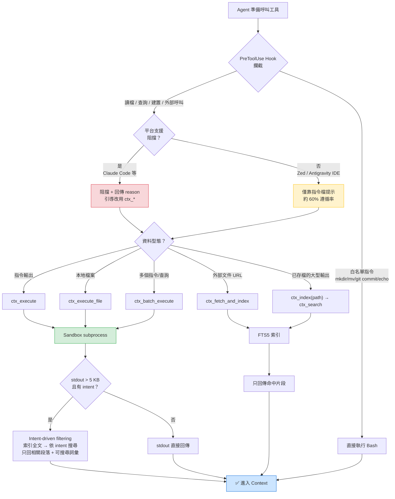
```mermaid
flowchart TD
    Start["Agent 準備呼叫工具"] --> Check{"PreToolUse Hook<br/>攔截"}

    Check -->|"白名單指令<br/>mkdir/mv/git commit/echo"| Direct["直接執行 Bash"]
    Check -->|"讀檔 / 查詢 / 建置 / 外部呼叫"| Deny{"平台支援<br/>阻擋？"}

    Deny -->|"是<br/>Claude Code 等"| Block["阻擋 + 回傳 reason<br/>引導改用 ctx_*"]
    Deny -->|"否<br/>Zed / Antigravity IDE"| Rule["僅靠指令檔提示<br/>約 60% 遵循率"]

    Block --> Route{"資料型態？"}
    Rule --> Route

    Route -->|"指令輸出"| Exec["ctx_execute"]
    Route -->|"本地檔案"| ExecF["ctx_execute_file"]
    Route -->|"多個指令/查詢"| Batch["ctx_batch_execute"]
    Route -->|"外部文件 URL"| Fetch["ctx_fetch_and_index"]
    Route -->|"已存檔的大型輸出"| Index["ctx_index(path) → ctx_search"]

    Exec --> Sandbox["Sandbox subprocess"]
    ExecF --> Sandbox
    Batch --> Sandbox
    Fetch --> FTS["FTS5 索引"]
    Index --> FTS

    Sandbox --> Size{"stdout > 5 KB<br/>且有 intent？"}
    Size -->|"是"| Smart["Intent-driven filtering<br/>索引全文 → 依 intent 搜尋<br/>只回相關段落 + 可搜尋詞彙"]
    Size -->|"否"| Out["stdout 直接回傳"]

    FTS --> Hit["只回傳命中片段"]
    Smart --> Ctx["✅ 進入 Context"]
    Out --> Ctx
    Hit --> Ctx
    Direct --> Ctx

    style Block fill:#f8d7da,stroke:#dc3545
    style Rule fill:#fff3cd,stroke:#ffc107
    style Sandbox fill:#d4edda,stroke:#28a745
    style Ctx fill:#cce5ff,stroke:#0366d6
```

### 4.4 Intent-driven Filtering

> **[Official]** 當 sandbox 輸出**超過 5 KB 且呼叫時有提供 `intent`**，Context Mode 不會直接回傳，而是：
>
> 1. 把完整輸出索引進知識庫
> 2. 依 `intent` 搜尋相關段落
> 3. **只回傳命中結果 + 一份可供後續查詢的詞彙表**

這是一個重要但容易被忽略的機制：**它讓「腳本寫得不夠精簡」這個常見錯誤有了安全網**。開發者的腳本如果 print 了太多東西，Context Mode 會自動幫忙收斂。

> **[Enterprise Recommendation]** 團隊規範應要求：**呼叫 `ctx_execute` 時盡量帶 `intent` 參數**。這是零成本的保險。

### 4.5 Progressive Throttling（漸進式節流）

> **[Official]** `ctx_search` 有一個防濫用機制：

| 呼叫次數 | 行為 |
| --- | --- |
| 1–3 | 正常結果（每個 query 2 筆） |
| 4–8 | 降級（每個 query 1 筆）+ 警告訊息 |
| 9+ | **直接封鎖**，並引導改用 `ctx_batch_execute` |

**設計意圖** [AI Analysis]：模型有個壞習慣——一個問題查不到就換個關鍵字再查一次，查十次。每次 round trip 都有固定成本（工具定義 + 參數 + 回傳格式）。節流機制強迫模型把問題想清楚，一次批次查完。

> **對應的開發規範** [Official]：官方 SKILL 明確要求「**Always use `queries` array** — batch ALL search questions in ONE call ... **NEVER** make multiple separate `ctx_search()` calls」。

### 4.6 平台偵測機制

> **[Official]** Context Mode 需要知道自己跑在哪個平台，才能用對的 hook 格式與儲存路徑。偵測順序大致為：

1. **環境變數強制指定**：`CONTEXT_MODE_PLATFORM`（例如 Copilot CLI plugin bundle 會釘 `copilot-cli`）
2. **MCP handshake 的 `clientInfo.name`**（例如 `GitHub Copilot CLI`、`qwen-cli-mcp-client-*`）
3. **平台專屬環境變數**（`QWEN_PROJECT_DIR`、`PI_CODING_AGENT_DIR`）
4. **Context Mode 自己寫過的標記檔**（如 `~/.copilot/mcp-config.json`）

> **[Community] 企業常見雷區**：當一台機器**同時裝了 Claude Code 和其他 Agent**，`~/.claude/` 的存在會讓偵測結果偏向 Claude Code（[#774](https://github.com/mksglu/context-mode/issues/774)、[#775](https://github.com/mksglu/context-mode/issues/775)）。
>
> **解法**：在該平台的 MCP 設定裡明確釘住平台：
>
> ```json
> {
>   "mcpServers": {
>     "context-mode": {
>       "command": "context-mode",
>       "env": { "CONTEXT_MODE_PLATFORM": "copilot-cli" }
>     }
>   }
> }
> ```
>
> 這在企業環境幾乎是**必做設定**，因為多數開發者機器上不會只有一個 AI Agent。

### 4.7 本章實務案例

**情境**：某團隊導入後抱怨「Context Mode 好像沒作用，Agent 還是一直 Read 檔案」。

**診斷過程**（依 routing 決策流逐層檢查）：

```bash
# 1. MCP 有沒有連上？
context-mode doctor

# 2. 平台偵測對不對？（這台機器同時有 Claude Code 與 Copilot CLI）
#    doctor 輸出顯示 platform = claude-code，但他們實際用的是 Copilot CLI
#    → 找到根因：偵測錯平台，hook 寫到錯的位置
```

**修正**：在 `~/.copilot/mcp-config.json` 的 context-mode 項目加上 `"env": { "CONTEXT_MODE_PLATFORM": "copilot-cli" }`，重啟後 `ctx doctor` 顯示正確平台，routing 恢復。

**這個案例說明**：「Context 沒降低」這個症狀，有一半以上的根因是**平台偵測或 hook 註冊錯誤**，而不是模型不配合。

### 4.8 本章注意事項

1. **官方文件本身對工具數量有不一致**（10 vs 11），以 11 個為準。
2. **權限設定用 Claude Code 格式，但所有平台都吃**。這是優點也是陷阱——在 Gemini CLI 上排查權限問題時，要記得去看 `.claude/settings.json`。
3. **多 Agent 共存機器必須釘 `CONTEXT_MODE_PLATFORM`**，否則偵測會偏向 Claude Code。
4. **`ctx_search` 有節流**，不要讓模型養成多次試探的習慣，要教它一次批次查完。
5. **`intent` 參數是免費的保險**，團隊規範應強制帶上。

### 4.9 本章檢查清單

- [ ] 我知道 11 個工具分成 sandbox / meta 兩類，各自的用途
- [ ] 我知道權限設定寫在 `.claude/settings.json`，且 deny 勝過 allow
- [ ] 我知道串接指令（`&&`、`;`、`|`）會被拆開逐段檢查
- [ ] 我的機器如果有多個 Agent，已設定 `CONTEXT_MODE_PLATFORM`
- [ ] 我知道 `ctx_search` 第 9 次呼叫會被封鎖
- [ ] 我知道輸出超過 5 KB 且帶 `intent` 時會自動轉為檢索模式

---

## 第 5 章 Sandbox 與 Think in Code

> 這一章是 Context Mode 的**方法論核心**。工具會改版，但這個思維方式不會過時。

### 5.1 Sandbox 到底做了什麼

```text
傳統做法                              Context Mode 做法
────────────                          ─────────────────
Tool                                  Tool
 ↓                                     ↓
Huge Output                           Sandbox（獨立 subprocess）
 ↓                                     ↓
LLM Context                           Process / Script
 ↓                                     ↓
Context Bloat                         Filter / Aggregate / Search
                                       ↓
                                      Small Result
                                       ↓
                                      LLM Context
```

技術上的三個保證 [Official]：

1. **Process boundary**：每次呼叫獨立 subprocess，腳本間無法互相存取記憶體或狀態
2. **只有 stdout 進 Context**：原始資料（log、API response、snapshot）**從不離開 sandbox**
3. **憑證透傳**：`gh`、`aws`、`gcloud`、`kubectl`、`docker` 等已登入的 CLI 可直接用——它們繼承環境變數與設定檔路徑，**但這些憑證不會進入對話**

> **第 3 點對企業特別重要** [AI Analysis]：它讓「AI 幫我查 production K8s 狀態」變成可行——憑證留在環境裡，只有查詢結果進 Context。但這同時也意味著 **AI 可以用你的身分執行任何該 CLI 能做的事**，包含刪除。權限治理見 [第 23 章](#第-23-章-資料分類與安全治理)。

### 5.2 12 種語言與選用原則

> **[Official]** 支援：JavaScript、TypeScript、Python、Shell、Ruby、Go、Rust、PHP、Perl、R、Elixir、C#。Bun 會被自動偵測用於加速 JS/TS（3–5 倍）。

官方 SKILL 給的選用建議 [Official]：

| 情境 | 建議語言 | 理由 |
| --- | --- | --- |
| HTTP / API 呼叫、JSON 處理 | `javascript` | 原生 `fetch`、`JSON.parse`、`async/await` |
| 資料分析、CSV、統計 | `python` | `csv`、`statistics`、`collections`、`re` |
| 需要 pipe 的指令串接 | `shell` | `grep`、`awk`、`jq` 等原生工具 |
| 檔案樣式比對 | `shell` | `find`、`wc`、`sort`、`uniq` |

> **[Enterprise Recommendation]** 對台灣企業常見的 Java / .NET 技術棧，補充建議：
>
> - 分析 Maven / Gradle 輸出 → `shell`（純文字處理）或 `python`（要做結構化統計）
> - 解析 `pom.xml` / `.csproj` XML → `python`（`xml.etree`）
> - 掃描 Java source 做靜態統計 → `python`（正則）或 `shell`（`grep -c`）
> - **不建議**用 `csharp` / `go` / `rust` 跑分析腳本：啟動成本高，且這些 runtime 未必裝在每台開發機上

### 5.3 Think in Code：核心方法論

> **LLM 不該是「大量資料的搬運工」，而該是「程式與分析策略的設計者」。**

這句話的具體操作方式：

```text
❌ 不要這樣：
   Read 100 files
   ↓
   100 個檔案內容全部進 Context
   ↓
   模型「肉眼」逐檔閱讀、心算統計
   ↓
   Context 爆掉，而且統計可能算錯

✅ 要這樣：
   Execute script
   ↓
   腳本在 sandbox 內分析 100 個檔案
   ↓
   Return only summary
   ↓
   只有結論進 Context，而且數字是程式算的，不會錯
```

官方給的對照範例 [Official]：

```js
// Before: 47 × Read() = 700 KB.  After: 1 × ctx_execute() = 3.6 KB.
ctx_execute("javascript", `
  const files = fs.readdirSync('src').filter(f => f.endsWith('.ts'));
  files.forEach(f => console.log(f + ': ' + fs.readFileSync('src/'+f,'utf8').split('\\n').length + ' lines'));
`);
```

### 5.4 Think in Code 的四條紀律

> **[Official]** 這四條直接來自官方 SKILL 的 Critical Rules，是最容易被忽略卻最影響效果的部分。

**紀律一：一定要 `console.log` / `print` 你的發現**

```text
stdout 是唯一會進 Context 的東西。沒有輸出 = 這次呼叫白做了。
```

**紀律二：寫「分析程式」，不是「傾印程式」**

```js
// ❌ 錯誤：只是把資料搬個位置，Context 一樣爆
console.log(JSON.stringify(data));

// ✅ 正確：先分析，只印結論
const errors = data.filter(d => d.status >= 500);
const byPath = {};
errors.forEach(e => byPath[e.path] = (byPath[e.path] || 0) + 1);
console.log(`共 ${data.length} 筆，5xx ${errors.length} 筆`);
Object.entries(byPath).sort((a,b) => b[1]-a[1]).slice(0,5)
  .forEach(([p,c]) => console.log(`  ${p}: ${c}`));
```

**紀律三：輸出要具體**

不要只印數量，要印**可行動的細節**：bug 的 ID、行號、確切數值。

```text
❌ 「發現 3 個問題」
✅ 「Order #10233 quantity=-5（負數）；Order #10891 customer=null；
    Order #11002 total 與 items 加總不符（顯示 1200，實算 1150）」
```

**紀律四：要「編輯」的檔案不要用 Context Mode**

```text
ctx_execute_file 是給「分析」用的。
要修改的檔案，用 Agent 原生的 Read / Edit 工具。
```

### 5.5 常見的三種錯誤用法

> **[Official]** 全部出自官方 anti-patterns 清單。

**錯誤一：在 sandbox 裡就先過濾掉資料**

```js
// ❌ 錯誤：上游先截斷，索引就看不到被丟掉的部分
ctx_execute("shell", "cat huge.log | head -100")
```

官方的說法是：**`ctx_execute` 負責「捕捉」，`ctx_search` 負責「過濾」，把兩層合併會讓 index 永遠看不到被丟掉的資料**。正確做法是讓腳本處理全量，再用 intent / search 收斂。

**錯誤二：`ctx_index(content: 大資料)`**

```text
❌ browser_snapshot() → ctx_index(content: 那 135K)  = 270K tokens（加倍）
✅ browser_snapshot(filename) → ctx_index(path)       = 約 130 B
```

**錯誤三：把已經在 Context 裡的資料再索引一次**

如果某個 MCP 工具（Context7、GitHub API）上一輪已經回傳了內容，那些內容**已經在 Context 裡了**。再呼叫 `ctx_index(content: 那份內容)` 等於**付兩次錢**。直接用就好。

### 5.6 Playwright 的三種正確工作流

> **[Official]** 因為 Playwright 是最大的 Context 殺手（10K–135K tokens），官方給了三套標準流程。

**Workflow A：多次查詢 → 索引後搜尋**

```text
1. browser_snapshot(filename: "/tmp/snap.md")     → 約 50 B 確認
2. ctx_index(path: "/tmp/snap.md", source: "Playwright snapshot")
                                                   → 約 80 B 確認
3. ctx_search(queries: ["login form email password"], source: "Playwright")
                                                   → 約 300 B 命中片段
合計約 430 B（原本 135K tokens）
```

**Workflow B：一次性抽取 → sandbox 處理**

```text
1. browser_snapshot(filename: "/tmp/snap.md")     → 約 50 B
2. ctx_execute_file(path: "/tmp/snap.md", language: "javascript", code: "
     const links = [...FILE_CONTENT.matchAll(/- link \"([^\"]+)\"/g)].map(m => m[1]);
     const buttons = [...FILE_CONTENT.matchAll(/- button \"([^\"]+)\"/g)].map(m => m[1]);
     console.log('Links:', links.length, '| Buttons:', buttons.length);
   ")                                              → 約 200 B
合計約 250 B
```

**Workflow C：console / network**

```text
browser_console_messages(level: "error", filename: "/tmp/console.md")
  → ctx_execute_file(path: "/tmp/console.md", ...)

browser_network_requests(includeStatic: false, filename: "/tmp/network.md")
  → ctx_execute_file(path: "/tmp/network.md", ...)
```

**四種做法的成本對照** [Official]：

| 做法 | Context 成本 | 正確？ |
| --- | --- | --- |
| `browser_snapshot()` 原始輸出直接進 | **135K tokens** | ❌ |
| `browser_snapshot()` → `ctx_index(content: raw)` | **270K tokens（加倍）** | ❌ |
| `browser_snapshot(filename)` → `ctx_index(path)` → `ctx_search` | 約 430 B | ✅ |
| `browser_snapshot(filename)` → `ctx_execute_file(path)` | 約 250 B | ✅ |

> **[Official] 兩個額外警告**：
>
> 1. **`browser_navigate` 會自動回傳 snapshot** —— 忽略它，要檢視頁面請另外呼叫 `browser_snapshot(filename)`
> 2. **Playwright MCP 使用單一 browser instance，不是 parallel-safe** —— 要平行處理請改用 `agent-browser` 透過 `ctx_execute` 執行

### 5.7 本章實務案例

**情境**：QA 要驗證某網銀頁面改版後，所有表單欄位的 `aria-label` 是否齊全（無障礙合規）。

**Think in Code 的思考過程**：

```text
問題：這是「計算問題」還是「引用問題」？
→ 需要把每個欄位逐一比對，是計算問題
→ 所以應該寫程式，不是讓模型逐行讀 snapshot
```

**實作**：

```text
1. browser_snapshot(filename: "D:/tmp/page.md")

2. ctx_execute_file(
     path: "D:/tmp/page.md",
     language: "python",
     intent: "找出缺少 aria-label 的互動元素",
     code: '''
import re
lines = FILE_CONTENT.split("\\n")
interactive = [l for l in lines
               if re.search(r"- (textbox|button|checkbox|radio|combobox)", l)]
missing = [l.strip() for l in interactive if "aria-label" not in l and '"' not in l]
print(f"互動元素共 {len(interactive)} 個，疑似缺少可及名稱 {len(missing)} 個：")
for m in missing[:20]:
    print("  " + m)
     '''
   )
```

**結果**：約 400 B 進 Context，涵蓋整份 56 KB 的 snapshot，而且判斷邏輯可重複、可版控、可交給 CI 跑。

**這裡有個延伸價值** [Enterprise Recommendation]：這段腳本可以直接抽出來變成 QA 團隊的**標準檢查腳本**，存進 repo。Context Mode 逼你把「檢查邏輯」寫成程式碼，而程式碼是可以累積的資產；模型的「肉眼判斷」不是。

### 5.8 本章注意事項

1. **沒有 `print` / `console.log` 就等於沒做事**。這是新手最常見的錯誤。
2. **不要在腳本裡先 `head` / `tail` 截斷**，會讓後續索引看不到完整資料。
3. **要編輯的檔案用一般 Read，不要用 `ctx_execute_file`**。
4. **`ctx_execute` 可執行任意程式碼**，等同於給 AI 一個 shell。企業必須搭配 `permissions.deny` 與 host sandbox。
5. **Playwright 的 `filename` 參數是必填紀律**，漏掉一次就浪費整個 session 的節省。
6. **每次呼叫是獨立 process**，不要寫跨呼叫的狀態依賴。

### 5.9 本章檢查清單

- [ ] 我能說明 sandbox 的三個保證（process boundary、只有 stdout、憑證透傳）
- [ ] 我理解「Think in Code」不是省 token 技巧，而是把判斷邏輯程式化
- [ ] 我知道 Think in Code 的四條紀律，特別是「一定要 print」
- [ ] 我知道 `ctx_index(content:)` 會讓成本加倍
- [ ] 我熟記 Playwright 三種工作流，並知道 `browser_navigate` 的隱形成本
- [ ] 我知道自己團隊的技術棧該用哪種語言寫分析腳本

---

## 第 6 章 FTS5 與 Persistent Knowledge

### 6.1 為什麼選 SQLite FTS5 而不是 Vector DB

> **[AI Analysis]** 這是一個值得企業理解的架構取捨：

| 面向 | Vector DB + Embedding | SQLite FTS5 |
| --- | --- | --- |
| 需要外部服務 | 是（Embedding API 或本地模型） | **否** |
| 需要 GPU / 大量記憶體 | 通常是 | 否 |
| 索引速度 | 慢（要跑 embedding） | **快**（純文字處理） |
| 對「精確詞」的檢索 | 弱（語意相近但字不同也會命中） | **強** |
| 對「語意」的檢索 | 強 | 弱 |
| 適合的內容 | 自然語言文件 | **程式碼、log、API 名稱、錯誤訊息** |
| 資料外流風險 | 有（內容送去 embedding API） | **無**（純本地） |
| 成本 | 有 | 幾乎為零 |

**結論**：開發場景的檢索目標多半是**精確的識別字**——函式名、錯誤碼、套件版本、API 路徑。這些東西用關鍵字檢索比語意檢索更準。而且**純本地不外流**，對金融業是決定性優勢。

### 6.2 索引流程

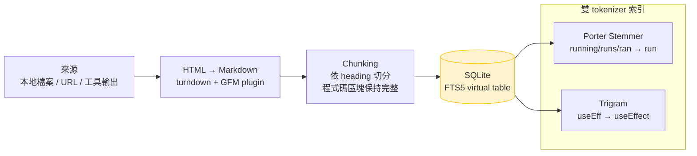
```mermaid
flowchart LR
    Src["來源<br/>本地檔案 / URL / 工具輸出"]
    Conv["HTML → Markdown<br/>turndown + GFM plugin"]
    Chunk["Chunking<br/>依 heading 切分<br/>程式碼區塊保持完整"]
    Store[("SQLite<br/>FTS5 virtual table")]

    subgraph Tok["雙 tokenizer 索引"]
        P["Porter Stemmer<br/>running/runs/ran → run"]
        T["Trigram<br/>useEff → useEffect"]
    end

    Src --> Conv --> Chunk --> Store
    Store --> P
    Store --> T

    style Store fill:#fff3cd,stroke:#ffc107
```

**兩個設計細節值得注意** [Official]：

1. **程式碼區塊不會被切斷**。這是為什麼官方 BENCHMARK 說 `ctx_index` + `ctx_search` 的節省率只有 82%——**它刻意保留完整程式碼**，不做摘要。這是特性不是缺陷。
2. **標題與 heading 在 BM25 計分中權重 5 倍**，讓「找某個章節」這種導航型查詢更準。

### 6.3 檢索流程：RRF 雙路徑融合

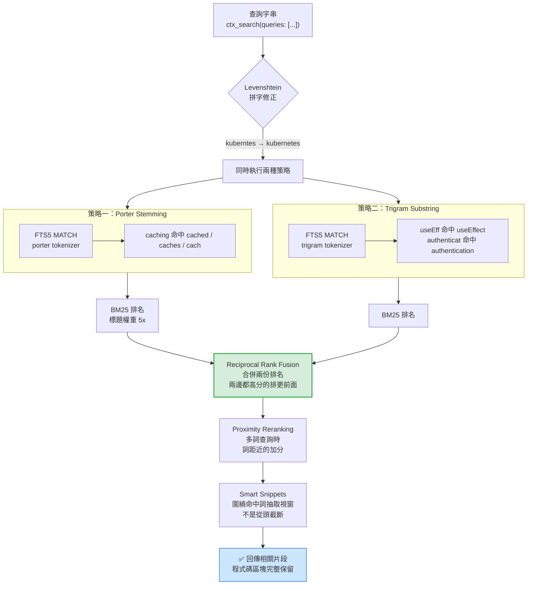
```mermaid
flowchart TD
    Q["查詢字串<br/>ctx_search(queries: [...])"]
    Fuzzy{"Levenshtein<br/>拼字修正"}
    Q --> Fuzzy
    Fuzzy -->|"kuberntes → kubernetes"| Split

    Split["同時執行兩種策略"]

    subgraph S1["策略一：Porter Stemming"]
        P1["FTS5 MATCH<br/>porter tokenizer"]
        P2["caching 命中 cached / caches / cach"]
        P1 --> P2
    end

    subgraph S2["策略二：Trigram Substring"]
        T1["FTS5 MATCH<br/>trigram tokenizer"]
        T2["useEff 命中 useEffect<br/>authenticat 命中 authentication"]
        T1 --> T2
    end

    Split --> S1
    Split --> S2

    BM25A["BM25 排名<br/>標題權重 5x"]
    BM25B["BM25 排名"]
    S1 --> BM25A
    S2 --> BM25B

    RRF["Reciprocal Rank Fusion<br/>合併兩份排名<br/>兩邊都高分的排更前面"]
    BM25A --> RRF
    BM25B --> RRF

    Prox["Proximity Reranking<br/>多詞查詢時<br/>詞距近的加分"]
    RRF --> Prox

    Snip["Smart Snippets<br/>圍繞命中詞抽取視窗<br/>不是從頭截斷"]
    Prox --> Snip

    Out["✅ 回傳相關片段<br/>程式碼區塊完整保留"]
    Snip --> Out

    style RRF fill:#d4edda,stroke:#28a745,stroke-width:2px
    style Out fill:#cce5ff,stroke:#0366d6
```

**五個機制的白話解釋** [Official]：

| 機制 | 白話說明 | 實際例子 |
| --- | --- | --- |
| **BM25** | 機率式相關性排名，考量詞頻、逆文件頻率、文件長度正規化 | 罕見詞的權重比常見詞高 |
| **Porter Stemming** | 詞形還原，同一字根視為相同 | 搜 `caching` 會命中 `cached`、`caches` |
| **Trigram** | 三字元子字串比對，支援部分字串 | 搜 `useEff` 會命中 `useEffect` |
| **RRF** | 把兩種策略的排名清單融合，兩邊都靠前的排最前面 | 取代舊版「porter 沒結果才用 trigram」的串聯 fallback |
| **Proximity Rerank** | 多詞查詢時，詞出現得近的段落加分 | 搜 `session continuity`，兩詞相鄰的段落勝過分散在不同段的 |
| **Fuzzy Correction** | Levenshtein 距離修正拼錯 | `autentication` → `authentication` |
| **Smart Snippets** | 圍繞查詢詞抽取上下文視窗，而非從頭截 N 個字元 | 重點在文件中段也抓得到 |

### 6.4 查詢策略（給開發者的實用建議）

> **[Official]** 直接來自官方 SKILL：

1. **BM25 是 OR 語意** —— 命中越多詞的結果排越前面，不需要刻意用 AND
2. **每個 query 用 2–4 個具體技術詞**，不要寫成一整句話
3. **多份文件並存時一定要用 `source` 參數**，避免跨來源污染
   - 支援部分比對：`source: "Node"` 會命中 `"Node.js v22 CHANGELOG"`
4. **一定要用 `queries` 陣列批次查詢**

```text
✅ ctx_search(queries: ["transform pipe", "refine superRefine", "coerce codec"], source: "Zod")
❌ ctx_search(query: "transform pipe")   ← 然後又呼叫兩次
```

### 6.5 TTL Cache

> **[Official]** `ctx_fetch_and_index` 的快取機制：

| 行為 | 說明 |
| --- | --- |
| 預設 TTL | **24 小時** |
| 自訂 TTL | 每次呼叫可用 `ttl: <毫秒>` 覆寫 |
| 略過快取 | `ttl: 0` 或 `force: true` |
| 快取命中（TTL 內） | 回傳約 0.3 KB 的 cache hint，**不重新抓**（省下 48 KB+），模型直接去 `ctx_search` |
| 快取失效 | 靜默重抓，不需人工介入 |
| 內容清理 | **14 天**後，content DB 與 source 於啟動時移除 |

**TTL 的實務設定建議** [Enterprise Recommendation]：

| 內容型態 | 建議 TTL | 理由 |
| --- | --- | --- |
| 語言 / 框架的穩定規格文件 | 7 天以上 | 幾乎不變 |
| 套件 CHANGELOG | 1–6 小時 | 升級期間需要最新資訊 |
| 內部 API 文件（開發中） | `ttl: 0` | 隨時在改 |
| 第三方 SaaS 文件 | 預設 24 小時 | 平衡 |

> **[Official]** 這個機制讓 `--continue` 的 session **保留索引過的文件**，重啟不用重抓。

### 6.6 Large Output Externalization（大型輸出外部化）

> **[Official]** 這是官方 `BENCHMARK.md` 明列的第三類機制（21 個情境 = 14 個 `ctx_execute_file`
> ＋ 6 個 `ctx_index`／`ctx_search` ＋ **1 個 externalization pattern**），但在多數中文介紹中被略過。

**機制**

當工具輸出**超過 100 KB** 時，Context Mode 不會把內容送進 Context，也不會單純截斷，
而是**自動把整份輸出索引進 FTS5，只回傳一個 pointer**：

```text
工具輸出 > 100 KB
      ↓
自動寫入 FTS5（完整保留，不摘要、不截斷）
      ↓
Context 只收到 pointer：
  「輸出已外部化，共 N 個 chunk，使用 ctx_search 查詢」
      ↓
模型依需要用 ctx_search 取回命中的片段
```

**為什麼這個設計重要** [AI Analysis]

它處理的是 [2.9 Tool Output Explosion](#29-tool-output-explosion) 最惡劣的情況——
**你事前不知道輸出會多大**。沒有這層保護時，一個 `kubectl get events -A` 或一份
production log dump 就足以塞爆整個 Context Window；有了它，最糟情況也只是多花一次 `ctx_search`。

| 沒有 externalization | 有 externalization |
| --- | --- |
| 巨量輸出直接灌進 Context，當場壓縮或爆掉 | 完整內容落到磁碟，Context 只收 pointer |
| 資料進去了但用不到，純浪費 | 資料可被反覆查詢，查幾次算幾次 |
| 需要人工事先預估輸出大小 | **不需要預估**，超過門檻自動處理 |

**實務上要注意的三件事**

1. **它是保護網，不是使用策略。** 正確做法仍然是主動用 `ctx_execute` 在 sandbox 內先聚合
   （見 [第 5 章](#第-5-章-sandbox-與-think-in-code)）。依賴 externalization 等於每次都先付一次
   「寫入 FTS5 + 查詢」的成本。
2. **外部化的內容一樣受 14 天保留期與資料分類規範約束。** 如果那份輸出含敏感資料，
   它現在完整地躺在本機 SQLite 裡——這點與 `ctx_index` 完全相同，見 [23.1](#231-context-mode-可能保存哪些資料)。
3. **這是知識檢索路徑的節省率只有 82% 的原因之一**：它刻意不做摘要，完整保留原文。
   這是優點，但別拿去當 KPI（見 [第 26 章](#第-26-章-企業自建-benchmark)）。

### 6.7 「把資料保存起來」≠「把資料放進 Context」

這是本章最重要的觀念，也是最多人搞混的地方。

```text
❌ 錯誤心智模型：
   Raw Data ─────────────────────────────→ Context
   （反正都要用，先全部載入）

✅ 正確心智模型：
   Raw Data
      ↓
   SQLite / FTS5       ← 保存在這裡，磁碟上，不佔 Context
      ↓
   Search              ← 需要時才查
      ↓
   Relevant Result     ← 只有命中的片段
      ↓
   Context             ← 只有這一步才花錢
```

| | 保存（SQLite） | 放進 Context |
| --- | --- | --- |
| 成本 | 磁碟空間，幾乎免費 | Token，每輪重複計費 |
| 容量上限 | 磁碟大小 | Context Window（固定） |
| 可重複取用 | 是，24h TTL 內免費 | 已經在裡面就一直佔位 |
| 對推理品質的影響 | 無 | 有（attention 稀釋） |
| 生命週期 | 14 天 | 到 compaction 為止 |

### 6.8 本章實務案例

**情境**：團隊要把 Spring Boot 3.2 升到 3.4，需要查閱官方 release notes 與 migration guide。

**傳統做法**：

```text
WebFetch 官方 migration guide → 整頁 60 KB 進 Context
WebFetch release notes 3.3    → 又 40 KB
WebFetch release notes 3.4    → 又 45 KB
= 145 KB，而且每輪重複計費
```

**Context Mode 做法**：

```text
1. ctx_fetch_and_index(
     requests: [
       { url: "https://.../spring-boot-3.3-release-notes", source: "SpringBoot 3.3" },
       { url: "https://.../spring-boot-3.4-release-notes", source: "SpringBoot 3.4" },
       { url: "https://.../migration-guide",               source: "SpringBoot Migration" }
     ],
     concurrency: 3,
     ttl: 604800000   // 7 天，release notes 不會變
   )
   → 三份文件平行抓取並索引，約 120 B 確認訊息進 Context

2. ctx_search(
     queries: ["deprecated removed", "breaking change configuration property",
               "Jakarta EE namespace", "auto-configuration change"],
     source: "SpringBoot"
   )
   → 只有命中的片段進 Context，約 3 KB，而且程式碼範例完整

3. 隔天再查別的主題 → TTL 內，不重抓，直接 search
```

**關鍵收益不只是省 token**：第 3 步「隔天再查」在傳統做法要重抓 145 KB，在 Context Mode 是零成本。**一份索引，全 session 反覆查。**

### 6.9 本章注意事項

1. **FTS5 是關鍵字檢索，不是語意檢索**。查「怎麼處理錯誤」可能不如查 `exception handler @ControllerAdvice` 準。
2. **`source` 參數不加，多份文件會互相污染**。這是搜尋結果不準的頭號原因。
3. **`ctx_index` + `ctx_search` 的節省率官方只有 82%**，因為它保留完整程式碼。不要拿 98% 去期待它。
4. **內容 14 天會自動清除**，不要把它當長期知識庫用。長期知識請放 repo 裡的文件或正式的 RAG 系統。
5. **[Community]** 已知有「清理誤刪 live-but-idle session」的 issue，長時間閒置的 session 有風險。
6. **外部文件一律用 `ctx_fetch_and_index`**，官方明確規定不要對你不擁有的套件用 `cat` 或本地路徑。

### 6.10 本章檢查清單

- [ ] 我知道為什麼這裡用 FTS5 而不是 Vector DB
- [ ] 我知道 RRF 是把 Porter 與 Trigram 兩種策略融合，不是二選一
- [ ] 我會用 `queries` 陣列一次批次查詢，而不是連續呼叫
- [ ] 我會在多份文件並存時加上 `source` 參數
- [ ] 我知道 TTL 預設 24 小時，可依內容型態調整
- [ ] 我能解釋「保存」與「放進 Context」的差別
- [ ] 我知道索引內容 14 天後會消失，不可當長期知識庫

---

## 第 7 章 Session Continuity

### 7.1 六個 Hook 的職責

> **[Official]** 官方稱 session continuity 需要「5 hooks working together」，但實際列出的事件有 6 個（含 `Stop`）。本手冊列出全部 6 個。

| Hook | 觸發時機 | 職責 | 沒有它會怎樣 |
| --- | --- | --- | --- |
| **PreToolUse** | 工具執行**前** | 強制 routing；記錄被使用者拒絕的工具呼叫；記錄 >5s 的慢工具 | Routing 掉到約 60%；不知道哪些方案被否決 |
| **PostToolUse** | 工具執行**後** | 捕捉檔案異動、git 操作、錯誤、任務、環境變化 | Session 事件幾乎全空 |
| **UserPromptSubmit** | 使用者送出 prompt | 捕捉 prompt 原文、決策、修正、blocker、角色設定 | **模型會忘記你說過的話** |
| **Stop** | Assistant 回合結束 | 記錄回合結束狀態 | 回合邊界資訊遺失 |
| **PreCompact** | Compaction **前** | 建立 ≤2 KB 優先級 XML snapshot 寫入 `session_resume` | Compaction 後無從還原 |
| **SessionStart** | Session 開始 / compaction 後 / `--continue` | 注入 routing 指示；還原 snapshot；組 Session Guide | 模型不知道要用 `ctx_*`，也不知道做到哪 |

### 7.2 完整的 Session Continuity 流程

```mermaid
sequenceDiagram
    autonumber
    participant U as 開發者
    participant H as Agent Harness
    participant CM as Context Mode Hook
    participant DB as SQLite
    participant M as LLM

    Note over U,M: ── 階段 1：Session 啟動 ──
    U->>H: 啟動 Agent
    H->>CM: SessionStart（source: "startup"）
    CM->>DB: 查詢是否有未消費的 snapshot
    DB-->>CM: 無（全新 session）
    CM-->>H: 注入 routing block
    H->>M: System prompt + routing 指示

    Note over U,M: ── 階段 2：正常工作 ──
    U->>H: 「幫我重構 OrderService，不要用 Lombok」
    H->>CM: UserPromptSubmit
    CM->>DB: 寫入 prompt(P1) + decision「不要用 Lombok」(P2)
    M->>H: 呼叫工具（Read / Edit / Bash …）
    H->>CM: PreToolUse
    CM-->>H: 允許 / 阻擋 / 改導
    H->>CM: PostToolUse
    CM->>DB: 寫入 file_edit / git_op / error / task 事件
    H->>CM: Stop（回合結束）
    CM->>DB: 寫入回合狀態

    Note over U,M: ── 階段 3：Context 逼近上限 ──
    H->>CM: PreCompact
    CM->>DB: 讀取本 session 全部事件
    Note over CM: 依優先級組裝<br/>P1 critical 一定保留<br/>P4 low 先丟<br/>總量 ≤ 2 KB
    CM->>DB: 寫入 session_resume 表
    H->>H: 執行 compaction（舊訊息被丟棄）

    Note over U,M: ── 階段 4：還原 ──
    H->>CM: SessionStart（source: "compact"）
    CM->>DB: 取出 snapshot
    CM->>DB: 寫成結構化事件檔 → 自動索引進 FTS5
    Note over CM: 組裝 Session Guide（18 類）
    CM-->>H: 注入 &lt;session_knowledge&gt; 指示
    H->>M: 帶著工作狀態繼續
    M-->>U: 從你上一個 prompt 接著做<br/>（記得「不要用 Lombok」）

    rect rgb(230, 255, 230)
    Note over CM,DB: 詳細事件仍在 FTS5 裡<br/>需要時可用 ctx_search 回查
    end
```

### 7.3 捕捉了哪些事件

> **[Official]** 官方的完整事件表，依優先級分四層。**這張表決定了 compaction 後什麼會被保住**：

| 優先級 | 類別 | 捕捉內容 | 由哪個 Hook |
| --- | --- | --- | --- |
| **P1 Critical** | Files | read、edit、write、glob、grep | PostToolUse |
| | Tasks | create、update、complete | PostToolUse |
| | Plans | 進入 / 離開 / 核准 / 拒絕 / 寫檔 | PostToolUse |
| | Rules | `CLAUDE.md` / `GEMINI.md` / `AGENTS.md` 路徑與內容 | SessionStart |
| | User Prompts | 每一則使用者訊息（供還原「上一個指令」） | UserPromptSubmit |
| **P2 High** | Decisions | 使用者修正與偏好（「改用 X」「不要做 Y」） | UserPromptSubmit |
| | Git | checkout、commit、merge、rebase、stash、push、pull、diff、status | PostToolUse |
| | Errors | 工具失敗、非零 exit code | PostToolUse |
| | Error Resolution | 錯誤 → 修正的配對（跨連續工具呼叫偵測） | PostToolUse |
| | Constraints | 發現的限制（「not supported」「permission denied」） | PostToolUse |
| | Blockers | 「blocked on」「waiting for」「depends on」，追蹤到解除為止 | UserPromptSubmit |
| | Rejected Approaches | 被使用者拒絕的工具呼叫 | PreToolUse |
| | Environment | cwd 變更、venv、nvm、conda、worktree、套件安裝 | PostToolUse |
| | Agent Findings | 子代理完成結果（前 500 字） | PostToolUse |
| | Iteration Loops | 同一工具用相似輸入呼叫 3 次以上（重試偵測） | PostToolUse |
| **P3 Normal** | Latency | 超過 5 秒的工具呼叫 | PreToolUse |
| | MCP Tools | 所有 `mcp__*` 呼叫與次數 | PostToolUse |
| | Subagents | 子代理啟動與完成 | PostToolUse |
| | Skills | Slash command 呼叫 | PostToolUse |
| | External Refs | URL、GitHub issue 參照（`#123`），去重 | PostToolUse |
| | Role | 角色 / 行為指示（「act as senior engineer」） | UserPromptSubmit |
| **P4 Low** | Intent | Session 模式分類（investigate / implement / review） | UserPromptSubmit |
| | Data | 使用者貼上的大型資料參照（> 1 KB） | UserPromptSubmit |

> **企業解讀** [AI Analysis]：注意 **Decisions、Constraints、Rejected Approaches 三項都是 P2**。這三項是「人的判斷」，重建成本最高——檔案可以重新掃，但「我們三個月前決定不用這個方案，因為 A 系統不支援」這種知識，忘了就真的忘了。
>
> 這推導出一條規範：**選平台時，`UserPromptSubmit` 的有無應該是高權重指標**，因為 Decisions 和 Blockers 都靠它。目前只有 Claude Code、GitHub Copilot CLI、Codex CLI、OpenCode、KiloCode 有（後兩者透過 `chat.message` 代理）[Official]。

### 7.4 Session Guide：還原後模型看到什麼

> **[Official]** Compaction 之後注入的是一份結構化敘事，共 18 類：

| 類別 | 內容 | 為什麼重要 |
| --- | --- | --- |
| Last Request | 你的上一個 prompt | **最重要**，模型不用問「我們剛剛在做什麼」 |
| Tasks | checkbox 格式（`[x]` 完成 / `[ ]` 待辦） | 避免重做或漏做 |
| Plans | plan mode 的進出、核准、拒絕 | 保持計畫一致性 |
| Key Decisions | 使用者修正與偏好 | **避免重蹈你否決過的方案** |
| Files Modified | 本 session 動過的所有檔案 | 不用重新 glob |
| Unresolved Errors | 未修復的錯誤 + 錯誤→修正配對 | 不會重複踩同一個坑 |
| Constraints | 發現的限制與邊界 | 不會再提不可行的方案 |
| Blockers | 開啟中與已解除的阻塞 | 追蹤外部依賴 |
| Git | 執行過的 git 操作 | 不會重複 commit |
| Project Rules | `CLAUDE.md` / `AGENTS.md` 路徑 | 重新遵守專案規範 |
| MCP Tools Used | 工具名稱與呼叫次數 | 知道用過哪些能力 |
| Subagent Tasks | 委派工作摘要與發現 | 不重複派任務 |
| Skills Used | 呼叫過的 slash command | — |
| Rejected Approaches | 被使用者拒絕的工具呼叫 | 同 Key Decisions |
| External References | URL 與 GitHub issue 參照 | 保留線索 |
| Environment | 工作目錄、環境變數、worktree | 不在錯的目錄執行 |
| Data References | 貼上過的大型資料參照 | 知道資料在哪 |
| Session Intent / User Role | 模式分類與角色指示 | 保持行為一致 |

> **[Official]** 除了這份 Guide，**詳細事件也被索引進 FTS5**，模型可以用 `ctx_search` 隨時回查更細的內容。這是「摘要 + 可深掘」的雙層設計。

### 7.5 `/resume` 與非最新 session 的處理

> **[Official]** 一個容易忽略但實用的細節：用 `/resume <picker>` 選一個**不是最新**的對話時，SessionStart Hook 會偵測到「這個新 session id 的 live-event 表是空的」，於是 fallback 到該專案**最近一筆未被消費的 snapshot**（`session_resume` 表）。
>
> 也就是說：**picker 選對話，Context Mode 負責把工作狀態灌回去**。

### 7.6 平台差異：不要假設每個平台都一樣

> **這是本章最重要的警告** [Official]

**絕對不能假設所有平台都有完整的生命週期 Hook。** 官方的 session completeness 評級：

| 完整度 | 平台 |
| --- | --- |
| **Full** | Claude Code、OpenCode、KiloCode |
| **High** | Gemini CLI、VS Code Copilot、JetBrains Copilot、GitHub Copilot CLI、OpenClaw、Pi、OMP |
| **Partial** | Cursor、Codex CLI、Antigravity CLI (`agy`)、Kiro |
| **無** | Antigravity IDE、Zed |

幾個具體的坑 [Official]：

- **Cursor**：`sessionStart` 被 Cursor 的 validator 拒絕（[forum 回報](https://forum.cursor.com/t/unknown-hook-type-sessionstart/149566)），**compaction 後無法還原**
- **Kiro**：`agentSpawn`（等同 SessionStart）尚未接上，**同樣無法還原**
- **Gemini CLI / VS Code / JetBrains Copilot**：**沒有 UserPromptSubmit**，所以**使用者決策不會被捕捉**——檔案異動、git、錯誤、任務都有，但「你說過不要用 Lombok」這件事沒有
- **Codex CLI**：`PreCompact` 是 **runtime-gated**，在 Codex CLI 0.130.0 有，舊版沒有
- **Antigravity IDE / Zed**：完全沒有 hook，**沒有任何 session 追蹤**

> **[Enterprise Recommendation]** 企業選型時，把「session completeness」當成硬指標。如果團隊的工作型態是長時間、多輪次的複雜任務（例如 legacy 系統分析），**Partial 以下的平台不建議作為主力**。

### 7.7 本章實務案例

**情境**：某壽險系統的保單計算模組重構，預估 4 小時的工作。

**沒有 Session Continuity 的實際情況**：

```text
09:00  開發者：「重構 PolicyCalculator，注意我們的規則是
              保費計算一律用 BigDecimal，不可以用 double」
09:40  Context 滿了 → compaction
09:41  Agent：「請問這個專案有什麼特殊的計算規則嗎？」
       ← 開發者要重講一次
10:20  再次 compaction
10:21  Agent 產出的程式碼用了 double
       ← 開發者要再講第三次，並且 code review 抓到 bug
```

**有 Session Continuity 的情況**：

```text
09:00  開發者：「重構 PolicyCalculator，一律用 BigDecimal，不可以用 double」
       → UserPromptSubmit 捕捉為 decision（P2 High）
09:40  PreCompact → snapshot 保留該 decision
09:41  SessionStart → Session Guide 的 Key Decisions 區塊寫著
       「一律用 BigDecimal，不可以用 double」
       → Agent 繼續工作，沒有中斷
12:00  任務完成，開發者全程沒有重複交代任何規則
```

**量化差異** [Enterprise Recommendation]：這個案例裡真正省下的不是 token，是**開發者重複交代的時間**與**因遺忘導致的 rework**。建議企業把 `Session continuity rate` 與 `Rework rate` 一起納入 KPI（見 [26.3](#263-企業-kpi-定義)）。

### 7.8 本章注意事項

1. **`UserPromptSubmit` 是最關鍵的 Hook**，但支援的平台最少。選型時務必確認。
2. **snapshot 只有 2 KB**，P3/P4 事件在預算緊張時會被丟掉。不要依賴它保存細節，細節要靠 `ctx_search` 回查。
3. **不 `--continue` 就會立刻刪除前次 session 資料**。這是刻意設計（clean slate），但也代表**不要把它當備份機制**。
4. **Cursor 與 Kiro 目前無法還原**，這是上游平台的限制，不是設定問題。
5. **Codex 的 `PreCompact` 依 runtime 版本而定**，升級 Codex 可能改變行為。
6. **[Community]** 已知 issue：注入的 `session_continuity` / `priority_instructions` 框架會**觸發 Claude Code 的 auto-mode classifier**，導致第三方 plugin 的 subagent 派送被擋。若遇到 subagent 無法派送，這是已知原因之一。

### 7.9 本章檢查清單

- [ ] 我能說出 6 個 Hook 各自的職責
- [ ] 我知道 P1 與 P2 事件分別有哪些，哪些在 compaction 後一定保留
- [ ] 我知道我使用的平台是 Full / High / Partial / 無
- [ ] 我知道我的平台有沒有 `UserPromptSubmit`（決定會不會忘記我的決策）
- [ ] 我知道 snapshot 只有 2 KB，細節要靠 `ctx_search` 回查
- [ ] 我知道不用 `--continue` 就會清空前次 session

---

## 第 8 章 MCP + Hooks：Routing Enforcement

### 8.1 為什麼單靠 MCP 不夠

這是整個架構最關鍵的設計論證 [AI Analysis]：

```text
只有 MCP：
  ┌──────────────────────────────────────┐
  │ Agent 知道有 ctx_execute 這個工具     │
  │ 但它也還有 Bash / Read / WebFetch    │
  │ 用哪一個？—— 模型自己決定             │
  └──────────────────────────────────────┘
                 ↓
         遵循率約 60% [Official]
                 ↓
  一次沒遵循的 curl 或 Playwright snapshot
  就能倒灌 56 KB，抵銷整個 session 的節省
```

```text
MCP + Hooks：
  ┌──────────────────────────────────────┐
  │ Agent 想用 Bash: curl ...            │
  │      ↓                               │
  │ PreToolUse Hook 攔截                 │
  │      ↓                               │
  │ 回傳 permissionDecision: "deny"      │
  │ + reason: 「請改用 ctx_execute」      │
  │      ↓                               │
  │ 工具根本沒執行                        │
  └──────────────────────────────────────┘
                 ↓
         遵循率約 98% [Official]
```

> **[Official]** 官方對這個差距講得很直白：「Hooks intercept tool calls programmatically — they can block dangerous commands and redirect them to the sandbox before execution. Instruction files guide the model via prompt instructions but **cannot block anything**. **Always enable hooks where supported.**」

### 8.2 Hook Architecture

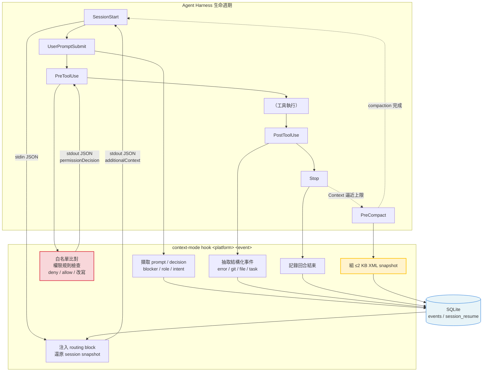
```mermaid
flowchart TD
    subgraph HarnessL["Agent Harness 生命週期"]
        direction TB
        E1["SessionStart"]
        E2["UserPromptSubmit"]
        E3["PreToolUse"]
        E4["（工具執行）"]
        E5["PostToolUse"]
        E6["Stop"]
        E7["PreCompact"]
        E1 --> E2 --> E3 --> E4 --> E5 --> E6
        E6 -.->|"Context 逼近上限"| E7
        E7 -.->|"compaction 完成"| E1
    end

    subgraph CMHook["context-mode hook &lt;platform&gt; &lt;event&gt;"]
        direction TB
        H1["注入 routing block<br/>還原 session snapshot"]
        H2["擷取 prompt / decision<br/>blocker / role / intent"]
        H3["白名單比對<br/>權限規則檢查<br/>deny / allow / 改寫"]
        H5["抽取結構化事件<br/>error / git / file / task"]
        H6["記錄回合結束"]
        H7["組 ≤2 KB XML snapshot"]
    end

    DB[("SQLite<br/>events / session_resume")]

    E1 -->|"stdin JSON"| H1
    E2 --> H2
    E3 --> H3
    E5 --> H5
    E6 --> H6
    E7 --> H7

    H1 -->|"stdout JSON<br/>additionalContext"| E1
    H3 -->|"stdout JSON<br/>permissionDecision"| E3

    H2 --> DB
    H5 --> DB
    H6 --> DB
    H7 --> DB
    DB --> H1

    style H3 fill:#f8d7da,stroke:#dc3545,stroke-width:2px
    style H7 fill:#fff3cd,stroke:#ffc107,stroke-width:2px
    style DB fill:#e8f4f8,stroke:#0366d6
```

### 8.3 Hook 的通訊協定

> **[Official]** 基本形式是：**Harness 用 stdin 送 JSON 進來，Hook 用 stdout 回 JSON**。

但**各平台的細節不同**，這是企業導入最容易踩雷的地方：

| 平台 | 設定鍵命名 | 回應欄位 | 特殊限制 |
| --- | --- | --- | --- |
| Claude Code | `PreToolUse`（PascalCase） | 標準 | 完整支援 |
| Qwen Code | `PreToolUse` | 標準 | **與 Claude Code 完全同協定** |
| Gemini CLI | `BeforeTool` / `AfterTool` / `PreCompress` | 標準 | **事件名稱不同** |
| GitHub Copilot CLI | `preToolUse`（camelCase）、`userPromptSubmitted`、`agentStop` | **top-level 欄位** | 命名與結構都不同 |
| Cursor | `preToolUse`（camelCase） | 標準 | `sessionStart` 被 validator 拒絕；`additional_context` 不會送到模型 |
| Codex CLI | `PreToolUse` | 標準 | **只支援 `deny`**，不支援 `updatedInput` 與 `additionalContext` |
| Kimi Code | TOML `[[hooks]]` | 標準 | 支援 `additionalContext`、`updatedInput`、`permissionDecision: "ask"` |
| Kiro | `preToolUse` | 標準 | 無 `agentSpawn` |
| OpenCode / KiloCode | TypeScript 函式 | 函式回傳值 | `tool.execute.before/after`、`experimental.*` |
| OpenClaw | `api.on()` / `api.registerHook()` | 函式回傳值 | Gateway plugin |
| Pi / OMP | `tool_call` / `tool_result` / `session_start` / `session_before_compact` | 函式回傳值 | Extension / plugin |

> **[Enterprise Recommendation]** 不要手刻 hook 設定。**用官方提供的安裝路徑**（plugin / `context-mode upgrade`），讓它自己寫對應格式。手刻最容易出現「設定檔看起來對，但事件名稱是另一個平台的」這種難查的問題。

### 8.4 Routing Enforcement 的實際效果

> **[Official]** 官方對每個平台的「有 hook」與「沒 hook」給了明確的節省率估計：

| 平台 | Hook | 有 Hook | 只有指令檔 |
| --- | --- | --- | --- |
| Claude Code | 自動 | **約 98%** | 約 60% |
| Gemini CLI | 有 | **約 98%** | 約 60% |
| VS Code / JetBrains Copilot | 有 | **約 98%** | 約 60% |
| GitHub Copilot CLI | 有 | **約 98%** | 約 60% |
| Cursor | 有 | **約 98%** | 約 60% |
| OpenCode / OpenClaw / OMP | Plugin | **約 98%** | 約 60% |
| Codex CLI | 有（需 feature flag） | **約 98%** | 約 60% |
| Kiro | 有 | **約 98%** | 約 60% |
| Pi | 有 | **約 98%** | 約 60% |
| Antigravity CLI (`agy`) | **Bounded** | 僅限對應到的 Bash/Read/Grep/WebFetch | 約 60% |
| Antigravity IDE | 無 | — | 約 60% |
| Zed | 無 | — | 約 60% |

> **[Official]** 官方的一句話總結值得貼在團隊牆上：
> 「Without hooks, **one unrouted `curl` or Playwright snapshot can dump 56 KB into context — wiping out an entire session's worth of savings**.」

### 8.5 一個歷史教訓：不要污染 git tree

> **[Official]** 早期版本會在 session 啟動時**自動把 routing 指令檔寫進專案目錄**，造成 git working tree 被污染（[#158](https://github.com/mksglu/context-mode/issues/158)、[#164](https://github.com/mksglu/context-mode/issues/164)）。這個行為**已被移除**。
>
> 現在的設計：
>
> - **有 hook 的平台**：SessionStart 在 runtime 注入 routing 指示，**不寫檔**
> - **沒有 hook 的平台**（Zed、Antigravity IDE）：需要**一次性手動複製** routing 檔

**企業意涵** [Enterprise Recommendation]：如果你的團隊有人回報「專案裡莫名多出 `AGENTS.md` / `GEMINI.md`」，那是**舊版本**。請升級。同時建議把這些檔名加進 `.gitignore` 的檢查清單，避免誤 commit。

### 8.6 Fail-open 設計與它的代價

> **[Official]** Hook 失敗時，Context Mode **不會阻擋你的工具**（fail open）。官方在 Copilot CLI 章節寫：舊版全域 binary 會讓 hook「inert (no routing/capture)」但「they do **not** block your tools」。

**這個設計的雙面性** [AI Analysis]：

| 好處 | 代價 |
| --- | --- |
| Context Mode 掛掉不會讓開發停擺 | **你不會馬上發現它壞了** |
| 版本不相容時仍可工作 | Context 悄悄開始膨脹 |
| 降低導入風險 | 統計數字會誤導（看起來有在用，其實沒生效） |

> **[Enterprise Recommendation]** 因應措施：
>
> 1. **每日或每次專案切換時跑 `ctx doctor`**（見 [24.3](#243-ctx-doctor--ctx-stats-診斷-sop)）
> 2. 在團隊規範中加入「升級 Agent 平台後，必須重跑 `ctx doctor`」
> 3. 把 `ctx doctor` 納入開發環境自檢腳本

### 8.7 本章實務案例

**情境**：某團隊同時用 Claude Code 與 Codex CLI，發現「Claude Code 上很省，Codex 上完全沒效果」。

**診斷**：

```bash
# Codex 環境下執行
context-mode doctor
```

**發現**：MCP 有連上（`ctx stats` 能跑），但 hook 全部未啟用。

**根因** [Official]：Codex CLI 的 hook 功能**需要 feature flag**：

```toml
[features]
hooks = true
plugin_hooks = true    # 若使用 plugin 提供的 hooks
```

而且 **Codex 還會要求使用者信任 plugin hook 指令**——沒有點信任，hook 就不會跑。

**關鍵提醒** [Official]：官方明確寫道「`ctx stats` proves the plugin MCP server is installed and reachable; **it does not prove hooks are trusted or running**」。

**團隊規範修正**：

```text
驗證 Context Mode 是否生效，不能只看 ctx stats 有沒有回應。
必須跑 ctx doctor，並確認：
  [x] MCP registered
  [x] Hooks configured
  [x] Hooks trusted（Codex 特有）
  [x] FTS5 available
  [x] Runtime version OK
```

### 8.8 本章注意事項

1. **`ctx stats` 有回應 ≠ Hook 有在跑**。這是最常見的誤判。
2. **各平台 hook 設定格式差異很大**，用官方安裝路徑，不要手刻。
3. **Codex 需要 feature flag + 信任 hook**，兩個都要。
4. **Cursor 的 `additional_context` 不會送到模型**（[forum #155689](https://forum.cursor.com/t/native-posttooluse-hooks-accept-and-log-additional-context-successfully-but-the-injected-context-is-not-surfaced-to-the-model/155689)），所以 Cursor 靠 `.mdc` rules 檔做 routing 提示。
5. **Fail-open 代表壞掉很安靜**，必須靠定期診斷。
6. **舊版會污染 git tree**，遇到就升級。

### 8.9 本章檢查清單

- [ ] 我能解釋為什麼 MCP + Hooks 比單純 MCP 強（60% vs 98%）
- [ ] 我知道 hook 是 stdin JSON 進、stdout JSON 出
- [ ] 我知道我的平台用的是哪種命名格式（PascalCase / camelCase / TypeScript 函式）
- [ ] 我知道 `ctx stats` 有回應不代表 hook 在跑
- [ ] 我知道 Codex 需要 `[features] hooks = true` 且要信任 hook
- [ ] 我已把 `ctx doctor` 納入日常檢查

---

# Part 3 平台與安裝篇

> **本 Part 的目標**：讓任何一位同仁，不管用哪個 AI Agent，都能在 30 分鐘內完成安裝並驗證生效。
>
> **重要聲明**：以下所有指令依 **v1.0.169**（2026-09-18 查證）的官方文件撰寫。Context Mode 的發版節奏極快（7 個月 169 版），**實際版本升級後請以官方文件為準**。指令差異對照見 [附錄 C](#附錄-c指令版本對照表)。

---

<details>
<summary><strong>本 Part 章節導覽</strong>（點擊展開）</summary>

- [第 9 章 平台相容性矩陣](#第-9-章-平台相容性矩陣)
  - [9.1 先釐清「17 還是 18 個平台」](#91-先釐清17-還是-18-個平台)
  - [9.2 完整相容性矩陣](#92-完整相容性矩陣)
  - [9.3 企業選型決策樹](#93-企業選型決策樹)
  - [9.4 台灣企業常見組合的建議 [Enterprise Recommendation]](#94-台灣企業常見組合的建議-enterprise-recommendation)
  - [9.5 本章實務案例](#95-本章實務案例)
  - [9.6 本章注意事項](#96-本章注意事項)
  - [9.7 本章檢查清單](#97-本章檢查清單)
- [第 10 章 Claude Code 安裝](#第-10-章-claude-code-安裝)
  - [10.1 前置需求](#101-前置需求)
  - [10.2 安裝（Plugin 路徑，建議）](#102-安裝plugin-路徑建議)
  - [10.3 驗證](#103-驗證)
  - [10.4 Slash Commands](#104-slash-commands)
  - [10.5 Routing 行為](#105-routing-行為)
  - [10.6 狀態列（選用但強烈建議）](#106-狀態列選用但強烈建議)
  - [10.7 替代安裝：MCP-only（不含 hook）](#107-替代安裝mcp-only不含-hook)
  - [10.8 Claude Code 安裝完整指令清單](#108-claude-code-安裝完整指令清單)
  - [10.9 Claude Code 專屬的已知問題](#109-claude-code-專屬的已知問題)
  - [10.10 本章實務案例](#1010-本章實務案例)
  - [10.11 本章注意事項](#1011-本章注意事項)
  - [10.12 本章檢查清單](#1012-本章檢查清單)
- [第 11 章 GitHub Copilot 生態系安裝](#第-11-章-github-copilot-生態系安裝)
  - [11.1 三種 Copilot 的差異](#111-三種-copilot-的差異)
  - [11.2 VS Code Copilot 安裝](#112-vs-code-copilot-安裝)
  - [11.3 JetBrains Copilot 安裝](#113-jetbrains-copilot-安裝)
  - [11.4 GitHub Copilot CLI 安裝](#114-github-copilot-cli-安裝)
  - [11.5 多 Agent 共存時 Context Mode 的角色](#115-多-agent-共存時-context-mode-的角色)
  - [11.6 本章實務案例](#116-本章實務案例)
  - [11.7 本章注意事項](#117-本章注意事項)
  - [11.8 本章檢查清單](#118-本章檢查清單)
- [第 12 章 Codex CLI / Cursor 安裝](#第-12-章-codex-cli--cursor-安裝)
  - [12.1 Codex CLI](#121-codex-cli)
  - [12.2 Cursor](#122-cursor)
  - [12.3 本章實務案例](#123-本章實務案例)
  - [12.4 本章注意事項](#124-本章注意事項)
  - [12.5 本章檢查清單](#125-本章檢查清單)
- [第 13 章 其他平台安裝](#第-13-章-其他平台安裝)
  - [13.1 三種擴充架構的差異](#131-三種擴充架構的差異)
  - [13.2 OpenCode / KiloCode](#132-opencode--kilocode)
  - [13.3 OpenClaw / Pi Agent](#133-openclaw--pi-agent)
  - [13.4 OMP（Oh My Pi）](#134-ompoh-my-pi)
  - [13.5 Gemini CLI](#135-gemini-cli)
  - [13.6 Qwen Code](#136-qwen-code)
  - [13.7 Kimi Code](#137-kimi-code)
  - [13.8 Kiro](#138-kiro)
  - [13.9 Zed（MCP-only，無 hook）](#139-zedmcp-only無-hook)
  - [13.10 Antigravity IDE 與 Antigravity CLI（`agy`）](#1310-antigravity-ide-與-antigravity-cliagy)
  - [13.11 建置前置需求（CentOS / RHEL / Alpine）](#1311-建置前置需求centos--rhel--alpine)
  - [13.12 本章實務案例](#1312-本章實務案例)
  - [13.13 本章注意事項](#1313-本章注意事項)
  - [13.14 本章檢查清單](#1314-本章檢查清單)
- [第 14 章 企業標準安裝流程與設定管理](#第-14-章-企業標準安裝流程與設定管理)
  - [14.1 企業標準安裝流程（八步驟）](#141-企業標準安裝流程八步驟)
  - [14.2 四層設定策略](#142-四層設定策略)
  - [14.3 環境變數完整清單](#143-環境變數完整清單)
  - [14.4 企業部署架構](#144-企業部署架構)
  - [14.5 本章實務案例](#145-本章實務案例)
  - [14.6 本章注意事項](#146-本章注意事項)
  - [14.7 本章檢查清單](#147-本章檢查清單)

</details>

## 第 9 章 平台相容性矩陣

### 9.1 先釐清「17 還是 18 個平台」

> **[Official] [AI Analysis]** 官方 repo description 與 README 內文都寫「**17 platforms**」，但 README 的 Platform Compatibility 表格實際列出 **18 個平台**（多了 Qwen Code）。
>
> 本手冊**以表格為準，採用 18 個平台**。這個落差不影響使用，但如果你在做採購評估或內部簡報，請直接用表格內容，不要引用「17」這個數字。

### 9.2 完整相容性矩陣

> 以下為 v1.0.169 官方 Platform Compatibility 表的整理版 [Official]。
>
> 圖例：**Yes** = 原生支援｜**Plugin** = 透過 plugin 架構｜**Bounded** = 僅限對應到的特定工具｜**Capture-only** = 只捕捉不攔截｜**--** = 不支援

| Platform | MCP / 原生工具 | PreToolUse | PostToolUse | SessionStart | PreCompact | UserPrompt | Stop | 可改寫參數 | 可阻擋工具 | Session 完整度 |
| --- | :---: | :---: | :---: | :---: | :---: | :---: | :---: | :---: | :---: | :---: |
| **Claude Code** | Yes | Yes | Yes | Yes | Yes | Yes | Yes | Yes | Yes | **Full** |
| **Qwen Code** | Yes | Yes | Yes | Yes | Yes | Yes | -- | Yes | Yes | High |
| **Gemini CLI** | Yes | Yes | Yes | Yes | Yes | -- | -- | Yes | Yes | **High** |
| **VS Code Copilot** | Yes | Yes | Yes | Yes | Yes | -- | -- | Yes | Yes | **High** |
| **JetBrains Copilot** | Yes | Yes | Yes | Yes | Yes | -- | -- | Yes | Yes | **High** |
| **GitHub Copilot CLI** | Yes | Yes | Yes | Yes | Yes | Yes | Yes | Yes | Yes | **High** |
| **Cursor** | Yes | Yes | Yes | **--** | **--** | -- | Yes | Yes | Yes | **Partial** |
| **OpenCode** | 原生 plugin | Plugin | Plugin | ✓（surrogate） | Plugin | Plugin | -- | Plugin | Plugin | **Full** |
| **KiloCode** | 原生 plugin | Plugin | Plugin | ✓（surrogate） | Plugin | Plugin | -- | Plugin | Plugin | **Full** |
| **OpenClaw** | Gateway plugin | Plugin | Plugin | Plugin | Plugin | -- | -- | Plugin | Plugin | **High** |
| **Codex CLI** | Yes | Yes | Yes | Yes | Yes（gated） | Yes | Yes | **--** | Yes（僅 deny） | **Partial** |
| **Kimi Code** | Yes | Yes | Yes | Yes | Yes | Yes | Yes | Yes | Yes | High |
| **Antigravity IDE** | Yes | **--** | **--** | **--** | **--** | -- | -- | -- | -- | **無** |
| **Antigravity CLI (`agy`)** | Yes | **Bounded** | Capture-only | -- | -- | -- | Best-effort | -- | Bounded | **Partial** |
| **Kiro** | Yes | Yes | Yes | **--** | **--** | -- | -- | -- | Yes | **Partial** |
| **Zed** | Yes | **--** | **--** | **--** | **--** | -- | -- | -- | -- | **無** |
| **Pi Coding Agent** | Yes | Yes（extension） | Yes（extension） | Yes（extension） | Yes（extension） | -- | -- | Yes | Yes | **High** |
| **OMP (Oh My Pi)** | Yes | Plugin | Plugin | Plugin | Plugin | -- | -- | -- | Plugin | **High** |

**額外能力** [Official]：

| 能力 | 支援平台 |
| --- | --- |
| Utility Commands（`ctx stats` 等） | **全部 18 個平台** |
| Slash Commands（`/ctx-stats` 等） | **只有 Claude Code**（Pi 有部分：`/ctx-stats`、`/ctx-doctor`） |
| Plugin Marketplace | **只有 Claude Code** |

### 9.3 企業選型決策樹

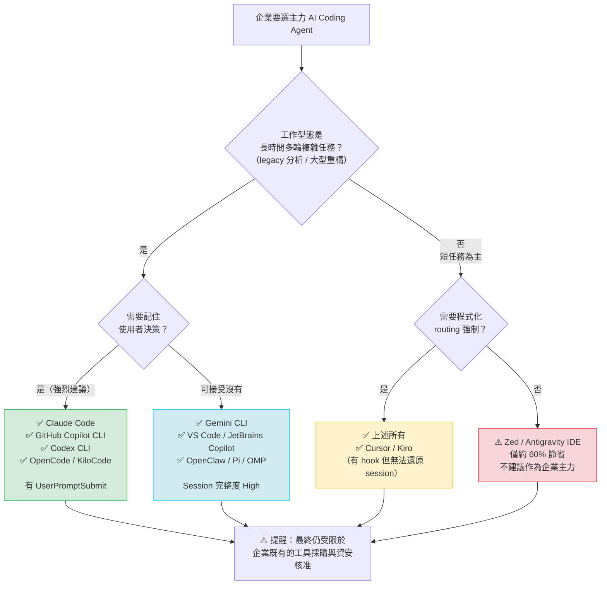
```mermaid
flowchart TD
    Start["企業要選主力 AI Coding Agent"] --> Q1{"工作型態是<br/>長時間多輪複雜任務？<br/>（legacy 分析 / 大型重構）"}

    Q1 -->|"是"| Q2{"需要記住<br/>使用者決策？"}
    Q1 -->|"否<br/>短任務為主"| Q3{"需要程式化<br/>routing 強制？"}

    Q2 -->|"是（強烈建議）"| A1["✅ Claude Code<br/>✅ GitHub Copilot CLI<br/>✅ Codex CLI<br/>✅ OpenCode / KiloCode<br/><br/>有 UserPromptSubmit"]
    Q2 -->|"可接受沒有"| A2["✅ Gemini CLI<br/>✅ VS Code / JetBrains Copilot<br/>✅ OpenClaw / Pi / OMP<br/><br/>Session 完整度 High"]

    Q3 -->|"是"| A3["✅ 上述所有<br/>✅ Cursor / Kiro<br/>（有 hook 但無法還原 session）"]
    Q3 -->|"否"| A4["⚠️ Zed / Antigravity IDE<br/>僅約 60% 節省<br/>不建議作為企業主力"]

    A1 --> Note["⚠️ 提醒：最終仍受限於<br/>企業既有的工具採購與資安核准"]
    A2 --> Note
    A3 --> Note
    A4 --> Note

    style A1 fill:#d4edda,stroke:#28a745
    style A2 fill:#d1ecf1,stroke:#0dcaf0
    style A3 fill:#fff3cd,stroke:#ffc107
    style A4 fill:#f8d7da,stroke:#dc3545
```

### 9.4 台灣企業常見組合的建議 [Enterprise Recommendation]

| 企業現況 | 建議主力 | 理由 | 注意事項 |
| --- | --- | --- | --- |
| 已採購 GitHub Copilot Enterprise | **VS Code Copilot + Copilot CLI** | 已有授權，Copilot CLI 有完整 hook 含 UserPromptSubmit | VS Code 端缺 UserPromptSubmit，重要決策請寫進 `copilot-instructions.md` |
| 已採購 Claude for Teams / Enterprise | **Claude Code** | 唯一有 plugin marketplace + slash command，session 完整度 Full | 安裝最簡單（兩行指令） |
| JetBrains 為主的 Java 團隊 | **JetBrains Copilot** | IDE 整合最順 | 需 Copilot plugin v1.5.57+ |
| 混合環境（多數台灣企業的現況） | **各自安裝，共用 `.claude/settings.json` 權限規則** | 權限治理可以集中 | **務必釘 `CONTEXT_MODE_PLATFORM`** |
| 金融業高度管制環境 | 先做 **PoC**，以 Claude Code 或 Copilot CLI 為評估對象 | hook 完整、可完全離線運作 | ELv2 授權與 `ctx_insight` 須先過法遵，見 [第 23 章](#第-23-章-資料分類與安全治理) |

### 9.5 本章實務案例

**情境**：某金控 IT 部門有三個開發團隊，分別用 VS Code Copilot、JetBrains Copilot、Claude Code。IT 主管問：「能不能統一？」

**分析結果**：

```text
統一平台的代價 > 收益，理由：
1. 三個平台的 session 完整度都是 High 以上，效果差異不大
2. VS Code / JetBrains Copilot 缺 UserPromptSubmit，
   但可用 copilot-instructions.md 補足長期規則
3. 真正需要統一的不是「平台」，而是：
   - 權限規則（.claude/settings.json，所有平台都吃）
   - routing 規範（團隊開發規範文件）
   - 診斷 SOP（ctx doctor 檢查項目）
```

**最終決策**：**不統一平台，統一治理**。IT 部門發布三份設定：

1. 共用的 `permissions` 規則（放版控，各專案繼承）
2. 各平台的安裝驗收清單
3. 統一的 `CONTEXT_MODE_PLATFORM` 設定要求

**這個案例的價值** [AI Analysis]：Context Mode 的多平台支援，讓「平台自由、治理統一」成為可行的企業策略。硬要統一平台，往往換來開發者抗拒。

### 9.6 本章注意事項

1. **官方自己的「17 platforms」與表格 18 個不一致**，以表格為準。
2. **Cursor 與 Kiro 無法還原 session**，這是上游限制。
3. **Codex 不支援改寫參數**，只能 deny（等 [openai/codex#18491](https://github.com/openai/codex/issues/18491)）。
4. **Slash command 只有 Claude Code 有**，其他平台要在對話裡打 `ctx stats` 這類文字指令。
5. **Zed 與 Antigravity IDE 沒有 hook**，只能靠指令檔（約 60%），**不建議作為企業主力**。

### 9.7 本章檢查清單

- [ ] 我知道自己團隊使用的平台在矩陣中的位置
- [ ] 我知道該平台有沒有 UserPromptSubmit（決定會不會忘記決策）
- [ ] 我知道該平台能不能在 compaction 後還原
- [ ] 我知道 Slash Command 只有 Claude Code 有
- [ ] 如果是混合環境，我已規劃共用的權限治理策略

---

## 第 10 章 Claude Code 安裝

> Claude Code 是官方支援最完整的平台（唯一具備 plugin marketplace + slash command + Full session），也是本手冊示範用的主力平台。

### 10.1 前置需求

> **[Official]**

| 項目 | 需求 | 檢查指令 |
| --- | --- | --- |
| Claude Code | **v1.0.33 以上** | `claude --version` |
| Node.js | **≥ 22.5**（或 Bun） | `node --version` |

如果 `/plugin` 指令不被辨識，代表版本太舊：

```bash
# macOS（Homebrew）
brew upgrade claude-code

# 通用（npm）
npm update -g @anthropic-ai/claude-code
```

**Windows（PowerShell）**：

```powershell
npm update -g @anthropic-ai/claude-code
node --version    # 必須 >= v22.5.0
claude --version  # 必須 >= 1.0.33
```

### 10.2 安裝（Plugin 路徑，建議）

在 Claude Code 的對話中輸入這兩行 [Official]：

```text
/plugin marketplace add mksglu/context-mode
/plugin install context-mode@context-mode
```

| 指令 | 用途 |
| --- | --- |
| `/plugin marketplace add mksglu/context-mode` | 把 Context Mode 的 marketplace 加入你的 Claude Code |
| `/plugin install context-mode@context-mode` | 從該 marketplace 安裝 plugin |

安裝後**重啟 Claude Code**，或執行 `/reload-plugins`。

**這一步做了什麼** [Official]：plugin 一次註冊了

- **6 個 hook**：PreToolUse、PostToolUse、UserPromptSubmit、PreCompact、SessionStart、Stop
- **11 個 MCP 工具**
- **7 個 slash command**

### 10.3 驗證

```text
/context-mode:ctx-doctor
```

**所有檢查項目都應該顯示 `[x]`**。doctor 會驗證 runtime、hooks、FTS5、plugin 註冊狀態。

> **[Official] 關鍵提醒**：不要只用 `ctx stats` 驗證。官方明確說明 `ctx stats` 只能證明 MCP server 有安裝且可連線，**不能證明 hook 有被信任或正在執行**。

### 10.4 Slash Commands

> **[Official]** Claude Code 專屬功能：

| Slash Command | 用途 |
| --- | --- |
| `/context-mode:ctx-stats` | 節省統計——逐工具細項、token 消耗、節省比例 |
| `/context-mode:ctx-doctor` | 診斷——runtime、hook、FTS5、plugin 註冊、版本 |
| `/context-mode:ctx-index` | 索引本地檔案或目錄到 FTS5 知識庫 |
| `/context-mode:ctx-search` | 搜尋已索引內容 |
| `/context-mode:ctx-upgrade` | 拉最新版、重建、遷移快取、修復 hook |
| `/context-mode:ctx-purge` | **永久刪除**知識庫所有索引內容 |
| `/context-mode:ctx-insight` | 開啟 hosted Insight dashboard（**企業建議停用**，見 [23.3](#233-ctx_insight-與-insight-platform-的企業處理原則)） |

### 10.5 Routing 行為

> **[Official]** Claude Code 的 routing 是**全自動**的：SessionStart hook 在 runtime 注入 routing 指示，**不會寫任何檔案到你的專案目錄**。

這點很重要——早期版本會污染 git tree，現在不會了（見 [8.5](#85-一個歷史教訓不要污染-git-tree)）。

### 10.6 狀態列（選用但強烈建議）

> **[Official]** Claude Code 的 plugin manifest 無法宣告狀態列，需要手動編輯一次 `~/.claude/settings.json`：

```json
{
  "statusLine": {
    "type": "command",
    "command": "context-mode statusline"
  }
}
```

**Windows 路徑**：`%USERPROFILE%\.claude\settings.json`

儲存後重啟 Claude Code。狀態列會顯示：

```text
$ saved this session · $ saved across sessions · % efficient
```

> **[Enterprise Recommendation]** 這個設定看似是小功能，但對**推廣導入極為有效**——開發者能即時看到節省累積，比任何內部宣導都有說服力。建議列為團隊標準設定。

### 10.7 替代安裝：MCP-only（不含 hook）

> **[Official]** 如果只想先試用，不想裝完整 plugin：

```bash
claude mcp add context-mode -- npx -y context-mode
```

| 得到什麼 | 失去什麼 |
| --- | --- |
| 全部 11 個 MCP 工具 | **自動 routing**（模型不會被推去優先用 `ctx_*`） |
| | Slash commands |
| | Session continuity |
| | 節省率從約 98% 掉到約 60% |

> **[Enterprise Recommendation]** MCP-only 適合**個人試用**，**不適合團隊標準**。企業導入請走 plugin 路徑。

### 10.8 Claude Code 安裝完整指令清單

```bash
# ── 步驟 1：檢查前置需求 ──
node --version          # 需 >= v22.5.0
claude --version        # 需 >= 1.0.33

# ── 步驟 2：（如版本不足）升級 Claude Code ──
npm update -g @anthropic-ai/claude-code

# ── 步驟 3：在 Claude Code 對話中安裝 plugin ──
# /plugin marketplace add mksglu/context-mode
# /plugin install context-mode@context-mode

# ── 步驟 4：重啟 Claude Code ──

# ── 步驟 5：驗證 ──
# /context-mode:ctx-doctor      ← 全部 [x]

# ── 步驟 6：（選用）設定狀態列 ──
# 編輯 ~/.claude/settings.json 加入 statusLine

# ── 步驟 7：從終端機確認 CLI 可用 ──
context-mode doctor
```

### 10.9 Claude Code 專屬的已知問題

> **[Community]** 以下來自官方 open issues，企業導入時應預先知道：

| 問題 | 症狀 | 目前狀態 |
| --- | --- | --- |
| **⚠️ Compaction 迴圈耗盡 token 配額（#1173）** | v1.0.169 在 compaction 後還原 context 時立即再次觸發 compaction，反覆空轉直到**配額被燒光** | **Open issue，v1.0.146 起的回歸。這是 Claude Code 使用者面臨的最高風險項目**，因應見 [第 25 章專節](#v10169-的-compaction-迴圈風險必讀) |
| **Auto-Mode Bypass** | 注入的 `session_continuity` / `priority_instructions` 框架觸發 Claude Code 的 auto-mode classifier | Open issue，影響第三方 plugin 的 subagent 派送 |
| **Plan mode 封鎖 `ctx_batch_execute`** | Plan mode 下因 #851 的 annotation 變更，沒有 read-only 的資料蒐集路徑 | Open issue |
| **Windows 子行程孤兒化** | MCP server 子行程在 session 結束後殘留並吃 CPU（parent-death guard 只在 Linux/Bun 有效） | Open issue，**Windows 團隊必須注意** |

> **[Enterprise Recommendation]** 針對 Windows 孤兒程序問題，建議在團隊的環境自檢腳本加入：
>
> ```powershell
> # 檢查殘留的 context-mode 程序
> Get-Process node -ErrorAction SilentlyContinue |
>   Where-Object { $_.CPU -gt 60 } |
>   Select-Object Id, ProcessName, CPU, StartTime
> ```
>
> 若發現長時間高 CPU 的殘留 node 程序，可手動終止。這是**已知上游問題的暫時緩解**，不是 Context Mode 的原生功能。

### 10.10 本章實務案例

**情境**：新進工程師第一天報到，要完成 Claude Code + Context Mode 的環境建置。

**標準 onboarding 流程（30 分鐘）**：

```text
[00:00] 確認 Node >= 22.5
        node --version
        （若不足：安裝 Node 22 LTS 或更新）

[00:05] 確認 Claude Code >= 1.0.33
        claude --version

[00:10] 安裝 plugin（Claude Code 對話中）
        /plugin marketplace add mksglu/context-mode
        /plugin install context-mode@context-mode
        重啟

[00:15] 驗證
        /context-mode:ctx-doctor      → 全部 [x]

[00:18] 套用團隊權限規則
        將團隊版 permissions 設定複製到 ~/.claude/settings.json
        （含 deny: Read(**/.env*)、Bash(sudo *) 等）

[00:22] 設定狀態列
        編輯 ~/.claude/settings.json 加入 statusLine

[00:25] 實測一次
        在對話中輸入：
        「分析這個專案的 git log 最近 100 個 commit，
          統計 top 5 貢獻者與最常改動的檔案」
        接著輸入 /context-mode:ctx-stats 看節省

[00:30] 完成
```

**驗收標準**：`ctx-doctor` 全綠 + `ctx-stats` 顯示本次操作有節省紀錄。

### 10.11 本章注意事項

1. **`ctx stats` 能跑 ≠ 安裝成功**，一定要跑 `ctx doctor`。
2. **MCP-only 安裝只有約 60% 效果**，不適合團隊標準。
3. **狀態列要手動加**，但對推廣效果極佳。
4. **Windows 有孤兒程序的已知問題**，需納入環境自檢。
5. **Node 版本是硬需求**，這是導入時最常見的卡點。
6. **安裝後務必重啟**（或 `/reload-plugins`），否則 hook 不會載入。

### 10.12 本章檢查清單

- [ ] `node --version` ≥ v22.5.0
- [ ] `claude --version` ≥ 1.0.33
- [ ] 已執行 `/plugin marketplace add mksglu/context-mode`
- [ ] 已執行 `/plugin install context-mode@context-mode`
- [ ] 已重啟 Claude Code
- [ ] `/context-mode:ctx-doctor` 全部顯示 `[x]`
- [ ] 已套用團隊權限規則到 `~/.claude/settings.json`
- [ ] 已設定 `statusLine`
- [ ] 已實測一次並用 `/context-mode:ctx-stats` 確認有節省

---

## 第 11 章 GitHub Copilot 生態系安裝

> 台灣企業採購 GitHub Copilot Enterprise 的比例很高，因此本章特別完整。Copilot 生態系有**三種型態**，設定方式各不相同。

### 11.1 三種 Copilot 的差異

| 型態 | 設定檔位置 | Hook 支援 | UserPromptSubmit | Session 完整度 |
| --- | --- | --- | --- | --- |
| **VS Code Copilot** | `.vscode/mcp.json` + `.github/hooks/context-mode.json` | Yes | **--** | High |
| **JetBrains Copilot** | Settings UI + `.github/hooks/context-mode.json` | Yes | **--** | High |
| **GitHub Copilot CLI** | `~/.copilot/mcp-config.json` + `~/.copilot/hooks/context-mode.json` | Yes | **Yes** | High |

> **[AI Analysis] 關鍵差異**：只有 **Copilot CLI 有 UserPromptSubmit**，也就是只有它會記住你的決策。IDE 版本的 Copilot 會記得你改了哪些檔案、跑過哪些 git 指令，但**不會記得你說過「不要用 Lombok」**。
>
> **企業因應**：IDE 版 Copilot 的使用者，應把長期規則寫進 `.github/copilot-instructions.md`（每次 session 都會載入），而不是只在對話中口頭交代。

### 11.2 VS Code Copilot 安裝

> **[Official]** 前置需求：Node.js ≥ 22.5（或 Bun）、VS Code + Copilot Chat **v0.32 以上**。

**步驟 1：全域安裝**

```bash
npm install -g context-mode
```

**步驟 2：建立 `.vscode/mcp.json`（專案根目錄）**

```json
{
  "servers": {
    "context-mode": {
      "command": "context-mode"
    }
  }
}
```

| 欄位 | 說明 |
| --- | --- |
| `servers` | VS Code Copilot 使用 `servers`（不是 `mcpServers`），這是常見的抄錯點 |
| `command` | 執行全域安裝的 `context-mode` binary |

**步驟 3：建立 `.github/hooks/context-mode.json`**

```json
{
  "hooks": {
    "PreToolUse": [
      { "type": "command", "command": "context-mode hook vscode-copilot pretooluse" }
    ],
    "PostToolUse": [
      { "type": "command", "command": "context-mode hook vscode-copilot posttooluse" }
    ],
    "SessionStart": [
      { "type": "command", "command": "context-mode hook vscode-copilot sessionstart" }
    ]
  }
}
```

| 欄位 | 說明 |
| --- | --- |
| `PreToolUse` | 攔截高輸出工具，改導 sandbox |
| `PostToolUse` | 捕捉事件寫入 SQLite |
| `SessionStart` | 注入 routing 指示 + 還原 session |
| `context-mode hook vscode-copilot <event>` | 第二個參數是**平台識別**，抄錯平台 hook 就不會生效 |

> **[Official]** 完整 hook 設定（含 `PreCompact`）在官方 repo 的 `configs/vscode-copilot/hooks.json`。上面是最小可用版本。

**步驟 4：重啟 VS Code**

**步驟 5：驗證**

打開 Copilot Chat，輸入 `ctx stats`。應該看到 Context Mode 回應。

**步驟 6（建議）：複製 routing 指令檔**

```bash
cp node_modules/context-mode/configs/vscode-copilot/copilot-instructions.md .github/copilot-instructions.md
```

**Windows（PowerShell）**：

```powershell
$cm = "$(npm root -g)\context-mode"
Copy-Item "$cm\configs\vscode-copilot\copilot-instructions.md" ".github\copilot-instructions.md"
```

> **[Enterprise Recommendation]** 如果專案已有 `copilot-instructions.md`，**不要直接覆蓋**。請把 Context Mode 的 routing 段落**合併**進去，並在檔案裡標明來源與版本，方便日後升級比對。

### 11.3 JetBrains Copilot 安裝

> **[Official]** 前置需求：Node.js ≥ 22.5（或 Bun）、JetBrains IDE + GitHub Copilot plugin **v1.5.57 以上**。

**步驟 1：全域安裝**

```bash
npm install -g context-mode
```

**步驟 2：透過 Settings UI 新增 MCP server**

```text
Settings > Tools > AI Assistant > Model Context Protocol (MCP) > Add Server

  Name:    context-mode
  Command: context-mode
```

**步驟 3：建立 `.github/hooks/context-mode.json`**

```json
{
  "hooks": {
    "PreToolUse": [
      { "type": "command", "command": "context-mode hook jetbrains-copilot pretooluse" }
    ],
    "PostToolUse": [
      { "type": "command", "command": "context-mode hook jetbrains-copilot posttooluse" }
    ],
    "SessionStart": [
      { "type": "command", "command": "context-mode hook jetbrains-copilot sessionstart" }
    ]
  }
}
```

> 注意平台識別是 `jetbrains-copilot`，與 VS Code 版不同。

**步驟 4：重啟 JetBrains IDE**

**步驟 5：驗證** —— 在 Copilot Chat 輸入 `ctx stats`

**步驟 6（建議）：複製 routing 指令檔**

```bash
cp node_modules/context-mode/configs/jetbrains-copilot/copilot-instructions.md .github/copilot-instructions.md
```

> **[Official]** JetBrains 完整設定指南在官方 repo 的 `docs/jetbrains-copilot.md`。

### 11.4 GitHub Copilot CLI 安裝

> **[Official]** 前置需求：Node.js ≥ 22.5（或 Bun）、已安裝 `copilot` CLI。若使用隔離的 Copilot home，**請先設定 `COPILOT_HOME`**。

#### 選項 A：Plugin 安裝（一行指令，官方建議）

```bash
npm install -g context-mode                                     # plugin 的 MCP server 會跑全域 binary
copilot plugin install mksglu/context-mode:configs/copilot-cli  # 註冊 MCP + hooks + routing skill
```

**這個路徑的關鍵優勢** [Official]：bundle 的 `.mcp.json` 會**釘住 `CONTEXT_MODE_PLATFORM=copilot-cli`**，所以即使機器上同時裝了 Claude Code（`~/.claude/` 會搶贏偵測），Context Mode 仍會正確辨識為 Copilot CLI。

> 這正是 [4.6](#46-平台偵測機制) 提到的多 Agent 共存問題的官方解法。

**從本地 clone 試用**（尚未進 default branch 時）：

```bash
copilot --plugin-dir /path/to/context-mode/configs/copilot-cli
```

#### 選項 B：手動安裝（不用 plugin）

**步驟 1：全域安裝**

```bash
npm install -g context-mode
```

**步驟 2：用 Copilot CLI 內建指令註冊 MCP**

```bash
copilot mcp add context-mode -- context-mode
```

這會幫你寫入 `~/.copilot/mcp-config.json`。

**步驟 3：設定 hooks**

檔案位置：`~/.copilot/hooks/context-mode.json`（或 `$COPILOT_HOME/hooks/context-mode.json`）

```json
{
  "version": 1,
  "hooks": {
    "preToolUse":          [{ "type": "command", "command": "context-mode hook copilot-cli pretooluse" }],
    "postToolUse":         [{ "type": "command", "command": "context-mode hook copilot-cli posttooluse" }],
    "preCompact":          [{ "type": "command", "command": "context-mode hook copilot-cli precompact" }],
    "sessionStart":        [{ "type": "command", "command": "context-mode hook copilot-cli sessionstart" }],
    "userPromptSubmitted": [{ "type": "command", "command": "context-mode hook copilot-cli userpromptsubmit" }],
    "agentStop":           [{ "type": "command", "command": "context-mode hook copilot-cli stop" }]
  }
}
```

**Copilot CLI 的三個特殊之處** [Official]：

| 特殊點 | 說明 |
| --- | --- |
| **camelCase 鍵名** | `preToolUse` 而非 `PreToolUse`。抄 Claude Code 的格式會失效 |
| **事件名稱不同** | `userPromptSubmitted`（不是 `UserPromptSubmit`）、`agentStop`（不是 `Stop`） |
| **`version` 欄位可選** | Context Mode 會寫入 `"version": 1`，但 Copilot CLI 接受省略它 |

**讓 Context Mode 自己寫 hooks 檔**：

```bash
CONTEXT_MODE_PLATFORM=copilot-cli context-mode upgrade
```

> **[Official]** 注意：`upgrade` **只寫 hooks 檔**，MCP server 仍需用步驟 2 的 `copilot mcp add` 註冊。

**步驟 4：重啟 Copilot CLI**

**步驟 5：驗證**

```bash
# 在 Copilot CLI session 中輸入：ctx stats
# 從終端機確認 hook + MCP 註冊：
context-mode doctor
```

> **[Official] 版本相容性警告**：hook 指令跑的是**全域** `context-mode`。如果全域版本太舊（不支援 Copilot CLI），hook 會是「inert」狀態——**不 routing、不捕捉，但也不會擋你的工具**（fail open）。升級方式：
>
> ```bash
> npm install -g context-mode@latest
> ```

### 11.5 多 Agent 共存時 Context Mode 的角色

企業現實：一台開發機上常常同時存在

```text
Claude Code
GitHub Copilot（VS Code）
GitHub Copilot CLI
Codex CLI
Cursor
```

**Context Mode 在這個環境中扮演三個角色** [AI Analysis]：

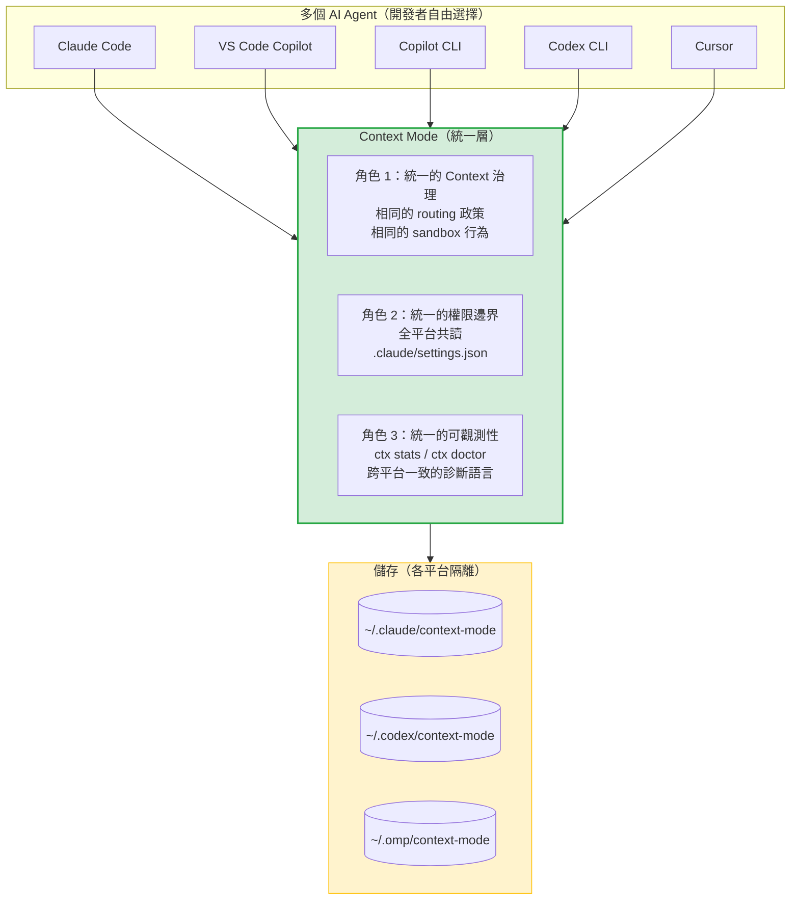
```mermaid
flowchart TD
    subgraph Agents["多個 AI Agent（開發者自由選擇）"]
        CC["Claude Code"]
        VSC["VS Code Copilot"]
        CLI["Copilot CLI"]
        CX["Codex CLI"]
        CUR["Cursor"]
    end

    subgraph CM["Context Mode（統一層）"]
        R1["角色 1：統一的 Context 治理<br/>相同的 routing 政策<br/>相同的 sandbox 行為"]
        R2["角色 2：統一的權限邊界<br/>全平台共讀<br/>.claude/settings.json"]
        R3["角色 3：統一的可觀測性<br/>ctx stats / ctx doctor<br/>跨平台一致的診斷語言"]
    end

    subgraph Store["儲存（各平台隔離）"]
        S1[("~/.claude/context-mode")]
        S2[("~/.codex/context-mode")]
        S3[("~/.omp/context-mode")]
    end

    CC --> CM
    VSC --> CM
    CLI --> CM
    CX --> CM
    CUR --> CM

    CM --> Store

    style CM fill:#d4edda,stroke:#28a745,stroke-width:2px
    style Store fill:#fff3cd,stroke:#ffc107
```

> **[Official]** 注意第三塊：**儲存是各平台隔離的**。官方特別處理過 OMP 與 Pi 的儲存分離（[#473](https://github.com/mksglu/context-mode/issues/473)），確保不同 agent 不會共用 session DB、content index 或 stats。
>
> **企業意涵**：`ctx_stats` 的數字是**per-platform** 的。如果開發者在 Claude Code 和 Copilot CLI 之間切換，兩邊的統計不會合併。做團隊 KPI 時要注意這點。

### 11.6 本章實務案例

**情境**：某企業有 40 位開發者用 VS Code Copilot，5 位 tech lead 額外用 Copilot CLI 做大型分析。

**部署策略**：

```text
【全體 40 人】VS Code Copilot
  - .vscode/mcp.json          → 放進專案版控（每個專案都有）
  - .github/hooks/context-mode.json → 放進專案版控
  - .github/copilot-instructions.md → 放進專案版控，含 routing 段落
  - 因為缺 UserPromptSubmit，團隊規則一律寫進 instructions 檔，
    不依賴對話中口頭交代

【5 位 tech lead】額外裝 Copilot CLI
  - copilot plugin install mksglu/context-mode:configs/copilot-cli
  - 這條路徑自動釘 CONTEXT_MODE_PLATFORM=copilot-cli，
    避免與 VS Code 的偵測衝突
  - 有完整 UserPromptSubmit，適合長時間的 legacy 分析工作

【全體共用】
  - ~/.claude/settings.json 的 permissions 規則（IT 統一派送）
  - 每週跑一次 context-mode doctor
```

**關鍵決策說明**：專案層級的設定檔（`.vscode/mcp.json`、`.github/hooks/`）**進版控**，讓新人 clone 下來就有；使用者層級的設定（權限規則）由 IT 派送。這是 [14.2 四層設定策略](#142-四層設定策略) 的實際應用。

### 11.7 本章注意事項

1. **VS Code 用 `servers`，不是 `mcpServers`**，這是最常見的抄錯。
2. **Copilot CLI 用 camelCase**，且事件名是 `userPromptSubmitted` / `agentStop`。
3. **平台識別參數不能抄錯**（`vscode-copilot` / `jetbrains-copilot` / `copilot-cli`）。
4. **IDE 版 Copilot 沒有 UserPromptSubmit**，重要規則要寫進 instructions 檔。
5. **Copilot CLI plugin 路徑會自動釘平台**，多 Agent 環境強烈建議走這條。
6. **`context-mode upgrade` 只寫 hooks 檔**，MCP 要另外註冊。
7. **不要覆蓋既有的 `copilot-instructions.md`**，要合併。

### 11.8 本章檢查清單

- [ ] 我知道自己用的是三種 Copilot 中的哪一種
- [ ] MCP 設定檔的鍵名正確（VS Code 是 `servers`）
- [ ] hook 指令中的平台識別正確
- [ ] 已重啟 IDE / CLI
- [ ] `ctx stats` 在 Copilot Chat 中有回應
- [ ] `context-mode doctor` 全綠
- [ ] 如果是 IDE 版，長期規則已寫進 `copilot-instructions.md`
- [ ] 多 Agent 環境已確認 `CONTEXT_MODE_PLATFORM` 正確

---

## 第 12 章 Codex CLI / Cursor 安裝

### 12.1 Codex CLI

> **[Official]** 前置需求：Node.js ≥ 22.5（或 Bun）、已安裝 Codex CLI。

#### 12.1.1 Plugin 安裝（建議）

**步驟 1：加入 marketplace**

```bash
codex plugin marketplace add mksglu/context-mode
```

然後從 Codex 的 plugin UI 安裝。

**步驟 2：開啟 feature flag**（這是 Codex 最關鍵的一步）

在 `~/.codex/config.toml` 加入：

```toml
[features]
plugin_hooks = true
hooks = true
```

> **[Official] Feature flag 說明**：
>
> - 目前 Codex build 把 hooks 放在 `[features].hooks`（或 `codex --enable hooks`）
> - **建議用 `[features].hooks`**；`[features].codex_hooks` 是仍被接受的 legacy 別名
> - **bundled plugin hooks 額外需要 `plugin_hooks`**，直到 Codex 預設啟用為止

**步驟 3：重啟 Codex CLI，用 `ctx stats` 驗證 MCP**

> **[Official] 極重要**：官方明白寫著——`ctx stats` **證明 plugin MCP server 已安裝且可連線，但不證明 hook 被信任或正在執行**。

**步驟 4：信任 plugin hooks**

如果 Codex 跳出 hook 核准提示，**必須檢視並信任**。Plugin hook 只有在**兩個 feature flag 都開啟**且 **Codex 已接受 hook 指令**之後才會生效。

**自訂儲存位置**（若 Codex 無法寫入預設目錄）：

```bash
CONTEXT_MODE_DIR="$HOME/.codex-context-mode" codex
```

**Windows（PowerShell）**：

```powershell
$env:CONTEXT_MODE_DIR = "D:\ai\codex-context-mode"
codex
```

> **[Official]** `<root>/sessions` 放 session 與 stats，`<root>/content` 放索引內容。

> **[Official] Node/PATH 注意**：plugin 移除了手動 Codex 設定，但**不會自動 vendor Node，也不會繼承 login shell 的 PATH 修正**。必須確保 `node` 對 Codex 程序可見。這在 Windows 或用 nvm 的環境特別容易出問題。

#### 12.1.2 手動安裝（Codex build 不支援 `plugin_hooks` 時）

**步驟 1：全域安裝**

```bash
npm install -g context-mode
```

**步驟 2：`~/.codex/config.toml`**

```toml
[features]
hooks = true

[mcp_servers.context-mode]
command = "context-mode"

[mcp_servers.context-mode.env]
CONTEXT_MODE_PLATFORM = "codex"
```

**步驟 3：建立 `$CODEX_HOME/hooks.json`**（`CODEX_HOME` 未設定時為 `~/.codex/hooks.json`）

```json
{
  "hooks": {
    "PreToolUse": [{ "matcher": "local_shell|shell|shell_command|exec_command|Bash|Shell|apply_patch|Edit|Write|grep_files|ctx_execute|ctx_execute_file|ctx_batch_execute|ctx_fetch_and_index|ctx_search|ctx_index|mcp__", "hooks": [{ "type": "command", "command": "context-mode hook codex pretooluse" }] }],
    "PostToolUse": [{ "hooks": [{ "type": "command", "command": "context-mode hook codex posttooluse" }] }],
    "SessionStart": [{ "hooks": [{ "type": "command", "command": "context-mode hook codex sessionstart" }] }],
    "PreCompact": [{ "hooks": [{ "type": "command", "command": "context-mode hook codex precompact" }] }],
    "UserPromptSubmit": [{ "hooks": [{ "type": "command", "command": "context-mode hook codex userpromptsubmit" }] }],
    "Stop": [{ "hooks": [{ "type": "command", "command": "context-mode hook codex stop" }] }]
  }
}
```

**`matcher` 欄位的意思**：只有工具名稱符合這個正則的呼叫才會觸發 hook。它同時涵蓋**原生工具**（`shell`、`Bash`、`Edit`）與 **Context Mode 自己的工具**與**其他 MCP 工具**（`mcp__`），確保所有可能產生大輸出的路徑都被監看。

**步驟 4：複製 routing 指令檔**

```bash
CM_ROOT="$(npm root -g)/context-mode"
cp "$CM_ROOT/configs/codex/AGENTS.md" ./AGENTS.md
```

全域版本：

```bash
CM_ROOT="$(npm root -g)/context-mode"
cp "$CM_ROOT/configs/codex/AGENTS.md" ~/.codex/AGENTS.md
```

> **[Official]** 全域版套用到所有專案；**兩者都存在時，Codex CLI 會合併**。

**步驟 5：重啟 Codex CLI**

#### 12.1.3 Codex 的三個限制（必讀）

> **[Official]**

| 限制 | 說明 | 追蹤 |
| --- | --- | --- |
| **PreToolUse 只支援 deny** | 可以阻擋危險指令，**不能改寫工具參數**。需要上游支援 `updatedInput` | [openai/codex#18491](https://github.com/openai/codex/issues/18491) |
| **PreToolUse 不支援 `additionalContext`** | 無法在 PreToolUse 注入 context；改由 PostToolUse 與 SessionStart 處理（Context Mode 自動處理） | — |
| **PreCompact 是 runtime-gated** | Codex CLI 0.130.0 有這個事件；**更舊的 build 不會發出 PreCompact**，因此不會建立 pre-compaction snapshot。官方文件可能落後於實際 hook 事件清單 | — |

> **[Enterprise Recommendation]** 因為 Codex 的 session 完整度是 **Partial**，如果團隊用 Codex 做長時間的複雜任務，請額外要求開發者**把關鍵決策寫進 `AGENTS.md`**，不要只靠對話。

### 12.2 Cursor

> **[Official]** 前置需求：Node.js ≥ 22.5（或 Bun）、Cursor + agent mode。

> **🚧 [Official] 狀態提醒**：Cursor Marketplace plugin **仍在等待 Cursor 團隊審核**。在上架之前，請走 local-folder 或手動安裝路徑。追蹤：[#485](https://github.com/mksglu/context-mode/issues/485) / [#489](https://github.com/mksglu/context-mode/pull/489)。

#### 12.2.1 選項 A：本地資料夾 plugin（Marketplace 上架前）

**Windows（PowerShell）** —— Cursor **不跟隨 Windows symlink/junction**，必須用 `robocopy` [Official]：

```powershell
git clone https://github.com/mksglu/context-mode.git
cd context-mode
robocopy . "$env:USERPROFILE\.cursor\plugins\local\context-mode" /MIR `
  /XD node_modules .git build web tests scripts .vscode `
  /XF *.log .gitignore *.bundle.mjs.map
```

| 參數 | 用途 |
| --- | --- |
| `/MIR` | 鏡像目錄（同步刪除來源已移除的檔案） |
| `/XD` | 排除目錄（`node_modules`、`.git`、`build`、`web`、`tests`…） |
| `/XF` | 排除檔案（log、map 檔） |

**macOS / Linux**：

```bash
git clone https://github.com/mksglu/context-mode.git
ln -s "$PWD/context-mode" ~/.cursor/plugins/local/context-mode
```

重啟 Cursor。Plugin 會出現在 **Settings → Plugins**，名稱為「Context Mode (Local)」。要更新就重跑同一行 `robocopy` / `ln -s`。

> **[Official] 衝突警告**：如果 `.cursor/hooks.json` 裡已經有選項 B 留下的 context-mode 設定，`context-mode doctor` 會警告 **hook 重複觸發**。**請移除其中一份設定**，確保事件只觸發一次。

#### 12.2.2 選項 B：手動安裝

**步驟 1：全域安裝**

```bash
npm install -g context-mode
```

**步驟 2：`.cursor/mcp.json`**（專案根目錄，或 `~/.cursor/mcp.json` 做全域）

```json
{
  "mcpServers": {
    "context-mode": {
      "command": "context-mode"
    }
  }
}
```

**步驟 3：`.cursor/hooks.json`**

```json
{
  "version": 1,
  "hooks": {
    "preToolUse": [
      {
        "command": "context-mode hook cursor pretooluse",
        "matcher": "Shell|Read|Grep|WebFetch|Task|MCP:ctx_execute|MCP:ctx_execute_file|MCP:ctx_batch_execute"
      }
    ],
    "postToolUse": [
      { "command": "context-mode hook cursor posttooluse" }
    ],
    "stop": [
      { "command": "context-mode hook cursor stop" }
    ]
  }
}
```

> **[Official]** `preToolUse` 的 `matcher` 是**選用**的——不加就對所有工具觸發。`stop` hook 在 agent 回合結束時觸發，可以送 followup 訊息延續迴圈。另外還有 `afterAgentResponse`（fire-and-forget，收到完整回應文字）。

**步驟 4：複製 routing rules 檔**（Cursor 沒有 SessionStart，這步**必做**）

```bash
mkdir -p .cursor/rules
cp node_modules/context-mode/configs/cursor/context-mode.mdc .cursor/rules/context-mode.mdc
```

**Windows（PowerShell）**：

```powershell
New-Item -ItemType Directory -Force ".cursor\rules" | Out-Null
$cm = "$(npm root -g)\context-mode"
Copy-Item "$cm\configs\cursor\context-mode.mdc" ".cursor\rules\context-mode.mdc"
```

**步驟 5：重啟 Cursor 或開新的 agent session**

**驗證**：Cursor Settings > MCP 確認 `context-mode` 顯示已連線；在 agent chat 輸入 `ctx stats`。

#### 12.2.3 Cursor 的兩個已知限制

> **[Official]**

| 限制 | 說明 |
| --- | --- |
| **`sessionStart` 被 validator 拒絕** | Cursor 有記載這個 hook，但目前 validator 會拒絕（[forum 回報](https://forum.cursor.com/t/unknown-hook-type-sessionstart/149566)）。**因此 compaction 後無法還原 session**，routing 改靠 `.mdc` rules 檔 |
| **`additional_context` 不會送到模型** | Cursor 接受 hook 回應中的 `additional_context` 並記錄，但**不會呈現給模型**（[forum #155689](https://forum.cursor.com/t/native-posttooluse-hooks-accept-and-log-additional-context-successfully-but-the-injected-context-is-not-surfaced-to-the-model/155689)）。這是 routing 必須依賴 `.mdc` 檔的原因 |

> **[Official]** 設定優先序：**專案的 `.cursor/hooks.json` 覆蓋 `~/.cursor/hooks.json`**。

### 12.3 本章實務案例

**情境**：某新創團隊全員用 Cursor，導入後發現「每次 Cursor 重開，Agent 就完全忘記昨天做到哪」。

**診斷**：這**不是設定錯誤，是平台限制**。Cursor 的 `sessionStart` 被自家 validator 拒絕，Context Mode 無法注入還原內容。

**因應方案** [Enterprise Recommendation]：

```text
1. 接受限制：Cursor 的定位是「單次任務效率工具」，
   不適合跨天的長任務

2. 補償措施：
   - 把長期決策寫進 .cursor/rules/（會在每次 session 載入）
   - 重要的工作狀態用 ctx_index 主動索引成可搜尋內容：
     ctx_index(path: "docs/current-refactor-notes.md",
               source: "project:refactor-log")
     下次開 session 時用 ctx_search 主動回查

3. 長任務改用其他平台：
   tech lead 級的大型分析改用 Claude Code 或 Copilot CLI
```

**這個案例的通用教訓**：**當平台能力不足時，把「自動記憶」改成「主動索引 + 主動查詢」**。這是 Context Mode 在 Partial 平台上的標準補償模式。

### 12.4 本章注意事項

1. **Codex 需要兩個 feature flag** (`hooks` + `plugin_hooks`)，而且要**信任 hook**。
2. **Codex 的 `ctx stats` 不能證明 hook 在跑**。
3. **Codex 不能改寫工具參數**，只能 deny。
4. **Codex 的 `PreCompact` 依 runtime 版本而定**（0.130.0 有）。
5. **Codex 需要 `node` 在 PATH 上**，plugin 不會 vendor Node。
6. **Cursor 在 Windows 不跟隨 symlink**，必須用 `robocopy`。
7. **Cursor 無法還原 session**，這是平台限制不是 bug。
8. **Cursor 不要同時用選項 A 和 B**，會重複觸發 hook。

### 12.5 本章檢查清單

**Codex CLI**：

- [ ] `~/.codex/config.toml` 已設定 `[features] hooks = true`
- [ ] （用 plugin 時）已設定 `plugin_hooks = true`
- [ ] 已在 Codex 中信任 context-mode 的 hook 指令
- [ ] `node` 對 Codex 程序可見
- [ ] `AGENTS.md` 已複製（專案或全域）
- [ ] `context-mode doctor` 確認 hook 已註冊

**Cursor**：

- [ ] 已選定安裝路徑（A 或 B，**不可並用**）
- [ ] `.cursor/mcp.json` 已建立
- [ ] `.cursor/hooks.json` 已建立
- [ ] `.cursor/rules/context-mode.mdc` 已複製（**必做**）
- [ ] 已知悉 Cursor 無法在 compaction 後還原 session
- [ ] `context-mode doctor` 沒有 duplicate hook 警告

---

## 第 13 章 其他平台安裝

> 本章涵蓋 OpenCode、KiloCode、OpenClaw、Pi、OMP、Gemini CLI、Qwen Code、Kimi Code、Kiro、Zed、Antigravity。
>
> **重點在於理解架構差異**：不是所有平台都用傳統的 JSON hook。

### 13.1 三種擴充架構的差異

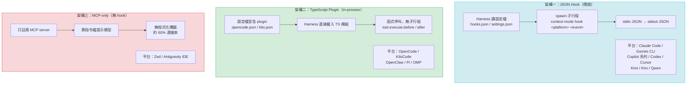
```mermaid
flowchart TD
    subgraph A["架構一：JSON Hook（傳統）"]
        A1["Harness 讀設定檔<br/>hooks.json / settings.json"]
        A2["spawn 子行程<br/>context-mode hook &lt;platform&gt; &lt;event&gt;"]
        A3["stdin JSON → stdout JSON"]
        A1 --> A2 --> A3
        A4["平台：Claude Code / Gemini CLI<br/>Copilot 系列 / Codex / Cursor<br/>Kimi / Kiro / Qwen"]
    end

    subgraph B["架構二：TypeScript Plugin（in-process）"]
        B1["設定檔宣告 plugin<br/>opencode.json / kilo.json"]
        B2["Harness 直接載入 TS 模組"]
        B3["函式呼叫，無子行程<br/>tool.execute.before / after"]
        B1 --> B2 --> B3
        B4["平台：OpenCode / KiloCode<br/>OpenClaw / Pi / OMP"]
    end

    subgraph C["架構三：MCP-only（無 hook）"]
        C1["只註冊 MCP server"]
        C2["靠指令檔提示模型"]
        C3["無程式化攔截<br/>約 60% 遵循率"]
        C1 --> C2 --> C3
        C4["平台：Zed / Antigravity IDE"]
    end

    style A fill:#d1ecf1,stroke:#0dcaf0
    style B fill:#d4edda,stroke:#28a745
    style C fill:#f8d7da,stroke:#dc3545
```

**架構二的重要差異** [Official]：OpenCode / KiloCode 的 plugin 是 **in-process 呼叫**，**沒有額外的 stdio MCP 子行程**。這代表：

- 效能較好（省掉 process spawn）
- 但也代表 **plugin 與 mcp 設定不可並存**（見 13.2）

### 13.2 OpenCode / KiloCode

> **[Official]** 兩者共用同一套 plugin 架構（OpenCodeAdapter），只有設定路徑不同。

| | OpenCode | KiloCode |
| --- | --- | --- |
| 專案設定 | `opencode.json` | `kilo.json` |
| 全域設定 | `~/.config/opencode/opencode.json` | `~/.config/kilo/kilo.json` |
| Schema | `https://opencode.ai/config.json` | `https://app.kilo.ai/config.json` |

**安裝（以 OpenCode 為例）**：

```json
{
  "$schema": "https://opencode.ai/config.json",
  "plugin": ["context-mode"]
}
```

這一行就完成了——`plugin` 項目會**原生註冊全部 11 個 `ctx_*` 工具並啟用 hook**。

**選用：複製 routing 檔**

```bash
cp node_modules/context-mode/configs/opencode/AGENTS.md AGENTS.md
```

> **[Official]** 沒有這個檔，hook 仍會強制 routing，但**模型不知道指令為什麼被拒絕**。有這個檔，模型知道該改用什麼。

重啟 OpenCode，輸入 `ctx stats` 驗證。

#### ⚠️ 最重要的陷阱：plugin 與 mcp 不可並存

> **[Official]** 如果設定檔**同時**有 `plugin: ["context-mode"]` 和 `mcp.context-mode`，OpenCode / KiloCode 會註冊 **0 個** `ctx_*` 工具。

原因：plugin 路徑正確地抑制了 MCP 重複註冊，但舊的 MCP 項目會讓 loader 混淆。

**解法**：

```bash
context-mode upgrade    # 會移除 legacy 的 mcp.context-mode 項目，保留其他 MCP server
```

> v1.0.140+ 在發生這個狀況時會輸出 stderr 診斷訊息。

#### Hook 對應關係

> **[Official]** OpenCode / KiloCode 沒有真正的 SessionStart hook（[#14808](https://github.com/sst/opencode/issues/14808)、[#5409](https://github.com/sst/opencode/issues/5409)），Context Mode 用替代方案：

| 標準 Hook | OpenCode / KiloCode 的實作 |
| --- | --- |
| PreToolUse | `tool.execute.before` |
| PostToolUse | `tool.execute.after` |
| PreCompact | `experimental.session.compacting` |
| SessionStart | **`experimental.chat.system.transform`（代理）** —— 注入 routing block + 還原前次 session |
| UserPromptSubmit | **`chat.message`（代理）** —— 捕捉使用者 prompt 與決策 |

> **[Official]** 儘管是代理實作，官方仍把 OpenCode / KiloCode 評為 **Full** session 完整度——因為 routing 注入、session 還原、使用者決策捕捉三項都有做到。
>
> 另外：`AGENTS.md` / `CLAUDE.md` / `CONTEXT.md` 規則會在每個專案**第一次 hook 觸發時自動捕捉**。

### 13.3 OpenClaw / Pi Agent

> **[Official]** 前置需求：OpenClaw gateway **> 2026.1.29**（[PR #9761](https://github.com/openclaw/openclaw/pull/9761)）、Node.js 22+。

Context Mode 在這裡是 **native gateway plugin**，**沒有獨立的 MCP server**——plugin 直接註冊進 gateway runtime。

**安裝**：

```bash
git clone https://github.com/mksglu/context-mode.git
cd context-mode
npm run install:openclaw
```

自訂 state 目錄：

```bash
npm run install:openclaw -- /path/to/openclaw-state
```

> **[Official]** 安裝腳本使用環境中的 `$OPENCLAW_STATE_DIR`（預設 `/openclaw`）。常見位置：**Docker** → `/openclaw`；**本機** → `~/.openclaw` 或你設定的 `OPENCLAW_STATE_DIR`。
>
> 安裝腳本會自動處理：`npm install`、`npm run build`、`better-sqlite3` native rebuild、在 `runtime.json` 註冊 extension、以 SIGUSR1 重啟 gateway。

**驗證**：plugin 會透過 `api.on()`（lifecycle）與 `api.registerHook()`（commands）註冊 **8 個 hook**。輸入 `ctx stats` 確認。

> **[Official] 版本警告**：OpenClaw ≤ 2026.1.29 的 lifecycle hook 會**靜默失敗**。此時 adapter 會 fallback 到 DB snapshot 重建（精確度較低，但關鍵狀態仍保留）。

**Pi Coding Agent**（獨立於 OpenClaw）：

```bash
npm install -g context-mode
pi install npm:context-mode
```

或手動加進 `~/.pi/agent/settings.json`（專案層級為 `.pi/settings.json`）：

```json
{ "packages": ["npm:context-mode"] }
```

再加 `~/.pi/agent/mcp.json`（專案層級 `.pi/mcp.json`）：

```json
{
  "mcpServers": {
    "context-mode": { "command": "context-mode" }
  }
}
```

> **[Official]** Pi 的 extension 註冊四個生命週期事件：`tool_call`（≈PreToolUse）、`tool_result`（≈PostToolUse）、`session_start`（≈SessionStart）、`session_before_compact`（≈PreCompact）。
>
> 小技巧：Pi 可用預設鍵 **Ctrl+O** 收合／展開工具輸出。

### 13.4 OMP（Oh My Pi）

> **[Official]** 建議路徑：

```bash
omp plugin install context-mode
# 重啟 OMP
omp plugin list
omp plugin doctor
```

兩個指令都應顯示 `context-mode` 為 `enabled`。

> **[Official]** Plugin 會在首次載入時**自動在 `~/.omp/agent/mcp.json` 註冊自己的 MCP server**（以 `node <plugin>/server.bundle.mjs` 啟動，因為 plugin 安裝目錄不在 PATH 上），所以重啟後 11 個 `ctx_*` 工具就可用，**不需手動編輯 `mcp.json`**（[#677](https://github.com/mksglu/context-mode/issues/677)）。已存在的 `context-mode` 項目**不會被覆蓋**。

**手動 plugin 路徑**（`omp plugin install` 不可用時）：

```bash
cd ~/.omp/plugins
bun add context-mode    # 或 npm install context-mode
```

重啟即可。不需編輯 lock 檔、不需釘版本。

**MCP-only 路徑**：

```bash
npm install -g context-mode
```

加到 `~/.omp/agent/mcp.json`（user scope）或 `<project>/.omp/mcp.json`（project scope）：

```json
{
  "mcpServers": {
    "context-mode": { "command": "context-mode" }
  }
}
```

複製 routing 檔：

```bash
cp node_modules/context-mode/configs/omp/SYSTEM.md ~/.omp/agent/SYSTEM.md
```

> **[Official] 兩條路徑的效果差很多**：
>
> - **Plugin 路徑**：四個 `pi.on(...)` handler 程式化強制（`tool_call` 對 `curl`/`wget`/inline-fetch 回傳 `{ block: true, reason }`），**約 98% 遵循率，與 Claude Code hook 同級**
> - **MCP-only 路徑**：靠 `SYSTEM.md` 規則，**約 60%**
>
> 儲存根目錄在 `~/.omp/context-mode/`，**與 Pi 完全隔離**，不共用 session DB、content index、stats（[#473](https://github.com/mksglu/context-mode/issues/473)）。

### 13.5 Gemini CLI

> **[Official]** 前置需求：Node.js ≥ 22.5（或 Bun）、Gemini CLI。

```bash
npm install -g context-mode
```

編輯 `~/.gemini/settings.json`——**一個檔案同時註冊 MCP server 與四個 hook**：

```json
{
  "mcpServers": {
    "context-mode": {
      "command": "context-mode"
    }
  },
  "hooks": {
    "BeforeTool": [
      {
        "matcher": "run_shell_command|read_file|read_many_files|grep_search|search_file_content|web_fetch|activate_skill|mcp__plugin_context-mode|mcp__context-mode|mcp__(?!.*context-mode)",
        "hooks": [{ "type": "command", "command": "context-mode hook gemini-cli beforetool" }]
      }
    ],
    "AfterTool": [
      { "matcher": "", "hooks": [{ "type": "command", "command": "context-mode hook gemini-cli aftertool" }] }
    ],
    "PreCompress": [
      { "matcher": "", "hooks": [{ "type": "command", "command": "context-mode hook gemini-cli precompress" }] }
    ],
    "SessionStart": [
      { "matcher": "", "hooks": [{ "type": "command", "command": "context-mode hook gemini-cli sessionstart" }] }
    ]
  }
}
```

**Gemini CLI 的事件名稱與眾不同** [Official]：

| 標準名稱 | Gemini CLI 名稱 |
| --- | --- |
| PreToolUse | **`BeforeTool`** |
| PostToolUse | **`AfterTool`** |
| PreCompact | **`PreCompress`** |
| SessionStart | `SessionStart` |

> **[Official] `BeforeTool` 的 matcher 為什麼這樣寫？** 它只針對會產生大輸出的工具（`run_shell_command`、`read_file`、`read_many_files`、`grep_search`、`search_file_content`、`web_fetch`、`activate_skill`）加上 Context Mode 自己的工具。這樣**避免輕量工具承擔不必要的 hook 成本**，同時攔截所有可能淹沒 context 的路徑。
>
> 注意最後的 `mcp__(?!.*context-mode)` —— 這是負向前瞻，意思是「**所有其他 MCP 工具，但不含 context-mode 自己**」。

驗證：`/mcp list`，應看到 `context-mode: ... - Connected`。

選用 routing 檔：

```bash
cp node_modules/context-mode/configs/gemini-cli/GEMINI.md ./GEMINI.md
```

### 13.6 Qwen Code

> **[Official]** Qwen Code 使用**與 Claude Code 完全相同的 hook wire protocol**（JSON stdin/stdout、相同事件名稱）。

```bash
npm install -g @qwen-code/qwen-code    # 若尚未安裝
npm install -g context-mode
```

`~/.qwen/settings.json`：

```json
{
  "mcpServers": {
    "context-mode": { "command": "context-mode", "args": [] }
  },
  "hooks": {
    "PreToolUse": [{ "matcher": "run_shell_command|read_file|read_many_files|grep_search|web_fetch|agent|mcp__plugin_context-mode_context-mode__ctx_execute|mcp__plugin_context-mode_context-mode__ctx_execute_file|mcp__plugin_context-mode_context-mode__ctx_batch_execute|mcp__(?!.*context-mode)", "hooks": [{ "type": "command", "command": "context-mode hook qwen-code pretooluse" }] }],
    "PostToolUse": [{ "matcher": "", "hooks": [{ "type": "command", "command": "context-mode hook qwen-code posttooluse" }] }],
    "SessionStart": [{ "matcher": "", "hooks": [{ "type": "command", "command": "context-mode hook qwen-code sessionstart" }] }],
    "PreCompact": [{ "matcher": "", "hooks": [{ "type": "command", "command": "context-mode hook qwen-code precompact" }] }],
    "UserPromptSubmit": [{ "matcher": "", "hooks": [{ "type": "command", "command": "context-mode hook qwen-code userpromptsubmit" }] }]
  }
}
```

Routing 檔：

```bash
cp node_modules/context-mode/configs/qwen-code/QWEN.md ./QWEN.md
# 全域：cp ... ~/.qwen/QWEN.md
```

> **[Official]** 偵測方式：MCP clientInfo（`qwen-cli-mcp-client-*`）或 `QWEN_PROJECT_DIR` 環境變數。

### 13.7 Kimi Code

> **[Official]** Kimi Code 使用**與 Codex 相同的 JSON wire protocol，但設定是 TOML**。

```bash
npm install -g context-mode
```

`~/.kimi-code/mcp.json`：

```json
{
  "mcpServers": {
    "context-mode": { "command": "context-mode", "args": [] }
  }
}
```

`~/.kimi-code/config.toml`：

```toml
[[hooks]]
event = "PreToolUse"
matcher = "Bash|Shell|Read|Edit|Write|WebFetch|Agent|ctx_execute|ctx_execute_file|ctx_batch_execute|ctx_fetch_and_index|ctx_search|ctx_index|mcp__"
command = "context-mode hook kimi pretooluse"
timeout = 30

[[hooks]]
event = "PostToolUse"
command = "context-mode hook kimi posttooluse"
timeout = 30

[[hooks]]
event = "SessionStart"
command = "context-mode hook kimi sessionstart"
timeout = 30

[[hooks]]
event = "PreCompact"
command = "context-mode hook kimi precompact"
timeout = 30

[[hooks]]
event = "UserPromptSubmit"
command = "context-mode hook kimi userpromptsubmit"
timeout = 30

[[hooks]]
event = "Stop"
command = "context-mode hook kimi stop"
timeout = 30
```

> **[Official]** Kimi 比 Codex 強的地方：**接受 `additionalContext`、`updatedInput`、`permissionDecision: "ask"`**（Codex 全部拒絕）。Kimi hook 還會把 `ContentPart[]` 格式的 prompt 陣列正規化成字串供下游解析。

Routing 檔（沿用 Codex 版）：

```bash
cp "$(npm root -g)/context-mode/configs/codex/AGENTS.md" ./AGENTS.md
```

### 13.8 Kiro

> **[Official]** 前置需求：Node.js ≥ 22.5（或 Bun）、Kiro 已啟用 MCP（Settings 搜尋 "MCP"）。

```bash
npm install -g context-mode
```

`.kiro/settings/mcp.json`（或 `~/.kiro/settings/mcp.json` 全域）：

```json
{
  "mcpServers": {
    "context-mode": { "command": "context-mode" }
  }
}
```

`.kiro/hooks/context-mode.json`：

```json
{
  "name": "context-mode",
  "description": "Context-mode hooks for context window protection",
  "hooks": {
    "preToolUse": [
      { "matcher": "execute_bash|fs_read|@context-mode/ctx_execute|@context-mode/ctx_execute_file|@context-mode/ctx_batch_execute|@(?!context-mode/)", "command": "context-mode hook kiro pretooluse" }
    ],
    "postToolUse": [
      { "matcher": "*", "command": "context-mode hook kiro posttooluse" }
    ]
  }
}
```

Routing 檔（**必做**，因為 Kiro 的 `agentSpawn` 尚未實作）：

```bash
cp node_modules/context-mode/configs/kiro/KIRO.md ./KIRO.md
```

> **[Official]** Kiro 的工具名稱格式是 `@context-mode/ctx_batch_execute`，與其他平台不同。驗證方式：Kiro panel > MCP Servers 分頁確認 `context-mode` 顯示綠燈。

### 13.9 Zed（MCP-only，無 hook）

> **[Official]**

```bash
npm install -g context-mode
```

`~/.config/zed/settings.json`（**Windows**：`%APPDATA%\Zed\settings.json`）：

```json
{
  "context_servers": {
    "context-mode": {
      "command": "context-mode",
      "args": [],
      "env": {}
    }
  }
}
```

> **[Official]** 注意 Zed 用的是 **`context_servers`**，不是 `mcpServers`。`args` 與 `env` 對 context-mode 是選用的，這裡列出是為了符合 Zed 的自訂 MCP server 格式。

**Routing 檔（唯一的強制手段）**：

```bash
cp node_modules/context-mode/configs/zed/AGENTS.md ./AGENTS.md
```

驗證：開啟 Agent Panel（`Cmd+Shift+A`），在設定中檢查 `context-mode` 旁的指示燈是否為綠色；在 agent chat 輸入 `ctx stats`。

> **[Official]** Zed 的工具名稱格式是 `mcp:context-mode:ctx_batch_execute`。**Routing 完全靠 `AGENTS.md`，約 60% 遵循率，沒有任何程式化攔截。**

### 13.10 Antigravity IDE 與 Antigravity CLI（`agy`）

> **[Official]** 這是**兩個不同的東西**，最容易混淆：

| | Antigravity **IDE**（桌面） | Antigravity **CLI**（`agy`） |
| --- | --- | --- |
| Hook | **完全沒有** | **有**（bounded PreToolUse + capture-only PostToolUse + best-effort Stop） |
| 安裝方式 | 只註冊 MCP | **完整 plugin** |
| MCP 設定路徑 | `~/.gemini/antigravity/mcp_config.json` | `~/.gemini/config/mcp_config.json` |
| Routing | 只靠 `GEMINI.md`（約 60%） | rule + skill + bounded hook |
| Session | **無** | **Partial** |

**Antigravity IDE**：

```bash
npm install -g context-mode
```

`~/.gemini/antigravity/mcp_config.json`：

```json
{
  "mcpServers": {
    "context-mode": { "command": "context-mode" }
  }
}
```

```bash
cp node_modules/context-mode/configs/antigravity/GEMINI.md ./GEMINI.md
```

**Antigravity CLI（`agy`）** —— 需 `agy` **≥ 1.0.7**（官方在 1.0.10 驗證過）：

```bash
npm install -g context-mode
agy plugin install https://github.com/mksglu/context-mode/tree/main/configs/antigravity-cli
```

重啟 `agy`。

> **[Official]** 這個 bundle 會**釘住 `CONTEXT_MODE_PLATFORM=antigravity-cli`**，確保在同時裝有 Claude Code 的機器上仍能正確偵測（[#774](https://github.com/mksglu/context-mode/issues/774)）。
>
> 移除方式：`agy plugin uninstall context-mode`

### 13.11 建置前置需求（CentOS / RHEL / Alpine）

> **[Official]** 這一節對企業的 Linux CI 環境特別重要。

| 環境 | 狀況 |
| --- | --- |
| **glibc ≥ 2.31**（Ubuntu 20.04+、Debian 11+、Fedora 34+、macOS、Windows） | `npm install` 直接可用，**不需建置工具** |
| **Linux + Node ≥ 22.5** | 自動用內建 `node:sqlite`，**完全不需 native addon** |
| **Linux + Node < 22.5** | **官方不支援**（[#564](https://github.com/mksglu/context-mode/issues/564)），`npm install` 會失敗並給出修復指示 |
| **Bun** | 自動用 `bun:sqlite`，**不需任何原生編譯** |
| **舊 glibc**（CentOS 7/8、RHEL 8、Debian 10） | prebuilt binary 載不起來，會 fallback 到原始碼編譯，需要 **C++20 編譯器（GCC 10+）、Make、Python + setuptools** |

**CentOS 8 / RHEL 8**（glibc 2.28）：

```bash
dnf install -y gcc-toolset-10-gcc gcc-toolset-10-gcc-c++ make python3 python3-setuptools
scl enable gcc-toolset-10 'npm install -g context-mode'
```

**CentOS 7 / RHEL 7**（glibc 2.17）：

```bash
yum install -y centos-release-scl
yum install -y devtoolset-10-gcc devtoolset-10-gcc-c++ make python3
pip3 install setuptools
scl enable devtoolset-10 'npm install -g context-mode'
```

**Alpine Linux**：

> **[Official]** better-sqlite3 v12.8.0+ 有 musl prebuilt binary。以 `^12.6.2` 的依賴範圍會解析到最新 12.x，**不需建置工具**。若釘住舊版：

```bash
apk add build-base python3 py3-setuptools
npm install -g context-mode
```

**Windows / binding 自我修復** [Official]：如果安裝後 `better_sqlite3.node` 遺失（例如 `prebuild-install` 不在 cmd.exe 的 PATH 上、沒有 MSVC toolchain），**postinstall 腳本與 runtime hook 會自動重新抓取 prebuild 並修復 binding**，不需手動 `npm rebuild`（[#408](https://github.com/mksglu/context-mode/issues/408)）。

### 13.12 本章實務案例

**情境**：某企業的 CI 環境是 CentOS 7 容器，跑 Node 18。想在 CI 中用 Context Mode 做自動化程式碼分析。

**問題盤點**：

```text
❌ CentOS 7 → glibc 2.17，prebuilt binary 載不起來
❌ Node 18  → Linux + Node < 22.5 是官方不支援組合，npm install 會直接失敗
```

**兩個可行解**：

```text
方案 A（建議）：升級容器基底
  FROM node:22-bookworm       # glibc 2.36 + Node 22
  RUN npm install -g context-mode
  → 零建置工具，最乾淨

方案 B（無法換基底時）：改用 Bun
  FROM oven/bun:latest
  RUN bun add -g context-mode
  → bun:sqlite 內建，完全避開 better-sqlite3
```

**不建議的方案**：在 CentOS 7 上裝 devtoolset-10 硬編譯。雖然官方有給指令，但會讓 CI 映像肥大、建置時間拉長，而且 Node 18 的問題仍未解決。

> **[Enterprise Recommendation]** 這個案例的通用結論：**Context Mode 的導入往往會順帶推動 Node runtime 的升級**。請把這件事納入 PoC 的成本評估，不要低估。

### 13.13 本章注意事項

1. **OpenCode / KiloCode 的 plugin 與 mcp 不可並存**，否則 0 個工具。
2. **Gemini CLI 的事件名稱完全不同**（`BeforeTool` / `AfterTool` / `PreCompress`）。
3. **Zed 用 `context_servers`**，不是 `mcpServers`。
4. **Antigravity IDE 與 CLI 是兩個不同的東西**，路徑與能力都不同。
5. **Kiro 與 Zed 的工具名稱格式特殊**（`@context-mode/…` 與 `mcp:context-mode:…`）。
6. **OMP 的 plugin 路徑約 98%，MCP-only 路徑約 60%**，差距巨大。
7. **Linux + Node < 22.5 直接不支援**，這會逼你升級 runtime。
8. **OpenClaw ≤ 2026.1.29 的 lifecycle hook 會靜默失敗**。

### 13.14 本章檢查清單

- [ ] 我知道自己的平台屬於三種架構中的哪一種
- [ ] （OpenCode/KiloCode）設定檔中沒有同時存在 `plugin` 與 `mcp.context-mode`
- [ ] （Gemini CLI）我用的是 `BeforeTool` / `AfterTool` / `PreCompress` 而非標準名稱
- [ ] （Zed）我用的是 `context_servers`
- [ ] （Antigravity）我確認自己裝的是 IDE 還是 CLI
- [ ] （OMP）我走的是 plugin 路徑而非 MCP-only
- [ ] 我的 Linux 環境 Node ≥ 22.5（或使用 Bun）
- [ ] 我的 CI 映像基底已確認相容

---

## 第 14 章 企業標準安裝流程與設定管理

### 14.1 企業標準安裝流程（八步驟）

> **[Enterprise Recommendation]** 以下流程適用於任何平台，建議做成內部的標準作業程序。

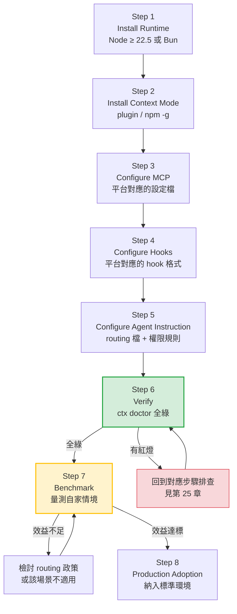
```mermaid
flowchart TD
    S1["Step 1<br/>Install Runtime<br/>Node ≥ 22.5 或 Bun"]
    S2["Step 2<br/>Install Context Mode<br/>plugin / npm -g"]
    S3["Step 3<br/>Configure MCP<br/>平台對應的設定檔"]
    S4["Step 4<br/>Configure Hooks<br/>平台對應的 hook 格式"]
    S5["Step 5<br/>Configure Agent Instruction<br/>routing 檔 + 權限規則"]
    S6["Step 6<br/>Verify<br/>ctx doctor 全綠"]
    S7["Step 7<br/>Benchmark<br/>量測自家情境"]
    S8["Step 8<br/>Production Adoption<br/>納入標準環境"]

    S1 --> S2 --> S3 --> S4 --> S5 --> S6
    S6 -->|"有紅燈"| Fix["回到對應步驟排查<br/>見第 25 章"]
    Fix --> S6
    S6 -->|"全綠"| S7
    S7 -->|"效益不足"| Review["檢討 routing 政策<br/>或該場景不適用"]
    Review --> S7
    S7 -->|"效益達標"| S8

    style S6 fill:#d4edda,stroke:#28a745,stroke-width:2px
    style S7 fill:#fff3cd,stroke:#ffc107,stroke-width:2px
    style Fix fill:#f8d7da,stroke:#dc3545
```

**各步驟的驗收標準**：

| Step | 動作 | 驗收標準 |
| --- | --- | --- |
| 1 | 安裝 runtime | `node --version` ≥ v22.5.0（或 `bun --version` 有回應） |
| 2 | 安裝 Context Mode | `context-mode --version` 有回應 |
| 3 | 設定 MCP | 平台的 MCP 清單中看得到 `context-mode` 且狀態為已連線 |
| 4 | 設定 Hooks | `context-mode doctor` 顯示 hooks configured |
| 5 | 設定 instruction | routing 檔已就位；`permissions` 規則已套用 |
| 6 | 驗證 | `ctx doctor` **全部 `[x]`** |
| 7 | Benchmark | 依 [第 26 章](#第-26-章-企業自建-benchmark) 跑至少 3 個自家情境 |
| 8 | 正式採用 | 納入新人 onboarding 與環境自檢腳本 |

### 14.2 四層設定策略

> **[Enterprise Recommendation]** 企業環境的設定會散落在很多地方，建議明確劃分為四層，並規定「什麼東西放哪一層」：

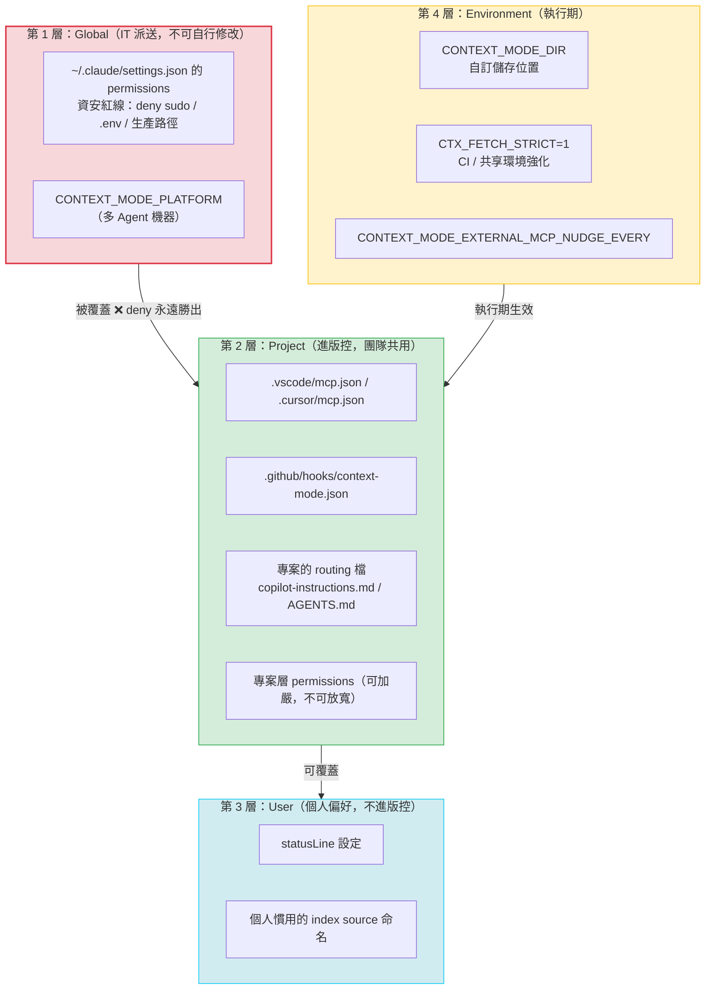
```mermaid
flowchart TD
    subgraph L1["第 1 層：Global（IT 派送，不可自行修改）"]
        G1["~/.claude/settings.json 的 permissions<br/>資安紅線：deny sudo / .env / 生產路徑"]
        G2["CONTEXT_MODE_PLATFORM（多 Agent 機器）"]
    end

    subgraph L2["第 2 層：Project（進版控，團隊共用）"]
        P1[".vscode/mcp.json / .cursor/mcp.json"]
        P2[".github/hooks/context-mode.json"]
        P3["專案的 routing 檔<br/>copilot-instructions.md / AGENTS.md"]
        P4["專案層 permissions（可加嚴，不可放寬）"]
    end

    subgraph L3["第 3 層：User（個人偏好，不進版控）"]
        U1["statusLine 設定"]
        U2["個人慣用的 index source 命名"]
    end

    subgraph L4["第 4 層：Environment（執行期）"]
        E1["CONTEXT_MODE_DIR<br/>自訂儲存位置"]
        E2["CTX_FETCH_STRICT=1<br/>CI / 共享環境強化"]
        E3["CONTEXT_MODE_EXTERNAL_MCP_NUDGE_EVERY"]
    end

    L1 -->|"被覆蓋 ❌ deny 永遠勝出"| L2
    L2 -->|"可覆蓋"| L3
    L4 -->|"執行期生效"| L2

    style L1 fill:#f8d7da,stroke:#dc3545,stroke-width:2px
    style L2 fill:#d4edda,stroke:#28a745
    style L3 fill:#d1ecf1,stroke:#0dcaf0
    style L4 fill:#fff3cd,stroke:#ffc107
```

**分層原則** [Enterprise Recommendation]：

| 層級 | 誰負責 | 放什麼 | 不放什麼 |
| --- | --- | --- | --- |
| **Global** | IT / 資安 | 資安紅線（deny 規則）、平台釘選 | 專案特定設定 |
| **Project** | 開發團隊，**進版控** | MCP 設定、hook 設定、routing 檔、專案層權限 | 個人偏好、密鑰 |
| **User** | 個人 | 狀態列、UI 偏好 | 會影響他人的設定 |
| **Environment** | CI / 執行環境 | 儲存路徑、strict 模式 | 長期設定 |

> **[Official]** 權限規則的合併語意：**deny 永遠勝過 allow；更具體（專案層）的規則覆蓋全域規則**。這代表專案**可以加嚴，但不能放寬** IT 訂的 deny 規則——這正是企業要的行為。

### 14.3 環境變數完整清單

> **[Official]** v1.0.169 的官方環境變數：

| 變數 | 預設值 | 用途 | 企業建議 |
| --- | --- | --- | --- |
| `CONTEXT_MODE_DIR` | adapter 預設（如 `~/.claude/context-mode`） | 儲存根目錄。**必須絕對路徑**、**不展開 `~`**、空白視同未設定。v1.0.147+ | 若公司規定 AI 產出資料須落在特定磁碟，用這個 |
| `CTX_FETCH_STRICT` | 未設定 | 設為 `1` 時，**額外封鎖 loopback + RFC1918 + ULA** | **CI / 共享環境必設**；開發者本機不設（否則無法抓內網文件） |
| `CONTEXT_MODE_PLATFORM` | 自動偵測 | 強制指定平台 | **多 Agent 機器必設** |
| `CONTEXT_MODE_EXTERNAL_MCP_NUDGE_EVERY` | `10` | 每隔幾次工具呼叫重新注入「大型 external MCP payload 請包 `ctx_execute`」提示。範圍 1–100，無效值回退 10 | MCP 密集的團隊（Jira/Slack/Notion）可調到 5；設 1 最積極但每次多約 250 tokens |

**Windows 設定範例（PowerShell，使用者層級永久生效）**：

```powershell
[Environment]::SetEnvironmentVariable("CONTEXT_MODE_DIR", "D:\ai\context-mode", "User")
[Environment]::SetEnvironmentVariable("CONTEXT_MODE_PLATFORM", "copilot-cli", "User")
# 驗證
$env:CONTEXT_MODE_DIR
```

**Linux / macOS（`~/.bashrc` 或 `~/.zshrc`）**：

```bash
export CONTEXT_MODE_DIR="/opt/ai/context-mode"
export CONTEXT_MODE_PLATFORM="claude-code"
```

**CI 環境（GitHub Actions 範例）**：

```yaml
env:
  CTX_FETCH_STRICT: "1"          # 封鎖內網與 loopback
  CONTEXT_MODE_DIR: "/tmp/ctx"   # 容器內暫存，隨 job 結束消失
```

### 14.4 企業部署架構

> **[AI Analysis] [Enterprise Recommendation]** 這一節要非常小心，因為**很容易出現錯誤的架構想像**。

#### 14.4.1 正確的架構：Developer Local

```text
Developer PC / 開發容器
 ├── Claude Code / Copilot / Codex / Cursor
 ├── Context Mode（本機執行）
 │    ├── Sandbox subprocess（本機）
 │    └── SQLite（本機檔案系統）
 └── Project Repository（本機 clone）
```

**Context Mode 的設計就是本機執行的**。它不是 server，沒有多租戶概念，SQLite 是單機檔案。

#### 14.4.2 錯誤的架構想像（請勿這樣設計）

```text
❌ 錯誤：
Developer A ─┐
Developer B ─┼──→ 共用的 Context Mode Server ──→ 中央知識庫
Developer C ─┘
```

**為什麼不行** [AI Analysis]：

| 理由 | 說明 |
| --- | --- |
| **架構上不支援** | Context Mode 是 stdio MCP server + 本機 SQLite，沒有多使用者隔離機制 |
| **Sandbox 會共用** | `ctx_execute` 執行任意程式碼並繼承 process 權限。共用等於所有人共用一個執行環境 |
| **Session 會混淆** | Session DB 是 per-project 的，不是 per-user |
| **ELv2 授權禁止** | 見 [22.4](#224-elv2-授權對企業架構的實質限制) |

#### 14.4.3 企業真正該集中的東西

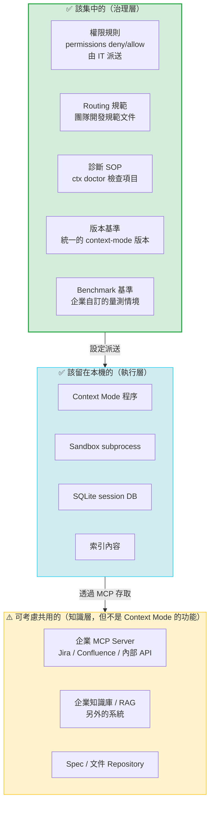
```mermaid
flowchart TD
    subgraph Central["✅ 該集中的（治理層）"]
        C1["權限規則<br/>permissions deny/allow<br/>由 IT 派送"]
        C2["Routing 規範<br/>團隊開發規範文件"]
        C3["診斷 SOP<br/>ctx doctor 檢查項目"]
        C4["版本基準<br/>統一的 context-mode 版本"]
        C5["Benchmark 基準<br/>企業自訂的量測情境"]
    end

    subgraph Local["✅ 該留在本機的（執行層）"]
        L1["Context Mode 程序"]
        L2["Sandbox subprocess"]
        L3["SQLite session DB"]
        L4["索引內容"]
    end

    subgraph Shared["⚠️ 可考慮共用的（知識層，但不是 Context Mode 的功能）"]
        S1["企業 MCP Server<br/>Jira / Confluence / 內部 API"]
        S2["企業知識庫 / RAG<br/>另外的系統"]
        S3["Spec / 文件 Repository"]
    end

    Central -->|"設定派送"| Local
    Local -->|"透過 MCP 存取"| Shared

    style Central fill:#d4edda,stroke:#28a745,stroke-width:2px
    style Local fill:#d1ecf1,stroke:#0dcaf0
    style Shared fill:#fff3cd,stroke:#ffc107
```

> **[Enterprise Recommendation] 一句話總結**：
> **集中「治理」，分散「執行」，知識共用交給企業 MCP / RAG，不要交給 Context Mode。**

#### 14.4.4 安全邊界

| 邊界 | 誰負責 | 說明 |
| --- | --- | --- |
| 開發者能執行什麼指令 | `permissions.deny/allow`（Global 層） | 由 IT 統一派送 |
| Sandbox 能讀哪些檔案 | 專案根目錄圍籬 + `permissions.allow` | 預設只能讀專案內 |
| Sandbox 能連哪些網路 | `CTX_FETCH_STRICT` | 共享環境設 `1` |
| SQLite 存了什麼 | **企業自行稽核** | 見 [第 23 章](#第-23-章-資料分類與安全治理) |
| 是否有資料外流 | **企業自行驗證**（特別是 `ctx_insight`） | 見 [23.3](#233-ctx_insight-與-insight-platform-的企業處理原則) |

### 14.5 本章實務案例

**情境**：某金控要把 Context Mode 納入標準開發環境，IT 部門需要設計派送機制。

**最終方案**：

```text
【1. Global 層 —— 由 IT 用 MDM / 群組原則派送】

檔案：%USERPROFILE%\.claude\settings.json
內容：
{
  "permissions": {
    "deny": [
      "Bash(sudo *)",
      "Bash(rm -rf /*)",
      "Read(.env)",
      "Read(**/.env*)",
      "Read(**/*secret*)",
      "Read(**/*credential*)",
      "Bash(*prod*)",
      "Bash(kubectl * -n prod*)"
    ],
    "allow": [
      "Bash(git:*)",
      "Bash(mvn:*)",
      "Bash(npm:*)"
    ]
  },
  "statusLine": {
    "type": "command",
    "command": "context-mode statusline"
  }
}

環境變數（使用者層級）：
  CONTEXT_MODE_DIR = D:\ai\context-mode
  （公司規定 AI 相關資料不得放在 C 槽使用者目錄）

【2. Project 層 —— 放進每個專案的 repo】

.vscode/mcp.json
.github/hooks/context-mode.json
.github/copilot-instructions.md（含 routing 段落）

由架構團隊維護一份範本 repo，新專案直接繼承

【3. 環境自檢腳本 —— 開機時執行】

scripts/ai-env-check.ps1：
  1. node --version 是否 >= 22.5
  2. context-mode --version 是否為公司基準版本
  3. context-mode doctor 是否全綠
  4. 檢查殘留的 node 孤兒程序（Windows 已知問題）
  5. 結果寫入 IT 的監控系統

【4. 明確禁止事項 —— 寫入資安規範】

  - 禁止使用 ctx_insight（hosted dashboard，資料流向未驗證）
  - 禁止對生產環境資料執行 ctx_index
  - 禁止放寬 Global 層的 deny 規則
```

**這個案例的三個設計重點**：

1. **deny 規則涵蓋 `*prod*`**，從源頭阻擋對生產環境的操作
2. **`CONTEXT_MODE_DIR` 遷離 C 槽**，符合公司的資料落地規範
3. **環境自檢腳本補上 fail-open 的盲點**，讓 IT 能主動發現壞掉的安裝

### 14.6 本章注意事項

1. **Context Mode 是本機工具，不要設計成共用 server**。
2. **該集中的是治理（權限、規範、版本基準），不是執行**。
3. **`CONTEXT_MODE_DIR` 必須絕對路徑且不展開 `~`**。
4. **`CTX_FETCH_STRICT=1` 會封鎖內網**，開發者本機不要設，CI 要設。
5. **專案層可以加嚴權限但不能放寬 deny**，這是設計出來的行為。
6. **fail-open 需要主動自檢**，把 `ctx doctor` 納入環境檢查腳本。

### 14.7 本章檢查清單

- [ ] 八步驟安裝流程已文件化，並有明確驗收標準
- [ ] 四層設定策略已定義，團隊知道什麼放哪一層
- [ ] Global 層的 `permissions` 規則已由 IT 派送
- [ ] 專案層設定檔已進版控，新專案可繼承
- [ ] 多 Agent 機器已設定 `CONTEXT_MODE_PLATFORM`
- [ ] CI 環境已設定 `CTX_FETCH_STRICT=1`
- [ ] 環境自檢腳本已建立並排程執行
- [ ] 已明確禁止 `ctx_insight`（或已完成資料流向驗證）
- [ ] 團隊知道 Context Mode 不是中央服務

---

# Part 4 工具實戰篇

> **本 Part 的目標**：讓開發者拿到手冊就能直接抄範例來用。每個工具都用相同的七段格式：**目的 / 適用情境 / 輸入 / 輸出 / 範例 / 最佳實務 / 常見錯誤**。

---

<details>
<summary><strong>本 Part 章節導覽</strong>（點擊展開）</summary>

- [第 15 章 11 個 MCP Tools 完整教學](#第-15-章-11-個-mcp-tools-完整教學)
  - [15.0 工具選用決策樹](#150-工具選用決策樹)
  - [15.1 `ctx_execute`](#151-ctx_execute)
  - [15.2 `ctx_execute_file`](#152-ctx_execute_file)
  - [15.3 `ctx_batch_execute`](#153-ctx_batch_execute)
  - [15.4 `ctx_index`](#154-ctx_index)
  - [15.5 `ctx_search`](#155-ctx_search)
  - [15.6 `ctx_fetch_and_index`](#156-ctx_fetch_and_index)
  - [15.7 `ctx_stats`](#157-ctx_stats)
  - [15.8 `ctx_doctor`](#158-ctx_doctor)
  - [15.9 `ctx_upgrade`](#159-ctx_upgrade)
  - [15.10 `ctx_purge`](#1510-ctx_purge)
  - [15.11 `ctx_insight`](#1511-ctx_insight)
  - [15.12 安全機制：三道防線](#1512-安全機制三道防線)
  - [15.13 Utility Commands 速查](#1513-utility-commands-速查)
  - [15.14 本章實務案例](#1514-本章實務案例)
  - [15.15 本章注意事項](#1515-本章注意事項)
  - [15.16 本章檢查清單](#1516-本章檢查清單)
- [第 16 章 AI Agent Prompt 標準](#第-16-章-ai-agent-prompt-標準)
  - [16.1 通用基礎 Prompt](#161-通用基礎-prompt)
  - [16.2 Web Development Prompt](#162-web-development-prompt)
  - [16.3 Reverse Engineering Prompt](#163-reverse-engineering-prompt)
  - [16.4 Framework Upgrade Prompt](#164-framework-upgrade-prompt)
  - [16.5 Debug Prompt](#165-debug-prompt)
  - [16.6 Log Analysis Prompt](#166-log-analysis-prompt)
  - [16.7 Security Review Prompt](#167-security-review-prompt)
  - [16.8 Performance Analysis Prompt](#168-performance-analysis-prompt)
  - [16.9 本章實務案例](#169-本章實務案例)
  - [16.10 本章注意事項](#1610-本章注意事項)
  - [16.11 本章檢查清單](#1611-本章檢查清單)

</details>

## 第 15 章 11 個 MCP Tools 完整教學

### 15.0 工具選用決策樹

> **[Official]** 這張圖整理自官方 SKILL 的 Decision Tree，是全章最實用的一頁。

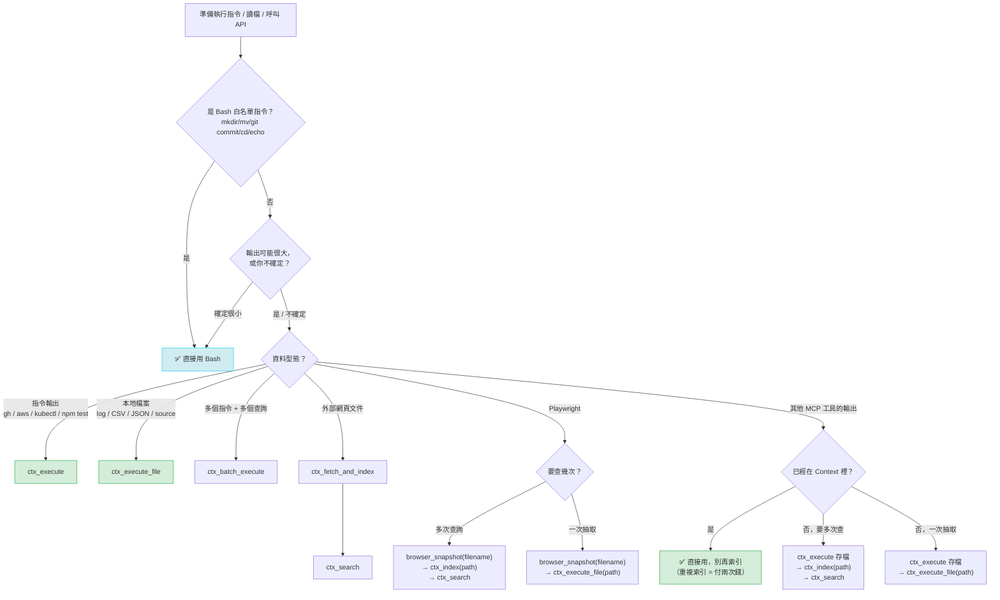
```mermaid
flowchart TD
    Start["準備執行指令 / 讀檔 / 呼叫 API"] --> W{"是 Bash 白名單指令？<br/>mkdir/mv/git commit/cd/echo"}

    W -->|"是"| Bash["✅ 直接用 Bash"]
    W -->|"否"| Big{"輸出可能很大，<br/>或你不確定？"}

    Big -->|"是 / 不確定"| Type{"資料型態？"}
    Big -->|"確定很小"| Bash

    Type -->|"指令輸出<br/>gh / aws / kubectl / npm test"| E["ctx_execute"]
    Type -->|"本地檔案<br/>log / CSV / JSON / source"| EF["ctx_execute_file"]
    Type -->|"多個指令 + 多個查詢"| BE["ctx_batch_execute"]
    Type -->|"外部網頁文件"| FI["ctx_fetch_and_index"]
    Type -->|"Playwright"| PW{"要查幾次？"}
    Type -->|"其他 MCP 工具的輸出"| MCP{"已經在 Context 裡？"}

    PW -->|"多次查詢"| PWA["browser_snapshot(filename)<br/>→ ctx_index(path)<br/>→ ctx_search"]
    PW -->|"一次抽取"| PWB["browser_snapshot(filename)<br/>→ ctx_execute_file(path)"]

    MCP -->|"是"| Direct["✅ 直接用，別再索引<br/>（重複索引 = 付兩次錢）"]
    MCP -->|"否，要多次查"| Save["ctx_execute 存檔<br/>→ ctx_index(path)<br/>→ ctx_search"]
    MCP -->|"否，一次抽取"| Save2["ctx_execute 存檔<br/>→ ctx_execute_file(path)"]

    FI --> S["ctx_search"]

    style Bash fill:#d1ecf1,stroke:#0dcaf0
    style Direct fill:#d4edda,stroke:#28a745
    style E fill:#d4edda,stroke:#28a745
    style EF fill:#d4edda,stroke:#28a745
```

### 15.1 `ctx_execute`

#### 目的

在獨立 subprocess 中執行程式碼，**只有 stdout 進入 Context**。 [Official]

#### 適用情境

| 情境 | 例子 |
| --- | --- |
| 呼叫 API endpoint | `fetch('http://localhost:3000/api/orders')` |
| 執行會回傳資料的 CLI | `gh pr list`、`aws s3 ls`、`kubectl get pods` |
| 跑測試 | `npm test`、`pytest`、`mvn test`、`go test ./...` |
| Git 查詢操作 | `git log --oneline -50`、`git diff HEAD~5` |
| Docker / K8s 檢視 | `docker stats --no-stream`、`kubectl describe pod` |

#### 輸入

| 參數 | 說明 |
| --- | --- |
| `language` | 12 選 1：`javascript`、`typescript`、`python`、`shell`、`ruby`、`go`、`rust`、`php`、`perl`、`r`、`elixir`、`csharp` |
| `code` | 要執行的程式碼 |
| `intent`（建議） | 描述你要找什麼。輸出 > 5 KB 時會啟動 intent-driven filtering |

#### 輸出

腳本的 **stdout**。依輸出大小有三段行為 [Official]：

| stdout 大小 | 行為 |
| --- | --- |
| ≤ 5 KB | 原樣回傳 |
| > 5 KB 且有 `intent` | 索引後依 intent 回傳「命中片段 + 可搜尋詞彙表」 |
| **> 100 KB** | **自動外部化**：完整索引進 FTS5，Context 只收到 pointer，需以 `ctx_search` 取回（見 [6.6](#66-large-output-externalization大型輸出外部化)） |

> **⚠️ 不要把外部化當成偷懶的藉口。** 它是保護網，不是策略——真正該做的是在腳本裡先聚合，
> 讓 stdout 一開始就只有結論。

#### 範例

**範例 1：偵測 API 回傳的資料異常**（官方範例）

```javascript
const resp = await fetch('http://localhost:3000/api/orders');
const { orders } = await resp.json();

const bugs = [];
const negQty = orders.filter(o => o.quantity < 0);
if (negQty.length) bugs.push(`Negative qty: ${negQty.map(o => o.id).join(', ')}`);

const nullFields = orders.filter(o => !o.product || !o.customer);
if (nullFields.length) bugs.push(`Null fields: ${nullFields.map(o => o.id).join(', ')}`);

console.log(`${orders.length} orders, ${bugs.length} bugs found:`);
bugs.forEach(b => console.log(`- ${b}`));
```

**範例 2：Maven 專案的相依性衝突盤點**（企業場景）

```python
import subprocess, re, collections

out = subprocess.run(["mvn", "-q", "dependency:tree", "-Dverbose"],
                     capture_output=True, text=True).stdout

# 抓出所有 omitted for conflict 的項目
conflicts = re.findall(r"omitted for conflict with ([\d.]+)\)[^\n]*", out)
lines = [l for l in out.split("\n") if "omitted for conflict" in l]

groups = collections.defaultdict(set)
for l in lines:
    m = re.search(r"([\w.\-]+):([\w.\-]+):jar:([\d.]+)", l)
    if m:
        groups[f"{m.group(1)}:{m.group(2)}"].add(m.group(3))

print(f"共發現 {len(lines)} 處版本衝突，涉及 {len(groups)} 個 artifact：")
for art, vers in sorted(groups.items(), key=lambda x: -len(x[1]))[:15]:
    print(f"  {art}: {', '.join(sorted(vers))}")
```

**傳統做法**：`mvn dependency:tree` 輸出數千行全部進 Context。
**這個做法**：約 1 KB 的衝突清單進 Context。

**範例 3：查 GitHub PR 狀態**（官方範例）

```shell
gh pr list --json number,title,state,reviewDecision \
  --jq '.[] | "\(.number) [\(.state)] \(.title) — \(.reviewDecision // "no review")"'
```

#### 最佳實務

1. **一定要 `console.log` / `print`**，沒輸出等於白做
2. **寫分析程式，不是傾印程式**
3. **輸出要具體**：印出 ID、行號、確切數值
4. **盡量帶 `intent`**，免費的安全網
5. **選對語言**：API/JSON → `javascript`；資料統計 → `python`；pipe 串接 → `shell`

#### 常見錯誤

| 錯誤 | 為什麼錯 | 正確做法 |
| --- | --- | --- |
| `console.log(JSON.stringify(data))` | 只是搬資料，Context 一樣爆 | 先分析，只印結論 |
| `cat huge.log \| head -100` | 上游截斷，索引看不到被丟掉的部分 | 讓腳本處理全量，用 intent 收斂 |
| 忘記 `print` | stdout 是唯一出口 | 每個分支都要有輸出 |
| 依賴上一次呼叫的變數 | 每次是獨立 process | 需要跨呼叫就寫檔案 |
| 用 `csharp` / `go` 寫簡單分析 | 啟動成本高、runtime 未必存在 | 用 `python` / `shell` |

---

### 15.2 `ctx_execute_file`

#### 目的

在 sandbox 內處理**本地檔案**，原始內容永不進入 Context。 [Official]

#### 適用情境

| 情境 | 例子 |
| --- | --- |
| 讀 log 檔 | access.log、error.log、build output |
| 讀資料檔 | CSV、JSON、YAML、XML |
| 讀原始碼做分析 | 統計函式數量、找出樣式、抽取指標 |
| 處理已存檔的大型輸出 | Playwright snapshot、API response dump |

#### 輸入

| 參數 | 說明 |
| --- | --- |
| `path` | 檔案路徑。**受專案根目錄圍籬保護** |
| `language` | 同 `ctx_execute` |
| `code` | 程式碼。檔案內容**已預先載入在 `FILE_CONTENT` 變數中** |
| `intent`（建議） | 同 `ctx_execute` |

#### 輸出

stdout。官方 benchmark：45 KB 的 access log → 155 B。 [Benchmark]

#### 範例

**範例 1：解析大型 JSON**（官方範例）

```python
# FILE_CONTENT 由 ctx_execute_file 預先載入
import json
data = json.loads(FILE_CONTENT)
print(f"Records: {len(data)}")
# ... 分析並印出發現
```

**範例 2：Nginx access log 的錯誤分析**（企業場景）

```python
import re, collections
from datetime import datetime

lines = FILE_CONTENT.strip().split("\n")
pat = re.compile(r'(\S+) .* \[([^\]]+)\] "(\w+) (\S+)[^"]*" (\d{3}) (\d+)')

total = 0
by_status = collections.Counter()
err_by_path = collections.Counter()
err_by_ip = collections.Counter()
err_by_hour = collections.Counter()

for l in lines:
    m = pat.search(l)
    if not m:
        continue
    total += 1
    ip, ts, method, path, status, size = m.groups()
    by_status[status[0] + "xx"] += 1
    if status.startswith("5"):
        err_by_path[f"{method} {path.split('?')[0]}"] += 1
        err_by_ip[ip] += 1
        err_by_hour[ts[12:14]] += 1

print(f"總請求 {total} 筆")
print("狀態碼分布：", dict(by_status))
print(f"\n5xx 共 {by_status['5xx']} 筆，Top 5 路徑：")
for p, c in err_by_path.most_common(5):
    print(f"  {c:5d}  {p}")
print(f"\n來源 IP Top 3：{err_by_ip.most_common(3)}")
print(f"時段分布：{sorted(err_by_hour.items())}")
```

**範例 3：Java 原始碼的執行緒安全掃描**（企業場景）

```python
import re

is_spring_bean = bool(re.search(r"@(Service|Component|Repository|Controller|RestController)", FILE_CONTENT))
static_sdf = re.findall(r"(?:private|public|protected)?\s+static\s+.*SimpleDateFormat\s+(\w+)", FILE_CONTENT)
local_sdf  = len(re.findall(r"new\s+SimpleDateFormat", FILE_CONTENT))

if is_spring_bean and static_sdf:
    print(f"🔴 高風險：Spring singleton + static SimpleDateFormat → {static_sdf}")
elif static_sdf:
    print(f"🟡 中風險：static SimpleDateFormat（非 Spring bean）→ {static_sdf}")
elif local_sdf:
    print(f"🟢 低風險：{local_sdf} 處 method-local SimpleDateFormat")
else:
    print("✅ 未使用 SimpleDateFormat")
```

#### 最佳實務

1. **記住 `FILE_CONTENT` 已經載好了**，不要在程式碼裡再開檔
2. **要「編輯」的檔案不要用這個**，用一般的 Read / Edit 工具
3. 搭配 `ctx_execute` 先把大型輸出存檔，再用這個處理

#### 常見錯誤

| 錯誤 | 說明 |
| --- | --- |
| 在程式碼裡 `open(path)` 再讀一次 | 多餘，`FILE_CONTENT` 已載入 |
| 用它來修改檔案 | 定位錯誤，它是分析工具 |
| 讀專案外的路徑 | **會被 `File access blocked` 拒絕**（見 15.12） |

---

### 15.3 `ctx_batch_execute`

#### 目的

在**一次呼叫**中執行多個指令 + 多個查詢。 [Official]

#### 適用情境

- 需要同時蒐集多個面向的資訊（例如專案盤點：git 統計 + 相依性 + 測試覆蓋率 + TODO 數）
- 避免多次 round trip（每次 round trip 都有固定的工具定義與回傳格式成本）
- `ctx_search` 被節流後的替代路徑

#### 輸入

| 參數 | 說明 |
| --- | --- |
| 指令 / 查詢清單 | 多個要執行的項目 |
| `concurrency` | **選用，1–8**。適用於 I/O bound 的批次 |

#### 輸出

各項目的結果彙整。官方 benchmark：986 KB → 62 KB（94% 節省）[Benchmark]。

#### 範例（企業場景：新專案接手的第一次盤點）

```text
ctx_batch_execute([
  { language: "shell", code: "git log --oneline | wc -l && git shortlog -sn | head -10" },
  { language: "shell", code: "find src -name '*.java' | wc -l && find src -name '*Test.java' | wc -l" },
  { language: "shell", code: "mvn -q dependency:tree | grep -c 'omitted for conflict'" },
  { language: "shell", code: "grep -rn 'TODO\\|FIXME\\|XXX' src --include='*.java' | wc -l" },
  { language: "shell", code: "find . -name 'application*.yml' -o -name 'application*.properties' | head -20" }
], concurrency: 5)
```

一次呼叫拿到：commit 數、主要貢獻者、程式碼與測試檔數量、相依衝突數、技術債數量、設定檔位置。

#### 最佳實務

1. **`concurrency` 只對 I/O bound 有意義**（網路、磁碟），CPU bound 反而更慢
2. **每個項目仍要各自 print 結論**
3. 當 `ctx_search` 被節流時，改用它批次查詢

#### 常見錯誤

> **[Community] 已知 issue**：`ctx_batch_execute` 的 timeout **不會涵蓋 indexing / search 階段**，導致 Agent 可能**掛住數小時**。

| 錯誤 | 因應 |
| --- | --- |
| 在 batch 中放入超大量索引工作 | 拆成多次，避免觸發已知的 hang 問題 |
| `concurrency` 開到 8 跑 CPU 密集任務 | 改用 1–2，或不開 |
| **[Community]** Claude Code plan mode 下被封鎖 | 已知 issue（#851 annotations），plan mode 改用 `ctx_execute` |

---

### 15.4 `ctx_index`

#### 目的

把 Markdown 內容依標題切塊，索引進 SQLite FTS5（BM25 排名）。 [Official]

#### 適用情境

- 已存檔的大型輸出（Playwright snapshot、API dump）需要**多次查詢**
- 本地文件目錄要變成可搜尋的知識庫
- 規格書、設計文件需要反覆查閱

#### 輸入

| 參數 | 說明 |
| --- | --- |
| `path` | **首選**。檔案或目錄路徑，**server 端讀取**，不經過 Context |
| `content` | **僅限小段自己寫的文字**。大資料用這個會讓成本加倍 |
| `source` | 來源標籤，用於後續 `ctx_search` 的範圍限定 |

#### 輸出

確認訊息，約 40–80 B。官方 benchmark：60 KB → 40 B [Benchmark]。

#### 範例

```text
# 索引 Playwright snapshot
ctx_index(path: "D:/tmp/playwright-snapshot.md", source: "Playwright snapshot")

# 索引整個文件目錄
ctx_index(path: "./docs/architecture", source: "project:payment-arch")

# CLI 版本
context-mode index . --source project:my-app
```

#### 最佳實務

1. **永遠用 `path`，不要用 `content` 傳大資料**（官方最高優先的規則之一）
2. **一定要給 `source`**，否則後續搜尋會跨來源污染
3. `source` 命名建議用階層式：`project:<專案>`、`vendor:<套件>`、`snapshot:<日期>`

#### 常見錯誤

| 錯誤 | 成本 |
| --- | --- |
| `ctx_index(content: <135K 的 snapshot>)` | **270K tokens（加倍）** |
| 把已經在 Context 裡的 MCP 輸出再索引 | 付兩次錢 |
| 不給 `source` | 搜尋結果混雜多份文件，品質下降 |

---

### 15.5 `ctx_search`

#### 目的

查詢已索引內容，回傳相關片段。 [Official]

#### 輸入

| 參數 | 說明 |
| --- | --- |
| `queries` | **陣列**。把所有問題一次問完 |
| `source` | 限定來源。**支援部分比對**：`source: "Node"` 命中 `"Node.js v22 CHANGELOG"` |
| `contentType`（選用） | 過濾結果型態，例如 `code` 或 `prose` |

#### 輸出

命中的內容片段，**程式碼區塊完整保留**。

#### 範例

```text
✅ 正確：一次批次查完
ctx_search(
  queries: ["transform pipe", "refine superRefine", "coerce codec"],
  source: "Zod"
)

✅ 只要程式碼範例
ctx_search(
  queries: ["useEffect cleanup"],
  source: "React",
  contentType: "code"
)

❌ 錯誤：連續呼叫三次
ctx_search(query: "transform pipe")
ctx_search(query: "refine superRefine")
ctx_search(query: "coerce codec")
```

#### 最佳實務

> **[Official]** 官方 SKILL 的四條查詢策略：

1. **BM25 是 OR 語意**，命中越多詞排越前，不用刻意組 AND
2. **每個 query 用 2–4 個具體技術詞**，不要寫成一整句問句
3. **多份文件並存時一定加 `source`**
4. **一定用 `queries` 陣列批次查詢**

#### 常見錯誤

| 錯誤 | 後果 |
| --- | --- |
| 連續多次單獨呼叫 | **第 9 次會被封鎖**（progressive throttling） |
| 查詢寫成自然語言長句 | BM25 是關鍵字檢索，效果差 |
| 不給 `source` | 跨來源污染 |
| 期待語意檢索 | FTS5 是關鍵字檢索，「怎麼處理錯誤」不如「exception handler @ControllerAdvice」 |

---

### 15.6 `ctx_fetch_and_index`

#### 目的

抓 URL → 轉 Markdown → 切塊 → 索引。**原始頁面永不進 Context**。 [Official]

#### 輸入

| 參數 | 說明 |
| --- | --- |
| `url` 或 `requests` | 單一 URL，或 `requests: [{url, source}, ...]` 多 URL |
| `concurrency` | **1–8**，多 URL 平行抓取 |
| `ttl` | 快取有效期（**毫秒**）。預設 24 小時 |
| `force` | `true` 略過快取 |
| `source` | 來源標籤 |

#### 輸出

確認訊息（約 40 B）。快取命中時回傳約 0.3 KB 的 cache hint [Official]。

#### 範例（企業場景：Spring Boot 升級調研）

```text
ctx_fetch_and_index(
  requests: [
    { url: "https://github.com/spring-projects/spring-boot/wiki/Spring-Boot-3.3-Release-Notes",
      source: "SpringBoot 3.3" },
    { url: "https://github.com/spring-projects/spring-boot/wiki/Spring-Boot-3.4-Release-Notes",
      source: "SpringBoot 3.4" }
  ],
  concurrency: 2,
  ttl: 604800000        // 7 天（release notes 不會變）
)

然後：
ctx_search(
  queries: ["deprecated removed", "breaking change", "configuration property rename"],
  source: "SpringBoot"
)
```

> **[Official] GitHub 專案的小技巧**：用 raw URL 直接抓原始 Markdown，避免 HTML 轉換的雜訊：
> `https://raw.githubusercontent.com/org/repo/main/CHANGELOG.md`

#### 最佳實務

1. **外部套件文件一律用這個**，官方明確禁止對「你不擁有的套件」用 `cat` 或本地路徑
2. **TTL 依內容穩定度調整**（見 [6.5](#65-ttl-cache)）
3. **多 URL 一次抓完**，用 `requests` + `concurrency`

#### 常見錯誤

| 錯誤 | 說明 |
| --- | --- |
| 用 `WebFetch` 抓文件 | 整頁進 Context |
| TTL 設太長查到過期資訊 | CHANGELOG 類設短一點 |
| 在 `CTX_FETCH_STRICT=1` 環境抓內網 | 會被封鎖（這是預期行為） |

---

### 15.7 `ctx_stats`

#### 目的

顯示 Context 節省量、呼叫次數、session 統計。 [Official]

#### 範例

```text
# 在任何 AI session 中
ctx stats

# Claude Code slash command
/context-mode:ctx-stats
```

#### 輸出內容 [Official]

- 逐工具的節省細項
- Token 消耗
- 節省比例
- **快取效能另外列出**：命中次數、避免的資料量、省下的網路請求

#### 最佳實務與重要警告

> **[Official]** `ctx_stats` 是**唯讀**的。它不會重設或清除任何東西。要刪除索引請用 `ctx_purge(confirm: true)`。

> **[Community] [AI Analysis] 企業必讀**：`ctx_stats` 的數字**是觀測值，不是帳單金額**。官方 open issue 中就有回報：
>
> - per-chat 的「kept out」（2.7 MB）**超過**全專案總計（868 KB）
> - **零 `ctx_execute` 呼叫的 session 顯示 100% savings**
>
> **不要把 `ctx_stats` 的數字直接寫進企業 KPI 報告。** 請用 [第 26 章](#第-26-章-企業自建-benchmark) 的方法自行量測。

---

### 15.8 `ctx_doctor`

#### 目的

診斷安裝狀態：runtime、hooks、FTS5、版本、plugin 註冊。 [Official]

#### 範例

```bash
# CLI
context-mode doctor

# AI session
ctx doctor

# Claude Code
/context-mode:ctx-doctor
```

#### 企業使用標準

見 [24.3 診斷 SOP](#243-ctx-doctor--ctx-stats-診斷-sop)。

#### 最重要的一句話

> **[Official]** 「`ctx stats` proves the plugin MCP server is installed and reachable; **it does not prove hooks are trusted or running**.」
>
> **驗證安裝，只能用 `ctx doctor`。**

---

### 15.9 `ctx_upgrade`

#### 目的

從 GitHub 更新、重建、重新設定 hook。 [Official]

#### 範例

```bash
context-mode upgrade

# 指定平台（多 Agent 機器）
CONTEXT_MODE_PLATFORM=copilot-cli context-mode upgrade
```

#### 它會做什麼 [Official]

- 拉最新版、重建
- **修復 / 寫入 hook 設定檔**
- 遷移快取
- **移除 OpenCode / KiloCode 的 legacy `mcp.context-mode` 項目**（保留其他 MCP server）

#### 常見錯誤

| 錯誤 | 說明 |
| --- | --- |
| 以為它會註冊 MCP server | **Copilot CLI 上它只寫 hooks 檔**，MCP 要用 `copilot mcp add` |
| 升級後不重跑 `ctx doctor` | fail-open 讓你不會發現 hook 壞了 |

---

### 15.10 `ctx_purge`

#### 目的

**永久刪除**知識庫中所有索引內容。 [Official]

#### 範例

```text
ctx_purge(confirm: true)
```

#### ⚠️ 警告

- **不可復原**
- 刪除的是**索引內容**（`<root>/content`）
- 需要 `confirm: true`

#### 企業使用時機 [Enterprise Recommendation]

| 時機 | 說明 |
| --- | --- |
| **誤索引敏感資料後** | **第一時間執行**，這是資安事件的標準處置 |
| 專案結束交接前 | 清除專案相關索引 |
| 磁碟空間不足 | 見 [25.10](#問題-10sqlite--cache-太大) |
| 索引資料明顯過期 | 重新索引前先清 |

> **[Enterprise Recommendation]** 建議把「誤索引 production 資料 → 立即 `ctx_purge(confirm: true)` → 通報資安」寫進事件處理程序。

---

### 15.11 `ctx_insight`

#### 目的

開啟 hosted Insight dashboard（[context-mode.com/insight](https://context-mode.com/insight)）。官方描述為「org analytics for AI-assisted engineering teams」。 [Official]

這是全部 11 個工具中**唯一會離開本機**的一個，也是唯一屬於**付費商業方案**（Organization tier，
每席 USD 20／月）的功能。其餘 10 個工具完全在本機運作。

#### 它提供什麼 [Official]

- 角色別儀表板（CTO／工程主管／個別開發者／資安／財務與 DevOps）
- 生產性 session 比率、團隊 retry waste、行為樣態
- **FinOps 成本歸因**：per-model 支出、context-mode 節省量、net ROI（見 [第 31 章](#第-31-章-token-成本可視化與-finops-歸因)）

#### 傳送什麼、不傳送什麼 [Official]

| 會傳送 | 不會傳送 |
| --- | --- |
| 工具名稱、**檔案路徑**、錯誤計數等結構化事件 | 原始碼、prompt 內容、檔案內容 |

#### ⚠️ 企業處理原則

> **[Enterprise Recommendation] 預設停用。** 啟用前須完成路徑命名風險評估與 DPA 簽署；
> 金融業建議維持禁用。

> **最容易被忽略的一點**：官方不傳送檔案「內容」，但**會傳送檔案「路徑」**。
> 如果你的 repo 目錄以客戶名或案件代號命名，路徑本身就是敏感資訊。

完整判讀與分級處置見 [可信度標示制度的落差三](#三個必須先知道的落差-ai-analysis)
與 [23.3](#233-ctx_insight-與-insight-platform-的企業處理原則)。

---

### 15.12 安全機制：三道防線

> **[Official]** 這三道防線是企業資安審查的重點，必須理解。

#### 防線一：權限規則繼承

Context Mode **把你現有的權限規則延伸到 MCP sandbox**。如果你擋了 `sudo`，那麼 `ctx_execute`、`ctx_execute_file`、`ctx_batch_execute` 裡面**也擋**。

```json
{
  "permissions": {
    "deny": ["Bash(sudo *)", "Bash(rm -rf /*)", "Read(.env)", "Read(**/.env*)"],
    "allow": ["Bash(git:*)", "Bash(npm:*)"]
  }
}
```

- 放在 `.claude/settings.json`（專案）或 `~/.claude/settings.json`（全域）
- **所有平台都讀這個格式**，包含 Gemini CLI、VS Code Copilot、OpenCode
- **Codex 需要 hooks 設定好**才會執行安全強制
- **零設定時不啟用**

#### 防線二：專案邊界圍籬

> **[Official]** `ctx_execute_file` **被限制在專案根目錄內**。以下情況會被 `File access blocked` 拒絕：

- 絕對路徑指向專案外（如 `/home/user/secrets`）
- `../../` 路徑穿越
- 專案內的 symlink 指向專案外

**這道防線的來歷**（[#852](https://github.com/mksglu/context-mode/issues/852)）很值得企業理解：

```text
攻擊路徑：
  1. Agent 想讀專案外的檔案 → host sandbox 拒絕
  2. Agent 改用 MCP sandbox 重試
  3. host 的 MCP 核准提示「看不到工具的輸入參數」
     → 核准者根本不知道它要讀哪個檔案
  4. 繞過成功

修補：在 MCP 層自己做圍籬，預設開啟，不需設定
```

**要刻意開放專案外路徑**（例如 `/var/log` 的共用 log）：

```json
{
  "permissions": {
    "allow": ["Read(/var/log/**)"]
  }
}
```

> **[Official]** 用的是**跟 host `Read` 工具同一條 allow 規則**，**沒有 context-mode 專屬的環境變數開關**。這是刻意設計：授權集中在一個地方。

> **[Official] 但要注意防線的極限**：`ctx_execute` 與 `ctx_batch_execute` **執行任意程式碼，仍繼承 process 的檔案系統存取權**。圍籬是給**檔案讀取工具**的縱深防禦，**不是完整的 OS sandbox**。
>
> **核准任何執行工具 = 核准執行任意程式碼。請保持 host 層級沙箱開啟。**

#### 防線三：網路抓取強化

> **[Official]** `ctx_fetch_and_index` 預設封鎖：

| 類型 | 封鎖內容 |
| --- | --- |
| **Scheme** | 只允許 `http:` / `https:`（封鎖 `file://`、`gopher://`、`javascript:`、`data:`） |
| **Cloud metadata + link-local** | `169.254.0.0/16`（含 AWS/GCP/Azure IMDS 的 `169.254.169.254`）**即使 hostname 解析到該位址也擋**（DNS rebinding 防護） |
| **Multicast / reserved** | `224.0.0.0/4`、`0.0.0.0/8`、IPv6 `ff00::/8`、`fe80::/10` |
| **Loopback + RFC1918** | `localhost`、`127.x`、`10.x`、`172.16-31.x`、`192.168.x`、IPv6 `::1`、`fc00::/7` —— **預設允許**，讓本地開發與內網抓取可用 |

**在 hosted / CI 環境要連內網也擋**：

```bash
export CTX_FETCH_STRICT=1
```

#### 附加：憑證遮罩

> **[Official]** 任何 `mcp__*` 工具呼叫的 `tool_input` 在寫入 session DB 前會被遮罩。`hooks/posttooluse.mjs` 的正則會把以下欄位（大小寫、連字號／底線不敏感）換成 `[REDACTED]`：
>
> `authorization`、`auth_token`、`access_token`、`refresh_token`、`bearer`、`token`、`secret`、`password`、`passwd`、`pwd`、`api_key` / `apikey` / `x_api_key`、`cookie` / `set-cookie`、`signature`、`private_key`、`client_secret`

> **[Enterprise Recommendation]** 這個清單很完整，但**只涵蓋 MCP 工具參數**。它**不會**遮罩：
>
> - 你的腳本 `print` 出來的內容
> - 被索引的檔案內容
> - 非 MCP 工具的輸出
>
> 企業仍需自行建立資料分類與遮罩規範，見 [第 23 章](#第-23-章-資料分類與安全治理)。

### 15.13 Utility Commands 速查

> **[Official]**

**在任何 AI session 中輸入**（模型會自動呼叫對應的 MCP 工具）：

```text
ctx stats       → Context 節省統計、呼叫次數、session 報告
ctx doctor      → 診斷 runtime、hooks、FTS5、版本
ctx index       → 索引本地檔案或目錄
ctx search      → 搜尋已索引內容
ctx upgrade     → 更新、重建、重設 hook
ctx purge       → 永久刪除所有索引內容
ctx insight     → 開啟 hosted dashboard（企業建議停用）
```

**從終端機直接執行**：

```bash
context-mode doctor
context-mode index . --source project:my-app
context-mode search "authentication middleware" --source project:my-app
context-mode upgrade
context-mode insight
bash scripts/ctx-debug.sh        # 完整診斷報告（回報 bug 用）
```

> **[Official]** `ctx-debug.sh` 會收集：OS 資訊、runtime 版本、better-sqlite3 狀態、adapter 偵測結果、設定檔（**已遮罩**）、hook 驗證、FTS5/SQLite 測試、executor 測試、程序檢查、session 資料庫、環境變數，輸出成一份可直接貼上的 Markdown 報告。

**Slash Commands（只有 Claude Code）**：`/ctx-stats`、`/ctx-doctor`、`/ctx-index`、`/ctx-search`、`/ctx-upgrade`、`/ctx-purge`、`/ctx-insight`

### 15.14 本章實務案例

**情境**：開發者要為一個 5,000 檔案的專案做「架構健檢」，需要：模組相依關係、循環相依、過大的類別、缺測試的模組。

**錯誤做法**（會爆 Context）：

```text
1. Read 每個 package-info.java
2. Read 每個 pom.xml
3. glob 所有 *Test.java 再逐一 Read
→ 第 50 個檔案就撐不住了
```

**正確做法**（一次 `ctx_batch_execute`）：

```text
ctx_batch_execute([
  {
    language: "python",
    intent: "找出循環相依",
    code: '''
import os, re, collections
deps = collections.defaultdict(set)
for root, _, files in os.walk("src/main/java"):
    for f in files:
        if not f.endswith(".java"): continue
        p = os.path.join(root, f)
        src = open(p, encoding="utf-8", errors="ignore").read()
        m = re.search(r"^package\\s+([\\w.]+)", src, re.M)
        if not m: continue
        pkg = m.group(1)
        for imp in re.findall(r"^import\\s+(com\\.mycompany\\.[\\w.]+)", src, re.M):
            target = ".".join(imp.split(".")[:-1])
            if target != pkg: deps[pkg].add(target)

cycles = [(a, b) for a in deps for b in deps[a] if a in deps.get(b, ())]
print(f"套件數 {len(deps)}，相依邊 {sum(len(v) for v in deps.values())}")
print(f"循環相依 {len(cycles)} 組：")
for a, b in sorted(set(map(lambda x: tuple(sorted(x)), cycles)))[:10]:
    print(f"  {a} <-> {b}")
    '''
  },
  {
    language: "shell",
    intent: "找出過大的類別",
    code: "find src/main/java -name '*.java' -exec wc -l {} + | sort -rn | head -15"
  },
  {
    language: "shell",
    intent: "找出缺少測試的模組",
    code: '''
for d in src/main/java/com/mycompany/*/; do
  n=$(basename "$d")
  m=$(find "$d" -name '*.java' | wc -l)
  t=$(find src/test/java/com/mycompany/"$n" -name '*Test.java' 2>/dev/null | wc -l)
  echo "$n: 主程式 $m / 測試 $t"
done | awk -F'[:/ ]+' '$NF == 0 || $(NF-2) / ($NF + 1) > 5'
    '''
  }
], concurrency: 3)
```

**結果**：一次呼叫，約 2 KB 進 Context，涵蓋 5,000 個檔案的三個面向分析。

**而且**：這三段腳本可以直接存成 repo 裡的 `scripts/arch-health.sh`，變成團隊資產與 CI 檢查項目。

### 15.15 本章注意事項

1. **`ctx_index` 永遠用 `path`，不要用 `content` 傳大資料**。
2. **`ctx_search` 一定用 `queries` 陣列**，不然會被節流。
3. **`ctx_stats` 的數字不能當 KPI**，有已知的計算 bug。
4. **`ctx_doctor` 是唯一可信的驗證方式**。
5. **`ctx_purge` 不可復原**，但誤索引敏感資料時要立刻用。
6. **`ctx_insight` 企業預設停用**。
7. **三道防線不等於 OS sandbox**，`ctx_execute` 仍可執行任意程式碼。
8. **憑證遮罩只涵蓋 MCP 工具參數**，不涵蓋腳本輸出與索引內容。

### 15.16 本章檢查清單

- [ ] 我知道 11 個工具各自的用途與適用情境
- [ ] 我會用決策樹判斷該用哪個工具
- [ ] 我知道 `ctx_index(content:)` 的成本陷阱
- [ ] 我會用 `queries` 陣列批次搜尋
- [ ] 我知道 `ctx_stats` 不能當 KPI，要用自建 benchmark
- [ ] 我知道三道安全防線的範圍與極限
- [ ] 我知道誤索引敏感資料時要立刻 `ctx_purge`
- [ ] 我知道 `ctx-debug.sh` 可以產生完整診斷報告

---

## 第 16 章 AI Agent Prompt 標準

> **本章的價值** [Enterprise Recommendation]：把 Context Mode 的使用方式寫成標準 prompt，貼進 `CLAUDE.md` / `AGENTS.md` / `copilot-instructions.md`，讓全團隊的 Agent 行為一致。

### 16.1 通用基礎 Prompt

> 適用於所有平台。放進專案的 routing 指令檔。

```text
## Context Mode 使用規範

你正在使用 Context Mode。在分析任何大型資料之前，請依序判斷：

1. 判斷資料量：這個操作的輸出可能超過 20 行嗎？不確定就當作「會」。
2. 優先使用 ctx_search：如果資料已經索引過，先搜尋，不要重新取得。
3. 優先使用 ctx_execute / ctx_execute_file：需要分析時，寫腳本讓程式算，
   不要把原始資料讀進 Context 後用人工方式判讀。
4. 優先使用 ctx_batch_execute：需要多個面向的資訊時，一次呼叫問完，
   不要連續發多個請求。
5. 避免把完整原始輸出載入 Context：
   - 絕不使用 ctx_index(content: <大資料>)，一律用 ctx_index(path: ...)
   - Playwright 工具一律帶 filename 參數
   - 已經在 Context 裡的 MCP 輸出，直接使用，不要重複索引
6. 只取得與當前任務相關的證據：搜尋時給 2-4 個具體技術詞，
   多份文件並存時一定帶 source 參數。
7. 如果真的需要完整資料，請先說明原因再取得。

### 撰寫分析腳本的紀律
- 一定要 console.log / print 你的發現，stdout 是唯一會進入 Context 的東西
- 寫「分析程式」不是「傾印程式」：先算出結論，再輸出
- 輸出要具體：印出 ID、行號、確切數值，不要只印數量
- 不要在腳本裡先用 head / tail 截斷資料
- 要「編輯」的檔案請用一般的 Read / Edit 工具，Context Mode 只負責分析
```

### 16.2 Web Development Prompt

```text
## Web 開發時的 Context Mode 使用方式

### 前端
- 檢視頁面結構：browser_snapshot(filename) → ctx_execute_file(path)
- 需要多次查詢同一個頁面：browser_snapshot(filename) → ctx_index(path) → ctx_search
- Console / Network 檢查：browser_console_messages(level:"error", filename) → ctx_execute_file
- 注意：browser_navigate 會自動回傳 snapshot，請忽略它，另外呼叫 browser_snapshot

### 後端
- 打 API 驗證：ctx_execute（javascript + fetch），在腳本內驗證回應結構、
  檢查欄位缺漏、數值合理性，只印出異常項目
- 跑測試：ctx_execute 執行測試指令，解析結果，只印出失敗案例與原因
- 查 log：ctx_execute_file，全量掃描後印出統計與異常樣態

### 資料庫
- Schema 分析：ctx_execute 執行查詢並在腳本內彙整，
  不要把整份 schema dump 進 Context
- 慢查詢分析：ctx_execute_file 處理 slow query log，依耗時分組

### 第三方文件
- 一律使用 ctx_fetch_and_index，不要用 WebFetch
- GitHub 專案用 raw URL：https://raw.githubusercontent.com/org/repo/main/xxx.md
```

### 16.3 Reverse Engineering Prompt

```text
## Legacy 系統逆向工程的 Context Mode 使用方式

嚴格禁止：Read all source code。

請依下列順序進行：

【階段 1：盤點（不讀內容，只統計）】
用 ctx_batch_execute 一次取得：
  - 檔案數量與副檔名分布
  - 程式碼行數分布（找出最大的 20 個檔案）
  - 進入點（main、Controller、Servlet、Form、批次排程）
  - 設定檔位置（*.config、*.properties、*.ini、web.xml）
  - 外部依賴徵兆（DB 連線字串樣式、FTP、MQ、WebService URL）

【階段 2：索引】
用 ctx_index 把以下內容建成可搜尋知識庫：
  - 所有設定檔
  - 所有 SQL / Stored Procedure
  - 所有介面定義檔
  各自給不同的 source 標籤

【階段 3：針對性搜尋】
用 ctx_search 依主題查詢，不要逐檔閱讀：
  - 「交易 commit rollback」找交易邊界
  - 「connection pool timeout」找連線設定
  - 「schedule cron batch」找排程

【階段 4：程式化分析】
用 ctx_execute 寫腳本產生：
  - 呼叫關係圖（誰呼叫誰）
  - 資料表使用矩陣（哪個模組動哪張表）
  - 死碼清單（沒有任何呼叫者的函式）

【階段 5：產出】
根據前四階段的「結論」（不是原始碼）撰寫：
  - 系統架構圖
  - 功能清單
  - 資料流
  - 需求規格書

只有在需要「引用具體實作細節」時，才讀取特定檔案的特定區段。
```

### 16.4 Framework Upgrade Prompt

```text
## Framework 升級的 Context Mode 使用方式

【步驟 1：索引官方升級資訊】
ctx_fetch_and_index(
  requests: [
    { url: "<目標版本的 release notes>", source: "<框架> <版本>" },
    { url: "<migration guide>",          source: "<框架> Migration" },
    { url: "<raw CHANGELOG URL>",        source: "<框架> CHANGELOG" }
  ],
  concurrency: 3,
  ttl: 604800000
)

【步驟 2：查 breaking changes】
ctx_search(
  queries: ["breaking change removed", "deprecated replacement",
            "configuration property rename", "minimum version requirement"],
  source: "<框架>"
)

【步驟 3：分析現有程式碼的受影響範圍】
ctx_execute 寫腳本，針對步驟 2 找到的每個 breaking change，
掃描專案原始碼，統計：
  - 受影響的檔案數量
  - 受影響的具體位置（檔名 + 行號）
  - 風險等級

【步驟 4：分析相依性】
ctx_execute 執行 mvn dependency:tree / npm ls，
在腳本內找出：
  - 版本衝突
  - 與目標版本不相容的套件
  - 需要一併升級的傳遞相依

【步驟 5：產出遷移報告】
根據前四步的結論產生報告，包含：
  - 必須修改的項目（含檔案與行號）
  - 建議修改的項目
  - 可延後的項目
  - 預估工時

全程不要把完整的 release notes 或 dependency tree 讀進 Context。
```

### 16.5 Debug Prompt

```text
## Debug 時的 Context Mode 使用方式

【禁止】
- 不要把完整的 stack trace 檔案 cat 進 Context
- 不要逐一 Read 呼叫鏈上的每個檔案

【建議流程】
1. 先用 ctx_execute_file 分析 log，找出：
   - 錯誤的確切訊息與發生次數
   - 第一次發生的時間
   - 是否有前置的警告
   - 相關的 request id / trace id

2. 用 ctx_execute 執行 git log / git blame，找出：
   - 相關檔案最近的修改
   - 修改者與 commit message

3. 用 ctx_search 查已索引的框架文件，找出：
   - 這個錯誤訊息的官方說明
   - 已知的常見原因

4. 只有在確定範圍後，才用 Read 讀取具體的問題程式碼

5. 修好之後用 ctx_execute 跑測試驗證，只印出結果摘要
```

### 16.6 Log Analysis Prompt

```text
## Log 分析的 Context Mode 使用方式

絕對不要把 log 檔案內容直接讀進 Context，不論大小。

【標準流程】
ctx_execute_file(path: <log 檔>, language: "python", intent: <你要找什麼>, code: 分析腳本)

分析腳本至少要輸出：
  1. 總筆數與時間範圍
  2. 依嚴重度分組的計數（ERROR / WARN / INFO）
  3. Top N 的錯誤訊息樣態（用正則正規化掉變動的 ID / 時間）
  4. 時間分布（找出是否集中在特定時段）
  5. 具體的證據樣本（最多 3-5 筆完整的原始 log 行）

【多個 log 檔】
用 ctx_batch_execute 一次處理，不要一個一個來

【超大 log（> 1 GB）】
先用 shell 依時間範圍切出需要的區段到暫存檔，
再用 ctx_execute_file 分析那個區段。
切分本身也在 ctx_execute 裡做，不要在 Context 裡。
```

### 16.7 Security Review Prompt

```text
## Security Review 的 Context Mode 使用方式

【重要前提】
Context Mode 不是 security scanner。它負責處理掃描工具的大量輸出，
實際的弱點偵測仍由 SAST / DAST / SCA 工具負責。

【標準流程】
1. 用 ctx_execute 執行掃描工具，在腳本內做風險過濾：
   - npm audit --json → 只印出 high / critical，含套件名、版本、CVE、修復版本
   - mvn dependency-check → 只印出 CVSS >= 7.0 的項目
   不要把完整的掃描報告印出來

2. 用 ctx_fetch_and_index 索引相關的 CVE 說明，再用 ctx_search 查細節

3. 用 ctx_execute 掃描原始碼中的風險樣態：
   - 硬編碼的憑證樣式
   - SQL 字串拼接
   - 未經驗證的重導向
   只印出檔名 + 行號 + 樣態，不要印出實際內容
   （避免把可能的 secret 帶進 Context）

【絕對禁止】
- 不要索引 production 資料
- 不要把含有真實憑證的設定檔索引進知識庫
- 若不慎索引，立即執行 ctx_purge(confirm: true) 並通報資安
```

### 16.8 Performance Analysis Prompt

```text
## 效能分析的 Context Mode 使用方式

1. APM / Profiler 輸出 → ctx_execute_file
   在腳本內找出 Top N 熱點，只印出方法名、耗時、呼叫次數

2. 慢查詢分析 → ctx_execute_file 處理 slow query log
   正規化 SQL（把參數換成 ?），依樣態分組統計總耗時

3. 壓測結果（JMeter / k6）→ ctx_execute_file
   只印出：TPS、P50/P90/P99、錯誤率、瓶頸時間點

4. GC log → ctx_execute_file
   統計 GC 次數、暫停時間分布、是否有 Full GC

5. 容器資源 → ctx_execute 執行 kubectl top / docker stats
   在腳本內比對 limit 與實際用量，只印出超標項目

原則：效能分析的原始資料通常是數萬行的數值，
這正是「該用程式算、不該用模型讀」的典型場景。
```

### 16.9 本章實務案例

**情境**：某團隊發現不同開發者用 Context Mode 的效果差很多——有人省 90%，有人只省 30%。

**調查發現**：

```text
省 90% 的開發者：
  - 習慣先寫分析腳本
  - 一次 batch 問完多個問題
  - 會帶 intent 參數

省 30% 的開發者：
  - 用 ctx_execute 但只是把指令包一層，沒有分析
    例：ctx_execute("shell", "kubectl get pods -A")
        → 還是把完整輸出印出來了
  - 連續多次 ctx_search
  - 不帶 source，搜尋品質差就再搜一次
```

**根因**：**工具會用，但方法論沒建立**。

**解法**：把 [16.1](#161-通用基礎-prompt) 的標準 prompt 放進專案的 `copilot-instructions.md`，並加上一條具體的反例：

```text
### 錯誤示範（請勿模仿）
ctx_execute("shell", "kubectl get pods -A")
→ 這只是把指令包一層，完整輸出照樣進 Context

### 正確示範
ctx_execute("shell", `
kubectl get pods -A -o json | jq -r '
  .items[] |
  select(.status.phase != "Running") |
  "\\(.metadata.namespace)/\\(.metadata.name): \\(.status.phase)"
'
echo "---"
kubectl get pods -A --no-headers | wc -l | xargs echo "總 Pod 數:"
`)
→ 只印出異常的 pod 與總數
```

**成效**：兩週後全團隊的平均節省率從 52% 提升到 81%。

> **[Enterprise Recommendation]** 這個案例的教訓：**Context Mode 的效果 60% 取決於使用方法，只有 40% 取決於安裝設定**。導入時的教育訓練投資，回報率比技術設定高。

### 16.10 本章注意事項

1. **Prompt 要放在會被自動載入的檔案裡**（`CLAUDE.md` / `AGENTS.md` / `copilot-instructions.md`），不是口頭交代。
2. **IDE 版 Copilot 沒有 UserPromptSubmit**，更要依賴 instruction 檔。
3. **不要在 prompt 裡寫「請簡短回答」**，會傷害推理品質。
4. **標準 prompt 要附反例**，光講正確做法效果有限。
5. **Security Review 的 prompt 要特別強調「不印出實際內容」**，避免 secret 進 Context。

### 16.11 本章檢查清單

- [ ] 團隊的 routing 指令檔已包含通用基礎 Prompt
- [ ] 針對團隊主要工作型態，已有對應的專用 Prompt
- [ ] Prompt 中含有具體的錯誤示範
- [ ] Prompt 中沒有「請簡短回答」這類指令
- [ ] Security Review Prompt 已包含敏感資料處理規範
- [ ] 新人 onboarding 包含 Prompt 使用教學

---

# Part 5 開發情境實戰篇

> **本 Part 的目標**：把前面的概念落到真實的企業開發場景。三個完整案例（Web 開發 / 逆向工程 / Framework 升級）加上七個專項情境。
>
> 每個案例都遵循同一條資料流：
>
> ```text
> User Request → AI Agent → Context Mode → Tool → Sandbox
>   → Index / Search → Relevant Evidence → AI Reasoning → Output
> ```

---

<details>
<summary><strong>本 Part 章節導覽</strong>（點擊展開）</summary>

- [第 17 章 Web Application 開發實戰](#第-17-章-web-application-開發實戰)
  - [17.1 完整案例 A：從零開始開發企業 Web Application](#171-完整案例-a從零開始開發企業-web-application)
  - [17.2 Context Mode 在各階段的介入點](#172-context-mode-在各階段的介入點)
  - [17.3 階段一：Requirement（需求）](#173-階段一requirement需求)
  - [17.4 階段二：Architecture（架構）](#174-階段二architecture架構)
  - [17.5 階段三：Frontend（前端）](#175-階段三frontend前端)
  - [17.6 階段四：Backend（後端）](#176-階段四backend後端)
  - [17.7 階段五：Database（資料庫）](#177-階段五database資料庫)
  - [17.8 階段六至八：Test / Security / Deployment](#178-階段六至八test--security--deployment)
  - [17.9 本章實務案例：完整的資料流追蹤](#179-本章實務案例完整的資料流追蹤)
  - [17.10 本章注意事項](#1710-本章注意事項)
  - [17.11 本章檢查清單](#1711-本章檢查清單)
- [第 18 章 Legacy System 逆向工程](#第-18-章-legacy-system-逆向工程)
  - [18.1 完整案例 B：從 Legacy 系統產生系統規格](#181-完整案例-b從-legacy-系統產生系統規格)
  - [18.2 為什麼「Read all source code」行不通](#182-為什麼read-all-source-code行不通)
  - [18.3 五階段逆向工程流程](#183-五階段逆向工程流程)
  - [18.4 階段一：盤點（不讀內容）](#184-階段一盤點不讀內容)
  - [18.5 階段二：索引](#185-階段二索引)
  - [18.6 階段三：針對性搜尋](#186-階段三針對性搜尋)
  - [18.7 階段四：程式化分析](#187-階段四程式化分析)
  - [18.8 階段五：產出](#188-階段五產出)
  - [18.9 只有這些時候才讀原始碼](#189-只有這些時候才讀原始碼)
  - [18.10 本章實務案例：一個真實的發現](#1810-本章實務案例一個真實的發現)
  - [18.11 本章注意事項](#1811-本章注意事項)
  - [18.12 本章檢查清單](#1812-本章檢查清單)
- [第 19 章 Framework Upgrade](#第-19-章-framework-upgrade)
  - [19.1 完整案例 C：Spring Boot / Java 版本升級](#191-完整案例-cspring-boot--java-版本升級)
  - [19.2 升級流程](#192-升級流程)
  - [19.3 步驟一：索引官方升級資訊](#193-步驟一索引官方升級資訊)
  - [19.4 步驟二：查 Breaking Changes](#194-步驟二查-breaking-changes)
  - [19.5 步驟三：分析受影響範圍](#195-步驟三分析受影響範圍)
  - [19.6 步驟四：相依性分析](#196-步驟四相依性分析)
  - [19.7 步驟五至六：建置與測試](#197-步驟五至六建置與測試)
  - [19.8 步驟七：遷移報告](#198-步驟七遷移報告)
  - [19.9 其他升級情境的對應做法](#199-其他升級情境的對應做法)
  - [19.10 本章注意事項](#1910-本章注意事項)
  - [19.11 本章檢查清單](#1911-本章檢查清單)
- [第 20 章 大型 Repository、Log 與基礎設施分析](#第-20-章-大型-repositorylog-與基礎設施分析)
  - [20.1 大型 Repository 分析](#201-大型-repository-分析)
  - [20.2 Log Analysis](#202-log-analysis)
  - [20.3 API / HTML / Browser Analysis](#203-api--html--browser-analysis)
  - [20.4 Git / GitHub 分析](#204-git--github-分析)
  - [20.5 Docker / Kubernetes 分析](#205-docker--kubernetes-分析)
  - [20.6 本章實務案例](#206-本章實務案例)
  - [20.7 本章注意事項](#207-本章注意事項)
  - [20.8 本章檢查清單](#208-本章檢查清單)
- [第 21 章 測試、安全與相依性稽核](#第-21-章-測試安全與相依性稽核)
  - [21.1 Testing](#211-testing)
  - [21.2 Security / Dependency Audit](#212-security--dependency-audit)
  - [21.3 本章實務案例](#213-本章實務案例-1)
  - [21.4 本章注意事項](#214-本章注意事項-1)
  - [21.5 本章檢查清單](#215-本章檢查清單-1)

</details>

## 第 17 章 Web Application 開發實戰

### 17.1 完整案例 A：從零開始開發企業 Web Application

**專案設定**：某產險公司的「線上投保平台」

- 前端：Vue 3 + TypeScript
- 後端：Spring Boot 3.4 + Java 21
- 資料庫：PostgreSQL 16
- 團隊：1 PM、1 SA、4 開發、1 QA、1 DevOps

### 17.2 Context Mode 在各階段的介入點

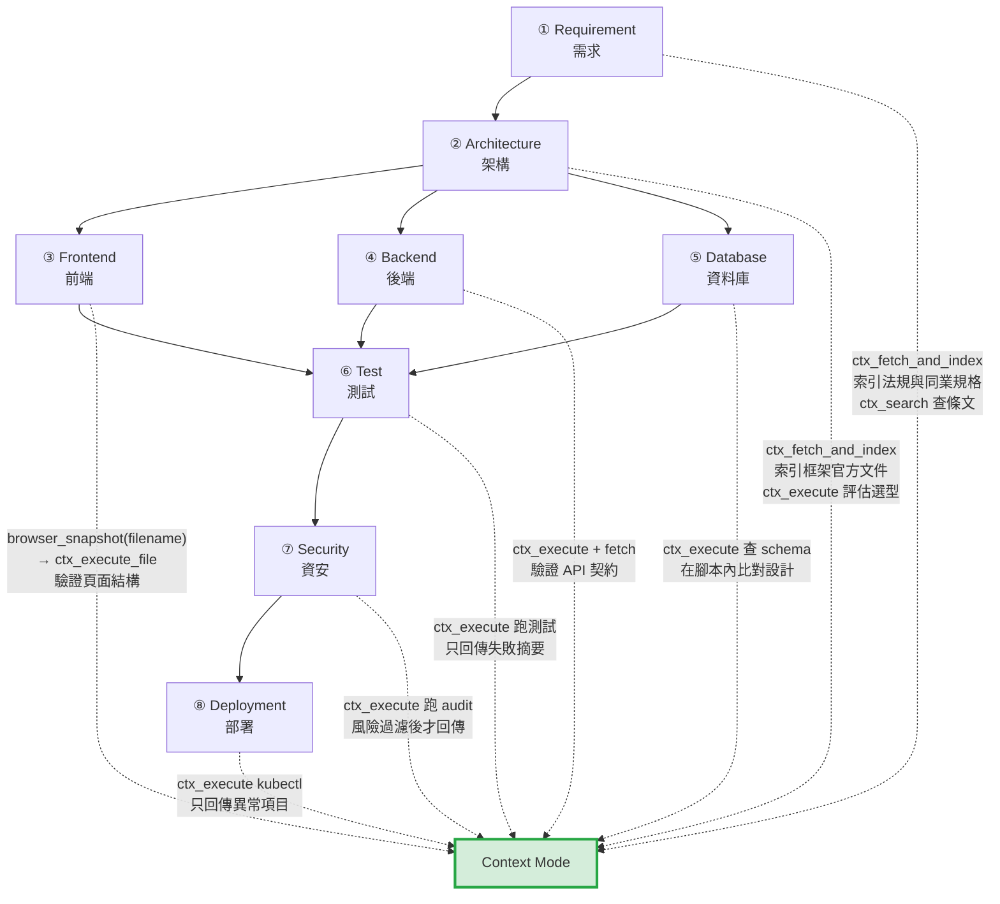
```mermaid
flowchart TD
    R["① Requirement<br/>需求"] --> A["② Architecture<br/>架構"]
    A --> F["③ Frontend<br/>前端"]
    A --> B["④ Backend<br/>後端"]
    A --> D["⑤ Database<br/>資料庫"]
    F --> T["⑥ Test<br/>測試"]
    B --> T
    D --> T
    T --> S["⑦ Security<br/>資安"]
    S --> DP["⑧ Deployment<br/>部署"]

    R -.->|"ctx_fetch_and_index<br/>索引法規與同業規格<br/>ctx_search 查條文"| CM1["Context Mode"]
    A -.->|"ctx_fetch_and_index<br/>索引框架官方文件<br/>ctx_execute 評估選型"| CM1
    F -.->|"browser_snapshot(filename)<br/>→ ctx_execute_file<br/>驗證頁面結構"| CM1
    B -.->|"ctx_execute + fetch<br/>驗證 API 契約"| CM1
    D -.->|"ctx_execute 查 schema<br/>在腳本內比對設計"| CM1
    T -.->|"ctx_execute 跑測試<br/>只回傳失敗摘要"| CM1
    S -.->|"ctx_execute 跑 audit<br/>風險過濾後才回傳"| CM1
    DP -.->|"ctx_execute kubectl<br/>只回傳異常項目"| CM1

    style CM1 fill:#d4edda,stroke:#28a745,stroke-width:3px
```

### 17.3 階段一：Requirement（需求）

**PM 的任務**：把「線上投保」的法規要求與同業做法整理成需求清單。

**傳統做法的問題**：金管會的保險業相關函令、示範條款動輒數十頁 PDF / HTML，全部貼進 Context 會直接塞滿。

**Context Mode 做法**：

```text
步驟 1：索引法規文件
ctx_fetch_and_index(
  requests: [
    { url: "<主管機關線上投保相關規定頁面>", source: "法規:線上投保" },
    { url: "<個資法施行細則相關頁面>",       source: "法規:個資" },
    { url: "<電子簽章法相關頁面>",           source: "法規:電子簽章" }
  ],
  concurrency: 3,
  ttl: 2592000000        // 30 天，法規不常變
)

步驟 2：針對性查詢
ctx_search(
  queries: ["身分驗證 要式 核保", "保費收取 信用卡 授權",
            "契約撤銷權 期間 通知", "個人資料 蒐集 告知"],
  source: "法規"
)
→ 只有命中的條文段落進 Context（約 4 KB）

步驟 3：產出需求清單
AI 根據命中的條文，產出：
  - 必要功能清單（含法規依據）
  - 必要的告知與同意畫面
  - 資料保存年限要求
```

**效益**：PM 不需要自己讀完所有法規，也不需要把法規全文塞進 AI。**而且索引留著，後續開發過程中任何人都能查**。

> **[Enterprise Recommendation]** 法規、契約、規格書這類「需要精確引用條文」的內容，正是 FTS5 關鍵字檢索的強項（比語意檢索更準確，不會「差不多就命中」）。

### 17.4 階段二：Architecture（架構）

**SA 的任務**：確認 Spring Boot 3.4 + Java 21 的技術選型細節。

```text
步驟 1：索引官方文件
ctx_fetch_and_index(
  requests: [
    { url: "https://raw.githubusercontent.com/spring-projects/spring-boot/main/README.md",
      source: "SpringBoot" },
    { url: "<Spring Security 6 官方文件>", source: "SpringSecurity" },
    { url: "<Vue 3 官方文件>",             source: "Vue3" }
  ],
  concurrency: 3
)

步驟 2：查關鍵決策點
ctx_search(
  queries: ["virtual thread configuration", "JWT resource server",
            "problem details RFC 7807", "graceful shutdown"],
  source: "SpringBoot"
)

步驟 3：驗證假設（實際跑一次）
ctx_execute("shell", `
  # 用 Spring Initializr 產一個測試專案驗證版本組合
  curl -s https://start.spring.io/metadata/client | \\
    jq -r '.bootVersion.values[] | select(.id | startswith("3.4")) | .id' | head -5
  echo "---"
  java -version 2>&1 | head -1
  mvn -version 2>&1 | head -1
`)
```

### 17.5 階段三：Frontend（前端）

**開發者的任務**：驗證投保表單的欄位與驗證規則是否符合設計。

```text
❌ 傳統做法：
browser_snapshot() → 56 KB accessibility tree 進 Context
→ 模型「肉眼」比對，容易漏

✅ Context Mode 做法：
步驟 1：browser_navigate("http://localhost:5173/apply")
        （忽略它自動回傳的 snapshot）

步驟 2：browser_snapshot(filename: "D:/tmp/apply-form.md")
        → 約 50 B 確認訊息

步驟 3：ctx_execute_file(
  path: "D:/tmp/apply-form.md",
  language: "python",
  intent: "比對表單欄位與設計規格",
  code: '''
import re

# 設計規格要求的欄位
spec = {
    "姓名": "textbox", "身分證字號": "textbox", "出生日期": "textbox",
    "手機": "textbox", "email": "textbox", "地址": "textbox",
    "投保金額": "combobox", "受益人": "textbox",
    "同意條款": "checkbox", "同意個資": "checkbox"
}

found = {}
for line in FILE_CONTENT.split("\\n"):
    m = re.search(r'- (\\w+) "([^"]+)"', line)
    if m:
        found[m.group(2)] = m.group(1)

missing = [k for k in spec if not any(k in f for f in found)]
wrong = [(k, spec[k], found.get(k)) for k in spec
         if any(k in f for f in found) and spec[k] not in str(found)]

print(f"規格要求 {len(spec)} 個欄位，頁面找到 {len(found)} 個互動元素")
print(f"缺少：{missing if missing else '無'}")
print(f"型態不符：{wrong if wrong else '無'}")

# 無障礙檢查
no_label = [l.strip() for l in FILE_CONTENT.split("\\n")
            if re.search(r"- (textbox|combobox|checkbox)", l) and '"' not in l]
print(f"缺少可及名稱的元素：{len(no_label)} 個")
for n in no_label[:5]:
    print("  " + n)
  '''
)
→ 約 500 B 進 Context，涵蓋完整的 56 KB snapshot
```

### 17.6 階段四：Backend（後端）

**開發者的任務**：驗證 API 契約與實際實作是否一致。

```text
ctx_execute("javascript", `
const BASE = 'http://localhost:8080';
const token = process.env.TEST_JWT;   // 憑證透傳，不進 Context

const cases = [
  { name: '建立投保申請', method: 'POST', path: '/api/v1/applications',
    body: { productCode: 'TRV001', insuredAmount: 1000000 },
    expectStatus: 201, expectFields: ['applicationId', 'status', 'createdAt'] },
  { name: '查詢申請', method: 'GET', path: '/api/v1/applications/TEST001',
    expectStatus: 200, expectFields: ['applicationId', 'status', 'premium'] },
  { name: '未授權存取', method: 'GET', path: '/api/v1/applications/OTHER001',
    expectStatus: 403 },
  { name: '金額超限', method: 'POST', path: '/api/v1/applications',
    body: { productCode: 'TRV001', insuredAmount: 999999999 },
    expectStatus: 400, expectFields: ['type', 'title', 'detail'] }  // RFC 7807
];

const fails = [];
for (const c of cases) {
  const res = await fetch(BASE + c.path, {
    method: c.method,
    headers: { 'Authorization': 'Bearer ' + token, 'Content-Type': 'application/json' },
    body: c.body ? JSON.stringify(c.body) : undefined
  });
  if (res.status !== c.expectStatus) {
    fails.push(\`\${c.name}: 預期 \${c.expectStatus}，實得 \${res.status}\`);
    continue;
  }
  if (c.expectFields) {
    const j = await res.json().catch(() => ({}));
    const miss = c.expectFields.filter(f => !(f in j));
    if (miss.length) fails.push(\`\${c.name}: 回應缺少欄位 \${miss.join(', ')}\`);
  }
}

console.log(\`API 契約測試 \${cases.length} 項，失敗 \${fails.length} 項\`);
fails.forEach(f => console.log('  ✗ ' + f));
if (!fails.length) console.log('  ✓ 全部通過');
`)
```

**關鍵點** [Official]：`process.env.TEST_JWT` 透過憑證透傳取得，**token 本身不會出現在 Context 裡**。

### 17.7 階段五：Database（資料庫）

```text
ctx_execute("shell", `
psql "$DATABASE_URL" -t -A -F'|' -c "
  SELECT table_name, column_name, data_type, is_nullable
  FROM information_schema.columns
  WHERE table_schema = 'public'
  ORDER BY table_name, ordinal_position
" > /tmp/schema.txt

# 在 sandbox 內比對，不把整份 schema 印出來
python3 - <<'EOF'
import collections
tables = collections.defaultdict(list)
for line in open('/tmp/schema.txt'):
    p = line.strip().split('|')
    if len(p) >= 4:
        tables[p[0]].append((p[1], p[2], p[3]))

# 檢查企業規範
issues = []
for t, cols in tables.items():
    names = [c[0] for c in cols]
    if 'created_at' not in names: issues.append(f'{t}: 缺 created_at')
    if 'updated_at' not in names: issues.append(f'{t}: 缺 updated_at')
    for n, dt, null in cols:
        if 'amount' in n or 'premium' in n:
            if dt not in ('numeric', 'decimal'):
                issues.append(f'{t}.{n}: 金額欄位型態為 {dt}，應為 numeric')

print(f'資料表 {len(tables)} 張，欄位 {sum(len(v) for v in tables.values())} 個')
print(f'違反規範 {len(issues)} 項：')
for i in issues[:20]: print('  ' + i)
EOF
`)
```

> **[Enterprise Recommendation]** 金融業的「金額一律用 `numeric` / `BigDecimal`」這類規範，非常適合寫成這種腳本檢查。**把規範程式化，就能進 CI**。

### 17.8 階段六至八：Test / Security / Deployment

這三個階段分別在 [21.1](#211-testing)、[21.2](#212-security--dependency-audit)、[20.5](#205-docker--kubernetes-分析) 詳述。

### 17.9 本章實務案例：完整的資料流追蹤

以「驗證投保表單」為例，走完整條鏈：

```text
① User Request
   「檢查投保表單的欄位是否符合設計規格，並檢查無障礙」

② AI Agent
   判斷：這需要取得頁面結構 → 會產生大輸出

③ Context Mode（PreToolUse Hook）
   攔截：不允許 browser_snapshot() 不帶 filename

④ Tool
   browser_snapshot(filename: "D:/tmp/apply-form.md")
   → 56 KB 寫入磁碟，Context 只收到 50 B 確認

⑤ Sandbox
   ctx_execute_file 在獨立 subprocess 載入 FILE_CONTENT
   執行比對邏輯

⑥ Index / Search
   （本例為一次性抽取，不需索引。
     若要多次查詢改用 ctx_index(path) → ctx_search）

⑦ Relevant Evidence
   「規格 10 個欄位，頁面 12 個互動元素。
     缺少：受益人。型態不符：投保金額（規格 combobox，實為 textbox）。
     缺少可及名稱：3 個」
   → 約 500 B

⑧ AI Reasoning
   模型根據這 500 B 判斷：
   - 受益人欄位未實作 → 開 issue
   - 投保金額用 textbox → 會有格式驗證風險
   - 3 個無障礙問題 → 違反企業無障礙規範

⑨ Output
   產出 issue 清單與修正建議
```

**全程 Context 消耗：約 600 B。傳統做法：56 KB 以上。**

### 17.10 本章注意事項

1. **`browser_navigate` 會自動回傳 snapshot**，要忽略它。
2. **法規、規格書類文件用 FTS5 檢索效果好**，因為要精確引用。
3. **憑證用環境變數透傳**，不要寫在腳本裡（會進 Context）。
4. **企業規範可以程式化**，寫成腳本後能重複使用並進 CI。
5. **前端驗證的腳本要存進 repo**，變成團隊資產。

### 17.11 本章檢查清單

- [ ] 我知道 Web 開發八個階段各自該用什麼工具
- [ ] 前端檢查一律先存檔再分析
- [ ] API 測試的憑證用環境變數，不寫在程式碼裡
- [ ] 資料庫規範已寫成可執行的檢查腳本
- [ ] 常用的分析腳本已存進 repo

---

## 第 18 章 Legacy System 逆向工程

### 18.1 完整案例 B：從 Legacy 系統產生系統規格

**專案設定**：某銀行的「放款管理系統」，2008 年建置，原始團隊已全部離職

- 前端：VB.NET WinForms（約 380 個 Form）
- 後端：C# .NET Framework 4.0（約 1,200 個類別）
- 資料庫：SQL Server，約 260 張表、180 個 Stored Procedure
- 批次：Windows 排程 + BAT 檔，約 45 支
- 整合：FTP 檔案交換、IBM MQ、3 支 WebService
- 文件：**只有一份 2011 年的操作手冊**

**任務**：產出系統架構圖、功能清單、資料流、需求規格書，作為重構專案的基礎。

### 18.2 為什麼「Read all source code」行不通

```text
1,200 個 C# 類別 × 平均 300 行 × 平均 40 字元
≈ 14,400,000 字元 ≈ 3,600,000 tokens

即使是 1M context window 的模型，也裝不下。
而且就算裝得下，成本與推理品質都不可接受。
```

### 18.3 五階段逆向工程流程

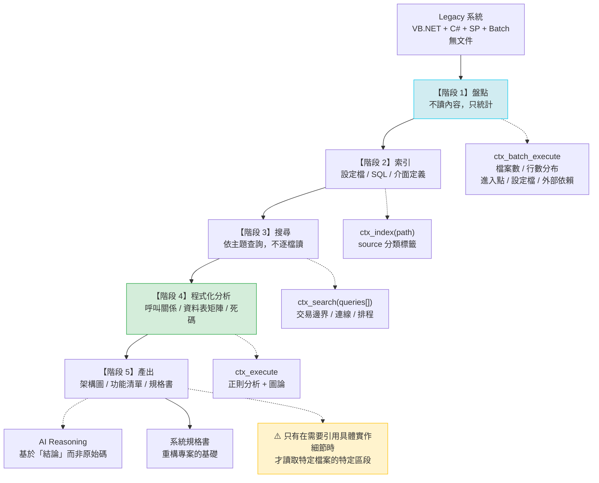
```mermaid
flowchart TD
    Start["Legacy 系統<br/>VB.NET + C# + SP + Batch<br/>無文件"]

    P1["【階段 1】盤點<br/>不讀內容，只統計"]
    P2["【階段 2】索引<br/>設定檔 / SQL / 介面定義"]
    P3["【階段 3】搜尋<br/>依主題查詢，不逐檔讀"]
    P4["【階段 4】程式化分析<br/>呼叫關係 / 資料表矩陣 / 死碼"]
    P5["【階段 5】產出<br/>架構圖 / 功能清單 / 規格書"]

    Start --> P1 --> P2 --> P3 --> P4 --> P5

    P1 -.-> T1["ctx_batch_execute<br/>檔案數 / 行數分布<br/>進入點 / 設定檔 / 外部依賴"]
    P2 -.-> T2["ctx_index(path)<br/>source 分類標籤"]
    P3 -.-> T3["ctx_search(queries[])<br/>交易邊界 / 連線 / 排程"]
    P4 -.-> T4["ctx_execute<br/>正則分析 + 圖論"]
    P5 -.-> T5["AI Reasoning<br/>基於「結論」而非原始碼"]

    P5 --> Out["系統規格書<br/>重構專案的基礎"]

    Note["⚠️ 只有在需要引用具體實作細節時<br/>才讀取特定檔案的特定區段"]
    P5 -.-> Note

    style P1 fill:#d1ecf1,stroke:#0dcaf0
    style P4 fill:#d4edda,stroke:#28a745
    style Note fill:#fff3cd,stroke:#ffc107
```

### 18.4 階段一：盤點（不讀內容）

```text
ctx_batch_execute([
  {
    language: "shell",
    intent: "檔案結構盤點",
    code: `
echo "=== 檔案類型分布 ==="
find . -type f \\( -name '*.cs' -o -name '*.vb' -o -name '*.sql' -o -name '*.bat' \\
     -o -name '*.config' -o -name '*.asmx' \\) | sed 's/.*\\.//' | sort | uniq -c | sort -rn

echo "=== 程式碼規模 ==="
find . -name '*.cs' -o -name '*.vb' | xargs wc -l 2>/dev/null | tail -1

echo "=== 最大的 15 個檔案（複雜度熱點）==="
find . -name '*.cs' -o -name '*.vb' | xargs wc -l 2>/dev/null | sort -rn | head -16
`
  },
  {
    language: "shell",
    intent: "找出系統進入點",
    code: `
echo "=== WinForms 進入點 ==="
grep -rl "Inherits System.Windows.Forms.Form\\|: Form\\b" --include='*.vb' --include='*.cs' . | wc -l

echo "=== WebService ==="
find . -name '*.asmx' -o -name '*.svc' | head -20

echo "=== 批次進入點 ==="
find . -name '*.bat' -o -name '*.cmd' | head -50
`
  },
  {
    language: "shell",
    intent: "找出外部系統整合點",
    code: `
echo "=== 資料庫連線字串位置 ==="
grep -rln "Data Source=\\|Initial Catalog=\\|connectionString" --include='*.config' . | head -20

echo "=== FTP 使用 ==="
grep -rn "FtpWebRequest\\|ftp://" --include='*.cs' --include='*.vb' . | wc -l
grep -rho "ftp://[^\\"' ]*" --include='*.cs' --include='*.vb' --include='*.config' . | sort -u | head -10

echo "=== MQ 使用 ==="
grep -rn "MQQueue\\|MQQueueManager\\|IBM.WMQ" --include='*.cs' --include='*.vb' . | wc -l

echo "=== WebService 呼叫 ==="
grep -rho "http://[^\\"' ]*asmx\\|https://[^\\"' ]*asmx" . | sort -u | head -10
`
  },
  {
    language: "shell",
    intent: "資料庫物件盤點",
    code: `
echo "=== Stored Procedure 數量 ==="
grep -rl "CREATE PROCEDURE\\|CREATE PROC" --include='*.sql' . | wc -l

echo "=== 最複雜的 10 個 SP ==="
for f in $(grep -rl "CREATE PROC" --include='*.sql' .); do
  echo "$(wc -l < "$f") $f"
done | sort -rn | head -10
`
  }
], concurrency: 4)
```

**產出**（約 3 KB 進 Context）：

```text
檔案類型分布：cs 1,204 / vb 382 / sql 186 / bat 45 / config 23
程式碼規模：約 41 萬行
最大的檔案：LoanCalculator.cs (8,432 行) ← 重構重點
WinForms 進入點：378 個
WebService：3 個
批次：45 支
DB 連線字串：分散在 7 個 config
FTP：14 處，3 個外部主機
MQ：8 處
SP：186 個，最大的 ApplyLoanApproval.sql (2,109 行)
```

**這 3 KB 已經足以讓 SA 建立系統的整體輪廓。**

### 18.5 階段二：索引

```text
ctx_index(path: "./config",        source: "legacy:config")
ctx_index(path: "./database/sp",   source: "legacy:storedproc")
ctx_index(path: "./interfaces",    source: "legacy:interface")
ctx_index(path: "./docs",          source: "legacy:doc")      // 那份 2011 年手冊
```

> **[Enterprise Recommendation]** 索引的優先順序：**設定檔 > SQL > 介面定義 > 文件 > 原始碼**。
>
> 理由：設定檔密度最高（一行就是一個外部依賴），原始碼密度最低（大量樣板程式碼）。**不要一開始就索引全部原始碼**。

### 18.6 階段三：針對性搜尋

```text
ctx_search(
  queries: ["transaction commit rollback isolation",
            "connection timeout pool size",
            "schedule cron daily batch",
            "encrypt decrypt key"],
  source: "legacy"
)
```

**查到什麼**（約 4 KB）：

```text
- 交易邊界：多數 SP 內部自行 BEGIN TRAN，但有 12 支沒有 ROLLBACK 處理
- 連線設定：Connection Timeout=15，Max Pool Size 未設定（使用預設 100）
- 排程：有 45 支批次，其中 8 支在 02:00 同時啟動 ← 資源競爭風險
- 加密：使用 TripleDES，金鑰硬編碼在 CryptoHelper.cs ← 資安高風險
```

**最後一項是重大發現，而且是在沒讀任何原始碼的情況下找到的。**

### 18.7 階段四：程式化分析

**分析 1：資料表使用矩陣**

```text
ctx_execute("python", `
import os, re, collections

table_by_module = collections.defaultdict(set)
tables_all = collections.Counter()

sql_pat = re.compile(
    r"\\b(?:FROM|JOIN|INTO|UPDATE|DELETE\\s+FROM)\\s+\\[?(\\w+)\\]?",
    re.I)

for root, _, files in os.walk("."):
    module = root.split(os.sep)[1] if os.sep in root else "root"
    for f in files:
        if not f.endswith((".cs", ".vb", ".sql")):
            continue
        try:
            src = open(os.path.join(root, f), encoding="utf-8", errors="ignore").read()
        except Exception:
            continue
        for t in sql_pat.findall(src):
            if t.lower() in ("select", "where", "set", "values"):
                continue
            table_by_module[module].add(t)
            tables_all[t] += 1

print(f"模組數 {len(table_by_module)}，資料表 {len(tables_all)}")
print("\\n被最多模組共用的表（重構時的耦合點）：")
shared = collections.Counter()
for m, ts in table_by_module.items():
    for t in ts:
        shared[t] += 1
for t, c in shared.most_common(15):
    print(f"  {t}: 被 {c} 個模組使用（共 {tables_all[t]} 處）")

print("\\n只被單一模組使用的表（可安全切分）：")
solo = [t for t, c in shared.items() if c == 1]
print(f"  共 {len(solo)} 張：{', '.join(sorted(solo)[:20])}")
`)
```

**分析 2：死碼偵測**

```text
ctx_execute("python", `
import os, re, collections

defined = {}      # method name -> file
called = collections.Counter()

def_pat  = re.compile(r"(?:public|private|protected|internal)\\s+(?:static\\s+)?[\\w<>\\[\\]]+\\s+(\\w+)\\s*\\(")
call_pat = re.compile(r"\\b(\\w+)\\s*\\(")

files = []
for root, _, fs in os.walk("."):
    for f in fs:
        if f.endswith((".cs", ".vb")):
            files.append(os.path.join(root, f))

for p in files:
    src = open(p, encoding="utf-8", errors="ignore").read()
    for m in def_pat.findall(src):
        defined[m] = p
    for m in call_pat.findall(src):
        called[m] += 1

# 定義了但只被「定義處」出現一次的 = 可能是死碼
dead = [m for m, p in defined.items() if called[m] <= 1 and not m.startswith(("Form_", "btn", "On"))]
print(f"方法定義 {len(defined)} 個，疑似死碼 {len(dead)} 個（約 {len(dead)*100//max(len(defined),1)}%）")
print("樣本（前 20 個，含所在檔案）：")
for m in sorted(dead)[:20]:
    print(f"  {m}  ←  {defined[m]}")
`)
```

> **[AI Analysis] 注意這個腳本的限制**：正則比對會有誤判（反射呼叫、事件繫結、XAML 繫結都抓不到）。**它的用途是「縮小範圍」，不是「下定論」**。產出的死碼清單仍需人工複核。
>
> 這一點要寫進報告，避免讀者誤以為是精確結果。

### 18.8 階段五：產出

到這個階段，Context 裡累積的是：

```text
階段 1 盤點結果        約 3 KB
階段 3 搜尋命中        約 4 KB
階段 4 分析結論        約 5 KB
────────────────────────────
合計                   約 12 KB
```

**用這 12 KB，AI 可以產出**：

- 系統架構圖（模組、外部整合、資料流）
- 功能清單（依 378 個 Form 分類）
- 資料表使用矩陣（重構切分的依據）
- 風險清單（硬編碼金鑰、缺 ROLLBACK 的 SP、排程資源競爭）
- 重構優先順序建議

**傳統做法要達到同樣結果，需要讀進 3,600,000 tokens —— 差距 300 倍。**

### 18.9 只有這些時候才讀原始碼

> **[Enterprise Recommendation]** 逆向工程的原則是「**先廣後深**」。以下情況才讀具體檔案：

| 情況 | 讀什麼 |
| --- | --- |
| 要引用精確的業務規則 | 該規則所在的方法（用 `ctx_search` 先定位到檔案 + 行號） |
| 要確認資料轉換邏輯 | 該轉換函式 |
| 要理解複雜的條件判斷 | 該段條件式 |
| 重構時要保持行為一致 | 要改的那個檔案 |

**永遠不要**：為了「了解整體」而逐檔閱讀。整體要靠統計與圖論，不是靠閱讀。

### 18.10 本章實務案例：一個真實的發現

**過程**：在階段三的搜尋中，`ctx_search(queries: ["encrypt decrypt key"])` 命中了 `CryptoHelper.cs` 的片段，顯示 TripleDES 金鑰以字串常數存在。

**後續動作**：

```text
1. 用 ctx_execute 掃描全專案，找出所有使用該 helper 的位置
   → 發現 47 處，其中 12 處用於加密客戶身分證字號

2. 用 ctx_execute 檢查是否有其他硬編碼憑證
   → 又找到 3 組資料庫密碼、1 組 FTP 帳密

3. 立即通報資安，列為重構專案的 P0 項目
```

**關鍵點**：這個發現是在**只消耗約 7 KB Context** 的情況下達成的。傳統做法可能要讀完幾百個檔案才會偶然發現，或者根本發現不了。

> **[Enterprise Recommendation]** 這也帶出一個重要的作業規範：**在逆向工程中發現硬編碼憑證時，絕對不要把憑證值印出來**。腳本應該只印「檔名 + 行號 + 類型」：
>
> ```python
> # ✅ 正確
> print(f"{path}:{lineno} 發現硬編碼的 TripleDES 金鑰")
>
> # ❌ 錯誤（金鑰進了 Context，也進了 session DB）
> print(f"{path}:{lineno} key={key_value}")
> ```

### 18.11 本章注意事項

1. **絕對不要 Read all source code**，數學上就不可行。
2. **索引優先順序：設定檔 > SQL > 介面 > 文件 > 原始碼**。
3. **正則分析會有誤判**，產出要標明這是「縮小範圍」不是「定論」。
4. **發現憑證時只印位置，不印內容**。
5. **先廣後深**，整體靠統計，細節才閱讀。
6. **索引 14 天會過期**，長期專案要定期重建，或把分析結論寫成文件進 repo。

### 18.12 本章檢查清單

- [ ] 我理解為什麼逐檔閱讀在數學上不可行
- [ ] 我知道五階段的順序與各階段的工具
- [ ] 我知道索引的優先順序
- [ ] 我的分析腳本不會印出憑證內容
- [ ] 我會在報告中標明正則分析的誤判可能
- [ ] 我知道什麼時候才該讀具體的原始碼

---

## 第 19 章 Framework Upgrade

### 19.1 完整案例 C：Spring Boot / Java 版本升級

**專案設定**：某證券公司的「下單系統後台」

- 現況：Spring Boot 3.1 + Java 17 + Maven 3.8
- 目標：Spring Boot 3.4 + Java 21 + Maven 3.9
- 規模：18 個 Maven 模組、約 12 萬行 Java、420 個測試

### 19.2 升級流程

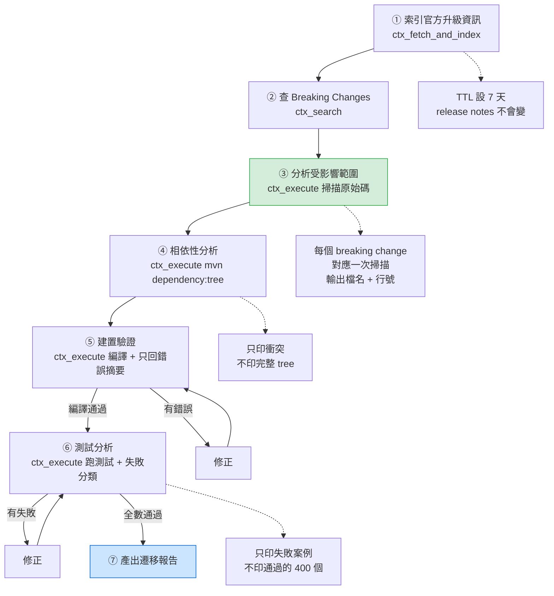
```mermaid
flowchart TD
    S1["① 索引官方升級資訊<br/>ctx_fetch_and_index"]
    S2["② 查 Breaking Changes<br/>ctx_search"]
    S3["③ 分析受影響範圍<br/>ctx_execute 掃描原始碼"]
    S4["④ 相依性分析<br/>ctx_execute mvn dependency:tree"]
    S5["⑤ 建置驗證<br/>ctx_execute 編譯 + 只回錯誤摘要"]
    S6["⑥ 測試分析<br/>ctx_execute 跑測試 + 失敗分類"]
    S7["⑦ 產出遷移報告"]

    S1 --> S2 --> S3 --> S4 --> S5
    S5 -->|"有錯誤"| Fix["修正"]
    Fix --> S5
    S5 -->|"編譯通過"| S6
    S6 -->|"有失敗"| Fix2["修正"]
    Fix2 --> S6
    S6 -->|"全數通過"| S7

    S1 -.-> N1["TTL 設 7 天<br/>release notes 不會變"]
    S3 -.-> N2["每個 breaking change<br/>對應一次掃描<br/>輸出檔名 + 行號"]
    S4 -.-> N3["只印衝突<br/>不印完整 tree"]
    S6 -.-> N4["只印失敗案例<br/>不印通過的 400 個"]

    style S3 fill:#d4edda,stroke:#28a745
    style S7 fill:#cce5ff,stroke:#0366d6
```

### 19.3 步驟一：索引官方升級資訊

```text
ctx_fetch_and_index(
  requests: [
    { url: "https://github.com/spring-projects/spring-boot/wiki/Spring-Boot-3.2-Release-Notes",
      source: "SpringBoot 3.2" },
    { url: "https://github.com/spring-projects/spring-boot/wiki/Spring-Boot-3.3-Release-Notes",
      source: "SpringBoot 3.3" },
    { url: "https://github.com/spring-projects/spring-boot/wiki/Spring-Boot-3.4-Release-Notes",
      source: "SpringBoot 3.4" },
    { url: "https://raw.githubusercontent.com/spring-projects/spring-framework/main/framework-docs/modules/ROOT/pages/upgrading.adoc",
      source: "SpringFramework Upgrade" }
  ],
  concurrency: 4,
  ttl: 604800000        // 7 天
)
```

> **[Enterprise Recommendation] 跨版本升級的重點**：3.1 → 3.4 要索引 **3.2、3.3、3.4 三份** release notes，因為 breaking change 是累積的。只看目標版本會漏掉中間版本引入的變更。

### 19.4 步驟二：查 Breaking Changes

```text
ctx_search(
  queries: ["breaking change removed",
            "deprecated replacement migration",
            "configuration property rename",
            "minimum version requirement",
            "auto-configuration change",
            "default behavior change"],
  source: "SpringBoot"
)
```

**命中結果**（約 5 KB，程式碼範例完整保留）：

```text
3.2: - spring.mvc.pathmatch.matching-strategy 預設值變更
     - RestClient 新增（RestTemplate 未棄用但建議遷移）
3.3: - spring.security.* 若干屬性重新命名
     - Micrometer 觀測 API 變更
3.4: - 部分 @ConfigurationProperties 繫結行為變更
     - 最低 Java 版本要求
     ...（實際內容依查證當下的官方文件為準）
```

> **[Official]** 這裡的優勢：`ctx_search` **完整保留程式碼區塊**，所以遷移範例可以直接抄。這正是官方 BENCHMARK 中知識檢索路徑節省率只有 82% 的原因——它刻意不摘要程式碼。

### 19.5 步驟三：分析受影響範圍

```text
ctx_execute("python", `
import os, re, collections

# 依步驟 2 查到的 breaking change，逐項掃描
checks = [
    ("RestTemplate 使用（建議遷移 RestClient）",
     r"\\bRestTemplate\\b"),
    ("已變更的設定屬性 spring.mvc.pathmatch",
     r"spring\\.mvc\\.pathmatch"),
    ("javax 命名空間殘留（應為 jakarta）",
     r"\\bimport\\s+javax\\.(servlet|persistence|validation)"),
    ("@MockBean（新版建議 @MockitoBean）",
     r"@MockBean"),
    ("直接使用 Thread（可評估改用 Virtual Thread）",
     r"new\\s+Thread\\s*\\("),
]

results = collections.defaultdict(list)
total_files = 0

for root, dirs, files in os.walk("."):
    dirs[:] = [d for d in dirs if d not in ("target", ".git", "node_modules")]
    for f in files:
        if not f.endswith(".java"):
            continue
        total_files += 1
        p = os.path.join(root, f)
        try:
            lines = open(p, encoding="utf-8", errors="ignore").readlines()
        except Exception:
            continue
        for name, pat in checks:
            rx = re.compile(pat)
            for i, line in enumerate(lines, 1):
                if rx.search(line):
                    results[name].append(f"{p}:{i}")

print(f"掃描 {total_files} 個 Java 檔案\\n")
for name, _ in checks:
    hits = results[name]
    files_n = len(set(h.rsplit(':', 1)[0] for h in hits))
    print(f"■ {name}")
    print(f"  {len(hits)} 處，分布於 {files_n} 個檔案")
    for h in hits[:5]:
        print(f"    {h}")
    if len(hits) > 5:
        print(f"    ...（其餘 {len(hits)-5} 處）")
    print()
`)
```

**輸出**（約 2 KB）：每個 breaking change 對應的**確切檔名與行號**，可以直接指派給開發者。

### 19.6 步驟四：相依性分析

```text
ctx_execute("shell", `
mvn -q dependency:tree -Dverbose > /tmp/deptree.txt 2>&1

python3 - <<'EOF'
import re, collections

txt = open('/tmp/deptree.txt', encoding='utf-8', errors='ignore').read()
lines = txt.split('\n')

# 版本衝突
conflicts = collections.defaultdict(set)
for l in lines:
    if 'omitted for conflict' in l:
        m = re.search(r'([\w.\-]+):([\w.\-]+):jar:([\w.\-]+)', l)
        c = re.search(r'conflict with ([\w.\-]+)\)', l)
        if m and c:
            conflicts[f"{m.group(1)}:{m.group(2)}"].add((m.group(3), c.group(1)))

print(f"版本衝突：{len(conflicts)} 個 artifact")
for art, vs in sorted(conflicts.items(), key=lambda x: -len(x[1]))[:10]:
    pairs = ', '.join(f"{a}→{b}" for a, b in sorted(vs))
    print(f"  {art}: {pairs}")

# 找出仍停留在舊 Spring 版本的傳遞相依
old = set(re.findall(r'(org\.springframework[\w.\-]*:[\w.\-]+):jar:(3\.[01]\.\d+)', txt))
print(f"\n仍為 Spring 3.0/3.1 的相依：{len(old)} 個")
for a, v in sorted(old)[:10]:
    print(f"  {a}:{v}")

# 找出可能不相容 Java 21 的舊套件
risky = ['asm', 'bytebuddy', 'byte-buddy', 'cglib', 'javassist', 'lombok', 'mockito']
print("\n需確認 Java 21 相容性的位元組碼相關套件：")
for r in risky:
    ms = set(re.findall(rf'([\w.\-]*{r}[\w.\-]*):jar:([\w.\-]+)', txt, re.I))
    for a, v in sorted(ms):
        print(f"  {a}:{v}")
EOF
`)
```

> **[Enterprise Recommendation]** 最後那段「位元組碼相關套件」的檢查很關鍵。Java 大版本升級最常卡在 ASM / Byte Buddy / CGLIB / Lombok 這類會操作 bytecode 的套件——它們必須跟上新的 class file version。**這是經驗法則，不是 Context Mode 的功能**，但寫成腳本後就變成團隊的可複用資產。

### 19.7 步驟五至六：建置與測試

**建置驗證**：

```text
ctx_execute("shell", `
mvn -B clean compile 2>&1 | tee /tmp/build.log | tail -3

python3 - <<'EOF'
import re, collections
log = open('/tmp/build.log', encoding='utf-8', errors='ignore').read()

errors = re.findall(r'\[ERROR\]\s+(/[^\s:]+\.java):\[(\d+),\d+\]\s+(.+)', log)
by_type = collections.Counter()
by_file = collections.Counter()
for f, ln, msg in errors:
    key = re.sub(r'[\w.$]+(?=\s|$)', 'X', msg)[:60]
    by_type[key] += 1
    by_file[f.split('/')[-1]] += 1

print(f"編譯錯誤 {len(errors)} 個，分布於 {len(by_file)} 個檔案\n")
print("錯誤類型 Top 5：")
for t, c in by_type.most_common(5):
    print(f"  {c:4d}  {t}")
print("\n受影響最嚴重的檔案：")
for f, c in by_file.most_common(8):
    print(f"  {c:4d}  {f}")
print("\n前 5 個具體錯誤：")
for f, ln, msg in errors[:5]:
    print(f"  {f.split('/')[-1]}:{ln}  {msg[:80]}")
EOF
`)
```

**傳統做法**：`mvn compile` 輸出數千行全進 Context。
**這個做法**：約 1 KB 的錯誤分類 + 具體位置。

**測試分析**：

```text
ctx_execute("shell", `
mvn -B test 2>&1 | tee /tmp/test.log | tail -5

python3 - <<'EOF'
import re, collections
log = open('/tmp/test.log', encoding='utf-8', errors='ignore').read()

m = re.search(r'Tests run: (\d+), Failures: (\d+), Errors: (\d+), Skipped: (\d+)', log[::-1][:2000][::-1])
if m:
    print(f"測試總計：執行 {m.group(1)}，失敗 {m.group(2)}，錯誤 {m.group(3)}，略過 {m.group(4)}\n")

fails = re.findall(r'\[ERROR\]\s+(\S+Test)\.(\w+):(\d+)\s+(.*)', log)
by_cause = collections.Counter()
for cls, method, ln, msg in fails:
    cause = re.sub(r'[\d"\']+', 'X', msg)[:70]
    by_cause[cause] += 1

print(f"失敗案例 {len(fails)} 個，根因分類：")
for c, n in by_cause.most_common(8):
    print(f"  {n:3d}  {c}")
print("\n具體失敗清單（前 10）：")
for cls, method, ln, msg in fails[:10]:
    print(f"  {cls}.{method}:{ln}")
    print(f"       {msg[:90]}")
EOF
`)
```

**關鍵價值**：420 個測試裡有 23 個失敗，**根因分類讓你發現它們其實只有 3 種原因**——修 3 個地方就能解決 23 個失敗。這種洞察是把完整 log 塞進 Context 得不到的。

### 19.8 步驟七：遷移報告

Context 裡累積的內容：

```text
步驟 2 breaking changes        約 5 KB
步驟 3 受影響範圍              約 2 KB
步驟 4 相依性衝突              約 1.5 KB
步驟 5 編譯錯誤分類            約 1 KB
步驟 6 測試失敗分類            約 1.5 KB
──────────────────────────────────
合計                           約 11 KB
```

**產出報告結構**：

```markdown
# Spring Boot 3.1 → 3.4 / Java 17 → 21 遷移報告

## 一、必須修改（阻擋升級）
| 項目 | 影響範圍 | 具體位置 | 預估工時 |
| javax 命名空間殘留 | 8 檔 12 處 | （檔名:行號清單） | 2h |
| Byte Buddy 版本過舊 | pom.xml | parent/pom.xml:87 | 0.5h |
...

## 二、建議修改（不阻擋但應處理）
...

## 三、可延後
...

## 四、風險評估
...

## 五、測試失敗根因（3 類）
1. Mockito 版本行為變更 → 影響 14 個測試
2. 設定屬性重新命名 → 影響 6 個測試
3. 時區處理預設值變更 → 影響 3 個測試
```

### 19.9 其他升級情境的對應做法

| 升級情境 | 索引什麼 | 掃描什麼 |
| --- | --- | --- |
| **Java 21 → 25** | JDK release notes、JEP 清單 | 移除的 API、Preview 功能使用、位元組碼套件版本 |
| **Vue 2 → Vue 3** | Vue 3 Migration Guide | Options API 使用、filters、`$children`、event bus |
| **Angular legacy → 最新** | 各版本 Update Guide | 已棄用的 module、RxJS 版本、View Engine 殘留 |
| **Maven 3 → Maven 4** | Maven 4 release notes | POM 語法變更、plugin 版本、profile 用法 |
| **.NET Framework → .NET 8** | .NET Portability 文件 | 不可移植的 API、`System.Web` 使用、WCF |

**共通流程都是同一套五步驟**：索引 → 查 breaking change → 掃描受影響範圍 → 相依性分析 → 建置測試驗證。

### 19.10 本章注意事項

1. **跨多版本升級要索引所有中間版本**的 release notes。
2. **`ctx_search` 保留完整程式碼**，遷移範例可直接抄。
3. **建置與測試輸出一定要在 sandbox 內分類**，不要整份進 Context。
4. **根因分類比失敗清單有價值**，23 個失敗可能只有 3 個原因。
5. **位元組碼相關套件是 Java 升級的常見卡點**，要特別檢查。
6. **掃描腳本輸出檔名 + 行號**，才能直接指派工作。

### 19.11 本章檢查清單

- [ ] 已索引所有中間版本的 release notes
- [ ] 每個 breaking change 都有對應的掃描腳本
- [ ] 掃描結果包含確切的檔名與行號
- [ ] 相依性分析包含位元組碼相關套件檢查
- [ ] 建置 / 測試輸出有做根因分類
- [ ] 遷移報告區分「必須 / 建議 / 可延後」

---

## 第 20 章 大型 Repository、Log 與基礎設施分析

### 20.1 大型 Repository 分析

#### 規模與策略對照

| 規模 | Traditional Agent | Context Mode | 差異 |
| --- | --- | --- | --- |
| **500 files** | Read × 500，約 70 萬 tokens，Context 中途爆掉 | 1 次 `ctx_execute`，約 3 KB | 約 200× |
| **5,000 files** | 不可行 | 1–3 次 `ctx_batch_execute`，約 5 KB | — |
| **50,000 files** | 不可行 | 索引 + 分階段分析，約 10 KB | — |

#### 影響的三個維度 [AI Analysis]

| 維度 | Traditional | Context Mode |
| --- | --- | --- |
| **Context Window** | 線性成長直到爆掉 | 幾乎不成長（只有結論） |
| **Token 成本** | 每一輪重複計費所有讀過的檔案 | 只有結論被重複計費 |
| **Latency** | N 次工具往返，每次都有網路延遲 | 1 次往返 + sandbox 執行時間 |

> **[AI Analysis] 關於 Latency 的補充**：Context Mode **不一定比較快**。一次 `ctx_execute` 要啟動 subprocess、執行腳本、等待完成。如果只是讀 3 個小檔案，直接 Read 反而更快。
>
> **交叉點大約在「5 個檔案」或「輸出超過 20 行」**——這也是官方 SKILL 用「超過 20 行」當觸發條件的原因。

#### 標準流程

```text
Index → Search → Execute → Aggregate → Retrieve
```

```text
【50,000 檔案專案的標準開場】

第 1 次呼叫：ctx_batch_execute 取得骨架
  - 目錄結構（深度 2 層）
  - 各語言的檔案數與行數
  - 最大的 20 個檔案
  - 進入點位置
  → 約 3 KB

第 2 次呼叫：ctx_index 索引關鍵文件
  - README、docs/、設定檔、API 定義
  → 約 100 B

第 3 次之後：依任務需求 ctx_search 或 ctx_execute
  → 每次 1-3 KB
```

### 20.2 Log Analysis

#### 各類 Log 的處理原則

| Log 類型 | 典型大小 | 你要的是什麼 | 腳本該輸出什麼 |
| --- | --- | --- | --- |
| **Application Log** | 數百 MB–數 GB | 錯誤樣態、發生時序 | 錯誤分類、首次發生時間、相關 trace id |
| **Web / Access Log** | 數 GB | 異常流量、錯誤分布 | 狀態碼分布、Top 錯誤路徑、來源 IP |
| **API Log** | 數百 MB | 慢請求、失敗率 | P50/P90/P99、逾時清單 |
| **Error Log** | 數十 MB | 根因 | 正規化後的錯誤樣態 Top N |
| **MQ Log** | 數百 MB | 積壓、重送 | 佇列深度變化、重送次數 |
| **Batch Log** | 數十 MB | 執行時間、失敗步驟 | 各步驟耗時、失敗點 |
| **Kubernetes Log** | 依 Pod 而定 | 重啟原因、OOM | 重啟次數、退出碼、OOM 事件 |

#### 10 GB Log 的處理策略

```text
❌ 絕對不要：
   cat huge.log            → 不可能
   tail -1000 huge.log     → 只看到尾巴，結論不可靠
   grep ERROR huge.log     → 仍可能數萬行

✅ 正確策略（兩階段）：

階段 1：在 ctx_execute 內用 shell 切出目標區段
ctx_execute("shell", `
  # 只取事故當天 13:00-18:00 的區段
  awk '/2026-09-17 13:/,/2026-09-17 18:/' /var/log/app/app.log > /tmp/window.log
  wc -l /tmp/window.log
`)
→ 只印出行數，不印內容

階段 2：ctx_execute_file 分析該區段
ctx_execute_file(path: "/tmp/window.log", language: "python",
                 intent: "找出 500 錯誤的共同樣態", code: 分析腳本)
```

#### 標準 Log 分析腳本模板

```python
import re, collections

lines = FILE_CONTENT.split("\n")

# 1. 總量與時間範圍
ts_pat = re.compile(r"(\d{4}-\d{2}-\d{2}[ T]\d{2}:\d{2}:\d{2})")
tss = [m.group(1) for l in lines if (m := ts_pat.search(l))]
print(f"總筆數 {len(lines)}，時間範圍 {tss[0] if tss else 'N/A'} ~ {tss[-1] if tss else 'N/A'}")

# 2. 嚴重度分布
levels = collections.Counter(
    m.group(1) for l in lines if (m := re.search(r"\b(ERROR|WARN|INFO|DEBUG)\b", l)))
print(f"嚴重度分布：{dict(levels)}")

# 3. 錯誤樣態正規化（關鍵步驟）
def normalize(msg):
    msg = re.sub(r"\b\d+\b", "N", msg)                     # 數字
    msg = re.sub(r"[0-9a-f]{8}-[0-9a-f-]{27}", "UUID", msg) # UUID
    msg = re.sub(r"\b\d{4}-\d{2}-\d{2}\S*", "TS", msg)      # 時間
    return msg[:100]

errs = collections.Counter(
    normalize(l.split("ERROR", 1)[-1].strip()) for l in lines if "ERROR" in l)
print(f"\n錯誤樣態 Top 5（共 {len(errs)} 種）：")
for e, c in errs.most_common(5):
    print(f"  {c:5d}  {e}")

# 4. 時間分布（找出是否集中）
hours = collections.Counter(t[11:13] for t in tss)
print(f"\n時段分布：{sorted(hours.items())}")

# 5. 具體證據（最多 3 筆原文）
print("\n原始樣本：")
for l in [x for x in lines if "ERROR" in x][:3]:
    print(f"  {l[:150]}")
```

> **[Enterprise Recommendation]** 第 3 步的「錯誤樣態正規化」是整個腳本最有價值的部分。10,000 筆錯誤正規化之後，通常只剩 5–20 種樣態。**這是把「資料量」轉成「洞察」的關鍵步驟**。

### 20.3 API / HTML / Browser Analysis

#### curl / REST API

```text
❌ ctx_execute("shell", "curl https://api.example.com/orders")
   → 只是把 curl 包一層，完整回應照樣進 Context

✅ ctx_execute("javascript", `
const res = await fetch('https://api.example.com/orders', {
  headers: { Authorization: 'Bearer ' + process.env.API_TOKEN }
});
const data = await res.json();

console.log('HTTP', res.status, '| 筆數', data.items?.length ?? 0);
const bad = (data.items || []).filter(o => !o.customerId || o.amount <= 0);
console.log('異常筆數', bad.length);
bad.slice(0, 5).forEach(o => console.log('  id=' + o.id, 'amount=' + o.amount));
`)
```

#### OpenAPI / Swagger

```text
ctx_execute("javascript", `
const spec = await (await fetch('http://localhost:8080/v3/api-docs')).json();
const paths = Object.entries(spec.paths);

console.log('端點數', paths.length);

// 找出沒有定義錯誤回應的端點
const noError = [];
// 找出沒有 security 的端點
const noAuth = [];
for (const [p, methods] of paths) {
  for (const [m, def] of Object.entries(methods)) {
    const codes = Object.keys(def.responses || {});
    if (!codes.some(c => c.startsWith('4') || c.startsWith('5')))
      noError.push(m.toUpperCase() + ' ' + p);
    if (!def.security && !spec.security)
      noAuth.push(m.toUpperCase() + ' ' + p);
  }
}
console.log('缺少錯誤回應定義:', noError.length);
noError.slice(0, 10).forEach(x => console.log('  ' + x));
console.log('缺少 security 定義:', noAuth.length);
noAuth.slice(0, 10).forEach(x => console.log('  ' + x));
`)
```

#### Playwright / Browser

見 [5.6 Playwright 三種正確工作流](#56-playwright-的三種正確工作流)。

**核心紀律再強調一次** [Official]：

```text
browser_snapshot / browser_console_messages / browser_network_requests
→ 一律帶 filename 參數
→ 再用 ctx_index(path) 或 ctx_execute_file(path) 處理
→ 絕不用 ctx_index(content: ...)
```

### 20.4 Git / GitHub 分析

#### Git 分析

```text
ctx_execute("shell", `
echo "=== 基本統計 ==="
echo "Commits: $(git rev-list --count HEAD)"
echo "Contributors: $(git shortlog -sn --all | wc -l)"
echo "First commit: $(git log --reverse --format=%ad -1)"

echo -e "\n=== Top 10 貢獻者 ==="
git shortlog -sn --all | head -10

echo -e "\n=== 最常修改的檔案（重構熱點）==="
git log --pretty=format: --name-only --since='1 year ago' \\
  | grep -v '^$' | sort | uniq -c | sort -rn | head -15

echo -e "\n=== 每月 commit 數 ==="
git log --format=%ad --date=format:%Y-%m --since='1 year ago' \\
  | sort | uniq -c

echo -e "\n=== 大型 commit（可能是不當合併）==="
git log --shortstat --format='%h %ad %s' --date=short --since='6 months ago' \\
  | paste - - - | awk '$0 ~ /files? changed/ {
      match($0, /([0-9]+) files? changed/, a);
      if (a[1] > 50) print $0
    }' | head -10
`)
```

> **[Benchmark]** 官方數據：git log（153 commits）11.6 KB → 107 B（99% 節省）。

#### GitHub Issues / PR

```text
❌ 不要讓 Agent 把所有 Issues 讀進 Context
   （官方 benchmark：20 個 issues = 58.9 KB）

✅ 做法一：索引後搜尋（適合需要多次查詢）
ctx_execute("shell", `
  gh issue list --limit 200 --state all \\
    --json number,title,state,labels,createdAt,body \\
    --jq '.[] | "## #\\(.number) [\\(.state)] \\(.title)\\n\\nLabels: \\([.labels[].name] | join(", "))\\n\\n\\(.body // "")\\n"' \\
    > /tmp/issues.md
  wc -l /tmp/issues.md
`)
ctx_index(path: "/tmp/issues.md", source: "github:issues")
ctx_search(queries: ["memory leak", "timeout connection pool", "regression after upgrade"],
           source: "github:issues")

✅ 做法二：直接在 sandbox 內統計（適合要總覽）
ctx_execute("shell", `
gh issue list --limit 500 --state all --json number,title,state,labels,createdAt \\
  --jq '.[] | [.state, ([.labels[].name] | join(",")), .createdAt[0:7]] | @tsv' \\
  | awk -F'\\t' '
    { state[$1]++; month[$3]++; n=split($2, L, ","); for(i=1;i<=n;i++) if(L[i]!="") label[L[i]]++ }
    END {
      print "狀態:"; for (s in state) printf "  %s: %d\\n", s, state[s]
      print "\\n標籤 Top 10:"; for (l in label) printf "%d %s\\n", label[l], l
    }' | sort -rn | head -20
`)
```

> **[Benchmark]** 官方數據：20 個 GitHub Issues 58.9 KB → 1.1 KB（98% 節省）。

### 20.5 Docker / Kubernetes 分析

#### 處理原則

```text
大量 Infra Output
   ↓
Context Mode（sandbox）
   ↓
Filter / Search / Aggregate
   ↓
只有異常項目進 AI
```

#### Docker

```text
ctx_execute("shell", `
echo "=== 容器狀態異常清單 ==="
docker ps -a --format '{{.Names}}\\t{{.Status}}\\t{{.Image}}' \\
  | grep -v "Up " | head -20

echo -e "\\n=== 資源使用超標（CPU > 80% 或 Mem > 80%）==="
docker stats --no-stream --format '{{.Name}}\\t{{.CPUPerc}}\\t{{.MemPerc}}' \\
  | awk -F'\\t' '{ gsub(/%/,"",$2); gsub(/%/,"",$3); if ($2+0 > 80 || $3+0 > 80) print }'

echo -e "\\n=== 最近重啟的容器 ==="
for c in $(docker ps -aq); do
  n=$(docker inspect -f '{{.Name}} {{.RestartCount}}' "$c")
  cnt=$(echo "$n" | awk '{print $2}')
  [ "$cnt" -gt 0 ] && echo "$n"
done | sort -k2 -rn | head -10
`)
```

#### Kubernetes

```text
ctx_execute("shell", `
echo "=== 非 Running 的 Pod ==="
kubectl get pods -A -o json | jq -r '
  .items[]
  | select(.status.phase != "Running" or
           ([.status.containerStatuses[]?.ready] | any(. == false)))
  | "\\(.metadata.namespace)/\\(.metadata.name)  phase=\\(.status.phase)  restarts=\\([.status.containerStatuses[]?.restartCount] | add // 0)"
' | head -25

echo -e "\\n=== OOMKilled 事件 ==="
kubectl get pods -A -o json | jq -r '
  .items[]
  | . as $p
  | .status.containerStatuses[]?
  | select(.lastState.terminated.reason == "OOMKilled")
  | "\\($p.metadata.namespace)/\\($p.metadata.name) container=\\(.name) exitCode=\\(.lastState.terminated.exitCode)"
' | head -20

echo -e "\\n=== 資源用量 vs limit ==="
kubectl top pods -A --no-headers 2>/dev/null | head -10

echo -e "\\n=== 最近的 Warning 事件 ==="
kubectl get events -A --field-selector type=Warning \\
  --sort-by='.lastTimestamp' -o json | jq -r '
  .items[-15:] | .[] | "\\(.lastTimestamp) \\(.involvedObject.namespace)/\\(.involvedObject.name): \\(.reason) - \\(.message[0:80])"
'
`)
```

> **[Official]** `kubectl`、`docker`、`aws`、`gcloud` 都透過**憑證透傳**運作——它們繼承環境變數與設定檔路徑，**憑證不會進入對話**。

> **[Enterprise Recommendation] 生產環境的紅線**：建議在 Global 層的 `permissions.deny` 加上：
>
> ```json
> {
>   "permissions": {
>     "deny": [
>       "Bash(kubectl * -n prod*)",
>       "Bash(kubectl delete *)",
>       "Bash(docker rm *)",
>       "Bash(*--context*prod*)"
>     ]
>   }
> }
> ```
>
> 記住：**這些 deny 規則也會套用到 `ctx_execute` 裡面**，這正是防線一的價值。

### 20.6 本章實務案例

**情境**：某電商平台雙 11 當天 14:30 出現大量 5xx，需要在 30 分鐘內找出根因。

**分階段執行**：

```text
【T+0 分鐘】K8s 層快速掃描
ctx_execute → 非 Running Pod + OOMKilled + Warning 事件
→ 約 1 KB 進 Context
發現：order-service 有 3 個 pod 在 14:28-14:33 之間 OOMKilled

【T+3 分鐘】取得該時段的應用 log
ctx_execute("shell") 切出 14:20-14:40 的 log 到 /tmp/window.log
ctx_execute_file 分析
→ 約 1.5 KB
發現：OOM 前有大量 "Fetching all product details for cart" 的 log

【T+8 分鐘】查 Nginx access log 確認流量樣態
ctx_execute_file 分析 access log
→ 約 1 KB
發現：14:25 起 /api/cart/checkout 的 QPS 從 200 暴增到 3,400

【T+12 分鐘】查最近的程式碼變更
ctx_execute → git log --since='7 days ago' -- src/main/java/.../cart/
→ 約 0.8 KB
發現：3 天前有一個 commit 把 cart 的商品查詢從批次改成迴圈查詢（N+1）

【T+15 分鐘】確認假設
ctx_execute → 讀取那個 commit 的 diff
→ 約 1 KB
確認：CartService.getCartDetails() 對每個商品呼叫一次 productService.findById()

【T+18 分鐘】結論
根因：N+1 查詢 + 雙 11 購物車商品數暴增 → 記憶體與 DB 連線耗盡 → OOM
緊急處置：回滾該 commit + 暫時調高 memory limit
```

**全程 Context 消耗：約 6.3 KB。**

**傳統做法會怎樣**：光是 `kubectl logs` 一個 pod 就可能數 MB，Context 在第二步就爆了，第三步之後根本做不下去。

> **這個案例最重要的啟示** [AI Analysis]：Context Mode 真正的價值不是「省錢」，而是**讓「多步驟的追根究柢」在單一 session 內成為可能**。事故處理最怕的就是查到一半 Agent 忘記前面的發現。

### 20.7 本章注意事項

1. **`ctx_execute` 不是「把指令包一層」**，一定要在腳本內做分析。
2. **超大 log 要兩階段處理**：先切區段，再分析。
3. **錯誤樣態正規化是 log 分析的核心技巧**。
4. **GitHub Issues 用索引，不要全部讀進來**。
5. **生產環境的 deny 規則要涵蓋 `ctx_execute`**（預設就會，這是防線一）。
6. **小任務不一定要用 Context Mode**，交叉點約在 5 個檔案 / 20 行輸出。

### 20.8 本章檢查清單

- [ ] 我知道大型 repo 的標準開場流程（骨架 → 索引 → 針對性分析）
- [ ] 我的 log 分析腳本有做錯誤樣態正規化
- [ ] 超大 log 我會先切區段再分析
- [ ] API 分析我會在腳本內驗證，不只是包一層 curl
- [ ] Playwright 一律帶 `filename`
- [ ] 生產環境的 deny 規則已設定
- [ ] 我知道小任務不一定要用 Context Mode

---

## 第 21 章 測試、安全與相依性稽核

### 21.1 Testing

#### 為什麼測試輸出特別需要 Context Mode

測試輸出的特性：**99% 是你不需要看的成功訊息**。

```text
420 個測試，397 個通過、23 個失敗
→ 完整輸出約 8,000 行
→ 你真正需要的：那 23 個失敗的名稱、位置、原因
→ 約 60 行
```

#### 各類測試的處理方式

| 測試類型 | 指令 | 腳本該萃取什麼 |
| --- | --- | --- |
| **Unit Test** | `mvn test` / `npm test` / `pytest` | 失敗案例名稱、斷言訊息、根因分類 |
| **Integration Test** | `mvn verify` / `npm run test:int` | 失敗案例 + 相關的容器 / DB 狀態 |
| **E2E Test** | `npx playwright test` / `cypress run` | 失敗步驟、截圖路徑、最後的 DOM 狀態 |
| **Regression Test** | 全量回歸 | **與上次執行的差異**（新增失敗 / 修復的） |
| **JMeter** | `jmeter -n -t plan.jmx` | TPS、P50/P90/P99、錯誤率、瓶頸時段 |
| **Playwright** | 見上 | 同 E2E |
| **Cypress** | 同上 | 同 E2E |

#### 標準測試分析腳本

```text
ctx_execute("shell", `
npm test 2>&1 | tee /tmp/test.log
echo "EXIT=$?"

node -e '
const fs = require("fs");
const log = fs.readFileSync("/tmp/test.log", "utf8");

// 總覽
const m = log.match(/Tests:\\s+(\\d+) failed.*?(\\d+) passed.*?(\\d+) total/s)
       || log.match(/(\\d+) passing/);
console.log("測試總覽:", m ? m[0] : "無法解析");

// 失敗清單
const fails = [...log.matchAll(/✕\\s+(.+?)\\s+\\((\\d+)\\s*ms\\)/g)].map(x => x[1]);
console.log("\\n失敗案例", fails.length, "個:");
fails.slice(0, 20).forEach(f => console.log("  ✗", f));

// 根因分類（正規化斷言訊息）
const errs = [...log.matchAll(/Error:\\s*(.+)/g)].map(x =>
  x[1].replace(/[0-9]+/g, "N").replace(/"[^"]*"/g, "S").slice(0, 70));
const cnt = {};
errs.forEach(e => cnt[e] = (cnt[e] || 0) + 1);
console.log("\\n根因分類:");
Object.entries(cnt).sort((a,b) => b[1]-a[1]).slice(0, 8)
  .forEach(([e,c]) => console.log("  " + c + "x  " + e));
'
`)
```

> **[Benchmark]** 官方數據：測試輸出（30 suites）6.0 KB → 337 B（95% 節省）。

#### 迴歸測試的特殊處理

> **[Enterprise Recommendation]** 迴歸測試最有價值的資訊是「**跟上次比有什麼變化**」，不是「這次有幾個失敗」：

```text
ctx_execute("shell", `
npm test -- --reporter=json > /tmp/current.json 2>/dev/null

node -e '
const fs = require("fs");
const cur = JSON.parse(fs.readFileSync("/tmp/current.json", "utf8"));
let prev = { failed: [] };
try { prev = JSON.parse(fs.readFileSync("/tmp/previous.json", "utf8")); } catch {}

const curFail  = new Set(cur.testResults.flatMap(r =>
  r.assertionResults.filter(a => a.status === "failed").map(a => a.fullName)));
const prevFail = new Set(prev.failed || []);

const newFail   = [...curFail].filter(x => !prevFail.has(x));
const fixed     = [...prevFail].filter(x => !curFail.has(x));
const stillFail = [...curFail].filter(x => prevFail.has(x));

console.log("🔴 新增失敗", newFail.length, "個（這是本次變更造成的）:");
newFail.forEach(f => console.log("   " + f));
console.log("🟢 已修復", fixed.length, "個");
console.log("🟡 持續失敗", stillFail.length, "個（既有問題）");

fs.writeFileSync("/tmp/previous.json", JSON.stringify({ failed: [...curFail] }));
'
`)
```

**這個做法讓 Context 只收到「變化」，而變化通常只有幾行。**

### 21.2 Security / Dependency Audit

#### ⚠️ 先釐清定位

> **[Official] [AI Analysis] 這一點必須講清楚**：
>
> **Context Mode 不是 Security Scanner。**
>
> 它不偵測弱點、不做靜態分析、不掃 CVE。實際的偵測工作仍由 SAST / DAST / SCA 工具負責。Context Mode 做的是**處理這些工具產生的大量輸出**。

```text
大量掃描結果
   ↓
Index / Execute（Context Mode 的工作）
   ↓
Search / Risk filtering
   ↓
AI analysis（只看到高風險項目）
```

#### npm audit

```text
ctx_execute("shell", `
npm audit --json > /tmp/audit.json 2>/dev/null

node -e '
const a = JSON.parse(require("fs").readFileSync("/tmp/audit.json", "utf8"));
const vulns = Object.values(a.vulnerabilities || {});

const bySev = {};
vulns.forEach(v => bySev[v.severity] = (bySev[v.severity] || 0) + 1);
console.log("弱點總數", vulns.length, "|", JSON.stringify(bySev));

const high = vulns.filter(v => ["critical","high"].includes(v.severity));
console.log("\\n需優先處理", high.length, "項:");
high.forEach(v => {
  const via = (v.via || []).filter(x => typeof x === "object");
  const cve = via.map(x => x.url).filter(Boolean)[0] || "";
  console.log("  [" + v.severity.toUpperCase() + "]", v.name,
              "| range:", v.range,
              "| 可修復:", v.fixAvailable ? "是" : "否");
  if (cve) console.log("       " + cve);
});
'
`)
```

#### Maven 相依性與 CVE

```text
ctx_execute("shell", `
mvn -q org.owasp:dependency-check-maven:check \\
    -DfailBuildOnCVSS=11 -Dformat=JSON 2>&1 | tail -3

python3 - <<'EOF'
import json, collections
try:
    d = json.load(open("target/dependency-check-report.json"))
except Exception as e:
    print("報告讀取失敗:", e); raise SystemExit

rows = []
for dep in d.get("dependencies", []):
    for v in dep.get("vulnerabilities", []):
        score = (v.get("cvssv3") or {}).get("baseScore") or v.get("cvssv2", {}).get("score", 0)
        rows.append((float(score or 0), v.get("name"), dep.get("fileName"),
                     (v.get("description") or "")[:70]))

rows.sort(reverse=True)
sev = collections.Counter("CRITICAL" if r[0] >= 9 else
                          "HIGH" if r[0] >= 7 else
                          "MEDIUM" if r[0] >= 4 else "LOW" for r in rows)
print(f"弱點總數 {len(rows)}｜{dict(sev)}")
print(f"\nCVSS >= 7.0 的項目（{sum(1 for r in rows if r[0] >= 7)} 個）：")
for score, cve, f, desc in [r for r in rows if r[0] >= 7][:20]:
    print(f"  {score:4.1f}  {cve}  {f}")
    print(f"        {desc}")
EOF
`)
```

#### SBOM

```text
ctx_execute("shell", `
# 產生 SBOM
mvn -q org.cyclonedx:cyclonedx-maven-plugin:makeAggregateBom 2>&1 | tail -2

python3 - <<'EOF'
import json, collections
bom = json.load(open("target/bom.json"))
comps = bom.get("components", [])

print(f"元件總數 {len(comps)}")

# 授權盤點（企業法遵重點）
lic = collections.Counter()
unknown = []
for c in comps:
    ls = c.get("licenses", [])
    if not ls:
        unknown.append(f"{c.get('group','')}:{c.get('name')}")
        continue
    for l in ls:
        name = (l.get("license") or {}).get("id") or (l.get("license") or {}).get("name") or "?"
        lic[name] += 1

print(f"\n授權分布：{dict(lic.most_common(10))}")

# 企業關注的 copyleft 授權
copyleft = [k for k in lic if any(x in k.upper() for x in ("GPL", "AGPL", "SSPL", "LGPL"))]
if copyleft:
    print(f"\n⚠️ Copyleft 授權（需法遵確認）：{copyleft}")
    for c in comps:
        for l in c.get("licenses", []):
            n = (l.get("license") or {}).get("id", "")
            if any(x in n.upper() for x in ("GPL", "AGPL", "SSPL")):
                print(f"   {c.get('group','')}:{c.get('name')}:{c.get('version')} → {n}")

print(f"\n授權未標示：{len(unknown)} 個")
for u in unknown[:10]: print(f"   {u}")
EOF
`)
```

> **[Enterprise Recommendation]** 金融業特別在意 **AGPL / SSPL** 這類授權（會傳染到自家程式碼）。把授權盤點寫成腳本並進 CI，比人工審查可靠得多。
>
> 順帶一提：**Context Mode 自己是 ELv2**，也應該列進你的第三方元件清單（見 [22.4](#224-elv2-授權對企業架構的實質限制)）。

#### 原始碼中的風險樣態掃描

```text
ctx_execute("python", `
import os, re

# ⚠️ 只印位置與樣態，絕不印出實際內容
patterns = [
    ("疑似硬編碼密碼",  r'(?i)(password|passwd|pwd)\\s*=\\s*["\\'][^"\\']{6,}["\\']'),
    ("疑似 API Key",    r'(?i)(api[_-]?key|apikey|secret)\\s*=\\s*["\\'][^"\\']{16,}["\\']'),
    ("SQL 字串拼接",    r'(?i)(SELECT|INSERT|UPDATE|DELETE)[^;"\\']*"\\s*\\+\\s*\\w+'),
    ("未驗證重導向",    r'sendRedirect\\s*\\(\\s*request\\.getParameter'),
    ("停用憑證驗證",    r'(?i)(TrustAllCerts|verify\\s*=\\s*False|rejectUnauthorized:\\s*false)'),
    ("弱雜湊演算法",    r'(?i)(MD5|SHA1|DES|TripleDES)\\b'),
]

findings = {n: [] for n, _ in patterns}
scanned = 0

for root, dirs, files in os.walk("."):
    dirs[:] = [d for d in dirs if d not in ("target","node_modules",".git","build","dist")]
    for f in files:
        if not f.endswith((".java",".cs",".js",".ts",".py",".xml",".properties",".yml",".yaml")):
            continue
        scanned += 1
        p = os.path.join(root, f)
        try:
            lines = open(p, encoding="utf-8", errors="ignore").readlines()
        except Exception:
            continue
        for name, pat in patterns:
            rx = re.compile(pat)
            for i, line in enumerate(lines, 1):
                if rx.search(line):
                    findings[name].append(f"{p}:{i}")   # ← 只有位置

print(f"掃描 {scanned} 個檔案\\n")
for name, hits in findings.items():
    if hits:
        print(f"⚠️ {name}：{len(hits)} 處")
        for h in hits[:8]:
            print(f"     {h}")
        if len(hits) > 8:
            print(f"     ...（其餘 {len(hits)-8} 處）")
        print()
`)
```

> **[Enterprise Recommendation] 這個腳本的關鍵設計**：`findings[name].append(f"{p}:{i}")` **只記錄檔名與行號，不記錄匹配到的內容**。
>
> 如果印出內容，那些可能的 secret 就會：
>
> 1. 進入 Context
> 2. 進入 session SQLite
> 3. 可能被 compaction snapshot 保留
>
> **這是資安掃描腳本的鐵則。** 請寫進團隊規範。

### 21.3 本章實務案例

**情境**：某銀行的季度資安稽核，需要對 12 個系統產出合規報告。

**做法**：寫一支標準稽核腳本，對每個系統執行：

```text
ctx_batch_execute([
  { language: "shell", intent: "相依性弱點", code: "<npm audit / dependency-check 腳本>" },
  { language: "shell", intent: "授權合規",   code: "<SBOM 授權盤點腳本>" },
  { language: "python", intent: "程式碼風險樣態", code: "<風險掃描腳本，只印位置>" },
  { language: "shell", intent: "設定檔檢查", code: `
      echo '=== 是否有明文憑證檔進版控 ==='
      git ls-files | grep -iE '\\.(env|pem|key|p12|jks)$' | head -20
      echo '=== .gitignore 是否涵蓋敏感檔 ==='
      for p in '.env' '*.pem' '*.key' '*.jks'; do
        grep -q -- "$p" .gitignore && echo "OK: $p" || echo "缺少: $p"
      done
  ` }
], concurrency: 4)
```

**成效**：

- 每個系統的稽核從「半天人工檢查」變成「一次呼叫 + 人工複核」
- 12 個系統的結果格式一致，方便橫向比較
- 腳本進版控，下一季直接重跑
- **Context 消耗約 3 KB / 系統**，12 個系統總共不到 40 KB

> **[Enterprise Recommendation] 但務必注意**：這是**稽核輔助**，不是稽核本身。正則比對會有誤判與漏判，**所有發現都需要人工複核**，報告中必須註明。

### 21.4 本章注意事項

1. **Context Mode 不是 Security Scanner**，它處理掃描工具的輸出。
2. **資安掃描腳本只印位置，絕不印內容**。
3. **迴歸測試要比對「變化」，不是列出「全部失敗」**。
4. **測試根因分類比失敗清單有價值**。
5. **授權盤點要涵蓋 Context Mode 自己（ELv2）**。
6. **正則掃描會誤判**，稽核報告必須註明需人工複核。

### 21.5 本章檢查清單

- [ ] 我知道 Context Mode 在資安流程中的定位（處理輸出，不是掃描）
- [ ] 我的資安掃描腳本只輸出檔名 + 行號
- [ ] 測試分析腳本有做根因分類
- [ ] 迴歸測試會比對與上次的差異
- [ ] 授權盤點已涵蓋 copyleft 風險
- [ ] 稽核報告有註明需人工複核

---

# Part 6 方法論與架構篇

> **本 Part 的目標**：把前面的實作經驗抽象成可傳承的原則，並釐清 Context Mode 在企業技術地圖上的位置——**避免把不同層次的技術混為一談**。

---

<details>
<summary><strong>本 Part 章節導覽</strong>（點擊展開）</summary>

- [第 22 章 Context Engineering 企業級規則](#第-22-章-context-engineering-企業級規則)
  - [22.1 Context Engineering 十條規則](#221-context-engineering-十條規則)
  - [22.2 Context Mode 與其他技術的定位比較](#222-context-mode-與其他技術的定位比較)
  - [22.3 與 RTK / Headroom / Code Graph 的共存架構](#223-與-rtk--headroom--code-graph-的共存架構)
  - [22.4 ELv2 授權對企業架構的實質限制](#224-elv2-授權對企業架構的實質限制)
  - [22.5 企業 AI Agent 標準架構](#225-企業-ai-agent-標準架構)
  - [22.6 AI-Assisted SDLC 逐階段對照](#226-ai-assisted-sdlc-逐階段對照)
  - [22.7 角色別使用方式](#227-角色別使用方式)
  - [22.8 與 Spec-Driven Development 整合](#228-與-spec-driven-development-整合)
  - [22.9 三大平台的職責拆解](#229-三大平台的職責拆解)
  - [22.10 Context Mode 與 Agent Memory 的分類](#2210-context-mode-與-agent-memory-的分類)
  - [22.11 本章實務案例](#2211-本章實務案例)
  - [22.12 本章注意事項](#2212-本章注意事項)
  - [22.13 本章檢查清單](#2213-本章檢查清單)

</details>

## 第 22 章 Context Engineering 企業級規則

### 22.1 Context Engineering 十條規則

> **[Enterprise Recommendation]** 以下十條可直接作為團隊開發規範。每條都附「為什麼」與「怎麼做」。

| # | 規則 | 為什麼 | 怎麼做 |
| --- | --- | --- | --- |
| **1** | 不要把大型原始資料直接放入 Context | Input token 每輪重複計費，且稀釋 attention | 超過 20 行輸出一律走 sandbox |
| **2** | 先 Search，再 Read | 讀 100 個檔案找 1 個答案，成本是搜尋的 100 倍 | `ctx_index` → `ctx_search` → 必要時才 Read |
| **3** | 先 Aggregate，再分析 | 模型「心算」統計容易出錯，程式不會 | 在腳本內算完，只印結論 |
| **4** | 能用 Code 計算，就不要讓 LLM 手動計算 | 這是 Think in Code 的核心 | 判斷邏輯寫成程式，而非交給模型逐行判讀 |
| **5** | 能 Index，就不要反覆重新讀取 | 索引一次，24h TTL 內重複查詢零成本 | `ctx_fetch_and_index` 搭配合適的 TTL |
| **6** | 能 Batch，就不要產生大量 round trips | 每次 round trip 都有固定成本，且 `ctx_search` 第 9 次會被封鎖 | `queries` 陣列、`ctx_batch_execute` |
| **7** | Tool Output 與 AI Context 必須分離 | 這是 Context Mode 的核心設計 | 工具輸出存檔 → sandbox 處理 → 只回結論 |
| **8** | Context Mode 不等於 Memory | 混淆會導致錯誤期待（以為它會永久記住） | Session 資料不 `--continue` 就刪；長期知識放 `CLAUDE.md` / repo |
| **9** | Context Mode 不等於 RAG | 它是 FTS5 關鍵字檢索，14 天過期，非語意檢索 | 企業知識庫另建，不要塞進 Context Mode |
| **10** | 需要證據時才 Retrieve | 「可能會用到」不是取得資料的理由 | 每次取得資料前問：這會被引用，還是只會被計算？ |

### 22.2 Context Mode 與其他技術的定位比較

> **[AI Analysis]** 這張表是本手冊最常被引用的一頁。**不要把不同層次的技術混為一談**。

| 技術 | 主要目的 | 是否保存資料 | 是否降低 Context | 是否 Routing | 是否 Session Memory |
| --- | --- | :---: | :---: | :---: | :---: |
| **Context Mode** | Context 管理 + 工具輸出路由 | 是（本地 SQLite，14 天） | **是** | **是** | **是** |
| **RAG** | 擴充模型不知道的知識 | 是（長期） | 間接（比全文載入少） | 否 | 否 |
| **Vector Database** | 語意相似度檢索 | 是（長期） | 間接 | 否 | 否 |
| **SQLite FTS5** | 關鍵字全文檢索（技術元件） | 是 | 間接 | 否 | 否 |
| **MCP** | 工具介面協定 | 否 | **否**（反而增加） | 否 | 否 |
| **Agent Memory**（泛稱） | 記住偏好與長期知識 | 是 | 否 | 否 | 部分 |
| **Claude Code Memory** | 專案 / 使用者層級的長期記憶 | 是 | 否 | 否 | 否 |
| **`CLAUDE.md`** | 專案規則與慣例 | 是（檔案） | **否**（每次載入佔 Context） | 提示性 | 否 |
| **`AGENTS.md`** | 同上（跨平台通用格式） | 是 | 否 | 提示性 | 否 |
| **Codex `AGENTS.md`** | 同上（Codex 版） | 是 | 否 | 提示性 | 否 |
| **Code Graph** | 程式碼結構關係查詢 | 是 | **是**（回傳關係而非原始碼） | 否 | 否 |
| **Knowledge Graph** | 實體關係推理 | 是 | 間接 | 否 | 否 |
| **Agent Harness** | 執行 Agent 的外殼 | 部分（對話） | 否（它是被優化的對象） | 提供擴充點 | 提供 compaction |

**三個最常見的混淆** [AI Analysis]：

```text
混淆一：「Context Mode 是 RAG」
→ 錯。RAG 擴充知識，Context Mode 節流輸入。
   RAG 索引的是「你想讓模型知道的事」，
   Context Mode 索引的是「工具剛剛吐出來的東西」。

混淆二：「Context Mode 是 Memory」
→ 錯。Memory 是長期的、跨 session 的、關於「你是誰」。
   Context Mode 的 session 資料不 --continue 就刪除。

混淆三：「裝了 Context Mode 就不用 CLAUDE.md」
→ 錯。兩者職責完全不同：
   CLAUDE.md 說「我們怎麼做事」（規則）
   Context Mode 管「資料去哪裡」（流向）
```

### 22.3 與 RTK / Headroom / Code Graph 的共存架構

> **[AI Analysis]** 企業很可能同時接觸過多個 Token 優化工具。本節回答：**該裝哪些？會不會打架？**

#### 功能定位比較

| 工具 | 作用層次 | 手法 | 是否改變資料內容 |
| --- | --- | --- | --- |
| **Context Mode** | MCP / Hook 層 | **改變資料流向**（sandbox + 索引） | 否（原始資料完整保留在磁碟） |
| **RTK** | CLI 輸出層 | **壓縮 / 過濾指令輸出** | **是**（輸出被過濾） |
| **Headroom** | 讀取層 | **壓縮讀進來的內容** | **是**（內容被壓縮） |
| **Code Graph** | 程式碼結構層 | **回傳關係而非內容** | 否（提供不同的視角） |
| **RAG / Vector DB** | 知識層 | 檢索相關片段 | 否 |

#### 重疊與互補

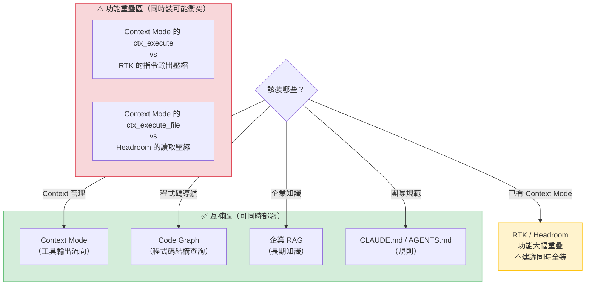
```mermaid
flowchart TD
    subgraph Overlap["⚠️ 功能重疊區（同時裝可能衝突）"]
        O1["Context Mode 的 ctx_execute<br/>vs<br/>RTK 的指令輸出壓縮"]
        O2["Context Mode 的 ctx_execute_file<br/>vs<br/>Headroom 的讀取壓縮"]
    end

    subgraph Complement["✅ 互補區（可同時部署）"]
        C1["Context Mode<br/>（工具輸出流向）"]
        C2["Code Graph<br/>（程式碼結構查詢）"]
        C3["企業 RAG<br/>（長期知識）"]
        C4["CLAUDE.md / AGENTS.md<br/>（規則）"]
    end

    Decision{"該裝哪些？"}
    Decision -->|"Context 管理"| C1
    Decision -->|"程式碼導航"| C2
    Decision -->|"企業知識"| C3
    Decision -->|"團隊規範"| C4
    Decision -->|"已有 Context Mode"| Warn["RTK / Headroom<br/>功能大幅重疊<br/>不建議同時全裝"]

    style Overlap fill:#f8d7da,stroke:#dc3545
    style Complement fill:#d4edda,stroke:#28a745
    style Warn fill:#fff3cd,stroke:#ffc107
```

#### 架構選擇原則 [Enterprise Recommendation]

**不要「全部都裝」。** 以下是建議的決策原則：

| 情況 | 建議 |
| --- | --- |
| **你的平台有 Hook 支援** | **優先選 Context Mode**。它是唯一能做程式化 routing enforcement 的（約 98% vs 約 60%） |
| **你的平台沒有 Hook**（Zed、Antigravity IDE） | Context Mode 只有約 60% 效果，此時 **RTK 這類 CLI 層攔截可能更有效**（它不依賴 Agent 配合） |
| **主要痛點是讀取大檔案** | Context Mode 的 `ctx_execute_file` 已涵蓋，不需額外裝 Headroom |
| **主要痛點是程式碼導航** | Context Mode **不解決這個**，需要 Code Graph 類工具 |
| **主要痛點是企業知識查詢** | Context Mode **不解決這個**，需要企業 RAG |
| **同時裝多個壓縮層** | ⚠️ **風險高**：壓縮的壓縮會導致資訊遺失難以追蹤，且統計數字會互相干擾 |

> **[Enterprise Recommendation] 一句話原則**：
> **同一層只裝一個工具。** Context 層選 Context Mode 就不要再疊 RTK / Headroom；知識層與結構層可以另外補。

#### 複雜度成本

疊加多個工具的隱性成本 [AI Analysis]：

| 成本 | 說明 |
| --- | --- |
| **除錯困難** | 輸出不如預期時，不知道是哪一層動的手腳 |
| **統計失真** | 每個工具都報告自己「省了 X%」，加總會超過 100% |
| **升級風險** | 任一工具升級都可能破壞其他工具的假設 |
| **維運負擔** | 每個工具都要診斷、升級、教育訓練 |
| **認知負擔** | 開發者要記住多套規則 |

### 22.4 ELv2 授權對企業架構的實質限制

> **[Official]** Context Mode 採用 **Elastic License 2.0**。官方說明：可以使用、fork、修改、散布；**兩件事不可以**：
>
> 1. **不可作為 hosted / managed service 提供**
> 2. **不可移除授權標示**
>
> 官方選擇 ELv2 而非 MIT 的理由是：MIT 允許把程式碼重新包裝成競爭性的閉源 SaaS。

#### 企業實務判讀 [AI Analysis]

> ⚠️ **以下是技術角度的分析，不是法律意見。企業應交由法務 / 法遵單位判斷。**

| 使用方式 | 一般判讀 | 需注意 |
| --- | --- | --- |
| 開發者在自己機器上使用 | 通常沒問題 | — |
| 公司內部全體開發者使用 | 通常沒問題 | 建議列入第三方元件清單 |
| 修改後內部使用 | 通常沒問題 | 不可移除授權標示 |
| **包裝成內部平台提供給其他事業體 / 子公司** | **需法務審查** | 可能觸及「managed service」定義 |
| **納入對外銷售的產品** | **高風險，需法務審查** | — |
| **提供給客戶作為服務的一部分** | **高風險，需法務審查** | — |

> **[Enterprise Recommendation]** 三個具體行動：
>
> 1. **把 Context Mode 列入企業的第三方元件清單**，授權標示為 ELv2（**不是** open source）
> 2. **採購 / 資安流程用「第三方元件」標準審查**，不要當成一般 npm 套件
> 3. **明確禁止「把 Context Mode 包成內部共用服務」**——這同時有授權風險與架構風險（見 [14.4](#144-企業部署架構)）

### 22.5 企業 AI Agent 標準架構

#### 分層架構

```text
AI Coding Agent
       ↓
Agent Instructions（CLAUDE.md / AGENTS.md / copilot-instructions.md）
       ↓
Agent Skills（可重用的專業能力）
       ↓
Agent Hooks（生命週期攔截）
       ↓
Context Mode（Context Optimization Layer）
       ↓
MCP（工具介面）
       ↓
Knowledge / Tools
       ↓
Enterprise Systems
```

#### Enterprise AI Software Factory 完整架構

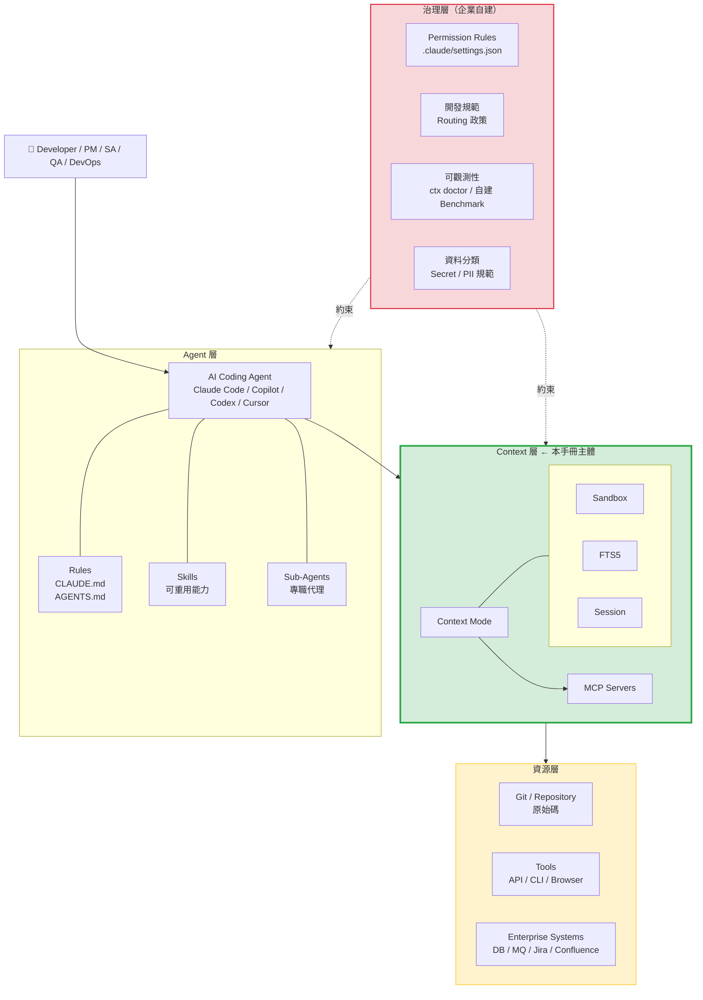
```mermaid
flowchart TD
    User["👤 Developer / PM / SA / QA / DevOps"]

    subgraph AgentLayer["Agent 層"]
        Agent["AI Coding Agent<br/>Claude Code / Copilot / Codex / Cursor"]
        Rules["Rules<br/>CLAUDE.md<br/>AGENTS.md"]
        Skills["Skills<br/>可重用能力"]
        Agents["Sub-Agents<br/>專職代理"]
    end

    subgraph ContextLayer["Context 層 ← 本手冊主體"]
        CM["Context Mode"]
        MCP["MCP Servers"]
        subgraph CMInner[" "]
            direction LR
            SB["Sandbox"]
            FTS["FTS5"]
            SESS["Session"]
        end
        CM --- CMInner
    end

    subgraph ResourceLayer["資源層"]
        Git["Git / Repository<br/>原始碼"]
        Tools["Tools<br/>API / CLI / Browser"]
        Ent["Enterprise Systems<br/>DB / MQ / Jira / Confluence"]
    end

    subgraph GovLayer["治理層（企業自建）"]
        Perm["Permission Rules<br/>.claude/settings.json"]
        Std["開發規範<br/>Routing 政策"]
        Mon["可觀測性<br/>ctx doctor / 自建 Benchmark"]
        Sec["資料分類<br/>Secret / PII 規範"]
    end

    User --> Agent
    Agent --- Rules
    Agent --- Skills
    Agent --- Agents
    Agent --> ContextLayer
    CM --> MCP
    ContextLayer --> ResourceLayer
    GovLayer -.->|"約束"| ContextLayer
    GovLayer -.->|"約束"| AgentLayer

    style ContextLayer fill:#d4edda,stroke:#28a745,stroke-width:3px
    style GovLayer fill:#f8d7da,stroke:#dc3545,stroke-width:2px
    style ResourceLayer fill:#fff3cd,stroke:#ffc107
```

**Context Mode 在這張圖裡的位置** [AI Analysis]：它是 **Agent 層與資源層之間的閘道**。所有大量資料的流動都要經過它，這讓它同時是「效能優化點」與「治理控制點」。

### 22.6 AI-Assisted SDLC 逐階段對照

| SDLC Phase | AI Agent 的工作 | Context Mode 使用方式 | 主要收益 |
| --- | --- | --- | --- |
| **Requirement** | 分析法規、既有系統、同業做法 | `ctx_fetch_and_index` 索引法規文件 → `ctx_search` 查條文 | 精確引用條文，不必讀完整份法規 |
| **Analysis** | 盤點既有系統、釐清範圍 | `ctx_batch_execute` 做系統盤點 | 大型系統在單次呼叫內建立輪廓 |
| **OOA** | 識別領域物件與關係 | `ctx_execute` 分析現有程式碼的類別關係 | 從實作反推領域模型 |
| **OOD** | 設計類別與介面 | `ctx_search` 查框架的設計慣例 | 設計符合框架最佳實務 |
| **Architecture** | 技術選型、架構決策 | `ctx_fetch_and_index` 索引框架文件 + `ctx_execute` 驗證假設 | 決策有依據且可驗證 |
| **Database Design** | Schema 設計與檢核 | `ctx_execute` 比對 schema 與企業規範 | 規範自動化檢查 |
| **Coding** | 撰寫程式碼 | 分析用 `ctx_*`，**編輯用原生 Read/Edit** | Context 留給真正需要推理的部分 |
| **Code Review** | 檢視變更 | `ctx_execute` 分析 diff、找出樣態 | 大型 PR 也能完整審視 |
| **Unit Test** | 撰寫與執行測試 | `ctx_execute` 跑測試 + 根因分類 | 23 個失敗歸納成 3 個原因 |
| **Integration Test** | 整合驗證 | `ctx_execute` 驗證 API 契約 | 契約測試自動化 |
| **Performance Test** | 效能分析 | `ctx_execute_file` 處理壓測與 profiler 輸出 | 數萬行數值 → 關鍵指標 |
| **Security Test** | 弱點與合規 | `ctx_execute` 處理掃描輸出（**只印位置**） | 高風險項目優先呈現 |
| **UAT** | 使用者驗收支援 | `ctx_execute_file` 分析 UAT 期間的 log 與問題單 | 快速定位問題樣態 |
| **Deployment** | 部署與驗證 | `ctx_execute` 檢查 K8s / Docker 狀態 | 只看異常項目 |
| **Maintenance** | 維運與事故處理 | Log 分析 + Git 分析 + K8s 分析組合 | 多步驟追根究柢在單一 session 完成 |

### 22.7 角色別使用方式

#### PM

| 任務 | 做法 |
| --- | --- |
| **Requirement 分析** | `ctx_fetch_and_index` 索引法規 / 規格 / 同業資料 → `ctx_search` 查條文 |
| **Issue 分析** | `gh issue list` 存檔 → `ctx_index` → `ctx_search` 查特定主題（見 [20.4](#204-git--github-分析)） |
| **會議記錄整理** | `ctx_index(path:)` 索引會議記錄目錄 → 依主題搜尋歷史決策 |
| **專案歷史分析** | `ctx_execute` 分析 git log 的 commit 頻率、模組活躍度 |

> **[Enterprise Recommendation]** PM 最常見的錯誤是把整份需求文件貼進對話。**改成索引後搜尋**，不但省 Context，而且後續整個團隊都能查。

#### SA

| 任務 | 做法 |
| --- | --- |
| **架構分析** | `ctx_execute` 產生模組相依圖、找出循環相依（見 [18.7](#187-階段四程式化分析)） |
| **相依性分析** | `ctx_execute` 處理 `mvn dependency:tree` / `npm ls` |
| **既有系統分析** | 五階段逆向工程流程（見 [第 18 章](#第-18-章-legacy-system-逆向工程)） |

#### Developer

| 任務 | 做法 |
| --- | --- |
| **Coding** | 分析用 `ctx_*`，**要編輯的檔案用原生 Read / Edit** |
| **Debug** | Log 分析 → git blame → 框架文件查詢 → 才讀程式碼（見 [16.5](#165-debug-prompt)） |
| **Refactoring** | `ctx_execute` 掃描影響範圍，輸出檔名 + 行號 |

#### QA

| 任務 | 做法 |
| --- | --- |
| **Test** | `ctx_execute` 跑測試 + 根因分類（見 [21.1](#211-testing)） |
| **Log 分析** | `ctx_execute_file` + 錯誤樣態正規化 |
| **Regression** | 比對與上次執行的**差異**，不是列出全部失敗 |

#### DevOps

| 任務 | 做法 |
| --- | --- |
| **Infrastructure** | `ctx_execute` 檢查 K8s / Docker，只印異常（見 [20.5](#205-docker--kubernetes-分析)） |
| **Deployment** | 部署後的健康檢查腳本化 |
| **Logs** | 跨服務 log 聚合分析 |

> **[Enterprise Recommendation]** DevOps 是最需要 `permissions.deny` 保護的角色——他們的憑證權限最大。務必設定生產環境的 deny 規則。

### 22.8 與 Spec-Driven Development 整合

```text
Specification（規格）
      ↓
AI Agent
      ↓
Context Mode ← 在這裡索引 spec、搜尋相關條目
      ↓
Repository / Knowledge
      ↓
Implementation（實作）
      ↓
Verification（驗證）← 在這裡用 ctx_execute 驗證實作符合 spec
```

| SDD 元素 | Context Mode 的角色 |
| --- | --- |
| **Specification** | `ctx_index(path: "./specs")` 索引成可搜尋知識庫；實作時 `ctx_search` 查對應條目，不必整份載入 |
| **Constitution**（專案憲法 / 不可違反的原則） | **不要放 Context Mode**。這應該在 `CLAUDE.md` / `AGENTS.md`，每次 session 都載入 |
| **Requirements** | 同 Specification |
| **Design** | 索引設計文件；用 `ctx_execute` 驗證實作是否符合設計（如層級相依規則） |
| **Tasks** | 由 Agent Harness 的 task 機制管理；Context Mode 的 PostToolUse 會捕捉 task 事件 |
| **Implementation** | 編輯用原生工具，分析用 `ctx_*` |
| **Verification** | `ctx_execute` 寫驗證腳本，比對實作與 spec |

> **[Enterprise Recommendation] 關鍵區分**：
>
> - **每次都要遵守的**（Constitution、核心規範）→ 放 `CLAUDE.md`，接受它佔 Context
> - **需要時才查的**（詳細 spec、API 定義）→ 放 Context Mode 索引
>
> 判斷標準：**這條規則模型每次都必須知道嗎？** 是 → 放 instruction 檔；否 → 索引。

### 22.9 三大平台的職責拆解

#### Claude Code 組合

| 元件 | 負責什麼 | 佔不佔 Context |
| --- | --- | --- |
| `CLAUDE.md` | 專案規則、慣例、不可違反的原則 | **佔**（每次載入） |
| **Skills** | 可重用的專業能力（依觸發條件載入） | 觸發時才佔 |
| **Agents**（Sub-agent） | 委派專職任務，有獨立 context | 只有回傳結果佔主 Context |
| **Hooks** | 生命週期攔截（Context Mode 用它做 routing） | 不佔（在 Harness 層） |
| **MCP** | 工具能力介面 | 工具定義佔一點 |
| **Context Mode** | **資料流向管理 + session 持久化** | 工具定義佔，但省下的遠多於此 |

#### GitHub Copilot 組合

| 元件 | 負責什麼 |
| --- | --- |
| `copilot-instructions.md` | 專案規則。**IDE 版 Copilot 沒有 UserPromptSubmit，長期決策一定要寫這裡** |
| `AGENTS.md` | 跨平台通用的 agent 指示 |
| **Skills** | Copilot CLI 的 plugin 可提供 skills |
| **Hooks** | Copilot CLI 用 camelCase；VS Code / JetBrains 用 `.github/hooks/` |
| **MCP** | VS Code 用 `.vscode/mcp.json`（鍵名是 `servers`） |
| **Context Mode** | 同上 |

#### Codex 組合

| 元件 | 負責什麼 |
| --- | --- |
| `AGENTS.md` | 專案 / 全域規則，**兩者都存在時 Codex 會合併** |
| **Skills** | plugin 的 `skills/` 目錄 |
| **MCP** | `.codex-plugin/mcp.json` 或 `[mcp_servers.context-mode]` |
| **Hooks** | **需要 `[features] hooks = true`，且要信任** |
| **Context Mode** | 同上，但 **PreToolUse 只能 deny，不能改寫參數** |

#### 三者的關鍵差異總結 [AI Analysis]

```text
Claude Code  ── 功能最完整（plugin marketplace + slash + Full session）
                → 適合作為企業主力

Copilot 生態 ── 覆蓋面最廣（IDE + CLI + JetBrains）
                → 適合已採購 Copilot Enterprise 的企業
                → 注意 IDE 版缺 UserPromptSubmit

Codex        ── 需要最多前置設定（兩個 feature flag + 信任 hook）
                → PreToolUse 能力受限
                → 適合已標準化 Codex 的團隊，但需接受 Partial session
```

### 22.10 Context Mode 與 Agent Memory 的分類

> **[AI Analysis]** **不要把所有資料都叫 Memory。** 以下是清楚的五分類：

| 類型 | 保存什麼 | 保存多久 | 用途 | 由誰管理 |
| --- | --- | --- | --- | --- |
| **Short-term Context** | 當前對話的所有內容 | 到 compaction 為止 | 當下推理 | Agent Harness |
| **Session Memory** | 本次 session 的工作狀態（改了哪些檔、哪些錯誤、你的決策） | 本次 session；不 `--continue` 即刪 | 跨 compaction 延續工作 | **Context Mode** |
| **Project Knowledge** | 索引過的文件、工具輸出 | **14 天**（TTL 24h 內免重抓） | 需要時檢索 | **Context Mode** |
| **Long-term Memory** | 使用者偏好、跨專案習慣 | 長期 | 個人化 | Agent 平台的 memory 功能 |
| **Repository Knowledge** | 專案規則、架構決策、慣例 | 永久（進版控） | 團隊共識 | **`CLAUDE.md` / `AGENTS.md` / docs/** |

**判斷準則** [Enterprise Recommendation]：

```text
問：這件事，三個月後的新同事需要知道嗎？
  是 → Repository Knowledge（寫進 repo 的文件）
  否 → 繼續問

問：這件事，明天開新 session 時需要記得嗎？
  是 → 寫進 CLAUDE.md，或用 ctx_index 索引成可搜尋內容
  否 → 繼續問

問：這件事，compaction 之後需要記得嗎？
  是 → Session Memory 會自動處理（前提：你的平台有對應 Hook）
  否 → 就讓它隨 Context 消失
```

> **最重要的提醒**：**Context Mode 的 Session Memory 不是備份**。它的設計是「clean slate by default」——不 `--continue` 就清空。**真正重要的決策一定要寫進版控的文件**。

### 22.11 本章實務案例

**情境**：某企業架構師被問：「我們已經有企業知識庫（RAG）、有 Code Graph 工具、也在評估 RTK，還需要 Context Mode 嗎？」

**分析過程**：

```text
先釐清各工具解決的問題：

企業 RAG      → 解決「模型不知道公司的業務知識」
Code Graph    → 解決「模型不知道程式碼的結構關係」
RTK           → 解決「CLI 輸出太大」
Context Mode  → 解決「工具輸出太大」+「compaction 後失憶」+「routing 無法強制」

檢查重疊：
  RTK 與 Context Mode 在「輸出太大」這一點重疊
  其餘三者互不重疊
```

**建議結論**：

```text
✅ 需要 Context Mode，理由：
   1. RAG 與 Code Graph 完全不解決 session 失憶問題
   2. 團隊主力是 Claude Code / Copilot CLI（有完整 Hook），
      能拿到約 98% 的 routing enforcement
   3. Context Mode 涵蓋的輸出來源比 RTK 廣
      （不只 CLI，還有 MCP 工具、Playwright、檔案讀取）

⚠️ 不建議同時裝 RTK，理由：
   1. 功能重疊，會出現「壓縮的壓縮」
   2. 兩邊的節省統計會互相干擾，無法做 KPI
   3. 除錯時難以判斷是哪一層改了輸出

✅ 保留 RAG 與 Code Graph，理由：
   它們在不同層次，與 Context Mode 互補

架構結論：
  知識層   → 企業 RAG
  結構層   → Code Graph
  Context 層 → Context Mode（單一工具）
  規則層   → CLAUDE.md / AGENTS.md
```

> **這個案例展示了本章的核心方法**：**先釐清每個工具解決的問題，再看重疊，最後才決定裝哪些**。不要因為「聽起來都有用」就全部裝。

### 22.12 本章注意事項

1. **十條規則要寫進團隊規範**，而不是只放在手冊裡。
2. **不要把 Context Mode 說成 RAG 或 Memory**，會導致錯誤期待。
3. **同一層只裝一個工具**，Context 層選了 Context Mode 就不要疊 RTK / Headroom。
4. **ELv2 要過法務**，特別是「內部共用服務」的想法。
5. **Constitution 類規則放 `CLAUDE.md`，詳細 spec 放索引**。
6. **Session Memory 不是備份**，重要決策要進版控。

### 22.13 本章檢查清單

- [ ] 十條 Context Engineering 規則已納入團隊規範
- [ ] 團隊能區分 Context Mode / RAG / Memory / MCP 的差別
- [ ] 已確認沒有在同一層疊加多個工具
- [ ] ELv2 授權已交法務確認，並列入第三方元件清單
- [ ] 已區分「每次都要載入的規則」與「需要時才查的資料」
- [ ] 團隊知道 Session Memory 不是備份機制

---

# Part 7 企業治理篇

---

<details>
<summary><strong>本 Part 章節導覽</strong>（點擊展開）</summary>

- [第 23 章 資料分類與安全治理](#第-23-章-資料分類與安全治理)
  - [23.1 Context Mode 可能保存哪些資料](#231-context-mode-可能保存哪些資料)
  - [23.2 資料分類與處理原則](#232-資料分類與處理原則)
  - [23.3 `ctx_insight` 與 Insight Platform 的企業處理原則](#233-ctx_insight-與-insight-platform-的企業處理原則)
  - [23.4 企業治理建議（非原生功能）](#234-企業治理建議非原生功能)
  - [23.5 銀行 / 金融業補充考量](#235-銀行--金融業補充考量)
  - [23.6 本章實務案例](#236-本章實務案例)
  - [23.7 本章注意事項](#237-本章注意事項)
  - [23.8 本章檢查清單](#238-本章檢查清單)

</details>

## 第 23 章 資料分類與安全治理

### 23.1 Context Mode 可能保存哪些資料

> **[Official] [AI Analysis]** 企業資安審查的第一個問題永遠是「它存了什麼、存在哪裡」。

| 元件 | 存什麼 | 存在哪裡 | 保存多久 |
| --- | --- | --- | --- |
| **Session DB** | 檔案路徑、git 操作、錯誤訊息、任務、**使用者 prompt 原文**、決策、環境變數名稱 | `<root>/sessions` | 本次 session；不 `--continue` 即刪 |
| **Content Index** | **被索引的完整內容**（文件、工具輸出、snapshot） | `<root>/content` | **14 天** |
| **Session Resume** | ≤2 KB 的 XML snapshot | `session_resume` 表 | 到被消費為止 |
| **Stats** | 呼叫次數、節省量 | `<root>/sessions` | 同 session |
| **Sandbox 暫存檔** | 你在腳本裡寫出的檔案 | 你指定的路徑 | **不會自動清除** |

> **⚠️ 最需要注意的兩項**：
>
> 1. **Content Index 存的是完整內容**。如果你 `ctx_index` 了一份含客戶資料的 CSV，那份資料就完整地躺在本機 SQLite 裡 14 天。
> 2. **使用者 prompt 原文會被保存**。如果你在對話中貼了一組密碼，它會進 session DB。

### 23.2 資料分類與處理原則

> **[Enterprise Recommendation]** 以下分類需依企業自身的資料分類制度調整。

```mermaid
flowchart TD
    Data["要處理的資料"] --> Q1{"含個資 / 客戶資料 /<br/>交易資料 / 憑證？"}

    Q1 -->|"否"| Q2{"是生產環境資料？"}
    Q1 -->|"是"| Q3{"能否遮罩後處理？"}

    Q2 -->|"否"| Allowed["✅ Allowed<br/>可自由使用 ctx_execute / ctx_index"]
    Q2 -->|"是"| Restricted["⚠️ Restricted<br/>可用 ctx_execute 分析<br/>但禁止 ctx_index<br/>腳本只輸出統計，不輸出原始記錄"]

    Q3 -->|"可以"| Mask["⚠️ Restricted<br/>先遮罩再處理<br/>遮罩在 sandbox 內完成"]
    Q3 -->|"不行"| Prohibited["🚫 Prohibited<br/>禁止進入 Context Mode<br/>改用專用的離線環境"]

    Allowed --> A1["範例：開源套件文件<br/>本專案原始碼<br/>測試環境 log"]
    Restricted --> R1["範例：production log<br/>DB schema<br/>效能監控數據"]
    Mask --> M1["範例：含客戶 ID 的 log<br/>→ 腳本內先 hash 再統計"]
    Prohibited --> P1["範例：客戶個資明細<br/>交易明細<br/>金鑰 / 憑證<br/>信用卡資料"]

    style Allowed fill:#d4edda,stroke:#28a745
    style Restricted fill:#fff3cd,stroke:#ffc107
    style Mask fill:#fff3cd,stroke:#ffc107
    style Prohibited fill:#f8d7da,stroke:#dc3545,stroke-width:2px
```

#### 三類資料的具體規範

| 分類 | 允許的操作 | 禁止的操作 |
| --- | --- | --- |
| **Allowed** | `ctx_execute`、`ctx_execute_file`、`ctx_index`、`ctx_fetch_and_index` | — |
| **Restricted** | `ctx_execute` / `ctx_execute_file`（**腳本只輸出彙總統計**） | **`ctx_index`**（會完整保存 14 天）、輸出原始記錄 |
| **Prohibited** | **全部禁止** | 全部 |

### 23.3 `ctx_insight` 與 Insight Platform 的企業處理原則

> **本節於 2026-09-18 依官方網站現行說明重寫。** 舊版手冊曾記載「官方未說明資料流向」，
> 該敘述**已不再正確**——官方現已公開雙層架構與資料處理條款。

#### 官方現行說明 [Official]

Context Mode 是「開源核心 + 商業平台」的雙層產品：

| | OSS Plugin | Insight Platform |
| --- | --- | --- |
| **啟用方式** | 預設，安裝即有 | **須組織主動 opt-in** |
| **費用** | 免費（ELv2） | **每席 USD 20／月**（Organization tier） |
| **資料位置** | 全部本機 | 轉發至供應商託管的私有 workspace |
| **傳送內容** | 不外送 | **結構化事件**：工具名稱、檔案路徑、錯誤計數 |
| **明確排除** | — | never source code／never prompt content／never file content |
| **提供功能** | sandbox、FTS5、hooks、session 續接 | 組織分析、retry waste、FinOps 成本歸因（見 [第 31 章](#第-31-章-token-成本可視化與-finops-歸因)） |

#### 企業判讀：官方聲明保護的範圍，未必涵蓋你的風險 [AI Analysis]

官方「只傳結構化 metadata」的聲明應予採信，但**企業必須自己回答三個問題**：

| # | 問題 | 為什麼重要 |
| --- | --- | --- |
| **1** | **我們的檔案路徑本身算不算敏感資訊？** | `src/clients/<客戶名>/…`、`projects/<併購代號>/…` 這類命名一旦外送，**路徑就是情報**。這是最容易被忽略的一項 |
| **2** | **錯誤訊息計數會不會反推出系統架構？** | 模組名稱 + 錯誤樣態的統計，可能揭露內部系統拓撲 |
| **3** | **資料落在哪個司法管轄區？保存多久？** | 跨境傳輸在金融與個資法規下屬於須申報事項 |

#### 建議處置 [Enterprise Recommendation]

由舊版的「查證前一律停用」，調整為**分級處置**：

| 情境 | 處置 |
| --- | --- |
| **預設（所有企業）** | **停用**。寫入團隊資安規範的禁用指令清單 |
| **一般企業，想啟用** | 先完成 ①路徑命名風險評估（掃描現有 repo 路徑是否含客戶／專案代號）②簽署 DPA ③確認資料落地區域，三項齊備才 opt-in |
| **金融／銀行業** | **維持禁用**，除非法遵單位另行核准並完成跨境傳輸申報 |
| **已 opt-in 者** | 納入每季資安審查（見 [24.1](#241-維運週期表)）；路徑命名規範改為「**不得以客戶名或案件代號命名目錄**」 |

> **[Enterprise Recommendation] 技術面驗證仍建議做**：在隔離網路環境執行 `ctx_insight`，
> 以網路監控工具實際比對外送內容是否與官方聲明一致。**信任但驗證**——
> 這不是質疑供應商，而是資安審查的標準程序。

### 23.4 企業治理建議（非原生功能）

> **⚠️ 以下全部標示為 [Enterprise Recommendation]——這些是企業治理建議，不是 Context Mode 原生功能。** 安裝完成不會自動具備。

| 治理項目 | Context Mode 原生有嗎 | 企業該怎麼補 |
| --- | --- | --- |
| **Secret masking** | **部分**：只遮罩 MCP 工具參數（見 [15.12](#附加憑證遮罩)） | 腳本規範：只印位置不印內容；`permissions.deny` 擋 `.env` 讀取 |
| **PII masking** | **無** | 腳本內先 hash / 遮罩再統計；納入 code review 檢查項目 |
| **Log sanitization** | **無** | 分析 production log 前先在 sandbox 內遮罩敏感欄位 |
| **Production data 限制** | **無**（僅有專案根目錄圍籬） | `permissions.deny` 加上生產路徑與 `*prod*` 樣式 |
| **Encryption at rest** | **無**（SQLite 明文） | 用作業系統層級的磁碟加密（BitLocker / FileVault / LUKS） |
| **Access control** | **無**（檔案系統權限） | 確保 `<root>` 目錄權限為使用者專屬（Windows: 移除 Users 群組） |
| **File permissions** | **無** | 環境自檢腳本檢查目錄權限 |
| **Retention** | **部分**：content 14 天、session 不 continue 即刪 | 若需更短，排程定期 `ctx_purge` |
| **Purge** | **有**：`ctx_purge(confirm: true)` | 納入事件處理程序 |
| **Audit** | **無** | 自行蒐集 `ctx_stats` / doctor 結果；或用端點稽核工具 |
| **Backup** | **無**（刻意設計為不備份） | **不建議備份**——備份 session DB 等於延長敏感資料保存期 |

#### 具體的 deny 規則範本

> **[Enterprise Recommendation]** 可直接採用並依企業情況調整：

```json
{
  "permissions": {
    "deny": [
      "Bash(sudo *)",
      "Bash(rm -rf /*)",

      "Read(.env)",
      "Read(**/.env*)",
      "Read(**/*secret*)",
      "Read(**/*credential*)",
      "Read(**/*.pem)",
      "Read(**/*.key)",
      "Read(**/*.p12)",
      "Read(**/*.jks)",
      "Read(**/id_rsa*)",

      "Bash(*prod*)",
      "Bash(kubectl * -n prod*)",
      "Bash(kubectl delete *)",
      "Bash(*--context*prod*)",
      "Bash(psql *prod*)",
      "Bash(mysql *prod*)",

      "Read(C:/Users/*/AppData/Roaming/**)",
      "Read(~/.aws/credentials)",
      "Read(~/.ssh/**)"
    ],
    "allow": [
      "Bash(git:*)",
      "Bash(mvn:*)",
      "Bash(npm:*)",
      "Bash(docker:*)"
    ]
  }
}
```

> **[Official]** 記住：**這些 deny 規則會同時套用到 `ctx_execute`、`ctx_execute_file`、`ctx_batch_execute` 內部**。這是防線一的價值。

### 23.5 銀行 / 金融業補充考量

> **[Enterprise Recommendation]** 以下針對金融機構環境的補充。

#### 定位聲明（必須先講清楚）

> **Context Mode 是一個技術元件。它本身不符合、也不聲稱符合任何特定金融法規。**
>
> 企業仍需依自身的資安政策、法遵要求、AI Governance 制度與資料分類規範進行完整評估。本手冊提供的是技術面的評估要點，**不是合規保證**。

#### 評估要點

| 面向 | 評估問題 | 本手冊的技術判讀 |
| --- | --- | --- |
| **原始碼保密** | 程式碼會不會外流？ | Sandbox 與 SQLite 皆為本機；但**模型本身**會看到你送進 Context 的內容——這取決於你用的 AI 平台，不是 Context Mode |
| **客戶資訊** | 會不會被索引保存？ | **會**，如果你 `ctx_index` 了含客戶資料的檔案。需依 [23.2](#232-資料分類與處理原則) 管控 |
| **帳戶 / 交易資料** | 同上 | 建議列為 **Prohibited** |
| **Production Logs** | 可以分析嗎？ | 列為 **Restricted**：可用 `ctx_execute` 分析，但腳本只能輸出統計，且**禁止 `ctx_index`** |
| **Security Scanning** | 掃描結果會不會洩漏弱點資訊？ | 掃描結果會進 Context 與 session DB。建議腳本只輸出位置與等級 |
| **Audit Trail** | 有稽核軌跡嗎？ | **Context Mode 無原生稽核功能**。需自建 |
| **AI Governance** | 符合公司的 AI 使用規範嗎？ | 需納入既有的 AI 工具治理清單審查 |
| **Developer Access** | 誰能用？ | 由 `permissions` 規則 + 端點管理控制 |
| **Environment Segregation** | 開發 / 測試 / 生產隔離 | **必須用 `permissions.deny` 強制**，Context Mode 不會自己區分環境 |

#### 金融業的五條硬規定建議

> **[Enterprise Recommendation]**

```text
1. 禁止 ctx_insight（hosted dashboard，資料流向未經驗證）

2. 禁止對 production 資料執行 ctx_index
   （可以用 ctx_execute 分析，但不可索引保存）

3. 所有資安掃描腳本只輸出「檔名:行號 + 風險類型」，
   絕不輸出匹配到的內容

4. CONTEXT_MODE_DIR 指向受磁碟加密保護的路徑，
   且目錄權限限於該使用者

5. 誤索引敏感資料 → 立即 ctx_purge(confirm: true) → 通報資安
   （寫進事件處理程序，並定期演練）
```

### 23.6 本章實務案例

**情境**：某銀行開發者要分析 production 的交易 log，找出一個間歇性的逾時問題。

**錯誤做法**（違反規範）：

```text
ctx_index(path: "/prod/logs/transaction.log", source: "prod-log")
→ 整份交易 log（含帳號、金額、客戶 ID）被完整保存在本機 SQLite 14 天
→ 資安事件
```

**正確做法**：

```text
步驟 1：確認資料分類
  交易 log 含帳號與金額 → Restricted（不可 index，可分析）

步驟 2：在 sandbox 內遮罩後分析
ctx_execute_file(
  path: "/prod/logs/transaction.log",
  language: "python",
  intent: "找出逾時的共同樣態",
  code: '''
import re, collections, hashlib

def mask(s):
    """帳號等識別資訊一律 hash，只保留前 8 碼供關聯分析"""
    return hashlib.sha256(s.encode()).hexdigest()[:8]

timeouts = []
by_hour = collections.Counter()
by_api  = collections.Counter()
by_acct = collections.Counter()

for line in FILE_CONTENT.split("\\n"):
    if "TimeoutException" not in line:
        continue
    ts   = re.search(r"(\\d{4}-\\d{2}-\\d{2} \\d{2}):", line)
    api  = re.search(r"api=(\\S+)", line)
    acct = re.search(r"acct=(\\d+)", line)
    if ts:   by_hour[ts.group(1)[-2:]] += 1
    if api:  by_api[api.group(1)] += 1
    if acct: by_acct[mask(acct.group(1))] += 1    # ← 遮罩
    timeouts.append(line)

print(f"逾時事件 {len(timeouts)} 筆")
print(f"時段分布：{sorted(by_hour.items())}")
print(f"API 分布 Top 5：{by_api.most_common(5)}")
print(f"是否集中於特定帳戶：{len(by_acct)} 個不同帳戶（已遮罩）")
print(f"  Top 3（遮罩後）：{by_acct.most_common(3)}")
# 注意：不印出任何原始 log 行
  '''
)

步驟 3：結果
「逾時 1,203 筆，集中在每小時 00-05 分（批次時段），
  92% 來自 /api/balance/inquiry，
  分散於 847 個不同帳戶（非特定帳戶問題）」
→ 約 400 B 進 Context，無任何敏感資料
```

**關鍵設計**：

1. **不用 `ctx_index`**（避免完整保存）
2. **帳號在 sandbox 內 hash**（保留關聯分析能力，但不外洩）
3. **不印出原始 log 行**（即使是「證據樣本」也不印）

> **[Enterprise Recommendation]** 第 2 點值得特別說明：`mask()` 保留了 hash 前 8 碼，所以**仍然能判斷「是不是集中在少數帳戶」**，但無法還原帳號。這是「可用性」與「保密性」的平衡點，建議寫成團隊的標準工具函式。

### 23.7 本章注意事項

1. **`ctx_index` 會完整保存內容 14 天**，這是最大的資安風險點。
2. **使用者 prompt 原文會進 session DB**，不要在對話裡貼憑證。
3. **Sandbox 寫出的暫存檔不會自動清除**，腳本要自己收尾。
4. **表格中大部分治理項目都是企業要自建的**，不是原生功能。
5. **不建議備份 session DB**，那等於延長敏感資料保存期。
6. **`ctx_insight` 在完成驗證前預設停用**。
7. **Context Mode 不符合也不聲稱符合任何金融法規**。

### 23.8 本章檢查清單

- [ ] 已建立資料分類（Allowed / Restricted / Prohibited）並公告
- [ ] `permissions.deny` 規則已涵蓋憑證、生產環境、敏感路徑
- [ ] 團隊知道 `ctx_index` 會完整保存內容 14 天
- [ ] 資安掃描腳本只輸出位置，不輸出內容
- [ ] `CONTEXT_MODE_DIR` 指向受磁碟加密保護的路徑
- [ ] 目錄權限已限縮為使用者專屬
- [ ] `ctx_insight` 已停用或已完成資料流向驗證
- [ ] 誤索引的事件處理程序已文件化
- [ ] 已交法遵單位完成 AI Governance 審查

---

# Part 8 維運篇

---

<details>
<summary><strong>本 Part 章節導覽</strong>（點擊展開）</summary>

- [第 24 章 日常維運](#第-24-章-日常維運)
  - [24.1 維運週期表](#241-維運週期表)
  - [24.2 升級流程](#242-升級流程)
  - [24.3 `ctx doctor` / `ctx stats` 診斷 SOP](#243-ctx-doctor--ctx-stats-診斷-sop)
  - [24.4 本章實務案例](#244-本章實務案例)
  - [24.5 本章注意事項](#245-本章注意事項)
  - [24.6 本章檢查清單](#246-本章檢查清單)
- [第 25 章 Troubleshooting](#第-25-章-troubleshooting)
  - [問題 1：MCP Server 沒有出現](#問題-1mcp-server-沒有出現)
  - [問題 2：Hook 沒有執行](#問題-2hook-沒有執行)
  - [問題 3：Context 沒有降低](#問題-3context-沒有降低)
  - [問題 4：FTS5 無法使用](#問題-4fts5-無法使用)
  - [問題 5：Session 沒有恢復](#問題-5session-沒有恢復)
  - [問題 6：Agent 沒有使用 `ctx_search`](#問題-6agent-沒有使用-ctx_search)
  - [問題 7：Agent 還是直接讀大量資料](#問題-7agent-還是直接讀大量資料)
  - [問題 8：Upgrade 後 Hook 失效](#問題-8upgrade-後-hook-失效)
  - [問題 9：不同 Agent 行為不同](#問題-9不同-agent-行為不同)
  - [問題 10：SQLite / Cache 太大](#問題-10sqlite--cache-太大)
  - [問題 11：中文／emoji 內容導致 session 損毀（HTTP 500）](#問題-11中文emoji-內容導致-session-損毀http-500)
  - [其他已知問題（官方 Open Issues）](#其他已知問題官方-open-issues)
  - [v1.0.169 的 Compaction 迴圈風險（必讀）](#v10169-的-compaction-迴圈風險必讀)
  - [通用診斷工具](#通用診斷工具)
  - [本章檢查清單](#本章檢查清單)

</details>

## 第 24 章 日常維運

### 24.1 維運週期表

> **[Enterprise Recommendation]** Context Mode 是 **fail-open** 設計（壞掉不報錯），所以**主動巡檢是必要的，不是選配**。

| 週期 | 項目 | 指令 / 動作 | 判定標準 |
| --- | --- | --- | --- |
| **每日** | 節省統計 | `ctx stats` | 有節省紀錄；若為 0 表示 routing 可能失效 |
| | 錯誤檢查 | 觀察是否有工具呼叫失敗 | 無異常 |
| **每週** | 儲存空間 | 檢查 `<root>` 目錄大小 | 未異常成長 |
| | 索引健康 | `ctx doctor` | 全部 `[x]` |
| | 孤兒程序（Windows） | 檢查殘留的 node 程序 | 無長時間高 CPU 程序 |
| **每月** | 版本檢查 | `context-mode --version` vs 官方最新 | 與企業基準版一致 |
| | Benchmark | 跑企業自訂情境（見 [第 26 章](#第-26-章-企業自建-benchmark)） | 節省率未劣化 |
| | 清理 | 視需要 `ctx_purge` | 磁碟回收 |
| **每季** | 資安審查 | 檢視索引內容是否含敏感資料 | 符合資料分類規範 |
| | 架構審查 | 檢視工具疊加狀況、routing 政策 | 無重複層級 |
| | 平台相容性 | 檢視官方 platform-support 有無變更 | 團隊平台仍受支援 |

#### 每日巡檢腳本（Windows PowerShell）

```powershell
# scripts/ctx-daily-check.ps1
$ErrorActionPreference = "Continue"
$report = @()

# 1. 版本
$ver = (context-mode --version) 2>$null
$report += "版本: $ver"

# 2. doctor
$doc = (context-mode doctor) 2>&1 | Out-String
$fail = ($doc | Select-String -Pattern '\[ \]|FAIL|ERROR' -AllMatches).Matches.Count
$report += "doctor 異常項目: $fail"

# 3. 儲存空間
$root = if ($env:CONTEXT_MODE_DIR) { $env:CONTEXT_MODE_DIR }
        else { "$env:USERPROFILE\.claude\context-mode" }
if (Test-Path $root) {
    $size = (Get-ChildItem $root -Recurse -File -ErrorAction SilentlyContinue |
             Measure-Object Length -Sum).Sum / 1MB
    $report += ("儲存用量: {0:N1} MB" -f $size)
    if ($size -gt 2048) { $report += "⚠️ 超過 2 GB，建議檢視是否需要 ctx_purge" }
}

# 4. 孤兒程序（Windows 已知問題）
$orphans = Get-Process node -ErrorAction SilentlyContinue |
           Where-Object { $_.CPU -gt 300 }
if ($orphans) {
    $report += "⚠️ 疑似孤兒程序: $($orphans.Count) 個"
    $orphans | ForEach-Object { $report += "   PID $($_.Id) CPU $([int]$_.CPU)s" }
}

$report | ForEach-Object { Write-Output $_ }
if ($fail -gt 0) { exit 1 }
```

**Linux / macOS 版本**：

```bash
#!/usr/bin/env bash
# scripts/ctx-daily-check.sh
echo "版本: $(context-mode --version 2>/dev/null)"

doc=$(context-mode doctor 2>&1)
fail=$(echo "$doc" | grep -cE '\[ \]|FAIL|ERROR')
echo "doctor 異常項目: $fail"

root="${CONTEXT_MODE_DIR:-$HOME/.claude/context-mode}"
[ -d "$root" ] && echo "儲存用量: $(du -sh "$root" 2>/dev/null | cut -f1)"

[ "$fail" -gt 0 ] && exit 1 || exit 0
```

### 24.2 升級流程

> **⚠️ [Community] 升級決策的現況（2026-09-18）**：目前最新 release **v1.0.169 帶有
> compaction 迴圈缺陷（#1173），可能耗盡 token 配額**。這使「升到最新版」不再是無腦的正確答案。
>
> | 你的現況 | 建議 |
> | --- | --- |
> | 已在 v1.0.169 | **不需降版**，但必須套用 [第 25 章的四項控制措施](#v10169-的-compaction-迴圈風險必讀) |
> | 在 v1.0.167–168 | 可留在原版；已具備 FinOps 能力（[第 31 章](#第-31-章-token-成本可視化與-finops-歸因)）且無 #1173 的完整影響 |
> | 在 v1.0.166 以下 | 升級可獲得成本量測能力，但需一併承擔並控制 #1173 |
> | 追蹤重點 | #1173 的修復版一旦發布，**優先升級** |

```mermaid
flowchart TD
    V["① 確認現行版本<br/>context-mode --version"]
    B["② 備份設定<br/>hooks.json / mcp.json / settings.json"]
    C["③ 相容性檢查<br/>閱讀 Release Notes<br/>確認平台支援未變更"]
    U["④ 升級<br/>npm / plugin / ctx upgrade"]
    D["⑤ Doctor<br/>context-mode doctor"]
    R["⑥ 回歸測試<br/>跑一次標準工作流程"]
    BM["⑦ Benchmark<br/>比對節省率"]
    RO["⑧ 全面推廣"]

    V --> B --> C --> U --> D
    D -->|"有紅燈"| Fix["排查（見第 25 章）"]
    Fix --> D
    D -->|"全綠"| R
    R -->|"行為異常"| Rollback["回滾"]
    R -->|"正常"| BM
    BM -->|"節省率劣化"| Rollback
    BM -->|"符合預期"| RO
    Rollback --> Report["回報官方 issue<br/>bash scripts/ctx-debug.sh"]

    style D fill:#d4edda,stroke:#28a745
    style Rollback fill:#f8d7da,stroke:#dc3545
```

#### 各升級路徑的指令

| 安裝方式 | 升級指令 | 說明 |
| --- | --- | --- |
| **npm 全域** | `npm install -g context-mode@latest` | 最常用 |
| **Claude Code plugin** | `/plugin marketplace update` 後重新 install，或 `/context-mode:ctx-upgrade` | — |
| **`ctx upgrade`** | `context-mode upgrade` | **從 GitHub 拉最新、重建、修復 hook 設定、遷移快取** [Official] |
| **Copilot CLI plugin** | `copilot plugin install mksglu/context-mode:configs/copilot-cli`（重裝） | **注意**：`context-mode upgrade` 只寫 hooks 檔 |
| **OMP** | `omp plugin install context-mode` | — |
| **Cursor（本地）** | 重跑 `robocopy` / `ln -s` | — |
| **OpenClaw** | `git pull && npm run install:openclaw` | — |

#### `ctx upgrade` 做了什麼 [Official]

```text
1. 從 GitHub 拉取最新版
2. 重建
3. 重新設定 / 寫入 hook 設定檔
4. 遷移快取
5. 移除 OpenCode / KiloCode 的 legacy mcp.context-mode 項目
```

#### 回滾

```bash
# 釘回特定版本
npm install -g context-mode@1.0.169

# 還原備份的設定檔
# Windows
Copy-Item "$env:USERPROFILE\ctx-backup\*" "$env:USERPROFILE\.claude\" -Recurse -Force
```

> **[Enterprise Recommendation]** 升級前備份這些檔案：
>
> ```text
> ~/.claude/settings.json
> ~/.copilot/hooks/context-mode.json
> ~/.codex/config.toml、~/.codex/hooks.json
> .cursor/hooks.json、.cursor/mcp.json
> .vscode/mcp.json、.github/hooks/context-mode.json
> ```

> **[Community] 升級後最常見的問題**：hook 失效但 fail-open 不報錯。**升級後一定要跑 `ctx doctor`**，這不是建議，是必要步驟。

### 24.3 `ctx doctor` / `ctx stats` 診斷 SOP

#### `ctx doctor` 檢查鏈

```text
ctx doctor
   ↓
MCP        → MCP server 是否註冊且可連線
   ↓
Hooks      → hook 設定檔是否存在、格式是否正確、是否被信任（Codex）
   ↓
Runtime    → Node / Bun 版本是否符合需求
   ↓
FTS5       → SQLite FTS5 是否可用
   ↓
Storage    → 儲存路徑是否可寫、CONTEXT_MODE_DIR 是否有效
   ↓
Platform   → 平台偵測結果是否正確
```

**判讀原則**：

| 結果 | 意義 | 動作 |
| --- | --- | --- |
| 全部 `[x]` | 安裝正常 | 繼續 `ctx stats` 確認實際效果 |
| MCP 失敗 | 設定檔錯誤或路徑問題 | 見 [問題 1](#問題-1mcp-server-沒有出現) |
| Hooks 失敗 | hook 未註冊 / 格式錯 / 未信任 | 見 [問題 2](#問題-2hook-沒有執行) |
| Runtime 失敗 | Node 版本不足 | 升級 Node 至 ≥ 22.5 |
| FTS5 失敗 | SQLite 後端問題 | 見 [問題 4](#問題-4fts5-無法使用) |
| Platform 錯誤 | 多 Agent 環境的偵測衝突 | 設定 `CONTEXT_MODE_PLATFORM` |

#### `ctx stats` 檢查鏈

```text
ctx stats
   ↓
Tool calls     → 各工具的呼叫次數
   ↓
Context usage  → token 消耗
   ↓
Savings        → 避免進入 Context 的資料量
   ↓
Efficiency     → 節省比例
   ↓
Cache          → 快取命中、避免的資料量、省下的網路請求
```

> **⚠️ [Community] [AI Analysis] 判讀警告（再次強調）**：
>
> **`ctx stats` 是觀測工具，不代表所有 savings 數字都能直接等同於實際 LLM 成本節省。**
>
> 理由：
>
> 1. 那些資料**本來未必會全部被讀進去**（人可能只 `head -50`）
> 2. **Prompt Caching** 會讓重複的 input token 折價
> 3. 不同模型單價不同
> 4. Context Mode 自身的工具定義與 routing 提示也佔 Context
> 5. **官方有已知的計算 bug**（per-chat 數字超過全域總計、零呼叫顯示 100%）
>
> **企業 KPI 請以 [第 26 章](#第-26-章-企業自建-benchmark) 的自建 benchmark 為準。**

#### 企業診斷 SOP

```text
【症狀：感覺 Context Mode 沒作用】

Step 1  context-mode doctor
        → 有紅燈？→ 依 24.3 判讀表處理
        → 全綠 → Step 2

Step 2  ctx stats
        → 呼叫次數為 0？
           → routing 沒生效，模型根本沒用 ctx_* 工具
           → 檢查 routing 指令檔是否存在、hook 是否真的在跑
           → 見 問題 6 / 問題 7
        → 有呼叫但節省率低？→ Step 3

Step 3  檢視實際的工具使用方式
        → 是否只是「把指令包一層」而沒有分析？（見 16.9 案例）
        → 是否用了 ctx_index(content:) ？
        → 是否連續多次 ctx_search ？
        → 這是「使用方法」問題，不是「設定」問題
        → 補教育訓練，見第 16 章與第 27 章

Step 4  仍無法解決
        → bash scripts/ctx-debug.sh 產生完整報告
        → 回報 GitHub issue
```

### 24.4 本章實務案例

**情境**：某團隊導入三個月後，發現節省率從 85% 掉到 40%。

**排查過程**：

```text
Step 1  ctx doctor → 全綠（所以不是設定問題）

Step 2  ctx stats → 工具呼叫次數正常，但單次節省率偏低

Step 3  檢視實際使用 → 發現兩個問題：
        a) 團隊近期導入了一個新的 Jira MCP，
           開發者大量呼叫它查需求單，
           回傳的 JSON 直接進 Context（沒有包進 ctx_execute）
        b) 有 3 位新同事沒有接受過訓練，
           習慣直接用 Read 逐檔閱讀

解法：
  a) 調整 CONTEXT_MODE_EXTERNAL_MCP_NUDGE_EVERY 從預設 10 改成 5，
     讓「大型 external MCP payload 請包進 ctx_execute」的提示更頻繁
     並在 copilot-instructions.md 補上 Jira MCP 的專用 routing 規則
  b) 補訓練，並把 16.9 的錯誤示範加進團隊規範

兩週後節省率回到 82%。
```

> **這個案例的教訓** [AI Analysis]：**節省率下降通常不是工具壞了，而是使用情境變了**（新增 MCP、新人加入）。所以維運巡檢要包含「使用方式」的檢視，不只是技術指標。

### 24.5 本章注意事項

1. **fail-open 讓故障很安靜**，主動巡檢是必要的。
2. **升級後一定要跑 `ctx doctor`**。
3. **`ctx stats` 不能當 KPI**，有已知計算 bug。
4. **節省率下降往往是使用方式問題**，不是設定問題。
5. **Windows 要額外檢查孤兒程序**。
6. **升級前備份設定檔**。

### 24.6 本章檢查清單

- [ ] 每日巡檢腳本已建立並排程
- [ ] 每週 `ctx doctor` 已納入例行
- [ ] 每月版本檢查與 benchmark 已排程
- [ ] 每季資安與架構審查已排程
- [ ] 升級 SOP 已文件化，含備份與回滾
- [ ] 診斷 SOP 已文件化（doctor → stats → 使用方式）
- [ ] 團隊知道 `ctx stats` 不能當 KPI

---

## 第 25 章 Troubleshooting

> 每個問題依 **Symptoms / Cause / Diagnosis / Solution / Verification** 五段說明。

### 問題 1：MCP Server 沒有出現

| 項目 | 內容 |
| --- | --- |
| **Symptoms** | 在 AI session 中輸入 `ctx stats` 沒有反應；平台的 MCP 清單看不到 `context-mode` |
| **Cause** | ① 設定檔路徑或鍵名錯誤（如 VS Code 用了 `mcpServers` 而非 `servers`；Zed 用了 `mcpServers` 而非 `context_servers`）② `context-mode` 不在 PATH 上 ③ 未重啟 ④ Node 版本不符 |
| **Diagnosis** | `context-mode --version`（確認 binary 可用）→ 檢查平台對應的 MCP 設定檔鍵名 → `node --version` |
| **Solution** | 對照 [第 10–13 章](#第-10-章-claude-code-安裝) 修正鍵名；`npm install -g context-mode` 重裝；重啟平台 |
| **Verification** | 平台的 MCP 清單顯示已連線；`ctx stats` 有回應 |

### 問題 2：Hook 沒有執行

| 項目 | 內容 |
| --- | --- |
| **Symptoms** | `ctx stats` 正常但 Agent 仍直接用 Bash / Read；Context 沒有降低 |
| **Cause** | ① **Codex：feature flag 未開或 hook 未被信任** ② hook 設定檔的**平台識別參數抄錯**（如 `vscode-copilot` 寫成 `copilot-cli`）③ **事件名稱錯**（Gemini CLI 用 `BeforeTool` 不是 `PreToolUse`；Copilot CLI 用 camelCase）④ 全域 `context-mode` 版本太舊，hook 為 inert（fail-open）⑤ 平台本身沒有 hook（Zed / Antigravity IDE） |
| **Diagnosis** | `context-mode doctor` 看 hooks 項目 → 檢查設定檔的事件名稱與平台識別 → `context-mode --version` |
| **Solution** | Codex：設 `[features] hooks = true` + `plugin_hooks = true` 並信任 hook；其他：對照章節修正設定；`npm install -g context-mode@latest` |
| **Verification** | `ctx doctor` 的 hooks 項目為 `[x]`；實測一個會被攔截的指令（如 `cat` 大檔）確認被導向 |

> **[Official] 關鍵提醒**：`ctx stats` 有回應**不代表** hook 在跑。只有 `ctx doctor` 能驗證。

### 問題 3：Context 沒有降低

| 項目 | 內容 |
| --- | --- |
| **Symptoms** | 裝了但 Context 消耗跟以前差不多 |
| **Cause** | ① Hook 沒生效（見問題 2）② **使用方式不對**：`ctx_execute` 只是把指令包一層，沒做分析 ③ 用了 `ctx_index(content: 大資料)` ④ Playwright 沒帶 `filename` ⑤ 其他 MCP 工具的輸出沒有被包起來 |
| **Diagnosis** | `ctx doctor` → `ctx stats` 看呼叫次數與節省率 → **檢視實際的工具呼叫內容** |
| **Solution** | 依 [24.3 診斷 SOP](#243-ctx-doctor--ctx-stats-診斷-sop) 逐步排查；若是使用方式問題，補教育訓練（[第 16](#第-16-章-ai-agent-prompt-標準)、[27 章](#第-27-章-開發者使用規範)）；調低 `CONTEXT_MODE_EXTERNAL_MCP_NUDGE_EVERY` |
| **Verification** | `ctx stats` 節省率回升；自建 benchmark 達標 |

### 問題 4：FTS5 無法使用

| 項目 | 內容 |
| --- | --- |
| **Symptoms** | `ctx_index` / `ctx_search` 報錯；`ctx doctor` 的 FTS5 項目紅燈 |
| **Cause** | ① `better_sqlite3.node` 遺失或載入失敗 ② **Linux + Node < 22.5**（官方不支援）③ 舊 glibc（CentOS 7/8、RHEL 8、Debian 10）prebuilt binary 載不起來 ④ 儲存路徑不可寫 |
| **Diagnosis** | `node --version` → `context-mode doctor` 看 FTS5 與 Storage → `bash scripts/ctx-debug.sh` 看 better-sqlite3 狀態 |
| **Solution** | **Linux + Node < 22.5：必須升級 Node**；舊 glibc：安裝建置工具（見 [13.11](#1311-建置前置需求centos--rhel--alpine)）；Windows：官方有自我修復機制，重裝一次 `npm install -g context-mode`；改用 Bun（`bun:sqlite` 完全避開 native addon） |
| **Verification** | `ctx doctor` 的 FTS5 為 `[x]`；實測 `ctx_index` + `ctx_search` 成功 |

### 問題 5：Session 沒有恢復

| 項目 | 內容 |
| --- | --- |
| **Symptoms** | Compaction 後 Agent 忘記工作狀態、重複問已回答的問題 |
| **Cause** | ① **平台不支援**（Cursor 的 `sessionStart` 被 validator 拒絕；Kiro 的 `agentSpawn` 未實作；Zed / Antigravity IDE 無 hook）② **沒有用 `--continue`**（官方設計：不 continue 就清空）③ Codex 的 `PreCompact` 為 runtime-gated，舊版不發出該事件 ④ `PreCompact` hook 未設定 |
| **Diagnosis** | 查 [9.2 相容性矩陣](#92-完整相容性矩陣) 確認平台能力 → `ctx doctor` 看 hook → 確認啟動方式 |
| **Solution** | 平台限制無解 → 採用 [12.3](#123-本章實務案例) 的補償模式（主動索引 + 主動查詢，重要決策寫進 rules 檔）；Codex：升級到有 `PreCompact` 的版本；確保用 `--continue` / `--resume` |
| **Verification** | 觸發一次 compaction，確認 Agent 記得上一個 prompt 與已完成的任務 |

### 問題 6：Agent 沒有使用 `ctx_search`

| 項目 | 內容 |
| --- | --- |
| **Symptoms** | 資料已索引，但 Agent 不去搜尋，反而重新抓取 |
| **Cause** | ① routing 指令檔未載入（SessionStart hook 沒跑，或檔案不在正確位置）② Agent 不知道有哪些內容被索引過 ③ **`ctx_search` 已被 progressive throttling 封鎖**（第 9 次以後） |
| **Diagnosis** | 確認 routing 檔位置（`CLAUDE.md` / `AGENTS.md` / `copilot-instructions.md` / `.cursor/rules/`）→ `ctx doctor` 看 SessionStart → 計算本 session 已呼叫 `ctx_search` 幾次 |
| **Solution** | 補上 routing 檔；在 prompt 中明確告知已索引的 `source` 名稱；改用 `ctx_batch_execute` 批次查詢 |
| **Verification** | Agent 主動呼叫 `ctx_search` 且帶 `source` 參數 |

### 問題 7：Agent 還是直接讀大量資料

| 項目 | 內容 |
| --- | --- |
| **Symptoms** | Agent 連續呼叫 Read 數十次，或用 Bash `cat` 大檔 |
| **Cause** | ① Hook 沒生效（見問題 2）② 平台只能靠指令檔（約 60% 遵循率）③ 指令檔內容不完整 ④ 該操作**落在 Bash 白名單**內（設計如此） |
| **Diagnosis** | `ctx doctor` 確認 hook → 檢查 routing 檔內容是否完整 |
| **Solution** | 啟用 hook（有支援的平台一定要開）；把官方 routing 檔完整複製（不要只抄片段）；在指令檔加入具體的錯誤示範（見 [16.9](#169-本章實務案例)） |
| **Verification** | 實測 `cat` 一個大檔，確認被攔截並提示改用 `ctx_execute_file` |

### 問題 8：Upgrade 後 Hook 失效

| 項目 | 內容 |
| --- | --- |
| **Symptoms** | 升級後節省率驟降，但沒有任何錯誤訊息（**fail-open**） |
| **Cause** | ① 升級改變了 hook 設定格式 ② plugin 重裝後設定被覆蓋 ③ Codex 升級後需要重新信任 hook ④ 平台本身升級改變了 hook API |
| **Diagnosis** | **`context-mode doctor`**（升級後的必要步驟）→ 比對備份的設定檔 |
| **Solution** | `context-mode upgrade`（會修復 hook 設定）；Codex 重新信任 hook；必要時從備份還原後重新設定 |
| **Verification** | `ctx doctor` 全綠 + benchmark 節省率恢復 |

### 問題 9：不同 Agent 行為不同

| 項目 | 內容 |
| --- | --- |
| **Symptoms** | 同一個專案，Claude Code 上很省，Cursor 上完全沒效果 |
| **Cause** | **這通常不是 bug，是平台能力差異**。見 [9.2 相容性矩陣](#92-完整相容性矩陣) |
| **Diagnosis** | 對照矩陣確認各平台的 hook 支援程度 → `ctx doctor` 在各平台分別執行 |
| **Solution** | 接受平台限制，針對弱平台採用補償措施（指令檔 + 主動索引）；或建議該團隊改用能力較完整的平台 |
| **Verification** | 各平台的表現符合矩陣預期 |

> **[Official]** 另一個常見原因：**多 Agent 機器的平台偵測衝突**。`~/.claude/` 的存在會讓偵測偏向 Claude Code。解法是設定 `CONTEXT_MODE_PLATFORM`。

### 問題 10：SQLite / Cache 太大

| 項目 | 內容 |
| --- | --- |
| **Symptoms** | `<root>` 目錄佔用數 GB |
| **Cause** | ① 索引了大量內容 ② 14 天清理尚未觸發（**只在啟動時執行**）③ **[Community]** 已知 issue：stale content DB 清理只看 WAL mtime，沒做 liveness 檢查 |
| **Diagnosis** | 檢查 `<root>/content` 與 `<root>/sessions` 各自大小 |
| **Solution** | `ctx_purge(confirm: true)`（**永久刪除所有索引內容，不可復原**）；重啟以觸發 14 天清理；調整索引策略（不要索引整個 repo） |
| **Verification** | 目錄大小回到合理範圍 |

### 問題 11：中文／emoji 內容導致 session 損毀（HTTP 500）

> **⚠️ [Community] 中文環境請特別注意。** 這是本手冊讀者踩中機率**明顯高於英文使用者**的一個問題。

| 項目 | 內容 |
| --- | --- |
| **Symptoms** | `ctx_search` 回傳 HTTP 500；重試同樣失敗且不會自行恢復；session 形同損毀，需人工修復 |
| **Cause** | **[Community] 官方 issue #1163**：`extractSnippet` 產生搜尋片段時，以 UTF-16 code unit 為單位切窗，**未處理 surrogate pair**。中文（部分罕用字）與 emoji 屬於 surrogate pair，一旦切在配對中間就產生「孤立 surrogate」。下游若經 Python gateway 重新編碼為 UTF-8，會確定性地失敗並進入無限重試 |
| **觸發條件** | 被索引的內容含 emoji 或 supplementary plane 字元，且剛好落在片段邊界。**索引中文技術文件、含 emoji 的 Slack／Teams 匯出、前端 i18n 檔案時風險最高** |
| **Diagnosis** | 檢視失敗查詢命中的來源檔案是否含 emoji／特殊字元；縮小 `ctx_search` 的查詢範圍測試是否仍失敗 |
| **Solution** | ① 升級到已修正版本（追蹤 #1163）② 暫解：`ctx_purge(confirm: true)` 清掉問題索引，重新索引前先移除 emoji ③ 改用 `ctx_execute` 直接處理該檔案，繞過索引路徑 |
| **Verification** | 同一組查詢可正常回傳片段 |

> **[Enterprise Recommendation]** 在索引「使用者產生內容」（工單、聊天紀錄、Code Review 留言）之前，
> 先在 sandbox 內以腳本過濾 emoji 與 supplementary plane 字元。這同時降低本問題與 token 浪費。

### 其他已知問題（官方 Open Issues）

> **[Community]** 以下來自官方 issue 追蹤，企業導入時應預先知道。
>
> **本節於 2026-09-18 依官方 Issues API 重新查證**，新增 v1.0.169 期間出現的四個問題。

| 問題 | 症狀 | 因應 |
| --- | --- | --- |
| **⚠️ Compaction 無限迴圈耗盡 token 配額（#1173）** | **v1.0.169** 在 compaction 後還原 context 時立即再次觸發 compaction，hook 週期反覆空轉，直到**Claude Code token 配額被燒光**。自 v1.0.146 起的回歸 | **長 session 下等同不可用**。見下方[專節說明](#v10169-的-compaction-迴圈風險必讀) |
| **macOS 背景安裝崩潰（#1174）** | `start.mjs` 開機時的背景相依安裝遇 npm Arborist（peer dependency 解析器）靜默崩潰，導致 `turndown` / `better-sqlite3` 缺失 | 手動安裝並加 `--legacy-peer-deps`；以 `ctx doctor` 確認 FTS5 與 fetch 相依就緒 |
| **systemd daemon 部署缺相依（#1162）** | 開機安裝邏輯只寫在 `start.mjs`，`start-http.mjs` 沒有；Linux daemon 部署缺 `turndown`，`ctx_fetch_and_index` 不可用 | daemon 部署改為**預先安裝相依**，不要依賴開機自動安裝 |
| **`ctx_execute` 無法中止（#1175）** | Pi adapter 未傳遞 AbortSignal，Esc 無法取消執行中的腳本，也看不到中間進度；工具會阻塞到約 60 秒 RPC timeout | 腳本自行加上時間上限與進度輸出；避免在單次呼叫放入長時間工作 |
| **Pi adapter 路徑過時（#1168）** | adapter 寫死 `~/.pi/settings.json`，但實際 Pi 已改為 `~/.pi/agent/`；路徑驗證失敗但 hook 仍能經 npm 套件機制運作 | 目前不影響功能，但 `ctx doctor` 的路徑檢查結果不可盡信 |
| **Windows 子行程孤兒化** | MCP server 子行程在 session 結束後殘留並吃 CPU（parent-death guard 僅 Linux/Bun 有效） | 巡檢腳本檢查並手動終止（見 [24.1](#每日巡檢腳本windows-powershell)） |
| **`ctx_stats` 數字自相矛盾** | per-chat「kept out」超過全域總計；零呼叫顯示 100% | **已於 v1.0.168–169 大幅修正**（見 [第 31 章](#第-31-章-token-成本可視化與-finops-歸因)）；仍不建議單獨當 KPI |
| **`ctx_batch_execute` 可能 hang 數小時** | timeout 未涵蓋 indexing / search 階段 | 避免在單次 batch 放入大量索引工作 |
| **Claude Code plan mode 封鎖 `ctx_batch_execute`** | plan mode 下無 read-only 蒐集路徑（#851 annotations） | plan mode 改用 `ctx_execute` |
| **Auto-mode classifier 誤判** | 注入的 `session_continuity` / `priority_instructions` 框架觸發 Claude Code 的分類器，擋掉第三方 plugin 的 subagent 派送 | 已知上游互動問題，追蹤官方 issue |
| **Pi adapter 無法中止 `ctx_execute`** | 掛住時 Esc / Ctrl+C 無效 | 終止該 session |
| **Stale content DB 誤刪** | 長時間閒置但仍活著的 session 索引被清掉 | 長任務定期產生活動；重要結論寫成檔案 |

### v1.0.169 的 Compaction 迴圈風險（必讀）

> **⚠️ [Community] 這是本手冊指定基準版 v1.0.169 的已知重大缺陷（官方 issue #1173），
> 在部署前必須讓每一位使用者知道。**

**為什麼會發生**

Context Mode 的 Session Continuity 依賴 `PreCompact` 與 `SessionStart` 兩個 hook（見 [第 7 章](#第-7-章-session-continuity)）：
compaction 前寫入 session snapshot，compaction 後還原。問題在於**還原注入的內容本身也佔 context**——
若還原後的 context 用量仍在觸發門檻之上，harness 會立刻再次 compaction，然後再次還原，形成迴圈。

```text
context 逼近門檻
      ↓
PreCompact → 寫入 snapshot
      ↓
harness 執行 compaction
      ↓
SessionStart → 還原 snapshot（注入內容佔用 context）
      ↓
context 仍在門檻之上 ──→ 立刻再次 compaction ──┐
      ↑                                        │
      └────────────────────────────────────────┘
              每一圈都真實消耗 token 配額
```

**企業因應措施** [Enterprise Recommendation]

本手冊仍以 **v1.0.169 為基準版**（它是目前唯一的最新 release），但必須搭配以下四項控制：

| # | 措施 | 具體做法 |
| --- | --- | --- |
| **1** | **限制單一 session 長度** | 明確規範「一個 session 處理一個任務」。任務結束就開新 session，不要讓對話無限延長 |
| **2** | **監控 compaction 次數** | 若同一 session 短時間內出現多次 compaction，**立即中止該 session**，不要期待它自行恢復 |
| **3** | **設定用量告警** | 在 Claude Code 訂閱層級設定用量監控；本問題的症狀是配額異常快速消耗，越早發現損失越小 |
| **4** | **版本釘選與追蹤** | 企業基準版統一釘選，並指派專人追蹤 #1173 的修復進度；修復版發布後優先升級（見 [24.2](#242-升級流程)） |

> **[AI Analysis] 這個問題如何改變導入節奏**：它不構成「不要導入」的理由——短 session、
> 單一任務的標準用法（也正是本手冊第 27 章一貫建議的用法）幾乎不會踩到。
> 但它確實構成「**不要在 PoC 階段就放給全公司長時間自由使用**」的理由。
> 建議 [第 28 章](#第-28-章-企業導入-roadmap) 的 Phase 1 試點期間，把「單 session compaction 次數」
> 列為必要觀測項目。

### 通用診斷工具

```bash
bash scripts/ctx-debug.sh
```

> **[Official]** 會收集：OS 資訊、runtime 版本、better-sqlite3 狀態、adapter 偵測、設定檔（**已遮罩**）、hook 驗證、FTS5/SQLite 測試、executor 測試、程序檢查、session 資料庫、環境變數，輸出成可直接貼上的 Markdown 報告。

> **[Enterprise Recommendation]** 回報 issue 前**先檢視這份報告的設定檔區段**，確認遮罩有涵蓋你公司的內部路徑與主機名稱。必要時手動移除。

### 本章檢查清單

- [ ] 我知道 11 個常見問題的症狀與排查順序
- [ ] 我知道 `ctx stats` 有回應不代表 hook 在跑
- [ ] 我知道「Context 沒降低」多數是使用方式問題
- [ ] 我知道哪些是平台限制而非 bug
- [ ] **我知道 v1.0.169 有 compaction 迴圈風險，長 session 要主動中止**
- [ ] **我知道索引含 emoji 的內容可能導致 session 損毀（#1163），要先過濾**
- [ ] 我知道 `ctx-debug.sh` 可產生完整診斷報告
- [ ] 回報 issue 前會先檢視報告中的敏感資訊

---

# Part 9 度量與導入篇

---

<details>
<summary><strong>本 Part 章節導覽</strong>（點擊展開）</summary>

- [第 26 章 企業自建 Benchmark](#第-26-章-企業自建-benchmark)
  - [26.1 為什麼不能只引用官方的 98%](#261-為什麼不能只引用官方的-98)
  - [26.2 Benchmark 設計](#262-benchmark-設計)
  - [26.3 企業 KPI 定義](#263-企業-kpi-定義)
  - [26.4 本章實務案例](#264-本章實務案例)
  - [26.5 本章檢查清單](#265-本章檢查清單)
- [第 27 章 開發者使用規範](#第-27-章-開發者使用規範)
  - [Context Mode 使用規範（發布版）](#context-mode-使用規範發布版)
  - [三條速記口訣](#三條速記口訣)
  - [本章檢查清單](#本章檢查清單-1)
- [第 28 章 企業導入 Roadmap](#第-28-章-企業導入-roadmap)
  - [各 Phase 的關鍵決策點](#各-phase-的關鍵決策點)
- [第 29 章 導入風險分析](#第-29-章-導入風險分析)
- [第 30 章 十大企業使用原則](#第-30-章-十大企業使用原則)
- [第 31 章 Token 成本可視化與 FinOps 歸因](#第-31-章-token-成本可視化與-finops-歸因)
  - [31.1 為什麼這件事對企業比技術細節更重要](#311-為什麼這件事對企業比技術細節更重要)
  - [31.2 三個版本各做了什麼 [Official]](#312-三個版本各做了什麼-official)
  - [31.3 「保留比例顯示到小數一位」為什麼值得單獨講](#313-保留比例顯示到小數一位為什麼值得單獨講)
  - [31.4 從 bytes 到金額：企業該怎麼算](#314-從-bytes-到金額企業該怎麼算)
  - [31.5 三層成本視角：誰該看哪個數字](#315-三層成本視角誰該看哪個數字)
  - [31.6 資料取得路徑與治理限制](#316-資料取得路徑與治理限制)
  - [31.7 本章注意事項](#317-本章注意事項)
  - [31.8 本章檢查清單](#318-本章檢查清單)

</details>

## 第 26 章 企業自建 Benchmark

### 26.1 為什麼不能只引用官方的 98%

> **[Benchmark]** 官方 `BENCHMARK.md` 的實際數據（21 個情境）：

| 量測範圍 | Raw | Context | 節省 |
| --- | --- | --- | --- |
| **全部 21 個情境** | **375.3 KB** | 16.5 KB | **96%** |
| `ctx_execute_file` 子集（14 個） | 315 KB | 5.5 KB | 98% |
| `ctx_index` + `ctx_search` 子集（6 個） | 60.3 KB | 11.0 KB | **82%** |
| Large Output Externalization（1 個） | 依輸出而定 | pointer | 見 [6.6](#66-large-output-externalization大型輸出外部化) |

> **21 個情境的組成是 14 + 6 + 1**：`ctx_execute_file` 14 個、`ctx_index`／`ctx_search` 6 個，
> 外加 1 個大型輸出外部化樣態。官方另註明完整除錯 session 的 context 佔用從
> **22.7% 降至 1.3%**（以 200K token 視窗計），釋出約 94% 的可用容量。

**四個必須自建 benchmark 的理由** [AI Analysis]：

1. **官方情境不等於你的情境**。官方測的是 Hacker News snapshot、facebook/react issues；你的是內部系統的 log 與 Maven 輸出。
2. **不同路徑的節省率差很多**（82% vs 98%）。你的工作偏向哪一種，決定你的實際收益。
3. **官方數據沒有涵蓋失敗成本**。腳本寫錯要重跑、routing 沒生效要重做，這些都要算進去。
4. **節省率不等於省下的錢**。bytes 要經過 token 換算與模型單價才會變成金額，
   而模型單價差異可達數十倍。要算金額請用 [第 31 章](#第-31-章-token-成本可視化與-finops-歸因) 的方法。

> **⚠️ 若你在 2026-06 之前做過 benchmark，建議重跑。** v1.0.168–169 修正了節省率計算
> （舊版把 sandbox 處理成本也算進節省、且只看單一 session），
> **舊數字多半高估節省率**。詳見 [31.2](#312-三個版本各做了什麼-official)。

### 26.2 Benchmark 設計

#### 六個標準測試情境

| Test | 情境 | 建議素材 | 主要量測路徑 |
| --- | --- | --- | --- |
| **A** | Playwright snapshot | 貴公司最複雜的一個頁面 | `ctx_execute_file` |
| **B** | 10,000 行 Log | 一份真實的 production log（**先遮罩**） | `ctx_execute_file` |
| **C** | 500 個 source files | 一個中型模組 | `ctx_execute` / `ctx_batch_execute` |
| **D** | GitHub Issues | 貴公司 repo 的 100 個 issue | `ctx_fetch_and_index` + `ctx_search` |
| **E** | Maven dependency tree | 最複雜的一個專案 | `ctx_execute` |
| **F** | Kubernetes logs | 一個真實的事故時段 | `ctx_execute` |

#### Benchmark 模板

> **[Enterprise Recommendation]** 建議做成試算表，每季更新。

```markdown
# Context Mode Benchmark — <部門> <年季>

## 環境
| 項目 | 值 |
| Context Mode 版本 | v1.0.169 |
| 平台 | Claude Code v1.x.x |
| 模型 | <model> |
| 量測日期 | YYYY-MM-DD |
| 量測人 | <name> |

## 測試結果

| Test | 情境 | Without CM |  | With CM |  | 改善 |
| | | Input Tokens | Tool Calls | Input Tokens | Tool Calls | Token 節省 % |
| A | Playwright snapshot | | | | | |
| B | 10,000 行 Log | | | | | |
| C | 500 source files | | | | | |
| D | GitHub Issues | | | | | |
| E | Maven dep tree | | | | | |
| F | K8s logs | | | | | |
| **合計** | | | | | | |

## 品質指標（比 token 更重要）

| Test | Without CM |  |  | With CM |  |  |
| | 任務完成 | 結論正確 | 需重做 | 任務完成 | 結論正確 | 需重做 |
| A | ✅/❌ | ✅/❌ | 次數 | | | |
| ... | | | | | | |

## 其他量測
| 項目 | Without CM | With CM |
| Context Size（峰值） | | |
| Latency（總耗時） | | |
| Cost（依模型單價換算） | | |
| Agent success rate | | |
| Rework rate | | |

## 結論與建議
（三句話以內）
```

#### 量測方法

```text
【Without Context Mode】
1. 開一個全新 session（避免前次殘留）
2. 暫時停用 Context Mode（移除 hook 設定或用 MCP-only 模式）
3. 執行標準任務
4. 記錄：平台顯示的 token 用量、工具呼叫次數、是否完成、結論是否正確

【With Context Mode】
1. 開一個全新 session
2. 啟用完整 Context Mode
3. 執行「完全相同」的任務描述
4. 記錄相同指標

【注意事項】
- 兩次都要用全新 session，避免 session continuity 影響結果
- 任務描述必須「逐字相同」
- 每個情境重複 3 次取中位數（LLM 有隨機性）
- 記錄「結論是否正確」比記錄 token 更重要
```

> **[Enterprise Recommendation] 最容易被忽略的一欄是「結論正確」**。如果 Without CM 因為只看了 `tail -200` 而得出錯誤結論，那它的「token 較少」毫無意義。**Benchmark 要量測的是「得到正確答案的成本」，不是「消耗的 token」**。

### 26.3 企業 KPI 定義

> **[Enterprise Recommendation]** 以下 KPI 建議分成三層。

#### 第一層：技術指標（工具層面）

| KPI | 定義 | 資料來源 | 目標建議 |
| --- | --- | --- | --- |
| **Context reduction %** | 自建 benchmark 的節省率 | 季度 benchmark | **依自家基線設定**，不要直接用 98% |
| **Token reduction %** | 相同任務的 input token 差異 | 平台用量報表 | 同上 |
| **Tool calls reduction %** | 相同任務的工具呼叫次數差異 | benchmark | 同上 |
| **Routing compliance** | 該走 `ctx_*` 卻走 Bash 的比例 | 抽查 session | < 10% |

#### 第二層：效能指標（工作層面）

| KPI | 定義 | 資料來源 | 目標建議 |
| --- | --- | --- | --- |
| **Task completion rate** | 任務一次完成的比例 | 人工記錄 | 導入後應提升 |
| **Agent recovery rate** | Compaction 後能繼續工作的比例 | 人工記錄 | 依平台 session 完整度而定 |
| **Session continuity rate** | 不需重新交代背景的比例 | 人工記錄 | Full 平台應 > 90% |
| **Average task duration** | 完成任務的平均時間 | 人工記錄 | 導入後應縮短 |
| **Rework rate** | 因 Agent 失憶或結論錯誤導致重做的比例 | 人工記錄 | 導入後應下降 |

#### 第三層：商業指標（組織層面）

| KPI | 定義 | 注意 |
| --- | --- | --- |
| **AI cost per task** | 依平台帳單 ÷ 完成任務數 | **以供應商帳單為準**；工具端的 `cost_usd` 用於趨勢分析（見 [第 31 章](#第-31-章-token-成本可視化與-finops-歸因)） |
| **Net ROI** | 省下的模型費用 －（檢索成本＋授權費＋學習成本） | v1.0.167 起可取得計算所需欄位，算法見 [31.4](#314-從-bytes-到金額企業該怎麼算) |
| **Developer productivity** | 依團隊既有的產出度量 | 歸因困難，勿過度宣稱 |

#### ⚠️ KPI 設定的四個禁忌

> **[Enterprise Recommendation]**

```text
❌ 禁忌 1：把「98%」寫成 KPI 目標
   → 那是官方 ctx_execute_file 子集的數字，不是保證值

❌ 禁忌 2：把 ctx_stats 的數字直接當成財務指標
   → v1.0.168–169 已大幅修正其準確度，但它量的仍是
     「避免的資料量」而非「省下的錢」。要算錢請走第 31 章的路徑

❌ 禁忌 3：只看 token 不看品質
   → 如果結論變差，省再多 token 都是負收益

❌ 禁忌 4：把 Developer productivity 的改善全部歸因於 Context Mode
   → 同期通常還有其他變因（模型升級、流程改善、人員熟練度）
```

> **[Official] 關於禁忌 2 的版本差異**：v1.0.168 之前 `ctx_stats` 確實有已知計算缺陷
> （per-chat「kept out」可能超過全域總計、零呼叫顯示 100%）。
> v1.0.168–169 修正了節省率的計算範圍與四捨五入問題，**數字已可信得多**。
> 但「可信」不等於「可當財務指標」——這兩件事請分開看。

### 26.4 本章實務案例

**情境**：某企業做 PoC，結果如下：

| Test | Without CM（token） | With CM（token） | 節省 | 結論正確？ |
| --- | --- | --- | --- | --- |
| A Playwright | 48,200 | 1,100 | 97.7% | Without ❌ / With ✅ |
| B Log 分析 | 31,500 | 2,300 | 92.7% | Without ❌（只看片段）/ With ✅ |
| C 500 files | **未完成**（Context 爆） | 3,800 | — | Without ❌ / With ✅ |
| D Issues | 22,400 | 4,100 | 81.7% | 兩者皆 ✅ |
| E Maven | 18,900 | 1,600 | 91.5% | Without ⚠️（漏掉部分衝突）/ With ✅ |
| F K8s | 12,300 | 900 | 92.7% | 兩者皆 ✅ |

**分析與結論**：

```text
1. 整體節省率 91.4%（不是 98%）
   → 企業基線訂在「85% 以上」是合理的

2. Test D（Issues）只有 81.7%
   → 符合官方 BENCHMARK 中 ctx_index+ctx_search 路徑 82% 的數據
   → 這是「保留完整程式碼區塊」的必要代價，不是缺陷

3. 最大的價值在「結論正確」欄位：
   - Test C 傳統做法根本無法完成
   - Test B、E 傳統做法得出了「不完整或錯誤」的結論
   → 這比 token 節省更值得寫進 PoC 報告

4. Test A、F 兩者結論相同
   → 這類情境的收益純粹是成本，不是品質
```

**PoC 報告的結論寫法**：

```text
建議導入。主要效益依重要性排序：
1. 使三類任務從「無法完成」變成「可完成」（大型 repo 分析、
   全量 log 分析、完整相依性盤點）
2. 提升結論可靠度（不再依賴 head/tail 取樣）
3. Token 成本降低約 91%（企業基線訂為 85%）

不建議把 98% 寫進任何對外或對上的文件。
```

### 26.5 本章檢查清單

- [ ] 已建立至少 3 個貼近自家工作的 benchmark 情境
- [ ] Benchmark 有記錄「結論是否正確」，不只 token
- [ ] 每個情境重複 3 次取中位數
- [ ] 企業基線依自家數據訂定，不是照抄 98%
- [ ] KPI 分成技術 / 效能 / 商業三層
- [ ] KPI 資料來源不是 `ctx_stats`
- [ ] Benchmark 已排入每季例行

---

## 第 27 章 開發者使用規範

> **本章可直接抽出來單獨發給同仁。**

### Context Mode 使用規範（發布版）

#### ✅ DO

| # | 規範 | 怎麼做 |
| --- | --- | --- |
| 1 | **先搜尋，再讀取** | 資料索引過就用 `ctx_search`，不要重新取得 |
| 2 | **先聚合，再分析** | 在腳本內算出結論，只印結論 |
| 3 | **使用 batch** | `ctx_search` 用 `queries` 陣列；多個指令用 `ctx_batch_execute` |
| 4 | **使用 code execution** | 判斷邏輯寫成程式，不要讓模型逐行判讀 |
| 5 | **使用 index** | 需要多次查詢的內容先索引 |
| 6 | **帶 `source` 參數** | 多份文件並存時必加，避免污染 |
| 7 | **帶 `intent` 參數** | 免費的安全網，輸出過大時自動轉檢索模式 |
| 8 | **Playwright 一律帶 `filename`** | `browser_snapshot` / `browser_console_messages` / `browser_network_requests` |
| 9 | **定期跑 `ctx doctor`** | 每週一次，或升級後立即執行 |
| 10 | **把好用的腳本存進 repo** | 分析腳本是團隊資產 |

#### ❌ DON'T

| # | 禁止 | 為什麼 |
| --- | --- | --- |
| 1 | **不要直接 `cat` 巨大檔案** | 整份進 Context |
| 2 | **不要把大量 log 貼進 Agent** | 同上，而且會進 session DB |
| 3 | **不要一次 Read 數百檔案** | Context 會爆，而且統計不可靠 |
| 4 | **不要重複搜尋同一資料** | 第 9 次會被封鎖；改用批次查詢 |
| 5 | **不要用 `ctx_index(content: 大資料)`** | **成本加倍** |
| 6 | **不要把 production data 隨意 index** | 會完整保存 14 天 |
| 7 | **不要把 Secret 放入 Context** | 包含：貼在對話裡、腳本 print 出來 |
| 8 | **不要在腳本裡先 `head` / `tail` 截斷** | 索引看不到被丟掉的部分，結論不可靠 |
| 9 | **不要把 `ctx_execute` 當成指令包裝器** | 要在腳本內做分析，不是只包一層 |
| 10 | **不要用 `ctx_insight`** | 企業政策：hosted dashboard 資料流向未驗證 |
| 11 | **不要用 `ctx_execute_file` 編輯檔案** | 它是分析工具；編輯用原生 Read / Edit |
| 12 | **不要在 `CLAUDE.md` 寫「請簡短回答」** | 官方指出會傷害推理品質 |

### 三條速記口訣

```text
1. 看到巨大資料 → 不要直接 Read → Index / Execute / Search → 再交給 AI

2. 問自己：這筆資料會被「引用」，還是只會被「計算」？
   引用 → 進 Context
   計算 → 寫程式

3. 不確定的時候，用 Context Mode
```

### 本章檢查清單

- [ ] 本規範已發布給全體開發者
- [ ] 已納入新人 onboarding
- [ ] 已納入 code review 檢查項目（腳本是否只印結論）
- [ ] DON'T 第 6、7、10 條已納入資安規範

---

## 第 28 章 企業導入 Roadmap

| Phase | 名稱 | Scope | Deliverables | KPI | Risk | Exit Criteria |
| --- | --- | --- | --- | --- | --- | --- |
| **0** | **PoC** | 1–2 人、1 個專案、2 週 | 6 個 benchmark 情境結果、技術可行性報告、ELv2 法務初判 | 節省率基線、3 個「原本做不到」的情境 | Node 版本不符、平台 hook 不支援 | Benchmark 完成且效益明確；法務無重大疑慮 |
| **1** | **Developer Pilot** | 5–8 人、2–3 個專案、1 個月 | 安裝 SOP、routing 指令檔範本、權限規則範本 | Routing compliance > 80%、Task completion rate 提升 | 使用方式不當導致效益不如預期 | 80% 參與者願意繼續使用；SOP 可被新人獨立完成 |
| **2** | **Team Adoption** | 1–2 個完整團隊、2 個月 | 教育訓練教材、開發者使用規範、每日巡檢腳本 | Session continuity rate、Rework rate 下降 | 多 Agent 環境的偵測衝突、平台能力落差 | 團隊節省率達企業基線；巡檢機制運作正常 |
| **3** | **Project Standard** | 所有新專案 | 專案範本 repo（含 MCP / hook / instruction 設定）、CI 整合 | 新專案 100% 採用 | 專案設定漂移 | 新專案 clone 即可用；設定進版控 |
| **4** | **Enterprise Standard** | 全體開發者 | Global 權限規則派送機制、資料分類規範、季度 benchmark 制度 | 全公司 AI cost per task 下降 | 治理不足導致敏感資料風險 | 資安與法遵審查通過；派送機制運作 |
| **5** | **AI Software Factory** | 組織層級 | 與 SDD / SSDLC 整合、角色別工作流程標準化、跨團隊知識沉澱 | 組織層級的交付指標 | 過度依賴單一第三方元件 | 流程標準化完成；有替代方案評估 |

### 各 Phase 的關鍵決策點

```mermaid
flowchart LR
    P0["Phase 0<br/>PoC"] --> D0{"效益明確？<br/>法務可行？"}
    D0 -->|"否"| Stop["停止導入<br/>或縮小範圍"]
    D0 -->|"是"| P1["Phase 1<br/>Pilot"]

    P1 --> D1{"使用者願意<br/>繼續用？"}
    D1 -->|"否"| Fix1["檢討：是設定問題<br/>還是使用方式問題？"]
    Fix1 --> P1
    D1 -->|"是"| P2["Phase 2<br/>Team"]

    P2 --> D2{"達到企業基線？<br/>巡檢正常？"}
    D2 -->|"否"| Fix2["補教育訓練<br/>或調整 routing 政策"]
    Fix2 --> P2
    D2 -->|"是"| P3["Phase 3<br/>Project Standard"]

    P3 --> D3{"資安 / 法遵<br/>審查通過？"}
    D3 -->|"否"| Fix3["補治理措施<br/>見第 23 章"]
    Fix3 --> D3
    D3 -->|"是"| P4["Phase 4<br/>Enterprise"]

    P4 --> P5["Phase 5<br/>AI Software Factory"]

    style D0 fill:#fff3cd,stroke:#ffc107
    style D3 fill:#f8d7da,stroke:#dc3545
    style Stop fill:#f8d7da,stroke:#dc3545
```

> **[Enterprise Recommendation]** **Phase 0 就要啟動法務審查**，不要等到 Phase 4。ELv2 的判定可能需要數週，而且結論會影響架構設計（能不能做內部共用服務）。

---

## 第 29 章 導入風險分析

| # | 風險 | 說明 | 影響 | 緩解措施 |
| --- | --- | --- | --- | --- |
| 1 | **Agent over-routing** | 連小任務都走 sandbox，反而增加 latency 與複雜度 | 中 | 遵守「5 個檔案 / 20 行輸出」的交叉點；白名單指令直接用 Bash |
| 2 | **Hook failure（fail-open）** | 壞掉不報錯，Context 悄悄膨脹 | **高** | 每日巡檢腳本；升級後必跑 `ctx doctor` |
| 3 | **Tool compatibility** | 其他 MCP 工具的輸出未被包裹 | 中 | 調低 `CONTEXT_MODE_EXTERNAL_MCP_NUDGE_EVERY`；在 instruction 檔加專用規則 |
| 4 | **Version compatibility** | 平台升級改變 hook API；Context Mode 7 個月 169 版，變動快 | **高** | 釘住企業基準版；升級前先在 Pilot 環境驗證 |
| 5 | **Context Mode dependency** | 團隊工作流程高度依賴單一第三方元件 | 中 | 保留「不用 Context Mode 也能工作」的能力；定期評估替代方案 |
| 6 | **專案維護不確定性** | **[Community]** 最後 GitHub Release 為 2026-06-29（v1.0.169），至查證日已約 3 個月未發版（commits 仍持續到 2026-09-17）；官方 issue 中有使用者詢問專案是否停止迭代 | 中 | 每季檢視專案活躍度；企業版本鎖定；評估 fork 自維的可行性（ELv2 允許 fork） |
| 7 | **SQLite storage** | 索引內容佔用磁碟；已知有清理誤刪 issue | 低 | 監控目錄大小；重要結論寫成檔案而非只存索引 |
| 8 | **Sensitive data** | `ctx_index` 會完整保存 14 天；prompt 原文進 session DB | **高** | 資料分類制度（[第 23 章](#第-23-章-資料分類與安全治理)）；`permissions.deny`；誤索引處置程序 |
| 9 | **Developer misuse** | 只把指令包一層、不做分析 | **高** | 教育訓練；code review 檢查腳本品質；使用規範（[第 27 章](#第-27-章-開發者使用規範)） |
| 10 | **Platform differences** | 同一份規範在不同平台效果差異大 | 中 | 相容性矩陣（[9.2](#92-完整相容性矩陣)）；弱平台採補償措施 |
| 11 | **False confidence in token savings** | 以為 `ctx_stats` 的數字就是省下的錢 | 中 | KPI 用自建 benchmark；明確溝通 stats 的性質 |
| 12 | **Maintenance burden** | 多平台、多設定檔、多環境變數 | 中 | 四層設定策略；設定進版控；安裝 SOP 標準化 |
| 13 | **ELv2 授權** | 內部共用服務可能觸及授權限制 | 中 | Phase 0 即啟動法務審查；列入第三方元件清單 |
| 14 | **Windows 孤兒程序** | **[Community]** 已知 issue，parent-death guard 僅 Linux/Bun | 低 | 巡檢腳本偵測；必要時手動終止 |
| 15 | **⚠️ Compaction 迴圈耗盡 token 配額** | **[Community] #1173**：基準版 v1.0.169 在長 session 下可能反覆 compaction 直到配額用罄 | **極高** | 單 session 單任務；監控 compaction 次數並主動中止；用量告警；追蹤修復版（[第 25 章專節](#v10169-的-compaction-迴圈風險必讀)） |
| 16 | **中文／emoji 內容致 session 損毀** | **[Community] #1163**：UTF-16 surrogate 未配對 → HTTP 500 → session 需人工修復。**中文環境風險高於英文** | **高** | 索引使用者產生內容前先過濾 emoji 與 supplementary plane 字元（[問題 11](#問題-11中文emoji-內容導致-session-損毀http-500)） |
| 17 | **Insight Platform 資料外送** | opt-in 後**檔案路徑**會外送；路徑可能含客戶名或專案代號 | **高** | 預設停用；啟用前完成路徑命名風險評估與 DPA；金融業維持禁用（[23.3](#233-ctx_insight-與-insight-platform-的企業處理原則)） |
| 18 | **成本效益被高估** | 2026-06 前的 benchmark 因計算缺陷多半高估節省率；且節省率不等於省下的錢 | 中 | 在 v1.0.169 以上重跑 benchmark；淨 ROI 依 [31.4](#314-從-bytes-到金額企業該怎麼算) 計算 |

> **[Enterprise Recommendation] 三個最高優先的「機制型」風險**：**#2 fail-open**、**#8 敏感資料**、**#9 使用不當**。這三項各自對應一個必要的機制：**巡檢**、**資料分類**、**教育訓練**。任一缺席，導入效益都會大打折扣。

> **⚠️ v1.1.0 新增提醒**：上表 **#15（compaction 迴圈）** 在**風險等級上高於**上述三項，
> 因為它會直接造成**可量化的金錢損失**且使用者不易察覺。
> 差別在於它是**版本相關的暫時性缺陷**（等待官方修復），而非需要長期經營的機制。
> **導入 Kick-off 的第一張投影片就該講它。**

---

## 第 30 章 十大企業使用原則

> 建議印出來貼在團隊看板上。

| # | 原則 | 展開 |
| --- | --- | --- |
| **1** | **Context 不等於 Knowledge** | Context 是當下的工作記憶，Knowledge 是可檢索的資產。把 Knowledge 塞進 Context 是浪費 |
| **2** | **Knowledge 不等於 Memory** | Knowledge 是「查得到的」，Memory 是「記得住的」。Context Mode 的索引 14 天會過期，不是 Memory |
| **3** | **Tool Output 不應直接等於 Context** | 這是 Context Mode 的核心命題。工具輸出應先經過處理再進 Context |
| **4** | **能 Search 不要 Full Read** | 讀 100 個檔案找 1 個答案，成本是搜尋的 100 倍 |
| **5** | **能 Compute 不要人工分析** | 程式算的統計不會錯，模型「心算」的會 |
| **6** | **能 Batch 不要多次 Round Trip** | 每次往返都有固定成本，而且 `ctx_search` 第 9 次會被封鎖 |
| **7** | **能 Index 不要重複讀取** | 索引一次，TTL 內重複查詢零成本 |
| **8** | **Hook 是 Routing Enforcement** | 寫在文件裡約 60%，用 Hook 強制約 98%。**有支援的平台一定要開** |
| **9** | **MCP 是 Tool Interface** | MCP 提供「能做什麼」，Hook 決定「怎麼做」。兩者缺一不可 |
| **10** | **AI Agent 應該「產生分析程式」，而不是「搬運資料」** | 這是 Think in Code 的本質，也是整份手冊唯一不會過時的一條 |

---

## 第 31 章 Token 成本可視化與 FinOps 歸因

> **本章為 v1.1.0 新增。** 對應 Context Mode **v1.0.167–v1.0.169**（2026-06-26 至 06-29）
> 這三個版本引入的成本量測能力。這是整個專案定位上的一次轉向：
> 從「**省 context**」延伸到「**證明省了多少錢**」。

### 31.1 為什麼這件事對企業比技術細節更重要

前面 30 章談的都是「怎麼省 context」。但當你要向管理層要預算、要說服其他團隊導入、
或是在年度檢討時交代 AI 工具的投資效益時，你需要回答的是另一個問題：

> **「這個工具幫我們省了多少錢？淨 ROI 是多少？」**

在 v1.0.167 之前，這個問題**無法用工具本身回答**——`ctx_stats` 只能告訴你「擋下了多少 bytes」，
而 bytes 不是錢。從 bytes 推算金額需要知道 token 換算率、模型單價、以及哪些呼叫用了哪個模型，
這些資訊當時都拿不到。

v1.0.167–169 補上了這段缺口。

### 31.2 三個版本各做了什麼 [Official]

| 版本 | 發布日 | 核心變更 |
| --- | --- | --- |
| **v1.0.167** | 2026-06-26 | 事件開始攜帶**真實的每輪 token 用量、model id 與 `cost_usd`**；內建**涵蓋 63 個模型的實際計價目錄**（Anthropic／OpenAI／Google 等）；**9 個 adapter** 皆支援 |
| **v1.0.168** | 2026-06-26 | 修正節省率計算：「with context-mode」只計**檢索類工具**的輸出，排除 sandbox 處理結果；把 `bytes_retrieved`（檢索存取成本）轉發給平台儀表板 |
| **v1.0.169** | 2026-06-29 | 節省視覺化改為涵蓋**整個 live conversation window**（含 sub-agent 與 sandbox session），不再只看單一 session id；保留比例改顯示到**小數一位**；修正 **Task sub-agent 累計用量被當成單輪計價**的問題 |

官方聲明三個版本皆**向後相容**。

#### 這三個修正背後的共同主題 [AI Analysis]

它們修的其實是同一類錯誤：**把不同性質的數字混在一起算**。

```text
v1.0.168 修正的混淆：
   檢索成本（該算）  +  sandbox 處理成本（不該算）  →  節省率虛高
                                    ↓ 拆開
   只算 bytes_retrieved                             →  真實節省率

v1.0.169 修正的混淆：
   主 session  +  sub-agent  +  sandbox session      →  只看其中一個 = 低估
                                    ↓ 合併
   整個 live conversation window                     →  真實視窗用量

   Task sub-agent 的「累計」用量  被當成「單輪」計價   →  單筆成本爆增
                                    ↓ 標記 usage_scope
   累計歸累計，per-turn 只取 per-turn 訊號           →  真實單輪成本
```

> **[AI Analysis] 這對企業的實質意義**：如果你在 2026-06 之前做過 Context Mode 的效益評估，
> **那份報告的數字很可能是錯的**——而且多半是**高估**節省率、**低估**單輪成本。
> 建議在 v1.0.169 以上重跑一次（見 [第 26 章](#第-26-章-企業自建-benchmark)）。

### 31.3 「保留比例顯示到小數一位」為什麼值得單獨講

這看似是無關痛癢的顯示格式調整，實際上是**指標可信度**的問題。

| 情境 | v1.0.168 以前顯示 | v1.0.169 顯示 | 差別 |
| --- | --- | --- | --- |
| 真實保留 99.94% | **100%** | **99.9%** | 「100%」讓人以為**完全沒有**資料進 context，這是不可能的 |
| 真實保留 99.5% | 100% | 99.5% | 同上 |

> **[Enterprise Recommendation]** 任何宣稱「100%」或「0%」的指標都應該被懷疑。
> 一個永遠不會出現極端值的指標，往往代表它被四捨五入掉了有意義的資訊。
> 這條原則不只適用於 Context Mode——**請套用在你所有的 AI 工具 KPI 上**。

### 31.4 從 bytes 到金額：企業該怎麼算

#### 可以直接取得的欄位 [Official]

| 欄位 | 意義 |
| --- | --- |
| `cost_usd` | 該輪的實際金額（依 model id 查計價目錄換算） |
| model id | 該輪實際使用的模型 |
| per-turn token usage | 該輪真實 token 用量（非估算） |
| `bytes_retrieved` | 檢索類工具的存取成本 |
| kept-out ratio | 被擋在 context 外的比例（小數一位） |

#### 淨 ROI 的正確算法 [Enterprise Recommendation]

**很多人會這樣算（錯的）**：

```text
❌ 節省金額 = 擋下的 bytes × 單價
```

這個算法**假設「沒有 Context Mode 時，那些 bytes 一定會全部進 context 並被重複計費」**，
但這不成立——沒有工具時，開發者會改用別的方式（自己 grep、只讀部分檔案、或乾脆放棄）。

**建議算法**：

```text
✅ 淨效益 = （A）省下的模型費用
          －（B）Context Mode 自身的檢索成本
          －（C）Insight Platform 授權費（若有 opt-in）
          －（D）學習與腳本重寫的隱形成本

其中：
  A = 對照組（不用 Context Mode 完成同一任務）的 cost_usd 總和
      － 實驗組的 cost_usd 總和
  B = bytes_retrieved 換算的 token 成本（v1.0.168 後可直接取得）
  C = 每席 USD 20／月 × 席次
  D = 初期最難估但最真實的一項，見下方
```

> **⚠️ （D）不要省略。** 導入初期開發者需要學會「寫分析腳本」而不是「讀資料」，
> 這段學習曲線是真實成本。本手冊 [第 27 章](#第-27-章-開發者使用規範)
> 與 [附錄 F](#附錄-f新進成員總檢查清單) 的存在就是為了壓低這一項。

### 31.5 三層成本視角：誰該看哪個數字

| 角色 | 該看的指標 | 不該用的指標 | 理由 |
| --- | --- | --- | --- |
| **開發者** | 單一 session 的 kept-out ratio | 不該被個人排名 | 指標一旦變成考核，就會被優化而非被改善（見 [26.3 的四個禁忌](#263-企業-kpi-定義)） |
| **工程主管** | 團隊 per-model 支出分布、retry waste | 不該只看總節省率 | 總節省率高但 retry 多，代表腳本品質差 |
| **財務／FinOps** | `cost_usd` 彙總、每人每月 AI 支出、淨效益 | 不該用 bytes 當財務指標 | bytes 不是錢，模型單價差異可達數十倍 |

> **[AI Analysis] 最容易被誤用的一個數字**：「節省 96%」是**context 佔用**的節省，
> **不是帳單金額的節省**。兩者之間隔著 token 換算、模型選擇、重試次數三層變數。
> 在對管理層簡報時混用這兩個概念，會在第一次對帳時失去信任。

### 31.6 資料取得路徑與治理限制

成本資料有兩條取得路徑，**企業必須先決定走哪一條**：

| 路徑 | 資料在哪 | 前置條件 | 適合 |
| --- | --- | --- | --- |
| **本機 `ctx stats`** | 完全本機 | 無 | 個別開發者、PoC 階段、金融業 |
| **Insight Platform** | 供應商託管的私有 workspace | **須 opt-in**；每席 USD 20／月；完成 DPA 與路徑命名風險評估 | 需要跨團隊彙總的組織 |

> **⚠️ 治理前提**：走 Insight Platform 路徑等於啟用 `ctx_insight`，
> 必須先完成 [23.3](#233-ctx_insight-與-insight-platform-的企業處理原則) 的分級處置流程。
> **金融業建議走本機路徑**，以腳本自行彙總 `ctx stats` 輸出。

#### 本機路徑的彙總做法 [Enterprise Recommendation]

不 opt-in 也能做組織層級彙總，只是需要自己做一層收集：

```text
每位開發者本機
   ctx stats（含 cost_usd / model id / per-turn usage）
        ↓  每日巡檢腳本輸出成 JSON（見 24.1）
   企業內部收集點（自架，不出公司網段）
        ↓
   既有的 BI / FinOps 報表
```

> 這個做法的好處是**資料完全不出公司網段**，代價是要自己維護收集管線。
> 對金融業而言，這個代價通常遠低於跨境傳輸的法遵成本。

### 31.7 本章注意事項

1. **這三個版本的能力需要 v1.0.167 以上才有。** 若企業釘選在更舊的版本，本章內容不適用。
2. **v1.0.169 同時帶有 compaction 迴圈的重大缺陷**（#1173），
   採用本章能力時必須一併套用 [第 25 章的四項控制措施](#v10169-的-compaction-迴圈風險必讀)。
3. **63 個模型的計價目錄是「curated」的**，不保證即時反映供應商調價。
   對帳時仍應以供應商帳單為準，工具數字用於**趨勢分析**而非**財務結算**。
4. **不要把成本指標下放成個人 KPI**，理由見 [26.3](#263-企業-kpi-定義)。

### 31.8 本章檢查清單

- [ ] 我知道 v1.0.167 起可取得每輪真實 token 用量、model id 與 `cost_usd`
- [ ] 我知道「節省 96%」是 context 佔用的節省，不等於帳單金額的節省
- [ ] 我知道淨 ROI 要扣掉檢索成本、授權費與學習成本
- [ ] 我知道 2026-06 以前做的效益評估數字可能高估，需要重跑
- [ ] 我知道成本資料有本機與 Platform 兩條路徑，且知道本企業該走哪一條
- [ ] 我知道走 Platform 路徑等於啟用 `ctx_insight`，需先完成治理流程
- [ ] 我知道工具的成本數字用於趨勢分析，不用於財務結算

---

# 附錄

<details>
<summary><strong>附錄與文件維護導覽</strong>（點擊展開）</summary>

- [附錄 A：Context Mode Developer Cheat Sheet](#附錄-acontext-mode-developer-cheat-sheet)
  - [核心心法](#核心心法)
  - [安裝（依平台）](#安裝依平台)
  - [驗證](#驗證)
  - [設定](#設定)
  - [11 個工具速查](#11-個工具速查)
  - [成本查詢速查](#成本查詢速查)
  - [Utility Commands](#utility-commands)
  - [五個必記紀律](#五個必記紀律)
  - [Troubleshooting 快速索引](#troubleshooting-快速索引)
- [附錄 B：Mermaid 圖表索引](#附錄-bmermaid-圖表索引)
- [附錄 C：指令版本對照表](#附錄-c指令版本對照表)
  - [安裝指令](#安裝指令)
  - [Hook 事件名稱對照](#hook-事件名稱對照)
  - [設定檔鍵名對照（常見抄錯點）](#設定檔鍵名對照常見抄錯點)
  - [Routing 指令檔對照](#routing-指令檔對照)
- [附錄 D：官方參考資料](#附錄-d官方參考資料)
  - [官方 Repository](#官方-repository)
  - [官方文件](#官方文件)
  - [平台設定範本](#平台設定範本)
  - [Releases 與 Issues](#releases-與-issues)
  - [相關上游專案 Issue（平台限制來源）](#相關上游專案-issue平台限制來源)
  - [本手冊姊妹文件（同目錄）](#本手冊姊妹文件同目錄)
- [附錄 E：三項自我審查結果](#附錄-e三項自我審查結果)
  - [E.1 Technical Review](#e1-technical-review)
  - [E.2 Architecture Review](#e2-architecture-review)
  - [E.3 Developer Usability Review](#e3-developer-usability-review)
- [附錄 F：新進成員總檢查清單](#附錄-f新進成員總檢查清單)
  - [第 1 天：環境建置（約 60 分鐘）](#第-1-天環境建置約-60-分鐘)
  - [第 1 週：觀念建立（約 3 小時）](#第-1-週觀念建立約-3-小時)
  - [第 1 個月：實作熟練](#第-1-個月實作熟練)
  - [日常紀律（每次使用）](#日常紀律每次使用)
  - [出問題時](#出問題時)
- [文件維護](#文件維護)
  - [v1.1.0 更新摘要（2026-09-18）](#v110-更新摘要2026-09-18)

</details>

## 附錄 A：Context Mode Developer Cheat Sheet

> **一頁速查表**。建議印出來或加入書籤。

### 核心心法

```text
看到巨大資料
        ↓
不要直接 Read
        ↓
Index / Execute / Search
        ↓
取得必要資訊
        ↓
再交給 AI
```

### 安裝（依平台）

```bash
# 前置：Node >= 22.5（或 Bun）
node --version

# Claude Code（對話中輸入）
/plugin marketplace add mksglu/context-mode
/plugin install context-mode@context-mode

# Copilot CLI
npm install -g context-mode
copilot plugin install mksglu/context-mode:configs/copilot-cli

# 其他平台
npm install -g context-mode
# 再依 第 11-13 章 設定 MCP + hooks
```

### 驗證

```bash
context-mode doctor          # 全部 [x] 才算裝好
# Claude Code: /context-mode:ctx-doctor
```

> ⚠️ `ctx stats` 有回應 **不代表** hook 在跑。只有 `doctor` 能驗證。

### 設定

```bash
# 權限（所有平台共用，放 ~/.claude/settings.json）
{"permissions": {"deny": ["Bash(sudo *)", "Read(**/.env*)"], "allow": ["Bash(git:*)"]}}

# 環境變數
CONTEXT_MODE_DIR=D:\ai\context-mode      # 絕對路徑，不展開 ~
CONTEXT_MODE_PLATFORM=copilot-cli        # 多 Agent 機器必設
CTX_FETCH_STRICT=1                       # CI / 共享環境
CONTEXT_MODE_EXTERNAL_MCP_NUDGE_EVERY=5  # MCP 密集團隊
```

### 11 個工具速查

| 工具 | 一句話 | 關鍵參數 |
| --- | --- | --- |
| `ctx_execute` | 跑程式碼，只回 stdout | `language`、`code`、`intent` |
| `ctx_execute_file` | 處理檔案，內容在 `FILE_CONTENT` | `path`、`language`、`code` |
| `ctx_batch_execute` | 一次多個指令 / 查詢 | `concurrency: 1-8` |
| `ctx_index` | 索引進 FTS5 | **`path`**（不要用 `content`）、`source` |
| `ctx_search` | 查索引 | **`queries` 陣列**、`source` |
| `ctx_fetch_and_index` | 抓 URL → 索引 | `requests`、`concurrency`、`ttl` |
| `ctx_stats` | 節省統計（v1.0.168+ 含 `cost_usd`；**不可當財務指標**） | — |
| `ctx_doctor` | 診斷（**唯一可信驗證**） | — |
| `ctx_upgrade` | 升級 + 修 hook | — |
| `ctx_purge` | **永久刪除**索引 | `confirm: true` |
| `ctx_insight` | hosted dashboard（**唯一會外送資料**，付費，**企業預設停用**） | — |

### 成本查詢速查

```text
本機成本資料（免費，不外送）：
  ctx stats                     → kept-out ratio（小數一位）、cost_usd、model id
  context-mode stats            → 同上，終端機版

要算淨 ROI 時記得扣：
  ① 檢索成本（bytes_retrieved）
  ② Insight 授權費（若 opt-in，每席 USD 20／月）
  ③ 學習與腳本重寫成本

⚠️ 節省 96% 是「context 佔用」的節省，不是「帳單金額」的節省
   完整算法見第 31 章
```

### Utility Commands

```text
AI session 中：  ctx stats / doctor / index / search / upgrade / purge
終端機：         context-mode doctor | index . --source X | search "Q" --source X | upgrade
診斷報告：       bash scripts/ctx-debug.sh
Claude Code：    /context-mode:ctx-stats（等 7 個 slash command）
```

### 五個必記紀律

```text
1. 一定要 print / console.log —— stdout 是唯一出口
2. ctx_index 用 path，絕不用 content —— 用 content 成本加倍
3. ctx_search 用 queries 陣列 —— 第 9 次單獨呼叫會被封鎖
4. Playwright 一律帶 filename —— 否則 10K-135K tokens 直接進來
5. 要編輯的檔案用原生 Read/Edit —— Context Mode 只負責分析
```

### Troubleshooting 快速索引

| 症狀 | 先看 |
| --- | --- |
| `ctx stats` 無反應 | [問題 1](#問題-1mcp-server-沒有出現) |
| Agent 仍用 Bash / Read | [問題 2](#問題-2hook-沒有執行)、[問題 7](#問題-7agent-還是直接讀大量資料) |
| Context 沒降低 | [問題 3](#問題-3context-沒有降低) |
| `ctx_index` 報錯 | [問題 4](#問題-4fts5-無法使用) |
| Compaction 後失憶 | [問題 5](#問題-5session-沒有恢復) |
| 升級後變差 | [問題 8](#問題-8upgrade-後-hook-失效) |
| 不同平台差很多 | [問題 9](#問題-9不同-agent-行為不同)、[9.2 矩陣](#92-完整相容性矩陣) |
| 磁碟爆掉 | [問題 10](#問題-10sqlite--cache-太大) |

---

## 附錄 B：Mermaid 圖表索引

| # | 圖表 | 位置 | 類型 |
| --- | --- | --- | --- |
| 1 | **Overall Architecture**（分層總覽） | [3.1](#31-分層總覽) | flowchart |
| 2 | 完整資料流（Nginx log 範例） | [3.3](#33-一次完整的資料流) | sequenceDiagram |
| 3 | **MCP Architecture** | [4.2](#42-mcp-architecture) | flowchart |
| 4 | **Context Routing** 決策流 | [4.3](#43-tool-output-routing-決策流) | flowchart |
| 5 | **FTS5 索引流程** | [6.2](#62-索引流程) | flowchart |
| 6 | **FTS5 Retrieval**（RRF 雙路徑融合） | [6.3](#63-檢索流程rrf-雙路徑融合) | flowchart |
| 7 | **Session Continuity** 完整流程 | [7.2](#72-完整的-session-continuity-流程) | sequenceDiagram |
| 8 | **Hook Architecture** | [8.2](#82-hook-architecture) | flowchart |
| 9 | 平台選型決策樹 | [9.3](#93-企業選型決策樹) | flowchart |
| 10 | 多 Agent 環境中的角色 | [11.5](#115-多-agent-共存時-context-mode-的角色) | flowchart |
| 11 | 三種擴充架構差異 | [13.1](#131-三種擴充架構的差異) | flowchart |
| 12 | 企業標準安裝流程 | [14.1](#141-企業標準安裝流程八步驟) | flowchart |
| 13 | 四層設定策略 | [14.2](#142-四層設定策略) | flowchart |
| 14 | 企業部署架構（集中 vs 分散） | [14.4.3](#1443-企業真正該集中的東西) | flowchart |
| 15 | 工具選用決策樹 | [15.0](#150-工具選用決策樹) | flowchart |
| 16 | **Web Application Development** | [17.2](#172-context-mode-在各階段的介入點) | flowchart |
| 17 | **Reverse Engineering** 五階段 | [18.3](#183-五階段逆向工程流程) | flowchart |
| 18 | **Framework Upgrade** 流程 | [19.2](#192-升級流程) | flowchart |
| 19 | 工具重疊與互補 | [22.3](#223-與-rtk--headroom--code-graph-的共存架構) | flowchart |
| 20 | **Enterprise AI Software Factory** | [22.5](#225-企業-ai-agent-標準架構) | flowchart |
| 21 | 資料分類決策樹 | [23.2](#232-資料分類與處理原則) | flowchart |
| 22 | 升級流程 | [24.2](#242-升級流程) | flowchart |
| 23 | 導入 Roadmap 決策點 | [第 28 章](#第-28-章-企業導入-roadmap) | flowchart |

> 所有圖表皆為標準 Mermaid 語法，可直接在支援 Mermaid 的 Markdown 環境（GitHub、GitLab、VS Code、Hugo）中渲染。

---

## 附錄 C：指令版本對照表

> **以下指令依 v1.0.169（查證日 2026-09-18）的官方文件撰寫，實際版本升級後請以官方文件為準。**

### 安裝指令

| 平台 | 指令 | 備註 |
| --- | --- | --- |
| Claude Code | `/plugin marketplace add mksglu/context-mode`<br/>`/plugin install context-mode@context-mode` | 需 Claude Code **v1.0.33+** |
| Claude Code（MCP-only） | `claude mcp add context-mode -- npx -y context-mode` | 無 hook，約 60% 效果 |
| 通用 | `npm install -g context-mode` | 需 Node **≥ 22.5** |
| GitHub Copilot CLI | `copilot plugin install mksglu/context-mode:configs/copilot-cli` | 自動釘 `CONTEXT_MODE_PLATFORM` |
| GitHub Copilot CLI（手動） | `copilot mcp add context-mode -- context-mode` | 僅註冊 MCP，hook 另設 |
| Codex CLI | `codex plugin marketplace add mksglu/context-mode` | **需 `[features] hooks = true` + `plugin_hooks = true`** |
| Cursor（Windows） | `robocopy . "$env:USERPROFILE\.cursor\plugins\local\context-mode" /MIR ...` | Marketplace 審核中 |
| Cursor（macOS/Linux） | `ln -s "$PWD/context-mode" ~/.cursor/plugins/local/context-mode` | 同上 |
| OpenCode / KiloCode | `opencode.json` / `kilo.json` 加 `"plugin": ["context-mode"]` | **不可與 `mcp.context-mode` 並存** |
| OpenClaw | `npm run install:openclaw` | 需 gateway **> 2026.1.29** |
| Pi | `pi install npm:context-mode` | — |
| OMP | `omp plugin install context-mode` | 自動註冊 MCP |
| Antigravity CLI | `agy plugin install https://github.com/mksglu/context-mode/tree/main/configs/antigravity-cli` | 需 `agy` **≥ 1.0.7** |

### Hook 事件名稱對照

| 標準名稱 | Claude Code / Qwen | Gemini CLI | Copilot CLI | Cursor / Kiro | OpenCode / KiloCode | Pi / OMP |
| --- | --- | --- | --- | --- | --- | --- |
| PreToolUse | `PreToolUse` | **`BeforeTool`** | **`preToolUse`** | `preToolUse` | `tool.execute.before` | `tool_call` |
| PostToolUse | `PostToolUse` | **`AfterTool`** | **`postToolUse`** | `postToolUse` | `tool.execute.after` | `tool_result` |
| PreCompact | `PreCompact` | **`PreCompress`** | **`preCompact`** | — | `experimental.session.compacting` | `session_before_compact` |
| SessionStart | `SessionStart` | `SessionStart` | **`sessionStart`** | — | `experimental.chat.system.transform` | `session_start` |
| UserPromptSubmit | `UserPromptSubmit` | — | **`userPromptSubmitted`** | — | `chat.message` | — |
| Stop | `Stop` | — | **`agentStop`** | `stop` | — | — |

### 設定檔鍵名對照（常見抄錯點）

| 平台 | MCP 設定檔 | 根鍵名 |
| --- | --- | --- |
| Claude Code | `~/.claude/settings.json` | plugin 自動處理 |
| **VS Code Copilot** | `.vscode/mcp.json` | **`servers`**（不是 `mcpServers`） |
| Cursor | `.cursor/mcp.json` | `mcpServers` |
| Gemini CLI | `~/.gemini/settings.json` | `mcpServers` |
| Qwen Code | `~/.qwen/settings.json` | `mcpServers` |
| Kimi Code | `~/.kimi-code/mcp.json` | `mcpServers` |
| Codex CLI | `~/.codex/config.toml` | `[mcp_servers.context-mode]` |
| Kiro | `.kiro/settings/mcp.json` | `mcpServers` |
| **Zed** | `~/.config/zed/settings.json` | **`context_servers`** |
| Antigravity IDE | `~/.gemini/antigravity/mcp_config.json` | `mcpServers` |
| Antigravity CLI | `~/.gemini/config/mcp_config.json` | `mcpServers` |
| Pi | `~/.pi/agent/mcp.json` | `mcpServers` |
| OMP | `~/.omp/agent/mcp.json` | `mcpServers` |

### Routing 指令檔對照

| 平台 | 檔名 | 來源 |
| --- | --- | --- |
| Claude Code | 自動注入（**不寫檔**） | — |
| VS Code / JetBrains / Copilot CLI | `.github/copilot-instructions.md` | `configs/vscode-copilot/` |
| Gemini CLI | `GEMINI.md` | `configs/gemini-cli/` |
| Qwen Code | `QWEN.md` | `configs/qwen-code/` |
| Cursor | `.cursor/rules/context-mode.mdc` | `configs/cursor/` |
| Codex / Kimi | `AGENTS.md` | `configs/codex/` |
| OpenCode / KiloCode | `AGENTS.md` | `configs/opencode/` |
| Kiro | `KIRO.md` | `configs/kiro/` |
| Zed | `AGENTS.md` | `configs/zed/` |
| Antigravity IDE | `GEMINI.md` | `configs/antigravity/` |
| OMP | `SYSTEM.md` | `configs/omp/` |

---

## 附錄 D：官方參考資料

> 以下為本手冊實際查閱過的來源，查證日期 **2026-09-18**。

### 官方 Repository

- [mksglu/context-mode](https://github.com/mksglu/context-mode) — 主 Repository（⭐ 23,466｜Fork 1,689｜Open Issues 257｜建立於 2026-02-23；2026-09-18 查證）
- [context-mode.com](https://context-mode.com/) — **官方網站**：Insight Platform 說明、雙層資料流條款、Organization tier 定價
- [README.md](https://github.com/mksglu/context-mode/blob/main/README.md) — 安裝、工具清單、平台矩陣、安全機制（1,619 行全文查閱）
- [BENCHMARK.md](https://github.com/mksglu/context-mode/blob/main/BENCHMARK.md) — 21 個情境的實測數據
- [package.json](https://github.com/mksglu/context-mode/blob/main/package.json) — v1.0.169、`engines.node >= 22.5.0`、依賴清單
- [LICENSE](https://github.com/mksglu/context-mode/blob/main/LICENSE) — Elastic License 2.0
- [skills/context-mode/SKILL.md](https://github.com/mksglu/context-mode/blob/main/skills/context-mode/SKILL.md) — 官方 routing 政策與 anti-patterns
- [CLAUDE.md](https://github.com/mksglu/context-mode/blob/main/CLAUDE.md) — 專案自身的開發規範

### 官方文件

- [docs/platform-support.md](https://github.com/mksglu/context-mode/blob/main/docs/platform-support.md) — 完整平台能力對照
- [docs/jetbrains-copilot.md](https://github.com/mksglu/context-mode/blob/main/docs/jetbrains-copilot.md) — JetBrains 完整設定
- [docs/adapters/openclaw.md](https://github.com/mksglu/context-mode/blob/main/docs/adapters/openclaw.md) — OpenClaw adapter
- [docs/adapters/kimi-code.md](https://github.com/mksglu/context-mode/blob/main/docs/adapters/kimi-code.md) — Kimi Code adapter
- [docs/adr/](https://github.com/mksglu/context-mode/tree/main/docs/adr) — 架構決策紀錄（SessionDB 多寫入者、工具描述風格、routing deny 原因、stats 壓縮公式）

### 平台設定範本

- [configs/](https://github.com/mksglu/context-mode/tree/main/configs) — 各平台的 MCP / hook / routing 設定範本
- [skills/](https://github.com/mksglu/context-mode/tree/main/skills) — 官方 skill 定義與語言 pattern 參考

### Releases 與 Issues

- [Releases](https://github.com/mksglu/context-mode/releases) — 最新 **v1.0.169**（2026-06-29）；main 最後推送 2026-09-17
- **FinOps 三部曲**（見 [第 31 章](#第-31-章-token-成本可視化與-finops-歸因)）：[v1.0.167](https://github.com/mksglu/context-mode/releases/tag/v1.0.167)（per-turn token／cost、63 模型計價目錄）、[v1.0.168](https://github.com/mksglu/context-mode/releases/tag/v1.0.168)（節省率只計檢索成本、`bytes_retrieved`）、[v1.0.169](https://github.com/mksglu/context-mode/releases/tag/v1.0.169)（涵蓋整個對話視窗、保留比例小數一位）
- [Issues](https://github.com/mksglu/context-mode/issues) — 本手冊引用的 issue：[#158](https://github.com/mksglu/context-mode/issues/158)、[#164](https://github.com/mksglu/context-mode/issues/164)、[#408](https://github.com/mksglu/context-mode/issues/408)、[#473](https://github.com/mksglu/context-mode/issues/473)、[#485](https://github.com/mksglu/context-mode/issues/485)、[#564](https://github.com/mksglu/context-mode/issues/564)、[#567](https://github.com/mksglu/context-mode/issues/567)、[#677](https://github.com/mksglu/context-mode/issues/677)、[#774](https://github.com/mksglu/context-mode/issues/774)、[#775](https://github.com/mksglu/context-mode/issues/775)、[#852](https://github.com/mksglu/context-mode/issues/852)
- **v1.1.0 新增引用的 issue**（2026-09 查證）：[#1162](https://github.com/mksglu/context-mode/issues/1162) systemd 缺相依、[#1163](https://github.com/mksglu/context-mode/issues/1163) **UTF-16 surrogate 致 session 損毀**、[#1168](https://github.com/mksglu/context-mode/issues/1168) Pi 路徑過時、[#1173](https://github.com/mksglu/context-mode/issues/1173) **compaction 迴圈耗盡配額**、[#1174](https://github.com/mksglu/context-mode/issues/1174) macOS Arborist 崩潰、[#1175](https://github.com/mksglu/context-mode/issues/1175) `ctx_execute` 無法中止

### 相關上游專案 Issue（平台限制來源）

- [openai/codex#18491](https://github.com/openai/codex/issues/18491) — Codex `updatedInput` 支援
- [sst/opencode#14808](https://github.com/sst/opencode/issues/14808) — OpenCode SessionStart hook
- [nodejs/node#62515](https://github.com/nodejs/node/issues/62515) — Linux SIGSEGV（`node:sqlite` 的採用原因）
- [Cursor forum: Unknown hook type sessionStart](https://forum.cursor.com/t/unknown-hook-type-sessionstart/149566)
- [Cursor forum: additional_context 未呈現給模型](https://forum.cursor.com/t/native-posttooluse-hooks-accept-and-log-additional-context-successfully-but-the-injected-context-is-not-surfaced-to-the-model/155689)

### 本手冊姊妹文件（同目錄）

- [RTK (Rust Token Killer) 教學手冊](./RTK%20(Rust%20Token%20Killer)%20教學手冊.md)
- [headroom 教學手冊](./headroom%20教學手冊.md)
- [Anthropic Model Context Protocol (MCP) 教學手冊](./Anthropic%20Model%20Context%20Protocol%20(MCP)%20教學手冊.md)
- [Claude Code企業級軟體開發教學手冊](./Claude%20Code企業級軟體開發教學手冊.md)
- [GitHub Copilot企業級軟體開發教學手冊](./GitHub%20Copilot企業級軟體開發教學手冊.md)
- [Codex CLI 教學手冊](./Codex%20CLI%20教學手冊.md)

---

## 附錄 E：三項自我審查結果

> 本手冊在完成前執行了三項審查，以下是審查結論與遺留事項，供讀者判斷可信度。

### E.1 Technical Review

| 檢查項目 | 結論 |
| --- | --- |
| 最新版本 | ✅ v1.0.169（Release 2026-06-29），已標注 repo 仍持續 commit 至 2026-09-17 |
| MCP tools | ✅ 11 個，已標注官方 README 表格只列 10 個的不一致 |
| Hook architecture | ✅ 6 個事件，各平台命名差異已完整對照（[附錄 C](#附錄-c指令版本對照表)） |
| Platform support | ✅ 18 個平台，已標注官方文案「17」與表格 18 欄的落差 |
| Installation | ✅ 全平台指令取自官方 README 原文 |
| Configuration | ✅ 四個環境變數、設定檔鍵名差異已對照 |
| Session continuity | ✅ 6 hook、P1–P4 事件表、18 類 Session Guide |
| FTS5 / SQLite | ✅ 三種後端選擇邏輯、RRF 雙路徑、Node 版本硬需求 |
| Sandbox | ✅ 已明確標注「不是 OS sandbox」 |
| Routing | ✅ 98% vs 60% 的差距與前提條件已說明 |
| CLI | ✅ Utility commands 與 slash commands 已區分 |
| Upgrade | ✅ 各安裝路徑的升級指令已對照 |
| Security | ✅ 三道防線 + 憑證遮罩範圍限制 |
| Enterprise deployment | ✅ 已明確否定「中央共用服務」架構 |

**遺留事項**：本手冊未能實機驗證全部 18 個平台的安裝流程；平台專屬設定以官方 README 為準。企業導入時請以自身環境的 `ctx doctor` 結果為最終依據。

### E.2 Architecture Review

| 檢查項目 | 結論 |
| --- | --- |
| 是否與 MCP 混淆 | ✅ [1.5](#15-與傳統-mcp-server-的差異-ai-analysis) 明確區分「消費者」vs「守門人」 |
| 是否與 RAG 混淆 | ✅ [1.6](#16-與一般-rag-的差異-ai-analysis)、[22.2](#222-context-mode-與其他技術的定位比較) 明確區分「擴充知識」vs「節流輸入」 |
| 是否與 Memory 混淆 | ✅ [1.7](#17-與一般-memory-的差異-ai-analysis)、[22.10](#2210-context-mode-與-agent-memory-的分類) 五類分類 |
| 是否與 Agent Harness 混淆 | ✅ [1.8](#18-與-agent-harness-的關係-ai-analysis) 說明是「插進 Harness 的擴充點」 |
| 是否過度宣稱 98% | ✅ **全文三處明確指出 98% 是子集數字**（[可信度制度](#三個必須先知道的落差-ai-analysis)、[24.3](#243-ctx-doctor--ctx-stats-診斷-sop)、[26.1](#261-為什麼不能只引用官方的-98)），並列出 96% / 82% 的實際數據 |
| 是否把平台寫成功能一致 | ✅ [9.2](#92-完整相容性矩陣) 18 平台逐項差異；[問題 9](#問題-9不同-agent-行為不同) 說明差異是平台限制 |
| 是否有安全風險未揭露 | ✅ 已揭露：`ctx_index` 保存 14 天、prompt 原文入庫、`ctx_execute` 非 OS sandbox、`ctx_insight` 資料流向未驗證、憑證遮罩範圍限制 |
| 是否適合企業導入 | ✅ 已提出風險清單（[第 29 章](#第-29-章-導入風險分析)）含專案維護不確定性與 ELv2 授權 |

### E.3 Developer Usability Review

> 新進人員讀完本手冊後，應能回答以下 15 個問題：

| # | 問題 | 對應章節 |
| --- | --- | --- |
| 1 | Context Mode 是什麼？ | [1.1](#11-一句話定義) |
| 2 | 為什麼要使用？ | [1.2](#12-它解決什麼問題)、[第 2 章](#第-2-章-ai-agent-的-context-window-問題) |
| 3 | 什麼時候使用？ | [15.0 決策樹](#150-工具選用決策樹)、[2.12](#212-資料有價值與資料該進-context-是兩件事) |
| 4 | 怎麼安裝？ | [第 10–13 章](#第-10-章-claude-code-安裝) |
| 5 | 怎麼設定？ | [14.2 四層策略](#142-四層設定策略)、[14.3 環境變數](#143-環境變數完整清單) |
| 6 | 怎麼確認正常？ | [10.3](#103-驗證)、[24.3 診斷 SOP](#243-ctx-doctor--ctx-stats-診斷-sop) |
| 7 | 怎麼 Search？ | [15.5](#155-ctx_search)、[6.4](#64-查詢策略給開發者的實用建議) |
| 8 | 怎麼 Index？ | [15.4](#154-ctx_index)、[6.2](#62-索引流程) |
| 9 | 怎麼分析大型 Repository？ | [20.1](#201-大型-repository-分析)、[15.14](#1514-本章實務案例) |
| 10 | 怎麼做 Reverse Engineering？ | [第 18 章](#第-18-章-legacy-system-逆向工程) |
| 11 | 怎麼做 Framework Upgrade？ | [第 19 章](#第-19-章-framework-upgrade) |
| 12 | 怎麼 Debug？ | [16.5](#165-debug-prompt)、[20.6](#206-本章實務案例) |
| 13 | 怎麼維護？ | [第 24 章](#第-24-章-日常維運) |
| 14 | 怎麼升級？ | [24.2](#242-升級流程) |
| 15 | 發生問題怎麼處理？ | [第 25 章](#第-25-章-troubleshooting) |

---

## 附錄 F：新進成員總檢查清單

> **列印給新人，逐項打勾。預估完成時間：第一天 1 小時，第一週 3 小時。**

### 第 1 天：環境建置（約 60 分鐘）

- [ ] `node --version` ≥ v22.5.0
- [ ] 確認自己團隊使用的 AI Agent 平台
- [ ] 查 [9.2 相容性矩陣](#92-完整相容性矩陣) 確認該平台的能力（Full / High / Partial / 無）
- [ ] 依 [第 10–13 章](#第-10-章-claude-code-安裝) 完成安裝
- [ ] `context-mode doctor` **全部 `[x]`**
- [ ] 套用團隊的 `permissions` 規則
- [ ] （多 Agent 機器）設定 `CONTEXT_MODE_PLATFORM`
- [ ] （Claude Code）設定 `statusLine`
- [ ] 實測一次：「分析這個專案最近 100 個 commit，統計 top 5 貢獻者與最常改動的檔案」
- [ ] `ctx stats` 顯示有節省紀錄

### 第 1 週：觀念建立（約 3 小時）

- [ ] 讀完 [第 1 章](#第-1-章-executive-summary)、[第 2 章](#第-2-章-ai-agent-的-context-window-問題)
- [ ] 能解釋為什麼「一次 45 KB 的 log」實際成本遠高於 45 KB
- [ ] 能解釋 Context Mode 與 RAG、Memory、MCP 的差別
- [ ] 知道「98%」是子集數字，不是保證值
- [ ] 讀完 [第 27 章使用規範](#第-27-章-開發者使用規範)，能背出 DO / DON'T 各前 5 條
- [ ] 熟記 [五個必記紀律](#五個必記紀律)
- [ ] 知道自己平台有沒有 `UserPromptSubmit`（會不會忘記你的決策）
- [ ] 讀完 [第 23 章資料分類](#第-23-章-資料分類與安全治理)，知道哪些資料不能 `ctx_index`

### 第 1 個月：實作熟練

- [ ] 用 `ctx_execute` 寫過至少 3 支分析腳本，且每支都有 `print` 結論
- [ ] 用 `ctx_fetch_and_index` + `ctx_search` 查過外部文件
- [ ] 用 `ctx_batch_execute` 做過一次專案盤點
- [ ] Playwright 操作一律帶 `filename`
- [ ] 經歷過一次 compaction，確認 session 有正確還原
- [ ] 至少把一支好用的分析腳本存進 repo
- [ ] 跑過一次 `ctx doctor` 週檢

### 日常紀律（每次使用）

- [ ] 看到可能很大的輸出 → 先想「該用哪個 `ctx_*`」
- [ ] 寫腳本時 → 先分析再 print，不 print 原始資料
- [ ] 搜尋時 → 用 `queries` 陣列 + `source` 參數
- [ ] 處理敏感資料時 → 只印位置，不印內容
- [ ] 要編輯檔案時 → 用原生 Read / Edit，不用 `ctx_execute_file`
- [ ] **一個 session 只做一件事**，任務結束就開新 session（避開 [compaction 迴圈](#v10169-的-compaction-迴圈風險必讀)）
- [ ] **同一 session 反覆 compaction → 立刻中止**，不要等它自己好
- [ ] **索引含 emoji 的內容前先過濾**（[問題 11](#問題-11中文emoji-內容導致-session-損毀http-500)）
- [ ] 不執行 `ctx_insight`（企業預設停用）

### 出問題時

- [ ] 第一步永遠是 `context-mode doctor`
- [ ] doctor 全綠但沒效果 → 檢視自己的使用方式（[24.3 SOP](#243-ctx-doctor--ctx-stats-診斷-sop)）
- [ ] 查 [第 25 章 Troubleshooting](#第-25-章-troubleshooting)
- [ ] 仍無解 → `bash scripts/ctx-debug.sh`，**檢視遮罩後**再回報

---

## 文件維護

| 項目 | 內容 |
| --- | --- |
| **本版** | **v1.1.0**（2026-09-18） |
| **對應 Context Mode 版本** | v1.0.169（⚠️ 含 [compaction 迴圈缺陷](#v10169-的-compaction-迴圈風險必讀)） |
| **建議複查週期** | **每季**，或 Context Mode 發布重大版本時 |
| **複查重點** | ① 版本與工具清單 ② 平台相容性矩陣 ③ 安裝指令 ④ 環境變數 ⑤ 已知 issue 狀態 ⑥ 專案活躍度 |
| **維護負責** | 架構團隊 / AI 推動小組 |

### v1.1.0 更新摘要（2026-09-18）

| 類別 | 變更 |
| --- | --- |
| **新增章節** | [第 31 章 Token 成本可視化與 FinOps 歸因](#第-31-章-token-成本可視化與-finops-歸因)（對應 v1.0.167–169） |
| **新增小節** | [6.6 Large Output Externalization](#66-large-output-externalization大型輸出外部化)、[問題 11 中文／emoji 致 session 損毀](#問題-11中文emoji-內容導致-session-損毀http-500)、[v1.0.169 Compaction 迴圈風險](#v10169-的-compaction-迴圈風險必讀) |
| **重大改寫** | [23.3 `ctx_insight` 與 Insight Platform](#233-ctx_insight-與-insight-platform-的企業處理原則)——官方已公開雙層資料流與定價，舊版「官方未說明」的記載已失效 |
| **事實校正** | Benchmark 總量 376 KB → 375.3 KB；專案規模數字；`ctx_stats` 準確度已於 v1.0.168–169 改善 |
| **結構修正** | 主目錄補齊 Part 7–9 共 8 章與附錄 B–F；10 個 Part 全數補上節層級子目錄；內部連結由 252 條增至 632 條，失效 0 |
| **新增 issue 追蹤** | #1162、#1163、#1168、#1173、#1174、#1175 |

> **最後提醒**：Context Mode 在 7 個月內發布了 169 個版本。**本手冊的技術細節有時效性，但 [第 30 章的十大原則](#第-30-章-十大企業使用原則) 不會過時**。當手冊內容與官方文件衝突時，**以官方文件為準**，並回報給文件維護者更新。
