+++
date = '2026-07-20T15:20:55+08:00'
draft = false
title = 'Council of High Intelligence 教學手冊'
tags = ['教學', 'AI開發']
categories = ['教學']
+++
# Council of High Intelligence 教學手冊

> **副標題：** AI 多角色辯論（Multi-Persona Deliberation）框架完整指南
> **版本／查證基準：** v1.2.0（2026-07-04 發布，查證截至 2026-07-20）
> **適用對象：** 資深 Software Architect、Tech Lead、AI Agent Engineer、Prompt Engineer、DevOps／平台工程師、System Analyst、企業導入決策負責人、AI Coding 導入教育訓練講師
> **技術棧：** Shell Script（81.5%）＋ Python（18.5%）、Claude Code Plugin／Skill 協定（`SKILL.md`）、多 LLM 供應商自動路由（Claude／OpenAI／Google／Ollama／NVIDIA NIM／Cursor）
> **文件等級：** 企業標準教育訓練教材（實戰與維運導向）
> **參考來源：** [0xNyk/council-of-high-intelligence](https://github.com/0xNyk/council-of-high-intelligence) 官方 Repository（`README.md`、`CHANGELOG.md`、`SKILL.md` 及其三份主機鏡像、`agents/` 目錄下 18 份 persona 契約文件、`demos/session-pack.md`、`install.sh`、`CONTRIBUTING.md`、`SECURITY.md`、`configs/provider-model-slots.example.yaml`、GitHub Issues），並以自身企業軟體架構、AI Coding 導入與教育訓練經驗重新消化整理，**非逐字翻譯官方文案**。
>
> **⚠️ 版本快照提醒：** Council of High Intelligence 是一個仍在快速迭代的開源專案（MIT License，查證當下約 **3.7k ★、9 forks、19 watchers**）。查證當下最新版本為 **v1.2.0**（2026-07-04 發布），距今僅約兩週，v1.2.0 才剛修復一個 **Shell Injection 漏洞**（舊版把 Prompt 內容直接內嵌進雙引號 shell argv 組出外部呼叫指令，導致 API 金鑰可能經由 `ps` 可見的 process 參數外洩；修復方式是改用加引號的 heredoc 傳遞 Prompt 內容，避免內容直接暴露在指令列參數中），也才剛加入「信心加權投票」「Plugin Marketplace 安裝」等機制。專案目前仍有多個開放 issue 反映出「多份主機鏡像檔案（`SKILL.md` / `SKILL.codex.md` / `SKILL.gemini.md` / `SKILL.opencode.md`）容易互相漂移」「`detect-providers.sh` 誤判 Ollama 可用性」等工程成熟度議題。本手冊所有具體事實（指令、參數、Persona 名單、Triad 名單等）均查證截至 **2026-07-20**，企業導入前務必以官方最新 [README](https://github.com/0xNyk/council-of-high-intelligence) 與 `CHANGELOG.md` 再次核對，避免版本落差造成誤用。
>
> **重要聲明：** 本手冊第十三章至第十九章（Web Application 開發、逆向工程、Framework Upgrade、AI Coding、Spec Driven Development、AI Agent 整合、企業導入）屬於**作者依據 Council 既有機制所延伸設計的實戰應用場景與工作流程建議**，而非 Council of High Intelligence 官方文件所直接提供的功能。這些章節會清楚標示「延伸應用」字樣，避免讀者誤以為官方 repo 本身就內建這些整合腳本或範本。

---

## 目錄

- [使用建議](#使用建議)
- [前言](#前言)
- [第一章 Council of High Intelligence 是什麼](#第一章-council-of-high-intelligence-是什麼)
- [第二章 核心架構](#第二章-核心架構)
- [第三章 Council Architecture](#第三章-council-architecture)
- [第四章 運作流程](#第四章-運作流程)
- [第五章 Persona 系統](#第五章-persona-系統)
- [第六章 Triad 系統](#第六章-triad-系統)
- [第七章 Decision Flow](#第七章-decision-flow)
- [第八章 Debate Engine](#第八章-debate-engine)
- [第九章 Verdict](#第九章-verdict)
- [第十章 安裝教學](#第十章-安裝教學)
- [第十一章 CLI 使用教學](#第十一章-cli-使用教學)
- [第十二章 Prompt 撰寫技巧](#第十二章-prompt-撰寫技巧)
- [第十三章 Web Application 開發](#第十三章-web-application-開發)
- [第十四章 逆向工程](#第十四章-逆向工程)
- [第十五章 Framework Upgrade](#第十五章-framework-upgrade)
- [第十六章 AI Coding](#第十六章-ai-coding)
- [第十七章 Spec Driven Development](#第十七章-spec-driven-development)
- [第十八章 AI Agent 整合](#第十八章-ai-agent-整合)
- [第十九章 企業導入](#第十九章-企業導入)
- [第二十章 最佳實務（Best Practices）](#第二十章-最佳實務best-practices)
- [第二十一章 Anti Patterns](#第二十一章-anti-patterns)
- [第二十二章 常見錯誤](#第二十二章-常見錯誤)
- [第二十三章 FAQ](#第二十三章-faq)
- [第二十四章 完整案例](#第二十四章-完整案例)
- [第二十五章 Prompt Library](#第二十五章-prompt-library)
- [第二十六章 企業導入建議](#第二十六章-企業導入建議)
- [第二十七章 系統維護](#第二十七章-系統維護)
- [第二十八章 升級策略](#第二十八章-升級策略)
- [第二十九章 Roadmap](#第二十九章-roadmap)
- [第三十章 總結](#第三十章-總結)
- [附錄 A：Cheat Sheets](#附錄-acheat-sheets)
- [附錄 B：Framework Comparison](#附錄-bframework-comparison)
- [附錄 C：Checklist](#附錄-cchecklist)

---

## 使用建議

本手冊篇幅龐大，依讀者角色不同，建議的閱讀路徑如下，不需要從頭到尾逐章閱讀：

| 讀者角色 | 建議優先閱讀章節 |
| --- | --- |
| 初次評估是否導入的技術主管 / 架構師 | 前言、[第一章](#第一章-council-of-high-intelligence-是什麼)、[附錄 B](#附錄-bframework-comparison)、[第十九章](#第十九章-企業導入) |
| 負責安裝與環境建置的工程師 | [第十章](#第十章-安裝教學)、[第十一章](#第十一章-cli-使用教學) |
| 日常使用者（開發 / Code Review / 架構討論） | [第七章](#第七章-decision-flow)、[第十一章](#第十一章-cli-使用教學)、[第十二章](#第十二章-prompt-撰寫技巧)、[第二十五章](#第二十五章-prompt-library) |
| 想深入理解機制的工程師 | [第五章](#第五章-persona-系統)、[第六章](#第六章-triad-系統)、[第八章](#第八章-debate-engine)、[第九章](#第九章-verdict) |
| AI Coding 導入負責人（Claude Code / Copilot / Codex / Gemini CLI） | [第十六章](#第十六章-ai-coding)、[第十七章](#第十七章-spec-driven-development)、[第十八章](#第十八章-ai-agent-整合) |
| 負責 Legacy 現代化 / 框架升級的團隊 | [第十四章](#第十四章-逆向工程)、[第十五章](#第十五章-framework-upgrade)、[第二十四章](#第二十四章-完整案例) |
| 資安 / 合規 / 企業導入負責人 | [第十九章](#第十九章-企業導入)、[第二十六章](#第二十六章-企業導入建議) |
| 想快速避坑的新進成員 | [第二十章](#第二十章-最佳實務best-practices)、[第二十一章](#第二十一章-anti-patterns)、[第二十二章](#第二十二章-常見錯誤)、[附錄 C](#附錄-cchecklist) |
| 忘記指令 / 想找範本的老手 | [附錄 A](#附錄-acheat-sheets)、[第二十五章](#第二十五章-prompt-library) |

> 無論何種角色，建議先讀過首頁的「⚠️ 版本快照提醒」與「重要聲明」——本文所有具體事實查證截至 2026-07-20，實際導入前請以官方 Repository 再次核對。

---

## 前言

在生成式 AI 輔助開發已成常態的今天，工程團隊最常遇到的問題已經不是「AI 會不會寫程式」，而是「**AI 的單一意見，能不能作為重大決策的依據？**」。無論是「要不要拆微服務」「該不該現在升級 Spring Boot 3」「這個開源套件安全嗎」，這類問題往往牽涉多個互相衝突的價值判斷（速度 vs. 穩健、彈性 vs. 一致性、短期交付 vs. 長期可維護性），而一般的 AI 對話模式——不論是單輪問答、Chain of Thought，還是要求 AI「自我反思」——本質上都還是**同一個模型、同一種思考慣性**在自問自答，很容易產生「聽起來很有道理，但其實只驗證了自己原本的偏好」的假性嚴謹。

**Council of High Intelligence**（以下簡稱 Council）正是針對這個痛點設計的：它不是又一個「AI Agent 框架」，而是一套**可以直接安裝進 Claude Code / Codex / Gemini CLI / OpenCode 的 Skill／Plugin**，把「找一群意見不同的專家開會」這個人類決策的黃金流程，轉換成結構化、可重現、可稽核的 Prompt 協定。它用 18 位風格迥異的歷史人物與思想家（從 Aristotle 到 Linus Torvalds、從 Machiavelli 到 Andrej Karpathy）作為分析透鏡，透過「獨立盲分析 → 交叉詰問 → 立場結晶 → 裁決」四階段流程，逼出一份**帶著保留意見、終止條件與下一步行動**的判決書，而不是一句「我建議你這樣做」。

本手冊的目標，是讓資深工程團隊能在半天內看懂 Council 的完整機制，並在一週內把它真正嵌入日常的架構決策、Code Review、Legacy 系統現代化、框架升級評估等工作流程中——而不是把它當成一個「問一下比較有安全感」的玩具指令。

---

## 第一章 Council of High Intelligence 是什麼

### 1.1 專案背景

Council of High Intelligence 由開發者 **Nyk**（GitHub 帳號 [@0xNyk](https://github.com/0xNyk)，個人網站 nyk.dev，X／Twitter 帳號 @nykdotdev；查證另悉其為 Solana 低延遲基礎設施新創 rpc edge 的共同創辦人）發起與維護，採 **MIT License**，查證當下已累積約 **3.7k GitHub Stars、9 個 Forks、19 個 Watchers**，程式碼組成以 **Shell Script（81.5%）** 為主、**Python（18.5%）** 為輔——這個組成比例本身就透露出專案定位：它幾乎不含「呼叫 LLM API 做推理」的程式邏輯，核心資產是一整套**精心設計的 Prompt／Skill 協定文件**（`SKILL.md` 系列與 `agents/` 下的 18 份 persona 契約），Shell Script 負責的是「安裝到不同主機環境」「偵測有哪些 LLM 供應商可用」「CI 驗證這些 Prompt 檔案彼此沒有漂移」這類工程化的周邊工作。

專案採「多主機鏡像」設計：同一套議會協定，分別維護 `SKILL.md`（Claude Code 原生）、`SKILL.codex.md`（OpenAI Codex）、`SKILL.gemini.md`（Gemini CLI）、`SKILL.opencode.md`（OpenCode）四份鏡像檔案，讓不同 AI Coding 工具的使用者都能呼叫到「同一套議會邏輯」。值得注意的是，CI drift guard 這道「用腳本驗證多份鏡像彼此沒有漂移」的機制，早期其實是「腳本存在但從未真正被排進 CI 流程執行」，直到 v1.2.0（對應 Issue #42 的修復）才讓它真正跑起來；即使如此，查證當下仍為 open 狀態的 [Issue #47](https://github.com/0xNyk/council-of-high-intelligence/issues/47) 顯示，第四份鏡像檔案 `SKILL.opencode.md` 仍未被納入這道 CI drift guard 的涵蓋範圍——維護多份鏡像同步本身就是這類 Prompt-as-Product 專案的固有工程難題，讀者在自行維護內部客製 Persona 或 Triad 時，也會遇到相同的挑戰（詳見第二十七章）。

### 1.2 設計理念

Council 的設計理念可以濃縮成 README 中反覆強調的一句話：

> 「為決策分配不同分析角色，保持首個立場獨立，強制直接不同意，返回保留未解決問題的判決。」

拆解這句話，可以看到四個關鍵設計決策：

1. **角色分配（Persona Assignment）**：不是讓同一個模型用不同的 System Prompt 跑好幾遍，而是明確賦予「Ada Lovelace 只看形式系統」「Machiavelli 只看權力與誘因」這種**有意收窄、有意偏頗**的分析視角，用視角之間的差異製造真正的認知多樣性。
2. **首個立場獨立（Independent First Position）**：所有成員在還沒看過彼此意見前，必須先各自產出一份完整分析——這是為了避免「錨定效應」，防止第一個發言的角色主導了整場討論的框架。
3. **強制直接不同意（Forced Direct Disagreement）**：Round 2 的交叉詰問階段，明確要求成員指出對方論點的「具體缺陷」，而不是禮貌性地各說各話；v1.1.0 甚至加入「Round 2 匿名化」（把發言者標成 Member A/B/C），刻意降低「因為是 Torvalds 說的所以我不好意思反駁」這種權威效應。
4. **保留未解決問題的判決（Verdict That Preserves Open Questions）**：這是最反直覺、也最有價值的設計——大部分 AI 輸出的「建議」都會偽裝成「問題已經被完全解決」，但 Council 的 Verdict 格式**刻意把「未解決的問題」放在最前面**，強迫決策者正視「這個判決是在哪些假設與盲區之下做出的」。

### 1.3 解決什麼問題

| 問題情境 | 傳統做法的盲點 | Council 的因應 |
| --- | --- | --- |
| 架構決策只問了一次 AI，得到看似合理但其實只反映了 Prompt 措辭偏好的答案 | 單輪問答容易受 Prompt 用詞、上下文順序影響，且沒有「自我懷疑」機制 | 18 個獨立視角先各自盲分析，減少單一措辭偏差的影響 |
| 團隊內部意見分歧，靠開會「感覺上」達成共識，實際上少數強勢意見主導 | 人類會議一樣有從眾與權威效應，安靜的少數意見容易被蓋過 | Round 2 匿名化 + 強制指出具體缺陷，降低權威效應 |
| AI 給的建議都「聽起來很篤定」，事後出包才發現根本沒考慮某個風險 | 生成式 AI 傾向給出流暢、自信的單一答案，較少主動暴露不確定性 | 證據標籤（FACT/INFERENCE/ASSUMPTION/UNKNOWN）+ Verdict 中的 Kill Criteria 與未解決問題 |
| 決策做完就沒有然後，事後也無法覆盤「當初為什麼這樣判斷」 | 大多數 AI 對話沒有結構化留存，決策脈絡容易隨對話視窗關閉而消失 | Verdict 附帶 `schema_version` 與結果追蹤欄位（預測、owner、審查日期），可作為決策稽核紀錄 |
| 為了不同 AI Coding 工具（Claude Code / Codex / Gemini CLI）要各自維護一套決策 Prompt | 決策邏輯與特定工具綁死，換工具就要重寫 | 同一協定透過四份 `SKILL.*.md` 鏡像對應到不同主機 |

### 1.4 為什麼需要 Council：多視角優於單一視角的三個理由

1. **降低模式崩潰（Mode Collapse）風險**：單一模型反覆自問自答，容易收斂到它「最常見」的回答模式；強制扮演風格迥異的角色（例如同時要 Lao Tzu「無為」與 Sun Tzu「地形與對抗策略」表態），能拉開輸出分布，逼出模型平常不會主動浮現的論點。
2. **把「隱性假設」逼成「顯性證據標籤」**：一般 AI 回答很少主動說「這其實只是我的假設」，但 Council 的四級證據標籤制度，把每個論點的可信程度攤在陽光下，方便決策者判斷風險。
3. **決策留痕，符合企業治理需求**：Verdict 的結構化格式，讓「這個決策當初考慮了哪些觀點、哪些人不同意、之後要看什麼訊號才改變心意」都有紀錄可查，這對金融、政府等高治理需求產業尤其重要（詳見第十九章）。

### 1.5 與 Chain of Thought 的差異

Chain of Thought（CoT）是「讓單一模型把思考過程逐步寫出來」的技巧，本質上仍是**同一個推理軌跡的線性展開**——模型從第一步推到最後一步，中間即使「想到別的可能性」，也是同一個思路脈絡下的自我延伸，不存在真正互相對立、互相詰問的觀點碰撞。Council 則是**多條獨立推理軌跡先平行展開，再互相衝撞**，差異的本質是：CoT 解決的是「同一個人想得夠不夠深入」，Council 解決的是「會不會只看到一種角度」。兩者並不互斥——事實上每個 Persona 內部的分析流程本身就帶有 CoT 的味道（見第五章 Ada Lovelace 契約中的「分析工作流程」），Council 是在 CoT 之上疊加「多軌並行 + 強制交鋒」的一層。

### 1.6 與 Reflection 的差異

Reflection（自我反思）讓模型對自己剛才的輸出進行批判與修正，是一種「同一個角色，事後回頭檢查」的機制。它的限制在於：批判者與被批判者本質上共享同一套訓練偏誤與盲點，很容易變成「用同一套標準檢查自己有沒有符合同一套標準」的循環驗證，難以跳出框架外思考。Council 的交叉詰問（Cross Examination）階段雖然形式上類似「反思」，但關鍵差異在於**批判者與被批判者是不同的 Persona 設定**——Machiavelli 質疑 Ada Lovelace 的形式化方案時，帶入的是完全不同的價值排序（誘因 vs. 形式一致性），這種「他者視角」的反思，比「自己反思自己」更容易揭露真正的盲區。

### 1.7 與 Self Critique 的差異

Self Critique 通常是單次、單向的「請你挑出這段輸出的問題」，缺少「被挑問題的一方可以回應、可以捍衛、也可以在證據不足時讓步」的往返機制。Council 的 Debate Engine（見第八章）明確設計了「Rebuttal（反駁）→ Final Position（最終立場）」的往返回合，允許立場在證據壓力下**真實地改變**，而不是單方面被否決。此外 Council 的每一輪批評都跟著「證據標籤」，讓 Self Critique 常見的「聽起來很兇但講不出具體理由」的空泛批評無所遁形。

### 1.8 與 Debate Framework（學術辯論框架）的差異

學術上的 Multi-Agent Debate（MAD，Council 維護者本人在 [Issue #28](https://github.com/0xNyk/council-of-high-intelligence/issues/28) 中明確提到會追蹤「2026 MAD literature」）通常聚焦在「讓兩個或多個 Agent 互相辯論以提升事實準確率或推理能力」的**研究情境**，評量指標多半是任務準確率。Council 則是把 MAD 的核心思想工程化成**日常工程決策的實用工具**：它不追求「找到唯一正確答案」，而是產出「一份帶著保留意見的可執行判決」，並內建 Kill Criteria、結果追蹤等**決策治理**元素，這是純學術辯論框架通常不會涵蓋的落地層面。

### 1.9 與 Multi-Agent（通用多代理框架）的差異

AutoGen、CrewAI、LangGraph 這類框架關注的是「如何讓多個具備不同工具、不同角色的 Agent 協作完成一個任務」，Agent 之間可能有明確的任務分工（例如 Researcher → Writer → Reviewer 的流水線），且通常會實際呼叫外部工具、寫檔案、執行程式碼。Council 的 18 個 Persona **不分工、不執行任務，只負責提供分析視角**——它們同時看同一個問題，目的是「窮盡觀點」而非「分工完成產出」。因此嚴格來說，Council 不是一個通用的 Multi-Agent Orchestration 框架，而是一個**決策支援型的 Prompt 協定**，這也解釋了為什麼 [Issue #34](https://github.com/0xNyk/council-of-high-intelligence/issues/34) 會提議「支援 Agno / LangGraph 等模組化 Python agent framework」——目前 Council 本身並不會去呼叫這些外部 Agent 執行框架，是純粹的 Prompt/Skill 層設計（詳見第十八章的討論）。完整比較表請見[附錄 B](#附錄-bframework-comparison)。

### 1.10 適合哪些問題

Council 官方文件明確劃出「值得召開議會」與「不值得」的界線，這也是本手冊反覆會強調的紀律：

**適合召開 Council 的情境**（具備下列一個以上特徵）：
- 決策**不可逆或成本高**（例如選定核心資料庫技術、決定是否開源核心框架）。
- 存在**明顯互相衝突的價值取捨**（速度 vs. 穩健、彈性 vs. 標準化）。
- 團隊內部**已經有分歧**，需要把分歧攤開檢視而非私下角力。
- 需要**留下決策紀錄**以供未來稽核或覆盤。

**不適合召開 Council 的情境**：
- 單純的事實查詢（「Spring Boot 3 最低支援哪個 JDK 版本」直接查文件即可）。
- 決策便宜且可逆（先做個小實驗比開會辯論更快得到答案）。
- 團隊已經有共識，只是想找 AI 背書——README 原文明確反對「不要為了已經做好的決定去召開議會製造支持」。

> **實務案例：** 某團隊考慮「要不要把單體 Java 應用拆成微服務」，這是典型「高不可逆成本 + 明顯價值衝突」的決策，適合用 `/council --triad architecture` 甚至 `--full`；但如果只是想確認「這個第三方套件的 License 是不是 Apache 2.0」，直接查 `pom.xml` 或官方頁面即可，硬要召開議會反而是本手冊第二十一章會提到的 Anti-pattern「重裝上陣打蚊子」。

### 1.11 社群反響與第三方觀察

除了官方 Repository 本身，查證過程中也一併檢視了幾份獨立第三方對本專案的觀察與評論，有助於讀者建立更立體的判斷，而非只看專案自身的宣傳文案：

- **獨立評論的批判觀點**：外部技術部落格 explainx.ai 的評論指出「多個 Persona 本身不保證產出真正的智慧」，且 Full 模式在延遲與 Token 成本上「相對昂貴」，若使用者只是機械式地呼叫而不認真消化 Verdict，「仍然只是換了包裝的 LLM 劇場」；該篇評論建議多數日常情境改用 Quick 或 Duo 模式，這與本手冊第七章、第二十章的建議方向一致。
- **實際市場關注度**：第三方趨勢追蹤網站 trendshift.io 記錄本專案曾於 2026-06-29 登上 GitHub Trending 第 12 名、2026-06-30 獲選當日「Repository of the Day」第 18 名，顯示查證當下確實有一波真實的社群關注度，而非僅是低流量的小眾專案。
- **第三方評分的保留態度**：AI 工具收錄站 openagentskill.com 給予本專案 Quality 84/100、Trust 72/100（並標註「僅限沙盒環境」）、Audit 84/100 的評分，同時明確提醒「正式導入生產環境前需要人工複核」「目前尚無真實 Agent 產出成效的數據可供參考」——這與本手冊第十九章、第二十六章反覆強調「Council 是決策輔助而非自動決策系統」的立場相呼應。
- **命名消歧提醒**：市面上另有一個名稱相似但完全無關的專案 `itshussainsprojects/Claude-Council-Skill`（7 人議會設計、不同作者維護），讀者查找資料時應注意區分，避免誤把兩者的功能或路線圖混為一談。

> **查證誠實提醒：** 多個第三方收錄網站（如 ngjoo.com、trendshift.io、openagentskill.com）查證當下顯示的版本號落後於官方最新版，且列出的 Fork 數與 GitHub API 實測數字（9 個）落差甚大（部分甚至高達 300 餘），顯示這類聚合站資料的更新頻率與準確度存在落差；企業導入評估時，建議一律以官方 Repository 或 GitHub API 的即時數據為準，而非任何第三方聚合站的快照。

---

## 第二章 核心架構

### 2.1 整體流程總覽

Council 的核心運作可以濃縮成一條主流程線，從使用者提出問題，到最終產出可執行的行動項目：

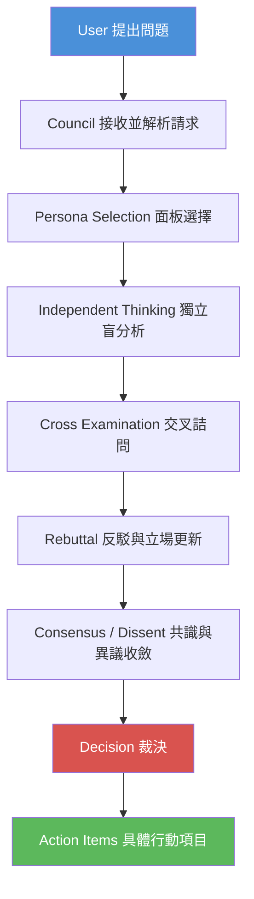

### 2.2 各階段說明

| 階段 | 對應官方機制 | 說明 |
| --- | --- | --- |
| User 提出問題 | `/council [question]` 或加上 flag | 使用者輸入待決策的問題，可附加背景資訊 |
| Persona Selection | STEP 0：面板選擇 | 依據 `--full` / `--quick` / `--duo` / `--triad <domain>` / `--members` 決定要召集哪些 Persona，並在此階段就指定領域加權席位（v1.2.0 起） |
| Independent Thinking | Round 1：盲分析 | 每位成員在不看其他成員意見的情況下，各自產出完整分析（含 Essential Question、證據標籤、初步立場） |
| Cross Examination | Round 2：交叉詰問 | 成員互相檢視彼此的 Round 1 輸出，v1.1.0 起輸出會匿名化為 Member A/B/C，並要求指出對方論點的具體缺陷 |
| Rebuttal | Round 2 延伸：反駁與立場更新 | 被質疑的成員可以捍衛、修正或讓步，更新自己的立場與信心程度 |
| Consensus / Dissent | Round 3：立場結晶（Crystallization） | 每位成員宣告最終立場（STANCE / CONFIDENCE / DEALBREAKER），意見分裂時進入信心加權投票 |
| Decision | Chairman 綜合裁決 | 由指定的 Chairman 角色綜合所有立場，產出結構化 Verdict |
| Action Items | Verdict 的「具體下一步」欄位 | 判決書中必須包含至少一項可立即執行的下一步，而非空泛建議 |

> **注意事項：** 這條流程線是「Full Council」模式的完整型態；`--quick` 會壓縮成兩輪、`--duo` 只有兩個角色進行往返辯證、`--triad` 則是把面板收斂到 3 位成員但仍走完整流程。四種模式的選擇邏輯詳見第七章。

---

## 第三章 Council Architecture

### 3.1 核心元件

Council 雖然是以 Prompt/Skill 形式實作，但可以用軟體架構的視角拆解出六個邏輯元件：

| 元件 | 對應實作 | 職責 |
| --- | --- | --- |
| **Council（議會外殼）** | `SKILL.md`（及其三份主機鏡像） | 整體協調者，負責解析 `/council` 指令與參數、決定面板組成、驅動各階段流程、呼叫多供應商路由 |
| **Persona（成員契約）** | `agents/council-*.md`（18 份） | 定義單一分析視角的身份、推理方法、已知盲點、回應格式與字數限制 |
| **Debate Engine（辯論引擎）** | `SKILL.md` 內的 Round 1～3 協定邏輯 | 驅動「盲分析 → 交叉詰問 → 立場結晶」的往返流程，並執行匿名化、反從眾等規則 |
| **Deliberation（審議狀態）** | 執行期的暫存脈絡（各成員的 STANCE / CONFIDENCE / DEALBREAKER） | 記錄審議過程中每個成員的中間立場與信心變化，供 Chairman 裁決時使用 |
| **Verdict（判決）** | Chairman 綜合階段的輸出格式 | 結構化裁決結果：未解決問題、建議、Kill Criteria、下一步、加權票數 |
| **Report（結果追蹤）** | Verdict 的 metadata 區塊（`schema_version`、checkpoint） | 決策後的稽核紀錄：預測、owner、審查日期、checkpoint 狀態（已確認/已修訂/已反轉/未決定） |

### 3.2 元件協作關係

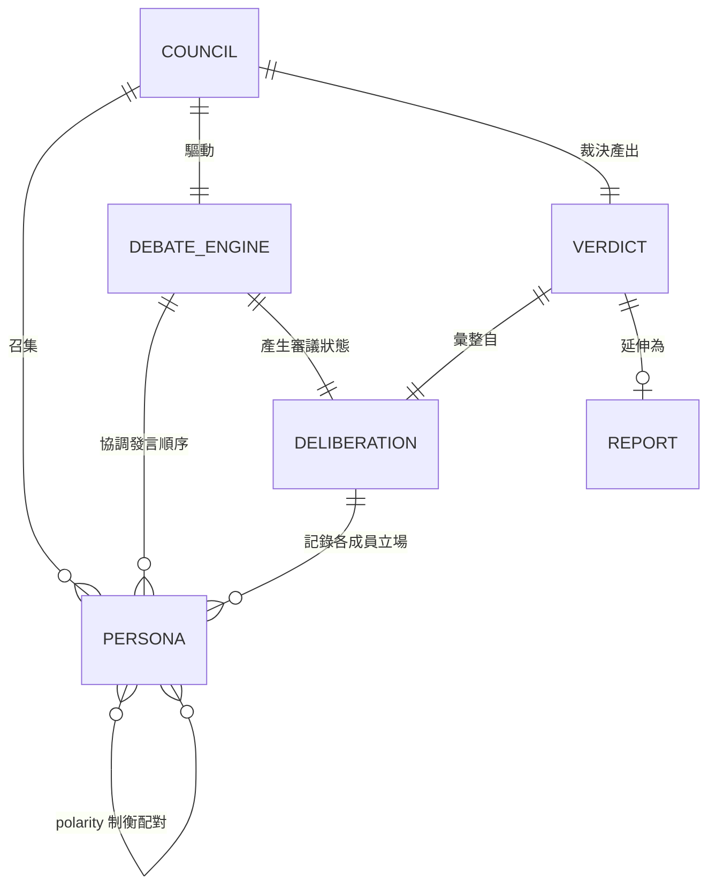

### 3.3 元件間如何合作：一個具體的資料流

1. **Council** 解析 `/council --triad risk 這次上線要不要延期？`，決定面板組成為 `risk` Triad。
2. **Council** 依 `risk` Triad 定義，從 18 位 **Persona** 中選出對應成員（詳見第六章 Triad 清單）。
3. **Debate Engine** 依序驅動三輪流程，每一輪都呼叫被選中的 **Persona** 契約，取得各自的分析輸出。
4. 每一輪的輸出都寫入 **Deliberation** 狀態（各成員的立場、信心、是否有 DEALBREAKER）。
5. 三輪結束後，Chairman 角色讀取完整的 **Deliberation** 狀態，綜合產出 **Verdict**。
6. 若使用者後續要追蹤這個決策的實際結果，Verdict 中的 metadata 可以延伸成 **Report**，供日後回顧「這次判斷準不準」。

> **實務案例：** 某銀行內部 IT 團隊用 Council 評估「是否要導入某開源訊息佇列取代商用產品」，Debate Engine 驅動 `risk` + `architecture` 兩個 Triad 分別跑一次，最後把兩份 Verdict 的 Kill Criteria 合併成正式的技術選型文件附件，作為稽核留存——這正是 Verdict → Report 這條協作路徑在企業場景的實際應用。

---

## 第四章 運作流程

### 4.1 完整議會的時序圖

以下以三位成員（Persona A / B / C）組成的 Triad 為例，展示一次完整議會（Full 模式）的訊息往返：

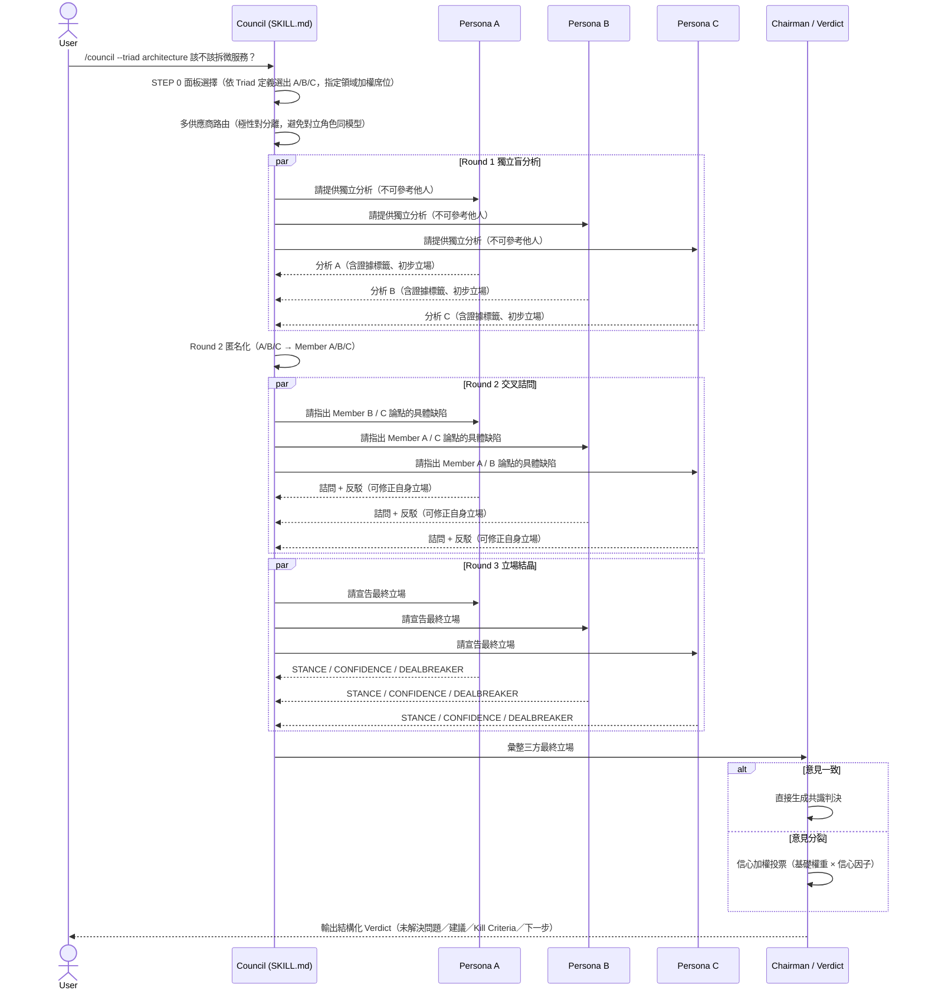

### 4.2 關鍵設計細節解讀

- **Round 1 為什麼要「不可參考他人」**：這是整個機制防止錨定效應最關鍵的一步。如果 Persona A 先發言、B 看得到 A 的內容才發言，B 的分析很容易被 A 的框架牽著走，失去獨立視角的價值。
- **Round 2 為什麼要匿名化**：v1.1.0 加入的機制，把「Linus Torvalds 說……」改成「Member A 說……」，用意是避免詰問者因為對方的「權威人設」而不好意思正面反駁，這是刻意設計的反從眾（anti-conformity）手段。
- **為什麼路由要「極性對分離」**：如果 Ada Lovelace（形式系統）與 Machiavelli（權力誘因）這組互為制衡的 Persona 剛好都路由到同一個底層模型，兩者的「歧異」很可能只是同一個模型在扮演兩種語氣，而非真正的視角差異；因此路由策略明確要求對立角色盡量分散到不同供應商／模型家族。
- **Chairman 的角色**：v1.1.0 才明確引入的「主席」角色，由指定模型執行綜合工作，職責是彙整而非再創造新論點——避免裁決階段又混入第 19 種視角，稀焦了原本的辯論結果。

> **注意事項：** 上圖是 Full 模式的完整型態；`--quick` 模式會省略 Round 2 的完整交叉詰問（壓縮為單輪快速分析＋精簡最終立場），`--duo` 模式則只有兩個角色、且流程更接近「直接對話」而非三方會議。詳細差異見第七章。

---

## 第五章 Persona 系統

### 5.1 Persona 是什麼

每一位 Persona 都是 `agents/` 目錄下一份獨立的契約文件（例如 `council-ada.md`），內容並非單純的人物介紹，而是一份**結構化的分析規格**。經逐字查證實際契約檔案內容，其骨架大致依序包含：

1. **身份定位（Identity）**：這位歷史人物的世界觀與分析哲學一句話總結。
2. **扮演紀律（Grounding Protocol）**：明確要求「忠於這個視角、不可輕易被說服而放棄核心立場」的認知紀律指令，性質上比較接近「防止角色扮演失真」的約束，而非一般軟體工程意義上的「架構設計」。
3. **分析方法（Analytical Method）**：面對一個問題時，這位角色會依序採取哪些推理步驟。
4. **看得見與容易忽略什麼（What You See That Others Miss／What You Tend to Miss）**：分別列出這個視角**擅長捕捉**與**容易忽略**什麼——官方文件誠實揭露每個角色的弱點，這是 Council 機制中最值得學習的一點：每個視角都被明確告知自己的弱點，而不是假裝萬能。
5. **議會中的行為準則（When Deliberating in Council）**：在多人辯論情境下，這個角色該如何與其他成員互動。
6. **輸出格式（Output Format）**：分別針對「議會辯論中的 Round 2 發言」與「獨立單獨呼叫」兩種情境訂有各自的格式與明確字數上限（例如 Ada Lovelace 契約規定議會發言不得超過 300 字）。

以 [Ada Lovelace 契約](https://github.com/0xNyk/council-of-high-intelligence/blob/main/agents/council-ada.md)為例，它「容易忽略什麼」的區塊明確寫著「理論最優的方案可能在組織上不可維護」「低估激勵與文化因素」「實作阻力常常超過理論優越性」——這種**自曝弱點**的設計，正是 18 個角色能互相制衡、而不是各說各話的關鍵。

### 5.2 18 位議會成員總表

下表為作者依 repo 已揭露的「主要透鏡（lens）」與「制衡角色（counterweight）」設計，並結合各歷史人物公開可查的思想特徵重新整理而成，非逐字翻譯任一份 persona 契約：

| 成員 | 核心問題 / 主要透鏡 | 擅長問題 | 優勢 | 弱點 / 常見偏誤 | 制衡角色 | 適合用途 |
| --- | --- | --- | --- | --- | --- | --- |
| **Aristotle** | 類別與結構：「這東西的本質分類是什麼？」 | 定義問題邊界、建立分類體系 | 邏輯嚴謹、擅長把模糊問題拆解成明確範疇 | 容易過度分類、對「浮現而非設計出來」的系統不敏感 | Lao Tzu（浮現與過度結構） | 需求釐清、術語定義、架構分層 |
| **Socrates** | 假設破壞：「你怎麼知道這是真的？」 | 揪出未經檢驗的前提 | 擅長用連續提問逼出隱藏假設 | 只破壞不重建，可能讓討論陷入無限迴圈 | Feynman（從基本原理重構） | Code Review、需求訪談、假設盤點 |
| **Sun Tzu** | 地形與對抗性策略：「戰場條件對我們有利嗎？」 | 競爭分析、資源部署時機 | 重視情境與時機，反對硬碰硬 | 容易把合作情境過度解讀成零和博弈 | Marcus Aurelius（內部控制與道德成本） | 市場競爭策略、資安威脅建模 |
| **Ada Lovelace** | 形式系統與抽象：「什麼能被機械化，什麼不能？」 | 形式驗證、抽象層設計 | 精確、擅長界定可自動化與不可自動化的邊界 | 「優雅陷阱」——理論最優但組織上不可維護；低估人性與文化因素 | Machiavelli（激勵與非正式權力） | API 設計、抽象層評估、形式驗證 |
| **Marcus Aurelius** | 韌性與道德清晰：「這個決定經得起長期壓力嗎？」 | 危機下的原則堅持、道德成本評估 | 冷靜、重視長期一致性 | 可能低估外部競爭壓力的急迫性 | Sun Tzu（外部競爭） | 治理原則制定、危機應對 SOP |
| **Machiavelli** | 權力與激勵：「誰的誘因會讓這個方案失敗？」 | 組織政治、誘因設計 | 現實主義、擅長預判「上有政策下有對策」 | 可能低估形式一致性與制度化的長期價值 | Ada Lovelace（形式一致性） | 團隊採用策略、變革管理 |
| **Lao Tzu** | 非行動與浮現：「不做什麼，比做什麼更重要嗎？」 | 過度工程的預警、簡化 | 擅長辨識「不需要介入」的情境 | 可能對明確需要顯式規則的情境反應不足 | Aristotle（顯式分類） | 技術債評估、過度設計預警 |
| **Richard Feynman** | 解釋與經驗調試：「你能用簡單的話解釋給我聽嗎？」 | 第一原理拆解、實證驗證 | 拒絕接受「聽起來對」但驗證不了的說法 | 對難以簡化的固有複雜性可能過度懷疑 | Socrates（前提本身） | Debug、技術債根因分析、教學文件審查 |
| **Linus Torvalds** | 交付與可維護性：「這東西能穩定跑、能被維護嗎？」 | 工程實用主義、Code Review 標準 | 直接、重視「能動的程式碼」勝過「漂亮的理論」 | 可能忽略系統級的長期後果，偏好局部修復 | Donella Meadows（系統級後果） | 上線決策、程式碼品質把關 |
| **Miyamoto Musashi** | 時機與決定性行動：「現在出手，還是再等？」 | 決策時機判斷、破局行動 | 擅長在不確定中做出果斷選擇 | 可能在「理想的行動前準備」尚未就緒時就出手 | Linus Torvalds（理想前行動的紀律） | 上線時機、要不要現在做重大變更 |
| **Alan Watts** | 重構與偽問題：「我們問的問題本身對嗎？」 | 問題重新框架、破除偽二元對立 | 擅長跳出框架看見「問錯問題」的情況 | 重構過頭可能讓具體行動失焦 | Linus Torvalds（具體實施） | 產品定位討論、避免偽二選一 |
| **Andrej Karpathy** | 經驗 ML 行為：「這個模型/系統實際上是怎麼表現的？」 | 機器學習系統的經驗觀察與除錯 | 重視實測數據勝過理論假設 | 可能過度平滑經驗趨勢，忽略尾部風險 | Ilya Sutskever（邊界風險） | AI 產品能力評估、模型行為除錯 |
| **Ilya Sutskever** | 擴展與 AI 安全：「這個能力擴大規模後會發生什麼？」 | 長期 AI 安全與擴展性推演 | 擅長推演規模化後的湧現行為與風險 | 可能忽略短期可觀察的實證訊號 | Andrej Karpathy（觀察與迭代） | AI 安全評估、能力邊界推演 |
| **Daniel Kahneman** | 認知偏差：「這個判斷是被哪種偏誤影響的？」 | 決策品質審查、偏誤盤點 | 系統性辨識定錨、確認偏誤等認知陷阱 | 可能過度懷疑直覺判斷的合理性 | Richard Feynman（顯式因果推理） | 重大決策前的偏誤檢查 |
| **Donella Meadows** | 反饋迴路與高影響干預：「在這個系統裡，哪個槓桿點最有效？」 | 系統思考、找出高槓桿介入點 | 擅長看見局部修復忽略的系統性後果 | 可能低估「先求有再求好」的局部修復價值 | Linus Torvalds（局部修復的實用性） | 系統性技術債治理、組織流程設計 |
| **Charlie Munger** | 反演與模型格子：「如果要讓這件事失敗，該怎麼做？」 | 逆向思考、跨領域模型交叉驗證 | 擅長用反演思考揪出隱藏風險 | 可能過度依賴既有心智模型格子，忽略新穎情境 | Aristotle（單系統分類的嚴謹） | 風險盤點、投資/技術選型判斷 |
| **Nassim Taleb** | 尾部風險與脆弱性：「這個方案在極端情境下會不會脆裂？」 | 黑天鵝事件、系統脆弱性評估 | 擅長識別「平均沒事、極端會死」的脆弱設計 | 可能對平滑、漸進的經驗趨勢過度懷疑 | Andrej Karpathy（平滑經驗趨勢） | 韌性設計、災難情境演練 |
| **Dieter Rams** | 用戶清晰度與克制：「這個設計是不是加了不必要的東西？」 | 介面簡化、功能取捨 | 擅長判斷「少即是多」的取捨界線 | 可能低估可被形式化、系統化的複雜需求 | Ada Lovelace（可形式化的東西） | UX 決策、功能範疇裁剪 |

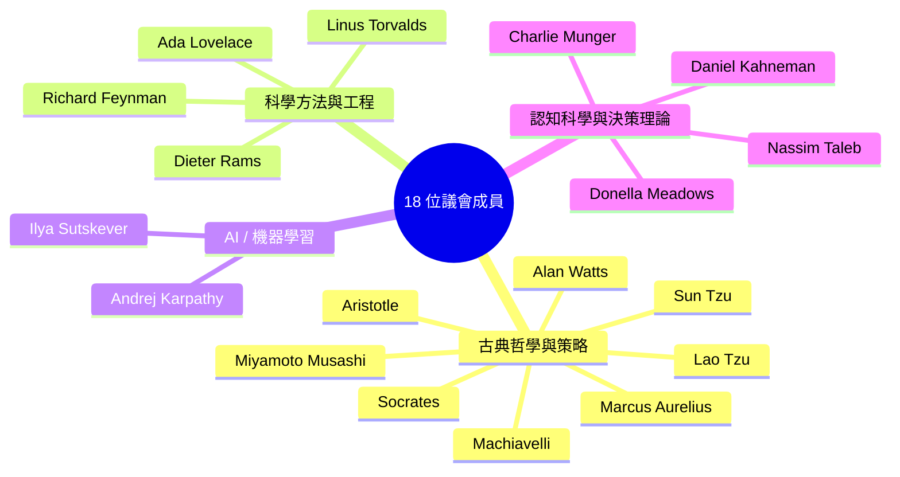

> **實務案例：** 評估「要不要把某個核心演算法從 Python 原型直接搬進 Production」，適合叫出 Feynman（這個實作真的被驗證過嗎？）+ Taleb（極端輸入會不會讓它崩潰？）+ Torvalds（這東西能被團隊長期維護嗎？）三個視角——這正好對應到下一章會介紹的 `risk` 或自訂 `--members` 組合。

> **注意事項：** 不要把這張表當成「人格測驗結果」死記，Persona 的價值在於**視角之間的張力**，實務上更該記住的是「制衡角色」那一欄——當你只召集了 Ada 卻沒有 Machiavelli，得到的方案很可能在形式上無懈可擊、卻沒人真的會採用。

---

## 第六章 Triad 系統

### 6.1 什麼是 Triad

Triad（三人組）是 Council 預先定義好的「三位成員固定組合」，目的是讓使用者不需要每次都手動用 `--members` 指定三個人名，只要下 `--triad <domain>` 就能召集一組已經過設計、視角互補的固定班底。相較於 18 人的 Full Council，Triad 犧牲了「窮盡所有視角」的廣度，換取**更快的執行速度與更聚焦的討論**——這也呼應第一章提到的「不要為了小決策召開全員大會」的原則。

### 6.2 Triad 如何運作

每個 Triad 的組成邏輯，並非隨機挑三位成員，而是**刻意混合「制衡對」與「同陣營」的成員**，讓討論既有共同語言，又不會變成一言堂。以官方 `SKILL.md` 中查證到的組成為例：

- `ai` Triad = **Karpathy（經驗觀察）+ Sutskever（擴展與安全）+ Ada（形式驗證）**——刻意把 Karpathy／Sutskever 這組制衡對放在一起，再加入 Ada 提供第三方的形式化視角，避免討論淪為「經驗派 vs. 理論派」的二元對立。
- `decision` Triad = **Kahneman（認知偏差）+ Munger（反演思考）+ Aurelius（道德清晰）**——三位都聚焦「決策品質」本身，但切入點分別是心理學、跨領域模型、原則堅持，適合處理「我們是不是在自欺欺人」這類決策健檢問題。
- `design` Triad = **Rams（用戶克制）+ Torvalds（工程務實）+ Watts（重新框架）**——恰好是 Rams／Ada 制衡對中的 Rams，搭配工程與哲學視角，適合產品介面與功能取捨的討論。

> **查證提醒：** 下表的 domain → 成員對應，是透過 WebFetch 對官方 `SKILL.md` 內容查證取得，官方文件中「具名 Triad 總數」的描述在不同段落出現過 15 與 20 兩種說法，本手冊以 `SKILL.md` 內「Pre-defined Triads」區塊實際列出的 **20 組** 為準（此 20 組為跨 Profile 通用的領域 Triad；`exploration-orthogonal`／`execution-lean` 兩個 Panel Preset 另外還各自定義了專屬於該 Profile 的 Triad，不包含在這 20 組之內，詳見 6.5 節）；正式導入前務必用 `/council --dry-route --triad <domain> ...` 先行確認實際路由結果，因為這類組成會隨版本調整（v1.2.0 才把領域加權席位的指定時機從「投票後」提前到「面板選擇階段」）。

### 6.3 20 個具名 Triad 總表

| Triad | 組成成員 | 用途 | 適合問題 |
| --- | --- | --- | --- |
| `architecture` | Aristotle + Ada + Feynman | 架構分類、抽象層設計、可解釋性 | 該用什麼架構模式？這個抽象合理嗎？ |
| `strategy` | Sun Tzu + Machiavelli + Aurelius | 競爭策略、組織政治、道德底線平衡 | 市場定位、對手因應策略 |
| `ethics` | Aurelius + Socrates + Lao Tzu | 道德假設檢驗、原則堅持 vs. 順勢而為 | 資料使用是否符合倫理？ |
| `debugging` | Feynman + Socrates + Ada | 根因分析、假設檢驗、形式驗證 | 這個 Bug 到底為什麼會發生？ |
| `innovation` | Ada + Lao Tzu + Aristotle | 新方案的形式可行性 vs. 是否該浮現而非設計 | 要不要投入一個全新技術方向？ |
| `conflict` | Socrates + Machiavelli + Aurelius | 團隊衝突、政治角力、原則堅持 | 兩個團隊對架構意見不合怎麼辦？ |
| `complexity` | Lao Tzu + Aristotle + Ada | 複雜度治理、該簡化還是該分類 | 這個系統是不是過度工程化了？ |
| `risk` | Sun Tzu + Aurelius + Feynman | 風險評估、對抗情境、實證驗證 | 這次上線的風險可接受嗎？ |
| `shipping` | Torvalds + Musashi + Feynman | 上線時機、交付紀律、實證把關 | 現在能上線嗎？還缺什麼？ |
| `product` | Torvalds + Machiavelli + Watts | 產品採用策略、誘因設計、問題重構 | 這個功能真的解決對的問題嗎？ |
| `founder` | Musashi + Sun Tzu + Torvalds | 創業時機、資源部署、交付紀律 | 現在該不該 pivot？ |
| `ai` | Karpathy + Sutskever + Ada | ML 能力評估、擴展風險、形式邊界 | 這個模型能力邊界在哪？ |
| `ai-product` | Karpathy + Torvalds + Machiavelli | AI 功能是否該進產品、工程可行性、採用誘因 | 這個 AI 能力該不該做成產品功能？ |
| `ai-safety` | Sutskever + Aurelius + Socrates | AI 安全假設檢驗、道德底線 | 這個 AI 系統的安全假設站得住腳嗎？ |
| `decision` | Kahneman + Munger + Aurelius | 決策品質健檢、偏誤與反演思考 | 我們是不是在自欺欺人？ |
| `systems` | Meadows + Lao Tzu + Aristotle | 系統性槓桿點、浮現 vs. 分類 | 該從哪個節點介入整個系統？ |
| `uncertainty` | Taleb + Sun Tzu + Sutskever | 尾部風險、對抗情境、擴展風險 | 極端情況下這個方案會不會垮？ |
| `design` | Rams + Torvalds + Watts | 介面取捨、工程務實、問題重構 | 這個功能該砍掉還是保留？ |
| `economics` | Munger + Machiavelli + Sun Tzu | 誘因結構、跨領域模型、競爭策略 | 這個定價/成本模型合理嗎？ |
| `bias` | Kahneman + Socrates + Watts | 認知偏誤、假設破壞、問題重構 | 我們的判斷是不是被框架效應誤導了？ |

### 6.4 三個預設面板配置（Panel Presets）

除了針對特定領域的 20 個 Triad，Council 另外提供三組跨領域的**整體面板配置**，用於決定「不指定 Triad 時，Full/Quick/Duo 模式要從 18 人裡挑哪些人／挑多少人」：

| Preset | 組成 | 適合情境 |
| --- | --- | --- |
| `classic` | 完整 18 人議會 | 高風險、不可逆決策，需要窮盡所有視角 |
| `exploration-orthogonal` | 挑選視角彼此正交（差異最大化）的子集 | 探索階段、還沒收斂方向，需要盡量發散的意見 |
| `execution-lean` | 挑選偏執行導向（工程、時機、交付）的精簡子集 | 已經收斂方向，需要快速決定怎麼落地 |

> **實務案例：** 團隊在「探索」階段想知道某個新技術方向有哪些沒想到的風險，適合 `exploration-orthogonal`；等方向確定、只剩「這週要不要上線」的執行細節時，改用 `execution-lean` 或直接 `--triad shipping`，避免每次都召開耗時的 Full Council。

> **注意事項：** Triad 的成員組成是「已經幫你做過視角搭配設計」的固定班底，若你的問題明顯橫跨兩個 Domain（例如「AI 功能上線風險評估」同時橫跨 `ai-product` 與 `risk`），可以考慮跑兩次 Triad 或改用 `--members` 手動指定 5～6 人的自訂面板，而不是勉強塞進單一 Triad。

### 6.5 Profile 專屬 Triad

除了 6.3 節這 20 個跨 Profile 通用的領域 Triad，`exploration-orthogonal`（12 人）與 `execution-lean`（5 人）這兩組 Panel Preset，官方在 `SKILL.md` 中還各自定義了僅限該 Profile 使用的專屬 Triad，經逐字查證如下：

| Profile | Triad | 組成 | 適合問題 |
| --- | --- | --- | --- |
| `exploration-orthogonal` | `unknowns` | Socrates + Lao Tzu + Feynman | 有哪些「不知道自己不知道」的風險？ |
| `exploration-orthogonal` | `market-entry` | Sun Tzu + Machiavelli + Aurelius | 現在切入這個市場的時機與姿態對嗎？ |
| `exploration-orthogonal` | `system-design` | Ada + Feynman + Torvalds | 這個系統雛型的設計，經得起檢驗與維護嗎？ |
| `exploration-orthogonal` | `reframing` | Socrates + Lao Tzu + Ada | 我們問的問題本身，方向對嗎？ |
| `exploration-orthogonal` | `ai-frontier` | Karpathy + Sutskever + Ada | 這個 AI 能力的前沿探索，邊界與形式化程度如何？ |
| `exploration-orthogonal` | `blind-spots` | Kahneman + Meadows + Socrates | 我們的判斷有哪些系統性盲點？ |
| `execution-lean` | `ship-now` | Torvalds + Feynman + Aurelius | 現在能上線嗎？ |
| `execution-lean` | `launch-strategy` | Sun Tzu + Torvalds + Machiavelli | 上線的策略與誘因設計是否到位？ |
| `execution-lean` | `stability` | Ada + Feynman + Aurelius | 這個方案穩不穩、能不能撐住？ |

> **查證提醒：** `launch-strategy` 這組 Triad 官方原文將 Machiavelli 標註為「optional substitute（可選替補）」，但 Machiavelli 其實**不在** `execution-lean` Profile 本身的 5 人名單（Torvalds、Feynman、Sun Tzu、Aurelius、Ada）之中——這是官方文件自身尚未完全收斂的小不一致，如實揭露供讀者判斷，而非本手冊轉載時的錯誤。

加上這 9 組 Profile 專屬 Triad，Council 全系統目前查證到的具名 Triad 共有 **29 組**（20 個跨 Profile 通用領域 Triad ＋ 9 個 Profile 專屬 Triad），而非僅 6.3 節列出的 20 組——選用 `exploration-orthogonal` 或 `execution-lean` Profile 時，除了可呼叫 6.3 節的 20 個通用 Triad，也可以呼叫本節這 9 個該 Profile 專屬設計的組合。

---

## 第七章 Decision Flow

### 7.1 四種模式總覽

| 模式 | Flag | 面板規模 | 流程形狀 | 執行時間 | 適合情境 |
| --- | --- | --- | --- | --- | --- |
| **Full** | `--full`（預設） | 18 人或指定 Triad/Members | 獨立分析 → 交叉詰問 → 最終立場 → 綜合裁決（完整三輪） | 最長 | 高風險、不可逆、需要完整對抗性交流的決策 |
| **Triad** | `--triad <domain>` | 固定 3 人 | 同 Full 流程，但面板收斂為 3 人 | 中等 | 有明確領域、需要深度但不需要 18 人規模 |
| **Quick** | `--quick` | 自動選定的精簡面板（常為 Triad 規模） | 重述問題 → 快速分析（約 200 字/人）→ 精簡最終立場（約 75 字/人），省略完整交叉詰問 | 短 | 需要廣度意見，但交叉詰問不會改變結果的情境 |
| **Duo** | `--duo` | 2 人 | 開場立場 → 直接回應（往返辯證）→ 最終聲明 | 短～中等 | 單一對立軸主導整個問題（例如「A 方案 vs. B 方案」二選一） |

`--quick` 與 `--triad` 可以疊加使用（例如 `--quick --triad shipping`），代表「用 shipping Triad 的 3 人，但走快速流程」；`--duo` 則可搭配 `--members` 手動指定要對話的兩位成員（例如 `--duo --members torvalds,ada`）。

### 7.2 模式選擇流程圖

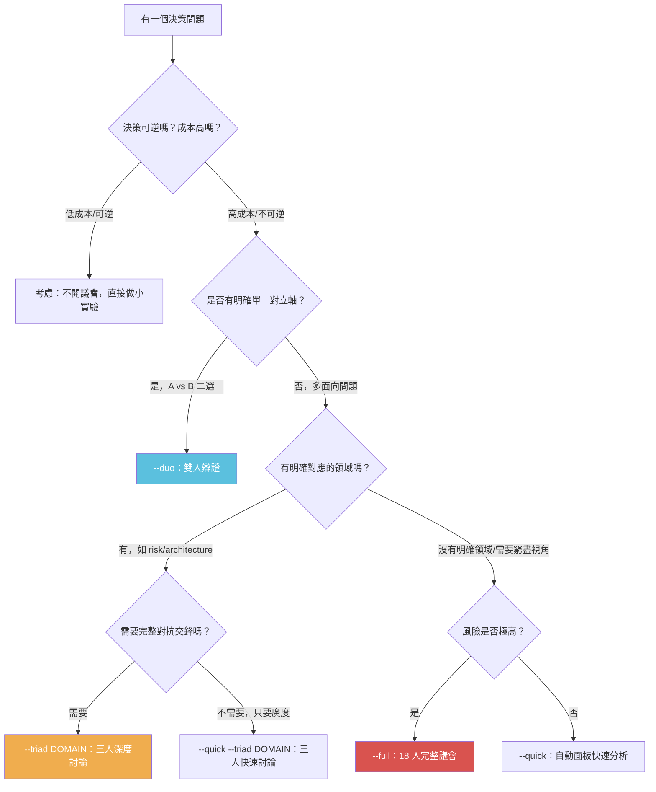

### 7.3 各模式的取捨權衡

- **Full 的代價**：三輪完整流程 + 18 人（或多人 Triad）意味著較長的產出時間與較高的 Token 成本，且並非「人越多結論越好」——超過某個規模後，交叉詰問的訊息量會超出使用者一次能消化的範圍，Verdict 反而更難聚焦（第二十一章會列出這個 Anti-pattern）。
- **Quick 的代價**：省略了完整的交叉詰問，代表「Round 2 讓立場改變」這個機制被弱化了，如果問題本身高度依賴「聽到對方論點後會不會改變心意」，Quick 模式可能會漏掉關鍵的立場翻轉。
- **Duo 的代價**：只有兩個視角，容易變成「公說公有理婆說婆有理」缺乏第三方裁決視角；但對於「單一對立軸」問題（例如「該不該用 ORM」），Duo 反而比 Full 更聚焦、更快出結論。
- **Triad 的代價**：固定 3 人組合是預先設計好的「泛用款」，遇到真正跨領域、找不到合適 Triad 的問題時，勉強套用某個 Triad 可能會漏掉關鍵視角，此時該考慮 `--members` 自訂面板或退回 Full。

> **實務案例：** 「這次 sprint 要不要把某個已知有效能問題的模組延後重構」——這是典型的「單一對立軸」問題（延後 vs. 現在做），適合 `--duo --members torvalds,meadows`（工程務實 vs. 系統性後果）；相對地，「公司要不要開源核心框架」牽涉法務、商業模式、社群經營、資安等多面向，適合 `--full`。

> **注意事項：** 不要把模式選擇當成「越貴越好」的心態——README 明確反對「重裝上陣打蚊子」，選錯模式最常見的錯誤不是選太小，而是**選太大**（詳見第二十一章 Anti-pattern）。

### 7.4 Duo 配對邏輯：極性配對表

`--duo` 模式若沒有搭配 `--members` 手動指定，系統會依 Prompt 內容比對關鍵字，自動從 `SKILL.md` 定義的**極性配對表**中選出最相關的一組「張力對」；若沒有任何關鍵字命中，則落回預設配對。經逐字查證 `SKILL.md`，完整對照如下：

| 觸發關鍵字／主題 | 配對 | 張力 |
| --- | --- | --- |
| architecture, structure, categories | Aristotle vs Lao Tzu | 分類 vs 浮現 |
| shipping, execution, release | Torvalds vs Musashi | 現在出手 vs 等待時機 |
| strategy, competition, market | Sun Tzu vs Aurelius | 對外勝出 vs 內部治理 |
| formalization, systems, abstraction | Ada vs Machiavelli | 形式純粹 vs 人性複雜 |
| framing, purpose, meaning | Socrates vs Watts | 破壞假設 vs 消解框架本身 |
| engineering, theory, pragmatism | Torvalds vs Watts | 先做出來 vs 質疑該不該做 |
| ai, ml, neural, model, training | Karpathy vs Sutskever | 邊做邊迭代 vs 先暫停確保安全 |
| ai-safety, alignment, risk | Sutskever vs Machiavelli | 安全理想 vs 產業誘因現實 |
| decision, bias, thinking, judgment | Kahneman vs Feynman | 認知本身就是誤差來源 vs 相信第一原理 |
| systems, feedback, complexity, loops | Meadows vs Torvalds | 重新設計系統 vs 先修好眼前症狀 |
| economics, investment, models, moat | Munger vs Aristotle | 多重心智模型交叉 vs 單一分類架構 |
| risk, uncertainty, fragility, tail | Taleb vs Karpathy | 隱藏的尾部風險 vs 平滑的經驗曲線 |
| design, user, usability, ux | Rams vs Ada | 使用者真正需要什麼 vs 運算能做到什麼 |
| （無關鍵字命中時的預設配對） | Socrates vs Feynman | 由上而下質疑假設 vs 由下而上重建原理 |

> **注意事項：** 這張表與第四章提到的「極性對分離」路由配對表**性質不同**——第四章談的是議會執行時「把互為制衡的角色盡量路由到不同供應商」，本節談的是 `--duo` 模式「該挑選哪兩位成員上場」，兩者都叫「極性配對」但用途不同，不要混用。

---

## 第八章 Debate Engine

### 8.1 Debate Engine 的七個階段

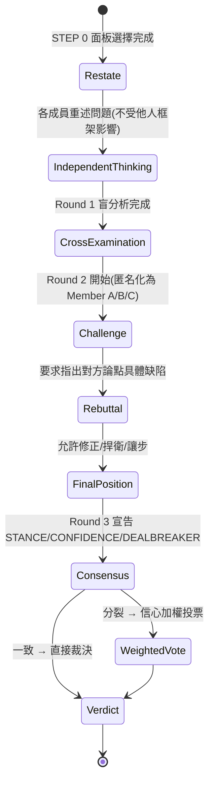

### 8.2 各階段詳解

| 階段 | 目的 | 關鍵規則 |
| --- | --- | --- |
| **Independent Thinking（獨立盲分析）** | 取得未受污染的第一手觀點 | 成員之間彼此不可見對方輸出；每位成員需標註證據等級（FACT/INFERENCE/ASSUMPTION/UNKNOWN） |
| **Cross Examination（交叉詰問）** | 讓不同視角互相碰撞、找出彼此論點的漏洞 | Round 2 起輸出匿名化為「Member A/B/C」；明確要求「指出對方論點的具體缺陷」而非泛泛而談 |
| **Challenge（挑戰）** | 具體質疑對方推理鏈中的薄弱環節 | 挑戰必須針對「違反形式邏輯」「證據不足」「忽略某個已知盲點」等具體理由，而非人身攻擊式反對 |
| **Rebuttal（反駁）** | 被挑戰方回應、捍衛或讓步 | 允許「Disagree: [違反的具體原則] / Strengthened by: [被強化的論點] / Position Update」三段式回應（見 Ada 契約範本） |
| **Final Position（最終立場）** | 每位成員給出不可再變動的結論 | 需輸出結構化的 `STANCE:` / `CONFIDENCE:`（high/med/low）/ `DEALBREAKER:`（是否有不可退讓的紅線） |
| **Consensus（共識收斂）** | 判斷是否所有成員意見一致 | 一致則直接進入裁決；分裂則啟動信心加權投票 |
| **Verdict（裁決）** | Chairman 綜合產出最終判決 | 詳見第九章 |

### 8.3 反從眾機制的設計細節

Debate Engine 最值得工程團隊借鏡的，是它對「群體盲思（Groupthink）」的三層防禦：

1. **結構性防禦**：Round 1 強制盲分析，物理上阻絕「還沒想清楚就被別人的意見帶走」。
2. **心理性防禦**：Round 2 匿名化為 Member A/B/C，降低權威人設造成的順從壓力。
3. **規則性防禦**：明確要求「指出具體缺陷」而非「表達不同意」，把批評的門檻從「情緒」拉高到「舉證」。

> **實務案例：** 團隊內部討論常見的「資深工程師一開口，其他人就不敢反駁」現象，正是 Debate Engine 想解決的問題——把這套「先各自盲寫、再匿名交鋒」的流程搬進真人會議（例如先讓每個人書面提交意見再開會討論），本身就是一個值得參考的會議治理實踐，即使完全不用 AI 工具。

> **注意事項：** 匿名化只在 AI 產出的文字層面生效——如果你在 Prompt 裡直接把「這是資深架構師的意見」這種標籤帶進 Round 2 的輸入內容，等於自己繞過了反從眾設計，Verdict 的品質也會跟著打折。

---

## 第九章 Verdict

### 9.1 Verdict 的資料結構

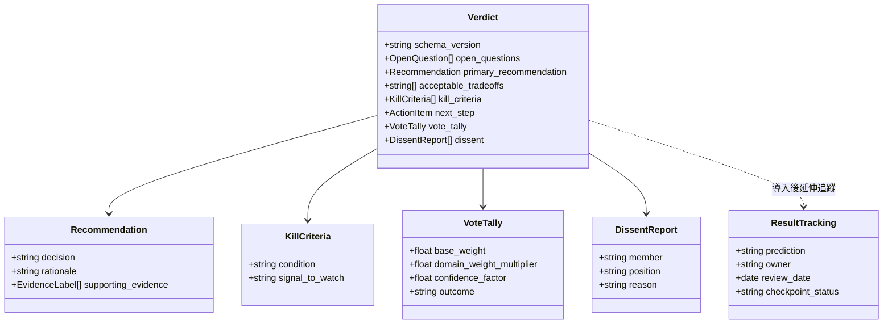

### 9.2 Verdict 各欄位說明

| 欄位 | 說明 | 為什麼重要 |
| --- | --- | --- |
| **未解決的問題（Open Questions）** | 刻意放在判決書**最前面**，列出「這個判決沒有回答、或回答得不夠有把握」的問題 | 防止決策者誤以為判決代表「問題已被徹底解決」 |
| **主建議與可接受折衷（Primary Recommendation & Acceptable Tradeoffs）** | 主要建議，並附上「如果做不到 A，B 也可以接受」的備案 | 避免建議過於單一、缺乏彈性空間 |
| **Kill Criteria（終止條件）** | 明確寫出「出現什麼訊號，就該放棄這個方案」 | 這是最容易被一般 AI 建議忽略、卻對企業決策最關鍵的欄位——沒有終止條件的建議等於沒有停損點 |
| **具體下一步（Next Step）** | 至少一項可立即執行、可指派負責人的行動 | 避免判決淪為空泛的方向性建議 |
| **信心加權票數（Vote Tally）** | 意見分裂時的量化結果：基礎權重（1.0，領域加權席位為 1.5×）× 信心因子（high 1.0／med 0.75／low 0.5） | 讓「多數決」不只是數人頭，而是把「有多確定」也計入權重 |
| **異議報告（Dissent）** | 明確記錄少數意見是誰、為什麼不同意 | 保留組織記憶，避免日後「早就有人提醒過」卻查無紀錄 |
| **`schema_version`** | 中繼資料版本號，v1.1.0 起加入 | 讓 Verdict 可被程式化解析、比對，是走向「決策可稽核」的基礎建設 |

### 9.3 結果追蹤（Result Tracking）

正式導入後，建議把 Verdict 的行動項目延伸記錄成一份**結果追蹤表**，包含：

- **預測（Prediction）**：這個判決預期會發生什麼結果。
- **Owner**：誰負責追蹤這個判決的後續發展。
- **審查日期（Review Date）**：訂下明確的回顧時間點，而不是「之後有空再看」。
- **Checkpoint 狀態**：`已確認`（結果符合預期）／`已修訂`（部分修正）／`已反轉`（結果與預期相反）／`未決定`（尚未到審查時間）。

> **實務案例：** 某團隊用 `/council --triad risk` 判斷「要不要把某支付流程的重試機制從同步改成非同步佇列」，Verdict 的 Kill Criteria 寫明「若佇列延遲超過 3 秒導致使用者投訴增加，立即回滾」；三週後對照監控數據，Checkpoint 標記為「已確認」，並把這份追蹤紀錄存進團隊的架構決策紀錄（ADR）系統——這正是 Verdict → Result Tracking 落地到真實維運流程的範例。

> **注意事項：** Verdict 的品質高度依賴輸入問題的品質——如果一開始沒有清楚陳述「決策、約束、證據、可逆性、期限」（README 明確建議的前置步驟），即使跑完整套 Debate Engine，Kill Criteria 也可能寫得空泛不可執行。撰寫好的 Council 提問技巧詳見第十二章。

---

## 第十章 安裝教學

### 10.1 官方支援 vs. 非官方變通：先弄清楚安裝的邊界

在動手安裝前，務必先弄清楚一件事：Council 的 `install.sh` **官方明確支援的主機只有四個**——Claude Code（原生）、Codex、Gemini CLI、OpenCode。使用者原本可能期待的 GitHub Copilot、Cursor（作為完整主機）、OpenHands，**目前並不在 `install.sh` 的安裝目標清單中**；Cursor 唯一被官方提及的角色，是作為 Round 內**模型路由的其中一個供應商**（透過偵測 Cursor CLI 執行檔或設定檔登入），而不是可以安裝 `/council` Skill 的完整主機。本章會清楚區分「官方支援」與「社群自行變通」兩類做法，避免讀者誤以為 Copilot/OpenHands 有原生整合。

| 主機 / 環境 | 支援狀態 | 說明 |
| --- | --- | --- |
| Claude Code | ✅ 官方原生支援 | `install.sh` 預設安裝目標，透過 Skill 或 Plugin Marketplace 安裝 |
| OpenAI Codex | ✅ 官方支援 | `install.sh --codex`，使用 `SKILL.codex.md` 鏡像 |
| Gemini CLI | ✅ 官方支援 | `install.sh --gemini`，需產生 `gemini-extension.json` |
| OpenCode | ✅ 官方支援 | `install.sh --opencode`，需 Python 轉換代理程式 |
| Cursor | ⚠️ 僅作為「模型供應商」 | 議會執行期路由可以把某個席位指派給 Cursor CLI 聚合的模型，但不能透過 `install.sh` 把 `/council` 安裝進 Cursor 本身 |
| GitHub Copilot | ❌ 目前無官方支援 | 可用「手動變通方案」（見 10.12 節）把 `SKILL.md` 內容轉為 Copilot 自訂指令，但非官方功能，行為可能與原生 Claude Code 不一致 |
| OpenHands | ❌ 目前無官方支援 | 同上，只能手動變通 |
| Docker | ❌ 官方未提供映像檔 | Repo 內未見 `Dockerfile`；如需容器化，屬於使用者自行封裝（見 10.7 節） |

### 10.2 前置需求

- **Git**：用於 clone repository。
- **Bash 執行環境**：`install.sh` 是 Shell Script（佔專案程式碼 81.5%），必須在 POSIX 相容的 shell 中執行。
- **Python 3**（僅 `--opencode` 安裝路徑需要）：用於 Skill/Sub-agent 格式轉換代理程式。
- 已安裝好至少一種目標主機（Claude Code CLI／Codex CLI／Gemini CLI／OpenCode）。

### 10.3 macOS 安裝

macOS 內建 Bash／Zsh，可直接執行：

```bash
git clone https://github.com/0xNyk/council-of-high-intelligence.git
cd council-of-high-intelligence

# 先用 dry-run 預覽會寫入哪些檔案，不會真的動到你的設定
./install.sh --dry-run

# 確認無誤後正式安裝（預設安裝到 Claude Code）
./install.sh
```

### 10.4 Linux 安裝

流程與 macOS 相同，若發行版預設 shell 不是 Bash（例如某些 Debian 系統的 `/bin/sh` 指向 `dash`），建議明確以 `bash` 執行腳本：

```bash
git clone https://github.com/0xNyk/council-of-high-intelligence.git
cd council-of-high-intelligence
bash install.sh --dry-run
bash install.sh --codex --gemini   # 同時安裝 Claude Code + Codex + Gemini CLI 三種鏡像
```

### 10.5 Windows 安裝

**Windows 原生 PowerShell／CMD 無法直接執行 `.sh` 腳本**，這是撰寫本手冊時許多同仁最容易卡住的地方。目前有兩個可行路徑：

**方法一：WSL（建議）**

```powershell
# 在 PowerShell 中安裝並進入 WSL（若尚未安裝）
wsl --install

# 進入 WSL 後，比照 Linux 安裝流程
wsl
```

```bash
# 以下在 WSL 的 Bash 內執行
git clone https://github.com/0xNyk/council-of-high-intelligence.git
cd council-of-high-intelligence
./install.sh --dry-run
./install.sh
```

**方法二：Git for Windows 內建的 Git Bash**

```bash
# 在 Git Bash 視窗中執行，路徑與 Linux/macOS 相同
git clone https://github.com/0xNyk/council-of-high-intelligence.git
cd council-of-high-intelligence
./install.sh --dry-run
./install.sh
```

> **注意事項：** `install.sh` 內部會寫入設定檔到 `--claude-dir`（預設 `~/.claude`）等路徑，在 WSL 與 Git Bash 兩種環境下，這個「家目錄」對應到的實體路徑不同（WSL 是 Linux 檔案系統內、Git Bash 是 `C:\Users\<user>`），**兩種安裝方式不要混用**，否則會出現「明明裝過了但 Claude Code 讀不到」的困惑。建議團隊統一約定用哪一種。

### 10.6 WSL 額外注意事項

若 Claude Code／Codex 是安裝在 Windows 端（非 WSL 內），而你在 WSL 內執行 `install.sh`，務必用 `--claude-dir` 明確指向 Windows 端的設定目錄（透過 `/mnt/c/...` 路徑），例如：

```bash
./install.sh --claude-dir "/mnt/c/Users/<你的帳號>/.claude" --dry-run
```

先用 `--dry-run` 確認寫入路徑正確，再移除該參數正式執行。

### 10.7 Docker 化執行（非官方做法）

Repo 目前**沒有官方提供的 Dockerfile 或映像檔**。若企業內部要求「所有工具都必須容器化」，可行的變通方式是：把 Claude Code CLI（或 Codex CLI 等）連同 Council 的 Skill 檔案一併打進自訂映像檔，而不是期待有現成的 `council-of-high-intelligence` 官方映像可以 `docker pull`。範例 Dockerfile 骨架：

```dockerfile
FROM node:20-slim
RUN apt-get update && apt-get install -y git bash
# 安裝 Claude Code CLI（依官方文件指示）
# RUN npm install -g @anthropic-ai/claude-code
WORKDIR /workspace
RUN git clone https://github.com/0xNyk/council-of-high-intelligence.git /opt/council \
    && cd /opt/council && ./install.sh --claude-dir /root/.claude
```

> **注意事項：** 這是**作者建議的變通方案**，非官方文件內容，實際可用性需自行驗證，尤其要注意容器內是否能正確存取多供應商路由所需的 API 金鑰環境變數（見第十一章）。

### 10.8 Claude Code 安裝（兩種方式）

**方式一：Plugin Marketplace（最簡單）**

```bash
/plugin marketplace add 0xNyk/council-of-high-intelligence
/plugin install council@council-of-high-intelligence
```

**方式二：手動安裝腳本**

```bash
git clone https://github.com/0xNyk/council-of-high-intelligence.git
cd council-of-high-intelligence
./install.sh --dry-run
./install.sh
```

安裝完成後，在 Claude Code 對話中輸入 `/council` 即可開始使用。

### 10.9 Codex 安裝

```bash
./install.sh --codex          # 同時安裝 Claude Code + Codex 兩種鏡像
./install.sh --codex-only     # 只安裝 Codex 鏡像（不動 Claude Code 設定）
./install.sh --codex-dir "自訂路徑" --codex   # 指定非預設的 Codex 設定目錄
```

### 10.10 Gemini CLI 安裝

```bash
./install.sh --gemini
./install.sh --gemini-only
```

安裝腳本會為 Gemini CLI 額外產生 `gemini-extension.json`（版本號取自 `CHANGELOG.md`），這是 Gemini CLI 擴充套件機制所需的中繼資料檔。

### 10.11 OpenCode 安裝

```bash
./install.sh --opencode
./install.sh --opencode-only
```

此路徑需要本機有 Python 3，安裝腳本會執行格式轉換代理程式，把 `SKILL.opencode.md` 轉換成 OpenCode 的 Skill／Sub-agent 格式。

### 10.12 GitHub Copilot／Cursor／OpenHands：非官方變通方案

由於這三者目前不在 `install.sh` 的安裝目標中，若團隊仍希望在這些工具中使用 Council 的分析協定，可採取以下**手動變通**（效果與原生整合有落差，僅供參考）：

- **GitHub Copilot（Copilot Chat / Copilot CLI）**：把 `SKILL.md` 的核心協定內容（面板選擇、三輪流程、Verdict 格式）整理成 `.github/copilot-instructions.md` 或自訂 Prompt 檔案，在對話中人工觸發「請依照以下協定進行議會式分析」。
- **Cursor（作為完整主機，而非僅供路由）**：把 `SKILL.md` 內容放進 Cursor 的 `.cursor/rules` 自訂規則，同樣需要人工觸發，且缺少官方的多供應商自動路由與 CI drift guard。
- **OpenHands**：可將 `SKILL.md` 作為自訂 Microagent 或系統提示的一部分載入，但同樣缺乏官方維護與版本同步保證。

> **實務案例：** 某團隊主力工具是 GitHub Copilot，但希望導入 Council 的決策紀律，做法是把 `SKILL.md` 的 Verdict 格式（未解決問題／Kill Criteria／下一步）整理成團隊自己的 ADR（Architecture Decision Record）模板，即使不透過 AI 自動跑三輪辯論，光是「強制決策文件包含 Kill Criteria」這個格式規範，就已經帶來實質治理價值。

### 10.13 安裝驗證

無論安裝到哪個主機，安裝後都建議執行官方提供的檢查腳本，確認角色結構、主機協議奇偶性、路由配置、Verdict 欄位定義沒有損壞：

```bash
./scripts/council-simulation-checklist.sh

# 也可以針對個別主機重跑 dry-run 確認設定正確
./install.sh --dry-run --codex
./install.sh --dry-run --gemini
./install.sh --dry-run --opencode
```

> **注意事項：** `--dry-run` 只會「印出將要執行的操作」，不會真的寫入檔案，強烈建議在正式安裝、以及日後每次更新版本後，都先跑一次 `--dry-run` 再執行正式安裝，尤其是在企業受控環境（可能有唯讀權限限制或需要走變更審核流程）。

---

## 第十一章 CLI 使用教學

### 11.1 `/council` 完整參數表

| 參數 | 類型 | 說明 | 範例 |
| --- | --- | --- | --- |
| （無參數） | 模式 | 等同 `--full`，召集完整面板走三輪流程 | `/council 我們該不該自建這個內部工具？` |
| `--full` | 模式 | 明確指定完整議會模式 | `/council --full 是否應該開源核心框架？` |
| `--quick` | 模式 | 快速模式：重述 → 精簡分析 → 精簡最終立場，省略完整交叉詰問 | `/council --quick 這裡要不要加快取？` |
| `--duo` | 模式 | 雙人辯證模式 | `/council --duo 微服務還是單體架構？` |
| `--triad <domain>` | 面板 | 指定使用 20 個具名 Triad 之一（見第六章） | `/council --triad risk 這次上線風險？` |
| `--members <a,b,c,...>` | 面板 | 手動指定要召集的成員（逗號分隔，可搭配任何模式） | `/council --duo --members torvalds,ada 這個抽象值得嗎？` |
| `--dry-route` | 路由 | 只顯示路由結果（哪個成員配到哪個供應商/模型），不實際執行議會 | `/council --dry-route --triad decision 要不要接受這個報價？` |
| `--no-auto-route` | 路由 | 關閉自動路由，改用主機預設模型跑所有成員 | `/council --no-auto-route --full ...` |
| `--models <path>` | 路由 | 指定顯式的席位對模型映射檔（取代自動偵測） | `/council --models ./configs/my-routing.yaml --full ...` |

`--triad` 與 `--quick` 可疊加（`--quick --triad shipping`）；`--duo` 可搭配 `--members` 指定要對話的兩人；模式類參數（`--full`／`--quick`／`--duo`）互斥，同時指定時以最後一個為準（建議避免同時輸入多個模式參數，以免誤判）。

### 11.2 專案層級設定檔 `.council.yaml`（v1.2.0 起）

v1.2.0 加入專案層級的覆蓋設定，可在專案根目錄放置 `.council.yaml`，釘選常用的預設值，避免每次都要打一長串參數：

```yaml
# .council.yaml（範例，依實際 schema 為準，正式使用前請對照官方文件確認欄位）
profile: execution-lean     # 對應第六章的 Panel Preset
triad: architecture         # 專案預設 Triad
members:                    # 可選：進一步鎖定成員子集
  - torvalds
  - meadows
  - ada
```

> **查證提醒：** `.council.yaml` 的存在與用途（釘選 `profile`／`triad`／`members` 等設定）已於 `CHANGELOG.md` v1.2.0 條目中確認，但完整 schema 細節建議以官方文件或實際安裝後產生的範例檔為準，上方為示意寫法。

### 11.3 常用指令速記

```bash
# 完整議會，處理高風險決策
/council 我們該不該把核心支付邏輯搬到新的微服務？

# 快速模式，簡單問題但想聽多個角度
/council --quick 這個函式要不要加上重試機制？

# 雙人辯證，單一對立軸
/council --duo 該用 REST 還是 GraphQL？

# 指定領域 Triad
/council --triad security 這個第三方套件的權限範圍合理嗎？

# 自訂面板
/council --members feynman,taleb,meadows 這個效能優化方案安全嗎？

# 先看路由結果，不真的執行（節省時間與 Token）
/council --dry-route --full 是否要換掉現有的訊息佇列？
```

### 11.4 多供應商路由環境變數

依官方文件揭露，路由階段會自動偵測以下環境變數來決定各供應商是否可用：

| 供應商 | 偵測方式 |
| --- | --- |
| Claude（原生主機） | 主機本身即為 Claude Code，預設可用 |
| OpenAI（Codex） | Codex CLI 是否已安裝並登入 |
| Google（Gemini CLI） | Gemini CLI 是否已安裝並登入 |
| Ollama（本地） | 本機 Ollama 服務是否啟動（**注意**：Issue #58 指出 `detect-providers.sh` 在「零個模型已安裝」時仍會誤判 Ollama 可用，實務上建議手動確認 `ollama list` 有內容再依賴自動路由） |
| NVIDIA NIM | 環境變數 `NVIDIA_API_KEY` 是否設定 |
| Cursor | Cursor 執行檔或設定登入是否存在 |

v1.2.0 起，Cursor 在路由邏輯中對應到一個獨立的 dispatch archetype（`cursor_cli`），並提供專屬的範例設定檔 `configs/provider-model-slots.cursor.example.yaml`，方便企業另外客製 Cursor 專屬的席位對模型映射，而不必與其他供應商共用同一份設定檔。

> **注意事項：** 路由策略是「極性對分離」，但**能分離到幾個供應商，取決於你實際裝了幾種**——如果團隊只裝了 Claude Code，18 位成員實質上都會用同一個模型家族執行，只是 Prompt 內容不同；這種情況下 Persona 之間的差異主要來自 Prompt 措辭而非模型架構差異，是使用前應該有的合理預期。

> **實務案例：** 某團隊同時裝了 Claude Code 與 Codex，執行 `/council --dry-route --triad ai-product` 後發現 Karpathy／Torvalds／Machiavelli 三個席位中有兩個被路由到同一個供應商，於是改用 `--models` 指定顯式映射，確保制衡對成員分散到不同模型家族，讓交叉詰問更接近「真正不同的推理系統在對話」而不只是「同一個模型的兩種語氣」。

---

## 第十二章 Prompt 撰寫技巧

### 12.1 好的 Council Prompt 具備的五個要素

README 明確建議「決策前先記下決策、約束、證據、可逆性和期限」，這五個要素正是撰寫高品質 Council Prompt 的骨架：

| 要素 | 說明 | 範例片語 |
| --- | --- | --- |
| **決策（Decision）** | 明確寫出「要決定什麼」，避免模糊的開放式問題 | 「是否要在 Q3 把訂單模組從單體拆成獨立服務」 |
| **約束（Constraints）** | 團隊已知的硬限制（時程、預算、人力、法規） | 「團隊只有 2 位後端工程師、必須在 6 週內完成」 |
| **證據（Evidence）** | 已掌握的事實與數據，區分哪些是 FACT、哪些只是猜測 | 「目前訂單模組平均 QPS 120，尖峰時段曾出現 5 次逾時（FACT），但沒有做過壓力測試（UNKNOWN）」 |
| **可逆性（Reversibility）** | 這個決定做了之後，改變主意的代價有多高 | 「資料庫選型幾乎不可逆，API 介面設計中等可逆」 |
| **期限（Deadline）** | 需要在什麼時候前做出決定 | 「下週三的架構會議前需要有初步方向」 |

### 12.2 Prompt 撰寫前後對照

**不好的 Prompt（範例）：**
```
/council 我們的架構好嗎？
```
問題：沒有明確決策標的、沒有約束、沒有證據，Council 只能給出泛泛而談的分析，Verdict 的 Kill Criteria 也會很空泛。

**改進後的 Prompt：**
```
/council --triad architecture
決策：是否要把現有的訂單模組（單體 Spring Boot 應用的一部分）拆成獨立微服務。
約束：團隊僅 2 位後端工程師，必須在 6 週內完成，不能中斷現有交易。
證據：目前平均 QPS 120（FACT），尖峰時段近一個月出現 5 次 API 逾時（FACT），
      未做過負載壓力測試（UNKNOWN），懷疑瓶頸在資料庫鎖競爭但未證實（ASSUMPTION）。
可逆性：資料庫 Schema 變更幾乎不可逆，服務邊界劃分中等可逆。
期限：下週三架構會議前需要初步方向。
```
這種寫法讓每一位 Persona 在 Round 1 就有足夠的具體資訊可以分析，而不是被迫自己腦補約束條件。

### 12.3 依模式調整 Prompt 的詳略程度

- **`--full`**：值得投入時間把決策／約束／證據／可逆性／期限都寫清楚，因為 18 人（或多人 Triad）三輪流程的產出品質，高度依賴輸入的資訊密度。
- **`--quick`**：可以精簡，但至少要保留「決策」與「期限」兩項，避免快速模式在資訊不足下給出過度自信的精簡結論。
- **`--duo`**：務必明確點出「對立的兩端是什麼」，這是 Duo 模式能否聚焦的關鍵，例如「A 方案：現在重構；B 方案：先上線、下季再重構」。
- **`--triad <domain>`**：可以善用該 Triad 的既有專長，Prompt 中不需要重複解釋該領域的背景知識，把篇幅留給你自己專案特有的約束與證據。

### 12.4 常見 Prompt 反模式速覽（詳見第二十一章）

- ❌ 只丟一個形容詞式問題（「這樣好嗎？」）沒有具體決策標的。
- ❌ 把「我已經決定的方案」包裝成問題，只是想要 AI 背書（README 明確反對）。
- ❌ 把證據與假設混在一起、不區分 FACT 與 ASSUMPTION，導致 Council 誤把假設當事實推演。
- ❌ 對 `--quick`／`--duo` 這種輕量模式，塞進遠超過需要的背景資訊，反而拖慢分析聚焦速度。

### 12.5 分類 Prompt 範例（完整 100+ 條範例請見第二十五章 Prompt Library）

```
# 架構決策
/council --triad architecture
決策：是否採用 CQRS 模式重構訂單查詢路徑。
約束：現有唯讀複本已有效能瓶頸，團隊對事件溯源（Event Sourcing）經驗有限。
證據：查詢尖峰 QPS 300（FACT），寫入頻率遠低於查詢（FACT），尚未評估最終一致性對客服流程的影響（UNKNOWN）。
可逆性：中等，可先在查詢路徑試點。
期限：下個 Sprint 規劃會議前。

# 安全性審查
/council --triad ai-safety
決策：是否允許 AI Coding 助理直接對 Production 資料庫執行唯讀查詢以輔助除錯。
約束：資料庫內含 PII 欄位，需符合公司資安政策。
證據：目前除錯平均要等 DBA 30 分鐘才能協助查詢（FACT），尚未盤點 PII 欄位遮罩方案（UNKNOWN）。
可逆性：權限開通後若要收回，需重新審核所有相關 CI/CD 腳本，中等偏低可逆。
期限：本月資安檢討會議前。
```

> **實務案例：** 一份寫得好的 Council Prompt，本身就是很好的「決策前置作業」文件——即使最後沒有實際執行 `/council`，光是逼自己把決策／約束／證據／可逆性／期限寫清楚，就已經過濾掉不少「其實根本不用開會」的偽議題。

> **注意事項：** 不要把 Prompt 寫成「請支持我的方案」的誘導性語氣（例如「請說明為什麼微服務比較好」），這會污染 Round 1 的獨立盲分析，讓 18 位成員從一開始就被暗示了期望答案，違背整個機制設計的初衷。

---

## 第十三章 Web Application 開發

> **延伸應用說明：** 本章示範如何把 Council 嵌入 Web Application 開發生命週期的各個決策點，屬於作者依 Council 既有機制（Triad、Verdict、Kill Criteria）設計的實戰工作流建議，Council 本身不提供任何 Web 開發專用的範本或程式碼產生器。

### 13.1 在開發生命週期中的定位

Council 不是取代需求分析、寫程式、測試這些「執行」工作的工具，而是插入在**每個關鍵決策節點**，用來確保決策有被充分論證。下圖標示典型 Web App 開發流程中，建議插入 Council 的節點：


### 13.2 需求分析階段

用 `--triad decision`（Kahneman + Munger + Aurelius）檢驗需求優先序是否受到認知偏誤影響，例如「這個功能是不是只是因為某位主管很堅持，而不是真的有數據支持？」

### 13.3 架構設計與 DDD

用 `--triad architecture`（Aristotle + Ada + Feynman）討論分層架構、Bounded Context 劃分是否合理；若團隊對「該用 Hexagonal Architecture 還是傳統分層」有分歧，適合 `--duo --members ada,torvalds`（形式抽象 vs. 工程務實）。

### 13.4 API 與資料庫設計

API 合約一旦對外發布，變更成本高，適合用 `--triad architecture` 搭配明確的「可逆性」說明（見第十二章 Prompt 技巧）；資料庫 Schema 設計建議加開 `--triad risk`，重點討論「這個 Schema 決定，半年後想改要付出多少代價」。

### 13.5 前端 / 後端開發與 Code Review

日常開發中的技術選型爭議（狀態管理套件、要不要導入 ORM）適合 `--quick --duo`；正式 Code Review 前，可用 `--triad debugging`（Feynman + Socrates + Ada）交叉檢查關鍵模組的假設是否站得住腳。

### 13.6 測試與部署

上線前的 `--triad shipping`（Torvalds + Musashi + Feynman）專門用於回答「現在能上線嗎？」這類交付紀律問題；部署後的異常應變 SOP，建議搭配 `--triad risk` 預先討論 Kill Criteria（例如「錯誤率超過多少要自動回滾」）。

> **實務案例：** 某團隊開發新版會員系統，在「要不要把會員資料拆成獨立服務」這個決策點跑了 `/council --triad architecture`，Verdict 的 Kill Criteria 明確寫出「若拆分後跨服務查詢延遲超過 200ms 影響會員中心首頁載入，則暫緩」，三個月後依此標準判斷維持現狀，避免了一次過早的技術債投資。

> **注意事項：** 不要每個開發階段都硬套 Council——日常的程式碼風格、變數命名這類低風險、可逆的小決策，直接讓工程師自行判斷或用一般 AI Coding 助理即可，把 Council 留給真正有分歧、有不可逆成本的節點（見第二十章最佳實務）。

---

## 第十四章 逆向工程

> **延伸應用說明：** 本章為作者針對 Legacy System 現代化情境設計的應用建議，非官方文件內容。

### 14.1 逆向工程為什麼需要多視角

分析一個沒有文件、原作者已離職的 Legacy 系統，最大的風險不是「看不懂程式碼」，而是**看懂了片段、卻誤判了整體設計意圖**——例如把一個刻意設計的防禦性寫法誤判成無意義的冗餘程式碼並砍掉。這正是 Council 的價值所在：讓 Feynman（這段邏輯真的有被驗證過的理由嗎？）與 Socrates（我們是不是假設了一個從未存在的設計意圖？）互相制衡。

### 14.2 分析 Legacy Java / Spring 系統

建議流程：先用 `--triad debugging` 針對可疑模組做假設檢驗，再用 `--triad systems`（Meadows + Lao Tzu + Aristotle）評估「這個系統的槓桿點在哪」，避免頭痛醫頭的局部重構。

```
/council --triad systems
決策：這個 15 年歷史的 Spring 單體應用，現代化該從哪個模組開始？
約束：無自動化測試覆蓋、原開發團隊已全數離職、每週仍有數次生產環境部署。
證據：模組間透過共享資料庫表直接耦合（FACT，經程式碼掃描確認），
      交易模組是唯一有基本單元測試的部分（FACT），
      懷疑訂單狀態機藏有未被文件記錄的隱性業務規則（ASSUMPTION）。
可逆性：低，多數模組牽一髮動全身。
期限：季度技術債規劃會議前。
```

### 14.3 分析 .NET 系統

.NET 系統常見的逆向工程難題是「WebForms／WCF 等舊技術與新式 .NET Core 並存」，適合 `--triad risk` 評估漸進式遷移 vs. 大爆炸式重寫的風險差異，並用 `--duo --members torvalds,taleb`（工程務實 vs. 尾部風險）專門辯證「要不要一次性砍掉重練」。

### 14.4 分析 COBOL／大型主機系統

COBOL 系統的逆向工程往往牽涉「業務邏輯已經變成事實上的規格文件」這種高風險情境，`ai-safety` 或 `risk` Triad 中的 Aurelius（道德清晰／長期一致性）與 Sun Tzu（地形與時機）視角，適合用來討論「現在的人力與知識，是否真的足以安全地重寫這段邏輯」，避免低估重寫風險。

### 14.5 分析大型分散式系統

當系統本身已經是微服務或分散式架構時，逆向工程的挑戰從「看懂程式碼」轉為「看懂服務間的隱性契約」，適合 `--triad systems` 搭配架構圖還原（可請 AI Coding 工具先產生服務依賴圖，再交給 Council 討論「這張依賴圖裡哪個節點是真正的風險核心」）。

> **實務案例：** 某金融機構要把一套 COBOL 核心帳務系統的部分邏輯遷移到 Java，逆向工程階段先用 `--triad systems` 找出「利息計算」是全系統耦合度最高的槓桿點，再用 `--triad risk` 討論遷移順序，最終決定先遷移耦合度最低的報表模組作為驗證遷移方法論的試點——這正是 Kill Criteria「若試點模組遷移後與原系統輸出結果有任何不一致，立即停止後續遷移」發揮作用的實際案例。

> **注意事項：** Council 的輸出仍然基於它讀到的程式碼／文件片段，如果逆向工程的輸入本身不完整（例如只丟了幾個檔案而非完整模組），Verdict 中標記為 `UNKNOWN` 的項目往往比想像中更多——這其實是好事，代表機制誠實反映了資訊不足，而不是靠腦補生出一個看似完整的答案。

---

## 第十五章 Framework Upgrade

> **延伸應用說明：** 本章為作者延伸設計的框架升級決策工作流。

### 15.1 框架升級為什麼是典型的 Council 使用情境

框架升級（Spring Boot 2 → 3、Java 8 → 21、Vue 2 → 3、Angular 舊版 → 新版）幾乎必然符合第一章「適合召開 Council」的判準：成本不低、部分變更不可逆（例如 Jakarta EE 命名空間遷移）、且團隊內部常見「求穩派 vs. 求新派」的價值分歧。

### 15.2 Spring Boot / Jakarta EE 升級

Spring Boot 3 起強制要求 Jakarta EE 命名空間（`javax.*` → `jakarta.*`），這類「機械式但牽連廣泛」的變更，適合 `--triad risk`：

```
/council --triad risk
決策：是否在本季將 Spring Boot 2.7 升級至 Spring Boot 3.x（含 Jakarta EE 命名空間遷移）。
約束：專案內有 12 個內部共用套件依賴 javax.* 命名空間，部分套件維護者已離職。
證據：Spring Boot 2.7 官方支援將於明確日期終止（FACT，需查證當下最新 EOL 公告），
      內部套件相依關係尚未完整盤點（UNKNOWN）。
可逆性：低，一旦部分套件升級、部分未升級，會產生長期並存的技術債。
期限：下季度技術路線圖確認前。
```

### 15.3 Java 版本升級

Java 版本升級（例如 Java 8 → 17/21）建議搭配 `--triad architecture` 討論是否順勢導入新語言特性（Record、Virtual Threads 等），並用 Munger（反演思考）視角問「如果這次升級要失敗，最可能是哪個相依套件不相容導致的？」

### 15.4 前端框架升級（Vue / React / Angular）

前端框架大版本升級常見的分歧是「漸進式遷移 vs. 重寫」，適合 `--duo --members torvalds,watts`（工程務實 vs. 重新框架「我們是不是把簡單問題複雜化了」）。

### 15.5 Node.js 升級

Node.js 的 LTS 版本週期較短，適合用 `--quick --triad shipping` 快速評估「這次升級對現有 CI/CD Pipeline 與相依套件的相容性風險」，不需要每次小版本升級都動用 Full Council。

> **實務案例：** 某團隊評估 Angular 從 12 升級到最新版本，`--duo` 辯證後發現「漸進式升級」路線雖然耗時更長，但避開了一次性重寫可能導致的長期凍結新功能開發，Verdict 的 Kill Criteria 訂為「若漸進式升級超過預期時程 50%，改評估重寫」。

> **注意事項：** 框架升級類決策的證據品質特別重要——「這個相依套件相不相容新版框架」是可以查證的 FACT，不應該被寫成 ASSUMPTION 交給 Council 自行猜測；花時間先做相依關係盤點，比讓 18 位角色對著不完整資訊各自表述更有價值。

---

## 第十六章 AI Coding

> **延伸應用說明：** 本章整理 Council 與四款主流 AI Coding 工具搭配的實際工作流，其中安裝方式已於第十章驗證，本章聚焦「日常怎麼用」。

### 16.1 與 Claude Code 搭配

Claude Code 是 Council 的原生主機，工作流最直接：在解決一個架構性 Issue 前，先用 `/council --triad architecture` 產出 Verdict，再把 Verdict 的「主建議」與「Kill Criteria」貼進後續要求 Claude Code 實作的 Prompt 中，讓程式碼實作階段也遵循同一份決策紀律。

### 16.2 與 OpenAI Codex 搭配

安裝 `--codex` 鏡像後，Codex CLI 內同樣可呼叫 `/council`（由 `SKILL.codex.md` 驅動）。實務上常見用法是：團隊主力用 Claude Code 開發，但用 Codex 作為「第二意見」的路由供應商之一，讓 `strategy` 或 `risk` 這類 Triad 的席位有機會路由到不同模型家族，增加交叉詰問的真實張力（見第四章 4.2 節）。

### 16.3 與 Gemini CLI 搭配

`--gemini` 安裝路徑會產生 Gemini CLI 專屬的擴充套件中繼資料。Gemini CLI 使用者的典型情境是把 Council 用於「多模態相關的產品決策」（例如是否要在功能中加入圖片辨識能力），此時 `ai-product` 或 `ai` Triad 特別合適。

### 16.4 與 Cursor 搭配

如第十章所述，Cursor 目前僅能作為路由供應商參與議會執行，無法原生安裝 `/council` Skill。若團隊主力是 Cursor，建議做法是：在 Claude Code 或其他已支援主機上執行 `/council` 產出 Verdict，再把結論貼回 Cursor 進行實際程式碼編輯——決策與執行分工到不同工具。

### 16.5 大型系統開發的 AI Coding 工作流整合

對於長週期、多人協作的大型系統開發，建議把 Council 的呼叫時機制度化，而不是靠個人自發使用：

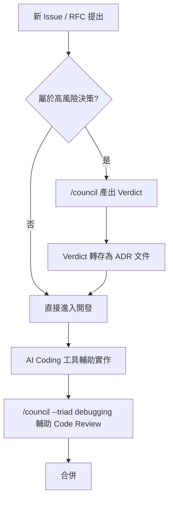

> **實務案例：** 某中型 SaaS 團隊把「Verdict 轉存為 ADR」制度化，規定凡是 RFC 標記為「架構層級變更」的 Issue，必須附上至少一次 `/council --triad architecture` 或 `--full` 的 Verdict 連結才能進入實作階段，半年後回顧，團隊反映「事後爭吵誰當初該提醒誰」的情況明顯減少。

> **注意事項：** AI Coding 工具（不論 Claude Code、Codex 或 Gemini CLI）的「程式碼生成」能力與 Council 的「決策分析」能力是兩件事，不要期待 Council 直接產生程式碼，也不要用一般 Code Completion 的心態呼叫 `/council`。

---

## 第十七章 Spec Driven Development

> **延伸應用說明：** 本章討論 Council 與 spec-kit／OpenSpec／BMAD／Loop Engineering 等 Spec Driven Development 工具的分工建議，屬於作者觀點，Council 官方並未提供與這些工具的直接整合。

### 17.1 Decision Layer 與 Spec Layer 的分工

Spec Driven Development 工具（spec-kit、OpenSpec、BMAD 等）擅長把「需求」轉換成結構化、可被 AI Coding 工具消化的規格文件（Spec），但這些工具通常**假設「該做什麼」已經決定好**，聚焦在「規格寫得夠不夠精確」。Council 補的正是前面那一段空白：**在寫 Spec 之前，先確認「這個方向真的是我們該走的方向」**。

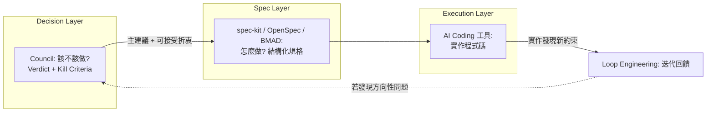

### 17.2 與 spec-kit 整合建議

spec-kit 的 `/specify` 階段可以直接把 Council Verdict 的「主建議」與「可接受折衷」作為輸入背景，確保產生的 Spec 沒有偏離已經審議過的決策方向。

### 17.3 與 OpenSpec 整合建議

OpenSpec 強調規格變更的可追溯性，與 Council Verdict 的「結果追蹤」機制（第九章 9.3 節）理念相通，建議把兩者的追蹤紀錄互相連結，形成「為什麼決定 → 規格怎麼寫 → 規格怎麼變更」的完整鏈路。

### 17.4 與 BMAD 整合建議

BMAD（Business-Model-Architecture-Design 或團隊自定義的類似方法論）強調跨角色協作產出規格，可以在 BMAD 的「Architecture」階段前插入 `--triad architecture`，確保架構決策先經過多視角審議，再交給 BMAD 流程產出正式文件。

### 17.5 與 Loop Engineering 整合建議

Loop Engineering 強調透過迭代回饋持續修正 AI 產出，若在迭代過程中發現「原本的方向性假設可能錯了」（而不只是規格細節需要調整），這正是回頭觸發 Council 重新審議的訊號，而不是繼續在錯誤方向上迭代優化。

> **實務案例：** 某團隊用 spec-kit 產生一份 API 規格，實作到一半才發現效能不如預期，回頭發現當初「該不該用同步 API」這個決策從未經過審慎討論，於是補跑 `/council --triad architecture`，Verdict 建議改為非同步事件驅動，團隊因此修改 Spec 並重新規劃——這說明 Decision Layer 缺席時，Spec Layer 再精確也可能建立在錯誤的地基上。

> **注意事項：** 不要讓 Council 變成 Spec Driven Development 流程的瓶頸——只有真正高風險、方向性的決策才需要走 Council，多數規格細節的調整仍應由 Spec 工具與工程師直接處理。

---

## 第十八章 AI Agent 整合

> **延伸應用說明：** 本章誠實檢視 Council 目前「不具備」哪些 AI Agent 常見能力，並提出可行的外部整合模式建議，避免讀者誤以為 Council 內建這些功能。

### 18.1 Council 目前沒有原生 Agent Memory / Knowledge Graph / MCP / RAG

這是本手冊必須明確澄清的一點：根據查證，Council of High Intelligence **本身不提供**長期記憶（Agent Memory）、知識圖譜（Knowledge Graph）、MCP Server、或 RAG 檢索能力。它是一套**無狀態的 Prompt／Skill 協定**——每次 `/council` 呼叫，18 位 Persona 的「記憶」僅限於當次對話的上下文，議會結束後不會自動累積「上次類似問題怎麼判斷」的經驗。這一點也呼應 [Issue #34](https://github.com/0xNyk/council-of-high-intelligence/issues/34)：截至查證當下，該提議（支援 Agno / LangGraph 等模組化 Python Agent Framework）仍是 `proposal` 標籤、尚未被合併，反映維護者目前有意識地把專案定位在「輕量 Prompt 協定」而非「重量級 Agent 執行框架」。

### 18.2 可行的外部整合模式建議

| 需求 | Council 現況 | 建議整合模式 |
| --- | --- | --- |
| 記住過去決策 | 無原生記憶 | 把每次 Verdict 存進團隊的知識庫（例如 Confluence、Git 內的 ADR 目錄），或搭配具備長期記憶能力的平台（如 Cognee，見本系列另一份《Cognee 教學手冊》），供下次提問前先行檢索相關歷史決策 |
| 結構化知識檢索 | 無 Knowledge Graph | 若團隊已有知識圖譜系統，可在撰寫 Council Prompt 前，先用該系統查出相關實體關係，人工整理進 Prompt 的「證據」欄位 |
| 讓 Council 呼叫外部工具 | 無 MCP 整合 | 若主機（如 Claude Code）本身已連接 MCP Server，Persona 的分析仍限於文字推理，不會主動呼叫工具；如需要工具查詢的事實，建議在呼叫 `/council` 前先用主機的 MCP 工具查好，寫進 Prompt |
| 檢索內部文件輔助分析 | 無原生 RAG | 同上，建議「人工前置檢索 → 整理成證據 → 餵給 Council」，而非期待 Council 自動去檢索你的內部文件 |

### 18.3 為什麼「保持無狀態」可能是刻意的設計選擇

從架構角度看，「無狀態」未必是缺點：Council 的核心價值在於**每次都能重新獲得不受歷史包袱污染的獨立盲分析**——如果 18 個角色都「記得」上次類似問題的結論，Round 1 的獨立性反而可能被過去的判斷錨定，削弱了機制原本要防範的「錨定效應」。因此在建議外部記憶整合時，建議只把「歷史 Verdict」當作**人工檢索的背景參考**，而不是直接餵給 Persona 作為既定前提。

> **實務案例：** 某團隊把每次 Council Verdict 的 Markdown 檔案存進 Git repo 的 `docs/decisions/` 目錄，並用簡單的檔名慣例（`YYYY-MM-DD-主題.md`）方便日後 `grep` 查找；半年後遇到類似的技術選型問題，工程師會先搜尋是否有相關歷史 Verdict，若有就整理成新 Prompt 的背景資訊，而不是直接重跑一次沒有歷史脈絡的議會。

> **注意事項：** 不要因為「Council 沒有原生 RAG／Memory」就認定它功能不足——它的定位本來就是決策支援層，而不是知識管理平台；勉強要求它做記憶管理，反而模糊了它原本聚焦、輕量的設計優勢。

---

## 第十九章 企業導入

> **延伸應用說明：** 本章討論企業導入時的治理考量，屬於作者依 Council 現有機制與企業實務經驗提出的建議。

### 19.1 企業導入的旅程

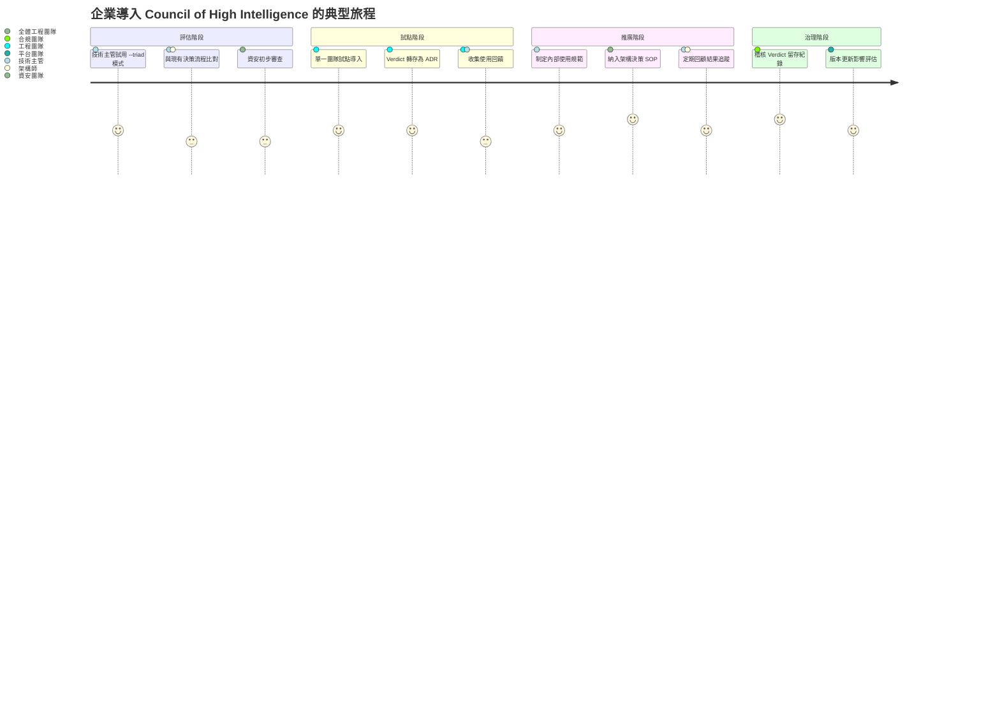

### 19.2 銀行 / 金融業導入考量

- **稽核留存**：Verdict 的 `schema_version` 與結果追蹤欄位，天然適合對應金融業常見的「決策留痕」稽核要求，建議明確規定「凡涉及核心系統的架構決策，Verdict 必須存檔並保留至少 N 年」。
- **資料外洩風險**：金融業高度敏感，務必確認 Prompt 中不會夾帶客戶 PII 或帳務明細；CHANGELOG v1.2.0 修復的 Shell Injection 漏洞提醒我們，即使是 Prompt 層工具，也可能有意料之外的資料外洩路徑，安裝與更新都應走正式的資安審查流程。
- **供應商路由的資料主權**：多供應商路由代表 Prompt 內容可能傳送到 Claude、OpenAI、Google 等不同雲端服務，金融業需明確盤點「哪些內容可以送到哪個供應商」，必要時用 `--models` 限定僅使用內部核准的模型。

### 19.3 政府機關導入考量

政府機關通常對「AI 輔助決策」有更嚴格的可解釋性要求，Council 的證據標籤制度（FACT/INFERENCE/ASSUMPTION/UNKNOWN）與保留異議的 Verdict 格式，相對容易對應到「決策可追溯、可課責」的治理要求；但需留意 MIT License 開源專案本身**不提供官方 SLA 或資安背書**，導入前應比照一般開源軟體的資安評估流程（弱點掃描、License 合規檢查）辦理。

### 19.4 大型企業導入考量

大型企業的挑戰通常不是「要不要用」而是「怎麼統一標準」——不同團隊若各自安裝、各自客製 Persona 或 Triad，容易重蹈官方自己也遇到的「多份鏡像檔案漂移」問題（Issue #47）。建議由平台工程團隊統一維護一份「企業標準設定」（`.council.yaml` 或客製 `--models` 映射），並建立類似官方 `council-simulation-checklist.sh` 的內部驗證機制，定期檢查各團隊的客製化是否與標準版本漂移。

> **實務案例：** 某跨國企業的平台工程團隊將 Council 的安裝與設定納入內部開發者入口網站（Internal Developer Portal）的標準工具鏈，新專案建立時自動帶入企業標準的 `.council.yaml`，並要求架構層級的 RFC 必須附上 Verdict 連結才能進入下一階段審批，落地半年後成為架構評審會議的標準前置作業。

> **注意事項：** 企業導入最容易低估的成本不是安裝，而是**建立「什麼問題該用 Council、什麼問題不該用」的組織共識**——沒有這層共識，容易出現兩極化的結果：要嘛沒人用（怕麻煩），要嘛濫用成每個小決定都要開會（見第二十一章 Anti-pattern），兩者都會讓工具的實際價值大打折扣。

---

## 第二十章 最佳實務（Best Practices）

以下 55 條最佳實務依主題分類，每一條都對應到前十九章介紹過的具體機制，方便查閱時回頭參照。

### 20.1 面板選擇與模式（10 條）

| # | 最佳實務 | 說明 |
| --- | --- | --- |
| 1 | 先問「這個決定可逆嗎、成本高嗎」再決定要不要開 Council | 對應第七章決策流程圖的第一個判斷點 |
| 2 | 單一對立軸的問題優先用 `--duo` | 比 Full/Triad 更快聚焦 |
| 3 | 有明確領域的問題優先查第六章 Triad 表 | 避免每次都手動挑成員 |
| 4 | 跨領域問題寧可用 `--members` 自訂，不要硬套不合適的 Triad | 避免遺漏關鍵視角 |
| 5 | 高風險、不可逆決策才用 `--full` | 節省時間與 Token 成本 |
| 6 | 交叉詰問不會改變結果的情境用 `--quick` | 官方文件明確建議的使用時機 |
| 7 | 探索階段用 `exploration-orthogonal` Preset | 追求視角發散 |
| 8 | 執行階段用 `execution-lean` Preset | 追求快速落地 |
| 9 | 團隊有明確標準組合時，寫進 `.council.yaml` 釘選 | 避免每次重複打參數 |
| 10 | 不確定路由結果時先用 `--dry-route` 預覽 | 不花實際執行的時間與成本 |

### 20.2 Prompt 撰寫（10 條）

| # | 最佳實務 | 說明 |
| --- | --- | --- |
| 11 | 提問前先寫下決策／約束／證據／可逆性／期限五要素 | 第十二章核心方法論 |
| 12 | 明確區分 FACT 與 ASSUMPTION | 避免 Council 把假設當事實推演 |
| 13 | 避免誘導性語氣（「請說明為什麼 A 比較好」） | 會污染 Round 1 獨立盲分析 |
| 14 | `--quick`／`--duo` 至少保留「決策」與「期限」 | 輕量模式仍需要基本錨點 |
| 15 | 呼叫 `--triad <domain>` 時不需重複解釋該領域背景知識 | 把篇幅留給專案特有資訊 |
| 16 | 附上已知的失敗案例或過去教訓 | 幫助 Persona 校準風險評估 |
| 17 | 明確寫出「誰會被這個決定影響」 | 幫助 Machiavelli／誘因類視角發揮作用 |
| 18 | 數字化的證據優於形容詞（「QPS 300」優於「流量很大」） | 提高證據標籤的準確性 |
| 19 | 一次只問一個決策，不要把多個決策塞進同一個 Prompt | 避免 Verdict 失焦 |
| 20 | 對高度技術性問題附上程式碼片段或架構圖 | 減少 Persona 靠腦補理解上下文 |

### 20.3 Debate Engine 與流程紀律（8 條）

| # | 最佳實務 | 說明 |
| --- | --- | --- |
| 21 | 尊重 Round 1 的獨立性，不要提前爆雷你的傾向 | 維持盲分析的價值 |
| 22 | 讓 Round 2 的匿名化真正發揮作用，不要在後續 Prompt 洩漏發言者身份 | 避免權威效應復辟 |
| 23 | 認真看待每個角色的「已知盲點」 | 這是機制設計的核心資產，不是免責聲明 |
| 24 | 出現 DEALBREAKER 標記時務必正視，不要直接忽略 | 代表某成員認為此為不可退讓的紅線 |
| 25 | 意見一致時仍要檢查是否只是「面板選得太同質」 | 一致未必代表正確 |
| 26 | 定期用 Full Council 校準 Triad 是否仍然適用 | 避免長期只用固定 Triad 而錯過新視角 |
| 27 | 交叉詰問內容若太籠統，可要求重新產出更具體的批評 | 對應第八章「具體缺陷」規則 |
| 28 | 極性對成員盡量分散到不同供應商 | 增加交叉詰問的真實張力 |

### 20.4 Verdict 運用與追蹤（10 條）

| # | 最佳實務 | 說明 |
| --- | --- | --- |
| 29 | 把「未解決的問題」當成待辦事項追蹤，不是裝飾文字 | Verdict 設計初衷 |
| 30 | Kill Criteria 一定要具體到「可被量測」 | 不可執行的終止條件等於沒有 |
| 31 | 每份 Verdict 至少有一個負責人（Owner） | 對應結果追蹤機制 |
| 32 | 訂下明確的審查日期，而非「之後再看」 | 避免決策不了了之 |
| 33 | 把 Verdict 轉存為 ADR 或內部知識庫文件 | 建立組織記憶 |
| 34 | 異議（Dissent）也要存檔，不要只留多數意見 | 保留少數意見供日後覆盤 |
| 35 | 定期回顧 Checkpoint 狀態（已確認/已修訂/已反轉/未決定） | 檢驗 Council 判斷的實際準確率 |
| 36 | 用 `schema_version` 建立可程式化解析的決策資料庫 | 為長期治理打基礎 |
| 37 | 高風險 Verdict 建議請真人主管做最終覆核 | Council 是決策支援，非自動決策 |
| 38 | 把「可接受折衷」納入實作規劃，而非只看主建議 | 增加落地彈性 |

### 20.5 安裝與維運（8 條）

| # | 最佳實務 | 說明 |
| --- | --- | --- |
| 39 | 正式安裝前一律先跑 `--dry-run` | 尤其在企業受控環境 |
| 40 | 版本升級後重跑 `council-simulation-checklist.sh` | 確認角色結構與路由未損壞 |
| 41 | WSL 與 Git Bash 安裝路徑不要混用 | 避免設定檔寫入不同家目錄 |
| 42 | 確認 Ollama 實際已安裝模型再依賴自動路由 | 對應 Issue #58 的已知問題 |
| 43 | 企業內統一維護一份標準 `.council.yaml` | 避免各團隊各自為政 |
| 44 | 追蹤 `CHANGELOG.md` 而非只看最新 commit | 掌握破壞性變更 |
| 45 | 多主機安裝時確認四份 `SKILL.*.md` 鏡像行為一致 | 對應 Issue #47 的漂移風險 |
| 46 | 容器化部署前先手動驗證原生安裝可行 | 官方未提供 Docker 映像，需自行驗證 |

### 20.6 企業導入與治理（9 條）

| # | 最佳實務 | 說明 |
| --- | --- | --- |
| 47 | 導入前明確界定「什麼問題該用 Council」 | 避免濫用或棄用兩極化 |
| 48 | 金融／政府等高治理需求產業，明確規範 Verdict 留存年限 | 對應稽核要求 |
| 49 | 盤點 Prompt 中是否夾帶 PII 或機密資訊 | 多供應商路由代表資料可能外送 |
| 50 | 導入前完成開源軟體標準資安評估流程 | MIT License 不代表官方資安背書 |
| 51 | 架構層級 RFC 要求附上 Verdict 連結才能進入下一階段 | 制度化落地機制 |
| 52 | 建立內部教育訓練，確保新人理解「保留意見」不代表「沒有結論」 | 避免誤解 Verdict 格式 |
| 53 | 試點先從單一團隊開始，收集回饋再推廣 | 降低導入風險 |
| 54 | 明確規定 `--models` 限定核准使用的模型供應商 | 資料主權治理 |
| 55 | 定期（例如每季）回顧整體 Verdict 準確率統計 | 檢驗導入是否真的帶來決策品質提升 |

> **實務案例：** 某團隊把「最佳實務 #29～#32」（未解決問題追蹤、Kill Criteria 可量測、Owner、審查日期）直接寫進團隊的 Pull Request 模板中的「架構決策」欄位，強制每個架構性 PR 都要填寫，半年內累積了近 40 筆可追溯的決策紀錄。

> **注意事項：** 最佳實務清單本身也可能過時——尤其是安裝與維運類（20.5 節）高度依賴當前版本行為，建議每次官方發布新版本後，回頭核對本章內容是否仍然適用（見第二十七、二十八章）。

---

## 第二十一章 Anti Patterns

以下 42 條 Anti-pattern，多數直接對應官方文件明確反對的行為，或是本手冊作者依機制設計推論出的常見誤用。

### 21.1 面板與模式誤用（10 條）

| # | Anti-pattern | 為什麼是問題 |
| --- | --- | --- |
| 1 | 每個小決定都開 `--full` | 「重裝上陣打蚊子」，浪費時間與 Token，且訊息量超載反而難聚焦 |
| 2 | 為已經拍板的決定召開議會製造背書 | README 明確反對，且會污染 Round 1 的獨立性（提問者已知道自己想要什麼答案） |
| 3 | 明明是單一對立軸問題卻硬用 `--full` | Duo 模式更適合、更快 |
| 4 | 跨領域問題硬塞進不相關的 Triad | 遺漏關鍵視角，Verdict 品質下降 |
| 5 | 迷信「人越多結論越準」，每次都拉滿 18 人 | 面板規模與決策品質不是線性正相關 |
| 6 | 從不使用 `--dry-route`，路由結果全靠猜 | 無法確認極性對是否真的分散到不同供應商 |
| 7 | 只用單一 Triad 處理所有問題，從不校準 | 長期可能錯過該 Triad 覆蓋範圍外的新風險 |
| 8 | 把 `--quick` 用在真正高風險、需要深度交鋒的決策上 | 省略了完整交叉詰問，可能漏掉關鍵立場翻轉 |
| 9 | 手動 `--members` 選人時只挑「立場一致」的成員 | 失去多視角制衡的意義，等於自問自答 |
| 10 | 忽略 Panel Preset，每次都手動重新設計面板 | 浪費官方已經設計好的搭配邏輯 |

### 21.2 Prompt 反模式（8 條）

| # | Anti-pattern | 為什麼是問題 |
| --- | --- | --- |
| 11 | 只丟一句形容詞式問題（「這樣好嗎？」） | 沒有決策標的，Verdict 只能空泛回應 |
| 12 | 用誘導性語氣暗示期望答案 | 污染 Round 1 獨立盲分析 |
| 13 | 把假設當事實寫進 Prompt，不標註 ASSUMPTION | Council 會基於錯誤前提推演 |
| 14 | 一次塞入多個不相關的決策問題 | Verdict 失焦，難以產出聚焦的 Kill Criteria |
| 15 | 完全不提供約束（時程、預算、人力） | Persona 只能憑空假設約束條件 |
| 16 | 把內部機密或 PII 直接貼進 Prompt | 資安與合規風險（見第十九章） |
| 17 | Prompt 語氣帶有情緒性指責（針對特定同事） | 汙染分析品質，也不符合專業決策文件的精神 |
| 18 | 完全照搬其他專案的 Prompt 範本，不客製化證據與約束 | 失去 Prompt 客製化帶來的分析深度 |

### 21.3 流程繞過（8 條）

| # | Anti-pattern | 為什麼是問題 |
| --- | --- | --- |
| 19 | 在 Round 2 輸入中洩漏發言者身份標籤 | 繞過匿名化設計，權威效應復辟 |
| 20 | 看到 DEALBREAKER 標記直接忽略、逕行執行原計畫 | 違背機制想要凸顯紅線的初衷 |
| 21 | Verdict 出來後自行加碼修改結論卻不記錄理由 | 破壞決策留痕的完整性 |
| 22 | 用「多數決」簡化理解信心加權投票，忽略信心因子 | 誤解 Verdict 的量化邏輯 |
| 23 | 把 Verdict 的「主建議」直接當成唯一選項，無視「可接受折衷」 | 喪失落地彈性 |
| 24 | 跳過 Round 1 直接要求 Persona 產出「最終立場」 | 破壞獨立盲分析的核心價值 |
| 25 | 用同一個 Prompt 連續重跑直到出現想要的結論 | 本質上是另一種形式的「背書製造」 |
| 26 | 把 Chairman 的綜合裁決當成可以無視個別異議的「最終真理」 | 忽略異議報告存在的意義 |

### 21.4 Verdict 誤用（8 條）

| # | Anti-pattern | 為什麼是問題 |
| --- | --- | --- |
| 27 | 只看主建議，完全不管未解決的問題欄位 | 誤以為決策已經萬無一失 |
| 28 | Kill Criteria 寫得空泛不可量測（「如果情況變糟就停」） | 等同沒有終止條件 |
| 29 | 產出 Verdict 後沒有指派 Owner | 決策容易不了了之 |
| 30 | 不設審查日期，Verdict 存檔後從未回顧 | 無法驗證 Council 判斷的實際準確率 |
| 31 | 把 Verdict 當成免責聲明使用（「AI 說可以我就做了」） | 誤解 Council 是決策支援而非責任轉嫁工具 |
| 32 | 異議報告被刻意隱藏或刪除 | 破壞組織記憶的完整性 |
| 33 | 高風險 Verdict 未經真人主管覆核就直接執行 | 缺乏最終把關 |
| 34 | 把不同次 Verdict 的結論直接拼接，忽略上下文差異 | 每次議會的輸入條件可能不同，不能簡單疊加 |

### 21.5 治理與維運缺失（8 條）

| # | Anti-pattern | 為什麼是問題 |
| --- | --- | --- |
| 35 | 企業導入沒有明確界定使用範圍 | 導致濫用或棄用兩極化 |
| 36 | 多團隊各自客製 Persona／Triad，互不同步 | 重蹈官方自己的鏡像漂移問題（Issue #47） |
| 37 | 從未追蹤 `CHANGELOG.md`，版本升級後行為改變也不知道 | 可能誤用已棄用或已變更的參數 |
| 38 | 依賴自動路由卻從未確認各供應商實際可用性 | 對應 Ollama 誤判問題（Issue #58） |
| 39 | 把 Council 導入當成一次性專案而非持續治理工作 | 缺乏定期回顧機制，價值隨時間流失 |
| 40 | 容器化或客製化部署後從未與官方原生行為對照驗證 | 官方未提供 Docker 映像，自建方案可能偏離預期行為 |
| 41 | 高敏感產業導入時忽略資料主權盤點 | 多供應商路由可能造成非預期的跨境資料傳輸 |
| 42 | 把「有用過 Council」當成治理成熟度的證明，卻沒有任何 Verdict 追蹤數據佐證 | 流於形式，未真正發揮決策治理價值 |

> **實務案例：** 某團隊初期犯了 Anti-pattern #1 與 #2——幾乎每個 PR 都跑一次 `--full`，且經常是「主管已經決定要這樣做，只是想要 AI 背書」，三個月後因為 Token 成本與時間成本過高而幾乎棄用；重新導入時制定清楚的使用準則（對應第二十六章），才讓工具真正發揮價值。

> **注意事項：** Anti-pattern 清單的價值不在於「完全避免」，而在於**有意識地選擇**——例如「為已拍板的決定開會」在某些情境下（例如需要留下正式紀錄應付稽核）可能是團隊刻意的選擇，重點是要清楚知道自己在做什麼、以及背後的取捨。

---

## 第二十二章 常見錯誤

以下 52 個常見錯誤聚焦在**具體操作層面的失誤**，與上一章偏組織行為層面的 Anti-pattern 互補。

### 22.1 安裝與環境設定錯誤（12 個）

| # | 錯誤 | 為什麼是問題 |
| --- | --- | --- |
| 1 | 在 Windows 原生 PowerShell 直接執行 `install.sh`，未使用 WSL 或 Git Bash | PowerShell／CMD 無法直接解譯 Bash 語法，腳本會直接失敗 |
| 2 | WSL 與 Git Bash 兩種安裝路徑混用，導致設定檔寫入不同家目錄 | 兩種環境的「家目錄」對應到不同實體路徑，容易出現「明明裝過卻讀不到」的困惑 |
| 3 | 忘記先跑 `--dry-run` 就直接正式安裝，覆蓋掉既有客製化設定 | 跳過預覽步驟，既有客製設定可能在不知情下被覆蓋 |
| 4 | 安裝 `--opencode` 路徑時本機未安裝 Python 3，轉換代理程式執行失敗 | 該路徑依賴 Python 3 執行格式轉換，環境缺失會直接安裝失敗 |
| 5 | 自訂 `--claude-dir` 路徑打錯，導致設定寫入使用者預期外的目錄 | 路徑參數打錯不會有明顯錯誤訊息，事後才發現設定不在預期位置 |
| 6 | 在 WSL 內執行安裝腳本卻忘記用 `--claude-dir` 指向 Windows 端路徑 | 未指定時會寫入 WSL 內部檔案系統，而非 Windows 端主機實際讀取的目錄 |
| 7 | 誤以為 Docker 有官方映像檔，直接搜尋 `docker pull` 卻找不到 | 官方目前未提供任何 Dockerfile 或映像檔，容器化需自行封裝 |
| 8 | 誤以為 GitHub Copilot／OpenHands 有官方安裝路徑，在 `install.sh` 找不到對應參數 | 這兩者目前不在官方支援主機清單內，只能靠手動變通方案 |
| 9 | 安裝後忘記重啟主機 CLI，導致新 Skill 未被載入 | 多數 CLI 工具需要重新啟動才會重新掃描已安裝的 Skill／Plugin |
| 10 | 多個主機（Claude Code + Codex + Gemini CLI）分次安裝時使用不同版本的 repo（未先 `git pull` 更新），導致鏡像檔案版本不一致 | 分次安裝若中間有新版本發布，會產生跨主機的協定版本落差 |
| 11 | 忽略 `council-simulation-checklist.sh` 的失敗訊息，強行繼續使用 | 該腳本正是用來驗證角色結構與路由配置完整性，忽略失敗等於放棄事前把關 |
| 12 | 企業網路環境有 Proxy 限制，`git clone` 失敗卻誤判為套件本身損壞 | 誤判根因會導致排錯方向錯誤，真正該處理的是網路白名單設定 |

### 22.2 CLI 與參數使用錯誤（12 個）

| # | 錯誤 | 為什麼是問題 |
| --- | --- | --- |
| 13 | 同時輸入多個模式參數（如 `--full --quick`），對結果的判斷邏輯有誤解 | 官方未明確定義優先順序，容易產生非預期的模式行為 |
| 14 | `--triad` 打錯領域名稱（例如打成 `architecture` 少一個 t），未收到預期的面板 | 拼字錯誤通常不會有明確錯誤提示，只會得到不是預期中的面板組成 |
| 15 | `--members` 的成員代號拼錯（如把 `torvalds` 打成 `linus`），未被正確辨識 | 成員代號需完全比對，拼錯即無法正確召集該角色 |
| 16 | 混淆 `--dry-route`（只看路由）與 `--dry-run`（安裝腳本專用），誤用在錯誤情境 | 兩者作用階段完全不同，混用會得到與預期不符的結果 |
| 17 | 誤以為 `--no-auto-route` 會停用整個議會功能，而非只是關閉自動路由 | 誤解參數作用範圍，可能誤以為議會沒有正常執行 |
| 18 | `--models` 指定的路徑檔案格式錯誤，路由映射未被正確套用 | 格式錯誤時系統可能靜默退回自動路由，而非明確報錯 |
| 19 | 忘記 `--quick` 與 `--triad` 需要疊加使用才能同時取得「快速」與「領域聚焦」兩種效果 | 只下其中一個參數只會取得單一效果，不會自動疊加 |
| 20 | 誤解 `--duo` 一定要搭配 `--members`，其實不指定時系統會自動選兩位 | 不了解自動配對機制（見第七章 7.4 節），誤以為每次都要手動指定 |
| 21 | 對 `.council.yaml` 的 schema 理解有誤，寫錯欄位名稱導致設定未生效 | 欄位名稱錯誤通常不會有明確報錯，設定會被靜默忽略 |
| 22 | 在同一個 Prompt 中反覆修改參數卻沒有意識到面板組成因此完全改變 | 面板組成變動會直接影響哪些視角參與分析，需要意識到每次調整的實際影響 |
| 23 | 誤把 Panel Preset 名稱（`classic`／`exploration-orthogonal`／`execution-lean`）當成 Triad domain 使用 | 兩者是不同層級的概念，混用會導致參數無法被正確解析 |
| 24 | 沒注意到 v1.2.0 起領域加權席位已經在 STEP 0 決定，仍照舊版邏輯理解投票後才加權 | 版本升級改變了加權時機，用舊版心智模型理解新版行為會產生誤判 |

### 22.3 Prompt 與內容錯誤（10 個）

| # | 錯誤 | 為什麼是問題 |
| --- | --- | --- |
| 25 | 忘記標註證據等級，導致猜測被當成事實處理 | 缺少 FACT/ASSUMPTION 等標籤時，Council 可能直接把假設當成既定事實推演 |
| 26 | Prompt 中夾帶敏感資訊（PII、密鑰）未經過濾 | 內容可能經多供應商路由外送到不同雲端服務，構成資安與合規風險 |
| 27 | 決策描述含糊，例如只寫「優化一下」而未指明優化什麼、為誰優化 | 缺乏明確決策標的，Verdict 只能給出空泛回應 |
| 28 | 把多個獨立決策揉在一個 Prompt 裡，Verdict 難以拆解對應 | 多個決策混在一起會讓 Kill Criteria 與行動項目失焦，難以逐一對應執行 |
| 29 | 誤用誘導性語氣，事後抱怨 Council「總是同意我」 | 誘導性語氣會污染 Round 1 獨立盲分析，結果自然容易「印證」提問者原本的期待 |
| 30 | 忽略期限資訊，導致 Verdict 的下一步缺乏時間錨點 | 沒有期限，行動項目容易變成沒有急迫性的空泛建議 |
| 31 | 對 `--quick` 模式仍塞入大量背景資訊，拖慢分析聚焦速度 | `--quick` 設計初衷是精簡快速，過多背景反而違背模式選擇的初衷 |
| 32 | 使用非繁體中文或非英文的小眾語言提問，可能導致部分 Persona 契約的既定回應格式解析異常 | Persona 契約本身以英文撰寫，小眾語言可能導致回應格式與預期不符 |
| 33 | Prompt 中的專有名詞縮寫未解釋（例如內部系統代號），導致 Persona 誤解問題脈絡 | Persona 沒有團隊的內部知識背景，未解釋的縮寫容易被誤解或忽略 |
| 34 | 把「我希望的答案」寫在 Prompt 開頭，事後才描述問題本身 | 等同在 Round 1 前就洩漏期望答案，破壞獨立盲分析的價值 |

### 22.4 Verdict 解讀與追蹤錯誤（10 個）

| # | 錯誤 | 為什麼是問題 |
| --- | --- | --- |
| 35 | 誤把「未解決的問題」當成無關緊要的附錄，未認真處理 | 這是 Verdict 刻意放在最前面的欄位，忽略它等於誤判決策已被完全解決 |
| 36 | 把 Kill Criteria 寫得無法量測，日後無從判斷是否觸發 | 不可量測的終止條件等同沒有終止條件，喪失停損意義 |
| 37 | 收到 Verdict 後未指派 Owner，決策執行狀態無人追蹤 | 沒有負責人時，行動項目很容易不了了之 |
| 38 | 誤解信心加權投票機制，以為單純多數決 | 忽略信心因子會誤判裁決邏輯，低估「高信心少數」可能勝過「低信心多數」的情況 |
| 39 | 忽略異議報告，只採納多數意見 | 少數意見的紀錄是組織記憶的一部分，忽略會讓「早有人提醒過」的教訓無從查考 |
| 40 | 沒有設定審查日期，Checkpoint 永遠停留在「未決定」 | 缺乏明確回顧時間點，結果追蹤機制形同虛設 |
| 41 | 把「可接受折衷」誤讀成「次要選項可以忽略」 | 折衷方案是主建議無法達成時的正式備案，忽略會喪失落地彈性 |
| 42 | 混淆 `schema_version` 與軟體本身的版本號（例如 v1.2.0），兩者意義不同 | 前者是 Verdict 資料結構的中繼版本，後者是軟體發布版本，混用會造成溝通誤解 |
| 43 | 未將 Verdict 存檔，對話視窗關閉後決策脈絡完全遺失 | Verdict 本身無持久化機制，不主動存檔即失去日後可稽核的紀錄 |
| 44 | 誤以為 Verdict 具有法律或合規效力，未經真人審核就作為正式決策文件對外提交 | Council 是決策支援工具而非具公信力的合規文件，缺乏真人審核可能造成治理風險 |

### 22.5 維運與升級錯誤（8 個）

| # | 錯誤 | 為什麼是問題 |
| --- | --- | --- |
| 45 | 升級版本後未比對 `CHANGELOG.md`，未發現破壞性變更（如 v1.0.0 → v1.1.0 引入的 Chairman 角色） | 破壞性變更可能改變既有的解析邏輯或使用習慣，未比對容易誤用新版行為 |
| 46 | 客製 Persona／Triad 後，官方版本更新時未同步調整，導致客製內容與新版協定衝突 | 官方協定持續演進，客製內容若未同步檢視容易與新版格式不相容 |
| 47 | 多份 `SKILL.*.md` 鏡像各自被不同人手動修改，逐漸偏離彼此（未跑 CI drift guard） | 缺乏自動化比對機制時，多主機行為會隨時間逐漸不一致 |
| 48 | 誤判 Ollama 可用性（本機未安裝任何模型卻被判定可路由），實際執行時失敗 | 對應官方已知問題（Issue #58），自動偵測在零模型情境下仍可能誤判可用 |
| 49 | 忽略 Issue Tracker 上的已知 Bug（例如 `gen-star-history.py` 的 strftime 可攜性問題），在不相容環境下重現同樣錯誤 | 已知問題若未事先查閱，容易在相同情境下重複踩坑 |
| 50 | 企業內部 Fork 了 repo 卻未持續同步上游安全性修復（例如 v1.2.0 的 Shell Injection 修復） | Fork 後若不同步上游安全性更新，會持續暴露在已修復的已知漏洞風險中 |
| 51 | 對 `install.sh` 的 flag 語意理解有誤（如 `--codex` 與 `--codex-only` 混淆），意外覆蓋了原有的 Claude Code 設定 | 兩者作用範圍不同，混淆容易造成非預期的設定覆蓋 |
| 52 | 版本升級後沒有重新執行 `--dry-run` 確認寫入內容，直接套用可能過時的本地備份設定 | 跳過預覽步驟時，可能不小心套用了與新版不相容的舊設定內容 |

> **實務案例：** 錯誤 #16（混淆 `--dry-route` 與 `--dry-run`）在教育訓練場合非常常見，建議新人訓練時明確用一張對照表區分：`--dry-run` 是 `install.sh` 的安裝預覽參數，`--dry-route` 是 `/council` 指令的路由預覽參數，兩者作用的階段完全不同。

> **注意事項：** 本章多數錯誤都可以透過「先 `--dry-run`／`--dry-route` 預覽，再正式執行」的習慣大幅降低發生機率——這條原則值得寫進團隊的新人上手文件第一頁。

---

## 第二十三章 FAQ

本章收錄 105 題常見問答，依主題分類方便查找。

### 23.1 基本概念（15 題）

**Q1. Council of High Intelligence 是一個 AI 模型嗎？**
不是。它是一套安裝進 Claude Code／Codex／Gemini CLI／OpenCode 的 Skill／Plugin 協定，實際推理仍由你原本使用的底層 LLM 執行。

**Q2. 需要另外付費訂閱 Council 嗎？**
不需要，Council 本身是 MIT License 開源專案免費使用；但實際執行時仍會消耗你所使用的 LLM 供應商（Claude／OpenAI／Google 等）的 API 額度或訂閱資源。

**Q3. Council 會取代人類決策者嗎？**
不會，也不應該。Verdict 明確設計成「保留未解決問題」的決策支援文件，最終決策責任仍在人類手上。

**Q4. 18 位 Persona 是固定的嗎，可以自訂嗎？**
官方預設 18 位，`agents/` 目錄下的契約檔案是純文字 Markdown，理論上可以自行客製或新增，但需自行承擔與官方版本同步維護的成本（見第二十七章）。

**Q5. Council 和一般「請 AI 扮演不同角色」的 Prompt 技巧有什麼不同？**
差異在於 Council 把「角色扮演」升級成有明確協定的**多輪結構化流程**（獨立盲分析、匿名交叉詰問、信心加權投票、結構化 Verdict），而非單次、單輪的角色扮演請求。

**Q6. 為什麼要用歷史人物當 Persona，而不是「架構師」「資安專家」這種職稱？**
歷史人物自帶大眾熟悉的思想風格與價值取捨（例如「Machiavelli = 現實主義權謀」），比職稱更容易在 Prompt 中喚起模型一致且有辨識度的分析視角。

**Q7. Council 適合用在寫程式本身嗎？**
不適合，它不產生程式碼，是決策分析工具；程式碼實作仍應交給你原本使用的 AI Coding 工具（見第十六章）。

**Q8. 什麼情況下「不要」用 Council？**
單純事實查詢、低成本可逆決策、或已有團隊共識只想背書的情境（見第一章 1.10 節）。

**Q9. Council 的準確率有多高？**
官方未提供準確率指標；本手冊建議企業自行透過結果追蹤機制（第九章 9.3 節）長期累積數據，評估在自身情境下的實際準確率。

**Q10. Full／Quick／Duo／Triad 四種模式，新手該先學哪個？**
建議先從 `--triad <domain>` 開始，兼顧效率與深度，熟悉後再依情境嘗試其他模式。

**Q11. Council 支援中文提問嗎？**
可以用中文提問，底層 LLM 具備多語言能力；但 Persona 契約與官方文件均以英文撰寫，回應風格可能仍帶有英文語境下的表達習慣。

**Q12. 一次議會大概要花多少時間？**
視模式與底層模型速度而定，`--full` 因涉及三輪多人流程通常明顯長於 `--quick` 或 `--duo`，官方未提供具體時間基準，建議自行測試評估。

**Q13. Verdict 的信心加權投票，領域加權席位的 1.5 倍怎麼決定的？**
依 `SKILL.md` 定義，該領域的核心 Persona（例如 `ai` Triad 中的 Karpathy）在該領域問題上被賦予 1.5 倍基礎權重，v1.2.0 起在 STEP 0 面板選擇階段就會指定。

**Q14. Council 會記得我上次問過的問題嗎？**
不會，Council 本身無狀態、無原生記憶機制（見第十八章 18.1 節）。

**Q15. Council 的名字為什麼叫「High Intelligence」？**
這是專案命名的比喻——把多個高水準思想家匯聚成一個「議會」共同審議，官方文件未進一步解釋命名典故。

### 23.2 安裝與環境（12 題）

**Q16. Windows 可以直接安裝嗎？**
不能直接在原生 PowerShell/CMD 執行 `install.sh`，需透過 WSL 或 Git Bash（見第十章 10.5 節）。

**Q17. 官方有提供 Docker 映像嗎？**
沒有，需自行封裝容器（見第十章 10.7 節）。

**Q18. 可以同時安裝到多個主機嗎？**
可以，例如 `./install.sh --codex --gemini` 會同時處理 Claude Code、Codex、Gemini CLI 三種鏡像。

**Q19. `--dry-run` 會不會真的修改任何檔案？**
不會，它只印出將要執行的操作供預覽。

**Q20. 安裝到 GitHub Copilot 有官方腳本嗎？**
沒有，目前只能手動變通（見第十章 10.12 節）。

**Q21. 安裝完成後怎麼確認成功？**
執行 `./scripts/council-simulation-checklist.sh` 進行完整性檢查，並在對應主機輸入 `/council` 測試是否有回應。

**Q22. 需要 Python 嗎？**
只有 `--opencode` 安裝路徑需要 Python 3，其餘路徑僅需 Bash 環境。

**Q23. 可以指定安裝到非預設目錄嗎？**
可以，用 `--claude-dir` / `--codex-dir` / `--gemini-dir` / `--opencode-dir` 指定自訂路徑。

**Q24. `--copy-configs` 這個參數做什麼？**
把 repo 內的設定範本（例如 `configs/provider-model-slots.example.yaml`）複製到技能資料夾，方便後續客製化路由設定。

**Q25. 更新到新版本要重新安裝嗎？**
建議 `git pull` 更新 repo 內容後，重新執行 `install.sh`（先 `--dry-run` 確認差異）。

**Q26. 安裝失敗最常見的原因是什麼？**
依第二十二章統計，最常見是在錯誤的 Shell 環境執行腳本，或 WSL／Git Bash 路徑混用。

**Q27. 企業內網（有 Proxy）安裝會有問題嗎？**
`git clone` 與後續可能的模型 API 呼叫都需要網路存取，若企業網路有嚴格 Proxy／白名單限制，需先確認相關網域已放行。

### 23.3 CLI 與參數（15 題）

**Q28. `/council` 不加任何參數，預設是什麼模式？**
等同 `--full`，召集完整面板走三輪流程。

**Q29. `--triad` 後面能接的 domain 有哪些？**
20 個具名 Triad，完整清單見第六章 6.3 節或附錄 A。

**Q30. `--members` 的成員名稱要怎麼寫？**
依官方慣例使用小寫代號（如 `torvalds`、`ada`、`sun-tzu`），詳見附錄 A 的 Persona Cheat Sheet。

**Q31. `--quick` 和 `--triad` 可以一起用嗎？**
可以，`--quick --triad shipping` 代表用 shipping Triad 的 3 人走快速流程。

**Q32. `--dry-route` 和 `--dry-run` 一樣嗎？**
不一樣，`--dry-route` 是 `/council` 指令參數（預覽路由結果），`--dry-run` 是 `install.sh` 參數（預覽安裝操作），詳見第二十二章錯誤 #16。

**Q33. `--no-auto-route` 會停用議會功能嗎？**
不會，只是關閉自動路由，改用主機預設模型執行所有成員。

**Q34. `--models` 指定的檔案格式是什麼？**
YAML 格式的席位對模型映射檔，可參考 `configs/provider-model-slots.example.yaml` 範本。

**Q35. `.council.yaml` 放在哪裡？**
專案根目錄，用於釘選專案層級的預設 `profile`／`triad`／`members` 等設定（v1.2.0 起支援）。

**Q36. 可以自訂新的 Triad 嗎？**
理論上可透過修改 `SKILL.md` 的領域路由定義客製，但需自行維護與官方版本的相容性。

**Q37. 模式參數可以同時打兩個嗎（如 `--full --quick`）？**
不建議，官方未明確定義優先順序，容易產生非預期行為，建議只指定一個模式參數。

**Q38. `--duo` 沒有指定 `--members` 時，系統怎麼選人？**
會依問題內容比對關鍵字，從官方定義的極性配對表中選出對應的一組張力對；無關鍵字命中時落回預設配對（Socrates vs Feynman）。完整對照表見第七章 7.4 節。

**Q39. 領域加權席位是什麼時候決定的？**
v1.2.0 起在 STEP 0（面板選擇階段）就決定，早於實際投票。

**Q40. 可以在同一次對話中連續呼叫多次 `/council` 嗎？**
可以，每次呼叫都是獨立的議會，彼此不共享記憶（見 Q14）。

**Q41. Panel Preset（`classic`／`exploration-orthogonal`／`execution-lean`）怎麼指定？**
依官方文件，這三組屬於整體面板配置，用於未指定 Triad 時決定挑選邏輯，具體指定語法建議以當下官方文件為準；另外，`exploration-orthogonal`／`execution-lean` 這兩組還各自解鎖了專屬於該 Profile 的額外 Triad（見第六章 6.5 節）。

**Q42. 參數大小寫敏感嗎？**
Shell 慣例上參數與 domain 名稱建議統一使用小寫，避免因大小寫不一致導致未被辨識。

### 23.4 Persona 與 Triad（12 題）

**Q43. 18 位成員都是真實歷史人物嗎？**
是，均為真實存在或曾經存在的歷史人物或當代公眾人物（如 Karpathy、Sutskever 為現役 AI 研究者），Persona 契約是依其公開可查的思想風格設計的分析視角，並非本人授權或參與。

**Q44. 為什麼每個 Persona 都要標註「已知盲點」？**
這是機制設計的核心——誠實揭露每個視角的弱點，方便其他成員與使用者判斷該視角建議的可信邊界。

**Q45. Persona 之間的「制衡角色」是固定配對嗎？**
是，依官方揭露每位成員都有明確的 counterweight 配對（見第五章 5.2 表格最後一欄）。

**Q46. Triad 是三選一還是三人同時上場？**
三人同時參與，各自獨立分析再交叉詰問，而非三選一。

**Q47. 一個 Triad 的三人可以重複用在另一個 Triad 嗎？**
可以，例如 Ada 同時出現在 `architecture`、`innovation`、`complexity`、`ai` 等多個 Triad。

**Q48. 官方文件說 Triad 總數是 15 還是 20？**
查證時兩份來源說法不一，本手冊以 `SKILL.md` 「Pre-defined Triads」區塊實際列出的 20 組為準（見第六章查證提醒）。

**Q49. 可以只召集 2 位或 4 位成員嗎（非 Duo 的 2 人、非 Triad 的 3 人）？**
可透過 `--members` 手動指定任意人數的自訂面板。

**Q50. Chairman 是 18 位成員之一嗎？**
不是，Chairman 是獨立的綜合裁決角色，由指定模型執行，職責是彙整而非產出新論點（見第四章 4.2 節）。

**Q51. 為什麼 Karpathy 和 Sutskever 常常一起出現？**
兩者互為官方定義的制衡對（經驗觀察 vs. 擴展安全），適合放在同一 Triad 製造張力。

**Q52. Persona 契約文件可以直接讀取嗎？**
可以，公開存放在 `agents/` 目錄下，例如 `agents/council-ada.md`。

**Q53. 客製 Persona 需要遵守什麼格式？**
建議比照官方契約的結構骨架撰寫（詳見第五章 5.1 節），保持格式一致性。

**Q54. 議會中會有人「棄權」嗎？**
官方文件未明確描述棄權機制，各成員原則上都會產出立場，但可能標註較低的 CONFIDENCE。

### 23.5 Debate Engine 與 Verdict（15 題）

**Q55. Round 2 匿名化後，成員還記得自己是誰嗎？**
匿名化影響的是「輸出呈現給其他成員與使用者的方式」，Persona 本身的分析邏輯不受影響。

**Q56. 交叉詰問一定要「不同意」嗎？**
不一定，若確實認同對方論點，也可以在「Strengthened by」欄位明確標註，這也是機制設計允許的回應之一。

**Q57. Kill Criteria 是誰決定的？**
由議會審議過程中產出，通常反映多數成員或高信心成員認為的關鍵風險訊號。

**Q58. Verdict 一定會有異議（Dissent）嗎？**
不一定，若各成員 Round 3 意見一致，可能不會有正式的異議報告。

**Q59. 信心加權投票的公式是什麼？**
基礎權重（一般 1.0，領域加權席位 1.5×）× 信心因子（high 1.0／med 0.75／low 0.5），加總後決定裁決傾向。

**Q60. `schema_version` 目前是多少？**
依查證，Verdict metadata 區塊自 v1.1.0 起加入 `schema_version: 1`。

**Q61. Verdict 可以要求重新產出嗎？**
可以，若對結果不滿意，可以補充更多證據或調整面板後重新呼叫 `/council`。

**Q62. 為什麼「未解決的問題」要放在 Verdict 最前面？**
刻意的設計選擇，避免決策者誤以為判決代表問題已被完全解決（見第九章 9.2 節）。

**Q63. Verdict 有固定的檔案格式（如 JSON）嗎？**
以結構化 Markdown 文字輸出為主，`schema_version` 等中繼資料讓其具備一定程度的可程式化解析潛力，但非嚴格的 JSON Schema。

**Q64. 意見一致時還會有信心加權投票嗎？**
不會，一致時直接生成共識判決，只有分裂時才啟動加權投票（見第四章時序圖 alt 區塊）。

**Q65. STANCE / CONFIDENCE / DEALBREAKER 這三個欄位分別代表什麼？**
STANCE 是最終立場、CONFIDENCE 是信心程度（high/med/low）、DEALBREAKER 是是否存在不可退讓的紅線條件。

**Q66. Verdict 中的「可接受折衷」和「主建議」衝突時該聽哪個？**
兩者不衝突，「可接受折衷」是主建議無法達成時的備案，非相互競爭的選項。

**Q67. Debate Engine 三輪流程可以中途中斷嗎？**
理論上使用者可隨時中斷對話，但這樣會得到不完整的中間結果，非正式的 Verdict。

**Q68. 為什麼要區分 FACT / INFERENCE / ASSUMPTION / UNKNOWN 四級？**
讓每個論點的可信程度透明化，方便決策者判斷該相信哪些結論、該進一步查證哪些假設。

**Q69. 結果追蹤（Result Tracking）是 Council 自動做的嗎？**
不是，官方機制只定義了 Verdict 的欄位設計，實際的長期追蹤（Owner、審查日期、Checkpoint 更新）需要使用者自行落地執行（見第九章 9.3 節）。

### 23.6 AI Coding 工具整合（10 題）

**Q70. Claude Code 和 Council 是同一家做的嗎？**
不是，Claude Code 是 Anthropic 官方產品，Council of High Intelligence 是由獨立開發者 Nyk 維護的第三方 Plugin/Skill。

**Q71. Council 可以在 Cursor 裡直接打 `/council` 嗎？**
目前不行，Cursor 僅能作為路由供應商參與議會執行，無法原生安裝 Skill（見第十章 10.1 節）。

**Q72. GitHub Copilot 用戶要怎麼用 Council？**
目前僅能手動把協定內容改寫成 Copilot 自訂指令，非官方原生整合（見第十章 10.12 節）。

**Q73. 可以讓 Council 直接呼叫 MCP Server 查資料嗎？**
Council 本身不具備 MCP 整合能力，若主機支援 MCP，仍需使用者自行在呼叫議會前先行查詢並整理進 Prompt（見第十八章 18.2 節）。

**Q74. 一個團隊可以同時用 Claude Code 和 Codex 跑同一個問題嗎？**
可以，也是官方建議的用法之一，能增加多供應商路由的實際多樣性。

**Q75. Council 支援 OpenHands 嗎？**
目前無官方支援，需手動變通。

**Q76. AI Coding 工具的程式碼建議會受 Council 影響嗎？**
不會直接影響，Council 產出的是決策分析文字，需使用者自行把 Verdict 結論帶入後續給 AI Coding 工具的 Prompt 中。

**Q77. 可以把 Council 用在 Code Review 上嗎？**
可以，常見用法是搭配 `--triad debugging`（見第十三章 13.5 節）。

**Q78. 多個 AI Coding 工具的 Skill 格式不同，Council 怎麼處理？**
透過維護四份獨立的 `SKILL.*.md` 鏡像檔案分別對應不同主機的 Skill 格式規範。

**Q79. 未來會支援更多 AI Coding 工具嗎？**
截至查證當下官方未公布明確承諾，可持續關注 Issue Tracker 與 Roadmap（見第二十九章）。

### 23.7 企業導入與治理（12 題）

**Q80. Council 有企業版或商業支援嗎？**
查證當下未發現官方提供企業版或付費支援方案，是純社群維護的開源專案。

**Q81. 導入 Council 需要走資安審查嗎？**
建議比照一般開源軟體導入流程進行資安評估，尤其留意 Prompt 內容外送到多個 LLM 供應商的資料主權議題（見第十九章）。

**Q82. Verdict 可以作為正式的稽核文件嗎？**
可以作為輔助佐證，但建議搭配真人審核與企業既有的決策文件規範，不宜單獨作為法遵依據。

**Q83. 多團隊導入時如何避免設定各自為政？**
建議由平台工程團隊統一維護標準 `.council.yaml` 或 `--models` 映射（見第十九章 19.4 節）。

**Q84. 高治理需求產業（銀行/政府）可以放心使用嗎？**
可以作為決策輔助工具使用，但需自行補強資料主權盤點、稽核留存規範等治理措施，官方文件未針對特定產業提供合規保證。

**Q85. Council 會不會有 License 合規風險？**
MIT License 本身對商業使用非常寬鬆，但企業仍應依內部開源治理流程完成盤點與核准。

**Q86. 導入後如何衡量 ROI？**
建議透過第九章的結果追蹤機制，長期比對 Verdict 的 Checkpoint 準確率與決策週期時間變化。

**Q87. 需要培訓才能導入嗎？**
建議至少完成基礎的 CLI 使用與 Prompt 撰寫教育訓練（對應第十至十二章），避免第二十一、二十二章列出的常見誤用。

**Q88. Council 可以整合進既有的 ADR（架構決策紀錄）流程嗎？**
可以，且是本手冊多次建議的實務做法（見第十三、十六、十九章案例）。

**Q89. 小型新創適合導入嗎？**
適合，尤其 `--quick` 或 `--duo` 模式的低成本特性，很適合資源有限但仍重視決策品質的小團隊。

**Q90. 企業內部可以完全 Fork 一份自行維護嗎？**
可以，MIT License 允許，但需留意持續同步上游安全性修復（見第二十二章錯誤 #50）。

**Q91. 導入 Council 是否代表要放棄現有的會議決策文化？**
不是取代，而是補充——第八章提到的「先各自盲寫、再匿名交鋒」流程本身也值得搬進真人會議實踐。

### 23.8 疑難排解（14 題）

**Q92. 為什麼我的 `/council` 指令沒有反應？**
先確認安裝是否成功（跑一次 `council-simulation-checklist.sh`），並確認在正確的主機環境中輸入指令。

**Q93. 為什麼 Persona 的回應風格跟預期的歷史人物不太像？**
底層模型的角色扮演能力會影響風格還原度，不同供應商、不同模型版本的表現可能有差異。

**Q94. 為什麼路由結果一直都是同一個供應商？**
可能是本機只安裝／登入了一種主機環境，導致自動偵測不到其他供應商，可用 `--dry-route` 確認。

**Q95. 為什麼 Ollama 明明沒有模型卻被判定可用？**
已知問題，對應 Issue #58，建議手動用 `ollama list` 確認再決定是否依賴自動路由。

**Q96. 為什麼 Verdict 的 Kill Criteria 很空泛？**
通常是輸入 Prompt 缺乏具體證據與約束，建議依第十二章方法論重寫提問。

**Q97. 為什麼同一個問題跑兩次 `/council` 結果不太一樣？**
生成式 AI 本質上具有一定隨機性，加上多供應商路由可能因當下可用性不同而變化，屬於正常現象。

**Q98. 為什麼交叉詰問看起來很表面、沒有真的挑戰到重點？**
可能是面板成員視角過於同質，或路由到同一模型家族導致「歧異」不夠真實，建議檢查 `--dry-route` 結果。

**Q99. 更新版本後某個舊指令突然失效怎麼辦？**
先查閱 `CHANGELOG.md` 確認是否有破壞性變更，並比對第二十八章的升級策略建議。

**Q100. `SKILL.gemini.md` 和 `SKILL.md` 內容不一致怎麼辦？**
這是官方已知的維運挑戰（Issue #47），建議以 `SKILL.md`（Claude Code 原生版）為準，並回報或等待官方修復。

**Q101. 為什麼 Gemini CLI 安裝後找不到 `/council`？**
確認 `gemini-extension.json` 是否正確產生，並確認 Gemini CLI 版本支援擴充套件機制。

**Q102. 議會執行到一半失敗、沒有產出 Verdict 怎麼辦？**
可能是某個路由供應商當下不可用或 API 額度不足，可嘗試 `--no-auto-route` 改用主機預設模型重跑。

**Q103. 為什麼企業內網環境下多供應商路由常常失敗？**
多數情況與 Proxy／防火牆限制外部 API 存取有關，需與 IT 部門確認各供應商 API 網域是否已放行。

**Q104. 遇到不在本手冊涵蓋範圍內的問題該怎麼辦？**
建議直接查閱官方 [README](https://github.com/0xNyk/council-of-high-intelligence) 與 [Issue Tracker](https://github.com/0xNyk/council-of-high-intelligence/issues)，本手冊查證截止於 2026-07-20，之後的變更需自行核對。

**Q105. 發現本手冊內容與官方最新版本不符怎麼辦？**
請以官方最新文件為準，並可考慮回報給維護此手冊的內部團隊更新查證日期。

> **實務案例：** 新人教育訓練時，建議把 Q16、Q32、Q94、Q100 這幾題直接印成一頁「地雷提醒卡」貼在團隊 Wiki 首頁，這幾題涵蓋了新手最常卡住的環境與參數混淆問題。

> **注意事項：** FAQ 內容會隨官方版本更新而變化，本章所有答案均以 2026-07-20 查證的 v1.2.0 行為為準，企業導入後建議指派專人定期回頭核對本章內容時效性。

---

## 第二十四章 完整案例

以下 20 個案例均為**依 Council 實際機制設計的示範情境**（作者原創撰寫，用以示範使用手法，非官方文件收錄的真實客戶案例），分為五大類，每類 4 個案例，格式統一：情境／決策問題／使用模式／關鍵證據／Verdict 摘要／結果。

### 24.1 Web Application 開發（4 案例）

**案例 1：會員系統要不要拆成獨立服務**
- 情境：電商平台會員模組與訂單模組高度耦合在同一單體應用。
- 決策問題：是否將會員系統拆成獨立微服務。
- 使用模式：`--triad architecture`
- 關鍵證據：會員查詢 QPS 遠高於訂單（FACT），跨服務查詢延遲尚未實測（UNKNOWN）。
- Verdict 摘要：主建議先拆出唯讀查詢路徑試點；Kill Criteria「跨服務延遲超過 200ms 影響首頁載入則暫緩」。
- 結果：三個月後延遲維持在 80ms 內，Checkpoint 標記「已確認」，正式進入第二階段拆分。

**案例 2：前端狀態管理套件選型**
- 情境：新專案要選擇前端狀態管理方案。
- 決策問題：Redux 風格集中式管理 vs. 輕量 Signal-based 方案。
- 使用模式：`--duo --members ada,watts`
- 關鍵證據：團隊過去多數專案用集中式方案（FACT），新方案學習曲線未知（UNKNOWN）。
- Verdict 摘要：建議輕量方案搭配漸進導入，可接受折衷為「保留集中式方案處理跨頁面共享狀態」。
- 結果：導入後開發速度提升，團隊反饋正面，列為新專案預設選型。

**案例 3：API 版本策略**
- 情境：對外開放 API 準備進入 v2，既有 v1 客戶端仍大量使用。
- 決策問題：是否強制淘汰 v1，或並行維護。
- 使用模式：`--triad decision`
- 關鍵證據：v1 呼叫量佔比 40%（FACT），部分企業客戶合約綁定 v1 相容性（FACT）。
- Verdict 摘要：主建議並行維護 18 個月並提前公告淘汰時程；Kill Criteria「v1 呼叫佔比降至 5% 以下可提前淘汰」。
- 結果：客戶滿意度未受影響，依時程逐步淘汰 v1。

**案例 4：是否導入 GraphQL**
- 情境：前端團隊反映 REST API 常需多次呼叫組合資料。
- 決策問題：是否導入 GraphQL 取代部分 REST 端點。
- 使用模式：`--quick --triad architecture`
- 關鍵證據：前端平均每頁需 3-5 次 REST 呼叫（FACT），後端團隊無 GraphQL 經驗（FACT）。
- Verdict 摘要：建議先用 BFF（Backend for Frontend）模式聚合查詢，暫緩全面導入 GraphQL；可接受折衷為小範圍試點驗證。
- 結果：BFF 模式解決多數痛點，GraphQL 導入暫緩，避免了不必要的學習曲線成本。

### 24.2 Legacy Migration（4 案例）

**案例 5：COBOL 利息計算模組遷移**
- 情境：銀行核心帳務系統的利息計算邏輯以 COBOL 撰寫，逾 20 年歷史。
- 決策問題：是否將此模組遷移至 Java。
- 使用模式：`--triad systems` + `--triad risk`
- 關鍵證據：模組耦合度全系統最高（FACT，經依賴分析確認），業務規則部分未被文件化（ASSUMPTION 存在隱性規則）。
- Verdict 摘要：建議先遷移低耦合的報表模組作試點；Kill Criteria「試點模組任何輸出不一致立即停止後續遷移」。
- 結果：報表模組遷移成功、輸出完全一致，建立遷移方法論後才推進至利息模組。

**案例 6：.NET WebForms 現代化**
- 情境：內部管理後台仍使用 .NET WebForms。
- 決策問題：漸進式遷移到 .NET Core 或整體重寫。
- 使用模式：`--duo --members torvalds,taleb`
- 關鍵證據：現有系統穩定但難以招募熟悉 WebForms 的新人（FACT）。
- Verdict 摘要：建議漸進式遷移，避免大爆炸重寫的尾部風險；Kill Criteria「若漸進遷移超過預期時程 50% 則重新評估」。
- 結果：分模組漸進遷移中，時程控制在預期範圍內。

**案例 7：Spring 單體現代化起點選擇**
- 情境：15 年歷史 Spring 單體應用，無自動化測試覆蓋。
- 決策問題：現代化該從哪個模組開始。
- 使用模式：`--triad systems`
- 關鍵證據：模組間透過共享資料庫表耦合（FACT），交易模組是唯一有基本測試的部分（FACT）。
- Verdict 摘要：建議從交易模組建立測試安全網後，再向外擴展重構範圍。
- 結果：以交易模組為起點建立 CI 測試基礎設施，後續模組重構風險明顯降低。

**案例 8：舊版訊息佇列淘汰**
- 情境：使用已停止維護的商用訊息佇列產品。
- 決策問題：遷移到開源替代方案的時機與路徑。
- 使用模式：`--triad risk`
- 關鍵證據：原廠已公告停止安全更新（FACT），現有系統每日訊息量約 200 萬筆（FACT）。
- Verdict 摘要：建議 6 個月內完成遷移並分階段切流；Kill Criteria「切流後訊息遺失率超過 0.01% 立即回滾」。
- 結果：分階段切流順利完成，訊息遺失率為 0。

### 24.3 Architecture Decision（4 案例）

**案例 9：單體 vs. 微服務**
- 情境：新創公司核心產品成長迅速，團隊規模逐步擴大。
- 決策問題：是否現在拆分微服務。
- 使用模式：`--full`
- 關鍵證據：目前僅 8 位工程師（FACT），部署頻率每週約 3 次（FACT）。
- Verdict 摘要：建議暫緩全面微服務化，先做「模組化單體」；Kill Criteria「團隊成長至 25 人以上或部署衝突頻繁時重新評估」。
- 結果：模組化單體策略延續 18 個月，成功避免過早分散式架構的維運複雜度。

**案例 10：事件驅動 vs. 請求驅動**
- 情境：訂單狀態同步在多個下游系統間常有延遲爭議。
- 決策問題：改用事件驅動架構還是持續用同步請求。
- 使用模式：`--triad architecture`
- 關鍵證據：下游系統數量已達 6 個且持續增加（FACT）。
- Verdict 摘要：建議導入事件驅動處理狀態同步，同步請求保留給即時性要求高的路徑。
- 結果：下游系統擴充時不再需要修改訂單服務程式碼，架構彈性明顯提升。

**案例 11：多租戶資料隔離策略**
- 情境：SaaS 產品需支援多租戶，資安團隊要求資料強隔離。
- 決策問題：Schema 隔離 vs. 資料列層級隔離。
- 使用模式：`--triad risk`
- 關鍵證據：目前租戶數約 200（FACT），預期年增長 3 倍（INFERENCE）。
- Verdict 摘要：建議 Schema 隔離搭配自動化 Provisioning，可接受折衷為初期少數大型租戶採獨立資料庫。
- 結果：租戶增長符合預期，Schema 隔離策略維持穩定運作。

**案例 12：快取策略選型**
- 情境：熱門商品頁面回應時間常超標。
- 決策問題：導入分散式快取還是優化資料庫查詢。
- 使用模式：`--quick --duo`
- 關鍵證據：慢查詢集中在 3 支特定 SQL（FACT）。
- Verdict 摘要：建議先優化慢查詢，快取作為第二階段手段；Kill Criteria「優化後回應時間仍超過 500ms 則導入快取」。
- 結果：查詢優化後回應時間達標，暫不需要引入額外的快取層複雜度。

### 24.4 Framework Upgrade（4 案例）

**案例 13：Spring Boot 2 → 3 升級**
- 情境：12 個內部共用套件依賴 `javax.*` 命名空間。
- 決策問題：是否本季完成 Jakarta EE 命名空間遷移。
- 使用模式：`--triad risk`
- 關鍵證據：Spring Boot 2.7 官方支援即將終止（FACT）。
- Verdict 摘要：建議分批遷移，優先處理維護中的套件；Kill Criteria「任何套件遷移後出現生產環境異常立即回滾該套件」。
- 結果：分批遷移在既定時程內完成，僅一個套件延後至下季處理。

**案例 14：Angular 大版本升級路線**
- 情境：內部管理系統仍使用舊版 Angular。
- 決策問題：漸進式升級還是重寫。
- 使用模式：`--duo --members torvalds,watts`
- 關鍵證據：漸進升級預估耗時較長，但可持續交付新功能（FACT）。
- Verdict 摘要：建議漸進式升級；Kill Criteria「超過預期時程 50% 則改評估重寫」。
- 結果：如期完成漸進升級，未觸發 Kill Criteria。

**案例 15：Java 8 升級至 Java 21**
- 情境：核心服務仍運行於 Java 8，錯過多年語言特性演進。
- 決策問題：升級時程與相依套件相容性風險。
- 使用模式：`--triad architecture`
- 關鍵證據：部分相依套件相容性尚未完整盤點（UNKNOWN）。
- Verdict 摘要：建議先完成相依盤點再訂升級時程，優先在非核心服務試點 Virtual Threads。
- 結果：盤點發現 2 個高風險相依套件並提前處理，核心服務升級過程平順。

**案例 16：Node.js LTS 版本追蹤**
- 情境：CI/CD Pipeline 使用的 Node.js 版本即將停止 LTS 支援。
- 決策問題：升級時機與相容性風險。
- 使用模式：`--quick --triad shipping`
- 關鍵證據：目前相依套件均聲明支援新版 LTS（FACT）。
- Verdict 摘要：建議提前一個月完成升級，避免緊急升級的風險。
- 結果：升級順利完成，CI/CD Pipeline 未受影響。

### 24.5 AI Agent（4 案例）

**案例 17：AI Coding 助理是否可存取生產資料庫**
- 情境：工程師希望 AI Coding 助理能直接查詢生產資料庫輔助除錯。
- 決策問題：是否開放唯讀查詢權限。
- 使用模式：`--triad ai-safety`
- 關鍵證據：資料庫含 PII 欄位（FACT），尚未盤點遮罩方案（UNKNOWN）。
- Verdict 摘要：建議先建立遮罩過的唯讀複本供 AI 工具查詢，暫不直接開放生產庫權限。
- 結果：建立遮罩複本後，除錯效率提升且未增加資安風險。

**案例 18：是否導入外部 Agent Memory 平台**
- 情境：團隊希望 AI 助理能記住跨對話的專案脈絡。
- 決策問題：導入第三方記憶平台（如知識圖譜型記憶系統）的優先順序與範圍。
- 使用模式：`--triad ai-product`
- 關鍵證據：目前每次對話都要重新提供背景（FACT），資料自架需求高（ASSUMPTION 尚待確認）。
- Verdict 摘要：建議先從非核心的內部知識助理試點，鎖定版本避免與主力產品綁定過深（呼應第十八章討論）。
- 結果：試點成效良好，逐步擴大到其他內部工具。

**案例 19：AI 功能是否要做成產品正式功能**
- 情境：內部原型顯示某 AI 摘要功能反饋不錯。
- 決策問題：是否投入資源正式產品化。
- 使用模式：`--triad ai-product`
- 關鍵證據：原型使用數據有限（僅內部測試，FACT），尚未驗證外部使用者需求（UNKNOWN）。
- Verdict 摘要：建議先以 Beta 功能小範圍對外測試，再決定是否全面投入。
- 結果：Beta 測試回饋正向，正式列入產品路線圖。

**案例 20：AI 生成程式碼的安全審查流程**
- 情境：團隊大量採用 AI Coding 工具生成程式碼，資安團隊擔憂潛在弱點。
- 決策問題：是否需要為 AI 生成的程式碼建立額外的審查關卡。
- 使用模式：`--triad ai-safety`
- 關鍵證據：近期已有一次因 AI 生成程式碼引入的 Shell Injection 疑慮被 Code Review 攔截（FACT，呼應 CHANGELOG v1.2.0 修復的同類問題）。
- Verdict 摘要：建議在 CI 中加入靜態安全掃描作為 AI 生成程式碼的強制關卡，而非僅依賴人工 Review。
- 結果：導入自動掃描後，同類問題在合併前即被攔截，未再流入生產環境。

> **實務案例補充：** 這 20 個案例共同的模式是——**Kill Criteria 幾乎都在案例中被具體驗證**（觸發或未觸發），這正是第九章反覆強調「終止條件必須可量測」的實際效果展示。

> **注意事項：** 以上案例為教學示範，數字與情境經過簡化以利說明，實際專案的證據蒐集與 Verdict 內容通常更為細緻，請勿直接套用數字，應以自身專案實際數據為準。

---

## 第二十五章 Prompt Library

本章提供 104 個可直接複製使用的 Prompt 範本，依八大分類整理，每則已標明建議模式，使用時請依第十二章方法論補上專案實際的約束、證據、可逆性與期限。

### 25.1 Architecture（13 則）

1. `/council --triad architecture` 是否該將 [模組] 拆成獨立服務？
2. `/council --triad architecture` 這個抽象層是否有過度設計的疑慮？
3. `/council --duo --members ada,machiavelli` 這個介面設計在形式上合理，但團隊真的會遵守嗎？
4. `/council --triad systems` 這個系統的技術債，該從哪個節點開始治理最有槓桿效果？
5. `/council --triad architecture` 該用同步 API 還是事件驅動處理 [情境]？
6. `/council --triad complexity` 這個設計是否過度工程化？
7. `/council --duo --members torvalds,watts` 我們是不是在解決一個不存在的問題？
8. `/council --triad architecture` 多租戶架構該用 Schema 隔離還是資料列隔離？
9. `/council --triad innovation` 是否值得投入新的技術方向 [技術名稱]？
10. `/council --full` 是否應該重新設計 [核心系統] 的整體架構？
11. `/council --triad architecture` API 版本策略：並行維護還是強制升級？
12. `/council --triad systems` 這次的區域性修復，會不會製造更大的系統性風險？
13. `/council --duo --members meadows,torvalds` 該優先修局部瓶頸還是重新設計整體流程？

### 25.2 Refactoring（13 則）

14. `/council --triad debugging` 這段程式碼的複雜度是必要的，還是歷史包袱？
15. `/council --duo --members lao-tzu,aristotle` 這裡該保持彈性、還是該顯式分類？
16. `/council --triad complexity` 這個共用工具類別是否該拆分？
17. `/council --quick --triad debugging` 這個重構的優先序該排在這個 Sprint 嗎？
18. `/council --triad risk` 重構這個核心模組的風險是否可控？
19. `/council --duo --members feynman,socrates` 這個「聰明」的寫法，是否犧牲了可讀性？
20. `/council --triad architecture` 該不該把重複邏輯抽成共用套件？
21. `/council --triad systems` 這次重構該從哪個模組切入，影響最全面？
22. `/council --quick` 這個技術債現在還債划算，還是繼續延後？
23. `/council --duo --members rams,ada` 這個功能該砍掉，還是該正式形式化？
24. `/council --triad debugging` 這個舊測試套件該重寫還是丟棄？
25. `/council --triad risk` 大規模重新命名（Rename）在這個時間點值得冒風險嗎？
26. `/council --duo --members munger,aristotle` 這個分類架構，是否有隱藏的反例？

### 25.3 Review（13 則）

27. `/council --triad debugging` 這個 PR 的核心假設經得起檢驗嗎？
28. `/council --quick --triad decision` 這個技術選型是否受到確認偏誤影響？
29. `/council --triad bias` 我們的架構評審流程本身有沒有系統性盲點？
30. `/council --duo --members socrates,feynman` 這個設計文件的論證邏輯站得住腳嗎？
31. `/council --triad decision` 這個決策紀錄是否遺漏了關鍵的反對意見？
32. `/council --triad architecture` 這份 API 設計 Review：合約是否穩定、向後相容？
33. `/council --quick` 這次 Code Review 是否漏掉了邊界條件測試？
34. `/council --triad risk` 這個變更對下游服務的影響評估完整嗎？
35. `/council --duo --members kahneman,munger` 我們對這個方案的信心，是基於證據還是熟悉感？
36. `/council --triad ethics` 這個資料使用方式，是否符合我們的倫理承諾？
37. `/council --triad ai-safety` 這個 AI 功能的安全假設，Review 時是否被充分挑戰？
38. `/council --triad decision` 這份季度技術路線圖，是否反映真實優先序而非政治妥協？
39. `/council --quick --triad debugging` 這個 Hotfix 是否只是治標？

### 25.4 Migration（13 則）

40. `/council --triad systems` [Legacy 系統] 現代化該從哪個模組開始？
41. `/council --triad risk` 從 [舊框架] 遷移到 [新框架] 的風險是否可控？
42. `/council --duo --members torvalds,taleb` 漸進式遷移還是大爆炸式重寫？
43. `/council --triad risk` COBOL/大型主機邏輯遷移的 Kill Criteria 該怎麼訂？
44. `/council --triad architecture` 資料庫遷移該採雙寫策略還是停機切換？
45. `/council --quick --triad shipping` 這次相依套件升級可以安全上線嗎？
46. `/council --triad risk` 舊版訊息佇列淘汰的分階段切流計畫是否足夠謹慎？
47. `/council --duo --members musashi,torvalds` 現在遷移的時機對嗎，還是該再等一個穩定版本？
48. `/council --triad systems` 這次資料遷移，哪個環節是真正的槓桿點？
49. `/council --triad architecture` 命名空間遷移（如 Jakarta EE）該分批還是一次到位？
50. `/council --triad risk` 雲端服務供應商遷移的資料主權與合規風險？
51. `/council --quick` 這個小型相依套件的棄用警告，現在處理還是排入下季？
52. `/council --triad systems` 微服務合併回單體的時機是否成熟？

### 25.5 Performance（13 則）

53. `/council --triad risk` 這個效能優化方案，會不會在極端流量下反而更脆弱？
54. `/council --quick --duo` 該優化資料庫查詢還是導入快取層？
55. `/council --triad architecture` 非同步佇列化這個流程，值得引入的複雜度嗎？
56. `/council --duo --members karpathy,taleb` 這個效能數據的平均值，掩蓋了哪些尾部風險？
57. `/council --triad risk` 這次效能優化的 Kill Criteria 該怎麼定義？
58. `/council --triad debugging` 這個效能瓶頸的根因，我們真的找對了嗎？
59. `/council --quick --triad shipping` 現在上線這個效能優化，時機成熟嗎？
60. `/council --triad architecture` 讀寫分離架構是否適合現在的流量模式？
61. `/council --duo --members meadows,torvalds` 該做局部效能修補，還是重新設計資料流？
62. `/council --triad risk` CDN／邊緣運算導入的資安與效能取捨？
63. `/council --quick` 這個索引優化會不會影響其他查詢路徑？
64. `/council --triad systems` 效能問題該從應用層、資料庫層還是基礎設施層著手？
65. `/council --triad architecture` 水平擴展還是垂直擴展更適合目前的架構？

### 25.6 Security（13 則）

66. `/council --triad ai-safety` 是否該開放 AI Coding 助理唯讀存取生產資料庫？
67. `/council --triad risk` 這個第三方套件的權限範圍是否合理？
68. `/council --triad ethics` 這個資料蒐集方式是否符合使用者合理期待？
69. `/council --duo --members aurelius,machiavelli` 這個安全政策，是否只是形式上合規而非真正降低風險？
70. `/council --triad ai-safety` 多供應商路由的資料主權風險是否已充分盤點？
71. `/council --triad risk` 這次開源套件升級，是否引入了新的攻擊面？
72. `/council --quick --triad risk` 這個 API 端點的速率限制設定是否足夠？
73. `/council --triad ai-safety` AI 生成程式碼的安全審查流程是否足夠嚴謹？
74. `/council --triad risk` 密鑰管理策略是否有單點失敗風險？
75. `/council --duo --members taleb,karpathy` 這個資安事件回應計畫，考慮到極端情境了嗎？
76. `/council --triad ethics` 員工監控工具的導入是否符合倫理與法規界線？
77. `/council --triad risk` 這次滲透測試發現的中風險項目，優先順序該怎麼排？
78. `/council --triad ai-safety` 這個 AI Agent 被賦予的權限範圍是否符合最小權限原則？

### 25.7 Testing（13 則）

79. `/council --triad debugging` 這個測試套件的覆蓋率數字，反映了真正的信心還是虛假的安全感？
80. `/council --quick --triad shipping` 現有測試是否足以支撐這次上線？
81. `/council --duo --members feynman,taleb` 這些單元測試驗證了正確行為，還是只驗證了目前的實作？
82. `/council --triad risk` 缺少整合測試的這個模組，上線風險如何評估？
83. `/council --triad debugging` 這個 Flaky Test 的根因該怎麼系統性排查？
84. `/council --quick` 該投入資源寫端對端測試，還是加強單元測試覆蓋？
85. `/council --triad architecture` 測試替身（Mock）是否掩蓋了真實的整合風險？
86. `/council --triad shipping` 這次上線前的 QA 檢查清單是否足夠完整？
87. `/council --duo --members torvalds,meadows` 該修這個測試的 Flaky 問題，還是該重新設計測試策略？
88. `/council --triad risk` 混沌工程（Chaos Engineering）演練的範圍該如何界定？
89. `/council --quick --triad debugging` 這次生產環境事故，測試流程哪個環節該補強？
90. `/council --triad shipping` 灰度發布（Canary Release）的觀察指標是否足夠敏感？
91. `/council --triad architecture` 契約測試（Contract Testing）是否該導入到微服務間？

### 25.8 AI Agent（13 則）

92. `/council --triad ai` 這個 AI 模型的能力邊界評估是否完整？
93. `/council --triad ai-product` 這個 AI 功能該不該正式做成產品功能？
94. `/council --triad ai-safety` 這個 Agent 被授予的自動化執行權限是否過大？
95. `/council --duo --members karpathy,sutskever` 這個模型的經驗表現良好，但擴大規模後會發生什麼？
96. `/council --triad ai-product` 是否該導入外部 Agent Memory／知識圖譜平台？
97. `/council --triad ai-safety` 這個 AI Agent 的失敗模式（Failure Mode）是否已充分測試？
98. `/council --quick --triad ai` 這次模型版本升級，行為變化是否在可接受範圍？
99. `/council --triad ai-product` AI 客服 Agent 該有多少自主決策權限？
100. `/council --triad ai-safety` 這個 RAG 系統的檢索結果，是否有足夠的事實查核機制？
101. `/council --duo --members ada,karpathy` 這個 AI 流程該用嚴謹的規則引擎，還是保留模型的彈性判斷？
102. `/council --triad ai-product` 多個 AI Agent 協作的架構，是否該引入額外的仲裁機制？
103. `/council --triad ai-safety` 這個 AI 系統的錯誤成本，是否高到需要人工覆核每一次輸出？
104. `/council --triad ai` 該用更大的模型換取準確率，還是用更小的模型換取回應速度？

> **實務案例：** 建議把本章 104 則 Prompt 整理成團隊內部 Wiki 的「快速索引」頁面，依「今天要處理的問題類型」直接複製貼上再填入專案細節，能大幅降低第一次使用 Council 的門檻。

> **注意事項：** 這些範本都是「決策問題」的骨架，直接照搬使用效果有限——務必依第十二章方法論補上你專案實際的約束、證據、可逆性、期限，否則容易產出空泛的 Verdict（見第二十二章錯誤 #27、#30）。

---

## 第二十六章 企業導入建議

本章聚焦「怎麼把 Council 變成組織的日常工作流」，與第十九章「企業導入的產業別治理考量」互補。

### 26.1 建立 Council Workflow 的五個層次

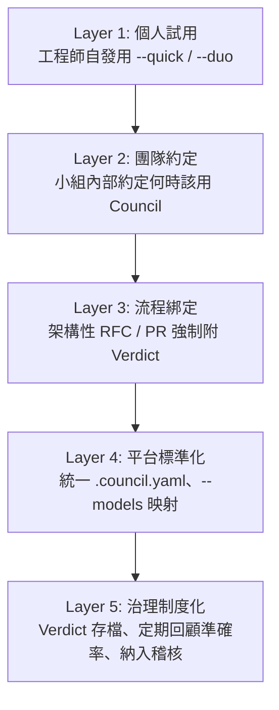

多數團隊不需要一步到位衝到 Layer 5，建議循序漸進，每個階段停留至少一個季度，確認團隊已經內化上一層的習慣再往下推進。

### 26.2 角色與職責建議

| 角色 | 職責 |
| --- | --- |
| **平台工程團隊** | 維護企業標準安裝設定、`.council.yaml`、`--models` 映射；追蹤官方版本更新 |
| **架構治理小組** | 決定「什麼層級的決策必須跑 Council」的準則；定期回顧 Verdict 準確率 |
| **各團隊 Tech Lead** | 日常判斷是否召開 Council、選擇合適模式；確保 Verdict 轉存為 ADR |
| **資安/合規團隊** | 審核 Prompt 內容是否涉及敏感資料；核准多供應商路由範圍 |
| **教育訓練負責人** | 維護內部教材（可基於本手冊客製化）、辦理新人上手訓練 |

### 26.3 建議的準則文件骨架

企業內部建議產出一份簡短的「Council 使用準則」，至少包含：

1. **適用範圍**：哪些決策類型（架構層級、框架升級、資安相關）必須使用 Council。
2. **模式選擇指引**：對照第七章決策流程圖，簡化成團隊易懂的一頁式判斷表。
3. **Verdict 留存規範**：存放位置、命名慣例、保留年限。
4. **資料使用限制**：明確禁止事項（PII、密鑰、機密合約內容）。
5. **升級與例外處理**：意見分裂或 DEALBREAKER 出現時，誰有最終拍板權。

### 26.4 與既有治理流程整合

大多數企業已有某種形式的架構評審會議（Architecture Review Board）或 RFC 流程，建議**不要另起爐灶**，而是把 Council 定位成「進入正式評審會議前的分析輔助」——先跑 Council 產出 Verdict，把 Verdict 作為 RFC 文件的必要附件，正式評審會議聚焦在「這份 Verdict 有沒有遺漏什麼」，而不是從零開始討論。

> **實務案例：** 某企業把 Council Verdict 列為架構評審會議 RFC 模板的必填欄位之一，評審委員會的討論時間平均縮短了三分之一，因為多數「顯而易見的反對意見」已經在 Council 的交叉詰問階段被提前攤開討論過。

> **注意事項：** 制度化的最大風險是「為了填表格而跑 Council」，變成第二十一章 Anti-pattern #2 的組織版本——建議搭配定期的品質抽查（隨機抽查幾份 Verdict，檢查證據是否紮實、Kill Criteria 是否可量測），而不是只看「有沒有附檔案」。

---

## 第二十七章 系統維護

### 27.1 版本更新維護

| 維護項目 | 建議頻率 | 說明 |
| --- | --- | --- |
| 追蹤 `CHANGELOG.md` | 每次官方發布新版本時 | 確認是否有破壞性變更（如 v1.0→v1.1 引入 Chairman 角色） |
| 重新執行 `--dry-run` | 每次升級前 | 預覽新版本會寫入哪些變更 |
| 重跑 `council-simulation-checklist.sh` | 每次升級後 | 確認角色結構、路由配置未損壞 |
| 檢查四份 `SKILL.*.md` 鏡像一致性 | 每季 | 若企業有客製化，需人工比對是否與官方版本漂移 |

### 27.2 Persona 更新維護

若企業客製了自己的 Persona（例如加入「內部資深架構師」視角），建議：

- 比照官方契約結構骨架（見第五章 5.1 節）撰寫，保持一致性。
- 明確標註「已知盲點」，避免客製 Persona 變成「只會贊同」的橡皮圖章角色。
- 客製 Persona 版本與官方版本分開存放，官方升級時先確認客製內容是否仍相容新版協定。
- 定期（例如每半年）檢視客製 Persona 是否還反映團隊當前的價值觀與知識水準。

### 27.3 Prompt／Triad 更新維護

- 若企業自訂了 Triad 組合，建議像官方一樣明確記錄「制衡對」設計邏輯，避免日後有人誤改成同質化的組合。
- 團隊常用的 Prompt 範本（見第二十五章）建議存放在版本控制系統中，隨專案演進持續更新約束與證據描述方式。
- 建立內部的 Prompt Review 機制，避免誘導性語氣、缺乏證據標籤等第二十一、二十二章列出的反模式擴散。

### 27.4 維護責任分工建議

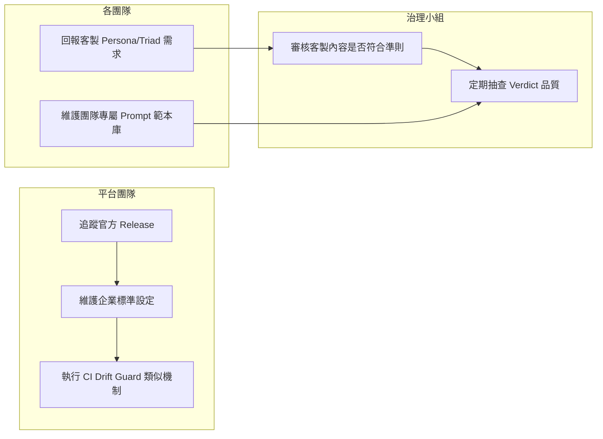

> **實務案例：** 某企業平台團隊仿照官方的 `council-simulation-checklist.sh`，自行寫了一支內部腳本，在每次版本升級後自動比對企業客製設定與新版官方協定是否有欄位衝突，避免了兩次因欄位改名導致的 Verdict 產出格式錯亂事件。

> **注意事項：** 系統維護最容易被忽略的一環是「客製內容的維護責任歸屬」——建議明確指定 Owner，否則客製 Persona／Triad 很容易變成沒人敢動、也沒人真的在維護的技術債。

---

## 第二十八章 升級策略

### 28.1 版本演進總覽

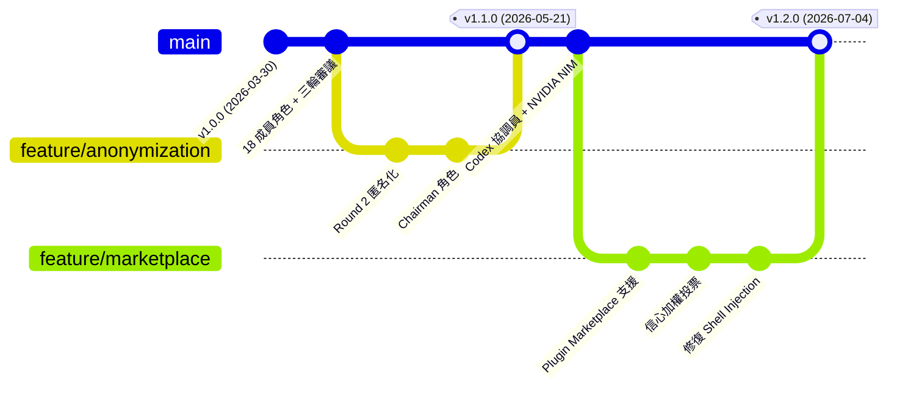

> 上圖為作者依 `CHANGELOG.md` 記載內容重新繪製的示意圖，用以呈現版本演進脈絡，非官方實際的 Git 分支歷史。

### 28.2 版本差異對照表

| 版本 | 發布日期 | 關鍵變更 | 對既有使用者的影響 |
| --- | --- | --- | --- |
| v1.0.0 | 2026-03-30 | 18 成員角色、三輪結構化審議、快速/對偶模式、多供應商自動偵測 | 初始版本，無升級影響 |
| v1.1.0 | 2026-05-21 | `SKILL.codex.md`、NVIDIA NIM、Round 2 匿名化、反從眾指令、Chairman 角色、判決可行性章節、`schema_version` | 若企業客製化解析過 Verdict 格式，需適應新增的 metadata 區塊 |
| v1.2.0 | 2026-07-04 | Plugin Marketplace 支援（Issue #45）、信心加權投票與 `.council.yaml` 覆蓋（Issue #44，對應 Issue #28 E3／E7 提案）、結構化 STANCE/CONFIDENCE/DEALBREAKER、Cursor CLI 路由、**修復 Shell Injection 漏洞並讓 CI drift guard 真正在 CI 中執行**（Issue #42）；同批次另修復 `SKILL.gemini.md` 曾漏掉立場投票／Tie-break／Vote Tally 區塊的鏡像漂移問題，以及 `classic` Profile 說明文字誤植「全體 11 人」（應為 18 人）的文案錯誤 | 建議所有 v1.1.0 以前的安裝**優先升級**以套用安全性修復 |

### 28.3 Migration Guide 撰寫建議

官方目前未提供獨立的 Migration Guide 文件，建議企業內部自行針對每次大版本升級，整理一份簡短的內部遷移筆記，至少包含：

1. **本次升級新增／變更了哪些 CLI 參數**（對照第十一章）。
2. **Verdict 輸出格式是否有變化**（是否新增欄位、既有解析邏輯是否受影響）。
3. **是否需要重新訓練團隊成員**（例如 v1.2.0 引入的 `.council.yaml` 就值得專門說明）。
4. **是否有安全性修復需要優先套用**（如 v1.2.0 的 Shell Injection 修復）。

### 28.4 追蹤 GitHub Release 的建議做法

- 訂閱 repo 的 Release 通知，或指派專人每兩週檢查一次 `CHANGELOG.md`。
- 對重大版本（Minor 版本號變化，如 v1.1→v1.2）安排實際測試再推廣到全公司使用。
- 對 Patch 等級的安全性修復（若未來出現 v1.2.x），建議加速升級流程，比照一般資安更新的處理優先級。

> **實務案例：** 某企業在 v1.2.0 發布後兩天內就完成升級，主要動機是修復 Shell Injection 漏洞——這說明「追蹤 Release」不能只是被動等季度檢查，資安相關修復需要有獨立於一般功能升級的加速通道。

> **注意事項：** 由於 Council 本質上是 Prompt／Skill 協定而非傳統二進位軟體，「升級」的風險型態與一般後端服務不同——真正該擔心的不是「服務中斷」，而是「Verdict 品質或格式在不知情下悄悄改變」，建議升級後找幾個過去用過的 Prompt 重新跑一次，人工比對輸出品質是否符合預期。

---

## 第二十九章 Roadmap

### 29.1 重要聲明

Council of High Intelligence **目前沒有公開發布正式的 Roadmap 文件**。本章內容是作者依 `CHANGELOG.md` 的演進軌跡與 GitHub Issues 中的討論訊號，推論整理出的「觀察到的發展方向」，**非官方承諾的未來功能清單**，讀者規劃長期依賴此工具的策略時，請勿將本章內容視為官方保證。

### 29.2 發展時間軸（已發生事件 + 觀察訊號）

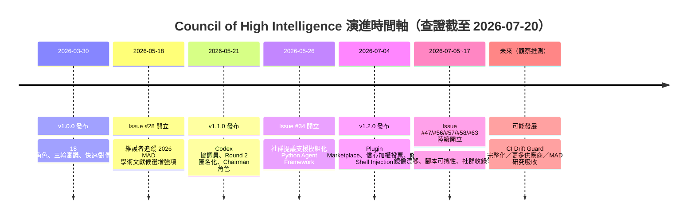

> 上圖為作者依公開 `CHANGELOG.md` 與 Issue 開立日期整理的時間軸，用以呈現觀察到的節奏，非官方發布的正式時程規劃。

### 29.3 從 Issues 觀察到的發展訊號

| 訊號來源 | 內容 | 解讀 |
| --- | --- | --- |
| Issue #28（維護者本人開立，2026-05-18） | 「2026 MAD literature enhancement candidates（E1–E8）」 | 顯示維護者持續追蹤 Multi-Agent Debate 學術文獻，未來版本可能吸收新的辯論機制設計 |
| Issue #34 | 提議支援 Agno／LangGraph 等模組化 Python Agent Framework | 目前仍是 `proposal` 標籤未合併，若未來採納，代表 Council 可能從純 Prompt 協定演化為可呼叫外部 Agent 執行框架 |
| Issue #47 | `SKILL.opencode.md` 缺少 CI drift guard 覆蓋 | 顯示維護多主機鏡像一致性的工程投入會持續增加 |
| Issue #56／#57／#58 | 腳本可攜性與供應商偵測的多個小型 Bug | 顯示專案仍處於快速修補期，工程成熟度持續提升中 |
| Issue #63 | 專案被第三方 AI 工具地圖（StackMap）收錄 | 顯示社群關注度持續成長 |

Issue #28 本身附上了相對罕見的完整候選項目清單與維護者排序，值得單獨列出對照：

| 代號 | 狀態 | 備註 |
| --- | --- | --- |
| E1 | Open | 維護者排序第 3（優先順序：E6→E3→E1→E7→E8→E4→E2→E5） |
| E2 | Open | 排序第 7 |
| E3 | **已實作**（v1.2.0／Issue #44） | 推理方法多樣性強化，排序第 2（僅次於 E6） |
| E4 | Open | 排序第 6 |
| E5 | Open | 排序第 8（最末） |
| E6 | Open | 維護者標註為最優先項目 |
| E7 | **已實作**（v1.2.0／Issue #44） | `.council.yaml` 專案層級覆蓋設定，排序第 4 |
| E8 | Open | 排序第 5 |

> **查證提醒：** Issue #28 附上了多篇 2026 年份 Multi-Agent Debate 相關學術文獻作為候選項目的依據，包括 Free-MAD（arXiv:2509.11035）、DMAD（ICLR 2025）、MAD-MM（ICLR 2026）、adaptive-stability（arXiv:2510.12697）、anonymization（arXiv:2510.07517）、conformity study（arXiv:2511.07784）等，但公開 Issue 內容並未將每篇論文逐一對應到單一 E 編號，本手冊僅能確認 E3、E7 的具體主題與已實作狀態，其餘 E1／E2／E4／E5／E6／E8 的完整說明建議直接查閱 [Issue #28](https://github.com/0xNyk/council-of-high-intelligence/issues/28) 原文，不在此臆測填補。

### 29.4 合理推測的可能發展方向（非官方承諾）

- **更完整的 CI Drift Guard**：涵蓋全部四份 `SKILL.*.md` 鏡像，降低多主機協定不一致的風險。
- **更豐富的供應商路由選項**：延續 v1.1.0→v1.2.0 持續新增供應商（NVIDIA NIM、Cursor）的趨勢。
- **吸收更多 Multi-Agent Debate 學術研究成果**：呼應 Issue #28 的討論方向。
- **可能出現的模組化 Agent Framework 整合**：若 Issue #34 的提議被採納，將是架構層級的重大轉變，值得持續關注。
- **持續的安全性強化**：v1.2.0 剛修復 Shell Injection 漏洞，顯示專案對安全性議題的重視度正在提升。

> **實務案例：** 若企業已將 Council 導入正式治理流程（如第二十六章建議），建議指派專人每季瀏覽一次 Issue Tracker 與 `CHANGELOG.md`，而不是等到升級時才發現架構層級的變化（例如 Issue #34 若被採納，可能大幅改變第十八章討論的「Council 無原生 Agent Memory」現況）。

> **注意事項：** 開源專案的 Roadmap 具有高度不確定性，尤其本專案目前主要由單一維護者（Nyk）驅動，企業導入時應評估「維護者集中度」本身也是一種風險（見第三十章總結的導入建議）。

---

## 第三十章 總結

### 30.1 學習路徑總覽

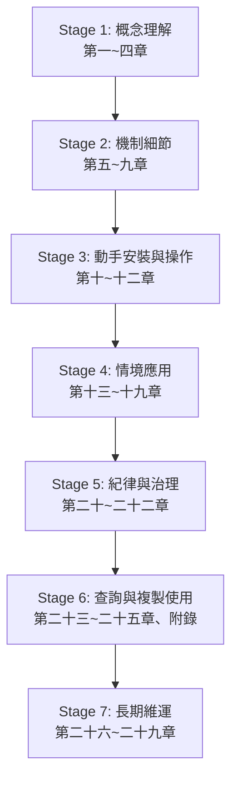

新手建議依此順序完整走過一遍（預估 1～2 天可讀完並實際操作幾次）；資深使用者可依第一頁「使用建議」表格直接跳讀所需章節。

### 30.2 能力地圖

| 能力層級 | 具備能力 | 對應章節 |
| --- | --- | --- |
| **入門** | 能安裝並執行基本的 `/council --quick`／`--duo` | 第十、十一章 |
| **熟練** | 能依情境選擇合適模式與 Triad，撰寫高品質 Prompt | 第六、七、十二章 |
| **進階** | 理解 Debate Engine 與 Verdict 的完整機制，能解讀信心加權投票 | 第八、九章 |
| **實戰** | 能把 Council 嵌入實際開發、遷移、升級工作流 | 第十三～十八章 |
| **治理** | 能為團隊或企業建立 Council 使用準則與維運機制 | 第十九、二十六、二十七章 |
| **專家** | 能辨識並避免 Anti-pattern，能指導他人正確使用 | 第二十、二十一、二十二章 |

### 30.3 導入建議總結

1. **從小處開始**：先用 `--quick`／`--duo` 處理日常小決策，累積使用直覺，再逐步嘗試 `--full`。
2. **紀律先於規模**：與其急著全公司推廣，不如先在單一團隊把「Verdict 轉存為 ADR、設定 Owner 與審查日期」這套紀律做確實。
3. **正視工具的邊界**：它是決策支援，不是自動決策系統；它沒有原生記憶／知識圖譜；它目前只有四個官方支援的主機環境——清楚這些邊界，才能設定合理的期待。
4. **保持版本敏感度**：這是一個仍在快速迭代的年輕專案（3.7k★、單一主要維護者），企業導入應搭配第二十七、二十八章的維運機制，而非「裝完就不管」。
5. **把機制的精神帶回真人協作**：即使某天不再使用這個工具，「先各自盲寫、再匿名交鋒、留下未解決問題」這套決策紀律本身，值得成為團隊文化的一部分。

> **最後的提醒：** Council of High Intelligence 最大的價值，不在於它用了多少位歷史人物當 Persona，而在於它把「一個好決策應該長什麼樣子」這件事，變成了可執行、可重現、可稽核的協定。工具會迭代、版本會升級，但「保留未解決問題、寫下可量測的終止條件、留下異議紀錄」這套決策紀律，才是本手冊希望讀者真正帶走的東西。

---

## 附錄 A：Cheat Sheets

### A.1 CLI Cheat Sheet

| 指令／參數 | 用途 |
| --- | --- |
| `/council <問題>` | 預設 Full 模式，完整議會 |
| `/council --full <問題>` | 明確指定完整議會 |
| `/council --quick <問題>` | 快速模式 |
| `/council --duo <問題>` | 雙人辯證模式 |
| `/council --triad <domain> <問題>` | 指定領域 Triad |
| `/council --members <a,b,c> <問題>` | 手動指定成員 |
| `/council --dry-route <問題>` | 只看路由結果，不執行 |
| `/council --no-auto-route <問題>` | 關閉自動路由 |
| `/council --models <path> <問題>` | 指定顯式路由映射檔 |
| `./install.sh` | 安裝到 Claude Code（預設） |
| `./install.sh --dry-run` | 預覽安裝操作 |
| `./install.sh --codex / --codex-only` | 安裝 Codex 鏡像 |
| `./install.sh --gemini / --gemini-only` | 安裝 Gemini CLI 鏡像 |
| `./install.sh --opencode / --opencode-only` | 安裝 OpenCode 鏡像 |
| `./install.sh --copy-configs` | 複製設定範本 |
| `./install.sh --claude-dir/--codex-dir/--gemini-dir/--opencode-dir <path>` | 自訂安裝目錄 |
| `./scripts/council-simulation-checklist.sh` | 完整性驗證腳本 |
| `/plugin marketplace add 0xNyk/council-of-high-intelligence` | Claude Code Marketplace 新增來源 |
| `/plugin install council@council-of-high-intelligence` | Claude Code Marketplace 安裝 |

### A.2 Prompt Cheat Sheet（五要素速記）

| 要素 | 一句話提示 |
| --- | --- |
| 決策 Decision | 「我們要決定的具體事情是什麼？」 |
| 約束 Constraints | 「有哪些硬限制（時程/人力/預算/法規）？」 |
| 證據 Evidence | 「已知的事實是什麼？哪些只是猜測？」 |
| 可逆性 Reversibility | 「做錯了，改回來要付出多少代價？」 |
| 期限 Deadline | 「什麼時候前需要有結論？」 |

### A.3 Persona Cheat Sheet（18 位速記）

| 代號 | 一句話定位 |
| --- | --- |
| Aristotle | 分類與結構 |
| Socrates | 假設破壞 |
| Sun Tzu | 地形與對抗策略 |
| Ada Lovelace | 形式系統與抽象 |
| Marcus Aurelius | 韌性與道德清晰 |
| Machiavelli | 權力與激勵 |
| Lao Tzu | 非行動與浮現 |
| Richard Feynman | 解釋與經驗調試 |
| Linus Torvalds | 交付與可維護性 |
| Miyamoto Musashi | 時機與決定性行動 |
| Alan Watts | 重構與偽問題 |
| Andrej Karpathy | 經驗 ML 行為 |
| Ilya Sutskever | 擴展與 AI 安全 |
| Daniel Kahneman | 認知偏差 |
| Donella Meadows | 反饋迴路與槓桿點 |
| Charlie Munger | 反演與模型格子 |
| Nassim Taleb | 尾部風險與脆弱性 |
| Dieter Rams | 用戶清晰度與克制 |

完整優勢／弱點／制衡角色對照請見[第五章 5.2 節](#第五章-persona-系統)。

### A.4 Triad Cheat Sheet（20 組速記）

| Triad | 組成 |
| --- | --- |
| `architecture` | Aristotle + Ada + Feynman |
| `strategy` | Sun Tzu + Machiavelli + Aurelius |
| `ethics` | Aurelius + Socrates + Lao Tzu |
| `debugging` | Feynman + Socrates + Ada |
| `innovation` | Ada + Lao Tzu + Aristotle |
| `conflict` | Socrates + Machiavelli + Aurelius |
| `complexity` | Lao Tzu + Aristotle + Ada |
| `risk` | Sun Tzu + Aurelius + Feynman |
| `shipping` | Torvalds + Musashi + Feynman |
| `product` | Torvalds + Machiavelli + Watts |
| `founder` | Musashi + Sun Tzu + Torvalds |
| `ai` | Karpathy + Sutskever + Ada |
| `ai-product` | Karpathy + Torvalds + Machiavelli |
| `ai-safety` | Sutskever + Aurelius + Socrates |
| `decision` | Kahneman + Munger + Aurelius |
| `systems` | Meadows + Lao Tzu + Aristotle |
| `uncertainty` | Taleb + Sun Tzu + Sutskever |
| `design` | Rams + Torvalds + Watts |
| `economics` | Munger + Machiavelli + Sun Tzu |
| `bias` | Kahneman + Socrates + Watts |

搭配 Panel Preset：`classic`（18 人全員）／`exploration-orthogonal`（發散探索）／`execution-lean`（精簡執行）。另有 9 組僅限對應 Profile 使用的專屬 Triad（6 組 Exploration ＋ 3 組 Execution），不包含在上表 20 組之內，完整清單見[第六章 6.5 節](#第六章-triad-系統)。

### A.5 Command／流程速記卡

| 情境 | 建議指令 |
| --- | --- |
| 不確定路由結果 | 先 `--dry-route` 再正式執行 |
| 不確定安裝會動到什麼 | 先 `--dry-run` 再正式安裝 |
| 單一對立軸問題 | `--duo` |
| 有明確領域問題 | `--triad <domain>` |
| 廣度優先、深度可犧牲 | `--quick` |
| 高風險不可逆決策 | `--full` |
| 想確認完整性 | `council-simulation-checklist.sh` |
| 想釘選團隊標準設定 | 寫進 `.council.yaml` |

---

## 附錄 B：Framework Comparison

第一章 1.5～1.9 節已從概念層面比較 Council 與 Chain of Thought、Reflection、Self Critique、Debate Framework、Multi-Agent 的差異。本附錄進一步提供與四款主流框架／技術的**逐項對照表**，方便技術選型時快速參考。

### B.1 總覽對照表

| 面向 | Council of High Intelligence | 通用 Multi-Agent 框架 | AutoGen | CrewAI | LangGraph | Reflection |
| --- | --- | --- | --- | --- | --- | --- |
| 核心目的 | 決策分析與審議 | 任務分工與協作執行 | 多 Agent 對話協作 | 角色分工完成產出 | 有狀態的 Agent 工作流編排 | 自我批判與修正輸出 |
| Agent 是否執行外部工具/寫檔案 | 否，純文字分析 | 通常會 | 可以（Function Calling / Code Execution） | 可以（Task + Tool） | 可以（Graph 節點可綁工具） | 通常不涉及 |
| 是否有固定「角色人設」 | 是，18 位歷史人物固定契約 | 依專案自訂 | 依開發者自訂 | 依開發者自訂 Role/Goal/Backstory | 依開發者自訂節點邏輯 | 通常單一角色自我對話 |
| 是否需要寫程式碼整合 | 否（純 Prompt/Skill，CLI 直接用） | 通常需要 | 需要（Python SDK） | 需要（Python SDK） | 需要（Python/圖形定義） | 依實作而定 |
| 輸出型態 | 結構化 Verdict（含 Kill Criteria） | 依任務而定，通常是產出物 | 對話紀錄／任務結果 | 任務產出物 | 依 Graph 終點定義 | 修正後的最終輸出 |
| 是否保留「未解決問題」 | 是，刻意放在最前面 | 通常不會 | 不會 | 不會 | 不會 | 不會 |
| 是否有反從眾／匿名化設計 | 是（Round 2 匿名化） | 通常沒有 | 沒有原生機制 | 沒有原生機制 | 沒有原生機制 | 不適用（單一視角） |
| 適合任務 | 高風險、需要多視角的決策 | 需要分工完成複雜任務 | 需要多 Agent 對話解決問題 | 需要角色分工的工作流程自動化 | 需要複雜狀態管理的 Agent 應用 | 需要提升單一輸出品質 |

### B.2 與 Multi-Agent 通用框架的差異細節

通用 Multi-Agent 框架（廣義指所有讓多個 Agent 協作的架構）通常關注「如何分工完成一個具體任務」——例如一個 Agent 負責搜尋資料、一個負責整理、一個負責寫報告。Council 的 18 個 Persona **不分工**，而是同時針對同一個問題產出獨立觀點，目的是「窮盡視角」而非「完成產出」。因此如果你的需求是「自動化一套多步驟工作流程」，通用 Multi-Agent 框架更合適；如果你的需求是「一個決策需要被充分論證」，Council 更合適。兩者甚至可以互補——用 Council 決定「要不要做」，再用 Multi-Agent 框架執行「怎麼做」。

### B.3 與 AutoGen 的比較

AutoGen（微軟開源的多 Agent 對話框架）強調透過可程式化設定的 Agent 之間自由對話來解決任務，Agent 可以呼叫工具、執行程式碼，對話輪數與終止條件由開發者定義。相較之下，Council 的三輪流程（盲分析→交叉詰問→立場結晶）是**固定且不可自訂順序**的結構化協定，換取的是流程的一致性與可預期性；AutoGen 換取的是彈性與可程式化控制。若你需要打造客製化的自動化任務流程，AutoGen 這類框架更合適；若你需要的是「有紀律的決策審議」，Council 更貼近需求。

### B.4 與 CrewAI 的比較

CrewAI 強調用 Role／Goal／Backstory 的方式定義每個 Agent 的角色分工，Agent 之間通常有明確的任務交接順序（類似專案團隊分工）。Council 的 Persona 契約雖然也定義了「身份」，但用途是**分析視角**而非**任務角色**——沒有 Persona 會被指派去「寫程式碼」或「搜尋資料」這類具體任務。可以說 CrewAI 模擬的是一個專案團隊的分工協作，Council 模擬的是一場評審委員會的審議過程。

### B.5 與 LangGraph 的比較

LangGraph 提供以圖（Graph）為基礎的 Agent 工作流編排能力，開發者可以自訂節點、邊、狀態轉移邏輯，適合建構複雜、有條件分支、需要長期狀態管理的 Agent 應用。Council 完全不涉及這類低階的工作流編排——它是一份已經設計好特定流程（三輪審議）的**現成協定**，不需要、也不提供讓使用者自訂狀態機的能力。如果企業想要「打造一套完全客製化的多階段審議系統」，LangGraph 這類框架是合適的底層工具；如果只是想要「拿現成的審議協定來用」，Council 的學習與導入成本低很多。

### B.6 與 Reflection 的比較

第一章 1.6 節已說明概念差異，此處補充操作面的對比：Reflection 通常是「單一模型 + 單一 Prompt 模板」即可實作（例如「請檢查你剛才的回答有沒有錯誤」），導入成本極低；Council 需要完整的多角色契約、三輪流程協定、多供應商路由設計，導入與理解成本明顯較高，但換來的是更難被「同溫層」自我驗證所矇騙的分析品質。兩者也可以疊加——每位 Persona 內部的分析流程，其實已經隱含類似 Reflection 的自我檢查步驟（見 Ada Lovelace 契約的「驗證形式屬性」步驟）。

> **實務案例：** 某平台團隊同時評估這五種技術，最終決策是「架構層級的重大決策用 Council」「日常自動化任務（如自動產生週報、自動分類 Issue）用 CrewAI」——兩者定位互補而非取代，是常見的合理搭配。

> **注意事項：** 這份比較表是在 2026-07-20 查證當下的框架能力快照，AutoGen／CrewAI／LangGraph 等通用框架的功能演進速度很快，建議實際選型前查閱各框架當下的最新官方文件。

---

## 附錄 C：Checklist

### C.1 新人上手 Checklist

- [ ] 已閱讀第一章，理解 Council 的設計理念與適用邊界。
- [ ] 已在自己的主機環境（Claude Code／Codex／Gemini CLI／OpenCode）成功安裝並執行過 `/council`。
- [ ] 已理解 `--full`／`--quick`／`--duo`／`--triad` 四種模式的差異與適用情境。
- [ ] 已閱讀第十二章，能寫出包含決策／約束／證據／可逆性／期限的 Prompt。
- [ ] 已知道 `--dry-route` 與 `--dry-run` 的差異（見第二十二章錯誤 #16）。
- [ ] 已閱讀第二十、二十一章，知道至少 5 條最佳實務與 5 條該避免的 Anti-pattern。
- [ ] 知道遇到問題該去哪裡查（附錄 A Cheat Sheet、第二十三章 FAQ）。

### C.2 導入前 Checklist

- [ ] 已確認團隊要導入的主機環境是否在官方支援清單內（第十章 10.1 節）。
- [ ] 已完成基本的開源軟體資安評估流程（License、弱點掃描）。
- [ ] 已盤點 Prompt 中可能涉及的敏感資料類型，並制定使用限制。
- [ ] 已決定多供應商路由的範圍（是否限制 `--models` 只用核准的供應商）。
- [ ] 已指派安裝與維運的負責人（平台工程團隊或個人）。
- [ ] 已規劃至少一次試點團隊與試點期間（建議一季）。
- [ ] 已準備好內部教育訓練素材（可基於本手冊客製）。

### C.3 PR / Code Review 使用 Checklist

- [ ] 這個 PR 涉及的變更是否屬於「高風險、不可逆」層級，需要附上 Council Verdict？
- [ ] 若已跑過 Council，Verdict 連結是否已附在 PR 描述中？
- [ ] Verdict 的 Kill Criteria 是否具體可量測？
- [ ] Verdict 的「未解決問題」是否已在 PR 描述中一併說明因應方式？
- [ ] 是否已指派 Verdict 行動項目的 Owner？
- [ ] Code Review 時是否額外用 `--triad debugging` 交叉檢查了關鍵假設？

### C.4 企業導入 Checklist

- [ ] 已建立第二十六章建議的「Council 使用準則」文件。
- [ ] 已明確定義角色與職責（平台團隊／架構治理小組／Tech Lead／資安團隊／教育訓練負責人）。
- [ ] 已建立 Verdict 存檔與保留年限規範。
- [ ] 已建立版本升級追蹤機制（訂閱 Release、定期檢查 `CHANGELOG.md`）。
- [ ] 已建立客製 Persona／Triad（若有）的維護責任歸屬。
- [ ] 已規劃定期（如每季）的 Verdict 品質抽查與準確率回顧機制。
- [ ] 已評估「單一維護者」的專案風險，並制定對應的應變方案（如企業內部 Fork 的長期維護計畫）。
- [ ] 已將 Council 導入現有的架構治理／RFC 流程，而非另起爐灶。

> **使用建議：** 建議把本附錄的四份 Checklist 轉存為團隊內部可勾選的檢查清單工具（例如 Issue Template 或 Wiki 頁面），讓「有沒有做到」變成可追蹤的具體項目，而不是模糊的口頭承諾。

---

> 《Council of High Intelligence 教學手冊》全文結束。本文所有具體事實查證截至 **2026-07-20**，依據 v1.2.0（2026-07-04 發布）。專案仍在快速迭代中，建議讀者定期回訪[官方 Repository](https://github.com/0xNyk/council-of-high-intelligence)確認最新狀態，並將本手冊視為「幫助快速上手與建立正確心智模型」的輔助教材，而非取代官方文件的權威來源。
