+++
date = '2026-08-18T00:00:00+08:00'
draft = false
title = 'DeepSeek Harness 教學手冊'
tags = ['教學', 'AI開發']
categories = ['教學']
+++

# DeepSeek Harness 教學手冊

> **DeepSeek Harness —— 企業級「一切皆插件」AI Agent Harness 完整導入指南**
> 適用對象：資深 Software Architect、SA、Backend/Frontend Engineer、AI Agent 平台團隊、DevSecOps、Tech Lead、PM/PG/QA、企業導入負責人
> 文件性質：企業內部「DeepSeek Harness（`dsh`）+ Cordis Plugin Architecture」導入、開發與維運培訓教材
> 版本基準：`deepseek-ai/deepseek-harness`（MIT License），最新 Release **`dsh-v0.1.0-rc.7`**（2026-08-17，Developer Preview，GitHub 標示為 Pre-release；本次補強研究已再次確認查證當下無更新 Release）
> 　　　　　官方文件基準：`README.md`／`README.zh.md`／`AGENTS.md`／`CLAUDE.md`／`docs/architecture.md`／`docs/development.md`／`docs/cordis-primer.md`／`docs/cordis-tutorial/*`／`docs/config-catalog.md`／`docs/glossary.md`／`docs/agent-lifecycle.md`／`docs/capability-seams.md`／`packages/*/README.md`（含 `mcp/`、`acp/` 等互通性家族）／`apps/cli/README.md`
> 查證日期：2026-08-18（初版查證）；同日以 4 個並行研究單位完成補強研究，深化查證官方核心文件、新增子系統（`mcp`／`acp`／`runtime-diagnostics` 等）、Cordis／Cordis Paper 理論基礎、第三方市場評測與命名衝突現況，詳見 Appendix F
> 技術堆疊：Node.js（22.19+ 或 24+）＋ TypeScript Monorepo（pnpm workspaces）、Cordis Plugin Runtime（原始碼 vendor、釘住特定 commit）、YAML 設定檔（`cordis.yml`）、選用 Python SDK

---

## ⚠️ 重要聲明（請務必先讀）

1. **DeepSeek Harness 仍處於「開發者預覽（Developer Preview）」階段，且是極年輕的專案。** 官方 Repository 於 2026-08-13 建立，本手冊查證當下（2026-08-18）距今僅 5 天，最新版本為 `dsh-v0.1.0-rc.7`（2026-08-17 發布，GitHub 標示 pre-release）。官方 README 原文明確聲明：「DeepSeek Harness is currently in _developer preview_ and is iterating rapidly. **THERE WILL BE COMPATIBILITY-BREAKING CHANGES.**」（官方已實作）。這代表本手冊記錄的 CLI 指令、Package 清單、設定鍵、Plugin API，都只是**查證當下的快照**，實際導入前務必以當時的 `github.com/deepseek-ai/deepseek-harness` 原始碼與 Release Notes 為準。

2. **本手冊是彙整、重組、補充企業導入實務，而不是官方文件的翻譯。** 官方本身已提供 `README.zh.md`（簡體中文）等在地化文件，本手冊不會逐字翻譯官方內容，而是依官方原始碼與官方文件重新查證後，以繁體中文重新組織，並大量補充架構圖、比較表、Checklist、企業導入建議與 AI Agent Prompt 範本。凡本手冊引用官方中文詞彙處，會標明其為官方簡體中文原文並附繁體中文對照。

3. **本手冊沿用本 Repository 既有系列教學手冊（如《Herdr 教學手冊》《TencentDB-Agent-Memory 教學手冊》）共通採用的「五層 Provenance 標示」，請務必先理解這套標示法，它貫穿全書每一個具體事實與主張：**

   | 標示 | 意義 | 使用時機 |
   |---|---|---|
   | **官方已實作** | GitHub README／CHANGELOG／Release Notes／官方 `docs/*.md` 明確確認已出貨的功能 | 有明確官方文件出處可查 |
   | **Source-confirmed** | 只能從官方原始碼／設定檔／GitHub API 確認，官方文件未明確著墨 | 本手冊研究團隊直接讀取原始碼、`package.json`、GitHub API 回應得到的事實 |
   | **Roadmap/Issue（規劃中）** | 官方 Roadmap 或 Issue／Discussion 討論中，尚未 merge／發布 | 用於區分「已規劃」與「已出貨」，避免混淆 |
   | **建議架構** | 本手冊作者針對企業導入的建議，非官方功能 | 用於企業落地建議、原創比較表、原創案例、企業目錄規範等 |
   | **推測/Hypothesis** | 無法從任何層級來源確認，僅為合理推論 | 用於誠實標示研究缺口，提醒讀者自行查證 |

   凡是標成「建議架構」或「推測/Hypothesis」的內容，**都不是 DeepSeek Harness 的官方功能**，請勿在企業內部溝通或對外簡報時誤植為官方保證。

   > **與 mega-prompt / 一般企業文件慣用之「A/B/C/D 可信度分級」及「Official / Observed / Recommended / Proposed / Experimental」分類之對照**：本手冊統一只使用上述五層標示，其對應關係為 —— 「官方已實作」≈ A 級／Official；「Source-confirmed」≈ A～B 級／Observed；「Roadmap/Issue（規劃中）」≈ B 級／Experimental（官方已知但未出貨）；「建議架構」≈ C 級／Recommended・Proposed（本手冊之工程建議或企業架構提案，非官方）；「推測/Hypothesis」≈ D 級／Experimental 中最弱的一類（誠實揭露研究缺口）。全書只使用單一套標示，不重複切換兩套系統，避免讀者混淆。

4. **一個必須從第一頁就知道的定位澄清**：DeepSeek Harness **不是** LLM 模型本身（模型是透過 `llm/` 家族之 Provider 接入的外部能力）、**不是** IDE、**不是** 開箱即用的完整企業治理平台、**不是** Kubernetes 或容器編排系統、**不是** 完整的 Observability Platform（它只透過 `session-telemetry-otel` 開放 OpenTelemetry 輸出，實際的蒐集／視覺化／告警仍需企業自建）。它是「以 Cordis 為基礎的 Plugin Runtime，用來組裝、執行、觀察 Coding Agent」的框架層。第 2 章與第 4 章會反覆界定這個範圍，避免過度宣稱。

5. **第三方同名／易混淆專案警語（非常重要）**：網路上除官方 `deepseek-ai/deepseek-harness` 外，至少已知存在一個**建立時間更早**（2026-05-09，早於官方專案 3 個月）的第三方 Python 專案 `HenryZ838978/deepseek-harness`，其 GitHub 描述為「Harness for DeepSeek V4-Pro / V4-Flash. Python lib (`pip install deepseek-harness`) + `dsh` CLI + Anthropic SKILL.md」（Source-confirmed，GitHub API）。**這與官方套件命名極易混淆**：官方 Python SDK 在 PyPI 上的正式套件名稱是 **`deepseek-harness-sdk`**（帶 `-sdk` 後綴），並**不是**裸的 `deepseek-harness`（官方已實作，`python/sdk/README.md`）。若同仁誤執行 `pip install deepseek-harness`（無 `-sdk`），極可能安裝到與官方無關的第三方套件。第 3 章會有完整比較表。此外，官方 Repository 在查證當下（建立僅 5 天）已回報超過 15 萬顆 GitHub star（Source-confirmed，GitHub API 即時計數），成長速度異常之快，本手冊僅如實記錄 API 回報數字，**不將其引申為「已被廣泛驗證於生產環境」的證據**，企業導入決策仍應以官方文件成熟度與自行測試結果為準。

6. **銀行/企業案例聲明**：本手冊中出現的銀行/金融業案例（例如 Web Application 開發實戰、逆向工程、Framework Upgrade 案例中的 `bank-web-platform`、`PaymentController` 等）均為**教學示範用途之虛構情境**，用於示範 DeepSeek Harness 承載 Coding Agent 工作流程的方式，並非真實客戶專案。涉及既有框架的深入機制，請參閱本 Repository 既有手冊：
   - [Spring boot 4.x 教學手冊](../framework/Spring%20boot%204.x%20教學手冊.md)
   - [Vue3 前端framework教學](../framework/Vue3%20前端framework教學.md)
   - [PrimeVue使用教學](../framework/PrimeVue使用教學.md)
   - [Java25升版教學](../程式語言/Java25升版教學.md)

7. **MIT License 授權範圍聲明**：DeepSeek Harness 與其 vendor 之 Cordis（`@deepseek-ai/cordis`）均採 MIT License（官方已實作，`LICENSE` 檔案）。本手冊對授權條款的說明僅供參考，實際權利義務請以官方 `LICENSE`、`THIRD_PARTY_NOTICES.md` 檔案逐字內容為準，本手冊不構成法律意見。

8. 官方權威來源與研究來源分級，請見 Appendix E（Official References）與 Appendix F（Research Sources）。

---

## 符號約定

### Provenance 五層標示

本文以括號文字直接標示於句末，例如「...（官方已實作，README.md）」或「...（建議架構）」。標示意義同上表，全書一致使用，不再重複解釋。

### Mermaid 圖表慣例

- 所有架構圖、流程圖、序列圖均以 Mermaid 語法呈現，可直接在支援 Mermaid 的 Markdown 檢視器（GitHub、VS Code 外掛等）中渲染。
- 節點標籤若包含括號、冒號、斜線等特殊字元，一律以雙引號包住整個標籤（例如 `A["Agent Loop (Observe→Plan→Act)"]`），避免解析錯誤。
- 實線箭頭代表已從官方原始碼或官方文件確認的關係（Source-confirmed／官方已實作）；虛線箭頭代表依現有事實合理推論、但官方未逐一列點確認的路徑（建議架構），圖說明會另外標註。

### 程式碼區塊慣例

- 標示為「示意」或「Pseudo Code」的程式碼區塊，是本手冊為了幫助理解而重新撰寫的概念示範，**不是官方指令或官方原始碼的逐字引用**，不可直接複製貼上當作生產環境操作或當成真實 API 呼叫。
- 未標示「示意」的指令（例如安裝指令、CLI 指令、Cordis Plugin 程式碼片段）為官方文件或原始碼中可查證的真實內容；如該內容僅適用特定平台/版本，會在上方明確標註。

### 章節固定小節

重要章節盡量包含以下小節：Scenario／Example（具體案例）、AI Prompt 範例、本章 Checklist 與小結。

---

## 版本與相容性速查表

| 項目 | 值 | 來源標示 |
|---|---|---|
| Repository | `deepseek-ai/deepseek-harness` | 官方已實作 |
| License | MIT（`LICENSE`，Copyright DeepSeek 2026） | 官方已實作 |
| Repository 建立時間 | 2026-08-13T11:56:32Z | Source-confirmed，GitHub API |
| 最新 Release | `dsh-v0.1.0-rc.7`（2026-08-17T12:01:58Z，GitHub 標示 `prerelease: true`） | 官方已實作 |
| 官方定位 | 「DeepSeek Harness: Everything is a Plugin.」；README：「an open-source agent harness developed by DeepSeek AI... uses an architecture where everything is a plugin, and is powered by Cordis」 | 官方已實作，README.md |
| 官方中文定位（簡體原文） | 「DeepSeek Harness（`dsh`）是由 DeepSeek AI 開發的開源 agent harness（智能體框架）。它採用**一切皆插件**的架構，並由 Cordis 驅動」 | 官方已實作，README.zh.md（簡轉繁） |
| 主要語言 | TypeScript（Monorepo，pnpm workspaces） | Source-confirmed，GitHub API |
| Node.js 需求 | 22.19+ 或 24+（CI 涵蓋 22.19 / 24 / 26） | 官方已實作，docs/development.md |
| 套件管理器 | pnpm（`pnpm@11.7.0` 由 Corepack 釘住） | 官方已實作，docs/development.md、AGENTS.md |
| npm 快速啟動 | `npx @deepseek-ai/dsh web`，預設於 `http://127.0.0.1:3080` 啟動 Web UI | 官方已實作，README.md |
| Python SDK | PyPI 套件 **`deepseek-harness-sdk`**（模組名 `deepseek_harness`，非裸 `deepseek-harness`） | 官方已實作，python/sdk/README.md |
| 底層 Plugin Runtime | Cordis（`cordiverse/cordis`），以 **vendor（原始碼複製＋釘住 commit）** 方式整合為 `@deepseek-ai/cordis`，並非單純 npm 依賴 | 官方已實作，vendor/README.md |
| Cordis 釘住版本（DeepSeek Harness vendor） | 上游 `cordis` v4.0.0-rc.7，commit `56b3d4f725681cf4556c1a8695a709cc3b6eed74`（`packages/core`，2026-07-14） | 官方已實作，vendor/README.md |
| Cordis 上游現況（獨立於 DeepSeek Harness 之外） | `cordiverse/cordis` 本身**已推進到 `4.0.0-rc.8`**（2026-08-10 commit `f46ae95e`），中間另有 2 筆功能性修正（`fix(core): track direct service callers` #35、`fix(core): keep wrapped fiber state canonical` #40）。也就是說 DeepSeek Harness 目前釘住的版本，已落後上游最新 rc 一個小版號——這是「vendor 而非單純依賴」策略的真實代價示例，見第 6.6、50 章 | Source-confirmed，2026-08-18 對 `cordiverse/cordis` 之 GitHub API／commit 歷史直接查證 |
| Cordis 版本發佈機制 | `cordiverse/cordis` **未使用 GitHub Releases／Tags**（API 回傳空陣列），版本號僅存在於各 `package.json`；升級追蹤需直接比對 commit 與版本號，而非查閱 Release 頁面 | Source-confirmed，GitHub API |
| Cordis 起源 | 由開發者 **Shigma**（多個中文次級來源指其本名為石逸凡）為聊天機器人框架 **Koishi** 打造之獨立 Meta-Framework，早於 DeepSeek Harness 存在多年（Koishi 累積約 6,000 星、4,000+ 社群 Plugin，運行於 Cordis v3）；DeepSeek Harness 是後來的 vendor 使用者，並非原始開發者。中文次級報導並指出 Shigma 其後加入 DeepSeek——此點僅為次級來源說法，未經一手文件逐字確認，詳見第 6.1 節 | Source-confirmed（起源部分）／推測-Hypothesis（加入 DeepSeek 一節，僅次級來源） |
| 四種內建 Operating Mode | `standard`（標準模式）／`code`（PTC 模式）／`minimal`（極簡模式）／`cordis`（創造模式） | 官方已實作，`apps/cli/config/agent-presets/*/preset.yml` |
| `packages/` 套件家族數量 | **49** 個頂層資料夾（`acp, api, attachment, boot, bundle, ... workflow, workspace`）；其中 `mcp`、`runtime-diagnostics` 兩個家族**連官方自己的 `packages/README.md` 索引表都尚未列入**（該表僅列 47 項），見第 7.3 節 | Source-confirmed，2026-08-18 對 GitHub Contents API 與 `packages/README.md` 交叉比對 |
| 設定檔格式 | YAML，`cordis.yml`；Profile／Bundle／`cordis.patch.yml` 疊加 | 官方已實作，docs/architecture.md |
| 遙測（Telemetry） | `session-telemetry-otel` 透過 **OpenTelemetry** 輸出，支援 `FULL`／`FEEDBACK_ONLY`／`DISABLED` 三種模式，**預設值為 `DISABLED`**（即預設僅本機留存，不外送） | 官方已實作，`docs/config-catalog.md`（`packages/session/session-telemetry-otel/src/index.ts`） |
| Remote Sandbox | `e2b/` 家族，官方明確標示為「experimental provider-composition **POC**」，僅涵蓋 E2B Linux Sandbox | 官方已實作（但標示實驗性），packages/e2b/README.md |
| Container / Docker 官方支援 | **未提供**：Repository 根目錄查無 `Dockerfile`／`docker-compose.yml`／`docker/` | Source-confirmed，GitHub 根目錄列表查證 |
| CI 平台涵蓋 | Linux（`ubuntu-latest`／自架 `dsh-ubuntu-24-04-16core` 為主力，另有 4～96 core 之效能基準矩陣）；Windows 為雙軌：PR 阻擋關卡透過 Wine 於 `ubuntu-latest` 模擬（`windows` job）＋另有真正原生 Windows 之 `windows-native`／`serial-windows` job；macOS 僅有 `serial-macos`（`macos-latest`），**該 job 於查證當下以 `if: false` 完全硬性停用，程式碼註解明確標註「正式發布前重新啟用」**，並非僅止於「弱化驗證」；另有獨立 `.gitlab-ci.yml`，代表官方同時維護 GitLab CI 鏡像 | Source-confirmed，2026-08-18 對 `.github/workflows/ci.yml`、`.gitlab-ci.yml` 直接查證 |
| GitHub Star 數 | 約 15.3 萬（153,110，2026-08-18 查證時之即時計數器；成長速度未見 GitHub 官方認證為「史上最快」紀錄，亦查無具名之刷星鑑識報告，見重要聲明第 5 點與第 58 章） | Source-confirmed，不建議在企業簡報中引用固定數字 |
| GitHub Security Advisories | 查證當下**無任何已發布之資安公告**；官方提供漏洞回報信箱 `harness-privacy@deepseek.com` | Source-confirmed，2026-08-18 直接查證官方 Security Advisories 頁面 |
| GitHub Issues | 官方關閉 Issue 功能（`has_issues: false`），討論一律導向 GitHub Discussions（`has_discussions: true`） | Source-confirmed，GitHub API |
| 已知第三方同名/易混淆專案 | `HenryZ838978/deepseek-harness`（Python，早於官方 3 個月建立，查證當下即 2026-08-17 仍在更新，未更名） | Source-confirmed，GitHub API／PyPI，詳見第 3 章 |

---

<!-- TOC-AUTO-BEGIN -->
## 目錄（Table of Contents）

- [Part I：定位與身分辨識](#part-i定位與身分辨識)
- [1. 文件說明](#1-文件說明)
  - [1.1 這份手冊要解決什麼問題](#11-這份手冊要解決什麼問題)
  - [1.2 如何閱讀這份手冊](#12-如何閱讀這份手冊)
  - [1.3 與其他手冊的差異](#13-與其他手冊的差異)
  - [1.4 本章 Checklist 與小結](#14-本章-checklist-與小結)
- [2. DeepSeek Harness 簡介與定位](#2-deepseek-harness-簡介與定位)
  - [2.1 DeepSeek Harness 是什麼](#21-deepseek-harness-是什麼)
  - [2.2 DeepSeek Harness 不只是這些／也不是這些](#22-deepseek-harness-不只是這些也不是這些)
  - [2.3 DeepSeek Harness 在 AI Software Development Lifecycle 中的位置](#23-deepseek-harness-在-ai-software-development-lifecycle-中的位置)
  - [2.4 Scenario：一位架構師的第一印象](#24-scenario一位架構師的第一印象)
  - [2.5 AI Prompt 範例](#25-ai-prompt-範例)
  - [2.6 本章 Checklist 與小結](#26-本章-checklist-與小結)
- [3. 官方專案與版本辨識](#3-官方專案與版本辨識)
  - [3.1 為什麼這一章必須放在最前面](#31-為什麼這一章必須放在最前面)
  - [3.2 官方專案身分確認](#32-官方專案身分確認)
  - [3.3 已知第三方／易混淆專案比較表](#33-已知第三方易混淆專案比較表)
  - [3.4 命名陷阱實例：`pip install` 與 `npx` 的正確用法](#34-命名陷阱實例pip-install-與-npx-的正確用法)
  - [3.5 後續全文研究對象聲明](#35-後續全文研究對象聲明)
  - [3.6 本章 Checklist 與小結](#36-本章-checklist-與小結)
- [4. 為什麼企業需要 Agent Harness](#4-為什麼企業需要-agent-harness)
  - [4.1 傳統「LLM + Prompt」模式的侷限](#41-傳統llm-prompt模式的侷限)
  - [4.2 Chatbot vs AI Coding Assistant vs Agent vs Agent Harness](#42-chatbot-vs-ai-coding-assistant-vs-agent-vs-agent-harness)
  - [4.3 Scenario：從「能不能編譯」到「能不能安全地自主運作」](#43-scenario從能不能編譯到能不能安全地自主運作)
  - [4.4 AI Prompt 範例](#44-ai-prompt-範例)
  - [4.5 本章 Checklist 與小結](#45-本章-checklist-與小結)
- [Part II：核心設計理念與 Cordis](#part-ii核心設計理念與-cordis)
- [5. Everything is a Plugin 核心設計理念](#5-everything-is-a-plugin-核心設計理念)
  - [5.1 Plugin 是什麼？](#51-plugin-是什麼)
  - [5.2 Plugin Boundary 是什麼？](#52-plugin-boundary-是什麼)
  - [5.3 Plugin 如何註冊？](#53-plugin-如何註冊)
  - [5.4 Plugin 如何被載入？](#54-plugin-如何被載入)
  - [5.5 Plugin 如何提供 Service？](#55-plugin-如何提供-service)
  - [5.6 Plugin 如何提供 Capability？](#56-plugin-如何提供-capability)
  - [5.7 Plugin 如何監聽 Event？](#57-plugin-如何監聽-event)
  - [5.8 Plugin 如何依賴其他 Plugin？](#58-plugin-如何依賴其他-plugin)
  - [5.9 Plugin 如何替換？](#59-plugin-如何替換)
  - [5.10 Plugin 如何組合？](#510-plugin-如何組合)
  - [5.11 Plugin 如何動態啟用／停用？](#511-plugin-如何動態啟用停用)
  - [5.12 Plugin 對測試有什麼好處？](#512-plugin-對測試有什麼好處)
  - [5.13 Plugin 對 Enterprise Architecture 有什麼好處？](#513-plugin-對-enterprise-architecture-有什麼好處)
  - [5.14 本章 Checklist 與小結](#514-本章-checklist-與小結)
- [6. Cordis 架構深入研究](#6-cordis-架構深入研究)
  - [6.1 Cordis 是什麼——以及一個重要的來源澄清](#61-cordis-是什麼以及一個重要的來源澄清)
  - [6.2 Context：服務的倉庫](#62-context服務的倉庫)
  - [6.3 Service：可被聲明式尋址的能力單元](#63-service可被聲明式尋址的能力單元)
  - [6.4 Event：型別化的事件系統](#64-event型別化的事件系統)
  - [6.5 Dependency／Lifecycle／Injection／Composition](#65-dependencylifecycleinjectioncomposition)
  - [6.6 Cordis 在 DeepSeek Harness 中的整合方式：Vendor，而非單純依賴](#66-cordis-在-deepseek-harness-中的整合方式vendor而非單純依賴)
  - [6.7 Cordis Package 家族一覽](#67-cordis-package-家族一覽)
  - [6.8 深入研究 Cordis Paper：Spatiotemporal Composability 是什麼](#68-深入研究-cordis-paperspatiotemporal-composability-是什麼)
  - [6.9 Scenario：架構師向團隊解釋「為什麼不是我們自己寫一個 Agent Runtime 就好」](#69-scenario架構師向團隊解釋為什麼不是我們自己寫一個-agent-runtime-就好)
  - [6.10 AI Prompt 範例](#610-ai-prompt-範例)
  - [6.11 本章 Checklist 與小結](#611-本章-checklist-與小結)
- [7. DeepSeek Harness 整體架構](#7-deepseek-harness-整體架構)
  - [7.1 架構總覽圖](#71-架構總覽圖)
  - [7.2 官方核心套件表（`docs/architecture.md`）](#72-官方核心套件表docsarchitecturemd)
  - [7.3 `packages/` 完整 49 家族列表](#73-packages-完整-49-家族列表)
  - [7.4 「Where new behavior goes」——DeepSeek Harness 沒有特權核心](#74-where-new-behavior-goesdeepseek-harness-沒有特權核心)
  - [7.5 Scenario：新同仁第一次看到 49 個 Package 的反應](#75-scenario新同仁第一次看到-49-個-package-的反應)
  - [7.6 本章 Checklist 與小結](#76-本章-checklist-與小結)
- [Part III：Plugin 家族深入導覽](#part-iiiplugin-家族深入導覽)
- [8. Plugin Architecture 全覽與分層](#8-plugin-architecture-全覽與分層)
  - [8.1 分層方式](#81-分層方式)
  - [8.2 標示原則重申](#82-標示原則重申)
  - [8.3 五種對外互通協定：MCP／ACP／Subagent 橋接／Hooks／SDK](#83-五種對外互通協定mcpacpsubagent-橋接hookssdk)
    - [(1) MCP Client — 消費外部 Model Context Protocol 生態系](#1-mcp-client-消費外部-model-context-protocol-生態系)
    - [(2) ACP Server — 被外部自動化程式驅動（非編輯器整合）](#2-acp-server-被外部自動化程式驅動非編輯器整合)
    - [(3) Subagent 橋接：讓 Codex／Claude Code 本身成為子代理人](#3-subagent-橋接讓-codexclaude-code-本身成為子代理人)
    - [(4) Hooks 橋接：讀懂 Claude Code／Codex 既有的 Hook 設定檔](#4-hooks-橋接讀懂-claude-codecodex-既有的-hook-設定檔)
    - [(5) SDK 家族：被一般應用程式當函式庫驅動](#5-sdk-家族被一般應用程式當函式庫驅動)
  - [8.4 本章 Checklist 與小結](#84-本章-checklist-與小結)
- [9. LLM / Model Plugin](#9-llm-model-plugin)
  - [9.1 What／Architecture](#91-whatarchitecture)
  - [9.2 環境變數](#92-環境變數)
  - [9.3 Enterprise Recommendation](#93-enterprise-recommendation)
  - [9.4 本章 Checklist 與小結](#94-本章-checklist-與小結)
- [10. Filesystem Plugin](#10-filesystem-plugin)
  - [10.1 What](#101-what)
  - [10.2 Local vs Virtual vs Remote](#102-local-vs-virtual-vs-remote)
  - [10.3 Enterprise Recommendation](#103-enterprise-recommendation)
  - [10.4 本章 Checklist 與小結](#104-本章-checklist-與小結)
- [11. Shell／PTY／Terminal Plugin](#11-shellptyterminal-plugin)
  - [11.1 What](#111-what)
  - [11.2 為什麼 Agent 有時候需要真正的 PTY](#112-為什麼-agent-有時候需要真正的-pty)
  - [11.3 Process Management／Timeout／Exit Code](#113-process-managementtimeoutexit-code)
  - [11.4 本章 Checklist 與小結](#114-本章-checklist-與小結)
- [12. LSP Plugin](#12-lsp-plugin)
  - [12.1 grep／ripgrep／AST／LSP 的差異](#121-grepripgrepastlsp-的差異)
  - [12.2 `lsp/` 如何幫助 AI](#122-lsp-如何幫助-ai)
  - [12.3 Enterprise Recommendation](#123-enterprise-recommendation)
  - [12.4 本章 Checklist 與小結](#124-本章-checklist-與小結)
- [13. Sandbox 與 Remote Sandbox](#13-sandbox-與-remote-sandbox)
  - [13.1 Local Sandbox](#131-local-sandbox)
  - [13.2 Remote Sandbox：E2B POC](#132-remote-sandboxe2b-poc)
  - [13.3 企業視角的沙箱模式比較](#133-企業視角的沙箱模式比較)
  - [13.4 Enterprise 建議架構](#134-enterprise-建議架構)
  - [13.5 本章 Checklist 與小結](#135-本章-checklist-與小結)
- [14. Subagent](#14-subagent)
  - [14.1 What](#141-what)
  - [14.2 官方已實作之 Provider 清單](#142-官方已實作之-provider-清單)
  - [14.3 Subagent Lifecycle 概念](#143-subagent-lifecycle-概念)
  - [14.4 Web Application Multi-Agent Team 案例](#144-web-application-multi-agent-team-案例)
  - [14.5 AI Prompt 範例](#145-ai-prompt-範例)
  - [14.6 本章 Checklist 與小結](#146-本章-checklist-與小結)
- [15. Interaction／Permission／Approval](#15-interactionpermissionapproval)
  - [15.1 What](#151-what)
  - [15.2 官方已實作之子套件](#152-官方已實作之子套件)
  - [15.3 這一章與第 40 章 Permission Architecture 的關係](#153-這一章與第-40-章-permission-architecture-的關係)
  - [15.4 本章 Checklist 與小結](#154-本章-checklist-與小結)
- [16. Workflow](#16-workflow)
  - [16.1 What](#161-what)
  - [16.2 官方已實作之子套件](#162-官方已實作之子套件)
  - [16.3 Sequential／Parallel／Hierarchical／Review Loop 模式](#163-sequentialparallelhierarchicalreview-loop-模式)
  - [16.4 `tool-ralph`：官方內建的固定式 Workflow](#164-tool-ralph官方內建的固定式-workflow)
  - [16.5 AI Prompt 範例](#165-ai-prompt-範例)
  - [16.6 本章 Checklist 與小結](#166-本章-checklist-與小結)
- [17. Session／Telemetry／Observability](#17-sessiontelemetryobservability)
  - [17.1 Session：Append-only 的事件日誌](#171-sessionappend-only-的事件日誌)
  - [17.2 SessionTelemetryBackend](#172-sessiontelemetrybackend)
  - [17.3 三種 Telemetry 模式的企業意涵](#173-三種-telemetry-模式的企業意涵)
  - [17.4 Observability 全貌](#174-observability-全貌)
  - [17.5 本章 Checklist 與小結](#175-本章-checklist-與小結)
- [18. Skill／Credentials／Identity／Settings](#18-skillcredentialsidentitysettings)
  - [18.1 Skill](#181-skill)
  - [18.2 Credentials](#182-credentials)
  - [18.3 Identity](#183-identity)
  - [18.4 Settings](#184-settings)
  - [18.5 本章 Checklist 與小結](#185-本章-checklist-與小結)
- [19. 四種 Operating Mode](#19-四種-operating-mode)
  - [19.1 官方已驗證之四種內建 Preset](#191-官方已驗證之四種內建-preset)
  - [19.2 官方英文命名的重要說明](#192-官方英文命名的重要說明)
  - [19.3 四模式選型建議](#193-四模式選型建議)
  - [19.4 Enterprise Recommendation](#194-enterprise-recommendation)
  - [19.5 本章 Checklist 與小結](#195-本章-checklist-與小結)
- [Part IV：Agent 運作機制](#part-ivagent-運作機制)
- [20. Agent Loop](#20-agent-loop)
  - [20.1 What](#201-what)
  - [20.2 官方 Turn／Step 生命週期（官方已實作，逐字依據 `docs/architecture.md`）](#202-官方-turnstep-生命週期官方已實作逐字依據-docsarchitecturemd)
  - [20.3 Iteration／Context／Memory／Failure／Retry／Stop Condition](#203-iterationcontextmemoryfailureretrystop-condition)
  - [20.4 Enterprise Recommendation](#204-enterprise-recommendation)
  - [20.5 本章 Checklist 與小結](#205-本章-checklist-與小結)
- [21. Context Engineering](#21-context-engineering)
  - [21.1 為什麼大型企業 Repository 需要 Context Engineering](#211-為什麼大型企業-repository-需要-context-engineering)
  - [21.2 Context Management Strategy（建議架構）](#212-context-management-strategy建議架構)
  - [21.3 本章 Checklist 與小結](#213-本章-checklist-與小結)
- [22. Token 與成本控制](#22-token-與成本控制)
  - [22.1 治理層設計](#221-治理層設計)
  - [22.2 具體建議項目](#222-具體建議項目)
  - [22.3 本章 Checklist 與小結](#223-本章-checklist-與小結)
- [Part V：安裝與設定](#part-v安裝與設定)
- [23. Installation：Linux／macOS](#23-installationlinuxmacos)
  - [23.1 前置需求（官方已實作，逐字依據 `docs/development.md`）](#231-前置需求官方已實作逐字依據-docsdevelopmentmd)
  - [23.2 快速安裝（npm 套件，官方已實作）](#232-快速安裝npm-套件官方已實作)
  - [23.3 從原始碼安裝（官方已實作）](#233-從原始碼安裝官方已實作)
  - [23.4 CI 涵蓋範圍的誠實標註](#234-ci-涵蓋範圍的誠實標註)
  - [23.5 驗證安裝](#235-驗證安裝)
  - [23.6 Troubleshooting（安裝階段）](#236-troubleshooting安裝階段)
  - [23.7 本章 Checklist 與小結](#237-本章-checklist-與小結)
- [24. Installation：Windows + WSL 實戰](#24-installationwindows-wsl-實戰)
  - [24.1 官方 Windows 支援現況](#241-官方-windows-支援現況)
  - [24.2 Windows 原生安裝](#242-windows-原生安裝)
  - [24.3 WSL2 建議路徑](#243-wsl2-建議路徑)
  - [24.4 Windows 原生 vs WSL2 的分析建議](#244-windows-原生-vs-wsl2-的分析建議)
  - [24.5 環境變數設定（Windows PowerShell 示意）](#245-環境變數設定windows-powershell-示意)
  - [24.6 Scenario：企業 Windows 開發機導入評估](#246-scenario企業-windows-開發機導入評估)
  - [24.7 本章 Checklist 與小結](#247-本章-checklist-與小結)
- [25. 從原始碼建置與開發模式](#25-從原始碼建置與開發模式)
  - [25.1 開發指令總覽（官方已實作，逐字依據 `AGENTS.md`）](#251-開發指令總覽官方已實作逐字依據-agentsmd)
  - [25.2 Headless／Demo 指令（官方已實作）](#252-headlessdemo-指令官方已實作)
  - [25.3 `cordis.yml` 的一個安全細節](#253-cordisyml-的一個安全細節)
  - [25.4 CI／Git Hook 治理（本次補強新增）](#254-cigit-hook-治理本次補強新增)
  - [25.5 本章 Checklist 與小結](#255-本章-checklist-與小結)
- [26. Python SDK 安裝與使用](#26-python-sdk-安裝與使用)
  - [26.1 安裝（官方已實作，逐字依據 `python/sdk/README.md`）](#261-安裝官方已實作逐字依據-pythonsdkreadmemd)
  - [26.2 用途定位](#262-用途定位)
  - [26.3 本章 Checklist 與小結](#263-本章-checklist-與小結)
- [27. Configuration](#27-configuration)
  - [27.1 設定檔格式與疊加順序](#271-設定檔格式與疊加順序)
  - [27.2 常用指令](#272-常用指令)
  - [27.3 企業 Dev/Test/Staging/Production 四環境策略](#273-企業-devteststagingproduction-四環境策略)
  - [27.4 本章 Checklist 與小結](#274-本章-checklist-與小結)
- [28. 第一個 Hello Agent](#28-第一個-hello-agent)
  - [28.1 逐步實作](#281-逐步實作)
  - [28.2 Troubleshooting（Quick Start 階段）](#282-troubleshootingquick-start-階段)
  - [28.3 本章 Checklist 與小結](#283-本章-checklist-與小結)
- [29. CLI 指令參考導覽](#29-cli-指令參考導覽)
  - [29.1 核心指令（官方已實作，逐字依據 `apps/cli/README.md`）](#291-核心指令官方已實作逐字依據-appsclireadmemd)
  - [29.2 完整參考](#292-完整參考)
  - [29.3 本章 Checklist 與小結](#293-本章-checklist-與小結)
- [Part VI：企業實戰場景](#part-vi企業實戰場景)
- [30. Web Application 開發實戰](#30-web-application-開發實戰)
  - [30.1 案例技術棧](#301-案例技術棧)
  - [30.2 DeepSeek Harness 在整個開發流程中的角色](#302-deepseek-harness-在整個開發流程中的角色)
  - [30.3 架構風格對應（Clean／Hexagonal／Onion／Microservices／EDA）](#303-架構風格對應cleanhexagonalonionmicroserviceseda)
  - [30.4 基礎設施對應（K8s／Podman／CI/CD）](#304-基礎設施對應k8spodmancicd)
  - [30.5 Scenario：從零開始的 Web App 骨架生成](#305-scenario從零開始的-web-app-骨架生成)
  - [30.6 本章 Checklist 與小結](#306-本章-checklist-與小結)
- [31. Reverse Engineering 實戰](#31-reverse-engineering-實戰)
  - [31.1 案例情境](#311-案例情境)
  - [31.2 逆向工程流程](#312-逆向工程流程)
  - [31.3 產出文件結構（Agent 產出物示意）](#313-產出文件結構agent-產出物示意)
  - [31.4 AI Prompt 範例](#314-ai-prompt-範例)
  - [31.5 Enterprise Recommendation](#315-enterprise-recommendation)
  - [31.6 本章 Checklist 與小結](#316-本章-checklist-與小結)
- [32. Framework Upgrade 實戰](#32-framework-upgrade-實戰)
  - [32.1 標準流程](#321-標準流程)
  - [32.2 五個升級案例](#322-五個升級案例)
  - [32.3 Automation Strategy／Human Review／Rollback Strategy](#323-automation-strategyhuman-reviewrollback-strategy)
  - [32.4 AI Prompt 範例](#324-ai-prompt-範例)
  - [32.5 本章 Checklist 與小結](#325-本章-checklist-與小結)
- [33. Multi-Agent Architecture](#33-multi-agent-architecture)
  - [33.1 四種協作模式回顧](#331-四種協作模式回顧)
  - [33.2 Web Application Multi-Agent Team 完整案例](#332-web-application-multi-agent-team-完整案例)
  - [33.3 Failure／Retry／Cost Control](#333-failureretrycost-control)
  - [33.4 本章 Checklist 與小結](#334-本章-checklist-與小結)
- [Part VII：流程與方法論](#part-vii流程與方法論)
- [34. AI 開發標準工作流程總覽](#34-ai-開發標準工作流程總覽)
  - [34.1 企業標準流程](#341-企業標準流程)
  - [34.2 本章 Checklist 與小結](#342-本章-checklist-與小結)
- [35. Spec-Driven Development](#35-spec-driven-development)
  - [35.1 SDD 流程](#351-sdd-流程)
  - [35.2 與 ADR、OpenAPI 的結合](#352-與-adropenapi-的結合)
  - [35.3 AI Prompt 範例](#353-ai-prompt-範例)
  - [35.4 本章 Checklist 與小結](#354-本章-checklist-與小結)
- [36. Git Workflow 與 Checkpoint 治理](#36-git-workflow-與-checkpoint-治理)
  - [36.1 標準 Branch 策略](#361-標準-branch-策略)
  - [36.2 核心原則](#362-核心原則)
  - [36.3 Checkpoint／Rollback／Recovery](#363-checkpointrollbackrecovery)
  - [36.4 本章 Checklist 與小結](#364-本章-checklist-與小結)
- [37. Prompt Engineering 方法論](#37-prompt-engineering-方法論)
  - [37.1 DeepSeek Harness 專用 Prompt 結構](#371-deepseek-harness-專用-prompt-結構)
  - [37.2 本章 Checklist 與小結](#372-本章-checklist-與小結)
- [38. Prompt Templates](#38-prompt-templates)
  - [Template 1：新 Web Application](#template-1新-web-application)
  - [Template 2：分析既有 Web Application](#template-2分析既有-web-application)
  - [Template 3：Reverse Engineering](#template-3reverse-engineering)
  - [Template 4：Spring Boot Upgrade](#template-4spring-boot-upgrade)
  - [Template 5：Java Upgrade](#template-5java-upgrade)
  - [Template 6：Vue Upgrade](#template-6vue-upgrade)
  - [Template 7：Database Migration](#template-7database-migration)
  - [Template 8：Security Review](#template-8security-review)
  - [Template 9：Performance Review](#template-9performance-review)
  - [Template 10：Code Review](#template-10code-review)
  - [Template 11：Architecture Review](#template-11architecture-review)
  - [Template 12：Test Generation](#template-12test-generation)
  - [Template 13：Bug Investigation](#template-13bug-investigation)
  - [Template 14：Production Incident Analysis](#template-14production-incident-analysis)
  - [38.1 本章 Checklist 與小結](#381-本章-checklist-與小結)
- [Part VIII：安全與治理](#part-viii安全與治理)
- [39. Security](#39-security)
  - [39.1 風險項目與 DeepSeek Harness 對應機制](#391-風險項目與-deepseek-harness-對應機制)
  - [39.2 Enterprise Recommendation](#392-enterprise-recommendation)
  - [39.3 本章 Checklist 與小結](#393-本章-checklist-與小結)
- [40. Permission Architecture](#40-permission-architecture)
  - [40.1 核心主張](#401-核心主張)
  - [40.2 分層 Agent 權限模型（建議架構）](#402-分層-agent-權限模型建議架構)
  - [40.3 本章 Checklist 與小結](#403-本章-checklist-與小結)
- [41. 銀行/金融企業導入](#41-銀行金融企業導入)
  - [41.1 導入架構](#411-導入架構)
  - [41.2 討論要點](#412-討論要點)
  - [41.3 本章 Checklist 與小結](#413-本章-checklist-與小結)
- [42. SSDLC 整合](#42-ssdlc-整合)
  - [42.1 SSDLC 各階段對應](#421-ssdlc-各階段對應)
  - [42.2 本章 Checklist 與小結](#422-本章-checklist-與小結)
- [43. Observability 與可觀測性](#43-observability-與可觀測性)
  - [43.1 觀測鏈路](#431-觀測鏈路)
  - [43.2 需要觀測的項目](#432-需要觀測的項目)
  - [43.3 本章 Checklist 與小結](#433-本章-checklist-與小結)
- [Part IX：測試、擴充與客製](#part-ix測試擴充與客製)
- [44. Testing 策略](#44-testing-策略)
  - [44.1 DeepSeek Harness 自身的測試指令（官方已實作，見第 25.1 節）](#441-deepseek-harness-自身的測試指令官方已實作見第-251-節)
  - [44.2 企業 Agent Test Strategy（建議架構）](#442-企業-agent-test-strategy建議架構)
  - [44.3 本章 Checklist 與小結](#443-本章-checklist-與小結)
- [45. Agent Evaluation Matrix](#45-agent-evaluation-matrix)
  - [45.1 評估面向不應只看「能不能編譯」](#451-評估面向不應只看能不能編譯)
  - [45.2 本章 Checklist 與小結](#452-本章-checklist-與小結)
- [46. Plugin Development 從零開始](#46-plugin-development-從零開始)
  - [46.1 最小 Plugin（官方已實作，逐字依據 `docs/cordis-tutorial/01-first-plugin.md`）](#461-最小-plugin官方已實作逐字依據-docscordis-tutorial01-first-pluginmd)
  - [46.2 Service Plugin（官方已實作，逐字依據 `docs/cordis-tutorial/03-services.md`）](#462-service-plugin官方已實作逐字依據-docscordis-tutorial03-servicesmd)
  - [46.3 依賴其他 Plugin（官方已實作，逐字依據同一份教學文件）](#463-依賴其他-plugin官方已實作逐字依據同一份教學文件)
  - [46.4 Tool Plugin（Pseudo Code——官方未提供逐字範例，依 `core/tools` 定位與 Cordis Plugin 慣例合理推論）](#464-tool-pluginpseudo-code官方未提供逐字範例依-coretools-定位與-cordis-plugin-慣例合理推論)
  - [46.5 Filesystem／Sandbox／LSP Plugin](#465-filesystemsandboxlsp-plugin)
  - [46.6 Custom Agent Plugin（Pseudo Code）](#466-custom-agent-pluginpseudo-code)
  - [46.7 本章 Checklist 與小結](#467-本章-checklist-與小結)
- [47. Custom Agent 設計](#47-custom-agent-設計)
  - [47.1 常見 Custom Agent 角色（建議架構）](#471-常見-custom-agent-角色建議架構)
  - [47.2 組合方式](#472-組合方式)
  - [47.3 本章 Checklist 與小結](#473-本章-checklist-與小結)
- [Part X：反模式、維運與升級](#part-x反模式維運與升級)
- [48. 常見使用反模式](#48-常見使用反模式)
  - [Anti-pattern 1：把 Agent 當 Chatbot](#anti-pattern-1把-agent-當-chatbot)
  - [Anti-pattern 2：所有權限都開啟](#anti-pattern-2所有權限都開啟)
  - [Anti-pattern 3：直接讓 Agent 操作 Production](#anti-pattern-3直接讓-agent-操作-production)
  - [Anti-pattern 4：沒有 Git Checkpoint](#anti-pattern-4沒有-git-checkpoint)
  - [Anti-pattern 5：沒有測試就接受 Agent 修改](#anti-pattern-5沒有測試就接受-agent-修改)
  - [Anti-pattern 6：Prompt 太長](#anti-pattern-6prompt-太長)
  - [Anti-pattern 7：Context 無限制累積](#anti-pattern-7context-無限制累積)
  - [Anti-pattern 8：Subagent 無限制建立](#anti-pattern-8subagent-無限制建立)
  - [Anti-pattern 9：沒有 Architecture Guardrail](#anti-pattern-9沒有-architecture-guardrail)
  - [Anti-pattern 10：把 AI Output 當成正確答案](#anti-pattern-10把-ai-output-當成正確答案)
  - [48.1 本章 Checklist 與小結](#481-本章-checklist-與小結)
- [49. 維運](#49-維運)
  - [49.1 Daily／Weekly／Monthly 維運項目（建議架構）](#491-dailyweeklymonthly-維運項目建議架構)
  - [49.2 本章 Checklist 與小結](#492-本章-checklist-與小結)
- [50. 升級策略](#50-升級策略)
  - [50.1 為何這一章特別重要](#501-為何這一章特別重要)
  - [50.2 Upgrade Checklist](#502-upgrade-checklist)
  - [50.3 Rollback Checklist](#503-rollback-checklist)
  - [50.4 本章 Checklist 與小結](#504-本章-checklist-與小結)
- [51. 企業標準目錄](#51-企業標準目錄)
  - [51.1 官方目錄 vs 企業建議目錄](#511-官方目錄-vs-企業建議目錄)
  - [51.2 本章 Checklist 與小結](#512-本章-checklist-與小結)
- [52. 團隊導入方法](#52-團隊導入方法)
  - [52.1 導入成熟度 Level 0～5（建議架構）](#521-導入成熟度-level-05建議架構)
  - [52.2 本章 Checklist 與小結](#522-本章-checklist-與小結)
- [53. 同仁使用規範](#53-同仁使用規範)
  - [53.1 DeepSeek Harness 使用準則（建議架構，企業內部規範範本）](#531-deepseek-harness-使用準則建議架構企業內部規範範本)
  - [53.2 本章 Checklist 與小結](#532-本章-checklist-與小結)
- [Part XI：疑難排解與實戰 Lab](#part-xi疑難排解與實戰-lab)
- [54. Troubleshooting](#54-troubleshooting)
  - [54.1 本章 Checklist 與小結](#541-本章-checklist-與小結)
- [55. Debug 方法論](#55-debug-方法論)
  - [55.1 本章 Checklist 與小結](#551-本章-checklist-與小結)
- [56. 完整實戰 Lab](#56-完整實戰-lab)
  - [Lab 01：Install DeepSeek Harness](#lab-01install-deepseek-harness)
  - [Lab 02：建立第一個 Agent（Hello Agent）](#lab-02建立第一個-agenthello-agent)
  - [Lab 03：Filesystem + Shell](#lab-03filesystem-shell)
  - [Lab 04：LSP](#lab-04lsp)
  - [Lab 05：Sandbox](#lab-05sandbox)
  - [Lab 06：Subagent](#lab-06subagent)
  - [Lab 07：Vue + Spring Boot Web Application](#lab-07vue-spring-boot-web-application)
  - [Lab 08：Legacy Reverse Engineering](#lab-08legacy-reverse-engineering)
  - [Lab 09：Spring Boot Upgrade](#lab-09spring-boot-upgrade)
  - [Lab 10：Enterprise Multi-Agent SDLC](#lab-10enterprise-multi-agent-sdlc)
  - [56.1 本章 Checklist 與小結](#561-本章-checklist-與小結)
- [Part XII：企業案例與決策文件](#part-xii企業案例與決策文件)
- [57. Banking Web Application Modernization 完整企業案例](#57-banking-web-application-modernization-完整企業案例)
  - [57.1 案例背景](#571-案例背景)
  - [57.2 DeepSeek Harness 負責的階段](#572-deepseek-harness-負責的階段)
  - [57.3 綜合演練重點](#573-綜合演練重點)
  - [57.4 本章 Checklist 與小結](#574-本章-checklist-與小結)
- [58. 與其他 AI Coding Agent 比較](#58-與其他-ai-coding-agent-比較)
  - [58.1 官方能力比較表](#581-官方能力比較表)
  - [58.2 第三方評測與市場現況（本次補強新增）](#582-第三方評測與市場現況本次補強新增)
  - [58.3 本章 Checklist 與小結](#583-本章-checklist-與小結)
- [59. Architecture Decision Records](#59-architecture-decision-records)
  - [ADR-001：為什麼採用 DeepSeek Harness？](#adr-001為什麼採用-deepseek-harness)
  - [ADR-002：為什麼採用 Remote Sandbox？](#adr-002為什麼採用-remote-sandbox)
  - [ADR-003：為什麼使用 Plugin Architecture？](#adr-003為什麼使用-plugin-architecture)
  - [ADR-004：為什麼採用 Multi-Agent？](#adr-004為什麼採用-multi-agent)
  - [ADR-005：為什麼需要 Human Approval？](#adr-005為什麼需要-human-approval)
  - [59.1 本章 Checklist 與小結](#591-本章-checklist-與小結)
- [60. KPI 指標設計](#60-kpi-指標設計)
  - [60.1 四大構面（建議架構）](#601-四大構面建議架構)
  - [60.2 資料來源對應](#602-資料來源對應)
  - [60.3 本章 Checklist 與小結](#603-本章-checklist-與小結)
- [61. Production Readiness Checklist](#61-production-readiness-checklist)
- [62. DeepSeek Harness Enterprise Adoption Blueprint](#62-deepseek-harness-enterprise-adoption-blueprint)
  - [62.1 六階段藍圖（建議架構）](#621-六階段藍圖建議架構)
  - [62.2 本章 Checklist 與小結](#622-本章-checklist-與小結)
- [Part XIII：收尾](#part-xiii收尾)
- [63. 最佳實踐總結](#63-最佳實踐總結)
- [64. FAQ](#64-faq)
- [65. 結語](#65-結語)
- [Appendix A：Command Reference](#appendix-acommand-reference)
- [Appendix B：Configuration Reference](#appendix-bconfiguration-reference)
- [Appendix C：Architecture Diagrams 索引](#appendix-carchitecture-diagrams-索引)
- [Appendix D：Glossary](#appendix-dglossary)
- [Appendix E：Official References](#appendix-eofficial-references)
- [Appendix F：Research Sources](#appendix-fresearch-sources)

<!-- TOC-AUTO-END -->

---

## Part I：定位與身分辨識

## 1. 文件說明

### 1.1 這份手冊要解決什麼問題

企業導入一項「五天前才發布、仍是 Developer Preview」的開源專案，最大的風險不是「學不會怎麼用」，而是：

1. **把快速演進中的細節當成穩定事實**，寫進企業內部規範後很快過期。
2. **把第三方同名專案的功能誤植為官方功能**——尤其 DeepSeek Harness 這種名稱通用、話題度又高的專案，特別容易發生。
3. **把「Roadmap／實驗性 POC」誤讀為「生產可用」**，例如把 `e2b/` 這個官方明確標示為 experimental 的 Remote Sandbox POC，當成企業級沙箱方案直接上線。
4. **缺乏架構脈絡就直接套用官方 Quick Start**，導致同仁只會「跑起來」但不理解 Cordis 的 Plugin／Context／Service／Event 模型，遇到問題時無法自行排除。

本手冊的目標，是提供一份「查證過事實、標明信心等級、同時補齊企業落地所需架構思考」的完整教材，讓資深工程團隊可以在**清楚知道哪些是官方保證、哪些是本手冊建議**的前提下，快速且負責任地評估與導入 DeepSeek Harness。

### 1.2 如何閱讀這份手冊

- 若你只是想快速跑起一個 Agent：直接跳到第 23～28 章（Installation → Hello Agent）。
- 若你是負責架構決策的 Tech Lead／Architect：請先讀完 Part I～Part IV（第 1～22 章），理解 Cordis／Plugin／Agent Loop 的核心模型，再決定要不要投入企業場景。
- 若你是要導入到既有 Java/Vue 專案團隊的負責人：Part VI（第 30～33 章）是你的起點。
- 若你是 DevSecOps／資安負責人：直接看 Part VIII（第 39～43 章）。
- 每章結尾的「本章 Checklist 與小結」可作為會議簡報的重點摘要來源。

### 1.3 與其他手冊的差異

本手冊聚焦「DeepSeek Harness 這個 Plugin Runtime 本身」，而不重複講解 Vue3／Spring Boot／PrimeVue／Java 25 的框架細節——那些內容請參照本 Repository 既有的對應教學手冊（見重要聲明第 6 點連結）。本手冊中出現這些技術時，只聚焦「DeepSeek Harness 的 Agent 如何被用來操作這些技術」，而非重新教一次這些框架。

### 1.4 本章 Checklist 與小結

- [ ] 已理解本手冊的五層 Provenance 標示法
- [ ] 已理解「查證日期 2026-08-18」代表的時效性限制
- [ ] 已依自己的角色（架構師／工程師／資安／PM）選定適合的閱讀路徑

---

## 2. DeepSeek Harness 簡介與定位

### 2.1 DeepSeek Harness 是什麼

**官方定義（官方已實作，README.md 原文）**：

> "DeepSeek Harness (`dsh`) is an open-source agent harness developed by DeepSeek AI. It uses an architecture where everything is a plugin, and is powered by Cordis, whose design is described in *A Programming Paradigm for Spatiotemporal Composability*."

翻成白話：DeepSeek Harness 不是「一個 Agent」，而是**用來組裝 Agent 的框架**——它本身不預先綁死任何一種模型、工具集或工作模式，而是把「模型（LLM Provider）」「工具（Filesystem／Shell／LSP／Sandbox…）」「Session」「Subagent」「Workflow」全部做成可插拔的 Cordis Plugin，再由設定檔（`cordis.yml`）決定某次執行要組合出哪一種 Agent。

這與「一個寫死了工具清單與流程的 Coding Assistant」有本質上的不同：DeepSeek Harness 的價值主張是**組裝彈性**與**可替換性**，而不是某個特定的模型能力。

### 2.2 DeepSeek Harness 不只是這些／也不是這些

DeepSeek Harness **是**：

- 一個以 Cordis 為基礎的 **Plugin Runtime**，用來組裝、啟動、監控 Coding Agent（官方已實作）。
- 一個提供 CLI（`dsh`）、Web UI、Python SDK 三種操作介面的工具鏈（官方已實作）。
- 一個透過 `subagent/` 家族可與 Codex、Claude Code 等其他 Agent CLI **互通／橋接**的協作層（官方已實作，詳見第 14 章）。

DeepSeek Harness **不是**：

- 不是 LLM 模型本身——模型透過 `llm/` 家族的 Provider 接入，DeepSeek Harness 本身不生產模型（官方已實作，架構推論）。
- 不是 IDE，沒有程式碼編輯器 UI，Web UI 提供的是 Agent 操作介面而非通用 IDE（Source-confirmed，架構推論）。
- 不是開箱即用的容器編排或 Kubernetes 方案——官方未提供 Dockerfile 或 K8s manifest（Source-confirmed，見版本速查表）。
- 不是完整的企業 Governance／Audit 平台——它提供 Telemetry 輸出點（OpenTelemetry）與 Permission/Approval 機制的**建構元件**，但企業級的稽核留存、權限治理仍需自行搭建（官方已實作元件 + 建議架構的落地）。

### 2.3 DeepSeek Harness 在 AI Software Development Lifecycle 中的位置

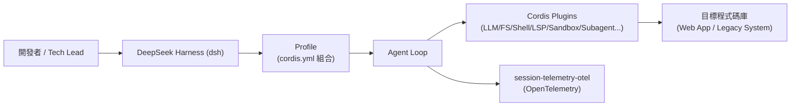

（Source-confirmed：節點與連線依 `docs/architecture.md` 與 `packages/*/README.md` 之元件關係整理；Profile／Bundle／Plugin 的組裝細節見第 6～7 章。）

### 2.4 Scenario：一位架構師的第一印象

> 一位資深後端架構師第一次看到 DeepSeek Harness 的 README，最直覺的疑問通常是：「這跟 Claude Code、GitHub Copilot CLI 有什麼不一樣？」
>
> 答案（依官方文件與原始碼可查證的部分）是：多數 Coding Agent CLI 把「工具集」「Agent Loop」「模型」寫死在同一支程式裡；DeepSeek Harness 則是先有 Cordis 這個通用 Plugin Runtime，再把每個能力都做成獨立 Plugin，甚至反過來可以把 **Codex、Claude Code 本身當成 Subagent 掛進來**（`subagent-codex`、`subagent-claude-code`，見第 14 章）。這代表它的定位比較接近「Agent 組裝平台」，而不是單一產品。

### 2.5 AI Prompt 範例

```text
你是企業內部負責評估 AI Coding Agent 導入方案的架構師。
請閱讀 DeepSeek Harness 官方 docs/architecture.md 與各 packages/*/README.md，
用一句話總結：這個框架解決的核心問題是「工具/模型的可組裝性」還是「單一 Agent 的智慧程度」？
並列出三個佐證你判斷的具體套件或設定範例。
```

### 2.6 本章 Checklist 與小結

- [ ] 能用一句話向非技術主管解釋 DeepSeek Harness 是什麼
- [ ] 能清楚列出「DeepSeek Harness 不是什麼」的至少 3 項
- [ ] 理解 Profile／Plugin／Agent Loop／Telemetry 的基本關係圖

---

## 3. 官方專案與版本辨識

### 3.1 為什麼這一章必須放在最前面

「DeepSeek Harness」是一個泛用性很高的名稱（DeepSeek 是知名模型廠商，Harness 又是 Agent 工具鏈的通用詞彙），加上官方專案本身話題度極高（5 天內 star 數突破 15 萬，見版本速查表），非常容易出現：

- 早於官方存在的第三方同名專案。
- 因為套件命名慣例不同（`deepseek-harness` vs `deepseek-harness-sdk`）而誤裝錯套件。
- 內容農場網站轉載或改寫官方 README，被誤認為官方鏡像站。

### 3.2 官方專案身分確認

| 項目 | 值 | 標示 |
|---|---|---|
| 官方組織 | `deepseek-ai`（DeepSeek 官方 GitHub 組織） | 官方已實作 |
| 官方 Repository | `github.com/deepseek-ai/deepseek-harness` | 官方已實作 |
| 官方首頁（Repo Metadata `homepage` 欄位） | `https://deepseek.com/harness`（本手冊查證時該頁面連線逾時／被拒，僅能以 Repo Metadata 佐證其存在，未能直接讀取頁面內容） | Source-confirmed（部分未能驗證） |
| 官方 License | MIT | 官方已實作 |
| 目前版本狀態 | Developer Preview，`dsh-v0.1.0-rc.7`（Pre-release） | 官方已實作 |

### 3.3 已知第三方／易混淆專案比較表

| 專案 | GitHub / 來源 | 性質 | 是否官方 | 主要用途 | 建立時間 |
|---|---|---|---|---|---|
| `deepseek-ai/deepseek-harness` | github.com/deepseek-ai/deepseek-harness | Cordis-based Agent Harness（TypeScript Monorepo） | **是官方** | 本手冊研究對象 | 2026-08-13 |
| `HenryZ838978/deepseek-harness` | github.com/HenryZ838978/deepseek-harness | 「Harness for DeepSeek V4-Pro / V4-Flash」，Python lib + 自製 `dsh` CLI + Anthropic SKILL.md，針對 DeepSeek API 協定怪癖做探測（描述提及「16 documented protocol quirks, 12 probes, 270+ trials」） | **非官方**，第三方社群專案，作者揭露個人隸屬 ModelBest（MiniCPM team），惟此為個人背景揭露，**不代表**此為 ModelBest 官方專案 | DeepSeek API 協定相容性研究工具 | 2026-05-09（早於官方 3 個月）；查證當下（2026-08-18）README 之「trust ledger」最後更新為 2026-08-17，仍在持續維護中 |
| PyPI `deepseek-harness`（裸名，第三方） | pypi.org/project/deepseek-harness | Henry Zhang 維護之「Protocol-aware Python client for DeepSeek V4-Pro / V4-Flash」，查證當下最新版本 **0.2.0**（發布於 2026-05-11） | **非官方** | 與官方 SDK **完全不同**之套件，PyPI 頁面**未標示**任何命名衝突警語 | Source-confirmed，2026-08-18 直接查證 PyPI 頁面 |
| PyPI `deepseek-harness-sdk`（官方） | pypi.org/project/deepseek-harness-sdk | 官方 Python SDK，模組名 `deepseek_harness`（見第 26 章） | **是官方** | 查證當下最新版本為預發布之 **0.1.0rc7**（2026-08-18 發布，與 Repo 同版號同步），維護者含 DeepSeek-Harness、koalazf99、tianyicui 等帳號 | Source-confirmed，2026-08-18 直接查證 PyPI 頁面 |
| 各類「deepseek-harness wiki／教學」內容農場站 | 搜尋引擎可見多個非 GitHub 網域轉載或改寫官方 README | 內容轉載/SEO 站 | **非官方** | 無法作為技術依據來源 | 不適用 |

> **命名衝突之真正成因（本次補強研究新發現，Source-confirmed）**：次級來源（多篇獨立技術部落格之查核文章）指出，DeepSeek 官方於 2026-08-10 首次發布 `@deepseek-ai/dsh` 系列套件時，**確實嘗試申請 PyPI 上裸名 `deepseek-harness` 與 `deepseek-harness-sdk` 兩個名稱，但裸名 `deepseek-harness` 因已被 `HenryZ838978` 先行註冊而未能取得**——這正是官方最終改以 `-sdk` 後綴發布的直接原因，而非單純的命名巧合。`HenryZ838978/deepseek-harness` 專案本身在官方發布後已於 README 新增「Package identity（套件身分）」章節，明確聲明雙方為「不同作者、不同原始碼樹、不同語言、不同問題領域」之互不相關專案，**但 PyPI／GitHub 上的套件名稱本身並未變更**，命名衝突在套件登錄層級依然存在。截至查證當下，**未見 DeepSeek AI 官方就此命名衝突發布任何正式聲明**，所有澄清文字均來自第三方查核或該專案自身單方面加註（Source-confirmed，惟屬次級來源整理，非一手官方公告）。

### 3.4 命名陷阱實例：`pip install` 與 `npx` 的正確用法

```bash
# 官方 Python SDK（正確）——注意 -sdk 後綴
python -m pip install deepseek-harness-sdk

# 官方 npm 快速啟動（正確）——注意 scope 是 @deepseek-ai
npx @deepseek-ai/dsh web
```

> ⚠️ **不要**執行 `pip install deepseek-harness`（缺少 `-sdk` 後綴）期待裝到官方套件——這會實際裝到 Henry Zhang 維護、與官方完全無關的第三方套件（見 3.3 節），而且由於官方 import 時的模組名稱恰好也接近 `deepseek_harness`，更容易讓使用者誤以為裝對了套件（官方已實作 vs 建議架構之風險提醒，見重要聲明第 5 點）。企業建議直接把 `deepseek-harness-sdk`（**完整含 `-sdk` 後綴**）列入內部套件白名單／私有 Registry 的核准清單，而非僅列 `deepseek-harness`。

### 3.5 後續全文研究對象聲明

自本章之後，全文所有「DeepSeek Harness」均指 `deepseek-ai/deepseek-harness` 官方專案。若引用第三方資料，僅作為：

- 佐證第三方混淆風險存在（如本章）；
- 交叉驗證官方數字（如 Star 數的第三方新聞報導）；

不會將第三方專案功能誤寫為官方 DeepSeek Harness 功能。

### 3.6 本章 Checklist 與小結

- [ ] 團隊已知悉官方 Repository 正確網址，並加入書籤／內部 Wiki
- [ ] 已將 `deepseek-harness-sdk`（含 `-sdk`）列入內部套件白名單，避免誤裝第三方 `deepseek-harness`
- [ ] 已理解「Star 數快速成長」不等於「生產成熟度」

---

## 4. 為什麼企業需要 Agent Harness

### 4.1 傳統「LLM + Prompt」模式的侷限

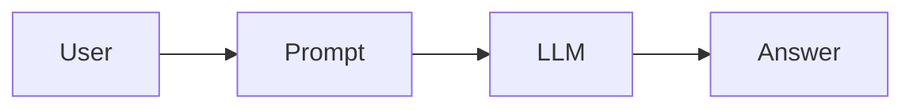

單純的「Prompt → Answer」模式，在企業實際的軟體工程場景中會立刻碰到下列問題（建議架構，屬產業界普遍共識而非官方文件內容）：

| 問題面向 | 具體表現 |
|---|---|
| Tool management | 模型無法自行讀寫檔案、跑測試、查 Git diff，只能純文字問答 |
| Context management | 大型專案的原始碼無法整份塞進單一 Prompt |
| Session／State | 無法記住「上一步改了哪個檔案」，每次都要重新提供上下文 |
| Filesystem / Shell | 無法實際執行編譯、測試、Lint |
| Sandbox | 沒有安全邊界，若真的給予執行權限，風險無法控管 |
| Subagent | 無法將工作拆解給專精不同領域的子代理 |
| Permission／Approval | 沒有「哪些操作需要人工核准」的機制 |
| Observability | 看不到模型實際呼叫了哪些工具、耗費多少 Token |

### 4.2 Chatbot vs AI Coding Assistant vs Agent vs Agent Harness

| 能力 | Chatbot | AI Coding Assistant | Agent | Agent Harness（如 DeepSeek Harness） |
| --- | :---: | :---: | :---: | :---: |
| Prompt | ✓ | ✓ | ✓ | ✓ |
| Tool 呼叫 | △ | ✓ | ✓ | ✓ |
| File System | ✗ | ✓ | ✓ | ✓ |
| Shell 執行 | ✗ | ✓ | ✓ | ✓ |
| Sandbox 邊界 | ✗ | △ | ✓ | ✓（含 Local Sandbox + 實驗性 Remote Sandbox POC） |
| Subagent | ✗ | △ | ✓ | ✓（`subagent/` 家族，可橋接 Codex／Claude Code） |
| Plugin 化架構 | ✗ | △ | △ | ✓（Everything is a Plugin，核心設計） |
| Workflow 編排 | ✗ | △ | ✓ | ✓（`workflow/` 家族） |
| Runtime 動態組合／替換元件 | ✗ | ✗ | △ | ✓（Cordis Context／Service／Fiber 生命週期管理） |

（本表為建議架構之綜合比較，個別打勾/三角形之判斷依據市面上一般 Coding Assistant／Agent 產品之公開文件常態特徵歸納，而非針對特定競品逐一查證；DeepSeek Harness 欄位之打勾均可回溯至本手冊第 5～19 章之官方已實作依據。）

### 4.3 Scenario：從「能不能編譯」到「能不能安全地自主運作」

> 一個中型企業團隊最初導入 AI Coding Assistant 時，往往只在意「它能不能幫我把程式碼寫出來、能不能通過編譯」。但當團隊想進一步讓 Agent「自己看 CI 失敗訊息、自己修、自己重跑測試」時，就會發現真正的痛點不是模型不夠聰明，而是缺少一整套「工具邊界、Session 持久化、Sandbox 隔離、Subagent 分工、Approval 關卡」的執行環境——這正是 Agent Harness 這一層要解決的問題。

### 4.4 AI Prompt 範例

```text
請比較我們目前使用的 AI Coding 工具，
與 DeepSeek Harness 在「Tool 邊界」「Sandbox」「Subagent」「Permission/Approval」
四個面向的差異，並指出若導入 DeepSeek Harness，
我們現有的 CI/CD 流程需要新增哪些關卡才能安全地讓 Agent 自主執行。
```

### 4.5 本章 Checklist 與小結

- [ ] 能說明「Agent」與「Agent Harness」的層級差異
- [ ] 能舉出至少 3 個「純 Chatbot 模式」無法滿足企業工程場景的具體原因
- [ ] 理解 DeepSeek Harness 在比較表中每個打勾項目背後對應的實際套件家族（後續章節會逐一展開）

---

## Part II：核心設計理念與 Cordis

## 5. Everything is a Plugin 核心設計理念

「Everything is a Plugin」不是一句行銷口號，而是 DeepSeek Harness 官方 README 開宗明義的架構宣告（官方已實作）。本章逐一回答理解這個理念所需的關鍵問題。

### 5.1 Plugin 是什麼？

依 DeepSeek Harness 官方教學文件 `docs/cordis-primer.md`（官方已實作，逐字引用）：

> "A plugin is a object that implements Service. It can be a function with optional `inject` and `apply(ctx)` fields, or a `Service` subclass whose lifecycle Cordis mounts into the current context."

換句話說，Cordis（DeepSeek Harness 的底層 Plugin Runtime，見第 6 章）中的 Plugin 有三種合法形態，原始碼 `registry.ts` 定義為（Source-confirmed）：

```ts
// 示意：三種 Plugin 形態（依官方教學文件範例整理，非逐字複製單一檔案）

// 1. Function Plugin —— 最簡單的形態
export function apply(ctx: Context) {
  console.log('hello from my first plugin')
}

// 2. Object Plugin —— 具名、可攜帶 inject 宣告
export const objectPlugin = {
  name: 'object-plugin',
  apply(ctx: Context) {},
}

// 3. Class Plugin（Service 子類別）—— 具備完整生命週期
export class MyService extends Service {
  constructor(ctx: Context) {
    super(ctx, 'myTutorialService')
  }
}
```

（官方已實作：以上三種形態與程式碼結構逐字依據 `deepseek-ai/deepseek-harness` 官方 `docs/cordis-tutorial/01-first-plugin.md`。）

### 5.2 Plugin Boundary 是什麼？

Plugin 之間**不直接 import 彼此的實作**，而是透過 Context 上的具名 Service 溝通（例如 `ctx.tools`、`ctx.llm`、`ctx.sessions`）。這代表 Plugin 之間的邊界是「Context 上的一個 key」，而不是模組匯入路徑——這正是「可替換性」的根本機制：只要新實作一樣註冊在同一個 key 上，呼叫端完全不需要修改（官方已實作，`docs/cordis-primer.md`）。

### 5.3 Plugin 如何註冊？

透過 `ctx.plugin(...)` 呼叫掛載到 Context 樹上（官方已實作，`docs/cordis-tutorial/03-services.md` 範例）：

```ts
export function apply(ctx: Context) {
  ctx.plugin(GreeterService)
}
```

在 DeepSeek Harness 中，實際的組裝入口是 `cordis.yml`（見第 27 章）——設定檔決定了某個 Profile 要載入哪些 Plugin，而不需要修改任何原始碼（官方已實作，`docs/architecture.md`）。

### 5.4 Plugin 如何被載入？

由 `@cordisjs/plugin-loader`（DeepSeek Harness vendor 後為 `@deepseek-ai/cordis-plugin-loader`）讀取設定檔（如 YAML）並宣告式地掛載 Plugin（官方已實作，`cordiverse/cordis` `packages/loader` 套件描述：「Loader for cordis」）。載入後的每一次「掛載」在 Cordis 內部稱為一個 **Fiber**（見 5.11 節）。

### 5.5 Plugin 如何提供 Service？

一個 Plugin 若要提供服務給其他 Plugin 使用，通常寫成 `Service` 的子類別，建構子呼叫 `super(ctx, 'serviceName')`，Cordis 便會將其註冊在 `ctx.serviceName` 上（官方已實作，逐字依據官方教學範例）：

```ts
import { Service, type Context } from '@deepseek-ai/cordis'

declare module '@deepseek-ai/cordis' {
  interface Context {
    greeter: GreeterService
  }
}

export class GreeterService extends Service {
  constructor(ctx: Context) {
    super(ctx, 'greeter')
  }
  greet(who: string) {
    return `Hello, ${who}!`
  }
}

export function apply(ctx: Context) {
  ctx.plugin(GreeterService)
}
```

（官方已實作：逐字依據 `docs/cordis-tutorial/03-services.md`。）

### 5.6 Plugin 如何提供 Capability？

在 DeepSeek Harness 的實際套件劃分中，「Capability」通常對應到一個具名的 `packages/*` 家族，例如 `fs/`（檔案系統能力）、`shell/`（Shell 執行能力）、`lsp/`（語意導覽能力）。每個家族內部可能包含多個具體 Provider Plugin（例如 `subagent/` 家族底下有 `subagent-inprocess`、`subagent-codex`、`subagent-claude-code` 等多個 Provider，見第 14 章），呼叫端只依賴家族層級的 Service 介面，不關心底層是哪個 Provider（官方已實作，架構歸納）。

### 5.7 Plugin 如何監聽 Event？

Cordis 提供 Typed Event 機制，服務透過 TypeScript declaration merging 宣告事件名稱，再以四到五種模式派發（官方已實作，`docs/cordis-primer.md` + Source-confirmed 原始碼 `events.ts` 補充第五種模式）：

| Dispatch Mode | 是否等待 | 派發順序 | 是否有回傳值 |
|---|---|---|---|
| `emit` | 否 | 註冊順序 | 否 |
| `waterfall` | 否 | 註冊順序 | 是 |
| `parallel` | 是 | 所有 listener 平行執行 | 否 |
| `serial` | 是 | 註冊順序 | 是 |
| `bail` | （原始碼定義，官方教學文件表格未列出） | — | — |

> Source-confirmed 補充：原始碼 `packages/core/src/events.ts` 中 `DispatchMode` 型別實際為 `'emit' | 'parallel' | 'serial' | 'bail' | 'waterfall'` 五種，比官方教學文件表格多出 `bail`。本手冊如實記錄此落差，提醒讀者以原始碼為準。

### 5.8 Plugin 如何依賴其他 Plugin？

透過 `inject`（陣列或物件形式）宣告必要的 Service 名稱。Cordis 會**持續追蹤**這個依賴關係，而不只是開機時檢查一次：若被依賴的 Service 之後被卸載（例如 Hot Reload 過程中），所有依賴它的 Plugin 會被連帶卸載，等 Service 回來後再自動重新載入（官方已實作，`docs/cordis-tutorial` 第 3 章補充說明）：

```ts
export const inject = ['greeter']

export function apply(ctx: Context) {
  console.log(ctx.greeter.greet('world'))
}
```

若依賴是可選的，改用 `ctx.get('greeter')` 探測而非宣告式 `inject`（官方已實作）。

### 5.9 Plugin 如何替換？

因為呼叫端只依賴 Context 上的具名 key，而非具體實作類別，只要新 Plugin 註冊在同一個 key 上，即可在不修改呼叫端程式碼的情況下完成替換。DeepSeek Harness 大量套件家族採用「同一 Service 介面、多個 Provider 實作」的模式，正是這個機制的直接應用（例如 `subagent/` 家族的多個 Provider、`sandbox/` 與 `e2b/` 兩種沙箱實作，見第 13～14 章）（官方已實作，架構歸納）。

### 5.10 Plugin 如何組合？

DeepSeek Harness 文件用「Composition」描述多個 Plugin 組合成一個可運作 Agent 的過程，官方教學文件第 6 章標題即為「Composition and HMR」（官方已實作）。在企業實務上，這個組合層級由 `cordis.yml` 中的 **Bundle**（一組預先組好的 Plugin 清單，例如 `dsh-base`、`dsh-web-app`、`dsh-headless`）與 **Profile**（引用一組 Bundle 並疊加自訂 patch）共同表達，詳見第 27 章。

### 5.11 Plugin 如何動態啟用／停用？

Cordis 原始碼定義了明確的 Plugin 掛載生命週期狀態機 `FiberState`：`PENDING → LOADING → ACTIVE`，或失敗時進入 `FAILED`，卸載時進入 `DISPOSED`／`UNLOADING`（Source-confirmed，`packages/core/src/fiber.ts`）。每一次掛載稱為一個 **Fiber**；而同一個 Plugin 定義（稱為 **Runtime**）可以擁有多個 Fiber 實例（Source-confirmed，`packages/core/src/registry.ts`，官方文件未以文字說明此 Runtime/Fiber 關係，屬本手冊依原始碼補充之技術細節）。這個機制搭配 `@cordisjs/plugin-hmr`（Hot Module Replacement），讓 Plugin 可以在不重啟整個 Harness 的情況下動態換入換出（官方已實作，`packages/hmr` 套件描述：「Hot Module Replacement Plugin for Cordis」）。

官方教學文件將 Plugin 的註冊動作定位為「**reversible effects（可逆的副作用）**」——透過 `ctx.effect()` 或 `ctx.on()` 安裝的行為（例如 Prompt 區塊、Tool Schema、Adapter、事件監聽），在卸載時會被可預期地「倒轉」（官方已實作，`docs/cordis-primer.md`）。這也正是第 6 章要深入介紹的 Cordis 論文核心概念「Temporal Composability」的具體實作。

### 5.12 Plugin 對測試有什麼好處？

因為 Plugin 邊界清楚、依賴透過 `inject` 顯式宣告，單一 Plugin 可以在最小化的 Context 中被獨立掛載測試，不需要啟動整個 Harness（建議架構，依 Plugin 架構特性之工程推論；DeepSeek Harness 專案自身的 `pnpm run test`／`test:coverage` 等指令為官方已實作之測試流程，見第 25 章）。

### 5.13 Plugin 對 Enterprise Architecture 有什麼好處？

對企業而言，Plugin 化架構的核心價值在於：

1. **降低廠商鎖定風險**——模型 Provider、Sandbox 實作、Subagent 後端都可替換。
2. **權限邊界可以按 Plugin 切分**——不同 Plugin 可以有不同的 Permission Preset（見第 15、40 章）。
3. **可觀測性可以按 Plugin 追蹤**——Telemetry 可以知道是哪個 Plugin 觸發了哪個事件。
4. **企業可以自行開發私有 Plugin**，串接內部系統（見第 46 章 Plugin Development）。

（建議架構：本節為企業導入角度之工程建議，非官方逐條列出之效益聲明。）

### 5.14 本章 Checklist 與小結

- [ ] 能說明 Plugin 的三種形態（Function／Object／Class-Service）
- [ ] 能解釋 `inject` 的「持續追蹤」特性，而非僅開機檢查一次
- [ ] 理解 Fiber／Runtime／FiberState 生命週期狀態機的基本概念
- [ ] 理解「Reversible Effects」是 Plugin 可以安全動態啟停的關鍵機制

---

## 6. Cordis 架構深入研究

### 6.1 Cordis 是什麼——以及一個重要的來源澄清

**Cordis 官方定義（官方已實作，`cordiverse/cordis` README 逐字引用）**：

> "A Meta-Framework of Spatiotemporal Composability."

Cordis 官方 README 明確聲明其成熟度（官方已實作，逐字引用）：

> "Cordis is under active development. The API is not yet stable and may change without notice."

**重要澄清（Source-confirmed，交叉比對多項一手證據）**：Cordis **並不是 DeepSeek 開發的框架**，而是開發者 **Shigma** 多年前為聊天機器人框架 **Koishi** 打造的獨立 Meta-Framework（`cordis` 的 LICENSE 檔案 Copyright 為「Shigma」，與 Koishi README 的 Copyright 署名一致；`cordiverse/cordis` 全部套件之 `package.json` `author` 欄位亦一致為「Shigma <shigma10826@gmail.com>」）。DeepSeek Harness 是後來的**使用者**，透過「vendor（原始碼複製並釘住特定 commit）」的方式將 Cordis 整合進自己的 Monorepo（`vendor/cordis`，見 6.6 節），而不是 Cordis 為 DeepSeek Harness 而生。撰寫或簡報本章內容時，請務必避免寫成「DeepSeek 開發了 Cordis」這種常見的錯誤敘述。

Koishi 本身是一個跨平台聊天機器人框架（支援 QQ／Discord／Telegram／微信等），累積約 6,000 GitHub Star，據報導有超過 4,000 個社群 Plugin 曾於生產環境驗證使用，目前運行於 **Cordis v3**；DeepSeek Harness 則建立於 **Cordis v4** 之上（Source-confirmed，`cordiverse/cordis` 原始碼中唯一出現的「Koishi」字面引用位於 `packages/create/src/index.ts` 的一則程式碼註解連結；Koishi 星數／Plugin 數量與其對應之 Cordis 大版號則屬次級來源整理，未逐一核對 Koishi Repository 本身）。中文次級報導並指出 Shigma 其後加入 DeepSeek，將其在 Koishi「聊天機器人 Plugin 生態」累積的架構經驗延伸到「AI Agent Plugin」領域——**這一段僅為次級來源說法，本手冊未能從 DeepSeek 官方或 Shigma 本人的一手管道逐字確認，標示為推測/Hypothesis，企業簡報中若要引用請自行查證**。

Cordis 目前授權為 **MIT License**（Copyright Shigma, 2021-present）。有一項容易被誤解之處需特別說明：`cordiverse/cordis` **並未使用 GitHub Releases／Tags 機制**發布版本（API 查證回傳空陣列），版本號僅存在於各子套件的 `package.json` 中；查證當下（2026-08-18）`packages/core/package.json` 記載之版本為 **`4.0.0-rc.8`**（2026-08-10 commit 更新），比 DeepSeek Harness 目前 Vendor 釘住的 `4.0.0-rc.7`（見 6.6 節）新一個小版號，中間另有至少兩筆功能性修正（`fix(core): track direct service callers`、`fix(core): keep wrapped fiber state canonical`）尚未同步進 DeepSeek Harness 的 Vendor 拷貝。這同樣呼應其 README 聲明的「API 尚不穩定」（官方已實作），且是「Vendor 而非單純依賴」策略必然產生的版本落差，企業追蹤升級時應直接比對 commit 與 `package.json` 版本號，而非查閱不存在的 Release 頁面。

### 6.2 Context：服務的倉庫

官方教學文件對 Context 的說明（官方已實作，逐字引用 `docs/cordis-primer.md`）：

> "A context is a repository of services. A service claims a stable `ctx.<key>` such as `ctx.tools`, `ctx.llm`, or `ctx.sessions` from a context; other plugins find services via key instead of importing a concrete implementation."

Source-confirmed 補充（原始碼 `packages/core/src/context.ts`）：`Context` 實作為一個 `Proxy`，對外暴露 `events`（事件系統）、`logger`（記錄器）、`reflect`（服務反射註冊表）、`registry`（Plugin 註冊表）、`fiber`（目前所屬的 Fiber）等介面，並提供 `isolate()`、`intercept()` 等方法用於建立範圍受限的子 Context。

### 6.3 Service：可被聲明式尋址的能力單元

`Service` 是一個抽象類別（`abstract class Service<T = never>`），建構子接收 `(ctx, name)`，並透過 `ctx.reflect.provide(name, self, ...)` 將自己註冊到指定的 Context key 上，使其可以被以 `ctx.<name>` 的形式存取（Source-confirmed，`packages/core/src/service.ts`）。一個 `Service` 子類別本身就是一種合法的 Plugin 形態（見 5.1 節）。

### 6.4 Event：型別化的事件系統

見第 5.7 節的 Dispatch Mode 表格。這裡補充：官方教學文件強調 Event 的設計目的是讓 **Service 之間可以宣告事件名稱進行溝通，而不需要互相 import**（官方已實作，`docs/cordis-primer.md`），這與 Plugin Boundary（5.2 節）的設計哲學一致。

### 6.5 Dependency／Lifecycle／Injection／Composition

已於第 5.8、5.10、5.11 節詳細展開，此處補充官方對 Configuration 的定位：DeepSeek Harness 教學文件第 5 章標題為「Configuration」，說明其提供「validated config from `cordis.yml`, failing loud on bad input」——也就是設定檔會先經過驗證，格式錯誤會直接失敗而非靜默忽略（官方已實作）。Source-confirmed 補充：驗證機制底層使用 `StandardSchemaV1`（`@standard-schema/spec` 依賴）進行 `resolveConfig()` 驗證。

### 6.6 Cordis 在 DeepSeek Harness 中的整合方式：Vendor，而非單純依賴

DeepSeek Harness 官方 `vendor/README.md` 明確說明（官方已實作，逐字引用）：

> "This directory contains source-vendored copies of the Cordis framework and its foundation libraries. They are copied into this monorepo instead of being depended on via npm, so that the harness fully owns its framework layer (auditable, patchable, pinned)."

Vendor 對照表（官方已實作，逐字依據 `vendor/README.md`）：

| Vendor 目錄 | DeepSeek Harness npm 名稱 | 上游名稱 | 版本 | 上游 Repository | 釘住 Commit |
|---|---|---|---|---|---|
| `cordis/` | `@deepseek-ai/cordis` | `cordis` | `4.0.0-rc.7` | `cordiverse/cordis`（`packages/core`） | `56b3d4f725681cf4556c1a8695a709cc3b6eed74` |
| `loader/` | `@deepseek-ai/cordis-plugin-loader` | `@cordisjs/plugin-loader` | `1.0.0-rc.5` | `cordiverse/cordis`（`packages/loader`） | 同上 |

`AGENTS.md` 進一步確認：「`@deepseek-ai/cordis` is a peerDependency (+ dev) of every harness package.」——代表整個 Monorepo 49 個套件家族、219 個實際套件（見第 7.3 節），全部都以這個 vendor 後的 Cordis 為共同基礎（官方已實作）。

`docs/architecture.md` 對這個關係的定位（官方已實作，逐字引用）：

> "Cordis is the framework under dsh: plugins contribute services, typed events, and reversible effects to a shared context... There is no privileged core to patch: you extend dsh by mounting a plugin beside the others."

### 6.7 Cordis Package 家族一覽

上游 `cordiverse/cordis` 的 `packages/` 目錄（官方已實作，逐一查證各 `package.json`）：

| 目錄 | npm 名稱 | 用途（逐字依據官方 description） |
|---|---|---|
| `core` | `cordis` | "Meta-Framework for Modern Applications"（框架本體：Context／Service／Plugin／Fiber／Event） |
| `create` | `create-cordis` | "Setup a Cordis application"（腳手架 CLI） |
| `group` | `@cordisjs/plugin-group` | 官方 `package.json` 無 description 欄位；由套件名稱與定位推知用於分組管理 Plugin 設定項 |
| `hmr` | `@cordisjs/plugin-hmr` | "Hot Module Replacement Plugin for Cordis" |
| `include` | `@cordisjs/plugin-include` | 官方 `package.json` 無 description 欄位；依 DeepSeek Harness 教學文件說明，用於 `cordis.yml` 中的 `!!js`／表達式節點引入 |
| `loader` | `@cordisjs/plugin-loader` | "Loader for cordis"（讀取設定檔如 YAML，宣告式掛載 Plugin） |
| `logger-console` | `@cordisjs/plugin-logger-console` | "Console logger exporter for cordis" |
| `timer` | `@cordisjs/plugin-timer` | "Timer service for cordis" |
| `utils`（private） | `@cordisjs/utils` | "Utilities for cordis" |

另有獨立的 `cordiverse/webui` Repository，提供 `@cordisjs/client`、`@cordisjs/components`、`@cordisjs/registry` 等核心套件，以及 `database-webui`、`http-webui`、`insight`、`loader-webui`、`logger-webui`、`market`、`notifier`、`server-webui`、`webui` 等 9 個官方 WebUI 相關 Plugin（官方已實作，`cordiverse/webui` README；DeepSeek Harness 是否直接採用此 WebUI 套件組，本手冊未查得直接證據，不予斷言）。

> **建置工具鏈提醒**：`cordiverse/cordis` 本身的 Monorepo 採 **Yarn Berry**（`yarn@4.14.1` workspaces）與自研建置工具 `yakumo`，**並非** pnpm——這與 DeepSeek Harness 自身（`pnpm@11.7.0` workspaces，見版本速查表）是兩套獨立的套件管理慣例。企業若需直接對 `cordiverse/cordis` 上游提交 PR 或本機建置驗證，請留意環境需求不同於 DeepSeek Harness 主 Repository（Source-confirmed，2026-08-18 直接查證 `cordiverse/cordis` 根目錄設定檔）。

### 6.8 深入研究 Cordis Paper：Spatiotemporal Composability 是什麼

> 本節已於本次補強研究中直接下載並解析 `cordiverse/paper` 的完整 PDF 原文（88 頁，非僅 README 摘要），以下引用區分「README 摘要」與「PDF 論文本文」兩種來源層級。

`cordiverse/paper` Repository（僅 2 筆 commit，皆由帳號 `Shigma` 推送，訊息為 `initial commit`／`upload paper`；`license: null`，**確認無 LICENSE 檔案**）提出的核心概念（官方已實作，逐字引用論文 README）：

> "We identify two orthogonal dimensions of the problem: **temporal composability**, the ability to completely revert a component's side effects upon removal, and **spatial composability**, the ability to declare and reactively manage inter-component dependencies."

PDF 論文本文之完整摘要（官方已實作，逐字引用，比 README 摘要更完整）：

> "Modern software—from plugin systems to self-evolving agent harnesses—increasingly requires *dynamic composition*, yet its formal foundations remain underdeveloped... We address the two dimensions by lifting classical effect and coeffect concepts to runtime mechanisms. In particular, we formalize *revertible effects*, in which every context transformation carries an inverse that the runtime tracks. We formalize *reactive coeffects*, in which each change of the context notifies a component against its coeffect specification. We unify the effect context and the coeffect context into a single *context type*, which constitutes a programming paradigm... We implement these ideas in *Cordis*, a meta-framework of spatiotemporal composability that provides a core library with effect tracking and coeffect resolution, as well as a declarative component loader with configuration reconciliation and hot module replacement."

用工程語言重新表達：

- **Temporal Composability（時間維度的可組合性）**：一個元件被移除時，它造成的所有副作用都能被完整撤銷——對應到 Cordis 的 **Revertible Effects**（可逆副作用），也就是第 5.11 節提到的 `ctx.effect()`／`ctx.on()` 機制。
- **Spatial Composability（空間維度的可組合性）**：元件之間的依賴關係可以被宣告，並且在依賴的服務發生變化時被**反應式（Reactive）地管理**——對應到 Cordis 的 **Reactive Coeffects（反應式協同效應）**，也就是第 5.8 節提到的「`inject` 持續追蹤、依賴消失時連帶卸載、恢復時自動重載」的行為。

論文將這兩個維度統一在單一的 **Context 型別**之下（PDF 本文 Definition 32 給出形式化定義 `C ≜ μX. S × (X → X) × D`），而 Cordis 正是這篇論文提出之典範的**參考實作（Reference Implementation）**，提供「一個具備 Effect 追蹤與 Coeffect 解析的核心函式庫，以及一個支援設定調和（Configuration Reconciliation）與 Hot Module Replacement 的宣告式元件載入器」（官方已實作，逐字引用論文 README）。

**論文動機案例：以 VS Code Extension Host 為反例（官方已實作，逐字依據 PDF 本文整理）**——作者以 VS Code 的擴充套件架構作為「現有方案侷限」的具體反例：top 100 擴充套件中有 87 個含可執行程式碼，卻無法在不重啟整個 Extension Host 的情況下單獨卸載；`extensionDependencies` 機制僅 7/100 套件使用；透過 `vscode.extensions.getExtension(...).exports` 取得的跨套件介面是未型別化的 `any`，缺乏結構化契約。論文指出，這正是「粗粒度替代方案」的通病——作業系統層級的行程重啟、容器編排的服務級管理，都無法表達「同一位址空間內、元件之間細粒度依賴關係」的動態組合需求，重建行程本地累積狀態動輒需要數秒至數分鐘。**這個反例對企業讀者而言是很好的教學素材**：它具體說明了為什麼「Everything is a Plugin」若缺乏形式化的可逆性與依賴追蹤保證，很容易退化成 VS Code 這種「必須整體重啟才能卸載」的系統。

**理論構件與 Cordis 原始碼之對照（官方已實作，逐字依據論文 PDF 本文 Table 2「Theory-to-implementation correspondence」）**：

| 論文理論構件 | Cordis 原始碼實作 |
|---|---|
| Context 型別 `C`（Effect Context μ-tower ＋ Coeffect Context） | `ctx`，一個 first-class `Context` 物件 |
| Revertible Effect 原語 | `ctx.effect(callback)`——所有 Context 變更最終都化約為一次 `ctx.effect` 呼叫 |
| Coeffect 操作 `get(k)` / `set(k,v)` | `ctx.get(key)` / `ctx.set(key, value)` |
| Isolation／Interception | `ctx.isolate(key, realm)` / `ctx.intercept(key, metadata)` |
| Component 三元組 `(ρ, π, φ)` 之執行期實例 | `fiber`（`packages/core/src/fiber.ts`，見第 5.11 節 `FiberState` 狀態機） |
| Component 之 Provision | `Service` 子類別建構時呼叫之 `ctx.reflect.provide(name, self, ...)` |

論文並在第 6.2 節指出，「Service」在 Cordis 原始碼中其實是「Coeffect Key（依賴介面）」在物件導向層面的具體化，並將此設計類比 OSGi 的 Service 概念——理論上真正的一等公民是統一後的 **Context 型別**與其上的 Effect／Coeffect 操作，而不是 Service 本身。

**案例研究：Koishi（官方已實作，逐字依據論文 PDF 本文整理）**——論文以 Koishi（累積超過 4,000 個社群貢獻 Plugin 之正式聊天機器人框架，見 6.1 節）作為案例研究，驗證此理論模型可支撐大規模、跨作者的生產系統，並具體指出：「an inexperienced author obtains ordered cleanup for a plugin's context-mediated effects without writing an uninstall path」——也就是 Plugin 作者不需要手寫解除安裝邏輯，也能透過 Revertible Effects 機制得到正確的清理順序。

**未來方向：論文明確點名「Self-Evolving Agent Harnesses」（官方已實作，逐字依據論文 PDF 本文第 8 節結論整理）**——論文結論明確將「AI Agent 在極少人為監督下持續產生並替換自身元件」列為此套 Spatiotemporal Composability 理論下一步要驗證的場域，這與「DeepSeek Harness」把 Cordis 當作底層 Vendor、並將本論文列為官方參考文獻的定位直接呼應。論文參考文獻第 [8]、[9] 項並分別引用了 OpenAI（"Harness Engineering: Leveraging Codex in an Agent-First World"）與 Anthropic（"Harness Design for Long-Running Application Development"）兩篇工程部落格，顯示作者刻意將「Harness」一詞放進業界既有的 Agent Harness 工程論述脈絡中，並嘗試補上其理論基礎。

> **關於論文作者身分之查核發現與必要保留（Source-confirmed，但存在未證實環節）**：`cordiverse/paper` Repository 的唯一 Committer 身分是帳號 `Shigma`（與 Cordis 的作者、版權人同一 Email），但 **PDF 論文本文列名的作者是「Yifan Shi¹˒², Wei Zhang¹, Tianyi Cui²」（¹Peking University ²DeepSeek-AI）**。部分中文次級來源（媒體報導、社群討論）指出 Shigma 本名可能即為此處的「Yifan Shi」（羅馬拼音可對應中文「石逸凡」），但本手冊**無法從一手來源獨立證實 GitHub 帳號 `Shigma` 與論文作者「Yifan Shi」為同一人**，故此關聯標示為 **推測/Hypothesis**，企業簡報中若要引用作者身分，請自行查證論文 PDF 原文或官方公告，避免斷言兩者必然等同。論文本身在 README 中自陳為「a preprint under active revision. The content may change substantially」（官方已實作），屬正式學術論文格式（含摘要、8 章、形式化定義、Metatheory 定理如 Preservation／Progress／Confluence、ACM 風格參考文獻），而非單純設計宣言。

### 6.9 Scenario：架構師向團隊解釋「為什麼不是我們自己寫一個 Agent Runtime 就好」

> 常見的內部質疑是：「我們為什麼不能自己寫一個簡單的 Agent 迴圈，直接呼叫 LLM API 加上幾個工具就好？」
>
> 回答的關鍵在於：DeepSeek Harness／Cordis 解決的不是「怎麼呼叫模型」這個簡單問題，而是「當你有 49 個功能模組（見第 7 章）、模型 Provider 可能更換、Sandbox 可能從 Local 換成 Remote、Subagent 可能要橋接別家 CLI 時，如何讓這些模組彼此獨立開發、獨立測試、可以動態換入換出，同時保有『移除一個模組時所有副作用都乾淨撤銷』的正確性保證」。這正是 Temporal／Spatial Composability 這兩個論文核心概念要解決的工程問題，而不是自己寫一個迴圈可以輕易達成的。

### 6.10 AI Prompt 範例

```text
請閱讀 vendor/README.md 與 docs/cordis-primer.md，
說明 DeepSeek Harness 目前釘住的 Cordis commit 版本，
並列出如果要升級到 Cordis 上游最新版本，
根據 AGENTS.md 的慣例，我們需要檢查哪些 peerDependency 相容性問題。
```

### 6.11 本章 Checklist 與小結

- [ ] 能正確說明「Cordis 由 Shigma 為 Koishi 開發、DeepSeek Harness 是 vendor 使用者」，不會誤植為「DeepSeek 開發了 Cordis」
- [ ] 能解釋 Context／Service／Event／Fiber 的角色與關係
- [ ] 能用自己的話解釋 Temporal Composability 與 Spatial Composability 的差異
- [ ] 知道目前釘住的 Cordis 版本與 commit，未來升級前會主動查核相容性

---

## 7. DeepSeek Harness 整體架構

### 7.1 架構總覽圖

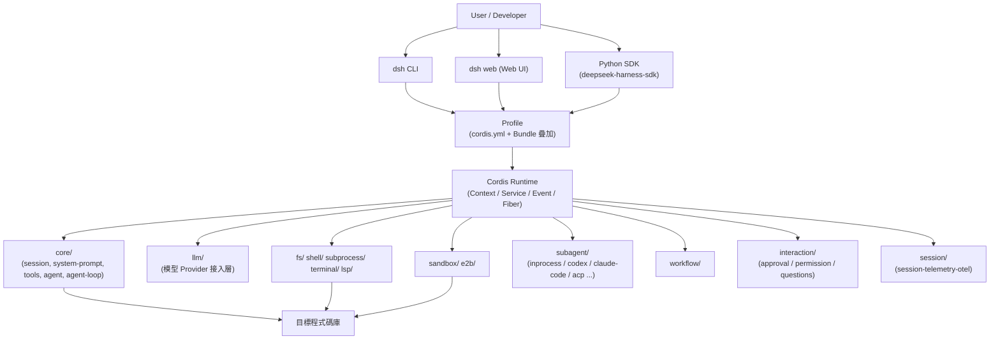

（Source-confirmed：本圖依 `docs/architecture.md` 之核心套件表格與 `packages/` 目錄的 49 個家族名稱重新整理繪製，非官方逐一提供的單一架構圖；箭頭方向與分組為本手冊之歸納呈現。）

### 7.2 官方核心套件表（`docs/architecture.md`）

（官方已實作，逐字依據 `docs/architecture.md` 的「核心套件」表格）

| Package | 負責範圍 |
|---|---|
| `core/session` | append-only 的 `SessionEvent` 事件日誌 |
| `core/system-prompt` | Prompt 區塊與 Tool Schema 的組裝 |
| `core/tools` | 有邊界範圍的 Tool 註冊表，並提供受控的執行機制 |
| `core/agent` / `core/agent-loop` | `Agent` 介面與其預設驅動邏輯 |
| `llm/llm` | 模型／串流的共通詞彙與 Adapter 接縫 |

### 7.3 `packages/` 完整 49 家族列表

（Source-confirmed，2026-08-18 對 GitHub Contents API 與 `packages/README.md` 交叉查證）：

> ⚠️ **Version Note（本次補強重點）**：本手冊初版誤植為「40 個家族」，複查當下實際為 **49 個**。更值得記錄的是：這不單純是手冊寫錯數字——官方自己的 `packages/README.md` 索引表**同樣只列出 47 項**，`mcp/` 與 `runtime-diagnostics/` 兩個家族雖有完整可執行程式碼、也出現在 `docs/config-catalog.md` 等自動產生的文件中，卻尚未被人工維護的索引表收錄。這是 Developer Preview 階段「連官方文件都會落後於程式碼」的具體例證，企業導入時應養成「以目錄結構與生成文件為準、索引頁僅供參考」的查證習慣。另外，49 個「家族目錄」底下實際還有 **219 個各自獨立發版的 npm 套件**（例如 `subagent/` 一個家族就內含 11 個子套件），家族數與套件數不是同一件事，見 8.3 節。

| 家族 | 一句話定位（依 `packages/README.md`／`docs/config-catalog.md` 整理） | 官方成熟度標示 |
|---|---|---|
| `acp` | Agent Client Protocol Server（自動化用途，非編輯器整合） | Product — stable API |
| `api` | Remote BFF 組裝＋Typert RPC Gateway | Product — stable API |
| `attachment` | 附件（圖片等）之持久身分、驗證、本地內容定址儲存 | Product — stable API |
| `boot` | 各 App／範例共用的啟動膠水（`.env`、Loader guard、設定解析） | Product — stable API |
| `bundle` | 可安裝的 `dsh --profile` Patch 層（`dsh-base`／`dsh-web-app`／`dsh-headless`） | Product — stable API |
| `client` | Web GUI 瀏覽器端：Shell／Wire／物件服務／Slot／`ui-*` Plugin | Product — stable API |
| `code-runtime` | 程式碼執行能力：Service 定義＋Worker Thread Provider＋Code Mode Consumer | Product — stable API |
| `compaction` | 上下文壓縮能力：Service 定義＋基本 Provider＋人類指令 Consumer | Product — stable API |
| `context` | 非工具型的模型可見上下文擴充（Session 參照、時間、`AGENTS.md` 等工作區指令） | Product — stable API |
| `core` | 產品 API 骨幹：Session／Prompt／Tools／Agent 服務與具體 Loop | Product — stable API |
| `credentials` | 憑證參照 Seam ＋ 環境變數／`.env` Provider | Product — stable API |
| `e2b` | E2B Remote Sandbox Provider（`dsh-e2b`／`dsh-subprocess-e2b`／`dsh-fs-e2b`） | **POC** |
| `examples` | Demo Bundle（Agent Spine ＋ CLI/ACP/JSON-RPC 執行檔） | Support — 範例基礎設施 |
| `extensions` | Agent Runtime 自我修改：即時 Plugin／Service 檢視，模型可自行掛載／卸載 Plugin | Product — stable API |
| `feedback` | 人類回饋 | Product — stable API |
| `fs` | 檔案系統能力：Seam、本地實作、模型可用檔案工具、Bash 輔助探索 | Product — stable API |
| `goal` | 同一 Session 內的目標持久化與生命週期 | Product — stable API |
| `guard` | Loop 衛生防護：重複呼叫提醒＋`tools/execute` 逾時強制執行 | Product — stable API |
| `hooks` | Hook 橋接＋Claude Code／Codex Wire Protocol 函式庫 | Product — stable API |
| `host` | Web GUI Host 端：API Gateway ＋ HTTP Route Server | Product — stable API |
| `identity` | 共用匿名身分 | Product — stable API |
| `interaction` | 人機協作介面：Approval／Permission Preset／Commands／Ask-User | Product — stable API |
| `jobs` | 通用背景工作 Runtime ＋ 模型可用之 `job_*` 控制工具 | Product — stable API |
| `llm` | LLM 能力家族：抽象 Service ＋ Provider Adapter | Product — stable API |
| `lsp` | LSP 能力家族：Seam、通用 stdio Provider、`lsp` 工具 | Product — stable API |
| `mcp` | **橋接 MCP（Model Context Protocol）生態系**（`mcp-client`：MCP Client 橋接器，將外部 MCP Server 工具註冊進 `ctx.tools`） | *（官方 `packages/README.md` 索引表未列入，見上方 Version Note）* |
| `plan` | Plan 協作狀態（Guidance／指令／審閱流程，記錄於 Session Log） | Product — stable API |
| `preset` | 依 Preset `cordis.yml` 組裝單一 Session 的 Agent 能力組合 | Product — stable API |
| `runtime-diagnostics` | 可設定的套件自持執行期不變量（Invariant）檢查登錄表 `ctx.invariants`（`invariants` 子套件） | *（官方 `packages/README.md` 索引表未列入，見上方 Version Note）* |
| `sandbox` | 行程隔離 Seam；本地平台隔離後端（bwrap／Landlock／Seatbelt）＋ 持久化 Session 沙箱政策 | Product — stable API |
| `schedule` | Session-local 排程提醒（狀態完全存於 Session Log，非外部通知管道） | Product — stable API |
| `sdk` | 行程外 Runtime SDK：JSON-RPC 協定、TypeScript Client、Server Plugin | Product — stable API |
| `session` | 持久化 Session 資料層：持久化 Seam ＋ JSONL/SQLite 後端、投影、標題、Telemetry（含 `session-telemetry`／`session-telemetry-otel`） | Product — stable API |
| `session-query` | 授權過的 Session Log 檢索：邏輯語料庫、有界讀取、譜系、語意過濾、SQLite FTS | Product — stable API |
| `settings` | 使用者設定 Seam ＋ 檔案後端 Provider | Product — stable API |
| `shell` | Bash 能力家族：Executor Seam、本地實作、模型可用工具 | Product — stable API |
| `skill` | Skill 能力：Provider 登錄表、本地 Provider、模型可用之目錄／載入器 | Product — stable API |
| `spill` | 超大工具輸出溢出處理：Seam、本地實作、溢出政策 | Product — stable API |
| `storage` | 非 Session 儲存樞紐＋後端＋領域表單 | Product — stable API |
| `subagent` | 子代理能力：Provider 登錄表契約＋模型可用之委派工具（見第 14 章） | Product — stable API |
| `subprocess` | 子行程能力：Service 定義＋本地行程樹 Provider | Product — stable API |
| `terminal` | 持久 PTY 能力：Owner-scoped Session、本地實作、模型可用工具 | Product — stable API |
| `test-support` | 測試基礎設施：Testkit、Invariant、Replay、Loader Smoke Test | Support — 相容性要求較低 |
| `todo` | 模型可用之 `todo_write` 工具（單一 Session 僅一份 Todo List，無需可替換 Provider） | Product — stable API |
| `typert` | 型別圖產生、產物載入、執行期登錄表（支撐第 7.2 節之 API Gateway） | Product — stable API |
| `util` | 零依賴工具函式（`Branded<B>`、路徑輔助、逾時、留存策略） | Support — 小型、穩定、不依賴 Harness 本身 |
| `web` | Web 能力家族：Seam、搜尋／擷取 Provider、模型可用之 Web 工具 | Product — stable API |
| `workflow` | Workflow Seam、Worker Thread 引擎、模型可用之 `workflow`／`ralph` 工具（見第 16.4 節 Ralph Loop） | Product — stable API |
| `workspace` | 工作區實體 | Product — stable API |

`AGENTS.md` 有一處值得記錄的落差（Source-confirmed）：其內文列出的示意目錄仍寫著 `self-modification/`（「the agent inspects/mounts its own plugins」），但**該目錄在目前程式碼中已不存在**，實際家族名稱是 `extensions/`，且 `packages/README.md` 對 `extensions/` 的正式定義文字與 `AGENTS.md` 這句舊描述幾乎一致——代表這是一次已完成的更名，只是 `AGENTS.md` 內文的示意清單尚未同步更新。這是另一個「連官方核心指引文件都會有暫時性落後」的具體例證，建議企業導入時**以實際目錄結構驗證文件敘述，而非逐字信任任何單一份文件**。

### 7.4 「Where new behavior goes」——DeepSeek Harness 沒有特權核心

延續第 6.6 節引用的 `docs/architecture.md` 論述：「There is no privileged core to patch: you extend dsh by mounting a plugin beside the others.」（官方已實作）。這代表企業若要擴充功能（例如串接內部系統，見第 46 章），標準做法是**新增一個 Plugin 掛進 Context**，而不是修改核心程式碼——這也是 Plugin 化架構帶來的「可維護性」核心價值。

`docs/architecture.md` 另提供一份完整的「新行為該掛在哪裡」對照表（官方已實作，逐項依據原文摘譯，節錄具代表性者）：

| 想達成的目標 | 對應機制 |
|---|---|
| 新增模型 Provider | 在 `ctx.llm` 上註冊 Adapter |
| 新增 Shell 執行方式 | 在 `ctx.shell` 上註冊後端（本地實作透過 `ctx.subprocess` 派生行程） |
| 新增背景工作類型 | 在 `ctx.jobs` 上註冊（模型端對應 `job_*` 工具） |
| 限制子行程的執行邊界 | 提供 `ctx.sandbox` 後端 |
| 管理同一 Session 內的目標 | 使用 `ctx.goals` |
| 分岔（Fork）一個進行中的 Session | `ctx.sessions.fork(source, boundary?, childSessionId?)` |
| 讓某個 Session 具備不同能力組合 | 組裝一個 Agent Preset，該 Service 列需帶 `isolate` 領域（見第 19 章） |

（官方已實作，逐字依據 `docs/architecture.md`「Where new behavior goes」表格摘譯，非窮舉全部 15 列。）

### 7.5 Scenario：新同仁第一次看到 49 個 Package 的反應

> 許多工程師第一次看到 `packages/` 底下有 49 個資料夾（底層更是 219 個實際套件）時，會直覺覺得「太複雜了」。實務上建議的理解順序是：先掌握 `core/`＋`llm/`（Agent 迴圈與模型接入的最小可行組合），再依照自己專案的實際需求，逐步認識 `fs/`／`shell/`／`lsp/`（第 10～12 章）、`sandbox/`／`e2b/`（第 13 章）、`subagent/`（第 14 章）、以及第 8.3 節新增的 MCP／ACP／Hooks／SDK 互通性家族，不需要一次讀完全部 49 個家族的 README。

### 7.6 本章 Checklist 與小結

- [ ] 能畫出（或口頭描述）DeepSeek Harness 從 CLI/Web UI/SDK 到 Cordis Runtime 再到各 Plugin 家族的分層關係
- [ ] 知道 `core/` 五個子套件各自負責什麼
- [ ] 理解「沒有特權核心，擴充即掛載新 Plugin」的架構原則
- [ ] 理解「49 個家族」與「219 個實際套件」是不同層級的計數，不會混用

---

## Part III：Plugin 家族深入導覽

## 8. Plugin Architecture 全覽與分層

### 8.1 分層方式

本手冊將 49 個 `packages/` 家族依「企業導入時的關注順序」分層介紹，而非依官方目錄字母順序：

| 分層 | 涵蓋家族 | 對應章節 |
|---|---|---|
| 核心執行 | `core/`（session／system-prompt／tools／agent／agent-loop）、`llm/` | 第 7、9、20 章 |
| 環境存取 | `fs/`、`shell/`、`subprocess/`、`terminal/`、`lsp/` | 第 10～12 章 |
| 隔離邊界 | `sandbox/`、`e2b/` | 第 13 章 |
| 協作與編排 | `subagent/`、`workflow/`、`interaction/` | 第 14～16 章 |
| 狀態與觀測 | `session/`（含 `session-telemetry`／`session-telemetry-otel`） | 第 17 章 |
| 身分與設定 | `skill/`、`credentials/`、`identity/`、`settings/`、`preset/` | 第 18～19 章 |
| 對外介接／互通性 | `acp/`、`sdk/`、`web/`、`hooks/`、`mcp/`、`subagent-codex`／`subagent-claude-code` | 第 8.3、14 章 |
| 任務治理與週期性 | `jobs/`、`goal/`、`guard/`、`plan/`、`todo/`、`schedule/`、`context/`、`boot/`、`runtime-diagnostics/` | 第 8.3、20～22 章隨主題帶到 |

### 8.2 標示原則重申

以下每一章介紹的 Plugin 家族，凡有官方 `packages/*/README.md` 佐證者標「官方已實作」；僅能從目錄結構／`package.json` 推知者標「Source-confirmed」；官方文件明確標示 Roadmap 或 experimental 者，一律照實保留該標示，不逕自升級為「已可生產使用」。

### 8.3 五種對外互通協定：MCP／ACP／Subagent 橋接／Hooks／SDK

> 本節為本次補強研究新增之重點章節。第 7.3 節已指出 `mcp/`、`acp/` 等家族過去只在清單中被提及一句話，實際上這五個機制共同構成 DeepSeek Harness 最值得企業關注的「生態系互通性」故事：**它不要求企業只能活在 DeepSeek 自己的工具生態裡**，而是同時扮演「MCP 生態系的消費者」「被外部自動化驅動、或反過來驅動外部 Agent 的協定端點」「別家 CLI 設定檔的相容層」「一般應用程式可呼叫的函式庫」四種角色。以下五個小節逐一說明，並標示官方自陳之成熟度與限制，避免誤植為「功能已完整」。

#### (1) MCP Client — 消費外部 Model Context Protocol 生態系

`packages/mcp/mcp-client`（`@deepseek-ai/dsh-mcp-client`）讓 DeepSeek Harness 扮演 **MCP Client**，連上任何外部 MCP Server（例如官方 `@modelcontextprotocol/server-github`），把對方的工具原子化註冊進 `ctx.tools`，供模型直接呼叫（官方已實作，逐字依據套件 README：「the same server-qualified shape Claude Code and Codex use」）。設定範例（官方已實作，逐字依據 README 範例整理）：

```yaml
- id: mcp-github
  name: '@deepseek-ai/dsh-mcp-client'
  config:
    serverName: github
    transport: stdio
    command: npx
    args: ['-y', '@modelcontextprotocol/server-github']
    env:
      GITHUB_TOKEN: !!js process.env.GITHUB_TOKEN
```

支援 `stdio` 與 `streamable-http` 兩種傳輸；工具命名規則為 `mcp__<serverName>__<rawName>`，超長或非法字元時附加 12 位 hex 雜湊避免撞名；支援 `notifications/tools/list_changed` 熱更新（重新同步失敗時保留舊一代工具，不會產生半套工具集）；斷線採指數退避自動重連（預設 `initialDelayMs` 500、`maxDelayMs` 30000、`maxAttempts` 10 次後放棄，需 HMR Reload 或 Host 重啟才會再試）。官方 README 自陳三項明確限制（官方已實作，逐字引用「Known Limitations and Deferred Work」）：「Tools are the only bridged MCP capability」（Resources／Prompts 尚未橋接）、「Startup timeout is inherited from the MCP SDK」、「Unsupported MCP output schemas are not enforced」。版本為 `0.1.0-rc.7`（與整體 Repo 同步），依賴官方 `@modelcontextprotocol/sdk@^1.12.0`。**成熟度判斷：功能完整、具備防禦性工程（重連預算、HMR 熱插拔、原子化世代替換），但官方明確自陳範圍受限，屬「Production-grade 但範圍受限」而非純 Demo。**

#### (2) ACP Server — 被外部自動化程式驅動（非編輯器整合）

`packages/acp/acp`（`@deepseek-ai/dsh-acp`）實作 [Agent Client Protocol](https://agentclientprotocol.com)（由 Zed 編輯器發起、業界共用之協定）的 Server 端，走 JSON-RPC over stdio。官方 README 特別澄清定位邊界（官方已實作，逐字引用）：「This package is a transport adapter, **not** a UI integration or a capability seam. It does not expose editor navigation, transcript replay, commands, modes, configuration pickers, elicitation, reasoning, plans, titles, or tool presentation.」——也就是說它**不是**類似 Zed 那種互動式編輯器整合，而是純自動化／腳本用途的一次性問答協定端點。官方自陳限制（官方已實作，逐字引用）：「Fresh sessions only」（不支援 load/list/resume/delete/fork）、「Committed answers only」（即時進度／Reasoning／Tool Activity／Plans／Titles／Usage 都不會上線）、「Connection-owned lifetime」（一個連線釋放時所有 Session 一起釋放）。依賴官方 `@agentclientprotocol/sdk@0.25.1`（Zed 官方 SDK），並非自製協定。執行示範：`pnpm run demo:acp`。

> **真實教訓案例**：`docs/postmortem/0001-acp-default-export-drops-inject.md` 記載 ACP 套件刻意不使用 `default export`，因為「Cordis loader unwrapping would otherwise hide the named `inject` metadata」——這是一次真實發生過的事故，而非假設性風險，也解釋了為何官方測試策略特別強調「real entry path」測試的重要性（官方已實作，postmortem 文件標題與交叉引用確認存在，具體全文本手冊未逐字核對）。

#### (3) Subagent 橋接：讓 Codex／Claude Code 本身成為子代理人

延續第 14 章：`subagent-codex`、`subagent-claude-code` 不是「模擬」Codex／Claude Code 的行為，而是**直接啟動對方官方 CLI／SDK 的真實行程**（官方已實作）：

| Provider | 啟動方式 | 官方自陳限制 |
|---|---|---|
| `subagent-codex` | 直接 spawn 官方 `codex app-server --stdio`，走 `initialize → initialized → thread/start { cwd, ephemeral: true }` 協定序列 | 「Compatibility is pinned by development evidence」——相容性驗證釘死在特定 Codex 版本（開發驗證基準 `codex-cli 0.147.0`），升級上游需重新產生相容性證據；無人值守時對核准請求自動選擇非核准選項 |
| `subagent-claude-code` | 直接呼叫官方 `@anthropic-ai/claude-agent-sdk`（釘住 `0.3.220`），解析執行本機 `claude` 執行檔 | 「One fresh query and process per run」（無 Continuation/Resume/Pooling）；刻意不傳 `settingSources`，完全沿用使用者原生 Claude 設定與登入狀態，不建立獨立登入狀態；`AskUserQuestion` 停用、無 `canUseTool` callback，需要人工核准的工作會直接失敗而非等待 |

兩者在 production Profile 中**預設均不掛載**，屬選配 opt-in（官方已實作，逐字引用 `subagent-claude-code` README：「Production runs the native `claude` installation... The plugin does not install another CLI, select a model, create a product home, log in, or probe an account.」）。**這是本手冊認為除 MCP／ACP 外，另一個極具企業意義的互通性設計：DeepSeek Harness 可以把 Codex、Claude Code 的官方安裝直接當「工人」呼叫，而不是重新造一套相容邏輯**，但企業導入前務必確認目標環境已安裝且已登入對應官方 CLI，並理解「相容性釘住特定版本」的升級風險（呼應第 50 章升級策略）。

#### (4) Hooks 橋接：讀懂 Claude Code／Codex 既有的 Hook 設定檔

`packages/hooks/hooks-claude-code`、`packages/hooks/hooks-codex` 讓企業既有的 Claude Code `hooks.json`（或 settings 中的 `hooks` 欄位）、Codex Hook 設定，可以不經改寫直接在 DeepSeek Harness 的攔截點上重放（官方已實作，逐字引用套件定位：「lets users extend the agent at lifecycle points the way Claude Code and Codex do」）。官方對涵蓋範圍極為坦誠（官方已實作，逐字引用）：Claude Code 橋接「**Unsupported hook events (23 of Claude Code's current 30)**」，Codex 橋接「**Five of ten hook points**」有支援；兩者並明確聲明：「A native cordis plugin could do everything this bridge does — more powerfully... **The bridge exists only as a compatibility path**」——也就是官方自己都定位這是「遷移期相容路徑」，而非長期建議的主力擴充方式。**企業導入建議**：短期遷移可借助此橋接降低既有 Hook 投資的沉沒成本，但長期客製化仍應改以第 46 章介紹的原生 Cordis Plugin 開發（建議架構）。

#### (5) SDK 家族：被一般應用程式當函式庫驅動

有別於前四者（協定端點／橋接層），`packages/sdk/`（TypeScript：`dsh-sdk-protocol`／`dsh-sdk-client`／`dsh-sdk-server`）與 `python/sdk`（見第 26 章）構成第三條路徑：讓外部**一般應用程式**（而非 Agent Client）把 DeepSeek Harness Runtime 當子行程驅動（官方已實作，逐字引用 TypeScript SDK README：「the design twin of the Python SDK」，共用同一套 Wire Protocol）：

```ts
// 官方已實作，逐字依據 dsh-sdk-client README 範例
import { DeepSeekHarness } from '@deepseek-ai/dsh-sdk-client'
await using harness = new DeepSeekHarness({
  launch: { command: 'node', args: ['lib/bin.js', 'cordis.yml'] },
  provider: 'deepseek-official',
  model: 'deepseek-v4-flash',
  maxTokens: 49_152,
})
const result = await harness.run('say hi')
```

官方自陳限制：「No mid-turn cancel」、TypeScript 端「No bundled-runtime resolution」（僅 Python 端可自動找到打包好的執行檔，對應第 26.1 節之 `deepseek-harness-runtime-bin` 平台套件）。

**三種對外介面的定位總結（建議架構，本手冊依上述五項官方已實作機制歸納）**：MCP＝DeepSeek Harness **消費**外部工具生態系；ACP／Subagent 橋接＝DeepSeek Harness **被外部自動化驅動、或反過來驅動外部 Agent**；Hooks＝DeepSeek Harness **相容既有設定資產**；SDK＝DeepSeek Harness **被一般程式當函式庫驅動**。四者共用同一個底層心智模型：Everything is a Plugin——連「別家 CLI」都能被包裝成一個 Plugin。

### 8.4 本章 Checklist 與小結

- [ ] 理解本手冊採用的分層邏輯，而非官方目錄字母順序
- [ ] 已對照第 7.3 節的 49 家族清單，找出與自己專案最相關的 5～8 個家族優先研讀
- [ ] 能區分 MCP／ACP／Subagent 橋接／Hooks／SDK 五種互通機制各自解決的問題，不會混為一談
- [ ] 已確認 `subagent-codex`／`subagent-claude-code` 為選配 opt-in，且相容性釘住特定上游版本，未假設其會隨上游更新自動相容

---

## 9. LLM / Model Plugin

### 9.1 What／Architecture

`llm/llm` 套件負責「模型／串流的共通詞彙與 Adapter 接縫」（官方已實作，`docs/architecture.md`）。`AGENTS.md` 進一步說明 `llm/` 家族包含「LLM 能力＋DeepSeek Provider」（官方已實作）——也就是說，模型的接入本身也是一種 Plugin（Provider），DeepSeek 官方模型只是其中一個內建 Provider，理論上可以新增其他模型的 Provider 實作（Source-confirmed，依 Plugin Boundary 架構原則推論；本手冊未查得官方明確列出「支援哪些第三方模型」的清單，不予臆測具體支援範圍）。

### 9.2 環境變數

官方已實作，逐字依據 `docs/development.md`：

```bash
DEEPSEEK_API_KEY=sk-...
DEEPSEEK_BASE_URL=https://...   # 選用
```

### 9.3 Enterprise Recommendation

企業導入時，建議將 `DEEPSEEK_API_KEY` 交由第 18 章的 `credentials/` 家族管理，而非直接寫死在 `cordis.yml` 或環境變數檔案中提交版控（建議架構）。

### 9.4 本章 Checklist 與小結

- [ ] 理解模型接入本身也是可替換的 Plugin（Provider）
- [ ] 已規劃 API Key 的安全管理方式，不會提交進版控

---

## 10. Filesystem Plugin

### 10.1 What

`fs/` 家族提供 Agent 讀寫檔案系統的能力邊界（官方已實作，`AGENTS.md` 家族說明）。結合第 13 章的 Sandbox／Remote Sandbox 機制，`docs/architecture.md` 指出：「pointing them [filesystem/subprocess providers] at a remote sandbox moves Bash, PTY, and LSP with them, with no provider forks」（官方已實作）——也就是說，`fs/`、`shell/`、`subprocess/`、`lsp/` 這幾個 Provider 介面被設計成可以整組指向 Local 或指向 Remote Sandbox，而不需要為每種執行環境重新分岔（fork）出一套 Provider 實作。

### 10.2 Local vs Virtual vs Remote

| 類型 | 說明 | 標示 |
|---|---|---|
| Local filesystem | 直接存取執行 `dsh` 之主機檔案系統 | 官方已實作（架構推論） |
| Remote filesystem | 透過 Remote Sandbox（見第 13 章）指向遠端執行環境的檔案系統 | 官方已實作（POC 階段） |
| Permission boundary | 具體的路徑白名單／黑名單機制，本手冊未查得官方逐一列出之設定鍵細節 | 推測/Hypothesis（需查閱 `docs/config-catalog.md`） |

### 10.3 Enterprise Recommendation

企業導入時應明確劃定 Agent 可寫入的路徑範圍（例如限制在工作目錄內，禁止觸及 `.git/`、CI Secret 檔案等），並與第 15 章 Permission／Approval 機制搭配使用（建議架構）。

### 10.4 本章 Checklist 與小結

- [ ] 理解 `fs/` 可與 Remote Sandbox 整組切換，不需個別改寫
- [ ] 已規劃檔案系統存取的邊界政策

---

## 11. Shell／PTY／Terminal Plugin

### 11.1 What

`shell/`、`subprocess/`、`terminal/` 三個家族共同構成 Agent 執行指令的能力（官方已實作，`AGENTS.md`）。

### 11.2 為什麼 Agent 有時候需要真正的 PTY

單純的 Subprocess 呼叫（如 Node.js 的 `child_process.exec`）在許多情境下無法正確模擬真實終端行為——例如某些 CLI 工具會偵測是否連接到 TTY 而改變輸出格式（進度條、色彩），或互動式指令需要真正的偽終端（Pseudo-Terminal）才能正確傳遞按鍵訊號。`terminal/` 家族的存在，代表 DeepSeek Harness 認知到「只用 Subprocess 呼叫」不足以涵蓋所有企業 CI/CD 或既有維運腳本的實際執行情境（Source-confirmed，依套件家族劃分推論；本手冊未查得官方就此設計動機的逐字說明文件）。

### 11.3 Process Management／Timeout／Exit Code

官方 `packages/subagent/README.md`、`packages/e2b/README.md` 等文件雖未針對 `shell/subprocess/terminal` 逐一列出 Timeout／Exit Code 處理細節，但依 `docs/architecture.md` 對 `core/tools` 的定位——「有邊界範圍的 Tool 註冊表，並提供受控的執行機制」——可合理推論具備逾時控制與結束碼回傳（Source-confirmed，架構推論；具體逾時預設值未查證，須以實際版本行為為準）。

### 11.4 本章 Checklist 與小結

- [ ] 理解為何需要真正的 PTY，而非只靠 Subprocess
- [ ] 已確認 Shell 執行的逾時／結束碼行為以實測版本為準，未假設官方文件未載明的預設值

---

## 12. LSP Plugin

### 12.1 grep／ripgrep／AST／LSP 的差異

| 方式 | 理解程度 | 優點 | 限制 |
|---|---|---|---|
| grep | 純文字匹配 | 簡單、快 | 不理解語法結構，易誤判字串出現位置 |
| ripgrep | 純文字匹配（效能優化版） | 極快、支援 `.gitignore` | 同 grep，仍不理解語法結構 |
| AST（抽象語法樹） | 語法結構層級 | 能精準定位函式/類別邊界 | 不理解「符號指向哪個定義」的跨檔案語意 |
| LSP（Language Server Protocol） | 語意層級 | 能做 Symbol Navigation／Go to Definition／Find References／即時 Diagnostics | 需要啟動語言伺服器，成本較高 |

（建議架構：本表為工程界對這四種程式碼理解方式之通用比較整理，非 DeepSeek Harness 官方文件內容。）

### 12.2 `lsp/` 如何幫助 AI

依 `AGENTS.md` 對 `lsp/` 家族的定位——「語意導覽」，可推論其提供 Symbol Navigation、Definition、Reference、Diagnostics 等能力給 Agent 使用，讓 Agent 在修改程式碼前能先掌握精確的語意脈絡，而不是僅憑文字比對猜測（Source-confirmed，依家族定位推論；本手冊未查得官方 `packages/lsp/README.md` 逐字內容，具體支援的語言與 LSP Server 清單請以實際安裝版本查證為準）。

### 12.3 Enterprise Recommendation

對於大型 Legacy Java 專案（見第 31 章逆向工程案例），LSP 層級的語意理解遠比純 grep/ripgrep 重要——尤其是要正確找出「這個方法被哪些地方呼叫」「這個介面有哪些實作類別」時（建議架構）。

### 12.4 本章 Checklist 與小結

- [ ] 理解 grep／ripgrep／AST／LSP 四種理解程度的差異
- [ ] 理解為何逆向工程場景特別依賴 LSP 而非純文字搜尋

---

## 13. Sandbox 與 Remote Sandbox

### 13.1 Local Sandbox

`packages/sandbox/README.md` 記載本機層級的行程沙箱侷限機制，包含 `sandbox`（核心介面）、`sandbox-local`（本機實作）、`sandbox-policy`（政策設定）三個子套件（官方已實作）。此外，`.github/workflows/` 中存在 `landlock-run.yml`／`landlock-run-release.yml` 兩個工作流程，「Landlock」是 Linux 核心提供的非特權沙箱化 API——這強烈暗示 `sandbox-local` 在 Linux 平台上的實作是以 Landlock 為基礎（Source-confirmed，依 CI 工作流程檔名推論；本手冊未直接讀取 `sandbox-local` 原始碼逐行確認，Windows／macOS 平台之對應本機沙箱機制未查證）。

### 13.2 Remote Sandbox：E2B POC

`packages/e2b/README.md` 官方明確定位（官方已實作，逐字引用）：

> "An experimental provider-composition POC that places one filesystem/process execution world in an **E2B Linux sandbox**."

子套件：`e2b`（提供 `ctx.e2b`）、`fs-e2b`、`subprocess-e2b`（官方已實作）。**請特別注意「experimental」「POC」兩個字**——這代表 Remote Sandbox 目前官方明確標示為實驗性概念驗證，並非生產就緒的企業級遠端沙箱方案。

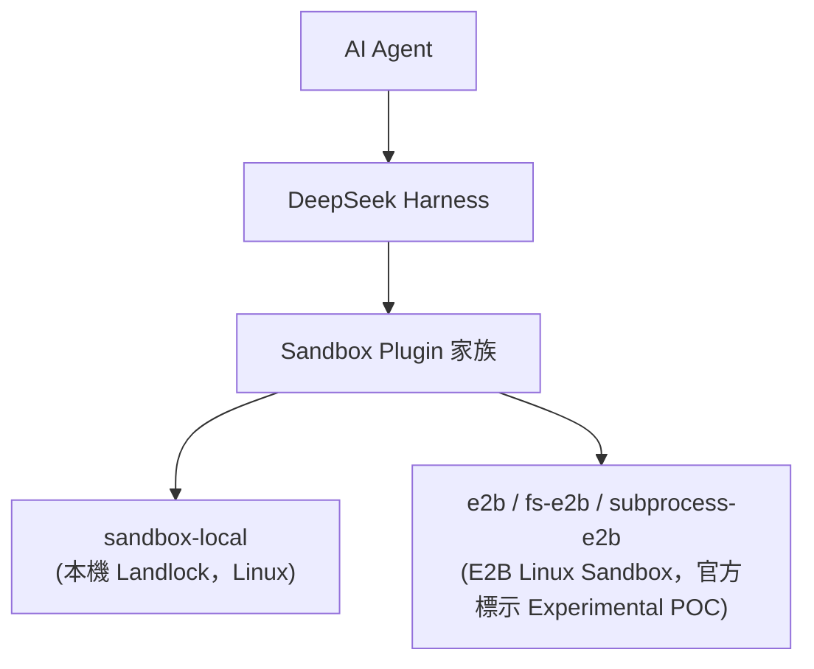

（Source-confirmed：節點依官方 `packages/sandbox/README.md`、`packages/e2b/README.md`、CI 工作流程檔名整理。）

### 13.3 企業視角的沙箱模式比較

| 模式 | 安全性 | 效能 | 成本 | 官方支援狀態 | 適用場景 |
|---|---|---|---|---|---|
| 無沙箱（直接於主機執行） | 低 | 最高 | 最低 | 官方已實作（預設可能行為，依 Profile 設定而定） | 個人開發環境、已高度信任之腳本 |
| Local Sandbox（Landlock） | 中～高（依 Landlock 政策範圍） | 高 | 低 | 官方已實作 | 單機開發／CI Runner |
| E2B Remote Sandbox | 高（獨立執行環境） | 中（跨網路呼叫） | 中～高 | **官方已實作但明確標示 Experimental POC** | 需要強隔離、但可接受目前為早期階段之場景 |
| Podman／Docker 容器 | 高 | 中 | 中 | **官方未提供**，須企業自行包裝 | 企業已有容器化維運能力時之延伸 |
| Kubernetes Job | 高（含資源配額管控） | 中 | 較高 | **官方未提供**，屬建議架構 | 大型企業已有 K8s 平台時之延伸 |
| 獨立 Remote VM | 高 | 中～低 | 高 | **官方未提供**，屬建議架構 | 高度受管制產業（如銀行）之隔離需求 |

> ⚠️ **標示提醒**：表格中「Podman／Docker」「Kubernetes Job」「獨立 Remote VM」三列均為**建議架構**，DeepSeek Harness 官方目前僅提供 Local Sandbox（Landlock）與 E2B Remote Sandbox（Experimental POC）兩種官方已實作路徑，Repository 根目錄亦未提供 Dockerfile（見版本速查表）。企業若需要容器化或 K8s 化部署，需自行以 Node.js 應用程式的一般容器化方式包裝 `dsh`，而非期待官方提供現成映像檔。

### 13.4 Enterprise 建議架構

對於資安要求較高的企業（尤其銀行/金融業，見第 41 章），建議的落地順序為：

1. 先以 Local Sandbox（Landlock）搭配嚴格的 `sandbox-policy` 政策進行內部試點。
2. 觀察 E2B Remote Sandbox POC 的官方成熟度演進（見第 50 章升級策略），暫不作為正式生產路徑。
3. 若企業已有 K8s／Podman 平台，可將整個 `dsh` Headless Profile（見第 27 章）包裝為短生命週期的 Job，作為**企業自建的隔離層**，而非依賴官方未提供的機制（建議架構）。

### 13.5 本章 Checklist 與小結

- [ ] 能清楚區分「官方已提供的兩種沙箱路徑」與「企業需自行搭建的三種延伸模式」
- [ ] 不會將 E2B Remote Sandbox 誤植為「生產就緒」
- [ ] 已針對自身資安等級規劃合適的沙箱落地順序

---

## 14. Subagent

### 14.1 What

`packages/subagent/README.md` 官方定位（官方已實作，逐字引用）：

> "This family lets an agent delegate work to child agents. Multiple named providers may coexist in one context."

### 14.2 官方已實作之 Provider 清單

| Provider | 說明 |
|---|---|
| `subagent-inprocess` | 同行程內執行的子代理 |
| `subagent-spawn-in-process` | 同行程內以 spawn 方式建立的子代理 |
| `subagent-fork-in-process` | 同行程內以 fork 方式建立的子代理 |
| `subagent-acp` | 透過 Agent Client Protocol，於行程外執行的子代理 |
| `subagent-codex` | 「Starts a real Codex app-server child」——實際啟動一個 Codex 應用伺服器子行程 |
| `subagent-claude-code` | 「Starts a real Claude Code child through the official Claude Agent SDK」——透過官方 Claude Agent SDK 實際啟動一個 Claude Code 子行程 |
| `subagent-dsh-sdk` | 透過 DeepSeek Harness 自身 SDK 啟動的子代理 |

（官方已實作，逐字/逐項依據 `packages/subagent/README.md`。）

> 這是本手冊認為特別值得企業關注的設計：DeepSeek Harness **並不要求企業只能用它自己的 Agent 邏輯**，而是可以把 Codex、Claude Code 這類其他廠商的 Coding Agent CLI，直接當成「子代理」掛進自己的工作流程——這是「Everything is a Plugin」理念在 Multi-Agent 協作場景的具體體現。第 8.3 節已補上 `subagent-codex`／`subagent-claude-code` 兩個 Provider 之官方自陳限制（相容性釘住特定上游版本、預設不掛載、無人工核准通道等），導入前請務必先讀該節。

### 14.3 Subagent Lifecycle 概念

依 Plugin 生命週期機制（見第 5.11 節），Subagent 作為一種 Provider Plugin，其掛載／卸載同樣受 Fiber 狀態機管理；委派工作的結果彙整、失敗重試、平行執行等策略層行為，本手冊未查得官方逐一列出的具體 API 細節，相關實作方式屬 **Pseudo Code** 示意（見第 46 章）。

### 14.4 Web Application Multi-Agent Team 案例

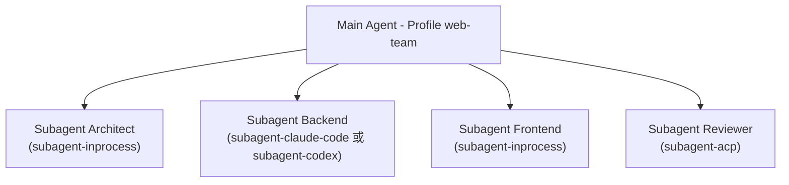

（建議架構：此為企業導入案例示意，具體要指派哪個 Provider 給哪個角色，屬架構設計選擇而非官方規定的固定搭配。）

### 14.5 AI Prompt 範例

```text
請閱讀 packages/subagent/README.md，
列出目前官方已提供的所有 Subagent Provider，
並針對我們團隊「Backend 用 Java/Spring Boot、Frontend 用 Vue3」的技術棧，
建議哪個 Provider 較適合分別委派給 Backend Subagent 與 Frontend Subagent，
並說明理由。
```

### 14.6 本章 Checklist 與小結

- [ ] 能列出至少 5 個官方已實作的 Subagent Provider
- [ ] 理解 DeepSeek Harness 可以把 Codex／Claude Code 當成子代理橋接使用
- [ ] 未將委派策略／失敗重試等未查證細節當成官方保證的行為

---

## 15. Interaction／Permission／Approval

### 15.1 What

`packages/interaction/README.md` 官方定位（官方已實作，逐字引用）：

> "The services and plugins through which a human collaborates with a running agent — questions, approvals, permission presets, commands."

### 15.2 官方已實作之子套件

| 子套件 | Service Key | 說明 |
|---|---|---|
| `user-approval` | `ctx.approval` | 「Coordinates one-shot approval decisions」——協調一次性核准決策 |
| `permission` | `ctx.permissionPresets` | 「Presents and persists user-facing permission presets」——呈現並持久化面向使用者的權限預設集 |
| `user-questions` | `ctx.userQuestions` | 讓 Agent 可以向使用者提問 |
| `tool-ask-user` | — | 將「詢問使用者」包裝為 Tool 供 Agent 呼叫 |
| `commands` | `ctx.commands` | 提供指令系統 |

（官方已實作，逐項依據 `packages/interaction/README.md`。）

### 15.3 這一章與第 40 章 Permission Architecture 的關係

本章介紹的是官方已提供的**技術元件**（Approval／Permission Preset／Ask-User）；第 40 章會進一步說明企業如何用這些元件**組合出**「Read-only Agent／Read-write Agent／Test Agent／Deploy Agent／Production Agent」等分層權限模型——那是建議架構，本章則聚焦官方已實作的積木本身。

### 15.4 本章 Checklist 與小結

- [ ] 能列出官方已提供的 Approval／Permission／Ask-User 三類機制
- [ ] 理解本章與第 40 章「企業權限分層設計」的分工關係

---

## 16. Workflow

### 16.1 What

`packages/workflow/README.md` 官方定位（官方已實作，逐字引用）：

> "This family runs model-authored orchestration workflows over subagents."

### 16.2 官方已實作之子套件

| 子套件 | 說明 |
|---|---|
| `workflow`（`ctx.workflowEngine`） | Workflow 執行引擎本體 |
| `workflow-worker-thread` | 「Runs workflow scripts in worker threads... not a security boundary」——在 Worker Thread 中執行 Workflow 腳本，官方**明確聲明這不是安全邊界**（需搭配第 13 章 Sandbox 機制，而非誤以為 Worker Thread 本身提供隔離保護） |
| `tool-workflow` | 將 Workflow 包裝為 Tool 供 Agent 呼叫 |
| `tool-ralph` | 「Exposes the fixed fresh-agent Ralph workflow」——內建一個名為「Ralph」的固定式全新代理 Workflow |

（官方已實作，逐項依據 `packages/workflow/README.md`。）

### 16.3 Sequential／Parallel／Hierarchical／Review Loop 模式

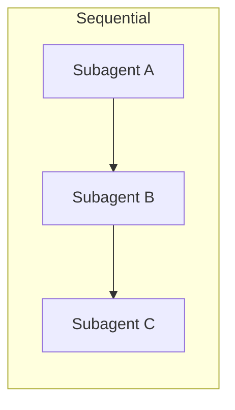

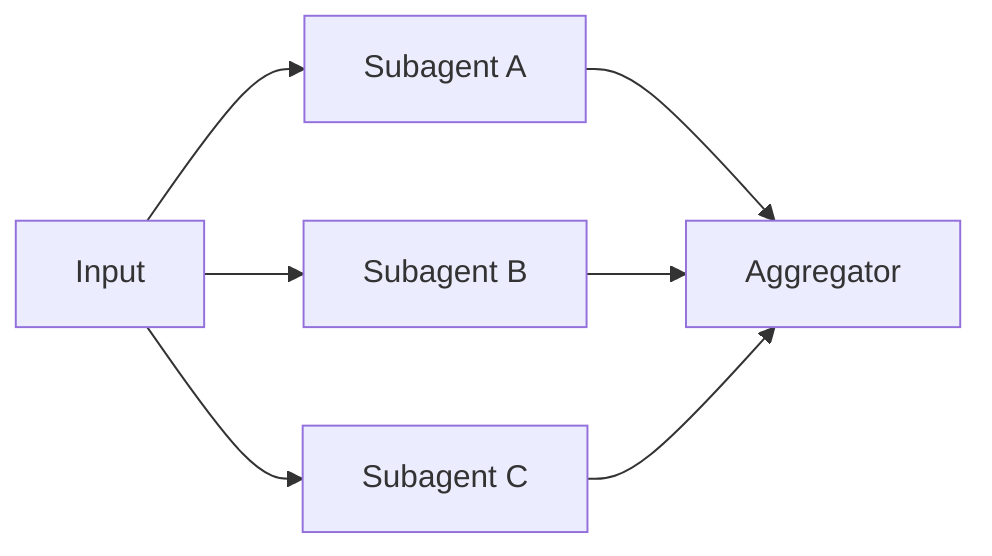

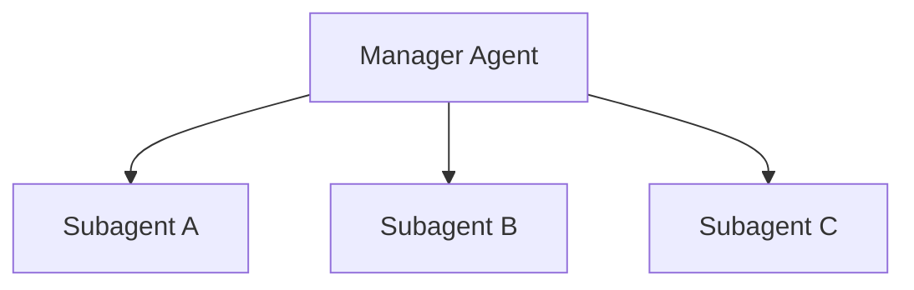

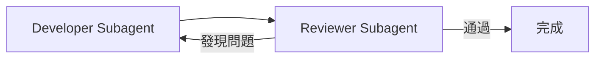

（建議架構：以上四種模式為 Multi-Agent 系統設計之通用模式歸納，`tool-ralph` 是官方內建的固定式 Workflow，其餘為本手冊依 `workflowEngine`／`subagent` 家族組合能力延伸之設計模式建議，非官方逐一命名之產品功能。）

### 16.4 `tool-ralph`：官方內建的固定式 Workflow

官方 `packages/workflow/README.md` 明確提及一個內建的「Ralph」Workflow，描述為「the fixed fresh-agent Ralph workflow」——即每次執行都以全新代理（fresh agent）狀態運作的固定式工作流程（官方已實作）。

> **Version Note（本次補強重點）**：本次補強研究已從官方 `docs/glossary.md` 取得 Ralph Loop 的正式術語定義，補上初版未查得的細節（官方已實作，逐字引用）：「**one foreground fresh-agent workflow run toward an immutable objective**... composed from workflow and subagent primitives」——也就是說 Ralph 是一個朝向「不可變目標（Immutable Objective）」執行的前景 Workflow，每輪都以全新 Agent 狀態運作，並且是**組合既有的 `workflow/` 與 `subagent/` 兩個家族之基礎元件**而成，而非另一套獨立機制。官方詞彙表並定義了兩個子術語：**Ralph Round**（Ralph 的單一輪次）與 **Ralph Handoff**（輪次之間的交接機制）。這對企業導入「反覆執行直到目標達成」類型的自動化任務（例如第 32 章 Framework Upgrade 的批次重構迴圈）具有直接參考價值：Ralph 提供的是官方已驗證的「Fresh Agent + 不可變目標」設計模式，而非企業需要從零設計的自訂 Workflow。其完整演算法細節（如目標判定條件、每輪之間如何交接狀態）本手冊仍未逐行核對原始碼，建議實際導入前直接查閱 `packages/workflow` 原始碼與範例（Source-confirmed，部分細節未逐行核對）。

### 16.5 AI Prompt 範例

```text
請閱讀 packages/workflow/README.md 與 tool-ralph 的原始碼，
說明 Ralph workflow 的具體運作方式，
並評估它是否適合用於我們「Framework Upgrade 自動化」的場景（見第 32 章）。
```

### 16.6 本章 Checklist 與小結

- [ ] 能列出 Workflow 家族的四個官方子套件
- [ ] 理解 `workflow-worker-thread` 官方明確聲明「不是安全邊界」，不會誤以為它提供沙箱隔離
- [ ] 知道 `tool-ralph` 是官方內建的固定式 Workflow，其餘 Multi-Agent 模式屬設計模式建議

---

## 17. Session／Telemetry／Observability

### 17.1 Session：Append-only 的事件日誌

`core/session` 負責「append-only 的 `SessionEvent` 事件日誌」（官方已實作，`docs/architecture.md`，見第 7.2 節）。這代表一個 Session 的完整歷程是不可竄改地逐筆記錄，而非可覆寫的狀態快照——這對企業稽核（Audit Trail）而言是重要的基礎特性。

### 17.2 SessionTelemetryBackend

`packages/session/README.md` 有專門章節說明遙測機制（官方已實作，逐字引用）：

> "Projects session activity into outbound telemetry and delegates delivery to a configured reporting backend."

官方已實作之子套件：

| 子套件 | 說明 |
|---|---|
| `session-telemetry` | 負責蒐集（Capture）、遮蔽（Redaction）、投影（Projection） |
| `session-telemetry-otel` | 「Delivers telemetry through **OpenTelemetry** logs in `FULL`, `FEEDBACK_ONLY`, or `DISABLED` mode」——透過 OpenTelemetry 標準傳遞遙測資料，並支援三種模式 |

### 17.3 三種 Telemetry 模式的企業意涵

| 模式 | 說明 | 企業建議 |
|---|---|---|
| `FULL` | 完整回報 Session 活動 | 適合內部開發環境，需留意是否包含敏感資料（見第 39 章 Secret Leakage） |
| `FEEDBACK_ONLY` | 僅回報有限的回饋型資訊 | 適合對外部 Telemetry 端點有疑慮，但仍想蒐集基本使用回饋的情境 |
| `DISABLED` | 完全關閉 | 高度受管制產業（銀行/金融）之預設建議選項，改由企業自建的 Session Event 匯出機制處理稽核需求（建議架構） |

（`FULL`／`FEEDBACK_ONLY`／`DISABLED` 三種模式名稱為官方已實作；「企業建議」欄為本手冊建議架構。）

### 17.4 Observability 全貌

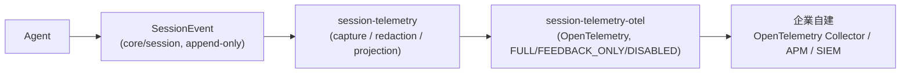

（Source-confirmed：前三個節點依官方套件說明整理；「企業自建 Backend」為建議架構，DeepSeek Harness 本身不提供 Collector 或視覺化儀表板。）

### 17.5 本章 Checklist 與小結

- [ ] 理解 Session 為 Append-only 事件日誌，適合作為稽核基礎
- [ ] 理解 Telemetry 走 OpenTelemetry 標準，而非官方自建的專屬格式
- [ ] 已依產業別選定合適的 Telemetry 模式（`FULL`／`FEEDBACK_ONLY`／`DISABLED`）

---

## 18. Skill／Credentials／Identity／Settings

### 18.1 Skill

`AGENTS.md` 列出 `skill/` 家族負責 Skill 系統（官方已實作），概念上與 Claude Code、Herdr 等工具的「Agent Skill」機制類似——以檔案化的方式，讓 Agent 可以載入特定情境下才需要的額外指引或工具用法（Source-confirmed，依家族名稱與產業慣例推論；具體 Skill 檔案格式本手冊未查得官方逐字規格，需以實際版本文件為準）。

### 18.2 Credentials

`credentials/` 家族負責憑證管理（官方已實作，`AGENTS.md`）。企業導入建議：所有模型 API Key、內部系統存取憑證，統一透過此家族管理，並整合企業既有的 Secret 管理工具（如 Vault、雲端 KMS），而非散落在 `cordis.yml` 或環境變數檔案中（建議架構）。

### 18.3 Identity

`identity/` 家族負責身分管理（官方已實作，`AGENTS.md`）。在 Multi-Agent 情境下（見第 14、33 章），每個 Subagent 的身分區隔對於 Audit Trail 與 Permission 管控（見第 15、40 章）至關重要。

### 18.4 Settings

`settings/` 家族負責設定管理（官方已實作，`AGENTS.md`），與第 27 章 `cordis.yml`／Profile／Bundle 機制搭配，構成完整的組態管理層。

### 18.5 本章 Checklist 與小結

- [ ] 理解 Skill／Credentials／Identity／Settings 四個家族各自的職責邊界
- [ ] 已規劃將 Credentials 家族與企業既有 Secret 管理工具整合的方式

---

## 19. 四種 Operating Mode

### 19.1 官方已驗證之四種內建 Preset

DeepSeek Harness 的部署層在 `apps/cli/config/agent-presets/` 底下提供 **剛好四個** 官方預設目錄：`standard`、`code`、`minimal`、`cordis`（官方已實作，GitHub Contents API 直接查證）。以下逐字依據各目錄 `preset.yml` 內容整理（官方已實作）：

| 目錄 | 官方簡體中文 `name` | 中文對照 | 官方簡體中文 `description`（逐字） | 順序 |
|---|---|---|---|---|
| `standard` | 标准模式 | 標準模式 | 「功能完整的编码 Agent，支持文件编辑、Shell、文件与网页检索、Skills、计划、目标、子代理和工作流。」 | 1 |
| `code` | PTC 模式 | PTC 模式 | 「具备标准模式的全部能力，并通过 Code Mode SDK 呈现工具，让模型用一个 TypeScript 程序组合多步操作。」 | 2 |
| `minimal` | 极简模式 | 極簡模式 | 「仅提供持久 bash 与 str_replace_editor 的双工具编码 Agent。」 | 3 |
| `cordis` | 创造模式 | 創造模式 | 「用于创建自定义 Agent preset：具备标准模式的全部能力，并提供运行时检查、插件实验和 preset 创作指导。」 | 4 |

### 19.2 官方英文命名的重要說明

`dsh-v0.1.0-rc.7` 官方 Release Notes 逐字記載（官方已實作）：

> "Rename the English built-in preset `Code mode` to `PTC mode`." / "Fix persistent Bash latency in minimal mode."

這確認了 **「PTC」** 與 **「minimal」** 是官方英文文件中直接出現的字面用詞；而「Standard」「Creative」則是本手冊依官方簡體中文 `name` 欄位（標准模式／创造模式）之合理翻譯，並非官方逐字提供的英文顯示名稱——本手冊如實標示此差異，避免讀者誤以為四個模式都有官方欽定的英文全稱。另外請注意：`code` 這個目錄／內部識別名稱**沒有**隨顯示名稱一起改為 `ptc`，只有顯示字串從「Code mode」改名為「PTC mode」。

### 19.3 四模式選型建議

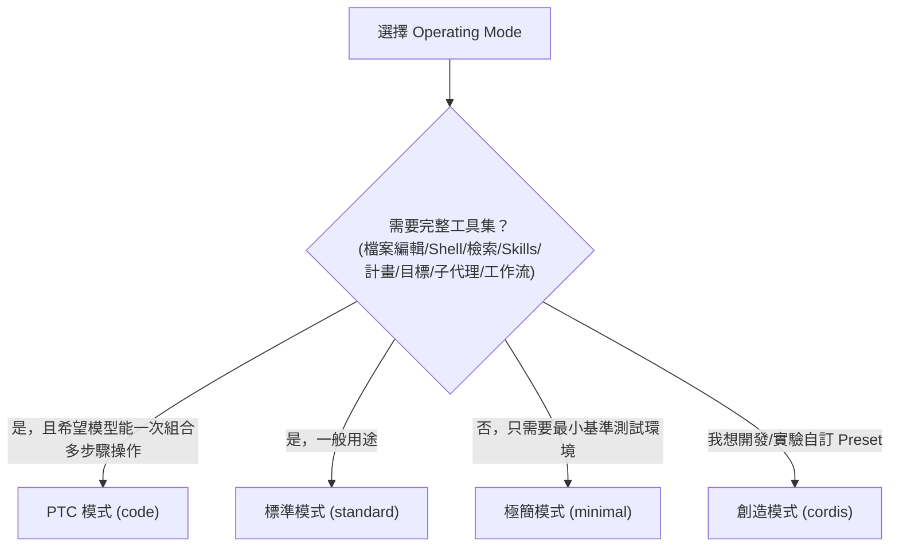

（建議架構：決策樹本身為本手冊依四模式官方描述整理之選型建議，非官方提供的決策流程圖。）

### 19.4 Enterprise Recommendation

- 一般企業日常開發：**標準模式**。
- 需要 Agent 自行組合複雜多步驟操作（如批次程式碼遷移，見第 32 章）：**PTC 模式**，並留意 Code Mode SDK 產生的 TypeScript 程式需要納入 Code Review。
- CI/CD 中的效能基準測試、或刻意限制 Agent 能力範圍的低風險場景：**極簡模式**。
- 平台團隊要開發企業專屬 Preset（見第 46～47 章）：**創造模式**。

（建議架構）

### 19.5 本章 Checklist 與小結

- [ ] 能正確列出四種模式的官方目錄名稱與中文顯示名稱
- [ ] 理解「PTC」與「minimal」是官方英文原文用詞，「Standard」「Creative」是本手冊翻譯
- [ ] 已依團隊場景選定預設要使用的 Operating Mode

---

## Part IV：Agent 運作機制

## 20. Agent Loop

### 20.1 What

`core/agent` 與 `core/agent-loop` 共同構成「`Agent` 介面與其預設驅動邏輯」（官方已實作，`docs/architecture.md`，見第 7.2 節）。

> **Version Note（本次補強重點）**：本手冊初版因未能取得逐字官方文件，此章原以產業通用之 Observe-Plan-Act-Evaluate 概念模型類比說明。本次補強研究已直接取得 `docs/architecture.md` 對 Turn／Step 生命週期的**逐字官方描述**，以下全面改寫為官方已實作內容，取代原先的類比推論。

### 20.2 官方 Turn／Step 生命週期（官方已實作，逐字依據 `docs/architecture.md`）

官方文件給出精確定義（官方已實作，逐字引用）：

> "A **step** is one model request plus the tools it calls. A **turn** is zero or more steps."

官方文件並提供完整的 Turn 流程 Pipeline（官方已實作，逐字依據原文 ASCII 圖重新排版）：

```text
turn/start
  claim next-step input plus one queued message
  assemble prompt sections + tool schemas
  -> agent/pre-step   reject | enter(messages)
     step/start
     append entered messages as user/message
     derive model history from the log
     agent/request -> llm/stream -> assistant/chunk* -> assistant/message
     tool/call* -> tools/pre-execute -> tools/execute -> tools/post-execute -> tool/result*
     step/end
     tools owe another request, or next-step input arrived -> claim -> next step
  -> agent/turn-stopping
turn/end
```

對照為 Mermaid 流程圖（Source-confirmed：節點與分支依上方官方逐字 Pipeline 重新繪製，內容與官方文字描述一致，僅呈現形式為本手冊整理）：

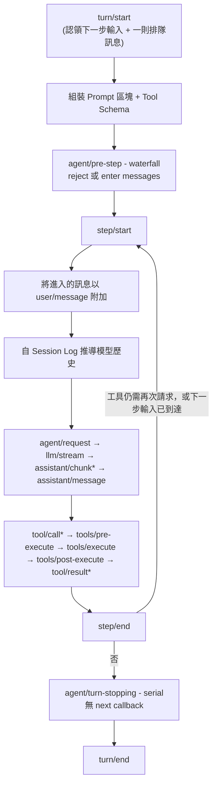

**事件分派模式對照**（官方已實作，依第 5.7 節 Dispatch Mode 分類）：`agent/pre-step`、`agent/request`、`llm/stream` 與三個 `tools/*` 事件皆為 **waterfall**；`agent/turn-stopping` 為 **serial 且無 `next()`**——代表這是一個「不可再委婉拒絕」的最終停止訊號，而非可被中途攔截改道的關卡。

**Session Log 與模型可見性的官方原則（官方已實作，逐字引用）**：

> "Model-visible means logged. Anything that reaches a model request must be reconstructable from the log."

這代表 Session Log（`core/session`，見第 17.1 節）不只是被動記錄，而是**唯一真實來源**——模型每次實際看到的內容，理論上都必須能從 Log 重建，這是官方對「可稽核性」的核心設計承諾。

### 20.3 Iteration／Context／Memory／Failure／Retry／Stop Condition

- **Iteration**：對應到上方 Turn／Step 生命週期中的每一個 Step；一個 Turn 可以是零到多個 Step（官方已實作，20.2 節逐字定義）。
- **Context**：由 `core/system-prompt` 負責組裝，實際的上下文視窗管理策略見第 21 章；`compaction-basic`（見第 21.2 節）已知會在 `agent/pre-step`（壓力偵測時機）與 `agent/request-error`（Context Overflow 時機）兩個事件點觸發壓縮（官方已實作，`docs/agent-lifecycle.md`）。
- **Memory**：跨 Session 的長期記憶機制，本手冊未查得官方套件家族中有明確對應「長期記憶」的獨立套件，推論目前主要仰賴 Session 本身的事件日誌與 `compaction/`（上下文壓縮）家族（Source-confirmed，推論）。
- **Tool call 失敗與 Retry**：具體 Retry 策略與退避演算法本手冊未查得官方逐字文件，屬 **Pseudo Code** 等級之推測範圍；但 20.2 節已確認 `tools/pre-execute → tools/execute → tools/post-execute` 三段式管線為官方已實作（`docs/tool-execution-pipeline.md`），可作為企業自建重試邏輯的掛載點依據。
- **Stop Condition**：由 `agent/turn-stopping`（serial，無 `next()`）觸發，或轉為 `interaction/` 家族之 Approval／Ask-User 機制交由人工介入（官方已實作，20.2 節）。

### 20.4 Enterprise Recommendation

企業導入時，建議在 Agent Loop 外部額外設置「最大 Iteration 上限」「最大 Token 預算」等治理層（見第 22 章），因為官方文件目前未明確保證 Agent Loop 內建無限迴圈防護的具體參數，不應假設預設值必然符合企業風險胃納（建議架構）。`guard/` 家族提供之 `repeat-tool-reminder`（重複呼叫工具提醒）與 `timeout-policy`（逐次呼叫逾時政策）可作為官方已實作之基礎防線（官方已實作，`packages/guard/README.md`），但官方文件明確將其定位為「自成一體的核心服務消費者，非可替換 Capability Seam」，企業額外的治理層仍建議獨立於此之外設計。

### 20.5 本章 Checklist 與小結

- [ ] 能正確說出官方對 Step／Turn 的逐字定義，並畫出 Turn Pipeline 的事件順序
- [ ] 理解「Model-visible means logged」這項官方可稽核性設計原則
- [ ] 已規劃額外的 Iteration／Token 治理層，而非完全依賴框架預設行為
- [ ] 知道 `guard/` 家族提供的兩個內建防線（重複呼叫提醒、逾時政策），並理解其定位邊界

---

## 21. Context Engineering

### 21.1 為什麼大型企業 Repository 需要 Context Engineering

企業級 Legacy 系統動輒數十萬行程式碼，遠超過任何 LLM 的單次上下文視窗（Context Window）。`compaction/` 套件家族的存在，說明 DeepSeek Harness 官方也認知到「上下文壓縮」是必要機制（官方已實作套件家族存在，但本手冊未查得其具體壓縮演算法的官方逐字文件）。

### 21.2 Context Management Strategy（建議架構）

| 層面 | 策略建議 |
|---|---|
| Context Window | 優先使用 LSP（第 12 章）而非整檔塞入，僅提取相關符號定義與呼叫關係 |
| Context Budget | 為每個 Subagent（第 14 章）設定獨立的 Context 預算上限，避免單一角色耗盡整體配額 |
| Context Compression | 依賴 `compaction/` 家族之官方機制，但企業應自行監控壓縮後是否遺失關鍵決策依據 |
| Context Selection | 逆向工程場景（第 31 章）應優先以套件／模組邊界切分 Context，而非整個 Repository 一次餵入 |
| Repository Context | 搭配 `.agents`／`AGENTS.md`（DeepSeek Harness 自身專案即採用此慣例，見第 3.2 節）建立專案層級的固定上下文說明 |
| Long-running Task | 搭配 `workflow/`（第 16 章）與 `todo/`／`plan/`／`goal/` 家族，將長任務拆解為可獨立管理 Context 的子任務 |

（本節全數標示建議架構，為本手冊之工程建議，非官方文件逐條規範。）

### 21.3 本章 Checklist 與小結

- [ ] 理解為何企業 Repository 規模必然需要 Context Engineering
- [ ] 已規劃 Context Budget 與 Compression 的監控機制

---

## 22. Token 與成本控制

### 22.1 治理層設計

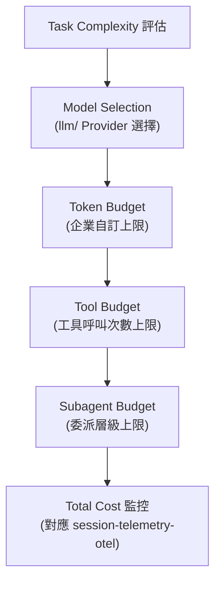

（建議架構：本圖為企業成本治理層之工程建議，DeepSeek Harness 官方文件未提供逐級預算控管之標準流程圖；`session-telemetry-otel`（第 17 章）為官方已實作的觀測輸出點，可作為成本監控之資料來源。）

### 22.2 具體建議項目

- **Context reduction**：見第 21 章。
- **Prompt caching**：模型 Provider 層若支援 Prompt Caching（依所選模型而定），可顯著降低重複性 System Prompt 的成本（建議架構）。
- **Tool output reduction**：避免工具回傳未經篩選的大量原始輸出（例如整份檔案內容）直接塞回上下文。
- **Subagent budget**：見第 14 章，每個 Subagent Provider 委派前應先評估其成本層級（例如 `subagent-claude-code`／`subagent-codex` 涉及啟動外部 Agent 子行程，成本模型不同於 `subagent-inprocess`）。
- **Retry budget／Maximum iteration／Maximum token**：見第 20.4 節，建議在企業治理層明確設定，不依賴框架預設值。
- **Cost monitoring**：透過 `session-telemetry-otel` 輸出至企業自建的 OpenTelemetry Collector／APM（見第 17 章）。

（本節全數標示建議架構。）

### 22.3 本章 Checklist 與小結

- [ ] 已建立 Task Complexity → Model Selection → Budget 的分層治理設計
- [ ] 已規劃透過 OpenTelemetry 監控實際 Token／成本消耗

---

## Part V：安裝與設定

## 23. Installation：Linux／macOS

### 23.1 前置需求（官方已實作，逐字依據 `docs/development.md`）

- Node.js 支援 22.19+ 與 24+（CI 涵蓋 22.19、24、26）
- Corepack 啟用的 pnpm（Repository 釘住 `pnpm@11.7.0`；若 `pnpm --version` 無法透過 Corepack 解析，需執行 `corepack enable`）
- Git 2.26 以上
- 選用：DeepSeek API Key（供 Web／Headless／ACP 自動化 Demo 與真實 API 端對端測試使用）

### 23.2 快速安裝（npm 套件，官方已實作）

```bash
# Linux / macOS
npx @deepseek-ai/dsh web
# 預設於 http://127.0.0.1:3080 啟動 Web UI
```

### 23.3 從原始碼安裝（官方已實作）

```bash
git clone https://github.com/deepseek-ai/deepseek-harness.git
cd deepseek-harness
pnpm install
pnpm run build
pnpm dsh web
```

### 23.4 CI 涵蓋範圍的誠實標註

本手冊查證官方 `.github/workflows/ci.yml`，發現 Linux（`ubuntu-latest`／自架 `dsh-ubuntu-24-04-16core`）是主要且持續啟用的測試平台；macOS 對應的 `serial-macos`（`macos-latest`）Job **於查證當下標示為停用（disabled）**（Source-confirmed）。這代表：

> ⚠️ **Version Note**：macOS 平台雖然理論上可執行（Node.js 為跨平台執行環境），但**目前官方 CI 並未持續驗證 macOS 行為**，企業若在 macOS 上部署，應自行加強測試涵蓋，不宜假設其驗證強度與 Linux 平台相同。此為查證當下（2026-08-18）之快照，請以當時 CI 設定為準。

### 23.5 驗證安裝

```bash
# 示意：驗證 dsh 是否可正常執行
npx @deepseek-ai/dsh web --help
```

（標示「示意」：官方 README 未逐字提供 `--help` 範例輸出，但 `--help` 為 `apps/cli/README.md` 記載之真實旗標，見第 29 章 CLI 指令參考。）

### 23.6 Troubleshooting（安裝階段）

| 症狀 | 可能原因 | 解法 |
|---|---|---|
| `pnpm: command not found` | 未啟用 Corepack | 執行 `corepack enable` 後重試 |
| Node 版本錯誤訊息 | Node 版本低於 22.19 | 升級至 22.19+ 或 24+（建議使用 nvm／fnm 管理多版本） |
| `npx @deepseek-ai/dsh` 找不到套件 | npm registry 快取或網路問題 | 確認可存取 npm registry，或改用原始碼安裝路徑 |

### 23.7 本章 Checklist 與小結

- [ ] 已確認 Node.js／pnpm／Git 版本符合官方最低需求
- [ ] 理解 macOS 目前 CI 驗證強度弱於 Linux，已規劃額外測試
- [ ] 已成功以 npm 或原始碼方式啟動 Web UI

---

## 24. Installation：Windows + WSL 實戰

### 24.1 官方 Windows 支援現況

本手冊查證官方 `.github/workflows/ci.yml`，確認存在專門的 `windows-native` Job（於自架 `dsh-windows-2025-16core` Windows Runner 上執行）以及獨立的 `serial-windows`（自架 Windows Runner）、`wine-apt-cache` 等 Job（Source-confirmed）。這代表官方**確實投入資源持續驗證原生 Windows 執行路徑**，並非僅止於「理論上可執行」。另外有一個名為 `windows` 的 Job 實際上是在 `ubuntu-latest` 上執行——依 Job 命名與 `wine-apt-cache` 的存在推論，這很可能是透過 Wine 在 Linux 上進行的 Windows 執行檔交叉建置驗證，而非真正的原生 Windows 測試，兩者不應混為一談（Source-confirmed，依 CI 設定推論；本手冊未直接讀取該 Job 的完整腳本內容逐行確認其具體用途）。

### 24.2 Windows 原生安裝

```powershell
# Windows PowerShell
# 前置：先安裝 Node.js 22.19+/24+ 與 Git for Windows

npx @deepseek-ai/dsh web
```

### 24.3 WSL2 建議路徑

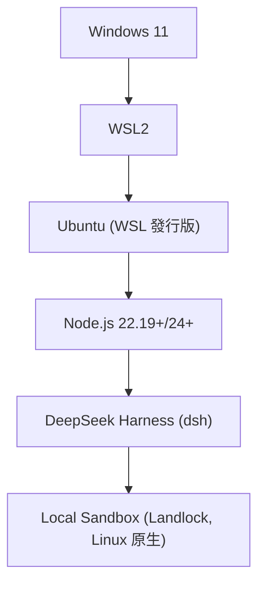

（建議架構：由於第 13.1 節查證 Local Sandbox 之 Landlock 機制為 Linux 原生能力，企業若希望在 Windows 開發機上使用 Local Sandbox 隔離，WSL2 + Ubuntu 路徑會比原生 Windows 更接近官方主力驗證環境；此為本手冊工程建議，非官方文件逐字要求。）

```bash
# WSL2 Ubuntu 內執行（示意，操作步驟與 Linux 章節一致）
git clone https://github.com/deepseek-ai/deepseek-harness.git
cd deepseek-harness
pnpm install
pnpm run build
pnpm dsh web
```

### 24.4 Windows 原生 vs WSL2 的分析建議

| 面向 | Windows 原生 | WSL2 + Ubuntu |
|---|---|---|
| 官方 CI 驗證 | 有專門 `windows-native` Job（Source-confirmed） | 等同 Linux 驗證路徑，CI 主力平台 |
| Local Sandbox（Landlock） | Landlock 為 Linux 核心特性，Windows 原生無法直接使用 | 可使用（Linux 核心） |
| 檔案系統路徑慣例 | Windows 路徑（`C:\...`） | Linux 路徑（`/home/...`），跨越 Windows 檔案系統時需留意 `\\wsl$\` 對應 |
| 與既有 Windows 開發工具整合（如 IDE） | 較直接 | 需搭配 VS Code Remote-WSL 等工具 |

（表格中「官方 CI 驗證」列為 Source-confirmed，其餘欄位為建議架構之工程比較。）

### 24.5 環境變數設定（Windows PowerShell 示意）

```powershell
# 示意：Windows PowerShell 設定環境變數（本次 Session 有效）
$env:DEEPSEEK_API_KEY = "sk-..."
```

```bash
# 對照：Linux/macOS/WSL Bash
export DEEPSEEK_API_KEY="sk-..."
```

### 24.6 Scenario：企業 Windows 開發機導入評估

> 一個以 Windows 為主要開發機的企業團隊，若要導入 DeepSeek Harness 並搭配 Local Sandbox（Landlock）進行隔離執行，建議標準路徑是 WSL2 + Ubuntu，而非原生 Windows——因為 Landlock 是 Linux 核心能力。若企業因合規要求必須維持原生 Windows 執行，則應改以第 13 章討論的容器化／K8s（企業自建，非官方提供）作為隔離手段之替代方案。

### 24.7 本章 Checklist 與小結

- [ ] 理解 Windows 原生與 WSL2 兩條路徑的官方 CI 驗證狀態差異
- [ ] 理解 Local Sandbox（Landlock）為 Linux 原生能力，已規劃對應的隔離策略
- [ ] 已設定好符合所用 Shell（PowerShell／Bash）語法的環境變數

---

## 25. 從原始碼建置與開發模式

### 25.1 開發指令總覽（官方已實作，逐字依據 `AGENTS.md`）

> **Version Note（本次補強重點）**：本手冊初版僅列出 8 個核心指令，本次補強研究已直接取得 `AGENTS.md` 完整指令區塊，逐字補齊如下（官方已實作）：

```bash
pnpm install             # pnpm workspaces, node ^22.19 || >=24
pnpm run clean
pnpm run test            # vitest 單元測試
pnpm run test:coverage   # CI 覆蓋率關卡：packages/*/*/src 逐檔案 100%
pnpm run test:e2e        # 真實 API 測試；未設 DEEPSEEK_API_KEY 時自動跳過
pnpm run test:snapshot   # 無金鑰之 ACP／Headless 重放測試，比對正規化後的預期輸出
pnpm run test:snapshot:record
pnpm run typecheck
pnpm run lint
pnpm run duplication     # 跨檔案 TypeScript 複製偵測
pnpm run build           # tsc 產生 lib/types，tsdown 打包 Runtime
pnpm run hygiene         # knip + publint + workspace 規則 + NodeNext consumer 檢查
pnpm run check:windows-wine
pnpm run doc-sync
pnpm run website:build
```

值得注意的兩項工程紀律（官方已實作，逐字依據 `AGENTS.md`／`docs/development.md`）：

- **測試覆蓋率關卡採「逐檔案 100%」而非整體平均**（`test:coverage` 對 `packages/*/*/src` 之要求），這比多數專案採用的「整體覆蓋率門檻」嚴格得多。
- **`AGENTS.md` 明確自我定位為 Pre-release 階段**（章節標題「foundation over blast radius」，逐字引用）：「Remove this section at the first tagged release. With no external consumers, prefer the correct foundation over compatibility shims... `dsh-session` keeps `SESSION_FORMAT_VERSION` at `0` with no compatibility promise.」——也就是官方明確聲明**在正式 Release 前，連 Session 資料格式本身都不承諾相容性**，這比第 1 章「會有 Breaking Change」的一般性聲明更具體，企業導入時應理解「連自己儲存的 Session 記錄」在升級後都可能需要重新處理，不僅是 API／CLI 介面。

另有一項架構性細節值得記錄（官方已實作，逐字依據 `docs/development.md`）：Repository 採**獨立的 Host／Client 兩套 TypeScript Project**（`tsconfig.host.json`／`tsconfig.client.json`），原因是「both sides declaration-merge the cordis `Context` interface under the same keys with different services; one program seeing both merges reports a collision」——也就是 Host 端與 Client 端會用不同的 Service 對同一個 `Context` 介面做 TypeScript Declaration Merging，若放進同一個 TS Program 編譯會產生型別衝突，因此建置流程刻意拆為兩段（`tsc -b tsconfig.host.json` → `tsdown --env.DSH_BUILD_FACE host` → `tsc -b tsconfig.client.json` → `tsdown --env.DSH_BUILD_FACE client`）。企業自建 Plugin（第 46 章）若同時涉及 Host 與 Client 兩端邏輯，應留意此限制。

### 25.2 Headless／Demo 指令（官方已實作）

```bash
# 需要 DEEPSEEK_API_KEY
pnpm dsh --profile headless "task"

# 自我修改 Agent Demo（展示 Cordis Hot Reload／Creative 模式概念）
pnpm run demo:cordis

# ACP 自動化伺服器 Demo
pnpm run demo:acp
```

### 25.3 `cordis.yml` 的一個安全細節

`AGENTS.md` 明確提醒（官方已實作，逐字引用要點）：「`cordis.yml` allows `!!js`（never `!js`）under plugin `config` and entry `disabled`」——也就是設定檔支援以 `!!js` YAML 標籤內嵌 JavaScript 表達式，但必須是雙驚嘆號 `!!js`，單驚嘆號 `!js` 並非合法語法。企業導入時應特別留意此語法若被誤用或被惡意注入，等同於在設定檔中執行任意程式碼，須納入第 39 章 Supply Chain／Injection 風險評估範圍（官方已實作語法規則 + 建議架構之風險提醒）。

### 25.4 CI／Git Hook 治理（本次補強新增）

官方以 `lefthook.yml` 管理 Git Hook（官方已實作）：Pre-commit 執行 Pairing Record 檢查、Oxlint（含自動修正重試）、重新產生 `THIRD_PARTY_NOTICES.md`、空白字元檢查、Vendor Manifest Guard；Pre-merge-commit 執行 Pairing 檢查；Pre-push 執行 `pnpm run typecheck`。官方文件特別聲明：「the hooks intentionally do not run tests, snapshots, documentation checks, builds, or hygiene」——也就是 Commit／Push 階段刻意只做輕量檢查，完整驗證留給 CI（官方已實作，`docs/development.md`）。CI 另分為 Node 相容性矩陣（`22.19`／`26`，搭配主力 `24`，見版本速查表）、Windows 雙軌（Wine 模擬 + 原生）、macOS 現況已停用（見版本速查表）、Python SDK 專屬 Job（Python **3.10**，`uv==0.11.23`）等多條路徑（Source-confirmed，`.github/workflows/ci.yml`）。企業若參考此專案自身的 CI 治理模式作為內部 Plugin 開發規範範本，可留意「Commit 輕量、CI 完整、覆蓋率逐檔案要求」三項特徵。

### 25.5 本章 Checklist 與小結

- [ ] 已能執行完整的 `pnpm install` → `build` → `test` 開發迴圈
- [ ] 理解 `cordis.yml` 的 `!!js` 語法為潛在程式碼注入風險點，已納入內部程式碼審查規範
- [ ] 理解官方「Pre-release 階段不承諾 Session 資料格式相容性」之明確聲明，已將此風險告知團隊
- [ ] 理解 Commit／Push 階段之輕量 Hook 與 CI 完整驗證的分工，不會誤以為 Commit 通過即代表已完整驗證

---

## 26. Python SDK 安裝與使用

### 26.1 安裝（官方已實作，逐字依據 `python/sdk/README.md`）

```bash
python -m pip install deepseek-harness-sdk
```

套件名稱為 **`deepseek-harness-sdk`**（PyPI），對應之 Python 模組名稱為 `deepseek_harness`；安裝時會自動附帶對應平台的 `deepseek-harness-runtime-bin` 執行檔套件（官方已實作）。

> ⚠️ 再次提醒（呼應第 3.4 節）：**不要**誤裝裸名的 `deepseek-harness`（無 `-sdk` 後綴），那並非官方指定之 Python 套件名稱。

### 26.2 用途定位

Python SDK 適合企業將 DeepSeek Harness 的能力嵌入既有 Python 服務（例如內部平台的自動化腳本、CI/CD 整合腳本），而不需要直接操作 `dsh` CLI 或 Web UI（Source-confirmed，依 SDK 一般定位推論）。

### 26.3 本章 Checklist 與小結

- [ ] 已使用正確套件名稱 `deepseek-harness-sdk` 完成安裝
- [ ] 理解 Python SDK 與 CLI／Web UI 三種操作介面的定位差異

---

## 27. Configuration

### 27.1 設定檔格式與疊加順序

DeepSeek Harness 採 YAML 格式的 `cordis.yml`（官方已實作，`docs/architecture.md`）。核心概念：

- **Profile**：一個具名的組合（例如 `web`、`headless`），存放於 `$DSH_HOME/profiles/<name>` 底下，列出它要疊加的 **Bundle**，以及使用者自己的 `cordis.patch.yml` 覆蓋層（官方已實作）。
- **Bundle**：一組預先組好的 Cordis 設定列表，屬於一種發布格式（例如 `dsh-base`、`dsh-web-app`、`dsh-headless`，對應 `packages/bundle/base`、`/web-app`、`/headless`，官方已實作、Source-confirmed 確認為真實資料夾）。

疊加順序（官方已實作，逐字依據 `docs/architecture.md` 要點）：「each bundle in the profile's listed order, then the profile's `cordis.patch.yml`, then the home-level one, then any `--patch` overlay.」——依序為：Profile 列出的各 Bundle → Profile 層級的 `cordis.patch.yml` → Home 層級的 `cordis.patch.yml` → 執行時 `--patch` 覆蓋。

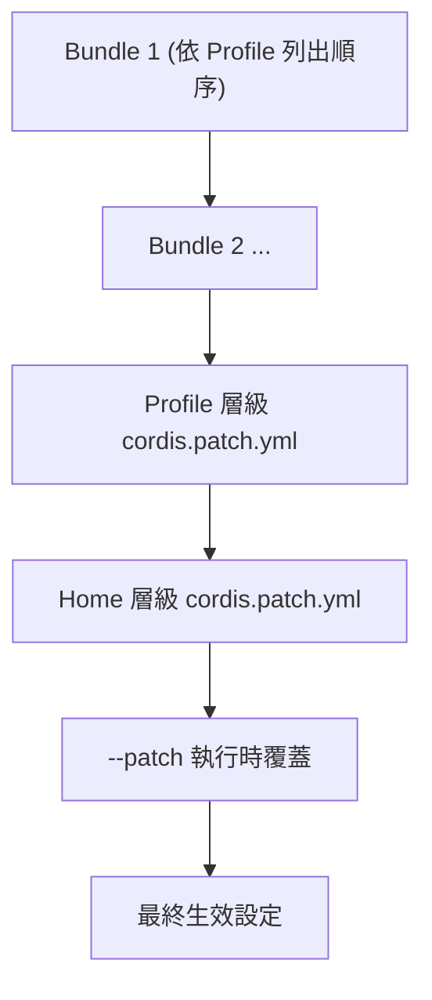

（官方已實作：疊加順序逐字依據 `docs/architecture.md`。）

### 27.2 常用指令

```bash
dsh --profile web --dump-config    # 印出目前生效的完整設定（官方已實作）
dsh --profile web --port 8080      # 覆蓋埠號（官方已實作）
```

### 27.3 企業 Dev/Test/Staging/Production 四環境策略

| 環境 | Profile 命名建議 | Telemetry 模式建議（見第 17.3 節） | Sandbox 建議（見第 13.3 節） |
|---|---|---|---|
| Development | `dev` | `FULL` | Local Sandbox |
| Test | `test` | `FULL` | Local Sandbox（CI Runner） |
| Staging | `staging` | `FEEDBACK_ONLY` | Local Sandbox + 企業自建容器隔離 |
| Production（若適用） | `prod` | `DISABLED`（改走企業自建稽核管線） | 企業自建之強隔離環境，並強制 Approval（第 15、40 章） |

（本節全數標示建議架構：DeepSeek Harness 官方 Profile 機制本身是通用的，四環境命名與對應策略為本手冊依企業治理常規提出之落地建議，非官方預先定義之環境分類。）

### 27.4 本章 Checklist 與小結

- [ ] 能正確畫出 Bundle → Profile Patch → Home Patch → CLI Patch 的疊加順序
- [ ] 已規劃 Dev/Test/Staging/Production 四環境的 Profile 命名與對應策略

---

## 28. 第一個 Hello Agent

### 28.1 逐步實作

**步驟 1：安裝**

```bash
npx @deepseek-ai/dsh web
```

預期結果：終端機顯示 Web UI 已於 `http://127.0.0.1:3080` 啟動（官方已實作）。
常見錯誤：埠號被占用——可加上 `--port` 旗標（見第 27.2 節）指定其他埠號。

**步驟 2：設定 API Key**

```bash
# Linux/macOS/WSL
export DEEPSEEK_API_KEY="sk-..."
```

```powershell
# Windows PowerShell
$env:DEEPSEEK_API_KEY = "sk-..."
```

預期結果：後續啟動的 Agent 可正常呼叫 DeepSeek 模型。
常見錯誤：忘記設定會在呼叫模型時收到認證失敗錯誤（Source-confirmed，一般 API 服務通用行為推論）。

**步驟 3：啟動（以 Headless Profile 為例，適合初次測試）**

```bash
pnpm dsh --profile headless "請列出目前工作目錄下的檔案"
```

預期結果：Agent 執行一次性 Session，呼叫 `fs/` 家族列出檔案後印出結果並結束（官方已實作，`apps/cli/README.md` 對 `--profile headless` 之定位：「Run one fresh persisted session, print final answer, exit」）。

**步驟 4：提問（讀檔）**

```text
請讀取 README.md 的內容，並用三句話總結這個專案在做什麼。
```

**步驟 5：修改檔案**

```text
請在目前目錄新增一個 hello.txt 檔案，內容是「Hello DeepSeek Harness」。
```

預期結果：`core/tools` 受控執行檔案寫入，若設定了 Permission Preset（第 15 章），可能會先觸發 Approval 詢問。

**步驟 6：跑測試（示意，依實際專案而定）**

```text
請執行這個專案的測試指令，並回報結果。
```

**步驟 7：檢視結果**

透過 `--dump-config`（第 27.2 節）或 Web UI 檢視本次 Session 的 SessionEvent 記錄（第 17.1 節），確認 Agent 實際執行了哪些工具呼叫。

### 28.2 Troubleshooting（Quick Start 階段）

| 症狀 | 可能原因 | 解法 |
|---|---|---|
| Agent 無回應或報認證錯誤 | `DEEPSEEK_API_KEY` 未設定或無效 | 確認環境變數已正確設定於目前 Shell Session |
| 檔案寫入被拒 | Permission Preset 阻擋（見第 15、40 章） | 檢查目前 Profile 的權限設定，必要時以 Approval 機制核准 |
| Headless 模式一直沒有輸出 | 網路或模型服務逾時 | 確認可存取 `DEEPSEEK_BASE_URL`（若有自訂），檢查網路連線 |

### 28.3 本章 Checklist 與小結

- [ ] 已成功完成「安裝→設定→啟動→提問→讀檔→改檔→跑測試→檢視結果」全流程
- [ ] 理解 Headless Profile 適合一次性任務，Web UI 適合互動式操作

---

## 29. CLI 指令參考導覽

### 29.1 核心指令（官方已實作，逐字依據 `apps/cli/README.md`）

| 指令 | 用途 |
|---|---|
| `dsh --profile <name>` | 啟動指定名稱的 Profile（於 `$DSH_HOME/profiles/<name>` 下） |
| `dsh --profile headless "job"` | 執行一次全新且會被持久化記錄的 Session，印出最終答案後結束 |
| `dsh web` | `--profile web` 的別名 |
| `dsh plugin --profile <name> <pnpm 參數>` | 管理指定 Profile 的 Plugin（轉發給 pnpm） |

範例（官方已實作，逐字依據）：

```bash
dsh --profile web --port 8080
dsh --profile web --dump-config
dsh --profile web --help
dsh --help
```

### 29.2 完整參考

更完整的指令、旗標與 `cordis.yml` 欄位，請見 Appendix A（Command Reference）與 Appendix B（Configuration Reference）。

> ⚠️ **Version Note**：以上為研究階段（2026-08-18）可查證之指令集合，**非官方 CLI 之逐一窮舉完整清單**。DeepSeek Harness 目前處於 Developer Preview 快速迭代階段，CLI 指令、旗標可能隨版本演進調整，實際完整清單請以當前安裝版本執行 `dsh --help` 或 `dsh --profile <name> --help` 為準。

### 29.3 本章 Checklist 與小結

- [ ] 能正確使用 `dsh --profile`／`dsh web`／`dsh plugin` 三類核心指令
- [ ] 已養成執行 `--help` 確認當前版本實際旗標的習慣，而非死記本手冊記錄的指令集合

---

## Part VI：企業實戰場景

## 30. Web Application 開發實戰

> 本章案例（`bank-web-platform` 等命名）為教學示範用途之虛構情境，詳見重要聲明第 6 點。框架細節請參照本 Repository 既有的 Spring Boot 4.x／Vue3／PrimeVue／Java 25 教學手冊。

### 30.1 案例技術棧

- Frontend：Vue 3 + TypeScript + Tailwind CSS + PrimeVue + Pinia + Vue Router + i18n
- Backend：Java 25 + Spring Boot 4.x + Spring Framework 7.x + Jakarta EE 12 + Maven 4.x
- Database：PostgreSQL
- API：REST + OpenAPI/Swagger

### 30.2 DeepSeek Harness 在整個開發流程中的角色

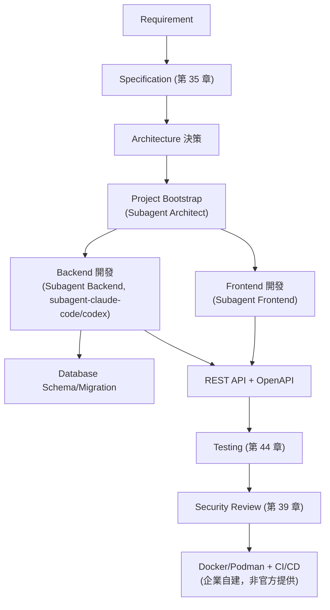

（建議架構：本圖為企業導入流程示意，DeepSeek Harness 官方未提供逐一對應此開發生命週期的固定流程圖；各節點對應之官方套件家族已於 Part III 逐一查證標示。）

### 30.3 架構風格對應（Clean／Hexagonal／Onion／Microservices／EDA）

DeepSeek Harness 本身不預設任何特定應用架構風格——它只負責「Agent 如何操作程式碼庫」，架構風格選擇仍是團隊自身的設計決策（Source-confirmed，依框架定位推論）。實務建議：

- **Clean／Hexagonal／Onion Architecture**：在 Prompt Engineering（第 37 章）與 `AGENTS.md`／專案層級 Context（第 21.2 節）中明確描述分層邊界與依賴方向，讓 Agent 在新增程式碼時遵循既定分層，而非僅依賴模型「猜測」慣例。
- **Microservices／Event Driven Architecture**：搭配 Multi-Agent（第 14、33 章）將不同服務拆給不同 Subagent 負責，降低單一 Context 需要理解的範圍。

（建議架構）

### 30.4 基礎設施對應（K8s／Podman／CI/CD）

呼應第 13.3 節：DeepSeek Harness 本身不提供 K8s／Podman 部署機制，企業需自行將 `dsh`（或包裝後的 Headless Profile）整合進既有 CI/CD 管線（GitHub Actions／GitLab CI／Jenkins），例如在 Pipeline 中以 Headless 模式呼叫 Agent 產生程式碼變更，再交由既有的建置／測試／部署階段處理（建議架構）。

### 30.5 Scenario：從零開始的 Web App 骨架生成

```text
你是一個負責 Web Application 專案初始化的 Architect Subagent。
請依以下需求建立專案骨架：
- Backend: Java 25 + Spring Boot 4.x + Maven 4.x，採 Hexagonal Architecture 分層
- Frontend: Vue 3 + TypeScript + Tailwind CSS + PrimeVue，採 Composition API
- Database: PostgreSQL，需提供初始 Flyway/Liquibase migration 腳本
- 請先列出目錄結構草案，等待人工核准後才實際建立檔案（見第 15、40 章 Approval 機制）
```

### 30.6 本章 Checklist 與小結

- [ ] 理解 DeepSeek Harness 不預設應用架構風格，架構決策仍由團隊主導
- [ ] 已規劃如何將 Agent 產出整合進既有 CI/CD 管線
- [ ] 已在專案層級 Context 中明確描述架構分層規範，供 Agent 遵循

---

## 31. Reverse Engineering 實戰

> 本章使用之 `bank-web-platform` Legacy 案例為教學示範用途之虛構情境。本章提到之 `docs/*.md` 產出，是「Agent 在目標專案內產生的文件產物」，屬於示範情境下的專案產出物，並非本教學手冊自身需要另外建立的檔案，不違反本手冊「僅此一份 `.md`」之撰寫規範。

### 31.1 案例情境

```text
Legacy Java 7
    ↓
Spring / Java EE 混合架構
    ↓
Tomcat / WebSphere
    ↓
DB2
    ↓
JSP / Servlet
    ↓
Legacy Batch (定時排程 + FTP 檔案交換)
```

### 31.2 逆向工程流程

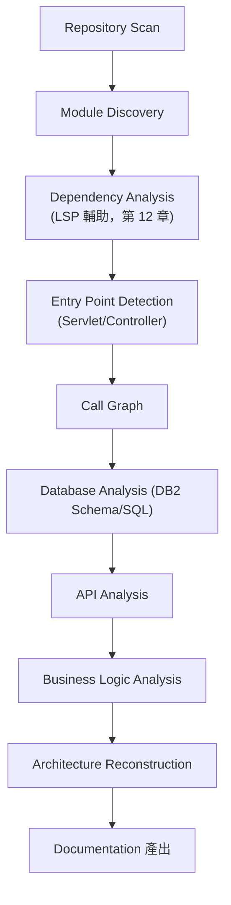

（建議架構：流程本身為逆向工程領域之通用方法論，DeepSeek Harness 提供的是 `fs/`、`lsp/`、`shell/` 等執行工具，具體逆向工程流程編排屬企業／Agent Prompt 設計範疇，非官方預先包裝的固定功能。）

### 31.3 產出文件結構（Agent 產出物示意）

```text
docs/
 ├── architecture.md          # 架構總覽
 ├── components.md            # 元件清單
 ├── database.md              # 資料庫盤點（DB2 Schema、SQL 清單）
 ├── api.md                   # API Inventory
 ├── batch.md                 # Batch Inventory（排程、FTP 交換）
 ├── integration.md           # 外部系統整合盤點
 ├── security.md              # 風險盤點（Risk Inventory）
 └── modernization-roadmap.md # 現代化路徑建議
```

### 31.4 AI Prompt 範例

```text
你是負責 Legacy 系統逆向工程的 Subagent。
目標：分析 legacy/bank-web-platform 這個 Java 7 + JSP + DB2 專案。
請依序完成：
1. 掃描套件與類別結構，找出所有 Servlet/Controller 作為進入點
2. 使用 LSP 能力找出每個進入點的完整呼叫鏈
3. 盤點所有 SQL 語句與涉及的 DB2 資料表
4. 找出所有 Batch 排程與 FTP 檔案交換邏輯
5. 將以上結果整理為 docs/architecture.md、docs/database.md、docs/batch.md 三份文件草稿
6. 在寫入任何檔案前，先列出你的分析摘要供人工核准（見第 15、40 章 Approval 機制）
```

### 31.5 Enterprise Recommendation

逆向工程場景特別建議搭配第 13 章的 Sandbox 隔離執行——避免 Agent 在分析過程中意外觸發 Legacy Batch 系統的實際排程或 FTP 傳輸（建議架構，屬高風險場景之保守建議）。

### 31.6 本章 Checklist 與小結

- [ ] 理解逆向工程產出的 `docs/*.md` 是目標專案的產物，非本手冊自身檔案
- [ ] 已規劃逆向工程流程中的 Sandbox 隔離與 Approval 關卡
- [ ] 已準備好可重複使用的逆向工程 Prompt 範本

---

## 32. Framework Upgrade 實戰

### 32.1 標準流程

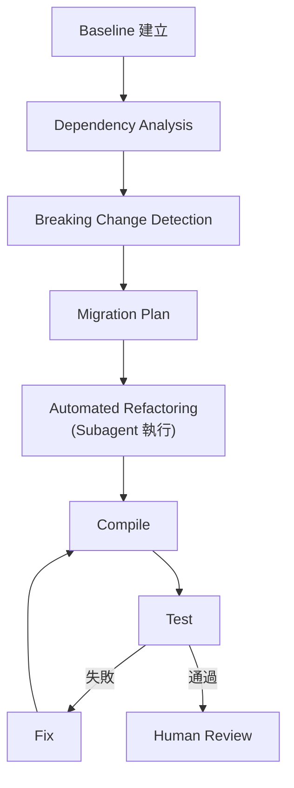

（建議架構：流程為框架升級領域之通用方法論；`code`／PTC 模式，見第 19 章，特別適合此類需要多步驟組合操作的自動化重構場景。）

### 32.2 五個升級案例

| 案例 | Before | After | 主要風險點 |
|---|---|---|---|
| A | Java 7 | Java 25 | 語法特性跨度極大（Lambda/Module System/Record/Pattern Matching/Virtual Threads 等），建議分階段（如先到 Java 17 LTS 再到 25） |
| B | Spring Boot 3.x | Spring Boot 4.x | 需同步確認 Spring Framework 版本相容性 |
| C | Spring Framework 6.x | Spring Framework 7.x | API 棄用與行為變更需逐一比對 |
| D | `javax.*` | `jakarta.*` | 套件命名空間全面替換，需搭配自動化工具而非純手動替換 |
| E | Maven 3.x | Maven 4.x | POM 結構與外掛相容性需個別驗證 |

（本表為升級案例架構性風險提醒，屬建議架構；各框架版本之詳細遷移細節，請參照本 Repository 既有之 Java25升版教學、Spring boot 4.x 教學手冊等專門手冊，本章僅聚焦 DeepSeek Harness 如何協助執行升級流程本身。）

### 32.3 Automation Strategy／Human Review／Rollback Strategy

- **Automation Strategy**：使用 PTC 模式（第 19 章）讓 Agent 以單一 TypeScript 程式組合「掃描 → 替換 → 編譯 → 測試」多步驟操作，減少人工反覆下指令的往返成本（建議架構）。
- **Human Review**：每個階段性 Commit（見第 36 章 Git Workflow）都應觸發 Code Review，尤其命名空間全面替換（案例 D）這類高影響範圍的變更。
- **Rollback Strategy**：搭配 Git Checkpoint（第 36 章），確保每個 Migration 階段都可獨立回滾，不需要整個升級流程重來。

（建議架構）

### 32.4 AI Prompt 範例

```text
你是負責 javax.* → jakarta.* 遷移的 Subagent（使用 PTC 模式）。
請先掃描整個專案中所有 import javax.* 語句，
分類哪些屬於 Jakarta EE 12 已有對應 jakarta.* 套件、哪些需要額外處理，
產出遷移計畫後，先等待人工核准（見第 15、40 章），
核准後才以批次方式執行替換，每個模組替換完成後執行編譯與測試，
任何編譯失敗都要停下來回報，不要自行猜測修正跨模組相依問題。
```

### 32.5 本章 Checklist 與小結

- [ ] 能列出五個升級案例的主要風險點
- [ ] 已規劃 Automation／Human Review／Rollback 三層策略
- [ ] 已設定好每個升級階段的 Git Checkpoint

---

## 33. Multi-Agent Architecture

### 33.1 四種協作模式回顧

已於第 16.3 節展示 Sequential／Parallel／Hierarchical／Review Loop 四種 Mermaid 示意圖，本章聚焦如何以 DeepSeek Harness 官方已提供的 Subagent Provider（第 14 章）與 Workflow 家族（第 16 章）實際組裝。

### 33.2 Web Application Multi-Agent Team 完整案例

| 角色 | 建議 Subagent Provider | 職責 |
|---|---|---|
| Architect | `subagent-inprocess` | 產出架構決策、目錄結構、ADR（第 59 章） |
| Backend | `subagent-claude-code` 或 `subagent-codex` | Java/Spring Boot 實作 |
| Frontend | `subagent-inprocess` | Vue3/TypeScript 實作 |
| Database | `subagent-inprocess` | Migration Script、Schema 設計 |
| Security | `subagent-acp`（獨立行程外執行，隔離風險） | 第 39 章安全審查 |
| Reviewer | `subagent-acp` | Review Loop（第 16.3 節） |

（建議架構：角色與 Provider 對應為企業架構設計選擇，DeepSeek Harness 官方不預先規定「Backend 角色必須用哪個 Provider」。）

### 33.3 Failure／Retry／Cost Control

Multi-Agent 架構下，單一 Subagent 失敗不應直接讓整個任務失敗——建議 Manager Agent（Hierarchical 模式）具備重新指派或降級（Fallback 至 `subagent-inprocess`）的邏輯（建議架構，具體重試 API 屬 Pseudo Code 範圍，見第 46 章）。成本控制部分請參照第 22 章的 Subagent Budget 設計。

### 33.4 本章 Checklist 與小結

- [ ] 能為自己團隊的 Web App 專案設計一套角色對應 Subagent Provider 的分工表
- [ ] 已規劃 Subagent 失敗時的降級策略
- [ ] 理解 Multi-Agent 架構下的成本控制與第 22 章治理層的關係

---

## Part VII：流程與方法論

## 34. AI 開發標準工作流程總覽

### 34.1 企業標準流程

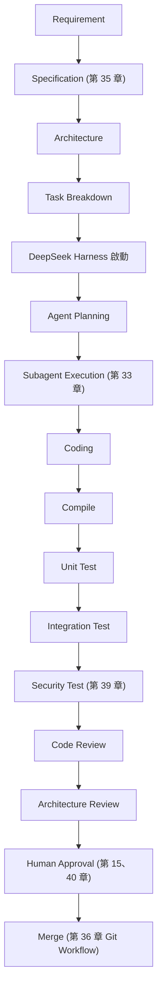

（建議架構：本流程為企業導入 AI Coding Agent 之標準治理流程建議，整合本手冊前述各章官方已實作元件；DeepSeek Harness 官方本身不強制此流程，企業可依自身 SDLC 成熟度調整關卡順序。）

### 34.2 本章 Checklist 與小結

- [ ] 已將此標準流程對照到企業既有 SDLC 文件，找出缺口
- [ ] 已確認每個關卡（Compile/Test/Review/Approval）都有對應負責人

---

## 35. Spec-Driven Development

### 35.1 SDD 流程

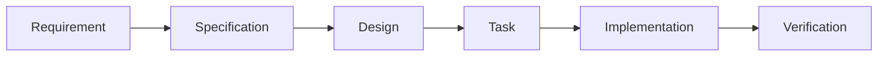

（建議架構：SDD 為產業界既有方法論，例如 GitHub Spec Kit 之流程理念，DeepSeek Harness 官方文件未提供與 SDD 直接整合之逐字規範，本章為工程建議。）

### 35.2 與 ADR、OpenAPI 的結合

- **ADR（Architecture Decision Record）**：建議每個 Architecture 決策階段產出一份 ADR（見第 59 章範例），並作為後續 Subagent 執行時的 Context 依據之一。
- **OpenAPI**：Backend Subagent（第 33 章）在完成 API 設計後，應先產出 OpenAPI 規格供 Frontend Subagent 與人工審查，再進入實作階段，避免前後端介面認知落差。

（建議架構）

### 35.3 AI Prompt 範例

```text
請依照 Spec-Driven Development 流程，
先產出這個功能的 Specification（含 User Story、Acceptance Criteria），
再產出對應的 OpenAPI 規格草稿，
兩者都需要先給我審查，核准後才進入 Task Breakdown 與實作階段。
```

### 35.4 本章 Checklist 與小結

- [ ] 理解 SDD 流程的六個階段
- [ ] 已規劃 ADR 與 OpenAPI 產出作為 Agent 實作前的必要關卡

---

## 36. Git Workflow 與 Checkpoint 治理

### 36.1 標準 Branch 策略

```mermaid
flowchart LR
    Main["main / production / release"] 
    Main -.->|"僅限人工核准後合併"| Feature["feature/*"]
    Main -.-> Refactor["refactor/*"]
    Main -.-> Migration["migration/*"]
    Main -.-> Upgrade["upgrade/*"]
```

（建議架構：Branch 策略為企業 Git 治理常規，DeepSeek Harness 官方不內建 Branch 保護機制，需搭配企業既有 Git 平台（GitHub/GitLab）的分支保護規則落地。）

### 36.2 核心原則

> **Agent 不得直接修改 `main`／`production`／`release` 分支，除非經過人工核准。**

這項原則需透過企業 Git 平台的分支保護規則（Branch Protection Rules）強制落地，而非僅依賴 Prompt 告知 Agent「不要這樣做」——這呼應第 40 章 Permission Architecture 的核心主張：**權限邊界應該是系統性的機制，而不是口頭約束**（建議架構）。

### 36.3 Checkpoint／Rollback／Recovery

- 每完成一個有意義的子任務，即建立一次 Commit（Checkpoint），而非累積大量變更後才一次提交。
- Framework Upgrade（第 32 章）等高風險任務，每個階段都應該是可獨立 `git revert` 的 Checkpoint。
- 搭配 SessionEvent 日誌（第 17.1 節），可以將某次 Commit 對應回具體是哪個 Agent Session 產生的，強化 Audit Trail。

（建議架構）

### 36.4 本章 Checklist 與小結

- [ ] 已在 Git 平台設定 `main`／`production`／`release` 分支保護規則
- [ ] 已建立「Agent 每個子任務即 Commit」的工作慣例
- [ ] 已能將任一 Commit 回溯到對應的 Agent Session 記錄

---

## 37. Prompt Engineering 方法論

### 37.1 DeepSeek Harness 專用 Prompt 結構

| 元素 | 說明 |
|---|---|
| System Prompt | 由 `core/system-prompt` 組裝（第 7.2 節），企業可透過專案層級設定擴充固定的系統性指引 |
| Project Context | 對應 `AGENTS.md`／`.agents` 慣例（DeepSeek Harness 專案自身即採用此模式，見第 3.2 節根目錄列表） |
| Architecture Rules | 明確描述分層架構、命名慣例（見第 30.3 節） |
| Coding Rules | 程式碼風格、禁止事項（如不可直接操作 Production） |
| Security Rules | 見第 39 章 |
| Tool Rules | 明確哪些工具（`fs`/`shell`/`sandbox`）在什麼情境下可用 |
| Permission Rules | 對應 Permission Preset（第 15 章） |
| Definition of Done | 明確任務完成的驗收標準（編譯通過／測試通過／通過 Review） |
| Verification Rules | 要求 Agent 在宣稱完成前先自我驗證（跑測試、跑 Lint） |
| Stop Conditions | 明確何時該停下來等待人工介入，而非自行猜測繼續 |

（建議架構：此結構為本手冊依 DeepSeek Harness 已驗證之官方套件家族〔`system-prompt`／`tools`／`interaction`〕，結合企業 Prompt Engineering 常規歸納之方法論，非官方規定的固定範本格式。）

### 37.2 本章 Checklist 與小結

- [ ] 已建立團隊共用的 Prompt 結構範本
- [ ] 每個 Prompt 都包含明確的 Definition of Done 與 Stop Conditions

---

## 38. Prompt Templates

> 以下模板均為建議架構之教學範例，實際使用時請依專案脈絡調整；模板中出現的路徑／專案名稱僅為示意。

### Template 1：新 Web Application

```text
你是負責啟動新 Web Application 專案的 Architect Subagent（Operating Mode: standard）。
技術棧：Java 25 + Spring Boot 4.x + Vue 3 + TypeScript + PostgreSQL。
請先產出 Specification 草稿（見第 35 章 SDD），列出：
1. 核心 Domain 物件
2. 建議的分層架構（Hexagonal Architecture）
3. 初始目錄結構
等待人工核准後才建立實際檔案。
```

### Template 2：分析既有 Web Application

```text
請掃描這個既有 Web Application 專案，
產出：技術棧盤點、主要模組清單、對外 API 清單、資料庫 Schema 摘要。
分析階段僅需讀取，不要修改任何檔案。
```

### Template 3：Reverse Engineering

（完整版見第 31.4 節）

```text
你是負責 Legacy 系統逆向工程的 Subagent，請依第 31 章流程執行分析，
並在寫入 docs/*.md 前先提交摘要供人工核准。
```

### Template 4：Spring Boot Upgrade

```text
請分析目前 Spring Boot 版本與目標版本（見第 32.2 節案例 B）之間的 Breaking Changes，
產出 Migration Plan，優先處理 Spring Framework 版本相容性問題，
每個模組升級後執行編譯與測試，測試失敗立即停止並回報。
```

### Template 5：Java Upgrade

```text
請分析目前 Java 版本與目標版本（見第 32.2 節案例 A）之間的語法與 API 差異，
建議分階段升級路徑（例如先到最近的 LTS 版本），
列出受影響最大的前 10 個檔案供優先審查。
```

### Template 6：Vue Upgrade

```text
請分析 Frontend 專案目前 Vue 版本與目標版本之間的 Breaking Changes，
特別留意 Composition API／Options API 混用情況與第三方套件相容性，
產出 Migration Plan 後等待核准再執行。
```

### Template 7：Database Migration

```text
請比對來源與目標資料庫（如 DB2 → PostgreSQL）的 Schema 差異，
產出資料型別對應表與需要人工確認的邊界案例（如日期時區、字元編碼），
Migration Script 需先產出但不得直接執行。
```

### Template 8：Security Review

```text
請依第 39 章安全檢查清單，審查這次變更是否存在：
Prompt Injection／Command Injection／Path Traversal／Secret 洩漏風險。
發現任一風險立即標記為 Blocker，不得標記為可忽略的建議。
```

### Template 9：Performance Review

```text
請分析這段程式碼變更是否引入 N+1 查詢、不必要的同步阻塞呼叫，
或未加索引的高頻查詢欄位，並提出具體優化建議與預期影響範圍。
```

### Template 10：Code Review

```text
請以資深 Reviewer 角度審查這次變更（見第 33.2 節 Reviewer Subagent 角色），
檢查：命名慣例、是否符合既定分層架構、是否有適當測試覆蓋、
是否有未處理的例外情況。
```

### Template 11：Architecture Review

```text
請檢查這次變更是否違反既定的 Hexagonal Architecture 分層邊界
（例如 Domain 層是否誤依賴 Infrastructure 層），
若有違反請具體指出違反的檔案與建議修正方式。
```

### Template 12：Test Generation

```text
請為這個新增的 Service 類別產出對應的單元測試，
涵蓋正常路徑、邊界條件、例外情況三類案例，
測試風格請比照專案既有測試檔案慣例。
```

### Template 13：Bug Investigation

```text
請根據這段錯誤堆疊與重現步驟，
使用 LSP 能力（第 12 章）定位問題根因，
在提出修正方案前，先確認你已經理解為什麼會發生這個問題，
而不是僅針對症狀做表面修補。
```

### Template 14：Production Incident Analysis

```text
請根據這份事件時間軸與相關 Log，
分析可能的根因假設清單（依可能性排序），
並針對每個假設列出可以用來驗證或排除的具體檢查方式；
本次僅需分析，任何修復動作都需要另外走 Approval 流程（見第 40 章）。
```

### 38.1 本章 Checklist 與小結

- [ ] 已將 14 個模板納入團隊共用的 Prompt 範本庫
- [ ] 每個模板使用時都已依實際專案調整具體技術細節，而非原樣照抄

---

## Part VIII：安全與治理

## 39. Security

> 本章以企業／銀行等級之風險思維撰寫。凡標示「建議架構」之緩解措施，代表 DeepSeek Harness 官方未內建對應保護機制，需企業自行落地。

### 39.1 風險項目與 DeepSeek Harness 對應機制

| 風險 | 說明 | DeepSeek Harness 對應機制 | 標示 |
|---|---|---|---|
| Prompt Injection | 惡意內容藏在被讀取的檔案／網頁中，誘導 Agent 執行非預期指令 | `interaction/` 之 Approval 機制可作為最後防線，但無法從根本阻止模型被誤導 | 官方已實作元件 + 建議架構之防禦縱深 |
| Tool Injection | 惡意輸入誘導 Agent 誤用工具（如偽裝成合法檔案路徑的跳脫字元） | `core/tools`「有邊界範圍的 Tool 註冊表」提供邊界控管基礎 | 官方已實作 |
| Command Injection | Shell 執行時未妥善處理輸入導致任意指令執行 | `shell/`／`subprocess/` 家族之受控執行機制；企業應避免將未經處理的外部輸入直接串接進指令字串 | 官方已實作元件 + 建議架構 |
| Path Traversal | 檔案操作跳脫預期目錄範圍 | `fs/` 家族之 Permission Boundary（第 10.2 節，具體設定鍵未完全查證） | Source-confirmed（部分） |
| Secret Leakage | API Key／憑證意外出現在 Session Log 或 Telemetry 輸出 | `session-telemetry` 之 Redaction（遮蔽）機制（第 17.2 節） | 官方已實作 |
| Credential Management | 憑證集中管理 | `credentials/` 家族（第 18.2 節） | 官方已實作 |
| Data Exfiltration | Agent 透過網路工具將內部資料外傳 | 需企業自行限制 Agent 可存取的網路範圍（DeepSeek Harness 官方未查得逐字說明之出站流量管控機制） | 建議架構 |
| Malicious Repository | 惡意程式碼庫誘導 Agent 執行有害操作（例如惡意 `cordis.yml` 中的 `!!js` 表達式，見第 25.3 節） | 需企業審查任何外部引入的設定檔 | 建議架構 |
| Supply Chain | Plugin／依賴套件本身遭植入惡意程式碼 | Cordis 之 Plugin Boundary 提供隔離基礎，但不保證 Plugin 內容本身無害 | 官方已實作架構基礎 + 建議架構之審查流程 |
| Sandbox Escape | Agent 突破沙箱限制存取宿主環境 | 第 13 章：Local Sandbox（Landlock）與 E2B（Experimental POC），皆需持續關注官方安全公告 | 官方已實作（含實驗性標示） |
| Privilege Escalation | Agent 取得超出預期的權限範圍 | `permission`（Permission Preset，第 15.2 節） | 官方已實作 |
| Agent Permission | 不同 Agent／Subagent 的權限分層 | 第 40 章 | 建議架構 |
| Human Approval | 高風險操作前的人工核准關卡 | `user-approval`（第 15.2 節） | 官方已實作 |
| MCP Server 信任邊界（本次補強新增） | 第 8.3 節之 `mcp-client` 會將任意外部 MCP Server 的工具原子化註冊進 `ctx.tools`，模型可直接呼叫——若接上未經審查的第三方 MCP Server，等同於引入一整組未經企業審查的新工具邊界 | 官方提供連線層防禦（逾時、指數退避重連上限）與工具命名衝突防護，但**不對 MCP Server 本身的工具邏輯做內容審查** | 官方已實作連線層防禦 + 建議架構之 Server 白名單審查 |
| Subagent 橋接之外部 CLI 信任邊界（本次補強新增） | `subagent-codex`／`subagent-claude-code`（第 8.3 節）會啟動宿主機上已安裝的官方 Codex／Claude Code CLI，並沿用其既有登入狀態與設定 | Provider 本身不建立獨立登入或散布憑證，但也代表**該 Subagent 的實際權限範圍等同於宿主機上該 CLI 帳號的既有權限**，需與 40 章分層權限模型一併評估 | 官方已實作（設計上刻意不介入） + 建議架構之權限評估 |

### 39.2 Enterprise Recommendation

企業導入前，建議由資安團隊針對上表逐項進行威脅建模（Threat Modeling，見第 41 章 SSDLC），並明確界定「哪些風險由官方機制承接、哪些需要企業自建緩解措施」——不應假設官方框架已涵蓋所有企業風險場景（建議架構）。

**官方漏洞揭露機制（本次補強新增，Source-confirmed，2026-08-18 直接查證）**：官方 GitHub Security Advisories 頁面查證當下**無任何已發布之公告**，官方提供漏洞回報信箱 `harness-privacy@deepseek.com`。DeepSeek 官方文件本身亦提出通用性風險提示：因 Harness 具備讀寫檔案、執行 Shell 指令等本機操作能力，存在 Prompt Injection 等固有風險，官方建議在具備最小權限的獨立虛擬機或容器中執行。企業應將此信箱與內部資安通報流程串接，並定期複查 Security Advisories 頁面（建議架構，納入第 49 章維運週期）。

### 39.3 本章 Checklist 與小結

- [ ] 已針對上表逐項確認企業自身的緩解措施是否到位
- [ ] 理解 Sandbox（第 13 章）目前仍有實驗性成分，未過度依賴其作為唯一安全邊界
- [ ] 已建立 Secret／憑證絕不進入版控或未遮蔽 Telemetry 輸出的內部規範
- [ ] 已為 MCP Server 與 Subagent 橋接（第 8.3 節）建立獨立的信任邊界審查流程，未假設其風險等同於官方內建 Plugin
- [ ] 已將官方漏洞回報信箱納入內部資安通報流程

---

## 40. Permission Architecture

### 40.1 核心主張

> **不要只靠 Prompt 告訴 Agent「不要做危險事情」。**

應該組合使用：

```mermaid
flowchart LR
    Policy["Policy"] --> Boundary["Tool Boundary\n(core/tools)"]
    Boundary --> FSBoundary["Filesystem Boundary\n(fs/)"]
    FSBoundary --> Sandbox["Sandbox\n(第 13 章)"]
    Sandbox --> Permission["Permission Preset\n(interaction/permission)"]
    Permission --> Approval["Approval\n(interaction/user-approval)"]
```

（Source-confirmed：各節點對應之官方套件家族已於前述章節查證；整體組合鏈為本手冊依 Plugin Boundary 架構原則提出之防禦縱深建議。）

### 40.2 分層 Agent 權限模型（建議架構）

| Agent 類型 | Filesystem 權限 | Shell 權限 | Sandbox 要求 | Approval 要求 |
|---|---|---|---|---|
| Read-only Agent | 唯讀 | 禁止 | 選用 | 無需 |
| Read-write Agent | 限定工作目錄可寫 | 限定安全指令白名單 | 建議啟用 | 寫入前需 Approval |
| Test Agent | 限定測試目錄可寫 | 允許測試/建置指令 | 必須啟用 | 視風險等級 |
| Deploy Agent | 唯讀原始碼 + 特定部署設定可寫 | 限定部署指令 | 必須啟用（企業自建強隔離） | 必須 Approval |
| Production Agent | 原則上不建議存在；若存在則僅唯讀診斷 | 極度限縮 | 必須最強隔離 | 必須多重 Approval + Audit |

（全表為建議架構：DeepSeek Harness 官方提供 Permission Preset 與 Approval 機制作為積木，具體五種分層模型為本手冊依銀行等級風險思維設計之企業落地建議。）

### 40.3 本章 Checklist 與小結

- [ ] 已為團隊定義至少 Read-only／Read-write／Test 三種 Agent 權限層級
- [ ] 未讓任何 Agent 具備未經 Approval 的 Production 直接存取權限

---

## 41. 銀行/金融企業導入

> 本章為建議架構，以大型銀行/金融機構作為 Enterprise Architecture 案例情境，非 DeepSeek Harness 官方針對金融業提供之特定方案。

### 41.1 導入架構

```mermaid
flowchart TB
    Dev["Developer"] --> Harness["DeepSeek Harness"]
    Harness --> PolicyLayer["企業 Policy 層"]
    PolicyLayer --> Audit["Audit（企業自建，串接 session-telemetry-otel）"]
    PolicyLayer --> Perm["Permission（interaction/permission）"]
    PolicyLayer --> SandboxL["Sandbox（第 13 章 + 企業自建強隔離）"]
    PolicyLayer --> Appr["Approval（interaction/user-approval）"]
    Appr --> SecureRuntime["Secure Runtime"]
    SecureRuntime --> Source["原始碼（機密）"]
```

（建議架構）

### 41.2 討論要點

| 議題 | 建議做法 |
|---|---|
| 原始碼機密／客戶資料／PII／金融資料 | Telemetry 設為 `DISABLED`（第 17.3 節），改由企業自建稽核管線處理，避免敏感資料流向未受控之外部 Backend |
| API Key／Secret | 統一由 `credentials/` 家族（第 18.2 節）管理，並整合企業既有 KMS/Vault |
| Audit Trail | 以 `core/session` 之 Append-only SessionEvent 日誌（第 17.1 節）作為稽核基礎，企業自建長期保存與查詢機制 |
| Network isolation／Outbound control | DeepSeek Harness 官方未提供逐字說明之出站流量白名單機制，需企業於網路層（防火牆／Proxy）自行落地 |
| Data classification | 企業應先完成資料分級，再決定哪些資料類別的專案禁止使用外部模型 Provider，僅允許企業內部部署的模型（若適用） |
| Production isolation | 對應第 40.2 節 Production Agent 分層，原則上不建議讓 Agent 具備 Production 直接存取權 |

（本節全數標示建議架構）

### 41.3 本章 Checklist 與小結

- [ ] 已完成資料分級，明確哪些專案類別禁止使用外部模型 Provider
- [ ] 已將 Telemetry 模式與資料敏感度分級對應
- [ ] 已確認 Network Outbound 管控由企業網路層落地，而非依賴框架本身

---

## 42. SSDLC 整合

### 42.1 SSDLC 各階段對應

```mermaid
flowchart LR
    Plan["Plan"] --> Req["Requirement"]
    Req --> Design["Design"]
    Design --> Threat["Threat Modeling"]
    Threat --> Code["Code"]
    Code --> SAST["SAST"]
    SAST --> SCA["SCA"]
    SCA --> UT["Unit Test"]
    UT --> DAST["DAST"]
    DAST --> IT["Integration Test"]
    IT --> SecReview["Security Review"]
    SecReview --> Release["Release"]
```

| 階段 | DeepSeek Harness 可協助之處 |
|---|---|
| Plan／Requirement | Subagent 協助產出 Specification 草稿（第 35 章） |
| Design | Architect Subagent 產出架構文件與 ADR（第 59 章） |
| Threat Modeling | Security Subagent 依第 39 章清單逐項檢核 |
| Code | Backend/Frontend Subagent 實作（第 33 章） |
| SAST／SCA | DeepSeek Harness 本身不是 SAST/SCA 工具，但 Agent 可協助解讀既有 SAST/SCA 工具的掃描結果並提出修正 |
| Unit/Integration Test | Test Subagent 產出測試（第 43 章） |
| DAST | 同 SAST，Agent 協助解讀結果，實際掃描仍需專門工具 |
| Security Review | Security Subagent 依 Template 8（第 38 章）執行 |
| Release | 人工 Approval + Git Merge（第 36 章） |

（本節全數標示建議架構：DeepSeek Harness 官方不是 SSDLC 平台，本表為如何將其能力嵌入既有 SSDLC 各階段之工程建議。）

### 42.2 本章 Checklist 與小結

- [ ] 已明確哪些 SSDLC 階段是 Agent 可直接協助、哪些仍需專門工具
- [ ] 未將 Agent 的程式碼理解能力誤當成 SAST/DAST 工具的替代品

---

## 43. Observability 與可觀測性

### 43.1 觀測鏈路

```mermaid
flowchart LR
    Agent["Agent"] --> Event["Event\n(SessionEvent)"]
    Event --> Trace["Trace\n(Session 內的工具呼叫序列)"]
    Trace --> Log["Log"]
    Log --> Metric["Metric\n(session-telemetry)"]
    Metric --> Audit["Audit\n(企業自建長期保存)"]
```

（Source-confirmed：Event／Trace／Log／Metric 對應官方已實作之 `core/session`、`session-telemetry`、`session-telemetry-otel`；Audit 為企業自建延伸，建議架構。）

### 43.2 需要觀測的項目

Session、Tool call、Agent state（Fiber 生命週期，第 5.11 節）、Subagent（第 14 章）、Workflow（第 16 章）、Error、Latency、Token、Cost（第 22 章）、Retry、Sandbox execution（第 13 章）——這些項目多數可透過 `session-telemetry-otel` 之 OpenTelemetry 輸出取得（官方已實作輸出點），但具體要匯總成哪些儀表板／告警規則，需企業自行以 OpenTelemetry Collector 下游工具（如 Prometheus/Grafana、企業既有 APM）建置（建議架構）。

### 43.3 本章 Checklist 與小結

- [ ] 已規劃 OpenTelemetry Collector 下游的視覺化與告警機制
- [ ] 已確認 Telemetry 模式（第 17.3 節）與資料敏感度分級一致

---

## Part IX：測試、擴充與客製

## 44. Testing 策略

### 44.1 DeepSeek Harness 自身的測試指令（官方已實作，見第 25.1 節）

```bash
pnpm run test
pnpm run test:coverage
pnpm run test:e2e
pnpm run test:snapshot
```

這是 DeepSeek Harness **專案自身**的測試方式；企業使用 `dsh` 來**測試自己的目標專案**時，測試指令仍是目標專案既有的建置工具鏈（Maven/npm test 等），Agent 只是透過 `shell/` 家族呼叫執行。

### 44.2 企業 Agent Test Strategy（建議架構）

| 測試類型 | 說明 |
|---|---|
| Unit Test | 針對企業自建 Plugin（第 46 章）的單元測試 |
| Integration Test | Plugin 掛載進實際 Cordis Context 後的整合測試 |
| Plugin Test | 驗證 `inject` 依賴宣告是否正確、卸載時是否乾淨清理（第 5.11 節 Reversible Effects） |
| Tool Test | 驗證 Agent 透過 `core/tools` 呼叫工具的行為符合預期邊界 |
| Agent Test | 驗證特定 Prompt 組合下 Agent 的行為是否符合 Definition of Done |
| Workflow Test | 驗證 `workflow/` 編排邏輯（第 16 章）在各種子代理失敗情境下的行為 |
| Sandbox Test | 驗證 Local Sandbox（Landlock）／E2B 沙箱邊界確實生效 |
| Security Test | 依第 39 章清單進行滲透測試 |
| Regression Test | 每次 DeepSeek Harness 版本升級後（第 50 章），重跑既有 Agent 任務確認行為未劣化 |
| Evaluation Test | 見第 45 章 |
| Adversarial Test | 刻意以惡意 Prompt／惡意檔案內容測試 Agent 是否被誤導（對應第 39.1 節 Prompt Injection） |

（本節全數標示建議架構）

### 44.3 本章 Checklist 與小結

- [ ] 已區分「DeepSeek Harness 自身測試」與「企業用它測試自己專案」兩種情境
- [ ] 已建立涵蓋上表 11 種類型的測試策略文件

---

## 45. Agent Evaluation Matrix

### 45.1 評估面向不應只看「能不能編譯」

| 面向 | 評估方式（建議架構） |
|---|---|
| Correctness | 產出程式碼是否通過既有測試套件 |
| Reliability | 多次執行同一任務，結果一致性 |
| Security | 依第 39 章清單檢核 |
| Maintainability | 產出程式碼是否符合既定架構規範（第 30.3 節） |
| Architecture compliance | 是否違反分層邊界（見 Template 11，第 38 章） |
| Tool usage | SessionEvent 記錄中工具呼叫是否合理，有無不必要的重複呼叫 |
| Token efficiency | 對照第 22 章的 Budget 設定 |
| Cost | 同上 |
| Regression | 對照第 44.2 節 Regression Test |

（本節全數標示建議架構：DeepSeek Harness 官方未提供內建的 Evaluation 框架或評分機制，本表為企業導入評估之工程建議。）

### 45.2 本章 Checklist 與小結

- [ ] 已建立涵蓋 9 個面向的評估矩陣，而非僅以「能否編譯」作為唯一標準
- [ ] 已規劃定期（如每次版本升級後）重新評估的機制

---

## 46. Plugin Development 從零開始

### 46.1 最小 Plugin（官方已實作，逐字依據 `docs/cordis-tutorial/01-first-plugin.md`）

```ts
import type { Context } from '@deepseek-ai/cordis'

export const name = 'hello'

export function apply(ctx: Context) {
  console.log('hello from my first plugin')
}
```

### 46.2 Service Plugin（官方已實作，逐字依據 `docs/cordis-tutorial/03-services.md`）

```ts
import { Service, type Context } from '@deepseek-ai/cordis'

declare module '@deepseek-ai/cordis' {
  interface Context {
    greeter: GreeterService
  }
}

export class GreeterService extends Service {
  constructor(ctx: Context) {
    super(ctx, 'greeter')
  }
  greet(who: string) {
    return `Hello, ${who}!`
  }
}

export function apply(ctx: Context) {
  ctx.plugin(GreeterService)
}
```

### 46.3 依賴其他 Plugin（官方已實作，逐字依據同一份教學文件）

```ts
export const inject = ['greeter']

export function apply(ctx: Context) {
  console.log(ctx.greeter.greet('world'))
}
```

可選依賴改用 `ctx.get('greeter')` 探測（官方已實作）。

### 46.4 Tool Plugin（Pseudo Code——官方未提供逐字範例，依 `core/tools` 定位與 Cordis Plugin 慣例合理推論）

```ts
// Pseudo Code：示意如何把一個能力註冊為 Agent 可呼叫的 Tool
// 實際 API 名稱／參數以官方 core/tools 原始碼與版本文件為準
import type { Context } from '@deepseek-ai/cordis'

export const name = 'enterprise-jira-lookup'
export const inject = ['tools']

export function apply(ctx: Context) {
  ctx.tools.register({
    name: 'jira_lookup',
    description: '查詢企業內部 Jira 票號的目前狀態',
    async execute(input: { ticketId: string }) {
      // 實際串接企業內部 Jira API
      return { status: 'In Progress' }
    },
  })
}
```

### 46.5 Filesystem／Sandbox／LSP Plugin

由於 `fs/`、`sandbox/`、`lsp/` 家族的具體 Service 介面（方法簽章）本手冊未查得官方逐字 API 文件（僅查得套件家族存在與整體定位），此處**不提供假冒為真實 API 的程式碼範例**，以避免第 62 節「禁止使用虛構 API」之要求被違反。企業如需開發此類 Plugin，建議直接查閱對應版本的 `packages/fs`、`packages/sandbox`、`packages/lsp` 原始碼與 README。

### 46.6 Custom Agent Plugin（Pseudo Code）

```ts
// Pseudo Code：示意如何組合既有 Service 打造一個客製化 Agent Preset 邏輯
// 實際 Preset 機制請參照 apps/cli/config/agent-presets/*/preset.yml（第 19 章）之官方格式
import type { Context } from '@deepseek-ai/cordis'

export const name = 'enterprise-security-reviewer-preset'
export const inject = ['tools', 'permissionPresets']

export function apply(ctx: Context) {
  ctx.permissionPresets.register({
    id: 'security-reviewer',
    filesystem: 'read-only',
    shell: 'disabled',
  })
}
```

### 46.7 本章 Checklist 與小結

- [ ] 能區分本章何處為官方逐字驗證的程式碼、何處為明確標示的 Pseudo Code
- [ ] 開發企業 Plugin 前，已直接查閱對應套件的官方原始碼確認實際 API，而非直接套用本章 Pseudo Code

---

## 47. Custom Agent 設計

### 47.1 常見 Custom Agent 角色（建議架構）

| Agent 角色 | 職責 | 建議權限層級（對照第 40.2 節） |
|---|---|---|
| Architect Agent | 架構決策、ADR 產出 | Read-only |
| Security Agent | 安全審查（第 39 章） | Read-only |
| Migration Agent | Framework Upgrade 執行（第 32 章） | Read-write（限定範圍） |
| Test Agent | 測試產出與執行 | Test Agent 層級 |
| Reviewer Agent | Code/Architecture Review | Read-only |

### 47.2 組合方式

搭配第 33 章 Multi-Agent Architecture 的四種協作模式，將上述角色組裝進實際的 Subagent Provider 分工（第 14 章）。

### 47.3 本章 Checklist 與小結

- [ ] 已為每個 Custom Agent 角色指定明確的權限層級
- [ ] 已避免讓單一 Agent 同時擁有過多角色職責（如 Reviewer 兼 Migration 執行者）

---

## Part X：反模式、維運與升級

## 48. 常見使用反模式

（本章全數標示建議架構，為業界 AI Coding Agent 導入常見錯誤之歸納，非官方文件內容。）

### Anti-pattern 1：把 Agent 當 Chatbot

只用來問答，不利用 `fs`／`shell`／`subagent` 等工具能力，浪費了 Agent Harness 的核心價值（第 4 章）。

### Anti-pattern 2：所有權限都開啟

未使用 Permission Preset（第 15、40 章）分層，讓每個 Agent 都具備完整 Filesystem／Shell 權限。

### Anti-pattern 3：直接讓 Agent 操作 Production

違反第 36.2 節核心原則，未透過 Approval（第 15 章）與分支保護規則落地。

### Anti-pattern 4：沒有 Git Checkpoint

累積大量未提交變更才一次 Commit，導致無法個別回滾（第 36.3 節）。

### Anti-pattern 5：沒有測試就接受 Agent 修改

跳過第 44 章的測試策略，直接信任 Agent 產出的程式碼正確無誤。

### Anti-pattern 6：Prompt 太長

把所有規則塞進單一巨大 Prompt，而非善用第 21 章 Context Engineering 分層管理。

### Anti-pattern 7：Context 無限制累積

長任務未搭配 `compaction/` 家族或適當拆分（第 21.2 節 Long-running Task 策略）。

### Anti-pattern 8：Subagent 無限制建立

未設定第 22 章 Subagent Budget，導致成本失控或無限遞迴委派。

### Anti-pattern 9：沒有 Architecture Guardrail

未在 Prompt／`AGENTS.md` 中明確描述分層架構規範（第 30.3、37.1 節），任由 Agent 自行猜測。

### Anti-pattern 10：把 AI Output 當成正確答案

未經 Code Review／Architecture Review（第 34 章流程）即直接合併 Agent 產出。

### 48.1 本章 Checklist 與小結

- [ ] 已對照上述 10 種反模式，逐一確認團隊目前是否有踩到
- [ ] 已將本章內容納入團隊導入教育訓練素材

---

## 49. 維運

### 49.1 Daily／Weekly／Monthly 維運項目（建議架構）

| 週期 | 項目 |
|---|---|
| Daily | 檢視前一日 Session 異常記錄（Telemetry）、確認無未預期的 Production 存取嘗試 |
| Weekly | 檢視 Subagent／Tool 失敗率趨勢、檢視 Token／成本消耗趨勢（第 22 章） |
| Monthly | 檢視 DeepSeek Harness 官方 Release Notes（第 50 章）、檢視 Cordis 上游版本是否有安全性更新、重新評估 Sandbox（第 13 章）成熟度是否有變化、進行一次 Agent Evaluation（第 45 章）複查 |

（本節全數標示建議架構）

### 49.2 本章 Checklist 與小結

- [ ] 已指派負責 Daily／Weekly／Monthly 維運檢查的具體負責人
- [ ] 已建立維運檢查紀錄的留存機制

---

## 50. 升級策略

### 50.1 為何這一章特別重要

呼應重要聲明第 1 點：DeepSeek Harness 目前為 Developer Preview，官方明確聲明「THERE WILL BE COMPATIBILITY-BREAKING CHANGES」。企業必須把「升級」當成常態性工作，而非一次性任務。

```mermaid
flowchart TD
    Current["目前版本"] --> ReadNotes["Read Release Notes"]
    ReadNotes --> Breaking["Review Breaking Changes"]
    Breaking --> TestEnv["Clone Test Environment"]
    TestEnv --> Regression["Run Regression (第 44 章)"]
    Regression --> Eval["Run Agent Evaluation (第 45 章)"]
    Eval --> SecTest["Security Test (第 39 章)"]
    SecTest --> Pilot["Pilot"]
    Pilot --> Production["Production"]
```

（建議架構）

### 50.2 Upgrade Checklist

- [ ] 已詳細閱讀新版本 Release Notes，特別留意標示 Breaking Change 的項目
- [ ] 已在獨立測試環境完成升級，而非直接於生產環境升級
- [ ] 已重跑 Regression Test 與 Agent Evaluation Matrix
- [ ] 已重新檢視 Cordis 釘住版本（第 6.6 節）是否隨之更新，並確認 `@deepseek-ai/cordis` 相容性
- [ ] 已完成 Pilot 階段觀察，無異常後才推廣至全體團隊

### 50.3 Rollback Checklist

- [ ] 已保留升級前版本的完整設定備份（`cordis.yml`／Profile／Bundle）
- [ ] 已確認回滾程序本身經過測試，而非僅止於理論上「應該可以回滾」
- [ ] 已通知所有使用中的團隊回滾時間窗口

### 50.4 本章 Checklist 與小結

- [ ] 已建立標準化的升級／回滾程序文件
- [ ] 已指派每次版本升級的負責窗口

---

## 51. 企業標準目錄

### 51.1 官方目錄 vs 企業建議目錄

> ⚠️ 以下兩組目錄性質不同，請勿混淆。

**DeepSeek Harness 官方 Repository 目錄（官方已實作，Source-confirmed 依根目錄列表查證）**：

```text
deepseek-ai/deepseek-harness/
├── apps/          # CLI 等應用程式（含 agent-presets）
├── packages/       # 49 個 Plugin 套件家族（219 個實際套件，見第 7.3 節）
├── vendor/         # 原始碼 vendor 之 Cordis
├── docs/           # 官方文件
├── python/         # Python SDK
├── examples/       # 官方範例
├── website/        # 官方網站原始碼
├── AGENTS.md, CLAUDE.md, README.md, README.zh.md ...
```

**企業建議目錄（建議架構，非官方規範，供企業導入時參考）**：

```text
.ai/
├── agents/          # 企業自訂 Custom Agent 定義（第 47 章）
├── skills/          # 企業自訂 Skill
├── prompts/         # 企業共用 Prompt Templates（第 38 章）
├── policies/         # 企業 Permission／Security Policy（第 39～40 章）
├── workflows/        # 企業自訂 Workflow
├── evaluations/       # Agent Evaluation Matrix 記錄（第 45 章）
├── tests/           # Agent Test Strategy 相關測試（第 44 章）
├── architecture/       # ADR、架構文件（第 59 章）
└── governance/        # 使用規範、Audit 記錄（第 52 章）

.harness/
├── config/          # cordis.yml／Profile／Bundle（第 27 章）
├── plugins/          # 企業自建 Plugin（第 46 章）
├── sandbox/          # Sandbox Policy 設定（第 13 章）
├── logs/            # 本機 Log（企業自行決定是否納入版控）
└── sessions/          # Session 記錄備份策略
```

### 51.2 本章 Checklist 與小結

- [ ] 已清楚向團隊說明官方目錄與企業建議目錄的差異，不會混淆兩者
- [ ] 已依企業建議目錄結構建立內部規範文件庫

---

## 52. 團隊導入方法

### 52.1 導入成熟度 Level 0～5（建議架構）

| Level | 名稱 | 技術 | 流程 | 人員 | Governance | KPI 重點 |
|---|---|---|---|---|---|---|
| 0 | Chat / Basic | 僅使用 Web UI 問答 | 無正式流程 | 個別工程師自發使用 | 無 | 使用率 |
| 1 | Coding Agent | 開始使用 Headless／CLI 執行實際任務 | 個人工作流程 | 早期採用者 | 基本 Secret 管理 | 任務完成率 |
| 2 | Harness | 導入 Permission Preset／Sandbox（第 13、15 章） | 團隊層級規範 | Tech Lead 主導 | Permission Architecture（第 40 章） | Agent 失敗率 |
| 3 | Multi-Agent | 導入 Subagent／Workflow（第 14、16、33 章） | 標準化 SDD 流程（第 35 章） | 跨職能團隊（含 Security） | SSDLC 整合（第 42 章） | Cycle Time |
| 4 | Enterprise AI SDLC | 全流程整合 Approval／Audit（第 34、41 章） | 企業標準流程（第 34 章） | 專責平台團隊 | 完整 Audit Trail | Defect／Regression |
| 5 | Autonomous Engineering Platform | 高度自動化的 Multi-Agent 協作 + 持續 Evaluation（第 45 章） | 持續改善迴圈 | AI Agent 平台團隊 + Governance 委員會 | 完整 KPI 體系（第 57 章） | 全面 KPI 儀表板 |

（本節全數標示建議架構，DeepSeek Harness 官方未定義此成熟度模型。）

### 52.2 本章 Checklist 與小結

- [ ] 已評估團隊目前所處的成熟度 Level
- [ ] 已規劃邁向下一個 Level 所需的具體行動項目

---

## 53. 同仁使用規範

### 53.1 DeepSeek Harness 使用準則（建議架構，企業內部規範範本）

1. 不可直接操作 Production（呼應第 36.2、40.2 節）
2. 不可提交 Secret（API Key、憑證，見第 39.1 節）
3. 不可提供客戶資料、PII 予未經核准之模型 Provider（第 41.2 節）
4. 所有重大修改必須有 Git Checkpoint（第 36.3 節）
5. Agent 修改必須經過 Human Review（第 34 章流程）
6. Agent 產生的測試必須經人工驗證其有效性，而非僅信任其存在（第 44.2 節）
7. Security-sensitive 程式碼必須人工審查，不可完全委由 Agent 自我審查
8. Database Destructive Operation 必須經 Approval（第 15、40 章）
9. Migration 必須有 Rollback 方案（第 32.3、50.3 節）
10. Deployment 必須人工核准，不可設定為全自動化直接上線

### 53.2 本章 Checklist 與小結

- [ ] 已將本準則納入企業內部規範文件並完成同仁教育訓練
- [ ] 已建立違反準則之通報與處理機制

---

## Part XI：疑難排解與實戰 Lab

## 54. Troubleshooting

| 症狀 | 原因 | 診斷 | 解法 | 預防 |
|---|---|---|---|---|
| `pnpm: command not found` | Corepack 未啟用 | `pnpm --version` 無回應 | `corepack enable` | 將此步驟納入標準安裝文件（第 23 章） |
| Node 版本錯誤 | Node < 22.19 | `node --version` 檢查 | 升級 Node（第 23.1 節） | 以 nvm/fnm 管理版本 |
| npm/pnpm 安裝失敗 | Registry 網路問題 | 檢查 Proxy／Registry 設定 | 改用原始碼安裝路徑（第 23.3 節） | 企業內部鏡像 Registry |
| Plugin 載入失敗 | `inject` 依賴的 Service 不存在 | 檢視啟動 Log 的 Fiber 狀態（第 5.11 節） | 確認 Bundle 順序（第 27.1 節）是否包含依賴的 Plugin | Plugin 開發時遵循第 46 章驗證流程 |
| Configuration 錯誤 | `cordis.yml` 格式錯誤 | `--dump-config` 檢視實際生效設定（第 27.2 節） | 修正 YAML 語法，留意 `!!js` 用法（第 25.3 節） | 設定檔納入 Code Review |
| API Key 問題 | `DEEPSEEK_API_KEY` 未設定或錯誤 | 檢查環境變數 | 重新設定並確認來源正確（第 18.2 節 Credentials） | 統一由 Credentials 家族管理 |
| 認證失敗 | Key 過期或權限不足 | 檢查模型 Provider 端狀態 | 更新 Key | 定期輪替並監控到期時間 |
| 模型服務不可用 | 網路或服務端問題 | 檢查 `DEEPSEEK_BASE_URL` 連線 | 確認網路／服務狀態 | 建立健康檢查機制 |
| 工具呼叫失敗 | 目標路徑不存在或權限不足 | 檢視 SessionEvent 記錄的工具呼叫參數 | 修正路徑或調整 Permission Preset（第 15 章） | Prompt 中明確描述工具邊界（第 37 章） |
| Shell 執行失敗 | 指令本身錯誤或環境變數缺失 | 於本機手動重現指令 | 修正指令或環境設定 | Shell 指令納入既有 CI 驗證 |
| PTY 相關異常 | 終端模擬相容性問題（第 11.2 節） | 檢查是否為需要真實 TTY 的互動式指令 | 改用 `terminal/` 家族提供的 PTY 能力 | 已知需要 PTY 的工具建立白名單 |
| 檔案系統權限錯誤 | Permission Boundary 阻擋（第 10.2 節） | 檢視錯誤訊息的路徑範圍 | 調整 Permission Preset 或確認路徑合法性 | 明確定義工作目錄邊界 |
| LSP 異常 | 語言伺服器未正確啟動 | 檢查對應語言之 LSP Server 是否安裝 | 重新安裝或設定對應語言環境 | 將 LSP 依賴納入專案前置需求文件 |
| Sandbox 異常 | Landlock／E2B 服務問題（第 13 章） | 檢查 Sandbox Policy 設定與 E2B 連線 | 依錯誤訊息調整或暫時改用 Local Sandbox | Sandbox 設定納入版控與 Review |
| Subagent 失敗 | 子代理 Provider（第 14 章）啟動失敗，如 `subagent-codex`／`subagent-claude-code` 需要對應 CLI 已安裝 | 檢查對應外部 CLI 是否已正確安裝與授權 | 補齊外部依賴或改用 `subagent-inprocess` | 建立 Subagent Provider 前置需求檢查清單 |
| Context Overflow | 上下文超出視窗限制（第 21 章） | 檢視任務規模與 Context 使用量 | 拆分任務或啟用 `compaction/`（若適用） | 大型任務先做 Context Engineering 規劃 |
| Timeout | 長任務逾時 | 檢視任務複雜度與逾時設定 | 拆分任務或調整逾時設定（若版本支援，須查證當前版本旗標） | 長任務改用 Workflow（第 16 章）拆解 |
| 無限迴圈 | Agent Loop 未正確判斷 Stop Condition（第 20.3 節） | 檢視 SessionEvent 是否有重複性工具呼叫模式 | 手動中止並強化 Prompt 的 Stop Conditions（第 37.1 節） | Prompt 設計時明確定義 Definition of Done |
| Agent 產生幻覺 | 模型對不熟悉的程式碼庫做出錯誤假設 | 交叉比對 Agent 宣稱的事實與實際程式碼 | 提供更精確的 LSP／Context（第 12、21 章） | 高風險任務強制要求 Agent 先展示分析依據再行動 |
| 非預期程式碼修改 | 權限範圍過寬（第 40 章）或 Prompt 邊界不清 | 檢視 Git diff 與 SessionEvent | 收斂 Permission Preset，並以 Git Checkpoint 回滾（第 36.3 節） | 落實 Read-write Agent 分層 |
| Git 衝突 | 多個 Agent／人員同時修改同一區塊 | 標準 Git 衝突排除流程 | 人工排除衝突，必要時重新指派 Subagent 任務範圍 | Multi-Agent 任務分工時避免重疊檔案範圍（第 33 章） |
| 建置失敗 | 升級或相依套件問題 | 檢視建置錯誤訊息 | 依第 32 章 Framework Upgrade 流程處理 | 建置流程納入 CI 持續驗證 |
| 測試失敗 | 程式碼變更破壞既有行為 | 檢視測試失敗訊息與變更 diff | 修正程式碼或測試（依實際情況判斷） | 落實第 44 章測試策略 |

### 54.1 本章 Checklist 與小結

- [ ] 已將上表納入內部 Troubleshooting 文件或 Wiki
- [ ] 團隊成員已知悉遇到問題時的第一步診斷方式（檢視 SessionEvent／`--dump-config`）

---

## 55. Debug 方法論

```mermaid
flowchart TD
    Problem["Problem"] --> Logs["Collect Logs\n(SessionEvent, Telemetry)"]
    Logs --> Event["Inspect Event"]
    Event --> ToolCall["Inspect Tool Call"]
    ToolCall --> Context["Inspect Context\n(Cordis Context 狀態)"]
    Context --> Plugin["Inspect Plugin\n(Fiber 狀態，第 5.11 節)"]
    Plugin --> Repro["Reproduce"]
    Repro --> Minimal["Minimal Case"]
    Minimal --> Fix["Fix"]
    Fix --> Regression["Regression (第 44 章)"]
```

（建議架構：本流程為通用 Debug 方法論結合 DeepSeek Harness 已驗證之可觀測性元件〔第 17、43 章〕整理而成，非官方逐字提供之除錯手冊。）

### 55.1 本章 Checklist 與小結

- [ ] 已熟悉從 SessionEvent 逐層往下排查到 Plugin Fiber 狀態的除錯路徑
- [ ] 每次除錯後都補做 Regression Test，避免問題再次發生

---

## 56. 完整實戰 Lab

> 以下 10 個 Lab 之具體指令與旗標請以第 29 章、Appendix A 為準，並隨版本演進以 `--help` 確認最新用法（第 29.2 節 Version Note）。

### Lab 01：Install DeepSeek Harness

- **目標**：完成 npm 快速啟動與原始碼安裝兩種路徑。
- **前置條件**：Node.js 22.19+/24+、pnpm、Git 2.26+（第 23.1 節）。
- **步驟**：依第 23.2～23.3 節指令操作。
- **Command**：`npx @deepseek-ai/dsh web`
- **Expected Result**：Web UI 於 `http://127.0.0.1:3080` 啟動。
- **驗證**：瀏覽器可正常開啟頁面。
- **常見問題**：見第 54 章「安裝失敗」相關列。
- **延伸練習**：改用原始碼安裝路徑，比較兩者啟動時間差異。

### Lab 02：建立第一個 Agent（Hello Agent）

- **目標**：完成第 28 章八步驟流程。
- **前置條件**：Lab 01 完成、`DEEPSEEK_API_KEY` 已設定。
- **步驟**：依第 28.1 節操作。
- **Prompt**：`請讀取 README.md 的內容，並用三句話總結這個專案在做什麼。`
- **Expected Result**：Agent 正確回應檔案內容摘要。
- **驗證**：檢視 SessionEvent 確認實際呼叫了 `fs` 相關工具。
- **常見問題**：見第 28.2 節。
- **延伸練習**：改用 `--profile headless` 執行同樣任務，比較互動模式與一次性模式差異。

### Lab 03：Filesystem + Shell

- **目標**：驗證 Agent 能同時運用 `fs/` 與 `shell/` 完成任務。
- **前置條件**：Lab 02 完成。
- **Prompt**：`請新增一個 hello.txt 檔案，內容是目前 Git 分支名稱（用 shell 指令取得）。`
- **Expected Result**：檔案正確產生且內容為實際分支名稱。
- **驗證**：`cat hello.txt`（或 Windows `type hello.txt`）確認內容。
- **常見問題**：見第 54 章「工具呼叫失敗」「Shell 執行失敗」列。
- **延伸練習**：改為要求 Agent 先詢問核准才寫入檔案，觀察 Approval 機制（第 15 章）行為。

### Lab 04：LSP

- **目標**：體驗 LSP 語意導覽能力（第 12 章）。
- **前置條件**：一個具備語言伺服器支援的專案（如 Java／TypeScript 專案）。
- **Prompt**：`請找出 XxxService 這個類別被哪些地方呼叫，並列出呼叫鏈。`
- **Expected Result**：Agent 回傳精確的呼叫關係，而非僅憑文字搜尋猜測。
- **驗證**：人工抽查其中 2-3 筆呼叫關係是否正確。
- **常見問題**：見第 54 章「LSP 異常」列。
- **延伸練習**：比較同一問題若限制 Agent 只能用純文字搜尋（不用 LSP）時的答案品質差異。

### Lab 05：Sandbox

- **目標**：體驗 Local Sandbox（Landlock）隔離效果（第 13.1 節）。
- **前置條件**：Linux 或 WSL2 環境（第 24.3 節）。
- **Prompt**：`請嘗試讀取 Sandbox Policy 範圍外的檔案，並回報結果。`
- **Expected Result**：Agent 回報存取被拒絕，而非成功讀取。
- **驗證**：確認拒絕行為確實由 Sandbox 層攔截，而非 Agent 自我審查。
- **常見問題**：見第 54 章「Sandbox 異常」列。
- **延伸練習**：調整 `sandbox-policy` 設定範圍，觀察邊界變化。

### Lab 06：Subagent

- **目標**：體驗 Subagent 委派（第 14 章）。
- **前置條件**：已安裝對應外部 CLI（若使用 `subagent-codex`／`subagent-claude-code`）。
- **Prompt**：`請將「產出這個模組的單元測試」這個子任務委派給一個獨立 Subagent 執行，並彙整其結果。`
- **Expected Result**：SessionEvent 可見明確的委派與結果回傳記錄。
- **驗證**：確認 Subagent 產出的測試檔案內容合理。
- **常見問題**：見第 54 章「Subagent 失敗」列。
- **延伸練習**：改用 Parallel 模式（第 16.3 節）同時委派兩個獨立子任務。

### Lab 07：Vue + Spring Boot Web Application

- **目標**：完成第 30 章案例的最小可行版本（一個 API + 一個前端頁面）。
- **前置條件**：本機已具備 Java 25／Node.js／PostgreSQL 開發環境。
- **Prompt**：見第 30.5 節 Scenario。
- **Expected Result**：專案骨架建立、可成功編譯與啟動。
- **驗證**：後端 `mvn test` 通過、前端 `npm run build` 成功。
- **常見問題**：見第 54 章「建置失敗」列。
- **延伸練習**：加入一個簡單的 CRUD API，並要求 Agent 同步產出對應的 Vue 頁面。

### Lab 08：Legacy Reverse Engineering

- **目標**：完成第 31 章逆向工程流程的前三步（Scan／Module Discovery／Dependency Analysis）。
- **前置條件**：一份可供分析的 Legacy 專案（教學情境下可用任意既有 Java 專案替代）。
- **Prompt**：見第 31.4 節。
- **Expected Result**：產出初步的 `docs/architecture.md` 草稿。
- **驗證**：人工比對草稿內容與實際專案結構是否相符。
- **常見問題**：見第 54 章「Context Overflow」列（大型 Legacy 專案常見）。
- **延伸練習**：延伸完成完整八個文件產出（第 31.3 節）。

### Lab 09：Spring Boot Upgrade

- **目標**：完成第 32 章 Template 4 的 Breaking Change 分析階段。
- **前置條件**：一個使用舊版 Spring Boot 的範例專案。
- **Prompt**：見第 38 章 Template 4。
- **Expected Result**：產出 Migration Plan 草稿，尚未實際執行變更。
- **驗證**：人工審查 Migration Plan 的完整性與風險評估。
- **常見問題**：見第 54 章「建置失敗」「測試失敗」列（實際執行升級階段）。
- **延伸練習**：在測試分支實際執行 Migration Plan 的第一階段，並驗證編譯結果。

### Lab 10：Enterprise Multi-Agent SDLC

- **目標**：串接第 34 章標準流程的完整關卡（Spec → Coding → Test → Review → Approval）。
- **前置條件**：Lab 01～09 均已完成。
- **Prompt**：綜合運用第 38 章 Template 1、10、11 於同一個功能開發任務。
- **Expected Result**：一個功能從 Specification 到通過 Review 的完整記錄鏈。
- **驗證**：可完整回溯 SessionEvent → Commit → Review 記錄 → Approval 記錄的對應關係。
- **常見問題**：綜合第 54 章各列，視實際卡關階段對照排查。
- **延伸練習**：加入第 39 章 Security Review（Template 8）作為額外關卡，觀察對整體流程時長的影響。

### 56.1 本章 Checklist 與小結

- [ ] 已完成至少 Lab 01～06（基礎能力）
- [ ] 已依團隊實際專案調整 Lab 07～10 之具體技術細節並完成演練

---

## Part XII：企業案例與決策文件

## 57. Banking Web Application Modernization 完整企業案例

> 本案例為教學示範用途之虛構情境（呼應重要聲明第 6 點），用於綜合演練本手冊前述所有章節，並非真實客戶專案。

### 57.1 案例背景

```text
Legacy 現況：
Java 7 + Spring/Java EE 混合 + JSP + Tomcat/WebSphere + DB2 + Batch + FTP

目標架構：
Java 25 + Spring Boot 4 + Spring Framework 7 + Vue 3 + TypeScript
+ PostgreSQL/DB2 + REST + Docker/Podman（企業自建）+ Kubernetes（企業自建）+ CI/CD
```

### 57.2 DeepSeek Harness 負責的階段

```mermaid
flowchart LR
    Discovery["Discovery (第 31 章)"] --> RE["Reverse Engineering"]
    RE --> Arch["Architecture (第 30.3 章)"]
    Arch --> Migration["Migration (第 32 章)"]
    Migration --> Coding["Coding (第 33 章 Multi-Agent)"]
    Coding --> Testing["Testing (第 44 章)"]
    Testing --> Security["Security (第 39 章)"]
    Security --> Review["Review (第 34 章)"]
```

### 57.3 綜合演練重點

1. **Discovery／Reverse Engineering**：套用第 31 章流程，產出 Legacy 系統的完整盤點文件。
2. **Architecture**：依第 30.3 節，決定新系統採用 Hexagonal Architecture，並產出對應 ADR（第 59 章）。
3. **Migration**：套用第 32 章五案例中的案例 A（Java 7→25）、B（Spring Boot）、D（`javax`→`jakarta`），並規劃分階段順序（建議先完成命名空間遷移，再進行版本升級，降低單一階段變更幅度）。
4. **Coding**：套用第 33.2 節 Multi-Agent Team 分工表，指派 Architect／Backend／Frontend／Database／Security／Reviewer 六個角色。
5. **Testing／Security／Review**：套用第 44、39、34 章之流程與關卡。

### 57.4 本章 Checklist 與小結

- [ ] 已能將本案例對應到自己企業實際的 Legacy 現代化專案
- [ ] 已完成一次跨章節的完整流程演練（Discovery 到 Review）

---

## 58. 與其他 AI Coding Agent 比較

> ⚠️ 本章刻意避免無證據之主觀評價。凡本手冊未直接查證之項目一律標示為「未查證」，不予臆測評分。本次補強研究已補上一批**有具名來源之第三方評測**（見 58.2 節），但樣本數普遍不大，仍應審慎看待，不宜當成嚴謹的效能基準。

### 58.1 官方能力比較表

| 能力 | DeepSeek Harness | 說明 |
|---|---|---|
| Plugin 化架構 | 官方已實作，核心設計理念（第 5 章） | 「Everything is a Plugin」為其架構基礎，非附加特性 |
| Runtime 動態組合 | 官方已實作（Cordis Fiber/Runtime，第 5.11 節） | 具備 Hot Reload（`@cordisjs/plugin-hmr`） |
| Sandbox | 官方已實作（Local Landlock）＋ 官方已實作但明確標示 Experimental POC（E2B，第 13 章） | 尚無官方生產就緒的 Remote Sandbox |
| Subagent | 官方已實作，且可橋接 Codex／Claude Code（第 14、8.3 章） | 跨廠商 Agent 橋接是其特色 |
| 生態系互通性（MCP／ACP／Hooks／SDK） | 官方已實作（第 8.3 章） | 五種對外協定，官方自陳多項成熟度限制 |
| LSP | 官方已實作套件家族存在（第 12 章） | 具體支援語言清單未查證 |
| Workflow | 官方已實作（第 16 章） | 含內建 Ralph Loop（`tool-ralph`，第 16.4 節） |
| Extensibility | 官方已實作，Plugin Boundary 架構原生支援 | 見第 5、46 章 |
| Source availability | 官方已實作，MIT License，原始碼公開 | — |
| Enterprise control | 部分官方已實作（Permission／Approval，第 15 章），部分需企業自建（第 40～41 章） | 非開箱即用之完整企業治理平台 |
| Customization | 官方已實作，Plugin/Preset 機制原生支援（第 19、46 章） | — |
| Governance | 官方提供元件（Telemetry／Approval），完整 Governance 需企業自建 | 見第 41～42 章 |

### 58.2 第三方評測與市場現況（本次補強新增）

> 以下內容全數整理自具名之第三方評測文章與技術部落格，**非本手冊獨立實測結果**，樣本數普遍不大，措辭已刻意保守，企業引用前務必自行查證原始來源（見 Appendix F）。

**與 Codex CLI 的架構級比較**：一篇技術部落格的深度評測指出，Codex CLI 採「宣告式」Plugin（硬碟上的資料夾），重載較快（約 2～3 秒）；DeepSeek Harness 採「命令式、有狀態」Plugin，在 Harness Process 內執行，換取執行期可動態改變架構的能力，但重載成本較高。這與本手冊第 5、6 章介紹之 Cordis Fiber／Reversible Effects 機制的設計取捨方向一致。

**與 Pi（輕量 Agent）的比較**：同一篇評測指出 Pi 走極簡路線（每次互動約 4,500 Token），DeepSeek Harness 的 Token 開銷約為其 10 倍（約 47,600 Token）。

**與 Claude Code 的成本比較**：多篇評測估計 DeepSeek V4 Pro 每 Token 成本約為 Claude 模型的 1/4～1/6，V4 Flash 更低；也有實測樣本提到 DeepSeek Harness 完成同一建置任務耗時較短，但同一測試也指出 Claude 產出包含更多細節——**樣本數極小，不宜推論為普遍效能結論**。

**「過度抽象」（Over-abstraction）技術爭議**：這是目前查得最實質的技術批評主軸。中文技術部落格以「兩種 Harness 哲學」為題，將 DeepSeek Harness 與另一個獨立專案 **OpenClaw.NET**（核心維持靜態、NativeAOT 友善、模型若要改動 Harness 需經人工審核與回歸測試）對比，批評者認為多數使用情境不需要執行期熱抽換元件，複雜度與 Token 開銷由每位使用者買單，效益卻只有一小群人享受到；也有評論提出另一種解讀——DeepSeek Harness 的熱抽換設計，目標可能不是給人類開發者用，而是為了讓模型未來能透過強化學習「自我優化自己的 Harness」，這與第 6.8 節 Cordis Paper 明確點名「Self-Evolving Agent Harnesses」為下一步驗證場域的說法互相呼應。另有一則可重現之已知 Bug 佐證此類疑慮：設定檔重複讀取會導致 System Prompt 大小加倍。

**`BENCHMARK.md` 自報分數的可信度疑慮（需企業特別留意）**：官方用來產生 `BENCHMARK.md` 分數的 Harness 本身尚未公開，外部無法完整重現；一份獨立稽核（使用中立 Harness，而非 DeepSeek Harness 本身）測得的 pass@1 僅約 8%，與官方自報分數（約 80.6%）及另一份第三方重現分數（約 96.4%）之間存在**未獲權威解釋的巨大落差**。**企業導入評估切勿直接引用官方 `BENCHMARK.md` 分數作為選型依據**，應比照第 45 章 Agent Evaluation Matrix，以自身實際場景重新評測。

**GitHub Star 成長速度之查核（呼應重要聲明第 5 點）**：截至查證當下約 15.3 萬星／5 天，多篇評測明確指出「GitHub 史上成長最快專案」一說**並非 GitHub 官方認證之紀錄**，這個標題更像是聚合媒體的誇大包裝；作為對照，另一個獨立 Harness 專案 OpenClaw 花了 84 天才達到 20 萬星，顯示 DeepSeek Harness 的成長速度確實異常突出，即使「史上最快」封號站不住腳。**本手冊亦查無任何具名的「刷星」鑑識報告**——現有公開懷疑僅止於「標題誇大」層次，不宜引申為「星數造假已被踢爆」。

**企業採用與資安事件**：截至查證當下**查無具名企業採用案例**，也**查無任何已知資安事件或濫用事件報導**（呼應第 39.2 節官方 Security Advisories 頁面查證結果）；一篇企業評測建議企業先在非關鍵、隔離的工作流程中試點評估，並指出其 Sandbox 目前不限制對外網路存取、缺乏流程外的權限治理，企業若要用於生產仍需自行補上網路隔離政策、憑證分離、Plugin 版本鎖定、人工核准機制與完整日誌（與本手冊第 39～41 章之建議方向一致）。以上「查無資料」之結論屬專案僅發布 5 天下的合理現象，不代表未來不會出現，企業應定期複查。

> 關於 GitHub Copilot、OpenCode、OpenHands、Aider、Cursor 等其他產品在上述各能力面向的完整技術級比較，本手冊研究範圍聚焦於 DeepSeek Harness 本身之官方文件查證與可查得之第三方評測，對這些其他產品**未進行同等深度的一手資料查證**（第三方評測對這幾款產品的討論也明顯較薄弱、偏行銷式整理），故不在此表逐一列出其他產品欄位以免流於主觀臆測；企業如需完整選型比較，建議另行對每個候選方案進行同等深度的官方文件查證後再行比較。DeepSeek Harness 官方 README 定位自己為「open-source agent harness」，多篇第三方媒體報導稱其為對標 Claude Code 之開源替代方案（並指出兩者定價策略走向相反：DeepSeek Harness 開源免費，但同時發布之 DeepSeek V4 Pro API 定價反而調高），但此為媒體評價，非本手冊獨立驗證之技術比較結論。

### 58.3 本章 Checklist 與小結

- [ ] 理解本章刻意不對其他產品做未經查證之評分
- [ ] 已知悉 `BENCHMARK.md` 官方自報分數存在未解釋之第三方落差，不會直接引用作為選型依據
- [ ] 理解「15.3 萬星 5 天」之成長速度未經 GitHub 官方認證為紀錄，亦查無具名刷星鑑識報告，措辭已拿捏精準
- [ ] 若企業需要完整選型比較，已規劃對每個候選方案進行同等深度查證

---

## 59. Architecture Decision Records

> 以下 ADR 為本手冊提供之範本格式與示範內容（建議架構），供企業依實際導入決策調整使用。

### ADR-001：為什麼採用 DeepSeek Harness？

- **狀態**：範本示例
- **背景**：企業需要一個 Plugin 化、可組裝的 Agent Harness，而非綁死單一模型／工具集的 Coding Assistant。
- **決策**：採用 DeepSeek Harness 作為評估／試點對象。
- **理由**：Plugin Boundary 架構（第 5 章）提供高度可替換性；MIT License 原始碼公開，可審查、可修補。
- **風險**：目前為 Developer Preview（第 1 章重要聲明），存在 Breaking Change 風險。

### ADR-002：為什麼採用 Remote Sandbox？

- **背景**：部分企業場景需要比本機 Landlock 更強的隔離邊界。
- **決策**：待 E2B Remote Sandbox（第 13.2 節）成熟度提升後，於非關鍵場景試點，暫不用於生產環境。
- **理由**：官方明確標示為 Experimental POC，風險與收益需持續評估。

### ADR-003：為什麼使用 Plugin Architecture？

- **背景**：企業需要能替換模型 Provider、能自建私有 Plugin 串接內部系統。
- **決策**：優先評估能否透過官方 Plugin 機制（第 46 章）串接企業內部工具，而非另行打造獨立整合層。
- **理由**：降低長期維護成本，善用官方既有的 Service／Event 機制。

### ADR-004：為什麼採用 Multi-Agent？

- **背景**：單一 Agent 處理跨領域任務（架構、前端、後端、資安）Context 負擔過重。
- **決策**：依第 33 章分工模型，將任務拆分給專責 Subagent。
- **理由**：降低單一 Context 複雜度，提升可觀測性（每個 Subagent 的行為可個別追蹤）。

### ADR-005：為什麼需要 Human Approval？

- **背景**：Agent 產出的變更若未經人工把關直接進入 Production，風險過高。
- **決策**：所有高風險操作（Production 存取、Destructive Database 操作、Deployment）強制 Approval（第 15、40 章）。
- **理由**：呼應第 53 章使用準則第 8、10 條，這是企業風險胃納下的必要治理措施，而非官方框架強制要求。

### 59.1 本章 Checklist 與小結

- [ ] 已依本範本格式，為企業自身導入決策產出對應的 ADR
- [ ] ADR 已納入第 51 章 `.ai/architecture/` 建議目錄管理

---

## 60. KPI 指標設計

### 60.1 四大構面（建議架構）

| 構面 | 指標 |
|---|---|
| Development | Lead Time、Cycle Time、PR Throughput |
| Quality | Defect 數、Regression 數、Test Coverage |
| AI | Agent Success Rate、Task Completion Rate、Retry Rate、Tool Failure Rate |
| Cost | Token 消耗、API Cost、Cost per Task |
| Security | Security Findings 數、Policy Violation 數、Unauthorized Action 數 |

### 60.2 資料來源對應

上述指標多數可從 `session-telemetry-otel`（第 17.2 節）之 OpenTelemetry 輸出，結合企業既有 CI/CD 與 Git 平台資料交叉計算取得（建議架構，DeepSeek Harness 本身不提供 KPI 儀表板）。

### 60.3 本章 Checklist 與小結

- [ ] 已為每個 KPI 指標明確定義資料來源與計算方式
- [ ] 已建立定期（如每月）KPI 回顧會議機制

---

## 61. Production Readiness Checklist

- [ ] Architecture reviewed（第 30、42 章）
- [ ] Security reviewed（第 39 章）
- [ ] Sandbox configured（第 13 章，並已評估 Local vs Remote 之成熟度取捨）
- [ ] Permissions configured（第 15、40 章）
- [ ] API Key 已交由 Credentials 家族安全管理（第 18.2 節）
- [ ] Logging enabled（第 17 章）
- [ ] Audit enabled（企業自建，第 41.2 節）
- [ ] Git protection enabled（第 36 章分支保護規則）
- [ ] Regression test passed（第 44 章）
- [ ] Agent evaluation passed（第 45 章）
- [ ] Rollback tested（第 50.3 節）
- [ ] Human approval configured（第 15、53 章）

---

## 62. DeepSeek Harness Enterprise Adoption Blueprint

### 62.1 六階段藍圖（建議架構）

| Phase | Objective | Scope | 對應章節 |
|---|---|---|---|
| Phase 1：Research | 完成官方專案身分辨識與技術可行性評估 | 個別工程師／小組 | 第 1～19 章 |
| Phase 2：Pilot | 完成 Hello Agent 至第一個小型 Web App 案例 | 單一試點團隊 | 第 23～30 章 |
| Phase 3：Developer Productivity | 擴大至多個團隊日常開發使用 | 多個開發團隊 | 第 34～38 章 |
| Phase 4：AI SDLC | 完整流程整合（Spec-Driven、Approval、Audit） | 跨職能（含 Security／QA） | 第 39～43 章 |
| Phase 5：Multi-Agent Engineering | 導入 Subagent 分工與 Multi-Agent 協作 | 平台團隊主導 | 第 14、33、47 章 |
| Phase 6：Enterprise AI Engineering Platform | 全企業標準化，完整 KPI／Governance 體系 | 全企業 | 第 51～52、57～61 章 |

各階段之 People／Process／Security／Risk／Exit Criteria，請對照第 52 章 Level 0～5 成熟度模型與各階段所列對應章節內容綜合規劃（建議架構，非官方提供之固定藍圖）。

### 62.2 本章 Checklist 與小結

- [ ] 已為企業自身現況對應到六階段中的具體位置
- [ ] 已為下一階段設定明確的 Exit Criteria

---

## Part XIII：收尾

## 63. 最佳實踐總結

1. 從 Local Sandbox 開始，謹慎評估 Remote Sandbox（Experimental POC）成熟度後再擴大使用（第 13 章）。
2. 權限治理是系統性機制，不是 Prompt 約束（第 40 章）。
3. Plugin 化架構的價值在於可替換性與可測試性，善用它串接企業內部系統（第 46 章）。
4. 每次版本升級都當成正式變更管理流程處理（第 50 章），不要假設 Developer Preview 階段的行為會維持穩定。
5. Multi-Agent 不是越多越好，先確認角色分工能降低 Context 複雜度，再決定要不要拆分（第 33 章）。
6. Telemetry／Audit 從第一天就設計進架構，而非事後補強（第 17、41 章）。

（建議架構）

## 64. FAQ

**Q：DeepSeek Harness 是不是 DeepSeek 的官方 Coding Agent 產品？**
A：是的，`deepseek-ai/deepseek-harness` 為官方 GitHub 組織下的官方 Repository（第 3 章），但目前仍是 Developer Preview 階段。

**Q：Cordis 是 DeepSeek 開發的嗎？**
A：不是。Cordis 由開發者 Shigma 為 Koishi 打造，DeepSeek Harness 是以 vendor 方式整合使用（第 6.1、6.6 節）。

**Q：可以直接把它用在 Production 嗎？**
A：官方明確聲明 Developer Preview 階段會有 Breaking Change，企業應謹慎評估，並落實第 40、53 章的權限與審核機制，不建議讓 Agent 直接具備 Production 存取權。

**Q：Remote Sandbox 可以拿來做企業級隔離嗎？**
A：目前官方明確標示 E2B Remote Sandbox 為 Experimental POC（第 13.2 節），不建議作為唯一的生產隔離手段。

**Q：`pip install deepseek-harness` 裝的到底是不是官方套件？**
A：官方 Python SDK 套件名稱是 `deepseek-harness-sdk`（帶 `-sdk`），裸名套件並非官方確認指定的套件（第 3.4 節）。

## 65. 結語

DeepSeek Harness 代表了 AI Coding Agent 工具鏈演進中一個明確的立場宣示：與其打造一個功能固定、模型綁定的單一產品，不如把每個能力都做成可替換的 Plugin，讓企業自己決定要組裝出什麼樣的 Agent。這個立場背後真正的支撐，是 Cordis 這個已經在 Koishi 生態圈驗證多年的 Meta-Framework，以及它所實作的 Temporal／Spatial Composability 這兩個工程概念（第 6 章）。

但也正因為查證當下（2026-08-18）距離官方發布僅 5 天，本手冊記錄的每一個 CLI 指令、每一個套件清單、每一個設定鍵，都只是這個快速演進專案的一張快照。對於準備導入的企業團隊，本手冊最後想強調的一句話是：**先把本手冊當成「如何提出正確問題、如何查證官方最新狀態」的方法論，而不是把任何具體指令或設定值當成永久不變的事實**——這正是本手冊從第一章就建立的五層 Provenance 標示法真正的用意所在。

---

## Appendix A：Command Reference

| 指令 | 用途 | 來源標示 |
|---|---|---|
| `npx @deepseek-ai/dsh web` | 免安裝快速啟動 Web UI（預設 `http://127.0.0.1:3080`） | 官方已實作 |
| `dsh --profile <name>` | 啟動指定名稱的 Profile | 官方已實作 |
| `dsh --profile headless "job"` | 執行一次全新且會被持久化記錄的 Session，印出最終答案後結束 | 官方已實作 |
| `dsh web` | `--profile web` 之別名 | 官方已實作 |
| `dsh --profile web --port 8080` | 指定 Web UI 埠號 | 官方已實作 |
| `dsh --profile web --dump-config` | 印出目前生效的完整設定 | 官方已實作 |
| `dsh --profile web --help` / `dsh --help` | 顯示說明 | 官方已實作 |
| `dsh plugin --profile <name> <pnpm 參數>` | 管理指定 Profile 的 Plugin（轉發給 pnpm） | 官方已實作 |
| `pnpm install` | 安裝相依套件（`node ^22.19 \|\| >=24`） | 官方已實作 |
| `pnpm run build` | 建置 | 官方已實作 |
| `pnpm run test` / `test:coverage` / `test:e2e` / `test:snapshot` | 測試相關指令 | 官方已實作 |
| `pnpm run typecheck` / `lint` / `hygiene` | 程式碼品質檢查 | 官方已實作 |
| `pnpm dsh --profile headless "task"` | 開發模式下執行 Headless 任務（需 `DEEPSEEK_API_KEY`） | 官方已實作 |
| `pnpm run demo:cordis` | 自我修改 Agent Demo | 官方已實作 |
| `pnpm run demo:acp` | ACP 自動化伺服器 Demo | 官方已實作 |
| `python -m pip install deepseek-harness-sdk` | 安裝官方 Python SDK | 官方已實作 |

> ⚠️ 以上為研究階段（2026-08-18）可查證之指令集合，**非官方 CLI 之逐一窮舉完整清單**。實際完整旗標與子指令，請以當前安裝版本執行對應指令加 `--help` 為準。

---

## Appendix B：Configuration Reference

| 項目 | 內容 | 來源標示 |
|---|---|---|
| 設定檔格式 | YAML，`cordis.yml` | 官方已實作 |
| Profile | 具名組合，存放於 `$DSH_HOME/profiles/<name>`，列出其疊加之 Bundle 與自訂 `cordis.patch.yml` | 官方已實作 |
| Bundle | 預先組好的 Cordis 設定發布格式（如 `dsh-base`／`dsh-web-app`／`dsh-headless`，對應 `packages/bundle/*`） | 官方已實作 |
| 疊加順序 | 各 Bundle（依 Profile 列出順序）→ Profile 層級 `cordis.patch.yml` → Home 層級 `cordis.patch.yml` → `--patch` 執行時覆蓋 | 官方已實作 |
| YAML 特殊語法 | 允許 `!!js`（**非** `!js`）用於 Plugin `config` 與 `disabled` 欄位 | 官方已實作 |
| 環境變數 `DEEPSEEK_API_KEY` | 模型服務 API Key | 官方已實作 |
| 環境變數 `DEEPSEEK_BASE_URL` | 自訂模型服務端點（選用） | 官方已實作 |
| 設定驗證機制 | 透過 `StandardSchemaV1`（`@standard-schema/spec`）進行 `resolveConfig()` 驗證，格式錯誤即失敗（fail loud） | Source-confirmed |
| Telemetry 模式設定 | `session-telemetry-otel` 支援 `FULL`／`FEEDBACK_ONLY`／`DISABLED` | 官方已實作 |
| Vendor 版本釘住 | `@deepseek-ai/cordis`＝上游 `cordis@4.0.0-rc.7`（commit `56b3d4f7...`）；`@deepseek-ai/cordis-plugin-loader`＝上游 `@cordisjs/plugin-loader@1.0.0-rc.5` | 官方已實作 |

> 完整欄位清單請以實際安裝版本之 `--dump-config` 輸出、或官方 `docs/config-catalog.md`（本手冊確認其存在但未逐頁核對其完整內容）為準，本表僅列已於官方文件／原始碼明確確認之核心項目。

---

## Appendix C：Architecture Diagrams 索引

| 圖表 | 所在章節 |
|---|---|
| DeepSeek Harness 在 AI SDLC 中的位置 | 第 2.3 節 |
| Chatbot／Assistant／Agent／Agent Harness 比較 | 第 4.2 節 |
| Cordis Plugin Boundary 與三種形態 | 第 5.1 節 |
| Cordis 於 DeepSeek Harness 中之整合關係 | 第 6.6 節 |
| DeepSeek Harness 整體架構總覽 | 第 7.1 節 |
| Sandbox 與 Remote Sandbox 架構 | 第 13.2 節 |
| Web Application Multi-Agent Team | 第 14.4 節 |
| Sequential／Parallel／Hierarchical／Review Loop 模式 | 第 16.3 節 |
| Session／Telemetry／Observability 全貌 | 第 17.4 節 |
| Operating Mode 選型決策樹 | 第 19.3 節 |
| Agent Loop 概念對照圖 | 第 20.2 節 |
| Token／成本治理層 | 第 22.1 節 |
| Windows/WSL2 導入拓樸 | 第 24.3 節 |
| Configuration 疊加順序 | 第 27.1 節 |
| Web Application 開發流程 | 第 30.2 節 |
| Reverse Engineering 流程 | 第 31.2 節 |
| Framework Upgrade 流程 | 第 32.1 節 |
| AI 開發標準工作流程 | 第 34.1 節 |
| Spec-Driven Development 流程 | 第 35.1 節 |
| Git Branch 策略 | 第 36.1 節 |
| Permission Architecture 組合鏈 | 第 40.1 節 |
| 銀行企業導入架構 | 第 41.1 節 |
| SSDLC 各階段對應 | 第 42.1 節 |
| Observability 鏈路 | 第 43.1 節 |
| Debug 方法論流程 | 第 55 章 |
| Banking Web Application Modernization 流程 | 第 57.2 節 |

---

## Appendix D：Glossary

| 詞彙 | 說明 |
|---|---|
| `dsh` | DeepSeek Harness 的 CLI 指令名稱 |
| Cordis | DeepSeek Harness 底層的 Plugin Runtime，原為 Koishi 之獨立 Meta-Framework，經 vendor 整合 |
| Context | Cordis 中「服務的倉庫」，Plugin 透過具名 key 存取彼此提供之 Service |
| Service | Cordis 中可被聲明式尋址的能力單元，通常實作為 `Service` 子類別 |
| Plugin | Cordis 中的可掛載單元，可為 Function／Object／Class(Service) 三種形態 |
| Fiber | 一次 Plugin 掛載的執行實例，具備 `PENDING/LOADING/ACTIVE/FAILED/DISPOSED/UNLOADING` 生命週期狀態 |
| Runtime（Cordis 概念） | 同一 Plugin 定義的共用註冊狀態，可擁有多個 Fiber 實例 |
| Reversible Effects | 可逆的副作用機制，Plugin 卸載時透過 `ctx.effect()`／`ctx.on()` 安裝的行為會被可預期地撤銷 |
| Temporal Composability | Cordis Paper 核心概念：元件移除時，其副作用可被完整撤銷 |
| Spatial Composability | Cordis Paper 核心概念：元件間依賴關係可被宣告並反應式管理 |
| Profile | DeepSeek Harness 中一個具名的設定組合，決定要載入哪些 Bundle |
| Bundle | 預先組好的 Cordis 設定發布格式 |
| `cordis.yml` / `cordis.patch.yml` | 設定檔本體與覆蓋層 |
| Operating Mode（Preset） | 四種內建模式：`standard`（標準模式）／`code`（PTC 模式）／`minimal`（極簡模式）／`cordis`（創造模式） |
| Subagent | Agent 委派子任務的子代理，具備多種 Provider（如 `subagent-codex`、`subagent-claude-code`） |
| ACP | Agent Client Protocol，`acp/` 家族之 Server 端用於被外部自動化程式驅動（非編輯器整合），`subagent-acp` 則反向作為 Client 連上外部 ACP Agent，見第 8.3 節 |
| MCP | Model Context Protocol，`mcp/mcp-client` 讓 DeepSeek Harness 扮演 MCP Client，消費外部 MCP Server 之工具，見第 8.3 節 |
| SessionEvent | `core/session` 之 Append-only 事件日誌，Session 活動的不可竄改記錄 |
| Turn／Step | 官方對 Agent Loop 之精確定義：一個 Step 為一次模型請求加上其呼叫的工具，一個 Turn 為零到多個 Step，見第 20.2 節 |
| Capability Seam | 官方對「可替換能力」之正式定義：由 Service Definition／Service Provider／Consumer 三種角色構成，一個套件可兼具多種角色，但單一角色不構成一個 Seam（官方已實作，`docs/architecture.md`） |
| Ralph Loop | 朝向不可變目標（Immutable Objective）執行的前景 Fresh-Agent Workflow，組合 `workflow/` 與 `subagent/` 基礎元件而成，含 Ralph Round（單一輪次）與 Ralph Handoff（輪次交接）兩個子術語，見第 16.4 節 |
| `ctx.invariants` | `runtime-diagnostics/invariants` 提供之套件自持執行期不變量登錄表，設計上刻意不影響模型可見內容，見第 7.3、44 章 |
| Telemetry Mode | `session-telemetry-otel` 之 `FULL`／`FEEDBACK_ONLY`／`DISABLED` 三種輸出模式，預設為 `DISABLED` |
| Landlock | Linux 核心提供之非特權沙箱化 API，DeepSeek Harness Local Sandbox 之推論基礎機制 |
| E2B Sandbox | 官方標示為 Experimental POC 之 Remote Sandbox 實作，僅涵蓋 E2B Linux Sandbox |
| Developer Preview | DeepSeek Harness 目前之官方版本狀態，明確聲明會有 Breaking Change，且明確聲明 Session 資料格式（`SESSION_FORMAT_VERSION`）在正式 Release 前亦不承諾相容性 |

---

## Appendix E：Official References

- [DeepSeek Harness GitHub Repository](https://github.com/deepseek-ai/deepseek-harness)
- [DeepSeek Harness README](https://github.com/deepseek-ai/deepseek-harness/blob/master/README.md)
- [DeepSeek Harness README（簡體中文）](https://github.com/deepseek-ai/deepseek-harness/blob/master/README.zh.md)
- [DeepSeek Harness AGENTS.md](https://github.com/deepseek-ai/deepseek-harness/blob/master/AGENTS.md)
- [DeepSeek Harness docs/architecture.md](https://github.com/deepseek-ai/deepseek-harness/blob/master/docs/architecture.md)
- [DeepSeek Harness docs/development.md](https://github.com/deepseek-ai/deepseek-harness/blob/master/docs/development.md)
- [DeepSeek Harness docs/cordis-primer.md](https://github.com/deepseek-ai/deepseek-harness/blob/master/docs/cordis-primer.md)
- [DeepSeek Harness docs/cordis-tutorial](https://github.com/deepseek-ai/deepseek-harness/tree/master/docs/cordis-tutorial)
- [DeepSeek Harness vendor/README.md](https://github.com/deepseek-ai/deepseek-harness/blob/master/vendor/README.md)
- [DeepSeek Harness apps/cli/README.md](https://github.com/deepseek-ai/deepseek-harness/blob/master/apps/cli/README.md)
- [DeepSeek Harness packages/ 目錄](https://github.com/deepseek-ai/deepseek-harness/tree/master/packages)
- [DeepSeek Harness python/sdk/README.md](https://github.com/deepseek-ai/deepseek-harness/blob/master/python/sdk/README.md)
- [DeepSeek Harness Releases（`dsh-v0.1.0-rc.7`）](https://github.com/deepseek-ai/deepseek-harness/releases/tag/dsh-v0.1.0-rc.7)
- [DeepSeek Harness Discussions](https://github.com/deepseek-ai/deepseek-harness/discussions)
- [DeepSeek Harness Security Advisories](https://github.com/deepseek-ai/deepseek-harness/security/advisories)
- [DeepSeek Harness packages/README.md（套件索引，查證時尚缺 `mcp`／`runtime-diagnostics` 兩項，見第 7.3 節）](https://github.com/deepseek-ai/deepseek-harness/blob/master/packages/README.md)
- [DeepSeek Harness docs/config-catalog.md（生成之完整設定目錄）](https://github.com/deepseek-ai/deepseek-harness/blob/master/docs/config-catalog.md)
- [DeepSeek Harness docs/glossary.md](https://github.com/deepseek-ai/deepseek-harness/blob/master/docs/glossary.md)
- [DeepSeek Harness docs/agent-lifecycle.md](https://github.com/deepseek-ai/deepseek-harness/blob/master/docs/agent-lifecycle.md)
- [DeepSeek Harness docs/capability-seams.md](https://github.com/deepseek-ai/deepseek-harness/blob/master/docs/capability-seams.md)
- [DeepSeek Harness packages/mcp/mcp-client/README.md](https://github.com/deepseek-ai/deepseek-harness/blob/master/packages/mcp/mcp-client/README.md)
- [DeepSeek Harness packages/acp/acp/README.md](https://github.com/deepseek-ai/deepseek-harness/blob/master/packages/acp/acp/README.md)
- [DeepSeek Harness docs/postmortem/0001-acp-default-export-drops-inject.md](https://github.com/deepseek-ai/deepseek-harness/blob/master/docs/postmortem)
- [PyPI：deepseek-harness-sdk（官方）](https://pypi.org/project/deepseek-harness-sdk/)
- [Cordis GitHub Repository](https://github.com/cordiverse/cordis)
- [Cordis Paper：A Programming Paradigm for Spatiotemporal Composability（含 PDF 全文）](https://github.com/cordiverse/paper)
- [Cordis WebUI](https://github.com/cordiverse/webui)
- [HenryZ838978/deepseek-harness（第三方同名專案，見第 3 章）](https://github.com/HenryZ838978/deepseek-harness)
- [PyPI：deepseek-harness（第三方裸名套件，非官方）](https://pypi.org/project/deepseek-harness/)

---

## Appendix F：Research Sources

> 本 Appendix 記錄兩階段研究：**初版查證**（2026-08-18，人工逐項查證）與**本次補強研究**（2026-08-18 同日、後續以 4 個並行研究單位深化查證，分別聚焦官方核心文件、新增子系統與互通性套件、Cordis／Paper 理論基礎、第三方市場評測），兩階段查證日期相同但研究深度不同，故分列說明。

| 項目 | 內容 |
|---|---|
| 主要研究基準 Repository | `deepseek-ai/deepseek-harness`（GitHub，直接讀取 README／README.zh.md／AGENTS.md／CLAUDE.md／`docs/*`（含 `architecture`／`development`／`cordis-primer`／`config-catalog`／`glossary`／`agent-lifecycle`／`capability-seams`／`tool-execution-pipeline`／`api-gateway`／`defensive-patterns`／`graph-atlas`／`module-graph`／`rescope`／`persistence-catalog`／`event-producer-consumer`／`testing`／`web-styling`／`tool-catalog`／`postmortem/0001-*`）／`packages/*/README.md`（含 `mcp/mcp-client`、`acp/acp`、`subagent/*`、`hooks/*`、`sdk/*` 等新增家族）／`apps/cli/README.md`／`vendor/README.md`／`package.json`／Release／GitHub API Repository Metadata／`.github/workflows/ci.yml`／`.gitlab-ci.yml`／根目錄檔案列表） |
| 研究基準 Release | `dsh-v0.1.0-rc.7`（2026-08-17，GitHub 標示 `prerelease: true`），兩階段查證（含本次補強）均確認無更新之正式 Release／Tag |
| Cordis 研究基準 | `cordiverse/cordis`（README／LICENSE／`package.json`／`packages/core/src/{context,service,fiber,events,registry}.ts`／`packages/*`／commit 歷史，確認上游現版本為 `4.0.0-rc.8`，未使用 GitHub Releases／Tags 機制）、`cordiverse/paper`（README **及 88 頁 PDF 全文**，含摘要、Metatheory 定理、Table 2 理論對照表、參考文獻）、`cordiverse/webui`（README） |
| 第三方比對來源 | `HenryZ838978/deepseek-harness`（GitHub API＋README，確認建立時間早於官方專案、查證當下仍在更新、已加註套件身分澄清但未更名）；PyPI `deepseek-harness`／`deepseek-harness-sdk` 兩套件頁面直接查證 |
| 市場與評測次級來源（僅作佐證，措辭已保守，未逐字採信） | VentureBeat、The Register、MarkTechPost、Justin3go.com（Codex CLI／Pi 深度技術比較）、Wavect.io（企業評測）、cnblogs.com/shanyou（過度抽象爭議）、Floatboat.ai（Cordis 背景）、Zylon（OpenClaw 介紹）、Tech Times（Benchmark 爭議）、163.com／知乎（Cordis 與北大論文之中文報導，屬次級來源）等，完整清單見本次補強研究報告 |
| 查證日期 | 2026-08-18（初版查證與本次補強研究同日進行） |
| 本手冊撰寫慣例依據 | 本 Repository `.github/教學/AI開發/herdr教學手冊.md`（結構範本）、`tools/markdown/generate_toc.py`／`tools/markdown/check_fences.py`（格式驗證工具，本次補強已重新執行驗證） |
| 本次補強已解決之初版研究缺口 | `docs/config-catalog.md`（已讀取關鍵章節，含 Telemetry Mode 定義、E2B Config、三個附錄索引）；`docs/module-graph.md`（已確認含 `mcp`／`acp` 子圖與依賴關係）；`packages/README.md` 完整索引（已確認並發現其落後於實際目錄之處）；Cordis Paper 完整作者名單（已從 PDF 本文取得，但作者身分與 GitHub 帳號 `Shigma` 之對應關係仍未獨立證實，見第 6.8 節） |
| 仍建議持續追蹤之項目 | 官方首頁 `deepseek.com/harness` 完整內容（僅間接確認存在）；`docs/tool-catalog.md`（1873 行完整工具 Schema，僅摘要核對）；`docs/persistence-catalog.md`（944 行，僅摘要核對）；Hacker News 討論串完整留言內容（僅取得標題與少量摘要）；Cordis／Koishi 社群對「被 DeepSeek Vendor」一事之具體情緒反應（查無具體證據，僅間接中性偏正面敘事） |

---

