+++
date = '2026-04-13T19:35:30+08:00'
draft = false
title = 'Everything Claude Code 教學手冊'
tags = ['教學', 'AI開發','指引']
categories = ['教學']
+++

# Everything Claude Code (ECC) 教學手冊

> **版本**：v1.10.0（2026 年 4 月）  
> **適用對象**：軟體工程師（初階～資深）、架構師、DevOps / SRE、AI 工程師  
> **授權**：MIT License  
> **官方 GitHub**：<https://github.com/affaan-m/everything-claude-code>  
> **官方網站**：<https://ecc.tools>  
> **GitHub Marketplace**：<https://github.com/marketplace/ecc-tools>  
> **社群統計**：154K+ Stars ∣ 23.8K+ Forks ∣ 160+ Contributors ∣ 12+ 語言生態系  
> **官方指南**：  
> — [Shorthand Guide](https://x.com/affaanmustafa/status/2012378465664745795)（入門首選）  
> — [Longform Guide](https://x.com/affaanmustafa/status/2014040193557471352)（進階深入）  
> — [Security Guide](https://x.com/affaanmustafa/status/2033263813387223421)（安全防護）

---

## 📑 目錄

- [第一章：Everything Claude Code 架構總覽](#第一章everything-claude-code-架構總覽)
  - [1.1 ECC 是什麼](#11-ecc-是什麼)
  - [1.2 與傳統 Prompt Engineering 差異](#12-與傳統-prompt-engineering-差異)
  - [1.3 Context Engineering 與 Harness Engineering](#13-context-engineering-與-harness-engineering)
  - [1.4 ECC 整體架構圖](#14-ecc-整體架構圖)
  - [1.5 Agent / Skills / Hooks / Commands 關係圖](#15-agent--skills--hooks--commands-關係圖)
  - [1.6 版本演進歷程](#16-版本演進歷程)
- [第二章：ECC 核心組件解析](#第二章ecc-核心組件解析)
  - [2.1 Agents（代理）](#21-agents代理)
  - [2.2 Skills（技能）](#22-skills技能)
  - [2.3 Commands & Hooks](#23-commands--hooks)
  - [2.4 Rules（規則）](#24-rules規則)
  - [2.5 記憶與上下文管理](#25-記憶與上下文管理)
  - [2.6 Contexts（動態上下文注入）](#26-contexts動態上下文注入)
  - [2.7 MCP Server 配置](#27-mcp-server-配置)
- [第三章：安裝與環境建置](#第三章安裝與環境建置)
  - [3.1 前置需求](#31-前置需求)
  - [3.2 Plugin 安裝（推薦）](#32-plugin-安裝推薦)
  - [3.3 手動安裝](#33-手動安裝)
  - [3.4 Windows PowerShell 安裝](#34-windows-powershell-安裝)
  - [3.5 與 VS Code / Cursor / Codex / OpenCode 整合](#35-與-vs-code--cursor--codex--opencode-整合)
  - [3.6 環境變數設定](#36-環境變數設定)
  - [3.7 Dashboard GUI](#37-dashboard-gui)
  - [3.8 套件管理器偵測](#38-套件管理器偵測)
  - [3.9 故障復原與診斷](#39-故障復原與診斷)
- [第四章：企業級 Web 系統架構設計（搭配 ECC）](#第四章企業級-web-系統架構設計搭配-ecc)
  - [4.1 企業系統架構背景](#41-企業系統架構背景)
  - [4.2 ECC Agent 分工架構](#42-ecc-agent-分工架構)
  - [4.3 系統架構圖](#43-系統架構圖)
  - [4.4 Agent 協作流程](#44-agent-協作流程)
- [第五章：開發流程（AI 驅動）](#第五章開發流程ai-驅動)
  - [5.1 AI 驅動開發總覽](#51-ai-驅動開發總覽)
  - [5.2 /plan — 需求規劃](#52-plan--需求規劃)
  - [5.3 /design — 架構設計](#53-design--架構設計)
  - [5.4 /implement（TDD）— 實作](#54-implementtdd-實作)
  - [5.5 /test — 測試](#55-test--測試)
  - [5.6 /code-review — 程式碼審查](#56-code-review--程式碼審查)
  - [5.7 /deploy — 部署](#57-deploy--部署)
  - [5.8 /verify — 驗證迴圈](#58-verify--驗證迴圈)
- [第六章：測試與品質控管](#第六章測試與品質控管)
  - [6.1 TDD Skill 實作](#61-tdd-skill-實作)
  - [6.2 自動 Code Review](#62-自動-code-review)
  - [6.3 Plankton 程式碼品質](#63-plankton-程式碼品質)
  - [6.4 AgentShield 安全掃描](#64-agentshield-安全掃描)
  - [6.5 CI/CD 整合測試流程](#65-cicd-整合測試流程)
  - [6.6 驗證迴圈與評估框架](#66-驗證迴圈與評估框架)
- [第七章：安全（SSDLC）](#第七章安全ssdlc)
  - [7.1 ECC 安全架構](#71-ecc-安全架構)
  - [7.2 安全檢查自動化](#72-安全檢查自動化)
  - [7.3 OWASP Top 10 防護](#73-owasp-top-10-防護)
  - [7.4 Secret Detection](#74-secret-detection)
  - [7.5 GateGuard 安全閘門](#75-gateguard-安全閘門)
- [第八章：部署與維運（DevOps）](#第八章部署與維運devops)
  - [8.1 CI/CD 整合](#81-cicd-整合)
  - [8.2 監控與日誌](#82-監控與日誌)
  - [8.3 AI Agent 監控](#83-ai-agent-監控)
- [第九章：系統維護與升級](#第九章系統維護與升級)
  - [9.1 ECC 版本升級策略](#91-ecc-版本升級策略)
  - [9.2 Skills / Agents 管理](#92-skills--agents-管理)
  - [9.3 相容性與故障排除](#93-相容性與故障排除)
- [第十章：最佳實踐（Best Practices）](#第十章最佳實踐best-practices)
  - [10.1 避免上下文污染](#101-避免上下文污染)
  - [10.2 Agent 設計原則](#102-agent-設計原則)
  - [10.3 Skill 設計模式](#103-skill-設計模式)
  - [10.4 Token 最佳化](#104-token-最佳化)
  - [10.5 平行化策略](#105-平行化策略)
- [第十一章：常見問題與排錯](#第十一章常見問題與排錯)
- [第十二章：進階應用](#第十二章進階應用)
  - [12.1 多 Agent 協作（Multi-Agent System）](#121-多-agent-協作multi-agent-system)
  - [12.2 與其他 AI 工具整合](#122-與其他-ai-工具整合)
  - [12.3 自訂 Agent](#123-自訂-agent)
  - [12.4 ECC 2.0 Alpha](#124-ecc-20-alpha)
  - [12.5 NanoClaw v2](#125-nanoclaw-v2)
  - [12.6 GAN 風格產生器-評估器框架](#126-gan-風格產生器-評估器框架)
- [附錄](#附錄)
  - [A. 常用指令 Cheat Sheet](#a-常用指令-cheat-sheet)
  - [B. Skills 範例模板](#b-skills-範例模板)
  - [C. Agent 設計模板](#c-agent-設計模板)
  - [D. 跨工具功能對照表](#d-跨工具功能對照表)
  - [E. 檢查清單（Checklist）](#e-檢查清單checklist)
  - [F. 生態系工具與社群資源](#f-生態系工具與社群資源)
  - [G. 版本變更摘要](#g-版本變更摘要)

---

## 第一章：Everything Claude Code 架構總覽

### 1.1 ECC 是什麼

Everything Claude Code（ECC）是一個開源的 **Agent Harness Performance Optimization System**（代理控制效能最佳化系統），由 Anthropic 黑客松冠軍 Affaan Mustafa 建立。

ECC **不只是一組配置檔**，而是一套完整的系統，包含：

| 元件 | 數量（v1.10.0） | 說明 |
|------|-----------------|------|
| Agents（代理） | 47 個 | 專業化子代理，處理特定任務 |
| Skills（技能） | 181 個 | 可重用的工作流程定義 |
| Commands（指令） | 79 個 | Legacy 斜線指令（逐步遷移至 Skills） |
| Hooks（鉤子） | 8 種事件類型 | 自動觸發的工具事件回應 |
| Rules（規則） | 34 條 | 12+ 語言生態系的永久遵循準則 |
| MCP Servers | 14 個 | 外部服務整合配置 |

**核心定位**：

- ✅ 解決 AI 編碼代理在長對話中的「上下文污染」與「遺忘決策」問題
- ✅ 提供持續學習與記憶持久化機制
- ✅ 跨平台支援：Claude Code、Codex、Cursor、OpenCode、Gemini、Antigravity、CodeBuddy、Kiro、Trae
- ✅ 154K+ Stars、23.8K+ Forks、160+ Contributors
- ✅ 在 Anthropic × Forum Ventures Hackathon 中獲得冠軍

### 1.2 與傳統 Prompt Engineering 差異

| 面向 | 傳統 Prompt Engineering | ECC（Harness Engineering） |
|------|------------------------|---------------------------|
| 核心單位 | 單一 Prompt | Agent + Skills + Hooks + Rules |
| 上下文管理 | 手動管理 | 自動壓縮 + 記憶持久化 |
| 學習能力 | 無 | Instinct-based 持續學習 |
| 任務拆分 | 人工拆分 | 子代理自動委派 |
| 安全性 | 無內建機制 | AgentShield 靜態分析 + Secret Detection |
| 品質控管 | 靠人工檢查 | 自動 TDD + Code Review + Linter |
| 可擴展性 | 低 | 模組化 Skills + Plugin 體系 |

### 1.3 Context Engineering 與 Harness Engineering

```
Prompt Engineering → Context Engineering → Harness Engineering
    (單一指令)         (上下文管理)          (完整代理控制系統)
```

**Context Engineering** 關注如何組織和管理提供給 LLM 的上下文資訊。**Harness Engineering** 則是更高層級的系統工程，涵蓋：

1. **Agent 編排**：多代理協作、任務委派
2. **記憶架構**：短期記憶（Session）、長期記憶（Instincts）
3. **品質閘門**：自動測試、Code Review、安全掃描
4. **效能調校**：Token 最佳化、模型路由

### 1.4 ECC 整體架構圖

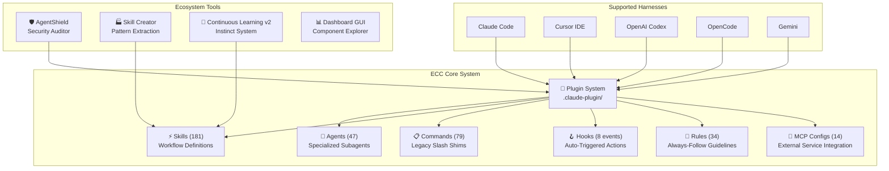

### 1.5 Agent / Skills / Hooks / Commands 關係圖

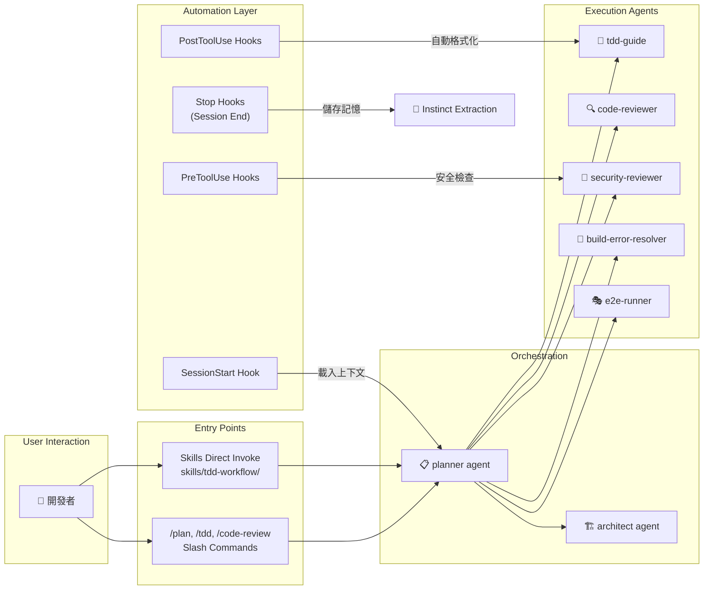

> 💡 **Best Practice**：新的工作流程應優先定義為 Skill，不再建立新的 Command。ECC 正在將 `commands/` 遷移至 `skills/` 體系。

> ⚠️ **常見錯誤**：混淆 Agent 與 Skill。Agent 是執行者（帶角色與工具限制），Skill 是工作流程定義（可被 Agent 調用或直接執行）。

### 1.6 版本演進歷程

ECC 自 2025 年 9 月起持續快速迭代，以下為主要里程碑：

| 版本 | 日期 | 重要特性 |
|------|------|---------|
| v1.2.0 | 2026-02 | Python/Django + Java Spring Boot Skills；Continuous Learning v2（Instinct 系統）；Session 管理 |
| v1.3.0 | 2026-02 | 完整 OpenCode 整合（12 agents、24 commands、16 skills）；3 個 native custom tools |
| v1.4.0 | 2026-02 | 互動式安裝精靈；PM2 與 multi-agent 編排（6 新指令）；多語言 Rules 架構重構 |
| v1.6.0 | 2026-02 | Codex CLI 支援；AgentShield 整合（1282 tests、102 rules）；GitHub Marketplace（ECC Tools） |
| v1.7.0 | 2026-02 | Codex App + CLI 雙支援；`frontend-slides` Skill；5 個商業/內容 Skills |
| v1.8.0 | 2026-03 | 正式定位為 Harness Performance System；Hook 可靠性大幅翻修；NanoClaw v2；997 內部測試通過 |
| v1.9.0 | 2026-03 | Manifest-driven 選擇性安裝；6 新 Agents（TypeScript、Java、Kotlin、PyTorch）；12 語言生態系 |
| v1.10.0 | 2026-04 | Dashboard GUI；Operator 工作流擴展；ECC 2.0 Alpha（Rust 控制平面）；GateGuard 安全閘門 |

> 💡 完整變更記錄請參閱 [CHANGELOG.md](https://github.com/affaan-m/everything-claude-code/blob/main/CHANGELOG.md) 及 [Releases](https://github.com/affaan-m/everything-claude-code/releases)。

---

## 第二章：ECC 核心組件解析

### 2.1 Agents（代理）

Agent 是 ECC 的核心執行單元，每個 Agent 都是帶有特定角色、工具權限和模型配置的子代理。

#### 2.1.1 Agent 定義格式

```markdown
---
name: code-reviewer
description: Reviews code for quality, security, and maintainability
tools: ["Read", "Grep", "Glob", "Bash"]
model: opus
---

You are a senior code reviewer. Review the provided code for:
1. Code quality and maintainability
2. Security vulnerabilities (OWASP Top 10)
3. Performance issues
4. Test coverage gaps
```

#### 2.1.2 主要 Agent 分類

| 類別 | Agent 名稱 | 職責 |
|------|-----------|------|
| **規劃** | `planner` | 功能實作規劃、任務拆解 |
| **架構** | `architect` | 系統設計決策 |
| **品質** | `code-reviewer` | 程式碼品質審查 |
| **安全** | `security-reviewer` | OWASP Top 10 弱點分析 |
| **測試** | `tdd-guide` | TDD 驅動開發引導 |
| **E2E** | `e2e-runner` | Playwright E2E 測試 |
| **建構** | `build-error-resolver` | 建構錯誤自動修復 |
| **重構** | `refactor-cleaner` | 無用程式碼清除 |
| **文件** | `doc-updater` | 文件同步更新 |
| **Java** | `java-reviewer` | Java/Spring Boot 專門審查 |
| **Java 建構** | `java-build-resolver` | Maven/Gradle 建構錯誤 |
| **TypeScript** | `typescript-reviewer` | TypeScript/JavaScript 審查 |
| **Python** | `python-reviewer` | Python 程式碼審查 |
| **Go** | `go-reviewer` | Go 程式碼審查 |
| **Kotlin** | `kotlin-reviewer` | Kotlin/Android/KMP 審查 |
| **Rust** | `rust-reviewer` | Rust 程式碼審查 |
| **C++** | `cpp-reviewer` | C++ 程式碼審查 |
| **DB** | `database-reviewer` | 資料庫查詢審查 |
| **自動化** | `loop-operator` | 自主迴圈執行 |
| **調校** | `harness-optimizer` | Harness 配置調校 |
| **溝通** | `chief-of-staff` | 通訊分流與草稿 |

#### 2.1.3 子代理（Sub-agent）設計模式

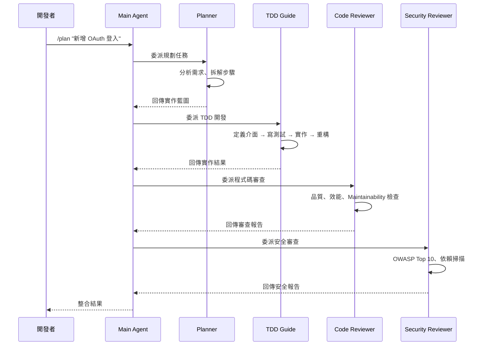

> 💡 **Best Practice**：子代理使用獨立的上下文窗口，不會污染主對話。適合「寫完就扔」的任務。

### 2.2 Skills（技能）

Skills 是 ECC 的**主要工作流程介面**（Primary Workflow Surface），替代 legacy 的 `commands/`。

#### 2.2.1 Skill 目錄結構

```
skills/
├── tdd-workflow/           # TDD 方法論
│   └── SKILL.md
├── security-review/        # 安全檢查清單
│   └── SKILL.md
├── springboot-patterns/    # Spring Boot 模式 ★ Java
│   └── SKILL.md
├── springboot-security/    # Spring Boot 安全 ★ Java
│   └── SKILL.md
├── springboot-tdd/         # Spring Boot TDD ★ Java
│   └── SKILL.md
├── java-coding-standards/  # Java 編碼標準 ★ Java
│   └── SKILL.md
├── jpa-patterns/           # JPA/Hibernate 模式 ★ Java
│   └── SKILL.md
├── backend-patterns/       # API、資料庫、快取模式
│   └── SKILL.md
├── api-design/             # REST API 設計
│   └── SKILL.md
├── e2e-testing/            # Playwright E2E 測試
│   └── SKILL.md
├── deployment-patterns/    # CI/CD、Docker、Rollback
│   └── SKILL.md
├── docker-patterns/        # Docker Compose、安全
│   └── SKILL.md
├── search-first/           # 研究優先工作流
│   └── SKILL.md
├── continuous-learning-v2/ # Instinct 學習系統
│   └── SKILL.md
├── strategic-compact/      # 策略性壓縮
│   └── SKILL.md
├── security-scan/          # AgentShield 整合
│   └── SKILL.md
├── autonomous-loops/       # 自主迴圈模式
│   └── SKILL.md
├── plankton-code-quality/  # 寫入時品質強制
│   └── SKILL.md
└── ...（共 181 個）
```

#### 2.2.2 Skill 定義範例（Spring Boot TDD）

````markdown
---
name: springboot-tdd
description: Test-Driven Development workflow for Spring Boot applications
tags: [java, spring-boot, tdd, testing]
---

# Spring Boot TDD Workflow

## 執行步驟

1. **定義介面**：先寫 Controller/Service Interface
2. **RED**：撰寫失敗的測試案例
   - 使用 `@WebMvcTest` 測試 Controller
   - 使用 `@DataJpaTest` 測試 Repository
   - 使用 Mockito 模擬依賴
3. **GREEN**：實作最小程式碼通過測試
4. **REFACTOR**：重構，保持測試綠燈
5. **驗證覆蓋率**：目標 80%+

## 範例

```java
@WebMvcTest(UserController.class)
class UserControllerTest {
    @Autowired MockMvc mockMvc;
    @MockBean UserService userService;

    @Test
    void shouldReturnUserById() throws Exception {
        given(userService.findById(1L))
            .willReturn(Optional.of(new User(1L, "Alice")));

        mockMvc.perform(get("/api/users/1"))
            .andExpect(status().isOk())
            .andExpect(jsonPath("$.name").value("Alice"));
    }
}
```
````

### 2.3 Commands & Hooks

#### 2.3.1 主要指令（Slash Commands）

| 指令 | 功能 | 對應 Agent |
|------|------|-----------|
| `/plan "需求描述"` | 建立實作計劃 | planner |
| `/tdd` | 啟動 TDD 工作流 | tdd-guide |
| `/code-review` | 程式碼審查 | code-reviewer |
| `/build-fix` | 修復建構錯誤 | build-error-resolver |
| `/e2e` | 產生 E2E 測試 | e2e-runner |
| `/security-scan` | 安全掃描 | security-reviewer |
| `/refactor-clean` | 移除無用程式碼 | refactor-cleaner |
| `/update-docs` | 更新文件 | doc-updater |
| `/learn` | 從 Session 中萃取模式 | — |
| `/compact` | 手動壓縮上下文 | — |
| `/clear` | 清除上下文（免費重置） | — |
| `/cost` | 檢查 Token 花費 | — |
| `/model sonnet` | 切換模型（日常） | — |
| `/model opus` | 切換模型（深度推理） | — |
| `/harness-audit` | 稽核 Harness 可靠度 | — |
| `/loop-start` | 啟動自主迴圈 | loop-operator |
| `/quality-gate` | 品質閘門檢查 | — |
| `/model-route` | 依複雜度路由模型 | — |
| `/multi-plan` | 多 Agent 任務分解 | — |
| `/multi-execute` | 多 Agent 協作執行 | — |

#### 2.3.2 Hooks 機制

Hooks 在特定工具事件發生時自動觸發，無需手動介入。

| Hook 事件 | 觸發時機 | 典型用途 |
|-----------|---------|---------|
| `SessionStart` | Session 開始 | 載入上次上下文、設定環境 |
| `SessionEnd` | Session 結束 | 儲存狀態、萃取學習 |
| `PreToolUse` | 工具執行前 | 安全檢查、路徑驗證 |
| `PostToolUse` | 工具執行後 | 自動格式化、TypeCheck |
| `PreCompact` | 壓縮前 | 儲存關鍵狀態 |
| `Stop` | Agent 停止時 | Session 摘要、模式萃取 |

**Hooks 範例 — 檔案編輯後自動檢查 console.log**：

```json
{
  "matcher": "tool == \"Edit\" && tool_input.file_path matches \"\\\\.(ts|tsx|js|jsx)$\"",
  "hooks": [{
    "type": "command",
    "command": "#!/bin/bash\ngrep -n 'console\\.log' \"$file_path\" && echo '[Hook] Remove console.log' >&2"
  }]
}
```

**Hook Runtime Controls**：

```bash
# 設定 Hook 嚴格度（minimal | standard | strict）
export ECC_HOOK_PROFILE=standard

# 停用特定 Hooks
export ECC_DISABLED_HOOKS="pre:bash:tmux-reminder,post:edit:typecheck"
```

> ⚠️ **常見錯誤**：不要在 `plugin.json` 中宣告 `hooks` 欄位！Claude Code v2.1+ 會自動載入 `hooks/hooks.json`，重複宣告會導致 `Duplicate hooks file detected` 錯誤。

### 2.4 Rules（規則）

Rules 是「永遠遵循」的開發準則，按語言組織：

```
rules/
├── common/              # 語言無關的通用原則（必裝）
│   ├── coding-style.md    # 不可變性、檔案組織
│   ├── git-workflow.md    # Commit 格式、PR 流程
│   ├── testing.md         # TDD、80% 覆蓋率需求
│   ├── performance.md     # 模型選擇、上下文管理
│   ├── patterns.md        # 設計模式、骨架專案
│   ├── hooks.md           # Hook 架構、TodoWrite
│   ├── agents.md          # 子代理委派時機
│   └── security.md        # 強制安全檢查
├── typescript/          # TypeScript/JavaScript
├── python/              # Python
├── golang/              # Go
├── swift/               # Swift
└── php/                 # PHP
```

### 2.5 記憶與上下文管理

#### 2.5.1 上下文污染問題

長時間對話中，Claude 的 200K Token 窗口會逐漸被舊資訊、失敗嘗試和探索性內容填滿，導致：

- 模型「遺忘」早期決策
- 重複相同的錯誤
- 回應品質下降

#### 2.5.2 ECC 壓縮策略

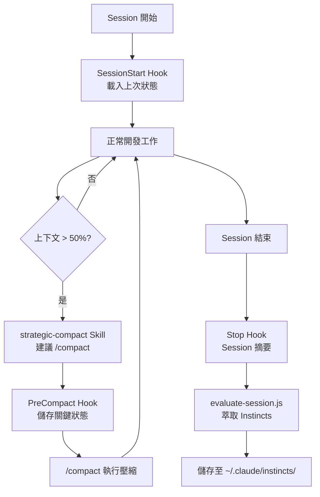

#### 2.5.3 Continuous Learning v2（Instinct 系統）

```bash
# 查看已學習的 Instincts
/instinct-status

# 匯入他人的 Instincts
/instinct-import <file>

# 匯出你的 Instincts 供分享
/instinct-export

# 將相關 Instincts 聚類為 Skills
/evolve

# 清除過期的 Pending Instincts（30 天 TTL）
/prune
```

> 💡 **Best Practice**：在以下時機執行 `/compact`：
> - 研究/探索完成後，開始實作前
> - 完成一個里程碑後，開始下一個前
> - Debug 完成後，繼續功能開發前
> - 某條路失敗後，嘗試新方法前

> ⚠️ **不要**在實作進行中壓縮 — 你會失去變數名稱、檔案路徑和部分狀態。

### 2.6 Contexts（動態上下文注入）

ECC 提供**動態系統提示注入**（Dynamic System Prompt Injection）機制，透過 `contexts/` 目錄中的上下文檔案，根據不同工作模式注入最適合的系統行為指引。

#### 2.6.1 可用上下文模式

| 上下文 | 檔案 | 適用場景 |
|--------|------|---------|
| **Development** | `contexts/dev.md` | 日常功能開發、實作程式碼 |
| **Code Review** | `contexts/review.md` | 程式碼審查模式，聚焦品質與安全 |
| **Research** | `contexts/research.md` | 研究探索模式，側重資料收集與分析 |

#### 2.6.2 使用方式

```bash
# 在 Session 開始時切換上下文
# SessionStart Hook 會自動載入預設上下文

# 手動切換（在 CLAUDE.md 或 Session 中指定）
# 在專案 CLAUDE.md 中設定預設上下文
```

**上下文注入示意**：

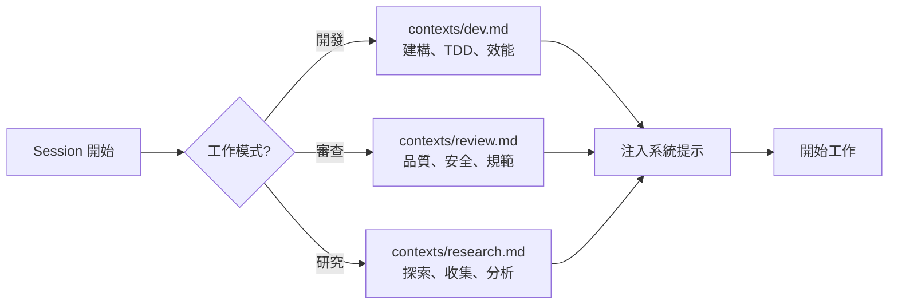

> 💡 **Best Practice**：在 `CLAUDE.md` 中指定專案預設上下文，根據任務性質動態切換。研究階段用 `research`，實作階段用 `dev`，PR 審查用 `review`。

### 2.7 MCP Server 配置

ECC 提供 14 個預配置的 MCP（Model Context Protocol）Server 整合，擴展 Agent 與外部服務的互動能力。

#### 2.7.1 預配置 MCP Servers

| MCP Server | 功能說明 |
|------------|---------|
| **GitHub** | GitHub API 整合（Issue、PR、Repo 操作） |
| **Supabase** | 資料庫管理與即時訂閱 |
| **Context7** | Up-to-date 函式庫與框架文件查閱 |
| **Exa** | 神經搜尋引擎（Web、程式碼、公司資訊） |
| **Playwright** | 瀏覽器自動化與 E2E 測試 |
| **Sequential Thinking** | 複雜推理的逐步思考 |
| **Memory** | 持久記憶儲存 |
| **Vercel** | Vercel 部署管理 |
| **Railway** | Railway 平台部署 |

#### 2.7.2 MCP 配置管理

```bash
# MCP 配置檔位置
mcp-configs/mcp-servers.json

# 停用不需要的 MCP（避免 Token 浪費）
export ECC_DISABLED_MCPS="supabase,railway,vercel"

# 專案層級停用
# 在 .claude/settings.json 中設定
{
  "disabledMcpServers": ["supabase", "railway", "vercel"]
}
```

> ⚠️ **Token 警告**：每個 MCP 的工具描述都會消耗 Token。啟用過多 MCP 會將 200K Token 窗口壓縮到約 70K。建議每專案啟用 **< 10 MCPs**、**< 80 tools**。

---

## 第三章：安裝與環境建置

### 3.1 前置需求

| 需求 | 版本 | 說明 |
|------|------|------|
| Claude Code CLI | v2.1.0+ | `claude --version` 檢查 |
| Node.js | 18+ | 用於 Hook scripts |
| npm / pnpm / yarn / bun | 任一 | 套件管理器 |
| Git | 2.x+ | 版本控制 |

### 3.2 Plugin 安裝（推薦）

**Step 1：安裝 Plugin**

```bash
# 在 Claude Code 中執行
/plugin marketplace add https://github.com/affaan-m/everything-claude-code
/plugin install ecc@ecc
```

或直接編輯 `~/.claude/settings.json`：

```json
{
  "extraKnownMarketplaces": {
    "ecc": {
      "source": {
        "source": "github",
        "repo": "affaan-m/everything-claude-code"
      }
    }
  },
  "enabledPlugins": {
    "ecc@ecc": true
  }
}
```

**Step 2：安裝 Rules（必要）**

> ⚠️ Claude Code Plugin 系統**無法**自動分發 Rules，必須手動安裝。

```bash
# Clone 專案
git clone https://github.com/affaan-m/everything-claude-code.git
cd everything-claude-code

# 安裝依賴
npm install

# macOS/Linux — 完整安裝
./install.sh --profile full

# 或只安裝特定語言
./install.sh typescript python golang
```

**Step 3：開始使用**

```bash
# Plugin 安裝使用命名空間形式
/ecc:plan "Add user authentication"

# 檢查可用指令
/plugin list ecc@ecc
```

### 3.3 手動安裝

```bash
# Clone 專案
git clone https://github.com/affaan-m/everything-claude-code.git

# 複製 Agents
cp everything-claude-code/agents/*.md ~/.claude/agents/

# 複製 Rules（common + 語言特定）
mkdir -p ~/.claude/rules
cp -r everything-claude-code/rules/common ~/.claude/rules/
cp -r everything-claude-code/rules/typescript ~/.claude/rules/  # 依你的技術棧選擇
cp -r everything-claude-code/rules/python ~/.claude/rules/

# 複製 Skills（主要工作流程介面）
cp -r everything-claude-code/.agents/skills/* ~/.claude/skills/
cp -r everything-claude-code/skills/search-first ~/.claude/skills/

# 選擇性：加入框架特定 Skills
for s in springboot-patterns springboot-tdd springboot-security java-coding-standards; do
  cp -r everything-claude-code/skills/$s ~/.claude/skills/
done

# 選擇性：保留 Legacy 指令相容性
mkdir -p ~/.claude/commands
cp everything-claude-code/commands/*.md ~/.claude/commands/
```

**安裝 Hooks**（務必使用 installer，不要直接複製 `hooks.json`）：

```bash
# macOS / Linux
bash ./install.sh --target claude --modules hooks-runtime

# Windows PowerShell
pwsh -File .\install.ps1 --target claude --modules hooks-runtime
```

### 3.4 Windows PowerShell 安裝

```powershell
# Clone 專案
git clone https://github.com/affaan-m/everything-claude-code.git
cd everything-claude-code

# 安裝依賴
npm install

# 完整安裝
.\install.ps1 --profile full

# 或安裝特定語言
.\install.ps1 typescript python

# 跨平台 npm entrypoint
npx ecc-install typescript
```

> ⚠️ **Windows 注意**：Claude 配置目錄是 `%USERPROFILE%\.claude`，不是 `~/claude`。

### 3.5 與 VS Code / Cursor / Codex / OpenCode 整合

#### Cursor IDE

```bash
# macOS/Linux
./install.sh --target cursor typescript python

# Windows
.\install.ps1 --target cursor typescript python
```

Cursor 支援項目：

| 元件 | 數量 | 說明 |
|------|------|------|
| Hook Events | 15 | sessionStart、beforeShellExecution、afterFileEdit 等 |
| Hook Scripts | 16 | 透過 DRY Adapter 模式共用 Claude Code 的 scripts |
| Rules | 34 | 9 common (alwaysApply) + 25 language-specific |
| Agents | 共用 | 透過根目錄 AGENTS.md |
| Skills | 共用 + 專屬 | AGENTS.md + .cursor/skills/ |

#### OpenAI Codex

```bash
# 在 ECC repo 根目錄執行 Codex CLI
codex

# 或自動同步 ECC 資產到 ~/.codex
npm install && bash scripts/sync-ecc-to-codex.sh
```

#### OpenCode

```bash
# 安裝 OpenCode
npm install -g opencode

# 在 ECC repo 根目錄執行
cd everything-claude-code
opencode

# 或以 npm package 安裝
npm install ecc-universal
```

#### Gemini CLI

```bash
# macOS/Linux
./install.sh --target gemini --profile full

# Windows PowerShell
.\install.ps1 --target gemini --profile full
```

Gemini 透過 `.gemini/GEMINI.md` 和共用安裝管道提供實驗性的專案級支援。

#### Antigravity IDE

```bash
# macOS/Linux
./install.sh --target antigravity typescript

# Windows PowerShell
.\install.ps1 --target antigravity typescript
```

Antigravity 整合包含工作流程、Skills 和扁平化 Rules，位於 `.agent/` 目錄中。詳見 [Antigravity Guide](https://github.com/affaan-m/everything-claude-code/blob/main/docs/ANTIGRAVITY-GUIDE.md)。

#### 其他 IDE 支援

| IDE / 工具 | 目錄 | 說明 |
|------------|------|------|
| **CodeBuddy (Tencent)** | `.codebuddy/` | 騰訊 CodeBuddy 適配安裝腳本 |
| **Kiro** | `.kiro/` | Kiro IDE 安裝支援 |
| **Trae** | `.trae/` | Trae IDE 整合（工作流、Skills、Rules） |
| **Non-native harnesses** | — | 手動回退路徑，適用 Grok 等介面。參閱 [Manual Adaptation Guide](https://github.com/affaan-m/everything-claude-code/blob/main/docs/MANUAL-ADAPTATION-GUIDE.md) |

### 3.6 環境變數設定

```bash
# Token 最佳化（強烈推薦）
export MAX_THINKING_TOKENS=10000
export CLAUDE_AUTOCOMPACT_PCT_OVERRIDE=50

# 套件管理器偏好
export CLAUDE_PACKAGE_MANAGER=pnpm

# Hook 控制
export ECC_HOOK_PROFILE=standard          # minimal | standard | strict
export ECC_DISABLED_HOOKS=""              # 逗號分隔的 Hook ID

# 停用特定 MCP
export ECC_DISABLED_MCPS="github,context7,exa,playwright,sequential-thinking,memory"
```

**推薦 `~/.claude/settings.json` 設定**：

```json
{
  "model": "sonnet",
  "env": {
    "MAX_THINKING_TOKENS": "10000",
    "CLAUDE_AUTOCOMPACT_PCT_OVERRIDE": "50",
    "CLAUDE_CODE_SUBAGENT_MODEL": "haiku"
  }
}
```

| 設定項 | 預設值 | 推薦值 | 節省效果 |
|--------|--------|--------|---------|
| `model` | opus | sonnet | ~60% 成本降低 |
| `MAX_THINKING_TOKENS` | 31,999 | 10,000 | ~70% hidden thinking 成本降低 |
| `CLAUDE_AUTOCOMPACT_PCT_OVERRIDE` | 95 | 50 | 提早壓縮，長 Session 品質更好 |

### 3.7 Dashboard GUI

ECC v1.10.0 新增桌面儀表板：

```bash
# 啟動 Dashboard
npm run dashboard

# 或直接執行
python3 ./ecc_dashboard.py
```

功能：
- 分頁介面：Agents、Skills、Commands、Rules、Settings
- 深色/淺色主題切換
- 字型自訂（字體家族 & 大小）
- 搜尋與篩選所有元件

> 💡 **實務案例**：新進團隊成員可透過 Dashboard GUI 快速瀏覽所有可用的 Agents 和 Skills，了解 ECC 提供的能力範圍。

### 3.8 套件管理器偵測

ECC Plugin 自動偵測你偏好的套件管理器（npm、pnpm、yarn、bun），偵測優先順序：

| 優先序 | 來源 | 說明 |
|--------|------|------|
| 1 | 環境變數 `CLAUDE_PACKAGE_MANAGER` | 最高優先 |
| 2 | 專案配置 `.claude/package-manager.json` | 專案層級 |
| 3 | `package.json` 的 `packageManager` 欄位 | npm 標準 |
| 4 | Lock file 偵測 | package-lock.json / yarn.lock / pnpm-lock.yaml / bun.lockb |
| 5 | 全域配置 `~/.claude/package-manager.json` | 使用者層級 |
| 6 | Fallback | 第一個可用的套件管理器 |

**設定方式**：

```bash
# 透過環境變數
export CLAUDE_PACKAGE_MANAGER=pnpm

# 透過全域配置
node scripts/setup-package-manager.js --global pnpm

# 透過專案配置
node scripts/setup-package-manager.js --project bun

# 偵測當前設定
node scripts/setup-package-manager.js --detect
```

也可以在 Claude Code 中使用 `/setup-pm` 指令進行互動式設定。

### 3.9 故障復原與診斷

當本地 ECC 設定被清除或重置時，**不需要重新安裝**。ECC 提供內建的診斷與修復工具：

```bash
# 步驟 1：檢查已安裝的項目
ecc list-installed

# 步驟 2：診斷問題
ecc doctor

# 步驟 3：自動修復（通常可恢復 ECC-managed 檔案）
ecc repair
```

**常見復原情境**：

| 情境 | 解決步驟 |
|------|---------|
| 本地 Claude 配置被清除 | `ecc doctor` → `ecc repair` |
| Plugin 無法載入 | 重新 `/plugin install ecc@ecc` |
| Rules 遺失 | 重跑 `./install.sh --profile full` |
| hooks 衝突 | 確認未在 `plugin.json` 中重複宣告 hooks |
| MCP 配置遺失 | 從 `mcp-configs/mcp-servers.json` 重新複製 |

> ⚠️ **注意**：帳號或 Marketplace 存取問題（如 ECC Tools 付費方案）需單獨處理，與本地配置修復無關。

---

## 第四章：企業級 Web 系統架構設計（搭配 ECC）

### 4.1 企業系統架構背景

典型企業級 Web Application 技術棧：

| 層級 | 技術選擇 |
|------|---------|
| 前端 | Vue 3 + TypeScript + Tailwind CSS |
| 後端 | Spring Boot (Java) |
| 架構 | Clean Architecture + Microservices |
| 資料庫 | PostgreSQL / Oracle / DB2 |
| 快取 | Redis |
| 訊息佇列 | Kafka / RabbitMQ |
| CI/CD | GitHub Actions / GitLab CI |
| 容器化 | Docker + Kubernetes |

### 4.2 ECC Agent 分工架構

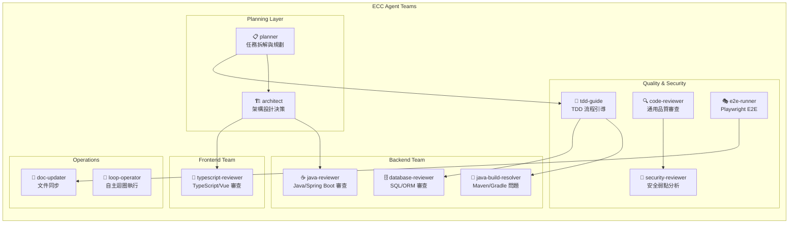

### 4.3 系統架構圖

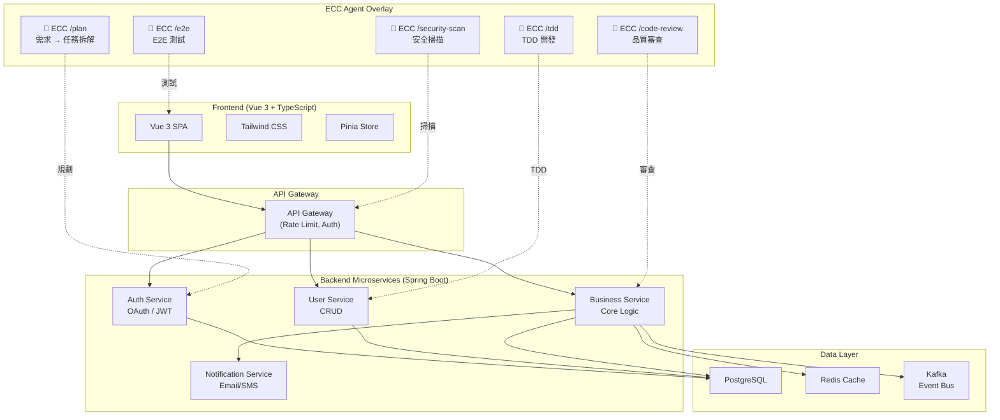

### 4.4 Agent 協作流程

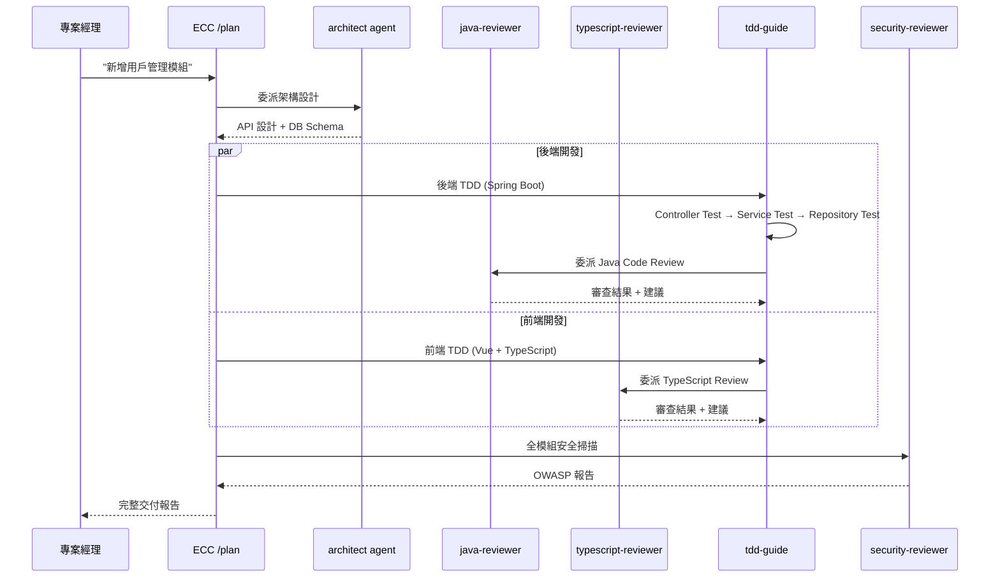

> 💡 **Best Practice**：使用 `/multi-plan` 進行多 Agent 任務分解，再用 `/multi-execute` 平行執行前後端任務，可顯著提升開發效率。

---

## 第五章：開發流程（AI 驅動）

### 5.1 AI 驅動開發總覽

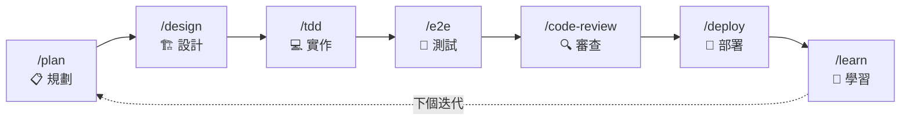

### 5.2 /plan — 需求規劃

**指令範例**：

```bash
/ecc:plan "Add user authentication with OAuth2 + JWT, supporting Google and GitHub login"
```

**Agent 行為**：
1. `planner` agent 分析需求
2. 拆解為具體實作步驟
3. 識別技術風險與依賴
4. 產出實作藍圖

**輸出範例**：

```markdown
## Implementation Plan: OAuth2 + JWT Authentication

### Phase 1: Infrastructure
- [ ] Add Spring Security + OAuth2 Client dependencies
- [ ] Configure application.yml for Google/GitHub OAuth
- [ ] Create JWT utility class

### Phase 2: Backend
- [ ] Implement OAuth2LoginSuccessHandler
- [ ] Create UserService with OAuth user mapping
- [ ] Implement JWT token generation/validation
- [ ] Create AuthController endpoints

### Phase 3: Frontend
- [ ] Create LoginPage.vue with OAuth buttons
- [ ] Implement auth store (Pinia)
- [ ] Add route guards for protected pages
- [ ] Handle token refresh

### Phase 4: Testing
- [ ] Unit tests for JWT utility
- [ ] Integration tests for OAuth flow
- [ ] E2E tests for login/logout

### Risks
- OAuth callback URL configuration per environment
- Token refresh race conditions
```

### 5.3 /design — 架構設計

```bash
/ecc:plan "Design the authentication module architecture"
# → planner 委派給 architect agent
```

**Agent 行為**：`architect` agent 產出：
- API 端點設計
- 資料模型（Entity / DTO / VO）
- 序列圖（認證流程）
- 安全考量

### 5.4 /implement（TDD）— 實作

```bash
/tdd
```

**Agent 行為**（tdd-guide）：

```
1. Define interfaces first          → 定義 AuthService 介面
2. Write failing tests (RED)        → 寫 AuthServiceTest，全部 FAIL
3. Implement minimal code (GREEN)   → 實作到剛好通過測試
4. Refactor (IMPROVE)               → 重構、extract method
5. Verify 80%+ coverage             → 確認覆蓋率達標
```

**Spring Boot 實作範例**：

```java
// Step 1: Interface
public interface AuthService {
    TokenResponse authenticate(OAuth2AuthenticationToken token);
    TokenResponse refreshToken(String refreshToken);
    void logout(String userId);
}

// Step 2: RED - Failing Test
@ExtendWith(MockitoExtension.class)
class AuthServiceImplTest {
    @Mock JwtTokenProvider jwtProvider;
    @Mock UserRepository userRepo;
    @InjectMocks AuthServiceImpl authService;

    @Test
    void authenticate_shouldReturnTokens_whenOAuthValid() {
        // Given
        var oauthToken = mockOAuth2Token("google", "user@example.com");
        var user = new User(1L, "user@example.com", "Google User");
        when(userRepo.findByEmail("user@example.com")).thenReturn(Optional.of(user));
        when(jwtProvider.generateAccessToken(user)).thenReturn("access-token");
        when(jwtProvider.generateRefreshToken(user)).thenReturn("refresh-token");

        // When
        var result = authService.authenticate(oauthToken);

        // Then
        assertThat(result.accessToken()).isEqualTo("access-token");
        assertThat(result.refreshToken()).isEqualTo("refresh-token");
    }
}

// Step 3: GREEN - Implementation
@Service
@RequiredArgsConstructor
public class AuthServiceImpl implements AuthService {
    private final JwtTokenProvider jwtProvider;
    private final UserRepository userRepo;

    @Override
    public TokenResponse authenticate(OAuth2AuthenticationToken token) {
        String email = token.getPrincipal().getAttribute("email");
        User user = userRepo.findByEmail(email)
            .orElseGet(() -> createNewUser(token));
        return new TokenResponse(
            jwtProvider.generateAccessToken(user),
            jwtProvider.generateRefreshToken(user)
        );
    }
}
```

### 5.5 /test — 測試

```bash
/e2e      # 產生 Playwright E2E 測試
```

**E2E 測試範例**：

```typescript
import { test, expect } from '@playwright/test';

test.describe('Authentication Flow', () => {
  test('should redirect to Google OAuth and complete login', async ({ page }) => {
    await page.goto('/login');
    await page.click('[data-testid="google-login-btn"]');

    // Mock OAuth callback
    await page.waitForURL('**/oauth2/callback**');

    // Verify redirect to dashboard
    await expect(page).toHaveURL('/dashboard');
    await expect(page.locator('[data-testid="user-avatar"]')).toBeVisible();
  });

  test('should show error on failed authentication', async ({ page }) => {
    await page.goto('/login?error=access_denied');
    await expect(page.locator('.error-message')).toContainText('登入失敗');
  });
});
```

### 5.6 /code-review — 程式碼審查

```bash
/code-review
```

**Agent 行為**（code-reviewer + 語言專用 reviewer）：
- 程式碼品質與可維護性
- 安全弱點（OWASP Top 10）
- 效能問題
- 測試覆蓋率缺口

### 5.7 /deploy — 部署

```bash
# 使用 deployment-patterns skill
/security-scan    # 部署前安全掃描
/e2e              # 關鍵用戶流測試
/test-coverage    # 驗證 80%+ 覆蓋率
```

> 💡 **Best Practice**：部署前三道閘門 — Security Scan → E2E → Coverage。全部通過才允許部署。

### 5.8 /verify — 驗證迴圈

ECC 提供持續驗證機制，確保每次変更都通過完整品質閘門：

```bash
# 儲存當前驗證狀態的 Checkpoint
/checkpoint

# 執行完整驗證迴圈
/verify

# 根據自定義標準評估
/eval
```

**驗證迴圈流程**：

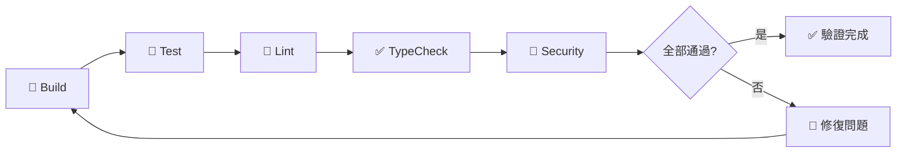

**驗證類型**：

| 類型 | 指令 | 說明 |
|------|------|------|
| Checkpoint 驗證 | `/checkpoint` → `/verify` | 儲存狀態後執行一次性驗證 |
| 持續驗證 | `verification-loop` skill | 每次程式碼變更自動執行 build → test → lint → typecheck → security |
| 評估驅動開發 | `eval-harness` skill | 定義評估標準，以 pass@k 指標衡量品質 |

**Eval Harness 評估指標**：

- **Pass@k**：`k` 次嘗試中至少一次通過的機率
- **Grader Types**：自動化 Grader（程式判定）vs 模型 Grader（LLM 判定）
- **Checkpoint vs Continuous**：Checkpoint 在特定節點驗證；Continuous 在每次変更後驗證

> 💡 **Best Practice**：對關鍵功能使用 `verification-loop` skill 啟用持續驗證。對大型重構使用 `/checkpoint` 保存狀態後執行一次性驗證。

---

## 第六章：測試與品質控管

### 6.1 TDD Skill 實作

ECC 的 TDD 工作流程遵循嚴格的 RED → GREEN → REFACTOR 循環：

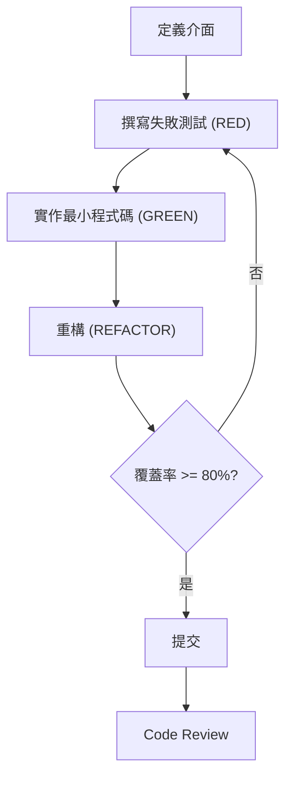

**可用的 TDD Skills**：

| Skill | 框架 |
|-------|------|
| `tdd-workflow` | 通用 TDD 方法論 |
| `springboot-tdd` | Spring Boot 專用 |
| `django-tdd` | Django 專用 |
| `laravel-tdd` | Laravel 專用 |
| `golang-testing` | Go 測試 + TDD |
| `python-testing` | pytest 測試 |
| `cpp-testing` | GoogleTest + CMake |
| `perl-testing` | Test2::V0 |

### 6.2 自動 Code Review

`code-reviewer` agent 自動檢查：

1. **命名規範**：是否符合語言慣例
2. **複雜度**：方法是否過長、巢狀過深
3. **重複程式碼**：DRY 原則
4. **安全性**：SQL Injection、XSS、不安全的資料處理
5. **效能**：N+1 查詢、不必要的 IO
6. **測試**：是否有對應測試、edge case 是否覆蓋

### 6.3 Plankton 程式碼品質

`plankton-code-quality` skill 在**寫入時**強制執行程式碼品質：

- PostToolUse Hook 在每次檔案編輯後自動執行
- 自動修復 Linter 違規
- 強制一致的程式碼風格

### 6.4 AgentShield 安全掃描

```bash
# 快速掃描（無需安裝）
npx ecc-agentshield scan

# 自動修復安全問題
npx ecc-agentshield scan --fix

# 深度分析（三個 Opus agent 紅藍對抗）
npx ecc-agentshield scan --opus --stream

# 產生安全配置
npx ecc-agentshield init
```

**掃描範圍**：

| 類別 | 規則數 | 說明 |
|------|--------|------|
| Secrets Detection | 14 patterns | API Key、Token、Password |
| Permission Auditing | — | 工具權限檢查 |
| Hook Injection Analysis | — | Hook 注入風險 |
| MCP Server Risk Profiling | — | MCP 服務風險評估 |
| Agent Config Review | — | Agent 配置審查 |

**`--opus` 模式**：三個 Claude Opus agent 進行紅藍對抗 —

1. **Attacker**：尋找 exploit chain
2. **Defender**：評估現有防護
3. **Auditor**：綜合兩者產出優先級風險評估

**輸出格式**：Terminal（色彩分級 A-F）、JSON（CI Pipeline）、Markdown、HTML

### 6.5 CI/CD 整合測試流程

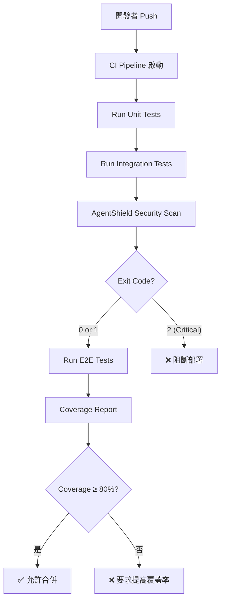

**GitHub Actions 範例**：

```yaml
name: ECC Quality Gate
on: [pull_request]

jobs:
  quality:
    runs-on: ubuntu-latest
    steps:
      - uses: actions/checkout@v4
      - uses: actions/setup-node@v4
        with:
          node-version: '20'

      - name: Run Tests
        run: npm test -- --coverage

      - name: Security Scan
        run: npx ecc-agentshield scan --format json --output security-report.json

      - name: Check Coverage
        run: |
          COVERAGE=$(cat coverage/coverage-summary.json | jq '.total.lines.pct')
          if (( $(echo "$COVERAGE < 80" | bc -l) )); then
            echo "Coverage ${COVERAGE}% is below 80% threshold"
            exit 1
          fi
```

### 6.6 驗證迴圈與評估框架

ECC 提供兩個進階的品質驗證機制，源自 Longform Guide 的核心理念。

#### 6.6.1 Verification Loop（持續驗證迴圈）

`verification-loop` skill 在每次程式碼變更後自動執行完整驗證管道：

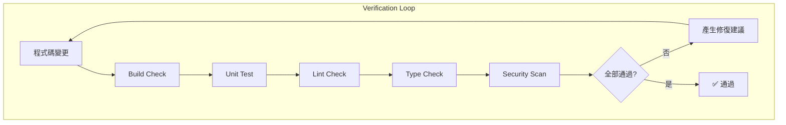

#### 6.6.2 Eval Harness（評估框架）

`eval-harness` skill 提供結構化的評估機制，讓你定義明確的品質標準：

```bash
# 儲存當前驗證狀態
/checkpoint

# 執行驗證
/verify

# 根據自定義標準評估
/eval
```

**評估框架核心概念**：

| 概念 | 說明 |
|------|------|
| **Checkpoint Eval** | 在特定節點保存狀態並執行一次性驗證 |
| **Continuous Eval** | 持續評估每次變更，即時回饋 |
| **Automated Grader** | 程式化判定（測試通過/失敗、覆蓋率門檻） |
| **Model Grader** | LLM 判定（程式碼品質、架構合理性） |
| **Pass@k** | k 次嘗試中至少一次通過的機率指標 |

#### 6.6.3 Learn-Eval（學習評估）

`/learn-eval` 指令結合學習與評估，從 Session 中擷取模式並在儲存前進行評估：

```bash
# 不只學習，還評估學到的模式品質
/learn-eval
```

這比單純的 `/learn` 更具品質保障，避免學習到錯誤或低品質的模式。

---

## 第七章：安全（SSDLC）

### 7.1 ECC 安全架構

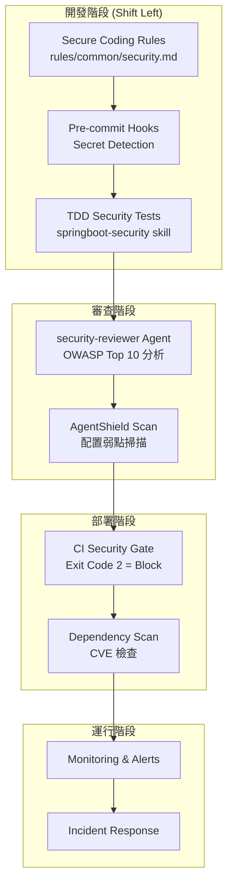

### 7.2 安全檢查自動化

ECC 在 SSDLC 各階段提供自動化安全檢查：

| 階段 | ECC 工具 | 自動化行為 |
|------|---------|-----------|
| 編碼 | `security.md` rule | 強制安全編碼準則 |
| Hook | `beforeSubmitPrompt` | 偵測 prompt 中的機密（sk-、ghp_、AKIA） |
| Hook | `beforeTabFileRead` | 阻止讀取 .env、.key、.pem 檔案 |
| 審查 | `security-reviewer` agent | OWASP Top 10 弱點分析 |
| 掃描 | `/security-scan` | AgentShield 深度掃描 |
| CI | AgentShield GitHub Action | 自動阻斷含重大弱點的 PR |

### 7.3 OWASP Top 10 防護

| OWASP 風險 | ECC 防護措施 |
|------------|-------------|
| A01 Broken Access Control | security-reviewer 檢查授權邏輯 |
| A02 Cryptographic Failures | Rules 強制安全加密實踐 |
| A03 Injection | Agent 檢查參數化查詢、輸入驗證 |
| A04 Insecure Design | architect agent 安全架構設計 |
| A05 Security Misconfiguration | AgentShield 配置掃描 |
| A06 Vulnerable Components | dependency scan + CVE 檢查 |
| A07 Authentication Failures | springboot-security skill 最佳實踐 |
| A08 Software Integrity | Hook 驗證、CI build gates |
| A09 Security Logging | Rules 強制安全日誌 |
| A10 Server-Side Request Forgery | security-reviewer 檢查 SSRF 模式 |

### 7.4 Secret Detection

ECC 提供多層 Secret Detection：

```
Layer 1: beforeSubmitPrompt Hook (Cursor)
  → 偵測 prompt 中的 sk-、ghp_、AKIA 模式

Layer 2: beforeTabFileRead Hook (Cursor)
  → 阻止 Tab 讀取 .env、.key、.pem

Layer 3: AgentShield Secrets Detection
  → 14 種 pattern matching 規則

Layer 4: CI Build Gate
  → Exit code 2 阻斷含機密的 commit
```

> ⚠️ **常見錯誤**：在 `.claude/settings.json` 中存放 API Key。應使用環境變數或 vault 管理。

### 7.5 GateGuard 安全閘門

GateGuard 是 ECC v1.10.0 引入的安全閘門機制（來自社群貢獻 [PR #1367](https://github.com/affaan-m/everything-claude-code/pull/1367)），提供更精細的安全控制。

#### 7.5.1 GateGuard 功能

- **Hook 層級安全閘門**：在 PreToolUse 階段攔截潛在危險操作
- **動態風險評估**：根據操作類型與上下文計算風險等級
- **可設定的嚴格度**：與 `ECC_HOOK_PROFILE` 整合，支援 minimal / standard / strict 三級
- **整合 AgentShield**：與靜態分析和 Secret Detection 協同運作

#### 7.5.2 GateGuard 與 AgentShield 的差異

| 面向 | GateGuard | AgentShield |
|------|-----------|-------------|
| 執行時機 | 即時（Hook 觸發） | 按需掃描 |
| 檢查範圍 | 單一工具操作 | 整體配置與程式碼 |
| 效能影響 | 低（輕量 Hook） | 中～高（深度分析） |
| 定位 | 運行時防護 | 審計與合規 |

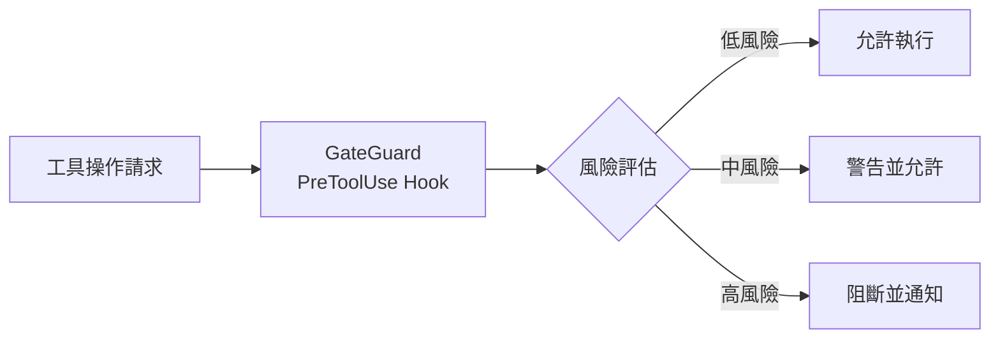

---

## 第八章：部署與維運（DevOps）

### 8.1 CI/CD 整合

#### GitHub Actions 完整範例

```yaml
name: ECC Enterprise Pipeline
on:
  push:
    branches: [main, develop]
  pull_request:
    branches: [main]

jobs:
  build-and-test:
    runs-on: ubuntu-latest
    steps:
      - uses: actions/checkout@v4

      - name: Setup Java
        uses: actions/setup-java@v4
        with:
          java-version: '21'
          distribution: 'temurin'

      - name: Setup Node.js
        uses: actions/setup-node@v4
        with:
          node-version: '20'

      - name: Build Backend
        run: mvn clean verify -B

      - name: Security Scan (AgentShield)
        run: npx ecc-agentshield scan --format json --output reports/security.json
        continue-on-error: false

      - name: E2E Tests (Playwright)
        run: npx playwright test

      - name: Quality Gate Check
        run: |
          echo "Checking coverage >= 80%..."
          mvn jacoco:check

      - name: Upload Reports
        if: always()
        uses: actions/upload-artifact@v4
        with:
          name: test-reports
          path: reports/
```

#### GitLab CI 範例

```yaml
stages:
  - build
  - test
  - security
  - deploy

build:
  stage: build
  script:
    - mvn clean compile -B

test:
  stage: test
  script:
    - mvn test -B
    - mvn jacoco:report

security-scan:
  stage: security
  script:
    - npx ecc-agentshield scan --format json
  allow_failure: false

deploy:
  stage: deploy
  script:
    - ./deploy.sh
  only:
    - main
  when: on_success
```

### 8.2 監控與日誌

**推薦監控架構**：

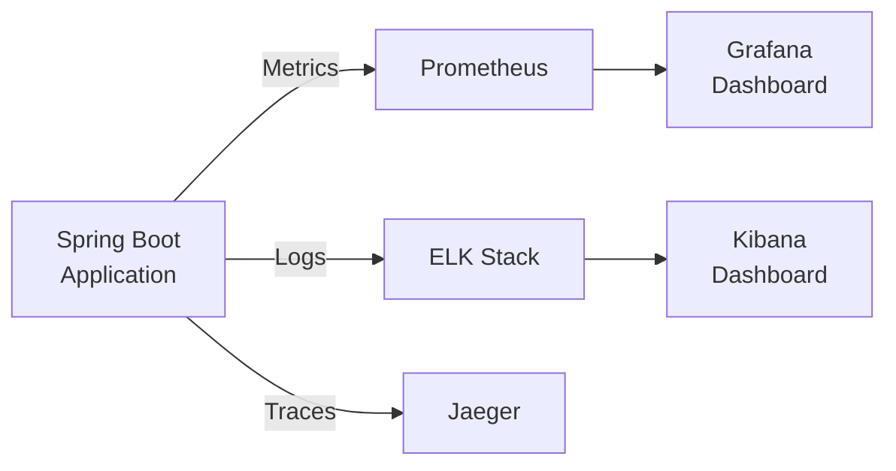

### 8.3 AI Agent 監控

監控 ECC Agent 的使用狀況：

```bash
# 檢查 Token 花費
/cost

# 檢查已安裝元件
/plugin list ecc@ecc

# 稽核 Harness 狀態
/harness-audit

# 查看活躍 Loop 狀態
/loop-status
```

---

## 第九章：系統維護與升級

### 9.1 ECC 版本升級策略

```bash
# 檢查當前版本
cat VERSION  # 或查看 CHANGELOG.md

# 更新到最新版
cd everything-claude-code
git pull origin main
npm install

# 重新執行安裝
./install.sh --profile full  # macOS/Linux
.\install.ps1 --profile full  # Windows

# 使用選擇性安裝（v1.9.0+）
# manifest-driven 安裝只更新有變更的元件
node scripts/install-plan.js
node scripts/install-apply.js
```

**故障復原**：

```bash
# 如果本地 ECC 被清除或重置
ecc list-installed    # 檢查已安裝項目
ecc doctor           # 診斷問題
ecc repair           # 修復（通常可恢復）
```

### 9.2 Skills / Agents 管理

```bash
# 審查 Skills 和 Commands 品質
/skill-stocktake

# 從 Git History 產生 Skills
/skill-create
/skill-create --instincts    # 同時產生 Instincts

# 查看已學習的 Instincts
/instinct-status

# 將 Instincts 演化為 Skills
/evolve

# 清除過期 Instincts
/prune
```

### 9.3 相容性與故障排除

| 問題 | 解決方案 |
|------|---------|
| Duplicate hooks file | 不要在 plugin.json 宣告 hooks 欄位 |
| ${CLAUDE_PLUGIN_ROOT} 解析失敗 | 使用 installer 安裝 hooks，不要手動複製 |
| multi-* 指令無法運行 | 安裝 ccg-workflow：`npx ccg-workflow` |
| MCP 衝突 | 設定 `ECC_DISABLED_MCPS` 排除重複 |
| Windows 路徑問題 | 配置目錄是 `%USERPROFILE%\.claude` |

---

## 第十章：最佳實踐（Best Practices）

### 10.1 避免上下文污染

| 策略 | 指令 / 機制 | 說明 |
|------|------------|------|
| 任務間清除 | `/clear` | 免費、即時重置。不相關任務間使用 |
| 邏輯斷點壓縮 | `/compact` | 研究完→實作前、里程碑完→下一個前 |
| 自動壓縮調整 | `CLAUDE_AUTOCOMPACT_PCT_OVERRIDE=50` | 提早壓縮，長 Session 品質更好 |
| MCP 精簡 | `disabledMcpServers` | 每專案 < 10 MCPs、< 80 tools |
| 子代理委派 | Agent delegation | 獨立上下文，不污染主對話 |
| Session 邊界 | SessionStart/Stop Hooks | 自動載入/儲存上下文 |

### 10.2 Agent 設計原則

1. **單一職責**：每個 Agent 只處理一類任務
2. **最小工具集**：只授予必要的 tools 權限
3. **明確角色描述**：在 YAML frontmatter 中清楚定義
4. **模型適配**：日常用 sonnet、深度推理用 opus
5. **可組合性**：Agent 之間可互相委派

### 10.3 Skill 設計模式

1. **Research-First**：使用 `search-first` skill，先研究再寫程式
2. **TDD-First**：所有新功能先寫測試
3. **Security-by-Design**：使用語言專用 security skill
4. **Verification Loop**：持續驗證（build → test → lint → typecheck → security）

### 10.4 Token 最佳化

| 指令 | 用途 | 成本影響 |
|------|------|---------|
| `/model sonnet` | 日常任務預設 | ~60% 節省 |
| `/model opus` | 深度架構推理 | 高成本 |
| `/clear` | 不相關任務間 | 免費 |
| `/compact` | 邏輯斷點 | 低成本 |
| `/cost` | 監控花費 | — |
| `CLAUDE_CODE_SUBAGENT_MODEL=haiku` | 子代理用 haiku | 大幅節省 |

> ⚠️ **Agent Teams 成本警告**：Agent Teams 會產生多個獨立的上下文窗口，每個 teammate 獨立消耗 Token。只在平行任務有明確價值時使用（如多模組工作、平行審查）。簡單順序任務用 subagent 更省。

### 10.5 平行化策略

ECC 支援多種平行化模式，可顯著提升大型專案的開發效率。

#### 10.5.1 Git Worktrees 平行化

利用 Git Worktrees 在同一 Repository 的多個分支上同時工作：

```bash
# 建立 Worktree
git worktree add ../feature-auth feature/auth
git worktree add ../feature-ui feature/ui

# 在不同 Worktree 中開啟獨立的 Claude Code Session
cd ../feature-auth && claude
cd ../feature-ui && claude
```

**優勢**：
- 每個 Worktree 有獨立的上下文窗口，互不污染
- 適合多人協作或一人多功能並行開發
- 合併時使用標準 Git merge 流程

#### 10.5.2 Cascade 方法

逐層委派，讓子代理處理越來越具體的任務：

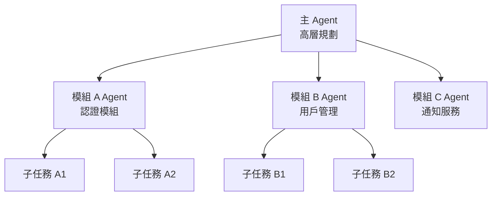

#### 10.5.3 何時擴展為多實例

| 場景 | 推薦方式 | 原因 |
|------|---------|------|
| 單一功能實作 | 單一 Session | 上下文一致 |
| 多模組獨立開發 | Git Worktrees | 互不干擾 |
| 前後端並行 | `/multi-plan` + `/multi-execute` | Agent Teams 協作 |
| 大規模重構 | Cascade 方法 | 逐層分解複雜度 |
| CI/CD 平行測試 | GitHub Actions matrix | 機器資源充足 |

> 💡 **Best Practice**：優先使用 subagent 委派（最省 Token）。只在任務真正需要並行處理時才升級到 Git Worktrees 或 Agent Teams。

---

## 第十一章：常見問題與排錯

### Q1：Agent 無法理解需求

**原因**：需求描述過於模糊或專業術語不一致

**解決**：
1. 使用 `/plan` 先讓 planner 分析需求
2. 提供明確的範例和 edge case
3. 使用 `search-first` skill 讓 Agent 先研究再回答

### Q2：記憶錯亂 / 重複犯錯

**原因**：上下文資訊相互矛盾或已過期

**解決**：
1. `/compact` 壓縮過時資訊
2. `/clear` 完全重置（在不相關任務間）
3. 調整 `CLAUDE_AUTOCOMPACT_PCT_OVERRIDE=50` 提早壓縮
4. 使用 `/instinct-status` 檢查已學習模式

### Q3：Token 爆掉 / 達到日限

**解決**：
```json
{
  "model": "sonnet",
  "env": {
    "MAX_THINKING_TOKENS": "10000",
    "CLAUDE_AUTOCOMPACT_PCT_OVERRIDE": "50",
    "CLAUDE_CODE_SUBAGENT_MODEL": "haiku"
  }
}
```

額外措施：
- 保持 < 10 MCPs、< 80 tools 啟用
- 使用 `/clear` 在不相關任務間
- 使用 `/cost` 定期監控

### Q4：指令失效

**檢查清單**：
1. `claude --version` 確認 ≥ v2.1.0
2. `/plugin list ecc@ecc` 確認 Plugin 已安裝
3. 確認 rules 已手動安裝
4. 確認 hooks 未重複宣告
5. `multi-*` 指令需額外安裝 `npx ccg-workflow`

### Q5：Hooks 不運作 / "Duplicate hooks file" 錯誤

**解決**：
1. **不要**在 `.claude-plugin/plugin.json` 中加入 `"hooks"` 欄位
2. Claude Code v2.1+ 會自動載入 `hooks/hooks.json`
3. 如果手動安裝，使用 installer 而非直接複製

### Q6：能否只使用部分元件？

**可以**。ECC 是模組化的：
- 只複製需要的 agents、skills、rules
- 使用選擇性安裝：`./install.sh typescript`
- v1.9.0+ 支援 manifest-driven 選擇性安裝

### Q7：是否支援 Cursor / OpenCode / Codex / Antigravity？

**是**。ECC 是第一個同時最大化所有主要 AI 編碼工具的 Plugin：

| 工具 | 安裝指令 |
|------|---------|
| Cursor | `./install.sh --target cursor typescript` |
| Codex | `bash scripts/sync-ecc-to-codex.sh` |
| OpenCode | `npm install ecc-universal` |
| Antigravity | `./install.sh --target antigravity typescript` |
| Gemini | `./install.sh --target gemini --profile full` |
| CodeBuddy | 參閱 `.codebuddy/` 目錄的安裝腳本 |
| Kiro | 參閱 `.kiro/` 目錄的安裝配置 |
| Trae | 參閱 `.trae/` 目錄的整合配置 |

### Q8：是否支援自訂 API 端點或模型閘道？

**是**。ECC 不硬編碼 Anthropic 本機傳輸設定。它透過 Claude Code 的正常 CLI/Plugin 介面本地運行，因此可搭配：

- Anthropic 託管的 Claude Code
- 使用 `ANTHROPIC_BASE_URL` 和 `ANTHROPIC_AUTH_TOKEN` 的官方閘道設定
- 相容的自訂端點（需支援 Anthropic API 協議）

```bash
# 最小設定範例
export ANTHROPIC_BASE_URL=https://your-gateway.example.com
export ANTHROPIC_AUTH_TOKEN=your-token
claude
```

> 💡 如果你的閘道重新映射模型名稱，在 Claude Code 中設定而非在 ECC 中設定。ECC 的 Hooks、Skills、Commands 和 Rules 在 `claude` CLI 正常運作後是模型提供者無關的。

### Q9：ECC 配置被清除了怎麼辦？

**不要急著重新安裝**。按以下步驟操作：

1. `ecc list-installed` — 檢查已安裝項目
2. `ecc doctor` — 診斷問題
3. `ecc repair` — 自動修復

這通常可以恢復 ECC 管理的檔案而無需重建整個設定。如果問題是帳號或 Marketplace 存取（如 ECC Tools），需單獨處理帳單/帳號恢復。

---

## 第十二章：進階應用

### 12.1 多 Agent 協作（Multi-Agent System）

```bash
# 多 Agent 任務分解
/multi-plan "Build complete user management module"

# 多 Agent 協作執行
/multi-execute

# 後端多服務編排
/multi-backend

# 前端多服務編排
/multi-frontend

# 通用多服務工作流
/multi-workflow
```

> ⚠️ `multi-*` 指令需要額外安裝 `ccg-workflow`：`npx ccg-workflow`

**PM2 服務管理**：

```bash
# PM2 服務生命週期管理
/pm2
```

### 12.2 與其他 AI 工具整合

#### 跨工具功能對照

| 功能 | Claude Code | Cursor | Codex | OpenCode |
|------|-------------|--------|-------|----------|
| Agents | 47 | 共享 (AGENTS.md) | 共享 (AGENTS.md) | 12 |
| Commands | 79 | 共享 | 指令式 | 31 |
| Skills | 181 | 共享 + 專屬 | 10 (native) | 37 |
| Hook Events | 8 types | 15 types | 無 | 11 types |
| Rules | 34 | 34 (YAML) | 指令式 | 13 |
| MCP Servers | 14 | 共享 | 7 (TOML) | 完整 |
| Custom Tools | Via hooks | Via hooks | N/A | 6 native |

**關鍵架構決策**：
- `AGENTS.md` 是根目錄的通用跨工具檔案（四個工具都讀取）
- DRY adapter 模式讓 Cursor 重用 Claude Code 的 hook scripts
- SKILL.md 格式（YAML frontmatter）跨 Claude Code、Codex、OpenCode

### 12.3 自訂 Agent

#### 建立自訂 Agent

```markdown
---
name: my-api-designer
description: Designs RESTful APIs following company standards
tools: ["Read", "Grep", "Glob"]
model: sonnet
---

You are a senior API designer specializing in RESTful services.

## Your Standards:
1. Follow OpenAPI 3.0 specification
2. Use kebab-case for URL paths
3. Use camelCase for JSON properties
4. Version APIs via URL path (/api/v1/...)
5. Standard error response format:
   { "error": { "code": "ERR_001", "message": "..." } }
6. Pagination: cursor-based for large datasets, offset for small
7. Rate limiting headers: X-RateLimit-Limit, X-RateLimit-Remaining

## Output:
- OpenAPI YAML specification
- Postman collection (optional)
- API documentation in Markdown
```

#### 儲存位置

```
~/.claude/agents/my-api-designer.md    # 全域
.claude/agents/my-api-designer.md      # 專案層級
```

### 12.4 ECC 2.0 Alpha

ECC v1.10.0 包含 ECC 2.0 Alpha 原型（Rust 控制平面）：

```bash
# 在 ecc2/ 目錄中
cd ecc2

# 可用指令
ecc2 dashboard    # 啟動儀表板
ecc2 start        # 啟動 session
ecc2 sessions     # 列出 sessions
ecc2 status       # 狀態查詢
ecc2 stop         # 停止
ecc2 resume       # 恢復
ecc2 daemon       # 背景守護程序
```

> ⚠️ ECC 2.0 是 Alpha 階段，可在本地建構和使用，但尚非正式發佈。

### 12.5 NanoClaw v2

NanoClaw v2 是 ECC v1.8.0 引入的輕量級 Agent 運行時，提供進階的模型路由和 Session 管理能力。

#### 12.5.1 核心功能

| 功能 | 說明 |
|------|------|
| **Model Routing** | 根據任務複雜度自動路由模型（haiku → sonnet → opus） |
| **Skill Hot-Load** | 動態載入和卸載 Skills，無需重啟 Session |
| **Session Branch** | 在 Session 中建立分支，嘗試不同方法 |
| **Session Search** | 搜尋歷史 Session 內容 |
| **Session Export** | 匯出 Session 為結構化格式 |
| **Session Compact** | 策略性壓縮 Session 上下文 |
| **Session Metrics** | 即時 Token 使用量和成本追蹤 |

#### 12.5.2 模型路由策略

```bash
# 使用 /model-route 根據任務複雜度路由
/model-route

# 手動切換模型
/model sonnet    # 日常任務（~60% 成本節省）
/model opus      # 深度架構推理
```

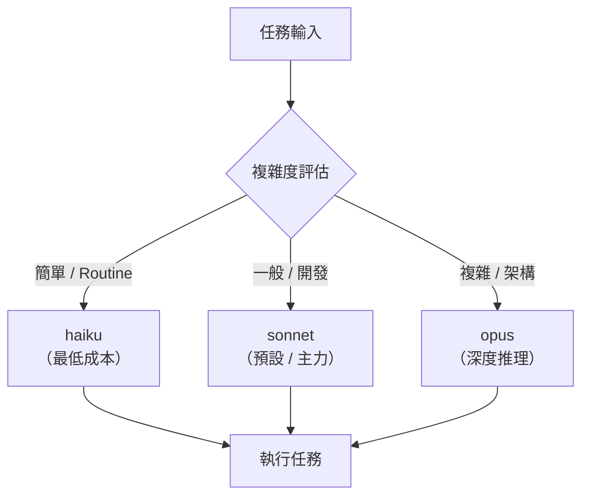

### 12.6 GAN 風格產生器-評估器框架

ECC v1.9.0 引入了受 GAN（Generative Adversarial Network）啟發的**產生器-評估器**框架（位於 `examples/` 目錄），用於提升 AI 產出的品質。

#### 12.6.1 運作原理

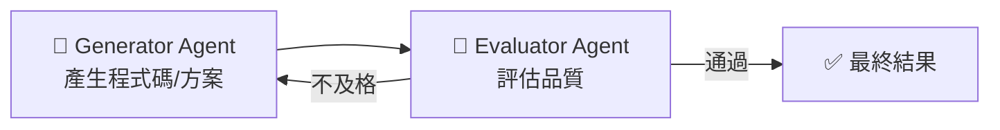

**角色分工**：

| 角色 | 職責 | 模型建議 |
|------|------|---------|
| **Generator** | 產生程式碼、架構方案、API 設計 | sonnet（快速迭代） |
| **Evaluator** | 評估品質、找出缺陷、提供改進建議 | opus（嚴格判定） |

#### 12.6.2 應用場景

- **程式碼品質**：Generator 寫程式碼 → Evaluator 審查品質與安全
- **架構設計**：Generator 提出方案 → Evaluator 從可擴展性/安全性評估
- **測試案例**：Generator 產生測試 → Evaluator 評估覆蓋率和邊界案例
- **文件撰寫**：Generator 撰寫文件 → Evaluator 檢查完整性和準確性

> 💡 **Best Practice**：GAN 風格框架適合高品質要求的場景。日常開發不需要此框架，直接使用標準 TDD 工作流即可。

---

## 附錄

### A. 常用指令 Cheat Sheet

| 類別 | 指令 | 說明 |
|------|------|------|
| **規劃** | `/ecc:plan "需求"` | 建立實作計劃 |
| **開發** | `/tdd` | TDD 開發流程 |
| **審查** | `/code-review` | 程式碼審查 |
| **建構** | `/build-fix` | 修復建構錯誤 |
| **測試** | `/e2e` | E2E 測試產生 |
| **測試** | `/test-coverage` | 測試覆蓋率分析 |
| **安全** | `/security-scan` | AgentShield 掃描 |
| **重構** | `/refactor-clean` | 清除無用程式碼 |
| **文件** | `/update-docs` | 更新文件 |
| **文件** | `/update-codemaps` | 更新 Codemaps |
| **學習** | `/learn` | 萃取模式 |
| **學習** | `/learn-eval` | 萃取並評估模式 |
| **驗證** | `/checkpoint` | 儲存驗證狀態 |
| **驗證** | `/verify` | 執行驗證迴圈 |
| **驗證** | `/eval` | 根據標準評估 |
| **Instincts** | `/instinct-status` | 查看已學習 |
| **Instincts** | `/instinct-import` | 匯入 Instincts |
| **Instincts** | `/instinct-export` | 匯出 Instincts |
| **Instincts** | `/evolve` | 聚類為 Skills |
| **Instincts** | `/prune` | 清除過期（30 天 TTL） |
| **Instincts** | `/promote` | 將專案 Instincts 提升至全域 |
| **Instincts** | `/projects` | 列出已知專案與統計 |
| **Skills** | `/skill-create` | 從 Git History 產生 Skills |
| **Skills** | `/skill-stocktake` | 審查 Skills 與 Commands 品質 |
| **模型** | `/model sonnet` | 切換至 Sonnet（日常） |
| **模型** | `/model opus` | 切換至 Opus（深度推理） |
| **模型** | `/model-route` | 依複雜度路由模型 |
| **上下文** | `/clear` | 清除（免費重置） |
| **上下文** | `/compact` | 壓縮（邏輯斷點） |
| **成本** | `/cost` | 檢查 Token 花費 |
| **多 Agent** | `/multi-plan` | 多 Agent 任務分解 |
| **多 Agent** | `/multi-execute` | 多 Agent 協作執行 |
| **多 Agent** | `/multi-backend` | 後端多服務編排 |
| **多 Agent** | `/multi-frontend` | 前端多服務編排 |
| **多 Agent** | `/multi-workflow` | 通用多服務工作流 |
| **編排** | `/orchestrate` | 多 Agent 協調 |
| **PM2** | `/pm2` | PM2 服務生命週期管理 |
| **稽核** | `/harness-audit` | Harness 狀態稽核 |
| **品質** | `/quality-gate` | 品質閘門檢查 |
| **迴圈** | `/loop-start` | 啟動自主迴圈 |
| **迴圈** | `/loop-status` | 檢查迴圈狀態 |
| **Session** | `/sessions` | Session 歷史管理 |
| **設定** | `/setup-pm` | 設定套件管理器 |
| **Go** | `/go-review` | Go 程式碼審查 |
| **Go** | `/go-test` | Go TDD 工作流 |
| **Go** | `/go-build` | 修復 Go 建構錯誤 |
| **Python** | `/python-review` | Python 程式碼審查 |

### B. Skills 範例模板

````markdown
---
name: my-custom-skill
description: A brief description of what this skill does
tags: [java, spring-boot, custom]
---

# My Custom Skill

## Purpose
Explain what this skill accomplishes.

## Prerequisites
- List requirements

## Steps

### Step 1: Analysis
Describe what to analyze first.

### Step 2: Implementation
Provide implementation patterns.

### Step 3: Verification
Explain how to verify correctness.

## Examples

```java
// Provide concrete code examples
```

## Best Practices
- List best practices

## Common Pitfalls
- List common mistakes to avoid
````

### C. Agent 設計模板

````markdown
---
name: my-custom-agent
description: Brief description of this agent's role
tools: ["Read", "Grep", "Glob", "Bash"]
model: sonnet
---

You are a [role description].

## Responsibilities
1. First responsibility
2. Second responsibility
3. Third responsibility

## Constraints
- What you should NOT do
- Scope limitations

## Output Format
Describe expected output format.

## Decision Framework
1. When to escalate to human
2. When to delegate to other agents
3. Quality criteria for your work
````

### D. 跨工具功能對照表

| 功能 | Claude Code | Cursor | Codex App+CLI | OpenCode |
|------|-------------|--------|---------------|----------|
| **Config Format** | settings.json | hooks.json + rules/ | config.toml | opencode.json |
| **Context File** | CLAUDE.md + AGENTS.md | AGENTS.md | AGENTS.md | AGENTS.md |
| **Secret Detection** | Hook-based | beforeSubmitPrompt | Sandbox-based | Hook-based |
| **Auto-Format** | PostToolUse hook | afterFileEdit hook | N/A | file.edited hook |
| **Installation** | Plugin | `--target cursor` | sync script | npm plugin |

### E. 檢查清單（Checklist）

#### 🔰 新進成員快速上手

- [ ] 安裝 Claude Code CLI ≥ v2.1.0
- [ ] 安裝 Node.js ≥ 18
- [ ] Clone ECC repo：`git clone https://github.com/affaan-m/everything-claude-code.git`
- [ ] 安裝依賴：`npm install`
- [ ] 安裝 ECC Plugin：`/plugin marketplace add` + `/plugin install ecc@ecc`
- [ ] 手動安裝 Rules：`./install.sh --profile full`（或 `.\install.ps1 --profile full`）
- [ ] 設定環境變數：`MAX_THINKING_TOKENS=10000`、`CLAUDE_AUTOCOMPACT_PCT_OVERRIDE=50`
- [ ] 瀏覽 Dashboard：`npm run dashboard`
- [ ] 試運行 `/ecc:plan "Hello World feature"`
- [ ] 試運行 `/tdd`
- [ ] 試運行 `/code-review`

#### ✅ 日常開發檢查

- [ ] 開發前執行 `/plan` 規劃
- [ ] 使用 TDD 流程（`/tdd`）
- [ ] 完成後執行 `/code-review`
- [ ] 部署前執行 `/security-scan`
- [ ] 覆蓋率 ≥ 80%（`/test-coverage`）
- [ ] 不相關任務間使用 `/clear`
- [ ] 邏輯斷點使用 `/compact`
- [ ] 定期檢查 `/cost`

#### 🔒 安全檢查

- [ ] AgentShield 掃描通過
- [ ] 無機密外洩（API Key、Token）
- [ ] OWASP Top 10 審查
- [ ] 依賴 CVE 掃描
- [ ] .env 檔案不在版控中

#### 🚀 部署前檢查

- [ ] 所有測試通過
- [ ] Security Scan Exit Code ≠ 2
- [ ] E2E 測試通過
- [ ] 覆蓋率 ≥ 80%
- [ ] 文件已更新（`/update-docs`）
- [ ] Code Review 完成

### F. 生態系工具與社群資源

#### F.1 官方生態系工具

| 工具 | 說明 | 連結 |
|------|------|------|
| **ECC Plugin** | Claude Code 主 Plugin | [GitHub](https://github.com/affaan-m/everything-claude-code) |
| **AgentShield** | 安全稽核掃描器（1282 tests、102 rules） | [GitHub](https://github.com/affaan-m/agentshield) ∣ [npm](https://www.npmjs.com/package/ecc-agentshield) |
| **Skill Creator** | 從 Git History 產生 Skills 的 GitHub App | [GitHub App](https://github.com/apps/skill-creator) ∣ [ecc.tools](https://ecc.tools) |
| **ECC Tools** | GitHub Marketplace App（Free / Pro / Enterprise） | [Marketplace](https://github.com/marketplace/ecc-tools) |
| **ecc-universal** | OpenCode Plugin（npm 套件） | [npm](https://www.npmjs.com/package/ecc-universal) |
| **Dashboard GUI** | 桌面儀表板（Tkinter） | `npm run dashboard` 或 `python3 ecc_dashboard.py` |
| **ECC 2.0 Alpha** | Rust 控制平面原型 | `ecc2/` 目錄 |

#### F.2 社群專案

| 專案 | 說明 |
|------|------|
| [EVC](https://github.com/SaigonXIII/evc) | 行銷 Agent 工作空間 — 42 個指令，用於內容營運、品牌治理和多通路發布。[視覺概覽](https://saigonxiii.github.io/evc) |

> 💡 用 ECC 建構了什麼？歡迎開 PR 加入此清單。

#### F.3 贊助與貢獻

- **贊助**：[GitHub Sponsors](https://github.com/sponsors/affaan-m) ∣ [Sponsor Tiers](https://github.com/affaan-m/everything-claude-code/blob/main/SPONSORS.md)
- **貢獻**：詳見 [CONTRIBUTING.md](https://github.com/affaan-m/everything-claude-code/blob/main/CONTRIBUTING.md)
  - 語言專用 Skills（Rust、C#、Kotlin、Java）
  - 框架配置（Rails、FastAPI）
  - DevOps Agents（Kubernetes、Terraform、AWS、Docker）
  - 測試策略（不同框架、Visual Regression）
  - 領域知識（ML、Data Engineering、Mobile）
- **行為準則**：[CODE_OF_CONDUCT.md](https://github.com/affaan-m/everything-claude-code/blob/main/CODE_OF_CONDUCT.md)
- **安全**：[SECURITY.md](https://github.com/affaan-m/everything-claude-code/blob/main/SECURITY.md)

#### F.4 官方指南連結

| 指南 | 內容 | 連結 |
|------|------|------|
| **Shorthand Guide** | 安裝、基礎、設計哲學。**入門首選** | [Twitter Thread](https://x.com/affaanmustafa/status/2012378465664745795) |
| **Longform Guide** | Token 最佳化、記憶持久化、Eval、平行化 | [Twitter Thread](https://x.com/affaanmustafa/status/2014040193557471352) |
| **Security Guide** | 攻擊向量、沙箱、消毒、CVE、AgentShield | [GitHub](https://github.com/affaan-m/everything-claude-code/blob/main/the-security-guide.md) ∣ [Thread](https://x.com/affaanmustafa/status/2033263813387223421) |
| **Token Optimization Guide** | 推薦設定與工作流技巧 | [GitHub](https://github.com/affaan-m/everything-claude-code/blob/main/docs/token-optimization.md) |
| **Troubleshooting Guide** | ECC 復原與排障指南 | [GitHub](https://github.com/affaan-m/everything-claude-code/blob/main/TROUBLESHOOTING.md) |

#### F.5 多語言文件

ECC 提供多種語言的 README 翻譯：

| 語言 | 連結 |
|------|------|
| English | [README.md](https://github.com/affaan-m/everything-claude-code/blob/main/README.md) |
| 繁體中文 | [docs/zh-TW/README.md](https://github.com/affaan-m/everything-claude-code/blob/main/docs/zh-TW/README.md) |
| 简体中文 | [README.zh-CN.md](https://github.com/affaan-m/everything-claude-code/blob/main/README.zh-CN.md) |
| 日本語 | [docs/ja-JP/README.md](https://github.com/affaan-m/everything-claude-code/blob/main/docs/ja-JP/README.md) |
| 한국어 | [docs/ko-KR/README.md](https://github.com/affaan-m/everything-claude-code/blob/main/docs/ko-KR/README.md) |
| Português (Brasil) | [docs/pt-BR/README.md](https://github.com/affaan-m/everything-claude-code/blob/main/docs/pt-BR/README.md) |
| Türkçe | [docs/tr/README.md](https://github.com/affaan-m/everything-claude-code/blob/main/docs/tr/README.md) |

### G. 版本變更摘要

| 版本 | 日期 | Agent 數 | Skill 數 | Command 數 | 測試數 | 重大特性 |
|------|------|---------|---------|-----------|--------|---------|
| v1.2.0 | 2026-02 | — | — | — | — | Python/Django + Spring Boot；CL v2 |
| v1.3.0 | 2026-02 | 12 (OC) | 16 (OC) | 24 (OC) | — | OpenCode 整合 |
| v1.4.0 | 2026-02 | — | — | +6 | — | 互動安裝精靈；PM2；多語言 Rules |
| v1.6.0 | 2026-02 | — | +7 | — | 978 | Codex CLI；AgentShield；Marketplace |
| v1.7.0 | 2026-02 | — | +6 | — | 992 | Codex App + CLI；前端投影片 |
| v1.8.0 | 2026-03 | — | — | +5 | 997 | Harness Performance System；NanoClaw v2 |
| v1.9.0 | 2026-03 | +6 | +12 | — | 1000+ | 選擇性安裝；12 語言生態系 |
| v1.10.0 | 2026-04 | 47 | 181 | 79 | 1000+ | Dashboard GUI；Operator 工作流；ECC 2.0 Alpha |

> 完整記錄：[CHANGELOG.md](https://github.com/affaan-m/everything-claude-code/blob/main/CHANGELOG.md) ∣ [Releases](https://github.com/affaan-m/everything-claude-code/releases)

---

> **文件維護**：本手冊基於 ECC v1.10.0（2026 年 4 月）撰寫。ECC 更新頻繁，建議定期查閱 [官方 CHANGELOG](https://github.com/affaan-m/everything-claude-code/blob/main/CHANGELOG.md) 和 [Releases](https://github.com/affaan-m/everything-claude-code/releases)。

> **授權**：ECC 使用 MIT License，可自由使用、修改和商用。

> **社群**：154K+ Stars、160+ Contributors。歡迎貢獻 Skills、Agents、Hooks 或 Rules。詳見 [CONTRIBUTING.md](https://github.com/affaan-m/everything-claude-code/blob/main/CONTRIBUTING.md)。

> **追蹤作者**：[@affaanmustafa](https://x.com/affaanmustafa)（X / Twitter）

