+++
date = '2026-08-21T10:00:00+08:00'
draft = false
title = 'Everything Claude Code 教學手冊'
tags = ['教學', 'AI開發','指引']
categories = ['教學']
+++

# Everything Claude Code (ECC) 教學手冊

> **版本**：v2.1.0（2026 年 7 月，「Plan Canvas, Kimi Harness, and Self-Hosted Compute」）／main 分支已進入 v2.2.0 開發週期（guided setup 尚未正式發行，請勿在正式環境提前依賴）  
> **適用對象**：軟體工程師（初階～資深）、系統架構師、DevOps / SRE、AI 平台工程師、技術主管（導入評估用）  
> **授權**：MIT License（開源永久免費；另有 ECC Tools Pro／Enterprise 為選配的託管 GitHub App 服務，詳見 3.2 與附錄 F）  
> **官方 GitHub**：<https://github.com/affaan-m/ECC>（原倉庫名 `everything-claude-code` 已重新命名為 `ECC`，舊網址會自動轉導）  
> **官方網站**：<https://ecc.tools>  
> **GitHub Marketplace（GitHub App）**：<https://github.com/marketplace/ecc-tools>  
> **Discord 社群**：<https://discord.gg/36yGMHGFbR>  
> **社群統計（2026-08 查證）**：241,511 Stars ∣ 36,619 Forks ∣ 299 位貢獻者 ∣ 21+ 語言／框架 Rules 生態系  
> **核心元件規模**：68 Agents ∣ 286 Skills ∣ 94 Command Shims（legacy，逐步遷移至 Skills）  
> **官方指南（現已收錄於 repo 中，非社群媒體貼文）**：  
> — [The Shortform Guide](https://github.com/affaan-m/ECC/blob/main/the-shortform-guide.md)（入門首選）  
> — [The Longform Guide](https://github.com/affaan-m/ECC/blob/main/the-longform-guide.md)（進階深入：Token 最佳化、記憶持久化、Eval、平行化）  
> — [The Security Guide](https://github.com/affaan-m/ECC/blob/main/the-security-guide.md)（攻擊面、沙箱化、CVE、AgentShield）  
> **獨立參考資料**：[Anthropic 官方《Claude Code Best Practices》](https://code.claude.com/docs/en/best-practices) — ECC 是建構在 Claude Code 原生能力（Plan Mode、Hooks、Skills、Subagents、Checkpoints）之上的一層工程框架，而非取代品；本手冊會在各章節明確標示「Claude Code 原生功能」與「ECC 擴充功能」的分野。
>
> ⚠️ **企業導入提醒**：ECC 是由單一維護者（Affaan Mustafa）主導、社群共同貢獻的開源專案，並非 Anthropic 官方產品。採用前請參閱第十三章〈企業導入評估與風險考量〉，理解其治理模式、社群爭議（過度工程化批評）與替代方案比較，再決定導入範圍。

---

## 📑 目錄

- [第一章：Everything Claude Code 架構總覽](#第一章everything-claude-code-架構總覽)
  - [1.1 ECC 是什麼](#11-ecc-是什麼)
  - [1.2 與傳統 Prompt Engineering 差異](#12-與傳統-prompt-engineering-差異)
  - [1.3 Context Engineering 與 Harness Engineering](#13-context-engineering-與-harness-engineering)
  - [1.4 ECC 整體架構圖](#14-ecc-整體架構圖)
  - [1.5 Agent / Skills / Hooks / Commands 關係圖](#15-agent--skills--hooks--commands-關係圖)
  - [1.6 版本演進歷程](#16-版本演進歷程)
- [第二章：ECC 核心組件解析](#第二章ecc-核心組件解析)
  - [2.1 Agents（代理）](#21-agents代理)
  - [2.2 Skills（技能）](#22-skills技能)
  - [2.3 Commands & Hooks](#23-commands--hooks)
  - [2.4 Rules（規則）](#24-rules規則)
  - [2.5 記憶與上下文管理](#25-記憶與上下文管理)
  - [2.6 Contexts（動態上下文注入）](#26-contexts動態上下文注入)
  - [2.7 MCP Server 配置](#27-mcp-server-配置)
  - [2.8 Claude Code 原生功能與 ECC 擴充功能分工](#28-claude-code-原生功能與-ecc-擴充功能分工)
- [第三章：安裝與環境建置](#第三章安裝與環境建置)
  - [3.1 前置需求](#31-前置需求)
  - [3.2 Plugin 安裝（推薦）](#32-plugin-安裝推薦)
  - [3.3 手動安裝](#33-手動安裝)
  - [3.4 Windows PowerShell 安裝](#34-windows-powershell-安裝)
  - [3.5 跨 Harness 整合（13+ 平台總覽）](#35-跨-harness-整合13-平台總覽)
  - [3.6 環境變數設定](#36-環境變數設定)
  - [3.7 Dashboard GUI](#37-dashboard-gui)
  - [3.8 套件管理器偵測](#38-套件管理器偵測)
  - [3.9 故障復原與診斷](#39-故障復原與診斷)
  - [3.10 自架模型、自訂端點與 GPU 運算](#310-自架模型自訂端點與-gpu-運算)
- [第四章：企業級 Web 系統架構設計（搭配 ECC）](#第四章企業級-web-系統架構設計搭配-ecc)
  - [4.1 企業系統架構背景](#41-企業系統架構背景)
  - [4.2 ECC Agent 分工架構](#42-ecc-agent-分工架構)
  - [4.3 Orchestrator 家族](#43-orchestrator-家族)
  - [4.4 系統架構圖](#44-系統架構圖)
  - [4.5 Agent 協作流程](#45-agent-協作流程)
- [第五章：開發流程（AI 驅動）](#第五章開發流程ai-驅動)
  - [5.1 AI 驅動開發總覽](#51-ai-驅動開發總覽)
  - [5.2 /plan — 需求規劃](#52-plan--需求規劃)
  - [5.3 /design — 架構設計](#53-design--架構設計)
  - [5.4 /implement（TDD）— 實作](#54-implementtdd-實作)
  - [5.5 /test — 測試](#55-test--測試)
  - [5.6 /code-review — 程式碼審查](#56-code-review--程式碼審查)
  - [5.7 /deploy — 部署](#57-deploy--部署)
  - [5.8 /verify — 驗證迴圈](#58-verify--驗證迴圈)
  - [5.9 Plan Canvas — 視覺化計畫審查](#59-plan-canvas--視覺化計畫審查)
- [第六章：測試與品質控管](#第六章測試與品質控管)
  - [6.1 TDD Skill 實作](#61-tdd-skill-實作)
  - [6.2 自動 Code Review](#62-自動-code-review)
  - [6.3 Plankton 程式碼品質](#63-plankton-程式碼品質)
  - [6.4 AgentShield 安全掃描](#64-agentshield-安全掃描)
  - [6.5 CI/CD 整合測試流程](#65-cicd-整合測試流程)
  - [6.6 驗證迴圈與評估框架](#66-驗證迴圈與評估框架)
- [第七章：安全（SSDLC）](#第七章安全ssdlc)
  - [7.1 ECC 安全架構](#71-ecc-安全架構)
  - [7.2 安全檢查自動化](#72-安全檢查自動化)
  - [7.3 OWASP Top 10 防護](#73-owasp-top-10-防護)
  - [7.4 Secret Detection](#74-secret-detection)
  - [7.5 GateGuard 安全閘門](#75-gateguard-安全閘門)
- [第八章：部署與維運（DevOps）](#第八章部署與維運devops)
  - [8.1 CI/CD 整合](#81-cicd-整合)
  - [8.2 監控與日誌](#82-監控與日誌)
  - [8.3 AI Agent 監控](#83-ai-agent-監控)
- [第九章：系統維護與升級](#第九章系統維護與升級)
  - [9.1 ECC 版本升級策略](#91-ecc-版本升級策略)
  - [9.2 Skills / Agents 管理](#92-skills--agents-管理)
  - [9.3 相容性與故障排除](#93-相容性與故障排除)
- [第十章：最佳實踐（Best Practices）](#第十章最佳實踐best-practices)
  - [10.1 避免上下文污染](#101-避免上下文污染)
  - [10.2 Agent 設計原則](#102-agent-設計原則)
  - [10.3 Skill 設計模式](#103-skill-設計模式)
  - [10.4 Token 最佳化](#104-token-最佳化)
  - [10.5 平行化策略](#105-平行化策略)
  - [10.6 Claude Code 原生生產力功能](#106-claude-code-原生生產力功能)
- [第十一章：常見問題與排錯](#第十一章常見問題與排錯)
- [第十二章：進階應用](#第十二章進階應用)
  - [12.1 多 Agent 協作（Multi-Agent System）](#121-多-agent-協作multi-agent-system)
  - [12.2 與其他 AI 工具整合](#122-與其他-ai-工具整合)
  - [12.3 自訂 Agent](#123-自訂-agent)
  - [12.4 ECC 2.0 Control-Pane Substrate](#124-ecc-20-control-pane-substrate)
  - [12.5 NanoClaw v2](#125-nanoclaw-v2)
  - [12.6 GAN 風格產生器-評估器框架](#126-gan-風格產生器-評估器框架)
  - [12.7 Operator Status Snapshots](#127-operator-status-snapshots)
  - [12.8 Cross-Harness Architecture](#128-cross-harness-architecture)
  - [12.9 ECC Tools Pro / Enterprise（託管 GitHub App）](#129-ecc-tools-pro--enterprise託管-github-app)
- [第十三章：企業導入評估與風險考量](#第十三章企業導入評估與風險考量)
  - [13.1 採用效益與整體擁有成本](#131-採用效益與整體擁有成本)
  - [13.2 已知限制與社群爭議](#132-已知限制與社群爭議)
  - [13.3 與 Anthropic 官方最佳實踐的定位關係](#133-與-anthropic-官方最佳實踐的定位關係)
  - [13.4 導入決策框架](#134-導入決策框架)
  - [13.5 替代方案比較](#135-替代方案比較)
- [附錄](#附錄)
  - [A. 常用指令 Cheat Sheet](#a-常用指令-cheat-sheet)
  - [B. Skills 範例模板](#b-skills-範例模板)
  - [C. Agent 設計模板](#c-agent-設計模板)
  - [D. 跨工具功能對照表](#d-跨工具功能對照表)
  - [E. 檢查清單（Checklist）](#e-檢查清單checklist)
  - [F. 生態系工具與社群資源](#f-生態系工具與社群資源)
  - [G. 版本變更摘要](#g-版本變更摘要)
  - [H. 資料來源與查證方法](#h-資料來源與查證方法)

---

## 第一章：Everything Claude Code 架構總覽

### 1.1 ECC 是什麼

Everything Claude Code（ECC，官方 GitHub 倉庫名為 `ECC`，原名 `everything-claude-code`）是一套開源的**代理控制系統（Agent Harness）**，其官方定位語是「the agent harness performance optimization system」——一套讓 Claude Code、Codex、Cursor、OpenCode 等 AI 編碼代理具備協調工程流程的框架。專案由 Affaan Mustafa 在 Anthropic × Forum Ventures 舉辦的駭客松中（以 8 小時打造 zenith.chat 獲得冠軍、贏得 1.5 萬美元 API 額度）所使用的個人配置演化而來，經過 10 個月以上的每日實戰淬鍊後開源。

ECC 官方將其核心工作流精煉為一句話：

```text
plan → test → implement → review → verify → remember → improve
```

以及其設計哲學：

> **「Optimize the context window. Persist everything else.」**
> （最佳化上下文窗口，其餘一切都應被持久化保存。）

ECC **不只是一組配置檔**，而是一套完整的系統，包含（2026-08 查證數字，來源：官方 repo API）：

| 元件 | 數量 | 說明 |
| ------ | ----------------- | ------ |
| Agents（代理） | 68 個 | 專業化子代理，處理特定任務 |
| Skills（技能） | 286 個 | 可重用的工作流程定義（主要工作介面） |
| Commands（指令） | 94 個 | Legacy 斜線指令 Shim（逐步遷移至 Skills） |
| Hooks（鉤子） | 事件驅動 | SessionStart / PreToolUse / PostToolUse 等生命週期自動化 |
| Rules（規則） | 21+ 語言／框架包 + common | 依語言/框架選配的永久遵循準則 |
| MCP Servers | 1 個預設（`chrome-devtools`）+ 選配目錄 | 2026 年 6 月連接器政策審查後大幅精簡（詳見 2.7） |

> ⚠️ **版本說明**：上表反映 main 分支現況；正式發行版 v2.1.0（2026-07-27）的公告數字為 67 agents／281 skills／94 commands，此後持續有社群 PR 併入，故當前主分支數字略高。企業導入時請以 `node scripts/ecc.js version` 或 `/plugin list ecc@ecc` 的實際查詢結果為準，不要以任何文件中的固定數字作為採購或稽核依據。

**核心定位**：

- ✅ 解決 AI 編碼代理在長對話中的「上下文污染」與「遺忘決策」問題
- ✅ 提供持續學習與記憶持久化機制（Continuous Learning v2 / Instinct 系統）
- ✅ 跨平台支援：Claude Code（原生）、Codex（原生 Plugin）、Cursor、OpenCode、Gemini、Zed、GitHub Copilot、Antigravity、Qwen、Hermes、OpenClaw、Kimi Code、CodeBuddy、JoyCode、Kiro、Trae 等 13+ Harness（詳見 3.5）
- ✅ 241,511+ Stars、36,619+ Forks、299+ 位貢獻者（2026-08 查證）
- ✅ MIT License，OSS 版本永久免費；另有 ECC Tools（GitHub App）提供 Pro / Enterprise 託管服務
- ⚠️ 非 Anthropic 官方產品，屬於社群維護的第三方框架——採用前請詳閱第十三章的風險考量

### 1.2 與傳統 Prompt Engineering 差異

| 面向 | 傳統 Prompt Engineering | ECC（Harness Engineering） |
| ------ | ------------------------ | --------------------------- |
| 核心單位 | 單一 Prompt | Agent + Skills + Hooks + Rules |
| 上下文管理 | 手動管理 | Claude Code 原生自動壓縮 + ECC 記憶持久化（見 2.8 分工說明） |
| 學習能力 | 無 | Instinct-based 持續學習 |
| 任務拆分 | 人工拆分 | 子代理自動委派 |
| 安全性 | 無內建機制 | AgentShield 靜態分析 + Secret Detection + GateGuard |
| 品質控管 | 靠人工檢查 | 自動 TDD + Code Review + Verification Loop |
| 可擴展性 | 低 | 模組化 Skills + Plugin 體系 |
| 計畫審查 | 純文字往返 | Plan Canvas 瀏覽器視覺化審查（v2.1.0+，見 5.9） |

> 💡 這個比較表呈現的是**設計哲學**上的差異，而非「有 ECC 才有這些能力」。Claude Code 本身已內建 Plan Mode、Hooks、Skills、Subagents、Checkpoints 等原生機制（見 Anthropic 官方 [Best Practices for Claude Code](https://code.claude.com/docs/en/best-practices)）。ECC 的價值在於：把這些原生積木**預先組裝**成一套跨語言、跨團隊可複用的標準作業程序，並補上 Anthropic 未提供的安全掃描（AgentShield）、多 Harness 移植（Adapter Layer）、和社群共享的 Skill/Agent 目錄。第 2.8 節會逐項釐清「Claude Code 原生」與「ECC 擴充」的邊界。

### 1.3 Context Engineering 與 Harness Engineering

```text
Prompt Engineering → Context Engineering → Harness Engineering
    (單一指令)         (上下文管理)          (完整代理控制系統)
```

**Context Engineering** 關注如何組織和管理提供給 LLM 的上下文資訊。Anthropic 官方最佳實踐文件明確指出，幾乎所有 Claude Code 的操作建議都源自同一個限制條件：

> 「Claude 的上下文窗口填充得很快，且效能會隨填充程度下降（performance degrades as context fills）。」

**Harness Engineering** 則是在此限制之上、更高層級的系統工程，涵蓋：

1. **Agent 編排**：多代理協作、任務委派、獨立上下文隔離
2. **記憶架構**：短期記憶（Session）、長期記憶（Instincts / 統一記憶庫）
3. **品質閘門**：自動測試、Code Review、安全掃描、對抗式驗證（Adversarial Review）
4. **效能調校**：Token 最佳化、模型路由（haiku/sonnet/opus）、平行化策略

> 💡 **獨立驗證觀點**：這與 Anthropic 官方建議的「Explore → Plan → Code → Commit」四階段工作法、以及「給 Claude 一個可驗證的檢查機制（測試、build、截圖比對）」的核心原則高度一致——ECC 可視為將這些原則系統化、模組化、並跨 Harness 標準化後的工程實作。

### 1.4 ECC 整體架構圖

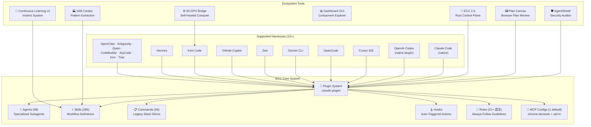
```mermaid
graph TB
    subgraph "ECC Core System"
        direction TB
        Plugin["🔌 Plugin System<br/>.claude-plugin/"]
        Agents["🤖 Agents (68)<br/>Specialized Subagents"]
        Skills["⚡ Skills (286)<br/>Workflow Definitions"]
        Commands["📋 Commands (94)<br/>Legacy Slash Shims"]
        Hooks["🪝 Hooks<br/>Auto-Triggered Actions"]
        Rules["📏 Rules (21+ 語言)<br/>Always-Follow Guidelines"]
        MCP["🔗 MCP Configs (1 default)<br/>chrome-devtools + opt-in"]
    end

    subgraph "Ecosystem Tools"
        AgentShield["🛡️ AgentShield<br/>Security Auditor"]
        SkillCreator["🏭 Skill Creator<br/>Pattern Extraction"]
        ContinuousLearning["🧠 Continuous Learning v2<br/>Instinct System"]
        Dashboard["📊 Dashboard GUI<br/>Component Explorer"]
        PlanCanvas["🖼️ Plan Canvas<br/>Browser Plan Review"]
        ECC2["🚀 ECC 2.0<br/>Rust Control Plane"]
        Ito["⚙️ Itô GPU Bridge<br/>Self-Hosted Compute"]
    end

    subgraph "Supported Harnesses (13+)"
        ClaudeCode["Claude Code<br/>(native)"]
        Codex["OpenAI Codex<br/>(native plugin)"]
        Cursor["Cursor IDE"]
        OpenCode["OpenCode"]
        Gemini["Gemini CLI"]
        Zed["Zed"]
        Copilot["GitHub Copilot"]
        Kimi["Kimi Code"]
        Hermes["Hermes"]
        Others["OpenClaw · Antigravity · Qwen ·<br/>CodeBuddy · JoyCode · Kiro · Trae"]
    end

    Plugin --> Agents
    Plugin --> Skills
    Plugin --> Commands
    Plugin --> Hooks
    Plugin --> Rules
    Plugin --> MCP

    AgentShield --> Plugin
    SkillCreator --> Skills
    ContinuousLearning --> Skills
    PlanCanvas --> Plugin
    ECC2 --> Plugin
    Ito --> Kimi

    ClaudeCode --> Plugin
    Codex --> Plugin
    Cursor --> Plugin
    OpenCode --> Plugin
    Gemini --> Plugin
    Zed --> Plugin
    Copilot --> Plugin
    Kimi --> Plugin
    Hermes --> Plugin
    Others --> Plugin
```

### 1.5 Agent / Skills / Hooks / Commands 關係圖

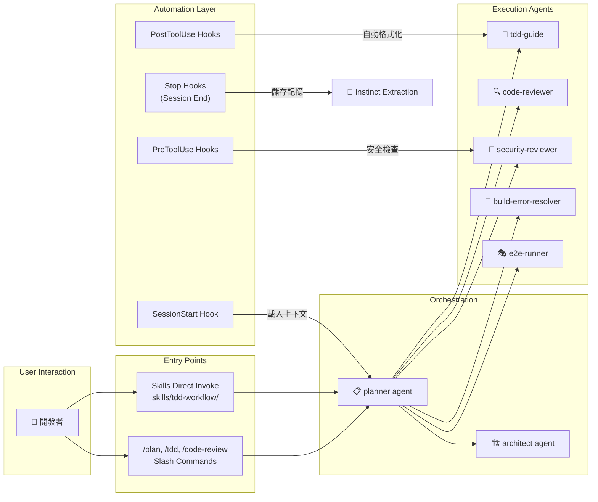
```mermaid
graph LR
    subgraph "User Interaction"
        User["👤 開發者"]
    end

    subgraph "Entry Points"
        SlashCmd["/plan, /tdd, /code-review<br/>Slash Commands"]
        SkillInvoke["Skills Direct Invoke<br/>skills/tdd-workflow/"]
    end

    subgraph "Orchestration"
        Planner["📋 planner agent"]
        Architect["🏗️ architect agent"]
    end

    subgraph "Execution Agents"
        TDDGuide["🧪 tdd-guide"]
        CodeReviewer["🔍 code-reviewer"]
        SecurityReviewer["🔐 security-reviewer"]
        BuildResolver["🔧 build-error-resolver"]
        E2ERunner["🎭 e2e-runner"]
    end

    subgraph "Automation Layer"
        PreHook["PreToolUse Hooks"]
        PostHook["PostToolUse Hooks"]
        StopHook["Stop Hooks<br/>(Session End)"]
        SessionStart["SessionStart Hook"]
    end

    User --> SlashCmd
    User --> SkillInvoke
    SlashCmd --> Planner
    SkillInvoke --> Planner
    Planner --> Architect
    Planner --> TDDGuide
    Planner --> CodeReviewer
    Planner --> SecurityReviewer
    Planner --> BuildResolver
    Planner --> E2ERunner

    SessionStart -->|"載入上下文"| Planner
    PostHook -->|"自動格式化"| TDDGuide
    StopHook -->|"儲存記憶"| ContinuousLearning["🧠 Instinct Extraction"]
    PreHook -->|"安全檢查"| SecurityReviewer
```

> 💡 **Best Practice**：新的工作流程應優先定義為 Skill，不再建立新的 Command。ECC 正在將 `commands/` 遷移至 `skills/` 體系。
>
> ⚠️ **常見錯誤**：混淆 Agent 與 Skill。Agent 是執行者（帶角色與工具限制），Skill 是工作流程定義（可被 Agent 調用或直接執行）。

### 1.6 版本演進歷程

ECC 自 2025 年 9 月起持續快速迭代，以下為主要里程碑（已依官方 Releases／CHANGELOG.md 校正日期與內容）：

| 版本 | 日期 | 重要特性 |
| ------ | ------ | --------- |
| v1.2.0 | 2026-02 | Python/Django + Java Spring Boot Skills；Continuous Learning v2（Instinct 系統）；Session 管理 |
| v1.3.0 | 2026-02 | 完整 OpenCode 整合（12 agents、24 commands、16 skills）；3 個 native custom tools |
| v1.4.0 | 2026-02 | 互動式安裝精靈；PM2 與 multi-agent 編排（6 新指令）；多語言 Rules 架構重構 |
| v1.6.0 | 2026-02 | Codex CLI 支援；AgentShield 整合（1282 tests、102 rules）；GitHub Marketplace（ECC Tools） |
| v1.7.0 | 2026-02 | Codex App + CLI 雙支援；`frontend-slides` Skill；5 個商業/內容 Skills |
| v1.8.0 | 2026-03-05 | 正式定位為 Harness Performance System；Hook 可靠性大幅翻修；NanoClaw v2 |
| v1.9.0 | 2026-03-20 | Manifest-driven 選擇性安裝架構；SQLite 狀態儲存；6 新 Agents（TypeScript、Java、Kotlin、PyTorch 等）；10+ 語言生態系 |
| v1.10.0 | 2026-04-05 | Dashboard GUI；Operator 工作流擴展（語音、圖譜排序、計費、Workspace）；ECC 2.0 Alpha（Rust 控制平面，`ecc2/`）首度可本機建置；38 agents、156 skills、72 commands |
| v2.0.0-rc.1 | 2026-04-28 | Hermes operator story 公開發行候選版；跨 Harness 可重用基板文件化（`docs/architecture/cross-harness.md`） |
| v2.0.0 | 2026-06-09 | **正式定位為 Agent Harness Operating System**；`orch-*` 編排器族與動態工作流團隊編排上線；ECC Discord 社群成立；`kubernetes-patterns` skill、Worktree-lifecycle service |
| v2.1.0 | 2026-07-27 | **Plan Canvas**（瀏覽器內視覺化計畫審查）；**Kimi Code Harness**（Moonshot AI 官方合作）；**Itô GPU 自架運算整合**；新增 Hermes / OpenClaw 安裝目標；GateGuard 路徑排除（`GATEGUARD_EXEMPT_GLOBS`）；PostToolUse Hooks 整併為同步/非同步派發器；供應鏈強化（偵測 `sk-ant-` 等 Anthropic API Key 洩漏）；67 agents、281 skills、94 commands |
| main（開發中） | 2026-08 至今 | 邁向 **v2.2.0**：`ecc-universal setup` / `install --guided` 導引式安裝精靈（多 Harness 一次設定）、JoyCode Harness、MCP 預設連接器政策正式生效（僅 `chrome-devtools`）。npm 套件 `ecc-universal` 目前仍停留在 2.1.0，2.2.0 導引指令**尚未正式發布**，企業環境請勿提前依賴 |

> ⚠️ **版本使用建議**：正式環境／CI 應鎖定已標記 Release 的版本（目前為 **v2.1.0**），並透過 `git tag` 或 npm 版本鎖定安裝，避免直接追蹤 `main` 分支的開發中變更。
>
> 💡 完整變更記錄請參閱 [CHANGELOG.md](https://github.com/affaan-m/ECC/blob/main/CHANGELOG.md) 及 [Releases](https://github.com/affaan-m/ECC/releases)。

---

## 第二章：ECC 核心組件解析

### 2.1 Agents（代理）

Agent 是 ECC 的核心執行單元，每個 Agent 都是帶有特定角色、工具權限和模型配置的子代理。

#### 2.1.1 Agent 定義格式

```markdown
---
name: code-reviewer
description: Reviews code for quality, security, and maintainability
tools: ["Read", "Grep", "Glob", "Bash"]
model: opus
---

You are a senior code reviewer. Review the provided code for:
1. Code quality and maintainability
2. Security vulnerabilities (OWASP Top 10)
3. Performance issues
4. Test coverage gaps
```

#### 2.1.2 主要 Agent 分類

截至 2026-08，官方 `agents/` 目錄共收錄 **68 個** Agent。以下依職能分組列出，完整清單請以 `agents/` 目錄或 `/plugin list ecc@ecc` 查詢結果為準：

**規劃與架構**

| Agent 名稱 | 職責 |
| ----------- | ------ |
| `planner` | 功能實作規劃、任務拆解 |
| `architect` | 系統設計決策 |
| `code-architect` | 程式碼層級架構設計（模組邊界、介面） |
| `network-architect` | 網路拓撲與基礎設施架構設計 |
| `homelab-architect` | 自架/家用實驗室基礎設施架構 |

**探索與分析**

| Agent 名稱 | 職責 |
| ----------- | ------ |
| `code-explorer` | 唯讀程式碼庫探勘、快速定位 |
| `spec-miner` | 從既有程式碼／文件反推規格 |
| `type-design-analyzer` | 型別設計與 API 形狀分析 |
| `comment-analyzer` | 註解品質與過時註解偵測 |
| `conversation-analyzer` | Session 對話品質分析 |

**通用品質與治理**

| Agent 名稱 | 職責 |
| ----------- | ------ |
| `code-reviewer` | 程式碼品質審查 |
| `code-simplifier` | 簡化與去除不必要抽象 |
| `refactor-cleaner` | 無用程式碼清除 |
| `silent-failure-hunter` | 找出被吞噬的錯誤與靜默失敗 |
| `performance-optimizer` | 效能瓶頸分析與優化 |
| `agent-evaluator` | 評估其他 Agent 的產出品質 |

**安全與測試**

| Agent 名稱 | 職責 |
| ----------- | ------ |
| `security-reviewer` | OWASP Top 10 弱點分析 |
| `tdd-guide` | TDD 驅動開發引導 |
| `e2e-runner` | Playwright E2E 測試 |
| `pr-test-analyzer` | PR 測試覆蓋與品質分析 |

**文件**

| Agent 名稱 | 職責 |
| ----------- | ------ |
| `doc-updater` | 文件同步更新 |
| `docs-lookup` | 文件 / API 查閱 |

**語言與框架審查（21 種）**

`typescript-reviewer`、`python-reviewer`、`go-reviewer`、`java-reviewer`、`kotlin-reviewer`、`rust-reviewer`、`cpp-reviewer`、`csharp-reviewer`、`php-reviewer`、`fsharp-reviewer`、`swift-reviewer`、`react-reviewer`、`vue-reviewer`、`django-reviewer`、`fastapi-reviewer`、`flutter-reviewer`、`database-reviewer`、`rag-pipeline-reviewer`、`healthcare-reviewer`、`mle-reviewer`、`network-config-reviewer`

**建構錯誤修復（Build Resolvers，12 種）**

`build-error-resolver`（通用）、`java-build-resolver`、`go-build-resolver`、`kotlin-build-resolver`、`rust-build-resolver`、`cpp-build-resolver`、`dart-build-resolver`、`django-build-resolver`、`react-build-resolver`、`swift-build-resolver`、`pytorch-build-resolver`、`harmonyos-app-resolver`

**自動化與產生器-評估器框架**

| Agent 名稱 | 職責 |
| ----------- | ------ |
| `loop-operator` | 自主迴圈執行 |
| `harness-optimizer` | Harness 配置調校 |
| `gan-planner` / `gan-generator` / `gan-evaluator` | GAN 風格產生器-評估器框架（見 12.6） |
| `network-troubleshooter` | 網路故障排除 |

**業務、內容與開源治理**

| Agent 名稱 | 職責 |
| ----------- | ------ |
| `chief-of-staff` | 通訊分流與草稿 |
| `marketing-agent` | 行銷內容產出 |
| `seo-specialist` | SEO 優化建議 |
| `opensource-forker` / `opensource-packager` / `opensource-sanitizer` | 開源專案 Fork、封裝與敏感資訊清理工作流 |

> 💡 相較於 v2.0.0 時期（66 agents），v2.1.0 後新增了 `a11y-architect`（無障礙架構）、`agent-evaluator`、`code-simplifier`、`silent-failure-hunter`、`spec-miner`、`type-design-analyzer` 等多個「Agent 品質治理」類別的新角色——反映 ECC 社群近期的重點從「涵蓋更多語言」轉向「治理與稽核 Agent 本身輸出品質」。

#### 2.1.3 子代理（Sub-agent）設計模式

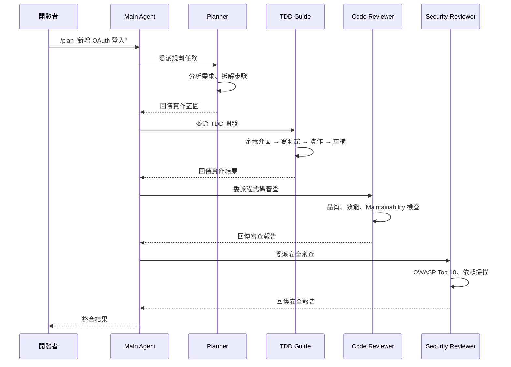
```mermaid
sequenceDiagram
    participant U as 開發者
    participant M as Main Agent
    participant P as Planner
    participant T as TDD Guide
    participant R as Code Reviewer
    participant S as Security Reviewer

    U->>M: /plan "新增 OAuth 登入"
    M->>P: 委派規劃任務
    P->>P: 分析需求、拆解步驟
    P-->>M: 回傳實作藍圖
    M->>T: 委派 TDD 開發
    T->>T: 定義介面 → 寫測試 → 實作 → 重構
    T-->>M: 回傳實作結果
    M->>R: 委派程式碼審查
    R->>R: 品質、效能、Maintainability 檢查
    R-->>M: 回傳審查報告
    M->>S: 委派安全審查
    S->>S: OWASP Top 10、依賴掃描
    S-->>M: 回傳安全報告
    M-->>U: 整合結果
```

> 💡 **Best Practice**：子代理使用獨立的上下文窗口，不會污染主對話。適合「寫完就扔」的任務。

### 2.2 Skills（技能）

Skills 是 ECC 的**主要工作流程介面**（Primary Workflow Surface），替代 legacy 的 `commands/`。

#### 2.2.1 Skill 目錄結構

```text
skills/
├── tdd-workflow/           # TDD 方法論
│   └── SKILL.md
├── security-review/        # 安全檢查清單
│   └── SKILL.md
├── springboot-patterns/    # Spring Boot 模式 ★ Java
│   └── SKILL.md
├── springboot-security/    # Spring Boot 安全 ★ Java
│   └── SKILL.md
├── springboot-tdd/         # Spring Boot TDD ★ Java
│   └── SKILL.md
├── java-coding-standards/  # Java 編碼標準 ★ Java
│   └── SKILL.md
├── jpa-patterns/           # JPA/Hibernate 模式 ★ Java
│   └── SKILL.md
├── backend-patterns/       # API、資料庫、快取模式
│   └── SKILL.md
├── api-design/             # REST API 設計
│   └── SKILL.md
├── e2e-testing/            # Playwright E2E 測試
│   └── SKILL.md
├── deployment-patterns/    # CI/CD、Docker、Rollback
│   └── SKILL.md
├── docker-patterns/        # Docker Compose、安全
│   └── SKILL.md
├── search-first/           # 研究優先工作流
│   └── SKILL.md
├── continuous-learning-v2/ # Instinct 學習系統
│   └── SKILL.md
├── strategic-compact/      # 策略性壓縮
│   └── SKILL.md
├── security-scan/          # AgentShield 整合
│   └── SKILL.md
├── autonomous-loops/       # 自主迴圈模式
│   └── SKILL.md
├── plankton-code-quality/  # 寫入時品質強制
│   └── SKILL.md
├── mle-workflow/           # 生產 ML Pipeline、評估、部署 ★ 新增
│   └── SKILL.md
├── nestjs-patterns/        # NestJS 框架模式 ★ 新增
│   └── SKILL.md
├── liquid-glass-design/    # iOS 26 Liquid Glass 設計系統 ★ 新增
│   └── SKILL.md
├── foundation-models-on-device/ # Apple 裝置端 LLM ★ 新增
│   └── SKILL.md
├── swift-concurrency-6-2/  # Swift 6.2 並發模式 ★ 新增
│   └── SKILL.md
├── perl-patterns/          # Modern Perl 5.36+ 慣用語法 ★ 新增
│   └── SKILL.md
├── codehealth-mcp/         # CodeScene Code Health（opt-in）★ 新增
│   └── SKILL.md
├── dmux-workflows/         # 多 Agent tmux 編排 ★ 新增
│   └── SKILL.md
├── videodb/                # 影音處理與串流 ★ 新增
│   └── SKILL.md
├── plan-canvas/            # Plan Canvas 視覺化計畫審查 ★ v2.1.0 新增
│   └── SKILL.md
├── ito-compute/            # Itô GPU 運算橋接（RFQ、節點查找）★ v2.1.0 新增
│   └── SKILL.md
├── hermes-imports/         # Hermes operator 匯入 ★ 新增
│   └── SKILL.md
├── openclaw-persona-forge/ # OpenClaw persona 建構 ★ 新增
│   └── SKILL.md
├── github-ops/             # gh CLI 包裝（取代 github MCP）★ 新增
│   └── SKILL.md
├── documentation-lookup/   # Context7 REST API 包裝（取代 context7 MCP）★ 新增
│   └── SKILL.md
├── exa-search/             # Exa 搜尋 API 包裝（取代 exa MCP）★ 新增
│   └── SKILL.md
└── ...（共 286 個，完整清單請查閱官方 repo 或執行 `node scripts/ecc.js list-installed`）
```

#### 2.2.2 Skill 定義範例（Spring Boot TDD）

````markdown
---
name: springboot-tdd
description: Test-Driven Development workflow for Spring Boot applications
tags: [java, spring-boot, tdd, testing]
---

# Spring Boot TDD Workflow

## 執行步驟

1. **定義介面**：先寫 Controller/Service Interface
2. **RED**：撰寫失敗的測試案例
   - 使用 `@WebMvcTest` 測試 Controller
   - 使用 `@DataJpaTest` 測試 Repository
   - 使用 Mockito 模擬依賴
3. **GREEN**：實作最小程式碼通過測試
4. **REFACTOR**：重構，保持測試綠燈
5. **驗證覆蓋率**：目標 80%+

## 範例

```java
@WebMvcTest(UserController.class)
class UserControllerTest {
    @Autowired MockMvc mockMvc;
    @MockBean UserService userService;

    @Test
    void shouldReturnUserById() throws Exception {
        given(userService.findById(1L))
            .willReturn(Optional.of(new User(1L, "Alice")));

        mockMvc.perform(get("/api/users/1"))
            .andExpect(status().isOk())
            .andExpect(jsonPath("$.name").value("Alice"));
    }
}
```
````

### 2.3 Commands & Hooks

#### 2.3.1 主要指令（Slash Commands）

> ⚠️ **分辨來源**：下表刻意標註每個指令的**來源**。`/compact`、`/clear`、`/cost`、`/model` 等是 **Claude Code CLI 原生指令**，無論是否安裝 ECC 都能使用；ECC 只是在最佳實踐（第十章）中建議「何時使用」。真正屬於 ECC 帶來的，是 `/plan`、`/tdd`、`/code-review` 等對應到特定 Agent／Skill 的工作流指令，以及 `/harness-audit`、`/loop-start` 等 ECC 專屬能力。

| 指令 | 來源 | 功能 | 對應 Agent |
| ------ | ------ | ------ | ----------- |
| `/plan "需求描述"` | ECC | 建立實作計劃 | planner |
| `/tdd` | ECC | 啟動 TDD 工作流 | tdd-guide |
| `/code-review` | ECC（同名 Claude Code 原生 Skill 亦存在） | 程式碼審查 | code-reviewer |
| `/build-fix` | ECC | 修復建構錯誤 | build-error-resolver |
| `/e2e` | ECC | 產生 E2E 測試 | e2e-runner |
| `/security-scan` | ECC | 安全掃描 | security-reviewer |
| `/refactor-clean` | ECC | 移除無用程式碼 | refactor-cleaner |
| `/update-docs` | ECC | 更新文件 | doc-updater |
| `/learn` | ECC | 從 Session 中萃取模式 | — |
| `/compact` | **Claude Code 原生** | 手動壓縮上下文（可加參數，如 `/compact 聚焦 API 變更`） | — |
| `/clear` | **Claude Code 原生** | 清除上下文（免費重置） | — |
| `/cost` | **Claude Code 原生** | 檢查 Token 花費 | — |
| `/model sonnet` | **Claude Code 原生** | 切換模型（日常） | — |
| `/model opus` | **Claude Code 原生** | 切換模型（深度推理） | — |
| `/rewind` | **Claude Code 原生** | 開啟 Checkpoint 選單，回復對話／程式碼狀態（見 10.6） | — |
| `/goal` | **Claude Code 原生** | 設定持續評估條件，讓 Agent 迭代至條件成立才停止 | — |
| `/plugin` | **Claude Code 原生** | 瀏覽並安裝 Plugin Marketplace | — |
| `/harness-audit` | ECC | 稽核 Harness 可靠度 | — |
| `/loop-start` | ECC | 啟動自主迴圈 | loop-operator |
| `/quality-gate` | ECC | 品質閘門檢查 | — |
| `/model-route` | ECC | 依複雜度路由模型 | — |
| `/multi-plan` | ECC（需額外安裝 `ccg-workflow`） | 多 Agent 任務分解 | — |
| `/multi-execute` | ECC（需額外安裝 `ccg-workflow`） | 多 Agent 協作執行 | — |

#### 2.3.2 Hooks 機制

Hooks 在特定工具事件發生時自動觸發，無需手動介入。

| Hook 事件 | 觸發時機 | 典型用途 |
| ----------- | --------- | --------- |
| `SessionStart` | Session 開始 | 載入上次上下文、設定環境 |
| `SessionEnd` | Session 結束 | 儲存狀態、萃取學習 |
| `PreToolUse` | 工具執行前 | 安全檢查、路徑驗證 |
| `PostToolUse` | 工具執行後 | 自動格式化、TypeCheck |
| `PreCompact` | 壓縮前 | 儲存關鍵狀態 |
| `Stop` | Agent 停止時 | Session 摘要、模式萃取 |

**Hooks 範例 — 檔案編輯後自動檢查 console.log**：

```json
{
  "matcher": "tool == \"Edit\" && tool_input.file_path matches \"\\\\.(ts|tsx|js|jsx)$\"",
  "hooks": [{
    "type": "command",
    "command": "#!/bin/bash\ngrep -n 'console\\.log' \"$file_path\" && echo '[Hook] Remove console.log' >&2"
  }]
}
```

**Hook Runtime Controls**：

```bash
# 設定 Hook 嚴格度（minimal | standard | strict）
export ECC_HOOK_PROFILE=standard

# 停用特定 Hooks
export ECC_DISABLED_HOOKS="pre:bash:tmux-reminder,post:edit:typecheck"
```

> ⚠️ **常見錯誤**：不要在 `plugin.json` 中宣告 `hooks` 欄位！Claude Code v2.1+ 會自動載入 `hooks/hooks.json`，重複宣告會導致 `Duplicate hooks file detected` 錯誤。

### 2.4 Rules（規則）

Rules 是「永遠遵循」的開發準則，按語言／框架組織。截至 2026-08，官方 `rules/` 目錄已涵蓋 **21 種語言／框架 + 1 個通用包**（`common/`），遠超 v1.9.0 時期宣稱的「12+ 語言生態系」：

```text
rules/
├── common/              # 語言無關的通用原則（必裝）
│   ├── coding-style.md    # 不可變性、檔案組織
│   ├── git-workflow.md    # Commit 格式、PR 流程
│   ├── testing.md         # TDD、80% 覆蓋率需求
│   ├── performance.md     # 模型選擇、上下文管理
│   ├── patterns.md        # 設計模式、骨架專案
│   ├── hooks.md           # Hook 架構、TodoWrite
│   ├── agents.md          # 子代理委派時機
│   └── security.md        # 強制安全檢查
├── typescript/          ├── python/         ├── golang/
├── java/                ├── kotlin/         ├── swift/
├── rust/                ├── cpp/            ├── csharp/
├── php/                 ├── ruby/           ├── dart/
├── perl/                ├── fsharp/         ├── arkts/     # HarmonyOS
├── react/                                    # React（Web）
├── react-native/                             # React Native（行動端）
├── vue/                 ├── angular/        ├── nuxt/
└── web/                                      # 通用 Web 標準
```

> 💡 **選配原則**：Claude Code Plugin 系統**無法**自動分發 `rules/`（見 3.2），因此安裝時應只複製 `common/` + 專案實際使用的 1–2 個語言／框架包，而非整個 `rules/` 目錄——Rules 是「永遠載入」的上下文，複製過多會直接侵蝕可用的上下文窗口。

### 2.5 記憶與上下文管理

#### 2.5.1 上下文污染問題

長時間對話中，Claude 的 200K Token 窗口會逐漸被舊資訊、失敗嘗試和探索性內容填滿，導致：

- 模型「遺忘」早期決策
- 重複相同的錯誤
- 回應品質下降

#### 2.5.2 ECC 壓縮策略

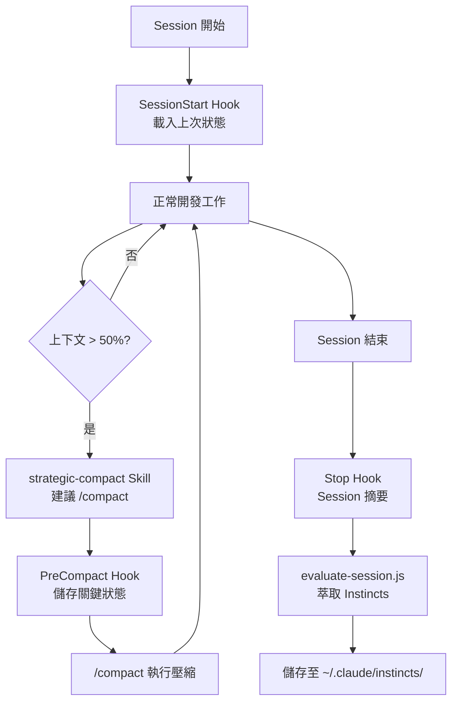
```mermaid
graph TD
    A["Session 開始"] --> B["SessionStart Hook<br/>載入上次狀態"]
    B --> C["正常開發工作"]
    C --> D{上下文 > 50%?}
    D -->|是| E["strategic-compact Skill<br/>建議 /compact"]
    D -->|否| C
    E --> F["PreCompact Hook<br/>儲存關鍵狀態"]
    F --> G["/compact 執行壓縮"]
    G --> C
    C --> H["Session 結束"]
    H --> I["Stop Hook<br/>Session 摘要"]
    I --> J["evaluate-session.js<br/>萃取 Instincts"]
    J --> K["儲存至 ~/.claude/instincts/"]
```

#### 2.5.3 Continuous Learning v2（Instinct 系統）

```bash
# 查看已學習的 Instincts
/instinct-status

# 匯入他人的 Instincts
/instinct-import <file>

# 匯出你的 Instincts 供分享
/instinct-export

# 將相關 Instincts 聚類為 Skills
/evolve

# 清除過期的 Pending Instincts（30 天 TTL）
/prune
```

> 💡 **Best Practice**：在以下時機執行 `/compact`：
> - 研究/探索完成後，開始實作前
> - 完成一個里程碑後，開始下一個前
> - Debug 完成後，繼續功能開發前
> - 某條路失敗後，嘗試新方法前
>
> ⚠️ **不要**在實作進行中壓縮 — 你會失去變數名稱、檔案路徑和部分狀態。

### 2.6 Contexts（動態上下文注入）

ECC 提供**動態系統提示注入**（Dynamic System Prompt Injection）機制，透過 `contexts/` 目錄中的上下文檔案，根據不同工作模式注入最適合的系統行為指引。

#### 2.6.1 可用上下文模式

| 上下文 | 檔案 | 適用場景 |
| -------- | ------ | --------- |
| **Development** | `contexts/dev.md` | 日常功能開發、實作程式碼 |
| **Code Review** | `contexts/review.md` | 程式碼審查模式，聚焦品質與安全 |
| **Research** | `contexts/research.md` | 研究探索模式，側重資料收集與分析 |

#### 2.6.2 使用方式

```bash
# 在 Session 開始時切換上下文
# SessionStart Hook 會自動載入預設上下文

# 手動切換（在 CLAUDE.md 或 Session 中指定）
# 在專案 CLAUDE.md 中設定預設上下文
```

**上下文注入示意**：

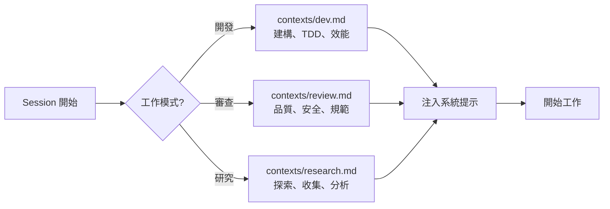
```mermaid
graph LR
    A["Session 開始"] --> B{工作模式?}
    B -->|開發| C["contexts/dev.md<br/>建構、TDD、效能"]
    B -->|審查| D["contexts/review.md<br/>品質、安全、規範"]
    B -->|研究| E["contexts/research.md<br/>探索、收集、分析"]
    C --> F["注入系統提示"]
    D --> F
    E --> F
    F --> G["開始工作"]
```

> 💡 **Best Practice**：在 `CLAUDE.md` 中指定專案預設上下文，根據任務性質動態切換。研究階段用 `research`，實作階段用 `dev`，PR 審查用 `review`。

### 2.7 MCP Server 配置

ECC 對 MCP（Model Context Protocol）採取的立場，是本手冊最需要更新的一個章節——2026 年 6 月的一次官方稽核（"June 2026 audit"）大幅改寫了預設策略，從「多達 14 個預配置 Server」收斂為「僅 1 個預設連接器」。這個決策本身也是企業導入 ECC 時最值得參考的治理案例：**多不代表好，每個 MCP Server 的工具 Schema 都會常駐佔用上下文窗口**。

#### 2.7.1 現行唯一預設連接器

| MCP Server | 功能說明 | 為何保留 |
|------------|---------|---------|
| **`chrome-devtools`** | Google 官方 DevTools MCP：即時偵錯、效能追蹤、Console/Network 檢查 | 需要「保持開啟的互動式 Session」（CDP），這正是 MCP 相對於一次性 CLI 呼叫的不可取代之處；且免金鑰 |

#### 2.7.2 被淘汰的六個前預設連接器（2026-06 審查）

| 前預設 Server | 判定 | 替代方案 |
| --- | --- | --- |
| `github` | 改為 Skill | `gh` CLI 包裝於 `github-ops` Skill——多數模型已內建 `gh` 用法，一次性指令組合、Token 開銷遠低於原本 ~30 個工具 Schema |
| `context7` | 改為 Skill | `documentation-lookup` Skill 直接呼叫 Context7 公開 REST API，兩次無狀態呼叫即可，不需要常駐 Server |
| `exa` | 改為 Skill | 各 Harness 原生搜尋（Claude Code WebSearch、Codex web_search）為預設；`exa-search` Skill 保留給有 API Key 的使用者 |
| `memory` | 直接移除 | 各 Harness 原生記憶機制（Claude Code auto-memory、AGENTS.md 慣例）+ ECC 自身的 Instinct/Continuous Learning 系統已涵蓋此需求 |
| `playwright` | 改為 Skill | Microsoft 官方也已將 Agent 工作流移出 MCP（逐步回傳完整 a11y tree 過度耗費上下文）；ECC 的 e2e Skills 已直接驅動 `@playwright/cli`；瀏覽器**除錯**用途已由 `chrome-devtools` 涵蓋 |
| `sequential-thinking` | 直接移除 | 各主流 Harness 已內建 Extended Thinking，此 Server 本質只是包裝了一種提示模式 |

> 💡 上述六個仍可作為選配項目保留在 `mcp-configs/mcp-servers.json` 中，供需要的使用者手動啟用。

#### 2.7.3 新增連接器的准入原則

ECC 官方訂出兩項門檻，**必須同時滿足**才能新增為預設連接器（否則一律走 Skill 包裝 CLI/REST API 的路線）：

1. **普遍性（Universal）**：幾乎每個 ECC 目標 Harness 的使用者都用得到
2. **MCP 真的優於 CLI/API 包裝**：任務需要互動式 Session 狀態、串流、驗證握手或結構化瀏覽——單純的無狀態請求/回應應該是 Skill，不是 Server

> 「Popular（受歡迎）不是理由；job is stateful and universal（任務具狀態性且普遍適用）才是理由。」——MCP-CONNECTOR-POLICY.md

#### 2.7.4 MCP 配置管理

```bash
# MCP 配置檔位置（選配連接器目錄）
mcp-configs/mcp-servers.json

# 停用已啟用的預設連接器（install/sync filter，非 live Claude Code toggle）
export ECC_DISABLED_MCPS="chrome-devtools"

# 使用 /mcp 命令在 Claude Code 中即時管理（Claude Code 原生功能）
# Claude Code 會將選擇持久化到 ~/.claude.json
```

> ⚠️ **Token 影響提醒**：每個 MCP 的工具描述都會常駐消耗 Token，啟用過多 MCP 可能將 200K Token 窗口實際可用空間壓縮到約 70K。即使在僅 1 個預設連接器的現況下，若專案另外疊加多個選配 MCP，仍建議整體控制在 **< 10 MCPs、< 80 tools**。

### 2.8 Claude Code 原生功能與 ECC 擴充功能分工

企業導入 ECC 前最常見的誤解，是把 Claude Code 平台本身的能力誤認為「ECC 提供的功能」——這會導致評估錯誤（如認為換掉 ECC 就會失去 Plan Mode）、也會導致治理錯誤（如把平台升級才能取得的能力誤植為 ECC 版本紀錄）。下表整理 Anthropic 官方文件與 ECC 官方 repo 的分工邊界：

| 能力 | 提供者 | 說明 |
| ------ | -------- | ------ |
| Plan Mode（`Shift+Tab` 進入計畫模式） | **Claude Code 原生** | Explore → Plan → Code → Commit 四階段工作法的核心機制 |
| Hooks 執行引擎（`PreToolUse`/`PostToolUse`/`Stop` 等事件） | **Claude Code 原生** | ECC 提供的是**寫好的 Hook 腳本內容**（如 Secret 偵測、GateGuard），執行引擎本身是平台能力 |
| Skills 發現與載入機制（`.claude/skills/`） | **Claude Code 原生** | ECC 提供的是**286 個現成 Skill 內容**，發現/載入協定是平台規格 |
| Subagent 委派機制（`tools`/`model` frontmatter） | **Claude Code 原生** | ECC 提供的是**68 個預先設計好角色的 Agent 定義檔** |
| `/compact`、`/clear`、`/cost`、`/model` | **Claude Code 原生** | ECC 只在文件中建議「何時使用」（見 10.1、10.4），並非發明這些指令 |
| Checkpoints / `/rewind` | **Claude Code 原生** | 自動快照＋回復機制；ECC 的 Worktree-lifecycle（12.4）是另一層、更粗粒度的隔離機制 |
| `/goal` 持續評估、Stop Hook 阻擋迴圈 | **Claude Code 原生** | ECC 的 `verification-loop` Skill（6.6）是在此機制上包裝的特定驗證管道 |
| Auto Mode / Permission Modes（分類器模型自動審核操作） | **Claude Code 原生** | 與 ECC 的 `ECC_HOOK_PROFILE`（minimal/standard/strict）是互補而非取代關係 |
| Sandboxing（`/sandbox`，OS 層級隔離） | **Claude Code 原生** | GateGuard（7.5）與 AgentShield（6.4）是應用層的額外掃描，不取代 OS 層沙箱 |
| Agent Teams（原生多 Session 協同） | **Claude Code 原生**（2026 年新增） | 與 ECC 的 `/multi-plan`／`/multi-execute`（需 `ccg-workflow`）是兩條不同的多代理路徑，企業選型時應擇一，避免疊加 |
| 非互動模式 `claude -p`、Fan-out 迴圈 | **Claude Code 原生** | CI/CD 整合（第八章）可直接使用，不依賴 ECC |
| MCP 協定支援本身 | **Claude Code 原生**（Anthropic 定義的協定） | ECC 提供的是**連接器政策**與精選 Server 目錄（2.7），協定實作是平台層 |
| AgentShield 安全掃描、GateGuard、Instinct 學習系統、Orchestrator 家族、Plan Canvas、跨 Harness Adapter | **ECC 專屬** | 這些是 Anthropic 官方未提供、需要額外框架才能取得的能力 |

> 💡 **一句話總結**：Claude Code 提供「積木」（Hooks、Skills、Subagents、Plan Mode、Checkpoints 的執行引擎），ECC 提供「預先搭好、可跨團隊複用的積木組合」（具體的 Agent 角色、Skill 工作流、安全掃描規則、跨 Harness 移植層）。導入 ECC 前，建議先讀過 Anthropic 官方 [Best Practices for Claude Code](https://code.claude.com/docs/en/best-practices)，確認團隊已理解原生積木的用法，再評估是否需要 ECC 這層「預組裝」框架（第十三章有完整的決策框架）。

---

## 第三章：安裝與環境建置

### 3.1 前置需求

| 需求 | 版本 | 說明 |
| ------ | ------ | ------ |
| Claude Code CLI | v2.1.0+ | `claude --version` 檢查 |
| Node.js | 18+ | 用於 Hook scripts |
| npm / pnpm / yarn / bun | 任一 | 套件管理器 |
| Git | 2.x+ | 版本控制 |

### 3.2 Plugin 安裝（推薦）

> ⚠️ **只選一種安裝路徑（per Harness）**：同一個 Harness 只能選**一種**安裝方式。例如 Claude Code 用 Plugin 安裝後，**不要**再疊加執行 `install.sh --profile full`，這會造成重複元件和衝突行為（症狀：指令重複出現、Hook 執行兩次）。若已經疊加安裝，直接跳到「Reset / Uninstall ECC」小節復原，不需要重灌整個環境。不同 Harness 之間可以同時各自安裝一種方式，例如「Claude Code Plugin + Codex 原生 Plugin」是被允許的組合。
>
> ⚠️ **2.2.0 導引式安裝尚未發布**：官方 README 目前明確標示，`npx ecc-universal setup` 與 `npx ecc-universal install --guided` 兩個導引式安裝精靈屬於 **v2.2.0** 的功能，而 npm 上的 `ecc-universal` 套件目前仍停留在 **2.1.0**。在 2.2.0 正式發布前，請使用下方的原生 `/plugin` 指令安裝，不要提前執行導引式安裝指令。

#### ECC 三個公開標識符

| 標識符 | 用途 | 值 |
| -------- | ------ | ----- |
| GitHub 原始碼倉庫 | Clone、Star、PR | `affaan-m/ECC` |
| Claude Marketplace / Plugin | 安裝指令 | `ecc@ecc` |
| npm 套件 | OpenCode 整合 | `ecc-universal` |

> 💡 三者名稱不同是有意設計。Anthropic marketplace 安裝以 canonical plugin identifier 為鍵，ECC 使用 `ecc@ecc` 保持命名簡短。npm 套件維持 `ecc-universal` 以確保向後相容。

**Step 1：安裝 Plugin**

```bash
# 在 Claude Code 中執行
/plugin marketplace add https://github.com/affaan-m/ECC
/plugin install ecc@ecc
```

或直接編輯 `~/.claude/settings.json`：

```json
{
  "extraKnownMarketplaces": {
    "ecc": {
      "source": {
        "source": "github",
        "repo": "affaan-m/ECC"
      }
    }
  },
  "enabledPlugins": {
    "ecc@ecc": true
  }
}
```

**Step 2：安裝 Rules（必要）**

> ⚠️ Claude Code Plugin 系統**無法**自動分發 Rules，必須手動安裝，且**只安裝實際會用到的語言包**——Rules 是永遠載入的上下文，全裝 21+ 種語言包只會侵蝕上下文窗口。

```bash
git clone https://github.com/affaan-m/ECC.git
cd ECC

mkdir -p ~/.claude/rules/ecc
cp -R rules/common ~/.claude/rules/ecc/
cp -R rules/typescript ~/.claude/rules/ecc/   # 替換為你實際使用的語言／框架包
```

**Step 3：開始使用**

```bash
# Plugin 安裝使用命名空間形式
/ecc:plan "Add user authentication"

# 檢查可用指令
/plugin list ecc@ecc

# 已安裝後的重新設定（僅可用於「已安裝」狀態，不能取代首次 /plugin install）
/ecc:configure-ecc
```

#### ECC Consult 顧問指令

不確定該用哪些 Skills / Agents？使用官方腳本取得建議（**不要**使用 `npx ecc consult`，該別名尚未在 npm 上正式提供）：

```bash
# 詢問特定主題的建議安裝內容，並回傳對應 Skill/Agent、profile 與 preview 指令
node scripts/ecc.js consult "security reviews" --target claude
node scripts/ecc.js consult "Spring Boot microservice with Kafka" --target claude
```

#### Reset / Uninstall ECC

```bash
# 檢查目前已安裝的 ECC 管理元件
node scripts/ecc.js list-installed

# 診斷設定問題
node scripts/ecc.js doctor

# 自動修復遺失/損壞的元件
node scripts/ecc.js repair

# 乾跑模式：列出將被移除的檔案（不實際刪除）
node scripts/ecc.js uninstall --dry-run

# 正式解除安裝
node scripts/ecc.js uninstall
# 等效於：node scripts/uninstall.js
```

> ⚠️ 解除安裝只移除 ECC install-state 記錄在案的檔案（rules、hooks、commands、agents、skills）。你的 `~/.claude/settings.json` 中的個人設定、以及 ECC 無法證明擁有權的既有檔案都不會被觸碰。若曾經疊加多種安裝方式，官方建議的清理順序是：① 先移除 Claude Code Plugin → ② 從 repo 根目錄執行 `node scripts/ecc.js uninstall` → ③ 手動刪掉不再需要的 Rules 資料夾 → ④ 重新以單一路徑安裝一次。
>
> 若不確定是否需要重新採購或重新設定：解除安裝流程會印出一個非強制性的 20 秒意見回饋表單連結，ECC **不會**自動上傳任何診斷資料。

### 3.3 手動安裝

> 💡 **元件安裝目標路徑不同，請勿混淆**：Rules 巢狀放在 `~/.claude/rules/ecc/` 下；Skills 則是 Claude Code 的「直接子目錄」發現機制，必須放在 `~/.claude/skills/` 平面目錄下，**不可**巢狀在 `~/.claude/skills/ecc/`。

```bash
git clone https://github.com/affaan-m/ECC.git
cd ECC

# 複製 Agents
cp agents/*.md ~/.claude/agents/

# 複製 Rules（巢狀於 ecc/ 子目錄，common + 語言特定）
mkdir -p ~/.claude/rules/ecc
cp -r rules/common ~/.claude/rules/ecc/
cp -r rules/typescript ~/.claude/rules/ecc/   # 依你的技術棧選擇

# 複製 Skills（平面目錄，主要工作流程介面）
mkdir -p ~/.claude/skills
cp -r .agents/skills/* ~/.claude/skills/
cp -r skills/search-first ~/.claude/skills/

# 選擇性：加入框架特定 Skills
for s in springboot-patterns springboot-tdd springboot-security java-coding-standards; do
  cp -r skills/$s ~/.claude/skills/
done

# 選擇性：保留 Legacy 指令相容性（已淘汰的 shim 另存於 legacy-command-shims/）
mkdir -p ~/.claude/commands
cp commands/*.md ~/.claude/commands/
```

**安裝 Hooks**（務必使用 installer，不要直接複製 `hooks.json`）：

```bash
# macOS / Linux
bash ./install.sh --target claude --modules hooks-runtime

# Windows PowerShell
pwsh -File .\install.ps1 --target claude --modules hooks-runtime
```

### 3.4 Windows PowerShell 安裝

```powershell
# Clone 專案
git clone https://github.com/affaan-m/ECC.git
cd ECC

# 安裝依賴
npm install

# 完整安裝
.\install.ps1 --profile full

# 或安裝特定語言
.\install.ps1 typescript python

# 跨平台 npm entrypoint
npx ecc-install typescript
```

> ⚠️ **Windows 注意**：Claude 配置目錄是 `%USERPROFILE%\.claude`，不是 `~/claude`。

### 3.5 跨 Harness 整合（13+ 平台總覽）

ECC v2.1.0 官方支援的 Harness 已從早期的 5 種擴展為 **13+ 種**。下表為總覽，各平台細節於後續小節說明：

| Harness | 安裝方式 | 支援等級 |
| --- | --- | --- |
| Claude Code | `/plugin install ecc@ecc`（見 3.2） | 原生（Canonical，功能最完整） |
| Codex（App + CLI） | `codex plugin marketplace add affaan-m/ECC` | 原生 Plugin（穩定） |
| Cursor | `./install.sh --profile minimal --target cursor` | Capability-limited adapter |
| OpenCode | `npm install && npm run build:opencode && ./install.sh --profile full --target opencode` | Capability-limited adapter |
| Gemini CLI | `./install.sh --profile minimal --target gemini` | Capability-limited adapter |
| Zed | `./install.sh --profile minimal --target zed` | Capability-limited adapter |
| GitHub Copilot | 已內建於 repo（`.github/`），無需安裝 | Instruction + Prompt 層（無 Hook/Agent） |
| Antigravity | `./install.sh --profile minimal --target antigravity` | Capability-limited adapter |
| Qwen CLI | `./install.sh --profile minimal --target qwen` | Capability-limited adapter |
| Hermes | `./install.sh --profile minimal --target hermes` | Capability-limited adapter（v2.1.0 新增） |
| OpenClaw | `./install.sh --profile minimal --target openclaw` | 受管理的 Home 目錄安裝（v2.1.0 新增） |
| Kimi Code | `./install.sh --profile minimal --target kimi` | 專案本地 `.kimi-code/` 安裝（v2.1.0 新增，Moonshot AI 官方合作） |
| CodeBuddy（騰訊） | `./install.sh --profile minimal --target codebuddy` | 專案本地 `.codebuddy/` 安裝 |
| JoyCode | `./install.sh --profile minimal --target joycode` | 專案本地 `.joycode/` 安裝（main 分支新增） |
| Kiro / Trae | 參閱對應 `.kiro/` / `.trae/` 目錄 | 社群維護的安裝配置 |

> ⚠️ **不要對同一個 Harness 混用官方支援 Feature Parity 假設**：不同 Harness 的能力天花板不同（例如 Copilot 沒有 Hook/Subagent API）。導入前務必查閱本章與附錄 D 的功能對照表，不要預設「裝了 ECC 就等於 Claude Code 的完整體驗」。找不到原生對應目標的 Harness，可參考 [Manual Adaptation Guide](https://github.com/affaan-m/ECC/blob/main/docs/MANUAL-ADAPTATION-GUIDE.md) 手動移植一小部分 Skill 與工作流程指引。

#### Cursor IDE

```bash
# macOS/Linux
./install.sh --target cursor typescript python

# Windows
.\install.ps1 --target cursor typescript python
```

Cursor 支援項目：

| 元件 | 數量 | 說明 |
| ------ | ------ | ------ |
| Hook Events | 15 | sessionStart、beforeShellExecution、afterFileEdit 等 |
| Hook Scripts | 16 | 透過 DRY Adapter 模式共用 Claude Code 的 scripts |
| Rules | 34 | 9 common (alwaysApply) + 25 language-specific |
| Agents | 共用 | 透過根目錄 AGENTS.md |
| Skills | 共用 + 專屬 | AGENTS.md + .cursor/skills/ |

#### OpenAI Codex

Codex 目前是**原生 Plugin 支援**（優先推薦），舊有的同步腳本已列為過時的相容性選項：

```bash
# 推薦：原生 Codex Marketplace Plugin
codex plugin marketplace add affaan-m/ECC
codex plugin add ecc@ecc
codex plugin list --json
node scripts/codex/check-plugin-cache.js

# 更新
codex plugin marketplace upgrade ecc
codex plugin add ecc@ecc

# Codex 內建的 ECC 導覽指令
$configure-ecc
```

> ⚠️ Codex 的 Plugin 狀態是單一啟用（不像 Claude Code 有 user/project/local 三種 scope），且其原生 Hook 需要明確的信任決策，不使用 ECC 的四種 Hook Profile。

舊版 `scripts/sync-ecc-to-codex.sh` 路徑僅為**已淘汰**的相容性選項，適合需要把設定複製並合併進 `~/.codex` 的使用者：

```bash
# 需先執行過一次 Codex，讓 ~/.codex/config.toml 存在
git clone https://github.com/affaan-m/ECC.git
cd ECC
npm install
bash scripts/sync-ecc-to-codex.sh

# 檢查或移除這個舊同步層（不影響 Codex 對話與原生 Plugin 快取）
node scripts/ecc.js uninstall --legacy-codex-sync --dry-run
node scripts/ecc.js uninstall --legacy-codex-sync
```

詳見 [Codex ECC Navigation Guide](https://github.com/affaan-m/ECC/blob/main/docs/CODEX-NAVIGATION-GUIDE.md)。

#### OpenCode

```bash
git clone https://github.com/affaan-m/ECC.git
cd ECC

# 需先建置 OpenCode 專用 Plugin payload，再執行完整安裝
npm install && npm run build:opencode && ./install.sh --profile full --target opencode
```

#### Gemini CLI

```bash
# macOS/Linux
./install.sh --target gemini --profile full

# Windows PowerShell
.\install.ps1 --target gemini --profile full
```

Gemini 透過 `.gemini/GEMINI.md` 和共用安裝管道提供實驗性的專案級支援。

#### Antigravity IDE

```bash
# macOS/Linux
./install.sh --target antigravity typescript

# Windows PowerShell
.\install.ps1 --target antigravity typescript
```

Antigravity 整合包含工作流程、Skills 和扁平化 Rules，位於 `.agent/` 目錄中。詳見 [Antigravity Guide](https://github.com/affaan-m/ECC/blob/main/docs/ANTIGRAVITY-GUIDE.md)。

#### Kimi Code（Moonshot AI 官方合作，v2.1.0 新增）

Kimi Code 是首個與 ECC 有官方合作關係的開源模型 Harness，經 Kimi Code 0.31.x（`@moonshot-ai/kimi-code`）驗證：

```bash
bash ./install.sh --target kimi --profile minimal
node scripts/ecc.js doctor --target kimi
kimi
```

Kimi Code 原生從 `.kimi-code/AGENTS.md`（指令）與 `.kimi-code/skills/`（工作流）發現內容；ECC 會安全地將專案 MCP 設定併入 `.kimi-code/mcp.json`，但**不會**更動使用者層級的 `~/.kimi-code/config.toml`。Kimi Code 原生支援 Hooks，但 ECC 目前的受管理專案 adapter **尚未**替 Kimi 配置 Hook Profile。若需自架 Kimi 模型，請見 3.10 節的 Itô GPU 整合說明。

#### Hermes / OpenClaw（v2.1.0 新增）

```bash
# Hermes
./install.sh --profile minimal --target hermes
# 詳見 docs/HERMES-SETUP.md

# OpenClaw（受管理的 Home 目錄安裝）
./install.sh --profile minimal --target openclaw
```

> 💡 Hermes 與 OpenClaw 之間存在遷移路徑，詳見 [HERMES-OPENCLAW-MIGRATION.md](https://github.com/affaan-m/ECC/blob/main/docs/HERMES-OPENCLAW-MIGRATION.md)。

#### 其他 Harness 支援

| IDE / 工具 | 安裝方式 | 說明 |
| ------------ | ------ | ------ |
| **CodeBuddy（騰訊）** | `./install.sh --profile minimal --target codebuddy` | 專案本地 `.codebuddy/` 安裝 |
| **JoyCode** | `./install.sh --profile minimal --target joycode` | 專案本地 `.joycode/` 安裝（main 分支新增） |
| **Qwen CLI** | `./install.sh --profile minimal --target qwen` | 參閱 [Qwen Guide](https://github.com/affaan-m/ECC/blob/main/docs/QWEN-GUIDE.md) |
| **Kiro** | `.kiro/` | Kiro IDE 安裝支援 |
| **Trae** | `.trae/` | Trae IDE 整合（工作流、Skills、Rules） |
| **Non-native harnesses**（如 Grok 介面） | — | 手動回退路徑。參閱 [Manual Adaptation Guide](https://github.com/affaan-m/ECC/blob/main/docs/MANUAL-ADAPTATION-GUIDE.md) |

#### GitHub Copilot（VS Code）

ECC 透過 Copilot Chat 原生的 instruction 與 prompt 檔案系統提供 GitHub Copilot 支援，無需額外工具：

```text
.github/
├── copilot-instructions.md    # 永遠載入的核心規則
└── prompts/
    ├── plan.prompt.md          # 實作規劃工作流
    ├── tdd.prompt.md           # Red-Green-Improve 循環
    ├── security-review.prompt.md  # OWASP 安全分析
    ├── build-fix.prompt.md     # 建構錯誤修復
    └── refactor.prompt.md      # 死碼清除與簡化
```

**使用方式**：
1. 開啟 VS Code 的 Copilot Chat 面板
2. 點擊附件/迴紋針圖示，選擇「Prompt...」
3. 選取想執行的 prompt（如 `plan`、`tdd`、`security-review`）

| 功能 | 支援方式 |
| ------ | --------- |
| 編碼標準 | 永遠載入（copilot-instructions.md） |
| 安全檢查 | 永遠載入 + security-review prompt |
| TDD | 永遠載入 + tdd prompt |
| 實作規劃 | plan prompt |
| Hooks / 自動化 | ❌ 不支援（Copilot 無 Hook 系統） |
| Agents / 委派 | ❌ 不支援（Copilot 無 Subagent API） |

> 💡 GitHub Copilot 不具備 Hook 與 Subagent 功能，因此 ECC 的自動化鉤子和 Agent 委派在此環境不可用。但 instruction 和 prompt 層仍能將完整的 ECC 編碼哲學帶入每次 Copilot Chat。

#### Zed IDE

```bash
# macOS/Linux
./install.sh --profile minimal --target zed

# Windows PowerShell
.\install.ps1 --profile minimal --target zed
```

Zed 透過 `.zed/` adapter 提供專案級設定、扁平化 Rules、Agents、Commands 和 Skills。Zed 帳號或 API 金鑰請透過 Zed 自身的 settings UI 設定，ECC 不會將 BYOK/OpenRouter 憑證寫入 repo。

### 3.6 環境變數設定

```bash
# Token 最佳化（強烈推薦）
export MAX_THINKING_TOKENS=10000
export CLAUDE_AUTOCOMPACT_PCT_OVERRIDE=50

# 套件管理器偏好
export CLAUDE_PACKAGE_MANAGER=pnpm

# Hook 控制
export ECC_HOOK_PROFILE=standard          # minimal | standard | strict
export ECC_DISABLED_HOOKS=""              # 逗號分隔的 Hook ID

# SessionStart 上下文控制（v2.0.0）
export ECC_SESSION_START_MAX_CHARS=8000   # 上限字元數（預設 8000）
export ECC_SESSION_START_CONTEXT=off      # 完全停用（適用低上下文/本地模型）

# Session 保留天數（v2.0.0）
export ECC_SESSION_RETENTION_DAYS=30      # 設為 0/off/never 保留全部

# 成本警告控制（v2.0.0，訂閱用戶建議 off）
export ECC_CONTEXT_MONITOR_COST_WARNINGS=off  # 僅抑制 API 費率估算，保留上下文/範圍警告

# Agent 資料隔離（多 Harness 共存時）
export ECC_AGENT_DATA_HOME="$HOME/.claude"    # Cursor 設為 $HOME/.cursor/ecc

# 停用特定 MCP（install/sync filter，非 live toggle）
export ECC_DISABLED_MCPS="supabase,railway,vercel"
```

**推薦 `~/.claude/settings.json` 設定**：

```json
{
  "model": "sonnet",
  "env": {
    "MAX_THINKING_TOKENS": "10000",
    "CLAUDE_AUTOCOMPACT_PCT_OVERRIDE": "50",
    "CLAUDE_CODE_SUBAGENT_MODEL": "haiku"
  }
}
```

| 設定項 | 預設值 | 推薦值 | 節省效果 |
| -------- | -------- | -------- | --------- |
| `model` | opus | sonnet | ~60% 成本降低 |
| `MAX_THINKING_TOKENS` | 31,999 | 10,000 | ~70% hidden thinking 成本降低 |
| `CLAUDE_AUTOCOMPACT_PCT_OVERRIDE` | 95 | 50 | 提早壓縮，長 Session 品質更好 |

### 3.7 Dashboard GUI

ECC v1.10.0 新增桌面儀表板：

```bash
# 啟動 Dashboard
npm run dashboard

# 或直接執行
python3 ./ecc_dashboard.py
```

功能：
- 分頁介面：Agents、Skills、Commands、Rules、Settings
- 深色/淺色主題切換
- 字型自訂（字體家族 & 大小）
- 搜尋與篩選所有元件

> 💡 **實務案例**：新進團隊成員可透過 Dashboard GUI 快速瀏覽所有可用的 Agents 和 Skills，了解 ECC 提供的能力範圍。

### 3.8 套件管理器偵測

ECC Plugin 自動偵測你偏好的套件管理器（npm、pnpm、yarn、bun），偵測優先順序：

| 優先序 | 來源 | 說明 |
| -------- | ------ | ------ |
| 1 | 環境變數 `CLAUDE_PACKAGE_MANAGER` | 最高優先 |
| 2 | 專案配置 `.claude/package-manager.json` | 專案層級 |
| 3 | `package.json` 的 `packageManager` 欄位 | npm 標準 |
| 4 | Lock file 偵測 | package-lock.json / yarn.lock / pnpm-lock.yaml / bun.lockb |
| 5 | 全域配置 `~/.claude/package-manager.json` | 使用者層級 |
| 6 | Fallback | 第一個可用的套件管理器 |

**設定方式**：

```bash
# 透過環境變數
export CLAUDE_PACKAGE_MANAGER=pnpm

# 透過全域配置
node scripts/setup-package-manager.js --global pnpm

# 透過專案配置
node scripts/setup-package-manager.js --project bun

# 偵測當前設定
node scripts/setup-package-manager.js --detect
```

也可以在 Claude Code 中使用 `/setup-pm` 指令進行互動式設定。

### 3.9 故障復原與診斷

當本地 ECC 設定被清除或重置時，**不需要重新安裝**（更不需要重新採購 ECC Tools Pro 訂閱）。ECC 提供內建的診斷與修復工具，從 repo 根目錄執行：

```bash
# 步驟 1：檢查已安裝的項目
node scripts/ecc.js list-installed

# 步驟 2：診斷問題
node scripts/ecc.js doctor

# 步驟 3：自動修復（通常可恢復 ECC-managed 檔案）
node scripts/ecc.js repair
```

> 💡 若已透過 `/plugin install ecc@ecc` 安裝，也可以直接在 Claude Code 對話中使用命名空間指令 `/ecc:doctor`、`/ecc:repair`，效果等同上方的 `node scripts/ecc.js` 指令。

**常見復原情境**：

| 情境 | 解決步驟 |
| ------ | --------- |
| 本地 Claude 配置被清除 | `node scripts/ecc.js doctor` → `node scripts/ecc.js repair` |
| Plugin 無法載入 | 重新 `/plugin install ecc@ecc` |
| Rules 遺失 | 重跑對應語言包的複製指令（見 3.2 Step 2），不需要 `--profile full` |
| Hooks 衝突 | 確認未在 `plugin.json` 中重複宣告 hooks |
| MCP 配置遺失 | 從 `mcp-configs/mcp-servers.json` 重新複製 |
| 疊加了多種安裝方式導致重複 | 依 3.2 節「Reset / Uninstall ECC」的清理順序處理 |

> ⚠️ **注意**：帳號或 Marketplace 存取問題（如 ECC Tools 付費方案）需單獨處理，與本地配置修復無關。

### 3.10 自架模型、自訂端點與 GPU 運算

企業環境常見的兩種延伸需求——「透過內部閘道存取 Claude」與「完全自架開源模型」——ECC 在 v2.1.0 之後都提供了官方支援路徑。

#### 3.10.1 自訂 API 端點／模型閘道

ECC 不會將 Anthropic 官方託管的傳輸設定寫死在框架中。只要 `claude` CLI 本身能透過閘道正常運作，ECC 的 Hooks、Skills、Commands、Rules 就是**模型提供者無關**的：

```bash
export ANTHROPIC_BASE_URL=https://your-gateway.example.com
export ANTHROPIC_AUTH_TOKEN=your-token
claude
```

> 💡 若閘道會重新映射模型名稱，請在 Claude Code 本身設定，而非在 ECC 中設定。詳見 Anthropic 官方 [LLM Gateway 文件](https://docs.anthropic.com/en/docs/claude-code/llm-gateway) 與 [模型設定文件](https://docs.anthropic.com/en/docs/claude-code/model-config)。

#### 3.10.2 自架開源模型與 Itô GPU 整合（v2.1.0 新增）

ECC 的官方運算合作夥伴 **Itô**（compute.itomarkets.com）提供了一條「自架 Kimi 開源模型」的參考路徑，但三個層次刻意保持獨立、可替換：

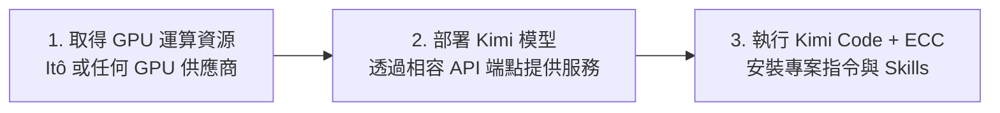
```mermaid
graph LR
    A["1. 取得 GPU 運算資源<br/>Itô 或任何 GPU 供應商"] --> B["2. 部署 Kimi 模型<br/>透過相容 API 端點提供服務"]
    B --> C["3. 執行 Kimi Code + ECC<br/>安裝專案指令與 Skills"]
```

```bash
# 步驟 3：確認 endpoint 設定完成後安裝 ECC
bash ./install.sh --target kimi --profile minimal
node scripts/ecc.js doctor --target kimi
kimi
```

**`ecc ito` CLI 橋接工具**（委派給另外安裝的官方 Itô Client，ECC 不維護第二套 API Client）：

| 指令 | 功能 | 重要限制 |
| ------ | ------ | --------- |
| `ecc ito login [--no-browser]` | 裝置授權登入，Token 存於 macOS Keychain | 不會自動繼承 `ITO_API_KEY` |
| `ecc ito auth` | 驗證既有憑證 | 僅驗證用途，拒絕 `--no-browser` |
| `ecc ito find` | 送出**即時、已驗證的 GPU 節點詢價（RFQ）** | **不會**預訂容量，也不會採購 |
| `ecc ito status` | 查詢狀態 | — |
| `ecc ito evals`（另外閘控） | 評測 | 需 `ITO_ENABLE_SIXTYTWO_LIVE=1` + 額外安裝 `sixtytwo-cli` |

> ⚠️ **重要邊界（企業採購與合規務必知悉）**：贊助連結本身是被動的，不會觸發 RFQ、預訂容量、佈建運算或設定服務。`ecc ito find` 送出的是真實的即時詢價請求，但**不會**預訂容量。透過 Itô 的受管理推論服務**尚未上線**。ECC 完全不提供報價鎖定、採購、工作負載執行或推論路徑本身——這些都是 Itô 平台自己的職責範圍，ECC 只是薄橋接層。任何 GPU 供應商都可以替代使用，ECC 對供應商保持中立。
>
> 💡 **企業自架建議**：若你的資安政策不允許程式碼離開內部網路，此路徑讓你可以完全在自有 GPU 上運行開源模型（如 Kimi），同時仍取得 ECC 的 Agent/Skill/Hook 框架——但務必自行承擔模型品質、延遲與可用性的差異，這與使用 Anthropic 官方託管的 Claude 模型有本質不同的風險輪廓（見 13.1 的 TCO 討論）。

---

## 第四章：企業級 Web 系統架構設計（搭配 ECC）

### 4.1 企業系統架構背景

典型企業級 Web Application 技術棧：

| 層級 | 技術選擇 |
| ------ | --------- |
| 前端 | Vue 3 + TypeScript + Tailwind CSS |
| 後端 | Spring Boot (Java) |
| 架構 | Clean Architecture + Microservices |
| 資料庫 | PostgreSQL / Oracle / DB2 |
| 快取 | Redis |
| 訊息佇列 | Kafka / RabbitMQ |
| CI/CD | GitHub Actions / GitLab CI |
| 容器化 | Docker + Kubernetes |

### 4.2 ECC Agent 分工架構

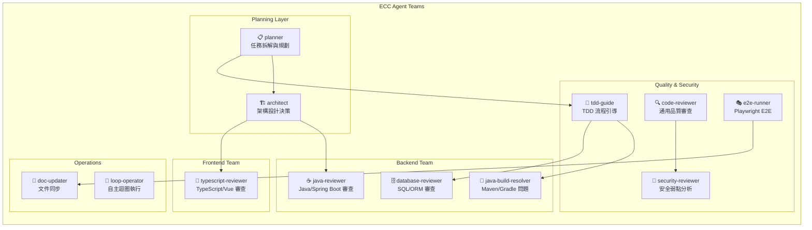
```mermaid
graph TB
    subgraph "ECC Agent Teams"
        direction TB
        
        subgraph "Planning Layer"
            Planner["📋 planner<br/>任務拆解與規劃"]
            Architect["🏗️ architect<br/>架構設計決策"]
        end
        
        subgraph "Backend Team"
            JavaReviewer["☕ java-reviewer<br/>Java/Spring Boot 審查"]
            JavaBuild["🔧 java-build-resolver<br/>Maven/Gradle 問題"]
            DBReviewer["🗄️ database-reviewer<br/>SQL/ORM 審查"]
        end
        
        subgraph "Frontend Team"
            TSReviewer["📘 typescript-reviewer<br/>TypeScript/Vue 審查"]
        end
        
        subgraph "Quality & Security"
            TDDGuide["🧪 tdd-guide<br/>TDD 流程引導"]
            CodeReviewer["🔍 code-reviewer<br/>通用品質審查"]
            SecurityReviewer["🔐 security-reviewer<br/>安全弱點分析"]
            E2ERunner["🎭 e2e-runner<br/>Playwright E2E"]
        end
        
        subgraph "Operations"
            DocUpdater["📝 doc-updater<br/>文件同步"]
            LoopOperator["🔄 loop-operator<br/>自主迴圈執行"]
        end
    end

    Planner --> Architect
    Architect --> JavaReviewer
    Architect --> TSReviewer
    Planner --> TDDGuide
    TDDGuide --> JavaBuild
    TDDGuide --> DBReviewer
    CodeReviewer --> SecurityReviewer
    E2ERunner --> DocUpdater
```

### 4.3 Orchestrator 家族

v2.0.0 引入、並在 v2.1.0 持續強化的 **Orchestrator 家族**（`orch-*` 動態工作流團隊編排），將原本單一 `planner` 和 `loop-operator` 的職責拆分為更細粒度的角色，提供企業級的多 Agent 執行控制：

| Orchestrator | 職責 | 典型使用情境 |
| --- | --- | --- |
| `orch-planner` | 需求分析 → 任務拆解 → DAG 生成 | 新功能開發的起始點 |
| `orch-fanout` | 平行分派子任務給多個 Worker Agent | 前後端同步開發 |
| `orch-reduce` | 收集 Worker 結果 → 合併 → 衝突解決 | 多 Agent 任務合流 |
| `orch-gate` | 品質門檻檢查、安全掃描、覆蓋率驗證 | CI/CD 節點 |
| `orch-retry` | 失敗偵測 → 自動重試（含 backoff）→ 降級 | 不穩定 MCP、外部 API |

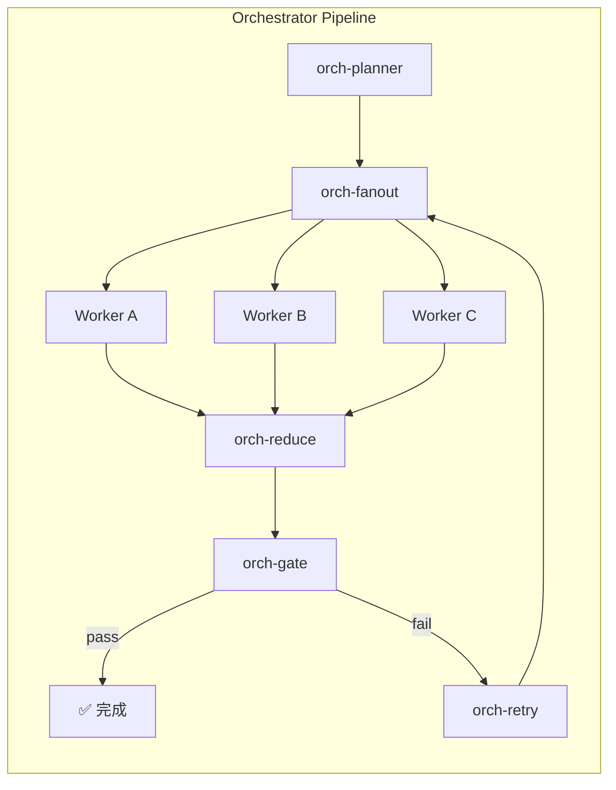
```mermaid
graph LR
    subgraph "Orchestrator Pipeline"
        OP[orch-planner] --> OF[orch-fanout]
        OF --> W1[Worker A]
        OF --> W2[Worker B]
        OF --> W3[Worker C]
        W1 --> OR[orch-reduce]
        W2 --> OR
        W3 --> OR
        OR --> OG[orch-gate]
        OG -->|pass| Done[✅ 完成]
        OG -->|fail| ORetry[orch-retry]
        ORetry --> OF
    end
```

> 💡 **Orchestrator vs 傳統 Agent**：Orchestrator 本身不產出程式碼，只負責「排程→分派→驗收」。實際生成程式碼的仍是 `java-reviewer`、`typescript-reviewer` 等 Worker Agent。此設計遵循 Single Responsibility，並讓失敗隔離在單一 Worker 粒度。

### 4.4 系統架構圖

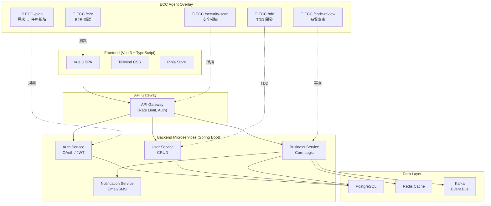
```mermaid
graph TB
    subgraph "Frontend (Vue 3 + TypeScript)"
        Vue["Vue 3 SPA"]
        Tailwind["Tailwind CSS"]
        Pinia["Pinia Store"]
    end
    
    subgraph "API Gateway"
        GW["API Gateway<br/>(Rate Limit, Auth)"]
    end
    
    subgraph "Backend Microservices (Spring Boot)"
        AuthSvc["Auth Service<br/>OAuth / JWT"]
        UserSvc["User Service<br/>CRUD"]
        BizSvc["Business Service<br/>Core Logic"]
        NotifySvc["Notification Service<br/>Email/SMS"]
    end
    
    subgraph "Data Layer"
        PG["PostgreSQL"]
        Redis["Redis Cache"]
        Kafka["Kafka<br/>Event Bus"]
    end
    
    subgraph "ECC Agent Overlay"
        ECC_Plan["🤖 ECC /plan<br/>需求 → 任務拆解"]
        ECC_TDD["🤖 ECC /tdd<br/>TDD 開發"]
        ECC_Review["🤖 ECC /code-review<br/>品質審查"]
        ECC_Security["🤖 ECC /security-scan<br/>安全掃描"]
        ECC_E2E["🤖 ECC /e2e<br/>E2E 測試"]
    end
    
    Vue --> GW
    GW --> AuthSvc
    GW --> UserSvc
    GW --> BizSvc
    BizSvc --> NotifySvc
    AuthSvc --> PG
    UserSvc --> PG
    BizSvc --> PG
    BizSvc --> Redis
    BizSvc --> Kafka
    
    ECC_Plan -.->|"規劃"| AuthSvc
    ECC_TDD -.->|"TDD"| UserSvc
    ECC_Review -.->|"審查"| BizSvc
    ECC_Security -.->|"掃描"| GW
    ECC_E2E -.->|"測試"| Vue
```

### 4.5 Agent 協作流程

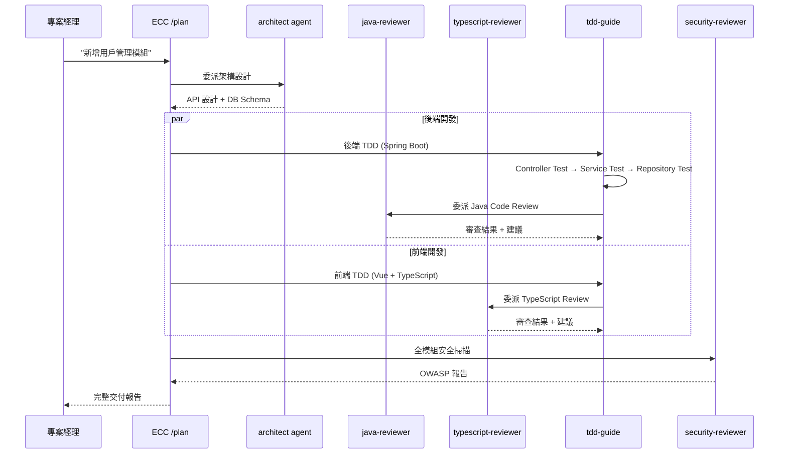
```mermaid
sequenceDiagram
    participant PM as 專案經理
    participant ECC as ECC /plan
    participant Arch as architect agent
    participant BE as java-reviewer
    participant FE as typescript-reviewer
    participant QA as tdd-guide
    participant Sec as security-reviewer

    PM->>ECC: "新增用戶管理模組"
    ECC->>Arch: 委派架構設計
    Arch-->>ECC: API 設計 + DB Schema
    
    par 後端開發
        ECC->>QA: 後端 TDD (Spring Boot)
        QA->>QA: Controller Test → Service Test → Repository Test
        QA->>BE: 委派 Java Code Review
        BE-->>QA: 審查結果 + 建議
    and 前端開發
        ECC->>QA: 前端 TDD (Vue + TypeScript)
        QA->>FE: 委派 TypeScript Review
        FE-->>QA: 審查結果 + 建議
    end
    
    ECC->>Sec: 全模組安全掃描
    Sec-->>ECC: OWASP 報告
    ECC-->>PM: 完整交付報告
```

> 💡 **Best Practice**：使用 `/multi-plan` 進行多 Agent 任務分解，再用 `/multi-execute` 平行執行前後端任務，可顯著提升開發效率。

---

## 第五章：開發流程（AI 驅動）

### 5.1 AI 驅動開發總覽

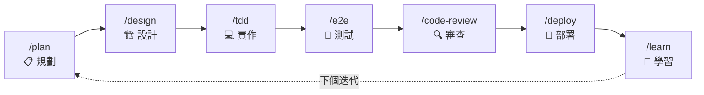
```mermaid
graph LR
    P["/plan<br/>📋 規劃"] --> D["/design<br/>🏗️ 設計"]
    D --> I["/tdd<br/>💻 實作"]
    I --> T["/e2e<br/>🧪 測試"]
    T --> R["/code-review<br/>🔍 審查"]
    R --> Deploy["/deploy<br/>🚀 部署"]
    Deploy --> Learn["/learn<br/>🧠 學習"]
    Learn -.->|"下個迭代"| P
```

### 5.2 /plan — 需求規劃

**指令範例**：

```bash
/ecc:plan "Add user authentication with OAuth2 + JWT, supporting Google and GitHub login"
```

**Agent 行為**：
1. `planner` agent 分析需求
2. 拆解為具體實作步驟
3. 識別技術風險與依賴
4. 產出實作藍圖

**輸出範例**：

```markdown
## Implementation Plan: OAuth2 + JWT Authentication

### Phase 1: Infrastructure
- [ ] Add Spring Security + OAuth2 Client dependencies
- [ ] Configure application.yml for Google/GitHub OAuth
- [ ] Create JWT utility class

### Phase 2: Backend
- [ ] Implement OAuth2LoginSuccessHandler
- [ ] Create UserService with OAuth user mapping
- [ ] Implement JWT token generation/validation
- [ ] Create AuthController endpoints

### Phase 3: Frontend
- [ ] Create LoginPage.vue with OAuth buttons
- [ ] Implement auth store (Pinia)
- [ ] Add route guards for protected pages
- [ ] Handle token refresh

### Phase 4: Testing
- [ ] Unit tests for JWT utility
- [ ] Integration tests for OAuth flow
- [ ] E2E tests for login/logout

### Risks
- OAuth callback URL configuration per environment
- Token refresh race conditions
```

### 5.3 /design — 架構設計

```bash
/ecc:plan "Design the authentication module architecture"
# → planner 委派給 architect agent
```

**Agent 行為**：`architect` agent 產出：
- API 端點設計
- 資料模型（Entity / DTO / VO）
- 序列圖（認證流程）
- 安全考量

### 5.4 /implement（TDD）— 實作

```bash
/tdd
```

**Agent 行為**（tdd-guide）：

```text
1. Define interfaces first          → 定義 AuthService 介面
2. Write failing tests (RED)        → 寫 AuthServiceTest，全部 FAIL
3. Implement minimal code (GREEN)   → 實作到剛好通過測試
4. Refactor (IMPROVE)               → 重構、extract method
5. Verify 80%+ coverage             → 確認覆蓋率達標
```

**Spring Boot 實作範例**：

```java
// Step 1: Interface
public interface AuthService {
    TokenResponse authenticate(OAuth2AuthenticationToken token);
    TokenResponse refreshToken(String refreshToken);
    void logout(String userId);
}

// Step 2: RED - Failing Test
@ExtendWith(MockitoExtension.class)
class AuthServiceImplTest {
    @Mock JwtTokenProvider jwtProvider;
    @Mock UserRepository userRepo;
    @InjectMocks AuthServiceImpl authService;

    @Test
    void authenticate_shouldReturnTokens_whenOAuthValid() {
        // Given
        var oauthToken = mockOAuth2Token("google", "user@example.com");
        var user = new User(1L, "user@example.com", "Google User");
        when(userRepo.findByEmail("user@example.com")).thenReturn(Optional.of(user));
        when(jwtProvider.generateAccessToken(user)).thenReturn("access-token");
        when(jwtProvider.generateRefreshToken(user)).thenReturn("refresh-token");

        // When
        var result = authService.authenticate(oauthToken);

        // Then
        assertThat(result.accessToken()).isEqualTo("access-token");
        assertThat(result.refreshToken()).isEqualTo("refresh-token");
    }
}

// Step 3: GREEN - Implementation
@Service
@RequiredArgsConstructor
public class AuthServiceImpl implements AuthService {
    private final JwtTokenProvider jwtProvider;
    private final UserRepository userRepo;

    @Override
    public TokenResponse authenticate(OAuth2AuthenticationToken token) {
        String email = token.getPrincipal().getAttribute("email");
        User user = userRepo.findByEmail(email)
            .orElseGet(() -> createNewUser(token));
        return new TokenResponse(
            jwtProvider.generateAccessToken(user),
            jwtProvider.generateRefreshToken(user)
        );
    }
}
```

### 5.5 /test — 測試

```bash
/e2e      # 產生 Playwright E2E 測試
```

**E2E 測試範例**：

```typescript
import { test, expect } from '@playwright/test';

test.describe('Authentication Flow', () => {
  test('should redirect to Google OAuth and complete login', async ({ page }) => {
    await page.goto('/login');
    await page.click('[data-testid="google-login-btn"]');

    // Mock OAuth callback
    await page.waitForURL('**/oauth2/callback**');

    // Verify redirect to dashboard
    await expect(page).toHaveURL('/dashboard');
    await expect(page.locator('[data-testid="user-avatar"]')).toBeVisible();
  });

  test('should show error on failed authentication', async ({ page }) => {
    await page.goto('/login?error=access_denied');
    await expect(page.locator('.error-message')).toContainText('登入失敗');
  });
});
```

### 5.6 /code-review — 程式碼審查

```bash
/code-review
```

**Agent 行為**（code-reviewer + 語言專用 reviewer）：
- 程式碼品質與可維護性
- 安全弱點（OWASP Top 10）
- 效能問題
- 測試覆蓋率缺口

### 5.7 /deploy — 部署

```bash
# 使用 deployment-patterns skill
/security-scan    # 部署前安全掃描
/e2e              # 關鍵用戶流測試
/test-coverage    # 驗證 80%+ 覆蓋率
```

> 💡 **Best Practice**：部署前三道閘門 — Security Scan → E2E → Coverage。全部通過才允許部署。

### 5.8 /verify — 驗證迴圈

ECC 提供持續驗證機制，確保每次變更都通過完整品質閘門：

```bash
# 儲存當前驗證狀態的 Checkpoint
/checkpoint

# 執行完整驗證迴圈
/verify

# 根據自定義標準評估
/eval
```

**驗證迴圈流程**：

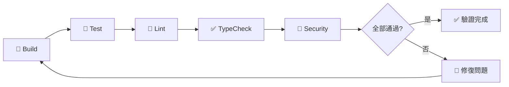
```mermaid
graph LR
    Build["🔨 Build"] --> Test["🧪 Test"]
    Test --> Lint["📏 Lint"]
    Lint --> TypeCheck["✅ TypeCheck"]
    TypeCheck --> Security["🔐 Security"]
    Security --> Pass{全部通過?}
    Pass -->|是| Done["✅ 驗證完成"]
    Pass -->|否| Fix["🔧 修復問題"]
    Fix --> Build
```

**驗證類型**：

| 類型 | 指令 | 說明 |
| ------ | ------ | ------ |
| Checkpoint 驗證 | `/checkpoint` → `/verify` | 儲存狀態後執行一次性驗證 |
| 持續驗證 | `verification-loop` skill | 每次程式碼變更自動執行 build → test → lint → typecheck → security |
| 評估驅動開發 | `eval-harness` skill | 定義評估標準，以 pass@k 指標衡量品質 |

**Eval Harness 評估指標**：

- **Pass@k**：`k` 次嘗試中至少一次通過的機率
- **Grader Types**：自動化 Grader（程式判定）vs 模型 Grader（LLM 判定）
- **Checkpoint vs Continuous**：Checkpoint 在特定節點驗證；Continuous 在每次變更後驗證

> 💡 **Best Practice**：對關鍵功能使用 `verification-loop` skill 啟用持續驗證。對大型重構使用 `/checkpoint` 保存狀態後執行一次性驗證。
>
> 💡 **與 Claude Code 原生機制的關係**：Anthropic 官方建議的「給 Claude 一個可驗證的檢查」原則，在平台層有三種對應機制——單一提示內驗證、`/goal` 持續評估條件、或 Stop Hook 強制阻擋（連續阻擋 8 次後平台會強制結束回合）。ECC 的 `verification-loop`／`eval-harness` Skill 可視為在 Stop Hook 機制上，針對「build → test → lint → typecheck → security」這條特定管道預先寫好的實作範本，而非另一套平行機制。

### 5.9 Plan Canvas — 視覺化計畫審查

**Plan Canvas** 是 ECC v2.1.0 引入的重大新功能，把 `/plan` 流程原本「一大段文字往返」的計畫審查，變成瀏覽器內可點選、可標註的視覺化流程。

#### 5.9.1 解決的問題

`/plan` 最終會停在一個確認關卡（CONFIRM gate），過去只能在終端機裡逐行閱讀落落長的 Markdown 計畫、再用文字描述「我要改第三點」。Plan Canvas 讓審查者可以**直接指向**要修改的部分，而不必重新用文字描述一次。

#### 5.9.2 運作方式

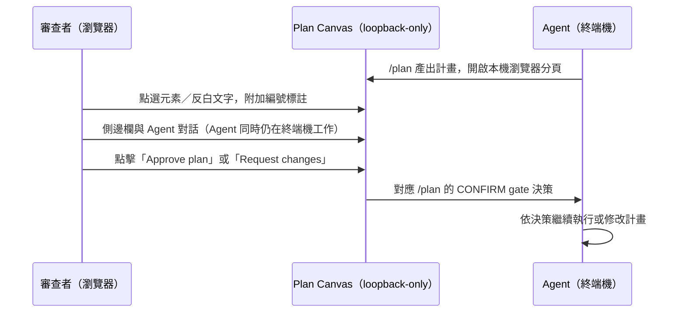
```mermaid
sequenceDiagram
    participant U as 審查者（瀏覽器）
    participant C as Plan Canvas（loopback-only）
    participant A as Agent（終端機）

    A->>C: /plan 產出計畫，開啟本機瀏覽器分頁
    U->>C: 點選元素／反白文字，附加編號標註
    U->>C: 側邊欄與 Agent 對話（Agent 同時仍在終端機工作）
    U->>C: 點擊「Approve plan」或「Request changes」
    C->>A: 對應 /plan 的 CONFIRM gate 決策
    A->>A: 依決策繼續執行或修改計畫
```

- 支援 Mermaid 圖表、表格、任務清單原生渲染；檔案變更會即時重新整理頁面
- **Model 與 Harness 無關**：底層是一份純 CLI + JSON 協定（`ecc-plan-canvas`），並非只綁定 Claude
- 僅在**本機迴路（loopback-only）**開啟，不會對外網路暴露

#### 5.9.3 使用時機建議

| 情境 | 建議 |
| ------ | ------ |
| 計畫涉及多個檔案／模組，需要架構層級討論 | 使用 Plan Canvas，便於在圖表上標註 |
| 範圍清楚、單一檔案的小改動 | 直接在終端機核准即可，不必啟用 Plan Canvas（避免額外開銷） |
| 跨團隊、非工程背景的關係人需要參與計畫審查 | Plan Canvas 的可視化介面比終端機文字更易溝通 |

> 💡 這與 Anthropic 官方建議的「Plan Mode → Ctrl+G 在文字編輯器中直接編輯計畫」是互補而非取代關係：文字編輯器適合工程師快速修改文字，Plan Canvas 適合需要標註特定元素、或涉及非工程關係人參與審查的場景。

---

## 第六章：測試與品質控管

### 6.1 TDD Skill 實作

ECC 的 TDD 工作流程遵循嚴格的 RED → GREEN → REFACTOR 循環：

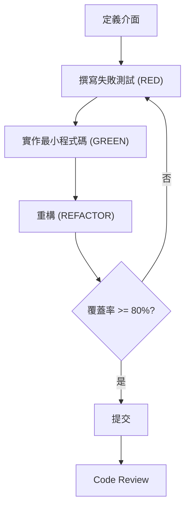
```mermaid
graph TD
    A["定義介面"] --> B["撰寫失敗測試 (RED)"]
    B --> C["實作最小程式碼 (GREEN)"]
    C --> D["重構 (REFACTOR)"]
    D --> E{覆蓋率 >= 80%?}
    E -->|否| B
    E -->|是| F["提交"]
    F --> G["Code Review"]
```

**可用的 TDD Skills**：

| Skill | 框架 |
| ------- | ------ |
| `tdd-workflow` | 通用 TDD 方法論 |
| `springboot-tdd` | Spring Boot 專用 |
| `django-tdd` | Django 專用 |
| `laravel-tdd` | Laravel 專用 |
| `golang-testing` | Go 測試 + TDD |
| `python-testing` | pytest 測試 |
| `cpp-testing` | GoogleTest + CMake |
| `perl-testing` | Test2::V0 |

### 6.2 自動 Code Review

`code-reviewer` agent 自動檢查：

1. **命名規範**：是否符合語言慣例
2. **複雜度**：方法是否過長、巢狀過深
3. **重複程式碼**：DRY 原則
4. **安全性**：SQL Injection、XSS、不安全的資料處理
5. **效能**：N+1 查詢、不必要的 IO
6. **測試**：是否有對應測試、edge case 是否覆蓋

### 6.3 Plankton 程式碼品質

`plankton-code-quality` skill 在**寫入時**強制執行程式碼品質：

- PostToolUse Hook 在每次檔案編輯後自動執行
- 自動修復 Linter 違規
- 強制一致的程式碼風格

### 6.4 AgentShield 安全掃描

```bash
# 快速掃描（無需安裝）
npx ecc-agentshield scan

# 自動修復安全問題
npx ecc-agentshield scan --fix

# 深度分析（三個 Opus agent 紅藍對抗）
npx ecc-agentshield scan --opus --stream

# 產生安全配置
npx ecc-agentshield init
```

**掃描範圍**：

| 類別 | 規則數 | 說明 |
| ------ | -------- | ------ |
| Secrets Detection | 14 patterns | API Key、Token、Password |
| Permission Auditing | — | 工具權限檢查 |
| Hook Injection Analysis | — | Hook 注入風險 |
| MCP Server Risk Profiling | — | MCP 服務風險評估 |
| Agent Config Review | — | Agent 配置審查 |

**`--opus` 模式**：三個 Claude Opus agent 進行紅藍對抗 —

1. **Attacker**：尋找 exploit chain
2. **Defender**：評估現有防護
3. **Auditor**：綜合兩者產出優先級風險評估

**輸出格式**：Terminal（色彩分級 A-F）、JSON（CI Pipeline）、Markdown、HTML

### 6.5 CI/CD 整合測試流程

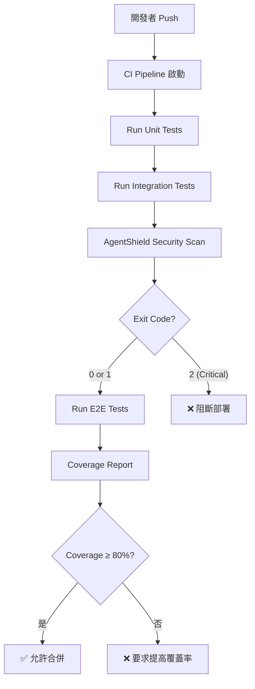
```mermaid
graph TD
    A["開發者 Push"] --> B["CI Pipeline 啟動"]
    B --> C["Run Unit Tests"]
    C --> D["Run Integration Tests"]
    D --> E["AgentShield Security Scan"]
    E --> F{"Exit Code?"}
    F -->|"0 or 1"| G["Run E2E Tests"]
    F -->|"2 (Critical)"| H["❌ 阻斷部署"]
    G --> I["Coverage Report"]
    I --> J{"Coverage ≥ 80%?"}
    J -->|是| K["✅ 允許合併"]
    J -->|否| L["❌ 要求提高覆蓋率"]
```

**GitHub Actions 範例**：

```yaml
name: ECC Quality Gate
on: [pull_request]

jobs:
  quality:
    runs-on: ubuntu-latest
    steps:
      - uses: actions/checkout@v4
      - uses: actions/setup-node@v4
        with:
          node-version: '20'

      - name: Run Tests
        run: npm test -- --coverage

      - name: Security Scan
        run: npx ecc-agentshield scan --format json --output security-report.json

      - name: Check Coverage
        run: |
          COVERAGE=$(cat coverage/coverage-summary.json | jq '.total.lines.pct')
          if (( $(echo "$COVERAGE < 80" | bc -l) )); then
            echo "Coverage ${COVERAGE}% is below 80% threshold"
            exit 1
          fi
```

### 6.6 驗證迴圈與評估框架

ECC 提供兩個進階的品質驗證機制，源自 Longform Guide 的核心理念。

#### 6.6.1 Verification Loop（持續驗證迴圈）

`verification-loop` skill 在每次程式碼變更後自動執行完整驗證管道：

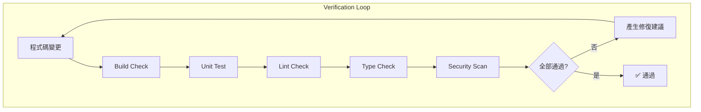
```mermaid
graph TD
    subgraph "Verification Loop"
        A["程式碼變更"] --> B["Build Check"]
        B --> C["Unit Test"]
        C --> D["Lint Check"]
        D --> E["Type Check"]
        E --> F["Security Scan"]
        F --> G{全部通過?}
        G -->|否| H["產生修復建議"]
        H --> A
        G -->|是| I["✅ 通過"]
    end
```

#### 6.6.2 Eval Harness（評估框架）

`eval-harness` skill 提供結構化的評估機制，讓你定義明確的品質標準：

```bash
# 儲存當前驗證狀態
/checkpoint

# 執行驗證
/verify

# 根據自定義標準評估
/eval
```

**評估框架核心概念**：

| 概念 | 說明 |
| ------ | ------ |
| **Checkpoint Eval** | 在特定節點保存狀態並執行一次性驗證 |
| **Continuous Eval** | 持續評估每次變更，即時回饋 |
| **Automated Grader** | 程式化判定（測試通過/失敗、覆蓋率門檻） |
| **Model Grader** | LLM 判定（程式碼品質、架構合理性） |
| **Pass@k** | k 次嘗試中至少一次通過的機率指標 |

#### 6.6.3 Learn-Eval（學習評估）

`/learn-eval` 指令結合學習與評估，從 Session 中擷取模式並在儲存前進行評估：

```bash
# 不只學習，還評估學到的模式品質
/learn-eval
```

這比單純的 `/learn` 更具品質保障，避免學習到錯誤或低品質的模式。

---

## 第七章：安全（SSDLC）

### 7.1 ECC 安全架構

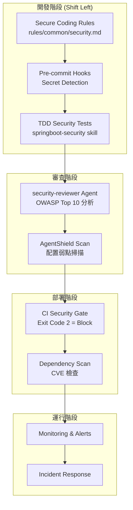
```mermaid
graph TB
    subgraph "開發階段 (Shift Left)"
        A["Secure Coding Rules<br/>rules/common/security.md"]
        B["Pre-commit Hooks<br/>Secret Detection"]
        C["TDD Security Tests<br/>springboot-security skill"]
    end
    
    subgraph "審查階段"
        D["security-reviewer Agent<br/>OWASP Top 10 分析"]
        E["AgentShield Scan<br/>配置弱點掃描"]
    end
    
    subgraph "部署階段"
        F["CI Security Gate<br/>Exit Code 2 = Block"]
        G["Dependency Scan<br/>CVE 檢查"]
    end
    
    subgraph "運行階段"
        H["Monitoring & Alerts"]
        I["Incident Response"]
    end
    
    A --> B --> C --> D --> E --> F --> G --> H --> I
```

### 7.2 安全檢查自動化

ECC 在 SSDLC 各階段提供自動化安全檢查：

| 階段 | ECC 工具 | 自動化行為 |
| ------ | --------- | ----------- |
| 編碼 | `security.md` rule | 強制安全編碼準則 |
| Hook | `beforeSubmitPrompt` | 偵測 prompt 中的機密（sk-、ghp_、AKIA） |
| Hook | `beforeTabFileRead` | 阻止讀取 .env、.key、.pem 檔案 |
| 審查 | `security-reviewer` agent | OWASP Top 10 弱點分析 |
| 掃描 | `/security-scan` | AgentShield 深度掃描 |
| CI | AgentShield GitHub Action | 自動阻斷含重大弱點的 PR |

### 7.3 OWASP Top 10 防護

| OWASP 風險 | ECC 防護措施 |
| ------------ | ------------- |
| A01 Broken Access Control | security-reviewer 檢查授權邏輯 |
| A02 Cryptographic Failures | Rules 強制安全加密實踐 |
| A03 Injection | Agent 檢查參數化查詢、輸入驗證 |
| A04 Insecure Design | architect agent 安全架構設計 |
| A05 Security Misconfiguration | AgentShield 配置掃描 |
| A06 Vulnerable Components | dependency scan + CVE 檢查 |
| A07 Authentication Failures | springboot-security skill 最佳實踐 |
| A08 Software Integrity | Hook 驗證、CI build gates |
| A09 Security Logging | Rules 強制安全日誌 |
| A10 Server-Side Request Forgery | security-reviewer 檢查 SSRF 模式 |

### 7.4 Secret Detection

ECC 提供多層 Secret Detection：

```text
Layer 1: beforeSubmitPrompt Hook (Cursor)
  → 偵測 prompt 中的 sk-、ghp_、AKIA 模式

Layer 2: beforeTabFileRead Hook (Cursor)
  → 阻止 Tab 讀取 .env、.key、.pem

Layer 3: AgentShield Secrets Detection
  → 14 種 pattern matching 規則

Layer 4: CI Build Gate
  → Exit code 2 阻斷含機密的 commit
```

> ⚠️ **常見錯誤**：在 `.claude/settings.json` 中存放 API Key。應使用環境變數或 vault 管理。

### 7.5 GateGuard 安全閘門

GateGuard 是 ECC v1.10.0 引入的安全閘門機制（來自社群貢獻 [PR #1367](https://github.com/affaan-m/ECC/pull/1367)），提供更精細的安全控制。

#### 7.5.1 GateGuard 功能

- **Hook 層級安全閘門**：在 PreToolUse 階段攔截潛在危險操作
- **動態風險評估**：根據操作類型與上下文計算風險等級
- **可設定的嚴格度**：與 `ECC_HOOK_PROFILE` 整合，支援 minimal / standard / strict 三級
- **整合 AgentShield**：與靜態分析和 Secret Detection 協同運作
- **破壞性命令偵測（v2.0.0）**：攔截 `find -exec rm`、`rm -rf /`、`chmod 777`、`dd if=/dev/zero` 等破壞性 shell 命令，即使包裝在 Bash tool 呼叫中亦可辨識
- **路徑排除清單（v2.1.0 新增）**：透過 `GATEGUARD_EXEMPT_GLOBS` 環境變數設定 glob 排除規則，避免誤攔截合法的建構產物清理、測試 fixture 重置等操作
- **PostToolUse 派發器整併（v2.1.0）**：原本多個獨立的 PostToolUse Hook 行程，整併為同步／非同步兩種派發器，降低每次工具呼叫的行程開銷
- **供應鏈強化（v2.1.0）**：pre-commit Secret 掃描新增偵測 `sk-ant-` 開頭的 Anthropic API Key 洩漏

#### 7.5.2 GateGuard 與 AgentShield 的差異

| 面向 | GateGuard | AgentShield |
| ------ | ----------- | ------------- |
| 執行時機 | 即時（Hook 觸發） | 按需掃描 |
| 檢查範圍 | 單一工具操作 | 整體配置與程式碼 |
| 效能影響 | 低（輕量 Hook） | 中～高（深度分析） |
| 定位 | 運行時防護 | 審計與合規 |

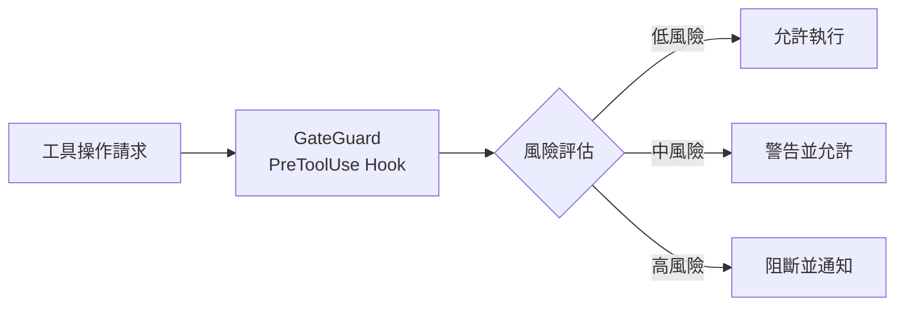
```mermaid
graph LR
    A["工具操作請求"] --> B["GateGuard<br/>PreToolUse Hook"]
    B --> C{風險評估}
    C -->|低風險| D["允許執行"]
    C -->|中風險| E["警告並允許"]
    C -->|高風險| F["阻斷並通知"]
```

---

## 第八章：部署與維運（DevOps）

### 8.1 CI/CD 整合

#### GitHub Actions 完整範例

```yaml
name: ECC Enterprise Pipeline
on:
  push:
    branches: [main, develop]
  pull_request:
    branches: [main]

jobs:
  build-and-test:
    runs-on: ubuntu-latest
    steps:
      - uses: actions/checkout@v4

      - name: Setup Java
        uses: actions/setup-java@v4
        with:
          java-version: '21'
          distribution: 'temurin'

      - name: Setup Node.js
        uses: actions/setup-node@v4
        with:
          node-version: '20'

      - name: Build Backend
        run: mvn clean verify -B

      - name: Security Scan (AgentShield)
        run: npx ecc-agentshield scan --format json --output reports/security.json
        continue-on-error: false

      - name: E2E Tests (Playwright)
        run: npx playwright test

      - name: Quality Gate Check
        run: |
          echo "Checking coverage >= 80%..."
          mvn jacoco:check

      - name: Upload Reports
        if: always()
        uses: actions/upload-artifact@v4
        with:
          name: test-reports
          path: reports/
```

#### GitLab CI 範例

```yaml
stages:
  - build
  - test
  - security
  - deploy

build:
  stage: build
  script:
    - mvn clean compile -B

test:
  stage: test
  script:
    - mvn test -B
    - mvn jacoco:report

security-scan:
  stage: security
  script:
    - npx ecc-agentshield scan --format json
  allow_failure: false

deploy:
  stage: deploy
  script:
    - ./deploy.sh
  only:
    - main
  when: on_success
```

### 8.2 監控與日誌

**推薦監控架構**：

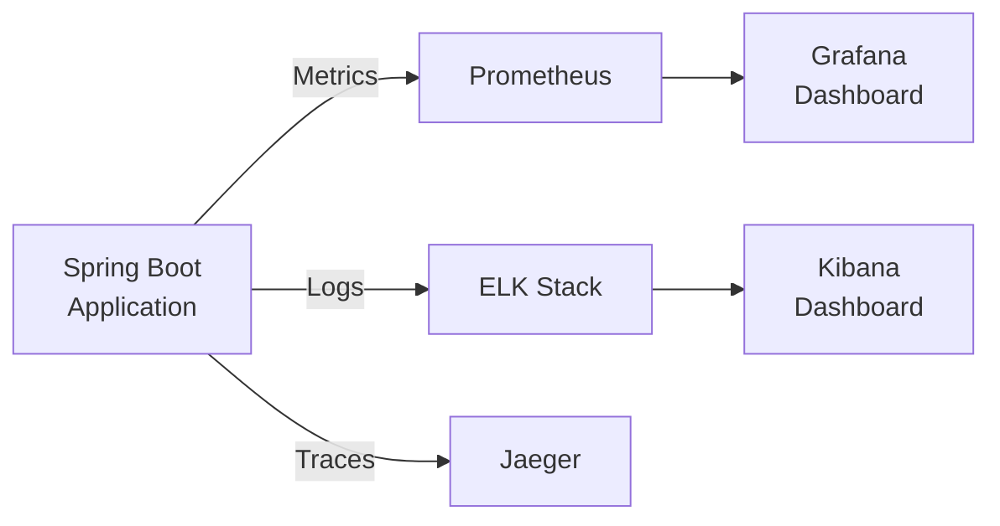
```mermaid
graph LR
    App["Spring Boot<br/>Application"] --> |"Metrics"| Prometheus["Prometheus"]
    App --> |"Logs"| ELK["ELK Stack"]
    App --> |"Traces"| Jaeger["Jaeger"]
    Prometheus --> Grafana["Grafana<br/>Dashboard"]
    ELK --> Kibana["Kibana<br/>Dashboard"]
```

### 8.3 AI Agent 監控

監控 ECC Agent 的使用狀況：

```bash
# 檢查 Token 花費
/cost

# 檢查已安裝元件
/plugin list ecc@ecc

# 稽核 Harness 狀態
/harness-audit

# 查看活躍 Loop 狀態
/loop-status
```

---

## 第九章：系統維護與升級

### 9.1 ECC 版本升級策略

```bash
# 檢查當前版本（main 分支的 VERSION 可能領先於最新 Release Tag，兩者不一定相同）
cat VERSION  # 或查看 CHANGELOG.md
git describe --tags  # 查看目前所在的最近 Release Tag

# 更新到最新「已發行」版本（建議走 tag，而非直接追蹤 main）
cd ECC
git fetch --tags
git checkout v2.1.0   # 鎖定到目前最新穩定 Release，而非 origin/main
npm install
```

> ⚠️ **升級時同樣適用「只選一種安裝路徑」原則**：若你是透過 Plugin 安裝，升級只需 `/plugin update ecc` 或重跑 `/plugin install ecc@ecc`；**不要**額外執行 `./install.sh --profile full`。只有走「手動安裝」路徑的使用者，才需要重跑 `./install.sh`（依 3.3 節指定的語言包，而非 `--profile full`）。

```bash
# 選擇性安裝（v1.9.0+ manifest-driven 安裝，只更新有變更的元件）
node scripts/install-plan.js
node scripts/install-apply.js
```

**ECC CLI 管理指令（v2.0.0）**：

```bash
# 統一管理入口
node scripts/ecc.js list-installed   # 檢查已安裝元件清單
node scripts/ecc.js doctor           # 診斷設定問題
node scripts/ecc.js repair           # 自動修復遺失/損壞的元件
node scripts/ecc.js uninstall        # 完整移除 ECC 管理的檔案
node scripts/ecc.js version          # 顯示已安裝版本
```

**故障復原**：

```bash
# 如果本地 ECC 被清除或重置
node scripts/ecc.js list-installed    # 檢查已安裝項目
node scripts/ecc.js doctor           # 診斷問題
node scripts/ecc.js repair           # 修復（通常可恢復）
```

> 💡 `ecc` 指令等同於 `node scripts/ecc.js`。若已安裝 Plugin（`/plugin install ecc@ecc`），可直接在 Claude Code 中使用 `/ecc:doctor` 等命名空間指令。

### 9.2 Skills / Agents 管理

```bash
# 審查 Skills 和 Commands 品質
/skill-stocktake

# 從 Git History 產生 Skills
/skill-create
/skill-create --instincts    # 同時產生 Instincts

# 查看已學習的 Instincts
/instinct-status

# 將 Instincts 演化為 Skills
/evolve

# 清除過期 Instincts
/prune
```

### 9.3 相容性與故障排除

| 問題 | 解決方案 |
| ------ | --------- |
| Duplicate hooks file | 不要在 plugin.json 宣告 hooks 欄位 |
| ${CLAUDE_PLUGIN_ROOT} 解析失敗 | 使用 installer 安裝 hooks，不要手動複製 |
| multi-* 指令無法運行 | 安裝 ccg-workflow：`npx ccg-workflow` |
| MCP 衝突 | 設定 `ECC_DISABLED_MCPS` 排除重複 |
| Windows 路徑問題 | 配置目錄是 `%USERPROFILE%\.claude` |

---

## 第十章：最佳實踐（Best Practices）

### 10.1 避免上下文污染

| 策略 | 指令 / 機制 | 說明 |
| ------ | ------------ | ------ |
| 任務間清除 | `/clear` | 免費、即時重置。不相關任務間使用 |
| 邏輯斷點壓縮 | `/compact` | 研究完→實作前、里程碑完→下一個前 |
| 自動壓縮調整 | `CLAUDE_AUTOCOMPACT_PCT_OVERRIDE=50` | 提早壓縮，長 Session 品質更好 |
| MCP 精簡 | `disabledMcpServers` | 每專案 < 10 MCPs、< 80 tools |
| 子代理委派 | Agent delegation | 獨立上下文，不污染主對話 |
| Session 邊界 | SessionStart/Stop Hooks | 自動載入/儲存上下文 |

### 10.2 Agent 設計原則

1. **單一職責**：每個 Agent 只處理一類任務
2. **最小工具集**：只授予必要的 tools 權限
3. **明確角色描述**：在 YAML frontmatter 中清楚定義
4. **模型適配**：日常用 sonnet、深度推理用 opus
5. **可組合性**：Agent 之間可互相委派

### 10.3 Skill 設計模式

1. **Research-First**：使用 `search-first` skill，先研究再寫程式
2. **TDD-First**：所有新功能先寫測試
3. **Security-by-Design**：使用語言專用 security skill
4. **Verification Loop**：持續驗證（build → test → lint → typecheck → security）

### 10.4 Token 最佳化

| 指令 / 設定 | 用途 | 成本影響 |
| ------ | ------ | --------- |
| `/model sonnet` | 日常任務預設 | ~60% 節省 |
| `/model opus` | 深度架構推理 | 高成本 |
| `/clear` | 不相關任務間 | 免費 |
| `/compact` | 邏輯斷點 | 低成本 |
| `/cost` | 監控花費 | — |
| `CLAUDE_CODE_SUBAGENT_MODEL=haiku` | 子代理用 haiku | 大幅節省 |
| `ECC_CONTEXT_MONITOR_COST_WARNINGS=off` | 抑制 API 費率估算彈窗（訂閱制用戶適用） | 減少干擾 |

> 💡 **訂閱用戶提示**：如果你使用 Claude Max/Team 訂閱而非 API 計費，設定 `ECC_CONTEXT_MONITOR_COST_WARNINGS=off` 可關閉不適用的費率估算提醒，但仍保留上下文範圍與 Token 用量警告。
>
> ⚠️ **Agent Teams 成本警告**：Claude Code 原生的 Agent Teams 功能會產生多個獨立的上下文窗口，每個 teammate 獨立消耗 Token。只在平行任務有明確價值時使用（如多模組工作、平行審查）。簡單順序任務用 subagent 更省。

### 10.5 平行化策略

ECC 支援多種平行化模式，可顯著提升大型專案的開發效率。

#### 10.5.1 Git Worktrees 平行化

利用 Git Worktrees 在同一 Repository 的多個分支上同時工作：

```bash
# 建立 Worktree
git worktree add ../feature-auth feature/auth
git worktree add ../feature-ui feature/ui

# 在不同 Worktree 中開啟獨立的 Claude Code Session
cd ../feature-auth && claude
cd ../feature-ui && claude
```

**優勢**：
- 每個 Worktree 有獨立的上下文窗口，互不污染
- 適合多人協作或一人多功能並行開發
- 合併時使用標準 Git merge 流程

#### 10.5.2 Cascade 方法

逐層委派，讓子代理處理越來越具體的任務：

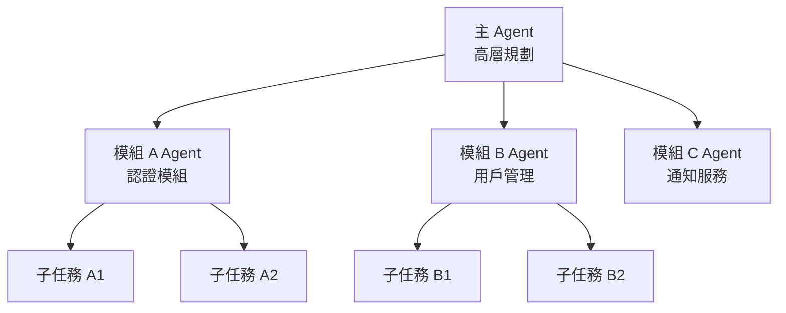
```mermaid
graph TD
    A["主 Agent<br/>高層規劃"] --> B["模組 A Agent<br/>認證模組"]
    A --> C["模組 B Agent<br/>用戶管理"]
    A --> D["模組 C Agent<br/>通知服務"]
    B --> B1["子任務 A1"]
    B --> B2["子任務 A2"]
    C --> C1["子任務 B1"]
    C --> C2["子任務 B2"]
```

#### 10.5.3 何時擴展為多實例

| 場景 | 推薦方式 | 原因 |
| ------ | --------- | ------ |
| 單一功能實作 | 單一 Session | 上下文一致 |
| 多模組獨立開發 | Git Worktrees | 互不干擾 |
| 前後端並行 | `/multi-plan` + `/multi-execute` | Agent Teams 協作 |
| 大規模重構 | Cascade 方法 | 逐層分解複雜度 |
| CI/CD 平行測試 | GitHub Actions matrix | 機器資源充足 |

> 💡 **Best Practice**：優先使用 subagent 委派（最省 Token）。只在任務真正需要並行處理時才升級到 Git Worktrees 或 Agent Teams。

### 10.6 Claude Code 原生生產力功能

前面各節談的多是 ECC 疊加的最佳實踐，但 Anthropic 官方文件本身也提供了一套獨立於 ECC 之外、同樣值得企業團隊內化的工作方法。以下摘要幾個容易被忽略、但與 ECC 高度互補的原生機制：

#### 10.6.1 Explore → Plan → Code → Commit 四階段工作法

官方建議把「探索」與「執行」分離，避免 Agent 過早動手解決錯誤的問題：

1. **Explore**：以 Plan Mode（`Shift+Tab` 進入）唯讀探索程式庫，不做任何修改
2. **Plan**：要求產出詳細實作計畫，可用 `Ctrl+G` 開啟文字編輯器直接修改計畫（或用 ECC 的 Plan Canvas，見 5.9）
3. **Code**：核准計畫後切出 Plan Mode，依計畫實作並執行測試
4. **Commit**：請 Agent 撰寫描述性 Commit 訊息並建立 PR

> 💡 官方特別提醒：**範圍清楚、影響小的變更**（如修正錯字、加一行 log）應該跳過 Plan Mode 直接執行——「如果你能用一句話描述這個 diff，就跳過計畫階段」。Plan Mode 本身有額外開銷，不是每個任務都值得。

#### 10.6.2 給 Agent 一個可驗證的檢查（Verifiable Check）

官方文件將此列為**最重要的單一原則**：沒有可驗證的檢查，Agent「看起來做完了」就是唯一訊號，你就會變成人工驗證迴圈本身。給它測試、build exit code、或截圖比對，讓它自己跑檢查、讀結果、修正到通過為止。

#### 10.6.3 對抗式審查（Adversarial Review）

在正式視為完成前，讓一個**全新上下文**的 Subagent 只看 diff 與驗收標準來審查，而不是讓寫程式的那個 Session 自己審查自己的產出。ECC 的 `code-reviewer`、`security-reviewer` 等 Agent（見 2.1）正是這個原則的預先寫好的實作。

#### 10.6.4 常見失敗模式（官方命名）

| 失敗模式 | 徵狀 | 修正方式 |
| --- | --- | --- |
| Kitchen sink session | 一個 Session 塞進多個不相關任務 | 任務間 `/clear` |
| 反覆修正循環 | 同一個問題被糾正兩次以上仍未修好 | `/clear` 並重寫更精確的初始提示 |
| CLAUDE.md 過度膨脹 | 規則互相淹沒，Agent 開始忽略指示 | 每行自問「拿掉這行 Agent 會不會做錯」，不會就刪 |
| 相信輸出但沒驗證 | 產出「看起來對」但邊界案例沒處理 | 一律要求測試/腳本/截圖佐證 |
| 無範圍的「調查一下」 | 讀了幾百個檔案，塞爆上下文 | 明確限縮調查範圍，或改用 Subagent |

#### 10.6.5 其他值得團隊採用的原生機制

| 機制 | 用途 |
| ------ | ------ |
| `/goal` | 設定持續評估條件，讓 Agent 迭代到條件成立才停止（適合長時間無人看管的任務） |
| Checkpoints／`/rewind` | 每個提示都會自動快照，可回復對話、程式碼或兩者 |
| Auto Mode（分類器模型自動審核） | Pro/Max/Team 方案的預設互動模式，比逐一核准更省心，同時仍攔截風險操作 |
| Sandboxing（`/sandbox`） | OS 層級隔離，讓 Agent 在邊界內更自由工作 |
| `claude -p` 非互動模式 | CI/CD、pre-commit hook、批次腳本整合的標準介面 |
| Agent Teams | 原生多 Session 協同（Writer/Reviewer 模式），與 ECC 的 `/multi-*` 系列是兩條不同路徑 |

> ⚠️ **企業教育訓練建議**：導入 ECC 的團隊，建議先讓工程師完整讀過一次 Anthropic 官方 [Best Practices for Claude Code](https://code.claude.com/docs/en/best-practices)，再學習 ECC 疊加的 Skill/Agent/Hook 具體內容——順序反過來，容易讓團隊誤以為「這些都是 ECC 發明的」，導致換工具或換框架時錯估遷移成本。

---

## 第十一章：常見問題與排錯

### Q1：Agent 無法理解需求

**原因**：需求描述過於模糊或專業術語不一致

**解決**：
1. 使用 `/plan` 先讓 planner 分析需求
2. 提供明確的範例和 edge case
3. 使用 `search-first` skill 讓 Agent 先研究再回答

### Q2：記憶錯亂 / 重複犯錯

**原因**：上下文資訊相互矛盾或已過期

**解決**：
1. `/compact` 壓縮過時資訊
2. `/clear` 完全重置（在不相關任務間）
3. 調整 `CLAUDE_AUTOCOMPACT_PCT_OVERRIDE=50` 提早壓縮
4. 使用 `/instinct-status` 檢查已學習模式

### Q3：Token 爆掉 / 達到日限

**解決**：

```json
{
  "model": "sonnet",
  "env": {
    "MAX_THINKING_TOKENS": "10000",
    "CLAUDE_AUTOCOMPACT_PCT_OVERRIDE": "50",
    "CLAUDE_CODE_SUBAGENT_MODEL": "haiku"
  }
}
```

額外措施：
- 保持 < 10 MCPs、< 80 tools 啟用
- 使用 `/clear` 在不相關任務間
- 使用 `/cost` 定期監控

### Q4：指令失效

**檢查清單**：
1. `claude --version` 確認 ≥ v2.1.0
2. `/plugin list ecc@ecc` 確認 Plugin 已安裝
3. 確認 rules 已手動安裝
4. 確認 hooks 未重複宣告
5. `multi-*` 指令需額外安裝 `npx ccg-workflow`

### Q5：Hooks 不運作 / "Duplicate hooks file" 錯誤

**解決**：
1. **不要**在 `.claude-plugin/plugin.json` 中加入 `"hooks"` 欄位
2. Claude Code v2.1+ 會自動載入 `hooks/hooks.json`
3. 如果手動安裝，使用 installer 而非直接複製

### Q6：能否只使用部分元件？

**可以**。ECC 是模組化的：
- 只複製需要的 agents、skills、rules
- 使用選擇性安裝：`./install.sh typescript`
- v1.9.0+ 支援 manifest-driven 選擇性安裝

### Q7：是否支援 Cursor / OpenCode / Codex / GitHub Copilot / Zed 以外的工具？

**是**。ECC v2.1.0 同時支援 **13+ 種 Harness**（詳見 3.5）：

| 工具 | 安裝指令 |
| ------ | --------- |
| Cursor | `./install.sh --profile minimal --target cursor` |
| Codex | `codex plugin marketplace add affaan-m/ECC && codex plugin add ecc@ecc`（原生 Plugin，推薦） |
| OpenCode | `npm install && npm run build:opencode && ./install.sh --profile full --target opencode` |
| GitHub Copilot | 自動（`.github/copilot-instructions.md` + prompts） |
| Zed | `./install.sh --profile minimal --target zed` |
| Antigravity | `./install.sh --profile minimal --target antigravity` |
| Gemini CLI | `./install.sh --profile minimal --target gemini` |
| Kimi Code | `./install.sh --target kimi --profile minimal`（Moonshot AI 官方合作） |
| Hermes | `./install.sh --profile minimal --target hermes` |
| OpenClaw | `./install.sh --profile minimal --target openclaw` |
| JoyCode | `./install.sh --profile minimal --target joycode` |
| CodeBuddy | `./install.sh --profile minimal --target codebuddy` |
| Kiro | 參閱 `.kiro/` 目錄的安裝配置 |
| Trae | 參閱 `.trae/` 目錄的整合配置 |
| Qwen | `./install.sh --profile minimal --target qwen` |

### Q8：是否支援自訂 API 端點或模型閘道？

**是**。ECC 不硬編碼 Anthropic 本機傳輸設定。它透過 Claude Code 的正常 CLI/Plugin 介面本地運行，因此可搭配：

- Anthropic 託管的 Claude Code
- 使用 `ANTHROPIC_BASE_URL` 和 `ANTHROPIC_AUTH_TOKEN` 的官方閘道設定
- 相容的自訂端點（需支援 Anthropic API 協議）

```bash
# 最小設定範例
export ANTHROPIC_BASE_URL=https://your-gateway.example.com
export ANTHROPIC_AUTH_TOKEN=your-token
claude
```

> 💡 如果你的閘道重新映射模型名稱，在 Claude Code 中設定而非在 ECC 中設定。ECC 的 Hooks、Skills、Commands 和 Rules 在 `claude` CLI 正常運作後是模型提供者無關的。

### Q9：ECC 配置被清除了怎麼辦？

**不要急著重新安裝**。按以下步驟操作：

1. `node scripts/ecc.js list-installed` — 檢查已安裝項目
2. `node scripts/ecc.js doctor` — 診斷問題
3. `node scripts/ecc.js repair` — 自動修復

這通常可以恢復 ECC 管理的檔案而無需重建整個設定。如果問題是帳號或 Marketplace 存取（如 ECC Tools），需單獨處理帳單/帳號恢復。

### Q10：ECC 是 Anthropic 官方產品嗎？

**不是**。ECC 是由社群維護者 Affaan Mustafa 發起、299+ 位貢獻者共同開發的**第三方開源專案**，並非 Anthropic 官方發行或背書的產品。Anthropic 官方僅提供 Claude Code 平台本身與其 [Best Practices 文件](https://code.claude.com/docs/en/best-practices)；ECC 是建立在該平台之上的社群框架。企業導入前，建議完整閱讀第十三章的風險考量，特別是關於單一核心維護者與治理模式的討論。

### Q11：想自架開源模型（而非使用 Anthropic Claude），ECC 能用嗎？

**可以**，但需要理解這是完全不同的風險輪廓。ECC v2.1.0 提供了 Kimi Code + Itô GPU 的官方參考路徑（見 3.10），也支援任何相容 `ANTHROPIC_BASE_URL` 協議的自訂閘道。但自架模型的推論品質、延遲、可用性與 Anthropic 官方託管的 Claude 模型並不相同，ECC 的 Agent/Skill 設計都是以 Claude 系列模型的推理能力為基準調校，換成其他開源模型時，實際效果可能有落差，需要自行評估與測試。

---

## 第十二章：進階應用

### 12.1 多 Agent 協作（Multi-Agent System）

```bash
# 多 Agent 任務分解
/multi-plan "Build complete user management module"

# 多 Agent 協作執行
/multi-execute

# 後端多服務編排
/multi-backend

# 前端多服務編排
/multi-frontend

# 通用多服務工作流
/multi-workflow
```

> ⚠️ `multi-*` 指令需要額外安裝 `ccg-workflow`：`npx ccg-workflow`

**PM2 服務管理**：

```bash
# PM2 服務生命週期管理
/pm2
```

### 12.2 與其他 AI 工具整合

#### 跨工具功能對照

| 功能 | Claude Code | Cursor | Codex | OpenCode | GitHub Copilot | Zed | Kimi Code |
| ------ | ------------- | -------- | ------- | ---------- | ---------------- | ----- | ----- |
| Agents | 68（canonical） | 共享 (AGENTS.md) | 共享 (AGENTS.md) | 部分 | ❌ | 共享 | 部分 |
| Commands | 94（legacy shim） | 共享 | 指令式 | 部分 | ❌ | ❌ | ❌ |
| Skills | 286（canonical） | 共享 + 專屬 | 部分 native | 部分 | ❌ | ❌ | `.kimi-code/skills/` |
| Hook Events | 多種事件 | 15 types | 需信任決策，無 ECC Profile | 多種 | ❌ | ❌ | 原生支援，ECC adapter 未配置 |
| Rules | 21+ 語言包（選配） | 共享（YAML） | 指令式 | 部分 | ✅（instructions） | ✅ | `.kimi-code/AGENTS.md` |
| MCP Servers | 1 預設 + 選配目錄 | 共享 | 原生 Plugin 生態 | 完整 | ❌ | ❌ | 專案 `mcp.json` 合併 |
| Orchestrators (`orch-*`) | ✅ | ❌ | ❌ | ❌ | ❌ | ❌ | ❌ |
| Plan Canvas | ✅（v2.1.0+） | ❌ | ❌ | ❌ | ❌ | ❌ | ❌ |

> ⚠️ 上表「部分」欄位反映的是**能力限縮的 Adapter**，並非功能對等——第 2.8 節與附錄 D 有更細的原生 vs. 擴充分工說明。導入前務必實測，不要假設所有 Harness 都能取得 Claude Code 的完整體驗。

**關鍵架構決策**：
- `AGENTS.md` 是根目錄的通用跨工具檔案（多數工具都讀取）
- DRY adapter 模式讓 Cursor 重用 Claude Code 的 hook scripts
- SKILL.md 格式（YAML frontmatter）跨 Claude Code、Codex、OpenCode、Kimi Code 共用同一份規格

### 12.3 自訂 Agent

#### 建立自訂 Agent

```markdown
---
name: my-api-designer
description: Designs RESTful APIs following company standards
tools: ["Read", "Grep", "Glob"]
model: sonnet
---

You are a senior API designer specializing in RESTful services.

## Your Standards:
1. Follow OpenAPI 3.0 specification
2. Use kebab-case for URL paths
3. Use camelCase for JSON properties
4. Version APIs via URL path (/api/v1/...)
5. Standard error response format:
   { "error": { "code": "ERR_001", "message": "..." } }
6. Pagination: cursor-based for large datasets, offset for small
7. Rate limiting headers: X-RateLimit-Limit, X-RateLimit-Remaining

## Output:
- OpenAPI YAML specification
- Postman collection (optional)
- API documentation in Markdown
```

#### 儲存位置

```text
~/.claude/agents/my-api-designer.md    # 全域
.claude/agents/my-api-designer.md      # 專案層級
```

### 12.4 ECC 2.0 Control-Pane Substrate

ECC v2.0.0 將原先 Alpha 階段的 Rust control-pane 正式納入穩定版。Control-Pane 是 ECC 的底層調度基板，提供跨 Session 的狀態持久化和 Worktree 生命週期管理：

```bash
# 在 ecc2/ 目錄中
cd ecc2

# 可用指令
ecc2 dashboard    # 啟動儀表板（含 Session 可視化）
ecc2 start        # 啟動 session
ecc2 sessions     # 列出 sessions（含保留天數管理）
ecc2 status       # Operator 狀態快照
ecc2 stop         # 停止
ecc2 resume       # 恢復（含 worktree replay）
ecc2 daemon       # 背景守護程序
ecc2 worktree     # Worktree-lifecycle 管理
```

#### Worktree-Lifecycle Service

v2.0.0 新增的 Worktree-Lifecycle Service 為長時間執行的 Agent Session 提供隔離的 Git 工作樹：

| 功能 | 說明 |
| ------ | ------ |
| Auto-create | 新 session 自動建立 `worktrees/<session-id>/` |
| Merge-back | Session 完成後自動合回 main（可設為 PR） |
| GC Policy | 遵循 `ECC_SESSION_RETENTION_DAYS` 自動清除 |
| Conflict Resolution | `orch-reduce` 整合的 merge 衝突處理 |

> ⚠️ Worktree 功能需要 Git 2.20+。ECC 會在 session 啟動時自動檢查版本相容性。

### 12.5 NanoClaw v2

NanoClaw v2 是 ECC v1.8.0 引入的輕量級 Agent 運行時，提供進階的模型路由和 Session 管理能力。

#### 12.5.1 核心功能

| 功能 | 說明 |
| ------ | ------ |
| **Model Routing** | 根據任務複雜度自動路由模型（haiku → sonnet → opus） |
| **Skill Hot-Load** | 動態載入和卸載 Skills，無需重啟 Session |
| **Session Branch** | 在 Session 中建立分支，嘗試不同方法 |
| **Session Search** | 搜尋歷史 Session 內容 |
| **Session Export** | 匯出 Session 為結構化格式 |
| **Session Compact** | 策略性壓縮 Session 上下文 |
| **Session Metrics** | 即時 Token 使用量和成本追蹤 |

#### 12.5.2 模型路由策略

```bash
# 使用 /model-route 根據任務複雜度路由
/model-route

# 手動切換模型
/model sonnet    # 日常任務（~60% 成本節省）
/model opus      # 深度架構推理
```

```mermaid
graph TD
    A["任務輸入"] --> B{複雜度評估}
    B -->|簡單 / Routine| C["haiku<br/>（最低成本）"]
    B -->|一般 / 開發| D["sonnet<br/>（預設 / 主力）"]
    B -->|複雜 / 架構| E["opus<br/>（深度推理）"]
    C --> F["執行任務"]
    D --> F
    E --> F
```

### 12.6 GAN 風格產生器-評估器框架

ECC v1.9.0 引入了受 GAN（Generative Adversarial Network）啟發的**產生器-評估器**框架（位於 `examples/` 目錄），用於提升 AI 產出的品質。

#### 12.6.1 運作原理

```mermaid
graph LR
    G["🔧 Generator Agent<br/>產生程式碼/方案"] --> E["🧪 Evaluator Agent<br/>評估品質"]
    E -->|不及格| G
    E -->|通過| R["✅ 最終結果"]
```

**角色分工**：

| 角色 | 職責 | 模型建議 |
| ------ | ------ | --------- |
| **Generator** | 產生程式碼、架構方案、API 設計 | sonnet（快速迭代） |
| **Evaluator** | 評估品質、找出缺陷、提供改進建議 | opus（嚴格判定） |

#### 12.6.2 應用場景

- **程式碼品質**：Generator 寫程式碼 → Evaluator 審查品質與安全
- **架構設計**：Generator 提出方案 → Evaluator 從可擴展性/安全性評估
- **測試案例**：Generator 產生測試 → Evaluator 評估覆蓋率和邊界案例
- **文件撰寫**：Generator 撰寫文件 → Evaluator 檢查完整性和準確性

> 💡 **Best Practice**：GAN 風格框架適合高品質要求的場景。日常開發不需要此框架，直接使用標準 TDD 工作流即可。

### 12.7 Operator Status Snapshots

v2.0.0 引入 **Operator Status Snapshot**——在 Hermes operator story（中央叙事）中即時記錄每個 orchestrator 和 worker 的執行狀態：

```json
{
  "snapshot_ts": "2026-06-14T09:32:17Z",
  "session_id": "ses_abc123",
  "operators": [
    {
      "id": "orch-planner",
      "state": "idle",
      "last_task": "plan:user-auth-module",
      "duration_ms": 4200
    },
    {
      "id": "orch-fanout",
      "state": "active",
      "children": ["java-reviewer", "typescript-reviewer"],
      "progress": "2/3 workers complete"
    },
    {
      "id": "orch-gate",
      "state": "pending",
      "blocked_by": "orch-fanout"
    }
  ]
}
```

**使用方式**：

```bash
# 查看即時狀態
ecc2 status --json

# 在 Dashboard 中觀察
ecc2 dashboard   # → Operators 分頁

# 在 Hermes 叙事中嵌入快照
/ecc:status      # Session 內指令
```

> 💡 Operator Status Snapshot 對於除錯長時間執行的 multi-agent pipeline 特別有用。當某個 Worker 超時或 Gate 持續 pending，可以快速定位阻塞源。

### 12.8 Cross-Harness Architecture

ECC v2.1.0 正式支援 **13+ 種 Harness** 的統一架構。所有 Harness 共用同一套 Plugin manifest（`plugin.json`）和 Rules 來源，但透過 **Adapter Layer** 轉譯為各 Harness 的原生格式：

```mermaid
graph TB
    subgraph "ECC Core（Harness-Agnostic）"
        Plugin["plugin.json<br/>68 agents · 286 skills · 21+ rule packs"]
        Scripts["scripts/<br/>Hook scripts · Install scripts"]
        MCP["mcp-configs/<br/>1 default + opt-in catalog"]
    end

    subgraph "Adapter Layer"
        AdClaude[".claude/<br/>Claude Code adapter"]
        AdCursor[".cursor/<br/>Cursor adapter"]
        AdCodex[".codex/<br/>Codex adapter"]
        AdCopilot[".github/<br/>Copilot adapter"]
        AdZed[".zed/<br/>Zed adapter"]
        AdKimi[".kimi-code/<br/>Kimi Code adapter"]
        AdHermes[".hermes/ · .openclaw/<br/>Hermes/OpenClaw adapter"]
        AdOther["其他 adapters<br/>(.qwen · .codebuddy · .joycode · .kiro · .trae)"]
    end

    Plugin --> AdClaude
    Plugin --> AdCursor
    Plugin --> AdCodex
    Plugin --> AdCopilot
    Plugin --> AdZed
    Plugin --> AdKimi
    Plugin --> AdHermes
    Plugin --> AdOther
```

**Adapter 職責**：

| Adapter | 轉譯目標 | 特殊處理 |
| --------- | ---------- | --------- |
| `.claude/` | settings.json · commands/ · CLAUDE.md | 完整功能（canonical） |
| `.cursor/` | rules/ (YAML) · skills/ · hooks/ | DRY Adapter 模式共用 scripts |
| `.codex/` | AGENTS.md · instructions · TOML MCP | 原生 Plugin 穩定；舊同步腳本為過時相容層 |
| `.github/` | copilot-instructions.md · prompts/*.prompt.md | 僅 Rules + Prompts（無 Hook/Agent） |
| `.zed/` | settings/ · commands/ · agents/ | 扁平化 Rules |
| `.kimi-code/` | AGENTS.md · skills/ · mcp.json | 專案本地安裝；Hook Profile 尚未支援 |
| `.hermes/` / `.openclaw/` | 各自的專案／使用者層配置 | 兩者間有官方遷移指南 |
| `.opencode/` | agents/ · hooks/ · extensions/ | npm `ecc-universal` 安裝 |

> 💡 **DRY 原則**：當你修改 `scripts/hooks/pre-commit-security.sh` 時，所有支援 Hook 的 Harness 都會自動獲得更新，無需在每個 adapter 目錄重複維護。

### 12.9 ECC Tools Pro / Enterprise（託管 GitHub App）

除了完全免費的 OSS repo 之外，ECC 官方也維運一個獨立的商業產品線——**ECC Tools**，以 GitHub App 形式提供託管服務。這是企業導入評估時常被忽略、但值得了解的一塊：

| 方案 | 適用對象 | 概況 |
| ------ | --------- | ------ |
| **Free** | 公開 Repo | 免費使用 GitHub App 的核心功能 |
| **Pro** | 私有 Repo，自助訂閱 | 依 active-seat 計費，官方 README 標示「Private repos from $19/seat/mo」（實際定價請以 [ecc.tools/pricing](https://ecc.tools/pricing) 為準，本文件數字可能已過時） |
| **Enterprise** | 組織級導入、治理、採購 | 需直接與官方洽談，涵蓋組織級 rollout、治理與合規需求 |

**ECC Tools GitHub App 提供的能力**（與純 OSS 版本的差異）：
- Skill Creator：從 Git History 自動產生 Skills 的託管服務
- 組織級可視化與管理介面
- 官方明確聲明：**OSS 版本永久維持免費**，Pro/Enterprise 是資助專案永續發展的商業模式，而非閹割 OSS 功能來逼迫升級

> ⚠️ **採購注意事項**：ECC Tools 的付費方案與本機 ECC 配置是**兩套獨立系統**。若本機 Claude Code 設定被清除，不代表需要重新採購 Pro/Enterprise 授權；反之，帳務或 Marketplace 存取問題也不會透過 `node scripts/ecc.js repair` 解決（見 3.9、11 章 Q9）。企業採購前建議直接向官方確認目前的方案內容與定價，而非依賴任何第三方文件（包含本手冊）中的價格數字。

---

## 第十三章：企業導入評估與風險考量

> 本章是本手冊與多數 ECC 相關文件最大的差異所在——多數官方或社群文件聚焦在「怎麼用」，本章聚焦在「該不該用、用多少、用什麼替代方案」，這是技術白皮書對企業決策者應盡的責任。

### 13.1 採用效益與整體擁有成本

**效益面**：ECC 官方與獨立評測都指出，其核心價值是**標準化**——Claude Code 原生提供 Agents、Hooks、Skills 等「積木」，但把積木組裝成一套跨語言、跨團隊可複用的工作流程，仍需要投入設計與維護成本；ECC 把這塊「組裝工作」開源化、社群化。對於尚未建立內部 Claude Code 使用規範的團隊，直接採用可以省下數週到數月的自建時間。

**成本面（TCO，Total Cost of Ownership）需考慮的項目**：

| 成本項目 | 說明 |
| --- | --- |
| 學習曲線 | 68 Agents、286 Skills、21+ Rules 語言包——團隊需要時間理解「該用哪個」，而非「有沒有」 |
| 選配與治理紀律 | 若不遵守「只裝需要的」原則（3.2、2.4 反覆強調），上下文窗口反而會被無用的 Rules/Skills 侵蝕，抵銷效益 |
| 版本追蹤成本 | ECC 幾乎每週有變更（見 1.6），企業需要指派人力追蹤 CHANGELOG、評估是否升級 |
| 跨 Harness 期望落差 | 若團隊同時使用多種 Harness，需要接受「非 Claude Code 環境功能受限」的事實（見 2.8、12.2），不能假設處處對等 |
| 供應商風險 | 見 13.2 的治理模式討論 |

### 13.2 已知限制與社群爭議

誠實呈現社群的批評聲音，是企業技術白皮書應盡的責任。以下整理自獨立第三方報導與評論（見附錄 H 來源清單）：

**「過度工程化」批評**：獨立評論（如 Medium 上針對 ECC 的分析文章）指出，ECC 的多語言 Rules 架構、內建編排引擎（Orchestrator 家族）等，超出多數團隊實際需要的複雜度，常見的反對意見是「大多數人只需要一份寫得好的 CLAUDE.md，不需要一整套生態系」。這個批評對「小團隊、單一語言棧」的專案尤其成立。

**治理模式與維護者風險**：ECC 目前由單一核心維護者（Affaan Mustafa）主導開發節奏與架構決策方向，雖然已有 299+ 位貢獻者參與，且社群規模（Star 數、Discord 成員數）已達到「即使原作者停止投入，社群也可能接手維護」的量級，但企業導入前仍應評估：
- 若專案更新停滯，內部是否有能力自行維護 Fork？
- 關鍵安全更新（如 AgentShield 規則庫）的回應速度是否符合企業 SLA 要求？

**「多不代表好」的自我修正案例**：值得注意的是，ECC 官方自己也在 2026 年 6 月的 MCP 連接器審查中，主動從「14 個預設 MCP」收斂為「1 個」（見 2.7），這說明專案本身具備自我糾錯能力，但也反過來印證了外部批評的合理性——確實存在「為了功能豐富度而過度擴張」的傾向，需要靠事後治理修正。

**版本波動與文件時效性**：本手冊撰寫過程中即發現，官方 README 出現過「建議先用 npx 導引安裝」又於同一版本說明中撤回該建議（"published too soon...that recommendation is withdrawn until release 2.2"）的情況——顯示活躍社群專案的文件與實際發行節奏可能不同步，企業導入時應以官方 Release Tag 與 CHANGELOG 為準，而非任何時間點的 README 快照。

### 13.3 與 Anthropic 官方最佳實踐的定位關係

企業決策者常見的錯誤框架是「ECC vs. Claude Code」，但正確的框架應該是「Claude Code 原生能力 + 官方最佳實踐（見 10.6、2.8）」作為**必要基礎**，ECC 作為**選配的加速層**：

```mermaid
graph TB
    A["Anthropic 官方平台<br/>Plan Mode / Hooks / Skills / Subagents"] --> B["Anthropic 官方最佳實踐<br/>Explore-Plan-Code-Commit / 可驗證檢查 / 對抗式審查"]
    B --> C{"團隊是否需要<br/>預先組裝的框架？"}
    C -->|需要標準化與安全掃描| D["採用 ECC（全部或選配元件）"]
    C -->|團隊小、需求單純| E["維持精簡 CLAUDE.md + 官方原生機制即可"]
```

> 💡 **一句話判準**：如果團隊還沒有讀過 Anthropic 官方 Best Practices 文件、還沒有建立自己的 CLAUDE.md 慣例，建議**先**從官方最佳實踐開始，而不是直接跳到安裝一整套 68 Agents／286 Skills 的框架——否則團隊會搞不清楚問題出在「用法不對」還是「工具不對」。

### 13.4 導入決策框架

| 情境 | 建議 |
| --- | --- |
| 個人開發者、單一語言小專案 | 官方最小配置（CLAUDE.md + 少量自訂 Skill）已足夠，ECC 的價值有限 |
| 中型團隊、多語言棧、缺乏統一規範 | ECC 的 Rules + Skills 選配安裝（而非 `--profile full`）能快速補齊標準化缺口 |
| 企業級、需要安全稽核與合規 | 評估 AgentShield／GateGuard 是否滿足內部資安要求，並將 ECC Tools Enterprise 方案與內部採購流程對齊 |
| 高度監管產業（金融、醫療） | 需額外評估：自架模型路徑（3.10）是否為合規強制要求？第三方開源依賴的供應鏈稽核流程是否涵蓋 ECC？ |
| 已有成熟內部 AI 編碼規範的團隊 | 建議只挑選特定 Skill／Agent 補強缺口（如僅導入 AgentShield 安全掃描），而非整套替換既有流程 |

### 13.5 替代方案比較

| 方案 | 優勢 | 劣勢 | 適合情境 |
| --- | --- | --- | --- |
| **純官方 CLAUDE.md + 原生機制** | 零依賴、零學習曲線、跟隨 Anthropic 官方節奏更新 | 需自行設計 Agent/Skill、無現成安全掃描 | 小團隊、單一語言、快速起步 |
| **Claude Code 官方 Plugin Marketplace 其他方案** | 官方生態系，風險相對可控 | 生態系尚在成長中，選擇不如 ECC 豐富 | 希望降低第三方依賴風險的團隊 |
| **ECC（本手冊主題）** | 開箱即用的 68 Agents/286 Skills、跨 13+ Harness、AgentShield 安全掃描、活躍社群 | 學習曲線、需要治理紀律避免過度安裝、單一維護者為主的治理模式 | 多語言棧、需要快速標準化、能接受開源治理模式的團隊 |
| **企業自建內部框架** | 完全客製化、可完全對齊內部合規與架構 | 開發與維護成本最高，需持續投入 | 高度監管產業、或已有大型平台團隊的組織 |

---

## 附錄

### A. 常用指令 Cheat Sheet

| 類別 | 指令 | 說明 |
| ------ | ------ | ------ |
| **規劃** | `/ecc:plan "需求"` | 建立實作計劃 |
| **開發** | `/tdd` | TDD 開發流程 |
| **審查** | `/code-review` | 程式碼審查 |
| **建構** | `/build-fix` | 修復建構錯誤 |
| **測試** | `/e2e` | E2E 測試產生 |
| **測試** | `/test-coverage` | 測試覆蓋率分析 |
| **安全** | `/security-scan` | AgentShield 掃描 |
| **重構** | `/refactor-clean` | 清除無用程式碼 |
| **文件** | `/update-docs` | 更新文件 |
| **文件** | `/update-codemaps` | 更新 Codemaps |
| **學習** | `/learn` | 萃取模式 |
| **學習** | `/learn-eval` | 萃取並評估模式 |
| **驗證** | `/checkpoint` | 儲存驗證狀態 |
| **驗證** | `/verify` | 執行驗證迴圈 |
| **驗證** | `/eval` | 根據標準評估 |
| **Instincts** | `/instinct-status` | 查看已學習 |
| **Instincts** | `/instinct-import` | 匯入 Instincts |
| **Instincts** | `/instinct-export` | 匯出 Instincts |
| **Instincts** | `/evolve` | 聚類為 Skills |
| **Instincts** | `/prune` | 清除過期（30 天 TTL） |
| **Instincts** | `/promote` | 將專案 Instincts 提升至全域 |
| **Instincts** | `/projects` | 列出已知專案與統計 |
| **Skills** | `/skill-create` | 從 Git History 產生 Skills |
| **Skills** | `/skill-stocktake` | 審查 Skills 與 Commands 品質 |
| **模型** | `/model sonnet` | 切換至 Sonnet（日常） |
| **模型** | `/model opus` | 切換至 Opus（深度推理） |
| **模型** | `/model-route` | 依複雜度路由模型 |
| **上下文** | `/clear` | 清除（免費重置） |
| **上下文** | `/compact` | 壓縮（邏輯斷點） |
| **成本** | `/cost` | 檢查 Token 花費 |
| **多 Agent** | `/multi-plan` | 多 Agent 任務分解 |
| **多 Agent** | `/multi-execute` | 多 Agent 協作執行 |
| **多 Agent** | `/multi-backend` | 後端多服務編排 |
| **多 Agent** | `/multi-frontend` | 前端多服務編排 |
| **多 Agent** | `/multi-workflow` | 通用多服務工作流 |
| **編排** | `/orchestrate` | 多 Agent 協調 |
| **PM2** | `/pm2` | PM2 服務生命週期管理 |
| **稽核** | `/harness-audit` | Harness 狀態稽核 |
| **品質** | `/quality-gate` | 品質閘門檢查 |
| **迴圈** | `/loop-start` | 啟動自主迴圈 |
| **迴圈** | `/loop-status` | 檢查迴圈狀態 |
| **Session** | `/sessions` | Session 歷史管理 |
| **設定** | `/setup-pm` | 設定套件管理器 |
| **Go** | `/go-review` | Go 程式碼審查 |
| **Go** | `/go-test` | Go TDD 工作流 |
| **Go** | `/go-build` | 修復 Go 建構錯誤 |
| **Python** | `/python-review` | Python 程式碼審查 |
| **Plan Canvas** | `/plan`（產出後自動開啟瀏覽器） | 視覺化計畫審查（v2.1.0+，見 5.9） |
| **自架運算** | `ecc ito find` | Itô GPU 節點即時詢價（見 3.10） |
| **診斷** | `node scripts/ecc.js doctor` | 診斷本機設定問題 |
| **診斷** | `node scripts/ecc.js repair` | 自動修復遺失/損壞的元件 |

### B. Skills 範例模板

````markdown
---
name: my-custom-skill
description: A brief description of what this skill does
tags: [java, spring-boot, custom]
---

# My Custom Skill

## Purpose
Explain what this skill accomplishes.

## Prerequisites
- List requirements

## Steps

### Step 1: Analysis
Describe what to analyze first.

### Step 2: Implementation
Provide implementation patterns.

### Step 3: Verification
Explain how to verify correctness.

## Examples

```java
// Provide concrete code examples
```

## Best Practices
- List best practices

## Common Pitfalls
- List common mistakes to avoid
````

### C. Agent 設計模板

````markdown
---
name: my-custom-agent
description: Brief description of this agent's role
tools: ["Read", "Grep", "Glob", "Bash"]
model: sonnet
---

You are a [role description].

## Responsibilities
1. First responsibility
2. Second responsibility
3. Third responsibility

## Constraints
- What you should NOT do
- Scope limitations

## Output Format
Describe expected output format.

## Decision Framework
1. When to escalate to human
2. When to delegate to other agents
3. Quality criteria for your work
````

### D. 跨工具功能對照表

| 功能 | Claude Code | Cursor | Codex App+CLI | OpenCode |
| ------ | ------------- | -------- | --------------- | ---------- |
| **Config Format** | settings.json | hooks.json + rules/ | config.toml | opencode.json |
| **Context File** | CLAUDE.md + AGENTS.md | AGENTS.md | AGENTS.md | AGENTS.md |
| **Secret Detection** | Hook-based | beforeSubmitPrompt | Sandbox-based | Hook-based |
| **Auto-Format** | PostToolUse hook | afterFileEdit hook | N/A | file.edited hook |
| **Installation** | Plugin | `--target cursor` | sync script | npm plugin |

### E. 檢查清單（Checklist）

#### 🔰 新進成員快速上手

- [ ] 安裝 Claude Code CLI（建議使用最新版，以取得 Plan Mode / Auto Mode / `/goal` 等原生功能）
- [ ] 安裝 Node.js ≥ 18
- [ ] Clone ECC repo：`git clone https://github.com/affaan-m/ECC.git`
- [ ] 安裝 ECC Plugin：`/plugin marketplace add https://github.com/affaan-m/ECC` + `/plugin install ecc@ecc`
- [ ] 手動安裝 Rules（僅安裝需要的語言包，見 3.2）：`mkdir -p ~/.claude/rules/ecc && cp -R rules/common rules/typescript ~/.claude/rules/ecc/`
- [ ] 設定環境變數：`MAX_THINKING_TOKENS=10000`、`CLAUDE_AUTOCOMPACT_PCT_OVERRIDE=50`
- [ ] 瀏覽 Dashboard：`npm run dashboard`
- [ ] 試運行 `/ecc:plan "Hello World feature"`
- [ ] 試運行 `/tdd`
- [ ] 試運行 `/code-review`

#### ✅ 日常開發檢查

- [ ] 開發前執行 `/plan` 規劃
- [ ] 使用 TDD 流程（`/tdd`）
- [ ] 完成後執行 `/code-review`
- [ ] 部署前執行 `/security-scan`
- [ ] 覆蓋率 ≥ 80%（`/test-coverage`）
- [ ] 不相關任務間使用 `/clear`
- [ ] 邏輯斷點使用 `/compact`
- [ ] 定期檢查 `/cost`

#### 🔒 安全檢查

- [ ] AgentShield 掃描通過
- [ ] 無機密外洩（API Key、Token）
- [ ] OWASP Top 10 審查
- [ ] 依賴 CVE 掃描
- [ ] .env 檔案不在版控中

#### 🚀 部署前檢查

- [ ] 所有測試通過
- [ ] Security Scan Exit Code ≠ 2
- [ ] E2E 測試通過
- [ ] 覆蓋率 ≥ 80%
- [ ] 文件已更新（`/update-docs`）
- [ ] Code Review 完成

### F. 生態系工具與社群資源

#### F.1 官方生態系工具

| 工具 | 說明 | 連結 |
| ------ | ------ | ------ |
| **ECC Plugin** | Claude Code 主 Plugin | [GitHub](https://github.com/affaan-m/ECC) |
| **AgentShield** | 安全稽核掃描器（1282 tests、102 rules） | [GitHub](https://github.com/affaan-m/agentshield) ∣ [npm](https://www.npmjs.com/package/ecc-agentshield) |
| **Skill Creator** | 從 Git History 產生 Skills 的 GitHub App | [GitHub App](https://github.com/apps/skill-creator) ∣ [ecc.tools](https://ecc.tools) |
| **ECC Tools** | GitHub Marketplace App（Free / Pro / Enterprise，見 12.9） | [Marketplace](https://github.com/marketplace/ecc-tools) ∣ [Pricing](https://ecc.tools/pricing) |
| **ecc-universal** | 跨 Harness 安裝／CLI npm 套件（2.1.0 起亦支援 OpenCode） | [npm](https://www.npmjs.com/package/ecc-universal) |
| **Dashboard GUI** | 桌面儀表板（Tkinter） | `npm run dashboard` 或 `python3 ecc_dashboard.py` |
| **ECC 2.0 Control-Pane** | Rust 控制平面（v2.0.0 起穩定版） | `ecc2/` 目錄 |
| **Plan Canvas** | 瀏覽器內視覺化計畫審查（v2.1.0 新增，見 5.9） | `ecc-plan-canvas` CLI/JSON 協定 |
| **Itô GPU 運算** | 自架開源模型的官方運算合作夥伴（見 3.10） | [compute.itomarkets.com](https://compute.itomarkets.com) |

#### F.2 ECC Discord 社群

ECC v2.0.0 推出官方 Discord 社群（<https://discord.gg/36yGMHGFbR>），提供：

- **#general** — 一般討論與公告
- **#help** — 安裝與使用疑難排解
- **#showcase** — 展示你的 ECC 專案
- **#skills-exchange** — 社群分享自訂 Skills
- **#contributors** — 貢獻者協作頻道

#### F.3 社群專案

| 專案 | 說明 |
|------|------|
| [EVC](https://github.com/SaigonXIII/evc) | 行銷 Agent 工作空間 — 42 個指令，用於內容營運、品牌治理和多通路發布。[視覺概覽](https://saigonxiii.github.io/evc) |

> 💡 用 ECC 建構了什麼？歡迎開 PR 加入此清單。

#### F.4 官方與社群贊助

ECC v2.1.0 起正式公開多家官方贊助夥伴，反映專案商業化與永續經營的路徑：

| 贊助夥伴 | 定位 |
| --- | --- |
| CodeRabbit | Code Review 工具整合 |
| Greptile | 程式碼理解／審查工具整合 |
| Atlas Cloud | 運算資源合作 |
| Moonshot AI（Kimi） | Kimi Code Harness 官方合作（見 3.5） |
| Itô Markets | GPU 自架運算官方合作（見 3.10） |

- **個人贊助**：[GitHub Sponsors](https://github.com/sponsors/affaan-m) ∣ [Sponsor Tiers](https://github.com/affaan-m/ECC/blob/main/SPONSORS.md) ∣ [Sponsorship Program](https://github.com/affaan-m/ECC/blob/main/SPONSORING.md)
- **貢獻**：詳見 [CONTRIBUTING.md](https://github.com/affaan-m/ECC/blob/main/CONTRIBUTING.md)
  - 語言專用 Skills（Rust、C#、Kotlin、Java）
  - 框架配置（Rails、FastAPI）
  - DevOps Agents（Kubernetes、Terraform、AWS、Docker）
  - 測試策略（不同框架、Visual Regression）
  - 領域知識（ML、Data Engineering、Mobile）
- **行為準則**：[CODE_OF_CONDUCT.md](https://github.com/affaan-m/ECC/blob/main/CODE_OF_CONDUCT.md)
- **安全**：[SECURITY.md](https://github.com/affaan-m/ECC/blob/main/SECURITY.md)

#### F.5 官方指南連結

> 💡 三份官方指南目前**已收錄於 repo 根目錄**成為正式維護的 Markdown 文件，不再只是社群媒體貼文快照——這也是本次改版的重點修正之一。

| 指南 | 內容 | 連結 |
| ------ | ------ | ------ |
| **The Shortform Guide** | 安裝、基礎、設計哲學。**入門首選** | [GitHub](https://github.com/affaan-m/ECC/blob/main/the-shortform-guide.md) |
| **The Longform Guide** | Token 最佳化、記憶持久化、Eval、平行化 | [GitHub](https://github.com/affaan-m/ECC/blob/main/the-longform-guide.md) |
| **The Security Guide** | 攻擊向量、沙箱、消毒、CVE、AgentShield | [GitHub](https://github.com/affaan-m/ECC/blob/main/the-security-guide.md) |
| **Token Optimization Guide** | 推薦設定與工作流技巧 | [GitHub](https://github.com/affaan-m/ECC/blob/main/docs/token-optimization.md) |
| **Troubleshooting Guide** | ECC 復原與排障指南 | [GitHub](https://github.com/affaan-m/ECC/blob/main/TROUBLESHOOTING.md) |
| **MCP Connector Policy** | 連接器精簡治理原則（見 2.7） | [GitHub](https://github.com/affaan-m/ECC/blob/main/docs/MCP-CONNECTOR-POLICY.md) |
| **Codex Navigation Guide** | Codex 內建的 ECC 導覽 | [GitHub](https://github.com/affaan-m/ECC/blob/main/docs/CODEX-NAVIGATION-GUIDE.md) |
| **Hermes Setup / Migration Guide** | Hermes 安裝與 OpenClaw 遷移路徑 | [Setup](https://github.com/affaan-m/ECC/blob/main/docs/HERMES-SETUP.md) ∣ [Migration](https://github.com/affaan-m/ECC/blob/main/docs/HERMES-OPENCLAW-MIGRATION.md) |
| **Antigravity / Qwen / JoyCode Guide** | 個別 Harness 安裝細節 | `docs/ANTIGRAVITY-GUIDE.md` ∣ `docs/QWEN-GUIDE.md` ∣ `docs/JOYCODE-GUIDE.md` |
| **Manual Adaptation Guide** | 無原生目標的 Harness 手動移植 | [GitHub](https://github.com/affaan-m/ECC/blob/main/docs/MANUAL-ADAPTATION-GUIDE.md) |

#### F.6 多語言文件

ECC 提供多種語言的 README／文件翻譯（截至 2026-08，已達 13 種語言）：

| 語言 | 連結 |
| ------ | ------ |
| English | [README.md](https://github.com/affaan-m/ECC/blob/main/README.md) |
| 繁體中文 | [docs/zh-TW/README.md](https://github.com/affaan-m/ECC/blob/main/docs/zh-TW/README.md) |
| 简体中文 | [README.zh-CN.md](https://github.com/affaan-m/ECC/blob/main/README.zh-CN.md) |
| 日本語 | [docs/ja-JP/README.md](https://github.com/affaan-m/ECC/blob/main/docs/ja-JP/README.md) |
| 한국어 | [docs/ko-KR/README.md](https://github.com/affaan-m/ECC/blob/main/docs/ko-KR/README.md) |
| Português (Brasil) | [docs/pt-BR/README.md](https://github.com/affaan-m/ECC/blob/main/docs/pt-BR/README.md) |
| Türkçe | [docs/tr/README.md](https://github.com/affaan-m/ECC/blob/main/docs/tr/README.md) |
| Русский | [docs/ru/README.md](https://github.com/affaan-m/ECC/blob/main/docs/ru/README.md) |
| Tiếng Việt | [docs/vi-VN/README.md](https://github.com/affaan-m/ECC/blob/main/docs/vi-VN/README.md) |
| ไทย | [docs/th/README.md](https://github.com/affaan-m/ECC/blob/main/docs/th/README.md) |
| Deutsch | [docs/de-DE/README.md](https://github.com/affaan-m/ECC/blob/main/docs/de-DE/README.md) |
| Español | [docs/es/README.md](https://github.com/affaan-m/ECC/blob/main/docs/es/README.md) |
| اردو (Urdu) | [docs/ur/README.md](https://github.com/affaan-m/ECC/blob/main/docs/ur/README.md) |

### G. 版本變更摘要

| 版本 | 日期 | Agent 數 | Skill 數 | Command 數 | 測試數 | 重大特性 |
| ------ | ------ | --------- | --------- | ----------- | -------- | --------- |
| v1.2.0 | 2026-02 | — | — | — | — | Python/Django + Spring Boot；CL v2 |
| v1.3.0 | 2026-02 | 12 (OC) | 16 (OC) | 24 (OC) | — | OpenCode 整合 |
| v1.4.0 | 2026-02 | — | — | +6 | — | 互動安裝精靈；PM2；多語言 Rules |
| v1.6.0 | 2026-02 | — | +7 | — | 978 | Codex CLI；AgentShield；Marketplace |
| v1.7.0 | 2026-02 | — | +6 | — | 992 | Codex App + CLI；前端投影片 |
| v1.8.0 | 2026-03 | — | — | +5 | 997 | Harness Performance System；NanoClaw v2 |
| v1.9.0 | 2026-03 | +6 | +12 | — | 1000+ | 選擇性安裝；12 語言生態系 |
| v1.10.0 | 2026-04-05 | 38 | 156 | 72 | 1000+ | Dashboard GUI；Operator 工作流；ECC 2.0 Alpha |
| v2.0.0-rc.1 | 2026-04-28 | — | — | — | — | Hermes operator story 候選版；跨 Harness 基板文件化 |
| v2.0.0 | 2026-06-09 | 64 | 261 | 84 | 1000+ | **穩定版**：orch-* 家族；Worktree-lifecycle；ECC Discord 社群 |
| v2.1.0 | 2026-07-27 | 67 | 281 | 94 (shim) | 1000+ | Plan Canvas；Kimi Code／Hermes／OpenClaw；Itô GPU 整合；GateGuard 路徑排除 |
| main（開發中） | 2026-08 至今 | 68 | 286 | 94 | 1000+ | 邁向 v2.2.0：guided setup 精靈、JoyCode、MCP 政策正式生效 |

> ⚠️ 上表數字取自各版本官方 Release Notes 與 CHANGELOG，部分早期版本未在公告中揭露 Agent/Skill/Command 精確數字（以「—」標示），不代表當時不存在該元件。main 分支數字為 2026-08 查證當下的即時 GitHub API 結果，會持續變動。
>
> 完整記錄：[CHANGELOG.md](https://github.com/affaan-m/ECC/blob/main/CHANGELOG.md) ∣ [Releases](https://github.com/affaan-m/ECC/releases)

### H. 資料來源與查證方法

本手冊改版（2026-08）遵循「吸收後重新整理，不逐字轉載」原則撰寫，主要查證管道如下：

**一手來源（官方）**

- [affaan-m/ECC GitHub Repository](https://github.com/affaan-m/ECC) — 原始碼、目錄結構、`README.md`、`CHANGELOG.md`
- GitHub REST API（`repos/affaan-m/ECC`、`/releases`、`/tags`、`/contents/*`、`/contributors`）— 即時統計數字（Stars、Forks、Contributors）與元件目錄計數
- 官方 Releases 頁面與逐版 Release Notes（v1.2.0 ～ v2.1.0）
- 官方文件：`docs/MCP-CONNECTOR-POLICY.md`、`the-shortform-guide.md`、`the-longform-guide.md`、`the-security-guide.md`
- [ecc.tools](https://ecc.tools) 官方網站與 [Pricing 頁面](https://ecc.tools/pricing)

**一手來源（Anthropic 官方）**

- Anthropic 官方 [Best Practices for Claude Code](https://code.claude.com/docs/en/best-practices) 文件（Plan Mode、Hooks、Skills、Subagents、Checkpoints、Auto Mode、非互動模式等原生功能說明）

**二手來源（獨立第三方，用於第十三章風險考量與社群觀點交叉驗證）**

- Medium 獨立評論文章〈Everything Claude Code: Inside the 82K-Star Agent Harness That's Dividing the Developer Community〉
- 其他公開技術部落格對 ECC 的介紹與評測文章（DataCamp、Augment Code 等；用於交叉核對 Star 數成長趨勢與功能描述，非直接引用其表述方式）

**查證時間戳記**：2026-08-21（本手冊改版當日）。由於 ECC 更新頻率極高，任何具體數字（版本號、元件計數、社群統計）都應被視為「該時間點的快照」，正式導入評估請務必重新查證最新狀態，而非直接沿用本文件數字。

**本次改版與前版（v2.0.0 版本，2026-06）的主要差異**：更新至 v2.1.0 官方統計；修正被誇大或過時的社群數據；新增 Plan Canvas、自架模型／Itô GPU、Kimi/Hermes/OpenClaw/JoyCode 等 v2.1.0 新功能；新增 2.8 節釐清 Claude Code 原生功能與 ECC 擴充功能邊界；新增第十三章企業導入風險考量（含社群批評聲音）；修正官方指南連結（由 X/Twitter 貼文更新為 repo 內正式文件）；修正多處 Markdown 格式問題（表格對齊、程式碼區塊語言標示、引用區塊空行）。

---

> **文件維護**：本手冊基於 ECC v2.1.0（2026 年 7 月）撰寫，並查核至 2026 年 8 月的 main 分支現況。ECC 更新頻繁（近乎每週發版），建議定期查閱 [官方 CHANGELOG](https://github.com/affaan-m/ECC/blob/main/CHANGELOG.md) 和 [Releases](https://github.com/affaan-m/ECC/releases)，切勿將本文件中的任何數字（版本號、元件數量、統計數據）視為永久不變的事實。
>
> **授權**：ECC 使用 MIT License，可自由使用、修改和商用；OSS 版本永久免費。ECC Tools（GitHub App）另提供 Pro / Enterprise 選配託管服務，詳見附錄 F。
>
> **社群**：241K+ Stars、299+ Contributors（2026-08 查證）。歡迎貢獻 Skills、Agents、Hooks 或 Rules。詳見 [CONTRIBUTING.md](https://github.com/affaan-m/ECC/blob/main/CONTRIBUTING.md)。加入 [ECC Discord](https://discord.gg/36yGMHGFbR) 社群討論。
>
> **追蹤作者**：[@affaanmustafa](https://x.com/affaanmustafa)（X / Twitter）
>
> **本手冊查證方法**：內容綜合官方 GitHub repo（原始碼、CHANGELOG、Releases、docs/）、GitHub API 即時統計、Anthropic 官方文件與第三方獨立評論後重新整理撰寫，非逐字轉載官方文件。詳細來源清單見附錄 H。
