+++
date = '2026-08-21T10:00:00+08:00'
draft = false
title = 'Everything Claude Code 教學手冊'
tags = ['教學', 'AI開發','指引']
categories = ['教學']
+++

# Everything Claude Code (ECC) 教學手冊

> **文件版本**：v3.1（2026-08-31 深化與查證更新；新增 Agent 安全威脅情資、可觀測性與斷路器、企業治理章節）  
> **對應 ECC 版本**：**v2.2.0**（CHANGELOG 標記發行日 2026-08-25，主題為「Guided Setup、Antigravity 2.0 原生安裝、Unified Memory Vault」）；前一個大版本為 v2.1.0（2026-07-28，「Plan Canvas, Kimi Harness, and Self-Hosted Compute」）。**2026-08-31 覆核：`CHANGELOG.md` 的 `[Unreleased]` 區塊為空，v2.2.0 仍是最新已標記版本**  
> **適用對象**：軟體工程師（初階～資深）、系統架構師、DevOps / SRE、AI 平台工程師、技術主管（導入評估用）  
> **授權**：MIT License（開源永久免費；另有 ECC Tools Pro／Enterprise 為選配的託管 GitHub App 服務，詳見 3.2 與附錄 F）  
> **官方 GitHub**：<https://github.com/affaan-m/ECC>（原倉庫名 `everything-claude-code` 已重新命名為 `ECC`，舊網址會自動轉導）  
> **官方網站**：<https://ecc.tools>  
> **npm 套件**：[`ecc-universal`](https://www.npmjs.com/package/ecc-universal)（安裝器與 CLI）、[`ecc-agentshield`](https://www.npmjs.com/package/ecc-agentshield)（安全稽核器）  
> **GitHub Marketplace（GitHub App）**：<https://github.com/marketplace/ecc-tools>  
> **Discord 社群**：<https://discord.gg/36yGMHGFbR>  
> **繁體中文官方 README**：<https://github.com/affaan-m/ECC/blob/main/docs/zh-TW/README.md>  
> **社群統計（2026-08-31 以 GitHub REST API 實測）**：244,733 Stars ∣ 36,989 Forks ∣ 1,253 Watchers ∣ 331 位貢獻者 ∣ 21+ 語言／框架 Rules 生態系 ∣ **120 個開放 Issue／PR（GitHub `open_issues_count` 為兩者合計，非純 Issue 數）** ∣ 倉庫體積約 48.6 MB ∣ 最後推送 2026-08-30  
> **核心元件規模**：68 Agents ∣ 286 Skills ∣ 94 Command Shims（legacy，逐步遷移至 Skills）  
> **程式語言組成**：JavaScript 70.3% ∣ Rust 21.4%（`ecc2/` 控制平面）∣ Python 4.6% ∣ Shell 2.4% ∣ TypeScript 1.2%  
> **官方指南（現已收錄於 repo 中，非社群媒體貼文）**：  
> — [The Shortform Guide](https://github.com/affaan-m/ECC/blob/main/the-shortform-guide.md)（入門首選）  
> — [The Longform Guide](https://github.com/affaan-m/ECC/blob/main/the-longform-guide.md)（進階深入：Token 最佳化、記憶持久化、Eval、平行化）  
> — [The Security Guide](https://github.com/affaan-m/ECC/blob/main/the-security-guide.md)（攻擊面、沙箱化、CVE、AgentShield）  
> — [Commands Quick Reference](https://github.com/affaan-m/ECC/blob/main/COMMANDS-QUICK-REF.md)（94 個指令的完整索引與退役對照）  
> — [MCP Connector Policy](https://github.com/affaan-m/ECC/blob/main/docs/MCP-CONNECTOR-POLICY.md)（預設連接器准入規則）  
> **獨立參考資料**：[Anthropic 官方《Claude Code Best Practices》](https://code.claude.com/docs/en/best-practices) — ECC 是建構在 Claude Code 原生能力（Plan Mode、Hooks、Skills、Subagents、Checkpoints）之上的一層工程框架，而非取代品；本手冊會在各章節明確標示「Claude Code 原生功能」與「ECC 擴充功能」的分野。
>
> ⚠️ **安全前置閱讀**：若您的組織正在評估「讓 AI 代理存取內部程式碼庫」的風險，請**先閱讀第七章**（尤其 7.6 威脅情資、7.7 沙箱化、7.12 最低門檻檢查表）再進行任何安裝。2026 年已有多起針對編碼代理的實證攻擊與 CVE，安全基線應優先於功能導入。
>
> ⚠️ **企業導入提醒**：ECC 是由單一維護者（Affaan Mustafa）主導、社群共同貢獻的開源專案，並非 Anthropic 官方產品。採用前請參閱第十三章〈企業導入評估與風險考量〉，理解其治理模式、社群爭議（過度工程化批評）與替代方案比較，再決定導入範圍。
>
> ⚠️ **數字時效性聲明**：本手冊所有元件數量（Agents／Skills／Commands）與社群統計皆為快照，ECC 每週都在變動。**請勿以本文任何固定數字作為採購、稽核或合約依據**；正式查核請以 `npx ecc-universal doctor`、`ecc list-installed` 或 `/plugin list ecc@ecc` 的實際輸出為準。

---

## 📑 目錄

- [第一章：Everything Claude Code 架構總覽](#第一章everything-claude-code-架構總覽)
  - [1.1 ECC 是什麼](#11-ecc-是什麼)
  - [1.2 與傳統 Prompt Engineering 差異](#12-與傳統-prompt-engineering-差異)
  - [1.3 Context Engineering 與 Harness Engineering](#13-context-engineering-與-harness-engineering)
  - [1.4 ECC 整體架構圖](#14-ecc-整體架構圖)
  - [1.5 Agent / Skills / Hooks / Commands 關係圖](#15-agent--skills--hooks--commands-關係圖)
  - [1.6 版本演進歷程](#16-版本演進歷程)
- [第二章：ECC 核心組件解析](#第二章ecc-核心組件解析)
  - [2.1 Agents（代理）](#21-agents代理)
  - [2.2 Skills（技能）](#22-skills技能)
  - [2.3 Commands & Hooks](#23-commands--hooks)
  - [2.4 Rules（規則）](#24-rules規則)
  - [2.5 記憶與上下文管理](#25-記憶與上下文管理)
  - [2.6 Contexts（動態上下文注入）](#26-contexts動態上下文注入)
  - [2.7 MCP Server 配置](#27-mcp-server-配置)
  - [2.8 Claude Code 原生功能與 ECC 擴充功能分工](#28-claude-code-原生功能與-ecc-擴充功能分工)
  - [2.9 Unified Memory Vault（跨 Harness 統一記憶庫）](#29-unified-memory-vault跨-harness-統一記憶庫)
- [第三章：安裝與環境建置](#第三章安裝與環境建置)
  - [3.1 前置需求](#31-前置需求)
  - [3.2 Plugin 安裝（推薦）](#32-plugin-安裝推薦)
  - [3.3 手動安裝](#33-手動安裝)
  - [3.4 Windows PowerShell 安裝](#34-windows-powershell-安裝)
  - [3.5 跨 Harness 整合（13+ 平台總覽）](#35-跨-harness-整合13-平台總覽)
  - [3.6 環境變數設定](#36-環境變數設定)
  - [3.7 Dashboard GUI](#37-dashboard-gui)
  - [3.8 套件管理器偵測](#38-套件管理器偵測)
  - [3.9 故障復原與診斷](#39-故障復原與診斷)
  - [3.10 自架模型、自訂端點與 GPU 運算](#310-自架模型自訂端點與-gpu-運算)
  - [3.11 平台支援分級與跨作業系統相容性](#311-平台支援分級與跨作業系統相容性)
- [第四章：企業級 Web 系統架構設計（搭配 ECC）](#第四章企業級-web-系統架構設計搭配-ecc)
  - [4.1 企業系統架構背景](#41-企業系統架構背景)
  - [4.2 ECC Agent 分工架構](#42-ecc-agent-分工架構)
  - [4.3 Orchestrator 家族](#43-orchestrator-家族)
  - [4.4 系統架構圖](#44-系統架構圖)
  - [4.5 Agent 協作流程](#45-agent-協作流程)
  - [4.6 Rules 與 Skills 的分層治理](#46-rules-與-skills-的分層治理)
  - [4.7 CLAUDE.md 分層策略](#47-claudemd-分層策略)
  - [4.8 團隊角色與責任邊界](#48-團隊角色與責任邊界)
- [第五章：開發流程（AI 驅動）](#第五章開發流程ai-驅動)
  - [5.1 AI 驅動開發總覽](#51-ai-驅動開發總覽)
  - [5.2 /plan — 需求規劃](#52-plan--需求規劃)
  - [5.3 架構設計 — architect Agent](#53-架構設計--architect-agent)
  - [5.4 實作（TDD）— `tdd-workflow` Skill](#54-實作tdd-tdd-workflow-skill)
  - [5.5 測試 — `e2e-testing` Skill 與 `/test-coverage`](#55-測試--e2e-testing-skill-與-test-coverage)
  - [5.6 /code-review — 程式碼審查](#56-code-review--程式碼審查)
  - [5.7 部署 — `deployment-patterns` Skill](#57-部署--deployment-patterns-skill)
  - [5.8 驗證迴圈 — `verification-loop` 與 `eval-harness` Skill](#58-驗證迴圈--verification-loop-與-eval-harness-skill)
  - [5.9 Plan Canvas — 視覺化計畫審查](#59-plan-canvas--視覺化計畫審查)
- [第六章：測試與品質控管](#第六章測試與品質控管)
  - [6.1 TDD Skill 實作](#61-tdd-skill-實作)
  - [6.2 自動 Code Review](#62-自動-code-review)
  - [6.3 Plankton 程式碼品質](#63-plankton-程式碼品質)
  - [6.4 AgentShield 安全掃描](#64-agentshield-安全掃描)
  - [6.5 CI/CD 整合測試流程](#65-cicd-整合測試流程)
  - [6.6 驗證迴圈與評估框架](#66-驗證迴圈與評估框架)
- [第七章：安全（SSDLC）](#第七章安全ssdlc)
  - [7.1 ECC 安全架構](#71-ecc-安全架構)
  - [7.2 安全檢查自動化](#72-安全檢查自動化)
  - [7.3 OWASP Top 10 防護](#73-owasp-top-10-防護)
  - [7.4 Secret Detection](#74-secret-detection)
  - [7.5 GateGuard 安全閘門](#75-gateguard-安全閘門)
  - [7.6 威脅情資：2026 年代理式編碼的真實攻擊面](#76-威脅情資2026-年代理式編碼的真實攻擊面)
  - [7.7 沙箱化與隔離架構](#77-沙箱化與隔離架構)
  - [7.8 權限邊界與最小代理權（Least Agency）](#78-權限邊界與最小代理權least-agency)
  - [7.9 不可信輸入的消毒（Sanitization）](#79-不可信輸入的消毒sanitization)
  - [7.10 記憶毒化與長期記憶治理](#710-記憶毒化與長期記憶治理)
  - [7.11 MCP 安全與 OWASP MCP Top 10](#711-mcp-安全與-owasp-mcp-top-10)
  - [7.12 企業導入的最低安全門檻檢查表](#712-企業導入的最低安全門檻檢查表)
- [第八章：部署與維運（DevOps）](#第八章部署與維運devops)
  - [8.1 CI/CD 整合](#81-cicd-整合)
  - [8.2 監控與日誌](#82-監控與日誌)
  - [8.3 AI Agent 監控](#83-ai-agent-監控)
  - [8.4 Agent 可觀測性（Observability）](#84-agent-可觀測性observability)
  - [8.5 無人值守迴圈的斷路器（Circuit Breaker）](#85-無人值守迴圈的斷路器circuit-breaker)
  - [8.6 成本治理與 Token 預算](#86-成本治理與-token-預算)
- [第九章：系統維護與升級](#第九章系統維護與升級)
  - [9.1 ECC 版本升級策略](#91-ecc-版本升級策略)
  - [9.2 Skills / Agents 管理](#92-skills--agents-管理)
  - [9.3 相容性與故障排除](#93-相容性與故障排除)
  - [9.4 v2.1 → v2.2 升級實務檢查表](#94-v21--v22-升級實務檢查表)
- [第十章：最佳實踐（Best Practices）](#第十章最佳實踐best-practices)
  - [10.1 避免上下文污染](#101-避免上下文污染)
  - [10.2 Agent 設計原則](#102-agent-設計原則)
  - [10.3 Skill 設計模式](#103-skill-設計模式)
  - [10.4 Token 最佳化](#104-token-最佳化)
  - [10.5 平行化策略](#105-平行化策略)
  - [10.6 Claude Code 原生生產力功能](#106-claude-code-原生生產力功能)
- [第十一章：常見問題與排錯](#第十一章常見問題與排錯)
  - [Q1：Agent 無法理解需求](#q1agent-無法理解需求)
  - [Q2：記憶錯亂 / 重複犯錯](#q2記憶錯亂--重複犯錯)
  - [Q3：Token 爆掉 / 達到日限](#q3token-爆掉--達到日限)
  - [Q4：指令失效](#q4指令失效)
  - [Q5：Hooks 不運作 / "Duplicate hooks file" 錯誤](#q5hooks-不運作--duplicate-hooks-file-錯誤)
  - [Q6：能否只使用部分元件？](#q6能否只使用部分元件)
  - [Q7：是否支援 Cursor / OpenCode / Codex / GitHub Copilot / Zed 以外的工具？](#q7是否支援-cursor--opencode--codex--github-copilot--zed-以外的工具)
  - [Q8：是否支援自訂 API 端點或模型閘道？](#q8是否支援自訂-api-端點或模型閘道)
  - [Q9：ECC 配置被清除了怎麼辦？](#q9ecc-配置被清除了怎麼辦)
  - [Q10：ECC 是 Anthropic 官方產品嗎？](#q10ecc-是-anthropic-官方產品嗎)
  - [Q11：想自架開源模型，ECC 能用嗎？](#q11想自架開源模型而非使用-anthropic-claudeecc-能用嗎)
  - [Q12：Memory Vault 跟 Instinct、CLAUDE.md 有什麼差別？](#q12unified-memory-vault-跟-instinct-系統claudemd-有什麼差別)
  - [Q13：公司都用 Windows，可以導入 ECC 嗎？](#q13公司都用-windows可以導入-ecc-嗎)
  - [Q14：團隊該選哪一種安裝路徑？](#q14團隊該選哪一種安裝路徑)
- [第十二章：進階應用](#第十二章進階應用)
  - [12.1 多 Agent 協作（Multi-Agent System）](#121-多-agent-協作multi-agent-system)
  - [12.2 與其他 AI 工具整合](#122-與其他-ai-工具整合)
  - [12.3 自訂 Agent](#123-自訂-agent)
  - [12.4 ECC 2.0 Control-Pane Substrate](#124-ecc-20-control-pane-substrate)
  - [12.5 NanoClaw v2](#125-nanoclaw-v2)
  - [12.6 GAN 風格產生器-評估器框架](#126-gan-風格產生器-評估器框架)
  - [12.7 Operator Status Snapshots](#127-operator-status-snapshots)
  - [12.8 Cross-Harness Architecture](#128-cross-harness-architecture)
  - [12.9 ECC Tools Pro / Enterprise（託管 GitHub App）](#129-ecc-tools-pro--enterprise託管-github-app)
  - [12.10 v2.2 新增進階能力（Council Review、Nasiko、Living Docs）](#1210-v22-新增進階能力council-reviewnasikoliving-docs)
- [第十三章：企業導入評估與風險考量](#第十三章企業導入評估與風險考量)
  - [13.1 採用效益與整體擁有成本](#131-採用效益與整體擁有成本)
  - [13.2 已知限制與社群爭議](#132-已知限制與社群爭議)
  - [13.3 與 Anthropic 官方最佳實踐的定位關係](#133-與-anthropic-官方最佳實踐的定位關係)
  - [13.4 導入決策框架](#134-導入決策框架)
  - [13.5 替代方案比較](#135-替代方案比較)
- [附錄](#附錄)
  - [A. 常用指令 Cheat Sheet](#a-常用指令-cheat-sheet)
  - [B. Skills 範例模板](#b-skills-範例模板)
  - [C. Agent 設計模板](#c-agent-設計模板)
  - [D. 跨工具功能對照表](#d-跨工具功能對照表)
  - [E. 檢查清單（Checklist）](#e-檢查清單checklist)
  - [F. 生態系工具與社群資源](#f-生態系工具與社群資源)
  - [G. 版本變更摘要](#g-版本變更摘要)
  - [H. 資料來源與查證方法](#h-資料來源與查證方法)
  - [I. 指令退役與遷移對照表](#i-指令退役與遷移對照表)
  - [J. 環境變數總表](#j-環境變數總表)

---

## 第一章：Everything Claude Code 架構總覽

### 1.1 ECC 是什麼

Everything Claude Code（ECC，官方 GitHub 倉庫名為 `ECC`，原名 `everything-claude-code`）是一套開源的**代理控制系統（Agent Harness）**，其官方定位語是「the agent harness performance optimization system」——一套讓 Claude Code、Codex、Cursor、OpenCode 等 AI 編碼代理具備協調工程流程的框架。專案由 Affaan Mustafa 在 Anthropic × Forum Ventures 舉辦的駭客松中（以 8 小時打造 zenith.chat 獲得冠軍、贏得 1.5 萬美元 API 額度）所使用的個人配置演化而來，經過 10 個月以上的每日實戰淬鍊後開源。

ECC 官方將其核心工作流精煉為一句話：

```text
plan → test → implement → review → verify → remember → improve
```

以及其設計哲學：

> **「Optimize the context window. Persist everything else.」**
> （最佳化上下文窗口，其餘一切都應被持久化保存。）

ECC **不只是一組配置檔**，而是一套完整的系統，包含（2026-08-31 查證數字，來源：官方 repo README 與目錄清單）：

| 元件 | 數量 | 說明 |
| ------ | ----------------- | ------ |
| Agents（代理） | 68 個 | 專業化子代理，擁有獨立上下文與工具權限 |
| Skills（技能） | 286 個 | 可重用的工作流程定義（**現行主要工作介面**） |
| Commands（指令） | 94 個 | 斜線指令 Shim（逐步遷移至 Skills，已有 12 個正式退役，見附錄 I） |
| Hooks（鉤子） | 事件驅動 | SessionStart / PreToolUse / PostToolUse / Stop 等生命週期自動化 |
| Rules（規則） | 21+ 語言／框架包 + `common` | 依語言／框架選配的永久遵循準則 |
| MCP Servers | 1 個預設（`chrome-devtools`）+ 選配目錄 | 2026 年 6 月連接器政策審查後大幅精簡（詳見 2.7） |
| Memory Vault | `.ecc/memory/`、`~/.ecc/memory/` | 跨 Harness 統一記憶庫（v2.2 主力功能，詳見 2.9） |

> ⚠️ **版本與數字一致性說明**：上表反映 v2.2.0（2026-08-25）發行後的 main 分支現況。實務上官方文件自身就存在數字漂移（README 頁首寫 286 skills、同一份 README 的 「What's Inside」區塊寫 284 skills），因為目錄內容每週都有社群 PR 併入。先前版本的公告數字依序為：v2.0.0（64 / 261 / 84）→ v2.1.0（67 / 281 / 94）→ v2.2.0（68 / 286 / 94）。**企業導入時請一律以實際執行結果為準**：`npx ecc-universal doctor`、`ecc list-installed`、`/plugin list ecc@ecc`。

**核心定位**：

- ✅ 解決 AI 編碼代理在長對話中的「上下文污染」與「遺忘決策」問題
- ✅ 提供持續學習與記憶持久化機制（Continuous Learning v2 / Instinct 系統、Unified Memory Vault）
- ✅ 跨平台支援：Claude Code（原生）、Codex（原生 Plugin）、Cursor、OpenCode、Gemini、Zed、GitHub Copilot、Antigravity、Qwen、Hermes、OpenClaw、Kimi Code、CodeBuddy、JoyCode、Kiro、Trae、Pi 等 13+ Harness（**但能力分級差異極大**，務必先讀 3.11 支援矩陣）
- ✅ 約 244,700 Stars、約 37,000 Forks、331 位貢獻者（2026-08-31 以 GitHub REST API 實測）
- ✅ MIT License，OSS 版本永久免費；另有 ECC Tools（GitHub App）提供 Pro / Enterprise 託管服務
- ⚠️ 非 Anthropic 官方產品，屬於社群維護的第三方框架——採用前請詳閱第十三章的風險考量

### 1.2 與傳統 Prompt Engineering 差異

| 面向 | 傳統 Prompt Engineering | ECC（Harness Engineering） |
| ------ | ------------------------ | --------------------------- |
| 核心單位 | 單一 Prompt | Agent + Skills + Hooks + Rules |
| 上下文管理 | 手動管理 | Claude Code 原生自動壓縮 + ECC 記憶持久化（見 2.8 分工說明） |
| 學習能力 | 無 | Instinct-based 持續學習 |
| 任務拆分 | 人工拆分 | 子代理自動委派 |
| 安全性 | 無內建機制 | AgentShield 靜態分析 + Secret Detection + GateGuard |
| 品質控管 | 靠人工檢查 | 自動 TDD + Code Review + Verification Loop |
| 可擴展性 | 低 | 模組化 Skills + Plugin 體系 |
| 計畫審查 | 純文字往返 | Plan Canvas 瀏覽器視覺化審查（v2.1.0+，見 5.9） |
| 跨工具交接 | 重新貼一次 Prompt | Unified Memory Vault 的 `ecc memory handoff`（v2.2+，見 2.9） |
| 安裝治理 | 手動複製檔案 | Manifest 驅動安裝 + ownership ledger + `doctor` / `repair` / `uninstall`（v2.2+） |

> 💡 這個比較表呈現的是**設計哲學**上的差異，而非「有 ECC 才有這些能力」。Claude Code 本身已內建 Plan Mode、Hooks、Skills、Subagents、Checkpoints 等原生機制（見 Anthropic 官方 [Best Practices for Claude Code](https://code.claude.com/docs/en/best-practices)）。ECC 的價值在於：把這些原生積木**預先組裝**成一套跨語言、跨團隊可複用的標準作業程序，並補上 Anthropic 未提供的安全掃描（AgentShield）、多 Harness 移植（Adapter Layer）、和社群共享的 Skill/Agent 目錄。第 2.8 節會逐項釐清「Claude Code 原生」與「ECC 擴充」的邊界。

### 1.3 Context Engineering 與 Harness Engineering

```text
Prompt Engineering → Context Engineering → Harness Engineering
    (單一指令)         (上下文管理)          (完整代理控制系統)
```

**Context Engineering** 關注如何組織和管理提供給 LLM 的上下文資訊。Anthropic 官方最佳實踐文件明確指出，幾乎所有 Claude Code 的操作建議都源自同一個限制條件：

> 「Claude 的上下文窗口填充得很快，且效能會隨填充程度下降（performance degrades as context fills）。」

**Harness Engineering** 則是在此限制之上、更高層級的系統工程，涵蓋：

1. **Agent 編排**：多代理協作、任務委派、獨立上下文隔離
2. **記憶架構**：短期記憶（Session）、長期記憶（Instincts / 統一記憶庫）
3. **品質閘門**：自動測試、Code Review、安全掃描、對抗式驗證（Adversarial Review）
4. **效能調校**：Token 最佳化、模型路由（haiku/sonnet/opus）、平行化策略

> 💡 **獨立驗證觀點**：這與 Anthropic 官方建議的「Explore → Plan → Code → Commit」四階段工作法、以及「給 Claude 一個可驗證的檢查機制（測試、build、截圖比對）」的核心原則高度一致——ECC 可視為將這些原則系統化、模組化、並跨 Harness 標準化後的工程實作。

### 1.4 ECC 整體架構圖


```mermaid
graph TB
    subgraph "ECC Core System"
        direction TB
        Plugin["🔌 Plugin System<br/>.claude-plugin/"]
        Agents["🤖 Agents (68)<br/>Specialized Subagents"]
        Skills["⚡ Skills (286)<br/>Workflow Definitions"]
        Commands["📋 Commands (94)<br/>Legacy Slash Shims"]
        Hooks["🪝 Hooks<br/>Auto-Triggered Actions"]
        Rules["📏 Rules (21+ 語言)<br/>Always-Follow Guidelines"]
        MCP["🔗 MCP Configs (1 default)<br/>chrome-devtools + opt-in"]
        MemVault["🗃️ Memory Vault<br/>.ecc/memory + ~/.ecc/memory"]
    end

    subgraph "Ecosystem Tools"
        AgentShield["🛡️ AgentShield<br/>Security Auditor"]
        SkillCreator["🏭 Skill Creator<br/>Pattern Extraction"]
        ContinuousLearning["🧠 Continuous Learning v2<br/>Instinct System"]
        Dashboard["📊 Dashboard GUI<br/>Component Explorer"]
        PlanCanvas["🖼️ Plan Canvas<br/>Browser Plan Review"]
        ECC2["🚀 ECC 2.0<br/>Rust Control Plane"]
        Ito["⚙️ Itô GPU Bridge<br/>Self-Hosted Compute"]
        Installer["🧭 Guided Installer (v2.2)<br/>ecc-universal setup / install --guided"]
    end

    subgraph "Supported Harnesses (13+)"
        ClaudeCode["Claude Code<br/>(native)"]
        Codex["OpenAI Codex<br/>(native plugin)"]
        Cursor["Cursor IDE"]
        OpenCode["OpenCode"]
        Gemini["Gemini CLI"]
        Zed["Zed"]
        Copilot["GitHub Copilot"]
        Kimi["Kimi Code"]
        Hermes["Hermes"]
        Others["OpenClaw · Antigravity · Qwen ·<br/>CodeBuddy · JoyCode · Kiro · Trae · Pi"]
    end

    Plugin --> Agents
    Plugin --> Skills
    Plugin --> Commands
    Plugin --> Hooks
    Plugin --> Rules
    Plugin --> MCP

    AgentShield --> Plugin
    SkillCreator --> Skills
    ContinuousLearning --> Skills
    PlanCanvas --> Plugin
    ECC2 --> Plugin
    Ito --> Kimi
    Installer --> Plugin

    ClaudeCode --> Plugin
    Codex --> Plugin
    Cursor --> Plugin
    OpenCode --> Plugin
    Gemini --> Plugin
    Zed --> Plugin
    Copilot --> Plugin
    Kimi --> Plugin
    Hermes --> Plugin
    Others --> Plugin

    ClaudeCode -.-> MemVault
    Codex -.-> MemVault
    Kimi -.-> MemVault
    Hermes -.-> MemVault
```

> 💡 **圖中虛線**代表 v2.2 新增的 Unified Memory Vault：它不經由 Plugin 層，而是各 Harness 直接讀寫的**共用 Markdown 記憶庫**，因此可以在 Claude Code、Codex、Kimi Code 之間交接工作（詳見 2.9）。

### 1.5 Agent / Skills / Hooks / Commands 關係圖

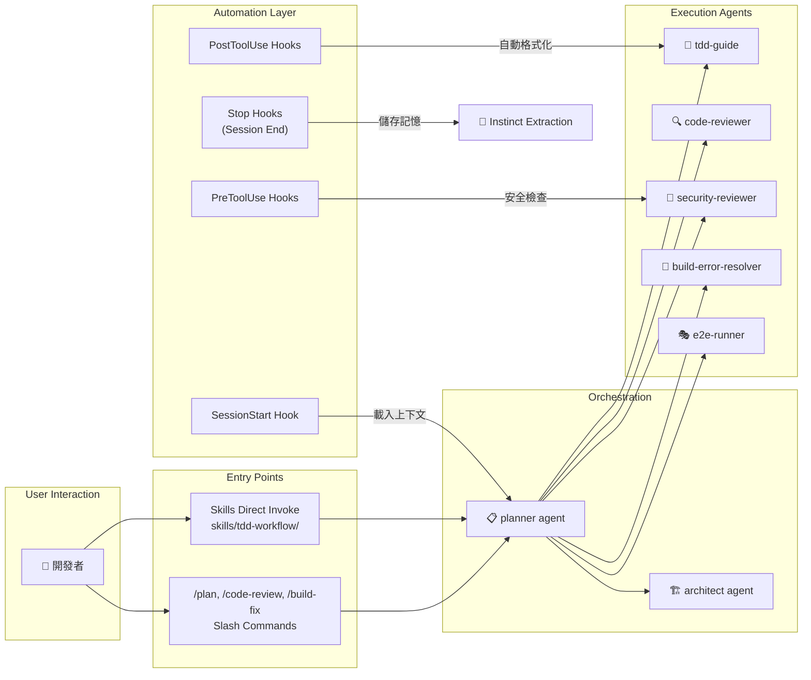
```mermaid
graph LR
    subgraph "User Interaction"
        User["👤 開發者"]
    end

    subgraph "Entry Points"
        SlashCmd["/plan, /code-review, /build-fix<br/>Slash Commands"]
        SkillInvoke["Skills Direct Invoke<br/>skills/tdd-workflow/"]
    end

    subgraph "Orchestration"
        Planner["📋 planner agent"]
        Architect["🏗️ architect agent"]
    end

    subgraph "Execution Agents"
        TDDGuide["🧪 tdd-guide"]
        CodeReviewer["🔍 code-reviewer"]
        SecurityReviewer["🔐 security-reviewer"]
        BuildResolver["🔧 build-error-resolver"]
        E2ERunner["🎭 e2e-runner"]
    end

    subgraph "Automation Layer"
        PreHook["PreToolUse Hooks"]
        PostHook["PostToolUse Hooks"]
        StopHook["Stop Hooks<br/>(Session End)"]
        SessionStart["SessionStart Hook"]
    end

    User --> SlashCmd
    User --> SkillInvoke
    SlashCmd --> Planner
    SkillInvoke --> Planner
    Planner --> Architect
    Planner --> TDDGuide
    Planner --> CodeReviewer
    Planner --> SecurityReviewer
    Planner --> BuildResolver
    Planner --> E2ERunner

    SessionStart -->|"載入上下文"| Planner
    PostHook -->|"自動格式化"| TDDGuide
    StopHook -->|"儲存記憶"| ContinuousLearning["🧠 Instinct Extraction"]
    PreHook -->|"安全檢查"| SecurityReviewer
```

> 💡 **Best Practice**：新的工作流程應優先定義為 Skill，不再建立新的 Command。ECC 正在將 `commands/` 遷移至 `skills/` 體系。
>
> ⚠️ **常見錯誤**：混淆 Agent 與 Skill。Agent 是執行者（帶角色與工具限制），Skill 是工作流程定義（可被 Agent 調用或直接執行）。

### 1.6 版本演進歷程

ECC 自 2025 年 9 月起持續快速迭代，以下為主要里程碑（已依官方 Releases／CHANGELOG.md 校正日期與內容）：

| 版本 | 日期 | 重要特性 |
| ------ | ------ | --------- |
| v1.2.0 | 2026-02 | Python/Django + Java Spring Boot Skills；Continuous Learning v2（Instinct 系統）；Session 管理 |
| v1.3.0 | 2026-02 | 完整 OpenCode 整合（12 agents、24 commands、16 skills）；3 個 native custom tools |
| v1.4.0 | 2026-02 | 互動式安裝精靈；PM2 與 multi-agent 編排（6 新指令）；多語言 Rules 架構重構 |
| v1.6.0 | 2026-02 | Codex CLI 支援；AgentShield 整合（1282 tests、102 rules）；GitHub Marketplace（ECC Tools） |
| v1.7.0 | 2026-02 | Codex App + CLI 雙支援；`frontend-slides` Skill；5 個商業/內容 Skills |
| v1.8.0 | 2026-03-05 | 正式定位為 Harness Performance System；Hook 可靠性大幅翻修；NanoClaw v2 |
| v1.9.0 | 2026-03-20 | Manifest-driven 選擇性安裝架構；SQLite 狀態儲存；6 新 Agents（TypeScript、Java、Kotlin、PyTorch 等）；10+ 語言生態系 |
| v1.10.0 | 2026-04-05 | Dashboard GUI；Operator 工作流擴展（語音、圖譜排序、計費、Workspace）；ECC 2.0 Alpha（Rust 控制平面，`ecc2/`）首度可本機建置；38 agents、156 skills、72 commands |
| v2.0.0-rc.1 | 2026-04-28 | Hermes operator story 公開發行候選版；跨 Harness 可重用基板文件化（`docs/architecture/cross-harness.md`） |
| v2.0.0 | 2026-06-09 | **正式定位為 Agent Harness Operating System**；`orch-*` 編排器族與動態工作流團隊編排上線；ECC Discord 社群成立；`kubernetes-patterns` skill、Worktree-lifecycle service |
| v2.1.0 | 2026-07-27 | **Plan Canvas**（瀏覽器內視覺化計畫審查）；**Kimi Code Harness**（Moonshot AI 官方合作）；**Itô GPU 自架運算整合**；新增 Hermes / OpenClaw 安裝目標；GateGuard 路徑排除（`GATEGUARD_EXEMPT_GLOBS`）；PostToolUse Hooks 整併為同步/非同步派發器；供應鏈強化（偵測 `sk-ant-` 等 Anthropic API Key 洩漏）；67 agents、281 skills、94 commands |
| **v2.2.0** | **2026-08-25** | **導引式（manifest-driven）安裝**：跨 Harness 一次設定、安裝歸屬台帳（ownership ledger）、健康檢查、修復、解除安裝；**Antigravity 2.0 原生安裝**（`.agents/`）；**Unified Memory Vault**（`ecc memory`，跨 Harness 統一記憶庫）；Itô skill 家族（`ito-baskets`）；實驗性 **Nasiko CLI 生命週期橋接**；**多模型評議審查（multi-model council review）**；dev-team 協作、代理評估、**living-docs 治理**、安全終端開啟、**TasteForge 多模態工作流**（`tasteforge-video`）；輕量 **Pi adapter**（`.pi/`）；MCP 預設連接器縮減為 1 個；OpenCode 家目錄遷移至 `~/.config/opencode`；發行流程強化（tag 必須落在 `origin/main`、npm 錯誤 fail-closed、三平台打包測試、staging dist-tag）。相對 v2.1.0 的差異為 **108 commits、530 檔案、+40,299 / −4,679 行**；68 agents、286 skills、94 commands |
| main（開發中） | 2026-08-25 之後 | 持續併入社群 PR；請以 `CHANGELOG.md` 的 `[Unreleased]` 區塊為準 |

> ⚠️ **版本使用建議**：正式環境／CI 應鎖定已標記 Release 的版本（目前為 **v2.2.0**），並透過 `git tag` 或 npm 版本鎖定安裝，避免直接追蹤 `main` 分支的開發中變更。
>
> ⚠️ **npm 發行落差（重要）**：ECC 的 GitHub Release 建立時機被 npm 推廣流程所把關，因此**可能出現 CHANGELOG 已標 2.2.0、但 GitHub Releases 頁面的 Latest 仍顯示 v2.1.0 的情況**。官方 README 對此的建議是：使用 npm 套件指令前，先執行
>
> ```bash
> npm view ecc-universal version
> ```
>
> 若仍回報 `2.1.0`，代表 2.2 的套件尚未推廣至 `latest` dist-tag，此時請改用 Claude Code 原生 plugin 指令路徑（`/plugin marketplace add` + `/plugin install`），不要硬套 2.2 的 `ecc-universal` 指令。
>
> 💡 完整變更記錄請參閱 [CHANGELOG.md](https://github.com/affaan-m/ECC/blob/main/CHANGELOG.md) 及 [Releases](https://github.com/affaan-m/ECC/releases)。

---

## 第二章：ECC 核心組件解析

### 2.1 Agents（代理）

Agent 是 ECC 的核心執行單元，每個 Agent 都是帶有特定角色、工具權限和模型配置的子代理。

#### 2.1.1 Agent 定義格式

```markdown
---
name: code-reviewer
description: Reviews code for quality, security, and maintainability
tools: ["Read", "Grep", "Glob", "Bash"]
model: opus
---

You are a senior code reviewer. Review the provided code for:
1. Code quality and maintainability
2. Security vulnerabilities (OWASP Top 10)
3. Performance issues
4. Test coverage gaps
```

#### 2.1.2 主要 Agent 分類

截至 2026-08，官方 `agents/` 目錄共收錄 **68 個** Agent。以下依職能分組列出，完整清單請以 `agents/` 目錄或 `/plugin list ecc@ecc` 查詢結果為準：

**規劃與架構**

| Agent 名稱 | 職責 |
| ----------- | ------ |
| `planner` | 功能實作規劃、任務拆解 |
| `architect` | 系統設計決策 |
| `code-architect` | 程式碼層級架構設計（模組邊界、介面） |
| `network-architect` | 網路拓撲與基礎設施架構設計 |
| `homelab-architect` | 自架/家用實驗室基礎設施架構 |

**探索與分析**

| Agent 名稱 | 職責 |
| ----------- | ------ |
| `code-explorer` | 唯讀程式碼庫探勘、快速定位 |
| `spec-miner` | 從既有程式碼／文件反推規格 |
| `type-design-analyzer` | 型別設計與 API 形狀分析 |
| `comment-analyzer` | 註解品質與過時註解偵測 |
| `conversation-analyzer` | Session 對話品質分析 |

**通用品質與治理**

| Agent 名稱 | 職責 |
| ----------- | ------ |
| `code-reviewer` | 程式碼品質審查 |
| `code-simplifier` | 簡化與去除不必要抽象 |
| `refactor-cleaner` | 無用程式碼清除 |
| `silent-failure-hunter` | 找出被吞噬的錯誤與靜默失敗 |
| `performance-optimizer` | 效能瓶頸分析與優化 |
| `agent-evaluator` | 評估其他 Agent 的產出品質 |

**安全與測試**

| Agent 名稱 | 職責 |
| ----------- | ------ |
| `security-reviewer` | OWASP Top 10 弱點分析 |
| `tdd-guide` | TDD 驅動開發引導 |
| `e2e-runner` | Playwright E2E 測試 |
| `pr-test-analyzer` | PR 測試覆蓋與品質分析 |

**文件**

| Agent 名稱 | 職責 |
| ----------- | ------ |
| `doc-updater` | 文件同步更新 |
| `docs-lookup` | 文件 / API 查閱 |

**語言與框架審查（21 種）**

`typescript-reviewer`、`python-reviewer`、`go-reviewer`、`java-reviewer`、`kotlin-reviewer`、`rust-reviewer`、`cpp-reviewer`、`csharp-reviewer`、`php-reviewer`、`fsharp-reviewer`、`swift-reviewer`、`react-reviewer`、`vue-reviewer`、`django-reviewer`、`fastapi-reviewer`、`flutter-reviewer`、`database-reviewer`、`rag-pipeline-reviewer`、`healthcare-reviewer`、`mle-reviewer`、`network-config-reviewer`

**建構錯誤修復（Build Resolvers，12 種）**

`build-error-resolver`（通用）、`java-build-resolver`、`go-build-resolver`、`kotlin-build-resolver`、`rust-build-resolver`、`cpp-build-resolver`、`dart-build-resolver`、`django-build-resolver`、`react-build-resolver`、`swift-build-resolver`、`pytorch-build-resolver`、`harmonyos-app-resolver`

**自動化與產生器-評估器框架**

| Agent 名稱 | 職責 |
| ----------- | ------ |
| `loop-operator` | 自主迴圈執行 |
| `harness-optimizer` | Harness 配置調校 |
| `gan-planner` / `gan-generator` / `gan-evaluator` | GAN 風格產生器-評估器框架（見 12.6） |
| `network-troubleshooter` | 網路故障排除 |

**業務、內容與開源治理**

| Agent 名稱 | 職責 |
| ----------- | ------ |
| `chief-of-staff` | 通訊分流與草稿 |
| `marketing-agent` | 行銷內容產出 |
| `seo-specialist` | SEO 優化建議 |
| `opensource-forker` / `opensource-packager` / `opensource-sanitizer` | 開源專案 Fork、封裝與敏感資訊清理工作流 |

> 💡 相較於 v2.0.0 時期（66 agents），v2.1.0 後新增了 `a11y-architect`（無障礙架構）、`agent-evaluator`、`code-simplifier`、`silent-failure-hunter`、`spec-miner`、`type-design-analyzer` 等多個「Agent 品質治理」類別的新角色——反映 ECC 社群近期的重點從「涵蓋更多語言」轉向「治理與稽核 Agent 本身輸出品質」。

#### 2.1.3 子代理（Sub-agent）設計模式

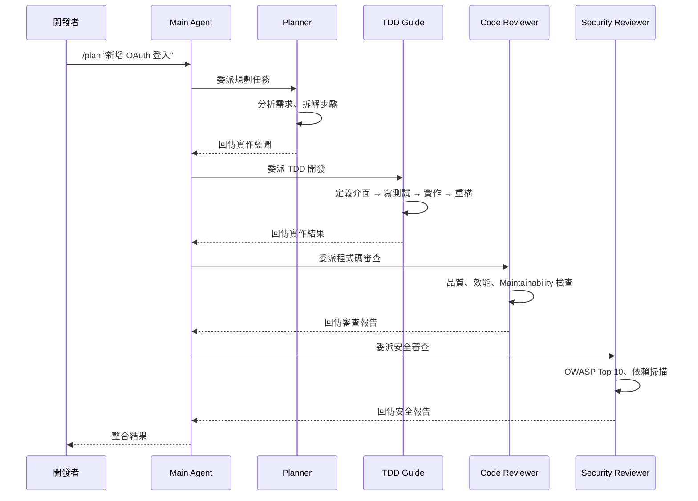
```mermaid
sequenceDiagram
    participant U as 開發者
    participant M as Main Agent
    participant P as Planner
    participant T as TDD Guide
    participant R as Code Reviewer
    participant S as Security Reviewer

    U->>M: /plan "新增 OAuth 登入"
    M->>P: 委派規劃任務
    P->>P: 分析需求、拆解步驟
    P-->>M: 回傳實作藍圖
    M->>T: 委派 TDD 開發
    T->>T: 定義介面 → 寫測試 → 實作 → 重構
    T-->>M: 回傳實作結果
    M->>R: 委派程式碼審查
    R->>R: 品質、效能、Maintainability 檢查
    R-->>M: 回傳審查報告
    M->>S: 委派安全審查
    S->>S: OWASP Top 10、依賴掃描
    S-->>M: 回傳安全報告
    M-->>U: 整合結果
```

> 💡 **Best Practice**：子代理使用獨立的上下文窗口，不會污染主對話。適合「寫完就扔」的任務。

### 2.2 Skills（技能）

Skills 是 ECC 的**主要工作流程介面**（Primary Workflow Surface），替代 legacy 的 `commands/`。

#### 2.2.1 Skill 目錄結構

```text
skills/
├── tdd-workflow/           # TDD 方法論
│   └── SKILL.md
├── security-review/        # 安全檢查清單
│   └── SKILL.md
├── springboot-patterns/    # Spring Boot 模式 ★ Java
│   └── SKILL.md
├── springboot-security/    # Spring Boot 安全 ★ Java
│   └── SKILL.md
├── springboot-tdd/         # Spring Boot TDD ★ Java
│   └── SKILL.md
├── java-coding-standards/  # Java 編碼標準 ★ Java
│   └── SKILL.md
├── jpa-patterns/           # JPA/Hibernate 模式 ★ Java
│   └── SKILL.md
├── backend-patterns/       # API、資料庫、快取模式
│   └── SKILL.md
├── api-design/             # REST API 設計
│   └── SKILL.md
├── e2e-testing/            # Playwright E2E 測試
│   └── SKILL.md
├── deployment-patterns/    # CI/CD、Docker、Rollback
│   └── SKILL.md
├── docker-patterns/        # Docker Compose、安全
│   └── SKILL.md
├── search-first/           # 研究優先工作流
│   └── SKILL.md
├── continuous-learning-v2/ # Instinct 學習系統
│   └── SKILL.md
├── strategic-compact/      # 策略性壓縮
│   └── SKILL.md
├── security-scan/          # AgentShield 整合
│   └── SKILL.md
├── autonomous-loops/       # 自主迴圈模式
│   └── SKILL.md
├── plankton-code-quality/  # 寫入時品質強制
│   └── SKILL.md
├── mle-workflow/           # 生產 ML Pipeline、評估、部署 ★ 新增
│   └── SKILL.md
├── nestjs-patterns/        # NestJS 框架模式 ★ 新增
│   └── SKILL.md
├── liquid-glass-design/    # iOS 26 Liquid Glass 設計系統 ★ 新增
│   └── SKILL.md
├── foundation-models-on-device/ # Apple 裝置端 LLM ★ 新增
│   └── SKILL.md
├── swift-concurrency-6-2/  # Swift 6.2 並發模式 ★ 新增
│   └── SKILL.md
├── perl-patterns/          # Modern Perl 5.36+ 慣用語法 ★ 新增
│   └── SKILL.md
├── codehealth-mcp/         # CodeScene Code Health（opt-in）★ 新增
│   └── SKILL.md
├── dmux-workflows/         # 多 Agent tmux 編排 ★ 新增
│   └── SKILL.md
├── videodb/                # 影音處理與串流 ★ 新增
│   └── SKILL.md
├── plan-canvas/            # Plan Canvas 視覺化計畫審查 ★ v2.1.0 新增
│   └── SKILL.md
├── ito-compute/            # Itô GPU 運算橋接（RFQ、節點查找）★ v2.1.0 新增
│   └── SKILL.md
├── hermes-imports/         # Hermes operator 匯入 ★ 新增
│   └── SKILL.md
├── openclaw-persona-forge/ # OpenClaw persona 建構 ★ 新增
│   └── SKILL.md
├── github-ops/             # gh CLI 包裝（取代 github MCP）★ 新增
│   └── SKILL.md
├── documentation-lookup/   # Context7 REST API 包裝（取代 context7 MCP）★ 新增
│   └── SKILL.md
├── exa-search/             # Exa 搜尋 API 包裝（取代 exa MCP）★ 新增
│   └── SKILL.md
└── ...（共 286 個，完整清單請查閱官方 repo 或執行 `node scripts/ecc.js list-installed`）
```

#### 2.2.2 Skill 定義範例（Spring Boot TDD）

````markdown
---
name: springboot-tdd
description: Test-Driven Development workflow for Spring Boot applications
tags: [java, spring-boot, tdd, testing]
---

# Spring Boot TDD Workflow

## 執行步驟

1. **定義介面**：先寫 Controller/Service Interface
2. **RED**：撰寫失敗的測試案例
   - 使用 `@WebMvcTest` 測試 Controller
   - 使用 `@DataJpaTest` 測試 Repository
   - 使用 Mockito 模擬依賴
3. **GREEN**：實作最小程式碼通過測試
4. **REFACTOR**：重構，保持測試綠燈
5. **驗證覆蓋率**：目標 80%+

## 範例

```java
@WebMvcTest(UserController.class)
class UserControllerTest {
    @Autowired MockMvc mockMvc;
    @MockBean UserService userService;

    @Test
    void shouldReturnUserById() throws Exception {
        given(userService.findById(1L))
            .willReturn(Optional.of(new User(1L, "Alice")));

        mockMvc.perform(get("/api/users/1"))
            .andExpect(status().isOk())
            .andExpect(jsonPath("$.name").value("Alice"));
    }
}
```
````

### 2.3 Commands & Hooks

#### 2.3.1 主要指令（Slash Commands）

> ⚠️ **分辨來源**：下表刻意標註每個指令的**來源**。`/compact`、`/clear`、`/cost`、`/model` 等是 **Claude Code CLI 原生指令**，無論是否安裝 ECC 都能使用；ECC 只是在最佳實踐（第十章）中建議「何時使用」。真正屬於 ECC 帶來的，是 `/plan`、`/code-review`、`/build-fix` 等對應到特定 Agent／Skill 的工作流指令，以及 `/harness-audit`、`/loop-start` 等 ECC 專屬能力。

> 🚨 **2026 年最重要的變更：部分斜線指令已「退役」**  
> ECC 正在把工作流從「斜線指令」遷移到「Skills」。**12 個舊指令（含 `/tdd`、`/e2e`、`/verify`、`/docs`）已被移出預設安裝**，其檔案改置於 repo 的 `legacy-command-shims/commands/` 目錄，**不會**隨 plugin 或 `install.sh` 安裝。若你照舊教學輸入 `/tdd`，在新版環境中會得到「找不到指令」。完整對照請見 **附錄 I**，本手冊第五、六章的流程說明也已同步改寫為 Skill 呼叫方式。

**常用指令速查（依來源標註）**：

| 指令 | 來源 | 功能 | 對應 Agent／Skill |
| ------ | ------ | ------ | ----------- |
| `/plan "需求描述"` | ECC | 建立實作計劃 | planner |
| `/plan-canvas` | ECC | 開啟瀏覽器視覺化計畫審查（見 5.9） | planner |
| `/plan-prd` | ECC | 由 PRD 產生計畫 | planner |
| `/feature-dev` | ECC | 端到端功能開發流程 | 多 Agent |
| `/code-review` | ECC（同名 Claude Code 原生 Skill 亦存在） | 程式碼審查 | code-reviewer |
| `/review-pr` | ECC | 審查 Pull Request | code-reviewer |
| `/build-fix` | ECC | 修復建構錯誤 | build-error-resolver |
| `/quality-gate` | ECC | 品質閘門檢查 | — |
| `/santa-loop` | ECC | **對抗式雙重審查收斂迴圈**：兩個獨立模型審查者都必須通過才放行 | 多模型 |
| `/security-scan` | ECC | 安全掃描 | security-reviewer |
| `/refactor-clean` | ECC | 移除無用程式碼 | refactor-cleaner |
| `/update-docs` | ECC | 更新文件 | doc-updater |
| `/update-codemaps` | ECC | 更新程式碼地圖 | — |
| `/learn` | ECC | 從 Session 中萃取模式 | — |
| `/learn-eval` | ECC | Session 結束時萃取學習並評估 | — |
| `/evolve` | ECC | 將學習提煉為 Instinct／Skill | — |
| `/save-session`／`/resume-session` | ECC | 儲存／回復 Session 狀態（寫入 `~/.claude/session-data/`） | — |
| `/checkpoint` | ECC | 建立工作檢查點 | — |
| `/harness-audit` | ECC | 稽核 Harness 可靠度 | — |
| `/loop-start`／`/loop-status` | ECC | 啟動／查詢自主迴圈 | loop-operator |
| `/model-route` | ECC | 依複雜度路由模型 | — |
| `/cost-report` | ECC | 產生成本報告 | — |
| `/multi-plan`／`/multi-execute` | ECC（需額外安裝 `ccg-workflow`） | 多 Agent 任務分解／協作執行 | — |
| `/compact` | **Claude Code 原生** | 手動壓縮上下文（可加參數，如 `/compact 聚焦 API 變更`） | — |
| `/clear` | **Claude Code 原生** | 清除上下文（免費重置） | — |
| `/cost` | **Claude Code 原生** | 檢查 Token 花費 | — |
| `/model sonnet`／`/model opus` | **Claude Code 原生** | 切換模型（日常／深度推理） | — |
| `/rewind` | **Claude Code 原生** | 開啟 Checkpoint 選單，回復對話／程式碼狀態（見 10.6） | — |
| `/goal` | **Claude Code 原生** | 設定持續評估條件，讓 Agent 迭代至條件成立才停止 | — |
| `/plugin` | **Claude Code 原生** | 瀏覽並安裝 Plugin Marketplace | — |

#### 2.3.2 完整指令目錄（94 個，依用途分類）

以下為官方 `COMMANDS-QUICK-REF.md` 的分類全貌。企業導入時可據此決定要安裝哪些 profile，避免把 94 個指令的描述全部塞進模型上下文。

| 分類 | 指令 |
| ------ | ------ |
| **核心工作流** | `/plan`、`/plan-canvas`、`/plan-prd`、`/feature-dev`、`/code-review`、`/review-pr`、`/build-fix`、`/quality-gate`、`/santa-loop` |
| **測試（依語言）** | `/test-coverage`、`/go-test`、`/kotlin-test`、`/rust-test`、`/cpp-test`、`/flutter-test`、`/react-test` |
| **程式碼審查（依語言）** | `/code-review`、`/python-review`、`/go-review`、`/kotlin-review`、`/rust-review`、`/cpp-review`、`/flutter-review`、`/vue-review`、`/react-review`、`/fastapi-review` |
| **建構修復（依語言）** | `/build-fix`、`/go-build`、`/kotlin-build`、`/rust-build`、`/cpp-build`、`/gradle-build`、`/flutter-build`、`/react-build` |
| **編排式功能流程** | `/orch-add-feature`、`/orch-build-mvp`、`/orch-change-feature`、`/orch-fix-defect`、`/orch-refine-code`、`/orch-review` |
| **PRP 工作流** | `/prp-prd`、`/prp-plan`、`/prp-implement`、`/prp-commit`、`/prp-pr` |
| **Epic 協作（GitHub 原生）** | `/epic-decompose`、`/epic-validate`、`/epic-claim`、`/epic-sync`、`/epic-review`、`/epic-publish`、`/epic-unblock` |
| **規劃與架構** | `/plan`、`/multi-plan`、`/multi-workflow`、`/multi-backend`、`/multi-frontend`、`/multi-execute` |
| **Session 管理** | `/save-session`、`/resume-session`、`/sessions`、`/checkpoint`、`/aside` |
| **學習與演進** | `/learn`、`/learn-eval`、`/evolve`、`/promote`、`/prune`、`/instinct-status`、`/instinct-export`、`/instinct-import`、`/skill-create`、`/skill-health` |
| **重構** | `/refactor-clean` |
| **文件與研究** | `/ecc-guide`、`/update-docs`、`/update-codemaps` |
| **迴圈與自動化** | `/loop-start`、`/loop-status`、`/gan-build`、`/gan-design` |
| **專案與基礎設施** | `/projects`、`/project-init`、`/harness-audit`、`/model-route`、`/pm2`、`/setup-pm`、`/auto-update`、`/cost-report`、`/security-scan`、`/jira`、`/pr`、`/hookify`、`/hookify-configure`、`/hookify-list`、`/hookify-help` |
| **行銷** | `/marketing-campaign` |

> 💡 **Session 路徑差異**：`/save-session` 寫入 `~/.claude/session-data/`，而較舊的 `/sessions` 讀取的是 `~/.claude/sessions/`。兩者路徑不同，若你發現 `/sessions` 看不到剛存的 Session，這是已知的歷史包袱，不是壞掉。

**官方快速決策指南**（直接譯自 `COMMANDS-QUICK-REF.md`）：

| 情境 | 該用什麼 |
| ------ | --------- |
| 要開發新功能 | 先 `/plan`，再用 `tdd-workflow` skill |
| 程式碼已寫完 | `/code-review` |
| 建構壞掉 | `/build-fix` |
| 需要查最新的線上文件 | `documentation-lookup` skill |
| Session 即將結束 | `/save-session` 或 `/learn-eval` |
| 要接續上次工作 | `/resume-session` |
| 上下文快爆了 | `context-budget` skill |
| 想萃取這次的經驗 | 先 `/learn-eval`，再 `/evolve` |
| 同樣的事情做很多次 | `/loop-start` |

#### 2.3.3 `ecc` CLI（安裝健康度與回饋）

除了在 Harness 內使用的斜線指令，ECC 另提供一組**在終端機執行**的管理 CLI。v2.2 的導引式安裝把安裝歸屬（ownership）記錄成台帳，這組指令才得以精確運作。

| 指令 | 用途 |
| ------ | ------ |
| `ecc list-installed` | 列出目前已安裝的 ECC 元件與其歸屬 Harness |
| `ecc doctor` | 健康檢查：偵測缺漏、路徑錯置、重複安裝 |
| `ecc repair` | 依 manifest 修復損壞或缺漏的安裝 |
| `ecc uninstall` | 依歸屬台帳安全移除（保留使用者自行修改過的檔案） |
| `ecc feedback` | 產生回饋／問題回報範本（**不會自動上傳任何診斷資料**） |

> 🔐 **隱私設計**：`ecc feedback` 刻意不自動蒐集或上傳診斷資訊，需由使用者自行檢視內容後決定是否提交。企業環境若有資料外流疑慮，可先在隔離環境檢閱產出的檔案。

#### 2.3.4 Hooks 機制

Hooks 在特定工具事件發生時自動觸發，無需手動介入。

| Hook 事件 | 觸發時機 | 典型用途 |
| ----------- | --------- | --------- |
| `SessionStart` | Session 開始 | 載入上次上下文、設定環境 |
| `SessionEnd` | Session 結束 | 儲存狀態、萃取學習 |
| `PreToolUse` | 工具執行前 | 安全檢查、路徑驗證 |
| `PostToolUse` | 工具執行後 | 自動格式化、TypeCheck |
| `PreCompact` | 壓縮前 | 儲存關鍵狀態 |
| `Stop` | Agent 停止時 | Session 摘要、模式萃取 |

**Hooks 範例 — 檔案編輯後自動檢查 console.log**：

```json
{
  "matcher": "tool == \"Edit\" && tool_input.file_path matches \"\\\\.(ts|tsx|js|jsx)$\"",
  "hooks": [{
    "type": "command",
    "command": "#!/bin/bash\ngrep -n 'console\\.log' \"$file_path\" && echo '[Hook] Remove console.log' >&2"
  }]
}
```

**Hook Runtime Controls**：

```bash
# 設定 Hook 嚴格度（minimal | standard | strict）
export ECC_HOOK_PROFILE=standard

# 停用特定 Hooks
export ECC_DISABLED_HOOKS="pre:bash:tmux-reminder,post:edit:typecheck"
```

> ⚠️ **常見錯誤**：不要在 `plugin.json` 中宣告 `hooks` 欄位！Claude Code v2.1+ 會自動載入 `hooks/hooks.json`，重複宣告會導致 `Duplicate hooks file detected` 錯誤。

### 2.4 Rules（規則）

Rules 是「永遠遵循」的開發準則，按語言／框架組織。截至 2026-08，官方 `rules/` 目錄已涵蓋 **21 種語言／框架 + 1 個通用包**（`common/`），遠超 v1.9.0 時期宣稱的「12+ 語言生態系」：

```text
rules/
├── common/              # 語言無關的通用原則（必裝）
│   ├── coding-style.md    # 不可變性、檔案組織
│   ├── git-workflow.md    # Commit 格式、PR 流程
│   ├── testing.md         # TDD、80% 覆蓋率需求
│   ├── performance.md     # 模型選擇、上下文管理
│   ├── patterns.md        # 設計模式、骨架專案
│   ├── hooks.md           # Hook 架構、TodoWrite
│   ├── agents.md          # 子代理委派時機
│   └── security.md        # 強制安全檢查
├── typescript/          ├── python/         ├── golang/
├── java/                ├── kotlin/         ├── swift/
├── rust/                ├── cpp/            ├── csharp/
├── php/                 ├── ruby/           ├── dart/
├── perl/                ├── fsharp/         ├── arkts/     # HarmonyOS
├── react/                                    # React（Web）
├── react-native/                             # React Native（行動端）
├── vue/                 ├── angular/        ├── nuxt/
└── web/                                      # 通用 Web 標準
```

> 💡 **選配原則**：Claude Code Plugin 系統**無法**自動分發 `rules/`（見 3.2），因此安裝時應只複製 `common/` + 專案實際使用的 1–2 個語言／框架包，而非整個 `rules/` 目錄——Rules 是「永遠載入」的上下文，複製過多會直接侵蝕可用的上下文窗口。

### 2.5 記憶與上下文管理

#### 2.5.1 上下文污染問題

長時間對話中，Claude 的 200K Token 窗口會逐漸被舊資訊、失敗嘗試和探索性內容填滿，導致：

- 模型「遺忘」早期決策
- 重複相同的錯誤
- 回應品質下降

#### 2.5.2 ECC 壓縮策略

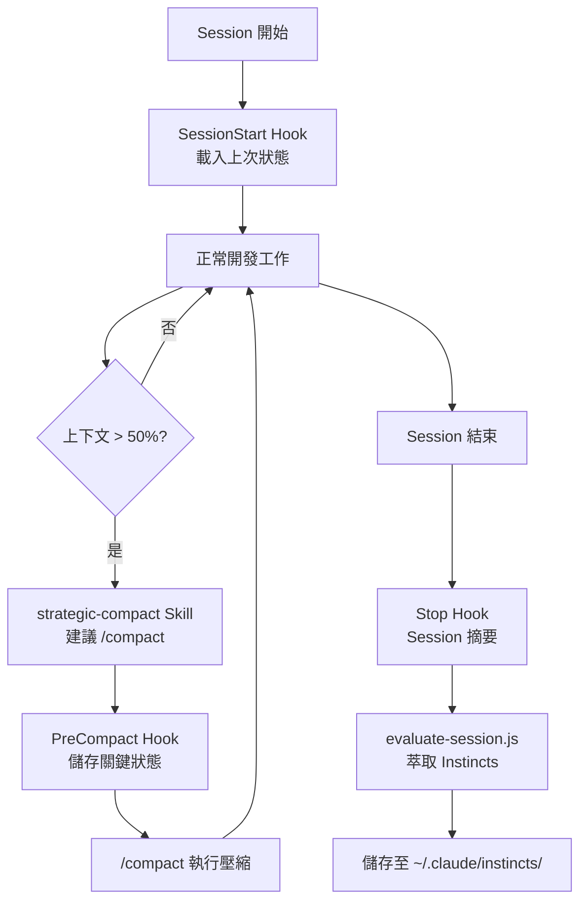
```mermaid
graph TD
    A["Session 開始"] --> B["SessionStart Hook<br/>載入上次狀態"]
    B --> C["正常開發工作"]
    C --> D{上下文 > 50%?}
    D -->|是| E["strategic-compact Skill<br/>建議 /compact"]
    D -->|否| C
    E --> F["PreCompact Hook<br/>儲存關鍵狀態"]
    F --> G["/compact 執行壓縮"]
    G --> C
    C --> H["Session 結束"]
    H --> I["Stop Hook<br/>Session 摘要"]
    I --> J["evaluate-session.js<br/>萃取 Instincts"]
    J --> K["儲存至 ~/.claude/instincts/"]
```

#### 2.5.3 Continuous Learning v2（Instinct 系統）

```bash
# 查看已學習的 Instincts
/instinct-status

# 匯入他人的 Instincts
/instinct-import <file>

# 匯出你的 Instincts 供分享
/instinct-export

# 將相關 Instincts 聚類為 Skills
/evolve

# 清除過期的 Pending Instincts（30 天 TTL）
/prune
```

> 💡 **Best Practice**：在以下時機執行 `/compact`：
> - 研究/探索完成後，開始實作前
> - 完成一個里程碑後，開始下一個前
> - Debug 完成後，繼續功能開發前
> - 某條路失敗後，嘗試新方法前
>
> ⚠️ **不要**在實作進行中壓縮 — 你會失去變數名稱、檔案路徑和部分狀態。

### 2.6 Contexts（動態上下文注入）

ECC 提供**動態系統提示注入**（Dynamic System Prompt Injection）機制，透過 `contexts/` 目錄中的上下文檔案，根據不同工作模式注入最適合的系統行為指引。

#### 2.6.1 可用上下文模式

| 上下文 | 檔案 | 適用場景 |
| -------- | ------ | --------- |
| **Development** | `contexts/dev.md` | 日常功能開發、實作程式碼 |
| **Code Review** | `contexts/review.md` | 程式碼審查模式，聚焦品質與安全 |
| **Research** | `contexts/research.md` | 研究探索模式，側重資料收集與分析 |

#### 2.6.2 使用方式

```bash
# 在 Session 開始時切換上下文
# SessionStart Hook 會自動載入預設上下文

# 手動切換（在 CLAUDE.md 或 Session 中指定）
# 在專案 CLAUDE.md 中設定預設上下文
```

**上下文注入示意**：

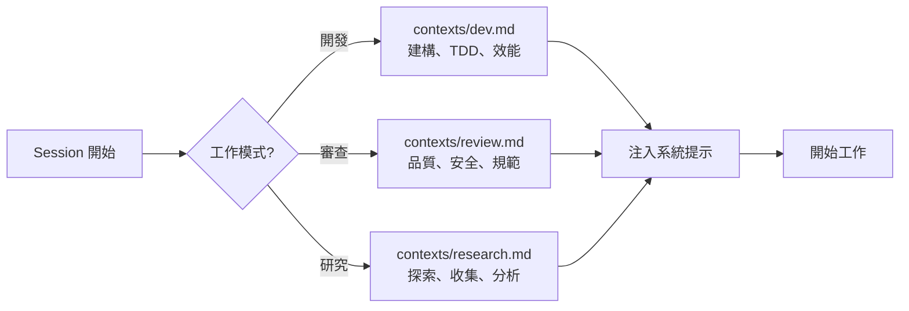
```mermaid
graph LR
    A["Session 開始"] --> B{工作模式?}
    B -->|開發| C["contexts/dev.md<br/>建構、TDD、效能"]
    B -->|審查| D["contexts/review.md<br/>品質、安全、規範"]
    B -->|研究| E["contexts/research.md<br/>探索、收集、分析"]
    C --> F["注入系統提示"]
    D --> F
    E --> F
    F --> G["開始工作"]
```

> 💡 **Best Practice**：在 `CLAUDE.md` 中指定專案預設上下文，根據任務性質動態切換。研究階段用 `research`，實作階段用 `dev`，PR 審查用 `review`。

### 2.7 MCP Server 配置

ECC 對 MCP（Model Context Protocol）採取的立場，是本手冊最需要更新的一個章節——2026 年 6 月的一次官方稽核（"June 2026 audit"）大幅改寫了預設策略，從「多達 14 個預配置 Server」收斂為「僅 1 個預設連接器」。這個決策本身也是企業導入 ECC 時最值得參考的治理案例：**多不代表好，每個 MCP Server 的工具 Schema 都會常駐佔用上下文窗口**。

#### 2.7.1 現行唯一預設連接器

| MCP Server | 功能說明 | 為何保留 |
|------------|---------|---------|
| **`chrome-devtools`** | Google 官方 DevTools MCP：即時偵錯、效能追蹤、Console/Network 檢查 | 需要「保持開啟的互動式 Session」（CDP），這正是 MCP 相對於一次性 CLI 呼叫的不可取代之處；且免金鑰 |

#### 2.7.2 被淘汰的六個前預設連接器（2026-06 審查）

| 前預設 Server | 判定 | 替代方案 |
| --- | --- | --- |
| `github` | 改為 Skill | `gh` CLI 包裝於 `github-ops` Skill——多數模型已內建 `gh` 用法，一次性指令組合、Token 開銷遠低於原本 ~30 個工具 Schema |
| `context7` | 改為 Skill | `documentation-lookup` Skill 直接呼叫 Context7 公開 REST API，兩次無狀態呼叫即可，不需要常駐 Server |
| `exa` | 改為 Skill | 各 Harness 原生搜尋（Claude Code WebSearch、Codex web_search）為預設；`exa-search` Skill 保留給有 API Key 的使用者 |
| `memory` | 直接移除 | 各 Harness 原生記憶機制（Claude Code auto-memory、AGENTS.md 慣例）+ ECC 自身的 Instinct/Continuous Learning 系統已涵蓋此需求 |
| `playwright` | 改為 Skill | Microsoft 官方也已將 Agent 工作流移出 MCP（逐步回傳完整 a11y tree 過度耗費上下文）；ECC 的 e2e Skills 已直接驅動 `@playwright/cli`；瀏覽器**除錯**用途已由 `chrome-devtools` 涵蓋 |
| `sequential-thinking` | 直接移除 | 各主流 Harness 已內建 Extended Thinking，此 Server 本質只是包裝了一種提示模式 |

> 💡 上述六個仍可作為選配項目保留在 `mcp-configs/mcp-servers.json` 中，供需要的使用者手動啟用。

#### 2.7.3 新增連接器的准入原則

ECC 官方訂出兩項門檻，**必須同時滿足**才能新增為預設連接器（否則一律走 Skill 包裝 CLI/REST API 的路線）：

1. **普遍性（Universal）**：幾乎每個 ECC 目標 Harness 的使用者都用得到
2. **MCP 真的優於 CLI/API 包裝**：任務需要互動式 Session 狀態、串流、驗證握手或結構化瀏覽——單純的無狀態請求/回應應該是 Skill，不是 Server

> 「Popular（受歡迎）不是理由；job is stateful and universal（任務具狀態性且普遍適用）才是理由。」——MCP-CONNECTOR-POLICY.md

官方另訂出一條**數量上限的治理原則**：「預設集合永遠維持在十個以下；實務上，2026 年嚴肅的 Harness 所採取的業界預設是 **零到兩個連接器**，加上 Harness 自帶的內建工具。」這句話對企業很有參考價值：若你的內部平台團隊目前預設幫全公司開了十幾個 MCP Server，你實際上是在**用每位工程師的上下文窗口補貼少數人的便利性**。

#### 2.7.4 MCP 配置管理

```bash
# MCP 配置檔位置（選配連接器目錄）
mcp-configs/mcp-servers.json

# 停用已啟用的預設連接器（install/sync filter，非 live Claude Code toggle）
export ECC_DISABLED_MCPS="chrome-devtools"

# 使用 /mcp 命令在 Claude Code 中即時管理（Claude Code 原生功能）
# Claude Code 會將選擇持久化到 ~/.claude.json
```

> ⚠️ **Token 影響提醒**：每個 MCP 的工具描述都會常駐消耗 Token，啟用過多 MCP 可能將 200K Token 窗口實際可用空間壓縮到約 70K。即使在僅 1 個預設連接器的現況下，若專案另外疊加多個選配 MCP，仍建議整體控制在 **< 10 MCPs、< 80 tools**。

### 2.8 Claude Code 原生功能與 ECC 擴充功能分工

企業導入 ECC 前最常見的誤解，是把 Claude Code 平台本身的能力誤認為「ECC 提供的功能」——這會導致評估錯誤（如認為換掉 ECC 就會失去 Plan Mode）、也會導致治理錯誤（如把平台升級才能取得的能力誤植為 ECC 版本紀錄）。下表整理 Anthropic 官方文件與 ECC 官方 repo 的分工邊界：

| 能力 | 提供者 | 說明 |
| ------ | -------- | ------ |
| Plan Mode（`Shift+Tab` 進入計畫模式） | **Claude Code 原生** | Explore → Plan → Code → Commit 四階段工作法的核心機制 |
| Hooks 執行引擎（`PreToolUse`/`PostToolUse`/`Stop` 等事件） | **Claude Code 原生** | ECC 提供的是**寫好的 Hook 腳本內容**（如 Secret 偵測、GateGuard），執行引擎本身是平台能力 |
| Skills 發現與載入機制（`.claude/skills/`） | **Claude Code 原生** | ECC 提供的是**286 個現成 Skill 內容**，發現/載入協定是平台規格 |
| Subagent 委派機制（`tools`/`model` frontmatter） | **Claude Code 原生** | ECC 提供的是**68 個預先設計好角色的 Agent 定義檔** |
| `/compact`、`/clear`、`/cost`、`/model` | **Claude Code 原生** | ECC 只在文件中建議「何時使用」（見 10.1、10.4），並非發明這些指令 |
| Checkpoints / `/rewind` | **Claude Code 原生** | 自動快照＋回復機制；ECC 的 Worktree-lifecycle（12.4）是另一層、更粗粒度的隔離機制 |
| `/goal` 持續評估、Stop Hook 阻擋迴圈 | **Claude Code 原生** | ECC 的 `verification-loop` Skill（6.6）是在此機制上包裝的特定驗證管道 |
| Auto Mode / Permission Modes（分類器模型自動審核操作） | **Claude Code 原生** | 與 ECC 的 `ECC_HOOK_PROFILE`（minimal/standard/strict）是互補而非取代關係 |
| Sandboxing（`/sandbox`，OS 層級隔離） | **Claude Code 原生** | GateGuard（7.5）與 AgentShield（6.4）是應用層的額外掃描，不取代 OS 層沙箱 |
| Agent Teams（原生多 Session 協同） | **Claude Code 原生**（2026 年新增） | 與 ECC 的 `/multi-plan`／`/multi-execute`（需 `ccg-workflow`）是兩條不同的多代理路徑，企業選型時應擇一，避免疊加 |
| 非互動模式 `claude -p`、Fan-out 迴圈 | **Claude Code 原生** | CI/CD 整合（第八章）可直接使用，不依賴 ECC |
| MCP 協定支援本身 | **Claude Code 原生**（Anthropic 定義的協定） | ECC 提供的是**連接器政策**與精選 Server 目錄（2.7），協定實作是平台層 |
| AgentShield 安全掃描、GateGuard、Instinct 學習系統、Orchestrator 家族、Plan Canvas、跨 Harness Adapter | **ECC 專屬** | 這些是 Anthropic 官方未提供、需要額外框架才能取得的能力 |

> 💡 **一句話總結**：Claude Code 提供「積木」（Hooks、Skills、Subagents、Plan Mode、Checkpoints 的執行引擎），ECC 提供「預先搭好、可跨團隊複用的積木組合」（具體的 Agent 角色、Skill 工作流、安全掃描規則、跨 Harness 移植層）。導入 ECC 前，建議先讀過 Anthropic 官方 [Best Practices for Claude Code](https://code.claude.com/docs/en/best-practices)，確認團隊已理解原生積木的用法，再評估是否需要 ECC 這層「預組裝」框架（第十三章有完整的決策框架）。

### 2.9 Unified Memory Vault（跨 Harness 統一記憶庫）

**Unified Memory Vault 是 v2.2.0 最具企業價值的新增能力**。它要解決的問題很具體：一個團隊往往同時使用多個 Harness（資深工程師用 Claude Code、某些 CI 任務用 Codex、部分成員用 Kimi Code），但**每個 Harness 的記憶都是孤島**，導致同一個架構決策要在不同工具裡重述一次。Memory Vault 把記憶從「工具內部狀態」拉出來，變成**位於檔案系統上、人可閱讀、可納版控的 Markdown**。

#### 2.9.1 設計原則與儲存位置

| 範圍 | 路徑 | 適用內容 | 是否進版控 |
| ------ | ------ | --------- | ----------- |
| 專案／團隊 | `.ecc/memory/` | 架構決策、專案慣例、交接事項 | 建議 commit（團隊共享） |
| 個人（使用者級） | `~/.ecc/memory/` | 個人偏好、跨專案的個人筆記 | 不進版控 |

三項核心設計決策：

1. **本地優先、可檢視**：不是二進位資料庫、不是雲端服務，而是你可以用 `cat` 看、用 `git diff` 審查的 Markdown。企業稽核時這點極為重要。
2. **跨 Harness**：同一份記憶可被 Claude Code、Codex、Hermes、OpenClaw、Kimi 讀取。
3. **記憶不是可執行政策**：見下方信任邊界。

#### 2.9.2 `ecc memory` 指令集

```bash
# 安裝 CLI（若尚未安裝）
npm install -g ecc-universal

# 初始化（專案範圍）
ecc memory init --scope project

# 寫入一筆記憶（內文必須由 stdin 或檔案傳入）
ecc memory save --title "決定採用 Outbox Pattern" --body-file ./decision.md

# 產生交接摘要（供下一個 Harness 接手）
ecc memory handoff

# 搜尋，並針對目標 Harness 格式化輸出
ecc memory search "outbox" --target-harness codex

# 讀取單筆記憶
ecc memory read

# 健康檢查（權限、格式、損壞偵測）
ecc memory doctor
```

> 🔐 **為什麼內文不能直接寫在指令列？**這是刻意的安全設計。記憶內文只接受 `--stdin` 或 `--body-file`，**不接受作為 CLI 參數值**，目的是避免惡意內容透過 shell 展開、歷史紀錄或參數注入路徑流入記憶庫。

#### 2.9.3 信任邊界（企業導入必讀）

> **「Memory is unreviewed context, not executable policy.」**（記憶是未經審查的上下文，不是可執行的政策。）

這句官方聲明的實務含意是：

- 記憶庫內容會被注入模型上下文，因此它是**提示注入（prompt injection）的攻擊面**。若一個外部貢獻者能將內容寫入 `.ecc/memory/`，他就能影響所有團員的 Agent 行為。
- 因此，**`.ecc/memory/` 必須納入 Code Review 範圍**，建議在 `CODEOWNERS` 中指定審查者。
- 不要把安全規則、權限政策、部署授權寫在記憶庫——那些應該寫在 Rules（2.4）或 Hooks（2.3.4），它們才是強制執行的機制。
- 記憶庫不應存放 Secret。`ecc memory doctor` 會做基本檢查，但不取代 CI 的 Secret 掃描。

#### 2.9.4 選配的 `ecc-memory-mcp` Server

ECC 另提供一個 **stdio MCP Server**，將 `save` / `search` / `read` / `doctor` 四個有界的操作暴露給模型。需特別注意：

- **預設不啟用**。這符合 2.7 的連接器政策（不普遍就不預設）。
- 啟用後等於讓模型**自行決定何時寫入團隊記憶**，請先評估治理風險。
- 對應 Skill：`skills/unified-memory/SKILL.md`。

#### 2.9.5 已知缺陷：Windows 原生環境的寫入失敗

v2.2.0 修復了一個非常值得記錄的問題，因為它直接影響 Windows 使用者：

- **症狀**：在 **Windows** 搭配 **Node 22.12–22.16 或 24.0–24.1** 時，`ecc memory` 的寫入與 `--body-file` 讀取全數失敗。
- **根因**：libuv 在處理基於路徑的 `stat()`／`lstat()` 時走 `GetFileInformationByName`，**未回傳 volume serial**，而 `fstat()` 則有回傳；記憶庫的 TOCTOU（time-of-check to time-of-use）防護機制因此認定每一次操作都不一致而全數拒絕。
- **修復**：上游已在 **libuv 1.51.0** 修正；ECC 端則改為要求 `BigInt` 型別的 stat 值，避免 Windows 檔案 ID 超過 `Number.MAX_SAFE_INTEGER` 後兩個不同檔案塔縮成同一個身分。
- **實務建議**：若你仍在舊版 ECC，請避開上述 Node 版本區間，或直接升級至 v2.2.0。另見 3.11 的 Windows 原生限制與 Issue **#2626**。

---

## 第三章：安裝與環境建置

### 3.1 前置需求

| 需求 | 版本 | 說明 |
| ------ | ------ | ------ |
| Claude Code CLI | v2.1.0+ | `claude --version` 檢查 |
| Node.js | 18+ | 用於 Hook scripts |
| npm / pnpm / yarn / bun | 任一 | 套件管理器 |
| Git | 2.x+ | 版本控制 |

### 3.2 Plugin 安裝（推薦）

> ⚠️ **只選一種安裝路徑（per Harness）**：同一個 Harness 只能選**一種**安裝方式。例如 Claude Code 用 Plugin 安裝後，**不要**再疊加執行 `install.sh --profile full`，這會造成重複元件和衝突行為（症狀：指令重複出現、Hook 執行兩次）。若已經疊加安裝，直接跳到「Reset / Uninstall ECC」小節復原，不需要重灌整個環境。
>
> **可行的組合**：Claude Code Plugin + Codex 原生 Plugin；Claude Code Plugin + Codex legacy sync。  
> **應避免的組合**：Claude Code Plugin + 完整手動安裝；Codex sync + Codex marketplace plugin。

#### 3.2.0 v2.2 導引式安裝（Guided Setup）

v2.2.0 起，ECC 提供 **manifest 驅動的導引式安裝**，是目前官方推薦的新手入口。它會逐步詢問要安裝哪些 Harness、範圍（scope）、Hook 嚴格度與 profile，並把每個被寫入的檔案記進**歸屬台帳（ownership ledger）**，讓後續的 `doctor` / `repair` / `uninstall` 能精準運作。

**單一 Harness（Claude Code）設定或更新**：

```bash
npx ecc-universal setup
```

此指令會引導完成 Claude Code plugin 的安裝／更新、選擇 scope 與 hook profile。

**多 Harness 一次設定（目前支援 Claude Code、Codex、Kimi Code）**：

```bash
npx ecc-universal install --guided
```

**自動化／CI 用的非互動形式**：

```bash
npx ecc-universal install --guided \
  --harness claude --harness codex --harness kimi \
  --claude-scope local --claude-hooks standard \
  --profile core --yes
```

**先試跑再決定（強烈建議企業環境先做這步）**：

```bash
# 預覽將對 Codex 做哪些變更，不實際寫入
npx ecc-universal install --guided --harness codex --dry-run

# 預覽 core profile 安裝到 Kimi 的結果
npx ecc-universal install --profile core --target kimi --dry-run
```

**其他常用別名**：

```bash
# 依主題諮詢建議的元件組合
npx ecc-universal consult "security reviews" --target claude

# 最小安裝，但額外帶入某個能力群組
npx ecc-universal install --profile minimal --target claude --with capability:machine-learning

# 針對特定 Harness 做健康檢查
npx ecc-universal doctor --target kimi
```

**套件執行器對照**：

| 套件管理器 | 指令 | 備註 |
| ----------- | ------ | ------ |
| npm | `npx ecc-universal setup` | 最通用 |
| pnpm | `pnpm dlx ecc-universal setup` | — |
| Yarn（Berry / 2+） | `yarn dlx ecc-universal setup` | — |
| Bun | `bunx ecc-universal setup` | — |
| **Yarn Classic（1.x）** | **不支援 `yarn dlx`** | 請改用 `npx`、全域安裝，或升級 Yarn |

> 🚫 **常見錯誤：不要執行 `npx ecc-install ...`**  
> `ecc-install` 是 `ecc-universal` 套件**內部的執行檔名稱**，並不是一個已發布到 npm 的套件。直接 `npx ecc-install` 會去 npm 抓到不存在（或非官方）的套件，這既會失敗、也是潛在的供應鏈風險。正確入口一律是 `ecc-universal`。

> ⚠️ **執行前先確認 npm 版本**：如 1.6 所述，GitHub Release 與 npm 推廣之間存在落差。執行導引式安裝前先跑 `npm view ecc-universal version`；若仍是 `2.1.0`，請改用下方原生 `/plugin` 路徑。

**進階管理型 adapter** 仍走 `ecc install --target ...`，涵蓋：`cursor`、`antigravity`、`gemini`、`opencode`、`codebuddy`、`joycode`、`qwen`、`zed`、`hermes`、`openclaw`。

**安裝出問題時**：使用官方 issue 範本 <https://github.com/affaan-m/ECC/issues/new?template=install-problem.yml>，或執行 `ecc feedback` 產生回報內容（不會自動上傳）。

#### ECC 三個公開標識符

| 標識符 | 用途 | 值 |
| -------- | ------ | ----- |
| GitHub 原始碼倉庫 | Clone、Star、PR | `affaan-m/ECC` |
| Claude Marketplace / Plugin | 安裝指令 | `ecc@ecc` |
| npm 套件 | OpenCode 整合 | `ecc-universal` |

> 💡 三者名稱不同是有意設計。Anthropic marketplace 安裝以 canonical plugin identifier 為鍵，ECC 使用 `ecc@ecc` 保持命名簡短。npm 套件維持 `ecc-universal` 以確保向後相容。

**Step 1：安裝 Plugin**

```bash
# 在 Claude Code 中執行
/plugin marketplace add https://github.com/affaan-m/ECC
/plugin install ecc@ecc
```

或直接編輯 `~/.claude/settings.json`：

```json
{
  "extraKnownMarketplaces": {
    "ecc": {
      "source": {
        "source": "github",
        "repo": "affaan-m/ECC"
      }
    }
  },
  "enabledPlugins": {
    "ecc@ecc": true
  }
}
```

**Step 2：安裝 Rules（必要）**

> ⚠️ Claude Code Plugin 系統**無法**自動分發 Rules，必須手動安裝，且**只安裝實際會用到的語言包**——Rules 是永遠載入的上下文，全裝 21+ 種語言包只會侵蝕上下文窗口。

```bash
git clone https://github.com/affaan-m/ECC.git
cd ECC

mkdir -p ~/.claude/rules/ecc
cp -R rules/common ~/.claude/rules/ecc/
cp -R rules/typescript ~/.claude/rules/ecc/   # 替換為你實際使用的語言／框架包
```

**Step 3：開始使用**

```bash
# Plugin 安裝使用命名空間形式
/ecc:plan "Add user authentication"

# 檢查可用指令
/plugin list ecc@ecc

# 已安裝後的重新設定（僅可用於「已安裝」狀態，不能取代首次 /plugin install）
/ecc:configure-ecc
```

#### ECC Consult 顧問指令

不確定該用哪些 Skills / Agents？使用官方腳本取得建議（**不要**使用 `npx ecc consult`，該別名尚未在 npm 上正式提供）：

```bash
# 詢問特定主題的建議安裝內容，並回傳對應 Skill/Agent、profile 與 preview 指令
node scripts/ecc.js consult "security reviews" --target claude
node scripts/ecc.js consult "Spring Boot microservice with Kafka" --target claude
```

#### Reset / Uninstall ECC

```bash
# 檢查目前已安裝的 ECC 管理元件
node scripts/ecc.js list-installed

# 診斷設定問題
node scripts/ecc.js doctor

# 自動修復遺失/損壞的元件
node scripts/ecc.js repair

# 乾跑模式：列出將被移除的檔案（不實際刪除）
node scripts/ecc.js uninstall --dry-run

# 正式解除安裝
node scripts/ecc.js uninstall
# 等效於：node scripts/uninstall.js
```

> ⚠️ 解除安裝只移除 ECC install-state 記錄在案的檔案（rules、hooks、commands、agents、skills）。你的 `~/.claude/settings.json` 中的個人設定、以及 ECC 無法證明擁有權的既有檔案都不會被觸碰。若曾經疊加多種安裝方式，官方建議的清理順序是：① 先移除 Claude Code Plugin → ② 從 repo 根目錄執行 `node scripts/ecc.js uninstall` → ③ 手動刪掉不再需要的 Rules 資料夾 → ④ 重新以單一路徑安裝一次。
>
> 若不確定是否需要重新採購或重新設定：解除安裝流程會印出一個非強制性的 20 秒意見回饋表單連結，ECC **不會**自動上傳任何診斷資料。

### 3.3 手動安裝

> 💡 **元件安裝目標路徑不同，請勿混淆**：Rules 巢狀放在 `~/.claude/rules/ecc/` 下；Skills 則是 Claude Code 的「直接子目錄」發現機制，必須放在 `~/.claude/skills/` 平面目錄下，**不可**巢狀在 `~/.claude/skills/ecc/`。

```bash
git clone https://github.com/affaan-m/ECC.git
cd ECC

# 複製 Agents
cp agents/*.md ~/.claude/agents/

# 複製 Rules（巢狀於 ecc/ 子目錄，common + 語言特定）
mkdir -p ~/.claude/rules/ecc
cp -r rules/common ~/.claude/rules/ecc/
cp -r rules/typescript ~/.claude/rules/ecc/   # 依你的技術棧選擇

# 複製 Skills（平面目錄，主要工作流程介面）
mkdir -p ~/.claude/skills
cp -r .agents/skills/* ~/.claude/skills/
cp -r skills/search-first ~/.claude/skills/

# 選擇性：加入框架特定 Skills
for s in springboot-patterns springboot-tdd springboot-security java-coding-standards; do
  cp -r skills/$s ~/.claude/skills/
done

# 選擇性：保留 Legacy 指令相容性（已淘汰的 shim 另存於 legacy-command-shims/）
mkdir -p ~/.claude/commands
cp commands/*.md ~/.claude/commands/
```

**安裝 Hooks**（務必使用 installer，不要直接複製 `hooks.json`）：

```bash
# macOS / Linux
bash ./install.sh --target claude --modules hooks-runtime

# Windows PowerShell
pwsh -File .\install.ps1 --target claude --modules hooks-runtime
```

### 3.4 Windows PowerShell 安裝

```powershell
# Clone 專案
git clone https://github.com/affaan-m/ECC.git
cd ECC

# 安裝依賴
npm install

# 完整安裝
.\install.ps1 --profile full

# 或安裝特定語言
.\install.ps1 typescript python

# 跨平台 npm entrypoint
npx ecc-install typescript
```

> ⚠️ **Windows 注意**：Claude 配置目錄是 `%USERPROFILE%\.claude`，不是 `~/claude`。

### 3.5 跨 Harness 整合（13+ 平台總覽）

ECC 官方支援的 Harness 已從早期的 5 種擴展為 **13+ 種**（v2.2.0 再加入 Pi adapter 與原生 Antigravity 2.0 安裝）。下表為總覽，各平台細節於後續小節說明；**能力分級差異請務必搭配 3.11 的支援矩陣一起看**：

| Harness | 安裝方式 | 支援等級 |
| --- | --- | --- |
| Claude Code | `/plugin install ecc@ecc`（見 3.2） | 原生（Canonical，功能最完整） |
| Codex（App + CLI） | `codex plugin marketplace add affaan-m/ECC` | 原生 Plugin（穩定） |
| Cursor | `./install.sh --profile minimal --target cursor` | Beta 專案 adapter |
| OpenCode | `npm install && npm run build:opencode && ./install.sh --profile full --target opencode` | Beta（需先建置 plugin） |
| Gemini CLI | `./install.sh --profile minimal --target gemini` | 實驗性 adapter |
| Zed | `./install.sh --profile minimal --target zed` | 實驗性 adapter |
| GitHub Copilot | 已內建於 repo（`.github/`），無需安裝 | 純 Instruction 層（無 Hook/Agent） |
| Antigravity | `./install.sh --profile minimal --target antigravity` | **v2.2 起支援 Antigravity 2.0 原生安裝**（寫入 `.agents/`，含 rules、workflows、skills 與適配過的 agents） |
| Qwen CLI | `./install.sh --profile minimal --target qwen` | 實驗性 adapter |
| Hermes | `./install.sh --profile minimal --target hermes` | 實驗性 adapter（v2.1.0 新增） |
| OpenClaw | `./install.sh --profile minimal --target openclaw` | 受管理的 Home 目錄安裝（v2.1.0 新增） |
| Kimi Code | `./install.sh --profile minimal --target kimi` | 專案本地 `.kimi-code/` 安裝（v2.1.0 新增，Moonshot AI 官方合作） |
| CodeBuddy（騰訊） | `./install.sh --profile minimal --target codebuddy` | 專案本地 `.codebuddy/` 安裝 |
| JoyCode | `./install.sh --profile minimal --target joycode` | 專案本地 `.joycode/` 安裝 |
| **Pi** | 隨 v2.2 附帶的輕量 adapter（`.pi/`） | **v2.2 新增**，thin adapter，僅做檔案放置 |
| Kiro / Trae | 參閱對應 `.kiro/` / `.trae/` 目錄 | 社群維護的安裝配置 |

> ⚠️ **不要對同一個 Harness 混用官方支援 Feature Parity 假設**：不同 Harness 的能力天花板不同（例如 Copilot 沒有 Hook/Subagent API）。導入前務必查閱 3.11、本章與附錄 D 的功能對照表，不要預設「裝了 ECC 就等於 Claude Code 的完整體驗」。找不到原生對應目標的 Harness，可參考 [Manual Adaptation Guide](https://github.com/affaan-m/ECC/blob/main/docs/MANUAL-ADAPTATION-GUIDE.md) 手動移植一小部分 Skill 與工作流程指引。

> 📌 **v2.2 的 OpenCode 路徑遷移（升級者必讀）**：OpenCode 的 Home 安裝位置已改為**正式的 `~/.config/opencode`**。升級時 ECC 會：
>
> 1. 把舊路徑 `~/.opencode` 底下**未經修改的 ECC 託管檔案**安全搬移過去；
> 2. **保留**使用者自行修改過的舊檔案（不覆蓋、不刪除），由你自行決定如何合併。
>
> 另外，OpenCode 的隨附 agents **不再固定綁 Anthropic provider**，改為繼承使用者所選的模型。這代表升級後若你沒有在 OpenCode 中選好 provider 與 model，agents 可能無法運作（見 Issue #2617）。


#### Cursor IDE

```bash
# macOS/Linux
./install.sh --target cursor typescript python

# Windows
.\install.ps1 --target cursor typescript python
```

Cursor 支援項目：

| 元件 | 數量 | 說明 |
| ------ | ------ | ------ |
| Hook Events | 15 | sessionStart、beforeShellExecution、afterFileEdit 等 |
| Hook Scripts | 16 | 透過 DRY Adapter 模式共用 Claude Code 的 scripts |
| Rules | 34 | 9 common (alwaysApply) + 25 language-specific |
| Agents | 共用 | 透過根目錄 AGENTS.md |
| Skills | 共用 + 專屬 | AGENTS.md + .cursor/skills/ |

#### OpenAI Codex

Codex 目前是**原生 Plugin 支援**（優先推薦），舊有的同步腳本已列為過時的相容性選項：

```bash
# 推薦：原生 Codex Marketplace Plugin
codex plugin marketplace add affaan-m/ECC
codex plugin add ecc@ecc
codex plugin list --json
node scripts/codex/check-plugin-cache.js

# 更新
codex plugin marketplace upgrade ecc
codex plugin add ecc@ecc

# Codex 內建的 ECC 導覽指令
$configure-ecc
```

> ⚠️ Codex 的 Plugin 狀態是單一啟用（不像 Claude Code 有 user/project/local 三種 scope），且其原生 Hook 需要明確的信任決策，不使用 ECC 的四種 Hook Profile。

舊版 `scripts/sync-ecc-to-codex.sh` 路徑僅為**已淘汰**的相容性選項，適合需要把設定複製並合併進 `~/.codex` 的使用者：

```bash
# 需先執行過一次 Codex，讓 ~/.codex/config.toml 存在
git clone https://github.com/affaan-m/ECC.git
cd ECC
npm install
bash scripts/sync-ecc-to-codex.sh

# 檢查或移除這個舊同步層（不影響 Codex 對話與原生 Plugin 快取）
node scripts/ecc.js uninstall --legacy-codex-sync --dry-run
node scripts/ecc.js uninstall --legacy-codex-sync
```

詳見 [Codex ECC Navigation Guide](https://github.com/affaan-m/ECC/blob/main/docs/CODEX-NAVIGATION-GUIDE.md)。

#### OpenCode

```bash
git clone https://github.com/affaan-m/ECC.git
cd ECC

# 需先建置 OpenCode 專用 Plugin payload，再執行完整安裝
npm install && npm run build:opencode && ./install.sh --profile full --target opencode
```

#### Gemini CLI

```bash
# macOS/Linux
./install.sh --target gemini --profile full

# Windows PowerShell
.\install.ps1 --target gemini --profile full
```

Gemini 透過 `.gemini/GEMINI.md` 和共用安裝管道提供實驗性的專案級支援。

#### Antigravity IDE

```bash
# macOS/Linux
./install.sh --target antigravity typescript

# Windows PowerShell
.\install.ps1 --target antigravity typescript
```

Antigravity 整合包含工作流程、Skills 和扁平化 Rules。**v2.2.0 起新增 Antigravity 2.0 的原生安裝路徑，內容寫入 `.agents/` 目錄**（含 rules、workflows、skills 與適配過的 agents）；舊版 Antigravity 使用的是 `.agent/` 目錄。若你同時看到兩個目錄，代表環境曾經跨版本安裝過，請執行 `ecc doctor` 確認歸屬並以 `ecc repair` 清理。詳見 [Antigravity Guide](https://github.com/affaan-m/ECC/blob/main/docs/ANTIGRAVITY-GUIDE.md)。

#### Pi（v2.2.0 新增，thin adapter）

v2.2.0 加入了一個**輕量（thin）的 Pi adapter**，內容放置於專案的 `.pi/` 目錄。定位上這是「檔案放置已驗證，但不主張功能對等」的最小整合：不提供 ECC Hook Runtime、不保證 Agent 委派行為，適合用來把 Rules 與部分 Skills 帶進 Pi 的工作環境，不適合當作主要開發 Harness。

#### Kimi Code（Moonshot AI 官方合作，v2.1.0 新增）

Kimi Code 是首個與 ECC 有官方合作關係的開源模型 Harness，經 Kimi Code 0.31.x（`@moonshot-ai/kimi-code`）驗證：

```bash
bash ./install.sh --target kimi --profile minimal
node scripts/ecc.js doctor --target kimi
kimi
```

Kimi Code 原生從 `.kimi-code/AGENTS.md`（指令）與 `.kimi-code/skills/`（工作流）發現內容；ECC 會安全地將專案 MCP 設定併入 `.kimi-code/mcp.json`，但**不會**更動使用者層級的 `~/.kimi-code/config.toml`。Kimi Code 原生支援 Hooks，但 ECC 目前的受管理專案 adapter **尚未**替 Kimi 配置 Hook Profile。若需自架 Kimi 模型，請見 3.10 節的 Itô GPU 整合說明。

#### Hermes / OpenClaw（v2.1.0 新增）

```bash
# Hermes
./install.sh --profile minimal --target hermes
# 詳見 docs/HERMES-SETUP.md

# OpenClaw（受管理的 Home 目錄安裝）
./install.sh --profile minimal --target openclaw
```

> 💡 Hermes 與 OpenClaw 之間存在遷移路徑，詳見 [HERMES-OPENCLAW-MIGRATION.md](https://github.com/affaan-m/ECC/blob/main/docs/HERMES-OPENCLAW-MIGRATION.md)。

#### 其他 Harness 支援

| IDE / 工具 | 安裝方式 | 說明 |
| ------------ | ------ | ------ |
| **CodeBuddy（騰訊）** | `./install.sh --profile minimal --target codebuddy` | 專案本地 `.codebuddy/` 安裝 |
| **JoyCode** | `./install.sh --profile minimal --target joycode` | 專案本地 `.joycode/` 安裝（main 分支新增） |
| **Qwen CLI** | `./install.sh --profile minimal --target qwen` | 參閱 [Qwen Guide](https://github.com/affaan-m/ECC/blob/main/docs/QWEN-GUIDE.md) |
| **Kiro** | `.kiro/` | Kiro IDE 安裝支援 |
| **Trae** | `.trae/` | Trae IDE 整合（工作流、Skills、Rules） |
| **Non-native harnesses**（如 Grok 介面） | — | 手動回退路徑。參閱 [Manual Adaptation Guide](https://github.com/affaan-m/ECC/blob/main/docs/MANUAL-ADAPTATION-GUIDE.md) |

#### GitHub Copilot（VS Code）

ECC 透過 Copilot Chat 原生的 instruction 與 prompt 檔案系統提供 GitHub Copilot 支援，無需額外工具：

```text
.github/
├── copilot-instructions.md    # 永遠載入的核心規則
└── prompts/
    ├── plan.prompt.md          # 實作規劃工作流
    ├── tdd.prompt.md           # Red-Green-Improve 循環
    ├── security-review.prompt.md  # OWASP 安全分析
    ├── build-fix.prompt.md     # 建構錯誤修復
    └── refactor.prompt.md      # 死碼清除與簡化
```

**使用方式**：

1. 開啟 VS Code 的 Copilot Chat 面板
2. 點擊附件/迴紋針圖示，選擇「Prompt...」
3. 選取想執行的 prompt（如 `plan`、`tdd`、`security-review`）

| 功能 | 支援方式 |
| ------ | --------- |
| 編碼標準 | 永遠載入（copilot-instructions.md） |
| 安全檢查 | 永遠載入 + security-review prompt |
| TDD | 永遠載入 + tdd prompt |
| 實作規劃 | plan prompt |
| Hooks / 自動化 | ❌ 不支援（Copilot 無 Hook 系統） |
| Agents / 委派 | ❌ 不支援（Copilot 無 Subagent API） |

> 💡 GitHub Copilot 不具備 Hook 與 Subagent 功能，因此 ECC 的自動化鉤子和 Agent 委派在此環境不可用。但 instruction 和 prompt 層仍能將完整的 ECC 編碼哲學帶入每次 Copilot Chat。

#### Zed IDE

```bash
# macOS/Linux
./install.sh --profile minimal --target zed

# Windows PowerShell
.\install.ps1 --profile minimal --target zed
```

Zed 透過 `.zed/` adapter 提供專案級設定、扁平化 Rules、Agents、Commands 和 Skills。Zed 帳號或 API 金鑰請透過 Zed 自身的 settings UI 設定，ECC 不會將 BYOK/OpenRouter 憑證寫入 repo。

### 3.6 環境變數設定

```bash
# Token 最佳化（強烈推薦）
export MAX_THINKING_TOKENS=10000
export CLAUDE_AUTOCOMPACT_PCT_OVERRIDE=50

# 套件管理器偏好
export CLAUDE_PACKAGE_MANAGER=pnpm

# Hook 控制
export ECC_HOOK_PROFILE=standard          # minimal | standard | strict
export ECC_DISABLED_HOOKS=""              # 逗號分隔的 Hook ID

# SessionStart 上下文控制（v2.0.0）
export ECC_SESSION_START_MAX_CHARS=8000   # 上限字元數（預設 8000）
export ECC_SESSION_START_CONTEXT=off      # 完全停用（適用低上下文/本地模型）

# Session 保留天數（v2.0.0）
export ECC_SESSION_RETENTION_DAYS=30      # 設為 0/off/never 保留全部

# 成本警告控制（v2.0.0，訂閱用戶建議 off）
export ECC_CONTEXT_MONITOR_COST_WARNINGS=off  # 僅抑制 API 費率估算，保留上下文/範圍警告

# Agent 資料隔離（多 Harness 共存時）
export ECC_AGENT_DATA_HOME="$HOME/.claude"    # Cursor 設為 $HOME/.cursor/ecc

# 停用特定 MCP（install/sync filter，非 live toggle）
export ECC_DISABLED_MCPS="supabase,railway,vercel"
```

**推薦 `~/.claude/settings.json` 設定**：

```json
{
  "model": "sonnet",
  "env": {
    "MAX_THINKING_TOKENS": "10000",
    "CLAUDE_AUTOCOMPACT_PCT_OVERRIDE": "50",
    "CLAUDE_CODE_SUBAGENT_MODEL": "haiku"
  }
}
```

| 設定項 | 預設值 | 推薦值 | 節省效果 |
| -------- | -------- | -------- | --------- |
| `model` | opus | sonnet | ~60% 成本降低 |
| `MAX_THINKING_TOKENS` | 31,999 | 10,000 | ~70% hidden thinking 成本降低 |
| `CLAUDE_AUTOCOMPACT_PCT_OVERRIDE` | 95 | 50 | 提早壓縮，長 Session 品質更好 |

### 3.7 Dashboard GUI

ECC v1.10.0 新增桌面儀表板：

```bash
# 啟動 Dashboard
npm run dashboard

# 或直接執行
python3 ./ecc_dashboard.py
```

功能：

- 分頁介面：Agents、Skills、Commands、Rules、Settings
- 深色/淺色主題切換
- 字型自訂（字體家族 & 大小）
- 搜尋與篩選所有元件

> 💡 **實務案例**：新進團隊成員可透過 Dashboard GUI 快速瀏覽所有可用的 Agents 和 Skills，了解 ECC 提供的能力範圍。

### 3.8 套件管理器偵測

ECC Plugin 自動偵測你偏好的套件管理器（npm、pnpm、yarn、bun），偵測優先順序：

| 優先序 | 來源 | 說明 |
| -------- | ------ | ------ |
| 1 | 環境變數 `CLAUDE_PACKAGE_MANAGER` | 最高優先 |
| 2 | 專案配置 `.claude/package-manager.json` | 專案層級 |
| 3 | `package.json` 的 `packageManager` 欄位 | npm 標準 |
| 4 | Lock file 偵測 | package-lock.json / yarn.lock / pnpm-lock.yaml / bun.lockb |
| 5 | 全域配置 `~/.claude/package-manager.json` | 使用者層級 |
| 6 | Fallback | 第一個可用的套件管理器 |

**設定方式**：

```bash
# 透過環境變數
export CLAUDE_PACKAGE_MANAGER=pnpm

# 透過全域配置
node scripts/setup-package-manager.js --global pnpm

# 透過專案配置
node scripts/setup-package-manager.js --project bun

# 偵測當前設定
node scripts/setup-package-manager.js --detect
```

也可以在 Claude Code 中使用 `/setup-pm` 指令進行互動式設定。

### 3.9 故障復原與診斷

當本地 ECC 設定被清除或重置時，**不需要重新安裝**（更不需要重新採購 ECC Tools Pro 訂閱）。ECC 提供內建的診斷與修復工具，從 repo 根目錄執行：

```bash
# 步驟 1：檢查已安裝的項目
node scripts/ecc.js list-installed

# 步驟 2：診斷問題
node scripts/ecc.js doctor

# 步驟 3：自動修復（通常可恢復 ECC-managed 檔案）
node scripts/ecc.js repair
```

**若已透過 npm 全域安裝 `ecc-universal`**，上述指令有更簡短的等價形式，且可加上 `--target` 針對特定 Harness：

```bash
ecc list-installed
ecc doctor
ecc doctor --target kimi
ecc repair
ecc uninstall            # 依歸屬台帳安全移除，保留你改過的檔案
ecc feedback             # 產生問題回報內容（不會自動上傳診斷資料）
```

> 💡 **v2.2 的差異**：導引式安裝會建立**歸屬台帳（ownership ledger）**，記錄每個檔案是由哪一次安裝寫入的。因此 v2.2 的 `repair` 在做選擇性重裝時會**合併先前的台帳**，不會再留下孤兒檔案；`uninstall` 也改為依「歸屬證據」判斷，能保留使用者自行修改過的檔案。若只想清掉標記檔而不動內容，需要**明確加上 opt-in 參數**。

> 💡 若已透過 `/plugin install ecc@ecc` 安裝，也可以直接在 Claude Code 對話中使用命名空間指令 `/ecc:doctor`、`/ecc:repair`，效果等同上方的 `node scripts/ecc.js` 指令。

**常見復原情境**：

| 情境 | 解決步驟 |
| ------ | --------- |
| 本地 Claude 配置被清除 | `node scripts/ecc.js doctor` → `node scripts/ecc.js repair` |
| Plugin 無法載入 | 重新 `/plugin install ecc@ecc` |
| Rules 遺失 | 重跑對應語言包的複製指令（見 3.2 Step 2），不需要 `--profile full` |
| Hooks 衝突 | 確認未在 `plugin.json` 中重複宣告 hooks |
| MCP 配置遺失 | 從 `mcp-configs/mcp-servers.json` 重新複製 |
| 疊加了多種安裝方式導致重複 | 依 3.2 節「Reset / Uninstall ECC」的清理順序處理 |

> ⚠️ **注意**：帳號或 Marketplace 存取問題（如 ECC Tools 付費方案）需單獨處理，與本地配置修復無關。

### 3.10 自架模型、自訂端點與 GPU 運算

企業環境常見的兩種延伸需求——「透過內部閘道存取 Claude」與「完全自架開源模型」——ECC 在 v2.1.0 之後都提供了官方支援路徑。

#### 3.10.1 自訂 API 端點／模型閘道

ECC 不會將 Anthropic 官方託管的傳輸設定寫死在框架中。只要 `claude` CLI 本身能透過閘道正常運作，ECC 的 Hooks、Skills、Commands、Rules 就是**模型提供者無關**的：

```bash
export ANTHROPIC_BASE_URL=https://your-gateway.example.com
export ANTHROPIC_AUTH_TOKEN=your-token
claude
```

> 💡 若閘道會重新映射模型名稱，請在 Claude Code 本身設定，而非在 ECC 中設定。詳見 Anthropic 官方 [LLM Gateway 文件](https://docs.anthropic.com/en/docs/claude-code/llm-gateway) 與 [模型設定文件](https://docs.anthropic.com/en/docs/claude-code/model-config)。

#### 3.10.2 自架開源模型與 Itô GPU 整合（v2.1.0 新增）

ECC 的官方運算合作夥伴 **Itô**（compute.itomarkets.com）提供了一條「自架 Kimi 開源模型」的參考路徑，但三個層次刻意保持獨立、可替換：

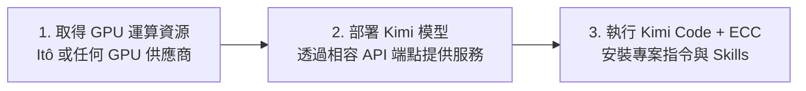
```mermaid
graph LR
    A["1. 取得 GPU 運算資源<br/>Itô 或任何 GPU 供應商"] --> B["2. 部署 Kimi 模型<br/>透過相容 API 端點提供服務"]
    B --> C["3. 執行 Kimi Code + ECC<br/>安裝專案指令與 Skills"]
```

```bash
# 步驟 3：確認 endpoint 設定完成後安裝 ECC
bash ./install.sh --target kimi --profile minimal
node scripts/ecc.js doctor --target kimi
kimi
```

**`ecc ito` CLI 橋接工具**（委派給另外安裝的官方 Itô Client，ECC 不維護第二套 API Client）：

| 指令 | 功能 | 重要限制 |
| ------ | ------ | --------- |
| `ecc ito login [--no-browser]` | 裝置授權登入，Token 存於 macOS Keychain | 不會自動繼承 `ITO_API_KEY` |
| `ecc ito auth` | 驗證既有憑證 | 僅驗證用途，拒絕 `--no-browser` |
| `ecc ito find` | 送出**即時、已驗證的 GPU 節點詢價（RFQ）** | **不會**預訂容量，也不會採購 |
| `ecc ito status` | 查詢狀態 | — |
| `ecc ito evals`（另外閘控） | 評測 | 需 `ITO_ENABLE_SIXTYTWO_LIVE=1` + 額外安裝 `sixtytwo-cli` |

> ⚠️ **重要邊界（企業採購與合規務必知悉）**：贊助連結本身是被動的，不會觸發 RFQ、預訂容量、佈建運算或設定服務。`ecc ito find` 送出的是真實的即時詢價請求，但**不會**預訂容量。透過 Itô 的受管理推論服務**尚未上線**。ECC 完全不提供報價鎖定、採購、工作負載執行或推論路徑本身——這些都是 Itô 平台自己的職責範圍，ECC 只是薄橋接層。任何 GPU 供應商都可以替代使用，ECC 對供應商保持中立。
>
> 💡 **企業自架建議**：若你的資安政策不允許程式碼離開內部網路，此路徑讓你可以完全在自有 GPU 上運行開源模型（如 Kimi），同時仍取得 ECC 的 Agent/Skill/Hook 框架——但務必自行承擔模型品質、延遲與可用性的差異，這與使用 Anthropic 官方託管的 Claude 模型有本質不同的風險輪廓（見 13.1 的 TCO 討論）。

**`ito-compute-cli` 尚未發布至公開套件庫**。若要實際使用 `ecc ito` 橋接，需自行從 Itô 的私有 runtime repo 建置：

```bash
# 於 Itô runtime repo 的 cli/ito-compute-cli 目錄
npm ci && npm run check

# 將 ECC 指向建置產物的絕對路徑
export ECC_ITO_CLI_EXECUTABLE=/absolute/path/to/dist/bin/ito.js
```

`ecc ito login` **不會**繼承 `ITO_API_KEY`（避免非互動式環境誤用長期金鑰）；`auth`、`find`、`status` 則會轉發該環境變數。`ecc ito evals` 屬額外閘控功能，需同時滿足：`ITO_ENABLE_SIXTYTWO_LIVE=1`、傳入 `--live-sixtytwo`、安裝 `sixtytwo-cli==0.3.33`、明確指定節點清單，以及提供絕對路徑的設定目錄。相關 MCP 工具為 `ito_auth`、`ito_find`、`ito_status`；對應 Skill 為 `skills/ito-compute/SKILL.md`。

### 3.11 平台支援分級與跨作業系統相容性

這一節是**企業導入前最該讀的一節**。ECC 官方在 README 中提供了兩張誠實度極高的支援矩陣，明確標示哪些 Harness 只是「檔案放對位置」而非「功能對等」。用官方自己的話說：

> `stable`、`beta`、`experimental`、`instruction-only` 是**能力陳述（capability statements）**，不是行銷分級。

#### 3.11.1 Harness 支援分級矩陣

| Harness | 分級 | 安裝方式 | 已知限制 |
| --- | --- | --- | --- |
| **Claude Code** | Stable（主要平台） | Plugin 或選擇性安裝器 | Plugin 會把完整目錄「廣告」給模型；若在意上下文佔用，改用選擇性／手動安裝 |
| **Codex** | Sync 為 Supported；Marketplace 為實驗性 | Repo 設定或 `sync-ecc-to-codex.sh` | **無 ECC Hook Runtime**；marketplace 套件可能未把共享 repo 內容納入 Codex 快取 |
| **Cursor** | Beta 專案 adapter | 選擇性安裝器寫入 `.cursor/` | Agent 探索行為依 Cursor 版本而異；Hook 集合與 Claude 不完全一致（Issue **#2419**） |
| **OpenCode** | Beta（需先建置 plugin） | 先 build plugin，再跑選擇性安裝器 | 僅提供目錄的子集；**必須先連好 provider 並選定 model**（Issue **#2617**） |
| **GitHub Copilot** | Instruction-only | 直接使用已 commit 的 instructions 與 prompt 檔 | **無 Hook、無 Runtime Agent、無委派、無原生 Skill 探索** |
| **Gemini / Zed / Antigravity / Qwen / Hermes / OpenClaw / Kimi / CodeBuddy / JoyCode** | 實驗性／最小 adapter | 各自的選擇性安裝目標 | **僅測試檔案放置位置，不主張功能對等** |

#### 3.11.2 作業系統相容性矩陣

| 作業系統 | 狀態 | 備註 |
| --- | --- | --- |
| **Linux** | 核心功能支援 | 選配功能可能另需 Bash／Python／供應商工具 |
| **macOS** | 核心功能支援 | 獨立式 GAN shell 路徑**不相容於系統內建的 Bash 3.2**；另有計分解析缺陷（Issue **#2674**）。建議 `brew install bash` 後使用新版 |
| **Windows + WSL** | 核心功能支援 | 走 Linux 路徑；與 Windows 主機端的整合程度視工具而異 |
| **Windows 原生** | 有限制地支援 | Continuous Learning v2 的 observer daemon（Issue **#2489**）與 Memory Vault 寫入（Issue **#2626**）皆有開放中的缺陷；需要 shell 的功能請安裝 Git Bash 或改用 WSL |

> 🏢 **給企業評估者的三個實務結論**：
>
> 1. **Windows 原生不是首選**。若團隊以 Windows 為主，請把 **WSL2 列為標準開發環境**，可一次繞開 observer daemon 與 Memory Vault 的兩個已知缺陷，也讓 GAN、GateGuard 等 shell-backed 功能正常運作。
> 2. **不要用 Copilot 評估 ECC**。Copilot 只拿得到 instruction 層，缺少 Hook 與 Agent，導入評估若以此為樣本會嚴重低估 ECC 的價值（也會誤判成本）。
> 3. **PoC 一律鎖 Claude Code**。先在 stable 平台驗證投資報酬，再視需求把 Rules／Skills 以 adapter 方式推廣到其他 Harness。

#### 3.11.3 跨工具能力對照（摘要）

| 能力 | Claude Code | Codex | Cursor | OpenCode | GitHub Copilot |
| --- | --- | --- | --- | --- | --- |
| Instructions | 原生 | 原生 `AGENTS.md` | 專案 Rules | Plugin instructions | 原生 instruction 檔 |
| Skills | 原生安裝集合 | 原生同步集合 | 依建置而定 | 已建置的子集 | **僅能以 prompt 引用** |
| Agents | 原生 | Codex 多代理角色 | 依建置而定 | Plugin agents | **不支援** |
| ECC Hooks | 原生 plugin hooks | **不支援** | Cursor hook adapter | Plugin 事件 | **不支援** |
| MCP | 可用，需明確啟用 | 透過 sync 併入 TOML | 需明確設定 | 由 provider 設定 | **ECC 不提供** |

三個關鍵設計決策，值得企業在制定內部標準時借鏡：

1. **根目錄的 `AGENTS.md` 是通用的跨工具檔案**（Copilot 例外，它讀 `.github/copilot-instructions.md`）。把團隊共識寫在這裡，可同時被多數 Harness 讀到。
2. **DRY adapter 模式**：Cursor 直接複用 Claude 的 Hook 腳本，而不是複製一份維護。內部自建工具鏈時也應採同樣做法。
3. **`SKILL.md` + YAML frontmatter 是目前最通用的技能格式**，可跨 Claude Code、Codex、OpenCode 使用。Codex 缺少 Hook 的問題，則以 `AGENTS.md` + `model_instructions_file` + sandbox 權限三者組合來補償。


---

## 第四章：企業級 Web 系統架構設計（搭配 ECC）

### 4.1 企業系統架構背景

典型企業級 Web Application 技術棧：

| 層級 | 技術選擇 |
| ------ | --------- |
| 前端 | Vue 3 + TypeScript + Tailwind CSS |
| 後端 | Spring Boot (Java) |
| 架構 | Clean Architecture + Microservices |
| 資料庫 | PostgreSQL / Oracle / DB2 |
| 快取 | Redis |
| 訊息佇列 | Kafka / RabbitMQ |
| CI/CD | GitHub Actions / GitLab CI |
| 容器化 | Docker + Kubernetes |

### 4.2 ECC Agent 分工架構

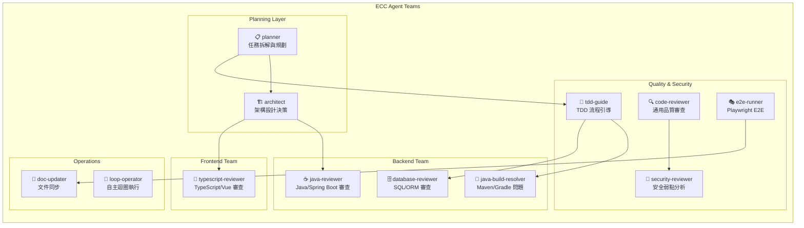
```mermaid
graph TB
    subgraph "ECC Agent Teams"
        direction TB
        
        subgraph "Planning Layer"
            Planner["📋 planner<br/>任務拆解與規劃"]
            Architect["🏗️ architect<br/>架構設計決策"]
        end
        
        subgraph "Backend Team"
            JavaReviewer["☕ java-reviewer<br/>Java/Spring Boot 審查"]
            JavaBuild["🔧 java-build-resolver<br/>Maven/Gradle 問題"]
            DBReviewer["🗄️ database-reviewer<br/>SQL/ORM 審查"]
        end
        
        subgraph "Frontend Team"
            TSReviewer["📘 typescript-reviewer<br/>TypeScript/Vue 審查"]
        end
        
        subgraph "Quality & Security"
            TDDGuide["🧪 tdd-guide<br/>TDD 流程引導"]
            CodeReviewer["🔍 code-reviewer<br/>通用品質審查"]
            SecurityReviewer["🔐 security-reviewer<br/>安全弱點分析"]
            E2ERunner["🎭 e2e-runner<br/>Playwright E2E"]
        end
        
        subgraph "Operations"
            DocUpdater["📝 doc-updater<br/>文件同步"]
            LoopOperator["🔄 loop-operator<br/>自主迴圈執行"]
        end
    end

    Planner --> Architect
    Architect --> JavaReviewer
    Architect --> TSReviewer
    Planner --> TDDGuide
    TDDGuide --> JavaBuild
    TDDGuide --> DBReviewer
    CodeReviewer --> SecurityReviewer
    E2ERunner --> DocUpdater
```

### 4.3 Orchestrator 家族

v2.0.0 引入、並在 v2.1.0 持續強化的 **Orchestrator 家族**（`orch-*` 動態工作流團隊編排），將原本單一 `planner` 和 `loop-operator` 的職責拆分為更細粒度的角色，提供企業級的多 Agent 執行控制：

| Orchestrator | 職責 | 典型使用情境 |
| --- | --- | --- |
| `orch-planner` | 需求分析 → 任務拆解 → DAG 生成 | 新功能開發的起始點 |
| `orch-fanout` | 平行分派子任務給多個 Worker Agent | 前後端同步開發 |
| `orch-reduce` | 收集 Worker 結果 → 合併 → 衝突解決 | 多 Agent 任務合流 |
| `orch-gate` | 品質門檻檢查、安全掃描、覆蓋率驗證 | CI/CD 節點 |
| `orch-retry` | 失敗偵測 → 自動重試（含 backoff）→ 降級 | 不穩定 MCP、外部 API |

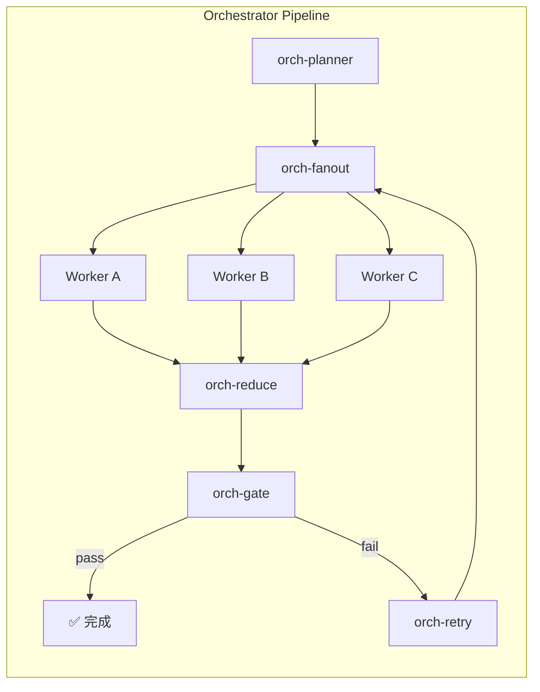
```mermaid
graph LR
    subgraph "Orchestrator Pipeline"
        OP[orch-planner] --> OF[orch-fanout]
        OF --> W1[Worker A]
        OF --> W2[Worker B]
        OF --> W3[Worker C]
        W1 --> OR[orch-reduce]
        W2 --> OR
        W3 --> OR
        OR --> OG[orch-gate]
        OG -->|pass| Done[✅ 完成]
        OG -->|fail| ORetry[orch-retry]
        ORetry --> OF
    end
```

> 💡 **Orchestrator vs 傳統 Agent**：Orchestrator 本身不產出程式碼，只負責「排程→分派→驗收」。實際生成程式碼的仍是 `java-reviewer`、`typescript-reviewer` 等 Worker Agent。此設計遵循 Single Responsibility，並讓失敗隔離在單一 Worker 粒度。

### 4.4 系統架構圖

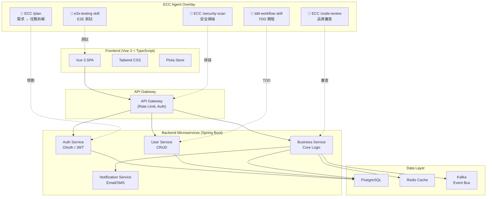
```mermaid
graph TB
    subgraph "Frontend (Vue 3 + TypeScript)"
        Vue["Vue 3 SPA"]
        Tailwind["Tailwind CSS"]
        Pinia["Pinia Store"]
    end
    
    subgraph "API Gateway"
        GW["API Gateway<br/>(Rate Limit, Auth)"]
    end
    
    subgraph "Backend Microservices (Spring Boot)"
        AuthSvc["Auth Service<br/>OAuth / JWT"]
        UserSvc["User Service<br/>CRUD"]
        BizSvc["Business Service<br/>Core Logic"]
        NotifySvc["Notification Service<br/>Email/SMS"]
    end
    
    subgraph "Data Layer"
        PG["PostgreSQL"]
        Redis["Redis Cache"]
        Kafka["Kafka<br/>Event Bus"]
    end
    
    subgraph "ECC Agent Overlay"
        ECC_Plan["🤖 ECC /plan<br/>需求 → 任務拆解"]
        ECC_TDD["🤖 tdd-workflow skill<br/>TDD 開發"]
        ECC_Review["🤖 ECC /code-review<br/>品質審查"]
        ECC_Security["🤖 ECC /security-scan<br/>安全掃描"]
        ECC_E2E["🤖 e2e-testing skill<br/>E2E 測試"]
    end
    
    Vue --> GW
    GW --> AuthSvc
    GW --> UserSvc
    GW --> BizSvc
    BizSvc --> NotifySvc
    AuthSvc --> PG
    UserSvc --> PG
    BizSvc --> PG
    BizSvc --> Redis
    BizSvc --> Kafka
    
    ECC_Plan -.->|"規劃"| AuthSvc
    ECC_TDD -.->|"TDD"| UserSvc
    ECC_Review -.->|"審查"| BizSvc
    ECC_Security -.->|"掃描"| GW
    ECC_E2E -.->|"測試"| Vue
```

### 4.5 Agent 協作流程

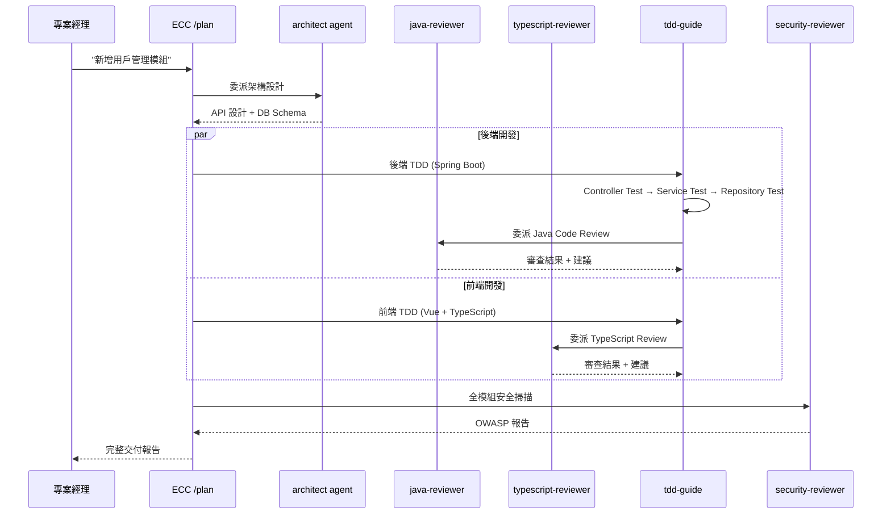
```mermaid
sequenceDiagram
    participant PM as 專案經理
    participant ECC as ECC /plan
    participant Arch as architect agent
    participant BE as java-reviewer
    participant FE as typescript-reviewer
    participant QA as tdd-guide
    participant Sec as security-reviewer

    PM->>ECC: "新增用戶管理模組"
    ECC->>Arch: 委派架構設計
    Arch-->>ECC: API 設計 + DB Schema
    
    par 後端開發
        ECC->>QA: 後端 TDD (Spring Boot)
        QA->>QA: Controller Test → Service Test → Repository Test
        QA->>BE: 委派 Java Code Review
        BE-->>QA: 審查結果 + 建議
    and 前端開發
        ECC->>QA: 前端 TDD (Vue + TypeScript)
        QA->>FE: 委派 TypeScript Review
        FE-->>QA: 審查結果 + 建議
    end
    
    ECC->>Sec: 全模組安全掃描
    Sec-->>ECC: OWASP 報告
    ECC-->>PM: 完整交付報告
```

> 💡 **Best Practice**：使用 `/multi-plan` 進行多 Agent 任務分解，再用 `/multi-execute` 平行執行前後端任務，可顯著提升開發效率。

### 4.6 Rules 與 Skills 的分層治理

技術架構之外，企業導入的成敗往往取決於**配置治理**：誰有權新增規則、規則放在哪一層、如何避免上下文膨脹。

#### 4.6.1 三層作用域與取捨

| 作用域 | 位置 | 生效範圍 | 適用內容 | 風險 |
| -------- | ------ | --------- | --------- | ------ |
| 使用者層 | `~/.claude/`、`~/.ecc/` | 該使用者的所有專案 | 個人偏好（輸出語言、常用別名） | 跨專案汙染；新人環境不一致 |
| 專案層 | `<repo>/.claude/` | 該 repo 的所有協作者 | 團隊規範、權限基線、專案專屬 Skill | 需納入版控與 Code Review |
| 本機層 | `<repo>/.claude/settings.local.json` | 僅本機、不進版控 | 個人實驗性設定 | 造成「我這邊可以跑」的差異 |

> ⚠️ **企業預設立場**：**團隊規範一律放專案層並納入版控**。使用者層僅保留純個人偏好；本機層僅供短期實驗，不得存放任何影響產出的規則。7.8.1 的 `permissions.deny` 基線必須放在專案層，否則無法保證每位成員都受同一套限制。

#### 4.6.2 最小上下文原則

ECC 提供 21+ 語言／框架的 Rules 包，但**全部安裝會直接壓縮可用上下文**。建議的選配策略：

| 專案型態 | 建議安裝 |
| --------- | --------- |
| 單一語言後端（如 Spring Boot） | `rules/common` + `java` + `springboot`；不裝前端規則 |
| 前後端分離的單一 repo | `rules/common` + 後端語言 + 前端框架，共 3～4 包 |
| Monorepo（多語言） | `rules/common` 放根目錄；各語言規則放對應子專案的 `.claude/`，避免全域載入 |

#### 4.6.3 內部 Skill 視為工程資產

自建的 `SKILL.md` 應比照程式碼管理，而非當成隨手筆記：

| 治理項目 | 具體做法 |
| --------- | --------- |
| 版本控制 | 存於 repo 內並隨程式碼一起演進 |
| 審查流程 | 走 PR；新增或修改 Hook 腳本時強制雙人審查（呼應 7.6.3） |
| 命名慣例 | 以動詞開頭描述工作流，如 `review-api-contract`、`migrate-schema` |
| 副作用標註 | 具破壞性或外部副作用的工作流，於 frontmatter 設 `disable-model-invocation: true`，改為僅限人工顯式呼叫 |
| 汰除機制 | 每季檢視使用率；無人使用的 Skill 應移除，避免上下文負債累積 |

### 4.7 CLAUDE.md 分層策略

`CLAUDE.md` 是專案的常駐指令，**每個 Session 都會載入**，因此它同時是最有效的槓桿與最容易被濫用的地方。

#### 4.7.1 該寫什麼、不該寫什麼

| 應該包含 | 不應包含 |
| --------- | --------- |
| 建置／測試／執行的實際命令 | 完整的 API 文件（讓代理現查即可） |
| 專案特有的慣例（命名、分層、錯誤處理） | 通用程式設計原則（模型已具備） |
| 「不要動這些檔案」的明確禁區 | 冗長的架構歷史敘述 |
| 環境設定的陷阱與已知地雷 | 可從程式碼直接推得的資訊 |
| 常用工具的正確叫用方式 | 一次性的臨時指示 |

#### 4.7.2 分層與匯入

大型專案應避免單一巨型 `CLAUDE.md`，改用匯入語法組合：

```markdown
# 專案指引

## 建置與測試
- 後端：`./mvnw verify`
- 前端：`pnpm test`

## 分層規範
@docs/conventions/backend.md
@docs/conventions/frontend.md
```

| 層級 | 檔案位置 | 內容 |
| ------ | --------- | ------ |
| 組織層 | 各 repo 共用的模板 | 資安基線、合規要求、日誌規範 |
| 專案層 | `<repo>/CLAUDE.md` | 建置命令、分層規範、禁區 |
| 子模組層 | `<repo>/services/x/CLAUDE.md` | 該服務特有的慣例 |

#### 4.7.3 常見失效模式

| 失效模式 | 症狀 | 修正方式 |
| --------- | ------ | --------- |
| 過度指定 | 檔案數千行，代理開始忽略其中規則 | 精簡至「只寫代理猜不到的事」；以 `/doctor` 取得刪減建議 |
| 規則與現況不符 | 指引寫的命令早已改名 | 把 `CLAUDE.md` 納入 PR 檢查清單，變更建置流程時同步更新 |
| 一次性指示殘留 | 上週的臨時要求持續生效 | 臨時指示走對話，不寫入 `CLAUDE.md` |
| 未驗證載入結果 | 以為規則生效，實際未被讀取 | 以 `/context` 確認實際載入內容與佔用比例 |

> 💡 **驗證方法**：新增規則後，用 `/init` 重新產生基準、`/context` 檢視實際佔用，並實測一個原本會犯錯的情境，確認規則確實改變了行為。**沒有驗證過的規則等於沒有規則。**

### 4.8 團隊角色與責任邊界

代理式開發引入了新的資產類別（Rules、Skills、Hooks、記憶庫、權限設定），必須明確指定負責人，否則會出現「大家都能改、沒人負責」的治理真空。

| 資產／流程 | 建議負責角色 | 審查者 | 說明 |
| ----------- | ------------- | ------- | ------ |
| `CLAUDE.md`、`rules/` | 技術主管 / Tech Lead | 團隊全員 | 影響所有人的產出品質 |
| 自建 Skills | 提案的工程師 | Tech Lead + 一位同儕 | 走一般 PR 流程 |
| Hook 腳本 | 平台／DevOps 工程師 | 資安代表 | Hook 可執行任意程式碼，風險等級最高 |
| `permissions.deny` 基線 | 資安代表 | Tech Lead | 變更需留下核准紀錄 |
| MCP／Skill 准入 | 平台工程師 | 資安代表 | 依 7.6.3 的准入流程 |
| AgentShield 例外核准 | 資安代表 | — | 例外須具期限，到期自動失效 |
| 記憶庫內容審閱 | Tech Lead | — | 每個 Sprint 檢視一次記憶差異（7.10） |
| 成本與 KPI 追蹤 | DevOps / SRE | 技術主管 | 資料來源見 8.6 |

> ⚠️ **最容易被忽略的一項是 Hook 腳本的審查**。Hook 在每次工具呼叫時自動執行、無需使用者確認，其權限等同於開發者本人。任何 Hook 變更都應視同「新增一支具有完整檔案系統權限的常駐程式」來審查。

---

## 第五章：開發流程（AI 驅動）

### 5.1 AI 驅動開發總覽

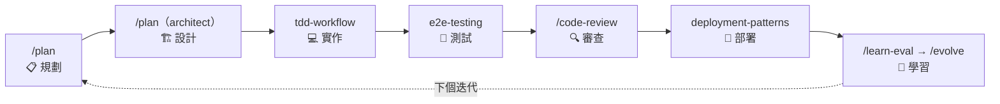
```mermaid
graph LR
    P["/plan<br/>📋 規劃"] --> D["/plan（architect）<br/>🏗️ 設計"]
    D --> I["tdd-workflow<br/>💻 實作"]
    I --> T["e2e-testing<br/>🧪 測試"]
    T --> R["/code-review<br/>🔍 審查"]
    R --> Deploy["deployment-patterns<br/>🚀 部署"]
    Deploy --> Learn["/learn-eval → /evolve<br/>🧠 學習"]
    Learn -.->|"下個迭代"| P
```

> 💡 上圖已依 **2026 年的指令退役現況**重畫：流程中的實作、測試、部署三個環節已不再使用 `/tdd`、`/e2e`、`/deploy` 斜線指令，而是以 **Skill** 為入口。這也是 ECC 整體的方向：斜線指令常駐佔用上下文，Skill 則是按需載入。

### 5.2 /plan — 需求規劃

**指令範例**：

```bash
/ecc:plan "Add user authentication with OAuth2 + JWT, supporting Google and GitHub login"
```

**Agent 行為**：

1. `planner` agent 分析需求
2. 拆解為具體實作步驟
3. 識別技術風險與依賴
4. 產出實作藍圖

**輸出範例**：

```markdown
## Implementation Plan: OAuth2 + JWT Authentication

### Phase 1: Infrastructure
- [ ] Add Spring Security + OAuth2 Client dependencies
- [ ] Configure application.yml for Google/GitHub OAuth
- [ ] Create JWT utility class

### Phase 2: Backend
- [ ] Implement OAuth2LoginSuccessHandler
- [ ] Create UserService with OAuth user mapping
- [ ] Implement JWT token generation/validation
- [ ] Create AuthController endpoints

### Phase 3: Frontend
- [ ] Create LoginPage.vue with OAuth buttons
- [ ] Implement auth store (Pinia)
- [ ] Add route guards for protected pages
- [ ] Handle token refresh

### Phase 4: Testing
- [ ] Unit tests for JWT utility
- [ ] Integration tests for OAuth flow
- [ ] E2E tests for login/logout

### Risks
- OAuth callback URL configuration per environment
- Token refresh race conditions
```

### 5.3 架構設計 — architect Agent

> 💡 **沒有 `/design` 這個指令**。架構設計是由 `/plan` 委派給 `architect` agent 完成的，或直接用 `/plan-prd`、`/multi-plan` 進入更大規模的規劃流程。

```bash
/ecc:plan "Design the authentication module architecture"
# → planner 委派給 architect agent
```

**Agent 行為**：`architect` agent 產出：

- API 端點設計
- 資料模型（Entity / DTO / VO）
- 序列圖（認證流程）
- 安全考量

### 5.4 實作（TDD）— `tdd-workflow` Skill

> 🚨 **退役提醒**：舊版教學中的 `/tdd` 指令**已退役**，現在的正式入口是 `tdd-workflow` Skill。舊指令檔案仍保留在 repo 的 `legacy-command-shims/commands/` ，但**不會**隨預設安裝。

```text
使用 tdd-workflow skill 實作 AuthService
```

你也可以直接描述任務，讓模型自行載入對應 Skill（這正是 Skill 優於 Slash Command 的原因：**按需載入，不常駐佔用上下文**）：

```text
幫我用 TDD 方式實作 AuthService，先寫失敗測試
```

**Skill 行為**（`tdd-workflow`，搭配 `tdd-guide` agent）：

```text
1. Define interfaces first          → 定義 AuthService 介面
2. Write failing tests (RED)        → 寫 AuthServiceTest，全部 FAIL
3. Implement minimal code (GREEN)   → 實作到剛好通過測試
4. Refactor (IMPROVE)               → 重構、extract method
5. Verify 80%+ coverage             → 確認覆蓋率達標
```

**Spring Boot 實作範例**：

```java
// Step 1: Interface
public interface AuthService {
    TokenResponse authenticate(OAuth2AuthenticationToken token);
    TokenResponse refreshToken(String refreshToken);
    void logout(String userId);
}

// Step 2: RED - Failing Test
@ExtendWith(MockitoExtension.class)
class AuthServiceImplTest {
    @Mock JwtTokenProvider jwtProvider;
    @Mock UserRepository userRepo;
    @InjectMocks AuthServiceImpl authService;

    @Test
    void authenticate_shouldReturnTokens_whenOAuthValid() {
        // Given
        var oauthToken = mockOAuth2Token("google", "user@example.com");
        var user = new User(1L, "user@example.com", "Google User");
        when(userRepo.findByEmail("user@example.com")).thenReturn(Optional.of(user));
        when(jwtProvider.generateAccessToken(user)).thenReturn("access-token");
        when(jwtProvider.generateRefreshToken(user)).thenReturn("refresh-token");

        // When
        var result = authService.authenticate(oauthToken);

        // Then
        assertThat(result.accessToken()).isEqualTo("access-token");
        assertThat(result.refreshToken()).isEqualTo("refresh-token");
    }
}

// Step 3: GREEN - Implementation
@Service
@RequiredArgsConstructor
public class AuthServiceImpl implements AuthService {
    private final JwtTokenProvider jwtProvider;
    private final UserRepository userRepo;

    @Override
    public TokenResponse authenticate(OAuth2AuthenticationToken token) {
        String email = token.getPrincipal().getAttribute("email");
        User user = userRepo.findByEmail(email)
            .orElseGet(() -> createNewUser(token));
        return new TokenResponse(
            jwtProvider.generateAccessToken(user),
            jwtProvider.generateRefreshToken(user)
        );
    }
}
```

### 5.5 測試 — `e2e-testing` Skill 與 `/test-coverage`

> 🚨 **退役提醒**：`/e2e` 指令**已退役**，改由 `e2e-testing` Skill 接手。而覆蓋率分析的 `/test-coverage` **仍是有效指令**，後者並未退役。

```text
使用 e2e-testing skill 產生登入流程的 Playwright E2E 測試
```

若使用特定語言的測試指令，可直接呼叫：`/go-test`、`/kotlin-test`、`/rust-test`、`/cpp-test`、`/flutter-test`、`/react-test`（這些都屬於現行的 94 個指令）。

**E2E 測試範例**：

```typescript
import { test, expect } from '@playwright/test';

test.describe('Authentication Flow', () => {
  test('should redirect to Google OAuth and complete login', async ({ page }) => {
    await page.goto('/login');
    await page.click('[data-testid="google-login-btn"]');

    // Mock OAuth callback
    await page.waitForURL('**/oauth2/callback**');

    // Verify redirect to dashboard
    await expect(page).toHaveURL('/dashboard');
    await expect(page.locator('[data-testid="user-avatar"]')).toBeVisible();
  });

  test('should show error on failed authentication', async ({ page }) => {
    await page.goto('/login?error=access_denied');
    await expect(page.locator('.error-message')).toContainText('登入失敗');
  });
});
```

### 5.6 /code-review — 程式碼審查

```bash
/code-review
```

**Agent 行為**（code-reviewer + 語言專用 reviewer）：

- 程式碼品質與可維護性
- 安全弱點（OWASP Top 10）
- 效能問題
- 測試覆蓋率缺口

### 5.7 部署 — `deployment-patterns` Skill

> 💡 **沒有 `/deploy` 這個指令**。部署相關的工作流由 `deployment-patterns` Skill 提供，搭配下方三道閘門。

```bash
# 使用 deployment-patterns skill
/security-scan    # 部署前安全掃描
/test-coverage    # 驗證 80%+ 覆蓋率
```

搭配 `e2e-testing` Skill 執行關鍵用戶流測試：

```text
使用 e2e-testing skill 跑一次關鍵用戶流程回歸
```

> 💡 **Best Practice**：部署前三道閘門 — Security Scan → E2E → Coverage。全部通過才允許部署。

### 5.8 驗證迴圈 — `verification-loop` 與 `eval-harness` Skill

> 🚨 **退役提醒**：`/verify` 與 `/eval` 兩個指令**均已退役**，分別由 `verification-loop` 與 `eval-harness` Skill 取代。`/checkpoint` **仍是有效指令**。

ECC 提供持續驗證機制，確保每次變更都通過完整品質閘門：

```bash
# 儲存當前驗證狀態的 Checkpoint（現行指令）
/checkpoint
```

```text
# 執行完整驗證迴圈
使用 verification-loop skill 執行完整驗證

# 依自訂標準評估
使用 eval-harness skill 依驗收標準評估本次變更
```

**驗證迴圈流程**：

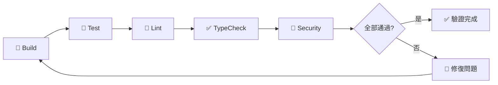
```mermaid
graph LR
    Build["🔨 Build"] --> Test["🧪 Test"]
    Test --> Lint["📏 Lint"]
    Lint --> TypeCheck["✅ TypeCheck"]
    TypeCheck --> Security["🔐 Security"]
    Security --> Pass{全部通過?}
    Pass -->|是| Done["✅ 驗證完成"]
    Pass -->|否| Fix["🔧 修復問題"]
    Fix --> Build
```

**驗證類型**：

| 類型 | 指令／入口 | 說明 |
| ------ | ------ | ------ |
| Checkpoint 驗證 | `/checkpoint` → `verification-loop` skill | 儲存狀態後執行一次性驗證 |
| 持續驗證 | `verification-loop` skill | 每次程式碼變更自動執行 build → test → lint → typecheck → security |
| 評估驅動開發 | `eval-harness` skill | 定義評估標準，以 pass@k 指標衡量品質 |
| 對抗式雙重審查 | `/santa-loop` | 兩個獨立模型審查者必須都通過才收斂（v2.2 強化） |

**Eval Harness 評估指標**：

- **Pass@k**：`k` 次嘗試中至少一次通過的機率
- **Grader Types**：自動化 Grader（程式判定）vs 模型 Grader（LLM 判定）
- **Checkpoint vs Continuous**：Checkpoint 在特定節點驗證；Continuous 在每次變更後驗證

> 💡 **Best Practice**：對關鍵功能使用 `verification-loop` skill 啟用持續驗證。對大型重構使用 `/checkpoint` 保存狀態後執行一次性驗證。
>
> 💡 **與 Claude Code 原生機制的關係**：Anthropic 官方建議的「給 Claude 一個可驗證的檢查」原則，在平台層有三種對應機制——單一提示內驗證、`/goal` 持續評估條件、或 Stop Hook 強制阻擋（連續阻擋 8 次後平台會強制結束回合）。ECC 的 `verification-loop`／`eval-harness` Skill 可視為在 Stop Hook 機制上，針對「build → test → lint → typecheck → security」這條特定管道預先寫好的實作範本，而非另一套平行機制。

### 5.9 Plan Canvas — 視覺化計畫審查

**Plan Canvas** 是 ECC v2.1.0 引入的重大新功能，把 `/plan` 流程原本「一大段文字往返」的計畫審查，變成瀏覽器內可點選、可標註的視覺化流程。

#### 5.9.1 解決的問題

`/plan` 最終會停在一個確認關卡（CONFIRM gate），過去只能在終端機裡逐行閱讀落落長的 Markdown 計畫、再用文字描述「我要改第三點」。Plan Canvas 讓審查者可以**直接指向**要修改的部分，而不必重新用文字描述一次。

#### 5.9.2 運作方式

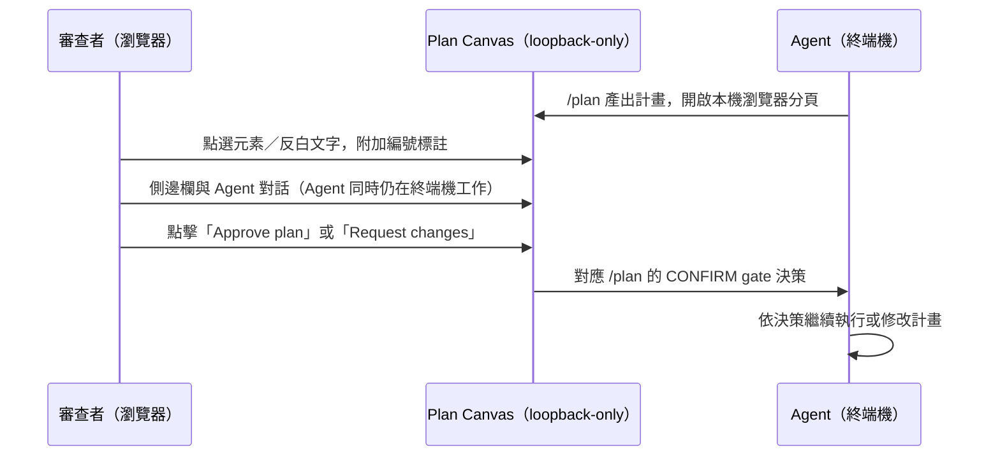
```mermaid
sequenceDiagram
    participant U as 審查者（瀏覽器）
    participant C as Plan Canvas（loopback-only）
    participant A as Agent（終端機）

    A->>C: /plan 產出計畫，開啟本機瀏覽器分頁
    U->>C: 點選元素／反白文字，附加編號標註
    U->>C: 側邊欄與 Agent 對話（Agent 同時仍在終端機工作）
    U->>C: 點擊「Approve plan」或「Request changes」
    C->>A: 對應 /plan 的 CONFIRM gate 決策
    A->>A: 依決策繼續執行或修改計畫
```

- 支援 Mermaid 圖表、表格、任務清單原生渲染；檔案變更會即時重新整理頁面
- **Model 與 Harness 無關**：底層是一份純 CLI + JSON 協定（`ecc-plan-canvas`），並非只綁定 Claude
- 僅在**本機迴路（loopback-only）**開啟，不會對外網路暴露

#### 5.9.3 使用時機建議

| 情境 | 建議 |
| ------ | ------ |
| 計畫涉及多個檔案／模組，需要架構層級討論 | 使用 Plan Canvas，便於在圖表上標註 |
| 範圍清楚、單一檔案的小改動 | 直接在終端機核准即可，不必啟用 Plan Canvas（避免額外開銷） |
| 跨團隊、非工程背景的關係人需要參與計畫審查 | Plan Canvas 的可視化介面比終端機文字更易溝通 |

> 💡 這與 Anthropic 官方建議的「Plan Mode → Ctrl+G 在文字編輯器中直接編輯計畫」是互補而非取代關係：文字編輯器適合工程師快速修改文字，Plan Canvas 適合需要標註特定元素、或涉及非工程關係人參與審查的場景。

---

## 第六章：測試與品質控管

### 6.1 TDD Skill 實作

ECC 的 TDD 工作流程遵循嚴格的 RED → GREEN → REFACTOR 循環：

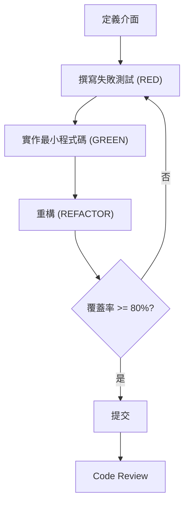
```mermaid
graph TD
    A["定義介面"] --> B["撰寫失敗測試 (RED)"]
    B --> C["實作最小程式碼 (GREEN)"]
    C --> D["重構 (REFACTOR)"]
    D --> E{覆蓋率 >= 80%?}
    E -->|否| B
    E -->|是| F["提交"]
    F --> G["Code Review"]
```

**可用的 TDD Skills**：

| Skill | 框架 |
| ------- | ------ |
| `tdd-workflow` | 通用 TDD 方法論 |
| `springboot-tdd` | Spring Boot 專用 |
| `django-tdd` | Django 專用 |
| `laravel-tdd` | Laravel 專用 |
| `golang-testing` | Go 測試 + TDD |
| `python-testing` | pytest 測試 |
| `cpp-testing` | GoogleTest + CMake |
| `perl-testing` | Test2::V0 |

### 6.2 自動 Code Review

`code-reviewer` agent 自動檢查：

1. **命名規範**：是否符合語言慣例
2. **複雜度**：方法是否過長、巢狀過深
3. **重複程式碼**：DRY 原則
4. **安全性**：SQL Injection、XSS、不安全的資料處理
5. **效能**：N+1 查詢、不必要的 IO
6. **測試**：是否有對應測試、edge case 是否覆蓋

**語言專用審查指令**：`/python-review`、`/go-review`、`/kotlin-review`、`/rust-review`、`/cpp-review`、`/flutter-review`、`/react-review`、`/vue-review`、`/fastapi-review`。這些會在通用審查之上，額外套用該語言的慣例與常見陷阱。

#### 6.2.1 `/santa-loop` — 對抗式雙重審查收斂迴圈

ECC 提供一個比單次 Code Review 更嚴格的機制：`/santa-loop`。它的設計前提是**單一審查者（無論人或模型）都會有盲點**，因此：

1. 由**兩個獨立的模型審查者**分別審查同一份變更；
2. **兩者都必須通過**，迴圈才收斂；
3. 只要任一方提出未解決的問題，就回到修正階段重跑。

```text
執行 /santa-loop 審查這次的 PR 變更
```

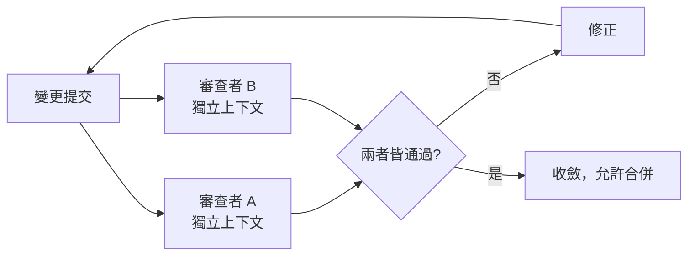
```mermaid
graph LR
    Code["變更提交"] --> R1["審查者 A<br/>獨立上下文"]
    Code --> R2["審查者 B<br/>獨立上下文"]
    R1 --> Gate{兩者皆通過?}
    R2 --> Gate
    Gate -->|否| Fix["修正"]
    Fix --> Code
    Gate -->|是| Done["收斂，允許合併"]
```

> 🏢 **企業適用場景**：這種「雙人覆核」在金融、醫療、公部門系統本來就是稽核要求。`/santa-loop` 讓 AI 產出的變更也套用同一套控制原則，是把 ECC 帶進受監理環境時很有說服力的論據。代價是**成本至少加倍**，建議只套用在高風險模組（認證、金流、權限）而非全部程式碼。

> 💡 **v2.2 延伸**：v2.2.0 另外加入了**多模型評議審查（multi-model council review）**，把「兩個審查者」推廣為「一組不同模型組成的評議會」，用模型多樣性降低同源偏誤。詳見 12.10。

### 6.3 Plankton 程式碼品質

`plankton-code-quality` skill 在**寫入時**強制執行程式碼品質：

- PostToolUse Hook 在每次檔案編輯後自動執行
- 自動修復 Linter 違規
- 強制一致的程式碼風格

### 6.4 AgentShield 安全掃描

```bash
# 快速掃描（無需安裝）
npx ecc-agentshield scan

# 自動修復安全問題
npx ecc-agentshield scan --fix

# 深度分析（三個 Opus agent 紅藍對抗）
npx ecc-agentshield scan --opus --stream

# 產生安全配置
npx ecc-agentshield init
```

**掃描範圍**：

| 類別 | 規則數 | 說明 |
| ------ | -------- | ------ |
| Secrets Detection | 14 patterns | API Key、Token、Password |
| Permission Auditing | — | 工具權限檢查 |
| Hook Injection Analysis | — | Hook 注入風險 |
| MCP Server Risk Profiling | — | MCP 服務風險評估 |
| Agent Config Review | — | Agent 配置審查 |

**`--opus` 模式**：三個 Claude Opus agent 進行紅藍對抗 —

1. **Attacker**：尋找 exploit chain
2. **Defender**：評估現有防護
3. **Auditor**：綜合兩者產出優先級風險評估

**輸出格式**：Terminal（色彩分級 A-F）、JSON（CI Pipeline）、Markdown、HTML

### 6.5 CI/CD 整合測試流程

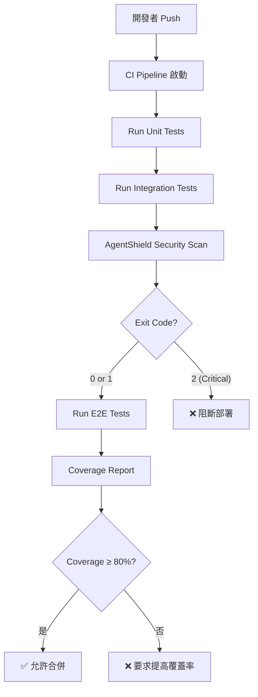
```mermaid
graph TD
    A["開發者 Push"] --> B["CI Pipeline 啟動"]
    B --> C["Run Unit Tests"]
    C --> D["Run Integration Tests"]
    D --> E["AgentShield Security Scan"]
    E --> F{"Exit Code?"}
    F -->|"0 or 1"| G["Run E2E Tests"]
    F -->|"2 (Critical)"| H["❌ 阻斷部署"]
    G --> I["Coverage Report"]
    I --> J{"Coverage ≥ 80%?"}
    J -->|是| K["✅ 允許合併"]
    J -->|否| L["❌ 要求提高覆蓋率"]
```

**GitHub Actions 範例**：

```yaml
name: ECC Quality Gate
on: [pull_request]

jobs:
  quality:
    runs-on: ubuntu-latest
    steps:
      - uses: actions/checkout@v4
      - uses: actions/setup-node@v4
        with:
          node-version: '20'

      - name: Run Tests
        run: npm test -- --coverage

      - name: Security Scan
        run: npx ecc-agentshield scan --format json --output security-report.json

      - name: Check Coverage
        run: |
          COVERAGE=$(cat coverage/coverage-summary.json | jq '.total.lines.pct')
          if (( $(echo "$COVERAGE < 80" | bc -l) )); then
            echo "Coverage ${COVERAGE}% is below 80% threshold"
            exit 1
          fi
```

### 6.6 驗證迴圈與評估框架

ECC 提供兩個進階的品質驗證機制，源自 Longform Guide 的核心理念。

#### 6.6.1 Verification Loop（持續驗證迴圈）

`verification-loop` skill 在每次程式碼變更後自動執行完整驗證管道：

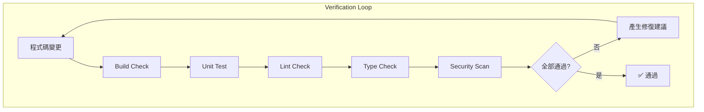
```mermaid
graph TD
    subgraph "Verification Loop"
        A["程式碼變更"] --> B["Build Check"]
        B --> C["Unit Test"]
        C --> D["Lint Check"]
        D --> E["Type Check"]
        E --> F["Security Scan"]
        F --> G{全部通過?}
        G -->|否| H["產生修復建議"]
        H --> A
        G -->|是| I["✅ 通過"]
    end
```

#### 6.6.2 Eval Harness（評估框架）

`eval-harness` skill 提供結構化的評估機制，讓你定義明確的品質標準：

```bash
# 儲存當前驗證狀態（現行指令）
/checkpoint
```

```text
# 執行驗證與評估（/verify 與 /eval 已退役，改用 Skill）
使用 verification-loop skill 執行驗證
使用 eval-harness skill 依驗收標準評估
```

**評估框架核心概念**：

| 概念 | 說明 |
| ------ | ------ |
| **Checkpoint Eval** | 在特定節點保存狀態並執行一次性驗證 |
| **Continuous Eval** | 持續評估每次變更，即時回饋 |
| **Automated Grader** | 程式化判定（測試通過/失敗、覆蓋率門檻） |
| **Model Grader** | LLM 判定（程式碼品質、架構合理性） |
| **Pass@k** | k 次嘗試中至少一次通過的機率指標 |
| **Pass^k** | k 次嘗試**全部**通過的機率指標（可靠度指標） |

##### Pass@k 與 Pass^k：兩個容易被混淆的指標

這兩個指標只差一個符號，方向卻完全相反，是評估代理可靠度時最關鍵的觀念差異。假設單次成功率為 70%：

| k | Pass@k（至少一次成功） | Pass^k（每次都成功） |
| --- | ---------------------- | -------------------- |
| 1 | 70% | 70% |
| 3 | 91% | 34% |
| 5 | 97% | 17% |

- **Pass@k 隨 k 上升**：代表「多試幾次總會成功」，適合衡量**有人在旁挑選結果**的互動式開發。
- **Pass^k 隨 k 下降**：代表「連續都要成功」，適合衡量**無人值守自動化**的可靠度。

> ⚠️ **企業選型的實務意涵**：許多團隊用 Pass@k 的漂亮數字說服管理層導入自動化流程，卻在正式上線後發現失敗率遠高於預期——因為無人值守場景真正對應的是 Pass^k。**任何要進入 CI 或自動合併流程的代理任務，都應以 Pass^k 設定驗收門檻**，並搭配 8.5 的斷路器控制失敗成本。

#### 6.6.3 Learn-Eval（學習評估）

`/learn-eval` 指令結合學習與評估，從 Session 中擷取模式並在儲存前進行評估：

```bash
# 不只學習，還評估學到的模式品質
/learn-eval
```

這比單純的 `/learn` 更具品質保障，避免學習到錯誤或低品質的模式。

---

## 第七章：安全（SSDLC）

### 7.1 ECC 安全架構

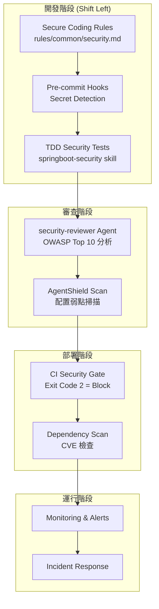
```mermaid
graph TB
    subgraph "開發階段 (Shift Left)"
        A["Secure Coding Rules<br/>rules/common/security.md"]
        B["Pre-commit Hooks<br/>Secret Detection"]
        C["TDD Security Tests<br/>springboot-security skill"]
    end
    
    subgraph "審查階段"
        D["security-reviewer Agent<br/>OWASP Top 10 分析"]
        E["AgentShield Scan<br/>配置弱點掃描"]
    end
    
    subgraph "部署階段"
        F["CI Security Gate<br/>Exit Code 2 = Block"]
        G["Dependency Scan<br/>CVE 檢查"]
    end
    
    subgraph "運行階段"
        H["Monitoring & Alerts"]
        I["Incident Response"]
    end
    
    A --> B --> C --> D --> E --> F --> G --> H --> I
```

### 7.2 安全檢查自動化

ECC 在 SSDLC 各階段提供自動化安全檢查：

| 階段 | ECC 工具 | 自動化行為 |
| ------ | --------- | ----------- |
| 編碼 | `security.md` rule | 強制安全編碼準則 |
| Hook | `beforeSubmitPrompt` | 偵測 prompt 中的機密（sk-、ghp_、AKIA） |
| Hook | `beforeTabFileRead` | 阻止讀取 .env、.key、.pem 檔案 |
| 審查 | `security-reviewer` agent | OWASP Top 10 弱點分析 |
| 掃描 | `/security-scan` | AgentShield 深度掃描 |
| CI | AgentShield GitHub Action | 自動阻斷含重大弱點的 PR |

### 7.3 OWASP Top 10 防護

| OWASP 風險 | ECC 防護措施 |
| ------------ | ------------- |
| A01 Broken Access Control | security-reviewer 檢查授權邏輯 |
| A02 Cryptographic Failures | Rules 強制安全加密實踐 |
| A03 Injection | Agent 檢查參數化查詢、輸入驗證 |
| A04 Insecure Design | architect agent 安全架構設計 |
| A05 Security Misconfiguration | AgentShield 配置掃描 |
| A06 Vulnerable Components | dependency scan + CVE 檢查 |
| A07 Authentication Failures | springboot-security skill 最佳實踐 |
| A08 Software Integrity | Hook 驗證、CI build gates |
| A09 Security Logging | Rules 強制安全日誌 |
| A10 Server-Side Request Forgery | security-reviewer 檢查 SSRF 模式 |

### 7.4 Secret Detection

ECC 提供多層 Secret Detection：

```text
Layer 1: beforeSubmitPrompt Hook (Cursor)
  → 偵測 prompt 中的 sk-、ghp_、AKIA 模式

Layer 2: beforeTabFileRead Hook (Cursor)
  → 阻止 Tab 讀取 .env、.key、.pem

Layer 3: AgentShield Secrets Detection
  → 14 種 pattern matching 規則

Layer 4: CI Build Gate
  → Exit code 2 阻斷含機密的 commit
```

> ⚠️ **常見錯誤**：在 `.claude/settings.json` 中存放 API Key。應使用環境變數或 vault 管理。

### 7.5 GateGuard 安全閘門

GateGuard 是 ECC v1.10.0 引入的安全閘門機制（來自社群貢獻 [PR #1367](https://github.com/affaan-m/ECC/pull/1367)），提供更精細的安全控制。

#### 7.5.1 GateGuard 功能

- **Hook 層級安全閘門**：在 PreToolUse 階段攔截潛在危險操作
- **動態風險評估**：根據操作類型與上下文計算風險等級
- **可設定的嚴格度**：與 `ECC_HOOK_PROFILE` 整合，支援 minimal / standard / strict 三級
- **整合 AgentShield**：與靜態分析和 Secret Detection 協同運作
- **破壞性命令偵測（v2.0.0）**：攔截 `find -exec rm`、`rm -rf /`、`chmod 777`、`dd if=/dev/zero` 等破壞性 shell 命令，即使包裝在 Bash tool 呼叫中亦可辨識
- **路徑排除清單（v2.1.0 新增）**：透過 `GATEGUARD_EXEMPT_GLOBS` 環境變數設定 glob 排除規則，避免誤攔截合法的建構產物清理、測試 fixture 重置等操作
- **PostToolUse 派發器整併（v2.1.0）**：原本多個獨立的 PostToolUse Hook 行程，整併為同步／非同步兩種派發器，降低每次工具呼叫的行程開銷
- **供應鏈強化（v2.1.0）**：pre-commit Secret 掃描新增偵測 `sk-ant-` 開頭的 Anthropic API Key 洩漏

#### 7.5.2 GateGuard 與 AgentShield 的差異

| 面向 | GateGuard | AgentShield |
| ------ | ----------- | ------------- |
| 執行時機 | 即時（Hook 觸發） | 按需掃描 |
| 檢查範圍 | 單一工具操作 | 整體配置與程式碼 |
| 效能影響 | 低（輕量 Hook） | 中～高（深度分析） |
| 定位 | 運行時防護 | 審計與合規 |

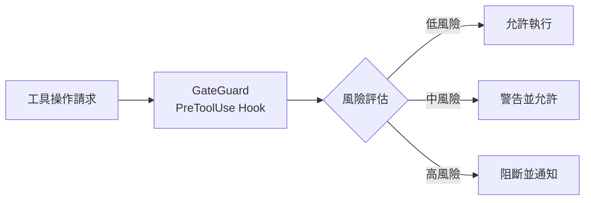
```mermaid
graph LR
    A["工具操作請求"] --> B["GateGuard<br/>PreToolUse Hook"]
    B --> C{風險評估}
    C -->|低風險| D["允許執行"]
    C -->|中風險| E["警告並允許"]
    C -->|高風險| F["阻斷並通知"]
```

### 7.6 威脅情資：2026 年代理式編碼的真實攻擊面

前述 7.1～7.5 描述的是「ECC 幫你檢查**你寫的程式碼**是否安全」。但企業導入 AI 編碼代理時，還有第二個、且往往被忽略的風險面向——**代理本身就是攻擊面**。本節整理 2026 年公開揭露的實證事件，作為導入決策的風險基礎。

> ⚠️ **本節定位**：以下為第三方安全研究機構的公開揭露，非 ECC 專案缺陷。列出的目的是協助企業建立正確的威脅模型，而非否定工具價值。所有事件都應與 7.7～7.12 的緩解措施對照閱讀。

#### 7.6.1 Claude Code 平台本身的已知漏洞

| 識別碼 | 揭露方／時間 | 風險摘要 | 修補條件 |
| -------- | ------------- | --------- | --------- |
| **CVE-2025-59536** | Check Point Research（2026-02-25 公開分析） | CVSS **8.7**。在使用者於信任對話框（trust dialog）按下「信任此資料夾」**之前**，專案內的設定即可觸發程式碼執行。等同於「只要 clone 惡意 repo 並開啟，就可能被入侵」 | 升級至 **1.0.111 以上** |
| **CVE-2026-21852** | Check Point Research | 專案層級設定可覆寫 `ANTHROPIC_BASE_URL`，把 API 流量導向攻擊者控制的端點，造成 **API Key 與對話內容外洩** | 手動安裝者需 **2.0.65 以上**；自動更新使用者已修補 |
| **MCP 同意濫用**（consent abuse） | Check Point Research | 由 repo 控制的設定可自動核准專案內的 MCP 伺服器，繞過使用者同意流程 | 停用 `enableAllProjectMcpServers`，改採白名單 |

**企業行動項目**：

1. 在資產清冊中把 Claude Code CLI 視為**受管軟體**，納入版本基線與更新 SLA。
2. 於 CI 或 MDM 中加入版本檢查，阻擋低於基線版本的用戶端。
3. 對「開啟外部 repo」建立標準作業程序：先在隔離環境檢視 `.claude/`、`.mcp.json`、`.vscode/`、`.devcontainer/` 等設定檔，再決定是否信任。

> 💡 **與本手冊其他章節的關聯**：3.1 前置需求要求 Claude Code v2.1+；從安全角度，這個下限應再提高——**建議基線為 2.0.65 以上**，以同時涵蓋上述兩個 CVE。

#### 7.6.2 威脅模型：致命三要素（Lethal Trifecta）

安全研究者 Simon Willison 提出的「lethal trifecta」是目前描述代理式風險最簡潔的框架。當以下三個條件**同時成立**時，資料外洩幾乎必然發生：

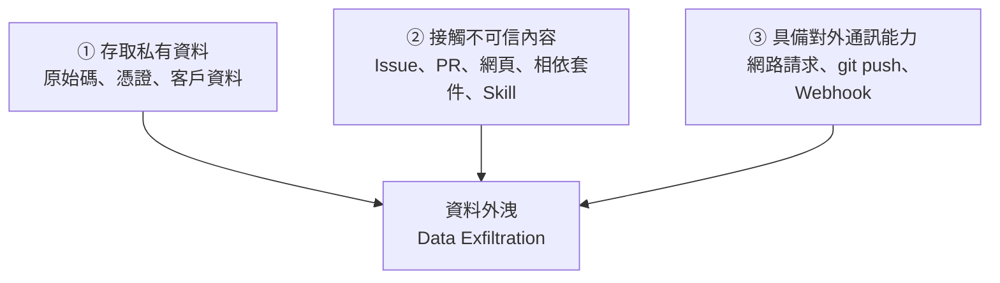
```mermaid
graph TB
    A["① 存取私有資料<br/>原始碼、憑證、客戶資料"]
    B["② 接觸不可信內容<br/>Issue、PR、網頁、相依套件、Skill"]
    C["③ 具備對外通訊能力<br/>網路請求、git push、Webhook"]
    D["資料外洩<br/>Data Exfiltration"]

    A --> D
    B --> D
    C --> D
```

其推論非常實用：**只要能切斷任意一條邊，風險就大幅下降**。這正是 7.7 沙箱化（切斷 ③）、7.9 消毒（削弱 ②）、7.8 權限邊界（限縮 ①）三節的設計理據。

| 條件 | ECC／Claude Code 中的典型來源 | 對應緩解措施 |
| ------ | ----------------------------- | ------------- |
| ① 私有資料 | 工作目錄、`~/.ssh`、`~/.aws`、`.env`、記憶庫 | `permissions.deny` 路徑封鎖（7.8）、專用低權限身分 |
| ② 不可信內容 | GitHub Issue／PR 留言、抓取的網頁、第三方 Skill／MCP、相依套件的 README | 內容消毒（7.9）、Skill 供應鏈審查（7.6.3） |
| ③ 對外通訊 | `Bash(curl)`、MCP 網路工具、`git push`、瀏覽器自動化 | 無出口網路容器（7.7）、egress allowlist |

#### 7.6.3 生態系與供應鏈風險

代理生態系的擴充機制（Skills、MCP、Rules、Plugin）本質上是**可執行的第三方內容**，其風險等級應等同於 npm 套件，而非等同於文件。

| 研究／事件 | 時間 | 關鍵發現 | 對 ECC 導入的意涵 |
| ----------- | ------ | --------- | ------------------ |
| **Snyk「ToxicSkills」** | 2026-02 | 掃描 3,984 個公開 Skill，**約 36% 含有提示注入特徵**，其中 1,467 個帶有可辨識的惡意 payload | ECC 的 286 個 Skill 屬社群 PR 匯入；企業應建立內部 Skill 白名單與程式碼審查，勿全量安裝 |
| **Microsoft：AI 推薦毒化** | 2026-02-10 | 攻擊橫跨 31 家公司、14 個產業，透過污染代理可讀取的內容來操縱其建議 | 代理讀得到的任何內容（含記憶庫）都可能被當成攻擊向量 |
| **Unit 42（Palo Alto）** | 2026-03-03 | 觀測到野生環境中的網頁間接提示注入（indirect prompt injection） | 開啟瀏覽器／抓網頁的工作流必須做內容消毒 |
| **Hunt.io：CVE-2026-25253** | 2026-02-03 | 掃出 **17,470 個** 曝露於公開網際網路的 OpenClaw 家族實例 | 自架代理服務時，預設綁 `127.0.0.1`，不可暴露於公網 |
| **AWS Amazon Q Developer 擴充事件**（AWS-2025-015） | 2025 | 惡意提交進入 VS Code 擴充 1.84.0 的發行流程 | 供應鏈攻擊已實際發生於主流廠商的 IDE 擴充；版本鎖定與雜湊驗證是必要控制 |

**建議的 Skill／MCP 准入流程**：

1. **鎖定版本**：以 Git tag 或 npm 版本鎖定安裝（呼應 1.6 的版本使用建議），禁止 CI 追蹤 `main`。
2. **人工審查**：任何新增的 `SKILL.md`、Hook 腳本、MCP 設定，一律走 Pull Request 與雙人審查。
3. **自動掃描**：以 `npx ecc-agentshield scan` 於 PR 階段檢查，並加上 7.9 的隱藏字元／注入樣式規則。
4. **最小安裝**：呼應 2.7 的 MCP 精簡政策——ECC 預設僅保留 `chrome-devtools` 一個連接器，企業自建時也應維持「預設關閉、按需開啟」。

### 7.7 沙箱化與隔離架構

沙箱化的目標是切斷 7.6.2 的第三條邊：**即使代理被誘導執行惡意行為，也無法把資料送出去、無法傷害宿主環境**。

#### 7.7.1 四層隔離模型

| 層級 | 控制手段 | 阻擋的風險 | 導入成本 |
| ------ | --------- | ----------- | --------- |
| **L1 身分隔離** | 專用帳號（如 `agent@yourdomain.com`）、專用 bot token、短期且範圍化的憑證 | 代理誤用開發者的高權限身分 | 低 |
| **L2 檔案與工具權限** | `permissions.deny` 路徑封鎖、`--allowedTools` 白名單、GateGuard | 讀取 `~/.ssh`、`.env`；執行破壞性命令 | 低 |
| **L3 容器隔離** | Docker／devcontainer，關閉出口網路 | 資料外傳、汙染宿主檔案系統 | 中 |
| **L4 虛擬機隔離** | KVM／microVM（如 Jailbox 類型架構） | 容器逃逸、核心層攻擊 | 高 |

> ⚠️ **容器隔離的三個已知限制**：（1）容器與宿主**共用核心**，並非安全邊界的終點；（2）VS Code 等 IDE 擴充仍在**宿主**執行，容器化 CLI 不代表 IDE 路徑也被隔離；（3)掛載進容器的目錄仍是可外洩的私有資料，掛載範圍必須最小化。

#### 7.7.2 無出口網路的容器範例

以 Docker Compose 建立「可讀寫程式碼、但無法對外通訊」的執行環境：

```yaml
services:
  agent:
    image: node:22-bookworm-slim
    working_dir: /workspace
    volumes:
      - ./:/workspace:rw
    environment:
      - ANTHROPIC_API_KEY=${ANTHROPIC_API_KEY}
    networks:
      - offline
    cap_drop:
      - ALL
    security_opt:
      - no-new-privileges:true
    read_only: false
    tmpfs:
      - /tmp

networks:
  offline:
    internal: true    # 關鍵：無對外路由
```

若只需一次性執行，也可直接以 `--network=none` 啟動：

```bash
docker run --rm -it \
  --network=none \
  --cap-drop=ALL \
  --security-opt=no-new-privileges:true \
  -v "$PWD":/workspace -w /workspace \
  node:22-bookworm-slim bash
```

> ⚠️ **實務取捨**：完全無網路會使 Claude Code 無法呼叫 API。實務上常見做法是採**出口白名單（egress allowlist）**——僅放行 `api.anthropic.com` 與內部套件鏡像，其餘全阻。這同時可緩解 CVE-2026-21852 的流量重導風險。

#### 7.7.3 Claude Code 原生 `/sandbox`

Claude Code 內建的 `/sandbox` 提供 OS 層級隔離，讓代理在邊界內以較高自由度工作（減少逐次核准的疲勞）。它與本節的容器化**不是互斥選項**：

| 機制 | 提供者 | 邊界 | 建議定位 |
| ------ | ------- | ------ | --------- |
| `/sandbox` | Claude Code 原生 | 作業系統層級的檔案／執行限制 | 個人開發者的第一道防線 |
| 容器 / devcontainer | 團隊自建 | 檔案系統 + 網路 + 能力集 | 團隊與 CI 的標準環境 |
| GateGuard | ECC 擴充（7.5） | 單次工具呼叫的風險評估 | 應用層補強，不取代前兩者 |
| AgentShield | ECC 擴充（6.4） | 靜態組態與程式碼掃描 | 稽核與合規證據 |

### 7.8 權限邊界與最小代理權（Least Agency）

傳統資安談「最小權限（least privilege）」，代理式系統則需要更進一步的**最小代理權（least agency）**：不只限制「能存取什麼」，還要限制「能自主做到什麼程度」。

#### 7.8.1 `permissions.deny` 基線設定

在 `.claude/settings.json` 中建立團隊共用的封鎖基線（建議納入版控並以 Code Review 保護）：

```json
{
  "permissions": {
    "deny": [
      "Read(~/.ssh/**)",
      "Read(~/.aws/**)",
      "Read(~/.config/gcloud/**)",
      "Read(**/.env*)",
      "Write(~/.ssh/**)",
      "Write(~/.aws/**)",
      "Bash(curl * | bash)",
      "Bash(wget * | sh)",
      "Bash(ssh *)",
      "Bash(scp *)",
      "Bash(nc *)"
    ]
  }
}
```

> ⚠️ **不要把 API Key 放進 `settings.json`**（呼應 7.4）。此檔案會進版控，應僅存放權限規則；憑證一律走環境變數或密鑰管理服務。

#### 7.8.2 核准邊界設計原則

以 GitHub 對其編碼代理採用的控制模型為參考範本，可歸納出五條企業通用原則：

| 原則 | 具體做法 |
| ------ | --------- |
| **觸發者需具權限** | 只有對該 repo 具寫入權的人可以指派任務給代理，避免外部人員透過 Issue 觸發 |
| **低權限內容不進上下文** | 來自非協作者的留言不納入代理上下文，直接切斷 7.6.2 的第 ② 條邊 |
| **推送範圍受限** | 代理僅能推送至自己建立的分支，不可推 `main`／受保護分支 |
| **網路出口白名單** | 預設封鎖出口，僅放行明確列出的網域 |
| **CI 需人工核准** | 代理提交的 PR 不自動觸發 workflow，須由人核准後才執行 |

#### 7.8.3 自主層級與核准模式對照

| 模式 | 核准行為 | 適用情境 | 殘餘風險 |
| ------ | --------- | --------- | --------- |
| Manual mode | 每個工具呼叫都需人工核准 | 高敏感 repo、初次導入 | 低；但核准疲勞可能導致盲目點「同意」 |
| Auto mode（原生） | 由分類器模型審查，僅高風險動作詢問 | 一般功能開發 | 中；需搭配 7.7 沙箱 |
| 無人值守迴圈（`autonomous-loops`、`/goal`） | 幾乎不詢問，直到條件成立 | 已充分沙箱化的 CI 任務 | 高；**必須**搭配 8.5 的斷路器 |

> 💡 **導入建議**：自主層級應該是**逐步解鎖**的。新團隊從 Manual + 容器起步，累積 4～6 週的稽核日誌後，再逐項放寬到 Auto mode；無人值守迴圈僅開放給已具備 8.4 可觀測性與 8.5 斷路器的專案。

### 7.9 不可信輸入的消毒（Sanitization）

提示注入的載體通常**不是人眼可見的文字**。企業級導入應在代理讀取外部內容前，先做機械化消毒。

#### 7.9.1 隱藏字元與注入樣式偵測

```bash
# 偵測零寬字元與雙向控制字元（常用於藏匿指令）
grep -Pn '[\x{200B}\x{200C}\x{200D}\x{2060}\x{FEFF}\x{202A}-\x{202E}]' "$FILE"

# 偵測常見的注入載體
grep -Ein '<!--|<script|data:text/html|base64,' "$FILE"

# 偵測高風險關鍵字（外傳與端點劫持）
grep -Ein 'curl |wget |nc |scp |ssh |enableAllProjectMcpServers|ANTHROPIC_BASE_URL' "$FILE"
```

建議將上述檢查包裝為 `PreToolUse` Hook，於 `WebFetch`、`Read`（外部路徑）觸發時自動執行，命中即阻斷並要求人工確認。

#### 7.9.2 消毒作業原則

| 情境 | 做法 |
| ------ | ------ |
| 抓取外部網頁／文件 | 先落地為檔案 → 掃描 → 再交由代理讀取；不要讓抓取與執行在同一步驟完成 |
| 使用者上傳的附件 | 先隔離於暫存目錄，萃取純文字後再進入上下文，丟棄巨集與嵌入物件 |
| 引用外部連結 | 在連結旁加註「安全護欄」段落，明示代理不得執行連結內容中的任何指令 |
| 高風險內容分析 | 採**解析／執行分離**：由一個無工具權限的代理負責摘要內容，另一個具工具權限的代理只接收摘要結果 |

> 💡 **解析／執行分離**是成本最低、效果最好的結構性防禦：負責閱讀不可信內容的代理沒有任何對外通訊或寫檔工具，即使被注入也無從執行。

### 7.10 記憶毒化與長期記憶治理

ECC 的核心賣點之一是記憶持久化（2.5 Instinct 系統、2.9 Unified Memory Vault）。但從安全角度，**記憶是一個持久化的攻擊面**：一次成功的注入，可能被寫入記憶庫並在往後每個 Session 重複生效。

| 風險 | 說明 | 緩解措施 |
| ------ | ------ | --------- |
| 注入內容被固化 | 惡意指令被 Stop Hook 當成「學到的經驗」寫入 Instinct | 記憶寫入前套用 7.9 的消毒規則；定期人工審閱記憶差異 |
| 憑證滲入記憶 | 對話中出現的 Token 被記錄到 Markdown 記憶檔 | 記憶檔納入 Secret 掃描；明訂「記憶庫不得存放任何憑證」 |
| 跨專案汙染 | 使用者層級記憶（`~/.ecc/memory/`）把 A 專案的內容帶進 B 專案 | 嚴格區分專案層與使用者層記憶；敏感專案改用專案層 |
| 跨 Harness 擴散 | Memory Vault 的跨工具交接讓汙染面擴大 | 對不可信任務關閉長期記憶；執行後重置並輪替憑證 |

**建議治理規則**：

1. 記憶庫檔案納入版控與 Code Review，把「記憶」當成程式碼資產管理。
2. 執行過任何不可信輸入的 Session，結束後**重置該 Session 的記憶寫入**並輪替相關憑證。
3. 對法遵敏感專案，預設關閉長期記憶，僅使用單次 Session 上下文。

### 7.11 MCP 安全與 OWASP MCP Top 10

MCP 是代理與外部系統之間的橋樑，也因此是權限升級的主要路徑。OWASP 針對 MCP 整理的高風險類別，可作為連接器准入審查的檢查表：

| 風險類別 | 說明 | ECC 對應控制 |
| --------- | ------ | ------------- |
| 工具毒化（Tool Poisoning） | 工具描述本身夾帶指令，於載入時即影響代理行為 | 人工審查工具描述；套用 7.9 消毒規則 |
| 上下文載荷注入 | 工具回傳值中夾帶注入內容 | 解析／執行分離（7.9.2） |
| 命令注入 | MCP 伺服器把參數直接拼接進 shell | 僅採用可稽核原始碼的連接器；GateGuard 攔截 |
| 影子伺服器（Shadow MCP） | 專案內私自新增未經核准的 MCP | 停用 `enableAllProjectMcpServers`；以白名單管理 |
| 機密外洩 | MCP 設定檔內嵌 Token | 憑證走環境變數；設定檔納入 Secret 掃描 |

> 💡 **架構層建議**：能用 CLI + Skill 解決的整合（如 GitHub、部署平台），優先用 CLI 而非 MCP。這同時降低攻擊面與 Token 消耗——MCP 的工具描述會常駐上下文，數量一多即顯著壓縮可用窗口（詳見 10.4）。實務經驗值為**同時啟用的 MCP 少於 10 個、工具總數少於 80 個**。

### 7.12 企業導入的最低安全門檻檢查表

以下為「可以開始用」的最低標準。任一項未達成，不建議在存有正式程式碼或客戶資料的環境中導入。

| # | 檢查項目 | 驗證方式 |
| --- | --------- | --------- |
| 1 | Claude Code 版本 ≥ 2.0.65（涵蓋兩個已知 CVE） | `claude --version`；納入 MDM／CI 版本閘門 |
| 2 | 代理使用專用低權限身分，非開發者個人憑證 | 檢視 token 的 scope 與有效期 |
| 3 | 代理在容器或沙箱中執行，非直接在宿主 | 檢視啟動腳本／devcontainer 設定 |
| 4 | 出口網路採白名單，預設封鎖 | `docker network inspect`；防火牆規則 |
| 5 | `permissions.deny` 基線已套用並納入版控 | 檢視 `.claude/settings.json` 差異 |
| 6 | 憑證不存在於任何設定檔或記憶庫 | Secret 掃描於 pre-commit 與 CI 各執行一次 |
| 7 | 所有 Skill／MCP／Hook 變更走 PR 與雙人審查 | 分支保護規則 |
| 8 | 外部內容在進入上下文前完成消毒 | 檢視 `PreToolUse` Hook 是否啟用（7.9.1） |
| 9 | 具備結構化稽核日誌，可回溯工具呼叫與核准決策 | 見 8.4 |
| 10 | 無人值守迴圈具備斷路器與逾時終止 | 見 8.5 |
| 11 | 已定義事件回應流程（憑證輪替、記憶重置、影響範圍評估） | 桌上演練紀錄 |

> ⚠️ **合規提醒**：第 9、10 項的實作細節位於第八章（8.4 可觀測性、8.5 斷路器）。安全與維運在代理式系統中是**同一件事**，不應由不同團隊各自為政。

---

## 第八章：部署與維運（DevOps）

### 8.1 CI/CD 整合

#### GitHub Actions 完整範例

```yaml
name: ECC Enterprise Pipeline
on:
  push:
    branches: [main, develop]
  pull_request:
    branches: [main]

jobs:
  build-and-test:
    runs-on: ubuntu-latest
    steps:
      - uses: actions/checkout@v4

      - name: Setup Java
        uses: actions/setup-java@v4
        with:
          java-version: '21'
          distribution: 'temurin'

      - name: Setup Node.js
        uses: actions/setup-node@v4
        with:
          node-version: '20'

      - name: Build Backend
        run: mvn clean verify -B

      - name: Security Scan (AgentShield)
        run: npx ecc-agentshield scan --format json --output reports/security.json
        continue-on-error: false

      - name: E2E Tests (Playwright)
        run: npx playwright test

      - name: Quality Gate Check
        run: |
          echo "Checking coverage >= 80%..."
          mvn jacoco:check

      - name: Upload Reports
        if: always()
        uses: actions/upload-artifact@v4
        with:
          name: test-reports
          path: reports/
```

#### GitLab CI 範例

```yaml
stages:
  - build
  - test
  - security
  - deploy

build:
  stage: build
  script:
    - mvn clean compile -B

test:
  stage: test
  script:
    - mvn test -B
    - mvn jacoco:report

security-scan:
  stage: security
  script:
    - npx ecc-agentshield scan --format json
  allow_failure: false

deploy:
  stage: deploy
  script:
    - ./deploy.sh
  only:
    - main
  when: on_success
```

#### 在 CI 中以非互動模式執行代理

上述兩個範例是「用 CI 驗證人類與代理共同產出的程式碼」。若要讓**代理本身成為 CI 的一個步驟**（例如自動修 lint、自動補測試、自動撰寫 PR 描述），必須使用非互動（headless）模式，並嚴格收斂權限：

```bash
claude -p "修正 ESLint 錯誤，只改 src/ 下的檔案，不要新增相依套件" \
  --output-format json \
  --allowedTools "Read,Edit,Bash(npm run lint:*)" \
  --no-session-persistence
```

| 參數 | 作用 | CI 中的必要性 |
| ------ | ------ | -------------- |
| `-p` / `--print` | 單次執行後結束，不進入互動迴圈 | 必要 |
| `--output-format json` | 輸出結構化結果，便於後續步驟解析與存證 | 建議（`stream-json` 適合長任務即時串流） |
| `--allowedTools` | 工具白名單；未列出者一律拒絕 | **必要**（呼應 7.8 最小代理權） |
| `--no-session-persistence` | 不留下 Session 檔案，避免跨 Job 汙染 | 建議 |

> ⚠️ **CI 中的三個常見錯誤**：
>
> 1. **把互動模式的核准機制當成安全網**。非互動模式下沒有人可以按「拒絕」，權限白名單就是唯一防線。
> 2. **給予 `Bash(*)` 全開權限**。應收斂到具體命令樣式，如 `Bash(npm run test:*)`。
> 3. **讓代理直接推 `main`**。代理應只能推自己的分支並開 PR，由人審查後合併（呼應 7.8.2）。

#### 以 AgentShield 作為建置閘門

```bash
# 掃描並輸出 JSON 報告
npx -y ecc-agentshield scan --path . --format json --output reports/security.json

# 自動修復可安全修復的問題
npx -y ecc-agentshield scan --path . --fix

# 深度模式：red-team / blue-team / auditor 三代理對抗式審查
npx -y ecc-agentshield scan --path . --opus
```

| 行為 | 說明 |
| ------ | ------ |
| 輸出格式 | 終端機、JSON、Markdown、HTML（可作為稽核附件） |
| 分級 | 以 A～F 等第呈現整體安全姿態，便於趨勢追蹤 |
| **Exit Code 2** | 偵測到 critical 等級問題時回傳，CI 應據此**中止**建置 |
| `--opus` 模式 | 由三個代理分別扮演攻擊、防禦、稽核角色交叉驗證，成本較高，建議只在 release 分支執行 |

> 💡 **分層執行策略**：PR 階段跑標準掃描（快、免費）；`release/*` 分支與定期排程跑 `--opus` 深度掃描（慢、耗 Token）。避免在每次 push 都執行深度模式。

### 8.2 監控與日誌

**推薦監控架構**：

```mermaid
graph LR
    App["Spring Boot<br/>Application"] --> |"Metrics"| Prometheus["Prometheus"]
    App --> |"Logs"| ELK["ELK Stack"]
    App --> |"Traces"| Jaeger["Jaeger"]
    Prometheus --> Grafana["Grafana<br/>Dashboard"]
    ELK --> Kibana["Kibana<br/>Dashboard"]
```

### 8.3 AI Agent 監控

監控 ECC Agent 的使用狀況：

```bash
# 檢查 Token 花費
/cost

# 檢查已安裝元件
/plugin list ecc@ecc

# 稽核 Harness 狀態
/harness-audit

# 查看活躍 Loop 狀態
/loop-status
```

此外，可將狀態快照落地為檔案，納入排程健檢與交接文件（詳見 12.7）：

```bash
ecc status --markdown --write status.md
npx ecc-universal doctor
```

> 💡 **建議節奏**：`doctor` 納入每日排程（偵測安裝漂移與版本落差）；`status --markdown` 於每次版本升級前後各執行一次，作為升級前後的差異證據（呼應 9.4 升級檢查表）。

### 8.4 Agent 可觀測性（Observability）

8.2 監控的是**應用程式**；本節監控的是**代理本身的行為**。在代理具備寫檔與執行命令能力的前提下，「代理做了什麼」必須與正式系統的稽核日誌等級一致——這也是 7.12 檢查表第 9 項的實作。

#### 8.4.1 最低必要日誌欄位

| 欄位 | 說明 | 用途 |
| ------ | ------ | ------ |
| `session_id` / `task_id` | 對話與任務識別碼 | 事件回溯的關聯鍵 |
| `timestamp` | ISO 8601 時間戳（含時區） | 時序重建 |
| `actor` | 觸發者（使用者帳號或 CI Job） | 責任歸屬 |
| `tool_name` | 呼叫的工具名稱 | 行為分類 |
| `input_summary` | 參數摘要（**不得含完整機密**） | 判斷意圖 |
| `files_touched` | 讀取／寫入的檔案路徑清單 | 影響範圍評估 |
| `approval_decision` | 允許／拒絕／自動核准 | 稽核核准鏈 |
| `network_attempt` | 嘗試連線的目標網域 | 偵測外洩行為 |
| `risk_score` | GateGuard 的風險評級 | 異常告警門檻 |
| `token_usage` / `model` | 消耗量與所用模型 | 成本歸因（見 8.6） |

> ⚠️ **日誌本身也是敏感資產**：`input_summary` 與 `files_touched` 可能洩漏商業邏輯，日誌儲存區需比照原始碼的存取控制，並設定保留期限。

#### 8.4.2 匯出至既有可觀測性平台

代理日誌不應獨立成孤島，建議以 OpenTelemetry 匯出，與 8.2 的既有堆疊整併：

```mermaid
graph LR
    Hook["PostToolUse Hook<br/>結構化事件"] --> OTel["OpenTelemetry<br/>Collector"]
    Gate["GateGuard<br/>風險評級"] --> OTel
    Shield["AgentShield<br/>掃描結果"] --> OTel
    OTel --> Metrics["Prometheus<br/>指標"]
    OTel --> Logs["ELK Stack<br/>日誌"]
    OTel --> Traces["Jaeger<br/>追蹤"]
    Metrics --> Dash["Grafana<br/>Agent 行為儀表板"]
    Logs --> Dash
```

實作要點：於 `PostToolUse` Hook 中把事件以 JSON Lines 追加寫入指定路徑，再由 Collector 的 filelog receiver 讀取，避免 Hook 直接發網路請求而拖慢每次工具呼叫。

#### 8.4.3 異常偵測基線

| 訊號 | 可能意涵 | 建議動作 |
| ------ | --------- | --------- |
| 出現未曾使用過的工具 | 提示注入導致行為偏移 | 告警並暫停 Session |
| 連線至白名單外的網域 | 資料外洩嘗試（7.6.2 第 ③ 邊） | 立即阻斷並輪替憑證 |
| 讀取 `.env`／金鑰路徑 | 權限基線失效或被繞過 | 檢查 `permissions.deny` 是否被覆寫 |
| 單一 Session 檔案異動數暴增 | 失控的大範圍重構 | 觸發 8.5 斷路器 |
| Token 用量偏離基線 2 倍以上 | 迴圈失控或上下文膨脹 | 檢視是否進入無效重試迴圈 |

### 8.5 無人值守迴圈的斷路器（Circuit Breaker）

`autonomous-loops`、`/goal`、`loop-operator` 這類長時間無人看管的機制，必須具備**可靠終止能力**——這是 7.12 檢查表第 10 項的實作。

#### 8.5.1 終止訊號的正確使用

| 訊號 | 行為 | 適用時機 |
| ------ | ------ | --------- |
| `SIGTERM` | 通知程序自行收尾，可被攔截 | 第一階段：給予清理暫存與釋放鎖的機會 |
| `SIGKILL` | 由核心強制終止，不可攔截 | 第二階段：寬限期（建議 10 秒）過後仍未結束時 |

> ⚠️ **只殺父程序是不夠的**。代理常透過 shell 衍生子程序（測試、建置、開發伺服器），只終止父程序會留下孤兒程序繼續佔用資源，甚至持續對外通訊。應以**程序群組**為單位終止：

```javascript
const child = spawn(cmd, args, { detached: true });   // 建立獨立程序群組

function terminate(pid) {
  process.kill(-pid, "SIGTERM");                       // 負號 = 整個程序群組
  setTimeout(() => {
    try { process.kill(-pid, "SIGKILL"); } catch { /* 已結束 */ }
  }, 10_000);
}
```

#### 8.5.2 心跳與失效保護（Dead-man Switch）

長時間任務可能「還活著但已無進展」（重複相同錯誤、等待永不到來的輸入）。心跳機制的設計要點：

| 要素 | 建議值 | 說明 |
| ------ | -------- | ------ |
| 心跳間隔 | 30 秒 | 迴圈每輪更新一次時間戳 |
| 逾時判定 | 連續 3 次未更新 | 判定為停滯 |
| 停滯處置 | **隔離而非直接刪除** | 保留工作區與日誌供人工審查 |
| 全域上限 | 迭代次數 + 總 Token + 總時長 | 三者任一達上限即終止 |

> 💡 **隔離優於刪除**：停滯的任務常帶有最有價值的除錯資訊。建議把該 worktree 標記為 `quarantine/` 並保留，而不是自動清理——這與 12.4 的 Worktree-lifecycle 機制可直接整合。

#### 8.5.3 斷路器決策流程

```mermaid
graph TB
    Loop["自主迴圈執行中"] --> HB{"心跳於 90 秒內更新?"}
    HB -->|否| Quar["標記停滯<br/>隔離工作區"]
    HB -->|是| Budget{"迭代/Token/時長<br/>是否超過上限?"}
    Budget -->|是| Stop["SIGTERM 程序群組<br/>10 秒後 SIGKILL"]
    Budget -->|否| Risk{"GateGuard 出現<br/>高風險事件?"}
    Risk -->|是| Stop
    Risk -->|否| Loop
    Quar --> Review["人工審查"]
    Stop --> Review
```

### 8.6 成本治理與 Token 預算

代理式開發的成本結構與傳統開發不同：**成本會隨上下文長度與重試次數非線性成長**。缺乏治理時，單一失控迴圈即可耗盡團隊當日額度。

| 控制點 | 做法 | 效果 |
| -------- | ------ | ------ |
| 用量可視 | `/cost`、`/cost-report`、`$ECC_AGENT_DATA_HOME/metrics/` 下的統計檔 | 建立基線，才能偵測異常 |
| 模型路由 | 探索用 Haiku、實作用 Sonnet、架構與安全用 Opus（對照表見 10.4） | 顯著降低單位任務成本 |
| 上下文控管 | `/context` 檢視佔用、`/clear` 於階段切換時重置 | 避免長對話的效能與成本雙重衰退 |
| 迴圈上限 | 8.5 的迭代／Token／時長三重上限 | 防止失控迴圈 |
| 告警抑制 | 訂閱制方案可設 `ECC_CONTEXT_MONITOR_COST_WARNINGS=off` | 避免無意義的成本警示干擾（定額方案不需逐次計費） |

**建議追蹤的維運 KPI**：

| 指標 | 定義 | 用途 |
| ------ | ------ | ------ |
| 每 PR 平均 Token 成本 | 總消耗 ÷ 合併 PR 數 | 判斷導入是否具經濟效益（呼應 13.1） |
| 首次通過率 | 未經人工修正即合併的比例 | 衡量 Rules／Skills 的品質 |
| 平均重試次數 | 每任務的迴圈迭代數 | 偏高代表任務拆解過大或驗證條件不明確 |
| 高風險事件率 | GateGuard 高風險攔截 ÷ 總工具呼叫 | 安全姿態趨勢 |

> 💡 **與 13.1 的關聯**：上述 KPI 是計算整體擁有成本（TCO）的原始資料。導入初期就應開始蒐集，否則半年後將無法客觀回答「這套框架是否值得」。

---

## 第九章：系統維護與升級

### 9.1 ECC 版本升級策略

```bash
# 檢查當前版本（main 分支的 VERSION 可能領先於最新 Release Tag，兩者不一定相同）
cat VERSION  # 或查看 CHANGELOG.md
git describe --tags  # 查看目前所在的最近 Release Tag

# 更新到最新「已發行」版本（建議走 tag，而非直接追蹤 main）
cd ECC
git fetch --tags
git checkout v2.2.0   # 鎖定到目前最新穩定 Release，而非 origin/main
npm install
```

**已安裝 npm 套件者的升級路徑**：

```bash
# 先確認 npm 上的版本（參見 1.6 的發行落差說明）
npm view ecc-universal version

# 重跑導引式設定（v2.2 推薦的升級入口）
npx ecc-universal setup

# 升級後驗證
npx ecc-universal doctor
```

> ⚠️ **升級時同樣適用「只選一種安裝路徑」原則**：若你是透過 Plugin 安裝，升級只需 `/plugin update ecc` 或重跑 `/plugin install ecc@ecc`；**不要**額外執行 `./install.sh --profile full`。只有走「手動安裝」路徑的使用者，才需要重跑 `./install.sh`（依 3.3 節指定的語言包，而非 `--profile full`）。

```bash
# 選擇性安裝（v1.9.0+ manifest-driven 安裝，只更新有變更的元件）
node scripts/install-plan.js
node scripts/install-apply.js
```

**ECC CLI 管理指令（v2.0.0）**：

```bash
# 統一管理入口
node scripts/ecc.js list-installed   # 檢查已安裝元件清單
node scripts/ecc.js doctor           # 診斷設定問題
node scripts/ecc.js repair           # 自動修復遺失/損壞的元件
node scripts/ecc.js uninstall        # 完整移除 ECC 管理的檔案
node scripts/ecc.js version          # 顯示已安裝版本
```

**故障復原**：

```bash
# 如果本地 ECC 被清除或重置
node scripts/ecc.js list-installed    # 檢查已安裝項目
node scripts/ecc.js doctor           # 診斷問題
node scripts/ecc.js repair           # 修復（通常可恢復）
```

> 💡 `ecc` 指令等同於 `node scripts/ecc.js`。若已安裝 Plugin（`/plugin install ecc@ecc`），可直接在 Claude Code 中使用 `/ecc:doctor` 等命名空間指令。

### 9.2 Skills / Agents 管理

```bash
# 審查 Skills 和 Commands 品質
/skill-stocktake

# 從 Git History 產生 Skills
/skill-create
/skill-create --instincts    # 同時產生 Instincts

# 查看已學習的 Instincts
/instinct-status

# 將 Instincts 演化為 Skills
/evolve

# 清除過期 Instincts
/prune
```

### 9.3 相容性與故障排除

| 問題 | 解決方案 |
| ------ | --------- |
| Duplicate hooks file | 不要在 plugin.json 宣告 hooks 欄位 |
| ${CLAUDE_PLUGIN_ROOT} 解析失敗 | 使用 installer 安裝 hooks，不要手動複製 |
| multi-* 指令無法運行 | 安裝 ccg-workflow：`npx ccg-workflow` |
| MCP 衝突 | 設定 `ECC_DISABLED_MCPS` 排除重複 |
| Windows 路徑問題 | 配置目錄是 `%USERPROFILE%\.claude` |
| 輸入 `/tdd`、`/e2e`、`/verify` 顯示找不到指令 | 這些指令**已退役**，改用對應 Skill（見附錄 I） |
| `npx ecc-install` 失敗 | `ecc-install` 不是 npm 套件，正確入口是 `ecc-universal`（見 3.2.0） |
| `yarn dlx ecc-universal` 失敗 | Yarn Classic 1.x 無 `dlx`，請改用 `npx` 或升級 Yarn |
| Windows 上 `ecc memory` 全數寫入失敗 | Node 22.12–22.16 / 24.0–24.1 的 libuv 缺陷，請升級至 ECC v2.2.0（見 2.9.5） |
| OpenCode 升級後 agents 不動作 | v2.2 起 agents 不再鎖 Anthropic provider，需自行選定 provider 與 model（Issue #2617） |

### 9.4 v2.1 → v2.2 升級實務檢查表

v2.2.0 相對 v2.1.0 的差異規模為 **108 commits、530 個檔案、+40,299 / −4,679 行**，並非小版本修訂。企業環境升級前請逐項確認：

**升級前**

- [ ] 執行 `ecc list-installed`，記錄目前的安裝路徑與元件清單
- [ ] 確認 `npm view ecc-universal version` 已推廣至 2.2.x（若仍為 2.1.0，請改走 `/plugin` 路徑）
- [ ] 先用 `--dry-run` 預覽變更：`npx ecc-universal install --guided --harness <target> --dry-run`
- [ ] 備份或 commit 當前的 `.claude/`、`.codex/`、`.cursor/` 等專案內設定

**MCP 預設集合變更（最容易遭殌的一項）**

- [ ] 確認團隊是否依賴 `github`、`context7`、`exa`、`memory`、`playwright`、`sequential-thinking` 這六個**已退出預設集合**的連接器
- [ ] 若有依賴，在 `mcp-configs/mcp-servers.json` 中**手動重新啟用**，或改用對應 Skill（`github-ops`、`documentation-lookup`、`exa-search`）

**指令退役**

- [ ] 搜尋內部文件、CI 腳本與教學材料中的 `/tdd`、`/e2e`、`/verify`、`/eval`、`/docs` 等 12 個退役指令（清單見附錄 I）
- [ ] 將其改寫為對應 Skill 呼叫

**平台與路徑**

- [ ] OpenCode：確認 `~/.opencode` → `~/.config/opencode` 的遷移結果，並重新選定 provider / model
- [ ] Antigravity：確認是否同時存在 `.agent/`（舊）與 `.agents/`（新），必要時以 `ecc repair` 清理
- [ ] Windows 團隊：評估是否改用 WSL2（見 3.11.2）

**升級後驗證**

- [ ] `ecc doctor`（必要時加 `--target <harness>`）全數通過
- [ ] `ecc memory doctor` 確認記憶庫可讀寫
- [ ] 跑一次 `node tests/run-all.js` 確認本地環境健康
- [ ] 將 `.ecc/memory/` 納入 `CODEOWNERS` 與 Code Review 範圍（見 2.9.3）

---

## 第十章：最佳實踐（Best Practices）

### 10.1 避免上下文污染

| 策略 | 指令 / 機制 | 說明 |
| ------ | ------------ | ------ |
| 任務間清除 | `/clear` | 免費、即時重置。不相關任務間使用 |
| 邏輯斷點壓縮 | `/compact` | 研究完→實作前、里程碑完→下一個前 |
| 自動壓縮調整 | `CLAUDE_AUTOCOMPACT_PCT_OVERRIDE=50` | 提早壓縮，長 Session 品質更好 |
| MCP 精簡 | `disabledMcpServers` | 每專案 < 10 MCPs、< 80 tools |
| 子代理委派 | Agent delegation | 獨立上下文，不污染主對話 |
| Session 邊界 | SessionStart/Stop Hooks | 自動載入/儲存上下文 |

### 10.2 Agent 設計原則

1. **單一職責**：每個 Agent 只處理一類任務
2. **最小工具集**：只授予必要的 tools 權限
3. **明確角色描述**：在 YAML frontmatter 中清楚定義
4. **模型適配**：日常用 sonnet、深度推理用 opus
5. **可組合性**：Agent 之間可互相委派

### 10.3 Skill 設計模式

1. **Research-First**：使用 `search-first` skill，先研究再寫程式
2. **TDD-First**：所有新功能先寫測試
3. **Security-by-Design**：使用語言專用 security skill
4. **Verification Loop**：持續驗證（build → test → lint → typecheck → security）

### 10.4 Token 最佳化

| 指令 / 設定 | 用途 | 成本影響 |
| ------ | ------ | --------- |
| `/model sonnet` | 日常任務預設 | ~60% 節省 |
| `/model opus` | 深度架構推理 | 高成本 |
| `/clear` | 不相關任務間 | 免費 |
| `/compact` | 邏輯斷點 | 低成本 |
| `/cost` | 監控花費 | — |
| `CLAUDE_CODE_SUBAGENT_MODEL=haiku` | 子代理用 haiku | 大幅節省 |
| `ECC_CONTEXT_MONITOR_COST_WARNINGS=off` | 抑制 API 費率估算彈窗（訂閱制用戶適用） | 減少干擾 |

> 💡 **訂閱用戶提示**：如果你使用 Claude Max/Team 訂閱而非 API 計費，設定 `ECC_CONTEXT_MONITOR_COST_WARNINGS=off` 可關閉不適用的費率估算提醒，但仍保留上下文範圍與 Token 用量警告。
>
> ⚠️ **Agent Teams 成本警告**：Claude Code 原生的 Agent Teams 功能會產生多個獨立的上下文窗口，每個 teammate 獨立消耗 Token。只在平行任務有明確價值時使用（如多模組工作、平行審查）。簡單順序任務用 subagent 更省。

#### 10.4.1 依任務型態的模型路由

「一律用最強的模型」是成本失控最常見的原因。實務上約 **90% 的任務適用 Sonnet**，只有明確符合升級條件時才切換至 Opus：

| 任務型態 | 建議模型 | 理由 |
| --------- | --------- | ------ |
| 程式庫探索、檔案搜尋 | Haiku | 大量讀取但推理需求低 |
| 單檔小幅編輯、格式調整 | Haiku | 變更範圍明確 |
| 多檔功能實作 | Sonnet | 需跨檔一致性但非新架構 |
| Pull Request 審查 | Sonnet | 有明確 diff 作為邊界 |
| 撰寫文件、Commit 訊息 | Haiku | 語言生成為主 |
| 系統架構決策 | Opus | 需權衡多個長期後果 |
| 安全弱點分析 | Opus | 誤判成本極高 |
| 難以重現的除錯 | Opus | 需長鏈推理與假設驗證 |

**升級至 Opus 的四個觸發條件**（符合任一即升級）：

1. Sonnet **首次嘗試已失敗**，且失敗原因不是提示不清楚。
2. 變更**跨越 5 個以上檔案**且彼此有耦合。
3. 涉及**難以逆轉的架構決策**（資料模型、API 契約、模組邊界）。
4. 屬於**安全或資金相關**的關鍵路徑。

> 💡 **子代理降級**：設定 `CLAUDE_CODE_SUBAGENT_MODEL=haiku` 後，主代理維持 Sonnet 負責統籌，探索型子代理則以 Haiku 執行——這是投入產出比最高的單一調整。

#### 10.4.2 上下文佔用的四大來源

Token 成本的主因往往不是「講太多話」，而是**常駐內容過大**：

| 來源 | 典型佔用 | 削減方式 |
| ------ | --------- | --------- |
| MCP 工具描述 | 可將 200k 窗口壓縮至約 70k | 停用非必要 MCP；能用 CLI 就不用 MCP（見 7.11） |
| `CLAUDE.md` 與 Rules | 每個 Session 常駐 | 精簡至「代理猜不到的事」（見 4.7） |
| 大範圍檔案讀取 | 單次可達數萬 Token | 改用語意搜尋工具；限縮搜尋範圍後再讀 |
| 累積的對話歷史 | 隨時間線性成長 | 任務邊界 `/clear`；邏輯斷點 `/compact` |

> 💡 **檢索工具的選擇也影響成本**：以語意索引為基礎的搜尋工具（如 `mgrep` 一類）相較於傳統逐檔 `grep`，在同等任務下可減少約一半的 Token 消耗——因為它回傳的是相關片段，而非大量需要代理自行過濾的原始命中結果。

#### 10.4.3 進階環境變數調校

| 設定 | 預設值 | 建議值 | 影響 |
| ------ | -------- | -------- | ------ |
| `model` | 依方案 | `sonnet` | 相較 Opus 約可節省 60% |
| `MAX_THINKING_TOKENS` | 31,999 | 10,000 | 一般任務約可再省 70% 的思考 Token |
| `CLAUDE_AUTOCOMPACT_PCT_OVERRIDE` | 95 | 50 | 提前壓縮，避免在高佔用區間長時間運作 |
| `CLAUDE_CODE_SUBAGENT_MODEL` | 同主模型 | `haiku` | 子代理成本大幅下降 |

> ⚠️ **調低 `MAX_THINKING_TOKENS` 的取捨**：深度架構推理與複雜除錯確實需要較長的思考預算。建議做法是**全域調低、特定任務臨時調高**，而非一律維持高值。

### 10.5 平行化策略

ECC 支援多種平行化模式，可顯著提升大型專案的開發效率。

#### 10.5.1 Git Worktrees 平行化

利用 Git Worktrees 在同一 Repository 的多個分支上同時工作：

```bash
# 建立 Worktree
git worktree add ../feature-auth feature/auth
git worktree add ../feature-ui feature/ui

# 在不同 Worktree 中開啟獨立的 Claude Code Session
cd ../feature-auth && claude
cd ../feature-ui && claude
```

**優勢**：

- 每個 Worktree 有獨立的上下文窗口，互不污染
- 適合多人協作或一人多功能並行開發
- 合併時使用標準 Git merge 流程

#### 10.5.2 Cascade 方法

逐層委派，讓子代理處理越來越具體的任務：

```mermaid
graph TD
    A["主 Agent<br/>高層規劃"] --> B["模組 A Agent<br/>認證模組"]
    A --> C["模組 B Agent<br/>用戶管理"]
    A --> D["模組 C Agent<br/>通知服務"]
    B --> B1["子任務 A1"]
    B --> B2["子任務 A2"]
    C --> C1["子任務 B1"]
    C --> C2["子任務 B2"]
```

#### 10.5.3 何時擴展為多實例

| 場景 | 推薦方式 | 原因 |
| ------ | --------- | ------ |
| 單一功能實作 | 單一 Session | 上下文一致 |
| 多模組獨立開發 | Git Worktrees | 互不干擾 |
| 前後端並行 | `/multi-plan` + `/multi-execute` | Agent Teams 協作 |
| 大規模重構 | Cascade 方法 | 逐層分解複雜度 |
| CI/CD 平行測試 | GitHub Actions matrix | 機器資源充足 |

> 💡 **Best Practice**：優先使用 subagent 委派（最省 Token）。只在任務真正需要並行處理時才升級到 Git Worktrees 或 Agent Teams。

#### 10.5.4 Orchestrator 五階段流水線

多代理協作最常見的失敗原因，是**讓多個代理共用同一個上下文**，導致彼此干擾。可靠的做法是把流程切成階段，每個階段由獨立代理執行，並以**檔案**而非對話歷史作為交接介面：

| 階段 | 代理職責 | 產出檔案 |
| ------ | --------- | --------- |
| RESEARCH | 唯讀探索，釐清現況與限制 | `research-summary.md` |
| PLAN | 依研究結果產出實作計畫 | `plan.md` |
| IMPLEMENT | 依計畫寫程式 | 程式碼變更 |
| REVIEW | 以全新上下文審查 diff | `review-comments.md` |
| VERIFY | 執行驗證管道並判定 | 通過，或退回 IMPLEMENT |

**五條執行規則**：

1. 每個代理**一次輸入、一次輸出**，不做多輪即興發揮。
2. 前一階段的產出檔案，就是下一階段的唯一輸入。
3. **不可跳階**——沒有 `plan.md` 就不進 IMPLEMENT。
4. 階段之間執行 `/clear`，確保上下文乾淨。
5. 所有中間產物落地存檔，作為稽核軌跡與失敗時的重試起點。

> 💡 **與 ECC 的對應**：`orch-*` 編排器族（見 4.3）與 `/multi-plan`／`/multi-execute` 即是此模式的預先實作。自建流程時，把上表的五個檔案名稱寫進 `CLAUDE.md`，就能讓代理自動遵循同一套交接約定。

#### 10.5.5 迭代式檢索（Iterative Retrieval）

委派研究任務給子代理時，常見錯誤是**接受第一次回傳的結果就繼續往下做**。較可靠的模式是讓主代理扮演審核者：

1. 主代理委派時，傳遞的是**目的**（為什麼要查、要用來決定什麼），而不只是關鍵字。
2. 子代理回傳後，主代理**評估是否足以支撐決策**。
3. 不足則帶著具體缺口再次追問，**最多三個循環**。
4. 三次仍不足，視為「資訊不可得」並明確記錄，而非繼續猜測。

> ⚠️ **為什麼要設上限**：沒有循環上限的檢索會演變成「無範圍的調查」，這正是 10.6.4 列出的失敗模式之一。三次上限迫使流程在「資訊不足」時做出明確決策，而非無限期消耗 Token。

#### 10.5.6 雙實例啟動法

新專案或大型功能的開場，可同時開兩個 Session 分工：

| 實例 | 職責 | 產出 |
| ------ | ------ | ------ |
| 實例 1 | 建立骨架：專案結構、建置設定、CI 樣板 | 可執行的空殼專案 |
| 實例 2 | 深度研究：PRD、流程圖、外部文件摘錄 | 規格文件與參考資料 |

兩者完成後，把實例 2 的產出交給實例 1（或新開的實作 Session）作為輸入。這個做法把「等待研究完成」的閒置時間轉為平行工作。

> 💡 **搭配 `--system-prompt` 建立角色化終端**：可為不同用途預先建立別名，例如 `alias claude-review='claude --system-prompt "$(cat ~/.claude/roles/reviewer.md)"'`。系統提示的權威層級高於一般使用者訊息，適合放置「絕不可違反」的角色約束。

### 10.6 Claude Code 原生生產力功能

前面各節談的多是 ECC 疊加的最佳實踐，但 Anthropic 官方文件本身也提供了一套獨立於 ECC 之外、同樣值得企業團隊內化的工作方法。以下摘要幾個容易被忽略、但與 ECC 高度互補的原生機制：

#### 10.6.1 Explore → Plan → Code → Commit 四階段工作法

官方建議把「探索」與「執行」分離，避免 Agent 過早動手解決錯誤的問題：

1. **Explore**：以 Plan Mode（`Shift+Tab` 進入）唯讀探索程式庫，不做任何修改
2. **Plan**：要求產出詳細實作計畫，可用 `Ctrl+G` 開啟文字編輯器直接修改計畫（或用 ECC 的 Plan Canvas，見 5.9）
3. **Code**：核准計畫後切出 Plan Mode，依計畫實作並執行測試
4. **Commit**：請 Agent 撰寫描述性 Commit 訊息並建立 PR

> 💡 官方特別提醒：**範圍清楚、影響小的變更**（如修正錯字、加一行 log）應該跳過 Plan Mode 直接執行——「如果你能用一句話描述這個 diff，就跳過計畫階段」。Plan Mode 本身有額外開銷，不是每個任務都值得。

#### 10.6.2 給 Agent 一個可驗證的檢查（Verifiable Check）

官方文件將此列為**最重要的單一原則**：沒有可驗證的檢查，Agent「看起來做完了」就是唯一訊號，你就會變成人工驗證迴圈本身。給它測試、build exit code、或截圖比對，讓它自己跑檢查、讀結果、修正到通過為止。

#### 10.6.3 對抗式審查（Adversarial Review）

在正式視為完成前，讓一個**全新上下文**的 Subagent 只看 diff 與驗收標準來審查，而不是讓寫程式的那個 Session 自己審查自己的產出。ECC 的 `code-reviewer`、`security-reviewer` 等 Agent（見 2.1）正是這個原則的預先寫好的實作。

#### 10.6.4 常見失敗模式（官方命名）

| 失敗模式 | 徵狀 | 修正方式 |
| --- | --- | --- |
| Kitchen sink session | 一個 Session 塞進多個不相關任務 | 任務間 `/clear` |
| 反覆修正循環 | 同一個問題被糾正兩次以上仍未修好 | `/clear` 並重寫更精確的初始提示 |
| CLAUDE.md 過度膨脹 | 規則互相淹沒，Agent 開始忽略指示 | 每行自問「拿掉這行 Agent 會不會做錯」，不會就刪 |
| 相信輸出但沒驗證 | 產出「看起來對」但邊界案例沒處理 | 一律要求測試/腳本/截圖佐證 |
| 無範圍的「調查一下」 | 讀了幾百個檔案，塞爆上下文 | 明確限縮調查範圍，或改用 Subagent |

#### 10.6.5 其他值得團隊採用的原生機制

| 機制 | 用途 |
| ------ | ------ |
| `/goal` | 設定持續評估條件，讓 Agent 迭代到條件成立才停止（適合長時間無人看管的任務） |
| Checkpoints／`/rewind` | 每個提示都會自動快照，可回復對話、程式碼或兩者 |
| Auto Mode（分類器模型自動審核） | Pro/Max/Team 方案的預設互動模式，比逐一核准更省心，同時仍攔截風險操作 |
| Sandboxing（`/sandbox`） | OS 層級隔離，讓 Agent 在邊界內更自由工作 |
| `claude -p` 非互動模式 | CI/CD、pre-commit hook、批次腳本整合的標準介面 |
| Agent Teams | 原生多 Session 協同（Writer/Reviewer 模式），與 ECC 的 `/multi-*` 系列是兩條不同路徑 |
| `/verify` | 針對目前變更執行一次驗證判定 |
| `/btw` | 提出旁支問題而**不寫入對話歷史**，避免污染主線上下文 |
| `/batch <指示>` | 將同一指示分派給多個子代理，各自於獨立 worktree 執行並開 PR |
| `/context` | 檢視目前上下文的實際組成與佔用比例 |
| `/doctor` | 健檢設定，並針對過長的 `CLAUDE.md` 提出刪減建議 |
| `/statusline` | 自訂狀態列，常駐顯示分支、模型、Token 用量 |
| `/rename`、`/permissions` | 重新命名 Session、檢視與調整權限設定 |
| `claude --continue` / `--resume` | 接續上一個 Session／挑選歷史 Session 恢復 |
| `--no-session-persistence` | 不留存 Session 檔案，適合 CI 或處理敏感內容時使用 |

#### 10.6.6 驗證機制的四個層級

10.6.2 的「可驗證檢查」在平台層有四種強度不同的實作方式，應依任務的自主程度選用：

| 層級 | 機制 | 強制力 | 適用情境 |
| ------ | ------ | -------- | --------- |
| L1 | 在單一提示中要求「跑測試並修到通過」 | 弱（依賴模型自律） | 小型變更 |
| L2 | `/goal` 設定持續評估條件 | 中（每回合自動評估） | 中型功能開發 |
| L3 | Stop Hook 硬性閘門 | 強（未通過即阻擋結束） | 有明確驗收管道的任務 |
| L4 | 獨立驗證子代理／動態工作流 | 強且可擴充（可自訂判準） | 複雜或跨模組交付 |

> ⚠️ **Stop Hook 的平台上限**：連續阻擋達 8 次後，平台會強制結束該回合，避免無限迴圈。因此 Stop Hook 的檢查條件必須**是代理有能力自行修復的**；把不可能在該 Session 內解決的條件（如需人工核准的外部相依）寫進 Stop Hook，只會浪費 8 次重試的 Token。

#### 10.6.7 需求釐清與 Session 衛生

| 做法 | 說明 |
| ------ | ------ |
| 讓代理反過來訪談你 | 在動工前請它就模糊處提問，把答案整理成 `SPEC.md`，再開新 Session 依規格實作 |
| 規格與實作分屬不同 Session | 釐清過程的來回討論不會污染實作階段的上下文 |
| 任務邊界執行 `/clear` | 對照 10.6.4 的 kitchen sink 失敗模式 |
| 側支問題走 `/btw` | 臨時查詢不進入主線歷史 |
| 以 `/context` 定期自檢 | 若常駐內容已佔去多數窗口，優先精簡 `CLAUDE.md` 與 MCP |

> 💡 **與 ECC 的關係**：`/plan`（5.2）與 Plan Canvas（5.9）可視為此流程的結構化版本——把「訪談 → 規格 → 實作」固化成可審查、可版控的產出，而非仰賴每位工程師的個人習慣。

> ⚠️ **企業教育訓練建議**：導入 ECC 的團隊，建議先讓工程師完整讀過一次 Anthropic 官方 [Best Practices for Claude Code](https://code.claude.com/docs/en/best-practices)，再學習 ECC 疊加的 Skill/Agent/Hook 具體內容——順序反過來，容易讓團隊誤以為「這些都是 ECC 發明的」，導致換工具或換框架時錯估遷移成本。

---

## 第十一章：常見問題與排錯

### Q1：Agent 無法理解需求

**原因**：需求描述過於模糊或專業術語不一致

**解決**：

1. 使用 `/plan` 先讓 planner 分析需求
2. 提供明確的範例和 edge case
3. 使用 `search-first` skill 讓 Agent 先研究再回答

### Q2：記憶錯亂 / 重複犯錯

**原因**：上下文資訊相互矛盾或已過期

**解決**：

1. `/compact` 壓縮過時資訊
2. `/clear` 完全重置（在不相關任務間）
3. 調整 `CLAUDE_AUTOCOMPACT_PCT_OVERRIDE=50` 提早壓縮
4. 使用 `/instinct-status` 檢查已學習模式

### Q3：Token 爆掉 / 達到日限

**解決**：

```json
{
  "model": "sonnet",
  "env": {
    "MAX_THINKING_TOKENS": "10000",
    "CLAUDE_AUTOCOMPACT_PCT_OVERRIDE": "50",
    "CLAUDE_CODE_SUBAGENT_MODEL": "haiku"
  }
}
```

額外措施：

- 保持 < 10 MCPs、< 80 tools 啟用
- 使用 `/clear` 在不相關任務間
- 使用 `/cost` 定期監控

### Q4：指令失效

**最常見的原因：你用的是已退役的指令**。`/tdd`、`/e2e`、`/verify`、`/eval`、`/docs` 等 12 個指令已被移出預設安裝，改由對應 Skill 接手，完整對照見**附錄 I**。

**其余檢查清單**：

1. `claude --version` 確認 ≥ v2.1.0
2. `/plugin list ecc@ecc` 確認 Plugin 已安裝
3. 確認 rules 已手動安裝
4. 確認 hooks 未重複宣告
5. `multi-*` 指令需額外安裝 `npx ccg-workflow`
6. 執行 `ecc doctor` 看是否有安裝歸屬問題

### Q5：Hooks 不運作 / "Duplicate hooks file" 錯誤

**解決**：

1. **不要**在 `.claude-plugin/plugin.json` 中加入 `"hooks"` 欄位
2. Claude Code v2.1+ 會自動載入 `hooks/hooks.json`
3. 如果手動安裝，使用 installer 而非直接複製

### Q6：能否只使用部分元件？

**可以**。ECC 是模組化的：

- 只複製需要的 agents、skills、rules
- 使用選擇性安裝：`./install.sh typescript`
- v1.9.0+ 支援 manifest-driven 選擇性安裝

### Q7：是否支援 Cursor / OpenCode / Codex / GitHub Copilot / Zed 以外的工具？

**是**。ECC 目前同時支援 **13+ 種 Harness**（詳見 3.5），但**能力分級差異極大**，請務必搭配 3.11 的支援矩陣一起看：

| 工具 | 安裝指令 |
| ------ | --------- |
| Cursor | `./install.sh --profile minimal --target cursor` |
| Codex | `codex plugin marketplace add affaan-m/ECC && codex plugin add ecc@ecc`（原生 Plugin，推薦） |
| OpenCode | `npm install && npm run build:opencode && ./install.sh --profile full --target opencode` |
| GitHub Copilot | 自動（`.github/copilot-instructions.md` + prompts） |
| Zed | `./install.sh --profile minimal --target zed` |
| Antigravity | `./install.sh --profile minimal --target antigravity` |
| Gemini CLI | `./install.sh --profile minimal --target gemini` |
| Kimi Code | `./install.sh --target kimi --profile minimal`（Moonshot AI 官方合作） |
| Hermes | `./install.sh --profile minimal --target hermes` |
| OpenClaw | `./install.sh --profile minimal --target openclaw` |
| JoyCode | `./install.sh --profile minimal --target joycode` |
| CodeBuddy | `./install.sh --profile minimal --target codebuddy` |
| Kiro | 參閱 `.kiro/` 目錄的安裝配置 |
| Trae | 參閱 `.trae/` 目錄的整合配置 |
| Qwen | `./install.sh --profile minimal --target qwen` |

### Q8：是否支援自訂 API 端點或模型閘道？

**是**。ECC 不硬編碼 Anthropic 本機傳輸設定。它透過 Claude Code 的正常 CLI/Plugin 介面本地運行，因此可搭配：

- Anthropic 託管的 Claude Code
- 使用 `ANTHROPIC_BASE_URL` 和 `ANTHROPIC_AUTH_TOKEN` 的官方閘道設定
- 相容的自訂端點（需支援 Anthropic API 協議）

```bash
# 最小設定範例
export ANTHROPIC_BASE_URL=https://your-gateway.example.com
export ANTHROPIC_AUTH_TOKEN=your-token
claude
```

> 💡 如果你的閘道重新映射模型名稱，在 Claude Code 中設定而非在 ECC 中設定。ECC 的 Hooks、Skills、Commands 和 Rules 在 `claude` CLI 正常運作後是模型提供者無關的。

### Q9：ECC 配置被清除了怎麼辦？

**不要急著重新安裝**。按以下步驟操作：

1. `node scripts/ecc.js list-installed` — 檢查已安裝項目
2. `node scripts/ecc.js doctor` — 診斷問題
3. `node scripts/ecc.js repair` — 自動修復

這通常可以恢復 ECC 管理的檔案而無需重建整個設定。如果問題是帳號或 Marketplace 存取（如 ECC Tools），需單獨處理帳單/帳號恢復。

### Q10：ECC 是 Anthropic 官方產品嗎？

**不是**。ECC 是由社群維護者 Affaan Mustafa 發起、**331 位貢獻者**共同開發的**第三方開源專案**，並非 Anthropic 官方發行或背書的產品。Anthropic 官方僅提供 Claude Code 平台本身與其 [Best Practices 文件](https://code.claude.com/docs/en/best-practices)；ECC 是建立在該平台之上的社群框架。企業導入前，建議完整閱讀第十三章的風險考量，特別是關於單一核心維護者與治理模式的討論。

### Q11：想自架開源模型（而非使用 Anthropic Claude），ECC 能用嗎？

**可以**，但需要理解這是完全不同的風險輪廓。ECC 提供了 Kimi Code + Itô GPU 的官方參考路徑（見 3.10），也支援任何相容 `ANTHROPIC_BASE_URL` 協議的自訂閘道。但自架模型的推論品質、延遲、可用性與 Anthropic 官方託管的 Claude 模型並不相同，ECC 的 Agent/Skill 設計都是以 Claude 系列模型的推理能力為基準調校，換成其他開源模型時，實際效果可能有落差，需要自行評估與測試。另請注意：**透過 Itô 的受管理推論服務尚未上線**，且 `ito-compute-cli` 尚未發布至公開套件庫，需自行建置（見 3.10.2）。

### Q12：Unified Memory Vault 跟 Instinct 系統、CLAUDE.md 有什麼差別？

三者解決的是不同層次的問題，不是三選一：

| 機制 | 內容性質 | 載入時機 | 跨 Harness？ |
| ------ | --------- | --------- | ------------- |
| `CLAUDE.md` / `AGENTS.md` | 專案永久規範 | **每次 Session 常駐** | `AGENTS.md` 可；`CLAUDE.md` 否 |
| Instinct 系統 | 從實際 Session 學到的模式，帶信心分數 | 相關時才召回 | 否（ECC 內部） |
| **Memory Vault** | 決策紀錄、交接摘要 | 們召式（`search` / `read`） | **是（核心設計目的）** |

實務上的分工建議：「永遠要遵守的規則」寫 `AGENTS.md`（或 Rules）；「這次為什麼這樣決定」寫 Memory Vault；「模型自己摸索出來的手感」交給 Instinct 系統。

### Q13：公司都用 Windows，可以導入 ECC 嗎？

**可以，但強烈建議以 WSL2 為標準開發環境**。Windows 原生環境屬於官方所謂的「有限制地支援」，目前至少有兩個開放中的缺陷：Continuous Learning v2 的 observer daemon（Issue **#2489**）與 Memory Vault 寫入（Issue **#2626**）；另外所有 shell-backed 功能（GAN、GateGuard 部分路徑）都需要 Git Bash 或 WSL。改用 WSL2 可一次繞開這些問題，也讓環境與 CI（通常是 Linux）一致。詳見 3.11.2。

### Q14：團隊該選哪一種安裝路徑？

一句話：**一個 Harness 只選一種，不要疊加**。

| 情境 | 建議路徑 |
| ------ | --------- |
| 個人兒、想快速試用 | Claude Code `/plugin install ecc@ecc` |
| 團隊首次導入、多 Harness | `npx ecc-universal install --guided`（先 `--dry-run`） |
| 在意上下文佔用、只要少數元件 | 選擇性安裝：`install --profile minimal --with capability:<領域>` |
| CI／自動化環境 | `install --guided ... --yes` 非互動形式，並鎖定版本 |
| 只想帶規範進 Copilot | 直接使用 repo 內的 `.github/copilot-instructions.md`（無需安裝） |

---

## 第十二章：進階應用

### 12.1 多 Agent 協作（Multi-Agent System）

```bash
# 多 Agent 任務分解
/multi-plan "Build complete user management module"

# 多 Agent 協作執行
/multi-execute

# 後端多服務編排
/multi-backend

# 前端多服務編排
/multi-frontend

# 通用多服務工作流
/multi-workflow
```

> ⚠️ `multi-*` 指令需要額外安裝 `ccg-workflow`：`npx ccg-workflow`

**PM2 服務管理**：

```bash
# PM2 服務生命週期管理
/pm2
```

### 12.2 與其他 AI 工具整合

#### 跨工具功能對照

| 功能 | Claude Code | Cursor | Codex | OpenCode | GitHub Copilot | Zed | Kimi Code |
| ------ | ------------- | -------- | ------- | ---------- | ---------------- | ----- | ----- |
| Agents | 68（canonical） | 共享 (AGENTS.md) | 共享 (AGENTS.md) | 部分 | ❌ | 共享 | 部分 |
| Commands | 94（legacy shim） | 共享 | 指令式 | 部分 | ❌ | ❌ | ❌ |
| Skills | 286（canonical） | 共享 + 專屬 | 部分 native | 部分 | ❌ | ❌ | `.kimi-code/skills/` |
| Hook Events | 多種事件 | 15 types | 需信任決策，無 ECC Profile | 多種 | ❌ | ❌ | 原生支援，ECC adapter 未配置 |
| Rules | 21+ 語言包（選配） | 共享（YAML） | 指令式 | 部分 | ✅（instructions） | ✅ | `.kimi-code/AGENTS.md` |
| MCP Servers | 1 預設 + 選配目錄 | 共享 | 原生 Plugin 生態 | 完整 | ❌ | ❌ | 專案 `mcp.json` 合併 |
| Orchestrators (`orch-*`) | ✅ | ❌ | ❌ | ❌ | ❌ | ❌ | ❌ |
| Plan Canvas | ✅（v2.1.0+） | ❌ | ❌ | ❌ | ❌ | ❌ | ❌ |

> ⚠️ 上表「部分」欄位反映的是**能力限縮的 Adapter**，並非功能對等——第 2.8 節與附錄 D 有更細的原生 vs. 擴充分工說明。導入前務必實測，不要假設所有 Harness 都能取得 Claude Code 的完整體驗。

**關鍵架構決策**：

- `AGENTS.md` 是根目錄的通用跨工具檔案（多數工具都讀取）
- DRY adapter 模式讓 Cursor 重用 Claude Code 的 hook scripts
- SKILL.md 格式（YAML frontmatter）跨 Claude Code、Codex、OpenCode、Kimi Code 共用同一份規格

### 12.3 自訂 Agent

#### 建立自訂 Agent

```markdown
---
name: my-api-designer
description: Designs RESTful APIs following company standards
tools: ["Read", "Grep", "Glob"]
model: sonnet
---

You are a senior API designer specializing in RESTful services.

## Your Standards:
1. Follow OpenAPI 3.0 specification
2. Use kebab-case for URL paths
3. Use camelCase for JSON properties
4. Version APIs via URL path (/api/v1/...)
5. Standard error response format:
   { "error": { "code": "ERR_001", "message": "..." } }
6. Pagination: cursor-based for large datasets, offset for small
7. Rate limiting headers: X-RateLimit-Limit, X-RateLimit-Remaining

## Output:
- OpenAPI YAML specification
- Postman collection (optional)
- API documentation in Markdown
```

#### 儲存位置

```text
~/.claude/agents/my-api-designer.md    # 全域
.claude/agents/my-api-designer.md      # 專案層級
```

### 12.4 ECC 2.0 Control-Pane Substrate

ECC v2.0.0 將原先 Alpha 階段的 Rust control-pane 正式納入穩定版。Control-Pane 是 ECC 的底層調度基板，提供跨 Session 的狀態持久化和 Worktree 生命週期管理：

```bash
# 在 ecc2/ 目錄中
cd ecc2

# 可用指令
ecc2 dashboard    # 啟動儀表板（含 Session 可視化）
ecc2 start        # 啟動 session
ecc2 sessions     # 列出 sessions（含保留天數管理）
ecc2 status       # Operator 狀態快照
ecc2 stop         # 停止
ecc2 resume       # 恢復（含 worktree replay）
ecc2 daemon       # 背景守護程序
ecc2 worktree     # Worktree-lifecycle 管理
```

#### Worktree-Lifecycle Service

v2.0.0 新增的 Worktree-Lifecycle Service 為長時間執行的 Agent Session 提供隔離的 Git 工作樹：

| 功能 | 說明 |
| ------ | ------ |
| Auto-create | 新 session 自動建立 `worktrees/<session-id>/` |
| Merge-back | Session 完成後自動合回 main（可設為 PR） |
| GC Policy | 遵循 `ECC_SESSION_RETENTION_DAYS` 自動清除 |
| Conflict Resolution | `orch-reduce` 整合的 merge 衝突處理 |

> ⚠️ Worktree 功能需要 Git 2.20+。ECC 會在 session 啟動時自動檢查版本相容性。

### 12.5 NanoClaw v2

NanoClaw v2 是 ECC v1.8.0 引入的輕量級 Agent 運行時，提供進階的模型路由和 Session 管理能力。

#### 12.5.1 核心功能

| 功能 | 說明 |
| ------ | ------ |
| **Model Routing** | 根據任務複雜度自動路由模型（haiku → sonnet → opus） |
| **Skill Hot-Load** | 動態載入和卸載 Skills，無需重啟 Session |
| **Session Branch** | 在 Session 中建立分支，嘗試不同方法 |
| **Session Search** | 搜尋歷史 Session 內容 |
| **Session Export** | 匯出 Session 為結構化格式 |
| **Session Compact** | 策略性壓縮 Session 上下文 |
| **Session Metrics** | 即時 Token 使用量和成本追蹤 |

#### 12.5.2 模型路由策略

```bash
# 使用 /model-route 根據任務複雜度路由
/model-route

# 手動切換模型
/model sonnet    # 日常任務（~60% 成本節省）
/model opus      # 深度架構推理
```

```mermaid
graph TD
    A["任務輸入"] --> B{複雜度評估}
    B -->|簡單 / Routine| C["haiku<br/>（最低成本）"]
    B -->|一般 / 開發| D["sonnet<br/>（預設 / 主力）"]
    B -->|複雜 / 架構| E["opus<br/>（深度推理）"]
    C --> F["執行任務"]
    D --> F
    E --> F
```

### 12.6 GAN 風格產生器-評估器框架

ECC v1.9.0 引入了受 GAN（Generative Adversarial Network）啟發的**產生器-評估器**框架（位於 `examples/` 目錄），用於提升 AI 產出的品質。

#### 12.6.1 運作原理

```mermaid
graph LR
    G["🔧 Generator Agent<br/>產生程式碼/方案"] --> E["🧪 Evaluator Agent<br/>評估品質"]
    E -->|不及格| G
    E -->|通過| R["✅ 最終結果"]
```

**角色分工**：

| 角色 | 職責 | 模型建議 |
| ------ | ------ | --------- |
| **Generator** | 產生程式碼、架構方案、API 設計 | sonnet（快速迭代） |
| **Evaluator** | 評估品質、找出缺陷、提供改進建議 | opus（嚴格判定） |

#### 12.6.2 應用場景

- **程式碼品質**：Generator 寫程式碼 → Evaluator 審查品質與安全
- **架構設計**：Generator 提出方案 → Evaluator 從可擴展性/安全性評估
- **測試案例**：Generator 產生測試 → Evaluator 評估覆蓋率和邊界案例
- **文件撰寫**：Generator 撰寫文件 → Evaluator 檢查完整性和準確性

> 💡 **Best Practice**：GAN 風格框架適合高品質要求的場景。日常開發不需要此框架，直接使用標準 TDD 工作流即可。

### 12.7 Operator Status Snapshots

v2.0.0 引入 **Operator Status Snapshot**——在 Hermes operator story（中央叙事）中即時記錄每個 orchestrator 和 worker 的執行狀態：

```json
{
  "snapshot_ts": "2026-06-14T09:32:17Z",
  "session_id": "ses_abc123",
  "operators": [
    {
      "id": "orch-planner",
      "state": "idle",
      "last_task": "plan:user-auth-module",
      "duration_ms": 4200
    },
    {
      "id": "orch-fanout",
      "state": "active",
      "children": ["java-reviewer", "typescript-reviewer"],
      "progress": "2/3 workers complete"
    },
    {
      "id": "orch-gate",
      "state": "pending",
      "blocked_by": "orch-fanout"
    }
  ]
}
```

**使用方式**：

```bash
# 查看即時狀態
ecc2 status --json

# 在 Dashboard 中觀察
ecc2 dashboard   # → Operators 分頁

# 在 Hermes 叙事中嵌入快照
/ecc:status      # Session 內指令
```

> 💡 Operator Status Snapshot 對於除錯長時間執行的 multi-agent pipeline 特別有用。當某個 Worker 超時或 Gate 持續 pending，可以快速定位阻塞源。

### 12.8 Cross-Harness Architecture

ECC v2.1.0 正式支援 **13+ 種 Harness** 的統一架構。所有 Harness 共用同一套 Plugin manifest（`plugin.json`）和 Rules 來源，但透過 **Adapter Layer** 轉譯為各 Harness 的原生格式：

```mermaid
graph TB
    subgraph "ECC Core（Harness-Agnostic）"
        Plugin["plugin.json<br/>68 agents · 286 skills · 21+ rule packs"]
        Scripts["scripts/<br/>Hook scripts · Install scripts"]
        MCP["mcp-configs/<br/>1 default + opt-in catalog"]
    end

    subgraph "Adapter Layer"
        AdClaude[".claude/<br/>Claude Code adapter"]
        AdCursor[".cursor/<br/>Cursor adapter"]
        AdCodex[".codex/<br/>Codex adapter"]
        AdCopilot[".github/<br/>Copilot adapter"]
        AdZed[".zed/<br/>Zed adapter"]
        AdKimi[".kimi-code/<br/>Kimi Code adapter"]
        AdHermes[".hermes/ · .openclaw/<br/>Hermes/OpenClaw adapter"]
        AdOther["其他 adapters<br/>(.qwen · .codebuddy · .joycode · .kiro · .trae)"]
    end

    Plugin --> AdClaude
    Plugin --> AdCursor
    Plugin --> AdCodex
    Plugin --> AdCopilot
    Plugin --> AdZed
    Plugin --> AdKimi
    Plugin --> AdHermes
    Plugin --> AdOther
```

**Adapter 職責**：

| Adapter | 轉譯目標 | 特殊處理 |
| --------- | ---------- | --------- |
| `.claude/` | settings.json · commands/ · CLAUDE.md | 完整功能（canonical） |
| `.cursor/` | rules/ (YAML) · skills/ · hooks/ | DRY Adapter 模式共用 scripts |
| `.codex/` | AGENTS.md · instructions · TOML MCP | 原生 Plugin 穩定；舊同步腳本為過時相容層 |
| `.github/` | copilot-instructions.md · prompts/*.prompt.md | 僅 Rules + Prompts（無 Hook/Agent） |
| `.zed/` | settings/ · commands/ · agents/ | 扁平化 Rules |
| `.kimi-code/` | AGENTS.md · skills/ · mcp.json | 專案本地安裝；Hook Profile 尚未支援 |
| `.hermes/` / `.openclaw/` | 各自的專案／使用者層配置 | 兩者間有官方遷移指南 |
| `.opencode/` | agents/ · hooks/ · extensions/ | npm `ecc-universal` 安裝 |

> 💡 **DRY 原則**：當你修改 `scripts/hooks/pre-commit-security.sh` 時，所有支援 Hook 的 Harness 都會自動獲得更新，無需在每個 adapter 目錄重複維護。

### 12.9 ECC Tools Pro / Enterprise（託管 GitHub App）

除了完全免費的 OSS repo 之外，ECC 官方也維運一個獨立的商業產品線——**ECC Tools**，以 GitHub App 形式提供託管服務。這是企業導入評估時常被忽略、但值得了解的一塊：

| 方案 | 適用對象 | 概況 |
| ------ | --------- | ------ |
| **Free** | 公開 Repo | 免費使用 GitHub App 的核心功能 |
| **Pro** | 私有 Repo，自助訂閱 | 依 active-seat 計費，官方 README 標示「Private repos from $19/seat/mo」（實際定價請以 [ecc.tools/pricing](https://ecc.tools/pricing) 為準，本文件數字可能已過時） |
| **Enterprise** | 組織級導入、治理、採購 | 需直接與官方洽談，涵蓋組織級 rollout、治理與合規需求 |

**ECC Tools GitHub App 提供的能力**（與純 OSS 版本的差異）：

- Skill Creator：從 Git History 自動產生 Skills 的託管服務
- 組織級可視化與管理介面
- 官方明確聲明：**OSS 版本永久維持免費**，Pro/Enterprise 是資助專案永續發展的商業模式，而非閹割 OSS 功能來逼迫升級

> ⚠️ **採購注意事項**：ECC Tools 的付費方案與本機 ECC 配置是**兩套獨立系統**。若本機 Claude Code 設定被清除，不代表需要重新採購 Pro/Enterprise 授權；反之，帳務或 Marketplace 存取問題也不會透過 `node scripts/ecc.js repair` 解決（見 3.9、11 章 Q9）。企業採購前建議直接向官方確認目前的方案內容與定價，而非依賴任何第三方文件（包含本手冊）中的價格數字。

> 💡 **免費額度參考**：官方 README 曾標示公開 Repo 免費方案為每月 10 次分析、Pro 為每月 50 次分析。此類額度變動頻繁，請以官方定價頁為準。

### 12.10 v2.2 新增進階能力（Council Review、Nasiko、Living Docs）

v2.2.0 一次帶進多個仍在成熟中的進階能力。這些功能**成熟度不一**，本節逐一標示，避免企業誤把實驗性功能排進正式流程。

#### 12.10.1 多模型評議審查（Multi-Model Council Review）

延續 6.2.1 `/santa-loop` 的對抗式思路，但把「兩個審查者」擴充為**一組由不同模型組成的評議會**。

- **要解決的問題**：同一個模型審查自己（或同源模型）寫的程式碼時，會系統性地漏掉同一類錯誤——這是**同源偏誤（correlated blind spots）**。
- **做法**：讓不同供應商／不同家族的模型各自獨立審查，再彙整意見。
- **企業價值**：對受監理產業而言，這是「多重獨立控制」的技術實現，可作為稽核論據。
- **代價**：成本隨評議會人數線性上升，且需要同時具備多家 provider 的存取權。

> 🏢 **建議做法**：只對高風險變更（認證、金流、權限、個資處理）啟用評議會審查，其餘走一般 `/code-review`。

#### 12.10.2 Nasiko CLI 生命週期橋接（實驗性）

v2.2.0 加入的 **Nasiko CLI lifecycle bridge**，讓 ECC 能管理外部 CLI 工具的生命週期（啟動、鎖定、復原）。同版本也修復了此橋接的**鎖定復原（lock recovery）**問題與 tar 驗證強化。

> ⚠️ **明確標示為實驗性（experimental）**。生產環境不建議依賴，評估用途可先在隔離環境試行。

#### 12.10.3 Living Docs 治理

**living-docs governance** 處理的是一個非常實際的痛點：**文件與程式碼失同步**。ECC 的做法是把文件視為需要治理的產物，而非一次性產出——搭配 `/update-docs`、`/update-codemaps` 兩個現行指令，讓文件更新成為工作流的一環而非事後補救。

> 💡 這與本手冊本身面對的問題完全相同：一份講述快速迭代開源專案的技術文件，若沒有治理機制，半年內就會半數失效。這也是本手冊在 1.1 明確加上「數字時效性聲明」的原因。

#### 12.10.4 TasteForge 多模態工作流

v2.2.0 引入 **TasteForge** 多模態工作流，包含 `tasteforge-video` skill，把影音等非文字素材納入 Agent 的處理範圍。目前定位偏向內容創作與行銷場景（可與 `/marketing-campaign` 搭配），對一般後端／企業系統開發流程的直接助益有限。

#### 12.10.5 Epic 協作與 PRP 工作流

這兩組指令族在企業多人協作場景中特別實用，但過去的教學材料較少提及：

**Epic 協作（GitHub 原生）**：`/epic-decompose`（拆解大型需求）→ `/epic-validate`（驗證拆解合理性）→ `/epic-claim`（認領工作項）→ `/epic-sync`（同步狀態）→ `/epic-review`（審查）→ `/epic-publish`（發布）→ `/epic-unblock`（解除阻塞）。

```mermaid
graph LR
    D["/epic-decompose"] --> V["/epic-validate"]
    V --> C["/epic-claim"]
    C --> S["/epic-sync"]
    S --> R["/epic-review"]
    R --> P["/epic-publish"]
    S -.->|"遇到阻塞"| U["/epic-unblock"]
    U --> S
```

**PRP（Product Requirement Prompt）工作流**：`/prp-prd`（需求文件）→ `/prp-plan`（計畫）→ `/prp-implement`（實作）→ `/prp-commit`（提交）→ `/prp-pr`（開 PR）。這是一條把「需求 → PR」全程串起來的線性流程，適合規格明確、變異度低的任務。

> 🏢 **選型建議**：Epic 族適合**多人平行**、需要在 GitHub Issue 層級追蹤的專案；PRP 族適合**單人端到端**、規格已定的任務。兩者不建議混用在同一個工作項上。

#### 12.10.6 其他 v2.2 新增項目速覽

| 項目 | 說明 | 成熟度 |
| ------ | ------ | ------ |
| Itô skill 家族（`ito-baskets`） | GPU 運算資源的組合式管理 | 隨 Itô 平台狀態而定 |
| dev-team 協作 | 模擬開發團隊角色分工的協作流程 | 新增，觀察中 |
| 代理評估（agent evaluation） | 評估 Agent 本身表現的框架 | 新增，觀察中 |
| 安全終端開啟（secure terminal opening） | 以受控方式開啟終端，降低誤執行風險 | 與 GateGuard 互補 |
| 發行產物生命週期測試 | 對打包後的 npm artifact 做跨平台測試 | 已納入 CI |
| Docker 化 CLI 測試 | 以容器隔離測試 CLI 行為 | 已納入 CI |
| 強化的 Python 驗證 | 提升 Python 相關流程的驗證嚴謹度 | 已納入 CI |

> 💡 **v2.2 的發行流程強化本身就值得學習**：新版要求「tag 必須精確落在 `origin/main` 上」、「npm registry 發生錯誤時 fail-closed（而非略過）」、「在 Linux／macOS／Windows 三平台測試已打包的 artifact」、「先發到 staging dist-tag 驗證後才推廣為 `latest`」。這是一組相當標準的供應鏈防護實務，值得任何要發布 npm 套件的團隊借鏡。

---

## 第十三章：企業導入評估與風險考量

> 本章是本手冊與多數 ECC 相關文件最大的差異所在——多數官方或社群文件聚焦在「怎麼用」，本章聚焦在「該不該用、用多少、用什麼替代方案」，這是技術白皮書對企業決策者應盡的責任。

### 13.1 採用效益與整體擁有成本

**效益面**：ECC 官方與獨立評測都指出，其核心價值是**標準化**——Claude Code 原生提供 Agents、Hooks、Skills 等「積木」，但把積木組裝成一套跨語言、跨團隊可複用的工作流程，仍需要投入設計與維護成本；ECC 把這塊「組裝工作」開源化、社群化。對於尚未建立內部 Claude Code 使用規範的團隊，直接採用可以省下數週到數月的自建時間。

**成本面（TCO，Total Cost of Ownership）需考慮的項目**：

| 成本項目 | 說明 |
| --- | --- |
| 學習曲線 | 68 Agents、286 Skills、94 Commands、21+ Rules 語言包——團隊需要時間理解「該用哪個」，而非「有沒有」 |
| 選配與治理紀律 | 若不遵守「只裝需要的」原則（3.2、2.4 反覆強調），上下文窗口反而會被無用的 Rules/Skills 侵蝕，抵銷效益 |
| 版本追蹤成本 | ECC 幾乎每週有變更（見 1.6），且小版本升級可能包含大幅變更（v2.1→v2.2 就改了 530 個檔案、四萬多行），企業需要指派人力追蹤 CHANGELOG、評估是否升級 |
| **指令／路徑退役的遷移成本** | 實際發生過的例子：12 個斜線指令退役、MCP 預設從 14 個減至 1 個、OpenCode 家目錄搬遷。內部教材與 CI 腳本都需跟著改 |
| 跨 Harness 期望落差 | 若團隊同時使用多種 Harness，需要接受「非 Claude Code 環境功能受限」的事實（見 3.11、2.8、12.2），不能假設處處對等 |
| **作業系統成本** | Windows 原生環境有已知缺陷（#2489、#2626），若團隊以 Windows 為主，需評估導入 WSL2 的教育與維運成本（見 3.11.2） |
| 供應商風險 | 見 13.2 的治理模式討論 |

### 13.2 已知限制與社群爭議

誠實呈現社群的批評聲音，是企業技術白皮書應盡的責任。以下整理自獨立第三方報導與評論（見附錄 H 來源清單）：

**「過度工程化」批評**：獨立評論（如 Medium 上針對 ECC 的分析文章）指出，ECC 的多語言 Rules 架構、內建編排引擎（Orchestrator 家族）等，超出多數團隊實際需要的複雜度，常見的反對意見是「大多數人只需要一份寫得好的 CLAUDE.md，不需要一整套生態系」。這個批評對「小團隊、單一語言棧」的專案尤其成立。

**治理模式與維護者風險**：ECC 目前由單一核心維護者（Affaan Mustafa）主導開發節奏與架構決策方向，雖已有 **331 位貢獻者**參與，且社群規模（約 24 萬 Star、Discord 成員數）已達到「即使原作者停止投入，社群也可能接手維護」的量級，但企業導入前仍應評估：

- 若專案更新停滯，內部是否有能力自行維護 Fork？
- 關鍵安全更新（如 AgentShield 規則庫）的回應速度是否符合企業 SLA 要求？
- 目前開放中的 Issue 約 52 件、待審 PR 約 125 件（2026-08-28）。PR 積壓高於 Issue 這件事本身是中性訊號（代表社群踴躍欲試），但也反映**審查瓶頸集中於少數人**的現實。

**治理面的正向訊號**：官方 README 中的平台支援矩陣（見 3.11）**主動標示哪些 Harness 只是「檔案放對位置」而非功能對等**，並直接列出已知缺陷的 Issue 編號（#2419、#2489、#2617、#2626、#2674）。這種「不自我美化」的文件態度在開源專案中並不常見，對企業評估而言是**提高可信度的正向因素**。

**安全回應管道**：ECC 提供私密漏洞回報流程（見 [`SECURITY.md`](https://github.com/affaan-m/ECC/blob/main/SECURITY.md)），並備有[供應鏈事件應變程序](https://github.com/affaan-m/ECC/blob/main/docs/security/supply-chain-incident-response.md)。企業資安團隊在導入前應先確認此流程是否滿足內部的漏洞揭露 SLA 要求。

**「多不代表好」的自我修正案例**：值得注意的是，ECC 官方自己也在 2026 年 6 月的 MCP 連接器審查中，主動從「14 個預設 MCP」收斂為「1 個」（見 2.7），這說明專案本身具備自我糾錯能力，但也反過來印證了外部批評的合理性——確實存在「為了功能豐富度而過度擴張」的傾向，需要靠事後治理修正。

**版本波動與文件時效性**：本手冊撰寫過程中即發現多個實例：

- 官方 README 出現過「建議先用 npx 導引安裝」又於同一版本說明中撤回該建議（“published too soon…that recommendation is withdrawn until release 2.2”）的情況；
- **CHANGELOG 已標 2.2.0，但 GitHub Releases 頁面的 Latest 可能仍顯示 v2.1.0**（因 npm 推廣把關發行建立）；
- **同一份 README 內部數字不一致**：頁首寫 286 skills、“What's Inside” 區塊寫 284 skills。

這顯示活躍社群專案的文件與實際發行節奏可能不同步。企業導入時應以**官方 Release Tag 與 CHANGELOG** 為準，並以**實際執行 `ecc doctor` / `ecc list-installed` 的輸出**作為稽核證據，而非任何時間點的 README 快照（包含本手冊）。

### 13.3 與 Anthropic 官方最佳實踐的定位關係

企業決策者常見的錯誤框架是「ECC vs. Claude Code」，但正確的框架應該是「Claude Code 原生能力 + 官方最佳實踐（見 10.6、2.8）」作為**必要基礎**，ECC 作為**選配的加速層**：

```mermaid
graph TB
    A["Anthropic 官方平台<br/>Plan Mode / Hooks / Skills / Subagents"] --> B["Anthropic 官方最佳實踐<br/>Explore-Plan-Code-Commit / 可驗證檢查 / 對抗式審查"]
    B --> C{"團隊是否需要<br/>預先組裝的框架？"}
    C -->|需要標準化與安全掃描| D["採用 ECC（全部或選配元件）"]
    C -->|團隊小、需求單純| E["維持精簡 CLAUDE.md + 官方原生機制即可"]
```

> 💡 **一句話判準**：如果團隊還沒有讀過 Anthropic 官方 Best Practices 文件、還沒有建立自己的 CLAUDE.md 慣例，建議**先**從官方最佳實踐開始，而不是直接跳到安裝一整套 68 Agents／286 Skills 的框架——否則團隊會搞不清楚問題出在「用法不對」還是「工具不對」。

### 13.4 導入決策框架

| 情境 | 建議 |
| --- | --- |
| 個人開發者、單一語言小專案 | 官方最小配置（CLAUDE.md + 少量自訂 Skill）已足夠，ECC 的價值有限 |
| 中型團隊、多語言棧、缺乏統一規範 | ECC 的 Rules + Skills 選配安裝（而非 `--profile full`）能快速補齊標準化缺口 |
| 企業級、需要安全稽核與合規 | 評估 AgentShield／GateGuard 是否滿足內部資安要求，並將 ECC Tools Enterprise 方案與內部採購流程對齊 |
| 高度監管產業（金融、醫療） | 需額外評估：自架模型路徑（3.10）是否為合規強制要求？第三方開源依賴的供應鏈稽核流程是否涵蓋 ECC？ |
| 已有成熟內部 AI 編碼規範的團隊 | 建議只挑選特定 Skill／Agent 補強缺口（如僅導入 AgentShield 安全掃描），而非整套替換既有流程 |

### 13.5 替代方案比較

| 方案 | 優勢 | 劣勢 | 適合情境 |
| --- | --- | --- | --- |
| **純官方 CLAUDE.md + 原生機制** | 零依賴、零學習曲線、跟隨 Anthropic 官方節奏更新 | 需自行設計 Agent/Skill、無現成安全掃描 | 小團隊、單一語言、快速起步 |
| **Claude Code 官方 Plugin Marketplace 其他方案** | 官方生態系，風險相對可控 | 生態系尚在成長中，選擇不如 ECC 豐富 | 希望降低第三方依賴風險的團隊 |
| **ECC（本手冊主題）** | 開箱即用的 68 Agents/286 Skills、跨 13+ Harness、AgentShield 安全掃描、活躍社群 | 學習曲線、需要治理紀律避免過度安裝、單一維護者為主的治理模式 | 多語言棧、需要快速標準化、能接受開源治理模式的團隊 |
| **企業自建內部框架** | 完全客製化、可完全對齊內部合規與架構 | 開發與維護成本最高，需持續投入 | 高度監管產業、或已有大型平台團隊的組織 |

---

## 附錄

### A. 常用指令 Cheat Sheet

> ⚠️ **v2.2 重要變更**：`/tdd`、`/e2e`、`/verify`、`/eval`、`/orchestrate` 等 12 個指令已**退役**，改以 Skill 形式提供。下表已移除退役指令；完整對照請見[附錄 I](#i-指令退役與遷移對照表)。

**斜線指令（Slash Commands）**

| 類別 | 指令 | 說明 |
| ------ | ------ | ------ |
| **規劃** | `/plan "需求"` | 建立實作計劃（產出後自動開啟 Plan Canvas，見 5.9） |
| **規劃** | `/plan-canvas` | 單獨開啟計畫視覺化畫布 |
| **規劃** | `/plan-prd` | 從 PRD 產生實作計畫 |
| **開發** | `/feature-dev` | 端到端功能開發流程 |
| **建構** | `/build-fix` | 修復建構錯誤 |
| **審查** | `/code-review` | 程式碼審查（fresh context） |
| **審查** | `/review-pr` | 針對 Pull Request 審查 |
| **審查** | `/santa-loop` | 對抗式雙重審查收斂迴圈（見 6.2.1） |
| **測試** | `/test-coverage` | 測試覆蓋率分析 |
| **安全** | `/security-scan` | AgentShield 掃描 |
| **重構** | `/refactor-clean` | 清除無用程式碼 |
| **文件** | `/update-docs` | 更新文件 |
| **文件** | `/update-codemaps` | 更新 Codemaps |
| **學習** | `/learn` | 萃取模式 |
| **學習** | `/learn-eval` | 萃取並評估模式 |
| **驗證** | `/checkpoint` | 儲存驗證狀態 |
| **驗證** | `/quality-gate` | 品質閘門檢查 |
| **Instincts** | `/instinct-status` | 查看已學習 |
| **Instincts** | `/instinct-import` | 匯入 Instincts |
| **Instincts** | `/instinct-export` | 匯出 Instincts |
| **Instincts** | `/evolve` | 聚類為 Skills |
| **Instincts** | `/prune` | 清除過期（30 天 TTL） |
| **Instincts** | `/promote` | 將專案 Instincts 提升至全域 |
| **Instincts** | `/projects` | 列出已知專案與統計 |
| **Skills** | `/skill-create` | 從 Git History 產生 Skills |
| **Skills** | `/skill-stocktake` | 審查 Skills 與 Commands 品質 |
| **模型** | `/model sonnet` | 切換至 Sonnet（日常） |
| **模型** | `/model opus` | 切換至 Opus（深度推理） |
| **模型** | `/model-route` | 依複雜度路由模型 |
| **上下文** | `/clear` | 清除（免費重置） |
| **上下文** | `/compact` | 壓縮（邏輯斷點） |
| **成本** | `/cost` | 檢查 Token 花費 |
| **成本** | `/cost-report` | 產出成本報告 |
| **多 Agent** | `/multi-plan` | 多 Agent 任務分解 |
| **多 Agent** | `/multi-execute` | 多 Agent 協作執行 |
| **多 Agent** | `/multi-backend` | 後端多服務編排 |
| **多 Agent** | `/multi-frontend` | 前端多服務編排 |
| **多 Agent** | `/multi-workflow` | 通用多服務工作流 |
| **Epic** | `/epic-decompose`、`/epic-claim`、`/epic-sync` … | GitHub 原生 Epic 協作（見 12.10.5） |
| **PRP** | `/prp-prd`、`/prp-plan`、`/prp-implement`、`/prp-commit`、`/prp-pr` | 需求到 PR 的線性流程 |
| **PM2** | `/pm2` | PM2 服務生命週期管理 |
| **稽核** | `/harness-audit` | Harness 狀態稽核 |
| **迴圈** | `/loop-start` | 啟動自主迴圈 |
| **迴圈** | `/loop-status` | 檢查迴圈狀態 |
| **Session** | `/sessions` | Session 歷史管理 |
| **Session** | `/save-session` | 儲存目前 Session |
| **設定** | `/setup-pm` | 設定套件管理器 |
| **Go** | `/go-review`、`/go-test`、`/go-build` | Go 專屬審查／TDD／建構修復 |
| **Python** | `/python-review` | Python 程式碼審查 |

**Claude Code 原生指令（非 ECC 提供，卸除 ECC 後仍可用）**

| 類別 | 指令 | 說明 |
| ------ | ------ | ------ |
| **上下文** | `/context` | 檢視上下文實際組成與佔用比例 |
| **上下文** | `/btw` | 側支提問，不寫入對話歷史 |
| **驗證** | `/verify` | 針對目前變更執行驗證判定 |
| **驗證** | `/goal` | 設定持續評估條件，達成前持續迭代 |
| **回復** | `/rewind` | 開啟 Checkpoint 選單，回復對話或程式碼 |
| **平行** | `/batch <指示>` | 分派給多個子代理，各自於獨立 worktree 執行並開 PR |
| **隔離** | `/sandbox` | OS 層級沙箱（見 7.7.3） |
| **權限** | `/permissions` | 檢視與調整權限設定（見 7.8.1） |
| **診斷** | `/doctor` | 設定健檢，含 `CLAUDE.md` 刪減建議 |
| **設定** | `/init` | 產生或重建專案的 `CLAUDE.md` 基準 |
| **介面** | `/statusline` | 自訂狀態列（分支、模型、Token 用量） |
| **Session** | `/rename` | 重新命名目前 Session |
| **CLI** | `claude --continue` / `--resume` | 接續上一個／挑選歷史 Session 恢復 |
| **CLI** | `claude -p "..."` | 非互動模式（CI 用，見 8.1） |
| **CLI** | `--allowedTools` | 工具白名單，非互動模式的主要防線 |
| **CLI** | `--no-session-persistence` | 不留存 Session 檔案 |
| **CLI** | `--system-prompt "$(cat role.md)"` | 動態注入角色約束（見 10.5.6） |

**常用 Skill（以自然語言觸發，非斜線指令）**

| Skill | 觸發方式範例 |
| ------ | ------ |
| `tdd-workflow` | 「使用 tdd-workflow skill 為這個模組寫測試並實作」 |
| `e2e-testing` | 「使用 e2e-testing skill 產生登入流程的端到端測試」 |
| `verification-loop` | 「使用 verification-loop skill 驗證這次變更」 |
| `eval-harness` | 「使用 eval-harness skill 依驗收標準評估」 |
| `documentation-lookup` | 「使用 documentation-lookup skill 查 React 19 的 API」 |

**CLI 與診斷**

| 指令 | 說明 |
| ------ | ------ |
| `npx ecc-universal setup` | 導引式安裝（v2.2，見 3.2.0） |
| `ecc list-installed` | 列出已安裝元件（依 ownership ledger） |
| `ecc doctor` | 診斷本機設定問題 |
| `ecc doctor --target kimi` | 針對特定 Harness 診斷 |
| `ecc repair` | 自動修復遺失／損壞的元件 |
| `ecc uninstall` | 依安裝紀錄反安裝 |
| `ecc feedback` | 提交使用回饋 |
| `ecc memory init --scope project` | 初始化 Memory Vault（見 2.9） |
| `ecc memory save` / `handoff` / `search` / `read` / `doctor` | Memory Vault 日常操作 |
| `ecc ito find` | Itô GPU 節點即時詢價（見 3.10） |
| `npx -y ecc-agentshield scan --path .` | 獨立執行 AgentShield 供應鏈掃描 |
| `node tests/run-all.js` | 由原始碼安裝時執行完整測試套件 |

### B. Skills 範例模板

````markdown
---
name: my-custom-skill
description: A brief description of what this skill does
tags: [java, spring-boot, custom]
---

# My Custom Skill

## Purpose
Explain what this skill accomplishes.

## Prerequisites
- List requirements

## Steps

### Step 1: Analysis
Describe what to analyze first.

### Step 2: Implementation
Provide implementation patterns.

### Step 3: Verification
Explain how to verify correctness.

## Examples

```java
// Provide concrete code examples
```

## Best Practices
- List best practices

## Common Pitfalls
- List common mistakes to avoid
````

### C. Agent 設計模板

````markdown
---
name: my-custom-agent
description: Brief description of this agent's role
tools: ["Read", "Grep", "Glob", "Bash"]
model: sonnet
---

You are a [role description].

## Responsibilities
1. First responsibility
2. Second responsibility
3. Third responsibility

## Constraints
- What you should NOT do
- Scope limitations

## Output Format
Describe expected output format.

## Decision Framework
1. When to escalate to human
2. When to delegate to other agents
3. Quality criteria for your work
````

### D. 跨工具功能對照表

> 完整的支援分級（穩定／Beta／實驗性）與作業系統相容性請見 3.11。本表只列檔案層的具體差異。

| 功能 | Claude Code | Cursor | Codex App+CLI | OpenCode | Antigravity |
| ------ | ------------- | -------- | --------------- | ---------- | ------------- |
| **支援分級** | 穩定（完整） | Beta | 穩定 | Beta | 實驗性 |
| **Config Format** | `settings.json` | `hooks.json` + `rules/` | `config.toml` | `opencode.json` | `.agents/` 目錄 |
| **Context File** | CLAUDE.md + AGENTS.md | AGENTS.md | AGENTS.md | AGENTS.md | AGENTS.md |
| **Secret Detection** | Hook-based | `beforeSubmitPrompt` | Sandbox-based | Hook-based | 有限 |
| **Auto-Format** | PostToolUse hook | `afterFileEdit` hook | N/A | `file.edited` hook | N/A |
| **Installation** | Plugin（`ecc@ecc`） | `--target cursor` | `codex plugin add ecc@ecc` | npm plugin | `--target antigravity` |
| **Rules 支援** | 需手動複製（Plugin 不派送 rules） | 原生 `rules/` | 部分 | 部分 | 有限 |
| **Hooks 執行** | 完整 | 部分事件 | 部分 | 部分 | 不支援 |

> ⚠️ **不要把「有適配器」等同於「功能對等」**。部分 Harness 的適配器僅將檔案放到正確位置，實際能不能被讀取、能不能執行 hooks，取決於該工具本身的能力（見 3.11.1）。

### E. 檢查清單（Checklist）

#### 🔰 新進成員快速上手

- [ ] 安裝 Claude Code CLI（建議使用最新版，以取得 Plan Mode / Auto Mode / `/goal` 等原生功能）
- [ ] 安裝 Node.js ≥ 18（**Windows 原生環境請避開 Node 22.12–22.16 與 24.0–24.1**，見 2.9.5）
- [ ] 確認安裝路徑：導引式（`npx ecc-universal setup`）或 Plugin 安裝（見 11 章 Q14）
- [ ] Clone ECC repo（若採原始碼安裝）：`git clone https://github.com/affaan-m/ECC.git`
- [ ] 安裝 ECC Plugin：`/plugin marketplace add https://github.com/affaan-m/ECC` + `/plugin install ecc@ecc`
- [ ] 手動安裝 Rules（僅安裝需要的語言包，見 3.2）：`mkdir -p ~/.claude/rules/ecc && cp -R rules/common rules/typescript ~/.claude/rules/ecc/`
- [ ] 設定環境變數：`MAX_THINKING_TOKENS=10000`、`CLAUDE_AUTOCOMPACT_PCT_OVERRIDE=50`
- [ ] 執行 `ecc doctor` 確認安裝健康度
- [ ] 瀏覽 Dashboard：`npm run dashboard`
- [ ] 試運行 `/plan "Hello World feature"`
- [ ] 試運行 `tdd-workflow` Skill（以自然語言觸發，**`/tdd` 已退役**）
- [ ] 試運行 `/code-review`

#### ✅ 日常開發檢查

- [ ] 開發前執行 `/plan` 規劃
- [ ] 使用 TDD 流程（`tdd-workflow` Skill）
- [ ] 完成後執行 `/code-review`（高風險變更再加 `/santa-loop`）
- [ ] 部署前執行 `/security-scan`
- [ ] 覆蓋率 ≥ 80%（`/test-coverage`）
- [ ] 不相關任務間使用 `/clear`
- [ ] 邏輯斷點使用 `/compact`
- [ ] 定期檢查 `/cost`

#### 🔒 安全檢查

**程式碼層級**

- [ ] AgentShield 掃描通過
- [ ] 無機密外洩（API Key、Token）
- [ ] OWASP Top 10 審查
- [ ] 依賴 CVE 掃描
- [ ] .env 檔案不在版控中

**代理層級（導入前的最低門檻，完整說明見 7.12）**

- [ ] Claude Code 版本 ≥ 2.0.65（涵蓋 CVE-2025-59536 與 CVE-2026-21852）
- [ ] 代理使用專用低權限身分，非開發者個人憑證
- [ ] 代理於容器或沙箱中執行，且出口網路採白名單
- [ ] `permissions.deny` 基線已套用並納入版控
- [ ] 所有 Skill／MCP／Hook 變更走 PR 與雙人審查
- [ ] 外部內容進入上下文前已完成消毒（7.9）
- [ ] 具備結構化稽核日誌，可回溯工具呼叫與核准決策（8.4）
- [ ] 無人值守迴圈具備斷路器與逾時終止（8.5）
- [ ] 記憶庫不含憑證，且定期審閱差異（7.10）
- [ ] 已定義事件回應流程（憑證輪替、記憶重置、影響範圍評估）

#### 🚀 部署前檢查

- [ ] 所有測試通過
- [ ] Security Scan Exit Code ≠ 2
- [ ] E2E 測試通過（`e2e-testing` Skill）
- [ ] 覆蓋率 ≥ 80%
- [ ] 文件已更新（`/update-docs`、`/update-codemaps`）
- [ ] Code Review 完成

#### 🔄 v2.1 → v2.2 升級檢查

完整清單見 9.4。最關鍵的五項：

- [ ] 確認 npm 實際發行版本：`npm view ecc-universal version`
- [ ] 盤點內部教材與 CI 腳本中的 12 個退役指令（見附錄 I）
- [ ] 確認 MCP 預設集合變更不影響現行流程（見 2.7）
- [ ] OpenCode 使用者：確認家目錄已從 `~/.opencode` 遷至 `~/.config/opencode`
- [ ] 升級後執行 `ecc doctor` 並保留輸出作為稽核證據

### F. 生態系工具與社群資源

#### F.1 官方生態系工具

| 工具 | 說明 | 連結 |
| ------ | ------ | ------ |
| **ECC Plugin** | Claude Code 主 Plugin | [GitHub](https://github.com/affaan-m/ECC) |
| **AgentShield** | 安全稽核掃描器（1282 tests、102 rules） | [GitHub](https://github.com/affaan-m/agentshield) ∣ [npm](https://www.npmjs.com/package/ecc-agentshield) |
| **Skill Creator** | 從 Git History 產生 Skills 的 GitHub App | [GitHub App](https://github.com/apps/skill-creator) ∣ [ecc.tools](https://ecc.tools) |
| **ECC Tools** | GitHub Marketplace App（Free / Pro / Enterprise，見 12.9） | [Marketplace](https://github.com/marketplace/ecc-tools) ∣ [Pricing](https://ecc.tools/pricing) |
| **ecc-universal** | 跨 Harness 安裝／CLI npm 套件（v2.2 新增導引式安裝與 `ecc memory`） | [npm](https://www.npmjs.com/package/ecc-universal) |
| **Unified Memory Vault** | 跨 Harness 統一記憶庫（v2.2 新增，見 2.9） | `ecc memory` 子指令 ∣ 選配 `ecc-memory-mcp` |
| **Dashboard GUI** | 桌面儀表板（Tkinter） | `npm run dashboard` 或 `python3 ecc_dashboard.py` |
| **ECC 2.0 Control-Pane** | Rust 控制平面（v2.0.0 起穩定版） | `ecc2/` 目錄 |
| **Plan Canvas** | 瀏覽器內視覺化計畫審查（v2.1.0 新增，見 5.9） | `ecc-plan-canvas` CLI/JSON 協定 |
| **Itô GPU 運算** | 自架開源模型的官方運算合作夥伴（見 3.10） | [compute.itomarkets.com](https://compute.itomarkets.com) |

#### F.2 ECC Discord 社群

ECC v2.0.0 推出官方 Discord 社群（<https://discord.gg/36yGMHGFbR>），提供：

- **#general** — 一般討論與公告
- **#help** — 安裝與使用疑難排解
- **#showcase** — 展示你的 ECC 專案
- **#skills-exchange** — 社群分享自訂 Skills
- **#contributors** — 貢獻者協作頻道

#### F.3 社群專案

| 專案 | 說明 |
|------|------|
| [EVC](https://github.com/SaigonXIII/evc) | 行銷 Agent 工作空間 — 42 個指令，用於內容營運、品牌治理和多通路發布。[視覺概覽](https://saigonxiii.github.io/evc) |

> 💡 用 ECC 建構了什麼？歡迎開 PR 加入此清單。

#### F.4 官方與社群贊助

ECC v2.1.0 起正式公開多家官方贊助夥伴，反映專案商業化與永續經營的路徑：

| 贊助夥伴 | 定位 |
| --- | --- |
| CodeRabbit | Code Review 工具整合 |
| Greptile | 程式碼理解／審查工具整合 |
| Atlas Cloud | 運算資源合作 |
| Moonshot AI（Kimi） | Kimi Code Harness 官方合作（見 3.5） |
| Itô Markets | GPU 自架運算官方合作（見 3.10） |

- **個人贊助**：[GitHub Sponsors](https://github.com/sponsors/affaan-m) ∣ [Sponsor Tiers](https://github.com/affaan-m/ECC/blob/main/SPONSORS.md) ∣ [Sponsorship Program](https://github.com/affaan-m/ECC/blob/main/SPONSORING.md)
- **貢獻**：詳見 [CONTRIBUTING.md](https://github.com/affaan-m/ECC/blob/main/CONTRIBUTING.md)
  - 語言專用 Skills（Rust、C#、Kotlin、Java）
  - 框架配置（Rails、FastAPI）
  - DevOps Agents（Kubernetes、Terraform、AWS、Docker）
  - 測試策略（不同框架、Visual Regression）
  - 領域知識（ML、Data Engineering、Mobile）
- **行為準則**：[CODE_OF_CONDUCT.md](https://github.com/affaan-m/ECC/blob/main/CODE_OF_CONDUCT.md)
- **安全**：[SECURITY.md](https://github.com/affaan-m/ECC/blob/main/SECURITY.md)

#### F.5 官方指南連結

> 💡 三份官方指南目前**已收錄於 repo 根目錄**成為正式維護的 Markdown 文件，不再只是社群媒體貼文快照——這也是本次改版的重點修正之一。

| 指南 | 內容 | 連結 |
| ------ | ------ | ------ |
| **The Shortform Guide** | 安裝、基礎、設計哲學。**入門首選** | [GitHub](https://github.com/affaan-m/ECC/blob/main/the-shortform-guide.md) |
| **The Longform Guide** | Token 最佳化、記憶持久化、Eval、平行化 | [GitHub](https://github.com/affaan-m/ECC/blob/main/the-longform-guide.md) |
| **The Security Guide** | 攻擊向量、沙箱、消毒、CVE、AgentShield | [GitHub](https://github.com/affaan-m/ECC/blob/main/the-security-guide.md) |
| **Token Optimization Guide** | 推薦設定與工作流技巧 | [GitHub](https://github.com/affaan-m/ECC/blob/main/docs/token-optimization.md) |
| **Troubleshooting Guide** | ECC 復原與排障指南 | [GitHub](https://github.com/affaan-m/ECC/blob/main/TROUBLESHOOTING.md) |
| **MCP Connector Policy** | 連接器精簡治理原則（見 2.7） | [GitHub](https://github.com/affaan-m/ECC/blob/main/docs/MCP-CONNECTOR-POLICY.md) |
| **Codex Navigation Guide** | Codex 內建的 ECC 導覽 | [GitHub](https://github.com/affaan-m/ECC/blob/main/docs/CODEX-NAVIGATION-GUIDE.md) |
| **Hermes Setup / Migration Guide** | Hermes 安裝與 OpenClaw 遷移路徑 | [Setup](https://github.com/affaan-m/ECC/blob/main/docs/HERMES-SETUP.md) ∣ [Migration](https://github.com/affaan-m/ECC/blob/main/docs/HERMES-OPENCLAW-MIGRATION.md) |
| **Antigravity / Qwen / JoyCode Guide** | 個別 Harness 安裝細節 | `docs/ANTIGRAVITY-GUIDE.md` ∣ `docs/QWEN-GUIDE.md` ∣ `docs/JOYCODE-GUIDE.md` |
| **Manual Adaptation Guide** | 無原生目標的 Harness 手動移植 | [GitHub](https://github.com/affaan-m/ECC/blob/main/docs/MANUAL-ADAPTATION-GUIDE.md) |
| **Commands Quick Reference** | 94 個指令的官方速查表（見 2.3.2） | [GitHub](https://github.com/affaan-m/ECC/blob/main/docs/COMMANDS-QUICK-REF.md) |
| **Security Policy** | 私密漏洞回報流程與支援範圍 | [SECURITY.md](https://github.com/affaan-m/ECC/blob/main/SECURITY.md) |
| **Supply-Chain Incident Response** | 供應鏈事件應變程序（企業資安審查必讀） | [GitHub](https://github.com/affaan-m/ECC/blob/main/docs/security/supply-chain-incident-response.md) |

> 🏢 **企業資安審查建議順序**：`SECURITY.md` → `the-security-guide.md` → `docs/security/supply-chain-incident-response.md` → `docs/MCP-CONNECTOR-POLICY.md`。這四份文件共同構成 ECC 的安全治理論述，也是導入審查時最常被要求提供的依據。

#### F.6 多語言文件

ECC 提供多種語言的 README／文件翻譯（截至 2026-08，已達 13 種語言）：

| 語言 | 連結 |
| ------ | ------ |
| English | [README.md](https://github.com/affaan-m/ECC/blob/main/README.md) |
| 繁體中文 | [docs/zh-TW/README.md](https://github.com/affaan-m/ECC/blob/main/docs/zh-TW/README.md) |
| 简体中文 | [README.zh-CN.md](https://github.com/affaan-m/ECC/blob/main/README.zh-CN.md) |
| 日本語 | [docs/ja-JP/README.md](https://github.com/affaan-m/ECC/blob/main/docs/ja-JP/README.md) |
| 한국어 | [docs/ko-KR/README.md](https://github.com/affaan-m/ECC/blob/main/docs/ko-KR/README.md) |
| Português (Brasil) | [docs/pt-BR/README.md](https://github.com/affaan-m/ECC/blob/main/docs/pt-BR/README.md) |
| Türkçe | [docs/tr/README.md](https://github.com/affaan-m/ECC/blob/main/docs/tr/README.md) |
| Русский | [docs/ru/README.md](https://github.com/affaan-m/ECC/blob/main/docs/ru/README.md) |
| Tiếng Việt | [docs/vi-VN/README.md](https://github.com/affaan-m/ECC/blob/main/docs/vi-VN/README.md) |
| ไทย | [docs/th/README.md](https://github.com/affaan-m/ECC/blob/main/docs/th/README.md) |
| Deutsch | [docs/de-DE/README.md](https://github.com/affaan-m/ECC/blob/main/docs/de-DE/README.md) |
| Español | [docs/es/README.md](https://github.com/affaan-m/ECC/blob/main/docs/es/README.md) |
| اردو (Urdu) | [docs/ur/README.md](https://github.com/affaan-m/ECC/blob/main/docs/ur/README.md) |

### G. 版本變更摘要

| 版本 | 日期 | Agent 數 | Skill 數 | Command 數 | 測試數 | 重大特性 |
| ------ | ------ | --------- | --------- | ----------- | -------- | --------- |
| v1.2.0 | 2026-02 | — | — | — | — | Python/Django + Spring Boot；CL v2 |
| v1.3.0 | 2026-02 | 12 (OC) | 16 (OC) | 24 (OC) | — | OpenCode 整合 |
| v1.4.0 | 2026-02 | — | — | +6 | — | 互動安裝精靈；PM2；多語言 Rules |
| v1.6.0 | 2026-02 | — | +7 | — | 978 | Codex CLI；AgentShield；Marketplace |
| v1.7.0 | 2026-02 | — | +6 | — | 992 | Codex App + CLI；前端投影片 |
| v1.8.0 | 2026-03 | — | — | +5 | 997 | Harness Performance System；NanoClaw v2 |
| v1.9.0 | 2026-03 | +6 | +12 | — | 1000+ | 選擇性安裝；12 語言生態系 |
| v1.10.0 | 2026-04-05 | 38 | 156 | 72 | 1000+ | Dashboard GUI；Operator 工作流；ECC 2.0 Alpha |
| v2.0.0-rc.1 | 2026-04-28 | — | — | — | — | Hermes operator story 候選版；跨 Harness 基板文件化 |
| v2.0.0 | 2026-06-09 | 64 | 261 | 84 | 1000+ | **穩定版**：orch-* 家族；Worktree-lifecycle；ECC Discord 社群 |
| v2.1.0 | 2026-07-27 | 67 | 281 | 94 (shim) | 1000+ | Plan Canvas；Kimi Code／Hermes／OpenClaw；Itô GPU 整合；GateGuard 路徑排除 |
| **v2.2.0** | **2026-08-25** | **68** | **286** | **94** | 1000+ | **導引式安裝（Guided Setup）；Antigravity 2.0 原生安裝；Unified Memory Vault；多模型評議審查；Nasiko 橋接；living-docs 治理；TasteForge；12 個指令退役為 Skill** |
| main（開發中） | 2026-08-25 至今 | 68 | 286 | 94 | 1000+ | 邁向下一個次版本；請以 CHANGELOG 為準 |

> 📊 **v2.1.0 → v2.2.0 變更規模**：108 個 commit、530 個檔案變更、+40,299 ／ −4,679 行。這是一個**小版號但實質大幅度**的版本，企業升級前務必完成 9.4 的檢查清單。

> ⚠️ 上表數字取自各版本官方 Release Notes 與 CHANGELOG，部分早期版本未在公告中揭露 Agent/Skill/Command 精確數字（以「—」標示），不代表當時不存在該元件。另需注意：**官方 README 自身就存在 286 與 284 skills 的不一致**（見 1.1），且 GitHub Releases 頁面可能因 npm 推廣把關而尚未建立 v2.2.0 的 Release 條目。
>
> 完整記錄：[CHANGELOG.md](https://github.com/affaan-m/ECC/blob/main/CHANGELOG.md) ∣ [Releases](https://github.com/affaan-m/ECC/releases)

### H. 資料來源與查證方法

本手冊改版遵循「吸收後重新整理，不逐字轉載」原則撰寫，主要查證管道如下：

**一手來源（官方）**

- [affaan-m/ECC GitHub Repository](https://github.com/affaan-m/ECC) — 原始碼、目錄結構、`README.md`、`CHANGELOG.md`
- [ECC `README.md`（原始檔）](https://raw.githubusercontent.com/affaan-m/ECC/main/README.md) — 元件計數、平台支援矩陣、安裝路徑、已知問題 Issue 編號
- [ECC `CHANGELOG.md`（原始檔）](https://raw.githubusercontent.com/affaan-m/ECC/main/CHANGELOG.md) — v2.2.0 逐項 Added / Changed / Fixed
- [ECC 繁體中文 README](https://github.com/affaan-m/ECC/blob/main/docs/zh-TW/README.md) — 中文術語對照
- GitHub REST API（`repos/affaan-m/ECC`、`/releases`、`/tags`、`/contents/*`、`/contributors`）— 即時統計數字（Stars、Forks、Contributors、開放 Issue／PR 數）與元件目錄計數
- 官方 Releases 頁面與逐版 Release Notes（v1.2.0 ～ v2.2.0）
- 官方文件：`docs/MCP-CONNECTOR-POLICY.md`、`docs/COMMANDS-QUICK-REF.md`、`the-shortform-guide.md`、`the-longform-guide.md`、`the-security-guide.md`、`SECURITY.md`、`docs/security/supply-chain-incident-response.md`
- npm registry：`ecc-universal`、`ecc-agentshield` 的實際發行版本
- [ecc.tools](https://ecc.tools) 官方網站與 [Pricing 頁面](https://ecc.tools/pricing)

**一手來源（Anthropic 官方）**

- Anthropic 官方 [Best Practices for Claude Code](https://code.claude.com/docs/en/best-practices) 文件（Plan Mode、Hooks、Skills、Subagents、Checkpoints、Auto Mode、非互動模式等原生功能說明）

**二手來源（獨立第三方，用於第十三章風險考量與社群觀點交叉驗證）**

- Medium 獨立評論文章〈Everything Claude Code: Inside the 82K-Star Agent Harness That's Dividing the Developer Community〉
- 其他公開技術部落格對 ECC 的介紹與評測文章（DataCamp、Augment Code 等；用於交叉核對 Star 數成長趨勢與功能描述，非直接引用其表述方式）

**安全威脅情資來源（用於 7.6～7.12）**

| 來源 | 時間 | 用於本手冊的區塊 |
| ------ | ------ | ------------- |
| Check Point Research：Claude Code 漏洞分析 | 2026-02-25 | 7.6.1 CVE-2025-59536、CVE-2026-21852、MCP 同意濫用 |
| NVD / CVE 登錄 | 持續 | 7.6.1 CVSS 評分與修補版本門檻 |
| Simon Willison：lethal trifecta | 持續 | 7.6.2 威脅模型框架 |
| Snyk：ToxicSkills 研究 | 2026-02 | 7.6.3 Skill 供應鏈風險量化 |
| Microsoft：AI 推薦毒化 | 2026-02-10 | 7.6.3、7.10 記憶毒化 |
| Hunt.io：CVE-2026-25253 曝險掃描 | 2026-02-03 | 7.6.3 自架代理服務的網路暴露 |
| Unit 42（Palo Alto Networks） | 2026-03-03 | 7.6.3 野生間接提示注入 |
| AWS 安全公告 AWS-2025-015 | 2025 | 7.6.3 IDE 擴充供應鏈事件 |
| OWASP：MCP 高風險類別整理 | 持續 | 7.11 MCP 准入審查表 |

> ⚠️ **引用原則**：上表事件均為第三方公開揭露，本手冊僅摘要其**風險含意與緩解措施**，不轉載攻擊細節或可利用程式碼。實際修補狀態請以各廠商官方公告為準。

**查證方法論**

1. **以原始檔優先**：所有 GitHub 文件均取 `raw.githubusercontent.com` 版本，避免網頁渲染層的內容截斷。
2. **交叉比對**：README 敘述、CHANGELOG 條目、實際目錄結構三者互相驗證；發現不一致時（如 286 vs. 284 skills）在本文中如實標示，而非擇一採用。
3. **標示成熟度**：凡官方標為 experimental / beta 者，本文一律沿用同等標示，不代為升級。
4. **保留 Issue 編號**：所有已知缺陷均附上原始 Issue 編號，讀者可自行追蹤修復狀態。

**查證時間戳記**：2026-08-31（本次 v3.1 改版當日；前一次全面查證為 2026-08-28）。由於 ECC 更新頻率極高，任何具體數字（版本號、元件計數、社群統計）都應被視為「該時間點的快照」，正式導入評估請務必重新查證最新狀態，而非直接沿用本文件數字。

**本次改版（v3.1）與前版（v3.0，2026-08-28）的主要差異**：

- **上游版本覆核**：確認 `CHANGELOG.md` 的 `[Unreleased]` 區塊為空，**v2.2.0 仍是最新已標記版本**，本手冊對應版本維持不變
- **統計數字校正**：以 GitHub REST API 實測更新 Stars／Forks／Watchers；並釐清 `open_issues_count` 為「Issue + PR 合計」的口徑，修正前版分寫的誤導
- **新增 7.6～7.12**：威脅情資（Claude Code CVE、致命三要素、供應鏈風險）、沙箱化四層模型、最小代理權、輸入消毒、記憶毒化治理、MCP 安全、企業最低門檻檢查表
- **新增 8.4～8.6**：Agent 可觀測性（日誌欄位規範、OpenTelemetry 匯出、異常基線）、無人值守迴圈斷路器（程序群組終止、心跳失效保護）、成本治理與 KPI
- **新增 8.1 子節**：CI 中的非互動模式與 AgentShield 建置閘門（含 `--opus` 三代理對抗式審查與 exit code 2）
- **新增 4.6～4.8**：Rules／Skills 分層治理、`CLAUDE.md` 分層策略與失效模式、團隊角色與責任邊界
- **新增 10.4.1～10.4.3**：依任務型態的模型路由表、上下文佔用四大來源、進階環境變數調校
- **新增 10.5.4～10.5.6**：Orchestrator 五階段流水線、迭代式檢索、雙實例啟動法
- **新增 10.6.6～10.6.7**：驗證機制四個層級、需求釐清與 Session 衛生
- **新增 6.6 子節**：Pass@k 與 Pass^k 的數值對照與選用時機
- **附錄更新**：附錄 A 新增「Claude Code 原生指令」表；附錄 E 新增代理層級安全最低門檻；附錄 H 新增安全威脅情資來源表

**前版改版（v3.0）與 v2.0（2026-08-21）的主要差異**：

- 全文對齊 **ECC v2.2.0**（2026-08-25），新增 v2.2 導引式安裝、Unified Memory Vault、多模型評議審查、Nasiko、living-docs、TasteForge 等內容
- 新增 2.9（Unified Memory Vault）、3.2.0（Guided Setup）、3.11（平台支援分級與跨 OS 相容性）、6.2.1（`/santa-loop`）、9.4（升級檢查表）、12.10（v2.2 新增進階能力）
- **全面標示 12 個退役指令**並改寫為 Skill 呼叫方式，新增附錄 I 遷移對照表
- 新增附錄 J 環境變數總表
- 修正社群統計數字（331 位貢獻者，取代舊的 299+）
- 新增「數字時效性聲明」與 npm 發行落差警示
- 第十三章補入治理正向訊號、PR 積壓觀察、安全回應管道評估項

### I. 指令退役與遷移對照表

v2.2 起，下列 12 個斜線指令已**退役**，其功能改由同名 Skill 提供。Skill 以自然語言觸發（例如「使用 `tdd-workflow` skill 完成這個功能」），或由 Agent 依情境自動載入。

| 退役指令 | 改用 Skill | 說明 |
| ------ | ------ | ------ |
| `/tdd` | `tdd-workflow` | RED / GREEN / REFACTOR 三階段閘門 |
| `/eval` | `eval-harness` | 依驗收標準評估產出 |
| `/verify` | `verification-loop` | 驗證迴圈 |
| `/e2e` | `e2e-testing` | 端到端測試產生 |
| `/docs` | `documentation-lookup` | 外部文件查詢 |
| `/claw` | `nanoclaw-repl` | NanoClaw REPL |
| `/context-budget` | `context-budget` | 上下文預算管理 |
| `/devfleet` | `claude-devfleet` | 開發機隊管理 |
| `/orchestrate` | `dmux-workflows` + `autonomous-agent-harness` | 拆為兩個職責更明確的 Skill |
| `/prompt-optimize` | `prompt-optimizer` | 提示詞最佳化 |
| `/rules-distill` | `rules-distill` | Rules 萃取 |
| `/agent-sort` | `agent-sort` | Agent 排序與挑選 |

**遷移注意事項**

- 退役指令的原始定義檔仍保留在 repo 的 `legacy-command-shims/commands/` 目錄，但**預設安裝不會包含**。若組織有強烈的相容性需求，可自行複製，但不建議長期依賴。
- 團隊內部教材、Onboarding 文件、CI 腳本、以及任何寫死指令字串的自動化流程，都需要一併盤點更新（見 9.4）。
- 為什麼要改？Skill 可以被 Agent **依情境自動載入**，而斜線指令必須由人明確輸入。改為 Skill 後，同一份工作流既能被人主動呼叫，也能在 Agent 判斷需要時自動生效——這是設計上的實質改善，而非單純改名。

> ⚠️ **`/verify` 的名稱衝突**：上表退役的是 **ECC 提供的 `/verify` shim**。Claude Code **平台本身另有原生 `/verify` 指令**（見附錄 A 的原生指令表與 10.6.6），兩者名稱相同但來源不同。卸除 ECC 後仍可使用原生版本；撰寫團隊教材時建議明確標註「原生」或「ECC」以免混淆。

> 💡 **快速自我檢查**：在專案根目錄執行 `grep -rn "/tdd\|/e2e\|/verify\|/eval\|/orchestrate" --include="*.md" --include="*.yml" --include="*.yaml" .`，即可找出待更新的殘留引用。

### J. 環境變數總表

本手冊各章節提及的環境變數彙整如下，方便一次設定與稽核。

**ECC 行為控制**

| 變數 | 用途 | 參考章節 |
| ------ | ------ | ------ |
| `ECC_HOOK_PROFILE` | 選擇 Hook 設定檔（如 `minimal`、`standard`），控制載入哪些 Hook | 2.3.4 |
| `ECC_DISABLED_HOOKS` | 以逗號分隔停用特定 Hook | 2.3.4 |
| `ECC_DISABLED_MCPS` | 以逗號分隔停用特定 MCP 連接器 | 2.7 |
| `GATEGUARD_EXEMPT_GLOBS` | GateGuard 的路徑排除樣式，用於放行特定目錄的破壞性操作 | 7 |

**Claude Code / 模型路由**

| 變數 | 用途 | 參考章節 |
| ------ | ------ | ------ |
| `ANTHROPIC_BASE_URL` | 指向自架或代理的 API 端點 | 3.10 |
| `ANTHROPIC_AUTH_TOKEN` | 自架端點使用的驗證權杖 | 3.10 |
| `MAX_THINKING_TOKENS` | 提高推理預算（建議 `10000`） | 8 |
| `CLAUDE_AUTOCOMPACT_PCT_OVERRIDE` | 覆寫自動壓縮觸發百分比（建議 `50`） | 8 |

**Itô 自架運算整合**

| 變數 | 用途 | 參考章節 |
| ------ | ------ | ------ |
| `ECC_ITO_CLI_EXECUTABLE` | 指定自行建置的 `ito-compute-cli` 執行檔路徑 | 3.10.2 |
| `ITO_API_KEY` | Itô 平台 API 金鑰（由 ECC 程序繼承） | 3.10.2 |
| `ITO_ENABLE_SIXTYTWO_LIVE` | 設為 `1` 才會啟用實機 eval（預設關閉） | 3.10.2 |

> 🔐 **機密管理提醒**：`ANTHROPIC_AUTH_TOKEN`、`ITO_API_KEY` 屬於機密資訊，**不得**寫入 `CLAUDE.md`、`AGENTS.md`、Memory Vault 或任何進版控的檔案。請使用作業系統的機密管理機制（如 macOS Keychain、Windows Credential Manager）或企業級 Secret Manager，並確認 `.env` 已列入 `.gitignore`（見附錄 E 安全檢查）。

---

> **文件維護**：本手冊基於 ECC **v2.2.0**（2026-08-25 CHANGELOG 發行日）撰寫，並查核至 2026-08-28 的 main 分支現況。ECC 更新頻繁（近乎每週發版），建議定期查閱 [官方 CHANGELOG](https://github.com/affaan-m/ECC/blob/main/CHANGELOG.md) 和 [Releases](https://github.com/affaan-m/ECC/releases)，切勿將本文件中的任何數字（版本號、元件數量、統計數據）視為永久不變的事實。
>
> **授權**：ECC 使用 MIT License，可自由使用、修改和商用；OSS 版本永久免費。ECC Tools（GitHub App）另提供 Pro / Enterprise 選配託管服務，詳見附錄 F。
>
> **社群**：約 243,900 Stars、331 位貢獻者（2026-08-28 查證）。歡迎貢獻 Skills、Agents、Hooks 或 Rules。詳見 [CONTRIBUTING.md](https://github.com/affaan-m/ECC/blob/main/CONTRIBUTING.md)。加入 [ECC Discord](https://discord.gg/36yGMHGFbR) 社群討論。
>
> **追蹤作者**：[@affaanmustafa](https://x.com/affaanmustafa)（X / Twitter）
>
> **本手冊查證方法**：內容綜合官方 GitHub repo（原始碼、CHANGELOG、Releases、docs/）、GitHub API 即時統計、Anthropic 官方文件與第三方獨立評論後重新整理撰寫，非逐字轉載官方文件。詳細來源清單見附錄 H。
