+++
date = '2026-04-15T16:23:38+08:00'
draft = false
title = 'GitHub Copilot SSDLC 教學手冊'
tags = ['教學', 'AI開發']
categories = ['教學']
+++

# GitHub Copilot SSDLC（安全軟體開發生命週期）教學手冊

> **版本**：v2.0  
> **最後更新**：2026 年 4 月  
> **適用對象**：軟體開發團隊全體成員（資深工程師導向）  
> **文件性質**：企業級內部技術規範與教育訓練教材（企業標準技術白皮書等級）  
> **撰寫者**：軟體架構團隊  
> **審核者**：技術委員會  
> **參考來源**：[GitHub Copilot 官方文件](https://docs.github.com/en/copilot)、[軟體開發標準程序教學手冊](https://chihhung.github.io/Blog/posts/%E6%8C%87%E5%BC%95/%E8%A8%AD%E8%A8%88%E9%96%8B%E7%99%BC/%E8%BB%9F%E9%AB%94%E9%96%8B%E7%99%BC%E6%A8%99%E6%BA%96%E7%A8%8B%E5%BA%8Fsoftware-development-standard-process%E6%95%99%E5%AD%B8%E6%89%8B%E5%86%8A/)

---

## 📋 目錄

- [第一章：SSDLC 總覽（結合 AI）](#第一章ssdlc-總覽結合-ai)
  - [1.1 SSDLC 定義](#11-ssdlc-定義)
  - [1.2 傳統 SDLC vs AI SSDLC](#12-傳統-sdlc-vs-ai-ssdlc)
  - [1.3 GitHub Copilot 在各階段的角色](#13-github-copilot-在各階段的角色)
  - [1.4 GitHub Copilot 方案與定價](#14-github-copilot-方案與定價)
  - [1.5 DevSecOps + AI 整合](#15-devsecops--ai-整合)
- [第二章：系統整體架構設計（Architecture）](#第二章系統整體架構設計architecture)
  - [2.1 企業級系統架構總覽](#21-企業級系統架構總覽)
  - [2.2 分層設計（Layered Architecture）](#22-分層設計layered-architecture)
  - [2.3 微服務與模組化設計](#23-微服務與模組化設計)
  - [2.4 Clean Architecture 應用](#24-clean-architecture-應用)
- [第三章：開發環境建置（Installation & Setup）](#第三章開發環境建置installation--setup)
  - [3.1 工具安裝](#31-工具安裝)
  - [3.2 GitHub Copilot 設定](#32-github-copilot-設定)
  - [3.3 專案初始化與分支策略](#33-專案初始化與分支策略)
- [第四章：SSDLC 各階段 + Copilot 實戰](#第四章ssdlc-各階段--copilot-實戰)
  - [4.1 需求分析（Requirement）](#41-需求分析requirement)
  - [4.2 系統設計（Design）](#42-系統設計design)
  - [4.3 開發（Development）](#43-開發development)
  - [4.4 測試（Testing）](#44-測試testing)
  - [4.5 安全（Security）](#45-安全security)
  - [4.6 部署（Deployment）](#46-部署deployment)
  - [4.7 維運（Operation）](#47-維運operation)
- [第五章：Copilot 進階使用（AI Engineering）](#第五章copilot-進階使用ai-engineering)
  - [5.1 Prompt Engineering](#51-prompt-engineering)
  - [5.2 Context 設計與 Custom Instructions](#52-context-設計與-custom-instructions)
  - [5.3 Prompt Files 與 Path-Specific Instructions](#53-prompt-files-與-path-specific-instructions)
  - [5.4 多檔案生成與 Refactoring](#54-多檔案生成與-refactoring)
  - [5.5 Code Review 自動化](#55-code-review-自動化)
  - [5.6 AI Pair Programming 最佳實務](#56-ai-pair-programming-最佳實務)
  - [5.7 Copilot Cloud Agent 進階應用](#57-copilot-cloud-agent-進階應用)
- [第六章：自我學習與優化機制](#第六章自我學習與優化機制)
  - [6.1 AI 自我優化 Workflow](#61-ai-自我優化-workflow)
  - [6.2 Prompt 優化迴圈](#62-prompt-優化迴圈)
  - [6.3 知識庫（Knowledge Base）](#63-知識庫knowledge-base)
  - [6.4 文件自動生成](#64-文件自動生成)
- [第七章：實戰案例（銀行系統）](#第七章實戰案例銀行系統)
  - [7.1 Web Application 開發](#71-web-application-開發)
  - [7.2 FTP 上傳流程](#72-ftp-上傳流程)
  - [7.3 資料驗證流程](#73-資料驗證流程)
  - [7.4 高可用架構設計](#74-高可用架構設計)
- [第八章：系統維護與升級](#第八章系統維護與升級)
  - [8.1 Copilot 升級策略](#81-copilot-升級策略)
  - [8.2 Plugin 管理](#82-plugin-管理)
  - [8.3 相容性管理](#83-相容性管理)
  - [8.4 技術債處理](#84-技術債處理)
- [第九章：最佳實務（Best Practices）](#第九章最佳實務best-practices)
  - [9.1 開發規範](#91-開發規範)
  - [9.2 安全規範](#92-安全規範)
  - [9.3 AI 使用規範](#93-ai-使用規範)
  - [9.4 團隊協作模式](#94-團隊協作模式)
- [第十章：AI 治理與合規（AI Governance）](#第十章ai-治理與合規ai-governance)
  - [10.1 AI 使用政策](#101-ai-使用政策)
  - [10.2 智慧財產權與授權](#102-智慧財產權與授權)
  - [10.3 安全與資料保護](#103-安全與資料保護)
  - [10.4 合規檢核清單](#104-合規檢核清單)
- [附錄 A：檢查清單（Checklist）](#附錄-a檢查清單checklist)
- [附錄 B：常用 Prompt 範本](#附錄-b常用-prompt-範本)
- [附錄 C：術語對照表](#附錄-c術語對照表)
- [附錄 D：GitHub Copilot 方案功能對照表](#附錄-dgithub-copilot-方案功能對照表)

---

## 第一章：SSDLC 總覽（結合 AI）

### 1.1 SSDLC 定義

**SSDLC（Secure Software Development Life Cycle）** 是在傳統軟體開發生命週期（SDLC）的每個階段融入安全實務，確保從需求分析到維運的全流程都考量資訊安全。

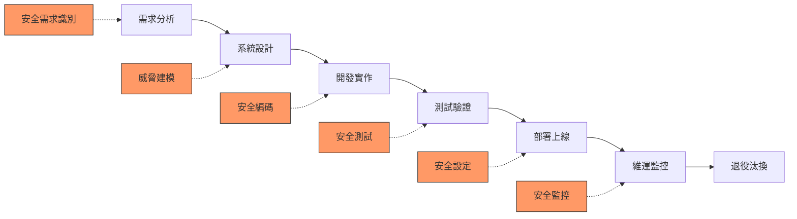

**核心原則**：

| 原則 | 說明 |
|------|------|
| Security by Design | 安全是設計的一部分，而非事後加上 |
| Defense in Depth | 多層防禦，不依賴單一安全機制 |
| Least Privilege | 最小權限原則 |
| Fail Secure | 安全地失敗，錯誤不應暴露系統資訊 |
| Zero Trust | 永不信任，持續驗證 |

### 1.2 傳統 SDLC vs AI SSDLC

| 面向 | 傳統 SDLC | AI SSDLC（結合 GitHub Copilot） |
|------|-----------|-------------------------------|
| 需求分析 | 人工撰寫 User Story | Copilot Chat 協助生成、分析邊界條件 |
| 系統設計 | 手動繪製架構圖 | Copilot 生成設計文件、API Spec |
| 開發 | 全手工編碼 | Copilot 輔助編碼、Agent Mode 自動實作 |
| 測試 | 手寫測試案例 | Copilot 自動生成 Unit / E2E 測試 |
| 安全 | 人工 Code Review | Copilot Code Review + SAST 整合 |
| 部署 | 手動設定 CI/CD | Copilot 生成 GitHub Actions YAML |
| 維運 | 人工日誌分析 | Copilot 協助分析 Log、診斷問題 |
| 效率提升 | 基準 | 平均提升 40~55%（GitHub 研究數據） |

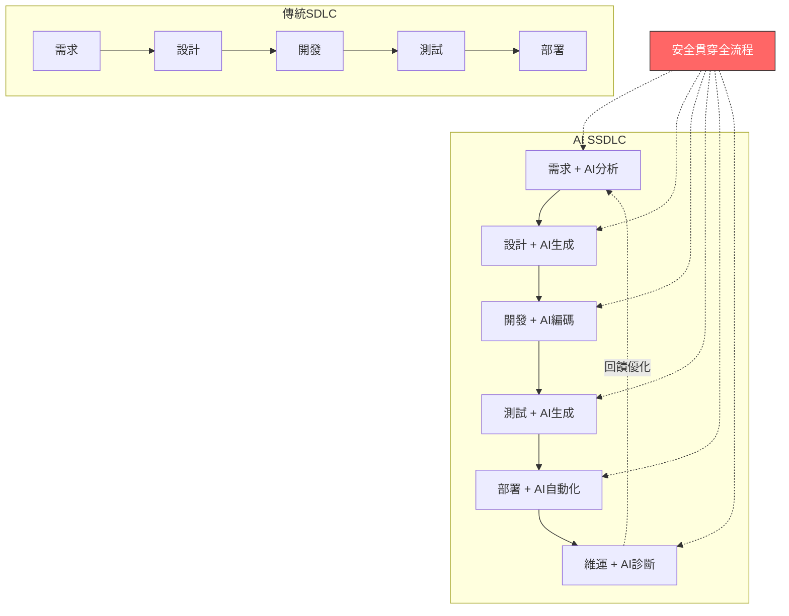

### 1.3 GitHub Copilot 在各階段的角色

GitHub Copilot（2026 年最新版）包含以下功能模組，涵蓋完整 SSDLC 流程：

#### 核心功能模組

| 功能 | 說明 | 適用階段 | 支援環境 |
|------|------|---------|---------|
| **Copilot Chat** | 對話式 AI 助手，支援 Skills 擴充 | 全階段 | VS Code、Visual Studio、JetBrains、Eclipse、Xcode、GitHub.com、GitHub Mobile、Windows Terminal |
| **Inline Suggestions** | 即時程式碼補全 | 開發 | VS Code、Visual Studio、JetBrains、Azure Data Studio、Xcode、Vim/Neovim、Eclipse |
| **Next Edit Suggestions (NES)** | 預測下一個編輯位置並建議補全 | 開發 | VS Code、Xcode、Eclipse |
| **Copilot Edits — Edit Mode** | 精細控制 Copilot 修改指定檔案 | 開發、重構 | VS Code、JetBrains |
| **Copilot Edits — Agent Mode** | 自主完成多步驟任務、執行終端指令、整合 MCP | 開發、測試 | VS Code、Visual Studio、JetBrains |
| **Copilot Cloud Agent** | 雲端自主 Agent（原 Copilot Coding Agent），可研究 Repo、建立 PR、支援視覺輸入 | 開發、Code Review | GitHub.com、Copilot CLI、Slack、Teams、Jira、Linear、Azure Boards |
| **Third-party Coding Agents** | 第三方 Coding Agents（Public Preview） | 開發 | GitHub.com |
| **Custom Agents** | 為 Cloud Agent 建立專門領域的自訂 Agent | 開發 | GitHub.com |
| **Agent Skills** | Copilot 執行專門任務的技能模組 | 開發 | GitHub.com |
| **Agent Hooks** | 在 Agent 執行關鍵點執行自訂 Shell 命令 | 開發 | GitHub.com |
| **Agent Management** | 集中管理 Agent 會話、檢查進度 | 全階段 | GitHub.com |
| **Copilot Code Review** | AI 驅動 Pull Request 審查 | 安全、品質 | GitHub.com、VS Code（Review Selection） |
| **Copilot PR Summaries** | 自動生成 PR 摘要 | 部署 | GitHub.com |
| **Copilot CLI** | 命令列 AI 助手，支援與 GitHub.com 互動 | 維運、部署 | Terminal |
| **Copilot Spaces** | 組織與集中相關內容（程式碼、文件、規格），作為 Copilot 回應的上下文基礎 | 全階段 | GitHub.com |
| **Copilot Memory** | Agentic 記憶（Public Preview），自動學習並記住 Repo 知識，28 天自動過期 | 全階段 | Copilot Cloud Agent、Code Review、CLI |
| **Custom Instructions** | 三層自訂指令：Personal / Repository / Organization | 全階段 | GitHub.com、VS Code、JetBrains、Visual Studio |
| **Prompt Files** | `.prompt.md` 檔案定義可重複使用的 Prompt 範本 | 全階段 | VS Code |
| **Copilot in GitHub Desktop** | 自動生成 Commit Message 和描述 | 開發 | GitHub Desktop |
| **GitHub Spark** | 自然語言建構全端應用（Public Preview） | 原型開發 | GitHub.com |
| **Auto Model Selection** | 自動為不同任務選擇最佳 AI 模型 | 全階段 | Copilot Chat、Cloud Agent |

#### 支援的 AI 模型（2026 年 4 月）

| 模型系列 | 代表模型 | 特色 |
|---------|---------|------|
| **OpenAI GPT** | GPT-4.1、GPT-5 mini、GPT-5.1、GPT-5.2、GPT-5.2-Codex、GPT-5.3-Codex、GPT-5.4 | 通用程式碼生成、對話 |
| **Anthropic Claude** | Claude Haiku 4.5、Claude Sonnet 4/4.5/4.6、Claude Opus 4.5/4.6 | 深度推理、安全分析 |
| **Google Gemini** | Gemini 2.5 Pro、Gemini 3 Flash、Gemini 3.1 Pro | 多模態、大上下文 |
| **xAI Grok** | Grok Code Fast 1 | 快速程式碼生成 |

**各階段對應**：

```mermaid
graph LR
    subgraph 需求
        R1[Copilot Chat]
        R2[Copilot Spaces]
    end

    subgraph 設計
        D1[Copilot Chat]
        D2[Agent Mode]
    end

    subgraph 開發
        C1[Inline Suggestions]
        C2[Agent Mode]
        C3[Cloud Agent]
    end

    subgraph 測試
        T1[Agent Mode]
        T2[Copilot Chat]
    end

    subgraph 安全
        S1[Code Review]
        S2[Copilot Chat]
    end

    subgraph 部署
        P1[PR Summaries]
        P2[Copilot CLI]
    end

    subgraph 維運
        O1[Copilot CLI]
        O2[Copilot Chat]
    end

    需求 --> 設計 --> 開發 --> 測試 --> 安全 --> 部署 --> 維運
```

### 1.4 GitHub Copilot 方案與定價

選擇適合組織規模的 Copilot 方案是導入 AI SSDLC 的第一步。

#### 方案比較（2026 年 4 月）

| 方案 | 定價 | Premium Requests | 適用對象 |
|------|------|-----------------|---------|
| **Copilot Free** | 免費 | 50 次/月 | 個人開發者體驗 |
| **Copilot Student** | 免費（學生） | 300 次/月 | 經驗證的學生 |
| **Copilot Pro** | $10 USD/月 | 300 次/月 | 個人開發者（教師與開源維護者可免費） |
| **Copilot Pro+** | $39 USD/月 | 1,500 次/月 | AI 進階使用者 |
| **Copilot Business** | $19 USD/座位/月 | 300 次/使用者/月 | 組織與團隊 |
| **Copilot Enterprise** | $39 USD/座位/月 | 1,000 次/使用者/月 | 企業（含 GitHub Enterprise Cloud） |

> 💡 所有方案皆可以 $0.04 USD/次 的價格購買額外 Premium Requests。

#### 關鍵功能差異

| 功能 | Free | Student | Pro | Pro+ | Business | Enterprise |
|------|------|---------|-----|------|----------|------------|
| Agent Mode | ✅ | ✅ | ✅ | ✅ | ✅ | ✅ |
| Cloud Agent | ❌ | ✅ | ✅ | ✅ | ✅ | ✅ |
| Code Review（完整） | ❌ | ✅ | ✅ | ✅ | ✅ | ✅ |
| MCP | ✅ | ✅ | ✅ | ✅ | ✅ | ✅ |
| Third-party Agents | ❌ | ❌ | ✅ | ✅ | ✅ | ✅ |
| Organization Custom Instructions | ❌ | ❌ | ❌ | ❌ | ✅ | ✅ |
| Prompt Files | ✅ | ✅ | ✅ | ✅ | ✅ | ✅ |
| PR Summaries | ❌ | ✅ | ✅ | ✅ | ✅ | ✅ |
| GitHub Spark | ❌ | ❌ | ❌ | ✅ | ❌ | ✅ |
| 稽核日誌 | ❌ | ❌ | ❌ | ✅ | ✅ | ✅ |
| 內容排除（Content Exclusion） | ❌ | ❌ | ❌ | ❌ | ✅ | ✅ |
| 組織政策管理 | ❌ | ❌ | ❌ | ❌ | ✅ | ✅ |

> ⚠️ **企業導入建議**
> 1. 中小型團隊（< 50 人）建議使用 **Copilot Business**，具備組織政策管理與 Cloud Agent
> 2. 大型企業建議使用 **Copilot Enterprise**，提供更高的 Premium Requests 額度與完整企業管控功能
> 3. 導入前應先以 **Copilot Pro 30 天免費試用** 進行概念驗證（PoC）
> 4. 參考 [GitHub Copilot 官方方案頁面](https://docs.github.com/en/copilot/about-github-copilot/subscription-plans-for-github-copilot) 取得最新定價

### 1.5 DevSecOps + AI 整合

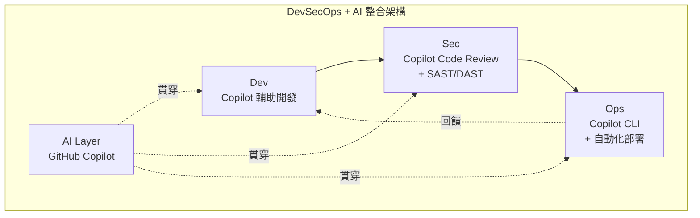

**整合流程**：

1. **Plan**：使用 Copilot Chat + Spaces 進行需求分析與架構討論
2. **Code**：使用 Copilot Inline Suggestions + Agent Mode 加速開發
3. **Build**：GitHub Actions 自動化建置
4. **Test**：Copilot 生成測試案例，CI 自動執行
5. **Security**：Copilot Code Review + Dependabot + CodeQL 掃描
6. **Release**：Copilot PR Summaries 自動生成發布說明
7. **Deploy**：Copilot CLI + GitHub Actions 自動部署
8. **Monitor**：Copilot 協助日誌分析與問題診斷

> ⚠️ **實務注意事項**  
> 1. AI 生成的程式碼**必須經過人工審查**，不可直接推送至生產環境  
> 2. 敏感資訊（API Key、密碼）**禁止作為 Prompt 輸入**  
> 3. AI 生成的安全建議需經資安團隊確認

---

## 第二章：系統整體架構設計（Architecture）

### 2.1 企業級系統架構總覽

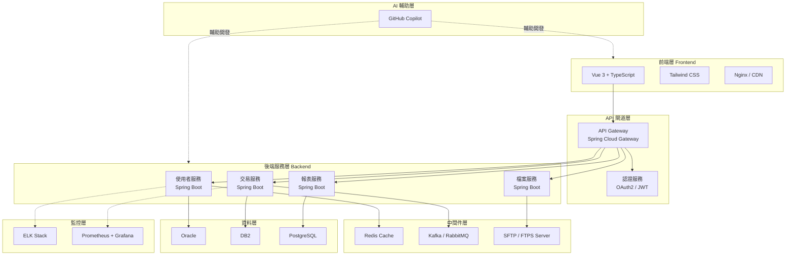

**各元件技術選型**：

| 層級 | 技術 | 說明 |
|------|------|------|
| 前端 | Vue 3 + TypeScript + Tailwind CSS | 元件化開發、型別安全 |
| API 閘道 | Spring Cloud Gateway | 路由、限流、認證 |
| 後端 | Spring Boot 3.x + Clean Architecture | 業務邏輯分層 |
| API 規範 | RESTful + OpenAPI 3.0（Swagger） | 標準化 API 文件 |
| 資料庫 | Oracle / DB2 / PostgreSQL | 依專案需求選用 |
| 快取 | Redis 7+ | Session、熱資料快取 |
| 訊息佇列 | Kafka / RabbitMQ | 非同步處理、事件驅動 |
| 檔案傳輸 | SFTP / FTPS | 安全檔案交換 |
| AI 輔助 | GitHub Copilot（全系列） | 全流程開發輔助 |

### 2.2 分層設計（Layered Architecture）

```
┌─────────────────────────────────────────────────────────┐
│                    Presentation Layer                    │
│         （Vue 3 / API Gateway / REST Controller）        │
├─────────────────────────────────────────────────────────┤
│                    Application Layer                     │
│            （Use Case / Application Service）            │
├─────────────────────────────────────────────────────────┤
│                      Domain Layer                        │
│         （Domain Model / Business Rules / Events）       │
├─────────────────────────────────────────────────────────┤
│                   Infrastructure Layer                   │
│     （Repository Impl / External API / MQ / Cache）      │
└─────────────────────────────────────────────────────────┘
```

**依賴規則**：外層可以依賴內層，但內層**不可**依賴外層。Domain Layer 是核心，不依賴任何技術框架。

### 2.3 微服務與模組化設計

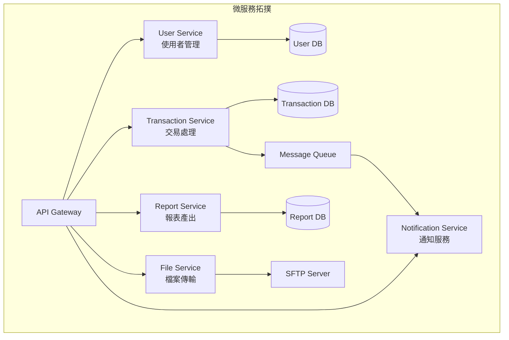

**模組化原則**：

1. **單一職責**：每個服務只負責一個業務領域
2. **鬆耦合**：服務間透過 API / MQ 通訊
3. **資料隔離**：每個服務擁有獨立資料庫
4. **獨立部署**：可獨立建置、測試、部署

### 2.4 Clean Architecture 應用

**Spring Boot 專案結構**：

```
src/main/java/com/company/project/
├── controller/                    # Presentation Layer
│   ├── CustomerController.java
│   └── dto/
│       ├── request/
│       │   └── CreateCustomerRequest.java
│       └── response/
│           └── CustomerResponse.java
│
├── application/                   # Application Layer
│   ├── service/
│   │   └── CustomerApplicationService.java
│   ├── usecase/
│   │   └── CreateCustomerUseCase.java
│   └── mapper/
│       └── CustomerDtoMapper.java
│
├── domain/                        # Domain Layer
│   ├── model/
│   │   └── Customer.java
│   ├── service/
│   │   └── CustomerDomainService.java
│   ├── repository/
│   │   └── CustomerRepository.java        # 介面
│   ├── event/
│   │   └── CustomerCreatedEvent.java
│   └── exception/
│       └── CustomerNotFoundException.java
│
├── infrastructure/                # Infrastructure Layer
│   ├── persistence/
│   │   ├── entity/
│   │   │   └── CustomerEntity.java
│   │   ├── repository/
│   │   │   └── CustomerRepositoryImpl.java  # 實作
│   │   └── mapper/
│   │       └── CustomerEntityMapper.java
│   ├── external/
│   │   ├── payment/
│   │   └── notification/
│   └── config/
│       ├── SecurityConfig.java
│       └── RedisConfig.java
│
└── common/
    ├── exception/
    │   └── GlobalExceptionHandler.java
    ├── util/
    └── constant/
```

> 💡 **Copilot 實務建議**  
> 使用 `.github/copilot-instructions.md` 定義專案架構規範，讓 Copilot 自動遵循 Clean Architecture 原則生成程式碼。

---

## 第三章：開發環境建置（Installation & Setup）

### 3.1 工具安裝

#### (1) VS Code 安裝與設定

```bash
# Windows - 使用 winget 安裝
winget install Microsoft.VisualStudioCode

# 或從官方網站下載
# https://code.visualstudio.com/
```

**必裝擴充套件**：

| 擴充套件 | 用途 |
|---------|------|
| GitHub Copilot | AI 程式碼補全 |
| GitHub Copilot Chat | AI 對話助手 |
| Extension Pack for Java | Java 開發套件 |
| Spring Boot Extension Pack | Spring Boot 開發 |
| Vue - Official (Volar) | Vue 3 開發 |
| Tailwind CSS IntelliSense | Tailwind CSS 提示 |
| GitLens | Git 進階功能 |
| SonarQube for IDE | 程式碼品質檢查 |

```bash
# 批次安裝擴充套件
code --install-extension GitHub.copilot
code --install-extension GitHub.copilot-chat
code --install-extension vscjava.vscode-java-pack
code --install-extension vmware.vscode-spring-boot
code --install-extension Vue.volar
code --install-extension bradlc.vscode-tailwindcss
code --install-extension eamodio.gitlens
code --install-extension SonarSource.sonarlint-vscode
```

#### (2) Git 安裝與設定

```bash
# Windows
winget install Git.Git

# 基本設定
git config --global user.name "您的姓名"
git config --global user.email "your.email@company.com"
git config --global core.autocrlf true
git config --global init.defaultBranch main

# SSH 金鑰設定
ssh-keygen -t ed25519 -C "your.email@company.com"
# 將公鑰加入 GitHub Settings > SSH Keys
```

#### (3) GitHub CLI 安裝

```bash
# Windows
winget install GitHub.cli

# 認證
gh auth login

# 驗證安裝
gh auth status
```

#### (4) Java & Maven 安裝

```bash
# 安裝 JDK 21（推薦 Temurin）
winget install EclipseAdoptium.Temurin.21.JDK

# 安裝 Maven
winget install Apache.Maven

# 驗證
java -version
mvn -version
```

#### (5) Node.js 安裝（前端開發）

```bash
# 安裝 Node.js LTS
winget install OpenJS.NodeJS.LTS

# 驗證
node -v
npm -v
```

### 3.2 GitHub Copilot 設定

#### (1) Copilot Chat 設定

在 VS Code 中按下 `Ctrl+Shift+P`，輸入 `Copilot`，確認 Copilot 已登入並啟用。

**建議設定（settings.json）**：

```json
{
  // Copilot 基本設定
  "github.copilot.enable": {
    "*": true,
    "markdown": true,
    "yaml": true
  },

  // Chat 設定
  "chat.editor.fontSize": 14,
  
  // Agent Mode 設定
  "chat.agent.enabled": true,

  // 自動接受建議設定
  "editor.inlineSuggest.enabled": true,
  "editor.inlineSuggest.showToolbar": "always"
}
```

#### (2) Custom Instructions 設定（三層式架構）

Copilot Custom Instructions 採用**三層優先順序架構**，由高到低為：

```
┌─────────────────────────────────────────┐
│  1️⃣  Personal Instructions（個人層級）    │ ← 最高優先
│     GitHub Settings > Copilot > Personal │
├─────────────────────────────────────────┤
│  2️⃣  Repository Instructions（專案層級）  │
│     .github/copilot-instructions.md     │
│     .instructions.md（路徑特定）         │
│     AGENTS.md / CLAUDE.md / GEMINI.md    │
├─────────────────────────────────────────┤
│  3️⃣  Organization Instructions（組織層級）│ ← 最低優先
│     Organization Settings > Copilot     │
│     （需 Business / Enterprise 方案）     │
└─────────────────────────────────────────┘
```

**專案層級：全域指引 `.github/copilot-instructions.md`**

```markdown
# Copilot Custom Instructions

## 專案規範
- 使用 Java 21 + Spring Boot 3.x
- 遵循 Clean Architecture
- 所有回應使用繁體中文
- 程式碼註解使用 JavaDoc 格式

## 編碼規範
- 類別名稱使用 PascalCase
- 方法和變數使用 camelCase
- 常數使用 UPPER_SNAKE_CASE
- API 路徑使用 kebab-case
- 資料表名稱使用 UPPER_SNAKE_CASE

## 安全規範
- 所有輸入必須做驗證
- SQL 必須使用 Prepared Statement
- 密碼使用 bcrypt 加密
- 敏感資料不可記錄在日誌

## 測試規範
- 使用 JUnit 5 + Mockito
- 測試方法使用 @DisplayName 中文說明
- 遵循 Given-When-Then 模式
```

**專案層級：路徑特定指引 `.instructions.md`**

可在任意目錄放置 `.instructions.md` 檔案，透過 YAML frontmatter 的 `applyTo` 指定生效範圍：

```markdown
---
applyTo: "src/main/java/com/company/**/controller/**"
---

# Controller 開發規範
- 所有 Controller 方法加上 @PreAuthorize 權限檢查
- 使用 @Validated 驗證 Request DTO
- 回傳統一 ApiResponse 格式
- 加入 @Operation（OpenAPI 文件）
```

```markdown
---
applyTo: "**/*Test.java"
---

# 測試開發規範
- 使用 @DisplayName 中文名稱
- Given-When-Then 模式
- 每個測試方法只測一個行為
- Mock 外部依賴
```

**專案層級：Agent 特定指引**

| 檔案 | 用途 |
|------|------|
| `AGENTS.md` | 所有 GitHub Copilot Agents 共用的指引 |
| `CLAUDE.md` | Claude 模型專用指引 |
| `GEMINI.md` | Gemini 模型專用指引 |
| `COPILOT.md` | GitHub Copilot 專用指引 |

> ⚠️ **組織層級指引**（Copilot Business / Enterprise 專屬）  
> 管理者可在 Organization Settings > Copilot > Custom Instructions 設定全組織統一規範，  
> 確保所有團隊成員遵循一致的安全與編碼標準。

#### (3) Copilot Agents 與 MCP 設定

VS Code Agent Mode 與 Cloud Agent 均支援 MCP（Model Context Protocol）伺服器。

**VS Code 本地 MCP 設定（`.vscode/mcp.json`）**：

```json
{
  "servers": {
    "github": {
      "command": "gh",
      "args": ["copilot", "mcp"],
      "description": "GitHub MCP Server — 存取 Issues、PRs、Repos"
    },
    "database": {
      "command": "npx",
      "args": ["-y", "@modelcontextprotocol/server-postgres", "postgresql://..."],
      "description": "PostgreSQL MCP Server"
    }
  }
}
```

**Cloud Agent MCP 設定（`.github/copilot/mcp.json`）**：

```json
{
  "servers": {
    "jira": {
      "type": "http",
      "url": "https://mcp.atlassian.com/v1/sse",
      "description": "Jira MCP — 讀取 Issue、更新狀態"
    }
  }
}
```

> 💡 Cloud Agent 已內建整合 Jira、Slack、Microsoft Teams、Linear、Azure Boards 等工具。

#### (4) Copilot Memory 設定

Copilot Memory 可讓 Copilot 跨對話記住您的偏好與專案知識。

**啟用方式**：GitHub.com > Settings > Copilot > Memory > 啟用

**特性**：

| 特性 | 說明 |
|------|------|
| 自動學習 | 從對話中自動擷取偏好與模式 |
| 跨功能共用 | Chat、Cloud Agent、Code Review、CLI 共用記憶 |
| 有效期限 | 28 天未被驗證的記憶自動過期 |
| 程式碼驗證 | 記憶會與目前程式碼庫比對驗證 |
| 手動管理 | 可在 Settings > Copilot > Memory 檢視、刪除記憶 |

**Memory 會自動學習的內容**：

- 專案架構規範與偏好的設計模式
- 命名慣例與程式碼風格
- 常用的程式庫與框架版本
- 測試撰寫風格與斷言偏好

#### (5) 使用 Copilot Spaces 管理上下文

建立 Space 整合專案上下文：

1. 開啟 GitHub.com > Copilot > Spaces
2. 建立新 Space，命名如 `Banking-Web-App`
3. 加入相關檔案：架構文件、API Spec、設計文件
4. 在 Chat 中使用此 Space 進行對話

### 3.3 專案初始化與分支策略

#### (1) Git Repo 建立

```bash
# 建立新專案
mkdir banking-web-app && cd banking-web-app

# 初始化 Git
git init
git remote add origin git@github.com:company/banking-web-app.git

# 建立 Spring Boot 專案（使用 Copilot CLI）
gh copilot suggest "create spring boot 3.3 project with maven, java 21, web, jpa, security, redis"

# 或使用 Spring Initializr
curl https://start.spring.io/starter.zip \
  -d dependencies=web,data-jpa,security,data-redis,validation,actuator \
  -d javaVersion=21 \
  -d type=maven-project \
  -d language=java \
  -d bootVersion=3.3.0 \
  -d groupId=com.company \
  -d artifactId=banking-web-app \
  -o banking-web-app.zip
```

#### (2) 分支策略（Git Flow）

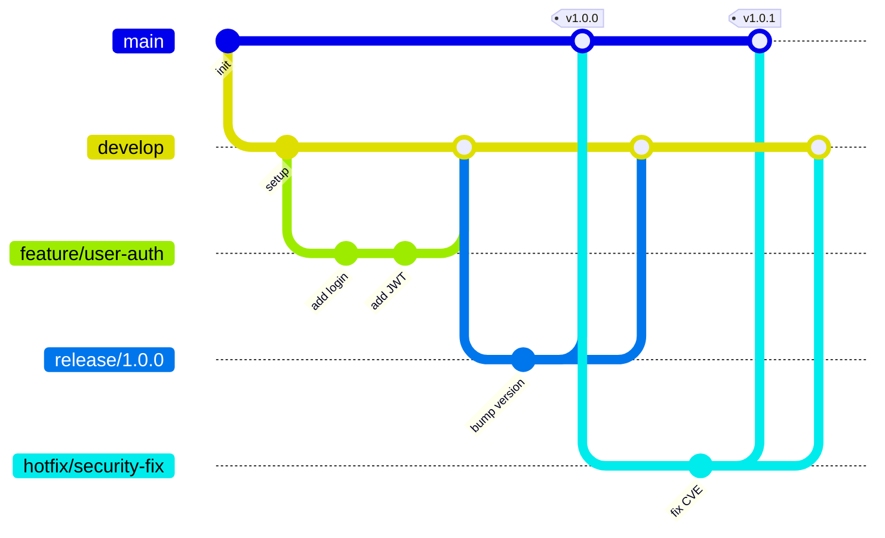

**分支命名規範**：

| 類型 | 格式 | 範例 |
|------|------|------|
| 功能分支 | `feature/{issue-id}-{description}` | `feature/PROJ-123-user-login` |
| 修復分支 | `bugfix/{issue-id}-{description}` | `bugfix/PROJ-456-fix-null` |
| 熱修復 | `hotfix/{issue-id}-{description}` | `hotfix/PROJ-789-security-fix` |
| 發布分支 | `release/{version}` | `release/1.2.0` |

#### (3) Commit 規範（Conventional Commits）

```
<type>(<scope>): <subject>

<body>

<footer>
```

| Type | 說明 |
|------|------|
| `feat` | 新功能 |
| `fix` | Bug 修復 |
| `docs` | 文件更新 |
| `style` | 程式碼格式（不影響功能） |
| `refactor` | 重構 |
| `perf` | 效能優化 |
| `test` | 測試相關 |
| `chore` | 建置/工具相關 |
| `security` | 安全修復 |

**使用 Copilot 生成 Commit Message**：

在 VS Code Source Control 面板，點選 Copilot 圖示，自動根據變更內容生成 Commit Message。

**Copilot Prompt 範例**：

```
@workspace 請根據目前的 git diff，生成符合 Conventional Commits 規範的 commit message，使用繁體中文描述
```

> 💡 **實務建議**  
> 1. 每個 PR 需至少 1 位 Reviewer 審核  
> 2. 合併前需通過所有 CI 檢查  
> 3. 建議搭配 GitHub Branch Protection Rules 強制執行

---

## 第四章：SSDLC 各階段 + Copilot 實戰

### 4.1 需求分析（Requirement）

#### User Story 撰寫

**標準格式**：

```
作為 [角色]
我希望 [功能]
以便 [業務價值]

驗收條件：
- [ ] 條件 1
- [ ] 條件 2
```

**Copilot Prompt 範例 — 生成 User Story**：

```
@workspace 請根據以下需求，產出完整的 User Story（含驗收條件）：

需求：銀行客戶需要透過網路銀行進行帳戶餘額查詢，
系統需驗證客戶身分，並顯示所有帳戶的即時餘額。
需考慮安全性（MFA）、效能（2秒內回應）、可用性（99.9%）。
```

**Copilot 生成結果範例**：

```markdown
## US-001：帳戶餘額查詢

### User Story
作為一位已註冊的銀行客戶，
我希望能在網路銀行中查詢我所有帳戶的即時餘額，
以便即時掌握我的財務狀況。

### 驗收條件
- [ ] 客戶登入後可看到所有帳戶列表
- [ ] 每個帳戶顯示：帳號（遮罩）、帳戶類型、幣別、即時餘額
- [ ] 回應時間 ≤ 2 秒（P95）
- [ ] 需通過 MFA 二次驗證才能查看餘額
- [ ] 查詢結果不可快取於前端
- [ ] 稽核日誌需記錄：查詢人員、時間、IP、查詢帳戶

### 非功能性需求
- 效能：P95 < 2s，支援 1000 TPS
- 安全：TLS 1.3 傳輸、個資遮罩
- 可用性：99.9%
```

#### Copilot 協助需求分析

**Prompt 範例 — 需求邊界條件分析**：

```
@workspace 請分析以下 User Story 的邊界條件、異常情境、安全風險：

US-001：帳戶餘額查詢
[貼上 User Story 內容]

請列出：
1. 正常流程
2. 異常流程（至少 5 個）
3. 安全風險（STRIDE 分析）
4. 效能考量
```

### 4.2 系統設計（Design）

#### 架構設計

**Copilot Prompt — 生成架構設計文件**：

```
@workspace 請根據以下需求，產出系統架構設計文件（SAD）：

系統：銀行帳戶查詢服務
技術棧：Spring Boot 3.x + Redis + Oracle
架構：Clean Architecture
安全：JWT + MFA
部署：Kubernetes

請包含：
1. 系統架構圖（文字描述）
2. 元件設計
3. 資料流程
4. 安全設計
5. 效能設計
```

#### API 設計

使用 Copilot 生成 OpenAPI 3.0 規格：

**Copilot Prompt**：

```
@workspace 請為帳戶餘額查詢功能設計 RESTful API，產出 OpenAPI 3.0 YAML 規格：

要求：
- 路徑：GET /api/v1/accounts/{customerId}/balances
- 需認證（Bearer JWT）
- 回應包含多帳戶餘額
- 包含分頁
- 錯誤回應格式標準化
```

**生成結果**：

```yaml
openapi: 3.0.3
info:
  title: Account Balance API
  version: 1.0.0
  description: 帳戶餘額查詢 API

paths:
  /api/v1/accounts/{customerId}/balances:
    get:
      summary: 查詢客戶所有帳戶餘額
      operationId: getAccountBalances
      tags:
        - Account
      security:
        - bearerAuth: []
      parameters:
        - name: customerId
          in: path
          required: true
          schema:
            type: string
            pattern: '^[A-Z0-9]{10}$'
          description: 客戶 ID
        - name: page
          in: query
          schema:
            type: integer
            default: 0
        - name: size
          in: query
          schema:
            type: integer
            default: 20
            maximum: 100
      responses:
        '200':
          description: 查詢成功
          content:
            application/json:
              schema:
                $ref: '#/components/schemas/AccountBalanceResponse'
        '401':
          description: 未認證
          content:
            application/json:
              schema:
                $ref: '#/components/schemas/ErrorResponse'
        '403':
          description: 無權限
        '404':
          description: 客戶不存在

components:
  schemas:
    AccountBalanceResponse:
      type: object
      properties:
        success:
          type: boolean
        code:
          type: string
        data:
          type: array
          items:
            $ref: '#/components/schemas/AccountBalance'
        timestamp:
          type: string
          format: date-time
        traceId:
          type: string

    AccountBalance:
      type: object
      properties:
        accountNo:
          type: string
          description: 帳號（遮罩後）
          example: "****1234"
        accountType:
          type: string
          enum: [CHECKING, SAVINGS, FIXED_DEPOSIT]
        currency:
          type: string
          example: "TWD"
        balance:
          type: number
          format: decimal
          example: 1500000.00
        lastUpdated:
          type: string
          format: date-time

    ErrorResponse:
      type: object
      properties:
        success:
          type: boolean
          example: false
        code:
          type: string
          example: "E1001"
        message:
          type: string
        traceId:
          type: string

  securitySchemes:
    bearerAuth:
      type: http
      scheme: bearer
      bearerFormat: JWT
```

#### DB Schema 設計

**Copilot Prompt**：

```
@workspace 請為帳戶餘額查詢設計資料庫 Schema（Oracle）：

要求：
- 客戶資料表
- 帳戶資料表
- 餘額資料表
- 稽核日誌表
- 包含索引設計
- 遵循命名規範（UPPER_SNAKE_CASE）
```

**生成結果**：

```sql
-- 客戶資料表
CREATE TABLE CUSTOMER (
    CUSTOMER_ID         VARCHAR2(10)    PRIMARY KEY,
    CUSTOMER_NAME       VARCHAR2(100)   NOT NULL,
    ID_NUMBER           VARCHAR2(64)    NOT NULL,  -- 加密儲存
    EMAIL               VARCHAR2(200),
    PHONE               VARCHAR2(20),
    STATUS              VARCHAR2(10)    DEFAULT 'ACTIVE' NOT NULL,
    CREATED_AT          TIMESTAMP       DEFAULT CURRENT_TIMESTAMP NOT NULL,
    UPDATED_AT          TIMESTAMP,
    CREATED_BY          VARCHAR2(50)    NOT NULL,
    UPDATED_BY          VARCHAR2(50)
);

-- 帳戶資料表
CREATE TABLE ACCOUNT (
    ACCOUNT_ID          NUMBER          GENERATED ALWAYS AS IDENTITY PRIMARY KEY,
    ACCOUNT_NO          VARCHAR2(20)    NOT NULL UNIQUE,
    CUSTOMER_ID         VARCHAR2(10)    NOT NULL,
    ACCOUNT_TYPE        VARCHAR2(20)    NOT NULL,  -- CHECKING, SAVINGS, FIXED_DEPOSIT
    CURRENCY            VARCHAR2(3)     DEFAULT 'TWD' NOT NULL,
    STATUS              VARCHAR2(10)    DEFAULT 'ACTIVE' NOT NULL,
    OPENED_AT           TIMESTAMP       NOT NULL,
    CLOSED_AT           TIMESTAMP,
    CREATED_AT          TIMESTAMP       DEFAULT CURRENT_TIMESTAMP NOT NULL,
    CONSTRAINT FK_ACCOUNT_CUSTOMER FOREIGN KEY (CUSTOMER_ID)
        REFERENCES CUSTOMER(CUSTOMER_ID)
);

-- 餘額資料表
CREATE TABLE ACCOUNT_BALANCE (
    BALANCE_ID          NUMBER          GENERATED ALWAYS AS IDENTITY PRIMARY KEY,
    ACCOUNT_ID          NUMBER          NOT NULL,
    AVAILABLE_BALANCE   NUMBER(18,2)    NOT NULL,
    LEDGER_BALANCE      NUMBER(18,2)    NOT NULL,
    HOLD_AMOUNT         NUMBER(18,2)    DEFAULT 0,
    LAST_UPDATED        TIMESTAMP       NOT NULL,
    CONSTRAINT FK_BALANCE_ACCOUNT FOREIGN KEY (ACCOUNT_ID)
        REFERENCES ACCOUNT(ACCOUNT_ID)
);

-- 稽核日誌表
CREATE TABLE AUDIT_LOG (
    AUDIT_ID            NUMBER          GENERATED ALWAYS AS IDENTITY PRIMARY KEY,
    EVENT_TIME          TIMESTAMP       DEFAULT CURRENT_TIMESTAMP NOT NULL,
    USER_ID             VARCHAR2(50)    NOT NULL,
    CLIENT_IP           VARCHAR2(45),
    ACTION              VARCHAR2(50)    NOT NULL,
    RESOURCE_TYPE       VARCHAR2(50)    NOT NULL,
    RESOURCE_ID         VARCHAR2(100),
    DESCRIPTION         VARCHAR2(2000),
    RESPONSE_STATUS     VARCHAR2(20),
    TRACE_ID            VARCHAR2(100)
);

-- 索引設計
CREATE INDEX IDX_ACCOUNT_CUSTOMER_ID ON ACCOUNT(CUSTOMER_ID);
CREATE INDEX IDX_ACCOUNT_STATUS ON ACCOUNT(STATUS);
CREATE INDEX IDX_BALANCE_ACCOUNT_ID ON ACCOUNT_BALANCE(ACCOUNT_ID);
CREATE INDEX IDX_AUDIT_EVENT_TIME ON AUDIT_LOG(EVENT_TIME);
CREATE INDEX IDX_AUDIT_USER_ID ON AUDIT_LOG(USER_ID);
CREATE INDEX IDX_AUDIT_TRACE_ID ON AUDIT_LOG(TRACE_ID);
```

### 4.3 開發（Development）

#### 使用 Copilot 撰寫 Controller

**Copilot Prompt**：

```
@workspace 請根據 OpenAPI spec 產生 AccountController，遵循以下規範：
- Clean Architecture
- 使用 Jakarta Validation
- 統一回應格式 ApiResponse<T>
- 包含稽核日誌 AOP
- 包含 Swagger 註解
```

**生成結果**：

```java
package com.company.banking.controller;

import com.company.banking.application.service.AccountApplicationService;
import com.company.banking.common.response.ApiResponse;
import com.company.banking.controller.dto.response.AccountBalanceResponse;
import io.swagger.v3.oas.annotations.Operation;
import io.swagger.v3.oas.annotations.tags.Tag;
import jakarta.validation.constraints.Pattern;
import lombok.RequiredArgsConstructor;
import lombok.extern.slf4j.Slf4j;
import org.springframework.data.domain.Page;
import org.springframework.data.domain.Pageable;
import org.springframework.http.ResponseEntity;
import org.springframework.security.access.prepost.PreAuthorize;
import org.springframework.validation.annotation.Validated;
import org.springframework.web.bind.annotation.*;

/**
 * 帳戶餘額查詢 Controller
 *
 * @author 開發團隊
 * @since 1.0.0
 */
@RestController
@RequestMapping("/api/v1/accounts")
@RequiredArgsConstructor
@Validated
@Slf4j
@Tag(name = "Account", description = "帳戶相關 API")
public class AccountController {

    private final AccountApplicationService accountService;

    /**
     * 查詢客戶所有帳戶餘額
     *
     * @param customerId 客戶 ID
     * @param pageable   分頁參數
     * @return 帳戶餘額列表
     */
    @GetMapping("/{customerId}/balances")
    @Operation(summary = "查詢客戶帳戶餘額", description = "查詢指定客戶的所有帳戶即時餘額")
    @PreAuthorize("hasAuthority('ACCOUNT_READ') and #customerId == authentication.principal.customerId")
    @Auditable(action = AuditAction.READ, resourceType = "ACCOUNT_BALANCE")
    public ResponseEntity<ApiResponse<Page<AccountBalanceResponse>>> getBalances(
            @PathVariable
            @Pattern(regexp = "^[A-Z0-9]{10}$", message = "客戶 ID 格式不正確")
            String customerId,
            Pageable pageable) {

        log.info("查詢帳戶餘額: customerId={}", customerId);

        Page<AccountBalanceResponse> balances = accountService.getAccountBalances(customerId, pageable);

        return ResponseEntity.ok(ApiResponse.success(balances));
    }
}
```

#### 使用 Copilot 撰寫 Service

**Copilot Prompt**：

```
@workspace 請產生 AccountApplicationService，實作帳戶餘額查詢邏輯：
- 先從 Redis Cache 查詢
- Cache Miss 時從 Oracle DB 查詢
- 結果寫回 Cache（TTL 5 分鐘）
- 帳號遮罩處理
- 異常處理
```

**生成結果**：

```java
package com.company.banking.application.service;

import com.company.banking.controller.dto.response.AccountBalanceResponse;
import com.company.banking.domain.exception.CustomerNotFoundException;
import com.company.banking.domain.model.Account;
import com.company.banking.domain.repository.AccountRepository;
import com.company.banking.domain.repository.CustomerRepository;
import lombok.RequiredArgsConstructor;
import lombok.extern.slf4j.Slf4j;
import org.springframework.cache.annotation.Cacheable;
import org.springframework.data.domain.Page;
import org.springframework.data.domain.Pageable;
import org.springframework.stereotype.Service;
import org.springframework.transaction.annotation.Transactional;

/**
 * 帳戶應用服務
 *
 * <p>處理帳戶相關的業務流程編排，包含快取策略與資料轉換。</p>
 *
 * @author 開發團隊
 * @since 1.0.0
 */
@Service
@RequiredArgsConstructor
@Slf4j
public class AccountApplicationService {

    private final AccountRepository accountRepository;
    private final CustomerRepository customerRepository;

    /**
     * 查詢客戶所有帳戶餘額
     *
     * @param customerId 客戶 ID
     * @param pageable   分頁參數
     * @return 帳戶餘額列表（分頁）
     * @throws CustomerNotFoundException 當客戶不存在時拋出
     */
    @Transactional(readOnly = true)
    @Cacheable(value = "accountBalances", key = "#customerId + '_' + #pageable.pageNumber",
               unless = "#result.isEmpty()")
    public Page<AccountBalanceResponse> getAccountBalances(String customerId, Pageable pageable) {
        // 1. 驗證客戶是否存在
        if (!customerRepository.existsById(customerId)) {
            throw new CustomerNotFoundException(customerId);
        }

        // 2. 查詢帳戶餘額
        Page<Account> accounts = accountRepository.findActiveAccountsByCustomerId(customerId, pageable);

        // 3. 轉換並遮罩
        return accounts.map(this::toBalanceResponse);
    }

    private AccountBalanceResponse toBalanceResponse(Account account) {
        return AccountBalanceResponse.builder()
                .accountNo(maskAccountNo(account.getAccountNo()))
                .accountType(account.getAccountType().name())
                .currency(account.getCurrency())
                .balance(account.getBalance().getAvailableBalance())
                .lastUpdated(account.getBalance().getLastUpdated())
                .build();
    }

    /**
     * 帳號遮罩：僅顯示後 4 碼
     */
    private String maskAccountNo(String accountNo) {
        if (accountNo == null || accountNo.length() <= 4) {
            return "****";
        }
        return "****" + accountNo.substring(accountNo.length() - 4);
    }
}
```

#### 使用 Copilot 撰寫 Repository

**Copilot Prompt**：

```
@workspace 請產生 AccountRepository 介面（Domain Layer）和 AccountRepositoryImpl 實作（Infrastructure Layer），
使用 Spring Data JPA，包含 Custom Query。
```

#### Vue / TypeScript 前端範例

**Copilot Prompt**：

```
@workspace 請用 Vue 3 + TypeScript + Composition API 產生帳戶餘額查詢頁面：
- 使用 Tailwind CSS 樣式
- 呼叫 GET /api/v1/accounts/{customerId}/balances
- 包含 Loading 狀態
- 錯誤處理
- 餘額金額格式化
```

**生成結果**：

```vue
<script setup lang="ts">
import { ref, onMounted } from 'vue'

interface AccountBalance {
  accountNo: string
  accountType: string
  currency: string
  balance: number
  lastUpdated: string
}

interface ApiResponse<T> {
  success: boolean
  code: string
  data: T
  message?: string
}

const balances = ref<AccountBalance[]>([])
const loading = ref(false)
const error = ref<string | null>(null)

const fetchBalances = async () => {
  loading.value = true
  error.value = null

  try {
    const response = await fetch('/api/v1/accounts/me/balances', {
      headers: {
        'Authorization': `Bearer ${getToken()}`,
        'Content-Type': 'application/json'
      }
    })

    if (!response.ok) {
      throw new Error(`HTTP ${response.status}`)
    }

    const result: ApiResponse<{ content: AccountBalance[] }> = await response.json()

    if (result.success) {
      balances.value = result.data.content
    } else {
      error.value = result.message || '查詢失敗'
    }
  } catch (e) {
    error.value = '系統異常，請稍後再試'
    console.error('查詢帳戶餘額失敗:', e)
  } finally {
    loading.value = false
  }
}

const formatCurrency = (amount: number, currency: string): string => {
  return new Intl.NumberFormat('zh-TW', {
    style: 'currency',
    currency: currency
  }).format(amount)
}

const getAccountTypeLabel = (type: string): string => {
  const labels: Record<string, string> = {
    CHECKING: '活期存款',
    SAVINGS: '儲蓄存款',
    FIXED_DEPOSIT: '定期存款'
  }
  return labels[type] || type
}

const getToken = (): string => {
  return sessionStorage.getItem('accessToken') || ''
}

onMounted(fetchBalances)
</script>

<template>
  <div class="max-w-4xl mx-auto p-6">
    <h1 class="text-2xl font-bold text-gray-800 mb-6">帳戶餘額查詢</h1>

    <!-- Loading -->
    <div v-if="loading" class="flex justify-center py-12">
      <div class="animate-spin rounded-full h-10 w-10 border-b-2 border-blue-600"></div>
    </div>

    <!-- Error -->
    <div v-else-if="error" class="bg-red-50 border border-red-200 rounded-lg p-4 text-red-700">
      {{ error }}
      <button @click="fetchBalances" class="ml-4 text-red-600 underline">重試</button>
    </div>

    <!-- Balance List -->
    <div v-else class="space-y-4">
      <div
        v-for="account in balances"
        :key="account.accountNo"
        class="bg-white rounded-lg shadow-md p-6 border border-gray-100
               hover:shadow-lg transition-shadow"
      >
        <div class="flex justify-between items-center">
          <div>
            <p class="text-sm text-gray-500">{{ getAccountTypeLabel(account.accountType) }}</p>
            <p class="text-lg font-mono text-gray-700">{{ account.accountNo }}</p>
          </div>
          <div class="text-right">
            <p class="text-2xl font-bold text-gray-900">
              {{ formatCurrency(account.balance, account.currency) }}
            </p>
            <p class="text-xs text-gray-400">
              更新時間：{{ new Date(account.lastUpdated).toLocaleString('zh-TW') }}
            </p>
          </div>
        </div>
      </div>

      <div v-if="balances.length === 0" class="text-center py-12 text-gray-400">
        目前沒有帳戶資料
      </div>
    </div>
  </div>
</template>
```

#### Copilot Prompt 技巧

| 技巧 | 說明 | 範例 |
|------|------|------|
| **角色設定** | 指定 Copilot 的角色 | `你是 Spring Boot 架構師` |
| **上下文提供** | 使用 `@workspace` 參照專案 | `@workspace 根據現有架構...` |
| **步驟拆解** | 將複雜任務拆成小步驟 | `請先設計介面，再產生實作` |
| **約束條件** | 明確列出限制 | `使用 Java 21、不可使用 Lombok` |
| **範例驅動** | 提供期望的輸出格式 | `輸出格式如下：...` |
| **檔案參照** | 引用特定檔案 | `#file:pom.xml 請參考依賴` |
| **反面範例** | 說明不要什麼 | `不要使用 @Autowired 欄位注入` |

### 4.4 測試（Testing）

#### 單元測試（JUnit 5）

**Copilot Prompt — 自動生成測試**：

```
@workspace 請為 AccountApplicationService.getAccountBalances 方法生成完整的 JUnit 5 測試：
- 使用 Mockito
- 使用 @DisplayName 中文說明
- 遵循 Given-When-Then 模式
- 包含：正常情境、客戶不存在、空結果、異常處理
```

**生成結果**：

```java
package com.company.banking.application.service;

import com.company.banking.controller.dto.response.AccountBalanceResponse;
import com.company.banking.domain.exception.CustomerNotFoundException;
import com.company.banking.domain.model.Account;
import com.company.banking.domain.model.AccountBalance;
import com.company.banking.domain.model.AccountType;
import com.company.banking.domain.repository.AccountRepository;
import com.company.banking.domain.repository.CustomerRepository;
import org.junit.jupiter.api.BeforeEach;
import org.junit.jupiter.api.DisplayName;
import org.junit.jupiter.api.Nested;
import org.junit.jupiter.api.Test;
import org.junit.jupiter.api.extension.ExtendWith;
import org.mockito.InjectMocks;
import org.mockito.Mock;
import org.mockito.junit.jupiter.MockitoExtension;
import org.springframework.data.domain.Page;
import org.springframework.data.domain.PageImpl;
import org.springframework.data.domain.PageRequest;
import org.springframework.data.domain.Pageable;

import java.math.BigDecimal;
import java.time.LocalDateTime;
import java.util.List;

import static org.assertj.core.api.Assertions.*;
import static org.mockito.Mockito.*;

@ExtendWith(MockitoExtension.class)
@DisplayName("帳戶應用服務測試")
class AccountApplicationServiceTest {

    @Mock
    private AccountRepository accountRepository;

    @Mock
    private CustomerRepository customerRepository;

    @InjectMocks
    private AccountApplicationService service;

    private static final String CUSTOMER_ID = "CUST000001";
    private static final Pageable PAGEABLE = PageRequest.of(0, 20);

    @Nested
    @DisplayName("查詢帳戶餘額")
    class GetAccountBalancesTests {

        @Test
        @DisplayName("客戶存在且有帳戶時，應返回餘額列表")
        void shouldReturnBalances_WhenCustomerExistsAndHasAccounts() {
            // Given
            when(customerRepository.existsById(CUSTOMER_ID)).thenReturn(true);

            Account account = createTestAccount("1234567890", AccountType.CHECKING,
                    new BigDecimal("1500000.00"));
            Page<Account> accountPage = new PageImpl<>(List.of(account));
            when(accountRepository.findActiveAccountsByCustomerId(CUSTOMER_ID, PAGEABLE))
                    .thenReturn(accountPage);

            // When
            Page<AccountBalanceResponse> result = service.getAccountBalances(CUSTOMER_ID, PAGEABLE);

            // Then
            assertThat(result.getContent()).hasSize(1);
            assertThat(result.getContent().get(0).getAccountNo()).isEqualTo("****7890");
            assertThat(result.getContent().get(0).getBalance())
                    .isEqualByComparingTo(new BigDecimal("1500000.00"));

            verify(customerRepository).existsById(CUSTOMER_ID);
            verify(accountRepository).findActiveAccountsByCustomerId(CUSTOMER_ID, PAGEABLE);
        }

        @Test
        @DisplayName("客戶不存在時，應拋出 CustomerNotFoundException")
        void shouldThrowException_WhenCustomerNotFound() {
            // Given
            when(customerRepository.existsById(CUSTOMER_ID)).thenReturn(false);

            // When & Then
            assertThatThrownBy(() -> service.getAccountBalances(CUSTOMER_ID, PAGEABLE))
                    .isInstanceOf(CustomerNotFoundException.class)
                    .hasMessageContaining(CUSTOMER_ID);

            verify(accountRepository, never()).findActiveAccountsByCustomerId(any(), any());
        }

        @Test
        @DisplayName("客戶存在但無帳戶時，應返回空列表")
        void shouldReturnEmpty_WhenCustomerHasNoAccounts() {
            // Given
            when(customerRepository.existsById(CUSTOMER_ID)).thenReturn(true);
            when(accountRepository.findActiveAccountsByCustomerId(CUSTOMER_ID, PAGEABLE))
                    .thenReturn(Page.empty());

            // When
            Page<AccountBalanceResponse> result = service.getAccountBalances(CUSTOMER_ID, PAGEABLE);

            // Then
            assertThat(result.getContent()).isEmpty();
        }

        @Test
        @DisplayName("帳號遮罩應正確處理")
        void shouldMaskAccountNumber() {
            // Given
            when(customerRepository.existsById(CUSTOMER_ID)).thenReturn(true);

            Account account = createTestAccount("9876543210", AccountType.SAVINGS,
                    new BigDecimal("500000.00"));
            when(accountRepository.findActiveAccountsByCustomerId(CUSTOMER_ID, PAGEABLE))
                    .thenReturn(new PageImpl<>(List.of(account)));

            // When
            Page<AccountBalanceResponse> result = service.getAccountBalances(CUSTOMER_ID, PAGEABLE);

            // Then
            assertThat(result.getContent().get(0).getAccountNo()).isEqualTo("****3210");
        }
    }

    private Account createTestAccount(String accountNo, AccountType type, BigDecimal balance) {
        return Account.builder()
                .accountNo(accountNo)
                .accountType(type)
                .currency("TWD")
                .balance(AccountBalance.builder()
                        .availableBalance(balance)
                        .lastUpdated(LocalDateTime.now())
                        .build())
                .build();
    }
}
```

#### API 測試（Spring Boot Integration Test）

**Copilot Prompt**：

```
@workspace 請為 AccountController 產生整合測試，使用 @SpringBootTest + MockMvc，
測試 API 回應格式、HTTP Status、認證檢查。
```

#### E2E 測試（Playwright）

**Copilot Prompt**：

```
@workspace 請用 Playwright (TypeScript) 撰寫帳戶餘額查詢的 E2E 測試：
- 測試登入 → 查詢餘額 → 驗證顯示結果
- 測試未登入時應被導向登入頁
- 測試錯誤情境
```

**生成結果**：

```typescript
import { test, expect } from '@playwright/test';

test.describe('帳戶餘額查詢', () => {
  test.beforeEach(async ({ page }) => {
    // 登入
    await page.goto('/login');
    await page.fill('[data-testid="username"]', 'testuser');
    await page.fill('[data-testid="password"]', 'TestPass123!');
    await page.click('[data-testid="login-btn"]');
    await page.waitForURL('/dashboard');
  });

  test('應顯示帳戶餘額列表', async ({ page }) => {
    await page.goto('/accounts/balances');

    // 等待資料載入
    await page.waitForSelector('[data-testid="balance-card"]');

    // 驗證帳戶卡片存在
    const cards = page.locator('[data-testid="balance-card"]');
    await expect(cards).toHaveCount(await cards.count());

    // 驗證帳號遮罩
    const accountNo = page.locator('[data-testid="account-no"]').first();
    await expect(accountNo).toHaveText(/^\*{4}\d{4}$/);

    // 驗證金額格式
    const balance = page.locator('[data-testid="balance-amount"]').first();
    await expect(balance).toContainText('$');
  });

  test('未登入應導向登入頁', async ({ page }) => {
    // 清除 Session
    await page.context().clearCookies();
    await page.goto('/accounts/balances');
    await expect(page).toHaveURL(/\/login/);
  });
});
```

#### Copilot 提升測試覆蓋率

**Prompt**：

```
@workspace 分析 #file:AccountApplicationService.java 的測試覆蓋率缺口，
列出尚未覆蓋的分支與邊界條件，並生成對應的測試案例。
```

### 4.5 安全（Security）

#### SSDLC 安全檢查

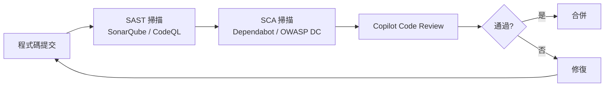

#### OWASP Top 10 + Copilot 防護

| OWASP 風險 | Copilot 如何協助 | Prompt 範例 |
|-----------|----------------|------------|
| A01: Broken Access Control | 生成 RBAC 權限檢查程式碼 | `請為此 API 加入 @PreAuthorize 權限檢查` |
| A02: Cryptographic Failures | 建議正確的加密方式 | `請使用 AES-256-GCM 加密此欄位` |
| A03: Injection | 生成 Prepared Statement | `請將此 SQL 改為參數化查詢` |
| A04: Insecure Design | 威脅建模分析 | `請對此功能進行 STRIDE 威脅分析` |
| A05: Security Misconfiguration | 檢查設定安全性 | `請檢查 SecurityConfig 是否有安全問題` |
| A06: Vulnerable Components | 識別有弱點的依賴 | `請檢查 pom.xml 中是否有已知弱點` |
| A07: Auth Failures | 生成安全認證程式碼 | `請實作 JWT + Refresh Token 機制` |
| A08: Software Integrity | CI/CD 安全建議 | `請加入依賴簽章驗證` |
| A09: Logging Failures | 生成稽核日誌 | `請為此操作加入稽核日誌` |
| A10: SSRF | 驗證外部 URL | `請加入 URL 白名單驗證` |

#### 安全漏洞修補

**Copilot Prompt — 掃描並修補安全問題**：

```
@workspace 請檢查 #file:SecurityConfig.java 是否有安全問題，並提供修正版本：
- CORS 設定是否過於寬鬆
- CSRF 是否正確處理
- Session 管理是否安全
- HTTP Headers 安全設定
```

**Copilot Code Review 功能**：

在 Pull Request 中，Copilot Code Review 會自動：

1. 偵測潛在安全漏洞
2. 標記不安全的程式碼模式
3. 提供具體修復建議
4. 檢查認證/授權邏輯

#### CodeQL + GitHub Actions 整合

```yaml
# .github/workflows/security-scan.yml
name: Security Scan

on:
  pull_request:
    branches: [main, develop]

jobs:
  codeql:
    name: CodeQL Analysis
    runs-on: ubuntu-latest
    permissions:
      security-events: write
    steps:
      - uses: actions/checkout@v4
      - uses: github/codeql-action/init@v3
        with:
          languages: java
      - uses: github/codeql-action/autobuild@v3
      - uses: github/codeql-action/analyze@v3

  dependency-review:
    name: Dependency Review
    runs-on: ubuntu-latest
    steps:
      - uses: actions/checkout@v4
      - uses: actions/dependency-review-action@v4
        with:
          fail-on-severity: high
          deny-licenses: GPL-3.0

  copilot-review:
    name: Copilot Code Review
    runs-on: ubuntu-latest
    steps:
      - uses: actions/checkout@v4
      # Copilot Code Review 自動觸發於 PR
```

### 4.6 部署（Deployment）

#### CI/CD（GitHub Actions）

```yaml
# .github/workflows/ci-cd.yml
name: CI/CD Pipeline

on:
  push:
    branches: [main, develop]
  pull_request:
    branches: [main, develop]

env:
  JAVA_VERSION: '21'
  REGISTRY: ghcr.io
  IMAGE_NAME: ${{ github.repository }}

jobs:
  # ===== 建置與測試 =====
  build:
    name: Build & Test
    runs-on: ubuntu-latest
    steps:
      - uses: actions/checkout@v4

      - name: Setup Java
        uses: actions/setup-java@v4
        with:
          java-version: ${{ env.JAVA_VERSION }}
          distribution: 'temurin'
          cache: maven

      - name: Build
        run: mvn clean compile -B

      - name: Unit Tests
        run: mvn test -B

      - name: Integration Tests
        run: mvn verify -B -Pintegration-test

      - name: Upload Test Results
        if: always()
        uses: actions/upload-artifact@v4
        with:
          name: test-results
          path: target/surefire-reports/

  # ===== 程式碼品質 =====
  quality:
    name: Code Quality
    runs-on: ubuntu-latest
    needs: build
    steps:
      - uses: actions/checkout@v4
      - uses: actions/setup-java@v4
        with:
          java-version: ${{ env.JAVA_VERSION }}
          distribution: 'temurin'
          cache: maven

      - name: SonarQube Scan
        env:
          SONAR_TOKEN: ${{ secrets.SONAR_TOKEN }}
        run: |
          mvn sonar:sonar \
            -Dsonar.projectKey=${{ github.event.repository.name }} \
            -Dsonar.host.url=${{ secrets.SONAR_HOST_URL }} \
            -Dsonar.qualitygate.wait=true

  # ===== 安全掃描 =====
  security:
    name: Security Scan
    runs-on: ubuntu-latest
    needs: build
    steps:
      - uses: actions/checkout@v4

      - name: OWASP Dependency Check
        uses: dependency-check/Dependency-Check_Action@main
        with:
          project: ${{ github.event.repository.name }}
          path: '.'
          format: 'HTML'
          args: '--failOnCVSS 7'

      - name: Upload Security Report
        uses: actions/upload-artifact@v4
        with:
          name: dependency-check-report
          path: reports/

  # ===== 部署至 DEV =====
  deploy-dev:
    name: Deploy to DEV
    runs-on: ubuntu-latest
    needs: [build, quality, security]
    if: github.ref == 'refs/heads/develop'
    environment: development
    steps:
      - uses: actions/checkout@v4
      - uses: actions/setup-java@v4
        with:
          java-version: ${{ env.JAVA_VERSION }}
          distribution: 'temurin'
          cache: maven

      - name: Package
        run: mvn package -DskipTests -B

      - name: Build & Push Docker Image
        run: |
          echo ${{ secrets.GITHUB_TOKEN }} | docker login ghcr.io -u ${{ github.actor }} --password-stdin
          docker build -t ${{ env.REGISTRY }}/${{ env.IMAGE_NAME }}:dev-${{ github.sha }} .
          docker push ${{ env.REGISTRY }}/${{ env.IMAGE_NAME }}:dev-${{ github.sha }}

      - name: Deploy to Kubernetes
        run: |
          kubectl set image deployment/banking-app \
            banking-app=${{ env.REGISTRY }}/${{ env.IMAGE_NAME }}:dev-${{ github.sha }} \
            --namespace=development

  # ===== 部署至 PROD（需人工審核） =====
  deploy-prod:
    name: Deploy to Production
    runs-on: ubuntu-latest
    needs: [build, quality, security]
    if: github.ref == 'refs/heads/main'
    environment: production  # 需 Reviewer 核准
    steps:
      - uses: actions/checkout@v4
      - uses: actions/setup-java@v4
        with:
          java-version: ${{ env.JAVA_VERSION }}
          distribution: 'temurin'
          cache: maven

      - name: Package
        run: mvn package -DskipTests -B

      - name: Build & Push Docker Image
        run: |
          echo ${{ secrets.GITHUB_TOKEN }} | docker login ghcr.io -u ${{ github.actor }} --password-stdin
          docker build -t ${{ env.REGISTRY }}/${{ env.IMAGE_NAME }}:${{ github.sha }} .
          docker push ${{ env.REGISTRY }}/${{ env.IMAGE_NAME }}:${{ github.sha }}

      - name: Deploy to Kubernetes (Blue-Green)
        run: |
          # Blue-Green 部署腳本
          kubectl apply -f k8s/production/deployment-green.yaml
          kubectl rollout status deployment/banking-app-green -n production --timeout=300s
          kubectl apply -f k8s/production/service-switch-green.yaml
```

#### Dockerfile

```dockerfile
# 多階段建置
FROM eclipse-temurin:21-jre-alpine AS runtime

# 安全設定
RUN addgroup -g 1001 appgroup && \
    adduser -u 1001 -G appgroup -D appuser

WORKDIR /app

COPY target/*.jar app.jar

# 安全：以非 root 執行
USER appuser

# 健康檢查
HEALTHCHECK --interval=30s --timeout=3s --retries=3 \
  CMD wget -qO- http://localhost:8080/actuator/health || exit 1

EXPOSE 8080

ENTRYPOINT ["java", \
  "-XX:+UseG1GC", \
  "-XX:MaxRAMPercentage=75.0", \
  "-Djava.security.egd=file:/dev/./urandom", \
  "-jar", "app.jar"]
```

#### 環境分層

| 環境 | 用途 | 部署觸發 | 審核 |
|------|------|---------|------|
| DEV | 開發測試 | Push to `develop` | 自動 |
| SIT | 系統整合測試 | Tag `sit-*` | 自動 |
| UAT | 使用者驗收 | Tag `uat-*` | PM 核准 |
| PROD | 正式環境 | Push to `main` | 多人核准 |

### 4.7 維運（Operation）

#### Logging（ELK Stack）

**Spring Boot 日誌設定**：

```yaml
# application-prd.yml
logging:
  level:
    root: INFO
    com.company.banking: INFO
    org.springframework.security: WARN
  pattern:
    console: '{"timestamp":"%d{ISO8601}","level":"%level","logger":"%logger","traceId":"%X{traceId}","message":"%msg"}%n'
```

**Copilot Prompt — 日誌分析**：

```
@workspace 以下是系統日誌片段，請分析可能的問題原因並建議修復方案：

[貼上日誌內容]

請提供：
1. 問題根因分析
2. 影響範圍評估
3. 修復建議（含程式碼）
4. 預防措施
```

#### Monitoring（Prometheus + Grafana）

**Spring Boot Actuator + Micrometer 設定**：

```yaml
management:
  endpoints:
    web:
      exposure:
        include: health,info,prometheus,metrics
  endpoint:
    health:
      show-details: when_authorized
  metrics:
    export:
      prometheus:
        enabled: true
    tags:
      application: banking-app
```

**自訂業務指標**：

```java
@Component
@RequiredArgsConstructor
public class BusinessMetrics {

    private final MeterRegistry meterRegistry;

    public void recordBalanceQuery(String customerId, long durationMs) {
        meterRegistry.timer("business.balance.query")
                .record(durationMs, TimeUnit.MILLISECONDS);

        meterRegistry.counter("business.balance.query.count").increment();
    }

    public void recordQueryError(String errorType) {
        meterRegistry.counter("business.balance.query.error",
                "type", errorType).increment();
    }
}
```

#### Alerting

**Prometheus Alert Rules**：

```yaml
groups:
  - name: banking-app-alerts
    rules:
      - alert: HighErrorRate
        expr: |
          sum(rate(http_server_requests_seconds_count{status=~"5.."}[5m]))
          / sum(rate(http_server_requests_seconds_count[5m])) > 0.05
        for: 5m
        labels:
          severity: critical
        annotations:
          summary: "銀行應用系統錯誤率過高"
          description: "錯誤率 {{ $value | humanizePercentage }}"

      - alert: HighLatency
        expr: |
          histogram_quantile(0.95,
            sum(rate(http_server_requests_seconds_bucket[5m])) by (le)
          ) > 2
        for: 5m
        labels:
          severity: warning
        annotations:
          summary: "API 回應時間過長（P95 > 2s）"

      - alert: BalanceQueryFailure
        expr: |
          rate(business_balance_query_error_total[5m]) > 10
        for: 2m
        labels:
          severity: critical
        annotations:
          summary: "帳戶餘額查詢失敗率異常"
```

#### Copilot 協助問題診斷

**Prompt 範例**：

```
@workspace 系統出現以下告警，請協助診斷：

告警：HighLatency - P95 回應時間 3.5 秒
時間：2026-04-15 14:30
影響範圍：/api/v1/accounts/*/balances

相關日誌：
[貼上日誌]

請提供：
1. 可能的根因
2. 診斷步驟
3. 緊急修復方案
4. 長期改善建議
```

> ⚠️ **實務注意事項**  
> 1. 生產環境日誌**禁止記錄**敏感資訊（密碼、Token、完整帳號）  
> 2. 告警設定需區分 Critical / Warning / Info 等級  
> 3. 每個告警都應有對應的處理 SOP（Standard Operating Procedure）  
> 4. 重大事件需在 24 小時內完成 RCA（Root Cause Analysis）報告

---

## 第五章：Copilot 進階使用（AI Engineering）

### 5.1 Prompt Engineering

#### Prompt 設計原則

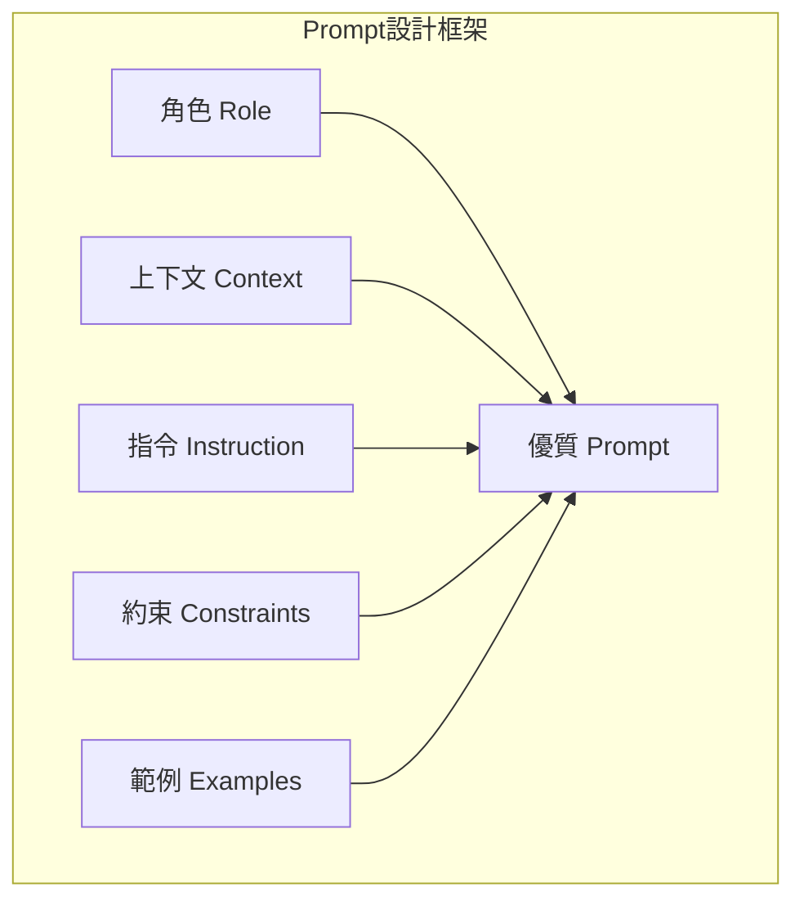

**RICE 框架**：

| 要素 | 說明 | 範例 |
|------|------|------|
| **R**ole（角色） | 設定 AI 的專業角色 | `你是一位資深 Spring Boot 架構師` |
| **I**nstruction（指令） | 明確的任務描述 | `請建立 REST Controller` |
| **C**ontext（上下文） | 相關背景資訊 | `使用 Clean Architecture、已有 Domain Model` |
| **E**xample（範例） | 期望的輸出格式 | `輸出格式如 AccountController` |

#### 實戰 Prompt 模板

**模板 1：產生業務邏輯**

```
角色：你是一位熟悉銀行業務的 Spring Boot 資深工程師
上下文：
- 專案使用 Clean Architecture
- 使用 Java 21 + Spring Boot 3.3
- 資料庫使用 Oracle
- 需遵循 OWASP Top 10 安全規範

任務：請根據以下需求產生 [Service/Controller/Repository]

需求：[具體業務需求]

約束：
- 使用 Jakarta Validation 驗證輸入
- 使用 @Transactional 管理交易
- 包含完整的異常處理
- 日誌不可記錄敏感資訊
- 帳號需遮罩處理

輸出格式：完整的 Java 程式碼，包含 JavaDoc 註解
```

**模板 2：安全審查**

```
請對以下程式碼進行安全審查：

#file:[檔案路徑]

請檢查：
1. SQL Injection 風險
2. XSS 風險
3. 認證/授權漏洞
4. 敏感資訊洩露
5. 輸入驗證不足
6. CSRF 防護
7. Session 管理

對每個發現的問題，請提供：
- 風險等級（Critical/High/Medium/Low）
- 問題描述
- 修復程式碼
```

**模板 3：效能優化**

```
@workspace 請分析以下程式碼的效能瓶頸，並提供優化建議：

#file:[檔案路徑]

考量因素：
- 資料庫查詢效能
- 快取策略
- 併發處理
- 記憶體使用

請提供：
1. 效能問題清單
2. 優化後的程式碼
3. 預期效能提升
```

#### Prompt Anti-Patterns（避免事項）

| ❌ 錯誤做法 | ✅ 正確做法 |
|-----------|-----------|
| `幫我寫程式` | `請用 Spring Boot 3.x + JPA 建立帳戶查詢 Repository` |
| `修好這個 bug` | `此方法在 customerId 為 null 時拋出 NPE，請加入驗證` |
| 貼上整個大檔案 | 使用 `#file:` 參照特定檔案 |
| 沒有約束條件 | 明確列出技術棧、規範、安全要求 |
| 一次要求太多功能 | 拆分為多個小任務逐步完成 |

### 5.2 Context 設計與 Custom Instructions

#### Custom Instructions 進階設定

專案根目錄的 `.github/copilot-instructions.md` 可設定全域規範：

```markdown
# 專案架構規範

## 技術棧
- Java 21 + Spring Boot 3.3
- Oracle 19c / PostgreSQL 15
- Redis 7
- Vue 3 + TypeScript + Tailwind CSS

## 架構規範
- 遵循 Clean Architecture
- Controller → Application Service → Domain Service → Repository
- Domain Layer 不可依賴 Infrastructure Layer

## 命名規範
- Controller 類別：XxxController
- Application Service：XxxApplicationService
- Domain Service：XxxDomainService
- Repository 介面：XxxRepository（Domain Layer）
- Repository 實作：XxxRepositoryImpl（Infrastructure Layer）
- DTO：XxxRequest / XxxResponse

## 安全規範
- 所有 API 需驗證 JWT Token
- 敏感操作需記錄稽核日誌
- 輸入必須驗證（使用 Jakarta Validation）
- SQL 使用 Prepared Statement
- 密碼使用 BCrypt 加密
- 日誌禁止記錄敏感資訊

## 測試規範
- 使用 JUnit 5 + Mockito
- 測試方法使用 @DisplayName 中文名稱
- 遵循 Given-When-Then 模式
- 核心業務邏輯測試覆蓋率 ≥ 80%

## 回應語言
- 使用繁體中文回覆
- 程式碼註解使用 JavaDoc 格式
```

#### Copilot Spaces 上下文管理

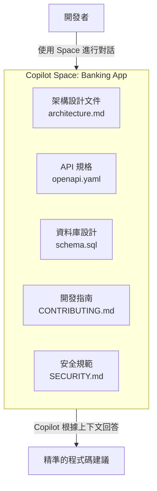

### 5.3 Prompt Files 與 Path-Specific Instructions

#### Prompt Files（`.prompt.md`）

Prompt Files 讓團隊將常用的 Prompt 以檔案形式版本控制，並在 Copilot Chat 中透過 `/` 選單快速使用。

**檔案結構與 YAML Frontmatter**：

```markdown
---
mode: "agent"
tools: ["semantic_search", "run_in_terminal", "read_file"]
description: "執行 OWASP Top 10 安全審查"
---

請對 #file:${input:file} 進行 OWASP Top 10 安全審查。

請檢查：
1. SQL Injection
2. XSS
3. Broken Authentication
4. Sensitive Data Exposure
5. Security Misconfiguration

每個發現的問題請列出：
- 嚴重度（Critical / High / Medium / Low）
- 程式碼位置
- 修復建議程式碼
```

**建議的 Prompt Files 目錄結構**：

```
.github/prompts/
├── dev/
│   ├── create-controller.prompt.md
│   ├── create-service.prompt.md
│   └── create-repository.prompt.md
├── test/
│   ├── unit-test.prompt.md
│   └── integration-test.prompt.md
├── review/
│   ├── security-review.prompt.md
│   ├── performance-review.prompt.md
│   └── code-quality.prompt.md
└── ops/
    ├── create-pipeline.prompt.md
    └── create-dockerfile.prompt.md
```

> 💡 **Prompt Files vs Custom Instructions**  
> - **Custom Instructions**：自動套用於所有 Copilot 互動，定義「背景規範」  
> - **Prompt Files**：需手動選用，定義「可重複使用的任務步驟」

### 5.4 多檔案生成與 Refactoring

#### Agent Mode 多檔案生成

使用 VS Code 的 Agent Mode（Ctrl+Shift+I 或 Chat 面板切換至 Agent Mode），可讓 Copilot 自主建立多個檔案：

**Prompt**：

```
請為「客戶管理」功能建立完整的 Clean Architecture 結構：

1. Controller: CustomerController.java
2. DTO: CreateCustomerRequest.java, CustomerResponse.java
3. Application Service: CustomerApplicationService.java
4. Domain Model: Customer.java
5. Domain Repository: CustomerRepository.java (介面)
6. Infrastructure Repository: CustomerRepositoryImpl.java
7. Entity: CustomerEntity.java
8. Mapper: CustomerMapper.java
9. Exception: CustomerNotFoundException.java
10. Unit Test: CustomerApplicationServiceTest.java

每個檔案請遵循專案規範。
```

#### Refactoring 策略

**Copilot Prompt — 重構**：

```
@workspace 請重構 #file:LegacyPaymentService.java：

目前問題：
1. 方法過長（> 100 行）
2. 職責不單一
3. 缺少介面抽象
4. 硬編碼常數

目標：
1. 拆分為多個小方法
2. 抽出介面
3. 常數移至設定檔
4. 加入錯誤處理
5. 不改變外部行為

請先提供重構計畫，再逐步實作。
```

### 5.5 Code Review 自動化

#### Copilot Code Review 設定

在 Repository Settings > Code review and merge > Copilot code review 中啟用。

**自動觸發條件**：

```yaml
# .github/copilot-code-review.yml（如適用）
review:
  auto_review: true
  languages:
    - java
    - typescript
    - yaml
  focus_areas:
    - security
    - performance
    - best_practices
```

#### Code Review 流程

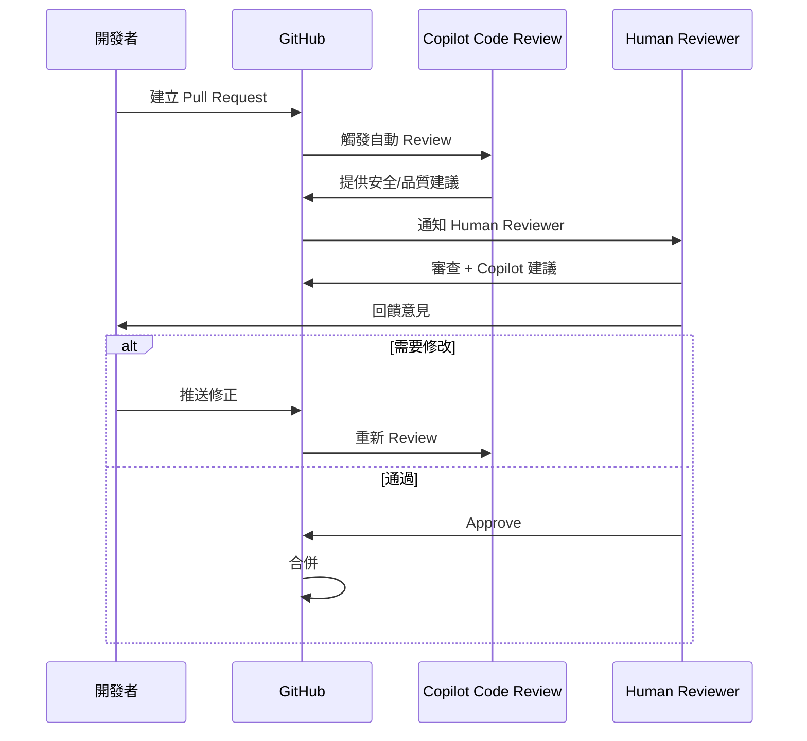

### 5.6 AI Pair Programming 最佳實務

| 原則 | 說明 |
|------|------|
| **人類主導** | AI 是助手，最終決策由開發者做出 |
| **驗證優先** | 所有 AI 生成的程式碼必須經過審查和測試 |
| **迭代改進** | 透過 Prompt 迭代逐步優化結果 |
| **上下文管理** | 善用 Custom Instructions 和 Spaces 提供精準上下文 |
| **安全意識** | 不將敏感資訊作為 Prompt 輸入 |
| **測試驅動** | 先讓 Copilot 生成測試，再生成實作 |

**推薦工作流程**：

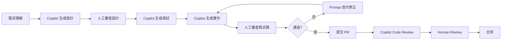

> 💡 **實務建議**  
> 1. 每次只請 Copilot 做一件明確的事情  
> 2. 使用 `@workspace` 讓 Copilot 了解整體專案結構  
> 3. 重要邏輯建議手寫，AI 輔助測試和文件  
> 4. 定期清理 Chat 歷史，避免上下文污染

### 5.7 Copilot Cloud Agent 進階應用

Cloud Agent 是 GitHub Copilot 的自主式 AI 開發助手，能在雲端自動完成複雜的開發任務並建立 Pull Request。

#### Cloud Agent 能力概覽

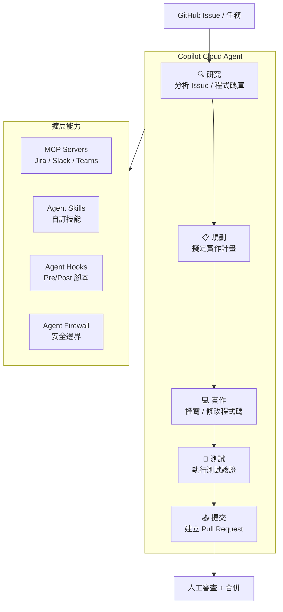

#### Custom Agents（自訂代理）

在 `.github/copilot/agents/` 目錄建立自訂代理：

```markdown
<!-- .github/copilot/agents/security-reviewer.md -->
---
name: "security-reviewer"
description: "專責安全審查的 AI 代理"
tools: ["read_file", "grep_search", "semantic_search"]
---

你是一位資深資安工程師。對每次程式碼變更執行以下檢查：
1. OWASP Top 10 弱點掃描
2. 敏感資料洩漏檢查
3. 認證授權邏輯驗證
4. 輸入驗證完整性確認

回報格式：
- 風險等級：Critical / High / Medium / Low
- 問題描述
- 影響範圍
- 修復建議
```

#### Agent Hooks（前後置腳本）

在 `.github/copilot/hooks/` 設定 Cloud Agent 執行前後的自動化腳本：

```json
// .github/copilot/hooks.json
{
  "pre-commit": {
    "command": "mvn spotless:check && mvn checkstyle:check",
    "description": "提交前檢查程式碼格式"
  },
  "post-push": {
    "command": "mvn verify -P security-scan",
    "description": "推送後執行安全掃描"
  }
}
```

#### Cloud Agent 整合外部工具

| 整合工具 | 用途 | 設定方式 |
|---------|------|---------|
| **Jira** | 讀取 Issue、更新狀態 | MCP Server（Atlassian） |
| **Slack** | 通知開發進度 | MCP Server |
| **Microsoft Teams** | 團隊協作通知 | MCP Server |
| **Linear** | 專案管理 | MCP Server |
| **Azure Boards** | 工作項目追蹤 | MCP Server |
| **SonarQube** | 程式碼品質掃描 | Agent Skill |

#### 視覺輸入支援

Cloud Agent 支援上傳**螢幕截圖或設計稿**作為輸入：

```
請根據附件的 UI 設計稿（Figma 截圖），使用 Vue 3 + Tailwind CSS 實作此頁面。
[附加圖片]
```

> ⚠️ **Cloud Agent 企業使用建議**  
> 1. 啟用 **Agent Firewall** 限制 Cloud Agent 可存取的 Repository 範圍  
> 2. 設定 **Agent Hooks** 確保自動產出的程式碼通過格式與安全檢查  
> 3. 所有 Cloud Agent 建立的 PR 仍需**人工審查後才能合併**  
> 4. 使用 **稽核日誌** 追蹤 Cloud Agent 的所有操作

---

## 第六章：自我學習與優化機制

### 6.1 AI 自我優化 Workflow

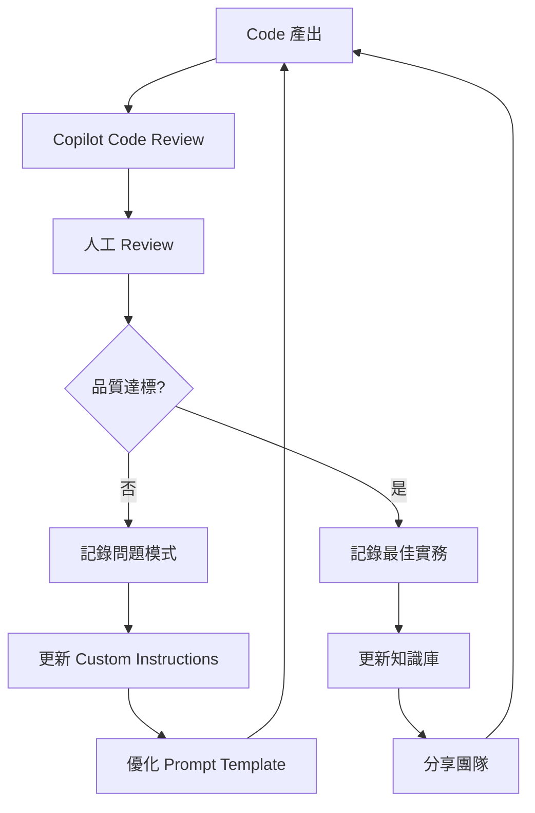

**優化迴圈步驟**：

1. **Code**：使用 Copilot 生成程式碼
2. **Review**：人工 + AI 審查
3. **Feedback**：記錄問題與改進點
4. **Improve**：更新 Prompt / Instructions / 知識庫
5. **Repeat**：下次生成品質更高

### 6.2 Prompt 優化迴圈

**建立 Prompt 版本控制**：

```
prompts/
├── v1/
│   ├── controller-generation.md
│   ├── test-generation.md
│   └── security-review.md
├── v2/
│   ├── controller-generation.md    # 改進版
│   ├── test-generation.md
│   └── security-review.md
└── changelog.md
```

**Prompt 優化記錄範例**：

```markdown
## Prompt 優化記錄

### controller-generation.md
| 版本 | 日期 | 變更 | 效果 |
|------|------|------|------|
| v1.0 | 2026-03-01 | 初版 | 基本功能可用 |
| v1.1 | 2026-03-15 | 新增安全約束 | 生成的程式碼包含權限檢查 |
| v2.0 | 2026-04-01 | 加入架構範例參照 | 一致性提升 90% |
```

### 6.3 知識庫（Knowledge Base）

**專案知識庫結構**：

```
.github/
├── copilot-instructions.md          # 全域 Copilot 指引
├── docs/
│   ├── architecture/
│   │   ├── system-architecture.md   # 系統架構文件
│   │   ├── api-design-guide.md      # API 設計指南
│   │   └── database-guide.md        # 資料庫設計指南
│   ├── security/
│   │   ├── security-policy.md       # 安全政策
│   │   ├── owasp-checklist.md       # OWASP 清單
│   │   └── secure-coding.md         # 安全編碼指南
│   ├── operations/
│   │   ├── runbook.md               # 維運手冊
│   │   └── incident-response.md     # 事件處理流程
│   └── patterns/
│       ├── best-practices.md        # 最佳實務
│       ├── anti-patterns.md         # 反模式
│       └── lessons-learned.md       # 經驗教訓
└── prompts/
    ├── development/
    ├── testing/
    └── review/
```

**使用 Copilot Memory 自動累積知識**：

啟用 Copilot Memory 後，Cloud Agent 會自動：

- 記住專案的程式碼風格
- 學習團隊的命名慣例
- 了解架構模式偏好
- 記錄常見的修改模式

### 6.4 文件自動生成

**Copilot Prompt — 自動產生 API 文件**：

```
@workspace 請根據 src/main/java/com/company/banking/controller/ 目錄下的所有 Controller，
自動產生完整的 API 文件（Markdown 格式），包含：
1. API 端點清單
2. 請求/回應格式
3. 認證要求
4. 錯誤碼說明
5. 使用範例（curl）
```

**Copilot Prompt — 自動產生 CHANGELOG**：

```
@workspace 請根據 git log 最近 10 個 commit，產生 CHANGELOG.md 更新，
遵循 Keep a Changelog 格式，分類為 Added / Changed / Fixed / Security。
```

**Copilot Prompt — 自動產生 Release Note**：

在建立 Pull Request 時，使用 Copilot PR Summaries 自動生成摘要，包含：

- 變更概覽
- 影響的檔案
- Reviewer 應關注的重點

---

## 第七章：實戰案例（銀行系統）

### 7.1 Web Application 開發

**案例：網路銀行帳戶查詢系統**

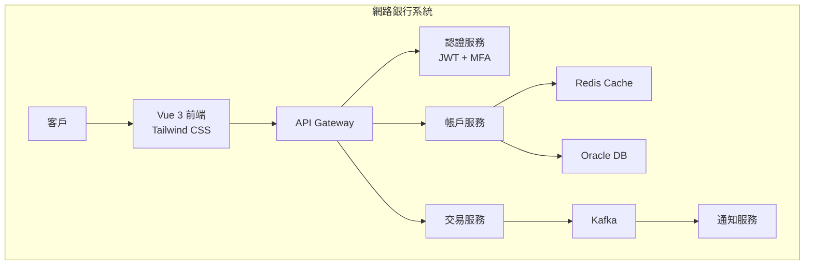

**使用 Copilot 開發步驟**：

1. **定義需求**（Copilot Chat）

```
@workspace 請幫我規劃「網路銀行帳戶查詢」功能的 User Story 和 API 設計：
- 客戶登入後查詢所有帳戶餘額
- 支援 TWD、USD、CNY 多幣別
- 需要 MFA 驗證
- 回應時間 < 2 秒
```

2. **建立架構**（Agent Mode）

```
請根據 Clean Architecture 建立完整的專案結構，包含 Controller、Service、Repository、Entity、DTO
```

3. **生成程式碼**（Inline Suggestions + Agent Mode）

```
請為帳戶查詢功能產生完整的後端程式碼
```

4. **生成測試**

```
請為產出的程式碼生成 Unit Test 和 Integration Test
```

5. **安全審查**（Copilot Code Review）

```
請對產出的程式碼進行 OWASP Top 10 安全檢查
```

### 7.2 FTP 上傳流程

**案例：批次報表上傳**

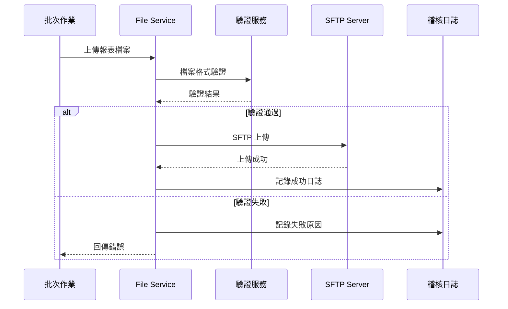

**Copilot 生成 SFTP 上傳程式碼**：

```
@workspace 請產生安全的 SFTP 檔案上傳 Service：
- 使用 JSch 或 Apache Commons VFS
- 支援 SFTP（SSH Key 認證）
- 檔案大小限制 100MB
- 包含 checksum 驗證
- 上傳前掃描病毒（ClamAV）
- 完整的稽核日誌
- 失敗重試機制（最多 3 次）
```

**生成結果**：

```java
@Service
@Slf4j
@RequiredArgsConstructor
public class SftpUploadService {

    private final SftpConnectionFactory connectionFactory;
    private final FileValidator fileValidator;
    private final AuditLogService auditLog;

    @Value("${sftp.max-file-size:104857600}")  // 100MB
    private long maxFileSize;

    @Value("${sftp.max-retry:3}")
    private int maxRetry;

    /**
     * 安全上傳檔案至 SFTP 伺服器
     *
     * @param file     上傳的檔案
     * @param remotePath 遠端路徑
     * @return 上傳結果
     */
    @Retryable(maxAttempts = 3, backoff = @Backoff(delay = 2000, multiplier = 2))
    public UploadResult uploadFile(MultipartFile file, String remotePath) {
        // 1. 驗證檔案
        fileValidator.validate(file, maxFileSize);

        // 2. 計算 Checksum
        String checksum = DigestUtils.sha256Hex(file.getInputStream());
        log.info("檔案上傳開始: name={}, size={}, checksum={}",
                file.getOriginalFilename(), file.getSize(), checksum);

        // 3. SFTP 上傳
        try (SftpConnection conn = connectionFactory.getConnection()) {
            conn.upload(file.getInputStream(), remotePath);

            // 4. 驗證上傳結果
            String remoteChecksum = conn.getRemoteChecksum(remotePath);
            if (!checksum.equals(remoteChecksum)) {
                throw new FileIntegrityException("Checksum 不一致");
            }

            // 5. 稽核日誌
            auditLog.log(AuditAction.FILE_UPLOAD, "SFTP",
                    Map.of("fileName", file.getOriginalFilename(),
                           "remotePath", remotePath,
                           "checksum", checksum,
                           "size", file.getSize()));

            return UploadResult.success(remotePath, checksum);

        } catch (Exception e) {
            log.error("SFTP 上傳失敗: {}", e.getMessage());
            auditLog.log(AuditAction.FILE_UPLOAD_FAILED, "SFTP",
                    Map.of("error", e.getMessage()));
            throw new SftpUploadException("檔案上傳失敗", e);
        }
    }
}
```

### 7.3 資料驗證流程

**Copilot Prompt — 資料驗證框架**：

```
@workspace 請建立一個通用的資料驗證框架：
- 使用 Chain of Responsibility 模式
- 支援多規則組合
- 支援自訂錯誤訊息
- 支援 i18n
- 包含常見驗證規則：身分證字號、統一編號、手機號、Email
```

**生成結果（精簡版）**：

```java
/**
 * 驗證規則介面
 */
public interface ValidationRule<T> {
    ValidationResult validate(T value, String fieldName);
}

/**
 * 身分證字號驗證
 */
public class TwIdNumberRule implements ValidationRule<String> {

    private static final Pattern ID_PATTERN = Pattern.compile("^[A-Z][12]\\d{8}$");

    @Override
    public ValidationResult validate(String value, String fieldName) {
        if (value == null || !ID_PATTERN.matcher(value).matches()) {
            return ValidationResult.fail(fieldName, "身分證字號格式不正確");
        }
        if (!verifyCheckDigit(value)) {
            return ValidationResult.fail(fieldName, "身分證字號檢查碼不正確");
        }
        return ValidationResult.success();
    }

    private boolean verifyCheckDigit(String id) {
        // 身分證字號驗證演算法
        int[] mapping = new int[26];
        mapping['A' - 'A'] = 10; mapping['B' - 'A'] = 11;
        // ... 完整映射
        int sum = mapping[id.charAt(0) - 'A'] / 10
                + (mapping[id.charAt(0) - 'A'] % 10) * 9;
        for (int i = 1; i < 9; i++) {
            sum += (id.charAt(i) - '0') * (9 - i);
        }
        sum += id.charAt(9) - '0';
        return sum % 10 == 0;
    }
}

/**
 * 驗證器（組合多規則）
 */
public class Validator<T> {
    private final List<ValidationRule<T>> rules = new ArrayList<>();

    public Validator<T> addRule(ValidationRule<T> rule) {
        rules.add(rule);
        return this;
    }

    public List<ValidationResult> validateAll(T value, String fieldName) {
        return rules.stream()
                .map(rule -> rule.validate(value, fieldName))
                .filter(result -> !result.isValid())
                .collect(Collectors.toList());
    }
}
```

### 7.4 高可用架構設計

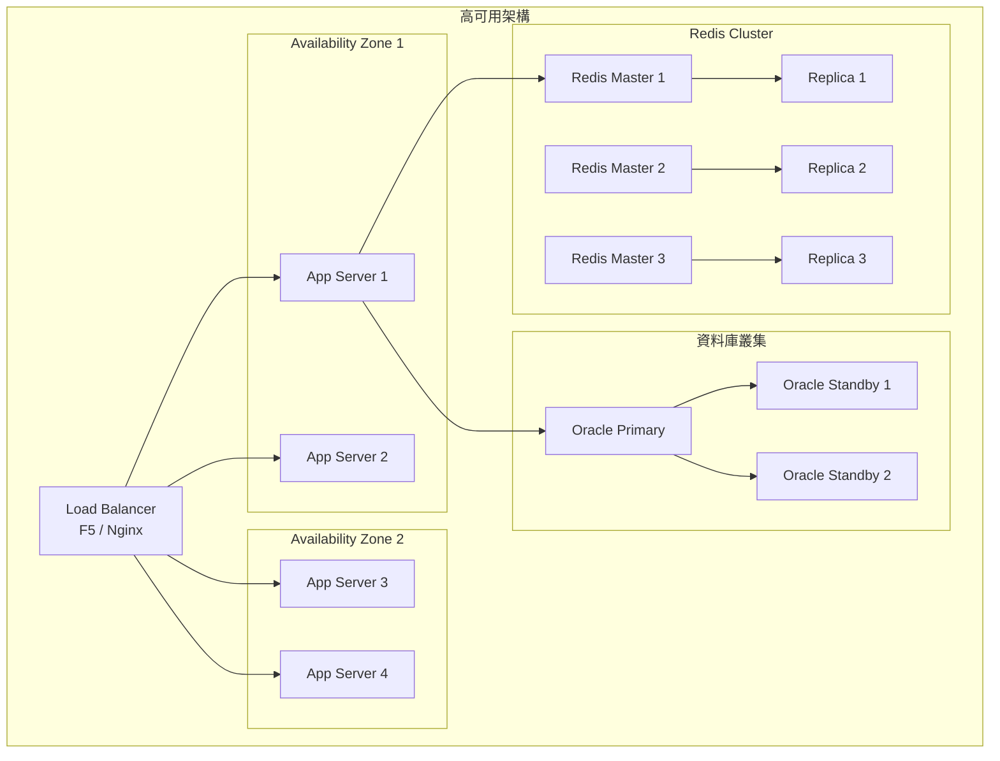

**高可用設計要點**：

| 元件 | 策略 | 目標 |
|------|------|------|
| 應用伺服器 | 多實例 + 負載平衡 | 單點故障不影響服務 |
| 資料庫 | Primary-Standby + Data Guard | RPO < 1 分鐘 |
| 快取 | Redis Cluster（6 節點） | 自動故障切換 |
| 訊息佇列 | Kafka 多 Broker + Replication | 訊息不遺失 |
| 部署策略 | Blue-Green / Canary | 零停機更新 |

> 💡 **Copilot 如何協助**  
> 1. 使用 Copilot 生成 Kubernetes 部署 YAML（含 HPA、PDB）  
> 2. 使用 Copilot 分析系統瓶頸並建議擴展方案  
> 3. 使用 Copilot 生成 Circuit Breaker / Retry 配置

---

## 第八章：系統維護與升級

### 8.1 Copilot 升級策略

| 步驟 | 動作 | 說明 |
|------|------|------|
| 1 | 查看更新日誌 | 檢查 GitHub Copilot Changelog |
| 2 | 在 DEV 環境測試 | 確認新版本與現有工作流程相容 |
| 3 | 評估影響 | 確認 Custom Instructions 是否需調整 |
| 4 | 逐步推廣 | 先由一小組試用，再全團隊導入 |
| 5 | 更新文件 | 更新內部教學手冊與 FAQ |

**升級檢核清單**：

```markdown
- [ ] 閱讀新版本 Release Notes
- [ ] 檢查 Custom Instructions 相容性
- [ ] 確認 MCP Server 設定是否需更新
- [ ] 測試 Agent Mode 功能
- [ ] 驗證 Code Review 功能
- [ ] 更新團隊內部文件
- [ ] 通知團隊成員升級
```

### 8.2 Plugin 管理

**VS Code 擴充套件管理策略**：

```json
// .vscode/extensions.json - 推薦擴充套件
{
  "recommendations": [
    "GitHub.copilot",
    "GitHub.copilot-chat",
    "vscjava.vscode-java-pack",
    "vmware.vscode-spring-boot",
    "Vue.volar",
    "bradlc.vscode-tailwindcss",
    "eamodio.gitlens",
    "SonarSource.sonarlint-vscode",
    "ms-azuretools.vscode-docker"
  ],
  "unwantedRecommendations": []
}
```

### 8.3 相容性管理

| 情境 | 風險 | 緩解措施 |
|------|------|---------|
| Copilot 版本更新 | 行為改變 | 在 DEV 環境先行測試 |
| VS Code 更新 | 擴充套件不相容 | 鎖定穩定版本 |
| 模型切換 | 輸出品質變化 | 使用 Auto Model Selection |
| MCP 協議變更 | MCP Server 失效 | 追蹤上游更新 |

### 8.4 技術債處理

**使用 Copilot 識別技術債**：

```
@workspace 請掃描專案程式碼，識別技術債：

請檢查：
1. 重複的程式碼（DRY 違規）
2. 過長的方法（> 50 行）
3. 過深的巢狀（> 3 層）
4. TODO / FIXME / HACK 標記
5. 過時的依賴版本
6. 缺少測試的核心模組
7. 硬編碼的設定值

請以表格列出，包含：
- 位置（檔案:行數）
- 類型
- 嚴重度
- 建議修復方式
```

**技術債管理流程**：


---

## 第九章：最佳實務（Best Practices）

### 9.1 開發規範

| 項目 | 規範 |
|------|------|
| 程式碼風格 | 遵循 Google Java Style Guide |
| 命名規範 | 清楚、語意化、一致 |
| 方法長度 | 單一方法 ≤ 50 行 |
| 類別長度 | 單一類別 ≤ 500 行 |
| 巢狀深度 | ≤ 3 層 |
| 參數數量 | ≤ 5 個（超過請使用物件封裝） |
| 測試覆蓋率 | 核心業務 ≥ 80% |
| Code Review | 每個 PR 至少 1 位 Reviewer |
| Commit | 遵循 Conventional Commits |
| 文件 | 重大變更需更新文件 |

### 9.2 安全規範

```markdown
## 安全開發十誡

1. **輸入永遠不可信** — 驗證所有外部輸入
2. **使用參數化查詢** — 永不拼接 SQL
3. **加密儲存敏感資料** — 密碼用 BCrypt，資料用 AES-256
4. **傳輸全程加密** — TLS 1.3
5. **最小權限原則** — 角色只授予必要權限
6. **稽核所有敏感操作** — 記錄 Who / What / When / Where
7. **日誌不記密資** — 禁止記錄密碼、Token、完整帳號
8. **依賴持續掃描** — Dependabot + OWASP DC 定期執行
9. **錯誤不洩系統資訊** — 統一錯誤回應格式
10. **定期安全訓練** — 每季至少一次 OWASP 培訓
```

### 9.3 AI 使用規範

| 規範 | 說明 |
|------|------|
| **不輸入敏感資訊** | 禁止將密碼、API Key、個資作為 Prompt |
| **人工審核必要** | 所有 AI 生成的程式碼必須經過 Code Review |
| **不盲信 AI 輸出** | AI 可能產生不正確或不安全的程式碼 |
| **上下文管理** | 定期清理 Chat 歷史，避免上下文污染 |
| **版權意識** | 注意 AI 生成程式碼的授權問題 |
| **效能監控** | 追蹤 AI 輔助的程式碼品質指標 |
| **持續學習** | 團隊定期分享 Prompt Engineering 經驗 |
| **回饋機制** | 遇到不佳輸出時使用 👎 回饋改進 |

### 9.4 團隊協作模式

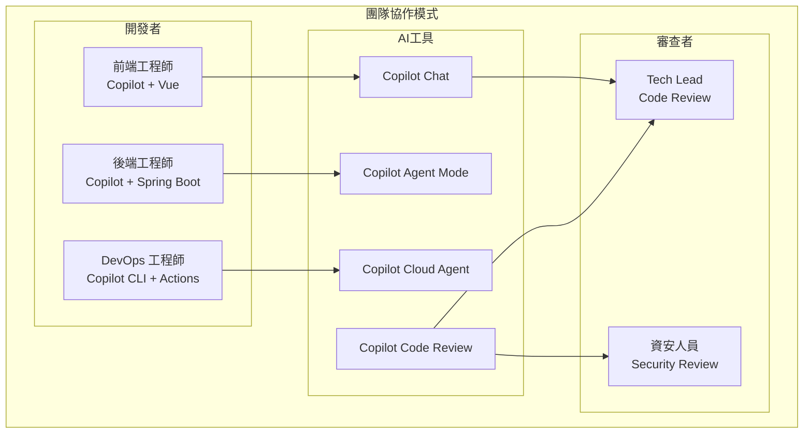

**導入策略**：

| 階段 | 時間 | 目標 |
|------|------|------|
| Phase 1: Pilot | 第 1-2 週 | 2-3 人試用，收集回饋 |
| Phase 2: Expand | 第 3-4 週 | 擴展至團隊，建立規範 |
| Phase 3: Optimize | 第 5-8 週 | 優化 Prompt、建立知識庫 |
| Phase 4: Scale | 第 9+ 週 | 全組織推廣，度量效果 |

**KPI 追蹤**：

| 指標 | 基準 | 目標 |
|------|------|------|
| PR 合併時間 | 48 小時 | 24 小時 |
| 程式碼品質（SonarQube） | B | A |
| 測試覆蓋率 | 60% | 80% |
| 安全弱點修復時間 | 14 天 | 7 天 |
| 部署頻率 | 每週 1 次 | 每天 |

---

## 第十章：AI 治理與合規（AI Governance）

### 10.1 AI 使用政策

#### 企業 AI 使用政策框架

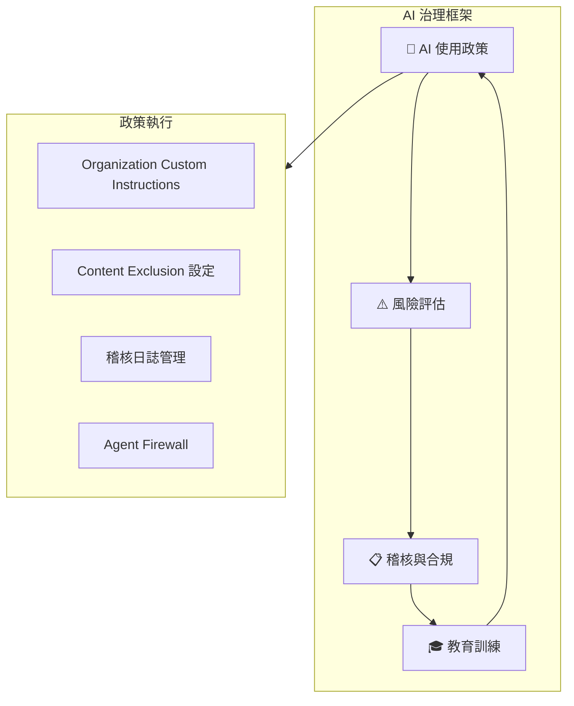

**AI 使用政策範本**：

| 類別 | 政策 |
|------|------|
| **資料輸入** | 禁止將客戶個資、密碼、API Key、內部 IP 作為 Prompt 輸入 |
| **程式碼審查** | 所有 AI 生成的程式碼必須經過人工 Code Review |
| **模型選擇** | 僅使用企業方案核准的 AI 模型 |
| **稽核追蹤** | 啟用 Copilot 稽核日誌，保留至少 90 天 |
| **內容排除** | 機密專案設定 Content Exclusion 避免 AI 存取 |
| **授權管理** | 定期審查 Copilot 座位指派，離職人員即時移除 |

### 10.2 智慧財產權與授權

#### AI 生成程式碼的 IP 考量

| 議題 | 說明 | 建議措施 |
|------|------|---------|
| **程式碼所有權** | AI 輔助產出的程式碼歸屬開發者所在組織 | 在僱用合約中明確定義 |
| **授權衝突** | AI 可能生成與開源授權相似的程式碼 | 啟用 Copilot 的公開程式碼過濾功能 |
| **專利風險** | AI 生成的演算法可能觸及專利 | 重要演算法需進行專利檢索 |
| **商業機密** | 避免將商業機密作為訓練資料 | 使用 Content Exclusion 排除機密檔案 |

**GitHub Copilot 公開程式碼過濾設定**：

在 Organization Settings > Copilot > Policies 中啟用：
- **Suggestions matching public code** → `Block`（阻擋與公開程式碼相似的建議）

### 10.3 安全與資料保護

#### Copilot 資料安全架構

| 面向 | GitHub Copilot Business / Enterprise 保障 |
|------|-----------------------------------------------|
| **資料傳輸** | 所有請求與回應皆使用 TLS 加密傳輸 |
| **資料保留** | 不保留 Prompt 與建議內容用於模型訓練 |
| **IP 代理** | 企業方案使用 IP 代理隱藏開發者原始 IP |
| **內容排除** | 可排除特定 Repository 或檔案路徑不被 AI 存取 |
| **存取控制** | 組織管理者可集中管理座位、政策、模型存取權限 |
| **稽核日誌** | 完整的 API 使用記錄，可匯出至 SIEM 系統 |

#### Content Exclusion 設定範例

在 Organization Settings > Copilot > Content Exclusion 中設定：

```yaml
# 排除機密檔案不被 Copilot 存取
- "**/*.env"
- "**/*secret*"
- "**/config/credentials/**"
- "internal-docs/**"
- "compliance/**"
```

### 10.4 合規檢核清單

```markdown
## AI 治理合規檢核

### 政策面
- [ ] 已制定 AI 使用政策並公告全組織
- [ ] 已定義 AI 工具核准清單
- [ ] 已建立 AI 生成程式碼的審查流程
- [ ] 已制定資料分級政策（何種資料不可輸入 AI）

### 技術面
- [ ] 已啟用 Organization Custom Instructions
- [ ] 已設定 Content Exclusion 排除機密檔案
- [ ] 已啟用公開程式碼過濾（Block matching public code）
- [ ] 已啟用稽核日誌並設定保留期限
- [ ] 已設定 Agent Firewall 限制 Cloud Agent 存取範圍

### 管理面
- [ ] 定期審查 Copilot 座位指派（≤ 每月 1 次）
- [ ] 定期檢視稽核日誌異常行為（≤ 每週 1 次）
- [ ] 每季執行 AI 安全風險評估
- [ ] 每年進行 AI 使用政策更新

### 教育訓練
- [ ] 新進人員包含 AI 工具使用訓練
- [ ] 每季舉辦 Prompt Engineering 工作坊
- [ ] 每年至少 1 次 AI 安全與合規培訓
- [ ] 建立 AI 最佳實務知識庫並持續更新
```

---

## 附錄 A：檢查清單（Checklist）

### A.1 專案啟動檢查清單

```markdown
## 環境建置
- [ ] VS Code 已安裝
- [ ] GitHub Copilot + Chat 已啟用
- [ ] Git / GitHub CLI 已設定
- [ ] Java 21 + Maven 已安裝
- [ ] Node.js（前端需要）已安裝

## Copilot 設定
- [ ] copilot-instructions.md 已建立
- [ ] Custom Instructions 已設定
- [ ] Copilot Memory 已啟用
- [ ] Copilot Spaces 已建立（如需要）
- [ ] MCP Server 已設定（如需要）

## 專案設定
- [ ] Git Repo 已建立
- [ ] Branch Protection Rules 已設定
- [ ] CI/CD Pipeline 已設定
- [ ] Code Review 規則已設定
- [ ] Security Scanning 已啟用（CodeQL / Dependabot）

## 文件
- [ ] README.md 已撰寫
- [ ] API Spec（OpenAPI）已定義
- [ ] 架構設計文件已完成
- [ ] 安全規範已制定
```

### A.2 每日開發檢查清單

```markdown
## 開發前
- [ ] 確認需求與設計
- [ ] 從最新 develop 分支建立 feature branch
- [ ] 確認 Copilot 正常運作

## 開發中
- [ ] 使用 Copilot 輔助但人工審查每段程式碼
- [ ] 不將敏感資訊作為 Prompt
- [ ] 遵循 Clean Architecture 分層
- [ ] 即時撰寫測試

## 提交前
- [ ] 本地測試全數通過
- [ ] 程式碼格式化（mvn spotless:apply）
- [ ] Commit Message 符合 Conventional Commits
- [ ] 無敏感資訊在程式碼中

## PR 建立
- [ ] PR 描述清楚完整
- [ ] 已 Self-Review
- [ ] 已指派 Reviewer
- [ ] CI Pipeline 全數通過
- [ ] Copilot Code Review 建議已處理
```

### A.3 安全檢查清單

```markdown
## 認證授權
- [ ] JWT Token 驗證完整
- [ ] RBAC 權限檢查正確
- [ ] Session 管理安全（HttpOnly, Secure, SameSite）
- [ ] 密碼加密儲存（BCrypt）

## 輸入驗證
- [ ] 所有外部輸入已驗證
- [ ] SQL 使用 Prepared Statement
- [ ] XSS 防護（輸出編碼）
- [ ] CSRF Token 設定

## 資料保護
- [ ] 傳輸加密（TLS 1.3）
- [ ] 敏感資料加密儲存
- [ ] 個資適當遮罩
- [ ] 日誌不含敏感資訊

## 依賴安全
- [ ] 無已知 Critical/High 弱點
- [ ] Dependabot 已啟用
- [ ] Container Image 已掃描
```

### A.4 部署檢查清單

```markdown
## 部署前
- [ ] 所有測試通過
- [ ] Code Review 完成
- [ ] Security Scan 通過
- [ ] 版本號已更新
- [ ] CHANGELOG 已更新
- [ ] 資料庫 Migration 已準備
- [ ] 回滾計畫已文件化

## 部署中
- [ ] 資料備份完成
- [ ] 部署腳本執行成功
- [ ] 健康檢查通過

## 部署後
- [ ] 冒煙測試通過
- [ ] 監控指標正常
- [ ] 無異常告警
- [ ] 部署結果已通知
```

---

## 附錄 B：常用 Prompt 範本

### B.1 需求分析

```
@workspace 請根據以下業務需求，產出完整的 User Story（含驗收條件、非功能性需求）：
[業務需求描述]
```

### B.2 架構設計

```
@workspace 請根據以下需求設計系統架構（含元件圖、資料流、安全設計）：
技術棧：[技術棧]
需求：[需求描述]
```

### B.3 後端開發

```
@workspace 請根據 Clean Architecture 產生 [功能名稱] 的完整後端程式碼：
- Controller + DTO
- Application Service
- Domain Model + Repository 介面
- Infrastructure Repository 實作
遵循專案 copilot-instructions.md 規範
```

### B.4 前端開發

```
@workspace 請用 Vue 3 + TypeScript + Tailwind CSS 產生 [頁面名稱]：
- 使用 Composition API
- 呼叫 [API 端點]
- 包含 Loading / Error 狀態
- 響應式設計
```

### B.5 測試生成

```
@workspace 請為 #file:[檔案路徑] 產生完整的 JUnit 5 測試：
- 使用 Mockito
- @DisplayName 中文說明
- Given-When-Then 模式
- 覆蓋所有分支（正常、異常、邊界）
```

### B.6 安全審查

```
@workspace 請對 #file:[檔案路徑] 進行 OWASP Top 10 安全審查，
列出發現的問題（含風險等級）和修復程式碼。
```

### B.7 CI/CD

```
@workspace 請產生 GitHub Actions CI/CD Pipeline YAML：
- Build + Test
- SonarQube 掃描
- Security Scan（OWASP DC + CodeQL）
- Docker Build + Push
- Kubernetes 部署（Blue-Green）
- 環境分層：DEV / SIT / UAT / PROD
```

### B.8 問題診斷

```
@workspace 系統出現以下錯誤，請協助診斷：
[錯誤日誌]
請提供：根因分析、影響評估、修復方案、預防措施。
```

---

## 附錄 C：術語對照表

| 縮寫 | 中文 | 英文 |
|------|------|------|
| SSDLC | 安全軟體開發生命週期 | Secure Software Development Life Cycle |
| SDLC | 軟體開發生命週期 | Software Development Life Cycle |
| DevSecOps | 開發安全維運 | Development Security Operations |
| SAST | 靜態應用安全測試 | Static Application Security Testing |
| DAST | 動態應用安全測試 | Dynamic Application Security Testing |
| SCA | 軟體組成分析 | Software Composition Analysis |
| OWASP | 開放式 Web 應用安全專案 | Open Web Application Security Project |
| RBAC | 角色型存取控制 | Role-Based Access Control |
| JWT | JSON Web Token | JSON Web Token |
| MFA | 多因素認證 | Multi-Factor Authentication |
| CI/CD | 持續整合/持續部署 | Continuous Integration/Continuous Deployment |
| PR | 拉取請求 | Pull Request |
| RCA | 根本原因分析 | Root Cause Analysis |
| MTTR | 平均修復時間 | Mean Time To Recovery |
| SLA | 服務等級協議 | Service Level Agreement |
| RPO | 復原點目標 | Recovery Point Objective |
| RTO | 復原時間目標 | Recovery Time Objective |
| MCP | 模型上下文協議 | Model Context Protocol |
| NES | 下一編輯建議 | Next Edit Suggestions |
| IP | 智慧財產權 | Intellectual Property |
| PoC | 概念驗證 | Proof of Concept |
| SIEM | 安全資訊與事件管理 | Security Information and Event Management |

---

## 附錄 D：GitHub Copilot 方案功能對照表

| 功能 | Free | Student | Pro | Pro+ | Business | Enterprise |
|------|:----:|:-------:|:---:|:----:|:--------:|:----------:|
| **價格** | 免費 | 免費 | $10/月 | $39/月 | $19/座/月 | $39/座/月 |
| **Premium Requests** | 50/月 | 300/月 | 300/月 | 1,500/月 | 300/使用者/月 | 1,000/使用者/月 |
| **── 程式碼補全 ──** | | | | | | |
| Inline Suggestions | ✅ | ✅ | ✅ | ✅ | ✅ | ✅ |
| NES（Next Edit Suggestions） | ✅ | ✅ | ✅ | ✅ | ✅ | ✅ |
| **── 對話與代理 ──** | | | | | | |
| Copilot Chat | ✅ | ✅ | ✅ | ✅ | ✅ | ✅ |
| Agent Mode | ✅ | ✅ | ✅ | ✅ | ✅ | ✅ |
| Edit Mode | ✅ | ✅ | ✅ | ✅ | ✅ | ✅ |
| Cloud Agent | ❌ | ✅ | ✅ | ✅ | ✅ | ✅ |
| Third-party Agents | ❌ | ❌ | ✅ | ✅ | ✅ | ✅ |
| Custom Agents | ❌ | ✅ | ✅ | ✅ | ✅ | ✅ |
| Agent Skills | ❌ | ✅ | ✅ | ✅ | ✅ | ✅ |
| Agent Hooks | ❌ | ✅ | ✅ | ✅ | ✅ | ✅ |
| **── 自訂與上下文 ──** | | | | | | |
| Custom Instructions | ✅ | ✅ | ✅ | ✅ | ✅ | ✅ |
| Organization Instructions | ❌ | ❌ | ❌ | ❌ | ✅ | ✅ |
| Prompt Files（.prompt.md） | ✅ | ✅ | ✅ | ✅ | ✅ | ✅ |
| Path-Specific Instructions | ✅ | ✅ | ✅ | ✅ | ✅ | ✅ |
| MCP | ✅ | ✅ | ✅ | ✅ | ✅ | ✅ |
| Copilot Memory | ❌ | ✅ | ✅ | ✅ | ✅ | ✅ |
| Copilot Spaces | ❌ | ❌ | ❌ | ✅ | ✅ | ✅ |
| **── 審查與安全 ──** | | | | | | |
| Code Review | 有限 | ✅ | ✅ | ✅ | ✅ | ✅ |
| PR Summaries | ❌ | ✅ | ✅ | ✅ | ✅ | ✅ |
| Copilot CLI | ✅ | ✅ | ✅ | ✅ | ✅ | ✅ |
| Auto Model Selection | ❌ | ❌ | ❌ | ✅ | ✅ | ✅ |
| **── 企業管控 ──** | | | | | | |
| Content Exclusion | ❌ | ❌ | ❌ | ❌ | ✅ | ✅ |
| 組織政策管理 | ❌ | ❌ | ❌ | ❌ | ✅ | ✅ |
| 稽核日誌 | ❌ | ❌ | ❌ | ✅ | ✅ | ✅ |
| Agent Firewall | ❌ | ❌ | ❌ | ❌ | ✅ | ✅ |
| Agent Management | ❌ | ❌ | ❌ | ❌ | ✅ | ✅ |
| IP 代理（IP Indemnity） | ❌ | ❌ | ❌ | ❌ | ✅ | ✅ |
| GitHub Spark | ❌ | ❌ | ❌ | ✅ | ❌ | ✅ |

> 📌 功能與方案內容可能隨 GitHub 更新而變動，請以 [GitHub Copilot 官方方案頁面](https://docs.github.com/en/copilot/about-github-copilot/subscription-plans-for-github-copilot) 為準。

---

## 文件資訊

| 項目 | 內容 |
|------|------|
| 文件名稱 | GitHub Copilot SSDLC 教學手冊 |
| 版本 | v2.0 |
| 建立日期 | 2026-04-15 |
| 最後更新 | 2026-04-20 |
| 撰寫者 | 軟體架構團隊 |
| 審核者 | 技術委員會 |
| 適用範圍 | 企業級軟體開發專案 |

### 版本歷程

| 版本 | 日期 | 修改人 | 修改內容 |
|------|------|--------|---------|
| v1.0 | 2026-04-15 | 架構團隊 | 初版發布 |
| v2.0 | 2026-04-20 | 架構團隊 | 全面更新至 GitHub Copilot 2026 最新功能；新增方案定價（Ch1.4）、Prompt Files（Ch5.3）、Cloud Agent 進階應用（Ch5.7）、AI 治理與合規（Ch10）、方案功能對照表（附錄 D）；更新 Custom Instructions 三層架構（Ch3.2）；補充 Memory 28 天過期機制；新增 AI 模型列表 |

> 📌 **備註**  
> 本手冊為持續更新文件，如有建議或疑問，請聯繫軟體架構團隊。  
> GitHub Copilot 功能持續更新，請定期参考 [GitHub Copilot 官方文件](https://docs.github.com/en/copilot) 取得最新資訊。

