+++
date = '2026-04-02T17:22:50+08:00'
draft = false
title = 'GitHub Copilot 逆向工程教學手冊'
tags = ['教學', 'AI開發','指引']
categories = ['教學']
+++

# GitHub Copilot 逆向工程教學手冊（Java Web）

> **版本**：2.0  
> **最後更新**：2026-04-02  
> **適用對象**：資深工程師、架構師、技術主管  
> **技術棧**：Java 21+ / Spring Boot 3.x～4.x / GitHub Copilot（Chat / Agent Mode / Cloud Agent / CLI / MCP）  

---

## 📑 目錄

- [第 1 章 概論](#第-1-章-概論)
  - [1.1 什麼是逆向工程（Reverse Engineering）](#11-什麼是逆向工程reverse-engineering)
  - [1.2 Legacy System 現代化挑戰](#12-legacy-system-現代化挑戰)
  - [1.3 GitHub Copilot 在逆向工程的角色](#13-github-copilot-在逆向工程的角色)
  - [1.4 適用情境](#14-適用情境)
- [第 2 章 三種逆向工程策略](#第-2-章-三種逆向工程策略)
  - [2.1 黑箱逆向（Black-box Reverse Engineering）](#21-黑箱逆向black-box-reverse-engineering)
  - [2.2 白箱逆向（White-box Reverse Engineering）](#22-白箱逆向white-box-reverse-engineering)
  - [2.3 灰箱逆向（Gray-box / Hybrid）](#23-灰箱逆向gray-box--hybrid)
  - [2.4 三種策略比較總覽](#24-三種策略比較總覽)
- [第 3 章 SDLC 對應逆向工程流程](#第-3-章-sdlc-對應逆向工程流程)
  - [3.1 需求分析（Requirement Analysis）](#31-需求分析requirement-analysis)
  - [3.2 系統設計（System Design）](#32-系統設計system-design)
  - [3.3 開發（Implementation）](#33-開發implementation)
  - [3.4 測試（Testing）](#34-測試testing)
  - [3.5 部署（Deployment）](#35-部署deployment)
- [第 4 章 GitHub Copilot 實戰流程](#第-4-章-github-copilot-實戰流程)
  - [4.1 Step 1：分析舊系統](#41-step-1分析舊系統)
  - [4.2 Step 2：建立理解模型（Domain Model）](#42-step-2建立理解模型domain-model)
  - [4.3 Step 3：產出文件（AI 自動生成）](#43-step-3產出文件ai-自動生成)
  - [4.4 Step 4：建立新專案（Spring Boot）](#44-step-4建立新專案spring-boot)
  - [4.5 Step 5：逐步重構](#45-step-5逐步重構)
  - [4.6 Step 6：驗證與測試](#46-step-6驗證與測試)
  - [4.7 Agent Mode 加速逆向工程](#47-agent-mode-加速逆向工程)
- [第 5 章 Copilot Prompt Engineering](#第-5-章-copilot-prompt-engineering)
  - [5.1 Prompt 設計原則](#51-prompt-設計原則)
  - [5.2 程式碼分析類 Prompt](#52-程式碼分析類-prompt)
  - [5.3 語言轉換類 Prompt](#53-語言轉換類-prompt)
  - [5.4 文件產出類 Prompt](#54-文件產出類-prompt)
  - [5.5 測試生成類 Prompt](#55-測試生成類-prompt)
  - [5.6 Prompt 模板庫](#56-prompt-模板庫)
  - [5.7 Custom Instructions（專案級指令）](#57-custom-instructions專案級指令)
  - [5.8 Agent Mode 專用 Prompt 設計](#58-agent-mode-專用-prompt-設計)
- [第 6 章 架構設計（企業級）](#第-6-章-架構設計企業級)
  - [6.1 微服務 vs 單體架構決策](#61-微服務-vs-單體架構決策)
  - [6.2 分層架構設計](#62-分層架構設計)
  - [6.3 資料庫遷移設計](#63-資料庫遷移設計)
  - [6.4 中介軟體整合](#64-中介軟體整合)
- [第 7 章 風險與最佳實務](#第-7-章-風險與最佳實務)
  - [7.1 常見錯誤](#71-常見錯誤)
  - [7.2 逆向工程失敗案例分析](#72-逆向工程失敗案例分析)
  - [7.3 資料遺失風險與對策](#73-資料遺失風險與對策)
  - [7.4 安全性考量](#74-安全性考量)
  - [7.5 AI 治理與企業合規](#75-ai-治理與企業合規)
- [第 8 章 完整案例（實戰）](#第-8-章-完整案例實戰)
  - [8.1 案例背景：VB6 客戶管理系統](#81-案例背景vb6-客戶管理系統)
  - [8.2 Copilot 分析過程](#82-copilot-分析過程)
  - [8.3 新系統 Spring Boot 實作](#83-新系統-spring-boot-實作)
  - [8.4 案例二：舊 Java Servlet 轉 Spring Boot](#84-案例二舊-java-servlet-轉-spring-boot)
- [第 9 章 工具整合](#第-9-章-工具整合)
  - [9.1 VS Code 配置](#91-vs-code-配置)
  - [9.2 GitHub Copilot Chat](#92-github-copilot-chat)
  - [9.3 Copilot CLI](#93-copilot-cli)
  - [9.4 SonarQube 整合](#94-sonarqube-整合)
  - [9.5 Swagger / OpenAPI](#95-swagger--openapi)
  - [9.6 Copilot Agent Mode 與 Cloud Agent](#96-copilot-agent-mode-與-cloud-agent)
  - [9.7 MCP Server 整合](#97-mcp-server-整合)
  - [9.8 Copilot Code Review](#98-copilot-code-review)
  - [9.9 Copilot Spaces 與 Memory](#99-copilot-spaces-與-memory)
- [第 10 章 結論](#第-10-章-結論)
  - [10.1 三種逆向策略比較表](#101-三種逆向策略比較表)
  - [10.2 推薦最佳實務](#102-推薦最佳實務)
- [附錄 A：逆向工程檢查清單（Checklist）](#附錄-a逆向工程檢查清單checklist)
- [附錄 B：Prompt 快速參考卡](#附錄-bprompt-快速參考卡)
- [附錄 C：常用工具版本對照](#附錄-c常用工具版本對照)
- [附錄 D：成本效益分析（ROI 評估）](#附錄-d成本效益分析roi-評估)

---

## 第 1 章 概論

### 1.1 什麼是逆向工程（Reverse Engineering）

逆向工程是指從「已存在的系統產出物（程式碼、執行檔、資料庫）」出發，反向推導出系統的：

- **需求規格**（What the system does）
- **系統設計**（How the system is structured）
- **商業邏輯**（Why the system behaves this way）

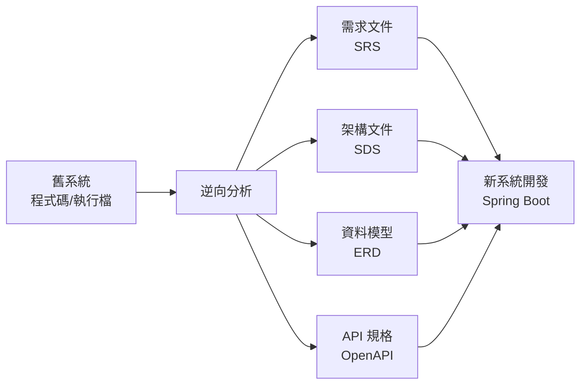

**在軟體工程的脈絡中**，逆向工程不同於「破解」或「反編譯」等灰色行為。企業合法逆向工程是指：

| 合法場景 | 不合法場景 |
|---------|----------|
| 自有系統文件重建 | 繞過授權保護機制 |
| Legacy 系統現代化 | 竊取競爭對手商業邏輯 |
| 維護無文件的老舊系統 | 違反軟體授權條款 |
| 安全漏洞分析（授權範圍） | 未經授權反組譯第三方軟體 |

### 1.2 Legacy System 現代化挑戰

企業面對 Legacy System 時，通常遭遇以下痛點：

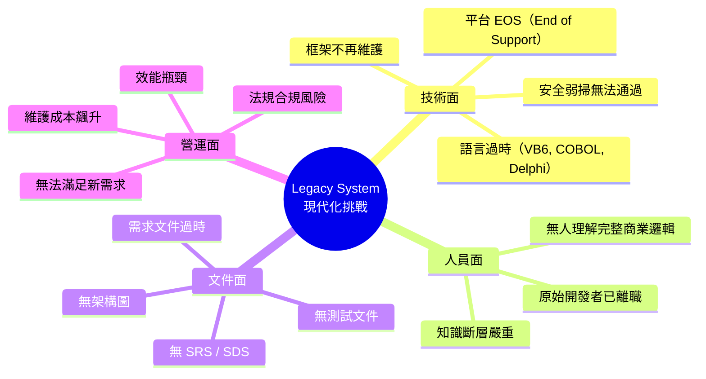

**典型企業困境**：

1. **人員流失**：開發 10+ 年的系統，原始開發者早已離職
2. **技術債堆積**：多年修修補補，程式碼結構混亂
3. **資安壓力**：舊版框架漏洞無法修補（如 Struts 1.x、Spring 2.x）
4. **平台 EOS**：Windows Server 2012、Java 8 等陸續停止支援
5. **合規要求**：金管會 / 資安法規要求系統安全性達標

### 1.3 GitHub Copilot 在逆向工程的角色

GitHub Copilot（2026 版）已從單純的「程式碼補全工具」演進為完整的 **AI 代理（Agent）平台**，在逆向工程中扮演多維度的角色：

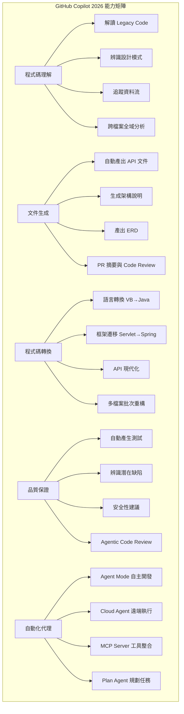

#### Copilot 2026 核心功能對逆向工程的價值

| 功能 | 說明 | 逆向工程應用 |
|-----|------|-------------|
| **Agent Mode（本地代理）** | 在 VS Code 中自主執行多步驟任務，自動編輯檔案、執行終端命令、自我修正 | 自動分析整個 Legacy 專案、批次轉換模組、自動修正編譯錯誤 |
| **Cloud Agent（雲端代理）** | 在 GitHub 雲端獨立運行，建立分支、實作變更、開啟 PR | 指派 Copilot 完成單一模組的遷移任務並提交 PR |
| **Plan Agent（規劃代理）** | 分析程式碼庫後產出結構化實作計畫 | 自動規劃逆向工程步驟與模組遷移優先順序 |
| **Copilot Chat** | 對話式分析與問答 | 深入分析特定函式、追蹤呼叫鏈、解讀商業邏輯 |
| **Copilot Edits** | 多檔案同步編輯 | 一次性重構多個相關類別 |
| **Custom Instructions** | 專案級指令（`.github/copilot-instructions.md`） | 定義逆向工程分析規範、輸出格式、命名慣例 |
| **MCP Server** | 擴充外部工具能力（Model Context Protocol） | 整合 DB 分析工具、SonarQube、Figma 設計稿等 |
| **Copilot Memory** | 自動記憶倉庫級上下文 | 跨對話保持對 Legacy 系統的理解 |
| **Copilot Spaces** | 組織相關內容為上下文空間 | 將舊系統文件、程式碼、分析結果組織為統一上下文 |
| **Copilot Code Review** | AI 自動程式碼審查（已採用 Agentic 架構） | 自動審查轉換後的程式碼品質與安全性 |
| **Next Edit Suggestions（NES）** | 預測下一個編輯位置並自動建議 | 加速逐行轉換程式碼的效率 |
| **多模型支援** | GPT-5.4、Gemini 3.1 Pro、Claude 等多模型切換 | 對不同語言或任務選擇最佳模型 |

**Copilot 在逆向工程中的四大角色**：

| 角色 | 說明 | 使用方式 |
|-----|------|---------|
| **分析師** | 理解並解釋程式碼 | Copilot Chat：`@workspace 分析這個模組的商業邏輯` |
| **翻譯官** | 跨語言轉換 | Agent Mode：自動將整個模組從 VB 轉為 Spring Boot |
| **文件撰寫者** | 自動產出文件 | Copilot Chat：`為此模組產出 OpenAPI 規格` |
| **自動化代理** | 端到端自主執行任務 | Cloud Agent：指派 Issue 後自動完成遷移並提交 PR |

> **⚠️ 重要提醒**：Copilot 是「智慧助手」而非「替代者」。即使 Agent Mode 可以自主完成任務，所有 AI 產出的結果都必須經過資深工程師審查驗證，特別是商業邏輯與安全相關的部分。AI 可能產生「看似正確但實際有誤」的幻覺內容（Hallucination），在財務計算、權限控制等關鍵領域尤需謹慎。

### 1.4 適用情境

#### 銀行/金融業

- 核心系統現代化（Core Banking System → Microservices）
- 報表系統遷移（COBOL/RPG → Java）
- 交易系統重構（VB/Delphi → Spring Boot）

#### 製造業

- MES 系統升級（VB6 → Web）
- ERP 客製模組遷移

#### 政府機關

- 老舊服務系統 Web 化
- 資料開放平台建置

#### 適用判斷矩陣

| 條件 | 適合逆向工程 | 不適合 |
|-----|------------|-------|
| 程式碼可取得 | ✅ | — |
| 無任何設計文件 | ✅ | — |
| 系統仍在運行 | ✅ | — |
| 程式碼已無法編譯 | ⚠️ 部分可行 | — |
| 僅有執行檔 | ⚠️ 黑箱可行 | 白箱困難 |
| 有完整文件 | — | ❌ 不需逆向 |

> **💡 實務建議**：在啟動逆向工程專案前，務必進行「可行性評估」。確認舊系統的程式碼品質、規模與複雜度，再決定策略。

---

## 第 2 章 三種逆向工程策略

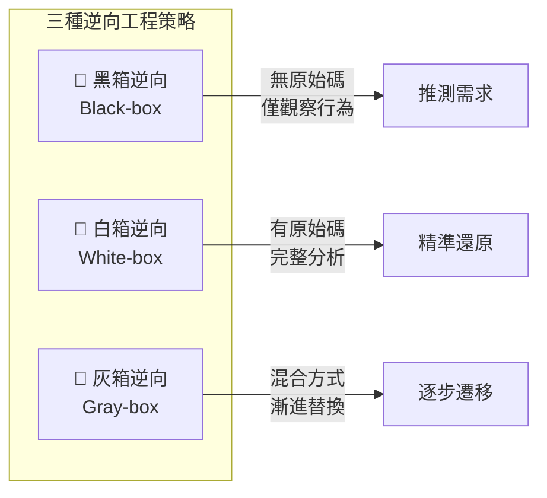

### 2.1 黑箱逆向（Black-box Reverse Engineering）

#### 定義

在**不接觸原始碼**的前提下，透過觀察系統的「輸入 / 輸出行為」來推導系統功能與需求。

#### 適用情境

- 只有執行檔（.exe / .dll），無原始碼
- 原始碼語言已無法讀取（如 COBOL、RPG 等極少數人懂的語言）
- 第三方系統無法取得原始碼
- 需先快速建立系統概觀

#### 操作方式

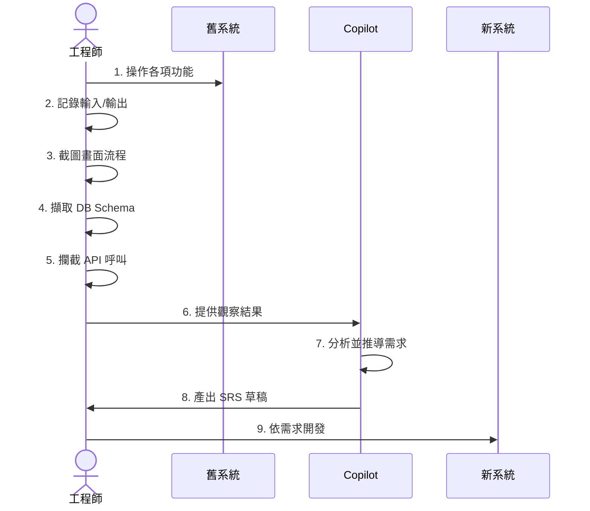

**具體步驟**：

1. **功能盤點**：逐一操作舊系統每個畫面與功能
2. **行為記錄**：記錄每個操作的輸入、處理結果、錯誤訊息
3. **畫面截圖**：完整記錄 UI 流程
4. **網路擷取**：使用 Fiddler / Wireshark 擷取 API 呼叫
5. **DB 分析**：匯出資料庫 Schema（Table / View / SP）
6. **Copilot 協助推導**：將上述資訊輸入 Copilot 進行分析

#### Copilot 如何協助

```
# Prompt 範例：黑箱逆向分析

我有一個舊系統的功能觀察記錄如下：

## 畫面：客戶查詢
- 輸入：客戶編號（8位數字）、客戶姓名（模糊搜尋）
- 輸出：客戶基本資料列表（編號、姓名、電話、地址、開戶日期）
- 可進行：新增、修改、刪除、匯出 Excel
- 權限：僅主管可刪除

## 資料庫 Table
- CUSTOMER (CUST_ID, CUST_NAME, PHONE, ADDRESS, OPEN_DATE, STATUS)
- CUSTOMER_LOG (LOG_ID, CUST_ID, ACTION, ACTION_DATE, OPERATOR)

請幫我：
1. 推導出此功能的完整需求規格（Functional Requirements）
2. 識別可能的商業規則（Business Rules）
3. 產出 User Story 格式
4. 建議 Spring Boot 的 API 設計
```

#### 優缺點

| 項目 | 優點 | 缺點 |
|-----|------|------|
| 門檻 | 不需原始碼 | 可能遺漏隱藏邏輯 |
| 速度 | 快速取得概觀 | 細節精準度不足 |
| 風險 | 低技術風險 | 商業規則可能推導錯誤 |
| 適用 | 任何系統 | 複雜批次邏輯難以觀察 |

#### 實務案例

> **某銀行信用卡系統黑箱逆向**  
> 該銀行有一套 20 年前以 PowerBuilder 開發的信用卡帳務系統，原始碼散落在多個不同版本。團隊先以黑箱方式：
> 1. 操作所有畫面功能，記錄約 150 個 Use Case
> 2. 使用 Copilot 解析 DB Schema（約 300 張表）自動產出 ERD
> 3. 透過 Copilot 從 Use Case + ERD 推導出 80% 的功能需求
> 4. 剩餘 20% 透過訪談長期使用者補充  
> 
> **結果**：3 個月完成需求文件，較傳統方式節省 60% 時間。

---

### 2.2 白箱逆向（White-box Reverse Engineering）

#### 定義

直接分析**原始碼**，深入理解系統的實作邏輯、架構設計、資料流程，並據此重建完整的系統文件。

#### 適用情境

- 擁有完整原始碼（即使語言過時）
- 原始碼可編譯或至少可閱讀
- 需要精準還原所有商業邏輯
- 系統有大量隱藏的商業規則（寫在程式碼中而非文件）

#### Copilot 如何理解 Legacy Code

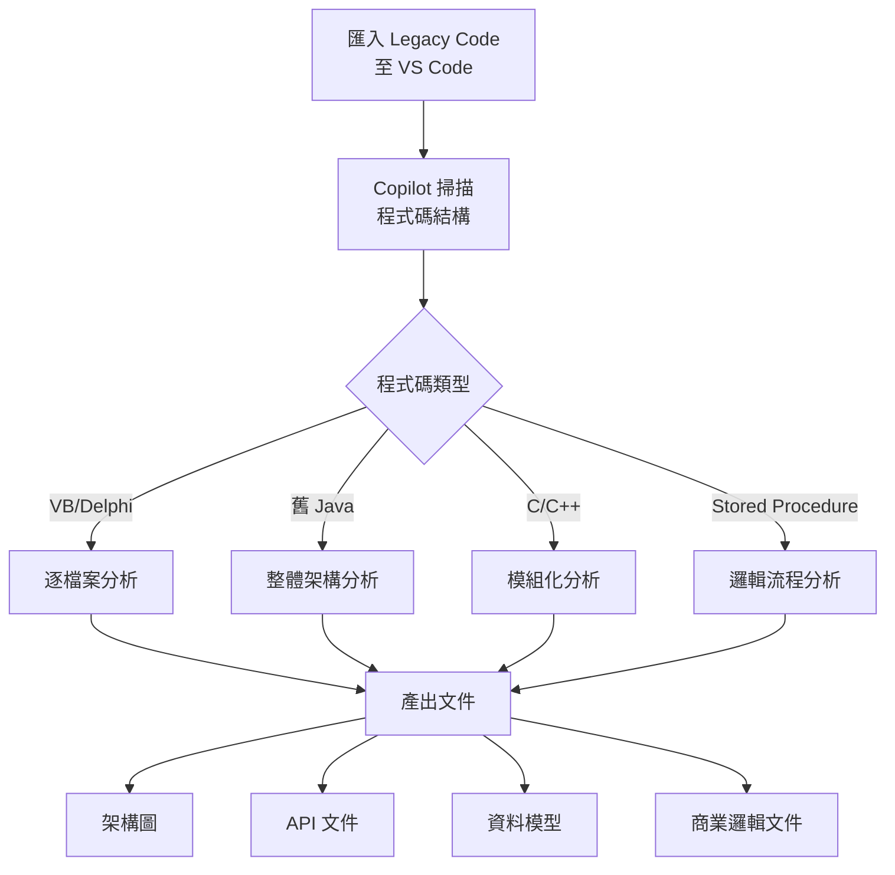

**分析步驟**：

**Step 1：程式碼匯入與結構化**

```bash
# 將舊系統程式碼整理至 VS Code 工作區
# 建立統一的資料夾結構
legacy-system/
├── src/                  # 原始碼
│   ├── forms/           # VB Form / Delphi Form
│   ├── modules/         # 共用模組
│   ├── classes/         # 類別檔案
│   └── database/        # Stored Procedure / SQL
├── docs/                # 分析產出文件
│   ├── architecture/    # 架構文件
│   ├── api/            # API 規格
│   ├── data-model/     # 資料模型
│   └── requirements/   # 需求文件
└── analysis/           # 分析筆記
```

**Step 2：使用 Copilot 分析原始碼**

````
# Prompt：分析 VB6 模組

@workspace 請分析以下 VB6 程式碼，並說明：
1. 此模組的主要功能
2. 呼叫了哪些外部 API 或 COM 元件
3. 商業邏輯流程（用 Mermaid flowchart 表示）
4. 存取了哪些資料庫 Table
5. 錯誤處理機制
6. 隱含的商業規則

```vb
' === modCustomerMgmt.bas ===
Public Function GetCustomerByID(ByVal custID As String) As ADODB.Recordset
    Dim conn As New ADODB.Connection
    Dim rs As New ADODB.Recordset
    Dim sql As String
    
    conn.Open "Provider=SQLOLEDB;Data Source=PROD_DB;..."
    
    If Len(custID) <> 8 Then
        Err.Raise 9001, , "客戶編號必須為8碼"
    End If
    
    sql = "SELECT * FROM CUSTOMER WHERE CUST_ID = '" & custID & "' AND STATUS = 'A'"
    rs.Open sql, conn, adOpenKeyset, adLockReadOnly
    
    If rs.EOF Then
        Set GetCustomerByID = Nothing
    Else
        Set GetCustomerByID = rs
    End If
End Function
```
````

**Step 3：Copilot 產出分析結果**

Copilot 會自動識別出：
- **SQL Injection 風險**：字串直接拼接 SQL
- **硬編碼連線字串**：資料庫連線資訊寫死在程式碼中
- **商業規則**：客戶編號必須 8 碼、只查詢狀態為 'A'（有效）的客戶
- **資料存取**：CUSTOMER 表

#### 如何產出架構圖

```
# Prompt：產出架構圖

請根據以下程式碼檔案清單，分析並產出系統架構圖（Mermaid 格式）：

檔案清單：
- frmMain.frm（主畫面）
- frmCustomer.frm（客戶管理）
- frmTransaction.frm（交易管理）
- modCustomer.bas（客戶模組）
- modTransaction.bas（交易模組）
- modReport.bas（報表模組）
- clsDBHelper.cls（資料庫工具）
- clsLogger.cls（日誌工具）

請產出：
1. 系統模組關係圖
2. 呼叫依賴圖
3. 資料流向圖
```

#### 如何產出 API 文件

```
# Prompt：產出 API 設計

根據以下 Legacy 程式碼的功能分析：
- GetCustomerByID：依 ID 查詢客戶
- SearchCustomer：模糊搜尋客戶
- CreateCustomer：新增客戶
- UpdateCustomer：修改客戶
- DeleteCustomer：停用客戶（邏輯刪除）

請產出對應的 RESTful API 設計（OpenAPI 3.0 格式），包含：
1. HTTP Method & Path
2. Request / Response Schema
3. 狀態碼定義
4. 驗證規則
```

#### 如何產出資料模型

```
# Prompt：產出 ERD

以下是舊系統的資料庫 DDL：

CREATE TABLE CUSTOMER (
    CUST_ID     CHAR(8) NOT NULL,
    CUST_NAME   VARCHAR(50),
    PHONE       VARCHAR(20),
    ADDRESS     VARCHAR(200),
    OPEN_DATE   DATE,
    STATUS      CHAR(1) DEFAULT 'A',
    PRIMARY KEY (CUST_ID)
);

CREATE TABLE CUSTOMER_ACCOUNT (
    ACCT_NO     CHAR(14) NOT NULL,
    CUST_ID     CHAR(8) NOT NULL,
    ACCT_TYPE   CHAR(2),
    BALANCE     DECIMAL(15,2),
    OPEN_DATE   DATE,
    STATUS      CHAR(1),
    PRIMARY KEY (ACCT_NO),
    FOREIGN KEY (CUST_ID) REFERENCES CUSTOMER(CUST_ID)
);

請產出：
1. Mermaid ERD 圖
2. 欄位說明表
3. 建議的 JPA Entity 設計
4. 資料關係說明
```

#### 優缺點

| 項目 | 優點 | 缺點 |
|-----|------|------|
| 精準度 | 可完整還原所有邏輯 | 需讀懂過時語言 |
| 深度 | 包含隱藏商業規則 | 耗時較長 |
| 可靠性 | 不會遺漏功能 | 程式碼品質差時分析困難 |
| AI 輔助 | Copilot 可加速理解 | 過大的程式碼 Copilot 需分段分析 |

#### 實務案例

> **某壽險公司保單管理系統白箱逆向**  
> 原系統以 Delphi 7 開發，約 50 萬行程式碼。團隊使用白箱逆向：
> 1. 使用 Copilot 逐模組分析，共計 120 個 Form、80 個 Unit
> 2. Copilot 自動識別出 300+ 條商業規則（如保費計算公式、理賠規則）
> 3. 產出 Mermaid 架構圖 15 張、ERD 8 張
> 4. 識別出 42 個 SQL Injection 風險點與 15 個硬編碼密碼  
>
> **關鍵發現**：約有 15% 的商業邏輯只存在於程式碼的註解或變數命名中，必須由資深人員確認。

---

### 2.3 灰箱逆向（Gray-box / Hybrid）

#### 定義

結合黑箱與白箱的**混合策略**，先透過黑箱快速了解系統全貌，再以白箱深入分析關鍵模組，並採用 **Strangler Fig Pattern** 逐步替換舊系統。

#### 適用情境

- 大型系統（數十萬至百萬行程式碼）
- 需要「邊運行舊系統、邊開發新系統」
- 風險承受度低（如銀行核心系統、交易系統）
- 有時間壓力，無法一次性全面分析

#### Strangler Fig Pattern

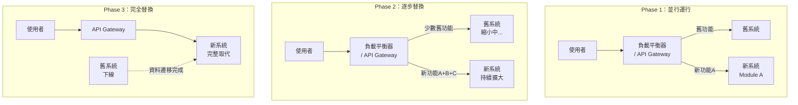

#### 灰箱逆向操作流程

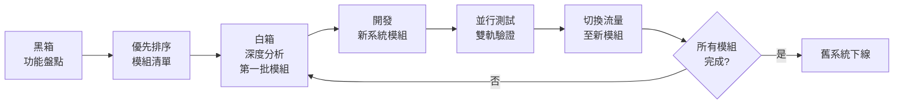

**詳細步驟**：

1. **Phase 0 — 全域黑箱掃描**（2-4 週）
   - 操作舊系統所有功能
   - 記錄功能清單與 Use Case
   - 匯出 DB Schema
   - 使用 Copilot 產出系統概觀文件

2. **Phase 1 — 模組優先排序**（1 週）
   - 依「商業重要性 × 技術風險 × 依賴程度」排序
   - 決定遷移批次

3. **Phase 2 — 迭代式白箱分析 + 開發**（每模組 2-6 週）
   - 白箱分析特定模組
   - 使用 Copilot 協助轉換
   - 開發新模組
   - 雙軌測試驗證

4. **Phase 3 — 漸進切換**
   - 透過 API Gateway / Feature Flag 控制流量
   - 逐步將使用者導向新系統

#### Copilot 在灰箱逆向的角色

```
# Prompt：模組優先排序分析

我正在對一個大型 Legacy 系統進行灰箱逆向。以下是系統模組清單：

| 模組 | 程式碼行數 | 使用頻率 | 相依模組數 | 最後修改 |
|------|----------|---------|-----------|---------|
| 客戶管理 | 15,000 | 高 | 3 | 2024-01 |
| 交易處理 | 45,000 | 極高 | 8 | 2025-06 |
| 報表系統 | 25,000 | 中 | 5 | 2023-03 |
| 帳務結算 | 35,000 | 中 | 6 | 2024-08 |
| 系統管理 | 8,000 | 低 | 2 | 2022-11 |

請幫我：
1. 建議遷移優先順序
2. 分析模組間依賴關係（Mermaid dependency graph）
3. 識別高風險模組
4. 提出風險緩解策略
```

#### 優缺點

| 項目 | 優點 | 缺點 |
|-----|------|------|
| 風險 | 最低風險（漸進式） | 需維護兩套系統 |
| 業務衝擊 | 可不停機遷移 | 開發成本較高 |
| 靈活性 | 可隨時調整策略 | 需有 API Gateway 支援 |
| 適用 | 大型系統首選 | 小型系統 overkill |

#### 實務案例

> **某商業銀行核心帳務系統灰箱遷移**  
> 原系統為 COBOL + DB2（約 200 萬行 COBOL），採灰箱策略：
> 1. **Phase 0**：3 週黑箱盤點，識別出 500+ 個交易碼
> 2. **Phase 1**：按業務重要性分為 5 個批次
> 3. **Phase 2**：先遷移「查詢類」交易（風險最低），使用 Copilot 輔助 COBOL→Java 轉換
> 4. **Phase 3**：透過 ESB + API Gateway 雙軌運行 18 個月
> 
> **成果**：零停機完成遷移，同時保障日均 500 萬筆交易不受影響。

---

### 2.4 三種策略比較總覽

| 比較項目 | 黑箱逆向 | 白箱逆向 | 灰箱逆向 |
|---------|---------|---------|---------|
| **需要原始碼** | ❌ 不需要 | ✅ 必需 | ⚠️ 部分需要 |
| **分析精準度** | ⭐⭐ | ⭐⭐⭐⭐⭐ | ⭐⭐⭐⭐ |
| **執行速度** | ⭐⭐⭐⭐ | ⭐⭐ | ⭐⭐⭐ |
| **風險等級** | 中（可能遺漏） | 低（精準） | 最低（漸進） |
| **適合規模** | 小～中型系統 | 中型系統 | 大型系統 |
| **業務停機** | 可能需要 | 可能需要 | 不需要 |
| **Copilot 效益** | ⭐⭐⭐ | ⭐⭐⭐⭐⭐ | ⭐⭐⭐⭐ |
| **建議使用場景** | 快速概觀 / 無原始碼 | 完整重建 | 企業關鍵系統 |
| **費用** | 💰 | 💰💰 | 💰💰💰 |
| **時間** | 1-3 月 | 3-12 月 | 6-24 月 |

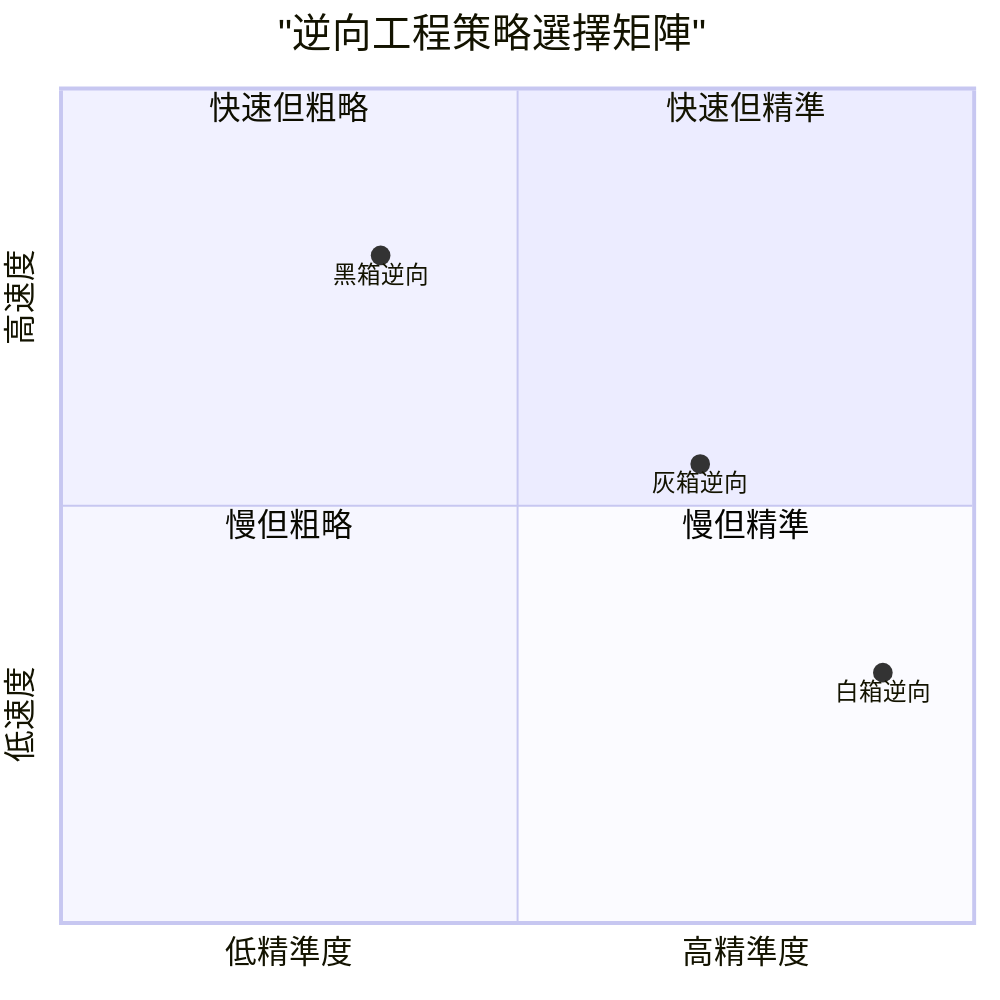

> **💡 選擇建議**：
> - 只有執行檔 → **黑箱**
> - 中小型系統、有完整原始碼 → **白箱**
> - 大型企業關鍵系統、不可停機 → **灰箱**
> - 不確定時 → 先**黑箱**快速摸底，再決定後續策略

---

## 第 3 章 SDLC 對應逆向工程流程

逆向工程並非獨立作業，而是必須對應到標準的 SDLC 流程中。以下說明如何在每個 SDLC 階段運用 Copilot 進行逆向工程。

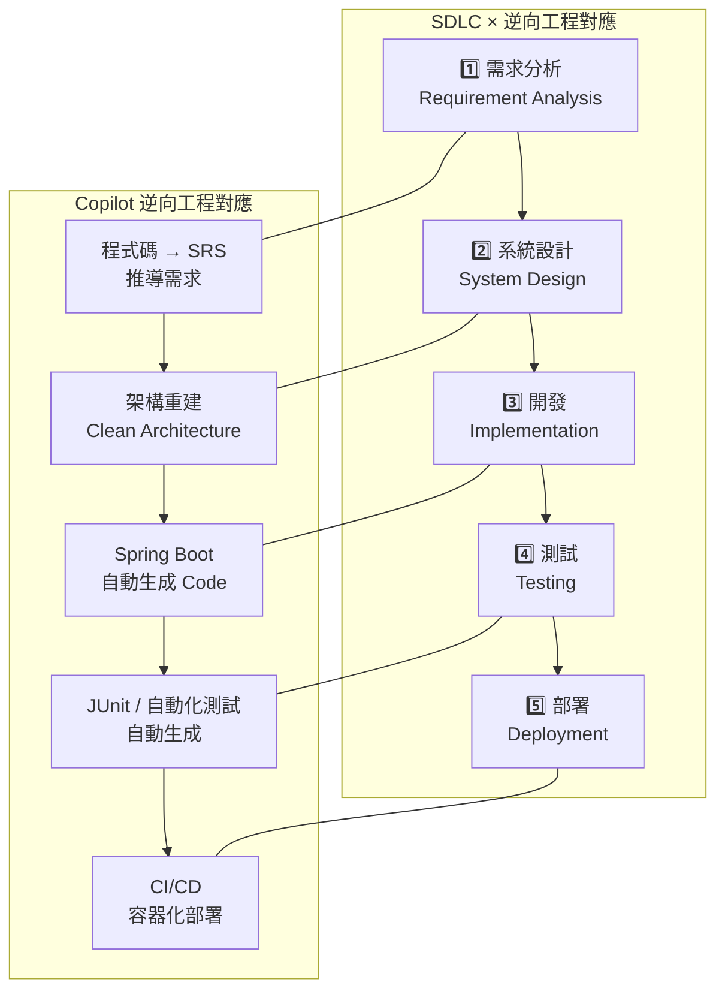

### 3.1 需求分析（Requirement Analysis）

#### 從程式碼推導需求的方法論

在缺乏需求文件的情況下，程式碼本身就是「唯一的真相來源（Single Source of Truth）」。

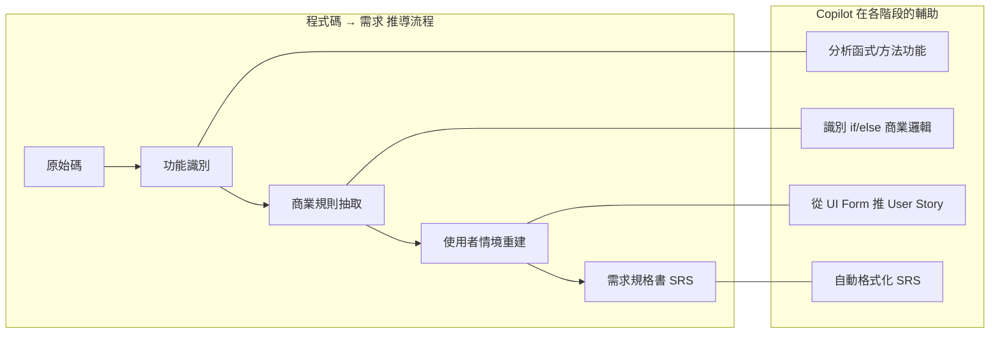

#### Copilot 推導需求的實作範例

**從 Stored Procedure 推導需求**：

```sql
-- 舊系統 Stored Procedure
CREATE PROCEDURE sp_CalcInterest
    @AccountNo CHAR(14),
    @CalcDate DATE
AS
BEGIN
    DECLARE @Balance DECIMAL(15,2)
    DECLARE @Rate DECIMAL(5,4)
    DECLARE @Interest DECIMAL(15,2)
    DECLARE @AcctType CHAR(2)
    
    SELECT @Balance = BALANCE, @AcctType = ACCT_TYPE 
    FROM ACCOUNT WHERE ACCT_NO = @AccountNo
    
    -- 依帳戶類別取利率
    IF @AcctType = '01'  -- 活期存款
        SET @Rate = 0.0125
    ELSE IF @AcctType = '02'  -- 定期存款
        SELECT @Rate = RATE FROM RATE_TABLE 
        WHERE ACCT_TYPE = '02' AND EFF_DATE <= @CalcDate
        ORDER BY EFF_DATE DESC
    ELSE IF @AcctType = '03'  -- 外幣存款
        SET @Rate = 0.0050
    
    -- 計息公式
    SET @Interest = @Balance * @Rate / 365
    
    -- 餘額低於 1000 不計息
    IF @Balance < 1000
        SET @Interest = 0
    
    INSERT INTO INTEREST_LOG (ACCT_NO, CALC_DATE, BALANCE, RATE, INTEREST)
    VALUES (@AccountNo, @CalcDate, @Balance, @Rate, @Interest)
    
    RETURN @Interest
END
```

**Copilot Prompt**：

```
請分析上述 Stored Procedure，推導出以下內容：

1. 功能需求（Functional Requirements）
2. 商業規則清單（Business Rules）
3. 資料需求（Data Requirements）
4. 例外處理需求
5. 以 User Story 格式撰寫需求

請使用企業級 SRS 格式輸出。
```

**Copilot 產出結果**：

```markdown
### FR-001：利息計算功能

**功能描述**：系統應根據帳戶類型、餘額及適用利率，自動計算每日利息。

**商業規則**：
- BR-001：活期存款（帳戶類型 01）適用固定利率 1.25%
- BR-002：定期存款（帳戶類型 02）適用利率表中生效日最近的利率
- BR-003：外幣存款（帳戶類型 03）適用固定利率 0.50%
- BR-004：帳戶餘額低於 1,000 時不計息
- BR-005：計息公式 = 餘額 × 利率 ÷ 365

**使用者故事**：
作為 帳務系統管理員
我要 系統每日自動計算各帳戶利息
以便 正確記錄利息收入並產出對帳資料

**驗收條件**：
- [ ] 活期存款按固定利率 1.25% 計算
- [ ] 定期存款從利率表取最新利率
- [ ] 餘額 < 1000 的帳戶利息為 0
- [ ] 計算結果記錄至利息日誌表
```

#### 從程式碼推 SRS 的標準流程

| 步驟 | 動作 | Copilot 用法 | 產出 |
|-----|------|-------------|------|
| 1 | 掃描所有入口點 | `@workspace 列出所有 public 方法清單` | 功能清單 |
| 2 | 分析每個功能 | `分析此方法的商業邏輯與流程` | 功能說明 |
| 3 | 抽取商業規則 | `識別所有 if/switch 中的商業規則` | BR 清單 |
| 4 | 重建資料模型 | `從 SQL DDL 產出 ERD 與欄位說明` | 資料字典 |
| 5 | 組合成 SRS | `將以上分析整合為 IEEE 830 格式 SRS` | SRS 文件 |

> **⚠️ 注意**：AI 推導的需求務必與業務單位與資深使用者確認。程式碼中的邏輯可能包含「已知的 Bug」或「歷史遺留的暫時方案」，不應視為正確需求。

---

### 3.2 系統設計（System Design）

#### 架構重建（Architecture Reconstruction）

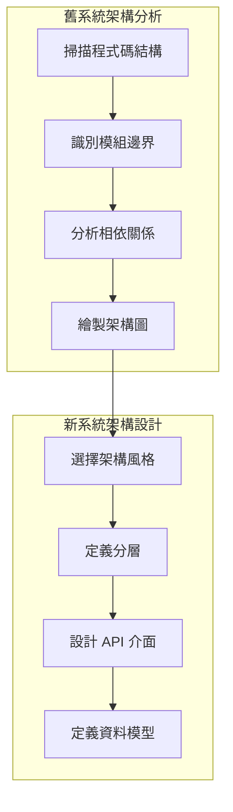

**使用 Copilot 進行架構重建**：

```
# Prompt：架構重建

我有一個 Legacy VB6 系統，結構如下：

Forms（畫面）：
- frmLogin.frm → 登入驗證
- frmMain.frm → 主選單
- frmCustomer.frm → 客戶管理（CRUD）
- frmAccount.frm → 帳戶管理
- frmTransaction.frm → 交易處理
- frmReport.frm → 報表查詢

Modules（底層模組）：
- modDB.bas → 資料庫連線
- modAuth.bas → 權限驗證
- modCustomer.bas → 客戶邏輯
- modAccount.bas → 帳戶邏輯
- modTransaction.bas → 交易邏輯
- modReport.bas → 報表邏輯
- modUtil.bas → 共用工具

請幫我：
1. 分析目前的架構（識別架構風格）
2. 提出目標 Clean Architecture 設計
3. 產出 Spring Boot 專案的 Package 結構
4. 定義各層的職責與介面
```

**Copilot 建議的新架構**：

```
新系統 Spring Boot 專案結構（Clean Architecture）：

com.company.newapp/
├── adapter/                    # Interface Adapter Layer
│   ├── web/                   # Controller（REST API）
│   │   ├── CustomerController.java
│   │   ├── AccountController.java
│   │   └── TransactionController.java
│   ├── persistence/           # Repository 實作
│   │   ├── CustomerRepositoryImpl.java
│   │   ├── entity/           # JPA Entity
│   │   └── mapper/           # Entity ↔ Domain 轉換
│   └── security/             # Spring Security 設定
│       └── JwtAuthFilter.java
├── application/               # Application Layer（Use Cases）
│   ├── service/
│   │   ├── CustomerService.java
│   │   ├── AccountService.java
│   │   └── TransactionService.java
│   ├── dto/                  # Request / Response DTO
│   └── port/                 # Port 介面定義
│       ├── in/              # Driven Port（Use Case）
│       └── out/             # Driving Port（Repository）
├── domain/                    # Domain Layer（Business Logic）
│   ├── model/
│   │   ├── Customer.java
│   │   ├── Account.java
│   │   └── Transaction.java
│   ├── valueobject/
│   │   ├── AccountNumber.java
│   │   └── Money.java
│   └── rule/                 # 商業規則
│       ├── InterestCalculator.java
│       └── TransactionValidator.java
└── infrastructure/            # Infrastructure Layer
    ├── config/
    │   ├── SecurityConfig.java
    │   └── DatabaseConfig.java
    └── external/
        ├── NotificationService.java
        └── ReportGenerator.java
```

#### Clean Architecture 映射圖

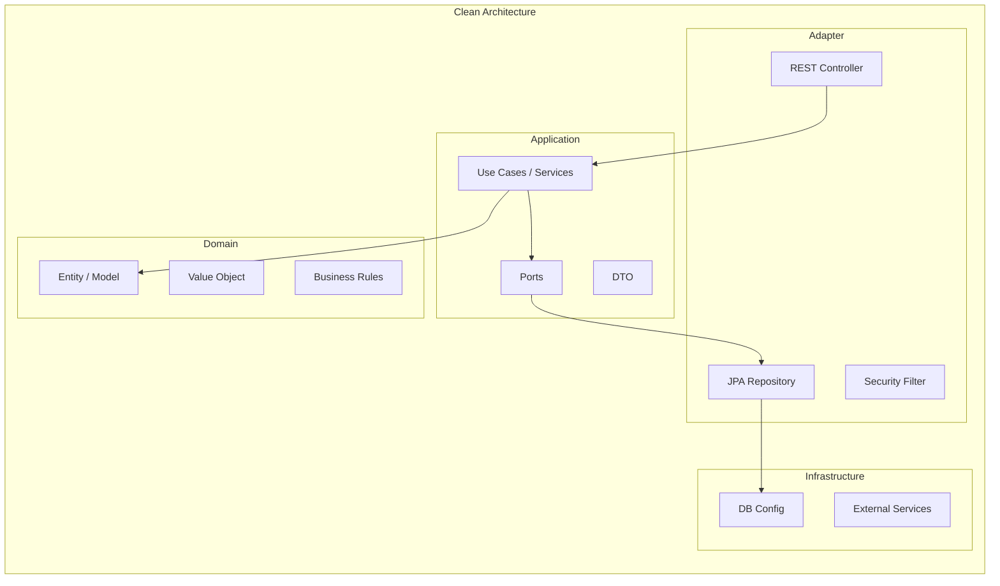

> **💡 實務建議**：架構重建時，建議先畫出「舊系統架構圖」與「目標架構圖」的對照，讓團隊清楚每個模組的遷移路徑。

---

### 3.3 開發（Implementation）

#### 使用 Spring Boot 開發新系統

**Step 1：建立專案骨架**

```bash
# 使用 Spring Initializr 建立專案
# 透過 Copilot CLI 或 VS Code Spring Boot Extension

# 必要 Dependencies：
# - Spring Web
# - Spring Data JPA
# - Spring Security
# - Spring Validation
# - Lombok
# - MapStruct
# - SpringDoc OpenAPI (Swagger)
```

**Step 2：使用 Copilot 將 Legacy Code 轉為 Spring Boot**

````
# Prompt：將 VB 函式轉為 Spring Boot Service

以下是舊系統 VB 的客戶查詢邏輯：

```vb
Public Function SearchCustomer(ByVal name As String, _
                                ByVal phone As String) As Collection
    Dim sql As String
    sql = "SELECT * FROM CUSTOMER WHERE 1=1"
    
    If Len(name) > 0 Then
        sql = sql & " AND CUST_NAME LIKE '%" & name & "%'"
    End If
    
    If Len(phone) > 0 Then
        sql = sql & " AND PHONE = '" & phone & "'"
    End If
    
    sql = sql & " AND STATUS = 'A' ORDER BY CUST_NAME"
    
    ' ... execute and return
End Function
```

請轉換為 Spring Boot：
1. Repository（使用 Spring Data JPA + Specification）
2. Service（包含驗證邏輯）
3. Controller（RESTful API）
4. DTO（Request / Response）
5. 修正原始碼的 SQL Injection 問題
````

**Copilot 產出**：

```java
// === CustomerRepository.java ===
@Repository
public interface CustomerRepository extends JpaRepository<Customer, String>,
                                            JpaSpecificationExecutor<Customer> {
}

// === CustomerSpecification.java ===
public class CustomerSpecification {
    
    public static Specification<Customer> withFilters(String name, String phone) {
        return (root, query, cb) -> {
            List<Predicate> predicates = new ArrayList<>();
            
            // 只查有效客戶
            predicates.add(cb.equal(root.get("status"), "A"));
            
            if (StringUtils.hasText(name)) {
                predicates.add(cb.like(root.get("custName"), "%" + name + "%"));
            }
            
            if (StringUtils.hasText(phone)) {
                predicates.add(cb.equal(root.get("phone"), phone));
            }
            
            query.orderBy(cb.asc(root.get("custName")));
            return cb.and(predicates.toArray(new Predicate[0]));
        };
    }
}

// === CustomerService.java ===
@Service
@RequiredArgsConstructor
public class CustomerService {
    
    private final CustomerRepository customerRepository;
    
    public Page<CustomerResponse> searchCustomer(CustomerSearchRequest request, 
                                                  Pageable pageable) {
        Specification<Customer> spec = CustomerSpecification.withFilters(
            request.getName(), request.getPhone()
        );
        
        return customerRepository.findAll(spec, pageable)
                .map(CustomerMapper.INSTANCE::toResponse);
    }
}

// === CustomerController.java ===
@RestController
@RequestMapping("/api/v1/customers")
@RequiredArgsConstructor
public class CustomerController {
    
    private final CustomerService customerService;
    
    @GetMapping
    public ResponseEntity<Page<CustomerResponse>> searchCustomer(
            @Valid CustomerSearchRequest request,
            @PageableDefault(size = 20, sort = "custName") Pageable pageable) {
        
        return ResponseEntity.ok(customerService.searchCustomer(request, pageable));
    }
}
```

> **⚠️ 注意**：Copilot 轉換的程式碼已自動修正 SQL Injection 風險（改用 JPA Specification 參數化查詢），但仍需 Code Review 確認所有商業邏輯完整。

---

### 3.4 測試（Testing）

#### 自動生成測試案例

```
# Prompt：產生單元測試

請為以下 CustomerService.searchCustomer 方法產生完整的 JUnit 5 測試：

1. 正常查詢（有結果）
2. 空結果
3. 只輸入姓名
4. 只輸入電話
5. 分頁測試
6. 邊界條件（空字串、null）

使用 @MockBean 替換 Repository，使用 AssertJ 斷言。
```

**Copilot 產出**：

```java
@ExtendWith(MockitoExtension.class)
class CustomerServiceTest {

    @Mock
    private CustomerRepository customerRepository;

    @InjectMocks
    private CustomerService customerService;

    @Test
    @DisplayName("依姓名模糊查詢客戶 - 應返回匹配結果")
    void searchByName_shouldReturnMatchingCustomers() {
        // Given
        Customer customer = Customer.builder()
                .custId("00000001")
                .custName("王小明")
                .phone("0912345678")
                .status("A")
                .build();
        
        Page<Customer> page = new PageImpl<>(List.of(customer));
        when(customerRepository.findAll(any(Specification.class), any(Pageable.class)))
                .thenReturn(page);

        CustomerSearchRequest request = new CustomerSearchRequest();
        request.setName("王");

        // When
        Page<CustomerResponse> result = customerService.searchCustomer(
                request, PageRequest.of(0, 20));

        // Then
        assertThat(result.getContent()).hasSize(1);
        assertThat(result.getContent().get(0).getCustName()).isEqualTo("王小明");
        verify(customerRepository).findAll(any(Specification.class), any(Pageable.class));
    }

    @Test
    @DisplayName("查詢無結果 - 應返回空頁面")
    void searchWithNoResult_shouldReturnEmptyPage() {
        // Given
        when(customerRepository.findAll(any(Specification.class), any(Pageable.class)))
                .thenReturn(Page.empty());

        CustomerSearchRequest request = new CustomerSearchRequest();
        request.setName("不存在的名字");

        // When
        Page<CustomerResponse> result = customerService.searchCustomer(
                request, PageRequest.of(0, 20));

        // Then
        assertThat(result.getContent()).isEmpty();
        assertThat(result.getTotalElements()).isZero();
    }

    @Test
    @DisplayName("不帶任何條件查詢 - 應返回所有有效客戶")
    void searchWithNoFilter_shouldReturnAllActive() {
        // Given
        List<Customer> customers = List.of(
                Customer.builder().custId("00000001").custName("王小明").status("A").build(),
                Customer.builder().custId("00000002").custName("李大華").status("A").build()
        );
        when(customerRepository.findAll(any(Specification.class), any(Pageable.class)))
                .thenReturn(new PageImpl<>(customers));

        CustomerSearchRequest request = new CustomerSearchRequest();

        // When
        Page<CustomerResponse> result = customerService.searchCustomer(
                request, PageRequest.of(0, 20));

        // Then
        assertThat(result.getContent()).hasSize(2);
    }
}
```

#### 逆向工程測試策略

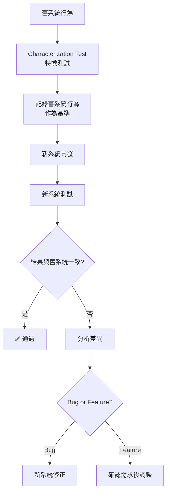

> **💡 Best Practice**：在逆向工程中，建議先建立「Characterization Test（特徵測試）」— 記錄舊系統的實際行為，確保新系統能完全重現。

---

### 3.5 部署（Deployment）

#### CI/CD Pipeline 設計

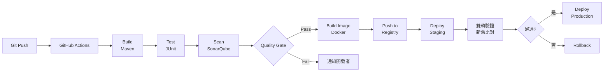

#### Docker 容器化

```dockerfile
# === Dockerfile (Multi-Stage Build) ===
FROM eclipse-temurin:21-jdk-alpine AS builder
WORKDIR /app
COPY pom.xml .
COPY src ./src
RUN mvn clean package -DskipTests

FROM eclipse-temurin:21-jre-alpine
WORKDIR /app
COPY --from=builder /app/target/*.jar app.jar

# 安全性設定
RUN addgroup -S appgroup && adduser -S appuser -G appgroup
USER appuser

EXPOSE 8080
ENTRYPOINT ["java", "-jar", "app.jar"]
```

#### GitHub Actions CI/CD 範例

```yaml
# .github/workflows/ci-cd.yml
name: CI/CD Pipeline

on:
  push:
    branches: [ main, develop ]
  pull_request:
    branches: [ main ]

jobs:
  build-and-test:
    runs-on: ubuntu-latest
    steps:
      - uses: actions/checkout@v4

      - name: Set up JDK 21
        uses: actions/setup-java@v4
        with:
          java-version: '21'
          distribution: 'temurin'

      - name: Build and Test
        run: mvn clean verify

      - name: SonarQube Scan
        env:
          SONAR_TOKEN: ${{ secrets.SONAR_TOKEN }}
        run: mvn sonar:sonar

      - name: Build Docker Image
        if: github.ref == 'refs/heads/main'
        run: |
          docker build -t myapp:${{ github.sha }} .
          docker tag myapp:${{ github.sha }} registry.company.com/myapp:latest

      - name: Push to Registry
        if: github.ref == 'refs/heads/main'
        run: docker push registry.company.com/myapp:latest
```

> **💡 實務建議**：在逆向工程專案中，CI/CD 必須包含「新舊系統行為比對」的自動化測試步驟。可使用 Contract Test 或 Parallel Run 機制確保一致性。

---

## 第 4 章 GitHub Copilot 實戰流程

本章提供完整的 Step-by-Step 操作指引，適合團隊按步驟執行。

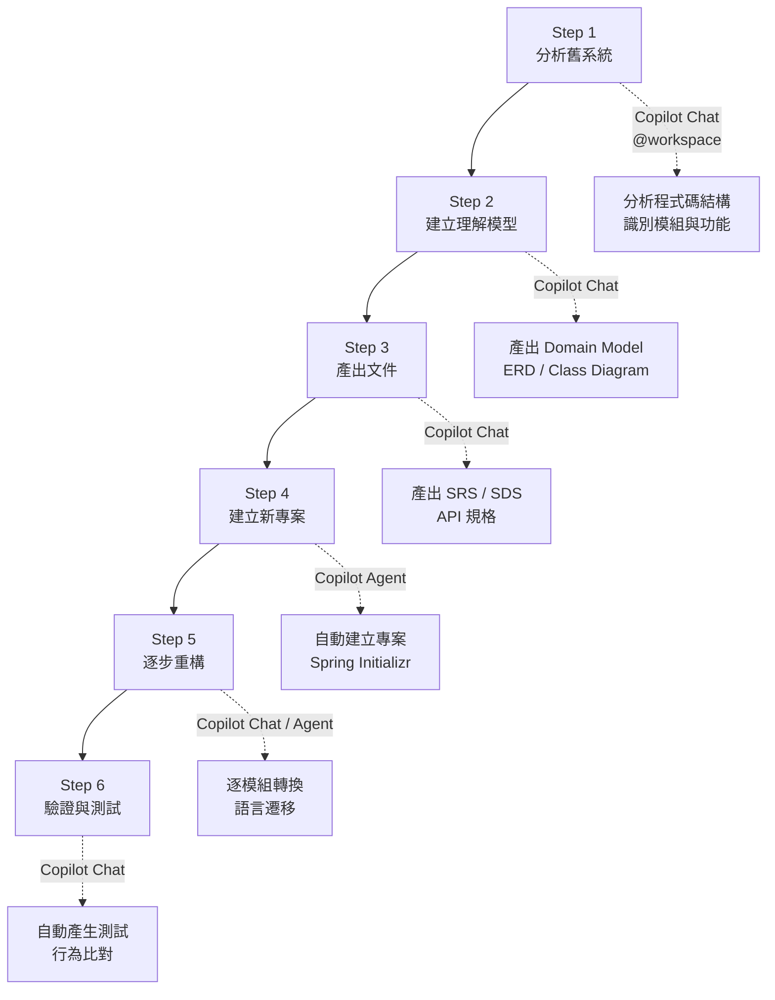

### 4.1 Step 1：分析舊系統

#### 目標

建立舊系統的完整清冊（Inventory），包括：功能清單、技術棧、模組結構、資料庫結構。

#### 操作指引

**1. 程式碼盤點**

```
# Copilot Chat Prompt

@workspace 請幫我分析這個 Legacy 專案，產出以下報告：

1. 技術棧摘要（語言、框架、版本）
2. 檔案結構清單（按模組分類）
3. 各模組的程式碼行數統計
4. 外部依賴清單（第三方元件、COM 元件）
5. 資料庫連線設定
6. 識別所有入口點（Main Form / Entry Point）
```

**2. 功能點盤點**

```
# Copilot Chat Prompt

請分析這個模組（modCustomer.bas），列出：

1. 所有 Public Function / Sub 的名稱與功能說明
2. 每個功能的參數與回傳值
3. 功能間的呼叫關係（Call Graph）
4. 存取的資料庫 Table 清單
5. 錯誤處理方式
```

**3. 產出系統清冊**

| 模組 | 功能數 | 程式碼行數 | 存取 Table | 複雜度 | 備註 |
|-----|-------|----------|-----------|-------|------|
| 客戶管理 | 12 | 3,500 | CUSTOMER, CUST_LOG | 中 | — |
| 帳戶管理 | 18 | 5,200 | ACCOUNT, ACCT_HIST | 高 | 含利息計算 |
| 交易處理 | 25 | 8,000 | TRANSACTION, TX_LOG | 極高 | 核心模組 |
| 報表系統 | 8 | 2,100 | (多表 JOIN) | 中 | Crystal Reports |
| 系統管理 | 6 | 1,200 | SYS_USER, SYS_AUTH | 低 | — |

> **💡 實務建議**：系統清冊是整個逆向工程的基礎，務必完整。建議由 2-3 人分工盤點，再整合交叉確認。

---

### 4.2 Step 2：建立理解模型（Domain Model）

#### 目標

從程式碼中抽取領域模型（Domain Model），建立系統的「概念理解」。

#### 操作指引

**1. 識別核心實體（Entity）**

```
# Copilot Chat Prompt

請分析此專案的資料庫 Schema，識別出：

1. 核心實體（Core Entity）及其關係
2. 值物件（Value Object）
3. 聚合根（Aggregate Root）— DDD 觀點
4. 產出 Mermaid Class Diagram
5. 產出 Mermaid ER Diagram
```

**Copilot 產出範例**：

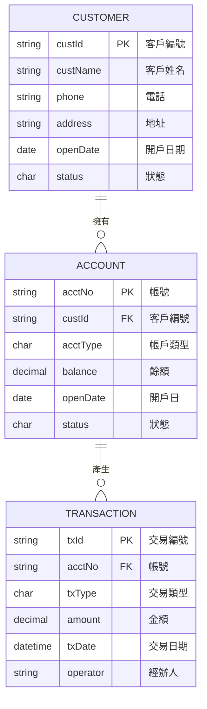

**2. 識別 Bounded Context**

```
# Copilot Chat Prompt

根據以上分析的領域模型，請識別可能的 Bounded Context：

1. 各 Context 包含哪些 Entity
2. Context 之間的關係（Context Map）
3. 建議的微服務拆分方式（若適用）
```

---

### 4.3 Step 3：產出文件（AI 自動生成）

#### 目標

使用 Copilot 自動產出完整的技術文件套件。

#### 文件清單與 Copilot 指令

| 文件 | Copilot Prompt | 格式 |
|-----|----------------|------|
| SRS | `根據分析結果，產出 IEEE 830 格式的 SRS` | Markdown |
| SDS | `產出系統設計規格書，含架構圖與模組說明` | Markdown + Mermaid |
| API 規格 | `產出 OpenAPI 3.0 規格` | YAML |
| ERD | `產出 ER Diagram（Mermaid 格式）` | Mermaid |
| 資料字典 | `產出完整的資料字典（Table / Column 說明）` | Markdown Table |
| 測試計畫 | `產出測試計劃與測試案例` | Markdown |

**批次產出文件的 Prompt**：

```
# Copilot Chat Prompt

請根據我們分析的舊系統資訊，自動產出以下文件包：

## 1. 需求規格書（SRS）
- 系統概述
- 功能需求清單（按模組分類）
- 非功能需求（效能、安全、可用性）
- 商業規則清單
- 使用者故事

## 2. 系統設計書（SDS）
- 系統架構圖（C4 Model - System Context + Container）
- 模組設計（Class Diagram）
- API 設計（RESTful）
- 資料庫設計（ERD + 資料字典）
- 安全設計

各文件請使用 Markdown 格式，圖表使用 Mermaid。
```

---

### 4.4 Step 4：建立新專案（Spring Boot）

#### 目標

基於分析文件，建立新的 Spring Boot 專案。

#### 操作指引

```
# Copilot Chat / Agent Prompt

請幫我建立一個 Spring Boot 4.x 專案，需求如下：

專案名稱：customer-management-system
Java 版本：21
Build Tool：Maven

Dependencies：
- Spring Web
- Spring Data JPA
- Spring Security
- Spring Validation
- Spring Boot Actuator
- Lombok
- MapStruct
- SpringDoc OpenAPI
- Log4j2

架構：Clean Architecture
分層：
- adapter.web（Controller）
- adapter.persistence（JPA Repository）
- application.service（Use Case）
- application.dto（DTO）
- application.port（Port Interface）
- domain.model（Entity）
- domain.rule（Business Rules）
- infrastructure（Config）

請產出完整的 pom.xml 與基礎程式碼骨架。
```

---

### 4.5 Step 5：逐步重構

#### 目標

按優先順序逐模組將舊系統功能遷移至新系統。

#### 遷移順序建議

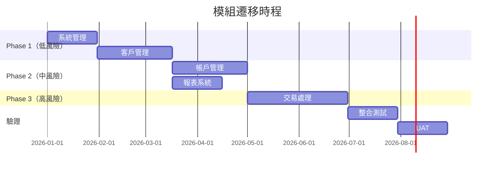

#### 每個模組的遷移步驟

1. **白箱分析**：使用 Copilot 深入分析模組程式碼
2. **需求確認**：將 AI 產出的需求與業務單位確認
3. **API 設計**：設計 RESTful API
4. **程式碼轉換**：使用 Copilot 將 Legacy Code 轉為 Java
5. **測試撰寫**：使用 Copilot 產生單元測試
6. **整合測試**：與其他模組整合測試
7. **行為比對**：比對新舊系統輸出是否一致
8. **切換流量**：透過 API Gateway 將流量切至新系統

---

### 4.6 Step 6：驗證與測試

#### 雙軌驗證（Parallel Run）

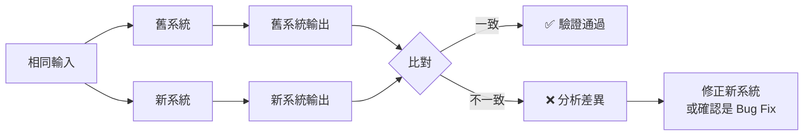

#### 驗證清單

- [ ] 所有 API 回傳結果與舊系統一致
- [ ] 資料庫操作（CRUD）結果正確
- [ ] 商業規則（計算公式等）正確
- [ ] 錯誤處理行為一致
- [ ] 效能不低於舊系統（Response Time / Throughput）
- [ ] 安全性通過弱掃（SAST / DAST）
- [ ] 使用者驗收測試（UAT）通過

> **⚠️ 重要提醒**：雙軌驗證期間，建議至少運行 **2-4 週**，涵蓋月結、季結等特殊業務週期。

---

### 4.7 Agent Mode 加速逆向工程

#### 使用 Agent Mode 自動化分析

Agent Mode 是 Copilot 2026 年最具革命性的功能——讓 AI 自主決定分析步驟、編輯檔案、執行終端命令並自我修正：

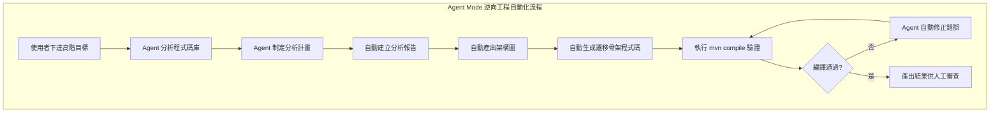

**Agent Mode 操作範例**：

在 VS Code Chat 中選擇 Agent Mode，輸入：

```
分析 legacy-cms/ 目錄中的所有 VB6 原始碼，完成以下任務：

1. 掃描所有 .bas 和 .frm 檔案，建立模組功能清單
2. 分析每個模組的 Public 方法與商業規則
3. 識別所有資料庫操作（Table、SP）
4. 將分析結果寫入 docs/reverse-engineering-report.md
5. 產出 Mermaid 架構圖與 ERD
6. 建議 Spring Boot 4.x 對應的專案結構

請使用企業級格式輸出，表格對齊，圖表使用 Mermaid。
```

Agent Mode 會自主：
- 瀏覽並讀取所有 VB6 檔案
- 辨識模組結構與呼叫關係
- 建立並寫入報告檔案
- 如果遇到無法辨識的語法，會嘗試其他分析策略

#### 使用 Plan Agent 規劃遷移

Plan Agent 可在開始開發之前產出結構化的實作計畫：

```
# Plan Agent Prompt

請為以下 Legacy 系統遷移規劃完整的實作計畫：

系統資訊：
- 程式碼：35,000 行 VB6
- 資料庫：SQL Server 2008（50 表、30 SP）
- 目標：Spring Boot 4.x + PostgreSQL 17

計畫需包含：
1. 遷移批次分組（按風險等級與依賴關係）
2. 每個批次的預估工時
3. 關鍵路徑識別
4. 風險項目與緩解方案
5. 里程碑定義
```

Plan Agent 會產出結構化的逐步計畫，確認後可直接交由 Agent Mode 或 Cloud Agent 執行。

#### 使用 Cloud Agent 自動化遷移

Cloud Agent（原 Copilot Coding Agent）適合獨立模組的遷移任務：

```mermaid
flowchart LR
    A["開發者指派 Issue<br/>給 Copilot"] --> B["Cloud Agent<br/>分析倉庫"]
    B --> C["建立功能分支"]
    C --> D["實作程式碼變更"]
    D --> E["執行測試驗證"]
    E --> F["開啟 Pull Request"]
    F --> G["團隊 Code Review"]
    G --> H["合併至主分支"]
```

**操作方式**：

1. 在 GitHub 建立 Issue：「遷移客戶管理模組：modCustomer.bas → CustomerService.java」
2. 將 Issue 指派給 `@copilot`
3. Cloud Agent 自動：
   - 分析 modCustomer.bas 的所有方法
   - 建立 feature branch
   - 生成 Spring Boot 相關類別（Entity、Repository、Service、Controller、DTO）
   - 執行 `mvn compile` 確認編譯通過
   - 開啟 PR 附上變更摘要
4. 團隊審查 PR，確認商業邏輯正確後合併

> **💡 實務建議**：Cloud Agent 最適合「邊界清晰、獨立性高」的模組遷移。對於高度耦合的核心模組，仍建議使用本地 Agent Mode + 人工協作方式。

---

## 第 5 章 Copilot Prompt Engineering

Prompt Engineering 是使用 Copilot 進行逆向工程的**核心技能**。好的 Prompt 能讓 Copilot 產出精準、可用的結果；差的 Prompt 會導致錯誤或無用的產出。

### 5.1 Prompt 設計原則

```mermaid
mindmap
  root((Prompt<br/>設計原則))
    明確性
      指定輸出格式
      指定程式語言
      限定範圍
    上下文
      提供原始碼
      說明背景
      給出約束條件
    結構化
      分步驟要求
      使用編號
      採用模板
    驗證性
      要求範例
      要求解釋
      要求邊界條件
```

#### 高品質 Prompt 的 CRISP 原則

| 原則 | 說明 | 範例 |
|-----|------|------|
| **C**ontext（上下文） | 提供足夠背景資訊 | 「這是一個 VB6 銀行帳務系統…」 |
| **R**ole（角色） | 指定 AI 扮演的角色 | 「你是一位 Java 架構師…」 |
| **I**nstruction（指令） | 明確指出任務 | 「請將此程式碼轉換為 Spring Boot…」 |
| **S**pecification（規格） | 限定輸出格式與品質 | 「使用 Clean Architecture、包含 JavaDoc…」 |
| **P**roof（驗證） | 要求 AI 提供驗證依據 | 「請解釋每個轉換決策的原因…」 |

#### 好 Prompt vs 壞 Prompt

**❌ 壞 Prompt**：
```
幫我把這個 VB 程式改成 Java
```

**✅ 好 Prompt**：
```
## 上下文
這是一個銀行帳務系統的 VB6 模組，負責客戶帳戶的利息計算。

## 任務
請將以下 VB6 函式轉換為 Spring Boot 4.x 的 Service 方法。

## 要求
1. 使用 Java 21 語法
2. 遵循 Clean Architecture 分層
3. 使用 JPA 取代 ADO 直接 SQL
4. 修正原始碼中的 SQL Injection 風險
5. 加入 JavaDoc 與 @Valid 驗證
6. 保留所有商業規則（標註在註解中）

## 原始碼
[貼上 VB 程式碼]

## 輸出格式
請分別產出：
- Entity
- Repository
- Service
- Controller
- DTO
```

---

### 5.2 程式碼分析類 Prompt

#### Prompt #1：模組功能分析

```
# 角色：資深系統分析師
# 任務：分析 Legacy 程式碼模組

請分析以下 [VB6/Delphi/C#] 程式碼模組：

[貼上程式碼]

請產出：
1. **功能摘要**：此模組的主要功能（一句話）
2. **詳細流程**：商業邏輯步驟（Mermaid flowchart）
3. **商業規則**：所有 if/else/switch 中隱含的規則（BR-001 ~ BR-xxx）
4. **資料存取**：存取的 Table / SP 清單
5. **外部依賴**：呼叫的外部元件或 API
6. **安全風險**：識別潛在安全漏洞
7. **可維護性評估**：程式碼品質評分（1-10）及改善建議
```

#### Prompt #2：呼叫鏈追蹤

```
# 任務：追蹤函式呼叫鏈

從入口點 [函式名稱] 開始，追蹤完整的呼叫鏈：

1. 列出所有被呼叫的函式（含檔案名稱）
2. 標示每個函式的層級深度
3. 標示資料庫操作點（CRUD）
4. 產出 Mermaid Sequence Diagram

格式：
入口函式 → 子函式A → 子函式B → DB操作
```

#### Prompt #3：資料流分析

```
# 任務：資料流分析

分析此「[交易/功能]」的完整資料流：

1. 資料輸入點（使用者輸入 / 外部系統）
2. 資料轉換步驟
3. 資料驗證規則
4. 資料存入/更新的 Table
5. 資料輸出（畫面 / 報表 / 外部系統）

請產出 Mermaid Data Flow Diagram（DFD）。
```

---

### 5.3 語言轉換類 Prompt

#### Prompt #4：VB → Java 完整轉換

```
# 角色：資深 Java 架構師
# 任務：VB6 → Spring Boot 轉換

## 原始 VB6 程式碼
[貼上 VB 程式碼]

## 轉換需求
1. **語言**：Java 21
2. **框架**：Spring Boot 4.x（或 3.x LTS）
3. **架構**：Clean Architecture
4. **ORM**：Spring Data JPA（取代 ADO）
5. **安全**：修正所有 SQL Injection、XSS 風險
6. **日誌**：使用 SLF4J + Log4j2
7. **驗證**：使用 Jakarta Validation
8. **例外**：使用自定義例外 + @ControllerAdvice

## 商業邏輯保留
- 請在 Java 程式碼中以 @BusinessRule 註解標示原始商業規則
- 如有不確定的邏輯，請加 @TODO 標記

## 輸出
請分層產出（附 JavaDoc）：
1. Domain Model (Entity)
2. Repository Interface
3. Service (Use Case)
4. Controller (REST API)
5. DTO (Request/Response)
```

#### Prompt #5：Stored Procedure → Java Service 轉換

```
# 角色：資料庫和 Java 專家
# 任務：Stored Procedure → Spring Boot Service

## 原始 SP
[貼上 Stored Procedure]

## 轉換原則
1. SP 中的 SQL → JPA Repository 方法
2. SP 中的商業邏輯 → Service 方法
3. SP 中的資料驗證 → Jakarta Validation + 自定義 Validator
4. SP 中的錯誤處理 → 自定義 Exception
5. 暫存表邏輯 → Java Collection 處理
6. 游標邏輯 → Stream API

## 注意
- 保持交易完整性（@Transactional）
- 處理並發（樂觀鎖 / 悲觀鎖）
- 效能考量（N+1 問題、Batch 操作）
```

#### Prompt #6：C# → Java 轉換

```
# 角色：跨平台資深工程師
# 任務：C# .NET → Java Spring Boot 轉換

## 原始 C# 程式碼
[貼上 C# 程式碼]

## 對照轉換規則
| C# | Java |
|------|------|
| LINQ | Stream API |
| Entity Framework | Spring Data JPA |
| ASP.NET Controller | @RestController |
| Dependency Injection | Spring @Autowired / Constructor Injection |
| async/await | CompletableFuture / @Async |
| ILogger | SLF4J Logger |
| DataAnnotation | Jakarta Validation |

## 輸出
依 Spring Boot 最佳實務產出轉換後的 Java 程式碼，
附上轉換決策說明。
```

---

### 5.4 文件產出類 Prompt

#### Prompt #7：自動產出 API 文件

```
# 任務：產出 RESTful API 文件

根據以下 Legacy 函式清單，設計對應的 RESTful API：

Legacy 函式：
1. GetCustomerByID(custID) → 單一客戶查詢
2. SearchCustomer(name, phone, page) → 客戶搜尋
3. CreateCustomer(custData) → 新增客戶
4. UpdateCustomer(custID, custData) → 修改客戶
5. DeleteCustomer(custID) → 停用客戶
6. GetCustomerAccounts(custID) → 查詢客戶帳戶
7. ExportCustomerReport(criteria) → 匯出報表

請產出：
1. API 一覽表（Method / Path / 說明）
2. 每個 API 的 Request / Response Schema（JSON）
3. 錯誤碼定義
4. OpenAPI 3.0 YAML 片段
```

#### Prompt #8：產出架構設計文件

```
# 任務：產出系統架構設計文件（SDS）

根據逆向分析結果，產出以下架構文件：

## 系統概述
[簡述系統功能]

## 需要產出
1. C4 Model（Context / Container / Component 三層）— 使用 Mermaid
2. 部署架構圖
3. 資料庫架構（ERD）
4. 安全架構
5. 模組相依關係圖
6. 技術選型理由

## 格式
- 每個圖表使用 Mermaid
- 每個設計決策需附上理由
- 標示風險點與緩解方案
```

---

### 5.5 測試生成類 Prompt

#### Prompt #9：生成特徵測試（Characterization Test）

```
# 任務：生成 Characterization Test

為以下商業邏輯生成「特徵測試」，用於記錄舊系統的實際行為：

## 商業邏輯
[貼上 Service 方法或商業規則]

## 測試要求
1. 使用 JUnit 5 + AssertJ
2. 使用 @ParameterizedTest 覆蓋所有分支
3. 覆蓋正常路徑、邊界值、異常路徑
4. 每個測試附上 @DisplayName（中文說明）
5. 測試資料覆蓋所有商業規則

## 測試案例需包含
- 正常案例（Happy Path）
- 邊界值（Boundary）
- 異常案例（Error Path）
- 並發案例（如適用）
```

#### Prompt #10：生成整合測試

```
# 任務：生成 API 整合測試

為以下 REST API 產出完整整合測試：

## API
[貼上 Controller 程式碼]

## 測試要求
1. 使用 @SpringBootTest + @AutoConfigureMockMvc
2. 使用 @TestContainers 模擬資料庫
3. 測試完整的 HTTP 請求/回應
4. 驗證 HTTP Status Code
5. 驗證 Response Body（JSON Path）
6. 驗證資料庫狀態變化

## 測試案例
- 成功建立資源 → 201
- 查詢存在的資源 → 200
- 查詢不存在的資源 → 404
- 無效輸入 → 400
- 未授權 → 401
- 權限不足 → 403
```

---

### 5.6 Prompt 模板庫

以下提供可直接複製使用的 Prompt 模板：

#### 通用分析模板

```
# === 逆向工程分析模板 ===

## 角色
你是資深 [語言] 工程師與 Java 架構師。

## 上下文
這是 [系統名稱] 的 [模組名稱]，功能為 [一句話描述]。

## 原始碼
[貼上程式碼]

## 分析任務
請產出：
1. 功能摘要（50字以內）
2. 詳細流程（Mermaid flowchart）
3. 商業規則清單（BR-xxx）
4. 資料庫操作清單
5. 安全風險識別
6. 對應的 Spring Boot 設計建議

## 輸出格式
使用 Markdown，圖表使用 Mermaid。
```

#### 批次轉換模板

```
# === 批次程式碼轉換模板 ===

## 轉換目標
源語言：[VB6 / C# / Delphi / COBOL]
目標語言：Java 21 + Spring Boot 4.x（或 3.x）

## 轉換規則
- [源語言特性] → [Java 對應]
- [源語言特性] → [Java 對應]
（根據語言調整）

## 品質要求
- [ ] 遵循 Clean Architecture
- [ ] 包含 JavaDoc
- [ ] 包含 Validation
- [ ] 修正安全漏洞
- [ ] 保留商業規則（標註）
- [ ] 產出對應的單元測試

## 原始碼
[貼上程式碼]
```

> **💡 實務建議**：建議團隊建立「Prompt Library」，將常用且驗證過的 Prompt 模板集中管理（可放在 Git Repo 的 `.github/prompts/` 目錄下），方便團隊成員重複使用。

---

### 5.7 Custom Instructions（專案級指令）

#### 什麼是 Custom Instructions

Custom Instructions 讓你在 `.github/copilot-instructions.md` 中定義專案級的 AI 行為規範。Copilot 在回答問題或產生程式碼時，會自動參考這些指令，確保所有產出符合團隊的逆向工程標準。

#### 逆向工程專用 Custom Instructions 範例

```markdown
# .github/copilot-instructions.md — 逆向工程專案專用

## 專案背景
本專案正在將 VB6 客戶管理系統遷移至 Spring Boot 4.x。

## 程式碼規範
1. 目標框架：Spring Boot 4.x + Java 21
2. 架構風格：Clean Architecture（adapter / application / domain / infrastructure）
3. ORM：Spring Data JPA
4. 驗證：Jakarta Validation
5. 日誌：SLF4J + Log4j2
6. 安全：Spring Security + JWT

## 逆向工程規範
1. 分析 Legacy 程式碼時，必須識別並標註所有商業規則（使用 @BusinessRule 註解）
2. 所有 AI 產出必須包含「轉換決策說明」
3. 轉換後的程式碼必須修正原始碼中的安全漏洞
4. 使用 Mermaid 格式產出所有圖表
5. 目的碼必須包含 JavaDoc（繁體中文）

## 命名慣例
- Package：com.company.cms
- REST API 路徑：/api/v1/{resource}
- 資料庫表名：小寫底線（customers, customer_accounts）
- Entity 類名：PascalCase 單數（Customer, Account）
```

#### 搭配 Agent Skills 使用

你也可以建立 `.github/copilot/skills/` 下的 Agent Skills，為 Copilot 定義專業能力：

```markdown
# .github/copilot/skills/analyze-legacy-code.md
---
name: analyze-legacy-code
description: 分析 Legacy 程式碼並產出結構化報告
---

## 指令
當使用者要求分析 Legacy 程式碼時：
1. 先識別程式語言（VB6 / Delphi / C# / COBOL / 舊版 Java）
2. 掃描所有 Public 方法與全域變數
3. 識別商業規則（所有 if/switch 條件）
4. 列出資料庫操作（Table + CRUD 類型）
5. 識別安全風險（SQL Injection、硬編碼密碼等）
6. 產出 Mermaid 架構圖
7. 建議 Spring Boot 對應設計

## 輸出格式
使用 Markdown，包含：模組摘要表、商業規則清單、安全風險清單、架構圖。
```

---

### 5.8 Agent Mode 專用 Prompt 設計

#### Agent Mode vs Chat Mode Prompt 的差異

| 面向 | Chat Mode Prompt | Agent Mode Prompt |
|------|-----------------|------------------|
| **粒度** | 單一任務 | 多步驟目標 |
| **指令風格** | 具體步驟 | 高階目標 + 約束條件 |
| **上下文** | 手動提供 | Agent 自行探索 |
| **輸出方式** | 在 Chat 視窗 | 直接修改檔案 |
| **錯誤處理** | 人工介入 | Agent 自動修正 |

#### Agent Mode Prompt 範例：全模組逆向分析

```
# Agent Mode — 全模組逆向分析

## 目標
對 legacy-cms/ 目錄中的 VB6 專案進行完整逆向分析，
所有結果寫入 docs/analysis/ 目錄。

## 約束條件
- 輸出格式：Markdown + Mermaid
- 語言：繁體中文
- 架構設計目標：Spring Boot 4.x + Clean Architecture
- 安全標準：OWASP Top 10 2025

## 預期產出
1. docs/analysis/module-inventory.md — 模組清冊
2. docs/analysis/business-rules.md — 商業規則清冊
3. docs/analysis/architecture.md — 系統架構圖
4. docs/analysis/erd.md — 資料庫 ERD
5. docs/analysis/security-audit.md — 安全風險報告
6. docs/analysis/migration-plan.md — 遷移計畫

請依序完成以上 6 個檔案。
```

#### Agent Mode Prompt 範例：自動化模組遷移

```
# Agent Mode — 模組自動遷移

## 目標
將 legacy-cms/Modules/modCustomer.bas 中的客戶管理功能，
遷移為 Spring Boot 4.x 的完整實作。

## 約束條件
- 遵循 Clean Architecture 四層架構
- 使用 Spring Data JPA（非原生 SQL）
- 所有商業規則標註 @BusinessRule
- 修正所有 SQL Injection 漏洞
- 包含 JavaDoc（繁體中文）
- 包含 JUnit 5 測試（覆蓋率目標 80%）

## 預期產出
在 src/main/java/com/company/cms/ 下建立：
1. domain/model/Customer.java
2. domain/rule/CustomerValidator.java
3. application/service/CustomerService.java
4. application/dto/CustomerRequest.java
5. application/dto/CustomerResponse.java
6. adapter/web/CustomerController.java
7. adapter/persistence/CustomerRepository.java
8. adapter/persistence/CustomerEntity.java

在 src/test/java/com/company/cms/ 下建立：
9. application/service/CustomerServiceTest.java
10. adapter/web/CustomerControllerTest.java

完成後執行 mvn compile 確認無編譯錯誤。
```

---

## 第 6 章 架構設計（企業級）

### 6.1 微服務 vs 單體架構決策

在逆向工程中，新系統的架構選擇是關鍵決策。以下提供決策框架：

```mermaid
flowchart TB
    A{系統規模} --> |"小型<br/>< 10 萬行"| B[單體架構<br/>Monolith]
    A --> |"中型<br/>10-50 萬行"| C[模組化單體<br/>Modular Monolith]
    A --> |"大型<br/>> 50 萬行"| D{團隊規模}
    D --> |"< 5 人"| C
    D --> |"> 5 人"| E[微服務<br/>Microservices]
    
    B --> F[Spring Boot<br/>單一部署]
    C --> G[Spring Boot<br/>模組化 + API Gateway]
    E --> H[Spring Cloud<br/>獨立服務]
```

#### 架構選擇比較表

| 因素 | 單體架構 | 模組化單體 | 微服務 |
|-----|---------|-----------|-------|
| **複雜度** | ⭐ | ⭐⭐ | ⭐⭐⭐⭐ |
| **部署** | 簡單 | 中等 | 複雜 |
| **團隊協作** | 易衝突 | 模組分工 | 獨立開發 |
| **效能** | 高（同 Process） | 高 | 網路開銷 |
| **擴展性** | ⭐⭐ | ⭐⭐⭐ | ⭐⭐⭐⭐⭐ |
| **維運成本** | 低 | 中等 | 高 |
| **適合場景** | 小型系統 | 中型企業系統 | 大型平台系統 |

> **💡 企業級建議**：多數 Legacy 系統遷移建議先採「**模組化單體**」，穩定後再視需要拆分為微服務。避免一開始就微服務化導致複雜度過高。

---

### 6.2 分層架構設計

```mermaid
flowchart TB
    subgraph "分層架構（Clean Architecture）"
        direction TB
        
        subgraph "Adapter Layer（外部適配）"
            WEB["📱 Web Layer<br/>Controller / Filter"]
            PERSIST["💾 Persistence<br/>JPA Repository"]
            EXT["🔗 External<br/>REST Client / MQ"]
        end
        
        subgraph "Application Layer（應用邏輯）"
            UC["📋 Use Case<br/>Service / Command"]
            DTO["📦 DTO<br/>Request / Response"]
            PORT["🔌 Port<br/>Interface"]
        end
        
        subgraph "Domain Layer（領域核心）"
            ENT["🏛️ Entity<br/>Domain Model"]
            VO["💎 Value Object"]
            RULE["⚖️ Business Rule"]
        end
        
        subgraph "Infrastructure（基礎設施）"
            CFG["⚙️ Config"]
            SEC["🔒 Security"]
            LOG["📝 Logging"]
        end
    end
    
    WEB --> UC
    UC --> ENT
    UC --> PORT
    PORT --> PERSIST
    PORT --> EXT
    PERSIST --> CFG
```

#### 各層職責定義

| 層 | 職責 | 包含元件 | 允許依賴 |
|---|------|---------|---------|
| **Adapter** | 處理外部通訊 | Controller, Repository Impl, Client | Application |
| **Application** | 協調業務流程 | Service, DTO, Port Interface | Domain |
| **Domain** | 核心商業邏輯 | Entity, VO, Business Rule | 無（最內圈） |
| **Infrastructure** | 技術實作 | Config, Security, DB Config | Application |

#### 實際範例：利息計算模組

```java
// === Domain Layer: Business Rule ===
public class InterestCalculator {
    
    /**
     * 計算帳戶利息
     * @BusinessRule BR-001: 活期利率 1.25%
     * @BusinessRule BR-004: 餘額 < 1000 不計息
     */
    public Money calculateDailyInterest(Account account, InterestRate rate) {
        if (account.getBalance().isLessThan(Money.of(1000))) {
            return Money.ZERO;
        }
        
        BigDecimal dailyRate = rate.getAnnualRate()
                .divide(BigDecimal.valueOf(365), 10, RoundingMode.HALF_UP);
        
        return account.getBalance().multiply(dailyRate);
    }
}

// === Application Layer: Use Case ===
@Service
@RequiredArgsConstructor
@Transactional
public class CalculateInterestUseCase {
    
    private final AccountPort accountPort;
    private final InterestRatePort ratePort;
    private final InterestLogPort logPort;
    private final InterestCalculator calculator;
    
    public InterestResult execute(String accountNo, LocalDate calcDate) {
        Account account = accountPort.findByAccountNo(accountNo)
                .orElseThrow(() -> new AccountNotFoundException(accountNo));
        
        InterestRate rate = ratePort.findEffectiveRate(
                account.getAccountType(), calcDate);
        
        Money interest = calculator.calculateDailyInterest(account, rate);
        
        InterestLog log = InterestLog.create(account, calcDate, rate, interest);
        logPort.save(log);
        
        return InterestResult.of(account, interest);
    }
}

// === Adapter Layer: Controller ===
@RestController
@RequestMapping("/api/v1/interest")
@RequiredArgsConstructor
public class InterestController {
    
    private final CalculateInterestUseCase calculateInterest;
    
    @PostMapping("/calculate")
    public ResponseEntity<InterestResponse> calculate(
            @Valid @RequestBody InterestRequest request) {
        
        InterestResult result = calculateInterest.execute(
                request.getAccountNo(), request.getCalcDate());
        
        return ResponseEntity.ok(InterestMapper.INSTANCE.toResponse(result));
    }
}
```

---

### 6.3 資料庫遷移設計

#### 遷移策略

```mermaid
flowchart LR
    subgraph "資料庫遷移策略"
        A["同構遷移<br/>（Same DB）"] --> A1["DB2 → DB2<br/>Oracle → Oracle"]
        B["異構遷移<br/>（Different DB）"] --> B1["DB2 → PostgreSQL<br/>Oracle → PostgreSQL"]
        C["漸進遷移<br/>（Parallel Run）"] --> C1["雙寫<br/>新舊 DB 同步"]
    end
```

#### DB Schema 遷移對照表

| 舊名稱（DB2/Oracle） | 新名稱（PostgreSQL） | 說明 |
|---------------------|---------------------|------|
| `CUSTOMER` | `customers` | 小寫 + 複數（JPA 慣例） |
| `CUST_ID CHAR(8)` | `id VARCHAR(8)` | 主鍵命名簡化 |
| `CUST_NAME VARCHAR(50)` | `name VARCHAR(50)` | 欄位名簡化 |
| `STATUS CHAR(1)` | `status VARCHAR(10)` | 改用有意義的值 |

#### Flyway 資料遷移腳本範例

```sql
-- V001__create_customer_table.sql
CREATE TABLE customers (
    id          VARCHAR(8)   PRIMARY KEY,
    name        VARCHAR(50)  NOT NULL,
    phone       VARCHAR(20),
    address     VARCHAR(200),
    open_date   DATE         NOT NULL DEFAULT CURRENT_DATE,
    status      VARCHAR(10)  NOT NULL DEFAULT 'ACTIVE',
    created_at  TIMESTAMP    NOT NULL DEFAULT CURRENT_TIMESTAMP,
    updated_at  TIMESTAMP    NOT NULL DEFAULT CURRENT_TIMESTAMP
);

CREATE INDEX idx_customers_name ON customers(name);
CREATE INDEX idx_customers_status ON customers(status);

COMMENT ON TABLE customers IS '客戶主檔';
COMMENT ON COLUMN customers.id IS '客戶編號（8位）';
COMMENT ON COLUMN customers.status IS '狀態：ACTIVE/INACTIVE/CLOSED';
```

```sql
-- V002__migrate_customer_data.sql
-- 從舊系統匯入資料
INSERT INTO customers (id, name, phone, address, open_date, status)
SELECT 
    CUST_ID,
    CUST_NAME,
    PHONE,
    ADDRESS,
    OPEN_DATE,
    CASE STATUS 
        WHEN 'A' THEN 'ACTIVE'
        WHEN 'I' THEN 'INACTIVE'
        WHEN 'C' THEN 'CLOSED'
        ELSE 'ACTIVE'
    END
FROM legacy_customer_import;
```

> **⚠️ 注意**：資料遷移要特別注意：字元編碼（Big5 → UTF-8）、日期格式、數值精度、NULL 值處理。

---

### 6.4 中介軟體整合

#### 企業級系統架構圖

```mermaid
flowchart TB
    subgraph "Frontend"
        UI[Web UI<br/>Vue / React]
    end
    
    subgraph "API Gateway"
        GW[Spring Cloud Gateway<br/>/ Kong]
    end
    
    subgraph "Backend Services"
        CS[Customer Service<br/>Spring Boot]
        AS[Account Service<br/>Spring Boot]
        TS[Transaction Service<br/>Spring Boot]
        RS[Report Service<br/>Spring Boot]
    end
    
    subgraph "Middleware"
        CACHE[Redis<br/>Cache]
        MQ[RabbitMQ<br/>/ Kafka]
        SEARCH[Elasticsearch<br/>全文搜尋]
    end
    
    subgraph "Database"
        DB1[(PostgreSQL<br/>主資料庫)]
        DB2[(Oracle<br/>舊系統 read-only)]
    end
    
    subgraph "Infrastructure"
        LOG[ELK Stack<br/>日誌]
        MON[Prometheus<br/>+ Grafana]
        SEC[Vault<br/>密鑰管理]
    end
    
    UI --> GW
    GW --> CS
    GW --> AS
    GW --> TS
    GW --> RS
    
    CS --> CACHE
    CS --> DB1
    TS --> MQ
    TS --> DB1
    RS --> SEARCH
    
    CS -.-> DB2
    AS -.-> DB2
```

#### 中介軟體選型建議

| 元件 | 推薦方案 | 適用場景 | 注意事項 |
|-----|---------|---------|---------|
| **API Gateway** | Spring Cloud Gateway | 統一入口、驗證、限流 | 替代舊系統的直接 DB 連線 |
| **Cache** | Redis | Session / 熱資料快取 | 設定 TTL、避免 Cache Stampede |
| **Message Queue** | RabbitMQ | 異步處理、事件通知 | 交易類訊息需保證順序 |
| **Search** | Elasticsearch | 報表查詢加速 | 取代舊系統的複雜 SQL JOIN |
| **Logging** | ELK Stack | 集中式日誌 | 取代舊系統的 File Log |
| **Monitoring** | Prometheus + Grafana | 系統監控 | 設定 Alert 閾值 |

> **💡 實務建議**：不要在第一階段就引入所有中介軟體。建議按需導入：
> 1. 第一階段：API Gateway + DB
> 2. 第二階段：+ Cache + Logging
> 3. 第三階段：+ MQ + Monitoring
> 4. 第四階段：+ Search + 進階功能

---

## 第 7 章 風險與最佳實務

### 7.1 常見錯誤

在逆向工程專案中，以下是最常見的錯誤與對應預防措施：

```mermaid
flowchart TB
    subgraph "常見錯誤類型"
        E1["🔴 錯誤1<br/>過度信任 AI 產出"]
        E2["🔴 錯誤2<br/>跳過需求驗證"]
        E3["🔴 錯誤3<br/>一次性全面重寫"]
        E4["🔴 錯誤4<br/>忽略非功能需求"]
        E5["🔴 錯誤5<br/>低估資料遷移複雜度"]
    end
    
    subgraph "預防措施"
        P1["✅ 所有 AI 產出必須人工審查"]
        P2["✅ 每個需求必須與業務確認"]
        P3["✅ 採用漸進式遷移"]
        P4["✅ 同步定義 NFR"]
        P5["✅ 資料遷移獨立排程測試"]
    end
    
    E1 --> P1
    E2 --> P2
    E3 --> P3
    E4 --> P4
    E5 --> P5
```

#### 錯誤一：過度信任 AI 產出

**問題**：盲目使用 Copilot 產出的程式碼，未經審查直接部署。

**風險**：
- AI 可能「編造」不存在的 API 或方法
- AI 可能忽略邊界條件
- AI 可能產出有安全漏洞的程式碼
- AI 可能誤解商業邏輯

**預防**：
```
✅ 建立 AI 產出審查流程：
1. AI 產出 → Code Review（至少 2 人）
2. 特別檢查：商業邏輯、安全性、效能
3. 執行自動化測試驗證
4. 與舊系統行為比對
```

#### 錯誤二：Big Bang 全面重寫

**問題**：試圖一次性將整個舊系統重寫，而非漸進式遷移。

**風險**：
- 專案時程失控
- 新系統長期無法上線
- 與舊系統行為不一致
- 團隊士氣崩潰

**預防**：
- 採用 **Strangler Fig Pattern** 漸進式替換
- 每個 Sprint 交付一個可驗證的模組
- 確保隨時可以 Rollback

#### 錯誤三：忽略「隱藏功能」

**問題**：舊系統中存在未被文件記錄的功能（通常是多年來的 Hotfix 或特殊處理）。

**案例**：
```
## 真實案例：銀行帳務系統
舊系統中有一段「看似無用」的程式碼：

If custType = "VIP" And dayOfMonth = 25 Then
    balance = balance + (balance * 0.001)
End If

此段程式碼實際上是：每月 25 日為 VIP 客戶自動加計 0.1% 回饋金。
由於未記錄在任何文件中，逆向工程時差點被跳過。

教訓：所有看似無用的程式碼都需要調查確認。
```

---

### 7.2 逆向工程失敗案例分析

#### 案例一：某銀行核心系統全面重寫失敗

```mermaid
timeline
    title 專案時程演變
    第1-3月 : 需求分析 : 順利進行
    第4-8月 : 開發階段 : 發現複雜度遠超預期
    第9-12月 : 測試階段 : 與舊系統行為大量不一致
    第13-18月 : 修修補補 : 無限迴圈
    第19月 : 專案重新評估 : 改為漸進式遷移
```

**失敗原因分析**：

| 原因 | 詳細說明 |
|-----|---------|
| 低估複雜度 | 舊系統 150 萬行 COBOL，商業規則超過 2000 條 |
| 人員不足 | 僅 8 位 Java 工程師，無人懂 COBOL |
| 未雙軌驗證 | 直到測試才發現大量差異 |
| 未漸進交付 | 18 個月才第一次與使用者見面 |

**改善方案**：
1. 改採灰箱逆向 + Strangler Pattern
2. 先遷移查詢類功能（風險低）
3. 每 2 週交付一個可驗證的模組
4. 建立自動化行為比對機制

#### 案例二：忽略 Stored Procedure 遷移

**問題**：團隊只遷移了前端（VB→Java）和業務邏輯，但未處理大量 Stored Procedure。

**後果**：
- 新系統仍依賴舊資料庫的 SP
- 形成「技術債轉移」而非「技術債消除」
- DB 升級受阻（SP 語法不相容）

**教訓**：
> SP 遷移必須納入逆向工程範圍。使用 Copilot 可有效加速 SP→Java Service 的轉換。

---

### 7.3 資料遺失風險與對策

#### 資料遷移風險矩陣

| 風險 | 可能性 | 影響 | 對策 |
|-----|-------|------|------|
| 字元編碼錯誤 | 高 | 中 | 遷移前統一確認 Big5 → UTF-8 轉換 |
| 數值精度遺失 | 中 | 高 | 金額欄位使用 BigDecimal |
| 日期格式不一致 | 高 | 中 | 統一使用 ISO 8601 |
| NULL 值處理差異 | 中 | 中 | 定義 NULL 轉換規則 |
| 外鍵關係中斷 | 低 | 極高 | 遷移前驗證 Referential Integrity |
| 大量資料遷移超時 | 中 | 高 | 分批遷移 + 增量同步 |

#### 資料遷移安全方案

```mermaid
flowchart TB
    A[備份舊資料庫] --> B[建立遷移環境<br/>非 Production]
    B --> C[執行遷移腳本]
    C --> D[驗證資料筆數]
    D --> E{筆數一致?}
    E --> |否| F[排查遺失原因]
    E --> |是| G[驗證資料內容<br/>抽樣比對]
    G --> H{內容一致?}
    H --> |否| F
    H --> |是| I[驗證商業計算<br/>利息/餘額]
    I --> J{計算正確?}
    J --> |否| F
    J --> |是| K[✅ 遷移通過]
    F --> C
```

**資料遷移 Checklist**：

- [ ] 遷移前完整備份舊資料庫
- [ ] 確認字元編碼轉換規則
- [ ] 確認數值精度（小數位數）
- [ ] 確認日期格式轉換
- [ ] 確認 NULL → Default Value 規則
- [ ] 建立資料驗證腳本
- [ ] 抽樣 1000 筆比對
- [ ] 驗證彙總金額一致
- [ ] 驗證 Referential Integrity
- [ ] 測試環境演練至少 3 次

---

### 7.4 安全性考量

#### 逆向工程中的安全重點

```mermaid
mindmap
  root((安全性<br/>考量))
    舊系統安全問題
      SQL Injection
      硬編碼密碼
      弱加密演算法
      無權限控管
    新系統安全要求
      OWASP Top 10 防護
      JWT Token Authentication
      輸入驗證
      資料加密
    遷移過程安全
      敏感資料保護
      連線資訊管理
      測試資料脫敏
      日誌不記錄敏感值
```

#### 舊系統常見安全漏洞與修正

| 漏洞 | 舊系統寫法（VB/C#） | 新系統修正（Java） |
|-----|--------------------|--------------------|
| SQL Injection | `sql = "..." & userInput` | JPA 參數化查詢 |
| 硬編碼密碼 | `conn.Password = "P@ss123"` | Spring Vault / 環境變數 |
| XSS | 直接輸出 HTML | Spring Security + CSP Header |
| CSRF | 無防護 | Spring Security CSRF Token |
| 弱加密 | MD5 / SHA1 | BCrypt / Argon2 |
| 權限漏洞 | 前端判斷權限 | Spring Security + RBAC |

#### 使用 Copilot 進行安全審查

```
# Prompt：安全性分析

請對以下程式碼進行安全性審查（參考 OWASP Top 10 2025）：

[貼上程式碼]

請檢查並列出：
1. 所有 SQL Injection 風險點
2. XSS 風險點
3. 認證/授權漏洞
4. 敏感資料洩露風險
5. 加密方式是否安全
6. 輸入驗證是否完善
7. 嚴重程度評級（Critical / High / Medium / Low）
8. 修正建議（含程式碼）
```

> **⚠️ 重要**：逆向工程是「修正舊系統安全債務」的最佳時機。不要將舊系統的安全漏洞「原封不動」搬到新系統。

---

### 7.5 AI 治理與企業合規

在企業級逆向工程中使用 AI 工具，必須建立完善的**治理框架**，確保合規性、可追溯性與品質控制。

#### AI 治理框架

```mermaid
flowchart TB
    subgraph "企業 AI 治理框架"
        A["📜 政策層<br/>AI 使用政策"] --> B["🔒 安全層<br/>資料保護與合規"]
        B --> C["⚙️ 流程層<br/>審查與品質控制"]
        C --> D["📊 監控層<br/>使用追蹤與稽核"]
    end
    
    A --> A1["定義 AI 可/不可處理的資料類型"]
    A --> A2["明確 AI 產出的審查流程"]
    B --> B1["敏感資料不得上傳至 AI 服務"]
    B --> B2["啟用 Copilot Content Exclusion"]
    C --> C1["AI 產出物必須經 Code Review"]
    C --> C2["關鍵商業邏輯需雙人確認"]
    D --> D1["追蹤 Copilot 使用率與接受率"]
    D --> D2["定期稽核 AI 產出品質"]
```

#### 企業 AI 使用政策建議

| 政策項目 | 說明 | 範例 |
|---------|------|------|
| **資料分級** | 定義哪些資料可讓 AI 處理 | 公開/內部資料可用；客戶個資、金鑰不可上傳 |
| **Content Exclusion** | 設定 Copilot 排除特定敏感檔案 | `.env`、`secrets/`、`**/credentials/**` |
| **審查層級** | AI 產出依風險分級審查 | 低風險：1 人審查；高風險（金融計算）：2+ 人 |
| **可追溯性** | 記錄 AI 輔助的決策過程 | Git commit message 標註 AI 輔助、保留 Prompt 紀錄 |
| **授權管理** | Copilot 存取權限控制 | 使用 GitHub Enterprise Policy 管理組織存取 |
| **智慧財產** | 定義 AI 生成程式碼的 IP 歸屬 | 依企業政策與 GitHub TOS 確認 |
| **模型選擇** | 限定可使用的 AI 模型 | 企業可透過政策管理限制特定模型 |

#### Copilot 企業管理功能

GitHub Copilot Enterprise / Business 提供以下管理能力：

```yaml
# 企業級 Copilot 政策設定範例
copilot_policies:
  # 程式碼建議
  code_suggestions: enabled
  
  # 排除特定檔案（避免 AI 存取敏感資料）
  content_exclusion:
    - "**/.env*"
    - "**/secrets/**"
    - "**/config/credentials/**"
    - "**/sql/production/**"
  
  # Agent 功能控制
  agent_mode: enabled
  cloud_agent: enabled_with_approval  # 需管理者核准
  
  # 稽核日誌
  audit_logging: enabled
  
  # 使用量追蹤
  usage_metrics: enabled
```

#### AI 輔助開發的 Commit 規範

建議在 AI 輔助的程式碼提交中標註：

```
feat(customer): 新增客戶查詢 API — 從 VB6 modCustomer.bas 遷移

- 使用 Copilot Agent Mode 輔助轉換 SearchCustomer 函式
- 修正原始 SQL Injection 漏洞（SEC-001）
- 保留商業規則 BR-001~BR-005
- 新增 JUnit 5 測試（覆蓋率 85%）

AI-Assisted: GitHub Copilot (Agent Mode)
Reviewed-By: senior-dev@company.com
Legacy-Source: legacy-cms/Modules/modCustomer.bas
```

#### OWASP Top 10 2025 對照清單

在逆向工程中，應對照最新的 OWASP Top 10 2025 標準進行安全檢查：

| OWASP 2025 風險 | 逆向工程中的常見問題 | 預防措施 |
|----------------|-------------------|---------|
| A01: Broken Access Control | 舊系統缺乏 RBAC | Spring Security + Method-level Security |
| A02: Cryptographic Failures | 舊系統使用 MD5/SHA1 | BCrypt / Argon2 + Spring Vault |
| A03: Injection | Legacy 字串拼接 SQL | JPA 參數化查詢 + Input Validation |
| A04: Insecure Design | 缺乏威脅建模 | 重建時進行 Threat Modeling |
| A05: Security Misconfiguration | 預設密碼、開放端口 | Spring Security Auto-Configuration |
| A06: Vulnerable Components | 舊版 Library 已有 CVE | 使用最新穩定版 + Dependabot |
| A07: Authentication Failures | 弱密碼策略、無 MFA | Spring Security + OAuth2/OIDC |
| A08: Data Integrity Failures | 無簽章驗證 | JWT + Digital Signature |
| A09: Logging Failures | 缺乏稽核日誌 | SLF4J + ELK + Audit Trail |
| A10: SSRF | 舊系統直連外部服務 | URL 白名單 + Network Segmentation |

---

## 第 8 章 完整案例（實戰）

### 8.1 案例背景：VB6 客戶管理系統

#### 系統概述

| 項目 | 說明 |
|-----|------|
| **系統名稱** | 客戶資料管理系統（CMS） |
| **開發語言** | VB6 + ADO + SQL Server 2008 |
| **開發年份** | 2005 年 |
| **使用者** | 銀行分行人員（約 500 人） |
| **功能** | 客戶 CRUD、帳戶管理、交易查詢、報表 |
| **程式碼行數** | 約 35,000 行 |
| **資料庫** | 50 張表、30 個 Stored Procedure |
| **問題** | SQL Server 2008 EOS、VB6 Runtime 不安全、無法擴充 |

#### 舊系統架構

```mermaid
flowchart TB
    subgraph "舊系統架構"
        UI["VB6 Form<br/>（胖客戶端）"]
        BL["VB6 Module<br/>（商業邏輯）"]
        DAL["ADO Connection<br/>（資料存取）"]
        DB["SQL Server 2008<br/>+ 30 SPs"]
    end
    
    UI --> BL
    BL --> DAL
    DAL --> DB
```

### 8.2 Copilot 分析過程

#### Step 1：匯入舊系統原始碼

```
專案結構：
legacy-cms/
├── Forms/
│   ├── frmMain.frm           # 主畫面
│   ├── frmLogin.frm          # 登入
│   ├── frmCustomer.frm       # 客戶管理
│   ├── frmCustSearch.frm     # 客戶查詢
│   ├── frmAccount.frm        # 帳戶管理
│   └── frmReport.frm         # 報表
├── Modules/
│   ├── modDB.bas             # 資料庫連線
│   ├── modCustomer.bas       # 客戶邏輯
│   ├── modAccount.bas        # 帳戶邏輯
│   ├── modAuth.bas           # 權限
│   └── modUtil.bas           # 工具
├── Classes/
│   └── clsLogger.cls         # 日誌
└── SQL/
    ├── sp_GetCustomer.sql
    ├── sp_SearchCustomer.sql
    ├── sp_CreateCustomer.sql
    └── sp_UpdateCustomer.sql
```

#### Step 2：使用 Copilot 分析關鍵模組

**原始 VB6 程式碼：客戶查詢**

```vb
' === frmCustSearch.frm ===
Private Sub cmdSearch_Click()
    Dim conn As New ADODB.Connection
    Dim rs As New ADODB.Recordset
    Dim sql As String
    
    ' 連線資料庫
    conn.Open "Provider=SQLOLEDB;Data Source=BANKDB01;" & _
              "Initial Catalog=CMS;User ID=sa;Password=Bank#2005;"
    
    ' 組合 SQL
    sql = "SELECT c.CUST_ID, c.CUST_NAME, c.PHONE, c.ID_NO, " & _
          "c.ADDRESS, c.OPEN_DATE, c.STATUS, " & _
          "(SELECT COUNT(*) FROM ACCOUNT WHERE CUST_ID = c.CUST_ID) AS ACCT_CNT " & _
          "FROM CUSTOMER c WHERE 1=1"
    
    If txtCustID.Text <> "" Then
        sql = sql & " AND c.CUST_ID = '" & txtCustID.Text & "'"
    End If
    
    If txtCustName.Text <> "" Then
        sql = sql & " AND c.CUST_NAME LIKE '%" & txtCustName.Text & "%'"
    End If
    
    If txtIDNo.Text <> "" Then
        sql = sql & " AND c.ID_NO = '" & txtIDNo.Text & "'"
    End If
    
    sql = sql & " AND c.STATUS <> 'D'"  ' 排除已刪除
    sql = sql & " ORDER BY c.CUST_NAME"
    
    rs.Open sql, conn, adOpenStatic, adLockReadOnly
    
    ' 填充列表
    lvResult.ListItems.Clear
    Do While Not rs.EOF
        Dim li As ListItem
        Set li = lvResult.ListItems.Add(, , rs("CUST_ID"))
        li.SubItems(1) = rs("CUST_NAME") & ""
        li.SubItems(2) = rs("PHONE") & ""
        li.SubItems(3) = rs("ID_NO") & ""
        li.SubItems(4) = rs("ACCT_CNT") & ""
        li.SubItems(5) = IIf(rs("STATUS") = "A", "有效", "停用")
        rs.MoveNext
    Loop
    
    rs.Close
    conn.Close
    
    lblCount.Caption = "共 " & lvResult.ListItems.Count & " 筆"
End Sub
```

**Copilot Chat 分析**：

```
@workspace 請分析以上 VB6 程式碼（frmCustSearch.frm 的 cmdSearch_Click），
並產出以下報告：

1. 功能描述
2. 商業規則
3. 安全漏洞
4. 效能問題
5. 建議的 Spring Boot API 設計
```

**Copilot 分析結果**：

```markdown
## 分析報告：客戶查詢功能

### 1. 功能描述
多條件客戶搜尋功能，支援依客戶編號（精準）、姓名（模糊）、
身分證號（精準）查詢，排除已刪除客戶，並顯示各客戶帳戶數量。

### 2. 商業規則
- BR-001：查詢排除 STATUS = 'D'（已刪除）的客戶
- BR-002：客戶編號為精準查詢
- BR-003：姓名為模糊查詢（前後 LIKE）
- BR-004：身分證號為精準查詢
- BR-005：結果需顯示關聯帳戶數量

### 3. 安全漏洞 🔴
- SQL-001：嚴重 SQL Injection（字串直接拼接）
- SEC-001：資料庫密碼硬編碼（sa/Bank#2005）
- SEC-002：使用 sa 帳號連線（最高權限）
- SEC-003：身分證號等敏感資料未脫敏顯示

### 4. 效能問題
- PERF-001：子查詢 COUNT(*) 每次執行（N+1 問題）
- PERF-002：無分頁（大量資料時效能低落）
- PERF-003：每次查詢都建立新連線（無連線池）

### 5. 建議的 Spring Boot API 設計
GET /api/v1/customers?custId={}&name={}&idNo={}&page=0&size=20
```

#### Step 3：識別所有商業規則

使用 Copilot 掃描整個專案後，產出商業規則清單：

| 規則編號 | 模組 | 規則說明 | 來源程式碼 |
|---------|------|---------|-----------|
| BR-001 | 客戶查詢 | 排除 STATUS='D' 的客戶 | frmCustSearch.frm:L28 |
| BR-002 | 客戶新增 | 客戶編號必須 8 碼數字 | modCustomer.bas:L15 |
| BR-003 | 客戶新增 | 身分證號不可重複 | sp_CreateCustomer.sql:L12 |
| BR-004 | 帳戶管理 | 一個客戶最多 5 個帳戶 | modAccount.bas:L42 |
| BR-005 | 帳戶管理 | 帳號格式：分行碼(3) + 科目(2) + 流水號(9) | modAccount.bas:L58 |
| BR-006 | 利息計算 | 活期利率每日更新 | sp_CalcInterest.sql:L20 |
| BR-007 | 利息計算 | 餘額 < 1000 不計息 | sp_CalcInterest.sql:L35 |
| BR-008 | 權限 | 刪除功能僅主管可用 | modAuth.bas:L22 |

### 8.3 新系統 Spring Boot 實作

#### 轉換後的客戶查詢功能

**Entity**：

```java
@Entity
@Table(name = "customers")
@Getter
@NoArgsConstructor(access = AccessLevel.PROTECTED)
public class Customer {
    
    @Id
    @Column(name = "cust_id", length = 8)
    private String custId;
    
    @Column(name = "cust_name", length = 50, nullable = false)
    private String custName;
    
    @Column(length = 20)
    private String phone;
    
    @Column(name = "id_no", length = 10)
    private String idNo;
    
    @Column(length = 200)
    private String address;
    
    @Column(name = "open_date", nullable = false)
    private LocalDate openDate;
    
    @Enumerated(EnumType.STRING)
    @Column(length = 10, nullable = false)
    private CustomerStatus status = CustomerStatus.ACTIVE;
    
    @OneToMany(mappedBy = "customer", fetch = FetchType.LAZY)
    private List<Account> accounts = new ArrayList<>();
    
    // === 商業規則方法 ===
    
    /** @BusinessRule BR-002: 客戶編號必須8碼數字 */
    public static Customer create(String custId, String custName, String idNo) {
        if (!custId.matches("\\d{8}")) {
            throw new InvalidCustomerIdException(custId);
        }
        Customer customer = new Customer();
        customer.custId = custId;
        customer.custName = custName;
        customer.idNo = idNo;
        customer.openDate = LocalDate.now();
        return customer;
    }
    
    /** @BusinessRule BR-001: 不可查詢已刪除客戶 */
    public boolean isQueryable() {
        return this.status != CustomerStatus.DELETED;
    }
}
```

**Repository**：

```java
@Repository
public interface CustomerRepository extends JpaRepository<Customer, String>,
                                            JpaSpecificationExecutor<Customer> {
    
    /** @BusinessRule BR-003: 身分證號不可重複 */
    boolean existsByIdNo(String idNo);
    
    @Query("SELECT c FROM Customer c LEFT JOIN FETCH c.accounts " +
           "WHERE c.custId = :custId AND c.status <> 'DELETED'")
    Optional<Customer> findActiveById(@Param("custId") String custId);
}
```

**Service**：

```java
@Service
@RequiredArgsConstructor
@Transactional(readOnly = true)
public class CustomerQueryService {
    
    private final CustomerRepository customerRepository;
    
    /**
     * 客戶多條件查詢
     * @BusinessRule BR-001: 排除已刪除客戶
     */
    public Page<CustomerSearchResponse> search(
            CustomerSearchRequest request, Pageable pageable) {
        
        Specification<Customer> spec = Specification.where(null);
        
        // BR-001：排除已刪除
        spec = spec.and((root, query, cb) -> 
            cb.notEqual(root.get("status"), CustomerStatus.DELETED));
        
        if (StringUtils.hasText(request.getCustId())) {
            spec = spec.and((root, query, cb) -> 
                cb.equal(root.get("custId"), request.getCustId()));
        }
        
        if (StringUtils.hasText(request.getName())) {
            spec = spec.and((root, query, cb) -> 
                cb.like(root.get("custName"), "%" + request.getName() + "%"));
        }
        
        if (StringUtils.hasText(request.getIdNo())) {
            spec = spec.and((root, query, cb) -> 
                cb.equal(root.get("idNo"), request.getIdNo()));
        }
        
        return customerRepository.findAll(spec, pageable)
                .map(this::toResponse);
    }
    
    private CustomerSearchResponse toResponse(Customer customer) {
        return CustomerSearchResponse.builder()
                .custId(customer.getCustId())
                .custName(customer.getCustName())
                .phone(customer.getPhone())
                .idNo(maskIdNo(customer.getIdNo()))  // 脫敏處理
                .accountCount(customer.getAccounts().size())
                .status(customer.getStatus().getDisplayName())
                .build();
    }
    
    /** 安全性：身分證號脫敏 */
    private String maskIdNo(String idNo) {
        if (idNo == null || idNo.length() < 4) return "****";
        return idNo.substring(0, 3) + "****" + idNo.substring(idNo.length() - 3);
    }
}
```

**Controller**：

```java
@RestController
@RequestMapping("/api/v1/customers")
@RequiredArgsConstructor
@Tag(name = "客戶管理", description = "客戶資料查詢與管理 API")
public class CustomerController {
    
    private final CustomerQueryService customerQueryService;
    
    @GetMapping
    @Operation(summary = "客戶查詢", description = "支援多條件組合查詢")
    public ResponseEntity<Page<CustomerSearchResponse>> searchCustomers(
            @Valid CustomerSearchRequest request,
            @PageableDefault(size = 20, sort = "custName") Pageable pageable) {
        
        return ResponseEntity.ok(
            customerQueryService.search(request, pageable));
    }
}
```

**DTO**：

```java
@Data
public class CustomerSearchRequest {
    
    @Size(max = 8, message = "客戶編號最多8碼")
    @Pattern(regexp = "^\\d*$", message = "客戶編號僅限數字")
    private String custId;
    
    @Size(max = 50, message = "姓名最多50字")
    private String name;
    
    @Size(max = 10, message = "身分證號最多10碼")
    private String idNo;
}

@Data
@Builder
public class CustomerSearchResponse {
    private String custId;
    private String custName;
    private String phone;
    private String idNo;     // 已脫敏
    private Integer accountCount;
    private String status;
}
```

#### 新舊系統對照

| 項目 | 舊系統（VB6） | 新系統（Spring Boot） |
|-----|-------------|---------------------|
| SQL Injection | ❌ 有風險 | ✅ JPA 參數化 |
| 密碼管理 | ❌ 硬編碼 | ✅ 環境變數 / Vault |
| 分頁 | ❌ 無 | ✅ Spring Data Pageable |
| 敏感資料 | ❌ 明文顯示 | ✅ 脫敏處理 |
| N+1 問題 | ❌ 子查詢 | ✅ JOIN FETCH |
| 連線管理 | ❌ 手動開關 | ✅ HikariCP 連線池 |
| API 標準 | ❌ 無（直接 DB） | ✅ RESTful + OpenAPI |

---

### 8.4 案例二：舊 Java Servlet 轉 Spring Boot

#### 原始 Servlet 程式碼

```java
// === CustomerServlet.java (Java 1.4 + Servlet 2.3) ===
public class CustomerServlet extends HttpServlet {
    
    public void doGet(HttpServletRequest req, HttpServletResponse resp) 
            throws ServletException, IOException {
        
        String action = req.getParameter("action");
        Connection conn = null;
        
        try {
            Class.forName("oracle.jdbc.driver.OracleDriver");
            conn = DriverManager.getConnection(
                "jdbc:oracle:thin:@proddb:1521:ORCL", "app_user", "app_pass");
            
            if ("search".equals(action)) {
                String name = req.getParameter("name");
                String sql = "SELECT * FROM CUSTOMER WHERE CUST_NAME LIKE '%" 
                            + name + "%'";
                Statement stmt = conn.createStatement();
                ResultSet rs = stmt.executeQuery(sql);
                
                ArrayList list = new ArrayList();
                while (rs.next()) {
                    HashMap map = new HashMap();
                    map.put("id", rs.getString("CUST_ID"));
                    map.put("name", rs.getString("CUST_NAME"));
                    map.put("phone", rs.getString("PHONE"));
                    list.add(map);
                }
                
                req.setAttribute("customers", list);
                req.getRequestDispatcher("/WEB-INF/customer.jsp").forward(req, resp);
                
            } else if ("delete".equals(action)) {
                String id = req.getParameter("id");
                String sql = "DELETE FROM CUSTOMER WHERE CUST_ID = '" + id + "'";
                Statement stmt = conn.createStatement();
                stmt.executeUpdate(sql);
                resp.sendRedirect("CustomerServlet?action=search");
            }
        } catch (Exception e) {
            e.printStackTrace();
            throw new ServletException(e);
        } finally {
            try { if (conn != null) conn.close(); } catch (Exception e) {}
        }
    }
}
```

#### Copilot 分析與轉換

```
# Prompt

請將上述 Java Servlet 程式碼分析並轉換為 Spring Boot 4.x：

問題識別：
1. SQL Injection（字串拼接）
2. 硬編碼資料庫密碼
3. 物理刪除（應改邏輯刪除）
4. 無型別安全（Raw Type ArrayList/HashMap）
5. Exception 處理不當（直接 printStackTrace）
6. 無資源管理（Statement/ResultSet 未關閉）

轉換要求：
- 使用 Spring Data JPA
- 使用 @RestController（前後端分離）
- 使用 @Valid 驗證
- 刪除改為邏輯刪除
- 適當的例外處理（@ControllerAdvice）
```

#### 轉換後的 Spring Boot 程式碼

```java
// === CustomerController.java ===
@RestController
@RequestMapping("/api/v1/customers")
@RequiredArgsConstructor
public class CustomerController {
    
    private final CustomerService customerService;
    
    @GetMapping
    public ResponseEntity<Page<CustomerDto>> search(
            @RequestParam(required = false) String name,
            Pageable pageable) {
        return ResponseEntity.ok(customerService.search(name, pageable));
    }
    
    @DeleteMapping("/{id}")
    @PreAuthorize("hasRole('MANAGER')")  // BR-008: 僅主管可刪除
    public ResponseEntity<Void> delete(@PathVariable String id) {
        customerService.softDelete(id);  // 邏輯刪除
        return ResponseEntity.noContent().build();
    }
}

// === CustomerService.java ===
@Service
@RequiredArgsConstructor
@Transactional
public class CustomerService {
    
    private static final Logger log = LoggerFactory.getLogger(CustomerService.class);
    private final CustomerRepository repository;
    
    @Transactional(readOnly = true)
    public Page<CustomerDto> search(String name, Pageable pageable) {
        if (StringUtils.hasText(name)) {
            return repository.findByNameContainingAndStatusNot(
                name, CustomerStatus.DELETED, pageable)
                .map(CustomerMapper.INSTANCE::toDto);
        }
        return repository.findByStatusNot(CustomerStatus.DELETED, pageable)
                .map(CustomerMapper.INSTANCE::toDto);
    }
    
    /** 邏輯刪除（取代物理刪除） */
    public void softDelete(String id) {
        Customer customer = repository.findById(id)
                .orElseThrow(() -> new CustomerNotFoundException(id));
        customer.markAsDeleted();
        repository.save(customer);
        log.info("客戶 {} 已被邏輯刪除", id);
    }
}
```

> **💡 實務建議**：舊 JavaEE/Servlet 系統轉 Spring Boot 時，最常見的問題是：
> 1. 直接 JDBC → 改用 JPA
> 2. JSP 前端 → 改用 REST API（前後端分離）
> 3. web.xml 設定 → 改用 Java Config
> 4. 物理刪除 → 改用邏輯刪除
> 5. 同步處理 → 大量作業考慮異步（@Async / MQ）

---

## 第 9 章 工具整合

### 9.1 VS Code 配置

#### 必備 Extension

| Extension | 用途 | 說明 |
|----------|------|------|
| **Java Extension Pack** | Java 基礎開發 | 語法、編譯、偵錯 |
| **Spring Boot Extension Pack** | Spring Boot 開發 | 專案建立、自動完成 |
| **GitHub Copilot** | AI 程式碼補全 | 逆向工程核心工具 |
| **GitHub Copilot Chat** | AI 對話分析 | 程式碼分析、文件生成 |
| **REST Client** | API 測試 | 替代 Postman |
| **Mermaid Preview** | 圖表預覽 | 即時預覽架構圖 |
| **SonarLint** | 程式碼品質 | 即時安全掃描 |
| **GitLens** | Git 歷史 | 追蹤程式碼變更歷史 |

#### VS Code 設定建議

```json
// .vscode/settings.json
{
    "java.configuration.runtimes": [
        {
            "name": "JavaSE-21",
            "path": "/path/to/jdk-21",
            "default": true
        }
    ],
    "java.compile.nullAnalysis.mode": "automatic",
    "editor.formatOnSave": true,
    "github.copilot.enable": {
        "*": true,
        "markdown": true,
        "plaintext": true,
        "sql": true
    },
    "github.copilot.chat.localeOverride": "zh-TW"
}
```

#### 工作區配置（多語言專案）

```json
// .vscode/settings.json (Legacy + New 混合工作區)
{
    "files.associations": {
        "*.bas": "vb",
        "*.frm": "vb",
        "*.cls": "vb",
        "*.pas": "pascal",
        "*.dfm": "pascal"
    },
    "files.encoding": "utf8",
    "files.autoGuessEncoding": true
}
```

> **💡 實務建議**：建議建立獨立的 VS Code 工作區（Workspace），分別放置舊系統程式碼與新系統專案，方便對照分析。

---

### 9.2 GitHub Copilot Chat

#### 逆向工程專用命令

| 命令 | 說明 | 範例 |
|-----|------|------|
| `@workspace` | 分析整個工作區 | `@workspace 列出所有模組及其功能` |
| `/explain` | 解釋程式碼 | `/explain 這段 SP 的商業邏輯是什麼` |
| `/fix` | 修正問題 | `/fix 修正此程式碼的 SQL Injection` |
| `/tests` | 產生測試 | `/tests 為此 Service 產生完整測試` |
| `/doc` | 產生文件 | `/doc 產生 JavaDoc` |
| `#file` | 指定檔案 | `#file:modCustomer.bas 分析此模組` |
| `#selection` | 選取範圍 | `#selection 將選取的程式碼轉為 Java` |

#### Copilot Chat 最佳實務

**1. 分段分析（Chunking）**

大型 Legacy 程式碼不適合一次貼入 Copilot。建議：

```
Step 1：先讓 Copilot 分析檔案結構
> @workspace 列出此專案的所有檔案結構，按模組分類

Step 2：逐模組分析
> #file:modCustomer.bas 分析此模組的所有 Public 方法

Step 3：深入特定函式
> 分析 GetCustomerByID 函式的完整邏輯流程

Step 4：跨模組追蹤
> GetCustomerByID 呼叫了哪些其他模組的函式？
```

**2. 上下文累積（Context Building）**

```
第一輪：「分析 CUSTOMER 表的 Schema」
第二輪：「根據上述 Schema，分析 modCustomer.bas 如何操作此表」
第三輪：「根據以上分析，設計對應的 Spring Boot Entity + Repository」
第四輪：「根據以上設計，產出完整的 CRUD API」
```

---

### 9.3 Copilot CLI

#### 逆向工程常用 CLI 指令

```bash
# 使用 Copilot CLI 快速分析專案結構
gh copilot suggest "分析此目錄下所有 VB 檔案的模組結構"

# 批次產出分析報告
gh copilot suggest "寫一個 script 掃描所有 .bas 檔案，列出 Public Function 清單"

# 快速建立 Spring Boot 專案
gh copilot suggest "使用 Spring Initializr CLI 建立含 JPA 和 Security 的專案"

# 程式碼統計
gh copilot suggest "統計此目錄下各語言的程式碼行數"
```

#### Copilot Agent Mode（自動化逆向）

```
# 使用 Copilot Agent 進行自動化分析

在 VS Code 中啟用 Agent Mode（@workspace）：

Prompt：
「請自動分析此 Legacy 專案（legacy-cms/），並依序完成：
1. 掃描所有程式檔案，產出模組清單
2. 識別所有資料庫操作（Table / SP）
3. 抽取所有商業規則
4. 產出系統架構圖（Mermaid）
5. 產出 ERD（Mermaid）
6. 建議 Spring Boot 專案結構
7. 將結果整理為 Markdown 報告

請將報告存為 docs/reverse-engineering-report.md」
```

---

### 9.4 SonarQube 整合

#### 在逆向工程中使用 SonarQube

SonarQube 在逆向工程中有兩個關鍵用途：

1. **分析舊系統程式碼品質**：識別技術債與安全漏洞
2. **確保新系統品質**：設定 Quality Gate 確保產出品質

#### 舊系統分析配置

```properties
# sonar-project.properties（舊系統 VB6 分析）
sonar.projectKey=legacy-cms
sonar.projectName=Legacy CMS Analysis
sonar.sources=.
sonar.language=vbnet
sonar.sourceEncoding=big5
```

#### 新系統 Quality Gate

```yaml
# SonarQube Quality Gate 設定
quality_gate:
  conditions:
    - metric: new_coverage
      operator: LT
      value: 80          # 新程式碼覆蓋率 >= 80%
    - metric: new_bugs
      operator: GT
      value: 0           # 不允許新 Bug
    - metric: new_vulnerabilities
      operator: GT
      value: 0           # 不允許新安全漏洞
    - metric: new_code_smells
      operator: GT
      value: 10          # 新 Code Smell <= 10
    - metric: new_duplicated_lines_density
      operator: GT
      value: 3           # 重複率 <= 3%
```

#### Maven 整合 SonarQube

```xml
<!-- pom.xml -->
<plugin>
    <groupId>org.sonarsource.scanner.maven</groupId>
    <artifactId>sonar-maven-plugin</artifactId>
    <version>4.0.0.4121</version>
</plugin>
```

```bash
# 執行掃描
mvn clean verify sonar:sonar \
  -Dsonar.host.url=http://sonarqube:9000 \
  -Dsonar.token=${SONAR_TOKEN}
```

---

### 9.5 Swagger / OpenAPI

#### 自動產出 API 文件

使用 SpringDoc OpenAPI 為逆向工程後的新 API 自動產出文件：

```xml
<!-- pom.xml -->
<dependency>
    <groupId>org.springdoc</groupId>
    <artifactId>springdoc-openapi-starter-webmvc-ui</artifactId>
    <version>2.6.0</version>
</dependency>
```

```java
// OpenAPI 設定
@Configuration
public class OpenApiConfig {
    
    @Bean
    public OpenAPI customOpenAPI() {
        return new OpenAPI()
            .info(new Info()
                .title("客戶管理系統 API")
                .description("由 Legacy VB6 系統逆向工程重建的 RESTful API")
                .version("1.0.0")
                .contact(new Contact()
                    .name("架構團隊")
                    .email("arch@company.com")))
            .addSecurityItem(new SecurityRequirement().addList("JWT"))
            .components(new Components()
                .addSecuritySchemes("JWT", new SecurityScheme()
                    .type(SecurityScheme.Type.HTTP)
                    .scheme("bearer")
                    .bearerFormat("JWT")));
    }
}
```

**存取 Swagger UI**：`http://localhost:8080/swagger-ui.html`

**用途**：
- 作為新舊系統 API 對照文件
- 供前端團隊開發使用
- 供測試團隊驗證使用
- 作為對外 API 合約

> **💡 實務建議**：在逆向工程專案中，建議儘早產出 Swagger 文件，作為「新系統 API Contract」，讓前端、測試、業務團隊可同步進行。

---

### 9.6 Copilot Agent Mode 與 Cloud Agent

#### Agent Mode（本地代理）設定

在 VS Code 中使用 Agent Mode 進行逆向工程：

**1. 啟用 Agent Mode**

```json
// .vscode/settings.json
{
    "chat.agent.enabled": true,
    "github.copilot.chat.agent.runInTerminal": true,
    "github.copilot.chat.agent.fileEditing": true
}
```

**2. 選擇適合的 AI 模型**

Agent Mode 支援多種模型，建議按任務類型選擇：

| 任務類型 | 建議模型 | 說明 |
|---------|---------|------|
| 程式碼分析 / 複雜推理 | Claude Opus 4 / GPT-5.4 | 深度邏輯分析 |
| 程式碼生成 / 轉換 | GPT-5.4 / GPT-5.3-Codex | 高品質程式碼產出 |
| 快速問答 / 輕度任務 | GPT-5.4 mini / Gemini 3.1 Pro | 回應速度優先 |
| 自動選擇 | Auto（預設） | 系統自動選最佳模型 |

**3. 搭配 Hooks 自動化驗證**

```json
// .vscode/settings.json — Copilot Hooks
{
    "github.copilot.chat.agent.hooks": {
        "postSave": {
            "command": "mvn compile -q",
            "description": "Agent 儲存檔案後自動編譯驗證"
        },
        "postCreate": {
            "command": "mvn checkstyle:check -q",
            "description": "Agent 建立新檔案後自動檢查 Code Style"
        }
    }
}
```

#### Cloud Agent（雲端代理）設定

Cloud Agent 在 GitHub 雲端環境獨立運行，適合分派單一遷移任務：

**設定 Cloud Agent 的驗證工具**：

```yaml
# .github/copilot/config.yml
agent:
  validation:
    build_command: "mvn clean compile -q"
    test_command: "mvn test -q"
    lint_command: "mvn checkstyle:check -q"
  permissions:
    file_access: "src/**"
    terminal: true
```

**使用情境**：
- 指派 GitHub Issue 給 `@copilot`，Agent 自動完成遷移並提交 PR
- 適合「邊界清晰」的模組遷移任務
- Cloud Agent 效能已提升 50%（2026.03 更新）

---

### 9.7 MCP Server 整合

#### 什麼是 MCP（Model Context Protocol）

MCP 是一個開放標準協定，讓 Copilot Agent 能存取外部工具與資料來源，大幅擴充其在逆向工程中的能力。

```mermaid
flowchart LR
    subgraph "VS Code + Copilot"
        A[Agent Mode]
    end
    
    subgraph "MCP Servers"
        B["🗄️ Database MCP<br/>查詢 DB Schema"]
        C["🔍 SonarQube MCP<br/>程式碼品質分析"]
        D["🎨 Figma MCP<br/>UI 設計轉程式碼"]
        E["📁 File System MCP<br/>跨專案存取"]
        F["🌐 Web Fetch MCP<br/>技術文件查閱"]
    end
    
    A --> B
    A --> C
    A --> D
    A --> E
    A --> F
```

#### 逆向工程常用 MCP Server 設定

```json
// .vscode/settings.json
{
    "mcp": {
        "servers": {
            "database-analyzer": {
                "command": "npx",
                "args": ["-y", "@mcp/postgres-server"],
                "env": {
                    "DATABASE_URL": "${env:LEGACY_DB_URL}"
                }
            },
            "sonarqube": {
                "command": "npx",
                "args": ["-y", "@mcp/sonarqube-server"],
                "env": {
                    "SONAR_URL": "http://sonarqube:9000",
                    "SONAR_TOKEN": "${env:SONAR_TOKEN}"
                }
            },
            "filesystem": {
                "command": "npx",
                "args": ["-y", "@mcp/filesystem-server", 
                         "--path", "./legacy-cms"]
            }
        }
    }
}
```

#### MCP 在逆向工程中的實際應用

```
# Agent Mode + MCP Prompt

使用 database-analyzer MCP 連接舊系統資料庫，完成以下任務：

1. 列出所有 Table 與 View
2. 產出完整 ERD（Mermaid 格式）
3. 識別孤立表（無外鍵關聯）
4. 識別缺少索引的查詢欄位
5. 產出 Flyway 遷移腳本（DB2 → PostgreSQL）

同時使用 sonarqube MCP 掃描 Legacy 專案，產出安全風險報告。
```

---

### 9.8 Copilot Code Review

#### Agentic Code Review

2026 年 Copilot Code Review 已升級為 **Agentic 架構**——AI 會像真人 Reviewer 一樣深入理解上下文後給出具體建議：

**在 PR 中自動請求 Copilot Code Review**：

```yaml
# .github/workflows/copilot-review.yml
name: Copilot Code Review

on:
  pull_request:
    types: [opened, synchronize]
    paths:
      - 'src/**'

jobs:
  copilot-review:
    runs-on: ubuntu-latest
    steps:
      - uses: actions/checkout@v4
      - name: Request Copilot Review
        uses: github/copilot-code-review@v1
        with:
          scope: "security,performance,best-practices"
```

**逆向工程專用 Review 規則**：

```markdown
# .github/copilot-review-instructions.md

## 逆向工程 Code Review 重點

請在審查遷移後的程式碼時，特別注意：
1. 所有商業規則是否完整保留（對照 BR-xxx 清冊）
2. SQL Injection 等安全漏洞是否已修正
3. 是否使用 JPA 參數化查詢（非字串拼接）
4. 是否包含適當的 Input Validation
5. 日誌是否避免記錄敏感資料
6. 例外處理是否適當（不吞掉例外）
7. 是否有對應的單元測試
```

---

### 9.9 Copilot Spaces 與 Memory

#### Copilot Spaces — 組織逆向工程上下文

Copilot Spaces 讓你將分散的文件、程式碼、分析結果組織為統一的上下文空間，AI 在回答時會參考 Space 中的所有內容：

**建議的 Space 組織**：

| Space 名稱 | 包含內容 | 用途 |
|-----------|---------|------|
| Legacy-CMS-Analysis | 舊系統程式碼、DB Schema、分析報告 | 分析階段參考 |
| Migration-Specs | SRS、SDS、API 規格、ERD | 開發階段設計參考 |
| Business-Rules | BR 清冊、驗證條件、計算公式 | 確保商業邏輯完整 |
| Security-Audit | OWASP 檢查結果、SonarQube 報告 | 安全審查參考 |

#### Copilot Memory — 跨對話累積知識

Copilot Memory（Public Preview）會自動記憶倉庫級的上下文資訊：

- 記住舊系統的架構特徵與技術棧
- 記住已識別的商業規則
- 記住團隊的編碼慣例
- 跨多次對話保持分析的連續性

> **💡 實務建議**：在逆向工程初期，建議透過多次 Chat 對話「訓練」Copilot Memory，讓它深入理解舊系統的架構與商業邏輯。後續分析時 AI 的產出品質會顯著提升。

---

## 第 10 章 結論

### 10.1 三種逆向策略比較表

| 比較維度 | 🔲 黑箱逆向 | 📄 白箱逆向 | 🔀 灰箱逆向 |
|---------|-----------|-----------|-----------|
| **原始碼需求** | 不需要 | 必需 | 部分需要 |
| **分析精準度** | ★★☆☆☆ | ★★★★★ | ★★★★☆ |
| **執行速度** | ★★★★☆ | ★★☆☆☆ | ★★★☆☆ |
| **風險等級** | 中 | 低 | 最低 |
| **業務衝擊** | 可能停機 | 可能停機 | 不停機 |
| **適合規模** | 小～中型 | 中型 | 大型 |
| **Copilot 效益** | ★★★☆☆ | ★★★★★ | ★★★★☆ |
| **人力需求** | 少（3-5 人） | 中（5-10 人） | 多（8-15 人） |
| **典型工期** | 1-3 個月 | 3-12 個月 | 6-24 個月 |
| **建議場景** | 快速評估 / 無原始碼 | 完整重建 | 企業關鍵系統 |

### 10.2 推薦最佳實務

#### 逆向工程成功關鍵

```mermaid
mindmap
  root((逆向工程<br/>成功關鍵))
    策略階段
      選擇正確的逆向策略
      與業務充分溝通
      建立可行性評估
    分析階段
      善用 Copilot AI 加速
      所有 AI 產出需人工審查
      建立完整的商業規則清冊
    開發階段
      漸進式遷移
      每個模組獨立驗證
      雙軌運行比對
    品質階段
      自動化測試覆蓋 80%+
      SonarQube Quality Gate
      安全弱掃通過
    團隊面
      跨職能團隊
      知識轉移
      持續學習
```

#### Top 10 最佳實務（Best Practices）

1. **先評估再行動**：啟動前完成可行性評估，選定正確策略
2. **AI 輔助但不取代**：Copilot 是加速器，不是決策者
3. **漸進式遷移**：採用 Strangler Pattern，一次一個模組
4. **雙軌驗證**：新舊系統平行運行，確保行為一致
5. **商業規則優先**：先建立完整 BR 清冊，再開始開發
6. **安全性提升**：逆向工程是清除安全債務的最佳時機
7. **自動化測試**：Characterization Test → Unit Test → Integration Test
8. **文件同步產出**：不要等開發完才補文件，邊分析邊產出
9. **版本控制**：所有分析結果、文件、程式碼都要進 Git
10. **知識轉移**：建立 Wiki / 教學手冊，避免知識再次斷層

#### 推薦的團隊組成

| 角色 | 人數 | 職責 |
|-----|------|------|
| **架構師** | 1 | 技術決策、架構設計 |
| **Legacy 專家** | 1-2 | 舊系統分析、商業邏輯確認 |
| **Java 工程師** | 3-5 | 新系統開發 |
| **QA 工程師** | 1-2 | 測試、行為驗證 |
| **DBA** | 1 | 資料庫遷移、效能調校 |
| **BA / PM** | 1 | 需求確認、進度管理 |
| **DevOps** | 1 | CI/CD、部署自動化 |

---

## 附錄 A：逆向工程檢查清單（Checklist）

### 📋 Phase 0：專案啟動

- [ ] 確認專案範圍與目標
- [ ] 取得舊系統程式碼 / 執行檔
- [ ] 取得資料庫存取權限
- [ ] 確認舊系統仍可運行
- [ ] 組建專案團隊
- [ ] 選定逆向工程策略（黑箱 / 白箱 / 灰箱）
- [ ] 建立版本控制倉庫（Git）
- [ ] 設定開發環境（VS Code + Copilot + JDK）

### 📋 Phase 1：分析

- [ ] 完成系統功能盤點
- [ ] 匯出資料庫 Schema（DDL）
- [ ] 識別所有模組與入口點
- [ ] 使用 Copilot 產出模組分析報告
- [ ] 建立商業規則清冊（BR-xxx）
- [ ] 產出系統架構圖
- [ ] 產出 ERD
- [ ] 識別安全漏洞清單
- [ ] 與業務單位確認需求

### 📋 Phase 2：設計

- [ ] 選定系統架構（單體 / 模組化 / 微服務）
- [ ] 完成 Clean Architecture 分層設計
- [ ] 設計 RESTful API（OpenAPI 規格）
- [ ] 設計資料庫遷移方案
- [ ] 定義 Quality Gate 標準
- [ ] 建立 CI/CD Pipeline
- [ ] 規劃模組遷移順序

### 📋 Phase 3：開發

- [ ] 建立 Spring Boot 專案骨架
- [ ] 使用 Copilot 逐模組轉換程式碼
- [ ] 所有轉換程式碼經過 Code Review
- [ ] 撰寫 Characterization Test
- [ ] 撰寫單元測試（覆蓋率 >= 80%）
- [ ] 撰寫整合測試
- [ ] 通過 SonarQube Quality Gate
- [ ] 通過安全弱掃

### 📋 Phase 4：驗證

- [ ] 完成功能測試
- [ ] 完成新舊系統行為比對
- [ ] 完成效能測試
- [ ] 完成安全測試（SAST / DAST）
- [ ] 完成 UAT（使用者驗收測試）
- [ ] 完成資料遷移測試（至少 3 次）
- [ ] 制定 Rollback Plan

### 📋 Phase 5：上線

- [ ] 完成 Production 環境準備
- [ ] 完成資料遷移（Production）
- [ ] 雙軌運行 2-4 週
- [ ] 監控新系統效能與穩定性
- [ ] 確認無異常後切換流量
- [ ] 舊系統下線（保留 3-6 個月備查）
- [ ] 知識轉移與文件歸檔

---

## 附錄 B：Prompt 快速參考卡

### 分析類

| 目的 | Prompt 開頭 |
|-----|------------|
| 模組分析 | `分析此 [語言] 模組的功能、商業規則、資料存取…` |
| 架構分析 | `根據以下檔案結構，分析並產出系統架構圖…` |
| 安全分析 | `對此程式碼進行 OWASP Top 10 安全審查…` |
| 資料流分析 | `追蹤此功能的完整資料流，從輸入到資料庫…` |
| 相依分析 | `列出此模組的所有外部依賴與呼叫關係…` |

### 轉換類

| 目的 | Prompt 開頭 |
|-----|------------|
| 語言轉換 | `將此 [源語言] 程式碼轉為 Java 21 + Spring Boot 4.x…` |
| SP 轉 Java | `將此 Stored Procedure 轉為 Spring Data JPA + Service…` |
| Form 轉 API | `分析此 UI Form 的功能，設計對應的 RESTful API…` |
| 批次轉換 | `將此批次程式轉為 Spring Batch Job…` |

### 文件類

| 目的 | Prompt 開頭 |
|-----|------------|
| 產出 SRS | `根據分析結果，產出 IEEE 830 格式的需求規格書…` |
| 產出 ERD | `根據 DDL 產出 Mermaid ER Diagram 與資料字典…` |
| 產出 API 文件 | `產出 OpenAPI 3.0 YAML 規格…` |
| 產出測試計畫 | `為此模組產出完整測試計畫與測試案例…` |

### 測試類

| 目的 | Prompt 開頭 |
|-----|------------|
| 單元測試 | `為此 Service 產出 JUnit 5 單元測試，覆蓋所有分支…` |
| 整合測試 | `為此 Controller 產出整合測試，使用 MockMvc…` |
| 特徵測試 | `產出 Characterization Test，記錄此功能的實際行為…` |
| 效能測試 | `設計此 API 的 JMeter 效能測試腳本…` |

---

## 附錄 C：常用工具版本對照

| 工具 | 建議版本 | 說明 |
|-----|---------|------|
| **JDK** | 21 LTS / 25 LTS | 21 為當前企業主流，25 為下一代 LTS |
| **Spring Boot** | 3.4.x / 4.0.x | 3.4.x 穩定首選；4.0.5 為最新版 |
| **Spring Framework** | 6.2.x / 7.0.x | 對應 Spring Boot 3.x / 4.x |
| **Maven** | 3.9+ / 4.0+ | 4.0 支援更好的模組化 |
| **Gradle** | 8.x+ | 替代 Maven 的選項 |
| **VS Code** | Latest | 每月更新，建議追蹤最新版 |
| **GitHub Copilot Extension** | Latest | 持續更新，含 Agent Mode |
| **GitHub Copilot CLI** | Latest | 終端 AI 助手 |
| **SonarQube** | 10.x+ / 11.x | 企業版建議；Community Edition 免費 |
| **PostgreSQL** | 16+ / 17 | 17 為最新穩定版 |
| **Docker** | 27+ | 容器化 |
| **Docker Compose** | 2.x | 多容器編排 |
| **Git** | 2.47+ | 版本控制 |
| **Node.js** | 22 LTS | MCP Server 執行環境 |
| **SpringDoc OpenAPI** | 2.8+ | API 文件自動生成 |
| **Flyway** | 10.x+ | 資料庫遷移 |
| **MapStruct** | 1.6+ | DTO 對應工具 |
| **Lombok** | 1.18.x | 減少樣板程式碼 |
| **JUnit** | 5.11+ | 單元測試框架 |
| **Testcontainers** | 1.20+ | 整合測試容器化 |

#### AI 模型版本對照（2026 年 Q1）

| 模型 | 狀態 | 建議用途 |
|-----|------|---------|
| **GPT-5.4** | GA | 通用程式碼生成與分析 |
| **GPT-5.4 mini** | GA | 快速回應、輕度任務 |
| **GPT-5.3-Codex** | LTS | 程式碼專用、長期支援 |
| **Claude Opus 4** | GA | 深度推理、複雜分析 |
| **Gemini 3.1 Pro** | GA | 多模態、大上下文窗口 |
| **Auto（自動選擇）** | 預設 | 系統根據任務自動選擇最佳模型 |

> **⚠️ 注意**：AI 模型更新頻繁，建議定期查閱 [GitHub Blog Changelog](https://github.blog/changelog/) 追蹤最新支援的模型。

---

## 附錄 D：成本效益分析（ROI 評估）

### 逆向工程 ROI 計算框架

```mermaid
flowchart LR
    subgraph "成本 Cost"
        C1["人力成本<br/>工程師 × 工時"]
        C2["工具成本<br/>Copilot / SonarQube"]
        C3["培訓成本<br/>團隊技能提升"]
        C4["風險成本<br/>系統不穩定期間"]
    end
    
    subgraph "效益 Benefit"
        B1["維運成本降低<br/>年省 40-60%"]
        B2["開發效率提升<br/>新功能上線加速"]
        B3["安全合規<br/>避免罰鍰風險"]
        B4["技術債清除<br/>降低未來修改成本"]
    end
```

### 典型 ROI 估算

| 項目 | 傳統方式（無 AI 輔助） | AI 輔助（Copilot） | 節省比例 |
|-----|---------------------|------------------|---------|
| **分析階段** | 12 人月 | 5 人月 | 58% |
| **文件產出** | 6 人月 | 2 人月 | 67% |
| **程式碼轉換** | 24 人月 | 14 人月 | 42% |
| **測試撰寫** | 8 人月 | 3 人月 | 63% |
| **總計** | 50 人月 | 24 人月 | **52%** |

### GitHub Copilot 授權成本

| 方案 | 月費/人 | 適用 | 包含功能 |
|-----|--------|------|---------|
| **Copilot Free** | $0 | 個人試用 | 有限 Chat + 建議 |
| **Copilot Pro** | $10 | 個人開發者 | 無限建議 + Chat |
| **Copilot Pro+** | $39 | 進階使用者 | Agent Mode + Cloud Agent + 更多模型 |
| **Copilot Business** | $19 | 企業團隊 | 政策管理 + 稽核 |
| **Copilot Enterprise** | $39 | 大型企業 | Spaces + 進階安全 + 完整管治 |

> **💡 ROI 重點**：以 10 人團隊、50 人月中型逆向工程專案為例，Copilot Enterprise 年費約 $4,680（10 人 × $39 × 12 月），相比節省的 26 人月人力成本（假設人月成本 $8,000），投資回報率超過 **40 倍**。

---

> **📝 文件維護說明**  
> 本手冊應隨以下事件更新：
> - GitHub Copilot 重大版本更新（特別是新模型與 Agent 功能）
> - Spring Boot 新版發布（3.x → 4.x 遷移指引）
> - OWASP Top 10 更新版
> - 團隊實務經驗累積
> - 新的逆向工程工具或 MCP Server 出現
> 
> 建議每季度審視一次，確保內容時效性。  
> 最新版本請查看 Git 歷史紀錄。

---

*© 2026 企業架構團隊 — GitHub Copilot 逆向工程教學手冊 v2.0*


