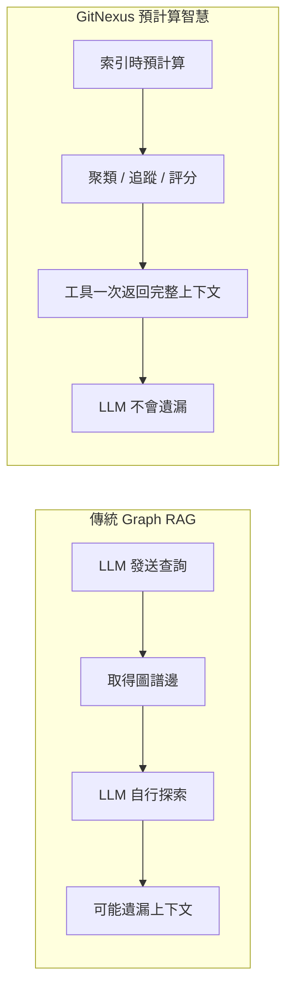
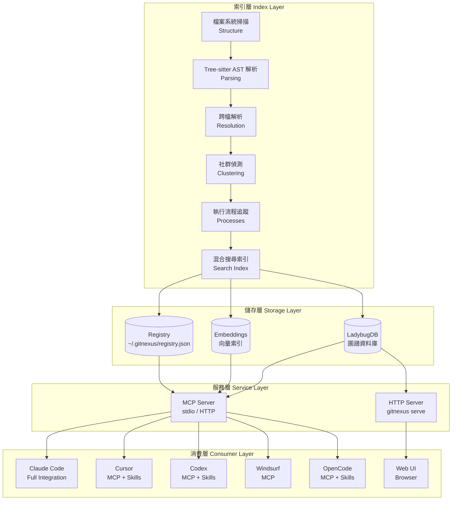
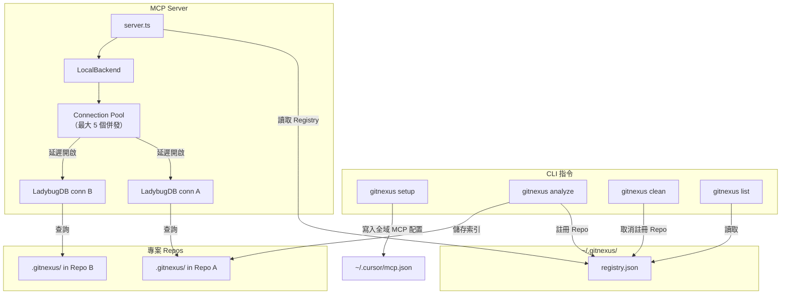
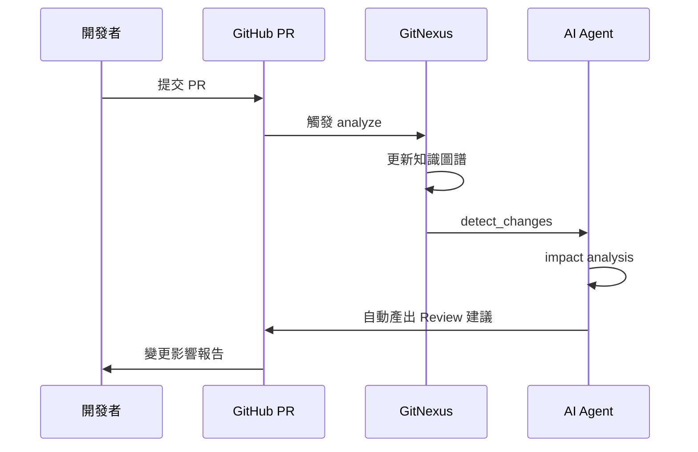
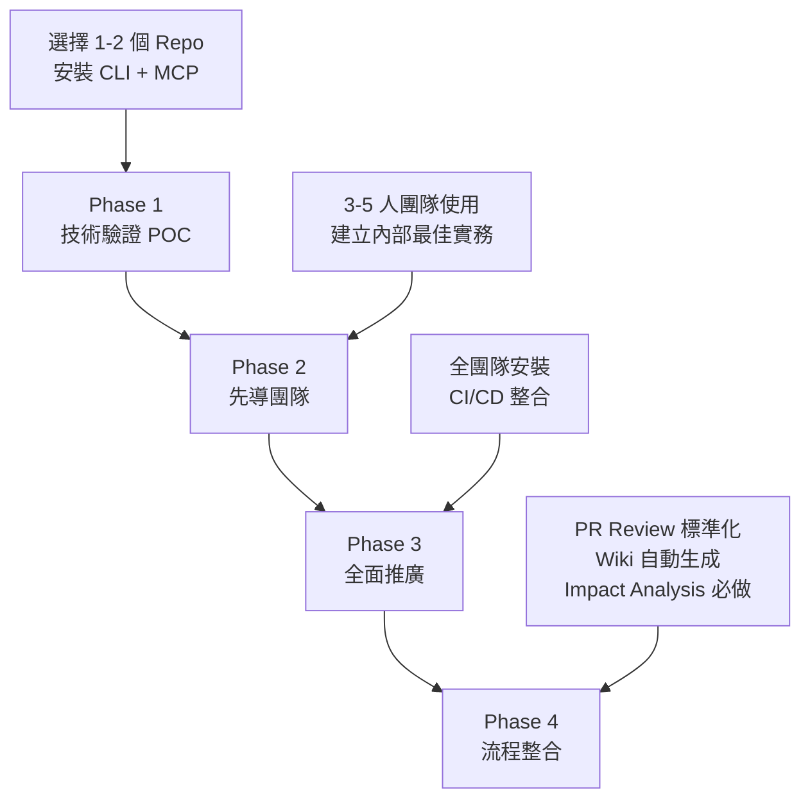
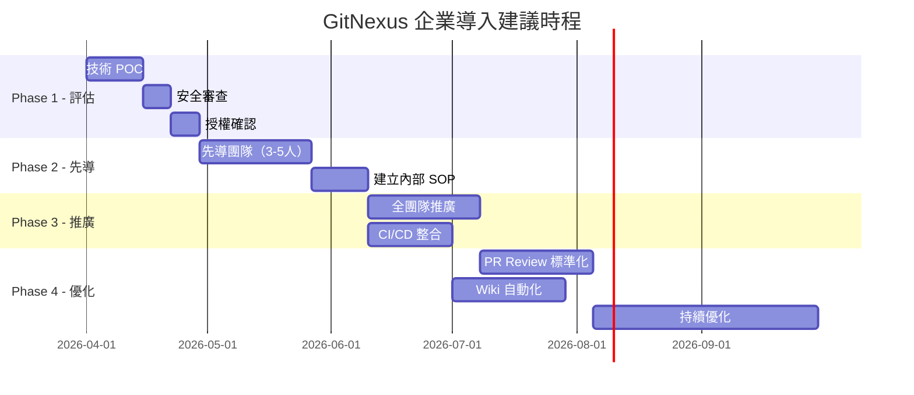

+++
date = '2026-04-08T20:06:55+08:00'
draft = false
title = 'GitNexus教學手冊'
tags = ['教學', 'AI開發','指引']
categories = ['教學']
+++
# GitNexus 教學手冊（企業級完整版）

> **版本**：v1.5.3（2026-04 基準，含 Unreleased LadybugDB v0.15 遷移預告）  
> **適用對象**：資深工程師 / 架構師 / DevOps / AI Agent 開發者  
> **授權**：PolyForm Noncommercial 1.0.0（企業授權另洽 akonlabs.com）  
> **維護單位**：內部 AI 開發組  
> **GitHub**：https://github.com/abhigyanpatwari/GitNexus （⭐ 25k+ Stars / 62+ Contributors）

> ⚠️ **重要警告**：GitNexus **沒有**官方加密貨幣、代幣或硬幣。任何在 Pump.fun 或其他平台上使用 GitNexus 名稱的代幣/硬幣，**均非本專案或其維護者所屬、認可或建立**。請勿購買任何聲稱與 GitNexus 相關的加密貨幣。

---

## 目錄

- [第 1 章：GitNexus 概述](#第-1-章gitnexus-概述)
  - [1.1 GitNexus 是什麼](#11-gitnexus-是什麼)
  - [1.2 核心理念](#12-核心理念)
  - [1.3 與傳統工具比較](#13-與傳統工具比較)
  - [1.4 適用場景](#14-適用場景)
- [第 2 章：系統架構說明](#第-2-章系統架構說明)
  - [2.1 整體架構圖](#21-整體架構圖)
  - [2.2 核心組件說明](#22-核心組件說明)
  - [2.3 Web UI vs CLI 架構差異](#23-web-ui-vs-cli-架構差異)
  - [2.4 Multi-Repo MCP 架構](#24-multi-repo-mcp-架構)
- [第 3 章：安裝與環境設定](#第-3-章安裝與環境設定)
  - [3.1 系統需求](#31-系統需求)
  - [3.2 CLI 安裝](#32-cli-安裝)
  - [3.3 Web UI 使用](#33-web-ui-使用)
  - [3.4 MCP 編輯器設定](#34-mcp-編輯器設定)
  - [3.5 常見問題排除](#35-常見問題排除)
- [第 4 章：基本操作教學](#第-4-章基本操作教學)
  - [4.1 建立 Knowledge Graph](#41-建立-knowledge-graph)
  - [4.2 CLI 常用指令](#42-cli-常用指令)
  - [4.3 查詢程式碼關聯](#43-查詢程式碼關聯)
  - [4.4 視覺化圖譜操作](#44-視覺化圖譜操作)
  - [4.5 Repository 群組管理](#45-repository-群組管理)
- [第 5 章：進階應用](#第-5-章進階應用)
  - [5.1 Graph RAG 使用方式](#51-graph-rag-使用方式)
  - [5.2 Impact Analysis（影響分析）](#52-impact-analysis影響分析)
  - [5.3 Process-Grouped Search](#53-process-grouped-search)
  - [5.4 360 度 Symbol Context](#54-360-度-symbol-context)
  - [5.5 Git-Diff 變更偵測](#55-git-diff-變更偵測)
  - [5.6 Multi-File Rename](#56-multi-file-rename)
  - [5.7 Cypher 原生查詢](#57-cypher-原生查詢)
  - [5.8 Wiki 自動生成](#58-wiki-自動生成)
- [第 6 章：整合企業開發流程](#第-6-章整合企業開發流程)
  - [6.1 與 GitHub / GitLab 整合](#61-與-github--gitlab-整合)
  - [6.2 與 AI 工具整合](#62-與-ai-工具整合)
  - [6.3 與開發架構整合](#63-與開發架構整合)
  - [6.4 DevOps 整合](#64-devops-整合)
  - [6.5 Community Integrations（社群整合）](#65-community-integrations社群整合)
  - [6.6 開發文件與貢獻指南](#66-開發文件與貢獻指南)
- [第 7 章：銀行 / 大型系統應用案例](#第-7-章銀行--大型系統應用案例)
  - [7.1 案例一：批次系統依賴分析](#71-案例一批次系統依賴分析)
  - [7.2 案例二：跨系統 API 呼叫分析](#72-案例二跨系統-api-呼叫分析)
  - [7.3 案例三：DB Schema 影響分析](#73-案例三db-schema-影響分析)
- [第 8 章：安全與隱私（SSDLC）](#第-8-章安全與隱私ssdlc)
  - [8.1 Zero-Server 優勢](#81-zero-server-優勢)
  - [8.2 原始碼保護](#82-原始碼保護)
  - [8.3 本地 AI 模型風險](#83-本地-ai-模型風險)
  - [8.4 權限控管建議](#84-權限控管建議)
  - [8.5 安全強化歷史與已知修復](#85-安全強化歷史與已知修復)
- [第 9 章：系統升級與維運](#第-9-章系統升級與維運)
  - [9.1 GitNexus 升級流程](#91-gitnexus-升級流程)
  - [9.2 Graph 重建策略](#92-graph-重建策略)
  - [9.3 Repository 更新同步](#93-repository-更新同步)
  - [9.4 效能優化建議](#94-效能優化建議)
  - [9.5 LadybugDB 遷移指南（Unreleased）](#95-ladybugdb-遷移指南unreleased)
  - [9.6 Edge Type 遷移（OVERRIDES → METHOD_OVERRIDES）](#96-edge-type-遷移overrides--method_overrides)
- [第 10 章：最佳實務（Best Practices）](#第-10-章最佳實務best-practices)
  - [10.1 大型專案使用建議](#101-大型專案使用建議)
  - [10.2 Monorepo vs Multi-repo](#102-monorepo-vs-multi-repo)
  - [10.3 團隊導入策略](#103-團隊導入策略)
  - [10.4 使用限制與風險](#104-使用限制與風險)
- [第 11 章：常見問題 FAQ](#第-11-章常見問題-faq)
- [第 12 章：未來發展與建議](#第-12-章未來發展與建議)
  - [12.1 Graph RAG 未來趨勢](#121-graph-rag-未來趨勢)
  - [12.2 與 Agent 系統整合](#122-與-agent-系統整合)
  - [12.3 企業導入 Roadmap](#123-企業導入-roadmap)
- [附錄 A：快速檢查清單（Checklist）](#附錄-a快速檢查清單checklist)
- [附錄 B：CLI 指令速查表](#附錄-bcli-指令速查表)
- [附錄 C：MCP 工具速查表](#附錄-cmcp-工具速查表)
- [附錄 D：語言能力詳細矩陣](#附錄-d語言能力詳細矩陣)
- [附錄 E：Edge Type（關係類型）速查表](#附錄-eedge-type關係類型速查表)

---

## 第 1 章：GitNexus 概述

### 1.1 GitNexus 是什麼

**🎯 目的**：讓團隊成員在 5 分鐘內理解 GitNexus 的定位與價值。

**📘 說明**

GitNexus 是由 Abhigyan Patwari 發起的開源程式碼智慧引擎（Code Intelligence Engine），核心理念為 **Zero-Server**（零伺服器）。它能將任何 GitHub 儲存庫或本地程式碼庫轉化為**互動式知識圖譜（Knowledge Graph）**，讓 AI Agent 在進行程式碼分析、修改或重構時，能完整掌握每一個依賴關係、呼叫鏈與執行流程。

> **官方定義**：「Building nervous system for agent context — Indexes any codebase into a knowledge graph — every dependency, call chain, cluster, and execution flow — then exposes it through smart tools so AI agents never miss code.」

> *Like DeepWiki, but deeper.* DeepWiki 幫助你「理解」程式碼。GitNexus 讓你「分析」程式碼 — 因為知識圖譜追蹤每一個關係，而非僅是描述。

**專案統計**（截至 2026 年 4 月）：

| 指標 | 數值 |
|------|------|
| GitHub Stars | 25,000+ |
| Contributors | 62+ |
| Releases | 13 |
| npm Package | [gitnexus](https://www.npmjs.com/package/gitnexus) |
| 授權 | [PolyForm Noncommercial 1.0.0](https://polyformproject.org/licenses/noncommercial/1.0.0/) |
| Discord 社群 | [discord.gg/AAsRVT6fGb](https://discord.gg/AAsRVT6fGb) |

**核心特點**：

| 特性 | 說明 |
|------|------|
| Zero-Server | CLI 完全本地執行，Web UI 完全瀏覽器端運行，原始碼不外傳 |
| Knowledge Graph | 將程式碼關係建構為圖譜資料庫（LadybugDB，前身為 KuzuDB） |
| Graph RAG | 基於圖譜的檢索增強生成，非傳統向量 RAG |
| Precomputed Intelligence | 索引時即預計算聚類、追蹤、評分，工具一次返回完整上下文 |
| MCP 整合 | 透過 Model Context Protocol 讓 AI Agent 直接查詢圖譜 |
| 14 語言支援 | TypeScript, JavaScript, Python, Java, Kotlin, C#, Go, Rust, PHP, Ruby, Swift, C, C++, Dart |
| Agent Skills | 自動安裝 4 個預設 Skill + 可生成 Repo 專屬 Skill |
| Multi-Repo | 單一 MCP Server 可服務多個已索引 Repository |

**最新版本**：v1.5.3（2026-04-01）— 含 TypeScript/JavaScript MethodExtractor、Azure OpenAI 相容性修復

---

### 1.2 核心理念

**📘 說明**

GitNexus 解決了一個關鍵問題：**AI Coding Agent（如 Cursor、Claude Code、Codex、Cline、Roo Code、Windsurf）雖然強大，但不真正理解程式碼庫的結構**。

典型情境：

1. AI 修改了 `UserService.validate()`
2. 不知道有 47 個函式依賴其回傳型別
3. 破壞性變更被部署上線

**GitNexus vs 傳統 Graph RAG**：



**核心創新 — Precomputed Relational Intelligence**：

- **可靠性**：LLM 無法遺漏上下文，因為已在工具回應中
- **Token 效率**：無需 10 次查詢鏈才能理解一個函式
- **模型民主化**：小型 LLM 也能接收完整架構資訊，使其表現可與大型模型競爭

**TL;DR**：**Web UI** 是快速與任何 Repo 對話的工具。**CLI + MCP** 是讓你的 AI Agent 真正可靠的方式 — 它給 Cursor、Claude Code、Codex 等工具一個深度的架構視角，使它們不再遺漏依賴、破壞呼叫鏈或盲目編輯。

---

### 1.3 與傳統工具比較

| 比較項目 | IDE 內建搜尋 | GitHub Code Search | DeepWiki | Cline / Roo Code | GitNexus |
|----------|-------------|-------------------|----------|------------------|----------|
| 分析深度 | 單檔 / 符號 | 文字匹配 | 自然語言描述 | 局部上下文 | 完整知識圖譜 |
| 關係追蹤 | 有限（同檔） | 無 | 語義理解 | 有限 | 全域呼叫鏈 + 依賴圖 |
| AI Agent 整合 | 無 | 無 | 被動查詢 | 自有 Agent | MCP 主動提供上下文 |
| 影響分析 | 無 | 無 | 無 | 無 | 爆炸半徑分析 + 信心分數 |
| 隱私保護 | 本地 | 雲端 | 雲端 | 依設定 | 完全本地 |
| 執行流程追蹤 | 無 | 無 | 描述性 | 無 | 自動偵測入口點到完整鏈路 |
| 多語言支援 | 依 IDE | 有限 | 有限 | 有限 | 14 語言 |
| 預計算智慧 | 無 | 無 | 無 | 無 | 聚類 / 追蹤 / 評分 |
| 執行流程追蹤 | 無 | 無 | 描述性 | 自動偵測入口點到完整鏈路 |
| 多語言支援 | 依 IDE | 有限 | 有限 | 14 語言 |

> **📌 關鍵差異**：DeepWiki 幫你「理解」程式碼，GitNexus 讓你「分析」程式碼 — 因為知識圖譜追蹤每一個關係，而非僅是描述。Cline / Roo Code 雖有 AI Agent 能力，但缺乏預計算的結構化圖譜，仍依賴即時搜尋和局部上下文。

---

### 1.4 適用場景

| 場景 | 說明 | GitNexus 價值 |
|------|------|--------------|
| **大型系統維護** | 10 萬行以上的企業系統 | 快速定位依賴、降低修改風險 |
| **微服務架構** | 跨服務 API 呼叫分析 | Repository Group 統一圖譜 |
| **舊系統逆向工程** | Legacy 系統現代化 | 自動產出架構圖、執行流程 |
| **PR Review** | 變更影響分析 | `detect_changes` 自動評估風險 |
| **新人 Onboarding** | 快速理解程式碼庫 | Wiki 自動生成 + 圖譜探索 |
| **重構計畫** | 安全地進行大規模重構 | Impact Analysis + Rename |
| **AI Coding** | 提升 Agent 程式碼理解 | MCP 提供完整架構上下文 |

**💡 最佳實務**：在銀行系統中，建議將 GitNexus 加入 SSDLC 流程的「設計審查」與「變更管理」環節。

**⚠️ 注意事項**：
- Web UI 瀏覽器模式受記憶體限制（約 5,000 檔案），大型專案請使用 CLI
- 商業使用需取得企業授權

---

## 第 2 章：系統架構說明

### 2.1 整體架構圖

**🎯 目的**：理解 GitNexus 各組件如何協作。

**📘 說明**



---

### 2.2 核心組件說明

#### Parser（程式碼解析）

使用 **Tree-sitter** 進行 AST（Abstract Syntax Tree）解析，支援原生綁定（CLI）和 WASM（Web UI）兩種模式。

**解析能力**：

| 能力 | 說明 |
|------|------|
| Imports | 跨檔 import 解析 |
| Named Bindings | `import { X as Y }` / re-export 追蹤 |
| Exports | public / exported 符號偵測 |
| Heritage | 類別繼承、介面、Mixin |
| Type Annotations | 明確型別提取（用於 receiver 解析） |
| Constructor Inference | 建構子推斷型別（含 `self`/`this` 解析） |
| Config | 語言工具鏈配置解析（tsconfig、go.mod 等） |
| Frameworks | AST 框架模式偵測（@Controller、@Get 等） |
| Entry Points | 入口點評分啟發式 |

#### Graph Builder（圖譜建構）

多階段索引流水線：

1. **Structure** — 掃描檔案樹，映射資料夾 / 檔案關係
2. **Parsing** — 使用 Tree-sitter AST 提取函式、類別、方法、介面
3. **Resolution** — 解析 import、函式呼叫、繼承、建構子推斷、`self`/`this` receiver 型別，使用語言感知邏輯（language-aware logic）
4. **Clustering** — 使用 Leiden 社群偵測演算法（基於 Graphology 圖結構庫），將相關符號分組為功能模組
5. **Processes** — 從入口點追蹤執行流程，建立完整呼叫鏈
6. **Search** — 建構混合搜尋索引（BM25 + 語義 + RRF）

**v1.4.0+ 新增的解析能力**：

| 能力 | 說明 |
|------|------|
| 3-Tier Resolver | 精確 FQN → scope-walk → 受保護模糊回退（拒絕模糊匹配） |
| Method Resolution Order (MRO) | 5 種語言策略：C++ leftmost-base、C#/Java class-over-interface、Python C3 linearization、Rust qualified syntax、default BFS |
| Constructor & Struct 解析 | `new Foo()`、`User{...}`、C# primary constructor、target-typed new |
| Receiver-Constrained 解析 | 透過 TypeEnv 區分 `user.save()` vs `repo.save()` |
| Heritage & Ownership Edges | HAS_METHOD、METHOD_OVERRIDES、METHOD_IMPLEMENTS、Go struct embedding、Swift extension heritage |
| Overload Disambiguation | 同名函式透過 type-hash suffix 區分（v1.5.3+） |

#### Embedding Engine

使用 **HuggingFace transformers.js** 進行向量嵌入：

- CLI：GPU / CPU 加速
- Web UI：WebGPU / WASM

#### Graph RAG 查詢引擎

16 個 MCP 工具（11 個 per-repo + 5 個 group），透過 **Model Context Protocol** 暴露給 AI Agent。

#### 完整技術棧（Tech Stack）

| 層級 | CLI | Web UI |
|------|-----|--------|
| **Runtime** | Node.js（原生） | Browser（WASM） |
| **Parsing** | Tree-sitter 原生綁定 | Tree-sitter WASM |
| **Database** | LadybugDB 原生（前身 KuzuDB） | LadybugDB WASM |
| **Embeddings** | HuggingFace transformers.js（GPU/CPU） | transformers.js（WebGPU/WASM） |
| **Search** | BM25 + 語義 + RRF | BM25 + 語義 + RRF |
| **Agent Interface** | MCP（stdio） | LangChain ReAct Agent |
| **Visualization** | — | Sigma.js + Graphology（WebGL） |
| **Frontend** | — | React 18, TypeScript, Vite, Tailwind v4 |
| **Clustering** | Graphology | Graphology |
| **Concurrency** | Worker threads + async | Web Workers + Comlink |

---

### 2.3 Web UI vs CLI 架構差異

| 項目 | CLI + MCP | Web UI |
|------|-----------|--------|
| 定位 | 日常開發，與 AI Agent 深度整合 | 快速探索、Demo、一次性分析 |
| 規模 | 任意大小的 Repo | 受瀏覽器記憶體限制（~5,000 檔案），或透過 Backend 模式無限制 |
| 安裝 | `npm install -g gitnexus` | 無需安裝 — [gitnexus.vercel.app](https://gitnexus.vercel.app) |
| Runtime | Node.js（原生） | Browser（WASM） |
| 解析 | Tree-sitter 原生綁定 | Tree-sitter WASM |
| 資料庫 | LadybugDB 原生（快速、持久化） | LadybugDB WASM（記憶體、每 session） |
| Embeddings | HuggingFace transformers.js（GPU/CPU） | transformers.js（WebGPU/WASM） |
| Agent 介面 | MCP（stdio） | LangChain ReAct Agent |
| 視覺化 | — | Sigma.js + Graphology（WebGL） |
| 前端 | — | React 18, TypeScript, Vite, Tailwind v4 |
| 隱私 | 完全本地，無網路呼叫 | 完全瀏覽器端，無伺服器 |
| 並發處理 | Worker threads + async | Web Workers + Comlink |

**Bridge Mode**：執行 `gitnexus serve` 可連接兩者 — Web UI 自動偵測本地伺服器，瀏覽所有 CLI 索引的 Repo，無需重新上傳或重新索引。

**Local Backend Mode**：執行 `gitnexus serve` 後開啟 Web UI — 自動偵測伺服器並顯示所有已索引 Repo，支援完整 AI 對話。Agent 的工具（Cypher 查詢、搜尋、程式碼導航）自動透過後端 HTTP API 路由。

---

### 2.4 Multi-Repo MCP 架構

**📘 說明**

GitNexus 使用全域 Registry，一個 MCP Server 可服務多個已索引的 Repo。

**運作機制**：

1. 每次 `gitnexus analyze` 將索引儲存在 Repo 內的 `.gitnexus/`（已 gitignore）
2. 同時在 `~/.gitnexus/registry.json` 註冊指標
3. AI Agent 啟動時，MCP Server 讀取 Registry 並可服務任何已索引 Repo
4. LadybugDB 連線採延遲開啟（Lazy），首次查詢時開啟，閒置 5 分鐘後回收（最大 5 個併發）



> **💡 最佳實務**：當只有一個 Repo 被索引時，所有工具的 `repo` 參數可省略。多 Repo 時需指定：`query({query: "auth", repo: "my-app"})`。

---

## 第 3 章：安裝與環境設定

### 3.1 系統需求

**🎯 目的**：確認環境符合最低需求。

| 項目 | 最低需求 | 建議配置 |
|------|---------|---------|
| Node.js | 18+ | 20 LTS |
| npm | 9+ | 10+ |
| 記憶體 | 4 GB | 8 GB+（大型 Repo） |
| CPU | 雙核 | 四核+（加速 Tree-sitter 解析） |
| 磁碟 | 依 Repo 大小 | SSD（加速圖譜查詢） |
| 作業系統 | Windows / macOS / Linux | 皆支援 |
| GPU | 選配 | NVIDIA GPU（加速 Embedding 生成） |

---

### 3.2 CLI 安裝

**🛠️ 操作步驟**

#### 方法一：全域安裝（推薦）

```bash
npm install -g gitnexus
```

#### 方法二：使用 npx（免安裝）

```bash
npx gitnexus analyze
```

#### 方法三：從原始碼建置（進階）

```bash
git clone https://github.com/abhigyanpatwari/gitnexus.git
cd gitnexus
npm install
npm run build
npm link
```

**驗證安裝**：

```bash
gitnexus --version
# 應輸出 v1.5.3 或更新版本
```

---

### 3.3 Web UI 使用

**🛠️ 操作步驟**

#### 方法一：線上版（免安裝）

直接訪問：**https://gitnexus.vercel.app/**

操作流程：
1. 開啟瀏覽器訪問上述 URL
2. 拖放 ZIP 檔案或輸入 GitHub Repo URL
3. 等待索引完成
4. 開始探索圖譜和 AI 對話

#### 方法二：本地建置

```bash
git clone https://github.com/abhigyanpatwari/gitnexus.git
cd gitnexus/gitnexus-shared && npm install && npm run build
cd ../gitnexus-web && npm install
npm run dev
```

#### 方法三：Bridge Mode（推薦大型專案）

```bash
# 先用 CLI 索引 Repo
cd /path/to/your/repo
gitnexus analyze

# 啟動 HTTP Server
gitnexus serve

# 開啟 Web UI（自動偵測本地 Server）
# 瀏覽器訪問 http://localhost:3000
```

---

### 3.4 MCP 編輯器設定

**🛠️ 操作步驟**

#### 自動設定（推薦）

```bash
gitnexus setup
```

此指令會自動偵測已安裝的編輯器並寫入正確的 MCP 配置。只需執行一次。

#### 手動設定

**Claude Code**（完整支援 — MCP + Skills + Hooks）：

```bash
# macOS / Linux
claude mcp add gitnexus -- npx -y gitnexus@latest mcp

# Windows
claude mcp add gitnexus -- cmd /c npx -y gitnexus@latest mcp
```

**Codex**（完整支援 — MCP + Skills）：

```bash
codex mcp add gitnexus -- npx -y gitnexus@latest mcp
```

**Cursor**（`~/.cursor/mcp.json`）：

```json
{
  "mcpServers": {
    "gitnexus": {
      "command": "npx",
      "args": ["-y", "gitnexus@latest", "mcp"]
    }
  }
}
```

**OpenCode**（`~/.config/opencode/config.json`）：

```json
{
  "mcp": {
    "gitnexus": {
      "type": "local",
      "command": ["gitnexus", "mcp"]
    }
  }
}
```

**Codex**（`~/.codex/config.toml`）：

```toml
[mcp_servers.gitnexus]
command = "npx"
args = ["-y", "gitnexus@latest", "mcp"]
```

#### 編輯器支援程度

| 編輯器 | MCP Tools | Skills | Hooks | 整合程度 |
|--------|-----------|--------|-------|---------|
| Claude Code | ✅ | ✅ | ✅（PreToolUse + PostToolUse） | **完整** |
| Cursor | ✅ | ✅ | — | MCP + Skills |
| Codex | ✅ | ✅ | — | MCP + Skills |
| Windsurf | ✅ | — | — | MCP |
| OpenCode | ✅ | ✅ | — | MCP + Skills |

> **💡 最佳實務**：Claude Code 獲得最深度整合：MCP 工具 + Agent Skills + PreToolUse Hooks（以圖譜上下文豐富搜尋） + PostToolUse Hooks（commit 後自動重新索引）。

---

### 3.5 常見問題排除

| 問題 | 原因 | 解決方案 |
|------|------|---------|
| `gitnexus: command not found` | 未全域安裝 | `npm install -g gitnexus` 或使用 `npx` |
| 索引卡住不動 | Repo 過大，Tree-sitter 解析耗時 | 使用 `--skip-embeddings` 加速 |
| MCP 連線失敗 | 編輯器 MCP 配置錯誤 | 執行 `gitnexus setup` 重新配置 |
| Web UI 載入緩慢 | 瀏覽器記憶體不足 | 改用 Bridge Mode（`gitnexus serve`） |
| Embedding 生成失敗 | GPU 驅動問題 | 使用 `--skip-embeddings` 跳過 |
| `registry.json` 損壞 | 索引中斷 | 刪除 `~/.gitnexus/registry.json` 後重新 `gitnexus analyze` |
| Windows 路徑問題 | 路徑含中文或空格 | 將 Repo 移至英文路徑 |

**⚠️ 注意事項**：
- `.gitnexus/` 資料夾已預設加入 `.gitignore`，不會被提交
- 全域 Registry 僅儲存路徑和 metadata，不含原始碼

---

## 第 4 章：基本操作教學

### 4.1 建立 Knowledge Graph

**🎯 目的**：學會索引一個 Repository 並建立知識圖譜。

**🛠️ 操作步驟**

```bash
# Step 1：切換到 Repo 根目錄
cd /path/to/your/repo

# Step 2：執行索引（一鍵完成）
npx gitnexus analyze
```

**此指令會自動完成**：
1. 掃描檔案樹結構
2. 使用 Tree-sitter 解析 AST
3. 解析跨檔 import / 呼叫 / 繼承關係（含 3-Tier Resolver）
4. 執行 Leiden 社群偵測（Clustering）
5. 追蹤執行流程（Process Detection）
6. 建構混合搜尋索引（BM25 + 語義 + RRF）
7. 安裝 Agent Skills（`.claude/skills/gitnexus/`）
8. 註冊 Claude Code Hooks（PreToolUse + PostToolUse）
9. 建立 `AGENTS.md` / `CLAUDE.md` 上下文檔案
10. 註冊到全域 Registry（`~/.gitnexus/registry.json`）

**自動安裝的 4 個 Agent Skills**：

| Skill | 說明 |
|-------|------|
| **Exploring** | 使用知識圖譜導航不熟悉的程式碼 |
| **Debugging** | 透過呼叫鏈追蹤 Bug |
| **Impact Analysis** | 變更前分析爆炸半徑 |
| **Refactoring** | 使用依賴映射規劃安全重構 |

**進階選項**：

```bash
# 強制完全重新索引
gitnexus analyze --force

# 生成 Repo 特定的 Skill 檔案（基於偵測到的社群）
gitnexus analyze --skills

# 跳過 Embedding 生成（更快）
gitnexus analyze --skip-embeddings

# 啟用 Embedding 生成（更慢，但搜尋更精確）
gitnexus analyze --embeddings

# 保留自訂的 AGENTS.md / CLAUDE.md 內容
gitnexus analyze --skip-agents-md

# 顯示跳過的檔案（當解析器不可用時）
gitnexus analyze --verbose
```

**💡 最佳實務**：
- 首次索引建議使用 `--skip-embeddings` 加速，確認基本功能正常後再啟用
- 使用 `--skills` 可為每個功能模組生成專屬的 `SKILL.md`（儲存於 `.claude/skills/generated/`）
- 使用 `--skip-agents-md` 可保留自訂的 `AGENTS.md` / `CLAUDE.md` 內容
- Skills 在每次 `--skills` 執行時會依據最新程式碼庫重新生成

**Repo-Specific Skills**：

執行 `gitnexus analyze --skills` 時，GitNexus 會透過 Leiden 社群偵測辨識程式碼庫的功能區域，並為每個區域在 `.claude/skills/generated/` 下生成一個 `SKILL.md`。每個 Skill 描述該模組的關鍵檔案、入口點、執行流程和跨區域連結，讓 AI Agent 獲得精確的模組上下文。

---

### 4.2 CLI 常用指令

**📘 完整指令一覽**

```bash
# ===== 設定 =====
gitnexus setup                      # 設定 MCP 編輯器（一次性）

# ===== 索引 =====
gitnexus analyze [path]             # 索引 Repository（或更新過期索引）
gitnexus analyze --force            # 強制完全重新索引
gitnexus analyze --skills           # 生成 Repo 特定 Skill 檔案
gitnexus analyze --skip-embeddings  # 跳過 Embedding（更快）
gitnexus analyze --embeddings       # 啟用 Embedding（更精確）
gitnexus analyze --verbose          # 顯示跳過的檔案

# ===== 服務 =====
gitnexus mcp                        # 啟動 MCP Server（stdio）— 服務所有已索引 Repo
gitnexus serve                      # 啟動本地 HTTP Server（Multi-Repo）供 Web UI 連接

# ===== 狀態 =====
gitnexus list                       # 列出所有已索引 Repository
gitnexus status                     # 顯示當前 Repo 索引狀態

# ===== 清理 =====
gitnexus clean                      # 刪除當前 Repo 索引
gitnexus clean --all --force        # 刪除所有索引

# ===== Wiki =====
gitnexus wiki [path]                # 從知識圖譜生成 Wiki
gitnexus wiki --model gpt-4o        # 指定 LLM 模型
gitnexus wiki --base-url <url>      # 自訂 LLM API URL
gitnexus wiki --force               # 強制重新生成

# ===== Repository 群組 =====
gitnexus group create <name>        # 建立群組
gitnexus group add <name> <repo>    # 加入 Repo 到群組
gitnexus group remove <name> <repo> # 從群組移除 Repo
gitnexus group list [name]          # 列出群組
gitnexus group sync <name>          # 跨 Repo 契約同步
gitnexus group contracts <name>     # 檢視跨 Repo 契約
gitnexus group query <name> <q>     # 跨群組搜尋
gitnexus group status <name>        # 檢查群組過期狀態
```

---

### 4.3 查詢程式碼關聯

**🛠️ 操作步驟**

透過 MCP 工具（在 AI Agent 中使用），GitNexus 提供以下查詢能力：

#### 混合搜尋（query）

```
query({query: "authentication middleware"})
```

回傳結果會依執行流程分組：

```yaml
processes:
  - summary: "LoginFlow"
    priority: 0.042
    symbol_count: 4
    process_type: cross_community
    step_count: 7

process_symbols:
  - name: validateUser
    type: Function
    filePath: src/auth/validate.ts
    process_id: proc_login
    step_index: 2

definitions:
  - name: AuthConfig
    type: Interface
    filePath: src/types/auth.ts
```

#### 360 度符號檢視（context）

```
context({name: "validateUser"})
```

```yaml
symbol:
  uid: "Function:validateUser"
  kind: Function
  filePath: src/auth/validate.ts
  startLine: 15

incoming:
  calls: [handleLogin, handleRegister, UserController]
  imports: [authRouter]

outgoing:
  calls: [checkPassword, createSession]

processes:
  - name: LoginFlow (step 2/7)
  - name: RegistrationFlow (step 3/5)
```

---

### 4.4 視覺化圖譜操作

**📘 說明**

Web UI 使用 **Sigma.js + Graphology（WebGL）** 進行即時圖譜渲染。

**操作方式**：

1. 開啟 Web UI（gitnexus.vercel.app 或本地 `gitnexus serve`）
2. 載入 Repository（拖放 ZIP 或指定 GitHub URL）
3. 等待索引完成後，圖譜自動顯示
4. 互動操作：
   - **縮放**：滾輪調整視角
   - **拖拽**：移動畫布或節點
   - **點擊節點**：檢視符號詳細資訊
   - **搜尋**：在搜尋框輸入函式名或類別名
   - **AI 對話**：使用內建 Chat 功能詢問程式碼問題

**💡 最佳實務**：
- 大型 Repo 建議使用 Bridge Mode，避免瀏覽器記憶體不足
- 使用社群過濾器篩選特定功能模組

---

### 4.5 Repository 群組管理

**🎯 目的**：管理跨 Repo / 微服務的統一分析。

**🛠️ 操作步驟**

```bash
# 建立群組
gitnexus group create banking-platform

# 加入各服務 Repo
gitnexus group add banking-platform api-gateway
gitnexus group add banking-platform user-service
gitnexus group add banking-platform payment-service
gitnexus group add banking-platform batch-service

# 跨 Repo 契約同步（偵測 API 呼叫關係）
gitnexus group sync banking-platform

# 檢視跨服務契約
gitnexus group contracts banking-platform

# 跨服務搜尋
gitnexus group query banking-platform "轉帳流程"

# 檢查過期狀態
gitnexus group status banking-platform
```

**⚠️ 注意事項**：
- 每個 Repo 需先個別執行 `gitnexus analyze`
- 群組同步會提取各 Repo 的 API 契約並建立跨服務連結

---

## 第 5 章：進階應用

### 5.1 Graph RAG 使用方式

**🎯 目的**：掌握基於知識圖譜的 RAG 查詢，取得精確的程式碼分析結果。

**📘 說明**

GitNexus 的 Graph RAG 與傳統 RAG 的差異：

| 項目 | 傳統 Vector RAG | GitNexus Graph RAG |
|------|----------------|-------------------|
| 索引方式 | 程式碼切片 → 向量化 | 程式碼 → AST → 圖譜 + 向量 |
| 查詢方式 | 語義相似度比對 | BM25 + 語義 + RRF 混合排序 |
| 上下文品質 | 片段式、可能遺漏 | 完整呼叫鏈、依賴關係、執行流程 |
| 關係追蹤 | 無 | CALLS、IMPORTS、EXTENDS、IMPLEMENTS、METHOD_OVERRIDES、METHOD_IMPLEMENTS、HAS_METHOD、MEMBER_OF |

**問答範例**：

在 AI Agent（如 Claude Code）中直接提問：

```
# 範例 1：API 服務呼叫分析
「這個 UserController 呼叫了哪些服務？」

# 範例 2：資料庫依賴分析
「payment-service 依賴哪些 DB Table？」

# 範例 3：影響範圍評估
「如果我修改 AuthService.validate() 的回傳型別，會影響哪些功能？」

# 範例 4：執行流程追蹤
「從登入 API 到資料庫寫入的完整呼叫鏈是什麼？」
```

**💡 最佳實務**：
- 對於大型系統，建議先使用 `query` 找到相關模組，再用 `context` 深入分析特定符號
- 使用 `impact` 進行變更前評估是最高價值的使用場景

---

### 5.2 Impact Analysis（影響分析）

**🎯 目的**：在修改程式碼前，精確評估爆炸半徑。

**🛠️ MCP 工具使用**

```javascript
impact({
  target: "UserService",
  direction: "upstream",      // upstream=誰依賴我, downstream=我依賴誰
  minConfidence: 0.8,         // 最低信心分數
  maxDepth: 3,                // 最大追蹤深度
  relationTypes: ["CALLS", "IMPORTS", "EXTENDS", "IMPLEMENTS", "METHOD_OVERRIDES", "METHOD_IMPLEMENTS"],
  includeTests: false         // 是否包含測試
})
```

**輸出範例**：

```
TARGET: Class UserService (src/services/user.ts)

UPSTREAM (what depends on this):
  Depth 1 (WILL BREAK):
    handleLogin [CALLS 90%] -> src/api/auth.ts:45
    handleRegister [CALLS 90%] -> src/api/auth.ts:78
    UserController [CALLS 85%] -> src/controllers/user.ts:12
  Depth 2 (LIKELY AFFECTED):
    authRouter [IMPORTS] -> src/routes/auth.ts
```

**實務應用情境**：

| 情境 | direction | 說明 |
|------|-----------|------|
| 修改一個 Service | upstream | 找出所有呼叫此 Service 的元件 |
| 新增依賴 | downstream | 確認此元件依賴的下游是否穩定 |
| 移除一個類別 | upstream | 確保無其他元件引用 |
| 介面變更 | upstream + downstream | 雙向評估影響 |

---

### 5.3 Process-Grouped Search

**📘 說明**

搜尋結果不再是零散的符號列表，而是按**執行流程（Process）**分組。

```javascript
query({query: "payment processing"})
```

**回傳結構**：

```yaml
processes:
  - summary: "PaymentFlow"
    priority: 0.089
    symbol_count: 8
    process_type: cross_community
    step_count: 12

process_symbols:
  - name: processPayment
    type: Function
    filePath: src/payment/processor.ts
    process_id: proc_payment
    step_index: 1

  - name: validateAmount
    type: Function
    filePath: src/payment/validator.ts
    process_id: proc_payment
    step_index: 2
```

---

### 5.4 360 度 Symbol Context

**📘 說明**

取得一個符號的完整上下文 — 誰呼叫它、它呼叫誰、參與哪些流程。

```javascript
context({name: "processPayment"})
```

```yaml
symbol:
  uid: "Function:processPayment"
  kind: Function
  filePath: src/payment/processor.ts
  startLine: 42

incoming:
  calls: [PaymentController.create, BatchJobRunner.execute]
  imports: [paymentRouter]

outgoing:
  calls: [validateAmount, debitAccount, creditAccount, logTransaction]

processes:
  - name: PaymentFlow (step 1/12)
  - name: BatchSettlement (step 3/8)
```

---

### 5.5 Git-Diff 變更偵測

**🎯 目的**：在 commit 前分析變更的影響範圍。

```javascript
detect_changes({scope: "all"})
```

**輸出**：

```yaml
summary:
  changed_count: 12
  affected_count: 3
  changed_files: 4
  risk_level: medium

changed_symbols: [validateUser, AuthService, ...]
affected_processes: [LoginFlow, RegistrationFlow, ...]
```

**💡 最佳實務**：
- 在 PR 提交前執行 `detect_changes`，可作為 Code Review 的輔助資訊
- 可整合至 CI/CD Pipeline 自動執行

---

### 5.6 Multi-File Rename

**📘 說明**

基於圖譜的智慧重新命名 — 跨檔案協調更名。

```javascript
rename({
  symbol_name: "validateUser",
  new_name: "verifyUser",
  dry_run: true   // 先預覽，不實際修改
})
```

**輸出**：

```yaml
status: success
files_affected: 5
total_edits: 8
graph_edits: 6        # 高信心度（基於圖譜）
text_search_edits: 2  # 需人工檢查（基於文字搜尋）
changes: [...]
```

---

### 5.7 Cypher 原生查詢

**📘 說明**

直接使用 Cypher 查詢語言操作知識圖譜。

```cypher
-- 找出呼叫認證相關函式的所有上游呼叫者
MATCH (c:Community {heuristicLabel: 'Authentication'})<-[:CodeRelation {type: 'MEMBER_OF'}]-(fn)
MATCH (caller)-[r:CodeRelation {type: 'CALLS'}]->(fn)
WHERE r.confidence > 0.8
RETURN caller.name, fn.name, r.confidence
ORDER BY r.confidence DESC
```

**常用 Cypher 查詢範例**：

```cypher
-- 找出所有入口點
MATCH (n) WHERE n.isEntryPoint = true
RETURN n.name, n.kind, n.filePath

-- 找出某個類別的所有子類別
MATCH (child)-[:CodeRelation {type: 'EXTENDS'}]->(parent {name: 'BaseService'})
RETURN child.name, child.filePath

-- 找出某個介面的所有實作（METHOD_IMPLEMENTS）
MATCH (impl)-[:CodeRelation {type: 'METHOD_IMPLEMENTS'}]->(iface {name: 'PaymentGateway'})
RETURN impl.name, impl.filePath

-- 找出方法覆寫關係（METHOD_OVERRIDES）
MATCH (child_method)-[:CodeRelation {type: 'METHOD_OVERRIDES'}]->(parent_method)
RETURN child_method.name, child_method.filePath, parent_method.name, parent_method.filePath

-- 找出跨社群呼叫（潛在的架構邊界）
MATCH (a)-[:CodeRelation {type: 'MEMBER_OF'}]->(c1:Community),
      (b)-[:CodeRelation {type: 'MEMBER_OF'}]->(c2:Community),
      (a)-[:CodeRelation {type: 'CALLS'}]->(b)
WHERE c1 <> c2
RETURN a.name, c1.heuristicLabel, b.name, c2.heuristicLabel

-- 找出所有 HAS_METHOD 關係（類別的方法成員）
MATCH (cls)-[:CodeRelation {type: 'HAS_METHOD'}]->(method)
WHERE cls.name = 'UserService'
RETURN method.name, method.kind, method.startLine

-- 統計各社群的符號數量
MATCH (n)-[:CodeRelation {type: 'MEMBER_OF'}]->(c:Community)
RETURN c.heuristicLabel, count(n) AS member_count
ORDER BY member_count DESC
```

---

### 5.8 Wiki 自動生成

**🎯 目的**：從知識圖譜自動產出 Repository 文件。

```bash
# 需要 LLM API Key（OPENAI_API_KEY 等）
gitnexus wiki

# 自訂 LLM 模型
gitnexus wiki --model gpt-4o

# 自訂 API 端點
gitnexus wiki --base-url https://api.anthropic.com/v1

# 強制重新生成
gitnexus wiki --force
```

**生成流程**：
1. 讀取已索引的圖譜結構
2. 透過 LLM 將檔案分組為模組
3. 為每個模組生成文件頁面
4. 建立總覽頁面
5. 交叉引用知識圖譜

**⚠️ 注意事項**：
- Wiki 生成需要 LLM API 連線（如 `OPENAI_API_KEY`）
- 預設使用 `gpt-4o-mini` 模型
- 支援 Azure OpenAI — 使用簡化的 3 步驟互動設定（endpoint、deployment、key）
- v1.5.3 修復了 Wiki HTML 查看器中的 `</script>` 注入問題

**企業版額外功能**：
- **Auto-updating Code Wiki** — 文件自動保持最新（此功能 OSS 版本亦提供基礎支援）

---

## 第 6 章：整合企業開發流程

### 6.1 與 GitHub / GitLab 整合

**🎯 目的**：將 GitNexus 嵌入日常 Git 工作流程。

#### PR Review 分析

**場景**：開發者提交 PR，需要評估變更影響。

**作法**：

```bash
# Step 1：在 PR 分支上重新索引
git checkout feature/update-auth
gitnexus analyze

# Step 2：使用 detect_changes 分析變更
# （在 AI Agent 中自動完成）
```

AI Agent 會自動執行：
1. `detect_changes({scope: "all"})` 偵測變更
2. `impact({target: "changed_symbol"})` 分析每個變更符號的影響
3. 產出影響報告

**企業版功能**：
- 自動化 PR Review — 自動產生爆炸半徑分析報告
- Auto-reindexing — 知識圖譜自動保持最新

#### Code Impact 分析



---

### 6.2 與 AI 工具整合

#### GitHub Copilot 整合

GitNexus 透過 MCP 提供上下文給 Copilot，使其在以下場景更精確：

- **程式碼生成**：Copilot 了解現有架構，生成符合專案慣例的程式碼
- **Bug 修復**：Copilot 可追蹤完整呼叫鏈，定位根因
- **重構建議**：Copilot 了解依賴關係，提出安全的重構方案

#### Claude Code 整合（最深度）

Claude Code 支援最完整的整合：

| 功能 | 說明 |
|------|------|
| MCP Tools | 16 個工具直接可用 |
| Agent Skills | 4 個預裝 Skill（Exploring、Debugging、Impact Analysis、Refactoring） |
| PreToolUse Hooks | 搜尋前自動以圖譜上下文豐富查詢 |
| PostToolUse Hooks | Commit 後自動重新索引 |
| Repo Skills | `--skills` 生成專屬模組 Skill |

#### Cursor 整合

在 Cursor 中使用 GitNexus：

1. 設定 MCP（參見 3.4 節）
2. 在 Cursor Chat 中即可直接使用 GitNexus 工具
3. Cursor 會自動利用圖譜上下文改善回應品質

---

### 6.3 與開發架構整合

#### Spring Boot 微服務

**實務應用**：

```bash
# 索引整個微服務群
gitnexus group create my-platform
gitnexus group add my-platform api-gateway
gitnexus group add my-platform user-service
gitnexus group add my-platform order-service
gitnexus group add my-platform payment-service

# 同步跨服務契約
gitnexus group sync my-platform

# 分析跨服務呼叫
gitnexus group query my-platform "訂單建立到付款完成的流程"
```

GitNexus 支援 Spring Boot 的 Framework Pattern Detection：
- 識別 `@Controller`、`@Service`、`@Repository` 註解
- 偵測 `@GetMapping`、`@PostMapping` 等 API 端點
- 追蹤 Service → Repository → Database 呼叫鏈

#### FastAPI 整合

GitNexus 對 Python 的支援同樣完整：
- 識別路由裝飾器（`@app.get`、`@router.post`）
- 追蹤依賴注入（`Depends()`）
- 解析 Pydantic 模型關係

#### Vue 微前端

- 解析 Vue SFC（Single File Component）
- 追蹤 Composable / Store 依賴
- 識別路由配置和元件關係

---

### 6.4 DevOps 整合

#### CI/CD 前分析

在 CI Pipeline 中加入 GitNexus 分析：

```yaml
# GitHub Actions 範例
name: GitNexus Impact Analysis
on: pull_request

jobs:
  impact-analysis:
    runs-on: ubuntu-latest
    steps:
      - uses: actions/checkout@v4
      - uses: actions/setup-node@v4
        with:
          node-version: '20'
      - run: npm install -g gitnexus
      - run: gitnexus analyze --skip-embeddings
      - run: gitnexus status
```

#### 自動化文件生成

```yaml
# 定期自動更新 Wiki
name: Auto Wiki Update
on:
  schedule:
    - cron: '0 2 * * 1'  # 每週一凌晨 2 點

jobs:
  wiki:
    runs-on: ubuntu-latest
    steps:
      - uses: actions/checkout@v4
      - run: npm install -g gitnexus
      - run: gitnexus analyze --skip-embeddings
      - run: gitnexus wiki --model gpt-4o-mini
      - run: |
          git add docs/wiki/
          git commit -m "docs: auto-update wiki"
          git push
```

**⚠️ 注意事項**：
- CI 環境中建議使用 `--skip-embeddings` 加速
- Wiki 生成需設定 `OPENAI_API_KEY` 環境變數

---

### 6.5 Community Integrations（社群整合）

**📘 說明**

以下為社群建構的整合專案 — 非官方維護，但值得參考：

| 專案 | 作者 | 說明 |
|------|------|------|
| [pi-gitnexus](https://github.com/tintinweb/pi-gitnexus) | [@tintinweb](https://github.com/tintinweb) | GitNexus plugin for [pi](https://pi.dev) — `pi install npm:pi-gitnexus` |
| [gitnexus-stable-ops](https://github.com/ShunsukeHayashi/gitnexus-stable-ops) | [@ShunsukeHayashi](https://github.com/ShunsukeHayashi) | Stable ops & deployment workflows（Miyabi 生態系） |

> **💡 提示**：如有基於 GitNexus 建構的專案，可至 GitHub 提交 PR 新增至此列表。

---

### 6.6 開發文件與貢獻指南

**📘 說明**

GitNexus 提供完善的開發者文件體系：

| 文件 | 說明 |
|------|------|
| [ARCHITECTURE.md](https://github.com/abhigyanpatwari/GitNexus/blob/main/ARCHITECTURE.md) | 套件結構、索引 → 圖譜 → MCP 流程、程式碼修改位置 |
| [RUNBOOK.md](https://github.com/abhigyanpatwari/GitNexus/blob/main/RUNBOOK.md) | 分析、嵌入、過期索引、MCP 恢復、CI 片段 |
| [GUARDRAILS.md](https://github.com/abhigyanpatwari/GitNexus/blob/main/GUARDRAILS.md) | 安全規則和貢獻者 / Agent 的操作「標誌」 |
| [CONTRIBUTING.md](https://github.com/abhigyanpatwari/GitNexus/blob/main/CONTRIBUTING.md) | 授權、設定、提交和 Pull Request 規範 |
| [TESTING.md](https://github.com/abhigyanpatwari/GitNexus/blob/main/TESTING.md) | `gitnexus` 和 `gitnexus-web` 的測試指令 |
| [MIGRATION.md](https://github.com/abhigyanpatwari/GitNexus/blob/main/MIGRATION.md) | 版本遷移指南（含 Edge Type 變更） |
| [CHANGELOG.md](https://github.com/abhigyanpatwari/GitNexus/blob/main/CHANGELOG.md) | 所有版本的詳細變更記錄 |

**專案結構概覽**：

| 目錄 | 說明 |
|------|------|
| `gitnexus/` | CLI + MCP Server 核心套件 |
| `gitnexus-shared/` | CLI 和 Web 共用的核心邏輯 |
| `gitnexus-web/` | Web UI（React 18 + Vite + Tailwind v4） |
| `gitnexus-claude-plugin/` | Claude Code Plugin |
| `gitnexus-cursor-integration/` | Cursor 整合 |
| `eval/` | 評估測試框架 |
| `docs/` | 設計規格和實施計畫 |

---

## 第 7 章：銀行 / 大型系統應用案例

### 7.1 案例一：批次系統依賴分析

**問題描述**

某銀行核心系統有 200+ 個 Batch Job，每日排程執行。其中一個 Job `DailySettlement` 需要修改結算邏輯，但無人清楚該 Job 的完整依賴鏈。

**使用 GitNexus 解法**

```bash
# Step 1：索引批次系統 Repo
cd /path/to/batch-system
gitnexus analyze --skills

# Step 2：在 AI Agent 中分析
```

在 Claude Code 中執行：

```
# 查詢 DailySettlement 的完整上下文
context({name: "DailySettlement"})

# 影響分析 — 上游（誰依賴它）
impact({target: "DailySettlement", direction: "upstream", maxDepth: 5})

# 影響分析 — 下游（它依賴誰）
impact({target: "DailySettlement", direction: "downstream", maxDepth: 5})
```

**分析結果**

```
TARGET: Class DailySettlement (src/batch/settlement/DailySettlement.java)

DOWNSTREAM (dependencies):
  Depth 1:
    AccountRepository [CALLS 95%] -> src/repository/AccountRepository.java
    TransactionService [CALLS 90%] -> src/service/TransactionService.java
    SettlementCalculator [CALLS 88%] -> src/batch/settlement/Calculator.java
  Depth 2:
    OracleDataSource [CALLS 92%] -> src/config/DataSourceConfig.java
    AuditLogger [CALLS 85%] -> src/audit/AuditLogger.java

UPSTREAM (dependents):
  Depth 1:
    MonthlyReport [CALLS 90%] -> src/batch/report/MonthlyReport.java
    SettlementNotifier [CALLS 85%] -> src/notification/SettlementNotifier.java
  Depth 2:
    ReportScheduler [CALLS 80%] -> src/scheduler/ReportScheduler.java
```

**帶來的效益**

| 指標 | 修改前 | 使用 GitNexus 後 |
|------|--------|-----------------|
| 影響分析時間 | 2-3 天（人工） | 5 分鐘（自動） |
| 遺漏風險 | 高（依賴人的記憶） | 極低（圖譜完整追蹤） |
| 回歸測試範圍 | 模糊 | 精確指出受影響的測試 |

---

### 7.2 案例二：跨系統 API 呼叫分析

**問題描述**

銀行要升級「客戶資料服務」的 API 版本（v1 → v2），需要知道哪些系統呼叫了該 API。

**使用 GitNexus 解法**

```bash
# 建立跨服務群組
gitnexus group create customer-platform
gitnexus group add customer-platform customer-service
gitnexus group add customer-platform loan-service
gitnexus group add customer-platform card-service
gitnexus group add customer-platform mobile-app-bff

# 同步跨服務契約
gitnexus group sync customer-platform

# 查詢跨服務影響
gitnexus group query customer-platform "CustomerAPI v1"
```

**分析結果**

```
跨服務影響分析：

customer-service（API 提供者）：
  - GET /api/v1/customers/{id}  → 被 3 個服務呼叫
  - POST /api/v1/customers      → 被 2 個服務呼叫
  - PUT /api/v1/customers/{id}  → 被 1 個服務呼叫

loan-service（消費者）：
  - CustomerClient.getById()     → 呼叫 GET /api/v1/customers/{id}
  - CustomerClient.update()      → 呼叫 PUT /api/v1/customers/{id}

card-service（消費者）：
  - CustomerAdapter.fetch()      → 呼叫 GET /api/v1/customers/{id}

mobile-app-bff（消費者）：
  - CustomerProxy.getCustomer()  → 呼叫 GET /api/v1/customers/{id}
  - CustomerProxy.register()     → 呼叫 POST /api/v1/customers
```

**帶來的效益**
- 精確定位所有 API 消費者，無一遺漏
- 產出明確的遷移計畫：哪些服務需要優先修改
- 降低 API 升級導致的系統中斷風險

---

### 7.3 案例三：DB Schema 影響分析

**問題描述**

DBA 需要修改 `ACCOUNT` 表的欄位 `balance` 型別（從 `DECIMAL(15,2)` 改為 `DECIMAL(18,4)`），需評估程式碼端影響。

**使用 GitNexus 解法**

```cypher
-- 使用 Cypher 查找所有引用 ACCOUNT 表或 balance 欄位的程式碼
MATCH (n)-[r:CodeRelation]->(m)
WHERE n.name CONTAINS 'Account' OR n.name CONTAINS 'balance'
RETURN n.name, n.kind, n.filePath, type(r), m.name
ORDER BY n.filePath
```

搭配 AI Agent 對話：

```
「找出所有讀寫 ACCOUNT 表 balance 欄位的程式碼，包含 Repository、Service、DTO 和 API」
```

**分析結果**

| 層級 | 受影響元件 | 檔案 | 影響程度 |
|------|----------|------|---------|
| Repository | AccountRepository.findBalance() | AccountRepository.java | 直接 |
| Repository | AccountRepository.updateBalance() | AccountRepository.java | 直接 |
| Service | SettlementService.calculate() | SettlementService.java | 間接 |
| Service | TransferService.execute() | TransferService.java | 間接 |
| DTO | AccountBalanceDTO.amount | AccountBalanceDTO.java | 需修改型別 |
| API | /api/accounts/{id}/balance | AccountController.java | 回應格式變更 |

**帶來的效益**
- 變更前完整評估影響，避免精度遺失造成的金額計算錯誤
- 產出明確的修改清單，逐一追蹤修改進度

---

## 第 8 章：安全與隱私（SSDLC）

### 8.1 Zero-Server 優勢

**🎯 目的**：理解 GitNexus 的隱私保護機制。

| 項目 | CLI | Web UI |
|------|-----|--------|
| 執行位置 | 本地機器 | 瀏覽器 |
| 網路呼叫 | 無 | 無 |
| 原始碼上傳 | 否 | 否 |
| 索引儲存 | `.gitnexus/`（Repo 內，已 gitignore） | 瀏覽器記憶體（Session 結束即消失） |
| 全域 Registry | `~/.gitnexus/`（僅路徑和 metadata） | 無 |
| API Key | WikiGen 時才需要（本地呼叫 LLM API） | localStorage（僅瀏覽器端） |

---

### 8.2 原始碼保護

**📘 說明**

- **原始碼永遠不離開本地環境** — GitNexus 不會將任何程式碼傳送到外部伺服器
- `.gitnexus/` 資料夾預設加入 `.gitignore`，不會被意外提交
- 全域 Registry（`~/.gitnexus/registry.json`）僅儲存 Repo 路徑和 metadata
- 開源專案，可自行審計程式碼

**企業級建議**：

```bash
# 確認 .gitignore 包含 .gitnexus/
echo ".gitnexus/" >> .gitignore

# 確認 Registry 不包含敏感資訊
cat ~/.gitnexus/registry.json
```

---

### 8.3 本地 AI 模型風險

| 風險項目 | 說明 | 緩解措施 |
|---------|------|---------|
| Embedding 模型下載 | transformers.js 會從 HuggingFace 下載模型 | 可使用 `--skip-embeddings` 避免；或預先下載模型 |
| Wiki 生成呼叫外部 API | `gitnexus wiki` 呼叫 OpenAI / Anthropic API | 控制 API Key 權限；使用內部部署的 LLM |
| 模型推論洩漏 | 嵌入向量可能包含語義資訊 | 向量儲存在本地，不外傳 |
| MCP 通訊 | MCP 使用 stdio，無網路 | 標準 IPC，安全 |

---

### 8.4 權限控管建議

**企業部署建議**：

1. **開發者本機**
   - 各開發者在自己的機器上執行 GitNexus
   - 索引資料不共享

2. **團隊共享環境**
   - 使用企業版（akonlabs.com）的自託管部署
   - RBAC 控管 Repo 存取權限
   - 審計日誌追蹤使用行為

3. **CI/CD 環境**
   - 使用短暫的容器環境
   - 索引在 Pipeline 結束後自動清除
   - API Key 透過 Secret Manager 管理

4. **API Key 管理**
   - Wiki 生成所需的 LLM API Key 使用環境變數注入
   - 不在程式碼或配置檔中明文記錄 API Key
   - 設定 API Key 的使用限額

---

### 8.5 安全強化歷史與已知修復

**📘 說明**

GitNexus 團隊持續進行安全強化，以下為重要的安全修復記錄：

| 版本 | 安全修復 | 說明 |
|------|---------|------|
| v1.3.11 | FTS Cypher Injection | 修復全文搜尋中的 Cypher 注入攻擊 — 跳脫搜尋查詢中的反斜線（#209） |
| v1.3.10 | MCP Transport Buffer Cap | 新增 10 MB `MAX_BUFFER_SIZE` 限制，防止透過超大 `Content-Length` 標頭或無界換行分隔輸入造成的記憶體耗盡攻擊 |
| v1.3.10 | Content-Length Validation | 在分配記憶體之前拒絕超過緩衝區上限的 `Content-Length` 值 |
| v1.3.10 | Stack Overflow Prevention | 將遞迴 `readNewlineMessage` 替換為迭代迴圈，防止連續空行造成的堆疊溢出 |
| v1.3.10 | Ambiguous Prefix Hardening | 加強 `looksLikeContentLength` 要求 14+ bytes 才配對，防止短輸入的錯誤框架偵測 |
| v1.3.10 | Closed Transport Guard | `send()` 在 `close()` 後呼叫時回傳明確錯誤，含正確的寫入錯誤傳播 |

**MCP Transport 安全架構**：

GitNexus 的 `CompatibleStdioServerTransport` 採用雙框架（Dual-Framing）設計：
- 自動偵測 Content-Length（Codex / OpenCode）和換行分隔 JSON（Cursor / Claude Code）框架
- 於首條訊息偵測後以相同格式回應
- 13 個單元測試覆蓋傳輸框架、安全強化、緩衝區限制

**企業安全建議**：

| 層級 | 建議措施 |
|------|---------|
| 網路層 | GitNexus 不開啟任何網路埠（除 `gitnexus serve`），確認防火牆規則 |
| 應用層 | 定期更新至最新版本以獲得安全修復 |
| 資料層 | 確認 `.gitnexus/` 不被意外共享（已預設 gitignore） |
| 認證層 | LLM API Key 使用短期 Token + Secret Manager |
| 審計層 | 啟用企業版審計日誌追蹤所有操作 |

---

## 第 9 章：系統升級與維運

### 9.1 GitNexus 升級流程

**🛠️ 操作步驟**

```bash
# 檢查當前版本
gitnexus --version

# 升級到最新版本
npm update -g gitnexus

# 或使用 npx（始終使用最新版）
npx gitnexus@latest analyze
```

**升級後建議**：

```bash
# 重新索引所有 Repo（建議，但非必要）
gitnexus analyze --force

# 驗證 MCP 正常
gitnexus mcp
```

**⚠️ 注意事項**：
- 大版本升級可能變更索引格式，建議使用 `--force` 重新索引
- 參考 [CHANGELOG.md](https://github.com/abhigyanpatwari/GitNexus/blob/main/CHANGELOG.md) 了解版本變更
- 參考 [MIGRATION.md](https://github.com/abhigyanpatwari/GitNexus/blob/main/MIGRATION.md) 了解遷移指南

---

### 9.2 Graph 重建策略

| 情境 | 策略 | 指令 |
|------|------|------|
| 日常更新 | 增量索引（自動偵測變更） | `gitnexus analyze` |
| 版本升級 | 強制完全重建 | `gitnexus analyze --force` |
| 索引損壞 | 清除後重建 | `gitnexus clean && gitnexus analyze` |
| 全部重置 | 清除所有索引 | `gitnexus clean --all --force` |

---

### 9.3 Repository 更新同步

**📘 說明**

GitNexus 目前的索引策略：

- `gitnexus analyze`（不帶 `--force`）會偵測過期索引並自動更新
- 未來規劃 **Incremental Indexing**（僅重新索引變更的檔案）
- Claude Code 的 PostToolUse Hook 會在 commit 後自動重新索引

**建議的同步流程**：

```bash
# 開發前：確認索引是最新的
gitnexus status

# 如果過期：重新索引
gitnexus analyze

# 大規模合併後：強制重建
gitnexus analyze --force
```

---

### 9.4 效能優化建議

| 優化項目 | 方法 | 效果 |
|---------|------|------|
| 跳過 Embedding | `--skip-embeddings` | 索引速度提升 50%+，犧牲語義搜尋 |
| SSD 磁碟 | 將 Repo 放在 SSD | 圖譜查詢速度提升 |
| 排除非程式碼檔案 | `.gitignore` 設定完善 | 減少無效解析 |
| 分拆大型 Monorepo | 使用 Repository Group | 個別索引，統一查詢 |
| GPU 加速 | NVIDIA GPU + CUDA | Embedding 生成加速 |
| 限制 MCP 並發 | 預設最大 5 個 LadybugDB 連線 | 避免記憶體溢出 |

---

### 9.5 LadybugDB 遷移指南（Unreleased）

**📘 說明**

> **⚠️ 此變更尚未發布**，預計於下一個主要版本包含。

GitNexus 正在從 KuzuDB 遷移至 **LadybugDB v0.15**（`@ladybugdb/core`、`@ladybugdb/wasm-core`）。

**變更內容**：

| 項目 | 舊版 | 新版 |
|------|------|------|
| 圖譜資料庫 | KuzuDB | LadybugDB v0.15 |
| 儲存路徑 | `.gitnexus/kuzu` | `.gitnexus/lbug` |
| 內部路徑命名 | `kuzu` | `lbug` |
| 語義搜尋 | 內建 | 需顯式載入 VECTOR extension |

**遷移步驟**：

```bash
# 升級後，舊的 KuzuDB 索引將自動清理
# 只需執行強制重建即可
gitnexus analyze --force
```

**注意事項**：
- 升級後首次需要使用 `--force` 重新索引
- 舊的 KuzuDB 索引檔案會自動清除
- LadybugDB v0.15 需要顯式載入 VECTOR extension 才能使用語義搜尋

---

### 9.6 Edge Type 遷移（OVERRIDES → METHOD_OVERRIDES）

**📘 說明**

自 PR #642 起，`OVERRIDES` 關係類型已重新命名為 `METHOD_OVERRIDES`，以與新的 `METHOD_IMPLEMENTS` 邊類型保持一致。

**是否需要手動遷移？**

**不需要。** 向後相容性在執行時自動處理：

- `local-backend.ts` 在所有影響分析和上下文查詢中同時讀取 `OVERRIDES` 和 `METHOD_OVERRIDES`
- `schema-constants.ts` 中的 `REL_TYPES` 陣列包含兩個名稱，因此引用任一名稱的 Cypher 查詢都能正常運作
- 現有儲存圖譜中的 `OVERRIDES` 邊繼續返回正確結果，無需手動介入

**重新索引後的行為**：

執行 `npx gitnexus analyze` 將產生 `METHOD_OVERRIDES` 邊。舊的 `OVERRIDES` 邊將在正常的完整重新索引過程中被替換。

**Legacy 別名移除時程**：

`OVERRIDES` 相容別名將保留到未來的主要版本。移除前會在 MIGRATION.md 和 CHANGELOG 中公告。

---

## 第 10 章：最佳實務（Best Practices）

### 10.1 大型專案使用建議

1. **首次索引使用 `--skip-embeddings`**，確認基本功能正常後再啟用
2. **大型 Repo（>50,000 檔案）使用 CLI**，不要使用 Web UI 瀏覽器模式
3. **啟用 `--skills`** 為每個功能模組生成專屬 Skill 檔案
4. **定期重新索引**（建議每日或每次大規模合併後）
5. **使用 Repository Group** 管理微服務架構

### 10.2 Monorepo vs Multi-repo

| 策略 | Monorepo | Multi-repo |
|------|----------|-----------|
| 索引方式 | 直接 `gitnexus analyze` | 每個 Repo 個別索引 + Group |
| 跨模組分析 | 自動（同一圖譜） | 需要 `group sync` |
| 效能 | 可能較慢（大量檔案） | 個別索引較快 |
| 建議 | <50,000 檔案可直接用 | >50,000 檔案建議拆分 |

### 10.3 團隊導入策略



**導入步驟**：

1. **Phase 1（1 週）**：選擇 1-2 個中型 Repo 進行 POC
2. **Phase 2（2-4 週）**：先導團隊使用，收集回饋
3. **Phase 3（4-8 週）**：全團隊推廣，建立 SOP
4. **Phase 4（持續）**：整合至 CI/CD、PR Review 流程

### 10.4 使用限制與風險

| 限制 / 風險 | 說明 | 緩解措施 |
|-------------|------|---------|
| 語言支援限制 | 14 種語言，部分語言功能不完整 | 確認目標語言的支援程度 |
| 授權限制 | PolyForm Noncommercial | 商業使用需取得企業授權 |
| 動態語言精確度 | 動態型別語言的呼叫解析精確度較低 | 搭配型別註解使用 |
| 大型 Repo 記憶體 | 非常大的 Repo 可能消耗大量記憶體 | 分拆 Repo 或增加記憶體 |
| 框架特定模式 | 部分框架的 DI / AOP 無法完全追蹤 | 使用 Cypher 手動補充查詢 |

---

## 第 11 章：常見問題 FAQ

### Q1：Graph 太大怎麼辦？

**A**：
1. 使用 `--skip-embeddings` 減少索引大小
2. 確認 `.gitignore` 排除 `node_modules`、`build` 等非程式碼目錄
3. 考慮使用 Repository Group 將 Monorepo 拆分為多個獨立索引
4. 增加機器記憶體（建議 16 GB+）

### Q2：查詢速度慢？

**A**：
1. 確認使用 SSD 磁碟
2. 使用 `--skip-embeddings` 停用語義搜尋（改用 BM25）
3. 限制 `maxDepth` 參數避免深層遍歷
4. 對特定模組使用 `--skills` 生成 Skill 縮小查詢範圍

### Q3：AI 回答不準？

**A**：
1. 確認索引是最新的：`gitnexus status`
2. 啟用 Embedding：`gitnexus analyze --embeddings`
3. 使用 `--skills` 生成模組 Skill，讓 AI 獲得更精確的上下文
4. 提供更具體的問題，而非泛泛而問

### Q4：如何提升準確度？

**A**：
1. 使用 `gitnexus analyze --skills --embeddings` 完整索引
2. 為程式碼添加型別註解（尤其是 Python、JavaScript）
3. 使用 Cypher 進行精確查詢而非自然語言搜尋
4. 定期重新索引保持圖譜最新

### Q5：Windows 環境有特殊設定嗎？

**A**：
- MCP 設定使用 `cmd /c npx` 前綴：
  ```bash
  claude mcp add gitnexus -- cmd /c npx -y gitnexus@latest mcp
  ```
- 建議 Repo 路徑不含中文或空格
- 使用 PowerShell 或 Git Bash 執行 CLI

### Q6：支援離線使用嗎？

**A**：
- CLI 索引和 MCP 查詢完全離線
- Embedding 模型首次使用需下載（之後快取在本地）
- Wiki 生成需要 LLM API 連線
- Web UI 線上版需要網路，本地版可離線

### Q7：如何與企業 Proxy 搭配使用？

**A**：
- npm 設定 Proxy：`npm config set proxy http://proxy:port`
- 或預先安裝 gitnexus，之後完全離線使用
- Embedding 模型可手動下載放置到快取目錄

### Q8：OVERRIDES 和 METHOD_OVERRIDES 的差異？

**A**：
- `OVERRIDES` 為舊版邊類型名稱，已在 PR #642 中重新命名為 `METHOD_OVERRIDES`
- 新命名是為了與新增的 `METHOD_IMPLEMENTS` 邊類型保持一致
- 向後相容性自動處理 — 現有圖譜中的 `OVERRIDES` 邊仍可正常查詢
- 重新索引後會自動使用新名稱
- 詳見 [MIGRATION.md](https://github.com/abhigyanpatwari/GitNexus/blob/main/MIGRATION.md)

### Q9：如何處理動態語言（Python / JavaScript）的精確度問題？

**A**：
1. 為程式碼添加型別註解（Type Annotations）— GitNexus 的 Receiver-Constrained Resolution 會利用這些資訊
2. v1.4.0 的 3-Tier Resolver 已大幅提升精確度（精確 FQN → scope-walk → 受保護模糊回退）
3. 使用 Constructor Inference 自動推斷型別（包含 `self`/`this` 解析）
4. 對於無法自動解析的情況，使用 Cypher 手動補充查詢

### Q10：GitNexus 和 GitHub Copilot 可以同時使用嗎？

**A**：
- 可以。GitNexus 透過 MCP 提供結構化的程式碼上下文，與 Copilot 的即時程式碼補全互補
- GitNexus 負責提供架構級理解（呼叫鏈、依賴圖），Copilot 負責程式碼生成
- 兩者同時使用可顯著提升 AI 輔助開發的準確性

### Q11：LadybugDB 和 KuzuDB 的關係？

**A**：
- LadybugDB 是 GitNexus 目前使用的嵌入式圖譜資料庫（含向量支援）
- 前身為 KuzuDB，已在近期版本中完成遷移
- Unreleased 版本正在遷移至 LadybugDB v0.15
- 儲存路徑從 `.gitnexus/kuzu` 變更為 `.gitnexus/lbug`

---

## 第 12 章：未來發展與建議

### 12.1 Graph RAG 未來趨勢

**目前 Roadmap（官方）**：

| 狀態 | 功能 |
|------|------|
| **進行中** | LLM Cluster Enrichment — 透過 LLM API 產生語義化的社群名稱 |
| **進行中** | AST Decorator Detection — 解析 @Controller、@Get 等裝飾器 |
| **進行中** | Incremental Indexing — 僅重新索引變更的檔案 |
| **進行中（Unreleased）** | LadybugDB v0.15 遷移 — 從 KuzuDB 遷移至 LadybugDB |
| **已完成（v1.5.3）** | TypeScript/JavaScript MethodExtractor Config、Azure OpenAI 相容性 |
| **已完成（v1.5.3+）** | METHOD_IMPLEMENTS Edges、Overload Disambiguation（type-hash suffix） |
| **已完成（v1.5.3+）** | MethodExtractor Configs for Python, PHP, Swift, Dart, Rust, Ruby |
| **已完成（v1.5.3+）** | Fuzzy Lookup Counters in Symbol Table |
| **已完成（v1.4.0）** | Language-Aware 3-Tier Symbol Resolution Engine、MRO、Constructor/Struct Resolution |
| **已完成（v1.4.0）** | Constructor-Inferred Type Resolution、`self`/`this` Receiver Mapping |
| **已完成** | Wiki Generation、Multi-File Rename、Git-Diff Impact Analysis |
| **已完成** | Process-Grouped Search、360-Degree Context、Claude Code Hooks |
| **已完成** | Multi-Repo MCP、Zero-Config Setup、14 Language Support |
| **已完成** | Community Detection、Process Detection、Confidence Scoring |
| **已完成** | Hybrid Search、Vector Index |

**企業版功能（akonlabs.com）**：

| 狀態 | 功能 |
|------|------|
| **可用** | PR Review — 自動化爆炸半徑分析 |
| **可用** | Auto-updating Code Wiki — 文件自動保持最新 |
| **可用** | Auto-reindexing — 知識圖譜自動更新 |
| **可用** | Multi-repo Support — 統一跨儲存庫圖譜 |
| **可用** | OCaml Support — 額外語言覆蓋 |
| **可用** | Priority Feature/Language Support — 優先功能 / 語言支援 |
| **即將推出** | Auto Regression Forensics（自動回歸分析） |
| **即將推出** | End-to-End Test Generation（端到端測試生成） |

> **💬 企業授權聯絡**：[Discord](https://discord.gg/AAsRVT6fGb) 或 Email: [founders@akonlabs.com](mailto:founders@akonlabs.com)

### 12.2 與 Agent 系統整合

未來趨勢：

1. **Multi-Agent Collaboration**：多個 AI Agent 共享同一知識圖譜
2. **Agentic Workflow**：AI Agent 自動化完成 analyze → impact → refactor → test 流程
3. **Continuous Intelligence**：知識圖譜隨程式碼變更即時更新
4. **Cross-Organization Graph**：跨組織的知識圖譜聯邦查詢

### 12.3 企業導入 Roadmap



**建議優先導入場景**：

| 優先序 | 場景 | 價值 |
|--------|------|------|
| 1 | PR Review Impact Analysis | 降低變更風險 |
| 2 | 新人 Onboarding Wiki | 加速上手 |
| 3 | Legacy 系統逆向分析 | 系統現代化基礎 |
| 4 | 跨服務依賴管理 | 微服務治理 |
| 5 | 自動化文件生成 | 減少文件維護成本 |

---

## 附錄 A：快速檢查清單（Checklist）

### 安裝與設定

- [ ] Node.js 18+ 已安裝
- [ ] `npm install -g gitnexus` 完成
- [ ] `gitnexus --version` 確認版本
- [ ] `gitnexus setup` 配置 MCP
- [ ] 驗證 AI Agent 可使用 GitNexus 工具

### 首次索引

- [ ] 切換到 Repo 根目錄
- [ ] 執行 `gitnexus analyze`
- [ ] 執行 `gitnexus status` 確認索引狀態
- [ ] 在 AI Agent 中測試 `query` 工具
- [ ] 在 AI Agent 中測試 `impact` 工具

### 團隊導入

- [ ] 選定 POC Repo
- [ ] 先導團隊完成安裝
- [ ] 建立內部使用 SOP
- [ ] CI/CD Pipeline 加入 GitNexus
- [ ] PR Review 流程加入 Impact Analysis
- [ ] 定期重新索引排程設定

### 安全合規

- [ ] `.gitnexus/` 已加入 `.gitignore`
- [ ] 確認無原始碼外洩風險
- [ ] LLM API Key 使用環境變數管理
- [ ] 企業授權確認（如需商業使用）

### 日常使用

- [ ] 每日或合併後重新索引
- [ ] PR 提交前執行 Impact Analysis
- [ ] 定期更新 GitNexus 版本
- [ ] 定期重新生成 Wiki

### 版本升級

- [ ] 查閱 [CHANGELOG.md](https://github.com/abhigyanpatwari/GitNexus/blob/main/CHANGELOG.md)
- [ ] 查閱 [MIGRATION.md](https://github.com/abhigyanpatwari/GitNexus/blob/main/MIGRATION.md)
- [ ] 執行 `npm update -g gitnexus`
- [ ] 執行 `gitnexus analyze --force` 重建索引
- [ ] 確認 MCP 正常運作

---

## 附錄 B：CLI 指令速查表

| 指令 | 說明 |
|------|------|
| `gitnexus setup` | 配置 MCP（一次性，自動偵測編輯器） |
| `gitnexus analyze` | 索引 / 更新 Repo |
| `gitnexus analyze --force` | 強制重建索引 |
| `gitnexus analyze --skills` | 生成模組 Skill（`.claude/skills/generated/`） |
| `gitnexus analyze --skip-embeddings` | 跳過 Embedding（更快） |
| `gitnexus analyze --embeddings` | 啟用 Embedding（更精確） |
| `gitnexus analyze --skip-agents-md` | 保留自訂 AGENTS.md / CLAUDE.md 內容 |
| `gitnexus analyze --verbose` | 顯示詳細日誌（含跳過的檔案） |
| `gitnexus mcp` | 啟動 MCP Server（stdio）— 服務所有已索引 Repo |
| `gitnexus serve` | 啟動 HTTP Server（Multi-Repo）供 Web UI 連接 |
| `gitnexus list` | 列出所有索引 |
| `gitnexus status` | 顯示當前索引狀態 |
| `gitnexus clean` | 刪除當前索引 |
| `gitnexus clean --all --force` | 刪除所有索引 |
| `gitnexus wiki` | 生成 Wiki（需 LLM API Key） |
| `gitnexus wiki --model <model>` | 指定 LLM 模型（預設 gpt-4o-mini） |
| `gitnexus wiki --base-url <url>` | 自訂 LLM API URL |
| `gitnexus wiki --force` | 強制重新生成 Wiki |
| `gitnexus group create <name>` | 建立群組 |
| `gitnexus group add <name> <repo>` | 群組加入 Repo |
| `gitnexus group remove <name> <repo>` | 群組移除 Repo |
| `gitnexus group list [name]` | 列出群組或顯示單一群組配置 |
| `gitnexus group sync <name>` | 跨 Repo 契約同步 |
| `gitnexus group contracts <name>` | 檢查跨 Repo 契約和交叉連結 |
| `gitnexus group query <name> <q>` | 跨群組搜尋 |
| `gitnexus group status <name>` | 群組過期檢查 |

---

## 附錄 C：MCP 工具速查表

### Per-Repo 工具（11 個）

| 工具 | 說明 | repo 參數 |
|------|------|----------|
| `list_repos` | 列出所有已索引 Repo | — |
| `query` | 混合搜尋（BM25 + 語義 + RRF） | 可選 |
| `context` | 360 度 Symbol 檢視 | 可選 |
| `impact` | 爆炸半徑分析 | 可選 |
| `detect_changes` | Git-diff 變更偵測 | 可選 |
| `rename` | 跨檔智慧重新命名 | 可選 |
| `cypher` | 原生 Cypher 查詢 | 可選 |

### Group 工具（5 個）

| 工具 | 說明 |
|------|------|
| `group_list` | 列出群組 |
| `group_sync` | 跨 Repo 契約同步 |
| `group_contracts` | 檢視跨服務契約 |
| `group_query` | 跨群組執行流程搜尋 |
| `group_status` | 群組過期狀態檢查 |

### MCP Resources

| Resource URI | 說明 |
|------------|------|
| `gitnexus://repos` | 所有已索引 Repo |
| `gitnexus://repo/{name}/context` | Repo 統計與可用工具 |
| `gitnexus://repo/{name}/clusters` | 功能聚類一覽 |
| `gitnexus://repo/{name}/cluster/{name}` | 聚類成員詳情 |
| `gitnexus://repo/{name}/processes` | 執行流程一覽 |
| `gitnexus://repo/{name}/process/{name}` | 流程完整追蹤 |
| `gitnexus://repo/{name}/schema` | 圖譜 Schema |

### MCP Prompts

| Prompt | 說明 |
|--------|------|
| `detect_impact` | Pre-commit 變更分析 — 範圍、受影響流程、風險等級 |
| `generate_map` | 從知識圖譜產出架構文件（含 Mermaid 圖表） |

### Agent Skills（自動安裝）

| Skill | 說明 |
|-------|------|
| `Exploring` | 使用知識圖譜導航不熟悉的程式碼 |
| `Debugging` | 透過呼叫鏈追蹤 Bug |
| `Impact Analysis` | 變更前分析爆炸半徑 |
| `Refactoring` | 使用依賴映射規劃安全重構 |

> **提示**：使用 `gitnexus analyze --skills` 可額外生成 Repo 專屬的模組 Skill。

---

## 附錄 D：語言能力詳細矩陣

以下為各語言支援的解析能力詳細對照：

| 語言 | Imports | Named Bindings | Exports | Heritage | Type Annotations | Constructor Inference | Config | Frameworks | Entry Points |
|------|---------|----------------|---------|----------|-----------------|----------------------|--------|------------|-------------|
| TypeScript | ✓ | ✓ | ✓ | ✓ | ✓ | ✓ | ✓ | ✓ | ✓ |
| JavaScript | ✓ | ✓ | ✓ | ✓ | — | ✓ | ✓ | ✓ | ✓ |
| Python | ✓ | ✓ | ✓ | ✓ | ✓ | ✓ | ✓ | ✓ | ✓ |
| Java | ✓ | ✓ | ✓ | ✓ | ✓ | ✓ | — | ✓ | ✓ |
| Kotlin | ✓ | ✓ | ✓ | ✓ | ✓ | ✓ | — | ✓ | ✓ |
| C# | ✓ | ✓ | ✓ | ✓ | ✓ | ✓ | ✓ | ✓ | ✓ |
| Go | ✓ | — | ✓ | ✓ | ✓ | ✓ | ✓ | ✓ | ✓ |
| Rust | ✓ | ✓ | ✓ | ✓ | ✓ | ✓ | — | ✓ | ✓ |
| PHP | ✓ | ✓ | ✓ | — | ✓ | ✓ | ✓ | ✓ | ✓ |
| Ruby | ✓ | — | ✓ | ✓ | — | ✓ | — | ✓ | ✓ |
| Swift | — | — | ✓ | ✓ | ✓ | ✓ | ✓ | ✓ | ✓ |
| C | — | — | ✓ | — | ✓ | ✓ | — | ✓ | ✓ |
| C++ | — | — | ✓ | ✓ | ✓ | ✓ | — | ✓ | ✓ |
| Dart | ✓ | — | ✓ | ✓ | ✓ | ✓ | — | ✓ | ✓ |
| OCaml | — | — | — | — | — | — | — | — | — |

> **註**：OCaml 僅在企業版中支援。各欄位含義請參見第 2.2 節 Parser 能力說明。

**各能力欄位說明**：

| 能力 | 說明 |
|------|------|
| **Imports** | 跨檔 import 解析 |
| **Named Bindings** | `import { X as Y }` / re-export 追蹤 |
| **Exports** | public / exported 符號偵測 |
| **Heritage** | 類別繼承、介面、Mixin |
| **Type Annotations** | 明確型別提取（用於 receiver 解析） |
| **Constructor Inference** | 建構子推斷型別（含 `self`/`this` 解析，所有語言皆支援） |
| **Config** | 語言工具鏈配置解析（tsconfig、go.mod、composer.json、.csproj 等） |
| **Frameworks** | AST 框架模式偵測（@Controller、@Get 等） |
| **Entry Points** | 入口點評分啟發式 |

---

## 附錄 E：Edge Type（關係類型）速查表

GitNexus 知識圖譜中使用的所有關係類型：

| Edge Type | 說明 | 範例 |
|-----------|------|------|
| `CALLS` | 函式 / 方法呼叫關係 | `handleLogin` → `validateUser` |
| `IMPORTS` | 跨檔 import 關係 | `authRouter` → `validateUser` |
| `EXTENDS` | 類別繼承關係 | `AdminUser` → `BaseUser` |
| `IMPLEMENTS` | 介面實作關係 | `UserService` → `IUserService` |
| `METHOD_OVERRIDES` | 方法覆寫關係（前身為 `OVERRIDES`） | `AdminService.save()` → `BaseService.save()` |
| `METHOD_IMPLEMENTS` | 方法實作介面方法（v1.5.3+） | `PayPalGateway.process()` → `PaymentGateway.process()` |
| `HAS_METHOD` | 類別擁有方法（所有權關係） | `UserService` → `validate()` |
| `MEMBER_OF` | 符號屬於某功能社群 | `validateUser` → `Authentication Community` |

**信心分數（Confidence Score）**：

每個 `CALLS` 邊附帶信心分數（0.0 - 1.0），表示解析的確定程度：

| 分數範圍 | 含義 | 說明 |
|---------|------|------|
| 0.90 - 1.00 | **WILL BREAK** | 高度確信的直接依賴 |
| 0.70 - 0.89 | **LIKELY AFFECTED** | 可能受影響 |
| 0.50 - 0.69 | **POSSIBLY AFFECTED** | 可能受影響，需人工確認 |
| < 0.50 | **UNCERTAIN** | 不確定，僅供參考 |

---

> **文件維護**：本手冊應隨 GitNexus 版本更新而同步更新，建議每季度或大版本發布時檢視內容。  
> **官方 GitHub**：https://github.com/abhigyanpatwari/GitNexus  
> **企業版**：[akonlabs.com](https://akonlabs.com/) — SaaS 或自託管部署  
> **Discord 社群**：https://discord.gg/AAsRVT6fGb  
> **企業授權聯絡**：[founders@akonlabs.com](mailto:founders@akonlabs.com)  
> **最後更新**：2026-04-08

