+++
date = '2026-05-08T13:56:47+08:00'
draft = false
title = 'Github Repositories 建立教學手冊'
tags = ['教學', 'AI開發','指引']
categories = ['教學']
+++

# Github Repositories 建立與維運教學手冊 — 企業級實戰指南

> **版本**：v2.0（2026-05-08）  
> **適用對象**：技術主管 / 架構師 / 資深工程師 / DevOps 團隊 / 專案經理  
> **定位**：企業標準技術白皮書  
> **參考標準**：GitHub Docs（2026） / GitHub Enterprise Best Practices / DevSecOps / SSDLC  
> **最後審閱日期**：2026-05-08  
> **變更紀錄**：v2.0 — 新增 Repository 限制與配額、Rulesets 深入指南、Merge Queue、Git LFS、Codespaces、Packages、Private Vulnerability Reporting 等章節；全面校閱並對齊 GitHub 官方文件（2026 年版）

---

## 閱讀指引

本手冊涵蓋 GitHub Repository 從建立到維運的完整生命週期，依讀者角色建議閱讀路徑：

| 角色 | 建議章節 | 重點 |
|------|---------|------|
| **開發工程師** | 第 4、5、6、7、8 章 | Repository 建立、Git 操作、Branch 策略、CI/CD |
| **架構師** | 第 2、5、9、13、16 章 | 管理架構、標準結構、DevSecOps、AI 整合、企業範例 |
| **DevOps 工程師** | 第 7、8、9、12、14 章 | Branch 策略、Actions、安全、Release、維運 |
| **技術主管 / PM** | 第 2、3、11、14、15 章 | 管理架構、Organization、Issue 管理、治理、企業實踐 |
| **資安人員** | 第 9、14、15 章 | DevSecOps、SSDLC、維運治理、合規 |

> ⚠️ 標記說明：本文中 `⚠️ 需 GitHub Enterprise` 表示該功能僅在 GitHub Enterprise Cloud / Server 版本可用。

---

## 目錄

- [第 1 章 GitHub Repositories 概述](#第-1-章-github-repositories-概述)
  - [1.1 GitHub Repositories 是什麼](#11-github-repositories-是什麼)
  - [1.2 Repository 用途與類型](#12-repository-用途與類型)
  - [1.3 Public vs Private vs Internal](#13-public-vs-private-vs-internal)
  - [1.4 適合管理哪些內容](#14-適合管理哪些內容)
  - [1.5 GitHub 生態系總覽](#15-github-生態系總覽)
  - [1.6 Repository 限制與配額](#16-repository-限制與配額)
  - [1.7 GitHub 方案與功能比較](#17-github-方案與功能比較)
- [第 2 章 企業 Repository 管理架構](#第-2-章-企業-repository-管理架構)
  - [2.1 Enterprise Repository Strategy](#21-enterprise-repository-strategy)
  - [2.2 Monorepo vs Polyrepo](#22-monorepo-vs-polyrepo)
  - [2.3 Repository 命名規範](#23-repository-命名規範)
  - [2.4 Team Repository Strategy](#24-team-repository-strategy)
  - [2.5 Environment Strategy](#25-environment-strategy)
- [第 3 章 公司 GitHub Organization 規劃](#第-3-章-公司-github-organization-規劃)
  - [3.1 Organization 建立](#31-organization-建立)
  - [3.2 Team 建立與管理](#32-team-建立與管理)
  - [3.3 權限設計與 RBAC](#33-權限設計與-rbac)
  - [3.4 Repository Governance](#34-repository-governance)
  - [3.5 Repository Lifecycle](#35-repository-lifecycle)
- [第 4 章 如何建立 Repository](#第-4-章-如何建立-repository)
  - [4.1 建立 Repository 完整流程](#41-建立-repository-完整流程)
  - [4.2 README 設計](#42-readme-設計)
  - [4.3 LICENSE 選擇](#43-license-選擇)
  - [4.4 .gitignore 配置](#44-gitignore-配置)
  - [4.5 CODEOWNERS 設定](#45-codeowners-設定)
  - [4.6 SECURITY.md 與 CONTRIBUTING.md](#46-securitymd-與-contributingmd)
  - [4.7 Issue Template 與 PR Template](#47-issue-template-與-pr-template)
  - [4.8 Repository 初始化完整範例](#48-repository-初始化完整範例)
  - [4.9 Repository Topics 與 Autolinks](#49-repository-topics-與-autolinks)
  - [4.10 Repository 從 Template 建立](#410-repository-從-template-建立)
- [第 5 章 Repository 標準結構設計](#第-5-章-repository-標準結構設計)
  - [5.1 Backend Repository（Clean Architecture）](#51-backend-repositoryclean-architecture)
  - [5.2 Frontend Repository](#52-frontend-repository)
  - [5.3 Monorepo 結構](#53-monorepo-結構)
  - [5.4 Microservices Repository](#54-microservices-repository)
  - [5.5 Documentation Repository](#55-documentation-repository)
- [第 6 章 Source Code 上架與管理](#第-6-章-source-code-上架與管理)
  - [6.1 Git 基本流程](#61-git-基本流程)
  - [6.2 Commit Message 規範](#62-commit-message-規範)
  - [6.3 Git Flow](#63-git-flow)
  - [6.4 GitHub Flow](#64-github-flow)
  - [6.5 Trunk Based Development](#65-trunk-based-development)
  - [6.6 三種策略比較與選擇](#66-三種策略比較與選擇)
  - [6.7 Git Large File Storage（LFS）](#67-git-large-file-storagelfs)
- [第 7 章 Branch Strategy](#第-7-章-branch-strategy)
  - [7.1 分支命名規範](#71-分支命名規範)
  - [7.2 Branch Protection Rules](#72-branch-protection-rules)
  - [7.3 Pull Request Review 流程](#73-pull-request-review-流程)
  - [7.4 CODEOWNERS 進階配置](#74-codeowners-進階配置)
  - [7.5 Merge Strategy 選擇](#75-merge-strategy-選擇)
  - [7.6 Repository Rulesets 深入指南](#76-repository-rulesets-深入指南)
  - [7.7 Merge Queue 管理](#77-merge-queue-管理)
- [第 8 章 GitHub Actions 自動化 Workflow](#第-8-章-github-actions-自動化-workflow)
  - [8.1 GitHub Actions 架構概述](#81-github-actions-架構概述)
  - [8.2 CI Workflow — Java Spring Boot](#82-ci-workflow--java-spring-boot)
  - [8.3 CI Workflow — Vue 專案](#83-ci-workflow--vue-專案)
  - [8.4 CD Workflow — Docker Build & Deploy](#84-cd-workflow--docker-build--deploy)
  - [8.5 Security Workflow](#85-security-workflow)
  - [8.6 Release Workflow](#86-release-workflow)
  - [8.7 Reusable Workflows 與 Composite Actions](#87-reusable-workflows-與-composite-actions)
- [第 9 章 DevSecOps 與 SSDLC](#第-9-章-devsecops-與-ssdlc)
  - [9.1 SSDLC 流程總覽](#91-ssdlc-流程總覽)
  - [9.2 SAST — 靜態應用程式安全測試](#92-sast--靜態應用程式安全測試)
  - [9.3 Dependency Scan — Dependabot](#93-dependency-scan--dependabot)
  - [9.4 Secret Scanning](#94-secret-scanning)
  - [9.5 CodeQL 進階分析](#95-codeql-進階分析)
  - [9.6 Container Security](#96-container-security)
  - [9.7 完整 Security Pipeline YAML](#97-完整-security-pipeline-yaml)
  - [9.8 Private Vulnerability Reporting](#98-private-vulnerability-reporting)
- [第 10 章 文件管理策略](#第-10-章-文件管理策略)
  - [10.1 README Strategy](#101-readme-strategy)
  - [10.2 Architecture Decision Record（ADR）](#102-architecture-decision-recordadr)
  - [10.3 API 文件管理](#103-api-文件管理)
  - [10.4 Wiki vs Docs Repository](#104-wiki-vs-docs-repository)
  - [10.5 文件自動化生成](#105-文件自動化生成)
  - [10.6 GitHub Pages 靜態網站發佈](#106-github-pages-靜態網站發佈)
- [第 11 章 Issue / Project 管理](#第-11-章-issue--project-管理)
  - [11.1 GitHub Issues 設計](#111-github-issues-設計)
  - [11.2 GitHub Projects（V2）](#112-github-projectsv2)
  - [11.3 Label 系統設計](#113-label-系統設計)
  - [11.4 Milestone 與 Sprint Planning](#114-milestone-與-sprint-planning)
  - [11.5 Agile Workflow 整合](#115-agile-workflow-整合)
- [第 12 章 Release Management](#第-12-章-release-management)
  - [12.1 Semantic Versioning](#121-semantic-versioning)
  - [12.2 Conventional Commits](#122-conventional-commits)
  - [12.3 Changelog 自動生成](#123-changelog-自動生成)
  - [12.4 GitHub Release 與 Tag](#124-github-release-與-tag)
  - [12.5 Release Workflow 自動化](#125-release-workflow-自動化)
- [第 13 章 AI 時代 Repository 管理](#第-13-章-ai-時代-repository-管理)
  - [13.1 GitHub Copilot 整合](#131-github-copilot-整合)
  - [13.2 Claude Code 整合](#132-claude-code-整合)
  - [13.3 AI Agent Workflow](#133-ai-agent-workflow)
  - [13.4 Prompt Repository 設計](#134-prompt-repository-設計)
  - [13.5 AI Governance 規範](#135-ai-governance-規範)
  - [13.6 GitHub Copilot Coding Agent](#136-github-copilot-coding-agent)
  - [13.7 GitHub Copilot Extensions 與 MCP](#137-github-copilot-extensions-與-mcp)
- [第 14 章 Repository 維運與治理](#第-14-章-repository-維運與治理)
  - [14.1 Repository Cleanup](#141-repository-cleanup)
  - [14.2 Branch Cleanup 自動化](#142-branch-cleanup-自動化)
  - [14.3 Secret Rotation](#143-secret-rotation)
  - [14.4 Access Review 與 Audit](#144-access-review-與-audit)
  - [14.5 Backup 與 Disaster Recovery](#145-backup-與-disaster-recovery)
  - [14.6 Governance Checklist](#146-governance-checklist)
- [第 15 章 大型企業最佳實踐](#第-15-章-大型企業最佳實踐)
  - [15.1 金融業 Repository 治理](#151-金融業-repository-治理)
  - [15.2 Repository 分層治理](#152-repository-分層治理)
  - [15.3 權限隔離設計](#153-權限隔離設計)
  - [15.4 Compliance 與稽核](#154-compliance-與稽核)
- [第 16 章 完整企業範例](#第-16-章-完整企業範例)
  - [16.1 Organization 架構設計](#161-organization-架構設計)
  - [16.2 Repository 命名與分類](#162-repository-命名與分類)
  - [16.3 CI/CD Pipeline 完整設計](#163-cicd-pipeline-完整設計)
  - [16.4 DevSecOps 整合架構](#164-devsecops-整合架構)
  - [16.5 AI Workflow 整合](#165-ai-workflow-整合)
  - [16.6 SSDLC 完整流程](#166-ssdlc-完整流程)
- [第 17 章 常見問題與最佳實踐](#第-17-章-常見問題與最佳實踐)
  - [17.1 常見錯誤與 Anti-pattern](#171-常見錯誤與-anti-pattern)
  - [17.2 Security Risk 防範](#172-security-risk-防範)
  - [17.3 Repository 治理 Best Practices](#173-repository-治理-best-practices)
  - [17.4 最終 Governance Checklist](#174-最終-governance-checklist)
- [第 18 章 GitHub Codespaces 與 Packages](#第-18-章-github-codespaces-與-packages)
  - [18.1 GitHub Codespaces 雲端開發環境](#181-github-codespaces-雲端開發環境)
  - [18.2 Codespaces 企業配置](#182-codespaces-企業配置)
  - [18.3 GitHub Packages 套件管理](#183-github-packages-套件管理)
  - [18.4 GitHub Discussions 社群協作](#184-github-discussions-社群協作)
- [附錄 A：快速檢查清單](#附錄-a快速檢查清單)

---

## 第 1 章 GitHub Repositories 概述

### 1.1 GitHub Repositories 是什麼

GitHub Repository（簡稱 Repo）是 GitHub 平台上的版本控制儲存庫，基於 Git 分散式版本控制系統。它不僅是存放程式碼的空間，更是整個軟體開發生命週期的核心協作平台。

**核心能力**：

- 版本控制：追蹤每一次變更的完整歷史
- 協作開發：支援多人並行開發、Code Review、Pull Request
- 自動化：透過 GitHub Actions 實現 CI/CD、安全掃描、自動部署
- 專案管理：Issues、Projects、Milestones 整合敏捷開發
- 安全性：Secret Scanning、Dependabot、CodeQL、GHAS
- 文件管理：Wiki、GitHub Pages、README 生態系

### 1.2 Repository 用途與類型

| 用途分類 | 說明 | 範例 |
|---------|------|------|
| **Source Code** | 應用程式原始碼 | `backend-api`、`frontend-web` |
| **Infrastructure** | IaC / 部署配置 | `infra-terraform`、`k8s-manifests` |
| **Documentation** | 技術文件 / ADR | `docs-architecture`、`api-specs` |
| **Template** | 專案範本 | `template-spring-boot`、`template-vue` |
| **CI/CD Workflows** | 可重用 Workflow | `shared-workflows`、`github-actions` |
| **AI Assets** | Prompt / Agent / Instructions | `ai-assets`、`prompt-library` |
| **Configuration** | 組織級設定 | `.github`（Organization 特殊 Repo） |

### 1.3 Public vs Private vs Internal

| 類型 | 可見性 | 適用場景 | 費用考量 |
|------|--------|---------|---------|
| **Public** | 所有人可見 | 開源專案、公開文件 | 免費（含 Actions 額度） |
| **Private** | 僅組織成員 | Source Code、內部工具 | 需付費（依方案） |
| **Internal** | 組織內所有成員 | 共用工具、規範文件 | ⚠️ 需 GitHub Enterprise |

> **企業建議**：預設使用 Private，共用規範類使用 Internal，嚴禁將機密程式碼設為 Public。

### 1.4 適合管理哪些內容

**適合放入 Repository 的內容**：

- ✅ 原始碼（Source Code）
- ✅ 設定檔（Configuration）
- ✅ Infrastructure as Code
- ✅ 技術文件（Markdown / AsciiDoc）
- ✅ API 規格（OpenAPI / Protobuf）
- ✅ 測試程式與測試資料
- ✅ CI/CD Pipeline 定義
- ✅ Database Migration Scripts
- ✅ AI Prompt Templates

**不適合放入 Repository 的內容**：

- ❌ 密碼 / API Key / Token（使用 GitHub Secrets）
- ❌ 大型二進制檔案 > 100MB（使用 Git LFS）
- ❌ Build 產出物（使用 GitHub Packages / Artifact）
- ❌ 生產環境資料庫備份
- ❌ 個人識別資訊（PII）

### 1.5 GitHub 生態系總覽

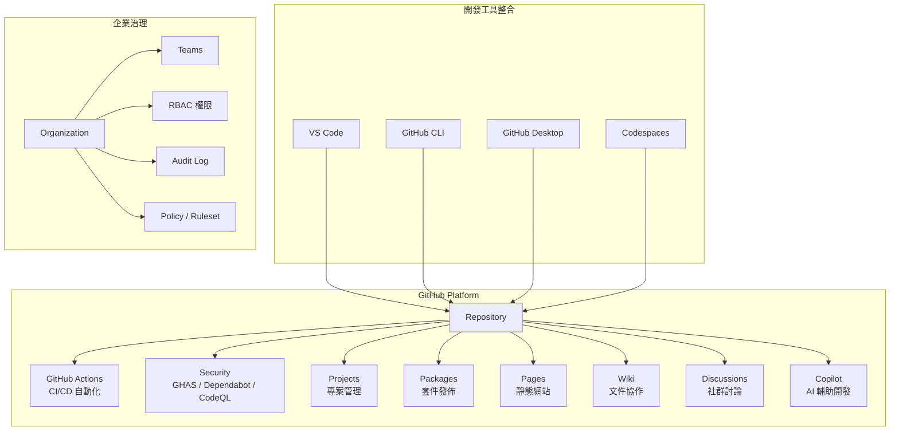

> **實務建議**：企業應將 GitHub 視為「開發平台」而非僅是「程式碼倉庫」，充分利用 Actions、Security、Projects 等功能建立完整的開發生態系。

### 1.6 Repository 限制與配額

GitHub 對 Repository 設有明確的效能與容量限制，企業在規劃架構時須將這些限制納入考量，避免因超出上限導致效能下降或操作受阻。

**儲存庫大小與結構限制**：

| 限制項目 | 建議上限 | 強制上限 | 影響與說明 |
|---------|---------|---------|----------|
| **Repository 磁碟大小** | 1 GB | 10 GB | 超過後 clone / fetch 速度明顯下降，應使用 Git LFS 管理大型二進制檔 |
| **單一檔案大小** | 1 MB | 100 MB | 超過 100 MB 將被 GitHub 拒絕 Push；需改用 Git LFS |
| **單一目錄檔案數** | — | 3,000 | 過多檔案會增加 Git 維護成本並降低效能 |
| **目錄深度** | — | 50 層 | 過深的目錄結構會拖慢歷史走訪操作 |
| **Branch 數量** | — | 5,000 | 過多分支會導致 fetch 傳輸緩慢 |
| **Tag 數量** | — | 5,000 | 與 Branch 同理 |

**操作頻率限制**：

| 操作類型 | 建議上限 | 說明 |
|---------|---------|------|
| **Push 大小** | — | 強制上限 2 GB |
| **Git 讀取操作** | 15 次/秒/Repo | CI 大量讀取可能觸發限流，建議使用 shallow clone |
| **Push 頻率** | 6 次/分鐘/Repo | 超過可能被暫時限流 |
| **PR 合併頻率** | 1 次/分鐘 | 每次合併觸發所有開啟 PR 的合併檢查 |
| **同一分支開啟 PR** | 1,000 | 超過會導致合併檢查延遲 |

**Diff 與 Commit 限制**：

| 項目 | 限制值 |
|------|-------|
| PR 總 Diff 行數 | 20,000 行可載入，或 1 MB 原始資料 |
| 單一檔案 Diff | 20,000 行，或 500 KB |
| 單一 Diff 檔案數 | 300 個檔案 |
| 可渲染檔案數（圖片、PDF） | 25 個 |
| Commit 列表顯示上限 | 250 筆（PR / Compare 頁面） |
| Commits 頁籤上限 | 10,000 筆 |
| Rebase & Merge | 100 筆 commit |

**帳號與組織限制**：

| 項目 | 限制值 |
|------|-------|
| 每個帳號/組織 Repository 數 | 100,000（50,000 時開始警告） |
| 每個 Repository Rulesets 數 | 75 |
| 組織層級 Rulesets 數 | 75 |

> **企業建議**：
> - Repository 大小控制在 1 GB 以內，超過即檢視是否有大型檔案應移至 Git LFS
> - CI/CD 使用 `--depth 1` 淺層 clone 減少讀取負擔
> - 定期清理已合併分支，保持 Branch 數量在合理範圍
> - 大型 Monorepo 需特別注意 Diff 限制，可能影響 PR Review 體驗

### 1.7 GitHub 方案與功能比較

根據團隊規模與需求選擇適合的 GitHub 方案：

| 功能 | Free | Team | Enterprise Cloud |
|------|------|------|-----------------|
| **Public Repos** | ✅ 無限 | ✅ 無限 | ✅ 無限 |
| **Private Repos** | ✅ 無限 | ✅ 無限 | ✅ 無限 |
| **Collaborators（Private）** | 有限 | ✅ 無限 | ✅ 無限 |
| **GitHub Actions 分鐘** | 2,000/月 | 3,000/月 | 50,000/月 |
| **Packages Storage** | 500 MB | 2 GB | 50 GB |
| **Branch Protection** | ✅ Public | ✅ | ✅ |
| **Repository Rulesets** | ✅ Public | ✅ | ✅ + Org-level |
| **Push Rulesets** | ❌ | ✅ | ✅ |
| **CODEOWNERS** | ✅ | ✅ | ✅ |
| **Required Reviews** | ✅ Public | ✅ | ✅ |
| **Draft PRs** | ✅ | ✅ | ✅ |
| **Merge Queue** | ❌ | ✅ | ✅ |
| **GitHub Pages** | ✅ Public | ✅ | ✅ |
| **Environments** | ✅ Public | ✅ | ✅ |
| **Dependabot Alerts** | ✅ | ✅ | ✅ |
| **Secret Scanning** | ✅ Public | ✅ | ✅ + Custom Patterns |
| **Push Protection** | ✅ Public | ✅ | ✅ |
| **CodeQL** | ✅ Public | ❌ | ✅ |
| **Security Overview** | ❌ | ❌ | ✅ |
| **SAML SSO** | ❌ | ❌ | ✅ |
| **SCIM Provisioning** | ❌ | ❌ | ✅ |
| **Audit Log API** | ❌ | ❌ | ✅ |
| **Internal Repos** | ❌ | ❌ | ✅ |
| **Custom Repo Roles** | ❌ | ❌ | ✅ |
| **IP Allow List** | ❌ | ❌ | ✅ |

> **企業建議**：中大型企業建議直接選擇 **Enterprise Cloud**，獲得完整的安全功能（GHAS）、合規工具（Audit Log）、身分管理（SSO/SCIM）與組織治理（Rulesets / Custom Roles）。小型團隊可從 **Team** 方案起步，視需求升級。

---

## 第 2 章 企業 Repository 管理架構

### 2.1 Enterprise Repository Strategy

企業級 Repository 管理需要系統性的分層策略，確保數百個 Repository 有序管理。

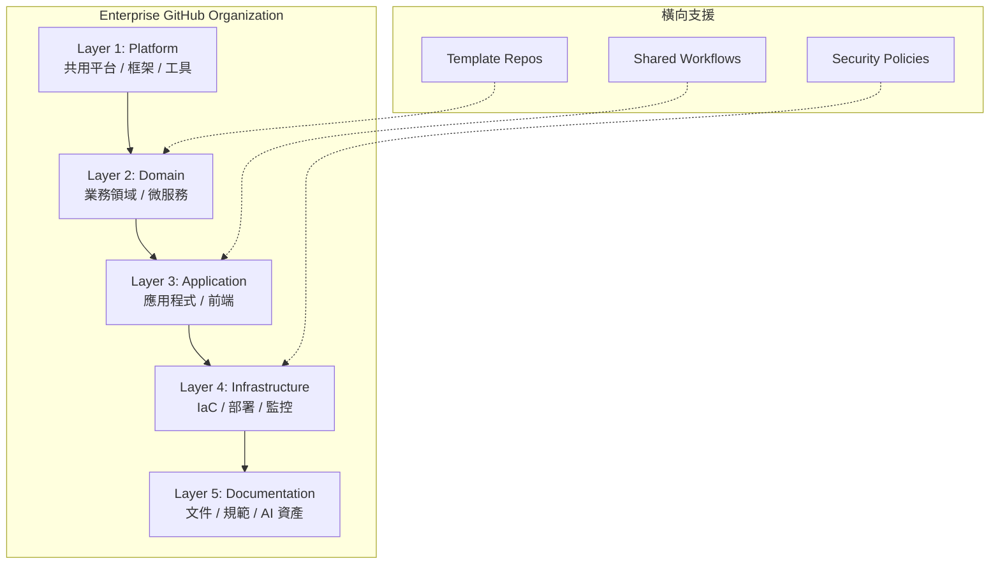

**分層說明**：

| Layer | 定位 | 變更頻率 | 權限 | 範例 |
|-------|------|---------|------|------|
| **Platform** | 共用基礎設施 | 低 | 核心架構團隊 | `platform-core`、`shared-lib` |
| **Domain** | 業務微服務 | 中 | 各業務團隊 | `svc-order`、`svc-payment` |
| **Application** | 前端應用 | 高 | 前端團隊 | `app-customer-portal`、`app-admin` |
| **Infrastructure** | 部署配置 | 中 | DevOps 團隊 | `infra-k8s`、`infra-terraform` |
| **Documentation** | 文件規範 | 中 | 全體 | `docs-architecture`、`ai-assets` |

### 2.2 Monorepo vs Polyrepo

| 面向 | Monorepo | Polyrepo |
|------|----------|----------|
| **定義** | 多個專案在同一 Repo | 每個專案獨立 Repo |
| **適用** | 強耦合微服務、前端 Monorepo | 獨立部署服務、跨團隊專案 |
| **優點** | 原子性變更、共用程式碼容易 | 獨立部署、權限隔離、CI 獨立 |
| **缺點** | CI 複雜、權限粗糙、Repo 肥大 | 共用程式碼困難、版本同步成本 |
| **CI/CD** | 需 path filter / affected detection | 獨立 Pipeline |
| **工具** | Nx、Turborepo、Bazel | GitHub Actions per repo |
| **企業建議** | 同一團隊緊密協作的服務群 | 跨團隊、不同部署週期的服務 |

> **企業建議**：大多數企業採用「**混合策略**」— 以 Polyrepo 為主，特定領域（如前端 Micro-frontend）使用 Monorepo。

### 2.3 Repository 命名規範

**命名格式**：`{layer}-{domain}-{type}-{name}`

```
# 範例
platform-java-lib-core          # 平台層 Java 核心庫
svc-order-api                    # 業務服務：訂單 API
svc-payment-worker               # 業務服務：支付 Worker
app-customer-portal              # 應用層：客戶入口
app-admin-dashboard              # 應用層：管理後台
infra-k8s-manifests              # 基礎設施：K8s 配置
infra-terraform-aws              # 基礎設施：Terraform
docs-architecture                # 文件：架構文件
docs-api-specs                   # 文件：API 規格
tmpl-spring-boot                 # 範本：Spring Boot
tmpl-vue-app                     # 範本：Vue 應用
wf-shared-actions                # Workflow：共用 Actions
ai-prompt-library                # AI：Prompt 庫
```

**命名規則**：

1. 全部小寫，使用 `-` 連接
2. 不超過 50 字元
3. 禁止使用底線 `_`、空格、中文
4. 前綴表示分層（`svc-` / `app-` / `infra-` / `docs-` / `tmpl-` / `wf-` / `ai-`）
5. 包含語意，讀名稱即知用途

### 2.4 Team Repository Strategy

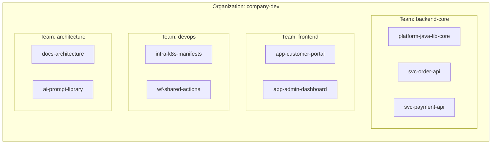

### 2.5 Environment Strategy

| 環境 | Branch | 部署觸發 | 用途 |
|------|--------|---------|------|
| **Development** | `develop` | Push to develop | 開發測試 |
| **Staging** | `release/*` | PR merged to release | UAT / 整合測試 |
| **Production** | `main` | Manual approval + Tag | 正式環境 |

```yaml
# GitHub Environments 設定範例
environments:
  development:
    protection_rules: []
  staging:
    protection_rules:
      - required_reviewers: 1
    deployment_branch_policy:
      protected_branches: true
  production:
    protection_rules:
      - required_reviewers: 2
      - wait_timer: 30  # 30 分鐘冷卻期
    deployment_branch_policy:
      custom_branch_policies:
        - "main"
        - "hotfix/*"
```

> **實務建議**：Production 環境務必設定至少 2 人審核 + 等待時間，並限制可部署的分支。

---

## 第 3 章 公司 GitHub Organization 規劃

### 3.1 Organization 建立

**建立步驟**：

1. 前往 `https://github.com/organizations/plan`
2. 選擇方案（建議 GitHub Enterprise Cloud）
3. 填寫組織名稱（如 `acme-bank`）
4. 設定 Organization Profile

**Organization 設定建議**：

| 設定項目 | 建議值 | 說明 |
|---------|-------|------|
| Default repository permission | `None` | 最小權限原則 |
| Repository creation | `Disabled for members` | 集中管控 Repo 建立 |
| Two-factor authentication | `Required` | 強制 2FA |
| Base permissions | `None` | 透過 Team 授權 |
| Fork policy | `Disabled` | 禁止 Fork（企業內部） |
| Actions permissions | `Selected repositories` | 限制 Actions 使用範圍 |
| Dependabot alerts | `Enabled for all` | 全面啟用弱點告警 |

### 3.2 Team 建立與管理

**建議團隊結構**：

```
organization: acme-bank
├── team: org-admins              # 組織管理員（2-3人）
├── team: security-team           # 資安團隊
├── team: architecture-team       # 架構團隊
├── team: devops-team             # DevOps 團隊
├── team: backend-core            # 後端核心團隊
│   ├── team: backend-order       # 訂單子團隊
│   └── team: backend-payment     # 支付子團隊
├── team: frontend-team           # 前端團隊
├── team: qa-team                 # QA 團隊
└── team: docs-team               # 文件團隊
```

**Team 權限對應**：

```bash
# 使用 GitHub CLI 建立 Team
gh api orgs/acme-bank/teams -f name="backend-core" \
  -f description="後端核心開發團隊" \
  -f privacy="closed" \
  -f notification_setting="notifications_enabled"

# 賦予 Team Repository 權限
gh api orgs/acme-bank/teams/backend-core/repos/acme-bank/svc-order-api \
  -X PUT -f permission="push"
```

### 3.3 權限設計與 RBAC

| 角色 | Repository 權限 | 適用對象 |
|------|----------------|---------|
| **Admin** | 完整管理權限 | org-admins |
| **Maintain** | 管理 Issues/PR + Push（不可刪 Repo） | Tech Lead |
| **Write (Push)** | Push + 建立 Branch + 管理 Issues | 開發人員 |
| **Triage** | 管理 Issues/PR（不可 Push） | PM / QA |
| **Read** | 唯讀 | 跨團隊參考 |

**Custom Repository Roles** ⚠️ 需 GitHub Enterprise：

```json
{
  "name": "senior-developer",
  "description": "資深開發者 - 可 Push + 管理 Branch + 審核 PR",
  "base_role": "write",
  "permissions": [
    "delete_alerts_code_scanning",
    "manage_deploy_keys",
    "bypass_branch_protections"
  ]
}
```

### 3.4 Repository Governance

**Repository Rulesets** ⚠️ 需 GitHub Enterprise：

```yaml
# Organization-level Ruleset
name: "enterprise-branch-protection"
target: branch
enforcement: active
conditions:
  ref_name:
    include: ["~DEFAULT_BRANCH", "release/*"]
rules:
  - type: required_pull_request
    parameters:
      required_approving_review_count: 2
      dismiss_stale_reviews_on_push: true
      require_code_owner_review: true
      require_last_push_approval: true
  - type: required_status_checks
    parameters:
      strict_required_status_checks_policy: true
      required_status_checks:
        - context: "ci/build"
        - context: "ci/test"
        - context: "security/codeql"
  - type: required_signatures
  - type: non_fast_forward
```

### 3.5 Repository Lifecycle

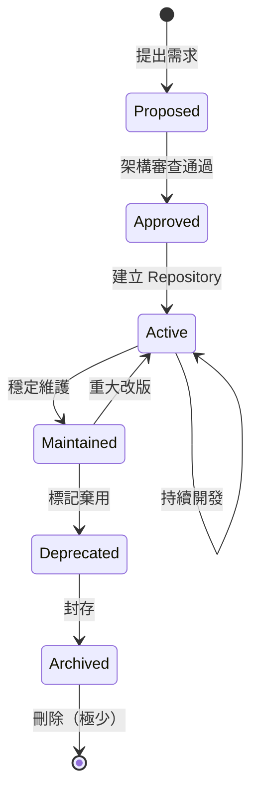

**各階段管控**：

| 階段 | 動作 | 負責人 | 產出 |
|------|------|--------|------|
| **Proposed** | 填寫 Repo 申請表 | 申請人 | Issue (Repo Request) |
| **Approved** | 架構審查 + 命名確認 | 架構師 | Approval Comment |
| **Active** | 建立 Repo + 初始化 | DevOps | 完整 Repo 結構 |
| **Maintained** | 定期更新依賴 + 安全修補 | 維護團隊 | Dependabot PRs |
| **Deprecated** | 加入 Deprecated 標記 | 架構師 | README 警告 |
| **Archived** | 設定 Archive + 唯讀 | Admin | Archived Repo |

> **實務建議**：每季進行一次 Repository 盤點，識別長期無活動（> 6 個月無 commit）的 Repo，評估是否進入 Deprecated 流程。

---

## 第 4 章 如何建立 Repository

### 4.1 建立 Repository 完整流程

**方法一：GitHub Web UI**

1. 登入 GitHub → Organization 頁面
2. 點選 `New Repository`
3. 設定：
   - Owner: `acme-bank`
   - Repository name: `svc-order-api`
   - Description: `訂單服務 API - Spring Boot`
   - Visibility: `Private`
   - Initialize: ✅ Add a README
   - .gitignore: `Java`
   - License: 依公司政策

**方法二：GitHub CLI（推薦）**

```bash
# 從 Template 建立（推薦）
gh repo create acme-bank/svc-order-api \
  --template acme-bank/tmpl-spring-boot \
  --private \
  --description "訂單服務 API - Spring Boot" \
  --clone

# 或空白建立
gh repo create acme-bank/svc-order-api \
  --private \
  --description "訂單服務 API" \
  --gitignore Java \
  --license Apache-2.0
```

**方法三：Terraform（IaC 管理）**

```hcl
resource "github_repository" "svc_order_api" {
  name         = "svc-order-api"
  description  = "訂單服務 API - Spring Boot"
  visibility   = "private"
  
  has_issues      = true
  has_projects    = true
  has_wiki        = false
  has_downloads   = false
  
  allow_merge_commit = false
  allow_squash_merge = true
  allow_rebase_merge = false
  
  delete_branch_on_merge = true
  
  template {
    owner      = "acme-bank"
    repository = "tmpl-spring-boot"
  }

  vulnerability_alerts = true
}

resource "github_branch_protection" "main" {
  repository_id = github_repository.svc_order_api.node_id
  pattern       = "main"
  
  required_pull_request_reviews {
    required_approving_review_count = 2
    require_code_owner_reviews      = true
    dismiss_stale_reviews           = true
  }
  
  required_status_checks {
    strict   = true
    contexts = ["ci/build", "ci/test", "security/scan"]
  }
  
  enforce_admins = true
}
```

### 4.2 README 設計

```markdown
# svc-order-api

> 訂單服務 API — 處理訂單建立、查詢、修改、取消等核心業務邏輯

[](https://github.com/acme-bank/svc-order-api/actions/workflows/ci.yml)
[](https://github.com/acme-bank/svc-order-api/actions/workflows/security.yml)

## 快速開始

### 前置需求
- Java 21+
- Maven 3.9+
- Docker（for integration tests）

### 本地啟動
\```bash
git clone git@github.com:acme-bank/svc-order-api.git
cd svc-order-api
mvn spring-boot:run -Dspring.profiles.active=local
\```

### 執行測試
\```bash
mvn verify
\```

## 技術棧
| 項目 | 版本 |
|------|------|
| Java | 21 |
| Spring Boot | 3.4.x |
| Database | PostgreSQL 16 |
| Message Queue | Kafka 3.x |

## API 文件
- Swagger UI: `http://localhost:8080/swagger-ui.html`
- OpenAPI Spec: `docs/openapi.yaml`

## 聯絡人
- Tech Lead: @john-doe
- Team: @acme-bank/backend-order
```

### 4.3 LICENSE 選擇

| License | 適用 | 企業建議 |
|---------|------|---------|
| **Proprietary** | 公司內部專案 | ✅ 預設選擇 |
| **Apache-2.0** | 計畫開源的專案 | 允許商業使用 |
| **MIT** | 工具類開源 | 最寬鬆 |
| **AGPL-3.0** | 避免 | 會污染使用者程式碼 |

> **企業建議**：內部專案統一使用公司自訂 LICENSE 檔，標明版權歸屬與使用限制。

### 4.4 .gitignore 配置

```gitignore
# === Java / Maven ===
target/
*.class
*.jar
*.war
*.ear
.mvn/wrapper/maven-wrapper.jar

# === IDE ===
.idea/
*.iml
.vscode/
.settings/
.project
.classpath

# === OS ===
.DS_Store
Thumbs.db
*.swp

# === Environment ===
.env
.env.local
*.env
application-local.yml
application-secret.yml

# === Build & Logs ===
build/
dist/
logs/
*.log

# === Security - 絕對不可上傳 ===
*.pem
*.key
*.p12
*.jks
credentials.json
service-account.json
```

### 4.5 CODEOWNERS 設定

```
# CODEOWNERS — 定義程式碼審查責任人
# 語法: pattern   @owner

# 預設：所有檔案需 Tech Lead 審查
*                           @acme-bank/backend-order-leads

# 架構相關變更需架構師審查
/src/main/java/**/config/   @acme-bank/architecture-team
/docs/architecture/         @acme-bank/architecture-team

# API 規格變更需 API 負責人審查
/docs/openapi.yaml          @acme-bank/api-governance
/src/main/java/**/controller/ @acme-bank/backend-order-leads

# CI/CD 變更需 DevOps 審查
/.github/workflows/         @acme-bank/devops-team
/Dockerfile                 @acme-bank/devops-team
/docker-compose*.yml        @acme-bank/devops-team

# 安全相關需資安審查
/src/main/java/**/security/ @acme-bank/security-team
SECURITY.md                 @acme-bank/security-team

# 依賴變更需 Tech Lead + 資安
pom.xml                     @acme-bank/backend-order-leads @acme-bank/security-team
package.json                @acme-bank/frontend-leads @acme-bank/security-team
```

### 4.6 SECURITY.md 與 CONTRIBUTING.md

**SECURITY.md**：

```markdown
# Security Policy

## Supported Versions

| Version | Supported          |
|---------|--------------------|
| 2.x     | ✅ Active support  |
| 1.x     | ⚠️ Security fixes only |
| < 1.0   | ❌ End of life     |

## Reporting a Vulnerability

**請勿在 Public Issue 中揭露安全漏洞。**

請透過以下方式通報：
1. Email: security@acme-bank.com
2. GitHub Security Advisory（Private）

### 回應時間
- 確認收到：24 小時內
- 初步評估：72 小時內
- 修補計畫：7 個工作天內

## Security Practices
- 所有 PR 需通過 CodeQL 掃描
- 依賴套件每週自動更新（Dependabot）
- Secret Scanning 已啟用
```

**CONTRIBUTING.md**：

```markdown
# Contributing Guide

## 開發流程

1. 從 `develop` 建立 feature branch
2. 遵循 Conventional Commits 格式
3. 確保所有測試通過
4. 提交 Pull Request 至 `develop`
5. 等待 Code Review（至少 2 人 Approve）

## Commit Message 格式

\```
<type>(<scope>): <subject>

<body>

<footer>
\```

Type: feat | fix | docs | style | refactor | test | chore | ci

## Code Style
- Java: Google Java Style Guide
- 使用 EditorConfig 統一格式
- PR 前執行 `mvn spotless:check`

## Branch Naming
- feature/JIRA-123-add-order-api
- fix/JIRA-456-fix-null-pointer
- hotfix/JIRA-789-security-patch
```

### 4.7 Issue Template 與 PR Template

**Issue Template** (`.github/ISSUE_TEMPLATE/bug_report.yml`)：

```yaml
name: Bug Report
description: 回報程式錯誤
title: "[Bug]: "
labels: ["bug", "triage"]
assignees: []
body:
  - type: markdown
    attributes:
      value: "## 錯誤回報"
  - type: textarea
    id: description
    attributes:
      label: 問題描述
      description: 清楚描述發生了什麼問題
    validations:
      required: true
  - type: textarea
    id: steps
    attributes:
      label: 重現步驟
      description: 如何重現此問題
      value: |
        1. 
        2. 
        3. 
    validations:
      required: true
  - type: textarea
    id: expected
    attributes:
      label: 預期行為
    validations:
      required: true
  - type: dropdown
    id: severity
    attributes:
      label: 嚴重程度
      options:
        - Critical（系統停擺）
        - High（主要功能異常）
        - Medium（次要功能異常）
        - Low（外觀/體驗問題）
    validations:
      required: true
  - type: input
    id: environment
    attributes:
      label: 環境
      placeholder: "Production / Staging / Development"
```

**PR Template** (`.github/pull_request_template.md`)：

```markdown
## 變更說明

<!-- 描述此 PR 的目的與變更內容 -->

## 變更類型

- [ ] 🐛 Bug Fix
- [ ] ✨ New Feature
- [ ] 🔨 Refactoring
- [ ] 📝 Documentation
- [ ] 🔒 Security Fix
- [ ] ⚡ Performance

## 關聯 Issue

Closes #

## 檢查清單

- [ ] 程式碼遵循專案 Code Style
- [ ] 已新增/更新對應的單元測試
- [ ] 所有既有測試通過
- [ ] 已更新相關文件
- [ ] 無硬編碼的敏感資訊
- [ ] 已考慮向後相容性

## 測試方式

<!-- 描述如何驗證此變更 -->

## 截圖（如適用）

## 部署注意事項

<!-- 是否需要 DB migration / 環境變數 / 特殊部署步驟 -->
```

### 4.8 Repository 初始化完整範例

```bash
#!/bin/bash
# === Repository 初始化腳本 ===
# 用法: ./init-repo.sh <repo-name> <template>

REPO_NAME=$1
TEMPLATE=${2:-"tmpl-spring-boot"}
ORG="acme-bank"

echo "📦 建立 Repository: ${ORG}/${REPO_NAME}"

# 1. 從 Template 建立
gh repo create "${ORG}/${REPO_NAME}" \
  --template "${ORG}/${TEMPLATE}" \
  --private \
  --clone

cd "${REPO_NAME}" || exit 1

# 2. 設定 Branch Protection
gh api repos/${ORG}/${REPO_NAME}/branches/main/protection \
  -X PUT \
  -f required_status_checks='{"strict":true,"contexts":["ci/build","ci/test"]}' \
  -f enforce_admins=true \
  -f required_pull_request_reviews='{"required_approving_review_count":2,"require_code_owner_reviews":true}'

# 3. 啟用安全功能
gh api repos/${ORG}/${REPO_NAME}/vulnerability-alerts -X PUT
gh api repos/${ORG}/${REPO_NAME}/automated-security-fixes -X PUT

# 4. 設定 Team 權限
gh api orgs/${ORG}/teams/backend-core/repos/${ORG}/${REPO_NAME} \
  -X PUT -f permission="push"
gh api orgs/${ORG}/teams/devops-team/repos/${ORG}/${REPO_NAME} \
  -X PUT -f permission="maintain"

# 5. 建立 develop branch
git checkout -b develop
git push origin develop

# 6. 設定預設 branch
gh api repos/${ORG}/${REPO_NAME} -X PATCH -f default_branch="main"

echo "✅ Repository ${REPO_NAME} 初始化完成"
```

> **實務建議**：將初始化腳本放入 `wf-shared-actions` Repository，搭配 GitHub Actions 實現「自助式 Repository 建立」，開發者填寫 Issue 表單即可自動建立符合規範的 Repository。

### 4.9 Repository Topics 與 Autolinks

**Repository Topics（標籤分類）**：

Topics 是 GitHub 提供的標籤機制，用於分類與搜尋 Repository。企業可利用 Topics 建立統一的 Repo 分類體系。

```bash
# 使用 GitHub CLI 設定 Topics
gh repo edit acme-bank/svc-order-api --add-topic "spring-boot,java,microservice,order-domain,team-backend"
```

**企業 Topics 規範**：

| Topic 類別 | 範例 | 用途 |
|-----------|------|------|
| **技術棧** | `java`, `spring-boot`, `vue`, `typescript` | 技術搜尋 |
| **業務領域** | `order-domain`, `payment-domain` | 業務歸屬 |
| **團隊** | `team-backend`, `team-frontend` | 團隊負責 |
| **類型** | `microservice`, `library`, `template` | Repo 類型 |
| **狀態** | `active`, `deprecated`, `archived` | 生命週期 |
| **環境** | `production-ready`, `experimental` | 成熟度 |

**Autolinks（自動連結外部資源）**：

Autolinks 可將特定文字模式自動轉換為外部系統連結，例如將 `JIRA-123` 自動連結至 Jira Issue。

```bash
# 設定 Autolink — 連結至 Jira
gh api repos/acme-bank/svc-order-api/autolinks \
  -X POST \
  -f key_prefix="JIRA-" \
  -f url_template="https://acme-bank.atlassian.net/browse/JIRA-<num>" \
  -F is_alphanumeric=false

# 設定 Autolink — 連結至內部 Wiki
gh api repos/acme-bank/svc-order-api/autolinks \
  -X POST \
  -f key_prefix="WIKI-" \
  -f url_template="https://wiki.acme-bank.com/pages/<num>" \
  -F is_alphanumeric=false
```

**Autolinks 使用效果**：

| Commit / PR 中輸入 | 自動轉換為 |
|-------------------|----------|
| `JIRA-1234` | `https://acme-bank.atlassian.net/browse/JIRA-1234` |
| `WIKI-5678` | `https://wiki.acme-bank.com/pages/5678` |

> **企業建議**：在組織層級統一建立 Autolinks，確保所有 Repo 都能自動連結至 Jira、Confluence 等內部系統，提升跨工具追溯性。

### 4.10 Repository 從 Template 建立

GitHub Template Repository 功能允許將一個 Repo 設定為範本，其他新 Repo 可以從此範本快速建立，繼承完整的檔案結構但不繼承 Git 歷史。

**建立 Template Repository**：

1. 前往 Repository → Settings
2. 勾選 **Template repository**
3. 該 Repo 即可作為範本被引用

```bash
# 使用 GitHub CLI 將 Repo 設為 Template
gh api repos/acme-bank/tmpl-spring-boot \
  -X PATCH \
  -F is_template=true
```

**Template Repository 最佳實踐**：

| 項目 | 建議 |
|------|------|
| **命名** | 使用 `tmpl-` 前綴（如 `tmpl-spring-boot`） |
| **內容** | 包含標準目錄結構、CI/CD Workflow、.gitignore、CODEOWNERS |
| **排除** | 不包含業務程式碼、環境變數、Secret |
| **文件** | README 需說明如何使用此 Template |
| **維護** | 定期更新依賴版本與 Workflow |
| **版本** | 使用 Release Tag 標記 Template 版本 |

**Template vs Fork 比較**：

| 面向 | Template | Fork |
|------|----------|------|
| **Git 歷史** | 不繼承（全新起點） | 完整繼承 |
| **上游同步** | 不支援 | 支援 Pull from upstream |
| **適用場景** | 建立全新獨立專案 | 貢獻回上游 / 保持同步 |
| **企業建議** | ✅ 新專案起點 | ⚠️ 企業內建議限制使用 |

---

## 第 5 章 Repository 標準結構設計

### 5.1 Backend Repository（Clean Architecture）

```
svc-order-api/
├── .github/
│   ├── workflows/
│   │   ├── ci.yml
│   │   ├── cd.yml
│   │   └── security.yml
│   ├── ISSUE_TEMPLATE/
│   │   ├── bug_report.yml
│   │   └── feature_request.yml
│   ├── pull_request_template.md
│   └── CODEOWNERS
├── docs/
│   ├── architecture/
│   │   ├── adr/
│   │   │   ├── 001-use-clean-architecture.md
│   │   │   └── 002-use-kafka-for-events.md
│   │   └── diagrams/
│   ├── api/
│   │   └── openapi.yaml
│   └── runbook/
│       └── deployment.md
├── src/
│   ├── main/
│   │   ├── java/com/acme/order/
│   │   │   ├── Application.java
│   │   │   ├── domain/                # 領域層（Entity / Value Object）
│   │   │   │   ├── model/
│   │   │   │   │   ├── Order.java
│   │   │   │   │   └── OrderStatus.java
│   │   │   │   ├── repository/        # Repository Interface
│   │   │   │   │   └── OrderRepository.java
│   │   │   │   └── service/           # Domain Service
│   │   │   │       └── OrderDomainService.java
│   │   │   ├── application/           # 應用層（Use Case）
│   │   │   │   ├── usecase/
│   │   │   │   │   ├── CreateOrderUseCase.java
│   │   │   │   │   └── CancelOrderUseCase.java
│   │   │   │   ├── dto/
│   │   │   │   │   ├── CreateOrderRequest.java
│   │   │   │   │   └── OrderResponse.java
│   │   │   │   └── port/
│   │   │   │       ├── in/            # Input Port
│   │   │   │       └── out/           # Output Port
│   │   │   ├── infrastructure/        # 基礎設施層
│   │   │   │   ├── persistence/
│   │   │   │   │   ├── entity/
│   │   │   │   │   ├── mapper/
│   │   │   │   │   └── JpaOrderRepository.java
│   │   │   │   ├── messaging/
│   │   │   │   │   └── KafkaOrderEventPublisher.java
│   │   │   │   └── external/
│   │   │   │       └── PaymentServiceClient.java
│   │   │   └── adapter/              # 介面層（Controller / Gateway）
│   │   │       ├── rest/
│   │   │       │   └── OrderController.java
│   │   │       └── event/
│   │   │           └── OrderEventListener.java
│   │   └── resources/
│   │       ├── application.yml
│   │       ├── application-local.yml
│   │       ├── application-dev.yml
│   │       └── db/migration/
│   │           └── V1__create_order_table.sql
│   └── test/
│       └── java/com/acme/order/
│           ├── domain/
│           ├── application/
│           ├── infrastructure/
│           └── adapter/
├── Dockerfile
├── docker-compose.yml
├── pom.xml
├── .editorconfig
├── .gitignore
├── CODEOWNERS
├── README.md
├── SECURITY.md
├── CONTRIBUTING.md
└── LICENSE
```

**Clean Architecture 依賴規則**：

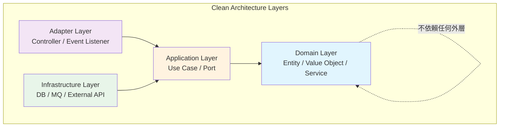

### 5.2 Frontend Repository

```
app-customer-portal/
├── .github/
│   ├── workflows/
│   │   ├── ci.yml
│   │   ├── deploy.yml
│   │   └── lighthouse.yml
│   └── CODEOWNERS
├── public/
│   ├── favicon.ico
│   └── index.html
├── src/
│   ├── assets/
│   ├── components/
│   │   ├── common/           # 共用元件
│   │   │   ├── Button.vue
│   │   │   └── Modal.vue
│   │   └── features/        # 功能元件
│   │       └── order/
│   │           ├── OrderList.vue
│   │           └── OrderDetail.vue
│   ├── composables/          # Composition API
│   │   ├── useAuth.ts
│   │   └── useOrder.ts
│   ├── layouts/
│   │   ├── DefaultLayout.vue
│   │   └── AuthLayout.vue
│   ├── pages/                # 路由頁面
│   │   ├── index.vue
│   │   └── orders/
│   │       ├── index.vue
│   │       └── [id].vue
│   ├── stores/               # Pinia Store
│   │   ├── auth.ts
│   │   └── order.ts
│   ├── services/             # API 呼叫
│   │   ├── api.ts
│   │   └── orderService.ts
│   ├── types/                # TypeScript 型別
│   │   └── order.d.ts
│   ├── utils/
│   ├── App.vue
│   └── main.ts
├── tests/
│   ├── unit/
│   ├── e2e/
│   └── fixtures/
├── .env.example
├── .eslintrc.cjs
├── .prettierrc
├── Dockerfile
├── nginx.conf
├── package.json
├── tsconfig.json
├── vite.config.ts
└── README.md
```

### 5.3 Monorepo 結構

```
monorepo-order-system/
├── .github/
│   └── workflows/
│       ├── ci-api.yml          # Path filter: apps/api/**
│       ├── ci-web.yml          # Path filter: apps/web/**
│       └── ci-shared.yml       # Path filter: packages/**
├── apps/
│   ├── api/                    # 後端 API
│   │   ├── src/
│   │   ├── pom.xml
│   │   └── Dockerfile
│   ├── web/                    # 前端 Web
│   │   ├── src/
│   │   ├── package.json
│   │   └── Dockerfile
│   └── admin/                  # 管理後台
│       ├── src/
│       └── package.json
├── packages/                   # 共用套件
│   ├── shared-types/
│   │   └── package.json
│   ├── ui-components/
│   │   └── package.json
│   └── utils/
│       └── package.json
├── infrastructure/
│   ├── docker-compose.yml
│   ├── k8s/
│   └── terraform/
├── docs/
├── nx.json                     # Nx 配置
├── package.json                # Root package
├── pnpm-workspace.yaml
└── README.md
```

### 5.4 Microservices Repository

**每個微服務獨立 Repo 的標準結構**：

```
# Organization 層級視角
acme-bank/
├── svc-order-api/              # 訂單服務
├── svc-payment-api/            # 支付服務
├── svc-inventory-api/          # 庫存服務
├── svc-notification-worker/    # 通知 Worker
├── gateway-api/                # API Gateway
├── platform-java-lib-core/     # 共用核心庫
├── platform-java-lib-security/ # 共用安全庫
├── infra-k8s-manifests/        # K8s 部署配置
├── infra-helm-charts/          # Helm Charts
└── docs-service-catalog/       # 服務目錄文件
```

### 5.5 Documentation Repository

```
docs-architecture/
├── .github/
│   └── workflows/
│       └── publish-docs.yml    # 自動發佈至 GitHub Pages
├── adr/                        # Architecture Decision Records
│   ├── template.md
│   ├── 001-microservices-architecture.md
│   ├── 002-event-driven-design.md
│   └── 003-database-per-service.md
├── architecture/
│   ├── system-context.md       # C4 Model - System Context
│   ├── containers.md           # C4 Model - Container
│   ├── components.md           # C4 Model - Component
│   └── diagrams/
│       ├── system-overview.mmd
│       └── sequence-order-flow.mmd
├── api/
│   ├── order-api.yaml          # OpenAPI Spec
│   └── payment-api.yaml
├── runbook/
│   ├── deployment.md
│   ├── rollback.md
│   └── incident-response.md
├── standards/
│   ├── coding-standards.md
│   ├── api-design-guide.md
│   └── security-guidelines.md
├── mkdocs.yml                  # MkDocs 配置
└── README.md
```

> **實務建議**：使用 MkDocs + Material Theme 或 Docusaurus 將文件 Repo 自動發佈為內部網站，搭配 GitHub Actions 實現「Push to main → 自動部署文件網站」。

---

## 第 6 章 Source Code 上架與管理

### 6.1 Git 基本流程

**日常開發完整流程**：

```bash
# 1. Clone 專案（首次）
git clone git@github.com:acme-bank/svc-order-api.git
cd svc-order-api

# 2. 建立 Feature Branch
git checkout develop
git pull origin develop
git checkout -b feature/JIRA-123-add-order-api

# 3. 開發 & 提交
git add src/main/java/com/acme/order/
git commit -m "feat(order): add create order API endpoint"

git add src/test/java/com/acme/order/
git commit -m "test(order): add unit tests for CreateOrderUseCase"

# 4. 同步遠端最新變更
git fetch origin
git rebase origin/develop

# 5. 推送到遠端
git push origin feature/JIRA-123-add-order-api

# 6. 建立 Pull Request
gh pr create --base develop \
  --title "feat(order): add create order API endpoint" \
  --body "Closes #123"

# 7. PR 合併後清理
git checkout develop
git pull origin develop
git branch -d feature/JIRA-123-add-order-api
```

**常用指令速查**：

| 操作 | 指令 | 說明 |
|------|------|------|
| 查看狀態 | `git status` | 檢視工作區變更 |
| 查看歷史 | `git log --oneline -20` | 最近 20 筆提交 |
| 暫存變更 | `git stash` | 臨時保存未提交的變更 |
| 恢復暫存 | `git stash pop` | 恢復暫存的變更 |
| 取消修改 | `git checkout -- <file>` | 還原單一檔案 |
| 修改最後 commit | `git commit --amend` | 修正最近一次提交 |
| 查看差異 | `git diff --cached` | 已 stage 的變更差異 |
| 互動式 rebase | `git rebase -i HEAD~3` | 整理最近 3 次提交 |

### 6.2 Commit Message 規範

採用 **Conventional Commits** 標準：

```
<type>(<scope>): <subject>

[optional body]

[optional footer]
```

**Type 定義**：

| Type | 說明 | 範例 |
|------|------|------|
| `feat` | 新功能 | `feat(order): add cancel order endpoint` |
| `fix` | 修復 Bug | `fix(payment): resolve null pointer in refund` |
| `docs` | 文件更新 | `docs: update API documentation` |
| `style` | 格式調整（不影響邏輯） | `style: format code with spotless` |
| `refactor` | 重構（不改功能） | `refactor(order): extract validation logic` |
| `test` | 測試相關 | `test(order): add integration test for create` |
| `chore` | 維護性工作 | `chore: update dependencies` |
| `ci` | CI/CD 配置 | `ci: add security scanning workflow` |
| `perf` | 效能優化 | `perf(query): add index for order lookup` |
| `security` | 安全修復 | `security: patch CVE-2024-xxxx` |

**Breaking Change 標記**：

```
feat(api)!: change order response format

BREAKING CHANGE: OrderResponse now uses ISO 8601 date format
instead of Unix timestamp. All API consumers must update.

Refs: JIRA-456
```

### 6.3 Git Flow

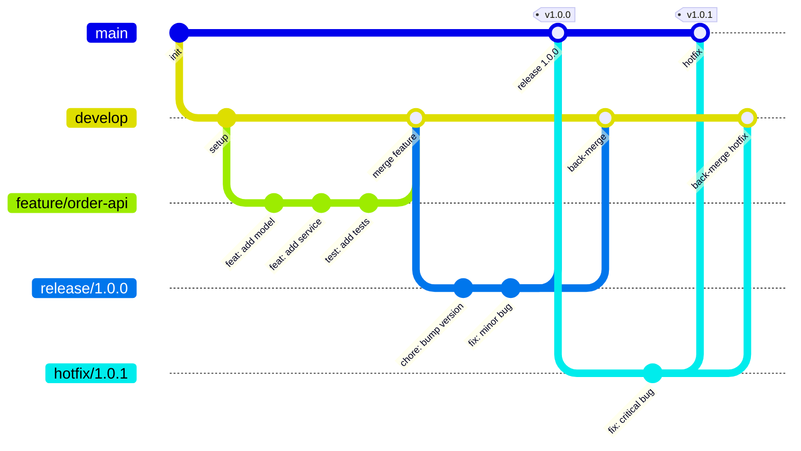

**Git Flow 分支定義**：

| 分支 | 用途 | 來源 | 合併至 | 生命週期 |
|------|------|------|--------|---------|
| `main` | 正式版本 | release / hotfix | — | 永久 |
| `develop` | 開發整合 | feature | release | 永久 |
| `feature/*` | 功能開發 | develop | develop | 短期 |
| `release/*` | 版本準備 | develop | main + develop | 短期 |
| `hotfix/*` | 緊急修復 | main | main + develop | 極短 |

### 6.4 GitHub Flow

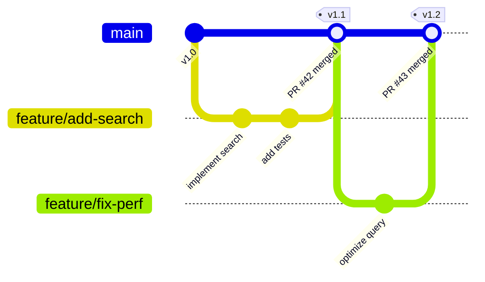

**GitHub Flow 規則**（僅 2 類分支）：

1. `main` 永遠可部署
2. 所有開發在 feature branch 進行
3. 透過 Pull Request 合併回 main
4. 合併後立即部署

**適用場景**：持續部署（CD）、Web 應用、SaaS 產品

### 6.5 Trunk Based Development

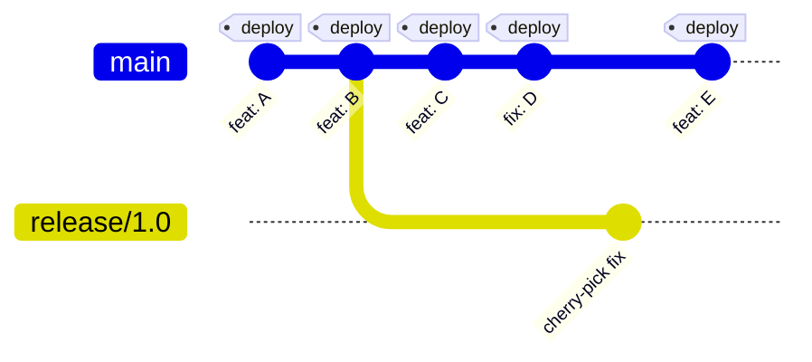

**Trunk Based 規則**：

1. 所有開發者直接提交到 `main`（或極短 feature branch < 1 天）
2. 使用 Feature Flag 控制未完成功能
3. 每次提交即觸發 CI/CD
4. Release Branch 僅用於穩定版本維護

### 6.6 三種策略比較與選擇

| 面向 | Git Flow | GitHub Flow | Trunk Based |
|------|----------|-------------|-------------|
| **複雜度** | 高 | 低 | 中 |
| **適合** | 版本化發佈產品 | Web SaaS | 高頻部署 |
| **部署頻率** | 週/月 | 天/週 | 時/天 |
| **團隊規模** | 大型 | 中小型 | 任何規模 |
| **Feature Flag** | 不需要 | 不需要 | 必須 |
| **分支數量** | 多 | 少 | 極少 |
| **Code Review** | PR to develop | PR to main | PR to main（短） |
| **金融業建議** | ✅ 推薦 | ⚠️ 需搭配環境控管 | ⚠️ 需完善 Feature Flag |

> **企業建議**：金融業建議使用 **Git Flow**（穩定可控），搭配嚴格的 Branch Protection 與 Release 管理。若團隊成熟度高、CI/CD 完善，可逐步過渡至 GitHub Flow。

### 6.7 Git Large File Storage（LFS）

Git LFS 是 GitHub 官方推薦的大型檔案管理方案，透過將大型二進制檔案替換為輕量指標（pointer），實際檔案存放於 LFS 伺服器，避免 Repository 膨脹。

**何時需要 Git LFS**：

- 單一檔案超過 50 MB（GitHub 警告）或 100 MB（GitHub 拒絕）
- 頻繁變更的二進制檔案（圖片、設計稿、編譯產物）
- 機器學習模型檔、資料集
- 影音多媒體資源

**安裝與配置**：

```bash
# 1. 安裝 Git LFS
git lfs install

# 2. 追蹤特定檔案類型
git lfs track "*.psd"
git lfs track "*.zip"
git lfs track "*.jar"
git lfs track "*.model"
git lfs track "docs/assets/**/*.png"

# 3. 確認 .gitattributes 已更新
cat .gitattributes
# *.psd filter=lfs diff=lfs merge=lfs -text
# *.zip filter=lfs diff=lfs merge=lfs -text

# 4. 提交 .gitattributes
git add .gitattributes
git commit -m "chore: configure Git LFS tracking"

# 5. 正常使用 git add / commit / push
git add design/mockup.psd
git commit -m "docs: add UI mockup"
git push origin main
```

**Git LFS 儲存配額**：

| GitHub 方案 | LFS 儲存空間 | LFS 頻寬（月） | 額外購買 |
|------------|------------|--------------|---------|
| **Free** | 1 GB | 1 GB | $5/50GB |
| **Team** | 1 GB | 1 GB | $5/50GB |
| **Enterprise** | 1 GB | 1 GB | $5/50GB |

**企業 .gitattributes 參考配置**：

```gitattributes
# === Git LFS 追蹤規則 ===
# 圖片
*.png filter=lfs diff=lfs merge=lfs -text
*.jpg filter=lfs diff=lfs merge=lfs -text
*.gif filter=lfs diff=lfs merge=lfs -text
*.svg filter=lfs diff=lfs merge=lfs -text

# 設計稿
*.psd filter=lfs diff=lfs merge=lfs -text
*.sketch filter=lfs diff=lfs merge=lfs -text
*.figma filter=lfs diff=lfs merge=lfs -text

# 壓縮檔
*.zip filter=lfs diff=lfs merge=lfs -text
*.tar.gz filter=lfs diff=lfs merge=lfs -text

# 文件
*.pdf filter=lfs diff=lfs merge=lfs -text

# 機器學習
*.model filter=lfs diff=lfs merge=lfs -text
*.h5 filter=lfs diff=lfs merge=lfs -text
*.onnx filter=lfs diff=lfs merge=lfs -text
```

**常用指令**：

| 指令 | 用途 |
|------|------|
| `git lfs ls-files` | 列出 LFS 追蹤的檔案 |
| `git lfs status` | 查看 LFS 檔案狀態 |
| `git lfs fetch --all` | 下載所有 LFS 檔案 |
| `git lfs prune` | 清理本地過期 LFS 快取 |
| `git lfs migrate import --include="*.psd"` | 將既有大檔案遷移至 LFS |

> **企業建議**：
> - 在 Template Repo 中預先配置 `.gitattributes`，確保新專案從一開始就正確使用 LFS
> - CI/CD 中使用 `git lfs install && git lfs pull` 確保 Runner 取得 LFS 檔案
> - 定期使用 `git lfs prune` 清理本地快取
> - 若 Repository Archive 包含 LFS 物件，需在 Repository Settings 中啟用「Include Git LFS objects in archives」

---

## 第 7 章 Branch Strategy

### 7.1 分支命名規範

```
# 格式: <type>/<ticket-id>-<short-description>

# Feature
feature/JIRA-123-add-order-api
feature/JIRA-456-implement-payment-gateway

# Bug Fix
fix/JIRA-789-null-pointer-in-order-service
fix/JIRA-012-incorrect-amount-calculation

# Hotfix（緊急修復）
hotfix/JIRA-999-security-vulnerability-patch
hotfix/CVE-2024-12345-fix

# Release
release/1.2.0
release/2.0.0-rc.1

# Chore
chore/upgrade-spring-boot-3.4
chore/update-dependencies-2024-q4
```

**命名規則**：

- 全部小寫
- 使用 `-` 連接單字
- 必須包含 Ticket ID（JIRA / Issue #）
- 不超過 60 字元
- 禁止中文字元

### 7.2 Branch Protection Rules

**main branch 保護設定**：

```bash
# 使用 GitHub CLI 設定 Branch Protection
gh api repos/acme-bank/svc-order-api/branches/main/protection \
  -X PUT \
  --input - << 'EOF'
{
  "required_status_checks": {
    "strict": true,
    "contexts": [
      "ci/build",
      "ci/test",
      "ci/integration-test",
      "security/codeql",
      "security/dependency-check"
    ]
  },
  "enforce_admins": true,
  "required_pull_request_reviews": {
    "required_approving_review_count": 2,
    "dismiss_stale_reviews": true,
    "require_code_owner_reviews": true,
    "require_last_push_approval": true,
    "dismissal_restrictions": {
      "teams": ["org-admins"]
    }
  },
  "restrictions": {
    "users": [],
    "teams": ["org-admins", "devops-team"]
  },
  "required_linear_history": true,
  "allow_force_pushes": false,
  "allow_deletions": false,
  "required_conversation_resolution": true
}
EOF
```

**各分支保護等級**：

| 分支 | Required Reviews | Status Checks | Force Push | Delete |
|------|-----------------|---------------|------------|--------|
| `main` | 2 + CODEOWNERS | 全部通過 | ❌ 禁止 | ❌ 禁止 |
| `develop` | 1 | Build + Test | ❌ 禁止 | ❌ 禁止 |
| `release/*` | 2 | 全部通過 | ❌ 禁止 | ✅ 合併後刪 |
| `feature/*` | 0（建議 1） | Build | ✅ 允許 | ✅ 合併後刪 |
| `hotfix/*` | 2 + CODEOWNERS | 全部通過 | ❌ 禁止 | ✅ 合併後刪 |

### 7.3 Pull Request Review 流程

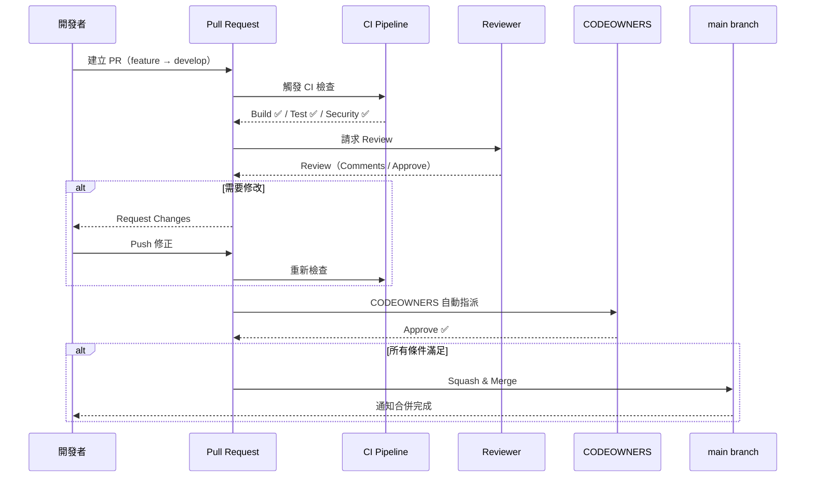

**Review Checklist（給 Reviewer）**：

- [ ] 程式碼邏輯正確
- [ ] 遵循 Clean Architecture 分層
- [ ] 無硬編碼敏感資訊
- [ ] 有對應的單元測試
- [ ] API 變更有更新 OpenAPI Spec
- [ ] 無 N+1 Query 問題
- [ ] 例外處理完善
- [ ] Log 層級適當
- [ ] 向後相容（或有 Migration Plan）

### 7.4 CODEOWNERS 進階配置

```
# === 全域規則 ===
# 所有 PR 預設需要 Tech Lead 審查
*                                   @acme-bank/tech-leads

# === 分層審查 ===
# Domain Layer 變更 — 架構師
**/domain/**                        @acme-bank/architecture-team

# Infrastructure Layer — DevOps
**/infrastructure/**                @acme-bank/devops-team
Dockerfile                          @acme-bank/devops-team
docker-compose*.yml                 @acme-bank/devops-team

# Security 相關
**/security/**                      @acme-bank/security-team
**/auth/**                          @acme-bank/security-team

# === CI/CD 變更 ===
.github/workflows/**                @acme-bank/devops-team @acme-bank/security-team

# === 依賴管理 ===
pom.xml                             @acme-bank/tech-leads @acme-bank/security-team
build.gradle*                       @acme-bank/tech-leads @acme-bank/security-team
package.json                        @acme-bank/tech-leads @acme-bank/security-team
package-lock.json                   @acme-bank/tech-leads

# === 資料庫 Migration ===
**/db/migration/**                  @acme-bank/dba-team @acme-bank/tech-leads

# === API 規格 ===
**/openapi*.yaml                    @acme-bank/api-governance
**/openapi*.json                    @acme-bank/api-governance
```

### 7.5 Merge Strategy 選擇

| 策略 | 指令 | 歷史記錄 | 適用場景 |
|------|------|---------|---------|
| **Squash & Merge** | 多次 commit 合成 1 個 | 乾淨線性 | ✅ Feature → develop/main |
| **Merge Commit** | 保留所有 commit + 合併節點 | 完整但複雜 | Release → main |
| **Rebase & Merge** | 重寫 commit 至目標之上 | 線性無合併節點 | 小型 fix |

> **企業建議**：
> - Feature PR → **Squash & Merge**（保持歷史乾淨）
> - Release → main → **Merge Commit**（保留版本合併記錄）
> - Repository 設定：禁用 Merge Commit for feature PR，僅允許 Squash

### 7.6 Repository Rulesets 深入指南

Rulesets 是 GitHub 推出的新一代分支保護機制，相較傳統 Branch Protection Rules 具有顯著優勢。自 2024 年起，GitHub 官方建議企業逐步從 Branch Protection 遷移至 Rulesets。

**Rulesets vs Branch Protection Rules**：

| 面向 | Branch Protection Rules | Repository Rulesets |
|------|------------------------|-------------------|
| **多規則疊加** | 每個分支僅一組規則 | 多組 Ruleset 可同時生效並疊加 |
| **狀態管理** | 啟用/停用需刪除重建 | Active / Disabled 狀態切換 |
| **可見性** | 僅 Admin 可查看 | 所有 Read 權限使用者可查看 |
| **組織層級** | ❌ 僅 Repo 層級 | ✅ 可在 Organization 層級設定 |
| **Push Rulesets** | ❌ 不支援 | ✅ 支援檔案路徑/大小/副檔名限制 |
| **Commit Metadata** | ❌ | ✅ 可限制 Commit Message 格式 |
| **Bypass 機制** | Admin 可覆寫 | 明確指定 bypass 角色/團隊 |
| **Fork 保護** | ❌ | ✅ Push Rulesets 延伸至 Fork |
| **適用方案** | Free（Public）/ Team | Free（Public）/ Team / Enterprise |

**Rule Layering（規則疊加）機制**：

當多個 Rulesets 針對同一分支時，所有規則會聚合生效，衝突時以**最嚴格**的版本為準。

```
Ruleset A: main branch → 要求 Signed Commits + 3 Reviews
Ruleset B: main branch → 要求 Linear History + 2 Reviews
═══════════════════════════════════════════
聚合結果: main branch → Signed Commits + Linear History + 3 Reviews（取最嚴格）
```

**Branch & Tag Rulesets 配置範例**：

```bash
# 使用 GitHub CLI 建立 Ruleset
gh api repos/acme-bank/svc-order-api/rulesets \
  -X POST \
  --input - << 'EOF'
{
  "name": "main-protection",
  "target": "branch",
  "enforcement": "active",
  "conditions": {
    "ref_name": {
      "include": ["~DEFAULT_BRANCH"],
      "exclude": []
    }
  },
  "bypass_actors": [
    {
      "actor_id": 1,
      "actor_type": "OrganizationAdmin",
      "bypass_mode": "always"
    }
  ],
  "rules": [
    {
      "type": "pull_request",
      "parameters": {
        "required_approving_review_count": 2,
        "dismiss_stale_reviews_on_push": true,
        "require_code_owner_review": true,
        "require_last_push_approval": true,
        "required_review_thread_resolution": true
      }
    },
    {
      "type": "required_status_checks",
      "parameters": {
        "strict_required_status_checks_policy": true,
        "required_status_checks": [
          {"context": "ci/build"},
          {"context": "ci/test"},
          {"context": "security/codeql"}
        ]
      }
    },
    {
      "type": "non_fast_forward"
    },
    {
      "type": "deletion"
    }
  ]
}
EOF
```

**Push Rulesets（檔案推送限制）**：

Push Rulesets 可在整個 Repository（含 Fork 網路）層級限制推送行為，無需指定分支。

```json
{
  "name": "push-restrictions",
  "target": "push",
  "enforcement": "active",
  "rules": [
    {
      "type": "file_path_restriction",
      "parameters": {
        "restricted_file_paths": [
          ".github/workflows/**",
          "Dockerfile",
          "*.pem",
          "*.key"
        ]
      }
    },
    {
      "type": "max_file_path_length",
      "parameters": {
        "max_file_path_length": 256
      }
    },
    {
      "type": "file_extension_restriction",
      "parameters": {
        "restricted_file_extensions": [".exe", ".dll", ".so", ".bin"]
      }
    },
    {
      "type": "max_file_size",
      "parameters": {
        "max_file_size": 10485760
      }
    }
  ]
}
```

> **企業建議**：
> - 新建 Repository 優先使用 Rulesets 而非 Branch Protection Rules
> - 在 Organization 層級建立基線 Ruleset（如：所有 Repo 的 default branch 至少需 1 Review）
> - 善用 Push Rulesets 阻擋敏感檔案（金鑰、憑證）和不允許的檔案類型進入 Repo
> - 使用 `Disabled` 狀態暫時停用規則，避免刪除後難以還原

### 7.7 Merge Queue 管理

Merge Queue 是 GitHub 提供的自動化合併佇列機制，解決「多個 PR 同時等待合併時需反覆更新基底分支」的問題，確保合併至目標分支的程式碼始終通過最新的 CI 檢查。

**Merge Queue 運作流程**：

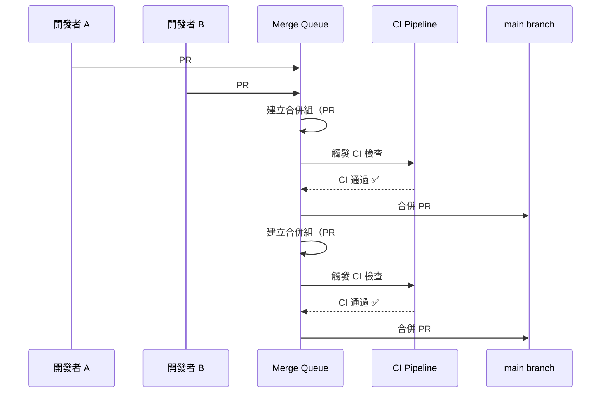

**啟用 Merge Queue**：

1. 前往 Repository → Settings → General → Pull Requests
2. 勾選 **Allow merge queue**（需 GitHub Team 或 Enterprise 方案）
3. 在 Branch Protection 或 Ruleset 中啟用「Require merge queue」

**Merge Queue 配置參數**：

| 參數 | 說明 | 建議值 |
|------|------|-------|
| **Merge method** | 合併方式 | Squash merge |
| **Build concurrency** | 同時建置的 PR 群組數 | 5 |
| **Minimum group size** | 最小合併群組大小 | 1 |
| **Maximum group size** | 最大合併群組大小 | 5 |
| **Wait time** | 等待更多 PR 加入群組的時間 | 5 分鐘 |
| **Status check timeout** | CI 檢查逾時時間 | 60 分鐘 |

**在 Ruleset 中啟用 Merge Queue**：

```json
{
  "type": "merge_queue",
  "parameters": {
    "check_response_timeout_minutes": 60,
    "grouping_strategy": "ALLGREEN",
    "max_entries_to_build": 5,
    "max_entries_to_merge": 5,
    "merge_method": "SQUASH",
    "min_entries_to_merge": 1,
    "min_entries_to_merge_wait_minutes": 5
  }
}
```

> **企業建議**：
> - 高頻合併的 Repository（如核心服務的 develop / main）強烈建議啟用 Merge Queue
> - 搭配「Require branches to be up to date before merging」使用，Merge Queue 會自動處理基底更新
> - Merge Queue 特別適合搭配 Trunk Based Development，確保每次合併都經過完整 CI 驗證

---

## 第 8 章 GitHub Actions 自動化 Workflow

### 8.1 GitHub Actions 架構概述

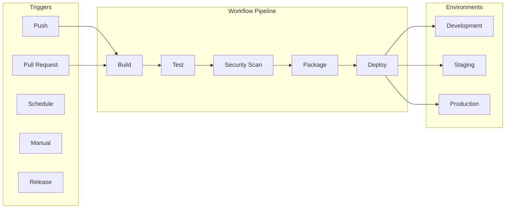

**核心概念**：

| 概念 | 說明 |
|------|------|
| **Workflow** | 一個完整的自動化流程（`.yml` 檔） |
| **Job** | Workflow 中的一組步驟（可平行） |
| **Step** | Job 中的單一動作 |
| **Action** | 可重用的動作單元 |
| **Runner** | 執行環境（GitHub-hosted / Self-hosted） |
| **Secret** | 加密的環境變數 |
| **Environment** | 部署目標（含保護規則） |

### 8.2 CI Workflow — Java Spring Boot

```yaml
# .github/workflows/ci.yml
name: CI Pipeline

on:
  push:
    branches: [develop, main]
  pull_request:
    branches: [develop, main]

permissions:
  contents: read
  checks: write
  pull-requests: write

env:
  JAVA_VERSION: '21'
  MAVEN_OPTS: '-Xmx1024m'

jobs:
  build:
    name: Build & Test
    runs-on: ubuntu-latest
    
    services:
      postgres:
        image: postgres:16
        env:
          POSTGRES_DB: testdb
          POSTGRES_USER: test
          POSTGRES_PASSWORD: test
        ports:
          - 5432:5432
        options: >-
          --health-cmd pg_isready
          --health-interval 10s
          --health-timeout 5s
          --health-retries 5
    
    steps:
      - name: Checkout
        uses: actions/checkout@v4
        with:
          fetch-depth: 0  # SonarQube 需要完整歷史

      - name: Setup Java
        uses: actions/setup-java@v4
        with:
          distribution: 'temurin'
          java-version: ${{ env.JAVA_VERSION }}
          cache: 'maven'

      - name: Build
        run: mvn compile -B -q

      - name: Unit Tests
        run: mvn test -B

      - name: Integration Tests
        run: mvn verify -P integration-test -B
        env:
          SPRING_DATASOURCE_URL: jdbc:postgresql://localhost:5432/testdb
          SPRING_DATASOURCE_USERNAME: test
          SPRING_DATASOURCE_PASSWORD: test

      - name: Code Coverage
        run: mvn jacoco:report -B

      - name: Upload Coverage
        uses: actions/upload-artifact@v4
        with:
          name: coverage-report
          path: target/site/jacoco/

      - name: Publish Test Results
        uses: dorny/test-reporter@v1
        if: always()
        with:
          name: Test Results
          path: target/surefire-reports/*.xml
          reporter: java-junit

  code-quality:
    name: Code Quality
    runs-on: ubuntu-latest
    needs: build
    
    steps:
      - uses: actions/checkout@v4
        with:
          fetch-depth: 0

      - uses: actions/setup-java@v4
        with:
          distribution: 'temurin'
          java-version: ${{ env.JAVA_VERSION }}
          cache: 'maven'

      - name: SonarQube Analysis
        run: |
          mvn sonar:sonar \
            -Dsonar.projectKey=svc-order-api \
            -Dsonar.host.url=${{ secrets.SONAR_HOST_URL }} \
            -Dsonar.token=${{ secrets.SONAR_TOKEN }}

      - name: Checkstyle
        run: mvn checkstyle:check -B

      - name: SpotBugs
        run: mvn spotbugs:check -B
```

### 8.3 CI Workflow — Vue 專案

```yaml
# .github/workflows/ci-frontend.yml
name: Frontend CI

on:
  push:
    branches: [develop, main]
    paths:
      - 'src/**'
      - 'package.json'
      - 'vite.config.ts'
  pull_request:
    branches: [develop, main]

jobs:
  lint-and-test:
    name: Lint & Test
    runs-on: ubuntu-latest
    
    strategy:
      matrix:
        node-version: [20, 22]
    
    steps:
      - uses: actions/checkout@v4

      - name: Setup Node.js
        uses: actions/setup-node@v4
        with:
          node-version: ${{ matrix.node-version }}
          cache: 'pnpm'

      - name: Setup pnpm
        uses: pnpm/action-setup@v4
        with:
          version: 9

      - name: Install Dependencies
        run: pnpm install --frozen-lockfile

      - name: Lint
        run: pnpm lint

      - name: Type Check
        run: pnpm type-check

      - name: Unit Tests
        run: pnpm test:unit --coverage

      - name: Build
        run: pnpm build

      - name: Upload Build Artifact
        uses: actions/upload-artifact@v4
        with:
          name: dist-${{ matrix.node-version }}
          path: dist/

  e2e:
    name: E2E Tests
    runs-on: ubuntu-latest
    needs: lint-and-test
    
    steps:
      - uses: actions/checkout@v4
      - uses: actions/setup-node@v4
        with:
          node-version: 22
          cache: 'pnpm'
      - uses: pnpm/action-setup@v4
        with:
          version: 9
      - run: pnpm install --frozen-lockfile
      
      - name: Playwright Install
        run: pnpm exec playwright install --with-deps

      - name: E2E Tests
        run: pnpm test:e2e

      - name: Upload E2E Report
        uses: actions/upload-artifact@v4
        if: failure()
        with:
          name: playwright-report
          path: playwright-report/
```

### 8.4 CD Workflow — Docker Build & Deploy

```yaml
# .github/workflows/cd.yml
name: CD Pipeline

on:
  push:
    tags:
      - 'v*'

permissions:
  contents: read
  packages: write
  id-token: write

env:
  REGISTRY: ghcr.io
  IMAGE_NAME: ${{ github.repository }}

jobs:
  build-and-push:
    name: Build & Push Docker Image
    runs-on: ubuntu-latest
    outputs:
      image-tag: ${{ steps.meta.outputs.tags }}
      image-digest: ${{ steps.build.outputs.digest }}
    
    steps:
      - uses: actions/checkout@v4

      - name: Setup Docker Buildx
        uses: docker/setup-buildx-action@v3

      - name: Login to GHCR
        uses: docker/login-action@v3
        with:
          registry: ${{ env.REGISTRY }}
          username: ${{ github.actor }}
          password: ${{ secrets.GITHUB_TOKEN }}

      - name: Extract Metadata
        id: meta
        uses: docker/metadata-action@v5
        with:
          images: ${{ env.REGISTRY }}/${{ env.IMAGE_NAME }}
          tags: |
            type=semver,pattern={{version}}
            type=semver,pattern={{major}}.{{minor}}
            type=sha

      - name: Build & Push
        id: build
        uses: docker/build-push-action@v6
        with:
          context: .
          push: true
          tags: ${{ steps.meta.outputs.tags }}
          labels: ${{ steps.meta.outputs.labels }}
          cache-from: type=gha
          cache-to: type=gha,mode=max
          provenance: true
          sbom: true

  deploy-staging:
    name: Deploy to Staging
    runs-on: ubuntu-latest
    needs: build-and-push
    environment: staging
    
    steps:
      - uses: actions/checkout@v4

      - name: Deploy to K8s (Staging)
        uses: azure/k8s-deploy@v5
        with:
          manifests: |
            infra/k8s/staging/
          images: |
            ${{ needs.build-and-push.outputs.image-tag }}
          namespace: staging

  deploy-production:
    name: Deploy to Production
    runs-on: ubuntu-latest
    needs: [build-and-push, deploy-staging]
    environment: production
    
    steps:
      - uses: actions/checkout@v4

      - name: Deploy to K8s (Production)
        uses: azure/k8s-deploy@v5
        with:
          manifests: |
            infra/k8s/production/
          images: |
            ${{ needs.build-and-push.outputs.image-tag }}
          namespace: production
          strategy: canary
          percentage: 20
```

### 8.5 Security Workflow

```yaml
# .github/workflows/security.yml
name: Security Scan

on:
  push:
    branches: [main, develop]
  pull_request:
    branches: [main]
  schedule:
    - cron: '0 6 * * 1'  # 每週一 UTC 6:00

permissions:
  contents: read
  security-events: write

jobs:
  codeql:
    name: CodeQL Analysis
    runs-on: ubuntu-latest
    
    strategy:
      matrix:
        language: ['java']
    
    steps:
      - uses: actions/checkout@v4

      - name: Initialize CodeQL
        uses: github/codeql-action/init@v3
        with:
          languages: ${{ matrix.language }}
          queries: +security-extended,security-and-quality

      - name: Setup Java
        uses: actions/setup-java@v4
        with:
          distribution: 'temurin'
          java-version: '21'

      - name: Build
        run: mvn compile -B -q -DskipTests

      - name: Perform CodeQL Analysis
        uses: github/codeql-action/analyze@v3
        with:
          category: "/language:${{ matrix.language }}"

  dependency-check:
    name: Dependency Vulnerability Scan
    runs-on: ubuntu-latest
    
    steps:
      - uses: actions/checkout@v4

      - name: OWASP Dependency Check
        uses: dependency-check/Dependency-Check_Action@main
        with:
          project: 'svc-order-api'
          path: '.'
          format: 'HTML'
          args: >-
            --failOnCVSS 7
            --enableRetired

      - name: Upload Report
        uses: actions/upload-artifact@v4
        if: always()
        with:
          name: dependency-check-report
          path: reports/

  secret-scan:
    name: Secret Detection
    runs-on: ubuntu-latest
    
    steps:
      - uses: actions/checkout@v4
        with:
          fetch-depth: 0

      - name: TruffleHog Secret Scan
        uses: trufflesecurity/trufflehog@main
        with:
          extra_args: --only-verified
```

### 8.6 Release Workflow

```yaml
# .github/workflows/release.yml
name: Release

on:
  workflow_dispatch:
    inputs:
      version:
        description: 'Release version (e.g., 1.2.0)'
        required: true
        type: string
      prerelease:
        description: 'Pre-release?'
        required: false
        type: boolean
        default: false

permissions:
  contents: write
  packages: write

jobs:
  release:
    name: Create Release
    runs-on: ubuntu-latest
    
    steps:
      - uses: actions/checkout@v4
        with:
          fetch-depth: 0

      - name: Setup Java
        uses: actions/setup-java@v4
        with:
          distribution: 'temurin'
          java-version: '21'
          cache: 'maven'

      - name: Set Version
        run: mvn versions:set -DnewVersion=${{ inputs.version }} -B

      - name: Build & Verify
        run: mvn verify -B

      - name: Generate Changelog
        id: changelog
        uses: mikepenz/release-changelog-builder-action@v5
        with:
          configuration: ".github/changelog-config.json"
        env:
          GITHUB_TOKEN: ${{ secrets.GITHUB_TOKEN }}

      - name: Create Tag & Release
        uses: softprops/action-gh-release@v2
        with:
          tag_name: v${{ inputs.version }}
          name: Release v${{ inputs.version }}
          body: ${{ steps.changelog.outputs.changelog }}
          prerelease: ${{ inputs.prerelease }}
          files: |
            target/*.jar
```

### 8.7 Reusable Workflows 與 Composite Actions

**Reusable Workflow**（放在 `wf-shared-actions` Repo）：

```yaml
# .github/workflows/java-ci.yml（Reusable）
name: Java CI Template

on:
  workflow_call:
    inputs:
      java-version:
        required: false
        type: string
        default: '21'
      maven-goals:
        required: false
        type: string
        default: 'verify'
    secrets:
      SONAR_TOKEN:
        required: false

jobs:
  build:
    runs-on: ubuntu-latest
    steps:
      - uses: actions/checkout@v4
      - uses: actions/setup-java@v4
        with:
          distribution: 'temurin'
          java-version: ${{ inputs.java-version }}
          cache: 'maven'
      - run: mvn ${{ inputs.maven-goals }} -B
```

**在其他 Repo 呼叫**：

```yaml
# svc-order-api/.github/workflows/ci.yml
name: CI
on: [push, pull_request]

jobs:
  java-ci:
    uses: acme-bank/wf-shared-actions/.github/workflows/java-ci.yml@main
    with:
      java-version: '21'
      maven-goals: 'verify'
    secrets:
      SONAR_TOKEN: ${{ secrets.SONAR_TOKEN }}
```

> **實務建議**：
> 1. 將共用 Workflow 集中管理在 `wf-shared-actions` Repo
> 2. 使用 `@v1` Tag 版本控制，避免 breaking change 影響所有下游
> 3. Self-hosted Runner 建議用於：大型 build（需高規格機器）、需存取內網資源、需特殊軟體授權

---

## 第 9 章 DevSecOps 與 SSDLC

### 9.1 SSDLC 流程總覽

**Secure Software Development Lifecycle（SSDLC）** 將安全活動嵌入軟體開發每個階段：

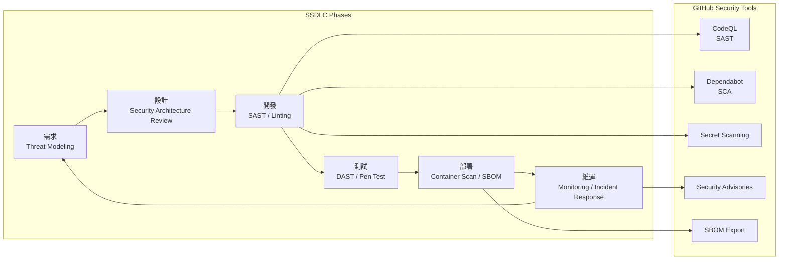

**GitHub Advanced Security (GHAS) 功能矩陣**：

| 功能 | Free/Team | GHAS ⚠️ 需 GitHub Enterprise | 說明 |
|------|-----------|------|------|
| Dependabot Alerts | ✅ | ✅ | 依賴漏洞告警 |
| Dependabot Updates | ✅ | ✅ | 自動建立更新 PR |
| Secret Scanning | ❌ | ✅ | 偵測洩漏的密鑰 |
| Push Protection | ❌ | ✅ | 阻擋含密鑰的 Push |
| CodeQL | ✅（Public） | ✅ | 語意級 SAST |
| Security Overview | ❌ | ✅ | 組織級安全儀表板 |
| Custom Patterns | ❌ | ✅ | 自訂 Secret 偵測規則 |

### 9.2 SAST — 靜態應用程式安全測試

**CodeQL 配置**：

```yaml
# .github/codeql/codeql-config.yml
name: "Enterprise CodeQL Config"
disable-default-queries: false

queries:
  - uses: security-extended
  - uses: security-and-quality

paths-ignore:
  - '**/test/**'
  - '**/generated/**'

query-filters:
  - exclude:
      tags: /correctness/  # 排除正確性類（僅聚焦安全）
```

**常見 Java 安全漏洞偵測**：

| CWE | 漏洞類型 | CodeQL 偵測 | 修復方式 |
|-----|---------|------------|---------|
| CWE-89 | SQL Injection | ✅ | 使用 Prepared Statement |
| CWE-79 | XSS | ✅ | Output Encoding |
| CWE-502 | Deserialization | ✅ | 白名單反序列化 |
| CWE-611 | XXE | ✅ | 禁用外部實體 |
| CWE-22 | Path Traversal | ✅ | 正規化路徑檢查 |
| CWE-327 | Weak Crypto | ✅ | 使用 AES-256-GCM |
| CWE-798 | Hard-coded Credentials | ✅ | 使用 Vault / Secrets |

### 9.3 Dependency Scan — Dependabot

```yaml
# .github/dependabot.yml
version: 2
updates:
  # Maven 依賴
  - package-ecosystem: "maven"
    directory: "/"
    schedule:
      interval: "weekly"
      day: "monday"
      time: "06:00"
      timezone: "Asia/Taipei"
    open-pull-requests-limit: 10
    labels:
      - "dependencies"
      - "security"
    reviewers:
      - "acme-bank/tech-leads"
    commit-message:
      prefix: "deps"
      include: "scope"
    # 安全更新永遠建立 PR
    allow:
      - dependency-type: "all"
    ignore:
      - dependency-name: "org.springframework.boot"
        update-types: ["version-update:semver-major"]
    groups:
      spring:
        patterns:
          - "org.springframework*"
      testing:
        patterns:
          - "org.junit*"
          - "org.mockito*"
          - "org.assertj*"

  # GitHub Actions
  - package-ecosystem: "github-actions"
    directory: "/"
    schedule:
      interval: "weekly"
    labels:
      - "ci"
      - "dependencies"

  # Docker
  - package-ecosystem: "docker"
    directory: "/"
    schedule:
      interval: "weekly"
```

### 9.4 Secret Scanning

**啟用與配置** ⚠️ 需 GitHub Enterprise：

```bash
# 啟用 Secret Scanning
gh api repos/acme-bank/svc-order-api \
  -X PATCH \
  -f security_and_analysis.secret_scanning.status="enabled" \
  -f security_and_analysis.secret_scanning_push_protection.status="enabled"
```

**自訂 Secret Pattern**：

```yaml
# Organization 層級自訂模式
patterns:
  - name: "Internal API Key"
    pattern: "ACME-KEY-[A-Za-z0-9]{32}"
    description: "內部 API Key 格式"
    
  - name: "Database Connection String"
    pattern: "jdbc:(postgresql|mysql)://[^\\s]+"
    description: "資料庫連線字串"
    
  - name: "JWT Secret"
    pattern: "jwt[_-]?secret[\"'=:\\s]+[A-Za-z0-9+/]{32,}"
    description: "JWT 密鑰"
```

**Secret 洩漏處理 SOP**：

1. 收到 Secret Scanning Alert
2. 立即 Rotate（輪換）該 Secret
3. 檢查 Audit Log 確認是否被濫用
4. 從 Git 歷史移除（`git filter-branch` 或 BFG Repo-Cleaner）
5. 通報資安團隊
6. 更新 `.gitignore` 防止再次發生

### 9.5 CodeQL 進階分析

**自訂 Query（偵測特定模式）**：

```ql
/**
 * @name Hardcoded database password
 * @description Finds hardcoded passwords in database configuration
 * @kind problem
 * @problem.severity error
 * @security-severity 9.0
 * @id java/hardcoded-db-password
 * @tags security
 */

import java
import semmle.code.java.dataflow.DataFlow

from StringLiteral literal, MethodAccess call
where
  call.getMethod().getName().matches("%password%") and
  DataFlow::localFlow(DataFlow::exprNode(literal), DataFlow::exprNode(call.getAnArgument())) and
  literal.getValue().length() > 3
select literal, "Hardcoded password found: potential security risk"
```

### 9.6 Container Security

```yaml
# .github/workflows/container-security.yml
name: Container Security

on:
  push:
    paths:
      - 'Dockerfile'
      - '.dockerignore'

jobs:
  scan:
    runs-on: ubuntu-latest
    steps:
      - uses: actions/checkout@v4

      - name: Build Image
        run: docker build -t app:scan .

      - name: Trivy Vulnerability Scan
        uses: aquasecurity/trivy-action@master
        with:
          image-ref: 'app:scan'
          format: 'sarif'
          output: 'trivy-results.sarif'
          severity: 'CRITICAL,HIGH'

      - name: Upload Trivy Results
        uses: github/codeql-action/upload-sarif@v3
        with:
          sarif_file: 'trivy-results.sarif'

      - name: Hadolint - Dockerfile Lint
        uses: hadolint/hadolint-action@v3.1.0
        with:
          dockerfile: Dockerfile
          failure-threshold: warning

      - name: Generate SBOM
        uses: anchore/sbom-action@v0
        with:
          image: 'app:scan'
          format: spdx-json
          output-file: sbom.spdx.json

      - name: Upload SBOM
        uses: actions/upload-artifact@v4
        with:
          name: sbom
          path: sbom.spdx.json
```

### 9.7 完整 Security Pipeline YAML

```yaml
# .github/workflows/security-full.yml
name: Full Security Pipeline

on:
  push:
    branches: [main]
  schedule:
    - cron: '0 2 * * *'  # 每日凌晨 2:00 完整掃描

jobs:
  sast:
    name: SAST (CodeQL)
    uses: acme-bank/wf-shared-actions/.github/workflows/codeql.yml@v1
    
  sca:
    name: SCA (Dependency Check)
    uses: acme-bank/wf-shared-actions/.github/workflows/dependency-check.yml@v1
    
  secret:
    name: Secret Detection
    uses: acme-bank/wf-shared-actions/.github/workflows/secret-scan.yml@v1
    
  container:
    name: Container Scan
    needs: [sast, sca]
    uses: acme-bank/wf-shared-actions/.github/workflows/container-scan.yml@v1
    
  report:
    name: Security Report
    needs: [sast, sca, secret, container]
    runs-on: ubuntu-latest
    steps:
      - name: Aggregate Results
        run: echo "All security checks passed ✅"
      
      - name: Notify on Failure
        if: failure()
        uses: slackapi/slack-github-action@v2
        with:
          webhook: ${{ secrets.SECURITY_SLACK_WEBHOOK }}
          payload: |
            {
              "text": "🚨 Security scan failed for ${{ github.repository }}"
            }
```

> **實務建議**：安全掃描應同時在 PR 和定期排程執行。PR 掃描確保新程式碼安全，排程掃描捕捉新發現的 CVE 對既有程式碼的影響。

### 9.8 Private Vulnerability Reporting

GitHub 提供 **Private Vulnerability Reporting（私密漏洞通報）** 功能，允許安全研究者透過標準化流程向 Repository 維護者私密通報安全漏洞，避免在 Public Issue 中公開揭露。

**啟用方式**：

```bash
# 在 Repository 層級啟用
gh api repos/acme-bank/svc-order-api \
  -X PATCH \
  -F security_and_analysis.secret_scanning.status="enabled"

# 在 Organization 層級統一啟用
# Settings → Code security and analysis → Private vulnerability reporting → Enable all
```

**通報流程**：

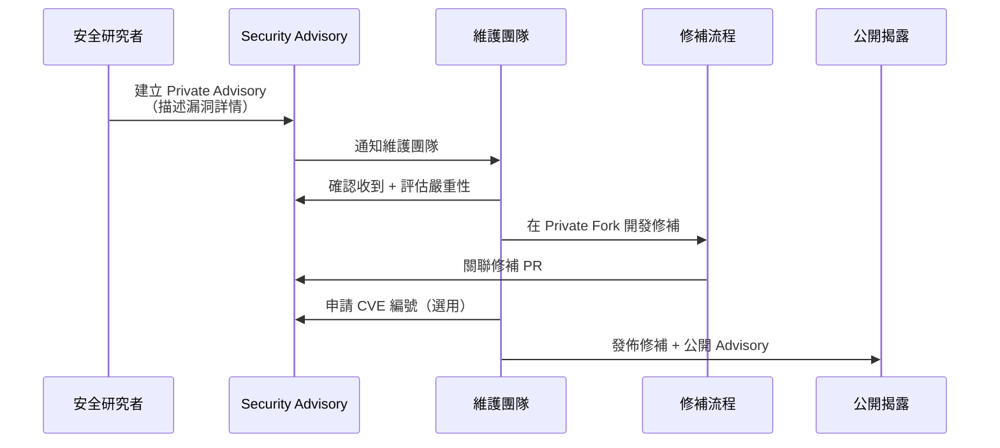

**Security Advisory 範本**：

```markdown
## 漏洞摘要
[簡要描述漏洞類型與影響]

## 影響版本
- v2.0.0 ~ v2.3.1

## 嚴重性
CVSS 3.1 Score: 8.5 (High)

## 重現步驟
1. [步驟一]
2. [步驟二]
3. [觀察到的安全問題]

## 修補建議
升級至 v2.3.2 或以上版本

## 時間軸
- 2026-01-15: 收到通報
- 2026-01-17: 確認漏洞
- 2026-01-24: 修補完成
- 2026-01-25: 公開揭露
```

**企業 Security Advisory 管理策略**：

| 階段 | SLA | 負責人 | 產出 |
|------|-----|--------|------|
| **收到通報** | 24 小時內確認 | 資安團隊 | 確認回覆 |
| **嚴重性評估** | 72 小時內 | 資安 + 開發 | CVSS 評分 |
| **修補開發** | 7 天（Critical）/ 30 天（High） | 開發團隊 | 修補 PR |
| **驗證測試** | 修補後 48 小時 | QA 團隊 | 測試報告 |
| **公開揭露** | 修補發佈後 | 資安團隊 | Public Advisory |

> **企業建議**：所有 Production Repository 務必啟用 Private Vulnerability Reporting，並在 SECURITY.md 中清楚說明通報管道與回應 SLA。這不僅是安全最佳實踐，也展現組織對資安的重視。

---

## 第 10 章 文件管理策略

### 10.1 README Strategy

**README 分層策略**：

| 層級 | 位置 | 內容 | 目標讀者 |
|------|------|------|---------|
| **Organization** | `.github` repo 的 `profile/README.md` | 公司簡介、導覽 | 所有成員 |
| **Repository** | 根目錄 `README.md` | 專案說明、快速開始 | 開發者 |
| **Directory** | 各目錄 `README.md` | 目錄用途說明 | 維護者 |
| **API** | `docs/api/README.md` | API 使用指南 | API 消費者 |

**README 品質評分標準**：

- [ ] 有清楚的一句話描述專案用途
- [ ] 有 CI/CD Badge
- [ ] 有「快速開始」步驟（< 5 步）
- [ ] 有技術棧列表
- [ ] 有 API 文件連結
- [ ] 有聯絡人 / 負責團隊
- [ ] 有架構圖或流程圖
- [ ] 有貢獻指南連結

### 10.2 Architecture Decision Record（ADR）

**ADR Template**：

```markdown
# ADR-{number}: {title}

## Status
{Proposed | Accepted | Deprecated | Superseded by ADR-xxx}

## Context
描述面臨的問題或決策背景。

## Decision
說明做出的決策。

## Consequences
### Positive
- 正面影響

### Negative
- 負面影響 / 取捨

### Risks
- 潛在風險

## Alternatives Considered
| 方案 | 優點 | 缺點 | 結論 |
|------|------|------|------|
| 方案 A | ... | ... | ✅ 採用 |
| 方案 B | ... | ... | ❌ 排除 |

## References
- 相關文件連結
```

**ADR 範例 — 選擇 Event-Driven Architecture**：

```markdown
# ADR-002: 採用 Event-Driven Architecture

## Status
Accepted (2024-03-15)

## Context
訂單系統需要通知支付、庫存、通知等多個下游服務。
目前使用同步 REST 呼叫，導致：
1. 強耦合
2. 延遲累加
3. 單點故障風險

## Decision
採用 Apache Kafka 實現 Event-Driven Architecture。
- 訂單狀態變更發佈 Domain Event
- 下游服務各自訂閱所需事件
- 使用 Outbox Pattern 確保一致性

## Consequences
### Positive
- 服務解耦，獨立部署
- 非同步處理，提升回應速度
- 天然支援 Event Sourcing

### Negative
- 增加系統複雜度（Kafka 維運）
- Eventual Consistency（需處理最終一致性）
- Debug 難度增加

## References
- [Event-Driven Architecture Pattern](https://microservices.io/patterns/data/event-driven-architecture.html)
- [Transactional Outbox](https://microservices.io/patterns/data/transactional-outbox.html)
```

### 10.3 API 文件管理

**OpenAPI Spec 管理策略**：

```yaml
# docs/api/openapi.yaml
openapi: 3.1.0
info:
  title: Order Service API
  version: 2.1.0
  description: |
    訂單服務 API — 處理訂單完整生命週期
  contact:
    name: Backend Order Team
    email: backend-order@acme-bank.com

servers:
  - url: https://api.acme-bank.com/orders/v2
    description: Production
  - url: https://api-staging.acme-bank.com/orders/v2
    description: Staging

paths:
  /orders:
    post:
      operationId: createOrder
      summary: 建立訂單
      tags: [Orders]
      security:
        - bearerAuth: []
      requestBody:
        required: true
        content:
          application/json:
            schema:
              $ref: '#/components/schemas/CreateOrderRequest'
      responses:
        '201':
          description: 訂單建立成功
          content:
            application/json:
              schema:
                $ref: '#/components/schemas/OrderResponse'
        '400':
          $ref: '#/components/responses/BadRequest'
        '401':
          $ref: '#/components/responses/Unauthorized'
```

**API 文件自動化 Workflow**：

```yaml
# .github/workflows/api-docs.yml
name: API Documentation

on:
  push:
    paths:
      - 'docs/api/**'
      - 'src/**/controller/**'

jobs:
  validate-and-publish:
    runs-on: ubuntu-latest
    steps:
      - uses: actions/checkout@v4

      - name: Validate OpenAPI Spec
        uses: char0n/swagger-editor-validate@v1
        with:
          definition-file: docs/api/openapi.yaml

      - name: Generate API Diff
        uses: oasdiff/oasdiff-action/breaking@main
        if: github.event_name == 'pull_request'
        with:
          base: docs/api/openapi.yaml
          revision: docs/api/openapi.yaml

      - name: Publish to Swagger UI
        if: github.ref == 'refs/heads/main'
        run: |
          # 發佈至內部 API Portal
          echo "Publishing API docs..."
```

### 10.4 Wiki vs Docs Repository

| 面向 | GitHub Wiki | Docs Repository |
|------|------------|-----------------|
| **版本控制** | 獨立 Git Repo（弱） | 與程式碼同 Repo |
| **PR Review** | ❌ 不支援 | ✅ 支援 |
| **CI/CD** | ❌ 無法自動化 | ✅ 可自動發佈 |
| **搜尋** | GitHub 內建 | 需自建（Algolia / DocSearch） |
| **適用** | 簡單文件、FAQ | 正式技術文件 |
| **企業建議** | ❌ 不建議 | ✅ 推薦 |

> **企業建議**：正式文件放在 Repository 中（`docs/` 目錄或獨立 docs repo），使用 PR Review 流程管控品質。Wiki 僅用於非正式知識分享。

### 10.5 文件自動化生成

```yaml
# .github/workflows/docs-publish.yml
name: Publish Documentation

on:
  push:
    branches: [main]
    paths:
      - 'docs/**'
      - 'mkdocs.yml'

jobs:
  deploy:
    runs-on: ubuntu-latest
    permissions:
      pages: write
      id-token: write
    
    steps:
      - uses: actions/checkout@v4
        with:
          fetch-depth: 0

      - uses: actions/setup-python@v5
        with:
          python-version: '3.12'

      - name: Install MkDocs
        run: |
          pip install mkdocs-material \
            mkdocs-mermaid2-plugin \
            mkdocs-git-revision-date-localized-plugin

      - name: Build Docs
        run: mkdocs build

      - name: Deploy to GitHub Pages
        uses: actions/deploy-pages@v4
```

### 10.6 GitHub Pages 靜態網站發佈

GitHub Pages 提供直接從 Repository 發佈靜態網站的功能，適合用於技術文件、API 文件、團隊入口網站等。

**發佈來源選擇**：

| 來源 | 說明 | 適用場景 |
|------|------|---------|
| **Branch（Legacy）** | 從特定分支（如 `gh-pages`）發佈 | 簡單靜態網站 |
| **GitHub Actions（推薦）** | 透過 Workflow 建置後發佈 | MkDocs / Docusaurus / 自訂建置 |

**使用 GitHub Actions 發佈（推薦）**：

```yaml
# .github/workflows/deploy-pages.yml
name: Deploy to GitHub Pages

on:
  push:
    branches: [main]
    paths:
      - 'docs/**'
      - 'mkdocs.yml'

permissions:
  contents: read
  pages: write
  id-token: write

concurrency:
  group: "pages"
  cancel-in-progress: false

jobs:
  build:
    runs-on: ubuntu-latest
    steps:
      - uses: actions/checkout@v4
      - uses: actions/setup-python@v5
        with:
          python-version: '3.12'
      
      - name: Install Dependencies
        run: pip install mkdocs-material mkdocs-mermaid2-plugin

      - name: Build
        run: mkdocs build --strict

      - name: Upload Artifact
        uses: actions/upload-pages-artifact@v3
        with:
          path: site/

  deploy:
    needs: build
    runs-on: ubuntu-latest
    environment:
      name: github-pages
      url: ${{ steps.deployment.outputs.page_url }}
    steps:
      - name: Deploy to GitHub Pages
        id: deployment
        uses: actions/deploy-pages@v4
```

**企業 Pages 使用規範**：

| 項目 | 建議 |
|------|------|
| **存取控制** | Private Repo 的 Pages 僅組織成員可存取（Enterprise） |
| **自訂域名** | 使用公司子域名（如 `docs.acme-bank.com`） |
| **HTTPS** | 強制啟用（GitHub 預設支援） |
| **內容限制** | 僅發佈文件網站，不放置敏感資訊 |
| **CI 整合** | PR 預覽部署（Preview Deployments） |

> **企業建議**：使用 GitHub Pages 搭配 MkDocs Material 或 Docusaurus 建立內部技術文件網站。透過 GitHub Actions 實現「Push to main → 自動建置 → 自動部署」的完全自動化流程。

---

## 第 11 章 Issue / Project 管理

### 11.1 GitHub Issues 設計

**Issue Template 完整組合**：

```
.github/ISSUE_TEMPLATE/
├── bug_report.yml          # Bug 回報
├── feature_request.yml     # 功能需求
├── tech_debt.yml           # 技術債務
├── security_report.yml     # 安全問題
└── config.yml              # Template 選擇器配置
```

**config.yml**：

```yaml
blank_issues_enabled: false  # 禁止空白 Issue
contact_links:
  - name: 🔒 安全漏洞回報
    url: https://github.com/acme-bank/svc-order-api/security/advisories/new
    about: 安全漏洞請透過 Security Advisory 回報
  - name: 💬 一般問題
    url: https://github.com/acme-bank/svc-order-api/discussions
    about: 一般技術問題請至 Discussions 討論
```

**Feature Request Template**：

```yaml
name: Feature Request
description: 提出功能需求
title: "[Feature]: "
labels: ["enhancement", "triage"]
body:
  - type: textarea
    id: problem
    attributes:
      label: 問題描述
      description: 描述目前遇到的問題或需求背景
    validations:
      required: true
  - type: textarea
    id: solution
    attributes:
      label: 建議方案
      description: 描述希望如何解決此問題
    validations:
      required: true
  - type: textarea
    id: alternatives
    attributes:
      label: 替代方案
      description: 考慮過的其他方案
  - type: dropdown
    id: priority
    attributes:
      label: 業務優先級
      options:
        - P0 - 緊急（阻礙業務）
        - P1 - 高（本季必須）
        - P2 - 中（可規劃）
        - P3 - 低（Nice to have）
    validations:
      required: true
  - type: textarea
    id: acceptance
    attributes:
      label: 驗收條件
      value: |
        - [ ] 條件 1
        - [ ] 條件 2
        - [ ] 條件 3
```

### 11.2 GitHub Projects（V2）

**Projects V2 建立**：

```bash
# 建立組織級 Project
gh project create --owner acme-bank --title "Order Service Sprint Board"

# 新增自訂欄位
gh project field-create 1 --owner acme-bank \
  --name "Sprint" --data-type "ITERATION" \
  --iteration-duration 14  # 2 週 Sprint

gh project field-create 1 --owner acme-bank \
  --name "Story Points" --data-type "NUMBER"

gh project field-create 1 --owner acme-bank \
  --name "Priority" --data-type "SINGLE_SELECT" \
  --single-select-options "P0-Critical,P1-High,P2-Medium,P3-Low"
```

**Project View 設計**：

| View | 類型 | 分組 | 篩選 | 用途 |
|------|------|------|------|------|
| Sprint Board | Board | Status | Current Sprint | 每日站會 |
| Backlog | Table | Priority | Status != Done | 需求池管理 |
| My Tasks | Table | — | Assignee = @me | 個人工作追蹤 |
| Release Plan | Table | Milestone | — | Release 規劃 |
| Bug Triage | Board | Severity | Label = bug | Bug 分診 |

### 11.3 Label 系統設計

```bash
#!/bin/bash
# 標準化 Label 建立腳本
ORG="acme-bank"
REPO="svc-order-api"

# Type Labels
gh label create "type: bug" --color "d73a4a" --description "程式錯誤" -R ${ORG}/${REPO}
gh label create "type: feature" --color "0075ca" --description "新功能" -R ${ORG}/${REPO}
gh label create "type: tech-debt" --color "fbca04" --description "技術債務" -R ${ORG}/${REPO}
gh label create "type: docs" --color "0e8a16" --description "文件更新" -R ${ORG}/${REPO}
gh label create "type: ci" --color "e4e669" --description "CI/CD 改善" -R ${ORG}/${REPO}
gh label create "type: security" --color "b60205" --description "安全修復" -R ${ORG}/${REPO}

# Priority Labels
gh label create "priority: P0" --color "b60205" --description "緊急 - 阻礙營運" -R ${ORG}/${REPO}
gh label create "priority: P1" --color "d93f0b" --description "高 - 本 Sprint" -R ${ORG}/${REPO}
gh label create "priority: P2" --color "fbca04" --description "中 - 可規劃" -R ${ORG}/${REPO}
gh label create "priority: P3" --color "0e8a16" --description "低 - Nice to have" -R ${ORG}/${REPO}

# Status Labels
gh label create "status: triage" --color "d4c5f9" --description "等待分診" -R ${ORG}/${REPO}
gh label create "status: in-progress" --color "1d76db" --description "進行中" -R ${ORG}/${REPO}
gh label create "status: blocked" --color "b60205" --description "被阻擋" -R ${ORG}/${REPO}
gh label create "status: review" --color "f9d0c4" --description "等待審查" -R ${ORG}/${REPO}

# Component Labels
gh label create "component: api" --color "c5def5" --description "API 層" -R ${ORG}/${REPO}
gh label create "component: domain" --color "c5def5" --description "Domain 層" -R ${ORG}/${REPO}
gh label create "component: infra" --color "c5def5" --description "基礎設施層" -R ${ORG}/${REPO}
gh label create "component: db" --color "c5def5" --description "資料庫" -R ${ORG}/${REPO}
```

### 11.4 Milestone 與 Sprint Planning

**Milestone 設計**：

```bash
# 建立 Milestone（對應 Release 版本）
gh api repos/acme-bank/svc-order-api/milestones \
  -f title="v2.1.0" \
  -f description="訂單服務 2.1 版 - 新增取消功能" \
  -f due_on="2024-06-30T00:00:00Z"
```

**Sprint Planning 自動化**：

```yaml
# .github/workflows/sprint-automation.yml
name: Sprint Automation

on:
  schedule:
    - cron: '0 1 * * 1'  # 每週一凌晨

jobs:
  sprint-report:
    runs-on: ubuntu-latest
    steps:
      - name: Generate Sprint Summary
        uses: actions/github-script@v7
        with:
          script: |
            const issues = await github.rest.issues.listForRepo({
              owner: 'acme-bank',
              repo: 'svc-order-api',
              state: 'all',
              since: new Date(Date.now() - 14 * 24 * 60 * 60 * 1000).toISOString()
            });
            
            const closed = issues.data.filter(i => i.state === 'closed').length;
            const opened = issues.data.filter(i => i.state === 'open').length;
            
            console.log(`Sprint Summary: ${closed} closed, ${opened} open`);
```

### 11.5 Agile Workflow 整合

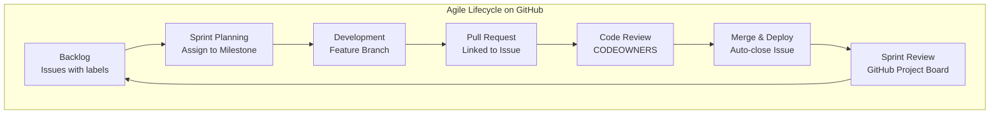

**Issue ↔ PR 自動連結**：

```markdown
# PR 描述中使用關鍵字自動關閉 Issue
Closes #123
Fixes #456
Resolves #789
```

> **實務建議**：善用 GitHub Projects V2 的 Automation 功能 — Issue 建立自動加入 Board、PR 合併自動移至 Done、Sprint 結束未完成自動移至下一 Sprint。

---

## 第 12 章 Release Management

### 12.1 Semantic Versioning

遵循 **[Semantic Versioning 2.0.0](https://semver.org/)** 規範：

```
MAJOR.MINOR.PATCH[-prerelease][+buildmetadata]

範例：
1.0.0          # 首次正式發佈
1.1.0          # 新增功能（向後相容）
1.1.1          # Bug 修復
2.0.0          # Breaking Change
2.0.0-rc.1     # Release Candidate
2.0.0-beta.1   # Beta 版
```

**版本升級規則**：

| 變更類型 | 版本升級 | 範例 |
|---------|---------|------|
| Breaking API Change | MAJOR | 1.x → 2.0.0 |
| 新增功能（向後相容） | MINOR | 1.1.x → 1.2.0 |
| Bug 修復 | PATCH | 1.1.1 → 1.1.2 |
| 依賴安全更新 | PATCH | 1.1.1 → 1.1.2 |
| 重構（無行為變更） | 不升版 | — |
| 文件更新 | 不升版 | — |

### 12.2 Conventional Commits

**自動版本判斷（基於 Commit Message）**：

| Commit Type | 對應版本升級 |
|-------------|-------------|
| `feat` | MINOR |
| `fix` | PATCH |
| `feat!` / `BREAKING CHANGE` | MAJOR |
| `perf` | PATCH |
| `docs` / `style` / `chore` | 不升版 |

**commitlint 配置**：

```javascript
// commitlint.config.js
module.exports = {
  extends: ['@commitlint/config-conventional'],
  rules: {
    'type-enum': [
      2,
      'always',
      ['feat', 'fix', 'docs', 'style', 'refactor', 'test', 'chore', 'ci', 'perf', 'security']
    ],
    'scope-enum': [
      1,
      'always',
      ['order', 'payment', 'inventory', 'auth', 'api', 'db', 'ci', 'deps']
    ],
    'subject-max-length': [2, 'always', 72],
    'body-max-line-length': [1, 'always', 100]
  }
};
```

### 12.3 Changelog 自動生成

**Changelog 配置**：

```json
// .github/changelog-config.json
{
  "categories": [
    {
      "title": "## 🚀 新功能",
      "labels": ["type: feature", "enhancement"]
    },
    {
      "title": "## 🐛 Bug 修復",
      "labels": ["type: bug", "fix"]
    },
    {
      "title": "## 🔒 安全修復",
      "labels": ["type: security"]
    },
    {
      "title": "## 📝 文件",
      "labels": ["type: docs"]
    },
    {
      "title": "## 🔧 維護",
      "labels": ["type: tech-debt", "type: ci", "dependencies"]
    }
  ],
  "template": "#{{CHANGELOG}}\n\n**Full Changelog**: #{{RELEASE_DIFF}}",
  "pr_template": "- #{{TITLE}} (#{{NUMBER}}) @#{{AUTHOR}}"
}
```

**自動生成範例**：

```markdown
# Changelog

## [2.1.0] - 2024-06-30

### 🚀 新功能
- feat(order): add cancel order endpoint (#142) @john-doe
- feat(order): add order status webhook (#145) @jane-doe

### 🐛 Bug 修復
- fix(payment): resolve race condition in refund (#148) @bob

### 🔒 安全修復
- security: upgrade Spring Boot to 3.4.1 (CVE-2024-xxxx) (#150) @dependabot

### 🔧 維護
- chore(deps): update test dependencies (#147) @dependabot

**Full Changelog**: v2.0.0...v2.1.0
```

### 12.4 GitHub Release 與 Tag

**Tag 命名規範**：

```bash
# Annotated Tag（推薦）
git tag -a v2.1.0 -m "Release v2.1.0 - Add cancel order feature"
git push origin v2.1.0

# 預發佈
git tag -a v2.1.0-rc.1 -m "Release Candidate 1 for v2.1.0"
```

**Release 建立**：

```bash
# 使用 GitHub CLI
gh release create v2.1.0 \
  --title "Release v2.1.0" \
  --generate-notes \
  --target main \
  ./target/svc-order-api-2.1.0.jar
```

### 12.5 Release Workflow 自動化

```yaml
# .github/workflows/release-please.yml
name: Release Please

on:
  push:
    branches: [main]

permissions:
  contents: write
  pull-requests: write

jobs:
  release-please:
    runs-on: ubuntu-latest
    outputs:
      release_created: ${{ steps.release.outputs.release_created }}
      tag_name: ${{ steps.release.outputs.tag_name }}
    
    steps:
      - uses: googleapis/release-please-action@v4
        id: release
        with:
          release-type: maven
          package-name: svc-order-api

  publish:
    needs: release-please
    if: ${{ needs.release-please.outputs.release_created }}
    runs-on: ubuntu-latest
    
    steps:
      - uses: actions/checkout@v4
      - uses: actions/setup-java@v4
        with:
          distribution: 'temurin'
          java-version: '21'
          cache: 'maven'

      - name: Publish to GitHub Packages
        run: mvn deploy -B -DskipTests
        env:
          GITHUB_TOKEN: ${{ secrets.GITHUB_TOKEN }}
```

> **實務建議**：使用 `release-please` 或 `semantic-release` 實現全自動版本管理 — 每次 merge to main 自動判斷版本升級、生成 Changelog、建立 Release Tag。人工只需 merge PR，其餘全部自動化。

---

## 第 13 章 AI 時代 Repository 管理

### 13.1 GitHub Copilot 整合

**Copilot 企業配置** ⚠️ 需 GitHub Enterprise：

| 設定項目 | 建議值 | 說明 |
|---------|-------|------|
| Copilot in IDE | ✅ 啟用 | 程式碼補全 |
| Copilot Chat | ✅ 啟用 | 對話式開發 |
| Copilot in CLI | ✅ 啟用 | 指令建議 |
| Copilot in PR | ✅ 啟用 | PR Summary & Review |
| Content Exclusion | 設定排除清單 | 排除敏感 Repo |
| Suggestions matching public code | ❌ 關閉 | 避免授權風險 |

**Copilot Instructions 配置**：

```markdown
<!-- .github/copilot-instructions.md -->
# Copilot Instructions for svc-order-api

## Architecture
- Follow Clean Architecture (Domain → Application → Infrastructure → Adapter)
- Domain layer must not depend on any external framework

## Code Style
- Use Java 21 features (Records, Pattern Matching, Virtual Threads)
- Follow Google Java Style Guide
- All public methods must have JavaDoc

## Security
- Never hardcode credentials
- Use PreparedStatement for all SQL
- Validate all input at Controller layer
- Use @Valid annotation for request DTOs

## Testing
- Unit test coverage > 80%
- Use JUnit 5 + Mockito + AssertJ
- Integration tests use TestContainers
- Name pattern: should_expectedBehavior_when_condition

## Dependencies
- Spring Boot 3.4.x
- PostgreSQL (no other DB)
- Apache Kafka for events
- Redis for caching
```

### 13.2 Claude Code 整合

**CLAUDE.md 配置**：

```markdown
<!-- CLAUDE.md -->
# Claude Code Guidelines

## Project Context
This is a Spring Boot microservice for order management.
Tech stack: Java 21, Spring Boot 3.4, PostgreSQL, Kafka.

## Architecture Rules
1. Never import infrastructure classes from domain layer
2. Use case classes should be single-purpose
3. All external calls go through Port/Adapter pattern

## Coding Standards
- Commit messages follow Conventional Commits
- PR title format: type(scope): description
- Always include unit tests with changes
- Run `mvn verify` before committing

## File Organization
- Domain models: src/main/java/.../domain/model/
- Use cases: src/main/java/.../application/usecase/
- Controllers: src/main/java/.../adapter/rest/
- Repository implementations: src/main/java/.../infrastructure/persistence/

## Common Commands
- Build: `mvn compile`
- Test: `mvn test`
- Full verify: `mvn verify`
- Run locally: `mvn spring-boot:run -Dspring.profiles.active=local`
- Format check: `mvn spotless:check`
```

### 13.3 AI Agent Workflow

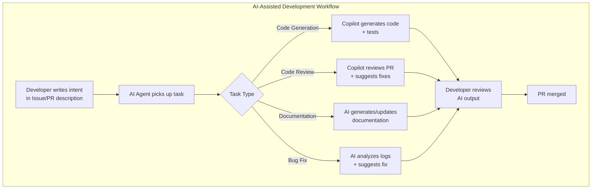

**GitHub Copilot Workspace** ⚠️ 需 GitHub Enterprise：

```yaml
# .github/workflows/copilot-autofix.yml
name: Copilot Autofix

on:
  issues:
    types: [labeled]

jobs:
  autofix:
    if: contains(github.event.label.name, 'copilot-fix')
    runs-on: ubuntu-latest
    steps:
      - uses: actions/checkout@v4
      - name: Trigger Copilot Workspace
        # 使用 Copilot Workspace API 自動修復
        run: echo "Copilot Workspace triggered for Issue #${{ github.event.issue.number }}"
```

### 13.4 Prompt Repository 設計

**AI Assets Repository 結構**：

```
ai-prompt-library/
├── .github/
│   └── workflows/
│       └── validate-prompts.yml
├── prompts/
│   ├── code-review/
│   │   ├── java-review.prompt.md
│   │   ├── security-review.prompt.md
│   │   └── performance-review.prompt.md
│   ├── code-generation/
│   │   ├── spring-controller.prompt.md
│   │   ├── unit-test.prompt.md
│   │   └── integration-test.prompt.md
│   ├── documentation/
│   │   ├── adr-generation.prompt.md
│   │   ├── api-docs.prompt.md
│   │   └── readme-generation.prompt.md
│   └── devops/
│       ├── dockerfile.prompt.md
│       ├── github-action.prompt.md
│       └── k8s-manifest.prompt.md
├── agents/
│   ├── code-reviewer.agent.md
│   ├── test-writer.agent.md
│   └── doc-generator.agent.md
├── instructions/
│   ├── java-backend.instructions.md
│   ├── vue-frontend.instructions.md
│   └── devops.instructions.md
├── templates/
│   └── prompt-template.md
├── CONTRIBUTING.md
└── README.md
```

### 13.5 AI Governance 規範

| 規範項目 | 策略 | 落實方式 |
|---------|------|---------|
| **程式碼審查** | AI 生成程式碼必須人工審查 | PR Review 強制 |
| **敏感排除** | 敏感 Repo 排除 AI 存取 | Content Exclusion |
| **授權合規** | 禁用匹配公開程式碼建議 | Organization 設定 |
| **品質保證** | AI 生成需通過 CI 全部檢查 | Branch Protection |
| **可追蹤** | AI 輔助開發標記 | Commit footer: `AI-assisted: true` |
| **Prompt 版控** | Prompt 視為程式碼管理 | 獨立 Repo + PR Review |

> **實務建議**：AI 是加速器而非替代者。所有 AI 生成的程式碼必須通過與人工撰寫相同的品質關卡（Code Review、CI、Security Scan）。建立 Prompt Library 作為團隊知識資產。

### 13.6 GitHub Copilot Coding Agent

GitHub Copilot Coding Agent（2025 年推出）是 Copilot 的自主代理模式，可自動完成從 Issue 到 Pull Request 的完整開發流程。

**Coding Agent 運作流程**：

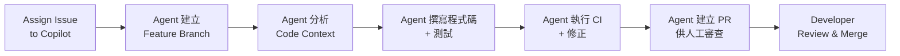

**啟用方式**：

| 步驟 | 操作 |
|------|------|
| 1. Organization 設定 | Settings → Copilot → Agent → Enable |
| 2. 指派 Issue | 在 Issue 中 Assign 給 `@copilot` |
| 3. 或使用 Label | 加上 `copilot` label 觸發 |
| 4. 監控進度 | Agent 會在 PR 中回報進度 |

**適用場景與限制**：

| 適合交給 Agent | 不適合交給 Agent |
|---------------|-----------------|
| 新增 REST API endpoint | 大規模架構重構 |
| 撰寫單元測試 | 跨多個服務的變更 |
| 修正明確的 Bug | 涉及外部系統整合 |
| 增加日誌記錄 | 安全性相關修改 |
| 更新文件 | 資料庫 Schema 變更 |
| Refactor 小範圍程式碼 | 效能關鍵路徑優化 |

**Coding Agent 配置最佳實務**：

```markdown
<!-- .github/copilot-instructions.md — 增加 Agent 專用指引 -->

## Agent Guidelines
- Always create tests for new code
- Run `mvn verify` before submitting PR
- Follow existing code patterns in the same package
- Do not modify database migration files
- Do not change security configurations
- Include JavaDoc for all public methods
```

**企業 Coding Agent 治理策略**：

| 控管項目 | 策略 |
|---------|------|
| 可使用 Agent 的 Repo | 白名單制，僅允許非關鍵系統 |
| Agent PR 審查 | 至少 2 位人工 Reviewer |
| Agent 可修改範圍 | 透過 CODEOWNERS 限制 |
| 執行環境 | 使用 GitHub-hosted Runner（沙箱隔離） |
| 稽核追蹤 | 所有 Agent 活動記錄於 Audit Log |

### 13.7 GitHub Copilot Extensions 與 MCP

**Copilot Extensions**：

GitHub Copilot Extensions 允許第三方工具直接整合進 Copilot Chat，開發者可在對話中直接呼叫外部服務。

| Extension 類型 | 說明 | 範例 |
|---------------|------|------|
| **GitHub Marketplace Extensions** | 官方與社群開發 | Docker、Sentry、Datadog |
| **Private Extensions** | 企業自建 | 內部 API 文件查詢、部署工具 |
| **Skillsets** | 輕量化的自訂技能 | 簡單 API 呼叫、資料查詢 |

**MCP（Model Context Protocol）整合**：

MCP 是一種開放協定，讓 AI Agent 能與外部工具和資料來源互動。VS Code 已原生支援 MCP Server 配置。

```json
// .vscode/mcp.json — 專案級 MCP 配置
{
  "servers": {
    "github": {
      "command": "npx",
      "args": ["-y", "@modelcontextprotocol/server-github"],
      "env": {
        "GITHUB_PERSONAL_ACCESS_TOKEN": "${input:github-token}"
      }
    },
    "database": {
      "command": "npx",
      "args": ["-y", "@modelcontextprotocol/server-postgres"],
      "env": {
        "DATABASE_URL": "${input:db-url}"
      }
    }
  },
  "inputs": [
    {
      "id": "github-token",
      "type": "promptString",
      "description": "GitHub Personal Access Token",
      "password": true
    },
    {
      "id": "db-url",
      "type": "promptString",
      "description": "PostgreSQL Connection URL"
    }
  ]
}
```

**GitHub Models**：

GitHub Models 提供直接在 GitHub 上試用和整合 AI 模型的功能，支援 OpenAI、Anthropic、Mistral 等模型：

| 功能 | 說明 |
|------|------|
| **Playground** | 在 github.com/marketplace/models 直接試用模型 |
| **API 存取** | 使用 GitHub Token 呼叫模型 API |
| **Codespaces 整合** | 在開發環境中直接使用 AI 模型 |
| **支援模型** | GPT-4o、Claude、Mistral、Llama 等 |

> **企業建議**：
> - Copilot Coding Agent 適合低風險、定義明確的任務，始終要求人工審查
> - 建立 MCP Server 封裝內部工具（Jira、Confluence、內部 API），提升 AI 開發體驗
> - 評估 Copilot Extensions 取代部分自建工具整合
> - GitHub Models 可用於 PoC 階段的 AI 功能原型開發

---

## 第 14 章 Repository 維運與治理

### 14.1 Repository Cleanup

**大型檔案清理**：

```bash
# 找出 Repository 中的大型檔案
git rev-list --objects --all | \
  git cat-file --batch-check='%(objecttype) %(objectname) %(objectsize) %(rest)' | \
  sed -n 's/^blob //p' | \
  sort -rnk2 | \
  head -20

# 使用 BFG Repo-Cleaner 移除大型檔案
java -jar bfg.jar --strip-blobs-bigger-than 50M
git reflog expire --expire=now --all
git gc --prune=now --aggressive
```

**Repository Health Check 腳本**：

```bash
#!/bin/bash
# repo-health-check.sh
REPO=$1

echo "=== Repository Health Check: ${REPO} ==="

# 1. 檢查 Repo 大小
SIZE=$(gh api repos/acme-bank/${REPO} --jq '.size')
echo "📦 Repo Size: ${SIZE} KB"
if [ "$SIZE" -gt 500000 ]; then
  echo "⚠️ WARNING: Repository size exceeds 500MB"
fi

# 2. 檢查最後活動時間
LAST_PUSH=$(gh api repos/acme-bank/${REPO} --jq '.pushed_at')
echo "📅 Last Push: ${LAST_PUSH}"

# 3. 檢查 Branch 數量
BRANCHES=$(gh api repos/acme-bank/${REPO}/branches --jq 'length')
echo "🌿 Active Branches: ${BRANCHES}"
if [ "$BRANCHES" -gt 50 ]; then
  echo "⚠️ WARNING: Too many branches (${BRANCHES}), consider cleanup"
fi

# 4. 檢查開啟的 PR 數量
OPEN_PRS=$(gh pr list -R acme-bank/${REPO} --state open --json number --jq 'length')
echo "🔀 Open PRs: ${OPEN_PRS}"

# 5. 檢查安全告警
ALERTS=$(gh api repos/acme-bank/${REPO}/vulnerability-alerts 2>/dev/null && echo "enabled" || echo "disabled")
echo "🔒 Vulnerability Alerts: ${ALERTS}"

# 6. 檢查 Branch Protection
PROTECTION=$(gh api repos/acme-bank/${REPO}/branches/main/protection 2>/dev/null && echo "✅" || echo "❌")
echo "🛡️ Branch Protection (main): ${PROTECTION}"
```

### 14.2 Branch Cleanup 自動化

```yaml
# .github/workflows/branch-cleanup.yml
name: Branch Cleanup

on:
  schedule:
    - cron: '0 3 * * 0'  # 每週日凌晨 3:00
  workflow_dispatch:

jobs:
  cleanup:
    runs-on: ubuntu-latest
    permissions:
      contents: write
    
    steps:
      - uses: actions/checkout@v4
        with:
          fetch-depth: 0

      - name: Delete Merged Branches
        uses: actions/github-script@v7
        with:
          script: |
            const { data: branches } = await github.rest.repos.listBranches({
              owner: context.repo.owner,
              repo: context.repo.repo,
              per_page: 100
            });
            
            const protectedBranches = ['main', 'develop', 'release'];
            const staleDays = 30;
            const now = new Date();
            
            for (const branch of branches) {
              // 跳過受保護分支
              if (protectedBranches.some(p => branch.name.startsWith(p))) continue;
              
              // 檢查是否已合併
              try {
                const { data: comparison } = await github.rest.repos.compareCommits({
                  owner: context.repo.owner,
                  repo: context.repo.repo,
                  base: 'main',
                  head: branch.name
                });
                
                if (comparison.status === 'behind' || comparison.status === 'identical') {
                  console.log(`Deleting merged branch: ${branch.name}`);
                  await github.rest.git.deleteRef({
                    owner: context.repo.owner,
                    repo: context.repo.repo,
                    ref: `heads/${branch.name}`
                  });
                }
              } catch (e) {
                console.log(`Skipping ${branch.name}: ${e.message}`);
              }
            }
```

### 14.3 Secret Rotation

**Secret Rotation 策略**：

| Secret 類型 | 輪換頻率 | 方式 |
|------------|---------|------|
| API Key | 90 天 | 自動輪換 |
| Database Password | 90 天 | Vault + 自動輪換 |
| JWT Secret | 180 天 | 雙 Key 輪換 |
| SSH Deploy Key | 365 天 | 手動輪換 |
| GitHub Token | 不輪換 | 使用 GITHUB_TOKEN（自動） |

```yaml
# .github/workflows/secret-rotation-reminder.yml
name: Secret Rotation Reminder

on:
  schedule:
    - cron: '0 9 1 */3 *'  # 每季第一天提醒

jobs:
  remind:
    runs-on: ubuntu-latest
    steps:
      - name: Create Rotation Reminder Issue
        uses: actions/github-script@v7
        with:
          script: |
            await github.rest.issues.create({
              owner: context.repo.owner,
              repo: context.repo.repo,
              title: '🔑 季度 Secret Rotation 提醒',
              body: `## Secret 輪換清單\n\n- [ ] 確認所有 API Key 已輪換\n- [ ] 確認資料庫密碼已輪換\n- [ ] 確認 JWT Secret 狀態\n- [ ] 更新 Vault 中的 Secrets\n- [ ] 驗證服務正常運作`,
              labels: ['security', 'maintenance']
            });
```

### 14.4 Access Review 與 Audit

**定期權限審查** ⚠️ 需 GitHub Enterprise：

```bash
#!/bin/bash
# access-review.sh — 季度權限盤點
ORG="acme-bank"

echo "=== Quarterly Access Review ==="

# 1. 列出所有外部協作者
echo "--- External Collaborators ---"
gh api orgs/${ORG}/outside_collaborators --jq '.[].login'

# 2. 列出每個 Repo 的 Admin 權限持有者
echo "--- Repository Admins ---"
for repo in $(gh repo list ${ORG} --json name --jq '.[].name' --limit 100); do
  ADMINS=$(gh api repos/${ORG}/${repo}/collaborators \
    --jq '[.[] | select(.permissions.admin == true)] | length')
  if [ "$ADMINS" -gt 3 ]; then
    echo "⚠️ ${repo}: ${ADMINS} admins (too many)"
  fi
done

# 3. 列出 90 天無活動的成員
echo "--- Inactive Members (90 days) ---"
gh api orgs/${ORG}/members --jq '.[].login' | while read member; do
  LAST_EVENT=$(gh api users/${member}/events --jq '.[0].created_at' 2>/dev/null)
  if [ -z "$LAST_EVENT" ]; then
    echo "❓ ${member}: No recent activity"
  fi
done
```

**Audit Log 監控** ⚠️ 需 GitHub Enterprise：

```bash
# 查詢最近的敏感操作
gh api orgs/acme-bank/audit-log \
  --jq '.[] | select(.action | startswith("repo.")) | {action, actor, repo, created_at}' \
  -f phrase="action:repo.destroy OR action:repo.access OR action:org.remove_member"
```

### 14.5 Backup 與 Disaster Recovery

**Repository Backup 策略**：

```yaml
# .github/workflows/backup.yml
name: Repository Backup

on:
  schedule:
    - cron: '0 4 * * *'  # 每日凌晨 4:00

jobs:
  backup:
    runs-on: self-hosted  # 使用內部 Runner
    steps:
      - name: Clone with full history
        run: |
          git clone --mirror git@github.com:acme-bank/svc-order-api.git
          
      - name: Upload to Backup Storage
        run: |
          # 上傳至 Azure Blob / AWS S3
          tar czf svc-order-api-$(date +%Y%m%d).tar.gz svc-order-api.git
          az storage blob upload \
            --container-name github-backups \
            --file svc-order-api-$(date +%Y%m%d).tar.gz \
            --name "repos/svc-order-api/$(date +%Y%m%d).tar.gz"
          
      - name: Cleanup old backups (keep 30 days)
        run: |
          az storage blob delete-batch \
            --source github-backups \
            --pattern "repos/svc-order-api/*" \
            --if-unmodified-since $(date -d '-30 days' +%Y-%m-%dT%H:%M:%SZ)
```

### 14.6 Governance Checklist

**每季 Repository 治理檢查清單**：

- [ ] 權限審查：移除不需要的存取權限
- [ ] Branch 清理：刪除已合併 / 過期分支
- [ ] Secret Rotation：輪換所有到期密鑰
- [ ] 安全掃描：確認無未處理的 Critical/High 告警
- [ ] 依賴更新：合併 Dependabot PR
- [ ] 文件更新：確認 README 與 ADR 為最新
- [ ] 效能監控：檢查 CI/CD Pipeline 執行時間
- [ ] 儲存空間：檢查 Repo 大小，清理不必要資源
- [ ] 活動評估：標記無活動 Repo 為 Deprecated
- [ ] 合規確認：確認符合公司安全政策

---

## 第 15 章 大型企業最佳實踐

### 15.1 金融業 Repository 治理

**金融業特殊需求**：

| 需求 | GitHub 對應方案 | 說明 |
|------|----------------|------|
| 變更審計 | Audit Log + Branch Protection | 所有變更可追溯 |
| 職責分離 | CODEOWNERS + Required Reviews | 開發/審查/部署分離 |
| 合規掃描 | GHAS + 自訂 CodeQL Rule | 符合 PCI-DSS / GDPR |
| 災難恢復 | Mirror + Backup Workflow | RPO < 24hr |
| 存取控制 | SAML SSO + SCIM Provisioning | 集中身分管理 |
| 秘密管理 | Secret Scanning + Vault | 防止洩漏 |

**金融業 Branch Strategy**：

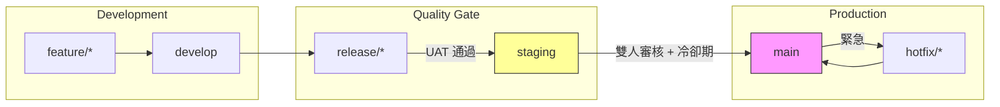

### 15.2 Repository 分層治理

| 治理層級 | 管轄範圍 | 負責角色 | 主要職責 |
|---------|---------|---------|---------|
| **Enterprise** | 全組織策略 | CTO / CISO | 政策制定、合規要求 |
| **Organization** | 所有 Repos | Platform Team | Ruleset、Template、Shared Workflow |
| **Team** | 團隊 Repos | Tech Lead | 具體實施、Code Review |
| **Repository** | 單一 Repo | Maintainer | 日常維護、Issue 管理 |

**Organization-level Ruleset**（跨 Repo 統一規則） ⚠️ 需 GitHub Enterprise：

```yaml
# 適用於所有 Repo 的 main branch
name: "org-wide-main-protection"
target: branch
enforcement: active
bypass_actors:
  - actor_type: OrganizationAdmin
    bypass_mode: always
conditions:
  repository_name:
    include: ["*"]
    exclude: ["docs-*", "tmpl-*"]  # 文件/範本 Repo 除外
  ref_name:
    include: ["~DEFAULT_BRANCH"]
rules:
  - type: required_pull_request
    parameters:
      required_approving_review_count: 1
  - type: required_status_checks
    parameters:
      required_status_checks:
        - context: "ci/build"
  - type: non_fast_forward
```

### 15.3 權限隔離設計

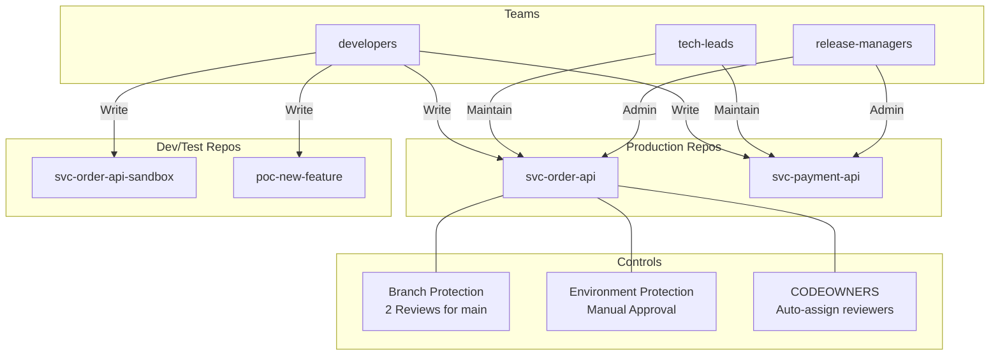

### 15.4 Compliance 與稽核

**合規自動化 Workflow**：

```yaml
# .github/workflows/compliance-check.yml
name: Compliance Check

on:
  pull_request:
    branches: [main, release/*]

jobs:
  compliance:
    runs-on: ubuntu-latest
    steps:
      - uses: actions/checkout@v4

      - name: Check LICENSE exists
        run: test -f LICENSE || (echo "❌ LICENSE file missing" && exit 1)

      - name: Check SECURITY.md exists
        run: test -f SECURITY.md || (echo "❌ SECURITY.md missing" && exit 1)

      - name: Check CODEOWNERS exists
        run: test -f CODEOWNERS || test -f .github/CODEOWNERS || (echo "❌ CODEOWNERS missing" && exit 1)

      - name: Verify no secrets in code
        run: |
          # 檢查常見密碼模式
          if grep -rn "password\s*=\s*['\"][^'\"]*['\"]" src/; then
            echo "❌ Hardcoded password detected"
            exit 1
          fi

      - name: Check commit signature
        run: |
          # 驗證最近 commit 是否有簽名
          UNSIGNED=$(git log --format='%H %G?' origin/main..HEAD | grep -c 'N' || true)
          if [ "$UNSIGNED" -gt 0 ]; then
            echo "⚠️ ${UNSIGNED} unsigned commits detected"
          fi

      - name: SBOM Generation
        uses: anchore/sbom-action@v0
        with:
          path: .
          format: spdx-json
```

> **實務建議**：金融業的「職責分離」原則在 GitHub 上的體現是：**寫程式碼的人不能 Approve 自己的 PR**、**Approve PR 的人不能觸發部署**、**部署的人不能修改 Pipeline**。透過 CODEOWNERS + Branch Protection + Environment Protection 三層機制實現。

---

## 第 16 章 完整企業範例

### 16.1 Organization 架構設計

以虛構的「艾可銀行（Acme Bank）」為例：

```
GitHub Enterprise Cloud
└── Organization: acme-bank
    ├── Plan: Enterprise Cloud
    ├── SSO: Azure AD (SAML)
    ├── SCIM: Enabled (自動同步人員)
    ├── 2FA: Required
    ├── Default Permission: None
    ├── Fork Policy: Disabled
    └── Teams:
        ├── org-admins (3 人)
        ├── security-team (5 人)
        ├── architecture-team (4 人)
        ├── platform-team (6 人)
        ├── devops-team (8 人)
        ├── backend-core (15 人)
        │   ├── backend-order (5 人)
        │   ├── backend-payment (5 人)
        │   └── backend-account (5 人)
        ├── frontend-team (10 人)
        ├── mobile-team (6 人)
        ├── qa-team (8 人)
        └── data-team (6 人)
```

### 16.2 Repository 命名與分類

```
acme-bank/
│
├── 🏗️ Platform Layer
│   ├── platform-java-lib-core         # Java 核心共用庫
│   ├── platform-java-lib-security     # 安全框架
│   ├── platform-java-lib-messaging    # Kafka 抽象層
│   ├── platform-java-starter-web      # Spring Boot Starter
│   └── platform-ui-component-lib      # UI Component Library
│
├── 🔧 Service Layer
│   ├── svc-order-api                  # 訂單服務
│   ├── svc-payment-api                # 支付服務
│   ├── svc-account-api                # 帳戶服務
│   ├── svc-notification-worker        # 通知 Worker
│   ├── svc-auth-api                   # 認證服務
│   └── gateway-api                    # API Gateway
│
├── 🖥️ Application Layer
│   ├── app-internet-banking           # 網路銀行
│   ├── app-mobile-banking             # 行動銀行
│   ├── app-admin-portal               # 管理後台
│   └── app-merchant-portal            # 商戶平台
│
├── 🏭 Infrastructure Layer
│   ├── infra-terraform-aws            # Terraform (AWS)
│   ├── infra-k8s-manifests            # K8s 部署配置
│   ├── infra-helm-charts              # Helm Charts
│   ├── infra-monitoring               # 監控配置
│   └── infra-database-migrations      # DB Schema 管理
│
├── 📚 Documentation Layer
│   ├── docs-architecture              # 架構文件 + ADR
│   ├── docs-api-specs                 # API 規格集中管理
│   ├── docs-runbook                   # 維運手冊
│   └── docs-onboarding               # 新人入職指南
│
├── 📋 Template Layer
│   ├── tmpl-spring-boot               # Spring Boot Template
│   ├── tmpl-vue-app                   # Vue 應用 Template
│   └── tmpl-github-action             # Action Template
│
├── 🔄 Workflow Layer
│   ├── wf-shared-actions              # 共用 GitHub Actions
│   ├── wf-reusable-workflows          # 可重用 Workflows
│   └── .github                        # Organization 預設設定
│
└── 🤖 AI Layer
    ├── ai-prompt-library              # Prompt 庫
    ├── ai-copilot-instructions        # Copilot 指引集
    └── ai-agent-configs               # Agent 配置
```

### 16.3 CI/CD Pipeline 完整設計

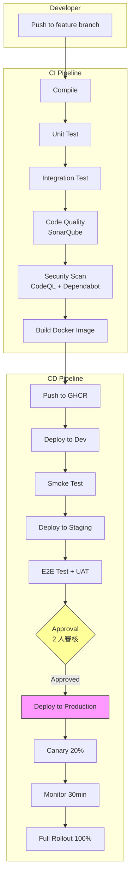

### 16.4 DevSecOps 整合架構

```yaml
# 完整 DevSecOps Pipeline 概覽
stages:
  pre-commit:
    tools:
      - commitlint          # Commit 格式檢查
      - husky               # Git Hooks
      - secret-detection    # 本地 Secret 掃描
    
  ci-build:
    tools:
      - Maven/Gradle        # 編譯
      - JUnit/Mockito       # 單元測試
      - JaCoCo              # 覆蓋率 > 80%
      - Checkstyle          # 程式碼風格
    
  ci-security:
    tools:
      - CodeQL              # SAST
      - Dependabot          # SCA (依賴弱點)
      - TruffleHog          # Secret Detection
      - SpotBugs + FindSecBugs  # Java 安全 Bug
    
  ci-quality:
    tools:
      - SonarQube           # 品質閘道
      - Spotless            # 格式化
      - ArchUnit            # 架構規則檢查
    
  cd-build:
    tools:
      - Docker Build        # 容器映像
      - Trivy               # 容器弱點掃描
      - Hadolint            # Dockerfile Lint
      - SBOM (Syft)         # 軟體清單
    
  cd-deploy:
    tools:
      - Helm/Kustomize      # K8s 部署
      - ArgoCD              # GitOps
      - Canary Release      # 漸進式發佈
    
  post-deploy:
    tools:
      - DAST (OWASP ZAP)   # 動態安全測試
      - Lighthouse          # 效能測試
      - Chaos Engineering   # 韌性測試
```

### 16.5 AI Workflow 整合

**AI 輔助開發全流程**：

| 階段 | AI 工具 | 用途 |
|------|---------|------|
| **規劃** | Copilot Chat | 技術方案討論、Architecture Review |
| **開發** | Copilot / Claude | 程式碼生成、補全、重構 |
| **測試** | Copilot | 自動生成單元測試 |
| **Review** | Copilot PR Review | 自動 Review + 建議 |
| **文件** | Copilot | ADR 生成、API 文件 |
| **維運** | Copilot CLI | 指令建議、Log 分析 |

### 16.6 SSDLC 完整流程

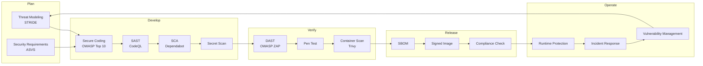

> **實務建議**：完整 SSDLC 不需要一次到位。建議分三階段推進：(1) 先建立 CI 安全基線（CodeQL + Dependabot + Secret Scan），(2) 加入容器安全與 SBOM，(3) 完善 DAST + 合規自動化。

---

## 第 17 章 常見問題與最佳實踐

### 17.1 常見錯誤與 Anti-pattern

| Anti-pattern | 問題 | 正確做法 |
|--------------|------|---------|
| 💀 密碼硬編碼 | 洩漏至 Git 歷史 | 使用 GitHub Secrets / Vault |
| 💀 main 直接 Push | 無審查、易出錯 | 強制 PR + Branch Protection |
| 💀 巨型 Commit | 難以 Review、難以 Rollback | 小而頻繁的 Commit |
| 💀 無 .gitignore | 垃圾檔案進入 Repo | 建立時即設定 .gitignore |
| 💀 無 CI | 品質無保證 | 最少要有 Build + Test |
| 💀 永不清理 Branch | 混亂、找不到有效分支 | 合併後自動刪除 |
| 💀 權限過大 | 安全風險 | 最小權限原則 |
| 💀 無 CODEOWNERS | PR 無人審查 | 設定明確的 Code Owner |
| 💀 單一超大 Monorepo | CI 慢、權限無法隔離 | 依業務拆分 |
| 💀 忽略 Dependabot PR | 累積安全債務 | 每週固定處理 |

### 17.2 Security Risk 防範

**Top 10 Repository Security Risks**：

1. **Credential Leakage** → Secret Scanning + Push Protection
2. **Vulnerable Dependencies** → Dependabot + Auto-merge for patch
3. **Code Injection (CI)** → Pin Actions to SHA + Restrict permissions
4. **Unauthorized Access** → SSO + RBAC + Regular Access Review
5. **Supply Chain Attack** → SBOM + Signed Commits + Verified Actions
6. **Misconfigured Permissions** → Organization Rulesets
7. **Stale Credentials** → Secret Rotation Automation
8. **Missing Security Patches** → Scheduled Security Scan
9. **Insider Threats** → Audit Log Monitoring + Alerts
10. **Shadow IT Repos** → Fork Policy + Repository Creation Policy

**GitHub Actions 安全最佳實踐**：

```yaml
# ✅ 安全的 Actions 寫法
jobs:
  build:
    permissions:
      contents: read       # 最小權限
      packages: write
    runs-on: ubuntu-latest
    steps:
      # ✅ Pin to specific SHA（防止 Supply Chain Attack）
      - uses: actions/checkout@b4ffde65f46336ab88eb53be808477a3936bae11  # v4.1.1
      
      # ✅ 限制 GITHUB_TOKEN 權限
      # ✅ 不在 log 中印出 Secret
      - name: Deploy
        run: |
          echo "Deploying..."
        env:
          API_KEY: ${{ secrets.API_KEY }}  # 不要用 echo ${{ secrets.X }}
```

### 17.3 Repository 治理 Best Practices

**成功的 Repository 管理十大原則**：

1. **Template First**：所有新 Repo 必須從 Template 建立
2. **Automate Everything**：能自動化的都自動化（CI/CD、Branch Cleanup、Release）
3. **Shift Left Security**：安全檢查越早執行越好
4. **Minimum Viable Documentation**：至少要有 README + ADR + CODEOWNERS
5. **Consistent Naming**：嚴格遵循命名規範
6. **Regular Hygiene**：每季做 Repo 健康檢查
7. **Least Privilege**：權限永遠給最小的
8. **Code Review Culture**：PR Review 是品質的最後防線
9. **Metric Driven**：追蹤 Lead Time、MTTR、Deploy Frequency
10. **Continuous Improvement**：定期 Retrospective，持續優化流程

### 17.4 最終 Governance Checklist

**新 Repository 建立 Checklist（必須全部通過）**：

- [ ] 命名符合 `{layer}-{domain}-{type}-{name}` 規範
- [ ] Visibility 設定正確（預設 Private）
- [ ] README.md 完整（描述 + 技術棧 + 快速開始）
- [ ] .gitignore 已配置
- [ ] CODEOWNERS 已設定
- [ ] SECURITY.md 已建立
- [ ] Branch Protection 已啟用（main + develop）
- [ ] CI Workflow 已設定（至少 Build + Test）
- [ ] Security Scan 已啟用（CodeQL + Dependabot）
- [ ] Secret Scanning 已啟用
- [ ] Team 權限已正確分配
- [ ] Issue Template 已建立
- [ ] PR Template 已建立

---

## 第 18 章 GitHub Codespaces 與 Packages

### 18.1 GitHub Codespaces 雲端開發環境

GitHub Codespaces 提供完全託管的雲端開發環境，開發者可在瀏覽器或本地 VS Code 中連線至雲端容器，無需在本機安裝開發工具即可立即開始開發。

**核心價值**：

| 優勢 | 說明 |
|------|------|
| **零配置上手** | 新成員無需花費數小時配置開發環境 |
| **環境一致性** | 所有人使用相同的容器化環境，消除「在我機器上可以跑」問題 |
| **安全性** | 原始碼不需下載至個人電腦 |
| **效能** | 可選擇高規格雲端機器（最高 32 核心 / 64 GB RAM） |
| **多專案切換** | 同時維護多個 Codespace，各自獨立 |

**Dev Container 配置**：

```json
// .devcontainer/devcontainer.json
{
  "name": "Order Service Development",
  "image": "mcr.microsoft.com/devcontainers/java:21-bookworm",
  "features": {
    "ghcr.io/devcontainers/features/java:1": {
      "version": "21",
      "installMaven": "true",
      "installGradle": "false"
    },
    "ghcr.io/devcontainers/features/docker-in-docker:2": {},
    "ghcr.io/devcontainers/features/github-cli:1": {}
  },
  "customizations": {
    "vscode": {
      "extensions": [
        "vscjava.vscode-java-pack",
        "redhat.vscode-xml",
        "GitHub.copilot",
        "GitHub.copilot-chat",
        "ms-azuretools.vscode-docker"
      ],
      "settings": {
        "java.compile.nullAnalysis.mode": "automatic",
        "editor.formatOnSave": true
      }
    }
  },
  "forwardPorts": [8080, 5432],
  "postCreateCommand": "mvn install -DskipTests -q",
  "remoteUser": "vscode"
}
```

**Docker Compose 整合（含依賴服務）**：

```json
// .devcontainer/devcontainer.json（多容器版）
{
  "name": "Full Stack Development",
  "dockerComposeFile": "docker-compose.yml",
  "service": "app",
  "workspaceFolder": "/workspace",
  "forwardPorts": [8080, 5432, 6379],
  "postCreateCommand": "mvn install -DskipTests"
}
```

```yaml
# .devcontainer/docker-compose.yml
services:
  app:
    build:
      context: .
      dockerfile: Dockerfile
    volumes:
      - ../..:/workspace:cached
    command: sleep infinity
  
  db:
    image: postgres:16
    environment:
      POSTGRES_DB: orderdb
      POSTGRES_USER: dev
      POSTGRES_PASSWORD: devpass
    volumes:
      - postgres-data:/var/lib/postgresql/data
  
  redis:
    image: redis:7-alpine

volumes:
  postgres-data:
```

### 18.2 Codespaces 企業配置

**Organization 層級 Codespaces 策略** ⚠️ 需 GitHub Enterprise：

| 設定項目 | 建議值 | 說明 |
|---------|-------|------|
| 啟用 Codespaces | 指定 Repo | 非所有 Repo 都需要 |
| Machine Type 限制 | 4-core / 8 GB | 控制成本 |
| Idle Timeout | 30 分鐘 | 閒置自動停止 |
| Retention Period | 14 天 | 未使用的 Codespace 自動刪除 |
| Prebuild 配置 | 核心 Repo 啟用 | 加速 Codespace 建立 |
| Secret 管理 | Organization Secrets | 集中管理敏感設定 |

**Prebuild 配置（加速啟動）**：

```yaml
# .github/workflows/codespace-prebuild.yml
name: Codespace Prebuild

on:
  push:
    branches: [main]
    paths:
      - '.devcontainer/**'
      - 'pom.xml'

jobs:
  prebuild:
    runs-on: ubuntu-latest
    steps:
      - uses: actions/checkout@v4
      - name: Build Prebuild Image
        run: echo "Prebuild triggered for Codespaces"
```

**費用控管策略**：

| 機器類型 | 每小時費用（USD） | 適用場景 |
|---------|----------------|---------|
| 2 核心 / 8 GB | ~$0.18 | 文件編輯、輕量開發 |
| 4 核心 / 16 GB | ~$0.36 | 一般後端開發 |
| 8 核心 / 32 GB | ~$0.72 | 大型專案建置 |
| 16 核心 / 64 GB | ~$1.44 | 機器學習、重度編譯 |

> **企業建議**：
> - 在 Template Repo 中預先配置 `.devcontainer`，確保所有新專案支援 Codespaces
> - 設定 Idle Timeout 和機器類型上限控制成本
> - 核心專案啟用 Prebuild 減少等待時間
> - 配合 Secret Management 確保 Codespace 中不暴露生產環境憑證

### 18.3 GitHub Packages 套件管理

GitHub Packages 是 GitHub 內建的套件託管服務，支援多種套件格式，與 Repository 和 Actions 深度整合。

**支援的套件格式**：

| 格式 | Registry | 用途 |
|------|----------|------|
| **Container（Docker）** | `ghcr.io` | Docker / OCI 映像 |
| **Maven** | `maven.pkg.github.com` | Java / Kotlin 套件 |
| **npm** | `npm.pkg.github.com` | JavaScript / TypeScript |
| **NuGet** | `nuget.pkg.github.com` | .NET 套件 |
| **RubyGems** | `rubygems.pkg.github.com` | Ruby 套件 |

**Maven 套件發佈配置**：

```xml
<!-- pom.xml -->
<distributionManagement>
  <repository>
    <id>github</id>
    <name>GitHub Packages</name>
    <url>https://maven.pkg.github.com/acme-bank/platform-java-lib-core</url>
  </repository>
</distributionManagement>
```

```xml
<!-- settings.xml -->
<servers>
  <server>
    <id>github</id>
    <username>${env.GITHUB_ACTOR}</username>
    <password>${env.GITHUB_TOKEN}</password>
  </server>
</servers>
```

**自動發佈 Workflow**：

```yaml
# .github/workflows/publish-package.yml
name: Publish Package

on:
  release:
    types: [published]

permissions:
  contents: read
  packages: write

jobs:
  publish:
    runs-on: ubuntu-latest
    steps:
      - uses: actions/checkout@v4
      - uses: actions/setup-java@v4
        with:
          distribution: 'temurin'
          java-version: '21'
          cache: 'maven'

      - name: Publish to GitHub Packages
        run: mvn deploy -B -DskipTests
        env:
          GITHUB_TOKEN: ${{ secrets.GITHUB_TOKEN }}
```

**Container Image 發佈**：

```yaml
# .github/workflows/publish-container.yml
name: Publish Container Image

on:
  push:
    tags: ['v*']

permissions:
  contents: read
  packages: write

jobs:
  publish:
    runs-on: ubuntu-latest
    steps:
      - uses: actions/checkout@v4

      - name: Login to GHCR
        uses: docker/login-action@v3
        with:
          registry: ghcr.io
          username: ${{ github.actor }}
          password: ${{ secrets.GITHUB_TOKEN }}

      - name: Build & Push
        uses: docker/build-push-action@v6
        with:
          context: .
          push: true
          tags: |
            ghcr.io/${{ github.repository }}:${{ github.ref_name }}
            ghcr.io/${{ github.repository }}:latest
```

**Packages 儲存配額**：

| GitHub 方案 | 儲存空間 | 傳輸頻寬（月） |
|------------|---------|-------------|
| **Free** | 500 MB | 1 GB |
| **Team** | 2 GB | 10 GB |
| **Enterprise** | 50 GB | 100 GB |

> **企業建議**：使用 GitHub Packages 作為內部共用庫的統一發佈平台，搭配 Release Workflow 實現「Tag → Build → Test → Publish」全自動化。Container Image 統一使用 `ghcr.io` 避免外部 Registry 依賴。

### 18.4 GitHub Discussions 社群協作

GitHub Discussions 提供結構化的社群討論空間，適合用於技術問答、設計提案、公告等非 Issue 性質的交流。

**Discussions vs Issues**：

| 面向 | Issues | Discussions |
|------|--------|-------------|
| **用途** | 可追蹤的工作項目（Bug / Feature） | 開放式討論、問答、公告 |
| **狀態追蹤** | Open / Closed | Open / Answered / Closed |
| **Assignee** | ✅ | ❌ |
| **Label** | ✅ | ✅ |
| **轉換** | — | 可轉換為 Issue |
| **投票** | Reactions | ✅ 正式投票功能 |
| **分類** | Label | Category（結構化分類） |

**建議的 Discussion Category 設計**：

| Category | Emoji | 用途 | 格式 |
|----------|-------|------|------|
| **Announcements** | 📣 | 團隊公告、重大變更 | Announcement |
| **Architecture** | 🏗️ | 架構設計討論、RFC | Open-ended |
| **Q&A** | 💬 | 技術問題與解答 | Question / Answer |
| **Ideas** | 💡 | 功能建議、改善想法 | Open-ended |
| **Show and Tell** | 🎉 | 分享成果、Demo | Open-ended |
| **RFC** | 📝 | Request for Comments | Poll |

```bash
# 使用 GitHub CLI 建立 Discussion
gh discussion create \
  --repo acme-bank/svc-order-api \
  --title "RFC: 訂單服務 Event Schema 設計" \
  --body "提案內容..." \
  --category "Architecture"
```

> **企業建議**：
> - 使用 Discussions 取代非正式的 Slack / Email 技術討論，確保知識可被搜尋與沉澱
> - 架構決策先在 Discussions 討論，達成共識後轉為 ADR
> - 啟用 Announcements 類別作為團隊正式公告管道
> - 善用「轉換為 Issue」功能，將討論中產生的行動項目轉為可追蹤的工作

---

## 附錄 A：快速檢查清單

### A.1 Repository 建立快速清單

```
□ 確認 Repository 名稱符合規範
□ 從 Template 建立（非空白建立）
□ 設定 Visibility（Private）
□ 初始化 README / .gitignore / LICENSE
□ 設定 CODEOWNERS
□ 啟用 Branch Protection
□ 配置 CI/CD Workflow
□ 啟用 Dependabot
□ 啟用 Secret Scanning
□ 啟用 CodeQL
□ 設定 Team 權限
□ 建立 develop branch
□ 建立 Issue Template + PR Template
```

### A.2 Pull Request 審查清單

```
□ PR Title 符合 Conventional Commits
□ PR 描述清楚說明變更目的
□ 關聯對應的 Issue
□ CI 全部通過
□ 無安全告警
□ 有對應的測試
□ 程式碼遵循架構規範
□ 無硬編碼敏感資訊
□ 文件已更新（如適用）
□ CODEOWNERS 已 Approve
```

### A.3 Release 檢查清單

```
□ 所有 CI 檢查通過
□ Security Scan 無 Critical/High 漏洞
□ 版本號符合 Semantic Versioning
□ Changelog 已生成
□ Tag 已建立（Annotated Tag）
□ Release Notes 已撰寫
□ Staging 環境驗證通過
□ Production 部署計畫已審核
□ Rollback 計畫已備妥
□ 相關團隊已通知
```

### A.4 季度 Repository 治理清單

```
□ 權限審查完成（移除離職/轉調人員）
□ 已合併的 Branch 已清理
□ Secret 輪換完成
□ Dependabot PR 已處理
□ 無活動 Repo 已標記 Deprecated
□ Branch Protection 規則確認
□ CI/CD Pipeline 效能檢視
□ Security Alert 清零（Critical/High）
□ 文件更新確認（README / ADR）
□ 團隊 CODEOWNERS 更新
```

---

> **結語**：本手冊涵蓋了 GitHub Repository 從建立到維運的完整生命週期。GitHub 平台持續演進，建議團隊每半年審閱本手冊並更新內容。Repository 管理的核心精神是：**自動化 > 人工**、**預防 > 修復**、**一致性 > 靈活性**。

---

*Document End — Total 18 Chapters + Appendix*

