+++
date = '2026-07-03T00:00:00+08:00'
lastmod = '2026-09-25T00:00:00+08:00'
draft = false
title = 'Github Repositories 建立教學手冊'
tags = ['教學', 'AI開發','指引']
categories = ['教學']
+++

# Github Repositories 建立與維運教學手冊 — 企業級實戰指南

> **版本**：v3.0（2026-09-25）\
> **適用對象**：技術主管 / 架構師 / 資深工程師 / 平台與 DevOps 團隊 / 資安人員 / 專案經理\
> **定位**：企業標準技術白皮書\
> **參考標準**：GitHub Docs — Repositories（2026-09 版）/ GitHub Changelog / GitHub Enterprise Cloud 治理實務 / DevSecOps / SSDLC / SLSA\
> **最後審閱日期**：2026-09-25\
> **本版重點**：依官方 Repositories 文件樹逐章查證，更正 38 項內容、新增 22 個小節與附錄 B、C，並全面升級範例中的 Action 版本；完整清單見 [附錄 C.2](#c2-v30-更正清單) 與 [附錄 C.3](#c3-v30-新增章節)，歷次版本見 [附錄 C.5](#c5-版本歷程)

---

## 閱讀指引

本手冊涵蓋 GitHub Repository 從建立到維運的完整生命週期，依讀者角色建議閱讀路徑：

| 角色 | 建議章節 | 重點 |
|------|---------|------|
| **開發工程師** | 第 4、5、6、7、8、11 章 | Repository 建立、Git 操作、Branch 策略、CI/CD、Issue |
| **架構師** | 第 1、2、5、9、13、16 章 | 治理原則、管理架構、標準結構、DevSecOps、AI 整合、企業範例 |
| **平台 / DevOps 工程師** | 第 2.6、3.6、4.12、7、8、12、14 章 | Custom Properties、存取機制、設定基準、Rulesets、Actions、Release、維運 |
| **技術主管 / PM** | 第 1.8、2、3、11、14、15 章 | 成熟度模型、Organization、Issue 管理、治理、企業實踐 |
| **資安人員** | 第 3.6、7.11、8.8、8.9、9、12.7、14、15 章 | 憑證治理、規則、供應鏈、DevSecOps、合規 |
| **稽核 / 法遵** | 第 14.8、15.4、附錄 A.5、附錄 C | 活動洞察、合規自動化、稽核清單、查證紀錄 |

**標記說明**：

| 標記 | 意義 |
|------|------|
| `⚠️ 需 GitHub Enterprise` | 該功能僅在 GitHub Enterprise Cloud / Server 可用（本版已依各功能官方說明標示更精確的方案範圍） |
| `> 📌 本章摘要` | 每章開頭的重點摘要 |
| `> 🆕 v3.0 新增` | 本版新增的小節 |
| `> ⚠️ v3.0 更正` | 本版更正的內容，更正清單彙整於 [附錄 C.2](#c2-v30-更正清單) |

> **時效聲明**：GitHub 平台每週更新。本手冊中的價格、方案範圍與功能狀態（公開預覽／GA）以 2026-09-25 查證結果為準，實際採購與導入前請以 [附錄 B](#附錄-b官方參考資源對照表) 所列官方文件再次確認。

---

## 目錄

- [第 1 章 GitHub Repositories 概述](#第-1-章-github-repositories-概述)
  - [1.1 GitHub Repositories 是什麼](#11-github-repositories-是什麼)
  - [1.2 Repository 用途與類型](#12-repository-用途與類型)
  - [1.3 Public vs Private vs Internal](#13-public-vs-private-vs-internal)
  - [1.4 適合管理哪些內容](#14-適合管理哪些內容)
  - [1.5 GitHub 生態系總覽](#15-github-生態系總覽)
  - [1.6 Repository 限制與配額](#16-repository-限制與配額)
  - [1.7 GitHub 方案與功能比較](#17-github-方案與功能比較)
  - [1.8 Repository 最佳實務總綱](#18-repository-最佳實務總綱)
- [第 2 章 企業 Repository 管理架構](#第-2-章-企業-repository-管理架構)
  - [2.1 Enterprise Repository Strategy](#21-enterprise-repository-strategy)
  - [2.2 Monorepo vs Polyrepo](#22-monorepo-vs-polyrepo)
  - [2.3 Repository 命名規範](#23-repository-命名規範)
  - [2.4 Team Repository Strategy](#24-team-repository-strategy)
  - [2.5 Environment Strategy](#25-environment-strategy)
  - [2.6 Custom Properties 與 Repository 分類治理](#26-custom-properties-與-repository-分類治理)
  - [2.7 大型 Repository 效能策略](#27-大型-repository-效能策略)
- [第 3 章 公司 GitHub Organization 規劃](#第-3-章-公司-github-organization-規劃)
  - [3.1 Organization 建立](#31-organization-建立)
  - [3.2 Team 建立與管理](#32-team-建立與管理)
  - [3.3 權限設計與 RBAC](#33-權限設計與-rbac)
  - [3.4 Repository Governance](#34-repository-governance)
  - [3.5 Repository Lifecycle](#35-repository-lifecycle)
  - [3.6 存取機制選擇](#36-存取機制選擇)
  - [3.7 Forking Policy 與企業身分模式](#37-forking-policy-與企業身分模式)
- [第 4 章 如何建立 Repository](#第-4-章-如何建立-repository)
  - [4.1 建立 Repository 完整流程](#41-建立-repository-完整流程)
  - [4.2 README 設計](#42-readme-設計)
  - [4.3 LICENSE 選擇](#43-license-選擇)
  - [4.4 .gitignore 配置](#44-gitignore-配置)
  - [4.5 CODEOWNERS 設定](#45-codeowners-設定)
  - [4.6 SECURITY.md 與 CONTRIBUTING.md](#46-securitymd-與-contributingmd)
  - [4.7 Issue Template 與 PR Template](#47-issue-template-與-pr-template)
  - [4.8 Repository 初始化完整範例](#48-repository-初始化完整範例)
  - [4.9 Repository Topics 與 Autolinks](#49-repository-topics-與-autolinks)
  - [4.10 Repository 從 Template 建立](#410-repository-從-template-建立)
  - [4.11 社群健康檔案與 `.github` 預設檔](#411-社群健康檔案與-github-預設檔)
  - [4.12 Repository 設定基準總表](#412-repository-設定基準總表)
- [第 5 章 Repository 標準結構設計](#第-5-章-repository-標準結構設計)
  - [5.1 Backend Repository（Clean Architecture）](#51-backend-repositoryclean-architecture)
  - [5.2 Frontend Repository](#52-frontend-repository)
  - [5.3 Monorepo 結構](#53-monorepo-結構)
  - [5.4 Microservices Repository](#54-microservices-repository)
  - [5.5 Documentation Repository](#55-documentation-repository)
- [第 6 章 Source Code 上架與管理](#第-6-章-source-code-上架與管理)
  - [6.1 Git 基本流程](#61-git-基本流程)
  - [6.2 Commit Message 規範](#62-commit-message-規範)
  - [6.3 Git Flow](#63-git-flow)
  - [6.4 GitHub Flow](#64-github-flow)
  - [6.5 Trunk Based Development](#65-trunk-based-development)
  - [6.6 三種策略比較與選擇](#66-三種策略比較與選擇)
  - [6.7 Git Large File Storage（LFS）](#67-git-large-file-storagelfs)
  - [6.8 檔案管理與瀏覽實務](#68-檔案管理與瀏覽實務)
- [第 7 章 Branch Strategy](#第-7-章-branch-strategy)
  - [7.1 分支命名規範](#71-分支命名規範)
  - [7.2 Branch Protection Rules](#72-branch-protection-rules)
  - [7.3 Pull Request Review 流程](#73-pull-request-review-流程)
  - [7.4 CODEOWNERS 進階配置](#74-codeowners-進階配置)
  - [7.5 Merge Strategy 選擇](#75-merge-strategy-選擇)
  - [7.6 Repository Rulesets 深入指南](#76-repository-rulesets-深入指南)
  - [7.7 Merge Queue 管理](#77-merge-queue-管理)
  - [7.8 Default Branch 管理與重新命名](#78-default-branch-管理與重新命名)
  - [7.9 Auto-merge、Update Branch 與自動刪除分支](#79-auto-mergeupdate-branch-與自動刪除分支)
  - [7.10 Branch Protection 轉換至 Rulesets 實務](#710-branch-protection-轉換至-rulesets-實務)
  - [7.11 2026 年 Pull Request 與規則治理新功能](#711-2026-年-pull-request-與規則治理新功能)
- [第 8 章 GitHub Actions 自動化 Workflow](#第-8-章-github-actions-自動化-workflow)
  - [8.1 GitHub Actions 架構概述](#81-github-actions-架構概述)
  - [8.2 CI Workflow — Java Spring Boot](#82-ci-workflow--java-spring-boot)
  - [8.3 CI Workflow — Vue 專案](#83-ci-workflow--vue-專案)
  - [8.4 CD Workflow — Docker Build & Deploy](#84-cd-workflow--docker-build--deploy)
  - [8.5 Security Workflow](#85-security-workflow)
  - [8.6 Release Workflow](#86-release-workflow)
  - [8.7 Reusable Workflows 與 Composite Actions](#87-reusable-workflows-與-composite-actions)
  - [8.8 Actions 安全性強化與 2026 路線圖](#88-actions-安全性強化與-2026-路線圖)
  - [8.9 Runner 策略與 Repository 層 Actions 設定](#89-runner-策略與-repository-層-actions-設定)
- [第 9 章 DevSecOps 與 SSDLC](#第-9-章-devsecops-與-ssdlc)
  - [9.1 SSDLC 流程總覽](#91-ssdlc-流程總覽)
  - [9.2 SAST — 靜態應用程式安全測試](#92-sast--靜態應用程式安全測試)
  - [9.3 Dependency Scan — Dependabot](#93-dependency-scan--dependabot)
  - [9.4 Secret Scanning](#94-secret-scanning)
  - [9.5 CodeQL 進階分析](#95-codeql-進階分析)
  - [9.6 Container Security](#96-container-security)
  - [9.7 完整 Security Pipeline YAML](#97-完整-security-pipeline-yaml)
  - [9.8 Private Vulnerability Reporting](#98-private-vulnerability-reporting)
  - [9.9 開源授權合規檢查](#99-開源授權合規檢查)
  - [9.10 Dependency Graph 與 Dependency Review](#910-dependency-graph-與-dependency-review)
  - [9.11 Security Campaigns、Autofix 與 Delegated Bypass](#911-security-campaignsautofix-與-delegated-bypass)
- [第 10 章 文件管理策略](#第-10-章-文件管理策略)
  - [10.1 README Strategy](#101-readme-strategy)
  - [10.2 Architecture Decision Record（ADR）](#102-architecture-decision-recordadr)
  - [10.3 API 文件管理](#103-api-文件管理)
  - [10.4 Wiki vs Docs Repository](#104-wiki-vs-docs-repository)
  - [10.5 文件自動化生成](#105-文件自動化生成)
  - [10.6 GitHub Pages 靜態網站發佈](#106-github-pages-靜態網站發佈)
- [第 11 章 Issue / Project 管理](#第-11-章-issue--project-管理)
  - [11.1 GitHub Issues 設計](#111-github-issues-設計)
  - [11.2 GitHub Projects（V2）](#112-github-projectsv2)
  - [11.3 Label 系統設計](#113-label-系統設計)
  - [11.4 Milestone 與 Sprint Planning](#114-milestone-與-sprint-planning)
  - [11.5 Agile Workflow 整合](#115-agile-workflow-整合)
  - [11.6 Issue Types、Sub-issues、Issue Dependencies 與 Issue Fields](#116-issue-typessub-issuesissue-dependencies-與-issue-fields)
- [第 12 章 Release Management](#第-12-章-release-management)
  - [12.1 Semantic Versioning](#121-semantic-versioning)
  - [12.2 Conventional Commits](#122-conventional-commits)
  - [12.3 Changelog 自動生成](#123-changelog-自動生成)
  - [12.4 GitHub Release 與 Tag](#124-github-release-與-tag)
  - [12.5 Release Workflow 自動化](#125-release-workflow-自動化)
  - [12.6 自動產生 Release Notes](#126-自動產生-release-notes)
  - [12.7 Immutable Releases 與供應鏈完整性](#127-immutable-releases-與供應鏈完整性)
- [第 13 章 AI 時代 Repository 管理](#第-13-章-ai-時代-repository-管理)
  - [13.1 GitHub Copilot 整合](#131-github-copilot-整合)
  - [13.2 Claude Code 整合](#132-claude-code-整合)
  - [13.3 AI Agent Workflow](#133-ai-agent-workflow)
  - [13.4 Prompt Repository 設計](#134-prompt-repository-設計)
  - [13.5 AI Governance 規範](#135-ai-governance-規範)
  - [13.6 GitHub Copilot Cloud Agent（原 Coding Agent）](#136-github-copilot-cloud-agent原-coding-agent)
  - [13.7 GitHub Copilot Extensions 與 MCP](#137-github-copilot-extensions-與-mcp)
  - [13.8 GitHub Copilot Code Review](#138-github-copilot-code-review)
  - [13.9 Copilot 平台最新動態與方案](#139-copilot-平台最新動態與方案)
  - [13.10 Repository 的 AI Agent 設定檔總覽](#1310-repository-的-ai-agent-設定檔總覽)
- [第 14 章 Repository 維運與治理](#第-14-章-repository-維運與治理)
  - [14.1 Repository Cleanup](#141-repository-cleanup)
  - [14.2 Branch Cleanup 自動化](#142-branch-cleanup-自動化)
  - [14.3 Secret Rotation](#143-secret-rotation)
  - [14.4 Access Review 與 Audit](#144-access-review-與-audit)
  - [14.5 Backup 與 Disaster Recovery](#145-backup-與-disaster-recovery)
  - [14.6 Governance Checklist](#146-governance-checklist)
  - [14.7 Repository 生命週期操作](#147-repository-生命週期操作)
  - [14.8 活動與洞察](#148-活動與洞察)
  - [14.9 封存、引用與長期保存](#149-封存引用與長期保存)
- [第 15 章 大型企業最佳實踐](#第-15-章-大型企業最佳實踐)
  - [15.1 金融業 Repository 治理](#151-金融業-repository-治理)
  - [15.2 Repository 分層治理](#152-repository-分層治理)
  - [15.3 權限隔離設計](#153-權限隔離設計)
  - [15.4 Compliance 與稽核](#154-compliance-與稽核)
- [第 16 章 完整企業範例](#第-16-章-完整企業範例)
  - [16.1 Organization 架構設計](#161-organization-架構設計)
  - [16.2 Repository 命名與分類](#162-repository-命名與分類)
  - [16.3 CI/CD Pipeline 完整設計](#163-cicd-pipeline-完整設計)
  - [16.4 DevSecOps 整合架構](#164-devsecops-整合架構)
  - [16.5 AI Workflow 整合](#165-ai-workflow-整合)
  - [16.6 SSDLC 完整流程](#166-ssdlc-完整流程)
- [第 17 章 常見問題與最佳實踐](#第-17-章-常見問題與最佳實踐)
  - [17.1 常見錯誤與 Anti-pattern](#171-常見錯誤與-anti-pattern)
  - [17.2 Security Risk 防範](#172-security-risk-防範)
  - [17.3 Repository 治理 Best Practices](#173-repository-治理-best-practices)
  - [17.4 最終 Governance Checklist](#174-最終-governance-checklist)
- [第 18 章 GitHub Codespaces 與 Packages](#第-18-章-github-codespaces-與-packages)
  - [18.1 GitHub Codespaces 雲端開發環境](#181-github-codespaces-雲端開發環境)
  - [18.2 Codespaces 企業配置](#182-codespaces-企業配置)
  - [18.3 GitHub Packages 套件管理](#183-github-packages-套件管理)
  - [18.4 GitHub Discussions 社群協作](#184-github-discussions-社群協作)
- [附錄 A：快速檢查清單](#附錄-a快速檢查清單)
  - [A.1 Repository 建立快速清單](#a1-repository-建立快速清單)
  - [A.2 Pull Request 審查清單](#a2-pull-request-審查清單)
  - [A.3 Release 檢查清單](#a3-release-檢查清單)
  - [A.4 季度 Repository 治理清單](#a4-季度-repository-治理清單)
  - [A.5 Repository 設定稽核清單](#a5-repository-設定稽核清單)
- [附錄 B：官方參考資源對照表](#附錄-b官方參考資源對照表)
  - [B.1 GitHub Docs — Repositories](#b1-github-docs--repositories)
  - [B.2 組織治理、安全與自動化](#b2-組織治理安全與自動化)
  - [B.3 GitHub Changelog 與官方部落格](#b3-github-changelog-與官方部落格)
- [附錄 C：v3.0 查證紀錄與版本歷程](#附錄-cv30-查證紀錄與版本歷程)
  - [C.1 查證基準](#c1-查證基準)
  - [C.2 v3.0 更正清單](#c2-v30-更正清單)
  - [C.3 v3.0 新增章節](#c3-v30-新增章節)
  - [C.4 待追蹤事項](#c4-待追蹤事項)
  - [C.5 版本歷程](#c5-版本歷程)

---

## 第 1 章 GitHub Repositories 概述

> 📌 **本章摘要**：GitHub Repository 是軟體開發生命週期的協作平台，而不只是程式碼倉庫。本章說明 Repository 的用途、可見性（Public / Private / Internal）、官方限制與配額、各方案功能差異，並提出八大治理原則與 L1～L4 成熟度模型，作為後續各章的總綱。

### 1.1 GitHub Repositories 是什麼

GitHub Repository（簡稱 Repo）是 GitHub 平台上的版本控制儲存庫，基於 Git 分散式版本控制系統。它不僅是存放程式碼的空間，更是整個軟體開發生命週期的核心協作平台。

**核心能力**：

- 版本控制：追蹤每一次變更的完整歷史
- 協作開發：支援多人並行開發、Code Review、Pull Request
- 自動化：透過 GitHub Actions 實現 CI/CD、安全掃描、自動部署
- 專案管理：Issues、Projects、Milestones 整合敏捷開發
- 安全性：Secret Scanning、Dependabot、CodeQL、GHAS
- 文件管理：Wiki、GitHub Pages、README 生態系

### 1.2 Repository 用途與類型

| 用途分類 | 說明 | 範例 |
|---------|------|------|
| **Source Code** | 應用程式原始碼 | `backend-api`、`frontend-web` |
| **Infrastructure** | IaC / 部署配置 | `infra-terraform`、`k8s-manifests` |
| **Documentation** | 技術文件 / ADR | `docs-architecture`、`api-specs` |
| **Template** | 專案範本 | `template-spring-boot`、`template-vue` |
| **CI/CD Workflows** | 可重用 Workflow | `shared-workflows`、`github-actions` |
| **AI Assets** | Prompt / Agent / Instructions | `ai-assets`、`prompt-library` |
| **Configuration** | 組織級設定 | `.github`（Organization 特殊 Repo） |

### 1.3 Public vs Private vs Internal

| 類型 | 可見性 | 適用場景 | 費用考量 |
|------|--------|---------|---------|
| **Public** | 所有人可見 | 開源專案、公開文件 | 免費（含 Actions 額度） |
| **Private** | 僅明確授權的成員、Team 與外部協作者 | Source Code、內部工具 | 所有方案皆可建立；受保護分支、Pages 等進階功能需付費方案 |
| **Internal** | 所屬 **Enterprise** 內所有成員（跨組織） | 共用工具、規範文件、InnerSource | ⚠️ 需 GitHub Enterprise Cloud（組織須隸屬 Enterprise 帳號） |

> ⚠️ **v3.0 更正**：Internal 的可見範圍是整個 Enterprise，而非單一組織；若企業下有多個組織，其他組織的成員同樣可以讀取。Enterprise Managed Users（EMU）企業的受管帳號則不能建立公開內容（見 [3.7](#37-forking-policy-與企業身分模式)）。
>
> **企業建議**：預設使用 Private，跨組織共用的規範與函式庫使用 Internal，嚴禁將機密程式碼設為 Public；並以組織政策限制成員自行變更 Repo 可見性。

### 1.4 適合管理哪些內容

**適合放入 Repository 的內容**：

- ✅ 原始碼（Source Code）
- ✅ 設定檔（Configuration）
- ✅ Infrastructure as Code
- ✅ 技術文件（Markdown / AsciiDoc）
- ✅ API 規格（OpenAPI / Protobuf）
- ✅ 測試程式與測試資料
- ✅ CI/CD Pipeline 定義
- ✅ Database Migration Scripts
- ✅ AI Prompt Templates

**不適合放入 Repository 的內容**：

- ❌ 密碼 / API Key / Token（使用 GitHub Secrets）
- ❌ 大型二進制檔案 > 100MB（使用 Git LFS）
- ❌ Build 產出物（使用 GitHub Packages / Artifact）
- ❌ 生產環境資料庫備份
- ❌ 個人識別資訊（PII）

### 1.5 GitHub 生態系總覽

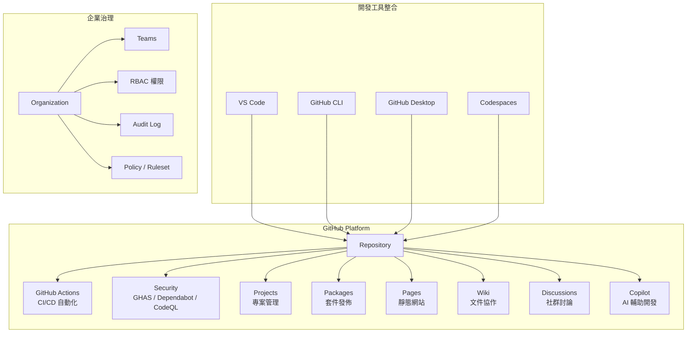
```mermaid
graph TB
    subgraph "GitHub Platform"
        REPO[Repository] --> ACTIONS[GitHub Actions<br/>CI/CD 自動化]
        REPO --> SECURITY[Security<br/>GHAS / Dependabot / CodeQL]
        REPO --> PROJECTS[Projects<br/>專案管理]
        REPO --> PACKAGES[Packages<br/>套件發佈]
        REPO --> PAGES[Pages<br/>靜態網站]
        REPO --> WIKI[Wiki<br/>文件協作]
        REPO --> DISCUSSIONS[Discussions<br/>社群討論]
        REPO --> COPILOT[Copilot<br/>AI 輔助開發]
    end

    subgraph "開發工具整合"
        VSCODE[VS Code] --> REPO
        CLI[GitHub CLI] --> REPO
        DESKTOP[GitHub Desktop] --> REPO
        CODESPACE[Codespaces] --> REPO
    end

    subgraph "企業治理"
        ORG[Organization] --> TEAM[Teams]
        ORG --> RBAC[RBAC 權限]
        ORG --> AUDIT[Audit Log]
        ORG --> POLICY[Policy / Ruleset]
    end
```

> **實務建議**：企業應將 GitHub 視為「開發平台」而非僅是「程式碼倉庫」，充分利用 Actions、Security、Projects 等功能建立完整的開發生態系。

### 1.6 Repository 限制與配額

GitHub 對 Repository 設有明確的效能與容量限制，企業在規劃架構時須將這些限制納入考量，避免因超出上限導致效能下降或操作受阻。

**儲存庫大小與結構限制**：

| 限制項目 | 建議上限 | 強制上限 | 影響與說明 |
|---------|---------|---------|----------|
| **Repository 磁碟大小** | 1 GB | 10 GB | 超過後 clone / fetch 速度明顯下降，應使用 Git LFS 管理大型二進制檔 |
| **單一檔案大小** | 1 MB | 100 MB | 超過 50 MB 時 Git 會警告，超過 100 MB 將被拒絕 Push；需改用 Git LFS |
| **網頁上傳單一檔案** | — | 25 MB | 透過瀏覽器新增檔案的上限 |
| **Git LFS 單一檔案** | — | 2 GB（Free / Pro）、4 GB（Team）、5 GB（Enterprise Cloud） | 超過上限會被 Git LFS 拒絕 |
| **單一目錄檔案數** | — | 3,000 | 過多檔案會增加 Git 維護成本並降低效能 |
| **目錄深度** | — | 50 層 | 過深的目錄結構會拖慢歷史走訪操作 |
| **Branch 數量** | — | 5,000 | 過多分支會導致 fetch 傳輸緩慢 |
| **Tag 數量** | — | 5,000 | 與 Branch 同理 |

**操作頻率限制**：

| 操作類型 | 建議上限 | 說明 |
|---------|---------|------|
| **Push 大小** | — | 強制上限 2 GB |
| **Git 讀取操作** | 15 次/秒/Repo | CI 大量讀取可能觸發限流，建議使用 shallow clone |
| **Push 頻率** | 6 次/分鐘/Repo | 超過可能被暫時限流 |
| **PR 合併頻率** | 1 次/分鐘 | 每次合併觸發所有開啟 PR 的合併檢查 |
| **同一分支開啟 PR** | 1,000 | 超過會導致合併檢查延遲 |

**Diff 與 Commit 限制**：

| 項目 | 限制值 |
|------|-------|
| PR 總 Diff 行數 | 20,000 行可載入，或 1 MB 原始資料 |
| 單一檔案 Diff | 20,000 行，或 500 KB |
| 單一 Diff 檔案數 | 300 個檔案 |
| 可渲染檔案數（圖片、PDF） | 25 個 |
| Commit 列表顯示上限 | 250 筆（PR / Compare 頁面） |
| Commits 頁籤上限 | 10,000 筆 |
| Rebase & Merge | 100 筆 commit |

**帳號與組織限制**：

| 項目 | 限制值 |
|------|-------|
| 每個帳號/組織 Repository 數 | 100,000（50,000 時開始警告） |
| 每個 Repository Rulesets 數 | 75 |
| 組織層級 Rulesets 數 | 75 |
| 每個 Organization 自訂 Repository Roles 數 | 20（⚠️ 需 Enterprise Cloud） |
| 每個 Organization Issue Types 數 | 25 |

> **企業建議**：
>
> - Repository 大小控制在 1 GB 以內（官方強烈建議不超過 5 GB），超過即檢視是否有大型檔案應移至 Git LFS
> - CI/CD 使用 `--depth 1` 淺層 clone 減少讀取負擔；大型 Repo 的效能策略見 [2.7](#27-大型-repository-效能策略)
> - 定期清理已合併分支，保持 Branch 數量在合理範圍
> - 大型 Monorepo 需特別注意 Diff 限制，可能影響 PR Review 體驗

### 1.7 GitHub 方案與功能比較

根據團隊規模與需求選擇適合的 GitHub 方案：

| 功能 | Free | Team | Enterprise Cloud |
|------|------|------|-----------------|
| **Public Repos** | ✅ 無限 | ✅ 無限 | ✅ 無限 |
| **Private Repos** | ✅ 無限 | ✅ 無限 | ✅ 無限 |
| **Collaborators（Private）** | 有限 | ✅ 無限 | ✅ 無限 |
| **GitHub Actions 分鐘** | 2,000/月 | 3,000/月 | 50,000/月 |
| **Packages Storage** | 500 MB | 2 GB | 50 GB |
| **Branch Protection** | ✅ Public | ✅ | ✅ |
| **Repository Rulesets（Repo 層）** | ✅ Public | ✅ | ✅ |
| **組織層級 Rulesets** | ❌ | ❌ | ✅ |
| **Push Rulesets（Private / Internal）** | ❌ | ✅ | ✅ |
| **CODEOWNERS** | ✅ Public | ✅ | ✅ |
| **Required Reviews** | ✅ Public | ✅ | ✅ |
| **Draft PRs** | ✅ Public | ✅ | ✅ |
| **Auto-merge** | ✅ Public | ✅ | ✅ |
| **Merge Queue** | ✅ 組織擁有的 Public Repo | ✅ Public Repo 限定 | ✅（含 Private / Internal） |
| **GitHub Pages** | ✅ Public | ✅ | ✅（可限制僅組織成員存取） |
| **Environments** | ✅ Public | ✅（Private Repo 的必要審查者與等待計時器不適用） | ✅ |
| **Artifact Attestations** | ✅ Public | ✅ Public | ✅（含 Private / Internal） |
| **Dependabot Alerts** | ✅ | ✅ | ✅ |
| **Secret Scanning（公開 Repo）** | ✅ | ✅ | ✅ |
| **Secret Scanning（私有/內部 Repo）** | ❌ | ⚠️ 需加購 Secret Protection | ⚠️ 需加購 Secret Protection |
| **Push Protection（私有/內部 Repo）** | ❌ | ⚠️ 需加購 Secret Protection | ⚠️ 需加購 Secret Protection |
| **CodeQL（公開 Repo）** | ✅ | ✅ | ✅ |
| **CodeQL（私有/內部 Repo）** | ❌ | ⚠️ 需加購 Code Security | ⚠️ 需加購 Code Security |
| **Security Overview** | ❌ | ⚠️ 需加購 Secret Protection / Code Security | ✅ |
| **SAML SSO** | ❌ | ❌ | ✅ |
| **SCIM Provisioning** | ❌ | ❌ | ✅ |
| **Audit Log API** | ❌ | ❌ | ✅ |
| **Internal Repos** | ❌ | ❌ | ✅ |
| **Custom Repo Roles** | ❌ | ❌ | ✅（最多 20 個） |
| **IP Allow List** | ❌ | ❌ | ✅ |
| **Enterprise Managed Users / Data Residency** | ❌ | ❌ | ✅ |

> **2025 年 4 月起的重要變化**：GitHub Advanced Security（GHAS）已拆分為 **GitHub Secret Protection** 與 **GitHub Code Security** 兩項可獨立加購的產品，兩者均採「每位活躍提交者」計費，**Team 與 Enterprise Cloud 組織皆可個別採購**——不再是 Enterprise 專屬的綁定式功能。上表私有／內部 Repo 的 Secret Scanning、Push Protection、CodeQL 欄位即反映此一制度；公開 Repo 則所有方案皆內建、免費使用。詳細計費與功能矩陣見 [9.1 SSDLC 流程總覽 — GHAS 功能矩陣](#91-ssdlc-流程總覽)。
>
> ⚠️ **v3.0 更正**：(1) Merge Queue 在私有 Repo 僅限 Enterprise Cloud，Team 方案只能用於公開 Repo；(2) 組織層級 Rulesets 僅限 Enterprise Cloud；(3) Secret Protection / Code Security 用於私有 Repo 時需為 Team 或 Enterprise Cloud 組織，Free 組織無法加購。以上依 GitHub Docs 各功能的「適用方案」說明查證（2026-09-25）。
>
> **企業建議**：中大型企業建議直接選擇 **Enterprise Cloud**，獲得合規工具（Audit Log）、身分管理（SSO/SCIM）與組織治理（Org-level Rulesets / Custom Roles）等 Team 方案沒有的能力；但若僅需 Secret Scanning / CodeQL 等安全掃描能力，**Team 方案加購 Secret Protection / Code Security 即可達成**，不必為此單一需求直接升級 Enterprise。小型團隊可從 **Team** 方案起步，視需求升級。

### 1.8 Repository 最佳實務總綱

> 🆕 **v3.0 新增**

GitHub 官方文件〈Best practices for repositories〉將 Repository 的基本功歸納為四件事：**撰寫 README**、**保護 Repository**、**以分支取代 Fork 協作**、**以 Git LFS 管理大型檔案**。這四點是單一 Repository 的底線；企業面對的是數百到數千個 Repository，因此需要把它們延伸為可稽核、可自動化的治理原則。下表將官方建議對應到本手冊的企業落實方式：

| # | 治理原則 | 官方依據 | 企業落實方式 | 本手冊章節 |
|---|---------|---------|-------------|-----------|
| 1 | **可理解性**：任何人打開 Repo 都知道它是什麼、怎麼用、找誰 | README、LICENSE、CITATION、CONTRIBUTING、CODE_OF_CONDUCT | 由 Template 與 `.github` 預設社群檔案統一提供 | [4.2](#42-readme-設計)、[4.11](#411-社群健康檔案與-github-預設檔) |
| 2 | **預設安全**：安全功能在建立當下即啟用，而非事後補 | Dependabot alerts、Secret scanning、Push protection、Code scanning、SECURITY.md、Private vulnerability reporting | 以 Organization Security Configuration 一次套用，禁止下層覆寫 | [第 9 章](#第-9-章-devsecops-與-ssdlc) |
| 3 | **分支優先**：內部成員用 Branch + PR 協作，Fork 只留給外部貢獻者 | Favor branching over forking | 私有 Repo 預設關閉 Fork；搭配 Rulesets 保護關鍵分支 | [3.7](#37-forking-policy-與企業身分模式)、[第 7 章](#第-7-章-branch-strategy) |
| 4 | **大型檔案分流**：二進位檔不進 Git 歷史 | Git Large File Storage | Push Rulesets 限制檔案大小與副檔名 | [6.7](#67-git-large-file-storagelfs)、[7.6](#76-repository-rulesets-深入指南) |
| 5 | **規則集中化**：保護規則寫在 Organization 層，而非散落在各 Repo | Rulesets、Converting branch protections to rulesets | 以 Custom Properties 選取目標 Repo，套用組織級 Ruleset | [2.6](#26-custom-properties-與-repository-分類治理)、[7.10](#710-branch-protection-轉換至-rulesets-實務) |
| 6 | **Metadata 驅動**：Repo 的歸屬、等級、資料分類是結構化欄位，不是口耳相傳 | Custom properties | 必填屬性 + 預設值；作為 Ruleset、OIDC Claims 與報表的篩選條件 | [2.6](#26-custom-properties-與-repository-分類治理) |
| 7 | **生命週期可追溯**：建立、改名、轉移、封存、刪除都有程序 | Renaming / Transferring / Archiving / Deleting a repository | 以 Issue 表單申請 + 自動化執行 + Audit Log 留痕 | [3.5](#35-repository-lifecycle)、[14.7](#147-repository-生命週期操作) |
| 8 | **可觀測**：看得到誰改了什麼、誰在用 | Activity view、Pulse、Traffic、Rule insights | 將洞察資料納入季度治理檢核 | [14.8](#148-活動與洞察)、[7.11](#711-2026-年-pull-request-與規則治理新功能) |

**Repository 治理成熟度模型**：

| 等級 | 名稱 | 特徵 | 下一步 |
|------|------|------|-------|
| **L1** | 自由發展 | 各團隊自行建立 Repo，命名與設定不一，安全功能靠個人自覺 | 建立命名規範與 Template Repo |
| **L2** | 規範化 | 有命名規範、Template、CODEOWNERS，但規則仍以 Repo 層 Branch Protection 為主 | 導入 Custom Properties 與組織級 Rulesets |
| **L3** | 集中治理 | 組織級 Rulesets、Security Configuration、Actions Policy 統一套用；例外需透過 Bypass 申請 | 建立 Rule insights、Audit Log 串流與季度報表 |
| **L4** | 持續稽核 | 規則即程式碼（Policy as Code）、治理指標可量測、例外自動到期 | 持續優化與 AI 治理整合 |

> **企業建議**：多數企業現況落在 L2。從 L2 往 L3 前進最有效的兩個動作是：(1) 定義 3～5 個**必填** Custom Properties（例如 `owner-team`、`data-classification`、`service-tier`）；(2) 使用 GitHub 內建的「Convert to ruleset」工具把既有 Branch Protection 轉為 Rulesets，再逐步提升到組織層級。

---

## 第 2 章 企業 Repository 管理架構

> 📌 **本章摘要**：企業需要有系統的 Repository 分層、命名與分類方式。本章涵蓋分層策略、Monorepo 與 Polyrepo 的選擇、命名規範、環境策略，以及以 Custom Properties 建立結構化 Metadata，和大型 Repository 的效能策略。

### 2.1 Enterprise Repository Strategy

企業級 Repository 管理需要系統性的分層策略，確保數百個 Repository 有序管理。

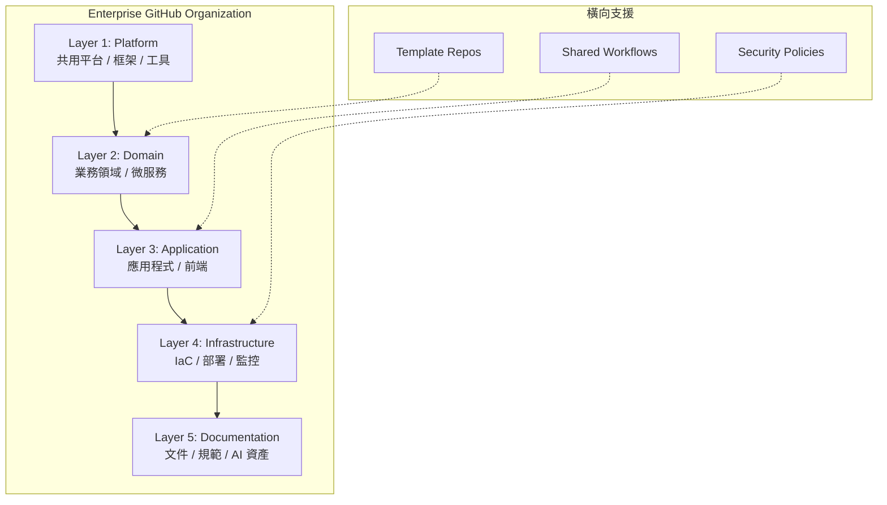
```mermaid
graph TB
    subgraph "Enterprise GitHub Organization"
        direction TB
        L1[Layer 1: Platform<br/>共用平台 / 框架 / 工具]
        L2[Layer 2: Domain<br/>業務領域 / 微服務]
        L3[Layer 3: Application<br/>應用程式 / 前端]
        L4[Layer 4: Infrastructure<br/>IaC / 部署 / 監控]
        L5[Layer 5: Documentation<br/>文件 / 規範 / AI 資產]
    end

    L1 --> L2
    L2 --> L3
    L3 --> L4
    L4 --> L5

    subgraph "橫向支援"
        T1[Template Repos]
        T2[Shared Workflows]
        T3[Security Policies]
    end

    T1 -.-> L2
    T2 -.-> L3
    T3 -.-> L4
```

**分層說明**：

| Layer | 定位 | 變更頻率 | 權限 | 範例 |
|-------|------|---------|------|------|
| **Platform** | 共用基礎設施 | 低 | 核心架構團隊 | `platform-core`、`shared-lib` |
| **Domain** | 業務微服務 | 中 | 各業務團隊 | `svc-order`、`svc-payment` |
| **Application** | 前端應用 | 高 | 前端團隊 | `app-customer-portal`、`app-admin` |
| **Infrastructure** | 部署配置 | 中 | DevOps 團隊 | `infra-k8s`、`infra-terraform` |
| **Documentation** | 文件規範 | 中 | 全體 | `docs-architecture`、`ai-assets` |

### 2.2 Monorepo vs Polyrepo

| 面向 | Monorepo | Polyrepo |
|------|----------|----------|
| **定義** | 多個專案在同一 Repo | 每個專案獨立 Repo |
| **適用** | 強耦合微服務、前端 Monorepo | 獨立部署服務、跨團隊專案 |
| **優點** | 原子性變更、共用程式碼容易 | 獨立部署、權限隔離、CI 獨立 |
| **缺點** | CI 複雜、權限粗糙、Repo 肥大 | 共用程式碼困難、版本同步成本 |
| **CI/CD** | 需 path filter / affected detection | 獨立 Pipeline |
| **工具** | Nx、Turborepo、Bazel | GitHub Actions per repo |
| **企業建議** | 同一團隊緊密協作的服務群 | 跨團隊、不同部署週期的服務 |

> **企業建議**：大多數企業採用「**混合策略**」— 以 Polyrepo 為主，特定領域（如前端 Micro-frontend）使用 Monorepo。

### 2.3 Repository 命名規範

**命名格式**：`{layer}-{domain}-{type}-{name}`

```text
# 範例
platform-java-lib-core          # 平台層 Java 核心庫
svc-order-api                    # 業務服務：訂單 API
svc-payment-worker               # 業務服務：支付 Worker
app-customer-portal              # 應用層：客戶入口
app-admin-dashboard              # 應用層：管理後台
infra-k8s-manifests              # 基礎設施：K8s 配置
infra-terraform-aws              # 基礎設施：Terraform
docs-architecture                # 文件：架構文件
docs-api-specs                   # 文件：API 規格
tmpl-spring-boot                 # 範本：Spring Boot
tmpl-vue-app                     # 範本：Vue 應用
wf-shared-actions                # Workflow：共用 Actions
ai-prompt-library                # AI：Prompt 庫
```

**命名規則**：

1. 全部小寫，使用 `-` 連接
2. 不超過 50 字元
3. 禁止使用底線 `_`、空格、中文
4. 前綴表示分層（`svc-` / `app-` / `infra-` / `docs-` / `tmpl-` / `wf-` / `ai-`）
5. 包含語意，讀名稱即知用途

### 2.4 Team Repository Strategy

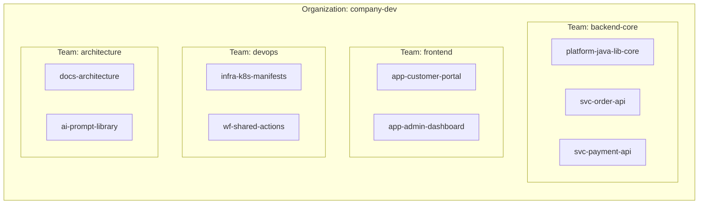
```mermaid
graph LR
    subgraph "Organization: company-dev"
        subgraph "Team: backend-core"
            R1[platform-java-lib-core]
            R2[svc-order-api]
            R3[svc-payment-api]
        end
        subgraph "Team: frontend"
            R4[app-customer-portal]
            R5[app-admin-dashboard]
        end
        subgraph "Team: devops"
            R6[infra-k8s-manifests]
            R7[wf-shared-actions]
        end
        subgraph "Team: architecture"
            R8[docs-architecture]
            R9[ai-prompt-library]
        end
    end
```

### 2.5 Environment Strategy

| 環境 | Branch | 部署觸發 | 用途 |
|------|--------|---------|------|
| **Development** | `develop` | Push to develop | 開發測試 |
| **Staging** | `release/*` | PR merged to release | UAT / 整合測試 |
| **Production** | `main` | Manual approval + Tag | 正式環境 |

GitHub 沒有以 YAML 檔宣告 Environment 的機制，Environment 需透過 Settings → Environments、REST API 或 Terraform 建立。以下以 REST API 建立 Production 環境：

```bash
# 1. 建立 production 環境：等待 30 分鐘、必要審查者為 release-managers Team、禁止自我核准
TEAM_ID=$(gh api orgs/acme-bank/teams/release-managers --jq '.id')
gh api repos/acme-bank/svc-order-api/environments/production -X PUT --input - <<EOF
{
  "wait_timer": 30,
  "prevent_self_review": true,
  "reviewers": [ { "type": "Team", "id": ${TEAM_ID} } ],
  "deployment_branch_policy": { "protected_branches": false, "custom_branch_policies": true }
}
EOF

# 2. 限制只有 main 與 hotfix/* 可以部署到 production
gh api repos/acme-bank/svc-order-api/environments/production/deployment-branch-policies \
  -X POST -f name="main" -f type="branch"
gh api repos/acme-bank/svc-order-api/environments/production/deployment-branch-policies \
  -X POST -f name="hotfix/*" -f type="branch"
```

> ⚠️ **v3.0 更正**：v2.2 以 `environments:` YAML 呈現 Environment 設定，此格式並不存在，已改為實際可執行的 REST API。另依官方說明，私有／內部 Repo 若要使用「必要審查者」與「等待計時器」等部署保護規則，需為 **Enterprise Cloud**；Free、Pro、Team 方案僅公開 Repo 可用。
>
> **實務建議**：Production 環境務必設定至少 2 人審核（或核准 Team）＋ 等待時間＋禁止自我核准，並限制可部署的分支。

### 2.6 Custom Properties 與 Repository 分類治理

> 🆕 **v3.0 新增**

命名規範（[2.3](#23-repository-命名規範)）與 Topics（[4.9](#49-repository-topics-與-autolinks)）都能表達 Repository 的用途，但兩者都是「自由文字」：任何有寫入權限的人都能改，也無法強制填寫。**Repository Custom Properties** 則是由 Organization Owner 定義的結構化欄位，值可以設為必填、有預設值、只允許特定選項，並且能被 Rulesets、OIDC Token 與 API 直接引用，是大型組織治理的核心 Metadata 層。

**Custom Properties 與其他分類機制比較**：

| 面向 | 命名前綴 | Topics | Custom Properties |
|------|---------|--------|-------------------|
| **定義者** | 規範文件 | 任何具寫入權限者 | Organization Owner（或具對應細粒度權限者） |
| **資料型別** | 字串 | 字串標籤 | 文字、單選、多選、布林 |
| **可否強制必填** | ❌ | ❌ | ✅ 可設為必填並給預設值 |
| **Ruleset 目標選取** | ✅（以名稱萬用字元） | ❌ | ✅（`repository_property` 條件） |
| **OIDC Claims** | 以 `repository` 名稱比對 | ❌ | ✅（以 `repo_property_` 前綴帶入 Token） |
| **可見性** | 公開 | 與 Repo 相同 | 與 Repo 相同（私有 Repo 僅具讀取權者可見） |

**建議的企業 Custom Properties 定義**：

| 屬性名稱 | 型別 | 允許值 | 必填 | 用途 |
|---------|------|-------|------|------|
| `owner-team` | 單選 | `backend-core`、`frontend`、`devops`… | ✅ | 權責歸屬、報表彙總 |
| `service-tier` | 單選 | `tier-0`（核心交易）、`tier-1`、`tier-2`、`sandbox` | ✅ | 決定 Ruleset 強度與審查人數 |
| `data-classification` | 單選 | `public`、`internal`、`confidential`、`restricted` | ✅ | 決定 Secret Protection、Code Security 與 Copilot 內容排除範圍 |
| `lifecycle` | 單選 | `active`、`maintenance`、`deprecated` | ✅ | 對應 [3.5 Repository Lifecycle](#35-repository-lifecycle) |
| `compliance-scope` | 多選 | `pci-dss`、`iso27001`、`gdpr` | ❌ | 稽核範圍界定 |
| `cost-center` | 文字 | — | ❌ | 成本分攤 |

屬性名稱只能使用英數字與 `_`、`-`、`$`、`#`，長度上限 75 字元；值不可包含雙引號。建立單選或多選屬性時，若組織具備 Copilot Business / Enterprise 且政策允許，Copilot 會建議可選值（2026-09 公開預覽）。

**以 API 定義與設定屬性**：

```bash
# 1. 在 Organization 層級定義必填屬性（含預設值）
gh api orgs/acme-bank/properties/schema/service-tier -X PUT --input - <<'EOF'
{
  "value_type": "single_select",
  "required": true,
  "default_value": "tier-2",
  "description": "服務重要性等級，決定 Ruleset 強度",
  "allowed_values": ["tier-0", "tier-1", "tier-2", "sandbox"]
}
EOF

# 2. 為特定 Repository 設定值
gh api repos/acme-bank/svc-payment-api/properties/values -X PATCH --input - <<'EOF'
{
  "properties": [
    { "property_name": "service-tier", "value": "tier-0" },
    { "property_name": "data-classification", "value": "restricted" }
  ]
}
EOF

# 3. 在 Organization 的 Repository 列表以屬性搜尋
#    Web UI 搜尋列輸入：props.service-tier:tier-0
```

**以 Custom Properties 選取 Ruleset 目標**（組織級 Ruleset，⚠️ 需 GitHub Enterprise Cloud）：

```json
{
  "name": "tier-0-main-protection",
  "target": "branch",
  "enforcement": "active",
  "conditions": {
    "ref_name": { "include": ["~DEFAULT_BRANCH"], "exclude": [] },
    "repository_property": {
      "include": [
        { "name": "service-tier", "property_values": ["tier-0"] }
      ],
      "exclude": []
    }
  },
  "rules": [
    { "type": "pull_request", "parameters": {
        "required_approving_review_count": 2,
        "require_code_owner_review": true,
        "require_last_push_approval": true,
        "dismiss_stale_reviews_on_push": true,
        "required_review_thread_resolution": true } },
    { "type": "required_signatures" },
    { "type": "non_fast_forward" },
    { "type": "deletion" }
  ]
}
```

這個 Ruleset 不列舉任何 Repository 名稱：只要 Repo 被標記為 `tier-0`，就自動受保護；新建的核心服務也會在設定屬性的當下納入規則，不必再手動維護清單。

**Custom Properties 作為 OIDC Claims**：Organization 或 Enterprise 管理員可選擇把特定屬性放入 GitHub Actions 的 OIDC Token（以 `repo_property_` 為前綴），讓雲端 IAM 依「屬性」而非「Repo 名稱」授權。例如 AWS IAM Role 的信任條件可寫成「僅允許 `repo_property_data_classification` 為 `restricted` 的 Repo 取得正式環境角色」，Repo 改名或新增時不需修改雲端設定（詳見 [8.8](#88-actions-安全性強化與-2026-路線圖)）。

> **企業建議**：
>
> - 屬性數量寧少勿多，先以 3～5 個必填屬性起步，並在 [4.1](#41-建立-repository-完整流程) 的建立流程中要求填寫（勾選「Require explicit user-specified values」可避免全部落在預設值）
> - 不要讓 Repository 管理員自行修改 `service-tier` 與 `data-classification`（保持「Allow repository actors to set this property」關閉），否則等於讓被管理者自行決定受管強度
> - 將 Topics 保留給「技術棧」這類探索用途，治理用途一律改用 Custom Properties

### 2.7 大型 Repository 效能策略

> 🆕 **v3.0 新增**

當企業採用 Monorepo（[2.2](#22-monorepo-vs-polyrepo)）或 Repository 累積多年歷史後，clone 與 fetch 時間、CI 讀取頻率都會逼近 [1.6 Repository 限制與配額](#16-repository-限制與配額) 所列的上限。Git 本身提供數種「只取需要的部分」的機制，可在不拆分 Repo 的前提下大幅降低成本。

**Git 效能工具比較**：

| 技術 | 省略的內容 | 適用場景 | 注意事項 |
|------|-----------|---------|---------|
| **Shallow clone**（`--depth 1`） | 舊的 commit 歷史 | CI 建置、一次性掃描 | 無法執行需要完整歷史的操作（如 `git blame`、版本號計算） |
| **Partial clone**（`--filter=blob:none`） | 尚未用到的檔案內容（blob） | 開發者日常工作的大型 Repo | 切換分支或查看舊版時會按需下載，需穩定網路 |
| **Treeless clone**（`--filter=tree:0`） | 樹狀結構與檔案內容 | 只需最新版本的 CI 建置 | 查詢歷史時成本高，不建議用於開發環境 |
| **Sparse checkout** | 工作目錄中不相關的子目錄 | Monorepo 中只負責部分模組的團隊 | 需團隊約定目錄邊界 |
| **Scalar** | 綜合上述並自動設定背景維護 | 超大型 Monorepo 的開發者工作站 | 隨 Git 2.38+ 內建 |

**開發者工作站：Partial clone + Sparse checkout**：

```bash
# 只下載目前需要的檔案內容，並只簽出兩個模組
git clone --filter=blob:none --sparse https://github.com/acme-bank/platform-monorepo.git
cd platform-monorepo
git sparse-checkout set services/order libs/common

# 之後需要其他模組時再加入
git sparse-checkout add services/payment
```

**超大型 Monorepo：使用 Scalar**：

```bash
# Scalar 會自動啟用 partial clone、sparse checkout、背景 prefetch 與 commit-graph 維護
scalar clone https://github.com/acme-bank/platform-monorepo.git
cd platform-monorepo/src
git sparse-checkout set services/order
```

**CI 建置：依需求選擇 fetch 深度**：

```yaml
# 一般建置：淺層 clone 即可
- uses: actions/checkout@v7
  with:
    fetch-depth: 1

# 需要完整歷史（例如計算版本號、產生 Changelog）
- uses: actions/checkout@v7
  with:
    fetch-depth: 0
    filter: blob:none      # 保留歷史但延後下載檔案內容

# Monorepo 只簽出需要的目錄
- uses: actions/checkout@v7
  with:
    sparse-checkout: |
      services/order
      libs/common
```

**Monorepo 的 CI 範圍控制**：搭配 `on.pull_request.paths` 過濾只觸發相關 Workflow，或使用 Nx / Turborepo / Bazel 的「受影響專案（affected）」分析，避免每個 PR 都建置整個 Repo。

> **企業建議**：
>
> - 當 Repo 大小超過 1 GB 或單次 clone 超過 5 分鐘時，先檢查是否有應移至 Git LFS 的二進位檔（[6.7](#67-git-large-file-storagelfs)），再考慮 partial clone / Scalar
> - CI 預設採用 `fetch-depth: 1`，只有確實需要歷史的 Job 才改為 `0`，可同時降低 [1.6](#16-repository-限制與配額) 所述的「每秒 15 次讀取」限流風險
> - Sparse checkout 的目錄邊界應與 CODEOWNERS（[4.5](#45-codeowners-設定)）一致，讓「誰負責哪個目錄」與「誰簽出哪個目錄」相互對應

---

## 第 3 章 公司 GitHub Organization 規劃

> 📌 **本章摘要**：Organization 是權限與政策的邊界。本章說明組織建立與基準設定、Team 與 RBAC、組織級 Rulesets、Repository 生命週期治理，以及憑證類型選擇（GITHUB_TOKEN、OIDC、GitHub App、PAT）與 Forking / EMU 等企業身分模式。

### 3.1 Organization 建立

**建立步驟**：

1. 前往 `https://github.com/organizations/plan`
2. 選擇方案（建議 GitHub Enterprise Cloud）
3. 填寫組織名稱（如 `acme-bank`）
4. 設定 Organization Profile

**Organization 設定建議**：

| 設定項目 | 建議值 | 說明 |
|---------|-------|------|
| Base permissions（成員預設 Repo 權限） | `No permission` | 最小權限原則，一律透過 Team 授權 |
| Repository creation | `Disabled for members` | 集中管控 Repo 建立（改由平台流程建立） |
| Repository visibility change / deletion / transfer | 僅 Organization Owner | 防止成員自行公開或刪除 Repo |
| Two-factor authentication | `Required` | 強制 2FA（EMU 企業由 IdP 負責） |
| Fork policy | `Disabled` | 禁止私有 Repo 被 Fork（見 [3.7](#37-forking-policy-與企業身分模式)） |
| Custom properties | 定義 3～5 個必填屬性 | 見 [2.6](#26-custom-properties-與-repository-分類治理) |
| Personal access tokens | Fine-grained PAT 需核准；限制 Classic PAT | 見 [3.6](#36-存取機制選擇) |
| Actions permissions | `Selected repositories` | 限制 Actions 使用範圍 |
| Dependabot alerts | `Enabled for all` | 全面啟用弱點告警 |

### 3.2 Team 建立與管理

**建議團隊結構**：

```text
organization: acme-bank
├── team: org-admins              # 組織管理員（2-3人）
├── team: security-team           # 資安團隊
├── team: architecture-team       # 架構團隊
├── team: devops-team             # DevOps 團隊
├── team: backend-core            # 後端核心團隊
│   ├── team: backend-order       # 訂單子團隊
│   └── team: backend-payment     # 支付子團隊
├── team: frontend-team           # 前端團隊
├── team: qa-team                 # QA 團隊
└── team: docs-team               # 文件團隊
```

**Team 權限對應**：

```bash
# 使用 GitHub CLI 建立 Team
gh api orgs/acme-bank/teams -f name="backend-core" \
  -f description="後端核心開發團隊" \
  -f privacy="closed" \
  -f notification_setting="notifications_enabled"

# 賦予 Team Repository 權限
gh api orgs/acme-bank/teams/backend-core/repos/acme-bank/svc-order-api \
  -X PUT -f permission="push"
```

### 3.3 權限設計與 RBAC

| 角色 | Repository 權限 | 適用對象 |
|------|----------------|---------|
| **Admin** | 完整管理權限 | org-admins |
| **Maintain** | 管理 Issues/PR + Push（不可刪 Repo） | Tech Lead |
| **Write (Push)** | Push + 建立 Branch + 管理 Issues | 開發人員 |
| **Triage** | 管理 Issues/PR（不可 Push） | PM / QA |
| **Read** | 唯讀 | 跨團隊參考 |

**Custom Repository Roles** ⚠️ 需 GitHub Enterprise Cloud（每組織最多 20 個）：

自訂角色以 Read、Triage、Write、Maintain 其中之一為「繼承角色」，再加上額外的細粒度權限。以下以 REST API 建立「資安工程師」角色：

```bash
gh api orgs/acme-bank/custom-repository-roles -X POST --input - <<'EOF'
{
  "name": "security-engineer",
  "description": "可提交程式碼並維護安全管線",
  "base_role": "maintain",
  "permissions": [
    "delete_alerts_code_scanning",
    "manage_deploy_keys"
  ]
}
EOF

# 查詢可用的細粒度權限名稱
gh api orgs/acme-bank/repository-fine-grained-permissions --jq '.[].name'
```

> ⚠️ **v3.0 更正**：v2.2 範例中的 `bypass_branch_protections` 並非有效的權限名稱，已移除；實際可用的權限名稱請以上述 API 查詢結果為準。

> **2025 年更新**：Custom Repository Roles 自 2025-06-26 起已正式支援 **GitHub Actions 細粒度權限**（管理 Runner、Secrets、Variables、Environments），可將這些權限納入自訂角色的 `permissions` 清單中。過去 Actions 管理權限只能整包授予（有 Admin 才能管理 Runner/Secrets），此更新補上了最小權限原則在 CI/CD 治理上的缺口——例如可設計一個「Pipeline 維運者」角色，僅能管理 Environments 與 Secrets，但不具備 Repository 刪除等其他 Admin 權限。

### 3.4 Repository Governance

**Repository Rulesets**（組織層級規則，⚠️ 需 GitHub Enterprise Cloud；Team 方案可使用 Repo 層級 Ruleset；詳見 [7.6 Repository Rulesets 深入指南](#76-repository-rulesets-深入指南)）：

```bash
# 建立組織級 Ruleset：所有 Repo 的預設分支與 release/*
gh api orgs/acme-bank/rulesets -X POST --input - <<'EOF'
{
  "name": "enterprise-branch-protection",
  "target": "branch",
  "enforcement": "active",
  "conditions": {
    "ref_name": { "include": ["~DEFAULT_BRANCH", "refs/heads/release/*"], "exclude": [] },
    "repository_name": { "include": ["~ALL"], "exclude": ["sandbox-*"] }
  },
  "rules": [
    { "type": "pull_request", "parameters": {
        "required_approving_review_count": 2,
        "dismiss_stale_reviews_on_push": true,
        "require_code_owner_review": true,
        "require_last_push_approval": true,
        "required_review_thread_resolution": true } },
    { "type": "required_status_checks", "parameters": {
        "strict_required_status_checks_policy": true,
        "required_status_checks": [
          { "context": "ci/build" }, { "context": "ci/test" }, { "context": "security/codeql" } ] } },
    { "type": "required_signatures" },
    { "type": "non_fast_forward" }
  ]
}
EOF
```

> ⚠️ **v3.0 更正**：v2.2 以 YAML 呈現組織級 Ruleset，並使用不存在的規則類型 `required_pull_request`；GitHub 的 Ruleset 以 REST API（JSON）或 UI 管理，PR 規則類型為 `pull_request`。以 Custom Properties 選取目標 Repo 的寫法見 [2.6](#26-custom-properties-與-repository-分類治理)。

### 3.5 Repository Lifecycle

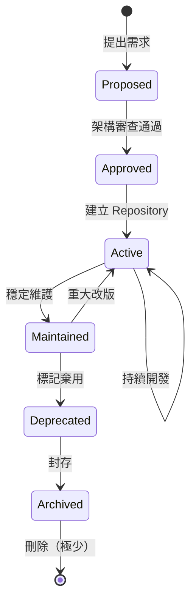
```mermaid
stateDiagram-v2
    [*] --> Proposed: 提出需求
    Proposed --> Approved: 架構審查通過
    Approved --> Active: 建立 Repository
    Active --> Maintained: 穩定維護
    Maintained --> Deprecated: 標記棄用
    Deprecated --> Archived: 封存
    Archived --> [*]: 刪除（極少）

    Active --> Active: 持續開發
    Maintained --> Active: 重大改版
```

**各階段管控**：

| 階段 | 動作 | 負責人 | 產出 |
|------|------|--------|------|
| **Proposed** | 填寫 Repo 申請表 | 申請人 | Issue (Repo Request) |
| **Approved** | 架構審查 + 命名確認 | 架構師 | Approval Comment |
| **Active** | 建立 Repo + 初始化 | DevOps | 完整 Repo 結構 |
| **Maintained** | 定期更新依賴 + 安全修補 | 維護團隊 | Dependabot PRs |
| **Deprecated** | 加入 Deprecated 標記 | 架構師 | README 警告 |
| **Archived** | 設定 Archive + 唯讀 | Admin | Archived Repo |

> **實務建議**：每季進行一次 Repository 盤點，識別長期無活動（> 6 個月無 commit）的 Repo，評估是否進入 Deprecated 流程。

### 3.6 存取機制選擇

> 🆕 **v3.0 新增**

Repository 的存取者不只有「人」：CI/CD、部署工具、備份腳本、AI Agent 都需要讀寫 Repository。選錯憑證類型是企業最常見的權限過大來源，例如用個人的 Classic PAT 跑組織自動化，一旦該員工離職，所有 Pipeline 同時中斷，而且該 Token 往往擁有整個帳號的權限。

**憑證類型比較**：

| 機制 | 身分歸屬 | 權限範圍 | 有效期 | 建議用途 |
|------|---------|---------|-------|---------|
| **`GITHUB_TOKEN`** | 單次 Workflow Job | 僅限所在 Repo，可用 `permissions:` 縮小 | Job 結束即失效（GitHub-hosted 最長 6 小時） | Workflow 內操作本 Repo |
| **OIDC** | Workflow 身分（Repo、分支、環境、Custom Properties） | 由雲端 IAM 信任條件決定 | 短效（分鐘級） | 部署至 AWS / Azure / GCP，取代長效雲端金鑰 |
| **GitHub App** | 應用程式（非個人） | 安裝時選擇 Repo 與細粒度權限 | Installation Token 1 小時 | 跨 Repo 自動化、機器人、內部平台 |
| **Deploy Key** | 單一 Repo 的 SSH 金鑰 | 單一 Repo，預設唯讀，可選擇允許寫入 | 不過期（需人工輪換） | 伺服器拉取單一 Repo（例如舊式部署主機） |
| **Fine-grained PAT** | 個人 | 可限定 Repo 與細粒度權限，組織可要求核准 | 可設定到期日，組織可限制最長效期 | 個人腳本、臨時工具 |
| **Classic PAT** | 個人 | 以 scope 劃分，範圍粗糙 | 可設為不過期 | ❌ 不建議；組織應限制使用 |

**選擇決策流程**：

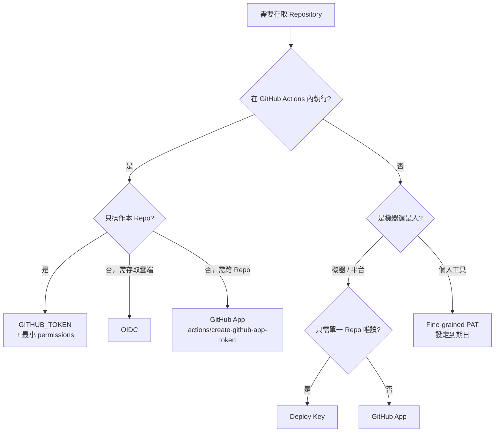
```mermaid
graph TD
    A[需要存取 Repository] --> B{在 GitHub Actions 內執行?}
    B -->|是| C{只操作本 Repo?}
    C -->|是| D[GITHUB_TOKEN<br/>+ 最小 permissions]
    C -->|否，需存取雲端| E[OIDC]
    C -->|否，需跨 Repo| F[GitHub App<br/>actions/create-github-app-token]
    B -->|否| G{是機器還是人?}
    G -->|機器 / 平台| H{只需單一 Repo 唯讀?}
    H -->|是| I[Deploy Key]
    H -->|否| J[GitHub App]
    G -->|個人工具| K[Fine-grained PAT<br/>設定到期日]
```

**Organization 層級的 PAT 政策**（Settings → Personal access tokens）：

| 政策 | 建議值 | 說明 |
|------|-------|------|
| Fine-grained PAT 存取組織資源 | 允許，但**需管理員核准** | 每一張存取組織的 Token 都有審核紀錄 |
| Fine-grained PAT 最長效期 | 90 天 | 強制定期更新 |
| Classic PAT 存取組織資源 | **限制** | 逐步淘汰；Enterprise 可統一設定 |
| SSH Certificate Authority | 視需求啟用（⚠️ 需 Enterprise Cloud） | 以短效 SSH 憑證取代長效個人 SSH 金鑰 |

**跨 Repo 自動化：以 GitHub App 取代個人 PAT**：

```yaml
# 在 Workflow 中取得 GitHub App 的短效 Token，存取其他 Repo
- name: Generate App Token
  id: app-token
  uses: actions/create-github-app-token@v3
  with:
    client-id: ${{ vars.PLATFORM_BOT_CLIENT_ID }}   # v3 起以 client-id 取代已棄用的 app-id
    private-key: ${{ secrets.PLATFORM_BOT_PRIVATE_KEY }}
    owner: acme-bank
    repositories: wf-shared-actions,infra-k8s-manifests
    permission-contents: write                          # 只要求本次需要的權限

- name: Update deployment manifest
  env:
    GH_TOKEN: ${{ steps.app-token.outputs.token }}
  run: gh api repos/acme-bank/infra-k8s-manifests/dispatches -f event_type=deploy
```

**2026 年憑證治理新能力**（依 GitHub Changelog）：

| 日期 | 功能 | 治理意義 |
|------|------|---------|
| 2026-06-24 | 事件應變用的憑證緊急撤銷（Break-glass） | 帳號遭入侵時可一次撤銷其憑證 |
| 2026-08-18 | 依 Token 類型或使用者撤銷／解除授權 | 精準處理特定類型的外洩 |
| 2026-09-16 | 自動化 Classic PAT 與 SSH 金鑰的 SSO 授權 | 減少人工授權作業 |
| 2026-09-21 | Enterprise 可匯出憑證清冊（SSH 金鑰、存取權杖等） | 提供季度盤點的完整資料來源 |
| 2026-09-22 | SSH 安全強化：移除部分演算法並要求較長的 RSA 金鑰 | 需檢查舊部署主機的金鑰長度 |
| 2026-09-24 | 高影響操作需再次驗證身分（Proof of presence，Enterprise Cloud） | 降低 Session 遭竊後的破壞範圍 |

> **企業建議**：
>
> - 組織自動化一律使用 GitHub App；「服務帳號 + Classic PAT」屬於應列入汰換清單的技術債
> - 每季以 Enterprise 憑證清冊比對 [14.4 Access Review](#144-access-review-與-audit) 結果，找出離職人員或長期未使用的憑證
> - 雲端部署全面改用 OIDC，並將 Custom Properties（[2.6](#26-custom-properties-與-repository-分類治理)）納入信任條件

### 3.7 Forking Policy 與企業身分模式

> 🆕 **v3.0 新增**

**Forking Policy**：GitHub 官方最佳實務建議「組織成員以分支協作，Fork 留給外部貢獻者」。對私有與內部 Repository 而言，Fork 會把程式碼複製到另一個命名空間，增加外洩與治理盲點，因此企業應採「組織預設關閉、個別 Repo 例外開啟」的兩層設計：

| 層級 | 設定位置 | 建議 |
|------|---------|------|
| **Enterprise** | Policies → Repository → Repository forking | 限制私有／內部 Repo 只能 Fork 到企業內的組織 |
| **Organization** | Settings → Member privileges → Repository forking | 預設**不允許**私有 Repo 被 Fork |
| **Repository** | Settings → General → Features → Allow forking | 僅在組織層允許後才可個別開啟；用於需要外包廠商以 Fork 提交 PR 的專案 |

需要注意的是：刪除私有 Repository 時，其所有 Fork 會一併刪除；刪除公開 Repository 則不會影響既有 Fork。另外，Push Rulesets（[7.6](#76-repository-rulesets-深入指南)）會延伸套用到整個 Fork 網路，Fork 中只有「在根 Repo 具備 Bypass 權限」的人才能繞過。

**企業身分模式選擇**：

| 模式 | 帳號來源 | 公開 Repo 能力 | 適用情境 |
|------|---------|---------------|---------|
| **一般 Enterprise Cloud（個人帳號 + SAML SSO）** | 員工自有 GitHub 帳號，透過 SSO 連結企業 | 可參與公開 Repo 與開源協作 | 需要與開源社群互動的組織 |
| **Enterprise Managed Users（EMU）** | 由 IdP（Entra ID、Okta、PingFederate 等）透過 SCIM 建立與停用 | 受管帳號**不能**建立公開內容，也無法在企業外貢獻 | 受監管產業、需要完整帳號生命週期控管 |
| **GHE.com（Enterprise Cloud with data residency）** | EMU，部署於獨立子網域（`SUBDOMAIN.ghe.com`） | 同 EMU | 需要資料落地（EU、澳洲、美國、日本等區域）的企業 |

EMU 對 Repository 功能有幾項直接影響：受管帳號的個人命名空間無法使用 Codespaces，也不能發佈個人套件（只能發佈到組織命名空間）；Copilot cloud agent 不適用於受管使用者自己擁有的 Repository。選擇身分模式屬於不可逆的基礎架構決策（EMU 只能在建立新的 Enterprise 帳號時選擇），應在導入初期由資安、法務與平台團隊共同決定。

> **企業建議**：
>
> - 金融、醫療等受監管產業優先評估 EMU；若另有開源維護需求，可另開一個非 EMU 的組織專門負責公開專案
> - 外包廠商以「外部協作者（Outside Collaborator）」或 EMU 受管帳號加入，搭配到期日與季度盤點，而不是開放 Fork

---

## 第 4 章 如何建立 Repository

> 📌 **本章摘要**：Repository 應從 Template 以一致的方式建立。本章涵蓋建立方式（UI、CLI、Terraform）、README、LICENSE、.gitignore、CODEOWNERS、SECURITY.md、Issue/PR 範本、初始化腳本、Topics 與 Autolinks、社群健康檔案，以及 Repository 設定基準總表。

### 4.1 建立 Repository 完整流程

**方法一：GitHub Web UI**

1. 登入 GitHub → Organization 頁面
2. 點選 `New Repository`
3. 設定：
   - Owner: `acme-bank`
   - Repository name: `svc-order-api`
   - Description: `訂單服務 API - Spring Boot`
   - Visibility: `Private`
   - Initialize: ✅ Add a README
   - .gitignore: `Java`
   - License: 依公司政策

**方法二：GitHub CLI（推薦）**

```bash
# 從 Template 建立（推薦）
gh repo create acme-bank/svc-order-api \
  --template acme-bank/tmpl-spring-boot \
  --private \
  --description "訂單服務 API - Spring Boot" \
  --clone

# 或空白建立
gh repo create acme-bank/svc-order-api \
  --private \
  --description "訂單服務 API" \
  --gitignore Java \
  --license Apache-2.0
```

**方法三：Terraform（IaC 管理）**

```hcl
resource "github_repository" "svc_order_api" {
  name         = "svc-order-api"
  description  = "訂單服務 API - Spring Boot"
  visibility   = "private"

  has_issues      = true
  has_projects    = true
  has_wiki        = false

  allow_merge_commit = false
  allow_squash_merge = true
  allow_rebase_merge = false

  delete_branch_on_merge = true

  template {
    owner      = "acme-bank"
    repository = "tmpl-spring-boot"
  }

  vulnerability_alerts = true
}

# 以 Ruleset 取代 Classic Branch Protection（見 7.6、7.10）
resource "github_repository_ruleset" "main" {
  name        = "main-protection"
  repository  = github_repository.svc_order_api.name
  target      = "branch"
  enforcement = "active"

  conditions {
    ref_name {
      include = ["~DEFAULT_BRANCH"]
      exclude = []
    }
  }

  rules {
    deletion         = true
    non_fast_forward = true

    pull_request {
      required_approving_review_count = 2
      require_code_owner_review       = true
      dismiss_stale_reviews_on_push   = true
      require_last_push_approval      = true
    }

    required_status_checks {
      strict_required_status_checks_policy = true
      required_check { context = "ci/build" }
      required_check { context = "ci/test" }
      required_check { context = "security/scan" }
    }
  }
}
```

> **補充**：Terraform GitHub Provider 的 `has_downloads` 已不建議使用，範例中已移除；Repository 的其他建議設定見 [4.12](#412-repository-設定基準總表)。

### 4.2 README 設計

````markdown
# svc-order-api

> 訂單服務 API — 處理訂單建立、查詢、修改、取消等核心業務邏輯

[](https://github.com/acme-bank/svc-order-api/actions/workflows/ci.yml)
[](https://github.com/acme-bank/svc-order-api/actions/workflows/security.yml)

## 快速開始

### 前置需求
- Java 21+
- Maven 3.9+
- Docker（for integration tests）

### 本地啟動
```bash
git clone git@github.com:acme-bank/svc-order-api.git
cd svc-order-api
mvn spring-boot:run -Dspring.profiles.active=local
```

### 執行測試
```bash
mvn verify
```

## 技術棧
| 項目 | 版本 |
|------|------|
| Java | 21 |
| Spring Boot | 3.4.x |
| Database | PostgreSQL 16 |
| Message Queue | Kafka 3.x |

## API 文件
- Swagger UI: `http://localhost:8080/swagger-ui.html`
- OpenAPI Spec: `docs/openapi.yaml`

## 聯絡人
- Tech Lead: @john-doe
- Team: @acme-bank/backend-order
````

### 4.3 LICENSE 選擇

| License | 適用 | 企業建議 |
|---------|------|---------|
| **Proprietary** | 公司內部專案 | ✅ 預設選擇 |
| **Apache-2.0** | 計畫開源的專案 | 允許商業使用 |
| **MIT** | 工具類開源 | 最寬鬆 |
| **AGPL-3.0** | 避免作為依賴 | 以網路服務形式提供時也須公開修改後原始碼 |

> **企業建議**：內部專案統一使用公司自訂 LICENSE 檔，標明版權歸屬與使用限制。LICENSE 無法由組織 `.github` Repo 繼承，每個 Repo 都需自行放置（見 [4.11](#411-社群健康檔案與-github-預設檔)）；依賴套件的授權檢查見 [9.10](#910-dependency-graph-與-dependency-review)。

### 4.4 .gitignore 配置

```gitignore
# === Java / Maven ===
target/
*.class
*.jar
*.war
*.ear
.mvn/wrapper/maven-wrapper.jar

# === IDE ===
.idea/
*.iml
.vscode/
.settings/
.project
.classpath

# === OS ===
.DS_Store
Thumbs.db
*.swp

# === Environment ===
.env
.env.local
*.env
application-local.yml
application-secret.yml

# === Build & Logs ===
build/
dist/
logs/
*.log

# === Security - 絕對不可上傳 ===
*.pem
*.key
*.p12
*.jks
credentials.json
service-account.json
```

### 4.5 CODEOWNERS 設定

```text
# CODEOWNERS — 定義程式碼審查責任人
# 語法: pattern   @owner

# 預設：所有檔案需 Tech Lead 審查
*                           @acme-bank/backend-order-leads

# 架構相關變更需架構師審查
/src/main/java/**/config/   @acme-bank/architecture-team
/docs/architecture/         @acme-bank/architecture-team

# API 規格變更需 API 負責人審查
/docs/openapi.yaml          @acme-bank/api-governance
/src/main/java/**/controller/ @acme-bank/backend-order-leads

# CI/CD 變更需 DevOps 審查
/.github/workflows/         @acme-bank/devops-team
/Dockerfile                 @acme-bank/devops-team
/docker-compose*.yml        @acme-bank/devops-team

# 安全相關需資安審查
/src/main/java/**/security/ @acme-bank/security-team
SECURITY.md                 @acme-bank/security-team

# 依賴變更需 Tech Lead + 資安
pom.xml                     @acme-bank/backend-order-leads @acme-bank/security-team
package.json                @acme-bank/frontend-leads @acme-bank/security-team
```

**CODEOWNERS 運作規則**：

- 檔案可放在 `.github/`、根目錄或 `docs/`，GitHub 依此順序尋找，只採用第一個找到的檔案
- 同一路徑符合多條規則時，以**最後一條**符合的規則為準，因此通用規則放最前面、特定規則放後面
- 列出的使用者或 Team 必須對 Repo 具有**寫入**權限，否則該規則無效
- 語法錯誤會在 GitHub 的 CODEOWNERS 檔案頁面標示；檔案大小上限為 3 MB
- 要讓 CODEOWNERS 具強制力，需在 Ruleset 的 PR 規則中啟用「Require review from Code Owners」

### 4.6 SECURITY.md 與 CONTRIBUTING.md

**SECURITY.md**：

```markdown
# Security Policy

## Supported Versions

| Version | Supported          |
|---------|--------------------|
| 2.x     | ✅ Active support  |
| 1.x     | ⚠️ Security fixes only |
| < 1.0   | ❌ End of life     |

## Reporting a Vulnerability

**請勿在 Public Issue 中揭露安全漏洞。**

請透過以下方式通報：
1. Email: security@acme-bank.com
2. GitHub Security Advisory（Private）

### 回應時間
- 確認收到：24 小時內
- 初步評估：72 小時內
- 修補計畫：7 個工作天內

## Security Practices
- 所有 PR 需通過 CodeQL 掃描
- 依賴套件每週自動更新（Dependabot）
- Secret Scanning 已啟用
```

**CONTRIBUTING.md**：

````markdown
# Contributing Guide

## 開發流程

1. 從 `develop` 建立 feature branch
2. 遵循 Conventional Commits 格式
3. 確保所有測試通過
4. 提交 Pull Request 至 `develop`
5. 等待 Code Review（至少 2 人 Approve）

## Commit Message 格式

```text
<type>(<scope>): <subject>

<body>

<footer>
```

Type: feat | fix | docs | style | refactor | test | chore | ci

## Code Style
- Java: Google Java Style Guide
- 使用 EditorConfig 統一格式
- PR 前執行 `mvn spotless:check`

## Branch Naming
- feature/JIRA-123-add-order-api
- fix/JIRA-456-fix-null-pointer
- hotfix/JIRA-789-security-patch
````

### 4.7 Issue Template 與 PR Template

**Issue Template** (`.github/ISSUE_TEMPLATE/bug_report.yml`)：

```yaml
name: Bug Report
description: 回報程式錯誤
title: "[Bug]: "
labels: ["bug", "triage"]
assignees: []
body:
  - type: markdown
    attributes:
      value: "## 錯誤回報"
  - type: textarea
    id: description
    attributes:
      label: 問題描述
      description: 清楚描述發生了什麼問題
    validations:
      required: true
  - type: textarea
    id: steps
    attributes:
      label: 重現步驟
      description: 如何重現此問題
      value: |
        1.
        2.
        3.
    validations:
      required: true
  - type: textarea
    id: expected
    attributes:
      label: 預期行為
    validations:
      required: true
  - type: dropdown
    id: severity
    attributes:
      label: 嚴重程度
      options:
        - Critical（系統停擺）
        - High（主要功能異常）
        - Medium（次要功能異常）
        - Low（外觀/體驗問題）
    validations:
      required: true
  - type: input
    id: environment
    attributes:
      label: 環境
      placeholder: "Production / Staging / Development"
```

**PR Template** (`.github/pull_request_template.md`)：

```markdown
## 變更說明

<!-- 描述此 PR 的目的與變更內容 -->

## 變更類型

- [ ] 🐛 Bug Fix
- [ ] ✨ New Feature
- [ ] 🔨 Refactoring
- [ ] 📝 Documentation
- [ ] 🔒 Security Fix
- [ ] ⚡ Performance

## 關聯 Issue

Closes #

## 檢查清單

- [ ] 程式碼遵循專案 Code Style
- [ ] 已新增/更新對應的單元測試
- [ ] 所有既有測試通過
- [ ] 已更新相關文件
- [ ] 無硬編碼的敏感資訊
- [ ] 已考慮向後相容性

## 測試方式

<!-- 描述如何驗證此變更 -->

## 截圖（如適用）

## 部署注意事項

<!-- 是否需要 DB migration / 環境變數 / 特殊部署步驟 -->
```

### 4.8 Repository 初始化完整範例

```bash
#!/bin/bash
# === Repository 初始化腳本 ===
# 用法: ./init-repo.sh <repo-name> <template>

REPO_NAME=$1
TEMPLATE=${2:-"tmpl-spring-boot"}
ORG="acme-bank"

echo "📦 建立 Repository: ${ORG}/${REPO_NAME}"

# 1. 從 Template 建立
gh repo create "${ORG}/${REPO_NAME}" \
  --template "${ORG}/${TEMPLATE}" \
  --private \
  --clone

cd "${REPO_NAME}" || exit 1

# 2. 套用 Repository 設定基準（見 4.12）
gh api repos/${ORG}/${REPO_NAME} -X PATCH \
  -F allow_forking=false -F has_wiki=false \
  -F allow_merge_commit=false -F allow_rebase_merge=false -F allow_squash_merge=true \
  -F allow_auto_merge=true -F delete_branch_on_merge=true -F allow_update_branch=true

# 3. 設定 Custom Properties（見 2.6）
gh api repos/${ORG}/${REPO_NAME}/properties/values -X PATCH --input - <<EOF
{ "properties": [
  { "property_name": "owner-team", "value": "backend-core" },
  { "property_name": "service-tier", "value": "tier-1" } ] }
EOF

# 4. 建立預設分支 Ruleset（組織級 Ruleset 已涵蓋者可省略）
gh api repos/${ORG}/${REPO_NAME}/rulesets -X POST --input - <<'EOF'
{
  "name": "main-protection", "target": "branch", "enforcement": "active",
  "conditions": { "ref_name": { "include": ["~DEFAULT_BRANCH"], "exclude": [] } },
  "rules": [
    { "type": "pull_request", "parameters": {
        "required_approving_review_count": 2, "require_code_owner_review": true,
        "dismiss_stale_reviews_on_push": true, "require_last_push_approval": true,
        "required_review_thread_resolution": true } },
    { "type": "required_status_checks", "parameters": {
        "strict_required_status_checks_policy": true,
        "required_status_checks": [ { "context": "ci/build" }, { "context": "ci/test" } ] } },
    { "type": "non_fast_forward" }, { "type": "deletion" }
  ]
}
EOF

# 5. 啟用安全功能
gh api repos/${ORG}/${REPO_NAME}/vulnerability-alerts -X PUT
gh api repos/${ORG}/${REPO_NAME}/automated-security-fixes -X PUT
gh api repos/${ORG}/${REPO_NAME}/private-vulnerability-reporting -X PUT

# 6. 設定 Team 權限
gh api orgs/${ORG}/teams/backend-core/repos/${ORG}/${REPO_NAME} \
  -X PUT -f permission="push"
gh api orgs/${ORG}/teams/devops-team/repos/${ORG}/${REPO_NAME} \
  -X PUT -f permission="maintain"

# 7. 建立 develop branch（採 Git Flow 時）
git switch -c develop
git push origin develop

# 8. 確認預設 branch
gh api repos/${ORG}/${REPO_NAME} -X PATCH -f default_branch="main"

echo "✅ Repository ${REPO_NAME} 初始化完成"
```

> ⚠️ **v3.0 更正**：v2.2 以 `-f` 傳入 JSON 字串設定 Branch Protection，API 會將其視為字串而拒絕請求；已改為以 `--input` 傳送 JSON 並改用 Ruleset。
>
> **實務建議**：將初始化腳本放入 `wf-shared-actions` Repository，搭配 GitHub Actions 與 GitHub App Token（[3.6](#36-存取機制選擇)）實現「自助式 Repository 建立」，開發者填寫 Issue 表單即可自動建立符合規範的 Repository。

### 4.9 Repository Topics 與 Autolinks

**Repository Topics（標籤分類）**：

Topics 是 GitHub 提供的標籤機制，用於分類與搜尋 Repository。企業可利用 Topics 建立統一的 Repo 分類體系。

```bash
# 使用 GitHub CLI 設定 Topics
gh repo edit acme-bank/svc-order-api --add-topic "spring-boot,java,microservice,order-domain,team-backend"
```

**企業 Topics 規範**：

| Topic 類別 | 範例 | 用途 |
|-----------|------|------|
| **技術棧** | `java`, `spring-boot`, `vue`, `typescript` | 技術搜尋 |
| **業務領域** | `order-domain`, `payment-domain` | 業務歸屬 |
| **團隊** | `team-backend`, `team-frontend` | 團隊負責 |
| **類型** | `microservice`, `library`, `template` | Repo 類型 |
| **狀態** | `active`, `deprecated`, `archived` | 生命週期 |
| **環境** | `production-ready`, `experimental` | 成熟度 |

**Autolinks（自動連結外部資源）**：

Autolinks 可將特定文字模式自動轉換為外部系統連結，例如將 `JIRA-123` 自動連結至 Jira Issue。

```bash
# 設定 Autolink — 連結至 Jira
gh api repos/acme-bank/svc-order-api/autolinks \
  -X POST \
  -f key_prefix="JIRA-" \
  -f url_template="https://acme-bank.atlassian.net/browse/JIRA-<num>" \
  -F is_alphanumeric=false

# 設定 Autolink — 連結至內部 Wiki
gh api repos/acme-bank/svc-order-api/autolinks \
  -X POST \
  -f key_prefix="WIKI-" \
  -f url_template="https://wiki.acme-bank.com/pages/<num>" \
  -F is_alphanumeric=false
```

**Autolinks 使用效果**：

| Commit / PR 中輸入 | 自動轉換為 |
|-------------------|----------|
| `JIRA-1234` | `https://acme-bank.atlassian.net/browse/JIRA-1234` |
| `WIKI-5678` | `https://wiki.acme-bank.com/pages/5678` |

> ⚠️ **v3.0 更正**：Autolinks 只能在 Repository 層級設定（需 Pro、Team 或 Enterprise 方案），沒有組織層級的統一設定。
>
> **企業建議**：以 Template Repo 的初始化腳本或排程 Workflow 批次為所有 Repo 建立相同的 Autolinks，確保都能自動連結至 Jira、Confluence 等內部系統。Topics 適合描述技術棧；「狀態」「團隊」這類治理用途建議改用 Custom Properties（[2.6](#26-custom-properties-與-repository-分類治理)），因為 Topics 無法強制填寫，也無法作為 Ruleset 的目標條件。

### 4.10 Repository 從 Template 建立

GitHub Template Repository 功能允許將一個 Repo 設定為範本，其他新 Repo 可以從此範本快速建立，繼承完整的檔案結構但不繼承 Git 歷史。

**建立 Template Repository**：

1. 前往 Repository → Settings
2. 勾選 **Template repository**
3. 該 Repo 即可作為範本被引用

```bash
# 使用 GitHub CLI 將 Repo 設為 Template
gh api repos/acme-bank/tmpl-spring-boot \
  -X PATCH \
  -F is_template=true
```

**Template Repository 最佳實踐**：

| 項目 | 建議 |
|------|------|
| **命名** | 使用 `tmpl-` 前綴（如 `tmpl-spring-boot`） |
| **內容** | 包含標準目錄結構、CI/CD Workflow、.gitignore、CODEOWNERS |
| **排除** | 不包含業務程式碼、環境變數、Secret |
| **文件** | README 需說明如何使用此 Template |
| **維護** | 定期更新依賴版本與 Workflow |
| **版本** | 使用 Release Tag 標記 Template 版本 |

**Template vs Fork 比較**：

| 面向 | Template | Fork |
|------|----------|------|
| **Git 歷史** | 不繼承（全新起點） | 完整繼承 |
| **上游同步** | 不支援 | 支援 Pull from upstream |
| **適用場景** | 建立全新獨立專案 | 貢獻回上游 / 保持同步 |
| **企業建議** | ✅ 新專案起點 | ⚠️ 企業內建議限制使用 |

### 4.11 社群健康檔案與 `.github` 預設檔

> 🆕 **v3.0 新增**

「社群健康檔案（Community health files）」是 GitHub 會特別辨識並在介面上呈現的一組標準檔案。對企業而言，它們的價值不在開源社群，而在於**讓每個 Repo 都以相同方式回答「怎麼貢獻、怎麼回報問題、找誰」**。

**檔案清單與放置位置**：

| 檔案 | GitHub 呈現方式 | 企業用途 |
|------|---------------|---------|
| `README.md` | Repo 首頁 | 用途、快速開始、負責人（見 [4.2](#42-readme-設計)） |
| `LICENSE` | 側欄授權標示 | 內部專案可使用公司專有授權聲明（見 [4.3](#43-license-選擇)） |
| `CONTRIBUTING.md` | 建立 Issue / PR 時顯示連結 | 分支規範、Commit 格式、審查流程 |
| `CODE_OF_CONDUCT.md` | 社群資料頁 | 協作行為準則，也適用於內部團隊 |
| `SECURITY.md` | Security 分頁 | 漏洞通報管道與回應時限（見 [4.6](#46-securitymd-與-contributingmd)） |
| `SUPPORT.md` | 建立 Issue 時顯示連結 | 導引使用者至正確的支援管道（Discussions、Service Desk） |
| `FUNDING.yml` | Sponsor 按鈕 | 開源專案贊助連結；企業內部專案通常不需要 |
| `CITATION.cff` | 側欄「Cite this repository」 | 研究型或需被引用的專案提供標準引用格式 |
| `.github/ISSUE_TEMPLATE/`、`pull_request_template.md` | 建立 Issue / PR 時套用 | 見 [4.7](#47-issue-template-與-pr-template) |

檔案可放在 Repo 根目錄、`.github/` 或 `docs/` 目錄。

**組織預設檔：`.github` Repository**：在 Organization 中建立名為 `.github` 的**公開** Repository，並在其中放置上述檔案（Issue／PR 範本放在 `.github` Repo 內的 `.github/` 或根目錄對應位置），組織內任何**沒有自己版本**的 Repo 都會自動套用這些預設檔。這讓平台團隊只需維護一份 `SECURITY.md` 或 `CONTRIBUTING.md`，就能涵蓋數百個 Repo。

```text
acme-bank/.github            ← 組織預設社群健康檔案 Repo（須為 public）
├── profile/
│   └── README.md            ← 組織首頁介紹（公開檢視者可見）
├── CODE_OF_CONDUCT.md
├── CONTRIBUTING.md
├── SECURITY.md
├── SUPPORT.md
└── .github/
    ├── ISSUE_TEMPLATE/
    │   ├── bug_report.yml
    │   └── config.yml
    └── pull_request_template.md
```

需要注意的限制：

- 預設檔只在目標 Repo **完全沒有**同名檔案時才生效；一旦 Repo 自行放置，就會以 Repo 版本為準
- `LICENSE` **不會**從 `.github` Repo 繼承，每個 Repo 仍需各自放置
- `.github` Repo 必須是公開的，因此其中不可包含任何內部資訊；若組織不希望公開，改以 Template Repo 預先放置這些檔案
- 組織層級的 Private profile README 可放在名為 `.github-private` 的私有 Repo 的 `profile/README.md`，只有組織成員看得到

**CITATION.cff 範例**：

```yaml
cff-version: 1.2.0
message: "如引用本專案，請使用以下資訊。"
title: "Acme Risk Model Toolkit"
authors:
  - family-names: "Chen"
    given-names: "Mei-Ling"
    affiliation: "Acme Bank Quant Research"
version: 3.2.0
date-released: 2026-09-01
license: Apache-2.0
repository-code: "https://github.com/acme-bank/risk-model-toolkit"
```

> **企業建議**：
>
> - 公開的 `.github` Repo 只放「通用、可公開」的內容（行為準則、通報管道）；內部流程細節放在 Template Repo 或內部文件入口
> - 以 [15.4 合規自動化 Workflow](#154-compliance-與稽核) 檢查每個 Repo 是否具備 `LICENSE`、`SECURITY.md` 與 CODEOWNERS，補足預設檔無法繼承的部分

### 4.12 Repository 設定基準總表

> 🆕 **v3.0 新增**

Repository Settings 中有數十個開關，分散在 General、Branches、Rules、Actions、Code security 等頁面。下表整理企業應統一設定的項目，可作為 Template Repo 的預設值、Terraform 模組的變數，或季度稽核（[A.5](#a5-repository-設定稽核清單)）的核對依據。

**General → Features 與 Pull Requests**：

| 設定 | 建議值 | 理由 |
|------|-------|------|
| Template repository | 僅 `tmpl-*` 開啟 | 見 [4.10](#410-repository-從-template-建立) |
| Wikis | 關閉 | 正式文件放 Repo（[10.4](#104-wiki-vs-docs-repository)） |
| Issues | 開啟 | 需要時可限制「僅協作者可建立 Issue」（2026-06 起提供） |
| Discussions | 依需求 | 技術問答與 RFC（[18.4](#184-github-discussions-社群協作)） |
| Projects | 開啟 | 搭配組織級 Projects |
| Allow forking | 關閉（私有 Repo） | 見 [3.7](#37-forking-policy-與企業身分模式) |
| Allow merge commits / squash / rebase | 依 [7.5](#75-merge-strategy-選擇) 策略只開啟需要的方式 | 減少歷史風格不一致 |
| Always suggest updating pull request branches | 開啟 | 讓作者能一鍵同步基底分支 |
| Allow auto-merge | 開啟 | 見 [7.9](#79-auto-mergeupdate-branch-與自動刪除分支) |
| Automatically delete head branches | 開啟 | 合併後自動刪除來源分支 |
| Auto-close issues with merged linked pull requests | 開啟（預設） | 與 [11.5](#115-agile-workflow-整合) 的關鍵字連結搭配 |
| Include Git LFS objects in archives | 使用 LFS 的 Repo 開啟 | 讓原始碼封存檔包含實際大型檔案 |
| Require contributors to sign off on web-based commits | 需要 DCO 的專案開啟 | 只約束網頁介面提交；CLI 提交需自行加 `--signoff` |
| Limit how many branches and tags can be updated in a single push | 開啟，上限 5（公開預覽） | 阻擋誤用 `git push --mirror` 造成的大量刪除 |
| Social preview | 公開 Repo 設定 | 分享連結時顯示的預覽圖 |

**Commit sign-off 與 Commit 簽章的差別**：Sign-off（`Signed-off-by:`）是貢獻者對授權條款的聲明（例如 Developer Certificate of Origin），不具密碼學效力；Commit 簽章（GPG / SSH / S/MIME）則用來證明 Commit 確實由該身分產生，並可透過 Ruleset 的 `required_signatures` 強制要求。兩者用途不同，受監管產業通常要求後者。

**以 API 套用設定**（可放入 [4.8](#48-repository-初始化完整範例) 的初始化腳本）：

```bash
gh api repos/acme-bank/svc-order-api -X PATCH --input - <<'EOF'
{
  "has_wiki": false,
  "has_issues": true,
  "has_projects": true,
  "allow_forking": false,
  "allow_merge_commit": false,
  "allow_squash_merge": true,
  "allow_rebase_merge": false,
  "allow_auto_merge": true,
  "allow_update_branch": true,
  "delete_branch_on_merge": true,
  "squash_merge_commit_title": "PR_TITLE",
  "squash_merge_commit_message": "PR_BODY",
  "web_commit_signoff_required": false
}
EOF
```

> **補充**：「Anonymous Git read access」只存在於 GitHub Enterprise Server（且需站台管理員啟用私有模式），GitHub.com 與 Enterprise Cloud 沒有此設定；若 Repo 使用 Git LFS，匿名讀取也無法下載 LFS 物件。
>
> **企業建議**：以 Terraform（[4.1](#41-建立-repository-完整流程) 方法三）或平台團隊的建立腳本統一管理本表設定，並以 [A.5](#a5-repository-設定稽核清單) 每季比對實際值，避免設定逐漸漂移。

---

## 第 5 章 Repository 標準結構設計

> 📌 **本章摘要**：標準化的目錄結構能降低跨團隊協作成本。本章提供 Backend（Clean Architecture）、Frontend、Monorepo、微服務與文件 Repository 的標準結構範本。

### 5.1 Backend Repository（Clean Architecture）

```text
svc-order-api/
├── .github/
│   ├── workflows/
│   │   ├── ci.yml
│   │   ├── cd.yml
│   │   └── security.yml
│   ├── ISSUE_TEMPLATE/
│   │   ├── bug_report.yml
│   │   └── feature_request.yml
│   ├── pull_request_template.md
│   └── CODEOWNERS
├── docs/
│   ├── architecture/
│   │   ├── adr/
│   │   │   ├── 001-use-clean-architecture.md
│   │   │   └── 002-use-kafka-for-events.md
│   │   └── diagrams/
│   ├── api/
│   │   └── openapi.yaml
│   └── runbook/
│       └── deployment.md
├── src/
│   ├── main/
│   │   ├── java/com/acme/order/
│   │   │   ├── Application.java
│   │   │   ├── domain/                # 領域層（Entity / Value Object）
│   │   │   │   ├── model/
│   │   │   │   │   ├── Order.java
│   │   │   │   │   └── OrderStatus.java
│   │   │   │   ├── repository/        # Repository Interface
│   │   │   │   │   └── OrderRepository.java
│   │   │   │   └── service/           # Domain Service
│   │   │   │       └── OrderDomainService.java
│   │   │   ├── application/           # 應用層（Use Case）
│   │   │   │   ├── usecase/
│   │   │   │   │   ├── CreateOrderUseCase.java
│   │   │   │   │   └── CancelOrderUseCase.java
│   │   │   │   ├── dto/
│   │   │   │   │   ├── CreateOrderRequest.java
│   │   │   │   │   └── OrderResponse.java
│   │   │   │   └── port/
│   │   │   │       ├── in/            # Input Port
│   │   │   │       └── out/           # Output Port
│   │   │   ├── infrastructure/        # 基礎設施層
│   │   │   │   ├── persistence/
│   │   │   │   │   ├── entity/
│   │   │   │   │   ├── mapper/
│   │   │   │   │   └── JpaOrderRepository.java
│   │   │   │   ├── messaging/
│   │   │   │   │   └── KafkaOrderEventPublisher.java
│   │   │   │   └── external/
│   │   │   │       └── PaymentServiceClient.java
│   │   │   └── adapter/              # 介面層（Controller / Gateway）
│   │   │       ├── rest/
│   │   │       │   └── OrderController.java
│   │   │       └── event/
│   │   │           └── OrderEventListener.java
│   │   └── resources/
│   │       ├── application.yml
│   │       ├── application-local.yml
│   │       ├── application-dev.yml
│   │       └── db/migration/
│   │           └── V1__create_order_table.sql
│   └── test/
│       └── java/com/acme/order/
│           ├── domain/
│           ├── application/
│           ├── infrastructure/
│           └── adapter/
├── Dockerfile
├── docker-compose.yml
├── pom.xml
├── .editorconfig
├── .gitignore
├── CODEOWNERS
├── README.md
├── SECURITY.md
├── CONTRIBUTING.md
└── LICENSE
```

**Clean Architecture 依賴規則**：

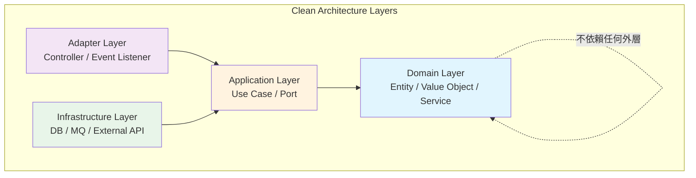
```mermaid
graph TB
    subgraph "Clean Architecture Layers"
        A[Adapter Layer<br/>Controller / Event Listener] --> B[Application Layer<br/>Use Case / Port]
        B --> C[Domain Layer<br/>Entity / Value Object / Service]
        D[Infrastructure Layer<br/>DB / MQ / External API] --> B
    end

    C -.->|不依賴任何外層| C

    style C fill:#e1f5fe
    style B fill:#fff3e0
    style A fill:#f3e5f5
    style D fill:#e8f5e9
```

### 5.2 Frontend Repository

```text
app-customer-portal/
├── .github/
│   ├── workflows/
│   │   ├── ci.yml
│   │   ├── deploy.yml
│   │   └── lighthouse.yml
│   └── CODEOWNERS
├── public/
│   ├── favicon.ico
│   └── index.html
├── src/
│   ├── assets/
│   ├── components/
│   │   ├── common/           # 共用元件
│   │   │   ├── Button.vue
│   │   │   └── Modal.vue
│   │   └── features/        # 功能元件
│   │       └── order/
│   │           ├── OrderList.vue
│   │           └── OrderDetail.vue
│   ├── composables/          # Composition API
│   │   ├── useAuth.ts
│   │   └── useOrder.ts
│   ├── layouts/
│   │   ├── DefaultLayout.vue
│   │   └── AuthLayout.vue
│   ├── pages/                # 路由頁面
│   │   ├── index.vue
│   │   └── orders/
│   │       ├── index.vue
│   │       └── [id].vue
│   ├── stores/               # Pinia Store
│   │   ├── auth.ts
│   │   └── order.ts
│   ├── services/             # API 呼叫
│   │   ├── api.ts
│   │   └── orderService.ts
│   ├── types/                # TypeScript 型別
│   │   └── order.d.ts
│   ├── utils/
│   ├── App.vue
│   └── main.ts
├── tests/
│   ├── unit/
│   ├── e2e/
│   └── fixtures/
├── .env.example
├── .eslintrc.cjs
├── .prettierrc
├── Dockerfile
├── nginx.conf
├── package.json
├── tsconfig.json
├── vite.config.ts
└── README.md
```

### 5.3 Monorepo 結構

```text
monorepo-order-system/
├── .github/
│   └── workflows/
│       ├── ci-api.yml          # Path filter: apps/api/**
│       ├── ci-web.yml          # Path filter: apps/web/**
│       └── ci-shared.yml       # Path filter: packages/**
├── apps/
│   ├── api/                    # 後端 API
│   │   ├── src/
│   │   ├── pom.xml
│   │   └── Dockerfile
│   ├── web/                    # 前端 Web
│   │   ├── src/
│   │   ├── package.json
│   │   └── Dockerfile
│   └── admin/                  # 管理後台
│       ├── src/
│       └── package.json
├── packages/                   # 共用套件
│   ├── shared-types/
│   │   └── package.json
│   ├── ui-components/
│   │   └── package.json
│   └── utils/
│       └── package.json
├── infrastructure/
│   ├── docker-compose.yml
│   ├── k8s/
│   └── terraform/
├── docs/
├── nx.json                     # Nx 配置
├── package.json                # Root package
├── pnpm-workspace.yaml
└── README.md
```

### 5.4 Microservices Repository

**每個微服務獨立 Repo 的標準結構**：

```text
# Organization 層級視角
acme-bank/
├── svc-order-api/              # 訂單服務
├── svc-payment-api/            # 支付服務
├── svc-inventory-api/          # 庫存服務
├── svc-notification-worker/    # 通知 Worker
├── gateway-api/                # API Gateway
├── platform-java-lib-core/     # 共用核心庫
├── platform-java-lib-security/ # 共用安全庫
├── infra-k8s-manifests/        # K8s 部署配置
├── infra-helm-charts/          # Helm Charts
└── docs-service-catalog/       # 服務目錄文件
```

### 5.5 Documentation Repository

```text
docs-architecture/
├── .github/
│   └── workflows/
│       └── publish-docs.yml    # 自動發佈至 GitHub Pages
├── adr/                        # Architecture Decision Records
│   ├── template.md
│   ├── 001-microservices-architecture.md
│   ├── 002-event-driven-design.md
│   └── 003-database-per-service.md
├── architecture/
│   ├── system-context.md       # C4 Model - System Context
│   ├── containers.md           # C4 Model - Container
│   ├── components.md           # C4 Model - Component
│   └── diagrams/
│       ├── system-overview.mmd
│       └── sequence-order-flow.mmd
├── api/
│   ├── order-api.yaml          # OpenAPI Spec
│   └── payment-api.yaml
├── runbook/
│   ├── deployment.md
│   ├── rollback.md
│   └── incident-response.md
├── standards/
│   ├── coding-standards.md
│   ├── api-design-guide.md
│   └── security-guidelines.md
├── mkdocs.yml                  # MkDocs 配置
└── README.md
```

> **實務建議**：使用 MkDocs + Material Theme 或 Docusaurus 將文件 Repo 自動發佈為內部網站，搭配 GitHub Actions 實現「Push to main → 自動部署文件網站」。

---

## 第 6 章 Source Code 上架與管理

> 📌 **本章摘要**：本章說明日常 Git 操作、Conventional Commits、Git Flow / GitHub Flow / Trunk Based 三種策略的比較與選擇、Git LFS 的使用與計費，以及永久連結、.gitattributes 與 blame 忽略清單等檔案管理實務。

### 6.1 Git 基本流程

**日常開發完整流程**：

```bash
# 1. Clone 專案（首次）
git clone git@github.com:acme-bank/svc-order-api.git
cd svc-order-api

# 2. 建立 Feature Branch
git switch develop
git pull origin develop
git switch -c feature/JIRA-123-add-order-api

# 3. 開發 & 提交
git add src/main/java/com/acme/order/
git commit -m "feat(order): add create order API endpoint"

git add src/test/java/com/acme/order/
git commit -m "test(order): add unit tests for CreateOrderUseCase"

# 4. 同步遠端最新變更
git fetch origin
git rebase origin/develop

# 5. 推送到遠端
git push origin feature/JIRA-123-add-order-api

# 6. 建立 Pull Request
gh pr create --base develop \
  --title "feat(order): add create order API endpoint" \
  --body "Closes #123"

# 7. PR 合併後清理（遠端分支已由「Automatically delete head branches」自動刪除）
git switch develop
git pull --prune origin develop
git branch -d feature/JIRA-123-add-order-api
```

**常用指令速查**：

| 操作 | 指令 | 說明 |
|------|------|------|
| 查看狀態 | `git status` | 檢視工作區變更 |
| 查看歷史 | `git log --oneline -20` | 最近 20 筆提交 |
| 暫存變更 | `git stash` | 臨時保存未提交的變更 |
| 恢復暫存 | `git stash pop` | 恢復暫存的變更 |
| 切換分支 | `git switch <branch>` | 取代 `git checkout <branch>` |
| 取消修改 | `git restore <file>` | 還原單一檔案（取代 `git checkout -- <file>`） |
| 取消暫存 | `git restore --staged <file>` | 將檔案移出 staging |
| 修改最後 commit | `git commit --amend` | 修正最近一次提交 |
| 查看差異 | `git diff --cached` | 已 stage 的變更差異 |
| 互動式 rebase | `git rebase -i HEAD~3` | 整理最近 3 次提交 |

### 6.2 Commit Message 規範

採用 **Conventional Commits** 標準：

```text
<type>(<scope>): <subject>

[optional body]

[optional footer]
```

**Type 定義**：

| Type | 說明 | 範例 |
|------|------|------|
| `feat` | 新功能 | `feat(order): add cancel order endpoint` |
| `fix` | 修復 Bug | `fix(payment): resolve null pointer in refund` |
| `docs` | 文件更新 | `docs: update API documentation` |
| `style` | 格式調整（不影響邏輯） | `style: format code with spotless` |
| `refactor` | 重構（不改功能） | `refactor(order): extract validation logic` |
| `test` | 測試相關 | `test(order): add integration test for create` |
| `chore` | 維護性工作 | `chore: update dependencies` |
| `ci` | CI/CD 配置 | `ci: add security scanning workflow` |
| `perf` | 效能優化 | `perf(query): add index for order lookup` |
| `security` | 安全修復 | `security: patch CVE-2024-xxxx` |

**Breaking Change 標記**：

```text
feat(api)!: change order response format

BREAKING CHANGE: OrderResponse now uses ISO 8601 date format
instead of Unix timestamp. All API consumers must update.

Refs: JIRA-456
```

### 6.3 Git Flow

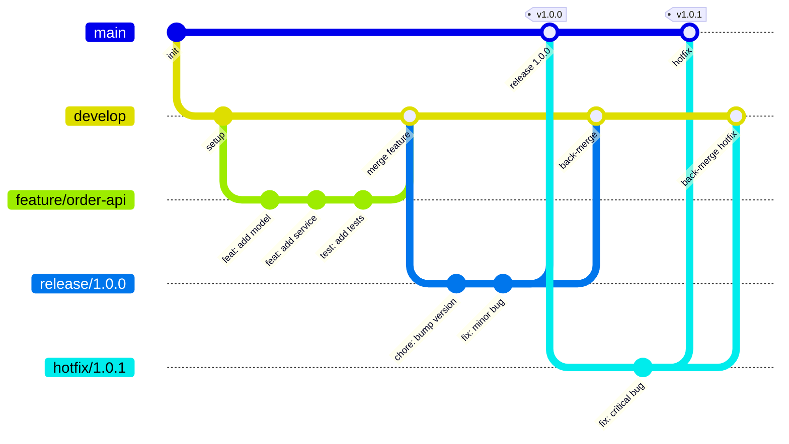
```mermaid
gitGraph
    commit id: "init"
    branch develop
    checkout develop
    commit id: "setup"

    branch feature/order-api
    checkout feature/order-api
    commit id: "feat: add model"
    commit id: "feat: add service"
    commit id: "test: add tests"
    checkout develop
    merge feature/order-api id: "merge feature"

    branch release/1.0.0
    checkout release/1.0.0
    commit id: "chore: bump version"
    commit id: "fix: minor bug"
    checkout main
    merge release/1.0.0 id: "release 1.0.0" tag: "v1.0.0"
    checkout develop
    merge release/1.0.0 id: "back-merge"

    checkout main
    branch hotfix/1.0.1
    commit id: "fix: critical bug"
    checkout main
    merge hotfix/1.0.1 id: "hotfix" tag: "v1.0.1"
    checkout develop
    merge hotfix/1.0.1 id: "back-merge hotfix"
```

**Git Flow 分支定義**：

| 分支 | 用途 | 來源 | 合併至 | 生命週期 |
|------|------|------|--------|---------|
| `main` | 正式版本 | release / hotfix | — | 永久 |
| `develop` | 開發整合 | feature | release | 永久 |
| `feature/*` | 功能開發 | develop | develop | 短期 |
| `release/*` | 版本準備 | develop | main + develop | 短期 |
| `hotfix/*` | 緊急修復 | main | main + develop | 極短 |

### 6.4 GitHub Flow

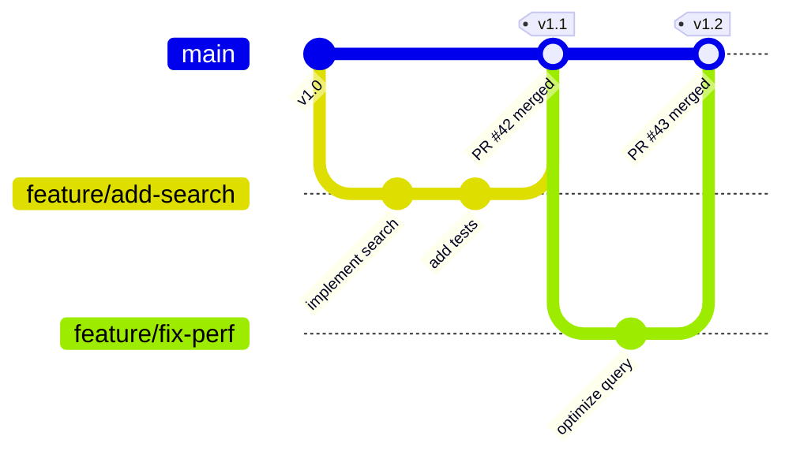
```mermaid
gitGraph
    commit id: "v1.0"
    branch feature/add-search
    commit id: "implement search"
    commit id: "add tests"
    checkout main
    merge feature/add-search id: "PR #42 merged" tag: "v1.1"

    branch feature/fix-perf
    commit id: "optimize query"
    checkout main
    merge feature/fix-perf id: "PR #43 merged" tag: "v1.2"
```

**GitHub Flow 規則**（僅 2 類分支）：

1. `main` 永遠可部署
2. 所有開發在 feature branch 進行
3. 透過 Pull Request 合併回 main
4. 合併後立即部署

**適用場景**：持續部署（CD）、Web 應用、SaaS 產品

### 6.5 Trunk Based Development

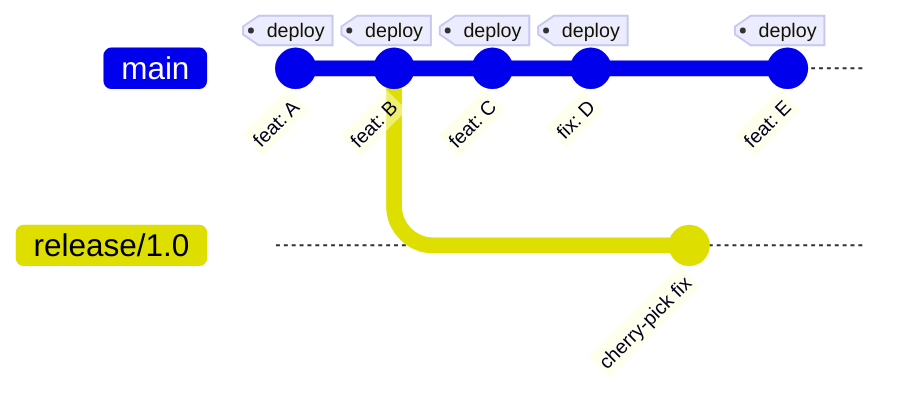
```mermaid
gitGraph
    commit id: "feat: A" tag: "deploy"
    commit id: "feat: B" tag: "deploy"
    branch release/1.0
    checkout main
    commit id: "feat: C" tag: "deploy"
    commit id: "fix: D" tag: "deploy"
    checkout release/1.0
    commit id: "cherry-pick fix"
    checkout main
    commit id: "feat: E" tag: "deploy"
```

**Trunk Based 規則**：

1. 所有開發者直接提交到 `main`（或極短 feature branch < 1 天）
2. 使用 Feature Flag 控制未完成功能
3. 每次提交即觸發 CI/CD
4. Release Branch 僅用於穩定版本維護

### 6.6 三種策略比較與選擇

| 面向 | Git Flow | GitHub Flow | Trunk Based |
|------|----------|-------------|-------------|
| **複雜度** | 高 | 低 | 中 |
| **適合** | 版本化發佈產品 | Web SaaS | 高頻部署 |
| **部署頻率** | 週/月 | 天/週 | 時/天 |
| **團隊規模** | 大型 | 中小型 | 任何規模 |
| **Feature Flag** | 不需要 | 不需要 | 必須 |
| **分支數量** | 多 | 少 | 極少 |
| **Code Review** | PR to develop | PR to main | PR to main（短） |
| **金融業建議** | ✅ 推薦 | ⚠️ 需搭配環境控管 | ⚠️ 需完善 Feature Flag |

> **企業建議**：金融業建議使用 **Git Flow**（穩定可控），搭配嚴格的 Branch Protection 與 Release 管理。若團隊成熟度高、CI/CD 完善，可逐步過渡至 GitHub Flow。

### 6.7 Git Large File Storage（LFS）

Git LFS 是 GitHub 官方推薦的大型檔案管理方案，透過將大型二進制檔案替換為輕量指標（pointer），實際檔案存放於 LFS 伺服器，避免 Repository 膨脹。

**何時需要 Git LFS**：

- 單一檔案超過 50 MB（GitHub 警告）或 100 MB（GitHub 拒絕）
- 頻繁變更的二進制檔案（圖片、設計稿、編譯產物）
- 機器學習模型檔、資料集
- 影音多媒體資源

**安裝與配置**：

```bash
# 1. 安裝 Git LFS
git lfs install

# 2. 追蹤特定檔案類型
git lfs track "*.psd"
git lfs track "*.zip"
git lfs track "*.jar"
git lfs track "*.model"
git lfs track "docs/assets/**/*.png"

# 3. 確認 .gitattributes 已更新
cat .gitattributes
# *.psd filter=lfs diff=lfs merge=lfs -text
# *.zip filter=lfs diff=lfs merge=lfs -text

# 4. 提交 .gitattributes
git add .gitattributes
git commit -m "chore: configure Git LFS tracking"

# 5. 正常使用 git add / commit / push
git add design/mockup.psd
git commit -m "docs: add UI mockup"
git push origin main
```

**Git LFS 儲存配額**：

GitHub 自 2024 年 6 月起（先自 Enterprise 帳號開始導入，隨後全面推行）已將 Git LFS 的計費模式由「預付加購包（$5 / 50GB）」全面改為**用量計費（metered billing）**，超出免費內含額度後直接按實際使用的 GiB 數計費，不再需要手動購買加購包：

| GitHub 方案 | 免費內含儲存 | 免費內含頻寬（月） | 超額計費方式 |
|------------|------------|--------------|---------|
| **Free / Pro（個人帳號）** | 10 GiB | 10 GiB | 按用量計費（無預付方案） |
| **Team** | 250 GiB | 250 GiB | 按用量計費（無預付方案） |
| **Enterprise Cloud** | 250 GiB | 250 GiB | 按用量計費（無預付方案） |

**超額計費費率**（依 GitHub Billing 文件）：儲存 **US$0.07 / GiB / 月**，頻寬 **US$0.0875 / GiB / 月**；儲存用量以帳單週期逐時累計計算，頻寬則以月為單位重置。帳戶已設定付款方式且未設定預算時，超額用量會直接反映在帳單上；若帳戶沒有付款方式，儲存超額會限制上傳、頻寬超額則會停用 LFS 至下個月；將 LFS 預算設為 $0 時不會產生費用，但當月超額後 LFS 會被阻擋。GitHub 另會在內含用量達 90% 與 100% 時寄送通知。企業應建立主動監控機制，避免非預期的大量 LFS 用量在月結時才被發現。實際費率請以 [GitHub Billing 官方文件](https://docs.github.com/en/billing/managing-billing-for-git-large-file-storage/about-billing-for-git-large-file-storage)為準。

**企業 .gitattributes 參考配置**：

```gitattributes
# === Git LFS 追蹤規則 ===
# 圖片
*.png filter=lfs diff=lfs merge=lfs -text
*.jpg filter=lfs diff=lfs merge=lfs -text
*.gif filter=lfs diff=lfs merge=lfs -text
# 注意：SVG 為文字格式，保留在 Git 中即可正常 diff 與預覽，不建議納入 LFS

# 設計稿
*.psd filter=lfs diff=lfs merge=lfs -text
*.sketch filter=lfs diff=lfs merge=lfs -text
*.figma filter=lfs diff=lfs merge=lfs -text

# 壓縮檔
*.zip filter=lfs diff=lfs merge=lfs -text
*.tar.gz filter=lfs diff=lfs merge=lfs -text

# 文件
*.pdf filter=lfs diff=lfs merge=lfs -text

# 機器學習
*.model filter=lfs diff=lfs merge=lfs -text
*.h5 filter=lfs diff=lfs merge=lfs -text
*.onnx filter=lfs diff=lfs merge=lfs -text
```

**常用指令**：

| 指令 | 用途 |
|------|------|
| `git lfs ls-files` | 列出 LFS 追蹤的檔案 |
| `git lfs status` | 查看 LFS 檔案狀態 |
| `git lfs fetch --all` | 下載所有 LFS 檔案 |
| `git lfs prune` | 清理本地過期 LFS 快取 |
| `git lfs migrate import --include="*.psd"` | 將既有大檔案遷移至 LFS |

> **企業建議**：
>
> - 在 Template Repo 中預先配置 `.gitattributes`，確保新專案從一開始就正確使用 LFS
> - CI/CD 中使用 `git lfs install && git lfs pull` 確保 Runner 取得 LFS 檔案
> - 定期使用 `git lfs prune` 清理本地快取
> - 若 Repository Archive 包含 LFS 物件，需在 Repository Settings 中啟用「Include Git LFS objects in archives」
> - 用量計費上路後，建議透過 `Settings → Billing → Git LFS Data` 定期監控各 Repo 用量，並針對高用量專案設定內部預算告警

### 6.8 檔案管理與瀏覽實務

> 🆕 **v3.0 新增**

Repository 不只是 Git 的儲存容器，GitHub 在檔案呈現上提供了多項能力，善用它們能讓 Code Review、稽核與知識傳遞更有效率。

**永久連結（Permalink）**：在檔案頁面按下 <kbd>Y</kbd>，網址中的分支名稱會替換為目前的 Commit SHA。分支會持續前進，以分支名稱組成的連結日後可能指向不同內容；在 ADR、事故報告、稽核證據中引用程式碼時，務必使用永久連結。選取行號後同樣按 <kbd>Y</kbd>，即可取得特定行範圍的永久連結。

**非程式碼檔案的呈現**：

| 檔案類型 | GitHub 呈現方式 | 企業應用 |
|---------|---------------|---------|
| Markdown 中的 Mermaid 區塊 | 直接渲染為圖表 | 架構圖、流程圖與文件一起版控（本手冊即採用） |
| CSV / TSV | 可搜尋的表格 | 小型參考資料、設定對照表 |
| GeoJSON / TopoJSON | 互動式地圖 | 分行據點、服務區域資料 |
| STL | 3D 模型檢視 | 硬體或工業設計專案 |
| PDF | 內嵌檢視 | 規格文件（大型 PDF 建議改放 LFS） |
| 圖片（PNG、JPG、GIF、SVG、PSD） | 差異比對（並排、滑動、洋蔥皮） | UI 變更審查 |
| Jupyter Notebook | 渲染後呈現 | 資料分析與模型研究 |

GitHub 一般只預覽約 2 MB 以下的檔案，超過時僅提供原始檔下載。

**`.gitattributes` 的呈現控制**：

```gitattributes
# 產生的檔案：在 PR diff 中預設摺疊，也不計入語言統計
src/main/generated/**      linguist-generated
package-lock.json          linguist-generated
*.pb.go                    linguist-generated

# 第三方程式碼：不計入語言統計
vendor/**                  linguist-vendored

# 文件：不計入語言統計
docs/**                    linguist-documentation

# 修正語言辨識
*.tpl                      linguist-language=HTML
```

Repository 的語言比例由開源的 Linguist 函式庫計算，只在推送到預設分支後更新。若語言統計明顯失真（例如大量產生檔被算成主要語言），應先用上述屬性修正，這也會讓 PR 的「Files changed」更聚焦於人工撰寫的程式碼。

**`git blame` 忽略大規模格式化 Commit**：導入 Spotless、Prettier 等格式化工具時，一次性的大量格式調整會讓 `git blame` 失去意義。在 Repo 根目錄建立 `.git-blame-ignore-revs`，GitHub 的 Blame 檢視會自動略過列出的 Commit：

```text
# .git-blame-ignore-revs
# 2026-03-02 導入 Spotless 全面格式化
a1b2c3d4e5f60718293a4b5c6d7e8f9012345678
```

本機同樣可設定：`git config blame.ignoreRevsFile .git-blame-ignore-revs`。

**不 clone 也能讀取遠端檔案**：GitHub CLI 自 2026-06 起提供 `gh repo read-file` 與 `gh repo read-dir`，適合在腳本或 AI Agent 工作流程中讀取其他 Repo 的設定檔，而不必完整 clone。

> **企業建議**：
>
> - 在 Template Repo 預先放入 `.gitattributes`（LFS 規則 + linguist 屬性）與 `.git-blame-ignore-revs`
> - 稽核證據、事故報告中的程式碼引用一律使用永久連結
> - 圖片等二進位檔若經常變動，依 [6.7](#67-git-large-file-storagelfs) 改用 LFS；SVG 屬於文字格式，保留在 Git 中即可正常 diff 與預覽

---

## 第 7 章 Branch Strategy

> 📌 **本章摘要**：分支保護是品質與安全的核心關卡。本章涵蓋分支命名、Branch Protection 與 Rulesets、PR 審查、CODEOWNERS、合併策略、Merge Queue、預設分支管理、Auto-merge，以及 Branch Protection 轉換至 Rulesets 的實務與 2026 年新增的規則。

### 7.1 分支命名規範

```text
# 格式: <type>/<ticket-id>-<short-description>

# Feature
feature/JIRA-123-add-order-api
feature/JIRA-456-implement-payment-gateway

# Bug Fix
fix/JIRA-789-null-pointer-in-order-service
fix/JIRA-012-incorrect-amount-calculation

# Hotfix（緊急修復）
hotfix/JIRA-999-security-vulnerability-patch
hotfix/CVE-2024-12345-fix

# Release
release/1.2.0
release/2.0.0-rc.1

# Chore
chore/upgrade-spring-boot-3.4
chore/update-dependencies-2024-q4
```

**命名規則**：

- 全部小寫
- 使用 `-` 連接單字
- 必須包含 Ticket ID（JIRA / Issue #）
- 不超過 60 字元
- 禁止中文字元

### 7.2 Branch Protection Rules

**main branch 保護設定**：

```bash
# 使用 GitHub CLI 設定 Branch Protection
gh api repos/acme-bank/svc-order-api/branches/main/protection \
  -X PUT \
  --input - << 'EOF'
{
  "required_status_checks": {
    "strict": true,
    "contexts": [
      "ci/build",
      "ci/test",
      "ci/integration-test",
      "security/codeql",
      "security/dependency-check"
    ]
  },
  "enforce_admins": true,
  "required_pull_request_reviews": {
    "required_approving_review_count": 2,
    "dismiss_stale_reviews": true,
    "require_code_owner_reviews": true,
    "require_last_push_approval": true,
    "dismissal_restrictions": {
      "teams": ["org-admins"]
    }
  },
  "restrictions": {
    "users": [],
    "teams": ["org-admins", "devops-team"]
  },
  "required_linear_history": true,
  "allow_force_pushes": false,
  "allow_deletions": false,
  "required_conversation_resolution": true
}
EOF
```

> **建議**：Classic Branch Protection 仍受支援，但新設定應優先使用 Rulesets（[7.6](#76-repository-rulesets-深入指南)），既有規則可用 GitHub 內建工具轉換（[7.10](#710-branch-protection-轉換至-rulesets-實務)）。上例保留供仍使用 Branch Protection 的 Repo 參考；注意 Classic Branch Protection 的管理員預設可繞過規則，需以 `enforce_admins` 補強。

**各分支保護等級**：

| 分支 | Required Reviews | Status Checks | Force Push | Delete |
|------|-----------------|---------------|------------|--------|
| `main` | 2 + CODEOWNERS | 全部通過 | ❌ 禁止 | ❌ 禁止 |
| `develop` | 1 | Build + Test | ❌ 禁止 | ❌ 禁止 |
| `release/*` | 2 | 全部通過 | ❌ 禁止 | ✅ 合併後刪 |
| `feature/*` | 0（建議 1） | Build | ✅ 允許 | ✅ 合併後刪 |
| `hotfix/*` | 2 + CODEOWNERS | 全部通過 | ❌ 禁止 | ✅ 合併後刪 |

### 7.3 Pull Request Review 流程

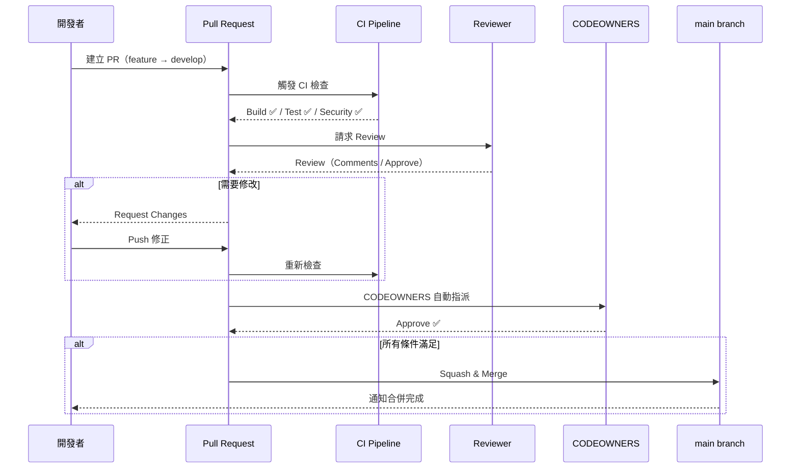
```mermaid
sequenceDiagram
    participant Dev as 開發者
    participant PR as Pull Request
    participant CI as CI Pipeline
    participant Rev as Reviewer
    participant CO as CODEOWNERS
    participant Main as main branch

    Dev->>PR: 建立 PR（feature → develop）
    PR->>CI: 觸發 CI 檢查
    CI-->>PR: Build ✅ / Test ✅ / Security ✅
    PR->>Rev: 請求 Review
    Rev-->>PR: Review（Comments / Approve）

    alt 需要修改
        PR-->>Dev: Request Changes
        Dev->>PR: Push 修正
        PR->>CI: 重新檢查
    end

    PR->>CO: CODEOWNERS 自動指派
    CO-->>PR: Approve ✅

    alt 所有條件滿足
        PR->>Main: Squash & Merge
        Main-->>Dev: 通知合併完成
    end
```

**Review Checklist（給 Reviewer）**：

- [ ] 程式碼邏輯正確
- [ ] 遵循 Clean Architecture 分層
- [ ] 無硬編碼敏感資訊
- [ ] 有對應的單元測試
- [ ] API 變更有更新 OpenAPI Spec
- [ ] 無 N+1 Query 問題
- [ ] 例外處理完善
- [ ] Log 層級適當
- [ ] 向後相容（或有 Migration Plan）

### 7.4 CODEOWNERS 進階配置

```text
# === 全域規則 ===
# 所有 PR 預設需要 Tech Lead 審查
*                                   @acme-bank/tech-leads

# === 分層審查 ===
# Domain Layer 變更 — 架構師
**/domain/**                        @acme-bank/architecture-team

# Infrastructure Layer — DevOps
**/infrastructure/**                @acme-bank/devops-team
Dockerfile                          @acme-bank/devops-team
docker-compose*.yml                 @acme-bank/devops-team

# Security 相關
**/security/**                      @acme-bank/security-team
**/auth/**                          @acme-bank/security-team

# === CI/CD 變更 ===
.github/workflows/**                @acme-bank/devops-team @acme-bank/security-team

# === 依賴管理 ===
pom.xml                             @acme-bank/tech-leads @acme-bank/security-team
build.gradle*                       @acme-bank/tech-leads @acme-bank/security-team
package.json                        @acme-bank/tech-leads @acme-bank/security-team
package-lock.json                   @acme-bank/tech-leads

# === 資料庫 Migration ===
**/db/migration/**                  @acme-bank/dba-team @acme-bank/tech-leads

# === API 規格 ===
**/openapi*.yaml                    @acme-bank/api-governance
**/openapi*.json                    @acme-bank/api-governance

# === AI Agent 設定檔（見 13.10）===
/.github/copilot-instructions.md    @acme-bank/architecture-team
/.github/instructions/              @acme-bank/architecture-team
/.github/agents/                    @acme-bank/architecture-team
/AGENTS.md                          @acme-bank/architecture-team
/.github/workflows/copilot-setup-steps.yml  @acme-bank/devops-team @acme-bank/security-team
```

> **提醒**：上例中全域規則 `*` 放在最前面，其餘規則依序覆寫——CODEOWNERS 以「最後一條符合的規則」為準，順序顛倒會讓特定路徑的審查者被全域規則取代。

### 7.5 Merge Strategy 選擇

| 策略 | 指令 | 歷史記錄 | 適用場景 |
|------|------|---------|---------|
| **Squash & Merge** | 多次 commit 合成 1 個 | 乾淨線性 | ✅ Feature → develop/main |
| **Merge Commit** | 保留所有 commit + 合併節點 | 完整但複雜 | Release → main |
| **Rebase & Merge** | 重寫 commit 至目標之上 | 線性無合併節點 | 小型 fix |

> **企業建議**：
>
> - Feature PR → **Squash & Merge**（保持歷史乾淨）
> - Release → main → **Merge Commit**（保留版本合併記錄）
> - Repository 設定：禁用 Merge Commit for feature PR，僅允許 Squash

### 7.6 Repository Rulesets 深入指南

Rulesets 是 GitHub 推出的新一代分支保護機制，相較傳統 Branch Protection Rules 具有顯著優勢。自 2024 年起，GitHub 官方建議企業逐步從 Branch Protection 遷移至 Rulesets。

**Rulesets vs Branch Protection Rules**：

| 面向 | Branch Protection Rules | Repository Rulesets |
|------|------------------------|-------------------|
| **多規則疊加** | 每個分支僅一組規則 | 多組 Ruleset 可同時生效並疊加 |
| **狀態管理** | 啟用/停用需刪除重建 | Active / Disabled 狀態切換 |
| **可見性** | 僅 Admin 可查看 | 所有 Read 權限使用者可查看 |
| **組織層級** | ❌ 僅 Repo 層級 | ✅ 可在 Organization 層級設定 |
| **Push Rulesets** | ❌ 不支援 | ✅ 支援檔案路徑/大小/副檔名限制（Private / Internal Repo，Team 以上；2026-08 起支援路徑例外） |
| **Commit Metadata** | ❌ | ✅ 可限制 Commit Message 格式 |
| **Bypass 機制** | Repo Admin **預設**可繞過所有規則 | 任何人（含 Admin）**預設不可繞過**，須明確加入 Bypass Actor 清單 |
| **Fork 保護** | ❌ | ✅ Push Rulesets 延伸至 Fork |
| **適用方案** | Free（Public）/ Pro / Team / Enterprise | Repo 層：Free（Public）/ Pro / Team / Enterprise；組織層：Enterprise Cloud |

> **關鍵安全差異**：這是遷移至 Rulesets 最重要的理由，而非僅是介面或管理便利性的差異。Classic Branch Protection 底層邏輯是「Admin 預設不受保護規則約束」，僅能透過額外勾選 `enforce_admins` 補救；Rulesets 則反過來，預設**任何人都不能繞過**，包含組織 Owner，除非明確將其加入 `bypass_actors` 清單。對於要求「職責分離」的金融業（見 [15.4 Compliance 與稽核](#154-compliance-與稽核)），這代表 Rulesets 從架構上就更貼近稽核要求，而非仰賴管理員記得手動勾選保護選項。

**Rule Layering（規則疊加）機制**：

當多個 Rulesets 針對同一分支時，所有規則會聚合生效，衝突時以**最嚴格**的版本為準。

```text
Ruleset A: main branch → 要求 Signed Commits + 3 Reviews
Ruleset B: main branch → 要求 Linear History + 2 Reviews
═══════════════════════════════════════════
聚合結果: main branch → Signed Commits + Linear History + 3 Reviews（取最嚴格）
```

> **2026 年更新（2026-05-07）**：Bypass Actor 過去僅能指定角色（Role）、Team 或 GitHub App，現已支援在 Repo 層 Ruleset 直接指定**個別使用者（`"actor_type": "User"`）**，不必再為單一人員或服務帳號另外建立專屬 Team 才能授予 Bypass 權限，設定更為精準且易於稽核。

**Branch & Tag Rulesets 配置範例**：

```bash
# 使用 GitHub CLI 建立 Ruleset
gh api repos/acme-bank/svc-order-api/rulesets \
  -X POST \
  --input - << 'EOF'
{
  "name": "main-protection",
  "target": "branch",
  "enforcement": "active",
  "conditions": {
    "ref_name": {
      "include": ["~DEFAULT_BRANCH"],
      "exclude": []
    }
  },
  "bypass_actors": [
    {
      "actor_id": 1,
      "actor_type": "OrganizationAdmin",
      "bypass_mode": "always"
    },
    {
      "actor_id": 123456,
      "actor_type": "User",
      "bypass_mode": "pull_request"
    }
  ],
  "rules": [
    {
      "type": "pull_request",
      "parameters": {
        "required_approving_review_count": 2,
        "dismiss_stale_reviews_on_push": true,
        "require_code_owner_review": true,
        "require_last_push_approval": true,
        "required_review_thread_resolution": true
      }
    },
    {
      "type": "required_status_checks",
      "parameters": {
        "strict_required_status_checks_policy": true,
        "required_status_checks": [
          {"context": "ci/build"},
          {"context": "ci/test"},
          {"context": "security/codeql"}
        ]
      }
    },
    {
      "type": "non_fast_forward"
    },
    {
      "type": "deletion"
    }
  ]
}
EOF
```

**Push Rulesets（檔案推送限制）**：

Push Rulesets 可在整個 Repository（含 Fork 網路）層級限制推送行為，無需指定分支。

```json
{
  "name": "push-restrictions",
  "target": "push",
  "enforcement": "active",
  "rules": [
    {
      "type": "file_path_restriction",
      "parameters": {
        "restricted_file_paths": [
          ".github/workflows/**",
          "Dockerfile",
          "*.pem",
          "*.key"
        ]
      }
    },
    {
      "type": "max_file_path_length",
      "parameters": {
        "max_file_path_length": 256
      }
    },
    {
      "type": "file_extension_restriction",
      "parameters": {
        "restricted_file_extensions": [".exe", ".dll", ".so", ".bin"]
      }
    },
    {
      "type": "max_file_size",
      "parameters": {
        "max_file_size": 10485760
      }
    }
  ]
}
```

> **2026 年更新：一鍵遷移工具**：GitHub 已於 2026-08-11 在 Repository Settings 中提供**一鍵遷移工具**，可直接將既有 Branch Protection Rules 自動轉換為對應的 Ruleset，無需手動逐項重新設定。對於仍大量使用 Classic Branch Protection 的既有 Repository，這大幅降低了遷移門檻，企業可將「遷移至 Rulesets」列為近期治理待辦事項，而非長期規劃項目。
>
> **企業建議**：
>
> - 新建 Repository 優先使用 Rulesets 而非 Branch Protection Rules；既有 Repository 可透過上述一鍵遷移工具逐步汰換
> - 在 Organization 層級建立基線 Ruleset（如：所有 Repo 的 default branch 至少需 1 Review）
> - 善用 Push Rulesets 阻擋敏感檔案（金鑰、憑證）和不允許的檔案類型進入 Repo
> - 使用 `Disabled` 狀態暫時停用規則，避免刪除後難以還原
> - 過去若分支受 Organization / Enterprise 層級 Ruleset 保護，重新命名該分支需要組織層級權限；目前組織 Owner 可開啟「允許 Repo 管理員重新命名受組織 Ruleset 保護的分支」，只要新名稱仍受相同規則約束，Repo Admin 即可自行重新命名（見 [7.8](#78-default-branch-管理與重新命名)）
> - 2026 年新增的規則（覆蓋率門檻、阻擋含外洩 Secret 的 PR、限制撤銷審查等）整理於 [7.11](#711-2026-年-pull-request-與規則治理新功能)

### 7.7 Merge Queue 管理

Merge Queue 是 GitHub 提供的自動化合併佇列機制，已於 **2023 年 7 月正式 GA**（並非 Beta 功能），解決「多個 PR 同時等待合併時需反覆更新基底分支」的問題，確保合併至目標分支的程式碼始終通過最新的 CI 檢查。

**Merge Queue 運作流程**：

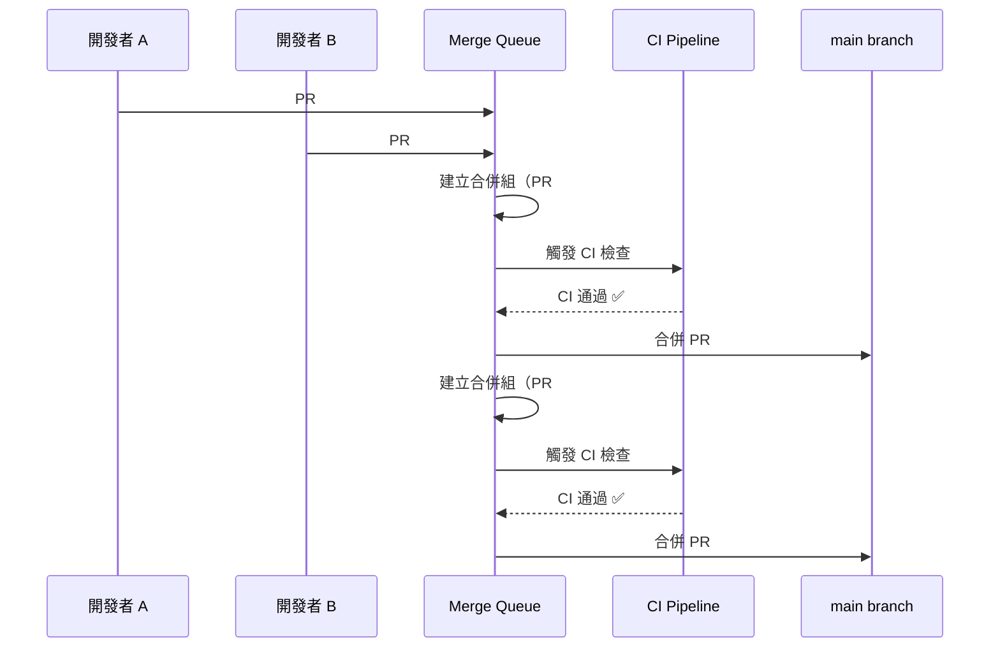
```mermaid
sequenceDiagram
    participant D1 as 開發者 A
    participant D2 as 開發者 B
    participant MQ as Merge Queue
    participant CI as CI Pipeline
    participant Main as main branch

    D1->>MQ: PR #1 加入 Queue
    D2->>MQ: PR #2 加入 Queue

    MQ->>MQ: 建立合併組（PR#1 + main）
    MQ->>CI: 觸發 CI 檢查
    CI-->>MQ: CI 通過 ✅
    MQ->>Main: 合併 PR #1

    MQ->>MQ: 建立合併組（PR#2 + 新 main）
    MQ->>CI: 觸發 CI 檢查
    CI-->>MQ: CI 通過 ✅
    MQ->>Main: 合併 PR #2
```

**啟用 Merge Queue**：

1. 確認適用範圍：**組織擁有的公開 Repo**，或 **Enterprise Cloud 組織的私有／內部 Repo**（GitHub Enterprise Server 則為所有組織擁有的 Repo）
2. 在目標分支的 Ruleset（或 Branch Protection）中啟用 **Require merge queue**，並設定合併方式與群組參數
3. 確認所有必要檢查的 CI Workflow 已加上 `merge_group` 觸發條件；第三方 CI 則需監聽 `gh-readonly-queue/{base_branch}` 前綴的暫時分支

> ⚠️ **v3.0 更正**：v2.2 記載「需 GitHub Team 或 Enterprise 方案」並有「Allow merge queue」選項；依官方說明，私有 Repo 的 Merge Queue 僅限 Enterprise Cloud，且是在分支規則中以「Require merge queue」啟用。

**運作機制補充**：

- **FIFO 處理**：PR 依加入佇列的先後順序處理，不會插隊（緊急合併除外，見下）
- **暫時性測試分支**：CI 並非直接跑在目標分支上，而是在 Merge Queue 建立的暫時性合併分支（`gh-readonly-queue/{base}/...`）上執行，驗證通過後才真正合併進目標分支
- **加急合併（Jump the queue）**：具備權限的使用者可將特定 PR 插隊至佇列最前端，適合處理緊急 Hotfix
- **Build concurrency 可調範圍為 1–100**，並非固定值，企業可依 Runner 產能與合併頻率彈性調整，非僅侷限於下表的建議值

**Merge Queue 配置參數**：

| 參數 | 說明 | 建議值 |
|------|------|-------|
| **Merge method** | 合併方式 | Squash merge |
| **Build concurrency** | 同時建置的 PR 群組數（可調範圍 1–100） | 5 |
| **Minimum group size** | 最小合併群組大小（1–100） | 1 |
| **Maximum group size** | 最大合併群組大小（1–100） | 5 |
| **Only merge non-failing pull requests** | 是否只合併自身檢查通過的 PR | 開啟 |
| **Wait time** | 等待更多 PR 加入群組的時間 | 5 分鐘 |
| **Status check timeout** | CI 檢查逾時時間 | 60 分鐘 |

**在 Ruleset 中啟用 Merge Queue**：

```json
{
  "type": "merge_queue",
  "parameters": {
    "check_response_timeout_minutes": 60,
    "grouping_strategy": "ALLGREEN",
    "max_entries_to_build": 5,
    "max_entries_to_merge": 5,
    "merge_method": "SQUASH",
    "min_entries_to_merge": 1,
    "min_entries_to_merge_wait_minutes": 5
  }
}
```

> **企業建議**：
>
> - 高頻合併的 Repository（如核心服務的 develop / main）強烈建議啟用 Merge Queue
> - 搭配「Require branches to be up to date before merging」使用，Merge Queue 會自動處理基底更新
> - Merge Queue 特別適合搭配 Trunk Based Development，確保每次合併都經過完整 CI 驗證
> - **重要提醒**：若 CI Workflow 僅監聽 `push` / `pull_request` 事件，在 Merge Queue 的暫時性測試分支上將**不會觸發**，務必額外加上 `merge_group` 事件觸發條件（可參考第 8 章現有 CI Workflow 範例並新增對應觸發器），否則 Merge Queue 會因收不到必要的狀態檢查結果而卡住
> - Merge Queue 目前**無法與分支保護規則中的萬用字元（Wildcard）分支命名模式併用**，需針對明確的分支名稱（如 `main`）個別設定
> - **事故案例（2026-04-23）**：16:05～20:43 UTC 期間，Merge Queue 在「Squash 合併且群組內含多個 PR」時產生錯誤的合併 Commit，導致先前已合併的變更被回復，共影響 230 個 Repository、2,092 個 PR（Merge 與 Rebase 方式不受影響）。因為屬於「結果錯誤」而非「服務中斷」，GitHub 的自動監控未能偵測，約 3.5 小時後才由客戶回報發現。企業應據此：(1) 訂閱 [GitHub Status](https://www.githubstatus.com/) 與 GitHub Blog 的可用性報告；(2) 在主幹分支保留部署後的冒煙測試，而非完全信任合併結果；(3) 定期以 Activity view（[14.8](#148-活動與洞察)）稽核非預期的回復

### 7.8 Default Branch 管理與重新命名

> 🆕 **v3.0 新增**

預設分支（Default branch）是 Repo 首頁顯示、新 PR 預設目標、`~DEFAULT_BRANCH` Ruleset 條件與 Copilot 設定檔（例如 `copilot-setup-steps.yml`）讀取的分支。企業應統一預設分支名稱，避免 Pipeline、規則與文件各自假設不同名稱。

**設定層級**：

| 層級 | 設定位置 | 作用 |
|------|---------|------|
| Enterprise | Policies → Repository → Default branch name | 強制全企業新 Repo 的預設分支名稱 |
| Organization | Settings → Repository → Repository default branch | 組織內新 Repo 的預設名稱（如 `main`） |
| Repository | Settings → General → Default branch | 變更單一 Repo 的預設分支 |

**重新命名分支時 GitHub 會自動處理的項目**：

- 包含舊分支名稱的網址自動導向新名稱（但 **raw 檔案網址不會導向**）
- 分支保護規則、開啟中 PR 的基底分支（含來自 Fork 的 PR）、草稿 Release 的目標分支一併更新
- 若重新命名的是預設分支，Repo 首頁會提示協作者更新本機環境

**不會自動處理、需人工確認的項目**：

- 引用 `@舊分支名稱` 的 GitHub Actions 呼叫會直接失敗（Actions 不追隨改名）；若 Repo 對外發佈 Action 或 Reusable Workflow，應保留舊分支並加上棄用說明
- 外部系統（Jenkins、ArgoCD、部署腳本）中寫死的分支名稱
- 本機 clone 需執行以下指令同步：

```bash
git branch -m master main
git fetch origin
git branch -u origin/main main
git remote set-head origin -a
git remote prune origin   # 選用：清除舊分支的追蹤參考
```

**誰可以重新命名**：一般分支只需 Write 權限；預設分支與受分支保護或 Repo 層 Ruleset 保護的分支需 Repo Admin；受組織或企業層 Ruleset 保護的分支，原則上需組織／企業管理員，但組織 Owner 可開啟「允許 Repo 管理員重新命名受組織 Ruleset 保護的分支」，前提是新名稱仍受相同規則約束（2026-05 起提供，見 [7.6](#76-repository-rulesets-深入指南)）。

> **企業建議**：變更預設分支屬於「對下游有破壞性」的操作，應比照 [14.7 Repository 生命週期操作](#147-repository-生命週期操作) 以 Issue 申請、通知相依團隊，並在變更後 24 小時內檢查 Actions 執行失敗率。

### 7.9 Auto-merge、Update Branch 與自動刪除分支

> 🆕 **v3.0 新增**

這三項 Repository 設定能消除 PR 流程中大部分「等待與手動收尾」的時間，且都不會降低 Ruleset 的保護強度。

| 功能 | 行為 | 前提與限制 | 企業建議 |
|------|------|-----------|---------|
| **Auto-merge** | PR 作者或具 Write 權限者按下「Enable auto-merge」後，只要所有必要審查與狀態檢查通過就自動合併 | 只有「目前無法立即合併」的 PR 才會出現此選項；無 Write 權限者推送新 Commit 時，Auto-merge 會自動取消 | 開啟；搭配 Dependabot 修補版本更新可大幅減少人工操作 |
| **Always suggest updating PR branches** | PR 落後基底分支時，一律提供「Update branch」按鈕 | 需具 Write 權限 | 開啟；啟用 Merge Queue 的分支則由佇列自動處理 |
| **Automatically delete head branches** | PR 合併後自動刪除來源分支 | 受 Ruleset 或分支保護禁止刪除的分支不會被刪 | 開啟；取代大部分 [14.2](#142-branch-cleanup-自動化) 的清理腳本 |

**Auto-merge 與 Merge Queue 的差別**：Auto-merge 在「這個 PR」滿足條件時合併；Merge Queue（[7.7](#77-merge-queue-管理)）則把多個 PR 依序與最新基底分支組合後重新驗證。高頻合併的主幹分支用 Merge Queue，一般分支用 Auto-merge 即可。

**以 CLI 啟用 Auto-merge**：

```bash
# 啟用 Repo 設定
gh api repos/acme-bank/svc-order-api -X PATCH \
  -F allow_auto_merge=true -F delete_branch_on_merge=true -F allow_update_branch=true

# 對單一 PR 啟用 Auto-merge（以 squash 方式）
gh pr merge 142 --auto --squash
```

**Dependabot 修補版本自動合併**（僅限 patch 等級，且仍須通過所有必要檢查）：

```yaml
# .github/workflows/dependabot-auto-merge.yml
name: Dependabot auto-merge
on: pull_request

permissions:
  contents: write
  pull-requests: write

jobs:
  auto-merge:
    if: github.event.pull_request.user.login == 'dependabot[bot]'
    runs-on: ubuntu-latest
    steps:
      - name: Fetch Dependabot metadata
        id: meta
        uses: dependabot/fetch-metadata@v3
      - name: Enable auto-merge for patch updates
        if: steps.meta.outputs.update-type == 'version-update:semver-patch'
        run: gh pr merge --auto --squash "$PR_URL"
        env:
          PR_URL: ${{ github.event.pull_request.html_url }}
          GH_TOKEN: ${{ secrets.GITHUB_TOKEN }}
```

> **企業建議**：Auto-merge 不等於「免審查」。Tier-0 Repo 的 Ruleset 仍要求人工審查，Auto-merge 只是讓「審查通過後」的合併自動化；Dependabot 自動合併只開放 patch 等級，minor 與 major 更新仍由人工評估。

### 7.10 Branch Protection 轉換至 Rulesets 實務

> 🆕 **v3.0 新增**

GitHub 自 2026-08-11 起在 Repository Settings → Branches 提供「Convert to ruleset」引導流程，官方文件〈Converting branch protections to rulesets〉說明其運作方式：一次轉換一條 Branch Protection Rule，GitHub 會產生一個或多個行為相同的 Ruleset，並讓管理員在建立前預覽差異。

**轉換步驟**：

1. Repository → Settings → Branches，在「Branch protection rules」找到要轉換的規則，點選 **Convert to ruleset**
2. 為即將建立的每個 Ruleset 命名
3. 檢視「New behavior」區塊，確認轉換後行為的差異
4. 選擇是否勾選 **Delete branch protection rule once migration is done**（建議第一次轉換時**不要**勾選）
5. 點選 **Create ruleset**（若產生多個，按鈕會顯示數量，例如「Create 2 rulesets」）

新 Ruleset 建立後立即為 **Active**。若保留原規則，兩者會同時生效，變更必須同時滿足兩者；當 Ruleset 已完全涵蓋原規則時，Branches 頁面會顯示「This rule is fully covered by rulesets and can be safely deleted」並提供刪除按鈕。

**唯一無法一對一轉換的設定**：Branch Protection 中獨立存在的「Require conversation resolution before merging」，在 Rulesets 中屬於 `pull_request` 規則的一個參數（`required_review_thread_resolution`），只有啟用 PR 規則時才會生效。轉換後務必確認此項。

**建議的企業遷移計畫**：

| 階段 | 動作 | 驗收條件 |
|------|------|---------|
| 1. 盤點 | 以 API 列出所有仍使用 Branch Protection 的 Repo 與規則內容 | 產出清單與 Tier 對照（依 [2.6](#26-custom-properties-與-repository-分類治理) Custom Properties） |
| 2. 試轉 | 選 2～3 個非核心 Repo 轉換，保留原規則並行一週 | 無誤擋、無漏擋 |
| 3. 批次轉換 | 依 Tier 由低至高轉換，轉換後確認「fully covered」再刪除原規則 | Branches 頁面無殘留規則 |
| 4. 上移至組織層 | 將共通規則改寫為組織級 Ruleset（以 Custom Properties 選取目標），Repo 層只保留特例 | Repo 層 Ruleset 數量下降 |
| 5. 持續監控 | 以 Rule insights 儀表板觀察規則評估與 Bypass 紀錄 | 每季檢視 Bypass 次數與原因 |

**盤點腳本**：

```bash
#!/bin/bash
# 列出組織內仍使用 Classic Branch Protection 的 Repo
ORG="acme-bank"
gh repo list "$ORG" --limit 1000 --json name,defaultBranchRef \
  --jq '.[] | "\(.name) \(.defaultBranchRef.name)"' |
while read -r repo branch; do
  if gh api "repos/$ORG/$repo/branches/$branch/protection" --silent 2>/dev/null; then
    echo "⚠️  $repo ($branch) 仍使用 Branch Protection"
  fi
done
```

> **企業建議**：Rulesets 的 Bypass 預設行為比 Branch Protection 更嚴格（見 [7.6](#76-repository-rulesets-深入指南)），轉換前應先確認哪些服務帳號、GitHub App 或 Copilot cloud agent 需要加入 Bypass 清單，避免轉換當天自動化流程全數被擋。

### 7.11 2026 年 Pull Request 與規則治理新功能

> 🆕 **v3.0 新增**

2026 年 GitHub 在 Rulesets 與 Pull Request 管理上推出多項能力，讓過去只能靠外部工具或 Workflow 實作的關卡，直接成為平台內建的規則。下表依 GitHub Changelog 整理（查證日期 2026-09-25；「已推出」表示 Changelog 已公告上線，但未特別標示 GA 或預覽狀態）：

**Rulesets 新規則與管理能力**：

| 日期 | 功能 | 狀態 | 企業應用 |
|------|------|------|---------|
| 2026-04-16 | Rule insights 儀表板與統一篩選列 | 已推出 | 查看規則評估結果與 Bypass 紀錄 |
| 2026-05-07 | Repo 層 Ruleset 可指定**個別使用者**為 Bypass Actor；Repo 管理員可在符合條件時重新命名受組織 Ruleset 保護的分支 | 已推出 | 服務帳號不必再建專屬 Team |
| 2026-06-30 | **程式碼覆蓋率合併保護**：覆蓋率低於門檻時阻擋 PR 合併（搭配 GitHub Code Quality） | 已推出 | 將覆蓋率門檻從 CI 腳本移入平台規則；2026-09-18 起可用 REST API 管理 |
| 2026-06-30 | 開源授權合規檢查（以 Ruleset 為基礎） | 公開預覽 | 見 [9.9](#99-開源授權合規檢查) |
| 2026-07-07 | 限制誰可以撤銷（dismiss）PR 審查 | 已推出 | 防止有寫入權者撤銷他人的「Request changes」 |
| 2026-08-11 | Branch Protection 一鍵轉換為 Ruleset | 已推出 | 見 [7.10](#710-branch-protection-轉換至-rulesets-實務) |
| 2026-08-12 → 08-25 | 組織層 Rule insights（公開預覽 → GA） | GA | 跨 Repo 檢視規則成效 |
| 2026-08-25 | Push Rules 支援**路徑例外** | 已推出 | 例如禁止 `*.jar`，但允許 `gradle/wrapper/gradle-wrapper.jar` |
| 2026-09-09 | **阻擋含有外洩 Secret 的 PR 合併** | 已推出 | 補上 Push Protection 被繞過後的最後一道關卡 |

**Pull Request 管理新能力**：

| 日期 | 功能 | 狀態 | 企業應用 |
|------|------|------|---------|
| 2026-06-17 | 限制無寫入權限使用者可同時開啟的 PR 數量（2026-08-06 起可在組織層設定） | 已推出 | 防止外部垃圾 PR 或 AI 大量產生的低品質 PR 淹沒審查佇列 |
| 2026-06-29 | 限制僅協作者可建立 Issue | 已推出 | 內部 Repo 或需要集中受理的專案 |
| 2026-07-09 | 新版 Pull Requests 儀表板（github.com/pulls） | GA | 個人跨 Repo 追蹤待審 PR |
| 2026-07-16 | Repo 管理員可封存（archive）PR | 已推出 | 將不當或過期 PR 自公開檢視中移除但保留紀錄 |
| 2026-07-30 | **Stacked Pull Requests**（堆疊式 PR） | 公開預覽 | 將大型變更拆成有序、可分別審查的 PR 系列 |
| 2026-09-21 | Repository 的 Pull Requests 頁面改版 | GA | 更多篩選與精簡檢視 |

**Ruleset 範例：合併前阻擋外洩 Secret 並限制撤銷審查**（示意；實際參數名稱請以 REST API 文件為準）：

```text
Repository → Settings → Rules → Rulesets → New branch ruleset
  Target: ~DEFAULT_BRANCH
  Rules:
    ✅ Require a pull request before merging
        ├─ Required approvals: 2
        ├─ Require review from Code Owners
        └─ Restrict who can dismiss pull request reviews → release-managers
    ✅ Require code scanning results（CodeQL，High 以上阻擋）
    ✅ Block pull requests that contain exposed secrets
    ✅ Require code coverage（門檻 80%，需上傳 Cobertura 報告）
```

> **企業建議**：
>
> - 每季檢視 Rule insights 中的 Bypass 紀錄，若同一規則被頻繁繞過，代表規則設計或流程需要調整，而不是放任例外成為常態
> - 開放外部貢獻或啟用 AI Agent 的 Repo，應設定「無寫入權限使用者的開啟 PR 數量上限」，避免審查資源被耗盡
> - Stacked PRs 仍為公開預覽，適合先在內部平台團隊試用，再評估是否納入標準流程

---

## 第 8 章 GitHub Actions 自動化 Workflow

> 📌 **本章摘要**：GitHub Actions 是 CI/CD 與自動化的執行平台。本章提供 Java、Vue、Docker 部署、安全掃描與 Release 的 Workflow 範例，說明 Reusable Workflow、Actions 供應鏈安全（SHA 釘選、Attestations、OIDC）、2026 安全路線圖，以及 Runner 策略與 Repository 層 Actions 設定。

### 8.1 GitHub Actions 架構概述

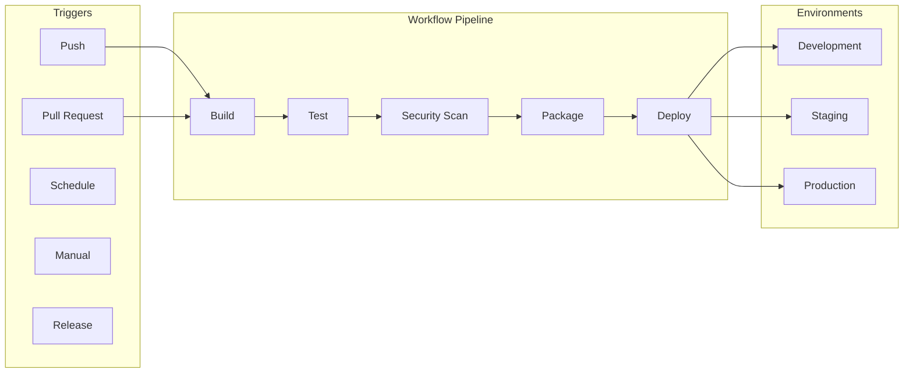
```mermaid
graph LR
    subgraph "Triggers"
        T1[Push]
        T2[Pull Request]
        T3[Schedule]
        T4[Manual]
        T5[Release]
    end

    subgraph "Workflow Pipeline"
        W1[Build] --> W2[Test]
        W2 --> W3[Security Scan]
        W3 --> W4[Package]
        W4 --> W5[Deploy]
    end

    subgraph "Environments"
        E1[Development]
        E2[Staging]
        E3[Production]
    end

    T1 --> W1
    T2 --> W1
    W5 --> E1
    W5 --> E2
    W5 --> E3
```

**核心概念**：

| 概念 | 說明 |
|------|------|
| **Workflow** | 一個完整的自動化流程（`.yml` 檔） |
| **Job** | Workflow 中的一組步驟（可平行） |
| **Step** | Job 中的單一動作 |
| **Action** | 可重用的動作單元 |
| **Runner** | 執行環境（GitHub-hosted / Self-hosted） |
| **Secret** | 加密的環境變數 |
| **Environment** | 部署目標（含保護規則） |

### 8.2 CI Workflow — Java Spring Boot

```yaml
# .github/workflows/ci.yml
name: CI Pipeline

on:
  push:
    branches: [develop, main]
  pull_request:
    branches: [develop, main]
  merge_group:            # 啟用 Merge Queue 時必須（見 7.7）

permissions:
  contents: read
  checks: write
  pull-requests: write

env:
  JAVA_VERSION: '21'
  MAVEN_OPTS: '-Xmx1024m'

jobs:
  build:
    name: Build & Test
    runs-on: ubuntu-latest

    services:
      postgres:
        image: postgres:16
        env:
          POSTGRES_DB: testdb
          POSTGRES_USER: test
          POSTGRES_PASSWORD: test
        ports:
          - 5432:5432
        options: >-
          --health-cmd pg_isready
          --health-interval 10s
          --health-timeout 5s
          --health-retries 5

    steps:
      - name: Checkout
        uses: actions/checkout@v7
        with:
          fetch-depth: 0  # SonarQube 需要完整歷史

      - name: Setup Java
        uses: actions/setup-java@v6
        with:
          distribution: 'temurin'
          java-version: ${{ env.JAVA_VERSION }}
          cache: 'maven'

      - name: Build
        run: mvn compile -B -q

      - name: Unit Tests
        run: mvn test -B

      - name: Integration Tests
        run: mvn verify -P integration-test -B
        env:
          SPRING_DATASOURCE_URL: jdbc:postgresql://localhost:5432/testdb
          SPRING_DATASOURCE_USERNAME: test
          SPRING_DATASOURCE_PASSWORD: test

      - name: Code Coverage
        run: mvn jacoco:report -B

      - name: Upload Coverage
        uses: actions/upload-artifact@v7
        with:
          name: coverage-report
          path: target/site/jacoco/

      - name: Publish Test Results
        uses: dorny/test-reporter@v3
        if: always()
        with:
          name: Test Results
          path: target/surefire-reports/*.xml
          reporter: java-junit

  code-quality:
    name: Code Quality
    runs-on: ubuntu-latest
    needs: build

    steps:
      - uses: actions/checkout@v7
        with:
          fetch-depth: 0

      - uses: actions/setup-java@v6
        with:
          distribution: 'temurin'
          java-version: ${{ env.JAVA_VERSION }}
          cache: 'maven'

      - name: SonarQube Analysis
        run: |
          mvn sonar:sonar \
            -Dsonar.projectKey=svc-order-api \
            -Dsonar.host.url=${{ secrets.SONAR_HOST_URL }} \
            -Dsonar.token=${{ secrets.SONAR_TOKEN }}

      - name: Checkstyle
        run: mvn checkstyle:check -B

      - name: SpotBugs
        run: mvn spotbugs:check -B
```

### 8.3 CI Workflow — Vue 專案

```yaml
# .github/workflows/ci-frontend.yml
name: Frontend CI

on:
  push:
    branches: [develop, main]
    paths:
      - 'src/**'
      - 'package.json'
      - 'vite.config.ts'
  pull_request:
    branches: [develop, main]

jobs:
  lint-and-test:
    name: Lint & Test
    runs-on: ubuntu-latest

    strategy:
      matrix:
        node-version: [22, 24]   # Node 20 已於 2026-04 結束支援

    steps:
      - uses: actions/checkout@v7

      # pnpm 必須在 setup-node 之前安裝，setup-node 的 pnpm 快取才能運作
      - name: Setup pnpm
        uses: pnpm/action-setup@v6
        with:
          version: 10

      - name: Setup Node.js
        uses: actions/setup-node@v7
        with:
          node-version: ${{ matrix.node-version }}
          cache: 'pnpm'

      - name: Install Dependencies
        run: pnpm install --frozen-lockfile

      - name: Lint
        run: pnpm lint

      - name: Type Check
        run: pnpm type-check

      - name: Unit Tests
        run: pnpm test:unit --coverage

      - name: Build
        run: pnpm build

      - name: Upload Build Artifact
        uses: actions/upload-artifact@v7
        with:
          name: dist-${{ matrix.node-version }}
          path: dist/

  e2e:
    name: E2E Tests
    runs-on: ubuntu-latest
    needs: lint-and-test

    steps:
      - uses: actions/checkout@v7
      - uses: pnpm/action-setup@v6
        with:
          version: 10
      - uses: actions/setup-node@v7
        with:
          node-version: 24
          cache: 'pnpm'
      - run: pnpm install --frozen-lockfile

      - name: Playwright Install
        run: pnpm exec playwright install --with-deps

      - name: E2E Tests
        run: pnpm test:e2e

      - name: Upload E2E Report
        uses: actions/upload-artifact@v7
        if: failure()
        with:
          name: playwright-report
          path: playwright-report/
```

### 8.4 CD Workflow — Docker Build & Deploy

```yaml
# .github/workflows/cd.yml
name: CD Pipeline

on:
  push:
    tags:
      - 'v*'

permissions:
  contents: read
  packages: write
  id-token: write
  attestations: write     # 產生 Artifact Attestation（見 8.8）

env:
  REGISTRY: ghcr.io
  IMAGE_NAME: ${{ github.repository }}

jobs:
  build-and-push:
    name: Build & Push Docker Image
    runs-on: ubuntu-latest
    outputs:
      image-tag: ${{ steps.meta.outputs.tags }}
      image-digest: ${{ steps.build.outputs.digest }}

    steps:
      - uses: actions/checkout@v7

      - name: Setup Docker Buildx
        uses: docker/setup-buildx-action@v4

      - name: Login to GHCR
        uses: docker/login-action@v4
        with:
          registry: ${{ env.REGISTRY }}
          username: ${{ github.actor }}
          password: ${{ secrets.GITHUB_TOKEN }}

      - name: Extract Metadata
        id: meta
        uses: docker/metadata-action@v6
        with:
          images: ${{ env.REGISTRY }}/${{ env.IMAGE_NAME }}
          tags: |
            type=semver,pattern={{version}}
            type=semver,pattern={{major}}.{{minor}}
            type=sha

      - name: Build & Push
        id: build
        uses: docker/build-push-action@v7
        with:
          context: .
          push: true
          tags: ${{ steps.meta.outputs.tags }}
          labels: ${{ steps.meta.outputs.labels }}
          cache-from: type=gha
          cache-to: type=gha,mode=max
          provenance: true
          sbom: true

      - name: Attest build provenance
        uses: actions/attest@v4
        with:
          subject-name: ${{ env.REGISTRY }}/${{ env.IMAGE_NAME }}
          subject-digest: ${{ steps.build.outputs.digest }}
          push-to-registry: true

  deploy-staging:
    name: Deploy to Staging
    runs-on: ubuntu-latest
    needs: build-and-push
    environment: staging

    steps:
      - uses: actions/checkout@v7

      - name: Deploy to K8s (Staging)
        uses: azure/k8s-deploy@v7
        with:
          manifests: |
            infra/k8s/staging/
          images: |
            ${{ env.REGISTRY }}/${{ env.IMAGE_NAME }}@${{ needs.build-and-push.outputs.image-digest }}
          namespace: staging

  deploy-production:
    name: Deploy to Production
    runs-on: ubuntu-latest
    needs: [build-and-push, deploy-staging]
    environment: production

    steps:
      - uses: actions/checkout@v7

      - name: Deploy to K8s (Production)
        uses: azure/k8s-deploy@v7
        with:
          manifests: |
            infra/k8s/production/
          images: |
            ${{ env.REGISTRY }}/${{ env.IMAGE_NAME }}@${{ needs.build-and-push.outputs.image-digest }}
          namespace: production
          strategy: canary
          percentage: 20
```

> **說明**：部署時以映像檔 **digest**（`@sha256:...`）而非可變動的 Tag 指定映像，確保 Staging 與 Production 部署的是同一個經過驗證的成品。

### 8.5 Security Workflow

```yaml
# .github/workflows/security.yml
name: Security Scan

on:
  push:
    branches: [main, develop]
  pull_request:
    branches: [main]
  schedule:
    - cron: '0 6 * * 1'  # 每週一 UTC 6:00

permissions:
  contents: read
  security-events: write

jobs:
  codeql:
    name: CodeQL Analysis
    runs-on: ubuntu-latest

    strategy:
      matrix:
        language: ['java']

    steps:
      - uses: actions/checkout@v7

      - name: Initialize CodeQL
        uses: github/codeql-action/init@v4
        with:
          languages: ${{ matrix.language }}
          queries: +security-extended,security-and-quality

      - name: Setup Java
        uses: actions/setup-java@v6
        with:
          distribution: 'temurin'
          java-version: '21'

      - name: Build
        run: mvn compile -B -q -DskipTests

      - name: Perform CodeQL Analysis
        uses: github/codeql-action/analyze@v4
        with:
          category: "/language:${{ matrix.language }}"

  dependency-check:
    name: Dependency Vulnerability Scan
    runs-on: ubuntu-latest

    steps:
      - uses: actions/checkout@v7

      - name: OWASP Dependency Check
        uses: dependency-check/Dependency-Check_Action@1.1.0   # 正式環境建議改以完整 Commit SHA 釘選
        with:
          project: 'svc-order-api'
          path: '.'
          format: 'HTML'
          args: >-
            --failOnCVSS 7
            --enableRetired

      - name: Upload Report
        uses: actions/upload-artifact@v7
        if: always()
        with:
          name: dependency-check-report
          path: reports/

  secret-scan:
    name: Secret Detection
    runs-on: ubuntu-latest

    steps:
      - uses: actions/checkout@v7
        with:
          fetch-depth: 0

      - name: TruffleHog Secret Scan
        uses: trufflesecurity/trufflehog@4dd8831c5f12599465d4d45c3c447b4018a34c85  # v3.97.9
        with:
          extra_args: --only-verified
```

### 8.6 Release Workflow

```yaml
# .github/workflows/release.yml
name: Release

on:
  workflow_dispatch:
    inputs:
      version:
        description: 'Release version (e.g., 1.2.0)'
        required: true
        type: string
      prerelease:
        description: 'Pre-release?'
        required: false
        type: boolean
        default: false

permissions:
  contents: write
  packages: write

jobs:
  release:
    name: Create Release
    runs-on: ubuntu-latest

    steps:
      - uses: actions/checkout@v7
        with:
          fetch-depth: 0

      - name: Setup Java
        uses: actions/setup-java@v6
        with:
          distribution: 'temurin'
          java-version: '21'
          cache: 'maven'

      - name: Set Version
        run: mvn versions:set -DnewVersion=${{ inputs.version }} -B

      - name: Build & Verify
        run: mvn verify -B

      - name: Generate Changelog
        id: changelog
        uses: mikepenz/release-changelog-builder-action@v6
        with:
          configuration: ".github/changelog-config.json"
        env:
          GITHUB_TOKEN: ${{ secrets.GITHUB_TOKEN }}

      - name: Create Tag & Release
        uses: softprops/action-gh-release@v3
        with:
          tag_name: v${{ inputs.version }}
          name: Release v${{ inputs.version }}
          body: ${{ steps.changelog.outputs.changelog }}
          prerelease: ${{ inputs.prerelease }}
          files: |
            target/*.jar
```

### 8.7 Reusable Workflows 與 Composite Actions

**Reusable Workflow**（放在 `wf-shared-actions` Repo）：

```yaml
# .github/workflows/java-ci.yml（Reusable）
name: Java CI Template

on:
  workflow_call:
    inputs:
      java-version:
        required: false
        type: string
        default: '21'
      maven-goals:
        required: false
        type: string
        default: 'verify'
    secrets:
      SONAR_TOKEN:
        required: false

jobs:
  build:
    runs-on: ubuntu-latest
    steps:
      - uses: actions/checkout@v7
      - uses: actions/setup-java@v6
        with:
          distribution: 'temurin'
          java-version: ${{ inputs.java-version }}
          cache: 'maven'
      - run: mvn ${{ inputs.maven-goals }} -B
```

**在其他 Repo 呼叫**：

```yaml
# svc-order-api/.github/workflows/ci.yml
name: CI
on: [push, pull_request]

jobs:
  java-ci:
    uses: acme-bank/wf-shared-actions/.github/workflows/java-ci.yml@v1
    with:
      java-version: '21'
      maven-goals: 'verify'
    secrets:
      SONAR_TOKEN: ${{ secrets.SONAR_TOKEN }}
```

> **實務建議**：
>
> 1. 將共用 Workflow 集中管理在 `wf-shared-actions` Repo
> 2. 使用 `@v1` Tag 版本控制，避免 breaking change 影響所有下游；若組織啟用「Action 必須以 SHA 釘選」政策，呼叫端需改用完整 Commit SHA
> 3. 同一 Repo 內的 Composite Action 或 Reusable Workflow 可使用 `$/` 語法引用正在執行的同一個 Commit（2026-07-30 起，見 [8.9](#89-runner-策略與-repository-層-actions-設定)）
> 4. Runner 類型選擇（GitHub-hosted、Larger runners、Self-hosted、ARC）見 [8.9](#89-runner-策略與-repository-層-actions-設定)

### 8.8 Actions 安全性強化與 2026 路線圖

GitHub Actions 在供應鏈安全與軟體出處驗證（Provenance）方面持續強化，企業於規劃 CI/CD 架構時應同步掌握以下近期與即將生效的變更。

**Immutable Releases（GA 2025-10-28）**：

Release 一旦發布為 Immutable，其資產（Assets）即無法再新增、修改或刪除，GitHub 會自動為這些資產產生簽章的 Provenance Attestation，防止事後竄改。此機制與本文 [8.6 Release Workflow](#86-release-workflow) 中的自動化發布流程直接相關——企業應確認 Release Workflow 產出的成品在發布當下即完整、正確，因為發布後將無法修補既有資產，僅能發布新版本。

**Artifact Attestations 與 `actions/attest`**：

- Artifact Attestations 以 Sigstore 簽章：公開 Repo 使用 Sigstore Public Good Instance（寫入公開透明度日誌），私有 Repo 使用 GitHub 自有的 Sigstore 實例（不寫入公開日誌）
- 單獨使用 Artifact Attestations 可達到 **SLSA v1.0 Build Level 2**；若建置在組織共用的 Reusable Workflow 中執行，可進一步達到 **Build Level 3**
- Free、Pro、Team 方案僅公開 Repo 可用；私有／內部 Repo 需 **Enterprise Cloud**
- `actions/attest-build-provenance` 為底層 `actions/attest` 的包裝；新專案建議直接採用 `actions/attest`
- 只對「會被下游執行或下載」的成品產生 Attestation，不需為每次測試建置簽章；下游以 `gh attestation verify` 驗證

```yaml
# 使用 actions/attest 產生簽章 Provenance
- name: Attest build provenance
  uses: actions/attest@v4
  with:
    subject-path: 'target/*.jar'
```

**OIDC（OpenID Connect）強化**：

| 項目 | 狀態 | 說明 |
|------|------|------|
| Repository Custom Properties 作為 OIDC Claims | ✅ GA | 可依 Repo 自訂屬性（如 `environment`、`cost-center`）建立更細緻的雲端信任策略 |
| OIDC Subject Claim 不可變格式 | ✅ 已生效（2026-07-15 後建立的 Repo） | 預設 `sub` claim 改為包含 Owner 與 Repository ID 的不可變格式，Repo 更名或轉移後不受影響（GitHub Enterprise Server 不適用） |

> ⚠️ **v3.0 更正**：不可變 Subject Claim 已於 2026-07-15 生效，僅適用於該日之後新建立的 Repository。企業現有的雲端 IAM 信任條件若以 `repo:acme-bank/svc-order-api:*` 這類名稱格式撰寫，對新 Repo 將不再相符，需改用新格式或改以 Custom Properties Claims（`repo_property_*`）判斷。

**組織／企業層級 Actions Policy（2025-08-15 起）**：

Organization / Enterprise 管理員現可透過 Actions Policy 設定**封鎖第三方 Action** 或**強制要求所有 Action 以 Commit SHA 釘選（SHA Pinning）**，作為組織層級的強制性規則，而非僅能仰賴各 Repo 各自遵循 [17.2 Security Risk 防範](#172-security-risk-防範) 中「Pin Actions to SHA」的建議寫法。企業可先以「僅告警不阻擋」模式試行，確認不影響既有 Workflow 後再切換為強制模式。

**2026 Actions 安全路線圖**（GitHub Blog，2026-03-26 發布）與目前進度：

| 路線圖項目 | 內容 | 截至 2026-09-25 進度 |
|-----------|------|--------------------|
| **Workflow 依賴鎖定** | 在 Workflow 中新增 `dependencies:` 區段，以 Commit SHA 鎖定所有直接與間接 Action，搭配 `gh actions pin` 指令與 Dependabot 維護 | 意見徵詢／預覽階段，尚未 GA |
| **政策式執行防護** | 集中控管「誰」與「哪些事件」可觸發 Workflow，含 Evaluate 模式 | ✅ **2026-09-17 GA**（見 [8.9](#89-runner-策略與-repository-層-actions-設定)） |
| **Scoped Secrets** | 將 Secret 綁定到特定分支、環境或 Workflow | 尚未 GA |
| **原生 Egress Firewall** | GitHub-hosted Runner 的第 7 層出站流量管控（監控／強制模式） | 尚未 GA |
| **Actions Data Stream** | 近即時執行遙測資料串流至 S3 或 Azure | 尚未 GA |

同期已上線的相關防護：可疑的惡意 Workflow 在公開 Repo 會被暫停等待核准（2026-07-28）、`pull_request_target` 搭配 `actions/checkout` 的預設行為更安全（2026-06-18）、低信任事件的快取改為唯讀（2026-06-26）。

> ⚠️ **v3.0 更正**：v2.2 記載「路線圖將新 Repo 的 `GITHUB_TOKEN` 預設改為唯讀、首次貢獻者預設需核准」，官方路線圖並無此兩項。實際情況是：2023 年 2 月以後建立的組織與企業，`GITHUB_TOKEN` 預設即為唯讀；公開 Repo 的 Fork PR 本來就有「需核准首次貢獻者」等選項。兩者都應在 Organization 層級明確設定，而非仰賴預設值。

> **Actions 定價提醒**：GitHub-hosted Runner 定價已於 2026-01-01 起調降最高達 39%；另一項原訂向 Self-hosted Runner 收取的「雲端平台使用費」提案，因社群反彈已暫緩實施。本文提及的 Runner / Actions 分鐘等定價數字僅供規劃參考，實際請以 [GitHub Actions 定價頁](https://github.com/features/actions)為準，避免以文件中的數字直接編列預算。
>
> **企業建議**：
>
> - 所有 Repository 一律確認 `GITHUB_TOKEN` 採最小權限（唯讀）起手，逐一針對需要的 Job 明確宣告 `permissions`，呼應本文第 9 章與 [17.2 Security Risk 防範](#172-security-risk-防範) 的最小權限原則
> - 對外開源或允許外部貢獻的 Repository，務必確認「首次貢獻者需核准」設定為開啟狀態
> - 涉及正式環境部署或供應鏈簽章的 Workflow，優先採用 Immutable Releases + Artifact Attestations 組合，取得可驗證的軟體出處
> - OIDC 不可變 Claim 已於 2026-07-15 生效，盤點雲端 IAM 信任策略是否仍以 Repo 名稱作為判斷依據
> - 中大型組織建議在 Organization 層級啟用 SHA Pinning 強制政策，取代仰賴個別開發者自律遵循

### 8.9 Runner 策略與 Repository 層 Actions 設定

> 🆕 **v3.0 新增**

**Runner 類型比較**：

| 類型 | 管理方 | 計費 | 主要能力 | 適用情境 |
|------|-------|------|---------|---------|
| **Standard GitHub-hosted** | GitHub | 公開 Repo 免費；私有 Repo 先扣方案內含分鐘數 | Ubuntu（含 26.04，2026-09-17 GA）、Windows、macOS，x64 與 arm64 | 一般 CI |
| **Larger runners** | GitHub | **一律按分鐘計費**（公開 Repo 也不例外），不適用方案內含分鐘數 | 更多 CPU／RAM／磁碟、GPU、靜態 IP、Azure 私有網路、自訂映像、Runner Group | 大型建置、需固定 IP 連內部防火牆、GPU 工作 |
| **Self-hosted** | 企業自行維運 | 不計 Actions 分鐘數（原訂 2026-03 起收取的平台費已暫緩） | 可存取內網、使用特殊硬體或授權軟體 | 受監管環境、內網部署 |
| **Actions Runner Controller（ARC）** | 企業自行維運（Kubernetes） | 同 Self-hosted | 以 Runner Scale Set 依工作量自動擴縮，Runner 為短效容器 | 大量 Self-hosted 需求、需要彈性擴縮 |

**2026 年 Actions 定價與平台變動**：

| 日期 | 變動 | 影響 |
|------|------|------|
| 2026-01-01 | GitHub-hosted Runner 價格調降最高 39%（例如 Linux 2-core 由 $0.008 降至 $0.006／分鐘） | 重新評估 Self-hosted 的成本效益 |
| 2025-12 公告 → 暫緩 | 原訂 2026-03-01 起對私有 Repo 所有 Workflow（含 Self-hosted）收取每分鐘 $0.002 平台費，因社群反彈於 48 小時內宣布暫緩 | 目前 Self-hosted 仍不計費，但應持續追蹤 |
| 2026-06-12 | Self-hosted Runner 最低版本強制檢查恢復執行 | Runner 需定期更新，否則無法接收工作 |
| 2026-09-23 | **Node 20 自 GitHub Actions 移除**，JavaScript Action 一律以 Node 24 執行 | 使用舊版 Action（如 `actions/checkout@v4`）的 Workflow 應升級至最新主版本 |
| 2026-10-01 | Actions 保留政策擴及 checks、workflow runs 與 statuses | 稽核需要的執行紀錄應另行匯出 |

GitHub Copilot code review 與 Copilot cloud agent 也在 GitHub Actions 上執行：私有 Repo 會消耗 Actions 分鐘數，組織若停用 GitHub-hosted Runner，Code Review 的進階（agentic）能力將無法使用，需改設定 Larger runners 或 ARC。

**Repository 層 Actions 設定基準**（Settings → Actions → General）：

| 設定 | 建議值 | 說明 |
|------|-------|------|
| Actions permissions | Allow enterprise／org actions + 指定的外部 Action | 搭配「Require actions to be pinned to a full-length commit SHA」 |
| Fork pull request workflows | 需核准首次貢獻者（公開 Repo 建議「所有外部貢獻者」） | 防止惡意 PR 直接執行 |
| Workflow permissions（`GITHUB_TOKEN` 預設權限） | **Read repository contents and packages permissions** | 需要寫入的 Job 以 `permissions:` 明確宣告 |
| Allow GitHub Actions to create and approve pull requests | 關閉（除非有明確需求） | 避免 Workflow 自行核准 PR 繞過審查 |
| Artifact and log retention | 依稽核政策（例如 30～90 天） | 過長會增加儲存費用 |
| Cache | 依需求設定 `cache-mode`（2026-09 起提供 `read`、`write`、`write-only`、`none`） | 低信任事件（如 `pull_request_target`）預設為唯讀快取 |

**Workflow 執行防護（Workflow execution protections，2026-09-17 GA）**：Enterprise、Organization 與 Repository 層可設定兩類規則，在 Workflow 執行前先行評估：

- **Actor rules**：誰可以觸發 Workflow（例如 `deploy.yml` 只允許 `release-managers` 觸發）
- **Event rules**：哪些事件可以觸發 Workflow（例如禁止 `pull_request_target`）

規則可指定到個別 Workflow 檔案、提供 Evaluate（僅記錄不阻擋）模式與 REST API。GitHub 並對**公開 Repo** 推出預設規則：尚未設定事件政策的公開 Repo，`pull_request_target` 觸發將被停用；目前為 Evaluate 模式，**2026-11-02 起正式強制**。仍依賴此事件的公開 Repo 必須在期限前明確設定允許政策。

**同 Repo Action 的 `$/` 語法**（2026-07-30 起提供，需 Runner 2.336.0 以上）：`uses:` 以 `$/` 開頭時，會解析為「目前正在執行的同一個 Repo、同一個 Commit」，不需 checkout 即可引用同 Repo 內的 Composite Action 或 Reusable Workflow，且自動符合 SHA 釘選政策。

> **企業建議**：
>
> - 將「最低 Runner 版本」與「Action 主版本」納入每月維運檢查，Node 20 移除這類平台變動會直接讓舊 Workflow 失效
> - 公開 Repo 請在 2026-11-02 前檢查所有 `pull_request_target` Workflow，並以 Evaluate 模式確認影響範圍
> - Larger runners 沒有免費額度，應設定 Runner Group 與並行上限，避免成本失控

---

## 第 9 章 DevSecOps 與 SSDLC

> 📌 **本章摘要**：本章將安全嵌入開發每個階段：GHAS（Secret Protection / Code Security）方案與計費、CodeQL、Dependabot、Secret Scanning、容器安全、Private Vulnerability Reporting、開源授權合規、Dependency Review，以及 Security Campaigns、Autofix 與 Delegated Bypass。

### 9.1 SSDLC 流程總覽

**Secure Software Development Lifecycle（SSDLC）** 將安全活動嵌入軟體開發每個階段：

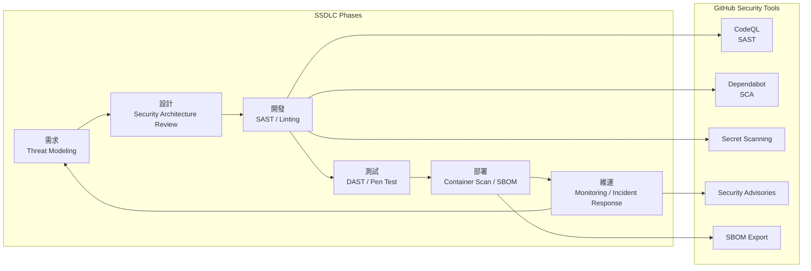
```mermaid
graph LR
    subgraph "SSDLC Phases"
        P1[需求<br/>Threat Modeling] --> P2[設計<br/>Security Architecture Review]
        P2 --> P3[開發<br/>SAST / Linting]
        P3 --> P4[測試<br/>DAST / Pen Test]
        P4 --> P5[部署<br/>Container Scan / SBOM]
        P5 --> P6[維運<br/>Monitoring / Incident Response]
        P6 --> P1
    end

    subgraph "GitHub Security Tools"
        G1[CodeQL<br/>SAST]
        G2[Dependabot<br/>SCA]
        G3[Secret Scanning]
        G4[Security Advisories]
        G5[SBOM Export]
    end

    P3 --> G1
    P3 --> G2
    P3 --> G3
    P5 --> G5
    P6 --> G4
```

**GitHub Advanced Security (GHAS) 功能矩陣**：

自 2025 年 4 月起，GitHub 已將原本綁定 Enterprise 方案的 GitHub Advanced Security（GHAS）拆分為兩項可獨立加購的產品——**GitHub Secret Protection**（依每位活躍提交者計費）與 **GitHub Code Security**（依每位活躍提交者計費），兩者皆可由 **Team 或 Enterprise Cloud** 組織單獨採購，**不再要求企業必須升級至 Enterprise 才能取得 Secret Scanning、Push Protection 或 CodeQL 等能力**。活躍提交者指過去 90 天內有 Commit 推送到已啟用該產品之 Repo 的人員，GitHub App Bot 不計入：

| 功能 | 所有方案內建 | GitHub Secret Protection ⚠️ 需加購 | GitHub Code Security ⚠️ 需加購 |
|------|-----------|------|------|
| Dependabot Alerts | ✅ | — | — |
| Dependabot Updates | ✅ | — | — |
| Secret Scanning（公開 Repo） | ✅ | — | — |
| Secret Scanning（私有 / 內部 Repo） | ❌ | ✅ | — |
| Push Protection | ❌ | ✅ | — |
| 自訂 Secret Pattern / Validity Check | ❌ | ✅ | — |
| CodeQL / Code Scanning（公開 Repo） | ✅ | — | — |
| CodeQL / Code Scanning（私有 / 內部 Repo） | ❌ | — | ✅ |
| Copilot Autofix（私有 / 內部 Repo） | ❌ | — | ✅ |
| Dependency Review（私有 / 內部 Repo） | ❌ | — | ✅ |
| Delegated Bypass（Push Protection） | ❌ | ✅ | — |
| Security Campaigns | ❌ | ✅ | ✅ |
| Security Overview（組織級安全儀表板） | ❌ | ✅ | ✅ |

**計費費率**（每位活躍提交者／月，實際金額請以 [GitHub 官方定價頁](https://github.com/pricing)為準）：

| 產品                      | 費率                      |
| ------------------------- | ------------------------- |
| GitHub Secret Protection  | US$19 / 活躍提交者 / 月  |
| GitHub Code Security      | US$30 / 活躍提交者 / 月  |

> **2026 年更新：硬性預算上限**：GitHub 已為 GHAS 兩項產品提供 SKU 層級的**硬性預算（Limit usage when budget limit is reached）**。
>
> ⚠️ **v3.0 更正**：v2.2 記載「用量達上限後不再產生新費用」並不正確。依官方說明，達到預算上限後只會**阻止在更多 Repo 啟用**，不會停用已啟用的 Repo；已啟用 Repo 若出現新的活躍提交者，或啟用時的提交者數超出剩餘預算，仍會產生超出預算的費用。預算應視為「控制擴大範圍」的工具，而非絕對的支出上限。
>
> **企業建議**：規劃預算時應以「每位活躍提交者」為單位分別評估 Secret Protection 與 Code Security 的採購範圍，兩者可依 Repo 敏感程度分開導入（例如僅對處理機敏資料的 Repo 加購 Secret Protection），不必比照舊制一次性綁定 Enterprise 方案；並建議搭配硬性預算上限功能，避免大型組織因提交者人數變動而產生非預期帳單。

### 9.2 SAST — 靜態應用程式安全測試

**CodeQL 配置**：

```yaml
# .github/codeql/codeql-config.yml
name: "Enterprise CodeQL Config"
disable-default-queries: false

queries:
  - uses: security-extended
  - uses: security-and-quality

paths-ignore:
  - '**/test/**'
  - '**/generated/**'

query-filters:
  - exclude:
      tags: /correctness/  # 排除正確性類（僅聚焦安全）
```

**常見 Java 安全漏洞偵測**：

| CWE | 漏洞類型 | CodeQL 偵測 | 修復方式 |
|-----|---------|------------|---------|
| CWE-89 | SQL Injection | ✅ | 使用 Prepared Statement |
| CWE-79 | XSS | ✅ | Output Encoding |
| CWE-502 | Deserialization | ✅ | 白名單反序列化 |
| CWE-611 | XXE | ✅ | 禁用外部實體 |
| CWE-22 | Path Traversal | ✅ | 正規化路徑檢查 |
| CWE-327 | Weak Crypto | ✅ | 使用 AES-256-GCM |
| CWE-798 | Hard-coded Credentials | ✅ | 使用 Vault / Secrets |

### 9.3 Dependency Scan — Dependabot

```yaml
# .github/dependabot.yml
version: 2
updates:
  # Maven 依賴
  - package-ecosystem: "maven"
    directory: "/"
    schedule:
      interval: "weekly"
      day: "monday"
      time: "06:00"
      timezone: "Asia/Taipei"
    open-pull-requests-limit: 10
    labels:
      - "dependencies"
      - "security"
    reviewers:
      - "acme-bank/tech-leads"
    commit-message:
      prefix: "deps"
      include: "scope"
    # 安全更新永遠建立 PR
    allow:
      - dependency-type: "all"
    ignore:
      - dependency-name: "org.springframework.boot"
        update-types: ["version-update:semver-major"]
    groups:
      spring:
        patterns:
          - "org.springframework*"
      testing:
        patterns:
          - "org.junit*"
          - "org.mockito*"
          - "org.assertj*"

  # GitHub Actions
  - package-ecosystem: "github-actions"
    directory: "/"
    schedule:
      interval: "weekly"
    labels:
      - "ci"
      - "dependencies"

  # Docker
  - package-ecosystem: "docker"
    directory: "/"
    schedule:
      interval: "weekly"
```

**私有 GitHub Packages Registry 認證**：自 2026-09-08 起，Dependabot 會自動以 `GITHUB_TOKEN`（`packages: read`）向組織的私有 GitHub Packages（`*.pkg.github.com` 與 `ghcr.io`）認證，**不需要**在 `dependabot.yml` 設定 `registries`，也不再需要 PAT。唯一要做的是：由套件維護者在每個套件的 **Package settings → Manage Actions access** 中，將執行 Dependabot 的 Repository 加入並授予 **Read** 權限。

```yaml
# 私有 GitHub Packages：無需額外設定，Dependabot 自動認證
  - package-ecosystem: "maven"
    directory: "/"
    schedule:
      interval: "weekly"

# 其他私有 Registry（如 Artifactory）仍需明確設定，並使用 Dependabot Secrets
registries:
  artifactory:
    type: maven-repository
    url: https://artifactory.acme-bank.com/maven
    username: dependabot-reader
    password: ${{ secrets.ARTIFACTORY_TOKEN }}   # 設定於 Settings → Secrets → Dependabot
```

明確設定的 Registry 認證仍具有優先權，自動的 GitHub Packages 認證僅作為後備。

> ⚠️ **v3.0 更正**：v2.2 範例在 `dependabot.yml` 以 `${{ secrets.GITHUB_TOKEN }}` 設定 Registry，此寫法無效（`dependabot.yml` 只能引用 Dependabot Secrets）；另「已關閉 Dependabot 告警的雲端資料保留政策」正確生效日為 **2026-09-25**（v2.2 誤植為 08-25）。
>
> **企業建議**：有稽核或合規留存需求的企業，應透過 REST API 定期匯出已關閉告警的歷史資料並封存，避免保留期限屆滿後無法追溯。

### 9.4 Secret Scanning

**啟用與配置** ⚠️ 需 GitHub Secret Protection（Free / Team / Enterprise 均可獨立加購，詳見 [9.1 SSDLC 流程總覽 — GHAS 功能矩陣](#91-ssdlc-流程總覽)）：

```bash
# 啟用 Secret Scanning
gh api repos/acme-bank/svc-order-api \
  -X PATCH \
  -f security_and_analysis.secret_scanning.status="enabled" \
  -f security_and_analysis.secret_scanning_push_protection.status="enabled"
```

**自訂 Secret Pattern**（⚠️ 需 GitHub Secret Protection）：自訂模式在 Repository、Organization 或 Enterprise 的 Settings → Advanced Security → Custom patterns 中建立，2026-07-13 起也可用 REST API 管理；可先以「Dry run」預覽誤判情況，再決定是否納入 Push Protection。下方為規劃用的模式清單（示意格式，並非 GitHub 可直接讀取的設定檔）：

```yaml
# 自訂模式規劃清單（示意）
patterns:
  - name: "Internal API Key"
    pattern: "ACME-KEY-[A-Za-z0-9]{32}"
    description: "內部 API Key 格式"

  - name: "Database Connection String"
    pattern: "jdbc:(postgresql|mysql)://[^\\s]+"
    description: "資料庫連線字串"

  - name: "JWT Secret"
    pattern: "jwt[_-]?secret[\"'=:\\s]+[A-Za-z0-9+/]{32,}"
    description: "JWT 密鑰"
```

**Secret 洩漏處理 SOP**：

1. 收到 Secret Scanning Alert
2. 立即 Rotate（輪換）該 Secret
3. 檢查 Audit Log 確認是否被濫用
4. 從 Git 歷史移除（官方建議使用 `git filter-repo`；`git filter-branch` 已不建議使用），並聯絡 GitHub Support 清除快取的檢視與 PR 參考
5. 通報資安團隊
6. 更新 `.gitignore` 與 Push Rulesets 防止再次發生

> **注意**：Secret 一旦被推送到 GitHub 就應視為已外洩——即使改寫歷史，也可能已被 Clone、Fork 或快取。**輪換（Rotate）才是唯一有效的處置**，改寫歷史只是清理步驟。

### 9.5 CodeQL 進階分析

**PR 增量掃描（Incremental Scanning）**：CodeQL 的 Pull Request 增量掃描目前已擴大支援 **C/C++ 與 Go**（原本已支援 JavaScript/TypeScript、Java、Python 等主流語言），PR 掃描僅針對變更範圍分析而非重新掃描整個 Repository，大幅縮短大型 Monorepo 的 PR 檢查等待時間。

**自訂 Query（偵測特定模式）**：

```ql
/**
 * @name Hardcoded database password
 * @description Finds hardcoded passwords in database configuration
 * @kind problem
 * @problem.severity error
 * @security-severity 9.0
 * @id java/hardcoded-db-password
 * @tags security
 */

import java
import semmle.code.java.dataflow.DataFlow

from StringLiteral literal, MethodCall call
where
  call.getMethod().getName().matches("%password%") and
  DataFlow::localFlow(DataFlow::exprNode(literal), DataFlow::exprNode(call.getAnArgument())) and
  literal.getValue().length() > 3
select literal, "Hardcoded password found: potential security risk"
```

> **補充**：CodeQL Java 函式庫已將 `MethodAccess` 更名為 `MethodCall`，舊名稱已棄用。CodeQL 2.27.0（2026-09）起支援 Linux ARM64，並將「all-platform」CLI 套件標示為棄用。

### 9.6 Container Security

```yaml
# .github/workflows/container-security.yml
name: Container Security

on:
  push:
    paths:
      - 'Dockerfile'
      - '.dockerignore'

jobs:
  scan:
    runs-on: ubuntu-latest
    steps:
      - uses: actions/checkout@v7

      - name: Build Image
        run: docker build -t app:scan .

      - name: Trivy Vulnerability Scan
        uses: aquasecurity/trivy-action@ed142fd0673e97e23eac54620cfb913e5ce36c25  # v0.36.0
        with:
          image-ref: 'app:scan'
          format: 'sarif'
          output: 'trivy-results.sarif'
          severity: 'CRITICAL,HIGH'

      - name: Upload Trivy Results
        uses: github/codeql-action/upload-sarif@v4
        with:
          sarif_file: 'trivy-results.sarif'

      - name: Hadolint - Dockerfile Lint
        uses: hadolint/hadolint-action@v3.5.0
        with:
          dockerfile: Dockerfile
          failure-threshold: warning

      - name: Generate SBOM
        uses: anchore/sbom-action@v0
        with:
          image: 'app:scan'
          format: spdx-json
          output-file: sbom.spdx.json

      - name: Upload SBOM
        uses: actions/upload-artifact@v7
        with:
          name: sbom
          path: sbom.spdx.json
```

> ⚠️ **真實事件（2026-03-19）**：Trivy 生態系遭入侵，攻擊者將 `aquasecurity/trivy-action` 77 個版本 Tag 中的 76 個強制改指向竊取憑證的惡意 Commit，並發佈惡意的 Trivy v0.69.4；惡意程式會傾印 Runner 記憶體中的 Secret、SSH 金鑰與雲端憑證。以 `@master` 或 `@v0.x` Tag 引用的 Workflow 在事件期間都會執行惡意程式碼；**以完整 Commit SHA 釘選的 Workflow 則不受影響**。這是 [17.2](#172-security-risk-防範) 「Pin Actions to SHA」原則最直接的例證。

### 9.7 完整 Security Pipeline YAML

```yaml
# .github/workflows/security-full.yml
name: Full Security Pipeline

on:
  push:
    branches: [main]
  schedule:
    - cron: '0 2 * * *'  # 每日凌晨 2:00 完整掃描

jobs:
  sast:
    name: SAST (CodeQL)
    uses: acme-bank/wf-shared-actions/.github/workflows/codeql.yml@v1

  sca:
    name: SCA (Dependency Check)
    uses: acme-bank/wf-shared-actions/.github/workflows/dependency-check.yml@v1

  secret:
    name: Secret Detection
    uses: acme-bank/wf-shared-actions/.github/workflows/secret-scan.yml@v1

  container:
    name: Container Scan
    needs: [sast, sca]
    uses: acme-bank/wf-shared-actions/.github/workflows/container-scan.yml@v1

  report:
    name: Security Report
    needs: [sast, sca, secret, container]
    runs-on: ubuntu-latest
    steps:
      - name: Aggregate Results
        run: echo "All security checks passed ✅"

      - name: Notify on Failure
        if: failure()
        uses: slackapi/slack-github-action@v4
        with:
          webhook: ${{ secrets.SECURITY_SLACK_WEBHOOK }}
          webhook-type: incoming-webhook
          payload: |
            {
              "text": "🚨 Security scan failed for ${{ github.repository }}"
            }
```

> **實務建議**：安全掃描應同時在 PR 和定期排程執行。PR 掃描確保新程式碼安全，排程掃描捕捉新發現的 CVE 對既有程式碼的影響。

### 9.8 Private Vulnerability Reporting

GitHub 提供 **Private Vulnerability Reporting（私密漏洞通報）** 功能，允許安全研究者透過標準化流程向 Repository 維護者私密通報安全漏洞，避免在 Public Issue 中公開揭露。

**啟用方式**：

```bash
# 在 Repository 層級啟用 Private Vulnerability Reporting
gh api repos/acme-bank/svc-order-api/private-vulnerability-reporting -X PUT

# 確認狀態
gh api repos/acme-bank/svc-order-api/private-vulnerability-reporting --jq '.enabled'

# 在 Organization 層級統一啟用：透過 Security Configuration 套用至所有 Repo
# Settings → Advanced Security → Configurations → Private vulnerability reporting: Enabled
```

> ⚠️ **v3.0 更正**：v2.2 的指令實際上是啟用 Secret Scanning，而非 Private Vulnerability Reporting。依官方說明，Private Vulnerability Reporting 適用於**公開 Repository**；私有 Repo 的內部漏洞通報可使用 2026-07-08 GA 的 **InnerSource Security Advisories**（需 Advanced Security），將 Advisory 限定在組織內部可見。

**通報流程**：

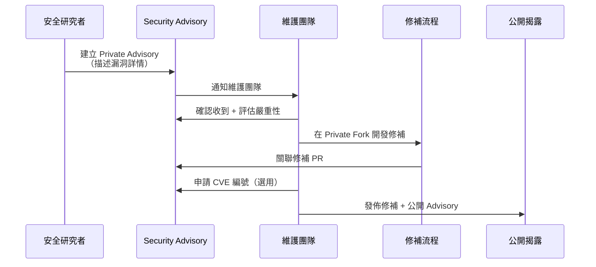
```mermaid
sequenceDiagram
    participant Researcher as 安全研究者
    participant Advisory as Security Advisory
    participant Team as 維護團隊
    participant Fix as 修補流程
    participant Public as 公開揭露

    Researcher->>Advisory: 建立 Private Advisory<br/>（描述漏洞詳情）
    Advisory->>Team: 通知維護團隊
    Team->>Advisory: 確認收到 + 評估嚴重性
    Team->>Fix: 在 Private Fork 開發修補
    Fix->>Advisory: 關聯修補 PR
    Team->>Advisory: 申請 CVE 編號（選用）
    Team->>Public: 發佈修補 + 公開 Advisory
```

**Security Advisory 範本**：

```markdown
## 漏洞摘要
[簡要描述漏洞類型與影響]

## 影響版本
- v2.0.0 ~ v2.3.1

## 嚴重性
CVSS 3.1 Score: 8.5 (High)

## 重現步驟
1. [步驟一]
2. [步驟二]
3. [觀察到的安全問題]

## 修補建議
升級至 v2.3.2 或以上版本

## 時間軸
- 2026-01-15: 收到通報
- 2026-01-17: 確認漏洞
- 2026-01-24: 修補完成
- 2026-01-25: 公開揭露
```

**企業 Security Advisory 管理策略**：

| 階段 | SLA | 負責人 | 產出 |
|------|-----|--------|------|
| **收到通報** | 24 小時內確認 | 資安團隊 | 確認回覆 |
| **嚴重性評估** | 72 小時內 | 資安 + 開發 | CVSS 評分 |
| **修補開發** | 7 天（Critical）/ 30 天（High） | 開發團隊 | 修補 PR |
| **驗證測試** | 修補後 48 小時 | QA 團隊 | 測試報告 |
| **公開揭露** | 修補發佈後 | 資安團隊 | Public Advisory |

**2026 年 PVR 生態現況**（資料來源：GitHub Blog〈Inside the Advisory Database and what happens when vulnerability volume breaks records〉）：隨著 AI 輔助漏洞探勘工具普及，Private Vulnerability Reporting 的使用量與 GitHub Advisory Database 的審核負荷在 2026 年出現顯著成長：

| 指標 | 數據 |
|------|------|
| 已啟用 PVR 的 Repository 數 | 170 萬+ |
| 每週通報量（2026-01） | 約 550 件 |
| 每週通報量（2026-05） | 3,000+ 件（成長逾 5 倍） |
| 單月審核通過並公開的 Advisory 數（2026-05） | 1,560 筆（約為常態值的 5 倍） |

GitHub 官方已公開說明，儘管審核流程已導入 AI 輔助分類與初步篩選，但**人工審核仍為強制流程**，在通報量暴增下，目前**有相當比例的通報存在數週等級的審核延遲**。

> **企業建議**：
>
> - 所有 Production Repository 務必啟用 Private Vulnerability Reporting，並在 SECURITY.md 中清楚說明通報管道與回應 SLA。這不僅是安全最佳實踐，也展現組織對資安的重視
> - **重新檢視內部 SLA 假設**：上表「公開揭露」階段不應預期與 GitHub 官方 Advisory Database 的公開審核同步完成，企業應規劃比過往更長的官方公告等待緩衝期，內部修補與通報者溝通的 SLA 不應與「官方 Advisory 是否已公開」畫上等號
> - 對高風險/高曝險的 Repository，建議另外建立內部漏洞追蹤看板，不完全依賴 GitHub Advisory Database 的公開時程作為唯一稽核依據

### 9.9 開源授權合規檢查

企業大量採用開源依賴的同時，也承擔了授權條款不相容或不合規的法律風險（例如 Copyleft 授權要求衍生作品需一併開源）。GitHub 於 **2026-06-30 開放公開預覽** 的 **Open Source License Compliance（開源授權合規檢查）** 功能，讓組織可直接在依賴管線中攔截不合規授權的套件，而非等到法務事後稽核才發現問題。

**核心能力**：

- 於 Organization 層級定義**授權白名單 / 黑名單**（如允許 MIT、Apache-2.0，禁止 AGPL-3.0、GPL-3.0 等 Copyleft 授權）
- 與既有 Dependency Graph / Dependabot 管線（詳見 [9.3 Dependency Scan](#93-dependency-scan--dependabot)）整合，掃描結果可標記出違反授權政策的依賴
- 可設定為**阻擋（Block）**不合規依賴的 PR 合併，或僅產生**告警（Warn）**供人工審查

**設定範例**（`Settings → Code security → License policy`）：

```yaml
# 授權合規政策示意（實際透過 GitHub UI / API 設定）
license_policy:
  allowed:
    - MIT
    - Apache-2.0
    - BSD-3-Clause
    - ISC
  denied:
    - AGPL-3.0
    - GPL-3.0
    - SSPL-1.0
  unknown_license_action: "warn"   # 授權無法辨識時的處理方式
  enforcement: "block_pr"          # block_pr | warn_only
```

> **企業建議**：
>
> - 將授權合規檢查與 [4.6 SECURITY.md 與 CONTRIBUTING.md](#46-securitymd-與-contributingmd)、CODEOWNERS 的治理模式搭配——授權政策變更應視為需要法務 / 架構團隊 Review 的治理性設定
> - 金融、醫療等高合規要求產業，建議優先以 `block_pr` 模式強制執行，避免不合規依賴進入正式環境後才移除，增加下游影響範圍
> - 此功能目前為公開預覽階段，正式導入前建議先以 `warn_only` 模式試營運一個週期，確認政策設定不會誤傷既有合規依賴

### 9.10 Dependency Graph 與 Dependency Review

> 🆕 **v3.0 新增**

Dependabot alerts（[9.3](#93-dependency-scan--dependabot)）處理的是「已經存在」的弱點；**Dependency Review** 則在 PR 階段攔截「即將引入」的弱點與不合規授權，是左移（Shift Left）最有效的一道關卡。兩者都建立在 **Dependency Graph** 之上。

**三者關係**：

| 元件 | 作用 | 可用範圍 |
|------|------|---------|
| **Dependency Graph** | 解析 manifest 與 lock 檔（或透過 Dependency Submission API 上傳），列出直接與間接依賴、授權、弱點；可匯出 SBOM（SPDX） | 公開 Repo 預設開啟；私有 Repo 可自行開啟 |
| **Dependency Review（PR 內的差異檢視）** | 在 PR 的 Files changed 顯示新增／移除／升級的依賴與已知弱點 | 公開 Repo；私有 Repo 需 GitHub Code Security |
| **`dependency-review-action`** | 在 CI 中檢查依賴變更，發現弱點或違規授權時讓檢查失敗 | 同上 |

**Dependency Review Workflow**：

```yaml
# .github/workflows/dependency-review.yml
name: Dependency Review
on: pull_request

permissions:
  contents: read
  pull-requests: write   # 需要在 PR 留下摘要留言時才開啟

jobs:
  dependency-review:
    runs-on: ubuntu-latest
    steps:
      - uses: actions/checkout@v7
      - uses: actions/dependency-review-action@v5
        with:
          fail-on-severity: high                 # High 以上弱點即失敗
          deny-licenses: AGPL-3.0, GPL-3.0, SSPL-1.0
          comment-summary-in-pr: on-failure
```

**以 Ruleset 強制所有 Repo 執行**：Organization Owner 可在組織級 Ruleset 中將 Dependency Review Workflow 設為「必要 Workflow（Require workflows to pass before merging）」，讓 PR 只能在該檢查通過後合併，不必逐一修改每個 Repo 的 Workflow 檔案。

**使用 Dependency Submission API 時的注意事項**：若依賴是在建置過程中產生（例如 Gradle、Maven 動態解析），需先由建置流程上傳至 Dependency Submission API，Dependency Review 才看得到完整資料。建議兩者放在**同一個 Workflow** 並控制執行順序；若分開執行，需設定 `retry-on-snapshot-warnings: true` 與略長於建置時間的 `retry-on-snapshot-warnings-timeout`，避免競態造成漏檢。

**SBOM 匯出**：

```bash
# 從 Dependency Graph 匯出 SPDX 格式 SBOM
gh api repos/acme-bank/svc-order-api/dependency-graph/sbom --jq '.sbom' > sbom.spdx.json
```

> **企業建議**：
>
> - Dependency Review 與 [9.9 開源授權合規檢查](#99-開源授權合規檢查) 的授權清單應由同一份法務政策產生，避免兩處規則不一致
> - 2026-07-14 起 Dependabot 版本更新會等新版本在套件登錄處發佈滿 3 天才開 PR，可降低「惡意新版本」風險；緊急安全更新不受此限
> - Dependabot 已可在未提供 PAT 的情況下讀取組織的私有 GitHub Packages（2026-09-08），套件維護者需在套件的「Manage Actions access」授予讀取權限

### 9.11 Security Campaigns、Autofix 與 Delegated Bypass

> 🆕 **v3.0 新增**

開啟掃描只是起點，企業真正的挑戰是**消化既有的告警存量**與**管理例外**。GitHub 提供三類機制處理這兩件事。

**1. Copilot Autofix 與 Agentic Autofix**：

| 模式 | 運作方式 | 授權與計費 | 狀態 |
|------|---------|-----------|------|
| **Copilot Autofix** | 針對 Code Scanning 告警產生單一修正建議，由開發者審閱後套用 | 公開 Repo 免費；私有／內部 Repo 需 GitHub Code Security；**不需** Copilot 授權、不消耗 AI Credits | GA；使用 CodeQL 的 Repo 預設啟用 |
| **Agentic Autofix** | 將告警指派給 Copilot，由 Copilot cloud agent 探索程式碼、產生修正、重跑 CodeQL 驗證，最後開出 PR | 需 Copilot cloud agent 與 Copilot Autofix 皆可用；以 cloud agent Session 計費並消耗 AI Credits | 公開預覽（2026-07-10） |

Agentic Autofix 以 CodeQL 預設查詢套件重新驗證修正結果，因此無法確認自訂查詢或 `security-extended` 套件告警是否已被修正，第三方工具告警的修正品質也不保證，PR 仍須依一般流程審查。

**2. Security Campaigns（安全修補戰役）**：由資安團隊在 Security Overview 中挑選一批告警（例如「所有 SQL Injection」或「特定 CWE」），設定期限與負責人，集中推動修補並追蹤進度；戰役中的告警可直接指派給 Copilot cloud agent 自動產生修補 PR。可用於 Team 或 Enterprise Cloud 且已啟用 GitHub Code Security 或 Secret Protection 的組織。

**3. Delegated Bypass 與 Delegated Dismissal**：

| 機制 | 解決的問題 | 運作方式 |
|------|-----------|---------|
| **Push Protection 的 Delegated Bypass** | 開發者被 Push Protection 擋下時，自行按「允許」繞過會失去管控 | 繞過需提出申請，由指定的審核者（例如 security-team）核准或拒絕，全程留下紀錄 |
| **Delegated Alert Dismissal** | 開發者自行把告警標記為「誤判」或「不處理」 | 關閉告警需經審核者同意 |

Delegated Bypass 可用於 Team 或 Enterprise Cloud 且已啟用 GitHub Secret Protection 的組織 Repo。

**2026 年相關更新**（依 GitHub Changelog）：

| 日期 | 更新 |
|------|------|
| 2026-07-14 | Code Scanning 在 PR 上顯示 AI 安全偵測結果，涵蓋 CodeQL 不支援的語言 |
| 2026-08-04 | 可在組織規模自訂 Code Scanning Default Setup 設定 |
| 2026-08-20 | Code Scanning 新增「Mitigated」撤銷原因（已由外部控制措施緩解） |
| 2026-09-09 | Ruleset 可阻擋含外洩 Secret 的 PR 合併 |
| 2026-09-15 | Enterprise 可強制 GitHub Advanced Security 設定，下層管理員無法覆寫 |
| 2026-09-16 | Code Scanning 的 AI Scan 不再需要先啟用 CodeQL Default Setup |
| 2026-09-25 | 已關閉的 Dependabot 告警開始適用雲端資料保留政策 |

> **企業建議**：
>
> - 以「每季一個 Security Campaign」的節奏處理告警存量，優先處理可被外部觸及的服務（依 [2.6](#26-custom-properties-與-repository-分類治理) 的 `service-tier` 篩選）
> - 所有 Tier-0／Tier-1 Repo 啟用 Delegated Bypass，讓 Push Protection 的每一次繞過都有核准紀錄
> - Agentic Autofix 產生的 PR 與人工 PR 走相同的 Ruleset 與審查流程，不因為是 AI 產生就放寬

---

## 第 10 章 文件管理策略

> 📌 **本章摘要**：文件應與程式碼一起版控與審查。本章涵蓋 README 分層、ADR、OpenAPI 文件管理與破壞性變更檢查、Wiki 與 Docs Repository 的取捨，以及以 GitHub Actions 發佈 GitHub Pages。

### 10.1 README Strategy

**README 分層策略**：

| 層級 | 位置 | 內容 | 目標讀者 |
|------|------|------|---------|
| **Organization** | `.github` repo 的 `profile/README.md` | 公司簡介、導覽 | 所有成員 |
| **Repository** | 根目錄 `README.md` | 專案說明、快速開始 | 開發者 |
| **Directory** | 各目錄 `README.md` | 目錄用途說明 | 維護者 |
| **API** | `docs/api/README.md` | API 使用指南 | API 消費者 |

**README 品質評分標準**：

- [ ] 有清楚的一句話描述專案用途
- [ ] 有 CI/CD Badge
- [ ] 有「快速開始」步驟（< 5 步）
- [ ] 有技術棧列表
- [ ] 有 API 文件連結
- [ ] 有聯絡人 / 負責團隊
- [ ] 有架構圖或流程圖
- [ ] 有貢獻指南連結

### 10.2 Architecture Decision Record（ADR）

**ADR Template**：

```markdown
# ADR-{number}: {title}

## Status
{Proposed | Accepted | Deprecated | Superseded by ADR-xxx}

## Context
描述面臨的問題或決策背景。

## Decision
說明做出的決策。

## Consequences
### Positive
- 正面影響

### Negative
- 負面影響 / 取捨

### Risks
- 潛在風險

## Alternatives Considered
| 方案 | 優點 | 缺點 | 結論 |
|------|------|------|------|
| 方案 A | ... | ... | ✅ 採用 |
| 方案 B | ... | ... | ❌ 排除 |

## References
- 相關文件連結
```

**ADR 範例 — 選擇 Event-Driven Architecture**：

```markdown
# ADR-002: 採用 Event-Driven Architecture

## Status
Accepted (2024-03-15)

## Context
訂單系統需要通知支付、庫存、通知等多個下游服務。
目前使用同步 REST 呼叫，導致：
1. 強耦合
2. 延遲累加
3. 單點故障風險

## Decision
採用 Apache Kafka 實現 Event-Driven Architecture。
- 訂單狀態變更發佈 Domain Event
- 下游服務各自訂閱所需事件
- 使用 Outbox Pattern 確保一致性

## Consequences
### Positive
- 服務解耦，獨立部署
- 非同步處理，提升回應速度
- 天然支援 Event Sourcing

### Negative
- 增加系統複雜度（Kafka 維運）
- Eventual Consistency（需處理最終一致性）
- Debug 難度增加

## References
- [Event-Driven Architecture Pattern](https://microservices.io/patterns/data/event-driven-architecture.html)
- [Transactional Outbox](https://microservices.io/patterns/data/transactional-outbox.html)
```

### 10.3 API 文件管理

**OpenAPI Spec 管理策略**：

```yaml
# docs/api/openapi.yaml
openapi: 3.1.0
info:
  title: Order Service API
  version: 2.1.0
  description: |
    訂單服務 API — 處理訂單完整生命週期
  contact:
    name: Backend Order Team
    email: backend-order@acme-bank.com

servers:
  - url: https://api.acme-bank.com/orders/v2
    description: Production
  - url: https://api-staging.acme-bank.com/orders/v2
    description: Staging

paths:
  /orders:
    post:
      operationId: createOrder
      summary: 建立訂單
      tags: [Orders]
      security:
        - bearerAuth: []
      requestBody:
        required: true
        content:
          application/json:
            schema:
              $ref: '#/components/schemas/CreateOrderRequest'
      responses:
        '201':
          description: 訂單建立成功
          content:
            application/json:
              schema:
                $ref: '#/components/schemas/OrderResponse'
        '400':
          $ref: '#/components/responses/BadRequest'
        '401':
          $ref: '#/components/responses/Unauthorized'
```

**API 文件自動化 Workflow**：

```yaml
# .github/workflows/api-docs.yml
name: API Documentation

on:
  pull_request:
    paths:
      - 'docs/api/**'
  push:
    branches: [main]
    paths:
      - 'docs/api/**'

permissions:
  contents: read

jobs:
  validate-and-publish:
    runs-on: ubuntu-latest
    steps:
      - uses: actions/checkout@v7
        with:
          fetch-depth: 0

      - name: Validate OpenAPI Spec
        uses: char0n/swagger-editor-validate@v1
        with:
          definition-file: docs/api/openapi.yaml

      # 取出基底分支版本，與 PR 版本比較是否有破壞性變更
      - name: Export base spec
        if: github.event_name == 'pull_request'
        run: git show origin/${{ github.base_ref }}:docs/api/openapi.yaml > /tmp/openapi-base.yaml

      - name: Check breaking changes
        if: github.event_name == 'pull_request'
        uses: oasdiff/oasdiff-action/breaking@v0.1.17
        with:
          base: /tmp/openapi-base.yaml
          revision: docs/api/openapi.yaml
          fail-on: ERR

      - name: Publish to Swagger UI
        if: github.ref == 'refs/heads/main'
        run: |
          # 發佈至內部 API Portal
          echo "Publishing API docs..."
```

### 10.4 Wiki vs Docs Repository

| 面向 | GitHub Wiki | Docs Repository |
|------|------------|-----------------|
| **版本控制** | 獨立 Git Repo（弱） | 與程式碼同 Repo |
| **PR Review** | ❌ 不支援 | ✅ 支援 |
| **CI/CD** | ❌ 無法自動化 | ✅ 可自動發佈 |
| **搜尋** | GitHub 內建 | 需自建（Algolia / DocSearch） |
| **適用** | 簡單文件、FAQ | 正式技術文件 |
| **企業建議** | ❌ 不建議 | ✅ 推薦 |

> **企業建議**：正式文件放在 Repository 中（`docs/` 目錄或獨立 docs repo），使用 PR Review 流程管控品質。Wiki 僅用於非正式知識分享。

### 10.5 文件自動化生成

```yaml
# .github/workflows/docs-publish.yml
name: Publish Documentation

on:
  push:
    branches: [main]
    paths:
      - 'docs/**'
      - 'mkdocs.yml'

jobs:
  build:
    runs-on: ubuntu-latest
    permissions:
      contents: read
    steps:
      - uses: actions/checkout@v7
        with:
          fetch-depth: 0   # git-revision-date 外掛需要完整歷史

      - uses: actions/setup-python@v7
        with:
          python-version: '3.13'

      - name: Install MkDocs
        run: |
          pip install mkdocs-material \
            mkdocs-mermaid2-plugin \
            mkdocs-git-revision-date-localized-plugin

      - name: Build Docs
        run: mkdocs build --strict

      - name: Upload Pages artifact
        uses: actions/upload-pages-artifact@v5
        with:
          path: site/

  deploy:
    needs: build
    runs-on: ubuntu-latest
    permissions:
      pages: write
      id-token: write
    environment:
      name: github-pages
      url: ${{ steps.deployment.outputs.page_url }}
    steps:
      - name: Deploy to GitHub Pages
        id: deployment
        uses: actions/deploy-pages@v5
```

> ⚠️ **v3.0 更正**：`actions/deploy-pages` 只負責部署「已上傳的 Pages 成品」，v2.2 範例缺少 `upload-pages-artifact` 步驟與 `github-pages` 環境，實際執行會失敗；已改為建置、上傳、部署三步驟。

### 10.6 GitHub Pages 靜態網站發佈

GitHub Pages 提供直接從 Repository 發佈靜態網站的功能，適合用於技術文件、API 文件、團隊入口網站等。

**發佈來源選擇**：

| 來源 | 說明 | 適用場景 |
|------|------|---------|
| **Branch（Legacy）** | 從特定分支（如 `gh-pages`）發佈 | 簡單靜態網站 |
| **GitHub Actions（推薦）** | 透過 Workflow 建置後發佈 | MkDocs / Docusaurus / 自訂建置 |

**使用 GitHub Actions 發佈（推薦）**：

```yaml
# .github/workflows/deploy-pages.yml
name: Deploy to GitHub Pages

on:
  push:
    branches: [main]
    paths:
      - 'docs/**'
      - 'mkdocs.yml'

permissions:
  contents: read
  pages: write
  id-token: write

concurrency:
  group: "pages"
  cancel-in-progress: false

jobs:
  build:
    runs-on: ubuntu-latest
    steps:
      - uses: actions/checkout@v7
      - uses: actions/setup-python@v7
        with:
          python-version: '3.12'

      - name: Install Dependencies
        run: pip install mkdocs-material mkdocs-mermaid2-plugin

      - name: Build
        run: mkdocs build --strict

      - name: Upload Artifact
        uses: actions/upload-pages-artifact@v5
        with:
          path: site/

  deploy:
    needs: build
    runs-on: ubuntu-latest
    environment:
      name: github-pages
      url: ${{ steps.deployment.outputs.page_url }}
    steps:
      - name: Deploy to GitHub Pages
        id: deployment
        uses: actions/deploy-pages@v5
```

**企業 Pages 使用規範**：

| 項目 | 建議 |
|------|------|
| **存取控制** | Enterprise Cloud 可將 Pages 設為私有，僅具 Repo 讀取權者可存取 |
| **自訂域名** | 使用公司子域名（如 `docs.acme-bank.com`） |
| **HTTPS** | 強制啟用（GitHub 預設支援） |
| **內容限制** | 僅發佈文件網站，不放置敏感資訊 |
| **CI 整合** | GitHub Pages 不提供原生的 PR 預覽環境；需要預覽時，將 PR 建置成品上傳為 Artifact，或部署到獨立的預覽站台 |

> **企業建議**：使用 GitHub Pages 搭配 MkDocs Material 或 Docusaurus 建立內部技術文件網站。透過 GitHub Actions 實現「Push to main → 自動建置 → 自動部署」的完全自動化流程。

---

## 第 11 章 Issue / Project 管理

> 📌 **本章摘要**：本章說明以 GitHub Issues 與 Projects 管理工作：Issue 範本、Projects 欄位與檢視、Label 體系、Milestone 與 Sprint，以及 2025～2026 年推出的 Issue Types、Sub-issues、Issue Dependencies 與 Issue Fields。

### 11.1 GitHub Issues 設計

**Issue Template 完整組合**：

```text
.github/ISSUE_TEMPLATE/
├── bug_report.yml          # Bug 回報
├── feature_request.yml     # 功能需求
├── tech_debt.yml           # 技術債務
├── security_report.yml     # 安全問題
└── config.yml              # Template 選擇器配置
```

**config.yml**：

```yaml
blank_issues_enabled: false  # 禁止空白 Issue
contact_links:
  - name: 🔒 安全漏洞回報
    url: https://github.com/acme-bank/svc-order-api/security/advisories/new
    about: 安全漏洞請透過 Security Advisory 回報
  - name: 💬 一般問題
    url: https://github.com/acme-bank/svc-order-api/discussions
    about: 一般技術問題請至 Discussions 討論
```

**Feature Request Template**：

```yaml
name: Feature Request
description: 提出功能需求
title: "[Feature]: "
labels: ["enhancement", "triage"]
body:
  - type: textarea
    id: problem
    attributes:
      label: 問題描述
      description: 描述目前遇到的問題或需求背景
    validations:
      required: true
  - type: textarea
    id: solution
    attributes:
      label: 建議方案
      description: 描述希望如何解決此問題
    validations:
      required: true
  - type: textarea
    id: alternatives
    attributes:
      label: 替代方案
      description: 考慮過的其他方案
  - type: dropdown
    id: priority
    attributes:
      label: 業務優先級
      options:
        - P0 - 緊急（阻礙業務）
        - P1 - 高（本季必須）
        - P2 - 中（可規劃）
        - P3 - 低（Nice to have）
    validations:
      required: true
  - type: textarea
    id: acceptance
    attributes:
      label: 驗收條件
      value: |
        - [ ] 條件 1
        - [ ] 條件 2
        - [ ] 條件 3
```

### 11.2 GitHub Projects（V2）

**Projects V2 建立**：

```bash
# 建立組織級 Project
gh project create --owner acme-bank --title "Order Service Sprint Board"

# 新增自訂欄位（CLI 支援 TEXT、NUMBER、DATE、SINGLE_SELECT）
gh project field-create 1 --owner acme-bank \
  --name "Story Points" --data-type "NUMBER"

gh project field-create 1 --owner acme-bank \
  --name "Priority" --data-type "SINGLE_SELECT" \
  --single-select-options "P0-Critical,P1-High,P2-Medium,P3-Low"
```

> **注意**：GitHub CLI 無法建立 Iteration（Sprint）欄位，請在 Project 的 Settings → Custom fields 以 UI 建立，並設定 2 週的迭代長度。Priority 也可改用組織層級的 Issue Field（見 [11.6](#116-issue-typessub-issuesissue-dependencies-與-issue-fields)），讓欄位在所有 Project 間共用。

**Project View 設計**：

| View | 類型 | 分組 | 篩選 | 用途 |
|------|------|------|------|------|
| Sprint Board | Board | Status | Current Sprint | 每日站會 |
| Backlog | Table | Priority | Status != Done | 需求池管理 |
| My Tasks | Table | — | Assignee = @me | 個人工作追蹤 |
| Release Plan | Table | Milestone | — | Release 規劃 |
| Bug Triage | Board | Severity | Label = bug | Bug 分診 |

### 11.3 Label 系統設計

```bash
#!/bin/bash
# 標準化 Label 建立腳本
ORG="acme-bank"
REPO="svc-order-api"

# Type Labels
gh label create "type: bug" --color "d73a4a" --description "程式錯誤" -R ${ORG}/${REPO}
gh label create "type: feature" --color "0075ca" --description "新功能" -R ${ORG}/${REPO}
gh label create "type: tech-debt" --color "fbca04" --description "技術債務" -R ${ORG}/${REPO}
gh label create "type: docs" --color "0e8a16" --description "文件更新" -R ${ORG}/${REPO}
gh label create "type: ci" --color "e4e669" --description "CI/CD 改善" -R ${ORG}/${REPO}
gh label create "type: security" --color "b60205" --description "安全修復" -R ${ORG}/${REPO}

# Priority Labels
gh label create "priority: P0" --color "b60205" --description "緊急 - 阻礙營運" -R ${ORG}/${REPO}
gh label create "priority: P1" --color "d93f0b" --description "高 - 本 Sprint" -R ${ORG}/${REPO}
gh label create "priority: P2" --color "fbca04" --description "中 - 可規劃" -R ${ORG}/${REPO}
gh label create "priority: P3" --color "0e8a16" --description "低 - Nice to have" -R ${ORG}/${REPO}

# Status Labels
gh label create "status: triage" --color "d4c5f9" --description "等待分診" -R ${ORG}/${REPO}
gh label create "status: in-progress" --color "1d76db" --description "進行中" -R ${ORG}/${REPO}
gh label create "status: blocked" --color "b60205" --description "被阻擋" -R ${ORG}/${REPO}
gh label create "status: review" --color "f9d0c4" --description "等待審查" -R ${ORG}/${REPO}

# Component Labels
gh label create "component: api" --color "c5def5" --description "API 層" -R ${ORG}/${REPO}
gh label create "component: domain" --color "c5def5" --description "Domain 層" -R ${ORG}/${REPO}
gh label create "component: infra" --color "c5def5" --description "基礎設施層" -R ${ORG}/${REPO}
gh label create "component: db" --color "c5def5" --description "資料庫" -R ${ORG}/${REPO}
```

> **v3.0 建議**：「類型」與「優先級」已有平台原生的 Issue Types 與 Issue Fields 可取代（[11.6](#116-issue-typessub-issuesissue-dependencies-與-issue-fields)），Label 建議只保留元件、領域等橫切分類。2026-08-27 起 GitHub 也會在 Issue 上建議適用的 Label。

### 11.4 Milestone 與 Sprint Planning

**Milestone 設計**：

```bash
# 建立 Milestone（對應 Release 版本）
gh api repos/acme-bank/svc-order-api/milestones \
  -f title="v2.1.0" \
  -f description="訂單服務 2.1 版 - 新增取消功能" \
  -f due_on="2026-12-31T00:00:00Z"
```

**Sprint Planning 自動化**：

```yaml
# .github/workflows/sprint-automation.yml
name: Sprint Automation

on:
  schedule:
    - cron: '0 1 * * 1'  # 每週一凌晨

jobs:
  sprint-report:
    runs-on: ubuntu-latest
    steps:
      - name: Generate Sprint Summary
        uses: actions/github-script@v9
        with:
          script: |
            const issues = await github.rest.issues.listForRepo({
              owner: 'acme-bank',
              repo: 'svc-order-api',
              state: 'all',
              since: new Date(Date.now() - 14 * 24 * 60 * 60 * 1000).toISOString()
            });

            const closed = issues.data.filter(i => i.state === 'closed').length;
            const opened = issues.data.filter(i => i.state === 'open').length;

            console.log(`Sprint Summary: ${closed} closed, ${opened} open`);
```

### 11.5 Agile Workflow 整合

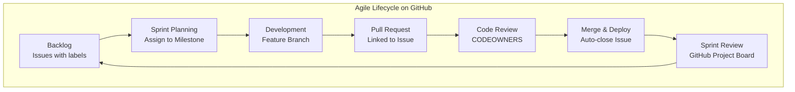
```mermaid
graph TD
    subgraph "Agile Lifecycle on GitHub"
        A[Backlog<br/>Issues with labels] --> B[Sprint Planning<br/>Assign to Milestone]
        B --> C[Development<br/>Feature Branch]
        C --> D[Pull Request<br/>Linked to Issue]
        D --> E[Code Review<br/>CODEOWNERS]
        E --> F[Merge & Deploy<br/>Auto-close Issue]
        F --> G[Sprint Review<br/>GitHub Project Board]
        G --> A
    end
```

**Issue ↔ PR 自動連結**：

```markdown
# PR 描述中使用關鍵字自動關閉 Issue
Closes #123
Fixes #456
Resolves #789
```

> **實務建議**：善用 GitHub Projects V2 的 Automation 功能 — Issue 建立自動加入 Board、PR 合併自動移至 Done、Sprint 結束未完成自動移至下一 Sprint。

### 11.6 Issue Types、Sub-issues、Issue Dependencies 與 Issue Fields

> 🆕 **v3.0 新增**

2025 年 4 月起，GitHub Issues 陸續推出結構化的工作管理能力，讓過去必須依賴 Label 慣例或外部工具（Jira）才能表達的「類型、階層、相依、欄位」成為平台原生資料，並可被 Projects 與搜尋直接使用。

**四項能力總覽**：

| 能力 | 定義層級 | 限制 | 狀態 | 取代的舊做法 |
|------|---------|------|------|-------------|
| **Issue Types** | Organization（Settings → Planning → Issue types） | 每組織最多 25 種；預設為 Task、Bug、Feature | GA（2025-04-09） | `type: bug` 這類 Label |
| **Sub-issues** | 任一 Issue | 每個父 Issue 最多 100 個子 Issue，最多 8 層；可跨 Repo | GA（2025-04-09） | Task list、Epic Label |
| **Issue Dependencies** | 任一 Issue（Relationships → Blocked by / Blocking） | — | 已推出 | 在描述中手寫「依賴 #123」 |
| **Issue Fields** | Organization（Settings → Planning → Issue fields） | 預設提供 Priority、Effort、Start date、Target date | GA（2026-07-02） | `priority: P1` Label、Projects 自訂欄位 |

此外，2026-08-07 起「Relates to」關聯類型與多選欄位進入公開預覽。

**GitHub CLI 操作**（需 GitHub CLI v2.94.0 以上）：

```bash
# 建立 Bug 類型的 Issue，並設為 Epic #100 的子 Issue
gh issue create -R acme-bank/svc-order-api \
  --title "取消訂單後庫存未回補" --body "重現步驟…" \
  --type Bug --parent 100

# 將既有 Issue 加入父 Issue
gh issue edit 100 --add-sub-issue 205,206

# 標記相依關係：#210 被 #200 阻擋
gh issue edit 210 --add-blocked-by 200

# 以 JSON 取得相依資料，供報表或自動化使用
gh issue view 210 --json blockedBy,blocking
```

**以 Issue Types 取代類型 Label 的建議對照**：

| 舊 Label（[11.3](#113-label-系統設計)） | 新做法 |
|----------------------------------------|-------|
| `type: bug`、`type: feature`、`type: tech-debt` | Issue Types：Bug、Feature、Tech Debt |
| `priority: P0`～`P3` | Issue Field：Priority |
| `status: in-progress`、`status: blocked` | Projects 的 Status 欄位；阻擋關係改用 Issue Dependencies |
| `component: api` 等 | 保留為 Label（Label 仍適合描述橫切面的分類） |

**Issue Types 與 Repository 轉移**：Repo 在組織間轉移時，只有目標組織也存在相同名稱的 Issue Type 才會保留；轉移到個人帳號則所有 Issue Type 都會移除。跨組織整併前應先對齊 Issue Types 定義。

> **企業建議**：
>
> - 在 Organization 層統一定義 Issue Types 與 Issue Fields，Repo 層只保留元件類 Label，避免各 Repo 自行發明分類
> - Epic → Story → Task 的階層以 Sub-issues 表達，Projects 中以「Parent issue」欄位分組即可呈現進度
> - 需要與 Jira 並行的組織，先界定「誰是需求的唯一來源」，再決定 Sub-issues 用在開發細項或完整需求階層

---

## 第 12 章 Release Management

> 📌 **本章摘要**：本章涵蓋 Semantic Versioning、Conventional Commits、Changelog 與 Release Notes 自動產生、Tag 與 Release 管理、release-please 自動化，以及以 Immutable Releases 確保發佈成品不被竄改。

### 12.1 Semantic Versioning

遵循 **[Semantic Versioning 2.0.0](https://semver.org/)** 規範：

```text
MAJOR.MINOR.PATCH[-prerelease][+buildmetadata]

範例：
1.0.0          # 首次正式發佈
1.1.0          # 新增功能（向後相容）
1.1.1          # Bug 修復
2.0.0          # Breaking Change
2.0.0-rc.1     # Release Candidate
2.0.0-beta.1   # Beta 版
```

**版本升級規則**：

| 變更類型 | 版本升級 | 範例 |
|---------|---------|------|
| Breaking API Change | MAJOR | 1.x → 2.0.0 |
| 新增功能（向後相容） | MINOR | 1.1.x → 1.2.0 |
| Bug 修復 | PATCH | 1.1.1 → 1.1.2 |
| 依賴安全更新 | PATCH | 1.1.1 → 1.1.2 |
| 重構（無行為變更） | 不升版 | — |
| 文件更新 | 不升版 | — |

### 12.2 Conventional Commits

**自動版本判斷（基於 Commit Message）**：

| Commit Type | 對應版本升級 |
|-------------|-------------|
| `feat` | MINOR |
| `fix` | PATCH |
| `feat!` / `BREAKING CHANGE` | MAJOR |
| `perf` | PATCH |
| `docs` / `style` / `chore` | 不升版 |

**commitlint 配置**：

```javascript
// commitlint.config.js
module.exports = {
  extends: ['@commitlint/config-conventional'],
  rules: {
    'type-enum': [
      2,
      'always',
      ['feat', 'fix', 'docs', 'style', 'refactor', 'test', 'chore', 'ci', 'perf', 'security']
    ],
    'scope-enum': [
      1,
      'always',
      ['order', 'payment', 'inventory', 'auth', 'api', 'db', 'ci', 'deps']
    ],
    'subject-max-length': [2, 'always', 72],
    'body-max-line-length': [1, 'always', 100]
  }
};
```

### 12.3 Changelog 自動生成

以下以第三方 Action（`mikepenz/release-changelog-builder-action`）的設定為例；若只需依 Label 分類 PR，GitHub 內建的 `.github/release.yml` 已足夠（見 [12.6](#126-自動產生-release-notes)）。

**Changelog 配置**：

```json
// .github/changelog-config.json
{
  "categories": [
    {
      "title": "## 🚀 新功能",
      "labels": ["type: feature", "enhancement"]
    },
    {
      "title": "## 🐛 Bug 修復",
      "labels": ["type: bug", "fix"]
    },
    {
      "title": "## 🔒 安全修復",
      "labels": ["type: security"]
    },
    {
      "title": "## 📝 文件",
      "labels": ["type: docs"]
    },
    {
      "title": "## 🔧 維護",
      "labels": ["type: tech-debt", "type: ci", "dependencies"]
    }
  ],
  "template": "#{{CHANGELOG}}\n\n**Full Changelog**: #{{RELEASE_DIFF}}",
  "pr_template": "- #{{TITLE}} (#{{NUMBER}}) @#{{AUTHOR}}"
}
```

**自動生成範例**：

```markdown
# Changelog

## [2.1.0] - 2026-06-30

### 🚀 新功能
- feat(order): add cancel order endpoint (#142) @john-doe
- feat(order): add order status webhook (#145) @jane-doe

### 🐛 Bug 修復
- fix(payment): resolve race condition in refund (#148) @bob

### 🔒 安全修復
- security: upgrade Spring Boot to 3.5.x (CVE-2026-xxxx) (#150) @dependabot

### 🔧 維護
- chore(deps): update test dependencies (#147) @dependabot

**Full Changelog**: v2.0.0...v2.1.0
```

### 12.4 GitHub Release 與 Tag

**Tag 命名規範**：

```bash
# Annotated Tag（推薦）
git tag -a v2.1.0 -m "Release v2.1.0 - Add cancel order feature"
git push origin v2.1.0

# 預發佈
git tag -a v2.1.0-rc.1 -m "Release Candidate 1 for v2.1.0"
```

**Release 建立**：

```bash
# 使用 GitHub CLI
gh release create v2.1.0 \
  --title "Release v2.1.0" \
  --generate-notes \
  --target main \
  ./target/svc-order-api-2.1.0.jar
```

### 12.5 Release Workflow 自動化

```yaml
# .github/workflows/release-please.yml
name: Release Please

on:
  push:
    branches: [main]

permissions:
  contents: write
  pull-requests: write

jobs:
  release-please:
    runs-on: ubuntu-latest
    outputs:
      release_created: ${{ steps.release.outputs.release_created }}
      tag_name: ${{ steps.release.outputs.tag_name }}

    steps:
      - uses: googleapis/release-please-action@v5
        id: release
        with:
          release-type: maven
          package-name: svc-order-api

  publish:
    needs: release-please
    if: ${{ needs.release-please.outputs.release_created }}
    runs-on: ubuntu-latest
    permissions:
      contents: read
      packages: write     # 發佈至 GitHub Packages 必須

    steps:
      - uses: actions/checkout@v7
      - uses: actions/setup-java@v6
        with:
          distribution: 'temurin'
          java-version: '21'
          cache: 'maven'

      - name: Publish to GitHub Packages
        run: mvn deploy -B -DskipTests
        env:
          GITHUB_TOKEN: ${{ secrets.GITHUB_TOKEN }}
```

> **提醒**：若 Repo 啟用了 Immutable Releases（[12.7](#127-immutable-releases-與供應鏈完整性)），自動化流程需先以草稿建立 Release、上傳所有資產後再發佈。
>
> **實務建議**：使用 `release-please` 或 `semantic-release` 實現全自動版本管理 — 每次 merge to main 自動判斷版本升級、生成 Changelog、建立 Release Tag。人工只需 merge PR，其餘全部自動化。

### 12.6 自動產生 Release Notes

> 🆕 **v3.0 新增**

除了 [12.3](#123-changelog-自動生成) 介紹的第三方 Changelog 工具，GitHub 內建「Generate release notes」功能：依兩個 Tag 之間合併的 PR 自動產生 Release Notes，並以 `.github/release.yml` 依 Label 分類。對多數團隊而言，內建功能已足夠，可減少一個外部依賴。

**`.github/release.yml` 範例**（沿用 [11.3](#113-label-系統設計) 的 Label 體系）：

```yaml
# .github/release.yml
changelog:
  exclude:
    labels:
      - ignore-for-release
    authors:
      - octo-bot
  categories:
    - title: 💥 Breaking Changes
      labels:
        - breaking-change
    - title: 🚀 新功能
      labels:
        - "type: feature"
        - enhancement
    - title: 🐛 Bug 修復
      labels:
        - "type: bug"
    - title: 🔒 安全修復
      labels:
        - "type: security"
    - title: ⬆️ 依賴更新
      labels:
        - dependencies
    - title: 其他變更
      labels:
        - "*"
```

**設定參數**：

| 參數 | 說明 |
|------|------|
| `changelog.exclude.labels` | 帶有這些 Label 的 PR 不列入 |
| `changelog.exclude.authors` | 這些使用者或 Bot 的 PR 不列入 |
| `changelog.categories[*].title` | **必填**，分類標題 |
| `changelog.categories[*].labels` | **必填**，符合的 Label；`*` 表示前面分類都未命中的 PR |
| `changelog.categories[*].exclude.labels` / `.authors` | 該分類內再排除 |

**使用方式**：

```bash
# CLI：依 .github/release.yml 產生 Release Notes 並建立草稿
gh release create v2.2.0 --generate-notes --draft --target main

# 指定比較基準（前一個 Tag）
gh release create v2.2.0 --generate-notes --notes-start-tag v2.1.0 --draft
```

自 2026-06-18 起，由 Copilot cloud agent 產生的 PR 在自動產生的 Release Notes 中，會同時列出指派該任務的開發者。2026-06-30 起 Release 頁面提供側欄目錄與個別資產下載次數，可用於追蹤各平台二進位檔的實際使用量。

> **企業建議**：以「先建立草稿 → 附加所有資產 → 再發佈」為標準流程，這同時是 [12.7 Immutable Releases](#127-immutable-releases-與供應鏈完整性) 的官方建議做法。

### 12.7 Immutable Releases 與供應鏈完整性

> 🆕 **v3.0 新增**

**Immutable Releases**（2025-08-26 公開預覽、2025-10-28 GA）讓 Release 發佈後，其**資產與對應的 Git Tag 都無法再被更動**，用以阻擋「攻擊者取得權限後替換既有版本的二進位檔或移動 Tag」這類供應鏈攻擊。2026 年 3 月 Trivy 生態系遭入侵、76 個 `trivy-action` 版本 Tag 被強制改指向惡意 Commit 的事件（見 [17.2](#172-security-risk-防範)），正說明了「可移動的 Tag」對下游使用者的風險。

**啟用後的保護範圍**：

| 項目 | 發佈後是否可變更 |
|------|----------------|
| 附加的資產（二進位檔、壓縮檔） | ❌ 不可新增、修改或刪除 |
| Git Tag | ❌ 鎖定於特定 Commit，Release 存在期間不可移動或刪除；刪除 Release 後可刪 Tag，但**同名 Tag 不可再使用** |
| Release 標題與說明 | ✅ 可編輯 |
| Pre-release／Latest 標記 | ✅ 可變更 |

此外，建立 Immutable Release 會自動產生 **Release Attestation**（包含 Tag、Commit SHA 與資產的可驗證紀錄），下游可據此確認取得的檔案與發佈內容完全一致。即使 Repo 被刪除後以相同名稱重建，也無法重用原本 Immutable Release 使用過的 Tag，可防範「Repository 復活攻擊」。

**啟用方式**：

- **Repository**：Settings → General 頁面的「Releases」區段，勾選 **Enable release immutability**
- **Organization**：Settings → Repository 頁面的「Releases」區段，將政策由「No policy」改為全部或指定的 Repository

設定只影響啟用後新發佈的 Release。

**官方建議的發佈流程**：

```bash
# 1. 建立草稿（此時尚未不可變）
gh release create v2.2.0 --draft --generate-notes --target main

# 2. 附加所有資產
gh release upload v2.2.0 ./target/svc-order-api-2.2.0.jar ./target/sbom.spdx.json

# 3. 確認無誤後發佈，自此資產與 Tag 鎖定
gh release edit v2.2.0 --draft=false

# 下游驗證：確認本地檔案與 Release 內容一致
gh release verify-asset v2.2.0 ./svc-order-api-2.2.0.jar
```

**供應鏈完整性三件組**：

| 機制 | 證明的內容 | 章節 |
|------|-----------|------|
| **Artifact Attestations** | 這個成品由哪個 Repo、哪個 Workflow、哪個 Commit 建置 | [8.8](#88-actions-安全性強化與-2026-路線圖) |
| **Immutable Releases** | 發佈後的成品與 Tag 未被竄改 | 本節 |
| **SHA 釘選 Actions** | 建置過程使用的第三方 Action 未被替換 | [17.2](#172-security-risk-防範) |

> **企業建議**：
>
> - 對外發佈的函式庫與 CLI 工具在組織層啟用 Immutable Releases；[12.5](#125-release-workflow-自動化) 的自動化流程需改為「草稿 → 上傳 → 發佈」三步驟，發佈後若發現問題只能發佈新版本
> - 內部部署流程改以「Release Attestation 驗證通過」作為部署前置條件

---

## 第 13 章 AI 時代 Repository 管理

> 📌 **本章摘要**：AI Agent 已成為 Repository 的新型協作者。本章說明 Copilot 與 Claude Code 的設定、AI 派工途徑、Prompt Repository、AI 治理規範、Copilot cloud agent、MCP、Copilot code review、方案與計費變動，以及 Repository 中 AI 設定檔的治理方式。

### 13.1 GitHub Copilot 整合

**Copilot 企業配置** ⚠️ 需 GitHub Copilot Business 或 Enterprise（組織層級集中式政策管理兩者皆備，Enterprise 額外提供企業級稽核與治理能力，見 [13.9](#139-copilot-平台最新動態與方案) 方案矩陣）：

| 設定項目 | 建議值 | 說明 |
|---------|-------|------|
| Copilot in IDE | ✅ 啟用 | 程式碼補全 |
| Copilot Chat | ✅ 啟用 | 對話式開發 |
| Copilot in CLI | ✅ 啟用 | 指令建議 |
| Copilot in PR | ✅ 啟用 | PR Summary & Review |
| Content Exclusion | 設定排除清單 | 排除敏感 Repo（注意：不適用於 IDE 的 Agent 模式與 cloud agent） |
| Suggestions matching public code | ❌ 關閉 | 避免授權風險 |
| Copilot cloud agent | 依 Repo 風險等級開放 | 見 [13.6](#136-github-copilot-cloud-agent原-coding-agent) |
| Copilot code review（自動審查） | 核心 Repo 以 Ruleset 啟用 | 見 [13.8](#138-github-copilot-code-review) |

**Copilot Instructions 配置**：

```markdown
<!-- .github/copilot-instructions.md -->
# Copilot Instructions for svc-order-api

## Architecture
- Follow Clean Architecture (Domain → Application → Infrastructure → Adapter)
- Domain layer must not depend on any external framework

## Code Style
- Use Java 21 features (Records, Pattern Matching, Virtual Threads)
- Follow Google Java Style Guide
- All public methods must have JavaDoc

## Security
- Never hardcode credentials
- Use PreparedStatement for all SQL
- Validate all input at Controller layer
- Use @Valid annotation for request DTOs

## Testing
- Unit test coverage > 80%
- Use JUnit 5 + Mockito + AssertJ
- Integration tests use TestContainers
- Name pattern: should_expectedBehavior_when_condition

## Dependencies
- Spring Boot 3.4.x
- PostgreSQL (no other DB)
- Apache Kafka for events
- Redis for caching
```

### 13.2 Claude Code 整合

**CLAUDE.md 配置**：

```markdown
<!-- CLAUDE.md -->
# Claude Code Guidelines

## Project Context
This is a Spring Boot microservice for order management.
Tech stack: Java 21, Spring Boot 3.4, PostgreSQL, Kafka.

## Architecture Rules
1. Never import infrastructure classes from domain layer
2. Use case classes should be single-purpose
3. All external calls go through Port/Adapter pattern

## Coding Standards
- Commit messages follow Conventional Commits
- PR title format: type(scope): description
- Always include unit tests with changes
- Run `mvn verify` before committing

## File Organization
- Domain models: src/main/java/.../domain/model/
- Use cases: src/main/java/.../application/usecase/
- Controllers: src/main/java/.../adapter/rest/
- Repository implementations: src/main/java/.../infrastructure/persistence/

## Common Commands
- Build: `mvn compile`
- Test: `mvn test`
- Full verify: `mvn verify`
- Run locally: `mvn spring-boot:run -Dspring.profiles.active=local`
- Format check: `mvn spotless:check`
```

### 13.3 AI Agent Workflow

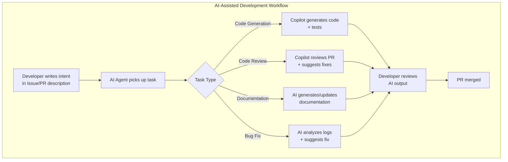
```mermaid
graph TB
    subgraph "AI-Assisted Development Workflow"
        A[Developer writes intent<br/>in Issue/PR description] --> B[AI Agent picks up task]
        B --> C{Task Type}
        C -->|Code Generation| D[Copilot generates code<br/>+ tests]
        C -->|Code Review| E[Copilot reviews PR<br/>+ suggests fixes]
        C -->|Documentation| F[AI generates/updates<br/>documentation]
        C -->|Bug Fix| G[AI analyzes logs<br/>+ suggests fix]

        D --> H[Developer reviews<br/>AI output]
        E --> H
        F --> H
        G --> H
        H --> I[PR merged]
    end
```

**將任務交給 AI Agent 的正式途徑**（取代 v2.2 的 Copilot Workspace 範例）：

| 途徑 | 操作 | 適用情境 |
|------|------|---------|
| 指派 Issue | 在 Issue 的 Assignees 選擇 **Copilot** | 定義明確的單一任務 |
| Agents 面板 | github.com 的 Agents 面板輸入需求，先研究與規劃再產生 PR | 需要先確認方案的任務 |
| PR 留言 | 在既有 PR 留言 `@copilot` 要求修改 | 審查回饋的修正 |
| Automations | 依排程或事件（例如 Issue 建立、留言）自動啟動 cloud agent | 例行維護、文件更新 |
| 外部整合 | Slack、Microsoft Teams、Jira、Linear、Azure Boards | 在既有工具中派工 |
| Security Campaign | 將安全告警指派給 Copilot | 批次修補（見 [9.11](#911-security-campaignsautofix-與-delegated-bypass)） |

```bash
# 以 GitHub CLI 將 Issue 指派給 Copilot（需組織已開放 cloud agent）
gh issue edit 123 -R acme-bank/svc-order-api --add-assignee "@copilot"
```

> ⚠️ **v3.0 更正**：v2.2 以「GitHub Copilot Workspace」搭配自訂 Workflow 示範自動修復；Copilot Workspace 技術預覽已於 2025 年結束，範例中的 API 也不存在。現行做法為 Copilot cloud agent（[13.6](#136-github-copilot-cloud-agent原-coding-agent)）與 Copilot Automations。

### 13.4 Prompt Repository 設計

**AI Assets Repository 結構**：

```text
ai-prompt-library/
├── .github/
│   └── workflows/
│       └── validate-prompts.yml
├── prompts/
│   ├── code-review/
│   │   ├── java-review.prompt.md
│   │   ├── security-review.prompt.md
│   │   └── performance-review.prompt.md
│   ├── code-generation/
│   │   ├── spring-controller.prompt.md
│   │   ├── unit-test.prompt.md
│   │   └── integration-test.prompt.md
│   ├── documentation/
│   │   ├── adr-generation.prompt.md
│   │   ├── api-docs.prompt.md
│   │   └── readme-generation.prompt.md
│   └── devops/
│       ├── dockerfile.prompt.md
│       ├── github-action.prompt.md
│       └── k8s-manifest.prompt.md
├── agents/
│   ├── code-reviewer.agent.md
│   ├── test-writer.agent.md
│   └── doc-generator.agent.md
├── instructions/
│   ├── java-backend.instructions.md
│   ├── vue-frontend.instructions.md
│   └── devops.instructions.md
├── templates/
│   └── prompt-template.md
├── CONTRIBUTING.md
└── README.md
```

### 13.5 AI Governance 規範

| 規範項目 | 策略 | 落實方式 |
|---------|------|---------|
| **程式碼審查** | AI 生成程式碼必須人工審查 | PR Review 強制 |
| **敏感排除** | 敏感 Repo 排除 AI 存取 | Content Exclusion |
| **授權合規** | 禁用匹配公開程式碼建議 | Organization 設定 |
| **品質保證** | AI 生成需通過 CI 全部檢查 | Branch Protection |
| **可追蹤** | AI 輔助開發標記 | Commit footer（如 `Co-authored-by:`）；cloud agent 的 PR 由 Copilot 開立並記錄指派者 |
| **成本控管** | AI Credits 與 Actions 分鐘數預算 | Cost center、Budget 與用量報表 |
| **設定檔治理** | AI 指引與 Agent 設定視為程式碼 | CODEOWNERS 保護（見 [13.10](#1310-repository-的-ai-agent-設定檔總覽)） |
| **Prompt 版控** | Prompt 視為程式碼管理 | 獨立 Repo + PR Review |

> **實務建議**：AI 是加速器而非替代者。所有 AI 生成的程式碼必須通過與人工撰寫相同的品質關卡（Code Review、CI、Security Scan）。建立 Prompt Library 作為團隊知識資產。

### 13.6 GitHub Copilot Cloud Agent（原 Coding Agent）

GitHub Copilot cloud agent（原名 Copilot coding agent，2025 年推出）在 GitHub Actions 驅動的雲端環境中自主工作：研究 Repository、擬定計畫、在分支上修改程式碼，最後開出 PR 交由人工審查。它與 IDE 內的「Agent mode」不同——後者在開發者本機同步執行。

> ⚠️ **v3.0 更正**：官方已將名稱更新為 **Copilot cloud agent**；v2.2 所述「加上 `copilot` Label 觸發」並非官方機制，已移除。

**Cloud Agent 運作流程**：

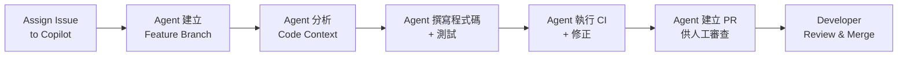
```mermaid
graph LR
    A[Assign Issue<br/>to Copilot] --> B[Agent 建立<br/>Feature Branch]
    B --> C[Agent 分析<br/>Code Context]
    C --> D[Agent 撰寫程式碼<br/>+ 測試]
    D --> E[Agent 執行 CI<br/>+ 修正]
    E --> F[Agent 建立 PR<br/>供人工審查]
    F --> G[Developer<br/>Review & Merge]
```

**進階能力**：

- **模型選擇與推理強度**：可依任務選擇模型，2026-08-03 起也可調整相容模型的推理強度（reasoning level）
- **先研究、再規劃、後實作**：可要求 Agent 先研究 Repository 並提出計畫，確認後才產生程式碼變更
- **PR 開啟前自我審查**：Agent 在建立 PR 交付人工審查前，會先自動執行一次 Copilot Code Review 檢視自己產出的 Diff，並依審查意見反覆修正，才會標記人工 Reviewer
- **迴圈內建自動安全掃描**：Code Scanning、Secret Scanning、依賴漏洞檢查已內建於 Agent 的工作迴圈中，會在 PR 開啟**之前**就先執行，而非僅依賴 Repo 既有 CI 於 PR 開啟後才檢查
- **自訂 Agent（`.github/agents/`）**：可仿照 `.github/copilot-instructions.md` 的模式，於 `.github/agents/` 目錄下定義團隊專屬的 Agent 行為（例如一個專責效能調校、會在修改前後跑 Benchmark 比對的「Performance Optimizer」Agent）

```text
svc-order-api/.github/agents/
├── performance-optimizer.agent.md   # 專責效能調校，修改前後需附 Benchmark 比較
└── test-writer.agent.md             # 專責補齊測試覆蓋率
```

- **多入口**：除 github.com 外，也可從 VS Code、JetBrains、Visual Studio、GitHub Mobile（修正失敗的 Actions 檢查、PR 留言與合併衝突）與 Slack、Teams、Jira、Linear、Azure Boards 啟動
- **Hooks 與 Skills**：可在 Agent 執行的關鍵時點執行自訂指令（驗證、記錄、安全掃描），並以 Skills 提供可重用的專業能力

**啟用方式**：

| 步驟 | 操作 |
|------|------|
| 1. 啟用政策 | Copilot Business / Enterprise 需由管理員在 Enterprise 或 Organization 的 Copilot 政策中開放 cloud agent，並可指定適用的 Repo |
| 2. 準備環境 | 於預設分支放置 `copilot-setup-steps.yml` 與指引檔（見 [13.10](#1310-repository-的-ai-agent-設定檔總覽)） |
| 3. 派工 | 將 Issue 指派給 Copilot、使用 Agents 面板，或在 PR 留言 `@copilot` |
| 4. 追蹤與審查 | 於 Agents 面板或 PR 時間軸查看 Session 紀錄，完成後由人工審查 |

**使用限制**（依官方文件）：

- 每個 Session 最長執行 **59 分鐘**，無法延長
- 一次只在一個分支工作，每個任務只開一個 PR
- 預設只能存取啟動任務的那個 Repository
- 與某些 Ruleset 不相容（例如只允許特定 Commit 作者），遇到時 Agent 會被阻擋；可將 Copilot 加入 Ruleset 的 Bypass 清單，或調整規則
- 不適用於 Enterprise Managed Users 個人帳號擁有的 Repo
- 費用：消耗 AI Credits 與 GitHub Actions 分鐘數

**適用場景與限制**：

| 適合交給 Agent | 不適合交給 Agent |
|---------------|-----------------|
| 新增 REST API endpoint | 大規模架構重構 |
| 撰寫單元測試 | 跨多個服務的變更 |
| 修正明確的 Bug | 涉及外部系統整合 |
| 增加日誌記錄 | 安全性相關修改 |
| 更新文件 | 資料庫 Schema 變更 |
| Refactor 小範圍程式碼 | 效能關鍵路徑優化 |

**Cloud Agent 配置最佳實務**：

```markdown
<!-- .github/copilot-instructions.md — 增加 Agent 專用指引 -->

## Agent Guidelines
- Always create tests for new code
- Run `mvn verify` before submitting PR
- Follow existing code patterns in the same package
- Do not modify database migration files
- Do not change security configurations
- Include JavaDoc for all public methods
```

**企業 Cloud Agent 治理策略**：

| 控管項目 | 策略 |
|---------|------|
| 可使用 Agent 的 Repo | 白名單制，僅允許非關鍵系統 |
| Agent PR 審查 | 至少 2 位人工 Reviewer |
| Agent 可修改範圍 | 透過 CODEOWNERS 限制 |
| 執行環境 | GitHub-hosted Runner（或 Larger runners / ARC），保持預設的網路防火牆，只放行必要網域 |
| 稽核追蹤 | 所有 Agent 活動記錄於 Audit Log 與 Session 紀錄 |
| 用量控管 | 設定 AI Credits 預算與 Actions 分鐘數上限 |

### 13.7 GitHub Copilot Extensions 與 MCP

**Copilot Extensions 已退場**：

> ⚠️ **v3.0 更正**：以 GitHub App 建置的 Copilot Extensions 已於 2025-09-24 停止建立新擴充，並於 **2025-11-10 正式停用**，官方以 **MCP（Model Context Protocol）** 取代。MCP Server 只需建置一次，即可同時用於 Copilot、Claude Code 等任何支援 MCP 的用戶端。企業原本規劃的「私有 Extension」應改寫為內部 MCP Server。

**MCP（Model Context Protocol）整合**：

MCP 是一種開放協定，讓 AI Agent 能與外部工具和資料來源互動。VS Code 已原生支援 MCP Server 配置。

**GitHub 官方 MCP Server**：GitHub 與 Anthropic 共同開發並維護官方的 [`github/github-mcp-server`](https://github.com/github/github-mcp-server)（開源、Go 撰寫，2025-04 公開預覽），將 Repository 瀏覽、Issue/PR 操作、Code Scanning 告警、Workflow 觸發與查詢等能力，以標準化的 MCP Tool 形式提供給 Copilot Chat 或任何相容 MCP 的用戶端（如 Claude Code）使用。此為官方維護的第一方選擇，優先於社群維護的替代套件；支援唯讀模式與「鎖定模式（Lockdown Mode）」，可限制 Agent 僅能存取指定範圍的操作，降低授權過大的風險。

```json
// .vscode/mcp.json — 專案級 MCP 配置
{
  "servers": {
    "github": {
      "type": "http",
      "url": "https://api.githubcopilot.com/mcp/"
    },
    "acme-api-catalog": {
      "type": "http",
      "url": "https://mcp.internal.acme-bank.com/api-catalog",
      "headers": {
        "Authorization": "Bearer ${input:catalog-token}"
      }
    }
  },
  "inputs": [
    {
      "id": "catalog-token",
      "type": "promptString",
      "description": "內部 API Catalog 存取權杖",
      "password": true
    }
  ]
}
```

> 上例 `github` 伺服器於 VS Code 中會以 GitHub 帳號 OAuth 登入，不需在檔案中放置 PAT；`acme-api-catalog` 為企業自建的遠端 MCP Server 範例。v2.2 範例使用的 `@modelcontextprotocol/server-postgres` 已被封存，不建議再使用。企業可透過 Enterprise managed settings 的 MCP allowlist（2026-08-06 起）集中限制可使用的 MCP Server。

> 上例的 `github` 項目採用 GitHub 官方託管的**遠端 MCP Server**（`api.githubcopilot.com/mcp`），無需自行安裝執行檔；若企業有網路隔離需求，`github/github-mcp-server` 亦提供可自架的 Docker 映像作為本地執行選項。

**GitHub Models 已退役**：

> ⚠️ **v3.0 更正**：GitHub Models 自 2026-06-16 起停止接受新客戶，並於 **2026-07-30 正式退役**，Playground 與推論 API 均已停止服務。仍依賴 GitHub Models API 的 PoC 或 Workflow 應遷移至各模型供應商的正式 API，或改用 Copilot 支援的 BYOK（自帶金鑰）機制。另 GitHub Spark 已於 2026-08-31 自 github.com 停用。

> **企業建議**：
>
> - Copilot cloud agent 適合低風險、定義明確的任務，始終要求人工審查
> - 優先採用 GitHub 官方 `github-mcp-server` 存取 Repository/Issue/PR 等資源，而非自行拼湊社群工具，降低供應鏈風險並取得官方持續維護保證
> - 建立 MCP Server 封裝內部工具（Jira、Confluence、內部 API），並以 MCP allowlist 集中管控
> - 盤點仍依賴 Copilot Extensions 或 GitHub Models 的既有整合，列入遷移計畫

### 13.8 GitHub Copilot Code Review

Copilot Code Review 讓 Copilot 直接參與 Pull Request 審查流程，自動產生 PR Summary、標註潛在問題並提出修改建議，是本文 [13.1](#131-github-copilot-整合) 提及「Copilot in PR」設定背後的核心能力，此處進一步說明其治理與客製化機制。

**指引檔案分層機制**：

| 檔案 | 適用範圍 | 說明 |
|------|---------|------|
| `.github/copilot-instructions.md` | 全 Repository | 通用行為指引（架構原則、程式風格、安全規範，見 13.1 範例） |
| `**/*.instructions.md` | 特定路徑範圍 | 可依目錄/檔案類型指定專屬指引，例如 `frontend/**/*.instructions.md` 僅套用於前端程式碼 |

> 官方建議每份指引檔案控制在**約 1,000 行以內**，過長的指引檔案可能導致部分規則在實際審查時被模型忽略，應優先拆分為多個路徑範圍檔案而非集中成單一巨大檔案。

**MCP 與 Agent Skills 整合（✅ 已於 2026-07-29 正式 GA，Pro / Pro+ / Business / Enterprise 均可用）**：

Copilot Code Review 於 2026-03-05 起改採 Agentic 架構重新打造審查引擎，並在此基礎上讓審查過程可呼叫 Repository 設定的 MCP Server 與 Agent Skills（此能力已於 2026-07-29 由公開預覽轉為正式 GA），預設即啟用 **GitHub MCP Server** 與 **Playwright MCP Server**（例如可在審查 UI 變更的 PR 時，透過 Playwright MCP Server 實際操作頁面驗證行為）。設定路徑：

```text
Repository → Settings → Copilot → MCP servers（JSON 設定）
Repository → Settings → Secrets and variables → Agents（MCP 所需的憑證/Token）
```

此 Repo 層級設定與 [13.7](#137-github-copilot-extensions-與-mcp) 中 `.vscode/mcp.json` 的專案層級設定是**兩個不同的層次**——`.vscode/mcp.json` 作用於 IDE 內的 Agent Mode，Repo Settings 中的 MCP 設定則影響 Copilot code review 與 cloud agent 於雲端執行時可用的工具。

**審查深度與費用**（依官方文件）：

| 項目 | 說明 |
|------|------|
| **Review effort** | **Lite**（預設，快速檢查常見問題）與 **Balanced**（改用較高推理模型處理複雜邏輯、安全敏感與跨服務變更）；兩者於 2026-08-07 GA。依 GitHub 公告，Code Review 預設深度將自 2026-09-28 起改為 Balanced |
| **決定順序** | 請求審查時的選擇 → 此 PR 先前使用的深度 → 請求者（新 PR 為作者）的個人設定 → 組織預設 |
| **費用組成** | AI Credits（每次審查約 US$0.05～1〔Lite〕、US$0.25～5〔Balanced〕）＋ GitHub Actions 分鐘數（私有 Repo） |
| **執行環境** | 預設使用標準 GitHub-hosted Runner；可改用 Larger runners 或 ARC；組織停用 GitHub-hosted Runner 時會退回功能較少的審查 |
| **自動審查** | 使用者個人設定與 Ruleset 兩種來源，彼此不互相覆寫；可選擇是否審查每次推送與草稿 PR |
| **無授權者** | 組織可開放未持有 Copilot 授權的成員也獲得審查，費用以額外用量計入組織 |
| **指引來源** | `copilot-instructions.md`、`*.instructions.md`，以及 2026-06-18 起支援的 `AGENTS.md`；2026-07-17 起可讀取 PR head 分支上的自訂指引 |

> **企業建議**：路徑範圍指引檔案（`*.instructions.md`）與 MCP Server 設定應視為治理性設定，變更時納入 CODEOWNERS 保護範圍，避免被未經授權的變更悄悄放寬審查標準或引入未經核准的外部工具。

### 13.9 Copilot 平台最新動態與方案

| 項目 | 狀態 | 說明 |
|------|------|------|
| **GitHub Agentic Workflows** | 公開預覽 | 讓開發者將需要推理判斷的重複性任務（非單純腳本化流程）封裝為可重複執行的 Agentic Workflow |
| **GitHub Copilot App**（桌面應用程式） | ✅ GA（2026-06-17；07-07 起所有方案可用） | 以代理為中心的桌面開發環境，支援 macOS、Windows、Linux |
| **Copilot Automations** | 已推出 | 依排程或事件自動啟動 cloud agent |
| **Copilot Session 遠端監控/操作** | ✅ GA | 可在 github.com 或 GitHub Mobile 遠端檢視、操作進行中的 Agent Session，不需守在 IDE 前 |
| **GitHub Copilot Pro+** | ✅ GA | 個人層級訂閱方案，可存取 Anthropic、Google、OpenAI 等多家供應商的前沿模型，與組織層級 Business/Enterprise 方案（13.1）為不同購買單位 |
| **GitHub Copilot Max** | ✅ GA | 2026 年新增的個人最高階方案，提供比 Pro+ 更高的用量額度，定位為重度個人使用者 |

**個人與組織方案矩陣**（實際定價請以 [github.com/features/copilot/plans](https://github.com/features/copilot/plans) 為準）：

| 層級 | 方案 | 定位 |
|------|------|------|
| 個人 | Free | 基礎補全與 Chat，含基本 Review selection、MCP 支援 |
| 個人 | Pro | 一般開發者日常使用 |
| 個人 | Pro+ | 可用 Anthropic / Google / OpenAI 前沿模型 |
| 個人 | **Max**（新） | 最高用量額度，適合重度單兵作業者 |
| 組織 | Business | 含 cloud agent、集中式政策管理 |
| 組織 | Enterprise | Business 全部能力 + 企業級稽核與治理 |

> **2026 年重大變化：計費模式改為統一用量制**：GitHub 已於 **2026-06-01** 起將 Copilot 所有使用情境（Chat、程式碼補全、Coding Agent、Code Review）**整併為單一「GitHub AI Credits」用量計費模型**，依實際 Model Token 用量計費，**取代舊制固定額度的「Premium Request」配額制**。這對企業財務規劃有直接影響：過去可用「每人每月 N 次 Premium Request」估算成本上限的方式已不再適用，應改以 Token 用量趨勢搭配官方用量儀表板監控實際支出，並留意 cloud agent（13.6）與 Code Review（13.8）等雲端執行情境的用量現已與其他 Copilot 互動計入同一額度池，且另外消耗 GitHub Actions 分鐘數。
>
> **近期時程（依 GitHub Changelog）**：2026-09-28 起 Copilot 體驗統一、Code Review 預設深度改為 Balanced；2026-10-01 起既有客戶新指派座位改為預付；2026-10-22 起「新功能預設政策（Default policy for new features）」生效，GA 功能在 28 天設定期後預設開啟——治理團隊應在期限前完成政策設定。Copilot 功能與模型的完整時程請參考本部落格的《GitHub Copilot 生態圈教學手冊》。
>
> **企業建議**：
>
> - Copilot Pro+ / Max 屬**個人訂閱**，可能繞過組織於 Business/Enterprise 方案設定的 Content Exclusion 政策與稽核機制，形成治理死角。應於 [13.5 AI Governance 規範](#135-ai-governance-規範) 中明確規範是否允許員工以個人訂閱存取公司程式碼，並將此列為資安教育訓練的重點項目
> - 財務／採購單位應重新檢視 AI 相關預算編列方式，改以 AI Credits 用量趨勢而非舊制固定配額估算，並評估是否需要如 [9.1](#91-ssdlc-流程總覽) GHAS 硬性預算上限的類似機制來控管 AI 用量支出

### 13.10 Repository 的 AI Agent 設定檔總覽

> 🆕 **v3.0 新增**

AI Agent 進入開發流程後，Repository 中出現一批「給 AI 讀的設定檔」。它們和 CI 設定一樣會影響產出品質與安全邊界，應視為治理性設定，納入 CODEOWNERS 與 PR 審查。

**常見設定檔與用途**：

| 檔案 | 讀取者 | 作用 |
|------|-------|------|
| `.github/copilot-instructions.md` | Copilot（Chat、Code Review、cloud agent） | Repository 全域指引（見 [13.1](#131-github-copilot-整合)） |
| `.github/instructions/*.instructions.md` | Copilot | 以 `applyTo` 指定路徑範圍的指引 |
| `AGENTS.md` | Copilot cloud agent、Copilot code review（2026-06-18 起支援）、其他支援此慣例的 Agent | 跨工具共用的 Agent 指引；可放在子目錄，以最接近的檔案為準 |
| `CLAUDE.md`、`GEMINI.md` | Claude Code、Gemini CLI；Copilot 亦將其視為 Agent 指引 | 見 [13.2](#132-claude-code-整合) |
| `.github/agents/*.agent.md` | Copilot 自訂 Agent | 專責特定任務的 Agent（見 [13.6](#136-github-copilot-cloud-agent原-coding-agent)） |
| `.github/skills/` | Copilot Agent Skills | 可重用的指令、腳本與資源 |
| `.github/workflows/copilot-setup-steps.yml` | Copilot cloud agent（Code Review 預設也沿用） | 在 Agent 開始工作前預先安裝工具與依賴 |
| `.github/workflows/copilot-code-review.yml` | Copilot code review | 需要與 cloud agent 使用不同環境時另行設定 |

**`copilot-setup-steps.yml` 範例**（Java 專案）：

```yaml
# .github/workflows/copilot-setup-steps.yml
name: Copilot Setup Steps

on:
  workflow_dispatch:
  push:
    paths: [.github/workflows/copilot-setup-steps.yml]
  pull_request:
    paths: [.github/workflows/copilot-setup-steps.yml]

jobs:
  # Job 名稱必須是 copilot-setup-steps，否則 Copilot 不會讀取
  copilot-setup-steps:
    runs-on: ubuntu-latest        # 可改為 Larger runner 或 ARC 的標籤
    timeout-minutes: 30           # 上限 59
    permissions:
      contents: read
    steps:
      - uses: actions/checkout@v7
      - uses: actions/setup-java@v6
        with:
          distribution: temurin
          java-version: '21'
          cache: maven
      - name: Pre-fetch dependencies
        run: mvn -B -q dependency:go-offline
```

重點規則（依官方文件）：

- 檔案必須位於**預設分支**才會生效
- 只能包含一個名為 `copilot-setup-steps` 的 Job，且僅能自訂 `steps`、`permissions`、`runs-on`、`services`、`snapshot`、`timeout-minutes`（上限 59）等有限欄位，其他設定會被忽略
- 檔案異動時會像一般 Workflow 一樣自動執行，可在 PR 中確認設定是否正確

**與 Ruleset 的相容性**：Copilot cloud agent 無法符合某些規則（例如只允許特定 Commit 作者），遇到不相容的 Ruleset 時 Agent 會被阻擋。若規則以 Ruleset 設定，可將 Copilot 加入 Bypass 清單；但更好的做法是調整規則，而不是讓 Agent 繞過規則。

> **企業建議**：
>
> - 在 CODEOWNERS 中把上表所有檔案指派給平台或架構團隊（例如 `/.github/copilot-instructions.md @acme-bank/architecture-team`），避免指引被悄悄放寬
> - 同時使用多種 AI 工具的團隊，把共通規範寫在 `AGENTS.md`，各工具專屬檔案只放差異，降低多份指引互相矛盾的風險
> - `copilot-setup-steps.yml` 只授予 `contents: read`，需要存取內部套件時使用 OIDC 或 GitHub App Token，不在指引檔中放任何憑證

---

## 第 14 章 Repository 維運與治理

> 📌 **本章摘要**：Repository 需要持續維運才能保持健康。本章涵蓋歷史清理與健康檢查、分支清理、Secret 輪換、權限與稽核、備份與災難復原、治理檢核，以及改名／轉移／封存／刪除等生命週期操作、Insights 活動洞察與長期保存。

### 14.1 Repository Cleanup

**大型檔案清理**：

```bash
# 找出 Repository 中的大型檔案
git rev-list --objects --all | \
  git cat-file --batch-check='%(objecttype) %(objectname) %(objectsize) %(rest)' | \
  sed -n 's/^blob //p' | \
  sort -rnk2 | \
  head -20

# 使用 git filter-repo 移除 50 MB 以上的檔案（官方建議工具）
git clone --mirror git@github.com:acme-bank/svc-order-api.git
cd svc-order-api.git
git filter-repo --strip-blobs-bigger-than 50M
git push --force --mirror origin
```

> **注意**：改寫歷史會改變所有 Commit SHA，需事先公告並請所有人重新 clone；推送前需暫時允許 Ruleset 的強制推送（或由 Bypass 人員執行），且 Push policy 會阻擋 `--mirror` 推送。改寫後舊資料仍可能存在於 PR 參考與快取中，需聯絡 GitHub Support 清除。若大型檔案應持續保留，改用 `git lfs migrate import` 移至 LFS。

**Repository Health Check 腳本**：

```bash
#!/bin/bash
# repo-health-check.sh
REPO=$1

echo "=== Repository Health Check: ${REPO} ==="

# 1. 檢查 Repo 大小
SIZE=$(gh api repos/acme-bank/${REPO} --jq '.size')
echo "📦 Repo Size: ${SIZE} KB"
if [ "$SIZE" -gt 500000 ]; then
  echo "⚠️ WARNING: Repository size exceeds 500MB"
fi

# 2. 檢查最後活動時間
LAST_PUSH=$(gh api repos/acme-bank/${REPO} --jq '.pushed_at')
echo "📅 Last Push: ${LAST_PUSH}"

# 3. 檢查 Branch 數量
BRANCHES=$(gh api repos/acme-bank/${REPO}/branches --jq 'length')
echo "🌿 Active Branches: ${BRANCHES}"
if [ "$BRANCHES" -gt 50 ]; then
  echo "⚠️ WARNING: Too many branches (${BRANCHES}), consider cleanup"
fi

# 4. 檢查開啟的 PR 數量
OPEN_PRS=$(gh pr list -R acme-bank/${REPO} --state open --json number --jq 'length')
echo "🔀 Open PRs: ${OPEN_PRS}"

# 5. 檢查安全告警
ALERTS=$(gh api repos/acme-bank/${REPO}/vulnerability-alerts 2>/dev/null && echo "enabled" || echo "disabled")
echo "🔒 Vulnerability Alerts: ${ALERTS}"

# 6. 檢查預設分支上實際生效的規則（含組織級 Ruleset）
RULES=$(gh api repos/acme-bank/${REPO}/rules/branches/main --jq 'length')
echo "🛡️ Rules on main: ${RULES}"
[ "$RULES" -eq 0 ] && echo "⚠️ WARNING: main 未受任何 Ruleset 保護"

# 7. 檢查必填 Custom Properties
gh api repos/acme-bank/${REPO}/properties/values --jq '.[] | "🏷️ \(.property_name)=\(.value)"'
```

### 14.2 Branch Cleanup 自動化

> **建議**：優先開啟 Repository 設定「Automatically delete head branches」（[7.9](#79-auto-mergeupdate-branch-與自動刪除分支)），PR 合併後即自動刪除來源分支；以下 Workflow 用於清理「沒有經過 PR」或設定開啟前遺留的分支。

```yaml
# .github/workflows/branch-cleanup.yml
name: Branch Cleanup

on:
  schedule:
    - cron: '0 3 * * 0'  # 每週日凌晨 3:00
  workflow_dispatch:

jobs:
  cleanup:
    runs-on: ubuntu-latest
    permissions:
      contents: write

    steps:
      - uses: actions/checkout@v7
        with:
          fetch-depth: 0

      - name: Delete Merged Branches
        uses: actions/github-script@v9
        with:
          script: |
            // 使用 paginate 取得所有分支（listBranches 單頁上限 100）
            const branches = await github.paginate(github.rest.repos.listBranches, {
              owner: context.repo.owner,
              repo: context.repo.repo,
              per_page: 100
            });

            const protectedBranches = ['main', 'develop', 'release'];
            const staleDays = 30;
            const now = new Date();

            for (const branch of branches) {
              // 跳過受保護分支
              if (protectedBranches.some(p => branch.name.startsWith(p))) continue;

              // 檢查是否已合併
              try {
                const { data: comparison } = await github.rest.repos.compareCommits({
                  owner: context.repo.owner,
                  repo: context.repo.repo,
                  base: 'main',
                  head: branch.name
                });

                if (comparison.status === 'behind' || comparison.status === 'identical') {
                  console.log(`Deleting merged branch: ${branch.name}`);
                  await github.rest.git.deleteRef({
                    owner: context.repo.owner,
                    repo: context.repo.repo,
                    ref: `heads/${branch.name}`
                  });
                }
              } catch (e) {
                console.log(`Skipping ${branch.name}: ${e.message}`);
              }
            }
```

> **限制**：以 `compareCommits` 判斷只能識別以 Merge Commit 或 Rebase 合併的分支；以 **Squash** 合併的分支狀態會是 `diverged`，不會被刪除。採用 Squash 策略的 Repo 應依賴「Automatically delete head branches」，或改以「已合併 PR 的 head 分支」作為判斷依據。

### 14.3 Secret Rotation

**Secret Rotation 策略**：

| Secret 類型 | 輪換頻率 | 方式 |
|------------|---------|------|
| API Key | 90 天 | 自動輪換 |
| Database Password | 90 天 | Vault + 自動輪換 |
| JWT Secret | 180 天 | 雙 Key 輪換 |
| SSH Deploy Key | 365 天 | 手動輪換 |
| GitHub Token | 不輪換 | 使用 GITHUB_TOKEN（自動） |

```yaml
# .github/workflows/secret-rotation-reminder.yml
name: Secret Rotation Reminder

on:
  schedule:
    - cron: '0 9 1 */3 *'  # 每季第一天提醒

jobs:
  remind:
    runs-on: ubuntu-latest
    steps:
      - name: Create Rotation Reminder Issue
        uses: actions/github-script@v9
        with:
          script: |
            await github.rest.issues.create({
              owner: context.repo.owner,
              repo: context.repo.repo,
              title: '🔑 季度 Secret Rotation 提醒',
              body: `## Secret 輪換清單\n\n- [ ] 確認所有 API Key 已輪換\n- [ ] 確認資料庫密碼已輪換\n- [ ] 確認 JWT Secret 狀態\n- [ ] 更新 Vault 中的 Secrets\n- [ ] 驗證服務正常運作`,
              labels: ['security', 'maintenance']
            });
```

### 14.4 Access Review 與 Audit

**定期權限審查**（外部協作者與 Repo 權限 API 所有方案皆可用；Dormant users 報表與稽核日誌 API 需 Enterprise Cloud）：

```bash
#!/bin/bash
# access-review.sh — 季度權限盤點
ORG="acme-bank"

echo "=== Quarterly Access Review ==="

# 1. 列出所有外部協作者
echo "--- External Collaborators ---"
gh api orgs/${ORG}/outside_collaborators --jq '.[].login'

# 2. 列出每個 Repo 的 Admin 權限持有者
echo "--- Repository Admins ---"
for repo in $(gh repo list ${ORG} --json name --jq '.[].name' --limit 100); do
  ADMINS=$(gh api repos/${ORG}/${repo}/collaborators \
    --jq '[.[] | select(.permissions.admin == true)] | length')
  if [ "$ADMINS" -gt 3 ]; then
    echo "⚠️ ${repo}: ${ADMINS} admins (too many)"
  fi
done

# 3. 無活動成員：使用 Enterprise 的 Dormant users 報表
#    Enterprise settings → Compliance → Reports → Dormant users（90 天無活動）
#    注意：users/{user}/events 只包含公開事件，不能用來判斷私有 Repo 活動

# 4. 憑證盤點：Enterprise 可匯出 SSH 金鑰與存取權杖清冊（2026-09-21 起）
echo "--- Fine-grained PAT 存取請求 ---"
gh api orgs/${ORG}/personal-access-token-requests --jq '.[] | "\(.owner.login) \(.token_name)"'
```

**Audit Log 監控** ⚠️ 需 GitHub Enterprise：

```bash
# 查詢最近的敏感操作（以 GET 查詢參數傳遞 phrase；使用 -f 會讓 gh api 改送 POST）
gh api -X GET orgs/acme-bank/audit-log \
  -f phrase="action:repo.destroy action:repo.transfer action:repo.access" \
  -f per_page=100 \
  --jq '.[] | {action, actor, repo, created_at: (.["@timestamp"] / 1000 | todate)}'
```

> **建議**：Enterprise Cloud 可將 Audit Log 串流至 Splunk、Azure Event Hubs、Amazon S3 等 SIEM，保存期限與告警規則由企業自行控管，比定期查詢 API 更適合作為稽核證據。

### 14.5 Backup 與 Disaster Recovery

**Repository Backup 策略**：

```yaml
# .github/workflows/backup.yml
name: Repository Backup

on:
  schedule:
    - cron: '0 4 * * *'  # 每日凌晨 4:00

jobs:
  backup:
    runs-on: self-hosted  # 使用內部 Runner
    steps:
      - name: Clone with full history
        run: |
          git clone --mirror git@github.com:acme-bank/svc-order-api.git

      - name: Upload to Backup Storage
        run: |
          # 上傳至 Azure Blob / AWS S3
          tar czf svc-order-api-$(date +%Y%m%d).tar.gz svc-order-api.git
          az storage blob upload \
            --container-name github-backups \
            --file svc-order-api-$(date +%Y%m%d).tar.gz \
            --name "repos/svc-order-api/$(date +%Y%m%d).tar.gz"

      - name: Include LFS objects
        run: |
          cd svc-order-api.git && git lfs fetch --all

      - name: Cleanup old backups (keep 30 days)
        run: |
          az storage blob delete-batch \
            --source github-backups \
            --pattern "repos/svc-order-api/*" \
            --if-unmodified-since $(date -d '-30 days' +%Y-%m-%dT%H:%M:%SZ)
```

> **注意**：`git clone --mirror` 只備份 Git 資料，不含 Issue、PR 討論、Wiki、Discussions、Packages 與 Repository 設定。各備份方式的涵蓋範圍比較見 [14.9](#149-封存引用與長期保存)。Runner 取得備份權限時，建議以 GitHub App Token（[3.6](#36-存取機制選擇)）而非個人 SSH 金鑰。

### 14.6 Governance Checklist

**每季 Repository 治理檢查清單**：

- [ ] 權限審查：移除不需要的存取權限
- [ ] Branch 清理：刪除已合併 / 過期分支
- [ ] Secret Rotation：輪換所有到期密鑰
- [ ] 安全掃描：確認無未處理的 Critical/High 告警
- [ ] 依賴更新：合併 Dependabot PR
- [ ] 文件更新：確認 README 與 ADR 為最新
- [ ] 效能監控：檢查 CI/CD Pipeline 執行時間
- [ ] 儲存空間：檢查 Repo 大小，清理不必要資源
- [ ] 活動評估：標記無活動 Repo 為 Deprecated
- [ ] 合規確認：確認符合公司安全政策

### 14.7 Repository 生命週期操作

> 🆕 **v3.0 新增**

[3.5 Repository Lifecycle](#35-repository-lifecycle) 定義了治理流程，本節補充每項操作在 GitHub 上的實際行為與風險，供平台團隊撰寫作業程序（SOP）時引用。

**操作對照表**：

| 操作 | 權限需求 | 自動處理 | 不會自動處理／風險 |
|------|---------|---------|------------------|
| **重新命名（Rename）** | Repo Admin 或組織 Owner | 網頁、Issue、Wiki、Star 與 `git clone/fetch/push` 均自動導向新名稱 | GitHub Pages 專案網址**不導向**；呼叫此 Repo 內 Action 的 Workflow 會因 `repository not found` 失敗；日後若有人以舊名稱建立新 Repo，導向即永久失效 |
| **轉移（Transfer）** | 原 Repo Admin + 目標組織的建立 Repo 權限 | Issue、PR、Wiki、Star、Watcher、Webhook、Secrets、Deploy Key、LFS 物件一併轉移；舊網址導向新位置 | 目標組織的預設權限立即生效；Issue Types 只有目標組織存在同名類型才保留；私有 Repo 轉到 Free 方案會失去受保護分支等功能；有 Marketplace Action 或高使用量的 Repo 轉移後，原 `OWNER/名稱` 會被永久保留不可再用 |
| **封存（Archive）** | Repo Admin 或組織 Owner | Issue、PR、程式碼、Release、Wiki 等全部變成唯讀；仍可 Fork 與 Star | 封存後無法新增或移除協作者與 Team；已購 Secret Protection 者仍可對封存 Repo 啟用 Secret Scanning |
| **刪除（Delete）** | Repo Admin 或組織 Owner（可被組織／企業政策禁止） | — | Team 權限**永久刪除**；刪除私有 Repo 會連帶刪除所有 Fork |
| **還原（Restore）** | 組織 Owner | 90 天內可從 Settings → Deleted repositories 還原 | 刪除後最長需 1 小時才會出現在可還原清單；屬於非空 Fork 網路的 Repo 無法自行還原（付費方案可聯絡支援）；**Team 權限不會還原** |
| **複製（Duplicate / Mirror）** | 讀取來源、寫入目標 | `git clone --bare` + `git push --mirror` 複製所有分支與 Tag | 不含 Issue、PR、Wiki、設定；含 LFS 時需額外 `git lfs fetch --all` 與 `git lfs push --all` |

**轉移作業 SOP（範例）**：

```bash
#!/bin/bash
# transfer-repo.sh <repo> <target-org>
set -euo pipefail
REPO=$1; SRC="acme-bank"; DST=$2

# 1. 轉移前盤點：記錄 Team 權限、Secrets 名稱、Webhook、Ruleset
gh api "repos/$SRC/$REPO/teams" --jq '.[] | "\(.slug) \(.permission)"' > "pre-transfer-$REPO-teams.txt"
gh api "repos/$SRC/$REPO/rulesets" --jq '.[].name' > "pre-transfer-$REPO-rulesets.txt"

# 2. 執行轉移（可同時改名：加上 -f new_name=...）
gh api "repos/$SRC/$REPO/transfer" -X POST -f new_owner="$DST"

# 3. 轉移後：重新指派 Team 權限、確認組織級 Ruleset 與 Custom Properties 已套用
echo "請依 pre-transfer-$REPO-teams.txt 重新設定目標組織的 Team 權限"
```

**更新本機與相依設定**：Rename 與 Transfer 後，雖然 Git 操作會自動導向，仍建議所有開發者執行 `git remote set-url origin <新網址>`；CI／CD、ArgoCD、Dependabot 設定、Package Registry 路徑中寫死的舊名稱也需一併更新。

> **企業建議**：
>
> - 以組織政策限制「刪除與轉移 Repository」只能由組織 Owner 執行，一般 Repo Admin 只能封存
> - 以「封存」取代「刪除」作為 Repo 生命週期的終點；確定要刪除時，先依 [14.5](#145-backup-與-disaster-recovery) 完成備份並保留 90 天還原窗口
> - 對外發佈 Action 的 Repo 不要直接改名，應建立新 Repo 並封存舊 Repo

### 14.8 活動與洞察

> 🆕 **v3.0 新增**

Repository 的 **Insights** 分頁提供多種活動資料，是治理檢核與事故調查的第一手資料來源。

**Insights 功能比較**：

| 功能 | 可查看者 | 資料範圍 | 治理用途 |
|------|---------|---------|---------|
| **Pulse** | 具讀取權限者 | 指定期間（預設 7 天）內的 PR、Issue 與預設分支前 15 名提交者 | 週會與季度回顧的活動摘要 |
| **Contributors** | 具讀取權限者 | 預設分支的提交者與提交量趨勢 | 辨識「只有一個人懂」的 Bus factor 風險 |
| **Traffic** | 具 **Push** 權限者 | 過去 14 天的完整 clone 數（不含 fetch）、造訪者、來源網站、熱門內容（UTC+0） | 公開文件或 SDK 的使用追蹤；私有 Repo 的異常 clone 偵測 |
| **Activity view** | 具讀取權限者 | 所有 push、合併、**force push**、分支建立與刪除，並對應到 Commit 與驗證過的使用者 | 事故調查：誰在何時強制推送或刪除分支 |
| **Dependency graph** | 具讀取權限者 | 依賴與被依賴關係、SBOM 匯出 | 見 [9.10](#910-dependency-graph-與-dependency-review) |
| **Network / Forks** | 具讀取權限者 | 分支與 Fork 網路 | 檢查是否有非預期的 Fork |
| **Deployments** | 具讀取權限者 | 各 Environment 的部署紀錄與狀態 | 對應變更管理單號與部署證據 |

**Activity view 的事故調查用法**：Repository 首頁檔案列表右側點選 **Activity**，可依分支、使用者、時間與活動類型（直接推送、PR 合併、強制推送、分支建立、分支刪除）篩選，並以「Compare changes」查看每次活動的實際差異。當 [7.6](#76-repository-rulesets-深入指南) 的規則被 Bypass 或誤設時，這是確認影響範圍最快的方式。

**以 API 收集指標**：

```bash
REPO="acme-bank/svc-order-api"

# 過去 14 天 clone 次數（需 Push 權限）
gh api repos/$REPO/traffic/clones --jq '{count, uniques}'

# 過去 14 天造訪次數
gh api repos/$REPO/traffic/views --jq '{count, uniques}'

# 提交者統計（第一次呼叫可能回傳 202，稍後重試）
gh api repos/$REPO/stats/contributors --jq '.[] | {author: .author.login, total}'
```

**組織層級的洞察來源**：

| 來源 | 內容 |
|------|------|
| Rule insights（組織層 2026-08-25 GA） | 各 Ruleset 的評估結果與 Bypass 紀錄 |
| Security overview | 各 Repo 的告警、修補進度與 Code Quality 趨勢（2026-08-19 起可檢視組織品質趨勢） |
| Audit log（Enterprise Cloud 可串流至 SIEM） | 設定變更、權限異動、Repo 建立／刪除／轉移 |
| Copilot usage metrics（Repo 層指標 2026-07-17 GA） | 各 Repo 中 Copilot cloud agent 與 Code Review 相關的 PR 活動 |

> **企業建議**：
>
> - 將 Activity view 中的 force push 紀錄與 Rule insights 的 Bypass 紀錄列入 [14.6 Governance Checklist](#146-governance-checklist) 的季度檢核項目
> - Traffic 資料只保留 14 天，需要長期趨勢時以排程 Workflow 每日呼叫 API 並寫入內部資料倉儲

### 14.9 封存、引用與長期保存

> 🆕 **v3.0 新增**

**封存前檢查清單**：官方建議封存前先關閉所有 Issue 與 PR，並更新 README 與 Repo 描述。企業可進一步要求：

- [ ] README 頂部加上棄用說明與替代方案連結
- [ ] `lifecycle` Custom Property（[2.6](#26-custom-properties-與-repository-分類治理)）改為 `deprecated`
- [ ] 關閉或轉移所有開啟中的 Issue 與 PR
- [ ] 確認沒有其他 Repo 的 Workflow 仍引用此 Repo 的 Action 或 Reusable Workflow
- [ ] 停用 Webhook 與外部整合，撤銷專屬的 Deploy Key 與 GitHub App 安裝
- [ ] 完成最後一次備份（[14.5](#145-backup-與-disaster-recovery)）
- [ ] 執行封存（Settings → Danger Zone → Archive this repository）

整個組織不再使用時，可直接封存整個 Organization，一次將所有 Repo 設為唯讀。

**備份方式比較**（依官方〈Backing up a repository〉）：

| 方式 | 包含內容 | 可否還原至 GitHub | 適用情境 |
|------|---------|------------------|---------|
| `git clone --mirror` + `git lfs fetch --all` | 所有分支、Tag、Commit 與 LFS 物件 | ✅ 可推送回任何 Git 遠端 | 程式碼災難復原 |
| Wiki clone（`<repo>.wiki.git`） | Wiki 頁面與歷史 | ✅ | 使用 Wiki 的 Repo |
| **Migration archive**（REST API） | Git 資料與部分 Metadata（Issue、PR 等） | ❌ 官方沒有支援的還原方式 | 長期保存與稽核 |
| 第三方備份工具（Marketplace「Backup Utilities」） | 依工具而定 | 依工具而定 | 需要完整 Metadata 還原能力 |

Migration archive **不包含** Git LFS 物件、Discussions 與 Packages，因此需要搭配 mirror clone 與 Packages 的獨立備份。

**公開 Repo 的長期保存與引用**：

| 機制 | 說明 |
|------|------|
| **GitHub Archive Program** | 所有公開 Repo 預設納入，由 Software Heritage、Internet Archive 等夥伴長期保存；可選擇退出 |
| **Zenodo DOI** | 以 GitHub 帳號授權 Zenodo 後，每次建立 Release 都會封存並取得新的 DOI（僅支援公開 Repo；組織可能需核准 Zenodo OAuth App） |
| **CITATION.cff** | 在 Repo 側欄提供標準引用格式（見 [4.11](#411-社群健康檔案與-github-預設檔)） |
| **LICENSE** | 有明確開源授權的 Repo 才能讓第三方合法封存 |

> **企業建議**：研究單位或需要學術引用的開源專案，組合使用「Release + Zenodo DOI + CITATION.cff」；一般企業私有 Repo 則以 mirror clone 為主、migration archive 為輔，並定期演練還原。

---

## 第 15 章 大型企業最佳實踐

> 📌 **本章摘要**：本章以金融業為例說明大型企業的 Repository 治理：分層治理、組織級 Ruleset、依風險等級的權限隔離設計，以及合規自動化與職責分離。

### 15.1 金融業 Repository 治理

**金融業特殊需求**：

| 需求 | GitHub 對應方案 | 說明 |
|------|----------------|------|
| 變更審計 | Audit Log + Branch Protection | 所有變更可追溯 |
| 職責分離 | CODEOWNERS + Required Reviews | 開發/審查/部署分離 |
| 合規掃描 | GHAS + 自訂 CodeQL Rule | 符合 PCI-DSS / GDPR |
| 災難恢復 | Mirror + Backup Workflow | RPO < 24hr |
| 存取控制 | SAML SSO + SCIM Provisioning | 集中身分管理 |
| 秘密管理 | Secret Scanning + Vault | 防止洩漏 |

**金融業 Branch Strategy**：

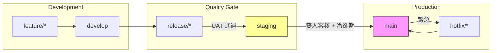
```mermaid
graph LR
    subgraph "Development"
        F[feature/*] --> D[develop]
    end
    subgraph "Quality Gate"
        D --> R[release/*]
        R --> |UAT 通過| S[staging]
    end
    subgraph "Production"
        S --> |雙人審核 + 冷卻期| M[main]
        M --> |緊急| H[hotfix/*]
        H --> M
    end

    style M fill:#f9f,stroke:#333
    style S fill:#ff9,stroke:#333
```

### 15.2 Repository 分層治理

| 治理層級 | 管轄範圍 | 負責角色 | 主要職責 |
|---------|---------|---------|---------|
| **Enterprise** | 全組織策略 | CTO / CISO | 政策制定、合規要求 |
| **Organization** | 所有 Repos | Platform Team | Ruleset、Template、Shared Workflow |
| **Team** | 團隊 Repos | Tech Lead | 具體實施、Code Review |
| **Repository** | 單一 Repo | Maintainer | 日常維護、Issue 管理 |

**Organization-level Ruleset**（跨 Repo 統一規則） ⚠️ 需 GitHub Enterprise Cloud：

```json
{
  "name": "org-wide-main-protection",
  "target": "branch",
  "enforcement": "active",
  "bypass_actors": [
    { "actor_id": 1, "actor_type": "OrganizationAdmin", "bypass_mode": "pull_request" }
  ],
  "conditions": {
    "repository_name": { "include": ["~ALL"], "exclude": ["docs-*", "tmpl-*"] },
    "ref_name": { "include": ["~DEFAULT_BRANCH"], "exclude": [] }
  },
  "rules": [
    { "type": "pull_request", "parameters": {
        "required_approving_review_count": 1,
        "dismiss_stale_reviews_on_push": true,
        "require_code_owner_review": false,
        "require_last_push_approval": false,
        "required_review_thread_resolution": false } },
    { "type": "required_status_checks", "parameters": {
        "strict_required_status_checks_policy": false,
        "required_status_checks": [ { "context": "ci/build" } ] } },
    { "type": "non_fast_forward" }
  ]
}
```

以 `gh api orgs/acme-bank/rulesets -X POST --input org-wide-main-protection.json` 建立。上例的 Bypass 模式設為 `pull_request`，代表組織管理員只能在 PR 中繞過規則（留下紀錄），而非任意直接推送。更進一步的做法是以 `repository_property` 依 `service-tier` 分級套用不同強度（見 [2.6](#26-custom-properties-與-repository-分類治理)）。

### 15.3 權限隔離設計

大型企業常見的治理失誤，是讓同一批人對「正式環境 Repo」與「開發/測試 Repo」擁有相同層級的權限，導致實驗性質的變更也能直接觸及生產程式碼。權限隔離設計的核心原則是：**權限層級應與 Repo 的風險等級成正比，而非與團隊成員的職稱成正比**。下圖示範同一批開發者對不同風險等級 Repo 應有的差異化權限：

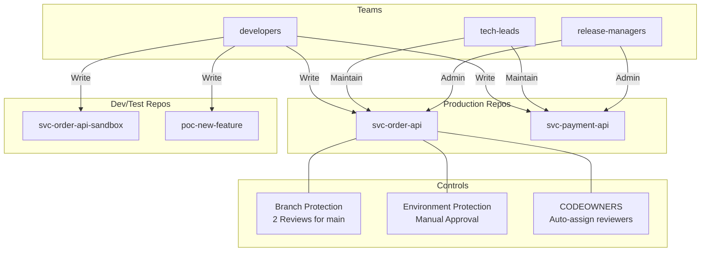
```mermaid
graph TB
    subgraph "Production Repos"
        P1[svc-order-api]
        P2[svc-payment-api]
    end

    subgraph "Dev/Test Repos"
        D1[svc-order-api-sandbox]
        D2[poc-new-feature]
    end

    subgraph "Teams"
        T1[developers] -->|Write| D1
        T1 -->|Write| D2
        T1 -->|Write| P1
        T1 -->|Write| P2

        T2[tech-leads] -->|Maintain| P1
        T2 -->|Maintain| P2

        T3[release-managers] -->|Admin| P1
        T3 -->|Admin| P2
    end

    subgraph "Controls"
        C1[Branch Protection<br/>2 Reviews for main]
        C2[Environment Protection<br/>Manual Approval]
        C3[CODEOWNERS<br/>Auto-assign reviewers]
    end

    P1 --- C1
    P1 --- C2
    P1 --- C3
```

**權限層級與 Repo 風險等級對應**：

| Repo 類型 | 一般開發者 | Tech Lead | Release Manager |
|----------|-----------|-----------|-----------------|
| Dev/Test（Sandbox、PoC） | Write | Write | Write |
| Production（正式服務） | Write（僅能開 PR，不可直接 Push） | Maintain（管理 Issue/PR，不可繞過保護） | Admin（含部署核准權） |

同一位開發者在 Sandbox Repo 可自由 Push 實驗性程式碼，但在 Production Repo 僅能透過 PR 提交變更；`release-managers` 團隊則是唯一具備 Production Repo Admin 權限、可核准部署的角色，與 [15.4 Compliance 與稽核](#154-compliance-與稽核) 強調的職責分離原則一致。此設計搭配 Branch Protection（或 [7.6 Repository Rulesets](#76-repository-rulesets-深入指南)）與 Environment Protection 雙重關卡，確保「權限」與「規則」兩層防線同時存在，避免單一設定失誤就導致 Production 曝險。

> **企業建議**：權限隔離不應仰賴人工記憶哪個 Repo 屬於哪個風險等級，建議以必填的 Custom Property `service-tier`（[2.6](#26-custom-properties-與-repository-分類治理)）標記風險等級，再搭配 Organization-level Ruleset（[3.4](#34-repository-governance)）依屬性自動套用對應的保護強度；命名前綴（[2.3](#23-repository-命名規範)）可作為輔助，但不應作為唯一依據，因為名稱可被 Repo 管理員自行修改。

### 15.4 Compliance 與稽核

**合規自動化 Workflow**：

```yaml
# .github/workflows/compliance-check.yml
name: Compliance Check

on:
  pull_request:
    branches: [main, release/*]

jobs:
  compliance:
    runs-on: ubuntu-latest
    steps:
      - uses: actions/checkout@v7
        with:
          fetch-depth: 0     # 簽章檢查需要完整歷史

      - name: Check LICENSE exists
        run: test -f LICENSE || (echo "❌ LICENSE file missing" && exit 1)

      - name: Check SECURITY.md exists
        run: test -f SECURITY.md || (echo "❌ SECURITY.md missing" && exit 1)

      - name: Check CODEOWNERS exists
        run: test -f CODEOWNERS || test -f .github/CODEOWNERS || (echo "❌ CODEOWNERS missing" && exit 1)

      - name: Verify no secrets in code
        run: |
          # 檢查常見密碼模式
          if grep -rn "password\s*=\s*['\"][^'\"]*['\"]" src/; then
            echo "❌ Hardcoded password detected"
            exit 1
          fi

      - name: Check commit signature
        run: |
          # 驗證 PR 內的 commit 是否有簽名（%G? 為 N 代表未簽章）
          UNSIGNED=$(git log --format='%H %G?' origin/${{ github.base_ref }}..HEAD | awk '$2=="N"' | wc -l)
          if [ "$UNSIGNED" -gt 0 ]; then
            echo "⚠️ ${UNSIGNED} unsigned commits detected"
          fi
          # 強制要求簽章應使用 Ruleset 的 required_signatures 規則，此步驟僅作提示

      - name: SBOM Generation
        uses: anchore/sbom-action@v0
        with:
          path: .
          format: spdx-json
```

> **實務建議**：LICENSE、SECURITY.md、CODEOWNERS 的存在檢查也可改以組織級 Ruleset 的「Require workflows to pass before merging」集中強制，讓所有 Repo 共用同一份合規 Workflow。
>
> **實務建議**：金融業的「職責分離」原則在 GitHub 上的體現是：**寫程式碼的人不能 Approve 自己的 PR**、**Approve PR 的人不能觸發部署**、**部署的人不能修改 Pipeline**。透過 CODEOWNERS + Branch Protection + Environment Protection 三層機制實現。

---

## 第 16 章 完整企業範例

> 📌 **本章摘要**：本章以虛構的艾可銀行串連全書：Organization 架構、Repository 分類、CI/CD Pipeline、DevSecOps 整合、AI Workflow 與 SSDLC 完整流程。

### 16.1 Organization 架構設計

以虛構的「艾可銀行（Acme Bank）」為例：

```text
GitHub Enterprise Cloud
└── Organization: acme-bank
    ├── Plan: Enterprise Cloud
    ├── SSO: Azure AD (SAML)
    ├── SCIM: Enabled (自動同步人員)
    ├── 2FA: Required
    ├── Default Permission: None
    ├── Fork Policy: Disabled
    ├── Custom Properties: owner-team / service-tier / data-classification / lifecycle（必填）
    ├── Org Rulesets: 依 service-tier 分級套用
    ├── Security Configuration: Secret Protection + Code Security（全 Repo）
    └── Teams:
        ├── org-admins (3 人)
        ├── security-team (5 人)
        ├── architecture-team (4 人)
        ├── platform-team (6 人)
        ├── devops-team (8 人)
        ├── backend-core (15 人)
        │   ├── backend-order (5 人)
        │   ├── backend-payment (5 人)
        │   └── backend-account (5 人)
        ├── frontend-team (10 人)
        ├── mobile-team (6 人)
        ├── qa-team (8 人)
        └── data-team (6 人)
```

### 16.2 Repository 命名與分類

```text
acme-bank/
│
├── 🏗️ Platform Layer
│   ├── platform-java-lib-core         # Java 核心共用庫
│   ├── platform-java-lib-security     # 安全框架
│   ├── platform-java-lib-messaging    # Kafka 抽象層
│   ├── platform-java-starter-web      # Spring Boot Starter
│   └── platform-ui-component-lib      # UI Component Library
│
├── 🔧 Service Layer
│   ├── svc-order-api                  # 訂單服務
│   ├── svc-payment-api                # 支付服務
│   ├── svc-account-api                # 帳戶服務
│   ├── svc-notification-worker        # 通知 Worker
│   ├── svc-auth-api                   # 認證服務
│   └── gateway-api                    # API Gateway
│
├── 🖥️ Application Layer
│   ├── app-internet-banking           # 網路銀行
│   ├── app-mobile-banking             # 行動銀行
│   ├── app-admin-portal               # 管理後台
│   └── app-merchant-portal            # 商戶平台
│
├── 🏭 Infrastructure Layer
│   ├── infra-terraform-aws            # Terraform (AWS)
│   ├── infra-k8s-manifests            # K8s 部署配置
│   ├── infra-helm-charts              # Helm Charts
│   ├── infra-monitoring               # 監控配置
│   └── infra-database-migrations      # DB Schema 管理
│
├── 📚 Documentation Layer
│   ├── docs-architecture              # 架構文件 + ADR
│   ├── docs-api-specs                 # API 規格集中管理
│   ├── docs-runbook                   # 維運手冊
│   └── docs-onboarding               # 新人入職指南
│
├── 📋 Template Layer
│   ├── tmpl-spring-boot               # Spring Boot Template
│   ├── tmpl-vue-app                   # Vue 應用 Template
│   └── tmpl-github-action             # Action Template
│
├── 🔄 Workflow Layer
│   ├── wf-shared-actions              # 共用 GitHub Actions
│   ├── wf-reusable-workflows          # 可重用 Workflows
│   └── .github                        # Organization 預設設定
│
└── 🤖 AI Layer
    ├── ai-prompt-library              # Prompt 庫
    ├── ai-copilot-instructions        # Copilot 指引集
    └── ai-agent-configs               # Agent 配置
```

### 16.3 CI/CD Pipeline 完整設計

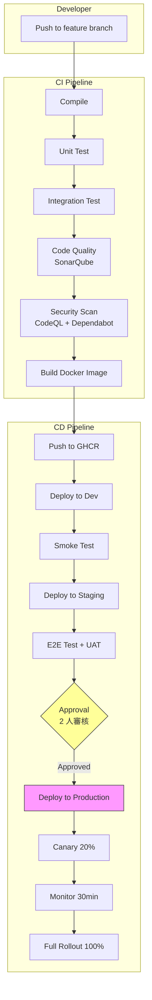
```mermaid
graph TB
    subgraph "Developer"
        A[Push to feature branch]
    end

    subgraph "CI Pipeline"
        B[Compile] --> C[Unit Test]
        C --> D[Integration Test]
        D --> E[Code Quality<br/>SonarQube]
        E --> F[Security Scan<br/>CodeQL + Dependabot]
        F --> G[Build Docker Image]
    end

    subgraph "CD Pipeline"
        G --> H[Push to GHCR]
        H --> I[Deploy to Dev]
        I --> J[Smoke Test]
        J --> K[Deploy to Staging]
        K --> L[E2E Test + UAT]
        L --> M{Approval<br/>2 人審核}
        M -->|Approved| N[Deploy to Production]
        N --> O[Canary 20%]
        O --> P[Monitor 30min]
        P --> Q[Full Rollout 100%]
    end

    A --> B

    style N fill:#f9f,stroke:#333
    style M fill:#ff9,stroke:#333
```

### 16.4 DevSecOps 整合架構

```yaml
# 完整 DevSecOps Pipeline 概覽
stages:
  pre-commit:
    tools:
      - commitlint          # Commit 格式檢查
      - husky               # Git Hooks
      - secret-detection    # 本地 Secret 掃描

  ci-build:
    tools:
      - Maven/Gradle        # 編譯
      - JUnit/Mockito       # 單元測試
      - JaCoCo              # 覆蓋率 > 80%
      - Checkstyle          # 程式碼風格

  ci-security:
    tools:
      - CodeQL              # SAST
      - Dependabot          # SCA (依賴弱點)
      - TruffleHog          # Secret Detection
      - SpotBugs + FindSecBugs  # Java 安全 Bug

  ci-quality:
    tools:
      - SonarQube           # 品質閘道
      - Spotless            # 格式化
      - ArchUnit            # 架構規則檢查

  cd-build:
    tools:
      - Docker Build        # 容器映像
      - Trivy               # 容器弱點掃描
      - Hadolint            # Dockerfile Lint
      - SBOM (Syft)         # 軟體清單

  cd-deploy:
    tools:
      - Helm/Kustomize      # K8s 部署
      - ArgoCD              # GitOps
      - Canary Release      # 漸進式發佈

  post-deploy:
    tools:
      - DAST (OWASP ZAP)   # 動態安全測試
      - Lighthouse          # 效能測試
      - Chaos Engineering   # 韌性測試
```

### 16.5 AI Workflow 整合

在艾可銀行的實務場景中，AI 工具並非孤立導入，而是嵌入既有的開發生命週期中，於每個階段扮演不同角色：

**AI 輔助開發全流程**：

| 階段 | AI 工具 | 用途 |
|------|---------|------|
| **規劃** | Copilot Chat | 技術方案討論、Architecture Review |
| **開發** | Copilot / Claude | 程式碼生成、補全、重構 |
| **測試** | Copilot | 自動生成單元測試 |
| **Review** | Copilot code review | 以 Ruleset 自動審查（Lite / Balanced） |
| **修補** | Copilot Autofix / cloud agent | 安全告警與 Code Quality 問題的修正 PR |
| **文件** | Copilot | ADR 生成、API 文件 |
| **維運** | Copilot CLI | 指令建議、Log 分析 |

**Cloud Agent 與既有 Pipeline 的銜接**：當 [13.6](#136-github-copilot-cloud-agent原-coding-agent) 的 Copilot cloud agent 被指派 Issue 並自動開出 PR 時，該 PR 並不會取得任何特殊待遇——仍須完整通過 [16.3 CI/CD Pipeline](#163-cicd-pipeline-完整設計) 的 Compile、Test、Security Scan 等關卡，並依 CODEOWNERS 指派至少 2 位人工 Reviewer，與人類撰寫的 PR 一視同仁。這是落實 [13.5 AI Governance 規範](#135-ai-governance-規範)「AI 生成程式碼必須人工審查」原則的具體實踐：治理規範不是寫在文件裡的口號，而是直接體現在 Branch Protection / Ruleset 的強制檢查項目中，AI 與人類貢獻者受同一套規則約束。

### 16.6 SSDLC 完整流程

```mermaid
graph LR
    subgraph "Plan"
        A1[Threat Modeling<br/>STRIDE]
        A2[Security Requirements<br/>ASVS]
    end

    subgraph "Develop"
        B1[Secure Coding<br/>OWASP Top 10]
        B2[SAST<br/>CodeQL]
        B3[SCA<br/>Dependabot]
        B4[Secret Scan]
    end

    subgraph "Verify"
        C1[DAST<br/>OWASP ZAP]
        C2[Pen Test]
        C3[Container Scan<br/>Trivy]
    end

    subgraph "Release"
        D1[SBOM]
        D2[Signed Image]
        D3[Compliance Check]
    end

    subgraph "Operate"
        E1[Runtime Protection]
        E2[Incident Response]
        E3[Vulnerability Management]
    end

    A1 --> B1
    A2 --> B1
    B1 --> B2
    B2 --> B3
    B3 --> B4
    B4 --> C1
    C1 --> C2
    C2 --> C3
    C3 --> D1
    D1 --> D2
    D2 --> D3
    D3 --> E1
    E1 --> E2
    E2 --> E3
    E3 --> A1
```

> **實務建議**：完整 SSDLC 不需要一次到位。建議分三階段推進：(1) 先建立 CI 安全基線（CodeQL + Dependabot + Secret Scan），(2) 加入容器安全與 SBOM，(3) 完善 DAST + 合規自動化。

---

## 第 17 章 常見問題與最佳實踐

> 📌 **本章摘要**：本章彙整常見的 Anti-pattern、Repository 十大安全風險與 Actions 安全寫法、治理原則，以及新 Repository 的最終檢核清單。

### 17.1 常見錯誤與 Anti-pattern

| Anti-pattern | 問題 | 正確做法 |
|--------------|------|---------|
| 💀 密碼硬編碼 | 洩漏至 Git 歷史 | 使用 GitHub Secrets / Vault |
| 💀 main 直接 Push | 無審查、易出錯 | 強制 PR + Branch Protection |
| 💀 巨型 Commit | 難以 Review、難以 Rollback | 小而頻繁的 Commit |
| 💀 無 .gitignore | 垃圾檔案進入 Repo | 建立時即設定 .gitignore |
| 💀 無 CI | 品質無保證 | 最少要有 Build + Test |
| 💀 永不清理 Branch | 混亂、找不到有效分支 | 合併後自動刪除 |
| 💀 權限過大 | 安全風險 | 最小權限原則 |
| 💀 無 CODEOWNERS | PR 無人審查 | 設定明確的 Code Owner |
| 💀 單一超大 Monorepo | CI 慢、權限無法隔離 | 依業務拆分 |
| 💀 忽略 Dependabot PR | 累積安全債務 | 每週固定處理 |

### 17.2 Security Risk 防範

**Top 10 Repository Security Risks**：

1. **Credential Leakage** → Secret Scanning + Push Protection
2. **Vulnerable Dependencies** → Dependabot + Auto-merge for patch
3. **Code Injection (CI)** → Pin Actions to SHA + Restrict permissions + Workflow execution protections（`pull_request_target` 管控）
4. **Unauthorized Access** → SSO + RBAC + Regular Access Review
5. **Supply Chain Attack** → SBOM + Signed Commits + Artifact Attestations + Immutable Releases
6. **Misconfigured Permissions** → Organization Rulesets
7. **Stale Credentials** → Secret Rotation Automation
8. **Missing Security Patches** → Scheduled Security Scan
9. **Insider Threats** → Audit Log Monitoring + Alerts
10. **Shadow IT Repos** → Fork Policy + Repository Creation Policy

**GitHub Actions 安全最佳實踐**：

```yaml
# ✅ 安全的 Actions 寫法
jobs:
  build:
    permissions:
      contents: read       # 最小權限
      packages: write
    runs-on: ubuntu-latest
    steps:
      # ✅ Pin to specific SHA（防止 Supply Chain Attack）
      - uses: actions/checkout@3d3c42e5aac5ba805825da76410c181273ba90b1  # v7.0.1

      # ✅ 限制 GITHUB_TOKEN 權限
      # ✅ 不在 log 中印出 Secret
      - name: Deploy
        run: |
          echo "Deploying..."
        env:
          API_KEY: ${{ secrets.API_KEY }}  # 不要用 echo ${{ secrets.X }}
```

**為什麼一定要以 SHA 釘選**：Tag 可以被移動。2026-03-19 的 Trivy 事件中，攻擊者把 `aquasecurity/trivy-action` 幾乎所有版本 Tag 改指向竊取憑證的程式（見 [9.6](#96-container-security)），以 Tag 引用的 Workflow 全數中招，以 SHA 釘選者不受影響。組織可在 Actions Policy 強制要求 SHA 釘選（2025-08-15 起），並讓 Dependabot 自動更新 SHA 與版本註解。

### 17.3 Repository 治理 Best Practices

**成功的 Repository 管理十大原則**：

1. **Template First**：所有新 Repo 必須從 Template 建立
2. **Automate Everything**：能自動化的都自動化（CI/CD、Branch Cleanup、Release）
3. **Shift Left Security**：安全檢查越早執行越好
4. **Minimum Viable Documentation**：至少要有 README + ADR + CODEOWNERS
5. **Consistent Naming**：嚴格遵循命名規範
6. **Regular Hygiene**：每季做 Repo 健康檢查
7. **Least Privilege**：權限永遠給最小的
8. **Code Review Culture**：PR Review 是品質的最後防線
9. **Metric Driven**：追蹤 Lead Time、MTTR、Deploy Frequency
10. **Continuous Improvement**：定期 Retrospective，持續優化流程

### 17.4 最終 Governance Checklist

**新 Repository 建立 Checklist（必須全部通過）**：

- [ ] 命名符合 `{layer}-{domain}-{type}-{name}` 規範
- [ ] Visibility 設定正確（預設 Private）
- [ ] README.md 完整（描述 + 技術棧 + 快速開始）
- [ ] .gitignore 已配置
- [ ] CODEOWNERS 已設定
- [ ] SECURITY.md 已建立
- [ ] 必填 Custom Properties 已設定（owner-team、service-tier、data-classification）
- [ ] 預設分支與 develop 已受 Ruleset 保護（組織級或 Repo 級）
- [ ] CI Workflow 已設定（至少 Build + Test）
- [ ] Security Scan 已啟用（CodeQL + Dependabot）
- [ ] Secret Scanning 已啟用
- [ ] Team 權限已正確分配
- [ ] Issue Template 已建立
- [ ] PR Template 已建立

---

## 第 18 章 GitHub Codespaces 與 Packages

> 📌 **本章摘要**：本章說明 Codespaces 雲端開發環境與企業配置（含 Prebuild 與資料落地）、GitHub Packages 套件發佈與計費，以及以 Discussions 沉澱技術討論。

### 18.1 GitHub Codespaces 雲端開發環境

GitHub Codespaces 提供完全託管的雲端開發環境，開發者可在瀏覽器或本地 VS Code 中連線至雲端容器，無需在本機安裝開發工具即可立即開始開發。

**核心價值**：

| 優勢 | 說明 |
|------|------|
| **零配置上手** | 新成員無需花費數小時配置開發環境 |
| **環境一致性** | 所有人使用相同的容器化環境，消除「在我機器上可以跑」問題 |
| **安全性** | 原始碼不需下載至個人電腦 |
| **效能** | 可選擇高規格雲端機器（最高 32 核心 / 128 GB RAM） |
| **多專案切換** | 同時維護多個 Codespace，各自獨立 |

**Dev Container 配置**：

```json
// .devcontainer/devcontainer.json
{
  "name": "Order Service Development",
  "image": "mcr.microsoft.com/devcontainers/java:21-bookworm",
  "features": {
    "ghcr.io/devcontainers/features/java:1": {
      "version": "21",
      "installMaven": "true",
      "installGradle": "false"
    },
    "ghcr.io/devcontainers/features/docker-in-docker:2": {},
    "ghcr.io/devcontainers/features/github-cli:1": {}
  },
  "customizations": {
    "vscode": {
      "extensions": [
        "vscjava.vscode-java-pack",
        "redhat.vscode-xml",
        "GitHub.copilot",
        "GitHub.copilot-chat",
        "ms-azuretools.vscode-docker"
      ],
      "settings": {
        "java.compile.nullAnalysis.mode": "automatic",
        "editor.formatOnSave": true
      }
    }
  },
  "forwardPorts": [8080, 5432],
  "postCreateCommand": "mvn install -DskipTests -q",
  "remoteUser": "vscode"
}
```

**Docker Compose 整合（含依賴服務）**：

```json
// .devcontainer/devcontainer.json（多容器版）
{
  "name": "Full Stack Development",
  "dockerComposeFile": "docker-compose.yml",
  "service": "app",
  "workspaceFolder": "/workspace",
  "forwardPorts": [8080, 5432, 6379],
  "postCreateCommand": "mvn install -DskipTests"
}
```

```yaml
# .devcontainer/docker-compose.yml
services:
  app:
    build:
      context: .
      dockerfile: Dockerfile
    volumes:
      - ../..:/workspace:cached
    command: sleep infinity

  db:
    image: postgres:16
    environment:
      POSTGRES_DB: orderdb
      POSTGRES_USER: dev
      POSTGRES_PASSWORD: devpass
    volumes:
      - postgres-data:/var/lib/postgresql/data

  redis:
    image: redis:7-alpine

volumes:
  postgres-data:
```

### 18.2 Codespaces 企業配置

**Organization 層級 Codespaces 策略** ⚠️ 需 GitHub Team 或 Enterprise（由組織付費並管理政策；EMU 受管帳號的個人 Repo 不可使用 Codespaces）：

| 設定項目 | 建議值 | 說明 |
|---------|-------|------|
| 啟用 Codespaces | 指定 Repo | 非所有 Repo 都需要 |
| Machine Type 限制 | 4-core / 8 GB | 控制成本 |
| Idle Timeout | 30 分鐘 | 閒置自動停止 |
| Retention Period | 14 天 | 未使用的 Codespace 自動刪除 |
| Prebuild 配置 | 核心 Repo 啟用 | 加速 Codespace 建立 |
| Secret 管理 | Organization Secrets | 集中管理敏感設定 |

**Prebuild 配置（加速啟動）**：Prebuild 不是自行撰寫的 Workflow，而是在 Repository → Settings → Codespaces → **Set up prebuild** 建立「Prebuild configuration」，GitHub 會自動產生並管理對應的 Actions Workflow：

| 設定 | 建議值 |
|------|-------|
| Branch | `main`（與常用的長期分支） |
| Dev container 設定檔 | `.devcontainer/devcontainer.json` |
| Region | 與開發者所在地相近的區域 |
| Prebuild triggers | 「Configuration change」（僅在 `.devcontainer` 變更時重建，節省費用）或每次推送 |
| Template history | 保留 1～2 個版本 |
| Failure notifications | 通知平台團隊 |

> ⚠️ **v3.0 更正**：v2.2 以自訂 Workflow 示範 Prebuild，該 Workflow 不會產生任何 Codespaces 映像；Prebuild 需透過上述設定建立。Prebuild 會消耗 Actions 分鐘數與 Codespaces 儲存空間。

**費用控管策略**：

| 機器類型 | 每小時費用（USD） | 適用場景 |
|---------|----------------|---------|
| 2 核心 / 8 GB | ~$0.18 | 文件編輯、輕量開發 |
| 4 核心 / 16 GB | ~$0.36 | 一般後端開發 |
| 8 核心 / 32 GB | ~$0.72 | 大型專案建置 |
| 16 核心 / 64 GB | ~$1.44 | 機器學習、重度編譯 |
| 32 核心 / 128 GB | ~$2.88 | 超大型 Monorepo |
| 儲存 | $0.07 / GB-月 | Codespace 與 Prebuild 映像 |

**資料落地（Data Residency）** ⚠️ 需 GitHub Enterprise Cloud：

Codespaces 已於 **2026-04-01** 在 **GitHub Enterprise Cloud with data residency（GHE.com）** 正式 GA，與一般 Codespaces 功能對等，涵蓋所有資料落地區域：**Australia、EU、Japan、US**；為維持資料落地，只能使用由企業或組織擁有的 Codespaces，不支援使用者自有的 Codespaces，滿足金融、醫療等對資料主權（Data Sovereignty）有嚴格法規要求的產業需求。

> **企業建議**：
>
> - 在 Template Repo 中預先配置 `.devcontainer`，確保所有新專案支援 Codespaces
> - 設定 Idle Timeout 和機器類型上限控制成本
> - 核心專案啟用 Prebuild 減少等待時間
> - 配合 Secret Management 確保 Codespace 中不暴露生產環境憑證
> - 若企業受個資或資料主權法規（如 GDPR）規範，應評估啟用 Codespaces 資料落地，將開發環境資料限定於核准的地理區域內

### 18.3 GitHub Packages 套件管理

GitHub Packages 是 GitHub 內建的套件託管服務，支援多種套件格式，與 Repository 和 Actions 深度整合。

**支援的套件格式**：

| 格式 | Registry | 用途 |
|------|----------|------|
| **Container（Docker）** | `ghcr.io` | Docker / OCI 映像 |
| **Maven** | `maven.pkg.github.com` | Java / Kotlin 套件 |
| **npm** | `npm.pkg.github.com` | JavaScript / TypeScript |
| **NuGet** | `nuget.pkg.github.com` | .NET 套件 |
| **RubyGems** | `rubygems.pkg.github.com` | Ruby 套件 |

**Maven 套件發佈配置**：

```xml
<!-- pom.xml -->
<distributionManagement>
  <repository>
    <id>github</id>
    <name>GitHub Packages</name>
    <url>https://maven.pkg.github.com/acme-bank/platform-java-lib-core</url>
  </repository>
</distributionManagement>
```

```xml
<!-- settings.xml -->
<servers>
  <server>
    <id>github</id>
    <username>${env.GITHUB_ACTOR}</username>
    <password>${env.GITHUB_TOKEN}</password>
  </server>
</servers>
```

**自動發佈 Workflow**：

```yaml
# .github/workflows/publish-package.yml
name: Publish Package

on:
  release:
    types: [published]

permissions:
  contents: read
  packages: write

jobs:
  publish:
    runs-on: ubuntu-latest
    steps:
      - uses: actions/checkout@v7
      - uses: actions/setup-java@v6
        with:
          distribution: 'temurin'
          java-version: '21'
          cache: 'maven'

      - name: Publish to GitHub Packages
        run: mvn deploy -B -DskipTests
        env:
          GITHUB_TOKEN: ${{ secrets.GITHUB_TOKEN }}
```

**Container Image 發佈**：

```yaml
# .github/workflows/publish-container.yml
name: Publish Container Image

on:
  push:
    tags: ['v*']

permissions:
  contents: read
  packages: write

jobs:
  publish:
    runs-on: ubuntu-latest
    steps:
      - uses: actions/checkout@v7

      - name: Login to GHCR
        uses: docker/login-action@v4
        with:
          registry: ghcr.io
          username: ${{ github.actor }}
          password: ${{ secrets.GITHUB_TOKEN }}

      - name: Build & Push
        uses: docker/build-push-action@v7
        with:
          context: .
          push: true
          tags: |
            ghcr.io/${{ github.repository }}:${{ github.ref_name }}
            ghcr.io/${{ github.repository }}:latest
```

**Packages 儲存配額**：

| GitHub 方案 | 儲存空間 | 傳輸頻寬（月） |
|------------|---------|-------------|
| **Free** | 500 MB | 1 GB |
| **Team** | 2 GB | 10 GB |
| **Enterprise** | 50 GB | 100 GB |

> 補充說明：上表儲存空間與 **GitHub Actions Artifacts 共用同一份方案額度**（並非各自獨立計算），規劃容量時應合併評估兩者用量；傳輸頻寬以月為單位重置，儲存空間則以帳單週期連續累計計算。公開套件完全免費；GitHub Actions 以 `GITHUB_TOKEN` 下載套件不計入傳輸量，以 PAT 下載則會計費——這也是 CI 中應使用 `GITHUB_TOKEN` 的另一個理由。
>
> **企業建議**：使用 GitHub Packages 作為內部共用庫的統一發佈平台，搭配 Release Workflow 實現「Tag → Build → Test → Publish」全自動化。Container Image 統一使用 `ghcr.io` 避免外部 Registry 依賴。

### 18.4 GitHub Discussions 社群協作

GitHub Discussions 提供結構化的社群討論空間，適合用於技術問答、設計提案、公告等非 Issue 性質的交流。

**Discussions vs Issues**：

| 面向 | Issues | Discussions |
|------|--------|-------------|
| **用途** | 可追蹤的工作項目（Bug / Feature） | 開放式討論、問答、公告 |
| **狀態追蹤** | Open / Closed | Open / Answered / Closed |
| **Assignee** | ✅ | ❌ |
| **Label** | ✅ | ✅ |
| **轉換** | — | 可轉換為 Issue |
| **投票** | Reactions | ✅ 正式投票功能 |
| **分類** | Label | Category（結構化分類） |

**建議的 Discussion Category 設計**：

| Category | Emoji | 用途 | 格式 |
|----------|-------|------|------|
| **Announcements** | 📣 | 團隊公告、重大變更 | Announcement |
| **Architecture** | 🏗️ | 架構設計討論、RFC | Open-ended |
| **Q&A** | 💬 | 技術問題與解答 | Question / Answer |
| **Ideas** | 💡 | 功能建議、改善想法 | Open-ended |
| **Show and Tell** | 🎉 | 分享成果、Demo | Open-ended |
| **RFC** | 📝 | Request for Comments | Poll |

```bash
# 使用 GitHub CLI 建立 Discussion
gh discussion create \
  --repo acme-bank/svc-order-api \
  --title "RFC: 訂單服務 Event Schema 設計" \
  --body "提案內容..." \
  --category "Architecture"
```

**GitHub CLI 完整 Discussions 子指令**（GitHub CLI v2.94.0，2026-06-10 起支援）：

| 子指令 | 用途 |
|--------|------|
| `gh discussion list` | 列出 Repository 的 Discussions |
| `gh discussion view <number>` | 檢視特定 Discussion 內容 |
| `gh discussion create` | 建立新 Discussion |
| `gh discussion edit <number>` | 編輯既有 Discussion |
| `gh discussion comment <number>` | 於 Discussion 新增留言 |

過去僅能透過 Web UI 或 GraphQL API 操作 Discussions，現已可完全透過 CLI 納入日常開發或自動化腳本流程。

> **企業建議**：
>
> - 使用 Discussions 取代非正式的 Slack / Email 技術討論，確保知識可被搜尋與沉澱
> - 架構決策先在 Discussions 討論，達成共識後轉為 ADR
> - 啟用 Announcements 類別作為團隊正式公告管道
> - 善用「轉換為 Issue」功能，將討論中產生的行動項目轉為可追蹤的工作

---

## 附錄 A：快速檢查清單

### A.1 Repository 建立快速清單

- [ ] 確認 Repository 名稱符合規範
- [ ] 從 Template 建立（非空白建立）
- [ ] 設定 Visibility（Private）
- [ ] 初始化 README / .gitignore / LICENSE
- [ ] 填寫必填 Custom Properties
- [ ] 設定 CODEOWNERS（含 AI Agent 設定檔）
- [ ] 確認 Ruleset 已套用（組織級或 Repo 級）
- [ ] 配置 CI/CD Workflow
- [ ] 啟用 Dependabot
- [ ] 啟用 Secret Scanning
- [ ] 啟用 CodeQL
- [ ] 啟用 Private Vulnerability Reporting（公開 Repo）
- [ ] 套用 Repository 設定基準（[4.12](#412-repository-設定基準總表)）
- [ ] 設定 Team 權限
- [ ] 建立 develop branch
- [ ] 建立 Issue Template + PR Template

### A.2 Pull Request 審查清單

- [ ] PR Title 符合 Conventional Commits
- [ ] PR 描述清楚說明變更目的
- [ ] 關聯對應的 Issue
- [ ] CI 全部通過
- [ ] 無安全告警
- [ ] 有對應的測試
- [ ] 程式碼遵循架構規範
- [ ] 無硬編碼敏感資訊
- [ ] 文件已更新（如適用）
- [ ] CODEOWNERS 已 Approve

### A.3 Release 檢查清單

- [ ] 所有 CI 檢查通過
- [ ] Security Scan 無 Critical/High 漏洞
- [ ] 版本號符合 Semantic Versioning
- [ ] Changelog 已生成
- [ ] Tag 已建立（Annotated Tag）
- [ ] Release Notes 已撰寫
- [ ] Staging 環境驗證通過
- [ ] Production 部署計畫已審核
- [ ] Rollback 計畫已備妥
- [ ] 相關團隊已通知

### A.4 季度 Repository 治理清單

- [ ] 權限審查完成（移除離職/轉調人員）
- [ ] 已合併的 Branch 已清理
- [ ] Secret 輪換完成
- [ ] Dependabot PR 已處理
- [ ] 無活動 Repo 已標記 Deprecated
- [ ] Ruleset 與 Bypass 紀錄確認（Rule insights）
- [ ] CI/CD Pipeline 效能檢視
- [ ] Security Alert 清零（Critical/High）
- [ ] 文件更新確認（README / ADR）
- [ ] 團隊 CODEOWNERS 更新

### A.5 Repository 設定稽核清單

> 🆕 **v3.0 新增**

**Metadata 與生命週期**：

- [ ] 必填 Custom Properties 均已填寫明確值（非僅繼承預設值）
- [ ] `lifecycle` 屬性與實際狀態一致；`deprecated` 的 Repo 已排程封存
- [ ] Repo 描述、Topics 與 README 負責人資訊為最新

**規則與保護**：

- [ ] 預設分支已受組織級或 Repo 級 Ruleset 保護，無殘留的 Classic Branch Protection
- [ ] Ruleset 的 Bypass 清單只包含必要的角色、Team、App 或服務帳號
- [ ] 過去一季 Rule insights 中的 Bypass 紀錄皆有對應的核准理由
- [ ] Push Rulesets 已阻擋金鑰、憑證與不允許的二進位檔
- [ ] Merge Queue（若啟用）的 CI Workflow 已包含 `merge_group` 觸發

**Repository 設定**（對照 [4.12](#412-repository-設定基準總表)）：

- [ ] 私有 Repo 已關閉 Forking
- [ ] 已開啟「Automatically delete head branches」與「Allow auto-merge」
- [ ] 只開啟策略允許的合併方式
- [ ] Wiki 依政策關閉

**Actions 與供應鏈**：

- [ ] `GITHUB_TOKEN` 預設權限為唯讀
- [ ] 組織或 Repo 已啟用「Actions 必須以完整 Commit SHA 釘選」
- [ ] 所有 Action 已升級至支援 Node 24 的版本
- [ ] 公開 Repo 已檢查 `pull_request_target` 使用情況（2026-11-02 預設停用）
- [ ] 對外發佈的 Repo 已啟用 Immutable Releases

**安全功能**：

- [ ] Dependency graph、Dependabot alerts 與 security updates 已啟用
- [ ] Secret scanning、Push protection 與 Delegated bypass 已啟用（需 Secret Protection）
- [ ] Code scanning（CodeQL）已啟用，且無逾期未處理的 Critical / High 告警
- [ ] Private vulnerability reporting 已啟用，SECURITY.md 已提供通報管道

**AI Agent 設定**：

- [ ] `copilot-instructions.md`、`AGENTS.md`、`.github/agents/`、`copilot-setup-steps.yml` 已納入 CODEOWNERS
- [ ] Copilot cloud agent 的可用範圍符合組織政策

---

## 附錄 B：官方參考資源對照表

> 🆕 **v3.0 新增**：本手冊各章節主要依據的 GitHub 官方文件，查證日期 2026-09-25。

### B.1 GitHub Docs — Repositories

| 主題 | 官方文件 | 對應章節 |
|------|---------|---------|
| Repository 總覽 | [Repositories documentation](https://docs.github.com/en/repositories) | 全書 |
| 最佳實務 | [Best practices for repositories](https://docs.github.com/en/repositories/creating-and-managing-repositories/best-practices-for-repositories) | 1.8 |
| 限制與配額 | [Repository limits](https://docs.github.com/en/repositories/creating-and-managing-repositories/repository-limits) | 1.6 |
| 建立與範本 | [Creating a repository from a template](https://docs.github.com/en/repositories/creating-and-managing-repositories/creating-a-repository-from-a-template) | 4.1、4.10 |
| 改名、轉移、刪除、還原、複製 | [Transferring a repository](https://docs.github.com/en/repositories/creating-and-managing-repositories/transferring-a-repository)、[Restoring a deleted repository](https://docs.github.com/en/repositories/creating-and-managing-repositories/restoring-a-deleted-repository)、[Duplicating a repository](https://docs.github.com/en/repositories/creating-and-managing-repositories/duplicating-a-repository) | 14.7 |
| Repository 設定 | [Managing repository settings](https://docs.github.com/en/repositories/managing-your-repositorys-settings-and-features/managing-repository-settings) | 4.12 |
| 社群健康檔案 | [Creating a default community health file](https://docs.github.com/en/communities/setting-up-your-project-for-healthy-contributions/creating-a-default-community-health-file) | 4.11 |
| 分支與預設分支 | [Renaming a branch](https://docs.github.com/en/repositories/configuring-branches-and-merges-in-your-repository/managing-branches-in-your-repository/renaming-a-branch) | 7.8 |
| 合併設定 | [Configuring pull request merges](https://docs.github.com/en/repositories/configuring-branches-and-merges-in-your-repository/configuring-pull-request-merges) | 7.5、7.7、7.9 |
| Rulesets | [About rulesets](https://docs.github.com/en/repositories/configuring-branches-and-merges-in-your-repository/managing-rulesets/about-rulesets)、[Available rules for rulesets](https://docs.github.com/en/repositories/configuring-branches-and-merges-in-your-repository/managing-rulesets/available-rules-for-rulesets)、[Converting branch protections to rulesets](https://docs.github.com/en/repositories/configuring-branches-and-merges-in-your-repository/managing-rulesets/converting-branch-protections-to-rulesets) | 7.6、7.10、7.11 |
| 檔案 | [Customizing how changed files appear on GitHub](https://docs.github.com/en/repositories/working-with-files/managing-files/customizing-how-changed-files-appear-on-github)、[Getting permanent links to files](https://docs.github.com/en/repositories/working-with-files/using-files/getting-permanent-links-to-files) | 6.8 |
| 大型檔案 | [About Git Large File Storage](https://docs.github.com/en/repositories/working-with-files/managing-large-files/about-git-large-file-storage) | 6.7 |
| Release | [About releases](https://docs.github.com/en/repositories/releasing-projects-on-github/about-releases)、[Automatically generated release notes](https://docs.github.com/en/repositories/releasing-projects-on-github/automatically-generated-release-notes) | 12.4、12.6 |
| 活動與洞察 | [Viewing activity and data for your repository](https://docs.github.com/en/repositories/viewing-activity-and-data-for-your-repository) | 14.8 |
| 封存與備份 | [Archiving a GitHub repository](https://docs.github.com/en/repositories/archiving-a-github-repository) | 14.5、14.9 |

### B.2 組織治理、安全與自動化

| 主題 | 官方文件 | 對應章節 |
|------|---------|---------|
| Custom Properties | [Managing custom properties for repositories in your organization](https://docs.github.com/en/organizations/managing-organization-settings/managing-custom-properties-for-repositories-in-your-organization) | 2.6 |
| Custom Repository Roles | [About custom repository roles](https://docs.github.com/en/organizations/managing-user-access-to-your-organizations-repositories/managing-repository-roles/about-custom-repository-roles) | 3.3 |
| GitHub Advanced Security 計費 | [GitHub Advanced Security license billing](https://docs.github.com/en/billing/concepts/product-billing/github-advanced-security) | 1.7、9.1 |
| Actions 計費 | [GitHub Actions billing](https://docs.github.com/en/billing/concepts/product-billing/github-actions) | 1.7、8.9 |
| Git LFS 計費 | [Git Large File Storage billing](https://docs.github.com/en/billing/concepts/product-billing/git-lfs) | 6.7 |
| Packages 計費 | [GitHub Packages billing](https://docs.github.com/en/billing/concepts/product-billing/github-packages) | 18.3 |
| Codespaces 計費 | [GitHub Codespaces billing](https://docs.github.com/en/billing/concepts/product-billing/github-codespaces) | 18.2 |
| OIDC | [OpenID Connect](https://docs.github.com/en/actions/concepts/security/openid-connect) | 3.6、8.8 |
| Artifact Attestations | [Artifact attestations](https://docs.github.com/en/actions/concepts/security/artifact-attestations) | 8.8 |
| Immutable Releases | [Immutable releases](https://docs.github.com/en/code-security/concepts/supply-chain-security/immutable-releases) | 12.7 |
| Larger runners / ARC | [Larger runners](https://docs.github.com/en/actions/concepts/runners/about-larger-runners)、[Actions Runner Controller](https://docs.github.com/en/actions/concepts/runners/actions-runner-controller) | 8.9 |
| Dependency Review | [Dependency review](https://docs.github.com/en/code-security/concepts/supply-chain-security/about-dependency-review) | 9.10 |
| Autofix | [About autofix for code scanning](https://docs.github.com/en/code-security/concepts/code-scanning/copilot-autofix-for-code-scanning) | 9.11 |
| Issue 結構化 | [Adding sub-issues](https://docs.github.com/en/issues/tracking-your-work-with-issues/using-issues/adding-sub-issues)、[Managing issue types](https://docs.github.com/en/issues/tracking-your-work-with-issues/configuring-issues/managing-issue-types-in-an-organization)、[Creating issue dependencies](https://docs.github.com/en/issues/tracking-your-work-with-issues/using-issues/creating-issue-dependencies) | 11.6 |
| Copilot cloud agent | [About GitHub Copilot cloud agent](https://docs.github.com/en/copilot/concepts/agents/cloud-agent/about-cloud-agent)、[Configure the development environment](https://docs.github.com/en/copilot/how-tos/use-copilot-agents/cloud-agent/customize-the-agent-environment) | 13.6、13.10 |
| Copilot code review | [About GitHub Copilot code review](https://docs.github.com/en/copilot/concepts/agents/code-review) | 13.8 |

### B.3 GitHub Changelog 與官方部落格

| 公告 | 日期 | 對應章節 |
|------|------|---------|
| [Immutable releases are now generally available](https://github.blog/changelog/2025-10-28-immutable-releases-are-now-generally-available/) | 2025-10-28 | 12.7 |
| [GitHub Actions policy now supports blocking and SHA pinning actions](https://github.blog/changelog/2025-08-15-github-actions-policy-now-supports-blocking-and-sha-pinning-actions/) | 2025-08-15 | 8.8 |
| [Sunset notice: GitHub App-based Copilot Extensions](https://github.blog/changelog/2025-09-24-deprecate-github-copilot-extensions-github-apps/) | 2025-09-24 | 13.7 |
| [Reduced pricing for GitHub-hosted runners usage](https://github.blog/changelog/2026-01-01-reduced-pricing-for-github-hosted-runners-usage/) | 2026-01-01 | 8.9 |
| [What's coming to our GitHub Actions 2026 security roadmap](https://github.blog/news-insights/product-news/whats-coming-to-our-github-actions-2026-security-roadmap/) | 2026-03-26 | 8.8 |
| [Codespaces is now generally available for GitHub Enterprise with data residency](https://github.blog/changelog/2026-04-01-codespaces-is-now-generally-available-for-github-enterprise-with-data-residency/) | 2026-04-01 | 18.2 |
| [Repository rulesets: User bypass and branch renaming](https://github.blog/changelog/2026-05-07-repository-rulesets-user-bypass-and-branch-renaming/) | 2026-05-07 | 7.6、7.8 |
| [Manage sub-issues, types, and dependencies from GitHub CLI](https://github.blog/changelog/2026-06-10-manage-sub-issues-types-and-dependencies-from-github-cli/) | 2026-06-10 | 11.6 |
| [Control who and what triggers GitHub Actions workflows](https://github.blog/changelog/2026-06-18-control-who-and-what-triggers-github-actions-workflows/) | 2026-06-18 | 8.9 |
| [Automatically migrate branch protection rules to repository rulesets](https://github.blog/changelog/2026-08-11-automatically-migrate-branch-protection-rules-to-repository-rulesets/) | 2026-08-11 | 7.10 |
| [Automatic Dependabot access to GitHub-hosted registries](https://github.blog/changelog/2026-09-08-automatic-dependabot-access-to-github-hosted-registries/) | 2026-09-08 | 9.3 |
| [Block pull requests with exposed secrets from merging](https://github.blog/changelog/2026-09-09-block-pull-requests-with-exposed-secrets-from-merging/) | 2026-09-09 | 7.11 |
| [Workflow execution protections in GitHub Actions generally available](https://github.blog/changelog/2026-09-17-workflow-execution-protections-in-github-actions-generally-available/) | 2026-09-17 | 8.9 |
| [GitHub Changelog（持續追蹤）](https://github.blog/changelog/) | — | 全書 |

---

## 附錄 C：v3.0 查證紀錄與版本歷程

> 🆕 **v3.0 新增**

### C.1 查證基準

| 項目 | 基準 |
|------|------|
| 查證日期 | 2026-09-25 |
| 主要來源 | docs.github.com（以原始 Markdown 逐頁比對）、github/docs 原始碼中的方案適用範圍（gated-features）片段 |
| 補充來源 | GitHub Changelog（2026-06 ～ 2026-09 逐頁檢閱）、GitHub Blog、各 Action 的 GitHub Releases |
| 方法 | 逐章比對官方文件目錄（Repositories 文件樹共 13 個分類），確認內容正確性、時效性與涵蓋完整度 |

### C.2 v3.0 更正清單

| 章節 | v2.2 內容 | v3.0 更正 |
|------|----------|----------|
| 1.3 | Internal Repo 可見範圍為「組織內所有成員」 | 為「所屬 **Enterprise** 內所有成員」，且僅適用於 Enterprise Cloud |
| 1.7 | Merge Queue 標示 Team 方案可用 | 私有 Repo 需 **Enterprise Cloud**；Team／Free 組織僅限公開 Repo |
| 1.7 | Secret Protection / Code Security 可在 Free、Team、Enterprise 任一方案加購 | 私有／內部 Repo 需 **Team 或 Enterprise Cloud** 組織方可加購 |
| 1.7 | Repository Rulesets「Enterprise：✅ + Org-level」未說明 Team | 組織層級 Rulesets 僅 Enterprise Cloud；Team 可用 Repo 層與 Push Rulesets |
| 2.5 | 以虛構的 `environments:` YAML 設定 Environment | 改以 REST API 設定；補充私有 Repo 的必要審查者與等待計時器需 Enterprise |
| 3.1 | 「Default repository permission」與「Base permissions」重複列出 | 合併為同一項 |
| 3.3 | Custom Role 權限 `bypass_branch_protections` | 移除不正確的權限名稱，改以 REST API 格式呈現 |
| 3.4、15.2 | 組織級 Ruleset 以虛構 YAML 與錯誤規則類型 `required_pull_request` 呈現 | 改為 REST API JSON，規則類型為 `pull_request`，並以 Custom Properties 選取目標 |
| 4.8 | 以 `-f` 傳遞 JSON 物件設定 Branch Protection（API 會拒絕） | 改為建立 Ruleset 的 `--input` JSON |
| 4.9 | 建議「在組織層級統一建立 Autolinks」 | Autolinks 僅支援 Repo 層級，改為以腳本批次套用 |
| 6.7 | LFS 超額用量「不會被擋下」 | 未設付款方式或預算設為 $0 時會被阻擋 |
| 7.7 | Merge Queue「需 Team 或 Enterprise 方案」 | 依 1.7 更正 |
| 8.3 | 先執行 `setup-node`（`cache: pnpm`）再安裝 pnpm，快取無法運作；矩陣含已結束支援的 Node 20 | 調整為先安裝 pnpm；矩陣改為 Node 22 / 24 |
| 8.4 | 以可變動的映像 Tag 部署至 Staging / Production | 改以映像 digest 部署，並新增 Artifact Attestation 步驟 |
| 8.x、9.x、10.x、12.x、17.2、18.x | 使用 `actions/checkout@v4`、`setup-java@v4` 等舊版 Action | 全面升級至 2026-09 最新主版本（Node 20 已於 2026-09-23 移除） |
| 8.8 | OIDC 不可變 Subject Claim「即將生效」 | 已於 2026-07-15 生效 |
| 8.8 | 「2026 路線圖：新 Repo `GITHUB_TOKEN` 預設唯讀、首次貢獻者預設需核准」 | 官方路線圖無此項；改寫為路線圖實際五大項目與已 GA 的 Workflow execution protections |
| 9.1 | GHAS 硬性預算上限「達上限後不再產生新費用」 | 僅阻止**新啟用**，既有 Repo 的新增提交者仍會計費 |
| 9.3 | Dependabot 以 `${{ secrets.GITHUB_TOKEN }}` 設定私有 Registry | 2026-09-08 起自動使用 `GITHUB_TOKEN`，無需在 `dependabot.yml` 設定；需於套件授予讀取權 |
| 9.3 | 已關閉 Dependabot 告警保留政策自 2026-08-25 起 | 正確日期為 **2026-09-25** |
| 9.4 | 自訂 Secret Pattern 以虛構 YAML 呈現 | 標示為示意，改以 UI／REST API（2026-07-13 起提供）設定 |
| 9.5 | CodeQL 查詢使用已棄用的 `MethodAccess` | 改為 `MethodCall` |
| 9.6 | `aquasecurity/trivy-action@master` | 改為 SHA 釘選並補充 2026-03 Trivy 供應鏈事件 |
| 9.8 | 以 Secret Scanning API 啟用 Private Vulnerability Reporting | 改為正確的 `PUT /repos/{owner}/{repo}/private-vulnerability-reporting` |
| 10.5 | 文件發佈 Workflow 缺少 `upload-pages-artifact`，無法部署 | 補齊建置、上傳、部署三步驟 |
| 11.2 | `gh project field-create` 可建立 ITERATION 欄位 | CLI 不支援 Iteration 欄位，改為於 UI 建立 |
| 12.5 | Release Workflow 發佈至 GitHub Packages 但未授予 `packages: write` | 補上 Job 層權限 |
| 13.3 | GitHub Copilot Workspace 與虛構的 Autofix Workflow | Copilot Workspace 已結束；改為 Copilot cloud agent 與 Automations |
| 13.6 | 「Copilot Coding Agent」；以 `copilot` Label 觸發 | 已更名為 **Copilot cloud agent**；觸發方式為指派 Copilot、Agents 面板、`@copilot` 提及或 Automations |
| 13.7 | Copilot Extensions（GitHub App 型）為可用選項 | 已於 2025-11-10 停用，改由 MCP 取代 |
| 13.7 | GitHub Models 提供 Playground 與 API | **GitHub Models 已於 2026-07-30 退役** |
| 13.7 | MCP 範例使用 `@modelcontextprotocol/server-postgres` | 該套件已封存，改以通用範例說明 |
| 14.1 | 以 BFG 清理歷史 | 改以官方建議的 `git filter-repo`，並補充需聯絡 GitHub Support 清除快取 |
| 14.2 | 以 `compareCommits` 可清理所有已合併分支；僅取前 100 個分支 | 補充 Squash 合併的分支無法被識別，改用分頁並建議啟用「Automatically delete head branches」 |
| 14.4 | 稽核日誌查詢以 `-f` 送出（會變成 POST） | 改為 GET 查詢參數 |
| 18.1 | 最高機型「32 核心／64 GB」 | 32 核心機型為 128 GB RAM |
| 18.2 | 以一般 Workflow 觸發 Prebuild | Prebuild 需在 Repo 的 Codespaces 設定中建立 Prebuild configuration |
| 18.2 | Codespaces 組織策略「需 GitHub Enterprise」 | Team 與 Enterprise 組織皆可付費並管理 Codespaces |

### C.3 v3.0 新增章節

1.8 Repository 最佳實務總綱、2.6 Custom Properties 與 Repository 分類治理、2.7 大型 Repository 效能策略、3.6 存取機制選擇、3.7 Forking Policy 與企業身分模式、4.11 社群健康檔案與 `.github` 預設檔、4.12 Repository 設定基準總表、6.8 檔案管理與瀏覽實務、7.8 Default Branch 管理與重新命名、7.9 Auto-merge、Update Branch 與自動刪除分支、7.10 Branch Protection 轉換至 Rulesets 實務、7.11 2026 年 Pull Request 與規則治理新功能、8.9 Runner 策略與 Repository 層 Actions 設定、9.10 Dependency Graph 與 Dependency Review、9.11 Security Campaigns、Autofix 與 Delegated Bypass、11.6 Issue Types、Sub-issues、Issue Dependencies 與 Issue Fields、12.6 自動產生 Release Notes、12.7 Immutable Releases 與供應鏈完整性、13.10 Repository 的 AI Agent 設定檔總覽、14.7 Repository 生命週期操作、14.8 活動與洞察、14.9 封存、引用與長期保存、A.5 Repository 設定稽核清單、附錄 B、附錄 C；並為每章新增「本章摘要」。

### C.4 待追蹤事項

| 項目 | 追蹤原因 | 預計檢查時點 |
|------|---------|------------|
| 公開 Repo `pull_request_target` 預設停用 | 2026-11-02 正式強制 | 2026-11 |
| Workflow 依賴鎖定（`dependencies:` 區段與 `gh actions pin`） | 路線圖項目，尚未 GA | 每季 |
| Scoped Secrets、原生 Egress Firewall、Actions Data Stream | 路線圖項目，尚未 GA | 每季 |
| Self-hosted Runner 平台費 | 官方僅宣布「暫緩」，未宣布取消 | 每季 |
| Stacked Pull Requests、Agentic Autofix、開源授權合規檢查 | 目前為公開預覽 | GA 時更新 |
| Push policy（單次推送分支數上限） | 官方文件標示為公開預覽 | GA 時更新 |
| Actions 保留政策擴及 checks／runs／statuses | 2026-10-01 生效 | 2026-10 |
| CodeQL Action v3 | v4 為目前主版本，v3 仍有發佈但應規劃淘汰 | 每季 |

### C.5 版本歷程

| 版本 | 日期 | 主要內容 |
|------|------|---------|
| v1.0 | 2026-07-03 | 初版：18 章涵蓋 Repository 建立、結構、分支、Actions、DevSecOps、文件、Issue、Release、AI、維運與企業範例 |
| v2.0 | 2026-07 | 新增 Repository 限制與配額、Rulesets 深入指南、Merge Queue、Git LFS、Codespaces、Packages、Private Vulnerability Reporting |
| v2.1 | 2026-07 | 校正 Git LFS 配額；更新 GHAS 拆分方案；新增 8.8、9.9、13.8、13.9；附錄 A 改為 Task List |
| v2.2 | 2026-08-17 | 修正巢狀 code fence；補充 Custom Repository Roles 的 Actions 權限、GHAS 費率與預算上限、Rulesets 一鍵遷移、官方 MCP Server、Copilot AI Credits |
| **v3.0** | **2026-09-25** | 依 GitHub Repositories 官方文件樹逐章查證；更正 38 項內容；新增 22 個小節與附錄 B、C；全面升級 Action 版本；每章新增本章摘要；修正 Markdown 格式 |

---

> **結語**：本手冊涵蓋了 GitHub Repository 從建立到維運的完整生命週期。GitHub 平台持續演進，2026 年僅 Rulesets、Actions 安全與 AI Agent 相關的變更就超過數十項，建議平台團隊每季依 [附錄 C.4](#c4-待追蹤事項) 檢查待追蹤事項，並每半年全面審閱本手冊。Repository 管理的核心精神是：**自動化 > 人工**、**預防 > 修復**、**一致性 > 靈活性**、**Metadata 驅動 > 人工記憶**。

---

*Document End — v3.0 · 18 Chapters · Appendix A–C*

