+++
date = '2026-05-14T14:55:38+08:00'
draft = false
title = 'Graphify教學手冊'
tags = ['教學', 'AI開發','指引']
categories = ['教學']
+++

# Graphify 教學手冊

> **版本**：v0.7.19（2026-05-14）  
> **適用對象**：資深工程師、架構師、DevOps 團隊  
> **定位**：企業級知識圖譜建置與維運實戰手冊  
> **授權**：MIT License

---

## 目錄

- [第 1 章：Graphify 概述](#第-1-章graphify-概述)
  - [1.1 什麼是 Graphify](#11-什麼是-graphify)
  - [1.2 工具定位與比較](#12-工具定位與比較)
  - [1.3 使用情境](#13-使用情境)
  - [1.4 與 AI Agent 的關係](#14-與-ai-agent-的關係)
  - [1.5 核心特色摘要](#15-核心特色摘要)
  - [1.6 多後端支援](#16-多後端支援)
  - [1.7 Penpax 與生態系統發展](#17-penpax-與生態系統發展)
- [第 2 章：系統架構設計](#第-2-章系統架構設計)
  - [2.1 整體架構圖](#21-整體架構圖)
  - [2.2 三階段處理 Pipeline](#22-三階段處理-pipeline)
  - [2.3 Pipeline 模組詳解](#23-pipeline-模組詳解)
  - [2.4 模組職責對照表](#24-模組職責對照表)
  - [2.5 Graph 資料模型](#25-graph-資料模型)
  - [2.6 Confidence Labels（信賴標籤）](#26-confidence-labels信賴標籤)
  - [2.7 實體去重 Pipeline](#27-實體去重-pipeline)
  - [2.8 與企業系統整合架構](#28-與企業系統整合架構)
  - [2.9 技術棧](#29-技術棧)
- [第 3 章：安裝與環境建置](#第-3-章安裝與環境建置)
  - [3.1 環境需求](#31-環境需求)
  - [3.2 安裝步驟（各平台）](#32-安裝步驟各平台)
  - [3.3 多平台支援](#33-多平台支援)
  - [3.4 選用安裝項目（Optional Extras）](#34-選用安裝項目optional-extras)
  - [3.5 Docker 部署方式（企業推薦）](#35-docker-部署方式企業推薦)
  - [3.6 安全性設定](#36-安全性設定)
  - [3.7 常見安裝問題排除](#37-常見安裝問題排除)
- [第 4 章：基本使用教學](#第-4-章基本使用教學)
  - [4.1 初始化專案](#41-初始化專案)
  - [4.2 建立知識圖譜](#42-建立知識圖譜)
  - [4.3 指令完整說明](#43-指令完整說明)
  - [4.4 輸出內容說明](#44-輸出內容說明)
  - [4.5 .graphifyignore 設定](#45-graphifyignore-設定)
  - [4.6 Always-On 模式設定](#46-always-on-模式設定)
  - [4.7 查詢知識圖譜](#47-查詢知識圖譜)
- [第 5 章：進階使用（企業必備）](#第-5-章進階使用企業必備)
  - [5.1 全域知識圖譜（Global Graph）](#51-全域知識圖譜global-graph)
  - [5.2 多 Repo 分析](#52-多-repo-分析)
  - [5.3 增量更新與 Watch 模式](#53-增量更新與-watch-模式)
  - [5.4 Git Hooks 與合併驅動器](#54-git-hooks-與合併驅動器)
  - [5.5 與 CI/CD 整合](#55-與-cicd-整合)
  - [5.6 與 AI 助手整合](#56-與-ai-助手整合)
  - [5.7 MCP Server 模式](#57-mcp-server-模式)
  - [5.8 知識圖譜查詢應用（RAG 強化）](#58-知識圖譜查詢應用rag-強化)
  - [5.9 多格式匯出](#59-多格式匯出)
  - [5.10 Wiki 生成](#510-wiki-生成)
  - [5.11 記憶回饋迴圈（Memory Feedback Loop）](#511-記憶回饋迴圈memory-feedback-loop)
  - [5.12 Callflow HTML 匯出](#512-callflow-html-匯出)
  - [5.13 Docker MCP Toolkit](#513-docker-mcp-toolkit)
- [第 6 章：實戰案例](#第-6-章實戰案例)
  - [6.1 案例一：舊系統逆向工程（Java / Spring）](#61-案例一舊系統逆向工程java--spring)
  - [6.2 案例二：微服務架構知識盤點](#62-案例二微服務架構知識盤點)
  - [6.3 案例三：新人 Onboarding 加速](#63-案例三新人-onboarding-加速)
  - [6.4 案例四：影音知識庫建構](#64-案例四影音知識庫建構)
- [第 7 章：系統升級與版本管理](#第-7-章系統升級與版本管理)
  - [7.1 升級 Graphify](#71-升級-graphify)
  - [7.2 Graph Schema 版本控制](#72-graph-schema-版本控制)
  - [7.3 與 Git 版本同步策略](#73-與-git-版本同步策略)
- [第 8 章：安全與隱私設計（SSDLC）](#第-8-章安全與隱私設計ssdlc)
  - [8.1 安全模型總覽](#81-安全模型總覽)
  - [8.2 本地運算優勢](#82-本地運算優勢)
  - [8.3 威脅面與緩解措施](#83-威脅面與緩解措施)
  - [8.4 敏感資料處理](#84-敏感資料處理)
  - [8.5 權限控管（RBAC）](#85-權限控管rbac)
  - [8.6 稽核與追蹤](#86-稽核與追蹤)
  - [8.7 漏洞回報流程](#87-漏洞回報流程)
  - [8.8 支援版本政策](#88-支援版本政策)
- [第 9 章：最佳實務（Best Practices）](#第-9-章最佳實務best-practices)
  - [9.1 大型專案使用建議](#91-大型專案使用建議)
  - [9.2 Token 最佳化策略](#92-token-最佳化策略)
  - [9.3 Graph 建模技巧](#93-graph-建模技巧)
  - [9.4 團隊導入策略](#94-團隊導入策略)
  - [9.5 環境變數參考](#95-環境變數參考)
- [第 10 章：常見問題（FAQ）](#第-10-章常見問題faq)
- [附錄 A：檢查清單（Checklist）](#附錄-a檢查清單checklist)
- [附錄 B：指令速查表](#附錄-b指令速查表)
- [附錄 C：版本歷程摘要](#附錄-c版本歷程摘要)
- [附錄 D：官方基準測試結果（Worked Examples）](#附錄-d官方基準測試結果worked-examples)
- [附錄 E：貢獻指南](#附錄-e貢獻指南)

---

## 第 1 章：Graphify 概述

### 1.1 什麼是 Graphify

Graphify 是由 AI 工程師 Safi Shamsi 開發的開源工具（GitHub 星數 47.8k+、貢獻者 40+），能將任何資料夾（程式碼、PDF、圖片、影片、音訊、Markdown、Office 文件、Google Workspace）自動轉化為**可查詢的知識圖譜（Knowledge Graph）**。

其核心靈感來自 Tesla 前 AI 主管 Andrej Karpathy 的 `/raw` 資料夾概念——將散亂的原始資料結構化，以圖譜形式呈現實體與關係，讓 AI 助手可以「看到結構」而非「暴力搜尋」。

**核心價值主張**：
- 完全多模態：支援 29+ 種程式語言 + PDF + 圖片 + 影片/音訊 + Office + Google Workspace + SQL Schema + YAML
- Token 節省 71.5 倍（相較直接讀取原始檔案）
- 程式碼與影音完全本地運行，無資料外洩風險
- 100% Python，MIT 授權
- 支援 16+ 個 AI 平台（Claude Code、Codex、Cursor、Gemini CLI、GitHub Copilot CLI、VS Code Copilot Chat 等）
- 多後端推論：Claude、Gemini、OpenAI、Ollama（本地）、AWS Bedrock、Kimi

### 1.2 工具定位與比較

| 比較項目 | 傳統 IDE 搜尋 | GitHub Code Search | RAG（向量搜尋） | **Graphify** |
|----------|--------------|-------------------|-----------------|-------------|
| 分析粒度 | 關鍵字匹配 | 語法層級搜尋 | 語義相似度 | **結構化圖譜 + 語義** |
| 跨檔案關係 | ✗ | 有限 | 模糊 | **明確的 EXTRACTED / INFERRED 邊** |
| 多模態支援 | ✗ | 僅程式碼 | 需額外處理 | **原生支援 Code + PDF + Image + Video + Audio** |
| Token 效率 | N/A | N/A | 高消耗 | **71.5x 節省** |
| 離線運行 | ✓ | ✗ | 視實作 | **✓ 程式碼/影音完全本地** |
| 置信度追蹤 | ✗ | ✗ | ✗ | **✓ EXTRACTED / INFERRED / AMBIGUOUS** |
| 持久性 | 無 | 雲端索引 | Vector DB | **JSON + HTML + Obsidian + Wiki + Neo4j** |
| 多後端推論 | N/A | N/A | 單一供應商 | **Claude / Gemini / OpenAI / Ollama / Bedrock / Kimi** |

### 1.3 使用情境

| 情境 | 說明 | Graphify 價值 |
|------|------|--------------|
| **舊系統逆向工程** | 10 年以上系統，文件缺失 | 自動建立架構圖、找出 God Nodes |
| **系統理解 / Onboarding** | 新人快速掌握大型專案結構 | GRAPH_REPORT.md + Wiki 導航 |
| **微服務架構盤點** | 跨服務依賴關係不明 | 全域圖譜（Global Graph）、跨 Repo 影響分析 |
| **技術債評估** | 識別高耦合節點 | God Nodes + 社區偵測 |
| **知識管理** | 論文 + 程式碼 + 影片關聯 | 多模態語義抽取（含影音轉錄） |
| **AI 開發輔助** | 提升 Copilot / Claude 效率 | Always-On Hook 引導 AI 導航 |
| **資料庫逆向工程** | SQL Schema 結構不明 | SQL AST 確定性提取（無 LLM） |
| **架構文件自動化** | 缺乏架構圖文件 | Callflow HTML 匯出 Mermaid 架構圖 |

### 1.4 與 AI Agent 的關係

Graphify 本質上是一個**「AI Coding Assistant Skill（技能）」**，設計為 AI 編程助手的擴充能力：

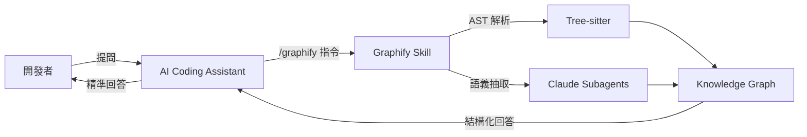

**支援平台**：

| 平台 | 安裝指令 | 觸發方式 |
|------|---------|---------|
| Claude Code（Linux/Mac） | `graphify install` | `/graphify .` |
| Claude Code（Windows） | `graphify install --platform windows` | `graphify .`（無前導 `/`） |
| Codex | `graphify install --platform codex` | `$graphify .` |
| OpenCode | `graphify install --platform opencode` | `/graphify .` |
| GitHub Copilot CLI | `graphify install --platform copilot` | `/graphify .` |
| VS Code Copilot Chat | `graphify vscode install` | `/graphify .` |
| Cursor | `graphify cursor install` | `/graphify .` |
| Gemini CLI | `graphify install --platform gemini` | `/graphify .` |
| Aider | `graphify install --platform aider` | `/graphify .` |
| OpenClaw | `graphify install --platform claw` | `/graphify .` |
| Factory Droid | `graphify install --platform droid` | `/graphify .` |
| Trae | `graphify install --platform trae` | `/graphify .` |
| Trae CN | `graphify install --platform trae-cn` | `/graphify .` |
| Hermes | `graphify install --platform hermes` | `/graphify .` |
| Kimi Code | `graphify install --platform kimi` | `/graphify .` |
| Kiro IDE/CLI | `graphify kiro install` | `/graphify .` |
| Pi coding agent | `graphify install --platform pi` | `/graphify .` |
| Google Antigravity | `graphify antigravity install` | `/graphify .` |

### 1.5 核心特色摘要

| 特色 | 說明 |
|------|------|
| **全自動建圖** | 支援 29+ 種程式語言 + PDF + 圖片 + 影片/音訊 + Office + Google Workspace + SQL |
| **三階段處理** | Pass 1: AST（零 Token）→ Pass 2: 影音（本地 Whisper）→ Pass 3: 文件/圖片（LLM 並行） |
| **多後端推論** | Claude / Gemini / OpenAI / Ollama（本地）/ AWS Bedrock / Kimi / Claude CLI |
| **置信度標籤** | EXTRACTED / INFERRED / AMBIGUOUS 三級分類，INFERRED 含離散信賴分數 |
| **Leiden 社區偵測** | 基於拓撲的社區偵測（非 embedding），確定性種子確保跨重建穩定 |
| **SHA256 快取** | 增量更新，僅處理變更檔案；內容雜湊（非路徑），重命名不重提取 |
| **實體去重** | MinHash/LSH + Jaro-Winkler 自動合併近似重複實體 |
| **多格式匯出** | HTML / JSON / Obsidian / SVG / GraphML / Neo4j / Wiki / Callflow HTML / D3 Tree |
| **MCP Server** | 標準 MCP stdio 伺服器，可與任何支援 MCP 的工具整合 |
| **Git Hooks + 合併驅動器** | post-commit / post-checkout 自動重建 + graph.json 聯合合併（無衝突標記） |
| **全域圖譜** | 跨專案知識圖譜（`~/.graphify/global.json`），支援多 Repo 統一查詢 |
| **Callflow HTML** | 自動產生含 Mermaid 架構圖的互動式呼叫流程頁面 |
| **Hyperedges** | 群組關係連結 3+ 個節點（如所有實作同一介面的類別） |
| **記憶回饋迴圈** | Q&A 結果儲存至 `graphify-out/memory/`，`--update` 時自動提取 |
| **Token 基準測試** | 每次 pipeline 自動計算 Token 節省比例 |
| **Headless CI 提取** | `graphify extract` 無需 IDE，支援 CI/CD 自動化 |
| **16+ 平台支援** | 涵蓋主流 AI 編程助手，統一安裝/解除安裝指令 |

> **📌 實務建議**：對於 50 個以上檔案的專案，Graphify 的 Token 節省效益最為顯著（71.5x+）。小型專案（< 10 檔案）的價值在於結構清晰度而非壓縮比。

### 1.6 多後端支援

Graphify v0.7+ 支援多種 LLM 後端，適用於不同企業環境與合規需求：

| 後端 | 環境變數 | 指令旗標 | 說明 |
|------|---------|---------|------|
| **Claude（Anthropic）** | `ANTHROPIC_API_KEY` | `--backend claude` | 預設後端，品質最佳 |
| **Claude CLI** | 無需 API Key | `--backend claude-cli` | 使用 Claude Code CLI，走訂閱額度 |
| **Gemini（Google）** | `GEMINI_API_KEY` 或 `GOOGLE_API_KEY` | `--backend gemini` | 成本效益高 |
| **OpenAI** | `OPENAI_API_KEY` | `--backend openai` | 支援 OpenAI 相容 API |
| **Ollama（本地）** | `OLLAMA_BASE_URL` | `--backend ollama` | 完全離線，零成本 |
| **AWS Bedrock** | AWS IAM 標準鏈 | `--backend bedrock` | 企業級，無需 API Key |
| **Kimi（Moonshot）** | `MOONSHOT_API_KEY` | `--backend kimi` | 3-6x 更豐富的關係提取 |

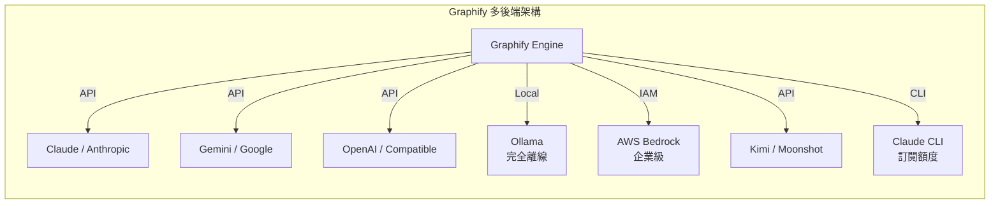

> **📌 企業建議**：金融機構建議使用 Ollama（完全離線）或 AWS Bedrock（IAM 認證），避免將程式碼結構資訊傳送至第三方 API。IDE 內建模式（`/graphify`）使用 IDE 提供的 LLM，無需額外設定 API Key。

### 1.7 Penpax 與生態系統發展

Graphify 定位為**圖譜基礎層（Graph Layer）**。官方團隊正基於 Graphify 構建 [Penpax](https://safishamsi.github.io/penpax.ai)——一個**裝置端數位分身（On-Device Digital Twin）**：

| 特性 | 說明 |
|------|------|
| **連結範圍** | 會議、瀏覽紀錄、檔案、電子郵件、程式碼 |
| **更新方式** | 持續自動更新知識圖譜 |
| **隱私設計** | 無雲端、不訓練使用者資料 |
| **基礎技術** | 建構於 Graphify 知識圖譜之上 |

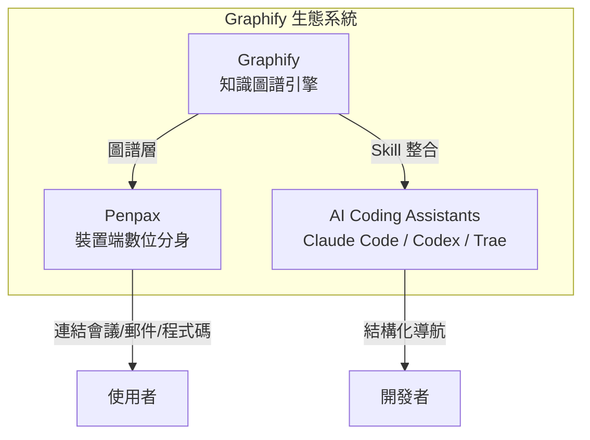

> **📌 企業關注**：Penpax 的「無雲端」設計可能符合金融業與政府機構的資料在地化需求。建議持續關注其 [waitlist](https://safishamsi.github.io/penpax.ai) 與發布動態。

---

## 第 2 章：系統架構設計

### 2.1 整體架構圖

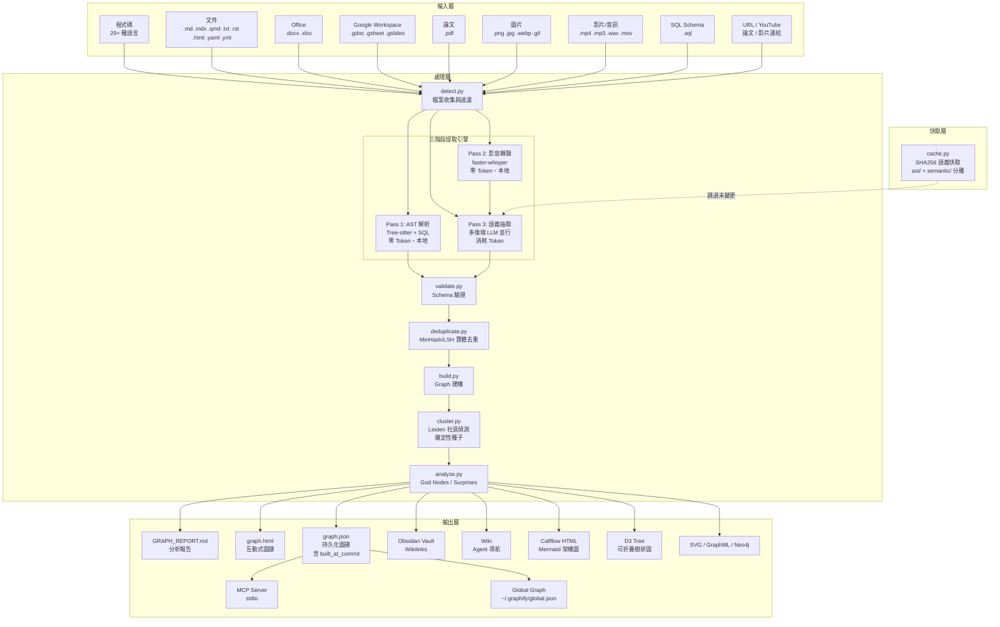

### 2.2 三階段處理 Pipeline

Graphify 採用**三階段提取流程**，最大化本地處理、最小化 API 成本：

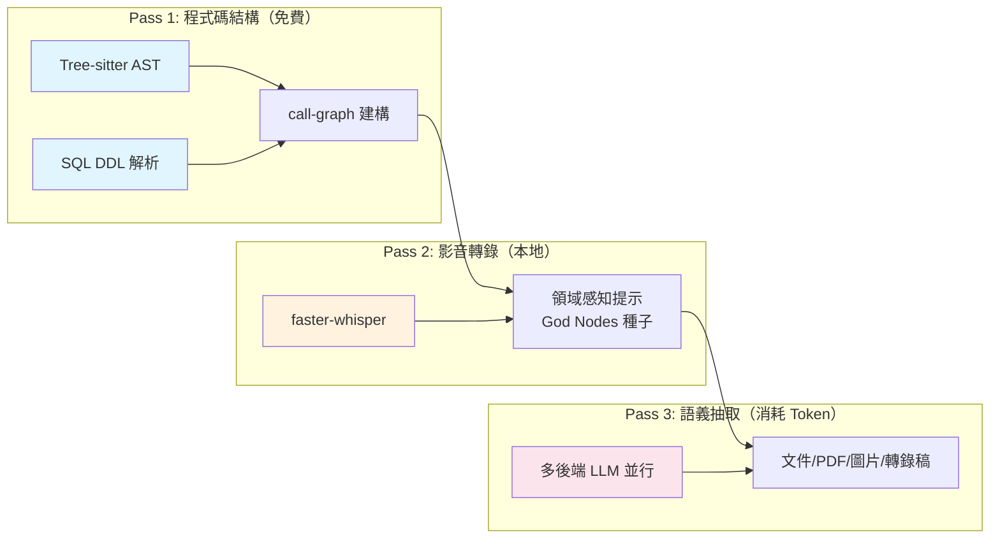

| 階段 | 處理對象 | 方式 | API 成本 | 說明 |
|------|---------|------|---------|------|
| **Pass 1** | 程式碼（29+ 語言）+ SQL | Tree-sitter AST + SQL DDL | **$0** | 完全本地，零 Token |
| **Pass 2** | 影片/音訊 | faster-whisper 本地轉錄 | **$0** | 本地推論，God Nodes 種子提示 |
| **Pass 3** | 文件/PDF/圖片/轉錄稿 | 多後端 LLM 並行 | Token 計費 | 可選 Ollama（$0 本地） |

> **📌 成本控制**：Pass 1 與 Pass 2 完全免費。Pass 3 可使用 Ollama 後端（`--backend ollama`）達成零成本全流程，適合對外部 API 有限制的環境。

### 2.3 Pipeline 模組詳解

Graphify 的核心處理流程為 **7 個純函數階段**，無共享狀態：

```
detect() → extract() → build_graph() → cluster() → analyze() → report() → export()
```

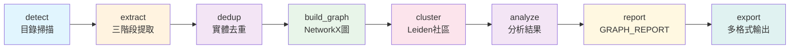

#### 階段詳解

| 階段 | 模組 | 輸入 | 輸出 | 說明 |
|------|------|------|------|------|
| 1. detect | `detect.py` | 目錄路徑 | `[Path]` 過濾列表 | 過濾 `.graphifyignore`、跳過 symlinks、支援 `.graphifyinclude` |
| 2. extract | `extract.py` | 檔案路徑 | `{nodes, edges}` dict | 程式碼走 AST，影音走 Whisper，文件/圖片走 LLM |
| 3. build_graph | `build.py` | 提取結果列表 | `nx.Graph` / `nx.DiGraph` | 合併所有提取，包含 hyperedges，支援有向圖 |
| 4. cluster | `cluster.py` | NetworkX Graph | 帶 community 屬性的 Graph | Leiden 社區偵測，確定性種子，大社區自動分裂 |
| 5. analyze | `analyze.py` | Graph | 分析字典 | God Nodes、Surprising Connections、建議問題 |
| 6. report | `report.py` | Graph + 分析 | GRAPH_REPORT.md | 人類可讀報告，含 commit hash 與新鮮度檢查 |
| 7. export | `export.py` | Graph + 輸出目錄 | 多格式檔案 | HTML / JSON / Obsidian / SVG / Wiki / Callflow 等 |

### 2.4 模組職責對照表

| 模組 | 核心函數 | 功能 |
|------|---------|------|
| `detect.py` | `collect_files(root)` | 目錄掃描 → 過濾後的檔案列表（含 `.graphifyinclude`） |
| `extract.py` | `extract(path)` | 檔案 → `{nodes, edges}`（三階段分派） |
| `build.py` | `build_graph(extractions)` | 提取列表 → NetworkX Graph（支援 DiGraph） |
| `cluster.py` | `cluster(G)` | Graph → 帶社區屬性的 Graph（確定性種子） |
| `analyze.py` | `analyze(G)` | Graph → 分析結果字典 |
| `report.py` | `render_report(G, analysis)` | Graph + 分析 → Markdown 報告（含 commit hash） |
| `export.py` | `export(G, out_dir, ...)` | Graph → 多格式輸出 |
| `callflow_html.py` | `write_callflow_html(...)` | graphify-out → Mermaid 架構/呼叫流程 HTML |
| `ingest.py` | `ingest(url, ...)` | URL → 本地檔案（含影片下載） |
| `cache.py` | `check_semantic_cache()` | 語義快取判斷（SHA256，ast/ + semantic/ 分離） |
| `security.py` | 驗證函數群 | URL / 路徑 / 標籤安全驗證（含 DNS rebinding 防護） |
| `validate.py` | `validate_extraction(data)` | 提取結果 Schema 驗證 |
| `serve.py` | `start_server(graph_path)` | Graph → MCP stdio 伺服器 |
| `watch.py` | `watch(root, flag_path)` | 目錄監視 → 變更旗標（含鎖檔防並行） |
| `benchmark.py` | `run_benchmark(graph_path)` | Token 節省基準測試 |
| `wiki.py` | `to_wiki(G, out_dir)` | Graph → Wikipedia 風格 Markdown 文章 |

### 2.5 Graph 資料模型

每個提取器產出的標準 Schema：

```json
{
  "nodes": [
    {
      "id": "unique_string",
      "label": "human readable name",
      "source_file": "path/to/file.java",
      "source_location": "L42",
      "file_type": "code|doc|paper|image|rationale|concept"
    }
  ],
  "edges": [
    {
      "source": "id_a",
      "target": "id_b",
      "relation": "calls|imports|uses|inherits|implements|semantically_similar_to|rationale_for",
      "confidence": "EXTRACTED|INFERRED|AMBIGUOUS",
      "confidence_score": 0.85,
      "source_file": "path/to/file.java",
      "source_location": "L42"
    }
  ]
}
```

**Schema 驗證**：`validate.py` 在 `build_graph()` 消費提取結果前會強制驗證此 Schema，不符合規格的資料會被拒絕並拋出錯誤。

**合法 `file_type` 值**：`code`、`doc`、`paper`、`image`、`rationale`、`concept`（v0.7+ 新增，用於抽象概念與設計模式節點）。

**特殊節點/邊類型**：

| 類型 | 說明 |
|------|------|
| `rationale_for` | 設計理由（從 `# WHY:`, `# NOTE:`, `# HACK:`, `# IMPORTANT:`, JavaDoc 提取） |
| `semantically_similar_to` | 語義相似（跨檔案概念連結，標記為 INFERRED） |
| `calls` | 函數/方法呼叫關係 |
| `imports` | 匯入/引用關係 |
| `uses` | 使用/依賴關係 |
| `inherits` | 繼承關係 |
| `implements` | 介面實作關係 |

#### Hyperedges（超邊）詳解

傳統圖譜僅支援兩兩配對的邊（pairwise edges），無法精確表達 3 個以上節點的群組關係。Graphify 的 Hyperedges 解決此問題：

| 場景 | Hyperedge 範例 | 傳統邊的不足 |
|------|---------------|-------------|
| **介面實作** | 所有實作 `PaymentProcessor` 介面的類別 | 需要 N 條獨立的 `implements` 邊，失去「共同實作」語義 |
| **認證流程** | Auth flow 中的所有函數 | 僅有線性呼叫鏈，無法表達整體流程群組 |
| **論文概念** | 同一論文章節中的關聯概念 | 概念間兩兩連結會產生 $\binom{n}{2}$ 條冗餘邊 |

```json
{
  "hyperedges": [
    {
      "nodes": ["StripeProcessor", "PayPalProcessor", "BankTransferProcessor"],
      "relation": "implements",
      "target": "PaymentProcessor",
      "confidence": "EXTRACTED",
      "source_file": "src/main/java/com/payment/"
    }
  ]
}
```

> **📌 實務建議**：在 Neo4j 中，Hyperedges 可透過中間節點（Intermediate Node）模式表達，便於進行群組查詢與影響分析。

### 2.6 Confidence Labels（信賴標籤）

| 標籤 | 信賴度 | 說明 | 範例 |
|------|--------|------|------|
| `EXTRACTED` | 1.0 | 原始碼中明確存在 | `import` 語句、直接函數呼叫 |
| `INFERRED` | 0.55–0.95 | 合理推論（離散信賴分數） | Call-graph 二次掃描、上下文共現 |
| `AMBIGUOUS` | N/A | 不確定，需人工審查 | 模糊的跨模組依賴 |

**INFERRED 離散信賴分數等級**（v0.7+ 新增）：

| 分數 | 語義 | 說明 |
|------|------|------|
| 0.95 | 極高信心 | 多重證據交叉驗證 |
| 0.85 | 高信心 | 強推論依據（如 call-graph 間接呼叫） |
| 0.75 | 中高信心 | 合理推論（如共同檔案路徑模式） |
| 0.65 | 中信心 | 弱推論（如命名相似） |
| 0.55 | 低信心 | 僅語義相似度佐證 |

> **📌 企業實務**：在銀行系統分析中，建議設定 CI 管線告警：當 `AMBIGUOUS` 邊佔比超過 15% 時，應安排人工審查。INFERRED 邊建議以 0.75 為閾值進行分級處理。

### 2.7 實體去重 Pipeline

Graphify v0.7+ 引入自動實體去重機制，解決大型專案中同一概念以不同名稱出現的問題：

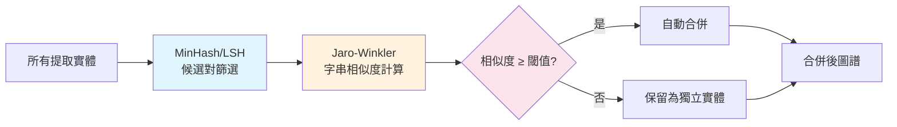

| 步驟 | 技術 | 說明 |
|------|------|------|
| 候選對篩選 | MinHash + LSH（datasketch） | O(n) 快速篩選可能重複的實體對 |
| 精確比對 | Jaro-Winkler（rapidfuzz） | 計算字串相似度，處理大小寫/底線/縮寫差異 |
| LLM 輔助（可選） | `--dedup-llm` | 對邊界案例使用 LLM 判斷是否為同一實體 |

```bash
# 基本去重（純啟發式，免費）
graphify --dedup

# LLM 輔助去重（消耗少量 Token，精確度更高）
graphify --dedup-llm
```

> **📌 實務建議**：對於 500+ 節點的大型圖譜，建議啟用 `--dedup` 以減少 10–30% 的冗餘節點。`--dedup-llm` 在企業級分析場景中可進一步提升 5–10% 的合併精確度。

### 2.8 與企業系統整合架構

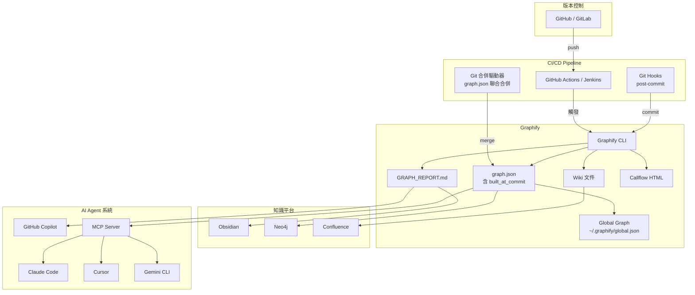

### 2.9 技術棧

| 元件 | 技術 | 說明 |
|------|------|------|
| 圖譜引擎 | NetworkX | 純 Python 圖譜庫，支援 DiGraph（有向圖） |
| 社區偵測 | Leiden（graspologic） | 基於拓撲的社區偵測，確定性種子 |
| AST 解析 | tree-sitter ≥ 0.23.0 | 29+ 語言支援（含 Fortran、Verilog、Dart 等） |
| 語義抽取 | Claude / Gemini / OpenAI / Ollama / Bedrock | 多後端支援，根據配置自動選擇 |
| 影音轉錄 | faster-whisper | 本地 Whisper 推論，零 API 成本 |
| 實體去重 | datasketch + rapidfuzz | MinHash/LSH + Jaro-Winkler 字串相似度 |
| 視覺化 | vis.js / D3 | 互動式 HTML 圖譜 + 可折疊樹狀圖 |
| 安全模組 | `security.py` | URL / 路徑 / 標籤驗證 + DNS rebinding 防護 |
| 伺服器 | MCP stdio | 無網路監聽，標準輸入輸出 |
| Unicode | NFKC 正規化 | 跨平台 CJK 一致性 |

> **📌 注意**：不需要 Neo4j 伺服器即可運行。Neo4j 僅為可選的匯出目標。

---

## 第 3 章：安裝與環境建置

### 3.1 環境需求

| 項目 | 最低需求 | 建議 |
|------|---------|------|
| Python | 3.10+ | 3.12+ |
| AI 平台 | 任一支援平台（見 §3.3） | Claude Code（官方主力支援） |
| 作業系統 | Windows / Linux / macOS | 全平台支援（含 CJK 改良） |
| 磁碟空間 | 視專案大小 | 建議 ≥ 1 GB（含快取） |
| 記憶體 | 4 GB | ≥ 8 GB（大型專案 / 影音轉錄） |

### 3.2 安裝步驟（各平台）

#### 推薦安裝方式（uv）

```bash
# uv 是目前推薦的安裝方式（速度最快、隔離性最佳）
uv tool install graphifyy
```

#### 替代安裝方式（pip / pipx）

```bash
# pip 安裝
pip install graphifyy

# pipx 安裝（隔離虛擬環境）
pipx install graphifyy
```

#### Windows

```powershell
# 1. 確認 Python 版本
python --version   # 需 3.10+

# 2. 安裝 Graphify（推薦 uv）
uv tool install graphifyy

# 3. 安裝 Skill（自動偵測 Windows）
graphify install

# 4. 驗證安裝
graphify --version
```

#### Linux / macOS

```bash
# 1. 確認 Python 版本
python3 --version   # 需 3.10+

# 2. 安裝 Graphify（推薦 uv）
uv tool install graphifyy

# 3. 安裝 Skill
graphify install

# 4. 驗證安裝
graphify --version
```

#### 手動安裝（curl）

```bash
# 適用於無法使用 pip 的環境
curl -sSL https://raw.githubusercontent.com/nicobailon/graphify/v3/install.sh | bash
```

### 3.3 多平台支援

Graphify 支援 **16+ 種 AI 開發平台**：

| 平台 | 安裝指令 | 特殊設定 |
|------|---------|---------|
| **Claude Code**（Linux/Mac） | `graphify install` | 預設平台 |
| **Claude Code**（Windows） | `graphify install` | 自動偵測 |
| **Cursor** | `graphify install --platform cursor` | MCP 整合 |
| **Gemini CLI** | `graphify install --platform gemini-cli` | — |
| **GitHub Copilot CLI** | `graphify install --platform copilot-cli` | — |
| **VS Code Copilot Chat** | `graphify install --platform copilot-chat` | MCP 整合 |
| **Codex** | `graphify install --platform codex` | 需 `multi_agent = true` |
| **Aider** | `graphify install --platform aider` | — |
| **Hermes** | `graphify install --platform hermes` | — |
| **Kimi Code** | `graphify install --platform kimi` | — |
| **Kiro** | `graphify install --platform kiro` | — |
| **Pi** | `graphify install --platform pi` | — |
| **OpenCode** | `graphify install --platform opencode` | — |
| **OpenClaw** | `graphify install --platform claw` | 循序提取 |
| **Factory Droid** | `graphify install --platform droid` | Task tool 並行 |
| **Trae** | `graphify install --platform trae` | 不支援 hooks |
| **Trae CN** | `graphify install --platform trae-cn` | 不支援 hooks |
| **Google Antigravity** | `graphify install --platform antigravity` | — |

**Codex 額外設定**：

```toml
# ~/.codex/config.toml
[features]
multi_agent = true   # 啟用並行提取
```

### 3.4 選用安裝項目（Optional Extras）

```bash
# Office 文件支援（.docx / .xlsx）
uv tool install graphifyy[office]

# 影片/音訊支援（.mp4 / .mp3 / .wav 等）
uv tool install graphifyy[video]

# 實體去重支援
uv tool install graphifyy[dedup]

# 全部安裝
uv tool install graphifyy[office,video,dedup]
```

| Extra | 套件 | 功能 |
|-------|------|------|
| `office` | python-docx, openpyxl | .docx / .xlsx 讀取 |
| `video` | faster-whisper, yt-dlp | 影片/音訊本地轉錄 |
| `dedup` | datasketch, rapidfuzz | MinHash/LSH 實體去重 |

### 3.5 Docker 部署方式（企業推薦）

```dockerfile
# Dockerfile
FROM python:3.12-slim

# 安裝系統依賴
RUN apt-get update && apt-get install -y --no-install-recommends \
    git \
    && rm -rf /var/lib/apt/lists/*

# 安裝 Graphify（含所有 extras）
RUN pip install --no-cache-dir graphifyy[office,video,dedup]

# 設定工作目錄
WORKDIR /workspace

# 預設指令
ENTRYPOINT ["graphify"]
CMD ["--help"]
```

```bash
# 建置 Docker Image
docker build -t graphify:latest .

# 執行分析（掛載本地專案目錄）
docker run --rm \
  -v /path/to/project:/workspace \
  -v /path/to/output:/workspace/graphify-out \
  graphify:latest /workspace --no-viz
```

**Docker Compose（企業 CI 整合）**：

```yaml
# docker-compose.yml
version: '3.8'
services:
  graphify:
    build: .
    volumes:
      - ./src:/workspace/src:ro
      - ./graphify-out:/workspace/graphify-out
    command: ["/workspace/src", "--no-viz"]
    environment:
      - PYTHONUNBUFFERED=1
```

### 3.6 安全性設定

Graphify 的安全機制為預設啟用，無需額外設定：

| 設定項目 | 說明 |
|---------|------|
| **本地模式** | 圖譜分析期間不進行任何網路呼叫（Pass 1/2 完全本地） |
| **API Key** | 使用所屬 AI 平台的 API Key（不儲存、不傳輸） |
| **無遙測** | 無 telemetry、usage tracking、analytics |
| **路徑保護** | 所有輸出限制在 `graphify-out/` 目錄內 |
| **URL 驗證** | 僅允許 http/https，封鎖私有 IP、元資料端點、DNS rebinding |
| **Hooks 路徑驗證** | v0.7.10+ 驗證 hooks 路徑不可逃逸 workspace |

### 3.7 常見安裝問題排除

| 問題 | 原因 | 解法 |
|------|------|------|
| `ModuleNotFoundError` | pipx 安裝後 `.graphify_python` 被清理 | 改用 uv 安裝或升級至 v0.3.16+ |
| Windows `UnicodeEncodeError` | 箭頭字元編碼問題 | 升級至 v0.3.10+（已用 `->` 替代） |
| PowerShell ANSI 亂碼 | graspologic ANSI escape codes | 升級至 v0.3.15+ |
| `tree-sitter` AST 為空 | tree-sitter 版本過低 | 確保 `tree-sitter >= 0.23.0` |
| `.jsx` 檔案未偵測 | 舊版未註冊 JSX | 升級至 v0.3.16+ |
| CJK 路徑/標籤不一致 | Unicode 正規化差異 | 升級至 v0.7+（NFKC 正規化） |
| `faster-whisper` 安裝失敗 | 缺少 `[video]` extra | `uv tool install graphifyy[video]` |

> **📌 企業建議**：使用 Docker 部署可避免大多數環境相容性問題，並確保團隊一致的執行環境。建議使用 `uv` 取代 `pip`，安裝速度快 10–100x 且自動隔離。

---

## 第 4 章：基本使用教學

### 4.1 初始化專案

在專案根目錄開啟 AI Coding Assistant（以 Claude Code 為例）：

```bash
# 進入專案目錄
cd /path/to/your-project

# 在 Claude Code 中輸入
/graphify .
```

**首次執行**會：
1. 掃描目錄中所有支援的檔案
2. **Pass 1**：使用 Tree-sitter 進行 AST 解析（程式碼，零 Token）
3. **Pass 2**：使用 faster-whisper 轉錄影音檔案（本地，零 Token）
4. **Pass 3**：使用 LLM 進行語義抽取（文件/圖片/轉錄稿）
5. 執行實體去重（MinHash/LSH）
6. 建構 NetworkX 圖譜（支援有向圖）
7. 執行 Leiden 社區偵測（確定性種子）
8. 產出報告與匯出檔案

### 4.2 建立知識圖譜

```bash
# 基本使用 - 分析當前目錄
/graphify .

# 分析指定資料夾
/graphify ./src

# 深度模式 - 更積極的 INFERRED 邊提取
/graphify ./src --mode deep

# 僅重新聚類（已有圖譜時）
/graphify ./src --cluster-only

# 不產生 HTML 視覺化（CI 環境推薦）
/graphify ./src --no-viz
```

**執行結果目錄結構**：

```
graphify-out/
├── graph.html          # 互動式圖譜（vis.js）- 點擊節點、搜尋、社區篩選
├── GRAPH_REPORT.md     # God Nodes、Surprising Connections、建議問題
├── graph.json          # 持久化圖譜（含 built_at_commit）
├── callflow.html       # Callflow 互動式架構頁面（--callflow 時產出）
├── tree.html           # D3 可折疊樹狀圖（--tree 時產出）
├── obsidian/           # Obsidian Vault（--obsidian 時產出）
├── wiki/               # Wikipedia 風格文章（--wiki 時產出）
├── memory/             # Q&A 記憶回饋（自動累積）
└── cache/              # SHA256 快取 - ast/ + semantic/ 分離
    ├── ast/            # AST 提取快取（Pass 1）
    └── semantic/       # 語義提取快取（Pass 3）
```

#### graph.html 互動功能

`graph.html` 使用 vis.js 渲染，提供以下互動能力：

| 功能 | 說明 |
|------|------|
| **節點大小** | 依照 degree（連接數）自動調整，God Nodes 最大 |
| **點擊檢視** | 點擊任何節點開啟詳情面板，顯示屬性與來源檔案 |
| **鄰居導航** | 詳情面板中的鄰居節點可點擊跳轉 |
| **搜尋框** | 輸入關鍵字即時搜尋節點 |
| **社區篩選** | 按 Leiden 社區過濾，專注查看特定模組群組 |
| **物理聚類** | 基於力導向圖的物理模擬，相關節點自動靠攏 |
| **色彩編碼** | 不同社區以不同顏色區分 |

#### 支援檔案類型完整列表

| 類別 | 副檔名 | 處理方式 |
|------|--------|---------|
| **程式碼** | `.py` `.ts` `.js` `.jsx` `.tsx` `.go` `.rs` `.java` `.c` `.cpp` `.rb` `.cs` `.kt` `.scala` `.php` `.swift` `.lua` `.zig` `.ps1` `.ex` `.exs` `.m` `.mm` `.jl` `.f90` `.f95` `.f03` `.f08` `.pas` `.pp` `.dpr` `.v` `.sv` `.dart` `.groovy` `.vue` `.svelte` `.astro` | AST（Tree-sitter）+ call-graph + rationale |
| **文件** | `.md` `.mdx` `.qmd` `.txt` `.rst` `.html` | 概念 + 關係 + 設計理由（LLM 提取） |
| **結構化資料** | `.yaml` `.yml` `.sql` | YAML 結構解析 / SQL DDL Schema 提取 |
| **Office** | `.docx` `.xlsx` | 轉為 Markdown 後 LLM 提取（需 `[office]` extra） |
| **Google Workspace** | `.gdoc` `.gsheet` `.gslides` | Google 文件提取（需認證） |
| **論文** | `.pdf` | 引用挖掘 + 概念提取（pypdf，本地讀取） |
| **圖片** | `.png` `.jpg` `.webp` `.gif` | Vision LLM — 螢幕截圖、架構圖、任何語言 |
| **影片/音訊** | `.mp4` `.mp3` `.wav` `.mov` `.avi` `.webm` `.flac` `.ogg` | faster-whisper 本地轉錄（需 `[video]` extra） |
| **腳本** | 無副檔名 | Shebang 偵測（如 `#!/usr/bin/env python3`） |

### 4.3 指令完整說明

#### 核心指令

| 指令 | 說明 |
|------|------|
| `/graphify .` | 分析當前目錄 |
| `/graphify ./path` | 分析指定資料夾 |
| `/graphify ./path --mode deep` | 深度模式（更多 INFERRED 邊） |
| `/graphify ./path --update` | 增量更新（僅處理變更檔案） |
| `/graphify ./path --cluster-only` | 僅重新聚類 |
| `/graphify ./path --no-viz` | 跳過 HTML 產生 |
| `/graphify ./path --watch` | Watch 模式（自動同步） |
| `/graphify ./path --dedup` | 啟用實體去重（MinHash/LSH） |
| `/graphify ./path --dedup-llm` | LLM 輔助實體去重（更精確） |
| `/graphify ./path --backend ollama` | 指定 LLM 後端 |
| `/graphify ./path --directed` | 產出有向圖（DiGraph） |

#### 新增內容

| 指令 | 說明 |
|------|------|
| `/graphify add <URL>` | 擷取論文 / 推文 / YouTube 影片並更新圖譜 |
| `/graphify add <URL> --author "Name"` | 標記原作者 |
| `/graphify add <URL> --contributor "Name"` | 標記貢獻者 |

#### 查詢指令

| 指令 | 說明 |
|------|------|
| `/graphify query "問題"` | BFS 查詢圖譜 |
| `/graphify query "問題" --dfs` | DFS 路徑追蹤 |
| `/graphify query "問題" --budget 1500` | 限制 Token 預算 |
| `/graphify path "NodeA" "NodeB"` | 查找兩節點間路徑 |
| `/graphify explain "NodeName"` | 解釋特定節點 |

#### 匯出指令

| 指令 | 說明 |
|------|------|
| `/graphify ./path --obsidian` | 產出 Obsidian Vault |
| `/graphify ./path --obsidian --obsidian-dir ~/vaults/proj` | 自訂 Obsidian 路徑 |
| `/graphify ./path --wiki` | 產出 Agent 導航 Wiki |
| `/graphify ./path --callflow` | 產出 Callflow HTML（含 Mermaid） |
| `/graphify ./path --tree` | 產出 D3 可折疊樹狀圖 |
| `/graphify ./path --svg` | 匯出 SVG |
| `/graphify ./path --graphml` | 匯出 GraphML（Gephi / yEd） |
| `/graphify ./path --neo4j` | 產生 Cypher 語句 |
| `/graphify ./path --neo4j-push bolt://localhost:7687` | 直接推送至 Neo4j |
| `/graphify ./path --mcp` | 啟動 MCP stdio 伺服器 |

#### 圖譜管理指令（v0.7+ 新增）

| 指令 | 說明 |
|------|------|
| `graphify clone <repo-url>` | Clone repo + 自動建構圖譜 |
| `graphify merge-graphs <dir1> <dir2>` | 合併多專案圖譜 |
| `graphify extract` | Headless 提取（CI/CD 用，無需 IDE） |
| `graphify uninstall` | 完整移除所有平台設定 |

#### Git Hooks 管理

| 指令 | 說明 |
|------|------|
| `graphify hook install` | 安裝 post-commit / post-checkout hooks |
| `graphify hook uninstall` | 移除 hooks |
| `graphify hook status` | 檢查 hooks 狀態 |

#### Always-On 助手設定

| 指令 | 說明 |
|------|------|
| `graphify claude install` | CLAUDE.md + PreToolUse hook |
| `graphify claude uninstall` | 移除 Claude 設定 |
| `graphify cursor install` | Cursor MCP 整合 |
| `graphify gemini-cli install` | Gemini CLI 設定 |
| `graphify copilot-cli install` | GitHub Copilot CLI 設定 |
| `graphify copilot-chat install` | VS Code Copilot Chat MCP 設定 |
| `graphify codex install` | AGENTS.md + PreToolUse hook |
| `graphify aider install` | Aider 設定 |
| `graphify opencode install` | AGENTS.md |
| `graphify claw install` | AGENTS.md |
| `graphify droid install` | AGENTS.md |
| `graphify trae install` | AGENTS.md |
| `graphify trae-cn install` | AGENTS.md |
| `graphify kimi install` | Kimi Code 設定 |
| `graphify kiro install` | Kiro 設定 |

### 4.4 輸出內容說明

#### GRAPH_REPORT.md 包含

| 區段 | 說明 |
|------|------|
| **God Nodes** | 最高度數（degree）的概念節點 —— 系統的核心連接點 |
| **Surprising Connections** | 按複合分數排序，Code-Paper 邊分數更高，附帶「為什麼」說明 |
| **Suggested Questions** | 4~5 個圖譜特別適合回答的問題 |
| **設計理由** | 從 `# WHY:`, `# NOTE:`, `# HACK:` 註解和 JavaDoc 提取的 `rationale_for` 節點 |
| **Token Benchmark** | 自動計算的 Token 節省比例 |

#### graph.json 使用方式

```bash
# 不要一次性貼到 prompt —— 使用 query 提取子圖
graphify query "show the auth flow" --graph graphify-out/graph.json
graphify query "what connects DigestAuth to Response?" --graph graphify-out/graph.json
```

**輸出包含**：節點標籤、邊類型、信賴標籤、來源檔案、來源位置。

### 4.5 .graphifyignore 設定

在專案根目錄建立 `.graphifyignore`，語法與 `.gitignore` 相同：

```gitignore
# .graphifyignore
vendor/
node_modules/
dist/
target/
*.generated.py
*.min.js
__pycache__/
.git/
```

> **📌 企業建議**：務必排除 `node_modules/`、`target/`、`dist/` 等建置產物，以避免圖譜被大量無關節點淹沒。

### 4.6 Always-On 模式設定

安裝 Always-On 後，AI 助手在每次 Glob / Grep 呼叫前都會自動讀取 `GRAPH_REPORT.md`：

```bash
# 安裝（以 Claude Code 為例）
graphify claude install
```

**運作原理**：

1. 寫入 `CLAUDE.md` 區段，告知 Claude 先讀 `graphify-out/GRAPH_REPORT.md`
2. 安裝 PreToolUse hook（`.claude/settings.json`），在每次 Glob/Grep 前觸發
3. Claude 看到提示：「Knowledge graph exists. Read GRAPH_REPORT.md for god nodes and community structure before searching raw files.」

**類比**：Always-On hook = 給 AI 一張地圖。`/graphify` 指令 = 讓 AI 精確導航地圖。

### 4.7 查詢知識圖譜

```bash
# 從終端機直接查詢（不需 AI 助手）
graphify query "what connects attention to the optimizer?"
graphify query "show the auth flow" --dfs
graphify query "what is CfgNode?" --budget 500
graphify query "..." --graph path/to/graph.json

# 在 AI 助手中使用
/graphify query "這個 API 呼叫了哪些服務？"
/graphify path "UserController" "DatabaseService"
/graphify explain "AuthenticationFilter"
```

> **📌 實務建議**：先用 `GRAPH_REPORT.md` 了解整體結構，再用 `query` / `path` / `explain` 深入細節。

---

## 第 5 章：進階使用（企業必備）

### 5.1 全域知識圖譜（Global Graph）

v0.7+ 引入**全域圖譜**，可跨專案統一查詢：

```bash
# 建構後自動更新全域圖譜
/graphify ./project-a
/graphify ./project-b

# 全域圖譜位置
~/.graphify/global.json

# 跨專案查詢
graphify query "authentication" --graph ~/.graphify/global.json
```

**全域圖譜特色**：
- 自動合併所有已分析專案的圖譜
- 跨專案關係保留完整的社區結構
- 適用於微服務架構的統一知識查詢
- 以 home 目錄為根，不受 workspace 限制

> **📌 企業建議**：將 `~/.graphify/global.json` 透過共享儲存或定期同步機制分享給團隊，實現跨團隊知識查詢。

### 5.2 多 Repo 分析

對於微服務或 Monorepo 架構，可分別建圖後合併：

```bash
# 方法一：直接分析包含多個子專案的目錄
/graphify ./microservices/

# 方法二：使用 merge-graphs 合併（v0.7+ 新增）
/graphify ./service-a
/graphify ./service-b
graphify merge-graphs ./service-a/graphify-out ./service-b/graphify-out

# 方法三：使用 clone + 自動建圖（v0.7+ 新增）
graphify clone https://github.com/org/service-a
graphify clone https://github.com/org/service-b
graphify merge-graphs ./service-a/graphify-out ./service-b/graphify-out

# 方法四：逐一推送至 Neo4j
/graphify ./service-a --neo4j-push bolt://localhost:7687
/graphify ./service-b --neo4j-push bolt://localhost:7687
```

### 5.3 增量更新與 Watch 模式

```bash
# 增量更新 - 僅重新提取有變更的檔案（SHA256 快取，ast/ + semantic/ 分離）
/graphify ./src --update

# Watch 模式 - 背景持續同步
/graphify ./src --watch
```

**Watch 模式行為**：
- **程式碼變更**：立即觸發 AST 重建（無 LLM 成本）
- **影音變更**：觸發 faster-whisper 重新轉錄（本地，無 API 成本）
- **文件/圖片變更**：通知使用者執行 `--update` 進行 LLM 重新分析
- **適用場景**：多 Agent 並行開發時，圖譜自動保持最新

**增量更新注意事項**：
- 快取分為 `ast/` 和 `semantic/` 兩層，可獨立清除
- v0.3.14+ 已修復刪除檔案的幽靈節點問題（`--update` 會先清理再合併）
- v0.3.17+ 語義提取按目錄分組，跨 chunk 關係更精確
- 內容雜湊（SHA256 of content），重命名不觸發重提取

### 5.4 Git Hooks 與合併驅動器

```bash
# 安裝 git hooks（平台無關）
graphify hook install

# 檢查狀態
graphify hook status

# 移除
graphify hook uninstall
```

**安裝後行為**：
- **post-commit**：每次 commit 後自動重建圖譜
- **post-checkout**：切換分支後自動重建
- **失敗處理**：hook 失敗會以非零退出碼通知 git
- **pipx 相容**：v0.3.15+ 正確偵測 pipx 安裝的 graphify
- **路徑驗證**：v0.7.10+ hooks 路徑不可逃逸 workspace

#### Git 合併驅動器（v0.7+ 新增）

Graphify 提供 `graph.json` 專用的 Git 合併驅動器，解決多人協作時的圖譜合併衝突：

```bash
# .gitattributes
graphify-out/graph.json merge=graphify-union
```

```bash
# 設定合併驅動器
git config merge.graphify-union.name "Graphify union merge"
git config merge.graphify-union.driver "graphify merge-driver %O %A %B"
```

**運作原理**：
- 對 `graph.json` 中的 nodes 和 edges 進行聯合合併（union merge）
- 避免 `<<<<<<<` / `>>>>>>>` 衝突標記
- 保留兩個分支的所有新增實體
- 重複 ID 自動去重

### 5.5 與 CI/CD 整合

#### GitHub Actions 範例

```yaml
# .github/workflows/graphify.yml
name: Build Knowledge Graph

on:
  push:
    branches: [main, develop]
  pull_request:
    branches: [main]

jobs:
  graphify:
    runs-on: ubuntu-latest
    steps:
      - uses: actions/checkout@v4
      
      - name: Set up Python
        uses: actions/setup-python@v5
        with:
          python-version: '3.12'
      
      - name: Install Graphify
        run: pip install graphifyy[office,video,dedup]
      
      - name: Build Knowledge Graph（Headless）
        run: |
          graphify extract /github/workspace/src --no-viz
          # 使用 graphify extract（headless 模式，無需 IDE）
      
      - name: Upload Graph Artifacts
        uses: actions/upload-artifact@v4
        with:
          name: knowledge-graph
          path: graphify-out/
      
      - name: Check AMBIGUOUS edges ratio
        run: |
          python -c "
          import json
          with open('graphify-out/graph.json') as f:
              data = json.load(f)
          edges = data.get('links', [])
          ambiguous = sum(1 for e in edges if e.get('confidence') == 'AMBIGUOUS')
          total = len(edges)
          ratio = ambiguous / total if total > 0 else 0
          print(f'AMBIGUOUS edges: {ambiguous}/{total} ({ratio:.1%})')
          if ratio > 0.15:
              print('::warning::AMBIGUOUS edge ratio exceeds 15%')
          "
```

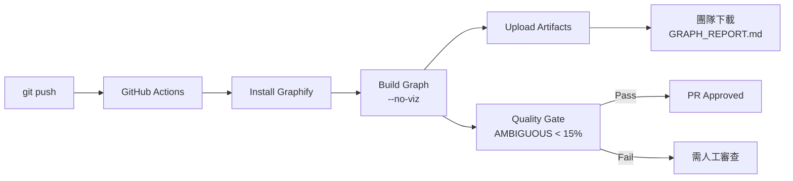

### 5.6 與 AI 助手整合

#### Claude Code（原生支援）

```bash
# 安裝 Always-On
graphify claude install

# 在 Claude Code 中使用
/graphify .                      # 建立圖譜
/graphify query "核心 API 流程"   # 查詢
```

#### Cursor（MCP 整合）

```bash
graphify install --platform cursor
graphify cursor install
# Cursor 透過 MCP 協議與 graph.json 互動
```

#### Gemini CLI

```bash
graphify install --platform gemini-cli
graphify gemini-cli install
```

#### GitHub Copilot CLI / VS Code Copilot Chat

```bash
# CLI 版本
graphify install --platform copilot-cli
graphify copilot-cli install

# VS Code Copilot Chat（MCP 整合）
graphify install --platform copilot-chat
graphify copilot-chat install
```

#### Codex

```bash
graphify install --platform codex
graphify codex install

# Codex 使用 $ 而非 /
$graphify .
```

#### 搭配 MCP Server

```bash
# 啟動 MCP 伺服器
python -m graphify.serve graphify-out/graph.json

# 提供以下工具給 AI 助手
# - query_graph: 查詢圖譜
# - get_node: 取得節點詳情
# - get_neighbors: 取得鄰居節點
# - shortest_path: 最短路徑
# - god_nodes: God Nodes 列表
```

### 5.7 MCP Server 模式

```bash
# 啟動 MCP stdio 伺服器
graphify ./src --mcp

# 或從已建好的圖譜啟動
python -m graphify.serve graphify-out/graph.json
```

**MCP 工具列表**：

| 工具 | 說明 |
|------|------|
| `query_graph` | 結構化查詢圖譜 |
| `get_node` | 取得單一節點詳情 |
| `get_neighbors` | 取得指定節點的鄰居 |
| `shortest_path` | 計算兩節點間最短路徑 |
| `god_nodes` | 列出最高連接度節點 |

> **📌 注意**：MCP 伺服器僅透過 stdio 通訊，不開啟網路監聽。

### 5.8 知識圖譜查詢應用（RAG 強化）

Graphify 的 `graph.json` 不適合一次性貼入 prompt。正確的工作流程：

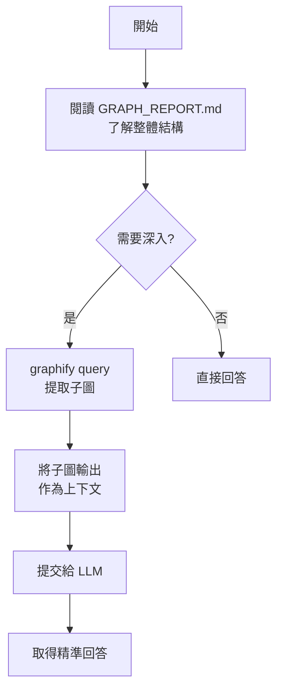

**Graph RAG Prompt 範例**：

```
使用以下圖譜查詢輸出來回答問題。優先依據圖譜結構，
引用來源檔案路徑。

[graphify query 輸出結果]

問題：AuthenticationFilter 的完整呼叫鏈是什麼？
```

### 5.9 多格式匯出

| 格式 | 指令旗標 | 適用場景 |
|------|---------|---------|
| HTML | 預設 | 互動式探索 |
| JSON | 預設 | 程式化查詢、持久化（含 built_at_commit） |
| Obsidian | `--obsidian` | 個人知識管理 |
| SVG | `--svg` | 靜態文件、簡報 |
| GraphML | `--graphml` | Gephi / yEd 分析 |
| Neo4j Cypher | `--neo4j` | 大規模圖譜查詢 |
| Neo4j Push | `--neo4j-push bolt://host:port` | 直接推送至 Neo4j |
| Wiki | `--wiki` | Agent 導航、團隊文件 |
| Callflow HTML | `--callflow` | 含 Mermaid 的呼叫流程頁面 |
| D3 Tree | `--tree` | 可折疊樹狀圖 |
| MCP | `--mcp` | AI 工具整合 |

### 5.10 Wiki 生成

```bash
/graphify ./src --wiki
```

**產出結構**：
```
graphify-out/wiki/
├── index.md              # 入口頁面，社區總覽
├── community_0.md        # 社區文章，含內部節點與跨社區連結
├── community_1.md
├── god_node_UserService.md  # God Node 專屬文章
└── ...
```

**特色**：
- Wikipedia 風格的 Markdown 文章
- 跨社區 Wikilinks
- Cohesion scores
- 審計追蹤
- 導航頁腳

> **📌 企業應用**：將 Wiki 輸出同步至 Confluence 或內部文件系統，作為「系統知識庫」供全團隊瀏覽。

### 5.11 記憶回饋迴圈（Memory Feedback Loop）

Graphify 自 v0.1.0 起內建**記憶回饋機制**：將使用者與圖譜的 Q&A 互動結果持久化，在後續更新時自動融入圖譜。

**運作流程**：

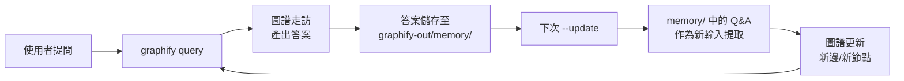

**檔案結構**：

```
graphify-out/
├── memory/
│   ├── qa_2026-04-08_001.json    # Q&A 記錄
│   ├── qa_2026-04-08_002.json
│   └── ...
├── graph.json
└── GRAPH_REPORT.md
```

**使用方式**：

```bash
# 正常查詢 — Q&A 結果自動儲存至 memory/
/graphify query "核心認證流程是什麼？"

# 下次增量更新時，memory/ 中的 Q&A 自動納入提取
/graphify ./src --update
```

**企業價值**：

| 面向 | 說明 |
|------|------|
| **知識累積** | 團隊反覆提問的知識自動沉澱為圖譜的一部分 |
| **圖譜演進** | 圖譜隨使用自然成長，涵蓋更多隱含關係 |
| **上下文強化** | 後續查詢可利用先前 Q&A 發現的邊與節點 |

> **📌 注意**：Memory 檔案隨 `graphify-out/` 一同管理。建議在 `.gitignore` 中決定是否追蹤 `graphify-out/memory/`——追蹤可讓團隊共享累積知識，不追蹤則保持個人查詢隱私。

### 5.12 Callflow HTML 匯出

v0.7+ 新增 **Callflow HTML** 匯出，自動產生含 Mermaid 架構圖的互動式呼叫流程頁面：

```bash
/graphify ./src --callflow
```

**產出**：
```
graphify-out/
├── callflow.html       # 互動式呼叫流程頁面
└── callflow/
    ├── index.html      # 入口（含全域架構 Mermaid 圖）
    ├── module_auth.html
    └── module_payment.html
```

**特色**：
- 自動產生 Mermaid `flowchart` 與 `classDiagram`
- 可展開/折疊的模組呼叫流程
- 按社區分組的模組導航
- 支援深層呼叫鏈追蹤

> **📌 企業應用**：將 Callflow HTML 部署至內部 Web Server，作為「活的架構文件」供全團隊瀏覽。

### 5.13 Docker MCP Toolkit

v0.7+ 支援透過 Docker Desktop MCP Toolkit 整合，提供容器化的 MCP 伺服器：

```bash
# 使用 Docker MCP Toolkit 啟動
docker run --rm -i \
  -v ./graphify-out:/data \
  graphify-mcp:latest

# 或搭配 SQLite 持久化
docker run --rm -i \
  -v ./graphify-out:/data \
  -v ./db:/db \
  graphify-mcp-sqlite:latest
```

**適用場景**：
- 企業環境中需要隔離執行的 MCP 伺服器
- 與 Docker Desktop AI 助手整合
- 無需在主機安裝 Python/Graphify

---

## 第 6 章：實戰案例

### 6.1 案例一：舊系統逆向工程（Java / Spring）

#### 問題背景

某銀行核心系統已運行 15 年，技術棧為 Java 8 + Spring Framework 4.x + Oracle DB。原始團隊已全數離職，僅剩程式碼與使用手冊，無設計文件。新團隊需要在 3 個月內完成現代化評估。

#### 解法

```bash
# Step 1: 建立知識圖譜
/graphify ./legacy-banking-system --mode deep

# Step 2: 檢視 God Nodes 找出核心元件
cat graphify-out/GRAPH_REPORT.md

# Step 3: 查詢特定流程
/graphify query "交易處理流程"
/graphify path "TransactionController" "OracleDAO"
/graphify explain "TransactionService"

# Step 4: 建立 Wiki 供團隊瀏覽
/graphify ./legacy-banking-system --wiki

# Step 5: 匯出至 Neo4j 進行深度分析
/graphify ./legacy-banking-system --neo4j-push bolt://localhost:7687
```

#### Graphify 介入效果

| 指標 | 傳統方式 | 使用 Graphify |
|------|---------|-------------|
| 系統全貌理解時間 | 2-4 週 | **2-3 天** |
| 核心模組識別 | 人工閱讀 | **God Nodes 自動識別** |
| 依賴關係追蹤 | IDE + 人工 | **圖譜查詢，含置信度** |
| 設計理由追溯 | 幾乎不可能 | **rationale_for 節點** |
| 文件產出 | 需人力撰寫 | **GRAPH_REPORT + Wiki** |

#### 成果

- 自動識別 12 個 God Nodes（核心服務類）
- 發現 3 個未記錄的跨模組循環依賴
- 從 `# HACK:` 和 `# WHY:` 註解中提取 47 個設計決策
- 產出完整系統文件，Token 消耗僅為直接閱讀的 1/71

### 6.2 案例二：微服務架構知識盤點

#### 問題背景

金融平台包含 28 個微服務，分散在多個 GitHub Repository。跨服務 API 呼叫關係不明，每次變更都擔心影響未知服務。

#### 解法

```bash
# Step 1: 逐一建圖並推送至 Neo4j
for service in service-auth service-account service-payment service-notification; do
  git clone https://github.com/org/$service /tmp/$service
  cd /tmp/$service
  /graphify . --neo4j-push bolt://localhost:7687
done

# Step 2: 在 Neo4j 中查詢跨服務依賴
# MATCH (a)-[r:calls]->(b) WHERE a.source_file CONTAINS 'service-payment' RETURN a, r, b

# Step 3: 對關鍵服務做影響分析
/graphify path "PaymentGateway" "NotificationService"
```

#### 成果

| 項目 | 結果 |
|------|------|
| 識別的跨服務 API 呼叫 | 156 個（其中 23 個未文件化） |
| 發現的循環依賴 | 4 組 |
| 影響分析覆蓋範圍 | 100% 服務連結 |
| 圖譜產出時間 | 28 個服務共 ~45 分鐘 |

### 6.3 案例三：新人 Onboarding 加速

#### 問題背景

大型 Java Web 專案，新進工程師平均需要 4-6 週才能獨立開發。

#### 解法

```bash
# Step 1: 建立圖譜與 Wiki
/graphify ./project --wiki

# Step 2: 安裝 Always-On 讓新人的 AI 助手自動引導
graphify claude install

# Step 3: 新人直接對 Claude 提問
# "系統中核心的身份驗證流程是什麼？"
# Claude 自動參考 GRAPH_REPORT.md 回答
```

#### 成果

- Onboarding 時間從 4-6 週縮短至 **1-2 週**
- 新人的第一個 PR 提交時間提前 60%
- 資深工程師回答重複問題的時間減少 70%

> **📌 實務建議**：將 `graphify-out/wiki/` 加入專案的標準文件結構，每次 release 時自動更新。

### 6.4 案例四：影音知識庫建構

#### 問題背景

某技術團隊累積了 200+ 小時的內部技術分享影片（`.mp4`），散佈在共享磁碟中，無人整理索引。新人無法快速找到相關主題的影片。

#### 解法

```bash
# Step 1: 安裝影音支援
uv tool install graphifyy[video]

# Step 2: 建立影音知識圖譜
/graphify ./tech-talks --mode deep

# Step 3: 查詢特定主題
/graphify query "Kubernetes 部署最佳實務"
/graphify query "資料庫效能調校"

# Step 4: 產出 Wiki 索引
/graphify ./tech-talks --wiki
```

#### Graphify 介入效果

| 指標 | 傳統方式 | 使用 Graphify |
|------|---------|-------------|
| 影片分類時間 | 人工觀看（200+ 小時） | **faster-whisper 自動轉錄 + LLM 主題提取** |
| 主題搜尋 | 憑記憶或標題猜測 | **圖譜語義查詢** |
| 跨影片關聯 | 無法發現 | **Surprising Connections 自動發現** |
| 文件化 | 無 | **Wiki + GRAPH_REPORT 自動產出** |

#### 成果

- 200+ 小時影片在 ~4 小時內完成轉錄與圖譜建構（Pass 2 本地、Pass 3 LLM）
- 自動識別 45 個技術主題社區
- 發現 12 個跨主題的知識關聯（如「微服務設計」與「Kafka 事件驅動」的連結）

> **📌 實務建議**：影音檔案的 Pass 2（faster-whisper）完全在本地執行，適合含機密內容的內部影片。

---

## 第 7 章：系統升級與版本管理

### 7.1 升級 Graphify

```bash
# 升級至最新版本（推薦 uv）
uv tool install --upgrade graphifyy

# 或使用 pip
pip install --upgrade graphifyy

# 確認版本
graphify --version

# 重新安裝 Skill（建議每次升級後執行）
graphify install

# 重新安裝 Always-On（如果有使用）
graphify claude install    # 或對應平台
```

**版本陳舊偵測**：v0.3.10+ 會自動檢查已安裝的 Skill 版本是否過期，並顯示警告。

### 7.2 Graph Schema 版本控制

```bash
# 建議的 .gitignore 策略
graphify-out/cache/
graphify-out/graph.html
graphify-out/callflow.html
graphify-out/tree.html
graphify-out/*.svg

# 追蹤以下檔案（納入版本控制）
# graphify-out/GRAPH_REPORT.md
# graphify-out/graph.json        ← 含 built_at_commit 追蹤
# graphify-out/wiki/

# 建議的 .gitattributes（啟用合併驅動器）
# graphify-out/graph.json merge=graphify-union
```

**`built_at_commit` 追蹤**（v0.7+ 新增）：
- `graph.json` 自動記錄建構時的 git commit hash
- 可用於判斷圖譜新鮮度與程式碼同步狀態
- `GRAPH_REPORT.md` 顯示新鮮度檢查結果

**Graph 重建策略**：

| 場景 | 建議做法 |
|------|---------|
| 小幅程式碼變更 | `--update`（增量更新） |
| 大規模重構 | 全新 `/graphify .` |
| 分支切換 | Git hook 自動重建 |
| 版本發布 | CI 中全新建圖並歸檔 |

### 7.3 與 Git 版本同步策略

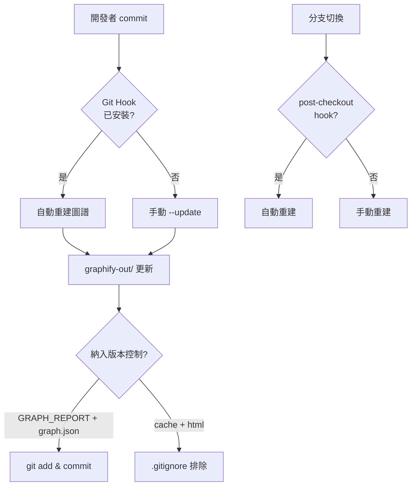

> **📌 企業建議**：在 CI 管線中為每個 release tag 建立圖譜快照，方便日後版本間架構比較。

---

## 第 8 章：安全與隱私設計（SSDLC）

### 8.1 安全模型總覽

Graphify 是**本地開發工具**，設計原則為「最小權限」：

- 圖譜分析期間**不進行任何網路呼叫**
- 僅在 `ingest` 指令時存取使用者明確指定的 URL
- MCP 伺服器僅透過 **stdio** 通訊，不開啟網路監聽
- **不執行**原始碼（Tree-sitter 只解析 AST，不 eval/exec）
- **不使用** `shell=True`
- **不儲存**憑證或 API Key

### 8.2 本地運算優勢

| 面向 | 傳統雲端方案 | Graphify |
|------|------------|---------|
| 資料傳輸 | 原始碼上傳至伺服器 | **程式碼僅在本地 AST 解析** |
| API 呼叫 | 大量 Token 消耗 | **僅文件/圖片走 API** |
| 遙測追蹤 | 通常存在 | **無 telemetry** |
| 資料留存 | 可能存於雲端 | **全部在 graphify-out/** |

**網路呼叫範圍**：
- 程式碼：100% 本地（Tree-sitter AST）
- 文件/圖片：透過所屬 AI 平台的 API（Anthropic / OpenAI），使用使用者自己的 API Key
- `ingest <URL>`：根據使用者明確指定的 URL 進行擷取

### 8.3 威脅面與緩解措施

| 威脅 | 緩解措施 | 模組 |
|------|---------|------|
| **SSRF（URL 擷取）** | `validate_url()` 僅允許 http/https，封鎖私有 IP / loopback / link-local / 雲端元資料端點，重導向目標重新驗證 | `security.py` |
| **DNS Rebinding** | URL 驗證時解析 DNS 並檢查 IP，防止 DNS rebinding 繞過（v0.7.10+） | `security.py` |
| **yt-dlp SSRF 繞過** | 影片下載使用獨立 URL 驗證路徑，防止 yt-dlp 特有的 SSRF 向量（v0.7.10+） | `ingest.py` |
| **下載過大** | `safe_fetch()` 限制 50 MB，`safe_fetch_text()` 限制 10 MB | `security.py` |
| **非 2xx 回應** | `safe_fetch()` 對非 2xx 拋出 HTTPError | `security.py` |
| **路徑穿越（MCP）** | `validate_graph_path()` 要求路徑在 `graphify-out/` 內 | `security.py` |
| **Hooks 路徑逃逸** | v0.7.10+ 驗證 hooks 路徑不可逃逸 workspace 目錄 | `hooks.py` |
| **XSS（HTML 輸出）** | `sanitize_label()` 清除控制字元，限 256 字，HTML 轉義 | `security.py` |
| **Prompt Injection** | `sanitize_label()` 同樣套用於 MCP 輸出 | `security.py` |
| **YAML Injection** | `_yaml_str()` 轉義反斜線、雙引號、換行 | `security.py` |
| **編碼錯誤** | `errors="replace"` 處理非 UTF-8 檔案 | `extract.py` |
| **Symlink 穿越** | `os.walk(followlinks=False)` 明確禁止 | `detect.py` |
| **損壞的 graph.json** | `_load_graph()` 捕獲 JSONDecodeError 並提供恢復訊息 | `serve.py` |
| **Shebang 注入** | Shebang 白名單驗證，防止元字元注入 | `hooks.py` + skill files |
| **社區標籤注入** | `.graphify_labels.json` 輸入驗證（v0.7+） | `cluster.py` |

### 8.4 敏感資料處理

**建議的 `.graphifyignore` 安全性排除清單**：

```gitignore
# 敏感檔案排除
*.key
*.pem
*.env
*.credentials
*.secret
config/secrets/
passwords.properties
```

**企業建議**：
1. 在 CI 管線中加入**敏感資料掃描**步驟（如 git-secrets），確保 graph.json 不含敏感資料
2. 若分析包含客戶資料的系統，建議在隔離環境中運行
3. `graph.json` 包含原始碼結構資訊（類別名、函數名），應視為**內部機密文件**

### 8.5 權限控管（RBAC）

Graphify 本身不內建 RBAC，但可透過以下方式實現：

| 層級 | 控管方式 |
|------|---------|
| **檔案存取** | 使用 OS 層級檔案權限控管 `graphify-out/` |
| **Git 存取** | 透過 Repository 權限控制誰可存取 graph.json |
| **Neo4j** | 使用 Neo4j 內建的角色型存取控制 |
| **CI Artifacts** | 設定 CI 產物存取權限（如 GitHub Artifacts retention） |
| **Obsidian Vault** | 透過檔案系統權限控管 |

### 8.6 稽核與追蹤

| 稽核項目 | 資料來源 | 說明 |
|---------|---------|------|
| 圖譜建置時間 | CI 日誌 | 何時建圖、誰觸發 |
| 檔案變更追蹤 | `graphify-out/cache/` | SHA256 快取記錄 |
| 邊的置信度 | `graph.json` | EXTRACTED / INFERRED / AMBIGUOUS |
| 版本歷程 | Git log | graph.json 的版本變化 |
| Token 消耗 | 執行時自動輸出 | 每次 pipeline 的 Token benchmark |

> **📌 合規建議**：對於金融系統，建議將圖譜建置流程加入 SSDLC 的「程式碼分析」階段，並保留 6 個月以上的圖譜快照。

### 8.7 漏洞回報流程

根據官方 [SECURITY.md](https://github.com/nicobailon/graphify/blob/v3/SECURITY.md)，Graphify 有明確的漏洞回報機制：

**回報方式**：

| 管道 | 說明 |
|------|------|
| **GitHub Private Vulnerability Reporting** | 首選方式，透過 GitHub 內建的私密漏洞回報功能 |
| **Email** | 直接聯繫維護者 |
| **⚠️ 不要** | 不要為安全漏洞開啟公開的 GitHub Issue |

**回報內容應包含**：

1. 漏洞描述
2. 重現步驟
3. 潛在影響範圍
4. 建議修復方式（如有）

**回應承諾**：

| 階段 | 時限 |
|------|------|
| 確認收到回報 | 48 小時內 |
| 關鍵問題修復發布 | 7 天內 |

> **📌 企業建議**：內部安全團隊應將 Graphify 的 SECURITY.md 納入第三方元件安全評估範圍，並訂閱 GitHub Release Notifications 追蹤安全更新。

### 8.8 支援版本政策

| 版本系列 | 安全支援 |
|---------|---------|
| **0.7.x** | ✅ 目前支援（最新穩定版） |
| **0.3.x** | ⚠️ 有限支援（建議升級） |
| **< 0.3** | ❌ 不再支援 |

**升級建議**：

- 使用 0.3.x 的用戶應升級至 0.7.x 以獲得安全修復（DNS rebinding、yt-dlp SSRF、hooks 路徑驗證）
- 每次升級後重新安裝 Skill（`graphify install`），確保平台整合一致
- v0.3.10+ 內建版本陳舊偵測，會在 Skill 版本過期時自動警告

> **📌 企業政策**：建議在內部套件管理中設定版本下限為 `graphifyy >= 0.7.10`，確保包含所有已知安全修復（11+ 項安全強化）。

---

## 第 9 章：最佳實務（Best Practices）

### 9.1 大型專案使用建議

1. **分層建圖**：對 Monorepo，按模組分別建圖再合併至 Neo4j
2. **CI 自動化**：在 CI 中使用 `--no-viz` 減少建置時間
3. **增量優先**：日常開發使用 `--update`，Release 時全新建圖
4. **排除噪音**：設定完善的 `.graphifyignore`
5. **Watch 模式**：多 Agent 並行開發時啟用自動同步
6. **定期清理**：清除過期的快取（`graphify-out/cache/`）

### 9.2 Token 最佳化策略

| 策略 | 說明 | 預期效果 |
|------|------|---------|
| **精確排除** | `.graphifyignore` 排除測試、建置產物 | 減少 30-50% 提取量 |
| **SHA256 快取** | 預設啟用，增量更新 | 再次執行零 Token |
| **--no-viz** | CI 中跳過 HTML | 減少處理時間 |
| **query --budget** | 限制查詢 Token 預算 | 控制單次查詢成本 |
| **子圖查詢** | 使用 `query` 取代整圖貼入 | 71.5x Token 節省 |
| **目錄分組** | v0.3.17+ 按目錄分組 chunk | 減少跨 chunk 遺漏 |

### 9.3 Graph 建模技巧

1. **活用 `--mode deep`**：對關鍵模組使用深度模式，取得更多 INFERRED 邊
2. **關注 God Nodes**：度數最高的節點通常是系統核心
3. **審查 AMBIGUOUS**：定期審查不確定的邊，確認或刪除
4. **利用 Hyperedges**：關注群組關係（如所有實作同一介面的類別）
5. **追蹤 rationale_for**：從 `# WHY:` / `# HACK:` 註解中提取設計決策
6. **語義相似度邊**：關注 `semantically_similar_to` 邊，找出未直接連結但功能相似的模組

### 9.4 團隊導入策略

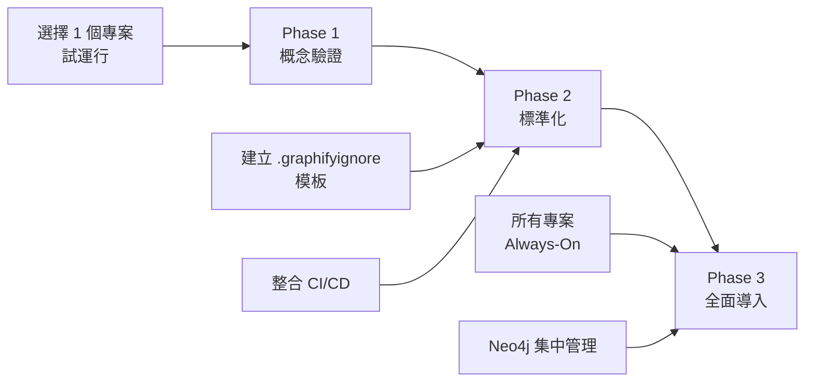

**Phase 1：概念驗證（1-2 週）**
- 選擇一個中型專案（20-50 檔案）試運行
- 評估 GRAPH_REPORT.md 的實用性
- 團隊成員試用 query 功能

**Phase 2：標準化（2-4 週）**
- 建立團隊統一的 `.graphifyignore` 模板
- 整合 CI/CD 自動建圖
- 制定圖譜品質規範（AMBIGUOUS 比例上限）

**Phase 3：全面導入（持續）**
- 所有專案啟用 Always-On 模式
- 部署 Neo4j 集中管理多專案圖譜
- 定期圖譜品質審查與優化

### 9.5 環境變數參考

| 環境變數 | 說明 | 預設值 |
|---------|------|--------|
| `ANTHROPIC_API_KEY` | Claude/Anthropic API Key | — |
| `GEMINI_API_KEY` | Google Gemini API Key | — |
| `GOOGLE_API_KEY` | Google API Key（Gemini 替代） | — |
| `OPENAI_API_KEY` | OpenAI API Key | — |
| `OLLAMA_BASE_URL` | Ollama 本地服務 URL | `http://localhost:11434` |
| `MOONSHOT_API_KEY` | Kimi/Moonshot API Key | — |
| `GRAPHIFY_OUT` | 自訂輸出目錄路徑 | `./graphify-out` |
| `GRAPHIFY_BACKEND` | 預設 LLM 後端 | `claude` |
| `AWS_DEFAULT_REGION` | AWS Bedrock 區域 | — |

> **📌 實務建議**：在 CI 環境中使用 `GRAPHIFY_OUT` 自訂輸出路徑，避免與其他 pipeline 步驟衝突。

---

## 第 10 章：常見問題（FAQ）

### 效能問題

**Q：大型專案（1000+ 檔案）執行很慢？**
- 使用 `.graphifyignore` 排除不必要的檔案
- 使用 `--no-viz` 跳過 HTML 產生
- 使用 `--update` 增量更新而非全新建圖
- v0.3.17+ 每 100 個檔案會顯示進度，不會看起來像是當機

**Q：Watch 模式佔用太多資源？**
- 程式碼變更的 AST 重建非常輕量（無 LLM）
- 文件/圖片變更僅發出通知，不自動觸發 LLM

**Q：Louvain fallback 導致無限迴圈？**
- v0.3.11+ 已增加 `max_level=10, threshold=1e-4` 防止大型稀疏圖的無限迴圈

### Token 使用

**Q：Token 節省 71.5 倍是怎麼算的？**
- 首次執行需消耗 Token 建圖（語義提取階段）
- 後續每次查詢都從壓縮的圖譜讀取，這是節省累計的地方
- 基準測試在 52 檔案混合語料（程式碼 + 論文 + 圖片）上測得

**Q：程式碼更新語義提取耗費多少 Token？**
- SHA256 快取確保僅重新提取有變更的檔案
- 程式碼檔案的 AST 提取完全本地，零 Token
- 僅文件和圖片需要 LLM Token

### 語意錯誤

**Q：圖譜中出現錯誤的 INFERRED 邊？**
- 檢查 `confidence_score`（0.0-1.0），低分邊可能不準確
- 使用 `--cluster-only` 重新聚類而不重新提取
- 人工審查 AMBIGUOUS 邊並提供回饋

**Q：跨檔案關係遺漏？**
- v0.3.17 改善了 chunk 分組策略（按目錄分組）
- 考慮使用 `--mode deep` 進行更積極的推論

### 多語言支援問題

**Q：支援哪些語言？**
- 程式碼（29+ 種 Tree-sitter 語言）：Python, JS, TS, JSX, TSX, Go, Rust, Java, C, C++, Ruby, C#, Kotlin, Scala, PHP, Swift, Lua, Zig, PowerShell, Elixir, Objective-C, Julia, Fortran, Pascal/Delphi, Verilog/SystemVerilog, Dart, Groovy, Vue, Svelte, Astro
- 文件：.md, .mdx, .qmd, .txt, .rst, .html
- 結構化資料：.yaml, .yml, .sql
- Office：.docx, .xlsx（需 `[office]` extra）
- Google Workspace：.gdoc, .gsheet, .gslides
- 論文：.pdf
- 圖片：.png, .jpg, .webp, .gif（Vision LLM）
- 影片/音訊：.mp4, .mp3, .wav, .mov 等（需 `[video]` extra）
- 無副檔名腳本：透過 shebang 偵測

**Q：Julia 支援包含哪些？**
- v0.3.17+ 新增，涵蓋 modules、structs、abstract types、functions、short functions、using/import、call edges、inherits edges
- 透過 `tree-sitter-julia` 實作

**Q：影片/音訊如何處理？**
- 使用 faster-whisper 本地轉錄（Pass 2），完全離線、零 API 成本
- 轉錄稿在 Pass 3 中由 LLM 提取概念和關係
- 需安裝 `[video]` extra：`uv tool install graphifyy[video]`

**Q：圖片中的非英文文字可以辨識嗎？**
- 可以。Graphify 使用 Vision LLM（Claude Vision / Gemini Vision / OpenAI Vision），支援多語言圖片內容抽取。

### 平台與相容性問題

**Q：支援哪些 LLM 後端？**
- Claude（Anthropic）、Claude CLI、Gemini（Google）、OpenAI、Ollama（本地）、AWS Bedrock、Kimi（Moonshot）
- 使用 `--backend <name>` 指定，或設定 `GRAPHIFY_BACKEND` 環境變數

**Q：可以完全離線使用嗎？**
- 可以。使用 `--backend ollama` 搭配本地 Ollama 服務，全流程零 API 成本、零網路需求。

**Q：PyPI 套件名為什麼是 `graphifyy` 而非 `graphify`？**
- 這是暫時性命名，`graphify` 名稱正在回收中。CLI 和 Skill 指令仍然是 `graphify`。

**Q：NetworkX 版本相容性問題？**
- v0.3.16+ 已加入 `node_link_graph()` 版本安全墊片，支援 NetworkX < 3.4

**Q：可以在沒有 AI 助手的情況下使用嗎？**
- 可以。`graphify query` CLI 指令可直接在終端機查詢 `graph.json`，不需要 AI 助手
- MCP Server 模式也可獨立運行：`python -m graphify.serve graphify-out/graph.json`

**Q：可以同時使用多個匯出格式嗎？**
- 可以。多個旗標可組合使用：
  ```bash
  /graphify ./src --obsidian --wiki --svg --neo4j
  ```

---

## 附錄 A：檢查清單（Checklist）

### 初次安裝

- [ ] Python 3.10+ 已安裝
- [ ] `uv tool install graphifyy` 或 `pip install graphifyy` 執行成功
- [ ] `graphify --version` 顯示 v0.7.19+
- [ ] `graphify install` 安裝對應平台 Skill
- [ ] AI Coding Assistant 可正常執行 `/graphify .`

### 專案設定

- [ ] `.graphifyignore` 已設定（排除 node_modules/、target/、dist/ 等）
- [ ] 首次 `/graphify .` 執行成功
- [ ] `graphify-out/GRAPH_REPORT.md` 可正常閱讀
- [ ] `graphify-out/graph.html` 可在瀏覽器中開啟
- [ ] 敏感檔案已加入 `.graphifyignore`

### Always-On 設定

- [ ] `graphify claude install`（或對應平台 install）已執行
- [ ] AI 助手在搜尋前會自動參考 GRAPH_REPORT.md
- [ ] 測試查詢：AI 能從圖譜結構回答架構問題

### Git Hooks

- [ ] `graphify hook install` 已執行
- [ ] `graphify hook status` 顯示正常
- [ ] commit 後圖譜自動更新

### CI/CD 整合

- [ ] GitHub Actions / Jenkins 設定 Graphify 步驟
- [ ] 使用 `--no-viz` 減少 CI 建置時間
- [ ] AMBIGUOUS 邊比例品質門檻已設定
- [ ] 圖譜產物已設定上傳/歸檔

### 安全性

- [ ] `.graphifyignore` 排除 *.key, *.pem, *.env 等敏感檔案
- [ ] `graphify-out/` 存取權限已設定
- [ ] graph.json 被視為內部機密文件處理
- [ ] 定期審查 AMBIGUOUS 邊

### 團隊導入

- [ ] 團隊統一的 `.graphifyignore` 模板已建立
- [ ] Onboarding 文件包含 Graphify 使用說明
- [ ] Wiki 輸出已同步至內部知識庫
- [ ] 定期圖譜品質審查排程已建立

---

## 附錄 B：指令速查表

```bash
# === 基本操作 ===
/graphify .                                    # 分析當前目錄
/graphify ./src                                # 分析指定目錄
/graphify ./src --mode deep                    # 深度模式
/graphify ./src --update                       # 增量更新
/graphify ./src --cluster-only                 # 僅重新聚類
/graphify ./src --no-viz                       # 不產生 HTML
/graphify ./src --watch                        # 背景自動同步
/graphify ./src --dedup                        # 啟用實體去重
/graphify ./src --dedup-llm                    # LLM 輔助去重
/graphify ./src --backend ollama               # 指定 LLM 後端
/graphify ./src --directed                     # 有向圖模式

# === 新增內容 ===
/graphify add <URL>                            # 擷取 URL 內容（含 YouTube 影片）
/graphify add <URL> --author "Name"            # 標記作者
/graphify add <URL> --contributor "Name"       # 標記貢獻者

# === 查詢 ===
/graphify query "問題"                         # BFS 查詢
/graphify query "問題" --dfs                   # DFS 路徑追蹤
/graphify query "問題" --budget 1500           # 限制 Token
/graphify path "NodeA" "NodeB"                 # 兩點路徑
/graphify explain "NodeName"                   # 解釋節點

# === 匯出 ===
/graphify ./src --obsidian                     # Obsidian Vault
/graphify ./src --wiki                         # Agent Wiki
/graphify ./src --callflow                     # Callflow HTML（Mermaid）
/graphify ./src --tree                         # D3 可折疊樹狀圖
/graphify ./src --svg                          # SVG
/graphify ./src --graphml                      # GraphML
/graphify ./src --neo4j                        # Cypher 語句
/graphify ./src --neo4j-push bolt://host:7687  # 推送 Neo4j
/graphify ./src --mcp                          # MCP Server

# === 圖譜管理（v0.7+）===
graphify clone <repo-url>                      # Clone + 自動建圖
graphify merge-graphs <dir1> <dir2>            # 合併多專案圖譜
graphify extract                               # Headless CI 提取
graphify uninstall                             # 完整移除所有設定

# === Git Hooks ===
graphify hook install                          # 安裝 hooks
graphify hook uninstall                        # 移除 hooks
graphify hook status                           # 檢查狀態

# === Always-On ===
graphify claude install                        # Claude Code
graphify cursor install                        # Cursor
graphify gemini-cli install                    # Gemini CLI
graphify copilot-cli install                   # GitHub Copilot CLI
graphify copilot-chat install                  # VS Code Copilot Chat
graphify codex install                         # Codex
graphify aider install                         # Aider
graphify opencode install                      # OpenCode
graphify claw install                          # OpenClaw
graphify droid install                         # Factory Droid
graphify trae install                          # Trae
graphify trae-cn install                       # Trae CN
graphify kimi install                          # Kimi Code
graphify kiro install                          # Kiro

# === CLI 直接查詢 ===
graphify query "問題"                          # 不需 AI 助手
graphify query "問題" --graph path/to/graph.json

# === MCP Server ===
python -m graphify.serve graphify-out/graph.json
```

---

## 附錄 C：版本歷程摘要

| 版本 | 日期 | 重點更新 |
|------|------|---------|
| **v0.7.19** | 2026-05-14 | 最新穩定版，100 releases 里程碑 |
| v0.7.10 | 2026-05 | 11+ 安全強化：DNS rebinding、yt-dlp SSRF、hooks 路徑驗證 |
| v0.7.0 | 2026-05 | 三階段 Pipeline、多後端、影音支援、全域圖譜、實體去重、合併驅動器 |
| v0.5.x | 2026-04–05 | Gemini/OpenAI 後端、Cursor/Kiro/Aider 平台、Callflow HTML、D3 Tree |
| v0.4.x | 2026-04 | Ollama 離線後端、graphify clone/extract、.graphifyinclude、directed graph |
| v0.3.18 | 2026-04 | 社區標籤、BFS/DFS hub-node skipping、GRAPHIFY_OUT 環境變數 |
| **v0.3.17** | 2026-04-08 | Julia 支援、目錄分組 chunk、tree-sitter 版本固定、進度輸出 |
| v0.3.16 | 2026-04-08 | NetworkX < 3.4 相容、JSX 支援、pipx 修復 |
| v0.3.15 | 2026-04-08 | Trae / Trae CN 平台、XSS 修復、Shebang 白名單、日文 README |
| v0.3.14 | 2026-04-08 | Codex PreToolUse hook、--update 幽靈節點清理 |
| v0.3.13 | 2026-04-08 | PreToolUse additionalContext、Go AST 修復、PDF 誤判修復 |
| v0.3.12 | 2026-04-07 | sanitize_label HTML 雙重編碼修復、--wiki 文件化 |
| v0.3.11 | 2026-04-07 | Louvain fallback 無限迴圈修復 |
| v0.3.10 | 2026-04-07 | Windows Unicode 修復、Skill 版本過期偵測 |
| v0.3.9 | 2026-04-07 | Symlink 支援（opt-in）、Codex $ 指令文件化 |
| v0.3.8 | 2026-04-07 | C# 繼承提取、CLI query 指令 |
| v0.3.7 | 2026-04-07 | Objective-C 支援、自訂 Obsidian 路徑 |
| **v0.3.0** | 2026-04-06 | 多平台支援（Codex / OpenCode / OpenClaw）、MIT 授權 |
| v0.2.2 | 2026-04-06 | Always-On 模式、Git Hooks、Benchmark CLI |
| v0.1.7 | 2026-04-05 | Wiki 生成功能 |
| v0.1.4 | 2026-04-05 | vis.js HTML 取代 pyvis、Token benchmark 自動化 |
| **v0.1.0** | 2026-04-03 | 初始發布：13 語言 AST、Leiden 社區、MCP Server、Obsidian |

---

## 附錄 D：官方基準測試結果（Worked Examples）

Graphify 官方 Repository 的 [`worked/`](https://github.com/nicobailon/graphify/tree/v3/worked) 目錄提供可驗證的基準測試結果。每個測試案例包含原始輸入檔案與完整輸出（`GRAPH_REPORT.md`、`graph.json`），可自行運行驗證。

### 測試案例總覽

| 案例 | 檔案數 | Token 節省倍率 | 說明 | 目錄 |
|------|--------|---------------|------|------|
| **Karpathy Repos + 論文 + 圖片** | 52 | **71.5x** | 混合語料（程式碼 + 5 篇論文 + 4 張圖片） | `worked/karpathy-repos/` |
| **Graphify Source + Transformer Paper** | 4 | **5.4x** | Graphify 自身原始碼 + Transformer 論文 | `worked/mixed-corpus/` |
| **httpx（合成 Python 庫）** | 6 | **~1x** | 小型程式碼庫，驗證結構清晰度 | `worked/httpx/` |

### Token 節省效益分析

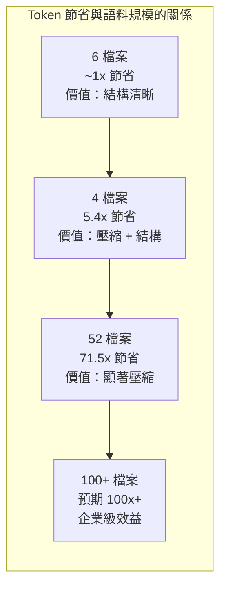

**關鍵洞察**：

- **Token 節省與語料規模正相關**：6 個檔案可直接放入 context window，圖譜價值在於結構化；52 檔案時壓縮效益達 71.5 倍
- **首次執行消耗 Token**：語義提取階段需 LLM Token，這是一次性成本
- **後續查詢零成本**：SHA256 快取確保相同檔案不重複提取，所有查詢從壓縮圖譜讀取
- **效益隨時間複利累積**：團隊成員每次查詢都從圖譜獲益，而非每人各自閱讀原始檔案

> **📌 驗證方式**：可 clone 官方 repo 後進入 `worked/` 目錄，對照原始檔案與 `GRAPH_REPORT.md` 輸出，自行驗證數據準確性。

---

## 附錄 E：貢獻指南

### 專案資訊

| 項目 | 資訊 |
|------|------|
| **Repository** | [github.com/nicobailon/graphify](https://github.com/nicobailon/graphify) |
| **授權** | MIT License |
| **主要語言** | Python 100% |
| **貢獻者數** | 40+ 人 |
| **CI** | GitHub Actions（Python 3.10 + 3.12） |
| **測試框架** | pytest（500+ 測試案例） |
| **GitHub Stars** | 47.8k+ |
| **Releases** | 100 |

### 新增語言擴充器（Extractor）

根據官方 [ARCHITECTURE.md](https://github.com/nicobailon/graphify/blob/v3/ARCHITECTURE.md)，新增語言支援的標準流程：

1. **新增提取函數**：在 `extract.py` 中建立 `extract_<lang>(path: Path) -> dict`，遵循既有模式
   - 使用 Tree-sitter 解析 → 走訪節點 → 收集 `nodes` 和 `edges` → call-graph 二次掃描
2. **註冊檔案副檔名**：在 `extract()` dispatch 和 `collect_files()` 中註冊
3. **更新 detect.py**：將副檔名加入 `CODE_EXTENSIONS` 和 `_WATCHED_EXTENSIONS`（`watch.py`）
4. **新增 Tree-sitter 依賴**：在 `pyproject.toml` 中加入對應的 tree-sitter 語言套件
5. **撰寫測試**：在 `tests/fixtures/` 新增測試檔案，在 `tests/test_languages.py` 撰寫測試

### 測試規範

```bash
# 執行所有測試
pytest tests/ -q

# 測試特性
# - 每個模組一個測試檔案
# - 純單元測試：無網路呼叫、無檔案系統副作用（僅使用 tmp_path）
# - 目前共計 367+ 個測試案例
```

### 程式碼品質要點

| 項目 | 要求 |
|------|------|
| **Security** | 所有外部輸入經 `security.py` 驗證 |
| **Schema** | 提取結果必須通過 `validate.py` Schema 驗證 |
| **無共享狀態** | Pipeline 各階段為純函數，無副作用 |
| **LLM 分離** | 程式碼走 AST（本地），僅文件/圖片走 LLM |

> **📌 參與建議**：提交 PR 前確認 `pytest tests/ -q` 全部通過。對於安全相關修改，請額外閱讀 `SECURITY.md` 了解威脅模型。

---

> **文件最後更新日期**：2026-05-14  
> **Graphify 版本**：v0.7.19  
> **專案 Repository**：[https://github.com/nicobailon/graphify](https://github.com/nicobailon/graphify)  
> **授權**：MIT License  
> **貢獻者**：40+ 人（含 Claude AI）  
> **GitHub Stars**：47.8k+

