+++
date = '2026-10-03T00:00:00+08:00'
draft = false
title = 'IBM MQ 系統管理與 Java 開發教學手冊'
tags = ['教學', 'AI開發', 'IBM MQ', 'Java', 'Spring Boot', 'Jakarta Messaging', 'z/OS', 'MQ Agent', '逆向工程', '框架升級']
categories = ['教學']
+++

# IBM MQ 系統管理與 Java 開發教學手冊

> **文件版本**：1.1
> **資訊確認日期**：2026-10-03
> **IBM MQ 基準版本**：**IBM MQ 10.0（LTS，2026-06 GA）**；同時標示 9.3 / 9.4 的差異
> **Java 基準版本**：**Java 25（LTS）**為主要範例環境，並標示 Java 17 / 21 差異
> **Spring Boot 基準版本**：**Spring Boot 4.x**（Spring Framework 7.x、Jakarta EE 11）為主，並說明 3.x 差異
> **Java Messaging API**：IBM MQ classes for Jakarta Messaging 3.0（新開發首選）、IBM MQ classes for JMS 2.0（維護既有系統）、IBM MQ classes for Java（功能凍結，僅維護）
> **適用對象**：Java 開發人員、前後端工程師、SA、軟體架構師、IBM MQ 系統管理員、DevOps / DevSecOps、維運人員、PM / Technical PM、Legacy 維護人員、逆向工程人員、Framework 升級團隊、AI Coding Agent 使用者
> **文件狀態**：版本資訊均對照 IBM 官方文件（IBM Documentation，IBM MQ 10.0.x）與 IBM 官方 GitHub（ibm-messaging）查證。**查不到或可能隨修補版變動的資訊，一律標示「需依目前 IBM 官方文件確認」，不猜測、不補完。**

## 版本查證摘要（2026-10-03）

以下為撰寫本手冊時，從 IBM 官方來源確認的關鍵事實。後續章節的版本相關描述皆以此為基準。

| 項目 | 查證結果 | 來源 |
|------|----------|------|
| IBM MQ 10.0.0 定位 | 為 IBM MQ 9.4.0 之後的 **LTS** 版本，也是 9.4.5（9.4 最後一個 CD）之後的 **CD** 版本 | IBM Docs：What's new and changed in IBM MQ 10.0.0 |
| 10.0 包含的功能 | 包含 9.4.1～9.4.5 各 CD 版本累積的功能，再加上 10.0 新增功能 | 同上 |
| 交付模型 | 自 9.0 起採 LTS（長期穩定、只修缺陷與安全）與 CD（快速交付新功能）雙軌 | 同上 |
| Java API 種類 | 三組：IBM MQ classes for Jakarta Messaging、IBM MQ classes for JMS、IBM MQ classes for Java | IBM Docs：IBM MQ Java language interfaces |
| IBM MQ classes for Java | **自 MQ 8.0 起功能凍結（Stabilized）**；仍完整支援，但不再新增功能 | 同上 |
| IBM MQ classes for JMS | 支援 JMS 2.0；**官方建議僅用於維護與延伸既有 JMS 2.0 應用** | 同上 |
| IBM MQ classes for Jakarta Messaging | 自 MQ 9.3.0 起支援 Jakarta Messaging 3.0；**官方建議為新開發首選** | 同上 |
| Java API 建置等級 | 自 MQ 9.3 起三組 Java API 皆以 Java 8 建置，執行環境須為 Java 8 以上 | 同上 |
| 10.0 安全性變更 | 移除 SSLv3、TLS 1.0、RC4、3DES CipherSpec；RSA key exchange CipherSpec 列為 Deprecated；IBM Semeru Runtime 25 停用 `TLS_RSA_*`；新增最小 RSA 金鑰長度限制；User ID 驗證更嚴格並支援更長 User ID | IBM Docs：What's changed in IBM MQ 10.0.0 |
| 10.0 新增安全能力 | TLS 支援 FIPS 203 ML-KEM（抗量子）key share、多 certificate label、GSKit 9、`dspmqcert` 檢查憑證到期、HTTPS 取得 CCDT、JWKS | IBM Docs：What's new 10.0.0 |
| 10.0 HA 能力 | Native HA In-Region Replication（IRR）、Cross-Region Replication（CRR）、Native HA 詳細狀態檢視；Native HA 在 Linux（非容器）可用 | 同上 |
| Spring Boot Starter | `com.ibm.mq:mq-jms-spring-boot-starter` **v4.1.0** 對應 **MQ 10.0 與 Spring Boot 4.1.0**；**3.5.15 為 Spring Boot 3 最後一版**；2.7.18 為 Spring Boot 2 最後一版 | GitHub：ibm-messaging/mq-jms-spring |
| Starter 預設行為 | 未設定 `spring.jms.listener.receiveTimeout` 時，starter 會把 polling 逾時調為 30 秒；預設帳密已移除，須明確設定 | 同上 |
| Starter 新屬性 | JWT `ibm.mq.tokenServer.*`（由 Client 自動向 Token Server 取得 Token）、`ccdtSslBundle` / `ccdtHttpsCertValPolicy`（HTTPS CCDT）、`balancing*`（Uniform Cluster）、trace 屬性、`additionalProperties`；`ibm.mq.jks.*` 已標示 deprecated，改用 Spring SSL Bundle | 同上 |
| IBM MQ Agent | 10.0 文件新增的獨立下載元件：容器化 AI Agent + MCP Server，可連最多 20 個 Queue Manager，**只能查詢與推理、不能執行 MQSC**；授權隨 IBM MQ Advanced 或 Cloud Pak for Integration | IBM Docs：IBM MQ Agent |
| 10.0 管理變更 | Native HA 詳細狀態檢視；可用程式（PCF）讀取 Error Log；變更 QM CCSID 可能需 force 選項；MQ Console 強化；RDQM 複寫連線可設 TLS（Advanced） | IBM Docs：What's new / changed 10.0.0 |
| 10.0 開發變更 | 短生命週期 Java / JMS 容器的 trace；JMS Selector 可使用 MsgToken；多個 JMS 連線可視為單一應用實例；JWT endpoint；JMS keepalive 可自訂；Semeru 21 / 25 檔案編碼變更；Client 預設 TCP buffer 變更；.NET 10 | 同上 |
| 10.0 其他變更 | 憑證標籤含空白或逗號須跳脫；EKU 強化；MQIPT 移除 Java Security Manager 支援並調整 CipherSuite；Kafka Connect 與 Kafka Connect XML Converter（Advanced）；z/OS 整合 OpenTelemetry tracing、OUTBUFF 上限提高、GB18030 最新標準 | 同上 |

> **需依目前 IBM 官方文件確認的項目**：`com.ibm.mq.jakarta.client` / `com.ibm.mq.allclient` 的確切修補版號（本手冊以 `10.0.0.x` 示意）、各平台詳細系統需求（OS / JDK / 容器平台版本矩陣）、Container image 的實際 tag、MQ Operator 版本對應、10.0 修補版（Fix Pack / CSU）內容。請以 [System Requirements for IBM MQ](https://www.ibm.com/support/pages/system-requirements-ibm-mq) 與 IBM MQ 10.0 Readme 為準。

## 修訂紀錄

| 版本 | 日期 | 修訂內容 |
|------|------|----------|
| 1.0 | 2026-10-03 | 初版：46 個 Part、32 個 AI Prompt、Quick Reference 與企業標準 |
| 1.1 | 2026-10-03 | 依 IBM MQ 10.0 官方 Technical overview / Administering / Developing applications 逐章比對後補強：IBM MQ 物件全集、產品家族、官方文件對照表、MQI Client 與 CCDT、Exits 與 Installable Services、擴充元件（MFT / MQIPT / AMQP / MQTT / Multicast / Kafka Connect）、Streaming Queue、z/OS 架構與管理、Transaction 協調、Message Property 與 Selector、命令集比較、遠端管理、PCF、Administrative REST API、Console / Explorer、AMS、RACF、多語言支援、Messaging REST API、應用設計考量、10.0 Java / JMS 新能力、進階 JMS 2.0、MQ 與 Kafka 整合、IBM MQ Agent、SMF / OpenTelemetry、QSG 可用性；修正 JMS Delivery Delay 敘述；新增 P33、P34；重建目錄 |

---

## 關於本手冊

### 這份手冊要回答的問題

IBM MQ 的 API 不難學：`MQCONN`、`MQOPEN`、`MQPUT`、`MQGET`，一個下午就能寫出第一支 Producer。

真正困難的問題是：

> **一個同時維護十幾套 Legacy 系統、正在把 Spring Boot 3 升到 4、而且已經大量使用 GitHub Copilot 與 Claude Code 寫程式的企業 Java 團隊，要怎麼把 IBM MQ 做到「不掉訊息、不重複扣款、出事查得到、升級不翻車、AI 不亂動 Production」？**

這個問題底下藏著五件事：

1. **訊息系統的錯誤通常不會立刻爆炸。** 一個沒有設 Backout Queue 的 Consumer，可能在某天凌晨遇到一筆格式錯誤的訊息，然後無限重試、塞住整條佇列，直到早上客服電話響起。
2. **MQ 的 Transaction 不是 DB 的 Transaction。** 「先扣款再送 MQ」與「先送 MQ 再扣款」各有不同的失敗模式；以為兩者會自動一致，是金融系統最常見的事故根源之一。
3. **Legacy 系統的 MQ 設計通常沒有文件。** 佇列名稱寫死在十年前的程式裡，Channel 設定只存在 MQ 管理員的腦袋裡，訊息格式只能從 COBOL Copybook 反推。
4. **升級是連鎖反應。** Java 8 → 25、`javax.jms` → `jakarta.jms`、MQ Client 9.1 → 10.0、TLS 1.2 RSA CipherSpec 被淘汰——任何一環沒驗證，Production 就會出現 `2393` 或 `2035`。
5. **AI Agent 寫 MQ 程式很快，但它不知道哪個 Queue 是 Production 的。** 必須有一套治理機制，讓 AI 能分析、能產生、能測試，但不能未經核准就碰 Production。

本手冊的核心主張：

> **IBM MQ 不是「另一個傳訊息的函式庫」，而是企業系統之間的「可靠性契約」。要把它做好，必須同時處理架構、程式、設定、安全、維運與治理六個面向，而 AI Agent 必須被納入這個契約，而不是凌駕於它之上。**

### 手冊結構

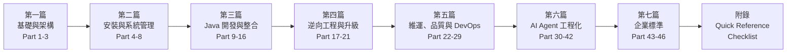

### 依角色建議的閱讀路線

| 角色 | 必讀 | 建議 | 可略讀 |
|------|------|------|--------|
| Java 開發人員 | Part 1-3、9-16、28、34、43 | 22-25、30-31 | 4、26 |
| 前後端工程師 | Part 1、14-16、43 | 12、15 | 4-8、26 |
| SA / 系統分析師 | Part 1-3、14-17、37 | 6、33 | 10-11 |
| 軟體架構師 | Part 1-3、6-8、13-17、26、37、45-46 | 全部 | — |
| IBM MQ 系統管理員 | Part 2-8、21-27、36 | 29-30、41；5.13、8.12（有主機時） | 10-12 |
| z/OS MQ 系統管理員 | Part 1.19、2.10、5.13、8.12、24.7、26.9 | 2.6、3.12、21、36 | 10-12、27 |
| DevOps / DevSecOps | Part 4、8、21、27-29、36 | 22-26 | 10-11 |
| 維運人員 | Part 5、22-24、36 | 8、26；23.6 IBM MQ Agent | 9-13 |
| PM / Technical PM | Part 1、14、20-21、36-41 | 26 | 10-13 |
| Legacy 維護人員 | Part 3、5、17-19、23 | 20-21 | 12 |
| 逆向工程人員 | Part 17-19、33、42 | 3、23 | 4、26 |
| Framework 升級團隊 | Part 9、20-21、44、IBM MQ Quick Reference | 28-29 | 4 |
| AI Coding Agent 使用者 | Part 18-19、30-42 | 23.6、34-35 | 4、26 |

### 版本差異標示規則

本手冊用下列標記區分版本差異：

| 標記 | 意義 |
|------|------|
| `[MQ 10.0]` | IBM MQ 10.0 新增或變更的行為 |
| `[MQ 9.4 CD]` | 9.4.1～9.4.5 CD 首次出現、10.0 LTS 首次納入的功能 |
| `[MQ 9.4]` | 9.4.0 LTS 起可用 |
| `[MQ 9.3+]` | 9.3 起可用 |
| `[Java 17]` / `[Java 21]` / `[Java 25]` | 該寫法需要的最低 Java 版本 |
| `[Boot 3]` / `[Boot 4]` | Spring Boot 主版本差異 |
| `[需確認]` | 需依目前 IBM / Spring 官方文件確認 |

### 環境分級原則

本手冊所有範例都會明確標示適用環境。**Demo 做法不等於 Production 標準。**

| 環境 | 目的 | 允許事項 | 禁止事項 |
|------|------|----------|----------|
| Development（DEV） | 個人開發、單元測試 | MQ Developer 容器、自簽憑證、寬鬆權限 | 使用 Production 資料 |
| Test / SIT | 整合測試 | 共用 Queue Manager、測試用 CA | 使用 Production 憑證或帳號 |
| UAT | 使用者驗收、效能測試 | 與 Production 同等設定（TLS、CHLAUTH、OAM） | 直接修改設定而未經變更流程 |
| Production（PROD） | 正式營運 | 僅經核准的變更 | AI Agent 或個人未經核准的任何變更 |

### 不可直接抄貼原則

本手冊參考 IBM 官方文件後，以「理解 → 分析 → 重組 → 教學化 → 實務化 → AI Agent 化」的方式重新撰寫。必要的官方術語、命令名稱與參數保留原文；所有說明、案例、架構建議與檢查清單為重新組織的內容。**官方命令的完整語法與所有參數，仍以 IBM Documentation 的 MQSC / Control Commands Reference 為準。**

---

## 目錄

- [版本查證摘要（2026-10-03）](#版本查證摘要2026-10-03)
- [修訂紀錄](#修訂紀錄)
- [關於本手冊](#關於本手冊)
  - [這份手冊要回答的問題](#這份手冊要回答的問題)
  - [手冊結構](#手冊結構)
  - [依角色建議的閱讀路線](#依角色建議的閱讀路線)
  - [版本差異標示規則](#版本差異標示規則)
  - [環境分級原則](#環境分級原則)
  - [不可直接抄貼原則](#不可直接抄貼原則)
- [Part 1 — IBM MQ 基礎與核心概念](#part-1--ibm-mq-基礎與核心概念)
  - [1.1 目的](#11-目的)
  - [1.2 Message Oriented Middleware（訊息導向中介軟體）](#12-message-oriented-middleware訊息導向中介軟體)
  - [1.3 IBM MQ 的定位](#13-ibm-mq-的定位)
  - [1.4 IBM MQ 解決什麼問題](#14-ibm-mq-解決什麼問題)
  - [1.5 IBM MQ 與其他技術的比較](#15-ibm-mq-與其他技術的比較)
  - [1.6 IBM MQ 在企業整合中的角色](#16-ibm-mq-在企業整合中的角色)
  - [1.7 IBM MQ 在金融業的常見用途](#17-ibm-mq-在金融業的常見用途)
  - [1.8 實務案例](#18-實務案例)
  - [1.9 注意事項](#19-注意事項)
  - [1.10 IBM MQ 核心元件總覽](#110-ibm-mq-核心元件總覽)
  - [1.11 Queue Manager（佇列管理器）](#111-queue-manager佇列管理器)
  - [1.12 Queue（佇列）的種類](#112-queue佇列的種類)
  - [1.13 Channel（通道）的種類](#113-channel通道的種類)
  - [1.14 Listener（監聽器）](#114-listener監聽器)
  - [1.15 Topic 與 Subscription](#115-topic-與-subscription)
  - [1.16 Message（訊息）與 MQMD](#116-message訊息與-mqmd)
  - [1.17 Persistence（持久性）](#117-persistence持久性)
  - [1.18 元件關係總整理](#118-元件關係總整理)
  - [1.19 IBM MQ 物件全集](#119-ibm-mq-物件全集)
  - [1.20 IBM MQ 產品家族與授權](#120-ibm-mq-產品家族與授權)
  - [1.21 官方文件主題與本手冊對照](#121-官方文件主題與本手冊對照)
  - [1.22 核心元件注意事項](#122-核心元件注意事項)
- [Part 2 — IBM MQ 系統架構](#part-2--ibm-mq-系統架構)
  - [2.1 目的](#21-目的)
  - [2.2 Client / Server Architecture](#22-client--server-architecture)
  - [2.3 Queue Manager 內部架構](#23-queue-manager-內部架構)
  - [2.4 架構模式比較](#24-架構模式比較)
  - [2.5 架構選型決策](#25-架構選型決策)
  - [2.6 MQI Client 類型與 CCDT](#26-mqi-client-類型與-ccdt)
  - [2.7 擴充 Queue Manager 功能：Exits 與 Installable Services](#27-擴充-queue-manager-功能exits-與-installable-services)
  - [2.8 擴充元件：MFT、MQIPT、AMQP、MQTT、Multicast、Kafka Connect](#28-擴充元件mftmqiptamqpmqttmulticastkafka-connect)
  - [2.9 Streaming Queue](#29-streaming-queue)
  - [2.10 IBM MQ for z/OS 架構](#210-ibm-mq-for-zos-架構)
  - [2.11 IBM MQ Console 與 REST API 架構](#211-ibm-mq-console-與-rest-api-架構)
  - [2.12 實務案例](#212-實務案例)
  - [2.13 注意事項](#213-注意事項)
- [Part 3 — IBM MQ 訊息生命週期](#part-3--ibm-mq-訊息生命週期)
  - [3.1 目的](#31-目的)
  - [3.2 本機訊息生命週期](#32-本機訊息生命週期)
  - [3.3 跨 Queue Manager 的完整流程](#33-跨-queue-manager-的完整流程)
  - [3.4 MQI 動詞](#34-mqi-動詞)
  - [3.5 Syncpoint、Commit、Backout、Rollback](#35-syncpointcommitbackoutrollback)
  - [3.6 Persistent 與 Non-persistent](#36-persistent-與-non-persistent)
  - [3.7 Message Expiration（訊息逾期）](#37-message-expiration訊息逾期)
  - [3.8 Message Priority 與 Message Ordering](#38-message-priority-與-message-ordering)
  - [3.9 Message Group（訊息群組）](#39-message-group訊息群組)
  - [3.10 Correlation 與 Retry](#310-correlation-與-retry)
  - [3.11 Dead Letter Queue（DLQ）](#311-dead-letter-queuedlq)
  - [3.12 Transaction 管理：誰是交易協調者](#312-transaction-管理誰是交易協調者)
  - [3.13 Message Property 與 Selector](#313-message-property-與-selector)
  - [3.14 實務案例](#314-實務案例)
  - [3.15 注意事項與 Checklist](#315-注意事項與-checklist)
- [Part 4 — IBM MQ 安裝](#part-4--ibm-mq-安裝)
  - [4.1 目的](#41-目的)
  - [4.2 Linux 安裝](#42-linux-安裝)
  - [4.3 Windows 安裝](#43-windows-安裝)
  - [4.4 Container](#44-container)
  - [4.5 Kubernetes](#45-kubernetes)
  - [4.6 AI Agent 使用方式](#46-ai-agent-使用方式)
  - [4.7 常見錯誤](#47-常見錯誤)
  - [4.8 Checklist](#48-checklist)
- [Part 5 — IBM MQ 系統管理](#part-5--ibm-mq-系統管理)
  - [5.1 目的](#51-目的)
  - [5.2 管理工具總覽](#52-管理工具總覽)
  - [5.3 Queue Manager 管理](#53-queue-manager-管理)
  - [5.4 MQSC 與 runmqsc](#54-mqsc-與-runmqsc)
  - [5.5 常用查詢命令（DISPLAY）](#55-常用查詢命令display)
  - [5.6 常用定義與修改命令](#56-常用定義與修改命令)
  - [5.7 Production 操作風險分級](#57-production-操作風險分級)
  - [5.8 管理方式全景與命令集比較](#58-管理方式全景與命令集比較)
  - [5.9 本機管理與遠端管理](#59-本機管理與遠端管理)
  - [5.10 PCF 與 MQAI 自動化](#510-pcf-與-mqai-自動化)
  - [5.11 Administrative REST API](#511-administrative-rest-api)
  - [5.12 IBM MQ Console 與 IBM MQ Explorer](#512-ibm-mq-console-與-ibm-mq-explorer)
  - [5.13 IBM MQ for z/OS 系統管理](#513-ibm-mq-for-zos-系統管理)
  - [5.14 擴充元件管理](#514-擴充元件管理)
  - [5.15 IBM MQ 10.0 新增的管理能力](#515-ibm-mq-100-新增的管理能力)
  - [5.16 AI Agent 使用方式](#516-ai-agent-使用方式)
  - [5.17 常見錯誤](#517-常見錯誤)
  - [5.18 Checklist](#518-checklist)
- [Part 6 — Queue 設計](#part-6--queue-設計)
  - [6.1 目的](#61-目的)
  - [6.2 Queue Naming Convention](#62-queue-naming-convention)
  - [6.3 金融系統命名範例](#63-金融系統命名範例)
  - [6.4 Queue Capacity：MAXDEPTH 與 MAXMSGL](#64-queue-capacitymaxdepth-與-maxmsgl)
  - [6.5 Backout Queue、Dead Letter Queue、Retry Queue](#65-backout-queuedead-letter-queueretry-queue)
  - [6.6 Request Queue 與 Response Queue](#66-request-queue-與-response-queue)
  - [6.7 MQSC 範例：一組完整的 Request / Reply 佇列](#67-mqsc-範例一組完整的-request--reply-佇列)
  - [6.8 常見錯誤](#68-常見錯誤)
  - [6.9 Checklist](#69-checklist)
- [Part 7 — Channel 設計](#part-7--channel-設計)
  - [7.1 目的](#71-目的)
  - [7.2 Channel 架構](#72-channel-架構)
  - [7.3 Channel 類型選擇](#73-channel-類型選擇)
  - [7.4 Sender Channel 關鍵參數](#74-sender-channel-關鍵參數)
  - [7.5 Transmission Queue 與 Trigger](#75-transmission-queue-與-trigger)
  - [7.6 Server Connection Channel 關鍵參數](#76-server-connection-channel-關鍵參數)
  - [7.7 Channel Status 與 Retry](#77-channel-status-與-retry)
  - [7.8 Channel Authentication、MCA User、TLS、Certificate](#78-channel-authenticationmca-usertlscertificate)
  - [7.9 常見錯誤](#79-常見錯誤)
  - [7.10 Checklist](#710-checklist)
- [Part 8 — IBM MQ Security](#part-8--ibm-mq-security)
  - [8.1 目的](#81-目的)
  - [8.2 安全架構](#82-安全架構)
  - [8.3 Authentication（身分驗證）](#83-authentication身分驗證)
  - [8.4 CHLAUTH（Channel Authentication Records）](#84-chlauthchannel-authentication-records)
  - [8.5 Authorization：OAM（Object Authority Manager）](#85-authorizationoamobject-authority-manager)
  - [8.6 避免 *MQADMIN 與 +all 過度授權](#86-避免-mqadmin-與-all-過度授權)
  - [8.7 TLS、Certificate 與 CipherSpec](#87-tlscertificate-與-cipherspec)
  - [8.8 Audit 與 Log](#88-audit-與-log)
  - [8.9 Secret Management 與 Credential Rotation](#89-secret-management-與-credential-rotation)
  - [8.10 IBM MQ Production Security Baseline](#810-ibm-mq-production-security-baseline)
  - [8.11 Advanced Message Security（AMS）](#811-advanced-message-securityams)
  - [8.12 IBM MQ for z/OS 安全（RACF）](#812-ibm-mq-for-zos-安全racf)
  - [8.13 IBM MQ 10.0 憑證與身分管理細節](#813-ibm-mq-100-憑證與身分管理細節)
  - [8.14 常見錯誤](#814-常見錯誤)
  - [8.15 Checklist](#815-checklist)
- [Part 9 — Java 開發：API 選擇](#part-9--java-開發api-選擇)
  - [9.1 目的](#91-目的)
  - [9.2 API 家族全貌](#92-api-家族全貌)
  - [9.3 比較表](#93-比較表)
  - [9.4 Maven 依賴](#94-maven-依賴)
  - [9.5 Java 版本對照](#95-java-版本對照)
  - [9.6 Client 連線關鍵概念](#96-client-連線關鍵概念)
  - [9.7 多語言支援全貌](#97-多語言支援全貌)
  - [9.8 Messaging REST API](#98-messaging-rest-api)
  - [9.9 應用設計考量](#99-應用設計考量)
  - [9.10 IBM MQ 10.0 對 Java / JMS 開發者的新能力](#910-ibm-mq-100-對-java--jms-開發者的新能力)
  - [9.11 AI Agent 使用方式](#911-ai-agent-使用方式)
  - [9.12 Checklist](#912-checklist)
- [Part 10 — Java MQ 基礎程式（IBM MQ classes for Java）](#part-10--java-mq-基礎程式ibm-mq-classes-for-java)
  - [10.1 目的](#101-目的)
  - [10.2 設計重點](#102-設計重點)
  - [10.3 共用：連線設定與工具](#103-共用連線設定與工具)
  - [10.4 Producer（MQPUT）](#104-producermqput)
  - [10.5 Consumer（MQGET）](#105-consumermqget)
  - [10.6 Transaction 說明](#106-transaction-說明)
  - [10.7 Security 注意事項](#107-security-注意事項)
  - [10.8 常見錯誤](#108-常見錯誤)
  - [10.9 Checklist](#109-checklist)
- [Part 11 — Java JMS / Jakarta Messaging](#part-11--java-jms--jakarta-messaging)
  - [11.1 目的](#111-目的)
  - [11.2 JMS 2.0 / Jakarta Messaging 物件模型](#112-jms-20--jakarta-messaging-物件模型)
  - [11.3 JMS 與 MQMD 對應](#113-jms-與-mqmd-對應)
  - [11.4 與 Legacy（非 JMS）系統互通：targetClient](#114-與-legacy非-jms系統互通targetclient)
  - [11.5 ConnectionFactory](#115-connectionfactory)
  - [11.6 Producer（JMSContext + JMSProducer）](#116-producerjmscontext--jmsproducer)
  - [11.7 Consumer（同步 receive）](#117-consumer同步-receive)
  - [11.8 MessageListener（非同步）](#118-messagelistener非同步)
  - [11.9 Message 類型](#119-message-類型)
  - [11.10 Message Properties、Correlation ID、Message ID](#1110-message-propertiescorrelation-idmessage-id)
  - [11.11 進階 JMS 2.0 / Jakarta Messaging 功能](#1111-進階-jms-20--jakarta-messaging-功能)
  - [11.12 Checklist](#1112-checklist)
- [Part 12 — Spring Boot + IBM MQ](#part-12--spring-boot--ibm-mq)
  - [12.1 目的](#121-目的)
  - [12.2 架構](#122-架構)
  - [12.3 版本對應](#123-版本對應)
  - [12.4 Maven 設定](#124-maven-設定)
  - [12.5 application.yml](#125-applicationyml)
  - [12.6 Listener Container 設定](#126-listener-container-設定)
  - [12.7 Producer（Gateway）](#127-producergateway)
  - [12.8 Listener（Consumer）](#128-listenerconsumer)
  - [12.9 Error Handling、Retry 與 DLQ 策略](#129-error-handlingretry-與-dlq-策略)
  - [12.10 Spring Boot 3.x 與 4.x 差異重點](#1210-spring-boot-3x-與-4x-差異重點)
  - [12.11 Production 注意事項](#1211-production-注意事項)
  - [12.12 Checklist](#1212-checklist)
- [Part 13 — Java Transaction](#part-13--java-transaction)
  - [13.1 目的](#131-目的)
  - [13.2 核心概念：兩個資源、兩個交易](#132-核心概念兩個資源兩個交易)
  - [13.3 失敗情境分析](#133-失敗情境分析)
  - [13.4 做法比較](#134-做法比較)
  - [13.5 Best-Effort 1PC + Idempotency（Consumer 端）](#135-best-effort-1pc--idempotencyconsumer-端)
  - [13.6 Transactional Outbox（Producer 端）](#136-transactional-outboxproducer-端)
  - [13.7 XA / Distributed Transaction](#137-xa--distributed-transaction)
  - [13.8 Exactly-once 的實務限制](#138-exactly-once-的實務限制)
  - [13.9 金融交易系統的實務風險](#139-金融交易系統的實務風險)
  - [13.10 Checklist](#1310-checklist)
- [Part 14 — IBM MQ 與 Web Application 整合](#part-14--ibm-mq-與-web-application-整合)
  - [14.1 目的](#141-目的)
  - [14.2 企業架構](#142-企業架構)
  - [14.3 為什麼 Web Application 不應直接連 IBM MQ](#143-為什麼-web-application-不應直接連-ibm-mq)
  - [14.4 各層職責](#144-各層職責)
  - [14.5 同步 API 與非同步處理的對應](#145-同步-api-與非同步處理的對應)
  - [14.6 實務案例](#146-實務案例)
  - [14.7 Checklist](#147-checklist)
- [Part 15 — Request / Reply Pattern](#part-15--request--reply-pattern)
  - [15.1 目的](#151-目的)
  - [15.2 流程](#152-流程)
  - [15.3 Message ID 與 Correlation ID 慣例](#153-message-id-與-correlation-id-慣例)
  - [15.4 Timeout 設計](#154-timeout-設計)
  - [15.5 Retry 與 Duplicate Request](#155-retry-與-duplicate-request)
  - [15.6 Idempotency 設計](#156-idempotency-設計)
  - [15.7 Spring Boot Request / Reply 範例](#157-spring-boot-request--reply-範例)
  - [15.8 Legacy 回覆端（MQPUT1）](#158-legacy-回覆端mqput1)
  - [15.9 DLQ 情境](#159-dlq-情境)
  - [15.10 Checklist](#1510-checklist)
- [Part 16 — Asynchronous Event Pattern](#part-16--asynchronous-event-pattern)
  - [16.1 目的](#161-目的)
  - [16.2 架構](#162-架構)
  - [16.3 Topic 設計](#163-topic-設計)
  - [16.4 Event 與 Command 的區別](#164-event-與-command-的區別)
  - [16.5 事件訊息設計](#165-事件訊息設計)
  - [16.6 IBM MQ 與 Apache Kafka 整合](#166-ibm-mq-與-apache-kafka-整合)
  - [16.7 常見錯誤](#167-常見錯誤)
  - [16.8 Checklist](#168-checklist)
- [Part 17 — IBM MQ 與 Legacy System 逆向工程](#part-17--ibm-mq-與-legacy-system-逆向工程)
  - [17.1 目的](#171-目的)
  - [17.2 現況假設](#172-現況假設)
  - [17.3 目標產出](#173-目標產出)
  - [17.4 逆向工程架構](#174-逆向工程架構)
  - [17.5 方法：從靜態到動態](#175-方法從靜態到動態)
  - [17.6 IBM MQ Reverse Engineering Input Checklist](#176-ibm-mq-reverse-engineering-input-checklist)
  - [17.7 分析產出鏈](#177-分析產出鏈)
  - [17.8 Queue Map 範本](#178-queue-map-範本)
  - [17.9 Legacy MQ Flow 範例](#179-legacy-mq-flow-範例)
  - [17.10 常見發現與風險](#1710-常見發現與風險)
  - [17.11 Checklist](#1711-checklist)
- [Part 18 — AI Agent 協助 IBM MQ 逆向工程](#part-18--ai-agent-協助-ibm-mq-逆向工程)
  - [18.1 目的](#181-目的)
  - [18.2 Workflow](#182-workflow)
  - [18.3 MQI 動詞辨識](#183-mqi-動詞辨識)
  - [18.4 JMS / Jakarta Messaging 辨識](#184-jms--jakarta-messaging-辨識)
  - [18.5 Queue / Channel 偵測規則](#185-queue--channel-偵測規則)
  - [18.6 AI 輸出的品質要求](#186-ai-輸出的品質要求)
  - [18.7 Human-in-the-loop 驗證](#187-human-in-the-loop-驗證)
  - [18.8 Checklist](#188-checklist)
- [Part 19 — AI Agent 逆向工程 Prompt](#part-19--ai-agent-逆向工程-prompt)
  - [19.1 目的](#191-目的)
  - [19.2 主 Prompt：Java 專案 MQ 全面分析](#192-主-promptjava-專案-mq-全面分析)
  - [19.3 MQ Reverse Engineering Report 範本](#193-mq-reverse-engineering-report-範本)
  - [19.4 補充 Prompt：MQSC 與程式交叉比對](#194-補充-promptmqsc-與程式交叉比對)
  - [19.5 補充 Prompt：COBOL Copybook 轉 Message Specification](#195-補充-promptcobol-copybook-轉-message-specification)
  - [19.6 驗證方式](#196-驗證方式)
- [Part 20 — AI Agent 協助 Framework 升級](#part-20--ai-agent-協助-framework-升級)
  - [20.1 目的](#201-目的)
  - [20.2 升級路徑](#202-升級路徑)
  - [20.3 版本與 API 對照](#203-版本與-api-對照)
  - [20.4 AI 必須產出的文件](#204-ai-必須產出的文件)
  - [20.5 常見 Breaking Changes（MQ 相關）](#205-常見-breaking-changesmq-相關)
  - [20.6 Upgrade Risk Matrix](#206-upgrade-risk-matrix)
  - [20.7 IBM MQ + Java Framework Upgrade Playbook](#207-ibm-mq--java-framework-upgrade-playbook)
  - [20.8 Checklist](#208-checklist)
- [Part 21 — IBM MQ 升級](#part-21--ibm-mq-升級)
  - [21.1 目的](#211-目的)
  - [21.2 升級類型](#212-升級類型)
  - [21.3 相容性基本原則](#213-相容性基本原則)
  - [21.4 升級流程](#214-升級流程)
  - [21.5 Queue Manager 升級方式](#215-queue-manager-升級方式)
  - [21.6 10.0 升級前必查](#216-100-升級前必查)
  - [21.7 Container Image 升級](#217-container-image-升級)
  - [21.8 Checklist](#218-checklist)
- [Part 22 — IBM MQ 維運](#part-22--ibm-mq-維運)
  - [22.1 目的](#221-目的)
  - [22.2 維運範圍](#222-維運範圍)
  - [22.3 每日巡檢腳本（唯讀）](#223-每日巡檢腳本唯讀)
  - [22.4 告警門檻建議](#224-告警門檻建議)
  - [22.5 維運流程](#225-維運流程)
  - [22.6 Checklist](#226-checklist)
- [Part 23 — IBM MQ 故障排除](#part-23--ibm-mq-故障排除)
  - [23.1 目的](#231-目的)
  - [23.2 排查方法論](#232-排查方法論)
  - [23.3 Troubleshooting Matrix](#233-troubleshooting-matrix)
  - [23.4 常用 Reason Code](#234-常用-reason-code)
  - [23.5 Java 端除錯技巧](#235-java-端除錯技巧)
  - [23.6 IBM MQ Agent：官方 AI 診斷助理](#236-ibm-mq-agent官方-ai-診斷助理)
  - [23.7 IBM MQ 10.0 的診斷新能力](#237-ibm-mq-100-的診斷新能力)
  - [23.8 AI Agent 使用方式](#238-ai-agent-使用方式)
  - [23.9 Checklist](#239-checklist)
- [Part 24 — IBM MQ 監控](#part-24--ibm-mq-監控)
  - [24.1 目的](#241-目的)
  - [24.2 監控來源](#242-監控來源)
  - [24.3 監控架構](#243-監控架構)
  - [24.4 企業監控 KPI](#244-企業監控-kpi)
  - [24.5 啟用監控的 MQSC](#245-啟用監控的-mqsc)
  - [24.6 應用端指標（Spring Boot + Micrometer）](#246-應用端指標spring-boot--micrometer)
  - [24.7 z/OS 監控：SMF 與 OpenTelemetry](#247-zos-監控smf-與-opentelemetry)
  - [24.8 Native HA 與 RDQM 監控](#248-native-ha-與-rdqm-監控)
  - [24.9 Checklist](#249-checklist)
- [Part 25 — IBM MQ 效能調校](#part-25--ibm-mq-效能調校)
  - [25.1 目的](#251-目的)
  - [25.2 效能因素](#252-效能因素)
  - [25.3 取捨關係](#253-取捨關係)
  - [25.4 效能測試方法](#254-效能測試方法)
  - [25.5 Checklist](#255-checklist)
- [Part 26 — High Availability / Disaster Recovery](#part-26--high-availability--disaster-recovery)
  - [26.1 目的](#261-目的)
  - [26.2 名詞](#262-名詞)
  - [26.3 HA 選項比較](#263-ha-選項比較)
  - [26.4 DR 選項](#264-dr-選項)
  - [26.5 HA 架構圖](#265-ha-架構圖)
  - [26.6 DR 架構圖：金融系統案例](#266-dr-架構圖金融系統案例)
  - [26.7 Backup 與 Recovery](#267-backup-與-recovery)
  - [26.8 HA / DR 對應用程式的要求](#268-ha--dr-對應用程式的要求)
  - [26.9 z/OS 可用性：Queue Sharing Group 與 Shared Queue](#269-zos-可用性queue-sharing-group-與-shared-queue)
  - [26.10 IBM MQ 10.0 的 HA / DR 強化](#2610-ibm-mq-100-的-ha--dr-強化)
  - [26.11 Checklist](#2611-checklist)
- [Part 27 — DevOps / CI/CD](#part-27--devops--cicd)
  - [27.1 目的](#271-目的)
  - [27.2 Pipeline](#272-pipeline)
  - [27.3 MQ Configuration as Code](#273-mq-configuration-as-code)
  - [27.4 CI 範例（GitHub Actions）](#274-ci-範例github-actions)
  - [27.5 Environment Configuration 與 Secret Management](#275-environment-configuration-與-secret-management)
  - [27.6 Deployment 與 Rollback](#276-deployment-與-rollback)
  - [27.7 Checklist](#277-checklist)
- [Part 28 — Automated Testing](#part-28--automated-testing)
  - [28.1 目的](#281-目的)
  - [28.2 測試金字塔](#282-測試金字塔)
  - [28.3 Unit Test：錯誤分類](#283-unit-test錯誤分類)
  - [28.4 Integration Test：Spring Boot + MQ 容器](#284-integration-testspring-boot--mq-容器)
  - [28.5 Contract Test：電文規格](#285-contract-test電文規格)
  - [28.6 Failure Test 情境](#286-failure-test-情境)
  - [28.7 Checklist](#287-checklist)
- [Part 29 — Security / DevSecOps](#part-29--security--devsecops)
  - [29.1 目的](#291-目的)
  - [29.2 安全掃描組合](#292-安全掃描組合)
  - [29.3 MQ Security Review 檢查項目](#293-mq-security-review-檢查項目)
  - [29.4 Security Architecture](#294-security-architecture)
  - [29.5 Checklist](#295-checklist)
- [Part 30 — AI Coding Agent 開發標準](#part-30--ai-coding-agent-開發標準)
  - [30.1 目的](#301-目的)
  - [30.2 AI Agent 使用原則](#302-ai-agent-使用原則)
  - [30.3 禁止事項](#303-禁止事項)
  - [30.4 Human-in-the-loop 流程](#304-human-in-the-loop-流程)
  - [30.5 技術控制措施](#305-技術控制措施)
  - [30.6 Agent 指令檔範本（片段）](#306-agent-指令檔範本片段)
  - [30.7 Checklist](#307-checklist)
- [Part 31 — GitHub Copilot / Claude Code / Codex 使用方法](#part-31--github-copilot--claude-code--codex-使用方法)
  - [31.1 目的](#311-目的)
  - [31.2 工具比較](#312-工具比較)
  - [31.3 依工作類型的建議](#313-依工作類型的建議)
  - [31.4 IBM MQ 專用 Prompt（IDE 開發）](#314-ibm-mq-專用-promptide-開發)
  - [31.5 IBM MQ 專用 Prompt（Repository 分析）](#315-ibm-mq-專用-promptrepository-分析)
  - [31.6 IBM MQ Agent 與 AI Coding 工具的定位](#316-ibm-mq-agent-與-ai-coding-工具的定位)
  - [31.7 Checklist](#317-checklist)
- [Part 32 — AI Agent Skills](#part-32--ai-agent-skills)
  - [32.1 目的](#321-目的)
  - [32.2 Skill 清單](#322-skill-清單)
  - [32.3 ibm-mq-analysis](#323-ibm-mq-analysis)
  - [32.4 ibm-mq-reverse-engineering](#324-ibm-mq-reverse-engineering)
  - [32.5 ibm-mq-java-development](#325-ibm-mq-java-development)
  - [32.6 ibm-mq-troubleshooting](#326-ibm-mq-troubleshooting)
  - [32.7 ibm-mq-security-audit](#327-ibm-mq-security-audit)
  - [32.8 ibm-mq-upgrade](#328-ibm-mq-upgrade)
  - [32.9 ibm-mq-test](#329-ibm-mq-test)
  - [32.10 SKILL.md 範本](#3210-skillmd-範本)
  - [32.11 Checklist](#3211-checklist)
- [Part 33 — AI Agent 自動產生文件](#part-33--ai-agent-自動產生文件)
  - [33.1 目的](#331-目的)
  - [33.2 文件清單](#332-文件清單)
  - [33.3 Deployment Diagram 範例](#333-deployment-diagram-範例)
  - [33.4 文件產生流程](#334-文件產生流程)
  - [33.5 Prompt：產生 Queue Specification](#335-prompt產生-queue-specification)
  - [33.6 Checklist](#336-checklist)
- [Part 34 — IBM MQ Coding Standards](#part-34--ibm-mq-coding-standards)
  - [34.1 目的](#341-目的)
  - [34.2 規則表](#342-規則表)
  - [34.3 Code Review 快速判斷](#343-code-review-快速判斷)
  - [34.4 Checklist](#344-checklist)
- [Part 35 — IBM MQ Naming Standards](#part-35--ibm-mq-naming-standards)
  - [35.1 目的](#351-目的)
  - [35.2 Queue Manager](#352-queue-manager)
  - [35.3 Queue](#353-queue)
  - [35.4 Channel（≤ 20 字元）](#354-channel-20-字元)
  - [35.5 Topic](#355-topic)
  - [35.6 Subscription](#356-subscription)
  - [35.7 其他物件](#357-其他物件)
  - [35.8 Checklist](#358-checklist)
- [Part 36 — IBM MQ Production Checklist](#part-36--ibm-mq-production-checklist)
  - [36.1 Development Checklist](#361-development-checklist)
  - [36.2 Code Review Checklist](#362-code-review-checklist)
  - [36.3 Security Checklist](#363-security-checklist)
  - [36.4 Deployment Checklist](#364-deployment-checklist)
  - [36.5 Operation Checklist](#365-operation-checklist)
  - [36.6 Upgrade Checklist](#366-upgrade-checklist)
  - [36.7 Incident Checklist](#367-incident-checklist)
  - [36.8 DR Checklist](#368-dr-checklist)
- [Part 37 — IBM MQ 架構設計案例](#part-37--ibm-mq-架構設計案例)
  - [37.1 Case 1：Spring Boot → IBM MQ → Legacy Java](#371-case-1spring-boot--ibm-mq--legacy-java)
  - [37.2 Case 2：Vue → API → Spring Boot → IBM MQ → Mainframe](#372-case-2vue--api--spring-boot--ibm-mq--mainframe)
  - [37.3 Case 3：銀行交易 Request / Reply](#373-case-3銀行交易-request--reply)
  - [37.4 Case 4：批次系統透過 IBM MQ 傳送資料](#374-case-4批次系統透過-ibm-mq-傳送資料)
  - [37.5 Case 5：IBM MQ 多 Queue Manager](#375-case-5ibm-mq-多-queue-manager)
  - [37.6 Case 6：IBM MQ HA / DR](#376-case-6ibm-mq-ha--dr)
  - [37.7 Case 7：Legacy MQ Application Reverse Engineering](#377-case-7legacy-mq-application-reverse-engineering)
  - [37.8 Case 8：Java / Spring Boot / IBM MQ Framework Upgrade](#378-case-8java--spring-boot--ibm-mq-framework-upgrade)
- [Part 38 — AI Agent 實戰專案](#part-38--ai-agent-實戰專案)
  - [38.1 目的](#381-目的)
  - [38.2 專案架構](#382-專案架構)
  - [38.3 任務與 AI Agent 協助](#383-任務與-ai-agent-協助)
  - [38.4 驗收標準](#384-驗收標準)
- [Part 39 — AI Agent 工作流程](#part-39--ai-agent-工作流程)
  - [39.1 目的](#391-目的)
  - [39.2 流程](#392-流程)
  - [39.3 Agent 定義](#393-agent-定義)
  - [39.4 Checklist](#394-checklist)
- [Part 40 — IBM MQ 與企業 AI SDLC](#part-40--ibm-mq-與企業-ai-sdlc)
  - [40.1 目的](#401-目的)
  - [40.2 流程](#402-流程)
  - [40.3 各階段 AI 協助](#403-各階段-ai-協助)
- [Part 41 — IBM MQ AI Governance](#part-41--ibm-mq-ai-governance)
  - [41.1 目的](#411-目的)
  - [41.2 AI 可以做](#412-ai-可以做)
  - [41.3 AI 不可以直接做](#413-ai-不可以直接做)
  - [41.4 治理架構](#414-治理架構)
  - [41.5 責任歸屬（RACI 範例）](#415-責任歸屬raci-範例)
  - [41.6 IBM MQ Agent 治理](#416-ibm-mq-agent-治理)
  - [41.7 Checklist](#417-checklist)
- [Part 42 — AI Agent Prompt Library](#part-42--ai-agent-prompt-library)
  - [42.1 使用說明](#421-使用說明)
  - [P01 MQ Architecture Analysis](#p01-mq-architecture-analysis)
  - [P02 MQ Configuration Analysis](#p02-mq-configuration-analysis)
  - [P03 Queue Analysis](#p03-queue-analysis)
  - [P04 Channel Analysis](#p04-channel-analysis)
  - [P05 Java MQ Analysis](#p05-java-mq-analysis)
  - [P06 JMS Analysis](#p06-jms-analysis)
  - [P07 Spring Boot MQ Analysis](#p07-spring-boot-mq-analysis)
  - [P08 MQ Reverse Engineering](#p08-mq-reverse-engineering)
  - [P09 Message Flow Analysis](#p09-message-flow-analysis)
  - [P10 MQ Error Analysis](#p10-mq-error-analysis)
  - [P11 MQ Security Audit](#p11-mq-security-audit)
  - [P12 MQ Performance Analysis](#p12-mq-performance-analysis)
  - [P13 MQ Upgrade Analysis](#p13-mq-upgrade-analysis)
  - [P14 Java Upgrade](#p14-java-upgrade)
  - [P15 Spring Boot Upgrade](#p15-spring-boot-upgrade)
  - [P16 Jakarta Migration](#p16-jakarta-migration)
  - [P17 MQ Test Generation](#p17-mq-test-generation)
  - [P18 Integration Test](#p18-integration-test)
  - [P19 Performance Test](#p19-performance-test)
  - [P20 MQSC Generation](#p20-mqsc-generation)
  - [P21 MQ Documentation Generation](#p21-mq-documentation-generation)
  - [P22 Sequence Diagram Generation](#p22-sequence-diagram-generation)
  - [P23 Architecture Diagram Generation](#p23-architecture-diagram-generation)
  - [P24 Production Checklist](#p24-production-checklist)
  - [P25 Incident Analysis](#p25-incident-analysis)
  - [P26 DLQ Analysis](#p26-dlq-analysis)
  - [P27 Retry Analysis](#p27-retry-analysis)
  - [P28 Transaction Analysis](#p28-transaction-analysis)
  - [P29 HA/DR Analysis](#p29-hadr-analysis)
  - [P30 MQ Modernization](#p30-mq-modernization)
  - [P31 MQ Code Review](#p31-mq-code-review)
  - [P32 CCSID / 編碼問題分析](#p32-ccsid--編碼問題分析)
  - [P33 IBM MQ Agent 診斷提問範本](#p33-ibm-mq-agent-診斷提問範本)
  - [P34 Messaging REST API 適用性評估](#p34-messaging-rest-api-適用性評估)
- [Part 43 — 常見錯誤](#part-43--常見錯誤)
  - [43.1 IBM MQ 開發人員最常犯的錯誤](#431-ibm-mq-開發人員最常犯的錯誤)
- [Part 44 — IBM MQ 版本與升級策略](#part-44--ibm-mq-版本與升級策略)
  - [44.1 目的](#441-目的)
  - [44.2 IBM MQ 版本模型](#442-ibm-mq-版本模型)
  - [44.3 10.0 版本重點（官方查證）](#443-100-版本重點官方查證)
  - [44.4 升級對照表](#444-升級對照表)
  - [44.5 升級策略建議](#445-升級策略建議)
- [Part 45 — Enterprise IBM MQ Reference Architecture](#part-45--enterprise-ibm-mq-reference-architecture)
  - [45.1 參考架構](#451-參考架構)
  - [45.2 完整參考架構（含橫切面）](#452-完整參考架構含橫切面)
  - [45.3 橫切面說明](#453-橫切面說明)
- [Part 46 — 最終企業標準](#part-46--最終企業標準)
  - [46.1 Architecture Standard](#461-architecture-standard)
  - [46.2 Development Standard](#462-development-standard)
  - [46.3 Java Standard](#463-java-standard)
  - [46.4 Queue Standard](#464-queue-standard)
  - [46.5 Channel Standard](#465-channel-standard)
  - [46.6 Security Standard](#466-security-standard)
  - [46.7 Logging Standard](#467-logging-standard)
  - [46.8 Monitoring Standard](#468-monitoring-standard)
  - [46.9 Testing Standard](#469-testing-standard)
  - [46.10 Deployment Standard](#4610-deployment-standard)
  - [46.11 Upgrade Standard](#4611-upgrade-standard)
  - [46.12 AI Agent Standard](#4612-ai-agent-standard)
  - [46.13 Reverse Engineering Standard](#4613-reverse-engineering-standard)
  - [46.14 Production Operation Standard](#4614-production-operation-standard)
- [IBM MQ Quick Reference](#ibm-mq-quick-reference)
  - [常用 MQSC](#常用-mqsc)
  - [常用 Control Commands](#常用-control-commands)
  - [PCF 與 REST API](#pcf-與-rest-api)
  - [z/OS](#zos)
  - [常用 Reason Code](#常用-reason-code)
  - [常用 Queue Pattern](#常用-queue-pattern)
  - [常用 Channel Pattern](#常用-channel-pattern)
  - [Java API（IBM MQ classes for Java）](#java-apiibm-mq-classes-for-java)
  - [JMS API（Jakarta Messaging）](#jms-apijakarta-messaging)
  - [Spring Boot](#spring-boot)
  - [Troubleshooting](#troubleshooting)
  - [Security](#security)
  - [Production Checklist](#production-checklist)
  - [AI Agent Prompt](#ai-agent-prompt)
- [新進成員 Checklist](#新進成員-checklist)
  - [第一週：理解](#第一週理解)
  - [第二週：動手](#第二週動手)
  - [第三週：整合](#第三週整合)
  - [第四週：企業實務](#第四週企業實務)
  - [第五週：進階管理與生態系](#第五週進階管理與生態系)
- [參考資料](#參考資料)
- [附錄：手冊品質自我審查](#附錄手冊品質自我審查)
  - [第六節 Mermaid 圖對照](#第六節-mermaid-圖對照)

---

## Part 1 — IBM MQ 基礎與核心概念

### 1.1 目的

讓讀者在動手寫程式之前，先回答三個問題：IBM MQ 解決什麼問題？什麼時候該用、什麼時候不該用？它在企業（特別是金融業）架構中扮演什麼角色？

### 1.2 Message Oriented Middleware（訊息導向中介軟體）

Message Oriented Middleware（MOM，訊息導向中介軟體）的核心概念只有一句話：

> **發送方把資料放進一個「中間的可靠容器」，接收方在自己方便的時候從容器取出。雙方不需要同時在線，也不需要知道對方在哪裡。**

這個「中間容器」就是 Queue（佇列），管理容器的伺服器程式就是 Queue Manager（佇列管理器）。

用生活比喻：

| 通訊方式 | 比喻 | 特性 |
|----------|------|------|
| TCP Socket | 打電話 | 雙方必須同時在線；斷線就中斷 |
| REST API | 到櫃檯辦事 | 必須等櫃員回應；櫃員不在就失敗 |
| IBM MQ | 掛號郵件 + 郵局 | 寄件人投遞後即可離開；郵局保證送達、可追蹤、可退件 |

### 1.3 IBM MQ 的定位

IBM MQ 是 IBM 的企業級訊息中介軟體產品，前身為 MQSeries、WebSphere MQ。它的設計重點是：

1. **Assured Delivery（確保送達）**：Persistent Message 搭配 Syncpoint，在 Queue Manager 重啟後仍不遺失。
2. **Once-and-only-once 傳遞（於 MQ 網路內）**：Queue Manager 之間的 Channel 以批次確認與序號機制避免重複或遺失。**注意：這個保證只在 MQ 網路內部成立，應用程式端的重複處理仍需自行設計 Idempotency（見 Part 13、15）。**
3. **跨平台**：Linux、Windows、AIX、IBM i、z/OS、容器、雲端，以及 MQ Appliance。
4. **多種 API**：MQI（C、COBOL 等）、Java、JMS / Jakarta Messaging、.NET、XMS、REST、AMQP、MQTT。
5. **企業級安全與維運**：TLS、CHLAUTH、CONNAUTH、OAM、事件監控、統計與帳務資料。

### 1.4 IBM MQ 解決什麼問題

| 問題 | 沒有 MQ 時 | 使用 MQ 後 |
|------|-----------|-----------|
| 系統暫時離線 | 呼叫方失敗或必須自行重試、暫存 | 訊息留在佇列，對方上線後處理 |
| 流量尖峰 | 後端被打爆 | 佇列吸收尖峰，Consumer 依自身能力處理（削峰填谷） |
| 異質平台整合 | 每對系統寫一套轉換與傳輸程式 | 統一透過 MQ API 與 Channel |
| 可靠性 | 自行實作 ack、重送、去重 | Persistent + Syncpoint + Channel 協定 |
| 解耦 | 呼叫方需知道對方位址 | 只需知道佇列名稱，路由由 MQ 設定決定 |
| 稽核與追蹤 | 散落各系統日誌 | Message ID / Correlation ID、事件、帳務記錄 |

### 1.5 IBM MQ 與其他技術的比較

> **比較原則**：以下比較著重「設計取向與適用情境」，不代表某一技術絕對優於另一技術。實際選型應依需求、既有資產、團隊能力與授權成本評估。

#### 1.5.1 IBM MQ 與 REST API

| 面向 | REST API | IBM MQ |
|------|----------|--------|
| 互動模式 | 同步 Request / Response | 非同步為主，也可做 Request / Reply |
| 時間耦合 | 雙方必須同時可用 | 不需同時可用 |
| 可靠性 | 由呼叫方自行重試；重試可能造成重複 | Persistent + Syncpoint 保證送達 MQ |
| 流量控制 | 需另加 Rate Limit / Circuit Breaker | 佇列天然緩衝 |
| 適合情境 | 查詢、即時互動、對外開放 API | 交易指令、系統間可靠傳遞、批次資料、跨平台整合 |
| 不適合情境 | 對方常離線、尖峰極高 | 需要立即回應的使用者查詢（除非搭配 Request / Reply 與 Timeout） |

#### 1.5.2 IBM MQ 與 Apache Kafka

| 面向 | Apache Kafka | IBM MQ |
|------|--------------|--------|
| 核心模型 | 分散式、可重播的事件日誌（Log） | 佇列（取走即消失）與 Pub/Sub |
| 訊息保留 | 依保留政策保存，可多次重讀 | 取走（destructive get）後即刪除；Browse 不刪除 |
| 典型用途 | 事件串流、資料管線、大量事件分析 | 交易指令、Request / Reply、可靠點對點 |
| 交易語意 | 支援 Kafka transactions（主要在 Kafka 生態內） | Syncpoint、XA 兩階段提交（可與 DB 協調） |
| 個別訊息處理 | 以 offset 為單位，單筆刪除不是設計重點 | 以單筆訊息為單位，支援 Backout、DLQ |
| 整合 | 兩者可並存；IBM MQ Advanced 提供 Kafka Connect 來源與接收 connector `[MQ 9.4 CD]` | |

**實務建議**：交易指令（轉帳、扣款、下單）走 MQ；交易完成後產生的事件（供分析、通知）可轉發到 Kafka。兩者是互補而非替代。

#### 1.5.3 IBM MQ 與 RabbitMQ

| 面向 | RabbitMQ | IBM MQ |
|------|----------|--------|
| 協定 | AMQP 0-9-1 為主，另支援 AMQP 1.0、MQTT、STOMP 等 | MQ 原生協定，另支援 AMQP 1.0、MQTT |
| 路由 | Exchange + Binding，彈性高 | Queue Alias、Remote Queue、Cluster、Topic |
| 授權 | 開源（另有商業支援） | 商業授權（有免費 Developer 版本） |
| 企業特性 | 依版本與外掛提供 | 內建 XA、z/OS 整合、CHLAUTH、AMS 端到端加密（Advanced） |
| 適合情境 | 雲原生微服務、彈性路由 | 大型主機整合、金融交易、需要正式原廠支援的關鍵系統 |

#### 1.5.4 IBM MQ 與傳統 TCP Socket

很多 Legacy 系統（特別是金融業的電文系統）仍使用自訂 TCP Socket 協定。兩者差異：

| 面向 | TCP Socket | IBM MQ |
|------|-----------|--------|
| 訊息邊界 | 需自行定義（長度欄位、分隔字元） | 由 MQ 管理 |
| 斷線重連 | 自行實作 | Channel 自動重試；Client 自動重連（可設定） |
| 暫存 | 自行實作 | 佇列 |
| 加密 | 自行處理 TLS | Channel 層 TLS 設定 |
| 重複 / 遺失 | 全部自行處理 | MQ 內部保證；應用層仍需 Idempotency |

### 1.6 IBM MQ 在企業整合中的角色

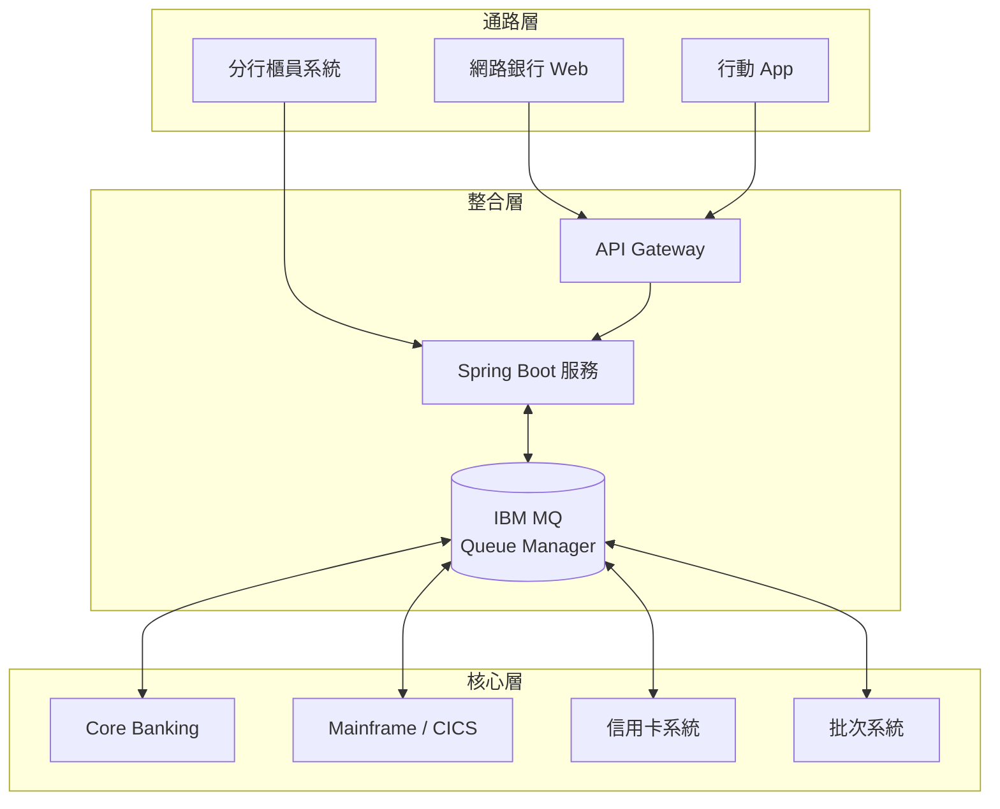

IBM MQ 在企業整合中常扮演：

1. **前台與核心之間的緩衝層**：前台流量尖峰不會直接衝擊核心。
2. **異質平台的共同語言**：Java、.NET、COBOL、C 都能透過 MQ 溝通。
3. **可靠的交易通道**：交易指令不因網路短暫中斷而遺失。
4. **系統邊界**：佇列名稱就是系統之間的契約。

### 1.7 IBM MQ 在金融業的常見用途

| 用途 | 說明 | 常見模式 |
|------|------|----------|
| 轉帳 / 扣款 | 前台送交易指令到核心系統 | Request / Reply |
| 跨行交易 | 與清算機構、外部銀行介接 | Distributed Queuing（Sender / Receiver Channel） |
| 帳務通知 | 交易完成後通知簡訊、推播、稽核 | Pub/Sub 或多 Queue 分送 |
| 批次資料傳遞 | 日終資料、對帳檔分段傳遞 | Message Group、Managed File Transfer（MFT） |
| 主機整合 | 透過 CICS / IMS Bridge 呼叫主機交易 | Request / Reply |
| 風控 / 反洗錢 | 交易事件送風控引擎 | 非同步事件 |

### 1.8 實務案例

某銀行網銀轉帳原本以 REST 同步呼叫核心系統。核心系統每晚 23:30 至 00:30 進行日切，期間網銀轉帳全數失敗並顯示系統忙碌。改為「網銀 → Spring Boot → MQ → 核心」後，日切期間的轉帳指令留在 Request Queue，日切完成後依序處理，前台改為顯示「交易已受理，處理中」並提供查詢。

**但這個改動帶來新問題**：使用者可能因為沒有立即看到結果而重按，造成重複轉帳。解法是 Idempotency Key（見 Part 15）。**MQ 解決了可用性問題，但也把一致性問題推到應用層。**

### 1.9 注意事項

- 不要因為「MQ 很可靠」就省略應用層的 Idempotency。
- 不要把 MQ 當成 REST 的替代品用在需要立即回應的查詢上。
- 導入 MQ 前，先確認誰負責 Queue Manager 的維運，避免「開發建了、沒人管」。

### 1.10 IBM MQ 核心元件總覽

本節起建立對 IBM MQ 物件（Objects）的完整心智模型，理解每個元件的職責與彼此關係。

```text
Application
    ↓
MQ Client / MQI / JMS
    ↓
Queue Manager
    ↓
Queue
    ↓
Channel
    ↓
Remote Queue Manager
    ↓
Application
```

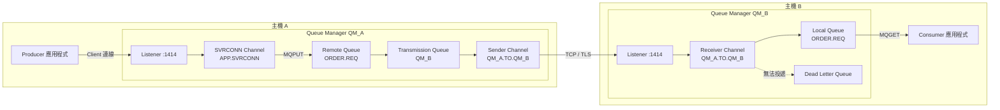

### 1.11 Queue Manager（佇列管理器）

Queue Manager 是 IBM MQ 的伺服器端核心程式，負責：

- 擁有並管理所有 MQ 物件（Queue、Channel、Topic、Listener 等）
- 處理應用程式的 MQI 呼叫
- 管理 Recovery Log（復原日誌），保證 Persistent Message 不遺失
- 管理交易（Syncpoint）
- 執行安全檢查（CHLAUTH、CONNAUTH、OAM）

**命名限制**：Queue Manager 名稱最長 48 字元，在整個 MQ 網路中應唯一（Cluster 中必須唯一）。

### 1.12 Queue（佇列）的種類

| 類型 | MQSC 物件 | 用途 | 是否實際存放訊息 |
|------|----------|------|------------------|
| Local Queue | `QLOCAL` | 實際存放訊息的佇列 | 是 |
| Remote Queue（定義） | `QREMOTE` | 指向另一個 Queue Manager 上的佇列 | 否（訊息進入 Transmission Queue） |
| Transmission Queue | `QLOCAL` + `USAGE(XMITQ)` | 暫存要送往遠端 Queue Manager 的訊息 | 是 |
| Dead Letter Queue（DLQ） | `QLOCAL`，由 QMGR `DEADQ` 屬性指定 | 存放無法投遞的訊息 | 是 |
| Alias Queue | `QALIAS` | 為另一個 Queue 或 Topic 取別名 | 否 |
| Model Queue | `QMODEL` | 動態建立佇列的範本（例如暫時回覆佇列） | 否（範本） |
| Cluster Queue | `QLOCAL` + `CLUSTER(...)` | 在 Cluster 中公告、可被其他成員找到 | 是 |
| Backout Queue | `QLOCAL`，由來源佇列 `BOQNAME` 指定 | 存放重試超過次數的毒訊息（Poison Message） | 是 |

**常見誤解**：

- **Remote Queue 不是一個「遠端的佇列」，而是一個「本地的路由定義」。** 對它 MQPUT 時，訊息會被放進 Transmission Queue，再由 Sender Channel 送出。你不能對 Remote Queue 做 MQGET。
- **Alias Queue 常用於「解耦應用程式與實體佇列」**：應用程式寫死 Alias 名稱，實際佇列可以在不改程式的情況下切換，也可以在 Alias 層級設定不同的權限（例如只允許 GET）。

### 1.13 Channel（通道）的種類

Channel 分為兩大類：

1. **MQI Channel**：應用程式（Client）與 Queue Manager 之間，雙向。
2. **Message Channel**：Queue Manager 與 Queue Manager 之間，單向。

| Channel 類型 | MQSC `CHLTYPE` | 類別 | 方向 | 說明 |
|-------------|----------------|------|------|------|
| Server Connection | `SVRCONN` | MQI | 雙向 | Queue Manager 端，接受 Client 連線 |
| Client Connection | `CLNTCONN` | MQI | 雙向 | Client 端定義，通常放在 CCDT 中 |
| Sender | `SDR` | Message | 送出 | 從 Transmission Queue 取出訊息送往遠端 |
| Receiver | `RCVR` | Message | 接收 | 接收 Sender 送來的訊息並放入目標佇列 |
| Server | `SVR` | Message | 送出 | 可由遠端 Requester 觸發啟動 |
| Requester | `RQSTR` | Message | 接收 | 主動要求遠端 Server / Sender 開始傳送 |
| Cluster Sender | `CLUSSDR` | Message | 送出 | 連往 Full Repository，其餘由 Cluster 自動定義 |
| Cluster Receiver | `CLUSRCVR` | Message | 接收 | 公告本 Queue Manager 在 Cluster 中的接收端 |

**規則**：Message Channel 兩端的名稱必須相同（例如 QM_A 上的 `SDR` 名為 `QM_A.TO.QM_B`，QM_B 上的 `RCVR` 也必須名為 `QM_A.TO.QM_B`）。

### 1.14 Listener（監聽器）

Listener 是 Queue Manager 上監聽 TCP 連接埠的程序，接受 Client 連線與遠端 Sender Channel 的連線。慣例連接埠為 1414。

- 建議以 MQSC 定義 `DEFINE LISTENER ... CONTROL(QMGR)`，讓 Listener 隨 Queue Manager 啟停。
- 一個 Queue Manager 可有多個 Listener（例如應用程式連線與跨 QM 連線使用不同連接埠，便於防火牆分流）。

### 1.15 Topic 與 Subscription

| 物件 | 說明 |
|------|------|
| Topic String | 階層式字串，例如 `Bank/Account/Transfer/Completed` |
| Topic Object（`TOPIC`） | 管理物件，把屬性與權限綁到 Topic Tree 的某個節點 |
| Subscription（`SUB`） | 訂閱關係，可為 Durable（離線期間訊息保留）或 Non-durable |

Publisher 對 Topic 發佈，Queue Manager 會把訊息副本送到每個符合的 Subscription 所對應的佇列。

### 1.16 Message（訊息）與 MQMD

一則 MQ 訊息由三部分組成：

```text
┌───────────────────────────────┐
│ MQMD（Message Descriptor）     │ ← 控制資訊：MsgId、CorrelId、Persistence...
├───────────────────────────────┤
│ Message Properties（選用）     │ ← 名稱/值配對；JMS 使用 RFH2 或 Message Properties
├───────────────────────────────┤
│ Application Data（Payload）    │ ← 業務資料：XML、JSON、固定長度電文...
└───────────────────────────────┘
```

#### MQMD 重要欄位

| 欄位 | 說明 | 實務重點 |
|------|------|----------|
| `MsgId` | 訊息識別碼（24 bytes） | 預設由 Queue Manager 產生，確保唯一 |
| `CorrelId` | 關聯識別碼（24 bytes） | Request / Reply 配對用；常見慣例為「Reply 的 CorrelId = Request 的 MsgId」 |
| `Persistence` | 是否持久化 | `MQPER_PERSISTENT` / `MQPER_NOT_PERSISTENT` / `MQPER_PERSISTENCE_AS_Q_DEF` |
| `Expiry` | 存活時間，**單位為 1/10 秒** | `MQEI_UNLIMITED` 為永不過期 |
| `Priority` | 優先順序 0-9 | 佇列 `MSGDLVSQ(PRIORITY)` 時生效 |
| `ReplyToQ` / `ReplyToQMgr` | 回覆目的地 | Request / Reply 必填 |
| `Format` | 資料格式 | `MQSTR`（字串）、`MQHRF2`（含 RFH2 標頭）、空白（二進位） |
| `CodedCharSetId`（CCSID） | 字元集 | UTF-8 為 1208；主機 EBCDIC 常見 37、937（繁中） |
| `Encoding` | 數值編碼（位元組順序） | 跨平台數值欄位轉換用 |
| `BackoutCount` | 被 Backout 的次數 | 毒訊息判斷依據 |
| `MsgType` | 訊息類型 | `MQMT_DATAGRAM`、`MQMT_REQUEST`、`MQMT_REPLY`、`MQMT_REPORT` |
| `GroupId` / `MsgSeqNumber` | 訊息群組 | 需搭配 MQMD v2 或 MQGMO / MQPMO 選項 |
| `PutApplName` / `PutDate` / `PutTime` | 放入者與時間 | 稽核追蹤 |
| `UserIdentifier` | 放入者身分 | 由 Queue Manager 設定，應用程式通常不可任意偽造（需特殊權限） |

### 1.17 Persistence（持久性）

| 類型 | 寫入 Log | Queue Manager 重啟後 | 效能 | 適用 |
|------|---------|---------------------|------|------|
| Persistent | 是 | 保留 | 較低（受磁碟 I/O 影響） | 交易指令、金額相關 |
| Non-persistent | 否 | 遺失 | 較高 | 查詢、可重送的通知、即時報價 |

**重要**：佇列的 `DEFPSIST` 只是「預設值」。若應用程式明確指定 Persistence，以應用程式為準。**JMS 預設 DeliveryMode 為 PERSISTENT**，而 MQI / MQ classes for Java 的 `MQMD.Persistence` 預設為 `MQPER_PERSISTENCE_AS_Q_DEF`。混用時務必確認。

### 1.18 元件關係總整理

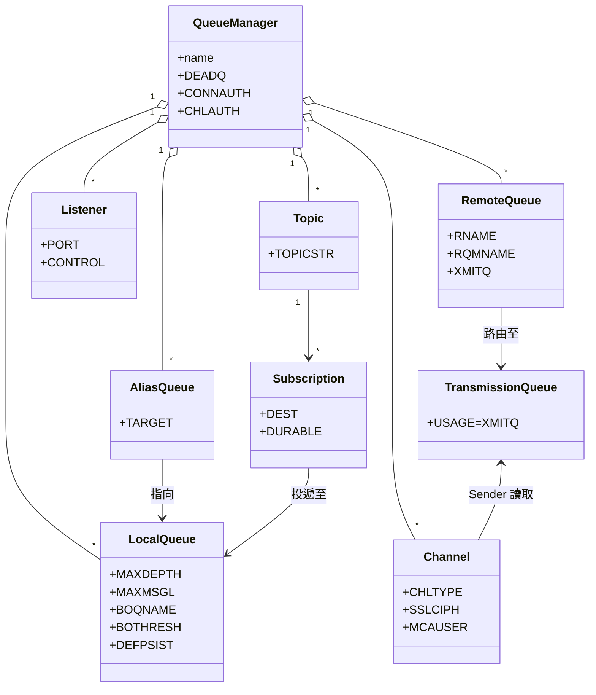

### 1.19 IBM MQ 物件全集

前面幾節介紹的是應用開發最常碰到的物件。管理與逆向工程時，還會遇到下列物件；盤點 `dmpmqcfg` 輸出時，應能逐一辨識。

| 物件 | MQSC 關鍵字 | 名稱長度上限 | 用途 | 常見於 |
|------|------------|-------------|------|--------|
| Queue Manager | `QMGR` | 48 | 擁有並管理所有物件與訊息 | 全部 |
| Local / Remote / Alias / Model Queue | `QLOCAL` / `QREMOTE` / `QALIAS` / `QMODEL` | 48 | 存放、路由、別名、動態佇列範本 | 全部 |
| Dynamic Queue | 由 `QMODEL` 於 `MQOPEN` 時建立 | 48 | 暫時回覆佇列（Temporary / Permanent Dynamic） | Request / Reply |
| Topic Object | `TOPIC` | 48（Topic String 可更長） | 管理 Topic 樹節點的屬性與權限 | Pub/Sub |
| Subscription | `SUB` | 依 Subscription 名稱規則 | 訂閱關係 | Pub/Sub |
| Channel | `CHANNEL` | **20** | Queue Manager 之間或 Client 與 QM 之間的通訊 | 全部 |
| Listener | `LISTENER` | 48 | 監聽連接埠 | 分散式平台 |
| Service | `SERVICE` | 48 | 讓 QM 啟停時一併啟停的外部程式（例如監控代理、自訂守護程序） | 分散式平台 |
| Namelist | `NAMELIST` | 48 | 名稱清單，常用於 Cluster 的 `CLUSNL`、TLS 的 `SSLCRLNL` | Cluster、TLS |
| Process Definition | `PROCESS` | 48 | 搭配 Trigger 指定要啟動的應用程式 | Legacy Trigger 設計 |
| Authentication Information | `AUTHINFO` | 48 | CONNAUTH（IDPWOS / IDPWLDAP）、CRL / OCSP 檢查、JWT 設定 | Security |
| Communication Information | `COMMINFO` | 48 | Multicast 傳輸參數 | Multicast |
| Channel Authentication Record | `CHLAUTH` | — | Channel 層的允許 / 封鎖 / 對應規則 | Security |
| Authority Record | `AUTHREC` | — | OAM 授權記錄 | Security |
| Storage Class | `STGCLASS` | 8 | 佇列對應到 Page Set（**僅 z/OS**） | z/OS |
| CF Structure | `CFSTRUCT` | 12 | Coupling Facility 中存放 Shared Queue 的結構（**僅 z/OS**） | z/OS QSG |

> 名稱長度上限為官方常見限制的整理；特定平台與物件的完整規則，請以 IBM MQ 10.0 Reference 的「Rules for naming IBM MQ objects」為準 `[需確認]`。

### 1.20 IBM MQ 產品家族與授權

選擇功能前，必須先確認授權等級。許多架構師在設計時預設了 Native HA 或 AMS，上線前才發現公司只買了 base 授權。

| 產品 / 部署形態 | 說明 | 典型使用情境 |
|----------------|------|-------------|
| IBM MQ（base） | 核心訊息功能：Queue、Channel、Cluster、Pub/Sub、TLS、OAM、Console、REST API | 一般企業整合 |
| IBM MQ Advanced | 在 base 之上加入 AMS、MFT、RDQM、Native HA、Kafka Connect connector 等進階能力 | 金融核心、端到端加密、檔案傳輸、高可用 |
| IBM MQ Advanced for Developers | 免費、**僅限非 Production** 的開發版本（含 Developer 容器映像） | 個人開發、CI 測試 |
| IBM MQ for z/OS / Advanced for z/OS VUE | 主機平台版本；支援 QSG、Shared Queue | 銀行核心系統 |
| IBM MQ Appliance | 預先整合的硬體設備 | 不想自行維運 OS 的機構 |
| IBM MQ as a Service（SaaS） | IBM 代管的雲端服務 | 雲端優先、無主機維運團隊 |
| IBM Cloud Pak for Integration（CP4I） | 在 OpenShift 上以 MQ Operator 部署 | 容器平台 |
| IBM MQ Agent | 10.0 文件新增的 AI 診斷元件，授權為 Advanced / CP4I 的延伸 | AI 輔助維運（見 Part 23.6） |

> 各功能對應的授權範圍、Appliance 型號、SaaS 提供的雲端平台會隨時間調整，**需依目前 IBM MQ license information 與銷售文件確認** `[需確認]`。

### 1.21 官方文件主題與本手冊對照

本手冊以 IBM MQ 10.0 官方文件的三大主題為骨架，下表列出每個官方子主題在本手冊的對應位置，方便讀者回查原文，也作為本手冊完整度的驗收依據。

| 官方主題 | 官方子主題 | 本手冊對應 |
|---------|-----------|-----------|
| Technical overview | Introduction to message queuing | Part 1.2-1.4 |
| Technical overview | IBM MQ objects | Part 1.10-1.19 |
| Technical overview | Distributed queuing and clusters | Part 2.4、Part 7 |
| Technical overview | Publish/subscribe messaging | Part 1.15、2.4.6、Part 16 |
| Technical overview | IBM MQ Multicast | Part 2.8、5.14 |
| Technical overview | IBM MQ Telemetry（MQTT） | Part 2.8、5.14 |
| Technical overview | Security in IBM MQ | Part 8、Part 29 |
| Technical overview | IBM MQ MQI clients | Part 2.2、2.6、9.6 |
| Technical overview | Transaction management and support | Part 3.5、3.12、Part 13 |
| Technical overview | Extending queue manager facilities | Part 2.7 |
| Technical overview | IBM MQ Java language interfaces | Part 9-12 |
| Technical overview | IBM MQ for z/OS concepts / other z/OS products | Part 2.10、5.13、8.12、24.7、26.9 |
| Technical overview | Managed File Transfer | Part 2.8、5.14 |
| Technical overview | IBM MQ Internet Pass-Thru | Part 2.8、5.14 |
| Technical overview | The IBM MQ Console and REST API | Part 2.11、5.11、5.12、9.8 |
| Administering | Ways of administering / Command sets comparison | Part 5.2、5.8 |
| Administering | Control commands | Part 4.2、5.3 |
| Administering | MQSC commands | Part 5.4-5.6 |
| Administering | PCF commands | Part 5.10 |
| Administering | Administration using the REST API | Part 5.11 |
| Administering | IBM MQ Console / IBM MQ Explorer / Taskbar | Part 5.12 |
| Administering | Working with local / remote objects | Part 5.9 |
| Administering | MFT / Telemetry / AMQP / Multicast / MQIPT | Part 5.14 |
| Administering | Administering IBM MQ for z/OS | Part 5.13 |
| Developing applications | Application development concepts / Design considerations | Part 3、9.9 |
| Developing applications | JMS / Jakarta Messaging and Java | Part 9-12 |
| Developing applications | C++、.NET、XMS .NET、AMQP、MQI（C / COBOL） | Part 9.7 |
| Developing applications | REST applications（Messaging REST API） | Part 9.8 |
| Developing applications | Specifying the application name | Part 9.6、10.3、12.5 |
| IBM MQ Agent | Overview / Security / Troubleshooting | Part 23.6、31.6、41.6 |

### 1.22 核心元件注意事項

- **Queue 名稱區分大小寫**，最長 48 字元。MQSC 中未加單引號的名稱會被轉為大寫，含小寫字母時必須加單引號。
- Channel 名稱最長 20 字元，命名規範需考慮此限制（見 Part 35）。
- 不要直接使用 `SYSTEM.DEF.*`、`SYSTEM.ADMIN.SVRCONN`、`SYSTEM.AUTO.*` 這類系統預設物件作為應用程式連線入口。

---

## Part 2 — IBM MQ 系統架構

### 2.1 目的

理解不同的 Queue Manager 部署拓撲，並能依需求選擇合適的架構。

### 2.2 Client / Server Architecture

應用程式連到 Queue Manager 有兩種模式：

| 模式 | 說明 | 適用 |
|------|------|------|
| Bindings Mode（本機連線） | 應用程式與 Queue Manager 在同一台主機，透過 IPC 溝通 | 同主機部署、極低延遲需求、主機上的 Adapter |
| Client Mode（用戶端連線） | 應用程式透過網路連到 Queue Manager 的 SVRCONN Channel | **現代 Java / Spring Boot 應用程式的標準做法** |

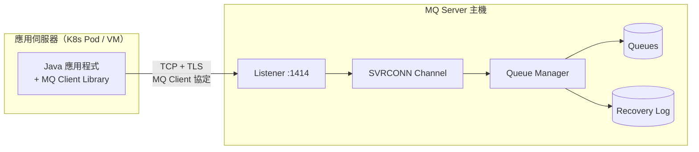

**IBM MQ Server 與 IBM MQ Client 的區別**：

| 項目 | IBM MQ Server | IBM MQ Client |
|------|---------------|---------------|
| 是否執行 Queue Manager | 是 | 否 |
| 是否存放訊息 | 是 | 否 |
| 安裝內容 | Queue Manager、管理工具、Client 函式庫 | 僅 Client 函式庫（Java 只需 jar） |
| 授權 | 依 IBM 授權條款計價 | Client 通常可自由散布 `[需確認授權條款]` |
| Java 應用取得方式 | — | Maven Central：`com.ibm.mq.jakarta.client` 或 `com.ibm.mq.allclient` |

### 2.3 Queue Manager 內部架構

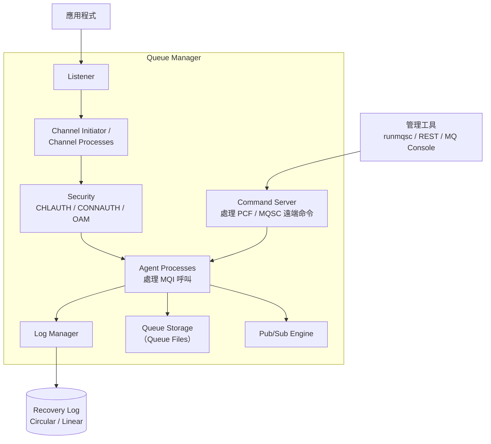

**Recovery Log** 是可靠性的根本：

| Log 類型 | 特性 | 媒體復原（Media Recovery） | 適用 |
|---------|------|----------------------------|------|
| Circular | 日誌循環使用，管理簡單 | 不支援 | 大多數分散式平台 Production（搭配 HA 方案） |
| Linear | 日誌持續增加，需管理歸檔 | 支援（`rcdmqimg` / `rcrmqobj`） | 需從媒體毀損中復原佇列、或使用 Backup Queue Manager 的場景 |

`[MQ 9.4 CD]` 起提供 Linear Log 的自動日誌管理選項（Automatic / Archive）。實際設定方式需依目前 IBM 官方文件確認。

### 2.4 架構模式比較

#### 2.4.1 Single Queue Manager

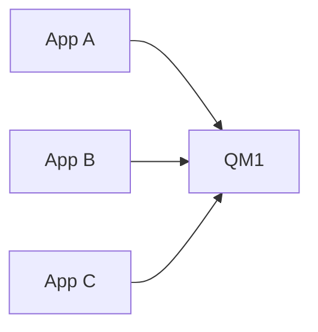

| 項目 | 說明 |
|------|------|
| 優點 | 簡單、易維運、易除錯 |
| 缺點 | 單點故障；容量受單機限制 |
| 使用情境 | 開發 / 測試、小型系統、搭配 HA（Native HA / RDQM / Multi-instance）的中型系統 |
| 維運複雜度 | 低 |
| 故障模式 | QM 停止 → 所有應用無法收發（`2059` / `2538`） |

#### 2.4.2 Multiple Queue Managers（Distributed Queuing）

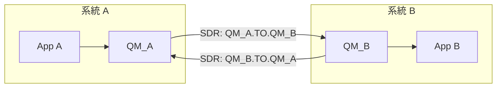

| 項目 | 說明 |
|------|------|
| 優點 | 系統邊界清楚、各自維運、故障隔離 |
| 缺點 | 每對 QM 需要手動定義 Channel、XMITQ、Remote Queue；連線數 O(n²) |
| 使用情境 | 跨部門、跨公司（例如與清算機構）介接 |
| 維運複雜度 | 中（Channel 數量多時高） |
| 故障模式 | Channel 中斷 → 訊息堆積在 XMITQ；網路恢復後自動續傳 |

#### 2.4.3 Point-to-Point

一則訊息只會被一個 Consumer 取走。可以有多個 Consumer 同時監聽同一佇列（Competing Consumers），以提高吞吐量，**但會失去訊息順序保證**。

#### 2.4.4 Hub-and-Spoke

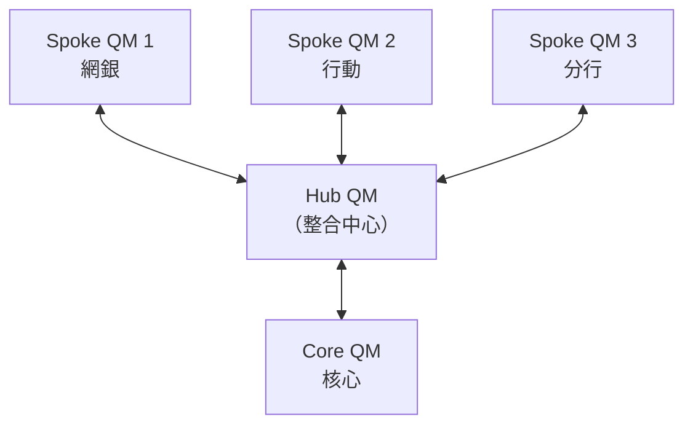

| 項目 | 說明 |
|------|------|
| 優點 | 集中管控、集中監控；Channel 數量 O(n) |
| 缺點 | Hub 成為效能瓶頸與單點故障；Hub 需 HA |
| 使用情境 | 企業整合中心（ESB 時代常見架構） |
| 維運複雜度 | 中 |
| 故障模式 | Hub 故障 → 全面中斷，Hub 必須搭配 HA |

#### 2.4.5 MQ Cluster

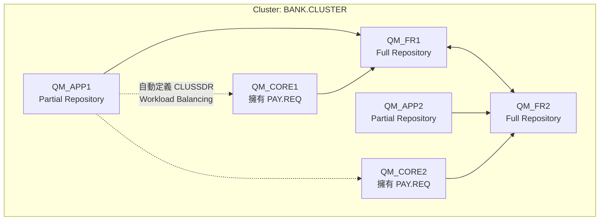

| 項目 | 說明 |
|------|------|
| 優點 | 自動定義 Channel 與路由；同名佇列可多實例做 Workload Balancing；擴充容易 |
| 缺點 | Full Repository 需妥善維運；問題排查比點對點複雜；訊息順序不保證 |
| 使用情境 | 多個 Queue Manager 需要互通、需要水平擴充的系統 |
| 維運複雜度 | 高 |
| 故障模式 | Repository 不一致導致路由錯誤（`2189` / `2085`）；某實例停止時訊息可能卡在該實例 |

**Uniform Cluster**（9.1.2 起）：一組設定相同的 Queue Manager，搭配應用程式自動重新平衡（Application Rebalancing），讓 Client 連線在成員間平均分配。Spring Boot Starter 提供 `balancingApplicationType` 等相關屬性。

#### 2.4.6 Publish / Subscribe

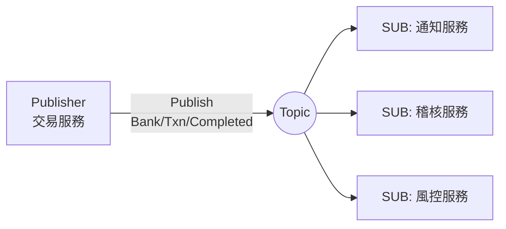

| 項目 | 說明 |
|------|------|
| 優點 | Publisher 不需知道有多少訂閱者；新增訂閱者不影響 Publisher |
| 缺點 | 訊息會被複製多份；Durable Subscription 未消費會累積 |
| 使用情境 | 事件通知、多系統需要同一事件 |
| 維運複雜度 | 中 |
| 故障模式 | 某訂閱者停機 → 其 Durable Subscription 佇列堆積，可能影響整個 QM 的儲存空間 |

### 2.5 架構選型決策

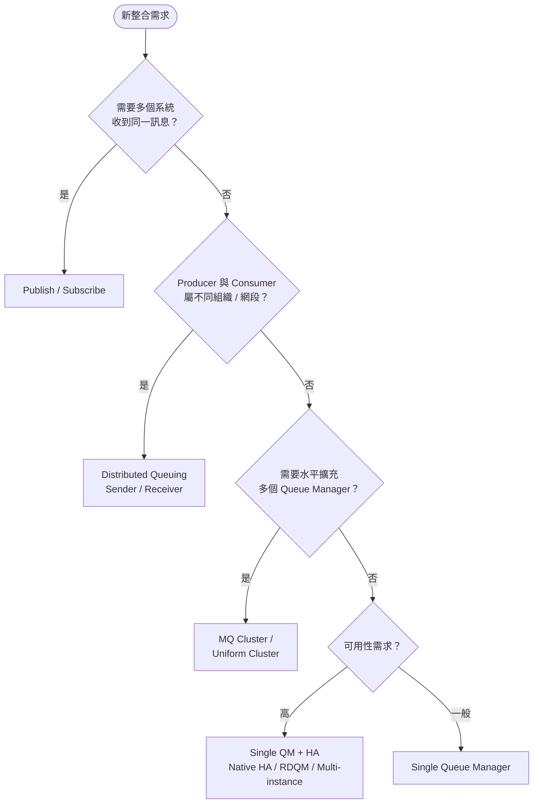

### 2.6 MQI Client 類型與 CCDT

**Client 不是「另一個 Queue Manager」**，它只是一組函式庫，透過 `SVRCONN` Channel 把 MQI 呼叫送到遠端 Queue Manager 執行。理解 Client 的種類與連線設定來源，是排查 `2058`、`2059`、`2538` 的基礎。

| Client 類型 | 內容 | 安裝方式 | 適用 |
|------------|------|---------|------|
| IBM MQ C Client（MQI Client） | C / C++ / COBOL 程式使用的原生函式庫 | OS 安裝套件或 Redistributable 壓縮檔 | C、COBOL、Go、Node.js（底層呼叫 C Client） |
| IBM MQ Java / Jakarta Client | 純 Java 實作，**不需要安裝原生 Client** | Maven artifact（`com.ibm.mq.jakarta.client` / `com.ibm.mq.allclient`） | Java、Spring Boot |
| IBM MQ .NET Client / XMS .NET | .NET 函式庫，`[MQ 10.0]` 以 .NET 10 建置 | NuGet | C#、VB.NET |
| Redistributable Client | 可隨應用一起散布的 Client 檔案 | 解壓即可，不需 root 安裝 | 容器映像、CI 環境 |

#### Client 連線設定的來源

Client 需要知道「連哪個 QM、走哪條 Channel、用什麼 TLS」。資訊可能來自多個地方，**同時存在時有優先順序**，這是 Legacy 系統「改了設定卻沒生效」的常見原因。

| 來源 | 說明 | 治理建議 |
|------|------|---------|
| 程式內指定（MQCD / ConnectionFactory 屬性） | 程式碼或設定檔直接寫入 `connName`、Channel | 允許，但值必須外部化 |
| 環境變數 `MQSERVER` | `CHANNEL/TCP/host(port)`，**不支援 TLS** | Production 禁止 |
| CCDT（`MQCHLLIB` / `MQCHLTAB` / `MQCCDTURL` / `ccdtUrl`） | Client Channel Definition Table，二進位或 JSON | 建議：集中管理、版本控制 |
| `mqclient.ini` | Client 組態檔（TCP、TLS、Channel 預設值） | 由平台團隊統一提供 |

> 各來源的完整優先順序依 API 與版本略有不同，請以官方「Connecting IBM MQ MQI client applications to queue managers」說明為準 `[需確認]`。

#### JSON CCDT 範例

JSON 格式 CCDT（MQ 9.1.2 起）可讀、可 diff、可放 Git，並允許同名 Channel 定義多筆以支援負載平衡與 HA。

```json
{
  "channel": [
    {
      "name": "PAY.SVRCONN",
      "type": "clientConnection",
      "clientConnection": {
        "connection": [
          { "host": "mq-a.bank.local", "port": 1414 },
          { "host": "mq-b.bank.local", "port": 1414 }
        ],
        "queueManager": "BANKQM01"
      },
      "transmissionSecurity": {
        "cipherSpecification": "ANY_TLS13_OR_HIGHER",
        "certificateLabel": "payclient"
      },
      "connectionManagement": {
        "sharingConversations": 10,
        "heartbeatInterval": 300
      }
    }
  ]
}
```

> 欄位名稱以官方 JSON CCDT schema 為準 `[需確認]`。`[MQ 10.0]` 起 CCDT 可透過 **HTTPS** URL 取得，Spring Boot Starter 以 `ccdtSslBundle` 指定取得 CCDT 時使用的 TLS 設定。

### 2.7 擴充 Queue Manager 功能：Exits 與 Installable Services

IBM MQ 允許在特定時間點插入自訂程式碼。這在 Legacy 系統很常見（例如自訂加密、稽核、路由），**也是升級與逆向工程時最容易被忽略的風險點**。

| 類型 | 插入點 | 常見用途 | 設定位置 |
|------|-------|---------|---------|
| Channel Exit（Security / Send / Receive / Message / Message-retry） | Channel 建立連線、送出、接收、處理每則訊息時 | 自訂認證、壓縮、加密、稽核 | Channel 屬性 `SCYEXIT`、`SENDEXIT`、`RCVEXIT`、`MSGEXIT`、`MREXIT` |
| Channel Auto-definition Exit | 自動定義 Channel 時 | 調整自動建立的 Channel 屬性 | QM 屬性 `CHADEXIT` |
| Data Conversion Exit | `MQGET` 帶 `MQGMO_CONVERT` 且格式為自訂格式時 | 自訂結構的字元集轉換 | 依 Format 名稱載入 |
| Cluster Workload Exit | Cluster 選擇目的 QM 時 | 自訂路由規則 | QM 屬性 `CLWLEXIT` |
| API Exit | 任何 MQI 呼叫（例如 `MQPUT`、`MQGET`）之前或之後 | 稽核、訊息改寫、監控 | `qm.ini` / `mqclient.ini` 的 `ApiExitLocal` 等 stanza |
| Installable Service：Authorization Service | 授權檢查 | 預設元件為 OAM；可替換或擴充 | `qm.ini` 的 `Service` / `ServiceComponent` stanza |
| Installable Service：Name Service | 解析佇列名稱 | 讓遠端佇列看起來像本機佇列（預設未啟用） | `qm.ini` |

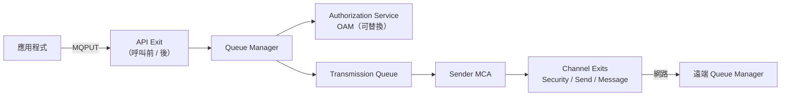

**治理建議**：

- 新設計**優先使用標準功能**：認證用 CHLAUTH + CONNAUTH / mTLS、加密用 AMS（Part 8.11）、監控用 Activity Trace 與 Statistics（Part 24），盡量不新增自訂 Exit。
- Exit 在 Queue Manager 或 MCA 行程內執行，**程式錯誤可能導致 Channel 失敗甚至 QM 異常**，必須有原始碼、建置腳本與負責人。
- MQ 升級時，Exit 必須以新版標頭檔重新編譯並回歸測試（列入 Part 21.6 升級前必查）。
- 逆向工程時，以 `DISPLAY CHANNEL(*) SCYEXIT SENDEXIT RCVEXIT MSGEXIT` 與 `qm.ini` 盤點所有 Exit。

### 2.8 擴充元件：MFT、MQIPT、AMQP、MQTT、Multicast、Kafka Connect

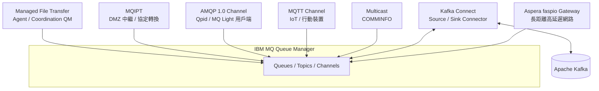

| 元件 | 解決的問題 | 運作方式 | 授權 | 何時使用 | 注意事項 |
|------|-----------|---------|------|---------|---------|
| Managed File Transfer（MFT） | 可靠、可稽核的檔案傳輸 | Agent 把檔案切塊成訊息，經 MQ 傳遞，由 Coordination QM 記錄狀態 | Advanced | 取代 FTP 批次腳本、需要稽核軌跡的檔案交換 | `[MQ 10.0]` SFTP 支援 OpenSSH 格式私鑰；MFT 本身也有 REST API |
| MQ Internet Pass-Thru（MQIPT） | 跨防火牆、DMZ 的 MQ 連線 | 作為中繼轉送 MQ 協定，可做 TLS 終止 / 轉換、HTTP 隧道 | base | 外部夥伴連入、跨網段 | `[MQ 10.0]` 移除 Java Security Manager 支援、調整支援的 CipherSuite，升級前必須檢查 `mqipt.conf` |
| AMQP Channel | 讓 AMQP 1.0 用戶端（Apache Qpid 等）連入 | `DEFINE CHANNEL ... CHLTYPE(AMQP)`，由 AMQP Service 處理 | base（分散式平台） | 非 Java 生態系、輕量用戶端 | 功能為 MQ 的子集，交易語意需另行評估 |
| MQTT（Telemetry） | IoT、行動裝置的輕量 Pub/Sub | `CHLTYPE(MQTT)`，由 Telemetry Service 處理 | base（分散式平台） | 大量裝置、低頻寬網路 | 裝置數量大時需評估連線數與 QoS |
| Multicast | 一對多的低延遲 Non-persistent 發佈 | Topic 搭配 `COMMINFO` 物件，用 IP Multicast 傳送 | base | 行情、即時看板 | **不保證送達**，不可用於交易訊息 |
| Kafka Connect connectors | MQ 與 Kafka 雙向橋接 | Source（MQ → Kafka）、Sink（Kafka → MQ）connector；`[MQ 10.0]` 新增 XML Converter | Advanced（以官方授權條款為準） | 事件串流分析、雙平台並存 | 見 Part 16.6 |
| Aspera faspio Gateway | 長距離、高延遲網路的 MQ 傳輸加速 | 以 FASP 協定替代 TCP 傳送 MQ 流量 | Advanced | 跨洲 DR、海外分行 | `[MQ 10.0]` 版本升級 |

> 各元件在不同平台（z/OS、IBM i、容器）的可用性不同，**需依目前官方文件與授權確認** `[需確認]`。

### 2.9 Streaming Queue

Streaming Queue（MQ 9.3.3 CD 首次提供，9.4 LTS 起納入 `[MQ 9.4]`）讓 Queue Manager **在不修改任何應用程式的前提下**，把送到某個佇列的每一則訊息自動複製一份到另一個佇列。

| 用途 | 說明 |
|------|------|
| 稽核 | 保留原始請求電文的副本 |
| 分析 | 把副本送到 Kafka（透過 Kafka Connect）或資料平台 |
| 重播 / 除錯 | 在測試環境重現 Production 流量（需去識別化） |

```text
* 副本佇列
DEFINE QLOCAL('PAY.TXN.REQ.COPY') MAXDEPTH(500000) DESCR('Audit copy of PAY.TXN.REQ')

* 原佇列開啟串流：BESTEF = 盡力複製，副本失敗不影響原訊息
ALTER QLOCAL('PAY.TXN.REQ') STREAMQ('PAY.TXN.REQ.COPY') STRMQOS(BESTEF)
```

| `STRMQOS` | 行為 | 適用 |
|-----------|------|------|
| `BESTEF`（Best effort） | 副本無法寫入時，原訊息仍成功 | 分析、監控 |
| `MUSTDUP`（Must duplicate） | 副本無法寫入時，原訊息也失敗 | 法規要求必須保留副本 |

**注意事項**：儲存與 Log 量約增加一倍；副本佇列必須有 Consumer 或容量管理，否則會塞滿；副本內含完整業務資料，權限與保存期限需納入資安治理。可串流的佇列類型與其他限制 `[需確認]`。

### 2.10 IBM MQ for z/OS 架構

許多銀行的核心帳務仍在主機上，Java 系統透過 MQ 與 CICS / IMS / Batch 交換電文。z/OS 上的 IBM MQ 與分散式平台**概念相同、實作差異很大**。

#### 架構元件

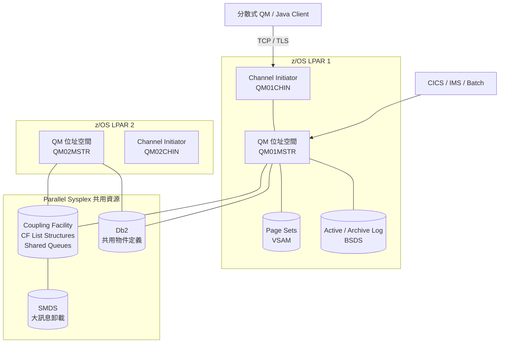

| 元件 | 說明 | 分散式平台對應 |
|------|------|---------------|
| QM 位址空間（`xxxxMSTR`） | 處理 MQI 呼叫、管理佇列與 Log | `amqzxma0` 等行程 |
| Channel Initiator（`xxxxCHIN`） | 管理 Channel、Listener、MCA；分散式佇列與 Client 連線都經過它 | `runmqchi`、`amqrmppa` |
| Page Set | VSAM 資料集（編號 00-99），存放佇列訊息；00 存放物件定義 | `qmgrs/<QM>/queues` 目錄 |
| Buffer Pool | 記憶體緩衝區，Page Set 對應到 Buffer Pool | 無直接對應（OS 快取） |
| Storage Class（`STGCLASS`） | 佇列 → Page Set 的對應 | 無 |
| Active / Archive Log、BSDS | 交易日誌；BSDS 記錄 Log 資料集清單 | Linear / Circular Log |
| Queue Sharing Group（QSG） | 多個 QM 組成群組，共用物件定義（存於 Db2） | 無（最接近的是 Uniform Cluster） |
| Shared Queue | 訊息存於 Coupling Facility，QSG 內任一 QM 都能存取 | 無（Native HA 解決的是另一個問題） |
| CF Structure（`CFSTRUCT`） | CF 中的 List Structure；`CSQ_ADMIN` 為管理結構 | 無 |
| SMDS（Shared Message Data Set） | 大訊息從 CF 卸載到共用資料集 | 無 |
| Intra-Group Queuing（IGQ） | QSG 內 QM 之間不需定義 Channel 即可傳送訊息 | 無 |
| Shared Channel | 入站：透過共用連接埠（Sysplex Distributor / VIPA）分散到任一 QM；出站：共用 Transmission Queue | 無 |
| GROUP UR Disposition | 交易型應用以 QSG 名稱連線，交易恢復不必回到原 QM | 無 |

#### 物件的「屬性範圍」

z/OS 物件定義有 `QSGDISP` 屬性，決定定義存放在哪裡、誰看得到：

| `QSGDISP` | 定義存放 | 可見範圍 |
|-----------|---------|---------|
| `QMGR` | 本 QM 的 Page Set 00 | 本 QM |
| `GROUP` | Db2 共用儲存 | QSG 內每個 QM 各自產生一份 `COPY` |
| `COPY` | 本 QM（由 `GROUP` 定義衍生） | 本 QM |
| `SHARED` | Db2；訊息存於 CF | QSG 內所有 QM（僅限 Local Queue） |

#### 對 Java 應用的影響

- Java 應用通常以 Client 模式連 CHIN；若以 QSG 名稱 + 共用連接埠連線，可連到群組內任一 QM。
- Shared Queue 讓多個 QM 上的 Consumer 共同消費同一佇列，**單一 QM 停機時，CF 中的訊息仍可被其他 QM 取走**，這是 z/OS 獨有的高可用能力（見 Part 26.9）。
- 單則訊息大小、Shared Queue 對持久性訊息的效能特性，都與分散式平台不同，大訊息應評估 SMDS 設定 `[需確認]`。
- 主機端字元集通常是 EBCDIC（例如 CCSID 37、937），Java 端必須搭配 `MQGMO_CONVERT` 或明確的 CCSID 處理（見 Part 3、P32）。

### 2.11 IBM MQ Console 與 REST API 架構

IBM MQ Console 與 REST API 都由 **mqweb server**（以 WebSphere Liberty 為基礎）提供。

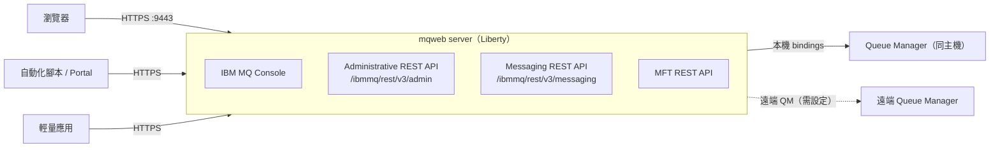

| 項目 | 說明 |
|------|------|
| 管理命令 | `strmqweb`、`endmqweb`、`dspmqweb`、`setmqweb`（調整 mqweb 屬性） |
| 設定檔 | `mqwebuser.xml`：使用者登錄（Basic Registry / LDAP）、角色、TLS |
| 角色 | `MQWebAdmin`（管理）、`MQWebAdminRO`（唯讀）、`MQWebUser`（以使用者身分執行，受 OAM 控管）、`MFTWebAdmin` / `MFTWebAdminRO` |
| 認證方式 | HTTP Basic、Token（LTPA）、Client 憑證 |
| 預設連接埠 | HTTPS 9443（可調整） |

> 詳細使用方式見 Part 5.11（Administrative REST API）、Part 5.12（Console）與 Part 9.8（Messaging REST API）。

### 2.12 實務案例

某銀行原本 30 套系統各自建立 Queue Manager，並兩兩定義 Channel，共 200 多條 Sender / Receiver Channel。每次新增系統，MQ 管理員要花兩週定義 Channel 與 Remote Queue。改為「2 個 Full Repository + 各系統加入 Cluster」後，新增系統只需定義 `CLUSRCVR` 與一條 `CLUSSDR`。

**代價**：Cluster 路由問題的排查需要更專業的 MQ 管理員，團隊額外建立了 Cluster 健康檢查腳本（`DISPLAY CLUSQMGR(*)`）與每日巡檢。

### 2.13 注意事項

- **訊息順序**只在「單一 Producer、單一路徑、單一 Consumer、相同 Priority」條件下可預期。Cluster Workload Balancing、多 Consumer 都會打破順序。
- Full Repository 至少兩個，且應分散在不同主機。
- 不要把 Cluster 當成 HA 方案：Cluster 提供的是「可用性路由」，不是「訊息不遺失的高可用」。已在某 QM 上的訊息，在該 QM 恢復前無法被取走。

---

## Part 3 — IBM MQ 訊息生命週期

### 3.1 目的

完整理解一則訊息從產生到被處理的每個步驟，以及每個步驟可能的失敗點。這是設計 Retry、DLQ、Transaction 的基礎。

### 3.2 本機訊息生命週期

```text
Producer
  ↓  MQCONN（連線）
  ↓  MQOPEN（開啟佇列，MQOO_OUTPUT）
  ↓  MQPUT（放入訊息，可在 Syncpoint 內）
  ↓  MQCMIT（提交）
Queue（訊息可見）
  ↓  MQGET（取出，可在 Syncpoint 內）
  ↓  業務處理
  ↓  MQCMIT（提交 → 訊息刪除） 或 MQBACK（回滾 → 訊息回到佇列，BackoutCount + 1）
Consumer
```

### 3.3 跨 Queue Manager 的完整流程

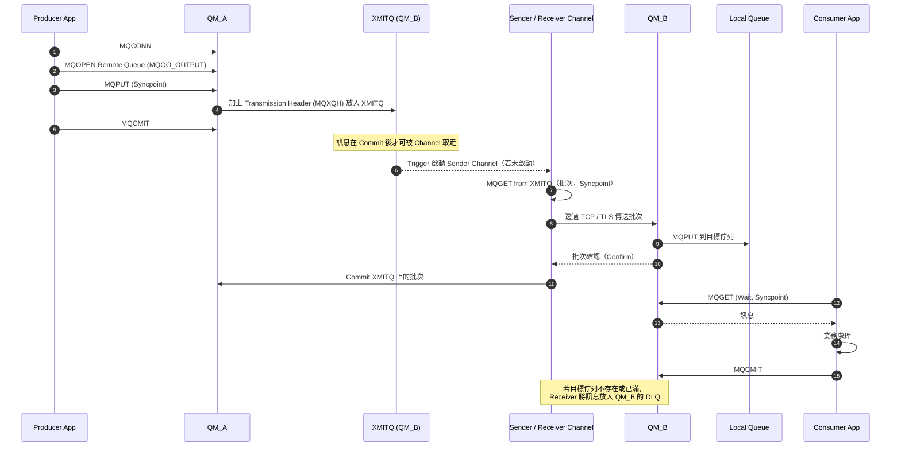

### 3.4 MQI 動詞

| 動詞 | 功能 | 注意事項 |
|------|------|----------|
| `MQCONN` / `MQCONNX` | 連線到 Queue Manager | 連線成本高，應重複使用；`MQCONNX` 可帶 TLS、帳密（MQCSP）等選項 |
| `MQOPEN` | 開啟物件，取得 Object Handle | 開啟成本中等；長時間處理的程式應重複使用 Handle |
| `MQPUT` | 放入訊息到已開啟的佇列 | 搭配 `MQPMO_SYNCPOINT` 或 `MQPMO_NO_SYNCPOINT` 明確指定 |
| `MQPUT1` | Open + Put + Close 一次完成 | **適合只放一則訊息的情境（例如送 Reply）**；連續放多則時效能較差 |
| `MQGET` | 從佇列取出訊息 | 搭配 `MQGMO_WAIT` 與 `WaitInterval` 避免忙碌輪詢 |
| `MQINQ` | 查詢物件屬性 | 例如查詢 `CURDEPTH`，但不應在高頻路徑使用 |
| `MQSET` | 修改物件部分屬性 | 僅少數屬性可修改；一般應用程式不應使用 |
| `MQCMIT` | 提交交易 | 只在 Syncpoint 內的操作才需要 |
| `MQBACK` | 回滾交易 | 被 GET 的訊息回到佇列並增加 BackoutCount |
| `MQCLOSE` | 關閉物件 | 務必在 `finally` 中執行 |
| `MQDISC` | 中斷連線 | 未 Commit 的交易：正常 `MQDISC` 時在分散式平台上預設會 Commit `[需確認：依平台與選項而定，建議應用程式明確 Commit / Backout]` |

### 3.5 Syncpoint、Commit、Backout、Rollback

**Syncpoint（同步點）** 是 MQ 的「交易單位」：

- 在 Syncpoint 內 PUT 的訊息，**Commit 前對其他應用程式不可見**。
- 在 Syncpoint 內 GET 的訊息，**Commit 前不會真的被刪除**；若 Backout，訊息回到佇列原位。
- **Backout** 是 MQ 的術語，JMS / Spring 稱為 **Rollback**，語意相同。

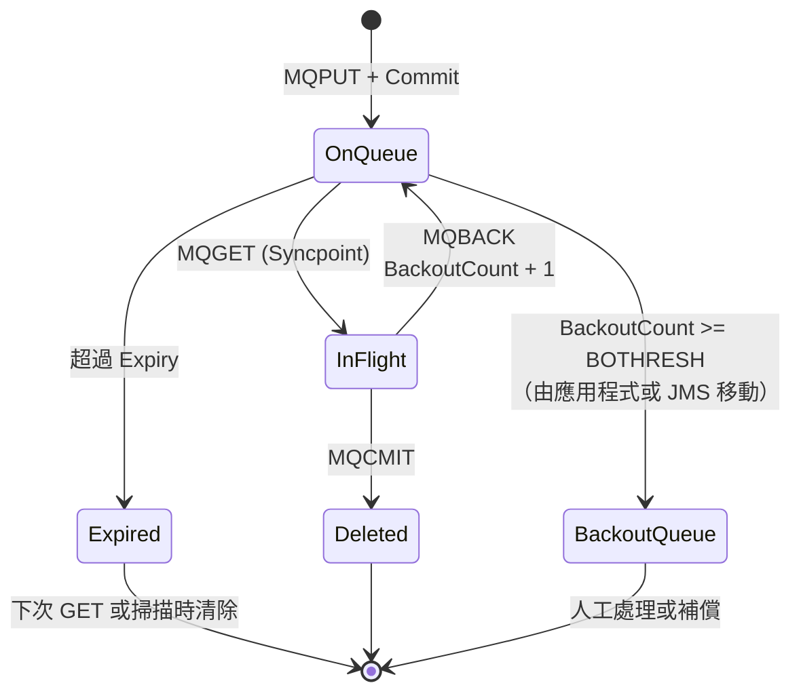

**重要**：IBM MQ 本身**不會**自動把超過 `BOTHRESH` 的訊息移到 `BOQNAME`。這個動作由應用程式執行：

- **IBM MQ classes for JMS / Jakarta Messaging**：會自動處理（Backout 次數達門檻時，移到 `BOQNAME`；若未設定或無法放入，則嘗試放到 DLQ，視設定可能保留在原佇列）。
- **MQI / IBM MQ classes for Java**：**必須自行檢查 `BackoutCount`** 並自行移動訊息（見 Part 10 範例）。

### 3.6 Persistent 與 Non-persistent

| 情境 | Persistent | Non-persistent |
|------|-----------|----------------|
| Queue Manager 正常重啟 | 保留 | 遺失（佇列屬性 `NPMCLASS(HIGH)` 可在正常關閉時保留，但不保證異常時） |
| Queue Manager 異常終止 | 已 Commit 的保留 | 遺失 |
| 跨 Channel 傳遞 | 以批次、Syncpoint 保護 | 依 `NPMSPEED(FAST)` 可在 Syncpoint 外快速傳送，Channel 異常時可能遺失 |

### 3.7 Message Expiration（訊息逾期）

- `Expiry` 單位為 **1/10 秒**。例如 30 秒 = `300`。
- 逾期訊息不會被 GET 回傳，會在下次 GET 掃描或 Queue Manager 定期掃描時清除（`EXPRYINT` 屬性）。
- **Request / Reply 的 Request 應設定 Expiry**：若後端在 Timeout 後才處理，結果已無人接收。設定 Expiry 可讓逾時請求自動失效。
- 可設定 `MQRO_EXPIRATION` Report Option 取得逾期通知。

### 3.8 Message Priority 與 Message Ordering

- Priority 0（最低）至 9（最高）。
- 佇列的 `MSGDLVSQ(PRIORITY)` 時依 Priority 再 FIFO；`MSGDLVSQ(FIFO)` 時忽略 Priority。

**順序保證條件**（全部成立時才能期待 FIFO）：

1. 單一 Producer 執行緒
2. 相同 Priority
3. 單一路徑（不經 Cluster Workload Balancing）
4. 單一 Consumer
5. 沒有 Backout 造成的重新排序（Backout 後的訊息回到原位，但若同時有其他 Consumer 則順序已被打亂）

**需要嚴格順序時的做法**：

- 單一 Consumer（犧牲吞吐量）
- 以業務鍵分區：同一帳號的訊息送到同一佇列 / 同一 Consumer
- Message Group 搭配 `MQGMO_LOGICAL_ORDER`
- 應用層序號檢查（最可靠）

### 3.9 Message Group（訊息群組）

一組邏輯上相關的訊息（例如一筆批次的 100 段資料）：

- 共用相同 `GroupId`
- 各自有 `MsgSeqNumber`（從 1 開始）
- 最後一則設定 `MQMF_LAST_MSG_IN_GROUP`

Consumer 可使用 `MQGMO_ALL_MSGS_AVAILABLE`（整組到齊才開始取）與 `MQGMO_LOGICAL_ORDER`（依序取）。

### 3.10 Correlation 與 Retry

- **Correlation**：Reply 訊息的 `CorrelId` 設為 Request 的 `MsgId`（或由應用程式指定的業務 ID），Requester 以 `MQMO_MATCH_CORREL_ID` 取回對應回覆。
- **Retry** 分兩層：
  - **連線層 Retry**：`2009`、`2059`、`2538` 等連線錯誤 → 重新連線（可用 Client Auto Reconnect）。
  - **訊息層 Retry**：業務處理失敗 → Backout，讓訊息回到佇列，BackoutCount 累加，超過門檻後移到 Backout Queue。

### 3.11 Dead Letter Queue（DLQ）

**何時訊息會進 DLQ**：

- Receiver Channel 無法把訊息放到目標佇列（佇列不存在、已滿、PUT 被禁止、權限不足）
- Trigger Monitor 無法處理觸發訊息
- 應用程式主動放入（例如 JMS 無法放入 Backout Queue 時）

**每則 DLQ 訊息前面會有一個 Dead Letter Header（`MQDLH`）**，記錄原目標佇列、原 Queue Manager、Reason Code。

**DLQ 處理工具**：`runmqdlq`（Dead-letter Queue Handler）可依規則表自動重試或轉送。

```text
* runmqdlq 規則表範例（rules.dlq）
* 預設控制：等待新訊息、最多重試 5 次
INPUTQ('SYSTEM.DEAD.LETTER.QUEUE') INPUTQM('QM1') RETRYINT(60) WAIT(YES)
* 目標佇列已滿：最多重試 5 次後轉送到人工處理佇列
REASON(MQRC_Q_FULL) ACTION(RETRY) RETRY(5)
* 其他原因：轉送到人工處理佇列並保留 DLH
ACTION(FWD) FWDQ('BANK.OPS.DLQ.MANUAL') HEADER(YES)
```

> 規則表語法細節（關鍵字、比對順序）需依目前 IBM 官方 `runmqdlq` 文件確認後再上線。

### 3.12 Transaction 管理：誰是交易協調者

3.5 說明的是「MQ 自己的 Syncpoint」。當同一個工作單元還包含資料庫時，必須先決定**誰來協調交易**。IBM MQ 支援三種模式：

| 模式 | 協調者 | 涵蓋資源 | API | 適用 |
|------|-------|---------|-----|------|
| Local Unit of Work | Queue Manager | 只有 MQ | `MQCMIT` / `MQBACK`、JMS `session.commit()` | 大部分 MQ 應用 |
| Global UoW（QM 為協調者） | Queue Manager | MQ + 支援 XA 的資料庫 | `MQBEGIN` → 操作 → `MQCMIT` | Bindings 模式的 C / COBOL 應用；需在 `qm.ini` 設定 XA 資源管理器 |
| Global UoW（外部協調者） | 外部 Transaction Manager（Jakarta EE 應用伺服器的 JTA、CICS、Tuxedo 等） | MQ + 資料庫 + 其他 XA 資源 | JTA `UserTransaction` / 容器管理交易 | Jakarta EE 應用伺服器、CICS |

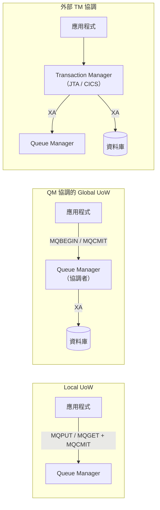

**實務重點**：

- Java Client 模式要參與 XA，需要支援 XA 的 Client（例如在應用伺服器中透過 IBM MQ Resource Adapter），且有額外的授權與設定要求 `[需確認]`。
- XA 帶來 in-doubt 交易的處理成本：Queue Manager 重啟時以 `DISPLAY CONN(*) TYPE(CONN) UOWSTATE` 等方式檢查未決交易，必要時以 `dspmqtrn` / `rsvmqtrn` 處理（**L4 風險操作**）。
- Spring Boot 微服務**通常不採用 XA**，而是用 Part 13 的 Best-Effort 1PC + Idempotency 或 Transactional Outbox。
- z/OS 上，連到 QSG 的交易型應用可使用 **GROUP UR Disposition**，交易恢復時不必回到原 QM（見 Part 2.10）。

### 3.13 Message Property 與 Selector

除了 MQMD 的固定欄位，IBM MQ 支援任意名稱的 **Message Property**（名稱 / 值組），JMS 的 `setStringProperty()` 等方法即對應到這個機制。

| 主題 | 說明 |
|------|------|
| 屬性儲存 | 新應用以 Message Property 存放；舊 JMS 應用可能以 `MQRFH2` 標頭存放，佇列屬性 `PROPCTL` 決定非 JMS 應用看到的形式 |
| `PROPCTL` | `COMPAT`（預設，相容舊行為）、`NONE`、`ALL`、`FORCE`、`V6COMPAT`；**Legacy C / COBOL 讀到多出來的 `MQRFH2` 常是電文解析失敗的原因** |
| Selector | JMS `createConsumer(dest, selector)` 或 MQI `MQOPEN` 的 SelectionString，以 SQL92 子集篩選訊息 |
| 效能 | 以 `JMSCorrelationID` / `JMSMessageID` 篩選可用索引；**以自訂屬性篩選會逐筆掃描**，深佇列時極慢 |
| `[MQ 10.0]` MsgToken | JMS Selector 可使用 MsgToken 精準取回特定訊息 `[需確認語法]` |
| 屬性大小 | 屬性總長度受 `MAXPROPL` 限制 |

**設計建議**：

1. 路由與篩選需求，優先以「不同佇列」或「Topic 字串」表達，而非 Selector。
2. 傳給 Legacy 非 JMS 系統的佇列，明確設定 `PROPCTL` 並搭配 `targetClient=MQ`（見 Part 11.4）。
3. 不在 Message Property 放個資或敏感資料；它們會出現在監控工具與 DLQ 瀏覽畫面。

### 3.14 實務案例

某轉帳 Consumer 的業務邏輯呼叫外部風控 API。風控 API 停機時，每則訊息都拋例外、Backout、立刻再被取出，CPU 飆高，日誌每秒數千筆錯誤。

**根因**：沒有區分「暫時性錯誤」（風控 API 停機）與「永久性錯誤」（訊息格式錯誤）。

**改善**：

1. 永久性錯誤 → 直接移到 Backout Queue，不重試。
2. 暫時性錯誤 → Backout，但 Listener Container 加上退避延遲；連續失敗超過門檻時暫停 Consumer（Circuit Breaker）。
3. 設定 `BOTHRESH(5)`、`BOQNAME`，確保最終不會無限循環。

### 3.15 注意事項與 Checklist

- [ ] 所有交易性訊息都使用 Persistent + Syncpoint
- [ ] Request 訊息設定 Expiry
- [ ] 所有 Input Queue 都設定 `BOQNAME` 與 `BOTHRESH`
- [ ] Queue Manager 已設定 `DEADQ`
- [ ] 已區分暫時性錯誤與永久性錯誤
- [ ] 有順序需求的流程，已明確寫出順序保證的前提
- [ ] `MQPUT1` 只用在單次放入情境

---

## Part 4 — IBM MQ 安裝

### 4.1 目的

說明在 Linux、Windows、Container、Kubernetes 四種環境建立 IBM MQ 的方法與企業導入時的考量。**本章命令以 Linux x86-64 與 IBM MQ 10.0 為例；實際套件名稱、檔名與支援的 OS 版本，需依目前 IBM 官方文件與 System Requirements 確認。**

### 4.2 Linux 安裝

#### 4.2.1 安裝前準備

| 項目 | 建議 | 說明 |
|------|------|------|
| OS | 依 System Requirements 支援清單（RHEL、Ubuntu、SLES 等） | `[需確認]` 10.0 支援的確切 OS 版本 |
| 檔案系統 | `/opt/mqm`（程式）、`/var/mqm`（資料）、Log 目錄分開 | **Log 與 Queue Data 建議放不同磁碟**，避免 I/O 互相干擾 |
| 磁碟 | Log 放在低延遲儲存 | Persistent Message 效能主要受 Log 寫入延遲影響 |
| Kernel 參數 | 依 `mqconfig` 檢查結果調整 | 檔案描述元、行程數、共享記憶體 |
| 使用者 | `mqm` 使用者與 `mqm` 群組 | 安裝程式可自動建立；企業環境建議預先建立並固定 UID / GID（跨節點一致，HA 必要） |
| 時間同步 | NTP / chrony | 訊息時間戳記與日誌比對、TLS 憑證效期檢查都依賴系統時間 |

```bash
# 預先建立 mqm 群組與使用者（UID/GID 在所有節點保持一致）
sudo groupadd -g 1001 mqm
sudo useradd -u 1001 -g mqm -d /var/mqm -s /bin/bash mqm

# 檢查檔案描述元與行程上限（以 mqm 使用者執行 mqconfig，安裝後可用）
ulimit -n
ulimit -u
```

#### 4.2.2 套件安裝（RPM）

```bash
# 解壓安裝媒體後，接受授權
cd /tmp/mq10/MQServer
sudo ./mqlicense.sh -accept

# 安裝最小 Server 組合（實際套件清單依需求增減）
sudo rpm -ivh MQSeriesRuntime-*.rpm MQSeriesServer-*.rpm \
              MQSeriesJRE-*.rpm MQSeriesJava-*.rpm \
              MQSeriesGSKit-*.rpm MQSeriesSamples-*.rpm \
              MQSeriesWeb-*.rpm

# 設定為主要安裝（Primary Installation）
sudo /opt/mqm/bin/setmqinst -i -p /opt/mqm

# 確認版本
dspmqver
```

> Ubuntu / Debian 使用 `.deb` 套件與 `apt`；套件名稱不同，請依官方文件。生產環境建議使用公司內部套件庫並記錄套件 checksum。

#### 4.2.3 Environment Variables

```bash
# 在 mqm 使用者的 shell 載入 MQ 環境
. /opt/mqm/bin/setmqenv -s

# 常用確認
echo $PATH | tr ':' '\n' | grep mqm
dspmqver -f 2   # 只顯示版本
```

#### 4.2.4 建立 Queue Manager

```bash
# 以 mqm 使用者執行
# -u：指定 DLQ 名稱；-lc：Circular Log；-lf：Log 檔大小（4KB 頁數）
# -lp / -ls：主要 / 次要 Log 檔數量；-ic：建立後自動套用的 MQSC 檔
crtmqm -u SYSTEM.DEAD.LETTER.QUEUE \
       -lc -lf 16384 -lp 10 -ls 20 \
       -ic /var/mqm/config/BANKQM01.mqsc \
       BANKQM01

strmqm BANKQM01
dspmq -m BANKQM01 -o all
```

| 參數 | 說明 | 建議 |
|------|------|------|
| `-u` | DLQ 名稱 | 一律設定 |
| `-lc` / `-ll` | Circular / Linear Log | 依備援與媒體復原需求（見 Part 2.3、Part 26） |
| `-lf` | Log 檔大小（4KB 頁） | 依交易量估算 |
| `-lp` / `-ls` | 主要 / 次要 Log 數 | 長交易（Long-running UOW）多時加大 |
| `-ic` | 啟動時自動套用 MQSC（Autoconfig）`[MQ 9.2+]` | 搭配 Configuration as Code |
| `-ii` | 啟動時自動套用 qm.ini 片段 `[MQ 9.2+]` | 搭配 Configuration as Code |

#### 4.2.5 Listener、Channel、Queue 基本設定

建立 `/var/mqm/config/BANKQM01.mqsc`：

```text
* ===== Listener =====
DEFINE LISTENER('BANK.LSTR.1414') TRPTYPE(TCP) PORT(1414) CONTROL(QMGR) REPLACE

* ===== Application SVRCONN Channel（TLS 1.3，必須帶用戶端憑證）=====
DEFINE CHANNEL('PAY.SVRCONN') CHLTYPE(SVRCONN) TRPTYPE(TCP) +
       SSLCIPH('ANY_TLS13_OR_HIGHER') SSLCAUTH(REQUIRED) +
       MAXINST(200) MAXINSTC(50) SHARECNV(10) +
       DESCR('Payment service client channel') REPLACE

* ===== Application Queues =====
DEFINE QLOCAL('PAY.TXN.REQ.BOQ') DEFPSIST(YES) MAXDEPTH(100000) +
       DESCR('Payment request backout queue') REPLACE
DEFINE QLOCAL('PAY.TXN.REQ') DEFPSIST(YES) MAXDEPTH(200000) MAXMSGL(1048576) +
       BOTHRESH(5) BOQNAME('PAY.TXN.REQ.BOQ') +
       QDEPTHHI(80) QDPHIEV(ENABLED) +
       DESCR('Payment request queue') REPLACE
```

> TLS 憑證設定（`SSLKEYR` / `CERTLABL`）與安全設定（CHLAUTH、CONNAUTH、OAM）見 Part 8。**以上僅為結構示範，上線前須完成 Part 8 Security Baseline。**

#### 4.2.6 啟動 / 停止

| 命令 | 功能 | Production 風險 |
|------|------|----------------|
| `strmqm QM` | 啟動 | 低 |
| `endmqm -c QM` | Controlled：等待應用程式斷線 | 可能長時間無法停止 |
| `endmqm -w QM` | Controlled 並等待完成 | 同上，但會回報結果 |
| `endmqm -i QM` | Immediate：不等待應用程式，未完成交易回滾 | 應用程式收到 `2161` / `2162` / `2009` |
| `endmqm -p QM` | Preemptive：強制 | **最後手段**；可能需要較長的重啟復原時間 |
| `endmqm -s QM` | Switchover（Multi-instance / HA） | 需確認 Standby 狀態正常 |
| `dspmq -o all` | 顯示所有 QM 狀態 | 無 |

### 4.3 Windows 安裝

| 項目 | 說明 |
|------|------|
| 安裝 | 執行安裝程式（`setup.exe`）或以 `msiexec` 搭配 response file 靜默安裝 |
| 帳號 | 安裝會建立本機 `mqm` 群組；網域環境需設定可查詢群組成員的服務帳號 `[需確認]` |
| Service | Queue Manager 以 Windows Service 形式執行（「IBM MQ (Installation1)」），可設為自動啟動 |
| MQ Explorer | 圖形管理工具；取得方式（隨產品或獨立下載）依版本不同 `[需確認]` |
| MQSC | 開啟「Command Prompt」後執行 `runmqsc QM` |
| 環境 | 使用 `setmqenv -s` 或安裝時設定的 Primary Installation |

```powershell
# 建立與啟動
crtmqm -u SYSTEM.DEAD.LETTER.QUEUE BANKQM01
strmqm BANKQM01
dspmq -o all

# 進入 MQSC
runmqsc BANKQM01
```

**Windows 注意事項**：

- `[MQ 10.0]` 支援較長的 User ID，但同時加強 User ID 驗證；升級前須盤點既有 `MCAUSER` 與 OAM 授權的帳號格式。
- 網域帳號授權使用 `user@domain` 或 `domain\user` 格式時，需依官方文件確認 OAM 的解析方式。

### 4.4 Container

#### 4.4.1 IBM MQ Container 概念

IBM 提供官方 MQ container image：

- **IBM MQ Advanced for Developers**：開發用，`icr.io/ibm-messaging/mq`，**不可用於 Production**。
- **Production image**：IBM MQ Advanced / Cloud Pak for Integration 授權取得。`[MQ 9.4 CD]` 起 IBM MQ Advanced container image 支援在 OpenShift 以外部署。`[需確認]` 取得方式與授權。

#### 4.4.2 開發環境快速啟動（Docker / Podman）

```bash
# 開發用途：以 secret 檔提供密碼，不要把密碼寫在命令列歷史
podman volume create qm1data
podman run -d --name QM1 \
  -p 1414:1414 -p 9443:9443 \
  -e LICENSE=accept \
  -e MQ_QMGR_NAME=QM1 \
  -v qm1data:/mnt/mqm \
  --secret mqAdminPassword,target=/run/secrets/mqAdminPassword \
  --secret mqAppPassword,target=/run/secrets/mqAppPassword \
  icr.io/ibm-messaging/mq:<pinned-tag>
```

> Developer image 的預設帳號與 `DEV.*` 物件、密碼設定方式（環境變數或 secret 檔）依 image 版本而不同，**需依 ibm-messaging/mq-container 的對應版本說明確認**。`mq-jms-spring` 官方說明指出 Developer image 已移除預設密碼，必須明確設定。

#### 4.4.3 Production Container 設計重點

| 面向 | 設計 |
|------|------|
| Persistent Volume | `/mnt/mqm`（Queue 與 Log）必須掛載持久化儲存；Log 與 Data 可分不同 Volume |
| Configuration | 透過 `/etc/mqm/*.mqsc` 與 `*.ini` 在啟動時套用（Autoconfig），存放在 Git |
| Secret | 密碼、TLS 私鑰以 Secret 掛載；**不放進 image、不放進環境變數** |
| TLS | 憑證以 Secret 掛載到 image 規定的路徑 `[需確認]`；憑證輪替流程需演練 |
| Lifecycle | Container 停止時應讓 Queue Manager 正常結束（graceful）；設定足夠的 termination grace period |
| Image 版本 | **固定 tag 或 digest，不使用 `latest`** |

### 4.5 Kubernetes

| 面向 | 企業導入考量 |
|------|-------------|
| Stateful Workload | Queue Manager 是有狀態服務，使用 StatefulSet 或 IBM MQ Operator 的 `QueueManager` 自訂資源 |
| Persistent Storage | 使用支援 ReadWriteOnce、低延遲的 Block Storage；Multi-instance 需 RWX 共享檔案系統（不建議新設計） |
| Secret | TLS 金鑰、管理員密碼以 Kubernetes Secret 搭配外部 Secret Manager（Vault 等） |
| ConfigMap | MQSC、qm.ini 片段；變更需走 GitOps 與審核 |
| Network | Service（ClusterIP / LoadBalancer）、OpenShift Route（需 TLS SNI）；Client 連線需設定 `OutboundSNI` `[需確認]` |
| TLS | 全程 TLS；Route 以 passthrough 方式讓 MQ 自行終結 TLS |
| Monitoring | Prometheus metrics（MQ Operator 或 mq-metric-samples exporter） |
| High Availability | **Native HA**：3 個 Pod 複寫 Log；`[MQ 10.0]` 新增 In-Region Replication（IRR）；`[MQ 9.4 CD]` Cross-Region Replication（CRR）在容器可用 |

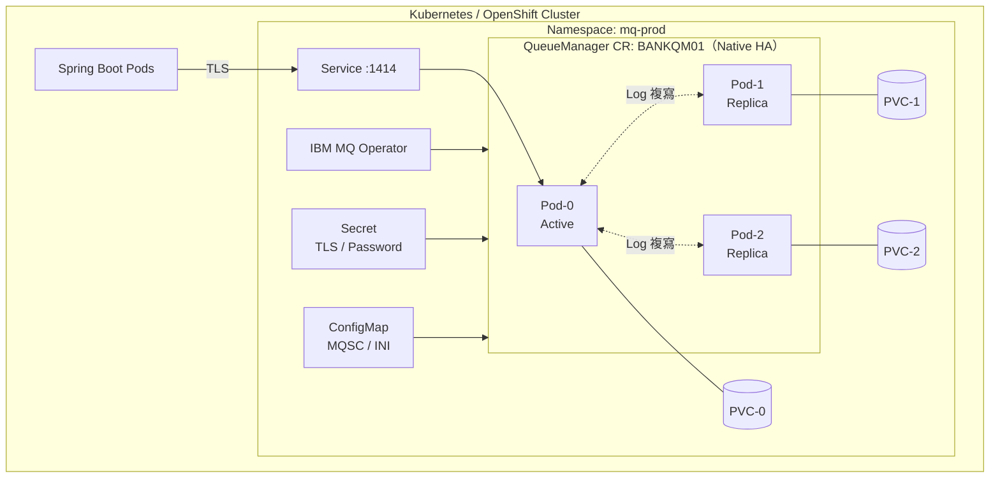

> IBM MQ Operator 的版本、CRD 欄位、與 MQ 10.0 對應關係，**需依目前 IBM 官方文件確認**。

### 4.6 AI Agent 使用方式

- 請 AI 依照公司範本產生 `crtmqm` 參數、MQSC 檔與 Kubernetes YAML，**但只在 DEV / TEST 執行**。
- 請 AI 比對 System Requirements 與目前 OS / JDK 版本，列出不相容項目，並附上官方連結供人工確認。

### 4.7 常見錯誤

- 以 `root` 執行 Queue Manager 管理命令（應以 `mqm` 群組成員執行）。
- Log 與 Data 放在同一顆慢速磁碟，Persistent 效能低落。
- 容器使用 `latest` tag，某天重新部署後版本不同。
- 把 Developer image 帶進 Production。

### 4.8 Checklist

- [ ] OS、JDK、容器平台版本已對照 IBM System Requirements
- [ ] `mqm` UID / GID 在所有節點一致
- [ ] Log 與 Data 分離，Log 位於低延遲儲存
- [ ] `crtmqm` 參數（Log 類型、大小、DLQ）已記錄於設計文件
- [ ] MQSC 設定存放於 Git，透過 `-ic` 或 Autoconfig 套用
- [ ] Container image 已固定版本（tag / digest）
- [ ] 密碼、TLS 私鑰全部透過 Secret 管理

---

## Part 5 — IBM MQ 系統管理

### 5.1 目的

建立 Queue Manager 日常管理的標準做法，包含 Control Commands、MQSC 命令與 Production 操作風險分級。

### 5.2 管理工具總覽

| 工具 | 說明 | 適用 |
|------|------|------|
| Control Commands | `crtmqm`、`strmqm`、`endmqm`、`dspmq`、`dltmqm`、`setmqaut`、`dmpmqcfg` 等 OS 命令 | 主機上的管理員 |
| `runmqsc` | MQSC 命令直譯器 | 物件定義、查詢、維運 |
| IBM MQ Console | Web 管理介面（mqweb） | 圖形化查詢與操作 |
| REST API（Administrative） | 透過 HTTPS 執行 MQSC 或查詢 `[MQ 9.3+ 提供 v3]` | 自動化、Portal 整合 |
| PCF | Programmable Command Format，程式化管理 | 監控工具、自動化腳本 |
| MQ Explorer | 桌面圖形工具 | 管理員日常操作 |

### 5.3 Queue Manager 管理

| 動作 | 命令 | 說明 |
|------|------|------|
| 建立 | `crtmqm` | 見 Part 4 |
| 啟動 | `strmqm QM` | |
| 停止 | `endmqm -i QM` | 見 Part 4.2.6 風險表 |
| 顯示狀態 | `dspmq -o all`、`DISPLAY QMSTATUS ALL` | |
| 顯示設定 | `DISPLAY QMGR ALL` | |
| 備份設定 | `dmpmqcfg -m QM -a > QM.mqsc` | **匯出所有物件定義與授權（含 `-a` 為全部）**，可用 `runmqsc QM < QM.mqsc` 重建 |
| 備份資料 | 停機冷備份 / Linear Log 的 `rcdmqimg` / 儲存層快照 | 見 Part 26 |
| 還原 | 以 `dmpmqcfg` 輸出重建物件；資料以 HA/DR 方案還原 | |
| 刪除 | `dltmqm QM` | **極高風險**，Production 禁止 AI 執行 |

```bash
# 每日設定備份（建議排程，並納入版本控制比對差異）
dmpmqcfg -m BANKQM01 -a -o mqsc > /backup/mqcfg/BANKQM01_$(date +%Y%m%d).mqsc

# 只匯出授權記錄
dmpmqcfg -m BANKQM01 -x authrec -o setmqaut > /backup/mqcfg/BANKQM01_auth_$(date +%Y%m%d).sh
```

> `dmpmqcfg` 的 `-x` 物件類型與輸出格式選項，請依目前官方文件確認。

### 5.4 MQSC 與 runmqsc

`runmqsc` 是 MQSC 命令的互動式 / 批次直譯器。

```bash
# 互動模式
runmqsc BANKQM01

# 批次模式（套用檔案）
runmqsc BANKQM01 < change-2026-10-001.mqsc > change-2026-10-001.out

# 只檢查語法、不實際執行（-v：verify）
runmqsc -v BANKQM01 < change-2026-10-001.mqsc

# 遠端管理（透過 Client 連線，需設定 CCDT 或 MQSERVER 與適當權限）
runmqsc -c BANKQM01
```

**MQSC 語法要點**：

- 未加引號的名稱轉為大寫；含小寫或特殊字元必須加單引號。
- 行尾 `+` 或 `-` 表示接續下一行（`+` 去除下一行前導空白、`-` 保留）。
- `*` 開頭為註解。
- `REPLACE` 讓 `DEFINE` 可重複執行（冪等），**但會覆蓋未指定的屬性為預設值或 `LIKE` 物件的值**，在 Production 使用前須確認。

### 5.5 常用查詢命令（DISPLAY）

| 命令 | 功能 | 使用時機 | 注意事項 | Production 風險 |
|------|------|----------|----------|----------------|
| `DISPLAY QMGR ALL` | 顯示 QM 屬性 | 盤點、比對設定 | 輸出長，可指定屬性 | 無 |
| `DISPLAY QMSTATUS ALL` | QM 執行狀態 | 健康檢查 | | 無 |
| `DISPLAY QLOCAL(*)` | 列出 Local Queue | 盤點 | 加 `WHERE(CURDEPTH GT 0)` 篩選 | 無 |
| `DISPLAY QSTATUS('Q') TYPE(QUEUE) ALL` | 佇列即時狀態：深度、開啟數、最後 GET/PUT 時間 | 堵塞排查 | `MSGAGE`、`QTIME` 需 `MONQ` 啟用 | 無 |
| `DISPLAY QSTATUS('Q') TYPE(HANDLE) ALL` | 誰開啟了佇列 | 找出 Consumer / Producer | | 無 |
| `DISPLAY QREMOTE(*)` | Remote Queue 定義 | 路由排查 | | 無 |
| `DISPLAY QALIAS(*)` | Alias 定義 | 路由排查 | | 無 |
| `DISPLAY CHANNEL(*)` | Channel 定義 | 盤點 | | 無 |
| `DISPLAY CHSTATUS(*) ALL` | Channel 即時狀態 | Channel Down 排查 | 無輸出代表 INACTIVE | 無 |
| `DISPLAY LISTENER(*)`、`DISPLAY LSSTATUS(*)` | Listener 定義 / 狀態 | 連線失敗排查 | | 無 |
| `DISPLAY CONN(*) TYPE(CONN) ALL` | 目前連線 | 找出連線來源、Application Tag | 可配合 `WHERE(APPLTAG EQ '...')` | 無 |
| `DISPLAY SUB(*)`、`DISPLAY SBSTATUS(*)` | 訂閱 | Pub/Sub 排查 | | 無 |
| `DISPLAY CHLAUTH(*)` | Channel 認證規則 | 2035 / AMQ9777 排查 | | 無 |
| `DISPLAY AUTHREC` | OAM 授權記錄 | 2035 排查 | | 無 |
| `DISPLAY CLUSQMGR(*)` | Cluster 成員 | Cluster 健康檢查 | | 無 |

```text
* 找出所有有訊息堆積的應用佇列
DISPLAY QLOCAL('PAY.*') WHERE(CURDEPTH GT 0) CURDEPTH MAXDEPTH

* 佇列是否有 Consumer 在讀？（IPPROCS = 開啟 Input 的數量）
DISPLAY QSTATUS('PAY.TXN.REQ') TYPE(QUEUE) CURDEPTH IPPROCS OPPROCS LGETDATE LGETTIME MSGAGE

* 某應用程式的連線
DISPLAY CONN(*) TYPE(CONN) WHERE(APPLTAG EQ 'payment-service') CHANNEL CONNAME USERID
```

### 5.6 常用定義與修改命令

| 命令 | 功能 | 使用時機 | 注意事項 | Production 風險 |
|------|------|----------|----------|----------------|
| `DEFINE QLOCAL(...)` | 建立 Local Queue | 新服務上線 | 搭配 `BOQNAME`、`MAXDEPTH` | 低（新增） |
| `DEFINE QREMOTE(...)` | 建立 Remote Queue | 跨 QM 路由 | `RNAME`、`RQMNAME`、`XMITQ` 需正確 | 低 |
| `DEFINE CHANNEL(...)` | 建立 Channel | 新連線 | 名稱兩端一致；TLS 參數 | 中（影響安全邊界） |
| `DEFINE LISTENER(...)` | 建立 Listener | 新連接埠 | 防火牆規則 | 中 |
| `ALTER QLOCAL(...)` | 修改佇列屬性 | 調整深度、門檻 | `PUT(DISABLED)` / `GET(DISABLED)` 會中斷應用 | 中-高 |
| `ALTER CHANNEL(...)` | 修改 Channel | TLS、MCAUSER 調整 | 須重啟 Channel 才生效 | 高 |
| `DELETE QLOCAL(...)` | 刪除佇列 | 下架 | 有訊息時會失敗，`PURGE` 會連訊息一起刪除 | **極高** |
| `CLEAR QLOCAL(...)` | 清空佇列 | 測試環境 | **訊息不可恢復** | **極高** |
| `START CHANNEL(...)` / `STOP CHANNEL(...)` | 啟停 Channel | 維運 | `STOP ... MODE(QUIESCE)` 較安全 | 中 |
| `RESET CHANNEL(...) SEQNUM(n)` | 重設序號 | 序號不一致（AMQ9526） | 確認無 in-doubt 後才執行 | 高 |
| `RESOLVE CHANNEL(...) ACTION(COMMIT/BACKOUT)` | 解決 in-doubt 批次 | Channel in-doubt | **選錯會造成訊息重複或遺失** | **極高** |
| `REFRESH SECURITY TYPE(...)` | 重新載入安全快取 | 修改 OAM / CONNAUTH 後 | | 中 |
| `SET CHLAUTH(...)` | 設定 Channel 認證規則 | 安全調整 | 規則錯誤會封鎖所有連線 | **極高** |
| `SET AUTHREC(...)` | 設定 OAM 授權 | 權限調整 | 避免 `+all` | 高 |

```text
* 下架佇列的安全程序（Production 需經變更審核）
* 1. 先禁止 PUT，觀察是否有 Producer 失敗
ALTER QLOCAL('OLD.APP.REQ') PUT(DISABLED)
* 2. 確認深度歸零、無 Consumer 開啟
DISPLAY QSTATUS('OLD.APP.REQ') TYPE(QUEUE) CURDEPTH IPPROCS OPPROCS
* 3. 備份定義
*    （OS 層）dmpmqcfg -m BANKQM01 -n OLD.APP.REQ -t queue
* 4. 觀察期後刪除（不使用 PURGE）
DELETE QLOCAL('OLD.APP.REQ')
```

### 5.7 Production 操作風險分級

| 等級 | 定義 | 範例 | 要求 |
|------|------|------|------|
| L0 唯讀 | 不改變任何狀態 | `DISPLAY *`、`dspmq` | 可自動化；AI 可協助產生 |
| L1 低風險新增 | 新增不影響既有流量的物件 | `DEFINE QLOCAL` 新佇列 | 變更單 + 審核 |
| L2 中風險修改 | 修改既有物件屬性 | `ALTER QLOCAL MAXDEPTH` | 變更單 + 審核 + 回復步驟 |
| L3 高風險 | 影響連線或安全 | `ALTER CHANNEL`、`SET AUTHREC`、`STOP CHANNEL` | 變更單 + 雙人覆核 + 維護時段 + 回復計畫 |
| L4 不可逆 | 資料或安全邊界不可恢復 | `CLEAR`、`DELETE ... PURGE`、`SET CHLAUTH`、`RESOLVE CHANNEL`、`dltmqm`、`endmqm -p` | L3 要求 + 備份驗證 + 主管核准；**AI 禁止執行** |

### 5.8 管理方式全景與命令集比較

IBM MQ 提供多組管理介面，**同一件事通常有三四種做法**。企業必須明確規定「哪種情境用哪種介面」，否則稽核時無法說明某個設定是誰、透過什麼管道改的。

| 介面 | 執行位置 | 可否遠端 | 可否建立 / 啟動 QM | 自動化友善 | 稽核來源 | 建議用途 |
|------|---------|---------|-------------------|-----------|---------|---------|
| Control Commands（`crtmqm`、`strmqm`…） | QM 主機 OS | 否 | 是 | 中（Shell 腳本） | OS 稽核、Shell 歷史 | QM 生命週期、安裝、備份 |
| MQSC（`runmqsc`） | 本機或遠端 | 是（`-w`、`-c`） | 否 | 高（檔案化、可 `-v` 驗證） | Command Event、變更單 | **物件定義的標準管道**，搭配 Git |
| PCF | 任何能連 QM 的程式 | 是 | 否 | 高（程式化） | Command Event | 監控工具、自訂管理程式 |
| Administrative REST API | mqweb（HTTPS） | 是 | 否 | 高（HTTP / JSON） | mqweb 稽核日誌、Command Event | Portal、Pipeline、跨平台腳本 |
| IBM MQ Console | 瀏覽器 | 是 | 否（可管理既有本機 QM） | 低 | mqweb 日誌 | 查詢、緊急人工操作 |
| IBM MQ Explorer | 桌面程式 | 是 | 否（本機可建立） | 低 | Command Event | 管理員日常瀏覽 |
| Taskbar 應用（Windows） | Windows 工作列 | 否 | 否 | 無 | — | 開發機 |
| IBM i CL / z/OS 主控台、ISPF、CSQUTIL | 平台原生 | 依平台 | 依平台 | 中 | 平台稽核（SMF 等） | IBM i、z/OS（見 5.13） |

```mermaid
flowchart TD
    S(["管理需求"]) --> A{"建立 / 啟停 QM？"}
    A -- 是 --> CC["Control Commands<br/>（須登入主機或由 Agent / Operator 代執行）"]
    A -- 否 --> B{"變更物件定義？"}
    B -- 是 --> MQSC["MQSC 檔案 + Git + runmqsc -v<br/>經 Pipeline 套用"]
    B -- 否 --> C{"程式化查詢 / 監控？"}
    C -- 是 --> D{"程式語言？"}
    D -- "Java / C" --> PCF["PCF"]
    D -- "任何 HTTP 用戶端" --> REST["Administrative REST API"]
    C -- 否 --> UI["Console / Explorer<br/>（Production 預設唯讀角色）"]
```

**企業規範建議**：Production 物件變更**只能**透過「MQSC 檔案 + Pipeline」；Console 與 Explorer 在 Production 預設只給唯讀權限；REST 與 PCF 的寫入權限只發給受控的自動化帳號。

### 5.9 本機管理與遠端管理

| 方式 | 原理 | 前提 | 限制 |
|------|------|------|------|
| 本機管理 | 在 QM 所在主機執行命令 | OS 帳號屬於 `mqm` 或具備相應權限 | 需登入主機 |
| 經由 QM 的遠端管理 | 本機 QM 把命令訊息透過 Channel 送到遠端 QM 的 `SYSTEM.ADMIN.COMMAND.QUEUE` | 兩端 QM 之間有 Sender / Receiver Channel 與 Transmission Queue；遠端 **Command Server** 執行中 | 不能建立、啟動 QM，也不能啟動 Command Server |
| Client 模式遠端管理 | `runmqsc -c` 以 MQI Client 連到遠端 QM | 有可用的 SVRCONN、CCDT 或 `MQSERVER`、適當權限 | 同上 |

```bash
# 檢查 / 啟動 Command Server（QM 屬性 SCMDSERV(QMGR) 時會隨 QM 自動啟動）
dspmqcsv BANKQM01
strmqcsv BANKQM01

# 經由本機 QM（-m）把命令送到遠端 QM，-w 為等待回覆秒數
runmqsc -w 30 -m ADMINQM01 BANKQM02

# 以 Client 模式直接連遠端 QM（使用 CCDT）
export MQCCDTURL=file:///etc/mq/admin-ccdt.json
runmqsc -c BANKQM02
```

**安全要求**：

- 遠端管理使用**專用的管理 SVRCONN**（例如 `ADM.SVRCONN`），強制 TLS + 用戶端憑證，以 CHLAUTH 限制來源 IP 與憑證 DN。
- 以 CHLAUTH 封鎖 `SYSTEM.ADMIN.SVRCONN`、`SYSTEM.DEF.SVRCONN` 等預設 Channel 的外部存取。
- 啟用 Command Event（`ALTER QMGR CMDEV(ENABLED)`）與 Configuration Event（`CONFIGEV(ENABLED)`），讓所有遠端變更都留下紀錄。

### 5.10 PCF 與 MQAI 自動化

**PCF（Programmable Command Format）** 是 MQSC 的程式化版本：程式把一則帶有 `MQCFH` 標頭與參數結構的訊息放到 `SYSTEM.ADMIN.COMMAND.QUEUE`，Command Server 執行後把結果放回 Reply Queue。監控工具（例如 `mq-metric-samples`）、IBM MQ Explorer 與許多商業工具都是透過 PCF 運作。

| 項目 | 說明 |
|------|------|
| 命令代碼 | `MQCMD_INQUIRE_Q`、`MQCMD_INQUIRE_Q_STATUS`、`MQCMD_INQUIRE_CHANNEL_STATUS` 等 |
| Java 支援 | `com.ibm.mq.headers.pcf` 套件（`PCFMessageAgent`、`PCFMessage`） |
| C 支援 | 直接組 PCF 結構，或使用 **MQAI**（MQ Administration Interface，`mqExecute` 等，以「資料袋」抽象化 PCF） |
| 權限 | 需要 `SYSTEM.ADMIN.COMMAND.QUEUE` 的 put、Reply Queue 的 get，以及目標物件的 `dsp`（查詢）或 `chg` 等權限 |
| `[MQ 10.0]` | 新增以程式化方式讀取 Error Log 的能力 `[需確認 PCF 命令名稱]` |

以下範例為 **L0 唯讀**的佇列深度巡檢，可作為監控與 AI Agent 工具的基礎：

```java
package com.tutorial.mq.admin;

import com.ibm.mq.MQException;
import com.ibm.mq.MQQueueManager;
import com.ibm.mq.constants.CMQC;
import com.ibm.mq.constants.CMQCFC;
import com.ibm.mq.headers.MQDataException;
import com.ibm.mq.headers.pcf.PCFMessage;
import com.ibm.mq.headers.pcf.PCFMessageAgent;

import java.io.IOException;
import java.util.LinkedHashMap;
import java.util.Map;

/**
 * 以 PCF 查詢 Local Queue 深度（唯讀巡檢，Production 風險等級 L0）。
 */
public final class QueueDepthInspector {

    private QueueDepthInspector() {
    }

    /**
     * 查詢符合名稱樣式的 Local Queue 目前深度。
     *
     * @param queueManager 已連線的 Queue Manager（呼叫端負責中斷連線）
     * @param namePattern  佇列名稱樣式，例如 {@code PAY.*}
     * @return 佇列名稱與目前深度
     * @throws MQDataException PCF 回應格式錯誤或命令失敗
     * @throws MQException     MQ 呼叫失敗
     * @throws IOException     讀取回應失敗
     */
    public static Map<String, Integer> inquireDepth(MQQueueManager queueManager, String namePattern)
            throws MQDataException, MQException, IOException {
        PCFMessageAgent agent = new PCFMessageAgent(queueManager);
        try {
            PCFMessage request = new PCFMessage(CMQCFC.MQCMD_INQUIRE_Q);
            request.addParameter(CMQC.MQCA_Q_NAME, namePattern);
            request.addParameter(CMQC.MQIA_Q_TYPE, CMQC.MQQT_LOCAL);
            request.addParameter(CMQCFC.MQIACF_Q_ATTRS,
                    new int[] {CMQC.MQCA_Q_NAME, CMQC.MQIA_CURRENT_Q_DEPTH, CMQC.MQIA_MAX_Q_DEPTH});

            Map<String, Integer> depths = new LinkedHashMap<>();
            for (PCFMessage response : agent.send(request)) {
                depths.put(response.getStringParameterValue(CMQC.MQCA_Q_NAME).trim(),
                        response.getIntParameterValue(CMQC.MQIA_CURRENT_Q_DEPTH));
            }
            return depths;
        } finally {
            agent.disconnect();
        }
    }
}
```

> `PCFMessageAgent` 位於 IBM MQ classes for Java 的 `com.ibm.mq.headers.pcf` 套件；所需 artifact 與 Jakarta 環境下的可用性，請依使用版本確認 `[需確認]`。PCF 帳號只授予 `dsp` 權限即可完成巡檢，**不要用管理員帳號跑監控**。

### 5.11 Administrative REST API

Administrative REST API 由 mqweb server 提供（見 Part 2.11），讓任何能發 HTTPS 請求的工具都能管理 MQ。v3 起建議使用 **MQSC 端點**，以 JSON 傳送 MQSC 命令。

| 項目 | 說明 |
|------|------|
| 基礎路徑 | `https://<host>:9443/ibmmq/rest/v3/admin/...` |
| 查詢 QM | `GET /ibmmq/rest/v3/admin/qmgr/{qmgr}` |
| 執行 MQSC | `POST /ibmmq/rest/v3/admin/action/qmgr/{qmgr}/mqsc`，Body 為 `runCommand`（純文字命令）或 `runCommandJSON`（結構化） |
| CSRF 保護 | `POST`、`PATCH`、`DELETE` 須帶 `ibm-mq-rest-csrf-token` 標頭（值不限） |
| 認證 | HTTP Basic、登入取得 LTPA Token（`/ibmmq/rest/v3/login`）、Client 憑證 |
| 授權 | mqweb 角色（`MQWebAdmin` / `MQWebAdminRO` / `MQWebUser`）+ `MQWebUser` 情境下的 OAM |

```bash
# 帳密放在權限 600 的 netrc 檔，避免出現在命令列歷史與行程清單
# ~/.mq-rest.netrc：machine mqweb.bank.local login ops-ro password ********

# 唯讀：查詢 Queue Manager（MQWebAdminRO 即可）
curl -sS --cacert /etc/mq/ca.pem --netrc-file ~/.mq-rest.netrc \
  "https://mqweb.bank.local:9443/ibmmq/rest/v3/admin/qmgr/BANKQM01"

# 唯讀：以 runCommandJSON 查詢佇列深度（POST 必須帶 CSRF 標頭）
curl -sS --cacert /etc/mq/ca.pem --netrc-file ~/.mq-rest.netrc \
  -H "Content-Type: application/json" \
  -H "ibm-mq-rest-csrf-token: ops" \
  -X POST "https://mqweb.bank.local:9443/ibmmq/rest/v3/admin/action/qmgr/BANKQM01/mqsc" \
  -d '{"type":"runCommandJSON","command":"display","qualifier":"qlocal","name":"PAY.*","responseParameters":["curdepth","maxdepth"]}'
```

**治理重點**：

- REST 寫入命令與 MQSC 一樣屬於 L1-L4，**必須經變更流程**；Pipeline 帳號與人員帳號分開。
- 不要使用 `-k`（略過憑證驗證）；mqweb 憑證要納入憑證到期監控。
- mqweb 的 HTTP 連接埠預設應關閉，只開 HTTPS。
- REST 回應中的 `overallCompletionCode` / `overallReasonCode` 要檢查，HTTP 200 不代表每個 MQSC 都成功。
- JSON 欄位與端點細節以 IBM MQ 10.0 REST API Reference 為準 `[需確認]`。

### 5.12 IBM MQ Console 與 IBM MQ Explorer

| 項目 | IBM MQ Console | IBM MQ Explorer |
|------|---------------|-----------------|
| 形態 | 瀏覽器（mqweb） | Eclipse 架構的桌面程式（Windows / Linux） |
| 取得方式 | 隨 Server 安裝 | 獨立下載 `[需確認 10.0 取得方式]` |
| 管理範圍 | 同主機 QM；可設定遠端 QM 連線 | 本機與遠端 QM（透過 Client 連線） |
| 認證 | mqweb 使用者登錄（LDAP 建議） | 依連線使用的 Channel 與 CONNAUTH |
| `[MQ 10.0]` | Console 功能強化 `[需確認細節]` | 支援 FIPS 合規模式 |
| 適合 | 營運查詢、儀表板、跨團隊共用 | 管理員日常瀏覽與除錯 |

**Production 使用原則**：

1. 依角色給權限：維運人員 `MQWebAdminRO`，只有 MQ 管理員群組有 `MQWebAdmin`。
2. Explorer 連 Production 必須走 TLS 管理 Channel（5.9），不可使用 `SYSTEM.ADMIN.SVRCONN` 的預設設定。
3. Console 與 Explorer 的變更不應成為常態；若緊急人工變更，事後必須以 `dmpmqcfg` 回寫到 Git 中的 MQSC，避免設定漂移。

### 5.13 IBM MQ for z/OS 系統管理

本節延續 Part 2.10 的架構，整理 z/OS 管理員的日常命令。**z/OS 上的命令以「命令前綴字串（CPF）」區分 Queue Manager**，例如 `-QM01`。

#### 命令入口

| 入口 | 說明 | 使用時機 |
|------|------|---------|
| z/OS 主控台 + CPF | `-QM01 DISPLAY QLOCAL(*)` | 啟停、緊急操作 |
| ISPF Operations and Control 面板 | 互動式選單 | 管理員日常操作 |
| CSQUTIL `COMMAND` 功能 | 以 Batch Job 執行 MQSC | 大量定義、排程巡檢 |
| 初始化輸入資料集 | `CSQINP1`（啟動早期參數）、`CSQINP2`（物件定義）、`CSQINPX`（CHIN 啟動時執行） | QM / CHIN 啟動 |
| MQSC 遠端 / PCF / REST / Console | 與分散式平台相同概念 | 自動化、跨平台管理 |

#### 常用命令

| 命令 | 功能 | Production 風險 |
|------|------|----------------|
| `-QM01 START QMGR` / `STOP QMGR MODE(QUIESCE)` | 啟停 Queue Manager | L3 |
| `-QM01 START CHINIT` / `STOP CHINIT` | 啟停 Channel Initiator | L3 |
| `DISPLAY SYSTEM`、`DISPLAY QMGR` | 系統參數與 QM 屬性 | L0 |
| `DISPLAY USAGE TYPE(ALL)` | Page Set、Buffer Pool、Log 使用量 | L0 |
| `DISPLAY LOG`、`DISPLAY ARCHIVE` | Log 狀態 | L0 |
| `ARCHIVE LOG` | 強制切換並歸檔 Active Log | L2 |
| `DISPLAY GROUP` | QSG 成員 | L0 |
| `DISPLAY CFSTRUCT(*)`、`DISPLAY CFSTATUS(*) TYPE(SUMMARY)` | CF Structure 定義與狀態 | L0 |
| `BACKUP CFSTRUCT(APP1)` | 備份 CF Structure 中的持久性訊息 | L1（需排程） |
| `RECOVER CFSTRUCT(APP1)` | 從備份與 Log 復原 CF Structure | **L4** |
| `ALTER BUFFPOOL(n) BUFFERS(...)` | 調整 Buffer Pool | L3 |
| `DEFINE PSID(n) BUFFPOOL(m)` | 新增 Page Set 對應 | L2 |
| 任一命令加 `CMDSCOPE(*)` | 在 QSG 所有成員執行 | 風險隨命令放大，**寫入命令禁止 AI 產生 `CMDSCOPE(*)` 而未經審核** |

```text
//MQDISP   JOB (ACCT),'MQ DAILY CHECK',CLASS=A,MSGCLASS=X
//* L0 唯讀巡檢：以 CSQUTIL 對 QSG 所有成員查詢應用佇列深度
//CSQUTIL  EXEC PGM=CSQUTIL,PARM='QM01'
//STEPLIB  DD DISP=SHR,DSN=thlqual.SCSQANLE
//         DD DISP=SHR,DSN=thlqual.SCSQAUTH
//SYSPRINT DD SYSOUT=*
//SYSIN    DD *
COMMAND DDNAME(CMDINP)
/*
//CMDINP   DD *
DISPLAY QLOCAL('PAY.*') CURDEPTH MAXDEPTH CMDSCOPE(*)
DISPLAY CFSTATUS(*) TYPE(SUMMARY)
DISPLAY USAGE TYPE(PAGESET)
/*
```

> `thlqual` 為安裝時的高階限定詞；JCL 與資料集名稱依各機構標準調整。

#### 公用程式

| 程式 | 用途 |
|------|------|
| `CSQUTIL` | 執行命令、匯出物件定義（`SDEFS`）、Page Set 複製 / 載入 / 清空 / 格式化 |
| `CSQ5PQSG` | 在 Db2 中新增或移除 QSG 與成員 QM |
| `CSQJU003` / `CSQJU004` | 修改 / 列印 BSDS（Log 資料集清單） |
| `CSQ4INSG` 等範例 | 預設物件與系統物件定義範本 |

#### SMF 與監控資料

| 紀錄 | 內容 | 啟用 |
|------|------|------|
| SMF 115 | Queue Manager 統計（Log、Buffer Pool、Page Set、CF 使用量等） | `START TRACE(STAT) CLASS(...)` |
| SMF 116 | Accounting（每個連線 / 每個佇列的 MQI 用量、Channel Accounting） | `START TRACE(ACCTG) CLASS(...)` |
| `[MQ 10.0]` 變更 | SMF 115 / 116 的 Release 欄位變更；Channel Accounting 新欄位；整合 OpenTelemetry tracing；新的驗證失敗訊息 | 依官方說明調整報表程式 `[需確認]` |

> Trace class 編號、`STATIME` 間隔與 SMF 報表工具（例如 `MQSMF` 範例程式）請依 IBM MQ for z/OS 文件確認後再啟用；SMF 116 Class 3 資料量大，需先評估。

#### z/OS 管理的 Production 風險

- `RECOVER CFSTRUCT`、Page Set 復原、BSDS 修改屬 **L4**，必須由主機系統程式師與 MQ 管理員雙人執行。
- CF Structure 容量不足會導致 Shared Queue 上的 `MQPUT` 失敗（`2192` 等），應監控 CF 使用率並排程 `BACKUP CFSTRUCT`。
- Db2 是 QSG 物件定義的共用儲存，Db2 不可用會影響 QSG 物件的定義與變更。

### 5.14 擴充元件管理

| 元件 | 常用管理命令 / 設定 | 重點 |
|------|-------------------|------|
| MFT | `fteSetupCoordination`、`fteCreateAgent`、`fteStartAgent`、`fteStopAgent`、`ftePingAgent`、`fteListAgents`、`fteCreateTransfer`、`fteCreateMonitor`、`fteCreateLogger` | Coordination QM 與 Agent QM 規劃；傳輸紀錄（Logger）寫入資料庫或檔案以供稽核 |
| MQIPT | `mqipt <設定目錄>` 啟動、`mqiptAdmin` 管理；`mqipt.conf` 定義 Route（ListenerPort、Destination、DestinationPort、TLS） | 放 DMZ；`[MQ 10.0]` 升級前檢查 CipherSuite 與 Java Security Manager 相關設定 |
| AMQP | `DEFINE CHANNEL('APP.AMQP') CHLTYPE(AMQP) PORT(5672)`；`START SERVICE(SYSTEM.AMQP.SERVICE)`；`START CHANNEL('APP.AMQP')` | 一樣要用 CHLAUTH、MCAUSER、TLS 保護 |
| MQTT | `DEFINE CHANNEL('IOT.MQTT') CHLTYPE(MQTT) TRPTYPE(TCP) PORT(8883) SSLCIPH(...)`；Telemetry Service `SYSTEM.MQXR.SERVICE` | 正式環境只開 TLS 連接埠 |
| Multicast | `DEFINE COMMINFO('MC.INFO') GRPADDR('239.1.1.1') PORT(1414)`；Topic 設 `MCAST(ENABLED) COMMINFO('MC.INFO')` | 網路需支援 IP Multicast |
| Kafka Connect | Connector 設定 `mq.queue.manager`、`mq.connection.name.list`、`mq.channel.name`、`mq.queue`、`topic` 等 | Connector 使用專用 MQ 帳號與最小權限 |

> 上表命令只列出關鍵字與常用參數，完整語法以 IBM MQ 10.0 文件為準 `[需確認]`。

### 5.15 IBM MQ 10.0 新增的管理能力

| 能力 | 管理意義 | 標記 |
|------|---------|------|
| Native HA 詳細狀態 | 可看到各實例的複寫狀態與落後程度，故障排查不必猜 `[需確認命令選項]` | `[MQ 10.0]` |
| 程式化讀取 Error Log | 監控工具不必登入主機讀 `AMQERR01.LOG` | `[MQ 10.0]` |
| `dspmqcert` | 檢查 QM 憑證到期日，可納入每日巡檢 | `[MQ 10.0]` |
| 多 Certificate Label | 憑證輪替時可同時掛新舊憑證 | `[MQ 10.0]` |
| 變更 QM CCSID 可能需 force | 避免無意間改壞既有資料轉換 | `[MQ 10.0]` |
| 延伸 Authority Event（正向驗證） | 稽核成功登入 | `[MQ 9.4 CD]` |
| Console 強化 | 營運查詢更完整 | `[MQ 9.4 CD]` |
| AMQ7366W 可列入 Exclude / Suppress 清單 | 減少 Error Log 雜訊 | `[MQ 10.0]` |
| 隨產品附帶的 Java runtime 變更 | 影響 MFT、MQ Console、AMQP、MQTT 等 Java 元件 | `[MQ 10.0]` |

### 5.16 AI Agent 使用方式

- **可以**：請 AI 依需求產生 MQSC 變更檔、`runmqsc -v` 驗證腳本、回復（Rollback）MQSC 檔、`DISPLAY` 巡檢腳本。
- **可以**：把 `dmpmqcfg` 輸出交給 AI 做差異分析、找出過度授權與不一致設定。
- **不可以**：讓 AI 直接連 Production 執行 L1 以上的命令。

### 5.17 常見錯誤

- 在 Production 用 `DEFINE ... REPLACE` 覆寫既有佇列，導致 `BOQNAME` 等屬性被重設。
- 忘記 `ALTER CHANNEL` 後需要重啟 Channel 才生效。
- `CLEAR QLOCAL` 誤清 Production 佇列。
- 沒有定期 `dmpmqcfg`，災難時無法重建物件。

### 5.18 Checklist

- [ ] 每日 `dmpmqcfg` 備份並納入版本比對
- [ ] 所有變更 MQSC 先以 `runmqsc -v` 驗證語法
- [ ] 每個變更檔都有對應 Rollback MQSC
- [ ] L3 / L4 操作有雙人覆核
- [ ] 巡檢腳本只使用 `DISPLAY` 類命令
- [ ] 已明定各管理介面的使用情境；Production 物件變更只走 MQSC + Pipeline
- [ ] 遠端管理使用專用 TLS 管理 Channel，預設 `SYSTEM.*.SVRCONN` 已封鎖
- [ ] Command Event 與 Configuration Event 已啟用
- [ ] PCF / REST 監控帳號只有唯讀（`dsp`、`MQWebAdminRO`）權限
- [ ] mqweb 只開 HTTPS，憑證納入到期監控
- [ ] z/OS：CF Structure 已排程 `BACKUP CFSTRUCT`，SMF 115 / 116 已依需求啟用

---

## Part 6 — Queue 設計

### 6.1 目的

建立企業級 Queue 設計原則：命名、容量、錯誤處理佇列（Backout / DLQ / Retry）與 Request / Response 佇列配置。

### 6.2 Queue Naming Convention

建議格式：

```text
<system>.<domain>.<function>.<direction>[.<suffix>]
```

| 區段 | 說明 | 範例 |
|------|------|------|
| `system` | 擁有者系統代碼（3-6 字元） | `PAY`、`CBS`、`CARD`、`NBK` |
| `domain` | 業務領域 | `TXN`、`ACCT`、`CUST` |
| `function` | 功能 | `TRANSFER`、`INQUIRY`、`NOTIFY` |
| `direction` | 方向 / 角色 | `REQ`、`RSP`、`EVT`、`CMD` |
| `suffix` | 特殊用途 | `BOQ`（Backout）、`RETRY`、`DLQ`、`ALIAS` |

**規則**：

1. 全大寫、以 `.` 分隔，避免底線與小寫（MQSC 引號問題）。
2. 總長度 ≤ 48 字元。
3. 不使用 `SYSTEM.` 開頭。
4. **佇列名稱不含環境名稱**（`DEV`、`PROD`），環境以 Queue Manager 區分，讓程式設定在各環境一致。
5. 一個佇列只屬於一個擁有者系統。

### 6.3 金融系統命名範例

| 佇列 | 類型 | 用途 |
|------|------|------|
| `NBK.TXN.TRANSFER.REQ` | QREMOTE / QALIAS | 網銀發送轉帳請求（Producer 端看到的名稱） |
| `CBS.TXN.TRANSFER.REQ` | QLOCAL | 核心系統接收轉帳請求 |
| `CBS.TXN.TRANSFER.REQ.BOQ` | QLOCAL | 轉帳請求的 Backout Queue |
| `NBK.TXN.TRANSFER.RSP` | QLOCAL | 網銀接收轉帳回覆 |
| `NBK.TXN.TRANSFER.RSP.BOQ` | QLOCAL | 回覆佇列的 Backout Queue |
| `CBS.ACCT.BALANCE.EVT` | Topic String `Bank/Account/Balance/Changed` | 餘額異動事件 |
| `PAY.TXN.SETTLE.RETRY` | QLOCAL | 延遲重試佇列 |

### 6.4 Queue Capacity：MAXDEPTH 與 MAXMSGL

| 屬性 | 說明 | 預設 `[需確認]` | 設計建議 |
|------|------|-----------------|----------|
| `MAXDEPTH` | 佇列最多訊息數 | 5000 | 依「峰值 TPS × 可容忍的 Consumer 停機秒數 × 安全係數」估算 |
| `MAXMSGL` | 單則訊息最大長度（bytes） | 4 MB（4194304） | 依實際訊息上限設定，**不要盲目設到最大值** |
| QMGR `MAXMSGL` | QM 層級上限 | 4 MB | 必須 ≥ 佇列與 Channel 的 `MAXMSGL` |
| Channel `MAXMSGL` | Channel 層級上限 | 4 MB | 兩端協商取較小值 |

**MAXDEPTH 估算範例**：

```text
峰值 TPS                 = 500 msg/s
可容忍 Consumer 停機時間  = 30 分鐘 = 1800 秒
安全係數                 = 1.5
MAXDEPTH ≈ 500 × 1800 × 1.5 = 1,350,000

同時檢查：1,350,000 × 平均訊息大小 2KB ≈ 2.7GB
→ 確認 Queue 檔案系統空間足夠，並設定 QDEPTHHI 告警（例如 60%）
```

> 佇列滿時 Producer 會收到 `2053 MQRC_Q_FULL`；跨 QM 傳遞時訊息會進 DLQ。**MAXDEPTH 是保護機制，不是容量規劃的替代品。**

### 6.5 Backout Queue、Dead Letter Queue、Retry Queue

```mermaid
flowchart LR
    P["Producer"] --> REQ["CBS.TXN.TRANSFER.REQ<br/>BOTHRESH(5)"]
    REQ --> C["Consumer"]
    C -- "成功" --> OK(["Commit"])
    C -- "暫時錯誤<br/>Backout" --> REQ
    C -- "BackoutCount ≥ 5<br/>或永久錯誤" --> BOQ["CBS.TXN.TRANSFER.REQ.BOQ"]
    C -- "需延遲重試" --> RETRY["PAY.TXN.SETTLE.RETRY"]
    RETRY -- "排程 / 延遲處理器<br/>放回原佇列" --> REQ
    CH["Receiver Channel"] -- "目標不存在 / 已滿" --> DLQ["SYSTEM.DEAD.LETTER.QUEUE"]
    BOQ --> OPS["維運處理 / 補償"]
    DLQ --> DLQH["runmqdlq / 維運處理"]
```

| 佇列 | 誰放入 | 用途 | 處理方式 |
|------|--------|------|----------|
| Backout Queue（BOQ） | 應用程式（JMS 自動；MQI 自行） | 處理失敗超過門檻的毒訊息 | 人工檢視、修正後重送或補償 |
| Dead Letter Queue（DLQ） | Queue Manager / Channel | MQ 層級無法投遞 | `runmqdlq` 規則或人工 |
| Retry Queue | 應用程式 | 需延遲一段時間再重試 | 排程程式依時間放回原佇列 |

**延遲投遞的選擇**：MQI 層級沒有「指定時間後才可被取出」的訊息屬性，但 **IBM MQ classes for JMS / Jakarta Messaging 支援 JMS 2.0 的 Delivery Delay**：Producer 設定 `setDeliveryDelay()` 後，訊息會先放到 Queue Manager 的暫存佇列 `SYSTEM.DDELAY.LOCAL.QUEUE`，時間到才移到目標佇列。使用時需注意：

- 需要 Queue Manager 端支援並允許使用暫存佇列；暫存佇列的容量與權限要納入管理。
- 延遲期間訊息不在目標佇列上，監控目標佇列深度時看不到它們。
- 與部分功能（例如特定 Cluster 或 z/OS Shared Queue 情境）的相容性有限制 `[需確認]`。

延遲重試的常見做法：

1. JMS Delivery Delay（Java 應用、延遲時間短、訊息量可控）
2. Retry Queue + 排程程式（訊息帶下次處理時間屬性）
3. Consumer 端 Backout 後由 Listener Container 退避（Backoff）
4. 外部排程（例如資料庫記錄重試時間）

### 6.6 Request Queue 與 Response Queue

| 設計選項 | 說明 | 優點 | 缺點 |
|---------|------|------|------|
| 共用 Response Queue + CorrelId 篩選 | 所有 Requester 實例共用一個回覆佇列 | 佇列數少、易管理 | 需以 CorrelId 篩選；多實例時要確保回覆被正確實例取走 |
| 每實例一個 Response Queue | 每個服務實例專屬回覆佇列 | 不需跨實例篩選 | 佇列數量隨實例數增加；K8s 動態擴縮困難 |
| Temporary Dynamic Queue | 由 Model Queue 動態建立 | 自動清理 | 連線斷開即消失、回覆遺失；Persistent 不適用 |

**金融系統建議**：共用 Response Queue + CorrelId 篩選，搭配 Expiry 與 Timeout（見 Part 15）。

### 6.7 MQSC 範例：一組完整的 Request / Reply 佇列

```text
* ===== 核心系統 QM (CBSQM01) =====
DEFINE QLOCAL('CBS.TXN.TRANSFER.REQ.BOQ') DEFPSIST(YES) MAXDEPTH(100000) +
       DESCR('Transfer request backout') REPLACE
DEFINE QLOCAL('CBS.TXN.TRANSFER.REQ') DEFPSIST(YES) +
       MAXDEPTH(500000) MAXMSGL(65536) +
       BOTHRESH(5) BOQNAME('CBS.TXN.TRANSFER.REQ.BOQ') HARDENBO +
       QDEPTHHI(60) QDPHIEV(ENABLED) +
       MONQ(MEDIUM) +
       DESCR('Transfer request from NBK') REPLACE

* ===== 網銀 QM (NBKQM01) =====
DEFINE QLOCAL('NBK.TXN.TRANSFER.RSP.BOQ') DEFPSIST(YES) MAXDEPTH(100000) REPLACE
DEFINE QLOCAL('NBK.TXN.TRANSFER.RSP') DEFPSIST(YES) MAXDEPTH(500000) +
       BOTHRESH(3) BOQNAME('NBK.TXN.TRANSFER.RSP.BOQ') HARDENBO +
       QDEPTHHI(60) QDPHIEV(ENABLED) MONQ(MEDIUM) REPLACE
* 網銀程式只認得 NBK.TXN.TRANSFER.REQ，實際路由到核心
DEFINE QREMOTE('NBK.TXN.TRANSFER.REQ') RNAME('CBS.TXN.TRANSFER.REQ') +
       RQMNAME('CBSQM01') XMITQ('CBSQM01') REPLACE
```

> `HARDENBO` 讓 BackoutCount 在 QM 重啟後仍正確，對毒訊息判斷很重要（有些許效能代價）。

### 6.8 常見錯誤

- Input Queue 沒有 `BOQNAME`，毒訊息無限循環。
- Backout Queue 本身又設定 `BOQNAME` 指回原佇列（循環）。
- `MAXMSGL` 設成 100MB，結果有人把大檔案塞進 MQ 拖垮效能。
- 佇列名稱含環境代碼，導致程式設定在各環境不同。

### 6.9 Checklist

- [ ] 命名符合 `<system>.<domain>.<function>.<direction>`
- [ ] 每個 Input Queue 都有 `BOQNAME` + `BOTHRESH` + `HARDENBO`
- [ ] `MAXDEPTH` 有估算依據並記錄
- [ ] `MAXMSGL` 依實際需求設定
- [ ] 設定 `QDEPTHHI` 事件或監控告警
- [ ] Request 與 Response 佇列分離
- [ ] Backout Queue 有處理流程與負責人

---

## Part 7 — Channel 設計

### 7.1 目的

說明 Channel 的類型選擇、設定參數、安全設計與狀態管理。

### 7.2 Channel 架構

```text
Application
    |
    | Client Connection（SVRCONN）
    ↓
Queue Manager A
    |
    | Sender / Receiver
    ↓
Queue Manager B
```

```mermaid
flowchart LR
    subgraph App["Spring Boot（Client）"]
        CCDT["CCDT / connName<br/>CLNTCONN: PAY.SVRCONN"]
    end
    subgraph QMA["NBKQM01"]
        SVR["SVRCONN<br/>PAY.SVRCONN"]
        XQ["XMITQ: CBSQM01"]
        SDR["SDR: NBKQM01.CBSQM01"]
        RCV2["RCVR: CBSQM01.NBKQM01"]
    end
    subgraph QMB["CBSQM01"]
        RCV["RCVR: NBKQM01.CBSQM01"]
        XQ2["XMITQ: NBKQM01"]
        SDR2["SDR: CBSQM01.NBKQM01"]
    end
    CCDT -- "TLS 1.3 + 用戶端憑證" --> SVR
    XQ --> SDR -- "TLS（QM 憑證）" --> RCV
    XQ2 --> SDR2 -- "TLS（QM 憑證）" --> RCV2
```

### 7.3 Channel 類型選擇

| 需求 | 選擇 |
|------|------|
| Java / Spring Boot 應用連到 QM | `SVRCONN`（QM 端）+ connName 或 CCDT（Client 端） |
| QM 單向送訊息到另一個 QM | `SDR` → `RCVR` |
| 遠端由對方主動要求才傳送 | `RQSTR` ↔ `SVR`（或 `RQSTR` ↔ `SDR` 回撥模式） |
| Cluster 內互通 | `CLUSSDR` + `CLUSRCVR` |

**Message Channel 是單向的**：雙向通訊需要兩組 SDR/RCVR。

### 7.4 Sender Channel 關鍵參數

| 參數 | 說明 | 建議 |
|------|------|------|
| `CONNAME` | 目標主機與連接埠，可用逗號列出多個位址（HA） | `'host1(1414),host2(1414)'` |
| `XMITQ` | 讀取的 Transmission Queue | 慣例與目標 QM 同名 |
| `BATCHSZ` | 每批次最大訊息數 | 預設 50；高吞吐可調大，但 in-doubt 時影響範圍變大 |
| `DISCINT` | 閒置多久自動斷線（秒） | 搭配 Trigger 啟動 |
| `SHORTRTY` / `SHORTTMR` | 短重試次數 / 間隔 | 網路短暫中斷 |
| `LONGRTY` / `LONGTMR` | 長重試次數 / 間隔 | 長時間中斷 |
| `HBINT` | Heartbeat 間隔 | 偵測斷線 |
| `NPMSPEED` | Non-persistent 傳送速度 | `FAST` 時 Non-persistent 可能在 Channel 故障時遺失 |
| `SSLCIPH` | CipherSpec | 兩端必須一致（或使用 `ANY_TLS*` 別名） |

### 7.5 Transmission Queue 與 Trigger

```text
DEFINE QLOCAL('CBSQM01') USAGE(XMITQ) DEFPSIST(YES) MAXDEPTH(500000) +
       TRIGGER TRIGTYPE(FIRST) TRIGDATA('NBKQM01.CBSQM01') +
       INITQ('SYSTEM.CHANNEL.INITQ') REPLACE

DEFINE CHANNEL('NBKQM01.CBSQM01') CHLTYPE(SDR) TRPTYPE(TCP) +
       CONNAME('cbs-mq-a.bank.local(1414),cbs-mq-b.bank.local(1414)') +
       XMITQ('CBSQM01') SSLCIPH('ANY_TLS13_OR_HIGHER') +
       DISCINT(6000) SHORTRTY(10) SHORTTMR(60) LONGRTY(999999999) LONGTMR(300) +
       DESCR('NBK to CBS') REPLACE
```

對方 QM：

```text
DEFINE CHANNEL('NBKQM01.CBSQM01') CHLTYPE(RCVR) TRPTYPE(TCP) +
       SSLCIPH('ANY_TLS13_OR_HIGHER') SSLCAUTH(REQUIRED) +
       MCAUSER('nbkmca') +
       DESCR('From NBK') REPLACE
```

> Receiver 的 `MCAUSER` 決定「以誰的身分把訊息放進目標佇列」。**不可留空**（留空會以 MCA 程序身分執行，通常是 `mqm`，等同管理員權限）。應設定為低權限帳號，並以 CHLAUTH `SSLPEERMAP` 綁定對方憑證（見 Part 8）。

### 7.6 Server Connection Channel 關鍵參數

| 參數 | 說明 | 建議 |
|------|------|------|
| `SSLCIPH` | TLS CipherSpec | `ANY_TLS13_OR_HIGHER` 或指定 TLS 1.3 / 1.2 ECDHE 套件 |
| `SSLCAUTH` | 是否要求用戶端憑證 | `REQUIRED`（雙向 TLS） |
| `MAXINST` | 此 Channel 最大實例數 | 防止單一應用耗盡連線 |
| `MAXINSTC` | 單一 Client IP 最大實例數 | 防止單一主機失控 |
| `SHARECNV` | 每個 Channel 實例共用的對話數 | 預設 10；設 0 會停用許多 Client 功能，不建議 |
| `HBINT` | Heartbeat | 偵測斷線 |
| `MCAUSER` | 預設身分 | 搭配 CHLAUTH 映射；**不要依賴 Client 傳入的 User ID** |
| `DISCINT` | 閒置斷線 | 依需求 |

### 7.7 Channel Status 與 Retry

```mermaid
stateDiagram-v2
    [*] --> INACTIVE
    INACTIVE --> STARTING: START / Trigger
    STARTING --> BINDING: 協商（含 TLS 握手）
    BINDING --> RUNNING: 成功
    BINDING --> RETRYING: 失敗
    RUNNING --> RETRYING: 網路中斷
    RETRYING --> BINDING: 重試間隔到
    RETRYING --> STOPPED: 重試次數用盡
    RUNNING --> INACTIVE: DISCINT 閒置
    RUNNING --> STOPPED: STOP CHANNEL
    STOPPED --> STARTING: START CHANNEL
    RUNNING --> INDOUBT: 批次確認中斷
    INDOUBT --> RUNNING: 重新連線自動解決
```

| 狀態 | 意義 | 動作 |
|------|------|------|
| `RUNNING` | 正常 | — |
| `RETRYING` | 正在重試 | 檢查網路、對方 Listener、TLS |
| `STOPPED` | 停止（手動或重試用盡） | 查明原因後 `START CHANNEL` |
| `BINDING` 長時間 | 協商卡住 | 檢查 TLS、防火牆、對方狀態 |
| `INACTIVE`（無 CHSTATUS 輸出） | 未啟動或閒置斷線 | Trigger 設定是否正確 |
| In-doubt | 批次確認中斷 | 通常重新連線後自動解決；**手動 `RESOLVE` 前必須與對方管理員確認** |

### 7.8 Channel Authentication、MCA User、TLS、Certificate

摘要如下，細節於 Part 8：

- **CHLAUTH**：依來源 IP、TLS DN、Client User ID、遠端 QM 名稱，決定「允許 / 封鎖 / 映射成哪個 MCAUSER」。
- **MCA User**：Channel 實際執行 MQ 操作所使用的身分，OAM 依此檢查權限。
- **TLS**：`SSLCIPH` 啟用；`SSLCAUTH(REQUIRED)` 要求對方憑證；`SSLPEER` 或 CHLAUTH `SSLPEERMAP` 驗證對方 DN。
- **Certificate**：QM 憑證預設 label 為 `ibmwebspheremq<qmname小寫>`，或以 QM / Channel 的 `CERTLABL` 指定。`[MQ 10.0]` 支援多個 certificate label。

### 7.9 常見錯誤

- SDR / RCVR 名稱兩端不一致 → `AMQ9520E`（Channel 未在遠端定義）。
- Receiver `MCAUSER` 空白 → 對方可放訊息到任何佇列，包括 `SYSTEM.ADMIN.COMMAND.QUEUE`。
- 兩端 `SSLCIPH` 不一致 → `AMQ9631E` 類錯誤。
- XMITQ 沒有設定 Trigger → 訊息堆積在 XMITQ，Channel 不會自動啟動。

### 7.10 Checklist

- [ ] SDR / RCVR 名稱兩端一致並記錄於 Channel Map
- [ ] 所有 Channel 啟用 TLS
- [ ] RCVR / SVRCONN 的 `MCAUSER` 為低權限帳號，不為空白
- [ ] SVRCONN 設定 `MAXINST` / `MAXINSTC`
- [ ] XMITQ 設定 Trigger
- [ ] `CONNAME` 列出 HA 所有位址
- [ ] Channel 狀態納入監控

---

## Part 8 — IBM MQ Security

### 8.1 目的

建立金融等級的 IBM MQ 安全基準（Production Security Baseline），涵蓋身分驗證、授權、傳輸加密、稽核與機敏資訊管理。

### 8.2 安全架構

```mermaid
flowchart LR
    C["Client 應用程式"] -->|"1 TCP 連線"| L["Listener"]
    L -->|"2 TLS 握手<br/>驗證雙方憑證"| TLS{"TLS / SSLCAUTH"}
    TLS -->|"3 CHLAUTH 規則<br/>IP / DN / User / QM"| CA{"CHLAUTH"}
    CA -->|"封鎖"| X1["拒絕 AMQ9777E 等"]
    CA -->|"4 CONNAUTH<br/>帳號密碼 / JWT"| AU{"CONNAUTH"}
    AU -->|"失敗"| X2["拒絕 2035"]
    AU -->|"5 決定 MCAUSER"| ID["有效身分"]
    ID -->|"6 OAM 授權檢查<br/>connect / put / get"| OAM{"OAM"}
    OAM -->|"無權限"| X3["2035 NOT_AUTHORIZED"]
    OAM -->|"允許"| Q[("Queue")]
    AUD["稽核：Authority Event<br/>Channel Event / Error Log"] -.-> CA
    AUD -.-> AU
    AUD -.-> OAM
```

### 8.3 Authentication（身分驗證）

IBM MQ 有多層身分驗證機制：

| 機制 | 驗證什麼 | 說明 |
|------|---------|------|
| TLS 雙向認證 | 連線端的憑證 | `SSLCAUTH(REQUIRED)`，以憑證 DN 作為身分依據（**金融系統建議主要方式**） |
| CONNAUTH | 帳號 / 密碼 | 驗證 OS 帳號（`IDPWOS`）或 LDAP（`IDPWLDAP`） |
| JWT Token | Token | `[MQ 9.3.4+ / 9.4 CD]` 支援 JWT 驗證；`[MQ 10.0]` 新增 JWKS 支援 `[需確認細節]` |
| CHLAUTH | 連線來源特徵 | 不是驗證本身，而是依特徵允許 / 封鎖 / 映射 |

```text
* CONNAUTH：要求 Client 連線必須提供有效帳密
DEFINE AUTHINFO('BANK.IDPW.OS') AUTHTYPE(IDPWOS) +
       CHCKCLNT(REQUIRED) CHCKLOCL(OPTIONAL) ADOPTCTX(YES) +
       FAILDLAY(1) REPLACE
ALTER QMGR CONNAUTH('BANK.IDPW.OS')
REFRESH SECURITY TYPE(CONNAUTH)
```

| 屬性 | 說明 |
|------|------|
| `CHCKCLNT(REQUIRED)` | Client 連線必須提供帳密 |
| `CHCKLOCL(OPTIONAL)` | 本機（Bindings）連線可不提供，但若提供則驗證 |
| `ADOPTCTX(YES)` | 驗證成功後以該帳號作為後續授權身分 |
| `FAILDLAY` | 驗證失敗延遲秒數，減緩暴力破解 |

**Java 端注意**：使用 MQ classes for Java / JMS 傳送帳密時，應啟用 **MQCSP 驗證模式**（`USE_MQCSP_AUTHENTICATION_PROPERTY` / `USER_AUTHENTICATION_MQCSP=true`），否則可能使用相容模式並有密碼長度等限制。Spring Boot Starter 的 `userAuthenticationMQCSP` 預設為 `true`。

### 8.4 CHLAUTH（Channel Authentication Records）

Queue Manager 預設有三條 CHLAUTH 規則：

```text
* 預設 1：封鎖所有 SYSTEM.* Channel 的外部存取（ADDRESSMAP * → NOACCESS）
SET CHLAUTH('SYSTEM.*') TYPE(ADDRESSMAP) ADDRESS('*') USERSRC(NOACCESS)
* 預設 2：SYSTEM.ADMIN.SVRCONN 例外（允許，但仍受其他規則限制）
SET CHLAUTH('SYSTEM.ADMIN.SVRCONN') TYPE(ADDRESSMAP) ADDRESS('*') USERSRC(CHANNEL)
* 預設 3：封鎖所有具管理權限的使用者（*MQADMIN）經由 Client Channel 連線
SET CHLAUTH('*') TYPE(BLOCKUSER) USERLIST('*MQADMIN')
```

> 以上為預設規則的內容說明，**不要在 Production 重新執行這些命令**；應以 `DISPLAY CHLAUTH(*)` 確認其存在。

**`*MQADMIN` 代表什麼**：任何具有管理權限的身分（例如 `mqm` 群組成員、Windows 的管理員）。預設 BLOCKUSER 規則讓「以管理員身分從遠端連線」被拒絕。**常見的錯誤做法是為了解決 2035 而移除這條規則**——這等於讓任何能偽造 User ID 的 Client 取得管理員權限。

**Production 建議規則（白名單模式）**：

```text
* 1. 封鎖所有 Channel 的所有來源（Back-stop 規則）
SET CHLAUTH('*') TYPE(ADDRESSMAP) ADDRESS('*') USERSRC(NOACCESS) +
    DESCR('Back-stop: deny all by default') ACTION(REPLACE)

* 2. 付款服務：只允許指定網段 + 指定憑證 DN，並映射到低權限帳號
SET CHLAUTH('PAY.SVRCONN') TYPE(SSLPEERMAP) +
    SSLPEER('CN=payment-service,OU=Payments,O=Example Bank,C=TW') +
    ADDRESS('10.20.30.*') USERSRC(MAP) MCAUSER('paysvc') +
    DESCR('Payment service mTLS') ACTION(REPLACE)

* 3. QM 對 QM：只允許對方 QM 憑證
SET CHLAUTH('NBKQM01.CBSQM01') TYPE(SSLPEERMAP) +
    SSLPEER('CN=NBKQM01,OU=MQ,O=Example Bank,C=TW') +
    USERSRC(MAP) MCAUSER('nbkmca') ACTION(REPLACE)
```

> **上述規則若順序或內容錯誤，會封鎖所有連線。** Production 套用前務必：(1) 在 UAT 完整驗證；(2) 準備回復命令；(3) 保留一條緊急管理途徑（例如本機 `runmqsc`）。

CHLAUTH 規則類型：

| TYPE | 用途 |
|------|------|
| `ADDRESSMAP` | 依來源 IP 映射或封鎖 |
| `SSLPEERMAP` | 依對方憑證 DN 映射或封鎖 |
| `USERMAP` | 依 Client 宣告的 User ID 映射（**不建議單獨依賴**，Client User ID 可被偽造） |
| `QMGRMAP` | 依遠端 QM 名稱映射 |
| `BLOCKUSER` | 封鎖特定 User ID |
| `BLOCKADDR` | 在 Listener 層封鎖 IP（連線即拒） |

**驗證規則行為**（不實際連線）：

```text
DISPLAY CHLAUTH('PAY.SVRCONN') MATCH(RUNCHECK) ADDRESS('10.20.30.15') +
        SSLPEER('CN=payment-service,OU=Payments,O=Example Bank,C=TW')
```

### 8.5 Authorization：OAM（Object Authority Manager）

OAM 控制「某身分（以**群組**為主）對某物件可以做什麼」。

| 權限 | 說明 | 典型授予對象 |
|------|------|-------------|
| `connect` | 連線 QM | 所有應用帳號 |
| `inq` | 查詢屬性 | 所有應用帳號（JMS 常需要） |
| `put` | 放入訊息 | Producer |
| `get` | 取出訊息 | Consumer |
| `browse` | 瀏覽不刪除 | Consumer（JMS 某些功能需要）、監控 |
| `setid` / `setall` | 設定 MQMD 身分 / 來源欄位 | **極少數**系統（例如轉送程式） |
| `passid` / `passall` | 傳遞身分欄位 | 轉送程式 |
| `dsp` | 顯示物件（管理） | 監控帳號 |
| `chg` / `crt` / `dlt` / `clr` | 管理權限 | **僅 MQ 管理員** |
| `+all` / `+alladm` | 全部 / 全部管理 | **應用帳號禁止** |

```bash
# 以群組授權（OS 層），不要對個人帳號授權
# 付款服務（Producer + Reply Consumer）
setmqaut -m NBKQM01 -t qmgr -g paysvc_grp +connect +inq
setmqaut -m NBKQM01 -t queue -n 'NBK.TXN.TRANSFER.REQ' -g paysvc_grp +put +inq
setmqaut -m NBKQM01 -t queue -n 'NBK.TXN.TRANSFER.RSP' -g paysvc_grp +get +browse +inq
# JMS 應用若會把毒訊息移到 BOQ，需要 BOQ 的 put 權限
setmqaut -m NBKQM01 -t queue -n 'NBK.TXN.TRANSFER.RSP.BOQ' -g paysvc_grp +put +inq

# 查詢某群組的權限
dspmqaut -m NBKQM01 -t queue -n 'NBK.TXN.TRANSFER.REQ' -g paysvc_grp
dmpmqaut -m NBKQM01 -g paysvc_grp
```

MQSC 等效寫法：

```text
SET AUTHREC OBJTYPE(QMGR) GROUP('paysvc_grp') AUTHADD(CONNECT,INQ)
SET AUTHREC PROFILE('NBK.TXN.TRANSFER.REQ') OBJTYPE(QUEUE) GROUP('paysvc_grp') AUTHADD(PUT,INQ)
SET AUTHREC PROFILE('NBK.TXN.TRANSFER.RSP') OBJTYPE(QUEUE) GROUP('paysvc_grp') AUTHADD(GET,BROWSE,INQ)
```

**Generic Profile**：可用 `PAY.**` 一次授權一組佇列。**優點是省事，缺點是未來新增的同前綴佇列會自動被授權**，需評估是否符合最小權限原則。

### 8.6 避免 `*MQADMIN` 與 `+all` 過度授權

| 反模式 | 風險 | 正確做法 |
|--------|------|---------|
| 應用帳號加入 `mqm` 群組 | 應用帳號 = MQ 管理員 | 應用帳號只屬於應用群組 |
| `setmqaut ... +all` | 可刪除、清空、修改佇列 | 只授予 `put` / `get` / `inq` / `browse` |
| 移除 `BLOCKUSER('*MQADMIN')` 規則 | 遠端管理員連線 | 保留規則；管理員使用專用管理 Channel + mTLS |
| `MCAUSER('mqm')` | 所有連線以管理員身分執行 | 低權限 `MCAUSER` + CHLAUTH 映射 |
| `CHCKCLNT(NONE)` + `USERSRC(CHANNEL)` | 信任 Client 宣告的任意身分 | `CHCKCLNT(REQUIRED)` 或 mTLS + `SSLPEERMAP` |
| 使用 `SYSTEM.DEF.SVRCONN` / `SYSTEM.ADMIN.SVRCONN` 給應用程式 | 共用、難以控管 | 每個應用一條專屬 SVRCONN |

### 8.7 TLS、Certificate 與 CipherSpec

**`[MQ 10.0]` 重要變更**（升級時必須檢查）：

| 變更 | 影響 |
|------|------|
| 移除 SSLv3、TLS 1.0、RC4、3DES CipherSpec | 使用這些 CipherSpec 的 Channel 在 10.0 無法連線 |
| RSA key exchange CipherSpec 列為 Deprecated | 規劃遷移到 ECDHE 套件或 TLS 1.3 |
| IBM Semeru Runtime 25 停用 `TLS_RSA_*` | Java 25（Semeru）Client 使用 `TLS_RSA_*` 會失敗 |
| 最小 RSA 金鑰長度限制 | 過短的 RSA 金鑰憑證無法使用（`[需確認]` 確切門檻） |
| 憑證 label 含空白或逗號須跳脫 | 既有 `CERTLABL` 設定需檢查 |
| 新建 keystore 預設使用安全演算法 | 舊工具建立的 keystore 需評估 |
| 支援 FIPS 203 ML-KEM key share | 抗量子金鑰交換，依政策評估導入 |

**CipherSpec 建議**：

| 場景 | 建議 `SSLCIPH` |
|------|----------------|
| 一般新建 | `ANY_TLS13_OR_HIGHER`（雙方皆支援 TLS 1.3） |
| 需相容 TLS 1.2 的舊 Client | `ANY_TLS12_OR_HIGHER`，並在 QM 層限制允許的 CipherSpec `[需確認設定方式]` |
| 指定單一套件 | TLS 1.3：`TLS_AES_256_GCM_SHA384`；TLS 1.2：ECDHE + GCM 系列 |

**Java Client 注意事項**：

- 使用非 IBM JRE（例如 Eclipse Temurin、Oracle JDK）時，需設定 `-Dcom.ibm.mq.cfg.useIBMCipherMappings=false`，並以 JSSE 名稱指定 Cipher Suite。
- 金鑰庫建議使用 PKCS#12。
- `[MQ 10.0]` 起 TLS 1.0 已移除；Java 端若仍限制在 TLS 1.0 / 1.1 將無法連線。

**憑證管理工具**：

```bash
# 建立 QM 金鑰庫（PKCS#12 / CMS 依工具版本，需確認）
runmqakm -keydb -create -db /var/mqm/qmgrs/BANKQM01/ssl/key.kdb -pw "$KDB_PW" -type cms -stash

# 檢視憑證
runmqakm -cert -list -db /var/mqm/qmgrs/BANKQM01/ssl/key.kdb -stashed

# [MQ 10.0] 檢查憑證到期日（新工具）
dspmqcert -m BANKQM01    # 參數需依官方文件確認

# 修改憑證後重新載入
# MQSC: REFRESH SECURITY TYPE(SSL)
```

> `REFRESH SECURITY TYPE(SSL)` 會重設正在執行的 TLS Channel，**屬 L3 操作**，應在維護時段執行。

### 8.8 Audit 與 Log

| 項目 | 設定 | 用途 |
|------|------|------|
| Authority Event | `ALTER QMGR AUTHOREV(ENABLED)` | 2035 發生時產生事件到 `SYSTEM.ADMIN.QMGR.EVENT` |
| Channel Event | `ALTER QMGR CHLEV(ENABLED) SSLEV(ENABLED)` | Channel 啟停、TLS 事件 |
| Command Event | `ALTER QMGR CMDEV(ENABLED)` | 記錄誰執行了哪些管理命令（稽核必要） |
| Configuration Event | `ALTER QMGR CONFIGEV(ENABLED)` | 物件建立、修改、刪除 |
| Error Log | `/var/mqm/qmgrs/<QM>/errors/AMQERR0*.LOG` | 安全拒絕訊息 |
| `[MQ 9.4 CD]` 延伸 Authority Event | 正向驗證成功事件 | 稽核成功登入 |

```text
ALTER QMGR AUTHOREV(ENABLED) CHLEV(ENABLED) SSLEV(ENABLED) +
           CMDEV(ENABLED) CONFIGEV(ENABLED)
```

> 事件訊息會累積在 `SYSTEM.ADMIN.*.EVENT` 佇列，**必須有工具持續消費並轉送到 SIEM**，否則佇列會被塞滿。

### 8.9 Secret Management 與 Credential Rotation

| 機敏資訊 | 存放方式 | 輪替 |
|----------|---------|------|
| 應用帳號密碼 | Vault / Kubernetes Secret / 雲端 Secret Manager | 依公司政策（例如 90 天）；支援新舊密碼並存的切換流程 |
| TLS 私鑰 | Secret，權限最小化 | 憑證到期前（建議 30 天）換發；`[MQ 10.0]` 可用 `dspmqcert` 監控 |
| Keystore 密碼 | Stash 檔權限 `600`，或 Secret | 隨 Keystore 更換 |
| 管理員密碼 | PAM / 特權帳號管理系統 | 每次使用後輪替 |

**輪替流程（無停機）**：

```mermaid
sequenceDiagram
    participant Ops as 維運
    participant CA as 憑證機構
    participant QM as Queue Manager
    participant App as 應用程式
    Ops->>CA: 申請新憑證（到期前 30 天）
    Ops->>QM: 新 CA 鏈加入 QM 信任庫
    Ops->>App: 新 CA 鏈加入 App 信任庫（滾動部署）
    Ops->>App: 換用新用戶端憑證（滾動部署）
    Ops->>QM: 換用新 QM 憑證 + REFRESH SECURITY TYPE(SSL)（維護時段）
    Ops->>QM: 更新 CHLAUTH SSLPEERMAP（若 DN 改變）
    Ops->>QM: 驗證所有 Channel RUNNING
    Ops->>QM: 移除舊 CA / 舊憑證
```

### 8.10 IBM MQ Production Security Baseline

| # | 類別 | 基準要求 |
|---|------|---------|
| S1 | 身分驗證 | 所有 Client Channel 採 mTLS（`SSLCAUTH(REQUIRED)`）或 `CHCKCLNT(REQUIRED)`；金融核心系統建議兩者並用 |
| S2 | 身分映射 | 以 CHLAUTH `SSLPEERMAP` / `ADDRESSMAP` 映射到固定 `MCAUSER`；不信任 Client 宣告的 User ID |
| S3 | 預設封鎖 | 保留 `BLOCKUSER('*MQADMIN')`；新增 Back-stop `ADDRESSMAP('*') NOACCESS` |
| S4 | 權限控管 | 以群組授權；應用只授予 `connect`、`inq`、`put` / `get` / `browse`；禁止 `+all`、`mqm` 群組 |
| S5 | Channel | 每個應用專屬 SVRCONN；設定 `MAXINST` / `MAXINSTC`；停用或封鎖未使用的 `SYSTEM.*` Channel |
| S6 | TLS | TLS 1.3 優先；禁止已移除與 Deprecated 的 CipherSpec；憑證金鑰長度符合政策 |
| S7 | Queue Security | 管理佇列（`SYSTEM.ADMIN.COMMAND.QUEUE` 等）僅管理群組可存取 |
| S8 | Audit | 啟用 Authority / Command / Configuration / Channel / SSL 事件，轉送 SIEM |
| S9 | Log | Error Log 集中收集並保存（保存期限依公司政策與適用法規確認） |
| S10 | Secret | 密碼與私鑰不得出現在程式碼、Git、映像檔、命令列歷史 |
| S11 | Rotation | 憑證到期監控與輪替演練；帳密定期輪替 |
| S12 | 管理途徑 | 管理員使用專用管理 Channel + mTLS + 跳板機；所有操作留存紀錄 |
| S13 | 弱點 | 定期套用 IBM 安全修補（CSU / Fix Pack）並追蹤 IBM Security Bulletin |
| S14 | AMS（選用） | 需端到端訊息加密 / 簽章時評估 Advanced Message Security（需 Advanced 授權） |

### 8.11 Advanced Message Security（AMS）

TLS 只保護「傳輸中」的資料。訊息一旦落在佇列、Log、DLQ 或備份中，就是明文，**MQ 管理員或取得備份的人都看得到**。AMS 在應用端對訊息本體簽章或加密，讓訊息在整條路徑上都受到保護（需 IBM MQ Advanced 授權）。

| 保護等級 | 效果 | 適用 |
|---------|------|------|
| Integrity | 數位簽章：可驗證來源與內容未被竄改，但內容仍可讀 | 需要不可否認性的指令訊息 |
| Privacy | 簽章 + 加密：只有指定收件者能解密 | 含個資、帳戶資料的交易電文 |
| Confidentiality | 只加密（可重複使用對稱金鑰，效能較佳） | 高流量且只需保密的資料 |

```mermaid
sequenceDiagram
    participant P as Producer（payment-service）
    participant QM as Queue Manager / Log / DLQ
    participant C as Consumer（core-banking）
    P->>P: 依 Policy 以自己的私鑰簽章、以收件者公鑰加密
    P->>QM: MQPUT（佇列與 Log 中為密文）
    Note over QM: MQ 管理員瀏覽佇列只看到密文
    C->>QM: MQGET
    C->>C: 以自己的私鑰解密並驗證簽章者 DN
```

```text
* 為佇列設定 AMS Policy：SHA256 簽章 + AES256 加密，指定簽章者與收件者
SET POLICY('CBS.TXN.TRANSFER.REQ') SIGNALG(SHA256) ENCALG(AES256) +
    SIGNER('CN=payment-service,OU=Payments,O=Example Bank,C=TW') +
    RECIP('CN=core-banking,OU=CBS,O=Example Bank,C=TW') +
    ACTION(REPLACE)

DISPLAY POLICY('CBS.TXN.TRANSFER.REQ')
```

```properties
# 應用端 keystore.conf（Java 範例；鍵名與支援的 keystore 類型需依官方文件確認）
jks.keystore = /etc/payment/ams/payment-keystore
jks.certificate = payment-service
jks.encrypted = yes
```

**導入注意事項**：

- Policy 以**佇列名稱**為單位，Producer 與 Consumer 兩端都必須能存取對應的金鑰與憑證；收件者憑證更新時要同步更新 Policy。
- 沒有金鑰的工具（含部分監控工具、`runmqdlq`）只能看到密文；DLQ 處理流程要事先設計。
- 加解密會增加 CPU 與訊息大小，需在 UAT 做效能測試。
- 也可使用 `setmqspl` / `dspmqspl` 控制命令管理 Policy；`[MQ 10.0]` AMS 支援 FIPS 模式。
- 金鑰庫密碼與私鑰比照 8.9 Secret Management 處理。

### 8.12 IBM MQ for z/OS 安全（RACF）

z/OS 上的 IBM MQ 不使用 OAM，而是透過 **ESM（External Security Manager，通常是 RACF）** 進行授權。

| 安全面向 | RACF Class（大寫 / 混合大小寫） | Profile 範例 | 說明 |
|---------|-------------------------------|-------------|------|
| 啟用 / 停用各類檢查 | `MQADMIN` / `MXADMIN` | `QM01.NO.QUEUE.CHECKS` | **Switch Profile**：存在即「關閉」該類檢查，Production 必須審核 |
| 連線 | `MQCONN` | `QM01.BATCH`、`QM01.CICS`、`QM01.CHIN` | 誰可以連到 QM |
| 佇列 | `MQQUEUE` / `MXQUEUE` | `QM01.PAY.TXN.REQ` | 對應分散式的 put / get 權限 |
| 命令 | `MQCMDS` | `QM01.ALTER.QLOCAL` | 誰可以執行哪些 MQSC |
| 命令資源 | `MQADMIN` / `MXADMIN` | `QM01.QUEUE.PAY.TXN.REQ` | 誰可以對哪個物件下命令 |
| Topic / Process / Namelist | `MXTOPIC`、`MQPROC`、`MQNLIST` 等 | 依物件名稱 | 其他物件 |

```text
/* 定義佇列 Profile：預設無權限，只授權付款群組 */
RDEFINE MQQUEUE QM01.PAY.** UACC(NONE) OWNER(MQADMGRP)
PERMIT QM01.PAY.** CLASS(MQQUEUE) ID(PAYGRP) ACCESS(UPDATE)
SETROPTS RACLIST(MQQUEUE) REFRESH
```

```text
* 通知 Queue Manager 重新載入 RACF 快取（L3）
-QM01 REFRESH SECURITY(MQQUEUE)
```

**重點**：

- QSG 環境可使用以 **QSG 名稱**為前綴的 Profile，一次套用到群組內所有 QM。
- Channel 的 TLS 可使用 RACF Key Ring，或由 AT-TLS 處理；CHLAUTH 在 z/OS 上同樣適用。
- Switch Profile 是「關閉檢查」的開關，稽核時應列出所有存在的 `*.NO.*` Profile 並逐一說明理由。
- Profile 命名、Class 清單與存取等級對應，請依 IBM MQ for z/OS 安全文件確認 `[需確認]`。

### 8.13 IBM MQ 10.0 憑證與身分管理細節

| 項目 | 內容 | 建議行動 |
|------|------|---------|
| 多 Certificate Label `[MQ 10.0]` | QM 可同時設定多個憑證標籤 | 用於無停機憑證輪替與演算法遷移（RSA → ECDSA） |
| Keystore 選擇邏輯改善 `[MQ 10.0]` | QM 選擇 TLS keystore 的方式更明確 | 升級後驗證 `SSLKEYR` 與實際使用的 keystore |
| 憑證標籤跳脫 `[MQ 10.0]` | 含空白或逗號的標籤必須跳脫 | 盤點 `CERTLABL` |
| EKU 強化 `[MQ 10.0]` | 對 Extended Key Usage 的檢查更完整 | 確認伺服器憑證含 serverAuth、用戶端憑證含 clientAuth |
| 最小 RSA 金鑰長度 `[MQ 10.0]` | 過短金鑰被拒絕 | 盤點所有憑證金鑰長度 `[需確認門檻]` |
| JWKS `[MQ 10.0]` | QM 端自動取得驗證 JWT 所需的公鑰 | 與 IdP（例如 Keycloak）整合時減少手動換鑰 |
| JWT `typ` 參數改為選用 | 相容更多 IdP | — |
| JWT endpoint（JMS / Jakarta） | Client 可自動向 Token Server 取得 Token | Spring Boot 以 `ibm.mq.tokenServer.*` 設定 |
| HTTPS CCDT / JWT 可自訂 `SSLSocketFactory` | 取 CCDT 或 Token 時使用自訂 TLS 設定 | 搭配企業內部 CA |
| 三個新的 TLS 1.2 CipherSpec | 擴充 TLS 1.2 選項 | 仍以 TLS 1.3 為優先 |
| FIPS 140-3（Semeru）、AMS / JWT / JWKS / HTTPS CCDT 支援 FIPS | 符合政府與金融法規要求 | 有 FIPS 需求時於 UAT 驗證 |
| ML-KEM（FIPS 203）key share | 抗量子金鑰交換 | 依組織 PQC 遷移政策評估 |

### 8.14 常見錯誤

- 為了快速解決 2035，把應用帳號加入 `mqm` 群組。
- `CHCKCLNT(OPTIONAL)` 搭配 `ADOPTCTX(NO)`：帳密驗證通過但沒採用該身分。
- CHLAUTH 規則只用 `USERMAP`，Client 改個環境變數就能變成另一個人。
- 憑證過期導致半夜 Channel 全斷（`2393` / `AMQ9633E` 類錯誤）。

### 8.15 Checklist

- [ ] Security Baseline S1-S13 全部符合，S14 已評估
- [ ] `DISPLAY CHLAUTH(*)` 結果已審核並記錄
- [ ] `dmpmqaut` 結果中沒有應用帳號具 `+all` / 管理權限
- [ ] 所有 CipherSpec 符合 MQ 10.0 支援清單
- [ ] 憑證到期日已納入監控
- [ ] 稽核事件已轉送 SIEM 並有人負責檢視
- [ ] 含敏感資料的佇列已評估 AMS，DLQ 處理流程已考慮密文
- [ ] z/OS：RACF Switch Profile 已逐一審核，佇列與命令 Profile 預設 `UACC(NONE)`
- [ ] 憑證 EKU、金鑰長度、標籤跳脫已依 10.0 規則盤點

---

## Part 9 — Java 開發：API 選擇

### 9.1 目的

釐清 Java 存取 IBM MQ 的各種 API，並依情境做出正確選擇。**這是 Framework 升級與逆向工程最常混淆的地方。**

### 9.2 API 家族全貌

```mermaid
flowchart TB
    subgraph Std["標準 API（可攜）"]
        JMS["JMS 2.0<br/>javax.jms.*"]
        JAK["Jakarta Messaging 3.0<br/>jakarta.jms.*"]
    end
    subgraph IBM["IBM MQ 提供的 Java 實作"]
        CJ["IBM MQ classes for Java<br/>com.ibm.mq.*<br/>（Stabilized since MQ 8.0）"]
        CJMS["IBM MQ classes for JMS<br/>com.ibm.mq.jms.* / com.ibm.msg.client.*"]
        CJAK["IBM MQ classes for Jakarta Messaging<br/>com.ibm.mq.jakarta.jms.*<br/>（MQ 9.3+，新開發首選）"]
    end
    subgraph Spring["Spring"]
        SJMS["Spring JMS<br/>JmsTemplate / @JmsListener / JmsClient"]
        STARTER["mq-jms-spring-boot-starter"]
    end
    MQI["MQI（C / COBOL 原生介面）"]
    JMS -.實作.-> CJMS
    JAK -.實作.-> CJAK
    SJMS --> JAK
    STARTER --> CJAK
    CJ -. "概念對應" .-> MQI
    CJMS --> QM[("Queue Manager")]
    CJAK --> QM
    CJ --> QM
    MQI --> QM
```

### 9.3 比較表

| 技術 | 套件 | 標準化 | 官方狀態 | 適合場景 | 不適合場景 |
|------|------|--------|---------|---------|-----------|
| MQI | C / COBOL 標頭 | IBM 專有 | 持續支援 | C / COBOL / 主機程式、需要完整 MQ 控制 | Java 應用 |
| IBM MQ classes for Java | `com.ibm.mq.*` | IBM 專有 | **自 MQ 8.0 功能凍結（Stabilized）**，仍完整支援 | 維護既有程式；需要直接操作 MQMD 全部欄位的特殊工具 | **新開發不建議** |
| IBM MQ classes for JMS | `javax.jms.*` + `com.ibm.mq.jms.*` | JMS 2.0 | 僅建議維護既有 JMS 2.0 應用 | Java EE 8 / Spring Boot 2 舊系統 | 新開發 |
| IBM MQ classes for Jakarta Messaging | `jakarta.jms.*` + `com.ibm.mq.jakarta.jms.*` | Jakarta Messaging 3.0 | **新開發首選**（MQ 9.3+） | Jakarta EE 9+、Spring Boot 3 / 4 | Java EE 8 以下 |
| Spring JMS | `org.springframework.jms.*` | Spring | Spring 生態 | Spring Boot 應用（底層用 Jakarta Messaging） | 非 Spring 專案 |

> 官方說明（重新以自己的話整理）：JMS 2.0 已被 Jakarta Messaging 取代，未來的 Java 訊息功能只會出現在 Jakarta Messaging 版本中；IBM MQ classes for Java 雖功能凍結，但缺陷修正與因應系統需求的變更仍會提供。

### 9.4 Maven 依賴

```xml
<properties>
    <!-- 實際修補版號需依 Maven Central 與 IBM 官方 Readme 確認 -->
    <ibm.mq.version>10.0.0.0</ibm.mq.version>
</properties>

<dependencies>
    <!-- 新開發：Jakarta Messaging -->
    <dependency>
        <groupId>com.ibm.mq</groupId>
        <artifactId>com.ibm.mq.jakarta.client</artifactId>
        <version>${ibm.mq.version}</version>
    </dependency>

    <!-- 舊系統維護：JMS 2.0（javax）與 MQ classes for Java -->
    <!--
    <dependency>
        <groupId>com.ibm.mq</groupId>
        <artifactId>com.ibm.mq.allclient</artifactId>
        <version>${ibm.mq.version}</version>
    </dependency>
    -->
</dependencies>
```

> **不要在同一個應用同時引入 `com.ibm.mq.allclient` 與 `com.ibm.mq.jakarta.client`**，兩者都內含 IBM MQ classes for Java（`com.ibm.mq.MQQueueManager`、`com.ibm.mq.headers.pcf.*` 等）的類別，同時引入會造成重複類別與版本衝突。依官方 Java 介面說明：`allclient` = classes for Java + classes for JMS（`javax`）；`jakarta.client` = classes for Java + classes for Jakarta Messaging。實際打包內容仍以使用版本的 Readme 確認 `[需確認]`。

### 9.5 Java 版本對照

| Java | 狀態 | MQ Client 相關注意 |
|------|------|-------------------|
| Java 8 | MQ Java API 的建置基準（9.3+ 以 Java 8 建置） | 可執行；但 Spring Boot 3 / 4 不支援 |
| Java 17 `[Java 17]` | Spring Boot 3 最低要求 | 主流 LTS |
| Java 21 `[Java 21]` | LTS；Virtual Threads 正式版 | Virtual Thread 與 MQ Client 的相容性與效益需實測 `[需確認]` |
| Java 25 `[Java 25]` | 最新 LTS；本手冊基準 | **Semeru 25 停用 `TLS_RSA_*`**；檔案編碼預設 UTF-8 的影響需評估 `[MQ 10.0]` |

> MQ 10.0 支援的 JDK 清單請以 System Requirements 為準 `[需確認]`。

### 9.6 Client 連線關鍵概念

| 概念 | 說明 |
|------|------|
| Connection Mode | Client（`WMQ_CM_CLIENT`）或 Bindings（`WMQ_CM_BINDINGS`） |
| connName | `host(port)`，可逗號分隔多個（HA） |
| CCDT | Client Channel Definition Table，JSON 或二進位格式；可透過 URL 取得，`[MQ 10.0]` 支援 HTTPS 取得 CCDT |
| Auto Reconnect | Client 自動重連（`WMQ_CLIENT_RECONNECT` / `WMQ_CLIENT_RECONNECT_Q_MGR`），重連期間 API 呼叫會被阻塞直到成功或逾時 |
| Application Name | 在 `DISPLAY CONN` 中顯示為 `APPLTAG`，**對維運排查極重要**，一律設定 |
| SHARECNV | 多個 JMS Session 共用一條 TCP 連線 |

### 9.7 多語言支援全貌

企業的 MQ 生態系很少只有 Java。Java 團隊在逆向工程或整合時，必須知道對端可能用哪種 API，以及它的支援等級。

| 語言 / 協定 | API | 提供方式 | 支援等級 | 典型場景 |
|------------|-----|---------|---------|---------|
| C | MQI | 產品內附 | IBM 正式支援 | 高效能服務、系統工具 |
| COBOL | MQI | 產品內附 | IBM 正式支援 | 主機 CICS / Batch、Legacy |
| PL/I、Assembler | MQI | 產品內附 | IBM 正式支援（**僅 z/OS**） | 主機系統 |
| RPG | MQI | 產品內附 | IBM 正式支援（**僅 IBM i**） | IBM i 系統 |
| Visual Basic | MQI | 產品內附 | IBM 正式支援（**僅 Windows**） | 舊式桌面程式 |
| C++ | IBM MQ C++ classes（物件模型） | 產品內附 | IBM 正式支援 | C++ 應用 |
| Java | IBM MQ classes for Java / JMS / Jakarta Messaging | Maven Central | IBM 正式支援 | 本手冊主軸（Part 9-12） |
| .NET（C#、VB.NET） | IBM MQ classes for .NET、XMS .NET | NuGet；`[MQ 10.0]` 以 .NET 10 建置 | IBM 正式支援 | Windows / Linux .NET 服務 |
| Go | `mq-golang` | GitHub `ibm-messaging` | **as-is**（非正式支援），底層呼叫 C Client | 雲原生工具、Exporter |
| Node.js | `mq-mqi-nodejs` | npm / GitHub | **as-is**，底層呼叫 C Client | BFF、工具 |
| Python | IBM 提供的 Python MQI 套件 | PyPI / GitHub | as-is `[需確認套件名稱與支援狀態]` | 腳本、測試工具 |
| AMQP 1.0 | Apache Qpid Proton、Qpid JMS 等 | 第三方 | 協定由 IBM MQ 支援；用戶端依第三方 | 非 IBM 生態系 |
| MQTT | Eclipse Paho 等 | 第三方 | 協定由 IBM MQ Telemetry 支援 | IoT |
| HTTP | Messaging REST API | 產品內附（mqweb） | IBM 正式支援 | 輕量整合（見 9.8） |

**選型原則**：

1. 交易性、高可靠的業務流程，使用 IBM 正式支援的 API（MQI、Java / Jakarta、.NET）。
2. as-is 的語言綁定適合工具與非關鍵服務；採用前確認團隊有能力自行維護。
3. 所有語言都應設定 **Application Name**（MQ 9.1.2 起多數語言可設定），讓 `DISPLAY CONN` 能辨識來源。

### 9.8 Messaging REST API

Messaging REST API 讓任何能發 HTTPS 請求的程式送收訊息，不需要安裝 MQ Client。它與 Part 5.11 的 Administrative REST API 共用 mqweb server。

| 操作 | HTTP | 路徑（v3） | 說明 |
|------|------|-----------|------|
| 放入訊息 | `POST` | `/ibmmq/rest/v3/messaging/qmgr/{qmgr}/queue/{queue}/message` | Body 即訊息內容 |
| 取出訊息（破壞性讀取） | `DELETE` | 同上 | 回應 Body 為訊息內容 |
| 瀏覽訊息 | `GET` | 同上 | 不刪除 |
| 發佈到 Topic | `POST` | `/ibmmq/rest/v3/messaging/qmgr/{qmgr}/topic/{topicString}/message` | Pub/Sub |

```bash
# 放入一則訊息（需 MQWebUser 角色，並受 OAM 權限控管）
curl -sS --cacert /etc/mq/ca.pem --netrc-file ~/.mq-msg.netrc \
  -H "ibm-mq-rest-csrf-token: app" \
  -H "Content-Type: text/plain;charset=utf-8" \
  -H "ibm-mq-md-expiry: 300000" \
  -X POST "https://mqweb.bank.local:9443/ibmmq/rest/v3/messaging/qmgr/BANKQM01/queue/NOTIFY.EVENT/message" \
  -d '{"eventType":"STATEMENT_READY","customerRef":"C-001"}'

# 取出一則訊息（-i 顯示回應標頭，可取得 ibm-mq-md-messageId 等 MQMD 資訊）
curl -sS -i --cacert /etc/mq/ca.pem --netrc-file ~/.mq-msg.netrc \
  -H "ibm-mq-rest-csrf-token: app" \
  -X DELETE "https://mqweb.bank.local:9443/ibmmq/rest/v3/messaging/qmgr/BANKQM01/queue/NOTIFY.EVENT/message?wait=5000"
```

> MQMD 對應標頭（`ibm-mq-md-*`）、Expiry 的單位、是否預設啟用 Messaging API，以及支援的訊息格式，請依 IBM MQ 10.0 REST API Reference 確認 `[需確認]`。

| 面向 | 評估 |
|------|------|
| 優點 | 不需 MQ Client；任何語言都能使用；防火牆只需開 HTTPS |
| 交易性 | **每個 HTTP 請求各自獨立**，無法把多個操作放在同一個 Syncpoint |
| 可靠性風險 | `DELETE` 取出後若 HTTP 回應在網路上遺失，**訊息已從佇列移除但用戶端沒收到** |
| 效能 | 每則訊息一次 HTTPS 往返，吞吐量遠低於原生 Client |
| 結論 | 適合通知、監控、測試工具、IoT 閘道；**不適合金融主交易流程** |

### 9.9 應用設計考量

官方「Design considerations for IBM MQ applications」討論的主題，整理成企業 Java 團隊可直接執行的設計規則：

| 主題 | 設計規則 | 違反時的典型症狀 | 參考 |
|------|---------|-----------------|------|
| 連線與 Handle | 連線與開啟的物件要重複使用；用 Connection Pool / `CachingConnectionFactory` | QM 連線數暴增、`2537`、CPU 偏高 | Part 10、12 |
| 訊息大小 | 交易電文控制在 KB 級；大檔用 MFT 或 Claim Check | `2010` / `2030`、Log 壓力 | Part 6.4、25 |
| 持久性 | 交易性訊息一律 Persistent；Non-persistent 只用於可遺失資料 | QM 異常後訊息消失 | Part 3.6 |
| 交易範圍 | 交易要小、時間要短，避免一個交易包含大量訊息或長時間等待 | Log 空間被長交易佔住、恢復時間變長 | Part 3.5、13 |
| 等待方式 | 用 `MQGMO_WAIT` / Listener，不要忙碌輪詢 | CPU 浪費、QM 負載 | Part 10.5 |
| 錯誤分類 | 依 Reason Code 區分連線、權限、容量、資料錯誤 | 無限重試、毒訊息塞住佇列 | Part 23.4 |
| 字元集 | 明確設定 CCSID 與 Encoding；跨平台使用 `MQGMO_CONVERT` 或應用層轉換 | 中文亂碼、數字欄位錯誤 | Part 3、P32 |
| 訊息屬性 | 與 Legacy 互通時控制 `PROPCTL` / `targetClient` | 對端解析到多餘 `MQRFH2` | Part 3.13、11.4 |
| 可辨識性 | 一律設定 Application Name | 出事時找不到是哪個應用 | Part 9.6 |
| 高可用友善 | 不依賴特定 QM 的狀態；支援自動重連；Uniform Cluster 下設定 balancing 參數 | 切換後應用卡住 | Part 26.8 |
| 安全 | 帳密與憑證外部化；最小權限 | 憑證外洩、2035 | Part 8 |
| 可移植性 | 物件名稱以設定提供；不寫死平台路徑 | 換環境需改程式 | Part 34 |

### 9.10 IBM MQ 10.0 對 Java / JMS 開發者的新能力

| 能力 | 說明 | 對開發者的意義 |
|------|------|---------------|
| 短生命週期容器的 trace | 為短暫執行的 Java / JMS 容器提供可收集的 trace 方式 | K8s Job、Serverless 類工作負載也能除錯 `[需確認設定方式]` |
| JMS Selector 使用 MsgToken | 以 MsgToken 精準取回特定訊息 | 減少以自訂屬性 Selector 的掃描成本 |
| 多個 JMS 連線視為單一應用實例 | Uniform Cluster 平衡時，把同一行程的多個連線一起移動 | 搭配 Spring Boot Starter `balancingInstanceMode=JVM` |
| JWT endpoint | Client 自動向 Token Server 取得 JWT | 不需在應用程式中自己管理 Token；Starter 以 `ibm.mq.tokenServer.*` 設定 |
| JMS 連線 keepalive 可自訂 | 調整 Client 端 TCP keepalive 行為 | 解決防火牆閒置斷線造成的 `2009` |
| Client 預設 TCP buffer 變更 | 預設值調整 | 升級後重新做效能基準測試 |
| HTTPS CCDT 與自訂 `SSLSocketFactory` | 安全取得集中管理的 CCDT | 配合企業內部 CA |
| Semeru 21 / 25 檔案編碼變更 | 預設檔案編碼改變 | **未指定 Charset 的 `String.getBytes()`、`new String(byte[])` 行為可能改變**，電文組裝一律明確指定 Charset |
| Jakarta Messaging Resource Adapter 支援 GlassFish | 應用伺服器部署選項增加 | Jakarta EE 應用可評估 |

### 9.11 AI Agent 使用方式

- 請 AI 掃描專案的 import，產出「使用中的 MQ API 清單」（`com.ibm.mq.*`、`javax.jms.*`、`jakarta.jms.*`、`com.ibm.msg.client.*`）。
- 請 AI 依本章比較表，對每個模組建議「保留 / 遷移到 Jakarta Messaging」，並列出理由。

### 9.12 Checklist

- [ ] 新開發使用 IBM MQ classes for Jakarta Messaging
- [ ] 不同時引入 javax 與 jakarta 兩套 MQ Client
- [ ] MQ Client 版號由 BOM 或 property 集中管理
- [ ] 所有連線設定 Application Name
- [ ] 非 Java 對端的 API 與支援等級已列入介面文件
- [ ] Messaging REST API 只用於非交易性情境
- [ ] 電文組裝與解析一律明確指定 Charset 與 CCSID

---

## Part 10 — Java MQ 基礎程式（IBM MQ classes for Java）

### 10.1 目的

以 IBM MQ classes for Java 示範完整的 Producer 與 Consumer。**此 API 已功能凍結，本章主要用途是：理解 MQI 概念、維護既有系統、逆向工程時能讀懂舊程式。新開發請使用 Part 11、12。**

### 10.2 設計重點

| 面向 | 做法 |
|------|------|
| Connection | 長連線，重複使用；可恢復錯誤時重連 |
| Resource | `MQQueue.close()`、`MQQueueManager.disconnect()` 放在 `finally` |
| Message | 明確設定 Persistence、Expiry、Format、CCSID |
| Transaction | `MQPMO_SYNCPOINT` / `MQGMO_SYNCPOINT` + `commit()` / `backout()` |
| Timeout | `MQGMO_WAIT` + `waitInterval` |
| Retry | 只對可恢復的 Reason Code 重試，指數退避 + 上限 |
| Poison | 自行檢查 `backoutCount`，超過門檻移到 BOQ |
| Logging | Log4j2；記錄 MsgId / CorrelId（十六進位）、Reason Code；**不記錄訊息內容中的個資** |
| Security | 帳密由環境 / Secret 注入；TLS Cipher Suite；MQCSP |

### 10.3 共用：連線設定與工具

```java
package com.example.mq.classic;

import com.ibm.mq.MQException;
import com.ibm.mq.MQQueueManager;
import com.ibm.mq.constants.MQConstants;

import java.util.HexFormat;
import java.util.Hashtable;
import java.util.Set;

/**
 * IBM MQ classes for Java 連線設定。
 * 敏感資訊（password）必須由 Secret 注入，禁止寫死在程式或設定檔中。
 */
public record MqClientConfig(
        String host,
        int port,
        String channel,
        String queueManager,
        String user,
        String password,
        String cipherSuite,
        String applicationName) {

    /** 可透過重新連線恢復的 Reason Code。 */
    public static final Set<Integer> RECONNECTABLE_REASONS = Set.of(
            MQConstants.MQRC_CONNECTION_BROKEN,     // 2009
            MQConstants.MQRC_Q_MGR_NOT_AVAILABLE,   // 2059
            MQConstants.MQRC_Q_MGR_QUIESCING,       // 2161
            MQConstants.MQRC_Q_MGR_STOPPING,        // 2162
            MQConstants.MQRC_HOST_NOT_AVAILABLE,    // 2538
            MQConstants.MQRC_RECONNECT_FAILED);     // 2548

    /**
     * 建立 Queue Manager 連線。
     *
     * @return 已連線的 MQQueueManager
     * @throws MQException 連線失敗
     */
    public MQQueueManager connect() throws MQException {
        Hashtable<String, Object> props = new Hashtable<>();
        props.put(MQConstants.TRANSPORT_PROPERTY, MQConstants.TRANSPORT_MQSERIES_CLIENT);
        props.put(MQConstants.HOST_NAME_PROPERTY, host);
        props.put(MQConstants.PORT_PROPERTY, port);
        props.put(MQConstants.CHANNEL_PROPERTY, channel);
        props.put(MQConstants.APPNAME_PROPERTY, applicationName);
        props.put(MQConstants.USER_ID_PROPERTY, user);
        props.put(MQConstants.PASSWORD_PROPERTY, password);
        props.put(MQConstants.USE_MQCSP_AUTHENTICATION_PROPERTY, Boolean.TRUE);
        if (cipherSuite != null && !cipherSuite.isBlank()) {
            // 非 IBM JRE 需另設 -Dcom.ibm.mq.cfg.useIBMCipherMappings=false
            props.put(MQConstants.SSL_CIPHER_SUITE_PROPERTY, cipherSuite);
        }
        return new MQQueueManager(queueManager, props);
    }

    /** 以十六進位輸出 MsgId / CorrelId，方便與 MQ 工具比對。 */
    public static String hex(byte[] id) {
        return id == null ? "" : HexFormat.of().formatHex(id);
    }

    @Override
    public String toString() {
        // 避免密碼被意外寫入日誌
        return "MqClientConfig[host=%s, port=%d, channel=%s, qmgr=%s, user=%s, app=%s]"
                .formatted(host, port, channel, queueManager, user, applicationName);
    }
}
```

> **注意**：`record` 預設的 `toString()` 會輸出所有欄位，包括密碼，因此必須覆寫。`[Java 17]` 起可用 `record`；`HexFormat` 需 `[Java 17]`。

### 10.4 Producer（MQPUT）

```java
package com.example.mq.classic;

import com.ibm.mq.MQException;
import com.ibm.mq.MQMessage;
import com.ibm.mq.MQPutMessageOptions;
import com.ibm.mq.MQQueue;
import com.ibm.mq.MQQueueManager;
import com.ibm.mq.constants.MQConstants;
import org.apache.logging.log4j.LogManager;
import org.apache.logging.log4j.Logger;

import java.io.IOException;
import java.nio.charset.StandardCharsets;

/**
 * 轉帳請求 Producer。非執行緒安全：每個執行緒使用自己的實例。
 */
public final class TransferRequestProducer implements AutoCloseable {

    private static final Logger LOG = LogManager.getLogger(TransferRequestProducer.class);
    private static final int MAX_ATTEMPTS = 5;
    private static final long BASE_BACKOFF_MS = 500L;
    private static final long MAX_BACKOFF_MS = 10_000L;
    private static final int CCSID_UTF8 = 1208;

    private final MqClientConfig config;
    private final String requestQueueName;
    private final String replyQueueName;
    private MQQueueManager qmgr;
    private MQQueue requestQueue;

    public TransferRequestProducer(MqClientConfig config, String requestQueueName, String replyQueueName) {
        this.config = config;
        this.requestQueueName = requestQueueName;
        this.replyQueueName = replyQueueName;
    }

    /**
     * 送出一筆轉帳請求。
     *
     * @param businessKey 業務唯一鍵（作為 CorrelId 來源與冪等依據）
     * @param payload     JSON 內容
     * @param expirySec   請求存活秒數（逾時後自動失效）
     * @return Queue Manager 產生的 MsgId
     * @throws MQException 不可恢復的 MQ 錯誤，或重試次數用盡
     */
    public byte[] send(String businessKey, String payload, int expirySec) throws MQException {
        for (int attempt = 1; ; attempt++) {
            try {
                ensureOpen();
                MQMessage msg = new MQMessage();
                msg.format = MQConstants.MQFMT_STRING;
                msg.characterSet = CCSID_UTF8;
                msg.persistence = MQConstants.MQPER_PERSISTENT;
                msg.expiry = expirySec * 10;                       // 單位：1/10 秒
                msg.messageType = MQConstants.MQMT_REQUEST;
                msg.replyToQueueName = replyQueueName;
                msg.correlationId = CorrelationIds.fromBusinessKey(businessKey);
                msg.write(payload.getBytes(StandardCharsets.UTF_8));

                MQPutMessageOptions pmo = new MQPutMessageOptions();
                pmo.options = MQConstants.MQPMO_SYNCPOINT
                        | MQConstants.MQPMO_NEW_MSG_ID
                        | MQConstants.MQPMO_FAIL_IF_QUIESCING;

                requestQueue.put(msg, pmo);
                qmgr.commit();
                LOG.info("MQPUT ok queue={} msgId={} correlId={}",
                        requestQueueName, MqClientConfig.hex(msg.messageId), MqClientConfig.hex(msg.correlationId));
                return msg.messageId;

            } catch (MQException e) {
                backoutQuietly();
                boolean reconnectable = MqClientConfig.RECONNECTABLE_REASONS.contains(e.reasonCode);
                boolean queueFull = e.reasonCode == MQConstants.MQRC_Q_FULL;
                LOG.warn("MQPUT failed attempt={} queue={} reason={} cc={}",
                        attempt, requestQueueName, e.reasonCode, e.completionCode);
                if ((!reconnectable && !queueFull) || attempt >= MAX_ATTEMPTS) {
                    throw e;
                }
                if (reconnectable) {
                    // 若錯誤發生在 commit 期間，結果未知：下游必須以 businessKey 做冪等
                    closeQuietly();
                }
                sleep(backoff(attempt));
            } catch (IOException e) {
                backoutQuietly();
                throw new IllegalStateException("Failed to write message body", e);
            }
        }
    }

    private void ensureOpen() throws MQException {
        if (qmgr == null || !qmgr.isConnected()) {
            qmgr = config.connect();
            requestQueue = null;
        }
        if (requestQueue == null || !requestQueue.isOpen()) {
            int openOptions = MQConstants.MQOO_OUTPUT | MQConstants.MQOO_FAIL_IF_QUIESCING;
            requestQueue = qmgr.accessQueue(requestQueueName, openOptions);
        }
    }

    private static long backoff(int attempt) {
        long exp = BASE_BACKOFF_MS * (1L << Math.min(attempt - 1, 10));
        long jitter = (long) (Math.random() * BASE_BACKOFF_MS);
        return Math.min(exp + jitter, MAX_BACKOFF_MS);
    }

    private static void sleep(long ms) {
        try {
            Thread.sleep(ms);
        } catch (InterruptedException ie) {
            Thread.currentThread().interrupt();
            throw new IllegalStateException("Interrupted during MQ retry backoff", ie);
        }
    }

    private void backoutQuietly() {
        try {
            if (qmgr != null && qmgr.isConnected()) {
                qmgr.backout();
            }
        } catch (MQException e) {
            LOG.debug("backout failed reason={}", e.reasonCode);
        }
    }

    private void closeQuietly() {
        try {
            if (requestQueue != null && requestQueue.isOpen()) {
                requestQueue.close();
            }
        } catch (MQException e) {
            LOG.debug("close queue failed reason={}", e.reasonCode);
        } finally {
            requestQueue = null;
        }
        try {
            if (qmgr != null && qmgr.isConnected()) {
                qmgr.disconnect();
            }
        } catch (MQException e) {
            LOG.debug("disconnect failed reason={}", e.reasonCode);
        } finally {
            qmgr = null;
        }
    }

    @Override
    public void close() {
        closeQuietly();
    }
}
```

`CorrelationIds` 工具（將業務鍵轉為固定 24 bytes 的 CorrelId）：

```java
package com.example.mq.classic;

import java.nio.charset.StandardCharsets;
import java.security.MessageDigest;
import java.security.NoSuchAlgorithmException;
import java.util.Arrays;

/** 將業務鍵轉為 24 bytes CorrelId（SHA-256 前 24 bytes），確保相同業務鍵得到相同 CorrelId。 */
public final class CorrelationIds {

    private static final int MQ_ID_LENGTH = 24;

    private CorrelationIds() {
    }

    public static byte[] fromBusinessKey(String businessKey) {
        try {
            byte[] digest = MessageDigest.getInstance("SHA-256")
                    .digest(businessKey.getBytes(StandardCharsets.UTF_8));
            return Arrays.copyOf(digest, MQ_ID_LENGTH);
        } catch (NoSuchAlgorithmException e) {
            throw new IllegalStateException("SHA-256 not available", e);
        }
    }
}
```

### 10.5 Consumer（MQGET）

```java
package com.example.mq.classic;

import com.ibm.mq.MQException;
import com.ibm.mq.MQGetMessageOptions;
import com.ibm.mq.MQMessage;
import com.ibm.mq.MQPutMessageOptions;
import com.ibm.mq.MQQueue;
import com.ibm.mq.MQQueueManager;
import com.ibm.mq.constants.MQConstants;
import org.apache.logging.log4j.LogManager;
import org.apache.logging.log4j.Logger;

import java.io.IOException;
import java.nio.charset.StandardCharsets;
import java.util.concurrent.atomic.AtomicBoolean;

/**
 * 轉帳請求 Consumer。以 Syncpoint 取訊息，處理成功才 Commit；
 * 超過 Backout 門檻或永久性錯誤時移到 Backout Queue。
 */
public final class TransferRequestConsumer implements Runnable, AutoCloseable {

    private static final Logger LOG = LogManager.getLogger(TransferRequestConsumer.class);
    private static final int WAIT_INTERVAL_MS = 5_000;
    private static final long RECONNECT_DELAY_MS = 5_000L;

    /** 業務處理介面；以例外型別區分暫時性與永久性錯誤。 */
    public interface Handler {
        void handle(String correlIdHex, String body) throws TransientException, PermanentException;
    }

    public static final class TransientException extends Exception {
        public TransientException(String m, Throwable c) { super(m, c); }
    }

    public static final class PermanentException extends Exception {
        public PermanentException(String m, Throwable c) { super(m, c); }
    }

    private final MqClientConfig config;
    private final String inputQueueName;
    private final String backoutQueueName;
    private final int backoutThreshold;
    private final Handler handler;
    private final AtomicBoolean running = new AtomicBoolean(true);

    private MQQueueManager qmgr;
    private MQQueue inputQueue;

    public TransferRequestConsumer(MqClientConfig config, String inputQueueName,
                                   String backoutQueueName, int backoutThreshold, Handler handler) {
        this.config = config;
        this.inputQueueName = inputQueueName;
        this.backoutQueueName = backoutQueueName;
        this.backoutThreshold = backoutThreshold;
        this.handler = handler;
    }

    @Override
    public void run() {
        while (running.get()) {
            try {
                ensureOpen();
                consumeOne();
            } catch (MQException e) {
                if (e.reasonCode == MQConstants.MQRC_NO_MSG_AVAILABLE) {
                    continue;                                        // 2033：等待逾時，正常
                }
                LOG.error("MQGET loop error queue={} reason={}", inputQueueName, e.reasonCode);
                closeQuietly();
                if (!MqClientConfig.RECONNECTABLE_REASONS.contains(e.reasonCode)) {
                    // 2035、2085 等設定錯誤：停止並告警，避免無限重試
                    running.set(false);
                    break;
                }
                pause(RECONNECT_DELAY_MS);
            }
        }
        closeQuietly();
        LOG.info("Consumer stopped queue={}", inputQueueName);
    }

    private void consumeOne() throws MQException {
        MQMessage msg = new MQMessage();
        MQGetMessageOptions gmo = new MQGetMessageOptions();
        gmo.options = MQConstants.MQGMO_WAIT
                | MQConstants.MQGMO_SYNCPOINT
                | MQConstants.MQGMO_CONVERT
                | MQConstants.MQGMO_FAIL_IF_QUIESCING;
        gmo.waitInterval = WAIT_INTERVAL_MS;

        inputQueue.get(msg, gmo);

        String msgId = MqClientConfig.hex(msg.messageId);
        String correlId = MqClientConfig.hex(msg.correlationId);

        if (msg.backoutCount >= backoutThreshold) {
            LOG.warn("Poison message msgId={} backoutCount={} -> {}", msgId, msg.backoutCount, backoutQueueName);
            moveToBackoutQueue(msg);
            return;
        }

        try {
            String body = readBody(msg);
            handler.handle(correlId, body);
            qmgr.commit();
            LOG.info("Processed msgId={} correlId={}", msgId, correlId);
        } catch (PermanentException e) {
            LOG.error("Permanent failure msgId={} -> {} cause={}", msgId, backoutQueueName, e.getMessage());
            moveToBackoutQueue(msg);
        } catch (TransientException e) {
            LOG.warn("Transient failure msgId={} backoutCount={} cause={}", msgId, msg.backoutCount, e.getMessage());
            qmgr.backout();
            pause(1_000L * (msg.backoutCount + 1));            // 簡易退避，避免熱循環
        } catch (RuntimeException e) {
            LOG.error("Unexpected failure msgId={}", msgId, e);
            qmgr.backout();
        }
    }

    /** 在同一個 Syncpoint 內：PUT 到 BOQ + 原訊息 GET 一起 Commit。 */
    private void moveToBackoutQueue(MQMessage original) throws MQException {
        MQPutMessageOptions pmo = new MQPutMessageOptions();
        pmo.options = MQConstants.MQPMO_SYNCPOINT
                | MQConstants.MQPMO_PASS_ALL_CONTEXT
                | MQConstants.MQPMO_FAIL_IF_QUIESCING;
        pmo.contextReference = inputQueue;
        try {
            qmgr.put(backoutQueueName, original, pmo);
            qmgr.commit();
        } catch (MQException e) {
            LOG.error("Move to BOQ failed reason={} — backing out", e.reasonCode);
            qmgr.backout();
            throw e;
        }
    }

    private static String readBody(MQMessage msg) {
        try {
            byte[] data = new byte[msg.getDataLength()];
            msg.readFully(data);
            return new String(data, StandardCharsets.UTF_8);
        } catch (IOException e) {
            throw new IllegalStateException("Failed to read message body", e);
        }
    }

    private void ensureOpen() throws MQException {
        if (qmgr == null || !qmgr.isConnected()) {
            qmgr = config.connect();
            inputQueue = null;
        }
        if (inputQueue == null || !inputQueue.isOpen()) {
            int openOptions = MQConstants.MQOO_INPUT_AS_Q_DEF
                    | MQConstants.MQOO_SAVE_ALL_CONTEXT
                    | MQConstants.MQOO_FAIL_IF_QUIESCING;
            inputQueue = qmgr.accessQueue(inputQueueName, openOptions);
        }
    }

    private void pause(long ms) {
        try {
            Thread.sleep(ms);
        } catch (InterruptedException ie) {
            Thread.currentThread().interrupt();
            running.set(false);
        }
    }

    private void closeQuietly() {
        try {
            if (inputQueue != null && inputQueue.isOpen()) inputQueue.close();
        } catch (MQException e) {
            LOG.debug("close failed reason={}", e.reasonCode);
        } finally {
            inputQueue = null;
        }
        try {
            if (qmgr != null && qmgr.isConnected()) qmgr.disconnect();
        } catch (MQException e) {
            LOG.debug("disconnect failed reason={}", e.reasonCode);
        } finally {
            qmgr = null;
        }
    }

    /** 由 shutdown hook 或容器生命週期呼叫；最長等待一個 waitInterval 後結束。 */
    @Override
    public void close() {
        running.set(false);
    }
}
```

**重點說明**：

| 項目 | 說明 |
|------|------|
| `MQGMO_WAIT` + `waitInterval` | 避免忙碌輪詢；`2033` 表示等待逾時、不是錯誤 |
| `MQGMO_SYNCPOINT` | 處理成功才 `commit()`；失敗 `backout()` 讓訊息回到佇列 |
| `backoutCount` 檢查 | **MQ classes for Java 不會自動移到 BOQ**，必須自行處理 |
| `MQOO_SAVE_ALL_CONTEXT` + `MQPMO_PASS_ALL_CONTEXT` | 移到 BOQ 時保留原始身分與來源資訊（需 `passall` 權限） |
| 不可恢復錯誤停止 | `2035`、`2085` 屬設定問題，重試無意義，應停止並告警 |
| Graceful shutdown | `close()` 設定旗標，迴圈最晚在 `waitInterval` 後結束 |

### 10.6 Transaction 說明

- Producer：`MQPMO_SYNCPOINT` + `commit()`，若 `commit()` 期間連線中斷（`2009`），**送出結果未知**。重送可能造成重複 → 下游以 CorrelId / 業務鍵做冪等。
- Consumer：GET 與「移到 BOQ」在同一 Syncpoint，確保不會「原訊息已刪除、BOQ 卻沒有」。
- DB 操作不在 MQ Syncpoint 內（除非使用 XA），見 Part 13。

### 10.7 Security 注意事項

- `password` 從 Secret 注入；`toString()` 不得輸出密碼。
- 使用 TLS Cipher Suite；非 IBM JRE 設定 `useIBMCipherMappings=false`。
- `MQPMO_PASS_ALL_CONTEXT` 需要 `passall` 權限，只授予確實需要搬移訊息的帳號。
- 日誌只記錄 MsgId / CorrelId，**不記錄 body（可能含帳號、身分證字號）**。

### 10.8 常見錯誤

- 每送一則訊息就 `connect()` / `disconnect()`：連線成本高，吞吐量下降數十倍。
- `MQGMO_NO_WAIT` 搭配 `while(true)`：CPU 100%。
- 忘記 `commit()`：訊息一直在 in-flight 狀態，其他 Consumer 看不到；連線結束時的行為依平台而定。
- 多執行緒共用同一個 `MQQueueManager` 與 `MQQueue` 而未同步。

### 10.9 Checklist

- [ ] 連線重複使用，錯誤時才重建
- [ ] `finally` / `close()` 釋放 Queue 與連線
- [ ] Producer 與 Consumer 都使用 Syncpoint
- [ ] `MQGMO_WAIT` + 合理 `waitInterval`
- [ ] 只對可恢復 Reason Code 重試，有上限與退避
- [ ] 自行處理 BackoutCount
- [ ] 日誌記錄 MsgId / CorrelId 十六進位，不記錄敏感內容

---

## Part 11 — Java JMS / Jakarta Messaging

### 11.1 目的

以 IBM MQ classes for Jakarta Messaging（新開發首選）示範 ConnectionFactory、Destination、JMSContext、Producer、Consumer 與 MessageListener。

### 11.2 JMS 2.0 / Jakarta Messaging 物件模型

```mermaid
classDiagram
    class ConnectionFactory {
        +createContext(user, pwd, sessionMode)
    }
    class JMSContext {
        +createProducer()
        +createConsumer(Destination, selector)
        +createQueue(name)
        +createTextMessage(text)
        +commit()
        +rollback()
        +close()
    }
    class JMSProducer {
        +setDeliveryMode()
        +setTimeToLive()
        +setJMSCorrelationID()
        +setJMSReplyTo()
        +send(Destination, Message)
    }
    class JMSConsumer {
        +receive(timeout)
        +setMessageListener()
        +close()
    }
    class Destination
    class Queue
    class Topic
    class Message {
        +getJMSMessageID()
        +getJMSCorrelationID()
        +getStringProperty()
    }
    ConnectionFactory --> JMSContext
    JMSContext --> JMSProducer
    JMSContext --> JMSConsumer
    Destination <|-- Queue
    Destination <|-- Topic
    JMSProducer --> Message
    JMSConsumer --> Message
```

### 11.3 JMS 與 MQMD 對應

| JMS / Jakarta 欄位 | MQMD / MQ 對應 | 說明 |
|-------------------|----------------|------|
| `JMSMessageID` | `MsgId` | 格式 `ID:` + 48 位十六進位 |
| `JMSCorrelationID` | `CorrelId` | 以 `ID:` + 48 位十六進位設定時，直接對應 24 bytes CorrelId |
| `JMSDeliveryMode` | `Persistence` | **JMS 預設 PERSISTENT** |
| `JMSExpiration` / TimeToLive | `Expiry` | JMS 以毫秒設定，MQ 內部換算為 1/10 秒 |
| `JMSPriority` | `Priority` | 0-9 |
| `JMSReplyTo` | `ReplyToQ` / `ReplyToQMgr` | |
| `JMSXDeliveryCount` | `BackoutCount + 1` | 判斷重送次數 |
| Message Properties | RFH2 標頭或 MQ Message Properties | **非 JMS 的 Legacy 接收端可能看不懂 RFH2** |

### 11.4 與 Legacy（非 JMS）系統互通：targetClient

當接收端是 COBOL / C / MQ classes for Java 程式時，必須讓 JMS 送出**不含 RFH2 標頭的純 MQ 訊息**：

```java
// 方法 1：URI 參數（targetClient=1 表示非 JMS 接收端）
Queue legacyQueue = context.createQueue("queue:///CBS.TXN.TRANSFER.REQ?targetClient=1");

// 方法 2：程式設定（需轉型為 IBM 實作類別）
// ((com.ibm.mq.jakarta.jms.MQDestination) legacyQueue)
//         .setTargetClient(com.ibm.msg.client.jakarta.wmq.WMQConstants.WMQ_CLIENT_NONJMS_MQ);
```

> **逆向工程常見坑**：Legacy 收到的訊息前面多了一段以 `RFH` 加一個空白開頭的二進位資料，導致解析失敗。原因就是 JMS 端沒有設定 `targetClient`。

### 11.5 ConnectionFactory

```java
package com.example.mq.jakarta;

import com.ibm.mq.jakarta.jms.MQConnectionFactory;
import com.ibm.msg.client.jakarta.wmq.WMQConstants;
import jakarta.jms.JMSException;

/** 建立 IBM MQ Jakarta Messaging ConnectionFactory。 */
public final class MqConnectionFactories {

    private MqConnectionFactories() {
    }

    /**
     * @param connNameList 例如 "mq-a.bank.local(1414),mq-b.bank.local(1414)"
     */
    public static MQConnectionFactory create(String queueManager, String channel, String connNameList,
                                             String applicationName, String cipherSuite) throws JMSException {
        MQConnectionFactory cf = new MQConnectionFactory();
        cf.setTransportType(WMQConstants.WMQ_CM_CLIENT);
        cf.setQueueManager(queueManager);
        cf.setChannel(channel);
        cf.setConnectionNameList(connNameList);
        cf.setAppName(applicationName);
        cf.setSSLCipherSuite(cipherSuite);
        // 同名 QM 的 HA（Multi-instance / Native HA）使用 QMGR 重連
        cf.setClientReconnectOptions(WMQConstants.WMQ_CLIENT_RECONNECT_Q_MGR);
        cf.setClientReconnectTimeout(300);
        cf.setBooleanProperty(WMQConstants.USER_AUTHENTICATION_MQCSP, true);
        return cf;
    }
}
```

> `setConnectionNameList`、`setClientReconnectOptions` 等 setter 與常數名稱，請以使用版本的 IBM MQ Jakarta Messaging API 文件確認。

### 11.6 Producer（JMSContext + JMSProducer）

```java
package com.example.mq.jakarta;

import jakarta.jms.DeliveryMode;
import jakarta.jms.JMSContext;
import jakarta.jms.JMSException;
import jakarta.jms.JMSProducer;
import jakarta.jms.JMSRuntimeException;
import jakarta.jms.Queue;
import jakarta.jms.TextMessage;
import com.ibm.mq.jakarta.jms.MQConnectionFactory;
import org.apache.logging.log4j.LogManager;
import org.apache.logging.log4j.Logger;

/** 以 Jakarta Messaging 送出轉帳請求（交易式 Session）。 */
public final class JakartaTransferProducer implements AutoCloseable {

    private static final Logger LOG = LogManager.getLogger(JakartaTransferProducer.class);

    private final JMSContext context;
    private final Queue requestQueue;
    private final Queue replyQueue;

    public JakartaTransferProducer(MQConnectionFactory cf, String user, String password) {
        this.context = cf.createContext(user, password, JMSContext.SESSION_TRANSACTED);
        this.context.setExceptionListener(ex ->
                LOG.error("JMS connection exception errorCode={}", ex.getErrorCode(), ex));
        this.requestQueue = context.createQueue("queue:///NBK.TXN.TRANSFER.REQ?targetClient=1");
        this.replyQueue = context.createQueue("queue:///NBK.TXN.TRANSFER.RSP");
    }

    /**
     * @return JMSMessageID（ID: + 48 hex）
     */
    public String send(String correlationIdHex48, String json, long ttlMillis) {
        try {
            TextMessage msg = context.createTextMessage(json);
            msg.setJMSCorrelationID("ID:" + correlationIdHex48);
            msg.setStringProperty("traceId", TraceContext.currentTraceId());

            JMSProducer producer = context.createProducer()
                    .setDeliveryMode(DeliveryMode.PERSISTENT)
                    .setTimeToLive(ttlMillis)
                    .setJMSReplyTo(replyQueue);
            producer.send(requestQueue, msg);
            context.commit();

            LOG.info("JMS send ok msgId={} correlId={}", msg.getJMSMessageID(), msg.getJMSCorrelationID());
            return msg.getJMSMessageID();
        } catch (JMSException | JMSRuntimeException e) {
            safeRollback();
            throw new MqSendException("Failed to send transfer request", e);
        }
    }

    private void safeRollback() {
        try {
            context.rollback();
        } catch (JMSRuntimeException ex) {
            LOG.debug("rollback failed", ex);
        }
    }

    @Override
    public void close() {
        context.close();
    }

    public static final class MqSendException extends RuntimeException {
        public MqSendException(String m, Throwable c) { super(m, c); }
    }
}
```

> `TraceContext` 代表專案自己的追蹤 ID 來源（例如 OpenTelemetry），此處省略。**`JMSContext` 不是執行緒安全的**，每個執行緒使用自己的 Context。

### 11.7 Consumer（同步 receive）

```java
package com.example.mq.jakarta;

import jakarta.jms.JMSConsumer;
import jakarta.jms.JMSContext;
import jakarta.jms.JMSException;
import jakarta.jms.JMSRuntimeException;
import jakarta.jms.Message;
import jakarta.jms.Queue;
import jakarta.jms.TextMessage;
import com.ibm.mq.jakarta.jms.MQConnectionFactory;
import org.apache.logging.log4j.LogManager;
import org.apache.logging.log4j.Logger;

import java.util.function.Consumer;

/** 交易式同步 Consumer：處理成功 commit，失敗 rollback；毒訊息由 MQ JMS 依 BOTHRESH 移至 BOQNAME。 */
public final class JakartaTransferConsumer implements Runnable, AutoCloseable {

    private static final Logger LOG = LogManager.getLogger(JakartaTransferConsumer.class);
    private static final long RECEIVE_TIMEOUT_MS = 5_000L;

    private final JMSContext context;
    private final Queue inputQueue;
    private final Consumer<String> businessHandler;
    private volatile boolean running = true;

    public JakartaTransferConsumer(MQConnectionFactory cf, String user, String password,
                                   String queueName, Consumer<String> businessHandler) {
        this.context = cf.createContext(user, password, JMSContext.SESSION_TRANSACTED);
        this.inputQueue = context.createQueue("queue:///" + queueName);
        this.businessHandler = businessHandler;
    }

    @Override
    public void run() {
        try (JMSConsumer consumer = context.createConsumer(inputQueue)) {
            while (running) {
                Message message = consumer.receive(RECEIVE_TIMEOUT_MS);
                if (message == null) {
                    continue;
                }
                handle(message);
            }
        } catch (JMSRuntimeException e) {
            LOG.error("Consumer loop terminated", e);
        }
    }

    private void handle(Message message) {
        String msgId = "";
        try {
            msgId = message.getJMSMessageID();
            int deliveryCount = message.getIntProperty("JMSXDeliveryCount");
            if (!(message instanceof TextMessage text)) {               // [Java 17] pattern matching
                LOG.error("Unexpected message type msgId={} type={}", msgId, message.getClass().getSimpleName());
                context.rollback();                                     // 交由 BOTHRESH 機制移到 BOQ
                return;
            }
            businessHandler.accept(text.getText());
            context.commit();
            LOG.info("Processed msgId={} deliveryCount={}", msgId, deliveryCount);
        } catch (JMSException | RuntimeException e) {
            LOG.warn("Processing failed msgId={} -> rollback", msgId, e);
            context.rollback();
        }
    }

    @Override
    public void close() {
        running = false;
        context.close();
    }
}
```

### 11.8 MessageListener（非同步）

```java
JMSContext ctx = cf.createContext(user, password, JMSContext.SESSION_TRANSACTED);
JMSConsumer consumer = ctx.createConsumer(ctx.createQueue("queue:///CBS.ACCT.NOTIFY"));
consumer.setMessageListener(message -> {
    try {
        process(message);
        ctx.commit();
    } catch (Exception e) {
        LOG.warn("listener failed -> rollback", e);
        ctx.rollback();
    }
});
ctx.start();
```

> Java SE 中的 `MessageListener` 每個 `JMSContext` 只有一條派送執行緒。需要並行時建立多個 Context，或改用 Spring 的 Listener Container（Part 12）。

### 11.9 Message 類型

| 類型 | 用途 | 建議 |
|------|------|------|
| `TextMessage` | JSON、XML、文字電文 | **最常用**；搭配 CCSID 1208 |
| `BytesMessage` | 二進位、固定長度主機電文 | Legacy / Mainframe 整合常用 |
| `MapMessage` | 名稱/值 | 僅 JMS 雙方使用 |
| `StreamMessage` | 序列化基本型別 | 少用 |
| `ObjectMessage` | Java 序列化物件 | **禁止使用**：反序列化弱點風險，且無法跨語言 |

### 11.10 Message Properties、Correlation ID、Message ID

```java
// 自訂屬性：名稱須符合 Java 識別字規則
msg.setStringProperty("traceId", traceId);
msg.setStringProperty("sourceSystem", "NBK");
msg.setIntProperty("schemaVersion", 2);

// 以 CorrelId 選取（MQ 會最佳化為 MQMO_MATCH_CORREL_ID，效能良好）
String selector = "JMSCorrelationID = 'ID:" + correlationIdHex48 + "'";
try (JMSConsumer replyConsumer = ctx.createConsumer(replyQueue, selector)) {
    Message reply = replyConsumer.receive(30_000);
}
```

> **以任意自訂屬性做 Selector 會造成 Queue Manager 逐筆掃描**，深佇列時效能極差。Selector 應盡量只用 `JMSCorrelationID` / `JMSMessageID`。

### 11.11 進階 JMS 2.0 / Jakarta Messaging 功能

| 功能 | API | IBM MQ 上的實作 | 適用 | 注意 |
|------|-----|---------------|------|------|
| Delivery Delay | `JMSProducer.setDeliveryDelay()` | 訊息先放到 `SYSTEM.DDELAY.LOCAL.QUEUE`，時間到才移到目標 | 延遲重試、排程通知 | 延遲期間不在目標佇列；暫存佇列需容量與權限管理 |
| 非同步送出 | `JMSProducer.setAsync(CompletionListener)` | 對應 MQ 非同步 Put | 高吞吐量事件、可容忍事後補救 | 錯誤延後回報；**交易性金融電文不使用** |
| Shared Subscription | `createSharedConsumer()` / `createSharedDurableConsumer()` | 多個 Consumer 分攤同一訂閱 | 事件訂閱方水平擴充 | 訂閱名稱即治理單位，需納入命名規範 |
| 投遞次數 | `JMSXDeliveryCount` 屬性 | 對應 MQMD `BackoutCount` + 1 | 判斷是否為重送 | 與 `BOTHRESH` 一起設計 |
| `JMSContext` 簡化 API | `createContext()` | 一個 Context = Connection + Session | 新程式碼 | 不可跨執行緒共用 |

```java
// Delivery Delay：5 分鐘後才可被取出
ctx.createProducer()
        .setDeliveryMode(DeliveryMode.PERSISTENT)
        .setDeliveryDelay(Duration.ofMinutes(5).toMillis())
        .send(retryQueue, body);

// 非同步送出：送出後立即返回，結果由 CompletionListener 回報
ctx.createProducer()
        .setAsync(new CompletionListener() {
            @Override
            public void onCompletion(Message message) {
                LOG.debug("Async send completed");
            }

            @Override
            public void onException(Message message, Exception exception) {
                LOG.error("Async send failed", exception);
            }
        })
        .send(eventTopic, body);

// Shared Durable Subscription：多個服務實例共同消費同一個持久訂閱
JMSConsumer auditConsumer = ctx.createSharedDurableConsumer(txnTopic, "AUDIT.TXN.SUB");
```

> 非同步送出在 IBM MQ 上的錯誤回報時機、與 Syncpoint 的互動，請依 IBM MQ classes for Jakarta Messaging 文件確認 `[需確認]`。

### 11.12 Checklist

- [ ] 新開發使用 `jakarta.jms` 與 `com.ibm.mq.jakarta.client`
- [ ] 送往 Legacy 非 JMS 系統時設定 `targetClient=1`
- [ ] 使用 `SESSION_TRANSACTED`
- [ ] `JMSContext` 不跨執行緒共用
- [ ] 不使用 `ObjectMessage`
- [ ] Selector 只用 CorrelationID / MessageID

---

## Part 12 — Spring Boot + IBM MQ

### 12.1 目的

以 Spring Boot 4.x 示範企業級 IBM MQ 整合：連線設定、Producer、Listener、交易、錯誤處理、Retry 與 DLQ。

### 12.2 架構

```text
Vue / Angular
       ↓
Spring Boot
       ↓
Service
       ↓
IBM MQ
       ↓
Legacy System
```

```mermaid
flowchart LR
    UI["Vue / Angular"] -->|"HTTPS / JSON"| CTRL["TransferController"]
    subgraph SB["Spring Boot 4.x"]
        CTRL --> SVC["TransferService<br/>（Idempotency / 驗證）"]
        SVC --> DB[("交易狀態 DB")]
        SVC --> GW["TransferMqGateway<br/>JmsTemplate"]
        LSN["TransferReplyListener<br/>@JmsListener"] --> SVC
        CF["MQConnectionFactory<br/>（mq-jms-spring-boot-starter）"]
        GW --> CF
        LSN --> CF
    end
    CF -->|"TLS"| MQ[("IBM MQ")]
    MQ --> LEG["Legacy / Core"]
    LEG --> MQ
```

### 12.3 版本對應

| Spring Boot | Starter 版本 | MQ Client | 說明 |
|-------------|-------------|-----------|------|
| 4.x `[Boot 4]` | `mq-jms-spring-boot-starter` **4.1.0**（對應 MQ 10.0、Spring Boot 4.1.0） | Jakarta Messaging | 本手冊基準；後續更新只沿 Boot 4 路線 |
| 3.x `[Boot 3]` | **3.5.15**（Boot 3 最後一版） | Jakarta Messaging | Spring Boot 3 已結束非商業支援 |
| 2.x | 2.7.18（Boot 2 最後一版） | JMS 2.0（javax） | 僅維護 |

來源：GitHub `ibm-messaging/mq-jms-spring` README 與 Release。**Starter 屬 IBM 以 as-is 提供的開源元件，不在 IBM 正式支援案件範圍內；底層 MQ Client 函式庫則依其原本的支援條款。**

### 12.4 Maven 設定

```xml
<parent>
    <groupId>org.springframework.boot</groupId>
    <artifactId>spring-boot-starter-parent</artifactId>
    <version>4.1.0</version> <!-- 依公司基準版本，需確認最新修補版 -->
</parent>

<properties>
    <java.version>25</java.version>
</properties>

<dependencies>
    <dependency>
        <groupId>org.springframework.boot</groupId>
        <!-- Boot 4 起 Web MVC starter 改名為 webmvc；Boot 3 使用 spring-boot-starter-web -->
        <artifactId>spring-boot-starter-webmvc</artifactId>
    </dependency>
    <dependency>
        <groupId>com.ibm.mq</groupId>
        <artifactId>mq-jms-spring-boot-starter</artifactId>
        <version>4.1.0</version>
    </dependency>
    <dependency>
        <groupId>org.springframework.boot</groupId>
        <artifactId>spring-boot-starter-actuator</artifactId>
    </dependency>
</dependencies>
```

### 12.5 application.yml

```yaml
ibm:
  mq:
    queue-manager: NBKQM01
    channel: PAY.SVRCONN
    conn-name: nbk-mq-a.bank.local(1414),nbk-mq-b.bank.local(1414)
    application-name: payment-service          # DISPLAY CONN 的 APPLTAG
    user: ${MQ_USER:}                          # 由 Secret 注入
    password: ${MQ_PASSWORD:}                  # 由 Secret 注入，禁止寫在 Git
    userAuthenticationMQCSP: true              # 預設即為 true；縮寫字屬性直接用 camelCase
    ssl-bundle: mq-client                      # Spring SSL Bundle（Boot 3.1+）
    ssl-cipher-suite: TLS_AES_256_GCM_SHA384
    useIBMCipherMappings: false                # 非 IBM JRE 必須為 false
    reconnect: QMGR                            # 同名 QM 的 HA 重連
    reconnect-timeout: 300
    pool:
      enabled: false                           # 使用 Spring CachingConnectionFactory（starter 建議）

spring:
  ssl:
    bundle:
      jks:
        mq-client:
          keystore:
            location: file:/etc/secrets/mq/client.p12
            password: ${MQ_KEYSTORE_PASSWORD}
            type: PKCS12
          truststore:
            location: file:/etc/secrets/mq/truststore.p12
            password: ${MQ_TRUSTSTORE_PASSWORD}
            type: PKCS12
  jms:
    cache:
      enabled: true
      session-cache-size: 10

logging:
  level:
    com.ibm.mq.spring.boot: INFO
```

> Starter 屬性原文為 camelCase（如 `queueManager`、`connName`、`userAuthenticationMQCSP`、`useIBMCipherMappings`）。Spring Boot relaxed binding 支援 kebab-case，**縮寫字（MQCSP、IBM）轉 kebab-case 的寫法容易出錯，建議對這類屬性直接使用 camelCase 原名並以整合測試驗證**。

> Boot 4 的 starter 模組化調整（例如 `spring-boot-starter-web` 改為 `spring-boot-starter-webmvc`）請以 Spring Boot 4 Release Notes 確認 `[需確認]`。

**Starter 進階屬性（依 `mq-jms-spring` README 整理）**：

| 屬性 | 用途 | 建議 |
|------|------|------|
| `ibm.mq.ccdtUrl` | 以 CCDT 取代 `channel` / `connName`（優先於兩者） | 多 QM 或 HA 環境建議使用 |
| `ibm.mq.ccdtSslBundle`、`ibm.mq.ccdtHttpsCertValPolicy` | 以 HTTPS 取得 CCDT 時的 TLS 設定；驗證策略 `HOSTNAMECN`（預設）/ `ANY` / `NONE` | Production 保持 `HOSTNAMECN` |
| `ibm.mq.tokenServer.endpoint` / `clientId` / `clientSecret` | Client 自動向 Token Server（例如 Keycloak）取得 JWT | `clientSecret` 由 Secret 注入 |
| `ibm.mq.token` | 直接提供 JWT | 不建議；改用 tokenServer |
| `ibm.mq.balancingApplicationType` | Uniform Cluster 平衡提示：`SIMPLE` / `REQREP` | Request / Reply 應用設 `REQREP` |
| `ibm.mq.balancingTimeout`、`balancingOptions`、`balancingInstanceMode` | 平衡時機、是否忽略交易中連線、`JVM` 模式將同行程連線視為一個實例 | 搭配 `[MQ 10.0]` 多連線單一實例功能 |
| `ibm.mq.outboundSNI` | 設定 `HOSTNAME` 以連線 OpenShift Route | 容器平台連線時使用 |
| `ibm.mq.trace.*` | 以 Spring 屬性控制 MQ JMS trace、FFDC 路徑 | 只在除錯時開啟 |
| `ibm.mq.additionalProperties.<CONSTANT>` | 設定尚未封裝的 ConnectionFactory 屬性 | 無錯誤檢查，需以整合測試驗證 |
| `ibm.mq.jks.*` | 舊式 keystore 設定 | **已 deprecated**，改用 `sslBundle` |
| `spring.jms.listener.receiveTimeout` | Listener polling 逾時 | 未設定時 starter 調為 30 秒 |

### 12.6 Listener Container 設定

```java
package com.example.payment.mq;

import jakarta.jms.ConnectionFactory;
import org.apache.logging.log4j.LogManager;
import org.apache.logging.log4j.Logger;
import org.springframework.context.annotation.Bean;
import org.springframework.context.annotation.Configuration;
import org.springframework.jms.annotation.EnableJms;
import org.springframework.jms.config.DefaultJmsListenerContainerFactory;
import org.springframework.jms.core.JmsTemplate;
import org.springframework.util.backoff.ExponentialBackOff;

@Configuration
@EnableJms
class MqJmsConfig {

    private static final Logger LOG = LogManager.getLogger(MqJmsConfig.class);

    /** 交易式 Listener：例外 → rollback → MQ JMS 依 BOTHRESH / BOQNAME 處理毒訊息。 */
    @Bean
    DefaultJmsListenerContainerFactory mqListenerFactory(ConnectionFactory connectionFactory) {
        var factory = new DefaultJmsListenerContainerFactory();
        factory.setConnectionFactory(connectionFactory);
        factory.setSessionTransacted(true);
        factory.setConcurrency("2-8");
        factory.setReceiveTimeout(5_000L);
        factory.setErrorHandler(t -> LOG.error("JMS listener error", t));

        // 連線中斷時的重連退避（不是訊息重試）
        var backOff = new ExponentialBackOff(1_000L, 2.0);
        backOff.setMaxInterval(30_000L);
        factory.setBackOff(backOff);
        return factory;
    }

    @Bean
    JmsTemplate mqJmsTemplate(ConnectionFactory connectionFactory) {
        var template = new JmsTemplate(connectionFactory);
        template.setSessionTransacted(true);
        template.setExplicitQosEnabled(true);
        template.setDeliveryPersistent(true);
        template.setTimeToLive(30_000L);
        template.setReceiveTimeout(30_000L);
        return template;
    }
}
```

> `[Boot 4]` Spring Boot 4 進行了 auto-configuration 模組化，`DefaultJmsListenerContainerFactoryConfigurer` 等類別的套件路徑可能與 Boot 3 不同 `[需確認]`。本範例不依賴 configurer，直接設定 factory，以降低升級時的耦合。

### 12.7 Producer（Gateway）

```java
package com.example.payment.mq;

import jakarta.jms.JMSException;
import jakarta.jms.TextMessage;
import org.apache.logging.log4j.LogManager;
import org.apache.logging.log4j.Logger;
import org.springframework.jms.JmsException;
import org.springframework.jms.core.JmsTemplate;
import org.springframework.stereotype.Component;

@Component
public class TransferMqGateway {

    private static final Logger LOG = LogManager.getLogger(TransferMqGateway.class);
    private static final String REQUEST_QUEUE = "queue:///NBK.TXN.TRANSFER.REQ?targetClient=1";
    private static final String REPLY_QUEUE = "NBK.TXN.TRANSFER.RSP";
    private static final int MAX_ATTEMPTS = 3;

    private final JmsTemplate jmsTemplate;

    public TransferMqGateway(JmsTemplate mqJmsTemplate) {
        this.jmsTemplate = mqJmsTemplate;
    }

    /**
     * 送出轉帳請求。
     *
     * @param correlationHex48 由 Idempotency Key 產生的 48 位十六進位字串
     */
    public void sendTransferRequest(String correlationHex48, String json) {
        JmsException last = null;
        for (int attempt = 1; attempt <= MAX_ATTEMPTS; attempt++) {
            try {
                jmsTemplate.send(REQUEST_QUEUE, session -> {
                    TextMessage msg = session.createTextMessage(json);
                    msg.setJMSCorrelationID("ID:" + correlationHex48);
                    msg.setJMSReplyTo(session.createQueue(REPLY_QUEUE));
                    return msg;
                });
                LOG.info("Transfer request sent correlId={} attempt={}", correlationHex48, attempt);
                return;
            } catch (JmsException e) {
                last = e;
                LOG.warn("Send failed attempt={} correlId={} cause={}", attempt, correlationHex48, e.getMessage());
                sleep(500L * attempt);
            }
        }
        throw new MqUnavailableException("IBM MQ unavailable after retries", last);
    }

    private static void sleep(long ms) {
        try {
            Thread.sleep(ms);
        } catch (InterruptedException ie) {
            Thread.currentThread().interrupt();
            throw new MqUnavailableException("Interrupted", ie);
        }
    }

    public static final class MqUnavailableException extends RuntimeException {
        public MqUnavailableException(String m, Throwable c) { super(m, c); }
    }
}
```

> `JmsTemplate.send` 不回傳 MsgId。需要取得 MsgId 時，可在 `jmsTemplate.execute(SessionCallback)` 內自行建立 Producer 並送出後讀取 `getJMSMessageID()`。`[Spring Framework 7]` 新增 `JmsClient` 流暢式 API 與核心 Retry / Resilience 支援，可取代上方的手寫重試迴圈 `[需確認 API 細節]`。

### 12.8 Listener（Consumer）

```java
package com.example.payment.mq;

import jakarta.jms.JMSException;
import jakarta.jms.TextMessage;
import org.apache.logging.log4j.LogManager;
import org.apache.logging.log4j.Logger;
import org.springframework.jms.annotation.JmsListener;
import org.springframework.stereotype.Component;

@Component
class TransferReplyListener {

    private static final Logger LOG = LogManager.getLogger(TransferReplyListener.class);

    private final TransferResultService resultService;

    TransferReplyListener(TransferResultService resultService) {
        this.resultService = resultService;
    }

    @JmsListener(destination = "NBK.TXN.TRANSFER.RSP", containerFactory = "mqListenerFactory")
    void onReply(TextMessage message) throws JMSException {
        String correlId = message.getJMSCorrelationID();
        int deliveryCount = message.getIntProperty("JMSXDeliveryCount");
        LOG.info("Reply received correlId={} deliveryCount={}", correlId, deliveryCount);

        try {
            resultService.applyReply(correlId, message.getText());   // 內部需冪等
        } catch (InvalidReplyException e) {
            // 永久性錯誤：記錄後吞掉例外 → commit，並寫入人工處理表；不要讓它無限重試
            LOG.error("Invalid reply correlId={} -> manual queue", correlId, e);
            resultService.recordInvalidReply(correlId, e.getMessage());
        }
        // 其他 RuntimeException 往外拋 → rollback → 達 BOTHRESH 後由 MQ JMS 移到 BOQ
    }
}
```

`TransferResultService`、`InvalidReplyException` 為業務服務與自訂例外，此處省略。

### 12.9 Error Handling、Retry 與 DLQ 策略

```mermaid
flowchart TD
    M["收到訊息"] --> P{"處理"}
    P -- 成功 --> C["commit"]
    P -- "永久性錯誤<br/>（格式、業務規則）" --> R1["記錄人工處理表<br/>commit（不重試）"]
    P -- "暫時性錯誤<br/>（DB / 外部 API）" --> RB["拋出例外 → rollback"]
    RB --> D{"JMSXDeliveryCount<br/>> BOTHRESH？"}
    D -- 否 --> M
    D -- 是 --> BOQ["MQ JMS 移至 BOQNAME"]
    BOQ --> ALERT["監控 BOQ 深度 → 告警"]
```

| 錯誤類型 | 範例 | 處理 |
|---------|------|------|
| 永久性 | JSON 解析失敗、必填欄位缺漏、未知交易代碼 | 不重試；轉人工 / BOQ |
| 暫時性 | DB 連線逾時、下游 API 503 | rollback 重試；有上限 |
| 連線層 | `2009`、`2538` | Listener Container `BackOff` 重連 |
| 設定層 | `2035`、`2085` | 告警；人工處理（重試無效） |

### 12.10 Spring Boot 3.x 與 4.x 差異重點

| 項目 | Boot 3.x | Boot 4.x |
|------|----------|----------|
| Starter | 3.5.15（最後版） | 4.1.0+ |
| Spring Framework | 6.x | 7.x |
| Jakarta EE 基準 | 10 | 11 `[需確認 Messaging 版本對應]` |
| Auto-config 套件 | 單一 `spring-boot-autoconfigure` | 模組化拆分 `[需確認]` |
| Retry | 常用 `spring-retry` | 框架核心內建 Retry / Resilience `[需確認]` |
| Java 最低版本 | 17 | 17 `[需確認]` |

### 12.11 Production 注意事項

- `concurrency` 上限 × Pod 數 ≤ SVRCONN `MAXINST`，否則擴容時出現連線被拒。
- Actuator 健康檢查若包含 JMS 健康指標，MQ 短暫中斷可能導致 Pod 被重啟；需評估是否將 JMS 健康從 liveness 移除，只放 readiness。
- Graceful shutdown：設定 `server.shutdown=graceful` 與合理的 `spring.lifecycle.timeout-per-shutdown-phase`，讓 Listener 處理完當前訊息。

### 12.12 Checklist

- [ ] Starter 版本與 Spring Boot 主版本對應
- [ ] 帳密、Keystore 密碼由 Secret 注入
- [ ] 使用 SSL Bundle 設定 TLS
- [ ] `application-name` 已設定
- [ ] Listener `sessionTransacted=true`
- [ ] 每個 Input Queue 設定 `BOQNAME` / `BOTHRESH`，且應用帳號有 BOQ `put` 權限
- [ ] 永久性錯誤不進入無限重試
- [ ] `concurrency × Pod 數` 已對照 `MAXINST`

---

## Part 13 — Java Transaction

### 13.1 目的

釐清 DB Transaction 與 MQ Transaction 的關係，說明 Local Transaction、JMS Transaction、XA、Outbox 等做法的取捨，以及金融交易系統的實務風險。

### 13.2 核心概念：兩個資源、兩個交易

```text
DB Transaction
+
MQ Transaction
≠
一個交易
```

除非使用 XA 兩階段提交，**DB 與 MQ 是兩個獨立的交易**。任何一方 commit 之後、另一方 commit 之前，程式當掉或網路中斷，都會造成不一致。

### 13.3 失敗情境分析

以「Consumer 收到轉帳指令 → 更新 DB 餘額 → commit」為例：

| 順序 | 失敗點 | 結果 | 風險 |
|------|--------|------|------|
| 先 DB commit，再 MQ commit | DB commit 後、MQ commit 前當機 | 訊息回到佇列被重新處理 | **重複扣款**（若無冪等） |
| 先 MQ commit，再 DB commit | MQ commit 後、DB commit 前當機 | 訊息已刪除，DB 未更新 | **交易遺失** |

**結論**：金融系統應選擇「先 DB 後 MQ」（寧可重複、不可遺失），**並用冪等機制消除重複**。

### 13.4 做法比較

| 做法 | 一致性 | 複雜度 | 效能 | 適用 |
|------|--------|--------|------|------|
| MQ Local Transaction（僅 MQ） | MQ 內一致 | 低 | 高 | 純轉送、不涉及 DB |
| Best-Effort 1PC（DB 先 commit + 冪等） | 最終一致（at-least-once + 去重） | 中 | 高 | **多數 Spring Boot 服務的建議做法** |
| Transactional Outbox | 最終一致 | 中-高 | 高 | Producer 端「DB 更新 + 發送訊息」需一致 |
| XA / JTA 兩階段提交 | 強一致（in-doubt 時需人工介入） | 高 | 較低 | 法規或業務要求原子性、且基礎設施支援 |

### 13.5 Best-Effort 1PC + Idempotency（Consumer 端）

```mermaid
sequenceDiagram
    autonumber
    participant MQ as IBM MQ
    participant L as Listener (JMS tx)
    participant DB as Database (JDBC tx)
    MQ->>L: receive（JMS Session 交易中）
    L->>DB: BEGIN
    L->>DB: INSERT processed_message(correl_id) — 唯一鍵
    alt 唯一鍵衝突（已處理過）
        L->>DB: ROLLBACK
        L->>MQ: JMS commit（丟棄重複訊息）
    else 首次處理
        L->>DB: UPDATE account SET balance = ...
        L->>DB: COMMIT
        L->>MQ: JMS commit
        Note over L,MQ: 若此處當機 → 訊息重送 → 第 3 步唯一鍵衝突 → 安全丟棄
    end
```

```java
@JmsListener(destination = "CBS.TXN.TRANSFER.REQ", containerFactory = "mqListenerFactory")
void onTransfer(TextMessage message) throws JMSException {
    String correlId = message.getJMSCorrelationID();
    // DB 交易由 TransactionTemplate 控制，先於 JMS commit 完成
    transactionTemplate.executeWithoutResult(status -> {
        if (!idempotencyRepository.tryInsert(correlId)) {     // INSERT ... 唯一鍵衝突回傳 false
            LOG.info("Duplicate message ignored correlId={}", correlId);
            return;
        }
        transferService.execute(parse(message.getText()));
    });
    // 方法正常結束 → Listener Container 執行 JMS commit
}
```

> Spring 的 `DefaultMessageListenerContainer` 在 `sessionTransacted=true` 且未設定外部交易管理器時，會在 Listener 方法返回後 commit JMS Session。**DB 交易需在 Listener 方法內完成並 commit**，才符合「先 DB 後 MQ」。

### 13.6 Transactional Outbox（Producer 端）

```mermaid
flowchart LR
    API["API 請求"] --> TX{"單一 DB 交易"}
    TX --> BIZ[("業務資料表")]
    TX --> OUT[("outbox 表<br/>status=NEW")]
    RELAY["Outbox Relay<br/>（排程 / CDC）"] --> OUT
    RELAY -->|"MQPUT + commit"| MQ[("IBM MQ")]
    RELAY -->|"更新 status=SENT"| OUT
```

- 業務資料與待發送訊息寫在同一個 DB 交易 → 不會「DB 有、訊息沒送」。
- Relay 送出後才標記 `SENT`；Relay 在兩步之間當機會重送 → 下游冪等。
- Outbox 表需要清理機制與監控（未送出筆數即「積壓」指標）。

### 13.7 XA / Distributed Transaction

| 項目 | 說明 |
|------|------|
| 原理 | Transaction Manager 協調 DB 與 MQ 進行兩階段提交（prepare → commit） |
| MQ 支援 | IBM MQ 可作為 XA 資源（JMS 的 `XAConnectionFactory`）；Client 連線下的 XA 支援條件需依官方文件確認 `[需確認]` |
| Java EE / Jakarta EE | 應用伺服器（如 WebSphere Liberty）內建 JTA 與 MQ Resource Adapter |
| Spring Boot | Boot 3 起不再內建 Atomikos / Bitronix 自動設定，需使用第三方提供的 JTA starter `[需確認]` |
| 風險 | Transaction Manager 在 prepare 後當機 → **in-doubt 交易**，資源被鎖定，需要復原日誌與人工處理 |
| 效能 | 額外的 prepare 往返與 log 寫入 |

### 13.8 Exactly-once 的實務限制

> **端到端的 Exactly-once 在分散式系統中無法單靠 MQ 達成。**

- MQ 保證的是「MQ 網路內的 once-and-only-once 傳遞」，以及在 Syncpoint 下的原子性。
- 應用程式「處理」這則訊息的副作用（扣款、寄信、呼叫外部 API）不在 MQ 的控制範圍內。
- 實務目標是 **Effectively-once = At-least-once 傳遞 + 冪等處理**。

### 13.9 金融交易系統的實務風險

| 風險 | 情境 | 對策 |
|------|------|------|
| 重複扣款 | 重送、使用者重按、Producer 重試 | 冪等鍵（業務鍵 / CorrelId）+ 唯一約束 |
| 交易遺失 | 先 MQ commit 後 DB 失敗 | 先 DB 後 MQ；Outbox |
| 狀態不明 | Request 送出後 Timeout，不知道後端是否處理 | 查詢交易（Inquiry）+ 對帳；**不要盲目重送** |
| in-doubt 鎖定 | XA 協調者故障 | 監控 in-doubt、建立人工處理 SOP |
| 部分成功 | 多筆訊息中部分處理 | 交易邊界設計；補償交易（Saga） |
| 順序錯亂 | 先收到「沖正」再收到「原交易」 | 業務序號檢查；暫存等待 |

### 13.10 Checklist

- [ ] 每個 Consumer 有冪等機制（唯一鍵表或業務狀態檢查）
- [ ] Consumer 交易順序為「先 DB 後 MQ」
- [ ] Producer 端若需「DB 更新 + 發訊息」一致，已採用 Outbox
- [ ] 若使用 XA，已建立 in-doubt 監控與處理 SOP
- [ ] Request / Reply Timeout 後有查詢與對帳機制
- [ ] 文件中明確寫出「本流程不保證 Exactly-once」的處理方式

---

## Part 14 — IBM MQ 與 Web Application 整合

### 14.1 目的

說明 Web Application 如何正確地透過分層架構使用 IBM MQ，以及為什麼瀏覽器端或前端框架不應直接連 MQ。

### 14.2 企業架構

```text
Browser
   ↓
Vue / Angular
   ↓
API Gateway
   ↓
Spring Boot
   ↓
Application Service
   ↓
IBM MQ
   ↓
Legacy / Mainframe / Core Banking
```

```mermaid
flowchart TB
    subgraph Client["使用者端"]
        BR["Browser"] --> FE["Vue / Angular SPA"]
    end
    subgraph Edge["邊界層"]
        GW["API Gateway<br/>認證 / 限流 / WAF"]
    end
    subgraph App["應用層（Spring Boot）"]
        API["API Layer<br/>Controller / DTO / 驗證"]
        SVC["Service Layer<br/>業務邏輯 / Idempotency / 狀態"]
        MSG["Messaging Layer<br/>Gateway / Listener"]
        ADP["Adapter Layer<br/>電文轉換（JSON ↔ 固定長度 / XML）"]
    end
    subgraph Int["整合層"]
        MQ[("IBM MQ")]
    end
    subgraph Legacy["Legacy 層"]
        CORE["Core Banking"]
        MF["Mainframe CICS"]
    end
    FE -->|"HTTPS"| GW --> API --> SVC --> ADP --> MSG --> MQ
    MQ --> CORE
    MQ --> MF
```

### 14.3 為什麼 Web Application 不應直接連 IBM MQ

| 原因 | 說明 |
|------|------|
| 安全 | MQ 帳密與憑證會暴露在使用者端；MQ 連接埠需對外開放 |
| 協定 | 瀏覽器無法使用 MQ 原生協定；即使透過 MQ REST Messaging API，也等於把內部佇列對外暴露 |
| 治理 | 無法在 MQ 層做使用者層級的授權、輸入驗證、限流 |
| 耦合 | 前端直接依賴佇列名稱與電文格式，後端無法演進 |
| 冪等 | 使用者重按、網路重送無法在 MQ 層去重 |
| 稽核 | 無法把「哪個使用者做了什麼」與訊息關聯 |

### 14.4 各層職責

| 層 | 職責 | 不應做的事 |
|----|------|-----------|
| API Layer | 認證資訊解析、輸入驗證、DTO、HTTP 狀態碼 | 直接呼叫 JmsTemplate |
| Service Layer | 業務規則、Idempotency Key 檢查、交易狀態機 | 拼裝電文位元組 |
| Adapter Layer | JSON ↔ Legacy 電文格式轉換、CCSID 處理 | 業務判斷 |
| Messaging Layer | 送出 / 接收、CorrelId、Timeout、錯誤分類 | 業務判斷 |
| Legacy Integration Layer | 由 MQ 與 Legacy 系統負責；Adapter 層包住其介面 | — |

### 14.5 同步 API 與非同步處理的對應

| API 設計 | 說明 | 適用 |
|---------|------|------|
| 同步等待（Request / Reply + Timeout） | API 送出 MQ 請求後等待回覆，逾時回 504 或「處理中」 | 後端通常秒級回應的交易 |
| 非同步受理（202 Accepted） | API 寫入 DB 並送出 MQ 後立即回 202 + 查詢 URL | 處理時間長或不確定 |
| 事件推送 | 回覆到達後透過 WebSocket / SSE 推送前端 | 需要即時顯示結果 |

### 14.6 實務案例

某網銀把「轉帳」API 設計為同步等待 30 秒。尖峰時核心處理變慢，大量 API 執行緒卡在等待回覆，Tomcat 執行緒耗盡，連查詢餘額都失敗。

**改善**：

1. 轉帳 API 改為 202 Accepted + 查詢；同步等待上限降為 5 秒，超過即回「處理中」。
2. Request 設定 Expiry = 等待上限 + 緩衝，避免核心處理已無人等待的請求。
3. `[Java 21]` 評估 Virtual Threads 降低等待中執行緒的資源成本（MQ Client 相容性需實測）。

### 14.7 Checklist

- [ ] 前端只透過 API Gateway 存取後端
- [ ] Messaging 與 Adapter 層獨立，業務層不依賴電文格式
- [ ] 同步等待有上限，逾時有明確的使用者回應
- [ ] 每筆請求有 Idempotency Key 並記錄於 DB

---

## Part 15 — Request / Reply Pattern

### 15.1 目的

完整說明 Request / Reply 的設計：Message ID、Correlation ID、Timeout、Retry、Duplicate Request、Idempotency 與 DLQ。

### 15.2 流程

```text
Web Application
      ↓
Request Queue
      ↓
IBM MQ
      ↓
Legacy System
      ↓
Response Queue
      ↓
Spring Boot
      ↓
Web Application
```

```mermaid
sequenceDiagram
    autonumber
    participant U as Web / API
    participant S as Spring Boot
    participant DB as 交易狀態 DB
    participant RQ as Request Queue
    participant L as Legacy
    participant RS as Response Queue

    U->>S: POST /transfers, Idempotency-Key = K1
    S->>DB: INSERT txn(K1, PENDING) — 唯一鍵
    alt K1 已存在
        S-->>U: 回傳既有結果 / 處理中
    else 新請求
        S->>RQ: MQPUT Request<br/>CorrelId = f(K1), ReplyToQ, Expiry = 35s
        S->>RS: receive by CorrelId, timeout = 30s
        RQ->>L: MQGET
        L->>L: 處理（以 CorrelId / 業務鍵冪等）
        L->>RS: MQPUT1 Reply<br/>CorrelId = Request.CorrelId
        alt 30 秒內收到
            RS-->>S: Reply
            S->>DB: UPDATE txn(K1, SUCCESS / FAIL)
            S-->>U: 200 結果
        else Timeout
            S->>DB: UPDATE txn(K1, UNKNOWN)
            S-->>U: 202 處理中（請查詢）
            Note over S,RS: 遲到的 Reply 由背景 Listener 更新狀態
        end
    end
```

### 15.3 Message ID 與 Correlation ID 慣例

| 慣例 | 說明 | 優點 | 缺點 |
|------|------|------|------|
| A：Reply.CorrelId = Request.MsgId | MQ 傳統慣例（`MQRO_COPY_MSG_ID_TO_CORREL_ID`，預設） | Legacy 程式普遍支援 | Request 的 MsgId 由 QM 產生，重送時改變，無法冪等 |
| B：Reply.CorrelId = Request.CorrelId | Request 帶入應用程式指定的 CorrelId（`MQRO_PASS_CORREL_ID`） | 可由業務鍵產生、重送時不變，**利於冪等** | 需與 Legacy 端約定 |

**逆向工程時必須確認 Legacy 端採用哪一種慣例**，否則 Requester 永遠等不到回覆。

### 15.4 Timeout 設計

```text
API Timeout（例如 30s）
  ≥ Reply 等待時間（例如 28s）
  < Request Expiry（例如 35s）  ← 讓後端不處理「已無人等待」的請求
  < 使用者端 Timeout（例如 40s）
```

| 參數 | 說明 |
|------|------|
| Request Expiry | 後端在逾時後不應處理；**金融交易需確認後端是否會檢查 Expiry 以外的時間欄位** |
| Reply Expiry | 避免遲到的 Reply 永久堆積 |
| receive timeout | 等待回覆上限 |

### 15.5 Retry 與 Duplicate Request

| 情境 | 正確做法 | 錯誤做法 |
|------|---------|---------|
| MQPUT 失敗（連線錯誤） | 以相同 CorrelId 重送 | 產生新 CorrelId 重送 |
| 等待 Reply 逾時 | 標記 UNKNOWN，背景查詢 / 對帳 | **直接重送 Request**（可能重複扣款） |
| 使用者重按 | 以 Idempotency-Key 回傳既有狀態 | 視為新請求 |
| 後端收到重複 Request | 以 CorrelId / 業務鍵查詢已處理結果並回覆相同結果 | 再處理一次 |

### 15.6 Idempotency 設計

```sql
-- Requester 端：交易狀態表
CREATE TABLE transfer_request (
    idempotency_key   VARCHAR(64)  PRIMARY KEY,
    correl_id_hex     CHAR(48)     NOT NULL UNIQUE,
    status            VARCHAR(16)  NOT NULL,     -- PENDING / SUCCESS / FAIL / UNKNOWN
    request_hash      CHAR(64)     NOT NULL,     -- 防止相同 Key 不同內容
    created_at        TIMESTAMP    NOT NULL,
    updated_at        TIMESTAMP    NOT NULL
);

-- Responder 端（Legacy 或其 Adapter）：已處理訊息表
CREATE TABLE processed_request (
    correl_id_hex     CHAR(48)     PRIMARY KEY,
    result_code       VARCHAR(8)   NOT NULL,
    reply_payload     CLOB,
    processed_at      TIMESTAMP    NOT NULL
);
```

- `request_hash` 防止「相同 Idempotency-Key 但內容不同」的請求被誤判為重複。
- Responder 收到重複 CorrelId 時，回覆**相同的 reply_payload**，讓 Requester 得到一致結果。

### 15.7 Spring Boot Request / Reply 範例

```java
package com.example.payment.mq;

import jakarta.jms.Message;
import jakarta.jms.TextMessage;
import org.springframework.jms.core.JmsTemplate;
import org.springframework.stereotype.Component;

import java.util.Optional;

@Component
public class TransferRequestReplyClient {

    private static final String REQUEST_QUEUE = "queue:///NBK.TXN.TRANSFER.REQ?targetClient=1";
    private static final String REPLY_QUEUE = "NBK.TXN.TRANSFER.RSP";

    private final JmsTemplate jmsTemplate;

    public TransferRequestReplyClient(JmsTemplate mqJmsTemplate) {
        this.jmsTemplate = mqJmsTemplate;
    }

    /**
     * 送出請求並在 replyTimeoutMs 內等待回覆。
     *
     * @return 回覆內容；逾時回傳 Optional.empty()（呼叫端應標記 UNKNOWN，不可直接重送）
     */
    public Optional<String> call(String correlHex48, String json, long replyTimeoutMs) throws Exception {
        String correlId = "ID:" + correlHex48;
        jmsTemplate.send(REQUEST_QUEUE, session -> {
            TextMessage msg = session.createTextMessage(json);
            msg.setJMSCorrelationID(correlId);
            msg.setJMSReplyTo(session.createQueue(REPLY_QUEUE));
            return msg;
        });

        // 以 JmsTemplate 的副本設定本次等待時間，避免修改共用 Bean 的狀態
        JmsTemplate receiver = new JmsTemplate(jmsTemplate.getConnectionFactory());
        receiver.setReceiveTimeout(replyTimeoutMs);
        receiver.setSessionTransacted(true);
        Message reply = receiver.receiveSelected(REPLY_QUEUE, "JMSCorrelationID = '" + correlId + "'");
        if (reply instanceof TextMessage text) {
            return Optional.of(text.getText());
        }
        return Optional.empty();
    }
}
```

> 若 Reply 由背景 `@JmsListener` 統一接收（所有實例共用 Response Queue），同步等待的實例可能收不到自己的回覆（被其他實例的 Listener 取走）。**兩種模式不要在同一個 Response Queue 上混用**。常見做法：同步等待用 `receiveSelected`；未在時限內被取走的遲到 Reply，由另一個「只處理逾時回覆」的 Response Queue 或延遲掃描程式處理 `[依架構決定]`。

### 15.8 Legacy 回覆端（MQPUT1）

Legacy / Adapter 回覆時使用 `MQPUT1`（單次放入），依 Request 的 Report Options 設定 CorrelId：

```java
// Request 端已取得 request（MQMessage），回覆使用 MQPUT1
MQMessage reply = new MQMessage();
reply.messageType = MQConstants.MQMT_REPLY;
reply.format = MQConstants.MQFMT_STRING;
reply.characterSet = 1208;
reply.persistence = request.persistence;               // 依請求的持久性
reply.expiry = 300;
// 慣例 B：沿用 Request 的 CorrelId；慣例 A：改用 request.messageId
reply.correlationId = request.correlationId;
reply.write(replyBytes);

MQPutMessageOptions pmo = new MQPutMessageOptions();
pmo.options = MQConstants.MQPMO_SYNCPOINT | MQConstants.MQPMO_NEW_MSG_ID | MQConstants.MQPMO_FAIL_IF_QUIESCING;
qmgr.put(request.replyToQueueName, request.replyToQueueManagerName, reply, pmo);
qmgr.commit();                                         // 與 Request 的 GET 同一 Syncpoint
```

### 15.9 DLQ 情境

| 情境 | 結果 | 對策 |
|------|------|------|
| ReplyToQ 不存在 | 跨 QM 時 Reply 進入 Requester QM 的 DLQ | 驗證 ReplyToQ 設定；DLQ 監控 |
| Response Queue 已滿 | Reply 進 DLQ 或 PUT 失敗 | 監控深度；Reply 設 Expiry |
| Requester 長時間停機 | Reply 堆積 | Reply 設 Expiry；容量規劃 |

### 15.10 Checklist

- [ ] 已確認 CorrelId 慣例（A 或 B）並記錄於介面規格
- [ ] Request 與 Reply 都設定 Expiry
- [ ] Timeout 關係符合 15.4 公式
- [ ] Timeout 後不直接重送，有查詢 / 對帳機制
- [ ] Requester 與 Responder 皆有冪等表
- [ ] 同一 Response Queue 不混用同步等待與 Listener

---

## Part 16 — Asynchronous Event Pattern

### 16.1 目的

說明以 IBM MQ 實作事件驅動架構（Event-driven Architecture）：Pub/Sub、Topic、Subscription 的設計與限制。

### 16.2 架構

```text
Application
    ↓
Event
    ↓
IBM MQ
    ↓
Multiple Consumers
```

```mermaid
flowchart LR
    TX["交易服務"] -->|"Publish<br/>Bank/Txn/Transfer/Completed"| TOP(("Topic Tree"))
    TOP --> S1["Durable SUB<br/>NOTIFY.TXN.SUB → 通知服務"]
    TOP --> S2["Durable SUB<br/>AUDIT.TXN.SUB → 稽核服務"]
    TOP --> S3["Durable SUB<br/>RISK.TXN.SUB → 風控服務"]
    TOP --> S4["Non-durable SUB<br/>即時儀表板"]
```

### 16.3 Topic 設計

```text
Bank/<Domain>/<Entity>/<Event>
Bank/Txn/Transfer/Completed
Bank/Txn/Transfer/Reversed
Bank/Account/Balance/Changed
```

```text
* 管理節點：在 Bank/Txn 設定屬性與權限
DEFINE TOPIC('BANK.TXN') TOPICSTR('Bank/Txn') DEFPSIST(YES) REPLACE

* 管理式 Durable Subscription：訊息送到指定佇列，由管理員控管
DEFINE QLOCAL('NOTIFY.TXN.EVT') DEFPSIST(YES) MAXDEPTH(500000) +
       BOTHRESH(5) BOQNAME('NOTIFY.TXN.EVT.BOQ') REPLACE
DEFINE SUB('NOTIFY.TXN.SUB') TOPICSTR('Bank/Txn/Transfer/#') +
       DEST('NOTIFY.TXN.EVT') REPLACE
```

| 選項 | 說明 |
|------|------|
| Administrative Subscription（管理式） | 由 MQSC 定義，訂閱者只需讀佇列；**企業建議**：可控、可審核 |
| Application Subscription | 應用程式自行建立 Durable Subscription；需 `sub` 權限與 `clientId` |
| Shared Subscription（JMS 2.0+） | 多個 Consumer 分攤同一訂閱的訊息，用於水平擴充 |

### 16.4 Event 與 Command 的區別

| | Command（指令） | Event（事件） |
|---|----------------|--------------|
| 語意 | 「請你做這件事」 | 「某件事已經發生」 |
| 接收者 | 一個 | 零到多個 |
| 模式 | Point-to-Point / Request-Reply | Pub/Sub |
| 失敗影響 | 發送方需知道結果 | 發送方不關心誰處理 |
| 範例 | 「轉帳 1000 元」 | 「轉帳 1000 元已完成」 |

### 16.5 事件訊息設計

```json
{
  "eventId": "6f1c2d4e-...",
  "eventType": "Bank.Txn.Transfer.Completed",
  "schemaVersion": 2,
  "occurredAt": "2026-10-03T10:15:30+08:00",
  "source": "CBS",
  "correlationId": "c0ffee...",
  "data": {
    "transferId": "T202610030001",
    "amount": "1000.00",
    "currency": "TWD"
  }
}
```

- `eventId` 供訂閱者冪等。
- `schemaVersion` 供演進；新增欄位向後相容，刪除欄位需版本升級。
- 金額使用字串或定點數，避免浮點誤差。
- **事件中避免放入完整個資**；需要時由訂閱者以 ID 查詢。

### 16.6 IBM MQ 與 Apache Kafka 整合

許多企業同時有 IBM MQ（交易）與 Kafka（事件串流、分析）。兩者不是互相取代，而是**以 Kafka Connect connector 橋接**：交易仍走 MQ，事件副本送到 Kafka 供分析與下游使用。

```mermaid
flowchart LR
    CBS["核心系統"] -->|"MQPUT"| Q1["TXN.EVT.TO.KAFKA"]
    Q1 --> SRC["MQ Source Connector"]
    SRC --> KT[("Kafka Topic<br/>bank.txn.events")]
    KT --> ANA["分析 / 風控 / 資料湖"]
    KT2[("Kafka Topic<br/>bank.notify.cmd")] --> SNK["MQ Sink Connector"]
    SNK -->|"MQPUT"| Q2["NOTIFY.CMD.FROM.KAFKA"]
    Q2 --> LEG["Legacy 通知系統"]
```

| 面向 | Source（MQ → Kafka） | Sink（Kafka → MQ） |
|------|---------------------|-------------------|
| 用途 | 交易事件送到串流平台 | 串流平台的指令送進 Legacy |
| 傳遞語意 | 依 connector 版本與設定，可設定為 exactly-once 或 at-least-once `[需確認]` | at-least-once，MQ 端 Consumer 必須冪等 |
| 訊息格式 | 可選擇以 JMS 格式或原始 bytes 讀取；`[MQ 10.0]` 新增 XML Converter | 需決定 MQMD 欄位（Persistence、CCSID、ReplyTo）如何對應 |
| 部署 | Kafka Connect Cluster（含 IBM Event Streams）；`[MQ 10.0]` IBM MQ Advanced 提供 Kafka Connect 支援 | 同左 |

```properties
# MQ Source Connector 範例（帳密以 Kafka Connect 的 ConfigProvider 從 Secret 讀取）
name=mq-source-txn-events
connector.class=com.ibm.eventstreams.connect.mqsource.MQSourceConnector
tasks.max=1
mq.queue.manager=NBKQM01
mq.connection.name.list=nbk-mq-a.bank.local(1414),nbk-mq-b.bank.local(1414)
mq.channel.name=KAFKA.SVRCONN
mq.queue=TXN.EVT.TO.KAFKA
mq.user.name=${file:/opt/kafka/secrets/mq.properties:user}
mq.password=${file:/opt/kafka/secrets/mq.properties:password}
mq.ssl.cipher.suite=TLS_AES_256_GCM_SHA384
mq.message.body.jms=true
topic=bank.txn.events
value.converter=org.apache.kafka.connect.storage.StringConverter
```

**設計規則**：

- Connector 使用**專用的 SVRCONN 與帳號**，只授予該佇列的 `get`（Source）或 `put`（Sink）。
- 不要讓 Connector 直接讀業務主佇列；以 Streaming Queue（Part 2.9）或 Pub/Sub 訂閱產生副本佇列。
- 監控 Connector lag 與 MQ 佇列深度；Connector 停止時副本佇列會累積。
- Connector 屬性名稱以 GitHub `ibm-messaging/kafka-connect-mq-source`、`kafka-connect-mq-sink` 的版本說明為準 `[需確認]`。

### 16.7 常見錯誤

- Durable Subscription 的訂閱者已下線但未刪除訂閱 → 佇列持續累積，最終影響整個 QM。
- 以 Pub/Sub 傳遞需要回應的指令。
- 事件順序被假設為全域有序。
- Kafka Connector 直接讀業務主佇列，與正式 Consumer 搶訊息。

### 16.8 Checklist

- [ ] Topic 命名遵循階層規範
- [ ] 正式訂閱使用管理式 Subscription
- [ ] 每個訂閱佇列有 BOQ 與深度監控
- [ ] 事件含 `eventId` 與 `schemaVersion`
- [ ] 有訂閱者下線的清理流程
- [ ] MQ 與 Kafka 的橋接使用副本佇列與專用帳號

---

## Part 17 — IBM MQ 與 Legacy System 逆向工程

### 17.1 目的

在缺乏文件的情況下，從程式碼、設定、日誌與訊息樣本重建 Legacy 系統的 MQ 整合全貌。**這是本手冊的核心章節之一。**

### 17.2 現況假設

手上只有：

| 資料 | 可能透露的資訊 |
|------|---------------|
| Java Code | MQ API 呼叫、佇列名稱、CorrelId 慣例、交易邊界 |
| C# Code | IBM MQ .NET / XMS .NET 呼叫 |
| VB / VB.NET Code | 舊版 MQ ActiveX / .NET 呼叫 |
| COBOL | `CALL 'MQPUT'`、Copybook（電文格式） |
| Stored Procedure | 資料庫觸發送 MQ、或 MQ 資料落地的表 |
| MQ Configuration / MQSC | 佇列、Channel、路由、權限 |
| XML / properties / yml | 連線設定、JNDI、Spring 設定 |
| Log | 實際訊息流量、錯誤、Reason Code |
| Message Sample | 電文格式、CCSID、RFH2 |
| DB Schema | 交易狀態、冪等表、Outbox |

### 17.3 目標產出

```text
Legacy Application
        ↓
MQPUT
        ↓
Queue
        ↓
MQ Channel
        ↓
Remote Queue
        ↓
Legacy System
```

| 產出 | 內容 |
|------|------|
| MQ Flow | 每個業務流程經過的 Queue / Channel / QM |
| Message Flow | 訊息在系統之間的流向與轉換 |
| Queue Map | 所有佇列、類型、擁有者、Producer、Consumer |
| Channel Map | 所有 Channel、兩端 QM、TLS、MCAUSER |
| System Context | 系統與外部系統的邊界圖 |
| Integration Context | 整合點清單與協定 |
| Sequence Diagram | 每個主要交易的時序 |
| Message Specification | 電文欄位、長度、型別、CCSID |
| Error Flow | 錯誤時訊息去向（BOQ、DLQ、補償） |
| Retry Flow | 重試機制與上限 |
| Dependency Map | 系統之間的相依與啟動順序 |

### 17.4 逆向工程架構

```mermaid
flowchart TB
    subgraph Inputs["輸入來源"]
        SRC["原始碼<br/>Java / C# / VB / COBOL"]
        CFG["設定檔<br/>MQSC / XML / yml / properties"]
        DBS["DB Schema / SP"]
        LOGS["Application Log / AMQERR / FDC"]
        SAMP["Message Samples"]
    end
    subgraph Analysis["分析"]
        A1["MQ API 偵測"]
        A2["Queue / Channel 偵測"]
        A3["訊息結構偵測"]
        A4["交易 / 錯誤處理偵測"]
        A5["Runtime 驗證<br/>（DISPLAY / 日誌比對）"]
    end
    subgraph Outputs["產出"]
        O1["MQ Inventory"]
        O2["Queue Map / Channel Map"]
        O3["Message Specification"]
        O4["Sequence / Flow Diagram"]
        O5["Architecture Specification"]
    end
    SRC --> A1 --> A2
    CFG --> A2
    SAMP --> A3
    SRC --> A3
    SRC --> A4
    DBS --> A4
    LOGS --> A5
    A2 --> A5
    A1 --> O1
    A2 --> O2
    A3 --> O3
    A4 --> O4
    A5 --> O4
    O1 --> O5
    O2 --> O5
    O3 --> O5
    O4 --> O5
```

### 17.5 方法：從靜態到動態

| 階段 | 方法 | 工具 |
|------|------|------|
| 1. 靜態盤點 | 搜尋 MQ API、佇列名稱字串、設定檔 | grep / IDE 搜尋 / AI Agent |
| 2. 設定比對 | `dmpmqcfg` 輸出與程式中的名稱交叉比對 | 腳本 / AI Agent |
| 3. 路由解析 | 從 QREMOTE / QALIAS / Cluster 解析實際目的地 | MQSC / 人工 |
| 4. 訊息結構 | 從 Copybook / DTO / 樣本推導 | AI Agent + 人工確認 |
| 5. 動態驗證 | `DISPLAY QSTATUS TYPE(HANDLE)`、`DISPLAY CONN` 找出實際讀寫者 | MQSC |
| 6. 流量驗證 | 日誌時間序列比對、訊息計數 | Log 平台 |
| 7. 文件化 | 產出 17.3 所列文件 | AI Agent + Review |

### 17.6 IBM MQ Reverse Engineering Input Checklist

AI 可以分析的檔案類型：

```text
*.java
*.xml
*.properties
*.yml
*.yaml
pom.xml
build.gradle
MQSC
Shell Script
PowerShell
C#
VB.NET
COBOL
Stored Procedure
SQL
Application Log
MQ Error Log
MQ Configuration
Message Sample
```

| # | 輸入 | 必要性 | 取得方式 | 注意事項 |
|---|------|--------|---------|---------|
| 1 | `*.java` | 必要 | Git | 包含測試程式（常見真實佇列名稱） |
| 2 | `*.xml`（Spring XML、JNDI、`ejb-jar.xml`、`ra.xml`） | 必要 | Git / 部署包 | Java EE 的 MQ 設定常在 XML |
| 3 | `*.properties` / `*.yml` / `*.yaml` | 必要 | Git / 設定中心 | **先遮蔽密碼再交給 AI** |
| 4 | `pom.xml` / `build.gradle` | 必要 | Git | MQ Client 版本、JMS / Jakarta |
| 5 | MQSC（`dmpmqcfg` 輸出） | 必要 | MQ 管理員 | 各環境分別取得以比對差異 |
| 6 | Shell Script / PowerShell | 建議 | 主機 / Git | 啟停、監控、批次送檔 |
| 7 | C# / VB.NET | 視情況 | Git | IBM MQ .NET（`IBM.WMQ`）、XMS |
| 8 | COBOL + Copybook | 視情況 | 主機 | 電文格式的唯一真相來源 |
| 9 | Stored Procedure / SQL | 建議 | DBA | 交易狀態、Outbox、冪等表 |
| 10 | Application Log | 建議 | Log 平台 | 實際流量、CorrelId 慣例 |
| 11 | MQ Error Log（`AMQERR*.LOG`） | 建議 | MQ 管理員 | Channel 錯誤、安全拒絕 |
| 12 | MQ Configuration（`qm.ini`、`mqs.ini`、CCDT） | 建議 | MQ 管理員 | |
| 13 | Message Sample | 必要（電文格式） | 測試環境 Browse（`amqsbcg` 等範例程式） | **只用測試環境或已遮罩樣本** |
| 14 | 架構圖、交接文件、變更單 | 參考 | 各單位 | 可能過時，需與程式比對 |

> **安全提醒**：交給 AI Agent 的任何資料，必須先移除密碼、私鑰、正式個資。Production 訊息樣本需經遮罩並取得資料擁有者同意。

### 17.7 分析產出鏈

```text
MQ Inventory
     ↓
Queue Map
     ↓
Channel Map
     ↓
Message Map
     ↓
Application Map
     ↓
Dependency Map
     ↓
Sequence Diagram
     ↓
Architecture Specification
```

### 17.8 Queue Map 範本

| Queue | Type | QM | 實際目的地 | Producer | Consumer | Persistence | BOQ | 來源證據 |
|-------|------|----|-----------|----------|----------|-------------|-----|---------|
| NBK.TXN.TRANSFER.REQ | QREMOTE | NBKQM01 | CBSQM01 / CBS.TXN.TRANSFER.REQ | payment-service | — | PERSISTENT（程式） | — | `TransferMqGateway.java:L42`、`NBKQM01.mqsc:L310` |
| CBS.TXN.TRANSFER.REQ | QLOCAL | CBSQM01 | — | Channel NBKQM01.CBSQM01 | CBS COBOL `TRF001` | DEFPSIST(YES) | CBS.TXN.TRANSFER.REQ.BOQ | `CBSQM01.mqsc:L88`、`TRF001.cbl:L120` |

> **每一列都要有「來源證據」**（檔案 + 行號或命令輸出）。沒有證據的推論必須標記為「推測」。

### 17.9 Legacy MQ Flow 範例

```mermaid
sequenceDiagram
    autonumber
    participant NB as 網銀 Java（payment-service）
    participant Q1 as NBKQM01
    participant CH as Channel NBKQM01.CBSQM01
    participant Q2 as CBSQM01
    participant CB as COBOL TRF001（CICS）
    NB->>Q1: MQPUT NBK.TXN.TRANSFER.REQ（QREMOTE）
    Q1->>CH: XMITQ CBSQM01
    CH->>Q2: CBS.TXN.TRANSFER.REQ
    Q2->>CB: Trigger / MQGET
    CB->>Q2: MQPUT1 ReplyToQ=NBK.TXN.TRANSFER.RSP<br/>ReplyToQMgr=NBKQM01
    Q2->>Q1: Channel CBSQM01.NBKQM01
    Q1->>NB: MQGET（CorrelId 篩選）
```

### 17.10 常見發現與風險

| 發現 | 風險 |
|------|------|
| 佇列名稱寫死在程式中（非設定檔） | 搬遷 / 改名需改程式 |
| 程式使用 `SYSTEM.DEF.SVRCONN` 連線 | 安全基準不符 |
| 沒有 BOQ，例外時 `while(true)` 重試 | 毒訊息堵塞 |
| JMS 送往 COBOL 但未設定 `targetClient` | 電文前多出 RFH2 |
| CCSID 不一致（Big5 / 950 vs 937 vs UTF-8） | 中文亂碼 |
| CorrelId 慣例 A / B 混用 | 等不到回覆 |
| Production 與 UAT 的 MQSC 不一致 | 測試無法代表正式環境 |

### 17.11 Checklist

- [ ] 已依 Input Checklist 收集資料並完成遮罩
- [ ] Queue Map 每列都有來源證據
- [ ] Channel Map 已含兩端 QM、TLS、MCAUSER
- [ ] 已以 `DISPLAY QSTATUS TYPE(HANDLE)` 驗證 Producer / Consumer
- [ ] CorrelId 慣例與 CCSID 已確認
- [ ] 所有推測項目已標記並排入人工驗證

---

## Part 18 — AI Agent 協助 IBM MQ 逆向工程

### 18.1 目的

建立以 AI Agent 進行 MQ 逆向工程的標準 Workflow，並定義 AI 必須辨識的 API 樣式。

### 18.2 Workflow

```text
Source Code
     ↓
AI Agent
     ↓
MQ API Detection
     ↓
Queue Detection
     ↓
Channel Detection
     ↓
Message Structure Detection
     ↓
Flow Reconstruction
     ↓
Sequence Diagram
     ↓
Architecture Specification
```

```mermaid
flowchart TB
    S0["0. 準備<br/>遮罩敏感資料 / 定義範圍"] --> S1["1. MQ API Detection<br/>MQI / classes for Java / JMS / Jakarta / Spring / .NET / COBOL"]
    S1 --> S2["2. Queue Detection<br/>字串常數 / 設定檔 / JNDI / MQSC"]
    S2 --> S3["3. Channel Detection<br/>connName / CCDT / MQSC Channel"]
    S3 --> S4["4. Message Structure Detection<br/>DTO / Copybook / 樣本 / CCSID"]
    S4 --> S5["5. Flow Reconstruction<br/>Producer → Queue → 路由 → Consumer"]
    S5 --> S6["6. Sequence Diagram<br/>Mermaid"]
    S6 --> S7["7. Architecture Specification"]
    S7 --> H["Human Review<br/>以 DISPLAY / Log 驗證"]
    H -->|"發現差異"| S2
```

### 18.3 MQI 動詞辨識

AI 必須辨識：

```text
MQCONN
MQOPEN
MQPUT
MQGET
MQPUT1
MQCLOSE
MQDISC
```

| MQI | C / COBOL | MQ classes for Java | .NET（IBM.WMQ） |
|-----|-----------|---------------------|-----------------|
| MQCONN / MQCONNX | `MQCONN(...)` / `CALL 'MQCONN'` | `new MQQueueManager(...)` | `new MQQueueManager(...)` |
| MQOPEN | `MQOPEN(...)` | `qmgr.accessQueue(...)` | `qmgr.AccessQueue(...)` |
| MQPUT | `MQPUT(...)` | `queue.put(msg, pmo)` | `queue.Put(msg, pmo)` |
| MQPUT1 | `MQPUT1(...)` | `qmgr.put(qName, msg, pmo)` | `qmgr.Put(...)` |
| MQGET | `MQGET(...)` | `queue.get(msg, gmo)` | `queue.Get(msg, gmo)` |
| MQCMIT / MQBACK | `MQCMIT` / `MQBACK` | `qmgr.commit()` / `backout()` | `qmgr.Commit()` / `Backout()` |
| MQCLOSE | `MQCLOSE(...)` | `queue.close()` | `queue.Close()` |
| MQDISC | `MQDISC(...)` | `qmgr.disconnect()` | `qmgr.Disconnect()` |

### 18.4 JMS / Jakarta Messaging 辨識

```text
ConnectionFactory
JMSContext
JMSProducer
JMSConsumer
MessageListener
```

| 樣式 | 說明 |
|------|------|
| `ConnectionFactory` / `MQConnectionFactory` / `MQQueueConnectionFactory` | 連線設定所在 |
| `JMSContext`（JMS 2.0 / Jakarta） | 簡化 API |
| `QueueConnection` / `QueueSession` / `QueueSender` / `QueueReceiver` | JMS 1.1 舊式 API |
| `JMSProducer.send` / `MessageProducer.send` | Producer |
| `JMSConsumer.receive` / `MessageConsumer.receive` | 同步 Consumer |
| `MessageListener.onMessage` | 非同步 Consumer |
| `@JmsListener`、`JmsTemplate`、`DefaultMessageListenerContainer` | Spring |
| `@MessageDriven`（MDB） | Java EE / Jakarta EE |
| `InitialContext.lookup("jms/...")` | JNDI：佇列名稱在應用伺服器設定中 |

### 18.5 Queue / Channel 偵測規則

| 來源 | 搜尋樣式 |
|------|---------|
| 程式字串 | 全大寫且含 `.` 的字串（如 `"CBS.TXN.TRANSFER.REQ"`）、`queue:///` URI |
| Spring 設定 | `ibm.mq.*`、`destination =`、`spring.jms.*` |
| JNDI | `.bindings` 檔、應用伺服器設定（`server.xml` 的 `jmsQueue`、`jmsConnectionFactory`） |
| 環境變數 | `MQSERVER`、`MQCHLLIB`、`MQCHLTAB`、`MQCCDTURL` |
| MQSC | `DEFINE QLOCAL / QREMOTE / QALIAS / CHANNEL / LISTENER / SUB / TOPIC` |

### 18.6 AI 輸出的品質要求

| 要求 | 說明 |
|------|------|
| 證據 | 每個結論附檔案路徑 + 行號，或 MQSC 物件名稱 |
| 信心度 | 標示「確認 / 推測 / 不明」 |
| 不臆測 | 找不到 Consumer 時寫「程式碼中未找到」，不得自行假設 |
| 範圍 | 明確說明分析了哪些目錄、哪些檔案類型、哪些未分析 |
| 驗證步驟 | 提供人工驗證用的 `DISPLAY` 命令 |

### 18.7 Human-in-the-loop 驗證

```mermaid
sequenceDiagram
    participant AI as AI Agent
    participant ENG as 工程師
    participant ADM as MQ 管理員
    participant MQ as Queue Manager（TEST / 唯讀）
    AI->>ENG: Queue Map（含推測項目）+ 驗證用 DISPLAY 命令
    ENG->>ADM: 申請執行唯讀命令
    ADM->>MQ: DISPLAY QSTATUS TYPE(HANDLE) / DISPLAY CONN
    MQ-->>ADM: 結果
    ADM-->>ENG: 結果（已遮罩）
    ENG->>AI: 回饋結果
    AI->>ENG: 更新 Queue Map，推測 → 確認 / 推翻
```

### 18.8 Checklist

- [ ] AI 分析範圍與排除項已明確定義
- [ ] 所有 MQI / JMS / Spring 樣式皆已掃描
- [ ] 每個結論有證據與信心度
- [ ] 推測項目已經人工以 DISPLAY / Log 驗證
- [ ] AI 未直接連線 Production MQ

---

## Part 19 — AI Agent 逆向工程 Prompt

### 19.1 目的

提供可直接複製使用的 MQ 逆向工程 Prompt，並要求 AI 產生標準化的 MQ Reverse Engineering Report。

### 19.2 主 Prompt：Java 專案 MQ 全面分析

```text
你是一位 IBM MQ 與 Java 逆向工程專家。請分析這個 Java 專案所有 IBM MQ 相關程式。

【分析範圍】
- 目錄：<填入，例如 src/main/java、src/main/resources、config/>
- 排除：target/、node_modules/、*.class

【請找出】
1. MQ Connection（ConnectionFactory、MQQueueManager、connName、CCDT、Channel）
2. Queue Manager 名稱
3. Queue（含 queue:/// URI、JNDI 名稱、設定檔中的名稱）
4. Channel
5. MQPUT（含 MQPUT1、JmsTemplate.send、JMSProducer.send）
6. MQGET（含 receive、@JmsListener、MessageListener、MDB）
7. JMS Producer
8. JMS Consumer
9. Transaction（Syncpoint、SESSION_TRANSACTED、@Transactional、XA）
10. Retry（迴圈重試、Spring Retry、Listener BackOff）
11. Exception Handling（捕捉哪些例外、Reason Code 處理）
12. DLQ / Backout Queue 處理
13. Correlation ID 設定與比對方式
14. Message ID 使用方式

【請建立】
- MQ Inventory（表格：類型 / 名稱 / 檔案:行號 / 信心度）
- MQ Flow（Mermaid flowchart）
- Sequence Diagram（Mermaid sequenceDiagram，每個主要交易一張）
- Dependency Map（系統與 Queue Manager 的相依）
- Error Flow（例外時訊息去向）
- Message Specification（欄位、型別、來源 DTO / Copybook）

【限制】
- 每個結論必須附「檔案路徑:行號」證據
- 找不到的資訊寫「未找到」，不得推測為事實；推測請標記「推測」
- 不要輸出任何密碼、金鑰、Token；遇到時以 *** 遮蔽並列入安全發現
- 不要修改任何檔案

【輸出】
請產出一份 Markdown：MQ Reverse Engineering Report，格式依下方範本。
```

### 19.3 MQ Reverse Engineering Report 範本

```markdown
# MQ Reverse Engineering Report — <系統名稱>

## 1. 摘要
- 分析日期 / 分析範圍 / 排除範圍
- MQ API 類型：MQ classes for Java / JMS 2.0 / Jakarta / Spring JMS
- MQ Client 版本（pom.xml / build.gradle）
- 主要發現（前 5 項）

## 2. MQ Inventory
| 類型 | 名稱 | 檔案:行號 | 用途 | 信心度 |

## 3. Queue Map
| Queue | 推定類型 | Producer | Consumer | Persistence | Expiry | BOQ | 證據 |

## 4. Channel / Connection Map
| QM | Channel | connName / CCDT | TLS | 認證方式 | 證據 |

## 5. Message Specification
| 訊息 | 欄位 | 型別 / 長度 | 必填 | 來源 | 備註 |

## 6. MQ Flow（Mermaid）

## 7. Sequence Diagrams（Mermaid）

## 8. Transaction 與 Error Flow
- 交易邊界、Commit / Rollback 時機
- 例外處理、Retry、BOQ / DLQ

## 9. Dependency Map（Mermaid）

## 10. 安全發現
- 寫死的帳密 / 過度權限 / 未啟用 TLS 的跡象

## 11. 風險與技術債

## 12. 未確認項目與建議的驗證命令
| 項目 | 驗證方式（DISPLAY 命令 / Log 查詢） | 負責人 |
```

### 19.4 補充 Prompt：MQSC 與程式交叉比對

```text
以下提供兩份資料：
(A) Queue Manager <QM 名稱> 的 dmpmqcfg 輸出（已遮罩）
(B) 前一步產生的 MQ Inventory

請：
1. 找出程式使用但 MQSC 中不存在的佇列（可能為 Cluster 佇列、別名或設定錯誤）
2. 找出 MQSC 存在但程式中未使用的佇列（可能為其他系統使用或已廢棄）
3. 解析每個 QREMOTE / QALIAS 的最終目的地
4. 檢查每個 Input Queue 是否有 BOQNAME / BOTHRESH
5. 檢查每個 SVRCONN / RCVR 的 SSLCIPH、SSLCAUTH、MCAUSER
輸出：差異表 + 風險清單。每項附 MQSC 物件名稱作為證據。
不得建議直接在 Production 執行任何 ALTER / DEFINE / DELETE。
```

### 19.5 補充 Prompt：COBOL Copybook 轉 Message Specification

```text
以下是 COBOL Copybook（電文格式）。請轉為 Message Specification 表格：
欄位名稱 / 層級 / PIC / 位元組長度 / 起始位置 / 型別（文字、數字、COMP-3）/ 說明。

要求：
- 計算每個欄位的起始位置與總長度
- COMP-3（Packed Decimal）標示實際位元組長度
- 標示可能的 CCSID 相關風險（中文欄位、EBCDIC）
- 產出對應的 Java record 定義（只產生，不寫入檔案）
- 對無法確定的 REDEFINES / OCCURS DEPENDING ON 明確標示
```

### 19.6 驗證方式

| 驗證 | 方法 |
|------|------|
| 完整性 | 以 grep 搜尋 `com.ibm.mq`、`jakarta.jms`、`javax.jms`、`JmsTemplate`、`@JmsListener`，數量與 Inventory 比對 |
| 正確性 | 隨機抽 10 個證據行號人工確認 |
| 一致性 | Queue Map 與 `dmpmqcfg` 比對 |
| 動態 | `DISPLAY QSTATUS TYPE(HANDLE)` 確認 Producer / Consumer |

---

## Part 20 — AI Agent 協助 Framework 升級

### 20.1 目的

以 AI Agent 協助完成 Legacy Java 到現代 Java / Spring / Jakarta 的升級，並同步升級 IBM MQ Client。

### 20.2 升級路徑

```text
Legacy Java
      ↓
Java Upgrade
      ↓
Spring Upgrade
      ↓
IBM MQ Client Upgrade
      ↓
Jakarta Migration
```

```mermaid
flowchart LR
    A["Java 8<br/>Spring 4/5<br/>Boot 1.x/2.x<br/>javax.jms<br/>MQ Client 8/9.1"] --> B["Java 17<br/>（LTS 跳板）"]
    B --> C["Spring Boot 2.7<br/>（javax 最後版）"]
    C --> D["Spring Boot 3.x<br/>jakarta.jms<br/>MQ jakarta.client"]
    D --> E["Java 25<br/>Spring Boot 4.x<br/>MQ Client 10.0"]
    style A fill:#fdd
    style E fill:#dfd
```

### 20.3 版本與 API 對照

| 元件 | 舊 | 新 | 主要變化 |
|------|----|----|---------|
| Java | 8 | 17 → 21 → 25 | 模組封裝、移除 Java EE 模組、TLS 預設、`SecurityManager` 停用 |
| Spring Framework | 4.x / 5.x | 6.x → 7.x | Jakarta 命名空間、Java 17 基準 |
| Spring Boot | 1.x / 2.x | 3.x → 4.x | Jakarta、屬性改名、auto-config 模組化（Boot 4） |
| JMS API | `javax.jms`（JMS 1.1 / 2.0） | `jakarta.jms`（Jakarta Messaging 3.x） | 套件名稱變更 |
| IBM MQ Client | `com.ibm.mq.allclient`（javax） | `com.ibm.mq.jakarta.client` | Jakarta 版需 MQ 9.3+ |
| IBM MQ JMS Provider 類別 | `com.ibm.mq.jms.MQConnectionFactory` | `com.ibm.mq.jakarta.jms.MQConnectionFactory` | 套件名稱變更 |
| WMQConstants | `com.ibm.msg.client.wmq.WMQConstants` | `com.ibm.msg.client.jakarta.wmq.WMQConstants` | 套件名稱變更 |
| Starter | `mq-jms-spring-boot-starter` 2.x | 3.x → 4.x | 對應 Boot 主版本 |

### 20.4 AI 必須產出的文件

| 文件 | 內容 |
|------|------|
| Dependency Inventory | 所有直接 / 傳遞依賴與版本，標示 javax / jakarta |
| Compatibility Matrix | Java × Spring Boot × MQ Client × 應用伺服器 × OS |
| Breaking Change List | 每項變更、影響檔案、修改方式 |
| Migration Plan | 分階段步驟、每階段可獨立測試與回復 |
| Risk List | 風險、影響、機率、對策 |
| Test Plan | 單元、整合（MQ 容器）、回歸、效能、安全 |
| Rollback Plan | 每階段回復方式（版本、設定、資料） |

### 20.5 常見 Breaking Changes（MQ 相關）

| 變更 | 症狀 | 修正 |
|------|------|------|
| `javax.jms` → `jakarta.jms` | 編譯錯誤 | 套件替換（OpenRewrite 等工具可協助） |
| 同時存在 javax 與 jakarta MQ Client | `ClassCastException`、`NoSuchMethodError` | 移除舊 artifact |
| Spring Boot 屬性改名 | 設定未生效、使用預設值 | 對照官方 migration guide；啟用 `spring-boot-properties-migrator` |
| TLS CipherSpec 被淘汰 `[MQ 10.0]` | `2393`、`2397`、`AMQ9631E` 類錯誤 | 改用 TLS 1.3 / ECDHE 套件 |
| `TLS_RSA_*` 在 Semeru 25 停用 | Java 25 Client TLS 握手失敗 | 改用 ECDHE / TLS 1.3 |
| 非 IBM JRE Cipher 名稱 | `2400 UNSUPPORTED_CIPHER_SUITE` | `useIBMCipherMappings=false` |
| 預設檔案編碼 UTF-8（Java 18+；`[MQ 10.0]` 提及 Semeru 21 / 25 編碼變更） | 非 UTF-8 電文亂碼 | 明確指定 Charset 與 CCSID |
| Starter 預設帳密移除 | `2035` | 明確設定 `user` / `password` |

### 20.6 Upgrade Risk Matrix

| 風險 | 機率 | 影響 | 等級 | 對策 |
|------|------|------|------|------|
| TLS 握手失敗導致 Production 無法連線 | 中 | 高 | 高 | UAT 以相同 QM 設定驗證；保留舊 CipherSpec 過渡期（若 QM 仍支援） |
| javax / jakarta 混用 | 高 | 中 | 高 | `mvn dependency:tree` 檢查；ArchUnit / Enforcer 規則 |
| 電文編碼變更 | 中 | 高 | 高 | 以真實樣本做位元組比對測試 |
| 屬性改名未發現 | 中 | 中 | 中 | properties-migrator；啟動時列印有效設定 |
| 效能退化 | 低 | 中 | 中 | 效能基準測試比對 |
| Listener 行為改變（concurrency、receiveTimeout） | 中 | 中 | 中 | 整合測試覆蓋；比較 `DISPLAY CONN` 連線數 |

### 20.7 IBM MQ + Java Framework Upgrade Playbook

```text
Inventory
 ↓
Dependency Analysis
 ↓
API Analysis
 ↓
Compatibility Analysis
 ↓
MQ Client Analysis
 ↓
JMS Analysis
 ↓
Java Upgrade
 ↓
Spring Upgrade
 ↓
Testing
 ↓
Performance
 ↓
Security
 ↓
UAT
 ↓
Production
```

| 步驟 | 動作 | AI 協助 | 人工確認 | 完成條件 |
|------|------|---------|---------|---------|
| 1 Inventory | 列出所有模組、依賴、MQ 使用點 | 掃描 pom / import | 範圍確認 | Inventory 文件 |
| 2 Dependency Analysis | `dependency:tree` 分析傳遞依賴 | 標示 javax / jakarta 衝突 | — | 衝突清單 |
| 3 API Analysis | 找出已淘汰 / 移除 API | 掃描並列出 | 抽查 | Breaking Change List |
| 4 Compatibility Analysis | 對照官方相容矩陣 | 整理表格 + 官方連結 | **以官方文件確認** | Compatibility Matrix |
| 5 MQ Client Analysis | Client 版本、Cipher、CCDT、重連設定 | 掃描設定 | MQ 管理員確認 QM 端 | MQ Client 變更清單 |
| 6 JMS Analysis | javax → jakarta、Provider 類別 | 產生替換清單 | Review | JMS 變更清單 |
| 7 Java Upgrade | 8 → 17 → 25 | 修改建議 / PR | Code Review | 編譯與單元測試通過 |
| 8 Spring Upgrade | Boot 2.7 → 3.x → 4.x | 修改建議 / PR | Code Review | 整合測試通過 |
| 9 Testing | MQ 整合測試、回歸 | 產生測試 | Review | 測試通過 |
| 10 Performance | 對照基準 | 分析結果 | 確認 | 無顯著退化 |
| 11 Security | SAST / SCA / TLS 掃描 | 分析報告 | Security 簽核 | 無高風險 |
| 12 UAT | 使用者驗收 | — | 業務簽核 | UAT 通過 |
| 13 Production | 分批上線、監控 | 產生上線檢查表 | **變更核准** | 監控穩定 |

### 20.8 Checklist

- [ ] 七份 AI 產出文件齊全且經人工審閱
- [ ] Compatibility Matrix 每一格有官方來源
- [ ] 每階段可獨立回復
- [ ] TLS / CipherSpec 已在 UAT 以 Production 等同設定驗證
- [ ] 電文編碼以真實樣本驗證

---

## Part 21 — IBM MQ 升級

### 21.1 目的

說明 IBM MQ Server、Client、Java Client、JMS、TLS、OS、Container Image 升級的方法與流程。

### 21.2 升級類型

| 類型 | 內容 | 主要風險 |
|------|------|---------|
| MQ Version Upgrade | 9.3 / 9.4 LTS → 10.0 LTS | 行為變更、CipherSpec 移除、不可降版 |
| Maintenance（Fix Pack / CSU） | 同版本修補 | 低；仍需測試 |
| MQ Client Upgrade | 應用端 Client 函式庫 | TLS、預設值改變（例如 `[MQ 10.0]` Client 預設 TCP buffer 變更） |
| Queue Manager Upgrade | QM 資料遷移到新版 | **QM 以新版啟動後通常無法回到舊版** `[需確認各版本規則]` |
| Java Client Upgrade | `jakarta.client` 版號 | API 行為、JDK 支援 |
| JMS Upgrade | javax → jakarta | 見 Part 20 |
| TLS / CipherSpec Upgrade | 移除舊套件、更換憑證 | 連線中斷 |
| OS Upgrade | RHEL 主版本等 | 支援矩陣、核心參數 |
| Container Image Upgrade | Image tag | 設定與 Secret 路徑、Operator 版本 |

### 21.3 相容性基本原則

- **MQ Client 與 Server 版本可以不同**：一般而言較新與較舊的 Client / Server 可以互通，但新功能需雙方都支援 `[需確認官方相容性聲明]`。
- **建議先升級 Server，再升級 Client**（Server 通常向下相容舊 Client）。
- **LTS 與 CD 不要混用於同一套升級規劃**：LTS 系統升級目標應為下一個 LTS（例如 9.4.0 LTS → 10.0 LTS）。
- 10.0 移除的 CipherSpec 必須在升級**前**完成替換。

### 21.4 升級流程

```text
Current
   ↓
Assessment
   ↓
Compatibility Check
   ↓
POC
   ↓
Test
   ↓
Performance Test
   ↓
Security Test
   ↓
UAT
   ↓
Production
   ↓
Monitoring
```

```mermaid
flowchart TB
    C["Current<br/>盤點版本 / 設定 / CipherSpec"] --> A["Assessment<br/>What's changed / Deprecated 清單"]
    A --> CC["Compatibility Check<br/>OS / JDK / Client / 應用伺服器"]
    CC --> POC["POC<br/>單一 QM + 代表性應用"]
    POC --> T["Test<br/>功能 / 回歸"]
    T --> PT["Performance Test"]
    PT --> ST["Security Test<br/>TLS / CHLAUTH / OAM"]
    ST --> U["UAT"]
    U --> GO{"Go / No-Go"}
    GO -- Go --> P["Production<br/>分批升級"]
    GO -- No-Go --> A
    P --> M["Monitoring<br/>錯誤率 / Channel / 效能"]
    M -->|"異常"| RB["Rollback / Fallback<br/>（依事前規劃）"]
```

### 21.5 Queue Manager 升級方式

| 方式 | 說明 | 停機 | 回復 |
|------|------|------|------|
| In-place 升級 | 停 QM → 升級安裝 → 以新版啟動 | 有 | 困難（需備份還原） |
| Side-by-side（多版本並存） | 新版另行安裝（`setmqinst`），QM 以 `setmqm` 切換到新安裝 | 短 | 切換前可回退；啟動後同 In-place |
| Rolling（HA / Multi-instance / Native HA） | 先升 Standby，再切換 | 極短 | 依 HA 方式 |
| 新建遷移 | 建新 QM，以 `dmpmqcfg` 重建物件，應用切換 | 規劃切換 | 舊 QM 保留可回切 |

```bash
# Side-by-side 範例（Linux）：新版安裝在 /opt/mqm10
dspmqinst                          # 列出安裝
endmqm -w BANKQM01
setmqm -m BANKQM01 -n Installation2
. /opt/mqm10/bin/setmqenv -s
strmqm BANKQM01                    # 以新版啟動，資料將遷移
dspmq -o installation
```

> `setmqm`、`setmqinst` 的確切語法與升級前置條件，**需依目前 IBM 官方 Migration 文件確認**。啟動新版後，舊版通常無法再啟動該 QM，**升級前必須完成完整備份**。

### 21.6 10.0 升級前必查

| 項目 | 檢查方式 |
|------|---------|
| 已移除的 CipherSpec（SSLv3、TLS 1.0、RC4、3DES） | `DISPLAY CHANNEL(*) SSLCIPH` |
| RSA key exchange CipherSpec（Deprecated） | 同上 |
| 憑證 RSA 金鑰長度 | `runmqakm -cert -details` |
| 憑證 label 是否含空白或逗號 | `DISPLAY QMGR CERTLABL`、Channel `CERTLABL` |
| User ID 格式（更嚴格驗證） | `dmpmqaut`、`MCAUSER`、CHLAUTH |
| Java Client 的 JDK（Semeru 25 停用 `TLS_RSA_*`） | 應用 JDK 盤點 |
| 隨產品附帶的 Java runtime 變更 | 依 IBM Docs「Changes to the Java runtime environment shipped with IBM MQ」 |
| Deprecated / Removed 功能 | IBM Docs「Deprecated, stabilized, and removed features in IBM MQ 10.0.0」 |

### 21.7 Container Image 升級

- 先升級 MQ Operator（若使用），再升級 QueueManager CR 的版本欄位 `[需確認 Operator 版本對應]`。
- Native HA：Operator 會以滾動方式升級各 Pod。
- 升級前備份 PV 或確認 DR 副本狀態。

### 21.8 Checklist

- [ ] 已閱讀 10.0 What's new / What's changed / Deprecated 清單
- [ ] 已替換所有被移除與 Deprecated 的 CipherSpec
- [ ] 已確認 OS / JDK 在 System Requirements 支援清單
- [ ] 已完成完整備份（設定 + 資料）並驗證可還原
- [ ] Rollback / Fallback 方式已演練
- [ ] 分批升級順序與監控指標已定義

---

## Part 22 — IBM MQ 維運

### 22.1 目的

建立 Production Operation Guide：每日巡檢、關鍵指標、告警門檻與維運流程。

### 22.2 維運範圍

| 項目 | 觀察重點 | 工具 / 命令 |
|------|---------|------------|
| Queue Monitoring | 深度、開啟數、訊息年齡 | `DISPLAY QSTATUS` |
| Queue Depth | 是否持續上升 | `CURDEPTH`、`QDEPTHHI` 事件 |
| Channel Status | `RUNNING` / `RETRYING` / `STOPPED` | `DISPLAY CHSTATUS(*)` |
| Connection Status | 連線數、來源、應用名稱 | `DISPLAY CONN(*)` |
| Message Rate | PUT / GET 速率 | Statistics、`amqsrua`、Prometheus exporter |
| Backlog | 深度 ÷ 消費速率 = 預估清空時間 | 計算指標 |
| DLQ | 深度 > 0 即需處理 | `DISPLAY QLOCAL(SYSTEM.DEAD.LETTER.QUEUE) CURDEPTH` |
| Error Log | AMQ 錯誤、FDC | `AMQERR01.LOG`、`/var/mqm/errors/*.FDC` |
| Performance | 延遲、吞吐 | Statistics、應用端指標 |
| CPU / Memory | QM 程序資源 | OS 監控 |
| Disk | Log 與 Queue 檔案系統使用率 | OS 監控；**Log 空間耗盡會造成嚴重問題** |
| Log | Recovery Log 使用量、長交易 | `DISPLAY QMSTATUS LOG`（欄位依版本） |
| Alert | 告警規則 | 監控平台 |

### 22.3 每日巡檢腳本（唯讀）

```bash
#!/usr/bin/env bash
# MQ 每日巡檢（唯讀）：僅使用 DISPLAY 類命令
set -euo pipefail
QM="${1:?usage: $0 <QMGR>}"
TS=$(date +%Y%m%d_%H%M%S)
OUT="/var/log/mq-healthcheck/${QM}_${TS}.txt"
mkdir -p "$(dirname "$OUT")"

{
  echo "=== dspmq ==="
  dspmq -m "$QM" -o all
  echo "=== MQSC ==="
  runmqsc "$QM" <<'EOF'
DISPLAY QMSTATUS ALL
DISPLAY QLOCAL(*) WHERE(CURDEPTH GT 0) CURDEPTH MAXDEPTH
DISPLAY QSTATUS(SYSTEM.DEAD.LETTER.QUEUE) TYPE(QUEUE) CURDEPTH
DISPLAY QLOCAL(*.BOQ) WHERE(CURDEPTH GT 0) CURDEPTH
DISPLAY CHSTATUS(*) WHERE(STATUS NE RUNNING) STATUS SUBSTATE
DISPLAY LSSTATUS(*) STATUS PORT
EOF
  echo "=== Error log tail ==="
  tail -n 200 "/var/mqm/qmgrs/${QM}/errors/AMQERR01.LOG"
  echo "=== FDC (last 24h) ==="
  find /var/mqm/errors -name '*.FDC' -mtime -1 -print
} > "$OUT" 2>&1

echo "Health check written to $OUT"
```

> 實際部署時以監控平台取代人工看報表；本腳本適合作為最低限度與事後追查的紀錄。`/var/mqm/qmgrs/<QM>` 目錄名稱在 QM 名稱含特殊字元時會轉換，需依實際路徑調整。

### 22.4 告警門檻建議

| 指標 | Warning | Critical | 說明 |
|------|---------|----------|------|
| Queue Depth（% MAXDEPTH） | 60% | 80% | 對應 `QDEPTHHI` |
| 最舊訊息年齡（`MSGAGE`） | > SLA × 0.5 | > SLA | 需 `MONQ` 啟用 |
| `IPPROCS = 0`（Input Queue 無 Consumer） | 1 分鐘 | 5 分鐘 | Consumer 全部停止 |
| DLQ 深度 | > 0 | > 100 | 任何 DLQ 訊息都應被看見 |
| BOQ 深度 | > 0 | > 10 | 毒訊息 |
| Channel 非 RUNNING | RETRYING 1 分鐘 | STOPPED | |
| Log 檔案系統 | 70% | 85% | |
| 憑證剩餘天數 | 30 天 | 7 天 | `[MQ 10.0]` `dspmqcert` |
| 連線數（% MAXINST） | 70% | 90% | |
| FDC 產生 | 任何 | 同類重複 | 需開 IBM Case 評估 |

### 22.5 維運流程

```mermaid
flowchart LR
    A["告警"] --> B{"分類"}
    B -->|"深度上升"| C["檢查 Consumer<br/>IPPROCS / 應用日誌"]
    B -->|"Channel 異常"| D["檢查網路 / 對方 QM / TLS"]
    B -->|"DLQ / BOQ"| E["分析 DLH / 原因<br/>修正後重送"]
    B -->|"資源"| F["磁碟 / Log / CPU"]
    C --> G["處置 + 記錄"]
    D --> G
    E --> G
    F --> G
    G --> H["事後檢討（RCA）"]
```

### 22.6 Checklist

- [ ] 每日巡檢自動化並保存紀錄
- [ ] 22.4 告警門檻已設定於監控平台
- [ ] DLQ / BOQ 有明確負責人與處理 SLA
- [ ] Log 檔案系統有容量告警
- [ ] 憑證到期監控已啟用

---

## Part 23 — IBM MQ 故障排除

### 23.1 目的

建立 Troubleshooting Matrix 與常見 Reason Code 對照，讓開發與維運人員能快速定位問題。

### 23.2 排查方法論

```mermaid
flowchart TD
    S["症狀"] --> R{"有 Reason Code？"}
    R -- 是 --> RC["查 23.4 Reason Code 表"]
    R -- 否 --> L["查應用日誌 / AMQERR / FDC"]
    RC --> W{"哪一層？"}
    L --> W
    W -->|"連線"| N["Listener / 網路 / TLS / CHLAUTH"]
    W -->|"授權"| A["CONNAUTH / OAM / MCAUSER"]
    W -->|"物件"| O["佇列存在？名稱大小寫？路由？"]
    W -->|"容量"| C["MAXDEPTH / MAXMSGL / 磁碟"]
    W -->|"處理"| P["Consumer 狀態 / 毒訊息"]
    N --> F["修正 → 驗證 → 記錄"]
    A --> F
    O --> F
    C --> F
    P --> F
```

### 23.3 Troubleshooting Matrix

| 問題 | 可能原因 | 檢查方式 | 處理方式 |
|------|---------|---------|---------|
| MQPUT 失敗 `2085` | Queue 不存在、名稱大小寫錯誤、未在 Cluster 中公告 | `DISPLAY QLOCAL / QREMOTE / QALIAS('名稱')`、`DISPLAY QCLUSTER` | 檢查設定與名稱 |
| MQPUT 失敗 `2053` | 佇列已滿 | `DISPLAY QSTATUS CURDEPTH`、`MAXDEPTH` | 檢查 Consumer；短期可調高 MAXDEPTH（L2 變更） |
| MQPUT 失敗 `2030` / `2031` | 訊息超過佇列 / QM `MAXMSGL` | `DISPLAY QLOCAL MAXMSGL`、`DISPLAY QMGR MAXMSGL` | 調整訊息大小或屬性 |
| MQPUT 失敗 `2051` | 佇列 `PUT(DISABLED)` | `DISPLAY QLOCAL PUT` | 確認是否為刻意停用 |
| MQGET Timeout `2033` | 佇列無訊息（正常）、CorrelId 不符 | `CURDEPTH`、比對 CorrelId 慣例 | 檢查 Producer、Reply 慣例 |
| Channel Down | 網路、對方 Listener、TLS | `DISPLAY CHSTATUS`、AMQERR | 檢查網路、防火牆、對方 QM |
| `2035` | 授權不足、CHLAUTH 封鎖、CONNAUTH 失敗 | AMQERR（AMQ5534E、AMQ9777E 等）、`DISPLAY CHLAUTH MATCH(RUNCHECK)`、`dspmqaut` | 依最小權限補授權；**不要加入 mqm** |
| `2059` | QM 未啟動、Listener 未啟動、名稱錯誤 | `dspmq`、`DISPLAY LSSTATUS` | 啟動 QM / Listener |
| `2538` | 主機無法連線（DNS、Port、防火牆） | `nc -vz host 1414` | 檢查網路 |
| `2539` / `2540` | Channel 名稱錯誤或 Channel 未定義 / 類型錯誤 | `DISPLAY CHANNEL` | 修正 Channel 名稱 |
| `2009` | 連線中斷（網路、QM 停止、防火牆閒置斷線） | AMQERR、網路設備日誌 | 設定 Heartbeat / Keepalive；Client 重連 |
| TLS Error `2393` / `2397` / `2400` | 憑證、Cipher 不符、信任鏈、JRE Cipher 對應 | AMQERR（AMQ9631E、AMQ9633E、AMQ9637E 等）、Java `-Djavax.net.debug` | 檢查憑證、CipherSpec、`useIBMCipherMappings` |
| Message 堵塞 | Consumer 異常、毒訊息、處理變慢 | `CURDEPTH`、`IPPROCS`、`MSGAGE`、BOQ | 檢查 Consumer、移除毒訊息 |
| 訊息進 DLQ | 目標佇列不存在 / 已滿 / 權限 | 讀 DLQ 的 MQDLH Reason | 修正後以 `runmqdlq` 重送 |
| 中文亂碼 | CCSID 不一致、未使用 `MQGMO_CONVERT`、RFH2 | 訊息樣本 hex、MQMD CCSID | 統一 CCSID；設定轉換 |
| Legacy 收到 `RFH` 開頭的資料 | JMS 未設 `targetClient` | 樣本前 4 bytes | 設定 `targetClient=1` |
| Channel 序號錯誤 AMQ9526E | 一端重建或還原 | AMQERR | 雙方管理員確認後 `RESET CHANNEL` |
| Channel in-doubt | 批次確認中斷 | `DISPLAY CHSTATUS INDOUBT` | 通常自動解決；手動 `RESOLVE` 需雙方確認 |
| 連線數爆增 | 應用未重用連線、Pod 擴容 | `DISPLAY CONN(*)` 依 `APPLTAG` 統計 | 修正連線管理；調整 `MAXINST` |

### 23.4 常用 Reason Code

| Code | 常數 | 意義 | 常見處理 |
|------|------|------|---------|
| 2003 | `MQRC_BACKED_OUT` | 交易已被回滾 | 重試交易 |
| 2009 | `MQRC_CONNECTION_BROKEN` | 連線中斷 | 重連；檢查網路 |
| 2012 | `MQRC_ENVIRONMENT_ERROR` | 環境不允許此呼叫 | 檢查交易環境 / 呼叫方式 |
| 2016 | `MQRC_GET_INHIBITED` | 佇列禁止 GET | `GET(ENABLED)` |
| 2018 | `MQRC_HCONN_ERROR` | 連線 Handle 無效 | 重新連線；檢查多執行緒共用 |
| 2019 | `MQRC_HOBJ_ERROR` | 物件 Handle 無效 | 重新開啟佇列 |
| 2024 | `MQRC_SYNCPOINT_LIMIT_REACHED` | 單一交易訊息數超過上限 | 縮小交易；調整 `MAXUMSGS` |
| 2030 | `MQRC_MSG_TOO_BIG_FOR_Q` | 超過佇列 MAXMSGL | 調整 |
| 2031 | `MQRC_MSG_TOO_BIG_FOR_Q_MGR` | 超過 QM MAXMSGL | 調整 |
| 2033 | `MQRC_NO_MSG_AVAILABLE` | 無訊息（等待逾時） | 正常情況 |
| 2035 | `MQRC_NOT_AUTHORIZED` | 未授權 | 見 Part 8 |
| 2042 | `MQRC_OBJECT_IN_USE` | 物件被獨佔開啟 | 檢查 `MQOO_INPUT_EXCLUSIVE` |
| 2051 | `MQRC_PUT_INHIBITED` | 佇列禁止 PUT | `PUT(ENABLED)` |
| 2053 | `MQRC_Q_FULL` | 佇列已滿 | 見 Part 6 |
| 2058 | `MQRC_Q_MGR_NAME_ERROR` | QM 名稱錯誤 | 檢查名稱 / CCDT |
| 2059 | `MQRC_Q_MGR_NOT_AVAILABLE` | QM 不可用 | 啟動 QM / Listener |
| 2063 | `MQRC_SECURITY_ERROR` | 安全錯誤 | 檢查安全設定 |
| 2080 | `MQRC_TRUNCATED_MSG_FAILED` | Buffer 太小 | 加大 buffer 或用 `MQGMO_ACCEPT_TRUNCATED_MSG` |
| 2082 | `MQRC_UNKNOWN_ALIAS_BASE_Q` | Alias 目標不存在 | 修正 `TARGET` |
| 2085 | `MQRC_UNKNOWN_OBJECT_NAME` | 物件不存在 | 檢查名稱 |
| 2087 | `MQRC_UNKNOWN_REMOTE_Q_MGR` | 遠端 QM 無法解析 | 檢查 XMITQ / QM Alias / Cluster |
| 2092 | `MQRC_XMIT_Q_USAGE_ERROR` | XMITQ 用途設定錯誤 | `USAGE(XMITQ)` |
| 2102 | `MQRC_RESOURCE_PROBLEM` | 系統資源不足 | 檢查磁碟 / 記憶體 / Log |
| 2110 | `MQRC_FORMAT_ERROR` | 訊息格式無法轉換 | 檢查 Format / CCSID |
| 2119 | `MQRC_NOT_CONVERTED` | 資料轉換失敗 | 檢查 CCSID |
| 2161 | `MQRC_Q_MGR_QUIESCING` | QM 正在停止 | 中止並重連 |
| 2162 | `MQRC_Q_MGR_STOPPING` | QM 停止中 | 中止並重連 |
| 2189 | `MQRC_CLUSTER_RESOLUTION_ERROR` | Cluster 解析失敗 | 檢查 Repository |
| 2195 | `MQRC_UNEXPECTED_ERROR` | 非預期錯誤 | 查 FDC，必要時開 IBM Case |
| 2393 | `MQRC_SSL_INITIALIZATION_ERROR` | TLS 初始化失敗 | 金鑰庫、憑證、Cipher |
| 2397 | `MQRC_JSSE_ERROR` | Java JSSE 錯誤 | 看 linked exception |
| 2400 | `MQRC_UNSUPPORTED_CIPHER_SUITE` | Cipher Suite 不支援 | 名稱對應、JRE 支援 |
| 2537 | `MQRC_CHANNEL_NOT_AVAILABLE` | Channel 不可用（停止 / 達上限） | `MAXINST`、Channel 狀態 |
| 2538 | `MQRC_HOST_NOT_AVAILABLE` | 主機無法連線 | 網路 / Listener |
| 2539 | `MQRC_CHANNEL_CONFIG_ERROR` | Channel 設定錯誤 | 檢查 Channel 定義 |
| 2540 | `MQRC_UNKNOWN_CHANNEL_NAME` | Channel 不存在 | 檢查名稱 |
| 2548 | `MQRC_RECONNECT_FAILED` | 自動重連失敗 | 檢查 HA 狀態 |

> Reason Code 完整清單與說明以 IBM Documentation「Reason codes」為準；AMQ 錯誤訊息編號以實際日誌內容為準。

### 23.5 Java 端除錯技巧

```java
// JMSException 的根因通常在 linked exception
catch (JMSException e) {
    Throwable cause = e.getLinkedException() != null ? e.getLinkedException() : e.getCause();
    if (cause instanceof com.ibm.mq.MQException mqe) {
        LOG.error("MQ reason={} cc={}", mqe.getReason(), mqe.getCompCode(), e);
    } else {
        LOG.error("JMS error code={}", e.getErrorCode(), e);
    }
}
```

| 工具 | 用途 |
|------|------|
| `-Djavax.net.debug=ssl,handshake` | TLS 握手除錯（**只在非 Production 使用，輸出含敏感資訊**） |
| MQ Java Client Trace | 以 `mqclient.ini` / 系統屬性或 starter 的 `ibm.mq.trace.*` 啟用 |
| `[MQ 10.0]` 短生命週期 Java / JMS 容器的 trace 支援 | 依官方文件設定 |

### 23.6 IBM MQ Agent：官方 AI 診斷助理

IBM MQ Agent 是 IBM 在 MQ 10.0 文件中推出的**獨立下載元件**，以生成式 AI 協助理解設定、查詢物件狀態與診斷問題。它和本手冊 Part 30-42 討論的 Coding Agent 定位不同：**MQ Agent 面向「執行中的 Queue Manager」，Coding Agent 面向「程式碼與設定檔」**。

```mermaid
flowchart LR
    U["維運 / MQ 管理員"] -->|"自然語言提問"| CHAT["Chat Assistant"]
    CHAT --> RT["Agent Runtime<br/>（使用 AI 基礎模型）"]
    RT --> MCP["MCP Server<br/>MQ 查詢工具組"]
    MCP -->|"唯讀查詢"| QM1["QM1"]
    MCP -->|"唯讀查詢"| QM2["QM2"]
    MCP -->|"唯讀查詢"| QMN["…最多 20 個 QM"]
    RT --> DOC["IBM MQ 文件搜尋"]
```

| 項目 | 說明 |
|------|------|
| 型態 | 容器化元件：連線設定 + **MCP（Model Context Protocol）Server** + Agent Runtime |
| 連線範圍 | 最多 20 個 Queue Manager，可位於任何平台 |
| 能力 | QM 設定與狀態、Channel / Queue / Listener / Cluster 診斷、應用連線狀態、訊息堆積分析、文件搜尋與下一步規劃 |
| **限制** | **只能查詢與推理，不能執行 MQSC 等命令** |
| 授權 | IBM MQ Advanced 或 Cloud Pak for Integration 授權的延伸 |
| 輸出責任 | 產品聲明 AI 輸出可能不準確，使用風險由使用者承擔 |

**典型問題與對應的手動排查**：

| 向 MQ Agent 提問 | 它可能採用的證據 | 人工複核方式 |
|-----------------|------------------|-------------|
| 哪些佇列深度超過 100？ | `CURDEPTH` | `DISPLAY QLOCAL(*) WHERE(CURDEPTH GT 100)` |
| 為什麼 `PAY.TXN.REQ` 堆積？ | `IPPROCS`、`OPPROCS`、`LGETDATE`、`MSGAGE` | `DISPLAY QSTATUS('PAY.TXN.REQ') TYPE(QUEUE) ALL` |
| 哪些 Channel 在 RETRYING？ | Channel Status | `DISPLAY CHSTATUS(*) WHERE(STATUS EQ RETRYING)` |
| 為什麼訊息進了 DLQ？ | DLQ 中 `MQDLH` 的 Reason | 以工具瀏覽 DLQ（需授權） |
| payment-service 連在哪個 QM？ | Connection 資訊 | `DISPLAY CONN(*) WHERE(APPLTAG EQ 'payment-service')` |

**企業導入建議**：

1. 先在 UAT 導入，比對 Agent 的診斷與人工排查結果。
2. Agent 連線 QM 時使用**專用唯讀帳號**（只有 `dsp` / `inq` 類權限），經 TLS 管理 Channel。
3. Agent 建議的 `ALTER` / `CLEAR` 等動作，一律轉成變更單走 Part 5.7 風險分級流程。
4. 評估基礎模型的部署位置與資料流向，確認物件名稱、連線資訊是否符合資料外流政策（參考官方「Security for the IBM MQ Agent」與「Foundation models」說明）`[需確認]`。

### 23.7 IBM MQ 10.0 的診斷新能力

| 能力 | 用法 |
|------|------|
| 程式化讀取 Error Log | 監控工具或 AI 工具以 PCF 取得 Error Log，不必登入主機 |
| Native HA 詳細狀態 | 排查複寫落後、實例同步問題 |
| `dspmqcert` | 應用端出現 `2393` 時先確認 QM 憑證是否到期 |
| 短生命週期容器 trace | Job 類工作負載也能取得 Client trace |
| 延伸 Authority Event | 除了 `2035` 失敗，也能看到成功驗證記錄，用於釐清「是誰連進來」 |
| z/OS：新的驗證失敗訊息、OpenTelemetry tracing | 主機端跨系統追蹤（見 Part 24.7） |

### 23.8 AI Agent 使用方式

- 把 Reason Code、AMQERR 片段（已遮罩）、應用日誌片段交給 AI，請它依 23.3 矩陣產生排查步驟。
- **AI 只產生建議與唯讀檢查命令，修改動作由人執行並走變更流程。**

### 23.9 Checklist

- [ ] 應用日誌一定輸出 Reason Code 與 linked exception
- [ ] 團隊熟悉 23.3 矩陣
- [ ] FDC 與 AMQERR 集中收集
- [ ] TLS debug 只在非 Production 使用
- [ ] 若導入 IBM MQ Agent：使用唯讀帳號，建議動作一律走變更流程

---

## Part 24 — IBM MQ 監控

### 24.1 目的

建立 MQ 監控架構與企業監控 KPI。

### 24.2 監控來源

| 來源 | 說明 |
|------|------|
| MQSC Monitoring | `DISPLAY QSTATUS`、`CHSTATUS`、`CONN`（即時狀態） |
| Events | Performance（`PERFMEV`，含 `QDEPTHHI`）、Channel、Authority、Configuration 事件 |
| Statistics / Accounting | `STATQ`、`STATMQI`、`STATCHL`、`ACCTQ`、`ACCTMQI`，寫入 `SYSTEM.ADMIN.STATISTICS.QUEUE` / `ACCOUNTING.QUEUE` |
| System Topics | `$SYS/MQ/INFO/QMGR/...` 資源使用發佈；範例程式 `amqsrua` |
| REST API | Administrative REST API 查詢物件狀態 |
| Monitoring Tools | IBM 開源 `mq-metric-samples`（Prometheus / OpenTelemetry 等 exporter）、MQ Operator 內建 metrics、商業 APM |
| Log Monitoring | AMQERR、FDC、應用日誌 |
| Application Monitoring | Micrometer：送出 / 處理數、處理延遲、失敗數 |

### 24.3 監控架構

```mermaid
flowchart LR
    subgraph MQ["Queue Managers"]
        QM1["QM1"]
        QM2["QM2"]
    end
    EXP["mq-metric-samples<br/>Prometheus Exporter"] -->|"PCF / System Topics"| QM1
    EXP --> QM2
    EVT["Event 消費程式"] -->|"SYSTEM.ADMIN.*.EVENT"| QM1
    LOGC["Log Collector"] -->|"AMQERR / FDC"| QM1
    APP["Spring Boot<br/>Micrometer"] --> PROM[("Prometheus")]
    EXP --> PROM
    PROM --> GRAF["Grafana Dashboard"]
    PROM --> AM["Alertmanager"]
    EVT --> SIEM["SIEM"]
    LOGC --> ELK["Log 平台"]
    AM --> ONCALL["On-call / ChatOps"]
```

### 24.4 企業監控 KPI

```text
Queue Depth
Message Rate
Consumer Lag
Error Rate
Retry Rate
DLQ Count
Channel Availability
Connection Count
```

| KPI | 定義 | 來源 | 目標範例 |
|-----|------|------|---------|
| Queue Depth | 目前訊息數 | `CURDEPTH` / exporter | < 60% MAXDEPTH |
| Message Rate | 每秒 PUT / GET | Statistics / exporter | 依容量規劃 |
| Consumer Lag | 最舊訊息年齡或 深度 ÷ GET 速率 | `MSGAGE` / 計算 | < SLA |
| Error Rate | 處理失敗數 ÷ 總處理數 | 應用 Micrometer | < 0.1% |
| Retry Rate | 重送（`JMSXDeliveryCount > 1`）比例 | 應用 Micrometer | < 1% |
| DLQ Count | DLQ + BOQ 深度 | MQSC / exporter | 0 |
| Channel Availability | RUNNING 時間比例 | CHSTATUS / 事件 | 99.95% |
| Connection Count | 連線數 / MAXINST | `DISPLAY CONN` / exporter | < 70% |

### 24.5 啟用監控的 MQSC

```text
ALTER QMGR MONQ(MEDIUM) MONCHL(MEDIUM) PERFMEV(ENABLED) +
           STATQ(ON) STATMQI(ON) STATCHL(MEDIUM) STATINT(600)
ALTER QLOCAL('CBS.TXN.TRANSFER.REQ') QDEPTHHI(60) QDPHIEV(ENABLED) +
           QSVCINT(30000) QSVCIEV(HIGH)
```

> Statistics / Accounting 會產生大量訊息，必須有程式持續消費，並評估對效能的影響。

### 24.6 應用端指標（Spring Boot + Micrometer）

```java
@Component
class MqMetrics {
    private final Counter processed;
    private final Counter failed;
    private final Timer processing;

    MqMetrics(MeterRegistry registry) {
        this.processed = Counter.builder("mq.messages.processed").tag("queue", "CBS.TXN.TRANSFER.REQ").register(registry);
        this.failed = Counter.builder("mq.messages.failed").tag("queue", "CBS.TXN.TRANSFER.REQ").register(registry);
        this.processing = Timer.builder("mq.messages.processing").tag("queue", "CBS.TXN.TRANSFER.REQ").register(registry);
    }
}
```

### 24.7 z/OS 監控：SMF 與 OpenTelemetry

| 來源 | 內容 | 用途 |
|------|------|------|
| SMF 115 | QM 統計：Log 寫入、Buffer Pool 命中率、Page Set、CF 使用量 | 容量規劃、效能分析 |
| SMF 116 | Accounting：每個任務的 MQI 呼叫、每個佇列的使用量、Channel Accounting | 計費分攤、找出高成本應用 |
| `DISPLAY USAGE`、`DISPLAY CFSTATUS` | 即時使用量 | 告警 |
| `[MQ 10.0]` OpenTelemetry tracing | 主機 MQ 的 trace 可與分散式系統串成同一條追蹤 | 端到端交易追蹤 |

| z/OS KPI | 告警建議 |
|---------|---------|
| Page Set 使用率 | > 70% 警告、> 85% 嚴重 |
| Buffer Pool 命中率 / 可用頁數 | 依基準值設定下限 |
| CF Structure 使用率 | > 70% 警告 |
| Active Log 切換頻率 | 異常升高表示寫入量爆增 |
| CHIN Adapter / Dispatcher 使用率 | 接近上限時評估調整 |

> 門檻為起始建議，實際值應依各機構的基準測量調整。

### 24.8 Native HA 與 RDQM 監控

| 項目 | 來源 | 告警 |
|------|------|------|
| 實例角色（Active / Replica） | `dspmq -o nativeha` 類命令、Operator 狀態 `[需確認選項]` | 非預期切換 |
| 複寫落後 | `[MQ 10.0]` Native HA 詳細狀態、`[MQ 9.4 CD]` Native HA 監控強化 | Replica 落後持續增加 |
| 仲裁（Quorum） | 實例狀態 | 可用實例少於多數 |
| CRR 跨區複寫 | CRR 狀態 | 複寫中斷 |
| RDQM | `rdqmstatus`、Pacemaker 狀態 | 節點離線、DRBD 同步異常 |

### 24.9 Checklist

- [ ] 24.4 八項 KPI 都有資料來源與儀表板
- [ ] 事件與 Statistics 佇列有持續消費者
- [ ] 應用端指標與 MQ 端指標可用 CorrelId / 時間關聯
- [ ] 告警規則已演練
- [ ] z/OS：SMF 115 / 116 與 Page Set、CF 使用率已納入監控
- [ ] HA：Native HA / RDQM 的角色與複寫狀態有告警

---

## Part 25 — IBM MQ 效能調校

### 25.1 目的

說明影響 MQ 效能的因素，以及 TPS、Latency、Throughput、Reliability 之間的取捨。

### 25.2 效能因素

| 因素 | 影響 | 調校方向 |
|------|------|---------|
| Persistent Message | 每次 commit 需寫 Log（磁碟 fsync） | Log 放低延遲儲存；批次 commit |
| Non-persistent Message | 不寫 Log，快很多 | 僅用於可遺失的資料 |
| Message Size | 大訊息增加 I/O 與網路 | 控制在 KB 級；大檔用 MFT 或引用（Claim Check） |
| Batch | 一次 commit 多則訊息 | 提高吞吐，但增加延遲與重做範圍 |
| Syncpoint | 交易保護 | 交易過大會造成 Log 壓力（`2024`） |
| Connection Pool | 連線建立成本高 | 重用連線；Spring `CachingConnectionFactory` |
| Session Pool | Session 建立成本 | `session-cache-size` |
| Consumer Concurrency | 平行處理 | 增加吞吐，但失去順序；受 `MAXINST` 限制 |
| Queue Depth | 深佇列加上選擇器會掃描 | 避免以自訂屬性 Selector |
| Network Latency | Client 模式每次 API 一次往返 | 應用與 QM 同區域；適度批次 |
| Disk I/O | Log 寫入延遲決定 Persistent TPS 上限 | 專用磁碟、檢查儲存延遲 |
| SHARECNV | 多 Session 共用 TCP | 高併發時可評估調整（需測試） |

### 25.3 取捨關係

```text
            可靠性
              ↑
  Persistent + 單筆 commit ●          ● Persistent + 批次 commit
  （金融交易典型）                    （需高階硬體與調校）
              │
              │             ● Non-persistent + Syncpoint
              │
              │                          ● Non-persistent + 無 Syncpoint
              │                            （通知 / 報價）
              └────────────────────────────────→ 吞吐量
```

| 目標 | 傾向設定 | 代價 |
|------|---------|------|
| 高 Reliability | Persistent、Syncpoint、單筆 commit | TPS 受 Log 延遲限制 |
| 高 Throughput | 批次 commit、多 Consumer、Non-persistent（若允許） | 延遲增加、失去順序、可能遺失 |
| 低 Latency | 小訊息、單筆 commit、應用靠近 QM | 吞吐較低 |
| 高 TPS（交易型） | Persistent + 多 Consumer + 快速 Log 磁碟 | 硬體成本 |

### 25.4 效能測試方法

1. 建立基準：固定訊息大小、Persistence、Consumer 數。
2. 一次只改一個變數。
3. 同時觀察：應用延遲（P50 / P95 / P99）、QM CPU、Log 磁碟延遲、網路。
4. 使用 IBM 提供的效能工具或 JMeter / 自寫 Producer；**不要用 Production QM 做壓測**。
5. 參考 IBM 發布的 MQ Performance Reports（依版本與平台） `[需確認最新報告]`。

### 25.5 Checklist

- [ ] Log 與 Data 分離，Log 位於低延遲儲存
- [ ] 連線與 Session 有快取
- [ ] 大訊息有替代方案
- [ ] Consumer 數量經測試決定
- [ ] 效能基準文件化，升級前後比對

---

## Part 26 — High Availability / Disaster Recovery

### 26.1 目的

說明 MQ 的 HA 與 DR 選項、RTO / RPO 考量，以及金融系統架構案例。

### 26.2 名詞

| 名詞 | 意義 |
|------|------|
| HA（High Availability） | 單一站點內元件故障時快速恢復 |
| DR（Disaster Recovery） | 整個站點失效時於另一站點恢復 |
| RTO（Recovery Time Objective） | 可容忍的服務中斷時間 |
| RPO（Recovery Point Objective） | 可容忍的資料遺失量（時間） |

### 26.3 HA 選項比較

| 方案 | 原理 | 平台 | RTO（概略） | 備註 |
|------|------|------|-----------|------|
| Multi-instance QM | Active / Standby 共用網路檔案系統（NFSv4 等） | 分散式平台 | 秒到分鐘 | 依賴共享儲存的可用性與鎖定語意 |
| RDQM HA | 3 節點，DRBD 同步複寫 + Pacemaker | Linux（Advanced） | 秒到分鐘 | 不需共享儲存 |
| Native HA | 3 實例 Log 複寫（容器；`[MQ 9.4 CD]` 起亦支援 Linux） | 容器 / Linux（授權條件需確認） | 秒級 | `[MQ 10.0]` 新增 IRR |
| OS / Cluster 軟體 HA | 由 HA 軟體搬移 QM | 各平台 | 分鐘 | 傳統方式 |
| MQ Appliance HA | 設備成對 | Appliance | 秒到分鐘 | |
| MQ Cluster / Uniform Cluster | **不是 HA**：提供新訊息的替代路由 | 全部 | — | 已在故障 QM 上的訊息需等該 QM 恢復 |

> 各方案的授權條件（例如 RDQM、Native HA 需要 IBM MQ Advanced）與平台支援，**需依目前 IBM 官方文件確認**。

### 26.4 DR 選項

| 方案 | 說明 | RPO |
|------|------|-----|
| RDQM DR | 跨站點非同步或同步複寫 | 非同步：接近 0 但可能遺失少量；同步：0（受距離限制） |
| Native HA Cross-Region Replication（CRR）`[MQ 9.4 CD / 10.0]` | 跨區域複寫 | 依同步方式 `[需確認]` |
| 儲存層複寫 | 由儲存設備複寫 Log 與 Data | 依儲存方案 |
| Backup Queue Manager（Linear Log） | 定期傳送 Log 並在備援 QM 重播（`strmqm -r`），災難時啟用（`strmqm -a`） | 最後一次傳送 Log 之後的資料 |
| 設定備份（`dmpmqcfg`） | 只還原物件定義 | **訊息全部遺失** |

### 26.5 HA 架構圖

```mermaid
flowchart TB
    subgraph Site["Primary Site"]
        subgraph RDQM["RDQM HA Group（3 節點）"]
            N1["Node 1<br/>BANKQM01 Running"]
            N2["Node 2<br/>Secondary"]
            N3["Node 3<br/>Secondary"]
        end
        FIP["Floating IP"]
    end
    APP["Spring Boot<br/>connName=Floating IP"] --> FIP --> N1
    N1 <-. "DRBD 同步複寫" .-> N2
    N1 <-. "DRBD 同步複寫" .-> N3
```

### 26.6 DR 架構圖：金融系統案例

```text
Primary Site
    |
    | IBM MQ
    |
Secondary Site
```

```mermaid
flowchart LR
    subgraph P["Primary Site（台北）"]
        PA["App Pods"] --> PQ["BANKQM01<br/>HA Group Active"]
    end
    subgraph S["Secondary Site（台中）"]
        SA["App Pods（Standby / 低量）"] -.-> SQ["BANKQM01<br/>DR Replica"]
    end
    PQ == "RDQM DR / CRR<br/>非同步複寫" ==> SQ
    DNS["GSLB / DNS"] --> PA
    DNS -. "災難切換" .-> SA
```

| 項目 | 設計 |
|------|------|
| RTO | 目標 30 分鐘（範例；依業務定義） |
| RPO | 非同步複寫：秒級；依法規與業務要求決定是否需同步 |
| 切換決策 | 人工決策（避免網路分割造成雙主） |
| 應用切換 | GSLB / DNS 或 CCDT 指向 DR 站點 |
| 演練 | 至少每年（依公司政策與主管機關要求）；包含回切 |

> **法規提醒**：金融業 RTO / RPO、演練頻率等實際要求，應依組織適用法規、主管機關規範與內部控制政策確認。

### 26.7 Backup 與 Recovery

| 項目 | 方式 |
|------|------|
| 物件設定 | 每日 `dmpmqcfg` |
| 授權記錄 | `dmpmqcfg -x authrec` 或 `dmpmqaut` |
| 金鑰庫 | 加密備份，權限控管 |
| Queue 資料 | Linear Log + `rcdmqimg`（媒體映像）；或 HA / DR 複寫 |
| 復原測試 | 定期在隔離環境還原並驗證 |

### 26.8 HA / DR 對應用程式的要求

- Client 設定所有可能的位址（`connName` 列表或 CCDT），啟用自動重連。
- 冪等處理：切換時正在處理的訊息可能被重送。
- 交易狀態 UNKNOWN 的對帳流程。
- Request / Reply：切換期間的請求可能逾時，需查詢機制。

### 26.9 z/OS 可用性：Queue Sharing Group 與 Shared Queue

z/OS 的高可用性與分散式平台概念不同：不是「一個 QM 故障後切到另一個」，而是**多個 QM 同時運作、共用同一份佇列資料**。

```mermaid
flowchart LR
    APP["分散式 Java 應用"] -->|"共用連接埠 / VIPA"| SD["Sysplex Distributor"]
    SD --> QM1["QM01（LPAR1）"]
    SD --> QM2["QM02（LPAR2）"]
    QM1 --- CF[("Coupling Facility<br/>Shared Queue")]
    QM2 --- CF
    CICS1["CICS（LPAR1）"] --> QM1
    CICS2["CICS（LPAR2）"] --> QM2
```

| 能力 | 效果 |
|------|------|
| Shared Queue | 任一 QM 停機，其他 QM 仍可存取 CF 中的訊息；持久性訊息可由 `BACKUP` / `RECOVER CFSTRUCT` 保護 |
| Shared Inbound Channel | 連線經 Sysplex Distributor 分散到任一成員 |
| Shared Outbound Channel | 共用 Transmission Queue，Channel 可在任一成員重啟 |
| Peer Recovery | 失效 QM 的未完成交易由其他成員處理 |
| GROUP UR | 交易型應用以 QSG 名稱連線，恢復時不必回到原 QM |
| `[MQ 10.0]` Alternative Site Recovery 改善 | DR 站點恢復流程強化 `[需確認細節]` |

**設計注意**：CF 本身要有備援（Duplexing 或多個 CF）；Db2 是 QSG 共用定義的來源，其可用性也在 MQ 的 HA 範圍內；Shared Queue 的容量受 CF Structure 大小與 SMDS 設定限制。

### 26.10 IBM MQ 10.0 的 HA / DR 強化

| 強化 | 說明 | 授權 |
|------|------|------|
| Native HA In-Region Replication（IRR） | 同區域內的 Native HA 複寫能力 | Advanced |
| Native HA Cross-Region Replication（CRR） | 跨區域複寫；容器與 Linux（非容器）皆可用 | Advanced |
| Native HA 詳細狀態檢視 | 觀察各實例與複寫狀態 | — |
| Native HA / CRR 可用於 IBM MQ licensed QM（容器） | 容器部署的授權選項擴大 `[需確認條件]` | 依官方授權 |
| RDQM 複寫連線以 TLS 保護 | HA RDQM、DR RDQM、DR/HA RDQM 的複寫連線可加密 | Advanced |
| HA RDQM 安全 Heartbeat | Heartbeat 通訊受保護 | Advanced |

### 26.11 Checklist

- [ ] RTO / RPO 已由業務定義並核准
- [ ] HA 方案與授權已確認
- [ ] DR 切換為人工決策並有 SOP
- [ ] 應用支援重連與冪等
- [ ] 定期演練並記錄結果
- [ ] z/OS：CF 備援、Db2 可用性、`BACKUP CFSTRUCT` 排程已納入 HA 設計
- [ ] RDQM 複寫連線已評估啟用 TLS

---

## Part 27 — DevOps / CI/CD

### 27.1 目的

將 IBM MQ 設定與應用程式一併納入版本控制與自動化流程。

### 27.2 Pipeline

```text
Git
 ↓
Build
 ↓
Unit Test
 ↓
Integration Test
 ↓
MQ Test
 ↓
Security Scan
 ↓
Performance Test
 ↓
Deploy
```

```mermaid
flowchart LR
    G["Git<br/>App + MQSC"] --> B["Build"]
    B --> U["Unit Test"]
    U --> I["Integration Test<br/>（MQ 容器）"]
    I --> M["MQ Config Test<br/>runmqsc -v / 規則檢查"]
    M --> S["Security Scan<br/>SAST / SCA / Secret / Image"]
    S --> P["Performance Test<br/>（排程 / 重大變更）"]
    P --> D1["Deploy DEV / SIT"]
    D1 --> D2["Deploy UAT"]
    D2 --> AP{"Change Approval"}
    AP --> D3["Deploy PROD<br/>（人工核准）"]
    D3 --> MON["Monitoring"]
```

### 27.3 MQ Configuration as Code

```text
mq-config/
├── common/
│   └── security-baseline.mqsc        # CHLAUTH back-stop、事件設定
├── apps/
│   └── payment/
│       ├── queues.mqsc
│       ├── channels.mqsc
│       └── authrec.mqsc
├── env/
│   ├── dev.properties                 # 環境差異（主機、Port、MAXDEPTH）
│   ├── uat.properties
│   └── prod.properties
├── rollback/
│   └── 2026-10-001-rollback.mqsc
└── tests/
    └── lint-rules.yaml                # 例如：Input Queue 必須有 BOQNAME
```

| 原則 | 說明 |
|------|------|
| 單一事實來源 | Git 中的 MQSC 為準，`dmpmqcfg` 比對漂移（Drift） |
| 冪等 | 使用 `REPLACE` 時確認所有屬性都被明確指定 |
| 環境差異參數化 | 名稱一致，只有容量、主機等不同 |
| 每個變更附 Rollback | 必要 |
| 規則檢查（Lint） | 自動檢查命名、BOQ、TLS、MCAUSER |

### 27.4 CI 範例（GitHub Actions）

```yaml
name: mq-config-validate
on:
  pull_request:
    paths: ['mq-config/**']

jobs:
  validate:
    runs-on: ubuntu-latest
    services:
      mq:
        image: icr.io/ibm-messaging/mq:<pinned-tag>   # 只用於驗證，非 Production
        env:
          LICENSE: accept
          MQ_QMGR_NAME: QMCI
        ports: ['1414:1414']
    steps:
      - uses: actions/checkout@v4
      - name: Lint MQSC rules
        run: python tools/mq/lint_mqsc.py mq-config/   # 專案自建規則檢查
      - name: Verify MQSC syntax
        run: |
          for f in mq-config/apps/*/*.mqsc; do
            docker exec -i ${{ job.services.mq.id }} runmqsc -v QMCI < "$f"
          done
```

> `tools/mq/lint_mqsc.py` 為示意的專案自建工具；Developer image 的設定方式見 Part 4.4。

### 27.5 Environment Configuration 與 Secret Management

| 項目 | DEV | UAT | PROD |
|------|-----|-----|------|
| QM | 容器 / 共用 DEV QM | 與 PROD 同設定 | 正式 |
| TLS | 測試 CA | 測試 CA（同演算法） | 正式 CA |
| 帳密 | Secret（測試） | Secret（UAT 專用） | Secret Manager（正式），僅 Pipeline 服務帳號可讀 |
| 套用方式 | 自動 | 自動 + 核准 | **人工核准後由 Pipeline 套用** |

### 27.6 Deployment 與 Rollback

```mermaid
sequenceDiagram
    participant Dev as 開發者
    participant PR as Pull Request
    participant CI as CI
    participant CAB as 變更核准
    participant CD as CD Pipeline
    participant QM as PROD QM
    Dev->>PR: MQSC 變更 + Rollback 檔
    PR->>CI: Lint + runmqsc -v + 整合測試
    CI-->>PR: 通過
    PR->>CAB: 變更申請（風險等級 L1-L4）
    CAB-->>CD: 核准
    CD->>QM: dmpmqcfg 備份
    CD->>QM: 套用 MQSC
    CD->>QM: 驗證（DISPLAY）
    alt 驗證失敗
        CD->>QM: 套用 Rollback MQSC
    end
```

### 27.7 Checklist

- [ ] MQSC 在 Git 中並經 PR 審核
- [ ] Lint 規則涵蓋命名、BOQ、TLS、MCAUSER
- [ ] 每個變更有 Rollback 檔
- [ ] PROD 套用需人工核准
- [ ] 定期 Drift 偵測

---

## Part 28 — Automated Testing

### 28.1 目的

建立 Java / Spring Boot + IBM MQ 的完整測試策略。

### 28.2 測試金字塔

```mermaid
flowchart TB
    E2E["End-to-End Test<br/>少量：完整流程含 Legacy 模擬"]
    PERF["Performance / Failure Test<br/>排程執行"]
    CT["Contract Test<br/>電文規格"]
    IT["MQ Integration Test<br/>Testcontainers + MQ 容器"]
    UT["Unit Test<br/>大量：業務邏輯、轉換、錯誤分類"]
    E2E --- PERF --- CT --- IT --- UT
```

| 層級 | 目的 | 工具 | 執行時機 |
|------|------|------|---------|
| Unit Test | 業務邏輯、電文轉換、錯誤分類、冪等邏輯 | JUnit 5 / 6、Mockito | 每次 Build |
| Integration Test | 應用與真實 MQ 互動 | Testcontainers + MQ 容器 | 每次 PR |
| MQ Integration Test | 交易、Backout、BOQ、targetClient、CCSID | 同上 + MQSC 預載 | 每次 PR |
| Contract Test | 電文規格雙方一致 | 樣本檔比對、Schema 驗證 | 每次 PR |
| End-to-End Test | 完整流程 | SIT 環境 | 每日 / 版本 |
| Performance Test | TPS、延遲 | JMeter / 自寫 Producer | 重大變更 |
| Failure Test | QM 重啟、網路中斷、毒訊息 | Testcontainers（停容器）、Toxiproxy | 每週 / 版本 |

### 28.3 Unit Test：錯誤分類

```java
class TransferMessageHandlerTest {

    private final TransferMessageHandler handler = new TransferMessageHandler(new FakeTransferService());

    @Test
    void invalidJsonIsPermanentFailure() {
        assertThrows(PermanentFailureException.class, () -> handler.handle("<<not-json>>"));
    }

    @Test
    void downstreamTimeoutIsTransientFailure() {
        var svc = new FakeTransferService();
        svc.failWith(new java.net.SocketTimeoutException("timeout"));
        var h = new TransferMessageHandler(svc);
        assertThrows(TransientFailureException.class, () -> h.handle(validJson()));
    }
}
```

### 28.4 Integration Test：Spring Boot + MQ 容器

```java
@SpringBootTest
@Testcontainers
class TransferFlowIT {

    // 測試用 Developer image；版本固定。密碼以測試專用值提供，不可與任何正式環境相同
    @Container
    static final GenericContainer<?> MQ = new GenericContainer<>("icr.io/ibm-messaging/mq:<pinned-tag>")
            .withEnv("LICENSE", "accept")
            .withEnv("MQ_QMGR_NAME", "QM1")
            .withEnv("MQ_APP_PASSWORD", "it-only-password")      // 設定方式依 image 版本確認
            .withCopyFileToContainer(MountableFile.forClasspathResource("mq/it.mqsc"), "/etc/mqm/it.mqsc")
            .withExposedPorts(1414)
            // 僅等待連接埠可能早於 QM 就緒；可改為等待 image 特定的啟動完成日誌（依版本確認）
            .waitingFor(Wait.forListeningPort().withStartupTimeout(Duration.ofMinutes(3)));

    @DynamicPropertySource
    static void mqProps(DynamicPropertyRegistry r) {
        r.add("ibm.mq.queueManager", () -> "QM1");
        r.add("ibm.mq.channel", () -> "DEV.APP.SVRCONN");
        r.add("ibm.mq.connName", () -> MQ.getHost() + "(" + MQ.getMappedPort(1414) + ")");
        r.add("ibm.mq.user", () -> "app");
        r.add("ibm.mq.password", () -> "it-only-password");
    }

    @Autowired JmsTemplate mqJmsTemplate;

    @Test
    void poisonMessageEndsUpInBackoutQueue() {
        mqJmsTemplate.convertAndSend("CBS.TXN.TRANSFER.REQ", "<<not-json>>");
        mqJmsTemplate.setReceiveTimeout(30_000);
        var moved = mqJmsTemplate.receive("CBS.TXN.TRANSFER.REQ.BOQ");
        assertNotNull(moved, "poison message should be moved to BOQ after BOTHRESH");
    }
}
```

`src/test/resources/mq/it.mqsc`：

```text
DEFINE QLOCAL('CBS.TXN.TRANSFER.REQ.BOQ') REPLACE
DEFINE QLOCAL('CBS.TXN.TRANSFER.REQ') BOTHRESH(3) BOQNAME('CBS.TXN.TRANSFER.REQ.BOQ') REPLACE
SET AUTHREC PROFILE('CBS.**') OBJTYPE(QUEUE) PRINCIPAL('app') AUTHADD(PUT,GET,BROWSE,INQ)
```

> - 容器的 `DEV.*` 預設物件、`app` 使用者、等待啟動完成的日誌訊息，依 image 版本不同，**需依 mq-container 對應版本說明確認**。
> - IBM 也提供 `mq-java-testcontainer` 與 `mq-jms-spring-testcontainer` 模組（`ibm-messaging/mq-jms-spring`），可簡化設定。
> - Testcontainers 主版本升級時套件路徑可能變更，請依使用版本調整 import。

### 28.5 Contract Test：電文規格

```java
@Test
void legacyFixedLengthMessageMatchesCopybook() throws Exception {
    byte[] expected = Files.readAllBytes(Path.of("src/test/resources/contract/TRF001_request.bin"));
    byte[] actual = TransferRequestEncoder.encode(sampleRequest(), Charset.forName("Cp937"));
    assertArrayEquals(expected, actual, "Encoded bytes must match the agreed copybook sample");
}
```

### 28.6 Failure Test 情境

| 情境 | 驗證 |
|------|------|
| 處理中 QM 重啟 | 訊息未遺失；重送被冪等處理 |
| 網路中斷 30 秒 | 自動重連；無訊息遺失 |
| 毒訊息 | 進 BOQ，不阻塞後續訊息 |
| DB 不可用 | rollback、重試、上限後進 BOQ |
| Reply 逾時 | 狀態為 UNKNOWN，不重送 |
| 佇列已滿 | Producer 正確回報並重試 / 告警 |

### 28.7 Checklist

- [ ] 錯誤分類有 Unit Test
- [ ] Backout / BOQ 行為有整合測試
- [ ] 送 Legacy 的電文有位元組層級 Contract Test
- [ ] Failure Test 至少涵蓋 28.6 六項
- [ ] 測試用 MQ 容器版本固定

---

## Part 29 — Security / DevSecOps

### 29.1 目的

把 MQ 安全檢查納入 DevSecOps 流程。

### 29.2 安全掃描組合

```text
SAST
+
SCA
+
Container Scan
+
Secret Scan
+
DAST
+
MQ Security Review
```

| 掃描 | 目標 | MQ 相關重點 |
|------|------|------------|
| SAST | 原始碼 | 寫死帳密、`ObjectMessage` 反序列化、日誌輸出訊息內容、TLS 驗證關閉 |
| SCA | 依賴 | MQ Client 版本是否有已知弱點；追蹤 IBM Security Bulletin |
| Container Scan | Image | MQ image 與應用 image 的 OS 套件弱點 |
| Secret Scan | Git / Image | MQ 密碼、keystore 密碼、私鑰 |
| DAST | 執行中 API | API 層的輸入驗證、授權（間接保護 MQ） |
| MQ Security Review | MQSC / 設定 | Part 8 Security Baseline |

### 29.3 MQ Security Review 檢查項目

| # | 檢查 | 方法 |
|---|------|------|
| R1 | 所有 SVRCONN 啟用 TLS 且 `SSLCAUTH(REQUIRED)` | `DISPLAY CHANNEL(*) CHLTYPE(SVRCONN) SSLCIPH SSLCAUTH` |
| R2 | 無已移除 / Deprecated CipherSpec | 同上 |
| R3 | `MCAUSER` 不為空、不為管理帳號 | `DISPLAY CHANNEL(*) MCAUSER` |
| R4 | CHLAUTH back-stop 與 `*MQADMIN` 封鎖存在 | `DISPLAY CHLAUTH(*)` |
| R5 | `CONNAUTH` 啟用且 `CHCKCLNT(REQUIRED)` | `DISPLAY AUTHINFO(*) ALL` |
| R6 | 應用群組無 `+all` / 管理權限 | `dmpmqaut` |
| R7 | 應用帳號不在 `mqm` 群組 | OS 帳號審查 |
| R8 | 稽核事件啟用並轉送 SIEM | `DISPLAY QMGR AUTHOREV CMDEV CONFIGEV` |
| R9 | 憑證到期 > 30 天 | `dspmqcert` `[MQ 10.0]` / `runmqakm` |
| R10 | 未使用的 `SYSTEM.*` Channel 被封鎖 | `DISPLAY CHLAUTH('SYSTEM.*')` |
| R11 | 應用程式碼無寫死憑證或帳密 | Secret Scan |
| R12 | 日誌不輸出訊息內容中的個資 | Code Review / SAST 規則 |

### 29.4 Security Architecture

```mermaid
flowchart TB
    subgraph Dev["開發階段"]
        IDE["IDE + AI Agent"] --> SAST["SAST"]
        IDE --> SEC1["Secret Scan（pre-commit）"]
    end
    subgraph CI["CI"]
        SCA["SCA"] --> IMG["Container Scan"]
        LINT["MQSC Security Lint"]
    end
    subgraph Runtime["執行環境"]
        GWY["API Gateway / WAF"] --> APP["Spring Boot"]
        APP -- "mTLS 1.3" --> QM["Queue Manager<br/>CHLAUTH / CONNAUTH / OAM"]
        VAULT["Secret Manager"] --> APP
        VAULT --> QM
        QM -- "Events / Logs" --> SIEM["SIEM"]
    end
    Dev --> CI --> Runtime
```

### 29.5 Checklist

- [ ] 六項掃描都納入 Pipeline
- [ ] MQ Security Review R1-R12 每季（或依政策）執行
- [ ] 發現項目有追蹤與期限
- [ ] IBM Security Bulletin 有人訂閱並評估

---

## Part 30 — AI Coding Agent 開發標準

### 30.1 目的

規範 AI Coding Agent 在 IBM MQ 相關工作中的權限邊界與 Human-in-the-loop 流程。

### 30.2 AI Agent 使用原則

所有 AI Agent 工作都遵循：

```text
AI 分析
   ↓
AI 建議
   ↓
AI 產生
   ↓
Automated Test
   ↓
Human Review
   ↓
Deployment
```

Production 操作遵循：

```text
AI Agent
   ↓
提出變更
   ↓
Human Approval
   ↓
Backup
   ↓
Apply
   ↓
Validation
   ↓
Rollback if necessary
```

### 30.3 禁止事項

AI Agent **不可以直接**：

- 修改 Production MQ
- Delete Production Queue
- 修改 Production Security
- 修改 CHLAUTH
- 修改 TLS
- 停止 Queue Manager

除非同時具備：

```text
Human Approval
+
Change Request
+
Backup
+
Validation
+
Rollback Plan
```

而且**實際執行者應為經授權的人員或經核准的 Pipeline，而不是 AI Agent 的互動式工作階段**。

### 30.4 Human-in-the-loop 流程

```mermaid
sequenceDiagram
    autonumber
    participant AI as AI Agent
    participant ENG as 工程師
    participant REV as Reviewer / MQ 管理員
    participant CAB as 變更核准
    participant PIPE as 部署 Pipeline
    participant QM as Production QM

    AI->>ENG: 分析結果 + 變更提案（MQSC + Rollback + 驗證命令）
    ENG->>ENG: 在 DEV / TEST 驗證
    ENG->>REV: Pull Request
    REV-->>ENG: Review 意見 / 核可
    ENG->>CAB: 變更申請（附風險等級）
    CAB-->>PIPE: 核准
    PIPE->>QM: 備份（dmpmqcfg）
    PIPE->>QM: 套用
    PIPE->>QM: 驗證
    alt 驗證失敗
        PIPE->>QM: Rollback
        PIPE-->>ENG: 通知
    end
    Note over AI,QM: AI Agent 在整個流程中沒有 Production 憑證
```

### 30.5 技術控制措施

| 控制 | 做法 |
|------|------|
| 憑證隔離 | AI Agent 執行環境不存放任何 Production MQ 帳密、憑證、CCDT |
| 網路隔離 | AI Agent 執行環境無法連到 Production MQ 網段 |
| 工具白名單 | Agent 可執行的命令限於唯讀與 DEV 環境（例如 `runmqsc -v`、DEV 容器） |
| 指令檔規範 | 在 `AGENTS.md` / `.github/copilot-instructions.md` / `CLAUDE.md` 寫入禁止事項 |
| Hook / Guard | 以 pre-tool hook 攔截含 `DELETE`、`CLEAR`、`SET CHLAUTH`、`endmqm`、`dltmqm` 的命令 |
| 稽核 | 保存 Agent 的工作階段紀錄與產出 |

### 30.6 Agent 指令檔範本（片段）

```markdown
## IBM MQ 安全規則（AI Agent 必須遵守）

- 你沒有任何 Production IBM MQ 的存取權限，也不得嘗試取得。
- 不得執行或建議直接執行下列命令於任何非 DEV 環境：
  DELETE、CLEAR、SET CHLAUTH、SET AUTHREC、ALTER CHANNEL、REFRESH SECURITY、
  RESET CHANNEL、RESOLVE CHANNEL、endmqm、dltmqm、setmqaut。
- 產生 MQSC 變更時，必須同時產生：Rollback MQSC、驗證用 DISPLAY 命令、風險等級（L0-L4）。
- 產生 Java MQ 程式時，必須包含：Syncpoint、Timeout、有上限的 Retry、BOQ 處理、資源釋放、不記錄訊息內容。
- 不得把密碼、Token、私鑰寫入任何檔案；使用環境變數或 Secret 參照。
- 版本資訊無法確認時，標示「需依目前 IBM 官方文件確認」。
```

### 30.7 Checklist

- [ ] Agent 指令檔已包含 MQ 安全規則
- [ ] Agent 環境無 Production 憑證與網路
- [ ] 危險命令有 Hook 攔截
- [ ] 所有 AI 產生的 MQSC 經人工 Review 與變更核准

---

## Part 31 — GitHub Copilot / Claude Code / Codex 使用方法

### 31.1 目的

比較主流 AI Coding Agent 在 MQ 工作中的適用場景，並提供 IBM MQ 專用 Prompt。

### 31.2 工具比較

| AI Agent | 適合工作 | MQ 相關典型用途 | 注意事項 |
|----------|---------|----------------|---------|
| GitHub Copilot | IDE Coding、Agent Mode、PR Review | 撰寫 Listener / Gateway、產生測試、解釋 MQSC | 透過 `.github/copilot-instructions.md`、`*.instructions.md` 注入規範 |
| Claude Code | Repository Analysis、多檔案重構、終端機操作 | 全專案 MQ 盤點、逆向工程報告、升級計畫 | 以 `CLAUDE.md` 與 Hook 限制危險命令 |
| Codex（OpenAI） | Software Engineering 任務、雲端沙箱執行 | 批次產生測試、依規格實作、修復 CI | 以 `AGENTS.md` 定義規則；確認沙箱網路政策 |
| Gemini（CLI / Code Assist） | Large Repository Analysis（長上下文） | 大型 Legacy 程式庫整體掃描 | 注意資料上傳政策 |

> 各工具功能更新快速，**實際功能、模型、資料保存政策以各廠商官方文件與公司採購合約為準**。選擇工具時優先考量公司資料治理政策，而不是單純的功能比較。

### 31.3 依工作類型的建議

| 工作 | 建議工具型態 | 理由 |
|------|-------------|------|
| 單一類別撰寫 / 修改 | IDE 內 Agent（Copilot） | 上下文明確、即時回饋 |
| 全專案 MQ 盤點 | Repository 分析型 Agent（Claude Code / Gemini） | 需大量檔案讀取 |
| 依規格批次實作 + 測試 | 可執行測試的 Agent（Copilot Agent / Claude Code / Codex） | 需反覆執行測試 |
| PR Review（MQ 規範檢查） | Copilot Code Review / 自訂 Review Agent | 與 PR 流程整合 |

### 31.4 IBM MQ 專用 Prompt（IDE 開發）

```text
請在 TransferReplyListener 中實作 IBM MQ 回覆處理，遵守以下規範：
- Spring Boot 4.x、Jakarta Messaging、mq-jms-spring-boot-starter
- @JmsListener 使用 containerFactory="mqListenerFactory"（sessionTransacted=true）
- 冪等：以 JMSCorrelationID 寫入 processed_message 唯一鍵表，重複則直接結束
- 錯誤分類：InvalidReplyException 為永久性錯誤（記錄人工處理表後正常結束）；其他例外往外拋觸發 rollback
- 日誌：Log4j2，只記錄 correlId 與 JMSXDeliveryCount，不記錄訊息內容
- 產生對應的 JUnit 測試：成功、重複、永久性錯誤、暫時性錯誤四種情境
- 不要修改 MqJmsConfig 與 application.yml
```

### 31.5 IBM MQ 專用 Prompt（Repository 分析）

```text
請以唯讀方式分析整個 repository 的 IBM MQ 使用情況，不修改任何檔案。
輸出 MQ Reverse Engineering Report（格式見手冊 Part 19.3），
每個結論附檔案:行號，推測項目標示「推測」，敏感資訊以 *** 遮蔽。
最後列出「需 MQ 管理員以 DISPLAY 命令驗證」的項目清單。
```

### 31.6 IBM MQ Agent 與 AI Coding 工具的定位

| 面向 | GitHub Copilot / Claude Code / Codex | IBM MQ Agent（官方） |
|------|-------------------------------------|---------------------|
| 分析對象 | 程式碼、MQSC 檔、設定檔、文件 | **執行中的 Queue Manager** 狀態與設定 |
| 資料來源 | Repository、使用者貼入的日誌 | 透過 MCP Server 即時查詢 QM |
| 產出 | 程式碼、測試、MQSC 變更檔、文件 | 診斷結論、原因分析、下一步建議 |
| 能否執行變更 | 可修改檔案（受工具權限與本手冊規範限制） | **不能執行 MQSC** |
| 最適合的階段 | 開發、Code Review、逆向工程、升級 | 維運、事故排查 |

**組合用法**：事故發生時先用 MQ Agent 找出「哪個佇列堆積、為什麼」，再把結論與對應的程式碼交給 Coding Agent 分析根因與產生修正 PR；兩者的輸出都經人工審查。若組織自行開發 MQ 用的 MCP 工具，建議比照 MQ Agent 的設計：**只提供唯讀工具**（例如以 Part 5.10 的 PCF 查詢為基礎）。

### 31.7 Checklist

- [ ] 工具選擇符合公司資料治理政策
- [ ] 各工具的指令檔都包含 MQ 安全規則
- [ ] Prompt 明確指定版本、範圍、禁止事項與輸出格式
- [ ] 已區分 Coding Agent 與 IBM MQ Agent 的使用場景

---

## Part 32 — AI Agent Skills

### 32.1 目的

定義 IBM MQ 專用的 AI Agent Skill，讓團隊以一致的方式執行常見任務。

### 32.2 Skill 清單

```text
ibm-mq-analysis
ibm-mq-reverse-engineering
ibm-mq-java-development
ibm-mq-troubleshooting
ibm-mq-security-audit
ibm-mq-upgrade
ibm-mq-test
```

### 32.3 ibm-mq-analysis

| 項目 | 內容 |
|------|------|
| Purpose | 分析 MQ 架構與設定（MQSC、`dmpmqcfg`），產出 Queue Map、Channel Map、風險清單 |
| Input | `dmpmqcfg` 輸出（已遮罩）、架構說明、命名規範 |
| Process | 1. 解析物件 → 2. 解析路由（QREMOTE / QALIAS / Cluster）→ 3. 比對命名規範 → 4. 檢查 BOQ / MAXDEPTH / TLS / MCAUSER → 5. 產出報告 |
| Output | Queue Map、Channel Map、路由圖（Mermaid）、規範違反清單 |
| Safety Rules | 唯讀；不產生 `DELETE` / `CLEAR`；建議變更需附 Rollback 與風險等級 |

### 32.4 ibm-mq-reverse-engineering

| 項目 | 內容 |
|------|------|
| Purpose | 從程式碼與設定重建 MQ 整合全貌 |
| Input | Part 17.6 Input Checklist 所列資料 |
| Process | Part 18.2 Workflow 七步驟 |
| Output | MQ Reverse Engineering Report（Part 19.3） |
| Safety Rules | 每個結論附證據；推測需標示；敏感資訊遮蔽；不修改檔案 |

### 32.5 ibm-mq-java-development

| 項目 | 內容 |
|------|------|
| Purpose | 依本手冊 Coding Standard 產生 Java / Spring Boot MQ 程式 |
| Input | 需求、佇列規格、訊息規格、目標版本 |
| Process | 1. 確認 API（Jakarta）→ 2. 產生 Gateway / Listener → 3. 產生錯誤分類與冪等 → 4. 產生測試 → 5. 執行測試 |
| Output | 程式碼、測試、設定範例（不含密碼） |
| Safety Rules | 不使用 `ObjectMessage`；不寫死帳密；必須 Syncpoint、Timeout、有上限 Retry；不記錄訊息內容 |

### 32.6 ibm-mq-troubleshooting

| 項目 | 內容 |
|------|------|
| Purpose | 依症狀、Reason Code、日誌提供排查步驟 |
| Input | Reason Code、AMQERR 片段、應用日誌（已遮罩）、環境資訊 |
| Process | 1. 分類（連線 / 授權 / 物件 / 容量 / 處理）→ 2. 對照 Part 23 矩陣 → 3. 產生唯讀檢查命令 → 4. 依結果縮小範圍 |
| Output | 排查步驟、唯讀命令、可能根因與建議修正（附風險等級） |
| Safety Rules | 只產生唯讀命令；修正建議不得包含移除 `*MQADMIN` 封鎖或加入 `mqm` 群組 |

### 32.7 ibm-mq-security-audit

| 項目 | 內容 |
|------|------|
| Purpose | 依 Production Security Baseline 稽核 MQ 設定 |
| Input | `dmpmqcfg -a`、`dmpmqaut`、CHLAUTH、AUTHINFO、憑證資訊（無私鑰） |
| Process | 對照 Part 8.10 S1-S14 與 Part 29.3 R1-R12 逐項判定 |
| Output | 稽核報告：項目 / 結果（符合 / 不符合 / 無法判定）/ 證據 / 建議 / 風險 |
| Safety Rules | 不接觸私鑰與密碼；不產生可直接執行於 Production 的修正腳本（需經變更流程） |

### 32.8 ibm-mq-upgrade

| 項目 | 內容 |
|------|------|
| Purpose | 協助 MQ Server / Client / Java / Spring 升級評估與計畫 |
| Input | 目前版本盤點、目標版本、`pom.xml`、MQSC、JDK 資訊 |
| Process | Part 20.7 Playbook 與 Part 21.4 流程 |
| Output | Dependency Inventory、Compatibility Matrix、Breaking Change List、Migration Plan、Risk List、Test Plan、Rollback Plan |
| Safety Rules | 版本資訊必須附官方來源，無法確認時標示「需依目前 IBM 官方文件確認」 |

### 32.9 ibm-mq-test

| 項目 | 內容 |
|------|------|
| Purpose | 產生並執行 MQ 相關測試 |
| Input | 程式碼、佇列規格、錯誤情境 |
| Process | 產生 Unit / Integration（MQ 容器）/ Contract / Failure 測試 → 執行 → 回報 |
| Output | 測試程式、測試報告、未涵蓋情境清單 |
| Safety Rules | 只使用 DEV 容器；測試密碼不得與任何正式環境相同 |

### 32.10 SKILL.md 範本

```markdown
---
name: ibm-mq-troubleshooting
description: 依 IBM MQ Reason Code、AMQERR 日誌與症狀提供唯讀排查步驟與修正建議。用於 MQ 連線失敗、2035、2059、2538、TLS 錯誤、訊息堵塞、DLQ 等問題。
---

# IBM MQ Troubleshooting Skill

## 輸入
- Reason Code / AMQ 訊息編號
- 已遮罩的日誌片段
- 環境（DEV / SIT / UAT / PROD）與 MQ 版本

## 流程
1. 分類問題層級：連線 / 授權 / 物件 / 容量 / 處理
2. 對照手冊 Part 23 Troubleshooting Matrix
3. 產生唯讀檢查命令（DISPLAY、dspmq、dspmqaut）
4. 根據回饋縮小範圍，提出根因假設與驗證方式
5. 提出修正建議，標示風險等級 L0-L4 與 Rollback

## 安全規則
- 只產生唯讀命令；修改類命令只能以「建議 + 變更流程」形式呈現
- 禁止建議：加入 mqm 群組、移除 BLOCKUSER('*MQADMIN')、+all 授權、關閉 TLS
- 不輸出任何密碼或私鑰
```

### 32.11 Checklist

- [ ] 七個 Skill 已建立並放在團隊共用位置
- [ ] 每個 Skill 都有 Safety Rules
- [ ] Skill 內容隨手冊版本更新

---

## Part 33 — AI Agent 自動產生文件

### 33.1 目的

讓 AI Agent 從程式碼與設定自動產生 MQ 相關文件，並維持與程式同步。

### 33.2 文件清單

```text
MQ Architecture
MQ Inventory
Queue Specification
Channel Specification
Message Specification
Sequence Diagram
Deployment Diagram
Error Handling Specification
Security Specification
Test Specification
```

| 文件 | 主要來源 | 內容 | 更新時機 |
|------|---------|------|---------|
| MQ Architecture | Inventory + 架構說明 | 系統脈絡、QM 拓撲、HA/DR | 架構變更 |
| MQ Inventory | 程式碼 + MQSC | 所有 MQ 物件與使用點 | 每次 PR（自動） |
| Queue Specification | MQSC + 程式 | 屬性、Producer、Consumer、容量、BOQ | 佇列變更 |
| Channel Specification | MQSC | 類型、兩端、TLS、MCAUSER、重試 | Channel 變更 |
| Message Specification | DTO / Copybook / 樣本 | 欄位、型別、長度、CCSID、版本 | 電文變更 |
| Sequence Diagram | 程式流程 | 主要交易時序（Mermaid） | 流程變更 |
| Deployment Diagram | K8s YAML / 部署設定 | 節點、Pod、QM、網路 | 部署變更 |
| Error Handling Specification | 程式 | 錯誤分類、Retry、BOQ、DLQ、補償 | 錯誤處理變更 |
| Security Specification | MQSC + 設定 | TLS、CHLAUTH、OAM、Secret | 安全變更 |
| Test Specification | 測試程式 | 測試範圍、情境、覆蓋 | 測試變更 |

### 33.3 Deployment Diagram 範例

```mermaid
flowchart TB
    subgraph K8s["Kubernetes（prod）"]
        subgraph NSApp["namespace: payment"]
            P1["payment-service Pod x3"]
            SEC1["Secret: mq-client-cert / mq-cred"]
        end
        subgraph NSMQ["namespace: mq-prod"]
            QM["NBKQM01 Native HA x3"]
        end
    end
    subgraph DC["機房"]
        CQM["CBSQM01（RDQM HA）"]
        CICS["CICS / COBOL"]
    end
    P1 -- "PAY.SVRCONN mTLS" --> QM
    SEC1 --> P1
    QM -- "SDR/RCVR TLS" --> CQM
    CQM --> CICS
```

### 33.4 文件產生流程

```mermaid
flowchart LR
    PR["Pull Request"] --> AG["AI Agent<br/>文件產生 Skill"]
    AG --> DIFF["文件差異"]
    DIFF --> REV["Reviewer 確認"]
    REV --> MERGE["合併"]
    MERGE --> PORTAL["文件入口（Wiki / Docs Site）"]
```

### 33.5 Prompt：產生 Queue Specification

```text
請依下列資料產生 Queue Specification（Markdown 表格）：
- MQSC：<貼上已遮罩的 DEFINE QLOCAL / QREMOTE / QALIAS>
- MQ Inventory：<貼上>

每個佇列包含：名稱、類型、QM、用途、Producer、Consumer、DEFPSIST、MAXDEPTH、MAXMSGL、
BOQNAME、BOTHRESH、監控門檻、擁有者系統、證據來源。
規範檢查：命名是否符合 <system>.<domain>.<function>.<direction>；Input Queue 是否有 BOQ。
不得推測未提供的屬性，缺少時填「未提供」。
```

### 33.6 Checklist

- [ ] 十份文件皆有範本
- [ ] Inventory 由 Pipeline 自動更新
- [ ] AI 產生的文件經人工審核後才發布

---

## Part 34 — IBM MQ Coding Standards

### 34.1 目的

建立企業 Java MQ Coding Standard，作為 Code Review 與 AI Agent 產生程式的共同依據。

### 34.2 規則表

| 編號 | 類別 | 規則 | 等級 |
|------|------|------|------|
| CS-01 | API 選擇 | 新開發使用 Jakarta Messaging（`com.ibm.mq.jakarta.client`）或 Spring JMS | 必須 |
| CS-02 | Connection Management | 連線重複使用；Spring 使用 CachingConnectionFactory；禁止每則訊息建立連線 | 必須 |
| CS-03 | Connection Management | 設定 Application Name | 必須 |
| CS-04 | Connection Management | 支援 HA：connName 列表或 CCDT + 自動重連 | 必須 |
| CS-05 | Resource Management | Queue / Context / Consumer 以 try-with-resources 或 `finally` 關閉 | 必須 |
| CS-06 | Resource Management | `JMSContext`、`MQQueueManager` 不跨執行緒共用（除非文件明確允許） | 必須 |
| CS-07 | Exception Handling | 記錄 Reason Code 與 linked exception | 必須 |
| CS-08 | Exception Handling | 區分永久性 / 暫時性 / 連線 / 設定錯誤 | 必須 |
| CS-09 | Retry | 有上限、指數退避 + jitter；只重試可恢復錯誤 | 必須 |
| CS-10 | Retry | 禁止無限迴圈重試；毒訊息必須進 BOQ | 必須 |
| CS-11 | Timeout | `receive` / `MQGET` 必須有等待上限 | 必須 |
| CS-12 | Timeout | Request 設定 Expiry；Timeout 關係符合 Part 15.4 | 必須 |
| CS-13 | Transaction | 交易性訊息使用 Syncpoint / `SESSION_TRANSACTED` | 必須 |
| CS-14 | Transaction | Consumer 先 DB commit 後 MQ commit | 必須 |
| CS-15 | Idempotency | 每個 Consumer 有冪等機制 | 必須 |
| CS-16 | Logging | 記錄 MsgId、CorrelId、DeliveryCount、佇列名稱、處理結果 | 必須 |
| CS-17 | Logging | 禁止記錄訊息內容中的個資與機敏資料 | 必須 |
| CS-18 | Correlation ID | 使用業務鍵衍生的 CorrelId，重送時保持不變 | 建議 |
| CS-19 | Message ID | 不自行設定 MsgId（由 QM 產生） | 建議 |
| CS-20 | Message | 明確設定 Persistence、CCSID、Format | 必須 |
| CS-21 | Message | 禁止 `ObjectMessage` | 必須 |
| CS-22 | Message | Selector 只用 CorrelationID / MessageID | 必須 |
| CS-23 | Legacy | 送往非 JMS 系統設定 `targetClient=1` | 必須 |
| CS-24 | Security | 帳密、Keystore 密碼由 Secret 注入；禁止寫入程式、Git | 必須 |
| CS-25 | Security | TLS 啟用；不關閉憑證驗證 | 必須 |
| CS-26 | Observability | 輸出處理數、失敗數、延遲指標；傳遞 traceId | 必須 |
| CS-27 | Configuration | 佇列名稱外部化，不寫死在程式邏輯中 | 建議 |
| CS-28 | Shutdown | 支援 Graceful shutdown | 必須 |

### 34.3 Code Review 快速判斷

```text
看到這些 → 退回：
  new MQQueueManager(...) 在迴圈內
  while (true) { ... receive() ... } 沒有 timeout
  catch (Exception e) { } 空的
  ObjectMessage
  password = "..."
  LOG.info(... message.getText() ...)
  @JmsListener 沒有 containerFactory（未確認交易設定）
  Thread.sleep 在 Listener 中做無上限重試
```

### 34.4 Checklist

- [ ] CS-01 至 CS-28 已納入 Code Review 範本
- [ ] 可自動化的規則已轉為靜態分析 / ArchUnit 規則

---

## Part 35 — IBM MQ Naming Standards

### 35.1 目的

建立 Queue Manager、Queue、Channel、Topic、Subscription 的命名規範。

### 35.2 Queue Manager

```text
<SYSTEM><ROLE><NN>        例：NBKQM01、CBSQM01、HUBQM01
```

| 規則 | 說明 |
|------|------|
| 長度 | ≤ 48 字元；建議 ≤ 8-12 字元以利 Channel 命名 |
| 唯一 | 全企業唯一（Cluster 必要） |
| 不含環境 | 環境以主機 / Namespace 區分；若組織要求含環境，需一致（例如 `NBKQM01T`） |

### 35.3 Queue

```text
<system>.<domain>.<function>.<direction>[.<suffix>]
```

見 Part 6.2。Suffix：`BOQ`、`RETRY`、`DLQ`、`ALIAS`。

### 35.4 Channel（≤ 20 字元）

| 類型 | 格式 | 範例 |
|------|------|------|
| SVRCONN | `<APP>.SVRCONN` 或 `<APP>.<PURPOSE>.SVRCONN` | `PAY.SVRCONN`、`PAY.ADM.SVRCONN` |
| SDR / RCVR | `<FROMQM>.<TOQM>` | `NBKQM01.CBSQM01` |
| CLUSRCVR | `<CLUSTER>.<QM>` | `BANK.NBKQM01` |
| CLUSSDR | `<CLUSTER>.<FRQM>` | `BANK.HUBQM01` |

> 20 字元限制常是 QM 命名過長的瓶頸，設計 QM 名稱時就要考慮。

### 35.5 Topic

```text
Topic String：Bank/<Domain>/<Entity>/<Event>      例：Bank/Txn/Transfer/Completed
Topic Object：BANK.<DOMAIN>[.<ENTITY>]           例：BANK.TXN
```

### 35.6 Subscription

```text
<CONSUMER-SYSTEM>.<DOMAIN>.<PURPOSE>.SUB          例：NOTIFY.TXN.TRANSFER.SUB
```

### 35.7 其他物件

| 物件 | 格式 | 範例 |
|------|------|------|
| Listener | `<QM>.LSTR.<PORT>` 或 `LSTR.<PORT>` | `LSTR.1414` |
| AUTHINFO | `<ORG>.<TYPE>` | `BANK.IDPW.OS` |
| 應用群組（OAM） | `<app>_grp` | `paysvc_grp` |
| MCAUSER 帳號 | `<app>svc` / `<qm>mca` | `paysvc`、`nbkmca` |

### 35.8 Checklist

- [ ] 所有新物件通過命名 Lint
- [ ] Channel 名稱 ≤ 20 字元
- [ ] 命名規範納入 MQSC Lint 規則

---

## Part 36 — IBM MQ Production Checklist

### 36.1 Development Checklist

- [ ] 使用 Jakarta Messaging / Spring JMS（新開發）
- [ ] Syncpoint / `SESSION_TRANSACTED`
- [ ] Timeout、Expiry、有上限 Retry
- [ ] 冪等機制
- [ ] 錯誤分類與 BOQ
- [ ] `targetClient` 設定（Legacy）
- [ ] CCSID 明確
- [ ] Application Name
- [ ] Graceful shutdown
- [ ] 單元、整合、Contract 測試

### 36.2 Code Review Checklist

- [ ] 符合 Coding Standard CS-01 至 CS-28
- [ ] 無寫死帳密 / 憑證
- [ ] 日誌不含訊息內容
- [ ] 無 `ObjectMessage`
- [ ] Selector 合規
- [ ] 例外沒有被吞掉

### 36.3 Security Checklist

- [ ] Security Baseline S1-S14（Part 8.10）
- [ ] Security Review R1-R12（Part 29.3）
- [ ] 應用群組最小權限
- [ ] 憑證到期監控
- [ ] 稽核事件轉送 SIEM

### 36.4 Deployment Checklist

- [ ] MQSC 變更已 PR 審核
- [ ] Rollback MQSC 已準備
- [ ] 變更核准完成
- [ ] `dmpmqcfg` 備份完成
- [ ] 部署後驗證命令與預期結果
- [ ] 監控儀表板與告警已就緒
- [ ] `concurrency × Pod 數` ≤ `MAXINST`

### 36.5 Operation Checklist

- [ ] 每日巡檢
- [ ] DLQ / BOQ 為 0 或已處理
- [ ] Channel 全部 RUNNING
- [ ] Log 磁碟 < 70%
- [ ] FDC 已檢視

### 36.6 Upgrade Checklist

- [ ] What's new / changed / deprecated 已閱讀
- [ ] CipherSpec 相容
- [ ] OS / JDK 支援
- [ ] 完整備份與還原驗證
- [ ] Rollback / Fallback 演練
- [ ] 效能基準比對

### 36.7 Incident Checklist

- [ ] 確認影響範圍（哪些佇列、系統、交易）
- [ ] 收集 Reason Code、AMQERR、FDC、應用日誌
- [ ] 判斷是否有訊息遺失 / 重複的可能
- [ ] 啟動對帳（若涉及金額）
- [ ] 修正 → 驗證 → 通報
- [ ] 事後 RCA 與改善項目

### 36.8 DR Checklist

- [ ] RTO / RPO 定義並核准
- [ ] DR 複寫狀態監控
- [ ] 切換 SOP 與決策人
- [ ] 應用切換方式（DNS / CCDT）已驗證
- [ ] 演練紀錄與改善追蹤
- [ ] 回切程序

---

## Part 37 — IBM MQ 架構設計案例

### 37.1 Case 1：Spring Boot → IBM MQ → Legacy Java

| 項目 | 內容 |
|------|------|
| 情境 | 新開發的 Spring Boot 服務需呼叫十年前的 Java 批次服務（使用 MQ classes for Java） |
| 架構 | Spring Boot（Jakarta）→ `LEG.ORDER.REQ` → Legacy Java Consumer → `NEW.ORDER.RSP` |
| 關鍵決策 | `targetClient=1`（Legacy 讀 MQMD，不認識 RFH2）；CorrelId 慣例沿用 Legacy（慣例 A） |
| 風險 | Legacy 不檢查 Expiry 與重複 → 新服務端負責冪等與 Timeout 後查詢 |

```mermaid
sequenceDiagram
    participant SB as Spring Boot
    participant MQ as IBM MQ
    participant LJ as Legacy Java
    SB->>MQ: PUT LEG.ORDER.REQ（targetClient=1）
    MQ->>LJ: GET
    LJ->>MQ: PUT NEW.ORDER.RSP（CorrelId = Request MsgId）
    MQ->>SB: GET by CorrelId
```

### 37.2 Case 2：Vue → API → Spring Boot → IBM MQ → Mainframe

| 項目 | 內容 |
|------|------|
| 情境 | 網銀前端查詢與交易，核心在主機 CICS |
| 架構 | Vue → API Gateway → Spring Boot → MQ → CICS（透過 MQ-CICS Bridge 或 CICS 程式讀取佇列） |
| 關鍵決策 | 電文為 EBCDIC 固定長度（CCSID 937）；Adapter 層負責 JSON ↔ Copybook |
| 風險 | 中文欄位轉碼（全形 / 半形、SO/SI）；Contract Test 以位元組比對 |

### 37.3 Case 3：銀行交易 Request / Reply

| 項目 | 內容 |
|------|------|
| 情境 | 轉帳交易，要求不重複、不遺失、可對帳 |
| 架構 | Part 15 完整模式：Idempotency-Key → CorrelId（慣例 B）→ Expiry → Timeout → UNKNOWN 狀態 → 查詢 / 對帳 |
| 關鍵決策 | Timeout 後不重送；核心端以 CorrelId 冪等並回覆相同結果 |
| 風險 | Reply 遲到；以背景 Listener 更新狀態並通知使用者 |

### 37.4 Case 4：批次系統透過 IBM MQ 傳送資料

| 項目 | 內容 |
|------|------|
| 情境 | 日終將 50 萬筆交易明細送往報表系統 |
| 選項 | (A) 每筆一則訊息；(B) Message Group 分段；(C) IBM MQ Managed File Transfer（MFT）；(D) 檔案放共享儲存 + MQ 通知（Claim Check） |
| 建議 | 大量資料優先考慮 MFT 或 Claim Check；Message Group 適合中量且需原子性的資料 |
| 關鍵設定 | 批次 commit（例如每 500 筆）、Persistent、MAXDEPTH 依總量規劃 |
| 風險 | 批次中斷的續傳點；接收端以批次 ID + 序號冪等 |

```mermaid
flowchart LR
    B["批次程式"] -->|"GroupId=BATCH-20261003<br/>Seq 1..N"| Q["RPT.TXN.DAILY.EVT"]
    Q --> R["報表 Consumer<br/>MQGMO_ALL_MSGS_AVAILABLE<br/>MQGMO_LOGICAL_ORDER"]
    R --> DB[("報表 DB")]
```

### 37.5 Case 5：IBM MQ 多 Queue Manager

| 項目 | 內容 |
|------|------|
| 情境 | 網銀、行動、分行三個通路 QM 與核心 QM 互通 |
| 架構 | 小規模：點對點 SDR/RCVR；中大規模：MQ Cluster（2 個 Full Repository） |
| 關鍵決策 | 通路 QM 只公告自己的 Reply 佇列；核心 QM 公告 Request 佇列 |
| 風險 | Cluster 路由錯誤；以 `DISPLAY CLUSQMGR`、`DISPLAY QCLUSTER` 每日巡檢 |

### 37.6 Case 6：IBM MQ HA / DR

| 項目 | 內容 |
|------|------|
| 情境 | 核心 QM 要求 RTO 15 分鐘、RPO 接近 0 |
| 架構 | 主站點 RDQM HA（3 節點）+ DR 站點 RDQM DR（或容器環境 Native HA + CRR） |
| 關鍵決策 | DR 切換由人工決策；應用 CCDT 包含 DR 位址但預設不啟用 |
| 風險 | 非同步複寫的少量資料遺失 → 對帳流程；演練必須含回切 |

### 37.7 Case 7：Legacy MQ Application Reverse Engineering

| 項目 | 內容 |
|------|------|
| 情境 | 15 年歷史的匯款系統，文件遺失，需要重寫 |
| 做法 | Part 17-19：收集輸入 → AI 產生 Inventory 與 Report → MQ 管理員以 DISPLAY 驗證 → 產出 Architecture Specification |
| 發現（範例） | 3 個佇列無 Consumer（已廢棄）；2 個 Channel 未啟用 TLS；JMS 送 COBOL 未設 targetClient，COBOL 端自行跳過 RFH2 |
| 成果 | 重寫範圍從「全部 MQ 介面」縮小為 12 個實際使用中的介面 |

### 37.8 Case 8：Java / Spring Boot / IBM MQ Framework Upgrade

| 項目 | 內容 |
|------|------|
| 情境 | Java 8 + Spring Boot 2.3 + MQ allclient 9.1 → Java 25 + Spring Boot 4.x + MQ jakarta.client 10.0 |
| 步驟 | Part 20.7 Playbook：先 Java 17 + Boot 2.7 → Boot 3.x（jakarta）→ Java 25 + Boot 4.x |
| 主要問題（範例） | `TLS_RSA_WITH_AES_256_CBC_SHA256` 在 Java 25（Semeru）失敗 → 與 MQ 管理員協調改 TLS 1.3；`spring.jms.listener.concurrency` 屬性變更未生效 → properties-migrator 偵測 |
| 成果 | 每階段可獨立上線與回復 |

---

## Part 38 — AI Agent 實戰專案

### 38.1 目的

設計一個完整練習專案，讓團隊在安全的 DEV 環境中，以 AI Agent 走完一次 MQ 專案生命週期。

### 38.2 專案架構

```text
Vue
 ↓
Spring Boot
 ↓
IBM MQ
 ↓
Legacy Application
 ↓
DB
```

```mermaid
flowchart LR
    VUE["Vue 3<br/>轉帳頁面"] --> SB["Spring Boot 4<br/>transfer-api"]
    SB --> DB1[("PostgreSQL<br/>transfer_request")]
    SB -->|"TRN.TXN.TRANSFER.REQ"| MQ[("IBM MQ<br/>Developer 容器")]
    MQ --> LEG["legacy-core<br/>MQ classes for Java"]
    LEG --> DB2[("PostgreSQL<br/>account / processed_request")]
    LEG -->|"TRN.TXN.TRANSFER.RSP"| MQ
    MQ --> SB
```

### 38.3 任務與 AI Agent 協助

| # | 任務 | AI 協助內容 | 人工產出 / 確認 | 完成條件 |
|---|------|------------|----------------|---------|
| 1 | Requirement Analysis | 由使用者故事產生需求清單、非功能需求（冪等、Timeout） | PM / SA 確認 | 需求文件 |
| 2 | Architecture | 產生架構圖、選型理由 | 架構師審核 | Architecture Spec |
| 3 | MQ Design | Request / Reply 設計、CorrelId 慣例 | 架構師 | MQ Design Doc |
| 4 | Queue Design | 命名、屬性、BOQ、MQSC + Rollback | MQ 管理員 | MQSC 通過 Lint |
| 5 | Java Development | Gateway、Listener、Legacy Consumer | Code Review | 編譯 + 單元測試 |
| 6 | Test | Unit / Integration / Contract / Failure | QA | 測試全過 |
| 7 | Security | TLS（DEV CA）、CHLAUTH、OAM、Secret Scan | Security | Baseline 符合 |
| 8 | Performance | 壓測腳本、結果分析 | 架構師 | 基準報告 |
| 9 | Deployment | Dockerfile、K8s YAML、Pipeline | DevOps | DEV 部署成功 |
| 10 | Monitoring | Exporter、Dashboard、告警規則 | 維運 | KPI 可見 |
| 11 | Reverse Engineering | 只給 legacy-core 程式，讓另一組以 AI 逆向 | 比對原始設計 | 報告與設計一致率 |
| 12 | Upgrade | 將 legacy-core 由 classes for Java 遷移至 Jakarta | Code Review | 測試全過 |

### 38.4 驗收標準

- [ ] 重送同一 Idempotency-Key 不會重複扣款
- [ ] 毒訊息進 BOQ，不阻塞後續訊息
- [ ] Legacy 停機 2 分鐘，恢復後所有請求完成
- [ ] Reply Timeout 時狀態為 UNKNOWN，背景 Listener 補更新
- [ ] TLS 1.3 + mTLS 連線
- [ ] 所有 AI 產出都有人工 Review 紀錄

---

## Part 39 — AI Agent 工作流程

### 39.1 目的

定義企業級多 Agent 協作流程，以及每個 Agent 的角色、輸入、輸出、責任與邊界。

### 39.2 流程

```text
Requirement
    ↓
SA
    ↓
AI Architecture Agent
    ↓
MQ Design
    ↓
Java Developer Agent
    ↓
Test Agent
    ↓
Security Agent
    ↓
Performance Agent
    ↓
DevOps Agent
    ↓
Human Review
    ↓
Production
```

```mermaid
flowchart TB
    REQ["Requirement"] --> SA["SA（人）"]
    SA --> ARCH["AI Architecture Agent"]
    ARCH --> MQD["MQ Design<br/>（Architecture Agent + MQ 管理員）"]
    MQD --> DEV["Java Developer Agent"]
    DEV --> TEST["Test Agent"]
    TEST --> SEC["Security Agent"]
    SEC --> PERF["Performance Agent"]
    PERF --> OPS["DevOps Agent"]
    OPS --> HR{"Human Review<br/>+ Change Approval"}
    HR -- 核准 --> PROD["Production（由 Pipeline 部署）"]
    HR -- 退回 --> DEV
    TEST -- 失敗 --> DEV
    SEC -- 高風險 --> DEV
```

### 39.3 Agent 定義

| Agent | Role | Input | Output | Responsibility | Boundary |
|-------|------|-------|--------|----------------|----------|
| AI Architecture Agent | 架構設計助理 | 需求、現有架構、標準 | 架構選項、ADR 草稿、圖 | 提出選項與取捨 | 不做最終決策 |
| MQ Design（Agent 部分） | MQ 設計助理 | 架構、命名規範 | Queue / Channel 規格、MQSC + Rollback | 依規範產生設計 | 不套用到任何共用環境 |
| Java Developer Agent | 開發 | 規格、Coding Standard | 程式碼、單元測試 | 符合 CS-01-28 | 不修改安全設定與 Pipeline |
| Test Agent | 測試 | 程式、規格 | 整合 / Contract / Failure 測試、報告 | 覆蓋關鍵情境 | 只用 DEV 容器 |
| Security Agent | 安全審查 | 程式、MQSC、依賴 | 安全報告 | 對照 Baseline | 不接觸私鑰與正式帳密 |
| Performance Agent | 效能 | 程式、測試環境 | 壓測腳本、分析 | 找出瓶頸 | 不壓測 Production |
| DevOps Agent | 部署 | 程式、設定 | Pipeline、YAML、部署文件 | 自動化 | **不持有 Production 部署權限** |
| Human Review | 人 | 全部產出 | 核准 / 退回 | 最終責任 | — |

### 39.4 Checklist

- [ ] 每個 Agent 的邊界寫入其指令檔
- [ ] Agent 之間的交接產出有固定格式
- [ ] Human Review 有紀錄

---

## Part 40 — IBM MQ 與企業 AI SDLC

### 40.1 目的

將 IBM MQ 工作納入完整 AI-SDLC，並說明每個階段 AI Agent 的協助方式。

### 40.2 流程

```text
Requirement
↓
Analysis
↓
Architecture
↓
Design
↓
Coding
↓
Testing
↓
Security
↓
Performance
↓
UAT
↓
Deployment
↓
Operation
↓
Maintenance
↓
Upgrade
```

```mermaid
flowchart LR
    R["Requirement"] --> A["Analysis"] --> AR["Architecture"] --> D["Design"] --> C["Coding"]
    C --> T["Testing"] --> S["Security"] --> P["Performance"] --> U["UAT"]
    U --> DE["Deployment"] --> O["Operation"] --> M["Maintenance"] --> UP["Upgrade"]
    UP -. "回饋" .-> R
    subgraph Gate["Human Gate"]
        G1["架構審查"]
        G2["Code Review"]
        G3["安全簽核"]
        G4["變更核准"]
    end
    AR -.-> G1
    C -.-> G2
    S -.-> G3
    DE -.-> G4
```

### 40.3 各階段 AI 協助

| 階段 | AI Agent 協助 IBM MQ 工作 | 人工把關 |
|------|-------------------------|---------|
| Requirement | 從需求辨識需要非同步 / 可靠傳遞的情境；列出非功能需求（冪等、順序、RTO） | 業務確認 |
| Analysis | 既有 MQ 盤點（逆向工程）；影響分析 | SA 確認 |
| Architecture | 拓撲選項（單 QM / Cluster / HA）、ADR 草稿 | 架構審查 |
| Design | Queue / Channel / Message 規格、MQSC + Rollback | MQ 管理員審核 |
| Coding | Gateway / Listener / Adapter、冪等、錯誤分類 | Code Review |
| Testing | 整合、Contract、Failure 測試 | QA |
| Security | Baseline 稽核、Secret Scan、TLS 檢查 | Security 簽核 |
| Performance | 壓測腳本、結果分析、調校建議 | 架構師 |
| UAT | 測試案例、資料準備 | 業務驗收 |
| Deployment | Pipeline、部署檢查表 | 變更核准 |
| Operation | 告警分析、排查建議（唯讀命令） | 維運執行 |
| Maintenance | 文件同步、技術債清單 | 團隊 |
| Upgrade | Compatibility Matrix、升級計畫 | 架構 + 管理員 |

---

## Part 41 — IBM MQ AI Governance

### 41.1 目的

建立 AI 在 IBM MQ 工作中的企業治理規則。

### 41.2 AI 可以做

| 行為 | 條件 |
|------|------|
| Read Code | 依資料分級；機敏程式需在核准的工具中進行 |
| Analyze MQ Flow | 使用已遮罩的設定與日誌 |
| Generate Documentation | 經人工審核後發布 |
| Generate Test | 在 DEV 環境執行 |
| Generate MQSC | 必附 Rollback 與風險等級；只在 DEV 自動套用 |
| Generate Java Code | 經 Code Review |
| Generate Architecture Diagram | 經架構審查 |

### 41.3 AI 不可以直接做

| 行為 | 原因 |
|------|------|
| Production Queue Delete | 訊息不可恢復 |
| Production MQ Stop | 服務中斷 |
| Production CHLAUTH 修改 | 可能封鎖所有連線或開放未授權存取 |
| Production TLS 修改 | 可能中斷所有加密連線 |
| Production User Permission 修改 | 權限擴張或服務中斷 |

**除非經過人工核准**，且由授權人員或核准的 Pipeline 執行（見 Part 30）。

### 41.4 治理架構

```mermaid
flowchart TB
    POL["AI 使用政策<br/>（資料分級 / 工具清單）"] --> STD["本手冊標準<br/>Coding / Naming / Security"]
    STD --> INS["Agent 指令檔<br/>AGENTS.md / copilot-instructions / CLAUDE.md"]
    STD --> SK["Skills<br/>ibm-mq-*"]
    INS --> AG["AI Agents"]
    SK --> AG
    AG --> OUT["產出"]
    OUT --> HR["Human Review"]
    HR --> CHG["變更管理"]
    CHG --> PIPE["Pipeline"]
    PIPE --> ENV["環境"]
    AUD["稽核紀錄<br/>Agent session / PR / 變更單"] -.-> AG
    AUD -.-> HR
    AUD -.-> PIPE
```

### 41.5 責任歸屬（RACI 範例）

| 活動 | AI Agent | 工程師 | MQ 管理員 | Security | 主管 |
|------|---------|--------|-----------|----------|------|
| MQ 程式產生 | R | A | C | I | — |
| MQSC 產生 | R | R | A | C | I |
| Production MQSC 套用 | — | C | R | C | A |
| 安全設定變更 | — | I | R | A | A |
| 事故排查建議 | R | R | A | C | I |

R：執行、A：負責核准、C：諮詢、I：知會。

### 41.6 IBM MQ Agent 治理

IBM MQ Agent 直接連線 Queue Manager，治理重點與 Coding Agent 不同：

| 治理面向 | 要求 |
|---------|------|
| 權限 | 連線帳號只有查詢權限；符合 Part 5.7 的 **L0** 等級，與產品「不能執行 MQSC」的設計一致 |
| 連線 | 專用 TLS 管理 Channel，CHLAUTH 限制來源為 Agent 部署位置 |
| 資料流向 | 確認基礎模型部署位置；物件名稱、連線資訊、錯誤日誌是否可送出組織邊界，需經資安評估 |
| 範圍 | 明列 Agent 可連線的 QM（最多 20 個），Production 正式啟用前先在 UAT 驗證 |
| 稽核 | 保留對話紀錄與 Agent 對 QM 的查詢紀錄（Command Event） |
| 輸出使用 | Agent 建議不得直接作為變更依據；必須由 MQ 管理員以手動 `DISPLAY` 複核後開變更單 |

### 41.7 Checklist

- [ ] AI 使用政策涵蓋 MQ 設定、日誌、訊息樣本的資料分級
- [ ] 41.3 禁止事項已落實為技術控制
- [ ] RACI 已公告
- [ ] IBM MQ Agent 若導入，已完成權限、資料流向與稽核評估

---

## Part 42 — AI Agent Prompt Library

### 42.1 使用說明

每個 Prompt 皆包含：Input、Task、Output、限制、驗證方式。使用前將 `<...>` 替換為實際內容，**並確認輸入資料已遮罩敏感資訊**。

### P01 MQ Architecture Analysis

```text
【角色】IBM MQ 架構師
【Input】架構說明、QM 清單、dmpmqcfg 摘要（已遮罩）、系統清單
【Task】分析目前 MQ 拓撲（單 QM / 點對點 / Hub / Cluster / Pub-Sub），指出單點故障、瓶頸、過度耦合
【Output】拓撲圖（Mermaid）、問題清單（嚴重度 / 證據 / 建議）、改善選項比較表
【限制】不得推測未提供的物件；建議需標示適用情境與代價
【驗證】MQ 管理員以 DISPLAY CLUSQMGR / CHSTATUS 確認拓撲圖正確
```

### P02 MQ Configuration Analysis

```text
【Input】dmpmqcfg -a 輸出（已遮罩）、命名規範（Part 35）
【Task】檢查所有物件設定：命名、BOQ、MAXDEPTH、DEFPSIST、TLS、MCAUSER、事件設定
【Output】違規清單（物件 / 屬性 / 現值 / 建議值 / 風險等級）
【限制】只輸出建議；修正 MQSC 須附 Rollback；不得建議刪除物件
【驗證】隨機抽 10 項以 DISPLAY 確認
```

### P03 Queue Analysis

```text
【Input】Queue 定義、QSTATUS 輸出、應用清單
【Task】為每個佇列標示 Producer / Consumer、容量是否合理、是否缺 BOQ、是否疑似廢棄
【Output】Queue Map（Part 17.8 格式）
【限制】每列附證據；無證據標示「推測」
【驗證】DISPLAY QSTATUS TYPE(HANDLE) 確認讀寫者
```

### P04 Channel Analysis

```text
【Input】Channel 定義、CHSTATUS、CHLAUTH
【Task】建立 Channel Map；檢查兩端名稱一致性、TLS、SSLCAUTH、MCAUSER、重試參數
【Output】Channel Map + 安全與可用性風險清單
【限制】不得建議移除 CHLAUTH 預設封鎖規則
【驗證】兩端 MQ 管理員確認
```

### P05 Java MQ Analysis

```text
【Input】Java 原始碼目錄
【Task】找出 MQ classes for Java 使用點（MQQueueManager / accessQueue / put / get / commit / backout）
【Output】使用點清單（檔案:行號）、資源釋放問題、Syncpoint 使用、BackoutCount 處理、錯誤處理問題
【限制】不修改檔案；不輸出密碼
【驗證】以 grep "com.ibm.mq" 數量比對
```

### P06 JMS Analysis

```text
【Input】Java 原始碼、設定檔、JNDI 設定
【Task】找出 JMS / Jakarta 使用點：ConnectionFactory、Context / Session 模式、Producer、Consumer、Listener、Selector、targetClient
【Output】JMS 使用清單 + javax / jakarta 判定 + 問題（非交易 Session、自訂屬性 Selector、ObjectMessage）
【限制】證據必附
【驗證】grep "javax.jms|jakarta.jms" 比對
```

### P07 Spring Boot MQ Analysis

```text
【Input】Spring Boot 專案
【Task】分析 ibm.mq.* 與 spring.jms.* 設定、@JmsListener、JmsTemplate、ListenerContainerFactory、交易設定
【Output】設定總表、Listener 清單（destination / factory / concurrency / transacted）、風險
【限制】密碼以 *** 遮蔽
【驗證】啟動時輸出有效設定（Actuator configprops，需遮罩）比對
```

### P08 MQ Reverse Engineering

```text
【Input】Part 17.6 Input Checklist 所列資料
【Task】依 Part 18 Workflow 產出 MQ Reverse Engineering Report
【Output】Part 19.3 格式報告
【限制】不修改檔案；推測需標示；敏感資訊遮蔽
【驗證】Part 19.6 驗證方式
```

### P09 Message Flow Analysis

```text
【Input】MQ Inventory、Queue Map、路由定義
【Task】追蹤 <業務交易名稱> 的訊息從產生到最終處理的完整路徑（含 QREMOTE / XMITQ / Channel / Cluster）
【Output】Mermaid sequenceDiagram + 每一跳的物件與證據
【限制】路由無法解析時明確標示
【驗證】以測試訊息實際追蹤（DEV / SIT）
```

### P10 MQ Error Analysis

```text
【Input】Reason Code / AMQ 訊息、日誌片段（已遮罩）、環境
【Task】依 Part 23 矩陣分類並產生排查步驟
【Output】可能根因（排序）、唯讀檢查命令、修正建議（附風險等級）
【限制】只產生唯讀命令；不得建議加入 mqm 或 +all
【驗證】依檢查命令結果確認根因
```

### P11 MQ Security Audit

```text
【Input】dmpmqcfg -a、dmpmqaut、CHLAUTH、AUTHINFO、憑證資訊（無私鑰）
【Task】對照 Part 8.10 S1-S14 與 Part 29.3 R1-R12 稽核
【Output】稽核表（項目 / 結果 / 證據 / 建議 / 風險）
【限制】不接觸私鑰；修正以建議形式呈現
【驗證】Security 人員抽查
```

### P12 MQ Performance Analysis

```text
【Input】Statistics / Accounting 資料、應用指標、硬體資訊、訊息特性
【Task】找出瓶頸（Log I/O、網路、Consumer 數、訊息大小、連線管理）
【Output】瓶頸分析、調校建議（依 Part 25 取捨表）、驗證測試計畫
【限制】不建議為了效能犧牲交易性訊息的 Persistence
【驗證】調校前後壓測比對
```

### P13 MQ Upgrade Analysis

```text
【Input】目前 MQ 版本、目標版本、MQSC、Client 清單、JDK 清單
【Task】依 IBM 官方 What's new / changed / deprecated 整理影響
【Output】影響清單（含 CipherSpec、User ID、Java runtime、行為變更）、升級計畫、Rollback
【限制】每項附官方來源；無法確認標示「需依目前 IBM 官方文件確認」
【驗證】MQ 管理員與官方文件比對
```

### P14 Java Upgrade

```text
【Input】pom.xml / build.gradle、原始碼、目前 JDK、目標 JDK（17 / 21 / 25）
【Task】列出 Java 升級的 Breaking Changes 與 MQ 相關影響（TLS、編碼、移除的 API）
【Output】Breaking Change List、修改建議、測試清單
【限制】分階段（8 → 17 → 25）
【驗證】編譯 + 全部測試通過
```

### P15 Spring Boot Upgrade

```text
【Input】Spring Boot 專案、目前與目標版本
【Task】依官方 Migration Guide 列出屬性改名、移除功能、starter 版本對應（mq-jms-spring-boot-starter）
【Output】變更清單、properties 對照、程式修改點
【限制】starter 版本須對應 Boot 主版本（Boot 3 → 3.5.15；Boot 4 → 4.x）
【驗證】spring-boot-properties-migrator 無警告；整合測試通過
```

### P16 Jakarta Migration

```text
【Input】使用 javax.jms 的原始碼與依賴
【Task】產生 javax → jakarta 遷移計畫：套件替換、MQ Client artifact 替換、IBM 類別套件替換
【Output】替換對照表、受影響檔案清單、建議工具（如 OpenRewrite recipe）
【限制】不得同時保留 allclient 與 jakarta.client
【驗證】mvn dependency:tree 無 javax.jms；測試通過
```

### P17 MQ Test Generation

```text
【Input】Listener / Gateway 程式、錯誤分類規則
【Task】產生 Unit Test：成功、重複、永久錯誤、暫時錯誤、Timeout
【Output】JUnit 測試程式
【限制】不連線任何真實 QM
【驗證】mvn test 通過；以 mutation testing 抽查有效性（選用）
```

### P18 Integration Test

```text
【Input】Spring Boot 專案、MQSC 測試定義
【Task】產生 Testcontainers 整合測試：送收、Backout → BOQ、targetClient、CCSID
【Output】IT 類別 + test MQSC
【限制】只用 Developer image（固定版本）；測試密碼不與正式相同
【驗證】CI 執行通過
```

### P19 Performance Test

```text
【Input】效能目標（TPS / P99）、訊息規格、測試環境
【Task】產生壓測腳本（JMeter 或 Java Producer）與觀測項目清單
【Output】腳本、執行步驟、結果判讀表
【限制】不得對 Production 執行
【驗證】在測試環境實際執行並產出報告
```

### P20 MQSC Generation

```text
【Input】Queue / Channel 規格、命名規範、Security Baseline
【Task】產生 MQSC 定義
【Output】(1) 變更 MQSC (2) Rollback MQSC (3) 驗證 DISPLAY 命令 (4) 風險等級 L0-L4
【限制】Input Queue 必有 BOQNAME / BOTHRESH；Channel 必有 TLS；不產生 DELETE / CLEAR / SET CHLAUTH（若需要，僅以註解說明並標示 L4）
【驗證】runmqsc -v 語法檢查；Lint 規則通過
```

### P21 MQ Documentation Generation

```text
【Input】MQ Inventory、MQSC、程式
【Task】產生 Part 33.2 指定的文件（選擇 <文件名稱>）
【Output】Markdown 文件
【限制】只使用輸入中的事實；缺少的欄位填「未提供」
【驗證】擁有者審核
```

### P22 Sequence Diagram Generation

```text
【Input】<交易名稱> 相關程式碼路徑
【Task】追蹤呼叫鏈，產生 Mermaid sequenceDiagram（含 MQPUT / MQGET / Commit / Rollback / Timeout 分支）
【Output】Mermaid 圖 + 每一步的檔案:行號
【限制】無法追蹤的步驟標示「未確認」
【驗證】與實際日誌時間序比對
```

### P23 Architecture Diagram Generation

```text
【Input】Inventory、部署設定（K8s YAML / 主機清單）
【Task】產生系統脈絡圖與部署圖（Mermaid）
【Output】2 張 Mermaid 圖 + 圖例說明
【限制】不含 IP 與主機名稱以外的機敏資訊（依公司政策可再遮罩主機名）
【驗證】架構師審核
```

### P24 Production Checklist

```text
【Input】變更內容（MQSC / 程式 / 設定）
【Task】依 Part 36 產生本次變更專屬的上線檢查表
【Output】Checklist（含驗證命令與預期結果、Rollback 觸發條件）
【限制】風險等級 L3 以上需列出核准人欄位
【驗證】變更審查會議確認
```

### P25 Incident Analysis

```text
【Input】事故時間軸、告警、日誌（已遮罩）、MQ 狀態輸出
【Task】重建事故時間軸、判斷根因、評估訊息遺失 / 重複可能性
【Output】RCA 草稿（時間軸 / 影響 / 根因 / 處置 / 改善項目）
【限制】未證實的推論需標示；涉及金額時列出對帳建議
【驗證】事故檢討會議確認
```

### P26 DLQ Analysis

```text
【Input】DLQ 訊息的 MQDLH 摘要（Reason、DestQName、DestQMgrName、PutApplName、時間），不含 body
【Task】依 Reason 分群，判斷原因與處理方式
【Output】分群表、每群的建議動作（重送 / 修正設定 / 人工）、runmqdlq 規則草稿
【限制】不得建議直接清空 DLQ
【驗證】MQ 管理員確認後才執行
```

### P27 Retry Analysis

```text
【Input】Consumer / Producer 程式、Listener 設定、佇列 BOTHRESH
【Task】分析所有重試機制（程式迴圈、Spring BackOff、MQ Backout、Client 重連）是否疊加、有無上限
【Output】重試路徑圖、最壞情況總重試次數與時間、問題清單
【限制】—
【驗證】Failure Test 驗證實際重試行為
```

### P28 Transaction Analysis

```text
【Input】Consumer / Producer 程式、DB 存取程式、交易設定
【Task】判斷 DB 與 MQ 的 commit 順序、是否有冪等、是否使用 XA / Outbox
【Output】交易邊界圖、失敗情境表（Part 13.3 格式）、風險與建議
【限制】不得宣稱達成 Exactly-once
【驗證】Failure Test：在 DB commit 後、MQ commit 前終止程序
```

### P29 HA/DR Analysis

```text
【Input】目前 HA/DR 架構、RTO / RPO 需求、應用連線設定
【Task】評估是否達成 RTO / RPO；應用是否支援重連與冪等
【Output】差距分析、選項比較（Part 26.3 / 26.4）、演練計畫
【限制】授權與平台支援需標示「需依目前 IBM 官方文件確認」；法規要求不得自行宣稱
【驗證】DR 演練結果
```

### P30 MQ Modernization

```text
【Input】Legacy MQ 應用逆向工程報告、目標架構
【Task】提出現代化路線：API 遷移（classes for Java → Jakarta）、Spring Boot 化、容器化、Native HA、可觀測性
【Output】分階段路線圖、每階段價值 / 風險 / 成本、相依關係
【限制】每階段可獨立上線與回復
【驗證】架構審查
```

### P31 MQ Code Review

```text
【Input】Pull Request diff
【Task】依 Coding Standard CS-01 至 CS-28 審查
【Output】違規清單（規則編號 / 檔案:行號 / 說明 / 建議修正）
【限制】只評論 MQ 相關程式；不自動推送修改
【驗證】Reviewer 確認
```

### P32 CCSID / 編碼問題分析

```text
【Input】訊息樣本 hex dump（前 256 bytes，已遮罩）、MQMD CCSID / Format、雙方平台
【Task】判斷是否含 RFH2、CCSID 是否正確、是否需要 MQGMO_CONVERT、中文欄位轉碼風險
【Output】診斷結果與修正建議
【限制】不得要求提供完整正式訊息
【驗證】以修正後設定在 SIT 傳送樣本比對
```

### P33 IBM MQ Agent 診斷提問範本

```text
【情境】<QM 名稱> 上 <佇列名稱> 自 <時間> 起深度持續增加，應用 <APPLTAG> 回報逾時
【提問順序】
1. <佇列名稱> on <QM 名稱> 目前深度、最大深度、IPPROCS / OPPROCS、最後 GET / PUT 時間？
2. 為什麼訊息在這個佇列堆積？
3. <APPLTAG> 目前連在哪個 QM、哪條 Channel？
4. 相關 Channel 是否有 RETRYING 或 STOPPED？
5. Dead Letter Queue 是否有來自這個流程的訊息？原因碼？
【限制】Agent 的建議只作為線索；任何 ALTER / CLEAR / START / STOP 一律轉成變更單
【驗證】MQ 管理員以對應的 DISPLAY 命令複核每一項結論
```

### P34 Messaging REST API 適用性評估

```text
【Input】整合需求說明（訊息量、大小、可靠性要求、用戶端語言與網路位置）
【Task】依手冊 Part 9.7、9.8 評估應使用 Messaging REST API、原生 Client 或 Jakarta Messaging
【Output】建議方案、理由、風險（交易性、DELETE 後回應遺失、吞吐量）、必要的 mqweb 與 OAM 設定
【限制】金融主交易流程不得建議 REST；不確定的 API 細節標示「需依目前 IBM 官方文件確認」
【驗證】架構審查與 SIT 實測
```

---

## Part 43 — 常見錯誤

### 43.1 IBM MQ 開發人員最常犯的錯誤

| # | 錯誤 | 後果 | 正確做法 | 參考 |
|---|------|------|---------|------|
| 1 | 沒有設定 Timeout | 執行緒永久阻塞 | `receive(timeout)` / `MQGMO_WAIT` + `waitInterval` | Part 10、11 |
| 2 | 沒有處理 Duplicate Message | 重複扣款 | 冪等表 / 唯一鍵 | Part 13、15 |
| 3 | Connection 沒有釋放 | 連線耗盡、`2537` | try-with-resources / `finally` | Part 10 |
| 4 | 每則訊息建立新連線 | 效能低落、QM 負載高 | 連線重用 / 快取 | Part 25 |
| 5 | Queue 沒有 BOQ / DLQ | 毒訊息堵塞 | `BOQNAME` + `BOTHRESH` + QM `DEADQ` | Part 6 |
| 6 | Retry 無限循環 | CPU 飆高、日誌爆量 | 有上限 + 退避 + 錯誤分類 | Part 12.9 |
| 7 | 沒有 Correlation ID | 等不到回覆、無法追蹤 | 業務鍵衍生 CorrelId | Part 15 |
| 8 | Production 使用過度權限 | 安全事故 | 最小權限、群組授權 | Part 8 |
| 9 | TLS 設定錯誤 / 使用已移除 CipherSpec | 連線失敗 | TLS 1.3 / ECDHE | Part 8.7 |
| 10 | 沒有監控 Queue Depth | 堵塞無人知 | KPI + 告警 | Part 24 |
| 11 | 把 IBM MQ 當成 REST API 使用 | 同步等待耗盡執行緒 | 非同步設計 / 202 Accepted | Part 14 |
| 12 | 把 MQ Transaction 與 DB Transaction 混為一談 | 遺失或重複 | 先 DB 後 MQ + 冪等 / Outbox / XA | Part 13 |
| 13 | JMS 送 Legacy 未設 `targetClient` | Legacy 解析失敗 | `targetClient=1` | Part 11.4 |
| 14 | 忽略 CCSID | 中文亂碼 | 明確 CCSID + 轉換 | Part 1.16 |
| 15 | 以自訂屬性 Selector 讀深佇列 | 效能極差 | 只用 CorrelId / MsgId Selector | Part 11.10 |
| 16 | 使用 `ObjectMessage` | 反序列化弱點 | Text / Bytes + JSON / 固定格式 | Part 11.9 |
| 17 | Timeout 後直接重送 Request | 重複交易 | 標記 UNKNOWN + 查詢 | Part 15.5 |
| 18 | 日誌輸出訊息內容 | 個資外洩 | 只記錄 ID | Part 34 |
| 19 | 帳密寫在 `application.yml` 並提交 Git | 憑證外洩 | Secret 注入 | Part 12.5 |
| 20 | 假設訊息全域有序 | 業務錯亂 | 明確順序前提或序號檢查 | Part 3.8 |

---

## Part 44 — IBM MQ 版本與升級策略

### 44.1 目的

整理 IBM MQ 10.x 版本資訊與升級策略。**本章資訊以 2026-10-03 查證的 IBM 官方文件為準；版本資訊會隨修補版更新，使用前請再次確認。**

### 44.2 IBM MQ 版本模型

| 類型 | 說明 | 適用 |
|------|------|------|
| LTS（Long Term Support） | 長期支援，只提供缺陷與安全修補 | **金融 Production 建議** |
| CD（Continuous Delivery） | 較短週期交付新功能 | 需要最新功能、可頻繁升級的系統 |
| CP4I-LTS | Cloud Pak for Integration 專用 LTS `[需確認]` | CP4I 環境 |

### 44.3 10.0 版本重點（官方查證）

| 項目 | 內容 |
|------|------|
| 定位 | 9.4.0 LTS 的後續 LTS；9.4.5 CD 的後續 CD |
| 累積內容 | 9.4.1～9.4.5 CD 的功能 + 10.0 新功能 |
| 安全 | ML-KEM（FIPS 203）、多 certificate label、GSKit 9、`dspmqcert`、HTTPS CCDT、JWKS、FIPS 140-3（Semeru） |
| 移除 | SSLv3、TLS 1.0、RC4、3DES CipherSpec |
| Deprecated | RSA key exchange CipherSpec；SSL 3.0 與 TLS 1.0 協定 |
| Java | Semeru 25 停用 `TLS_RSA_*`；隨產品附帶的 Java runtime 變更；Semeru 21 / 25 檔案編碼變更 |
| 應用開發 | JMS 中使用 MsgToken 作為 Selector；多個 JMS 連線可視為單一應用實例；JWT endpoint 支援（JMS / Jakarta） |
| HA | Native HA IRR（10.0 新增）；Native HA / CRR 於 Linux 與容器可用 |
| Client | Client 預設 TCP buffer 大小變更 |

### 44.4 升級對照表

| 項目 | Current（範例） | Target | Compatibility | Risk |
|------|----------------|--------|---------------|------|
| MQ Server | 9.3.0 LTS | 10.0 LTS | 需確認 9.3 → 10.0 直接遷移路徑 `[需確認]` | 高：CipherSpec 移除、不可降版 |
| MQ Server | 9.4.0 LTS | 10.0 LTS | 官方定義的後續 LTS | 中 |
| MQ Client（Java） | `allclient` 9.2 | `jakarta.client` 10.0 | 需同時進行 Jakarta 遷移 | 高 |
| Java Runtime | 8 / 11 | 21 / 25 | 依 System Requirements `[需確認]` | 中：TLS、編碼 |
| JMS API | JMS 2.0（javax） | Jakarta Messaging 3.0 | MQ 9.3+ 支援 | 中 |
| Spring Boot | 2.7 | 4.x | Starter 4.x 對應 | 高：多重 Breaking |
| Starter | 2.7.x | 4.1.0 | 對應 MQ 10.0 + Boot 4.1.0 | 中 |
| TLS | TLS 1.2 RSA key exchange | TLS 1.3 / ECDHE | 10.0 Deprecated RSA KX | 高 |
| 憑證 | RSA 1024 / 2048 | 依政策（RSA ≥ 規定長度或 ECDSA） | 10.0 最小 RSA 長度限制 `[需確認門檻]` | 中 |
| Container | 9.4.x image | 10.0 image | Operator 版本對應 `[需確認]` | 中 |
| OS | RHEL 8 | RHEL 9 / 10 | 依 System Requirements `[需確認]` | 中 |

### 44.5 升級策略建議

1. **LTS 對 LTS**：Production 以 LTS 為目標，並追蹤 CSU / Fix Pack。
2. **Server 先、Client 後**。
3. **CipherSpec 先行**：在仍是舊版時就先改為 TLS 1.3 / ECDHE，讓升級當天不需要同時改 TLS。
4. **Java / Spring 升級與 MQ 升級錯開**，避免同時多個變數。
5. 每次升級都更新本手冊的版本查證摘要。

---

## Part 45 — Enterprise IBM MQ Reference Architecture

### 45.1 參考架構

```text
                    ┌─────────────────────┐
                    │      Web UI         │
                    │ Vue / Angular       │
                    └─────────┬───────────┘
                              │
                              ▼
                    ┌─────────────────────┐
                    │    API Gateway      │
                    └─────────┬───────────┘
                              │
                              ▼
                    ┌─────────────────────┐
                    │   Spring Boot       │
                    │ Application Service │
                    └─────────┬───────────┘
                              │
                              ▼
                    ┌─────────────────────┐
                    │      IBM MQ         │
                    │   Queue Manager     │
                    └─────────┬───────────┘
                              │
                 ┌────────────┼────────────┐
                 ▼            ▼            ▼
             Legacy       Mainframe      Batch
             System         System       System
```

### 45.2 完整參考架構（含橫切面）

```mermaid
flowchart TB
    subgraph Users["使用者"]
        WEB["Vue / Angular"]
    end
    subgraph Edge["邊界"]
        GW["API Gateway / WAF"]
    end
    subgraph AppTier["應用層（Kubernetes）"]
        SB["Spring Boot Services<br/>Jakarta Messaging"]
    end
    subgraph MQTier["訊息層"]
        QMA["Queue Manager<br/>Native HA / RDQM（Primary）"]
        QMD["Queue Manager<br/>DR Replica（Secondary Site）"]
    end
    subgraph Backend["後端"]
        LEG["Legacy System"]
        MF["Mainframe"]
        BAT["Batch System"]
    end
    subgraph Cross["橫切面"]
        SEC["Security<br/>mTLS / CHLAUTH / OAM / Vault"]
        MON["Monitoring<br/>Prometheus / Grafana / SIEM"]
        OPS["DevOps<br/>Git / Pipeline / MQSC as Code"]
        AI["AI Agent<br/>分析 / 產生 / 測試（無 PROD 權限）"]
    end
    WEB --> GW --> SB --> QMA
    QMA --> LEG
    QMA --> MF
    QMA --> BAT
    QMA == "DR 複寫" ==> QMD
    SEC -.-> SB
    SEC -.-> QMA
    MON -.-> SB
    MON -.-> QMA
    OPS -.-> SB
    OPS -.-> QMA
    AI -.-> OPS
```

### 45.3 橫切面說明

| 面向 | 標準 |
|------|------|
| Security | Part 8 Baseline；mTLS 1.3；CHLAUTH 白名單；群組最小權限；Secret Manager |
| Monitoring | Part 24 八項 KPI；事件轉 SIEM；應用與 MQ 指標關聯 |
| HA | Native HA（容器 / Linux）或 RDQM HA；應用支援重連與冪等 |
| DR | RDQM DR / Native HA CRR；人工決策切換；定期演練 |
| DevOps | MQSC as Code；Lint；變更核准；Drift 偵測 |
| AI Agent | Part 30、41 治理；無 Production 憑證；Human-in-the-loop |

---

## Part 46 — 最終企業標準

本章彙整為企業標準：**Enterprise IBM MQ Development & Operation Standard**，共 14 類。

### 46.1 Architecture Standard

- AS-1 Web / 前端不得直接連 MQ；經 API 與 Service 層。
- AS-2 交易指令走 Point-to-Point / Request-Reply；事件走 Pub/Sub。
- AS-3 每個整合點有明確擁有者與介面規格。
- AS-4 HA / DR 方案依業務核准的 RTO / RPO 選擇。
- AS-5 架構決策以 ADR 記錄。

### 46.2 Development Standard

- DS-1 依 Part 34 Coding Standard。
- DS-2 每個 Consumer 冪等。
- DS-3 錯誤分類：永久 / 暫時 / 連線 / 設定。
- DS-4 Request / Reply 遵循 Part 15。

### 46.3 Java Standard

- JS-1 基準 Java 25（LTS），最低 Java 17。
- JS-2 新開發使用 IBM MQ classes for Jakarta Messaging；IBM MQ classes for Java 僅維護。
- JS-3 Spring Boot 4.x + `mq-jms-spring-boot-starter` 4.x。
- JS-4 不混用 javax 與 jakarta MQ Client。

### 46.4 Queue Standard

- QS-1 命名 `<system>.<domain>.<function>.<direction>`。
- QS-2 Input Queue 必有 `BOQNAME`、`BOTHRESH`、`HARDENBO`。
- QS-3 `MAXDEPTH` 有容量估算依據。
- QS-4 交易性佇列 `DEFPSIST(YES)`。
- QS-5 設定深度告警。

### 46.5 Channel Standard

- CH-1 每個應用專屬 SVRCONN。
- CH-2 全部 TLS；SVRCONN `SSLCAUTH(REQUIRED)`。
- CH-3 `MCAUSER` 為低權限帳號，透過 CHLAUTH 映射。
- CH-4 設定 `MAXINST` / `MAXINSTC`。
- CH-5 Channel 名稱 ≤ 20 字元，依 Part 35。

### 46.6 Security Standard

- SS-1 Part 8.10 Baseline S1-S14。
- SS-2 Part 29.3 Review R1-R12 定期執行。
- SS-3 禁止應用帳號具管理權限。
- SS-4 憑證與帳密由 Secret Manager 管理並定期輪替。

### 46.7 Logging Standard

- LS-1 記錄 MsgId、CorrelId、DeliveryCount、Queue、結果、Reason Code。
- LS-2 不記錄訊息內容中的個資。
- LS-3 傳遞 traceId（Message Property）。
- LS-4 MQ Error Log 與 FDC 集中收集。
- LS-5 保存期限依公司政策與適用法規確認。

### 46.8 Monitoring Standard

- MS-1 Part 24 八項 KPI。
- MS-2 Part 22.4 告警門檻。
- MS-3 DLQ / BOQ 深度 > 0 必須告警。
- MS-4 憑證到期監控。

### 46.9 Testing Standard

- TS-1 Unit：錯誤分類、冪等、轉換。
- TS-2 Integration：MQ 容器；Backout → BOQ。
- TS-3 Contract：Legacy 電文位元組比對。
- TS-4 Failure：Part 28.6 六項情境。
- TS-5 Performance：重大變更前後基準比對。

### 46.10 Deployment Standard

- DP-1 MQSC as Code，經 PR 審核。
- DP-2 每個變更附 Rollback 與驗證命令。
- DP-3 Production 套用需變更核准，由 Pipeline 或授權人員執行。
- DP-4 套用前 `dmpmqcfg` 備份。

### 46.11 Upgrade Standard

- US-1 LTS 對 LTS。
- US-2 Server 先、Client 後。
- US-3 升級前完成 CipherSpec 替換。
- US-4 依 Part 20.7 Playbook 與 Part 21.4 流程。
- US-5 版本資訊必附官方來源。

### 46.12 AI Agent Standard

- AI-1 遵循「AI 分析 → 建議 → 產生 → 自動測試 → 人工審核 → 部署」。
- AI-2 AI Agent 無 Production 憑證與網路存取。
- AI-3 Part 30.3 / 41.3 禁止事項以技術控制落實。
- AI-4 使用 Part 32 Skills 與 Part 42 Prompt Library。
- AI-5 AI 產出的每個結論需有證據或標示推測。

### 46.13 Reverse Engineering Standard

- RE-1 依 Part 17.6 Input Checklist 收集並遮罩資料。
- RE-2 依 Part 18 Workflow 分析。
- RE-3 產出 Part 19.3 格式報告。
- RE-4 推測項目以 DISPLAY / Log 驗證後才能列入正式規格。

### 46.14 Production Operation Standard

- PO-1 每日巡檢自動化。
- PO-2 操作依 L0-L4 風險分級（Part 5.7）。
- PO-3 L3 以上雙人覆核；L4 主管核准且 AI 禁止。
- PO-4 Incident 依 Part 36.7；涉及金額必對帳。
- PO-5 DR 依 Part 26 定期演練。

---

## IBM MQ Quick Reference

### 常用 MQSC

```text
DISPLAY QMGR ALL
DISPLAY QMSTATUS ALL
DISPLAY QLOCAL(*) WHERE(CURDEPTH GT 0) CURDEPTH MAXDEPTH
DISPLAY QSTATUS('Q') TYPE(QUEUE) CURDEPTH IPPROCS OPPROCS MSGAGE
DISPLAY QSTATUS('Q') TYPE(HANDLE) ALL
DISPLAY CHSTATUS(*) ALL
DISPLAY CONN(*) TYPE(CONN) APPLTAG CHANNEL CONNAME USERID
DISPLAY CHLAUTH(*)
DISPLAY CHLAUTH('CH') MATCH(RUNCHECK) ADDRESS('ip') CLNTUSER('user')
DISPLAY AUTHREC PROFILE('Q') OBJTYPE(QUEUE)
DEFINE QLOCAL('Q') DEFPSIST(YES) MAXDEPTH(n) BOTHRESH(5) BOQNAME('Q.BOQ') HARDENBO REPLACE
DEFINE QREMOTE('Q') RNAME('RQ') RQMNAME('RQM') XMITQ('RQM') REPLACE
DEFINE CHANNEL('APP.SVRCONN') CHLTYPE(SVRCONN) TRPTYPE(TCP) SSLCIPH('ANY_TLS13_OR_HIGHER') SSLCAUTH(REQUIRED)
DEFINE LISTENER('LSTR.1414') TRPTYPE(TCP) PORT(1414) CONTROL(QMGR)
START CHANNEL('CH') / STOP CHANNEL('CH') MODE(QUIESCE)
REFRESH SECURITY TYPE(CONNAUTH | SSL | AUTHSERV)
```

### 常用 Control Commands

```text
crtmqm / strmqm / endmqm -w|-i / dspmq -o all / dspmqver
runmqsc QM / runmqsc -v QM < file.mqsc
dmpmqcfg -m QM -a
setmqaut / dspmqaut / dmpmqaut
runmqakm（金鑰庫）/ dspmqcert（MQ 10.0，參數需確認）
runmqdlq（DLQ Handler）
dspmqcsv / strmqcsv（Command Server）/ runmqsc -w 30 -m LOCALQM REMOTEQM / runmqsc -c QM
strmqweb / endmqweb / dspmqweb / setmqweb（mqweb：Console、REST）
setmqspl / dspmqspl（AMS Policy）
```

### PCF 與 REST API

```text
PCF（Java）：new PCFMessageAgent(qmgr) → new PCFMessage(CMQCFC.MQCMD_INQUIRE_Q) → agent.send(request)
Admin REST：GET  /ibmmq/rest/v3/admin/qmgr/{qmgr}
Admin REST：POST /ibmmq/rest/v3/admin/action/qmgr/{qmgr}/mqsc  （runCommand / runCommandJSON）
Messaging REST：POST | DELETE | GET /ibmmq/rest/v3/messaging/qmgr/{qmgr}/queue/{queue}/message
所有 POST / PATCH / DELETE 必帶標頭 ibm-mq-rest-csrf-token
角色：MQWebAdmin / MQWebAdminRO / MQWebUser
```

### z/OS

```text
-QM01 START QMGR / STOP QMGR MODE(QUIESCE) / START CHINIT / STOP CHINIT
DISPLAY GROUP / DISPLAY CFSTRUCT(*) / DISPLAY CFSTATUS(*) TYPE(SUMMARY)
DISPLAY USAGE TYPE(ALL) / DISPLAY LOG / ARCHIVE LOG
BACKUP CFSTRUCT(name) / RECOVER CFSTRUCT(name)（L4）
CMDSCOPE(*)：對 QSG 所有成員執行
CSQUTIL（COMMAND / SDEFS）、CSQ5PQSG、CSQJU003 / CSQJU004
SMF 115（統計）/ SMF 116（Accounting）
RACF：MQQUEUE / MQCONN / MQCMDS / MQADMIN；REFRESH SECURITY(MQQUEUE)
```

### 常用 Reason Code

| Code | 意義 | 第一步 |
|------|------|--------|
| 2009 | 連線中斷 | 網路 / QM 狀態 |
| 2033 | 無訊息 | 正常；檢查 CorrelId |
| 2035 | 未授權 | AMQERR + CHLAUTH + dspmqaut |
| 2053 | 佇列已滿 | Consumer |
| 2059 | QM 不可用 | dspmq / Listener |
| 2085 | 物件不存在 | 名稱 / 大小寫 |
| 2393 / 2397 / 2400 | TLS | 憑證 / Cipher / JRE 對應 |
| 2538 | 主機無法連線 | 網路 / 防火牆 |

### 常用 Queue Pattern

| Pattern | 組成 |
|---------|------|
| Request / Reply | REQ（QREMOTE / QLOCAL）+ RSP + 各自 BOQ |
| Event | Topic + 管理式 SUB + 訂閱佇列 + BOQ |
| Retry | 原佇列 + RETRY 佇列 + 排程 |
| Alias 解耦 | QALIAS → QLOCAL |

### 常用 Channel Pattern

| Pattern | 組成 |
|---------|------|
| App → QM | SVRCONN（mTLS）+ CHLAUTH SSLPEERMAP |
| QM → QM | XMITQ（Trigger）+ SDR ↔ RCVR（TLS + MCAUSER 映射） |
| Cluster | CLUSRCVR + CLUSSDR（→ Full Repository） |

### Java API（IBM MQ classes for Java）

```text
new MQQueueManager(qm, props) / accessQueue(name, MQOO_*) / put(msg, pmo) / get(msg, gmo)
commit() / backout() / close() / disconnect()
MQMessage: messageId, correlationId, persistence, expiry(1/10s), backoutCount, characterSet, format
```

### JMS API（Jakarta Messaging）

```text
MQConnectionFactory → createContext(user, pwd, JMSContext.SESSION_TRANSACTED)
context.createQueue("queue:///Q?targetClient=1")
context.createProducer().setDeliveryMode(PERSISTENT).setTimeToLive(ms).send(dest, msg)
context.createConsumer(dest, "JMSCorrelationID = 'ID:...'").receive(timeout)
context.commit() / context.rollback()
JMSXDeliveryCount = BackoutCount + 1
```

### Spring Boot

```text
依賴：com.ibm.mq:mq-jms-spring-boot-starter（Boot 4 → 4.x；Boot 3 → 3.5.15）
設定：ibm.mq.queueManager / channel / connName / applicationName / user / password / sslBundle
Listener：@JmsListener(destination, containerFactory) + sessionTransacted=true
Producer：JmsTemplate（explicitQosEnabled、deliveryPersistent、timeToLive）
```

### Troubleshooting

```text
症狀 → Reason Code → 分層（連線 / 授權 / 物件 / 容量 / 處理）→ 唯讀檢查 → 修正（變更流程）→ 驗證 → 記錄
```

### Security

```text
mTLS 1.3 + CHLAUTH 白名單（SSLPEERMAP → MCAUSER）+ CONNAUTH CHCKCLNT(REQUIRED)
+ 群組最小權限（connect / inq / put / get / browse）+ 稽核事件 → SIEM
禁止：應用帳號入 mqm、+all、移除 BLOCKUSER('*MQADMIN')、MCAUSER 空白
```

### Production Checklist

```text
備份（dmpmqcfg）→ 變更核准 → 套用（Pipeline）→ 驗證（DISPLAY）→ 監控 → 必要時 Rollback
```

### AI Agent Prompt

```text
P08 MQ Reverse Engineering / P10 MQ Error Analysis / P11 Security Audit
P20 MQSC Generation / P28 Transaction Analysis / P31 MQ Code Review
P33 IBM MQ Agent 診斷提問 / P34 Messaging REST API 適用性評估
（完整內容見 Part 42；IBM MQ Agent 見 Part 23.6、41.6）
```

---

## 新進成員 Checklist

### 第一週：理解

- [ ] 讀完 Part 1-3，能說明 Queue Manager、Queue、Channel、MQMD 的關係
- [ ] 能解釋 Persistent、Syncpoint、Backout、DLQ、BOQ
- [ ] 能說明 MQ 與 REST、Kafka 的適用差異

### 第二週：動手

- [ ] 在本機以 MQ Developer 容器建立 Queue Manager（Part 4.4）
- [ ] 以 `runmqsc` 建立佇列、Listener、SVRCONN（Part 5、6、7）
- [ ] 執行 Part 10 / 11 範例，觀察 `DISPLAY QSTATUS`、`DISPLAY CONN`
- [ ] 刻意製造 2035、2085、2033，練習 Part 23 排查

### 第三週：整合

- [ ] 建立 Spring Boot 4 + starter 專案，完成 Producer 與 Listener（Part 12）
- [ ] 實作冪等與錯誤分類（Part 13、15）
- [ ] 撰寫 Testcontainers 整合測試，驗證毒訊息進 BOQ（Part 28）

### 第四週：企業實務

- [ ] 讀完 Security Baseline 與 Coding Standard（Part 8、34）
- [ ] 以 AI Agent 對一個既有專案執行 P08 逆向工程，並與 Reviewer 驗證
- [ ] 完成 Part 38 實戰專案的任務 1-6
- [ ] 理解 AI Governance 禁止事項（Part 30、41）

### 第五週：進階管理與生態系

- [ ] 以 PCF 或 Administrative REST API 完成一支唯讀巡檢程式（Part 5.10、5.11）
- [ ] 說明 Exits、AMS、Streaming Queue 的用途與風險（Part 2.7、2.9、8.11）
- [ ] 能比較 Messaging REST API 與 Jakarta Messaging 的適用情境（Part 9.8）
- [ ] 有主機環境者：讀完 z/OS 架構與管理（Part 2.10、5.13、8.12）
- [ ] 了解 IBM MQ Agent 的能力、限制與治理要求（Part 23.6、41.6）

---

## 參考資料

以下為撰寫本手冊時查閱的官方與可信來源（查證日期 2026-10-03）：

| 來源 | 連結 |
|------|------|
| IBM MQ 10.0 Technical overview | <https://www.ibm.com/docs/zh-tw/ibm-mq/10.0.x?topic=mq-technical-overview> |
| IBM MQ 10.0 Administering | <https://www.ibm.com/docs/zh-tw/ibm-mq/10.0.x?topic=mq-administering> |
| IBM MQ 10.0 Developing applications | <https://www.ibm.com/docs/zh-tw/ibm-mq/10.0.x?topic=mq-developing-applications> |
| What's new and changed in IBM MQ 10.0.0 | <https://www.ibm.com/docs/en/ibm-mq/10.0.x?topic=mq-whats-new-changed-in-1000> |
| IBM MQ Java language interfaces | <https://www.ibm.com/docs/en/ibm-mq/10.0.x?topic=overview-mq-java-language-interfaces> |
| Deprecated, stabilized, and removed features in IBM MQ 10.0.0 | <https://www.ibm.com/docs/en/ibm-mq/10.0.x?topic=1000-deprecated-stabilized-removed-features-in-mq> |
| IBM MQ release types and versioning | <https://www.ibm.com/docs/en/ibm-mq/10.0.x?topic=mq-release-types-versioning> |
| System Requirements for IBM MQ | <https://www.ibm.com/support/pages/system-requirements-ibm-mq> |
| IBM MQ JMS Spring Components（mq-jms-spring） | <https://github.com/ibm-messaging/mq-jms-spring> |
| IBM MQ objects | <https://www.ibm.com/docs/zh-tw/ibm-mq/10.0.x?topic=overview-mq-objects> |
| IBM MQ MQI clients | <https://www.ibm.com/docs/zh-tw/ibm-mq/10.0.x?topic=overview-mq-mqi-clients> |
| Transaction management and support | <https://www.ibm.com/docs/zh-tw/ibm-mq/10.0.x?topic=overview-transaction-management-support> |
| Extending queue manager facilities | <https://www.ibm.com/docs/zh-tw/ibm-mq/10.0.x?topic=overview-extending-queue-manager-facilities> |
| IBM MQ for z/OS concepts | <https://www.ibm.com/docs/zh-tw/ibm-mq/10.0.x?topic=overview-mq-zos-concepts> |
| Managed File Transfer | <https://www.ibm.com/docs/zh-tw/ibm-mq/10.0.x?topic=overview-managed-file-transfer> |
| IBM MQ Internet Pass-Thru | <https://www.ibm.com/docs/zh-tw/ibm-mq/10.0.x?topic=overview-mq-internet-pass-thru> |
| The IBM MQ Console and REST API | <https://www.ibm.com/docs/zh-tw/ibm-mq/10.0.x?topic=overview-mq-console-rest-api> |
| Automating administration using PCF commands | <https://www.ibm.com/docs/zh-tw/ibm-mq/10.0.x?topic=administering-automating-mq-administration-using-pcf-commands> |
| Administration using the REST API | <https://www.ibm.com/docs/zh-tw/ibm-mq/10.0.x?topic=administering-administration-using-rest-api> |
| Working with remote IBM MQ objects | <https://www.ibm.com/docs/zh-tw/ibm-mq/10.0.x?topic=administering-working-remote-mq-objects> |
| Administering IBM MQ for z/OS | <https://www.ibm.com/docs/zh-tw/ibm-mq/10.0.x?topic=administering-mq-zos> |
| Design considerations for IBM MQ applications | <https://www.ibm.com/docs/zh-tw/ibm-mq/10.0.x?topic=applications-design-considerations-mq> |
| Developing REST applications with IBM MQ | <https://www.ibm.com/docs/zh-tw/ibm-mq/10.0.x?topic=applications-developing-rest-mq> |
| IBM MQ Agent | <https://www.ibm.com/docs/zh-tw/ibm-mq/10.0.x?topic=mq-agent> |
| IBM MQ Developer Essentials | <https://ibm.biz/learn-mq> |
| IBM MQ 範例程式（mq-dev-patterns） | <https://github.com/ibm-messaging/mq-dev-patterns> |
| IBM MQ Container（mq-container） | <https://github.com/ibm-messaging/mq-container> |
| IBM MQ Metric Samples（Prometheus / OpenTelemetry） | <https://github.com/ibm-messaging/mq-metric-samples> |
| Kafka Connect MQ Source / Sink | <https://github.com/ibm-messaging/kafka-connect-mq-source>、<https://github.com/ibm-messaging/kafka-connect-mq-sink> |
| Go 與 Node.js 綁定 | <https://github.com/ibm-messaging/mq-golang>、<https://github.com/ibm-messaging/mq-mqi-nodejs> |

> 其他章節中提及的命令、屬性、API 細節，若未列於上表，均已在文中標示「需依目前 IBM 官方文件確認」。

---

## 附錄：手冊品質自我審查

| # | 審查項目 | 結果 | 位置 |
|---|---------|------|------|
| 1 | 所有內容在單一 `.md` | 是 | 本檔 |
| 2 | IBM MQ Architecture | 是 | Part 1-3、45 |
| 3 | Installation | 是 | Part 4 |
| 4 | Administration | 是 | Part 5 |
| 5 | Java | 是 | Part 9-10 |
| 6 | JMS | 是 | Part 11 |
| 7 | Spring Boot | 是 | Part 12 |
| 8 | Security | 是 | Part 8、29 |
| 9 | Monitoring | 是 | Part 24 |
| 10 | Performance | 是 | Part 25 |
| 11 | HA / DR | 是 | Part 26 |
| 12 | Upgrade | 是 | Part 20、21、44 |
| 13 | Reverse Engineering | 是 | Part 17-19 |
| 14 | AI Agent | 是 | Part 18-19、30-42 |
| 15 | GitHub Copilot / Claude Code / Codex | 是 | Part 31 |
| 16 | 至少 30 個 AI Prompt | 是（34 個，P01-P34） | Part 42 |
| 17 | Mermaid | 是（含第六節要求的 15 類圖） | 全文 |
| 18 | Production Checklist | 是 | Part 36 |
| 19 | Troubleshooting | 是 | Part 23 |
| 20 | 金融系統實務 | 是 | Part 1.7、13.9、15、26.6、37 |
| 21 | 避免直接複製 IBM 文件 | 是：以重組、表格化、實務化方式撰寫 | 全文 |
| 22 | 清楚標示版本差異 | 是：`[MQ 10.0]`、`[Boot 4]`、`[Java 25]` 等標記 | 全文 |
| 23 | 可能過時的版本資訊經官方確認 | 是：已查證者列於「版本查證摘要」；未能確認者標示「需依目前 IBM 官方文件確認」 | 全文 |
| 24 | 官方 Technical overview 子主題全數涵蓋 | 是：逐項對照 | Part 1.21 |
| 25 | 官方 Administering 子主題全數涵蓋（命令集、遠端管理、PCF、REST、Console / Explorer、擴充元件、z/OS） | 是 | Part 5.8-5.15 |
| 26 | 官方 Developing applications 子主題全數涵蓋（多語言、Messaging REST、設計考量） | 是 | Part 9.7-9.10 |
| 27 | z/OS（架構、管理、RACF、SMF、QSG 可用性） | 是 | Part 2.10、5.13、8.12、24.7、26.9 |
| 28 | IBM MQ Agent（官方 AI Agent） | 是 | Part 23.6、31.6、41.6、P33 |
| 29 | 目錄與正文一致、可連結 | 是：以 `tools/markdown/gen_sf7_toc.py` 由正文 h2 / h3 自動重建 | 目錄 |

### 第六節 Mermaid 圖對照

| # | 要求 | 位置 |
|---|------|------|
| 1 | IBM MQ Overall Architecture | Part 1.6、1.10 |
| 2 | Queue Manager Architecture | Part 2.3 |
| 3 | Message Flow | Part 3.3 |
| 4 | Request / Reply | Part 15.2 |
| 5 | Publish / Subscribe | Part 2.4.6、16.2 |
| 6 | Java Application Architecture | Part 9.2 |
| 7 | Spring Boot + IBM MQ | Part 12.2 |
| 8 | Legacy System Integration | Part 14.2、17.9 |
| 9 | MQ Reverse Engineering | Part 17.4、18.2 |
| 10 | Framework Upgrade | Part 20.2 |
| 11 | HA | Part 26.5 |
| 12 | DR | Part 26.6 |
| 13 | CI/CD | Part 27.2 |
| 14 | AI Agent SDLC | Part 39.2、40.2 |
| 15 | Security Architecture | Part 8.2、29.4 |

> **法規聲明**：本手冊涉及的稽核、保存期限、RTO / RPO、演練頻率等，實際要求應依組織適用法規、主管機關規範與內部控制政策確認。

