+++
date = '2026-06-17T13:23:42+08:00'
draft = false
title = 'Loop Engineering 教學手冊'
tags = ['教學', 'AI開發']
categories = ['教學']
+++
+++
date = '2026-06-18T10:00:00+08:00'
draft = false
title = 'Loop Engineering 教學手冊'
tags = ['教學', 'AI開發']
categories = ['教學']
+++


# Loop Engineering 教學手冊

> **版本**：v1.1　|　**更新日期**：2026-06-18　|　**適用對象**：資深工程師、架構師、技術主管

## 變更紀錄（v1.0 → v1.1）

- 修復巢狀 code fence 連鎖錯位問題（曾導致第十五、十六章在嚴格 CommonMark 渲染器下被誤判為單一程式碼區塊）與其他 Markdown 格式問題
- 簡化附錄 I／J／K 標題格式並補上目錄連結，修正目錄與本文不一致之處
- 新增 1.6（演進脈絡與業界共識）、1.7（風險與限制：企業治理視角）
- 新增 2.10（Anthropic 六大 Agent 工作流模式對照）、2.11（Graph Harness 排程理論觀點）、2.12（Ralph Wiggum Technique）
- 擴充第十一章 Evals 設計方法論：新增 11.6～11.10，補齊術語體系、評分器類型、Pass@k／Pass^k、8 步驟落地路線圖、Swiss Cheese Model、業界標竿與工具
- 擴充第十七章導入策略：新增 17.4～17.6，補齊單一迴圈自主程度模型、七種生產級 Loop 模式目錄、loop-audit／loop-cost 自我檢測
- 新增 18.5（下一代執行引擎：Graph Harness 的展望）

---

## 目錄

- [第一章　Loop Engineering 概論](#第一章loop-engineering-概論)
- [第二章　Loop Engineering 核心理論](#第二章loop-engineering-核心理論)
- [第三章　Loop Engineering 系統架構](#第三章loop-engineering-系統架構)
- [第四章　六大核心元件](#第四章六大核心元件)
- [第五章　Claude Code 中的 Loop Engineering](#第五章claude-code-中的-loop-engineering)
- [第六章　GitHub Copilot 中的 Loop Engineering](#第六章github-copilot-中的-loop-engineering)
- [第七章　建立企業級 Loop Engineering 平台](#第七章建立企業級-loop-engineering-平台)
- [第八章　Web Application 開發實戰](#第八章web-application-開發實戰)
- [第九章　Legacy System 逆向工程](#第九章legacy-system-逆向工程)
- [第十章　Framework 升級實戰](#第十章framework-升級實戰)
- [第十一章　Evals 設計](#第十一章evals-設計)
- [第十二章　AI Agent Team 設計](#第十二章ai-agent-team-設計)
- [第十三章　SSDLC 與 Loop Engineering](#第十三章ssdlc-與-loop-engineering)
- [第十四章　Prompt Library](#第十四章prompt-library)
- [第十五章　最佳實務 Top 50](#第十五章最佳實務-top-50)
- [第十六章　常見錯誤 Top 50 Anti-patterns](#第十六章常見錯誤-top-50-anti-patterns)
- [第十七章　導入策略](#第十七章導入策略)
- [第十八章　未來發展](#第十八章未來發展)
- [附錄 A　Loop Engineering Checklist](#附錄-aloop-engineering-checklist)
- [附錄 B　Project Structure](#附錄-bproject-structure)
- [附錄 C　Skill Library Template](#附錄-cskill-library-template)
- [附錄 D　Memory Template](#附錄-dmemory-template)
- [附錄 E　Evaluation Template](#附錄-eevaluation-template)
- [附錄 F　Claude Code Setup](#附錄-fclaude-code-setup)
- [附錄 G　GitHub Copilot Setup](#附錄-ggithub-copilot-setup)
- [附錄 H　企業導入路線圖](#附錄-h企業導入路線圖)
- [附錄 I　補充 Prompt Library](#附錄-i補充-prompt-library)
- [附錄 J　補充 SOP 集合](#附錄-j補充-sop-集合)
- [附錄 K　補充 Mermaid 架構圖集](#附錄-k補充-mermaid-架構圖集)

---

## 第一章　Loop Engineering 概論

### 1.1　Loop Engineering 的起源

Loop Engineering 這個概念由 Google Chrome 工程師 **Addy Osmani** 在 2024-2025 年間系統化提出，並在其 Substack 文章《Loop Engineering》中首次完整闡述。這個概念的誕生並非偶然，而是對 AI 輔助開發演進路徑的自然延伸。

在 AI 輔助開發的發展脈絡中，我們經歷了三個明顯的階段：

| 階段 | 主要模式 | 特徵 | 局限性 |
|------|---------|------|--------|
| 第一階段 | Prompt Engineering | 單次問答、靜態輸入 | 無狀態、無反饋 |
| 第二階段 | Workflow Engineering | 多步驟流程自動化 | 固定流程、難以動態調整 |
| 第三階段 | Agent Engineering | 自主決策、工具呼叫 | 缺乏系統化迴圈控制 |
| **第四階段** | **Loop Engineering** | **持續迴圈、自我修正** | — |

Addy Osmani 觀察到，當 AI Coding Agent 開始承擔真實工程任務時，**單一提示（Single Prompt）已不足以描述複雜的工程問題**。工程師需要的不只是更好的提示技巧，而是能設計一個讓 AI 持續學習、修正、並朝目標前進的**迴圈機制（Loop Mechanism）**。

### 1.2　Addy Osmani 的核心思想

Addy Osmani 的核心論點可以歸納為以下幾個關鍵洞察：

**洞察一：AI Agent 需要反饋迴圈**
AI 不能只執行一次就結束，它需要像人類工程師一樣：嘗試→觀察結果→調整策略→再嘗試。這個迴圈越短、越精準，AI 的效能就越高。

**洞察二：工程環境本身是反饋的來源**
編譯器錯誤、測試失敗、靜態分析警告、程式碼審查意見——這些都是天然的反饋訊號，Loop Engineering 的本質就是把這些訊號**系統化地餵回給 AI Agent**。

**洞察三：人類是 Loop 的設計者，不是執行者**
在 Loop Engineering 的世界裡，人類工程師的角色從「撰寫程式碼」轉移到「設計 AI 工作的迴圈」——定義目標、設計評估標準、監督迴圈品質。

**洞察四：Skill 與 Memory 是迴圈的加速器**
每一次迴圈都應該讓 AI 變得更好。透過 Skill Library（技能庫）和 Memory（記憶）機制，AI 可以積累跨任務的知識，讓後續任務更有效率。

### 1.3　為何 Prompt Engineering 已不足夠

Prompt Engineering 在過去是 AI 使用的核心技能，但面對企業級工程任務，它有幾個根本性的限制：

**限制一：無法處理長時程任務**
一個完整的功能開發可能涉及需求分析、資料庫設計、API 開發、單元測試、整合測試、文件撰寫……這些步驟不可能在一個 Prompt 中完成。

**限制二：無狀態性**
每次 Prompt 都是全新的，AI 不記得上一次交流的決策脈絡。在複雜的工程任務中，這導致決策不一致。

**限制三：缺乏品質保證機制**
Prompt Engineering 沒有內建的品質評估機制。輸出好不好？沒有自動化的評判標準。

**限制四：人工瓶頸**
所有工作都需要人類一步一步引導，無法實現真正的自動化。

相比之下，Loop Engineering 提供了：
- **狀態管理**（Memory & Context）
- **自動化評估**（Evals）
- **反饋驅動修正**（Feedback Loop）
- **並行執行能力**（Multi-Agent / Worktrees）

### 1.4　為何 AI Agent 時代需要 Loop Engineering

進入 AI Agent 時代後，我們面臨的不是「如何讓 AI 回答問題」，而是「如何讓 AI 完成複雜的工程任務」。這兩者有本質差異：

```
回答問題：輸入 → 輸出（一次性）
完成任務：目標 → [計劃 → 執行 → 評估 → 修正] × N → 達成目標
```

Loop Engineering 的核心價值在於**把這個 N 次迭代的過程系統化**，讓每次迭代都有明確的：
- **輸入**（前次迭代的輸出 + 反饋）
- **處理**（AI 的決策與行動）
- **輸出**（本次迭代的結果）
- **評估**（結果是否達標）
- **反饋**（哪裡需要改進）

### 1.5　與 Agent Engineering、Prompt Engineering、Workflow Engineering 的差異

```
Prompt Engineering：
  Human → [Prompt] → AI → Output（一次）

Workflow Engineering：
  Human → [Step1 → Step2 → Step3] → Output（固定流程）

Agent Engineering：
  Human → [Agent: Observe → Decide → Act] → Output（動態決策）

Loop Engineering：
  Human 設計迴圈
  Agent 在迴圈中執行
  迴圈 = [Agent: Observe → Orient → Decide → Act → Evaluate → Feedback] × N
  直到達成目標或停止條件
```

**關鍵差異對比表**

| 維度 | Prompt Eng. | Workflow Eng. | Agent Eng. | Loop Eng. |
|------|-------------|---------------|-----------|----------|
| 執行次數 | 一次 | 固定多步 | 動態多步 | 持續迭代 |
| 狀態管理 | 無 | 部分 | 有 | 完整 |
| 自我修正 | 無 | 無 | 有限 | 核心特性 |
| 品質評估 | 手動 | 部分自動 | 有限自動 | 全自動 |
| 人工介入 | 每步 | 觸發時 | 監督時 | 設計時 |
| 適用規模 | 小任務 | 中型流程 | 複雜任務 | 企業級任務 |

### 1.6　Loop Engineering 的演進脈絡與業界共識

1.5 節的對比表是從「系統設計範式」的角度切入；如果換成「業界實務工作者親身經歷的時間軸」來看，會看到另一條互補的演進路徑。根據 The New Stack 在 2025 年底的報導，第一線 AI 輔助開發實務在**不到 18 個月**內，依序經歷了四個階段的重心轉移：

| 階段 | 核心關注 | 工程師主要工作 | 典型產出物 |
|------|---------|----------------|-----------|
| Prompt Engineering | 如何把一句話寫得更精準 | 反覆調整提示詞用語、範例 | 一條條的 Prompt 文字 |
| Context Engineering | 如何把「對的資訊」餵給 AI | 整理規格、記憶、文件、檔案結構，控制上下文視窗 | Context 範本、Memory 結構、RAG 管線 |
| Harness Engineering | 如何讓 AI 在可控環境中安全執行 | 建立沙箱、工具介接、權限邊界、可觀測性 | Agent Harness、執行沙箱、審核日誌 |
| **Loop Engineering** | 如何讓 AI 持續迭代直到達標 | 設計迴圈的啟動條件、停止條件、反饋來源 | 自動化迴圈、Evals、Sub-agent 編排 |

這條時間軸揭示了一個重要事實：**Loop Engineering 不是取代前三個階段，而是站在它們之上的整合層**。沒有良好的 Context Engineering，迴圈會因為上下文不準確而迭代出錯誤方向；沒有 Harness Engineering 提供的沙箱與權限邊界，迴圈的自主執行會帶來失控風險。本手冊第三章的「企業級完整架構」與第四章的「六大核心元件」，正是同時涵蓋了 Context（Memory）、Harness（Worktrees、Sub-agents 的執行邊界）與 Loop（迴圈本身）三個層次的具體實作。

這個趨勢也反映在業界領導者的第一手觀察中。**Boris Cherny**（Claude Code 的創建者）在公開分享中提出了一個被廣泛引用的轉折性論述：

> "I don't prompt Claude anymore. I write loops. My job is to write loops."
> （我已經不再對 Claude 寫提示詞了。我寫的是迴圈。我的工作就是撰寫迴圈。）

這句話精確地總結了本章的核心命題：當 AI Coding Agent 的能力門檻跨過「能可靠完成多步驟任務」這條線之後，工程師的槓桿點就從「如何問」轉移到「如何設計持續運作、能自我修正的系統」。Addy Osmani 的 Loop Engineering 理論、Anthropic 在《Building Effective Agents》中提出的編排模式、以及 The New Stack 所觀察到的產業時間軸，三者從不同角度收斂到同一個結論——**這已經不是單一公司或單一作者的個別主張，而是 2025-2026 年 AI 輔助工程領域逐漸形成的業界共識**。

### 1.7　Loop Engineering 的風險與限制（企業治理視角）

企業標準的技術白皮書不能只談優點。Loop Engineering 在帶來自動化效益的同時，也引入了傳統手動開發流程中不存在、或不明顯的新風險。Addy Osmani 在原文中明確點名了其中三項，本手冊額外補上多 Agent 協作場景下常見的第四項，合計四大風險，企業導入前應建立對應的治理機制：

| 風險 | 定義 | 典型徵兆 | 緩解方向 |
|------|------|---------|---------|
| **Verification Risk**（驗證風險） | 迴圈自動執行多次迭代後，人類驗證的責任並未消失，但驗證的「步調」跟不上迴圈的「產出速度」 | 大量自動產生的 commit／PR 無人逐一檢視即合併 | 強制設置 Reviewer／Judge 關卡（見 3.6、3.7 節），設定每日可合併數量上限 |
| **Comprehension Debt**（理解負債） | 程式碼變動速度超過團隊理解程式碼的速度，知識留在迴圈執行紀錄中而非團隊成員腦中 | 團隊無法在不重新詢問 AI 的情況下解釋某段程式碼為何如此設計 | 強制要求 AI 在 PR 描述中說明決策依據；定期人工回顧 Memory／Transcript（見第十一章 Evals） |
| **Cognitive Surrender**（認知放棄） | 工程師因迴圈長期表現穩定，逐漸停止獨立思考、不再質疑輸出是否合理 | Code Review 淪為形式、審查意見趨於空泛 | 在 SOP 中保留「強制人工質疑點」（見附錄 J SOP-017）、輪換審查者 |
| **Orchestration Tax**（編排稅） | 多 Agent 協作（Multi-Agent、Sub-agents）所需的協調、上下文同步、衝突排解，其成本可能超過單一 Agent 直接執行 | Token 成本／執行時間隨 Agent 數量超線性增加，但產出品質未等比提升 | 採用 loop-audit／loop-cost 等量化工具（見第十七章）評估投入產出比，避免過度編排 |

這四項風險彼此並非獨立：**Cognitive Surrender** 會放大 **Verification Risk**（沒有人想驗證，風險就無法被攔截）；而為了緩解 Verification Risk 所疊加的審查層，又可能墊高 **Orchestration Tax**。因此風險治理必須是系統性的，而非單點補丁——這也是本手冊在第十六章「常見錯誤 Top 50 Anti-patterns」與第十七章「導入策略」中，會反覆對照本節風險來設計具體防範措施的原因（見 [[第十六章]]、[[第十七章]]）。

---

## 第二章　Loop Engineering 核心理論

### 2.1　ReAct 框架

ReAct（Reason + Act）是 Loop Engineering 最重要的理論基礎之一，由 Princeton/Google 研究人員於 2022 年提出。

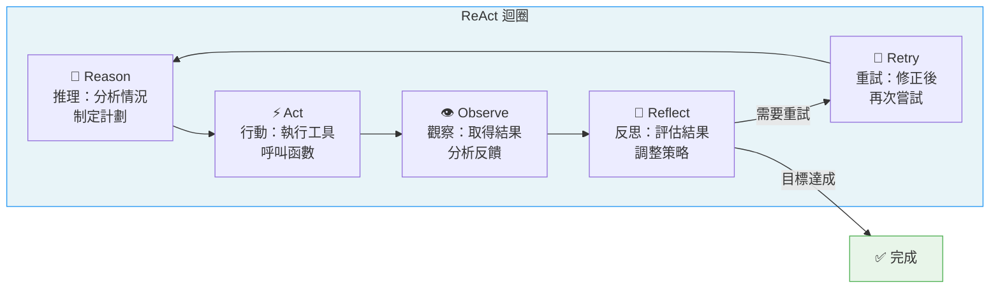

**ReAct 各階段詳解：**

**Reason（推理）**：AI 分析當前情況，制定行動計劃。這個階段包含：
- 理解任務目標
- 分析可用工具與資源
- 預測不同行動的後果
- 選擇最優策略

**Act（行動）**：執行具體操作，例如：
- 讀取檔案、搜尋程式碼
- 呼叫 API、執行指令
- 撰寫或修改程式碼
- 建立測試案例

**Observe（觀察）**：收集行動結果：
- 執行輸出（stdout/stderr）
- 測試結果（通過/失敗）
- 靜態分析報告
- 運行時錯誤訊息

**Reflect（反思）**：評估觀察到的結果：
- 結果是否符合預期？
- 哪些假設是錯誤的？
- 下一步策略應如何調整？

**Retry（重試）**：根據反思結果修正並重新執行：
- 修正邏輯錯誤
- 調整參數設定
- 嘗試不同方法

### 2.2　OODA Loop

OODA Loop 由美國空軍戰略家 John Boyd 設計，原用於軍事決策，後被廣泛應用於商業策略與技術決策。在 Loop Engineering 中，OODA 提供了更快速的決策框架。

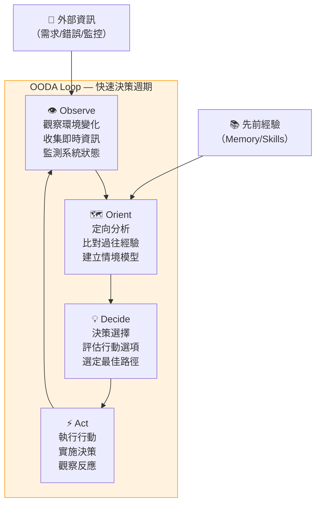

在 AI Agent 的應用中，OODA Loop 特別適合：
- **即時監控場景**：CI/CD 管線中的異常偵測與自動修復
- **高頻決策場景**：程式碼審查中的快速評判
- **競爭分析場景**：技術選型時的快速比較

### 2.3　PDCA 循環

PDCA（Plan-Do-Check-Act）源自品質管理之父戴明（W. Edwards Deming），是 Loop Engineering 中用於**長週期品質改善**的框架。

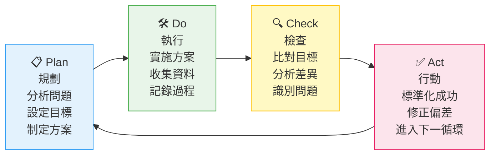

**PDCA 在 Loop Engineering 中的應用：**

| PDCA 階段 | Loop Engineering 對應行動 |
|----------|-------------------------|
| Plan | 定義任務目標、設計 Eval 標準、規劃 Agent 工作流程 |
| Do | Agent 執行編碼、測試、分析任務 |
| Check | 執行 Evals、比對輸出品質、分析失敗原因 |
| Act | 更新 Prompt、調整 Skill、改善 Memory，進入下一循環 |

### 2.4　Feedback Loop（反饋迴圈）

反饋迴圈是 Loop Engineering 的血脈，決定了整個系統的學習速度與品質上限。

**反饋來源分類：**

| 反饋類型 | 來源 | 時效性 | 用途 |
|---------|------|--------|------|
| 即時反饋 | 編譯錯誤、測試失敗 | 秒級 | 立即修正 |
| 短期反饋 | CI/CD 結果、PR 審查 | 分鐘級 | 流程改善 |
| 中期反饋 | 效能測試、使用者反饋 | 小時/天 | 策略調整 |
| 長期反饋 | 生產監控、業務指標 | 週/月 | 架構演進 |

**反饋迴路設計原則：**
1. **快速性**：反饋越快，修正成本越低
2. **精準性**：反饋訊號要能明確指出問題所在
3. **完整性**：覆蓋功能、效能、安全性等多個維度
4. **自動化**：儘量減少人工介入，提高迴圈速度

### 2.5　Self-Correction（自我修正）

Self-Correction 是 AI Agent 在無人工介入的情況下，自動識別並修正錯誤的能力。這是 Loop Engineering 區別於傳統自動化的核心特性。

**Self-Correction 觸發條件：**
- 測試失敗（Test Failure）
- 編譯錯誤（Compilation Error）
- 靜態分析警告（Lint Warning > 閾值）
- 效能回退（Performance Regression）
- 安全漏洞（Security Vulnerability Detected）

**Self-Correction 流程：**
```
錯誤發生 → 錯誤分類 → 策略選擇 → 修正執行 → 驗證修正 → 若仍失敗 → 升級處理
```

### 2.6　Reflection（反思機制）

Reflection 讓 AI 在完成任務後，對自身的思考過程進行分析與評估，是積累長期經驗的關鍵機制。

**反思的三個層次：**
1. **任務層次**：這次任務完成得好嗎？哪裡可以更好？
2. **策略層次**：使用的方法是最優的嗎？有沒有更好的路徑？
3. **知識層次**：這次任務學到了什麼新知識？如何更新 Skill Library？

### 2.7　Evals（評估機制）

Evals 是 Loop Engineering 的品質門禁，確保每次迴圈的輸出都達到標準。

**Evals 的設計原則（來自 Anthropic 最佳實務）：**
1. **定義明確的成功標準**（Success Criteria）
2. **使用多維度評估**（Functional + Security + Performance）
3. **建立基準線**（Baseline）便於比較
4. **自動化執行**，減少人工判斷
5. **持續更新**，跟隨需求演進

### 2.8　Reward Signal（獎勵訊號）

借鑒強化學習的概念，Reward Signal 是讓 AI Agent 知道「做對了」的機制。

**常見 Reward Signal 類型：**
- 測試全部通過（+正向獎勵）
- 效能指標改善（+正向獎勵）
- 安全漏洞消除（+正向獎勵）
- 程式碼覆蓋率提升（+正向獎勵）
- 測試失敗（-負向訊號）
- 安全漏洞引入（-負向訊號，高權重）

### 2.9　Goal-Driven Agent 與 Autonomous Agent

**Goal-Driven Agent（目標驅動 Agent）**：
- 由人類定義明確目標
- Agent 自主選擇達成路徑
- 人類監督迴圈品質
- 適合：90% 的企業應用場景

**Autonomous Agent（自主 Agent）**：
- Agent 自主定義子目標
- Agent 自主決策並執行
- 人類僅設定最高層約束
- 適合：特定研究或探索性任務
- 風險：需要嚴格的 Guardrails

> **企業建議**：在生產環境中，優先使用 Goal-Driven Agent，配合完善的 Evals 與 Guardrails。Autonomous Agent 僅在受控的沙盒環境中探索。

### 2.10　Anthropic 六大 Agent 工作流模式對照

前面九節介紹的 ReAct、OODA、PDCA 等理論，描述的是「單一迴圈內部」如何思考與行動。但企業實際導入時，更常遇到的問題是「多個迴圈／多個 Agent 之間應該如何組織」。Anthropic 在其工程部落格《Building Effective Agents》中，將業界常見的組織方式歸納為六種可組合的模式，這六種模式並非互斥，而是可以像積木一樣疊加使用：

| 模式 | 核心結構 | 適用情境 | 對應本手冊章節 |
|------|---------|---------|----------------|
| Augmented LLM | 單一 LLM + 工具呼叫 + 檢索 + 記憶 | 所有模式的基礎單元 | 第四章六大元件 |
| Prompt Chaining | 將任務拆成固定順序的子步驟，前一步輸出即為下一步輸入 | 子任務之間有明確線性依賴 | 第十四章 Prompt Library |
| Routing | 先分類輸入，再導向專門處理的子流程 | 任務類型多樣、需要不同專長處理 | 第六章 GitHub Copilot 路由 |
| Parallelization（Sectioning / Voting） | 將任務切割並行處理，或讓多個實例對同一任務投票取共識 | 子任務互相獨立、或需要降低單一輸出的變異性 | 3.2 Multi-Agent Architecture |
| Orchestrator-Workers | 中央協調者動態分派任務給多個工作者 Agent | 子任務數量與內容無法預先固定 | **3.4 Orchestrator-Worker Architecture** |
| Evaluator-Optimizer | 一個 Agent 產出、另一個 Agent 評估並給回饋，循環直到達標 | 品質可被明確評估、且有改進空間的任務 | **3.7 Judge Architecture** |

對照後可以發現，本手冊第三章「系統架構」中已實作的 Orchestrator-Worker（3.4）與 Judge（3.7）架構，正是 Anthropic 六模式中後兩種的具體企業級落地版本——這補上了先前章節「有架構圖、但缺乏明確理論命名」的缺口。

Anthropic 在原文中也強調兩個容易被忽略的實務建議，對 Loop Engineering 的落地同樣重要：

1. **從簡單開始，只在必要時增加複雜性**：多數任務用 Augmented LLM 或 Prompt Chaining 就足夠，Orchestrator-Workers 之類的複雜編排只在任務的不確定性真正需要動態分派時才有意義。過早引入複雜架構，等於提前支付本手冊 1.7 節所述的 **Orchestration Tax**。
2. **優先使用原生 LLM API，謹慎選擇框架**：框架可以加速原型開發，但也可能掩蓋底層實際送出的提示內容，增加除錯與優化的難度。企業導入 Loop Engineering 平台時，應確保框架層保留可觀測、可審視原始 Prompt／Context 的能力（對應第七章「建立企業級 Loop Engineering 平台」的可觀測性需求）。

### 2.11　進階理論：從 Agent Loop 到 Graph Harness 的排程理論觀點

前述所有模式，本質上都建立在「Agent Loop」這個執行骨架之上：一個迴圈，每一步只有一個待執行的決策。這個假設在學術文獻中已經有形式化的分析。一篇排程理論（Scheduling Theory）取向的研究（arXiv 2604.11378）提出了一個關鍵概念——**就緒集合基數（Readiness Set Cardinality，記作 |𝒰|）**：在任一執行步驟，系統中「已經準備好可以被執行」的工作單位數量。

該研究指出，傳統 Agent Loop 架構在任一時間點的就緒集合基數恆為 **|𝒰| = 1**——也就是說，無論底層任務的真實結構多麼適合並行，迴圈本身一次只能往前推進一個決策。這個結構性限制會衍生三種弱點：

1. **隱含依賴（Implicit Dependencies）**：任務之間的真實依賴關係沒有被顯式建模，只能依賴 Agent 在單一序列中「恰好」按正確順序處理。
2. **無界重試（Unbounded Retry）**：當某一步失敗時，缺乏分層的復原機制，迴圈往往只能整體重來或無限重試，而不是只回退到失敗的局部環節。
3. **計畫可被無聲覆寫（Silent Plan Override）**：由於沒有顯式的計畫節點與狀態追蹤，Agent 可能在後續步驟中不自覺地偏離原始計畫，且沒有機制偵測這種偏移。

相對地，研究將 **Graph Harness** 定義為就緒集合基數 **|𝒰| ≥ 1** 的執行模型：任務被建模為一張有向圖，圖中可以同時存在多個就緒節點，執行引擎能根據真實依賴關係動態決定下一步處理哪些節點。Graph Harness 並提出**三層遞升式復原協議（Escalating Recovery Protocol）**，作為失敗處理的標準作法：

```text
第一層：內部重試（Internal Retry）
  → 同一節點、同一上下文，重新嘗試一次（成本最低）
第二層：本地修補（Local Patch）
  → 重試失敗後，僅調整失敗節點周邊的局部計畫，不影響全局
第三層：全面重規劃（Full Replan）
  → 局部修補仍失敗，才觸發整張圖的重新規劃（成本最高、頻率應最低）
```

這個三層協議的核心價值，是把「失敗復原」也變成一個有結構、可分級的過程，而不是傳統 Agent Loop 常見的「成功繼續、失敗整段重來」二元結果。

> **定位說明**：截至本手冊撰寫時，Graph Harness 仍主要存在於學術研究與少數前沿工具的實驗性實作中，尚未成為業界主流的生產級架構。本節將其納入手冊，目的是為**第十八章「未來發展」**提供嚴謹的理論依據——它指出了當前 Agent Loop 架構在排程理論上的天花板，也預告了下一代企業 Loop Engineering 平台可能演進的方向（見 [[第十八章]]）。

### 2.12　最小可行實作：Ralph Wiggum Technique

與前兩節的理論深度相反，**Ralph Wiggum Technique** 代表了 Loop Engineering 光譜的另一個極端——用最少的程式碼證明「迴圈」這個概念本身的威力。這個技巧由獨立工程師 **Geoffrey Huntley** 提出並命名（取自《辛普森家庭》中天真反覆的角色 Ralph Wiggum），核心只是一行 Shell 指令：

```bash
while :; do cat PROMPT.md | claude-code; done
```

這行指令不斷將同一份提示檔案餵給 AI Coding Agent，沒有複雜的編排、沒有 Sub-agent、沒有 Worktrees 隔離。它能work的關鍵在於兩個概念：

- **Backpressure（反饋壓力）**：迴圈本身不檢查任務是否完成，而是依賴外部的「壓力源」——測試套件、Linter、編譯器——作為事實上的停止訊號。只要 `PROMPT.md` 中明確要求 Agent 必須讓測試通過才能停手，測試失敗本身就會持續把 Agent 推回工作狀態。
- **Context Rot（上下文腐化）**：隨著迴圈不斷重複，累積在對話歷史中的上下文會逐漸偏離當前真實狀態（例如包含已經修正過的舊錯誤訊息），導致 Agent 的判斷力隨迴圈次數增加而下降。Ralph Wiggum Technique 的應對方式是**每次迴圈都用全新的上下文重新呼叫**，只靠檔案系統中的狀態（而非對話記憶）傳遞進度。

實務上，這個技巧延伸出一套簡化的兩階段三檔案結構：

| 階段 | 用途 | 對應檔案 |
|------|------|---------|
| Plan（規劃） | 讓 Agent 先產出或更新任務拆解 | `AGENTS.md`、`PROMPT_plan.md` |
| Build（建構） | 讓 Agent 依計畫逐項實作並驗證 | `IMPLEMENTATION_PLAN.md`、`PROMPT_build.md` |

**與本手冊主軸架構的定位對比**：

| 維度 | Ralph Wiggum Technique | 本手冊六大元件架構（第四章） |
|------|------------------------|------------------------------|
| 複雜度 | 一行 Shell 迴圈 | Automations + Worktrees + Skills + Plugins + Sub-agents + Memory |
| 隔離性 | 無（單一工作目錄反覆覆寫） | Worktrees 提供並行隔離 |
| 驗證機制 | 依賴外部測試/Lint 作為唯一壓力源 | Reviewer／Judge／Evals 多層驗證 |
| 適用規模 | 個人實驗、小型專案、概念驗證 | 企業級、多團隊、需審計的生產系統 |
| 上手成本 | 近乎零 | 需要平台建置（見第七章） |

**企業建議**：Ralph Wiggum Technique 證明了「迴圈」這個核心概念即使不依賴複雜架構也能產生價值，適合用於個人驗證 Loop Engineering 概念或小型專案的快速起步。但它缺乏 Worktrees 隔離、Sub-agent 分工驗證、Memory 結構化管理等企業級保障，**不建議直接套用於正式生產環境**——企業場景應以本手冊第三、四章的結構化架構為主，將 Ralph Wiggum Technique 視為理解迴圈本質的最小教學範例。

---

## 第三章　Loop Engineering 系統架構

### 3.1　企業級 Loop Engineering 完整架構

```mermaid
graph TB
    subgraph HumanLayer["人類層 Human Layer"]
        PM["產品經理\nProduct Manager"]
        SA["系統架構師\nSolution Architect"]
        TL["技術主管\nTech Lead"]
    end

    subgraph GovernanceLayer["治理層 Governance Layer"]
        Policy["政策引擎\nPolicy Engine"]
        Audit["稽核日誌\nAudit Log"]
        RBAC["權限控制\nRBAC"]
    end

    subgraph OrchestratorLayer["協調層 Orchestrator Layer"]
        Orchestrator["主控 Agent\nOrchestrator"]
        TaskQueue["任務佇列\nTask Queue"]
        Scheduler["排程器\nScheduler"]
    end

    subgraph AgentLayer["Agent 執行層"]
        PlannerAgent["規劃 Agent\nPlanner"]
        CoderAgent["編碼 Agent\nCoder"]
        ReviewerAgent["審查 Agent\nReviewer"]
        TesterAgent["測試 Agent\nTester"]
        SecurityAgent["安全 Agent\nSecurity"]
    end

    subgraph SkillMemoryLayer["技能記憶層"]
        SkillLib["技能庫\nSkill Library"]
        ShortMem["短期記憶\nShort-term Memory"]
        LongMem["長期記憶\nLong-term Memory"]
        VectorDB["向量資料庫\nVector DB"]
    end

    subgraph ToolLayer["工具層 Tool Layer"]
        CodeTool["程式碼工具\n(Read/Write/Edit)"]
        SearchTool["搜尋工具\n(Grep/Glob)"]
        BashTool["Shell 工具\n(Bash/PowerShell)"]
        MCPTool["MCP 工具\n(外部服務)"]
    end

    subgraph EvalLayer["評估層 Eval Layer"]
        FuncEval["功能評估\nFunctional Eval"]
        SecEval["安全評估\nSecurity Eval"]
        PerfEval["效能評估\nPerformance Eval"]
        QualEval["品質評估\nQuality Eval"]
    end

    subgraph FeedbackLayer["反饋層 Feedback Layer"]
        TestResult["測試結果\nTest Results"]
        LintResult["靜態分析\nLint Results"]
        BuildResult["建置結果\nBuild Results"]
        ReviewFeedback["審查意見\nReview Feedback"]
    end

    subgraph AutomationLayer["自動化層 Automation Layer"]
        GHActions["GitHub Actions"]
        Jenkins["Jenkins"]
        GitLabCI["GitLab CI"]
    end

    subgraph MonitoringLayer["監控層 Monitoring Layer"]
        Metrics["指標監控\nMetrics"]
        Logs["日誌管理\nLogs"]
        Traces["追蹤分析\nTraces"]
        Alerts["告警系統\nAlerts"]
    end

    HumanLayer -->|"任務定義"| GovernanceLayer
    GovernanceLayer -->|"授權任務"| OrchestratorLayer
    OrchestratorLayer -->|"分配任務"| AgentLayer
    AgentLayer -->|"查詢技能/記憶"| SkillMemoryLayer
    AgentLayer -->|"呼叫工具"| ToolLayer
    AgentLayer -->|"提交評估"| EvalLayer
    ToolLayer -->|"執行結果"| FeedbackLayer
    FeedbackLayer -->|"反饋訊號"| AgentLayer
    EvalLayer -->|"評估結果"| OrchestratorLayer
    AutomationLayer -->|"觸發 Loop"| OrchestratorLayer
    MonitoringLayer -->|"生產反饋"| GovernanceLayer

    style HumanLayer fill:#e3f2fd,stroke:#1565C0
    style GovernanceLayer fill:#fce4ec,stroke:#880E4F
    style OrchestratorLayer fill:#e8f5e9,stroke:#1B5E20
    style AgentLayer fill:#fff3e0,stroke:#E65100
    style SkillMemoryLayer fill:#f3e5f5,stroke:#4A148C
    style ToolLayer fill:#e0f2f1,stroke:#004D40
    style EvalLayer fill:#fff8e1,stroke:#F57F17
    style FeedbackLayer fill:#fbe9e7,stroke:#BF360C
    style AutomationLayer fill:#e8eaf6,stroke:#1A237E
    style MonitoringLayer fill:#f1f8e9,stroke:#33691E
```

### 3.2　Multi-Agent Architecture（多 Agent 架構）

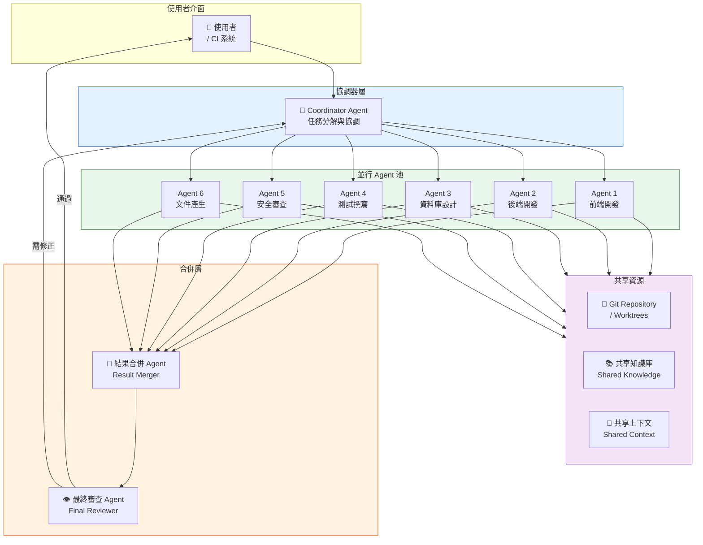

### 3.3　Agent Mesh Architecture（Agent 網格架構）

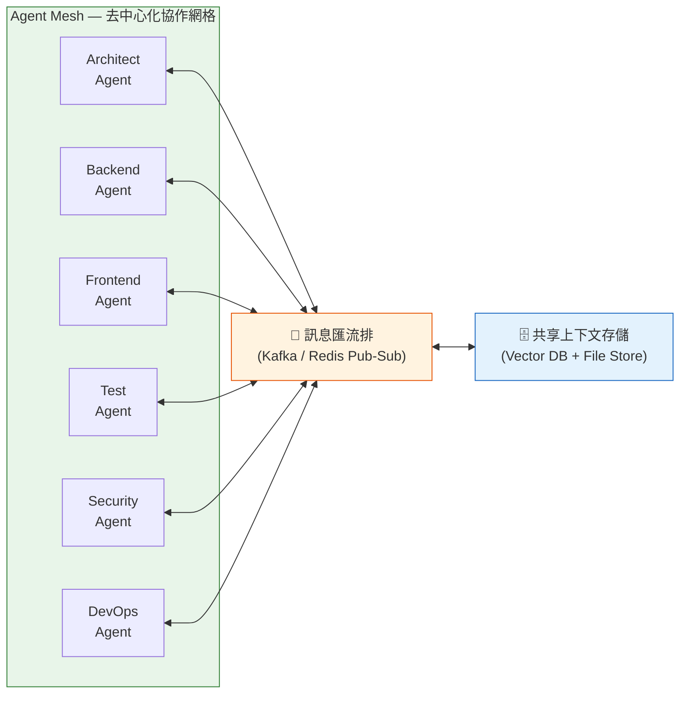

### 3.4　Orchestrator-Worker Architecture（協調者-工作者架構）

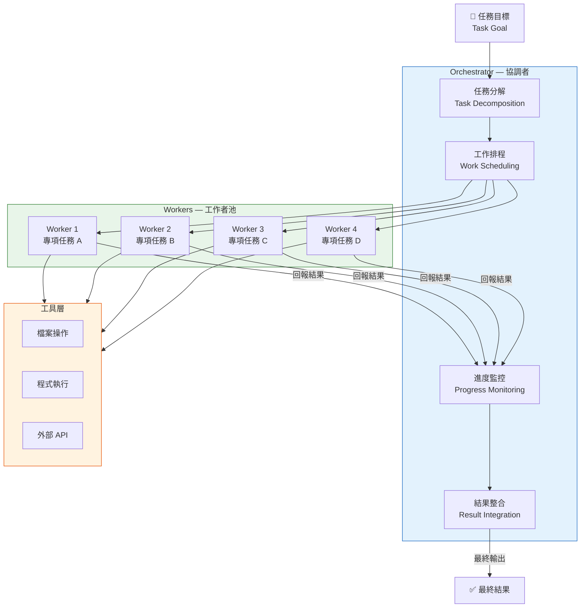

### 3.5　Planner-Executor Architecture（規劃者-執行者架構）

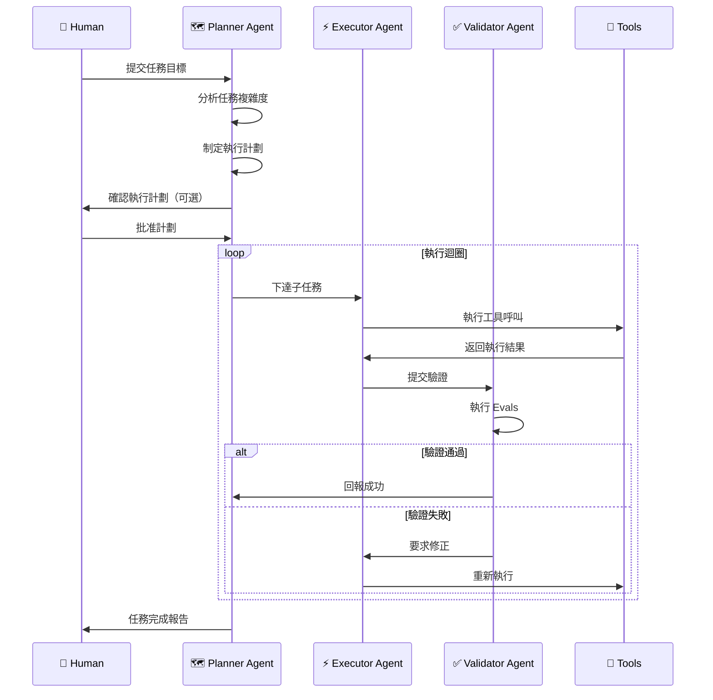

### 3.6　Reviewer Architecture（審查者架構）

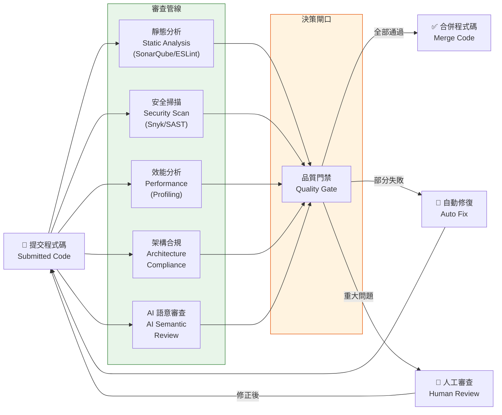

### 3.7　Judge Architecture（評判者架構）

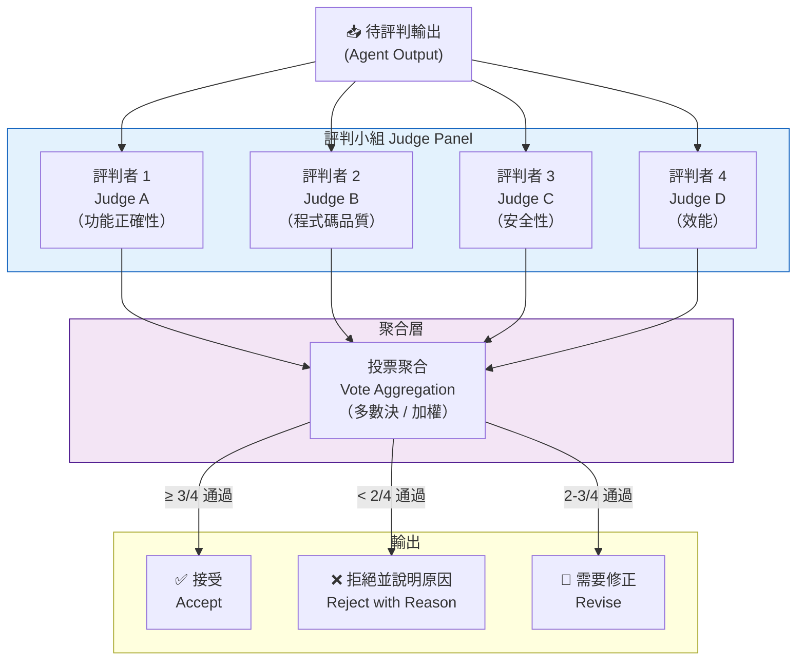

---

## 第四章　六大核心元件

### 4.1　Automations（自動化）

Automations 是 Loop Engineering 的執行引擎，負責在正確的時間觸發正確的迴圈。

#### 4.1.1　GitHub Actions

```yaml
# .github/workflows/loop-engineering.yml
name: Loop Engineering Pipeline

on:
  push:
    branches: [main, develop]
  pull_request:
    branches: [main]
  schedule:
    - cron: '0 2 * * *'  # 每日凌晨 2 點執行

env:
  JAVA_VERSION: '21'
  MAVEN_OPTS: '-Xmx4g'

jobs:
  # 第一階段：程式碼品質分析 Loop
  code-quality-loop:
    runs-on: ubuntu-latest
    steps:
      - uses: actions/checkout@v4
        with:
          fetch-depth: 0  # 完整歷史，供 SonarQube 分析

      - name: Setup Java
        uses: actions/setup-java@v4
        with:
          java-version: ${{ env.JAVA_VERSION }}
          distribution: 'temurin'
          cache: maven

      - name: Build & Test
        run: mvn verify -B --no-transfer-progress

      - name: SonarQube Analysis
        run: |
          mvn sonar:sonar \
            -Dsonar.projectKey=${{ github.repository }} \
            -Dsonar.host.url=${{ secrets.SONAR_HOST_URL }} \
            -Dsonar.login=${{ secrets.SONAR_TOKEN }}

      - name: Quality Gate Check
        run: |
          status=$(curl -s "${{ secrets.SONAR_HOST_URL }}/api/qualitygates/project_status?projectKey=${{ github.repository }}" \
            -H "Authorization: Bearer ${{ secrets.SONAR_TOKEN }}" | jq -r '.projectStatus.status')
          if [ "$status" != "OK" ]; then
            echo "Quality Gate 失敗: $status"
            exit 1
          fi

  # 第二階段：AI Agent 自動修復 Loop
  ai-auto-fix-loop:
    needs: code-quality-loop
    if: failure()
    runs-on: ubuntu-latest
    steps:
      - uses: actions/checkout@v4

      - name: AI Auto Fix
        uses: anthropics/claude-code-action@v1
        with:
          anthropic-api-key: ${{ secrets.ANTHROPIC_API_KEY }}
          prompt: |
            分析本次 CI 失敗的原因，自動修復所有編譯錯誤與測試失敗。
            優先修復安全漏洞。修復完成後建立 Pull Request。
          tools: read,write,bash,github

  # 第三階段：安全掃描 Loop
  security-scan-loop:
    runs-on: ubuntu-latest
    steps:
      - uses: actions/checkout@v4

      - name: Dependency Vulnerability Scan
        run: |
          mvn dependency-check:check \
            -DfailBuildOnCVSS=7 \
            -DsuppressionFile=.github/security/suppressions.xml

      - name: Secret Scan
        uses: trufflesecurity/trufflehog@main
        with:
          path: ./
          base: ${{ github.event.repository.default_branch }}

      - name: Container Scan
        uses: aquasecurity/trivy-action@master
        with:
          image-ref: ${{ github.repository }}:latest
          format: sarif
          output: trivy-results.sarif

      - name: Upload SARIF
        uses: github/codeql-action/upload-sarif@v3
        with:
          sarif_file: trivy-results.sarif
```

#### 4.1.2　Jenkins Pipeline

```groovy
// Jenkinsfile — Loop Engineering Pipeline
pipeline {
    agent any

    environment {
        JAVA_HOME = tool 'JDK-21'
        MAVEN_HOME = tool 'Maven-3.9'
        PATH = "${JAVA_HOME}/bin:${MAVEN_HOME}/bin:${PATH}"
        SONAR_URL = credentials('sonar-url')
        ANTHROPIC_KEY = credentials('anthropic-api-key')
    }

    options {
        timeout(time: 60, unit: 'MINUTES')
        buildDiscarder(logRotator(numToKeepStr: '10'))
        timestamps()
    }

    stages {
        stage('Checkout') {
            steps {
                checkout scm
                sh 'git log --oneline -5'
            }
        }

        stage('Build Loop') {
            steps {
                sh 'mvn clean compile -B -q'
            }
            post {
                failure {
                    script {
                        def error = sh(script: 'mvn clean compile -B 2>&1 | tail -50', returnStdout: true)
                        // 觸發 AI 修復迴圈
                        sh """
                            claude-code fix-compilation \
                              --error "${error}" \
                              --auto-commit \
                              --branch fix/auto-${BUILD_NUMBER}
                        """
                    }
                }
            }
        }

        stage('Test Loop') {
            parallel {
                stage('Unit Tests') {
                    steps {
                        sh 'mvn test -B -Dtest=**/*Test.java'
                    }
                }
                stage('Integration Tests') {
                    steps {
                        sh 'mvn verify -B -Dtest=**/*IT.java'
                    }
                }
            }
            post {
                always {
                    junit '**/target/surefire-reports/*.xml'
                    publishHTML(target: [
                        reportDir: 'target/site/jacoco',
                        reportFiles: 'index.html',
                        reportName: 'Code Coverage'
                    ])
                }
            }
        }

        stage('Quality Gate Loop') {
            steps {
                withSonarQubeEnv('SonarQube') {
                    sh 'mvn sonar:sonar'
                }
                timeout(time: 5, unit: 'MINUTES') {
                    waitForQualityGate abortPipeline: true
                }
            }
        }

        stage('Security Loop') {
            steps {
                sh '''
                    mvn dependency-check:check -DfailBuildOnCVSS=8
                    trivy fs --exit-code 1 --severity CRITICAL .
                    gitleaks detect --source=. --report-format=json
                '''
            }
        }

        stage('Deploy Loop') {
            when { branch 'main' }
            steps {
                sh '''
                    podman build -t ${APP_IMAGE}:${BUILD_NUMBER} .
                    podman push ${APP_IMAGE}:${BUILD_NUMBER}
                    kubectl set image deployment/${APP_NAME} \
                      ${APP_NAME}=${APP_IMAGE}:${BUILD_NUMBER} \
                      -n production
                    kubectl rollout status deployment/${APP_NAME} -n production
                '''
            }
        }
    }
}
```

#### 4.1.3　GitLab CI、Azure DevOps、Cron 範例

```yaml
# .gitlab-ci.yml
stages:
  - build
  - test
  - quality
  - security
  - deploy

variables:
  MAVEN_OPTS: "-Dmaven.repo.local=$CI_PROJECT_DIR/.m2/repository"

build:
  stage: build
  image: eclipse-temurin:21-jdk
  cache:
    paths: [.m2/repository]
  script:
    - mvn clean compile -B -q

test:
  stage: test
  script:
    - mvn verify -B
  artifacts:
    reports:
      junit: target/surefire-reports/TEST-*.xml
      coverage_report:
        coverage_format: jacoco
        path: target/site/jacoco/jacoco.xml

sonarqube-check:
  stage: quality
  script:
    - mvn verify sonar:sonar
      -Dsonar.qualitygate.wait=true
      -Dsonar.host.url=$SONAR_HOST_URL
      -Dsonar.login=$SONAR_TOKEN
```

```yaml
# azure-pipelines.yml
trigger:
  branches:
    include: [main, develop]

pool:
  vmImage: ubuntu-latest

variables:
  javaVersion: 21

stages:
  - stage: LoopEngineeringPipeline
    jobs:
      - job: BuildTestLoop
        steps:
          - task: JavaToolInstaller@0
            inputs:
              versionSpec: $(javaVersion)
              jdkArchitectureOption: x64
              jdkSourceOption: PreInstalled
          - task: Maven@4
            inputs:
              mavenPomFile: pom.xml
              goals: verify
              publishJUnitResults: true
              testResultsFiles: '**/TEST-*.xml'
              codeCoverageToolOption: JaCoCo
```

```bash
# Cron Job 設定範例（crontab）
# 每日凌晨 3 點執行程式碼健康檢查 Loop
0 3 * * * /opt/loop-engineering/scripts/daily-health-check.sh >> /var/log/loop-engine.log 2>&1

# 每小時執行安全掃描 Loop
0 * * * * /opt/loop-engineering/scripts/security-scan.sh >> /var/log/security-scan.log 2>&1

# 每週一早上 9 點執行技術債務分析 Loop
0 9 * * 1 /opt/loop-engineering/scripts/tech-debt-analysis.sh >> /var/log/tech-debt.log 2>&1

# 每 15 分鐘檢查生產環境健康狀態
*/15 * * * * /opt/loop-engineering/scripts/prod-health-monitor.sh
```

### 4.2　Worktrees（工作樹）

Git Worktree 是 Loop Engineering 中實現**並行開發**的關鍵基礎設施，允許多個 Agent 同時在不同分支上工作，而不需要多個完整的 Repository Clone。

#### 4.2.1　Git Worktree 基礎操作

```bash
# === Git Worktree 完整操作指南 ===

# 查看目前所有 Worktrees
git worktree list
# 輸出範例：
# /home/user/project      a1b2c3d [main]
# /home/user/project-feat d4e5f6a [feature/new-api]
# /home/user/project-fix  g7h8i9b [bugfix/login]

# 新增 Worktree（從現有分支）
git worktree add ../project-feature feature/new-payment

# 新增 Worktree（建立新分支）
git worktree add -b feature/user-profile ../project-profile

# 新增 Worktree（Detached HEAD 模式，用於只讀分析）
git worktree add --detach ../project-analyze v2.1.0

# 新增 Worktree（從遠端分支）
git worktree add ../project-hotfix origin/hotfix/critical-bug

# 移除 Worktree（正常移除）
git worktree remove ../project-feature

# 強制移除（忽略未提交的變更）
git worktree remove --force ../project-feature

# 清理廢棄的 Worktree 記錄
git worktree prune

# 鎖定 Worktree（防止被意外移除）
git worktree lock ../project-feature --reason "Agent 正在使用此 Worktree"

# 解鎖 Worktree
git worktree unlock ../project-feature

# 查看 Worktree 詳細狀態
git worktree list --porcelain
```

#### 4.2.2　多 Agent 並行開發工作流程

```bash
# === 多 Agent 並行開發 SOP ===

# Step 1: 主倉庫設置
REPO_ROOT="/workspace/myproject"
WORKTREE_BASE="/workspace/worktrees"
mkdir -p "$WORKTREE_BASE"

# Step 2: 建立各 Agent 的 Worktree
# Agent 1: 後端 API 開發
git worktree add -b feature/api-v2 "$WORKTREE_BASE/api-development" main

# Agent 2: 前端 UI 開發
git worktree add -b feature/ui-redesign "$WORKTREE_BASE/ui-development" main

# Agent 3: 資料庫 Migration
git worktree add -b feature/db-migration "$WORKTREE_BASE/db-migration" main

# Agent 4: 測試撰寫
git worktree add -b feature/test-coverage "$WORKTREE_BASE/testing" main

# Step 3: 確認所有 Worktrees 狀態
git worktree list

# Step 4: 在各 Worktree 中執行 Agent（並行）
# 每個 Agent 在其 Worktree 中獨立工作
cd "$WORKTREE_BASE/api-development" && claude-code implement-api &
cd "$WORKTREE_BASE/ui-development" && claude-code implement-ui &
cd "$WORKTREE_BASE/testing" && claude-code write-tests &

# Step 5: 等待所有 Agent 完成
wait

# Step 6: 合併所有結果
cd "$REPO_ROOT"
git merge feature/api-v2
git merge feature/ui-redesign
git merge feature/test-coverage

# Step 7: 清理 Worktrees
git worktree remove "$WORKTREE_BASE/api-development"
git worktree remove "$WORKTREE_BASE/ui-development"
git worktree remove "$WORKTREE_BASE/db-migration"
git worktree remove "$WORKTREE_BASE/testing"
git worktree prune
```

#### 4.2.3　Worktree 實務最佳實踐

```bash
# 建立 Worktree 管理腳本
cat > /usr/local/bin/loop-worktree << 'EOF'
#!/bin/bash
# Loop Engineering Worktree Manager

COMMAND=$1
TASK_NAME=$2
BASE_BRANCH="${3:-main}"

case "$COMMAND" in
  create)
    TIMESTAMP=$(date +%Y%m%d-%H%M%S)
    BRANCH="loop/${TASK_NAME}-${TIMESTAMP}"
    WORKTREE_PATH="../worktree-${TASK_NAME}"
    git worktree add -b "$BRANCH" "$WORKTREE_PATH" "$BASE_BRANCH"
    echo "Worktree 建立於: $WORKTREE_PATH"
    echo "分支: $BRANCH"
    ;;
  cleanup)
    git worktree list | grep "loop/" | awk '{print $1}' | while read wt; do
      git worktree remove "$wt" 2>/dev/null || git worktree remove --force "$wt"
    done
    git worktree prune
    echo "所有 Loop Worktrees 已清理"
    ;;
  list)
    git worktree list
    ;;
esac
EOF
chmod +x /usr/local/bin/loop-worktree

# 使用範例
loop-worktree create payment-feature main
loop-worktree list
loop-worktree cleanup
```

### 4.3　Skills（技能庫）

Skills 是 AI Agent 的可重用知識單元，封裝了特定領域的最佳實務、工作流程和行為模式。

#### 4.3.1　Skill Library 目錄結構

```
skills/
├── coding/
│   ├── java-spring-boot.md       # Spring Boot 開發技能
│   ├── vue3-typescript.md         # Vue3 + TypeScript 技能
│   ├── clean-code.md              # Clean Code 技能
│   ├── design-patterns.md         # 設計模式應用技能
│   ├── api-design.md              # RESTful API 設計技能
│   └── database-optimization.md  # 資料庫優化技能
├── architecture/
│   ├── microservices.md           # 微服務架構技能
│   ├── hexagonal-architecture.md  # 六角形架構技能
│   ├── ddd.md                     # DDD 領域驅動設計技能
│   ├── event-driven.md            # 事件驅動架構技能
│   └── cloud-native.md            # Cloud Native 技能
├── testing/
│   ├── unit-testing-junit5.md     # JUnit 5 單元測試技能
│   ├── integration-testing.md     # 整合測試技能
│   ├── e2e-testing-playwright.md  # E2E 測試技能
│   ├── performance-testing.md     # 效能測試技能
│   └── security-testing.md        # 安全測試技能
├── security/
│   ├── owasp-top10.md             # OWASP Top 10 技能
│   ├── sast-analysis.md           # 靜態分析技能
│   ├── dependency-scanning.md     # 相依套件掃描技能
│   ├── secrets-management.md      # 秘密管理技能
│   └── threat-modeling.md         # 威脅建模技能
└── migration/
    ├── java6-to-java21.md          # Java 版本升級技能
    ├── struts-to-spring-boot.md    # Struts 遷移技能
    ├── jsp-to-vue3.md              # JSP 遷移技能
    ├── spring-boot-2-to-3.md       # Spring Boot 升級技能
    └── monolith-to-microservices.md # 單體到微服務技能
```

#### 4.3.2　Skill 檔案格式範例

````markdown
---
skill: spring-boot-rest-api
version: 2.0
tags: [java, spring-boot, rest-api, backend]
applicable-models: [claude-3-5-sonnet, claude-opus-4]
---

# Spring Boot REST API 開發技能

## 適用情境
開發符合企業標準的 Spring Boot REST API，包含安全性、效能、可觀測性。

## 核心原則
1. 遵循 REST 語意（正確使用 HTTP 動詞與狀態碼）
2. 使用 DTO 層隔離領域模型與 API 契約
3. 實作統一的錯誤處理（GlobalExceptionHandler）
4. 所有 API 必須有對應的 OpenAPI 文件

## 標準程式碼結構

```java
@RestController
@RequestMapping("/api/v1/customers")
@RequiredArgsConstructor
@Validated
public class CustomerController {
    private final CustomerService customerService;

    @GetMapping("/{id}")
    public ResponseEntity<CustomerDto> findById(
            @PathVariable @Positive Long id) {
        return ResponseEntity.ok(customerService.findById(id));
    }

    @PostMapping
    public ResponseEntity<CustomerDto> create(
            @RequestBody @Valid CreateCustomerRequest request) {
        CustomerDto created = customerService.create(request);
        return ResponseEntity.created(
            URI.create("/api/v1/customers/" + created.id())
        ).body(created);
    }
}
```

## 禁止事項
- 不得在 Controller 直接存取 Repository
- 不得回傳 Entity 物件（必須使用 DTO）
- 不得忽略輸入驗證
````

### 4.4　Plugins & Connectors（外掛與連接器）

Plugins & Connectors 讓 Loop Engineering 平台能與企業現有工具生態系整合。

#### 4.4.1　MCP（Model Context Protocol）連接器整合

```json
// .claude/mcp-config.json — 企業級 MCP 連接器設定
{
  "mcpServers": {
    "github": {
      "command": "npx",
      "args": ["-y", "@modelcontextprotocol/server-github"],
      "env": {
        "GITHUB_PERSONAL_ACCESS_TOKEN": "${GITHUB_TOKEN}"
      }
    },
    "jira": {
      "command": "npx",
      "args": ["-y", "@mcp-servers/jira"],
      "env": {
        "JIRA_URL": "${JIRA_URL}",
        "JIRA_USERNAME": "${JIRA_USERNAME}",
        "JIRA_API_TOKEN": "${JIRA_API_TOKEN}"
      }
    },
    "sonarqube": {
      "command": "npx",
      "args": ["-y", "@mcp-servers/sonarqube"],
      "env": {
        "SONAR_URL": "${SONAR_HOST_URL}",
        "SONAR_TOKEN": "${SONAR_TOKEN}"
      }
    },
    "kubernetes": {
      "command": "npx",
      "args": ["-y", "@mcp-servers/kubernetes"],
      "env": {
        "KUBECONFIG": "${HOME}/.kube/config"
      }
    },
    "slack": {
      "command": "npx",
      "args": ["-y", "@modelcontextprotocol/server-slack"],
      "env": {
        "SLACK_BOT_TOKEN": "${SLACK_BOT_TOKEN}",
        "SLACK_TEAM_ID": "${SLACK_TEAM_ID}"
      }
    },
    "postgresql": {
      "command": "npx",
      "args": ["-y", "@modelcontextprotocol/server-postgres"],
      "env": {
        "POSTGRES_CONNECTION_STRING": "${DATABASE_URL}"
      }
    },
    "confluence": {
      "command": "npx",
      "args": ["-y", "@mcp-servers/confluence"],
      "env": {
        "CONFLUENCE_URL": "${CONFLUENCE_URL}",
        "CONFLUENCE_TOKEN": "${CONFLUENCE_API_TOKEN}"
      }
    },
    "snyk": {
      "command": "npx",
      "args": ["-y", "@mcp-servers/snyk"],
      "env": {
        "SNYK_TOKEN": "${SNYK_TOKEN}"
      }
    }
  }
}
```

#### 4.4.2　SonarQube 整合 CLI

```bash
# SonarQube 掃描與結果查詢
# 執行掃描
sonar-scanner \
  -Dsonar.projectKey=my-banking-app \
  -Dsonar.sources=src/main/java \
  -Dsonar.tests=src/test/java \
  -Dsonar.java.binaries=target/classes \
  -Dsonar.host.url=https://sonarqube.company.com \
  -Dsonar.login=$SONAR_TOKEN

# 查詢掃描結果
curl -s "https://sonarqube.company.com/api/measures/component?component=my-banking-app&metricKeys=bugs,vulnerabilities,code_smells,coverage,duplicated_lines_density" \
  -H "Authorization: Bearer $SONAR_TOKEN" | jq '.component.measures'

# 查詢 Quality Gate 狀態
curl -s "https://sonarqube.company.com/api/qualitygates/project_status?projectKey=my-banking-app" \
  -H "Authorization: Bearer $SONAR_TOKEN" | jq '.projectStatus.status'

# 建立新的 Quality Gate 規則（via CLI）
curl -X POST "https://sonarqube.company.com/api/qualitygates/create_condition" \
  -H "Authorization: Bearer $SONAR_TOKEN" \
  -d "gateId=1&metric=new_security_rating&op=GT&error=1"
```

### 4.5　Sub-agents（子 Agent）

Sub-agents 是 Loop Engineering 中執行具體任務的專業化 AI 單元，每個 Agent 有明確的職責邊界。

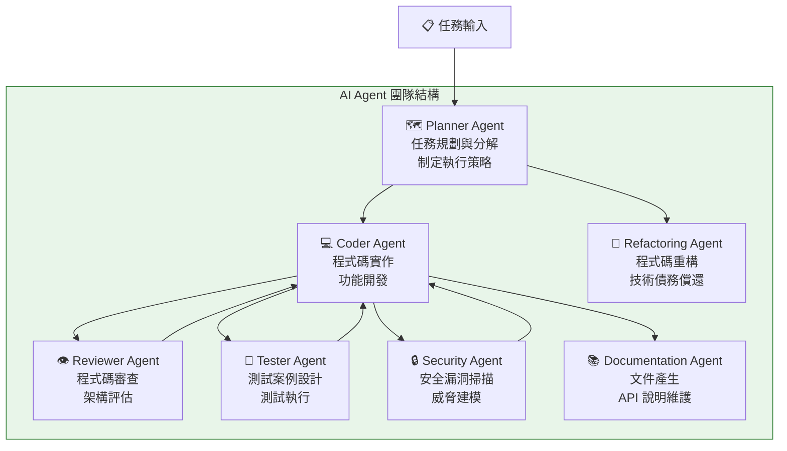

**各 Sub-agent 職責說明：**

| Agent 名稱 | 核心職責 | 輸入 | 輸出 |
|-----------|---------|------|------|
| Planner | 任務分解、制定執行計劃 | 需求說明 | 執行計劃書 |
| Coder | 實作功能程式碼 | 設計規格 | 完整程式碼 |
| Reviewer | 程式碼審查與架構評估 | 程式碼 | 審查報告 |
| Tester | 設計並執行測試案例 | 程式碼 + 需求 | 測試報告 |
| Security | 安全漏洞識別與修復 | 程式碼 + 設定 | 安全報告 |
| Refactoring | 重構與優化 | 技術債務清單 | 重構後程式碼 |
| Documentation | 技術文件產生 | 程式碼 + API | 技術文件 |

### 4.6　Memory（記憶系統）

Memory 系統讓 AI Agent 能夠跨任務保留關鍵知識，是 Loop Engineering 中實現持續進步的核心機制。

```bash
# Claude Code 記憶系統目錄結構
~/.claude/
├── MEMORY.md              # 記憶索引（自動載入）
└── projects/
    └── my-project/
        └── memory/
            ├── user_profile.md          # 使用者偏好記憶
            ├── project_context.md       # 專案背景記憶
            ├── feedback_preferences.md  # 反饋偏好記憶
            ├── tech_decisions.md        # 技術決策記憶
            └── lessons_learned.md       # 教訓記憶
```

**記憶類型詳解：**

| 記憶類型 | 儲存內容 | 生命週期 | 存取方式 |
|---------|---------|---------|---------|
| Short-term Memory | 當前對話上下文 | 單次對話 | 自動（Context Window）|
| Long-term Memory | 跨對話的重要決策 | 永久 | 檔案系統 |
| Vector Memory | 語意搜尋的知識片段 | 永久 | 向量資料庫 |
| File Memory | 程式碼規範、架構決策 | 版本控制 | CLAUDE.md |
| Knowledge Memory | 領域知識、最佳實務 | 版本控制 | Skill Library |

```bash
# 記憶管理 CLI 範例

# 查看目前所有記憶
ls ~/.claude/projects/$(basename $PWD)/memory/

# 查看記憶索引
cat ~/.claude/projects/$(basename $PWD)/memory/MEMORY.md

# 手動更新記憶（通常由 AI 自動完成）
echo "# 技術決策記憶
- 2026-06 決定使用 PostgreSQL（理由：需要 JSON 支援與強一致性）
- 2026-06 採用 Hexagonal Architecture（理由：可測試性與可維護性）
" > ~/.claude/projects/$(basename $PWD)/memory/tech_decisions.md

# 查看 CLAUDE.md（全局記憶）
cat CLAUDE.md
```

---

## 第五章　Claude Code 中的 Loop Engineering

### 5.1　Claude Code 架構概述

Claude Code 是 Anthropic 官方的 AI 程式設計 CLI 工具，天然支援 Loop Engineering 的所有核心概念。

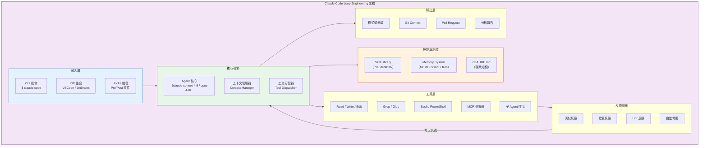

### 5.2　CLAUDE.md — 專案知識核心

```markdown
<!-- CLAUDE.md — 放在專案根目錄 -->
# 專案背景
這是一個企業網路銀行系統，使用 Java 21 + Spring Boot 3.5 + Vue 3。

# 技術棧
- Backend: Java 21, Spring Boot 3.5, Spring Security 6, Spring Data JPA
- Frontend: Vue 3.5, TypeScript 5.5, TailwindCSS 4
- Database: PostgreSQL 16（主），Redis 7（快取）
- Messaging: Kafka 3.7
- Container: Podman 5 / OpenShift 4.16

# 程式碼規範
- 使用 Lombok，禁止 Getter/Setter 手寫
- 所有 API 回應使用 ApiResponse<T> 包裝
- 禁止在 Service 層直接使用 HttpServletRequest
- 測試覆蓋率要求：≥ 80%
- 所有 Controller 需有對應的整合測試

# 安全性規範
- 所有使用者輸入必須驗證（@Valid + Bean Validation）
- 敏感資料（密碼/帳號）不得出現在日誌
- SQL 必須使用 Prepared Statement（JPA 自動處理）
- 每個功能需要進行 OWASP Top 10 自我審查

# Agent 工作規範
- 不得跳過測試直接提交
- 每次修改後必須執行 mvn verify
- 禁止修改 pom.xml 中的安全相關依賴版本
- 有疑問時優先查詢 skills/ 目錄
```

### 5.3　Hooks（鉤子機制）

Hooks 讓 Claude Code 能在特定事件發生時自動觸發迴圈。

```json
// .claude/settings.json
{
  "hooks": {
    "PreToolUse": [
      {
        "matcher": "Bash",
        "hooks": [
          {
            "type": "command",
            "command": "echo '🔍 執行 Bash 指令前檢查安全性...'"
          }
        ]
      }
    ],
    "PostToolUse": [
      {
        "matcher": "Write",
        "hooks": [
          {
            "type": "command",
            "command": "if [ -f '*.java' ]; then mvn checkstyle:check -q 2>&1; fi"
          }
        ]
      },
      {
        "matcher": "Edit",
        "hooks": [
          {
            "type": "command",
            "command": "git diff --stat HEAD"
          }
        ]
      }
    ],
    "Stop": [
      {
        "hooks": [
          {
            "type": "command",
            "command": "echo '✅ Claude Code 工作完成，執行最終驗證...' && mvn test -q 2>&1 | tail -5"
          }
        ]
      }
    ],
    "Notification": [
      {
        "hooks": [
          {
            "type": "command",
            "command": "notify-send 'Claude Code' '需要您的注意' 2>/dev/null || true"
          }
        ]
      }
    ]
  },
  "permissions": {
    "allow": [
      "Bash(git *)",
      "Bash(mvn *)",
      "Bash(npm *)",
      "Bash(kubectl get *)",
      "Bash(docker ps)"
    ],
    "deny": [
      "Bash(rm -rf /)",
      "Bash(curl * | sh)"
    ]
  }
}
```

### 5.4　Claude Code 常用指令集

```bash
# === Claude Code CLI 完整指令手冊 ===

# 基本啟動
claude                          # 啟動互動式 REPL
claude "實作登入功能"            # 直接執行任務
claude -p "分析程式碼架構"       # 非互動模式（print）
claude --model claude-opus-4-8  # 指定模型

# 繼續上次工作
claude --continue               # 繼續上次對話
claude --resume <session-id>    # 恢復指定 Session

# 工作模式
claude --dangerously-skip-permissions  # 跳過所有權限確認（自動化腳本用）

# Skills 管理
claude /skills list             # 列出所有 Skills
claude /skills use spring-boot  # 載入特定 Skill
claude /skills update           # 更新 Skill Library

# Memory 管理
claude /memory show             # 顯示目前記憶
claude /memory forget "技術決策記憶"  # 刪除特定記憶

# Sub-agents
claude /agents list             # 列出可用 Sub-agents
claude /agents spawn planner    # 啟動 Planner Sub-agent

# 計劃模式
claude --plan                   # 進入規劃模式（不執行）

# 程式碼審查 Loop
claude /code-review             # 審查當前變更
claude /code-review ultra       # 深度多 Agent 審查
claude /code-review --fix       # 審查並自動修復

# MCP 工具
claude /mcp list                # 列出已連接的 MCP 伺服器
claude /mcp add github          # 新增 GitHub MCP 伺服器

# 執行腳本
echo "實作 CRUD API for Customer entity" | claude --pipe

# 與 CI/CD 整合
claude --model claude-haiku-4-5 \
  --max-tokens 8000 \
  -p "檢查以下 diff 是否有安全問題: $(git diff HEAD~1)" \
  --output-format json > security-report.json

# 批次處理
for file in src/main/java/**/*Service.java; do
  claude -p "為 ${file} 補充缺失的 JavaDoc" \
    --file "$file" \
    --auto-commit \
    --commit-message "docs: add JavaDoc to ${file}"
done
```

### 5.5　GitHub Integration（GitHub 整合）

```bash
# Claude Code + GitHub 完整工作流程

# 1. 從 Issue 建立分支並實作
claude "根據 GitHub Issue #123 實作功能" \
  --github-issue 123 \
  --create-branch \
  --auto-pr

# 2. PR 自動審查
claude /review --pr 456

# 3. 自動修復 PR 問題
gh pr view 456 --json comments -q '.comments[].body' | \
  claude -p "修復以下 PR 審查意見:" --pipe --auto-commit

# 4. 完整的 Loop：Issue → 實作 → 測試 → PR → 審查 → 合併
claude run-loop \
  --issue 123 \
  --implement \
  --test \
  --create-pr \
  --request-review @team-leads

# 5. 監聽 GitHub 事件並觸發 Loop
# 在 GitHub Actions 中設定：
# on:
#   issues:
#     types: [labeled]
# 當 Issue 加上 "ai-implement" 標籤時自動觸發 Claude Code
```

---

## 第六章　GitHub Copilot 中的 Loop Engineering

### 6.1　GitHub Copilot Loop Architecture

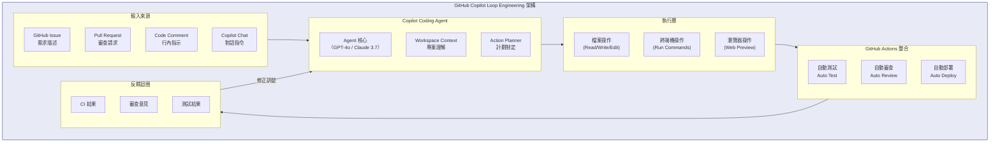

### 6.2　Copilot Coding Agent 使用 SOP

```bash
# === GitHub Copilot Agent Mode 操作手冊 ===

# 1. 在 VSCode 中啟動 Copilot Agent Mode
# Ctrl+Shift+P → "GitHub Copilot: Open Chat"
# 輸入 "@workspace" 啟動 Workspace 感知模式

# 2. 標準 Agent 指令格式
# @workspace /new <描述>          建立新功能
# @workspace /explain <程式碼>    解釋程式碼
# @workspace /fix <錯誤>          修復問題
# @workspace /tests               產生測試
# @workspace /doc                 產生文件

# 3. Copilot CLI 操作
# 安裝 Copilot CLI
npm install -g @githubnext/github-copilot-cli

# 登入
github-copilot-cli auth login

# 使用自然語言執行指令
ghcs "列出所有 Java 檔案中超過 200 行的類別"
ghcs "找到所有沒有 @Test 的 test 方法"
ghcs "建立 Dockerfile for Java 21 + Spring Boot"

# 解釋指令
ghce "kubectl rollout restart deployment/banking-app -n production"

# 4. Copilot 在 GitHub.com 上的 Agent
# 在 Issue 中 @copilot 自動觸發 Agent
# 格式：
# @copilot 請根據此 Issue 實作功能，使用 Spring Boot + JPA
# 要求：
# - 實作 CRUD 操作
# - 撰寫單元測試（覆蓋率 ≥ 80%）
# - 符合現有程式碼風格
# - 建立 PR 並請 @team-lead 審查

# 5. Copilot PR 審查自動化
gh pr create \
  --title "feat: 新增客戶管理模組" \
  --body "@copilot 請審查這個 PR，重點關注：
  1. 安全性（SQL Injection, XSS）
  2. 效能（N+1 查詢問題）
  3. 程式碼品質（Clean Code 原則）
  4. 測試覆蓋率
  並自動修復所有可修復的問題。"
```

### 6.3　Copilot MCP 整合

```json
// .vscode/mcp.json — Copilot MCP 設定
{
  "servers": {
    "github": {
      "type": "stdio",
      "command": "npx",
      "args": ["-y", "@modelcontextprotocol/server-github"],
      "env": {
        "GITHUB_PERSONAL_ACCESS_TOKEN": "${env:GITHUB_TOKEN}"
      }
    },
    "postgres": {
      "type": "stdio",
      "command": "npx",
      "args": ["-y", "@modelcontextprotocol/server-postgres"],
      "env": {
        "POSTGRES_CONNECTION_STRING": "${env:DATABASE_URL}"
      }
    },
    "jira": {
      "type": "stdio",
      "command": "npx",
      "args": ["-y", "mcp-server-jira"],
      "env": {
        "JIRA_BASE_URL": "${env:JIRA_URL}",
        "JIRA_API_TOKEN": "${env:JIRA_TOKEN}",
        "JIRA_USER_EMAIL": "${env:JIRA_EMAIL}"
      }
    }
  }
}
```

### 6.4　Copilot Workspace Context 最佳化

```bash
# .github/copilot-instructions.md — Copilot 工作指示
# 此檔案讓 Copilot 了解專案上下文

# 專案說明
這是一個企業網路銀行系統（Internet Banking System），服務 100 萬以上用戶。

# 技術規範
- Java 21（使用 Virtual Threads、Records、Pattern Matching）
- Spring Boot 3.5 + Spring Security 6
- PostgreSQL 16（使用 row-level security）
- 所有 API 必須通過 OWASP ZAP 掃描

# AI Agent 指示
1. 所有程式碼必須通過 `mvn verify` 才能提交
2. 安全性問題具有最高優先級，立即修復
3. 使用現有的 BaseEntity 和 AuditEntity 基底類別
4. 遵循 src/main/java/com/bank 的現有套件結構
5. 測試類別命名：`*Test.java`（單元）、`*IT.java`（整合）
```

---

## 第七章　建立企業級 Loop Engineering 平台

### 7.1　企業 AI 平台架構

```mermaid
graph TB
    subgraph Frontend["前端層 Vue 3 + TypeScript"]
        DashBoard["儀表板\nDashboard"]
        AgentConsole["Agent 控制台\nAgent Console"]
        PromptStudio["Prompt 工作室\nPrompt Studio"]
        EvalDashboard["Eval 儀表板\nEval Dashboard"]
        MonitorUI["監控介面\nMonitor UI"]
    end

    subgraph APIGateway["API Gateway (Spring Cloud Gateway)"]
        Auth["認證閘道\nAuth Gateway"]
        RateLimit["流量控制\nRate Limit"]
        LoadBalance["負載均衡\nLoad Balancer"]
    end

    subgraph BackendServices["後端微服務層 Java 21 + Spring Boot 3.5"]
        AgentRuntime["Agent Runtime\n執行引擎"]
        MemoryService["Memory Service\n記憶服務"]
        PromptService["Prompt Service\n提示服務"]
        SkillService["Skill Service\n技能服務"]
        EvalService["Evaluation Service\n評估服務"]
        GovernanceService["Governance Service\n治理服務"]
        NotificationService["Notification Service\n通知服務"]
    end

    subgraph DataLayer["資料層"]
        PostgreSQL["PostgreSQL 16\n主要資料庫"]
        Redis["Redis 7\n快取 + Pub-Sub"]
        Kafka["Kafka 3.7\n訊息佇列"]
        VectorDB["pgvector\n向量資料庫"]
        ObjectStorage["MinIO / S3\n物件儲存"]
    end

    subgraph InfraLayer["基礎設施層"]
        OpenShift["OpenShift 4.16\n(Kubernetes)"]
        Podman["Podman 5\n容器運行時"]
        Prometheus["Prometheus\n指標收集"]
        Grafana["Grafana\n視覺化"]
        ELK["ELK Stack\n日誌管理"]
    end

    Frontend --> APIGateway
    APIGateway --> BackendServices
    BackendServices --> DataLayer
    DataLayer --> InfraLayer

    style Frontend fill:#e3f2fd,stroke:#1565C0
    style BackendServices fill:#e8f5e9,stroke:#1B5E20
    style DataLayer fill:#fff3e0,stroke:#E65100
    style InfraLayer fill:#fce4ec,stroke:#880E4F
```

### 7.2　Spring Boot 3.5 Agent Runtime 實作

```java
// src/main/java/com/company/loopengineering/agent/AgentRuntimeService.java
@Service
@RequiredArgsConstructor
@Slf4j
public class AgentRuntimeService {

    private final AnthropicClient anthropicClient;
    private final SkillService skillService;
    private final MemoryService memoryService;
    private final EvalService evalService;
    private final KafkaTemplate<String, AgentEvent> kafkaTemplate;

    /**
     * 執行 Loop Engineering 任務
     */
    @Transactional
    public Mono<AgentResult> executeLoop(AgentTask task) {
        log.info("開始執行 Loop 任務: {}", task.taskId());

        return Mono.fromCallable(() -> memoryService.loadContext(task.projectId()))
            .flatMap(context -> executeReActLoop(task, context))
            .flatMap(result -> evalService.evaluate(result))
            .doOnSuccess(result -> {
                memoryService.updateContext(task.projectId(), result);
                kafkaTemplate.send("loop-results", AgentEvent.of(result));
                log.info("Loop 任務完成: {}, 品質分數: {}", task.taskId(), result.qualityScore());
            })
            .doOnError(e -> log.error("Loop 任務失敗: {}", task.taskId(), e));
    }

    private Mono<AgentResult> executeReActLoop(AgentTask task, AgentContext context) {
        return Flux.range(0, task.maxIterations())
            .concatMap(iteration -> {
                log.debug("ReAct 迭代 {}/{}", iteration + 1, task.maxIterations());
                return reason(task, context)
                    .flatMap(plan -> act(plan))
                    .flatMap(output -> observe(output))
                    .flatMap(observation -> reflect(observation, task));
            })
            .takeUntil(result -> result.goalAchieved())
            .last()
            .map(AgentResult::fromIterationResult);
    }
}
```

```java
// src/main/java/com/company/loopengineering/memory/MemoryService.java
@Service
@RequiredArgsConstructor
public class MemoryService {

    private final VectorRepository vectorRepository;
    private final RedisTemplate<String, Object> redisTemplate;
    private final MemoryRepository memoryRepository;

    /**
     * 儲存長期記憶（向量化）
     */
    public void storeMemory(String projectId, Memory memory) {
        // 向量化記憶內容
        float[] embedding = embeddingService.embed(memory.content());
        VectorMemory vectorMemory = VectorMemory.builder()
            .projectId(projectId)
            .content(memory.content())
            .embedding(embedding)
            .type(memory.type())
            .createdAt(Instant.now())
            .build();
        vectorRepository.save(vectorMemory);
    }

    /**
     * 語意搜尋相關記憶
     */
    public List<Memory> searchRelevantMemories(String projectId, String query, int topK) {
        float[] queryEmbedding = embeddingService.embed(query);
        return vectorRepository.findSimilar(projectId, queryEmbedding, topK)
            .stream()
            .map(this::toMemory)
            .toList();
    }
}
```

### 7.3　Vue 3 Agent 控制台前端

```vue
<!-- src/components/AgentConsole.vue -->
<template>
  <div class="agent-console bg-gray-900 text-white min-h-screen p-6">
    <div class="max-w-7xl mx-auto">
      <!-- 任務輸入區 -->
      <div class="mb-6 bg-gray-800 rounded-xl p-6">
        <h2 class="text-xl font-bold mb-4 text-blue-400">Loop Engineering 控制台</h2>
        <div class="flex gap-4">
          <textarea
            v-model="taskInput"
            class="flex-1 bg-gray-700 rounded-lg p-3 text-sm resize-none"
            rows="4"
            placeholder="輸入任務描述..."
          />
          <div class="flex flex-col gap-2">
            <button
              @click="executeLoop"
              :disabled="isRunning"
              class="px-6 py-3 bg-blue-600 hover:bg-blue-700 rounded-lg font-medium transition-colors"
            >
              {{ isRunning ? '執行中...' : '啟動 Loop' }}
            </button>
            <select v-model="selectedModel" class="bg-gray-700 rounded-lg p-2 text-sm">
              <option value="claude-sonnet-4-6">Claude Sonnet 4.6</option>
              <option value="claude-opus-4-8">Claude Opus 4.8</option>
            </select>
          </div>
        </div>
      </div>

      <!-- Loop 進度顯示 -->
      <div v-if="currentLoop" class="bg-gray-800 rounded-xl p-6 mb-6">
        <div class="flex items-center justify-between mb-4">
          <h3 class="text-lg font-semibold">迴圈進度</h3>
          <div class="flex items-center gap-2">
            <div class="w-3 h-3 rounded-full animate-pulse"
                 :class="isRunning ? 'bg-green-400' : 'bg-gray-400'" />
            <span class="text-sm text-gray-400">
              迭代 {{ currentLoop.iteration }}/{{ currentLoop.maxIterations }}
            </span>
          </div>
        </div>
        <div class="space-y-3">
          <LoopStepCard
            v-for="step in currentLoop.steps"
            :key="step.id"
            :step="step"
          />
        </div>
      </div>

      <!-- Eval 分數卡 -->
      <div v-if="evalResults" class="grid grid-cols-4 gap-4">
        <EvalScoreCard
          v-for="eval in evalResults"
          :key="eval.dimension"
          :dimension="eval.dimension"
          :score="eval.score"
          :status="eval.status"
        />
      </div>
    </div>
  </div>
</template>

<script setup lang="ts">
import { ref, computed } from 'vue'
import { useAgentStore } from '@/stores/agent'
import type { LoopTask, LoopResult, EvalResult } from '@/types/agent'

const agentStore = useAgentStore()

const taskInput = ref('')
const selectedModel = ref('claude-sonnet-4-6')
const isRunning = ref(false)
const currentLoop = ref<LoopTask | null>(null)
const evalResults = ref<EvalResult[] | null>(null)

async function executeLoop() {
  if (!taskInput.value.trim()) return

  isRunning.value = true
  try {
    const task: LoopTask = {
      description: taskInput.value,
      model: selectedModel.value,
      maxIterations: 10
    }

    // 透過 SSE 即時接收 Loop 進度
    const eventSource = agentStore.executeLoopWithStream(task)
    eventSource.onmessage = (event) => {
      const data = JSON.parse(event.data)
      currentLoop.value = data.loop
      if (data.evals) evalResults.value = data.evals
    }

    eventSource.onerror = () => {
      isRunning.value = false
      eventSource.close()
    }
  } catch (error) {
    console.error('Loop 執行失敗:', error)
    isRunning.value = false
  }
}
</script>
```

### 7.4　OpenShift 部署設定

```yaml
# deploy/openshift/loop-engineering-platform.yaml
apiVersion: apps/v1
kind: Deployment
metadata:
  name: loop-engine-backend
  namespace: ai-platform
  labels:
    app: loop-engine
    tier: backend
spec:
  replicas: 3
  selector:
    matchLabels:
      app: loop-engine
      tier: backend
  template:
    metadata:
      labels:
        app: loop-engine
        tier: backend
    spec:
      containers:
        - name: backend
          image: registry.company.com/loop-engine/backend:latest
          ports:
            - containerPort: 8080
          env:
            - name: SPRING_PROFILES_ACTIVE
              value: production
            - name: ANTHROPIC_API_KEY
              valueFrom:
                secretKeyRef:
                  name: ai-credentials
                  key: anthropic-api-key
            - name: DATABASE_URL
              valueFrom:
                secretKeyRef:
                  name: db-credentials
                  key: url
          resources:
            requests:
              memory: "1Gi"
              cpu: "500m"
            limits:
              memory: "4Gi"
              cpu: "2000m"
          livenessProbe:
            httpGet:
              path: /actuator/health/liveness
              port: 8080
            initialDelaySeconds: 30
            periodSeconds: 10
          readinessProbe:
            httpGet:
              path: /actuator/health/readiness
              port: 8080
            initialDelaySeconds: 20
            periodSeconds: 5
---
apiVersion: v1
kind: Service
metadata:
  name: loop-engine-backend-svc
  namespace: ai-platform
spec:
  selector:
    app: loop-engine
    tier: backend
  ports:
    - port: 80
      targetPort: 8080
  type: ClusterIP
---
apiVersion: route.openshift.io/v1
kind: Route
metadata:
  name: loop-engine-route
  namespace: ai-platform
spec:
  to:
    kind: Service
    name: loop-engine-frontend-svc
  tls:
    termination: edge
    insecureEdgeTerminationPolicy: Redirect
```

---

## 第八章　Web Application 開發實戰

### 8.1　案例：網路銀行系統開發

本章以建立完整的企業網路銀行系統為實戰案例，展示 Loop Engineering 如何驅動完整的開發生命週期。

**系統功能範圍：**
- 用戶登入認證（Login / 2FA）
- 客戶資料管理（Customer）
- 帳戶管理（Account）
- 轉帳功能（Transfer）
- 貸款管理（Loan）

### 8.2　完整 Loop Engineering 開發流程

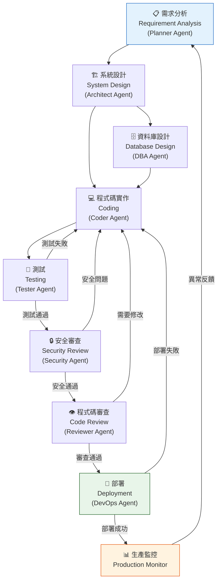

### 8.3　SOP — 網銀系統 Loop Engineering 開發 SOP

**SOP-001：需求分析 Loop**

```bash
# Step 1: 使用 Planner Agent 分析需求
claude -p "
作為 Planner Agent，請分析以下需求並產出：
1. 功能分解結構（WBS）
2. 技術設計要點
3. 風險識別
4. 工作估算

需求：
- 客戶轉帳功能
- 支援同行轉帳與跨行轉帳
- 支援即時到帳與 T+1 到帳
- 每日轉帳限額 100 萬
- 需要 2FA 驗證
- 需要轉帳記錄查詢
"

# Step 2: Architect Agent 產出設計
claude -p "
根據以下需求設計 Spring Boot 轉帳模組架構：
- Domain Model（使用 DDD）
- API 設計（RESTful）
- 資料庫 Schema
- 狀態機設計（轉帳狀態流轉）
- 安全性考量
" --skill architecture/ddd

# Step 3: 產出開發規格書
claude -p "整合以上分析與設計，產出完整的開發規格書" \
  --output docs/transfer-spec.md
```

**SOP-002：編碼 Loop**

```java
// 範例：轉帳服務實作（由 Coder Agent 產生）
@Service
@RequiredArgsConstructor
@Transactional
@Slf4j
public class TransferService {

    private final AccountRepository accountRepository;
    private final TransferRepository transferRepository;
    private final EventPublisher eventPublisher;
    private final TransferLimitService limitService;
    private final TwoFactorAuthService twoFAService;

    /**
     * 執行轉帳（使用分散式鎖保證冪等性）
     */
    @DistributedLock(keyPrefix = "transfer:", keyParam = "#request.requestId")
    public TransferResult execute(TransferRequest request) {
        log.info("開始處理轉帳: requestId={}, amount={}", request.requestId(), request.amount());

        // 1. 驗證 2FA
        twoFAService.verify(request.userId(), request.otpCode());

        // 2. 載入帳戶（悲觀鎖避免並發問題）
        Account source = accountRepository
            .findByIdWithLock(request.sourceAccountId())
            .orElseThrow(() -> new AccountNotFoundException(request.sourceAccountId()));

        Account target = accountRepository
            .findByIdWithLock(request.targetAccountId())
            .orElseThrow(() -> new AccountNotFoundException(request.targetAccountId()));

        // 3. 檢查轉帳限額
        limitService.checkDailyLimit(source.customerId(), request.amount());

        // 4. 執行轉帳
        source.debit(request.amount());
        target.credit(request.amount());

        // 5. 記錄轉帳
        Transfer transfer = Transfer.create(source, target, request);
        transferRepository.save(transfer);

        // 6. 發布事件
        eventPublisher.publish(TransferCompletedEvent.of(transfer));

        log.info("轉帳完成: transferId={}", transfer.id());
        return TransferResult.success(transfer.id());
    }
}
```

**SOP-003：測試 Loop**

```bash
# 執行完整測試 Loop
cd /workspace/banking-app

# Unit Tests
mvn test -Dtest=TransferServiceTest,AccountServiceTest,LoanServiceTest -B
echo "Unit Test 結果: $?"

# Integration Tests
mvn verify -Dtest=TransferIT,AccountIT -P integration-test -B
echo "Integration Test 結果: $?"

# Security Tests (OWASP)
mvn org.owasp:dependency-check-maven:check -DfailBuildOnCVSS=7
echo "安全掃描結果: $?"

# Performance Tests
mvn gatling:test -Dgatling.simulationClass=TransferSimulation
echo "效能測試結果: $?"

# 若任何測試失敗，觸發 AI 修復 Loop
if [ $? -ne 0 ]; then
  claude "修復以下測試失敗，不得跳過或刪除測試" \
    --context "$(mvn test 2>&1 | tail -100)"
fi
```

**SOP-004：部署 Loop**

```bash
# 網銀系統部署 SOP
set -e  # 任何錯誤立即停止

APP_NAME="banking-app"
NAMESPACE="production"
VERSION="$(mvn help:evaluate -Dexpression=project.version -q -DforceStdout)"

echo "🚀 開始部署 ${APP_NAME}:${VERSION}"

# 1. 建置 Image
echo "📦 建置 Container Image..."
podman build \
  --label "version=${VERSION}" \
  --label "git-commit=$(git rev-parse HEAD)" \
  -t "registry.company.com/${APP_NAME}:${VERSION}" .

# 2. 安全掃描 Image
echo "🔒 掃描 Container 安全性..."
trivy image \
  --exit-code 1 \
  --severity CRITICAL,HIGH \
  "registry.company.com/${APP_NAME}:${VERSION}"

# 3. 推送 Image
echo "⬆️ 推送 Image..."
podman push "registry.company.com/${APP_NAME}:${VERSION}"

# 4. 滾動更新（Zero Downtime）
echo "🔄 執行滾動更新..."
kubectl set image deployment/${APP_NAME} \
  ${APP_NAME}=registry.company.com/${APP_NAME}:${VERSION} \
  -n ${NAMESPACE}

# 5. 等待更新完成
kubectl rollout status deployment/${APP_NAME} -n ${NAMESPACE} --timeout=5m

# 6. 煙霧測試（Smoke Test）
echo "💨 執行煙霧測試..."
API_URL="https://banking.company.com"
curl -sf "${API_URL}/actuator/health" | jq '.status' | grep -q '"UP"'
echo "✅ 部署成功！版本：${VERSION}"

# 7. 若部署失敗，自動回滾
trap 'echo "❌ 部署失敗，執行回滾..."; kubectl rollout undo deployment/${APP_NAME} -n ${NAMESPACE}' ERR
```

---

## 第九章　Legacy System 逆向工程

### 9.1　案例背景：大型銀行系統現代化

**現有系統技術棧：**
- Java 6（2006 年版本）
- Struts 1.x（MVC 框架）
- JSP（View 層）
- EJB 2.x（業務層）
- IBM DB2 10（資料庫）
- WebSphere Application Server 8.5

**目標技術棧：**
- Java 21（Virtual Threads + Records）
- Spring Boot 3.5（REST API）
- Vue 3 + TypeScript（前端）
- PostgreSQL 16（資料庫）
- Podman + OpenShift（容器化）

### 9.2　Reverse Engineering Loop 架構

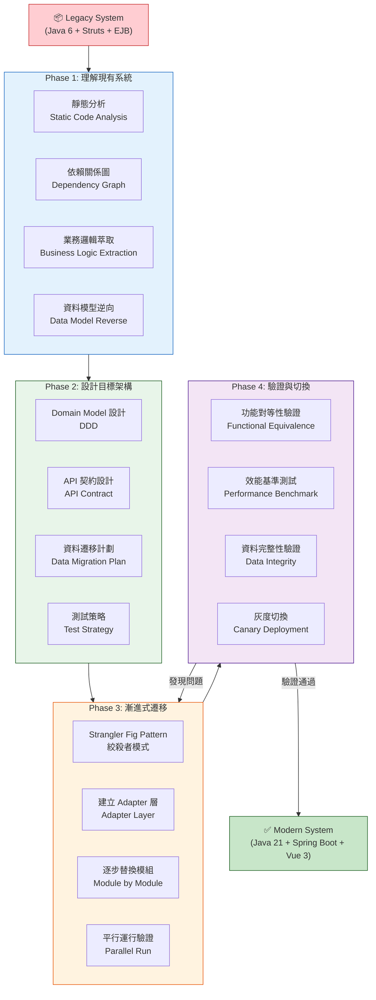

### 9.3　逆向工程 Loop 執行 SOP

**SOP-005：Legacy 系統分析 Loop**

```bash
# Step 1: 靜態程式碼分析
echo "🔍 開始分析 Legacy 程式碼..."

# 統計程式碼規模
find src/ -name "*.java" | wc -l
find src/ -name "*.jsp" | wc -l
find src/ -name "*.xml" | wc -l

# 找出所有 EJB
grep -r "@Stateless\|@Stateful\|@MessageDriven\|EJBBean" src/ --include="*.java" -l

# 找出所有 Struts Action
grep -r "extends Action\|ActionSupport" src/ --include="*.java" -l

# 找出複雜方法（超過 100 行）
claude -p "分析以下 Java 檔案，找出所有超過 100 行的方法，並評估重構複雜度" \
  --directory src/ --include "*.java"

# Step 2: 業務邏輯萃取
claude -p "
分析這個 Legacy Java EJB 系統，請：
1. 識別所有業務實體（Entity）
2. 提取核心業務規則
3. 繪製業務流程圖
4. 識別外部系統依賴
並輸出為結構化的 Markdown 文件
" --directory src/ --output docs/business-analysis.md

# Step 3: 資料模型逆向
# 從 DB2 Schema 逆向工程
db2 "EXPORT TO schema.sql OF DEL MESSAGES msgs SELECT TABSCHEMA, TABNAME, COLNAME, TYPENAME FROM SYSCAT.COLUMNS WHERE TABSCHEMA = 'BANKING'"

claude -p "
將以下 DB2 Schema 轉換為：
1. JPA Entity 類別（Java 21 Records 風格）
2. PostgreSQL 16 相容的 DDL
3. Flyway Migration 腳本
4. Spring Data JPA Repository 介面
" --file schema.sql

# Step 4: 產出遷移計劃
claude -p "
根據以上分析，制定完整的遷移計劃：
- 遷移優先順序（從最低風險開始）
- 每個模組的預估工時
- 測試策略（A/B 比對）
- 回滾策略
" --output docs/migration-plan.md
```

**SOP-006：Strangler Fig 模式實施**

```java
// 建立適配器層（Java 21）
// 讓新舊系統共存，逐步替換

@RestController
@RequestMapping("/api/v2/transfers")  // 新 API
@RequiredArgsConstructor
public class ModernTransferController {
    private final ModernTransferService modernService;
    private final LegacyTransferAdapter legacyAdapter;
    private final FeatureFlagService featureFlag;

    @PostMapping
    public ResponseEntity<TransferResponse> transfer(
            @RequestBody @Valid TransferRequest request) {
        // 功能旗標控制：逐步切換到新系統
        if (featureFlag.isEnabled("modern-transfer", request.customerId())) {
            return ResponseEntity.ok(modernService.execute(request));
        } else {
            // 舊系統 Adapter（橋接層）
            return ResponseEntity.ok(legacyAdapter.execute(request));
        }
    }
}

// Legacy Adapter — 呼叫舊 EJB
@Component
@RequiredArgsConstructor
@Slf4j
public class LegacyTransferAdapter {

    @EJB  // 透過 JNDI 呼叫舊 EJB
    private TransferEJBRemote legacyTransferEJB;

    public TransferResponse execute(TransferRequest request) {
        log.warn("使用 Legacy 轉帳系統（customerId={}）", request.customerId());
        // 呼叫舊系統
        LegacyTransferBean legacyRequest = mapToLegacy(request);
        LegacyTransferResult legacyResult = legacyTransferEJB.transfer(legacyRequest);
        return mapFromLegacy(legacyResult);
    }
}
```

---


---

## 第十章　Framework 升級實戰

### 10.1　案例：Spring Boot 2.x 升級至 3.5.x

Spring Boot 3.x 是重大版本升級，帶來了 Jakarta EE 10、Java 17+ 要求、以及大量 API 變更。本章展示如何使用 Loop Engineering 安全升級。

### 10.2　升級 Loop 流程

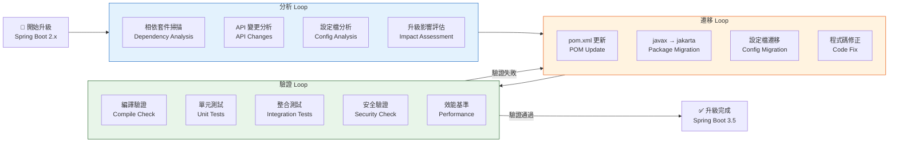

### 10.3　升級 SOP 詳細步驟

**SOP-007：Spring Boot 升級 Loop**

```bash
# === Spring Boot 2.x → 3.5.x 升級 Loop ===

# Step 1: 升級前備份與基準建立
git checkout -b upgrade/spring-boot-3.5
git tag pre-upgrade-baseline

# 建立效能基準
mvn gatling:test -Dgatling.simulationClass=BaselineSimulation
cp -r target/gatling/baseline-* docs/performance-baseline/

# 建立測試基準
mvn test 2>&1 | tee docs/test-baseline.txt

# Step 2: 相依套件分析（使用 AI）
claude -p "
分析 pom.xml，識別所有需要更新的套件：
1. spring-boot-starter-* 到 3.5.x
2. jakarta 相依套件更新
3. 不相容的第三方套件
4. 需要刪除的過時依賴
並產出更新後的 pom.xml
" --file pom.xml --output pom-upgraded.xml

# Step 3: 套件名稱遷移（javax → jakarta）
# 自動遷移
find src/main/java -name "*.java" -exec \
  sed -i 's/import javax\.persistence\./import jakarta.persistence./g' {} +

find src/main/java -name "*.java" -exec \
  sed -i 's/import javax\.validation\./import jakarta.validation./g' {} +

find src/main/java -name "*.java" -exec \
  sed -i 's/import javax\.servlet\./import jakarta.servlet./g' {} +

find src/main/java -name "*.java" -exec \
  sed -i 's/import javax\.transaction\./import jakarta.transaction./g' {} +

# 使用 AI 處理複雜案例
claude -p "
找出所有使用 javax.* 但沒有被自動替換的案例，
並提供正確的 Jakarta 相等替換方案。
同時處理以下 Spring Boot 3.x 破壞性變更：
1. Spring Security 6 的 HttpSecurity 設定語法
2. Spring Data JPA 的 sort() 方法變更
3. Spring Web 的 Path Variable 處理變更
" --directory src/

# Step 4: Spring Security 6 設定遷移
cat > src/main/java/com/bank/config/SecurityConfig.java << 'EOF'
@Configuration
@EnableWebSecurity
@RequiredArgsConstructor
public class SecurityConfig {

    private final JwtTokenProvider jwtProvider;

    @Bean
    public SecurityFilterChain filterChain(HttpSecurity http) throws Exception {
        return http
            // Spring Boot 3.x 新語法（lambda 風格）
            .csrf(csrf -> csrf.disable())
            .cors(cors -> cors.configurationSource(corsConfigurationSource()))
            .sessionManagement(session ->
                session.sessionCreationPolicy(SessionCreationPolicy.STATELESS))
            .authorizeHttpRequests(auth -> auth
                .requestMatchers("/api/v1/auth/**", "/actuator/health").permitAll()
                .requestMatchers("/api/v1/admin/**").hasRole("ADMIN")
                .anyRequest().authenticated())
            .addFilterBefore(
                new JwtAuthenticationFilter(jwtProvider),
                UsernamePasswordAuthenticationFilter.class)
            .build();
    }
}
EOF

# Step 5: 設定檔遷移（application.properties）
# Spring Boot 3.x 廢棄設定更新
sed -i 's/spring.datasource.initialization-mode/spring.sql.init.mode/g' \
  src/main/resources/application.properties

sed -i 's/spring.jpa.hibernate.ddl-auto/spring.jpa.hibernate.ddl-auto/g' \
  src/main/resources/application.properties

# Step 6: 建置驗證 Loop
echo "🔨 執行建置驗證..."
mvn clean compile -B 2>&1 | tee logs/compile-result.txt

if [ $? -ne 0 ]; then
  echo "❌ 編譯失敗，啟動 AI 修復 Loop..."
  claude "修復以下 Spring Boot 3.5 編譯錯誤，不得降低目標 Java 版本" \
    --context "$(cat logs/compile-result.txt)"
fi

# Step 7: 測試驗證 Loop
echo "🧪 執行測試驗證..."
mvn verify -B 2>&1 | tee logs/test-result.txt

if [ $? -ne 0 ]; then
  echo "❌ 測試失敗，啟動 AI 修復 Loop..."
  claude "修復測試失敗，分析是功能性回退還是測試本身需要更新" \
    --context "$(cat logs/test-result.txt)"
fi

# Step 8: 安全驗證
echo "🔒 執行安全驗證..."
mvn dependency-check:check -DfailBuildOnCVSS=7

# Step 9: 效能回歸測試
echo "📊 執行效能基準對比..."
mvn gatling:test -Dgatling.simulationClass=BaselineSimulation
# 比對新舊效能
claude -p "
比較以下兩個效能報告，識別任何效能回退（>10% 降低）：
並提供優化建議。
" --file docs/performance-baseline/ --directory target/gatling/

echo "✅ Spring Boot 3.5 升級完成！"
```

### 10.4　常見升級問題與解法

```java
// 問題 1: Spring Security 6 - 方法鏈式呼叫廢棄
// 舊寫法（Spring Boot 2.x）
@Override
protected void configure(HttpSecurity http) throws Exception {
    http.csrf().disable()
        .authorizeRequests()
            .antMatchers("/api/public/**").permitAll()
            .anyRequest().authenticated();
}

// 新寫法（Spring Boot 3.x / Spring Security 6）
@Bean
public SecurityFilterChain filterChain(HttpSecurity http) throws Exception {
    http
        .csrf(AbstractHttpConfigurer::disable)
        .authorizeHttpRequests(auth -> auth
            .requestMatchers("/api/public/**").permitAll()
            .anyRequest().authenticated());
    return http.build();
}

// 問題 2: JPA EntityManager 方法廢棄
// 舊寫法
TypedQuery<Customer> query = em.createQuery(
    "SELECT c FROM Customer c WHERE c.id = :id", Customer.class);
query.setHint("org.hibernate.cacheable", true);  // 廢棄

// 新寫法（Hibernate 6 / JPA 3.1）
TypedQuery<Customer> query = em.createQuery(
    "SELECT c FROM Customer c WHERE c.id = :id", Customer.class);
query.setHint(HibernateHints.HINT_CACHEABLE, true);  // Jakarta 新常數

// 問題 3: Actuator 端點變更
// application.properties 新設定
management.endpoints.web.exposure.include=health,info,metrics,prometheus
management.endpoint.health.show-details=when-authorized
management.endpoint.health.probes.enabled=true  // Kubernetes 探針
```

---

## 第十一章　Evals 設計

### 11.1　Anthropic Evals 最佳實務

來自 Anthropic 工程團隊的 Agent Evals 設計指南，核心原則：
1. **定義可測量的成功標準**，而非主觀評判
2. **從簡單到複雜**，先建立基礎 Eval，再加入邊緣案例
3. **使用真實任務**，而非刻意構造的測試案例
4. **設計可重複執行**的自動化 Evals
5. **持續更新** Eval Suite，跟隨需求演進

### 11.2　六大 Eval 維度

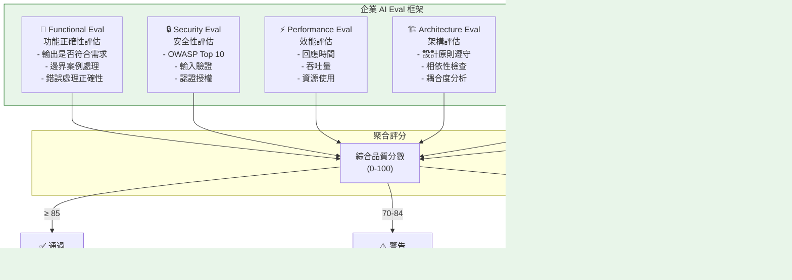

### 11.3　Functional Eval 設計

```java
// src/test/java/com/bank/eval/FunctionalEvalSuite.java
@TestSuite
@DisplayName("Functional Eval — 轉帳功能評估")
class TransferFunctionalEvalSuite {

    @EvalTest(weight = 0.3, category = "HAPPY_PATH")
    @DisplayName("正常轉帳流程 — 應成功完成")
    void normalTransfer_shouldSucceed() {
        // Given
        Account source = createAccountWithBalance(new BigDecimal("100000.00"));
        Account target = createEmptyAccount();
        TransferRequest request = TransferRequest.builder()
            .sourceAccountId(source.id())
            .targetAccountId(target.id())
            .amount(new BigDecimal("50000.00"))
            .build();

        // When
        TransferResult result = transferService.execute(request);

        // Then
        assertThat(result.status()).isEqualTo(TransferStatus.SUCCESS);
        assertThat(accountRepository.findById(source.id()).get().balance())
            .isEqualByComparingTo("50000.00");
        assertThat(accountRepository.findById(target.id()).get().balance())
            .isEqualByComparingTo("50000.00");
    }

    @EvalTest(weight = 0.2, category = "EDGE_CASE")
    @DisplayName("餘額不足轉帳 — 應拒絕並回滾")
    void insufficientBalance_shouldRejectAndRollback() {
        Account source = createAccountWithBalance(new BigDecimal("100.00"));
        TransferRequest request = createTransferRequest(
            source.id(), new BigDecimal("1000.00"));

        assertThatThrownBy(() -> transferService.execute(request))
            .isInstanceOf(InsufficientBalanceException.class);

        // 確認無資金被扣除
        assertThat(source.balance()).isEqualByComparingTo("100.00");
    }

    @EvalTest(weight = 0.2, category = "SECURITY")
    @DisplayName("超過每日限額 — 應拒絕")
    void exceedDailyLimit_shouldReject() {
        // 當天已轉帳 90 萬
        simulateDailyTransfers(new BigDecimal("900000.00"));
        TransferRequest request = createTransferRequest(new BigDecimal("200000.00"));

        assertThatThrownBy(() -> transferService.execute(request))
            .isInstanceOf(DailyLimitExceededException.class);
    }

    @EvalTest(weight = 0.15, category = "CONCURRENT")
    @DisplayName("並發轉帳 — 應保證資料一致性")
    void concurrentTransfers_shouldMaintainConsistency() throws Exception {
        Account source = createAccountWithBalance(new BigDecimal("100000.00"));
        int threadCount = 10;
        BigDecimal amountPerTransfer = new BigDecimal("5000.00");

        ExecutorService executor = Executors.newFixedThreadPool(threadCount);
        List<Future<TransferResult>> futures = IntStream.range(0, threadCount)
            .mapToObj(i -> executor.submit(() ->
                transferService.execute(createTransferRequest(source.id(), amountPerTransfer))))
            .toList();

        long successCount = futures.stream()
            .map(f -> f.get())
            .filter(r -> r.status() == TransferStatus.SUCCESS)
            .count();

        // 最終餘額必須一致
        BigDecimal expected = new BigDecimal("100000.00")
            .subtract(amountPerTransfer.multiply(BigDecimal.valueOf(successCount)));
        assertThat(accountRepository.findById(source.id()).get().balance())
            .isEqualByComparingTo(expected);
    }
}
```

### 11.4　Security Eval 設計

```bash
# Security Eval 自動化腳本

# 1. OWASP Dependency Check
echo "📦 相依套件安全掃描..."
mvn dependency-check:check \
  -DfailBuildOnCVSS=7 \
  -DsuppressionFile=.github/security/suppressions.xml \
  -Dformats=HTML,JSON

VULN_COUNT=$(jq '.dependencies[].vulnerabilities | length' target/dependency-check-report.json | awk '{sum+=$1}END{print sum}')
echo "發現漏洞數量: $VULN_COUNT"

# 2. SAST 掃描（SpotBugs + FindSecBugs）
echo "🔍 靜態安全分析..."
mvn com.github.spotbugs:spotbugs-maven-plugin:spotbugs \
  -Dspotbugs.plugins=com.h3xstream.findsecbugs:findsecbugs-plugin:1.12.0

# 3. 秘密掃描
echo "🔑 秘密洩漏掃描..."
gitleaks detect \
  --source . \
  --report-format json \
  --report-path gitleaks-report.json
SECRETS_FOUND=$(jq length gitleaks-report.json)
echo "發現秘密數量: $SECRETS_FOUND"

# 4. OWASP ZAP 動態掃描
echo "🌐 動態安全掃描..."
docker run --rm \
  -v $(pwd)/zap-reports:/zap/wrk \
  owasp/zap2docker-stable zap-baseline.py \
  -t http://localhost:8080 \
  -g gen.conf \
  -r zap-report.html

# 5. Eval 結果彙整
cat > security-eval-report.json << EOF
{
  "eval_type": "security",
  "timestamp": "$(date -u +%Y-%m-%dT%H:%M:%SZ)",
  "results": {
    "dependency_vulnerabilities": $VULN_COUNT,
    "secrets_found": $SECRETS_FOUND,
    "sast_issues": $(jq '.BugCollection.BugInstance | length' target/spotbugsXml.xml),
    "overall_score": $([ "$VULN_COUNT" -eq 0 ] && [ "$SECRETS_FOUND" -eq 0 ] && echo "100" || echo "50")
  },
  "pass": $([ "$VULN_COUNT" -eq 0 ] && [ "$SECRETS_FOUND" -eq 0 ] && echo "true" || echo "false")
}
EOF
```

### 11.5　Eval Scorecard 範例

| 評估維度 | 權重 | 本次分數 | 上次分數 | 趨勢 | 狀態 |
|---------|------|---------|---------|------|------|
| 功能正確性 | 30% | 96 | 92 | ↑ +4 | ✅ 通過 |
| 安全性 | 25% | 100 | 98 | ↑ +2 | ✅ 通過 |
| 效能 | 20% | 88 | 91 | ↓ -3 | ✅ 通過 |
| 架構合規 | 15% | 82 | 80 | ↑ +2 | ⚠️ 警告 |
| 程式碼品質 | 5% | 91 | 89 | ↑ +2 | ✅ 通過 |
| 回歸測試 | 5% | 100 | 100 | → 0 | ✅ 通過 |
| **綜合分數** | **100%** | **93.4** | **92.1** | **↑ +1.3** | **✅ 通過** |

### 11.6　Evals 核心術語體系

前五節介紹的六大維度與範例，是「要評估什麼」；本節補上 Anthropic《Demystifying Evals for AI Agents》提出的標準詞彙，用來精確描述「Eval 怎麼運作」。在企業團隊溝通中，這套術語能避免「Evals」一詞被籠統地用來指稱完全不同的東西：

| 術語 | 定義 | 範例 |
|------|------|------|
| **Task（任務）** | 一個具體、可被評估的工作單位描述 | 「在這個 Spring Boot 專案中修復登入逾時的 Bug」 |
| **Trial（試驗）** | Agent 針對某個 Task 執行一次完整的嘗試過程 | Agent 從接收任務到提交修復的一次完整執行 |
| **Grader（評分器）** | 對 Trial 的結果給出評分或判定的機制 | 跑單元測試、或由另一個模型判斷修復是否正確 |
| **Transcript（執行紀錄）** | 一次 Trial 中 Agent 所有決策、工具呼叫、輸出的完整記錄 | Agent 的完整對話與工具呼叫日誌 |
| **Eval Harness（評估框架）** | 負責批次執行多個 Task、收集 Trial 結果、彙整分數的基礎設施 | CI 中自動跑數百個 Task 並產出報表的系統 |
| **Agent Harness（Agent 執行框架）** | Agent 實際執行任務時所處的環境框架（工具、權限、沙箱） | 第四章 Worktrees、第七章企業平台中的執行環境 |

釐清這六個詞彙的差異後，11.2 節「六大 Eval 維度」可以更精確地理解為：每個維度都需要設計專屬的 **Grader**，套用在同一批 **Task** 上，產生的 **Transcript** 則是 11.9 節「Swiss Cheese Model」中人工審查層的核心輸入。

### 11.7　評分器類型與非確定性指標

#### 評分器類型對照

| 類型 | 運作方式 | 優點 | 缺點 | 適用場景 |
|------|---------|------|------|---------|
| Code-based Grader | 執行程式碼／測試斷言，產生確定性結果 | 快速、便宜、完全可重複 | 無法評估「風格」「合理性」等主觀面向 | 單元測試、Linter、編譯檢查（對應 11.3 Functional Eval） |
| Model-based Grader | 由另一個 LLM 依評分準則（Rubric）判斷輸出品質 | 能評估語意、合理性、開放式任務 | 評分本身具有變異性，需要校準 | Code Review 品質、文件清晰度評估 |
| Human Grader | 人工依專業判斷評分 | 準確度最高、能捕捉細微情境 | 成本高、無法大規模擴展、評分者間可能不一致 | 高風險變更、新 Eval 維度的基準校準 |

#### 非確定性處理：Pass@k 與 Pass^k

AI Agent 的輸出本身具有隨機性，同一個 Task 跑多次可能得到不同結果。企業在設計 Eval 通過標準時，需要明確選擇衡量方式：

- **Pass@k**：對同一 Task 執行 k 次 Trial，**只要至少一次成功**就視為通過。適合「願意多次嘗試直到成功」的場景，例如允許 Agent 重試的 CI 修復迴圈。
- **Pass^k**：對同一 Task 執行 k 次 Trial，**必須全部成功**才視為通過。適合衡量穩定性與可預測性，例如評估能否安全地用於無人值守的生產迴圈（對應第十七章 L3 成熟度）。

> **企業建議**：草創階段的 Eval Suite 可先用 Pass@1（單次嘗試）建立基準；當迴圈準備從「協助修復（L2）」推進到「無人值守（L3）」時，應改用 Pass^k（k ≥ 3）作為上線門檻，確保穩定性而非僅憑運氣達標。

### 11.8　企業導入 Evals 的 8 步驟路線圖

| 步驟 | 行動 | 說明 |
|------|------|------|
| 1 | 從小規模開始 | 先建立 20–50 個簡單、明確的 Task，而非一次設計大型 Eval Suite |
| 2 | 轉換既有手動檢查 | 把團隊原本就在做的人工檢查項目（Code Review Checklist、QA 流程）轉換為自動化 Grader |
| 3 | 平衡正反案例 | Task 集合中應同時包含「應該成功」與「應該被拒絕」的案例，避免 Grader 只學會一味放行 |
| 4 | 設計穩定的執行環境 | 確保每次 Trial 在相同的初始狀態下執行，避免環境飄移造成結果不可重複 |
| 5 | 謹慎設計 Grader | Grader 的判定邏輯本身需要被審查，錯誤的 Grader 比沒有 Grader 更危險（會給出錯誤的安全感） |
| 6 | 定期讀取 Transcript | 不能只看分數，要定期抽樣閱讀完整執行紀錄，才能發現分數無法反映的問題 |
| 7 | 監測飽和現象 | 當某個 Eval 維度長期維持 100% 通過率，代表該任務已不具鑑別力，應更換為更難的任務 |
| 8 | 建立專責團隊 | 隨著 Eval Suite 規模擴大，應有專人／專隊負責維護，避免 Eval 品質隨時間腐化 |

這 8 個步驟並非一次性的專案，而是與 Loop Engineering 本身一樣，是一個需要持續迭代的迴圈——這也呼應了 1.6 節「Loop Engineering 是站在 Context／Harness Engineering 之上的整合層」的論點：Evals 本身也需要被當作一個迴圈來經營。

### 11.9　Swiss Cheese Model：多層防護觀念

借用工業安全領域的「瑞士起司模型（Swiss Cheese Model）」隱喻：**沒有任何單一防護層是完美無缺的（每片起司都有洞），但多層防護疊加後，貫穿所有層的漏洞機率會大幅降低**。企業 Evals 體系應同時部署以下五層，而非依賴單一機制：

```text
第一層：自動化 Evals（Automated Evals）        — 快速、低成本、PR 階段即可攔截
第二層：生產監測（Production Monitoring）       — 觀察上線後的真實行為與異常
第三層：A/B 測試（A/B Testing）                — 比較不同版本迴圈的真實效益差異
第四層：使用者反饋（User Feedback）             — 捕捉自動化機制無法量化的真實感受
第五層：人工審查（Human Review）                — 對高風險變更的最終把關
```

11.2 節的六大 Eval 維度主要落在第一層；3.6／3.7 節的 Reviewer／Judge 架構橫跨第一層與第五層；第十七章導入策略中的 loop-audit 概念則對應第二層的持續監測。企業在設計 Loop Engineering 治理機制時，應確保五層防護都有對應的負責人與檢視頻率，而不是只投資在最容易自動化的第一層。

### 11.10　業界標竿與落地工具

| 類別 | 名稱 | 用途 |
|------|------|------|
| 程式碼修復標竿 | **SWE-bench Verified** | 衡量 Agent 在真實 GitHub Issue 上的修復成功率，業界最常引用的 Coding Agent 標竿之一 |
| 多輪工具使用標竿 | **τ2-Bench** | 衡量 Agent 在多輪對話＋工具呼叫情境下的任務完成度 |
| 網頁操作標竿 | **WebArena** | 衡量 Agent 在真實網頁環境中執行操作任務的能力 |
| 作業系統操作標竿 | **OSWorld** | 衡量 Agent 在真實作業系統環境中跨應用程式操作的能力 |
| Eval 執行框架 | **Harbor** | 開源 Eval Harness，用於批次執行與管理大規模 Task 集合 |
| 評估與監測平台 | **Braintrust**、**LangSmith**、**Langfuse**、**Arize Phoenix** | 商用／開源的 Eval 結果追蹤、Transcript 檢視、生產監測整合平台 |

企業在 11.5 節「Eval Scorecard 範例」之外，可考慮引入上述標竿作為**跨團隊、跨專案的共同基準**（例如：新導入的 Coding Agent 必須先在 SWE-bench Verified 子集上達到團隊設定的最低分數，才能進入內部試點），並挑選一套工具作為 Transcript 集中管理與長期趨勢追蹤的基礎設施。

---

## 第十二章　AI Agent Team 設計

### 12.1　完整 AI Agent Team 架構

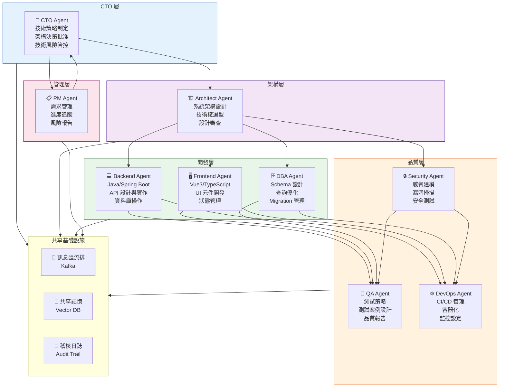

### 12.2　各 Agent 角色定義與 System Prompt

**CTO Agent System Prompt：**
```
你是一位 CTO-level 的技術決策 Agent。你的職責：
1. 評估重大技術決策的戰略影響
2. 在安全性、效能、開發效率之間做出平衡決策
3. 識別並管理技術風險
4. 確保技術決策符合業務目標

決策框架：
- 所有架構決策必須考慮 3-5 年的演進路徑
- 安全性問題具有最高優先權
- 效能目標：P95 回應時間 < 500ms
- 成本意識：在不犧牲品質的前提下控制基礎設施成本

輸出格式：
- 決策：明確的建議
- 理由：3 個要點
- 風險：主要風險及緩解策略
- 後續行動：具體的 Action Items
```

**Security Agent System Prompt：**
```
你是一位企業級安全 Agent，專精 OWASP、金融業安全規範。

核心職責：
1. 所有程式碼變更的安全審查
2. 識別 OWASP Top 10 漏洞
3. 金融業特定安全要求（PCI-DSS、銀行法規）
4. 秘密與憑證管理審查

審查清單（每次必查）：
□ SQL Injection 防護（使用 Prepared Statement）
□ XSS 防護（輸入驗證 + 輸出編碼）
□ 認證機制（JWT 有效期、刷新策略）
□ 授權控制（Row-level Security、最小權限）
□ 敏感資料保護（加密、日誌遮罩）
□ 依賴套件漏洞（CVE 資料庫）
□ 硬編碼秘密（API Key、密碼）
□ 轉帳金額的精度問題（BigDecimal vs double）

回報格式：SARIF 格式，附上 CVSS 評分與修復建議
```

### 12.3　Agent 協作 SOP

```bash
# SOP-008: AI Agent Team 任務協作流程

# 使用 Claude Code 的多 Agent 模式
claude run-agent-team \
  --task "實作客戶帳戶模組" \
  --agents "planner,architect,backend,dba,tester,security,devops" \
  --worktrees true \
  --parallel true \
  --eval-threshold 85

# 或者手動協調各 Agent
# Step 1: PM Agent 分解需求
claude --agent pm -p "將以下需求分解為具體的開發任務，並評估優先級和相依關係" \
  --input requirements/customer-module.md \
  --output tasks/customer-module-tasks.json

# Step 2: Architect Agent 設計架構
claude --agent architect -p "根據任務清單設計系統架構，產出：API 設計、DB Schema、元件圖" \
  --input tasks/customer-module-tasks.json \
  --output design/customer-module-design.md

# Step 3: 並行開發（Backend + Frontend + DBA）
git worktree add -b feature/customer-backend ../wt-backend main
git worktree add -b feature/customer-frontend ../wt-frontend main
git worktree add -b feature/customer-db ../wt-db main

# 並行啟動三個 Agent
(cd ../wt-backend && claude --agent backend -p "實作客戶管理後端 API" --skill coding/java-spring-boot) &
(cd ../wt-frontend && claude --agent frontend -p "實作客戶管理前端介面" --skill coding/vue3-typescript) &
(cd ../wt-db && claude --agent dba -p "設計並撰寫資料庫 Migration" --skill coding/database-optimization) &
wait

# Step 4: QA Agent 執行測試
claude --agent tester -p "為客戶管理模組撰寫完整的測試套件（單元 + 整合 + E2E）"

# Step 5: Security Agent 審查
claude --agent security -p "對客戶管理模組進行完整的安全審查，特別注意個資保護"

# Step 6: 整合與部署
git merge feature/customer-backend feature/customer-frontend feature/customer-db
claude --agent devops -p "建立部署 Pipeline 並執行 Canary 部署到 Staging"
```

---

## 第十三章　SSDLC 與 Loop Engineering

### 13.1　Secure Loop Architecture（安全迴圈架構）

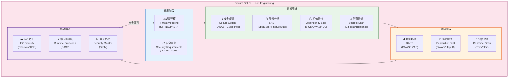

### 13.2　威脅建模 Loop

```bash
# SOP-009: 威脅建模 Loop（使用 AI 輔助）

# Step 1: 生成系統上下文圖
claude -p "
根據以下系統架構，使用 STRIDE 威脅建模方法：
1. 識別所有信任邊界（Trust Boundaries）
2. 識別資料流（Data Flows）
3. 識別威脅（Spoofing/Tampering/Repudiation/Info Disclosure/DoS/EoP）
4. 評估風險等級（CVSS 評分）
5. 提出緩解措施

系統：網路銀行轉帳功能
元件：瀏覽器 → API Gateway → Transfer Service → Account DB
" --output docs/threat-model.md

# Step 2: 自動建立安全測試案例
claude -p "
根據威脅模型，為以下威脅建立自動化安全測試：
1. SQL Injection 攻擊測試
2. JWT Token 偽造測試
3. 並發轉帳競態條件測試
4. 金額精度攻擊測試（BigDecimal）
5. 帳號枚舉攻擊防護測試
" --skill security/owasp-top10 --output src/test/java/security/

# Step 3: 持續安全掃描 Loop
#!/bin/bash
# 每次提交時自動執行安全掃描

echo "🔒 啟動安全掃描 Loop..."

# SAST
mvn spotbugs:spotbugs 2>&1 | tee logs/sast.log
SAST_ISSUES=$(grep -c "Bug" logs/sast.log || echo 0)

# 相依套件
mvn dependency-check:check 2>&1 | tee logs/dep-check.log
CRITICAL_VULNS=$(grep -c "CRITICAL" logs/dep-check.log || echo 0)

# 秘密掃描
gitleaks detect --source . 2>&1 | tee logs/secrets.log
SECRETS=$(grep -c "Finding" logs/secrets.log || echo 0)

# 若有嚴重問題，停止 Pipeline
if [ "$CRITICAL_VULNS" -gt 0 ] || [ "$SECRETS" -gt 0 ]; then
  echo "❌ 安全掃描失敗！"
  echo "嚴重漏洞: $CRITICAL_VULNS"
  echo "秘密洩漏: $SECRETS"
  
  # 啟動 AI 修復 Loop
  claude "立即修復以下安全問題，優先處理 CRITICAL 等級" \
    --context "$(cat logs/dep-check.log logs/secrets.log)" \
    --priority critical
  exit 1
fi

echo "✅ 安全掃描通過！SAST Issues: $SAST_ISSUES"
```

### 13.3　OWASP Top 10 防護 Checklist

**Checklist-001：OWASP Top 10 自動化審查清單**

| # | 威脅 | 防護措施 | AI 自動審查 | 狀態 |
|---|------|---------|------------|------|
| A01 | Broken Access Control | RBAC + Row-level Security | ✅ SpotBugs | □ |
| A02 | Cryptographic Failures | AES-256 + TLS 1.3 | ✅ SSL Labs | □ |
| A03 | Injection | Prepared Statement + JPA | ✅ FindSecBugs | □ |
| A04 | Insecure Design | Threat Modeling | ✅ AI Review | □ |
| A05 | Security Misconfiguration | CIS Benchmarks | ✅ Checkov | □ |
| A06 | Vulnerable Components | Snyk + OWASP DC | ✅ Dependency Check | □ |
| A07 | Authentication Failures | MFA + JWT + Rate Limit | ✅ OWASP ZAP | □ |
| A08 | Software Integrity Failures | Signed Commits + SBOM | ✅ Sigstore | □ |
| A09 | Security Logging Failures | 結構化日誌 + SIEM | ✅ Log Audit | □ |
| A10 | SSRF | Allow-list + Network Policy | ✅ ZAP SSRF | □ |

---

## 第十四章　Prompt Library

### 14.1　Architecture Prompts

---

**Prompt-001：系統架構設計**

**使用情境**：設計新系統或評估現有架構

**Prompt：**
```
你是一位 Google Staff Engineer 等級的系統架構師。

請為以下系統設計完整架構：
系統名稱：[系統名稱]
業務背景：[業務描述]
技術約束：[現有技術棧、預算、團隊規模]
非功能需求：[QPS、延遲、可用性、合規]

請輸出：
1. C4 架構圖（Context → Container → Component）
2. 技術選型決策矩陣（含理由）
3. 關鍵設計決策（ADR 格式）
4. 主要風險與緩解策略
5. 12 個月演進路線圖

約束：
- 使用 Mermaid 繪製所有圖表
- 每個決策必須說明「為何不選 X」
- 必須考慮安全性、可觀測性、成本
```

**Output 範例（摘要）：**
```markdown
## 架構決策記錄 (ADR-001)
**決策**：使用 PostgreSQL 作為主要資料庫
**狀態**：已接受
**背景**：需要強一致性、JSON 支援、Row-level Security
**決策理由**：
- PostgreSQL 16 原生 JSON 操作效能優異
- Row-level Security 滿足金融合規要求
- pgvector 擴展支援 AI 向量儲存
**為何不選 MySQL**：缺乏 Row-level Security 原生支援
**為何不選 MongoDB**：事務支援較弱，不符合金融業 ACID 要求
```

**注意事項**：
- 確保提供足夠的業務上下文
- 明確說明不可違反的技術約束
- 要求 AI 解釋「不做什麼」同等重要

---

**Prompt-002：API 設計審查**

**使用情境**：新 API 設計或現有 API 審查

**Prompt：**
```
作為 API Design Lead，請審查以下 REST API 設計：

[貼上 API 規格或 OpenAPI YAML]

審查重點：
1. REST 語意正確性（HTTP 方法、狀態碼）
2. 資源命名規範（名詞複數、kebab-case）
3. 版本控制策略
4. 分頁與過濾設計
5. 錯誤回應格式統一性
6. 安全性（認證、授權、輸入驗證）
7. 效能考量（快取、壓縮）
8. 向後相容性

輸出：
- 問題清單（附嚴重程度：CRITICAL/HIGH/MEDIUM/LOW）
- 修改後的 OpenAPI Spec
- 每個修改的說明
```

**注意事項**：
- 提供完整的 OpenAPI 3.x YAML 獲得最佳結果
- 說明 API 的使用者（內部/外部、行動裝置/Web）

---

**Prompt-003：微服務邊界設計**

**使用情境**：單體服務拆分或微服務邊界評估

**Prompt：**
```
我們有一個 Java 單體應用，包含以下模組：
[列出模組清單及相依關係]

請使用 DDD（Domain-Driven Design）方法：
1. 識別 Bounded Context
2. 設計服務邊界（高內聚、低耦合）
3. 識別 Anti-corruption Layer 需求
4. 設計服務間通訊方式（同步/非同步）
5. 評估拆分的優先順序與風險
6. 繪製 Context Map

輸出格式：
- Mermaid Context Map
- 服務清單及職責
- 拆分路線圖（分 3 個 Phase）
- 每個 Phase 的驗收標準
```

---

### 14.2　Coding Prompts

---

**Prompt-004：Spring Boot 功能實作**

**使用情境**：實作新的業務功能

**Prompt：**
```
你是一位 Java 21 + Spring Boot 3.5 專家。

請實作以下功能：
功能描述：[描述]
業務規則：[規則清單]
技術約束：[現有框架、限制]

實作要求：
1. 遵循 Hexagonal Architecture（Port & Adapter）
2. 使用 Java 21 Record、Pattern Matching、Virtual Threads
3. 完整的 Bean Validation（@Valid + 自定義 Validator）
4. 使用 Spring Data JPA（禁止 Native SQL，除非必要）
5. 統一的錯誤處理（@ControllerAdvice）
6. 完整的 Swagger/OpenAPI 文件（@Operation, @Schema）
7. 所有方法需有對應的 JUnit 5 測試（覆蓋率 ≥ 80%）

禁止：
- 在 Controller 直接使用 EntityManager
- 回傳 Entity 物件（必須使用 DTO）
- 忽略任何輸入驗證
- 使用 deprecated API

輸出包含：
- 完整的 Java 程式碼（Controller/Service/Repository/Entity/DTO）
- 對應的 JUnit 5 測試
- Liquibase/Flyway Migration 腳本
```

**注意事項**：
- 提供現有的 Entity 類別作為參考
- 說明資料庫廠商（PostgreSQL/DB2/Oracle）

---

**Prompt-005：程式碼重構**

**使用情境**：重構現有程式碼以提升品質

**Prompt：**
```
請重構以下 Java 程式碼：

[貼上程式碼]

重構目標：
1. 降低圈複雜度（目標：< 10）
2. 消除重複程式碼（DRY 原則）
3. 改善命名（符合 DDD Ubiquitous Language）
4. 應用適當的設計模式（說明選擇理由）
5. 提升可測試性（依賴注入、純函數）
6. 消除 Magic Number/String
7. 改善錯誤處理（明確的例外類型）

約束：
- 不得改變外部介面（API 向後相容）
- 不得引入新的第三方依賴
- 重構後所有現有測試必須仍然通過

輸出：
- 重構後的程式碼
- 重構說明（逐點解釋每個改動）
- 若有設計模式應用，說明選擇理由
```

---

**Prompt-006：資料庫查詢優化**

**使用情境**：優化慢查詢或 N+1 問題

**Prompt：**
```
請分析並優化以下 JPA 查詢效能問題：

現象：[描述效能問題，例如：API 回應時間 3 秒]
資料量：[表格資料量估計]
查詢頻率：[每秒呼叫次數]

現有程式碼：
[貼上 JPA Repository/Service 程式碼]

Slow Query Log：
[貼上資料庫慢查詢日誌]

請分析：
1. 識別 N+1 查詢問題
2. 缺失的索引
3. 不當的 Fetch Type 設定
4. 可以用快取解決的場景
5. 是否需要 CQRS 分離讀寫

輸出：
- 問題根因分析
- 優化後的程式碼（含 @EntityGraph/@BatchSize 等）
- 建議的索引 DDL
- 預期效能改善幅度
```

---

### 14.3　Testing Prompts

---

**Prompt-007：JUnit 5 測試產生**

**使用情境**：為現有程式碼補充測試

**Prompt：**
```
請為以下 Java 程式碼產生完整的 JUnit 5 測試套件：

[貼上程式碼]

測試要求：
1. 涵蓋所有 Happy Path（正常流程）
2. 涵蓋所有邊界條件（邊界值分析）
3. 涵蓋所有錯誤場景（例外情況）
4. 並發/線程安全測試（若適用）
5. 效能測試（若有效能要求）

技術要求：
- 使用 JUnit 5 + Mockito 5 + AssertJ
- 使用 @DisplayName 清楚描述測試意圖
- 使用 @ParameterizedTest 減少重複
- 使用 @TestMethodOrder(MethodOrderer.OrderAnnotation.class) 若有依賴
- 整合測試使用 @SpringBootTest + Testcontainers（PostgreSQL）
- 禁止直接 Mock 靜態方法（代表設計問題，需先重構）

目標覆蓋率：
- 行覆蓋率：≥ 80%
- 分支覆蓋率：≥ 75%
- 重要業務邏輯：100%
```

---

**Prompt-008：E2E 測試（Playwright）**

**使用情境**：為 Web 功能建立端對端測試

**Prompt：**
```
請為以下使用者故事撰寫 Playwright E2E 測試：

使用者故事：
作為 [角色]，我想要 [功能]，以便 [業務價值]

頁面 URL：[URL]
測試環境：[Staging URL]

測試場景：
1. Happy Path（成功完成所有步驟）
2. 表單驗證（各欄位的驗證規則）
3. 錯誤處理（伺服器錯誤、網路中斷）
4. 無障礙測試（WCAG 2.1 AA）
5. 行動裝置相容性（viewport: 375px）

技術要求：
- TypeScript
- Page Object Model 設計模式
- 使用 expect() 而非 waitForSelector
- 測試資料使用 fixtures，不依賴環境資料
- 失敗時自動截圖並上傳 CI 記錄
```

---

### 14.4　Refactoring Prompts

---

**Prompt-009：技術債務清償**

**使用情境**：計劃性技術債務清償

**Prompt：**
```
請分析以下程式碼的技術債務並提供清償計劃：

[貼上程式碼或提供目錄路徑]

分析維度：
1. 程式碼異味（Code Smells）識別與分類
2. 設計債務（缺乏抽象、違反 SOLID）
3. 測試債務（缺少測試、脆弱測試）
4. 文件債務（缺少說明、過時文件）
5. 相依套件債務（過舊、有漏洞的套件）

輸出：
- 技術債務清單（依優先級排序）
- 每項債務的：業務影響、修復成本、建議時程
- 建議的清償路線圖（分 Sprint 規劃）
- Quick Win（< 1 小時可完成的項目）
```

---

**Prompt-010：設計模式應用**

**使用情境**：識別並應用適當的設計模式

**Prompt：**
```
分析以下程式碼，識別可以應用設計模式的場景，並提供重構方案：

[貼上程式碼]

請聚焦以下模式（金融系統常用）：
- Strategy：不同的計算策略（利率計算/手續費計算）
- State：狀態機（訂單狀態/交易狀態）
- Observer：事件通知（帳戶餘額變動）
- Builder：複雜物件建立（轉帳請求）
- Factory：物件建立邏輯（不同類型帳戶）
- Decorator：功能增強（日誌/快取/驗證）

對每個建議的模式：
1. 說明當前問題
2. 說明模式如何解決
3. 提供重構前後的程式碼對比
4. 說明權衡（何時不應使用此模式）
```

---

### 14.5　Upgrade Prompts

---

**Prompt-011：依賴升級分析**

**使用情境**：規劃依賴套件升級

**Prompt：**
```
請分析以下 pom.xml，制定安全的依賴升級計劃：

[貼上 pom.xml]

分析要求：
1. 識別所有有已知漏洞的依賴（CVE 資料庫）
2. 識別可以升級到新主版本的套件（Breaking Changes 評估）
3. 識別廢棄的套件（建議替代品）
4. 評估升級的相容性風險

升級計劃格式：
- 緊急升級（有 CRITICAL/HIGH CVE）：本週完成
- 重要升級（有 MEDIUM CVE + 功能更新）：本月完成
- 計劃升級（小版本/補丁更新）：下個 Sprint
- 評估升級（主版本升級）：本季評估

對每個升級項目：
- 當前版本 → 目標版本
- 主要變更點（Breaking Changes）
- 測試重點
- 回滾策略
```

---

**Prompt-012：Spring Boot 3.x 遷移指南**

**使用情境**：Spring Boot 2.x 升級至 3.x

**Prompt：**
```
請為以下 Spring Boot 2.7 應用程式提供升級至 3.5 的詳細遷移指南：

[提供 pom.xml + 主要設定檔]

請涵蓋：
1. javax → jakarta 套件遷移（完整對應表）
2. Spring Security 5 → 6 的 API 變更
3. Spring Data 2 → 3 的變更
4. Actuator 端點變更
5. 自動設定變更（spring.factories → AutoConfiguration.imports）
6. 日誌變更（Log4j 2 版本）
7. Java 17 相容性（需要更新的語法）

輸出格式：
- 逐步遷移指令（Shell Scripts）
- 自動化遷移腳本（sed/awk 批次替換）
- 需要手動處理的項目清單
- 驗證清單（升級後的測試重點）
```

---

### 14.6　Reverse Engineering Prompts

---

**Prompt-013：Legacy 程式碼分析**

**使用情境**：分析不熟悉的 Legacy 程式碼庫

**Prompt：**
```
請分析以下 Legacy Java 程式碼庫（Java 6 + Struts + EJB）：

[提供程式碼目錄或關鍵檔案]

分析目標：
1. 識別所有業務功能（建立功能清單）
2. 繪製模組相依關係圖
3. 識別核心業務邏輯（與框架程式碼分離）
4. 識別所有外部系統整合點（DB/MQ/外部 API）
5. 識別隱藏的業務規則（硬編碼在程式碼中的規則）

特別注意：
- 金融計算邏輯（利率/手續費/匯率）
- 狀態轉換邏輯（交易狀態機）
- 授權邏輯（帳號存取控制）
- 批次處理邏輯（夜間結算）

輸出：
- 功能清單（含業務重要性評級）
- 架構圖（Mermaid）
- 業務規則文件（Markdown）
- 高風險遷移項目清單
```

---

### 14.7　Documentation Prompts

---

**Prompt-014：API 文件產生**

**使用情境**：為 REST API 產生完整文件

**Prompt：**
```
請為以下 Spring Boot Controller 產生完整的 API 文件：

[貼上 Controller 程式碼]

文件要求：
1. OpenAPI 3.x Annotation（@Operation/@ApiResponse/@Schema）
2. 每個 Endpoint 的：
   - 功能說明（使用業務語言，非技術術語）
   - 請求範例（curl + JSON）
   - 成功回應範例
   - 錯誤回應範例（所有可能的錯誤碼）
3. 認證方式說明（Bearer Token）
4. 速率限制說明
5. Changelog（若有版本歷史）

額外要求：
- 提供 Postman Collection JSON
- 提供 API 測試用的 curl 指令（含各種場景）
```

---

### 14.8　Security Prompts

---

**Prompt-015：安全程式碼審查**

**使用情境**：對程式碼進行安全性審查

**Prompt：**
```
你是一位資深安全工程師，專精 OWASP 與金融業安全規範（PCI-DSS）。

請對以下程式碼進行安全審查：

[貼上程式碼]

審查框架：OWASP Top 10 2021

重點關注（金融系統）：
1. 注入攻擊：SQL/JNDI/LDAP Injection
2. 認證：JWT 驗證強度、Session 管理
3. 敏感資料：帳號/密碼/交易資料的加密與日誌遮罩
4. 授權：水平與垂直權限提升
5. 金融特定：BigDecimal 精度、轉帳競態條件、重放攻擊

輸出格式（SARIF 相容）：
{
  "findings": [
    {
      "severity": "CRITICAL|HIGH|MEDIUM|LOW",
      "cwe": "CWE-89",
      "owasp": "A03:2021",
      "location": "檔案:行號",
      "description": "問題描述",
      "code_snippet": "問題程式碼",
      "remediation": "修復方案",
      "fixed_code": "修復後程式碼"
    }
  ]
}
```

**注意事項**：
- 若發現 CRITICAL 問題，立即標示並說明緊急程度
- 提供修復後的完整程式碼，而非只說明問題

---

**Prompt-016：威脅建模（STRIDE）**

**使用情境**：新功能或系統的威脅分析

**Prompt：**
```
請對以下系統/功能進行 STRIDE 威脅建模：

系統描述：[描述]
資料流圖：[提供 DFD 或系統架構描述]
資產清單：[需要保護的資產]

STRIDE 分析：
S - Spoofing（身份偽造）：攻擊者能否冒充合法使用者？
T - Tampering（資料篡改）：資料在傳輸或儲存中能否被修改？
R - Repudiation（否認）：使用者能否否認其操作？
I - Information Disclosure（資訊洩露）：敏感資料是否可能外洩？
D - Denial of Service（阻斷服務）：服務是否容易被癱瘓？
E - Elevation of Privilege（權限提升）：一般使用者能否獲得管理員權限？

對每個威脅：
- 威脅描述（具體的攻擊場景）
- CVSS v3.1 評分
- 緩解措施（技術 + 管理）
- 驗證方式（如何確認已緩解）
```

---

### 14.9　Code Review Prompts

---

**Prompt-017：Pull Request 審查**

**使用情境**：自動化 PR 程式碼審查

**Prompt：**
```
你是一位 Principal Engineer，請審查以下 Pull Request：

PR 標題：[標題]
PR 描述：[描述]
Changed Files：[diff 內容]

審查維度（依重要性排序）：
1. 🔴 正確性：邏輯錯誤、邊界條件、資料一致性
2. 🔴 安全性：OWASP Top 10、敏感資料處理
3. 🟡 效能：N+1 查詢、不必要的計算、記憶體洩漏
4. 🟡 可維護性：複雜度、命名、責任分離
5. 🟢 測試：覆蓋率、測試品質
6. 🟢 文件：JavaDoc、API 文件

輸出格式（每個意見）：
**[嚴重程度] 檔案:行號**
問題：[描述問題]
建議：[具體改進方案]
範例：
  // 修改前
  舊程式碼
  // 修改後
  新程式碼

最後提供：
- 整體評估：APPROVE / REQUEST_CHANGES / COMMENT
- 優先修復項目清單（若有 REQUEST_CHANGES）
```

---

**Prompt-018：架構合規審查**

**使用情境**：確保程式碼符合架構決策

**Prompt：**
```
請審查以下程式碼是否符合我們的架構規範：

架構規範：
1. 使用 Hexagonal Architecture（Controller → Service → Domain → Repository）
2. 禁止跨層相依（Controller 不得直接呼叫 Repository）
3. Domain 物件不得有 Spring 依賴
4. 所有外部系統呼叫必須透過 Port Interface
5. 禁止在 Service 層拋出 HTTP 狀態碼相關例外

程式碼：
[貼上程式碼]

輸出：
- 違反規範的項目清單（含位置）
- 每個違反項目的修正建議
- 架構合規評分（0-100）
```

---

**Prompt-019：效能審查**

**使用情境**：識別效能瓶頸

**Prompt：**
```
請審查以下程式碼的效能問題：

業務背景：[說明流量規模，如：每秒 1000 TPS]
SLA 要求：[P95 < 200ms, P99 < 500ms]

程式碼：
[貼上程式碼]

請識別：
1. N+1 查詢問題（JPA Lazy Loading）
2. 可以快取的計算（Redis/本地快取）
3. 可以非同步處理的操作（Kafka/Virtual Threads）
4. 不必要的序列化/反序列化
5. 大型物件建立（物件池/重用）
6. 阻塞操作（I/O、外部 API 呼叫）

對每個問題：
- 問題描述與影響量化（延遲增加多少？）
- 修復方案（含程式碼）
- 預期效能改善
```

---

**Prompt-020：資料庫 Schema 審查**

**使用情境**：審查 DB Schema 設計品質

**Prompt：**
```
請審查以下資料庫 Schema：

[貼上 DDL SQL]

審查項目：
1. 正規化（NF 檢查，避免過度正規化）
2. 索引策略（查詢模式與索引的匹配度）
3. 資料型態選擇（VARCHAR 長度、DECIMAL 精度）
4. 外鍵約束（資料完整性）
5. 金融資料特殊考量：
   - 金額欄位必須使用 DECIMAL(19,4)
   - 時間戳必須含時區（TIMESTAMPTZ）
   - 帳號/卡號需要加密或 Tokenization
6. 效能考量（Partition 策略、大型表格）
7. 稽核欄位（created_at, updated_at, created_by）

輸出：
- 問題清單（嚴重程度分級）
- 修改後的 DDL
- 索引建議
- 效能預估
```

---

## 第十五章　最佳實務 Top 50

### 15.1　Loop 設計最佳實務（#1–#15）

**Checklist-002：Loop 設計最佳實務**

- [ ] **BP-01** 每個 Loop 必須有明確的停止條件（避免無限迴圈）
- [ ] **BP-02** 設計最大迭代次數限制（通常 5-20 次）
- [ ] **BP-03** 每次迭代必須有可量測的進度（Eval 分數應有趨勢）
- [ ] **BP-04** 保留每次迭代的完整記錄（可審計、可回溯）
- [ ] **BP-05** 設計明確的 Escalation 機制（自動修復失敗時通知人工）
- [ ] **BP-06** Loop 狀態必須持久化（支援中斷恢復）
- [ ] **BP-07** 每個 Sub-Loop 保持單一職責（避免 God Loop）
- [ ] **BP-08** 使用 Timeouts 防止 Loop 卡住（每步驟設定最大執行時間）
- [ ] **BP-09** 設計 Circuit Breaker（連續失敗達閾值時暫停 Loop）
- [ ] **BP-10** 所有 Loop 輸出必須有版本標記（便於追蹤）
- [ ] **BP-11** 並行 Loop 使用 Worktrees 隔離（避免檔案衝突）
- [ ] **BP-12** 重要 Loop 設計 Dry-run 模式（先模擬不實際執行）
- [ ] **BP-13** Loop 成本管理（Token 使用量監控與預算上限）
- [ ] **BP-14** 設計 Loop 的健康檢查端點（外部可監控）
- [ ] **BP-15** 使用 Feature Flag 控制 Loop 的啟用狀態

### 15.2　Agent 設計最佳實務（#16–#25）

**Checklist-003：Agent 設計最佳實務**

- [ ] **BP-16** 每個 Agent 的職責邊界要清晰（單一職責原則）
- [ ] **BP-17** Agent 之間透過明確的介面通訊（避免直接依賴）
- [ ] **BP-18** System Prompt 版本化管理（Git 追蹤變更）
- [ ] **BP-19** Agent 輸出格式標準化（JSON Schema 驗證）
- [ ] **BP-20** 設計 Agent 的 Fallback 策略（工具失敗時的替代方案）
- [ ] **BP-21** 避免 Agent 持有過多上下文（定期清理無關資訊）
- [ ] **BP-22** 為每個 Agent 設定適當的溫度（Temperature）
- [ ] **BP-23** 使用 Structured Output 代替自由文字輸出（提高可靠性）
- [ ] **BP-24** Agent 的工具呼叫需要冪等性設計
- [ ] **BP-25** 記錄所有 Agent 決策的理由（Decision Trail）

### 15.3　Evals 設計最佳實務（#26–#35）

**Checklist-004：Evals 設計最佳實務**

- [ ] **BP-26** Evals 設計在功能開發之前（TDD for AI）
- [ ] **BP-27** 使用真實的生產資料樣本設計 Evals（不使用刻意構造的資料）
- [ ] **BP-28** Evals 必須可以在 CI/CD 中自動執行
- [ ] **BP-29** 維護 Eval 失敗的案例庫（防止回退）
- [ ] **BP-30** Eval 結果需要趨勢分析（不只看單次）
- [ ] **BP-31** 安全性 Eval 具有最高優先級和最嚴格標準
- [ ] **BP-32** 效能 Eval 需設定基準線和回退閾值
- [ ] **BP-33** 使用 A/B 測試驗證 Prompt 改進
- [ ] **BP-34** Eval 分數需要有業務意義的解讀
- [ ] **BP-35** 定期回顧和更新 Eval Suite（每季至少一次）

### 15.4　安全性最佳實務（#36–#43）

**Checklist-005：安全性最佳實務**

- [ ] **BP-36** 所有 AI Agent 的工具呼叫需要白名單授權
- [ ] **BP-37** 禁止 Agent 直接存取生產環境（使用 Staging/Dev）
- [ ] **BP-38** Agent 產生的程式碼必須經過安全掃描才能合併
- [ ] **BP-39** 敏感資訊不得進入 AI 的上下文（API Key/密碼）
- [ ] **BP-40** 所有 Agent 動作記錄到不可篡改的稽核日誌
- [ ] **BP-41** 定期輪換 AI 平台的 API 金鑰
- [ ] **BP-42** 為 AI Agent 設定最小權限原則
- [ ] **BP-43** Prompt Injection 防護（輸入淨化）

### 15.5　效能最佳實務（#44–#50）

**Checklist-006：效能最佳實務**

- [ ] **BP-44** 使用串流（Streaming）處理大型輸出（減少延遲感）
- [ ] **BP-45** 適當使用 Prompt Caching 降低 Token 成本
- [ ] **BP-46** 選擇適合任務的模型（小任務用快速模型）
- [ ] **BP-47** 並行執行獨立的 Sub-tasks（使用 Worktrees）
- [ ] **BP-48** 使用 Memory 避免重複的上下文傳遞
- [ ] **BP-49** 批次處理類似任務（Batch Processing）
- [ ] **BP-50** 監控 Token 使用量並設定預算告警

---

## 第十六章　常見錯誤 Top 50 Anti-patterns

### 16.1　Loop 設計反模式（#1–#15）

**Checklist-007：Loop 設計反模式**

- [ ] **AP-01** ❌ **無限迴圈 Agent**：沒有停止條件，Task 永遠不結束
  - ✅ 修正：設定 maxIterations + 明確的完成判斷條件

- [ ] **AP-02** ❌ **上帝 Loop（God Loop）**：一個 Loop 做所有事
  - ✅ 修正：拆分為多個專注的子 Loop（分析/設計/編碼/測試）

- [ ] **AP-03** ❌ **輸出噪音積累**：每次迭代將所有輸出累積到上下文
  - ✅ 修正：每次迭代只保留關鍵資訊，清理無關上下文

- [ ] **AP-04** ❌ **無反饋驅動**：Loop 不使用前次迭代的結果做為輸入
  - ✅ 修正：確保每次迭代的輸出被正確餵回下次迭代

- [ ] **AP-05** ❌ **跳過 Eval**：為了速度而跳過品質評估
  - ✅ 修正：Eval 是 Loop 的守門員，不可省略

- [ ] **AP-06** ❌ **Eval 過度寬鬆**：Eval 標準設得太低，幾乎總是通過
  - ✅ 修正：根據業務需求設定有意義的閾值

- [ ] **AP-07** ❌ **缺少 Escalation**：AI 修復失敗後繼續無效循環
  - ✅ 修正：設計 N 次失敗後自動升級人工處理的機制

- [ ] **AP-08** ❌ **競態條件**：多個 Agent 並行修改同一檔案
  - ✅ 修正：使用 Worktrees 隔離，或設計明確的檔案鎖定機制

- [ ] **AP-09** ❌ **無狀態 Loop**：Loop 中斷後無法從中斷點恢復
  - ✅ 修正：持久化 Loop 狀態，設計 Checkpoint 機制

- [ ] **AP-10** ❌ **過度自動化**：完全移除人工審查節點
  - ✅ 修正：關鍵決策點（生產部署/安全問題）必須保留人工確認

- [ ] **AP-11** ❌ **測試先跳過**：「先讓它跑起來再說」
  - ✅ 修正：測試是品質的保證，不是速度的障礙

- [ ] **AP-12** ❌ **鎖定特定模型版本**：Hardcode 模型 ID，無法彈性切換
  - ✅ 修正：模型選擇應可設定，支援 Fallback 到替代模型

- [ ] **AP-13** ❌ **不計成本的 Loop**：每次迭代都使用最貴的模型
  - ✅ 修正：根據任務複雜度選擇合適的模型（分層策略）

- [ ] **AP-14** ❌ **缺少監控**：不知道 Loop 現在在哪個步驟、健康狀況
  - ✅ 修正：實作 Loop 狀態儀表板與告警機制

- [ ] **AP-15** ❌ **Prompt 沒有版本控制**：Prompt 直接修改，無法追蹤
  - ✅ 修正：Prompt 必須版本化，修改需要 Code Review

### 16.2　Agent 設計反模式（#16–#30）

**Checklist-008：Agent 設計反模式**

- [ ] **AP-16** ❌ **模糊職責**：Agent 的邊界不清晰，什麼都做
  - ✅ 修正：每個 Agent 有明確的輸入/輸出定義和職責邊界

- [ ] **AP-17** ❌ **過長 System Prompt**：System Prompt 超過 10,000 tokens
  - ✅ 修正：使用 Skills 機制動態載入，保持 System Prompt 精簡

- [ ] **AP-18** ❌ **Prompt Injection 漏洞**：直接將使用者輸入插入 Prompt
  - ✅ 修正：對所有外部輸入進行淨化和驗證

- [ ] **AP-19** ❌ **忽略工具失敗**：工具呼叫失敗時繼續執行
  - ✅ 修正：設計明確的工具失敗處理策略

- [ ] **AP-20** ❌ **上下文污染**：把不相關的資訊塞入上下文
  - ✅ 修正：精確控制上下文內容，只包含當前任務相關資訊

- [ ] **AP-21** ❌ **幻覺不修正**：AI 生成錯誤資訊，未經驗證就使用
  - ✅ 修正：所有 AI 輸出必須經過驗證（測試/靜態分析）

- [ ] **AP-22** ❌ **過度依賴 AI 記憶**：假設 AI 記得上次對話
  - ✅ 修正：明確的 Memory 機制，不依賴隱性記憶

- [ ] **AP-23** ❌ **非結構化輸出**：期望 AI 輸出特定格式卻不驗證
  - ✅ 修正：使用 JSON Schema 驗證 Agent 輸出格式

- [ ] **AP-24** ❌ **Agent 直接存取生產 DB**：無隔離的危險操作
  - ✅ 修正：生產環境只讀（SELECT），寫入需要透過 API

- [ ] **AP-25** ❌ **無日誌**：Agent 動作無法追蹤和稽核
  - ✅ 修正：所有 Agent 動作記錄到結構化稽核日誌

- [ ] **AP-26** ❌ **大量複製 Prompt**：相似功能重複撰寫 Prompt
  - ✅ 修正：建立 Prompt Template Library，使用參數化

- [ ] **AP-27** ❌ **忽略成本**：不追蹤 Token 使用量
  - ✅ 修正：每個 Loop 記錄 Token 消耗，設定月度預算告警

- [ ] **AP-28** ❌ **單點故障 Agent**：所有任務依賴單一 Agent
  - ✅ 修正：設計多 Agent 協作，避免單點故障

- [ ] **AP-29** ❌ **無 Timeout**：Agent 工具呼叫無時限限制
  - ✅ 修正：所有外部呼叫設定合理 Timeout

- [ ] **AP-30** ❌ **信任 AI 所有輸出**：不驗證就執行 AI 產生的程式碼
  - ✅ 修正：AI 產生的程式碼必須通過測試和靜態分析才能使用

### 16.3　安全性反模式（#31–#40）

**Checklist-009：安全性反模式**

- [ ] **AP-31** ❌ 敏感資訊（API Key/密碼）進入 AI 上下文
- [ ] **AP-32** ❌ AI Agent 有過度的系統權限（root/admin）
- [ ] **AP-33** ❌ 跳過安全掃描以加速 Pipeline
- [ ] **AP-34** ❌ AI 產生的程式碼未經安全審查直接部署
- [ ] **AP-35** ❌ 使用 AI 繞過程式碼審查流程
- [ ] **AP-36** ❌ 不更新 AI 工具的安全補丁
- [ ] **AP-37** ❌ 在 Prompt 中暴露系統架構細節
- [ ] **AP-38** ❌ AI 稽核日誌可以被修改
- [ ] **AP-39** ❌ 使用個人帳號的 AI API Key（而非服務帳號）
- [ ] **AP-40** ❌ 未對 AI 輸出進行輸出編碼（XSS 風險）

### 16.4　組織導入反模式（#41–#50）

**Checklist-010：組織導入反模式**

- [ ] **AP-41** ❌ **全有或全無**：一次性切換到全 AI 開發，無漸進策略
- [ ] **AP-42** ❌ **缺少培訓**：工程師不了解工具就直接使用
- [ ] **AP-43** ❌ **忽略人工費用**：只計算 AI 費用，忽略工程師的 Loop 設計成本
- [ ] **AP-44** ❌ **盲目信任**：不驗證 AI 輸出的正確性
- [ ] **AP-45** ❌ **KPI 設計不當**：以「AI 撰寫的程式碼比例」為 KPI
- [ ] **AP-46** ❌ **工具蔓延**：使用過多 AI 工具，沒有統一策略
- [ ] **AP-47** ❌ **孤島效應**：各團隊各自使用 AI，沒有共享最佳實務
- [ ] **AP-48** ❌ **拒絕回饋**：不收集工程師對 AI 工具的使用反饋
- [ ] **AP-49** ❌ **無退出策略**：過度依賴特定 AI 廠商，沒有備案
- [ ] **AP-50** ❌ **忽略合規**：在有資料主權要求的環境中使用雲端 AI 服務

---

## 第十七章　導入策略

### 17.1　企業 AI 工程成熟度模型

```mermaid
graph LR
    subgraph L1["Level 1\nPrompt Engineering"]
        L1T["特徵：\n• 個人使用 AI\n• 一次性問答\n• 無流程整合\n• 無評估機制"]
    end

    subgraph L2["Level 2\nWorkflow Automation"]
        L2T["特徵：\n• 團隊使用 AI\n• 固定流程自動化\n• CI/CD 初步整合\n• 基礎品質閘口"]
    end

    subgraph L3["Level 3\nAgent Engineering"]
        L3T["特徵：\n• AI Agent 執行任務\n• 動態決策能力\n• 工具呼叫整合\n• 多 Agent 協作"]
    end

    subgraph L4["Level 4\nLoop Engineering"]
        L4T["特徵：\n• 完整 Loop 設計\n• 自我修正能力\n• 完整 Evals\n• Memory & Skills"]
    end

    subgraph L5["Level 5\nAutonomous Engineering Org"]
        L5T["特徵：\n• AI 主導開發\n• 自主規劃執行\n• 持續自我改進\n• 人類設定目標"]
    end

    L1 --> L2 --> L3 --> L4 --> L5

    style L1 fill:#ffcdd2,stroke:#c62828
    style L2 fill:#ffe0b2,stroke:#e65100
    style L3 fill:#fff9c4,stroke:#f9a825
    style L4 fill:#c8e6c9,stroke:#2e7d32
    style L5 fill:#b3e5fc,stroke:#01579b
```

### 17.2　各等級特徵與升級路徑

| 等級 | 特徵指標 | 升級至下一級所需 | 預計時程 |
|-----|---------|----------------|---------|
| L1 Prompt Eng. | 個人使用 ChatGPT/Copilot | 標準化 Prompt Library + 團隊培訓 | 1-3 月 |
| L2 Workflow | 基礎 AI 輔助 CI/CD | 建立 Agent Infrastructure + Evals | 3-6 月 |
| L3 Agent Eng. | AI Agent 執行部分任務 | 設計 Loop 機制 + Memory 系統 | 6-12 月 |
| L4 Loop Eng. | 完整 Loop 驅動開發 | 提升 Agent 自主性 + 治理框架 | 12-24 月 |
| L5 Autonomous | AI 主導大部分開發 | 持續演進（長期目標） | 24+ 月 |

### 17.3　Loop Engineering 導入 Checklist

**Checklist-011：Loop Engineering 導入就緒評估**

**基礎設施準備**
- [ ] Git Repository 已設定完整的分支保護規則
- [ ] CI/CD Pipeline 已建立（GitHub Actions / Jenkins）
- [ ] 靜態程式碼分析工具已整合（SonarQube）
- [ ] 安全掃描工具已整合（Snyk / OWASP DC）
- [ ] 測試框架已完整設定（JUnit 5 + Testcontainers）

**AI 工具準備**
- [ ] Claude Code / GitHub Copilot 已取得企業授權
- [ ] MCP Server 已設定與企業工具整合
- [ ] CLAUDE.md / copilot-instructions.md 已撰寫
- [ ] Skill Library 初版已建立
- [ ] Memory 目錄結構已設定

**流程準備**
- [ ] Loop Engineering 工作規範已制定
- [ ] Agent 授權邊界已定義
- [ ] Eval 標準已設定
- [ ] 安全審查流程已建立
- [ ] 培訓計劃已完成

### 17.4　單一迴圈的自主程度模型（L1-L3）與企業成熟度模型的對應

17.1 節的 L1-L5 模型衡量的是**整個組織**的 AI 工程成熟度，是一個橫跨數月到數年的長期演進過程。但在實務導入時，團隊更常需要回答一個更小範圍、更立即的問題：「**這一個具體的自動化迴圈，目前可以放手到什麼程度？**」cobusgreyling 提出的三階自主程度模型，正是針對單一迴圈設計的細粒度量尺，可以視為 17.1 節 L3／L4 等級內部的「次階段」：

| 自主等級 | 名稱 | 行為描述 | 人類角色 | 對應 17.1 等級 |
|---------|------|---------|---------|----------------|
| L1 | 報告（Report） | 迴圈只負責偵測與分析問題，產出報告，不做任何變更 | 人類閱讀報告後自行決定並動手修復 | 落在 L2-L3 之間的起步期 |
| L2 | 協助修復（Assisted Fix） | 迴圈產出具體修復方案（例如 PR），但需要人類核准才會合併 | 人類審查並核准／拒絕 | L3 的典型運作方式 |
| L3 | 無人值守（Unattended） | 迴圈在明確定義的邊界內自主完成偵測、修復、驗證、合併全流程 | 人類僅事後稽核、設定邊界 | L4 的典型運作方式 |

這個對應關係的實務意義是：企業不需要等到整個組織達到 17.1 節的 L4 才能享受自動化效益——**可以先讓單一、低風險的迴圈（例如：依賴套件版本更新、Changelog 草稿產生）率先推進到 L3，作為組織級成熟度提升的先導案例**，再逐步擴大 L3 迴圈的覆蓋範圍。

### 17.5　七種生產級 Loop 模式目錄

以下是業界已驗證可行、可直接作為企業導入起點的七種生產級迴圈模式，依風險與複雜度由低到高排列。每種模式建議先以 L1（報告）上線，確認 Grader／Eval 品質穩定後，再視風險容忍度逐步推進到 L2、L3：

| 模式 | 用途 | 典型執行週期 | 建議起始自主等級 | 成本量級 |
|------|------|-------------|-----------------|---------|
| Daily Triage（每日分流） | 將新進 Issue／告警自動分類、標記優先級 | 每日 1 次 | L1 | 低 |
| PR Babysitter（PR 看護） | 持續監看開啟中的 PR，自動回應 CI 失敗、補充缺漏的測試 | 每次 PR 事件觸發 | L2 | 中 |
| CI Sweeper（CI 清道夫） | 偵測並自動修復 CI 中的 Flaky Test、過期相依設定 | 每次 CI 失敗觸發 | L2 | 中 |
| Dependency Sweeper（依賴清道夫） | 自動偵測並送出相依套件升級 PR，含安全漏洞修補 | 每週 1 次 | L2-L3 | 低-中 |
| Changelog Drafter（變更紀錄草稿） | 依合併的 PR 自動草擬版本變更紀錄 | 每次發版前 | L2 | 低 |
| Post-Merge Cleanup（合併後清理） | 合併後自動清理已關閉分支、過期 Feature Flag | 每日 1 次 | L3 | 低 |
| Issue Triage（議題分流） | 自動為新 Issue 補充重現步驟、標記受影響模組 | 每次 Issue 建立觸發 | L1-L2 | 低 |

> 這份清單可直接作為附錄 J「補充 SOP 集合」之外、企業規劃導入順序時的**迴圈組合套餐**——建議優先選擇 2-3 個低風險、高重複性的模式（如 Daily Triage、Dependency Sweeper）作為第一波導入對象，待團隊建立起對 Eval／Grader 的信任後，再擴展到 PR Babysitter 等涉及程式碼變更的模式。

### 17.6　導入前自我檢測：loop-audit 與 loop-cost

在正式投入 17.3 節 Checklist 所列的基礎設施建置之前，企業可以先用兩個量化檢測的概念，評估「現在是否是導入這個迴圈的好時機」：

- **loop-audit（迴圈就緒度評分）**：針對一個候選的自動化迴圈，檢查其 Task 是否有明確的成功判定標準（是否已有 Grader）、執行環境是否穩定可重複、失敗時是否有安全的復原路徑。就緒度評分過低的迴圈，應先回到第十一章補齊 Eval 設計，而不是急著上線自動化。
- **loop-cost（Token 成本估算）**：在導入前估算該迴圈每次執行的 Token 消耗與執行時間，並換算成可比較的金錢成本，與「若由人工執行」的成本基準比較。若估算結果顯示 Orchestration Tax（見 1.7 節）已經逼近甚至超過人工成本，應重新檢視迴圈的編排複雜度，而非直接上線。

這兩項檢測不需要購買特定工具才能進行——其本質是在導入前，先把 17.3 節 Checklist 中隱含的「值不值得做」「能不能安全失敗」兩個問題量化成可比較的數字，作為跨團隊優先排序多個候選迴圈時的共同依據。

---

## 第十八章　未來發展

### 18.1　Self-healing Development（自愈式開發）

Self-healing Development 是指系統能夠在不需要人工介入的情況下，自動偵測、診斷並修復問題。

**技術路徑：**
```
現在：AI 輔助診斷 + 人工修復
近期：AI 自動修復 + 人工驗證
未來：AI 自動修復 + 自動驗證 + 自動部署
```

**實作要素：**
1. **全面的可觀測性**（Metrics + Logs + Traces）
2. **智慧異常偵測**（ML-based Anomaly Detection）
3. **自動根因分析**（Automated Root Cause Analysis）
4. **安全的自動修復**（Guarded Auto-remediation）
5. **持續學習**（每次事件改進知識庫）

### 18.2　AI Software Factory（AI 軟體工廠）

```mermaid
flowchart LR
    Requirement["📋 業務需求\n（自然語言）"]

    subgraph AIFactory["AI 軟體工廠"]
        Analyze["需求分析\n(Planner AI)"]
        Design["架構設計\n(Architect AI)"]
        Code["程式碼生成\n(Coder AI × N)"]
        Test["自動測試\n(Tester AI)"]
        Security["安全審查\n(Security AI)"]
        Deploy["自動部署\n(DevOps AI)"]
        Monitor["生產監控\n(SRE AI)"]
    end

    Product["✅ 生產級軟體\n（可直接部署）"]

    Requirement --> Analyze
    Analyze --> Design --> Code --> Test --> Security --> Deploy --> Monitor
    Monitor -->|"需求變更"| Analyze
    Monitor -->|"品質問題"| Code
    Monitor --> Product

    style AIFactory fill:#e8f5e9,stroke:#2E7D32
```

### 18.3　Autonomous SDLC 路線圖

**2025–2026 近期發展：**
- Loop Engineering 工具成熟化
- Multi-Agent 協作框架標準化
- AI 驅動的 Evals 自動生成
- 企業私有 AI 模型（On-premise LLM）

**2026–2027 中期發展：**
- Self-healing Production Systems
- AI 驅動的需求分析與自動規格撰寫
- 跨組織 AI Agent 協作（Supply Chain AI）
- AI 主導的技術債務管理

**2028+ 長期願景：**
- Autonomous Engineering Organization
- AI 自主制定技術策略
- 人類工程師聚焦創意與策略
- AI 與人類協作的新工作模式

### 18.4　Multi-Agent Enterprise 架構願景

未來的企業 AI 架構將是一個巨大的 Agent Mesh，不同系統、不同組織之間的 AI Agent 透過標準協議（如 MCP、ACP）協作，形成一個**企業級 AI 神經網絡**。

**關鍵技術：**
- **Agent Communication Protocol（ACP）**：Agent 間的標準通訊協議
- **Multi-Agent Trust Framework**：跨組織 Agent 信任機制
- **Federated AI Memory**：分散式共享知識庫
- **AI Governance Mesh**：去中心化的 AI 治理機制

### 18.5　下一代執行引擎：Graph Harness 的展望

2.11 節從排程理論的角度指出，當前主流的 Agent Loop 架構在任一執行步驟的就緒集合基數恆為 |𝒰| = 1——這個結構性限制，正是 18.1～18.4 節所描繪願景的隱性天花板：**Self-healing Production Systems、跨組織 Agent Mesh 等願景，都隱含需要同時協調多個彼此獨立、可並行就緒的工作單位**，而這正是傳統單一序列 Agent Loop 難以勝任的場景。

可以合理預期，企業 Loop Engineering 平台的下一階段演進，會沿著以下方向展開：

1. **從序列迴圈走向執行圖（Execution Graph）**：任務的依賴關係被顯式建模為圖結構，而非隱含在 Agent 的決策序列中，使得就緒集合基數可以 |𝒰| ≥ 1，讓真正獨立的子任務能夠並行執行，而不必勉強塞進單一序列。
2. **從整體重試走向分層復原**：2.11 節介紹的三層遞升復原協議（內部重試 → 本地修補 → 全面重規劃）取代「成功繼續、失敗整段重來」的二元結果，讓失敗的代價與復原的成本更精確地對應。
3. **從不可審計走向形式化可驗證**：排程理論的形式化分析方法，使得企業治理單位（對應第十一章 Evals 與第十七章治理機制）未來有機會對「這個迴圈在什麼條件下會卡住、什麼條件下保證收斂」提出可被證明的保證，而不只是經驗性的信心。

> **務實提醒**：截至本手冊撰寫時，Graph Harness 仍處於學術研究與早期工具實驗階段（見 2.11 節），企業現階段應以本手冊第三、四章的結構化 Agent Loop 架構為主力方案。本節的價值在於提前讓架構師理解**當前架構的理論邊界在哪裡**，以便在未來工具成熟時，能更快判斷是否值得遷移，而不是被既有投資鎖定在次優架構上。

---

## 附錄 A　Loop Engineering Checklist

### Checklist-012：日常開發 Loop 啟動清單

**開始新任務前：**
- [ ] 是否有相關的 Skill 可以載入？
- [ ] CLAUDE.md / copilot-instructions.md 是否最新？
- [ ] Memory 是否包含本任務相關的先前決策？
- [ ] 是否需要建立 Worktree（並行任務）？
- [ ] Eval 標準是否已定義？

**任務執行中：**
- [ ] 每次迭代是否有可量測的進度？
- [ ] 反饋訊號是否被正確使用？
- [ ] Token 使用量是否在預算內？
- [ ] 是否有需要升級人工審查的情況？

**任務完成後：**
- [ ] 所有測試是否通過（覆蓋率 ≥ 80%）？
- [ ] 安全掃描是否通過（無 CRITICAL/HIGH）？
- [ ] Eval 分數是否達到閾值（≥ 85）？
- [ ] 是否有新的知識需要更新到 Memory/Skill？
- [ ] Worktree 是否已清理？

### Checklist-013：週期性 Loop 品質審查清單

**每週：**
- [ ] 檢視本週 Loop 的 Eval 分數趨勢
- [ ] 檢視失敗的 Loop 案例，更新 Anti-pattern 知識庫
- [ ] 確認 Skill Library 是否需要更新
- [ ] 檢視 Token 使用成本報告

**每月：**
- [ ] 回顧 Top 10 Loop 失敗案例
- [ ] 更新 CLAUDE.md 中的設計決策
- [ ] 評估 AI 工具的升級需求
- [ ] 檢視成熟度等級，規劃升級行動

### Checklist-014：安全 Loop 審查清單

每次涉及安全敏感功能時必須完成：

- [ ] 威脅建模已完成（STRIDE）
- [ ] SAST 掃描結果：無 HIGH/CRITICAL
- [ ] 相依套件掃描：無已知 CVE
- [ ] 秘密掃描：無硬編碼秘密
- [ ] 認證/授權邏輯已審查
- [ ] 敏感資料保護已驗證
- [ ] DAST 掃描已完成（Staging 環境）
- [ ] 安全審查者簽核

### Checklist-015：部署前 Loop 驗證清單

每次部署至生產環境前必須完成：

- [ ] 所有單元測試通過（mvn test 零失敗）
- [ ] 所有整合測試通過（mvn verify 零失敗）
- [ ] SonarQube Quality Gate 通過（狀態 OK）
- [ ] 安全掃描無 CRITICAL/HIGH 漏洞
- [ ] Container Image 安全掃描通過（Trivy）
- [ ] 效能基準測試無回退（P95 未上升 > 10%）
- [ ] DB Migration 腳本已驗證（Staging 先行）
- [ ] 功能旗標已設定（Canary 部署起始 1%）
- [ ] 回滾計劃已確認（kubectl rollout undo 可執行）
- [ ] On-call 工程師已通知本次部署
- [ ] 監控儀表板已準備（Grafana 已開啟）
- [ ] 變更通知已發送（Slack/Teams）

### Checklist-016：AI Agent Team 協作清單

啟動多 Agent 協作任務前檢查：

- [ ] 任務目標已明確定義（可量測的完成條件）
- [ ] 各 Agent 職責已清楚劃分（無重疊）
- [ ] Worktrees 已建立且互不衝突
- [ ] 共享資源的存取衝突已預防（Lock/Queue）
- [ ] Agent 間的通訊格式已定義（JSON Schema）
- [ ] 最大執行時間已設定（Timeout）
- [ ] 失敗時的 Escalation 路徑已定義
- [ ] Token 預算已設定（成本上限）
- [ ] 結果合併策略已確認（Merger Agent）
- [ ] 最終 Eval 標準已定義

### Checklist-017：Legacy 遷移 Loop 清單

每個 Legacy 模組遷移前/後必須完成：

**遷移前（Before）：**
- [ ] 現有功能已完整文件化（業務規則）
- [ ] 現有測試案例已收集（作為對照基準）
- [ ] 資料庫 Schema 已逆向工程
- [ ] 外部系統依賴已識別
- [ ] 遷移策略已確認（Strangler Fig / Big Bang）
- [ ] 回滾計劃已設計（雙寫 + 功能旗標）

**遷移後（After）：**
- [ ] 功能等價性驗證通過（A/B 比對）
- [ ] 效能不低於原系統（基準對比）
- [ ] 資料完整性驗證通過（Checksum 比對）
- [ ] 所有整合點已重新測試
- [ ] 灰度發布已完成（100% 流量切換）
- [ ] Legacy 系統已成功下線（或凍結）

### Checklist-018：Spring Boot 升級 Loop 清單

Spring Boot 版本升級前後必須完成：

**升級前：**
- [ ] 目標版本 Release Notes 已閱讀
- [ ] Breaking Changes 清單已整理
- [ ] 升級分支已建立（upgrade/spring-boot-X.Y）
- [ ] 效能基準已建立（Gatling）
- [ ] 回歸測試套件已準備

**升級執行中：**
- [ ] pom.xml 版本已更新
- [ ] javax → jakarta 套件替換完成
- [ ] Spring Security 設定語法已更新
- [ ] application.properties 廢棄設定已更新
- [ ] 編譯無錯誤（mvn compile）

**升級後驗證：**
- [ ] 所有測試通過（mvn verify）
- [ ] 安全掃描通過
- [ ] 效能基準未回退（與升級前比較）
- [ ] Actuator Health 端點正常
- [ ] Staging 環境煙霧測試通過

### Checklist-019：Prompt 設計品質清單

撰寫新 Prompt 前後必須完成：

**設計前：**
- [ ] 使用情境已明確定義（誰、什麼時候、為了什麼）
- [ ] 目標模型已確認（Sonnet/Opus/Haiku）
- [ ] 是否有現有 Prompt 可以重用或修改

**設計原則確認：**
- [ ] 角色設定（你是一位...）
- [ ] 任務描述（請...）
- [ ] 輸出格式（輸出：...）
- [ ] 約束條件（禁止：...）
- [ ] 範例提供（若任務複雜）

**品質驗證：**
- [ ] 在 3 個不同場景下測試
- [ ] 輸出格式符合預期
- [ ] 無幻覺或不相關輸出
- [ ] Token 使用量在合理範圍
- [ ] 已加入 Prompt Library 並版本化

### Checklist-020：Eval 設計完整性清單

設計新 Eval 時必須完成：

**功能覆蓋：**
- [ ] Happy Path（正常流程）已涵蓋
- [ ] 邊界值案例已涵蓋
- [ ] 錯誤場景已涵蓋（至少 3 個）
- [ ] 並發場景已涵蓋（若有競態條件風險）

**技術要求：**
- [ ] Eval 可以完全自動化執行（無需人工判斷）
- [ ] Eval 執行時間 < 5 分鐘（CI 可接受）
- [ ] 使用真實資料樣本（非刻意構造）
- [ ] 通過/失敗標準明確且可量測
- [ ] Eval 結果為機器可讀格式（JSON）

**整合要求：**
- [ ] 已整合進 CI/CD Pipeline
- [ ] 失敗時有明確的告警機制
- [ ] 結果已記錄到歷史資料庫（趨勢分析）
- [ ] 已設定基準線（Baseline）

---

## 附錄 B　Project Structure

```
my-enterprise-project/
├── .claude/                          # Claude Code 設定
│   ├── settings.json                 # Hooks & 權限設定
│   ├── settings.local.json           # 個人設定（不提交）
│   └── skills/                       # 自定義 Skills
│       ├── banking-domain.md
│       └── company-standards.md
├── .github/
│   ├── copilot-instructions.md       # Copilot 工作指示
│   ├── workflows/                    # GitHub Actions
│   │   ├── loop-engineering.yml      # 主要 Loop Pipeline
│   │   ├── security-scan.yml         # 安全掃描 Loop
│   │   └── ai-auto-fix.yml           # AI 自動修復 Loop
│   ├── prompts/                      # 標準 Prompt Library
│   │   ├── architecture/
│   │   ├── coding/
│   │   ├── security/
│   │   └── testing/
│   └── 教學/
│       └── AI開發/                   # 教學手冊目錄
├── docs/
│   ├── architecture/                 # 架構決策記錄
│   ├── threat-models/                # 威脅模型
│   └── api/                          # API 文件
├── skills/                           # Skill Library（版本控制）
│   ├── coding/
│   ├── architecture/
│   ├── testing/
│   ├── security/
│   └── migration/
├── src/
│   ├── main/java/
│   └── test/java/
├── CLAUDE.md                         # 專案知識（Claude Code）
└── pom.xml
```

---

## 附錄 C　Skill Library Template

```markdown
---
skill: [skill-id]
version: [1.0]
tags: [tag1, tag2]
applicable-to: [Java, Spring Boot, etc.]
last-updated: [日期]
---

# [技能名稱]

## 適用情境
[說明何時使用此技能]

## 核心原則
1. [原則 1]
2. [原則 2]

## 標準做法

### [子場景 1]
[說明 + 程式碼範例]

### [子場景 2]
[說明 + 程式碼範例]

## 禁止事項
- [禁止 1]
- [禁止 2]

## 驗收標準
- [ ] [標準 1]
- [ ] [標準 2]

## 參考資料
- [連結或說明]
```

---

## 附錄 D　Memory Template

```markdown
---
name: [kebab-case-slug]
description: [一行摘要，供相關性判斷使用]
metadata:
  type: [user | feedback | project | reference]
---

[記憶內容]

**Why:** [原因或背景]

**How to apply:** [如何在未來使用]
```

---

## 附錄 E　Evaluation Template

### Eval 設計表單

| 欄位 | 說明 |
|------|------|
| Eval ID | EVAL-[模組]-[序號] |
| 功能描述 | 評估什麼功能 |
| 成功標準 | 明確的通過條件（可量測）|
| 測試資料 | 使用哪些測試案例 |
| 評分方式 | 自動/人工/混合 |
| 權重 | 在綜合分數中的權重 |
| 失敗處理 | 失敗時的自動動作 |

### Eval 結果記錄表

```json
{
  "eval_id": "EVAL-TRANSFER-001",
  "timestamp": "2026-06-17T10:00:00Z",
  "version": "v2.3.1",
  "results": {
    "functional": { "score": 96, "pass": true, "details": "..." },
    "security": { "score": 100, "pass": true, "details": "..." },
    "performance": { "score": 88, "pass": true, "details": "P95=180ms" },
    "architecture": { "score": 82, "pass": true, "details": "..." },
    "coding_standard": { "score": 91, "pass": true, "details": "..." },
    "regression": { "score": 100, "pass": true, "details": "全通過" }
  },
  "overall_score": 93.4,
  "overall_pass": true,
  "action_taken": "允許合併至 main"
}
```

---

## 附錄 F　Claude Code Setup

### 完整安裝與設定指南

```bash
# Step 1: 安裝 Claude Code
npm install -g @anthropic-ai/claude-code

# Step 2: 驗證安裝
claude --version

# Step 3: 登入（使用瀏覽器 OAuth）
claude login

# Step 4: 驗證登入
claude whoami

# Step 5: 在專案中初始化
cd /path/to/your/project
claude init

# Step 6: 檢視生成的 CLAUDE.md
cat CLAUDE.md

# Step 7: 設定 MCP 伺服器（GitHub 整合）
claude mcp add github -- \
  npx -y @modelcontextprotocol/server-github
# 輸入 GitHub Token

# Step 8: 驗證 MCP 連線
claude mcp list
claude mcp get github

# Step 9: 設定 Hooks（自動化品質檢查）
cat > .claude/settings.json << 'EOF'
{
  "hooks": {
    "PostToolUse": [
      {
        "matcher": "Write|Edit",
        "hooks": [
          {
            "type": "command",
            "command": "mvn checkstyle:check -q 2>&1 || true"
          }
        ]
      }
    ]
  }
}
EOF

# Step 10: 測試 Loop Engineering 基本功能
claude "列出專案中所有 Java 類別，並識別最複雜的三個"

# Step 11: 啟動互動式 REPL
claude

# Step 12: 常用快捷鍵
# Escape    中斷目前操作
# Ctrl+C    取消
# /help     顯示說明
# /memory   管理記憶
# /skills   管理技能

# Step 13: 設定模型（依需求）
export ANTHROPIC_MODEL=claude-opus-4-8    # 複雜任務
export ANTHROPIC_MODEL=claude-sonnet-4-6  # 一般任務（預設）
export ANTHROPIC_MODEL=claude-haiku-4-5-20251001  # 簡單任務

# Step 14: 進階 — 設定全局 CLAUDE.md
cat > ~/.claude/CLAUDE.md << 'EOF'
# 全局 Claude Code 設定

## 偏好設定
- 使用繁體中文回覆
- 程式碼優先使用 Java 21 語法
- 永遠執行測試驗證修改
- 安全問題立即標示

## 禁止行為
- 不得跳過測試
- 不得使用 deprecated API
- 不得 hardcode 秘密
EOF
```

---

## 附錄 G　GitHub Copilot Setup

### 完整設定指南

```bash
# Step 1: 安裝 GitHub Copilot CLI
npm install -g @githubnext/github-copilot-cli

# Step 2: 驗證安裝
github-copilot-cli --version

# Step 3: 認證
github-copilot-cli auth login

# Step 4: 啟用 Copilot CLI 別名
# 在 ~/.bashrc 或 ~/.zshrc 加入
eval "$(github-copilot-cli alias -- "$0")"

# Step 5: 使用 ghcs（shell 指令建議）
ghcs "列出最近修改的 Java 檔案"
ghcs "找出所有有安全問題的 SQL 查詢"
ghcs "建立 Dockerfile for Java 21 Spring Boot"

# Step 6: 使用 ghce（解釋指令）
ghce "kubectl rollout restart deployment/banking -n prod"

# Step 7: 設定 VSCode 中的 Copilot
# 安裝 GitHub Copilot Extension
code --install-extension GitHub.copilot
code --install-extension GitHub.copilot-chat

# Step 8: 設定 copilot-instructions.md
mkdir -p .github
cat > .github/copilot-instructions.md << 'EOF'
# GitHub Copilot 工作指示

## 專案背景
企業網路銀行系統，Java 21 + Spring Boot 3.5

## 程式碼規範
- 使用 Java 21 Records 和 Pattern Matching
- 所有 API 必須有 @Operation 文件
- 測試覆蓋率要求 ≥ 80%

## 安全規範
- 禁止 SQL 字串拼接
- 所有密碼使用 BCrypt 雜湊
- 敏感欄位使用 @JsonIgnore
EOF

# Step 9: 驗證 Copilot Agent 模式
# 在 VSCode 中：Ctrl+Shift+P → "GitHub Copilot: Open Chat"
# 輸入：@workspace 請說明這個專案的架構

# Step 10: 設定 Copilot MCP（VSCode）
mkdir -p .vscode
cat > .vscode/mcp.json << 'EOF'
{
  "servers": {
    "github": {
      "type": "stdio",
      "command": "npx",
      "args": ["-y", "@modelcontextprotocol/server-github"],
      "env": {
        "GITHUB_PERSONAL_ACCESS_TOKEN": "${env:GITHUB_TOKEN}"
      }
    }
  }
}
EOF
```

---

## 附錄 H　企業導入路線圖

```mermaid
gantt
    title 企業 Loop Engineering 導入路線圖
    dateFormat  YYYY-MM
    section 第 1 個月：基礎建設
        工具採購與授權         :2026-06, 1M
        開發環境設定           :2026-06, 1M
        基礎培訓（Claude Code / Copilot）:2026-06, 1M
        CLAUDE.md 初版撰寫    :2026-06, 1M

    section 第 2-3 個月：試點
        選定試點專案（1-2 個） :2026-07, 2M
        Skill Library 建立     :2026-07, 2M
        Eval 框架建立          :2026-07, 2M
        基礎 Loop Pipeline     :2026-07, 2M
        試點成果檢討           :2026-08, 1M

    section 第 4-6 個月：擴展
        推廣至 3-5 個開發團隊 :2026-09, 3M
        Multi-Agent 架構建立   :2026-09, 2M
        安全 Loop 整合（SSDLC）:2026-09, 3M
        Memory 系統完善        :2026-10, 2M
        成熟度評估（L2→L3）   :2026-11, 1M

    section 第 7-12 個月：企業化
        全組織推廣             :2026-12, 6M
        AI Platform 建立      :2026-12, 4M
        Loop Engineering 治理  :2027-01, 3M
        Autonomous Pipeline    :2027-02, 4M
        成熟度評估（L3→L4）   :2027-05, 1M
```

### 各階段關鍵里程碑

**第 1 個月（基礎建設）**
- 里程碑 M1：所有開發人員完成 Claude Code / Copilot 基礎培訓
- 里程碑 M2：核心專案的 CLAUDE.md 已撰寫
- 里程碑 M3：基礎 CI/CD Pipeline 整合 AI 工具

**第 3 個月（試點完成）**
- 里程碑 M4：試點專案成功展示 Loop Engineering 價值
- 里程碑 M5：Skill Library v1.0 釋出（含 10+ Skills）
- 里程碑 M6：基礎 Eval 框架上線

**第 6 個月（擴展完成）**
- 里程碑 M7：3 個以上專案實施 Loop Engineering
- 里程碑 M8：安全 Loop 整合（零 CRITICAL 漏洞通過率 ≥ 99%）
- 里程碑 M9：AI 工具使用成本低於傳統開發效率提升的 20%

**第 12 個月（企業化完成）**
- 里程碑 M10：全組織 AI 工程成熟度達到 Level 3+
- 里程碑 M11：企業 AI Platform 上線
- 里程碑 M12：開發效率提升 ≥ 40%，Bug 密度降低 ≥ 30%

---

---

## 附錄 I　補充 Prompt Library

> 範圍：Prompt-021 至 Prompt-055，延續第十四章編號，補充進階架構、DevOps、Java/Spring Boot、Vue 3、MCP、資料、測試、安全等情境的 Prompt 範本。

### I.1　進階架構 Prompts

---

**Prompt-021：Event-Driven 架構設計**

**使用情境**：設計基於事件的非同步系統

**Prompt：**
```
請設計以下業務場景的 Event-Driven 架構：

業務場景：[例如：轉帳完成後觸發通知、帳單產生、風控分析]

請提供：
1. 事件清單（Event Catalog）
   - 事件名稱（過去式動詞：TransferCompleted）
   - 事件負載（Payload Schema）
   - 觸發者與訂閱者
2. Kafka Topic 設計
   - Topic 命名規範
   - Partition 策略
   - Retention 設定
3. Consumer Group 設計
4. 錯誤處理（Dead Letter Queue）
5. 事件溯源（Event Sourcing）考量
6. 冪等性保證方案

程式碼輸出：
- Spring Boot Kafka Producer/Consumer 範例
- Event Schema（Java Record）
- 重試策略設定
```

**Output 範例（摘要）：**
```java
// 轉帳完成事件
public record TransferCompletedEvent(
    String transferId,
    String sourceAccount,
    String targetAccount,
    BigDecimal amount,
    Instant completedAt,
    String correlationId
) implements DomainEvent {}

// Kafka Producer
@Component
public class TransferEventPublisher {
    private final KafkaTemplate<String, TransferCompletedEvent> kafkaTemplate;

    public void publish(TransferCompletedEvent event) {
        kafkaTemplate.send("banking.transfers.completed",
            event.transferId(), event);
    }
}
```

**注意事項**：事件一旦發布不可修改，設計時需考慮向後相容性。

---

**Prompt-022：CQRS 模式設計**

**使用情境**：需要分離讀寫以提升效能的場景

**Prompt：**
```
請為以下業務模組設計 CQRS（Command Query Responsibility Segregation）架構：

模組：[例如：帳戶查詢 vs 帳戶操作]
讀取頻率：[每秒查詢次數]
寫入頻率：[每秒寫入次數]
一致性要求：[強一致性/最終一致性]

設計要求：
1. Command 側設計
   - Command 物件定義（Java Record）
   - CommandHandler 實作
   - Domain Event 發布
2. Query 側設計
   - Read Model（投影）設計
   - Query Repository（分離讀取資料庫）
   - 快取策略（Redis）
3. 同步機制
   - Event Store 設計
   - Read Model 更新策略
4. API 設計（Command API vs Query API 分離端點）

請提供完整的 Spring Boot 實作程式碼
```

---

**Prompt-023：分散式交易設計**

**使用情境**：跨服務的資料一致性保證

**Prompt：**
```
請設計以下跨服務場景的分散式交易方案：

場景：[例如：轉帳涉及 Account Service + Ledger Service + Notification Service]
一致性要求：[強一致性/最終一致性]
允許的最大不一致時間：[秒/分鐘]

請比較並選擇適合的方案：
1. 2PC（Two-Phase Commit）— 說明適用場景與缺點
2. Saga Pattern（Choreography）— 事件驅動 Saga
3. Saga Pattern（Orchestration）— 協調者 Saga
4. Outbox Pattern — 保證事件發布可靠性

選定方案後，提供：
- 完整的狀態機設計
- 補償交易（Compensating Transaction）設計
- 失敗場景的處理方式
- Spring Boot + Kafka 實作範例
```

---

**Prompt-024：快取策略設計**

**使用情境**：Redis 快取架構設計

**Prompt：**
```
請為以下 Spring Boot 應用程式設計 Redis 快取策略：

應用場景：[描述業務場景]
資料特性：[更新頻率、資料大小、一致性要求]

設計要求：
1. 快取策略選擇（Cache-aside/Write-through/Write-behind）
2. 快取 Key 命名規範
3. TTL（Time-To-Live）策略
4. 快取穿透、擊穿、雪崩防護
5. 快取一致性保證（雙刪策略/Canal Binlog）
6. 本地快取 + Redis 二級快取設計

程式碼輸出：
- Spring Cache @Cacheable/@CacheEvict 設定
- Redis Key 設計文件
- 快取預熱策略
```

---

**Prompt-025：可觀測性設計**

**使用情境**：系統可觀測性（Observability）架構設計

**Prompt：**
```
請為 Spring Boot 3.5 應用程式設計完整的可觀測性方案：

業務場景：[系統描述]
SLA：[可用性目標，例如 99.9%]
告警時間要求：[從異常到告警的最大時間]

三大支柱設計：
1. Metrics（指標）
   - 業務指標（TPS/成功率/金額）
   - 技術指標（JVM/DB/HTTP）
   - Prometheus + Grafana 儀表板
   - AlertManager 告警規則

2. Logs（日誌）
   - 結構化日誌（JSON）
   - Correlation ID 串聯
   - 敏感資料遮罩（帳號/密碼）
   - ELK Stack 設定

3. Traces（追蹤）
   - OpenTelemetry 整合
   - Spring Boot Actuator 設定
   - 分散式追蹤（Jaeger/Zipkin）

程式碼輸出：
- Spring Boot Actuator 設定
- Micrometer 自定義指標
- Log4j2 JSON 格式設定
- Kubernetes Prometheus ServiceMonitor
```

---

### I.2　DevOps Prompts

---

**Prompt-026：Kubernetes 部署設計**

**使用情境**：設計 Kubernetes/OpenShift 部署架構

**Prompt：**
```
請為以下 Spring Boot 應用程式設計完整的 Kubernetes 部署設定：

應用程式特性：
- 無狀態服務
- 啟動時間：[秒數]
- 記憶體需求：[MB]
- CPU 需求：[cores]
- 外部依賴：[PostgreSQL/Redis/Kafka]

請提供：
1. Deployment（含資源限制、Health Check、Anti-affinity）
2. Service（ClusterIP + LoadBalancer）
3. ConfigMap（應用程式設定）
4. Secret（敏感設定）
5. HorizontalPodAutoscaler（CPU/Memory 觸發）
6. PodDisruptionBudget（零停機更新）
7. NetworkPolicy（網路隔離）
8. OpenShift Route（含 TLS 終止）

特別要求：
- 設定 Liveness/Readiness/Startup Probe
- 使用 Rolling Update 策略
- 設定資源 Request/Limit（避免 OOMKilled）
```

---

**Prompt-027：CI/CD Pipeline 設計**

**使用情境**：設計完整的 Loop Engineering CI/CD Pipeline

**Prompt：**
```
請設計一個完整的 GitHub Actions CI/CD Pipeline，實現 Loop Engineering 理念：

專案類型：Java 21 + Spring Boot 3.5 + Vue 3
部署目標：OpenShift（Staging + Production）
品質要求：
  - 測試覆蓋率 ≥ 80%
  - SonarQube Quality Gate 通過
  - 無 CRITICAL/HIGH 安全漏洞
  - 效能基準不得回退 > 10%

Pipeline 設計要求：
1. Build Loop（編譯 + 打包）
2. Test Loop（Unit + Integration + E2E）
3. Quality Loop（SonarQube + Checkstyle）
4. Security Loop（SAST + Dependency Check + Secret Scan）
5. Container Loop（Build + Scan + Push）
6. Deploy Loop（Staging → Smoke Test → Production → Canary）
7. AI Auto-Fix Loop（失敗時自動觸發 Claude Code 修復）

請提供完整的 .github/workflows/ YAML 設定
```

---

**Prompt-028：容器化 Spring Boot**

**使用情境**：最佳化 Spring Boot 的 Container Image

**Prompt：**
```
請為以下 Spring Boot 3.5 應用程式建立最佳化的容器化方案：

應用特性：
- 啟動時間要求：< 3 秒（Kubernetes 探針需求）
- Image 大小目標：< 200MB
- 需要支援 GraalVM Native Image（可選）

請提供：
1. 多階段建置 Dockerfile（Multi-stage Build）
2. Buildpacks 替代方案（比較優缺點）
3. JVM 調優參數（容器感知 GC 設定）
4. 啟動時間優化技巧
   - Spring Boot Lazy Initialization
   - JVM CDS（Class Data Sharing）
   - Spring AOT 預編譯
5. 安全加固
   - 非 root 用戶執行
   - Read-only 檔案系統
   - 移除不必要的工具
6. .dockerignore 設定

特別提供：GraalVM Native Image 設定（若需要）
```

---

**Prompt-029：資料庫 Migration 設計**

**使用情境**：設計安全的資料庫版本管理策略

**Prompt：**
```
請設計以下資料庫變更的安全 Migration 策略：

變更說明：[例如：為 Customer 表新增欄位、重命名欄位]
資料庫：PostgreSQL 16
資料量：[表格大小，例如：1億筆]
服務要求：零停機時間

請考慮並設計：
1. Flyway Migration Script 設計
   - 命名規範（V{版本}__{描述}.sql）
   - 向後相容性（舊程式碼能執行新 Schema）
2. 大型表格的安全變更方式
   - 使用 CONCURRENTLY 建立索引
   - 分批更新大量資料
   - 避免長時間表鎖
3. Schema 版本與 Application 版本的協調（Expand-Contract Pattern）
4. Rollback 策略
5. Flyway repair 使用場景

提供：
- Flyway Migration SQL 範例
- Spring Boot Flyway 設定（application.properties）
- 適合 Canary 部署的 Schema 演進策略
```

---

**Prompt-030：效能測試設計**

**使用情境**：設計完整的效能測試方案

**Prompt：**
```
請為以下 REST API 設計完整的效能測試方案：

API：[描述 API 功能]
SLA：
  - P50 回應時間：< 100ms
  - P95 回應時間：< 500ms
  - P99 回應時間：< 1000ms
  - 目標 TPS：[例如：1000 TPS]
  - 錯誤率：< 0.1%

測試設計要求：
1. Gatling 壓力測試腳本設計
   - 基準測試（正常負載）
   - 壓力測試（2x 正常負載）
   - 尖峰測試（突發流量）
   - 耐久測試（持續 1 小時）
2. 測試資料準備（避免影響生產資料）
3. 效能基準建立（與 CI/CD 整合）
4. 效能瓶頸分析指南
   - JVM GC 分析
   - 資料庫 Slow Query
   - 執行緒阻塞分析

程式碼輸出：完整的 Gatling Scala/Java 測試腳本
```

---

### I.3　Java & Spring Boot Prompts

---

**Prompt-031：Spring Security OAuth2 設定**

**Prompt：**
```
請設計並實作企業級 Spring Security 6 OAuth2 / JWT 認證方案：

要求：
- JWT Token（Access Token 15分鐘 + Refresh Token 7天）
- 多角色 RBAC（ADMIN/MANAGER/USER/VIEWER）
- Row-level Security（使用者只能存取自己的資料）
- Rate Limiting（防暴力破解）
- 2FA（TOTP 支援）
- 稽核日誌（所有認證事件）

請提供：
1. SecurityConfig 完整設定
2. JWT Provider（簽發/驗證/刷新）
3. 自定義 UserDetailsService
4. 方法層級安全（@PreAuthorize）
5. Row-level Security Filter
6. Rate Limiting Filter（Redis 計數）
7. 2FA 整合（Google Authenticator 相容）
8. 安全稽核 Log Aspect
```

---

**Prompt-032：Spring Boot 測試最佳實務**

**Prompt：**
```
請示範 Spring Boot 3.5 完整的測試策略：

測試目標：[描述被測試的功能]

測試層次設計：
1. 單元測試
   - Service 層（Mock Repository）
   - Domain 邏輯（純 Java，無框架）
   - 工具類別測試
2. 整合測試
   - Repository 層（Testcontainers PostgreSQL）
   - Controller 層（@WebMvcTest + MockMvc）
   - Kafka 整合（Embedded Kafka）
3. 合約測試（Spring Cloud Contract）
4. 效能測試基準（JMH）

技術要求：
- 使用 @TestConstructor(autowireMode = ALL)
- 使用 AssertJ 流暢斷言
- Testcontainers 共享容器（減少啟動時間）
- 使用 @MockBean 的注意事項與替代方案
- 測試資料工廠（Test Data Builder）

請提供完整的測試程式碼範例
```

---

**Prompt-033：Java 21 Virtual Threads 應用**

**Prompt：**
```
請展示 Java 21 Virtual Threads（Project Loom）在 Spring Boot 應用中的最佳實踐：

應用場景：
1. HTTP 請求處理（Tomcat 改用 Virtual Threads）
2. 資料庫查詢（HikariCP + Virtual Threads）
3. 外部 API 呼叫（多個平行呼叫）
4. Kafka 消費者

請提供：
1. Spring Boot application.properties 設定（啟用 Virtual Threads）
2. 適合 Virtual Threads 的程式設計模式
3. 不適合 Virtual Threads 的場景（Pinning 問題）
4. 效能測試對比（Thread Pool vs Virtual Threads）
5. 監控 Virtual Threads 的 JFR 設定

特別注意 Synchronized 的 Pinning 問題及解決方案
```

---

**Prompt-034：Spring Data JPA 進階**

**Prompt：**
```
請展示 Spring Data JPA 在高效能場景下的進階技巧：

場景：[描述業務場景，例如：帳戶查詢、轉帳記錄分頁]
效能目標：[回應時間要求]

請涵蓋：
1. @EntityGraph 避免 N+1（多種策略比較）
2. Projections（Interface/Class/Dynamic Projection）
3. Specification API（複雜動態查詢）
4. 自定義 Repository（BaseRepository）
5. Pagination 最佳實踐（Slice vs Page vs Keyset）
6. Hibernate L2 Cache（EHCache/Redis）
7. @BatchSize 批次載入
8. Native Query + DTO 投影

效能陷阱說明：
- 錯誤的 FetchType 設定
- 過度使用 EAGER 載入
- 長事務（Long Transaction）問題
- JPA Open Session in View（反模式）
```

---

**Prompt-035：Reactive Programming（WebFlux）**

**Prompt：**
```
請示範 Spring WebFlux + Project Reactor 在以下場景的應用：

場景：[例如：即時市場報價推送、多個外部 API 聚合查詢]

請涵蓋：
1. Mono/Flux 基礎操作
2. 響應式資料庫（R2DBC）
3. Backpressure 處理
4. 錯誤處理（onErrorResume/retry/timeout）
5. 測試（StepVerifier）
6. 與傳統 MVC 的混合使用場景
7. Virtual Threads vs WebFlux — 選擇指南

程式碼包含：完整的 Controller/Service/Repository 響應式鏈
注意事項：說明 Blocking 程式碼在響應式中的危險性
```

---

### I.4　Vue 3 & Frontend Prompts

---

**Prompt-036：Vue 3 Composition API 最佳實踐**

**Prompt：**
```
請展示 Vue 3 Composition API + TypeScript 5.5 的企業級最佳實踐：

功能需求：[描述 UI 功能，例如：帳戶交易列表 with 無限滾動]

請涵蓋：
1. Composable 設計（useAccount/useTransfer）
2. Pinia Store 設計（型別安全）
3. 元件通訊（Props/Emits/Provide-Inject）
4. 非同步資料取得（useAsyncData/Suspense）
5. 表單驗證（Vuelidate/VeeValidate）
6. 錯誤邊界處理（Error Boundary）
7. 效能優化（v-memo/defineAsyncComponent）
8. TypeScript 泛型組件

程式碼要求：
- 使用 <script setup> 語法
- 使用 TypeScript 嚴格模式
- 單元測試（Vitest + Vue Test Utils）
```

---

**Prompt-037：前端安全最佳實踐**

**Prompt：**
```
請為 Vue 3 企業應用程式設計前端安全方案：

安全威脅：XSS/CSRF/Clickjacking/Sensitive Data Exposure

請提供：
1. XSS 防護
   - Vue 自動 HTML 編碼機制
   - v-html 的危險使用場景
   - Content Security Policy（CSP）設定
2. CSRF 防護
   - SameSite Cookie 設定
   - CSRF Token 整合 Spring Security
3. JWT 安全儲存
   - LocalStorage vs Cookie 比較
   - 推薦方案：HttpOnly Cookie
4. 敏感資料遮罩（帳號/卡號顯示）
5. 路由守衛（Navigation Guard）
6. 環境變數安全管理（VITE_開頭的限制）

程式碼：完整的 axios 攔截器（token 自動附加 + 401 刷新）
```

---

**Prompt-038：TailwindCSS 企業設計系統**

**Prompt：**
```
請為企業應用程式建立 TailwindCSS 4 設計系統：

品牌要求：[提供主要色彩、字體偏好]
元件需求：
  - Button（Primary/Secondary/Danger/Ghost）
  - Input/Select/Textarea（含驗證狀態）
  - Table（分頁/排序/篩選）
  - Modal/Dialog
  - Alert/Toast 通知
  - Loading Skeleton
  - Badge/Tag

請提供：
1. tailwind.config.js 企業主題設定
2. 可複用元件（Vue 3 SFC）
3. 深色模式支援
4. 無障礙設計（ARIA + 鍵盤導航）
5. 響應式設計斷點策略

注意：元件需要 Storybook 文件
```

---

### I.5　MCP & 整合 Prompts

---

**Prompt-039：自訂 MCP Server 設計**

**使用情境**：為企業內部工具建立 MCP Server

**Prompt：**
```
請設計一個自訂 MCP Server，整合以下企業工具：

整合目標：[例如：公司內部 Wiki 系統 / 核心銀行系統 API]
操作需求：[讀取文件 / 查詢帳戶 / 提交工單]

MCP Server 設計：
1. Tool 定義（可被 AI Agent 呼叫的操作）
2. Resource 定義（可被讀取的資源）
3. Prompt 定義（預設 Prompt 範本）
4. 認證機制（API Key / OAuth）
5. 錯誤處理與超時設定

技術棧：TypeScript / Node.js
請提供：
- 完整的 MCP Server 程式碼
- package.json 相依設定
- .claude/mcp-config.json 整合設定
- 測試方式（使用 MCP Inspector）
```

---

**Prompt-040：AI Gateway 設計**

**使用情境**：企業統一 AI 存取閘道

**Prompt：**
```
請設計企業級 AI Gateway（統一 LLM 存取層）：

需求：
- 支援多個 LLM 提供商（Anthropic/Azure OpenAI/企業私有模型）
- 統一的認證與計費
- Token 使用量追蹤
- Prompt 稽核日誌
- Rate Limiting（防止濫用）
- Fallback 機制（主要模型失敗時切換）
- 資料脫敏（敏感欄位不送至外部 LLM）

技術棧：Java 21 + Spring Boot 3.5

請提供：
1. AI Gateway 架構圖（Mermaid）
2. API 設計（統一的 /api/v1/ai/chat 端點）
3. 多模型路由策略
4. 敏感資料偵測與遮罩
5. 稽核日誌設計
6. Spring Boot 實作程式碼
```

---

### I.6　資料相關 Prompts

---

**Prompt-041：資料脫敏策略**

**Prompt：**
```
請設計企業金融系統的資料脫敏（Data Masking）策略：

敏感欄位：
- 身分證字號
- 信用卡號
- 銀行帳號
- 電話號碼
- 電子郵件

應用場景：
1. API 回應中的動態脫敏（顯示 ****）
2. 日誌中的自動脫敏
3. 測試環境的靜態脫敏
4. 備份資料的脫敏

請提供：
- Spring Boot AOP 實作（@MaskSensitive 注解）
- Jackson 序列化脫敏（@JsonMask）
- Log4j2 / Logback 脫敏設定（PatternLayout）
- 測試資料產生器（Faker + 符合台灣格式）
```

---

**Prompt-042：GraphQL API 設計**

**Prompt：**
```
請為以下業務場景設計 GraphQL API：

業務場景：[例如：行動銀行 App 需要彈性查詢帳戶 + 交易資料]
現有 REST API：[描述現有 API]

GraphQL 設計要求：
1. Schema 設計（types/queries/mutations/subscriptions）
2. DataLoader（解決 N+1 問題）
3. 授權（@PreAuthorize 整合）
4. 分頁設計（Cursor-based Pagination）
5. 錯誤處理（統一 Error Format）
6. 訂閱（Subscription for 即時通知）

技術棧：Spring Boot + Netflix DGS（Domain Graph Service）
請提供完整的 Spring Boot DGS 實作程式碼
```

---

**Prompt-043：資料庫分片策略**

**Prompt：**
```
請設計以下高資料量場景的資料庫分片（Sharding）策略：

業務場景：交易記錄表，預計每年 10 億筆資料
查詢模式：
  - 按帳號查詢最近 N 筆交易
  - 按日期範圍查詢報表

分片方案比較：
1. 按帳號分片（Hash Sharding）— 優缺點
2. 按時間分片（Range Sharding）— 優缺點
3. 複合分片策略 — 建議方案

PostgreSQL 實作：
- Declarative Partitioning（按月分表）
- pg_partman 自動管理
- 跨分片查詢優化
- 分片遷移策略

Spring Boot 整合：JPA + 分片路由設定
```

---

**Prompt-044：Redis 進階應用**

**Prompt：**
```
請展示 Redis 7 在以下企業場景的進階應用：

場景清單：
1. Session 管理（Spring Session + Redis）
2. 分散式鎖（Redisson）
3. Rate Limiting（Sliding Window）
4. 排行榜（Sorted Set）
5. 地理位置查詢（GEO）
6. Pub/Sub 即時通知
7. Bloom Filter（防快取穿透）

針對每個場景提供：
- 使用時機說明
- Redis 命令與 Java Spring Boot 程式碼
- 注意事項（TTL 設計、記憶體估算）
- 失效場景的 Fallback 策略

特別注意：Redis 叢集模式下的 MULTI/EXEC 限制
```

---

### I.7　測試相關 Prompts

---

**Prompt-045：Testcontainers 進階設定**

**Prompt：**
```
請展示 Testcontainers 在 Spring Boot 整合測試的進階應用：

測試場景：
- PostgreSQL 16（含 pgvector 擴展）
- Redis 7（含 Cluster 模式）
- Kafka 3.7
- WireMock（外部 API 模擬）

進階技巧：
1. 共享容器（@Container + @ClassRule）減少啟動次數
2. Ryuk 停用（CI 環境特殊設定）
3. 自定義 Wait Strategy
4. 容器資源限制（模擬生產環境）
5. Testcontainers Cloud 整合（加速 CI）

Spring Boot 3.5 特性：
- @ServiceConnection 自動設定
- spring.testcontainers.beans.reuse 設定

請提供完整的測試基底類別（AbstractIntegrationTest）
```

---

**Prompt-046：API 合約測試（Spring Cloud Contract）**

**Prompt：**
```
請設計 Spring Cloud Contract 合約測試方案：

場景：Transfer Service 呼叫 Account Service

設計要求：
1. Consumer 端合約定義（Groovy DSL / YAML）
2. Provider 端驗證設定
3. Stub Server 自動產生
4. CI/CD 整合（合約更新觸發 Provider 驗證）
5. 版本管理（Stub Runner + Maven Repository）

請提供：
- 合約 YAML 定義
- Consumer 測試程式碼（使用 WireMock Stub）
- Provider 驗證測試
- Maven/Gradle 設定
- GitHub Actions 合約驗證流程
```

---

**Prompt-047：混沌工程（Chaos Engineering）**

**Prompt：**
```
請設計 Spring Boot 應用程式的混沌工程測試方案：

測試目標：驗證系統在以下故障場景的韌性：
1. 資料庫連線中斷
2. Redis 服務不可用
3. Kafka 網路延遲（高延遲注入）
4. 外部 API 超時
5. 記憶體壓力
6. CPU 過載

工具選擇：
- Chaos Monkey for Spring Boot
- Resilience4j（Circuit Breaker/Retry/RateLimiter）
- Toxiproxy（網路故障注入）

請提供：
1. Resilience4j 完整設定（Spring Boot application.yml）
2. Circuit Breaker 降級策略
3. Chaos Monkey 設定（開發/Staging 環境）
4. 混沌實驗設計文件（Game Day Playbook）
```

---

**Prompt-048：效能剖析與優化**

**Prompt：**
```
請分析並優化以下 Spring Boot 應用程式的效能問題：

症狀：[描述效能問題，例如：在 500 TPS 時 P99 超過 2 秒]

請提供完整的效能診斷流程：

1. JVM 效能分析
   - JFR（Java Flight Recorder）設定
   - Heap Dump 分析（記憶體洩漏）
   - Thread Dump 分析（執行緒阻塞）
   - GC 日誌分析

2. 應用層分析
   - Spring Boot Actuator /metrics 關鍵指標
   - 慢端點識別（Micrometer Timer）
   - HikariCP 連接池監控

3. 資料庫層分析
   - Slow Query Log 分析
   - EXPLAIN ANALYZE 解讀
   - 索引使用狀況

4. 程式碼級優化建議
   （根據分析結果提供具體修改）

請包含完整的 CLI 診斷指令
```

---

### I.8　安全審查 Prompts

---

**Prompt-049：金融業合規審查**

**Prompt：**
```
請對以下系統進行金融業法規合規審查：

適用法規：
- PCI-DSS（若處理支付卡資料）
- 台灣金融監理要求
- GDPR（若有歐洲用戶）

審查範圍：[系統描述]

合規要求清單：
1. 資料分類與保護
   - 持卡人資料環境（CDE）隔離
   - 資料加密（傳輸中/靜止中）
   - 最小化資料保存
2. 存取控制
   - 多因素認證
   - 最小權限原則
   - 特權帳號管理（PAM）
3. 稽核日誌
   - 不可篡改日誌
   - 90 天以上保存
   - 即時異常偵測
4. 漏洞管理
   - 定期掃描（至少每季）
   - 修補時程要求
5. 事件回應計劃

輸出：合規差距分析報告（Gap Analysis）+ 修補優先順序
```

---

**Prompt-050：供應鏈安全審查（SBOM）**

**Prompt：**
```
請為以下 Java 應用程式建立軟體物料清單（SBOM）並評估供應鏈安全：

應用程式：[pom.xml 貼上]

SBOM 分析需求：
1. 產生 SPDX / CycloneDX 格式 SBOM
2. 識別所有直接和間接依賴
3. 評估每個依賴的：
   - 授權相容性（GPL/LGPL/MIT/Apache）
   - 已知 CVE 漏洞
   - 維護狀態（是否已廢棄）
   - 供應商風險（是否單一維護者）
4. 識別依賴混淆攻擊風險
5. 建立依賴更新政策

工具設定：
- CycloneDX Maven Plugin
- GitHub Dependency Review
- Snyk SBOM 分析

請提供 Maven Plugin 設定和 CI/CD 整合方式
```

---

**Prompt-051：滲透測試計劃**

**Prompt：**
```
請為以下系統設計滲透測試計劃：

系統範圍：[系統描述，例如：網路銀行 Web Application + API]
測試類型：Black Box / Grey Box（選擇並說明理由）
法規要求：[例如：金管會要求每年至少一次滲透測試]

測試計劃設計：
1. 測試範圍定義（In-scope / Out-of-scope）
2. 測試方法論（OWASP Testing Guide v4）
3. 測試案例清單（OWASP Top 10 + 金融業特定）
   - SQL Injection
   - XSS（Stored/Reflected/DOM）
   - Authentication Bypass
   - 授權提升（IDOR/Privilege Escalation）
   - API 安全（OWASP API Top 10）
   - 業務邏輯漏洞（金額篡改/重放攻擊）
4. 工具清單（Burp Suite/OWASP ZAP/sqlmap）
5. 回報格式與修復流程
6. 修復驗證（Re-test）計劃

輸出：測試計劃書（符合金管會要求格式）
```

---

**Prompt-052：安全事件回應 Playbook**

**Prompt：**
```
請設計以下安全事件的回應 Playbook（AI 輔助版）：

事件類型：
1. 資料外洩（Data Breach）
2. DDoS 攻擊
3. 內部帳號入侵
4. 勒索軟體
5. API 遭受大量爬取

針對每種事件提供：
1. 偵測指標（IOC / Anomaly Signals）
2. 分級標準（P1/P2/P3/P4）
3. 回應步驟（含 AI 工具輔助的自動化步驟）
4. 通報程序（內部/法規單位/用戶）
5. 遏制措施
6. 復原步驟
7. 事後分析（Post-mortem）

AI 輔助部分：
- 使用 Claude Code 進行日誌分析和根因調查
- 自動化修補建議
- 事件報告草稿產生
```

---

**Prompt-053：Zero Trust 架構評估**

**Prompt：**
```
請評估現有系統並設計 Zero Trust 架構遷移方案：

現有架構：[描述現有網路架構，例如：傳統 VPN + 防火牆邊界安全]
痛點：[描述問題，例如：WFH 後安全邊界難以維護]

Zero Trust 原則評估：
1. 永不信任，始終驗證（Never Trust, Always Verify）
2. 最小權限存取
3. 假設已被入侵（Assume Breach）

遷移路線圖：
1. 身份驗證強化（MFA + Conditional Access）
2. 設備信任（Device Compliance Check）
3. 應用程式存取（ZTNA 取代 VPN）
4. 資料保護（DLP + 加密）
5. 網路分段（Microsegmentation）

技術選型：
- IdP：Keycloak（企業自建）
- ZTNA：Cloudflare Access / Azure AD
- 監控：SIEM 整合

輸出：Zero Trust 成熟度評估 + 分 Phase 實施計劃
```

---

**Prompt-054：密碼學應用審查**

**Prompt：**
```
請審查以下系統的密碼學應用是否符合現代安全標準：

[提供程式碼或描述加密使用場景]

審查項目：
1. 對稱加密
   - AES-256-GCM（推薦）vs AES-CBC（問題）
   - IV 重用風險
   - Key Management（金鑰輪換）
2. 非對稱加密
   - RSA-OAEP vs RSA-PKCS1v1.5（問題）
   - EC 曲線選擇（P-256/P-384）
3. 雜湊函數
   - SHA-256/SHA-3（推薦）vs MD5/SHA-1（禁用）
   - 密碼雜湊：bcrypt/Argon2（推薦）vs SHA-1（禁用）
4. TLS 設定
   - TLS 1.3（推薦）vs TLS 1.0/1.1（禁用）
   - Cipher Suite 安全性
5. 隨機數生成
   - SecureRandom vs Math.random（危險）

輸出：
- 問題清單（含風險等級）
- 修復後的 Java 程式碼
- Java Cryptography Architecture（JCA）最佳實踐
```

---

**Prompt-055：AI 工具使用治理框架**

**使用情境**：建立企業 AI 工具使用的治理政策

**Prompt：**
```
請為企業設計 AI Coding Assistant 使用治理框架：

企業背景：
- 產業：金融業（受嚴格法規監管）
- 規模：[人數]
- 主要 AI 工具：Claude Code / GitHub Copilot
- 關注點：資料外洩、程式碼品質、IP 問題

治理框架設計：
1. 使用政策
   - 允許/禁止的使用場景
   - 敏感資料不得輸入 AI 的規範
   - AI 產生程式碼的智慧財產權處理

2. 品質管控
   - AI 產生程式碼的審查要求
   - 不得降低測試覆蓋率的規定
   - 安全掃描的強制要求

3. 稽核追蹤
   - AI 工具使用日誌
   - AI 產生程式碼的標記
   - 異常使用偵測

4. 培訓要求
   - 最低培訓時數
   - 認證要求
   - 年度複訓

5. 事件回應
   - AI 工具相關安全事件的處理程序

輸出：完整的企業 AI 使用政策文件（PDF 格式規格）
```

---

## 附錄 J　補充 SOP 集合

> 範圍：SOP-010 至 SOP-029，延續第十二、十三章編號，補充新功能開發、Bug 修復、每日 Standup、技術債清償、Onboarding、CI 修復、安全評估、效能調優等標準作業流程。

### SOP-010：新功能開發 Loop 標準流程

```
SOP 名稱：新功能開發 Loop 標準流程
版本：v1.0 | 適用範圍：所有功能開發
========================================

【前置條件】
□ GitHub Issue 已建立並有明確驗收標準
□ 分支已從 main 建立（feature/ISSUE-XXX-描述）
□ CLAUDE.md 為最新版本
□ 相關 Skills 已確認

【Step 1】需求確認（5 分鐘）
$ claude "請確認你理解以下 Issue 的需求，並列出實作要點和潛在風險" \
    --github-issue $ISSUE_NUMBER

【Step 2】設計 Loop（10-30 分鐘）
$ claude --plan "設計實作方案，包含 API 設計、DB Schema、測試策略"

【Step 3】實作 Loop（主要工作）
$ claude "實作 Issue #$ISSUE_NUMBER 的功能，遵循 CLAUDE.md 中的所有規範"
# Loop 中 AI 自動執行：編碼 → 測試 → 修正 → 再測試

【Step 4】品質驗證
$ mvn verify -B                          # 完整測試
$ mvn sonar:sonar                        # 程式碼品質
$ mvn dependency-check:check             # 安全掃描

【Step 5】PR 建立
$ gh pr create \
    --title "feat: 功能描述 (#$ISSUE_NUMBER)" \
    --body "$(cat .github/PULL_REQUEST_TEMPLATE.md)"
    
【驗收標準】
□ 所有測試通過（覆蓋率 ≥ 80%）
□ SonarQube Quality Gate 通過
□ 安全掃描無 CRITICAL/HIGH
□ AI Eval 分數 ≥ 85
□ PR 獲得 2 個 Approve
```

### SOP-011：Bug 修復 Loop 流程

```
SOP 名稱：Bug 修復 Loop 流程
版本：v1.0 | 適用範圍：所有 Bug 修復
========================================

【緊急程度分級】
P1 生產環境影響大量用戶 → 立即處理，< 2 小時
P2 生產環境影響部分用戶 → < 4 小時
P3 Staging 環境問題 → < 24 小時
P4 非生產問題 → 下個 Sprint

【P1/P2 緊急修復流程】
Step 1: 建立 Hotfix 分支
$ git checkout -b hotfix/P1-$TICKET_ID main

Step 2: 啟動 Bug 分析 Loop
$ claude "緊急！分析以下 Bug 的根本原因並立即修復：
  錯誤訊息：$(cat logs/error.log | tail -100)
  影響範圍：生產環境
  優先修復，安全問題優先"

Step 3: 快速驗證
$ mvn test -Dtest=相關測試類別 -B

Step 4: Hotfix 部署
$ git tag hotfix-$DATE
$ kubectl set image deployment/app app=$IMAGE:hotfix-$BUILD_NUM -n production
$ kubectl rollout status deployment/app -n production

Step 5: 事後分析（24 小時內）
$ claude "撰寫此次 Bug 的 Post-mortem 報告，包含根因、修復方案、預防措施"

【驗收標準】
□ Bug 已重現並確認修復
□ 相關回歸測試通過
□ 生產環境監控確認正常
□ Post-mortem 已撰寫並分享給團隊
```

### SOP-012：每日 AI 開發 Standup Loop

```
SOP 名稱：每日 AI 開發狀態報告
執行時間：每日早上 9:00 AM（自動執行）
========================================

#!/bin/bash
# .github/scripts/daily-ai-standup.sh

DATE=$(date +%Y-%m-%d)

echo "=== AI 開發每日狀態報告 $DATE ==="

# 1. Git 活動摘要
echo "📊 昨日 Git 活動："
git log --since="1 day ago" --oneline --all | head -20

# 2. CI/CD 狀態
echo "🔄 Pipeline 狀態："
gh run list --limit 5 --json status,name,conclusion \
  | jq '.[] | "\(.name): \(.conclusion)"'

# 3. Open PR 狀態
echo "📋 待處理 PR："
gh pr list --state open --json title,author,reviewDecision \
  | jq '.[] | "\(.title) [\(.reviewDecision)]"'

# 4. Security 狀態
echo "🔒 安全問題："
gh api /repos/$REPO/code-scanning/alerts?state=open \
  | jq 'length' | xargs echo "開放的安全告警："

# 5. AI 使用統計
echo "🤖 AI 工具使用："
cat ~/.claude/usage-$(date +%Y-%m).json 2>/dev/null | \
  jq '.total_tokens' | xargs echo "本月 Token 使用："

# 6. 發送到 Slack
curl -X POST $SLACK_WEBHOOK \
  -H 'Content-type: application/json' \
  --data "{\"text\": \"$STANDUP_CONTENT\"}"
```

### SOP-013：月度技術債務清償 Loop

```
SOP 名稱：月度技術債務清償 Loop
執行頻率：每月第一個星期一
執行時間：全天（Team Debt Day）
========================================

Step 1: 技術債務盤點（AM 09:00-10:00）
$ claude "分析整個 Codebase，識別 Top 20 技術債務項目：
  1. 高複雜度方法（圈複雜度 > 15）
  2. 重複程式碼（相似度 > 80%）
  3. 過時的依賴套件
  4. 缺失測試的核心邏輯
  5. TODO/FIXME 評論
  並依照業務影響和修復成本排序" \
  --output docs/tech-debt-$(date +%Y-%m).md

Step 2: 快速修復 Loop（AM 10:00-12:00）
# 處理所有 < 1 小時的 Quick Win 項目
while IFS= read -r item; do
  claude "修復以下技術債務項目（Quick Win，< 1 小時）：$item" \
    --auto-commit \
    --branch "debt/$(date +%Y%m)-quick-fix"
done < docs/tech-debt-quick-wins.txt

Step 3: 中型重構 Loop（PM 14:00-17:00）
# 一個 Agent 負責一個中型重構任務
git worktree add -b debt/refactor-service-a ../wt-debt-a
cd ../wt-debt-a
claude "重構 CustomerService，應用 Single Responsibility Principle"

Step 4: 成果報告（PM 17:00-17:30）
$ claude "整合今日技術債務清償成果，計算：
  - 消除的程式碼行數
  - 降低的圈複雜度平均值
  - 新增的測試覆蓋率
  - 升級的套件數量
  產出報告發送給技術主管"
```

### SOP-014：新人 Onboarding Loop

```
SOP 名稱：新進工程師 Loop Engineering Onboarding
適用對象：新進工程師（前 2 週）
========================================

【Week 1：基礎工具】

Day 1: 環境設定
$ git clone $REPO_URL
$ cd $PROJECT_NAME
$ mvn verify  # 確認環境正確

# 安裝 AI 工具
$ npm install -g @anthropic-ai/claude-code
$ claude login
$ claude init

# 閱讀專案 CLAUDE.md
$ cat CLAUDE.md

Day 2-3: 理解 Loop Engineering 概念
# 閱讀教學手冊
$ cat .github/教學/AI開發/"Loop Engineering 教學手冊.md"

# 完成第一個 AI 輔助任務（低風險 Bug Fix）
$ claude "找出所有 TODO 評論，選擇最簡單的一個並修復"

Day 4-5: Skills & Memory 系統
# 探索 Skill Library
$ ls .claude/skills/
$ cat .claude/skills/coding/java-spring-boot.md

# 練習使用 Memory
$ claude "告訴我關於這個專案的技術決策"

【Week 2：進階應用】

Day 6-8: 完整 Loop 流程實作
# 負責一個完整的小功能開發
$ gh issue create --title "新人練習：[功能名稱]" --label "good-first-issue"
$ claude "實作 Issue #XXX 的功能，完整展示 Loop Engineering 流程"

Day 9-10: 程式碼審查 Loop
# 學習使用 AI 輔助審查
$ claude /code-review  # 審查自己的程式碼
$ claude /code-review ultra  # 深度審查

【驗收標準】
□ 完成一個完整的 Loop Engineering 開發循環
□ PR 通過所有自動化檢查
□ 完成 Loop Engineering 教學手冊閱讀
□ 通過技術主管驗收面談
```

### SOP-015：CI 失敗自動修復 Loop

```
SOP 名稱：CI 失敗自動修復 Loop
觸發條件：CI Pipeline 失敗
========================================

#!/bin/bash
# .github/scripts/auto-fix-ci.sh

FAILURE_TYPE=$1  # build|test|lint|security

case $FAILURE_TYPE in
  "build")
    echo "🔨 Build 失敗，啟動 AI 修復 Loop..."
    ERROR_LOG=$(cat logs/build.log | tail -200)
    claude "修復以下 Java 編譯錯誤，不得降低 Java 版本：
    $ERROR_LOG" \
      --auto-commit \
      --commit-msg "fix: auto-fix build errors [CI]"
    ;;
    
  "test")
    echo "🧪 測試失敗，啟動 AI 修復 Loop..."
    FAILED_TESTS=$(mvn test 2>&1 | grep "FAILED\|ERROR" | head -50)
    claude "修復以下測試失敗。
    重要：不得刪除測試、不得降低斷言強度。
    若測試本身有誤，修正測試邏輯。
    若是程式碼問題，修正程式碼：
    $FAILED_TESTS" \
      --auto-commit \
      --commit-msg "fix: auto-fix test failures [CI]"
    ;;
    
  "lint")
    echo "📏 Lint 失敗，啟動 AI 修復 Loop..."
    LINT_ISSUES=$(mvn checkstyle:check 2>&1 | tail -100)
    claude "自動修復所有 Checkstyle 問題（不改變邏輯）：
    $LINT_ISSUES" \
      --auto-commit \
      --commit-msg "style: auto-fix lint issues [CI]"
    ;;
    
  "security")
    echo "🔒 安全掃描失敗！需要人工審查..."
    # 安全問題不自動修復，建立 Issue 並通知
    gh issue create \
      --title "🔒 安全告警：CI 安全掃描失敗" \
      --label "security,critical" \
      --assignee "$SECURITY_TEAM" \
      --body "$(cat logs/security.log)"
    # 傳送 Slack 告警
    curl -X POST $SLACK_SECURITY_WEBHOOK \
      -d "{\"text\": \"🚨 安全告警！請立即查看 GitHub Issue\"}"
    exit 1
    ;;
esac

# 修復後重新執行 CI
echo "✅ 修復完成，重新觸發 CI..."
git push origin HEAD
gh run rerun --failed
```

### SOP-016：季度安全評估 Loop

```
SOP 名稱：季度安全評估 Loop
執行頻率：每季（Q1/Q2/Q3/Q4 第一週）
========================================

Step 1: 準備階段（1 天）
$ git clone $REPO security-audit-$(date +%Y-Q$(( ($(date +%-m)-1)/3+1 )))
$ cd security-audit-*

Step 2: 全面安全掃描
# SAST
$ mvn spotbugs:spotbugs -Dspotbugs.plugins=findsecbugs 2>&1 | tee sast-report.txt

# 相依套件
$ mvn dependency-check:check -DfailBuildOnCVSS=0 2>&1 | tee dep-report.txt

# 秘密掃描
$ gitleaks detect --source . --report-path secrets-report.json

# Container
$ trivy image $APP_IMAGE:latest --format json > container-report.json

# IaC
$ checkov -d deploy/ --output json > iac-report.json

Step 3: AI 綜合分析
$ claude "請分析以下所有安全掃描報告，
  提供：
  1. 高風險問題排序（CVSS 評分）
  2. 趨勢分析（與上季比較）
  3. 修復優先順序建議
  4. 下季度安全改善計劃
" \
  --file sast-report.txt dep-report.txt secrets-report.json \
  --output reports/security-$(date +%Y-Q)$(( ($(date +%-m)-1)/3+1 )).md

Step 4: 提交安全報告
$ gh issue create \
    --title "季度安全評估報告 $(date +%Y-Q)$(( ($(date +%-m)-1)/3+1 ))" \
    --label "security,quarterly-review" \
    --body "$(cat reports/security-*.md)"
```

### SOP-017：程式碼審查 Loop 標準

```
SOP 名稱：AI 輔助程式碼審查標準流程
觸發條件：PR 建立時
========================================

【自動化審查階段（< 10 分鐘）】

Step 1: CI 自動品質檢查
- SonarQube Quality Gate
- CheckStyle
- SpotBugs
- 測試覆蓋率

Step 2: AI 自動審查（Claude Code）
$ claude /code-review --pr $PR_NUMBER

審查重點（依優先級）：
1. 安全性問題（CRITICAL — 阻擋合併）
2. 功能正確性（HIGH — 需修正）
3. 效能問題（MEDIUM — 建議修正）
4. 程式碼品質（LOW — 自行判斷）

Step 3: AI 審查結果動作
- CRITICAL: 自動拒絕 PR + 指派安全工程師
- HIGH: 自動留言要求修正
- MEDIUM/LOW: 自動留言作為建議

【人工審查階段（< 24 小時）】

Step 4: 人工審查人員確認 AI 審查結果
- 確認 CRITICAL/HIGH 已修正
- 審查 AI 可能漏掉的業務邏輯問題
- 架構決策的最終判斷

Step 5: 合併條件
□ 2 個 Reviewer Approve
□ AI Eval 分數 ≥ 85
□ 所有 CI 通過
□ 無未解決的 CRITICAL/HIGH 評論
```

### SOP-018：生產事件處理 Loop

```
SOP 名稱：生產事件 AI 輔助處理流程
========================================

【事件偵測（自動）】
監控系統觸發告警 → PagerDuty 通知 On-call → 開啟事件 Channel

【事件分析 Loop（AI 輔助）】

Step 1: 立即診斷
$ claude "緊急！生產事件！
  告警訊息：$ALERT_MESSAGE
  近期部署：$(git log --oneline -5)
  
  請立即分析：
  1. 最可能的根本原因
  2. 影響範圍估計
  3. 建議的立即緩解措施（不需要程式碼變更）
  4. 若需要回滾，評估回滾的安全性"

Step 2: 日誌分析
$ # 收集最近 30 分鐘的錯誤日誌
  kubectl logs -n production \
    -l app=$APP_NAME \
    --since=30m \
    | grep "ERROR\|EXCEPTION" | head -500 | \
  claude -p "分析以下日誌，找出錯誤模式和根本原因"

Step 3: 緩解措施執行
$ # 若需要回滾
  kubectl rollout undo deployment/$APP_NAME -n production

Step 4: 事後分析（24 小時後）
$ claude "撰寫生產事件 Post-mortem，包含：
  - 事件時間線
  - 根本原因
  - 影響範圍
  - 修復措施
  - 預防措施（包含哪些 Eval/監控需要加強）
  - Action Items（負責人/完成時間）" \
  --template .github/templates/postmortem.md
```

### SOP-019：效能調優 Loop

```
SOP 名稱：效能調優 Loop 標準流程
觸發條件：效能指標下降 > 10% 或 P95 超過 SLA
========================================

Step 1: 效能問題確認
$ # 查詢 Grafana 指標
  curl -s "http://grafana:3000/api/datasources/proxy/1/api/v1/query_range" \
    --data-urlencode 'query=histogram_quantile(0.95, rate(http_request_duration_seconds_bucket[5m]))' \
    --data-urlencode "start=$(date -d '1 hour ago' +%s)" \
    --data-urlencode "end=$(date +%s)" \
    --data-urlencode "step=60" \
  | jq '.data.result[].values[] | .[1]' | tail -10

Step 2: 啟用效能剖析
$ # 啟用 Java Flight Recorder
  kubectl exec -n production deploy/$APP_NAME -- \
    jcmd 1 JFR.start duration=120s filename=/tmp/perf.jfr

$ # 等待 2 分鐘後收集
  kubectl cp production/$POD_NAME:/tmp/perf.jfr ./perf-$(date +%Y%m%d).jfr

Step 3: AI 效能分析
$ claude "分析以下效能數據，識別瓶頸：
  - JFR 分析結果：$(jfr print --events CPULoad,ThreadSleep perf-*.jfr | head -200)
  - Slow Query：$(cat logs/slow-query.log | tail -50)
  - GC 日誌：$(cat logs/gc.log | tail -100)
  
  請提供：
  1. Top 5 效能瓶頸
  2. 每個瓶頸的優化方案（含程式碼）
  3. 預期改善幅度"

Step 4: 效能修復 Loop
$ claude "實作以下效能優化：$OPTIMIZATION_LIST
  要求：
  - 必須有對應的 JMH 效能基準測試
  - 不得改變功能行為
  - 修復後執行效能對比測試"

Step 5: 驗證效能改善
$ mvn jmh:benchmark -Dinclude=$BENCHMARK_CLASS
$ # 比較 Before/After 結果
$ claude "比較以下效能測試結果，確認改善是否達到目標：
  Before: $(cat benchmarks/before.json)
  After: $(cat benchmarks/after.json)"
```

### SOP-020：依賴套件安全更新 Loop

```
SOP 名稱：依賴套件安全更新 Loop
觸發條件：發現新 CVE 或定期週一執行
========================================

Step 1: 掃描安全漏洞
$ mvn dependency-check:check \
    -Dformat=JSON \
    -DfailBuildOnCVSS=0 \
    --output-directory target/dc-reports

Step 2: AI 分析與排優先
$ VULN_REPORT=$(cat target/dc-reports/dependency-check-report.json)
$ claude "分析以下 CVE 漏洞報告：
  1. 按 CVSS 評分排序
  2. 評估每個漏洞的實際可利用性（非所有 CVE 都需立即修復）
  3. 提供升級建議（安全版本號）
  4. 識別需要程式碼修改的 Breaking Changes
  5. 輸出格式：CRITICAL（本週）/ HIGH（2週）/ MEDIUM（月）" \
  --context "$VULN_REPORT"

Step 3: 自動升級安全版本
$ # 只升級有 CVE 的套件到安全版本
$ mvn versions:use-next-releases -DallowMinorUpdates=false
$ mvn versions:use-latest-releases -Dincludes="安全相關套件清單"

Step 4: 驗證升級
$ mvn verify -B
$ mvn dependency-check:check -DfailBuildOnCVSS=7

Step 5: 建立 PR
$ git add pom.xml
$ git commit -m "chore: security dependency updates [automated]

CVE 修復：
$(cat security-updates.txt)

Co-Authored-By: Loop Engineering Bot <loop-bot@company.com>"

$ gh pr create \
    --title "chore: security dependency updates $(date +%Y-%m-%d)" \
    --label "security,dependencies,automated" \
    --reviewer "$SECURITY_TEAM"
```

---

## 附錄 K　補充 Mermaid 架構圖集

### K.1　Kafka 訊息處理 Loop

```mermaid
sequenceDiagram
    participant Src as 來源服務
    participant Kafka as Kafka Broker
    participant Consumer as 消費者 Agent
    participant DLQ as Dead Letter Queue
    participant AI as AI 修復 Agent

    Src->>Kafka: 發布訊息（TransferCompleted）
    Kafka->>Consumer: 推送訊息
    Consumer->>Consumer: 處理訊息

    alt 處理成功
        Consumer->>Kafka: Commit Offset
    else 處理失敗（可重試）
        Consumer->>Kafka: 重試（最多 3 次）
        loop 重試迴圈
            Kafka->>Consumer: 重新推送
            Consumer->>Consumer: 再次處理
        end
    else 重試耗盡
        Consumer->>DLQ: 移至 Dead Letter Queue
        DLQ->>AI: 觸發 AI 分析 Loop
        AI->>AI: 分析失敗原因
        AI->>Src: 通知重新發布（修正後）
    end
```

### K.2　Feature Flag 漸進推出 Loop

```mermaid
flowchart LR
    subgraph Deployment["漸進部署策略"]
        FeatureFlag["Feature Flag\n服務"]
        Canary["金絲雀部署\n1% 流量"]
        Monitor["監控儀表板\n錯誤率/延遲"]
        Decision{"品質評估"}
        Rollout10["擴展至 10%"]
        Rollout50["擴展至 50%"]
        Rollout100["全量發布\n100%"]
        Rollback["自動回滾\n0%"]
    end

    FeatureFlag --> Canary
    Canary --> Monitor
    Monitor --> Decision
    Decision -->|"通過 Eval"| Rollout10
    Decision -->|"未通過"| Rollback
    Rollout10 --> Monitor
    Monitor --> Decision
    Decision -->|"通過"| Rollout50
    Rollout50 --> Monitor
    Monitor --> Decision
    Decision -->|"通過"| Rollout100

    style Deployment fill:#e8f5e9,stroke:#2E7D32
    style Rollback fill:#ffcdd2,stroke:#c62828
    style Rollout100 fill:#c8e6c9,stroke:#1b5e20
```

### K.3　Observability 監控 Loop

```mermaid
graph TD
    subgraph App["應用程式"]
        API["API Server"]
        Service["Business Service"]
        DB["Database"]
    end

    subgraph Collection["資料收集層"]
        Prometheus["Prometheus\n指標收集"]
        Filebeat["Filebeat\n日誌收集"]
        OtelCol["OpenTelemetry\nCollector 追蹤"]
    end

    subgraph Storage["資料儲存層"]
        Mimir["Grafana Mimir\n長期指標儲存"]
        Loki["Grafana Loki\n日誌儲存"]
        Tempo["Grafana Tempo\n追蹤儲存"]
    end

    subgraph Visualization["視覺化層"]
        Grafana["Grafana\n統一儀表板"]
        Alerts["AlertManager\n告警管理"]
    end

    subgraph AILoop["AI 分析 Loop"]
        AIObs["AI 異常偵測\n(Anomaly Detection)"]
        AIRootCause["AI 根因分析\n(Root Cause Analysis)"]
        AIAutoFix["AI 自動修復\n(Auto Remediation)"]
    end

    App --> Collection
    Collection --> Storage
    Storage --> Visualization
    Grafana --> Alerts
    Alerts --> AIObs
    AIObs --> AIRootCause
    AIRootCause --> AIAutoFix
    AIAutoFix -->|"程式碼修復"| App

    style Collection fill:#e3f2fd,stroke:#1565C0
    style Storage fill:#f3e5f5,stroke:#4A148C
    style AILoop fill:#e8f5e9,stroke:#2E7D32
```

### K.4　資料遷移 Loop 架構

```mermaid
flowchart TD
    Legacy["📦 Legacy DB\n(IBM DB2 + EJB)"]

    subgraph MigrationEngine["資料遷移引擎"]
        Extract["Extract\n（全量/增量）"]
        Transform["Transform\n（Schema 轉換）"]
        Validate["Validate\n（資料一致性驗證）"]
        Load["Load\n（分批寫入）"]
    end

    subgraph QualityLoop["品質驗證 Loop"]
        Count["筆數比對"]
        Sample["樣本比對"]
        Checksum["Checksum 驗證"]
        Business["業務規則驗證"]
    end

    Modern["✅ Modern DB\n(PostgreSQL 16)"]
    Parallel["🔄 雙寫模式\n（暫時平行運行）"]

    Legacy --> Extract
    Extract --> Transform
    Transform --> Validate
    Validate -->|"資料異常"| Transform
    Validate -->|"驗證通過"| Load
    Load --> QualityLoop
    QualityLoop -->|"品質未達標"| Extract
    QualityLoop -->|"品質通過"| Modern
    Modern --> Parallel
    Parallel -->|"切換完成"| Modern

    style Legacy fill:#ffcdd2,stroke:#c62828
    style Modern fill:#c8e6c9,stroke:#1b5e20
    style MigrationEngine fill:#e3f2fd,stroke:#1565C0
```

### K.5　AI 治理 Loop 架構

```mermaid
flowchart TB
    subgraph GovernanceLoop["AI 治理迴圈"]
        subgraph Policy["政策層"]
            UsagePolicy["使用政策\nUsage Policy"]
            DataPolicy["資料政策\nData Policy"]
            QualityPolicy["品質政策\nQuality Policy"]
        end

        subgraph Enforcement["執行層"]
            Gateway["AI Gateway\n（統一入口）"]
            Audit["稽核引擎\n（所有請求記錄）"]
            Filter["資料過濾\n（敏感資料遮罩）"]
        end

        subgraph Monitoring["監控層"]
            CostMonitor["成本監控\nCost Monitor"]
            QualityMonitor["品質監控\nQuality Monitor"]
            SecurityMonitor["安全監控\nSecurity Monitor"]
        end

        subgraph Feedback["治理反饋"]
            Review["定期審查\n（月度/季度）"]
            PolicyUpdate["政策更新\nPolicy Update"]
        end
    end

    Users["👥 工程師\n/ CI 系統"] --> Gateway
    Gateway --> Filter --> Audit
    Audit --> CostMonitor & QualityMonitor & SecurityMonitor
    CostMonitor & QualityMonitor & SecurityMonitor --> Review
    Review --> PolicyUpdate
    PolicyUpdate --> Policy

    style GovernanceLoop fill:#fce4ec,stroke:#880E4F
    style Policy fill:#e3f2fd,stroke:#1565C0
    style Enforcement fill:#e8f5e9,stroke:#1B5E20
    style Monitoring fill:#fff3e0,stroke:#E65100
```

### K.6　Spring Boot 分層架構 Loop

```mermaid
graph TD
    subgraph PresentationLayer["展示層 Presentation"]
        Controller["@RestController\nHTTP 端點"]
        Advice["@ControllerAdvice\n全局錯誤處理"]
        Filter["OncePerRequestFilter\n認證/日誌 Filter"]
    end

    subgraph ApplicationLayer["應用層 Application"]
        Service["@Service\n業務流程協調"]
        EventHandler["@EventListener\n事件處理"]
        Scheduler["@Scheduled\n排程任務"]
    end

    subgraph DomainLayer["領域層 Domain"]
        Entity["Domain Entity\n業務實體"]
        ValueObject["Value Object\n值物件"]
        DomainEvent["Domain Event\n領域事件"]
        Repository["Repository Interface\n（Port）"]
    end

    subgraph InfraLayer["基礎設施層 Infrastructure"]
        JpaRepo["JpaRepository\n（Adapter）"]
        KafkaPublisher["KafkaTemplate\n事件發布"]
        RedisCache["RedisTemplate\n快取"]
        ExtApi["RestTemplate/WebClient\n外部 API"]
    end

    Controller --> Service
    Service --> Entity & Repository & EventHandler
    JpaRepo -.->|實作| Repository
    DomainEvent --> KafkaPublisher
    Service --> RedisCache & ExtApi

    style PresentationLayer fill:#e3f2fd,stroke:#1565C0
    style ApplicationLayer fill:#e8f5e9,stroke:#1B5E20
    style DomainLayer fill:#fff3e0,stroke:#E65100
    style InfraLayer fill:#f3e5f5,stroke:#4A148C
```

### K.7　Kubernetes 部署拓撲

```mermaid
graph TB
    subgraph OpenShift["OpenShift Cluster"]
        subgraph ProdNS["production namespace"]
            GW["API Gateway\n(3 replicas)"]
            Backend["Backend Service\n(3 replicas)"]
            Frontend["Frontend\n(2 replicas)"]
        end

        subgraph DataNS["data namespace"]
            PG["PostgreSQL\n(Primary + Replica)"]
            Redis["Redis Sentinel\n(3 nodes)"]
            Kafka["Kafka Cluster\n(3 brokers)"]
        end

        subgraph MonitorNS["monitoring namespace"]
            Prometheus["Prometheus"]
            Grafana["Grafana"]
            AlertMgr["AlertManager"]
        end
    end

    Internet["🌐 Internet"] --> Route["OpenShift Route\n(TLS Termination)"]
    Route --> GW
    GW --> Backend
    GW --> Frontend
    Backend --> PG & Redis & Kafka
    Backend & PG & Redis --> Prometheus
    Prometheus --> Grafana & AlertMgr
    AlertMgr --> Slack["📱 Slack\n告警"]

    style OpenShift fill:#e8eaf6,stroke:#1A237E
    style ProdNS fill:#e8f5e9,stroke:#2E7D32
    style DataNS fill:#fff3e0,stroke:#E65100
    style MonitorNS fill:#fce4ec,stroke:#880E4F
```

---

*《Loop Engineering 教學手冊》v1.1 — 2026-06-18*

*本文件持續演進，歡迎提交 Issue 或 PR 改善內容。*

