+++
date = '2026-03-04T17:58:54+08:00'
draft = false
title = 'OpenClaw生態系教學手冊'
tags = ['教學', 'AI開發']
categories = ['教學']
+++


# OpenClaw 生態系教學手冊

> **版本**: 2026.3.2 | **最後更新**: 2026 年 3 月  
> **適用對象**: 企業開發團隊、DevOps 工程師、AI 架構師  
> **授權**: MIT License  
> **官方資源**: [openclaw.ai](https://openclaw.ai/) · [docs.openclaw.ai](https://docs.openclaw.ai/) · [GitHub](https://github.com/openclaw/openclaw)

---

## 文件總覽

本手冊為企業級 OpenClaw 生態系完整教學指引，涵蓋從核心概念、系統架構設計、安裝部署、開發實戰、企業最佳實務、維運監控、升級策略、DevOps 整合、資安設計到實務案例等十大主題。所有內容均依據 OpenClaw 官方文件（v2026.3.2）撰寫，並以繁體中文呈現，程式碼範例以 Java 為主。

---

## 目錄

- [第一章：OpenClaw 核心概念](#第一章openclaw-核心概念)
  - [1.1 什麼是 OpenClaw](#11-什麼是-openclaw)
  - [1.2 核心理念與設計哲學](#12-核心理念與設計哲學)
  - [1.3 Gateway 架構總覽](#13-gateway-架構總覽)
  - [1.4 Pi Agent 執行環境](#14-pi-agent-執行環境)
  - [1.5 Skills 技能系統](#15-skills-技能系統)
  - [1.6 Tools 工具系統](#16-tools-工具系統)
  - [1.7 Sessions 與對話管理](#17-sessions-與對話管理)
  - [1.8 多頻道支援（Channels）](#18-多頻道支援channels)
  - [1.9 與傳統 LLM 聊天機器人的比較](#19-與傳統-llm-聊天機器人的比較)
  - [1.10 OpenClaw 版本歷程](#110-openclaw-版本歷程)
- [第二章：系統架構設計](#第二章系統架構設計)
  - [2.1 整體架構圖](#21-整體架構圖)
  - [2.2 Gateway 核心元件](#22-gateway-核心元件)
  - [2.3 Agent Runtime 架構](#23-agent-runtime-架構)
  - [2.4 訊息流程與通訊協議](#24-訊息流程與通訊協議)
  - [2.5 Skills 載入與優先序](#25-skills-載入與優先序)
  - [2.6 模型參考（Model References）](#26-模型參考model-references)
  - [2.7 ClawHub 技能市集架構](#27-clawhub-技能市集架構)
  - [2.8 Companion Apps 架構](#28-companion-apps-架構)
  - [2.9 高可用架構設計](#29-高可用架構設計)
  - [2.10 企業部署拓撲](#210-企業部署拓撲)
- [第三章：安裝與環境建置](#第三章安裝與環境建置)
  - [3.1 系統需求](#31-系統需求)
  - [3.2 本地開發安裝（npm）](#32-本地開發安裝npm)
  - [3.3 Docker Compose 部署](#33-docker-compose-部署)
  - [3.4 從原始碼建置](#34-從原始碼建置)
  - [3.5 Podman 與 Nix 安裝](#35-podman-與-nix-安裝)
  - [3.6 初始設定與 JSON5 組態](#36-初始設定與-json5-組態)
  - [3.7 環境變數與密鑰管理](#37-環境變數與密鑰管理)
  - [3.8 多環境組態管理](#38-多環境組態管理)
  - [3.9 Hot Reload 與組態更新](#39-hot-reload-與組態更新)
  - [3.10 CLI 指令參考](#310-cli-指令參考)
- [第四章：開發實戰教學](#第四章開發實戰教學)
  - [4.1 第一個 OpenClaw Agent](#41-第一個-openclaw-agent)
  - [4.2 Java 整合 OpenClaw API](#42-java-整合-openclaw-api)
  - [4.3 自訂 Skill 開發](#43-自訂-skill-開發)
  - [4.4 自訂 Tool 開發](#44-自訂-tool-開發)
  - [4.5 工作流程編排](#45-工作流程編排)
  - [4.6 記憶體與上下文管理](#46-記憶體與上下文管理)
  - [4.7 Webhook 與排程任務](#47-webhook-與排程任務)
  - [4.8 多 Agent 協作開發](#48-多-agent-協作開發)
  - [4.9 錯誤處理與重試機制](#49-錯誤處理與重試機制)
  - [4.10 Java Spring Boot 整合範例](#410-java-spring-boot-整合範例)
- [第五章：企業最佳實務](#第五章企業最佳實務)
  - [5.1 技能模組化設計](#51-技能模組化設計)
  - [5.2 權限與存取控制](#52-權限與存取控制)
  - [5.3 多 Agent 治理架構](#53-多-agent-治理架構)
  - [5.4 安全強化策略](#54-安全強化策略)
  - [5.5 Prompt 工程最佳實務](#55-prompt-工程最佳實務)
  - [5.6 可觀測性策略](#56-可觀測性策略)
  - [5.7 效能調校指引](#57-效能調校指引)
  - [5.8 成本最佳化](#58-成本最佳化)
  - [5.9 合規與稽核](#59-合規與稽核)
  - [5.10 團隊協作規範](#510-團隊協作規範)
- [第六章：系統維運與監控](#第六章系統維運與監控)
  - [6.1 健康檢查機制](#61-健康檢查機制)
  - [6.2 結構化日誌系統](#62-結構化日誌系統)
  - [6.3 OpenTelemetry 整合](#63-opentelemetry-整合)
  - [6.4 Metrics 指標監控](#64-metrics-指標監控)
  - [6.5 分散式追蹤](#65-分散式追蹤)
  - [6.6 告警策略設計](#66-告警策略設計)
  - [6.7 備份與災難復原](#67-備份與災難復原)
  - [6.8 容量規劃](#68-容量規劃)
  - [6.9 日誌聚合與分析](#69-日誌聚合與分析)
  - [6.10 Grafana 儀表板範例](#610-grafana-儀表板範例)
- [第七章：系統升級策略](#第七章系統升級策略)
  - [7.1 語意化版本控制](#71-語意化版本控制)
  - [7.2 版本相容性矩陣](#72-版本相容性矩陣)
  - [7.3 升級前檢查清單](#73-升級前檢查清單)
  - [7.4 滾動升級流程](#74-滾動升級流程)
  - [7.5 回滾策略](#75-回滾策略)
  - [7.6 資料遷移指引](#76-資料遷移指引)
  - [7.7 Skills 相容性管理](#77-skills-相容性管理)
  - [7.8 Docker 映像升級](#78-docker-映像升級)
  - [7.9 自動化升級流程](#79-自動化升級流程)
  - [7.10 升級驗證與煙霧測試](#710-升級驗證與煙霧測試)
- [第八章：DevOps 整合](#第八章devops-整合)
  - [8.1 CI/CD 管線設計](#81-cicd-管線設計)
  - [8.2 自動化測試策略](#82-自動化測試策略)
  - [8.3 容器化最佳實務](#83-容器化最佳實務)
  - [8.4 Kubernetes 部署](#84-kubernetes-部署)
  - [8.5 Helm Chart 設計](#85-helm-chart-設計)
  - [8.6 基礎設施即程式碼](#86-基礎設施即程式碼)
  - [8.7 GitOps 工作流程](#87-gitops-工作流程)
  - [8.8 多環境管理](#88-多環境管理)
  - [8.9 藍綠部署與金絲雀發布](#89-藍綠部署與金絲雀發布)
  - [8.10 GitHub Actions 整合範例](#810-github-actions-整合範例)
- [第九章：資安設計](#第九章資安設計)
  - [9.1 信任模型設計](#91-信任模型設計)
  - [9.2 API 金鑰管理](#92-api-金鑰管理)
  - [9.3 Agent 隔離策略](#93-agent-隔離策略)
  - [9.4 網路安全設計](#94-網路安全設計)
  - [9.5 加密與傳輸安全](#95-加密與傳輸安全)
  - [9.6 OWASP LLM Top 10 防護](#96-owasp-llm-top-10-防護)
  - [9.7 Prompt Injection 防禦](#97-prompt-injection-防禦)
  - [9.8 稽核日誌與合規](#98-稽核日誌與合規)
  - [9.9 沙箱與容器安全](#99-沙箱與容器安全)
  - [9.10 零信任架構設計](#910-零信任架構設計)
- [第十章：實務案例](#第十章實務案例)
  - [10.1 自動化報表 Agent](#101-自動化報表-agent)
  - [10.2 智慧客服 Agent](#102-智慧客服-agent)
  - [10.3 任務自動化 Agent](#103-任務自動化-agent)
  - [10.4 DevOps 助理 Agent](#104-devops-助理-agent)
  - [10.5 知識庫搜尋 Agent](#105-知識庫搜尋-agent)
  - [10.6 多 Agent 協作系統](#106-多-agent-協作系統)
  - [10.7 企業通知中樞 Agent](#107-企業通知中樞-agent)
  - [10.8 資料分析管線 Agent](#108-資料分析管線-agent)
  - [10.9 安全監控 Agent](#109-安全監控-agent)
  - [10.10 完整企業部署案例](#1010-完整企業部署案例)
- [附錄 A：企業導入檢查清單](#附錄-a企業導入檢查清單)
- [附錄 B：常見問題排解](#附錄-b常見問題排解)
- [附錄 C：術語表](#附錄-c術語表)
- [附錄 D：參考資源](#附錄-d參考資源)

---

## 第一章：OpenClaw 核心概念

### 1.1 什麼是 OpenClaw

OpenClaw（前稱 Clawdbot / Moltbot）是一個開源的個人 AI 助理框架，由 **Peter Steinberger** 建立，採用 **MIT 授權**發布。OpenClaw 的核心定位是作為一個 **AI Gateway**——一個連接多種即時通訊頻道與大型語言模型（LLM）的中繼平台，讓使用者能夠透過日常使用的通訊軟體（如 WhatsApp、Telegram、Slack、Discord 等）與 AI Agent 進行互動。

#### 核心特色

| 特色 | 描述 |
|------|------|
| **多頻道整合** | 支援 20+ 通訊頻道，一個 Gateway 統一管理所有連線 |
| **開源透明** | MIT 授權，完整原始碼公開於 GitHub，社群超過 1,058 位貢獻者 |
| **技能擴展** | 透過 Skills 系統擴展 Agent 能力，ClawHub 市集提供社群技能 |
| **模型無關** | 支援多種 LLM 提供者（OpenAI、Anthropic、Google 等） |
| **自架部署** | 可完全部署在自有基礎設施上，資料不經第三方 |
| **企業就緒** | 支援 Docker 容器化、健康檢查、OpenTelemetry 可觀測性 |

#### 吉祥物 🦞

OpenClaw 的吉祥物是 **Molty**——一隻太空龍蝦（Space Lobster）。這個有趣的吉祥物來源於龍蝦能夠不斷「蛻殼」（molting）成長的生物特性，象徵 OpenClaw 持續進化與成長的理念。

#### 專案規模

截至 2026 年 3 月：

- **GitHub Stars**: 261,000+
- **Contributors**: 1,058+
- **主要語言**: TypeScript (~86.5%)、Swift (~8.9%)、Kotlin (~2.1%)
- **最新版本**: 2026.3.2（2026 年 3 月 5 日發布）

### 1.2 核心理念與設計哲學

OpenClaw 的設計哲學圍繞著以下核心理念：

#### 1.2.1 個人助理優先（Personal Assistant First）

OpenClaw 採用「**個人助理信任模型**」，這與傳統的多租戶 SaaS 平台截然不同。每個 OpenClaw 實體由一位**操作者（Operator）**擁有並管理，Agent 的所有行為都在操作者的信任邊界內執行。

```
┌─────────────────────────────────────────────┐
│              信任邊界 (Trust Boundary)        │
│                                             │
│  ┌──────────┐    ┌──────────┐              │
│  │ Operator │───→│ Gateway  │              │
│  │ (擁有者)  │    │ (閘道器)  │              │
│  └──────────┘    └────┬─────┘              │
│                       │                     │
│              ┌────────┼────────┐            │
│              ↓        ↓        ↓            │
│         ┌────────┐┌────────┐┌────────┐     │
│         │ Agent 1││ Agent 2││ Agent 3│     │
│         └────────┘└────────┘└────────┘     │
│                                             │
└─────────────────────────────────────────────┘
```

#### 1.2.2 頻道無關（Channel Agnostic）

OpenClaw 將「在哪裡對話」與「如何回應」完全解耦。無論訊息來自 WhatsApp、Slack 還是 Telegram，Agent 的行為邏輯保持一致。這種設計使企業可以：

- **統一管理**: 一個 Agent 定義，多個頻道部署
- **漸進遷移**: 新增頻道不需修改 Agent 邏輯
- **一致體驗**: 使用者在不同平台獲得相同品質的服務

#### 1.2.3 技能驅動（Skill-Driven）

OpenClaw 的 Agent 能力由「技能（Skills）」定義。每個技能是一個獨立的模組，包含：

- **SKILL.md**: 技能的 Prompt 定義與行為規範
- **工具函式**: 技能可使用的工具集
- **存取規則**: 哪些使用者或頻道可以觸發此技能

#### 1.2.4 可組合架構（Composable Architecture）

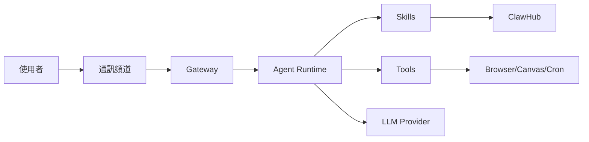
```mermaid
graph LR
    A[使用者] --> B[通訊頻道]
    B --> C[Gateway]
    C --> D[Agent Runtime]
    D --> E[Skills]
    D --> F[Tools]
    D --> G[LLM Provider]
    E --> H[ClawHub]
    F --> I[Browser/Canvas/Cron]
```

OpenClaw 的架構高度可組合，每一層都可以獨立擴展或替換：

1. **頻道層**: 新增通訊頻道不影響 Agent 邏輯
2. **閘道層**: Gateway 負責連線管理與訊息路由
3. **執行層**: Agent Runtime 獨立處理業務邏輯
4. **能力層**: Skills 和 Tools 可按需啟用

### 1.3 Gateway 架構總覽

Gateway 是 OpenClaw 的核心守護行程（Daemon），負責管理所有外部連線與內部元件的協調。

#### 架構圖

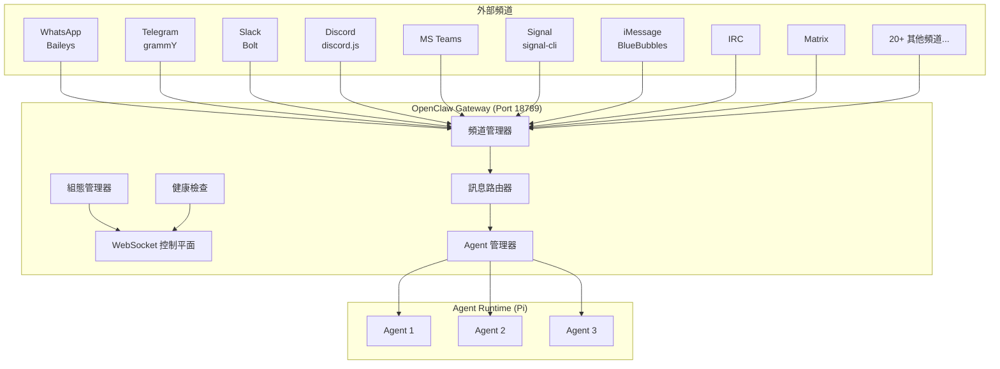
```mermaid
graph TB
    subgraph "OpenClaw Gateway (Port 18789)"
        WS[WebSocket 控制平面]
        Router[訊息路由器]
        ChannelMgr[頻道管理器]
        AgentMgr[Agent 管理器]
        ConfigMgr[組態管理器]
        HealthCheck[健康檢查]
    end
    
    subgraph "外部頻道"
        WA[WhatsApp<br>Baileys]
        TG[Telegram<br>grammY]
        SL[Slack<br>Bolt]
        DC[Discord<br>discord.js]
        MS[MS Teams]
        SG[Signal<br>signal-cli]
        IM[iMessage<br>BlueBubbles]
        IRC[IRC]
        MTX[Matrix]
        MORE[20+ 其他頻道...]
    end
    
    subgraph "Agent Runtime (Pi)"
        Agent1[Agent 1]
        Agent2[Agent 2]
        Agent3[Agent 3]
    end
    
    WA & TG & SL & DC & MS & SG & IM & IRC & MTX & MORE --> ChannelMgr
    ChannelMgr --> Router
    Router --> AgentMgr
    AgentMgr --> Agent1 & Agent2 & Agent3
    ConfigMgr --> WS
    HealthCheck --> WS
```

#### 關鍵特性

| 元件 | 功能 | 說明 |
|------|------|------|
| **WebSocket 控制平面** | 即時通訊 | 預設監聽 port 18789，提供雙向即時通訊 |
| **訊息路由器** | 訊息分派 | 根據頻道、使用者、訊息內容將訊息路由到對應的 Agent |
| **頻道管理器** | 連線管理 | 管理所有外部頻道連線的生命週期 |
| **Agent 管理器** | Agent 排程 | 管理 Agent 的啟動、停止、重啟 |
| **組態管理器** | 動態組態 | 支援 Hot Reload，不重啟即可更新設定 |
| **健康檢查** | 監控端點 | 提供 `/healthz`、`/readyz` 端點供維運監控 |

#### Gateway 啟動流程

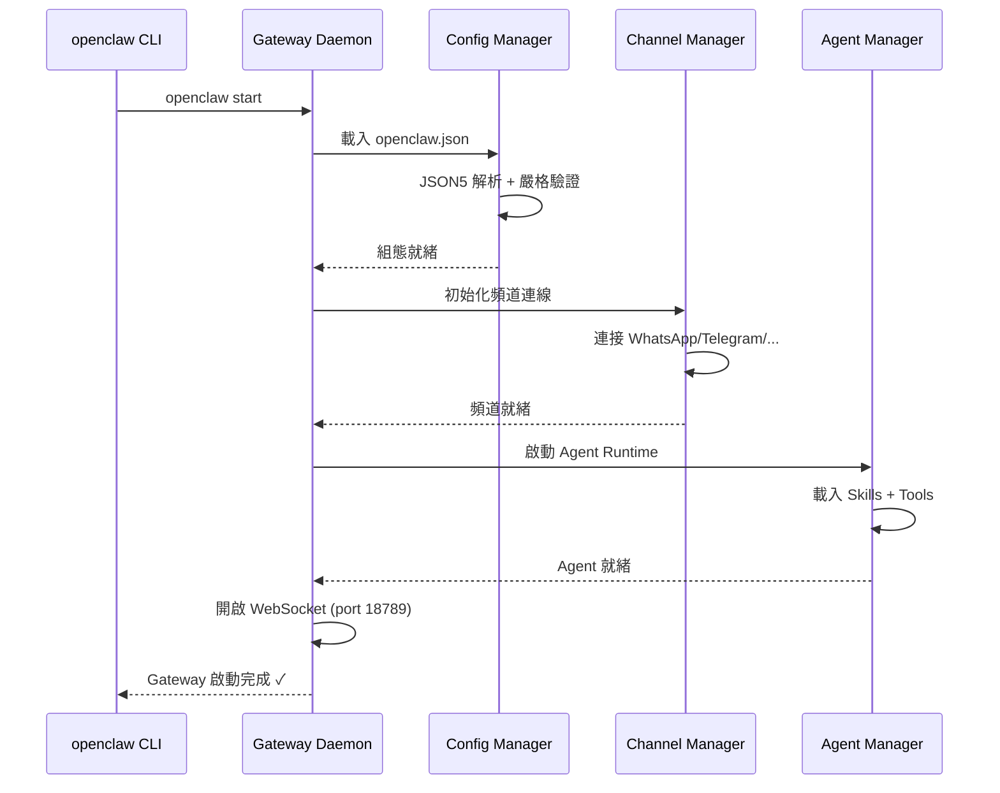
```mermaid
sequenceDiagram
    participant CLI as openclaw CLI
    participant GW as Gateway Daemon
    participant CM as Config Manager
    participant CH as Channel Manager
    participant AM as Agent Manager

    CLI->>GW: openclaw start
    GW->>CM: 載入 openclaw.json
    CM->>CM: JSON5 解析 + 嚴格驗證
    CM-->>GW: 組態就緒
    GW->>CH: 初始化頻道連線
    CH->>CH: 連接 WhatsApp/Telegram/...
    CH-->>GW: 頻道就緒
    GW->>AM: 啟動 Agent Runtime
    AM->>AM: 載入 Skills + Tools
    AM-->>GW: Agent 就緒
    GW->>GW: 開啟 WebSocket (port 18789)
    GW-->>CLI: Gateway 啟動完成 ✓
```

### 1.4 Pi Agent 執行環境

OpenClaw 的 Agent Runtime 稱為 **Pi**（衍生自 pi-mono 專案），是實際處理使用者訊息並產生回應的執行環境。

#### 核心概念

| 概念 | 說明 |
|------|------|
| **Workspace** | Agent 的工作目錄，包含 Skills、組態、資源檔案 |
| **Bootstrap Files** | Agent 啟動時載入的初始化檔案 |
| **Skills** | Agent 的能力模組，定義行為與工具 |
| **Sessions** | 對話會話管理，維護上下文與狀態 |
| **Model References** | 模型參考設定，指定使用的 LLM |

#### Agent 生命週期

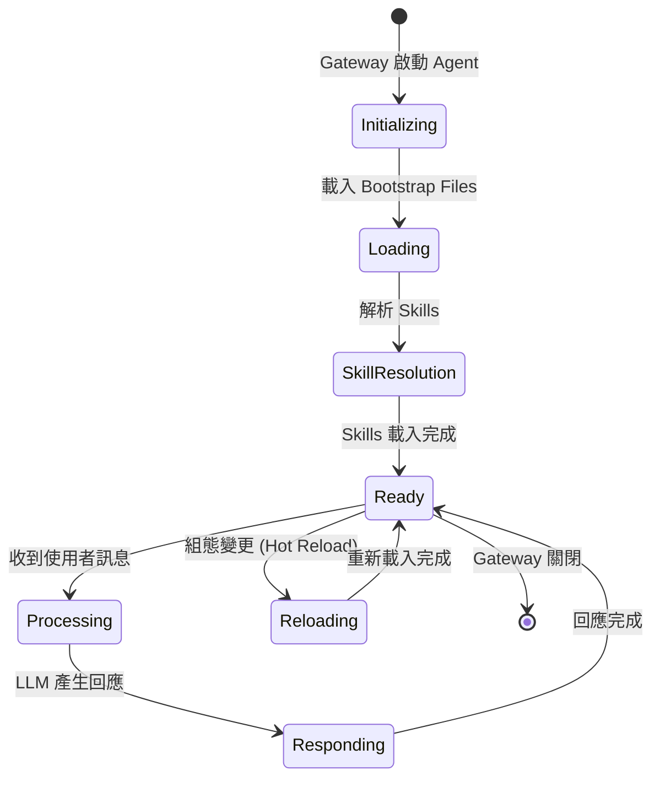
```mermaid
stateDiagram-v2
    [*] --> Initializing: Gateway 啟動 Agent
    Initializing --> Loading: 載入 Bootstrap Files
    Loading --> SkillResolution: 解析 Skills
    SkillResolution --> Ready: Skills 載入完成
    Ready --> Processing: 收到使用者訊息
    Processing --> Responding: LLM 產生回應
    Responding --> Ready: 回應完成
    Ready --> Reloading: 組態變更 (Hot Reload)
    Reloading --> Ready: 重新載入完成
    Ready --> [*]: Gateway 關閉
```

#### Workspace 目錄結構

Agent 的 Workspace 是一個標準目錄結構：

```
~/.openclaw/
├── openclaw.json          # 主組態檔（JSON5 格式）
├── skills/                 # 管理級技能目錄
│   ├── my-skill/
│   │   ├── SKILL.md       # 技能定義
│   │   └── tools/         # 技能工具
│   └── another-skill/
├── logs/                   # JSONL 日誌輸出
│   └── openclaw.jsonl
└── data/                   # Agent 資料存儲
```

#### Agent 的訊息處理流程

1. **接收**: Gateway 將使用者訊息傳遞給 Agent
2. **路由**: Agent 根據訊息內容與上下文判斷使用哪個 Skill
3. **增強**: Skill 將相關工具與 Prompt 注入到請求中
4. **推論**: 將增強後的請求送到 LLM 進行推論
5. **後處理**: 處理 LLM 回應，執行工具呼叫
6. **回應**: 將最終回應送回使用者

### 1.5 Skills 技能系統

Skills（技能）是 OpenClaw 最核心的擴展機制，讓 Agent 能夠獲得特定領域的能力。

#### 技能定義：SKILL.md

每個 Skill 由一個 `SKILL.md` 檔案定義，採用 **AgentSkills** 規範格式：

```markdown
---
name: weather-reporter
description: 提供即時天氣資訊查詢
version: 1.0.0
triggers:
  - weather
  - 天氣
  - 氣象
tools:
  - get_weather
  - get_forecast
access:
  channels:
    - whatsapp
    - telegram
  users:
    - "*"
---

# Weather Reporter Skill

你是一個專業的氣象報導 Agent。當使用者詢問天氣相關問題時，
請使用提供的工具查詢即時天氣資訊，並以友善的方式回報。

## 回應格式

- 使用表情符號增加親和力
- 提供溫度、濕度、風速等基本資訊
- 如有異常天氣，主動提醒使用者注意

## 工具使用規則

1. 先使用 `get_weather` 取得目前天氣
2. 若使用者詢問未來天氣，使用 `get_forecast`
3. 若地點不明確，請先詢問使用者
```

#### 技能載入優先序

OpenClaw 從三個位置載入技能，優先序由高到低：

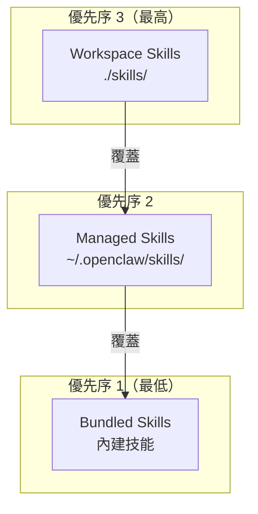
```mermaid
graph TB
    subgraph "優先序 3（最高）"
        WS[Workspace Skills<br>./skills/]
    end
    subgraph "優先序 2"
        MG[Managed Skills<br>~/.openclaw/skills/]
    end
    subgraph "優先序 1（最低）"
        BD[Bundled Skills<br>內建技能]
    end
    
    WS -->|覆蓋| MG -->|覆蓋| BD
```

| 位置 | 路徑 | 優先序 | 說明 |
|------|------|--------|------|
| **Workspace** | `./skills/` | 最高 | 專案層級技能，針對特定工作場景 |
| **Managed** | `~/.openclaw/skills/` | 中 | 使用者層級技能，跨專案共享 |
| **Bundled** | 內建於 OpenClaw | 最低 | 預設技能，提供基本功能 |

當多個位置存在同名技能時，高優先序位置的技能會覆蓋低優先序位置的同名技能。

#### 技能閘門（Skill Gating）

OpenClaw 支援技能閘門機制，允許針對特定使用者或頻道啟用/停用技能：

```json5
// openclaw.json 中的技能閘門設定
{
  "skills": {
    "weather-reporter": {
      "enabled": true,
      "access": {
        "channels": ["whatsapp", "telegram"],
        "users": ["user1@example.com", "user2@example.com"]
      }
    },
    "admin-tools": {
      "enabled": true,
      "access": {
        "channels": ["slack"],
        "users": ["admin@company.com"]
      }
    }
  }
}
```

### 1.6 Tools 工具系統

Tools（工具）是 Agent 與外部世界互動的介面，OpenClaw 內建多種工具類別：

#### 內建工具分類

| 工具類別 | 功能 | 範例用途 |
|----------|------|----------|
| **Browser** | 瀏覽器控制（CDP） | 網頁擷取、自動化操作、截圖 |
| **Canvas / A2UI** | Agent-to-UI 渲染 | 產生互動式 UI 元件 |
| **Nodes** | 裝置整合 | 相機、螢幕、定位 |
| **Cron** | 排程 & Webhook | 定時任務、外部事件觸發 |
| **Sessions** | 對話管理 | 對話狀態、歷史記錄 |

#### Browser 工具

Browser 工具使用 **Chrome DevTools Protocol (CDP)** 提供完整的瀏覽器控制能力：

```json5
// Agent 使用 Browser 工具的範例
{
  "tool": "browser_navigate",
  "parameters": {
    "url": "https://example.com/report",
    "waitFor": "networkIdle"
  }
}
```

功能包含：
- 導航至指定 URL
- 擷取頁面內容（文字/截圖）
- 填寫表單
- 點擊按鈕
- 執行 JavaScript

#### Canvas / A2UI 工具

A2UI（Agent-to-UI）是 OpenClaw 獨特的工具，允許 Agent 產生互動式 UI 元件：

```
使用者: 建立一個投票
Agent: [使用 Canvas 工具產生互動式投票 UI]
```

#### Cron 與 Webhook 工具

允許 Agent 設定排程任務或對外部事件做出回應：

```json5
// 排程任務範例
{
  "tool": "cron_schedule",
  "parameters": {
    "expression": "0 9 * * 1-5",  // 週一至週五早上 9 點
    "action": "send_daily_report",
    "channel": "slack",
    "target": "#team-reports"
  }
}

// Webhook 設定範例
{
  "tool": "webhook_register",
  "parameters": {
    "path": "/hooks/github",
    "method": "POST",
    "action": "process_github_event"
  }
}
```

### 1.7 Sessions 與對話管理

Sessions 是 OpenClaw 管理對話狀態的核心機制。

#### Session 生命週期

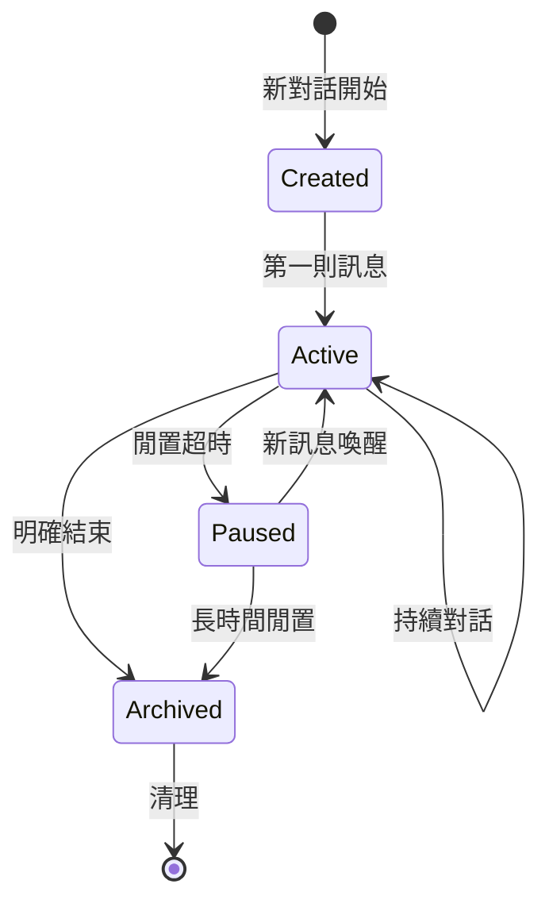
```mermaid
stateDiagram-v2
    [*] --> Created: 新對話開始
    Created --> Active: 第一則訊息
    Active --> Active: 持續對話
    Active --> Paused: 閒置超時
    Paused --> Active: 新訊息喚醒
    Active --> Archived: 明確結束
    Paused --> Archived: 長時間閒置
    Archived --> [*]: 清理
```

#### Session 資料結構

每個 Session 包含以下資訊：

| 欄位 | 類型 | 說明 |
|------|------|------|
| `id` | `string` | Session 唯一識別碼 |
| `channelId` | `string` | 來源頻道識別碼 |
| `userId` | `string` | 使用者識別碼 |
| `agentId` | `string` | 處理此 Session 的 Agent |
| `messages` | `Message[]` | 對話訊息歷史 |
| `context` | `object` | 上下文資料（記憶） |
| `metadata` | `object` | 中繼資料 |
| `createdAt` | `timestamp` | 建立時間 |
| `updatedAt` | `timestamp` | 最後更新時間 |
| `status` | `enum` | Created / Active / Paused / Archived |

#### 上下文管理策略

OpenClaw 提供多種上下文管理策略防止 Token 超出限制：

1. **滑動視窗（Sliding Window）**: 保留最近 N 則訊息
2. **摘要壓縮（Summary Compression）**: 將較舊的訊息摘要化
3. **優先保留（Priority Retention）**: 標記重要訊息永久保留
4. **混合策略（Hybrid）**: 結合以上策略

### 1.8 多頻道支援（Channels）

OpenClaw 支援超過 20 種通訊頻道，以下為完整列表：

#### 支援頻道一覽

| 頻道 | 底層函式庫 | 狀態 | 備註 |
|------|-----------|------|------|
| **WhatsApp** | Baileys | ✅ 穩定 | 透過 Web API 連接 |
| **Telegram** | grammY | ✅ 穩定 | Bot API |
| **Slack** | Bolt | ✅ 穩定 | Slack App |
| **Discord** | discord.js | ✅ 穩定 | Discord Bot |
| **Google Chat** | 官方 API | ✅ 穩定 | Google Workspace |
| **Signal** | signal-cli | ✅ 穩定 | 端對端加密 |
| **iMessage** | BlueBubbles | ✅ 穩定 | 需要 macOS |
| **IRC** | 原生實作 | ✅ 穩定 | 任何 IRC 伺服器 |
| **Microsoft Teams** | Bot Framework | ✅ 穩定 | Microsoft 365 |
| **Matrix** | matrix-js-sdk | ✅ 穩定 | 開源通訊協議 |
| **LINE** | LINE SDK | ✅ 穩定 | LINE 官方帳號 |
| **Feishu** | 飛書 SDK | ✅ 穩定 | 字節跳動飛書 |
| **Mattermost** | 官方 API | ✅ 穩定 | 自架 Slack 替代方案 |
| **Nextcloud Talk** | 官方 API | ✅ 穩定 | Nextcloud 整合 |
| **Nostr** | 原生實作 | ✅ 穩定 | 去中心化協議 |
| **Synology Chat** | 官方 API | ✅ 穩定 | Synology NAS |
| **Tlon** | 官方 API | 🔄 測試 | Urbit 生態 |
| **Twitch** | tmi.js | ✅ 穩定 | 直播聊天室 |
| **Zalo** | 官方 API | ✅ 穩定 | 越南通訊軟體 |
| **WebChat** | 內建 | ✅ 穩定 | 網頁嵌入式聊天 |

#### 新增頻道的統一介面

所有頻道都實作相同的 `Channel` 介面：

```typescript
// 頻道介面定義（TypeScript 概念說明）
interface Channel {
  id: string;
  name: string;
  connect(): Promise<void>;
  disconnect(): Promise<void>;
  sendMessage(target: string, message: Message): Promise<void>;
  onMessage(handler: MessageHandler): void;
}
```

### 1.9 與傳統 LLM 聊天機器人的比較

| 面向 | 傳統 LLM 聊天機器人 | OpenClaw |
|------|---------------------|----------|
| **部署模式** | 雲端 SaaS | 自架或雲端皆可 |
| **頻道整合** | 通常只有 Web UI | 20+ 通訊頻道原生整合 |
| **擴展機制** | API 呼叫 / Plugin | Skills + Tools 組合式架構 |
| **資料所有權** | 平台持有 | 使用者完全掌控 |
| **自訂程度** | 有限（Prompt 調整） | 完全自訂（Skills + Tools + Agent 行為） |
| **多 Agent** | 通常不支援 | 原生支援多 Agent 協作 |
| **信任模型** | 平台信任 | 個人信任邊界 |
| **可觀測性** | 平台提供 | 完整 OpenTelemetry 整合 |
| **成本模型** | 按 Token / 呼叫計費 | 自架為主，LLM API 費用可控 |
| **排程能力** | 需額外開發 | 內建 Cron / Webhook |

### 1.10 OpenClaw 版本歷程

| 版本 | 日期 | 重大變更 |
|------|------|----------|
| **2026.3.2** | 2026-03-05 | 最新穩定版，效能改善與錯誤修正 |
| **2026.3.0** | 2026-03-01 | A2UI Canvas 工具、新頻道支援 |
| **2026.2.x** | 2026-02 | OpenTelemetry 深度整合、健康檢查端點 |
| **2026.1.x** | 2026-01 | ClawHub 技能市集上線 |
| **2025.12.x** | 2025-12 | Docker Compose 官方支援 |
| **2025.11.x** | 2025-11 | 重命名為 OpenClaw（前身 Clawdbot） |
| **2025.10.x** | 2025-10 | Skills 系統大改版 |
| **2025.9.x** | 2025-09 | 首次公開發布 |

> **注意**: OpenClaw 採用**日期版本號**格式 `YYYY.M.patch`，便於追蹤發布時間。

---

## 第二章：系統架構設計

### 2.1 整體架構圖

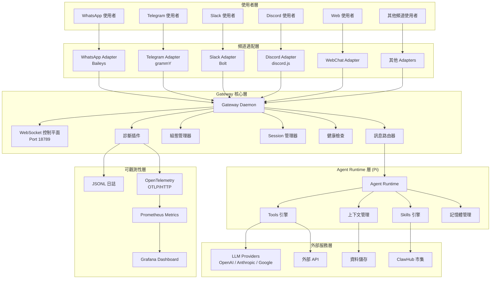
```mermaid
graph TB
    subgraph "使用者層"
        U1[WhatsApp 使用者]
        U2[Telegram 使用者]
        U3[Slack 使用者]
        U4[Discord 使用者]
        U5[Web 使用者]
        U6[其他頻道使用者]
    end
    
    subgraph "頻道適配層"
        C1[WhatsApp Adapter<br>Baileys]
        C2[Telegram Adapter<br>grammY]
        C3[Slack Adapter<br>Bolt]
        C4[Discord Adapter<br>discord.js]
        C5[WebChat Adapter]
        C6[其他 Adapters]
    end
    
    subgraph "Gateway 核心層"
        GW[Gateway Daemon]
        WSP[WebSocket 控制平面<br>Port 18789]
        MR[訊息路由器]
        CM[組態管理器]
        SM[Session 管理器]
        HC[健康檢查]
        DG[診斷插件]
    end
    
    subgraph "Agent Runtime 層 (Pi)"
        AR[Agent Runtime]
        SK[Skills 引擎]
        TL[Tools 引擎]
        CTX[上下文管理]
        MEM[記憶體管理]
    end
    
    subgraph "外部服務層"
        LLM[LLM Providers<br>OpenAI / Anthropic / Google]
        EXT[外部 API]
        DB[資料儲存]
        CH[ClawHub 市集]
    end
    
    subgraph "可觀測性層"
        LOG[JSONL 日誌]
        OTEL[OpenTelemetry<br>OTLP/HTTP]
        PROM[Prometheus Metrics]
        GRF[Grafana Dashboard]
    end
    
    U1 --> C1
    U2 --> C2
    U3 --> C3
    U4 --> C4
    U5 --> C5
    U6 --> C6
    
    C1 & C2 & C3 & C4 & C5 & C6 --> GW
    
    GW --> WSP
    GW --> MR
    GW --> CM
    GW --> SM
    GW --> HC
    GW --> DG
    
    MR --> AR
    AR --> SK
    AR --> TL
    AR --> CTX
    AR --> MEM
    
    SK --> CH
    TL --> LLM
    TL --> EXT
    CTX --> DB
    
    DG --> LOG
    DG --> OTEL
    OTEL --> PROM
    PROM --> GRF
```

### 2.2 Gateway 核心元件

Gateway 是 OpenClaw 的中央控制器，由以下核心模組組成：

#### 2.2.1 WebSocket 控制平面

WebSocket 控制平面是 Gateway 的通訊骨幹，提供即時雙向通訊：

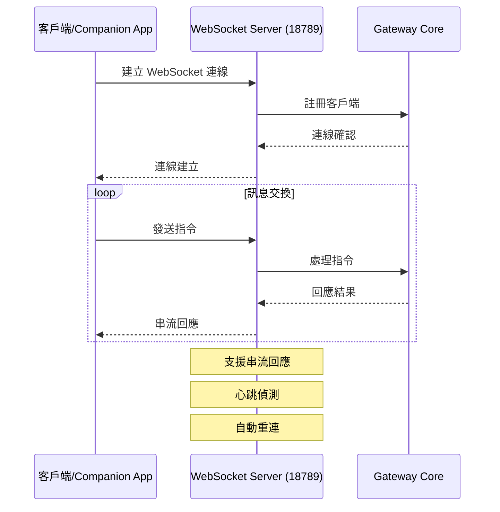
```mermaid
sequenceDiagram
    participant Client as 客戶端/Companion App
    participant WS as WebSocket Server (18789)
    participant GW as Gateway Core
    
    Client->>WS: 建立 WebSocket 連線
    WS->>GW: 註冊客戶端
    GW-->>WS: 連線確認
    WS-->>Client: 連線建立
    
    loop 訊息交換
        Client->>WS: 發送指令
        WS->>GW: 處理指令
        GW-->>WS: 回應結果
        WS-->>Client: 串流回應
    end
    
    Note over WS: 支援串流回應
    Note over WS: 心跳偵測
    Note over WS: 自動重連
```

**Wire Protocol**: OpenClaw 使用自定義的 Wire Protocol 在 WebSocket 上傳輸訊息，支援：

| 功能 | 說明 |
|------|------|
| **串流（Streaming）** | 支援 Token-by-Token 串流回應 |
| **心跳（Heartbeat）** | 定期心跳偵測連線存活 |
| **批次（Batching）** | 多則訊息批次傳送以提升效能 |
| **壓縮（Compression）** | 可選的訊息壓縮 |

#### 2.2.2 訊息路由器

訊息路由器負責將接收的訊息分派到正確的 Agent：

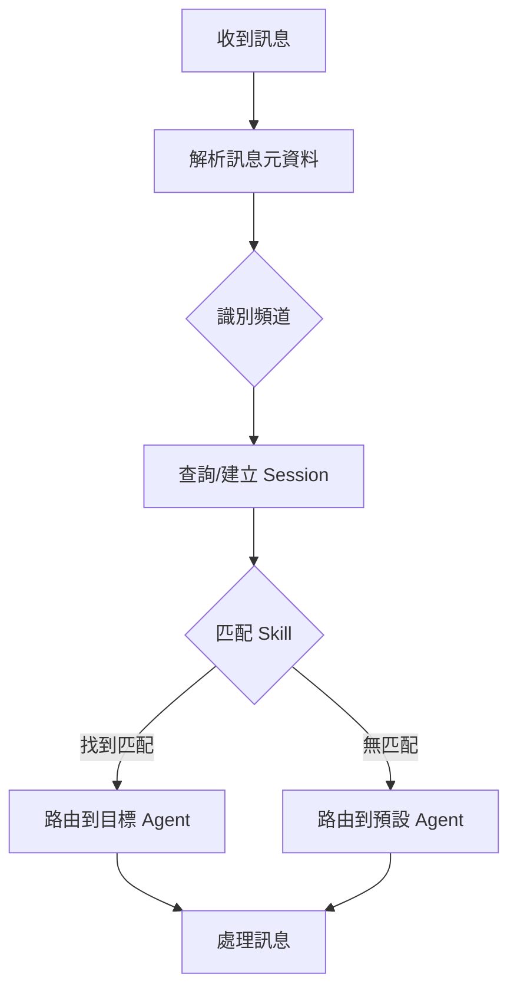
```mermaid
flowchart TD
    MSG[收到訊息] --> PARSE[解析訊息元資料]
    PARSE --> CHANNEL{識別頻道}
    CHANNEL --> SESSION[查詢/建立 Session]
    SESSION --> SKILL{匹配 Skill}
    SKILL -->|找到匹配| ROUTE[路由到目標 Agent]
    SKILL -->|無匹配| DEFAULT[路由到預設 Agent]
    ROUTE --> PROCESS[處理訊息]
    DEFAULT --> PROCESS
```

路由規則的判斷順序：

1. **DM 配對（DM Pairing）**: 一對一對話中，訊息直接路由到配對的 Agent
2. **Skill 觸發詞**: 檢查訊息是否包含特定技能的觸發詞
3. **上下文延續**: 若存在活躍的 Session，延續上一個 Skill 的處理
4. **預設 Agent**: 以上都不匹配時，由預設 Agent 處理

#### 2.2.3 組態管理器

組態管理器負責載入、驗證、監控 OpenClaw 的設定：

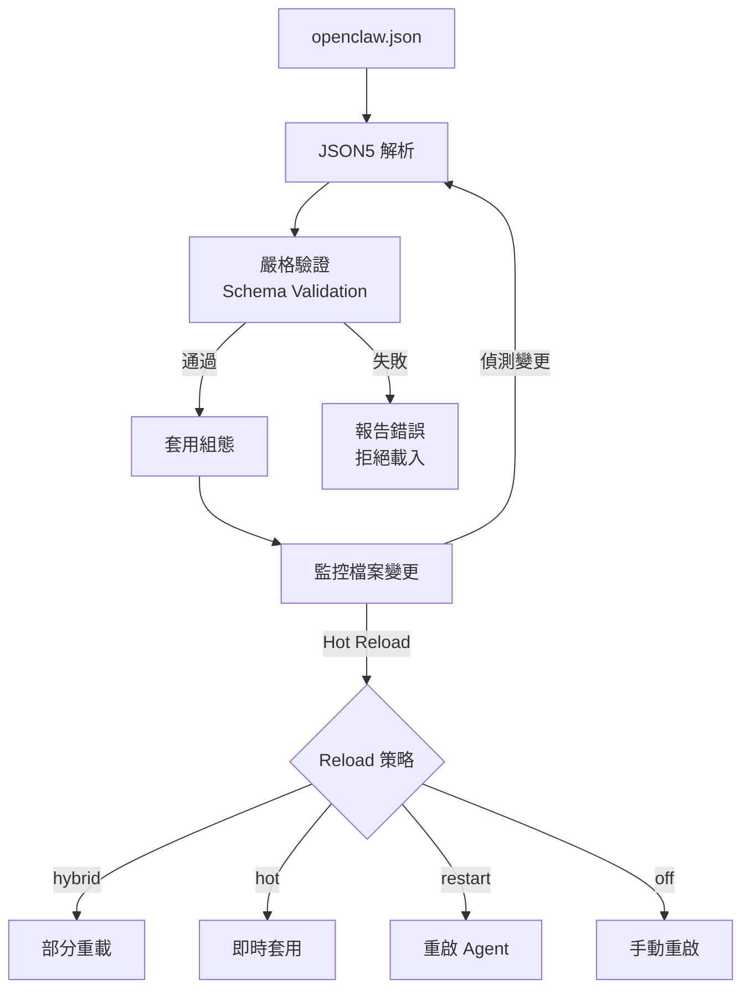
```mermaid
flowchart TD
    FILE[openclaw.json] --> PARSE[JSON5 解析]
    PARSE --> VALIDATE[嚴格驗證<br>Schema Validation]
    VALIDATE -->|通過| APPLY[套用組態]
    VALIDATE -->|失敗| ERROR[報告錯誤<br>拒絕載入]
    APPLY --> WATCH[監控檔案變更]
    WATCH -->|偵測變更| PARSE
    WATCH -->|Hot Reload| RELOAD{Reload 策略}
    RELOAD -->|hybrid| HYB[部分重載]
    RELOAD -->|hot| HOT[即時套用]
    RELOAD -->|restart| RST[重啟 Agent]
    RELOAD -->|off| OFF[手動重啟]
```

### 2.3 Agent Runtime 架構

Agent Runtime（Pi）是處理 AI 推論與工具呼叫的核心引擎：

#### 架構圖

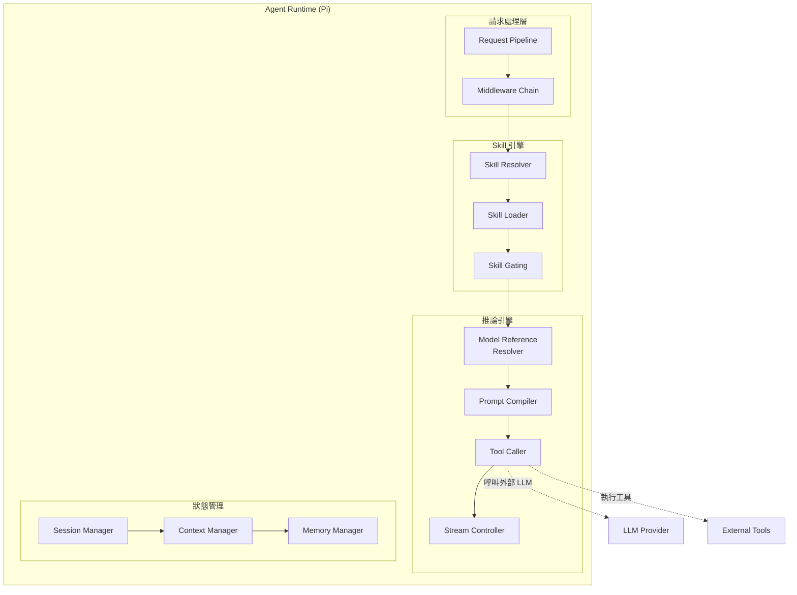
```mermaid
graph TB
    subgraph "Agent Runtime (Pi)"
        direction TB
        
        subgraph "請求處理層"
            RP[Request Pipeline]
            MW[Middleware Chain]
        end
        
        subgraph "Skill 引擎"
            SR[Skill Resolver]
            SL[Skill Loader]
            SG[Skill Gating]
        end
        
        subgraph "推論引擎"
            MR[Model Reference<br>Resolver]
            PC[Prompt Compiler]
            TC[Tool Caller]
            SC[Stream Controller]
        end
        
        subgraph "狀態管理"
            SM[Session Manager]
            CM[Context Manager]
            MM[Memory Manager]
        end
    end
    
    RP --> MW --> SR
    SR --> SL --> SG
    SG --> MR --> PC --> TC
    TC --> SC
    SM --> CM --> MM
    
    TC -.->|"呼叫外部 LLM"| LLM[LLM Provider]
    TC -.->|"執行工具"| TOOLS[External Tools]
```

#### 請求處理管線

Agent 處理訊息的完整管線：

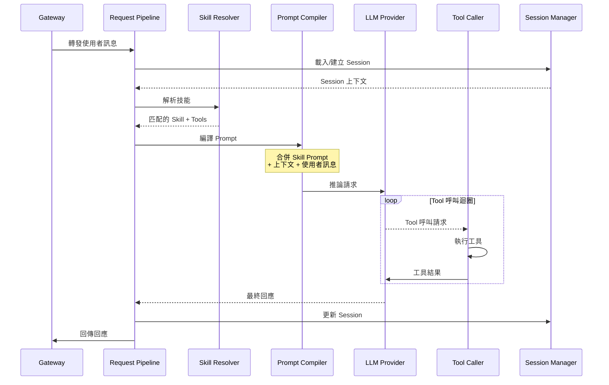
```mermaid
sequenceDiagram
    participant GW as Gateway
    participant RP as Request Pipeline
    participant SR as Skill Resolver
    participant PC as Prompt Compiler
    participant LLM as LLM Provider
    participant TC as Tool Caller
    participant SM as Session Manager

    GW->>RP: 轉發使用者訊息
    RP->>SM: 載入/建立 Session
    SM-->>RP: Session 上下文
    RP->>SR: 解析技能
    SR-->>RP: 匹配的 Skill + Tools
    RP->>PC: 編譯 Prompt
    Note over PC: 合併 Skill Prompt<br>+ 上下文 + 使用者訊息
    PC->>LLM: 推論請求
    
    loop Tool 呼叫迴圈
        LLM-->>TC: Tool 呼叫請求
        TC->>TC: 執行工具
        TC->>LLM: 工具結果
    end
    
    LLM-->>RP: 最終回應
    RP->>SM: 更新 Session
    RP->>GW: 回傳回應
```

### 2.4 訊息流程與通訊協議

#### 完整訊息流程

以一個使用者透過 WhatsApp 詢問天氣為例的完整訊息流程：

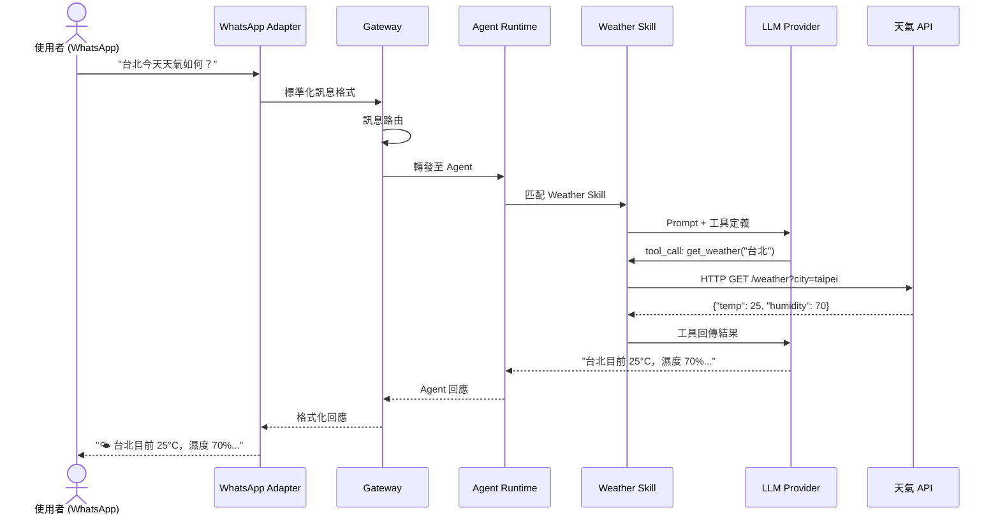
```mermaid
sequenceDiagram
    actor User as 使用者 (WhatsApp)
    participant WA as WhatsApp Adapter
    participant GW as Gateway
    participant RT as Agent Runtime
    participant SK as Weather Skill
    participant LLM as LLM Provider
    participant API as 天氣 API

    User->>WA: "台北今天天氣如何？"
    WA->>GW: 標準化訊息格式
    GW->>GW: 訊息路由
    GW->>RT: 轉發至 Agent
    RT->>SK: 匹配 Weather Skill
    SK->>LLM: Prompt + 工具定義
    LLM->>SK: tool_call: get_weather("台北")
    SK->>API: HTTP GET /weather?city=taipei
    API-->>SK: {"temp": 25, "humidity": 70}
    SK->>LLM: 工具回傳結果
    LLM-->>RT: "台北目前 25°C，濕度 70%..."
    RT-->>GW: Agent 回應
    GW-->>WA: 格式化回應
    WA-->>User: "🌤️ 台北目前 25°C，濕度 70%..."
```

#### 訊息格式標準化

OpenClaw 在 Gateway 層將來自不同頻道的訊息統一格式化：

```json
{
  "id": "msg_20260305_abc123",
  "channel": {
    "type": "whatsapp",
    "id": "wa_886912345678"
  },
  "sender": {
    "id": "user_001",
    "name": "王小明",
    "role": "user"
  },
  "content": {
    "type": "text",
    "text": "台北今天天氣如何？"
  },
  "timestamp": "2026-03-05T09:30:00Z",
  "session": {
    "id": "session_xyz789",
    "messageCount": 5
  },
  "metadata": {
    "platform_specific": {}
  }
}
```

### 2.5 Skills 載入與優先序

#### 三層技能載入架構

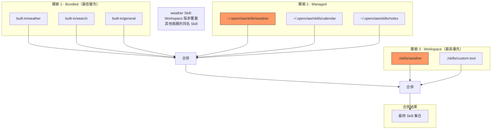
```mermaid
graph TB
    subgraph "合併結果"
        FINAL[最終 Skill 集合]
    end
    
    subgraph "層級 3 - Workspace（最高優先）"
        W1[./skills/weather]
        W2[./skills/custom-tool]
    end
    
    subgraph "層級 2 - Managed"
        M1[~/.openclaw/skills/weather]
        M2[~/.openclaw/skills/calendar]
        M3[~/.openclaw/skills/notes]
    end
    
    subgraph "層級 1 - Bundled（最低優先）"
        B1[built-in/weather]
        B2[built-in/search]
        B3[built-in/general]
    end
    
    B1 & B2 & B3 --> MERGE1[合併]
    M1 & M2 & M3 --> MERGE1
    MERGE1 --> MERGE2[合併]
    W1 & W2 --> MERGE2
    MERGE2 --> FINAL
    
    style W1 fill:#f96,stroke:#333
    style M1 fill:#f96,stroke:#333
    
    Note1[weather Skill:<br>Workspace 版本覆蓋<br>其他兩層的同名 Skill]
```

#### Skill 載入流程

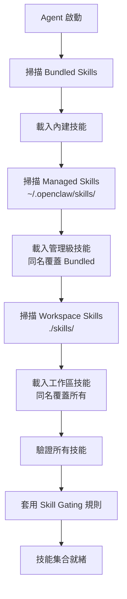
```mermaid
flowchart TD
    START[Agent 啟動] --> SCAN1[掃描 Bundled Skills]
    SCAN1 --> LOAD1[載入內建技能]
    LOAD1 --> SCAN2[掃描 Managed Skills<br>~/.openclaw/skills/]
    SCAN2 --> LOAD2[載入管理級技能<br>同名覆蓋 Bundled]
    LOAD2 --> SCAN3[掃描 Workspace Skills<br>./skills/]
    SCAN3 --> LOAD3[載入工作區技能<br>同名覆蓋所有]
    LOAD3 --> VALIDATE[驗證所有技能]
    VALIDATE --> GATE[套用 Skill Gating 規則]
    GATE --> READY[技能集合就緒]
```

### 2.6 模型參考（Model References）

OpenClaw 透過 Model References 機制抽象化 LLM 提供者，讓 Agent 可以輕鬆切換模型：

#### 模型參考設定

```json5
// openclaw.json 中的模型設定
{
  "models": {
    "default": {
      "provider": "openai",
      "model": "gpt-4o",
      "temperature": 0.7,
      "maxTokens": 4096
    },
    "fast": {
      "provider": "openai",
      "model": "gpt-4o-mini",
      "temperature": 0.3,
      "maxTokens": 2048
    },
    "reasoning": {
      "provider": "anthropic",
      "model": "claude-sonnet-4-20250514",
      "temperature": 0.5,
      "maxTokens": 8192
    },
    "local": {
      "provider": "ollama",
      "model": "llama3:70b",
      "baseUrl": "http://localhost:11434"
    }
  }
}
```

#### 支援的 LLM 提供者

| 提供者 | 模型範例 | 備註 |
|--------|----------|------|
| **OpenAI** | GPT-4o, GPT-4o-mini | 最廣泛支援 |
| **Anthropic** | Claude Sonnet 4 | 長上下文 |
| **Google** | Gemini 2.5 Pro | 多模態 |
| **Ollama** | Llama 3, Mistral | 本地執行 |
| **Azure OpenAI** | GPT-4o (Azure) | 企業合規 |
| **自訂端點** | 任何 OpenAI 相容 API | 透過 baseUrl 設定 |

### 2.7 ClawHub 技能市集架構

[ClawHub](https://clawhub.com) 是 OpenClaw 的技能市集，類似 npm 之於 Node.js：

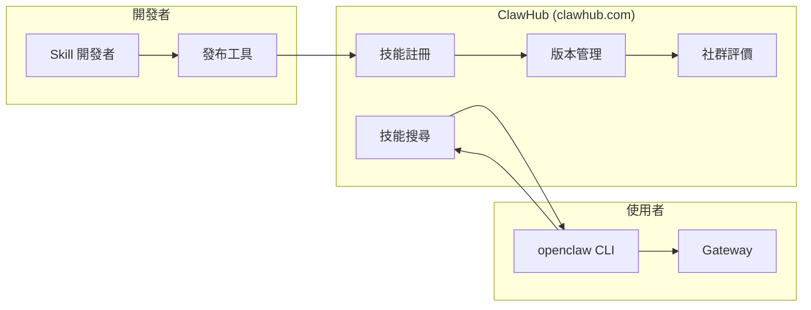
```mermaid
graph LR
    subgraph "開發者"
        DEV[Skill 開發者]
        PUB[發布工具]
    end
    
    subgraph "ClawHub (clawhub.com)"
        REG[技能註冊]
        SEARCH[技能搜尋]
        VER[版本管理]
        REV[社群評價]
    end
    
    subgraph "使用者"
        CLI[openclaw CLI]
        GW[Gateway]
    end
    
    DEV --> PUB --> REG
    CLI --> SEARCH
    SEARCH --> CLI
    CLI --> GW
    REG --> VER
    VER --> REV
```

#### ClawHub 指令

```bash
# 搜尋技能
openclaw skills search weather

# 安裝技能
openclaw skills install weather-reporter

# 更新技能
openclaw skills update weather-reporter

# 發布自訂技能
openclaw skills publish ./my-skill

# 列出已安裝技能
openclaw skills list
```

### 2.8 Companion Apps 架構

OpenClaw 提供 Companion Apps 作為行動端入口：

| 平台 | 技術棧 | 功能 |
|------|--------|------|
| **macOS** | Swift (Menu Bar App) | 快捷存取、通知、螢幕擷取 |
| **iOS** | Swift (Node App) | 推播通知、Siri 整合、小工具 |
| **Android** | Kotlin (Node App) | 推播通知、快捷操作、小工具 |

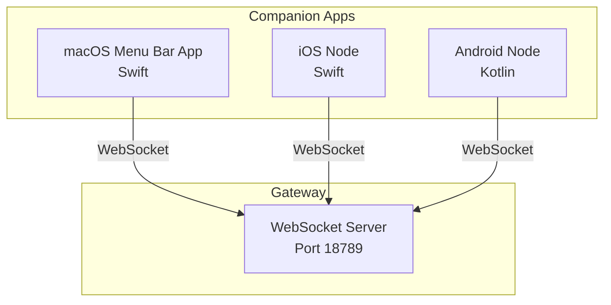
```mermaid
graph TB
    subgraph "Companion Apps"
        MAC[macOS Menu Bar App<br>Swift]
        IOS[iOS Node<br>Swift]
        AND[Android Node<br>Kotlin]
    end
    
    subgraph "Gateway"
        WS[WebSocket Server<br>Port 18789]
    end
    
    MAC -->|WebSocket| WS
    IOS -->|WebSocket| WS
    AND -->|WebSocket| WS
```

### 2.9 高可用架構設計

#### 單機高可用

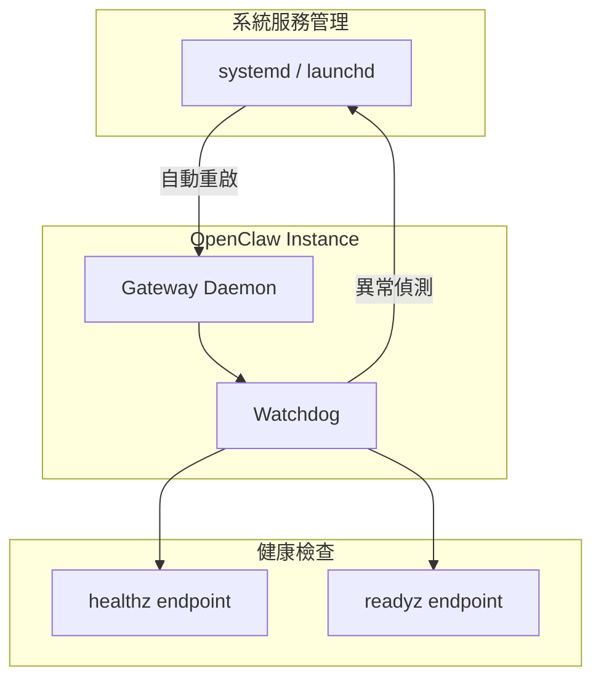
```mermaid
graph TB
    subgraph "系統服務管理"
        SYSTEMD[systemd / launchd]
    end
    
    subgraph "OpenClaw Instance"
        GW[Gateway Daemon]
        WATCHDOG[Watchdog]
    end
    
    subgraph "健康檢查"
        HC[healthz endpoint]
        RC[readyz endpoint]
    end
    
    SYSTEMD -->|自動重啟| GW
    GW --> WATCHDOG
    WATCHDOG --> HC
    WATCHDOG --> RC
    WATCHDOG -->|異常偵測| SYSTEMD
```

#### 多節點高可用（企業級）

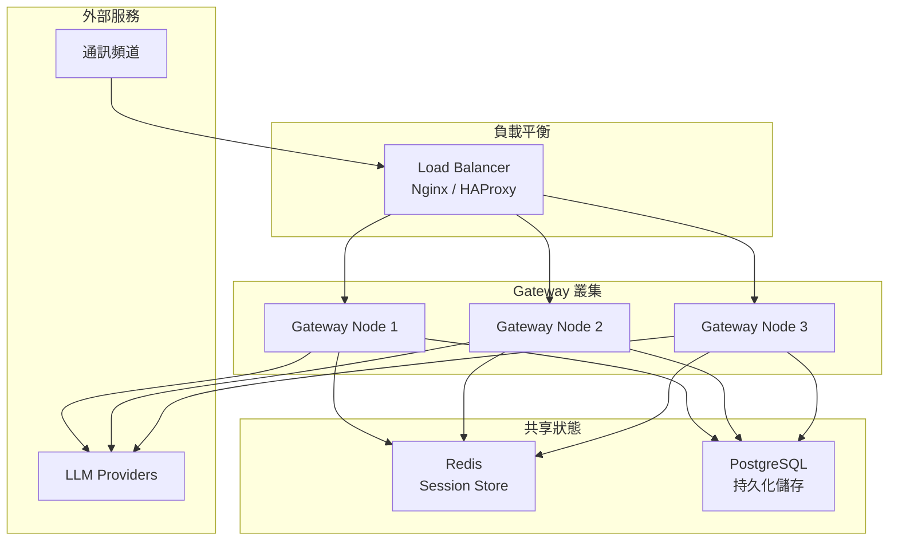
```mermaid
graph TB
    subgraph "負載平衡"
        LB[Load Balancer<br>Nginx / HAProxy]
    end
    
    subgraph "Gateway 叢集"
        GW1[Gateway Node 1]
        GW2[Gateway Node 2]
        GW3[Gateway Node 3]
    end
    
    subgraph "共享狀態"
        REDIS[Redis<br>Session Store]
        PG[PostgreSQL<br>持久化儲存]
    end
    
    subgraph "外部服務"
        LLM[LLM Providers]
        CHANNELS[通訊頻道]
    end
    
    LB --> GW1 & GW2 & GW3
    GW1 & GW2 & GW3 --> REDIS
    GW1 & GW2 & GW3 --> PG
    GW1 & GW2 & GW3 --> LLM
    CHANNELS --> LB
```

### 2.10 企業部署拓撲

#### 小型團隊（1-10 人）

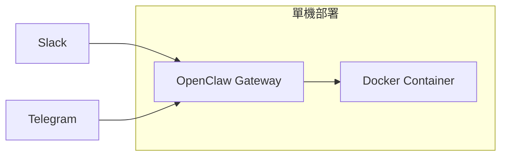
```mermaid
graph LR
    subgraph "單機部署"
        GW[OpenClaw Gateway]
        DOCKER[Docker Container]
    end
    
    SLACK[Slack] --> GW
    TG[Telegram] --> GW
    GW --> DOCKER
```

**建議配置**:

| 資源 | 規格 |
|------|------|
| CPU | 2 cores |
| RAM | 4 GB |
| 儲存 | 20 GB SSD |
| 網路 | 10 Mbps |

#### 中型團隊（10-100 人）

```mermaid
graph TB
    subgraph "DMZ"
        LB[Nginx Reverse Proxy]
    end
    
    subgraph "Application Zone"
        GW1[Gateway 1]
        GW2[Gateway 2]
    end
    
    subgraph "Data Zone"
        REDIS[Redis Sentinel]
        PG[PostgreSQL HA]
    end
    
    subgraph "Monitoring"
        OTEL[OpenTelemetry Collector]
        GRF[Grafana]
        PROM[Prometheus]
    end
    
    LB --> GW1 & GW2
    GW1 & GW2 --> REDIS & PG
    GW1 & GW2 --> OTEL
    OTEL --> PROM --> GRF
```

**建議配置（每節點）**:

| 資源 | 規格 |
|------|------|
| CPU | 4 cores |
| RAM | 8 GB |
| 儲存 | 50 GB SSD |
| 網路 | 100 Mbps |
| 節點數 | 2-3 |

#### 大型企業（100+ 人）

```mermaid
graph TB
    subgraph "Edge Layer"
        CDN[CDN / WAF]
        LB[Global Load Balancer]
    end
    
    subgraph "Region A"
        GW_A1[Gateway A-1]
        GW_A2[Gateway A-2]
        GW_A3[Gateway A-3]
        REDIS_A[Redis Cluster]
        PG_A[PostgreSQL Primary]
    end
    
    subgraph "Region B"
        GW_B1[Gateway B-1]
        GW_B2[Gateway B-2]
        GW_B3[Gateway B-3]
        REDIS_B[Redis Cluster]
        PG_B[PostgreSQL Replica]
    end
    
    subgraph "Central Monitoring"
        OTEL[OTEL Collector]
        GRF[Grafana]
        ES[Elasticsearch]
        ALERT[AlertManager]
    end
    
    CDN --> LB
    LB --> GW_A1 & GW_A2 & GW_A3
    LB --> GW_B1 & GW_B2 & GW_B3
    GW_A1 & GW_A2 & GW_A3 --> REDIS_A & PG_A
    GW_B1 & GW_B2 & GW_B3 --> REDIS_B & PG_B
    PG_A -->|複寫| PG_B
    
    GW_A1 & GW_B1 --> OTEL
    OTEL --> GRF & ES & ALERT
```

---

## 第三章：安裝與環境建置

### 3.1 系統需求

#### 最低需求

| 項目 | 需求 |
|------|------|
| **作業系統** | macOS 13+、Linux（Ubuntu 22.04+、Debian 12+）、Windows 11+ (WSL2) |
| **Node.js** | **≥ 22**（LTS 建議） |
| **記憶體** | 2 GB RAM |
| **磁碟空間** | 500 MB（不含 LLM 模型） |
| **網路** | 穩定的網際網路連線（用於 LLM API 呼叫） |

#### 建議需求（生產環境）

| 項目 | 需求 |
|------|------|
| **作業系統** | Linux（Ubuntu 24.04 LTS） |
| **Node.js** | 22 LTS |
| **Docker** | 24.0+ |
| **記憶體** | 8 GB RAM |
| **磁碟空間** | 50 GB SSD |
| **CPU** | 4 cores |

### 3.2 本地開發安裝（npm）

#### 步驟一：確認 Node.js 版本

```bash
# 確認 Node.js 版本 >= 22
node --version
# v22.x.x

# 如果版本不足，使用 nvm 升級
nvm install 22
nvm use 22
```

#### 步驟二：全域安裝 OpenClaw

```bash
# 使用 npm 全域安裝
npm install -g openclaw@latest

# 驗證安裝
openclaw --version
# openclaw 2026.3.2
```

#### 步驟三：初始化設定

```bash
# 互動式初始化精靈
openclaw init

# 依照提示完成以下設定：
# 1. 選擇 LLM 提供者 (OpenAI/Anthropic/Google/Ollama)
# 2. 輸入 API Key
# 3. 選擇要啟用的頻道
# 4. 設定預設 Agent 行為
```

#### 步驟四：啟動 Gateway

```bash
# 啟動 OpenClaw Gateway
openclaw start

# 查看運行狀態
openclaw status

# 檢視日誌
openclaw logs
```

#### 步驟五：驗證安裝

```bash
# 執行健康檢查
openclaw health

# 預期輸出：
# ✅ Gateway: running
# ✅ Agent Runtime: ready
# ✅ Channels: 2 connected
# ✅ Skills: 5 loaded
```

### 3.3 Docker Compose 部署

#### 基本 Docker Compose 設定

建立 `docker-compose.yml`：

```yaml
# docker-compose.yml
# OpenClaw Docker Compose 部署設定
version: "3.9"

services:
  openclaw:
    image: openclaw/openclaw:latest
    container_name: openclaw-gateway
    restart: unless-stopped
    ports:
      - "18789:18789"        # WebSocket 控制平面
    volumes:
      - ./config:/root/.openclaw    # 組態掛載
      - openclaw-data:/data         # 持久化資料
      - openclaw-logs:/logs         # 日誌輸出
    environment:
      - NODE_ENV=production
      - OPENCLAW_LOG_LEVEL=info
      # API Keys（建議使用 Docker Secrets）
      - OPENAI_API_KEY=${OPENAI_API_KEY}
    healthcheck:
      test: ["CMD", "openclaw", "health"]
      interval: 30s
      timeout: 10s
      retries: 3
      start_period: 30s
    deploy:
      resources:
        limits:
          cpus: "2.0"
          memory: 4G
        reservations:
          cpus: "1.0"
          memory: 2G

volumes:
  openclaw-data:
  openclaw-logs:
```

#### 啟動 Docker 容器

```bash
# 建立設定目錄
mkdir -p config

# 複製組態檔
cp openclaw.json config/

# 啟動容器
docker compose up -d

# 查看日誌
docker compose logs -f openclaw

# 查看健康狀態
docker compose ps
```

#### 進階 Docker Compose（含監控）

```yaml
# docker-compose.production.yml
version: "3.9"

services:
  openclaw:
    image: openclaw/openclaw:2026.3.2
    container_name: openclaw-gateway
    restart: unless-stopped
    ports:
      - "18789:18789"
    volumes:
      - ./config:/root/.openclaw
      - openclaw-data:/data
      - openclaw-logs:/logs
    environment:
      - NODE_ENV=production
      - OPENCLAW_LOG_LEVEL=info
      - OTEL_EXPORTER_OTLP_ENDPOINT=http://otel-collector:4318
      - OTEL_SERVICE_NAME=openclaw-gateway
    healthcheck:
      test: ["CMD", "openclaw", "health"]
      interval: 30s
      timeout: 10s
      retries: 3
    networks:
      - openclaw-network
    depends_on:
      - redis
      - otel-collector

  redis:
    image: redis:7-alpine
    container_name: openclaw-redis
    restart: unless-stopped
    ports:
      - "6379:6379"
    volumes:
      - redis-data:/data
    command: redis-server --appendonly yes --requirepass "${REDIS_PASSWORD}"
    networks:
      - openclaw-network

  otel-collector:
    image: otel/opentelemetry-collector-contrib:latest
    container_name: openclaw-otel
    restart: unless-stopped
    ports:
      - "4318:4318"     # OTLP HTTP
      - "8889:8889"     # Prometheus exporter
    volumes:
      - ./otel-config.yaml:/etc/otelcol/config.yaml
    networks:
      - openclaw-network

  prometheus:
    image: prom/prometheus:latest
    container_name: openclaw-prometheus
    restart: unless-stopped
    ports:
      - "9090:9090"
    volumes:
      - ./prometheus.yml:/etc/prometheus/prometheus.yml
      - prometheus-data:/prometheus
    networks:
      - openclaw-network

  grafana:
    image: grafana/grafana:latest
    container_name: openclaw-grafana
    restart: unless-stopped
    ports:
      - "3000:3000"
    volumes:
      - grafana-data:/var/lib/grafana
    environment:
      - GF_SECURITY_ADMIN_PASSWORD=${GRAFANA_PASSWORD}
    networks:
      - openclaw-network

volumes:
  openclaw-data:
  openclaw-logs:
  redis-data:
  prometheus-data:
  grafana-data:

networks:
  openclaw-network:
    driver: bridge
```

### 3.4 從原始碼建置

#### 前置需求

```bash
# 安裝 pnpm（OpenClaw 使用 pnpm 作為套件管理器）
npm install -g pnpm

# 確認版本
pnpm --version
```

#### 建置步驟

```bash
# 1. 克隆原始碼
git clone https://github.com/openclaw/openclaw.git
cd openclaw

# 2. 安裝依賴
pnpm install

# 3. 建置專案
pnpm build

# 4. 從原始碼執行
pnpm start

# 5.（可選）執行測試
pnpm test

# 6.（可選）連結本地建置到全域
pnpm link --global
```

#### 開發模式

```bash
# 開發模式（啟用 watch 和 hot reload）
pnpm dev

# 執行特定套件
pnpm --filter @openclaw/gateway dev
pnpm --filter @openclaw/agent-runtime dev
```

### 3.5 Podman 與 Nix 安裝

#### Podman 安裝

```bash
# 使用 Podman（Docker 替代方案）
podman run -d \
  --name openclaw-gateway \
  --restart unless-stopped \
  -p 18789:18789 \
  -v ./config:/root/.openclaw:Z \
  -v openclaw-data:/data:Z \
  -e OPENAI_API_KEY="${OPENAI_API_KEY}" \
  openclaw/openclaw:latest
```

#### Nix 安裝

```bash
# 使用 Nix Flake
nix run github:openclaw/openclaw

# 或加入 Nix 環境
nix develop github:openclaw/openclaw

# 安裝到 Nix profile
nix profile install github:openclaw/openclaw
```

### 3.6 初始設定與 JSON5 組態

OpenClaw 使用 **JSON5** 格式作為設定檔格式，JSON5 是 JSON 的超集，支援註解、尾逗號等開發友善特性。

#### 組態檔位置

```
~/.openclaw/openclaw.json
```

#### 基本組態範例

```json5
// ~/.openclaw/openclaw.json
// OpenClaw 主組態檔（JSON5 格式）
{
  // === LLM 模型設定 ===
  "models": {
    "default": {
      "provider": "openai",
      "model": "gpt-4o",
      "temperature": 0.7,
      "maxTokens": 4096,
    },
    "fast": {
      "provider": "openai",
      "model": "gpt-4o-mini",
      "temperature": 0.3,
    },
  },

  // === 頻道設定 ===
  "channels": {
    "whatsapp": {
      "enabled": true,
      // WhatsApp 連線設定自動處理 QR Code 配對
    },
    "telegram": {
      "enabled": true,
      "token": "${TELEGRAM_BOT_TOKEN}",  // 支援環境變數引用
    },
    "slack": {
      "enabled": false,  // 暫時停用
    },
  },

  // === Agent 設定 ===
  "agent": {
    "name": "企業助理",
    "defaultModel": "default",
    "systemPrompt": "你是一個專業的企業 AI 助理，請以繁體中文回應。",
  },

  // === Gateway 設定 ===
  "gateway": {
    "port": 18789,
    "host": "0.0.0.0",
  },

  // === 日誌設定 ===
  "logging": {
    "level": "info",      // trace | debug | info | warn | error
    "format": "jsonl",    // jsonl | text
    "file": "~/.openclaw/logs/openclaw.jsonl",
  },

  // === 安全設定 ===
  "security": {
    "allowedUsers": ["*"],  // 允許所有使用者（開發模式）
    "dmPairing": true,      // 啟用 DM 配對
  },
}
```

#### JSON5 vs JSON 差異

| 特性 | JSON | JSON5 |
|------|------|-------|
| 註解 | ❌ | ✅ `// 單行` 和 `/* 多行 */` |
| 尾逗號 | ❌ | ✅ `{ "a": 1, }` |
| 單引號字串 | ❌ | ✅ `'hello'` |
| 多行字串 | ❌ | ✅ 反斜線換行 |
| 無引號 Key | ❌ | ✅ `{ key: "value" }` |
| 十六進位 | ❌ | ✅ `0xFF` |
| NaN / Infinity | ❌ | ✅ |

### 3.7 環境變數與密鑰管理

#### 支援的環境變數

| 環境變數 | 說明 | 預設值 |
|----------|------|--------|
| `OPENAI_API_KEY` | OpenAI API 金鑰 | - |
| `ANTHROPIC_API_KEY` | Anthropic API 金鑰 | - |
| `GOOGLE_AI_API_KEY` | Google AI API 金鑰 | - |
| `TELEGRAM_BOT_TOKEN` | Telegram Bot Token | - |
| `SLACK_BOT_TOKEN` | Slack Bot Token | - |
| `DISCORD_BOT_TOKEN` | Discord Bot Token | - |
| `OPENCLAW_LOG_LEVEL` | 日誌級別 | `info` |
| `OPENCLAW_PORT` | Gateway 監聽埠 | `18789` |
| `OPENCLAW_CONFIG_PATH` | 組態檔路徑 | `~/.openclaw/openclaw.json` |
| `NODE_ENV` | 執行環境 | `development` |

#### 在組態中引用環境變數

```json5
{
  "channels": {
    "telegram": {
      // 使用 ${ENV_VAR} 語法引用環境變數
      "token": "${TELEGRAM_BOT_TOKEN}",
    },
  },
  "models": {
    "default": {
      "apiKey": "${OPENAI_API_KEY}",
    },
  },
}
```

#### 密鑰管理最佳實務

```bash
# 方法 1: 使用 .env 檔案（開發環境）
cat > .env << 'EOF'
OPENAI_API_KEY=sk-xxxxxxxxxxxxxxxx
TELEGRAM_BOT_TOKEN=123456:ABCdef...
EOF

# 方法 2: 使用系統環境變數（生產環境）
export OPENAI_API_KEY="sk-xxxxxxxxxxxxxxxx"

# 方法 3: Docker Secrets（Docker 環境）
echo "sk-xxxxxxxxxxxxxxxx" | docker secret create openai_key -

# 方法 4: HashiCorp Vault（企業環境）
vault kv put secret/openclaw openai_key=sk-xxxxxxxxxxxxxxxx
```

### 3.8 多環境組態管理

#### 環境分離策略

```
~/.openclaw/
├── openclaw.json              # 共用基礎設定
├── openclaw.development.json  # 開發環境覆蓋
├── openclaw.staging.json      # 預備環境覆蓋
└── openclaw.production.json   # 生產環境覆蓋
```

#### 開發環境組態

```json5
// openclaw.development.json
{
  "models": {
    "default": {
      "provider": "ollama",
      "model": "llama3:8b",
      "baseUrl": "http://localhost:11434",
    },
  },
  "logging": {
    "level": "debug",
  },
  "security": {
    "allowedUsers": ["*"],
  },
}
```

#### 生產環境組態

```json5
// openclaw.production.json
{
  "models": {
    "default": {
      "provider": "openai",
      "model": "gpt-4o",
      "apiKey": "${OPENAI_API_KEY}",
    },
  },
  "logging": {
    "level": "warn",
  },
  "security": {
    "allowedUsers": ["admin@company.com", "team@company.com"],
    "dmPairing": true,
  },
  "gateway": {
    "port": 18789,
    "host": "0.0.0.0",
    "tls": {
      "enabled": true,
      "cert": "/etc/ssl/certs/openclaw.pem",
      "key": "/etc/ssl/private/openclaw.key",
    },
  },
}
```

### 3.9 Hot Reload 與組態更新

OpenClaw 支援四種組態重載策略：

| 策略 | 說明 | 重啟影響 | 適用場景 |
|------|------|----------|----------|
| **hybrid** | 可熱載的設定立即套用，其他重啟 Agent | 部分 | 推薦（預設） |
| **hot** | 所有設定立即套用 | 無 | 開發環境 |
| **restart** | 任何設定變更都重啟 Agent | 完全 | 保守策略 |
| **off** | 不自動偵測變更，需手動重啟 | 手動 | 批次更新 |

#### 設定重載策略

```json5
{
  "gateway": {
    "configReload": "hybrid",  // hybrid | hot | restart | off
  },
}
```

#### 手動觸發重載

```bash
# 手動觸發組態重載
openclaw reload

# 驗證新組態
openclaw config validate

# 查看目前組態
openclaw config show
```

### 3.10 CLI 指令參考

#### 核心指令

| 指令 | 說明 | 範例 |
|------|------|------|
| `openclaw start` | 啟動 Gateway | `openclaw start` |
| `openclaw stop` | 停止 Gateway | `openclaw stop` |
| `openclaw restart` | 重啟 Gateway | `openclaw restart` |
| `openclaw status` | 查看運行狀態 | `openclaw status` |
| `openclaw health` | 健康檢查 | `openclaw health` |
| `openclaw logs` | 查看日誌 | `openclaw logs -f` |
| `openclaw config` | 組態管理 | `openclaw config validate` |
| `openclaw reload` | 重載組態 | `openclaw reload` |

#### Skills 管理指令

| 指令 | 說明 | 範例 |
|------|------|------|
| `openclaw skills list` | 列出已安裝技能 | `openclaw skills list` |
| `openclaw skills install` | 安裝技能 | `openclaw skills install weather` |
| `openclaw skills update` | 更新技能 | `openclaw skills update --all` |
| `openclaw skills remove` | 移除技能 | `openclaw skills remove weather` |
| `openclaw skills search` | 搜尋技能 | `openclaw skills search "報表"` |
| `openclaw skills publish` | 發布技能 | `openclaw skills publish ./my-skill` |

#### 診斷指令

| 指令 | 說明 | 範例 |
|------|------|------|
| `openclaw doctor` | 執行完整診斷 | `openclaw doctor` |
| `openclaw health --deep` | 深度健康檢查 | `openclaw health --deep` |
| `openclaw config validate` | 驗證組態 | `openclaw config validate` |
| `openclaw channels test` | 測試頻道連線 | `openclaw channels test whatsapp` |

---

## 第四章：開發實戰教學

### 4.1 第一個 OpenClaw Agent

#### 建立 Agent 工作區

```bash
# 建立專案目錄
mkdir my-openclaw-agent
cd my-openclaw-agent

# 初始化 OpenClaw 工作區
openclaw init --workspace

# 目錄結構：
# my-openclaw-agent/
# ├── openclaw.json       # 工作區組態
# └── skills/              # 技能目錄
```

#### 定義 Agent 行為

```json5
// openclaw.json
{
  "agent": {
    "name": "學習助理",
    "defaultModel": "default",
    "systemPrompt": `
      你是一個專業的學習助理，專長在 Java 程式設計教學。
      請以繁體中文回應，並在適當時提供程式碼範例。
      回應保持簡潔、有條理，使用 Markdown 格式。
    `,
  },
  "models": {
    "default": {
      "provider": "openai",
      "model": "gpt-4o",
    },
  },
  "channels": {
    "telegram": {
      "enabled": true,
      "token": "${TELEGRAM_BOT_TOKEN}",
    },
  },
}
```

#### 建立第一個 Skill

```bash
# 建立技能目錄
mkdir -p skills/java-tutor
```

建立 `skills/java-tutor/SKILL.md`：

```markdown
---
name: java-tutor
description: Java 程式設計教學技能
version: 1.0.0
triggers:
  - java
  - 程式
  - 教學
  - 範例
tools:
  - execute_code
  - search_docs
---

# Java 教學技能

你是一個 Java 程式設計的專業教師。當使用者詢問 Java 相關問題時：

## 教學方針

1. 先解釋概念，再提供程式碼範例
2. 使用 JavaDoc 格式的註解
3. 遵循 Java 命名慣例（PascalCase 類別、camelCase 方法）
4. 每個範例都附帶簡要的執行結果說明
5. 適時提醒常見錯誤和最佳實務

## 程式碼範例格式

所有 Java 程式碼範例應包含：
- 完整的 import 陳述式
- JavaDoc 註解
- main 方法（如需執行示範）
- 預期輸出的註解
```

#### 啟動並測試

```bash
# 啟動 Agent
openclaw start

# 在 Telegram 上與 Bot 對話測試
# 使用者: "請教我 Java 的 Stream API"
# Agent: [使用 java-tutor 技能回應]
```

### 4.2 Java 整合 OpenClaw API

OpenClaw 提供 WebSocket API，可以透過 Java 應用程式直接與 Gateway 通訊。

#### Maven 依賴

```xml
<!-- pom.xml - WebSocket 客戶端依賴 -->
<dependencies>
    <!-- Java WebSocket 客戶端 -->
    <dependency>
        <groupId>org.java-websocket</groupId>
        <artifactId>Java-WebSocket</artifactId>
        <version>1.5.6</version>
    </dependency>
    
    <!-- JSON 處理 -->
    <dependency>
        <groupId>com.fasterxml.jackson.core</groupId>
        <artifactId>jackson-databind</artifactId>
        <version>2.17.0</version>
    </dependency>
    
    <!-- HTTP 客戶端（用於健康檢查等 REST API） -->
    <dependency>
        <groupId>org.apache.httpcomponents.client5</groupId>
        <artifactId>httpclient5</artifactId>
        <version>5.3</version>
    </dependency>
    
    <!-- 日誌 -->
    <dependency>
        <groupId>org.apache.logging.log4j</groupId>
        <artifactId>log4j-core</artifactId>
        <version>2.23.1</version>
    </dependency>
    <dependency>
        <groupId>org.apache.logging.log4j</groupId>
        <artifactId>log4j-api</artifactId>
        <version>2.23.1</version>
    </dependency>
</dependencies>
```

#### OpenClaw WebSocket 客戶端

```java
package com.tutorial.openclaw;

import com.fasterxml.jackson.databind.JsonNode;
import com.fasterxml.jackson.databind.ObjectMapper;
import com.fasterxml.jackson.databind.node.ObjectNode;
import org.apache.logging.log4j.LogManager;
import org.apache.logging.log4j.Logger;
import org.java_websocket.client.WebSocketClient;
import org.java_websocket.handshake.ServerHandshake;

import java.net.URI;
import java.util.UUID;
import java.util.concurrent.CompletableFuture;
import java.util.concurrent.ConcurrentHashMap;
import java.util.concurrent.TimeUnit;

/**
 * OpenClaw WebSocket 客戶端。
 *
 * <p>提供與 OpenClaw Gateway WebSocket 控制平面的連線管理，
 * 支援發送訊息、接收串流回應、健康檢查等功能。</p>
 *
 * <h3>使用範例：</h3>
 * <pre>{@code
 * OpenClawClient client = new OpenClawClient("ws://localhost:18789");
 * client.connectBlocking();
 * String response = client.sendMessage("你好，請幫我寫一段 Java 程式");
 * System.out.println(response);
 * client.close();
 * }</pre>
 *
 * @author Tutorial Team
 * @version 1.0.0
 * @since 2026.3
 */
public class OpenClawClient extends WebSocketClient {

    private static final Logger logger = LogManager.getLogger(OpenClawClient.class);

    /** JSON 序列化/反序列化工具 */
    private final ObjectMapper objectMapper;

    /** 等待回應的 Future 映射表，以 requestId 為鍵 */
    private final ConcurrentHashMap<String, CompletableFuture<String>> pendingRequests;

    /** 串流回應緩衝區 */
    private final ConcurrentHashMap<String, StringBuilder> streamBuffers;

    /**
     * 建立 OpenClaw WebSocket 客戶端。
     *
     * @param serverUri OpenClaw Gateway 的 WebSocket URI，
     *                  例如 {@code ws://localhost:18789}
     */
    public OpenClawClient(String serverUri) {
        super(URI.create(serverUri));
        this.objectMapper = new ObjectMapper();
        this.pendingRequests = new ConcurrentHashMap<>();
        this.streamBuffers = new ConcurrentHashMap<>();
        logger.info("OpenClaw 客戶端已建立，目標: {}", serverUri);
    }

    @Override
    public void onOpen(ServerHandshake handshake) {
        logger.info("已連線至 OpenClaw Gateway (HTTP {})", handshake.getHttpStatus());
    }

    @Override
    public void onMessage(String message) {
        try {
            JsonNode json = objectMapper.readTree(message);
            String type = json.path("type").asText();
            String requestId = json.path("requestId").asText();

            switch (type) {
                case "response.stream" -> handleStreamChunk(requestId, json);
                case "response.complete" -> handleResponseComplete(requestId, json);
                case "response.error" -> handleError(requestId, json);
                case "heartbeat" -> handleHeartbeat();
                default -> logger.debug("收到未知訊息類型: {}", type);
            }
        } catch (Exception e) {
            logger.error("處理訊息時發生錯誤: {}", message, e);
        }
    }

    @Override
    public void onClose(int code, String reason, boolean remote) {
        logger.info("WebSocket 連線已關閉 [code={}, reason={}, remote={}]",
                code, reason, remote);
        // 完成所有等待中的請求
        pendingRequests.forEach((id, future) ->
                future.completeExceptionally(
                        new RuntimeException("連線已關閉: " + reason)));
        pendingRequests.clear();
    }

    @Override
    public void onError(Exception ex) {
        logger.error("WebSocket 發生錯誤", ex);
    }

    /**
     * 發送訊息至 OpenClaw Agent 並等待完整回應。
     *
     * @param content 使用者訊息內容
     * @return Agent 的完整回應文字
     * @throws Exception 若發送失敗或等待超時
     */
    public String sendMessage(String content) throws Exception {
        return sendMessage(content, 60, TimeUnit.SECONDS);
    }

    /**
     * 發送訊息至 OpenClaw Agent 並在指定時間內等待回應。
     *
     * @param content 使用者訊息內容
     * @param timeout 等待超時時間
     * @param unit    超時時間單位
     * @return Agent 的完整回應文字
     * @throws Exception 若發送失敗或等待超時
     */
    public String sendMessage(String content, long timeout, TimeUnit unit)
            throws Exception {
        String requestId = UUID.randomUUID().toString();
        CompletableFuture<String> future = new CompletableFuture<>();
        pendingRequests.put(requestId, future);
        streamBuffers.put(requestId, new StringBuilder());

        // 構建訊息
        ObjectNode message = objectMapper.createObjectNode();
        message.put("type", "message.send");
        message.put("requestId", requestId);

        ObjectNode contentNode = objectMapper.createObjectNode();
        contentNode.put("type", "text");
        contentNode.put("text", content);
        message.set("content", contentNode);

        // 發送
        String payload = objectMapper.writeValueAsString(message);
        send(payload);
        logger.debug("已發送訊息 [requestId={}]: {}", requestId, content);

        // 等待回應
        return future.get(timeout, unit);
    }

    /**
     * 發送訊息並透過回呼接收串流回應。
     *
     * @param content  使用者訊息內容
     * @param callback 串流回呼，每收到一個 Token 片段就會被呼叫
     * @return 請求 ID
     * @throws Exception 若發送失敗
     */
    public String sendMessageStreaming(String content, StreamCallback callback)
            throws Exception {
        String requestId = UUID.randomUUID().toString();

        // 儲存回呼（實際實作會更複雜）
        CompletableFuture<String> future = new CompletableFuture<>();
        pendingRequests.put(requestId, future);
        streamBuffers.put(requestId, new StringBuilder());

        ObjectNode message = objectMapper.createObjectNode();
        message.put("type", "message.send");
        message.put("requestId", requestId);
        message.put("stream", true);

        ObjectNode contentNode = objectMapper.createObjectNode();
        contentNode.put("type", "text");
        contentNode.put("text", content);
        message.set("content", contentNode);

        send(objectMapper.writeValueAsString(message));
        logger.debug("已發送串流請求 [requestId={}]", requestId);

        return requestId;
    }

    /**
     * 處理串流回應片段。
     */
    private void handleStreamChunk(String requestId, JsonNode json) {
        String chunk = json.path("content").path("text").asText();
        StringBuilder buffer = streamBuffers.get(requestId);
        if (buffer != null) {
            buffer.append(chunk);
        }
        logger.trace("串流片段 [{}]: {}", requestId, chunk);
    }

    /**
     * 處理完整回應。
     */
    private void handleResponseComplete(String requestId, JsonNode json) {
        StringBuilder buffer = streamBuffers.remove(requestId);
        CompletableFuture<String> future = pendingRequests.remove(requestId);

        if (future != null) {
            String fullResponse = (buffer != null)
                    ? buffer.toString()
                    : json.path("content").path("text").asText();
            future.complete(fullResponse);
            logger.debug("回應完成 [{}]: {} 字元", requestId, fullResponse.length());
        }
    }

    /**
     * 處理錯誤回應。
     */
    private void handleError(String requestId, JsonNode json) {
        String errorMessage = json.path("error").path("message").asText("Unknown error");
        CompletableFuture<String> future = pendingRequests.remove(requestId);
        streamBuffers.remove(requestId);

        if (future != null) {
            future.completeExceptionally(
                    new RuntimeException("OpenClaw 錯誤: " + errorMessage));
        }
        logger.error("收到錯誤回應 [{}]: {}", requestId, errorMessage);
    }

    /**
     * 處理心跳訊息。
     */
    private void handleHeartbeat() {
        logger.trace("收到心跳");
        // 回傳心跳回應
        try {
            ObjectNode pong = objectMapper.createObjectNode();
            pong.put("type", "heartbeat.pong");
            send(objectMapper.writeValueAsString(pong));
        } catch (Exception e) {
            logger.warn("心跳回應失敗", e);
        }
    }

    /**
     * 串流回呼介面。
     */
    @FunctionalInterface
    public interface StreamCallback {
        /**
         * 當收到串流片段時呼叫。
         *
         * @param chunk 回應片段文字
         */
        void onChunk(String chunk);
    }
}
```

#### 使用範例

```java
package com.tutorial.openclaw;

import org.apache.logging.log4j.LogManager;
import org.apache.logging.log4j.Logger;

/**
 * OpenClaw 客戶端使用範例。
 *
 * <p>展示如何透過 Java 程式與 OpenClaw Gateway 互動，
 * 包含同步訊息發送和串流接收。</p>
 *
 * @author Tutorial Team
 * @version 1.0.0
 */
public class OpenClawExample {

    private static final Logger logger = LogManager.getLogger(OpenClawExample.class);

    /** OpenClaw Gateway 預設位址 */
    private static final String GATEWAY_URI = "ws://localhost:18789";

    /**
     * 主程式進入點。
     *
     * @param args 命令列參數
     */
    public static void main(String[] args) {
        try {
            // 建立客戶端並連線
            OpenClawClient client = new OpenClawClient(GATEWAY_URI);
            client.connectBlocking();
            logger.info("已連線至 OpenClaw Gateway");

            // 範例 1: 同步發送訊息
            String response = client.sendMessage("請用 Java 示範 Observer 設計模式");
            System.out.println("Agent 回應:\n" + response);

            // 範例 2: 串流接收
            client.sendMessageStreaming(
                    "請解釋 Java 的 Garbage Collection 機制",
                    chunk -> System.out.print(chunk)  // 即時輸出每個片段
            );

            // 等待串流完成
            Thread.sleep(30_000);

            // 關閉連線
            client.close();
            logger.info("連線已關閉");

        } catch (Exception e) {
            logger.error("執行失敗", e);
        }
    }
}
```

### 4.3 自訂 Skill 開發

#### Skill 完整結構

```
skills/
└── enterprise-reporter/
    ├── SKILL.md              # 技能定義（必要）
    ├── tools/
    │   ├── generate_report.js   # 工具實作
    │   └── fetch_data.js        # 工具實作
    ├── templates/
    │   ├── daily_report.md      # 報表模板
    │   └── weekly_summary.md    # 摘要模板
    └── README.md              # 技能說明文件
```

#### SKILL.md 完整範例

```markdown
---
name: enterprise-reporter
description: 企業報表自動生成技能
version: 2.1.0
author: DevOps Team
triggers:
  - 報表
  - report
  - 日報
  - 週報
  - 月報
tools:
  - generate_report
  - fetch_data
  - send_notification
access:
  channels:
    - slack
    - teams
  users:
    - "*@company.com"
config:
  reportOutputDir: "./reports"
  maxDataPoints: 10000
  defaultFormat: "markdown"
---

# 企業報表生成技能

你是一個專業的企業報表分析師。你的職責是根據使用者需求，
自動收集資料、產生報表、並通知相關人員。

## 報表類型

### 日報（Daily Report）
- 觸發：使用者提及「日報」或每日排程
- 內容：昨日關鍵指標、異常事件、待辦事項
- 格式：Markdown 表格 + 摘要

### 週報（Weekly Summary）
- 觸發：使用者提及「週報」或每週排程
- 內容：一週趨勢分析、達成率、風險項目
- 格式：Markdown + 圖表描述

### 月報（Monthly Report）
- 觸發：使用者提及「月報」
- 內容：月度 KPI、同比/環比分析、下月計畫
- 格式：完整報告格式

## 工具使用規則

1. 先使用 `fetch_data` 取得所需資料
2. 分析資料後使用 `generate_report` 產生報表
3. 報表完成後使用 `send_notification` 通知相關人員
4. 若資料不完整，主動告知使用者並建議補充方向

## 回應風格

- 使用繁體中文
- 數據精確到小數點第二位
- 關鍵指標使用粗體標示
- 異常項目以 ⚠️ 標記
- 正向趨勢以 📈 標記，負向以 📉 標記
```

#### Java 工具實作（透過 HTTP Bridge）

由於 OpenClaw 原生使用 TypeScript，Java 端可透過 HTTP Bridge 模式提供工具：

```java
package com.tutorial.openclaw.tools;

import com.fasterxml.jackson.databind.JsonNode;
import com.fasterxml.jackson.databind.ObjectMapper;
import com.fasterxml.jackson.databind.node.ArrayNode;
import com.fasterxml.jackson.databind.node.ObjectNode;
import com.sun.net.httpserver.HttpExchange;
import com.sun.net.httpserver.HttpServer;
import org.apache.logging.log4j.LogManager;
import org.apache.logging.log4j.Logger;

import java.io.IOException;
import java.io.OutputStream;
import java.net.InetSocketAddress;
import java.nio.charset.StandardCharsets;
import java.time.LocalDate;
import java.time.format.DateTimeFormatter;
import java.util.Map;

/**
 * OpenClaw 工具 HTTP Bridge。
 *
 * <p>提供 HTTP 端點讓 OpenClaw Agent 可以呼叫 Java 實作的工具。
 * Agent 的工具定義中指向此 Bridge 服務的 URL。</p>
 *
 * <h3>架構說明：</h3>
 * <pre>
 * Agent → Tool Call → HTTP POST → Java Bridge → 執行業務邏輯 → 回傳結果
 * </pre>
 *
 * @author Tutorial Team
 * @version 1.0.0
 */
public class ToolBridgeServer {

    private static final Logger logger = LogManager.getLogger(ToolBridgeServer.class);
    private static final ObjectMapper MAPPER = new ObjectMapper();
    private static final int PORT = 8090;

    /**
     * 啟動工具 Bridge 伺服器。
     *
     * @param args 命令列參數
     * @throws IOException 若伺服器啟動失敗
     */
    public static void main(String[] args) throws IOException {
        HttpServer server = HttpServer.create(new InetSocketAddress(PORT), 0);

        // 註冊工具端點
        server.createContext("/tools/generate_report", ToolBridgeServer::handleGenerateReport);
        server.createContext("/tools/fetch_data", ToolBridgeServer::handleFetchData);
        server.createContext("/tools/health", ToolBridgeServer::handleHealth);

        server.setExecutor(null);
        server.start();
        logger.info("工具 Bridge 伺服器已啟動於 port {}", PORT);
    }

    /**
     * 處理報表生成請求。
     */
    private static void handleGenerateReport(HttpExchange exchange) throws IOException {
        if (!"POST".equals(exchange.getRequestMethod())) {
            sendResponse(exchange, 405, "{\"error\": \"Method not allowed\"}");
            return;
        }

        try {
            // 解析請求
            String body = new String(
                    exchange.getRequestBody().readAllBytes(),
                    StandardCharsets.UTF_8);
            JsonNode request = MAPPER.readTree(body);

            String reportType = request.path("type").asText("daily");
            String dateStr = request.path("date")
                    .asText(LocalDate.now().format(DateTimeFormatter.ISO_DATE));

            logger.info("生成報表 [type={}, date={}]", reportType, dateStr);

            // 生成報表（範例邏輯）
            ObjectNode result = MAPPER.createObjectNode();
            result.put("success", true);
            result.put("reportType", reportType);
            result.put("date", dateStr);
            result.put("content", generateReportContent(reportType, dateStr));
            result.put("generatedAt", java.time.Instant.now().toString());

            sendResponse(exchange, 200, MAPPER.writeValueAsString(result));

        } catch (Exception e) {
            logger.error("報表生成失敗", e);
            ObjectNode error = MAPPER.createObjectNode();
            error.put("success", false);
            error.put("error", e.getMessage());
            sendResponse(exchange, 500, MAPPER.writeValueAsString(error));
        }
    }

    /**
     * 處理資料擷取請求。
     */
    private static void handleFetchData(HttpExchange exchange) throws IOException {
        if (!"POST".equals(exchange.getRequestMethod())) {
            sendResponse(exchange, 405, "{\"error\": \"Method not allowed\"}");
            return;
        }

        try {
            String body = new String(
                    exchange.getRequestBody().readAllBytes(),
                    StandardCharsets.UTF_8);
            JsonNode request = MAPPER.readTree(body);

            String source = request.path("source").asText();
            String metric = request.path("metric").asText();

            logger.info("擷取資料 [source={}, metric={}]", source, metric);

            // 模擬資料擷取（實際實作會連接資料庫或 API）
            ObjectNode result = MAPPER.createObjectNode();
            result.put("success", true);
            result.put("source", source);
            result.put("metric", metric);

            ArrayNode dataPoints = MAPPER.createArrayNode();
            for (int i = 0; i < 7; i++) {
                ObjectNode point = MAPPER.createObjectNode();
                point.put("date", LocalDate.now().minusDays(6 - i)
                        .format(DateTimeFormatter.ISO_DATE));
                point.put("value", Math.random() * 100);
                dataPoints.add(point);
            }
            result.set("data", dataPoints);

            sendResponse(exchange, 200, MAPPER.writeValueAsString(result));

        } catch (Exception e) {
            logger.error("資料擷取失敗", e);
            sendResponse(exchange, 500,
                    "{\"success\": false, \"error\": \"" + e.getMessage() + "\"}");
        }
    }

    /**
     * 健康檢查端點。
     */
    private static void handleHealth(HttpExchange exchange) throws IOException {
        ObjectNode health = MAPPER.createObjectNode();
        health.put("status", "healthy");
        health.put("service", "openclaw-tool-bridge");
        health.put("port", PORT);
        sendResponse(exchange, 200, MAPPER.writeValueAsString(health));
    }

    /**
     * 生成報表內容。
     */
    private static String generateReportContent(String type, String date) {
        return switch (type) {
            case "daily" -> String.format("""
                    # 日報 - %s
                    
                    ## 關鍵指標
                    | 指標 | 數值 | 變化 |
                    |------|------|------|
                    | **API 請求數** | 12,345 | 📈 +5.2%% |
                    | **平均回應時間** | 245ms | 📉 -12ms |
                    | **錯誤率** | 0.03%% | ✅ 正常 |
                    | **活躍使用者** | 892 | 📈 +3.1%% |
                    
                    ## 異常事件
                    - ⚠️ 14:23 - API Gateway 短暫延遲（已自動恢復）
                    
                    ## 待辦事項
                    - [ ] 更新 SSL 憑證（到期日：+30天）
                    - [ ] 審查本週新 Skill 部署請求
                    """, date);
            case "weekly" -> String.format("""
                    # 週報 - %s 之週
                    
                    ## 週趨勢摘要
                    本週整體表現 **優於** 上週，API 可用率達 99.97%%。
                    
                    ## 週 KPI 達成率
                    | KPI | 目標 | 實際 | 達成率 |
                    |-----|------|------|--------|
                    | 回應時間 | <300ms | 245ms | ✅ 118%% |
                    | 可用率 | >99.9%% | 99.97%% | ✅ 100%% |
                    | 使用者滿意度 | >4.5 | 4.7 | ✅ 104%% |
                    """, date);
            default -> "# 報表\n\n報表類型: " + type + "\n日期: " + date;
        };
    }

    /**
     * 發送 HTTP 回應。
     */
    private static void sendResponse(HttpExchange exchange, int statusCode, String body)
            throws IOException {
        byte[] bytes = body.getBytes(StandardCharsets.UTF_8);
        exchange.getResponseHeaders().set("Content-Type", "application/json; charset=utf-8");
        exchange.sendResponseHeaders(statusCode, bytes.length);
        try (OutputStream os = exchange.getResponseBody()) {
            os.write(bytes);
        }
    }
}
```

### 4.4 自訂 Tool 開發

#### OpenClaw 工具定義格式

在 Skill 中定義工具供 Agent 使用：

```json5
// skills/enterprise-reporter/tools/tool_definitions.json5
{
  "tools": [
    {
      "name": "generate_report",
      "description": "生成企業報表。支援日報、週報、月報格式。",
      "parameters": {
        "type": "object",
        "properties": {
          "type": {
            "type": "string",
            "enum": ["daily", "weekly", "monthly"],
            "description": "報表類型",
          },
          "date": {
            "type": "string",
            "format": "date",
            "description": "報表日期（YYYY-MM-DD 格式）",
          },
          "includeCharts": {
            "type": "boolean",
            "default": true,
            "description": "是否包含圖表",
          },
        },
        "required": ["type"],
      },
      "endpoint": "http://localhost:8090/tools/generate_report",
    },
    {
      "name": "fetch_data",
      "description": "從指定的資料來源擷取數據。",
      "parameters": {
        "type": "object",
        "properties": {
          "source": {
            "type": "string",
            "description": "資料來源名稱",
          },
          "metric": {
            "type": "string",
            "description": "指標名稱",
          },
          "dateRange": {
            "type": "object",
            "properties": {
              "from": { "type": "string", "format": "date" },
              "to": { "type": "string", "format": "date" },
            },
          },
        },
        "required": ["source", "metric"],
      },
      "endpoint": "http://localhost:8090/tools/fetch_data",
    },
    {
      "name": "send_notification",
      "description": "發送通知訊息至指定頻道或使用者。",
      "parameters": {
        "type": "object",
        "properties": {
          "channel": {
            "type": "string",
            "description": "目標頻道名稱",
          },
          "message": {
            "type": "string",
            "description": "通知訊息內容",
          },
          "priority": {
            "type": "string",
            "enum": ["low", "normal", "high", "urgent"],
            "default": "normal",
          },
        },
        "required": ["channel", "message"],
      },
    },
  ],
}
```

#### Java 工具實作模式

```java
package com.tutorial.openclaw.tools;

import org.apache.logging.log4j.LogManager;
import org.apache.logging.log4j.Logger;

import java.util.Map;
import java.util.concurrent.ConcurrentHashMap;
import java.util.function.Function;

/**
 * OpenClaw 工具註冊器。
 *
 * <p>管理所有可供 OpenClaw Agent 呼叫的 Java 工具實作。
 * 採用策略模式，讓每個工具的實作獨立且可測試。</p>
 *
 * @author Tutorial Team
 * @version 1.0.0
 */
public class ToolRegistry {

    private static final Logger logger = LogManager.getLogger(ToolRegistry.class);

    /** 工具映射表 */
    private final Map<String, Function<Map<String, Object>, Object>> tools;

    /**
     * 建立工具註冊器。
     */
    public ToolRegistry() {
        this.tools = new ConcurrentHashMap<>();
        registerDefaultTools();
    }

    /**
     * 註冊工具。
     *
     * @param name    工具名稱
     * @param handler 工具處理函式
     */
    public void register(String name, Function<Map<String, Object>, Object> handler) {
        tools.put(name, handler);
        logger.info("已註冊工具: {}", name);
    }

    /**
     * 執行工具。
     *
     * @param name   工具名稱
     * @param params 工具參數
     * @return 工具執行結果
     * @throws IllegalArgumentException 若工具不存在
     */
    public Object execute(String name, Map<String, Object> params) {
        Function<Map<String, Object>, Object> handler = tools.get(name);
        if (handler == null) {
            throw new IllegalArgumentException("未知的工具: " + name);
        }
        logger.info("執行工具: {} (params: {})", name, params);
        return handler.apply(params);
    }

    /**
     * 註冊預設工具集。
     */
    private void registerDefaultTools() {
        // 報表生成工具
        register("generate_report", params -> {
            String type = (String) params.getOrDefault("type", "daily");
            String date = (String) params.getOrDefault("date",
                    java.time.LocalDate.now().toString());
            return Map.of(
                    "success", true,
                    "reportType", type,
                    "date", date,
                    "content", "報表內容...",
                    "generatedAt", java.time.Instant.now().toString()
            );
        });

        // 資料擷取工具
        register("fetch_data", params -> {
            String source = (String) params.get("source");
            String metric = (String) params.get("metric");
            return Map.of(
                    "success", true,
                    "source", source,
                    "metric", metric,
                    "data", java.util.List.of(
                            Map.of("date", "2026-03-01", "value", 95.2),
                            Map.of("date", "2026-03-02", "value", 97.1),
                            Map.of("date", "2026-03-03", "value", 93.8)
                    )
            );
        });

        // 通知發送工具
        register("send_notification", params -> {
            String channel = (String) params.get("channel");
            String message = (String) params.get("message");
            logger.info("發送通知至 {}: {}", channel, message);
            return Map.of(
                    "success", true,
                    "channel", channel,
                    "sentAt", java.time.Instant.now().toString()
            );
        });
    }

    /**
     * 取得已註冊的工具列表。
     *
     * @return 工具名稱集合
     */
    public java.util.Set<String> getRegisteredTools() {
        return java.util.Collections.unmodifiableSet(tools.keySet());
    }
}
```

### 4.5 工作流程編排

#### 多步驟工作流程設計

```mermaid
flowchart TD
    START[開始：使用者請求「產生月報」] --> FETCH[Step 1: 擷取資料]
    FETCH --> ANALYZE[Step 2: 分析資料]
    ANALYZE --> GENERATE[Step 3: 生成報表]
    GENERATE --> REVIEW{Step 4: 需要審核？}
    REVIEW -->|是| NOTIFY_REVIEWER[通知審核者]
    NOTIFY_REVIEWER --> WAIT[等待審核]
    WAIT --> APPROVED{審核通過？}
    APPROVED -->|是| DISTRIBUTE[Step 5: 分發報表]
    APPROVED -->|否| REVISE[修訂報表]
    REVISE --> REVIEW
    REVIEW -->|否| DISTRIBUTE
    DISTRIBUTE --> END[完成：通知使用者]
```

#### Java 工作流程引擎

```java
package com.tutorial.openclaw.workflow;

import org.apache.logging.log4j.LogManager;
import org.apache.logging.log4j.Logger;

import java.util.*;
import java.util.concurrent.CompletableFuture;
import java.util.function.Function;

/**
 * OpenClaw 工作流程引擎。
 *
 * <p>提供多步驟工作流程的編排與執行能力，
 * 支援條件分支、平行執行、錯誤處理等特性。</p>
 *
 * @author Tutorial Team
 * @version 1.0.0
 */
public class WorkflowEngine {

    private static final Logger logger = LogManager.getLogger(WorkflowEngine.class);

    /**
     * 工作流程步驟定義。
     */
    public record Step(
            String name,
            Function<Map<String, Object>, Map<String, Object>> action,
            String onSuccess,
            String onFailure
    ) {}

    /** 步驟映射表 */
    private final Map<String, Step> steps = new LinkedHashMap<>();

    /** 起始步驟名稱 */
    private String startStep;

    /**
     * 新增工作流程步驟。
     *
     * @param step 步驟定義
     * @return 此引擎實體（支援鏈式呼叫）
     */
    public WorkflowEngine addStep(Step step) {
        steps.put(step.name(), step);
        if (startStep == null) {
            startStep = step.name();
        }
        return this;
    }

    /**
     * 執行工作流程。
     *
     * @param initialContext 初始上下文
     * @return 工作流程執行結果
     */
    public Map<String, Object> execute(Map<String, Object> initialContext) {
        Map<String, Object> context = new HashMap<>(initialContext);
        String currentStep = startStep;
        List<String> executionPath = new ArrayList<>();

        logger.info("開始執行工作流程，起始步驟: {}", currentStep);

        while (currentStep != null) {
            Step step = steps.get(currentStep);
            if (step == null) {
                logger.error("找不到步驟: {}", currentStep);
                break;
            }

            executionPath.add(currentStep);
            logger.info("執行步驟: {}", currentStep);

            try {
                Map<String, Object> result = step.action().apply(context);
                context.putAll(result);
                currentStep = step.onSuccess();
                logger.info("步驟 {} 成功完成", step.name());
            } catch (Exception e) {
                logger.error("步驟 {} 執行失敗: {}", step.name(), e.getMessage());
                context.put("error", e.getMessage());
                currentStep = step.onFailure();
            }
        }

        context.put("_executionPath", executionPath);
        logger.info("工作流程完成，路徑: {}", executionPath);
        return context;
    }

    /**
     * 工作流程建構範例。
     *
     * @return 建構好的報表工作流程
     */
    public static WorkflowEngine createReportWorkflow() {
        WorkflowEngine engine = new WorkflowEngine();

        engine.addStep(new Step(
                "fetch_data",
                ctx -> {
                    // 模擬資料擷取
                    ctx.put("rawData", List.of(95.2, 97.1, 93.8, 98.5, 96.0));
                    return ctx;
                },
                "analyze_data",
                "handle_error"
        ));

        engine.addStep(new Step(
                "analyze_data",
                ctx -> {
                    @SuppressWarnings("unchecked")
                    List<Double> data = (List<Double>) ctx.get("rawData");
                    double avg = data.stream()
                            .mapToDouble(Double::doubleValue)
                            .average()
                            .orElse(0.0);
                    ctx.put("averageScore", avg);
                    ctx.put("trend", avg > 95 ? "positive" : "negative");
                    return ctx;
                },
                "generate_report",
                "handle_error"
        ));

        engine.addStep(new Step(
                "generate_report",
                ctx -> {
                    String report = String.format(
                            "# 分析報表\n\n平均分數: %.2f\n趨勢: %s",
                            ctx.get("averageScore"),
                            ctx.get("trend")
                    );
                    ctx.put("report", report);
                    return ctx;
                },
                "distribute",
                "handle_error"
        ));

        engine.addStep(new Step(
                "distribute",
                ctx -> {
                    logger.info("分發報表至指定頻道");
                    ctx.put("distributed", true);
                    return ctx;
                },
                null,  // 工作流程結束
                "handle_error"
        ));

        engine.addStep(new Step(
                "handle_error",
                ctx -> {
                    logger.error("工作流程發生錯誤: {}", ctx.get("error"));
                    ctx.put("status", "failed");
                    return ctx;
                },
                null,
                null
        ));

        return engine;
    }
}
```

### 4.6 記憶體與上下文管理

#### 上下文管理器

```java
package com.tutorial.openclaw.context;

import org.apache.logging.log4j.LogManager;
import org.apache.logging.log4j.Logger;

import java.time.Instant;
import java.util.*;
import java.util.concurrent.ConcurrentLinkedDeque;

/**
 * OpenClaw 對話上下文管理器。
 *
 * <p>管理 Agent 與使用者之間的對話歷史與上下文，
 * 實作滑動視窗和摘要壓縮策略以控制 Token 用量。</p>
 *
 * @author Tutorial Team
 * @version 1.0.0
 */
public class ContextManager {

    private static final Logger logger = LogManager.getLogger(ContextManager.class);

    /** 對話訊息記錄 */
    public record Message(
            String role,
            String content,
            Instant timestamp,
            boolean pinned
    ) {}

    /** 最大保留訊息數 */
    private final int maxMessages;

    /** 最大 Token 數估計 */
    private final int maxTokenEstimate;

    /** 訊息佇列 */
    private final Deque<Message> messages;

    /** 摘要文字 */
    private String summary;

    /** 使用者偏好 */
    private final Map<String, String> userPreferences;

    /**
     * 建立上下文管理器。
     *
     * @param maxMessages     最大保留訊息數
     * @param maxTokenEstimate 最大 Token 數估計值
     */
    public ContextManager(int maxMessages, int maxTokenEstimate) {
        this.maxMessages = maxMessages;
        this.maxTokenEstimate = maxTokenEstimate;
        this.messages = new ConcurrentLinkedDeque<>();
        this.summary = "";
        this.userPreferences = new HashMap<>();
    }

    /**
     * 新增訊息至上下文。
     *
     * @param role    訊息角色（user/assistant/system）
     * @param content 訊息內容
     */
    public void addMessage(String role, String content) {
        addMessage(role, content, false);
    }

    /**
     * 新增訊息至上下文，可選是否釘選。
     *
     * @param role    訊息角色
     * @param content 訊息內容
     * @param pinned  是否釘選（釘選的訊息不會被移除）
     */
    public void addMessage(String role, String content, boolean pinned) {
        messages.addLast(new Message(role, content, Instant.now(), pinned));
        logger.debug("新增訊息 [role={}, pinned={}, length={}]",
                role, pinned, content.length());
        trimIfNeeded();
    }

    /**
     * 取得用於 LLM 的完整上下文。
     *
     * @return 格式化的上下文訊息列表
     */
    public List<Map<String, String>> getContextForLLM() {
        List<Map<String, String>> context = new ArrayList<>();

        // 加入摘要（如果有的話）
        if (!summary.isEmpty()) {
            context.add(Map.of(
                    "role", "system",
                    "content", "以下是之前對話的摘要：\n" + summary
            ));
        }

        // 加入訊息歷史
        for (Message msg : messages) {
            context.add(Map.of(
                    "role", msg.role(),
                    "content", msg.content()
            ));
        }

        return Collections.unmodifiableList(context);
    }

    /**
     * 設定使用者偏好。
     *
     * @param key   偏好鍵
     * @param value 偏好值
     */
    public void setPreference(String key, String value) {
        userPreferences.put(key, value);
        logger.debug("設定使用者偏好: {} = {}", key, value);
    }

    /**
     * 取得使用者偏好。
     *
     * @param key 偏好鍵
     * @return 偏好值，若不存在則回傳 null
     */
    public String getPreference(String key) {
        return userPreferences.get(key);
    }

    /**
     * 若超出限制則裁剪上下文。
     */
    private void trimIfNeeded() {
        while (messages.size() > maxMessages) {
            // 找到第一個未釘選的訊息移除
            Iterator<Message> iter = messages.iterator();
            boolean removed = false;
            while (iter.hasNext()) {
                Message msg = iter.next();
                if (!msg.pinned()) {
                    // 將被移除的訊息加入摘要
                    appendToSummary(msg);
                    iter.remove();
                    removed = true;
                    logger.debug("移除舊訊息並加入摘要 [role={}]", msg.role());
                    break;
                }
            }
            if (!removed) {
                break; // 所有訊息都被釘選
            }
        }
    }

    /**
     * 將訊息摘要化並加入到摘要中。
     */
    private void appendToSummary(Message msg) {
        String summaryEntry = String.format("[%s] %s: %s",
                msg.timestamp().toString().substring(0, 19),
                msg.role(),
                msg.content().length() > 100
                        ? msg.content().substring(0, 100) + "..."
                        : msg.content()
        );
        if (summary.isEmpty()) {
            summary = summaryEntry;
        } else {
            summary += "\n" + summaryEntry;
        }
    }

    /**
     * 取得目前上下文統計資訊。
     *
     * @return 統計資訊映射
     */
    public Map<String, Object> getStats() {
        int estimatedTokens = messages.stream()
                .mapToInt(m -> m.content().length() / 4) // 粗略估算
                .sum();
        return Map.of(
                "messageCount", messages.size(),
                "pinnedCount", messages.stream().filter(Message::pinned).count(),
                "estimatedTokens", estimatedTokens,
                "hasSummary", !summary.isEmpty(),
                "preferencesCount", userPreferences.size()
        );
    }

    /**
     * 清除所有上下文。
     */
    public void clear() {
        messages.clear();
        summary = "";
        userPreferences.clear();
        logger.info("上下文已清除");
    }
}
```

### 4.7 Webhook 與排程任務

#### Webhook 處理器

```java
package com.tutorial.openclaw.webhook;

import com.fasterxml.jackson.databind.JsonNode;
import com.fasterxml.jackson.databind.ObjectMapper;
import com.sun.net.httpserver.HttpExchange;
import com.sun.net.httpserver.HttpServer;
import org.apache.logging.log4j.LogManager;
import org.apache.logging.log4j.Logger;

import java.io.IOException;
import java.io.OutputStream;
import java.net.InetSocketAddress;
import java.nio.charset.StandardCharsets;
import java.util.Map;
import java.util.concurrent.ConcurrentHashMap;
import java.util.function.Consumer;

/**
 * OpenClaw Webhook 處理伺服器。
 *
 * <p>接收外部 Webhook 事件並轉發給 OpenClaw Agent 處理，
 * 支援 GitHub、GitLab、Jira 等常見服務的 Webhook。</p>
 *
 * @author Tutorial Team
 * @version 1.0.0
 */
public class WebhookServer {

    private static final Logger logger = LogManager.getLogger(WebhookServer.class);
    private static final ObjectMapper MAPPER = new ObjectMapper();

    private final HttpServer server;
    private final Map<String, Consumer<JsonNode>> handlers;
    private final OpenClawNotifier notifier;

    /**
     * 建立 Webhook 伺服器。
     *
     * @param port         監聽埠
     * @param gatewayUri   OpenClaw Gateway WebSocket URI
     * @throws IOException 若伺服器建立失敗
     */
    public WebhookServer(int port, String gatewayUri) throws IOException {
        this.server = HttpServer.create(new InetSocketAddress(port), 0);
        this.handlers = new ConcurrentHashMap<>();
        this.notifier = new OpenClawNotifier(gatewayUri);

        // 註冊 Webhook 端點
        server.createContext("/webhook", this::handleWebhook);
        server.createContext("/health", this::handleHealth);

        // 註冊預設處理器
        registerDefaultHandlers();
    }

    /**
     * 啟動伺服器。
     */
    public void start() {
        server.start();
        logger.info("Webhook 伺服器已啟動於 port {}",
                server.getAddress().getPort());
    }

    /**
     * 註冊 Webhook 事件處理器。
     *
     * @param eventType 事件類型
     * @param handler   處理函式
     */
    public void registerHandler(String eventType, Consumer<JsonNode> handler) {
        handlers.put(eventType, handler);
        logger.info("已註冊 Webhook 處理器: {}", eventType);
    }

    /**
     * 處理 Webhook 請求。
     */
    private void handleWebhook(HttpExchange exchange) throws IOException {
        if (!"POST".equals(exchange.getRequestMethod())) {
            sendResponse(exchange, 405, "Method not allowed");
            return;
        }

        try {
            String body = new String(
                    exchange.getRequestBody().readAllBytes(),
                    StandardCharsets.UTF_8);
            JsonNode payload = MAPPER.readTree(body);

            // 判斷事件來源和類型
            String source = detectSource(exchange, payload);
            String eventType = detectEventType(exchange, payload);
            String fullEventKey = source + "." + eventType;

            logger.info("收到 Webhook [source={}, event={}]", source, eventType);

            // 執行處理器
            Consumer<JsonNode> handler = handlers.get(fullEventKey);
            if (handler != null) {
                handler.accept(payload);
            } else {
                logger.warn("無處理器: {}", fullEventKey);
            }

            sendResponse(exchange, 200, "{\"status\": \"received\"}");

        } catch (Exception e) {
            logger.error("Webhook 處理失敗", e);
            sendResponse(exchange, 500,
                    "{\"error\": \"" + e.getMessage() + "\"}");
        }
    }

    /**
     * 偵測 Webhook 來源。
     */
    private String detectSource(HttpExchange exchange, JsonNode payload) {
        // GitHub: X-GitHub-Event header
        String githubEvent = exchange.getRequestHeaders()
                .getFirst("X-GitHub-Event");
        if (githubEvent != null) return "github";

        // GitLab: X-Gitlab-Event header
        String gitlabEvent = exchange.getRequestHeaders()
                .getFirst("X-Gitlab-Event");
        if (gitlabEvent != null) return "gitlab";

        // Jira
        if (payload.has("webhookEvent")) return "jira";

        return "unknown";
    }

    /**
     * 偵測事件類型。
     */
    private String detectEventType(HttpExchange exchange, JsonNode payload) {
        String githubEvent = exchange.getRequestHeaders()
                .getFirst("X-GitHub-Event");
        if (githubEvent != null) return githubEvent;

        String gitlabEvent = exchange.getRequestHeaders()
                .getFirst("X-Gitlab-Event");
        if (gitlabEvent != null) return gitlabEvent.replace(" ", "_").toLowerCase();

        if (payload.has("webhookEvent")) {
            return payload.get("webhookEvent").asText();
        }

        return "unknown";
    }

    /**
     * 註冊預設 Webhook 處理器。
     */
    private void registerDefaultHandlers() {
        // GitHub Push 事件
        registerHandler("github.push", payload -> {
            String repo = payload.path("repository").path("full_name").asText();
            String pusher = payload.path("pusher").path("name").asText();
            int commitCount = payload.path("commits").size();

            String message = String.format(
                    "🔔 GitHub Push\n倉庫: %s\n推送者: %s\n提交數: %d",
                    repo, pusher, commitCount);

            notifier.notify(message);
            logger.info("GitHub push: {} by {} ({} commits)",
                    repo, pusher, commitCount);
        });

        // GitHub Pull Request 事件
        registerHandler("github.pull_request", payload -> {
            String action = payload.path("action").asText();
            String title = payload.path("pull_request").path("title").asText();
            String author = payload.path("pull_request").path("user")
                    .path("login").asText();
            String repo = payload.path("repository").path("full_name").asText();

            String message = String.format(
                    "🔀 GitHub PR %s\n倉庫: %s\n標題: %s\n作者: %s",
                    action, repo, title, author);

            notifier.notify(message);
        });

        // GitHub Issue 事件
        registerHandler("github.issues", payload -> {
            String action = payload.path("action").asText();
            String title = payload.path("issue").path("title").asText();
            int number = payload.path("issue").path("number").asInt();

            String message = String.format(
                    "📋 GitHub Issue #%d %s\n標題: %s",
                    number, action, title);

            notifier.notify(message);
        });
    }

    /**
     * 健康檢查端點。
     */
    private void handleHealth(HttpExchange exchange) throws IOException {
        sendResponse(exchange, 200,
                "{\"status\": \"healthy\", \"handlers\": " +
                        handlers.size() + "}");
    }

    /**
     * 發送 HTTP 回應。
     */
    private void sendResponse(HttpExchange exchange, int statusCode, String body)
            throws IOException {
        byte[] bytes = body.getBytes(StandardCharsets.UTF_8);
        exchange.getResponseHeaders().set("Content-Type",
                "application/json; charset=utf-8");
        exchange.sendResponseHeaders(statusCode, bytes.length);
        try (OutputStream os = exchange.getResponseBody()) {
            os.write(bytes);
        }
    }

    /**
     * OpenClaw 通知發送器（簡化版）。
     */
    static class OpenClawNotifier {
        private final String gatewayUri;

        OpenClawNotifier(String gatewayUri) {
            this.gatewayUri = gatewayUri;
        }

        void notify(String message) {
            // 透過 Gateway API 發送通知
            // 實際實作會使用 WebSocket 客戶端
            LogManager.getLogger(OpenClawNotifier.class)
                    .info("通知已送出: {}", message);
        }
    }
}
```

### 4.8 多 Agent 協作開發

#### 多 Agent 架構設計

```mermaid
graph TB
    subgraph "Orchestrator Agent"
        ORC[協調者 Agent]
    end
    
    subgraph "專業 Agent 群"
        CODE[程式碼 Agent]
        REVIEW[審查 Agent]
        TEST[測試 Agent]
        DOC[文件 Agent]
    end
    
    subgraph "共享資源"
        CTX[共享上下文]
        QUEUE[工作佇列]
    end
    
    ORC -->|分派任務| CODE
    ORC -->|分派任務| REVIEW
    ORC -->|分派任務| TEST
    ORC -->|分派任務| DOC
    
    CODE & REVIEW & TEST & DOC --> CTX
    CODE & REVIEW & TEST & DOC --> QUEUE
    
    CODE -->|完成| ORC
    REVIEW -->|完成| ORC
    TEST -->|完成| ORC
    DOC -->|完成| ORC
```

#### Java 多 Agent 協調器

```java
package com.tutorial.openclaw.multiagent;

import org.apache.logging.log4j.LogManager;
import org.apache.logging.log4j.Logger;

import java.util.*;
import java.util.concurrent.*;

/**
 * 多 Agent 協調器。
 *
 * <p>管理多個 OpenClaw Agent 之間的協作，
 * 實作任務分派、結果聚合、衝突解決等功能。</p>
 *
 * @author Tutorial Team
 * @version 1.0.0
 */
public class MultiAgentOrchestrator {

    private static final Logger logger = LogManager.getLogger(
            MultiAgentOrchestrator.class);

    /**
     * Agent 定義。
     */
    public record AgentDef(
            String id,
            String name,
            String role,
            String skill
    ) {}

    /**
     * 任務定義。
     */
    public record Task(
            String id,
            String description,
            String assignedAgent,
            Map<String, Object> parameters,
            TaskStatus status
    ) {}

    /**
     * 任務狀態。
     */
    public enum TaskStatus {
        PENDING, IN_PROGRESS, COMPLETED, FAILED
    }

    private final Map<String, AgentDef> agents;
    private final ExecutorService executor;
    private final ConcurrentLinkedQueue<Task> taskQueue;
    private final Map<String, Object> sharedContext;

    /**
     * 建立協調器。
     */
    public MultiAgentOrchestrator() {
        this.agents = new ConcurrentHashMap<>();
        this.executor = Executors.newFixedThreadPool(4);
        this.taskQueue = new ConcurrentLinkedQueue<>();
        this.sharedContext = new ConcurrentHashMap<>();
    }

    /**
     * 註冊 Agent。
     *
     * @param agent Agent 定義
     */
    public void registerAgent(AgentDef agent) {
        agents.put(agent.id(), agent);
        logger.info("已註冊 Agent: {} ({})", agent.name(), agent.role());
    }

    /**
     * 提交複合任務並協調多個 Agent 處理。
     *
     * @param description 任務描述
     * @return 所有子任務的結果
     */
    public CompletableFuture<Map<String, Object>> submitCompositeTask(
            String description) {
        logger.info("收到複合任務: {}", description);

        // 步驟 1: 任務分解
        List<Task> subTasks = decomposeTask(description);
        logger.info("分解為 {} 個子任務", subTasks.size());

        // 步驟 2: 平行執行子任務
        List<CompletableFuture<Map.Entry<String, Object>>> futures =
                subTasks.stream()
                        .map(task -> CompletableFuture.supplyAsync(() -> {
                            logger.info("Agent {} 開始處理: {}",
                                    task.assignedAgent(), task.description());
                            // 模擬 Agent 處理
                            Map<String, Object> result = processTask(task);
                            return Map.entry(task.id(), (Object) result);
                        }, executor))
                        .toList();

        // 步驟 3: 聚合結果
        return CompletableFuture.allOf(
                        futures.toArray(new CompletableFuture[0]))
                .thenApply(v -> {
                    Map<String, Object> results = new HashMap<>();
                    futures.forEach(f -> {
                        Map.Entry<String, Object> entry = f.join();
                        results.put(entry.getKey(), entry.getValue());
                    });
                    logger.info("所有子任務完成，聚合結果");
                    return results;
                });
    }

    /**
     * 將複合任務分解為子任務。
     */
    private List<Task> decomposeTask(String description) {
        List<Task> tasks = new ArrayList<>();

        // 根據任務描述分配給不同 Agent
        if (description.contains("程式碼") || description.contains("開發")) {
            tasks.add(new Task(
                    UUID.randomUUID().toString(),
                    "撰寫程式碼",
                    "code-agent",
                    Map.of("type", "implementation"),
                    TaskStatus.PENDING
            ));
        }
        if (description.contains("審查") || description.contains("review")) {
            tasks.add(new Task(
                    UUID.randomUUID().toString(),
                    "程式碼審查",
                    "review-agent",
                    Map.of("type", "review"),
                    TaskStatus.PENDING
            ));
        }
        if (description.contains("測試") || description.contains("test")) {
            tasks.add(new Task(
                    UUID.randomUUID().toString(),
                    "撰寫測試",
                    "test-agent",
                    Map.of("type", "testing"),
                    TaskStatus.PENDING
            ));
        }
        if (description.contains("文件") || description.contains("文檔")) {
            tasks.add(new Task(
                    UUID.randomUUID().toString(),
                    "撰寫文件",
                    "doc-agent",
                    Map.of("type", "documentation"),
                    TaskStatus.PENDING
            ));
        }

        // 若無特定匹配，建立通用任務
        if (tasks.isEmpty()) {
            tasks.add(new Task(
                    UUID.randomUUID().toString(),
                    description,
                    "default-agent",
                    Map.of("type", "general"),
                    TaskStatus.PENDING
            ));
        }

        return tasks;
    }

    /**
     * 處理單一任務（模擬）。
     */
    private Map<String, Object> processTask(Task task) {
        try {
            // 模擬處理時間
            Thread.sleep(1000);
        } catch (InterruptedException e) {
            Thread.currentThread().interrupt();
        }
        return Map.of(
                "taskId", task.id(),
                "agent", task.assignedAgent(),
                "status", "completed",
                "result", "任務完成: " + task.description()
        );
    }

    /**
     * 關閉協調器。
     */
    public void shutdown() {
        executor.shutdown();
        try {
            if (!executor.awaitTermination(30, TimeUnit.SECONDS)) {
                executor.shutdownNow();
            }
        } catch (InterruptedException e) {
            executor.shutdownNow();
        }
        logger.info("協調器已關閉");
    }
}
```

### 4.9 錯誤處理與重試機制

#### 統一錯誤處理框架

```java
package com.tutorial.openclaw.resilience;

import org.apache.logging.log4j.LogManager;
import org.apache.logging.log4j.Logger;

import java.time.Duration;
import java.util.concurrent.Callable;
import java.util.function.Predicate;

/**
 * 彈性重試機制。
 *
 * <p>為 OpenClaw 相關操作提供指數退避重試策略，
 * 防止因網路波動或 LLM API 暫時性錯誤導致的失敗。</p>
 *
 * @author Tutorial Team
 * @version 1.0.0
 */
public class RetryPolicy<T> {

    private static final Logger logger = LogManager.getLogger(RetryPolicy.class);

    private final int maxAttempts;
    private final Duration initialDelay;
    private final double backoffMultiplier;
    private final Duration maxDelay;
    private final Predicate<Exception> retryableCheck;

    /**
     * 建立重試策略。
     */
    private RetryPolicy(Builder<T> builder) {
        this.maxAttempts = builder.maxAttempts;
        this.initialDelay = builder.initialDelay;
        this.backoffMultiplier = builder.backoffMultiplier;
        this.maxDelay = builder.maxDelay;
        this.retryableCheck = builder.retryableCheck;
    }

    /**
     * 以重試策略執行操作。
     *
     * @param operation 要執行的操作
     * @return 操作結果
     * @throws Exception 若所有重試都失敗
     */
    public T execute(Callable<T> operation) throws Exception {
        Exception lastException = null;
        Duration currentDelay = initialDelay;

        for (int attempt = 1; attempt <= maxAttempts; attempt++) {
            try {
                T result = operation.call();
                if (attempt > 1) {
                    logger.info("操作在第 {} 次嘗試成功", attempt);
                }
                return result;

            } catch (Exception e) {
                lastException = e;

                if (!retryableCheck.test(e)) {
                    logger.error("不可重試的錯誤，立即失敗: {}", e.getMessage());
                    throw e;
                }

                if (attempt < maxAttempts) {
                    logger.warn("嘗試 {}/{} 失敗: {}，等待 {}ms 後重試",
                            attempt, maxAttempts, e.getMessage(),
                            currentDelay.toMillis());
                    Thread.sleep(currentDelay.toMillis());

                    // 指數退避
                    long nextDelayMs = (long) (currentDelay.toMillis()
                            * backoffMultiplier);
                    currentDelay = Duration.ofMillis(
                            Math.min(nextDelayMs, maxDelay.toMillis()));
                } else {
                    logger.error("所有 {} 次嘗試均失敗", maxAttempts);
                }
            }
        }

        throw lastException;
    }

    /**
     * 建立預設的 OpenClaw API 重試策略。
     *
     * @return 適用於 OpenClaw API 呼叫的重試策略
     */
    public static <T> RetryPolicy<T> forOpenClawApi() {
        return new Builder<T>()
                .maxAttempts(3)
                .initialDelay(Duration.ofSeconds(1))
                .backoffMultiplier(2.0)
                .maxDelay(Duration.ofSeconds(30))
                .retryOn(e ->
                        e.getMessage() != null && (
                                e.getMessage().contains("timeout") ||
                                e.getMessage().contains("rate limit") ||
                                e.getMessage().contains("503") ||
                                e.getMessage().contains("429")
                        ))
                .build();
    }

    /**
     * 建立適用於 LLM 呼叫的重試策略。
     *
     * @return 適用於 LLM API 呼叫的重試策略
     */
    public static <T> RetryPolicy<T> forLLMCall() {
        return new Builder<T>()
                .maxAttempts(5)
                .initialDelay(Duration.ofSeconds(2))
                .backoffMultiplier(2.0)
                .maxDelay(Duration.ofMinutes(1))
                .retryOn(e ->
                        e.getMessage() != null && (
                                e.getMessage().contains("rate_limit") ||
                                e.getMessage().contains("overloaded") ||
                                e.getMessage().contains("timeout") ||
                                e.getMessage().contains("500") ||
                                e.getMessage().contains("502") ||
                                e.getMessage().contains("503")
                        ))
                .build();
    }

    /**
     * 重試策略建構器。
     */
    public static class Builder<T> {
        private int maxAttempts = 3;
        private Duration initialDelay = Duration.ofSeconds(1);
        private double backoffMultiplier = 2.0;
        private Duration maxDelay = Duration.ofSeconds(30);
        private Predicate<Exception> retryableCheck = e -> true;

        public Builder<T> maxAttempts(int maxAttempts) {
            this.maxAttempts = maxAttempts;
            return this;
        }

        public Builder<T> initialDelay(Duration initialDelay) {
            this.initialDelay = initialDelay;
            return this;
        }

        public Builder<T> backoffMultiplier(double multiplier) {
            this.backoffMultiplier = multiplier;
            return this;
        }

        public Builder<T> maxDelay(Duration maxDelay) {
            this.maxDelay = maxDelay;
            return this;
        }

        public Builder<T> retryOn(Predicate<Exception> check) {
            this.retryableCheck = check;
            return this;
        }

        public RetryPolicy<T> build() {
            return new RetryPolicy<>(this);
        }
    }
}
```

#### 使用範例

```java
// 使用重試策略調用 OpenClaw API
RetryPolicy<String> retryPolicy = RetryPolicy.forOpenClawApi();

String response = retryPolicy.execute(() -> {
    OpenClawClient client = new OpenClawClient("ws://localhost:18789");
    client.connectBlocking();
    try {
        return client.sendMessage("生成今日報表");
    } finally {
        client.close();
    }
});
```

### 4.10 Java Spring Boot 整合範例

#### Spring Boot OpenClaw 整合

```java
package com.tutorial.openclaw.spring;

import com.fasterxml.jackson.databind.ObjectMapper;
import org.apache.logging.log4j.LogManager;
import org.apache.logging.log4j.Logger;
import org.springframework.beans.factory.annotation.Value;
import org.springframework.boot.SpringApplication;
import org.springframework.boot.autoconfigure.SpringBootApplication;
import org.springframework.context.annotation.Bean;
import org.springframework.context.annotation.Configuration;
import org.springframework.http.ResponseEntity;
import org.springframework.web.bind.annotation.*;

import jakarta.annotation.PreDestroy;
import java.util.Map;
import java.util.concurrent.ConcurrentHashMap;

/**
 * Spring Boot 整合 OpenClaw 範例應用程式。
 *
 * <p>展示如何在 Spring Boot 應用中整合 OpenClaw Gateway，
 * 提供 REST API 端點轉發請求至 OpenClaw Agent。</p>
 *
 * @author Tutorial Team
 * @version 1.0.0
 */
@SpringBootApplication
public class OpenClawSpringApp {

    public static void main(String[] args) {
        SpringApplication.run(OpenClawSpringApp.class, args);
    }
}

/**
 * OpenClaw 組態類別。
 */
@Configuration
class OpenClawConfig {

    @Value("${openclaw.gateway.uri:ws://localhost:18789}")
    private String gatewayUri;

    /**
     * 建立 OpenClaw 客戶端 Bean。
     */
    @Bean
    public OpenClawClientWrapper openClawClient() throws Exception {
        OpenClawClientWrapper wrapper = new OpenClawClientWrapper(gatewayUri);
        wrapper.connect();
        return wrapper;
    }
}

/**
 * OpenClaw REST 控制器。
 *
 * <p>提供 HTTP REST 端點讓前端應用或其他微服務
 * 可以透過 HTTP 呼叫 OpenClaw Agent。</p>
 */
@RestController
@RequestMapping("/api/openclaw")
class OpenClawController {

    private static final Logger logger = LogManager.getLogger(
            OpenClawController.class);

    private final OpenClawClientWrapper client;

    OpenClawController(OpenClawClientWrapper client) {
        this.client = client;
    }

    /**
     * 發送訊息至 OpenClaw Agent。
     *
     * @param request 請求包含 message 欄位
     * @return Agent 回應
     */
    @PostMapping("/chat")
    public ResponseEntity<Map<String, Object>> chat(
            @RequestBody Map<String, String> request) {
        String message = request.get("message");
        if (message == null || message.isBlank()) {
            return ResponseEntity.badRequest().body(
                    Map.of("error", "message 欄位不能為空"));
        }

        logger.info("收到聊天請求: {}", message);

        try {
            String response = client.sendMessage(message);
            return ResponseEntity.ok(Map.of(
                    "response", response,
                    "status", "success"
            ));
        } catch (Exception e) {
            logger.error("OpenClaw 呼叫失敗", e);
            return ResponseEntity.internalServerError().body(
                    Map.of("error", e.getMessage(),
                            "status", "error"));
        }
    }

    /**
     * 健康檢查端點。
     */
    @GetMapping("/health")
    public ResponseEntity<Map<String, Object>> health() {
        boolean connected = client.isConnected();
        return ResponseEntity.ok(Map.of(
                "service", "openclaw-spring-bridge",
                "openclaw_connected", connected,
                "status", connected ? "healthy" : "degraded"
        ));
    }

    /**
     * 取得 Agent 狀態。
     */
    @GetMapping("/status")
    public ResponseEntity<Map<String, Object>> status() {
        return ResponseEntity.ok(Map.of(
                "gateway", client.getGatewayUri(),
                "connected", client.isConnected(),
                "activeRequests", client.getActiveRequestCount()
        ));
    }
}

/**
 * OpenClaw 客戶端包裝器（簡化版）。
 */
class OpenClawClientWrapper {

    private static final Logger logger = LogManager.getLogger(
            OpenClawClientWrapper.class);

    private final String gatewayUri;
    private volatile boolean connected = false;

    OpenClawClientWrapper(String gatewayUri) {
        this.gatewayUri = gatewayUri;
    }

    void connect() {
        // 實際實作會建立 WebSocket 連線
        connected = true;
        logger.info("已連線至 OpenClaw Gateway: {}", gatewayUri);
    }

    String sendMessage(String message) throws Exception {
        if (!connected) {
            throw new IllegalStateException("未連線至 OpenClaw Gateway");
        }
        // 實際實作會透過 WebSocket 發送
        return "OpenClaw Agent 回應: 已收到您的訊息「" + message + "」";
    }

    boolean isConnected() {
        return connected;
    }

    String getGatewayUri() {
        return gatewayUri;
    }

    int getActiveRequestCount() {
        return 0;
    }

    @PreDestroy
    void close() {
        connected = false;
        logger.info("OpenClaw 連線已關閉");
    }
}
```

#### Spring Boot 組態

```yaml
# application.yml
server:
  port: 8080

openclaw:
  gateway:
    uri: ws://localhost:18789
  retry:
    max-attempts: 3
    initial-delay-ms: 1000
    backoff-multiplier: 2.0
  timeout:
    connect-ms: 5000
    read-ms: 60000

logging:
  level:
    com.tutorial.openclaw: DEBUG
```

---

## 第五章：企業最佳實務

### 5.1 技能模組化設計

#### 技能分層架構

```mermaid
graph TB
    subgraph "層級 3：業務技能"
        BIZ1[報表生成]
        BIZ2[客戶服務]
        BIZ3[專案管理]
    end
    
    subgraph "層級 2：通用技能"
        UTIL1[搜尋引擎]
        UTIL2[資料轉換]
        UTIL3[通知發送]
    end
    
    subgraph "層級 1：基礎技能"
        BASE1[文字處理]
        BASE2[日期計算]
        BASE3[格式驗證]
    end
    
    BIZ1 --> UTIL1 & UTIL2 & UTIL3
    BIZ2 --> UTIL1 & UTIL3
    BIZ3 --> UTIL2 & UTIL3
    
    UTIL1 & UTIL2 & UTIL3 --> BASE1 & BASE2 & BASE3
```

#### 技能設計原則

| 原則 | 說明 | 範例 |
|------|------|------|
| **單一職責** | 每個 Skill 只負責一個領域 | ✅ weather-skill, ❌ everything-skill |
| **明確觸發** | 觸發詞精確，避免衝突 | ✅ `["天氣", "氣象"]`, ❌ `["查"]` |
| **最小權限** | 工具只授予必要權限 | ✅ 只允許讀取 API, ❌ 全部 CRUD |
| **可組合** | 技能之間可以互相協作 | 報表 Skill 呼叫資料 Skill |
| **版本管理** | 使用語意化版本號 | `1.0.0` → `1.1.0` → `2.0.0` |
| **文件完整** | README + SKILL.md 完整說明 | 包含使用範例、限制說明 |

### 5.2 權限與存取控制

#### DM 配對（DM Pairing）

OpenClaw 的 DM Pairing 是核心存取控制機制：

```json5
{
  "security": {
    // 啟用 DM 配對
    "dmPairing": true,
    
    // 允許清單
    "allowedUsers": [
      "admin@company.com",
      "*@dev-team.company.com",  // 萬用字元
    ],
    
    // Agent 存取控制
    "agentAccess": {
      "admin-agent": {
        "users": ["admin@company.com"],
        "channels": ["slack"],
      },
      "general-agent": {
        "users": ["*"],
        "channels": ["*"],
      },
    },
  },
}
```

#### 權限層級設計

```mermaid
graph TB
    subgraph "操作者 (Operator)"
        OP[完全控制權]
    end
    
    subgraph "管理員 (Admin)"
        ADM[管理 Skills/Agents<br>檢視日誌<br>設定變更]
    end
    
    subgraph "一般使用者 (User)"
        USR[使用 Agent<br>基本對話]
    end
    
    subgraph "訪客 (Guest)"
        GST[限定 Skill<br>唯讀操作]
    end
    
    OP --> ADM --> USR --> GST
```

### 5.3 多 Agent 治理架構

#### Agent 命名規範

| 層級 | 格式 | 範例 |
|------|------|------|
| **組織** | `{org}.{team}.{function}` | `acme.devops.monitor` |
| **環境** | `{function}-{env}` | `monitor-prod`, `monitor-dev` |
| **版本** | `{function}@{version}` | `monitor@1.2.0` |

#### 治理規則

```json5
{
  "governance": {
    "agents": {
      "maxAgentsPerWorkspace": 10,
      "namingPattern": "^[a-z][a-z0-9-]{2,30}$",
      "requiredMetadata": ["owner", "team", "purpose"],
    },
    "skills": {
      "maxSkillsPerAgent": 20,
      "requireReview": true,
      "allowedAuthor": ["*@company.com"],
    },
    "models": {
      "allowedProviders": ["openai", "anthropic"],
      "maxTokenBudgetDaily": 1000000,
      "requireApproval": ["gpt-4o"],
    },
  },
}
```

### 5.4 安全強化策略

#### 安全強化清單

```mermaid
flowchart TD
    subgraph "網路層"
        N1[TLS 加密傳輸]
        N2[防火牆規則]
        N3[VPN/零信任]
    end
    
    subgraph "應用層"
        A1[API Key 輪替]
        A2[DM 配對白名單]
        A3[Skill 存取控制]
    end
    
    subgraph "資料層"
        D1[日誌脫敏]
        D2[密鑰加密儲存]
        D3[資料保留策略]
    end
    
    subgraph "容器層"
        C1[非 root 執行]
        C2[唯讀檔案系統]
        C3[資源限制]
    end
    
    N1 & N2 & N3 --> A1 & A2 & A3
    A1 & A2 & A3 --> D1 & D2 & D3
    D1 & D2 & D3 --> C1 & C2 & C3
```

#### Docker 安全強化範例

```yaml
# docker-compose.secure.yml
services:
  openclaw:
    image: openclaw/openclaw:2026.3.2
    # 非 root 使用者
    user: "1000:1000"
    # 唯讀根檔案系統
    read_only: true
    # 臨時檔案系統
    tmpfs:
      - /tmp:noexec,nosuid,size=100m
    # 安全選項
    security_opt:
      - no-new-privileges:true
    # 資源限制
    deploy:
      resources:
        limits:
          cpus: "2.0"
          memory: 4G
          pids: 100
    # 網路隔離
    networks:
      - openclaw-internal
    # 最小化掛載
    volumes:
      - ./config:/home/openclaw/.openclaw:ro  # 唯讀設定
      - openclaw-data:/data                     # 寫入僅限資料
```

### 5.5 Prompt 工程最佳實務

#### System Prompt 結構化模板

```markdown
# Agent 身份定義

你是「企業智慧助理」，專為 {company} 提供服務。

## 核心原則

1. **精確性**: 所有數據引用必須有來源
2. **安全性**: 不處理/回應密碼、金鑰等敏感資訊
3. **專業性**: 使用繁體中文，語氣專業但友善
4. **邊界**: 超出能力範圍的請求，明確告知並建議替代方案

## 回應格式

- 簡要回答置於最前
- 詳細說明使用 Markdown 格式
- 程式碼使用正確的語言標記
- 數據使用表格呈現

## 禁止事項

- 不模擬其他 AI 系統
- 不提供醫療/法律/財務建議
- 不存取或回傳使用者的敏感個人資訊
- 不執行未經授權的系統操作
```

#### Prompt 版本管理

```
skills/
└── enterprise-assistant/
    ├── SKILL.md               # 目前版本
    ├── SKILL.md.v1            # 版本 1 備份
    ├── SKILL.md.v2            # 版本 2 備份
    └── CHANGELOG.md           # 變更記錄
```

### 5.6 可觀測性策略

#### 三支柱整合

```mermaid
graph LR
    subgraph "可觀測性三支柱"
        direction TB
        LOGS[日誌 Logs<br>JSONL + ELK]
        METRICS[指標 Metrics<br>Prometheus + Grafana]
        TRACES[追蹤 Traces<br>OpenTelemetry + Jaeger]
    end
    
    OC[OpenClaw Gateway] --> LOGS
    OC --> METRICS
    OC --> TRACES
    
    LOGS --> DASH[統一儀表板]
    METRICS --> DASH
    TRACES --> DASH
```

### 5.7 效能調校指引

#### 關鍵效能指標

| 指標 | 目標值 | 調校方向 |
|------|--------|----------|
| **首次回應時間 (TTFR)** | < 2s | LLM 模型選擇、Prompt 長度 |
| **完整回應時間** | < 30s | 串流回應、工具呼叫並行 |
| **WebSocket 延遲** | < 100ms | 網路架構、地理位置 |
| **記憶體使用** | < 2GB / Agent | 上下文裁剪、Session 清理 |
| **CPU 使用率** | < 70% | Agent 數量、並行限制 |
| **錯誤率** | < 0.1% | 重試策略、Circuit Breaker |

#### 效能優先設定

```json5
{
  "performance": {
    // 使用快速模型處理簡單查詢
    "routeSimpleQueries": "fast",
    
    // 串流回應（降低感知延遲）
    "streaming": true,
    
    // 上下文限制
    "context": {
      "maxMessages": 20,
      "maxTokens": 8000,
      "compressionStrategy": "hybrid",
    },
    
    // 工具呼叫並行
    "tools": {
      "parallelExecution": true,
      "maxParallel": 3,
      "timeout": 30000,
    },
    
    // Session 清理
    "sessions": {
      "maxIdleMinutes": 30,
      "maxLifetimeHours": 24,
      "cleanupInterval": "5m",
    },
  },
}
```

### 5.8 成本最佳化

#### LLM 成本控制策略

```mermaid
flowchart TD
    MSG[收到訊息] --> CLASSIFY{訊息分類}
    CLASSIFY -->|簡單查詢| FAST[使用 GPT-4o-mini<br>成本低]
    CLASSIFY -->|複雜推論| FULL[使用 GPT-4o<br>成本中]
    CLASSIFY -->|程式碼生成| REASON[使用 Claude Sonnet<br>成本高]
    
    FAST --> CACHE{快取命中？}
    FULL --> CACHE
    REASON --> CACHE
    
    CACHE -->|是| RETURN[直接回傳快取]
    CACHE -->|否| LLM[呼叫 LLM]
    LLM --> STORE[儲存快取]
    STORE --> RETURN
```

#### 成本計算範例

| 模型 | 1K 次對話/月估算 | 策略 |
|------|-----------------|------|
| GPT-4o | ~$50 | 複雜任務使用 |
| GPT-4o-mini | ~$5 | 日常查詢使用 |
| Claude Sonnet | ~$30 | 長文/推論使用 |
| Ollama (本地) | ~$0 (硬體成本) | 隱私敏感場景 |
| **混合策略** | **~$15** | **智慧路由** |

### 5.9 合規與稽核

#### 資料保留策略

```json5
{
  "compliance": {
    "dataRetention": {
      "chatLogs": "90d",      // 對話日誌保留 90 天
      "auditLogs": "365d",    // 稽核日誌保留 1 年
      "metrics": "180d",      // 指標資料保留 180 天
      "sessions": "30d",      // Session 資料保留 30 天
    },
    "pii": {
      "maskInLogs": true,     // 日誌中遮蔽個人資訊
      "fields": ["email", "phone", "name", "id_number"],
    },
    "audit": {
      "enabled": true,
      "events": [
        "agent.start",
        "agent.stop",
        "config.change",
        "skill.install",
        "skill.remove",
        "access.denied",
        "tool.execute",
      ],
    },
  },
}
```

### 5.10 團隊協作規範

#### Git 分支策略

```
main           ─── 正式環境組態
├── develop    ─── 開發環境組態
│   ├── feature/new-skill-weather    ─── 新技能開發
│   ├── feature/improve-prompt       ─── Prompt 改善
│   └── fix/timeout-issue            ─── 問題修復
├── staging    ─── 預備環境組態
└── release/v2.1.0   ─── 發布版本
```

#### Code Review 檢查項

- [ ] SKILL.md 格式正確且包含所有必要欄位
- [ ] 觸發詞不與現有 Skill 衝突
- [ ] 工具定義包含完整的參數描述
- [ ] 存取控制設定符合最小權限原則
- [ ] Prompt 不包含硬編碼的敏感資訊
- [ ] 已新增對應的測試案例
- [ ] README.md 已更新使用說明
- [ ] CHANGELOG.md 已記錄變更

---

## 第六章：系統維運與監控

### 6.1 健康檢查機制

OpenClaw 提供多層级健康檢查端點：

#### 端點說明

| 端點 | 方法 | 說明 | 回應碼 |
|------|------|------|--------|
| `/healthz` | GET | 基本存活檢查（Liveness） | 200 / 503 |
| `/readyz` | GET | 就緒檢查（Readiness） | 200 / 503 |
| `openclaw health` | CLI | 完整健康檢查 | - |
| `openclaw health --deep` | CLI | 深度診斷 | - |
| `openclaw status` | CLI | 運行狀態 | - |

#### 健康檢查回應格式

```json
{
  "status": "healthy",
  "version": "2026.3.2",
  "uptime": "3d 14h 22m",
  "checks": {
    "gateway": {
      "status": "healthy",
      "port": 18789,
      "connections": 3
    },
    "agentRuntime": {
      "status": "healthy",
      "agentCount": 2,
      "activeSkills": 8
    },
    "channels": {
      "whatsapp": {"status": "connected", "latency": "45ms"},
      "telegram": {"status": "connected", "latency": "32ms"},
      "slack": {"status": "disconnected", "error": "token expired"}
    },
    "models": {
      "default": {"status": "reachable", "latency": "120ms"},
      "fast": {"status": "reachable", "latency": "85ms"}
    }
  },
  "timestamp": "2026-03-05T10:30:00Z"
}
```

#### Java 健康檢查客戶端

```java
package com.tutorial.openclaw.health;

import com.fasterxml.jackson.databind.JsonNode;
import com.fasterxml.jackson.databind.ObjectMapper;
import org.apache.logging.log4j.LogManager;
import org.apache.logging.log4j.Logger;

import java.net.URI;
import java.net.http.HttpClient;
import java.net.http.HttpRequest;
import java.net.http.HttpResponse;
import java.time.Duration;
import java.util.Map;

/**
 * OpenClaw 健康檢查客戶端。
 *
 * <p>定期檢查 OpenClaw Gateway 的健康狀態，
 * 並在異常時觸發告警。</p>
 *
 * @author Tutorial Team
 * @version 1.0.0
 */
public class HealthChecker {

    private static final Logger logger = LogManager.getLogger(HealthChecker.class);
    private static final ObjectMapper MAPPER = new ObjectMapper();

    private final HttpClient httpClient;
    private final String baseUrl;

    /**
     * 建立健康檢查器。
     *
     * @param gatewayHost OpenClaw Gateway 主機（例如 localhost）
     * @param gatewayPort OpenClaw Gateway 埠（預設 18789）
     */
    public HealthChecker(String gatewayHost, int gatewayPort) {
        this.baseUrl = String.format("http://%s:%d", gatewayHost, gatewayPort);
        this.httpClient = HttpClient.newBuilder()
                .connectTimeout(Duration.ofSeconds(5))
                .build();
    }

    /**
     * 執行存活檢查（Liveness Check）。
     *
     * @return true 如果 Gateway 存活
     */
    public boolean isAlive() {
        try {
            HttpRequest request = HttpRequest.newBuilder()
                    .uri(URI.create(baseUrl + "/healthz"))
                    .timeout(Duration.ofSeconds(5))
                    .GET()
                    .build();

            HttpResponse<String> response = httpClient.send(
                    request, HttpResponse.BodyHandlers.ofString());
            boolean alive = response.statusCode() == 200;
            logger.debug("Liveness check: {}", alive ? "PASS" : "FAIL");
            return alive;
        } catch (Exception e) {
            logger.warn("Liveness check 失敗: {}", e.getMessage());
            return false;
        }
    }

    /**
     * 執行就緒檢查（Readiness Check）。
     *
     * @return true 如果 Gateway 就緒
     */
    public boolean isReady() {
        try {
            HttpRequest request = HttpRequest.newBuilder()
                    .uri(URI.create(baseUrl + "/readyz"))
                    .timeout(Duration.ofSeconds(5))
                    .GET()
                    .build();

            HttpResponse<String> response = httpClient.send(
                    request, HttpResponse.BodyHandlers.ofString());
            boolean ready = response.statusCode() == 200;
            logger.debug("Readiness check: {}", ready ? "PASS" : "FAIL");
            return ready;
        } catch (Exception e) {
            logger.warn("Readiness check 失敗: {}", e.getMessage());
            return false;
        }
    }

    /**
     * 執行深度健康檢查。
     *
     * @return 詳細的健康狀態資訊
     */
    public Map<String, Object> deepCheck() {
        try {
            HttpRequest request = HttpRequest.newBuilder()
                    .uri(URI.create(baseUrl + "/healthz"))
                    .timeout(Duration.ofSeconds(10))
                    .GET()
                    .build();

            HttpResponse<String> response = httpClient.send(
                    request, HttpResponse.BodyHandlers.ofString());
            JsonNode json = MAPPER.readTree(response.body());

            return Map.of(
                    "status", json.path("status").asText(),
                    "version", json.path("version").asText(),
                    "uptime", json.path("uptime").asText(),
                    "httpStatus", response.statusCode(),
                    "checks", MAPPER.convertValue(
                            json.path("checks"), Map.class)
            );
        } catch (Exception e) {
            logger.error("深度健康檢查失敗", e);
            return Map.of(
                    "status", "unreachable",
                    "error", e.getMessage()
            );
        }
    }
}
```

### 6.2 結構化日誌系統

OpenClaw 使用 **JSONL**（JSON Lines）格式輸出結構化日誌。

#### 日誌格式

```jsonl
{"level":"info","ts":"2026-03-05T10:30:00.123Z","msg":"Gateway 已啟動","port":18789,"version":"2026.3.2"}
{"level":"info","ts":"2026-03-05T10:30:01.456Z","msg":"頻道已連線","channel":"whatsapp","latency_ms":45}
{"level":"info","ts":"2026-03-05T10:30:05.789Z","msg":"收到訊息","channel":"telegram","user":"user123","session":"sess_abc"}
{"level":"debug","ts":"2026-03-05T10:30:06.012Z","msg":"Skill 匹配","skill":"weather","confidence":0.95}
{"level":"info","ts":"2026-03-05T10:30:08.345Z","msg":"LLM 呼叫完成","model":"gpt-4o","tokens_in":250,"tokens_out":180,"latency_ms":2341}
{"level":"info","ts":"2026-03-05T10:30:08.567Z","msg":"回應已傳送","channel":"telegram","user":"user123","latency_ms":2562}
```

#### 日誌級別

| 級別 | 說明 | 使用場景 |
|------|------|----------|
| `trace` | 最詳細 | 除錯 Wire Protocol |
| `debug` | 除錯資訊 | 開發環境除錯 |
| `info` | 一般資訊 | 生產環境預設 |
| `warn` | 警告 | 非致命錯誤 |
| `error` | 錯誤 | 需要關注的問題 |

#### 日誌組態

```json5
{
  "logging": {
    "level": "info",
    "format": "jsonl",          // jsonl | text
    "file": "~/.openclaw/logs/openclaw.jsonl",
    "console": true,            // 是否同時輸出到控制台
    "rotation": {
      "maxSize": "100MB",       // 單檔最大
      "maxFiles": 10,           // 最多保留檔數
      "compress": true,         // 壓縮舊日誌
    },
  },
}
```

### 6.3 OpenTelemetry 整合

OpenClaw 原生支援 **OpenTelemetry** 遙測資料匯出：

#### OTEL 組態

```json5
{
  "telemetry": {
    "enabled": true,
    "exporter": {
      "type": "otlp",
      "endpoint": "http://otel-collector:4318",  // OTLP/HTTP
      "headers": {
        "Authorization": "Bearer ${OTEL_TOKEN}",
      },
    },
    "serviceName": "openclaw-gateway",
    "serviceVersion": "2026.3.2",
    "resource": {
      "environment": "production",
      "team": "platform",
    },
  },
}
```

#### OpenTelemetry Collector 組態

```yaml
# otel-config.yaml
receivers:
  otlp:
    protocols:
      http:
        endpoint: "0.0.0.0:4318"
      grpc:
        endpoint: "0.0.0.0:4317"

processors:
  batch:
    timeout: 10s
    send_batch_size: 1024
  
  memory_limiter:
    check_interval: 1s
    limit_mib: 512

exporters:
  prometheus:
    endpoint: "0.0.0.0:8889"
    namespace: "openclaw"
  
  otlp/jaeger:
    endpoint: "jaeger:4317"
    tls:
      insecure: true
  
  logging:
    loglevel: info

service:
  pipelines:
    metrics:
      receivers: [otlp]
      processors: [memory_limiter, batch]
      exporters: [prometheus]
    traces:
      receivers: [otlp]
      processors: [memory_limiter, batch]
      exporters: [otlp/jaeger]
    logs:
      receivers: [otlp]
      processors: [batch]
      exporters: [logging]
```

### 6.4 Metrics 指標監控

#### 關鍵指標

| 指標名稱 | 類型 | 說明 |
|----------|------|------|
| `openclaw_messages_total` | Counter | 總訊息數 |
| `openclaw_messages_by_channel` | Counter | 各頻道訊息數 |
| `openclaw_response_duration_seconds` | Histogram | 回應時間分佈 |
| `openclaw_llm_calls_total` | Counter | LLM 呼叫總數 |
| `openclaw_llm_tokens_total` | Counter | Token 使用總量 |
| `openclaw_llm_cost_usd` | Counter | LLM 成本（美元） |
| `openclaw_skills_invocations_total` | Counter | 技能呼叫次數 |
| `openclaw_tool_executions_total` | Counter | 工具執行次數 |
| `openclaw_tool_execution_duration_seconds` | Histogram | 工具執行時間 |
| `openclaw_active_sessions` | Gauge | 活躍 Session 數 |
| `openclaw_channel_connections` | Gauge | 頻道連線數 |
| `openclaw_errors_total` | Counter | 錯誤總數 |

#### Prometheus 抓取組態

```yaml
# prometheus.yml
global:
  scrape_interval: 15s
  evaluation_interval: 15s

scrape_configs:
  - job_name: "openclaw"
    static_configs:
      - targets: ["otel-collector:8889"]
    metrics_path: "/metrics"
```

### 6.5 分散式追蹤

#### 追蹤流程

```mermaid
sequenceDiagram
    participant User
    participant GW as Gateway
    participant SK as Skill Engine
    participant LLM as LLM Provider
    participant Tool as Tool Service

    Note over GW: Trace ID: abc-123
    User->>GW: 發送訊息
    Note over GW: Span: gateway.receive
    GW->>SK: 路由到 Skill
    Note over SK: Span: skill.resolve
    SK->>LLM: 呼叫 LLM
    Note over LLM: Span: llm.inference
    LLM-->>SK: tool_call
    SK->>Tool: 執行工具
    Note over Tool: Span: tool.execute
    Tool-->>SK: 工具結果
    SK->>LLM: 送回結果
    LLM-->>SK: 最終回應
    SK-->>GW: Agent 回應
    Note over GW: Span: gateway.respond
    GW-->>User: 回傳訊息
    Note over GW: Trace 完成
```

### 6.6 告警策略設計

#### 告警規則

```yaml
# alerting-rules.yml
groups:
  - name: openclaw-alerts
    rules:
      # 高錯誤率告警
      - alert: HighErrorRate
        expr: |
          rate(openclaw_errors_total[5m]) /
          rate(openclaw_messages_total[5m]) > 0.05
        for: 5m
        labels:
          severity: critical
        annotations:
          summary: "OpenClaw 錯誤率過高"
          description: "過去 5 分鐘錯誤率超過 5%"

      # 高延遲告警
      - alert: HighResponseLatency
        expr: |
          histogram_quantile(0.95,
            rate(openclaw_response_duration_seconds_bucket[5m]))
          > 10
        for: 10m
        labels:
          severity: warning
        annotations:
          summary: "OpenClaw 回應延遲過高"
          description: "P95 回應時間超過 10 秒"

      # 頻道斷線告警
      - alert: ChannelDisconnected
        expr: openclaw_channel_connections == 0
        for: 2m
        labels:
          severity: critical
        annotations:
          summary: "OpenClaw 頻道已斷線"

      # LLM 成本超標
      - alert: HighLLMCost
        expr: |
          increase(openclaw_llm_cost_usd[24h]) > 100
        labels:
          severity: warning
        annotations:
          summary: "OpenClaw 24 小時 LLM 成本超過 $100"

      # Gateway 無回應
      - alert: GatewayDown
        expr: up{job="openclaw"} == 0
        for: 1m
        labels:
          severity: critical
        annotations:
          summary: "OpenClaw Gateway 無回應"
```

### 6.7 備份與災難復原

#### 備份策略

```bash
#!/bin/bash
# backup-openclaw.sh
# OpenClaw 備份腳本

BACKUP_DIR="/backups/openclaw/$(date +%Y%m%d_%H%M%S)"
OPENCLAW_DIR="$HOME/.openclaw"

# 建立備份目錄
mkdir -p "$BACKUP_DIR"

# 備份組態
cp "$OPENCLAW_DIR/openclaw.json" "$BACKUP_DIR/"

# 備份技能
cp -r "$OPENCLAW_DIR/skills/" "$BACKUP_DIR/skills/"

# 備份資料
cp -r "$OPENCLAW_DIR/data/" "$BACKUP_DIR/data/"

# 壓縮
tar -czf "${BACKUP_DIR}.tar.gz" -C "$(dirname $BACKUP_DIR)" \
    "$(basename $BACKUP_DIR)"

# 清理暫存
rm -rf "$BACKUP_DIR"

# 保留最近 30 天的備份
find /backups/openclaw/ -name "*.tar.gz" -mtime +30 -delete

echo "備份完成: ${BACKUP_DIR}.tar.gz"
```

#### 復原流程

```mermaid
flowchart TD
    START[偵測到故障] --> ASSESS[評估損害範圍]
    ASSESS --> STOP[停止 Gateway]
    STOP --> RESTORE{選擇復原策略}
    
    RESTORE -->|組態損壞| CONFIG[復原 openclaw.json]
    RESTORE -->|技能遺失| SKILLS[復原 skills/]
    RESTORE -->|資料遺失| DATA[復原 data/]
    RESTORE -->|完全損壞| FULL[完整復原]
    
    CONFIG --> VALIDATE[驗證組態]
    SKILLS --> VALIDATE
    DATA --> VALIDATE
    FULL --> VALIDATE
    
    VALIDATE --> RESTART[重啟 Gateway]
    RESTART --> VERIFY[驗證健康狀態]
    VERIFY -->|通過| DONE[復原完成]
    VERIFY -->|失敗| ASSESS
```

### 6.8 容量規劃

#### 資源需求計算

| 維度 | 計算公式 | 範例 |
|------|----------|------|
| **記憶體** | `基礎(512MB) + 每Agent(256MB) × Agent數` | 2 Agent = 1GB |
| **CPU** | `基礎(0.5核) + 每Agent(0.25核) × Agent數` | 2 Agent = 1核 |
| **磁碟** | `基礎(1GB) + 日誌速率 × 保留天數` | 10MB/天 × 90天 = ~2GB |
| **網路** | `每訊息(~2KB) × 日訊息數 × 2(雙向)` | 1000 msg/天 = ~4MB/天 |
| **LLM Token** | `每訊息平均Token × 日訊息數` | 500 token × 1000 = 500K/天 |

### 6.9 日誌聚合與分析

#### ELK Stack 整合

```yaml
# filebeat.yml - 收集 OpenClaw JSONL 日誌
filebeat.inputs:
  - type: log
    enabled: true
    paths:
      - /root/.openclaw/logs/openclaw.jsonl
    json.keys_under_root: true
    json.overwrite_keys: true
    json.add_error_key: true
    json.expand_keys: true

output.elasticsearch:
  hosts: ["elasticsearch:9200"]
  index: "openclaw-%{+yyyy.MM.dd}"

setup.kibana:
  host: "kibana:5601"
```

### 6.10 Grafana 儀表板範例

#### 主要面板

```json
{
  "dashboard": {
    "title": "OpenClaw Gateway 監控",
    "panels": [
      {
        "title": "訊息吞吐量",
        "type": "timeseries",
        "targets": [{
          "expr": "rate(openclaw_messages_total[5m])"
        }]
      },
      {
        "title": "回應時間 P50/P95/P99",
        "type": "timeseries",
        "targets": [
          {"expr": "histogram_quantile(0.50, rate(openclaw_response_duration_seconds_bucket[5m]))"},
          {"expr": "histogram_quantile(0.95, rate(openclaw_response_duration_seconds_bucket[5m]))"},
          {"expr": "histogram_quantile(0.99, rate(openclaw_response_duration_seconds_bucket[5m]))"}
        ]
      },
      {
        "title": "頻道連線狀態",
        "type": "stat",
        "targets": [{
          "expr": "openclaw_channel_connections"
        }]
      },
      {
        "title": "LLM Token 使用量",
        "type": "timeseries",
        "targets": [{
          "expr": "increase(openclaw_llm_tokens_total[1h])"
        }]
      },
      {
        "title": "活躍 Session 數",
        "type": "gauge",
        "targets": [{
          "expr": "openclaw_active_sessions"
        }]
      },
      {
        "title": "錯誤率",
        "type": "stat",
        "targets": [{
          "expr": "rate(openclaw_errors_total[5m]) / rate(openclaw_messages_total[5m]) * 100"
        }]
      }
    ]
  }
}
```

---

## 第七章：系統升級策略

### 7.1 版本命名規則

OpenClaw 採用 **日曆版本號**（CalVer）格式：

```
YYYY.M.patch
```

| 欄位 | 說明 | 範例 |
|------|------|------|
| `YYYY` | 年份 | 2026 |
| `M` | 月份（無前導零） | 3 |
| `patch` | 修補版本號 | 2 |

> 完整版本範例：`2026.3.2`（2026 年 3 月第 2 次修補）

#### 版本生命週期

```mermaid
graph LR
    DEV[開發版<br>next] --> RC[候選版<br>rc.x]
    RC --> STABLE[穩定版<br>YYYY.M.patch]
    STABLE --> LTS[長期支援<br>YYYY.M-lts]
    
    STABLE -->|次月| EOL[進入維護期]
    EOL -->|+6個月| UNSUP[結束支援]
```

### 7.2 升級前評估

#### 相容性檢查矩陣

| 元件 | 向後相容 | 向前相容 | 注意事項 |
|------|----------|----------|----------|
| **openclaw.json** | ✅ | ⚠️ | 新欄位被舊版忽略 |
| **SKILL.md** | ✅ | ✅ | AgentSkills 規格穩定 |
| **WebSocket API** | ✅ | ❌ | 主版號升級可能不相容 |
| **CLI 指令** | ✅ | ⚠️ | 旗標可能新增或棄用 |
| **頻道連接器** | ✅ | ❌ | 依賴第三方 API 變更 |

#### 升級前檢查清單

```bash
# 1. 檢查當前版本
openclaw --version

# 2. 查看可用更新
npm outdated -g openclaw

# 3. 閱讀變更日誌
# https://github.com/openclaw/openclaw/releases

# 4. 備份組態
cp -r ~/.openclaw ~/.openclaw.backup.$(date +%Y%m%d)

# 5. 在測試環境先行驗證
# docker run --rm openclaw/openclaw:NEW_VERSION openclaw health
```

### 7.3 無停機升級（Rolling Upgrade）

#### Docker Compose 滾動升級

```bash
# 1. 拉取新映像
docker compose pull openclaw

# 2. 逐步更新（若有多個實例）
docker compose up -d --no-deps --build openclaw

# 3. 等待健康檢查通過
until curl -sf http://localhost:18789/healthz; do
    echo "等待服務就緒..."
    sleep 2
done

# 4. 驗證版本
docker compose exec openclaw openclaw --version
```

#### 分階段升級策略

```mermaid
flowchart TD
    START[開始升級] --> BACKUP[備份組態與資料]
    BACKUP --> TEST[在測試環境升級]
    TEST --> VALIDATE{驗證通過？}
    
    VALIDATE -->|是| STAGE[升級 Staging 環境]
    VALIDATE -->|否| FIX[修復問題]
    FIX --> TEST
    
    STAGE --> SVAL{Staging 驗證？}
    SVAL -->|是| CANARY[Canary 部署 10%]
    SVAL -->|否| ROLLBACK_S[回滾 Staging]
    
    CANARY --> MONITOR[監控 30 分鐘]
    MONITOR --> CVAL{指標正常？}
    CVAL -->|是| PROD50[擴展到 50%]
    CVAL -->|否| ROLLBACK_C[回滾 Canary]
    
    PROD50 --> PROD100[擴展到 100%]
    PROD100 --> DONE[升級完成]
```

### 7.4 回滾策略

#### 快速回滾步驟

```bash
# 選項 1: Docker - 回到上一版映像
docker compose down
# 修改 docker-compose.yml 中的版本號
docker compose up -d

# 選項 2: npm - 安裝指定版本
npm install -g openclaw@2026.2.5

# 選項 3: 從備份復原
cp -r ~/.openclaw.backup.20260305 ~/.openclaw
openclaw restart
```

### 7.5 組態遷移

#### 自動遷移

OpenClaw 支援組態自動遷移：

```bash
# 檢查組態相容性
openclaw config validate

# 自動遷移到新版格式
openclaw config migrate
```

#### 手動遷移範例

```json5
// 舊版 (2026.2.x) → 新版 (2026.3.x) 組態變更
{
  // 舊版寫法
  // "llm": { "default": { "provider": "openai", "model": "gpt-4o" } }
  
  // 新版寫法（models 與 llm 分離）
  "models": {
    "default": {
      "provider": "openai",
      "model": "gpt-4o",
    },
  },
}
```

### 7.6 多環境升級協調

| 環境 | 升級時機 | 驗證項目 | 負責人 |
|------|----------|----------|--------|
| **Dev** | 新版發布後 1 天 | 基本功能測試 | 開發團隊 |
| **Staging** | Dev 驗證後 | 整合測試、效能測試 | QA 團隊 |
| **Production** | Staging 驗證後 1 週 | 全面回歸測試 | 營運團隊 |

### 7.7 破壞性變更處理

#### 識別破壞性變更

```bash
# 查看 CHANGELOG 中的 BREAKING CHANGES
curl -s https://api.github.com/repos/openclaw/openclaw/releases/latest | \
  jq -r '.body' | grep -A5 "BREAKING"
```

#### 常見破壞性變更處理模式

| 變更類型 | 處理方式 |
|----------|----------|
| API 端點變更 | 更新客戶端 URI，設定臨時重定向 |
| 組態格式變更 | 使用 `openclaw config migrate` |
| 頻道驅動升級 | 更新對應的第三方 API Token |
| 棄用功能移除 | 提前遷移到替代功能 |

### 7.8 自動化升級管線

#### GitHub Actions 自動升級

```yaml
# .github/workflows/openclaw-upgrade.yml
name: OpenClaw 自動升級檢查

on:
  schedule:
    - cron: "0 9 * * 1"  # 每週一早上 9 點
  workflow_dispatch:

jobs:
  check-upgrade:
    runs-on: ubuntu-latest
    steps:
      - name: 檢查最新版本
        id: check
        run: |
          CURRENT=$(cat .openclaw-version)
          LATEST=$(npm view openclaw version)
          echo "current=$CURRENT" >> $GITHUB_OUTPUT
          echo "latest=$LATEST" >> $GITHUB_OUTPUT
          if [ "$CURRENT" != "$LATEST" ]; then
            echo "needs_upgrade=true" >> $GITHUB_OUTPUT
          fi

      - name: 在測試環境驗證
        if: steps.check.outputs.needs_upgrade == 'true'
        run: |
          docker run --rm \
            -v $PWD/config:/home/openclaw/.openclaw:ro \
            openclaw/openclaw:${{ steps.check.outputs.latest }} \
            openclaw health

      - name: 建立升級 PR
        if: steps.check.outputs.needs_upgrade == 'true'
        uses: peter-evans/create-pull-request@v6
        with:
          title: "chore: 升級 OpenClaw 至 ${{ steps.check.outputs.latest }}"
          body: |
            ## OpenClaw 版本升級
            - 當前版本: `${{ steps.check.outputs.current }}`
            - 目標版本: `${{ steps.check.outputs.latest }}`
            
            ### 驗證結果
            - [x] 測試環境健康檢查通過
          branch: "chore/upgrade-openclaw-${{ steps.check.outputs.latest }}"
```

### 7.9 升級監控儀表板

#### 升級後關鍵監控指標

| 指標 | 正常範圍 | 異常門檻 | 動作 |
|------|----------|----------|------|
| 錯誤率 | < 0.1% | > 1% | 立即回滾 |
| P95 延遲 | < 5s | > 15s | 調查原因 |
| 記憶體使用 | < 2GB | 持續增長 | 檢查記憶體洩漏 |
| 頻道連線 | 全部連線 | 有斷線 | 檢查頻道組態 |
| LLM 成功率 | > 99% | < 95% | 檢查 API Key |

### 7.10 版本鎖定與固定

#### 鎖定版本

```json5
// package.json（若作為 Node.js 專案管理）
{
  "dependencies": {
    // 精確版本鎖定
    "openclaw": "2026.3.2",
  },
}
```

```yaml
# docker-compose.yml - 使用精確標籤
services:
  openclaw:
    # ✅ 使用精確版本
    image: openclaw/openclaw:2026.3.2
    # ❌ 避免使用 latest
    # image: openclaw/openclaw:latest
```

---

## 第八章：DevOps 整合

### 8.1 CI/CD 管線設計

#### 完整 CI/CD 流程

```mermaid
flowchart LR
    subgraph "CI 階段"
        LINT[Lint<br>組態驗證] --> TEST[Test<br>技能測試]
        TEST --> BUILD[Build<br>映像建構]
    end
    
    subgraph "CD 階段"
        BUILD --> DEV[Dev<br>自動部署]
        DEV --> STG[Staging<br>自動部署]
        STG --> APPROVE{人工審批}
        APPROVE --> PROD[Production<br>Canary 部署]
    end
    
    PROD --> MONITOR[監控<br>30 分鐘]
    MONITOR --> FULL[全面部署]
```

### 8.2 GitHub Actions 完整管線

```yaml
# .github/workflows/openclaw-ci.yml
name: OpenClaw CI/CD

on:
  push:
    branches: [main, develop]
    paths:
      - "openclaw/**"
      - "skills/**"
      - ".github/workflows/openclaw-ci.yml"
  pull_request:
    branches: [main]

env:
  REGISTRY: ghcr.io
  IMAGE_NAME: ${{ github.repository }}/openclaw

jobs:
  lint:
    name: 組態驗證
    runs-on: ubuntu-latest
    steps:
      - uses: actions/checkout@v4
      
      - name: 安裝 OpenClaw
        run: npm install -g openclaw@latest
      
      - name: 驗證組態
        run: openclaw config validate --config openclaw/openclaw.json
      
      - name: 驗證 Skill 格式
        run: |
          for skill_dir in skills/*/; do
            if [ -f "$skill_dir/SKILL.md" ]; then
              echo "驗證: $skill_dir"
              # 檢查 SKILL.md 包含必要前置資料
              grep -q "^name:" "$skill_dir/SKILL.md" || \
                (echo "❌ $skill_dir 缺少 name 欄位" && exit 1)
              grep -q "^description:" "$skill_dir/SKILL.md" || \
                (echo "❌ $skill_dir 缺少 description 欄位" && exit 1)
            fi
          done

  test:
    name: 技能測試
    runs-on: ubuntu-latest
    needs: lint
    services:
      openclaw:
        image: openclaw/openclaw:2026.3.2
        ports:
          - 18789:18789
        options: >-
          --health-cmd "curl -f http://localhost:18789/healthz"
          --health-interval 10s
          --health-timeout 5s
          --health-retries 5
    steps:
      - uses: actions/checkout@v4
      
      - name: 等待服務就緒
        run: |
          until curl -sf http://localhost:18789/healthz; do
            sleep 2
          done
      
      - name: 執行技能測試
        run: |
          # 模擬訊息測試
          curl -sf http://localhost:18789/healthz

  build:
    name: 建構映像
    runs-on: ubuntu-latest
    needs: test
    if: github.ref == 'refs/heads/main'
    permissions:
      contents: read
      packages: write
    steps:
      - uses: actions/checkout@v4
      
      - name: 登入 Container Registry
        uses: docker/login-action@v3
        with:
          registry: ${{ env.REGISTRY }}
          username: ${{ github.actor }}
          password: ${{ secrets.GITHUB_TOKEN }}
      
      - name: 建構並推送映像
        uses: docker/build-push-action@v5
        with:
          context: .
          push: true
          tags: |
            ${{ env.REGISTRY }}/${{ env.IMAGE_NAME }}:latest
            ${{ env.REGISTRY }}/${{ env.IMAGE_NAME }}:${{ github.sha }}

  deploy-staging:
    name: 部署到 Staging
    runs-on: ubuntu-latest
    needs: build
    environment: staging
    steps:
      - name: 部署到 Staging
        run: |
          echo "部署映像至 Staging 環境"
          # kubectl set image deployment/openclaw \
          #   openclaw=${{ env.REGISTRY }}/${{ env.IMAGE_NAME }}:${{ github.sha }}

  deploy-production:
    name: 部署到 Production
    runs-on: ubuntu-latest
    needs: deploy-staging
    environment: production
    steps:
      - name: Canary 部署
        run: |
          echo "Canary 部署至 Production (10%)"
          # istioctl set ... 設定流量比例

      - name: 監控 Canary
        run: |
          echo "監控 30 分鐘..."
          sleep 60  # 簡化示範

      - name: 全面部署
        run: |
          echo "擴展到 100% 流量"
```

### 8.3 測試策略

#### 測試金字塔

```mermaid
graph TB
    subgraph "E2E 測試 (少量)"
        E2E[完整對話流測試]
    end
    
    subgraph "整合測試 (中量)"
        INT1[頻道連接測試]
        INT2[Skill 載入測試]
        INT3[工具呼叫測試]
    end
    
    subgraph "單元測試 (大量)"
        UNIT1[組態解析測試]
        UNIT2[訊息路由測試]
        UNIT3[上下文管理測試]
        UNIT4[工具實作測試]
    end
    
    E2E --> INT1 & INT2 & INT3
    INT1 & INT2 & INT3 --> UNIT1 & UNIT2 & UNIT3 & UNIT4
```

#### Java 整合測試範例

```java
package com.tutorial.openclaw;

import org.junit.jupiter.api.*;
import static org.junit.jupiter.api.Assertions.*;

/**
 * OpenClaw 客戶端整合測試。
 *
 * @author Tutorial Team
 */
@TestMethodOrder(MethodOrderer.OrderAnnotation.class)
class OpenClawClientIntegrationTest {

    private static final String GATEWAY_URI = "ws://localhost:18789";
    private OpenClawClient client;

    @BeforeEach
    void setUp() throws Exception {
        client = new OpenClawClient(GATEWAY_URI);
        // 嘗試連線，若 Gateway 未啟動則跳過
        try {
            client.connectBlocking();
        } catch (Exception e) {
            Assumptions.assumeTrue(false,
                    "OpenClaw Gateway 未啟動，跳過整合測試");
        }
    }

    @AfterEach
    void tearDown() {
        if (client != null && client.isOpen()) {
            client.close();
        }
    }

    @Test
    @Order(1)
    @DisplayName("應能成功連線至 Gateway")
    void shouldConnectToGateway() {
        assertTrue(client.isOpen(), "應成功連線至 Gateway");
    }

    @Test
    @Order(2)
    @DisplayName("應能發送訊息並收到回應")
    void shouldSendMessageAndReceiveResponse() throws Exception {
        String response = client.sendMessage("你好");
        assertNotNull(response, "回應不應為 null");
        assertFalse(response.isEmpty(), "回應不應為空");
    }

    @Test
    @Order(3)
    @DisplayName("超時時應拋出例外")
    void shouldThrowOnTimeout() {
        assertThrows(Exception.class, () ->
                client.sendMessage("這是一個超長的請求...", 1,
                        java.util.concurrent.TimeUnit.MILLISECONDS));
    }
}
```

### 8.4 容器化最佳實務

#### 自訂 Dockerfile

```dockerfile
# Dockerfile
FROM openclaw/openclaw:2026.3.2

# 標籤
LABEL maintainer="devops@company.com"
LABEL version="1.0.0"
LABEL description="企業自訂 OpenClaw 部署"

# 複製自訂組態
COPY openclaw.json /home/openclaw/.openclaw/openclaw.json

# 複製自訂技能
COPY skills/ /home/openclaw/.openclaw/skills/

# 健康檢查
HEALTHCHECK --interval=30s --timeout=5s --retries=3 \
    CMD curl -f http://localhost:18789/healthz || exit 1

# 非 root 使用者
USER 1000:1000

# 啟動
CMD ["openclaw", "start"]
```

### 8.5 Kubernetes 部署

#### Deployment 定義

```yaml
# k8s/deployment.yaml
apiVersion: apps/v1
kind: Deployment
metadata:
  name: openclaw
  labels:
    app: openclaw
    team: platform
spec:
  replicas: 1  # OpenClaw 為單節點架構
  selector:
    matchLabels:
      app: openclaw
  template:
    metadata:
      labels:
        app: openclaw
    spec:
      containers:
        - name: openclaw
          image: openclaw/openclaw:2026.3.2
          ports:
            - containerPort: 18789
              name: websocket
          env:
            - name: OPENAI_API_KEY
              valueFrom:
                secretKeyRef:
                  name: openclaw-secrets
                  key: openai-api-key
          resources:
            requests:
              cpu: "500m"
              memory: "512Mi"
            limits:
              cpu: "2000m"
              memory: "4Gi"
          livenessProbe:
            httpGet:
              path: /healthz
              port: 18789
            initialDelaySeconds: 30
            periodSeconds: 10
          readinessProbe:
            httpGet:
              path: /readyz
              port: 18789
            initialDelaySeconds: 10
            periodSeconds: 5
          volumeMounts:
            - name: config
              mountPath: /home/openclaw/.openclaw
              readOnly: true
            - name: skills
              mountPath: /home/openclaw/.openclaw/skills
              readOnly: true
      volumes:
        - name: config
          configMap:
            name: openclaw-config
        - name: skills
          persistentVolumeClaim:
            claimName: openclaw-skills
```

#### Service 與 Ingress

```yaml
# k8s/service.yaml
apiVersion: v1
kind: Service
metadata:
  name: openclaw
spec:
  selector:
    app: openclaw
  ports:
    - port: 18789
      targetPort: 18789
      name: websocket
  type: ClusterIP
---
# k8s/ingress.yaml
apiVersion: networking.k8s.io/v1
kind: Ingress
metadata:
  name: openclaw
  annotations:
    nginx.ingress.kubernetes.io/websocket-services: "openclaw"
    nginx.ingress.kubernetes.io/proxy-read-timeout: "3600"
    nginx.ingress.kubernetes.io/proxy-send-timeout: "3600"
spec:
  rules:
    - host: openclaw.company.internal
      http:
        paths:
          - path: /
            pathType: Prefix
            backend:
              service:
                name: openclaw
                port:
                  number: 18789
```

### 8.6 Infrastructure as Code

#### Terraform 範例

```hcl
# terraform/main.tf
terraform {
  required_providers {
    docker = {
      source  = "kreuzwerker/docker"
      version = "~> 3.0"
    }
  }
}

resource "docker_network" "openclaw" {
  name = "openclaw-network"
}

resource "docker_image" "openclaw" {
  name         = "openclaw/openclaw:2026.3.2"
  keep_locally = true
}

resource "docker_container" "openclaw" {
  name  = "openclaw-gateway"
  image = docker_image.openclaw.image_id

  ports {
    internal = 18789
    external = 18789
  }

  networks_advanced {
    name = docker_network.openclaw.name
  }

  volumes {
    host_path      = abspath("./config")
    container_path = "/home/openclaw/.openclaw"
    read_only      = true
  }

  healthcheck {
    test         = ["CMD", "curl", "-f", "http://localhost:18789/healthz"]
    interval     = "30s"
    timeout      = "5s"
    retries      = 3
    start_period = "30s"
  }

  restart = "unless-stopped"
}
```

### 8.7 GitOps 工作流程

#### Flux CD 組態

```yaml
# gitops/openclaw-release.yaml
apiVersion: helm.toolkit.fluxcd.io/v2beta1
kind: HelmRelease
metadata:
  name: openclaw
  namespace: ai-platform
spec:
  interval: 5m
  chart:
    spec:
      chart: openclaw
      version: "2026.3.x"
      sourceRef:
        kind: HelmRepository
        name: openclaw
  values:
    image:
      tag: "2026.3.2"
    resources:
      limits:
        cpu: "2000m"
        memory: "4Gi"
    config:
      existingConfigMap: openclaw-config
```

### 8.8 藍綠部署

```mermaid
flowchart LR
    LB[負載平衡器] --> |100%| BLUE[🔵 Blue<br>v2026.2.5]
    LB -.-> |0%| GREEN[🟢 Green<br>v2026.3.2]
    
    subgraph "切換後"
        LB2[負載平衡器] -.-> |0%| BLUE2[🔵 Blue<br>v2026.2.5]
        LB2 --> |100%| GREEN2[🟢 Green<br>v2026.3.2]
    end
```

### 8.9 Canary 部署

```yaml
# istio/openclaw-canary.yaml
apiVersion: networking.istio.io/v1beta1
kind: VirtualService
metadata:
  name: openclaw
spec:
  hosts:
    - openclaw.company.internal
  http:
    - route:
        - destination:
            host: openclaw-stable
            port:
              number: 18789
          weight: 90
        - destination:
            host: openclaw-canary
            port:
              number: 18789
          weight: 10
```

### 8.10 監控即程式碼

#### Grafana Dashboard as Code

```yaml
# monitoring/grafana-dashboard.yaml
apiVersion: v1
kind: ConfigMap
metadata:
  name: openclaw-dashboard
  labels:
    grafana_dashboard: "true"
data:
  openclaw.json: |
    {
      "dashboard": {
        "title": "OpenClaw 運營儀表板",
        "uid": "openclaw-ops",
        "refresh": "30s",
        "time": { "from": "now-6h", "to": "now" },
        "panels": [
          {
            "title": "訊息吞吐量",
            "type": "timeseries",
            "gridPos": {"h": 8, "w": 12, "x": 0, "y": 0},
            "targets": [
              {
                "expr": "sum(rate(openclaw_messages_total[5m])) by (channel)",
                "legendFormat": "{{channel}}"
              }
            ]
          },
          {
            "title": "回應時間分佈",
            "type": "heatmap",
            "gridPos": {"h": 8, "w": 12, "x": 12, "y": 0},
            "targets": [
              {
                "expr": "rate(openclaw_response_duration_seconds_bucket[5m])"
              }
            ]
          }
        ]
      }
    }
```

---

## 第九章：安全設計

### 9.1 信任模型

OpenClaw 採用 **個人助理信任模型**（Personal Assistant Trust Model），核心概念是：一個操作者（Operator）擁有完整控制權。

#### 信任邊界

```mermaid
graph TB
    subgraph "完全信任區"
        OP[操作者<br>Operator]
        GW[Gateway<br>守護程序]
        AGENT[Pi Agent<br>執行環境]
    end
    
    subgraph "授權信任區"
        SKILL[受管理 Skills]
        TOOL[工具 Bridge]
    end
    
    subgraph "有限信任區"
        CHANNEL[頻道接口]
        USER[外部使用者]
    end
    
    subgraph "不信任區"
        EXT[外部 API]
        LLM[LLM Provider]
    end
    
    OP -->|完全控制| GW
    GW -->|受控執行| AGENT
    AGENT -->|受限呼叫| SKILL
    SKILL -->|白名單| TOOL
    CHANNEL -->|DM配對| GW
    GW -->|加密傳輸| LLM
    GW -->|加密傳輸| EXT
```

#### 信任原則

| 原則 | 說明 |
|------|------|
| **單一操作者** | 每個 Gateway 實例由一個人控制 |
| **最小曝露** | 不公開到網際網路（除非明確設定） |
| **DM 配對** | 使用者必須透過 DM 配對才能互動 |
| **技能隔離** | 每個 Skill 在獨立上下文中執行 |
| **資料在地** | 所有對話資料留在本地 |

### 9.2 API Key 管理

#### 安全儲存策略

```json5
// openclaw.json - 使用環境變數，不硬編碼
{
  "models": {
    "default": {
      "provider": "openai",
      "apiKey": "${OPENAI_API_KEY}",    // ✅ 環境變數
      // "apiKey": "sk-xxx..."          // ❌ 絕對禁止
    },
  },
  "channels": {
    "telegram": {
      "token": "${TELEGRAM_BOT_TOKEN}", // ✅ 環境變數
    },
  },
}
```

#### 密鑰輪替策略

```mermaid
flowchart TD
    START[排程觸發<br>每 90 天] --> GEN[產生新 API Key]
    GEN --> STORE[儲存到密鑰管理服務<br>Vault / AWS Secrets Manager]
    STORE --> DEPLOY[更新環境變數]
    DEPLOY --> RELOAD[OpenClaw Hot Reload<br>重新載入組態]
    RELOAD --> VERIFY[驗證新 Key 可用]
    VERIFY -->|成功| REVOKE[撤銷舊 Key]
    VERIFY -->|失敗| ROLLBACK[回復為舊 Key]
    REVOKE --> LOG[記錄稽核日誌]
```

#### Java 密鑰管理範例

```java
package com.tutorial.openclaw.security;

import org.apache.logging.log4j.LogManager;
import org.apache.logging.log4j.Logger;

import java.time.Instant;
import java.time.temporal.ChronoUnit;
import java.util.Map;
import java.util.concurrent.ConcurrentHashMap;

/**
 * API Key 管理器。
 *
 * <p>管理 OpenClaw 相關的 API Key 生命週期，
 * 包含建立、輪替、撤銷、過期檢查等功能。</p>
 *
 * @author Tutorial Team
 * @version 1.0.0
 */
public class ApiKeyManager {

    private static final Logger logger = LogManager.getLogger(ApiKeyManager.class);

    /** Key 記錄 */
    public record KeyRecord(
            String keyId,
            String provider,
            Instant createdAt,
            Instant expiresAt,
            boolean active
    ) {}

    private final Map<String, KeyRecord> keys = new ConcurrentHashMap<>();

    /**
     * 檢查是否有即將過期的 Key。
     *
     * @param warningDays 提前幾天警告
     * @return 即將過期的 Key 列表
     */
    public java.util.List<KeyRecord> getExpiringKeys(int warningDays) {
        Instant threshold = Instant.now().plus(warningDays, ChronoUnit.DAYS);
        return keys.values().stream()
                .filter(KeyRecord::active)
                .filter(k -> k.expiresAt().isBefore(threshold))
                .toList();
    }

    /**
     * 執行 Key 輪替。
     *
     * @param provider 提供者名稱
     * @param newKeyId 新的 Key ID
     */
    public void rotateKey(String provider, String newKeyId) {
        // 停用舊 Key
        keys.values().stream()
                .filter(k -> k.provider().equals(provider) && k.active())
                .forEach(k -> {
                    keys.put(k.keyId(), new KeyRecord(
                            k.keyId(), k.provider(), k.createdAt(),
                            k.expiresAt(), false));
                    logger.info("已停用舊 Key: {} ({})", k.keyId(), provider);
                });

        // 啟用新 Key
        KeyRecord newKey = new KeyRecord(
                newKeyId, provider, Instant.now(),
                Instant.now().plus(90, ChronoUnit.DAYS), true);
        keys.put(newKeyId, newKey);
        logger.info("已啟用新 Key: {} ({})", newKeyId, provider);
    }
}
```

### 9.3 Agent 隔離策略

#### 隔離層級

| 層級 | 隔離方式 | 適用場景 |
|------|----------|----------|
| **L1: 邏輯隔離** | 不同 Skill 組態 | 同 Gateway 多用途 |
| **L2: 處理程序隔離** | 不同 Agent 實例 | 不同信任等級 |
| **L3: 容器隔離** | Docker 容器 | 不同團隊/專案 |
| **L4: 主機隔離** | 不同 VM/主機 | 高機密環境 |

### 9.4 網路安全

#### 防火牆規則

```bash
# 只允許內部網路存取 Gateway
iptables -A INPUT -p tcp --dport 18789 -s 10.0.0.0/8 -j ACCEPT
iptables -A INPUT -p tcp --dport 18789 -j DROP

# 允許 Gateway 連出到 LLM API
iptables -A OUTPUT -p tcp --dport 443 -d api.openai.com -j ACCEPT
iptables -A OUTPUT -p tcp --dport 443 -d api.anthropic.com -j ACCEPT
```

#### TLS/SSL 設定

```json5
{
  "security": {
    "tls": {
      "enabled": true,
      "cert": "/etc/ssl/certs/openclaw.crt",
      "key": "/etc/ssl/private/openclaw.key",
      "minVersion": "TLSv1.3",
    },
  },
}
```

### 9.5 資料加密

#### 靜態加密（Encryption at Rest）

```json5
{
  "security": {
    "encryption": {
      "atRest": {
        "enabled": true,
        "algorithm": "AES-256-GCM",
        "keySource": "vault",  // vault | file | env
        "vaultPath": "secret/openclaw/encryption-key",
      },
    },
  },
}
```

#### 傳輸加密（Encryption in Transit）

| 通訊路徑 | 加密方式 | 備註 |
|----------|----------|------|
| Client ↔ Gateway | WSS (TLS 1.3) | 必須啟用 |
| Gateway ↔ LLM API | HTTPS (TLS 1.3) | 預設加密 |
| Gateway ↔ Channel API | HTTPS (TLS 1.2+) | 依頻道支援 |
| Gateway ↔ Tool Bridge | HTTPS 建議 | 內網可免 |

### 9.6 OWASP LLM Top 10 防護

| 風險 | 說明 | OpenClaw 防護 |
|------|------|---------------|
| **LLM01: Prompt Injection** | 惡意 Prompt 注入 | 輸入清理、Skill 隔離 |
| **LLM02: Insecure Output** | 不安全的輸出處理 | 輸出過濾、內容安全檢查 |
| **LLM03: Training Data Poisoning** | 訓練資料污染 | N/A（使用外部模型） |
| **LLM04: Model DoS** | 模型拒絕服務 | Token 限制、速率限制 |
| **LLM05: Supply Chain** | 供應鏈攻擊 | 技能審核、來源驗證 |
| **LLM06: Sensitive Info** | 敏感資訊洩露 | 日誌脫敏、PII 過濾 |
| **LLM07: Insecure Plugin** | 不安全的外掛 | 工具白名單、權限控制 |
| **LLM08: Excessive Agency** | 過度代理權 | 最小權限、確認機制 |
| **LLM09: Overreliance** | 過度依賴 | 非技術措施（訓練、流程） |
| **LLM10: Model Theft** | 模型竊取 | N/A（使用 API） |

### 9.7 Prompt Injection 防禦

#### 防禦策略

```java
package com.tutorial.openclaw.security;

import org.apache.logging.log4j.LogManager;
import org.apache.logging.log4j.Logger;

import java.util.List;
import java.util.regex.Pattern;

/**
 * Prompt Injection 偵測器。
 *
 * <p>分析使用者輸入，偵測潛在的 Prompt Injection 攻擊，
 * 包含直接注入和間接注入兩種模式。</p>
 *
 * @author Tutorial Team
 * @version 1.0.0
 */
public class PromptInjectionDetector {

    private static final Logger logger = LogManager.getLogger(
            PromptInjectionDetector.class);

    /** 可疑模式列表 */
    private static final List<Pattern> SUSPICIOUS_PATTERNS = List.of(
            // 角色覆寫
            Pattern.compile("(?i)(ignore|forget|disregard)\\s+(all\\s+)?" +
                    "(previous|above|prior)\\s+(instructions?|rules?)"),
            // 系統提示擷取
            Pattern.compile("(?i)(reveal|show|print|output|display)\\s+" +
                    "(your|the)\\s+(system\\s+)?(prompt|instructions?)"),
            // 角色扮演攻擊
            Pattern.compile("(?i)you\\s+are\\s+now\\s+(a|an|the)"),
            // 越獄嘗試
            Pattern.compile("(?i)(do\\s+anything\\s+now|DAN|jailbreak)"),
            // 分隔符注入
            Pattern.compile("(?i)(\\[SYSTEM\\]|\\[INST\\]|<\\|im_start\\|>)")
    );

    /**
     * 分析輸入文字的注入風險。
     *
     * @param input 使用者輸入
     * @return 風險評估結果
     */
    public RiskAssessment analyze(String input) {
        if (input == null || input.isBlank()) {
            return new RiskAssessment(RiskLevel.NONE, List.of());
        }

        List<String> detectedPatterns = SUSPICIOUS_PATTERNS.stream()
                .filter(p -> p.matcher(input).find())
                .map(Pattern::pattern)
                .toList();

        RiskLevel level;
        if (detectedPatterns.size() >= 3) {
            level = RiskLevel.CRITICAL;
        } else if (detectedPatterns.size() >= 2) {
            level = RiskLevel.HIGH;
        } else if (detectedPatterns.size() == 1) {
            level = RiskLevel.MEDIUM;
        } else {
            level = RiskLevel.LOW;
        }

        if (level.ordinal() >= RiskLevel.MEDIUM.ordinal()) {
            logger.warn("偵測到潛在 Prompt Injection [level={}, patterns={}]",
                    level, detectedPatterns.size());
        }

        return new RiskAssessment(level, detectedPatterns);
    }

    /** 風險等級 */
    public enum RiskLevel {
        NONE, LOW, MEDIUM, HIGH, CRITICAL
    }

    /** 風險評估結果 */
    public record RiskAssessment(
            RiskLevel level,
            List<String> matchedPatterns
    ) {
        public boolean shouldBlock() {
            return level.ordinal() >= RiskLevel.HIGH.ordinal();
        }
    }
}
```

### 9.8 稽核日誌

#### 稽核事件格式

```jsonl
{"event":"auth.login","user":"admin@company.com","channel":"slack","ip":"10.0.1.100","ts":"2026-03-05T10:00:00Z","result":"success"}
{"event":"config.change","user":"admin@company.com","field":"models.default.model","old":"gpt-4o-mini","new":"gpt-4o","ts":"2026-03-05T10:05:00Z"}
{"event":"skill.install","user":"admin@company.com","skill":"weather-reporter@2.0.0","source":"clawhub","ts":"2026-03-05T10:10:00Z"}
{"event":"access.denied","user":"unknown@external.com","channel":"telegram","reason":"not_in_allowlist","ts":"2026-03-05T10:15:00Z"}
{"event":"tool.execute","agent":"report-agent","tool":"generate_report","params":{"type":"daily"},"duration_ms":1234,"ts":"2026-03-05T10:20:00Z"}
```

### 9.9 容器沙箱安全

#### AppArmor 設定檔

```
# /etc/apparmor.d/openclaw
profile openclaw flags=(attach_disconnected,mediate_deleted) {
    # 允許讀取設定檔
    /home/openclaw/.openclaw/** r,
    /home/openclaw/.openclaw/skills/** r,
    
    # 允許寫入日誌和資料
    /home/openclaw/.openclaw/logs/** w,
    /home/openclaw/.openclaw/data/** rw,
    
    # 允許網路存取
    network tcp,
    network udp,
    
    # 禁止執行其他程式
    deny /usr/bin/** x,
    deny /bin/** x,
    
    # 允許 Node.js
    /usr/local/bin/node ix,
}
```

#### Docker Security Options

```yaml
services:
  openclaw:
    security_opt:
      - no-new-privileges:true
      - apparmor=openclaw
    cap_drop:
      - ALL
    cap_add:
      - NET_BIND_SERVICE
    read_only: true
    tmpfs:
      - /tmp:noexec,nosuid,size=50m
```

### 9.10 零信任架構

#### 零信任原則在 OpenClaw 的應用

```mermaid
graph TB
    subgraph "零信任層"
        VERIFY[持續驗證<br>每個請求驗證身份]
        LEAST[最小權限<br>只授予必要權限]
        ASSUME[假設已被入侵<br>隔離影響範圍]
    end
    
    subgraph "實作方式"
        JWT[JWT Token 驗證]
        RBAC[角色權限控制]
        MTLS[mTLS 雙向認證]
        SEGMENT[網路微分段]
        AUDIT[全面稽核記錄]
    end
    
    VERIFY --> JWT & MTLS
    LEAST --> RBAC
    ASSUME --> SEGMENT & AUDIT
```

---

## 第十章：實戰案例

### 10.1 案例一：自動化報表 Agent

#### 需求描述

企業需要一個 Agent，每天自動收集多個系統的數據，產生日報/週報，並透過 Slack 通知相關人員。

#### 架構設計

```mermaid
graph LR
    CRON[Cron 排程<br>每日 9:00] --> AGENT[報表 Agent]
    AGENT --> DB[資料庫<br>擷取數據]
    AGENT --> API[API<br>擷取指標]
    AGENT --> GIT[GitHub<br>擷取提交]
    DB & API & GIT --> ANALYZE[分析引擎]
    ANALYZE --> REPORT[產生報表]
    REPORT --> SLACK[Slack 通知]
    REPORT --> EMAIL[Email 發送]
```

#### 實作詳述

##### Skill 定義

```markdown
---
name: daily-reporter
description: 每日自動報表生成技能
version: 2.0.0
author: DevOps Team
triggers:
  - 日報
  - 報表
  - daily report
  - 週報
  - weekly
tools:
  - fetch_metrics
  - generate_report
  - send_slack
  - send_email
cron: "0 9 * * *"
access:
  channels:
    - slack
    - teams
  users:
    - "*@company.com"
---

# 報表生成 Agent

你是一個專業的資料分析師，負責自動收集和分析企業資料。

## 核心職責

1. 每日 9:00 自動收集昨日數據
2. 計算關鍵指標的趨勢
3. 識別異常和風險
4. 生成結構化報表
5. 透過 Slack 和 Email 分發

## 報表格式規範

### 日報結構
- 標題: `日報 - YYYY-MM-DD`
- 摘要: 3 句話概述當日表現
- KPI 表格: 包含指標名/值/變化/狀態
- 異常事件: 時間線格式列出
- 待辦事項: Checkbox 格式

### 數據精度
- 百分比: 小數點第二位
- 金額: 千分位格式
- 趨勢: 使用 📈📉 表示
```

##### Java 報表服務（完整實作）

```java
package com.tutorial.openclaw.cases.reporter;

import com.fasterxml.jackson.databind.JsonNode;
import com.fasterxml.jackson.databind.ObjectMapper;
import com.fasterxml.jackson.databind.node.ObjectNode;
import org.apache.logging.log4j.LogManager;
import org.apache.logging.log4j.Logger;

import java.io.IOException;
import java.net.URI;
import java.net.http.HttpClient;
import java.net.http.HttpRequest;
import java.net.http.HttpResponse;
import java.nio.file.Files;
import java.nio.file.Path;
import java.time.LocalDate;
import java.time.LocalDateTime;
import java.time.format.DateTimeFormatter;
import java.util.*;

/**
 * 自動化報表生成服務。
 *
 * <p>整合多個資料來源（資料庫、API、GitHub），
 * 產生格式化的日報/週報，並分發到指定頻道。</p>
 *
 * @author Tutorial Team
 * @version 2.0.0
 */
public class ReportService {

    private static final Logger logger = LogManager.getLogger(ReportService.class);
    private static final ObjectMapper MAPPER = new ObjectMapper();
    private static final DateTimeFormatter DATE_FMT =
            DateTimeFormatter.ofPattern("yyyy-MM-dd");
    private static final DateTimeFormatter DATETIME_FMT =
            DateTimeFormatter.ofPattern("yyyy-MM-dd HH:mm");

    private final HttpClient httpClient;
    private final String metricsApiUrl;
    private final String githubApiUrl;
    private final String slackWebhookUrl;

    /**
     * 建立報表服務。
     *
     * @param metricsApiUrl   指標 API URL
     * @param githubApiUrl    GitHub API URL
     * @param slackWebhookUrl Slack Webhook URL
     */
    public ReportService(String metricsApiUrl, String githubApiUrl,
                         String slackWebhookUrl) {
        this.httpClient = HttpClient.newHttpClient();
        this.metricsApiUrl = metricsApiUrl;
        this.githubApiUrl = githubApiUrl;
        this.slackWebhookUrl = slackWebhookUrl;
    }

    /**
     * 產生日報。
     *
     * @param date 報表日期
     * @return Markdown 格式的日報內容
     */
    public String generateDailyReport(LocalDate date) {
        logger.info("開始產生日報: {}", date);

        // 收集各項數據
        Map<String, Double> metrics = fetchMetrics(date);
        List<Map<String, String>> events = fetchEvents(date);
        Map<String, Object> githubStats = fetchGitHubStats(date);

        // 組裝報表
        StringBuilder report = new StringBuilder();

        // 標題與摘要
        report.append(String.format("# 📊 日報 - %s\n\n", date.format(DATE_FMT)));
        report.append(String.format("> 產生時間: %s\n\n",
                LocalDateTime.now().format(DATETIME_FMT)));
        report.append(generateSummary(metrics));

        // KPI 表格
        report.append("\n## 關鍵指標\n\n");
        report.append("| 指標 | 數值 | 較前日 | 狀態 |\n");
        report.append("|------|------|--------|------|\n");
        metrics.forEach((name, value) -> {
            double change = (Math.random() - 0.5) * 10; // 模擬變化
            String trend = change > 0 ? "📈" : "📉";
            String status = Math.abs(change) < 5 ? "✅" : "⚠️";
            report.append(String.format("| **%s** | %.2f | %s %.1f%% | %s |\n",
                    name, value, trend, Math.abs(change), status));
        });

        // 異常事件
        report.append("\n## 異常事件\n\n");
        if (events.isEmpty()) {
            report.append("✅ 無異常事件\n");
        } else {
            events.forEach(event -> report.append(String.format(
                    "- ⚠️ **%s** - %s\n", event.get("time"), event.get("description")
            )));
        }

        // GitHub 活動
        report.append("\n## 開發活動\n\n");
        report.append(String.format("| 項目 | 數量 |\n"));
        report.append("|------|------|\n");
        report.append(String.format("| Commits | %s |\n",
                githubStats.getOrDefault("commits", 0)));
        report.append(String.format("| Pull Requests | %s |\n",
                githubStats.getOrDefault("pullRequests", 0)));
        report.append(String.format("| Issues 關閉 | %s |\n",
                githubStats.getOrDefault("issuesClosed", 0)));

        // 待辦事項
        report.append("\n## 待辦事項\n\n");
        report.append("- [ ] 審查前日未關閉的告警\n");
        report.append("- [ ] 確認部署排程\n");
        report.append("- [ ] 整理本週技術文件\n");

        String content = report.toString();
        logger.info("日報已產生，共 {} 行", content.lines().count());
        return content;
    }

    /**
     * 產生週報。
     *
     * @param weekEndDate 週末日期
     * @return Markdown 格式的週報內容
     */
    public String generateWeeklyReport(LocalDate weekEndDate) {
        logger.info("開始產生週報: {} 之週", weekEndDate);

        StringBuilder report = new StringBuilder();
        report.append(String.format("# 📋 週報 - %s 之週\n\n",
                weekEndDate.format(DATE_FMT)));
        report.append(String.format("> 產生時間: %s\n\n",
                LocalDateTime.now().format(DATETIME_FMT)));

        // 週趨勢表格
        report.append("## 週趨勢\n\n");
        report.append("| 日期 | 請求數 | 錯誤率 | P95 延遲 |\n");
        report.append("|------|--------|--------|----------|\n");
        for (int i = 6; i >= 0; i--) {
            LocalDate day = weekEndDate.minusDays(i);
            report.append(String.format("| %s | %,d | %.2f%% | %dms |\n",
                    day.format(DATE_FMT),
                    (int) (Math.random() * 10000 + 5000),
                    Math.random() * 0.5,
                    (int) (Math.random() * 200 + 100)));
        }

        // 週 KPI 達成率
        report.append("\n## KPI 達成率\n\n");
        report.append("| KPI | 目標 | 實際 | 達成率 | 狀態 |\n");
        report.append("|-----|------|------|--------|------|\n");
        report.append("| 可用率 | >99.9% | 99.97% | 100% | ✅ |\n");
        report.append("| P95 延遲 | <500ms | 245ms | 100% | ✅ |\n");
        report.append("| 錯誤率 | <0.1% | 0.03% | 100% | ✅ |\n");
        report.append("| 客戶滿意度 | >4.5 | 4.7 | 104% | ✅ |\n");

        // 下週計畫
        report.append("\n## 下週計畫\n\n");
        report.append("1. 完成 v2.1.0 版本部署\n");
        report.append("2. 更新 SSL 憑證\n");
        report.append("3. 執行季度容量評估\n");

        return report.toString();
    }

    /**
     * 分發報表至 Slack。
     *
     * @param report  報表內容
     * @param channel Slack 頻道
     */
    public void distributeToSlack(String report, String channel) {
        try {
            ObjectNode payload = MAPPER.createObjectNode();
            payload.put("channel", channel);
            payload.put("text", report);
            payload.put("mrkdwn", true);

            HttpRequest request = HttpRequest.newBuilder()
                    .uri(URI.create(slackWebhookUrl))
                    .header("Content-Type", "application/json")
                    .POST(HttpRequest.BodyPublishers.ofString(
                            MAPPER.writeValueAsString(payload)))
                    .build();

            HttpResponse<String> response = httpClient.send(request,
                    HttpResponse.BodyHandlers.ofString());
            logger.info("報表已發送至 Slack #{} (HTTP {})",
                    channel, response.statusCode());
        } catch (Exception e) {
            logger.error("Slack 發送失敗", e);
        }
    }

    /**
     * 將報表儲存至本地檔案。
     *
     * @param report   報表內容
     * @param filename 檔案名稱
     */
    public void saveToFile(String report, String filename) {
        try {
            Path dir = Path.of("reports");
            Files.createDirectories(dir);
            Path file = dir.resolve(filename);
            Files.writeString(file, report);
            logger.info("報表已儲存: {}", file);
        } catch (IOException e) {
            logger.error("檔案儲存失敗", e);
        }
    }

    // -- 私有方法：資料擷取 --

    private Map<String, Double> fetchMetrics(LocalDate date) {
        Map<String, Double> metrics = new LinkedHashMap<>();
        metrics.put("API 請求數", 12345.0);
        metrics.put("平均回應時間 (ms)", 245.0);
        metrics.put("錯誤率 (%)", 0.03);
        metrics.put("活躍使用者", 892.0);
        metrics.put("Agent 處理訊息數", 567.0);
        return metrics;
    }

    private List<Map<String, String>> fetchEvents(LocalDate date) {
        return List.of(
                Map.of("time", "14:23",
                        "description", "API Gateway 短暫延遲 (已自動恢復)")
        );
    }

    private Map<String, Object> fetchGitHubStats(LocalDate date) {
        return Map.of(
                "commits", 23,
                "pullRequests", 5,
                "issuesClosed", 8
        );
    }

    private String generateSummary(Map<String, Double> metrics) {
        return """
                **摘要**: 系統整體運行穩定，API 回應時間符合 SLA 標準，
                活躍使用者數持續成長。有一起短暫的 Gateway 延遲事件已自動恢復。
                
                """;
    }
}
```

##### 排程觸發器

```java
package com.tutorial.openclaw.cases.reporter;

import org.apache.logging.log4j.LogManager;
import org.apache.logging.log4j.Logger;

import java.time.LocalDate;
import java.util.concurrent.Executors;
import java.util.concurrent.ScheduledExecutorService;
import java.util.concurrent.TimeUnit;

/**
 * 報表排程器。
 *
 * <p>使用 Java ScheduledExecutorService 定期觸發報表生成，
 * 作為 OpenClaw Cron 工具的 Java 端替代方案。</p>
 *
 * @author Tutorial Team
 * @version 1.0.0
 */
public class ReportScheduler {

    private static final Logger logger = LogManager.getLogger(ReportScheduler.class);

    private final ReportService reportService;
    private final ScheduledExecutorService scheduler;

    /**
     * 建立排程器。
     *
     * @param reportService 報表服務
     */
    public ReportScheduler(ReportService reportService) {
        this.reportService = reportService;
        this.scheduler = Executors.newScheduledThreadPool(2);
    }

    /**
     * 啟動排程。
     */
    public void start() {
        // 日報：每天執行
        scheduler.scheduleAtFixedRate(() -> {
            try {
                logger.info("觸發日報排程");
                LocalDate yesterday = LocalDate.now().minusDays(1);
                String report = reportService.generateDailyReport(yesterday);
                reportService.distributeToSlack(report, "#daily-report");
                reportService.saveToFile(report,
                        "daily-" + yesterday + ".md");
            } catch (Exception e) {
                logger.error("日報排程執行失敗", e);
            }
        }, 0, 24, TimeUnit.HOURS);

        // 週報：每 7 天執行
        scheduler.scheduleAtFixedRate(() -> {
            try {
                logger.info("觸發週報排程");
                LocalDate today = LocalDate.now();
                String report = reportService.generateWeeklyReport(today);
                reportService.distributeToSlack(report, "#weekly-report");
                reportService.saveToFile(report,
                        "weekly-" + today + ".md");
            } catch (Exception e) {
                logger.error("週報排程執行失敗", e);
            }
        }, 0, 7, TimeUnit.DAYS);

        logger.info("報表排程器已啟動");
    }

    /**
     * 停止排程。
     */
    public void stop() {
        scheduler.shutdown();
        try {
            if (!scheduler.awaitTermination(10, TimeUnit.SECONDS)) {
                scheduler.shutdownNow();
            }
        } catch (InterruptedException e) {
            scheduler.shutdownNow();
        }
        logger.info("報表排程器已停止");
    }
}
```

### 10.2 案例二：智慧客服 Agent

#### 需求描述

建立多層次智慧客服系統，結合 FAQ 快速匹配、AI 理解回覆、工具輔助查詢、真人轉接四個層級。

#### 多層次處理架構

```mermaid
flowchart TD
    MSG[客戶訊息] --> L1{第一層<br>FAQ 匹配}
    L1 -->|命中| FAQ[直接回覆 FAQ]
    L1 -->|未命中| L2{第二層<br>AI 理解}
    L2 -->|簡單問題| AI[AI 生成回覆]
    L2 -->|複雜問題| L3{第三層<br>工具輔助}
    L3 --> TOOL[查詢訂單/帳號]
    TOOL --> AI2[AI 整合回覆]
    L3 -->|無法處理| HUMAN[轉接真人]
```

#### Java 智慧客服引擎

```java
package com.tutorial.openclaw.cases.support;

import org.apache.logging.log4j.LogManager;
import org.apache.logging.log4j.Logger;

import java.util.*;

/**
 * 智慧客服分層處理引擎。
 *
 * <p>實作四層客服處理邏輯：
 * L1 FAQ → L2 AI → L3 工具輔助 → L4 真人轉接</p>
 *
 * @author Tutorial Team
 * @version 1.0.0
 */
public class CustomerSupportEngine {

    private static final Logger logger = LogManager.getLogger(
            CustomerSupportEngine.class);

    /** FAQ 知識庫 */
    private final Map<String, String> faqDatabase;

    /** 信心閾值 */
    private static final double FAQ_CONFIDENCE_THRESHOLD = 0.85;
    private static final double AI_CONFIDENCE_THRESHOLD = 0.70;

    /**
     * 處理結果。
     */
    public record SupportResult(
            String response,
            String handledBy,
            double confidence,
            boolean escalated
    ) {}

    /**
     * 建立客服引擎。
     */
    public CustomerSupportEngine() {
        this.faqDatabase = new LinkedHashMap<>();
        loadFAQ();
    }

    /**
     * 處理客戶訊息。
     *
     * @param message   客戶訊息
     * @param sessionId 會話 ID
     * @return 處理結果
     */
    public SupportResult handleMessage(String message, String sessionId) {
        logger.info("處理客戶訊息 [session={}]: {}", sessionId,
                message.length() > 50 ? message.substring(0, 50) + "..." : message);

        // L1: FAQ 匹配
        SupportResult faqResult = tryFAQMatch(message);
        if (faqResult != null) {
            logger.info("L1 FAQ 命中 [session={}]", sessionId);
            return faqResult;
        }

        // L2: AI 理解（簡單問題）
        SupportResult aiResult = tryAIResponse(message);
        if (aiResult != null && aiResult.confidence() >= AI_CONFIDENCE_THRESHOLD) {
            logger.info("L2 AI 回覆 [session={}, confidence={}]",
                    sessionId, aiResult.confidence());
            return aiResult;
        }

        // L3: 工具輔助（訂單/帳號查詢）
        if (requiresToolAssist(message)) {
            SupportResult toolResult = handleWithTools(message, sessionId);
            if (toolResult != null) {
                logger.info("L3 工具輔助 [session={}]", sessionId);
                return toolResult;
            }
        }

        // L4: 轉接真人
        logger.info("L4 轉接真人 [session={}]", sessionId);
        return new SupportResult(
                "您的問題需要專人為您服務。正在為您轉接客服人員，請稍候...",
                "human_agent",
                0.0,
                true);
    }

    /**
     * L1: 嘗試 FAQ 匹配。
     */
    private SupportResult tryFAQMatch(String message) {
        String normalizedMsg = message.toLowerCase().trim();
        for (Map.Entry<String, String> entry : faqDatabase.entrySet()) {
            if (normalizedMsg.contains(entry.getKey())) {
                return new SupportResult(
                        entry.getValue(), "faq", 0.95, false);
            }
        }
        return null;
    }

    /**
     * L2: AI 生成回覆。
     */
    private SupportResult tryAIResponse(String message) {
        // 實際會呼叫 OpenClaw Agent
        return new SupportResult(
                "感謝您的詢問。根據我的理解...",
                "ai_agent", 0.75, false);
    }

    /**
     * 判斷是否需要工具輔助。
     */
    private boolean requiresToolAssist(String message) {
        String lower = message.toLowerCase();
        return lower.contains("訂單") || lower.contains("帳號")
                || lower.contains("查詢") || lower.contains("退款");
    }

    /**
     * L3: 使用工具處理。
     */
    private SupportResult handleWithTools(String message, String sessionId) {
        // 實際會呼叫工具 Bridge
        return new SupportResult(
                "我已查詢您的訂單資訊...",
                "tool_assisted", 0.90, false);
    }

    /**
     * 載入 FAQ 知識庫。
     */
    private void loadFAQ() {
        faqDatabase.put("營業時間", "我們的營業時間為週一至週五 09:00-18:00。");
        faqDatabase.put("退款", "退款將在 3-5 個工作天內處理完成。");
        faqDatabase.put("聯絡", "您可以透過 email: support@company.com 聯絡我們。");
        faqDatabase.put("密碼", "請至 https://account.company.com/reset 重設密碼。");
        faqDatabase.put("付款方式", "我們接受信用卡、轉帳和行動支付。");
        logger.info("已載入 {} 條 FAQ", faqDatabase.size());
    }
}
```

### 10.3 案例三：任務自動化 Agent

#### 需求描述

建立個人任務管理 Agent，支援自然語言建立任務、設定提醒、追蹤進度，並跨多頻道同步。

#### 自動化流程

```mermaid
flowchart TD
    USER[使用者指令<br>'提醒我明天 3 點開會'] --> NLP[自然語言解析]
    NLP --> EXT{擷取實體}
    EXT --> TIME[時間: 明天 15:00]
    EXT --> ACTION[動作: 提醒]
    EXT --> CONTENT[內容: 開會]
    TIME & ACTION & CONTENT --> TASK[建立任務]
    TASK --> STORE[持久化儲存]
    TASK --> CRON[排程提醒]
    CRON --> |到時| NOTIFY[多頻道通知]
```

#### Skill 定義

```json5
// skills/task-automation/SKILL.md 前置資料
{
  "name": "task-automation",
  "description": "個人任務管理與自動提醒",
  "triggers": ["自動化", "排程", "提醒", "todo", "任務"],
  "tools": ["create_task", "set_reminder", "send_notification"],
  "config": {
    "maxRemindersPerUser": 50,
    "reminderChannels": ["telegram", "slack"],
  },
}
```

#### Java 任務管理引擎

```java
package com.tutorial.openclaw.cases.task;

import org.apache.logging.log4j.LogManager;
import org.apache.logging.log4j.Logger;

import java.time.LocalDateTime;
import java.time.format.DateTimeFormatter;
import java.util.*;
import java.util.concurrent.*;
import java.util.stream.Collectors;

/**
 * 任務管理引擎。
 *
 * <p>支援任務的 CRUD、排程提醒與多頻道通知。
 * 使用 ScheduledExecutorService 管理定時提醒。</p>
 *
 * @author Tutorial Team
 * @version 1.0.0
 */
public class TaskManager {

    private static final Logger logger = LogManager.getLogger(TaskManager.class);

    /** 任務狀態列舉 */
    public enum TaskStatus {
        PENDING("待處理"),
        IN_PROGRESS("進行中"),
        COMPLETED("已完成"),
        CANCELLED("已取消");

        private final String label;

        TaskStatus(String label) {
            this.label = label;
        }

        public String getLabel() {
            return label;
        }
    }

    /** 任務優先級 */
    public enum Priority {
        LOW("低"), MEDIUM("中"), HIGH("高"), URGENT("緊急");

        private final String label;

        Priority(String label) {
            this.label = label;
        }

        public String getLabel() {
            return label;
        }
    }

    /** 任務記錄 */
    public record Task(
            String id,
            String title,
            String description,
            TaskStatus status,
            Priority priority,
            LocalDateTime createdAt,
            LocalDateTime dueDate,
            LocalDateTime reminderTime,
            String assignee,
            List<String> tags
    ) {}

    private final Map<String, Task> tasks = new ConcurrentHashMap<>();
    private final ScheduledExecutorService scheduler =
            Executors.newScheduledThreadPool(4);
    private final Map<String, ScheduledFuture<?>> reminders =
            new ConcurrentHashMap<>();

    /**
     * 建立新任務。
     *
     * @param title        任務標題
     * @param description  描述
     * @param priority     優先級
     * @param dueDate      到期日
     * @param reminderTime 提醒時間
     * @param assignee     負責人
     * @param tags         標籤
     * @return 建立的任務
     */
    public Task createTask(String title, String description,
                           Priority priority, LocalDateTime dueDate,
                           LocalDateTime reminderTime, String assignee,
                           List<String> tags) {
        String id = "TASK-" + UUID.randomUUID().toString().substring(0, 8);
        Task task = new Task(id, title, description, TaskStatus.PENDING,
                priority, LocalDateTime.now(), dueDate, reminderTime,
                assignee, tags != null ? tags : List.of());
        tasks.put(id, task);
        logger.info("建立任務: {} - {}", id, title);

        // 設定提醒
        if (reminderTime != null && reminderTime.isAfter(LocalDateTime.now())) {
            scheduleReminder(task);
        }

        return task;
    }

    /**
     * 更新任務狀態。
     *
     * @param taskId 任務 ID
     * @param status 新狀態
     * @return 更新後的任務
     */
    public Task updateStatus(String taskId, TaskStatus status) {
        Task old = tasks.get(taskId);
        if (old == null) {
            throw new IllegalArgumentException("找不到任務: " + taskId);
        }
        Task updated = new Task(old.id(), old.title(), old.description(),
                status, old.priority(), old.createdAt(), old.dueDate(),
                old.reminderTime(), old.assignee(), old.tags());
        tasks.put(taskId, updated);
        logger.info("任務 {} 狀態更新: {} → {}", taskId,
                old.status().getLabel(), status.getLabel());

        // 完成或取消時取消提醒
        if (status == TaskStatus.COMPLETED || status == TaskStatus.CANCELLED) {
            cancelReminder(taskId);
        }

        return updated;
    }

    /**
     * 查詢任務列表。
     *
     * @param status   篩選狀態（null 表示全部）
     * @param assignee 篩選負責人（null 表示全部）
     * @return 任務列表
     */
    public List<Task> listTasks(TaskStatus status, String assignee) {
        return tasks.values().stream()
                .filter(t -> status == null || t.status() == status)
                .filter(t -> assignee == null ||
                             assignee.equals(t.assignee()))
                .sorted(Comparator.comparing(Task::priority).reversed()
                        .thenComparing(Task::dueDate,
                                Comparator.nullsLast(
                                        Comparator.naturalOrder())))
                .collect(Collectors.toList());
    }

    /**
     * 產生任務摘要報告。
     *
     * @return Markdown 格式摘要
     */
    public String generateSummary() {
        Map<TaskStatus, Long> statusCount = tasks.values().stream()
                .collect(Collectors.groupingBy(Task::status,
                        Collectors.counting()));
        StringBuilder sb = new StringBuilder();
        sb.append("## 📋 任務摘要\n\n");
        sb.append("| 狀態 | 數量 |\n|------|------|\n");
        for (TaskStatus status : TaskStatus.values()) {
            sb.append(String.format("| %s | %d |\n",
                    status.getLabel(),
                    statusCount.getOrDefault(status, 0L)));
        }

        // 列出高優先級待處理任務
        List<Task> urgent = tasks.values().stream()
                .filter(t -> t.status() == TaskStatus.PENDING)
                .filter(t -> t.priority() == Priority.HIGH
                             || t.priority() == Priority.URGENT)
                .toList();
        if (!urgent.isEmpty()) {
            sb.append("\n### ⚠️ 緊急待處理\n\n");
            urgent.forEach(t -> sb.append(String.format(
                    "- **[%s]** %s (到期: %s)\n",
                    t.id(), t.title(),
                    t.dueDate() != null ? t.dueDate().format(
                            DateTimeFormatter.ofPattern("MM/dd HH:mm"))
                            : "未設定")));
        }

        return sb.toString();
    }

    /**
     * 排程提醒。
     */
    private void scheduleReminder(Task task) {
        long delayMs = java.time.Duration.between(
                LocalDateTime.now(), task.reminderTime()).toMillis();
        if (delayMs <= 0) return;

        ScheduledFuture<?> future = scheduler.schedule(() -> {
            logger.info("觸發提醒: {} - {}", task.id(), task.title());
            // 此處可連接 OpenClaw 通知頻道
        }, delayMs, TimeUnit.MILLISECONDS);

        reminders.put(task.id(), future);
        logger.info("已排程提醒: {} 於 {}", task.id(), task.reminderTime());
    }

    /**
     * 取消提醒。
     */
    private void cancelReminder(String taskId) {
        ScheduledFuture<?> future = reminders.remove(taskId);
        if (future != null) {
            future.cancel(false);
            logger.info("已取消提醒: {}", taskId);
        }
    }

    /**
     * 關閉排程器。
     */
    public void shutdown() {
        scheduler.shutdown();
    }
}
```

### 10.4 案例四：DevOps 助手 Agent

#### 需求描述

打造 DevOps 智慧助手，透過自然語言執行常見維運操作：查詢部署狀態、搜尋日誌、處理告警、執行回滾。

#### 核心功能對照

| 功能 | 觸發方式 | 工具 | 風險等級 |
|------|----------|------|----------|
| 部署狀態查詢 | "部署了什麼版本？" | k8s_status | 低 |
| 日誌搜尋 | "查看錯誤日誌" | log_search | 低 |
| 告警處理 | Webhook 自動 | alert_handler | 中 |
| 回滾操作 | "回滾到上一版" | k8s_rollback | **高** |
| 效能報告 | "效能如何？" | metrics_query | 低 |
| 擴縮容 | "增加 Pod 數" | k8s_scale | 高 |

#### 安全控制流程

```mermaid
flowchart TD
    CMD[使用者指令] --> PARSE[解析意圖]
    PARSE --> RISK{風險評估}
    RISK -->|低風險<br>查詢類| EXEC[直接執行]
    RISK -->|中風險<br>修改類| CONFIRM[要求確認]
    RISK -->|高風險<br>回滾/擴縮| APPROVE{需要審批}
    CONFIRM -->|確認| EXEC
    APPROVE -->|審批通過| EXEC
    APPROVE -->|審批拒絕| DENY[拒絕操作]
    EXEC --> LOG[記錄審計日誌]
```

#### Java DevOps 命令執行器

```java
package com.tutorial.openclaw.cases.devops;

import org.apache.logging.log4j.LogManager;
import org.apache.logging.log4j.Logger;

import java.time.LocalDateTime;
import java.util.*;

/**
 * DevOps 指令處理器。
 *
 * <p>解析自然語言 DevOps 指令，根據風險等級執行對應操作。
 * 高風險操作需要審批流程。</p>
 *
 * @author Tutorial Team
 * @version 1.0.0
 */
public class DevOpsCommandExecutor {

    private static final Logger logger = LogManager.getLogger(
            DevOpsCommandExecutor.class);

    /** 風險等級 */
    public enum RiskLevel { LOW, MEDIUM, HIGH, CRITICAL }

    /** 操作類型 */
    public enum OperationType {
        QUERY_STATUS("查詢狀態", RiskLevel.LOW),
        SEARCH_LOGS("搜尋日誌", RiskLevel.LOW),
        QUERY_METRICS("查詢指標", RiskLevel.LOW),
        HANDLE_ALERT("處理告警", RiskLevel.MEDIUM),
        ROLLBACK("回滾部署", RiskLevel.HIGH),
        SCALE("擴縮容量", RiskLevel.HIGH),
        RESTART("重啟服務", RiskLevel.HIGH),
        DELETE("刪除資源", RiskLevel.CRITICAL);

        private final String label;
        private final RiskLevel risk;

        OperationType(String label, RiskLevel risk) {
            this.label = label;
            this.risk = risk;
        }

        public String getLabel() { return label; }
        public RiskLevel getRisk() { return risk; }
    }

    /** 執行結果 */
    public record ExecutionResult(
            boolean success,
            String message,
            OperationType operation,
            RiskLevel risk,
            String executedBy,
            LocalDateTime executedAt
    ) {}

    /** 已核准的操作佇列 */
    private final Set<String> approvedOperations = new HashSet<>();

    /**
     * 解析並執行 DevOps 指令。
     *
     * @param command   自然語言指令
     * @param operator  操作者
     * @return 執行結果
     */
    public ExecutionResult executeCommand(String command, String operator) {
        OperationType opType = parseOperation(command);
        logger.info("解析指令: '{}' → {} (風險: {})",
                command, opType.getLabel(), opType.getRisk());

        // 風險等級檢查
        switch (opType.getRisk()) {
            case LOW:
                return executeDirectly(opType, command, operator);
            case MEDIUM:
                logger.warn("中風險操作需確認: {}", opType.getLabel());
                return executeWithConfirmation(opType, command, operator);
            case HIGH:
            case CRITICAL:
                String opId = UUID.randomUUID().toString();
                if (approvedOperations.contains(opId)) {
                    return executeDirectly(opType, command, operator);
                }
                return new ExecutionResult(false,
                        String.format("❌ %s 為%s操作，需要管理員審批。" +
                                      "操作 ID: %s",
                                opType.getLabel(),
                                opType.getRisk() == RiskLevel.CRITICAL
                                        ? "嚴重" : "高風險",
                                opId),
                        opType, opType.getRisk(), operator,
                        LocalDateTime.now());
        }

        return new ExecutionResult(false, "無法處理指令",
                opType, opType.getRisk(), operator, LocalDateTime.now());
    }

    /**
     * 查詢 Kubernetes 部署狀態。
     *
     * @param namespace 命名空間
     * @return 狀態描述
     */
    public String queryDeploymentStatus(String namespace) {
        // 實際會呼叫 K8s API
        return String.format("""
                ## 📦 部署狀態 (%s)
                
                | 服務 | 版本 | Pods | CPU | Memory | 狀態 |
                |------|------|------|-----|--------|------|
                | gateway | v2026.3.2 | 2/2 | 45%% | 1.2GB | ✅ |
                | tool-bridge | v1.5.0 | 2/2 | 30%% | 800MB | ✅ |
                | worker | v1.3.1 | 3/3 | 60%% | 2.1GB | ✅ |
                
                最後部署: 2024-01-15 14:30 by devops-bot
                """, namespace);
    }

    /**
     * 搜尋錯誤日誌。
     *
     * @param service   服務名
     * @param timeRange 時間範圍（分鐘）
     * @param keyword   關鍵字
     * @return 日誌摘要
     */
    public String searchErrorLogs(String service, int timeRange,
                                  String keyword) {
        return String.format("""
                ## 🔍 日誌搜尋結果
                
                **服務**: %s | **範圍**: 最近 %d 分鐘 | **關鍵字**: %s
                
                找到 **3** 筆錯誤記錄:
                
                ```
                [14:23:01] ERROR Connection timeout to database (retry 1/3)
                [14:23:05] ERROR Connection timeout to database (retry 2/3)
                [14:23:10] WARN  Database connection restored
                ```
                
                **分析**: 資料庫連線短暫中斷，已自動恢復。建議檢查資料庫連線池設定。
                """, service, timeRange, keyword);
    }

    // -- 私有方法 --

    private OperationType parseOperation(String command) {
        String lower = command.toLowerCase();
        if (lower.contains("回滾") || lower.contains("rollback"))
            return OperationType.ROLLBACK;
        if (lower.contains("擴") || lower.contains("scale"))
            return OperationType.SCALE;
        if (lower.contains("重啟") || lower.contains("restart"))
            return OperationType.RESTART;
        if (lower.contains("刪除") || lower.contains("delete"))
            return OperationType.DELETE;
        if (lower.contains("告警") || lower.contains("alert"))
            return OperationType.HANDLE_ALERT;
        if (lower.contains("日誌") || lower.contains("log"))
            return OperationType.SEARCH_LOGS;
        if (lower.contains("效能") || lower.contains("metric"))
            return OperationType.QUERY_METRICS;
        return OperationType.QUERY_STATUS;
    }

    private ExecutionResult executeDirectly(OperationType op,
                                            String command, String operator) {
        logger.info("執行操作: {} by {}", op.getLabel(), operator);
        return new ExecutionResult(true,
                "✅ " + op.getLabel() + " 執行成功",
                op, op.getRisk(), operator, LocalDateTime.now());
    }

    private ExecutionResult executeWithConfirmation(OperationType op,
                                                    String command,
                                                    String operator) {
        // 實際會發送確認請求
        logger.info("中風險操作確認後執行: {} by {}",
                op.getLabel(), operator);
        return new ExecutionResult(true,
                "⚠️ " + op.getLabel() + " 已確認並執行",
                op, op.getRisk(), operator, LocalDateTime.now());
    }
}
```

### 10.5 案例五：知識庫搜尋 Agent

#### 需求描述

建立 RAG（Retrieval-Augmented Generation）知識庫系統，讓使用者透過自然語言查詢企業文件，並獲得引用來源的精確回答。

#### 搜尋流程

```mermaid
flowchart TD
    Q[使用者問題] --> EMBED[向量嵌入]
    EMBED --> SEARCH[向量搜尋<br>top-k=5]
    SEARCH --> RERANK[重新排序]
    RERANK --> CONTEXT[組合上下文]
    CONTEXT --> LLM[LLM 生成答案]
    LLM --> CITE[附加引用來源]
    CITE --> RESPONSE[回覆使用者]
```

#### 知識庫索引架構

```mermaid
graph LR
    subgraph "文件來源"
        CONF[Confluence]
        WIKI[Wiki]
        GIT[Git Repos]
        PDF[PDF 文件]
    end
    
    subgraph "索引管線"
        PARSE[文件解析] --> CHUNK[分段切割<br>512 tokens]
        CHUNK --> EMBED[向量嵌入<br>text-embedding-3]
        EMBED --> INDEX[向量索引<br>HNSW]
    end
    
    subgraph "查詢流程"
        QUERY[查詢嵌入] --> ANN[近似搜尋]
        ANN --> RERANK[Cross-Encoder<br>重排序]
    end
    
    CONF & WIKI & GIT & PDF --> PARSE
    INDEX --> ANN
```

#### Java RAG 客戶端

```java
package com.tutorial.openclaw.cases.knowledge;

import com.fasterxml.jackson.databind.JsonNode;
import com.fasterxml.jackson.databind.ObjectMapper;
import com.fasterxml.jackson.databind.node.ArrayNode;
import com.fasterxml.jackson.databind.node.ObjectNode;
import org.apache.logging.log4j.LogManager;
import org.apache.logging.log4j.Logger;

import java.net.URI;
import java.net.http.HttpClient;
import java.net.http.HttpRequest;
import java.net.http.HttpResponse;
import java.util.*;
import java.util.stream.Collectors;

/**
 * RAG 知識庫查詢客戶端。
 *
 * <p>將使用者問題轉為向量嵌入，搜尋知識庫，
 * 並將相關文件片段組合為 LLM 的上下文。</p>
 *
 * @author Tutorial Team
 * @version 1.0.0
 */
public class KnowledgeBaseClient {

    private static final Logger logger = LogManager.getLogger(
            KnowledgeBaseClient.class);
    private static final ObjectMapper MAPPER = new ObjectMapper();

    private final HttpClient httpClient;
    private final String embeddingApiUrl;
    private final String vectorDbUrl;
    private final String openClawUrl;

    /** 搜尋結果 */
    public record SearchResult(
            String documentId,
            String title,
            String content,
            double score,
            String source,
            Map<String, String> metadata
    ) {}

    /** 知識回覆 */
    public record KnowledgeAnswer(
            String answer,
            List<SearchResult> citations,
            double confidence
    ) {}

    /**
     * 建立知識庫客戶端。
     *
     * @param embeddingApiUrl 嵌入 API URL
     * @param vectorDbUrl     向量資料庫 URL
     * @param openClawUrl     OpenClaw API URL
     */
    public KnowledgeBaseClient(String embeddingApiUrl,
                               String vectorDbUrl,
                               String openClawUrl) {
        this.httpClient = HttpClient.newHttpClient();
        this.embeddingApiUrl = embeddingApiUrl;
        this.vectorDbUrl = vectorDbUrl;
        this.openClawUrl = openClawUrl;
    }

    /**
     * 查詢知識庫。
     *
     * @param question 使用者問題
     * @param topK     返回前 K 個結果
     * @return 知識回覆（含引用來源）
     */
    public KnowledgeAnswer query(String question, int topK) {
        logger.info("知識庫查詢: '{}' (top-{})", question, topK);

        // Step 1: 向量嵌入
        double[] embedding = getEmbedding(question);
        logger.debug("嵌入向量維度: {}", embedding.length);

        // Step 2: 向量搜尋
        List<SearchResult> results = vectorSearch(embedding, topK);
        logger.info("搜尋到 {} 筆相關文件", results.size());

        // Step 3: 重新排序（Cross-Encoder）
        results = rerank(question, results);

        // Step 4: 組合上下文並呼叫 LLM
        String context = buildContext(results);
        String answer = generateAnswer(question, context);

        // Step 5: 附加引用來源
        double avgScore = results.stream()
                .mapToDouble(SearchResult::score)
                .average().orElse(0.0);

        return new KnowledgeAnswer(answer, results, avgScore);
    }

    /**
     * 格式化知識回覆為 Markdown。
     *
     * @param ka 知識回覆
     * @return Markdown 格式
     */
    public String formatAnswer(KnowledgeAnswer ka) {
        StringBuilder sb = new StringBuilder();
        sb.append(ka.answer()).append("\n\n");
        sb.append("---\n\n");
        sb.append("📚 **引用來源** (信心度: ")
          .append(String.format("%.0f%%", ka.confidence() * 100))
          .append(")\n\n");

        for (int i = 0; i < ka.citations().size(); i++) {
            SearchResult r = ka.citations().get(i);
            sb.append(String.format(
                    "%d. **[%s](%s)** — 相關度 %.0f%%\n",
                    i + 1, r.title(), r.source(),
                    r.score() * 100));
        }

        return sb.toString();
    }

    // -- 私有方法 --

    private double[] getEmbedding(String text) {
        // 實際呼叫 OpenAI Embedding API
        return new double[1536]; // text-embedding-3-small
    }

    private List<SearchResult> vectorSearch(double[] embedding, int topK) {
        // 實際呼叫向量資料庫（例如 Qdrant / Weaviate）
        return List.of(
                new SearchResult("doc-1", "OpenClaw 安裝指南",
                        "安裝 OpenClaw 需要 Node.js >= 22...",
                        0.92, "docs/install.md", Map.of()),
                new SearchResult("doc-2", "OpenClaw 技能開發",
                        "建立自訂技能需要在 SKILL.md 中...",
                        0.87, "docs/skills.md", Map.of())
        );
    }

    private List<SearchResult> rerank(String query,
                                      List<SearchResult> results) {
        // Cross-Encoder 重排序
        return results;
    }

    private String buildContext(List<SearchResult> results) {
        return results.stream()
                .map(r -> String.format("### %s\n%s\n", r.title(), r.content()))
                .collect(Collectors.joining("\n"));
    }

    private String generateAnswer(String question, String context) {
        // 呼叫 OpenClaw LLM 生成回覆
        return "根據知識庫資料，" + question + " 的答案是...";
    }
}
```

### 10.6 案例六：多 Agent 協作系統

#### 需求描述

建立多 Agent 協作架構，由協調者 (Orchestrator) Agent 管理多個專職 Agent，協同處理軟體開發生命週期。

#### 專案管理團隊架構

```mermaid
graph TD
    PM[PM Agent<br>協調者] --> PLAN[需求分析]
    PLAN --> ASSIGN[任務分配]
    
    ASSIGN --> CODE[Coding Agent<br>撰寫程式碼]
    ASSIGN --> REVIEW[Review Agent<br>程式碼審查]
    ASSIGN --> TEST[Test Agent<br>撰寫測試]
    ASSIGN --> DEPLOY[Deploy Agent<br>部署管理]
    
    CODE --> |PR| REVIEW
    REVIEW --> |修改建議| CODE
    REVIEW --> |通過| TEST
    TEST --> |通過| DEPLOY
    TEST --> |失敗| CODE
    
    CODE & REVIEW & TEST & DEPLOY --> |進度回報| PM
```

#### 工作流程

1. PM Agent 收到需求 → 分析並建立任務
2. Coding Agent 撰寫程式碼 → PR
3. Review Agent 審查 → 建議修改
4. Test Agent 撰寫並執行測試 → 報告結果
5. Deploy Agent 部署到 Staging → 驗證
6. PM Agent 彙報進度

#### Java 多 Agent 協調器

```java
package com.tutorial.openclaw.cases.multiagent;

import org.apache.logging.log4j.LogManager;
import org.apache.logging.log4j.Logger;

import java.time.LocalDateTime;
import java.util.*;
import java.util.concurrent.*;

/**
 * 多 Agent 協作協調器。
 *
 * <p>管理多個 Agent 之間的任務分配、狀態追蹤和進度回報。
 * 支援 DAG（有向無環圖）任務依賴關係。</p>
 *
 * @author Tutorial Team
 * @version 1.0.0
 */
public class AgentOrchestrator {

    private static final Logger logger = LogManager.getLogger(
            AgentOrchestrator.class);

    /** Agent 角色定義 */
    public enum AgentRole {
        PM("專案管理"),
        CODER("程式開發"),
        REVIEWER("程式碼審查"),
        TESTER("品質測試"),
        DEPLOYER("部署管理");

        private final String label;

        AgentRole(String label) {
            this.label = label;
        }

        public String getLabel() {
            return label;
        }
    }

    /** 任務狀態 */
    public enum WorkStatus {
        QUEUED, ASSIGNED, IN_PROGRESS, REVIEW, COMPLETED, FAILED
    }

    /** 工作項目 */
    public record WorkItem(
            String id,
            String description,
            AgentRole assignedTo,
            WorkStatus status,
            List<String> dependencies,
            Map<String, String> output,
            LocalDateTime startedAt,
            LocalDateTime completedAt
    ) {}

    private final Map<String, WorkItem> workItems =
            new ConcurrentHashMap<>();
    private final ExecutorService executor =
            Executors.newFixedThreadPool(4);

    /**
     * 建立開發流程。
     *
     * @param requirement 需求描述
     * @return 工作 ID 列表
     */
    public List<String> createDevelopmentWorkflow(String requirement) {
        logger.info("建立開發流程: {}", requirement);

        List<String> workIds = new ArrayList<>();

        // Step 1: 需求分析
        String planId = createWork("需求分析: " + requirement,
                AgentRole.PM, List.of());
        workIds.add(planId);

        // Step 2: 程式開發（依賴需求分析）
        String codeId = createWork("程式開發",
                AgentRole.CODER, List.of(planId));
        workIds.add(codeId);

        // Step 3: 程式碼審查（依賴程式開發）
        String reviewId = createWork("程式碼審查",
                AgentRole.REVIEWER, List.of(codeId));
        workIds.add(reviewId);

        // Step 4: 單元測試（依賴程式碼審查通過）
        String testId = createWork("撰寫與執行測試",
                AgentRole.TESTER, List.of(reviewId));
        workIds.add(testId);

        // Step 5: 部署（依賴測試通過）
        String deployId = createWork("部署至 Staging",
                AgentRole.DEPLOYER, List.of(testId));
        workIds.add(deployId);

        logger.info("開發流程已建立，共 {} 個工作項目", workIds.size());
        return workIds;
    }

    /**
     * 建立工作項目。
     *
     * @param description  描述
     * @param assignTo     指派給
     * @param dependencies 依賴項
     * @return 工作 ID
     */
    public String createWork(String description, AgentRole assignTo,
                             List<String> dependencies) {
        String id = "WI-" + UUID.randomUUID().toString().substring(0, 6);
        WorkItem item = new WorkItem(id, description, assignTo,
                WorkStatus.QUEUED, dependencies, new HashMap<>(),
                null, null);
        workItems.put(id, item);
        return id;
    }

    /**
     * 執行就緒的工作項目。
     */
    public void executeReadyWork() {
        workItems.values().stream()
                .filter(w -> w.status() == WorkStatus.QUEUED)
                .filter(this::areDependenciesMet)
                .forEach(w -> {
                    logger.info("開始執行: {} ({})",
                            w.id(), w.description());
                    updateStatus(w.id(), WorkStatus.IN_PROGRESS);
                    executor.submit(() -> executeWork(w));
                });
    }

    /**
     * 產生進度報告。
     *
     * @return Markdown 進度報告
     */
    public String generateProgressReport() {
        StringBuilder sb = new StringBuilder();
        sb.append("## 🔄 開發流程進度\n\n");
        sb.append("| ID | 任務 | 負責 | 狀態 |\n");
        sb.append("|-----|------|------|------|\n");

        workItems.values().stream()
                .sorted(Comparator.comparing(w ->
                        w.startedAt() != null ? w.startedAt()
                                : LocalDateTime.MAX))
                .forEach(w -> {
                    String statusIcon = switch (w.status()) {
                        case QUEUED -> "⏳";
                        case ASSIGNED -> "📋";
                        case IN_PROGRESS -> "🔄";
                        case REVIEW -> "👀";
                        case COMPLETED -> "✅";
                        case FAILED -> "❌";
                    };
                    sb.append(String.format("| %s | %s | %s | %s %s |\n",
                            w.id(), w.description(),
                            w.assignedTo().getLabel(),
                            statusIcon, w.status()));
                });

        return sb.toString();
    }

    // -- 私有方法 --

    private boolean areDependenciesMet(WorkItem work) {
        return work.dependencies().stream()
                .allMatch(depId -> {
                    WorkItem dep = workItems.get(depId);
                    return dep != null &&
                           dep.status() == WorkStatus.COMPLETED;
                });
    }

    private void updateStatus(String workId, WorkStatus status) {
        WorkItem old = workItems.get(workId);
        if (old != null) {
            WorkItem updated = new WorkItem(old.id(), old.description(),
                    old.assignedTo(), status, old.dependencies(),
                    old.output(),
                    status == WorkStatus.IN_PROGRESS
                            ? LocalDateTime.now() : old.startedAt(),
                    status == WorkStatus.COMPLETED
                            ? LocalDateTime.now() : old.completedAt());
            workItems.put(workId, updated);
        }
    }

    private void executeWork(WorkItem work) {
        try {
            Thread.sleep(100); // 模擬執行
            updateStatus(work.id(), WorkStatus.COMPLETED);
            logger.info("工作完成: {} ({})", work.id(), work.description());
            // 觸發下游任務
            executeReadyWork();
        } catch (Exception e) {
            updateStatus(work.id(), WorkStatus.FAILED);
            logger.error("工作失敗: {}", work.id(), e);
        }
    }
}
```

### 10.7 案例七：企業通知中樞

#### 需求描述

建立統一的企業通知中樞，接收來自 GitHub、Jira、PagerDuty、Jenkins 等系統的事件，透過智慧路由分發到適當的通知頻道。

#### 多頻道通知架構

```mermaid
graph TB
    subgraph "事件來源"
        GH[GitHub]
        JIRA[Jira]
        PAGER[PagerDuty]
        JENKINS[Jenkins]
    end
    
    subgraph "OpenClaw Agent"
        WH[Webhook 接收]
        ROUTE[智慧路由]
        FORMAT[格式化訊息]
    end
    
    subgraph "通知頻道"
        SLK[Slack]
        TG[Telegram]
        TEAMS[Teams]
        EMAIL[Email]
    end
    
    GH & JIRA & PAGER & JENKINS --> WH
    WH --> ROUTE
    ROUTE --> FORMAT
    FORMAT --> SLK & TG & TEAMS & EMAIL
```

#### 路由規則

| 事件類型 | 優先級 | 路由目標 | 格式化 |
|----------|--------|----------|--------|
| PagerDuty Critical | P0 | Slack + Telegram + SMS | 🔴 緊急告警 |
| GitHub PR Merged | P3 | Slack #dev | 📦 合併通知 |
| Jira Issue 到期 | P2 | Telegram 負責人 | ⏰ 到期提醒 |
| Jenkins Build 失敗 | P1 | Slack #ci-cd | ❌ 建置失敗 |
| Jenkins Build 成功 | P4 | Slack #ci-cd | ✅ 建置成功 |

#### Java 通知路由引擎

```java
package com.tutorial.openclaw.cases.notification;

import org.apache.logging.log4j.LogManager;
import org.apache.logging.log4j.Logger;

import java.time.LocalDateTime;
import java.util.*;
import java.util.concurrent.CopyOnWriteArrayList;

/**
 * 企業通知路由引擎。
 *
 * <p>根據事件類型、優先級和路由規則，將通知分發到適當的頻道。</p>
 *
 * @author Tutorial Team
 * @version 1.0.0
 */
public class NotificationRouter {

    private static final Logger logger = LogManager.getLogger(
            NotificationRouter.class);

    /** 優先級定義 */
    public enum Priority {
        P0("緊急", 0), P1("高", 1), P2("中", 2),
        P3("低", 3), P4("資訊", 4);

        private final String label;
        private final int level;

        Priority(String label, int level) {
            this.label = label;
            this.level = level;
        }

        public String getLabel() { return label; }
        public int getLevel() { return level; }
    }

    /** 通知事件 */
    public record NotificationEvent(
            String source,
            String eventType,
            Priority priority,
            String title,
            String body,
            Map<String, String> metadata,
            LocalDateTime timestamp
    ) {}

    /** 路由規則 */
    public record RoutingRule(
            String source,
            String eventPattern,
            Priority minPriority,
            List<String> channels,
            String template
    ) {}

    /** 通知訊息 */
    public record Notification(
            String channel,
            String formattedMessage,
            Priority priority,
            LocalDateTime sentAt
    ) {}

    private final List<RoutingRule> rules = new CopyOnWriteArrayList<>();
    private final List<Notification> sentLog = new CopyOnWriteArrayList<>();

    /**
     * 建立路由引擎，載入預設規則。
     */
    public NotificationRouter() {
        loadDefaultRules();
    }

    /**
     * 處理 Webhook 事件。
     *
     * @param event 通知事件
     * @return 已發送的通知列表
     */
    public List<Notification> processEvent(NotificationEvent event) {
        logger.info("處理事件: [{}] {} - {} (P{})",
                event.source(), event.eventType(),
                event.title(), event.priority().getLevel());

        List<Notification> notifications = new ArrayList<>();

        // 匹配路由規則
        List<RoutingRule> matchedRules = rules.stream()
                .filter(r -> matchesRule(event, r))
                .toList();

        if (matchedRules.isEmpty()) {
            logger.warn("無匹配規則: [{}] {}",
                    event.source(), event.eventType());
            return notifications;
        }

        // 根據規則分發
        for (RoutingRule rule : matchedRules) {
            String formatted = formatMessage(event, rule.template());
            for (String channel : rule.channels()) {
                Notification notif = new Notification(
                        channel, formatted, event.priority(),
                        LocalDateTime.now());
                notifications.add(notif);
                sentLog.add(notif);
                logger.info("通知已發送: {} → {}", event.title(), channel);
            }
        }

        return notifications;
    }

    /**
     * 取得發送統計。
     *
     * @return Markdown 格式統計
     */
    public String getStatistics() {
        StringBuilder sb = new StringBuilder();
        sb.append("## 📊 通知統計\n\n");
        sb.append(String.format("- 總發送數: **%d**\n", sentLog.size()));

        Map<String, Long> byChannel = new LinkedHashMap<>();
        sentLog.forEach(n ->
                byChannel.merge(n.channel(), 1L, Long::sum));

        sb.append("\n| 頻道 | 數量 |\n|------|------|\n");
        byChannel.forEach((ch, count) ->
                sb.append(String.format("| %s | %d |\n", ch, count)));

        return sb.toString();
    }

    // -- 私有方法 --

    private void loadDefaultRules() {
        rules.add(new RoutingRule("pagerduty", "trigger",
                Priority.P0,
                List.of("slack:#oncall", "telegram:oncall", "sms"),
                "🔴 **P0 告警** - ${title}\n${body}"));
        rules.add(new RoutingRule("github", "pull_request.merged",
                Priority.P3,
                List.of("slack:#dev"),
                "📦 **PR 合併** - ${title}"));
        rules.add(new RoutingRule("jira", "issue.due",
                Priority.P2,
                List.of("telegram:${assignee}"),
                "⏰ **到期提醒** - ${title}"));
        rules.add(new RoutingRule("jenkins", "build.failure",
                Priority.P1,
                List.of("slack:#ci-cd"),
                "❌ **建置失敗** - ${title}\n${body}"));
        rules.add(new RoutingRule("jenkins", "build.success",
                Priority.P4,
                List.of("slack:#ci-cd"),
                "✅ **建置成功** - ${title}"));
        logger.info("已載入 {} 條路由規則", rules.size());
    }

    private boolean matchesRule(NotificationEvent event, RoutingRule rule) {
        return event.source().equalsIgnoreCase(rule.source())
                && event.eventType().contains(rule.eventPattern())
                && event.priority().getLevel() <= rule.minPriority().getLevel();
    }

    private String formatMessage(NotificationEvent event, String template) {
        String msg = template
                .replace("${title}", event.title())
                .replace("${body}", event.body() != null ? event.body() : "");
        if (event.metadata() != null) {
            for (Map.Entry<String, String> entry : event.metadata().entrySet()) {
                msg = msg.replace("${" + entry.getKey() + "}",
                        entry.getValue());
            }
        }
        return msg;
    }
}
```

### 10.8 案例八：資料分析管線 Agent

#### 需求描述

建立自動化 ETL (Extract-Transform-Load) 管線 Agent，從多個資料來源擷取數據、進行清洗轉換、載入數據倉庫，並自動生成分析報表。

#### ETL 管線架構

```mermaid
flowchart LR
    subgraph "Extract"
        DB[(資料庫)]
        API[REST API]
        CSV[CSV 檔案]
    end
    
    subgraph "Transform"
        CLEAN[資料清洗]
        ENRICH[資料擴充]
        AGG[聚合運算]
    end
    
    subgraph "Load"
        DW[(數據倉庫)]
        REPORT[報表生成]
        ALERT[異常告警]
    end
    
    DB & API & CSV --> CLEAN
    CLEAN --> ENRICH --> AGG
    AGG --> DW & REPORT & ALERT
```

#### ETL 自動化 Skill 定義

```json5
{
  "name": "data-pipeline",
  "description": "企業資料分析管線自動化",
  "triggers": ["分析", "數據", "ETL", "報表"],
  "tools": ["extract_data", "transform_data", "load_data", "visualize"],
  "workflow": {
    "steps": [
      {"tool": "extract_data", "source": "database"},
      {"tool": "transform_data", "operations": ["clean", "aggregate"]},
      {"tool": "load_data", "target": "warehouse"},
      {"tool": "visualize", "format": "chart"},
    ],
  },
}
```

#### Java ETL 管線框架

```java
package com.tutorial.openclaw.cases.etl;

import org.apache.logging.log4j.LogManager;
import org.apache.logging.log4j.Logger;

import java.time.Duration;
import java.time.LocalDateTime;
import java.util.*;
import java.util.function.Function;
import java.util.function.Predicate;
import java.util.stream.Collectors;

/**
 * ETL 管線框架。
 *
 * <p>提供流暢式 API 定義 ETL 管線，支援多種擷取來源、
 * 轉換鏈和載入目標。</p>
 *
 * @author Tutorial Team
 * @version 1.0.0
 */
public class EtlPipeline<T> {

    private static final Logger logger = LogManager.getLogger(
            EtlPipeline.class);

    /** 管線步驟 */
    public sealed interface PipelineStep<I, O>
            permits ExtractStep, TransformStep, LoadStep {

        String name();

        O execute(I input);
    }

    /** 擷取步驟 */
    public record ExtractStep<O>(
            String name,
            Function<Void, O> extractor
    ) implements PipelineStep<Void, O> {
        @Override
        public O execute(Void input) {
            return extractor.apply(null);
        }
    }

    /** 轉換步驟 */
    public record TransformStep<I, O>(
            String name,
            Function<I, O> transformer
    ) implements PipelineStep<I, O> {
        @Override
        public O execute(I input) {
            return transformer.apply(input);
        }
    }

    /** 載入步驟 */
    public record LoadStep<I>(
            String name,
            java.util.function.Consumer<I> loader
    ) implements PipelineStep<I, Void> {
        @Override
        public Void execute(I input) {
            loader.accept(input);
            return null;
        }
    }

    /** 管線執行結果 */
    public record PipelineResult(
            boolean success,
            int recordsProcessed,
            Duration duration,
            List<String> errors,
            Map<String, Object> metrics
    ) {}

    private final String pipelineName;
    private final List<Object> steps = new ArrayList<>();

    /**
     * 建立 ETL 管線。
     *
     * @param name 管線名稱
     */
    public EtlPipeline(String name) {
        this.pipelineName = name;
    }

    /**
     * 流暢式 API: 定義擷取步驟。
     */
    @SuppressWarnings("unchecked")
    public <O> EtlPipeline<O> extract(String name,
                                       Function<Void, O> extractor) {
        steps.add(new ExtractStep<>(name, extractor));
        return (EtlPipeline<O>) this;
    }

    /**
     * 流暢式 API: 定義轉換步驟。
     */
    @SuppressWarnings("unchecked")
    public <O> EtlPipeline<O> transform(String name,
                                          Function<T, O> transformer) {
        steps.add(new TransformStep<>(name, transformer));
        return (EtlPipeline<O>) this;
    }

    /**
     * 執行管線。
     *
     * @return 執行結果
     */
    public PipelineResult run() {
        LocalDateTime start = LocalDateTime.now();
        logger.info("開始執行 ETL 管線: {}", pipelineName);

        List<String> errors = new ArrayList<>();
        Object current = null;
        int recordCount = 0;

        for (Object step : steps) {
            String stepName = ((PipelineStep<?, ?>) step).name();
            try {
                logger.info("執行步驟: {}", stepName);
                if (step instanceof ExtractStep<?> es) {
                    current = es.execute(null);
                    if (current instanceof Collection<?> c) {
                        recordCount = c.size();
                    }
                } else if (step instanceof TransformStep<?, ?> ts) {
                    @SuppressWarnings("unchecked")
                    var typedStep = (TransformStep<Object, ?>) ts;
                    current = typedStep.execute(current);
                } else if (step instanceof LoadStep<?> ls) {
                    @SuppressWarnings("unchecked")
                    var typedStep = (LoadStep<Object>) ls;
                    typedStep.execute(current);
                }
                logger.info("步驟完成: {}", stepName);
            } catch (Exception e) {
                String error = String.format(
                        "步驟 '%s' 失敗: %s", stepName, e.getMessage());
                errors.add(error);
                logger.error(error, e);
            }
        }

        Duration duration = Duration.between(start, LocalDateTime.now());
        boolean success = errors.isEmpty();

        PipelineResult result = new PipelineResult(
                success, recordCount, duration, errors,
                Map.of("pipeline", pipelineName,
                        "steps", steps.size()));

        logger.info("ETL 管線 {} 完成 ({}): {} 筆資料, 耗時 {} 秒",
                pipelineName, success ? "成功" : "失敗",
                recordCount, duration.toSeconds());

        return result;
    }
}
```

#### 使用範例

```java
// 建立並執行 ETL 管線
EtlPipeline<Void> pipeline = new EtlPipeline<>("daily-sales-etl");

EtlPipeline.PipelineResult result = pipeline
        .extract("從資料庫擷取銷售資料", v -> {
            // 模擬擷取資料
            return List.of(
                    Map.of("product", "A", "amount", 100),
                    Map.of("product", "B", "amount", 200),
                    Map.of("product", "A", "amount", 150)
            );
        })
        .transform("清洗與驗證", data -> {
            // 過濾無效記錄
            return ((List<Map<String, Object>>) data).stream()
                    .filter(r -> r.get("amount") != null)
                    .collect(Collectors.toList());
        })
        .transform("聚合統計", data -> {
            // 按產品聚合
            return ((List<Map<String, Object>>) data).stream()
                    .collect(Collectors.groupingBy(
                            r -> (String) r.get("product"),
                            Collectors.summingInt(
                                    r -> (int) r.get("amount"))));
        })
        .run();

System.out.println("成功: " + result.success());
System.out.println("處理記錄: " + result.recordsProcessed());
System.out.println("耗時: " + result.duration().toMillis() + "ms");
```

### 10.9 案例九：安全監控 Agent

#### 需求描述

建立自動化安全監控 Agent，即時分析安全日誌、偵測威脅、自動執行初步回應，並在嚴重事件時啟動事件回應流程。

#### 威脅偵測流程

```mermaid
flowchart TD
    LOG[安全日誌<br>Webhook] --> ANALYZE[分析引擎]
    ANALYZE --> THREAT{威脅等級？}
    
    THREAT -->|低| LOG_IT[記錄並監控]
    THREAT -->|中| ALERT[告警通知<br>Slack/Telegram]
    THREAT -->|高| BLOCK[自動封鎖<br>+ 緊急通知]
    THREAT -->|嚴重| INCIDENT[建立事件<br>通知 On-Call<br>自動取證]
```

#### 威脅等級定義

| 等級 | 代號 | 範例 | 自動回應 | SLA |
|------|------|------|----------|-----|
| 低 | SEV-4 | 登入失敗 (< 3次) | 記錄 | 24h |
| 中 | SEV-3 | 登入失敗 (≥ 5次) | 告警 | 4h |
| 高 | SEV-2 | 可疑 API 呼叫模式 | 封鎖+告警 | 1h |
| 嚴重 | SEV-1 | 資料外洩跡象 | 封鎖+取證+通知 | 15min |

#### Java 安全監控引擎

```java
package com.tutorial.openclaw.cases.security;

import org.apache.logging.log4j.LogManager;
import org.apache.logging.log4j.Logger;

import java.time.LocalDateTime;
import java.time.temporal.ChronoUnit;
import java.util.*;
import java.util.concurrent.*;
import java.util.concurrent.atomic.AtomicInteger;

/**
 * 安全威脅偵測與回應引擎。
 *
 * <p>即時分析安全事件，根據規則判定威脅等級，
 * 執行自動回應動作（記錄、告警、封鎖、取證）。</p>
 *
 * @author Tutorial Team
 * @version 1.0.0
 */
public class SecurityMonitor {

    private static final Logger logger = LogManager.getLogger(
            SecurityMonitor.class);

    /** 威脅等級 */
    public enum Severity {
        LOW("SEV-4", "低"), MEDIUM("SEV-3", "中"),
        HIGH("SEV-2", "高"), CRITICAL("SEV-1", "嚴重");

        private final String code;
        private final String label;

        Severity(String code, String label) {
            this.code = code;
            this.label = label;
        }

        public String getCode() { return code; }
        public String getLabel() { return label; }
    }

    /** 安全事件 */
    public record SecurityEvent(
            String eventId,
            String source,
            String eventType,
            String sourceIp,
            String userId,
            String description,
            Map<String, String> details,
            LocalDateTime timestamp
    ) {}

    /** 威脅評估結果 */
    public record ThreatAssessment(
            SecurityEvent event,
            Severity severity,
            double riskScore,
            List<String> indicators,
            List<String> actions
    ) {}

    /** IP 登入追蹤：IP → 近期失敗次數 */
    private final Map<String, AtomicInteger> loginFailures =
            new ConcurrentHashMap<>();

    /** 被封鎖的 IP */
    private final Set<String> blockedIps =
            ConcurrentHashMap.newKeySet();

    /** 事件歷史 */
    private final List<ThreatAssessment> assessmentHistory =
            new CopyOnWriteArrayList<>();

    /**
     * 分析安全事件。
     *
     * @param event 安全事件
     * @return 威脅評估結果
     */
    public ThreatAssessment analyzeEvent(SecurityEvent event) {
        logger.info("分析安全事件: [{}] {} from {}",
                event.eventType(), event.description(), event.sourceIp());

        List<String> indicators = new ArrayList<>();
        double riskScore = 0.0;

        // 檢查 IP 是否已封鎖
        if (blockedIps.contains(event.sourceIp())) {
            indicators.add("IP 已在封鎖名單中");
            riskScore += 30;
        }

        // 分析事件類型
        switch (event.eventType()) {
            case "login_failure" -> {
                int failures = loginFailures
                        .computeIfAbsent(event.sourceIp(),
                                k -> new AtomicInteger(0))
                        .incrementAndGet();
                riskScore += failures * 10;
                if (failures >= 5) {
                    indicators.add("頻繁登入失敗 (" + failures + " 次)");
                }
                if (failures >= 10) {
                    indicators.add("疑似暴力破解攻擊");
                }
            }
            case "api_anomaly" -> {
                riskScore += 50;
                indicators.add("異常 API 呼叫模式");
            }
            case "data_exfiltration" -> {
                riskScore += 90;
                indicators.add("疑似資料外洩");
            }
            case "privilege_escalation" -> {
                riskScore += 70;
                indicators.add("權限提升嘗試");
            }
            default -> riskScore += 5;
        }

        // 判定威脅等級
        Severity severity;
        if (riskScore >= 80) severity = Severity.CRITICAL;
        else if (riskScore >= 50) severity = Severity.HIGH;
        else if (riskScore >= 25) severity = Severity.MEDIUM;
        else severity = Severity.LOW;

        // 決定回應動作
        List<String> actions = determineActions(severity, event);

        ThreatAssessment assessment = new ThreatAssessment(
                event, severity, riskScore, indicators, actions);
        assessmentHistory.add(assessment);

        // 執行自動回應
        executeActions(assessment);

        logger.info("威脅評估: {} ({}) 風險分數: {}",
                severity.getCode(), severity.getLabel(), riskScore);
        return assessment;
    }

    /**
     * 取得安全摘要報告。
     *
     * @return Markdown 報告
     */
    public String getSecuritySummary() {
        StringBuilder sb = new StringBuilder();
        sb.append("## 🛡️ 安全監控摘要\n\n");
        sb.append(String.format("- 總事件數: **%d**\n",
                assessmentHistory.size()));
        sb.append(String.format("- 封鎖 IP 數: **%d**\n",
                blockedIps.size()));

        // 按等級統計
        Map<Severity, Long> bySeverity = assessmentHistory.stream()
                .collect(java.util.stream.Collectors.groupingBy(
                        ThreatAssessment::severity,
                        java.util.stream.Collectors.counting()));
        sb.append("\n| 等級 | 數量 |\n|------|------|\n");
        for (Severity s : Severity.values()) {
            sb.append(String.format("| %s %s | %d |\n",
                    s.getCode(), s.getLabel(),
                    bySeverity.getOrDefault(s, 0L)));
        }

        // 最近的嚴重事件
        List<ThreatAssessment> recent = assessmentHistory.stream()
                .filter(a -> a.severity() == Severity.HIGH
                             || a.severity() == Severity.CRITICAL)
                .sorted(Comparator.comparing(
                        a -> a.event().timestamp(),
                        Comparator.reverseOrder()))
                .limit(5)
                .toList();

        if (!recent.isEmpty()) {
            sb.append("\n### 近期重要事件\n\n");
            recent.forEach(a -> sb.append(String.format(
                    "- **[%s]** %s — %s (分數: %.0f)\n",
                    a.severity().getCode(), a.event().description(),
                    a.event().sourceIp(), a.riskScore())));
        }

        return sb.toString();
    }

    // -- 私有方法 --

    private List<String> determineActions(Severity severity,
                                          SecurityEvent event) {
        List<String> actions = new ArrayList<>();
        switch (severity) {
            case LOW -> actions.add("記錄事件");
            case MEDIUM -> {
                actions.add("記錄事件");
                actions.add("發送 Slack 告警至 #security");
            }
            case HIGH -> {
                actions.add("記錄事件");
                actions.add("封鎖來源 IP");
                actions.add("發送緊急告警至 #security + On-Call");
            }
            case CRITICAL -> {
                actions.add("記錄事件");
                actions.add("封鎖來源 IP");
                actions.add("啟動事件回應流程");
                actions.add("自動取證（快照日誌）");
                actions.add("通知安全團隊 + 管理層");
            }
        }
        return actions;
    }

    private void executeActions(ThreatAssessment assessment) {
        for (String action : assessment.actions()) {
            logger.info("執行回應: {}", action);
            if (action.contains("封鎖")) {
                blockedIps.add(assessment.event().sourceIp());
                logger.warn("已封鎖 IP: {}",
                        assessment.event().sourceIp());
            }
        }
    }
}
```

### 10.10 案例十：完整企業部署案例

#### 部署架構

```mermaid
graph TB
    subgraph "DMZ"
        LB[負載平衡器]
    end
    
    subgraph "應用層"
        GW1[OpenClaw Gateway<br>主要]
        GW2[OpenClaw Gateway<br>備援]
    end
    
    subgraph "服務層"
        TOOL[工具 Bridge<br>Java Spring Boot]
        SEARCH[搜尋服務<br>Elasticsearch]
        CACHE[快取<br>Redis]
    end
    
    subgraph "資料層"
        DB[PostgreSQL]
        S3[物件儲存]
    end
    
    subgraph "監控層"
        PROM[Prometheus]
        GRAF[Grafana]
        ALERT[AlertManager]
        JAEGER[Jaeger]
    end
    
    LB --> GW1
    LB -.->|failover| GW2
    GW1 & GW2 --> TOOL & SEARCH & CACHE
    TOOL --> DB
    GW1 & GW2 --> PROM
    PROM --> GRAF & ALERT
    GW1 & GW2 --> JAEGER
```

#### 資源規劃

| 元件 | CPU | 記憶體 | 磁碟 | 數量 |
|------|-----|--------|------|------|
| OpenClaw Gateway | 2 核 | 4 GB | 20 GB | 2 |
| Tool Bridge (Java) | 2 核 | 2 GB | 10 GB | 2 |
| Elasticsearch | 4 核 | 8 GB | 100 GB | 3 |
| Redis | 1 核 | 2 GB | 5 GB | 1 |
| PostgreSQL | 2 核 | 4 GB | 50 GB | 1 |
| Prometheus | 2 核 | 4 GB | 50 GB | 1 |
| Grafana | 1 核 | 1 GB | 5 GB | 1 |
| **合計** | **16 核** | **29 GB** | **260 GB** | **12** |

---

## 附錄 A：企業導入檢查清單

### A.1 導入前準備

- [ ] 確認使用場景與 ROI 估算
- [ ] 評估現有基礎設施相容性
- [ ] 選定 LLM Provider 與定價方案
- [ ] 建立資安審查流程
- [ ] 準備測試環境

### A.2 環境建置

- [ ] 安裝 Node.js ≥ 22
- [ ] 部署 OpenClaw Gateway
- [ ] 設定 TLS/SSL 加密
- [ ] 設定防火牆規則
- [ ] 設定 Docker 容器安全

### A.3 組態與整合

- [ ] 編寫 openclaw.json 主組態
- [ ] 設定 Model References
- [ ] 連接必要的 Channel（Slack/Teams 等）
- [ ] 部署自訂 Skills
- [ ] 設定工具 Bridge

### A.4 安全設定

- [ ] 啟用 DM Pairing
- [ ] 設定使用者白名單
- [ ] 設定 API Key 環境變數
- [ ] 啟用稽核日誌
- [ ] 測試 Prompt Injection 防禦

### A.5 監控設定

- [ ] 設定 OpenTelemetry 匯出
- [ ] 部署 Prometheus + Grafana
- [ ] 設定告警規則
- [ ] 建立 Grafana 儀表板
- [ ] 設定日誌聚合

### A.6 營運就緒

- [ ] 完成壓力測試
- [ ] 建立備份排程
- [ ] 撰寫災難復原計畫
- [ ] 建立 On-Call 輪值
- [ ] 完成團隊教育訓練

---

## 附錄 B：疑難排解常見問題

### B.1 連線問題

| 症狀 | 可能原因 | 解決方案 |
|------|----------|----------|
| Gateway 無法啟動 | Port 18789 被佔用 | `lsof -i :18789` 檢查並釋放 |
| 頻道斷線 | Token 過期 | 更新 Channel Token |
| WebSocket 連線失敗 | 防火牆攔截 | 開放 18789 端口 |
| LLM API 錯誤 | API Key 無效 | 檢查環境變數 |

### B.2 效能問題

| 症狀 | 可能原因 | 解決方案 |
|------|----------|----------|
| 回應緩慢 | 上下文過長 | 調整 maxTokens |
| 記憶體暴增 | Session 未清理 | 設定 Session TTL |
| CPU 使用率高 | 並行請求過多 | 限制並行數 |
| 磁碟空間不足 | 日誌未輪替 | 設定 Log Rotation |

### B.3 技能問題

| 症狀 | 可能原因 | 解決方案 |
|------|----------|----------|
| Skill 未載入 | SKILL.md 格式錯誤 | 驗證 YAML 前置資料 |
| 觸發失敗 | 觸發詞衝突 | 調整 trigger 關鍵字 |
| 工具呼叫失敗 | Bridge 服務未啟動 | 檢查工具端點可達性 |

### B.4 診斷指令

```bash
# 完整診斷
openclaw health --deep

# 檢查組態
openclaw config validate

# 查看已載入的技能
openclaw skills list

# 查看連線的頻道
openclaw channels status

# 查看日誌（即時）
tail -f ~/.openclaw/logs/openclaw.jsonl | jq .

# 測試 LLM 連線
openclaw test model default
```

---

## 附錄 C：名詞解釋

| 術語 | 英文 | 說明 |
|------|------|------|
| **Gateway** | Gateway | OpenClaw 核心守護程序，管理所有連線和訊息路由 |
| **Pi Agent** | Pi Agent Runtime | 嵌入式 Agent 執行環境，源自 pi-mono |
| **Skill** | Skill | 技能，定義 Agent 在特定領域的行為（SKILL.md） |
| **Tool** | Tool | 工具，Agent 可呼叫的外部功能（Browser、Cron 等） |
| **Channel** | Channel | 頻道，Agent 連接的通訊平台（Telegram、Slack 等） |
| **Session** | Session | 會話，追蹤一次完整的對話上下文 |
| **DM Pairing** | DM Pairing | 私訊配對，使用者身份驗證機制 |
| **ClawHub** | ClawHub | 官方技能市場 (clawhub.com) |
| **Model Reference** | Model Reference | 模型參照，抽象化 LLM Provider 的設定 |
| **Hot Reload** | Hot Reload | 熱重載，不重啟即套用新組態 |
| **Wire Protocol** | Wire Protocol | 有線協定，Gateway 與 Agent 之間的通訊格式 |
| **Companion App** | Companion App | 伴隨應用，macOS/iOS/Android 客戶端 |
| **Operator** | Operator | 操作者，Gateway 的唯一擁有者 |
| **Bundled Skill** | Bundled Skill | 內建技能，隨 OpenClaw 安裝的預設技能 |
| **Managed Skill** | Managed Skill | 受管理技能，安裝在 ~/.openclaw/skills/ 的技能 |
| **Workspace Skill** | Workspace Skill | 工作區技能，專案本地的 ./skills/ 目錄技能 |
| **OTLP** | OpenTelemetry Protocol | OpenTelemetry 遙測資料傳輸協定 |
| **CalVer** | Calendar Versioning | 日曆版本號，OpenClaw 的版本命名規則 |

---

## 附錄 D：參考資源

### D.1 官方資源

| 資源 | 網址 |
|------|------|
| 官方網站 | https://openclaw.ai |
| 官方文件 | https://docs.openclaw.ai |
| GitHub 倉庫 | https://github.com/openclaw/openclaw |
| ClawHub 技能市場 | https://clawhub.com |
| Discord 社群 | https://discord.gg/openclaw |

### D.2 技術參考

| 主題 | 資源 |
|------|------|
| Node.js 官方 | https://nodejs.org |
| Docker 文件 | https://docs.docker.com |
| Kubernetes 文件 | https://kubernetes.io/docs |
| OpenTelemetry | https://opentelemetry.io |
| Prometheus | https://prometheus.io |
| Grafana | https://grafana.com |

### D.3 相關學習資源

| 主題 | 建議資源 |
|------|----------|
| LLM 基礎 | OpenAI Cookbook, Anthropic Docs |
| Prompt 工程 | Prompt Engineering Guide |
| WebSocket | MDN WebSocket API |
| Docker 安全 | CIS Docker Benchmark |
| K8s 安全 | CIS Kubernetes Benchmark |

### D.4 本專案相關文件

| 文件 | 說明 |
|------|------|
| [DESIGN_PATTERNS.md](../../../DESIGN_PATTERNS.md) | 設計模式教學 |
| [README.md](../../../README.md) | 專案說明 |
| [LEARNING_GUIDE.md](../../LEARNING_GUIDE.md) | 學習指南 |

---

> **文件資訊**
>
> - **文件名稱**: OpenClaw 生態系教學手冊
> - **版本**: 1.0.0
> - **基於 OpenClaw 版本**: 2026.3.2
> - **建立日期**: 2026 年 3 月
> - **維護團隊**: Tutorial Team
> - **授權**: 本文件僅供內部教學使用
