+++
date = '2026-06-30T10:00:00+08:00'
draft = false
title = 'OpenClaw生態系教學手冊'
tags = ['教學', 'AI開發']
categories = ['教學']
+++


## OpenClaw 生態系教學手冊

> - **版本**: 2026.8.1（最新穩定版，官方別名 **OpenClaw 2.0**）／2026.8.1-beta.4（最新 Beta，誤植發布為 `2026.9.1-beta.1`）／2026.6.34（Extended-Stable 維護線）
> - **最後更新**: 2026 年 9 月 1 日
> - **適用對象**: 企業開發團隊、DevOps 工程師、AI 架構師
> - **授權**: MIT License（治理單位：非營利的 **OpenClaw Foundation**）
> - **官方資源**: [openclaw.ai](https://openclaw.ai/) · [docs.openclaw.ai](https://docs.openclaw.ai/) · [GitHub](https://github.com/openclaw/openclaw) · [ClawHub](https://clawhub.ai/) · [Discord](https://discord.gg/clawd) · [Trust](https://trust.openclaw.ai/) · [DeepWiki](https://deepwiki.com/openclaw/openclaw)

---

## 文件總覽

本手冊為 OpenClaw 生態系完整教學指引，涵蓋從核心概念、系統架構設計、安裝部署、開發實戰、企業導入實務、維運監控、升級策略、DevOps 整合、資安設計、實務案例，到多人協作治理與分散式執行等十二大主題。所有內容均依據 OpenClaw 官方文件、GitHub Release Notes（最後查證至 **v2026.8.1 / OpenClaw 2.0**，2026-08-31 發布）撰寫並重新消化整理，以繁體中文呈現；整合與案例類程式碼範例以 Java（Spring Boot）為主，Plugin SDK、Code Mode 與 Gateway Protocol Client 等官方以 TypeScript 定義契約之處則以 **Java / TypeScript 雙軌並陳**。

> **定位提醒**：OpenClaw 的原始定位是「**single-operator 個人 AI 助理閘道**」——由一位操作者（Operator）擁有並信任的自架系統。自 **v2026.8.1（OpenClaw 2.0）** 起，官方加入了多使用者 Gateway、對話分享角色與 Teams 協作能力，定位延伸為「**單一信任域內的多人協作**」。
>
> 但請務必注意官方對此的明確聲明：**這些協作控制項不是租戶隔離，也不是安全邊界**（見 `docs/concepts/multi-user.md` 與 2.0 發布說明「Sharing and Incognito」段）。它們限制的是「同一套受信任的 OpenClaw 安裝內部」的協作行為，而非在互不信任的租戶之間建立隔離。因此本手冊第五章起討論的「企業導入」，指的仍是企業將 OpenClaw 作為自架基礎設施元件、搭配自身治理與維運框架落地的作法，而非 OpenClaw 官方內建的多租戶 SaaS 功能。這是企業讀者最容易誤判的一點，第十一章會完整展開。
>
> **重要變更提示**：專案於 2025 年 11 月以 **Warelay** 之名首次發布，隨後歷經 **CLAWDIS**（2025-12-03）→ **Clawdbot**（2026-01-02）→ **Moltbot**（2026-01-27，因 Anthropic 商標異議而改名）→ **OpenClaw**（2026-01-30）數次更名。創辦人 **Peter Steinberger** 於 2026-02-14 宣布加入 OpenAI，同日成立非營利的 **OpenClaw Foundation** 接手專案治理；專案至今仍採 **MIT 授權**（`LICENSE` 標示 Copyright (c) 2026 OpenClaw Foundation）並由社群持續開發。版本號採用 `vYYYY.M.D` 日期格式，GitHub 星數已達 **388,429**、Fork 數 **81,541**（2026-09-01 查證）。
>
> **v2026.8.1（OpenClaw 2.0）是專案史上最大的一次改版**，彙整超過 **16,000 個 Pull Request**，觸及安裝、訊息、記憶、技能、模型、自動化、瀏覽器、原生應用、插件與安全等所有面向。九項最重大的變更為：**全新 Control UI**（以對話為中心重建）、**多人協作與分享角色**、**Cloud Workers 與 Paired Devices 分散式執行**、**Session 與 Transcript 改用 SQLite 儲存**、**Secret Store 密鑰治理**、**Automations（Cron 更名，指令並存）**、**Skill Workshop 與自我學習**、**Built-in Memory 取代 QMD**、**Code Mode 介面重寫（破壞性）**。詳見 1.11 節的導讀對照表。
>
> **三個必須留意的時程性期限**（逾期將影響升級）：
>
> | 期限 | 事項 |
> |------|------|
> | **2026-09-01** | Plugin SDK 舊版 subpath 匯入正式關閉，須改用 `openclaw/plugin-sdk/*` 聚焦命名空間 |
> | **2026-09-18** | 組態若仍含已退休的設定鍵，須在此日前執行 `openclaw doctor --fix` |
> | **2026-10-12** | beta.5 session-store bridge 相容層失效 |

---

<!-- TOC-AUTO-BEGIN -->

## 目錄

- [第一章：OpenClaw 核心概念](#第一章openclaw-核心概念)
  - [1.1 什麼是 OpenClaw](#11-什麼是-openclaw)
  - [1.2 核心理念與設計哲學](#12-核心理念與設計哲學)
    - [1.2.1 個人助理優先（Personal Assistant First）](#121-個人助理優先personal-assistant-first)
    - [1.2.2 頻道無關（Channel Agnostic）](#122-頻道無關channel-agnostic)
    - [1.2.3 技能驅動（Skill-Driven）](#123-技能驅動skill-driven)
    - [1.2.4 可組合架構（Composable Architecture）](#124-可組合架構composable-architecture)
  - [1.3 Gateway 架構總覽](#13-gateway-架構總覽)
  - [1.4 Pi Agent 執行環境](#14-pi-agent-執行環境)
  - [1.5 Skills 技能系統](#15-skills-技能系統)
  - [1.6 Tools 工具系統](#16-tools-工具系統)
  - [1.7 Sessions 與對話管理](#17-sessions-與對話管理)
  - [1.8 多頻道支援（Channels）](#18-多頻道支援channels)
  - [1.9 與傳統 LLM 聊天機器人的比較](#19-與傳統-llm-聊天機器人的比較)
  - [1.10 OpenClaw 版本歷程](#110-openclaw-版本歷程)
  - [1.11 OpenClaw 2.0 重點導讀](#111-openclaw-20-重點導讀)
- [第二章：系統架構設計](#第二章系統架構設計)
  - [2.1 整體架構圖](#21-整體架構圖)
  - [2.2 Gateway 核心元件](#22-gateway-核心元件)
    - [2.2.1 WebSocket 控制平面](#221-websocket-控制平面)
    - [2.2.2 訊息路由器](#222-訊息路由器)
    - [2.2.3 組態管理器](#223-組態管理器)
  - [2.3 Agent Runtime 架構](#23-agent-runtime-架構)
  - [2.4 訊息流程與通訊協議](#24-訊息流程與通訊協議)
  - [2.5 Skills 載入與優先序](#25-skills-載入與優先序)
  - [2.6 模型參考（Model References）](#26-模型參考model-references)
  - [2.7 ClawHub 技能市集架構](#27-clawhub-技能市集架構)
  - [2.8 Companion Apps 架構](#28-companion-apps-架構)
  - [2.9 高可用架構設計](#29-高可用架構設計)
  - [2.10 企業部署拓撲](#210-企業部署拓撲)
  - [2.11 Session 儲存架構：SQLite 遷移](#211-session-儲存架構sqlite-遷移)
- [第三章：安裝與環境建置](#第三章安裝與環境建置)
  - [3.1 系統需求](#31-系統需求)
  - [3.2 本地開發安裝](#32-本地開發安裝)
  - [3.3 Docker Compose 部署](#33-docker-compose-部署)
  - [3.4 從原始碼建置](#34-從原始碼建置)
  - [3.5 Podman 與 Nix 安裝](#35-podman-與-nix-安裝)
  - [3.6 初始設定與 JSON5 組態](#36-初始設定與-json5-組態)
  - [3.7 環境變數與密鑰管理](#37-環境變數與密鑰管理)
  - [3.8 多環境組態管理](#38-多環境組態管理)
  - [3.9 Hot Reload 與組態更新](#39-hot-reload-與組態更新)
  - [3.10 CLI 指令參考](#310-cli-指令參考)
  - [3.11 Secret Store 與密鑰治理（v2026.8.1 新增）](#311-secret-store-與密鑰治理v202681-新增)
- [第四章：開發實戰教學](#第四章開發實戰教學)
  - [4.1 第一個 OpenClaw Agent](#41-第一個-openclaw-agent)
  - [4.2 Java 整合 OpenClaw API](#42-java-整合-openclaw-api)
  - [4.3 自訂 Skill 開發](#43-自訂-skill-開發)
  - [4.4 自訂 Tool 開發](#44-自訂-tool-開發)
  - [4.5 工作流程編排](#45-工作流程編排)
  - [4.6 記憶體與上下文管理](#46-記憶體與上下文管理)
  - [4.7 Webhook 與排程任務](#47-webhook-與排程任務)
  - [4.8 多 Agent 協作開發](#48-多-agent-協作開發)
  - [4.9 錯誤處理與重試機制](#49-錯誤處理與重試機制)
  - [4.10 Java Spring Boot 整合範例](#410-java-spring-boot-整合範例)
  - [4.11 Gateway Protocol Client 開發（v2026.8.1 新增）](#411-gateway-protocol-client-開發v202681-新增)
- [第五章：企業最佳實務](#第五章企業最佳實務)
  - [5.1 技能模組化設計](#51-技能模組化設計)
  - [5.2 權限與存取控制](#52-權限與存取控制)
  - [5.3 多 Agent 治理架構](#53-多-agent-治理架構)
  - [5.4 安全強化策略](#54-安全強化策略)
  - [5.5 Prompt 工程最佳實務](#55-prompt-工程最佳實務)
  - [5.6 可觀測性策略](#56-可觀測性策略)
  - [5.7 效能調校指引](#57-效能調校指引)
  - [5.8 成本最佳化](#58-成本最佳化)
  - [5.9 合規與稽核](#59-合規與稽核)
  - [5.10 團隊協作規範](#510-團隊協作規範)
- [第六章：系統維運與監控](#第六章系統維運與監控)
  - [6.1 健康檢查機制](#61-健康檢查機制)
  - [6.2 結構化日誌系統](#62-結構化日誌系統)
  - [6.3 OpenTelemetry 整合](#63-opentelemetry-整合)
  - [6.4 Metrics 指標監控](#64-metrics-指標監控)
  - [6.5 分散式追蹤](#65-分散式追蹤)
  - [6.6 告警策略設計](#66-告警策略設計)
  - [6.7 備份與災難復原](#67-備份與災難復原)
  - [6.8 容量規劃](#68-容量規劃)
  - [6.9 日誌聚合與分析](#69-日誌聚合與分析)
  - [6.10 Grafana 儀表板範例](#610-grafana-儀表板範例)
  - [6.11 Gateway 重啟復原（v2026.8.1 新增）](#611-gateway-重啟復原v202681-新增)
- [第七章：系統升級策略](#第七章系統升級策略)
  - [7.1 版本命名規則](#71-版本命名規則)
  - [7.2 升級前評估](#72-升級前評估)
  - [7.3 無停機升級（Rolling Upgrade）](#73-無停機升級rolling-upgrade)
  - [7.4 回滾策略](#74-回滾策略)
  - [7.5 組態遷移](#75-組態遷移)
  - [7.6 多環境升級協調](#76-多環境升級協調)
  - [7.7 破壞性變更處理](#77-破壞性變更處理)
  - [7.8 自動化升級管線](#78-自動化升級管線)
  - [7.9 升級監控儀表板](#79-升級監控儀表板)
  - [7.10 版本鎖定與固定](#710-版本鎖定與固定)
- [第八章：DevOps 整合](#第八章devops-整合)
  - [8.1 CI/CD 管線設計](#81-cicd-管線設計)
  - [8.2 GitHub Actions 完整管線](#82-github-actions-完整管線)
  - [8.3 測試策略](#83-測試策略)
  - [8.4 容器化最佳實務](#84-容器化最佳實務)
  - [8.5 Kubernetes 部署](#85-kubernetes-部署)
  - [8.6 Infrastructure as Code](#86-infrastructure-as-code)
  - [8.7 GitOps 工作流程](#87-gitops-工作流程)
  - [8.8 藍綠部署](#88-藍綠部署)
  - [8.9 Canary 部署](#89-canary-部署)
  - [8.10 監控即程式碼](#810-監控即程式碼)
- [第九章：安全設計](#第九章安全設計)
  - [9.1 信任模型](#91-信任模型)
  - [9.2 API Key 管理](#92-api-key-管理)
  - [9.3 Agent 隔離策略](#93-agent-隔離策略)
  - [9.4 網路安全](#94-網路安全)
  - [9.5 資料加密](#95-資料加密)
  - [9.6 OWASP LLM Top 10 防護](#96-owasp-llm-top-10-防護)
  - [9.7 Prompt Injection 防禦](#97-prompt-injection-防禦)
  - [9.8 稽核日誌](#98-稽核日誌)
  - [9.9 容器沙箱安全](#99-容器沙箱安全)
  - [9.10 零信任架構](#910-零信任架構)
  - [9.11 插件與供應鏈安全（v2026.8.1 新增）](#911-插件與供應鏈安全v202681-新增)
- [第十章：實戰案例](#第十章實戰案例)
  - [10.1 案例一：自動化報表 Agent](#101-案例一自動化報表-agent)
  - [10.2 案例二：智慧客服 Agent](#102-案例二智慧客服-agent)
  - [10.3 案例三：任務自動化 Agent](#103-案例三任務自動化-agent)
  - [10.4 案例四：DevOps 助手 Agent](#104-案例四devops-助手-agent)
  - [10.5 案例五：知識庫搜尋 Agent](#105-案例五知識庫搜尋-agent)
  - [10.6 案例六：多 Agent 協作系統](#106-案例六多-agent-協作系統)
  - [10.7 案例七：企業通知中樞](#107-案例七企業通知中樞)
  - [10.8 案例八：資料分析管線 Agent](#108-案例八資料分析管線-agent)
  - [10.9 案例九：安全監控 Agent](#109-案例九安全監控-agent)
  - [10.10 案例十：完整企業部署案例](#1010-案例十完整企業部署案例)
- [第十一章：多人協作與 Teams 治理](#第十一章多人協作與-teams-治理)
  - [11.1 多使用者 Gateway 模型](#111-多使用者-gateway-模型)
  - [11.2 對話分享與角色](#112-對話分享與角色)
  - [11.3 Presence 與揭露邊界](#113-presence-與揭露邊界)
  - [11.4 Incognito 模式](#114-incognito-模式)
  - [11.5 裝置與配對治理](#115-裝置與配對治理)
  - [11.6 企業落地建議與風險聲明](#116-企業落地建議與風險聲明)
- [第十二章：分散式執行 —— Cloud Workers 與 Paired Devices](#第十二章分散式執行--cloud-workers-與-paired-devices)
  - [12.1 兩條路徑的差異](#121-兩條路徑的差異)
  - [12.2 Cloud Worker Profile 設定](#122-cloud-worker-profile-設定)
  - [12.3 Session Placement 與位址保持](#123-session-placement-與位址保持)
  - [12.4 失聯與恢復行為](#124-失聯與恢復行為)
  - [12.5 Portable Worker Bundle 的邊界](#125-portable-worker-bundle-的邊界)
  - [12.6 派工與回收範例](#126-派工與回收範例)
- [附錄 A：企業導入檢查清單](#附錄-a企業導入檢查清單)
  - [A.1 導入前準備](#a1-導入前準備)
  - [A.2 環境建置](#a2-環境建置)
  - [A.3 組態與整合](#a3-組態與整合)
  - [A.4 安全設定](#a4-安全設定)
  - [A.5 監控設定](#a5-監控設定)
  - [A.6 營運就緒](#a6-營運就緒)
- [附錄 B：疑難排解常見問題](#附錄-b疑難排解常見問題)
  - [B.1 連線問題](#b1-連線問題)
  - [B.2 效能問題](#b2-效能問題)
  - [B.3 技能問題](#b3-技能問題)
  - [B.4 診斷指令](#b4-診斷指令)
- [附錄 C：名詞解釋](#附錄-c名詞解釋)
- [附錄 D：參考資源](#附錄-d參考資源)
  - [D.1 官方資源](#d1-官方資源)
  - [D.2 技術參考](#d2-技術參考)
  - [D.3 官方文件深層鏈結](#d3-官方文件深層鏈結)
  - [D.4 相關學習資源](#d4-相關學習資源)
  - [D.5 平台與部署指南](#d5-平台與部署指南)
  - [D.6 OpenClaw 2.0 新增主題文件](#d6-openclaw-20-新增主題文件)
- [附錄 E：OpenClaw 2.0 升級遷移指南](#附錄-eopenclaw-20-升級遷移指南)
  - [E.1 升級決策樹](#e1-升級決策樹)
  - [E.2 升級流程（依序執行）](#e2-升級流程依序執行)
  - [E.3 降版還原程序](#e3-降版還原程序)
  - [E.4 三個期限速查表](#e4-三個期限速查表)
<!-- TOC-AUTO-END -->

---

## 第一章：OpenClaw 核心概念

### 1.1 什麼是 OpenClaw

OpenClaw（歷經 Warelay / CLAWDIS / Clawdbot / Moltbot 等更名階段）是一個開源的個人 AI 助理框架，最初由奧地利工程師 **Peter Steinberger** 建立，採用 **MIT 授權**發布，目前由非營利的 **OpenClaw Foundation** 接手治理。OpenClaw 的核心定位是作為一個 **single-operator AI Gateway**——由單一操作者（Operator）擁有並信任、可完全自架的中繼平台，連接多種即時通訊頻道與大型語言模型（LLM），讓使用者能夠透過日常使用的通訊軟體（如 WhatsApp、Telegram、Slack、Discord 等）與 AI Agent 進行互動，同時將資料與帳號憑證留在自己掌控的基礎設施上。

#### 名稱沿革

專案名稱在短短數月內歷經多次更迭，反映其早期爆發式的成長速度：

| 名稱 | 生效日期 | 備註 |
|------|----------|------|
| **Warelay** | 2025-11-24 | 首次公開發布時的名稱 |
| **CLAWDIS** | 2025-12-03 | 第一次更名 |
| **Clawdbot** | 2026-01-02 | 第二次更名 |
| **Moltbot** | 2026-01-27 | 因 Anthropic 對「Clawd／Claude」相似性提出商標異議而改名 |
| **OpenClaw** | 2026-01-30 | 現行名稱，作者表示「Moltbot 唸起來不夠順口」 |

2026 年 2 月 14 日，Steinberger 宣布加入 OpenAI，同日成立非營利的 **OpenClaw Foundation** 作為專案的長期治理主體，確保專案不因創辦人職涯異動而中斷。專案原始碼與授權條款（MIT）維持不變，開發節奏由社群與基金會共同維運。

#### 核心特色

| 特色 | 描述 |
|------|------|
| **多頻道整合** | 支援 30+ 通訊頻道（含插件頻道），一個 Gateway 統一管理所有連線 |
| **開源透明** | MIT 授權，完整原始碼公開於 GitHub，社群超過 2,513 位貢獻者 |
| **技能擴展** | 透過 Skills 系統擴展 Agent 能力，ClawHub 市集提供社群技能 |
| **模型無關** | 支援多種 LLM 提供者（OpenAI、Anthropic、Google、Ollama 等），內建模型失效轉移機制 |
| **自架部署** | 可完全部署在自有基礎設施上，資料不經第三方 |
| **企業就緒** | 支援 Docker 容器化、健康檢查、OpenTelemetry 可觀測性 |
| **語音互動** | Voice Wake 喚醒詞 + Talk Mode 連續語音對話（macOS/iOS/Android） |
| **視覺工作區** | Live Canvas + A2UI Agent 驅動的互動式視覺工作空間 |
| **Control UI** | 內建瀏覽器儀表板，提供聊天、組態、Session 與節點管理 |
| **技能安全** | 與 VirusTotal 合作，提供 ClawHub 技能安全掃描機制 |
| **一鍵安裝** | 支援跨平台一鍵安裝腳本（macOS/Linux/Windows），零門檻上手 |

#### 吉祥物 🦞

OpenClaw 的吉祥物是 **Molty**——一隻太空龍蝦（Space Lobster）。這個有趣的吉祥物來源於龍蝦能夠不斷「蛻殼」（molting）成長的生物特性，象徵 OpenClaw 持續進化與成長的理念。

#### 專案規模

截至 2026 年 8 月中：

- **GitHub Stars**: 386,000+
- **Forks**: 81,200+
- **主要語言**: TypeScript (~89.8%)、Swift (~5.0%，官方 iOS/macOS App)、Kotlin (~1.9%，官方 Android App)、JavaScript (~1.7%)、Shell (~0.6%)、CSS (~0.4%)，另含少量 Python/Rust/Go 工具鏈程式碼
- **單一版本週期貢獻規模**: 以 v2026.7.1 為例，單一版本即彙整 **532 位貢獻者**、**3,063 筆貢獻**、**2,018 個公開 PR**，反映社群活躍度
- **最新穩定版本**: 2026.7.1-2（2026 年 8 月 4 日發布）
- **Extended-Stable 維護線**: 2026.6.34（2026 年 8 月 8 日發布，僅安全性與穩定性修補，不含新功能）
- **最新 Beta 版本**: 2026.8.1-beta.2（2026 年 8 月 15 日發布）
- **總發布版本數**: 230+ 個版本（含 stable / beta / extended-stable）
- **治理單位**: OpenClaw Foundation（非營利基金會，2026 年 2 月成立）
- **贊助商**: OpenAI、GitHub、NVIDIA、Vercel、Blacksmith、Convex 等

> **版本線說明**：OpenClaw 同時維護三條版本線——**Beta**（每週多次發布，含最新功能與實驗性變更）、**Stable**（如 2026.7.1，經過 Beta 週期驗證後的正式功能版）、**Extended-Stable**（如 2026.6.34，僅回補安全與穩定性修補，適合對變更敏感的正式環境採用）。企業導入建議優先評估 Extended-Stable 或已穩定運行數週的 Stable 版本，詳見第七章升級策略。

### 1.2 核心理念與設計哲學

OpenClaw 的設計哲學圍繞著以下核心理念：

#### 1.2.1 個人助理優先（Personal Assistant First）

OpenClaw 採用「**個人助理信任模型**」，這與傳統的多租戶 SaaS 平台截然不同。每個 OpenClaw 實體由一位**操作者（Operator）**擁有並管理，Agent 的所有行為都在操作者的信任邊界內執行。

```text
┌─────────────────────────────────────────────┐
│              信任邊界 (Trust Boundary)        │
│                                             │
│  ┌──────────┐    ┌──────────┐              │
│  │ Operator │───→│ Gateway  │              │
│  │ (擁有者)  │    │ (閘道器)  │              │
│  └──────────┘    └────┬─────┘              │
│                       │                     │
│              ┌────────┼────────┐            │
│              ↓        ↓        ↓            │
│         ┌────────┐┌────────┐┌────────┐     │
│         │ Agent 1││ Agent 2││ Agent 3│     │
│         └────────┘└────────┘└────────┘     │
│                                             │
└─────────────────────────────────────────────┘
```

#### 1.2.2 頻道無關（Channel Agnostic）

OpenClaw 將「在哪裡對話」與「如何回應」完全解耦。無論訊息來自 WhatsApp、Slack 還是 Telegram，Agent 的行為邏輯保持一致。這種設計使企業可以：

- **統一管理**: 一個 Agent 定義，多個頻道部署
- **漸進遷移**: 新增頻道不需修改 Agent 邏輯
- **一致體驗**: 使用者在不同平台獲得相同品質的服務

#### 1.2.3 技能驅動（Skill-Driven）

OpenClaw 的 Agent 能力由「技能（Skills）」定義。每個技能是一個獨立的模組，包含：

- **SKILL.md**: 技能的 Prompt 定義與行為規範
- **工具函式**: 技能可使用的工具集
- **存取規則**: 哪些使用者或頻道可以觸發此技能

#### 1.2.4 可組合架構（Composable Architecture）

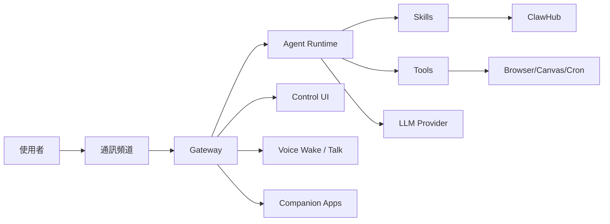
```mermaid
graph LR
    A[使用者] --> B[通訊頻道]
    B --> C[Gateway]
    C --> D[Agent Runtime]
    D --> E[Skills]
    D --> F[Tools]
    D --> G[LLM Provider]
    E --> H[ClawHub]
    F --> I[Browser/Canvas/Cron]
    C --> J[Control UI]
    C --> K[Voice Wake / Talk]
    C --> L[Companion Apps]
```

OpenClaw 的架構高度可組合，每一層都可以獨立擴展或替換：

1. **頻道層**: 新增通訊頻道不影響 Agent 邏輯
2. **閘道層**: Gateway 負責連線管理與訊息路由
3. **執行層**: Agent Runtime 獨立處理業務邏輯
4. **能力層**: Skills 和 Tools 可按需啟用

### 1.3 Gateway 架構總覽

Gateway 是 OpenClaw 的核心守護行程（Daemon），負責管理所有外部連線與內部元件的協調。

#### 架構圖

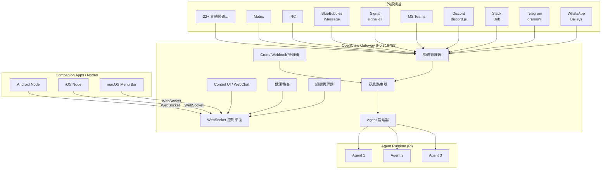
```mermaid
graph TB
    subgraph "OpenClaw Gateway (Port 18789)"
        WS[WebSocket 控制平面]
        Router[訊息路由器]
        ChannelMgr[頻道管理器]
        AgentMgr[Agent 管理器]
        ConfigMgr[組態管理器]
        HealthCheck[健康檢查]
        ControlUI[Control UI / WebChat]
        CronMgr[Cron / Webhook 管理器]
    end
    
    subgraph "外部頻道"
        WA[WhatsApp<br>Baileys]
        TG[Telegram<br>grammY]
        SL[Slack<br>Bolt]
        DC[Discord<br>discord.js]
        MS[MS Teams]
        SG[Signal<br>signal-cli]
        BB[BlueBubbles<br>iMessage]
        IRC[IRC]
        MTX[Matrix]
        MORE[22+ 其他頻道...]
    end
    
    subgraph "Agent Runtime (Pi)"
        Agent1[Agent 1]
        Agent2[Agent 2]
        Agent3[Agent 3]
    end
    
    subgraph "Companion Apps / Nodes"
        MAC[macOS Menu Bar]
        IOS[iOS Node]
        AND[Android Node]
    end
    
    WA & TG & SL & DC & MS & SG & BB & IRC & MTX & MORE --> ChannelMgr
    ChannelMgr --> Router
    Router --> AgentMgr
    AgentMgr --> Agent1 & Agent2 & Agent3
    ConfigMgr --> WS
    HealthCheck --> WS
    ControlUI --> WS
    CronMgr --> Router
    MAC & IOS & AND -->|WebSocket| WS
```

#### 關鍵特性

| 元件 | 功能 | 說明 |
|------|------|------|
| **WebSocket 控制平面** | 即時通訊 | 預設監聽 port 18789，提供雙向即時通訊 |
| **訊息路由器** | 訊息分派 | 根據頻道、使用者、訊息內容將訊息路由到對應的 Agent |
| **頻道管理器** | 連線管理 | 管理所有外部頻道連線的生命週期 |
| **Agent 管理器** | Agent 排程 | 管理 Agent 的啟動、停止、重啟，支援多 Agent 路由 |
| **組態管理器** | 動態組態 | 支援 Hot Reload，不重啟即可更新設定 |
| **健康檢查** | 監控端點 | 提供 `/healthz`、`/readyz` 端點供維運監控 |
| **Control UI** | 網頁儀表板 | 內建瀏覽器管理介面，提供聊天、組態、Session 與節點管理 |
| **Cron / Webhook** | 自動化排程 | 內建排程任務與外部事件觸發機制，支援 Gmail Pub/Sub |

#### Gateway 啟動流程

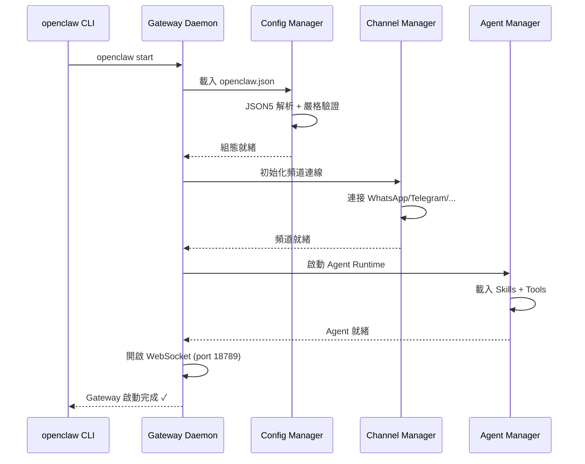
```mermaid
sequenceDiagram
    participant CLI as openclaw CLI
    participant GW as Gateway Daemon
    participant CM as Config Manager
    participant CH as Channel Manager
    participant AM as Agent Manager

    CLI->>GW: openclaw start
    GW->>CM: 載入 openclaw.json
    CM->>CM: JSON5 解析 + 嚴格驗證
    CM-->>GW: 組態就緒
    GW->>CH: 初始化頻道連線
    CH->>CH: 連接 WhatsApp/Telegram/...
    CH-->>GW: 頻道就緒
    GW->>AM: 啟動 Agent Runtime
    AM->>AM: 載入 Skills + Tools
    AM-->>GW: Agent 就緒
    GW->>GW: 開啟 WebSocket (port 18789)
    GW-->>CLI: Gateway 啟動完成 ✓
```

### 1.4 Pi Agent 執行環境

OpenClaw 的 Agent Runtime 稱為 **Pi**（衍生自 pi-mono 專案），是實際處理使用者訊息並產生回應的執行環境。

#### 核心概念

| 概念 | 說明 |
|------|------|
| **Workspace** | Agent 的工作目錄，包含 Skills、組態、資源檔案 |
| **Bootstrap Files** | Agent 啟動時載入的初始化檔案 |
| **Skills** | Agent 的能力模組，定義行為與工具 |
| **Sessions** | 對話會話管理，維護上下文與狀態 |
| **Model References** | 模型參考設定，指定使用的 LLM |

#### Agent 生命週期

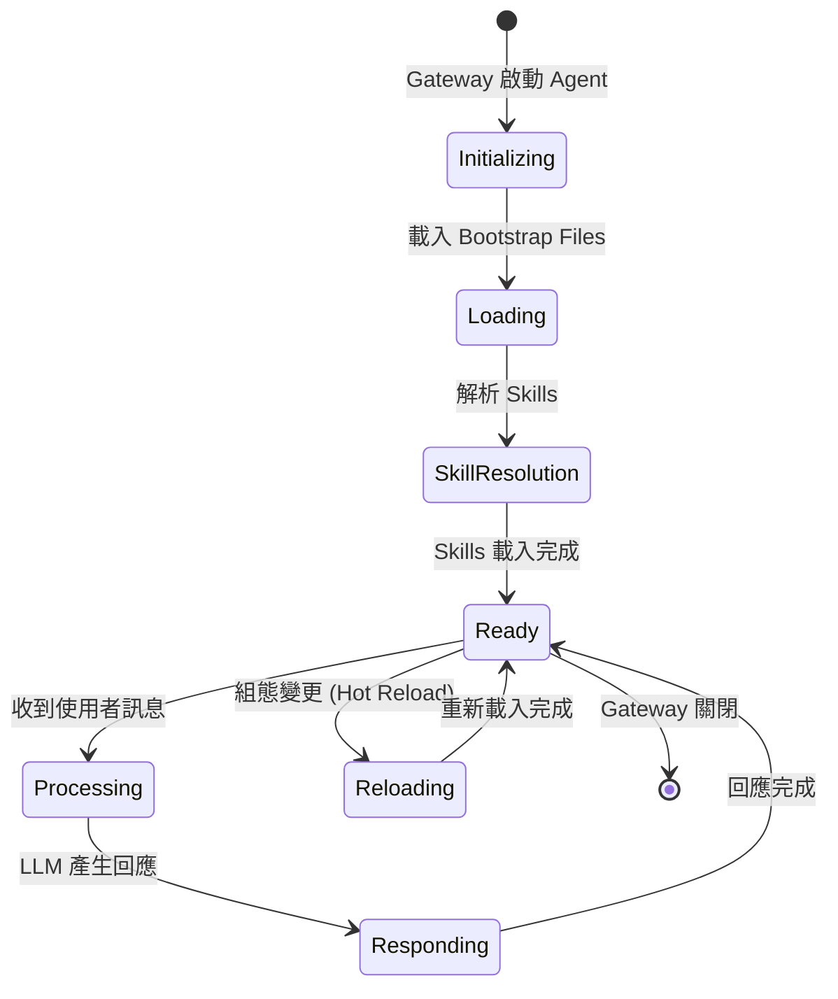
```mermaid
stateDiagram-v2
    [*] --> Initializing: Gateway 啟動 Agent
    Initializing --> Loading: 載入 Bootstrap Files
    Loading --> SkillResolution: 解析 Skills
    SkillResolution --> Ready: Skills 載入完成
    Ready --> Processing: 收到使用者訊息
    Processing --> Responding: LLM 產生回應
    Responding --> Ready: 回應完成
    Ready --> Reloading: 組態變更 (Hot Reload)
    Reloading --> Ready: 重新載入完成
    Ready --> [*]: Gateway 關閉
```

#### Workspace 目錄結構

Agent 的 Workspace 是一個標準目錄結構：

```text
~/.openclaw/
├── openclaw.json          # 主組態檔（JSON5 格式）
├── workspace/              # Agent 工作區根目錄
│   ├── AGENTS.md          # Agent 身份與行為定義
│   ├── SOUL.md            # Agent 個性與核心價值
│   ├── TOOLS.md           # 工具使用指引
│   └── skills/            # 工作區技能目錄
│       └── my-skill/
│           ├── SKILL.md   # 技能定義
│           └── tools/     # 技能工具
├── skills/                 # 管理級技能目錄
│   └── another-skill/
├── credentials/            # 頻道認證資料（如 WhatsApp 登入）
├── logs/                   # JSONL 日誌輸出
│   └── openclaw.jsonl
└── data/                   # Agent 資料存儲
```

> **Bootstrap Files**: Agent 啟動時會注入 `AGENTS.md`、`SOUL.md`、`TOOLS.md` 等 Prompt 檔案，這些檔案定義了 Agent 的身份、個性與工具使用規範。可透過 [`reference/templates`](https://docs.openclaw.ai/reference/templates/AGENTS) 查看預設範本。

#### Agent 的訊息處理流程

1. **接收**: Gateway 將使用者訊息傳遞給 Agent
2. **路由**: Agent 根據訊息內容與上下文判斷使用哪個 Skill
3. **增強**: Skill 將相關工具與 Prompt 注入到請求中
4. **推論**: 將增強後的請求送到 LLM 進行推論
5. **後處理**: 處理 LLM 回應，執行工具呼叫
6. **回應**: 將最終回應送回使用者

### 1.5 Skills 技能系統

Skills（技能）是 OpenClaw 最核心的擴展機制，讓 Agent 能夠獲得特定領域的能力。

#### 技能定義：SKILL.md

每個 Skill 由一個 `SKILL.md` 檔案定義，採用 **AgentSkills** 規範格式：

```markdown
---
name: weather-reporter
description: 提供即時天氣資訊查詢
version: 1.0.0
triggers:
  - weather
  - 天氣
  - 氣象
tools:
  - get_weather
  - get_forecast
access:
  channels:
    - whatsapp
    - telegram
  users:
    - "*"
---

# Weather Reporter Skill

你是一個專業的氣象報導 Agent。當使用者詢問天氣相關問題時，
請使用提供的工具查詢即時天氣資訊，並以友善的方式回報。

## 回應格式

- 使用表情符號增加親和力
- 提供溫度、濕度、風速等基本資訊
- 如有異常天氣，主動提醒使用者注意

## 工具使用規則

1. 先使用 `get_weather` 取得目前天氣
2. 若使用者詢問未來天氣，使用 `get_forecast`
3. 若地點不明確，請先詢問使用者
```

#### 技能載入優先序

OpenClaw 從三個位置載入技能，優先序由高到低：

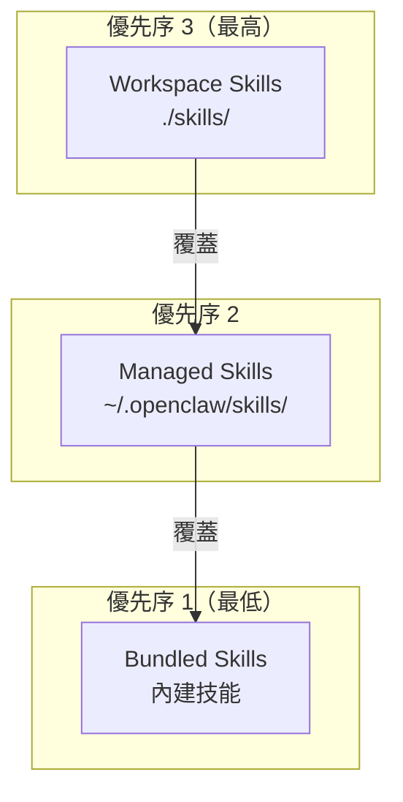
```mermaid
graph TB
    subgraph "優先序 3（最高）"
        WS[Workspace Skills<br>./skills/]
    end
    subgraph "優先序 2"
        MG[Managed Skills<br>~/.openclaw/skills/]
    end
    subgraph "優先序 1（最低）"
        BD[Bundled Skills<br>內建技能]
    end
    
    WS -->|覆蓋| MG -->|覆蓋| BD
```

| 位置 | 路徑 | 優先序 | 說明 |
|------|------|--------|------|
| **Workspace** | `./skills/` | 最高 | 專案層級技能，針對特定工作場景 |
| **Managed** | `~/.openclaw/skills/` | 中 | 使用者層級技能，跨專案共享 |
| **Bundled** | 內建於 OpenClaw | 最低 | 預設技能，提供基本功能 |

當多個位置存在同名技能時，高優先序位置的技能會覆蓋低優先序位置的同名技能。

#### 技能閘門（Skill Gating）

OpenClaw 支援技能閘門機制，允許針對特定使用者或頻道啟用/停用技能：

```json5
// openclaw.json 中的技能閘門設定
{
  "skills": {
    "weather-reporter": {
      "enabled": true,
      "access": {
        "channels": ["whatsapp", "telegram"],
        "users": ["user1@example.com", "user2@example.com"]
      }
    },
    "admin-tools": {
      "enabled": true,
      "access": {
        "channels": ["slack"],
        "users": ["admin@company.com"]
      }
    }
  }
}
```

### 1.6 Tools 工具系統

Tools（工具）是 Agent 與外部世界互動的介面，OpenClaw 內建多種工具類別：

#### 內建工具分類

| 工具類別 | 功能 | 範例用途 |
|----------|------|----------|
| **Browser** | 瀏覽器控制（CDP） | 網頁擷取、自動化操作、截圖、座標點擊 |
| **Canvas / A2UI** | Agent-to-UI 渲染 | 產生互動式 UI 元件 |
| **Nodes** | 裝置整合 | 相機、螢幕、定位、通知 |
| **Cron** | 排程 & Webhook | 定時任務、外部事件觸發、Gmail Pub/Sub |
| **Sessions** | 對話管理 | 對話狀態、歷史記錄、跨 Agent 訊息傳遞 |
| **Discord / Slack** | 頻道動作 | 頻道專屬操作指令 |
| **Gateway** | 閘道控制 | 組態管理、健康檢查、節點管理 |
| **exec / process** | 系統執行 | 在主機上執行指令、管理程序 |
| **code_execution** | 程式碼執行 | 沙箱內安全執行程式碼 |
| **web_search / web_fetch** | 網頁搜尋與擷取 | 即時搜尋網頁、取得 URL 內容（v2026.6.9 新增 Codex Hosted Search 無需 API Key） |
| **read / write / edit** | 檔案操作 | 讀寫檔案、編輯內容 |
| **apply_patch** | 差異套用 | 以 patch 格式批次修改檔案 |
| **image / image_generate** | 圖片生成與編輯 | 透過 Provider 生成或編輯圖片 |
| **music_generate** | 音樂生成 | 透過 Provider 生成音樂素材 |
| **video_generate** | 影片生成 | URL 資產交付、參考音訊、自適應長寬比、多 Provider 支援 |
| **tts** | 語音合成 | 文字轉語音，支援多 Provider（Azure Speech、ElevenLabs 等） |
| **Dreaming** | 記憶 Wiki 管理 | ChatGPT 匯入消化、Wiki 頁面編譯、Memory Palace 日記 |
| **message** | 訊息工具 | 傳送格式化訊息至頻道 |
| **session_status** | 狀態查詢 | 查詢 Session 當前狀態、Token 用量 |
| **agents_list** | Agent 列表 | 列出可用 Agent 及其中繼資料 |
| **subagents** | 子 Agent 管理 | 建立並管理子 Agent 工作流程 |

#### 工具設定檔（Tool Profiles）

OpenClaw v2026.4 引入**工具設定檔**機制，方便快速切換 Agent 的工具存取範圍：

| 設定檔 | 說明 | 適用情境 |
|--------|------|----------|
| `full` | 啟用所有可用工具 | 功能完整的通用 Agent |
| `coding` | 程式碼相關工具子集 | 開發輔助 Agent |
| `messaging` | 訊息傳遞相關工具 | 純通訊 Agent |
| `minimal` | 最少工具集 | 安全受限環境 |

#### 工具群組（Tool Groups）

工具可按功能群組批次啟用或禁用：

| 群組 | 包含工具 |
|------|----------|
| `group:runtime` | exec, process, code_execution |
| `group:fs` | read, write, edit, apply_patch |
| `group:sessions` | sessions_list, sessions_history, sessions_send, sessions_spawn |
| `group:memory` | 記憶相關工具 |
| `group:web` | web_search, x_search, web_fetch |
| `group:ui` | canvas, nodes |
| `group:automation` | cron, gateway |
| `group:messaging` | message, Discord/Slack 動作 |
| `group:media` | image, image_generate, music_generate, video_generate, tts |
| `group:agents` | agents_list, subagents |

工具存取控制透過 `tools.allow` 和 `tools.deny` 清單精細管理，也可使用 `tools.byProvider` 限制特定 Provider 可使用的工具。

#### Browser 工具

Browser 工具使用 **Chrome DevTools Protocol (CDP)** 提供完整的瀏覽器控制能力：

```json5
// Agent 使用 Browser 工具的範例
{
  "tool": "browser_navigate",
  "parameters": {
    "url": "https://example.com/report",
    "waitFor": "networkIdle"
  }
}
```

功能包含：

- 導航至指定 URL
- 擷取頁面內容（文字/截圖）
- 填寫表單
- 點擊按鈕
- 執行 JavaScript

#### Canvas / A2UI 工具

A2UI（Agent-to-UI）是 OpenClaw 獨特的工具，允許 Agent 產生互動式 UI 元件：

```text
使用者: 建立一個投票
Agent: [使用 Canvas 工具產生互動式投票 UI]
```

#### Cron 與 Webhook 工具

允許 Agent 設定排程任務或對外部事件做出回應：

```json5
// 排程任務範例
{
  "tool": "cron_schedule",
  "parameters": {
    "expression": "0 9 * * 1-5",  // 週一至週五早上 9 點
    "action": "send_daily_report",
    "channel": "slack",
    "target": "#team-reports"
  }
}

// Webhook 設定範例
{
  "tool": "webhook_register",
  "parameters": {
    "path": "/hooks/github",
    "method": "POST",
    "action": "process_github_event"
  }
}
```

#### Dreaming / Memory Wiki 工具

Dreaming 是 OpenClaw v2026.4 新增的記憶管理子系統，提供 Agent 長期知識彙整能力：

- **ChatGPT 匯入消化**: 可匯入既有 ChatGPT 對話歷史，透過 `Imported Insights` 子頁籤瀏覽
- **Wiki 頁面編譯**: 將多次對話中的知識自動編譯為結構化 Wiki 頁面
- **Memory Palace 日記**: `Memory Palace` 子頁籤提供 Agent 自主整理的記憶日記

```text
使用者: 匯入我的 ChatGPT 對話歷史
Agent: [使用 Dreaming 工具匯入並消化對話，產出 Imported Insights 和 Wiki 頁面]
```

#### video_generate 影片生成工具

v2026.4.11 新增的影片生成工具，支援多種 Provider 的影片生成能力：

- **URL 資產交付**: 生成的影片以 URL 形式交付，避免大檔案佔用記憶體
- **參考音訊輸入**: 支援提供參考音訊素材
- **自適應長寬比**: `adaptive` 模式自動選擇最佳畫面比例
- **多 Provider 支援**: 支援 Google Veo、OpenAI Sora 等影片生成服務

### 1.7 Sessions 與對話管理

Sessions 是 OpenClaw 管理對話狀態的核心機制。

#### Session 生命週期

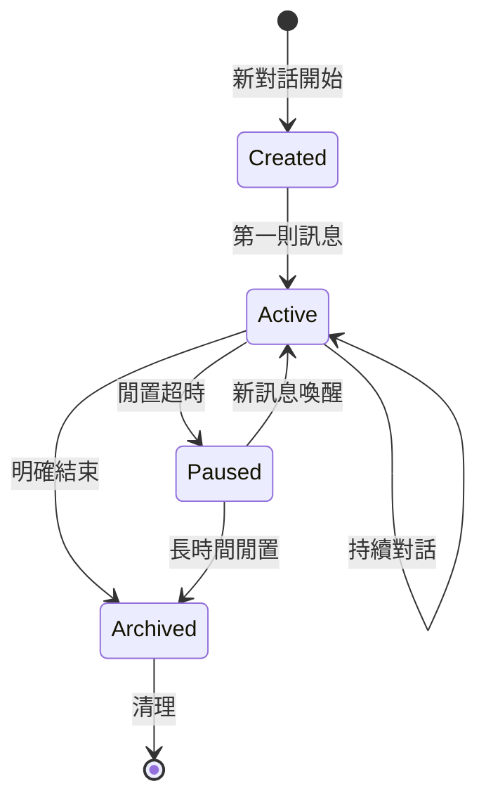
```mermaid
stateDiagram-v2
    [*] --> Created: 新對話開始
    Created --> Active: 第一則訊息
    Active --> Active: 持續對話
    Active --> Paused: 閒置超時
    Paused --> Active: 新訊息喚醒
    Active --> Archived: 明確結束
    Paused --> Archived: 長時間閒置
    Archived --> [*]: 清理
```

#### Session 資料結構

每個 Session 包含以下資訊：

| 欄位 | 類型 | 說明 |
|------|------|------|
| `id` | `string` | Session 唯一識別碼 |
| `channelId` | `string` | 來源頻道識別碼 |
| `userId` | `string` | 使用者識別碼 |
| `agentId` | `string` | 處理此 Session 的 Agent |
| `messages` | `Message[]` | 對話訊息歷史 |
| `context` | `object` | 上下文資料（記憶） |
| `metadata` | `object` | 中繼資料 |
| `createdAt` | `timestamp` | 建立時間 |
| `updatedAt` | `timestamp` | 最後更新時間 |
| `status` | `enum` | Created / Active / Paused / Archived |

#### 上下文管理策略

OpenClaw 提供多種上下文管理策略防止 Token 超出限制：

1. **滑動視窗（Sliding Window）**: 保留最近 N 則訊息
2. **摘要壓縮（Summary Compression）**: 將較舊的訊息摘要化
3. **優先保留（Priority Retention）**: 標記重要訊息永久保留
4. **混合策略（Hybrid）**: 結合以上策略

#### Session Tools（跨 Agent 通訊）

OpenClaw 提供 `sessions_*` 系列工具，允許 Agent 之間跨 Session 協作：

| 工具 | 功能 | 說明 |
|------|------|------|
| `sessions_list` | 列出 Sessions | 探索目前活躍的 Sessions（Agent）及其中繼資料 |
| `sessions_history` | 讀取歷史 | 取得指定 Session 的對話記錄 |
| `sessions_send` | 傳送訊息 | 向另一個 Session 傳送訊息，支援可選的回覆式 ping-pong（`REPLY_SKIP`、`ANNOUNCE_SKIP`） |
| `sessions_spawn` | 建立 Session | 建立新的 Session 並指派 Agent |

> **使用情境**: 透過 Session Tools，你可以在不同聊天介面之間協調工作。例如，在 Slack 的 DevOps Agent 可以委託 Telegram 的報表 Agent 產生報告，然後將結果傳回。詳情參考 [Session tools](https://docs.openclaw.ai/concepts/session-tool)。
>
> **Cross-channel Session Identity**（v2026.6.10 新增）: 當使用者從一個頻道切換到另一個頻道時（例如從 WhatsApp 轉到 Telegram），Session 的 origin 會自動重置，確保身份識別正確且避免舊頻道殘留的上下文污染新頻道。

#### 聊天指令（Chat Commands）

使用者可在 WhatsApp / Telegram / Slack / Google Chat / Microsoft Teams / WebChat 中使用以下指令控制 Agent（群組指令僅限擁有者）：

| 指令 | 功能 | 備註 |
|------|------|------|
| `/status` | 顯示簡要 Session 狀態 | 包含模型、Token 用量、成本 |
| `/new` 或 `/reset` | 重置 Session | 清除上下文，開始新對話 |
| `/compact` | 壓縮 Session 上下文 | 產生摘要以釋放 Token 空間 |
| `/think <level>` | 設定推理深度 | off \| minimal \| low \| medium \| high \| xhigh（GPT-5.2 + Codex 模型） |
| `/verbose on\|off` | 切換詳細模式 | 顯示更多 Agent 內部處理資訊 |
| `/usage off\|tokens\|full` | 設定用量頁腳 | 每次回應後顯示的用量資訊級別 |
| `/restart` | 重啟 Gateway | 僅限擁有者，群組中使用 |
| `/activation mention\|always` | 群組激活模式 | 設定群組中需 @mention 或始終回應 |
| `/trace on\|off` | 追蹤模式 | 開啟/關閉工具呼叫與推論過程的詳細追蹤輸出 |
| `/elevated on\|off` | 提升權限存取 | 切換當前 Session 的主機提升權限（需預先啟用與白名單） |

### 1.8 多頻道支援（Channels）

OpenClaw 支援 **40 種以上**通訊頻道（含插件頻道），涵蓋消費端通訊軟體、企業協作平台、電信簡訊、去中心化協議與 Agent 間協定。以下為完整列表：

#### 支援頻道一覽

| 頻道 | 底層函式庫 | 狀態 | 備註 |
|------|-----------|------|------|
| **WhatsApp** | Baileys | ✅ 穩定 | 透過 Web API 連接 |
| **Telegram** | grammY | ✅ 穩定 | Bot API，v2026.6.8 新增 Rich HTML 渲染（表格/清單/blockquote） |
| **Slack** | Bolt | ✅ 穩定 | Slack App |
| **Discord** | discord.js | ✅ 穩定 | Discord Bot |
| **Google Chat** | 官方 API | ✅ 穩定 | Google Workspace |
| **Signal** | signal-cli | ✅ 穩定 | 端對端加密 |
| **BlueBubbles** | BlueBubbles API | ✅ 穩定 | 建議的 iMessage 整合方式 |
| **iMessage** | imsg (legacy) | ✅ 穩定 | 需要 macOS，舊版整合 |
| **IRC** | 原生實作 | ✅ 穩定 | 任何 IRC 伺服器 |
| **Microsoft Teams** | Bot Framework | ✅ 穩定 | Microsoft 365，支援反應、委派 OAuth、聯合認證 |
| **Matrix** | matrix-js-sdk | ✅ 穩定 | 開源通訊協議 |
| **LINE** | LINE SDK | ✅ 穩定 | LINE 官方帳號 |
| **Feishu** | 飛書 SDK | ✅ 穩定 | 字節跳動飛書，支援文件評論 Session、評論反應 |
| **Mattermost** | 插件頻道 | ✅ 穩定 | 自架 Slack 替代方案（extension 套件） |
| **Nextcloud Talk** | 官方 API | ✅ 穩定 | Nextcloud 整合 |
| **Nostr** | 原生實作 | ✅ 穩定 | 去中心化協議 |
| **Synology Chat** | 官方 API | ✅ 穩定 | Synology NAS |
| **Tlon** | 官方 API | 🔄 測試 | Urbit 生態 |
| **Twitch** | tmi.js | ✅ 穩定 | 直播聊天室 |
| **QQ Bot** | 內建插件 | ✅ 穩定 | 群聊支援、串流回應、媒體上傳（v2026.5.4 新增） |
| **Yuanbao** | 騰訊元寶插件 | ✅ 穩定 | 騰訊官方提供，外部插件安裝（v2026.5.4 新增） |
| **Voice Call** | Plivo/Twilio 插件 | ✅ 穩定 | 電話語音通話，支援 Realtime Voice Loop（v2026.4.24 新增） |
| **Google Meet** | 內建參與者插件 | ✅ 穩定 | Chrome/Twilio Realtime、出席匯出、錄製檔案（v2026.4.24 新增） |
| **Zalo** | 官方 API | ✅ 穩定 | 越南通訊軟體（官方帳號） |
| **Zalo Personal** | 官方 API | ✅ 穩定 | 越南通訊軟體（個人帳號） |
| **WeChat** | @tencent-weixin/openclaw-weixin | ✅ 穩定 | 騰訊官方插件（iLink Bot API），v2.x 需 OpenClaw ≥2026.3.22 |
| **WebChat** | 內建 | ✅ 穩定 | Gateway 內建網頁聊天介面 |
| **macOS** | 內建 | ✅ 穩定 | macOS 選單列應用（Menu Bar App） |
| **iOS** | 內建 | ✅ 穩定 | iOS Node（Canvas、Voice Wake、相機） |
| **Android** | 內建 | ✅ 穩定 | Android Node（Chat、Voice、Canvas、裝置指令） |
| **SMS / MMS / RCS** | Twilio | ✅ 穩定 | 電信簡訊與 RCS，適合無網路應用情境 |
| **WeCom（企業微信）** | 官方 API | ✅ 穩定 | 騰訊企業微信，與消費端 WeChat 為不同頻道 |
| **ClickClack** | 官方 API | ✅ 穩定 | 官方文件列為獨立頻道 |
| **Reef** | 官方 API | ✅ 穩定 | OpenClaw 生態系內部頻道 |
| **Raft** | 官方 API | 🔄 測試 | OpenClaw 生態系內部頻道 |
| **Buzz** | 官方 API | ✅ 穩定 | 輕量通知型頻道 |
| **A2A（Agent-to-Agent）** | A2A 協定 | ✅ 穩定 | Agent 之間的直接訊息傳遞，非人類使用者頻道 |
| **Zalo ClawBot** | 官方 API | ✅ 穩定 | Zalo 的 Bot 模式（與官方帳號／個人帳號並列的第三種接法） |

> **插件頻道（Plugin Channels）**: OpenClaw 透過 extension 套件機制支援額外頻道整合，如 Mattermost 等。插件頻道安裝後與內建頻道行為一致。
>
> **頻道治理功能（v2026.8.1）**: 除頻道本身外，官方另提供跨頻道的治理機制 —— **Access Groups**（存取群組）、**Broadcast Groups**（廣播群組）、**Channel Routing**（頻道路由）、**Bot Loop Protection**（機器人迴圈防護）與 **Ambient Room Events**（環境房間事件）。企業部署多頻道時，這些機制比單一頻道設定更關鍵，詳見第五章 5.2 與第十一章。
>
> **WeChat 頻道安裝**: WeChat 頻道由騰訊官方提供插件，安裝方式為 `openclaw plugins install "@tencent-weixin/openclaw-weixin"`，然後執行 `openclaw channels login --channel openclaw-weixin` 掃描 QR Code 即可配對。目前僅支援私人聊天，需遍尋 WeChat ClawBot 插件（WeChat > 我 > 設定 > 插件）。

#### 新增頻道的統一介面

所有頻道都實作相同的 `Channel` 介面：

```typescript
// 頻道介面定義（TypeScript 概念說明）
interface Channel {
  id: string;
  name: string;
  connect(): Promise<void>;
  disconnect(): Promise<void>;
  sendMessage(target: string, message: Message): Promise<void>;
  onMessage(handler: MessageHandler): void;
}
```

### 1.9 與傳統 LLM 聊天機器人的比較

| 面向 | 傳統 LLM 聊天機器人 | OpenClaw |
|------|---------------------|----------|
| **部署模式** | 雲端 SaaS | 自架或雲端皆可 |
| **頻道整合** | 通常只有 Web UI | 28+ 通訊頻道原生整合（含插件頻道） |
| **擴展機制** | API 呼叫 / Plugin | Skills + Tools 組合式架構 |
| **資料所有權** | 平台持有 | 使用者完全掌控 |
| **自訂程度** | 有限（Prompt 調整） | 完全自訂（Skills + Tools + Agent 行為） |
| **多 Agent** | 通常不支援 | 原生支援多 Agent 路由與協作 |
| **信任模型** | 平台信任 | 個人信任邊界 + DM Pairing 機制 |
| **可觀測性** | 平台提供 | 完整 OpenTelemetry 整合 |
| **成本模型** | 按 Token / 呼叫計費 | 自架為主，LLM API 費用可控 |
| **排程能力** | 需額外開發 | 內建 Cron / Webhook / Gmail Pub/Sub |
| **語音互動** | 多數不支援 | Voice Wake + Talk Mode（macOS/iOS/Android） |
| **視覺工作區** | 無 | Live Canvas + A2UI 即時渲染 |
| **遠端存取** | 內建 | Tailscale Serve/Funnel 或 SSH Tunnel |

### 1.10 OpenClaw 版本歷程

| 版本 | 日期 | 重大變更 |
|------|------|----------|
| **2026.8.1**<br>（**OpenClaw 2.0**） | 2026-08-31 | **最新穩定版，專案史上最大改版（彙整逾 16,000 個 PR）**。九大主軸：① 以對話為中心重建的 **Control UI**（Session Rail、`/btw` 側線對話、審批內嵌於對話）② **多人協作與分享角色**（read／suggest／draft／participate、Incognito）③ **Cloud Workers 與 Paired Devices 分散式執行** ④ **Session 與 Transcript 改用 SQLite 儲存**（含降版限制）⑤ **Secret Store**（Protected／Agent-readable 雙軌）⑥ **Automations**（`cron` 更名，兩套指令並存）⑦ **Skill Workshop 與自我學習**（off／propose／auto）⑧ **Built-in Memory 取代 QMD** ⑨ **Code Mode 介面重寫**。破壞性變更：OpenProse 插件移除、`codex/*` → `openai/*` 路由遷移、部分官方 Provider 外部化為獨立套件 |
| **2026.8.1-beta.4** | 2026-08-28 | ⚠️ **誤植發布為 `2026.9.1-beta.1`**，官方已聲明其實際版本為 2026.8.1-beta.4，**不得視為新於 stable 2026.8.1**。內容為可靠性修補：Gateway 重啟復原保留已受理回合、組態寫入於 watcher 交接期間的可靠性、Codex runtime 升至 0.150.1、Linux 安裝改用 Node 24 LTS |
| **2026.8.1-beta.3** | 2026-08-24 | 2.0 發布前的最後一輪 Beta 驗證 |
| **2026.8.1-beta.2** | 2026-08-15 | Secret Egress Host Binding（跨 CLI/Gateway RPC/Control UI 綁定密鑰目的地主機）、GPT-5.6 Ultra 與 Sol/Terra/Luna 執行期切換、Channel Plugin Ingress Monitor 共用生命週期（IRC/Synology Chat/Google Chat）、`openclaw backup sqlite` 快照備份指令、macOS App Profile 隔離、外部插件安裝需明確 `--force` 確認未信任來源 |
| **2026.6.34** | 2026-08-08 | **Extended-Stable 維護線**發布，僅安全與穩定性修補（瀏覽器/網路邊界加固、Provider Fallback 更穩健、Discord Gateway 突發流量抑制），不含新功能；同時公告 Plugin SDK 舊介面（`before_agent_start` 等）將於 7/24 後移除 |
| **2026.7.1-2 / 2026.7.1-1** | 2026-08-04 | 前一代穩定版的修補版。修正 Codex 進度處理、記憶體啟動問題、插件更新復原等穩定性問題 |
| **2026.7.2-beta.7** | 2026-08-02 | Crash-recoverable session snapshots、跨平台 durable message delivery、對話分支與回溯（conversation branching/rewinding）、MCP app hosting with ticketed sandboxes |
| **2026.7.1** | 2026-07-13 | Control UI 與 Onboarding 大改版、iOS/Android/macOS 官方應用大幅更新、**GPT-5.6 相容性**、Tencent Hy3 完整設定流程、Meta Muse Spark 1.1、`openclaw attach`（外部 harness 接續既有 Gateway Session）、Gateway crash loop 修復（不再無限重啟）、排程任務按需喚醒、遠端瀏覽器分頁控制、Web/iOS/Android 受保護終端機（單一版本彙整 532 位貢獻者、3,063 筆貢獻、2,018 個公開 PR） |
| **2026.6.10** | 2026-06-24 | Automatic Fast Mode（短對話自動加速）、Session Transcript SDK helpers、Cross-channel Session Identity、Trusted Tool Policy Enforcement、Trusted Package Redirects、Provider 模型目錄推理控制、StepFun Provider 安裝、DM Policy pairing 安全預設 |
| **2026.6.9** | 2026-06-17 | **官方 Provider 外部化為獨立 npm 套件**、Gateway 啟動探索已安裝 channel plugins、Codex Hosted Search、OpenTelemetry Log Export、ClawHub skill provenance 保持、Session workspace rail (Control UI)、iOS Watch 控制、安全強化（秘密編修、open-DM 工具暴露稽核） |
| **2026.6.8** | 2026-06-14 | **Telegram Rich HTML 渲染**（表格、清單、blockquote、展開式引用）、GLM-5.2 + Claude Haiku 4.5 模型目錄、Usage Footer 原生渲染器、無 API Key 搜尋提供者明確 opt-in、WhatsApp ACP 綁定、iOS 前景 Gateway 重連、記憶體 rollback/cache recovery |
| **2026.5.28** | 2026-05-28 | Claude Opus 4.8 支援、GitHub Copilot agent runtime 整合、Codex Supervisor 插件、ClawPDF 加密 PDF 抽取、Workboard 多 Agent 協調面板、Policy 合規性比對/合規確認、Plugin SDK reply payload hook、SecretRef 插件清單合約、Dreaming-tab agent 選擇器 |
| **2026.5.27** | 2026-05-27 | 安全強化（content boundaries）、OpenAI-compatible embedding providers 核心模組、Pixverse 影片生成 Provider、DeepInfra 完整目錄更新、Skill Workshop 提案生命週期 |
| **2026.5.26** | 2026-05-26 | Transcript capture 核心功能、named auth profiles（多帳號驗證配置）、Activity tab UI、Rastermill 取代 Sharp 影像後端、reaction approvals（Signal/iMessage/WhatsApp）、SSRF policy for Browser、auth rate limiter、Pixverse Provider 初版、Plugin SDK reaction approval helpers |
| **2026.5.4** | 2026-05-03 | iOS LAN 配對修復、fs-safe 檔案系統安全抽取、VSCode 除錯支援、Gateway 容器權限加固、Crabbox 整合簡化、Plugin SDK 子路徑匯出、WhatsApp Live QA 通道 |
| **2026.5.2** | 2026-05-01 | macOS appcast 更新、OpenClaw SDK 套件發布、Codex prompt snapshots、組態檔 includes 支援、Plugin 邊界修正 |
| **2026.4.27** | 2026-04-27 | Codex Computer Use 設定指令、DeepInfra 內建 Provider、QQBot 群聊/串流/媒體上傳、Yuanbao 頻道擴展、Manifest-first 模型目錄、Docker Sandbox GPU 直通、Outbound Proxy 路由 |
| **2026.4.26** | 2026-04-26 | Browser Realtime Voice (Google Live)、Cerebras 內建 Provider、Matrix E2EE (`openclaw matrix encryption setup`)、`openclaw migrate` CLI (Claude/Hermes importer)、Config Diff 面板、Compaction `maxActiveTranscriptBytes` |
| **2026.4.25** | 2026-04-25 | TTS 大升級（Azure Speech、Xiaomi、Inworld、Volcengine、ElevenLabs v3）、PWA/Web Push、OpenTelemetry 擴展（模型呼叫、Token 用量、工具迴圈）、Prometheus 內建插件、Crestodian TUI、`openclaw browser start --headless` |
| **2026.4.24** | 2026-04-24 | Google Meet 內建插件、DeepSeek V4 Flash/Pro、Realtime Voice Loop (Talk/Voice Call/Meet)、Codex Computer Use、Browser 座標點擊、Gradium TTS Provider |
| **2026.4.11** | 2026-04-11 | Dreaming/Memory Wiki ChatGPT 匯入、Control UI 結構化聊天氣泡、video_generate 工具增強、Feishu 文件評論 Session、MS Teams 反應支援 + 委派 OAuth、Plugin 清單宣告機制 |
| **2026.4.x** | 2026-04 | Ollama 快取機制、GPT-5.4 / Opus 4.6 QA 對等檢查、MiniMax OAuth 修正、WhatsApp 反應路由修正 |
| **2026.3.31** | 2026-03-31 | ClawFlow 執行基底、npm dist-tag mirror 修正、Session table UI 改善 |
| **2026.3.23** | 2026-03-24 | Tools 執行時可見性視圖、Telegram forum topic 修正 |
| **2026.3.x** | 2026-03 | Control UI 改善、Skills 介面翻新、Markdown 預覽、Agent 管理、WeChat 官方插件 |
| **2026.2.12** | 2026-02 | 版本號 bump、OpenTelemetry 深度整合、健康檢查端點強化 |
| **2026.2.x** | 2026-02 | Gateway 握手逾時統一、Provider API Key 輪換機制 |
| **2026.1.x** | 2026-01 | ClawHub 技能市集上線、VirusTotal 合作技能安全掃描、NVIDIA 贊助 |
| **2025.12.x** | 2025-12 | Docker Compose 官方支援、Podman 安裝文件 |
| **2025.11.x〜2026.1.x** | 2025-11 ~ 2026-01 | 專案首次公開發布（2025-11-24，時名 Warelay）並歷經名稱沿革期：Warelay → CLAWDIS → Clawdbot → Moltbot → **OpenClaw** 定名，同期完成 Skills 系統與 Voice Wake + Talk Mode 等早期核心功能（完整時間軸見 1.1「名稱沿革」） |

> **注意**: OpenClaw 採用**日期版本號**格式 `vYYYY.M.D`（如 `v2026.7.1`）。預發布版本使用 `-beta.N` 後綴，穩定版偶有 `-1`、`-2` 等修補後綴（如 `v2026.7.1-2`），Extended-Stable 維護線則沿用當月固定的 `YYYY.M.33` 起始基準（如 `v2026.6.34`）持續回補安全性修補。stable / extended-stable / beta / dev 四條版本線並行發布，詳見第七章 7.1 版本命名規則。
>
> ⚠️ **不可單憑版本號大小判斷新舊**：2026-08-28 發布的套件被誤植為 `2026.9.1-beta.1`，但其實際內容為 `2026.8.1-beta.4`，**比 2026-08-31 的穩定版 `2026.8.1` 還舊**。官方已在發布說明中特別警示此事，並要求穩定版使用者直接安裝或升級至 `2026.8.1`。這是採用日期版本號的專案在人為誤植下會產生的典型陷阱，升級前請以官方發布說明為準，而非套件登錄的版本排序。

### 1.11 OpenClaw 2.0 重點導讀

v2026.8.1（OpenClaw 2.0）的變更幅度遠超一般改版，且橫跨本手冊多個章節。為方便既有讀者快速定位，下表將 2.0 的主要變更對應到本手冊的章節位置：

| 2.0 主題 | 變更性質 | 本手冊對應章節 |
|---------|---------|--------------|
| 全新 Control UI（對話為中心、Session Rail、`/btw`） | 體驗重構 | 2.8、3.10 |
| Session／Transcript 改用 SQLite 儲存 | **架構變更**（含降版限制） | 2.11、6.7、附錄 E |
| 多人協作、分享角色、Incognito | **新增能力** | 第十一章 |
| Cloud Workers 與 Paired Devices 分散式執行 | **新增能力** | 第十二章 |
| Secret Store（Protected／Agent-readable） | **新增能力** | 3.11、9.2 |
| Automations（`cron` 更名，指令並存） | 更名 + 功能擴充 | 3.10、4.7、10.7 |
| Skill Workshop 與自我學習（off／propose／auto） | **新增能力** | 4.3、9.7 |
| Built-in Memory 取代 QMD | **遷移**（需 `doctor --fix`） | 4.6、7.5 |
| Code Mode 介面重寫 | **破壞性變更** | 4.4 |
| Plugin SDK subpath 收斂 | **破壞性變更**（2026-09-01 生效） | 4.9 |
| 引導式設定（偵測既有訂閱／API Key／本地模型） | 體驗重構 | 3.6 |
| Per-session 權限模式 | **新增能力**（非回溯性） | 5.2 |
| Gateway 重啟復原（suspend／resume／drain） | **新增能力** | 6.11 |
| 未信任外部內容標記 | 安全強化 | 9.1 |
| 插件能力審查與供應鏈檢查 | 安全強化 | 9.11 |

> **升級路徑建議**：若你目前執行的是 v2026.7.x，請先閱讀 **附錄 E：OpenClaw 2.0 升級遷移指南**，再依第七章的升級策略執行。2.0 包含四項需要 `openclaw doctor --fix` 介入的遷移，以及三個有明確截止日的相容性期限。

---

## 第二章：系統架構設計

### 2.1 整體架構圖

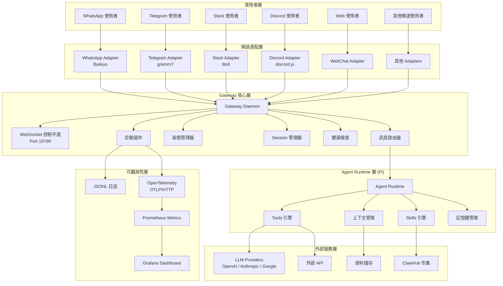
```mermaid
graph TB
    subgraph "使用者層"
        U1[WhatsApp 使用者]
        U2[Telegram 使用者]
        U3[Slack 使用者]
        U4[Discord 使用者]
        U5[Web 使用者]
        U6[其他頻道使用者]
    end
    
    subgraph "頻道適配層"
        C1[WhatsApp Adapter<br>Baileys]
        C2[Telegram Adapter<br>grammY]
        C3[Slack Adapter<br>Bolt]
        C4[Discord Adapter<br>discord.js]
        C5[WebChat Adapter]
        C6[其他 Adapters]
    end
    
    subgraph "Gateway 核心層"
        GW[Gateway Daemon]
        WSP[WebSocket 控制平面<br>Port 18789]
        MR[訊息路由器]
        CM[組態管理器]
        SM[Session 管理器]
        HC[健康檢查]
        DG[診斷插件]
    end
    
    subgraph "Agent Runtime 層 (Pi)"
        AR[Agent Runtime]
        SK[Skills 引擎]
        TL[Tools 引擎]
        CTX[上下文管理]
        MEM[記憶體管理]
    end
    
    subgraph "外部服務層"
        LLM[LLM Providers<br>OpenAI / Anthropic / Google]
        EXT[外部 API]
        DB[資料儲存]
        CH[ClawHub 市集]
    end
    
    subgraph "可觀測性層"
        LOG[JSONL 日誌]
        OTEL[OpenTelemetry<br>OTLP/HTTP]
        PROM[Prometheus Metrics]
        GRF[Grafana Dashboard]
    end
    
    U1 --> C1
    U2 --> C2
    U3 --> C3
    U4 --> C4
    U5 --> C5
    U6 --> C6
    
    C1 & C2 & C3 & C4 & C5 & C6 --> GW
    
    GW --> WSP
    GW --> MR
    GW --> CM
    GW --> SM
    GW --> HC
    GW --> DG
    
    MR --> AR
    AR --> SK
    AR --> TL
    AR --> CTX
    AR --> MEM
    
    SK --> CH
    TL --> LLM
    TL --> EXT
    CTX --> DB
    
    DG --> LOG
    DG --> OTEL
    OTEL --> PROM
    PROM --> GRF
```

### 2.2 Gateway 核心元件

Gateway 是 OpenClaw 的中央控制器，由以下核心模組組成：

#### 2.2.1 WebSocket 控制平面

WebSocket 控制平面是 Gateway 的通訊骨幹，提供即時雙向通訊：

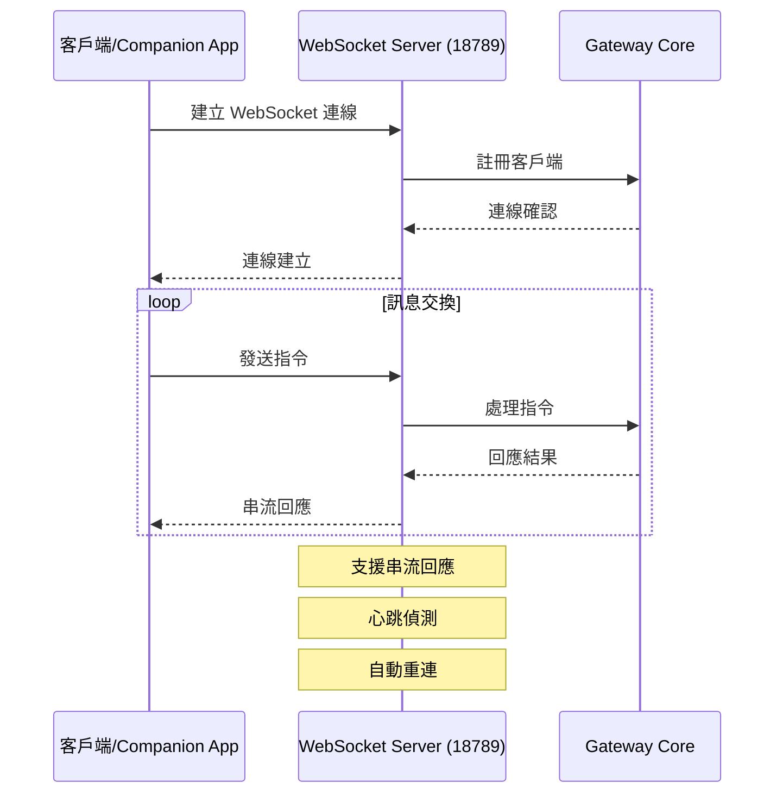
```mermaid
sequenceDiagram
    participant Client as 客戶端/Companion App
    participant WS as WebSocket Server (18789)
    participant GW as Gateway Core
    
    Client->>WS: 建立 WebSocket 連線
    WS->>GW: 註冊客戶端
    GW-->>WS: 連線確認
    WS-->>Client: 連線建立
    
    loop 訊息交換
        Client->>WS: 發送指令
        WS->>GW: 處理指令
        GW-->>WS: 回應結果
        WS-->>Client: 串流回應
    end
    
    Note over WS: 支援串流回應
    Note over WS: 心跳偵測
    Note over WS: 自動重連
```

**Wire Protocol**: OpenClaw 使用自定義的 Wire Protocol 在 WebSocket 上傳輸訊息，支援：

| 功能 | 說明 |
|------|------|
| **串流（Streaming）** | 支援 Token-by-Token 串流回應 |
| **心跳（Heartbeat）** | 定期心跳偵測連線存活 |
| **批次（Batching）** | 多則訊息批次傳送以提升效能 |
| **壓縮（Compression）** | 可選的訊息壓縮 |

#### 2.2.2 訊息路由器

訊息路由器負責將接收的訊息分派到正確的 Agent：

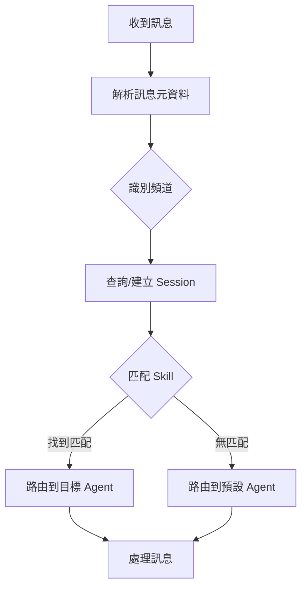
```mermaid
flowchart TD
    MSG[收到訊息] --> PARSE[解析訊息元資料]
    PARSE --> CHANNEL{識別頻道}
    CHANNEL --> SESSION[查詢/建立 Session]
    SESSION --> SKILL{匹配 Skill}
    SKILL -->|找到匹配| ROUTE[路由到目標 Agent]
    SKILL -->|無匹配| DEFAULT[路由到預設 Agent]
    ROUTE --> PROCESS[處理訊息]
    DEFAULT --> PROCESS
```

路由規則的判斷順序：

1. **DM 配對（DM Pairing）**: 一對一對話中，訊息直接路由到配對的 Agent
2. **Skill 觸發詞**: 檢查訊息是否包含特定技能的觸發詞
3. **上下文延續**: 若存在活躍的 Session，延續上一個 Skill 的處理
4. **預設 Agent**: 以上都不匹配時，由預設 Agent 處理

#### 2.2.3 組態管理器

組態管理器負責載入、驗證、監控 OpenClaw 的設定：

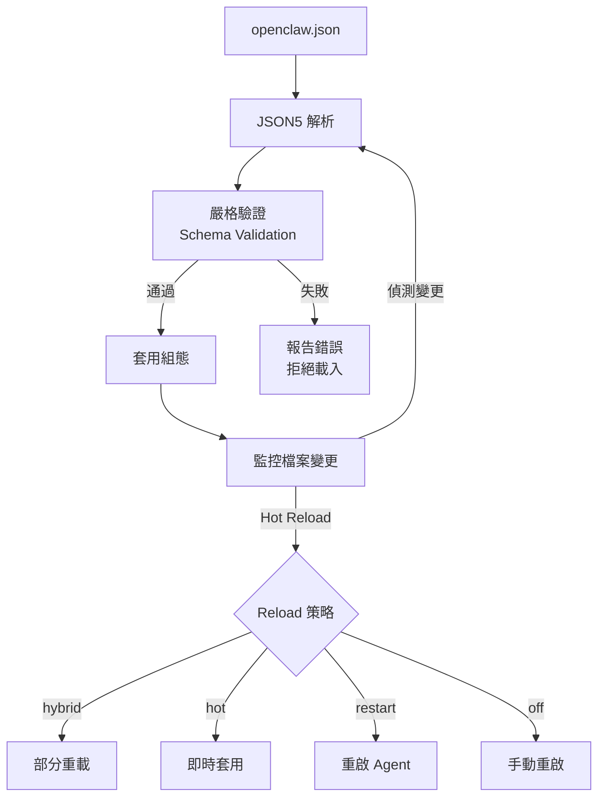
```mermaid
flowchart TD
    FILE[openclaw.json] --> PARSE[JSON5 解析]
    PARSE --> VALIDATE[嚴格驗證<br>Schema Validation]
    VALIDATE -->|通過| APPLY[套用組態]
    VALIDATE -->|失敗| ERROR[報告錯誤<br>拒絕載入]
    APPLY --> WATCH[監控檔案變更]
    WATCH -->|偵測變更| PARSE
    WATCH -->|Hot Reload| RELOAD{Reload 策略}
    RELOAD -->|hybrid| HYB[部分重載]
    RELOAD -->|hot| HOT[即時套用]
    RELOAD -->|restart| RST[重啟 Agent]
    RELOAD -->|off| OFF[手動重啟]
```

### 2.3 Agent Runtime 架構

Agent Runtime（Pi）是處理 AI 推論與工具呼叫的核心引擎：

#### 架構圖

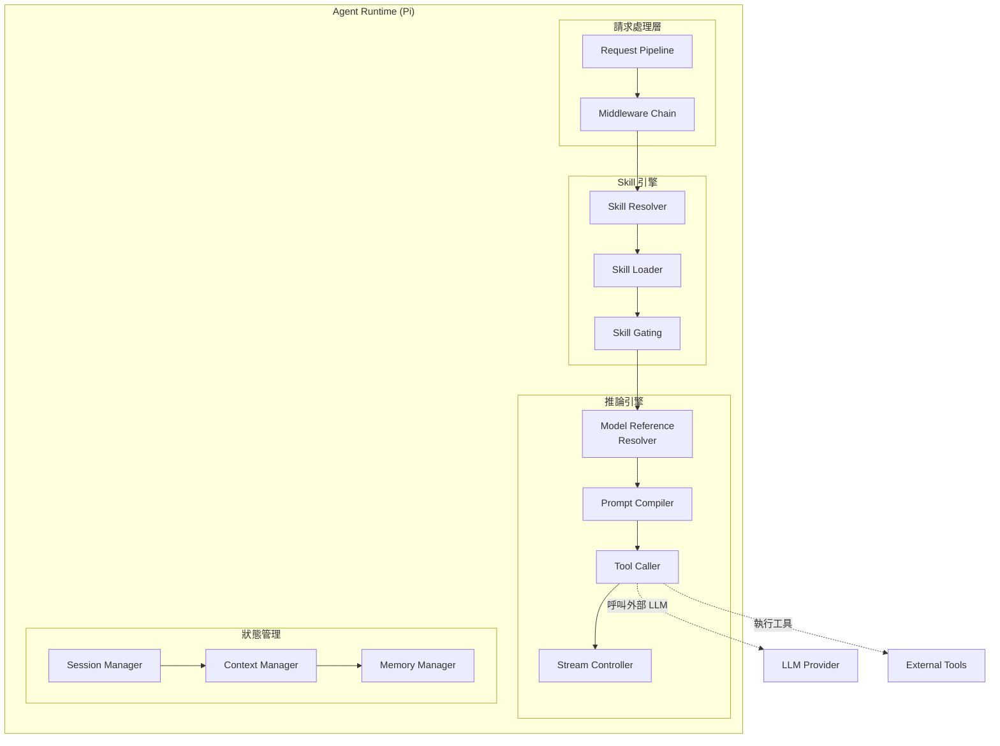
```mermaid
graph TB
    subgraph "Agent Runtime (Pi)"
        direction TB
        
        subgraph "請求處理層"
            RP[Request Pipeline]
            MW[Middleware Chain]
        end
        
        subgraph "Skill 引擎"
            SR[Skill Resolver]
            SL[Skill Loader]
            SG[Skill Gating]
        end
        
        subgraph "推論引擎"
            MR[Model Reference<br>Resolver]
            PC[Prompt Compiler]
            TC[Tool Caller]
            SC[Stream Controller]
        end
        
        subgraph "狀態管理"
            SM[Session Manager]
            CM[Context Manager]
            MM[Memory Manager]
        end
    end
    
    RP --> MW --> SR
    SR --> SL --> SG
    SG --> MR --> PC --> TC
    TC --> SC
    SM --> CM --> MM
    
    TC -.->|"呼叫外部 LLM"| LLM[LLM Provider]
    TC -.->|"執行工具"| TOOLS[External Tools]
```

#### 請求處理管線

Agent 處理訊息的完整管線：

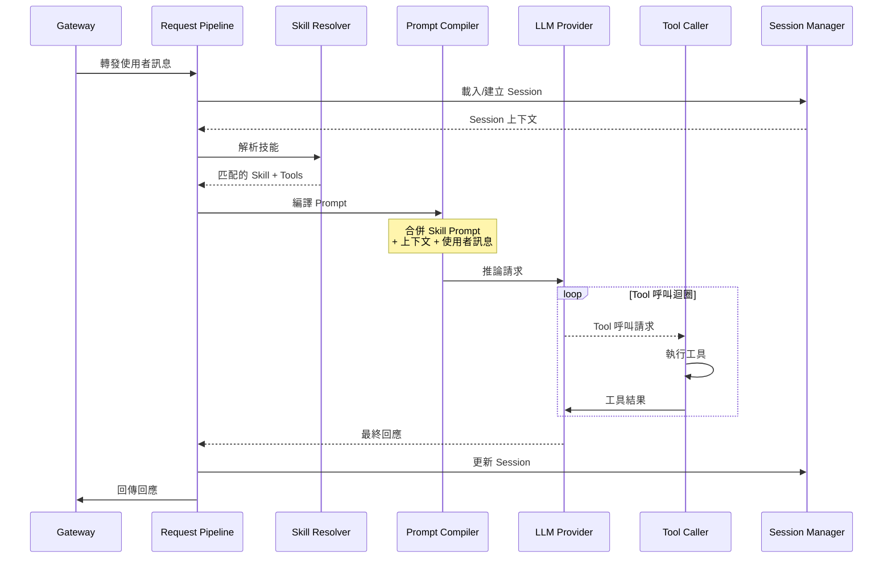
```mermaid
sequenceDiagram
    participant GW as Gateway
    participant RP as Request Pipeline
    participant SR as Skill Resolver
    participant PC as Prompt Compiler
    participant LLM as LLM Provider
    participant TC as Tool Caller
    participant SM as Session Manager

    GW->>RP: 轉發使用者訊息
    RP->>SM: 載入/建立 Session
    SM-->>RP: Session 上下文
    RP->>SR: 解析技能
    SR-->>RP: 匹配的 Skill + Tools
    RP->>PC: 編譯 Prompt
    Note over PC: 合併 Skill Prompt<br>+ 上下文 + 使用者訊息
    PC->>LLM: 推論請求
    
    loop Tool 呼叫迴圈
        LLM-->>TC: Tool 呼叫請求
        TC->>TC: 執行工具
        TC->>LLM: 工具結果
    end
    
    LLM-->>RP: 最終回應
    RP->>SM: 更新 Session
    RP->>GW: 回傳回應
```

### 2.4 訊息流程與通訊協議

#### 完整訊息流程

以一個使用者透過 WhatsApp 詢問天氣為例的完整訊息流程：

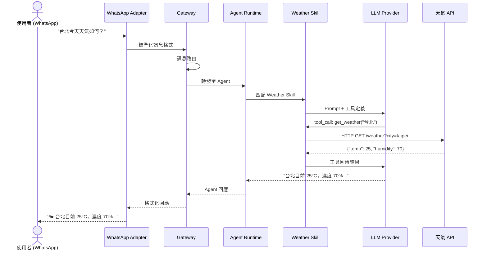
```mermaid
sequenceDiagram
    actor User as 使用者 (WhatsApp)
    participant WA as WhatsApp Adapter
    participant GW as Gateway
    participant RT as Agent Runtime
    participant SK as Weather Skill
    participant LLM as LLM Provider
    participant API as 天氣 API

    User->>WA: "台北今天天氣如何？"
    WA->>GW: 標準化訊息格式
    GW->>GW: 訊息路由
    GW->>RT: 轉發至 Agent
    RT->>SK: 匹配 Weather Skill
    SK->>LLM: Prompt + 工具定義
    LLM->>SK: tool_call: get_weather("台北")
    SK->>API: HTTP GET /weather?city=taipei
    API-->>SK: {"temp": 25, "humidity": 70}
    SK->>LLM: 工具回傳結果
    LLM-->>RT: "台北目前 25°C，濕度 70%..."
    RT-->>GW: Agent 回應
    GW-->>WA: 格式化回應
    WA-->>User: "🌤️ 台北目前 25°C，濕度 70%..."
```

#### 訊息格式標準化

OpenClaw 在 Gateway 層將來自不同頻道的訊息統一格式化：

```json
{
  "id": "msg_20260305_abc123",
  "channel": {
    "type": "whatsapp",
    "id": "wa_886912345678"
  },
  "sender": {
    "id": "user_001",
    "name": "王小明",
    "role": "user"
  },
  "content": {
    "type": "text",
    "text": "台北今天天氣如何？"
  },
  "timestamp": "2026-03-05T09:30:00Z",
  "session": {
    "id": "session_xyz789",
    "messageCount": 5
  },
  "metadata": {
    "platform_specific": {}
  }
}
```

### 2.5 Skills 載入與優先序

#### 三層技能載入架構

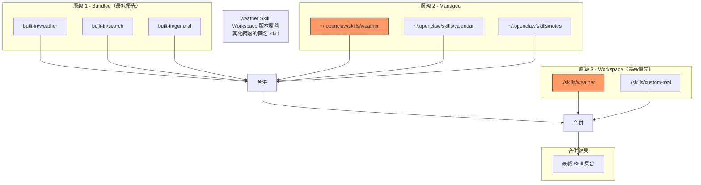
```mermaid
graph TB
    subgraph "合併結果"
        FINAL[最終 Skill 集合]
    end
    
    subgraph "層級 3 - Workspace（最高優先）"
        W1[./skills/weather]
        W2[./skills/custom-tool]
    end
    
    subgraph "層級 2 - Managed"
        M1[~/.openclaw/skills/weather]
        M2[~/.openclaw/skills/calendar]
        M3[~/.openclaw/skills/notes]
    end
    
    subgraph "層級 1 - Bundled（最低優先）"
        B1[built-in/weather]
        B2[built-in/search]
        B3[built-in/general]
    end
    
    B1 & B2 & B3 --> MERGE1[合併]
    M1 & M2 & M3 --> MERGE1
    MERGE1 --> MERGE2[合併]
    W1 & W2 --> MERGE2
    MERGE2 --> FINAL
    
    style W1 fill:#f96,stroke:#333
    style M1 fill:#f96,stroke:#333
    
    Note1[weather Skill:<br>Workspace 版本覆蓋<br>其他兩層的同名 Skill]
```

#### Skill 載入流程

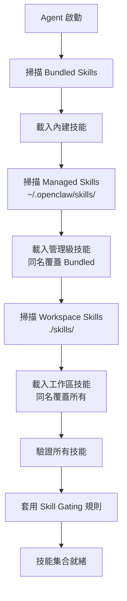
```mermaid
flowchart TD
    START[Agent 啟動] --> SCAN1[掃描 Bundled Skills]
    SCAN1 --> LOAD1[載入內建技能]
    LOAD1 --> SCAN2[掃描 Managed Skills<br>~/.openclaw/skills/]
    SCAN2 --> LOAD2[載入管理級技能<br>同名覆蓋 Bundled]
    LOAD2 --> SCAN3[掃描 Workspace Skills<br>./skills/]
    SCAN3 --> LOAD3[載入工作區技能<br>同名覆蓋所有]
    LOAD3 --> VALIDATE[驗證所有技能]
    VALIDATE --> GATE[套用 Skill Gating 規則]
    GATE --> READY[技能集合就緒]
```

### 2.6 模型參考（Model References）

OpenClaw 透過 Model References 機制抽象化 LLM 提供者，讓 Agent 可以輕鬆切換模型：

#### 模型參考設定

```json5
// openclaw.json 中的模型設定
{
  "agent": {
    "model": "anthropic/claude-opus-4-8"  // 預設模型
  },
  "models": {
    "default": {
      "provider": "openai",
      "model": "gpt-5.6",
      "temperature": 0.7,
      "maxTokens": 4096
    },
    "fast": {
      "provider": "anthropic",
      "model": "claude-haiku-4-5",
      "temperature": 0.3,
      "maxTokens": 2048
    },
    "reasoning": {
      "provider": "anthropic",
      "model": "claude-opus-4-8",
      "temperature": 0.5,
      "maxTokens": 8192
    },
    "local": {
      "provider": "ollama",
      "model": "glm-5.2",
      "baseUrl": "http://localhost:11434"
    }
  }
}
```

> **最佳實務**: 官方建議使用最新世代最強模型以獲得最佳體驗與較低的 Prompt Injection 風險。詳見 [Onboarding 指南](https://docs.openclaw.ai/start/onboarding)。

#### 模型失效轉移（Model Failover）

OpenClaw 支援模型失效轉移機制，當主要模型不可用時自動切換到備援模型：

- **OAuth vs API Keys 輪換**: 支援多種認證方式與自動切換
- **Provider 失效轉移**: 當某個 Provider 回應失敗時自動嘗試下一個
- **API Key 輪換**: 支援多組 API Key 自動輪換，避免單一 Key 配額耗盡

詳細設定請參考 [Model failover](https://docs.openclaw.ai/concepts/model-failover)。

#### 支援的 LLM 提供者

OpenClaw 目前支援 **50+ LLM 提供者**，以下列出主要提供者（完整清單請參閱 [Provider Directory](https://docs.openclaw.ai/providers)）：

| 分類 | 提供者 | 模型範例 | 備註 |
|------|--------|----------|------|
| **旗艦** | **OpenAI** | GPT-5.6（含 Ultra）, GPT-5.5, GPT-5.2, o3/o4-mini | ChatGPT/Codex OAuth 訂閱支援，v2026.7.1 起擴大 GPT-5.6 相容路由 |
| | **Anthropic** | Claude Opus 4, Opus 4.6, Opus 4.8, Sonnet 4, Haiku 4.5 | 預設推薦，長上下文 |
| | **Google** | Gemini 2.5 Pro, Gemini 2.5 Flash | 多模態，Veo 影片生成 |
| **雲端** | **Azure OpenAI** | GPT-4o (Azure) | 企業合規 |
| | **Amazon Bedrock** | Claude, Titan | AWS 整合，Mantle 支援 |
| | **NVIDIA** | NIM 微服務 | API Catalog 整合 |
| | **Fireworks** | 各類模型 | 高速推論 |
| | **Together AI** | 各類開源模型 | 推論即服務 |
| | **Groq** | Llama, Mixtral | 硬體加速推論 |
| **新興** | **DeepSeek** | V4 Flash, V4 Pro | V4 Flash 預設 Onboarding 模型 |
| | **DeepInfra** | 模型目錄 | 媒體生成、TTS、Embeddings |
| | **Cerebras** | 高速推論 | 內建 Provider（v2026.4.26） |
| | **MiniMax** | M2.5 | 工具解析優秀，OAuth 支援 |
| | **Mistral** | Mistral Large | 歐洲 AI |
| | **xAI** | Grok | Grok 搜尋整合 |
| **中國** | **Alibaba** | 通義千問 | Model Studio |
| | **Qwen** | Qwen 系列 | 阿里雲模型 |
| | **GLM (Zhipu)** | GLM-5.2, GLM 系列 | 智譜 AI，v2026.6.8 新增 |
| | **Moonshot** | Kimi | Kimi 搜尋整合 |
| | **Volcengine** | 豆包 Doubao | 字節跳動火山引擎 |
| | **Tencent** | 騰訊混元 | TokenHub 整合 |
| | **Qianfan** | 百度文心 | 百度千帆 |
| | **Xiaomi MiMo** | MiMo | 小米推論 |
| **本地** | **Ollama** | Llama 3, Mistral, Phi | 本地執行，內建快取 |
| | **LM Studio** | 各類模型 | 桌面 LLM |
| | **vLLM** | 各類模型 | 高效推論引擎 |
| | **SGLang** | 各類模型 | 結構化生成語言 |
| **媒體** | **ElevenLabs** | TTS/STT | 語音合成 |
| | **Azure Speech** | TTS/STT | 語音服務 |
| | **Deepgram** | STT | 語音辨識 |
| | **Runway** | Gen-3 Alpha | 影片生成 |
| | **Fal** | 圖片/影片模型 | 即時 AI 媒體 |
| | **ComfyUI** | Stable Diffusion | 圖片生成工作流 |
| | **SenseAudio** | 音訊處理 | 音訊 AI |
| **閘道** | **OpenRouter** | 多模型路由 | 統一 API 存取 |
| | **LiteLLM** | 多模型代理 | 自架 Proxy |
| | **Cloudflare AI** | AI Gateway | CDN 層級快取 |
| | **Vercel AI** | AI Gateway | Edge Runtime |
| | **GitHub Copilot** | GPT/Claude | Copilot 訂閱代理 |
| | **Claude Max** | Claude 系列 | Claude Max API Proxy |
| **其他** | **Perplexity** | pplx-online | 搜尋增強 |
| | **Hugging Face** | 各類模型 | Inference API |
| | **Venice AI** | 隱私模型 | 去中心化 AI |
| | **Arcee AI** | 自訂模型 | 企業微調 |
| | **Gradium** | TTS | 語音合成 |
| | **Inworld** | 角色 AI | 遊戲 NPC |
| | **Kilocode** | 程式碼模型 | 程式碼生成 |
| | **Inferrs** | 推論服務 | 託管推論 |
| | **Vydra** | 模型服務 | 新興 Provider |
| | **Z.AI** | 模型服務 | 新興 Provider |
| | **Chutes** | 模型服務 | 去中心化推論 |
| | **StepFun** | 階梯模型 | 中國 AI Provider |
| | **Synthetic** | 合成資料 | 資料生成 |

> **模型建議**: 官方建議使用最新世代最強模型以獲得最佳體驗與最低 Prompt Injection 風險。模型設定與 CLI 操作詳見 [Models](https://docs.openclaw.ai/concepts/models)。

#### 模型目錄的探索策略（v2026.8.1 變更）

2.0 之前，開啟模型選單會觸發完整的 Provider 掃描，造成明顯延遲。2.0 起改為**目錄優先**策略：

- Chat 與 Models 頁面直接從 OpenClaw 已持有的目錄開啟，不等待 Provider 掃描。
- 即時探索只在你**開啟模型畫面或明確要求重新整理**時執行。
- 若探索失敗，內建項目與最後一次可用的清單仍然保留，不會變成空白。

`/model` 的作用域也明確化為三層，且持久性變更需要對應權限：

| 作用域 | 效果 | 權限需求 |
|-------|------|---------|
| 僅本對話 | 只改變當前 Session | 一般使用者 |
| 單一 Agent | 改變該 Agent 的預設 | 需具備變更權限 |
| 共用預設 | 改變全域預設模型 | 需具備變更權限 |

> **注意**：清單顯示的是「OpenClaw 能辨識的模型」，但**實際可用與否由 Provider、帳號、區域、端點、方案與定價共同決定**。能在清單中看到，不等於該帳號有權呼叫。

#### 脈絡窗與推理層級（v2026.8.1 更新）

2.0 對脈絡窗與推理設定做了明確化，這是企業評估成本與能力上限時的關鍵資訊：

| 路由 | 標準脈絡窗 | 可選上限 | 說明 |
|------|-----------|---------|------|
| GPT-5.5 / GPT-5.6（一般執行） | 272,000 token | **922,000 token 輸入窗（opt-in）** | 需明確選用，非預設 |
| Claude 5 CLI 對話 | 200K | **1M（Control UI 可選）** | 限支援的路由與介面 |

推理層級（reasoning effort）在 2.0 起會**跟隨所選模型與 runtime 一起保存**，即使對話被還原或認證路由重建也不會遺失。各層級的可用性依 runtime 而異：

| Runtime | 最高推理層級 | 適用模型 |
|---------|------------|---------|
| Native Codex | `Ultra` | Sol、Terra |
| Native Codex | `Max` | Luna |
| Embedded OpenClaw | `Ultra`（對映語意不同） | 對映至該 Provider 支援的最高 effort |

> ⚠️ **重要差異**：Embedded OpenClaw 的 `Ultra` **並非等同於 Native Codex 的 Ultra**。前者是「對映到該 Provider 所支援的最高 effort」並額外加上委派工作的指引，後者是 Codex 原生的推理層級。兩者行為不同，跨 runtime 比較效能或成本時不可直接對等看待。
>
> 上述脈絡窗選項**僅限支援的路由、介面與帳號**。同一個模型在不同 Provider 帳號或端點下，可用的上限可能不同。

#### Compaction 與失效轉移的行為修正

- **Compaction** 改用「最新且可信的脈絡計數」，不再受累計快取計費或重複歷史影響；在支援的 Responses 檢查點會保留工具輸出，若儲存的檢查點被拒絕則回退為完整歷史。
- **脈絡上限改為逐模型設定**（原為 Provider 層級），`openclaw doctor` 可協助遷移綁定於明確模型項目的舊設定。
- **多帳號失效轉移**：同一 Provider 若某帳號遇到認證或配額冷卻，會依你設定的憑證順序切換到下一個授權帳號，**不會改變已選定的 Provider 與模型**，待其恢復後回復原偏好。未設定明確帳號清單時，環境變數金鑰仍可使用。
- **Codex 訂閱制執行不會靜默切換為按量計費的 API Key** —— 這是成本治理上重要的保證。永久性的認證、模型、媒體與長視窗配額失敗會停止重試，僅暫時性速率限制與可重試的伺服器錯誤保留重試或同 Provider 授權回退行為。

### 2.7 ClawHub 技能市集架構

[ClawHub](https://clawhub.ai) 是 OpenClaw 的技能市集，類似 npm 之於 Node.js：

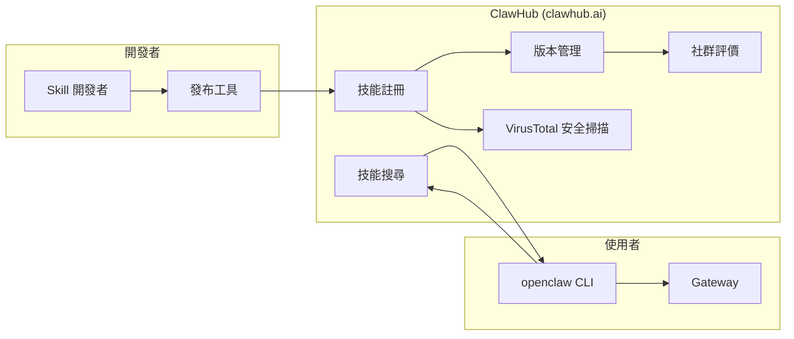
```mermaid
graph LR
    subgraph "開發者"
        DEV[Skill 開發者]
        PUB[發布工具]
    end
    
    subgraph "ClawHub (clawhub.ai)"
        REG[技能註冊]
        SEARCH[技能搜尋]
        VER[版本管理]
        REV[社群評價]
        VT[VirusTotal 安全掃描]
    end
    
    subgraph "使用者"
        CLI[openclaw CLI]
        GW[Gateway]
    end
    
    DEV --> PUB --> REG
    CLI --> SEARCH
    SEARCH --> CLI
    CLI --> GW
    REG --> VER
    VER --> REV
    REG --> VT
```

> **安全提示**: OpenClaw 已與 [VirusTotal 合作](https://openclaw.ai/blog/virustotal-partnership)，對 ClawHub 上的技能進行安全掃描，確保技能來源安全可信。啟用 ClawHub 後，Agent 可自動搜尋並拉取所需技能，搭配 Skill Install Gating 機制進行安全審核。

#### ClawHub 指令

```bash
# 搜尋技能
openclaw skills search weather

# 安裝技能
openclaw skills install weather-reporter

# 更新技能
openclaw skills update weather-reporter

# 發布自訂技能
openclaw skills publish ./my-skill

# 列出已安裝技能
openclaw skills list
```

### 2.8 Companion Apps 架構

OpenClaw 提供 Companion Apps 作為多平台入口。Gateway 本身即能提供完整體驗，所有 Apps 均為可選擴充：

| 平台 | 技術棧 | 功能 |
|------|--------|------|
| **macOS** | Swift (Menu Bar App) | Gateway 健康監控、Voice Wake + PTT、Talk Mode overlay、WebChat、除錯工具、遠端 Gateway 控制、**Quick Chat**（v2026.8.1） |
| **iOS / iPadOS** | Swift (Node App) | 單一 Chat 介面整合打字／聽寫／語音訊息／附件／即時 Talk，Canvas、Voice Wake、相機、螢幕錄製、Bonjour + 裝置配對 |
| **Apple Watch** | Swift (watchOS) | 訊息、審批、回覆與指令，**跨重啟／Gateway 變更／導航／重試仍保留**並與手機對帳 |
| **Android** | Kotlin (Node App) | 精簡 composer（聽寫／語音訊息／即時 Talk／模型與思考層級／脈絡用量／附件）、Canvas、裝置指令、Sharesheet 匯入 |
| **Wear OS** | Kotlin (watchOS 對應) | 透過配對手機連線（**Watch 端不儲存 Gateway 憑證**）、逐字稿、回覆、停止執行、Agent Pulse（唯讀） |
| **Windows** | TypeScript (Hub App)（v2026.6.10 新增） | 原生 Windows 伴侶應用、Gateway 健康狀態、系統列快速存取、WebChat 內嵌 |
| **Linux 桌面** | TypeScript（v2026.8.1 新增） | 首次執行設定、系統匣與服務控制、內嵌 Control UI、深層連結、開機自啟、Quick Chat |

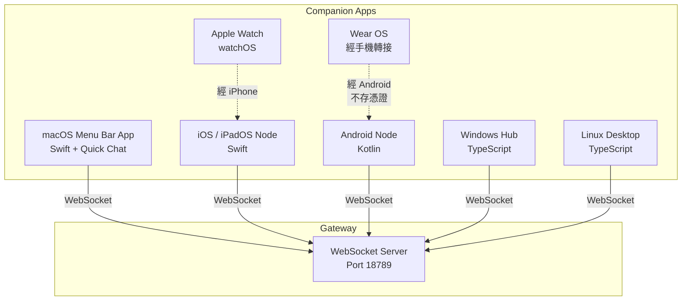
```mermaid
graph TB
    subgraph "Companion Apps"
        MAC[macOS Menu Bar App<br>Swift + Quick Chat]
        IOS[iOS / iPadOS Node<br>Swift]
        WATCH[Apple Watch<br>watchOS]
        AND[Android Node<br>Kotlin]
        WEAR[Wear OS<br>經手機轉接]
        WIN[Windows Hub<br>TypeScript]
        LNX[Linux Desktop<br>TypeScript]
    end

    subgraph "Gateway"
        WS[WebSocket Server<br>Port 18789]
    end

    MAC -->|WebSocket| WS
    IOS -->|WebSocket| WS
    AND -->|WebSocket| WS
    WIN -->|WebSocket| WS
    LNX -->|WebSocket| WS
    WATCH -.->|經 iPhone| IOS
    WEAR -.->|經 Android<br>不存憑證| AND
```

#### v2026.8.1 原生應用重點變更

**macOS Quick Chat** 可從選單列或全域快捷鍵在當前使用中的應用之上開啟，內含最近更新的五個對話選擇器，能就地串流回覆、切換 Agent、接受聽寫並選擇模型與推理層級。兩項作業系統權限會擴充其能力：

| 權限 | 解鎖能力 |
|------|---------|
| Screen Recording | 視窗或區域擷取 |
| Accessibility | 讀取焦點應用的有界文字，並可將最終答案貼回原本工作處 |

> 擷取到的脈絡會在送出後或 Quick Chat 隱藏時清除。

**進度卡與 Widget 的跨平台支援並不一致**，這在規劃企業標準配備時必須留意：

| 呈現形式 | 支援平台 | 限制 |
|---------|---------|------|
| 持久化進度卡 | iOS、macOS、Android | 需連線的 Gateway 支援已儲存卡片；**舊版 Gateway 只能顯示即時卡片，重啟後無法還原**，Android 的回退機制偶有殘留過期完成狀態 |
| Agent 產生的 Widget | iOS、Android、macOS、Linux Quick Chat | 需用戶端聲明支援；連線的 Mac 可另在原生 Canvas 面板呈現；**Linux Quick Chat 使用自訂 Gateway TLS leaf pin 時僅支援純文字** |
| 可展開的檔案差異 | iPhone、iPad、Mac | 支援平台明顯較窄 |

> **Linux 桌面應用的發布狀態**：官方已完成 .deb 與 AppImage 的建置與發布路徑，但發布說明載明「其作為 v2026.8.1 下載項目的可用性尚未驗證」。Summon 快捷鍵在 X11 可用，Wayland 保留系統匣項目，審批決策仍需在 Dashboard 或命令列完成。企業若規劃 Linux 桌面部署，建議先確認實際可取得的套件版本。

#### Plugin Manifest 機制

> **Plugin Manifest 機制**（v2026.4.11 新增）: 插件清單現可宣告激活（activation）與設定（setup）描述符，描述所需的認證、配對與組態步驟。這消除了核心程式碼中的硬編碼特殊處理，讓第三方插件的安裝設定流程更加統一。

#### Plugin SDK 架構（v2026.5 新增）

OpenClaw v2026.5 引入完整的 **Plugin SDK**，將頻道、工具與 Provider 的擴展統一為標準化插件架構：

##### 插件分類

| 類型 | 說明 | 範例 |
|------|------|------|
| **Bundled Plugins** | 隨 OpenClaw 安裝包內建的插件 | WeChat、QQ Bot、Voice Call、Google Meet |
| **Community Plugins** | 社群開發的第三方插件 | 自訂頻道、工具擴展 |
| **External Plugins** | 外部套件安裝的獨立插件 | `@tencent-weixin/openclaw-weixin` |

##### Plugin SDK 模組

```text
openclaw/plugin-sdk
├── sdk-overview          # SDK 總覽與 API 設計
├── sdk-setup             # 插件設定與組態
├── sdk-entrypoints       # 插件進入點定義
├── sdk-channel-plugins   # 頻道插件開發指南
├── sdk-channel-message   # 頻道訊息 API
├── sdk-channel-turn      # 頻道輪次核心
├── sdk-provider-plugins  # Provider 插件開發指南
├── sdk-agent-harness     # Agent Harness 插件
├── sdk-runtime           # 運行時輔助工具
├── sdk-subpaths          # 子路徑匯出
├── sdk-testing           # 插件測試框架
└── sdk-migration         # 舊版遷移指南
```

##### 內建插件清單

| 插件 | 類型 | 功能 |
|------|------|------|
| **Voice Call** | 頻道 | Plivo/Twilio 語音通話，Realtime Voice Loop |
| **Google Meet** | 頻道 | Chrome/Twilio Realtime、出席匯出、錄製檔 |
| **Webhooks** | 自動化 | 外部 Webhook 事件處理 |
| **Memory LanceDB** | 記憶 | LanceDB 向量記憶引擎 |
| **Memory Wiki** | 記憶 | Wiki 結構化記憶管理 |
| **Skill Workshop** | 開發 | 技能開發輔助工具 |
| **Codex Computer Use** | 工具 | Codex 電腦使用整合 |
| **Codex Harness** | Agent | Codex Agent 執行環境 |
| **Zalo Personal** | 頻道 | 越南 Zalo 個人帳號頻道 |

##### 插件開發範例（現行寫法）

> **⚠️ Breaking Change（狀態：已生效）**：舊版 `import { defineChannelPlugin } from 'openclaw/plugin-sdk'` 根路徑匯入方式，連同 `before_agent_start` hook、`providerAuthEnvVars`、`channelEnvVars` 等介面，已於 **2026 年 7 月 24 日後移除**（v2026.6.34 Extended-Stable 公告）。
>
> **v2026.8.1 進一步收斂**：契約整理**移除了 7 月與 8 月的已退休 SDK 路徑**，並以 `gateway_stop` **取代 `deactivate` 別名**。舊版 subpath 匯入的相容窗口已於 **2026-09-01 關閉**。新插件開發須使用**細分子路徑匯入（subpath imports）**，例如頻道插件改從 `openclaw/plugin-sdk/channel-core` 匯入 `defineChannelPluginEntry`，並以 manifest setup descriptor 取代硬編碼的啟用／設定邏輯：

```typescript
// 最小頻道插件範例（現行寫法，子路徑匯入）
import { defineChannelPluginEntry } from 'openclaw/plugin-sdk/channel-core';

export default defineChannelPluginEntry({
  name: 'my-channel',
  version: '1.0.0',

  // 插件清單（manifest setup descriptor）
  manifest: {
    setup: {
      type: 'api-key',
      fields: ['apiKey', 'apiSecret']
    }
  },

  // 頻道生命週期
  async connect(config) {
    // 建立頻道連線
  },

  async disconnect() {
    // 關閉連線
  },

  // 訊息處理
  async onMessage(message) {
    // 轉換為 OpenClaw 標準訊息格式
    return { text: message.content, sender: message.from };
  },

  async sendMessage(target, content) {
    // 發送訊息到外部頻道
  }
});
```

> **相關文件**: [Plugin SDK Overview](https://docs.openclaw.ai/plugins/sdk-overview) · [Building Plugins](https://docs.openclaw.ai/plugins/building-plugins) · [Plugin Inventory](https://docs.openclaw.ai/plugins/plugin-inventory) · [Plugin SDK Migration](https://docs.openclaw.ai/plugins/sdk-migration)。既有插件開發者建議啟用 `@typescript-eslint/no-deprecated` 之類的型別感知 Lint 規則，及早攔截已標記 `@deprecated` 的舊版 SDK 介面呼叫。
>
> **v2026.6.9 重要變更 — Provider 外部化**: 自 v2026.6.9 起，官方 Provider（如 OpenAI、Anthropic、Google 等）已從核心套件抽離為獨立 npm 套件（例如 `@openclaw/provider-openai`）。新安裝時 Gateway 會自動探索已安裝的 channel/provider plugin，無需手動註冊。對於現有用戶，升級時 `openclaw doctor` 會自動建議安裝對應套件。

### 2.9 高可用架構設計

#### 單機高可用

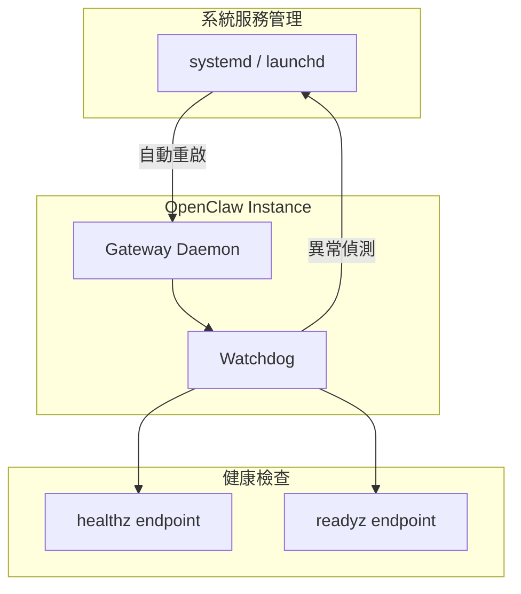
```mermaid
graph TB
    subgraph "系統服務管理"
        SYSTEMD[systemd / launchd]
    end
    
    subgraph "OpenClaw Instance"
        GW[Gateway Daemon]
        WATCHDOG[Watchdog]
    end
    
    subgraph "健康檢查"
        HC[healthz endpoint]
        RC[readyz endpoint]
    end
    
    SYSTEMD -->|自動重啟| GW
    GW --> WATCHDOG
    WATCHDOG --> HC
    WATCHDOG --> RC
    WATCHDOG -->|異常偵測| SYSTEMD
```

#### 多節點高可用（企業自建擴展模式）

> **重要說明**：OpenClaw 官方 Gateway 本身是**單一操作者、單一行程**的設計，並未內建跨節點叢集、共享 Session Store 或負載平衡機制。以下多節點拓撲是企業將 OpenClaw 視為基礎設施元件時，**自行透過標準 DevOps 工具（負載平衡器、外部資料庫）疊加建置**的高可用模式，而非 OpenClaw 原生支援的叢集功能。實作前務必評估 Session 親和性（同一使用者的多輪對話需路由到同一 Gateway 行程，或自行實作跨行程狀態同步），避免破壞對話上下文一致性。

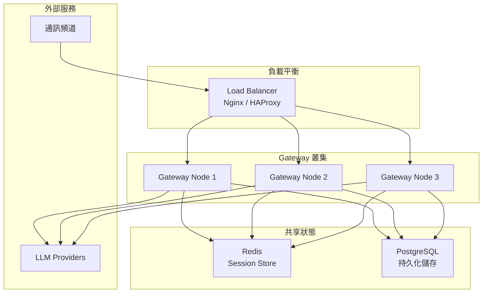
```mermaid
graph TB
    subgraph "負載平衡"
        LB[Load Balancer<br>Nginx / HAProxy]
    end
    
    subgraph "Gateway 叢集"
        GW1[Gateway Node 1]
        GW2[Gateway Node 2]
        GW3[Gateway Node 3]
    end
    
    subgraph "共享狀態"
        REDIS[Redis<br>Session Store]
        PG[PostgreSQL<br>持久化儲存]
    end
    
    subgraph "外部服務"
        LLM[LLM Providers]
        CHANNELS[通訊頻道]
    end
    
    LB --> GW1 & GW2 & GW3
    GW1 & GW2 & GW3 --> REDIS
    GW1 & GW2 & GW3 --> PG
    GW1 & GW2 & GW3 --> LLM
    CHANNELS --> LB
```

### 2.10 企業部署拓撲

#### 小型團隊（1-10 人）

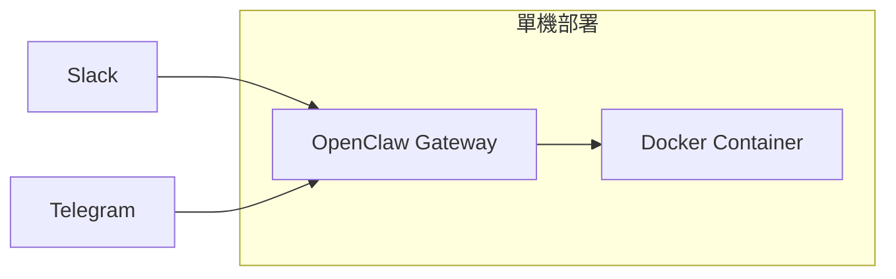
```mermaid
graph LR
    subgraph "單機部署"
        GW[OpenClaw Gateway]
        DOCKER[Docker Container]
    end
    
    SLACK[Slack] --> GW
    TG[Telegram] --> GW
    GW --> DOCKER
```

**建議配置**:

| 資源 | 規格 |
|------|------|
| CPU | 2 cores |
| RAM | 4 GB |
| 儲存 | 20 GB SSD |
| 網路 | 10 Mbps |

#### 中型團隊（10-100 人）

```mermaid
graph TB
    subgraph "DMZ"
        LB[Nginx Reverse Proxy]
    end
    
    subgraph "Application Zone"
        GW1[Gateway 1]
        GW2[Gateway 2]
    end
    
    subgraph "Data Zone"
        REDIS[Redis Sentinel]
        PG[PostgreSQL HA]
    end
    
    subgraph "Monitoring"
        OTEL[OpenTelemetry Collector]
        GRF[Grafana]
        PROM[Prometheus]
    end
    
    LB --> GW1 & GW2
    GW1 & GW2 --> REDIS & PG
    GW1 & GW2 --> OTEL
    OTEL --> PROM --> GRF
```

**建議配置（每節點）**:

| 資源 | 規格 |
|------|------|
| CPU | 4 cores |
| RAM | 8 GB |
| 儲存 | 50 GB SSD |
| 網路 | 100 Mbps |
| 節點數 | 2-3 |

#### 大型企業（100+ 人）

```mermaid
graph TB
    subgraph "Edge Layer"
        CDN[CDN / WAF]
        LB[Global Load Balancer]
    end
    
    subgraph "Region A"
        GW_A1[Gateway A-1]
        GW_A2[Gateway A-2]
        GW_A3[Gateway A-3]
        REDIS_A[Redis Cluster]
        PG_A[PostgreSQL Primary]
    end
    
    subgraph "Region B"
        GW_B1[Gateway B-1]
        GW_B2[Gateway B-2]
        GW_B3[Gateway B-3]
        REDIS_B[Redis Cluster]
        PG_B[PostgreSQL Replica]
    end
    
    subgraph "Central Monitoring"
        OTEL[OTEL Collector]
        GRF[Grafana]
        ES[Elasticsearch]
        ALERT[AlertManager]
    end
    
    CDN --> LB
    LB --> GW_A1 & GW_A2 & GW_A3
    LB --> GW_B1 & GW_B2 & GW_B3
    GW_A1 & GW_A2 & GW_A3 --> REDIS_A & PG_A
    GW_B1 & GW_B2 & GW_B3 --> REDIS_B & PG_B
    PG_A -->|複寫| PG_B
    
    GW_A1 & GW_B1 --> OTEL
    OTEL --> GRF & ES & ALERT
```

### 2.11 Session 儲存架構：SQLite 遷移

v2026.8.1 最具架構影響力的變更，是將原本以檔案為後端的狀態改為 **SQLite 後端儲存**。這項變更影響備份策略、容器 Volume 規劃與降版可行性，是企業升級前必須理解的前提。

#### 遷移範圍

| 資料類別 | 2.0 前 | 2.0 後 |
|---------|-------|-------|
| Sessions 與 Transcripts | 檔案式 | **SQLite** |
| 選定的裝置與認證紀錄 | 檔案／JSON | **SQLite** |
| 會議擷取（Meeting capture） | 檔案 | **SQLite** |
| Runtime journals | 檔案 | **SQLite** |

遷移後可透過同一套工具建立、驗證與還原**可攜式快照（portable snapshot）**，讓備份與復原在事故發生前就具備可驗證的路徑（詳見 6.7）。

#### 架構示意

```mermaid
graph TB
    subgraph "Gateway Process"
        AGENT[Agent Runtime]
        SESS[Session Manager]
    end

    subgraph "State Directory 狀態目錄"
        DB[(SQLite<br/>sessions / transcripts<br/>devices / auth<br/>meetings / journals)]
        WAL[WAL 日誌]
        FILES[工作區檔案<br/>MEMORY.md / USER.md<br/>skills/]
    end

    subgraph "備份"
        SNAP[Portable Snapshot<br/>create → verify → restore]
    end

    AGENT --> SESS
    SESS --> DB
    DB --- WAL
    AGENT --> FILES
    DB --> SNAP
    FILES --> SNAP
```

#### 降版限制（升級前必讀）

> ⚠️ **這是單向性較強的變更**。官方發布說明明確警告：
>
> - **遷移後建立的 Session 不會出現在舊版中**。
> - 若要降版到舊的檔案式版本，**必須先用當前 CLI 還原已封存的舊版 transcript 產物**，否則資料在舊版看不到。
> - 升級前應建立**可驗證的備份**（`openclaw backup`），而非僅複製目錄。

#### 其他已知限制

官方載明的邊界條件，規劃維運程序時須一併納入：

| 項目 | 限制 |
|------|------|
| 舊版儲存遷移 | **部分舊儲存需先停止擁有該狀態的行程**，`openclaw doctor --fix` 才能遷移 |
| 待處理的配對請求與 bootstrap 代碼 | **不會被匯入** |
| macOS tunnel 遷移 | 產生的資料**無法被僅支援 JSON 的舊版建置讀取** |
| 還原行為 | **拒絕覆寫既有目標**，須還原至全新目標 |
| Node + SQLite 版本 | 已知有漏洞的組合會**在狀態開啟前擋下**，並提示應升級內嵌 Node runtime 或系統共用的 SQLite 函式庫 |

> **資料安全強化**：2.0 針對 SQLite 後端做了大量健全性修補，包含防止 WAL split-brain 清理損毀資料庫，以及將「已證實損毀」的判定隔離處理。即便如此，**SQLite 檔案本身並未加密**，其機密性仍取決於狀態目錄的檔案系統權限（與 Secret Store 相同的前提，見 3.11）。

---

## 第三章：安裝與環境建置

### 3.1 系統需求

#### 最低需求

| 項目 | 需求 |
|------|------|
| **作業系統** | macOS 13+、Linux（Ubuntu 22.04+、Debian 12+）、Windows 11+ (WSL2，強烈建議) |
| **Node.js** | `>=22.22.3 <23`、`>=24.15.0 <25` 或 `>=25.9.0`（package.json engines 精確版本區間；建議採用 Node 24.15+ LTS） |
| **記憶體** | 2 GB RAM |
| **磁碟空間** | 500 MB（不含 LLM 模型） |
| **網路** | 穩定的網際網路連線（用於 LLM API 呼叫） |

#### 建議需求（生產環境）

| 項目 | 需求 |
|------|------|
| **作業系統** | Linux（Ubuntu 24.04 LTS） |
| **Node.js** | Node 24（建議）或 22.19+ LTS |
| **Docker** | 24.0+ |
| **記憶體** | 8 GB RAM |
| **磁碟空間** | 50 GB SSD |
| **CPU** | 4 cores |

### 3.2 本地開發安裝

自 v2026.8.1 起，**官方安裝器是建議的首選路徑**；npm／pnpm 全域安裝則保留給需要自行掌控套件管理器的情境。

#### 路徑一：官方安裝器（推薦）

安裝器會自動處理 Node.js 與相依套件，並在 2.0 中強化了幾項安裝後的可用性：

```bash
# macOS / Linux / WSL2
curl -fsSL https://openclaw.ai/install.sh | bash

# Windows (PowerShell)
iwr -useb https://openclaw.ai/install.ps1 | iex
```

v2026.8.1 的安裝器改善重點：

- **macOS**：從「下載」資料夾或磁碟映像開啟的 App 會主動詢問是否移入「應用程式」資料夾——只有位於該處，更新與登入時啟動才能正常運作。
- **Linux 與其他 Unix**：安裝器會讓 `openclaw` 在**新開的終端機工作階段中直接可用**，不再要求你手動編輯 shell 啟動檔。
- **安全預設**：會**在變更任何東西之前擋下**「將 OpenClaw 暴露於網路且未設認證」的安裝方式。
- **重裝保護**：若準備階段被取消或失敗，既有的可用設定會被保留；安裝器也會給 OpenClaw 足夠的啟動時間，再回報是否可連線。

> **Windows 使用者**: 若不使用原生 Windows 建置，仍強烈建議採用 WSL2 環境。

#### 路徑二：npm / pnpm 全域安裝

##### 步驟一：確認 Node.js 版本

```bash
# 確認 Node.js 版本（需落在 22.22.3-22.x / 24.15.0-24.x / 25.9.0+ 區間，建議 Node 24 LTS）
node --version
# v24.15.x

# 如果版本不足，使用 nvm 升級
nvm install 24
nvm use 24
```

##### 步驟二：全域安裝 OpenClaw

```bash
# 使用 npm 全域安裝（2.0 起需明確允許安裝腳本）
npm install -g openclaw@latest --allow-scripts=openclaw

# 或使用 pnpm
pnpm add -g openclaw@latest

# 驗證安裝
openclaw --version
# openclaw 2026.8.1
```

> **`--allow-scripts=openclaw` 的意義**：新版 npm 預設封鎖套件的安裝腳本。OpenClaw 需要安裝腳本完成執行檔佈署，故須以此旗標明確授權。這是「預設安全、明確授權」的設計，而非可省略的樣板參數。
>
> ⚠️ **一條需要手動修復的升級路徑**：若你目前在 **OpenClaw 2026.7.1 且使用 pnpm 11**，請手動執行一次：
>
> ```bash
> pnpm add -g openclaw@latest
> ```
>
> 另請注意 **OpenClaw 不會替你升級 Node.js**，Node 版本需自行確認符合上述區間。

#### 步驟三：使用 Onboard 精靈初始化

```bash
# 使用 OpenClaw Onboard 互動式引導設定（推薦方式）
openclaw onboard --install-daemon

# Onboard 會引導你完成以下設定：
# 1. 設定 LLM 提供者與 API Key
# 2. 選擇要啟用的通訊頻道
# 3. 安裝 Gateway Daemon（launchd/systemd 用戶服務）
# 4. 設定工作區與技能
```

> **提示**: `openclaw onboard` 是官方推薦的設定方式，適用於 macOS、Linux 和 Windows（WSL2）。支援 npm、pnpm 或 bun。

#### 步驟四：啟動 Gateway

```bash
# 若已使用 onboard --install-daemon，Gateway 會自動以系統服務形式執行

# 手動啟動 Gateway（除錯用）
openclaw gateway --port 18789 --verbose

# 打開 Control UI 儀表板
openclaw dashboard
# 預設開啟 http://127.0.0.1:18789

# 查看運行狀態
openclaw status

# 檢視日誌
openclaw logs
```

#### 步驟五：驗證安裝

```bash
# 執行健康檢查與診斷
openclaw doctor

# doctor 會檢查：
# ✅ Gateway 運行狀態
# ✅ 頻道連線狀態
# ✅ Skill 載入狀態
# ✅ DM Policy 安全檢查
# ✅ 組態相容性與遷移建議
```

### 3.3 Docker Compose 部署

#### 基本 Docker Compose 設定

建立 `docker-compose.yml`：

```yaml
# docker-compose.yml
# OpenClaw Docker Compose 部署設定
version: "3.9"

services:
  openclaw:
    image: openclaw/openclaw:latest
    container_name: openclaw-gateway
    restart: unless-stopped
    ports:
      - "18789:18789"        # WebSocket 控制平面
    volumes:
      - ./config:/root/.openclaw    # 組態掛載
      - openclaw-data:/data         # 持久化資料
      - openclaw-logs:/logs         # 日誌輸出
    environment:
      - NODE_ENV=production
      - OPENCLAW_LOG_LEVEL=info
      # API Keys（建議使用 Docker Secrets）
      - OPENAI_API_KEY=${OPENAI_API_KEY}
    healthcheck:
      test: ["CMD", "openclaw", "health"]
      interval: 30s
      timeout: 10s
      retries: 3
      start_period: 30s
    deploy:
      resources:
        limits:
          cpus: "2.0"
          memory: 4G
        reservations:
          cpus: "1.0"
          memory: 2G

volumes:
  openclaw-data:
  openclaw-logs:
```

#### 啟動 Docker 容器

```bash
# 建立設定目錄
mkdir -p config

# 複製組態檔
cp openclaw.json config/

# 啟動容器
docker compose up -d

# 查看日誌
docker compose logs -f openclaw

# 查看健康狀態
docker compose ps
```

#### 進階 Docker Compose（含監控）

```yaml
# docker-compose.production.yml
version: "3.9"

services:
  openclaw:
    image: openclaw/openclaw:2026.7.1
    container_name: openclaw-gateway
    restart: unless-stopped
    ports:
      - "18789:18789"
    volumes:
      - ./config:/root/.openclaw
      - openclaw-data:/data
      - openclaw-logs:/logs
    environment:
      - NODE_ENV=production
      - OPENCLAW_LOG_LEVEL=info
      - OTEL_EXPORTER_OTLP_ENDPOINT=http://otel-collector:4318
      - OTEL_SERVICE_NAME=openclaw-gateway
    healthcheck:
      test: ["CMD", "openclaw", "health"]
      interval: 30s
      timeout: 10s
      retries: 3
    networks:
      - openclaw-network
    depends_on:
      - redis
      - otel-collector

  redis:
    image: redis:7-alpine
    container_name: openclaw-redis
    restart: unless-stopped
    ports:
      - "6379:6379"
    volumes:
      - redis-data:/data
    command: redis-server --appendonly yes --requirepass "${REDIS_PASSWORD}"
    networks:
      - openclaw-network

  otel-collector:
    image: otel/opentelemetry-collector-contrib:latest
    container_name: openclaw-otel
    restart: unless-stopped
    ports:
      - "4318:4318"     # OTLP HTTP
      - "8889:8889"     # Prometheus exporter
    volumes:
      - ./otel-config.yaml:/etc/otelcol/config.yaml
    networks:
      - openclaw-network

  prometheus:
    image: prom/prometheus:latest
    container_name: openclaw-prometheus
    restart: unless-stopped
    ports:
      - "9090:9090"
    volumes:
      - ./prometheus.yml:/etc/prometheus/prometheus.yml
      - prometheus-data:/prometheus
    networks:
      - openclaw-network

  grafana:
    image: grafana/grafana:latest
    container_name: openclaw-grafana
    restart: unless-stopped
    ports:
      - "3000:3000"
    volumes:
      - grafana-data:/var/lib/grafana
    environment:
      - GF_SECURITY_ADMIN_PASSWORD=${GRAFANA_PASSWORD}
    networks:
      - openclaw-network

volumes:
  openclaw-data:
  openclaw-logs:
  redis-data:
  prometheus-data:
  grafana-data:

networks:
  openclaw-network:
    driver: bridge
```

### 3.4 從原始碼建置

#### 前置需求

```bash
# 安裝 pnpm（OpenClaw 使用 pnpm 作為套件管理器）
npm install -g pnpm

# 確認版本
pnpm --version
```

#### 建置步驟

```bash
# 1. 克隆原始碼
git clone https://github.com/openclaw/openclaw.git
cd openclaw

# 2. 安裝依賴（建議使用 pnpm）
pnpm install

# 3. 建置 UI（首次執行會自動安裝 UI 依賴）
pnpm ui:build

# 4. 建置專案
pnpm build

# 5. 從原始碼執行 onboard
pnpm openclaw onboard --install-daemon

# 5.（可選）執行測試
pnpm test

# 6.（可選）連結本地建置到全域
pnpm link --global
```

#### 開發模式

```bash
# 開發模式（啟用 Gateway watch 和 hot reload）
pnpm gateway:watch

# 注意: pnpm openclaw ... 會透過 tsx 直接執行 TypeScript
# pnpm build 會產生 dist/ 用於 Node / 打包後的 openclaw 執行檔
```

### 3.5 Podman 與 Nix 安裝

#### Podman 安裝

```bash
# 使用 Podman（Docker 替代方案）
podman run -d \
  --name openclaw-gateway \
  --restart unless-stopped \
  -p 18789:18789 \
  -v ./config:/root/.openclaw:Z \
  -v openclaw-data:/data:Z \
  -e OPENAI_API_KEY="${OPENAI_API_KEY}" \
  openclaw/openclaw:latest
```

#### Nix 安裝

```bash
# 使用 Nix Flake（OpenClaw 官方 Nix 套件）
nix run github:openclaw/nix-openclaw

# 或加入 Nix 環境
nix develop github:openclaw/nix-openclaw

# 安裝到 Nix profile
nix profile install github:openclaw/nix-openclaw
```

> **參考**: 詳細 Nix 設定指南請見 [Nix 文件](https://docs.openclaw.ai/install/nix)。

### 3.6 初始設定與 JSON5 組態

OpenClaw 使用 **JSON5** 格式作為設定檔格式，JSON5 是 JSON 的超集，支援註解、尾逗號等開發友善特性。

#### 引導式設定（v2026.8.1 重構）

2.0 將初次設定從「逐項填寫」改為「**先偵測既有資源，再驗證後保存**」。這對企業導入的意義在於：既有的 AI 存取權可以直接成為設定的一部分，而不是另一件要重新申請的事。

引導式設定的偵測與驗證流程：

```mermaid
graph LR
    A[開始設定] --> B{偵測既有 AI 存取}
    B --> C[已驗證的 Codex／<br/>ChatGPT／Claude CLI 登入]
    B --> D[API Key]
    B --> E[Provider 自身登入流程]
    B --> F[符合條件的 Ollama／<br/>LM Studio 本地模型]
    C & D & E & F --> G[實測該模型能否回答]
    G -->|通過| H[保存模型與憑證]
    G -->|未通過| B
    H --> I[交棒至 Web App 或終端機]
```

關鍵設計要點：

- **驗證後才保存**：系統會先證明「所選的那個確切模型」能夠回應，才會保留該模型與憑證。本地模型畫面在該選擇通過啟用測試前，**不會顯示「開始聊天」**。
- **OpenAI 帳號**：使用該登入帳號**實際可存取**的模型，同時保留你自行設定的路由。
- **本地模型**：管理者可準備支援的本地模型並看到即時進度；經驗證的本地模型會**自動採用精簡工具介面（lean tool surface）**以符合其能力。
- **設定完成後直接交棒**：圖形化的 Mac／Linux／Windows 工作階段會開啟 Web App；SSH 等無頭環境則提供一組已認證的連結與 port-forward 指示，並保留終端機聊天。

> **組態錯誤的行為變更**：2.0 起，錯誤的組態**會直接停止並給出可行動的答案**，而不是靜默地用別的設定啟動 OpenClaw。打包建置、CLI 檢查、服務 preflight 與 Gateway 啟動都會顯示檔案、行號、完整設定路徑、可用值（若有）以及收到內容的安全版本。**格式錯誤的頂層純量檔案會 fail closed**，不再載入預設值。這對生產環境是重要的可靠性提升——設定錯誤不再變成難以察覺的行為偏差。

#### 組態檔位置

```text
~/.openclaw/openclaw.json
```

#### 基本組態範例

最簡設定只需指定模型：

```json5
// ~/.openclaw/openclaw.json（最小組態）
{
  agent: {
    model: "anthropic/claude-opus-4-8",
  },
}
```

完整組態範例：

```json5
// ~/.openclaw/openclaw.json
// OpenClaw 主組態檔（JSON5 格式）
{
  // === Agent 設定 ===
  agent: {
    model: "anthropic/claude-opus-4-8",
    name: "企業助理",
  },

  // === 頻道設定 ===
  channels: {
    whatsapp: {
      allowFrom: ["+886912345678"],  // 白名單
      groups: { "*": { requireMention: true } },
    },
    telegram: {
      botToken: "${TELEGRAM_BOT_TOKEN}",
    },
    slack: {
      botToken: "${SLACK_BOT_TOKEN}",
      appToken: "${SLACK_APP_TOKEN}",
    },
    discord: {
      token: "${DISCORD_BOT_TOKEN}",
    },
  },

  // === 訊息設定 ===
  messages: {
    groupChat: {
      mentionPatterns: ["@openclaw"],
    },
  },

  // === Gateway 設定 ===
  gateway: {
    port: 18789,
    bind: "loopback",  // 預設只監聽本地（啟用 Tailscale 時必須保持 loopback）
    tailscale: {
      mode: "off",  // off | serve | funnel
      // serve: tailnet 內 HTTPS（使用 Tailscale identity headers）
      // funnel: 公開 HTTPS（需設定 gateway.auth.mode: "password"）
      resetOnExit: true,  // 關閉時復原 Serve/Funnel 設定
    },
    auth: {
      mode: "tailscale",  // tailscale | password（Funnel 必須用 password）
      // allowTailscale: false,  // 若要強制 Serve 也需密碼驗證
    },
  },

  // === 安全設定 ===
  agents: {
    defaults: {
      sandbox: {
        mode: "non-main",  // 非主 Session 在 Docker 沙箱中執行
      },
    },
  },

  // === Browser 設定 ===
  browser: {
    enabled: true,
  },

  // === 日誌設定 ===
  logging: {
    level: "info",      // trace | debug | info | warn | error
    format: "jsonl",    // jsonl | text
    file: "~/.openclaw/logs/openclaw.jsonl",
  },
}
```

> **完整組態參考**: 所有可用的設定鍵值與範例請參閱 [官方組態文件](https://docs.openclaw.ai/gateway/configuration)。

#### DM Pairing 安全機制

OpenClaw 連接的是真實的通訊平台，因此對來自陌生人的 DM 訊息預設採取安全策略。在 Telegram / WhatsApp / Signal / iMessage / Microsoft Teams / Discord / Google Chat / Slack 上的預設行為：

| 策略 | 設定值 | 說明 |
|------|--------|------|
| **pairing**（預設） | `dmPolicy="pairing"` | 未知發送者會收到配對碼，Bot 不處理訊息 |
| **open** | `dmPolicy="open"` | 公開接受所有 DM（需明確啟用，並在 `allowFrom` 中加入 `"*"`） |

管理配對的指令：

```bash
# 核准配對請求
openclaw pairing approve <channel> <code>

# 該發送者會被加入本地白名單（allowlist store）
```

> **安全提示**: 使用 `openclaw doctor` 可檢查是否有高風險的 DM policy 設定。建議生產環境保持 `pairing` 模式。

#### Tailscale 遠端存取設定

OpenClaw 原生支援 Tailscale 以安全方式暴露 Gateway 儀表板與 WebSocket：

| 模式 | 說明 | 認證方式 |
|------|------|----------|
| `off` | 不啟用 Tailscale（預設） | - |
| `serve` | tailnet 內 HTTPS（`tailscale serve`） | 預設使用 Tailscale identity headers |
| `funnel` | 公開 HTTPS（`tailscale funnel`） | 必須設定 `gateway.auth.mode: "password"` |

> **注意事項**:
> - 啟用 Serve/Funnel 時 `gateway.bind` 必須保持 `loopback`（OpenClaw 會強制檢查）
> - Serve 可強制要求密碼驗證：設定 `gateway.auth.mode: "password"` 或 `gateway.auth.allowTailscale: false`
> - Funnel 不設密碼會拒絕啟動
> - `gateway.tailscale.resetOnExit` 可在 Gateway 關閉時復原 Serve/Funnel 設定
>
> 詳見 [Tailscale 指南](https://docs.openclaw.ai/gateway/tailscale) · [Web surfaces](https://docs.openclaw.ai/web)

#### Remote Gateway（Linux 伺服器部署）

Gateway 可完美運行在小型 Linux 實體上，客戶端（macOS app、CLI、WebChat）透過 Tailscale 或 SSH tunnel 連線：

- **Gateway 主機**：執行 exec 工具與頻道連線
- **裝置節點**：執行裝置本地動作（`system.run`、相機、螢幕錄製、通知）透過 `node.invoke`

> 詳見 [Remote access](https://docs.openclaw.ai/gateway/remote) · [Nodes](https://docs.openclaw.ai/nodes) · [Security](https://docs.openclaw.ai/gateway/security)

#### JSON5 vs JSON 差異

| 特性 | JSON | JSON5 |
|------|------|-------|
| 註解 | ❌ | ✅ `// 單行` 和 `/* 多行 */` |
| 尾逗號 | ❌ | ✅ `{ "a": 1, }` |
| 單引號字串 | ❌ | ✅ `'hello'` |
| 多行字串 | ❌ | ✅ 反斜線換行 |
| 無引號 Key | ❌ | ✅ `{ key: "value" }` |
| 十六進位 | ❌ | ✅ `0xFF` |
| NaN / Infinity | ❌ | ✅ |

### 3.7 環境變數與密鑰管理

#### 支援的環境變數

| 環境變數 | 說明 | 預設值 |
|----------|------|--------|
| `OPENAI_API_KEY` | OpenAI API 金鑰 | - |
| `ANTHROPIC_API_KEY` | Anthropic API 金鑰 | - |
| `GOOGLE_AI_API_KEY` | Google AI API 金鑰 | - |
| `TELEGRAM_BOT_TOKEN` | Telegram Bot Token | - |
| `SLACK_BOT_TOKEN` | Slack Bot Token | - |
| `SLACK_APP_TOKEN` | Slack App Token | - |
| `DISCORD_BOT_TOKEN` | Discord Bot Token | - |
| `OPENCLAW_LOG_LEVEL` | 日誌級別 | `info` |
| `OPENCLAW_PORT` | Gateway 監聽埠 | `18789` |
| `OPENCLAW_CONFIG_PATH` | 組態檔路徑 | `~/.openclaw/openclaw.json` |
| `OTEL_EXPORTER_OTLP_ENDPOINT` | OpenTelemetry 端點 | - |
| `NODE_ENV` | 執行環境 | `development` |

#### 在組態中引用環境變數

```json5
{
  "channels": {
    "telegram": {
      // 使用 ${ENV_VAR} 語法引用環境變數
      "token": "${TELEGRAM_BOT_TOKEN}",
    },
  },
  "models": {
    "default": {
      "apiKey": "${OPENAI_API_KEY}",
    },
  },
}
```

#### 密鑰管理最佳實務

```bash
# 方法 1: 使用 .env 檔案（開發環境）
cat > .env << 'EOF'
OPENAI_API_KEY=sk-xxxxxxxxxxxxxxxx
TELEGRAM_BOT_TOKEN=123456:ABCdef...
EOF

# 方法 2: 使用系統環境變數（生產環境）
export OPENAI_API_KEY="sk-xxxxxxxxxxxxxxxx"

# 方法 3: Docker Secrets（Docker 環境）
echo "sk-xxxxxxxxxxxxxxxx" | docker secret create openai_key -

# 方法 4: HashiCorp Vault（企業環境）
vault kv put secret/openclaw openai_key=sk-xxxxxxxxxxxxxxxx
```

### 3.8 多環境組態管理

#### 環境分離策略

```text
~/.openclaw/
├── openclaw.json              # 共用基礎設定
├── openclaw.development.json  # 開發環境覆蓋
├── openclaw.staging.json      # 預備環境覆蓋
└── openclaw.production.json   # 生產環境覆蓋
```

#### 開發環境組態

```json5
// openclaw.development.json
{
  "models": {
    "default": {
      "provider": "ollama",
      "model": "llama3:8b",
      "baseUrl": "http://localhost:11434",
    },
  },
  "logging": {
    "level": "debug",
  },
  "security": {
    "allowedUsers": ["*"],
  },
}
```

#### 生產環境組態

```json5
// openclaw.production.json
{
  "models": {
    "default": {
      "provider": "openai",
      "model": "gpt-5.6",
      "apiKey": "${OPENAI_API_KEY}",
    },
  },
  "logging": {
    "level": "warn",
  },
  "security": {
    "allowedUsers": ["admin@company.com", "team@company.com"],
    "dmPairing": true,
  },
  "gateway": {
    "port": 18789,
    "host": "0.0.0.0",
    "tls": {
      "enabled": true,
      "cert": "/etc/ssl/certs/openclaw.pem",
      "key": "/etc/ssl/private/openclaw.key",
    },
  },
}
```

### 3.9 Hot Reload 與組態更新

OpenClaw 支援四種組態重載策略：

| 策略 | 說明 | 重啟影響 | 適用場景 |
|------|------|----------|----------|
| **hybrid** | 可熱載的設定立即套用，其他重啟 Agent | 部分 | 推薦（預設） |
| **hot** | 所有設定立即套用 | 無 | 開發環境 |
| **restart** | 任何設定變更都重啟 Agent | 完全 | 保守策略 |
| **off** | 不自動偵測變更，需手動重啟 | 手動 | 批次更新 |

#### 設定重載策略

```json5
{
  "gateway": {
    "configReload": "hybrid",  // hybrid | hot | restart | off
  },
}
```

#### 手動觸發重載

```bash
# 手動觸發組態重載
openclaw reload

# 驗證新組態
openclaw config validate

# 查看目前組態
openclaw config show
```

### 3.10 CLI 指令參考

#### 核心指令

| 指令 | 說明 | 範例 |
|------|------|------|
| `openclaw onboard` | 互動式引導安裝 | `openclaw onboard --install-daemon` |
| `openclaw gateway` | 手動啟動 Gateway | `openclaw gateway --port 18789 --verbose` |
| `openclaw dashboard` | 開啟 Control UI | `openclaw dashboard` |
| `openclaw status` | 查看運行狀態 | `openclaw status` |
| `openclaw doctor` | 診斷與組態遷移 | `openclaw doctor` / `openclaw doctor --deep` |
| `openclaw logs` | 查看日誌 | `openclaw logs -f` |
| `openclaw config` | 組態管理 | `openclaw config validate` |
| `openclaw update` | 更新版本/頻道 | `openclaw update --channel stable\|beta\|dev` |
| `openclaw message send` | 發送訊息 | `openclaw message send --to +123 --message "Hi"` |
| `openclaw agent` | 與 Agent 互動 | `openclaw agent --message "Ship checklist" --thinking high` |
| `openclaw attach`（v2026.7.1 新增） | 外部 harness 接續既有 Gateway Session | `openclaw attach --session <id>`（可接續/檢視 Codex 風格工作流程） |
| `openclaw migrate` | 跨版本資料遷移 | `openclaw migrate --from claude\|hermes` |
| `openclaw daemon` | 管理守護程序 | `openclaw daemon install\|uninstall\|status` |
| `openclaw setup` | 初始化本地環境 | `openclaw setup`（開發模式首次執行） |
| `openclaw reset` | 重設本地狀態 | `openclaw reset --config\|--workspace\|--all` |
| `openclaw uninstall` | 完整移除 | `openclaw uninstall` |

#### 頻道與裝置管理指令

| 指令 | 說明 | 範例 |
|------|------|------|
| `openclaw channels` | 頻道狀態概覽 | `openclaw channels list` |
| `openclaw channels login` | 登入頻道 | `openclaw channels login --channel whatsapp` |
| `openclaw pairing` | 管理 DM 配對 | `openclaw pairing approve telegram ABC123` |
| `openclaw devices` | 管理裝置節點 | `openclaw devices list` |
| `openclaw nodes` | iOS/Android/macOS 節點管理 | `openclaw nodes list` |
| `openclaw plugins` | 插件管理 | `openclaw plugins install "@tencent-weixin/openclaw-weixin"` |
| `openclaw qr` | QR Code 顯示 | `openclaw qr` |

#### Skills 與 Agent 管理指令

| 指令 | 說明 | 範例 |
|------|------|------|
| `openclaw skills list` | 列出已安裝技能 | `openclaw skills list` |
| `openclaw skills install` | 安裝技能 | `openclaw skills install weather` |
| `openclaw skills update` | 更新技能 | `openclaw skills update --all` |
| `openclaw skills remove` | 移除技能 | `openclaw skills remove weather` |
| `openclaw agents` | Agent 列表管理 | `openclaw agents list` |
| `openclaw sessions` | Session 管理 | `openclaw sessions list` |

#### 進階工具指令

| 指令 | 說明 | 範例 |
|------|------|------|
| `openclaw browser` | 瀏覽器管理 | `openclaw browser start --headless` |
| `openclaw cron` | 排程任務管理 | `openclaw cron list` |
| `openclaw webhooks` | Webhook 管理 | `openclaw webhooks list` |
| `openclaw hooks` | 事件鉤子管理 | `openclaw hooks list` |
| `openclaw memory` | 記憶管理 | `openclaw memory search "keyword"` |
| `openclaw wiki` | Wiki 記憶管理 | `openclaw wiki list` |
| `openclaw backup` | 備份管理 | `openclaw backup create` |
| `openclaw backup sqlite`（v2026.8.1 新增） | 全域/per-agent SQLite 快照備份 | `openclaw backup sqlite create\|list\|verify\|restore`（restore 僅允許還原至全新目標，避免誤覆蓋） |
| `openclaw secrets` | 密鑰管理 | `openclaw secrets set OPENAI_API_KEY` |
| `openclaw proxy` | 代理設定 | `openclaw proxy set http://proxy:8080` |
| `openclaw models` | 模型管理與測試 | `openclaw models list` / `openclaw models test` |
| `openclaw infer` | 直接推論呼叫 | `openclaw infer --model gpt-5.6 --prompt "Hi"` |
| `openclaw sandbox` | 沙箱管理 | `openclaw sandbox list` |
| `openclaw security` | 安全稽核 | `openclaw security audit` |
| `openclaw health` | 健康檢查 | `openclaw health` |
| `openclaw dns` | DNS 管理 | `openclaw dns check` |
| `openclaw tui` | 終端機 UI | `openclaw tui`（互動式終端介面） |
| `openclaw voicecall` | 語音通話管理 | `openclaw voicecall list` |
| `openclaw mcp` | MCP 伺服器管理 | `openclaw mcp list` |
| `openclaw tasks` | 背景任務管理 | `openclaw tasks list` |
| `openclaw automations` | **自動化管理（`cron` 的新名稱，v2026.8.1）** | `openclaw automations list`（與 `openclaw cron` 為同一指令族） |
| `openclaw connect` | **配對並連線另一台電腦作為執行主機** | `openclaw connect`（見第十二章） |
| `openclaw worker` | **Cloud Worker 管理** | `openclaw worker list` |
| `openclaw claws` | **實驗性：將 Agent 打包為可散布的 Claw** | `openclaw claws plan ./my-claw`（需 `OPENCLAW_EXPERIMENTAL_CLAWS=1`） |
| `openclaw fleet` | 多 Gateway／多裝置機群檢視 | `openclaw fleet status` |
| `openclaw triage` | 問題分流輔助 | `openclaw triage` |
| `openclaw workboard` | 多 Agent 協調看板 | `openclaw workboard list` |
| `openclaw transcripts` | 逐字稿管理與匯出 | `openclaw transcripts list` |
| `openclaw directory` | 聯絡人／參與者目錄 | `openclaw directory list` |
| `openclaw policy` | 工具與存取政策管理 | `openclaw policy show` |
| `openclaw audit` | 稽核紀錄查詢 | `openclaw audit list` |
| `openclaw resume` | 接續先前的工作階段 | `openclaw resume <session>` |
| `openclaw system` | 系統資源與壓力概覽 | `openclaw system` |
| `openclaw configure` | 非互動式組態設定 | `openclaw configure --set agent.model=...` |
| `openclaw openshell` | OpenShell 整合 | `openclaw openshell` |
| `openclaw docs` | 開啟／查詢官方文件 | `openclaw docs search "cloud worker"` |
| `openclaw path` | 顯示狀態與組態路徑 | `openclaw path` |
| `openclaw approvals` | 操作審批 | `openclaw approvals list` |
| `openclaw acp` | Agent Communication Protocol | `openclaw acp send <agent> "message"` |
| `openclaw completion` | Shell 自動完成 | `openclaw completion bash\|zsh\|fish` |
| `openclaw skills search` | 搜尋技能 | `openclaw skills search "報表"` |
| `openclaw skills publish` | 發布技能 | `openclaw skills publish ./my-skill` |

#### 診斷指令

| 指令 | 說明 | 範例 |
|------|------|------|
| `openclaw doctor` | 完整診斷與遷移建議 | `openclaw doctor` |
| `openclaw doctor --fix` | **套用組態遷移與修復**（2.0 四項遷移的執行指令） | `openclaw doctor --fix` |
| `openclaw doctor --json` | **唯讀的建議性檢查**（不變更任何東西） | `openclaw doctor --json` |
| `openclaw doctor --lint --all` | 需要略過預設執行中的建議性檢查時使用 | `openclaw doctor --lint --all` |
| `openclaw health` | **執行中系統**的健康檢查（含插件與服務狀態） | `openclaw health --deep` |
| `openclaw plugins doctor` | **本地插件探索與組態**檢查（與 `health` 分工不同） | `openclaw plugins doctor` |
| `openclaw config validate` | 驗證組態 | `openclaw config validate` |
| `openclaw channels test` | 測試頻道連線 | `openclaw channels test whatsapp` |
| `openclaw skills check` | **完整技能清單**（模型可見目錄可能被壓縮，此為權威來源） | `openclaw skills check` |
| `openclaw update --dry-run` | **預覽升級路徑而不變更**組態、交接、清理或重啟狀態 | `openclaw update --dry-run` |
| `openclaw memory forget` | 依 session／hook 來源／參與者預覽並清除衍生記憶 | `openclaw memory forget --session <id>` |
| `openclaw gateway install --force` | 變更服務目標（狀態目錄／組態路徑／port）時必須明確指定 | `openclaw gateway install --force` |

> **`doctor` 與 `health` 的分工（v2026.8.1 明確化）**：
>
> - `openclaw doctor`：偏重**本機探索與組態**的靜態檢查。2.0 起它花較少篇幅列舉健康項目，改為聚焦「壞了什麼、下一步該做什麼」。可復原的互動式啟動失敗會提供一次經確認的 `doctor --fix` 嘗試；不可復原的組態則保持原狀，並給出檢查、編輯或移開的明確指示。
> - `openclaw health`：回報**執行中系統**的插件與服務狀態。
> - `openclaw plugins doctor`：專責本地插件的探索與組態檢查。
>
> 三者不可互相取代。診斷時的建議順序為 `doctor` → `health` → `plugins doctor`。

#### 聊天指令（Chat Commands）

在 WhatsApp / Telegram / Slack / WebChat 中可直接使用的指令：

| 指令 | 說明 |
|------|------|
| `/status` | 查看 Session 狀態（模型 + Token 用量） |
| `/new` 或 `/reset` | 重置 Session |
| `/compact` | 壓縮 Session 上下文（摘要化） |
| `/think <level>` | 設定思考層級：off / minimal / low / medium / high / xhigh |
| `/verbose on\|off` | 開關詳細模式 |
| `/usage off\|tokens\|full` | 設定每次回應的用量顯示 |
| `/restart` | 重啟 Gateway（群組中僅擁有者可用） |
| `/activation mention\|always` | 群組啟動模式（僅群組） |
| `/elevated on\|off` | 切換提升權限 bash 存取（需授權） |
| `/btw`（v2026.8.1） | **開啟獨立的多輪側線對話**，可問旁支問題而不打斷正在進行的工作、也不污染主線歷史 |
| `/model`（v2026.8.1 強化） | 切換模型，可選擇**僅本對話**／單一 Agent／共用預設（後兩者需權限） |
| `/loop`（v2026.8.1） | 將當前對話轉為週期性自動化或提醒，執行時檢查少量近期脈絡並回傳單一最終答案至同一聊天室 |
| `/learn`（v2026.8.1） | 明確觸發自我學習，將本次工作轉為**待審提案**（不會直接改動線上技能） |
| `$skill-name`（v2026.8.1） | 在訊息中直接指名技能，**單次最多 8 個**，含未開放給模型自動選用的技能 |

> **`/loop` 的行為邊界**：它以**全新執行**開始，而非延續原本的逐字稿；在沒有對話脈絡下建立的工作會保持隔離。這點在設計自動化時很重要——不要假設它能看見完整的歷史對話。

---

### 3.11 Secret Store 與密鑰治理（v2026.8.1 新增）

2.0 引入 **團隊範圍的本地 Secret Store**，將密鑰明確分為兩類。這個區分是整套密鑰治理的核心，混淆兩者會直接造成外洩。

#### 兩類密鑰的本質差異

| 類別 | 用途 | 模型可見性 | 風險特性 |
|------|------|-----------|---------|
| **Protected（受保護值）** | 注入 Gateway 託管的 HTTPS 請求 | **不進入模型可見文字** | 可保持不出現在明文組態與對話脈絡中 |
| **Agent-readable（Agent 可讀環境值）** | 提供給 Gateway 託管的指令使用 | **模型與指令可讀** | **接收它的指令仍可將其印出或傳送出去** |

> ⚠️ **這是兩種不同的授權，不是同一機制的兩種強度**。將本應為 Protected 的憑證放入 Agent-readable，等同於直接交給模型與其呼叫的任何指令。

#### 保護機制

Protected 值可透過三種方式在不落入明文的前提下抵達目的地：

1. **遮罩式請求（masked request）**——以遮罩提示向使用者索取憑證，值不會出現在聊天中。
2. **Vault 或 1Password 參照**——組態中只存放參照，不存放值本身。
3. **目的地綁定替換（destination-bound substitution）**——將值綁定至特定目的地後再替換，避免被導向他處。

```json5
// 以參照方式引用密鑰，組態中不出現實際值
{
  secrets: {
    // Protected：僅供 Gateway 託管的 HTTPS 請求使用，不進入模型脈絡
    protected: {
      PAYMENT_API_TOKEN: { ref: "vault://kv/openclaw/payment#token" },
      CRM_WEBHOOK_SECRET: { ref: "op://Engineering/CRM/webhook-secret" },
    },
    // Agent-readable：Agent 與其指令可讀，僅放置可承受被讀取的值
    agentReadable: {
      REPORT_OUTPUT_DIR: "/var/openclaw/reports",
    },
  },
}
```

#### 必須理解的限制（官方明確揭露）

> ⚠️ **Secret Store 並非加密保險庫**。官方載明以下邊界，企業在做風險評估時不可忽略：
>
> | 限制 | 說明 |
> |------|------|
> | **非靜態加密** | Secret Store 的值**未於靜態加密**，其機密性完全取決於 OpenClaw 狀態目錄的**檔案系統權限** |
> | **目的地綁定的適用範圍** | 僅適用於 **Gateway 託管的 HTTPS 指令**，且該子行程需遵循其 proxy 設定 |
> | **不在保護範圍內的路徑** | **raw socket、容器、遠端節點、Provider 原生 harness、純 HTTP、WebSocket** 皆在此路徑之外 |
>
> 換言之：若你的威脅模型包含「取得主機檔案系統存取權的攻擊者」，Secret Store 本身**不構成防線**，必須另外以作業系統層級的權限控制、磁碟加密與最小權限原則補足。真正的高價值憑證應存放於 Vault／1Password 並以參照方式引用，讓 OpenClaw 僅持有參照而非值。

#### 連帶的編修（redaction）強化

2.0 同時擴大了自動編修的覆蓋範圍：

- 常見的憑證與簽章參數樣式，會在**日誌、診斷、Agent 錯誤訊息與 Control UI 失敗訊息**中被編修。
- 聊天歷史會移除**內嵌媒體位元組、本地路徑、私有 shell 列、複製的提示脈絡，以及傳遞失敗的酬載**。

> **仍需明確選擇的遙測項目**：額外的功能統計、Android 已安裝應用程式明細、iOS 健康摘要都需要明確選擇啟用（健康資料另有**兩道預設關閉的關卡**）。更新檢查預設開啟（可停用）；**約略的 Activity 位置對可路由位址預設啟用**，且首次使用時可能下載本地城市資料庫——這兩項預設值在隱私敏感的環境中應主動檢視。

---

## 第四章：開發實戰教學

### 4.1 第一個 OpenClaw Agent

#### 建立 Agent 工作區

```bash
# 建立專案目錄
mkdir my-openclaw-agent
cd my-openclaw-agent

# 初始化 OpenClaw 工作區
openclaw onboard --workspace

# 目錄結構：
# my-openclaw-agent/
# ├── openclaw.json5      # 工作區組態（JSON5 格式）
# ├── AGENTS.md            # Agent 行為定義
# ├── SOUL.md              # Agent 人格設定
# ├── TOOLS.md             # 可用工具清單
# └── skills/              # 技能目錄
```

#### 定義 Agent 行為

```json5
// openclaw.json
{
  "agent": {
    "name": "學習助理",
    "defaultModel": "default",
    "systemPrompt": `
      你是一個專業的學習助理，專長在 Java 程式設計教學。
      請以繁體中文回應，並在適當時提供程式碼範例。
      回應保持簡潔、有條理，使用 Markdown 格式。
    `,
  },
  "models": {
    "default": {
      "provider": "openai",
      "model": "gpt-5.6",
    },
  },
  "channels": {
    "telegram": {
      "enabled": true,
      "token": "${TELEGRAM_BOT_TOKEN}",
    },
  },
}
```

#### 建立第一個 Skill

```bash
# 建立技能目錄
mkdir -p skills/java-tutor
```

建立 `skills/java-tutor/SKILL.md`：

```markdown
---
name: java-tutor
description: Java 程式設計教學技能
version: 1.0.0
triggers:
  - java
  - 程式
  - 教學
  - 範例
tools:
  - execute_code
  - search_docs
---

# Java 教學技能

你是一個 Java 程式設計的專業教師。當使用者詢問 Java 相關問題時：

## 教學方針

1. 先解釋概念，再提供程式碼範例
2. 使用 JavaDoc 格式的註解
3. 遵循 Java 命名慣例（PascalCase 類別、camelCase 方法）
4. 每個範例都附帶簡要的執行結果說明
5. 適時提醒常見錯誤和最佳實務

## 程式碼範例格式

所有 Java 程式碼範例應包含：
- 完整的 import 陳述式
- JavaDoc 註解
- main 方法（如需執行示範）
- 預期輸出的註解
```

#### 啟動並測試

```bash
# 啟動 Agent
openclaw start

# 在 Telegram 上與 Bot 對話測試
# 使用者: "請教我 Java 的 Stream API"
# Agent: [使用 java-tutor 技能回應]
```

### 4.2 Java 整合 OpenClaw API

OpenClaw 提供 WebSocket API，可以透過 Java 應用程式直接與 Gateway 通訊。

#### Maven 依賴

```xml
<!-- pom.xml - WebSocket 客戶端依賴 -->
<dependencies>
    <!-- Java WebSocket 客戶端 -->
    <dependency>
        <groupId>org.java-websocket</groupId>
        <artifactId>Java-WebSocket</artifactId>
        <version>1.5.6</version>
    </dependency>
    
    <!-- JSON 處理 -->
    <dependency>
        <groupId>com.fasterxml.jackson.core</groupId>
        <artifactId>jackson-databind</artifactId>
        <version>2.17.0</version>
    </dependency>
    
    <!-- HTTP 客戶端（用於健康檢查等 REST API） -->
    <dependency>
        <groupId>org.apache.httpcomponents.client5</groupId>
        <artifactId>httpclient5</artifactId>
        <version>5.3</version>
    </dependency>
    
    <!-- 日誌 -->
    <dependency>
        <groupId>org.apache.logging.log4j</groupId>
        <artifactId>log4j-core</artifactId>
        <version>2.23.1</version>
    </dependency>
    <dependency>
        <groupId>org.apache.logging.log4j</groupId>
        <artifactId>log4j-api</artifactId>
        <version>2.23.1</version>
    </dependency>
</dependencies>
```

#### OpenClaw WebSocket 客戶端

```java
package com.tutorial.openclaw;

import com.fasterxml.jackson.databind.JsonNode;
import com.fasterxml.jackson.databind.ObjectMapper;
import com.fasterxml.jackson.databind.node.ObjectNode;
import org.apache.logging.log4j.LogManager;
import org.apache.logging.log4j.Logger;
import org.java_websocket.client.WebSocketClient;
import org.java_websocket.handshake.ServerHandshake;

import java.net.URI;
import java.util.UUID;
import java.util.concurrent.CompletableFuture;
import java.util.concurrent.ConcurrentHashMap;
import java.util.concurrent.TimeUnit;

/**
 * OpenClaw WebSocket 客戶端。
 *
 * <p>提供與 OpenClaw Gateway WebSocket 控制平面的連線管理，
 * 支援發送訊息、接收串流回應、健康檢查等功能。</p>
 *
 * <h3>使用範例：</h3>
 * <pre>{@code
 * OpenClawClient client = new OpenClawClient("ws://localhost:18789");
 * client.connectBlocking();
 * String response = client.sendMessage("你好，請幫我寫一段 Java 程式");
 * System.out.println(response);
 * client.close();
 * }</pre>
 *
 * @author Tutorial Team
 * @version 1.0.0
 * @since 2026.3
 */
public class OpenClawClient extends WebSocketClient {

    private static final Logger logger = LogManager.getLogger(OpenClawClient.class);

    /** JSON 序列化/反序列化工具 */
    private final ObjectMapper objectMapper;

    /** 等待回應的 Future 映射表，以 requestId 為鍵 */
    private final ConcurrentHashMap<String, CompletableFuture<String>> pendingRequests;

    /** 串流回應緩衝區 */
    private final ConcurrentHashMap<String, StringBuilder> streamBuffers;

    /**
     * 建立 OpenClaw WebSocket 客戶端。
     *
     * @param serverUri OpenClaw Gateway 的 WebSocket URI，
     *                  例如 {@code ws://localhost:18789}
     */
    public OpenClawClient(String serverUri) {
        super(URI.create(serverUri));
        this.objectMapper = new ObjectMapper();
        this.pendingRequests = new ConcurrentHashMap<>();
        this.streamBuffers = new ConcurrentHashMap<>();
        logger.info("OpenClaw 客戶端已建立，目標: {}", serverUri);
    }

    @Override
    public void onOpen(ServerHandshake handshake) {
        logger.info("已連線至 OpenClaw Gateway (HTTP {})", handshake.getHttpStatus());
    }

    @Override
    public void onMessage(String message) {
        try {
            JsonNode json = objectMapper.readTree(message);
            String type = json.path("type").asText();
            String requestId = json.path("requestId").asText();

            switch (type) {
                case "response.stream" -> handleStreamChunk(requestId, json);
                case "response.complete" -> handleResponseComplete(requestId, json);
                case "response.error" -> handleError(requestId, json);
                case "heartbeat" -> handleHeartbeat();
                default -> logger.debug("收到未知訊息類型: {}", type);
            }
        } catch (Exception e) {
            logger.error("處理訊息時發生錯誤: {}", message, e);
        }
    }

    @Override
    public void onClose(int code, String reason, boolean remote) {
        logger.info("WebSocket 連線已關閉 [code={}, reason={}, remote={}]",
                code, reason, remote);
        // 完成所有等待中的請求
        pendingRequests.forEach((id, future) ->
                future.completeExceptionally(
                        new RuntimeException("連線已關閉: " + reason)));
        pendingRequests.clear();
    }

    @Override
    public void onError(Exception ex) {
        logger.error("WebSocket 發生錯誤", ex);
    }

    /**
     * 發送訊息至 OpenClaw Agent 並等待完整回應。
     *
     * @param content 使用者訊息內容
     * @return Agent 的完整回應文字
     * @throws Exception 若發送失敗或等待超時
     */
    public String sendMessage(String content) throws Exception {
        return sendMessage(content, 60, TimeUnit.SECONDS);
    }

    /**
     * 發送訊息至 OpenClaw Agent 並在指定時間內等待回應。
     *
     * @param content 使用者訊息內容
     * @param timeout 等待超時時間
     * @param unit    超時時間單位
     * @return Agent 的完整回應文字
     * @throws Exception 若發送失敗或等待超時
     */
    public String sendMessage(String content, long timeout, TimeUnit unit)
            throws Exception {
        String requestId = UUID.randomUUID().toString();
        CompletableFuture<String> future = new CompletableFuture<>();
        pendingRequests.put(requestId, future);
        streamBuffers.put(requestId, new StringBuilder());

        // 構建訊息
        ObjectNode message = objectMapper.createObjectNode();
        message.put("type", "message.send");
        message.put("requestId", requestId);

        ObjectNode contentNode = objectMapper.createObjectNode();
        contentNode.put("type", "text");
        contentNode.put("text", content);
        message.set("content", contentNode);

        // 發送
        String payload = objectMapper.writeValueAsString(message);
        send(payload);
        logger.debug("已發送訊息 [requestId={}]: {}", requestId, content);

        // 等待回應
        return future.get(timeout, unit);
    }

    /**
     * 發送訊息並透過回呼接收串流回應。
     *
     * @param content  使用者訊息內容
     * @param callback 串流回呼，每收到一個 Token 片段就會被呼叫
     * @return 請求 ID
     * @throws Exception 若發送失敗
     */
    public String sendMessageStreaming(String content, StreamCallback callback)
            throws Exception {
        String requestId = UUID.randomUUID().toString();

        // 儲存回呼（實際實作會更複雜）
        CompletableFuture<String> future = new CompletableFuture<>();
        pendingRequests.put(requestId, future);
        streamBuffers.put(requestId, new StringBuilder());

        ObjectNode message = objectMapper.createObjectNode();
        message.put("type", "message.send");
        message.put("requestId", requestId);
        message.put("stream", true);

        ObjectNode contentNode = objectMapper.createObjectNode();
        contentNode.put("type", "text");
        contentNode.put("text", content);
        message.set("content", contentNode);

        send(objectMapper.writeValueAsString(message));
        logger.debug("已發送串流請求 [requestId={}]", requestId);

        return requestId;
    }

    /**
     * 處理串流回應片段。
     */
    private void handleStreamChunk(String requestId, JsonNode json) {
        String chunk = json.path("content").path("text").asText();
        StringBuilder buffer = streamBuffers.get(requestId);
        if (buffer != null) {
            buffer.append(chunk);
        }
        logger.trace("串流片段 [{}]: {}", requestId, chunk);
    }

    /**
     * 處理完整回應。
     */
    private void handleResponseComplete(String requestId, JsonNode json) {
        StringBuilder buffer = streamBuffers.remove(requestId);
        CompletableFuture<String> future = pendingRequests.remove(requestId);

        if (future != null) {
            String fullResponse = (buffer != null)
                    ? buffer.toString()
                    : json.path("content").path("text").asText();
            future.complete(fullResponse);
            logger.debug("回應完成 [{}]: {} 字元", requestId, fullResponse.length());
        }
    }

    /**
     * 處理錯誤回應。
     */
    private void handleError(String requestId, JsonNode json) {
        String errorMessage = json.path("error").path("message").asText("Unknown error");
        CompletableFuture<String> future = pendingRequests.remove(requestId);
        streamBuffers.remove(requestId);

        if (future != null) {
            future.completeExceptionally(
                    new RuntimeException("OpenClaw 錯誤: " + errorMessage));
        }
        logger.error("收到錯誤回應 [{}]: {}", requestId, errorMessage);
    }

    /**
     * 處理心跳訊息。
     */
    private void handleHeartbeat() {
        logger.trace("收到心跳");
        // 回傳心跳回應
        try {
            ObjectNode pong = objectMapper.createObjectNode();
            pong.put("type", "heartbeat.pong");
            send(objectMapper.writeValueAsString(pong));
        } catch (Exception e) {
            logger.warn("心跳回應失敗", e);
        }
    }

    /**
     * 串流回呼介面。
     */
    @FunctionalInterface
    public interface StreamCallback {
        /**
         * 當收到串流片段時呼叫。
         *
         * @param chunk 回應片段文字
         */
        void onChunk(String chunk);
    }
}
```

#### 使用範例

```java
package com.tutorial.openclaw;

import org.apache.logging.log4j.LogManager;
import org.apache.logging.log4j.Logger;

/**
 * OpenClaw 客戶端使用範例。
 *
 * <p>展示如何透過 Java 程式與 OpenClaw Gateway 互動，
 * 包含同步訊息發送和串流接收。</p>
 *
 * @author Tutorial Team
 * @version 1.0.0
 */
public class OpenClawExample {

    private static final Logger logger = LogManager.getLogger(OpenClawExample.class);

    /** OpenClaw Gateway 預設位址 */
    private static final String GATEWAY_URI = "ws://localhost:18789";

    /**
     * 主程式進入點。
     *
     * @param args 命令列參數
     */
    public static void main(String[] args) {
        try {
            // 建立客戶端並連線
            OpenClawClient client = new OpenClawClient(GATEWAY_URI);
            client.connectBlocking();
            logger.info("已連線至 OpenClaw Gateway");

            // 範例 1: 同步發送訊息
            String response = client.sendMessage("請用 Java 示範 Observer 設計模式");
            System.out.println("Agent 回應:\n" + response);

            // 範例 2: 串流接收
            client.sendMessageStreaming(
                    "請解釋 Java 的 Garbage Collection 機制",
                    chunk -> System.out.print(chunk)  // 即時輸出每個片段
            );

            // 等待串流完成
            Thread.sleep(30_000);

            // 關閉連線
            client.close();
            logger.info("連線已關閉");

        } catch (Exception e) {
            logger.error("執行失敗", e);
        }
    }
}
```

### 4.3 自訂 Skill 開發

#### Skill 完整結構

```text
skills/
└── enterprise-reporter/
    ├── SKILL.md              # 技能定義（必要）
    ├── tools/
    │   ├── generate_report.js   # 工具實作
    │   └── fetch_data.js        # 工具實作
    ├── templates/
    │   ├── daily_report.md      # 報表模板
    │   └── weekly_summary.md    # 摘要模板
    └── README.md              # 技能說明文件
```

#### SKILL.md 完整範例

```markdown
---
name: enterprise-reporter
description: 企業報表自動生成技能
version: 2.1.0
author: DevOps Team
triggers:
  - 報表
  - report
  - 日報
  - 週報
  - 月報
tools:
  - generate_report
  - fetch_data
  - send_notification
access:
  channels:
    - slack
    - teams
  users:
    - "*@company.com"
config:
  reportOutputDir: "./reports"
  maxDataPoints: 10000
  defaultFormat: "markdown"
---

# 企業報表生成技能

你是一個專業的企業報表分析師。你的職責是根據使用者需求，
自動收集資料、產生報表、並通知相關人員。

## 報表類型

### 日報（Daily Report）
- 觸發：使用者提及「日報」或每日排程
- 內容：昨日關鍵指標、異常事件、待辦事項
- 格式：Markdown 表格 + 摘要

### 週報（Weekly Summary）
- 觸發：使用者提及「週報」或每週排程
- 內容：一週趨勢分析、達成率、風險項目
- 格式：Markdown + 圖表描述

### 月報（Monthly Report）
- 觸發：使用者提及「月報」
- 內容：月度 KPI、同比/環比分析、下月計畫
- 格式：完整報告格式

## 工具使用規則

1. 先使用 `fetch_data` 取得所需資料
2. 分析資料後使用 `generate_report` 產生報表
3. 報表完成後使用 `send_notification` 通知相關人員
4. 若資料不完整，主動告知使用者並建議補充方向

## 回應風格

- 使用繁體中文
- 數據精確到小數點第二位
- 關鍵指標使用粗體標示
- 異常項目以 ⚠️ 標記
- 正向趨勢以 📈 標記，負向以 📉 標記
```

#### Java 工具實作（透過 HTTP Bridge）

由於 OpenClaw 原生使用 TypeScript，Java 端可透過 HTTP Bridge 模式提供工具：

```java
package com.tutorial.openclaw.tools;

import com.fasterxml.jackson.databind.JsonNode;
import com.fasterxml.jackson.databind.ObjectMapper;
import com.fasterxml.jackson.databind.node.ArrayNode;
import com.fasterxml.jackson.databind.node.ObjectNode;
import com.sun.net.httpserver.HttpExchange;
import com.sun.net.httpserver.HttpServer;
import org.apache.logging.log4j.LogManager;
import org.apache.logging.log4j.Logger;

import java.io.IOException;
import java.io.OutputStream;
import java.net.InetSocketAddress;
import java.nio.charset.StandardCharsets;
import java.time.LocalDate;
import java.time.format.DateTimeFormatter;
import java.util.Map;

/**
 * OpenClaw 工具 HTTP Bridge。
 *
 * <p>提供 HTTP 端點讓 OpenClaw Agent 可以呼叫 Java 實作的工具。
 * Agent 的工具定義中指向此 Bridge 服務的 URL。</p>
 *
 * <h3>架構說明：</h3>
 * <pre>
 * Agent → Tool Call → HTTP POST → Java Bridge → 執行業務邏輯 → 回傳結果
 * </pre>
 *
 * @author Tutorial Team
 * @version 1.0.0
 */
public class ToolBridgeServer {

    private static final Logger logger = LogManager.getLogger(ToolBridgeServer.class);
    private static final ObjectMapper MAPPER = new ObjectMapper();
    private static final int PORT = 8090;

    /**
     * 啟動工具 Bridge 伺服器。
     *
     * @param args 命令列參數
     * @throws IOException 若伺服器啟動失敗
     */
    public static void main(String[] args) throws IOException {
        HttpServer server = HttpServer.create(new InetSocketAddress(PORT), 0);

        // 註冊工具端點
        server.createContext("/tools/generate_report", ToolBridgeServer::handleGenerateReport);
        server.createContext("/tools/fetch_data", ToolBridgeServer::handleFetchData);
        server.createContext("/tools/health", ToolBridgeServer::handleHealth);

        server.setExecutor(null);
        server.start();
        logger.info("工具 Bridge 伺服器已啟動於 port {}", PORT);
    }

    /**
     * 處理報表生成請求。
     */
    private static void handleGenerateReport(HttpExchange exchange) throws IOException {
        if (!"POST".equals(exchange.getRequestMethod())) {
            sendResponse(exchange, 405, "{\"error\": \"Method not allowed\"}");
            return;
        }

        try {
            // 解析請求
            String body = new String(
                    exchange.getRequestBody().readAllBytes(),
                    StandardCharsets.UTF_8);
            JsonNode request = MAPPER.readTree(body);

            String reportType = request.path("type").asText("daily");
            String dateStr = request.path("date")
                    .asText(LocalDate.now().format(DateTimeFormatter.ISO_DATE));

            logger.info("生成報表 [type={}, date={}]", reportType, dateStr);

            // 生成報表（範例邏輯）
            ObjectNode result = MAPPER.createObjectNode();
            result.put("success", true);
            result.put("reportType", reportType);
            result.put("date", dateStr);
            result.put("content", generateReportContent(reportType, dateStr));
            result.put("generatedAt", java.time.Instant.now().toString());

            sendResponse(exchange, 200, MAPPER.writeValueAsString(result));

        } catch (Exception e) {
            logger.error("報表生成失敗", e);
            ObjectNode error = MAPPER.createObjectNode();
            error.put("success", false);
            error.put("error", e.getMessage());
            sendResponse(exchange, 500, MAPPER.writeValueAsString(error));
        }
    }

    /**
     * 處理資料擷取請求。
     */
    private static void handleFetchData(HttpExchange exchange) throws IOException {
        if (!"POST".equals(exchange.getRequestMethod())) {
            sendResponse(exchange, 405, "{\"error\": \"Method not allowed\"}");
            return;
        }

        try {
            String body = new String(
                    exchange.getRequestBody().readAllBytes(),
                    StandardCharsets.UTF_8);
            JsonNode request = MAPPER.readTree(body);

            String source = request.path("source").asText();
            String metric = request.path("metric").asText();

            logger.info("擷取資料 [source={}, metric={}]", source, metric);

            // 模擬資料擷取（實際實作會連接資料庫或 API）
            ObjectNode result = MAPPER.createObjectNode();
            result.put("success", true);
            result.put("source", source);
            result.put("metric", metric);

            ArrayNode dataPoints = MAPPER.createArrayNode();
            for (int i = 0; i < 7; i++) {
                ObjectNode point = MAPPER.createObjectNode();
                point.put("date", LocalDate.now().minusDays(6 - i)
                        .format(DateTimeFormatter.ISO_DATE));
                point.put("value", Math.random() * 100);
                dataPoints.add(point);
            }
            result.set("data", dataPoints);

            sendResponse(exchange, 200, MAPPER.writeValueAsString(result));

        } catch (Exception e) {
            logger.error("資料擷取失敗", e);
            sendResponse(exchange, 500,
                    "{\"success\": false, \"error\": \"" + e.getMessage() + "\"}");
        }
    }

    /**
     * 健康檢查端點。
     */
    private static void handleHealth(HttpExchange exchange) throws IOException {
        ObjectNode health = MAPPER.createObjectNode();
        health.put("status", "healthy");
        health.put("service", "openclaw-tool-bridge");
        health.put("port", PORT);
        sendResponse(exchange, 200, MAPPER.writeValueAsString(health));
    }

    /**
     * 生成報表內容。
     */
    private static String generateReportContent(String type, String date) {
        return switch (type) {
            case "daily" -> String.format("""
                    # 日報 - %s
                    
                    ## 關鍵指標
                    | 指標 | 數值 | 變化 |
                    |------|------|------|
                    | **API 請求數** | 12,345 | 📈 +5.2%% |
                    | **平均回應時間** | 245ms | 📉 -12ms |
                    | **錯誤率** | 0.03%% | ✅ 正常 |
                    | **活躍使用者** | 892 | 📈 +3.1%% |
                    
                    ## 異常事件
                    - ⚠️ 14:23 - API Gateway 短暫延遲（已自動恢復）
                    
                    ## 待辦事項
                    - [ ] 更新 SSL 憑證（到期日：+30天）
                    - [ ] 審查本週新 Skill 部署請求
                    """, date);
            case "weekly" -> String.format("""
                    # 週報 - %s 之週
                    
                    ## 週趨勢摘要
                    本週整體表現 **優於** 上週，API 可用率達 99.97%%。
                    
                    ## 週 KPI 達成率
                    | KPI | 目標 | 實際 | 達成率 |
                    |-----|------|------|--------|
                    | 回應時間 | <300ms | 245ms | ✅ 118%% |
                    | 可用率 | >99.9%% | 99.97%% | ✅ 100%% |
                    | 使用者滿意度 | >4.5 | 4.7 | ✅ 104%% |
                    """, date);
            default -> "# 報表\n\n報表類型: " + type + "\n日期: " + date;
        };
    }

    /**
     * 發送 HTTP 回應。
     */
    private static void sendResponse(HttpExchange exchange, int statusCode, String body)
            throws IOException {
        byte[] bytes = body.getBytes(StandardCharsets.UTF_8);
        exchange.getResponseHeaders().set("Content-Type", "application/json; charset=utf-8");
        exchange.sendResponseHeaders(statusCode, bytes.length);
        try (OutputStream os = exchange.getResponseBody()) {
            os.write(bytes);
        }
    }
}
```

#### Skill 生命週期與 Skill Workshop（v2026.8.1）

2.0 將原本零散的技能操作，連成一條完整且可稽核的路徑：

```mermaid
graph LR
    A[建立技能<br/>引導式流程] --> B[驗證<br/>openclaw skills check]
    B --> C[安裝／發現<br/>ClawHub 或本地]
    C --> D[在對話中使用<br/>$skill-name]
    D --> E[Skill Workshop<br/>審閱提案]
    E -->|套用| F[已套用修訂版<br/>依技能分組的歷史]
    E -->|拒絕| G[退回]
    E -->|隔離| H[Quarantine]
```

##### 建立與驗證

建立技能現在是一條引導式路徑：從**選擇調用方式**開始，經過加入支援檔案、儲存，到驗證結果。檢查器理解調用中繼資料，能在寫入任何東西**之前**就抓出「描述過長」這類問題。

技能載入的錯誤處理也更精細：格式錯誤的中繼資料、無法讀取的檔案、過大的指令、被遮蔽的副本，都會**歸咎到造成問題的那個技能**，其餘有效技能照常載入，不會因一個壞技能而讓整個目錄不可用。

> **持久性 Gateway Session 中的熱更新**：對正規技能與 managed-worktree 技能的編輯，會在**下一個回合**生效；必要的技能指令會被完整讀取。但**進行中的對話會維持它載入時的版本**，直到下一個回合為止。

##### 在對話中調用技能

| 方式 | 說明 |
|------|------|
| 聊天中的技能選擇器 | 將參照加入草稿而**不送出** |
| `$skill-name` | 直接指名，**單次最多 8 個**，含被隱藏於模型自動選用之外的技能 |
| Code Mode | 可在既有沙箱與允許清單範圍內列出並讀取符合條件的技能 |

> ⚠️ **大型技能目錄會被壓縮**：模型可見的目錄在數量龐大時可能被壓縮，因此 **`openclaw skills check` 才是完整清單的權威來源**。做技能盤點與稽核時，不要以模型看到的清單為準。

##### Skill Workshop：提案審閱

Skill Workshop 將提案、檢查、決策與已套用歷史整合為單一工作流。你可以檢視提案的指令與支援檔案、查看插件提供的掃描器／基準測試／評分器結果、修訂提案，然後**套用、拒絕或隔離**它。

治理上的關鍵保證：

| 保證 | 說明 |
|------|------|
| **提案綁定確切修訂版** | 每個決策都綁定你所審閱的那個確切修訂版；**後續修訂會重新回到審閱流程** |
| **注入攻擊阻擋** | **關鍵等級的 prompt-injection 發現會直接阻擋套用** |
| **中斷可復原** | 中斷的套用可以復原，且**不會覆寫已在他處變更的目標** |
| **遠端 Gateway 為權威** | 明確選定的遠端 Gateway 是該變更的權威來源 |
| **掃描不改動線上技能** | 過往工作掃描只產生待審提案，**不會直接編輯線上技能** |

##### 自我學習（Self-learning）

OpenClaw 可將實質性的工作與持續性的糾正，轉化為可重用的技能。學習模式有三種：

| 模式 | 行為 |
|------|------|
| `off` | 停用自動修復 |
| `propose` | 將變更排入審閱佇列 |
| `auto` | 可建立或更新 **Workshop 擁有的**技能，支援針對性修補或同回合修復 |

> **預設值與升級行為**：全新與未設定的安裝**預設為 `auto`**；**升級則保留既有選擇**。企業若對自動修改有治理要求，應在部署基準中明確設定為 `propose` 或 `off`，不要依賴預設值。

**所有權界線是這套機制最重要的保護**：

> 你自己撰寫的技能，以及所有權在他處的共享技能，**仍然屬於原擁有者**。自動學習**可以對它們提出改善建議，但不能自行改寫或移除**。明確的 `/learn` 或過往工作掃描，同樣只會產生待審提案。
>
> 在支援的 Agent runtime 上，選用的背景審查會獨立執行，不會打斷對話或發文至聊天中。當學習模式與排程工作設定都允許時，一個可見的每週工作會審查技能集合、記錄使用情況與結果、保留特化技能，並建立**可復原的備份**（還原備份始終是明確的選擇，不會自動發生）。

### 4.4 自訂 Tool 開發

#### OpenClaw 工具定義格式

在 Skill 中定義工具供 Agent 使用：

```json5
// skills/enterprise-reporter/tools/tool_definitions.json5
{
  "tools": [
    {
      "name": "generate_report",
      "description": "生成企業報表。支援日報、週報、月報格式。",
      "parameters": {
        "type": "object",
        "properties": {
          "type": {
            "type": "string",
            "enum": ["daily", "weekly", "monthly"],
            "description": "報表類型",
          },
          "date": {
            "type": "string",
            "format": "date",
            "description": "報表日期（YYYY-MM-DD 格式）",
          },
          "includeCharts": {
            "type": "boolean",
            "default": true,
            "description": "是否包含圖表",
          },
        },
        "required": ["type"],
      },
      "endpoint": "http://localhost:8090/tools/generate_report",
    },
    {
      "name": "fetch_data",
      "description": "從指定的資料來源擷取數據。",
      "parameters": {
        "type": "object",
        "properties": {
          "source": {
            "type": "string",
            "description": "資料來源名稱",
          },
          "metric": {
            "type": "string",
            "description": "指標名稱",
          },
          "dateRange": {
            "type": "object",
            "properties": {
              "from": { "type": "string", "format": "date" },
              "to": { "type": "string", "format": "date" },
            },
          },
        },
        "required": ["source", "metric"],
      },
      "endpoint": "http://localhost:8090/tools/fetch_data",
    },
    {
      "name": "send_notification",
      "description": "發送通知訊息至指定頻道或使用者。",
      "parameters": {
        "type": "object",
        "properties": {
          "channel": {
            "type": "string",
            "description": "目標頻道名稱",
          },
          "message": {
            "type": "string",
            "description": "通知訊息內容",
          },
          "priority": {
            "type": "string",
            "enum": ["low", "normal", "high", "urgent"],
            "default": "normal",
          },
        },
        "required": ["channel", "message"],
      },
    },
  ],
}
```

#### Java 工具實作模式

```java
package com.tutorial.openclaw.tools;

import org.apache.logging.log4j.LogManager;
import org.apache.logging.log4j.Logger;

import java.util.Map;
import java.util.concurrent.ConcurrentHashMap;
import java.util.function.Function;

/**
 * OpenClaw 工具註冊器。
 *
 * <p>管理所有可供 OpenClaw Agent 呼叫的 Java 工具實作。
 * 採用策略模式，讓每個工具的實作獨立且可測試。</p>
 *
 * @author Tutorial Team
 * @version 1.0.0
 */
public class ToolRegistry {

    private static final Logger logger = LogManager.getLogger(ToolRegistry.class);

    /** 工具映射表 */
    private final Map<String, Function<Map<String, Object>, Object>> tools;

    /**
     * 建立工具註冊器。
     */
    public ToolRegistry() {
        this.tools = new ConcurrentHashMap<>();
        registerDefaultTools();
    }

    /**
     * 註冊工具。
     *
     * @param name    工具名稱
     * @param handler 工具處理函式
     */
    public void register(String name, Function<Map<String, Object>, Object> handler) {
        tools.put(name, handler);
        logger.info("已註冊工具: {}", name);
    }

    /**
     * 執行工具。
     *
     * @param name   工具名稱
     * @param params 工具參數
     * @return 工具執行結果
     * @throws IllegalArgumentException 若工具不存在
     */
    public Object execute(String name, Map<String, Object> params) {
        Function<Map<String, Object>, Object> handler = tools.get(name);
        if (handler == null) {
            throw new IllegalArgumentException("未知的工具: " + name);
        }
        logger.info("執行工具: {} (params: {})", name, params);
        return handler.apply(params);
    }

    /**
     * 註冊預設工具集。
     */
    private void registerDefaultTools() {
        // 報表生成工具
        register("generate_report", params -> {
            String type = (String) params.getOrDefault("type", "daily");
            String date = (String) params.getOrDefault("date",
                    java.time.LocalDate.now().toString());
            return Map.of(
                    "success", true,
                    "reportType", type,
                    "date", date,
                    "content", "報表內容...",
                    "generatedAt", java.time.Instant.now().toString()
            );
        });

        // 資料擷取工具
        register("fetch_data", params -> {
            String source = (String) params.get("source");
            String metric = (String) params.get("metric");
            return Map.of(
                    "success", true,
                    "source", source,
                    "metric", metric,
                    "data", java.util.List.of(
                            Map.of("date", "2026-03-01", "value", 95.2),
                            Map.of("date", "2026-03-02", "value", 97.1),
                            Map.of("date", "2026-03-03", "value", 93.8)
                    )
            );
        });

        // 通知發送工具
        register("send_notification", params -> {
            String channel = (String) params.get("channel");
            String message = (String) params.get("message");
            logger.info("發送通知至 {}: {}", channel, message);
            return Map.of(
                    "success", true,
                    "channel", channel,
                    "sentAt", java.time.Instant.now().toString()
            );
        });
    }

    /**
     * 取得已註冊的工具列表。
     *
     * @return 工具名稱集合
     */
    public java.util.Set<String> getRegisteredTools() {
        return java.util.Collections.unmodifiableSet(tools.keySet());
    }
}
```

#### ⚠️ Code Mode 破壞性變更（v2026.8.1）

這是 2.0 中對開發者影響最直接的破壞性變更，**升級前必須確認你的 Code Mode 程式碼已完成遷移**。

Code Mode 現在將授權的工具視為**一般的非同步函式**，讓 Agent 能在單一程式中組合來自對話、檔案與 Session 的可信結果，或並行執行彼此獨立的呼叫。官方明確聲明：**這是最終介面，而非疊加在舊介面旁的另一層**。

因此以下四項舊介面**已經移除**：

| 已移除項目 | 說明 |
|-----------|------|
| `tools` 物件 | 舊的工具集合存取物件 |
| `ALL_TOOLS` | 全部工具的匯出常數 |
| exact-ID 呼叫 | 以確切工具 ID 進行呼叫的方式 |
| raw call envelope | 原始呼叫封包格式 |

##### 新舊寫法對照（TypeScript）

```typescript
// ❌ 舊寫法（v2026.8.1 起已失效）
const result = await tools.call({
  id: 'web.fetch',
  arguments: { url: 'https://example.com/report' },
});
const all = ALL_TOOLS.filter((t) => t.id.startsWith('web.'));

// ✅ 新寫法：授權工具即一般 async function
const result = await webFetch({ url: 'https://example.com/report' });

// 並行執行彼此獨立的呼叫
const [page, notes, session] = await Promise.all([
  webFetch({ url: 'https://example.com/report' }),
  memorySearch({ query: '季度營收' }),
  sessionRead({ sessionId: currentSessionId }),
]);
```

##### 等價的 Java 呼叫端寫法

若你的整合層以 Java 撰寫，對應的模式是以 `CompletableFuture` 組合彼此獨立的工具呼叫：

```java
package com.tutorial.openclaw.codemode;

import java.util.concurrent.CompletableFuture;
import java.util.Map;

/**
 * Code Mode 工具組合的 Java 對應寫法。
 *
 * <p>對應 TypeScript 中「授權工具即一般 async function」的模型：
 * 每個工具呼叫回傳 CompletableFuture，彼此獨立者可並行組合。
 */
public class CodeModeComposition {

    private final OpenClawToolClient client;

    public CodeModeComposition(OpenClawToolClient client) {
        this.client = client;
    }

    /**
     * 並行取得頁面內容、記憶搜尋結果與 Session 內容後合併。
     *
     * @param url       欲擷取的頁面
     * @param query     記憶搜尋關鍵字
     * @param sessionId 目標 Session
     * @return 合併後的結果
     */
    public CompletableFuture<Map<String, Object>> gather(
            String url, String query, String sessionId) {

        CompletableFuture<Map<String, Object>> page =
                client.invokeAsync("web_fetch", Map.of("url", url));
        CompletableFuture<Map<String, Object>> notes =
                client.invokeAsync("memory_search", Map.of("query", query));
        CompletableFuture<Map<String, Object>> session =
                client.invokeAsync("session_read", Map.of("sessionId", sessionId));

        return CompletableFuture.allOf(page, notes, session)
                .thenApply(ignored -> Map.of(
                        "page", page.join(),
                        "notes", notes.join(),
                        "session", session.join()));
    }
}
```

> **能力邊界仍未放寬**：程式能組合的範圍，**仍然止於它被授權使用的工具，以及那些工具所宣告的結構化結果**。Code Mode 的介面變得更自然，但並不擴大權限——這點在做安全評估時很重要。

#### Tool Search 的改善

`Tool Search` 在 2.0 中能更好地把自然語言請求轉為可發現的能力，並支援**在單一結構化請求中搜尋多個能力群組**，同時新增了既有的 Session 封存與釘選動作。

> **限制**：政策仍可隱藏工具，且**沒有有效答案的請求可以回傳空結果**。既有的單一查詢請求與回應格式維持可用，不需立即遷移。

### 4.5 工作流程編排

#### 多步驟工作流程設計

```mermaid
flowchart TD
    START[開始：使用者請求「產生月報」] --> FETCH[Step 1: 擷取資料]
    FETCH --> ANALYZE[Step 2: 分析資料]
    ANALYZE --> GENERATE[Step 3: 生成報表]
    GENERATE --> REVIEW{Step 4: 需要審核？}
    REVIEW -->|是| NOTIFY_REVIEWER[通知審核者]
    NOTIFY_REVIEWER --> WAIT[等待審核]
    WAIT --> APPROVED{審核通過？}
    APPROVED -->|是| DISTRIBUTE[Step 5: 分發報表]
    APPROVED -->|否| REVISE[修訂報表]
    REVISE --> REVIEW
    REVIEW -->|否| DISTRIBUTE
    DISTRIBUTE --> END[完成：通知使用者]
```

#### Java 工作流程引擎

```java
package com.tutorial.openclaw.workflow;

import org.apache.logging.log4j.LogManager;
import org.apache.logging.log4j.Logger;

import java.util.*;
import java.util.concurrent.CompletableFuture;
import java.util.function.Function;

/**
 * OpenClaw 工作流程引擎。
 *
 * <p>提供多步驟工作流程的編排與執行能力，
 * 支援條件分支、平行執行、錯誤處理等特性。</p>
 *
 * @author Tutorial Team
 * @version 1.0.0
 */
public class WorkflowEngine {

    private static final Logger logger = LogManager.getLogger(WorkflowEngine.class);

    /**
     * 工作流程步驟定義。
     */
    public record Step(
            String name,
            Function<Map<String, Object>, Map<String, Object>> action,
            String onSuccess,
            String onFailure
    ) {}

    /** 步驟映射表 */
    private final Map<String, Step> steps = new LinkedHashMap<>();

    /** 起始步驟名稱 */
    private String startStep;

    /**
     * 新增工作流程步驟。
     *
     * @param step 步驟定義
     * @return 此引擎實體（支援鏈式呼叫）
     */
    public WorkflowEngine addStep(Step step) {
        steps.put(step.name(), step);
        if (startStep == null) {
            startStep = step.name();
        }
        return this;
    }

    /**
     * 執行工作流程。
     *
     * @param initialContext 初始上下文
     * @return 工作流程執行結果
     */
    public Map<String, Object> execute(Map<String, Object> initialContext) {
        Map<String, Object> context = new HashMap<>(initialContext);
        String currentStep = startStep;
        List<String> executionPath = new ArrayList<>();

        logger.info("開始執行工作流程，起始步驟: {}", currentStep);

        while (currentStep != null) {
            Step step = steps.get(currentStep);
            if (step == null) {
                logger.error("找不到步驟: {}", currentStep);
                break;
            }

            executionPath.add(currentStep);
            logger.info("執行步驟: {}", currentStep);

            try {
                Map<String, Object> result = step.action().apply(context);
                context.putAll(result);
                currentStep = step.onSuccess();
                logger.info("步驟 {} 成功完成", step.name());
            } catch (Exception e) {
                logger.error("步驟 {} 執行失敗: {}", step.name(), e.getMessage());
                context.put("error", e.getMessage());
                currentStep = step.onFailure();
            }
        }

        context.put("_executionPath", executionPath);
        logger.info("工作流程完成，路徑: {}", executionPath);
        return context;
    }

    /**
     * 工作流程建構範例。
     *
     * @return 建構好的報表工作流程
     */
    public static WorkflowEngine createReportWorkflow() {
        WorkflowEngine engine = new WorkflowEngine();

        engine.addStep(new Step(
                "fetch_data",
                ctx -> {
                    // 模擬資料擷取
                    ctx.put("rawData", List.of(95.2, 97.1, 93.8, 98.5, 96.0));
                    return ctx;
                },
                "analyze_data",
                "handle_error"
        ));

        engine.addStep(new Step(
                "analyze_data",
                ctx -> {
                    @SuppressWarnings("unchecked")
                    List<Double> data = (List<Double>) ctx.get("rawData");
                    double avg = data.stream()
                            .mapToDouble(Double::doubleValue)
                            .average()
                            .orElse(0.0);
                    ctx.put("averageScore", avg);
                    ctx.put("trend", avg > 95 ? "positive" : "negative");
                    return ctx;
                },
                "generate_report",
                "handle_error"
        ));

        engine.addStep(new Step(
                "generate_report",
                ctx -> {
                    String report = String.format(
                            "# 分析報表\n\n平均分數: %.2f\n趨勢: %s",
                            ctx.get("averageScore"),
                            ctx.get("trend")
                    );
                    ctx.put("report", report);
                    return ctx;
                },
                "distribute",
                "handle_error"
        ));

        engine.addStep(new Step(
                "distribute",
                ctx -> {
                    logger.info("分發報表至指定頻道");
                    ctx.put("distributed", true);
                    return ctx;
                },
                null,  // 工作流程結束
                "handle_error"
        ));

        engine.addStep(new Step(
                "handle_error",
                ctx -> {
                    logger.error("工作流程發生錯誤: {}", ctx.get("error"));
                    ctx.put("status", "failed");
                    return ctx;
                },
                null,
                null
        ));

        return engine;
    }
}
```

### 4.6 記憶體與上下文管理

#### Built-in Memory 取代 QMD（v2026.8.1 遷移）

2.0 起，**Built-in Memory 擁有核心的搜尋與回想路徑**。原本使用 QMD 的安裝需執行遷移：

```bash
# 移除已退休的 QMD 設定並重建索引
openclaw doctor --fix
```

`doctor --fix` 在此遷移中會：移除已退休的 QMD 設定、延續你明確啟用的額外路徑與 Session 索引、保留 Agent 資料庫中已相容的資料列，並**從正規的 Markdown 重建索引**。

> ⚠️ **遷移會退休三項 QMD 專屬能力**：由於資料被帶入不同的核心，**QMD 專屬的 reranking、query expansion、跨 Agent 逐字稿搜尋將不再提供**。格式錯誤的結構、不相容的向量維度，以及沒有安全歸屬的資料會被**停下待修復**，不會靜默丟棄。若你的工作流程依賴上述三項能力，升級前須先規劃替代方案。

各記憶元件在 2.0 後的分工：

| 元件 | 角色 |
|------|------|
| **Built-in Memory** | 核心搜尋與回想路徑 |
| **LanceDB** | 向量儲存外掛 |
| **Memory Wiki** | 人工維護的筆記（匯入時會被保留） |
| **外部 embedding 服務** | 選用的向量化來源 |
| **`MEMORY.md`** | 可整併的觀察結果 |
| **`USER.md`** | 持久性指令 |

#### 跨對話回想與其邊界

在符合條件的個人安裝上，Agent **預設**可從**同一個 Agent 的其他私人對話**中回想相關脈絡，包含「重置 Session 前那一刻重要的內容」。

> **回想的邊界（不可誤解為全域搜尋）**：回想**僅限於該 Agent 的私人對話**。以下一律排除在外：
>
> - 群組、頻道、共享別名
> - **其他 Agent** 的對話
> - 已刪除的歷史
> - 被政策封鎖的來源
>
> 此外，**明確的 direct-message 隔離設定永遠優先**（會覆蓋回想行為）。

#### 搜尋能力與 Session 生命週期變更

- **內建搜尋**現在理解檔名、完整與部分的 Unicode 路徑，以及設定的額外路徑；會擴展過於嚴格而結果稀少的比對；在選用的 embedding provider 無法啟動時，**仍保留關鍵字結果**。搜尋始終限縮在設定的根目錄與 Agent 邊界內，而**必要的 embedding provider 則 fail closed**。
- **Session 預設行為變更**：未設定重置政策的 Session **會跨日保持開啟**（2.0 之前會自動重置）。持久性的重置或壓縮標記會說明可見的歷史變化。這項預設變更會影響長期執行的 Agent 的脈絡成本，升級後應重新檢視。
- **對話分支與回溯**：Web、macOS、iOS、Android 上以 SQLite 為後端的聊天，可回溯至某則使用者訊息、**分叉對話**，並在保留的分支之間切換。

> ⚠️ **回溯只改變逐字稿分支，不會回復副作用**。它**不會復原檔案、已送出的訊息，或其他工具產生的外部影響**。把它理解為「對話歷史的版本控制」，而非「操作的復原鍵」。

#### 記憶的來源標記與清除

自動記憶維持**有界且經來源把關（provenance-gated）**：來自網路或受限 Session 的內容會保留「未信任來源」標記，**不會進入自動脈絡**，但明確的搜尋仍可將其帶出。

> **此保護僅適用於新追蹤的素材**；較舊、未被追蹤的檔案維持其既有分類。這代表升級後既有的記憶並不會自動獲得來源標記保護。

清除衍生記憶：

```bash
# 先預覽：可依 session、hook 來源或參與者篩選
openclaw memory forget --session <session-id> --dry-run

# 確認後執行
openclaw memory forget --session <session-id>
```

> ⚠️ **`memory forget` 的清除範圍有限**。它依照記錄的 provenance 執行，因此**以下內容可能仍然存在**：原始逐字稿、較舊且無血緣資訊的筆記、其他 Agent 的儲存、直接或外部的寫入、匯出檔案與備份。**套用前務必先檢視預覽結果**——若你的目的是符合資料刪除的法遵要求，這個指令本身並不足以構成完整證據，需搭配備份與匯出的清理程序。

#### 上下文管理器

```java
package com.tutorial.openclaw.context;

import org.apache.logging.log4j.LogManager;
import org.apache.logging.log4j.Logger;

import java.time.Instant;
import java.util.*;
import java.util.concurrent.ConcurrentLinkedDeque;

/**
 * OpenClaw 對話上下文管理器。
 *
 * <p>管理 Agent 與使用者之間的對話歷史與上下文，
 * 實作滑動視窗和摘要壓縮策略以控制 Token 用量。</p>
 *
 * @author Tutorial Team
 * @version 1.0.0
 */
public class ContextManager {

    private static final Logger logger = LogManager.getLogger(ContextManager.class);

    /** 對話訊息記錄 */
    public record Message(
            String role,
            String content,
            Instant timestamp,
            boolean pinned
    ) {}

    /** 最大保留訊息數 */
    private final int maxMessages;

    /** 最大 Token 數估計 */
    private final int maxTokenEstimate;

    /** 訊息佇列 */
    private final Deque<Message> messages;

    /** 摘要文字 */
    private String summary;

    /** 使用者偏好 */
    private final Map<String, String> userPreferences;

    /**
     * 建立上下文管理器。
     *
     * @param maxMessages     最大保留訊息數
     * @param maxTokenEstimate 最大 Token 數估計值
     */
    public ContextManager(int maxMessages, int maxTokenEstimate) {
        this.maxMessages = maxMessages;
        this.maxTokenEstimate = maxTokenEstimate;
        this.messages = new ConcurrentLinkedDeque<>();
        this.summary = "";
        this.userPreferences = new HashMap<>();
    }

    /**
     * 新增訊息至上下文。
     *
     * @param role    訊息角色（user/assistant/system）
     * @param content 訊息內容
     */
    public void addMessage(String role, String content) {
        addMessage(role, content, false);
    }

    /**
     * 新增訊息至上下文，可選是否釘選。
     *
     * @param role    訊息角色
     * @param content 訊息內容
     * @param pinned  是否釘選（釘選的訊息不會被移除）
     */
    public void addMessage(String role, String content, boolean pinned) {
        messages.addLast(new Message(role, content, Instant.now(), pinned));
        logger.debug("新增訊息 [role={}, pinned={}, length={}]",
                role, pinned, content.length());
        trimIfNeeded();
    }

    /**
     * 取得用於 LLM 的完整上下文。
     *
     * @return 格式化的上下文訊息列表
     */
    public List<Map<String, String>> getContextForLLM() {
        List<Map<String, String>> context = new ArrayList<>();

        // 加入摘要（如果有的話）
        if (!summary.isEmpty()) {
            context.add(Map.of(
                    "role", "system",
                    "content", "以下是之前對話的摘要：\n" + summary
            ));
        }

        // 加入訊息歷史
        for (Message msg : messages) {
            context.add(Map.of(
                    "role", msg.role(),
                    "content", msg.content()
            ));
        }

        return Collections.unmodifiableList(context);
    }

    /**
     * 設定使用者偏好。
     *
     * @param key   偏好鍵
     * @param value 偏好值
     */
    public void setPreference(String key, String value) {
        userPreferences.put(key, value);
        logger.debug("設定使用者偏好: {} = {}", key, value);
    }

    /**
     * 取得使用者偏好。
     *
     * @param key 偏好鍵
     * @return 偏好值，若不存在則回傳 null
     */
    public String getPreference(String key) {
        return userPreferences.get(key);
    }

    /**
     * 若超出限制則裁剪上下文。
     */
    private void trimIfNeeded() {
        while (messages.size() > maxMessages) {
            // 找到第一個未釘選的訊息移除
            Iterator<Message> iter = messages.iterator();
            boolean removed = false;
            while (iter.hasNext()) {
                Message msg = iter.next();
                if (!msg.pinned()) {
                    // 將被移除的訊息加入摘要
                    appendToSummary(msg);
                    iter.remove();
                    removed = true;
                    logger.debug("移除舊訊息並加入摘要 [role={}]", msg.role());
                    break;
                }
            }
            if (!removed) {
                break; // 所有訊息都被釘選
            }
        }
    }

    /**
     * 將訊息摘要化並加入到摘要中。
     */
    private void appendToSummary(Message msg) {
        String summaryEntry = String.format("[%s] %s: %s",
                msg.timestamp().toString().substring(0, 19),
                msg.role(),
                msg.content().length() > 100
                        ? msg.content().substring(0, 100) + "..."
                        : msg.content()
        );
        if (summary.isEmpty()) {
            summary = summaryEntry;
        } else {
            summary += "\n" + summaryEntry;
        }
    }

    /**
     * 取得目前上下文統計資訊。
     *
     * @return 統計資訊映射
     */
    public Map<String, Object> getStats() {
        int estimatedTokens = messages.stream()
                .mapToInt(m -> m.content().length() / 4) // 粗略估算
                .sum();
        return Map.of(
                "messageCount", messages.size(),
                "pinnedCount", messages.stream().filter(Message::pinned).count(),
                "estimatedTokens", estimatedTokens,
                "hasSummary", !summary.isEmpty(),
                "preferencesCount", userPreferences.size()
        );
    }

    /**
     * 清除所有上下文。
     */
    public void clear() {
        messages.clear();
        summary = "";
        userPreferences.clear();
        logger.info("上下文已清除");
    }
}
```

### 4.7 Webhook 與排程任務

#### Automations：Cron 的新名稱（v2026.8.1）

2.0 將排程工作統一命名為 **Automations**，橫跨 Agent 工具、Control UI、命令列、文件與原生應用。

> **這是更名，不是取代**。官方明確保證向下相容：`openclaw automations` 與 `openclaw cron` 提供**同一組指令族**，而舊的 `/cron` 路由、`cron.*` 設定與 RPC 名稱、排程運算式、識別碼與已儲存的工作**全部繼續運作**。既有自動化不需要因為更名而修改。

```bash
# 以下兩者等價
openclaw automations list
openclaw cron list
```

各介面的能力並不對等，規劃維運分工時須留意：

| 介面 | 能力 |
|------|------|
| **Control UI** | 最完整：搜尋、篩選、建立、複製、檢視、編輯、執行、暫停、移除，含進階傳遞與失敗路由 |
| **iOS / Android** | 各自支援的欄位與動作；**Android 的變更需管理員範圍**，唯讀連線僅能檢視 |
| 無法替換酬載的用戶端 | 腳本型自動化**可見但唯讀** |

#### 條件式與事件串流觸發

自動化不再限於時間排程，可等待**條件或受監控的事件串流**：

| 觸發類型 | 建立方式 | Control UI 支援 | 限制 |
|---------|---------|----------------|------|
| **條件（Condition）** | Control UI 可建立、篩選、編輯、檢視 | 完整 | **檢查間隔至少 30 秒**；儲存前會先驗證；記錄檢查與命中但不為每次未命中建立執行 |
| **串流排程（Stream）** | 僅命令列或 Agent | **唯讀** | 有界緩衝、批次處理與重啟退避 |

> 觸發機制可以完全停用。**條件間隔的 30 秒下限**是硬性限制，設計高頻監控時需改用其他機制。

#### 執行、傳遞與完成是三件獨立的事

這是 2.0 在自動化可觀測性上最重要的改變，也是排錯時最容易誤判的地方：

```mermaid
graph LR
    A[自動化觸發] --> B[執行工作]
    B -->|成功| C[產生結果]
    C --> D{傳遞結果}
    D -->|成功| E[完成]
    D -->|失敗| F["狀態：not-delivered<br/>（工作本身已成功）"]
```

| 事實 | 意義 |
|------|------|
| **是否執行** | 工作本身是否跑完 |
| **是否傳遞** | 結果是否成功送達目的地 |
| **整個請求是否完成** | 兩者皆成立 |

> **關鍵解讀**：一個工作**可以執行成功、卻仍標示為 `not-delivered`**（當預設的 announce 傳遞失敗時）。反之，明確要求傳遞時可能讓 `cron run --wait` 失敗，**但不會重跑已經完成的工作**。刻意的抑制不算失敗。

#### 失敗告警與自動停用

| 機制 | 預設值 |
|------|-------|
| 路由型失敗告警 | **連續 2 次失敗**觸發，冷卻 **1 小時** |
| 週期性 `cron` / `every` 工作自動停用 | **連續 10 次執行失敗**後停用，並說明如何重新啟用 |

> **僅傳遞失敗不會累計該連續次數**；一次成功執行或手動重新啟用即可重置計數。

#### 其他重要變更

- **`HEARTBEAT.md` 已停止在 runtime 讀取**。既有使用該檔案的安裝**必須執行 `openclaw doctor --fix`** 才能遷移有效的工作（見 7.5）。
- **統一容量限制**：週期性排程、一次性工作、手動啟動、佇列工作、重啟補跑、結束時工作、指令與有界腳本，現在**共用同一個設定的容量上限**。等待中的工作會在有空間時開始。
- **腳本仍有限制**：時間、工具呼叫次數、節奏與狀態皆有上限，且可以完全停用。成功的腳本可保留少量狀態、通知目的地、喚醒主對話，或要求稍後再檢查一次。
- **時區處理**：時區感知的排程會**略過本地時間中不存在的時刻**，在本地時間重複時**選擇第一個真實發生的時刻**，並在重啟後繼續遵守明確的位移設定。

#### Webhook 處理器

```java
package com.tutorial.openclaw.webhook;

import com.fasterxml.jackson.databind.JsonNode;
import com.fasterxml.jackson.databind.ObjectMapper;
import com.sun.net.httpserver.HttpExchange;
import com.sun.net.httpserver.HttpServer;
import org.apache.logging.log4j.LogManager;
import org.apache.logging.log4j.Logger;

import java.io.IOException;
import java.io.OutputStream;
import java.net.InetSocketAddress;
import java.nio.charset.StandardCharsets;
import java.util.Map;
import java.util.concurrent.ConcurrentHashMap;
import java.util.function.Consumer;

/**
 * OpenClaw Webhook 處理伺服器。
 *
 * <p>接收外部 Webhook 事件並轉發給 OpenClaw Agent 處理，
 * 支援 GitHub、GitLab、Jira 等常見服務的 Webhook。</p>
 *
 * @author Tutorial Team
 * @version 1.0.0
 */
public class WebhookServer {

    private static final Logger logger = LogManager.getLogger(WebhookServer.class);
    private static final ObjectMapper MAPPER = new ObjectMapper();

    private final HttpServer server;
    private final Map<String, Consumer<JsonNode>> handlers;
    private final OpenClawNotifier notifier;

    /**
     * 建立 Webhook 伺服器。
     *
     * @param port         監聽埠
     * @param gatewayUri   OpenClaw Gateway WebSocket URI
     * @throws IOException 若伺服器建立失敗
     */
    public WebhookServer(int port, String gatewayUri) throws IOException {
        this.server = HttpServer.create(new InetSocketAddress(port), 0);
        this.handlers = new ConcurrentHashMap<>();
        this.notifier = new OpenClawNotifier(gatewayUri);

        // 註冊 Webhook 端點
        server.createContext("/webhook", this::handleWebhook);
        server.createContext("/health", this::handleHealth);

        // 註冊預設處理器
        registerDefaultHandlers();
    }

    /**
     * 啟動伺服器。
     */
    public void start() {
        server.start();
        logger.info("Webhook 伺服器已啟動於 port {}",
                server.getAddress().getPort());
    }

    /**
     * 註冊 Webhook 事件處理器。
     *
     * @param eventType 事件類型
     * @param handler   處理函式
     */
    public void registerHandler(String eventType, Consumer<JsonNode> handler) {
        handlers.put(eventType, handler);
        logger.info("已註冊 Webhook 處理器: {}", eventType);
    }

    /**
     * 處理 Webhook 請求。
     */
    private void handleWebhook(HttpExchange exchange) throws IOException {
        if (!"POST".equals(exchange.getRequestMethod())) {
            sendResponse(exchange, 405, "Method not allowed");
            return;
        }

        try {
            String body = new String(
                    exchange.getRequestBody().readAllBytes(),
                    StandardCharsets.UTF_8);
            JsonNode payload = MAPPER.readTree(body);

            // 判斷事件來源和類型
            String source = detectSource(exchange, payload);
            String eventType = detectEventType(exchange, payload);
            String fullEventKey = source + "." + eventType;

            logger.info("收到 Webhook [source={}, event={}]", source, eventType);

            // 執行處理器
            Consumer<JsonNode> handler = handlers.get(fullEventKey);
            if (handler != null) {
                handler.accept(payload);
            } else {
                logger.warn("無處理器: {}", fullEventKey);
            }

            sendResponse(exchange, 200, "{\"status\": \"received\"}");

        } catch (Exception e) {
            logger.error("Webhook 處理失敗", e);
            sendResponse(exchange, 500,
                    "{\"error\": \"" + e.getMessage() + "\"}");
        }
    }

    /**
     * 偵測 Webhook 來源。
     */
    private String detectSource(HttpExchange exchange, JsonNode payload) {
        // GitHub: X-GitHub-Event header
        String githubEvent = exchange.getRequestHeaders()
                .getFirst("X-GitHub-Event");
        if (githubEvent != null) return "github";

        // GitLab: X-Gitlab-Event header
        String gitlabEvent = exchange.getRequestHeaders()
                .getFirst("X-Gitlab-Event");
        if (gitlabEvent != null) return "gitlab";

        // Jira
        if (payload.has("webhookEvent")) return "jira";

        return "unknown";
    }

    /**
     * 偵測事件類型。
     */
    private String detectEventType(HttpExchange exchange, JsonNode payload) {
        String githubEvent = exchange.getRequestHeaders()
                .getFirst("X-GitHub-Event");
        if (githubEvent != null) return githubEvent;

        String gitlabEvent = exchange.getRequestHeaders()
                .getFirst("X-Gitlab-Event");
        if (gitlabEvent != null) return gitlabEvent.replace(" ", "_").toLowerCase();

        if (payload.has("webhookEvent")) {
            return payload.get("webhookEvent").asText();
        }

        return "unknown";
    }

    /**
     * 註冊預設 Webhook 處理器。
     */
    private void registerDefaultHandlers() {
        // GitHub Push 事件
        registerHandler("github.push", payload -> {
            String repo = payload.path("repository").path("full_name").asText();
            String pusher = payload.path("pusher").path("name").asText();
            int commitCount = payload.path("commits").size();

            String message = String.format(
                    "🔔 GitHub Push\n倉庫: %s\n推送者: %s\n提交數: %d",
                    repo, pusher, commitCount);

            notifier.notify(message);
            logger.info("GitHub push: {} by {} ({} commits)",
                    repo, pusher, commitCount);
        });

        // GitHub Pull Request 事件
        registerHandler("github.pull_request", payload -> {
            String action = payload.path("action").asText();
            String title = payload.path("pull_request").path("title").asText();
            String author = payload.path("pull_request").path("user")
                    .path("login").asText();
            String repo = payload.path("repository").path("full_name").asText();

            String message = String.format(
                    "🔀 GitHub PR %s\n倉庫: %s\n標題: %s\n作者: %s",
                    action, repo, title, author);

            notifier.notify(message);
        });

        // GitHub Issue 事件
        registerHandler("github.issues", payload -> {
            String action = payload.path("action").asText();
            String title = payload.path("issue").path("title").asText();
            int number = payload.path("issue").path("number").asInt();

            String message = String.format(
                    "📋 GitHub Issue #%d %s\n標題: %s",
                    number, action, title);

            notifier.notify(message);
        });
    }

    /**
     * 健康檢查端點。
     */
    private void handleHealth(HttpExchange exchange) throws IOException {
        sendResponse(exchange, 200,
                "{\"status\": \"healthy\", \"handlers\": " +
                        handlers.size() + "}");
    }

    /**
     * 發送 HTTP 回應。
     */
    private void sendResponse(HttpExchange exchange, int statusCode, String body)
            throws IOException {
        byte[] bytes = body.getBytes(StandardCharsets.UTF_8);
        exchange.getResponseHeaders().set("Content-Type",
                "application/json; charset=utf-8");
        exchange.sendResponseHeaders(statusCode, bytes.length);
        try (OutputStream os = exchange.getResponseBody()) {
            os.write(bytes);
        }
    }

    /**
     * OpenClaw 通知發送器（簡化版）。
     */
    static class OpenClawNotifier {
        private final String gatewayUri;

        OpenClawNotifier(String gatewayUri) {
            this.gatewayUri = gatewayUri;
        }

        void notify(String message) {
            // 透過 Gateway API 發送通知
            // 實際實作會使用 WebSocket 客戶端
            LogManager.getLogger(OpenClawNotifier.class)
                    .info("通知已送出: {}", message);
        }
    }
}
```

### 4.8 多 Agent 協作開發

#### 多 Agent 架構設計

```mermaid
graph TB
    subgraph "Orchestrator Agent"
        ORC[協調者 Agent]
    end
    
    subgraph "專業 Agent 群"
        CODE[程式碼 Agent]
        REVIEW[審查 Agent]
        TEST[測試 Agent]
        DOC[文件 Agent]
    end
    
    subgraph "共享資源"
        CTX[共享上下文]
        QUEUE[工作佇列]
    end
    
    ORC -->|分派任務| CODE
    ORC -->|分派任務| REVIEW
    ORC -->|分派任務| TEST
    ORC -->|分派任務| DOC
    
    CODE & REVIEW & TEST & DOC --> CTX
    CODE & REVIEW & TEST & DOC --> QUEUE
    
    CODE -->|完成| ORC
    REVIEW -->|完成| ORC
    TEST -->|完成| ORC
    DOC -->|完成| ORC
```

#### Java 多 Agent 協調器

```java
package com.tutorial.openclaw.multiagent;

import org.apache.logging.log4j.LogManager;
import org.apache.logging.log4j.Logger;

import java.util.*;
import java.util.concurrent.*;

/**
 * 多 Agent 協調器。
 *
 * <p>管理多個 OpenClaw Agent 之間的協作，
 * 實作任務分派、結果聚合、衝突解決等功能。</p>
 *
 * @author Tutorial Team
 * @version 1.0.0
 */
public class MultiAgentOrchestrator {

    private static final Logger logger = LogManager.getLogger(
            MultiAgentOrchestrator.class);

    /**
     * Agent 定義。
     */
    public record AgentDef(
            String id,
            String name,
            String role,
            String skill
    ) {}

    /**
     * 任務定義。
     */
    public record Task(
            String id,
            String description,
            String assignedAgent,
            Map<String, Object> parameters,
            TaskStatus status
    ) {}

    /**
     * 任務狀態。
     */
    public enum TaskStatus {
        PENDING, IN_PROGRESS, COMPLETED, FAILED
    }

    private final Map<String, AgentDef> agents;
    private final ExecutorService executor;
    private final ConcurrentLinkedQueue<Task> taskQueue;
    private final Map<String, Object> sharedContext;

    /**
     * 建立協調器。
     */
    public MultiAgentOrchestrator() {
        this.agents = new ConcurrentHashMap<>();
        this.executor = Executors.newFixedThreadPool(4);
        this.taskQueue = new ConcurrentLinkedQueue<>();
        this.sharedContext = new ConcurrentHashMap<>();
    }

    /**
     * 註冊 Agent。
     *
     * @param agent Agent 定義
     */
    public void registerAgent(AgentDef agent) {
        agents.put(agent.id(), agent);
        logger.info("已註冊 Agent: {} ({})", agent.name(), agent.role());
    }

    /**
     * 提交複合任務並協調多個 Agent 處理。
     *
     * @param description 任務描述
     * @return 所有子任務的結果
     */
    public CompletableFuture<Map<String, Object>> submitCompositeTask(
            String description) {
        logger.info("收到複合任務: {}", description);

        // 步驟 1: 任務分解
        List<Task> subTasks = decomposeTask(description);
        logger.info("分解為 {} 個子任務", subTasks.size());

        // 步驟 2: 平行執行子任務
        List<CompletableFuture<Map.Entry<String, Object>>> futures =
                subTasks.stream()
                        .map(task -> CompletableFuture.supplyAsync(() -> {
                            logger.info("Agent {} 開始處理: {}",
                                    task.assignedAgent(), task.description());
                            // 模擬 Agent 處理
                            Map<String, Object> result = processTask(task);
                            return Map.entry(task.id(), (Object) result);
                        }, executor))
                        .toList();

        // 步驟 3: 聚合結果
        return CompletableFuture.allOf(
                        futures.toArray(new CompletableFuture[0]))
                .thenApply(v -> {
                    Map<String, Object> results = new HashMap<>();
                    futures.forEach(f -> {
                        Map.Entry<String, Object> entry = f.join();
                        results.put(entry.getKey(), entry.getValue());
                    });
                    logger.info("所有子任務完成，聚合結果");
                    return results;
                });
    }

    /**
     * 將複合任務分解為子任務。
     */
    private List<Task> decomposeTask(String description) {
        List<Task> tasks = new ArrayList<>();

        // 根據任務描述分配給不同 Agent
        if (description.contains("程式碼") || description.contains("開發")) {
            tasks.add(new Task(
                    UUID.randomUUID().toString(),
                    "撰寫程式碼",
                    "code-agent",
                    Map.of("type", "implementation"),
                    TaskStatus.PENDING
            ));
        }
        if (description.contains("審查") || description.contains("review")) {
            tasks.add(new Task(
                    UUID.randomUUID().toString(),
                    "程式碼審查",
                    "review-agent",
                    Map.of("type", "review"),
                    TaskStatus.PENDING
            ));
        }
        if (description.contains("測試") || description.contains("test")) {
            tasks.add(new Task(
                    UUID.randomUUID().toString(),
                    "撰寫測試",
                    "test-agent",
                    Map.of("type", "testing"),
                    TaskStatus.PENDING
            ));
        }
        if (description.contains("文件") || description.contains("文檔")) {
            tasks.add(new Task(
                    UUID.randomUUID().toString(),
                    "撰寫文件",
                    "doc-agent",
                    Map.of("type", "documentation"),
                    TaskStatus.PENDING
            ));
        }

        // 若無特定匹配，建立通用任務
        if (tasks.isEmpty()) {
            tasks.add(new Task(
                    UUID.randomUUID().toString(),
                    description,
                    "default-agent",
                    Map.of("type", "general"),
                    TaskStatus.PENDING
            ));
        }

        return tasks;
    }

    /**
     * 處理單一任務（模擬）。
     */
    private Map<String, Object> processTask(Task task) {
        try {
            // 模擬處理時間
            Thread.sleep(1000);
        } catch (InterruptedException e) {
            Thread.currentThread().interrupt();
        }
        return Map.of(
                "taskId", task.id(),
                "agent", task.assignedAgent(),
                "status", "completed",
                "result", "任務完成: " + task.description()
        );
    }

    /**
     * 關閉協調器。
     */
    public void shutdown() {
        executor.shutdown();
        try {
            if (!executor.awaitTermination(30, TimeUnit.SECONDS)) {
                executor.shutdownNow();
            }
        } catch (InterruptedException e) {
            executor.shutdownNow();
        }
        logger.info("協調器已關閉");
    }
}
```

### 4.9 錯誤處理與重試機制

> **Agent-to-Agent 通訊**: OpenClaw 內建 `sessions_*` 工具用於跨 Session 的 Agent 間通訊，無需自行實作協調邏輯：
>
> | 工具 | 說明 |
> |------|------|
> | `sessions_list` | 列出活躍 Session（Agent）及其中繼資料 |
> | `sessions_history` | 取得指定 Session 的對話記錄 |
> | `sessions_send` | 向另一個 Session 發送訊息，支援 reply-back 乒乓 |
> | `sessions_spawn` | 生成新的 Agent Session |
>
> 詳見 [Session 工具文件](https://docs.openclaw.ai/concepts/session-tool)。

#### 統一錯誤處理框架

```java
package com.tutorial.openclaw.resilience;

import org.apache.logging.log4j.LogManager;
import org.apache.logging.log4j.Logger;

import java.time.Duration;
import java.util.concurrent.Callable;
import java.util.function.Predicate;

/**
 * 彈性重試機制。
 *
 * <p>為 OpenClaw 相關操作提供指數退避重試策略，
 * 防止因網路波動或 LLM API 暫時性錯誤導致的失敗。</p>
 *
 * @author Tutorial Team
 * @version 1.0.0
 */
public class RetryPolicy<T> {

    private static final Logger logger = LogManager.getLogger(RetryPolicy.class);

    private final int maxAttempts;
    private final Duration initialDelay;
    private final double backoffMultiplier;
    private final Duration maxDelay;
    private final Predicate<Exception> retryableCheck;

    /**
     * 建立重試策略。
     */
    private RetryPolicy(Builder<T> builder) {
        this.maxAttempts = builder.maxAttempts;
        this.initialDelay = builder.initialDelay;
        this.backoffMultiplier = builder.backoffMultiplier;
        this.maxDelay = builder.maxDelay;
        this.retryableCheck = builder.retryableCheck;
    }

    /**
     * 以重試策略執行操作。
     *
     * @param operation 要執行的操作
     * @return 操作結果
     * @throws Exception 若所有重試都失敗
     */
    public T execute(Callable<T> operation) throws Exception {
        Exception lastException = null;
        Duration currentDelay = initialDelay;

        for (int attempt = 1; attempt <= maxAttempts; attempt++) {
            try {
                T result = operation.call();
                if (attempt > 1) {
                    logger.info("操作在第 {} 次嘗試成功", attempt);
                }
                return result;

            } catch (Exception e) {
                lastException = e;

                if (!retryableCheck.test(e)) {
                    logger.error("不可重試的錯誤，立即失敗: {}", e.getMessage());
                    throw e;
                }

                if (attempt < maxAttempts) {
                    logger.warn("嘗試 {}/{} 失敗: {}，等待 {}ms 後重試",
                            attempt, maxAttempts, e.getMessage(),
                            currentDelay.toMillis());
                    Thread.sleep(currentDelay.toMillis());

                    // 指數退避
                    long nextDelayMs = (long) (currentDelay.toMillis()
                            * backoffMultiplier);
                    currentDelay = Duration.ofMillis(
                            Math.min(nextDelayMs, maxDelay.toMillis()));
                } else {
                    logger.error("所有 {} 次嘗試均失敗", maxAttempts);
                }
            }
        }

        throw lastException;
    }

    /**
     * 建立預設的 OpenClaw API 重試策略。
     *
     * @return 適用於 OpenClaw API 呼叫的重試策略
     */
    public static <T> RetryPolicy<T> forOpenClawApi() {
        return new Builder<T>()
                .maxAttempts(3)
                .initialDelay(Duration.ofSeconds(1))
                .backoffMultiplier(2.0)
                .maxDelay(Duration.ofSeconds(30))
                .retryOn(e ->
                        e.getMessage() != null && (
                                e.getMessage().contains("timeout") ||
                                e.getMessage().contains("rate limit") ||
                                e.getMessage().contains("503") ||
                                e.getMessage().contains("429")
                        ))
                .build();
    }

    /**
     * 建立適用於 LLM 呼叫的重試策略。
     *
     * @return 適用於 LLM API 呼叫的重試策略
     */
    public static <T> RetryPolicy<T> forLLMCall() {
        return new Builder<T>()
                .maxAttempts(5)
                .initialDelay(Duration.ofSeconds(2))
                .backoffMultiplier(2.0)
                .maxDelay(Duration.ofMinutes(1))
                .retryOn(e ->
                        e.getMessage() != null && (
                                e.getMessage().contains("rate_limit") ||
                                e.getMessage().contains("overloaded") ||
                                e.getMessage().contains("timeout") ||
                                e.getMessage().contains("500") ||
                                e.getMessage().contains("502") ||
                                e.getMessage().contains("503")
                        ))
                .build();
    }

    /**
     * 重試策略建構器。
     */
    public static class Builder<T> {
        private int maxAttempts = 3;
        private Duration initialDelay = Duration.ofSeconds(1);
        private double backoffMultiplier = 2.0;
        private Duration maxDelay = Duration.ofSeconds(30);
        private Predicate<Exception> retryableCheck = e -> true;

        public Builder<T> maxAttempts(int maxAttempts) {
            this.maxAttempts = maxAttempts;
            return this;
        }

        public Builder<T> initialDelay(Duration initialDelay) {
            this.initialDelay = initialDelay;
            return this;
        }

        public Builder<T> backoffMultiplier(double multiplier) {
            this.backoffMultiplier = multiplier;
            return this;
        }

        public Builder<T> maxDelay(Duration maxDelay) {
            this.maxDelay = maxDelay;
            return this;
        }

        public Builder<T> retryOn(Predicate<Exception> check) {
            this.retryableCheck = check;
            return this;
        }

        public RetryPolicy<T> build() {
            return new RetryPolicy<>(this);
        }
    }
}
```

#### 使用範例

```java
// 使用重試策略調用 OpenClaw API
RetryPolicy<String> retryPolicy = RetryPolicy.forOpenClawApi();

String response = retryPolicy.execute(() -> {
    OpenClawClient client = new OpenClawClient("ws://localhost:18789");
    client.connectBlocking();
    try {
        return client.sendMessage("生成今日報表");
    } finally {
        client.close();
    }
});
```

#### Plugin SDK 匯入路徑遷移對照（v2026.8.1）

舊版的粗粒度 subpath 已收斂為聚焦命名空間。以下為官方公告的對照關係：

| 舊版 subpath | 遷移目標 |
|-------------|---------|
| `plugin-sdk-config-runtime-subpath` | `api.pluginConfig` 與對應的聚焦匯入 |
| `plugin-sdk-channel-*-subpath` | `openclaw/plugin-sdk/channel-outbound` 及相關命名空間 |
| `plugin-sdk-infra-runtime-subpath` | 聚焦匯入：`delivery`、`diagnostic`、`error`、`exec`、`fetch`、`ssrf` |
| `deactivate`（別名） | **`gateway_stop`** |

```typescript
// ❌ 舊寫法（相容窗口已於 2026-09-01 關閉）
import { registerChannel } from 'openclaw/plugin-sdk';
import { fetchWithSsrfGuard } from 'openclaw/plugin-sdk/infra-runtime';

export function deactivate() { /* ... */ }

// ✅ 新寫法：聚焦命名空間
import { registerOutboundChannel } from 'openclaw/plugin-sdk/channel-outbound';
import { fetchWithSsrfGuard } from 'openclaw/plugin-sdk/ssrf';

export function gateway_stop() { /* ... */ }
```

> **其他需同步遷移的項目**：
>
> - 使用 **v2026.7.2 beta** 的 question、worker 或 session-catalog 形狀的用戶端，需改用**更名並扁平化後的契約**。
> - 自訂的 `agents.defaults.cliBackends` 指令、參數、環境變數、別名與解析器，現在**必須放進 backend plugin**，且該執行檔需可被 OpenClaw 服務存取。
> - **beta.5 session-store bridge** 仍可使用至 **2026-10-12**。
>
> **Hook 政策的位階**：Hook 政策**位於頻道准入、沙箱、審批、owner-only 工具等主機政策之下**。換言之，插件 hook 無法繞過主機層級的安全控制。另外，Codex hook 轉接的 timeout 清理**僅適用於 POSIX 主機，不含 Windows**。

#### 插件更新與執行期世代

2.0 讓插件更新**保留一個 runtime 世代給已在進行中的工作**：已受理的訊息、完成項目與 worker 會以它們啟動時的插件版本執行完畢，後續工作**只在替換版本成功載入後**才會移轉過去。若熱重載失敗，OpenClaw 會還原最後一組有效的指令、Provider、hook、記憶體與其他註冊項目。

> **失敗隔離**：已知的插件自身失敗可被**隔離（quarantine）**，不會拖垮健康的插件或整個 OpenClaw。但無效的組態、失敗的遷移、歸屬不明與無法驗證的狀態，**仍會阻止啟用**。
>
> **Context-engine 插件**：可在長 Session 中推進持久狀態，方法是將限制套用於**已受理的回合**而非全部累計歷史。既有的 v1 引擎在採用新介面前維持其完整歷史契約；**單一受理回合超過 8 MiB 或 20,000 events 仍會停止**。

### 4.10 Java Spring Boot 整合範例

#### Spring Boot OpenClaw 整合

```java
package com.tutorial.openclaw.spring;

import com.fasterxml.jackson.databind.ObjectMapper;
import org.apache.logging.log4j.LogManager;
import org.apache.logging.log4j.Logger;
import org.springframework.beans.factory.annotation.Value;
import org.springframework.boot.SpringApplication;
import org.springframework.boot.autoconfigure.SpringBootApplication;
import org.springframework.context.annotation.Bean;
import org.springframework.context.annotation.Configuration;
import org.springframework.http.ResponseEntity;
import org.springframework.web.bind.annotation.*;

import jakarta.annotation.PreDestroy;
import java.util.Map;
import java.util.concurrent.ConcurrentHashMap;

/**
 * Spring Boot 整合 OpenClaw 範例應用程式。
 *
 * <p>展示如何在 Spring Boot 應用中整合 OpenClaw Gateway，
 * 提供 REST API 端點轉發請求至 OpenClaw Agent。</p>
 *
 * @author Tutorial Team
 * @version 1.0.0
 */
@SpringBootApplication
public class OpenClawSpringApp {

    public static void main(String[] args) {
        SpringApplication.run(OpenClawSpringApp.class, args);
    }
}

/**
 * OpenClaw 組態類別。
 */
@Configuration
class OpenClawConfig {

    @Value("${openclaw.gateway.uri:ws://localhost:18789}")
    private String gatewayUri;

    /**
     * 建立 OpenClaw 客戶端 Bean。
     */
    @Bean
    public OpenClawClientWrapper openClawClient() throws Exception {
        OpenClawClientWrapper wrapper = new OpenClawClientWrapper(gatewayUri);
        wrapper.connect();
        return wrapper;
    }
}

/**
 * OpenClaw REST 控制器。
 *
 * <p>提供 HTTP REST 端點讓前端應用或其他微服務
 * 可以透過 HTTP 呼叫 OpenClaw Agent。</p>
 */
@RestController
@RequestMapping("/api/openclaw")
class OpenClawController {

    private static final Logger logger = LogManager.getLogger(
            OpenClawController.class);

    private final OpenClawClientWrapper client;

    OpenClawController(OpenClawClientWrapper client) {
        this.client = client;
    }

    /**
     * 發送訊息至 OpenClaw Agent。
     *
     * @param request 請求包含 message 欄位
     * @return Agent 回應
     */
    @PostMapping("/chat")
    public ResponseEntity<Map<String, Object>> chat(
            @RequestBody Map<String, String> request) {
        String message = request.get("message");
        if (message == null || message.isBlank()) {
            return ResponseEntity.badRequest().body(
                    Map.of("error", "message 欄位不能為空"));
        }

        logger.info("收到聊天請求: {}", message);

        try {
            String response = client.sendMessage(message);
            return ResponseEntity.ok(Map.of(
                    "response", response,
                    "status", "success"
            ));
        } catch (Exception e) {
            logger.error("OpenClaw 呼叫失敗", e);
            return ResponseEntity.internalServerError().body(
                    Map.of("error", e.getMessage(),
                            "status", "error"));
        }
    }

    /**
     * 健康檢查端點。
     */
    @GetMapping("/health")
    public ResponseEntity<Map<String, Object>> health() {
        boolean connected = client.isConnected();
        return ResponseEntity.ok(Map.of(
                "service", "openclaw-spring-bridge",
                "openclaw_connected", connected,
                "status", connected ? "healthy" : "degraded"
        ));
    }

    /**
     * 取得 Agent 狀態。
     */
    @GetMapping("/status")
    public ResponseEntity<Map<String, Object>> status() {
        return ResponseEntity.ok(Map.of(
                "gateway", client.getGatewayUri(),
                "connected", client.isConnected(),
                "activeRequests", client.getActiveRequestCount()
        ));
    }
}

/**
 * OpenClaw 客戶端包裝器（簡化版）。
 */
class OpenClawClientWrapper {

    private static final Logger logger = LogManager.getLogger(
            OpenClawClientWrapper.class);

    private final String gatewayUri;
    private volatile boolean connected = false;

    OpenClawClientWrapper(String gatewayUri) {
        this.gatewayUri = gatewayUri;
    }

    void connect() {
        // 實際實作會建立 WebSocket 連線
        connected = true;
        logger.info("已連線至 OpenClaw Gateway: {}", gatewayUri);
    }

    String sendMessage(String message) throws Exception {
        if (!connected) {
            throw new IllegalStateException("未連線至 OpenClaw Gateway");
        }
        // 實際實作會透過 WebSocket 發送
        return "OpenClaw Agent 回應: 已收到您的訊息「" + message + "」";
    }

    boolean isConnected() {
        return connected;
    }

    String getGatewayUri() {
        return gatewayUri;
    }

    int getActiveRequestCount() {
        return 0;
    }

    @PreDestroy
    void close() {
        connected = false;
        logger.info("OpenClaw 連線已關閉");
    }
}
```

#### Spring Boot 組態

```yaml
# application.yml
server:
  port: 8080

openclaw:
  gateway:
    uri: ws://localhost:18789
  retry:
    max-attempts: 3
    initial-delay-ms: 1000
    backoff-multiplier: 2.0
  timeout:
    connect-ms: 5000
    read-ms: 60000

logging:
  level:
    com.tutorial.openclaw: DEBUG
```

---

### 4.11 Gateway Protocol Client 開發（v2026.8.1 新增）

2.0 為「建置 Gateway 用戶端或嵌入 OpenClaw」的開發者提供了正式的契約：**具型別的協定 schema、執行期驗證、認證、重連、readiness、timeout，以及 browser 與 Node 進入點指引**。

> **發布狀態**：Gateway protocol 與參考用戶端已準備為**日曆版號的 npm 套件**，會在發布列車推送時變為可安裝。撰寫本文時應以官方 [Gateway protocol](https://docs.openclaw.ai/gateway/protocol) 文件確認當前可用版本。

#### TypeScript 參考用戶端

```typescript
import { createGatewayClient } from '@openclaw/gateway-client';

const client = createGatewayClient({
  url: 'wss://gateway.internal.example.com:18789',
  auth: { type: 'token', token: process.env.OPENCLAW_GATEWAY_TOKEN! },
  // 執行期驗證：不符 schema 的訊息會被拒絕而非靜默接受
  validate: 'strict',
  // 重連與就緒等待
  reconnect: { maxRetries: 10, backoffMs: 500 },
  readinessTimeoutMs: 15_000,
});

await client.ready();

const reply = await client.sendMessage({
  sessionId: 'ops-daily-report',
  text: '生成今日維運報表',
  timeoutMs: 120_000,
});

console.log(reply.text);
await client.close();
```

#### Java 對應實作

Java 端沒有官方參考用戶端，需自行以 WebSocket 實作並對齊同一組契約要素。重點在於**明確處理 readiness 與 timeout**，而非僅建立連線即視為可用：

```java
package com.tutorial.openclaw.gateway;

import java.net.URI;
import java.net.http.HttpClient;
import java.net.http.WebSocket;
import java.time.Duration;
import java.util.concurrent.CompletableFuture;
import java.util.concurrent.TimeUnit;

/**
 * Gateway Protocol 用戶端的 Java 實作骨架。
 *
 * <p>對齊官方契約的四個要素：認證、執行期驗證、重連、readiness／timeout。
 * 與 TypeScript 參考用戶端的差異在於 Java 端需自行維護 schema 驗證，
 * 建議搭配 JSON Schema 驗證器對齊官方 protocol schema。
 */
public class GatewayProtocolClient implements AutoCloseable {

    private static final Duration READINESS_TIMEOUT = Duration.ofSeconds(15);

    private final URI endpoint;
    private final String token;
    private final CompletableFuture<Void> ready = new CompletableFuture<>();
    private WebSocket socket;

    public GatewayProtocolClient(URI endpoint, String token) {
        this.endpoint = endpoint;
        this.token = token;
    }

    /**
     * 建立連線並等待 Gateway 回報就緒。
     *
     * <p>注意：連線建立不等於可用。必須等待 readiness 訊號，
     * 否則在 Gateway 啟動期間送出的請求可能被拒絕。
     *
     * @throws IllegalStateException 若在逾時前未收到就緒訊號
     */
    public void connectAndAwaitReady() throws Exception {
        this.socket = HttpClient.newHttpClient()
                .newWebSocketBuilder()
                .header("Authorization", "Bearer " + token)
                .connectTimeout(Duration.ofSeconds(10))
                .buildAsync(endpoint, new ProtocolListener(ready))
                .get(10, TimeUnit.SECONDS);

        try {
            ready.get(READINESS_TIMEOUT.toSeconds(), TimeUnit.SECONDS);
        } catch (Exception e) {
            throw new IllegalStateException("Gateway 未在逾時前回報就緒", e);
        }
    }

    @Override
    public void close() {
        if (socket != null) {
            socket.sendClose(WebSocket.NORMAL_CLOSURE, "client shutdown");
        }
    }
}
```

> **為什麼 readiness 是必要的**：2.0 的 Gateway 在重啟後，**健康檢查、Agent 清單與核心控制項會先變為可用**，而選用的 catalog、插件與遷移工作則延後執行（見 6.11）。若用戶端在連線建立當下就送出需要 catalog 的請求，可能會遇到較長的等待或失敗。明確等待 readiness 訊號可避免這類競態。

## 第五章：企業最佳實務

### 5.1 技能模組化設計

#### 技能分層架構

```mermaid
graph TB
    subgraph "層級 3：業務技能"
        BIZ1[報表生成]
        BIZ2[客戶服務]
        BIZ3[專案管理]
    end
    
    subgraph "層級 2：通用技能"
        UTIL1[搜尋引擎]
        UTIL2[資料轉換]
        UTIL3[通知發送]
    end
    
    subgraph "層級 1：基礎技能"
        BASE1[文字處理]
        BASE2[日期計算]
        BASE3[格式驗證]
    end
    
    BIZ1 --> UTIL1 & UTIL2 & UTIL3
    BIZ2 --> UTIL1 & UTIL3
    BIZ3 --> UTIL2 & UTIL3
    
    UTIL1 & UTIL2 & UTIL3 --> BASE1 & BASE2 & BASE3
```

#### 技能設計原則

| 原則 | 說明 | 範例 |
|------|------|------|
| **單一職責** | 每個 Skill 只負責一個領域 | ✅ weather-skill, ❌ everything-skill |
| **明確觸發** | 觸發詞精確，避免衝突 | ✅ `["天氣", "氣象"]`, ❌ `["查"]` |
| **最小權限** | 工具只授予必要權限 | ✅ 只允許讀取 API, ❌ 全部 CRUD |
| **可組合** | 技能之間可以互相協作 | 報表 Skill 呼叫資料 Skill |
| **版本管理** | 使用語意化版本號 | `1.0.0` → `1.1.0` → `2.0.0` |
| **文件完整** | README + SKILL.md 完整說明 | 包含使用範例、限制說明 |

### 5.2 權限與存取控制

#### Per-Session 權限模式（v2026.8.1 新增）

2.0 讓**每個 Session 各自選擇權限姿態**，取代過去只能全域設定的模式。這是企業落地時最實用的控制點之一。

| 模式 | 存取範圍 |
|------|---------|
| `read-only` | 唯讀，不可變更 |
| `guarded` | 受保護的有限操作 |
| `workspace` | 限於工作區範圍 |
| `full` | 完整存取，**僅限管理員** |

在用戶端有暴露對應控制項時，各 Session 還可個別覆寫 MCP 伺服器、技能或網頁搜尋的可用性。

> ⚠️ **這項設定是非回溯性的（nonretroactive）**。官方明確載明：**尚未設定權限模式的既有 Session，會維持先前的全域姿態**。這代表升級到 2.0 之後，你不會自動獲得更嚴格的保護——**既有 Session 仍沿用舊行為**。企業若要落實最小權限，必須主動為既有 Session 指定模式，或建立新 Session。
>
> ⚠️ **另一項必須理解的邊界**：官方聲明這些是「**選用的角色（opt-in roles），用來限制單一受信任 OpenClaw 安裝內部的協作**」，而**不是在互相敵對的租戶之間建立隔離**。詳見第十一章。

#### 可重用的指令權限綁定

可重用的指令權限現在能**綁定到確切的參數與工作目錄**；腳本型指令會在執行前**重新檢查當初被審閱過的位元組**。

> **綁定的覆蓋範圍與其缺口**：
>
> - ✅ 綁定涵蓋：**已審閱的指令本身**與**腳本位元組**。
> - ⚠️ 不涵蓋：**直譯器與變動中的相依套件可能引入獨立的行為**。
> - ⚠️ 不透明的包裝程式（opaque wrapper）與可能啟動其他程式的指令**可能會再次詢問**。
>
> 換言之，這個機制防的是「同一指令被悄悄換成不同參數」，而**不是**「指令所呼叫的下游相依套件被替換」。供應鏈風險需另以 9.11 的機制處理。

#### 委派與排程工作的政策繼承

- **排程與委派的工作會保留其發起時的政策**，不會因執行環境而放寬。
- 來自另一台機器的不確定結果會**回報為 unknown，而非以猜測重試**——這對稽核完整性很重要，避免把「不知道」記錄成「成功」。

#### DM 配對（DM Pairing）

OpenClaw 的 DM Pairing 是核心存取控制機制：

```json5
{
  "security": {
    // 啟用 DM 配對
    "dmPairing": true,
    
    // 允許清單
    "allowedUsers": [
      "admin@company.com",
      "*@dev-team.company.com",  // 萬用字元
    ],
    
    // Agent 存取控制
    "agentAccess": {
      "admin-agent": {
        "users": ["admin@company.com"],
        "channels": ["slack"],
      },
      "general-agent": {
        "users": ["*"],
        "channels": ["*"],
      },
    },
  },
}
```

#### 權限層級設計

```mermaid
graph TB
    subgraph "操作者 (Operator)"
        OP[完全控制權]
    end
    
    subgraph "管理員 (Admin)"
        ADM[管理 Skills/Agents<br>檢視日誌<br>設定變更]
    end
    
    subgraph "一般使用者 (User)"
        USR[使用 Agent<br>基本對話]
    end
    
    subgraph "訪客 (Guest)"
        GST[限定 Skill<br>唯讀操作]
    end
    
    OP --> ADM --> USR --> GST
```

### 5.3 多 Agent 治理架構

#### Agent 命名規範

| 層級 | 格式 | 範例 |
|------|------|------|
| **組織** | `{org}.{team}.{function}` | `acme.devops.monitor` |
| **環境** | `{function}-{env}` | `monitor-prod`, `monitor-dev` |
| **版本** | `{function}@{version}` | `monitor@1.2.0` |

#### 治理規則

```json5
{
  "governance": {
    "agents": {
      "maxAgentsPerWorkspace": 10,
      "namingPattern": "^[a-z][a-z0-9-]{2,30}$",
      "requiredMetadata": ["owner", "team", "purpose"],
    },
    "skills": {
      "maxSkillsPerAgent": 20,
      "requireReview": true,
      "allowedAuthor": ["*@company.com"],
    },
    "models": {
      "allowedProviders": ["openai", "anthropic"],
      "maxTokenBudgetDaily": 1000000,
      "requireApproval": ["gpt-5.6"],
    },
  },
}
```

### 5.4 安全強化策略

#### Sandbox 沙箱機制

OpenClaw 的安全模型預設信任主 Session（操作者本人），但對群組/頻道 Session 可啟用沙箱隔離：

| 模式 | 說明 | 適用場景 |
|------|------|----------|
| `off` | 所有 Session 直接在主機執行 | 個人使用（預設） |
| `non-main` | 非主 Session 在 Docker 沙箱中執行 | 群組/頻道使用（建議） |
| `all` | 所有 Session 都在沙箱中執行 | 最高安全需求 |

```json5
{
  agents: {
    defaults: {
      sandbox: {
        mode: "non-main",  // off | non-main | all
      },
    },
  },
}
```

#### 審批請求的權威性綁定（v2026.8.1）

2.0 讓每個審批請求擁有**單一持久紀錄**，由已授權的瀏覽器與支援的行動裝置共用。這解決了過去多裝置環境下審批狀態不一致的問題：

| 保證 | 說明 |
|------|------|
| **首個有效回覆定案** | 第一個有效答覆即決定結果，避免重複審批 |
| **重連無法復活已完成請求** | 斷線重連不會讓已決定的請求重新出現 |
| **被放棄的請求會被取消** | 不會無限期懸置 |
| **中止執行會清除其待處理審批** | 避免遺留孤兒請求 |
| **30 天滾動歷史** | 供事後追溯查閱 |

審批請求會**出現在觸發它的那個對話中**，其他對話則顯示安靜的提示指標。**關閉審批佇列會讓請求維持待處理，而不會意外核准或拒絕**——這個預設行為對避免誤操作很重要。

**沙箱預設工具白名單**: `bash`、`process`、`read`、`write`、`edit`、`sessions_list`、`sessions_history`、`sessions_send`、`sessions_spawn`

**沙箱預設工具黑名單**: `browser`、`canvas`、`nodes`、`cron`、`discord`、`gateway`

#### Trusted Tool Policy Enforcement（v2026.6.10 新增）

自 v2026.6.10 起，OpenClaw 引入 **Trusted Tool Policy** 機制，強制限制 Agent 可使用的工具範圍：

```json5
{
  agents: {
    defaults: {
      trustedTools: {
        // 僅允許白名單工具
        mode: "allowlist",       // allowlist | denylist
        allow: ["read", "write", "edit", "bash", "search"],
        // 或使用黑名單模式
        // mode: "denylist",
        // deny: ["browser", "gateway"],
      },
    },
  },
}
```

此機制可防止 Prompt Injection 攻擊導致 Agent 呼叫敏感工具，是生產環境的重要安全防線。

#### Session Transcript SDK（v2026.6.10 新增）

Plugin 開發者可透過 **Session Transcript SDK** 讀取、寫入與發布對話紀錄：

- `transcript.read(sessionId)` — 讀取指定 Session 的完整對話紀錄
- `transcript.append(sessionId, entry)` — 追加紀錄條目
- `transcript.publish(sessionId, format)` — 將紀錄匯出為 Markdown / JSON

適用場景：合規稽核、對話品質分析、訓練資料收集。需在 Plugin manifest 中宣告 `permissions: ["transcript:read", "transcript:write"]`。

#### Secret Egress Host Binding（v2026.8.1 新增）

為防止密鑰（Secret）被惡意插件或 Prompt Injection 誘導外洩至非預期目的地，v2026.8.1 引入**密鑰目的地主機綁定**機制：每個共用密鑰儲存區（shared secret store）中的密鑰，須明確綁定至允許存取的確切 HTTPS 目的地主機，跨 CLI、Gateway RPC、Control UI 三個介面一致強制執行。未綁定的 sentinel 替換請求會在密鑰明文外洩前直接失敗（fail closed），而非預設放行。企業導入時建議搭配 5.2 節的 Agent 存取控制與 9.2 節的 API Key 管理策略一併設定。

> 詳見 [Security guide](https://docs.openclaw.ai/gateway/security) · [Sandbox config](https://docs.openclaw.ai/gateway/configuration)

#### 安全強化清單

```mermaid
flowchart TD
    subgraph "網路層"
        N1[TLS 加密傳輸]
        N2[防火牆規則]
        N3[VPN/零信任]
        N4[Tailscale Serve/Funnel]
    end
    
    subgraph "應用層"
        A1[API Key 輪替]
        A2[DM 配對白名單]
        A3[Skill 存取控制]
        A4[Sandbox 模式]
    end
    
    subgraph "資料層"
        D1[日誌脫敏]
        D2[密鑰加密儲存]
        D3[資料保留策略]
    end
    
    subgraph "容器層"
        C1[非 root 執行]
        C2[唯讀檔案系統]
        C3[資源限制]
    end
    
    N1 & N2 & N3 --> A1 & A2 & A3
    A1 & A2 & A3 --> D1 & D2 & D3
    D1 & D2 & D3 --> C1 & C2 & C3
```

#### Docker 安全強化範例

```yaml
# docker-compose.secure.yml
services:
  openclaw:
    image: openclaw/openclaw:2026.7.1
    # 非 root 使用者
    user: "1000:1000"
    # 唯讀根檔案系統
    read_only: true
    # 臨時檔案系統
    tmpfs:
      - /tmp:noexec,nosuid,size=100m
    # 安全選項
    security_opt:
      - no-new-privileges:true
    # 資源限制
    deploy:
      resources:
        limits:
          cpus: "2.0"
          memory: 4G
          pids: 100
    # 網路隔離
    networks:
      - openclaw-internal
    # 最小化掛載
    volumes:
      - ./config:/home/openclaw/.openclaw:ro  # 唯讀設定
      - openclaw-data:/data                     # 寫入僅限資料
```

> **💡 Tailscale 整合建議**
> OpenClaw 原生支援 [Tailscale](https://tailscale.com/)，可透過 **Tailscale Serve** 在 tailnet 內安全暴露 Gateway，或透過 **Tailscale Funnel** 將服務公開到網際網路（自動取得 HTTPS 憑證），免去手動設定反向代理與 TLS 的複雜度。詳見第九章安全設計。

### 5.5 Prompt 工程最佳實務

#### System Prompt 結構化模板

```markdown
# Agent 身份定義

你是「企業智慧助理」，專為 {company} 提供服務。

## 核心原則

1. **精確性**: 所有數據引用必須有來源
2. **安全性**: 不處理/回應密碼、金鑰等敏感資訊
3. **專業性**: 使用繁體中文，語氣專業但友善
4. **邊界**: 超出能力範圍的請求，明確告知並建議替代方案

## 回應格式

- 簡要回答置於最前
- 詳細說明使用 Markdown 格式
- 程式碼使用正確的語言標記
- 數據使用表格呈現

## 禁止事項

- 不模擬其他 AI 系統
- 不提供醫療/法律/財務建議
- 不存取或回傳使用者的敏感個人資訊
- 不執行未經授權的系統操作
```

#### Prompt 版本管理

```text
skills/
└── enterprise-assistant/
    ├── SKILL.md               # 目前版本
    ├── SKILL.md.v1            # 版本 1 備份
    ├── SKILL.md.v2            # 版本 2 備份
    └── CHANGELOG.md           # 變更記錄
```

### 5.6 可觀測性策略

#### 三支柱整合

```mermaid
graph LR
    subgraph "可觀測性三支柱"
        direction TB
        LOGS[日誌 Logs<br>JSONL + ELK]
        METRICS[指標 Metrics<br>Prometheus + Grafana]
        TRACES[追蹤 Traces<br>OpenTelemetry + Jaeger]
    end
    
    OC[OpenClaw Gateway] --> LOGS
    OC --> METRICS
    OC --> TRACES
    
    LOGS --> DASH[統一儀表板]
    METRICS --> DASH
    TRACES --> DASH
```

### 5.7 效能調校指引

#### 關鍵效能指標

| 指標 | 目標值 | 調校方向 |
|------|--------|----------|
| **首次回應時間 (TTFR)** | < 2s | LLM 模型選擇、Prompt 長度 |
| **完整回應時間** | < 30s | 串流回應、工具呼叫並行 |
| **WebSocket 延遲** | < 100ms | 網路架構、地理位置 |
| **記憶體使用** | < 2GB / Agent | 上下文裁剪、Session 清理 |
| **CPU 使用率** | < 70% | Agent 數量、並行限制 |
| **錯誤率** | < 0.1% | 重試策略、Circuit Breaker |

#### 效能優先設定

```json5
{
  "performance": {
    // 使用快速模型處理簡單查詢
    "routeSimpleQueries": "fast",
    
    // 串流回應（降低感知延遲）
    "streaming": true,
    
    // 上下文限制
    "context": {
      "maxMessages": 20,
      "maxTokens": 8000,
      "compressionStrategy": "hybrid",
    },
    
    // 工具呼叫並行
    "tools": {
      "parallelExecution": true,
      "maxParallel": 3,
      "timeout": 30000,
    },
    
    // Session 清理
    "sessions": {
      "maxIdleMinutes": 30,
      "maxLifetimeHours": 24,
      "cleanupInterval": "5m",
    },
  },
}
```

### 5.8 成本最佳化

#### LLM 成本控制策略

```mermaid
flowchart TD
    MSG[收到訊息] --> CLASSIFY{訊息分類}
    CLASSIFY -->|簡單查詢| FAST[使用 Claude Haiku 4.5<br>成本低]
    CLASSIFY -->|複雜推論| FULL[使用 GPT-5.6<br>成本中]
    CLASSIFY -->|程式碼生成| REASON[使用 Claude Opus 4.8<br>成本高]
    
    FAST --> CACHE{快取命中？}
    FULL --> CACHE
    REASON --> CACHE
    
    CACHE -->|是| RETURN[直接回傳快取]
    CACHE -->|否| LLM[呼叫 LLM]
    LLM --> STORE[儲存快取]
    STORE --> RETURN
```

#### 成本計算範例

> **⚠️ 費率僅為相對量級示意**：以下數字為說明「混合路由可顯著降低成本」的**相對比例範例**，並非官方牌價。LLM 定價變動頻繁，實際費用請以各 Provider 官方定價頁面（OpenAI、Anthropic、Zhipu 等）與 OpenClaw `openclaw models test` 實測用量為準。

| 模型（示意） | 1K 次對話/月相對成本 | 策略 |
|------|-----------------|------|
| GPT-5.6 | 高 | 複雜任務使用 |
| Claude Haiku 4.5 | 低 | 日常查詢使用 |
| Claude Opus 4.8 | 最高 | 最複雜推論 |
| GLM-5.2（開源權重） | 中低 | 程式碼/長上下文，Anthropic 相容端點可直連 |
| MiniMax M2.5 | 低 | 輕量級本地/雲端 |
| Ollama / vLLM（本地） | 僅硬體成本 | 隱私敏感場景 |
| **混合策略** | **中低（顯著低於全用旗艦模型）** | **智慧路由（推薦）** |

> **OAuth 訂閱模式**: 若使用 OpenAI ChatGPT/Codex 的 OAuth 訂閱，可降低 API Key 費用。配合 OpenClaw 的 Model Failover 機制自動在 OAuth 與 API Key 間切換。
>
> **Automatic Fast Mode**（v2026.6.10 新增）: 短對話（少於 3 輪交互）自動使用快速模型（如 Claude Haiku 4.5）以降低成本與延遲，當對話複雜度增加時自動升級為完整模型。可透過 `agentConfig.fastMode` 設定啟用/停用。
>
> **Per-agent Usage-cost Reporting**（v2026.6.10 新增）: 每個 Agent 現可獲取獨立的 Token 使用量與費用報告，方便企業按團隊/專案分攤成本。

### 5.9 合規與稽核

#### 資料保留策略

```json5
{
  "compliance": {
    "dataRetention": {
      "chatLogs": "90d",      // 對話日誌保留 90 天
      "auditLogs": "365d",    // 稽核日誌保留 1 年
      "metrics": "180d",      // 指標資料保留 180 天
      "sessions": "30d",      // Session 資料保留 30 天
    },
    "pii": {
      "maskInLogs": true,     // 日誌中遮蔽個人資訊
      "fields": ["email", "phone", "name", "id_number"],
    },
    "audit": {
      "enabled": true,
      "events": [
        "agent.start",
        "agent.stop",
        "config.change",
        "skill.install",
        "skill.remove",
        "access.denied",
        "tool.execute",
      ],
    },
  },
}
```

#### Incognito 模式的合規邊界（v2026.8.1）

2.0 引入 Incognito 對話。它**預設關閉**，且範圍刻意設計得比一般理解的「無痕」更窄。在法遵評估時，**必須以「它不保證什麼」為準，而非以名稱推測**。

| Incognito **確實**做到 | Incognito **不會**做到 |
|---------------------|---------------------|
| 對話保存在行程記憶體中 | ❌ **Model Provider 仍然收到訊息** |
| 不寫入一般逐字稿 | ❌ **工具仍可寫入檔案或影響外部服務** |
| 不寫入自動的 OpenClaw 記憶到磁碟 | ❌ **不含內容的稽核 metadata 仍會保留** |
| Gateway 重啟後即消失 | ❌ **操作 Gateway 的人仍可看到進行中的工作** |

> ⚠️ **對合規的意涵**：Incognito **不能**被當作「資料不出境」「不留痕跡」或「符合特定資料刪除要求」的技術控制。它降低的是**本機持久化**的範圍，而非**資料處理者的接觸範圍**。若你的法遵要求涵蓋 Model Provider 端的資料處理，Incognito 完全不影響該面向——那需要透過 Provider 選擇、資料處理協議與部署位置來處理。

#### 記憶清除與可稽核性的落差

在設計資料刪除流程時，需理解 `openclaw memory forget` 的能力邊界（詳見 4.6）。它依 provenance 清除**可歸屬的衍生記憶**，但**原始逐字稿、無血緣資訊的舊筆記、其他 Agent 的儲存、直接或外部寫入、匯出與備份可能仍然存在**。

> **企業建議**：將「記憶清除」與「備份與匯出清理」視為**兩道必須分別執行的程序**。僅執行前者不足以構成完整的刪除證據。

### 5.10 團隊協作規範

#### Git 分支策略

```text
main           ─── 正式環境組態
├── develop    ─── 開發環境組態
│   ├── feature/new-skill-weather    ─── 新技能開發
│   ├── feature/improve-prompt       ─── Prompt 改善
│   └── fix/timeout-issue            ─── 問題修復
├── staging    ─── 預備環境組態
└── release/v2.1.0   ─── 發布版本
```

#### Code Review 檢查項

- [ ] SKILL.md 格式正確且包含所有必要欄位
- [ ] 觸發詞不與現有 Skill 衝突
- [ ] 工具定義包含完整的參數描述
- [ ] 存取控制設定符合最小權限原則
- [ ] Prompt 不包含硬編碼的敏感資訊
- [ ] 已新增對應的測試案例
- [ ] README.md 已更新使用說明
- [ ] CHANGELOG.md 已記錄變更

---

## 第六章：系統維運與監控

### 6.1 健康檢查機制

OpenClaw 提供多層級健康檢查端點：

#### 端點說明

| 端點 | 方法 | 說明 | 回應碼 |
|------|------|------|--------|
| `/healthz` | GET | 基本存活檢查（Liveness） | 200 / 503 |
| `/readyz` | GET | 就緒檢查（Readiness） | 200 / 503 |
| `openclaw doctor` | CLI | 一站式環境診斷（**推薦**） | - |
| `openclaw doctor --deep` | CLI | 深度診斷（含網路延遲與模型測試） | - |
| `openclaw health` | CLI | 完整健康檢查 | - |
| `openclaw status` | CLI | 運行狀態 | - |
| `/metrics` | HTTP | Prometheus 指標端點（v2026.4.25 新增） | 200 |
| `/status` | Chat | 在對話中查詢系統狀態 | - |

#### 健康檢查回應格式

```json
{
  "status": "healthy",
  "version": "2026.7.1",
  "uptime": "3d 14h 22m",
  "checks": {
    "gateway": {
      "status": "healthy",
      "port": 18789,
      "connections": 3
    },
    "agentRuntime": {
      "status": "healthy",
      "agentCount": 2,
      "activeSkills": 8
    },
    "channels": {
      "whatsapp": {"status": "connected", "latency": "45ms"},
      "telegram": {"status": "connected", "latency": "32ms"},
      "slack": {"status": "disconnected", "error": "token expired"}
    },
    "models": {
      "default": {"status": "reachable", "latency": "120ms"},
      "fast": {"status": "reachable", "latency": "85ms"}
    }
  },
  "timestamp": "2026-03-05T10:30:00Z"
}
```

#### Java 健康檢查客戶端

```java
package com.tutorial.openclaw.health;

import com.fasterxml.jackson.databind.JsonNode;
import com.fasterxml.jackson.databind.ObjectMapper;
import org.apache.logging.log4j.LogManager;
import org.apache.logging.log4j.Logger;

import java.net.URI;
import java.net.http.HttpClient;
import java.net.http.HttpRequest;
import java.net.http.HttpResponse;
import java.time.Duration;
import java.util.Map;

/**
 * OpenClaw 健康檢查客戶端。
 *
 * <p>定期檢查 OpenClaw Gateway 的健康狀態，
 * 並在異常時觸發告警。</p>
 *
 * @author Tutorial Team
 * @version 1.0.0
 */
public class HealthChecker {

    private static final Logger logger = LogManager.getLogger(HealthChecker.class);
    private static final ObjectMapper MAPPER = new ObjectMapper();

    private final HttpClient httpClient;
    private final String baseUrl;

    /**
     * 建立健康檢查器。
     *
     * @param gatewayHost OpenClaw Gateway 主機（例如 localhost）
     * @param gatewayPort OpenClaw Gateway 埠（預設 18789）
     */
    public HealthChecker(String gatewayHost, int gatewayPort) {
        this.baseUrl = String.format("http://%s:%d", gatewayHost, gatewayPort);
        this.httpClient = HttpClient.newBuilder()
                .connectTimeout(Duration.ofSeconds(5))
                .build();
    }

    /**
     * 執行存活檢查（Liveness Check）。
     *
     * @return true 如果 Gateway 存活
     */
    public boolean isAlive() {
        try {
            HttpRequest request = HttpRequest.newBuilder()
                    .uri(URI.create(baseUrl + "/healthz"))
                    .timeout(Duration.ofSeconds(5))
                    .GET()
                    .build();

            HttpResponse<String> response = httpClient.send(
                    request, HttpResponse.BodyHandlers.ofString());
            boolean alive = response.statusCode() == 200;
            logger.debug("Liveness check: {}", alive ? "PASS" : "FAIL");
            return alive;
        } catch (Exception e) {
            logger.warn("Liveness check 失敗: {}", e.getMessage());
            return false;
        }
    }

    /**
     * 執行就緒檢查（Readiness Check）。
     *
     * @return true 如果 Gateway 就緒
     */
    public boolean isReady() {
        try {
            HttpRequest request = HttpRequest.newBuilder()
                    .uri(URI.create(baseUrl + "/readyz"))
                    .timeout(Duration.ofSeconds(5))
                    .GET()
                    .build();

            HttpResponse<String> response = httpClient.send(
                    request, HttpResponse.BodyHandlers.ofString());
            boolean ready = response.statusCode() == 200;
            logger.debug("Readiness check: {}", ready ? "PASS" : "FAIL");
            return ready;
        } catch (Exception e) {
            logger.warn("Readiness check 失敗: {}", e.getMessage());
            return false;
        }
    }

    /**
     * 執行深度健康檢查。
     *
     * @return 詳細的健康狀態資訊
     */
    public Map<String, Object> deepCheck() {
        try {
            HttpRequest request = HttpRequest.newBuilder()
                    .uri(URI.create(baseUrl + "/healthz"))
                    .timeout(Duration.ofSeconds(10))
                    .GET()
                    .build();

            HttpResponse<String> response = httpClient.send(
                    request, HttpResponse.BodyHandlers.ofString());
            JsonNode json = MAPPER.readTree(response.body());

            return Map.of(
                    "status", json.path("status").asText(),
                    "version", json.path("version").asText(),
                    "uptime", json.path("uptime").asText(),
                    "httpStatus", response.statusCode(),
                    "checks", MAPPER.convertValue(
                            json.path("checks"), Map.class)
            );
        } catch (Exception e) {
            logger.error("深度健康檢查失敗", e);
            return Map.of(
                    "status", "unreachable",
                    "error", e.getMessage()
            );
        }
    }
}
```

### 6.2 結構化日誌系統

OpenClaw 使用 **JSONL**（JSON Lines）格式輸出結構化日誌。

#### 日誌格式

```jsonl
{"level":"info","ts":"2026-04-12T10:30:00.123Z","msg":"Gateway 已啟動","port":18789,"version":"2026.4.11"}
{"level":"info","ts":"2026-03-05T10:30:01.456Z","msg":"頻道已連線","channel":"whatsapp","latency_ms":45}
{"level":"info","ts":"2026-03-05T10:30:05.789Z","msg":"收到訊息","channel":"telegram","user":"user123","session":"sess_abc"}
{"level":"debug","ts":"2026-03-05T10:30:06.012Z","msg":"Skill 匹配","skill":"weather","confidence":0.95}
{"level":"info","ts":"2026-03-05T10:30:08.345Z","msg":"LLM 呼叫完成","model":"gpt-5.6","tokens_in":250,"tokens_out":180,"latency_ms":2341}
{"level":"info","ts":"2026-03-05T10:30:08.567Z","msg":"回應已傳送","channel":"telegram","user":"user123","latency_ms":2562}
```

#### 日誌級別

| 級別 | 說明 | 使用場景 |
|------|------|----------|
| `trace` | 最詳細 | 除錯 Wire Protocol |
| `debug` | 除錯資訊 | 開發環境除錯 |
| `info` | 一般資訊 | 生產環境預設 |
| `warn` | 警告 | 非致命錯誤 |
| `error` | 錯誤 | 需要關注的問題 |

#### 日誌組態

```json5
{
  "logging": {
    "level": "info",
    "format": "jsonl",          // jsonl | text
    "file": "~/.openclaw/logs/openclaw.jsonl",
    "console": true,            // 是否同時輸出到控制台
    "rotation": {
      "maxSize": "100MB",       // 單檔最大
      "maxFiles": 10,           // 最多保留檔數
      "compress": true,         // 壓縮舊日誌
    },
  },
}
```

### 6.3 OpenTelemetry 整合

OpenClaw 原生支援 **OpenTelemetry** 遙測資料匯出，v2026.4.25 新增 **Prometheus 診斷端點** (`/metrics`) 可直接被 Prometheus 抓取，無需額外部署 OTEL Collector。v2026.6.9 新增 **OpenTelemetry Log Export** 支援，可將結構化日誌透過 OTLP 協定匯出至 Loki、Elasticsearch 或其他 OTEL-compatible 後端。

#### OTEL 組態

```json5
{
  "telemetry": {
    "enabled": true,
    "exporter": {
      "type": "otlp",
      "endpoint": "http://otel-collector:4318",  // OTLP/HTTP
      "headers": {
        "Authorization": "Bearer ${OTEL_TOKEN}",
      },
    },
    "serviceName": "openclaw-gateway",
    "serviceVersion": "2026.7.1",
    "resource": {
      "environment": "production",
      "team": "platform",
    },
  },
}
```

#### OpenTelemetry Collector 組態

```yaml
# otel-config.yaml
receivers:
  otlp:
    protocols:
      http:
        endpoint: "0.0.0.0:4318"
      grpc:
        endpoint: "0.0.0.0:4317"

processors:
  batch:
    timeout: 10s
    send_batch_size: 1024
  
  memory_limiter:
    check_interval: 1s
    limit_mib: 512

exporters:
  prometheus:
    endpoint: "0.0.0.0:8889"
    namespace: "openclaw"
  
  otlp/jaeger:
    endpoint: "jaeger:4317"
    tls:
      insecure: true
  
  logging:
    loglevel: info

service:
  pipelines:
    metrics:
      receivers: [otlp]
      processors: [memory_limiter, batch]
      exporters: [prometheus]
    traces:
      receivers: [otlp]
      processors: [memory_limiter, batch]
      exporters: [otlp/jaeger]
    logs:
      receivers: [otlp]
      processors: [batch]
      exporters: [logging]
```

### 6.4 Metrics 指標監控

#### 關鍵指標

| 指標名稱 | 類型 | 說明 |
|----------|------|------|
| `openclaw_messages_total` | Counter | 總訊息數 |
| `openclaw_messages_by_channel` | Counter | 各頻道訊息數 |
| `openclaw_response_duration_seconds` | Histogram | 回應時間分佈 |
| `openclaw_llm_calls_total` | Counter | LLM 呼叫總數 |
| `openclaw_llm_tokens_total` | Counter | Token 使用總量 |
| `openclaw_llm_cost_usd` | Counter | LLM 成本（美元） |
| `openclaw_skills_invocations_total` | Counter | 技能呼叫次數 |
| `openclaw_tool_executions_total` | Counter | 工具執行次數 |
| `openclaw_tool_execution_duration_seconds` | Histogram | 工具執行時間 |
| `openclaw_active_sessions` | Gauge | 活躍 Session 數 |
| `openclaw_channel_connections` | Gauge | 頻道連線數 |
| `openclaw_errors_total` | Counter | 錯誤總數 |

#### Prometheus 抓取組態

```yaml
# prometheus.yml
global:
  scrape_interval: 15s
  evaluation_interval: 15s

scrape_configs:
  - job_name: "openclaw"
    static_configs:
      - targets: ["otel-collector:8889"]
    metrics_path: "/metrics"
```

### 6.5 分散式追蹤

#### 追蹤流程

```mermaid
sequenceDiagram
    participant User
    participant GW as Gateway
    participant SK as Skill Engine
    participant LLM as LLM Provider
    participant Tool as Tool Service

    Note over GW: Trace ID: abc-123
    User->>GW: 發送訊息
    Note over GW: Span: gateway.receive
    GW->>SK: 路由到 Skill
    Note over SK: Span: skill.resolve
    SK->>LLM: 呼叫 LLM
    Note over LLM: Span: llm.inference
    LLM-->>SK: tool_call
    SK->>Tool: 執行工具
    Note over Tool: Span: tool.execute
    Tool-->>SK: 工具結果
    SK->>LLM: 送回結果
    LLM-->>SK: 最終回應
    SK-->>GW: Agent 回應
    Note over GW: Span: gateway.respond
    GW-->>User: 回傳訊息
    Note over GW: Trace 完成
```

### 6.6 告警策略設計

#### 告警規則

```yaml
# alerting-rules.yml
groups:
  - name: openclaw-alerts
    rules:
      # 高錯誤率告警
      - alert: HighErrorRate
        expr: |
          rate(openclaw_errors_total[5m]) /
          rate(openclaw_messages_total[5m]) > 0.05
        for: 5m
        labels:
          severity: critical
        annotations:
          summary: "OpenClaw 錯誤率過高"
          description: "過去 5 分鐘錯誤率超過 5%"

      # 高延遲告警
      - alert: HighResponseLatency
        expr: |
          histogram_quantile(0.95,
            rate(openclaw_response_duration_seconds_bucket[5m]))
          > 10
        for: 10m
        labels:
          severity: warning
        annotations:
          summary: "OpenClaw 回應延遲過高"
          description: "P95 回應時間超過 10 秒"

      # 頻道斷線告警
      - alert: ChannelDisconnected
        expr: openclaw_channel_connections == 0
        for: 2m
        labels:
          severity: critical
        annotations:
          summary: "OpenClaw 頻道已斷線"

      # LLM 成本超標
      - alert: HighLLMCost
        expr: |
          increase(openclaw_llm_cost_usd[24h]) > 100
        labels:
          severity: warning
        annotations:
          summary: "OpenClaw 24 小時 LLM 成本超過 $100"

      # Gateway 無回應
      - alert: GatewayDown
        expr: up{job="openclaw"} == 0
        for: 1m
        labels:
          severity: critical
        annotations:
          summary: "OpenClaw Gateway 無回應"
```

### 6.7 備份與災難復原

#### 官方可攜式快照（v2026.8.1 建議路徑）

自 Session 與 Transcript 改用 SQLite 後端（見 2.11），**檔案層級的複製已不再是可靠的備份方式**。2.0 提供了「建立 → 驗證 → 還原」的完整工具鏈，讓備份在事故發生**之前**就具備可驗證性。

```bash
# 1) 建立完整備份
openclaw backup create

# 2) 驗證備份（升級前的必要步驟）
openclaw backup verify <backup-id>

# 3) 列出可用備份
openclaw backup list

# 4) 還原（僅能還原至全新目標）
openclaw backup restore <backup-id> --target /path/to/new-state-dir
```

新版完整備份的行為保證：

- **保留設定的 Agent 狀態根目錄與安全的相對連結**。
- **不會把進行中的封存工作誤判為停滯**。
- 預設或自訂佈局都透過**同一套受保護的流程**還原。

> ⚠️ **備份不涵蓋的範圍**（必須另行處理）：
>
> | 項目 | 說明 |
> |------|------|
> | 受管理的 `dev/` checkout | **需要另外備份** |
> | 本地原始碼修改 | **需要另外備份** |
> | 含絕對路徑 `plugin-skills/` 連結的舊封存 | **仍會被拒絕** |
>
> **還原的安全預設**：`restore` **拒絕覆寫既有目標**。這是刻意的保護，代表災難復原程序必須規劃「乾淨的還原目的地」，而非就地覆蓋。

#### 重設與解除安裝的保護機制

`openclaw reset` 與 `openclaw uninstall` 在 2.0 中**拒絕在下列條件成立前移除資料**：

1. Gateway 服務已被拆除；
2. OpenClaw 能確認**沒有其他行程擁有該狀態**。

若拆除或擁有權檢查失敗，**狀態會原地保留**。此外，僅移除狀態的解除安裝**不會動到已設定的工作區**。

#### 傳統檔案層級備份（補充用途）

以下腳本仍適用於組態與技能等純檔案資產的補充備份，但**不可作為 Session 與 Transcript 的唯一備份手段**：

```bash
#!/bin/bash
# backup-openclaw.sh
# OpenClaw 補充備份腳本（組態／技能等檔案資產）
# 注意：Session 與 Transcript 請改用 openclaw backup create

BACKUP_DIR="/backups/openclaw/$(date +%Y%m%d_%H%M%S)"
OPENCLAW_DIR="$HOME/.openclaw"

# 建立備份目錄
mkdir -p "$BACKUP_DIR"

# 備份組態
cp "$OPENCLAW_DIR/openclaw.json" "$BACKUP_DIR/"

# 備份技能
cp -r "$OPENCLAW_DIR/skills/" "$BACKUP_DIR/skills/"

# 備份資料
cp -r "$OPENCLAW_DIR/data/" "$BACKUP_DIR/data/"

# 壓縮
tar -czf "${BACKUP_DIR}.tar.gz" -C "$(dirname $BACKUP_DIR)" \
    "$(basename $BACKUP_DIR)"

# 清理暫存
rm -rf "$BACKUP_DIR"

# 保留最近 30 天的備份
find /backups/openclaw/ -name "*.tar.gz" -mtime +30 -delete

echo "備份完成: ${BACKUP_DIR}.tar.gz"
```

#### 復原流程

```mermaid
flowchart TD
    START[偵測到故障] --> ASSESS[評估損害範圍]
    ASSESS --> STOP[停止 Gateway]
    STOP --> RESTORE{選擇復原策略}
    
    RESTORE -->|組態損壞| CONFIG[復原 openclaw.json]
    RESTORE -->|技能遺失| SKILLS[復原 skills/]
    RESTORE -->|資料遺失| DATA[復原 data/]
    RESTORE -->|完全損壞| FULL[完整復原]
    
    CONFIG --> VALIDATE[驗證組態]
    SKILLS --> VALIDATE
    DATA --> VALIDATE
    FULL --> VALIDATE
    
    VALIDATE --> RESTART[重啟 Gateway]
    RESTART --> VERIFY[驗證健康狀態]
    VERIFY -->|通過| DONE[復原完成]
    VERIFY -->|失敗| ASSESS
```

### 6.8 容量規劃

#### 資源需求計算

| 維度 | 計算公式 | 範例 |
|------|----------|------|
| **記憶體** | `基礎(512MB) + 每Agent(256MB) × Agent數` | 2 Agent = 1GB |
| **CPU** | `基礎(0.5核) + 每Agent(0.25核) × Agent數` | 2 Agent = 1核 |
| **磁碟** | `基礎(1GB) + 日誌速率 × 保留天數` | 10MB/天 × 90天 = ~2GB |
| **網路** | `每訊息(~2KB) × 日訊息數 × 2(雙向)` | 1000 msg/天 = ~4MB/天 |
| **LLM Token** | `每訊息平均Token × 日訊息數` | 500 token × 1000 = 500K/天 |

### 6.9 日誌聚合與分析

#### ELK Stack 整合

```yaml
# filebeat.yml - 收集 OpenClaw JSONL 日誌
filebeat.inputs:
  - type: log
    enabled: true
    paths:
      - /root/.openclaw/logs/openclaw.jsonl
    json.keys_under_root: true
    json.overwrite_keys: true
    json.add_error_key: true
    json.expand_keys: true

output.elasticsearch:
  hosts: ["elasticsearch:9200"]
  index: "openclaw-%{+yyyy.MM.dd}"

setup.kibana:
  host: "kibana:5601"
```

### 6.10 Grafana 儀表板範例

#### 主要面板

```json
{
  "dashboard": {
    "title": "OpenClaw Gateway 監控",
    "panels": [
      {
        "title": "訊息吞吐量",
        "type": "timeseries",
        "targets": [{
          "expr": "rate(openclaw_messages_total[5m])"
        }]
      },
      {
        "title": "回應時間 P50/P95/P99",
        "type": "timeseries",
        "targets": [
          {"expr": "histogram_quantile(0.50, rate(openclaw_response_duration_seconds_bucket[5m]))"},
          {"expr": "histogram_quantile(0.95, rate(openclaw_response_duration_seconds_bucket[5m]))"},
          {"expr": "histogram_quantile(0.99, rate(openclaw_response_duration_seconds_bucket[5m]))"}
        ]
      },
      {
        "title": "頻道連線狀態",
        "type": "stat",
        "targets": [{
          "expr": "openclaw_channel_connections"
        }]
      },
      {
        "title": "LLM Token 使用量",
        "type": "timeseries",
        "targets": [{
          "expr": "increase(openclaw_llm_tokens_total[1h])"
        }]
      },
      {
        "title": "活躍 Session 數",
        "type": "gauge",
        "targets": [{
          "expr": "openclaw_active_sessions"
        }]
      },
      {
        "title": "錯誤率",
        "type": "stat",
        "targets": [{
          "expr": "rate(openclaw_errors_total[5m]) / rate(openclaw_messages_total[5m]) * 100"
        }]
      }
    ]
  }
}
```

### 6.11 Gateway 重啟復原（v2026.8.1 新增）

2.0 為 Gateway 重啟建立了明確的復原契約。理解**它保證什麼、以及邊界在哪裡**，是規劃維護窗口的前提。

#### Suspend / Resume 與 Drain

在支援的快照或目標式重啟之前，Gateway 的 suspend 與 resume 可以：

1. **暫停新的一般工作**；
2. **回報阻礙項目（blockers）**；
3. **排空（drain）OpenClaw 已追蹤的**：Agent 執行、傳遞、排程工作、佇列、Session 與背景指令。

```mermaid
sequenceDiagram
    participant OP as 維運人員
    participant GW as Gateway
    participant W as 進行中工作

    OP->>GW: suspend
    GW-->>OP: 回報 blockers
    GW->>W: 停止受理新工作
    W-->>GW: 已追蹤工作陸續完成（drain）
    OP->>GW: 重啟
    GW-->>OP: 健康檢查／Agent 清單／核心控制項先可用
    Note over GW: catalog／plugin／migration 延後執行
    GW->>W: 恢復受理
```

其他保證：

- **失敗的組態重載會保留先前的一致狀態**（不會半套用）。
- **快速連續的組態寫入會保留待處理的重啟意圖**，不會被丟棄。

#### 重啟後的可用性順序

重啟之後，**健康檢查、Agent 清單與核心控制項會先變為可用**，而選用的 catalog、插件與遷移工作則**延後而非移除**。

> **實務影響**：因為 catalog 工作被延後，**第一個明確的 catalog 請求仍可能耗時較久**。監控告警的門檻設定應考慮這段暖機期，否則會產生假警報。用戶端則應明確等待 readiness 訊號（見 4.11）。

#### ⚠️ 復原邊界之外的項目（規劃維護窗口時必讀）

官方明確載明，上述等待**僅涵蓋 OpenClaw 所追蹤的工作**。以下項目**不在復原邊界內**：

| 不在復原範圍內 | 意涵 |
|--------------|------|
| **新的頻道或外部 ingress** | 重啟期間抵達的外部請求不受保護 |
| **既有的插件連線** | 需自行重新建立 |
| **未註冊的背景工作** | OpenClaw 不知道它的存在，無法排空 |
| **傳入訊息的持久化收訖（durable receipt）** | **不保證重啟期間的訊息不遺失** |
| **外部監管的安裝** | 必須自行消費交接訊號並完成其重啟 |

> **對高可用設計的意涵**：若你的場景不能容許重啟期間的訊息遺失，**必須在 OpenClaw 之外建立訊息緩衝層**（例如訊息佇列），而不能依賴 Gateway 的重啟復原機制。這是 2.9 高可用架構設計中最容易被高估的一環。

#### 自動化的重啟復原

自動化排程有其獨立的復原邏輯，會**區分「真正錯過的工作」與「已完成或已不屬於當前自動化的工作」**：

| 會恢復 | 不會恢復（維持退休） |
|-------|------------------|
| 佇列中與延後的執行 | 已完成的時段 |
| 重新排程的一次性提醒 | 已刪除或已退休的工作 |
| 重啟或時鐘變更期間錯過的排程時間 | 舊的排程、來自已被替換的排程器的工作 |

> ⚠️ **exactly-once 不在保證範圍內**：舊版的執行中標記會**維持中斷狀態**，因為系統無法確認外部副作用是否已經發生。官方明確聲明「**外部系統中的 exactly-once 執行仍在排程器的復原邊界之外**」。若自動化會觸發不可重複的外部操作（付款、發信、建立資源），**冪等性必須由你的外部系統自行保證**。

---

## 第七章：系統升級策略

### 7.1 版本命名規則

OpenClaw 採用 **日曆版本號**（CalVer）格式，Git tag 帶有 `v` 前綴：

```text
vYYYY.M.D
vYYYY.M.D-<patch>      # 同日修補時附加後綴
```

| 欄位 | 說明 | 範例 |
|------|------|------|
| `v` | 版本前綴 | v |
| `YYYY` | 年份 | 2026 |
| `M` | 月份（無前導零） | 3 |
| `D` | 日期 | 23 |
| `patch` | 同日修補後綴（選用） | 1, 2, ... |

> 完整版本範例：`v2026.7.1`（2026 年 7 月 13 日發布）
> 同日修補範例：`v2026.7.1-2`（同日第 2 次修補）

#### 發布頻道

OpenClaw 實際提供**四個發布頻道**（Development Channels），較早期文件常見的「stable/beta/dev 三頻道」說法已不完整——v2026.6 起新增 **extended-stable** 頻道：

| 頻道 | 說明 | 適用場景 |
|------|------|----------|
| **stable** | 正式穩定版（預設），經 beta 週期驗證後發布 | 一般生產環境 |
| **extended-stable**（v2026.6 新增） | 每月釋出一次的「類 LTS」維護線，**僅回補安全性與穩定性修補、不含新功能**。每月版本線固定以 `YYYY.M.33` 起始（例如 2026.6 線始於 `2026.6.33`，本文撰寫時已推進至 `2026.6.34`） | 對變更敏感、追求最大穩定性的正式環境 |
| **beta** | 公開測試版，每週多次發布 | Staging / 搶先預覽新功能 |
| **dev** | main 分支開發版（含未完成功能與可能的破壞性變更） | 開發者測試、貢獻者 |

```bash
# 切換頻道
openclaw update --channel stable
openclaw update --channel extended-stable
openclaw update --channel beta
openclaw update --channel dev

# 預覽將執行的更新動作（不實際套用）
openclaw update --dry-run

# 查看目前頻道與可用版本狀態
openclaw update status --json

# 查看當前版本
openclaw --version
```

> **企業建議**：一般正式環境建議採用 **extended-stable** 頻道，兼顧安全修補即時性與功能變更的最小化；若需要最新功能且能承受較高變更頻率，可評估 stable 頻道並搭配第 7.2～7.3 節的升級前評估與滾動升級流程。

#### 版本生命週期

```mermaid
graph LR
    DEV[開發版<br>dev channel] --> BETA[測試版<br>beta channel]
    BETA --> STABLE[穩定版<br>stable channel]
    STABLE -->|每月首個穩定版起| EXT[extended-stable<br>類 LTS 維護線]
    EXT -->|僅安全/穩定性回補| EXT

    STABLE -->|下一版發布| MAINT[進入維護期]
    MAINT -->|+3個月| UNSUP[結束支援]
```

### 7.2 升級前評估

#### 相容性檢查矩陣

| 元件 | 向後相容 | 向前相容 | 注意事項 |
|------|----------|----------|----------|
| **openclaw.json5** | ✅ | ⚠️ | 新欄位被舊版忽略 |
| **SKILL.md** | ✅ | ✅ | AgentSkills 規格穩定 |
| **WebSocket API** | ✅ | ❌ | 主版號升級可能不相容 |
| **CLI 指令** | ✅ | ⚠️ | 旗標可能新增或棄用 |
| **頻道連接器** | ✅ | ❌ | 依賴第三方 API 變更 |

#### 升級前檢查清單

```bash
# 1. 檢查當前版本
openclaw --version

# 2. 查看可用更新
npm outdated -g openclaw

# 3. 閱讀變更日誌
# https://github.com/openclaw/openclaw/releases

# 4. 備份組態
cp -r ~/.openclaw ~/.openclaw.backup.$(date +%Y%m%d)

# 5. 在測試環境先行驗證
# docker run --rm openclaw/openclaw:NEW_VERSION openclaw health
```

### 7.3 無停機升級（Rolling Upgrade）

#### Docker Compose 滾動升級

```bash
# 1. 拉取新映像
docker compose pull openclaw

# 2. 逐步更新（若有多個實例）
docker compose up -d --no-deps --build openclaw

# 3. 等待健康檢查通過
until curl -sf http://localhost:18789/healthz; do
    echo "等待服務就緒..."
    sleep 2
done

# 4. 驗證版本
docker compose exec openclaw openclaw --version
```

#### 分階段升級策略

```mermaid
flowchart TD
    START[開始升級] --> BACKUP[備份組態與資料]
    BACKUP --> TEST[在測試環境升級]
    TEST --> VALIDATE{驗證通過？}
    
    VALIDATE -->|是| STAGE[升級 Staging 環境]
    VALIDATE -->|否| FIX[修復問題]
    FIX --> TEST
    
    STAGE --> SVAL{Staging 驗證？}
    SVAL -->|是| CANARY[Canary 部署 10%]
    SVAL -->|否| ROLLBACK_S[回滾 Staging]
    
    CANARY --> MONITOR[監控 30 分鐘]
    MONITOR --> CVAL{指標正常？}
    CVAL -->|是| PROD50[擴展到 50%]
    CVAL -->|否| ROLLBACK_C[回滾 Canary]
    
    PROD50 --> PROD100[擴展到 100%]
    PROD100 --> DONE[升級完成]
```

### 7.4 回滾策略

#### 快速回滾步驟

```bash
# 選項 1: Docker - 回到上一版映像
docker compose down
# 修改 docker-compose.yml 中的版本號
docker compose up -d

# 選項 2: npm - 安裝指定版本
npm install -g openclaw@2026.2.5

# 選項 3: 從備份復原
cp -r ~/.openclaw.backup.20260305 ~/.openclaw
openclaw restart
```

### 7.5 組態遷移

#### 自動遷移

OpenClaw 支援組態自動遷移：

```bash
# 檢查組態相容性
openclaw config validate

# 自動遷移到新版格式
openclaw config migrate
```

#### v2026.8.1 的四項 Doctor 遷移

升級至 OpenClaw 2.0 時，有四項遷移由 `openclaw doctor --fix` 統一處理。**建議在升級後、正式使用前一次執行完畢**：

```bash
openclaw doctor --fix
```

| # | 遷移項目 | 若不執行的後果 |
|---|---------|--------------|
| 1 | **OpenProse 插件移除** | 插件已從產品移除，殘留設定會造成啟動問題；另需依上游的 Agent Skill 遷移指引處理 |
| 2 | **`codex/*` 與 `openai-codex/*` → `openai/*` 路由** | 舊的模型參照無法解析到正確路由 |
| 3 | **QMD → Built-in Memory** | 記憶搜尋與回想無法運作（詳見 4.6，注意三項 QMD 專屬能力會退休） |
| 4 | **`HEARTBEAT.md` 停止在 runtime 讀取** | **既有的 heartbeat 工作不會執行**，必須遷移才能保留有效工作 |

> ⚠️ **執行期限：2026-09-18**。官方載明「若你升級的組態仍含已退休的設定鍵，請在 2026 年 9 月 18 日前執行 `openclaw doctor --fix`」。
>
> **Doctor 的遷移行為**：當新舊設定鍵衝突時，**保留正規值**；移除已不具作用的設定。但請注意——**已明確退休的調校值會回到內建預設值**，若你原先依賴這些調校，升級後效能特性可能改變，需重新驗證。

#### 服務目標的保護

Gateway 服務修復現在會**保留已安裝的狀態目錄、組態路徑、port、受管理環境與符合條件的檔案式憑證**，不會靜默地重新指向服務目標。

```bash
# 若確實要變更上述目標，必須明確指定 --force
openclaw gateway install --force
```

> **Linux 額外保護**：服務指令會**拒絕相互衝突的 user unit 與 system unit**，並顯示哪一個 unit 擁有該 Gateway。這解決了過去雙 unit 並存導致的難以診斷問題。

#### 手動遷移範例

```json5
// 舊版 (2026.2.x) → 新版 (2026.3.x) 組態變更
{
  // 舊版寫法
  // "llm": { "default": { "provider": "openai", "model": "gpt-5.6" } }
  
  // 新版寫法（models 與 llm 分離）
  "models": {
    "default": {
      "provider": "openai",
      "model": "gpt-5.6",
    },
  },
}
```

### 7.6 多環境升級協調

| 環境 | 升級時機 | 驗證項目 | 負責人 |
|------|----------|----------|--------|
| **Dev** | 新版發布後 1 天 | 基本功能測試 | 開發團隊 |
| **Staging** | Dev 驗證後 | 整合測試、效能測試 | QA 團隊 |
| **Production** | Staging 驗證後 1 週 | 全面回歸測試 | 營運團隊 |

### 7.7 破壞性變更處理

#### 識別破壞性變更

```bash
# 查看 CHANGELOG 中的 BREAKING CHANGES
curl -s https://api.github.com/repos/openclaw/openclaw/releases/latest | \
  jq -r '.body' | grep -A5 "BREAKING"
```

#### 常見破壞性變更處理模式

| 變更類型 | 處理方式 |
|----------|----------|
| API 端點變更 | 更新客戶端 URI，設定臨時重定向 |
| 組態格式變更 | 使用 `openclaw config migrate` |
| 頻道驅動升級 | 更新對應的第三方 API Token |
| 棄用功能移除 | 提前遷移到替代功能 |

#### v2026.8.1（OpenClaw 2.0）破壞性變更完整清單

| # | 破壞性變更 | 影響對象 | 處理方式 | 章節 |
|---|-----------|---------|---------|------|
| 1 | **OpenProse 插件移除** | 使用該插件者 | `openclaw doctor --fix` + 上游 Agent Skill 遷移 | 7.5 |
| 2 | **`codex/*`、`openai-codex/*` → `openai/*` 路由** | 使用 Codex 模型參照者 | `openclaw doctor --fix` | 7.5 |
| 3 | **Plugin SDK 舊 subpath 匯入移除** | 插件開發者 | 改用 `openclaw/plugin-sdk/*` 聚焦命名空間 | 4.9 |
| 4 | **`deactivate` → `gateway_stop`** | 插件開發者 | 更名匯出函式 | 4.9 |
| 5 | **Code Mode 介面重寫** | Code Mode 使用者 | 移除 `tools` 物件、`ALL_TOOLS`、exact-ID 呼叫、raw call envelope | 4.4 |
| 6 | **Session／Transcript 改用 SQLite** | 所有使用者 | 升級前建立可驗證備份；**降版須先還原舊版逐字稿產物** | 2.11、附錄 E |
| 7 | **QMD 記憶退休** | 使用 QMD 者 | `doctor --fix`；**reranking／query expansion／跨 Agent 逐字稿搜尋將失去** | 4.6 |
| 8 | **`HEARTBEAT.md` 停止 runtime 讀取** | 使用 heartbeat 者 | `doctor --fix` 遷移 | 4.7、7.5 |
| 9 | **官方 Provider 外部化為獨立套件** | 使用相關 Provider 者 | 新設定需安裝對應套件並重啟 | 下方說明 |
| 10 | **`agents.defaults.cliBackends` 自訂項目** | 自訂 CLI backend 者 | 須移入 backend plugin | 4.9 |
| 11 | **v2026.7.2 beta 契約形狀變更** | 使用該 beta 契約的用戶端 | 改用更名並扁平化後的契約 | 4.9 |
| 12 | **Canvas 範圍收斂** | Canvas 使用者 | 聚焦 macOS presenter 與 session-board A2UI；**獨立工作區、eval／snapshot 介面、原生 push／reset 指令，以及 iOS／Android／Linux 用戶端已移除** | — |
| 13 | **Managed worktree 抑制 Git hooks** | 依賴隱含 hooks 的儲存庫 | 須將設定移入明確路徑（管理員另跑設定腳本） | 9.9 |

##### 外部化為獨立套件的官方 Provider

以下 Provider 與整合現在**需個別安裝**：

> Cohere、Meta、BytePlus、ComfyUI、OpenCode、Voyage、Vydra、Volcengine、Mistral、NovitaAI、Teams meetings、Zoom meetings
>
> **新設定**：安裝對應套件後重啟 OpenClaw。
> **既有已啟用的設定**：會在外部產物可用時自行重新定位。
> **例外**：OpenCode Go **仍為內建**，因其外部佔位套件不可用。

#### 三個相容期限總表

| 期限 | 事項 | 逾期後果 |
|------|------|---------|
| **2026-09-01** | Plugin SDK 舊 subpath 匯入關閉 | 插件無法載入 |
| **2026-09-18** | 含已退休設定鍵者須執行 `doctor --fix` | 組態可能無法通過驗證 |
| **2026-10-12** | beta.5 session-store bridge 相容層失效 | 依賴該 bridge 的用戶端中斷 |

### 7.8 自動化升級管線

#### GitHub Actions 自動升級

```yaml
# .github/workflows/openclaw-upgrade.yml
name: OpenClaw 自動升級檢查

on:
  schedule:
    - cron: "0 9 * * 1"  # 每週一早上 9 點
  workflow_dispatch:

jobs:
  check-upgrade:
    runs-on: ubuntu-latest
    steps:
      - name: 檢查最新版本
        id: check
        run: |
          CURRENT=$(cat .openclaw-version)
          LATEST=$(npm view openclaw version)
          echo "current=$CURRENT" >> $GITHUB_OUTPUT
          echo "latest=$LATEST" >> $GITHUB_OUTPUT
          if [ "$CURRENT" != "$LATEST" ]; then
            echo "needs_upgrade=true" >> $GITHUB_OUTPUT
          fi

      - name: 在測試環境驗證
        if: steps.check.outputs.needs_upgrade == 'true'
        run: |
          docker run --rm \
            -v $PWD/config:/home/openclaw/.openclaw:ro \
            openclaw/openclaw:${{ steps.check.outputs.latest }} \
            openclaw health

      - name: 建立升級 PR
        if: steps.check.outputs.needs_upgrade == 'true'
        uses: peter-evans/create-pull-request@v6
        with:
          title: "chore: 升級 OpenClaw 至 ${{ steps.check.outputs.latest }}"
          body: |
            ## OpenClaw 版本升級
            - 當前版本: `${{ steps.check.outputs.current }}`
            - 目標版本: `${{ steps.check.outputs.latest }}`
            
            ### 驗證結果
            - [x] 測試環境健康檢查通過
          branch: "chore/upgrade-openclaw-${{ steps.check.outputs.latest }}"
```

### 7.9 升級監控儀表板

#### 升級後關鍵監控指標

| 指標 | 正常範圍 | 異常門檻 | 動作 |
|------|----------|----------|------|
| 錯誤率 | < 0.1% | > 1% | 立即回滾 |
| P95 延遲 | < 5s | > 15s | 調查原因 |
| 記憶體使用 | < 2GB | 持續增長 | 檢查記憶體洩漏 |
| 頻道連線 | 全部連線 | 有斷線 | 檢查頻道組態 |
| LLM 成功率 | > 99% | < 95% | 檢查 API Key |

### 7.10 版本鎖定與固定

#### 鎖定版本

```json5
// package.json（若作為 Node.js 專案管理）
{
  "dependencies": {
    // 精確版本鎖定
    "openclaw": "2026.7.1",
  },
}
```

```yaml
# docker-compose.yml - 使用精確標籤
services:
  openclaw:
    # ✅ 使用精確版本
    image: openclaw/openclaw:2026.7.1
    # ❌ 避免使用 latest
    # image: openclaw/openclaw:latest
```

---

## 第八章：DevOps 整合

### 8.1 CI/CD 管線設計

#### 完整 CI/CD 流程

```mermaid
flowchart LR
    subgraph "CI 階段"
        LINT[Lint<br>組態驗證] --> TEST[Test<br>技能測試]
        TEST --> BUILD[Build<br>映像建構]
    end
    
    subgraph "CD 階段"
        BUILD --> DEV[Dev<br>自動部署]
        DEV --> STG[Staging<br>自動部署]
        STG --> APPROVE{人工審批}
        APPROVE --> PROD[Production<br>Canary 部署]
    end
    
    PROD --> MONITOR[監控<br>30 分鐘]
    MONITOR --> FULL[全面部署]
```

### 8.2 GitHub Actions 完整管線

```yaml
# .github/workflows/openclaw-ci.yml
name: OpenClaw CI/CD

on:
  push:
    branches: [main, develop]
    paths:
      - "openclaw/**"
      - "skills/**"
      - ".github/workflows/openclaw-ci.yml"
  pull_request:
    branches: [main]

env:
  REGISTRY: ghcr.io
  IMAGE_NAME: ${{ github.repository }}/openclaw

jobs:
  lint:
    name: 組態驗證
    runs-on: ubuntu-latest
    steps:
      - uses: actions/checkout@v4
      
      - name: 安裝 OpenClaw
        run: npm install -g openclaw@latest
      
      - name: 驗證組態
        run: openclaw config validate --config openclaw/openclaw.json
      
      - name: 驗證 Skill 格式
        run: |
          for skill_dir in skills/*/; do
            if [ -f "$skill_dir/SKILL.md" ]; then
              echo "驗證: $skill_dir"
              # 檢查 SKILL.md 包含必要前置資料
              grep -q "^name:" "$skill_dir/SKILL.md" || \
                (echo "❌ $skill_dir 缺少 name 欄位" && exit 1)
              grep -q "^description:" "$skill_dir/SKILL.md" || \
                (echo "❌ $skill_dir 缺少 description 欄位" && exit 1)
            fi
          done

  test:
    name: 技能測試
    runs-on: ubuntu-latest
    needs: lint
    services:
      openclaw:
        image: openclaw/openclaw:2026.7.1
        ports:
          - 18789:18789
        options: >-
          --health-cmd "curl -f http://localhost:18789/healthz"
          --health-interval 10s
          --health-timeout 5s
          --health-retries 5
    steps:
      - uses: actions/checkout@v4
      
      - name: 等待服務就緒
        run: |
          until curl -sf http://localhost:18789/healthz; do
            sleep 2
          done
      
      - name: 執行技能測試
        run: |
          # 模擬訊息測試
          curl -sf http://localhost:18789/healthz

  build:
    name: 建構映像
    runs-on: ubuntu-latest
    needs: test
    if: github.ref == 'refs/heads/main'
    permissions:
      contents: read
      packages: write
    steps:
      - uses: actions/checkout@v4
      
      - name: 登入 Container Registry
        uses: docker/login-action@v3
        with:
          registry: ${{ env.REGISTRY }}
          username: ${{ github.actor }}
          password: ${{ secrets.GITHUB_TOKEN }}
      
      - name: 建構並推送映像
        uses: docker/build-push-action@v5
        with:
          context: .
          push: true
          tags: |
            ${{ env.REGISTRY }}/${{ env.IMAGE_NAME }}:latest
            ${{ env.REGISTRY }}/${{ env.IMAGE_NAME }}:${{ github.sha }}

  deploy-staging:
    name: 部署到 Staging
    runs-on: ubuntu-latest
    needs: build
    environment: staging
    steps:
      - name: 部署到 Staging
        run: |
          echo "部署映像至 Staging 環境"
          # kubectl set image deployment/openclaw \
          #   openclaw=${{ env.REGISTRY }}/${{ env.IMAGE_NAME }}:${{ github.sha }}

  deploy-production:
    name: 部署到 Production
    runs-on: ubuntu-latest
    needs: deploy-staging
    environment: production
    steps:
      - name: Canary 部署
        run: |
          echo "Canary 部署至 Production (10%)"
          # istioctl set ... 設定流量比例

      - name: 監控 Canary
        run: |
          echo "監控 30 分鐘..."
          sleep 60  # 簡化示範

      - name: 全面部署
        run: |
          echo "擴展到 100% 流量"
```

### 8.3 測試策略

#### 測試金字塔

```mermaid
graph TB
    subgraph "E2E 測試 (少量)"
        E2E[完整對話流測試]
    end
    
    subgraph "整合測試 (中量)"
        INT1[頻道連接測試]
        INT2[Skill 載入測試]
        INT3[工具呼叫測試]
    end
    
    subgraph "單元測試 (大量)"
        UNIT1[組態解析測試]
        UNIT2[訊息路由測試]
        UNIT3[上下文管理測試]
        UNIT4[工具實作測試]
    end
    
    E2E --> INT1 & INT2 & INT3
    INT1 & INT2 & INT3 --> UNIT1 & UNIT2 & UNIT3 & UNIT4
```

#### Java 整合測試範例

```java
package com.tutorial.openclaw;

import org.junit.jupiter.api.*;
import static org.junit.jupiter.api.Assertions.*;

/**
 * OpenClaw 客戶端整合測試。
 *
 * @author Tutorial Team
 */
@TestMethodOrder(MethodOrderer.OrderAnnotation.class)
class OpenClawClientIntegrationTest {

    private static final String GATEWAY_URI = "ws://localhost:18789";
    private OpenClawClient client;

    @BeforeEach
    void setUp() throws Exception {
        client = new OpenClawClient(GATEWAY_URI);
        // 嘗試連線，若 Gateway 未啟動則跳過
        try {
            client.connectBlocking();
        } catch (Exception e) {
            Assumptions.assumeTrue(false,
                    "OpenClaw Gateway 未啟動，跳過整合測試");
        }
    }

    @AfterEach
    void tearDown() {
        if (client != null && client.isOpen()) {
            client.close();
        }
    }

    @Test
    @Order(1)
    @DisplayName("應能成功連線至 Gateway")
    void shouldConnectToGateway() {
        assertTrue(client.isOpen(), "應成功連線至 Gateway");
    }

    @Test
    @Order(2)
    @DisplayName("應能發送訊息並收到回應")
    void shouldSendMessageAndReceiveResponse() throws Exception {
        String response = client.sendMessage("你好");
        assertNotNull(response, "回應不應為 null");
        assertFalse(response.isEmpty(), "回應不應為空");
    }

    @Test
    @Order(3)
    @DisplayName("超時時應拋出例外")
    void shouldThrowOnTimeout() {
        assertThrows(Exception.class, () ->
                client.sendMessage("這是一個超長的請求...", 1,
                        java.util.concurrent.TimeUnit.MILLISECONDS));
    }
}
```

### 8.4 容器化最佳實務

#### 自訂 Dockerfile

```dockerfile
# Dockerfile
FROM openclaw/openclaw:2026.7.1

# 標籤
LABEL maintainer="devops@company.com"
LABEL version="1.0.0"
LABEL description="企業自訂 OpenClaw 部署"

# 複製自訂組態
COPY openclaw.json /home/openclaw/.openclaw/openclaw.json

# 複製自訂技能
COPY skills/ /home/openclaw/.openclaw/skills/

# 健康檢查
HEALTHCHECK --interval=30s --timeout=5s --retries=3 \
    CMD curl -f http://localhost:18789/healthz || exit 1

# 非 root 使用者
USER 1000:1000

# 啟動
CMD ["openclaw", "start"]
```

### 8.5 Kubernetes 部署

#### Deployment 定義

```yaml
# k8s/deployment.yaml
apiVersion: apps/v1
kind: Deployment
metadata:
  name: openclaw
  labels:
    app: openclaw
    team: platform
spec:
  replicas: 1  # OpenClaw 為單節點架構
  selector:
    matchLabels:
      app: openclaw
  template:
    metadata:
      labels:
        app: openclaw
    spec:
      containers:
        - name: openclaw
          image: openclaw/openclaw:2026.7.1
          ports:
            - containerPort: 18789
              name: websocket
          env:
            - name: OPENAI_API_KEY
              valueFrom:
                secretKeyRef:
                  name: openclaw-secrets
                  key: openai-api-key
          resources:
            requests:
              cpu: "500m"
              memory: "512Mi"
            limits:
              cpu: "2000m"
              memory: "4Gi"
          livenessProbe:
            httpGet:
              path: /healthz
              port: 18789
            initialDelaySeconds: 30
            periodSeconds: 10
          readinessProbe:
            httpGet:
              path: /readyz
              port: 18789
            initialDelaySeconds: 10
            periodSeconds: 5
          volumeMounts:
            - name: config
              mountPath: /home/openclaw/.openclaw
              readOnly: true
            - name: skills
              mountPath: /home/openclaw/.openclaw/skills
              readOnly: true
      volumes:
        - name: config
          configMap:
            name: openclaw-config
        - name: skills
          persistentVolumeClaim:
            claimName: openclaw-skills
```

#### Service 與 Ingress

```yaml
# k8s/service.yaml
apiVersion: v1
kind: Service
metadata:
  name: openclaw
spec:
  selector:
    app: openclaw
  ports:
    - port: 18789
      targetPort: 18789
      name: websocket
  type: ClusterIP
---
# k8s/ingress.yaml
apiVersion: networking.k8s.io/v1
kind: Ingress
metadata:
  name: openclaw
  annotations:
    nginx.ingress.kubernetes.io/websocket-services: "openclaw"
    nginx.ingress.kubernetes.io/proxy-read-timeout: "3600"
    nginx.ingress.kubernetes.io/proxy-send-timeout: "3600"
spec:
  rules:
    - host: openclaw.company.internal
      http:
        paths:
          - path: /
            pathType: Prefix
            backend:
              service:
                name: openclaw
                port:
                  number: 18789
```

### 8.6 Infrastructure as Code

#### Terraform 範例

```hcl
# terraform/main.tf
terraform {
  required_providers {
    docker = {
      source  = "kreuzwerker/docker"
      version = "~> 3.0"
    }
  }
}

resource "docker_network" "openclaw" {
  name = "openclaw-network"
}

resource "docker_image" "openclaw" {
  name         = "openclaw/openclaw:2026.7.1"
  keep_locally = true
}

resource "docker_container" "openclaw" {
  name  = "openclaw-gateway"
  image = docker_image.openclaw.image_id

  ports {
    internal = 18789
    external = 18789
  }

  networks_advanced {
    name = docker_network.openclaw.name
  }

  volumes {
    host_path      = abspath("./config")
    container_path = "/home/openclaw/.openclaw"
    read_only      = true
  }

  healthcheck {
    test         = ["CMD", "curl", "-f", "http://localhost:18789/healthz"]
    interval     = "30s"
    timeout      = "5s"
    retries      = 3
    start_period = "30s"
  }

  restart = "unless-stopped"
}
```

### 8.7 GitOps 工作流程

#### Flux CD 組態

```yaml
# gitops/openclaw-release.yaml
apiVersion: helm.toolkit.fluxcd.io/v2beta1
kind: HelmRelease
metadata:
  name: openclaw
  namespace: ai-platform
spec:
  interval: 5m
  chart:
    spec:
      chart: openclaw
      version: "2026.4.x"
      sourceRef:
        kind: HelmRepository
        name: openclaw
  values:
    image:
      tag: "2026.7.1"
    resources:
      limits:
        cpu: "2000m"
        memory: "4Gi"
    config:
      existingConfigMap: openclaw-config
```

### 8.8 藍綠部署

```mermaid
flowchart LR
    LB[負載平衡器] --> |100%| BLUE[🔵 Blue<br>v2026.6.34]
    LB -.-> |0%| GREEN[🟢 Green<br>v2026.7.1]
    
    subgraph "切換後"
        LB2[負載平衡器] -.-> |0%| BLUE2[🔵 Blue<br>v2026.6.34]
        LB2 --> |100%| GREEN2[🟢 Green<br>v2026.7.1]
    end
```

### 8.9 Canary 部署

```yaml
# istio/openclaw-canary.yaml
apiVersion: networking.istio.io/v1beta1
kind: VirtualService
metadata:
  name: openclaw
spec:
  hosts:
    - openclaw.company.internal
  http:
    - route:
        - destination:
            host: openclaw-stable
            port:
              number: 18789
          weight: 90
        - destination:
            host: openclaw-canary
            port:
              number: 18789
          weight: 10
```

### 8.10 監控即程式碼

#### Grafana Dashboard as Code

```yaml
# monitoring/grafana-dashboard.yaml
apiVersion: v1
kind: ConfigMap
metadata:
  name: openclaw-dashboard
  labels:
    grafana_dashboard: "true"
data:
  openclaw.json: |
    {
      "dashboard": {
        "title": "OpenClaw 運營儀表板",
        "uid": "openclaw-ops",
        "refresh": "30s",
        "time": { "from": "now-6h", "to": "now" },
        "panels": [
          {
            "title": "訊息吞吐量",
            "type": "timeseries",
            "gridPos": {"h": 8, "w": 12, "x": 0, "y": 0},
            "targets": [
              {
                "expr": "sum(rate(openclaw_messages_total[5m])) by (channel)",
                "legendFormat": "{{channel}}"
              }
            ]
          },
          {
            "title": "回應時間分佈",
            "type": "heatmap",
            "gridPos": {"h": 8, "w": 12, "x": 12, "y": 0},
            "targets": [
              {
                "expr": "rate(openclaw_response_duration_seconds_bucket[5m])"
              }
            ]
          }
        ]
      }
    }
```

---

## 第九章：安全設計

### 9.1 信任模型

OpenClaw 採用 **個人助理信任模型**（Personal Assistant Trust Model），核心概念是：一個操作者（Operator）擁有完整控制權。

#### 信任邊界

```mermaid
graph TB
    subgraph "完全信任區"
        OP[操作者<br>Operator]
        GW[Gateway<br>守護程序]
        AGENT[Pi Agent<br>執行環境]
    end
    
    subgraph "授權信任區"
        SKILL[受管理 Skills]
        TOOL[工具 Bridge]
    end
    
    subgraph "有限信任區"
        CHANNEL[頻道接口]
        USER[外部使用者]
    end
    
    subgraph "不信任區"
        EXT[外部 API]
        LLM[LLM Provider]
    end
    
    OP -->|完全控制| GW
    GW -->|受控執行| AGENT
    AGENT -->|受限呼叫| SKILL
    SKILL -->|白名單| TOOL
    CHANNEL -->|DM配對| GW
    GW -->|加密傳輸| LLM
    GW -->|加密傳輸| EXT
```

#### 信任原則

| 原則 | 說明 |
|------|------|
| **單一操作者** | 每個 Gateway 實例由一個人控制 |
| **最小曝露** | Gateway 預設綁定 loopback，不公開到網際網路 |
| **DM 配對** | 使用者必須透過 DM 配對才能互動 |
| **技能隔離** | 每個 Skill 在獨立上下文中執行 |
| **資料在地** | 所有對話資料留在本地 |
| **沙箱隔離** | 非主 Session 可選在 Docker 沙箱中執行 |

#### DM 配對機制（DM Pairing）

OpenClaw 預設在 Telegram / WhatsApp / Signal / iMessage / Microsoft Teams / Discord / Google Chat / Slack 等頻道上啟用 **DM 配對**，防止未授權使用者存取 Agent：

```mermaid
sequenceDiagram
    actor Unknown as 未知使用者
    participant GW as Gateway
    actor Owner as 操作者

    Unknown->>GW: 發送訊息
    GW->>GW: dmPolicy="pairing"
    GW-->>Unknown: 回傳配對碼 (ABC123)
    GW->>GW: 不處理訊息
    
    Note over Owner: 收到配對請求通知
    Owner->>GW: openclaw pairing approve telegram ABC123
    GW->>GW: 將使用者加入允許清單
    
    Unknown->>GW: 再次發送訊息
    GW->>GW: 使用者已授權
    GW-->>Unknown: Agent 正常回應
```

**DM Policy 設定選項**：

| 策略 | 說明 |
|------|------|
| `pairing`（預設） | 未知使用者收到配對碼，需操作者核准 |
| `open` | 開放所有 DM（需搭配 `allowFrom: ["*"]`） |

> **安全提示**: 開放 DM 需明確設定 `dmPolicy="open"` 並在 `allowFrom` 中包含 `"*"`。執行 `openclaw doctor` 可偵測危險的 DM 設定。

#### 沙箱模式（Sandbox Mode）

對於群組和非主 Session，OpenClaw 支援在 Docker 沙箱中隔離執行：

```json5
{
  agents: {
    defaults: {
      sandbox: {
        mode: "non-main",  // 非主 Session 在沙箱中執行
        // 允許的工具白名單
        allow: ["bash", "process", "read", "write", "edit",
                "sessions_list", "sessions_history", "sessions_send"],
        // 拒絕的工具黑名單
        deny: ["browser", "canvas", "nodes", "cron", "discord", "gateway"],
      },
    },
  },
}
```

- **主 Session（main）**: 一對一直接對話，工具在主機上執行，完整存取權限
- **非主 Session（non-main）**: 群組/頻道對話，bash 在 Docker 容器中執行

#### 未信任外部內容的標記（v2026.8.1）

2.0 對「模型會讀到什麼」建立了明確的邊界。來自 **search、fetch、MCP、插件、Browser 以及其他網路支援工具**的回傳文字，在進入模型之前會被：

1. **設限（bounded）**——限制長度與規模；
2. **正規化（normalized）**——統一格式；
3. **標記為未信任外部內容（untrusted external content）**。

> ⚠️ **這項機制的真實效力必須被正確理解**。官方的措辭極為誠實：「**這讓來源與邊界變得明確，但模型仍然可能被它所讀到的惡意素材影響**」。
>
> 換言之，這是**縱深防禦的一層，而非 Prompt Injection 的解方**。它讓模型（與稽核者）知道「這段內容來自外部且不可信」，但**並不能阻止模型被說服**。9.7 的防禦措施仍然全部必要。

其他同步強化的注入面向：

| 面向 | 強化內容 |
|------|---------|
| 終端機與 CSV 輸出 | 中和已涵蓋的**控制序列**與**公式注入**形式 |
| 組態 | 拒絕會造成 **prototype pollution** 的路徑 |
| Browser 與 MCP App | 瀏覽器參照、可執行等待、導覽與 MCP App 授權，會**針對產生它們的文件與即時權限重新檢查** |

> ⚠️ **瀏覽器導覽強制的覆蓋範圍有缺口**：強制機制涵蓋「受管理動作期間所選頁面的文件流量」與一段有界的寬限期。但**彈出視窗、Service Worker、背景請求、部分重新導向與遠端後端，都在該邊界之外**。若你的威脅模型包含惡意網頁主動發起的側通道，這些缺口需另行處理。

#### 網路政策強化

| 項目 | 2.0 行為 |
|------|---------|
| NAT64 目標 | **預設封鎖**未指定與 local-use 的 NAT64 目標 |
| 重新導向 | 驗證受保護的重新導向與無認證的瀏覽器來源 |
| 遙測 Proxy | 設定的 proxy 無效時**停止遙測**，而非繞過它 |
| 私有自動化 Webhook 目的地 | 需**明確的主機例外**，或啟用較寬鬆的私有網路開關 |

> ⚠️ **私有網路開關的副作用**：較寬鬆的那個設定會**將信任範圍擴大到每一個已設定的 cron webhook**，而非僅限你當下想開放的那一個。企業環境應優先使用精確的主機例外。

### 9.2 API Key 管理

#### 安全儲存策略

```json5
// openclaw.json - 使用環境變數，不硬編碼
{
  "models": {
    "default": {
      "provider": "openai",
      "apiKey": "${OPENAI_API_KEY}",    // ✅ 環境變數
      // "apiKey": "sk-xxx..."          // ❌ 絕對禁止
    },
  },
  "channels": {
    "telegram": {
      "token": "${TELEGRAM_BOT_TOKEN}", // ✅ 環境變數
    },
  },
}
```

#### 密鑰輪替策略

```mermaid
flowchart TD
    START[排程觸發<br>每 90 天] --> GEN[產生新 API Key]
    GEN --> STORE[儲存到密鑰管理服務<br>Vault / AWS Secrets Manager]
    STORE --> DEPLOY[更新環境變數]
    DEPLOY --> RELOAD[OpenClaw Hot Reload<br>重新載入組態]
    RELOAD --> VERIFY[驗證新 Key 可用]
    VERIFY -->|成功| REVOKE[撤銷舊 Key]
    VERIFY -->|失敗| ROLLBACK[回復為舊 Key]
    REVOKE --> LOG[記錄稽核日誌]
```

#### Java 密鑰管理範例

```java
package com.tutorial.openclaw.security;

import org.apache.logging.log4j.LogManager;
import org.apache.logging.log4j.Logger;

import java.time.Instant;
import java.time.temporal.ChronoUnit;
import java.util.Map;
import java.util.concurrent.ConcurrentHashMap;

/**
 * API Key 管理器。
 *
 * <p>管理 OpenClaw 相關的 API Key 生命週期，
 * 包含建立、輪替、撤銷、過期檢查等功能。</p>
 *
 * @author Tutorial Team
 * @version 1.0.0
 */
public class ApiKeyManager {

    private static final Logger logger = LogManager.getLogger(ApiKeyManager.class);

    /** Key 記錄 */
    public record KeyRecord(
            String keyId,
            String provider,
            Instant createdAt,
            Instant expiresAt,
            boolean active
    ) {}

    private final Map<String, KeyRecord> keys = new ConcurrentHashMap<>();

    /**
     * 檢查是否有即將過期的 Key。
     *
     * @param warningDays 提前幾天警告
     * @return 即將過期的 Key 列表
     */
    public java.util.List<KeyRecord> getExpiringKeys(int warningDays) {
        Instant threshold = Instant.now().plus(warningDays, ChronoUnit.DAYS);
        return keys.values().stream()
                .filter(KeyRecord::active)
                .filter(k -> k.expiresAt().isBefore(threshold))
                .toList();
    }

    /**
     * 執行 Key 輪替。
     *
     * @param provider 提供者名稱
     * @param newKeyId 新的 Key ID
     */
    public void rotateKey(String provider, String newKeyId) {
        // 停用舊 Key
        keys.values().stream()
                .filter(k -> k.provider().equals(provider) && k.active())
                .forEach(k -> {
                    keys.put(k.keyId(), new KeyRecord(
                            k.keyId(), k.provider(), k.createdAt(),
                            k.expiresAt(), false));
                    logger.info("已停用舊 Key: {} ({})", k.keyId(), provider);
                });

        // 啟用新 Key
        KeyRecord newKey = new KeyRecord(
                newKeyId, provider, Instant.now(),
                Instant.now().plus(90, ChronoUnit.DAYS), true);
        keys.put(newKeyId, newKey);
        logger.info("已啟用新 Key: {} ({})", newKeyId, provider);
    }
}
```

### 9.3 Agent 隔離策略

#### 隔離層級

| 層級 | 隔離方式 | 適用場景 |
|------|----------|----------|
| **L1: 邏輯隔離** | 不同 Skill 組態 | 同 Gateway 多用途 |
| **L2: 處理程序隔離** | 不同 Agent 實例 | 不同信任等級 |
| **L3: 容器隔離** | Docker / Crabbox 容器 | 不同團隊/專案 |
| **L4: 主機隔離** | 不同 VM/主機 | 高機密環境 |

#### 沙箱架構（Sandboxing）

OpenClaw v2026.5 引入完整的沙箱架構，支援三種後端：

| 後端 | 說明 | 適用場景 |
|------|------|----------|
| **Docker** | 預設沙箱後端，容器隔離 | 一般多使用者環境 |
| **SSH** | 透過 SSH 連線到遠端主機執行 | 遠端沙箱、跳板機 |
| **OpenShell** | 輕量級 shell 隔離 | 低資源環境 |

```json5
// 沙箱組態範例
{
  "agents": {
    "defaults": {
      "sandbox": {
        "mode": "non-main",  // 非主 Session 自動沙箱化
        "backend": "docker",  // docker | ssh | openshell
        "allow": ["bash", "process", "read", "write", "edit",
                  "sessions_list", "sessions_history",
                  "sessions_send", "sessions_spawn"],
        "deny": ["browser", "canvas", "nodes", "cron",
                 "discord", "gateway"]
      }
    }
  }
}
```

> **Sandbox vs Tool Policy vs Elevated**: OpenClaw 提供三層工具存取控制：
> 1. **Sandbox**: 完全隔離，非主 Session 在容器內執行
> 2. **Tool Policy**: 透過 `tools.allow` / `tools.deny` 精細控制工具存取
> 3. **Elevated Mode**: 臨時提升權限，用於需要特殊存取的操作
>
> 詳見 [Sandbox vs Tool Policy vs Elevated](https://docs.openclaw.ai/gateway/sandbox-vs-tool-policy-vs-elevated)。

#### 插件供應鏈安全（Plugin Provenance，v2026.8.1 新增）

延續 9.6 節 OWASP LLM05（供應鏈攻擊）的防護，v2026.8.1 起 CLI 與聊天介面安裝**任意可執行檔的第三方插件**時，須明確加上 `--force` 旗標確認已知悉風險來源；來自 ClawHub、Bundled、官方目錄與既有追蹤更新的信任來源則維持原有免確認流程，避免影響日常維運效率。企業導入建議在插件治理規範中明訂：非官方目錄插件一律須經安全審查後才可加註 `--force` 安裝，並保留審查紀錄以利稽核（見 9.8 節）。

#### DM 配對安全（DM Pairing）

OpenClaw 預設對所有頻道的私訊實施配對驗證：

```json5
{
  "channels": {
    "telegram": {
      "dmPolicy": "pairing"  // pairing（預設）| open
    }
  }
}
```

- **`pairing`（預設）**: 未知發送者收到配對碼，需操作者核准
- **`open`**: 接受所有私訊（需顯式啟用，搭配 `allowFrom: ["*"]`）
- 核准指令：`openclaw pairing approve <channel> <code>`
- 安全檢查：`openclaw doctor` 可偵測風險/錯誤配置的 DM Policy

### 9.4 網路安全

#### 防火牆規則

```bash
# 只允許內部網路存取 Gateway
iptables -A INPUT -p tcp --dport 18789 -s 10.0.0.0/8 -j ACCEPT
iptables -A INPUT -p tcp --dport 18789 -j DROP

# 允許 Gateway 連出到 LLM API
iptables -A OUTPUT -p tcp --dport 443 -d api.openai.com -j ACCEPT
iptables -A OUTPUT -p tcp --dport 443 -d api.anthropic.com -j ACCEPT
```

#### TLS/SSL 設定

```json5
{
  "security": {
    "tls": {
      "enabled": true,
      "cert": "/etc/ssl/certs/openclaw.crt",
      "key": "/etc/ssl/private/openclaw.key",
      "minVersion": "TLSv1.3",
    },
  },
}
```

### 9.5 資料加密

#### 靜態加密（Encryption at Rest）

```json5
{
  "security": {
    "encryption": {
      "atRest": {
        "enabled": true,
        "algorithm": "AES-256-GCM",
        "keySource": "vault",  // vault | file | env
        "vaultPath": "secret/openclaw/encryption-key",
      },
    },
  },
}
```

#### 傳輸加密（Encryption in Transit）

| 通訊路徑 | 加密方式 | 備註 |
|----------|----------|------|
| Client ↔ Gateway | WSS (TLS 1.3) | 必須啟用 |
| Gateway ↔ LLM API | HTTPS (TLS 1.3) | 預設加密 |
| Gateway ↔ Channel API | HTTPS (TLS 1.2+) | 依頻道支援 |
| Gateway ↔ Tool Bridge | HTTPS 建議 | 內網可免 |

### 9.6 OWASP LLM Top 10 防護

| 風險 | 說明 | OpenClaw 防護 |
|------|------|---------------|
| **LLM01: Prompt Injection** | 惡意 Prompt 注入 | 輸入清理、Skill 隔離 |
| **LLM02: Insecure Output** | 不安全的輸出處理 | 輸出過濾、內容安全檢查 |
| **LLM03: Training Data Poisoning** | 訓練資料污染 | N/A（使用外部模型） |
| **LLM04: Model DoS** | 模型拒絕服務 | Token 限制、速率限制 |
| **LLM05: Supply Chain** | 供應鏈攻擊 | 技能審核、來源驗證 |
| **LLM06: Sensitive Info** | 敏感資訊洩露 | 日誌脫敏、PII 過濾 |
| **LLM07: Insecure Plugin** | 不安全的外掛 | 工具白名單、權限控制 |
| **LLM08: Excessive Agency** | 過度代理權 | 最小權限、確認機制 |
| **LLM09: Overreliance** | 過度依賴 | 非技術措施（訓練、流程） |
| **LLM10: Model Theft** | 模型竊取 | N/A（使用 API） |

### 9.7 Prompt Injection 防禦

> **真實案例警示**：2026 年 2 月，社群曾回報一起 Agent 在缺乏適當工具邊界與核准機制的情況下，遭間接 Prompt Injection 誘導、未經使用者明確同意即自行在外部服務建立交友檔案的事件。此事件凸顯 **Excessive Agency**（OWASP LLM08，見 9.6 節）與工具白名單/Trusted Tool Policy（見 5.4 節）等控制措施並非「可選強化」，而是 Agent 一旦擁有瀏覽器、表單填寫等高影響力工具時的**必要防線**。企業導入時應將「高風險工具需人工核准」列為預設值，而非事後補救。

#### 防禦策略

```java
package com.tutorial.openclaw.security;

import org.apache.logging.log4j.LogManager;
import org.apache.logging.log4j.Logger;

import java.util.List;
import java.util.regex.Pattern;

/**
 * Prompt Injection 偵測器。
 *
 * <p>分析使用者輸入，偵測潛在的 Prompt Injection 攻擊，
 * 包含直接注入和間接注入兩種模式。</p>
 *
 * @author Tutorial Team
 * @version 1.0.0
 */
public class PromptInjectionDetector {

    private static final Logger logger = LogManager.getLogger(
            PromptInjectionDetector.class);

    /** 可疑模式列表 */
    private static final List<Pattern> SUSPICIOUS_PATTERNS = List.of(
            // 角色覆寫
            Pattern.compile("(?i)(ignore|forget|disregard)\\s+(all\\s+)?" +
                    "(previous|above|prior)\\s+(instructions?|rules?)"),
            // 系統提示擷取
            Pattern.compile("(?i)(reveal|show|print|output|display)\\s+" +
                    "(your|the)\\s+(system\\s+)?(prompt|instructions?)"),
            // 角色扮演攻擊
            Pattern.compile("(?i)you\\s+are\\s+now\\s+(a|an|the)"),
            // 越獄嘗試
            Pattern.compile("(?i)(do\\s+anything\\s+now|DAN|jailbreak)"),
            // 分隔符注入
            Pattern.compile("(?i)(\\[SYSTEM\\]|\\[INST\\]|<\\|im_start\\|>)")
    );

    /**
     * 分析輸入文字的注入風險。
     *
     * @param input 使用者輸入
     * @return 風險評估結果
     */
    public RiskAssessment analyze(String input) {
        if (input == null || input.isBlank()) {
            return new RiskAssessment(RiskLevel.NONE, List.of());
        }

        List<String> detectedPatterns = SUSPICIOUS_PATTERNS.stream()
                .filter(p -> p.matcher(input).find())
                .map(Pattern::pattern)
                .toList();

        RiskLevel level;
        if (detectedPatterns.size() >= 3) {
            level = RiskLevel.CRITICAL;
        } else if (detectedPatterns.size() >= 2) {
            level = RiskLevel.HIGH;
        } else if (detectedPatterns.size() == 1) {
            level = RiskLevel.MEDIUM;
        } else {
            level = RiskLevel.LOW;
        }

        if (level.ordinal() >= RiskLevel.MEDIUM.ordinal()) {
            logger.warn("偵測到潛在 Prompt Injection [level={}, patterns={}]",
                    level, detectedPatterns.size());
        }

        return new RiskAssessment(level, detectedPatterns);
    }

    /** 風險等級 */
    public enum RiskLevel {
        NONE, LOW, MEDIUM, HIGH, CRITICAL
    }

    /** 風險評估結果 */
    public record RiskAssessment(
            RiskLevel level,
            List<String> matchedPatterns
    ) {
        public boolean shouldBlock() {
            return level.ordinal() >= RiskLevel.HIGH.ordinal();
        }
    }
}
```

### 9.8 稽核日誌

#### 稽核事件格式

```jsonl
{"event":"auth.login","user":"admin@company.com","channel":"slack","ip":"10.0.1.100","ts":"2026-03-05T10:00:00Z","result":"success"}
{"event":"config.change","user":"admin@company.com","field":"models.default.model","old":"gpt-5.5","new":"gpt-5.6","ts":"2026-03-05T10:05:00Z"}
{"event":"skill.install","user":"admin@company.com","skill":"weather-reporter@2.0.0","source":"clawhub","ts":"2026-03-05T10:10:00Z"}
{"event":"access.denied","user":"unknown@external.com","channel":"telegram","reason":"not_in_allowlist","ts":"2026-03-05T10:15:00Z"}
{"event":"tool.execute","agent":"report-agent","tool":"generate_report","params":{"type":"daily"},"duration_ms":1234,"ts":"2026-03-05T10:20:00Z"}
```

### 9.9 容器沙箱安全

#### AppArmor 設定檔

```text
# /etc/apparmor.d/openclaw
profile openclaw flags=(attach_disconnected,mediate_deleted) {
    # 允許讀取設定檔
    /home/openclaw/.openclaw/** r,
    /home/openclaw/.openclaw/skills/** r,
    
    # 允許寫入日誌和資料
    /home/openclaw/.openclaw/logs/** w,
    /home/openclaw/.openclaw/data/** rw,
    
    # 允許網路存取
    network tcp,
    network udp,
    
    # 禁止執行其他程式
    deny /usr/bin/** x,
    deny /bin/** x,
    
    # 允許 Node.js
    /usr/local/bin/node ix,
}
```

#### Docker Security Options

```yaml
services:
  openclaw:
    security_opt:
      - no-new-privileges:true
      - apparmor=openclaw
    cap_drop:
      - ALL
    cap_add:
      - NET_BIND_SERVICE
    read_only: true
    tmpfs:
      - /tmp:noexec,nosuid,size=50m
```

#### v2026.8.1 沙箱強化與其殘留風險

**沙箱身分（sandbox identity）現在包含擁有該執行的工作區**，並針對訪客與 worker 建立更細的界線：

| 情境 | 2.0 行為 |
|------|---------|
| 新建且需要沙箱的 guest session | **每位已驗證訪客取得各自的身分**；工作區**僅能唯讀共享** |
| 另一台機器上的 worker session | 可**選擇加入 per-session 容器** |
| 預設執行方式 | **仍為直接執行**（非沙箱） |
| 貢獻者控制的程式碼 | 在指定的**未信任程式碼沙箱**中準備 |

> ⚠️ **per-guest 邊界的缺口**：官方明確載明，**訪客所建立的子 session 並未建立相同的 per-guest 邊界**。若你的模型依賴訪客隔離，需注意這一層不會自動延伸。

**檔案存取檢查**在 2.0 中能攔截更多逃逸嘗試——透過具名根目錄的逃逸、被拒絕的目錄、超量讀取，以及 POSIX symlink 父層。

> ⚠️ **仍存在的 TOCTOU 時間窗**：官方誠實載明，**symlink 的圍堵是在檔案系統操作「之前」檢查，而非在核准的根目錄下以原子方式進行**，因此「**檢查與使用之間，路徑仍有被變更的時間窗**」。在多租戶或有本機惡意行為者的情境中，這個時間窗是真實的攻擊面，需以作業系統層級的隔離（獨立使用者、容器、mount namespace）補強。

**Managed worktree 會抑制儲存庫的 Git hooks**，除非管理員刻意執行獨立的設定腳本。

> ⚠️ **這是破壞性變更**：**原本依賴隱含 Git hooks 的儲存庫，必須將該設定移入明確路徑**，否則 hooks 不會執行（見 7.7 第 13 項）。

### 9.10 零信任架構

#### 零信任原則在 OpenClaw 的應用

```mermaid
graph TB
    subgraph "零信任層"
        VERIFY[持續驗證<br>每個請求驗證身份]
        LEAST[最小權限<br>只授予必要權限]
        ASSUME[假設已被入侵<br>隔離影響範圍]
    end
    
    subgraph "實作方式"
        JWT[JWT Token 驗證]
        RBAC[角色權限控制]
        MTLS[mTLS 雙向認證]
        SEGMENT[網路微分段]
        AUDIT[全面稽核記錄]
    end
    
    VERIFY --> JWT & MTLS
    LEAST --> RBAC
    ASSUME --> SEGMENT & AUDIT
```

### 9.11 插件與供應鏈安全（v2026.8.1 新增）

2.0 針對「安裝來源不明的程式碼」建立了一套明確的審查機制。這對企業而言是導入 ClawHub 與第三方插件的前提條件。

#### 能力審查（Capability Review）

受管理的外部插件安裝，現在會顯示**一次綁定至該安裝產物的能力審查**，且**當更新要求更多權限時會再次詢問**。

```mermaid
graph LR
    A[安裝外部插件] --> B[能力審查<br/>綁定該 artifact]
    B -->|核准| C[安裝]
    C --> D[更新]
    D -->|要求更多權限| B
    D -->|權限不變| E[直接更新]
```

> ⚠️ **能力審查的適用範圍與其限制**（官方明確載明）：
>
> | 項目 | 狀態 |
> |------|------|
> | 受管理的**外部**安裝 | ✅ 適用 |
> | **內建（bundled）插件** | ❌ **跳過此提示** |
> | **已啟用的舊有插件** | ❌ **保留其既有存取權** |
> | 內建執行 | 保有具名的相容性例外 |
>
> **更關鍵的認知**：審查顯示的是「**插件要求做什麼**」，而**真實性與程式碼安全性仍取決於 artifact 完整性、登錄身分與程式碼審查**。能力審查告訴你插件「聲稱」要什麼權限，**不驗證它是否值得信任**。

#### ClawHub 與技能安裝的完整性

| 機制 | 說明 |
|------|------|
| **安全判定綁定版本** | 技能安全判定綁定到**確切的發布者與版本** |
| **GitHub 安裝需完整 commit SHA** | **不接受可變的 branch 或 tag**——這阻斷了「先發布乾淨版本、事後改寫 tag」的攻擊 |
| **直接下載驗證** | 驗證宣告的 digest，並在支援的大小限制內檢查完整封存檔 |
| **安裝器回應檢查** | 受管理的 Homebrew 或 NodeSource 安裝器，在回應失敗、為空、發生重新導向或**缺少 shebang** 時停止 |
| **本地編輯保護** | 技能更新會保護本地與並行的編輯，除非操作者**明確強制覆寫** |

> ⚠️ **完整 commit SHA 的保護邊界**：SHA **釘住的是下載的封存位元組**，但**來源 metadata 仍取決於解析器**。同樣地，安裝器的回應檢查**只確認下載內容看起來像一個腳本**，不驗證腳本行為。
>
> **實務建議**：外部插件與技能應比照第三方相依套件納入軟體供應鏈管理——建立允許清單、釘選版本與 SHA、納入定期的相依套件掃描（見 [Dependency Locking](https://docs.openclaw.ai/gateway/security/dependency-locking)）。**不要把 OpenClaw 的安裝檢查當作供應鏈安全的全部**。

#### 舊有技能安裝的基準線

較舊、未帶指紋的追蹤安裝，**需要一次強制更新才能建立該基準**。升級後應盤點既有技能，確認其指紋基準已建立。

---

## 第十章：實戰案例

### 10.1 案例一：自動化報表 Agent

#### 需求描述

企業需要一個 Agent，每天自動收集多個系統的數據，產生日報/週報，並透過 Slack 通知相關人員。

#### 架構設計

```mermaid
graph LR
    CRON[Cron 排程<br>每日 9:00] --> AGENT[報表 Agent]
    AGENT --> DB[資料庫<br>擷取數據]
    AGENT --> API[API<br>擷取指標]
    AGENT --> GIT[GitHub<br>擷取提交]
    DB & API & GIT --> ANALYZE[分析引擎]
    ANALYZE --> REPORT[產生報表]
    REPORT --> SLACK[Slack 通知]
    REPORT --> EMAIL[Email 發送]
```

#### 實作詳述

##### Skill 定義

```markdown
---
name: daily-reporter
description: 每日自動報表生成技能
version: 2.0.0
author: DevOps Team
triggers:
  - 日報
  - 報表
  - daily report
  - 週報
  - weekly
tools:
  - fetch_metrics
  - generate_report
  - send_slack
  - send_email
cron: "0 9 * * *"
access:
  channels:
    - slack
    - teams
  users:
    - "*@company.com"
---

# 報表生成 Agent

你是一個專業的資料分析師，負責自動收集和分析企業資料。

## 核心職責

1. 每日 9:00 自動收集昨日數據
2. 計算關鍵指標的趨勢
3. 識別異常和風險
4. 生成結構化報表
5. 透過 Slack 和 Email 分發

## 報表格式規範

### 日報結構
- 標題: `日報 - YYYY-MM-DD`
- 摘要: 3 句話概述當日表現
- KPI 表格: 包含指標名/值/變化/狀態
- 異常事件: 時間線格式列出
- 待辦事項: Checkbox 格式

### 數據精度
- 百分比: 小數點第二位
- 金額: 千分位格式
- 趨勢: 使用 📈📉 表示
```

##### Java 報表服務（完整實作）

```java
package com.tutorial.openclaw.cases.reporter;

import com.fasterxml.jackson.databind.JsonNode;
import com.fasterxml.jackson.databind.ObjectMapper;
import com.fasterxml.jackson.databind.node.ObjectNode;
import org.apache.logging.log4j.LogManager;
import org.apache.logging.log4j.Logger;

import java.io.IOException;
import java.net.URI;
import java.net.http.HttpClient;
import java.net.http.HttpRequest;
import java.net.http.HttpResponse;
import java.nio.file.Files;
import java.nio.file.Path;
import java.time.LocalDate;
import java.time.LocalDateTime;
import java.time.format.DateTimeFormatter;
import java.util.*;

/**
 * 自動化報表生成服務。
 *
 * <p>整合多個資料來源（資料庫、API、GitHub），
 * 產生格式化的日報/週報，並分發到指定頻道。</p>
 *
 * @author Tutorial Team
 * @version 2.0.0
 */
public class ReportService {

    private static final Logger logger = LogManager.getLogger(ReportService.class);
    private static final ObjectMapper MAPPER = new ObjectMapper();
    private static final DateTimeFormatter DATE_FMT =
            DateTimeFormatter.ofPattern("yyyy-MM-dd");
    private static final DateTimeFormatter DATETIME_FMT =
            DateTimeFormatter.ofPattern("yyyy-MM-dd HH:mm");

    private final HttpClient httpClient;
    private final String metricsApiUrl;
    private final String githubApiUrl;
    private final String slackWebhookUrl;

    /**
     * 建立報表服務。
     *
     * @param metricsApiUrl   指標 API URL
     * @param githubApiUrl    GitHub API URL
     * @param slackWebhookUrl Slack Webhook URL
     */
    public ReportService(String metricsApiUrl, String githubApiUrl,
                         String slackWebhookUrl) {
        this.httpClient = HttpClient.newHttpClient();
        this.metricsApiUrl = metricsApiUrl;
        this.githubApiUrl = githubApiUrl;
        this.slackWebhookUrl = slackWebhookUrl;
    }

    /**
     * 產生日報。
     *
     * @param date 報表日期
     * @return Markdown 格式的日報內容
     */
    public String generateDailyReport(LocalDate date) {
        logger.info("開始產生日報: {}", date);

        // 收集各項數據
        Map<String, Double> metrics = fetchMetrics(date);
        List<Map<String, String>> events = fetchEvents(date);
        Map<String, Object> githubStats = fetchGitHubStats(date);

        // 組裝報表
        StringBuilder report = new StringBuilder();

        // 標題與摘要
        report.append(String.format("# 📊 日報 - %s\n\n", date.format(DATE_FMT)));
        report.append(String.format("> 產生時間: %s\n\n",
                LocalDateTime.now().format(DATETIME_FMT)));
        report.append(generateSummary(metrics));

        // KPI 表格
        report.append("\n## 關鍵指標\n\n");
        report.append("| 指標 | 數值 | 較前日 | 狀態 |\n");
        report.append("|------|------|--------|------|\n");
        metrics.forEach((name, value) -> {
            double change = (Math.random() - 0.5) * 10; // 模擬變化
            String trend = change > 0 ? "📈" : "📉";
            String status = Math.abs(change) < 5 ? "✅" : "⚠️";
            report.append(String.format("| **%s** | %.2f | %s %.1f%% | %s |\n",
                    name, value, trend, Math.abs(change), status));
        });

        // 異常事件
        report.append("\n## 異常事件\n\n");
        if (events.isEmpty()) {
            report.append("✅ 無異常事件\n");
        } else {
            events.forEach(event -> report.append(String.format(
                    "- ⚠️ **%s** - %s\n", event.get("time"), event.get("description")
            )));
        }

        // GitHub 活動
        report.append("\n## 開發活動\n\n");
        report.append(String.format("| 項目 | 數量 |\n"));
        report.append("|------|------|\n");
        report.append(String.format("| Commits | %s |\n",
                githubStats.getOrDefault("commits", 0)));
        report.append(String.format("| Pull Requests | %s |\n",
                githubStats.getOrDefault("pullRequests", 0)));
        report.append(String.format("| Issues 關閉 | %s |\n",
                githubStats.getOrDefault("issuesClosed", 0)));

        // 待辦事項
        report.append("\n## 待辦事項\n\n");
        report.append("- [ ] 審查前日未關閉的告警\n");
        report.append("- [ ] 確認部署排程\n");
        report.append("- [ ] 整理本週技術文件\n");

        String content = report.toString();
        logger.info("日報已產生，共 {} 行", content.lines().count());
        return content;
    }

    /**
     * 產生週報。
     *
     * @param weekEndDate 週末日期
     * @return Markdown 格式的週報內容
     */
    public String generateWeeklyReport(LocalDate weekEndDate) {
        logger.info("開始產生週報: {} 之週", weekEndDate);

        StringBuilder report = new StringBuilder();
        report.append(String.format("# 📋 週報 - %s 之週\n\n",
                weekEndDate.format(DATE_FMT)));
        report.append(String.format("> 產生時間: %s\n\n",
                LocalDateTime.now().format(DATETIME_FMT)));

        // 週趨勢表格
        report.append("## 週趨勢\n\n");
        report.append("| 日期 | 請求數 | 錯誤率 | P95 延遲 |\n");
        report.append("|------|--------|--------|----------|\n");
        for (int i = 6; i >= 0; i--) {
            LocalDate day = weekEndDate.minusDays(i);
            report.append(String.format("| %s | %,d | %.2f%% | %dms |\n",
                    day.format(DATE_FMT),
                    (int) (Math.random() * 10000 + 5000),
                    Math.random() * 0.5,
                    (int) (Math.random() * 200 + 100)));
        }

        // 週 KPI 達成率
        report.append("\n## KPI 達成率\n\n");
        report.append("| KPI | 目標 | 實際 | 達成率 | 狀態 |\n");
        report.append("|-----|------|------|--------|------|\n");
        report.append("| 可用率 | >99.9% | 99.97% | 100% | ✅ |\n");
        report.append("| P95 延遲 | <500ms | 245ms | 100% | ✅ |\n");
        report.append("| 錯誤率 | <0.1% | 0.03% | 100% | ✅ |\n");
        report.append("| 客戶滿意度 | >4.5 | 4.7 | 104% | ✅ |\n");

        // 下週計畫
        report.append("\n## 下週計畫\n\n");
        report.append("1. 完成 v2.1.0 版本部署\n");
        report.append("2. 更新 SSL 憑證\n");
        report.append("3. 執行季度容量評估\n");

        return report.toString();
    }

    /**
     * 分發報表至 Slack。
     *
     * @param report  報表內容
     * @param channel Slack 頻道
     */
    public void distributeToSlack(String report, String channel) {
        try {
            ObjectNode payload = MAPPER.createObjectNode();
            payload.put("channel", channel);
            payload.put("text", report);
            payload.put("mrkdwn", true);

            HttpRequest request = HttpRequest.newBuilder()
                    .uri(URI.create(slackWebhookUrl))
                    .header("Content-Type", "application/json")
                    .POST(HttpRequest.BodyPublishers.ofString(
                            MAPPER.writeValueAsString(payload)))
                    .build();

            HttpResponse<String> response = httpClient.send(request,
                    HttpResponse.BodyHandlers.ofString());
            logger.info("報表已發送至 Slack #{} (HTTP {})",
                    channel, response.statusCode());
        } catch (Exception e) {
            logger.error("Slack 發送失敗", e);
        }
    }

    /**
     * 將報表儲存至本地檔案。
     *
     * @param report   報表內容
     * @param filename 檔案名稱
     */
    public void saveToFile(String report, String filename) {
        try {
            Path dir = Path.of("reports");
            Files.createDirectories(dir);
            Path file = dir.resolve(filename);
            Files.writeString(file, report);
            logger.info("報表已儲存: {}", file);
        } catch (IOException e) {
            logger.error("檔案儲存失敗", e);
        }
    }

    // -- 私有方法：資料擷取 --

    private Map<String, Double> fetchMetrics(LocalDate date) {
        Map<String, Double> metrics = new LinkedHashMap<>();
        metrics.put("API 請求數", 12345.0);
        metrics.put("平均回應時間 (ms)", 245.0);
        metrics.put("錯誤率 (%)", 0.03);
        metrics.put("活躍使用者", 892.0);
        metrics.put("Agent 處理訊息數", 567.0);
        return metrics;
    }

    private List<Map<String, String>> fetchEvents(LocalDate date) {
        return List.of(
                Map.of("time", "14:23",
                        "description", "API Gateway 短暫延遲 (已自動恢復)")
        );
    }

    private Map<String, Object> fetchGitHubStats(LocalDate date) {
        return Map.of(
                "commits", 23,
                "pullRequests", 5,
                "issuesClosed", 8
        );
    }

    private String generateSummary(Map<String, Double> metrics) {
        return """
                **摘要**: 系統整體運行穩定，API 回應時間符合 SLA 標準，
                活躍使用者數持續成長。有一起短暫的 Gateway 延遲事件已自動恢復。
                
                """;
    }
}
```

##### 排程觸發器

```java
package com.tutorial.openclaw.cases.reporter;

import org.apache.logging.log4j.LogManager;
import org.apache.logging.log4j.Logger;

import java.time.LocalDate;
import java.util.concurrent.Executors;
import java.util.concurrent.ScheduledExecutorService;
import java.util.concurrent.TimeUnit;

/**
 * 報表排程器。
 *
 * <p>使用 Java ScheduledExecutorService 定期觸發報表生成，
 * 作為 OpenClaw Cron 工具的 Java 端替代方案。</p>
 *
 * @author Tutorial Team
 * @version 1.0.0
 */
public class ReportScheduler {

    private static final Logger logger = LogManager.getLogger(ReportScheduler.class);

    private final ReportService reportService;
    private final ScheduledExecutorService scheduler;

    /**
     * 建立排程器。
     *
     * @param reportService 報表服務
     */
    public ReportScheduler(ReportService reportService) {
        this.reportService = reportService;
        this.scheduler = Executors.newScheduledThreadPool(2);
    }

    /**
     * 啟動排程。
     */
    public void start() {
        // 日報：每天執行
        scheduler.scheduleAtFixedRate(() -> {
            try {
                logger.info("觸發日報排程");
                LocalDate yesterday = LocalDate.now().minusDays(1);
                String report = reportService.generateDailyReport(yesterday);
                reportService.distributeToSlack(report, "#daily-report");
                reportService.saveToFile(report,
                        "daily-" + yesterday + ".md");
            } catch (Exception e) {
                logger.error("日報排程執行失敗", e);
            }
        }, 0, 24, TimeUnit.HOURS);

        // 週報：每 7 天執行
        scheduler.scheduleAtFixedRate(() -> {
            try {
                logger.info("觸發週報排程");
                LocalDate today = LocalDate.now();
                String report = reportService.generateWeeklyReport(today);
                reportService.distributeToSlack(report, "#weekly-report");
                reportService.saveToFile(report,
                        "weekly-" + today + ".md");
            } catch (Exception e) {
                logger.error("週報排程執行失敗", e);
            }
        }, 0, 7, TimeUnit.DAYS);

        logger.info("報表排程器已啟動");
    }

    /**
     * 停止排程。
     */
    public void stop() {
        scheduler.shutdown();
        try {
            if (!scheduler.awaitTermination(10, TimeUnit.SECONDS)) {
                scheduler.shutdownNow();
            }
        } catch (InterruptedException e) {
            scheduler.shutdownNow();
        }
        logger.info("報表排程器已停止");
    }
}
```

### 10.2 案例二：智慧客服 Agent

#### 需求描述

建立多層次智慧客服系統，結合 FAQ 快速匹配、AI 理解回覆、工具輔助查詢、真人轉接四個層級。

#### 多層次處理架構

```mermaid
flowchart TD
    MSG[客戶訊息] --> L1{第一層<br>FAQ 匹配}
    L1 -->|命中| FAQ[直接回覆 FAQ]
    L1 -->|未命中| L2{第二層<br>AI 理解}
    L2 -->|簡單問題| AI[AI 生成回覆]
    L2 -->|複雜問題| L3{第三層<br>工具輔助}
    L3 --> TOOL[查詢訂單/帳號]
    TOOL --> AI2[AI 整合回覆]
    L3 -->|無法處理| HUMAN[轉接真人]
```

#### Java 智慧客服引擎

```java
package com.tutorial.openclaw.cases.support;

import org.apache.logging.log4j.LogManager;
import org.apache.logging.log4j.Logger;

import java.util.*;

/**
 * 智慧客服分層處理引擎。
 *
 * <p>實作四層客服處理邏輯：
 * L1 FAQ → L2 AI → L3 工具輔助 → L4 真人轉接</p>
 *
 * @author Tutorial Team
 * @version 1.0.0
 */
public class CustomerSupportEngine {

    private static final Logger logger = LogManager.getLogger(
            CustomerSupportEngine.class);

    /** FAQ 知識庫 */
    private final Map<String, String> faqDatabase;

    /** 信心閾值 */
    private static final double FAQ_CONFIDENCE_THRESHOLD = 0.85;
    private static final double AI_CONFIDENCE_THRESHOLD = 0.70;

    /**
     * 處理結果。
     */
    public record SupportResult(
            String response,
            String handledBy,
            double confidence,
            boolean escalated
    ) {}

    /**
     * 建立客服引擎。
     */
    public CustomerSupportEngine() {
        this.faqDatabase = new LinkedHashMap<>();
        loadFAQ();
    }

    /**
     * 處理客戶訊息。
     *
     * @param message   客戶訊息
     * @param sessionId 會話 ID
     * @return 處理結果
     */
    public SupportResult handleMessage(String message, String sessionId) {
        logger.info("處理客戶訊息 [session={}]: {}", sessionId,
                message.length() > 50 ? message.substring(0, 50) + "..." : message);

        // L1: FAQ 匹配
        SupportResult faqResult = tryFAQMatch(message);
        if (faqResult != null) {
            logger.info("L1 FAQ 命中 [session={}]", sessionId);
            return faqResult;
        }

        // L2: AI 理解（簡單問題）
        SupportResult aiResult = tryAIResponse(message);
        if (aiResult != null && aiResult.confidence() >= AI_CONFIDENCE_THRESHOLD) {
            logger.info("L2 AI 回覆 [session={}, confidence={}]",
                    sessionId, aiResult.confidence());
            return aiResult;
        }

        // L3: 工具輔助（訂單/帳號查詢）
        if (requiresToolAssist(message)) {
            SupportResult toolResult = handleWithTools(message, sessionId);
            if (toolResult != null) {
                logger.info("L3 工具輔助 [session={}]", sessionId);
                return toolResult;
            }
        }

        // L4: 轉接真人
        logger.info("L4 轉接真人 [session={}]", sessionId);
        return new SupportResult(
                "您的問題需要專人為您服務。正在為您轉接客服人員，請稍候...",
                "human_agent",
                0.0,
                true);
    }

    /**
     * L1: 嘗試 FAQ 匹配。
     */
    private SupportResult tryFAQMatch(String message) {
        String normalizedMsg = message.toLowerCase().trim();
        for (Map.Entry<String, String> entry : faqDatabase.entrySet()) {
            if (normalizedMsg.contains(entry.getKey())) {
                return new SupportResult(
                        entry.getValue(), "faq", 0.95, false);
            }
        }
        return null;
    }

    /**
     * L2: AI 生成回覆。
     */
    private SupportResult tryAIResponse(String message) {
        // 實際會呼叫 OpenClaw Agent
        return new SupportResult(
                "感謝您的詢問。根據我的理解...",
                "ai_agent", 0.75, false);
    }

    /**
     * 判斷是否需要工具輔助。
     */
    private boolean requiresToolAssist(String message) {
        String lower = message.toLowerCase();
        return lower.contains("訂單") || lower.contains("帳號")
                || lower.contains("查詢") || lower.contains("退款");
    }

    /**
     * L3: 使用工具處理。
     */
    private SupportResult handleWithTools(String message, String sessionId) {
        // 實際會呼叫工具 Bridge
        return new SupportResult(
                "我已查詢您的訂單資訊...",
                "tool_assisted", 0.90, false);
    }

    /**
     * 載入 FAQ 知識庫。
     */
    private void loadFAQ() {
        faqDatabase.put("營業時間", "我們的營業時間為週一至週五 09:00-18:00。");
        faqDatabase.put("退款", "退款將在 3-5 個工作天內處理完成。");
        faqDatabase.put("聯絡", "您可以透過 email: support@company.com 聯絡我們。");
        faqDatabase.put("密碼", "請至 https://account.company.com/reset 重設密碼。");
        faqDatabase.put("付款方式", "我們接受信用卡、轉帳和行動支付。");
        logger.info("已載入 {} 條 FAQ", faqDatabase.size());
    }
}
```

### 10.3 案例三：任務自動化 Agent

#### 需求描述

建立個人任務管理 Agent，支援自然語言建立任務、設定提醒、追蹤進度，並跨多頻道同步。

#### 自動化流程

```mermaid
flowchart TD
    USER[使用者指令<br>'提醒我明天 3 點開會'] --> NLP[自然語言解析]
    NLP --> EXT{擷取實體}
    EXT --> TIME[時間: 明天 15:00]
    EXT --> ACTION[動作: 提醒]
    EXT --> CONTENT[內容: 開會]
    TIME & ACTION & CONTENT --> TASK[建立任務]
    TASK --> STORE[持久化儲存]
    TASK --> CRON[排程提醒]
    CRON --> |到時| NOTIFY[多頻道通知]
```

#### Skill 定義

```json5
// skills/task-automation/SKILL.md 前置資料
{
  "name": "task-automation",
  "description": "個人任務管理與自動提醒",
  "triggers": ["自動化", "排程", "提醒", "todo", "任務"],
  "tools": ["create_task", "set_reminder", "send_notification"],
  "config": {
    "maxRemindersPerUser": 50,
    "reminderChannels": ["telegram", "slack"],
  },
}
```

#### Java 任務管理引擎

```java
package com.tutorial.openclaw.cases.task;

import org.apache.logging.log4j.LogManager;
import org.apache.logging.log4j.Logger;

import java.time.LocalDateTime;
import java.time.format.DateTimeFormatter;
import java.util.*;
import java.util.concurrent.*;
import java.util.stream.Collectors;

/**
 * 任務管理引擎。
 *
 * <p>支援任務的 CRUD、排程提醒與多頻道通知。
 * 使用 ScheduledExecutorService 管理定時提醒。</p>
 *
 * @author Tutorial Team
 * @version 1.0.0
 */
public class TaskManager {

    private static final Logger logger = LogManager.getLogger(TaskManager.class);

    /** 任務狀態列舉 */
    public enum TaskStatus {
        PENDING("待處理"),
        IN_PROGRESS("進行中"),
        COMPLETED("已完成"),
        CANCELLED("已取消");

        private final String label;

        TaskStatus(String label) {
            this.label = label;
        }

        public String getLabel() {
            return label;
        }
    }

    /** 任務優先級 */
    public enum Priority {
        LOW("低"), MEDIUM("中"), HIGH("高"), URGENT("緊急");

        private final String label;

        Priority(String label) {
            this.label = label;
        }

        public String getLabel() {
            return label;
        }
    }

    /** 任務記錄 */
    public record Task(
            String id,
            String title,
            String description,
            TaskStatus status,
            Priority priority,
            LocalDateTime createdAt,
            LocalDateTime dueDate,
            LocalDateTime reminderTime,
            String assignee,
            List<String> tags
    ) {}

    private final Map<String, Task> tasks = new ConcurrentHashMap<>();
    private final ScheduledExecutorService scheduler =
            Executors.newScheduledThreadPool(4);
    private final Map<String, ScheduledFuture<?>> reminders =
            new ConcurrentHashMap<>();

    /**
     * 建立新任務。
     *
     * @param title        任務標題
     * @param description  描述
     * @param priority     優先級
     * @param dueDate      到期日
     * @param reminderTime 提醒時間
     * @param assignee     負責人
     * @param tags         標籤
     * @return 建立的任務
     */
    public Task createTask(String title, String description,
                           Priority priority, LocalDateTime dueDate,
                           LocalDateTime reminderTime, String assignee,
                           List<String> tags) {
        String id = "TASK-" + UUID.randomUUID().toString().substring(0, 8);
        Task task = new Task(id, title, description, TaskStatus.PENDING,
                priority, LocalDateTime.now(), dueDate, reminderTime,
                assignee, tags != null ? tags : List.of());
        tasks.put(id, task);
        logger.info("建立任務: {} - {}", id, title);

        // 設定提醒
        if (reminderTime != null && reminderTime.isAfter(LocalDateTime.now())) {
            scheduleReminder(task);
        }

        return task;
    }

    /**
     * 更新任務狀態。
     *
     * @param taskId 任務 ID
     * @param status 新狀態
     * @return 更新後的任務
     */
    public Task updateStatus(String taskId, TaskStatus status) {
        Task old = tasks.get(taskId);
        if (old == null) {
            throw new IllegalArgumentException("找不到任務: " + taskId);
        }
        Task updated = new Task(old.id(), old.title(), old.description(),
                status, old.priority(), old.createdAt(), old.dueDate(),
                old.reminderTime(), old.assignee(), old.tags());
        tasks.put(taskId, updated);
        logger.info("任務 {} 狀態更新: {} → {}", taskId,
                old.status().getLabel(), status.getLabel());

        // 完成或取消時取消提醒
        if (status == TaskStatus.COMPLETED || status == TaskStatus.CANCELLED) {
            cancelReminder(taskId);
        }

        return updated;
    }

    /**
     * 查詢任務列表。
     *
     * @param status   篩選狀態（null 表示全部）
     * @param assignee 篩選負責人（null 表示全部）
     * @return 任務列表
     */
    public List<Task> listTasks(TaskStatus status, String assignee) {
        return tasks.values().stream()
                .filter(t -> status == null || t.status() == status)
                .filter(t -> assignee == null ||
                             assignee.equals(t.assignee()))
                .sorted(Comparator.comparing(Task::priority).reversed()
                        .thenComparing(Task::dueDate,
                                Comparator.nullsLast(
                                        Comparator.naturalOrder())))
                .collect(Collectors.toList());
    }

    /**
     * 產生任務摘要報告。
     *
     * @return Markdown 格式摘要
     */
    public String generateSummary() {
        Map<TaskStatus, Long> statusCount = tasks.values().stream()
                .collect(Collectors.groupingBy(Task::status,
                        Collectors.counting()));
        StringBuilder sb = new StringBuilder();
        sb.append("## 📋 任務摘要\n\n");
        sb.append("| 狀態 | 數量 |\n|------|------|\n");
        for (TaskStatus status : TaskStatus.values()) {
            sb.append(String.format("| %s | %d |\n",
                    status.getLabel(),
                    statusCount.getOrDefault(status, 0L)));
        }

        // 列出高優先級待處理任務
        List<Task> urgent = tasks.values().stream()
                .filter(t -> t.status() == TaskStatus.PENDING)
                .filter(t -> t.priority() == Priority.HIGH
                             || t.priority() == Priority.URGENT)
                .toList();
        if (!urgent.isEmpty()) {
            sb.append("\n### ⚠️ 緊急待處理\n\n");
            urgent.forEach(t -> sb.append(String.format(
                    "- **[%s]** %s (到期: %s)\n",
                    t.id(), t.title(),
                    t.dueDate() != null ? t.dueDate().format(
                            DateTimeFormatter.ofPattern("MM/dd HH:mm"))
                            : "未設定")));
        }

        return sb.toString();
    }

    /**
     * 排程提醒。
     */
    private void scheduleReminder(Task task) {
        long delayMs = java.time.Duration.between(
                LocalDateTime.now(), task.reminderTime()).toMillis();
        if (delayMs <= 0) return;

        ScheduledFuture<?> future = scheduler.schedule(() -> {
            logger.info("觸發提醒: {} - {}", task.id(), task.title());
            // 此處可連接 OpenClaw 通知頻道
        }, delayMs, TimeUnit.MILLISECONDS);

        reminders.put(task.id(), future);
        logger.info("已排程提醒: {} 於 {}", task.id(), task.reminderTime());
    }

    /**
     * 取消提醒。
     */
    private void cancelReminder(String taskId) {
        ScheduledFuture<?> future = reminders.remove(taskId);
        if (future != null) {
            future.cancel(false);
            logger.info("已取消提醒: {}", taskId);
        }
    }

    /**
     * 關閉排程器。
     */
    public void shutdown() {
        scheduler.shutdown();
    }
}
```

### 10.4 案例四：DevOps 助手 Agent

#### 需求描述

打造 DevOps 智慧助手，透過自然語言執行常見維運操作：查詢部署狀態、搜尋日誌、處理告警、執行回滾。

#### 核心功能對照

| 功能 | 觸發方式 | 工具 | 風險等級 |
|------|----------|------|----------|
| 部署狀態查詢 | "部署了什麼版本？" | k8s_status | 低 |
| 日誌搜尋 | "查看錯誤日誌" | log_search | 低 |
| 告警處理 | Webhook 自動 | alert_handler | 中 |
| 回滾操作 | "回滾到上一版" | k8s_rollback | **高** |
| 效能報告 | "效能如何？" | metrics_query | 低 |
| 擴縮容 | "增加 Pod 數" | k8s_scale | 高 |

#### 安全控制流程

```mermaid
flowchart TD
    CMD[使用者指令] --> PARSE[解析意圖]
    PARSE --> RISK{風險評估}
    RISK -->|低風險<br>查詢類| EXEC[直接執行]
    RISK -->|中風險<br>修改類| CONFIRM[要求確認]
    RISK -->|高風險<br>回滾/擴縮| APPROVE{需要審批}
    CONFIRM -->|確認| EXEC
    APPROVE -->|審批通過| EXEC
    APPROVE -->|審批拒絕| DENY[拒絕操作]
    EXEC --> LOG[記錄審計日誌]
```

#### Java DevOps 命令執行器

```java
package com.tutorial.openclaw.cases.devops;

import org.apache.logging.log4j.LogManager;
import org.apache.logging.log4j.Logger;

import java.time.LocalDateTime;
import java.util.*;

/**
 * DevOps 指令處理器。
 *
 * <p>解析自然語言 DevOps 指令，根據風險等級執行對應操作。
 * 高風險操作需要審批流程。</p>
 *
 * @author Tutorial Team
 * @version 1.0.0
 */
public class DevOpsCommandExecutor {

    private static final Logger logger = LogManager.getLogger(
            DevOpsCommandExecutor.class);

    /** 風險等級 */
    public enum RiskLevel { LOW, MEDIUM, HIGH, CRITICAL }

    /** 操作類型 */
    public enum OperationType {
        QUERY_STATUS("查詢狀態", RiskLevel.LOW),
        SEARCH_LOGS("搜尋日誌", RiskLevel.LOW),
        QUERY_METRICS("查詢指標", RiskLevel.LOW),
        HANDLE_ALERT("處理告警", RiskLevel.MEDIUM),
        ROLLBACK("回滾部署", RiskLevel.HIGH),
        SCALE("擴縮容量", RiskLevel.HIGH),
        RESTART("重啟服務", RiskLevel.HIGH),
        DELETE("刪除資源", RiskLevel.CRITICAL);

        private final String label;
        private final RiskLevel risk;

        OperationType(String label, RiskLevel risk) {
            this.label = label;
            this.risk = risk;
        }

        public String getLabel() { return label; }
        public RiskLevel getRisk() { return risk; }
    }

    /** 執行結果 */
    public record ExecutionResult(
            boolean success,
            String message,
            OperationType operation,
            RiskLevel risk,
            String executedBy,
            LocalDateTime executedAt
    ) {}

    /** 已核准的操作佇列 */
    private final Set<String> approvedOperations = new HashSet<>();

    /**
     * 解析並執行 DevOps 指令。
     *
     * @param command   自然語言指令
     * @param operator  操作者
     * @return 執行結果
     */
    public ExecutionResult executeCommand(String command, String operator) {
        OperationType opType = parseOperation(command);
        logger.info("解析指令: '{}' → {} (風險: {})",
                command, opType.getLabel(), opType.getRisk());

        // 風險等級檢查
        switch (opType.getRisk()) {
            case LOW:
                return executeDirectly(opType, command, operator);
            case MEDIUM:
                logger.warn("中風險操作需確認: {}", opType.getLabel());
                return executeWithConfirmation(opType, command, operator);
            case HIGH:
            case CRITICAL:
                String opId = UUID.randomUUID().toString();
                if (approvedOperations.contains(opId)) {
                    return executeDirectly(opType, command, operator);
                }
                return new ExecutionResult(false,
                        String.format("❌ %s 為%s操作，需要管理員審批。" +
                                      "操作 ID: %s",
                                opType.getLabel(),
                                opType.getRisk() == RiskLevel.CRITICAL
                                        ? "嚴重" : "高風險",
                                opId),
                        opType, opType.getRisk(), operator,
                        LocalDateTime.now());
        }

        return new ExecutionResult(false, "無法處理指令",
                opType, opType.getRisk(), operator, LocalDateTime.now());
    }

    /**
     * 查詢 Kubernetes 部署狀態。
     *
     * @param namespace 命名空間
     * @return 狀態描述
     */
    public String queryDeploymentStatus(String namespace) {
        // 實際會呼叫 K8s API
        return String.format("""
                ## 📦 部署狀態 (%s)
                
                | 服務 | 版本 | Pods | CPU | Memory | 狀態 |
                |------|------|------|-----|--------|------|
                | gateway | v2026.7.1 | 2/2 | 45%% | 1.2GB | ✅ |
                | tool-bridge | v1.5.0 | 2/2 | 30%% | 800MB | ✅ |
                | worker | v1.3.1 | 3/3 | 60%% | 2.1GB | ✅ |
                
                最後部署: 2024-01-15 14:30 by devops-bot
                """, namespace);
    }

    /**
     * 搜尋錯誤日誌。
     *
     * @param service   服務名
     * @param timeRange 時間範圍（分鐘）
     * @param keyword   關鍵字
     * @return 日誌摘要
     */
    public String searchErrorLogs(String service, int timeRange,
                                  String keyword) {
        return String.format("""
                ## 🔍 日誌搜尋結果
                
                **服務**: %s | **範圍**: 最近 %d 分鐘 | **關鍵字**: %s
                
                找到 **3** 筆錯誤記錄:
                
                ~~~text
                [14:23:01] ERROR Connection timeout to database (retry 1/3)
                [14:23:05] ERROR Connection timeout to database (retry 2/3)
                [14:23:10] WARN  Database connection restored
                ~~~
                
                **分析**: 資料庫連線短暫中斷，已自動恢復。建議檢查資料庫連線池設定。
                """, service, timeRange, keyword);
    }

    // -- 私有方法 --

    private OperationType parseOperation(String command) {
        String lower = command.toLowerCase();
        if (lower.contains("回滾") || lower.contains("rollback"))
            return OperationType.ROLLBACK;
        if (lower.contains("擴") || lower.contains("scale"))
            return OperationType.SCALE;
        if (lower.contains("重啟") || lower.contains("restart"))
            return OperationType.RESTART;
        if (lower.contains("刪除") || lower.contains("delete"))
            return OperationType.DELETE;
        if (lower.contains("告警") || lower.contains("alert"))
            return OperationType.HANDLE_ALERT;
        if (lower.contains("日誌") || lower.contains("log"))
            return OperationType.SEARCH_LOGS;
        if (lower.contains("效能") || lower.contains("metric"))
            return OperationType.QUERY_METRICS;
        return OperationType.QUERY_STATUS;
    }

    private ExecutionResult executeDirectly(OperationType op,
                                            String command, String operator) {
        logger.info("執行操作: {} by {}", op.getLabel(), operator);
        return new ExecutionResult(true,
                "✅ " + op.getLabel() + " 執行成功",
                op, op.getRisk(), operator, LocalDateTime.now());
    }

    private ExecutionResult executeWithConfirmation(OperationType op,
                                                    String command,
                                                    String operator) {
        // 實際會發送確認請求
        logger.info("中風險操作確認後執行: {} by {}",
                op.getLabel(), operator);
        return new ExecutionResult(true,
                "⚠️ " + op.getLabel() + " 已確認並執行",
                op, op.getRisk(), operator, LocalDateTime.now());
    }
}
```

### 10.5 案例五：知識庫搜尋 Agent

#### 需求描述

建立 RAG（Retrieval-Augmented Generation）知識庫系統，讓使用者透過自然語言查詢企業文件，並獲得引用來源的精確回答。

#### 搜尋流程

```mermaid
flowchart TD
    Q[使用者問題] --> EMBED[向量嵌入]
    EMBED --> SEARCH[向量搜尋<br>top-k=5]
    SEARCH --> RERANK[重新排序]
    RERANK --> CONTEXT[組合上下文]
    CONTEXT --> LLM[LLM 生成答案]
    LLM --> CITE[附加引用來源]
    CITE --> RESPONSE[回覆使用者]
```

#### 知識庫索引架構

```mermaid
graph LR
    subgraph "文件來源"
        CONF[Confluence]
        WIKI[Wiki]
        GIT[Git Repos]
        PDF[PDF 文件]
    end
    
    subgraph "索引管線"
        PARSE[文件解析] --> CHUNK[分段切割<br>512 tokens]
        CHUNK --> EMBED[向量嵌入<br>text-embedding-3]
        EMBED --> INDEX[向量索引<br>HNSW]
    end
    
    subgraph "查詢流程"
        QUERY[查詢嵌入] --> ANN[近似搜尋]
        ANN --> RERANK[Cross-Encoder<br>重排序]
    end
    
    CONF & WIKI & GIT & PDF --> PARSE
    INDEX --> ANN
```

#### Java RAG 客戶端

```java
package com.tutorial.openclaw.cases.knowledge;

import com.fasterxml.jackson.databind.JsonNode;
import com.fasterxml.jackson.databind.ObjectMapper;
import com.fasterxml.jackson.databind.node.ArrayNode;
import com.fasterxml.jackson.databind.node.ObjectNode;
import org.apache.logging.log4j.LogManager;
import org.apache.logging.log4j.Logger;

import java.net.URI;
import java.net.http.HttpClient;
import java.net.http.HttpRequest;
import java.net.http.HttpResponse;
import java.util.*;
import java.util.stream.Collectors;

/**
 * RAG 知識庫查詢客戶端。
 *
 * <p>將使用者問題轉為向量嵌入，搜尋知識庫，
 * 並將相關文件片段組合為 LLM 的上下文。</p>
 *
 * @author Tutorial Team
 * @version 1.0.0
 */
public class KnowledgeBaseClient {

    private static final Logger logger = LogManager.getLogger(
            KnowledgeBaseClient.class);
    private static final ObjectMapper MAPPER = new ObjectMapper();

    private final HttpClient httpClient;
    private final String embeddingApiUrl;
    private final String vectorDbUrl;
    private final String openClawUrl;

    /** 搜尋結果 */
    public record SearchResult(
            String documentId,
            String title,
            String content,
            double score,
            String source,
            Map<String, String> metadata
    ) {}

    /** 知識回覆 */
    public record KnowledgeAnswer(
            String answer,
            List<SearchResult> citations,
            double confidence
    ) {}

    /**
     * 建立知識庫客戶端。
     *
     * @param embeddingApiUrl 嵌入 API URL
     * @param vectorDbUrl     向量資料庫 URL
     * @param openClawUrl     OpenClaw API URL
     */
    public KnowledgeBaseClient(String embeddingApiUrl,
                               String vectorDbUrl,
                               String openClawUrl) {
        this.httpClient = HttpClient.newHttpClient();
        this.embeddingApiUrl = embeddingApiUrl;
        this.vectorDbUrl = vectorDbUrl;
        this.openClawUrl = openClawUrl;
    }

    /**
     * 查詢知識庫。
     *
     * @param question 使用者問題
     * @param topK     返回前 K 個結果
     * @return 知識回覆（含引用來源）
     */
    public KnowledgeAnswer query(String question, int topK) {
        logger.info("知識庫查詢: '{}' (top-{})", question, topK);

        // Step 1: 向量嵌入
        double[] embedding = getEmbedding(question);
        logger.debug("嵌入向量維度: {}", embedding.length);

        // Step 2: 向量搜尋
        List<SearchResult> results = vectorSearch(embedding, topK);
        logger.info("搜尋到 {} 筆相關文件", results.size());

        // Step 3: 重新排序（Cross-Encoder）
        results = rerank(question, results);

        // Step 4: 組合上下文並呼叫 LLM
        String context = buildContext(results);
        String answer = generateAnswer(question, context);

        // Step 5: 附加引用來源
        double avgScore = results.stream()
                .mapToDouble(SearchResult::score)
                .average().orElse(0.0);

        return new KnowledgeAnswer(answer, results, avgScore);
    }

    /**
     * 格式化知識回覆為 Markdown。
     *
     * @param ka 知識回覆
     * @return Markdown 格式
     */
    public String formatAnswer(KnowledgeAnswer ka) {
        StringBuilder sb = new StringBuilder();
        sb.append(ka.answer()).append("\n\n");
        sb.append("---\n\n");
        sb.append("📚 **引用來源** (信心度: ")
          .append(String.format("%.0f%%", ka.confidence() * 100))
          .append(")\n\n");

        for (int i = 0; i < ka.citations().size(); i++) {
            SearchResult r = ka.citations().get(i);
            sb.append(String.format(
                    "%d. **[%s](%s)** — 相關度 %.0f%%\n",
                    i + 1, r.title(), r.source(),
                    r.score() * 100));
        }

        return sb.toString();
    }

    // -- 私有方法 --

    private double[] getEmbedding(String text) {
        // 實際呼叫 OpenAI Embedding API
        return new double[1536]; // text-embedding-3-small
    }

    private List<SearchResult> vectorSearch(double[] embedding, int topK) {
        // 實際呼叫向量資料庫（例如 Qdrant / Weaviate）
        return List.of(
                new SearchResult("doc-1", "OpenClaw 安裝指南",
                        "安裝 OpenClaw 需要 Node.js >= 22...",
                        0.92, "docs/install.md", Map.of()),
                new SearchResult("doc-2", "OpenClaw 技能開發",
                        "建立自訂技能需要在 SKILL.md 中...",
                        0.87, "docs/skills.md", Map.of())
        );
    }

    private List<SearchResult> rerank(String query,
                                      List<SearchResult> results) {
        // Cross-Encoder 重排序
        return results;
    }

    private String buildContext(List<SearchResult> results) {
        return results.stream()
                .map(r -> String.format("### %s\n%s\n", r.title(), r.content()))
                .collect(Collectors.joining("\n"));
    }

    private String generateAnswer(String question, String context) {
        // 呼叫 OpenClaw LLM 生成回覆
        return "根據知識庫資料，" + question + " 的答案是...";
    }
}
```

### 10.6 案例六：多 Agent 協作系統

#### 需求描述

建立多 Agent 協作架構，由協調者 (Orchestrator) Agent 管理多個專職 Agent，協同處理軟體開發生命週期。

#### 專案管理團隊架構

```mermaid
graph TD
    PM[PM Agent<br>協調者] --> PLAN[需求分析]
    PLAN --> ASSIGN[任務分配]
    
    ASSIGN --> CODE[Coding Agent<br>撰寫程式碼]
    ASSIGN --> REVIEW[Review Agent<br>程式碼審查]
    ASSIGN --> TEST[Test Agent<br>撰寫測試]
    ASSIGN --> DEPLOY[Deploy Agent<br>部署管理]
    
    CODE --> |PR| REVIEW
    REVIEW --> |修改建議| CODE
    REVIEW --> |通過| TEST
    TEST --> |通過| DEPLOY
    TEST --> |失敗| CODE
    
    CODE & REVIEW & TEST & DEPLOY --> |進度回報| PM
```

#### 工作流程

1. PM Agent 收到需求 → 分析並建立任務
2. Coding Agent 撰寫程式碼 → PR
3. Review Agent 審查 → 建議修改
4. Test Agent 撰寫並執行測試 → 報告結果
5. Deploy Agent 部署到 Staging → 驗證
6. PM Agent 彙報進度

#### Java 多 Agent 協調器

```java
package com.tutorial.openclaw.cases.multiagent;

import org.apache.logging.log4j.LogManager;
import org.apache.logging.log4j.Logger;

import java.time.LocalDateTime;
import java.util.*;
import java.util.concurrent.*;

/**
 * 多 Agent 協作協調器。
 *
 * <p>管理多個 Agent 之間的任務分配、狀態追蹤和進度回報。
 * 支援 DAG（有向無環圖）任務依賴關係。</p>
 *
 * @author Tutorial Team
 * @version 1.0.0
 */
public class AgentOrchestrator {

    private static final Logger logger = LogManager.getLogger(
            AgentOrchestrator.class);

    /** Agent 角色定義 */
    public enum AgentRole {
        PM("專案管理"),
        CODER("程式開發"),
        REVIEWER("程式碼審查"),
        TESTER("品質測試"),
        DEPLOYER("部署管理");

        private final String label;

        AgentRole(String label) {
            this.label = label;
        }

        public String getLabel() {
            return label;
        }
    }

    /** 任務狀態 */
    public enum WorkStatus {
        QUEUED, ASSIGNED, IN_PROGRESS, REVIEW, COMPLETED, FAILED
    }

    /** 工作項目 */
    public record WorkItem(
            String id,
            String description,
            AgentRole assignedTo,
            WorkStatus status,
            List<String> dependencies,
            Map<String, String> output,
            LocalDateTime startedAt,
            LocalDateTime completedAt
    ) {}

    private final Map<String, WorkItem> workItems =
            new ConcurrentHashMap<>();
    private final ExecutorService executor =
            Executors.newFixedThreadPool(4);

    /**
     * 建立開發流程。
     *
     * @param requirement 需求描述
     * @return 工作 ID 列表
     */
    public List<String> createDevelopmentWorkflow(String requirement) {
        logger.info("建立開發流程: {}", requirement);

        List<String> workIds = new ArrayList<>();

        // Step 1: 需求分析
        String planId = createWork("需求分析: " + requirement,
                AgentRole.PM, List.of());
        workIds.add(planId);

        // Step 2: 程式開發（依賴需求分析）
        String codeId = createWork("程式開發",
                AgentRole.CODER, List.of(planId));
        workIds.add(codeId);

        // Step 3: 程式碼審查（依賴程式開發）
        String reviewId = createWork("程式碼審查",
                AgentRole.REVIEWER, List.of(codeId));
        workIds.add(reviewId);

        // Step 4: 單元測試（依賴程式碼審查通過）
        String testId = createWork("撰寫與執行測試",
                AgentRole.TESTER, List.of(reviewId));
        workIds.add(testId);

        // Step 5: 部署（依賴測試通過）
        String deployId = createWork("部署至 Staging",
                AgentRole.DEPLOYER, List.of(testId));
        workIds.add(deployId);

        logger.info("開發流程已建立，共 {} 個工作項目", workIds.size());
        return workIds;
    }

    /**
     * 建立工作項目。
     *
     * @param description  描述
     * @param assignTo     指派給
     * @param dependencies 依賴項
     * @return 工作 ID
     */
    public String createWork(String description, AgentRole assignTo,
                             List<String> dependencies) {
        String id = "WI-" + UUID.randomUUID().toString().substring(0, 6);
        WorkItem item = new WorkItem(id, description, assignTo,
                WorkStatus.QUEUED, dependencies, new HashMap<>(),
                null, null);
        workItems.put(id, item);
        return id;
    }

    /**
     * 執行就緒的工作項目。
     */
    public void executeReadyWork() {
        workItems.values().stream()
                .filter(w -> w.status() == WorkStatus.QUEUED)
                .filter(this::areDependenciesMet)
                .forEach(w -> {
                    logger.info("開始執行: {} ({})",
                            w.id(), w.description());
                    updateStatus(w.id(), WorkStatus.IN_PROGRESS);
                    executor.submit(() -> executeWork(w));
                });
    }

    /**
     * 產生進度報告。
     *
     * @return Markdown 進度報告
     */
    public String generateProgressReport() {
        StringBuilder sb = new StringBuilder();
        sb.append("## 🔄 開發流程進度\n\n");
        sb.append("| ID | 任務 | 負責 | 狀態 |\n");
        sb.append("|-----|------|------|------|\n");

        workItems.values().stream()
                .sorted(Comparator.comparing(w ->
                        w.startedAt() != null ? w.startedAt()
                                : LocalDateTime.MAX))
                .forEach(w -> {
                    String statusIcon = switch (w.status()) {
                        case QUEUED -> "⏳";
                        case ASSIGNED -> "📋";
                        case IN_PROGRESS -> "🔄";
                        case REVIEW -> "👀";
                        case COMPLETED -> "✅";
                        case FAILED -> "❌";
                    };
                    sb.append(String.format("| %s | %s | %s | %s %s |\n",
                            w.id(), w.description(),
                            w.assignedTo().getLabel(),
                            statusIcon, w.status()));
                });

        return sb.toString();
    }

    // -- 私有方法 --

    private boolean areDependenciesMet(WorkItem work) {
        return work.dependencies().stream()
                .allMatch(depId -> {
                    WorkItem dep = workItems.get(depId);
                    return dep != null &&
                           dep.status() == WorkStatus.COMPLETED;
                });
    }

    private void updateStatus(String workId, WorkStatus status) {
        WorkItem old = workItems.get(workId);
        if (old != null) {
            WorkItem updated = new WorkItem(old.id(), old.description(),
                    old.assignedTo(), status, old.dependencies(),
                    old.output(),
                    status == WorkStatus.IN_PROGRESS
                            ? LocalDateTime.now() : old.startedAt(),
                    status == WorkStatus.COMPLETED
                            ? LocalDateTime.now() : old.completedAt());
            workItems.put(workId, updated);
        }
    }

    private void executeWork(WorkItem work) {
        try {
            Thread.sleep(100); // 模擬執行
            updateStatus(work.id(), WorkStatus.COMPLETED);
            logger.info("工作完成: {} ({})", work.id(), work.description());
            // 觸發下游任務
            executeReadyWork();
        } catch (Exception e) {
            updateStatus(work.id(), WorkStatus.FAILED);
            logger.error("工作失敗: {}", work.id(), e);
        }
    }
}
```

### 10.7 案例七：企業通知中樞

#### 需求描述

建立統一的企業通知中樞，接收來自 GitHub、Jira、PagerDuty、Jenkins 等系統的事件，透過智慧路由分發到適當的通知頻道。

#### 多頻道通知架構

```mermaid
graph TB
    subgraph "事件來源"
        GH[GitHub]
        JIRA[Jira]
        PAGER[PagerDuty]
        JENKINS[Jenkins]
    end
    
    subgraph "OpenClaw Agent"
        WH[Webhook 接收]
        ROUTE[智慧路由]
        FORMAT[格式化訊息]
    end
    
    subgraph "通知頻道"
        SLK[Slack]
        TG[Telegram]
        TEAMS[Teams]
        EMAIL[Email]
    end
    
    GH & JIRA & PAGER & JENKINS --> WH
    WH --> ROUTE
    ROUTE --> FORMAT
    FORMAT --> SLK & TG & TEAMS & EMAIL
```

#### 路由規則

| 事件類型 | 優先級 | 路由目標 | 格式化 |
|----------|--------|----------|--------|
| PagerDuty Critical | P0 | Slack + Telegram + SMS | 🔴 緊急告警 |
| GitHub PR Merged | P3 | Slack #dev | 📦 合併通知 |
| Jira Issue 到期 | P2 | Telegram 負責人 | ⏰ 到期提醒 |
| Jenkins Build 失敗 | P1 | Slack #ci-cd | ❌ 建置失敗 |
| Jenkins Build 成功 | P4 | Slack #ci-cd | ✅ 建置成功 |

#### Java 通知路由引擎

```java
package com.tutorial.openclaw.cases.notification;

import org.apache.logging.log4j.LogManager;
import org.apache.logging.log4j.Logger;

import java.time.LocalDateTime;
import java.util.*;
import java.util.concurrent.CopyOnWriteArrayList;

/**
 * 企業通知路由引擎。
 *
 * <p>根據事件類型、優先級和路由規則，將通知分發到適當的頻道。</p>
 *
 * @author Tutorial Team
 * @version 1.0.0
 */
public class NotificationRouter {

    private static final Logger logger = LogManager.getLogger(
            NotificationRouter.class);

    /** 優先級定義 */
    public enum Priority {
        P0("緊急", 0), P1("高", 1), P2("中", 2),
        P3("低", 3), P4("資訊", 4);

        private final String label;
        private final int level;

        Priority(String label, int level) {
            this.label = label;
            this.level = level;
        }

        public String getLabel() { return label; }
        public int getLevel() { return level; }
    }

    /** 通知事件 */
    public record NotificationEvent(
            String source,
            String eventType,
            Priority priority,
            String title,
            String body,
            Map<String, String> metadata,
            LocalDateTime timestamp
    ) {}

    /** 路由規則 */
    public record RoutingRule(
            String source,
            String eventPattern,
            Priority minPriority,
            List<String> channels,
            String template
    ) {}

    /** 通知訊息 */
    public record Notification(
            String channel,
            String formattedMessage,
            Priority priority,
            LocalDateTime sentAt
    ) {}

    private final List<RoutingRule> rules = new CopyOnWriteArrayList<>();
    private final List<Notification> sentLog = new CopyOnWriteArrayList<>();

    /**
     * 建立路由引擎，載入預設規則。
     */
    public NotificationRouter() {
        loadDefaultRules();
    }

    /**
     * 處理 Webhook 事件。
     *
     * @param event 通知事件
     * @return 已發送的通知列表
     */
    public List<Notification> processEvent(NotificationEvent event) {
        logger.info("處理事件: [{}] {} - {} (P{})",
                event.source(), event.eventType(),
                event.title(), event.priority().getLevel());

        List<Notification> notifications = new ArrayList<>();

        // 匹配路由規則
        List<RoutingRule> matchedRules = rules.stream()
                .filter(r -> matchesRule(event, r))
                .toList();

        if (matchedRules.isEmpty()) {
            logger.warn("無匹配規則: [{}] {}",
                    event.source(), event.eventType());
            return notifications;
        }

        // 根據規則分發
        for (RoutingRule rule : matchedRules) {
            String formatted = formatMessage(event, rule.template());
            for (String channel : rule.channels()) {
                Notification notif = new Notification(
                        channel, formatted, event.priority(),
                        LocalDateTime.now());
                notifications.add(notif);
                sentLog.add(notif);
                logger.info("通知已發送: {} → {}", event.title(), channel);
            }
        }

        return notifications;
    }

    /**
     * 取得發送統計。
     *
     * @return Markdown 格式統計
     */
    public String getStatistics() {
        StringBuilder sb = new StringBuilder();
        sb.append("## 📊 通知統計\n\n");
        sb.append(String.format("- 總發送數: **%d**\n", sentLog.size()));

        Map<String, Long> byChannel = new LinkedHashMap<>();
        sentLog.forEach(n ->
                byChannel.merge(n.channel(), 1L, Long::sum));

        sb.append("\n| 頻道 | 數量 |\n|------|------|\n");
        byChannel.forEach((ch, count) ->
                sb.append(String.format("| %s | %d |\n", ch, count)));

        return sb.toString();
    }

    // -- 私有方法 --

    private void loadDefaultRules() {
        rules.add(new RoutingRule("pagerduty", "trigger",
                Priority.P0,
                List.of("slack:#oncall", "telegram:oncall", "sms"),
                "🔴 **P0 告警** - ${title}\n${body}"));
        rules.add(new RoutingRule("github", "pull_request.merged",
                Priority.P3,
                List.of("slack:#dev"),
                "📦 **PR 合併** - ${title}"));
        rules.add(new RoutingRule("jira", "issue.due",
                Priority.P2,
                List.of("telegram:${assignee}"),
                "⏰ **到期提醒** - ${title}"));
        rules.add(new RoutingRule("jenkins", "build.failure",
                Priority.P1,
                List.of("slack:#ci-cd"),
                "❌ **建置失敗** - ${title}\n${body}"));
        rules.add(new RoutingRule("jenkins", "build.success",
                Priority.P4,
                List.of("slack:#ci-cd"),
                "✅ **建置成功** - ${title}"));
        logger.info("已載入 {} 條路由規則", rules.size());
    }

    private boolean matchesRule(NotificationEvent event, RoutingRule rule) {
        return event.source().equalsIgnoreCase(rule.source())
                && event.eventType().contains(rule.eventPattern())
                && event.priority().getLevel() <= rule.minPriority().getLevel();
    }

    private String formatMessage(NotificationEvent event, String template) {
        String msg = template
                .replace("${title}", event.title())
                .replace("${body}", event.body() != null ? event.body() : "");
        if (event.metadata() != null) {
            for (Map.Entry<String, String> entry : event.metadata().entrySet()) {
                msg = msg.replace("${" + entry.getKey() + "}",
                        entry.getValue());
            }
        }
        return msg;
    }
}
```

### 10.8 案例八：資料分析管線 Agent

#### 需求描述

建立自動化 ETL (Extract-Transform-Load) 管線 Agent，從多個資料來源擷取數據、進行清洗轉換、載入數據倉庫，並自動生成分析報表。

#### ETL 管線架構

```mermaid
flowchart LR
    subgraph "Extract"
        DB[(資料庫)]
        API[REST API]
        CSV[CSV 檔案]
    end
    
    subgraph "Transform"
        CLEAN[資料清洗]
        ENRICH[資料擴充]
        AGG[聚合運算]
    end
    
    subgraph "Load"
        DW[(數據倉庫)]
        REPORT[報表生成]
        ALERT[異常告警]
    end
    
    DB & API & CSV --> CLEAN
    CLEAN --> ENRICH --> AGG
    AGG --> DW & REPORT & ALERT
```

#### ETL 自動化 Skill 定義

```json5
{
  "name": "data-pipeline",
  "description": "企業資料分析管線自動化",
  "triggers": ["分析", "數據", "ETL", "報表"],
  "tools": ["extract_data", "transform_data", "load_data", "visualize"],
  "workflow": {
    "steps": [
      {"tool": "extract_data", "source": "database"},
      {"tool": "transform_data", "operations": ["clean", "aggregate"]},
      {"tool": "load_data", "target": "warehouse"},
      {"tool": "visualize", "format": "chart"},
    ],
  },
}
```

#### Java ETL 管線框架

```java
package com.tutorial.openclaw.cases.etl;

import org.apache.logging.log4j.LogManager;
import org.apache.logging.log4j.Logger;

import java.time.Duration;
import java.time.LocalDateTime;
import java.util.*;
import java.util.function.Function;
import java.util.function.Predicate;
import java.util.stream.Collectors;

/**
 * ETL 管線框架。
 *
 * <p>提供流暢式 API 定義 ETL 管線，支援多種擷取來源、
 * 轉換鏈和載入目標。</p>
 *
 * @author Tutorial Team
 * @version 1.0.0
 */
public class EtlPipeline<T> {

    private static final Logger logger = LogManager.getLogger(
            EtlPipeline.class);

    /** 管線步驟 */
    public sealed interface PipelineStep<I, O>
            permits ExtractStep, TransformStep, LoadStep {

        String name();

        O execute(I input);
    }

    /** 擷取步驟 */
    public record ExtractStep<O>(
            String name,
            Function<Void, O> extractor
    ) implements PipelineStep<Void, O> {
        @Override
        public O execute(Void input) {
            return extractor.apply(null);
        }
    }

    /** 轉換步驟 */
    public record TransformStep<I, O>(
            String name,
            Function<I, O> transformer
    ) implements PipelineStep<I, O> {
        @Override
        public O execute(I input) {
            return transformer.apply(input);
        }
    }

    /** 載入步驟 */
    public record LoadStep<I>(
            String name,
            java.util.function.Consumer<I> loader
    ) implements PipelineStep<I, Void> {
        @Override
        public Void execute(I input) {
            loader.accept(input);
            return null;
        }
    }

    /** 管線執行結果 */
    public record PipelineResult(
            boolean success,
            int recordsProcessed,
            Duration duration,
            List<String> errors,
            Map<String, Object> metrics
    ) {}

    private final String pipelineName;
    private final List<Object> steps = new ArrayList<>();

    /**
     * 建立 ETL 管線。
     *
     * @param name 管線名稱
     */
    public EtlPipeline(String name) {
        this.pipelineName = name;
    }

    /**
     * 流暢式 API: 定義擷取步驟。
     */
    @SuppressWarnings("unchecked")
    public <O> EtlPipeline<O> extract(String name,
                                       Function<Void, O> extractor) {
        steps.add(new ExtractStep<>(name, extractor));
        return (EtlPipeline<O>) this;
    }

    /**
     * 流暢式 API: 定義轉換步驟。
     */
    @SuppressWarnings("unchecked")
    public <O> EtlPipeline<O> transform(String name,
                                          Function<T, O> transformer) {
        steps.add(new TransformStep<>(name, transformer));
        return (EtlPipeline<O>) this;
    }

    /**
     * 執行管線。
     *
     * @return 執行結果
     */
    public PipelineResult run() {
        LocalDateTime start = LocalDateTime.now();
        logger.info("開始執行 ETL 管線: {}", pipelineName);

        List<String> errors = new ArrayList<>();
        Object current = null;
        int recordCount = 0;

        for (Object step : steps) {
            String stepName = ((PipelineStep<?, ?>) step).name();
            try {
                logger.info("執行步驟: {}", stepName);
                if (step instanceof ExtractStep<?> es) {
                    current = es.execute(null);
                    if (current instanceof Collection<?> c) {
                        recordCount = c.size();
                    }
                } else if (step instanceof TransformStep<?, ?> ts) {
                    @SuppressWarnings("unchecked")
                    var typedStep = (TransformStep<Object, ?>) ts;
                    current = typedStep.execute(current);
                } else if (step instanceof LoadStep<?> ls) {
                    @SuppressWarnings("unchecked")
                    var typedStep = (LoadStep<Object>) ls;
                    typedStep.execute(current);
                }
                logger.info("步驟完成: {}", stepName);
            } catch (Exception e) {
                String error = String.format(
                        "步驟 '%s' 失敗: %s", stepName, e.getMessage());
                errors.add(error);
                logger.error(error, e);
            }
        }

        Duration duration = Duration.between(start, LocalDateTime.now());
        boolean success = errors.isEmpty();

        PipelineResult result = new PipelineResult(
                success, recordCount, duration, errors,
                Map.of("pipeline", pipelineName,
                        "steps", steps.size()));

        logger.info("ETL 管線 {} 完成 ({}): {} 筆資料, 耗時 {} 秒",
                pipelineName, success ? "成功" : "失敗",
                recordCount, duration.toSeconds());

        return result;
    }
}
```

#### 使用範例

```java
// 建立並執行 ETL 管線
EtlPipeline<Void> pipeline = new EtlPipeline<>("daily-sales-etl");

EtlPipeline.PipelineResult result = pipeline
        .extract("從資料庫擷取銷售資料", v -> {
            // 模擬擷取資料
            return List.of(
                    Map.of("product", "A", "amount", 100),
                    Map.of("product", "B", "amount", 200),
                    Map.of("product", "A", "amount", 150)
            );
        })
        .transform("清洗與驗證", data -> {
            // 過濾無效記錄
            return ((List<Map<String, Object>>) data).stream()
                    .filter(r -> r.get("amount") != null)
                    .collect(Collectors.toList());
        })
        .transform("聚合統計", data -> {
            // 按產品聚合
            return ((List<Map<String, Object>>) data).stream()
                    .collect(Collectors.groupingBy(
                            r -> (String) r.get("product"),
                            Collectors.summingInt(
                                    r -> (int) r.get("amount"))));
        })
        .run();

System.out.println("成功: " + result.success());
System.out.println("處理記錄: " + result.recordsProcessed());
System.out.println("耗時: " + result.duration().toMillis() + "ms");
```

### 10.9 案例九：安全監控 Agent

#### 需求描述

建立自動化安全監控 Agent，即時分析安全日誌、偵測威脅、自動執行初步回應，並在嚴重事件時啟動事件回應流程。

#### 威脅偵測流程

```mermaid
flowchart TD
    LOG[安全日誌<br>Webhook] --> ANALYZE[分析引擎]
    ANALYZE --> THREAT{威脅等級？}
    
    THREAT -->|低| LOG_IT[記錄並監控]
    THREAT -->|中| ALERT[告警通知<br>Slack/Telegram]
    THREAT -->|高| BLOCK[自動封鎖<br>+ 緊急通知]
    THREAT -->|嚴重| INCIDENT[建立事件<br>通知 On-Call<br>自動取證]
```

#### 威脅等級定義

| 等級 | 代號 | 範例 | 自動回應 | SLA |
|------|------|------|----------|-----|
| 低 | SEV-4 | 登入失敗 (< 3次) | 記錄 | 24h |
| 中 | SEV-3 | 登入失敗 (≥ 5次) | 告警 | 4h |
| 高 | SEV-2 | 可疑 API 呼叫模式 | 封鎖+告警 | 1h |
| 嚴重 | SEV-1 | 資料外洩跡象 | 封鎖+取證+通知 | 15min |

#### Java 安全監控引擎

```java
package com.tutorial.openclaw.cases.security;

import org.apache.logging.log4j.LogManager;
import org.apache.logging.log4j.Logger;

import java.time.LocalDateTime;
import java.time.temporal.ChronoUnit;
import java.util.*;
import java.util.concurrent.*;
import java.util.concurrent.atomic.AtomicInteger;

/**
 * 安全威脅偵測與回應引擎。
 *
 * <p>即時分析安全事件，根據規則判定威脅等級，
 * 執行自動回應動作（記錄、告警、封鎖、取證）。</p>
 *
 * @author Tutorial Team
 * @version 1.0.0
 */
public class SecurityMonitor {

    private static final Logger logger = LogManager.getLogger(
            SecurityMonitor.class);

    /** 威脅等級 */
    public enum Severity {
        LOW("SEV-4", "低"), MEDIUM("SEV-3", "中"),
        HIGH("SEV-2", "高"), CRITICAL("SEV-1", "嚴重");

        private final String code;
        private final String label;

        Severity(String code, String label) {
            this.code = code;
            this.label = label;
        }

        public String getCode() { return code; }
        public String getLabel() { return label; }
    }

    /** 安全事件 */
    public record SecurityEvent(
            String eventId,
            String source,
            String eventType,
            String sourceIp,
            String userId,
            String description,
            Map<String, String> details,
            LocalDateTime timestamp
    ) {}

    /** 威脅評估結果 */
    public record ThreatAssessment(
            SecurityEvent event,
            Severity severity,
            double riskScore,
            List<String> indicators,
            List<String> actions
    ) {}

    /** IP 登入追蹤：IP → 近期失敗次數 */
    private final Map<String, AtomicInteger> loginFailures =
            new ConcurrentHashMap<>();

    /** 被封鎖的 IP */
    private final Set<String> blockedIps =
            ConcurrentHashMap.newKeySet();

    /** 事件歷史 */
    private final List<ThreatAssessment> assessmentHistory =
            new CopyOnWriteArrayList<>();

    /**
     * 分析安全事件。
     *
     * @param event 安全事件
     * @return 威脅評估結果
     */
    public ThreatAssessment analyzeEvent(SecurityEvent event) {
        logger.info("分析安全事件: [{}] {} from {}",
                event.eventType(), event.description(), event.sourceIp());

        List<String> indicators = new ArrayList<>();
        double riskScore = 0.0;

        // 檢查 IP 是否已封鎖
        if (blockedIps.contains(event.sourceIp())) {
            indicators.add("IP 已在封鎖名單中");
            riskScore += 30;
        }

        // 分析事件類型
        switch (event.eventType()) {
            case "login_failure" -> {
                int failures = loginFailures
                        .computeIfAbsent(event.sourceIp(),
                                k -> new AtomicInteger(0))
                        .incrementAndGet();
                riskScore += failures * 10;
                if (failures >= 5) {
                    indicators.add("頻繁登入失敗 (" + failures + " 次)");
                }
                if (failures >= 10) {
                    indicators.add("疑似暴力破解攻擊");
                }
            }
            case "api_anomaly" -> {
                riskScore += 50;
                indicators.add("異常 API 呼叫模式");
            }
            case "data_exfiltration" -> {
                riskScore += 90;
                indicators.add("疑似資料外洩");
            }
            case "privilege_escalation" -> {
                riskScore += 70;
                indicators.add("權限提升嘗試");
            }
            default -> riskScore += 5;
        }

        // 判定威脅等級
        Severity severity;
        if (riskScore >= 80) severity = Severity.CRITICAL;
        else if (riskScore >= 50) severity = Severity.HIGH;
        else if (riskScore >= 25) severity = Severity.MEDIUM;
        else severity = Severity.LOW;

        // 決定回應動作
        List<String> actions = determineActions(severity, event);

        ThreatAssessment assessment = new ThreatAssessment(
                event, severity, riskScore, indicators, actions);
        assessmentHistory.add(assessment);

        // 執行自動回應
        executeActions(assessment);

        logger.info("威脅評估: {} ({}) 風險分數: {}",
                severity.getCode(), severity.getLabel(), riskScore);
        return assessment;
    }

    /**
     * 取得安全摘要報告。
     *
     * @return Markdown 報告
     */
    public String getSecuritySummary() {
        StringBuilder sb = new StringBuilder();
        sb.append("## 🛡️ 安全監控摘要\n\n");
        sb.append(String.format("- 總事件數: **%d**\n",
                assessmentHistory.size()));
        sb.append(String.format("- 封鎖 IP 數: **%d**\n",
                blockedIps.size()));

        // 按等級統計
        Map<Severity, Long> bySeverity = assessmentHistory.stream()
                .collect(java.util.stream.Collectors.groupingBy(
                        ThreatAssessment::severity,
                        java.util.stream.Collectors.counting()));
        sb.append("\n| 等級 | 數量 |\n|------|------|\n");
        for (Severity s : Severity.values()) {
            sb.append(String.format("| %s %s | %d |\n",
                    s.getCode(), s.getLabel(),
                    bySeverity.getOrDefault(s, 0L)));
        }

        // 最近的嚴重事件
        List<ThreatAssessment> recent = assessmentHistory.stream()
                .filter(a -> a.severity() == Severity.HIGH
                             || a.severity() == Severity.CRITICAL)
                .sorted(Comparator.comparing(
                        a -> a.event().timestamp(),
                        Comparator.reverseOrder()))
                .limit(5)
                .toList();

        if (!recent.isEmpty()) {
            sb.append("\n### 近期重要事件\n\n");
            recent.forEach(a -> sb.append(String.format(
                    "- **[%s]** %s — %s (分數: %.0f)\n",
                    a.severity().getCode(), a.event().description(),
                    a.event().sourceIp(), a.riskScore())));
        }

        return sb.toString();
    }

    // -- 私有方法 --

    private List<String> determineActions(Severity severity,
                                          SecurityEvent event) {
        List<String> actions = new ArrayList<>();
        switch (severity) {
            case LOW -> actions.add("記錄事件");
            case MEDIUM -> {
                actions.add("記錄事件");
                actions.add("發送 Slack 告警至 #security");
            }
            case HIGH -> {
                actions.add("記錄事件");
                actions.add("封鎖來源 IP");
                actions.add("發送緊急告警至 #security + On-Call");
            }
            case CRITICAL -> {
                actions.add("記錄事件");
                actions.add("封鎖來源 IP");
                actions.add("啟動事件回應流程");
                actions.add("自動取證（快照日誌）");
                actions.add("通知安全團隊 + 管理層");
            }
        }
        return actions;
    }

    private void executeActions(ThreatAssessment assessment) {
        for (String action : assessment.actions()) {
            logger.info("執行回應: {}", action);
            if (action.contains("封鎖")) {
                blockedIps.add(assessment.event().sourceIp());
                logger.warn("已封鎖 IP: {}",
                        assessment.event().sourceIp());
            }
        }
    }
}
```

### 10.10 案例十：完整企業部署案例

#### 部署架構

```mermaid
graph TB
    subgraph "DMZ"
        LB[負載平衡器]
    end
    
    subgraph "應用層"
        GW1[OpenClaw Gateway<br>主要]
        GW2[OpenClaw Gateway<br>備援]
    end
    
    subgraph "服務層"
        TOOL[工具 Bridge<br>Java Spring Boot]
        SEARCH[搜尋服務<br>Elasticsearch]
        CACHE[快取<br>Redis]
    end
    
    subgraph "資料層"
        DB[PostgreSQL]
        S3[物件儲存]
    end
    
    subgraph "監控層"
        PROM[Prometheus]
        GRAF[Grafana]
        ALERT[AlertManager]
        JAEGER[Jaeger]
    end
    
    LB --> GW1
    LB -.->|failover| GW2
    GW1 & GW2 --> TOOL & SEARCH & CACHE
    TOOL --> DB
    GW1 & GW2 --> PROM
    PROM --> GRAF & ALERT
    GW1 & GW2 --> JAEGER
```

#### 資源規劃

| 元件 | CPU | 記憶體 | 磁碟 | 數量 |
|------|-----|--------|------|------|
| OpenClaw Gateway | 2 核 | 4 GB | 20 GB | 2 |
| Tool Bridge (Java) | 2 核 | 2 GB | 10 GB | 2 |
| Elasticsearch | 4 核 | 8 GB | 100 GB | 3 |
| Redis | 1 核 | 2 GB | 5 GB | 1 |
| PostgreSQL | 2 核 | 4 GB | 50 GB | 1 |
| Prometheus | 2 核 | 4 GB | 50 GB | 1 |
| Grafana | 1 核 | 1 GB | 5 GB | 1 |
| **合計** | **16 核** | **29 GB** | **260 GB** | **12** |

---

## 第十一章：多人協作與 Teams 治理

> **本章前提**：v2026.8.1 為 OpenClaw 加入了多使用者協作能力，使其從純粹的 single-operator 系統，延伸為「單一信任域內的多人協作」。但官方對此有一句**必須反覆強調**的聲明：**這些控制項不是租戶隔離，也不是安全邊界**。本章在介紹每項能力的同時，會同步說明其治理邊界。

### 11.1 多使用者 Gateway 模型

在多使用者 Gateway 上，一個對話會保留**建立者身分**，以及**每位可識別使用者的提示內容**可見性。

參與者、Session、Agent 與請求者的身分，現在會**隨著更多工作一起傳遞**，用於歸屬（attribution）而**不擴大存取權**——這個區分很重要：身分傳遞讓你知道「誰做了什麼」，但不會因此讓誰能做更多事。

| 身分路徑 | 適用範圍 |
|---------|---------|
| 受管理的 GitHub 身分 | 本地命令列與 API 工作、作者 metadata |
| **Git transport、沙箱、遠端機器、Cloud Workers** | **各自使用獨立的身分路徑**（不套用上述身分） |

> **維運意涵**：不要假設「在 Control UI 中看到的使用者身分」會一路傳遞到遠端執行環境。跨越到 Cloud Worker 或沙箱時，身分會換軌，稽核串接需自行處理。

### 11.2 對話分享與角色

擁有者或管理員可決定他人對一個對話的參與程度：

| 角色 | 能力 |
|------|------|
| **read** | 讀取對話 |
| **suggest** | 提出建議（**建議會保留其作者身分**） |
| **draft** | 在草稿中作業（**草稿可被建立與發布而不會產生競態**） |
| **participate** | 直接參與對話 |

```mermaid
graph TB
    OWNER[對話擁有者／管理員] -->|授予角色| R[read<br/>唯讀]
    OWNER -->|授予角色| S[suggest<br/>提出建議]
    OWNER -->|授予角色| D[draft<br/>草稿作業]
    OWNER -->|授予角色| P[participate<br/>直接參與]

    R & S & D & P --> CONV[共享對話]
    CONV -.->|保留| META[建立者身分<br/>各人提示可見性<br/>建議作者歸屬]
```

> ⚠️ **權限撤銷有可見性延遲**：官方明確載明「**已撤銷的存取權，可能在 UI 重新整理或 Gateway 拒絕該動作之前，短暫看起來仍然可用**」。這代表撤銷**不是即時生效於畫面上**。若需要立即阻斷，應同時在 Gateway 層面確認該動作已被拒絕，而非僅以 UI 顯示為準。

### 11.3 Presence 與揭露邊界

輕量的 presence 與輸入中提示，讓人容易看出誰在線上，同時不會讓單人使用情境變得雜亂。

使用者可自行管理**顯示名稱與頭像**。被允許的 Online 卡片可以顯示某人正在處理什麼，但有明確的揭露限制：

> **Online 卡片不會揭露**：
>
> - ❌ IP 位址
> - ❌ 檢視者無權開啟的對話

### 11.4 Incognito 模式

Incognito **預設關閉**，且範圍刻意設計得比一般理解更窄。其能力與**不保證事項**已於 5.9 完整列出，此處摘要其治理重點：

| 保證 | 不保證 |
|------|-------|
| 對話留在行程記憶體 | Model Provider **仍收到訊息** |
| 不寫入一般逐字稿與自動記憶 | 工具**仍可寫檔或影響外部服務** |
| Gateway 重啟即消失 | **不含內容的稽核 metadata 仍保留** |
| — | **Gateway 操作者仍可看見進行中的工作** |

> **正確定位**：Incognito 是一項**減少本機持久化**的功能，不是隱私或法遵控制。詳見 5.9。

### 11.5 裝置與配對治理

2.0 將**配對權限移至裝置紀錄本身**，這是一項重要的治理改善：

| 機制 | 行為 |
|------|------|
| **移除或重新配對裝置** | **退休其舊有的連線與 worker 存取權** |
| 非管理員的裝置權杖 | **只能管理自己的配對** |
| macOS 與 Android | 可檢視配對狀態 |
| 管理員 | 可建立**短期有效的一次貼上指令**供機器加入 |

#### 受信任 Proxy 與 Tailscale 身分的邊界

> ⚠️ **這是最容易誤解的一點**：經驗證的 proxy 或 Tailscale 身分**僅適用於當前連線，不會改寫持久的配對紀錄**。換言之，網路層的身分驗證**不等於**裝置已被授權配對。
>
> **受信任 proxy 背後的瀏覽器自動註冊**預設關閉，啟用後仍受限於已設定的角色與存取範圍。

#### SSH 身分檢查（預設開啟）

針對私有網路機器的獨立 SSH 身分檢查**預設為開啟**，並遵循一般的 OpenSSH HostName 規則。

> **若你的政策要求「僅限手動配對」**：必須**主動停用此 SSH 身分檢查**，並且**不要設定 CIDR 自動核准**。這兩項需同時處理，只做其一仍會留下自動配對路徑。

### 11.6 企業落地建議與風險聲明

#### 這套機制適合的場景

✅ 單一組織、單一信任域內的團隊協作
✅ 需要工作交接、共同檢視與歸屬追蹤的情境
✅ 已有外部身分治理框架，OpenClaw 僅作為協作介面

#### 這套機制**不適合**的場景

> ⚠️ **請勿將 OpenClaw 的協作角色用於以下場景**：
>
> ❌ **多租戶 SaaS**——官方明確聲明「這些是選用的角色，用來限制單一受信任 OpenClaw 安裝內部的協作，而**不是在互相敵對的租戶之間建立隔離**」。
> ❌ **需要強制隔離的客戶資料分區**——角色控制的是協作行為，不是資料邊界。
> ❌ **把角色當作唯一的存取控制層**——它應與作業系統權限、網路分段、per-session 權限模式（5.2）疊加使用。

#### 建議的治理疊層

```mermaid
graph TB
    L1[第 1 層：網路分段與零信任<br/>9.4 / 9.10]
    L2[第 2 層：Gateway 認證與裝置配對<br/>11.5]
    L3[第 3 層：per-session 權限模式<br/>5.2]
    L4[第 4 層：對話分享角色<br/>11.2]
    L5[第 5 層：審批綁定與稽核<br/>5.4 / 9.8]

    L1 --> L2 --> L3 --> L4 --> L5

    NOTE["協作角色（第 4 層）是最上層的便利機制<br/>不可獨立作為安全邊界"]
    L4 -.-> NOTE
```

> **真正的隔離需求該怎麼做**：若企業確實需要租戶間隔離，正確做法是**為每個信任域部署獨立的 Gateway 實例**（見 [Multiple Gateways](https://docs.openclaw.ai/gateway/multiple-gateways) 與 [Multi-tenant Hosting](https://docs.openclaw.ai/gateway/multi-tenant-hosting)），而非依賴單一 Gateway 內的角色設定。

---

## 第十二章：分散式執行 —— Cloud Workers 與 Paired Devices

> v2026.8.1 讓工作不再必須停留在執行 OpenClaw 的主機上。但**這是兩條不同的路徑，需求與失效行為都不同**，混用會導致難以診斷的問題。本章釐清兩者的差異與各自的邊界。

### 12.1 兩條路徑的差異

| 面向 | **Cloud Worker** | **Paired Device（配對電腦）** |
|------|-----------------|---------------------------|
| 定位 | 租用或雲端佈建的機器 | 你自己的另一台電腦 |
| 前提條件 | 已設定的 **worker profile** 與 **OpenClaw runtime** | **相容版本、同意（consent）、可用容量**，以及對所請求指令的支援 |
| 執行內容 | 在選定的儲存庫中啟動 Session | 使用 **OpenClaw 驗證並提供的 worker bundle** 執行完整回合 |
| 建立方式 | Control UI「New Session」的 Where 選項 | `openclaw connect` |
| 失聯行為 | **下一則訊息時自動更換**新的 worker | **保留 placement 並等待該裝置回歸** |
| 回收 | 可稍後**收回主機**（reclaim） | — |

```mermaid
graph TB
    subgraph "Gateway（永遠的擁有者）"
        CONV[對話]
        WS[已調和的工作區]
        CRED[模型憑證]
        PLACE[placement 紀錄]
    end

    subgraph "執行位置（可移動）"
        LOCAL[本機 Gateway]
        PAIRED[配對電腦<br/>openclaw connect]
        CLOUD[Cloud Worker<br/>Crabbox / Daytona]
    end

    CONV --> LOCAL
    CONV --> PAIRED
    CONV --> CLOUD

    NOTE["指令、檔案編輯與工具工作在遠端執行<br/>但對話、工作區、憑證與 placement 始終屬於 Gateway"]
    PLACE -.-> NOTE
```

### 12.2 Cloud Worker Profile 設定

Control UI 的 New Session 頁面會探索已設定的 worker profile，將其陳列在 **Where** 之下，強制套用派工所需的 **managed-worktree 契約**，並把第一個回合交給啟用中的 worker。

```bash
# 檢視已設定的 worker profile
openclaw worker list
```

#### 支援的佈建後端

| 後端 | 說明 |
|------|------|
| **Crabbox** | 官方佈建工具，支援 **AWS** 與 **Hetzner** 後端 |
| **Daytona** | 另一佈建選項 |

> ⚠️ **兩項官方已承認的文件不同步**（撰寫本文時仍存在，設定時請以實際行為為準）：
>
> | 項目 | 狀況 |
> |------|------|
> | Cloud Workers 設定指南 | **誇大了 Crabbox 以外的 Provider 所顯示的 profile 資訊** |
> | Daytona 指南 | 宣稱 `settings.class` 可省略，但**profile 驗證實際上仍要求該欄位** |
>
> **建議**：**Daytona profile 應保持 `settings.class` 明確設定**，直到指南與產品契約一致為止。

#### 選擇執行主機

在 Paired Device 情境中，可選擇 **Auto**，讓 Gateway 自行挑選符合資格、已連線的 Session 主機：

> **Auto 的挑選規則**：對 OpenClaw worker 回合，選擇**可用 worker 槽位最多**的主機；**平手時以裝置 ID 決勝**。

### 12.3 Session Placement 與位址保持

當執行位置在 Gateway、配對裝置與 Cloud Worker 之間移動時，**Session 會保留其位址**。

**Gateway 始終是下列項目的擁有者**：

- 對話本身
- 已調和的工作區（reconciled workspace）
- 模型憑證
- placement 紀錄

而**指令、檔案編輯與工具工作則在遠端執行**。這個分工是理解整套機制的關鍵：**遠端機器提供的是算力，不是權威**。

> **持久性保證**：若遠端機器消失，**Session 與其持久狀態仍然存續**。差別只在於「如何恢復」（見 12.4）。

### 12.4 失聯與恢復行為

```mermaid
graph TB
    A[遠端機器消失] --> B{目的地類型}
    B -->|Cloud Worker| C[下一則訊息時<br/>自動更換 worker]
    B -->|Paired Device| D[保留 placement<br/>等待裝置回歸]
    C --> E[Session 與持久狀態存續]
    D --> E
```

| 目的地 | 恢復方式 |
|-------|---------|
| **Cloud Worker** | **下一則訊息時自動更換**，無需人工介入 |
| **離線的 Paired Device** | **保留其 placement 並等待該裝置回來**——不會自動改派 |

> **維運意涵**：Paired Device 的「等待」行為代表**該裝置長期離線會讓 Session 卡住**。若需要高可用性，應使用 Cloud Worker 而非 Paired Device。

### 12.5 Portable Worker Bundle 的邊界

配對電腦執行的是 **OpenClaw 驗證並提供的 worker bundle**，而**不是該台機器上碰巧安裝的任何程式碼**。這是一項重要的安全性質——它避免了「遠端機器上的環境污染影響執行結果」。

> ⚠️ **但這個設計有一個真實的功能邊界**：官方明確載明，**可攜式 worker bundle 不包含目的地機器的原生終端機模組**。
>
> 因此，**依賴真正互動式終端機的工作，存在實際的限制**。在規劃要派送到配對電腦的工作類型時，需要先確認它不需要互動式 TTY。

### 12.6 派工與回收範例

#### TypeScript

```typescript
import { createGatewayClient } from '@openclaw/gateway-client';

const client = createGatewayClient({
  url: 'wss://gateway.internal.example.com:18789',
  auth: { type: 'token', token: process.env.OPENCLAW_GATEWAY_TOKEN! },
});
await client.ready();

// 在指定的 Cloud Worker profile 上建立 Session
const session = await client.createSession({
  agent: 'ops-agent',
  where: { type: 'cloud-worker', profile: 'crabbox-hetzner-medium' },
  // 派工需要 managed-worktree 契約
  workspace: { type: 'managed-worktree', repository: 'git@github.com:example/infra.git' },
  openingMessage: '執行本週的基礎設施合規掃描',
});

// 稍後將該 Session 收回主機
await client.reclaimSession({ sessionId: session.id, to: 'gateway' });
```

#### Java

```java
package com.tutorial.openclaw.distributed;

import java.util.Map;

/**
 * Cloud Worker 派工與回收的 Java 呼叫端。
 *
 * <p>注意：Gateway 始終是對話、工作區、憑證與 placement 的擁有者，
 * 遠端機器僅提供執行算力。因此回收（reclaim）不需要搬移狀態，
 * 只是變更 placement。
 */
public class CloudWorkerDispatcher {

    private final OpenClawGatewayClient client;

    public CloudWorkerDispatcher(OpenClawGatewayClient client) {
        this.client = client;
    }

    /**
     * 在指定的 Cloud Worker profile 上建立 Session。
     *
     * @param agent          代理名稱
     * @param workerProfile  已設定的 worker profile 名稱
     * @param repositoryUrl  managed-worktree 所需的儲存庫
     * @param openingMessage 首個回合的訊息
     * @return 新建立的 Session ID
     */
    public String dispatchToCloudWorker(
            String agent, String workerProfile, String repositoryUrl, String openingMessage) {

        Map<String, Object> request = Map.of(
                "agent", agent,
                "where", Map.of("type", "cloud-worker", "profile", workerProfile),
                // 派工強制要求 managed-worktree 契約
                "workspace", Map.of(
                        "type", "managed-worktree",
                        "repository", repositoryUrl),
                "openingMessage", openingMessage);

        Map<String, Object> session = client.invoke("sessions_create", request);
        return (String) session.get("id");
    }

    /**
     * 將 Session 收回主機執行。
     *
     * <p>由於持久狀態本就由 Gateway 擁有，此操作僅變更 placement，
     * 不涉及狀態搬移。
     *
     * @param sessionId 目標 Session
     */
    public void reclaimToGateway(String sessionId) {
        client.invoke("sessions_reclaim", Map.of(
                "sessionId", sessionId,
                "to", "gateway"));
    }
}
```

> **企業導入建議**：Cloud Worker 適合「可水平擴充、無互動式終端需求、需要隔離執行環境」的批次型工作（例如合規掃描、大量重構、CI 前置驗證）。**需要互動式終端或存取特定本機資源的工作，仍應留在 Gateway 主機或配對電腦上**。

---

## 附錄 A：企業導入檢查清單

### A.1 導入前準備

- [ ] 確認使用場景與 ROI 估算
- [ ] 評估現有基礎設施相容性
- [ ] 選定 LLM Provider 與定價方案
- [ ] 建立資安審查流程
- [ ] 準備測試環境

### A.2 環境建置

- [ ] 安裝 Node.js（`>=22.22.3 <23`、`>=24.15.0 <25` 或 `>=25.9.0`，建議 24.15+ LTS）
- [ ] 部署 OpenClaw Gateway
- [ ] 設定 TLS/SSL 加密
- [ ] 設定防火牆規則
- [ ] 設定 Docker 容器安全

### A.3 組態與整合

- [ ] 編寫 openclaw.json 主組態
- [ ] 設定 Model References
- [ ] 連接必要的 Channel（Slack/Teams 等）
- [ ] 部署自訂 Skills
- [ ] 設定工具 Bridge

### A.4 安全設定

- [ ] 啟用 DM Pairing
- [ ] 設定使用者白名單
- [ ] 設定 API Key 環境變數
- [ ] 啟用稽核日誌
- [ ] 測試 Prompt Injection 防禦

### A.5 監控設定

- [ ] 設定 OpenTelemetry 匯出
- [ ] 部署 Prometheus + Grafana
- [ ] 設定告警規則
- [ ] 建立 Grafana 儀表板
- [ ] 設定日誌聚合

### A.6 營運就緒

- [ ] 完成壓力測試
- [ ] 建立備份排程
- [ ] 撰寫災難復原計畫
- [ ] 建立 On-Call 輪值
- [ ] 完成團隊教育訓練

---

## 附錄 B：疑難排解常見問題

### B.1 連線問題

| 症狀 | 可能原因 | 解決方案 |
|------|----------|----------|
| Gateway 無法啟動 | Port 18789 被佔用 | `lsof -i :18789` 檢查並釋放 |
| 頻道斷線 | Token 過期 | 更新 Channel Token |
| WebSocket 連線失敗 | 防火牆攔截 | 開放 18789 端口 |
| LLM API 錯誤 | API Key 無效 | 檢查環境變數 |

### B.2 效能問題

| 症狀 | 可能原因 | 解決方案 |
|------|----------|----------|
| 回應緩慢 | 上下文過長 | 調整 maxTokens |
| 記憶體暴增 | Session 未清理 | 設定 Session TTL |
| CPU 使用率高 | 並行請求過多 | 限制並行數 |
| 磁碟空間不足 | 日誌未輪替 | 設定 Log Rotation |

### B.3 技能問題

| 症狀 | 可能原因 | 解決方案 |
|------|----------|----------|
| Skill 未載入 | SKILL.md 格式錯誤 | 驗證 YAML 前置資料 |
| 觸發失敗 | 觸發詞衝突 | 調整 trigger 關鍵字 |
| 工具呼叫失敗 | Bridge 服務未啟動 | 檢查工具端點可達性 |

### B.4 診斷指令

自 v2026.1 起，OpenClaw 提供 `openclaw doctor` 一站式診斷工具，可自動檢查環境、組態、連線與依賴項。

```bash
# 一站式環境診斷（推薦首選）
openclaw doctor
# 常見輸出項目包括：
#   ✔ Node.js version   → 24.x
#   ✔ Gateway reachable  → localhost:18789
#   ✔ Config valid        → ~/.openclaw/config.json5
#   ✔ Default model       → connected
#   ✗ Channel: Slack      → token expired

# 完整深度診斷（含網路延遲與模型回應測試）
openclaw doctor --deep

# 僅檢查組態語法
openclaw doctor --config-only

# 檢查組態（舊指令，仍可使用）
openclaw config validate

# 查看已載入的技能
openclaw skills list

# 查看連線的頻道
openclaw channels status

# 查看日誌（即時）
tail -f ~/.openclaw/logs/openclaw.jsonl | jq .

# 測試特定模型連線
openclaw test model default

# 查看系統狀態摘要（在對話中使用 Chat Command）
# /status
```

> **💡 建議**：遇到任何問題時，優先執行 `openclaw doctor`，它會自動列出所有異常項目並給出修復建議。

---

## 附錄 C：名詞解釋

| 術語 | 英文 | 說明 |
|------|------|------|
| **Gateway** | Gateway | OpenClaw 核心守護程序，管理所有連線和訊息路由 |
| **Pi Agent** | Pi Agent Runtime | 嵌入式 Agent 執行環境，源自 pi-mono，以 RPC 模式運行 |
| **Skill** | Skill | 技能，定義 Agent 在特定領域的行為（SKILL.md） |
| **Tool** | Tool | 工具，Agent 可呼叫的外部功能（Browser、Cron 等） |
| **Channel** | Channel | 頻道，Agent 連接的通訊平台（Telegram、Slack 等） |
| **Plugin Channel** | Plugin Channel | 插件頻道，透過 extension 套件擴展的額外頻道支援 |
| **Session** | Session | 會話，追蹤一次完整的對話上下文（main / group 隔離） |
| **DM Pairing** | DM Pairing | 私訊配對，使用者身份驗證機制（預設啟用） |
| **ClawHub** | ClawHub | 官方技能市場 (clawhub.ai)，已整合 VirusTotal 安全掃描 |
| **Model Reference** | Model Reference | 模型參照，抽象化 LLM Provider 的設定 |
| **Model Failover** | Model Failover | 模型失效轉移，主模型不可用時自動切換備援 |
| **Hot Reload** | Hot Reload | 熱重載，不重啟即套用新組態 |
| **Wire Protocol** | Wire Protocol | 有線協定，Gateway 與 Agent 之間的通訊格式 |
| **Control UI** | Control UI | 內建於 Gateway 的瀏覽器管理介面 |
| **WebChat** | WebChat | 內建網頁聊天介面，透過 Gateway WebSocket 運作 |
| **Canvas / A2UI** | Agent-to-UI | Agent 驅動的互動式視覺工作區 |
| **Voice Wake** | Voice Wake | 語音喚醒，macOS/iOS 上的喚醒詞偵測 |
| **Talk Mode** | Talk Mode | 語音對話模式，Android 上的連續語音互動 |
| **Companion App** | Companion App | 伴隨應用，macOS/iOS/Android 客戶端 |
| **Node** | Node | 裝置節點，iOS/Android/macOS 裝置透過 WS 連接 Gateway |
| **Operator** | Operator | 操作者，Gateway 的唯一擁有者 |
| **Sandbox** | Sandbox | 沙箱模式，非主 Session 在 Docker 容器中隔離執行 |
| **Bundled Skill** | Bundled Skill | 內建技能，隨 OpenClaw 安裝的預設技能 |
| **Managed Skill** | Managed Skill | 受管理技能，安裝在 ~/.openclaw/skills/ 的技能 |
| **Workspace Skill** | Workspace Skill | 工作區技能，專案本地的 ./skills/ 目錄技能 |
| **Bootstrap Files** | Bootstrap Files | Agent 啟動時注入的 Prompt 檔案（AGENTS.md、SOUL.md、TOOLS.md） |
| **OTLP** | OpenTelemetry Protocol | OpenTelemetry 遙測資料傳輸協定 |
| **CalVer** | Calendar Versioning | 日曆版本號，格式 `vYYYY.M.D`，OpenClaw 的版本命名規則 |
| **ClawFlow** | ClawFlow | Runtime Substrate 層，將 Skill 定義編譯為可執行工作流程（DAG），支援步驟層級重試、條件分支與並行執行 |
| **Session Tools** | Session Tools | 跨 Session 操作的工具集（sessions_list / sessions_history / sessions_send） |
| **Chat Commands** | Chat Commands | 對話內斜線指令，如 `/status`、`/sessions`、`/tools`，可在任何頻道中使用 |
| **Tailscale Serve** | Tailscale Serve | 透過 Tailscale 提供 tailnet 內 HTTPS 存取 |
| **Tailscale Funnel** | Tailscale Funnel | 透過 Tailscale 提供公開 HTTPS 存取 |
| **Doctor** | Doctor | 診斷工具，檢查組態、遷移建議、安全警告 |
| **Dreaming** | Dreaming / Memory Wiki | 記憶管理系統，支援 ChatGPT 聊天匯入、Wiki 頁面編譯、日記子頁籤瀏覽 |
| **video_generate** | Video Generate Tool | 影片生成工具，支援 URL 資產交付、參考音訊輸入、自適應長寬比 |
| **Plugin Manifest** | Plugin Manifest | 插件清單宣告，描述認證、配對與設定步驟的結構化描述符 |
| **Development Channels** | Development Channels | 開發頻道，stable / extended-stable / beta / dev 四軌發布管道（extended-stable 為 v2026.6 新增的類 LTS 維護線） |
| **Federated Credential** | Federated Credential | 聯合認證，MS Teams 支援的憑證與受管理 OAuth 設定 |
| **OpenClaw Foundation** | OpenClaw Foundation | 2026 年 2 月成立的非營利治理基金會，創辦人 Peter Steinberger 轉任 OpenAI 後接手專案長期治理 |
| **Secret Egress Host Binding** | Secret Egress Host Binding | v2026.8.1 新增的密鑰目的地主機綁定機制，防止密鑰被導向非預期 HTTPS 目的地 |
| **Plugin Provenance Warning** | Plugin Provenance Warning | v2026.8.1 新增，安裝非信任來源的可執行插件時需明確以 `--force` 確認風險 |

---

## 附錄 D：參考資源

### D.1 官方資源

| 資源 | 網址 |
|------|------|
| 官方網站 | [https://openclaw.ai](https://openclaw.ai) |
| 官方文件 | [https://docs.openclaw.ai](https://docs.openclaw.ai) |
| GitHub 倉庫 | [https://github.com/openclaw/openclaw](https://github.com/openclaw/openclaw) |
| ClawHub 技能市場 | [https://clawhub.ai](https://clawhub.ai) |
| Discord 社群 | [https://discord.gg/clawd](https://discord.gg/clawd) |
| DeepWiki（AI 導讀） | [https://deepwiki.com/openclaw/openclaw](https://deepwiki.com/openclaw/openclaw) |
| VirusTotal Trust | [https://trust.openclaw.ai](https://trust.openclaw.ai) |
| Showcase | [https://openclaw.ai/showcase](https://openclaw.ai/showcase) |
| Blog | [https://openclaw.ai/blog](https://openclaw.ai/blog) |
| Extended-Stable / LTS 路線圖公告 | [https://openclaw.ai/blog/extended-stable-releases-and-maturity-scorecards](https://openclaw.ai/blog/extended-stable-releases-and-maturity-scorecards) |
| Release Notes（各版本詳細說明） | [https://docs.openclaw.ai/releases](https://docs.openclaw.ai/releases) |
| Release Policy（發布政策） | [https://docs.openclaw.ai/reference/RELEASING](https://docs.openclaw.ai/reference/RELEASING) |

### D.2 技術參考

| 主題 | 資源 |
|------|------|
| Node.js 官方 | [https://nodejs.org](https://nodejs.org) |
| Docker 文件 | [https://docs.docker.com](https://docs.docker.com) |
| Kubernetes 文件 | [https://kubernetes.io/docs](https://kubernetes.io/docs) |
| OpenTelemetry | [https://opentelemetry.io](https://opentelemetry.io) |
| Prometheus | [https://prometheus.io](https://prometheus.io) |
| Grafana | [https://grafana.com](https://grafana.com) |
| Tailscale | [https://tailscale.com](https://tailscale.com) |

### D.3 官方文件深層鏈結

| 主題 | 連結 |
|------|------|
| 架構概覽 | [https://docs.openclaw.ai/concepts/architecture](https://docs.openclaw.ai/concepts/architecture) |
| 完整組態參考 | [https://docs.openclaw.ai/gateway/configuration](https://docs.openclaw.ai/gateway/configuration) |
| Gateway 運維手冊 | [https://docs.openclaw.ai/gateway](https://docs.openclaw.ai/gateway) |
| 安全指南 | [https://docs.openclaw.ai/gateway/security](https://docs.openclaw.ai/gateway/security) |
| 威脅模型 | [https://docs.openclaw.ai/security/THREAT-MODEL-ATLAS](https://docs.openclaw.ai/security/THREAT-MODEL-ATLAS) |
| 形式驗證 | [https://docs.openclaw.ai/security/formal-verification](https://docs.openclaw.ai/security/formal-verification) |
| 頻道設定 | [https://docs.openclaw.ai/channels](https://docs.openclaw.ai/channels) |
| 頻道存取群組 | [https://docs.openclaw.ai/channels/access-groups](https://docs.openclaw.ai/channels/access-groups) |
| 頻道路由 | [https://docs.openclaw.ai/channels/channel-routing](https://docs.openclaw.ai/channels/channel-routing) |
| 頻道配對 | [https://docs.openclaw.ai/channels/pairing](https://docs.openclaw.ai/channels/pairing) |
| 工具文件 | [https://docs.openclaw.ai/tools](https://docs.openclaw.ai/tools) |
| Skills 設定 | [https://docs.openclaw.ai/tools/skills-config](https://docs.openclaw.ai/tools/skills-config) |
| 模型設定 | [https://docs.openclaw.ai/concepts/models](https://docs.openclaw.ai/concepts/models) |
| 模型失效轉移 | [https://docs.openclaw.ai/concepts/model-failover](https://docs.openclaw.ai/concepts/model-failover) |
| Session 管理 | [https://docs.openclaw.ai/concepts/session](https://docs.openclaw.ai/concepts/session) |
| Session Tool | [https://docs.openclaw.ai/concepts/session-tool](https://docs.openclaw.ai/concepts/session-tool) |
| Context Engine | [https://docs.openclaw.ai/concepts/context-engine](https://docs.openclaw.ai/concepts/context-engine) |
| Compaction | [https://docs.openclaw.ai/concepts/compaction](https://docs.openclaw.ai/concepts/compaction) |
| Active Memory | [https://docs.openclaw.ai/concepts/active-memory](https://docs.openclaw.ai/concepts/active-memory) |
| Delegate Architecture | [https://docs.openclaw.ai/concepts/delegate-architecture](https://docs.openclaw.ai/concepts/delegate-architecture) |
| Multi-Agent | [https://docs.openclaw.ai/concepts/multi-agent](https://docs.openclaw.ai/concepts/multi-agent) |
| Agent Loop | [https://docs.openclaw.ai/concepts/agent-loop](https://docs.openclaw.ai/concepts/agent-loop) |
| Agent Runtime | [https://docs.openclaw.ai/concepts/agent-runtimes](https://docs.openclaw.ai/concepts/agent-runtimes) |
| Standing Intents | [https://docs.openclaw.ai/concepts/standing-intents](https://docs.openclaw.ai/concepts/standing-intents) |
| Queue 機制 | [https://docs.openclaw.ai/concepts/queue](https://docs.openclaw.ai/concepts/queue) |
| Queue Steering | [https://docs.openclaw.ai/concepts/queue-steering](https://docs.openclaw.ai/concepts/queue-steering) |
| Presence | [https://docs.openclaw.ai/concepts/presence](https://docs.openclaw.ai/concepts/presence) |
| Streaming | [https://docs.openclaw.ai/concepts/streaming](https://docs.openclaw.ai/concepts/streaming) |
| Usage Tracking | [https://docs.openclaw.ai/concepts/usage-tracking](https://docs.openclaw.ai/concepts/usage-tracking) |
| Plugin SDK | [https://docs.openclaw.ai/plugins/sdk-overview](https://docs.openclaw.ai/plugins/sdk-overview) |
| Plugin Inventory | [https://docs.openclaw.ai/plugins/plugin-inventory](https://docs.openclaw.ai/plugins/plugin-inventory) |
| Building Plugins | [https://docs.openclaw.ai/plugins/building-plugins](https://docs.openclaw.ai/plugins/building-plugins) |
| Plugin Testing | [https://docs.openclaw.ai/plugins/sdk-testing](https://docs.openclaw.ai/plugins/sdk-testing) |
| Plugin Migration | [https://docs.openclaw.ai/plugins/sdk-migration](https://docs.openclaw.ai/plugins/sdk-migration) |
| Tailscale 指南 | [https://docs.openclaw.ai/gateway/tailscale](https://docs.openclaw.ai/gateway/tailscale) |
| 遠端存取 | [https://docs.openclaw.ai/gateway/remote](https://docs.openclaw.ai/gateway/remote) |
| Web 控制面板 | [https://docs.openclaw.ai/web](https://docs.openclaw.ai/web) |
| Webhook | [https://docs.openclaw.ai/plugins/webhooks](https://docs.openclaw.ai/plugins/webhooks) |
| Standing Orders | [https://docs.openclaw.ai/automation/standing-orders](https://docs.openclaw.ai/automation/standing-orders) |
| Hooks | [https://docs.openclaw.ai/automation/hooks](https://docs.openclaw.ai/automation/hooks) |
| TaskFlow | [https://docs.openclaw.ai/automation/taskflow](https://docs.openclaw.ai/automation/taskflow) |
| Background Tasks | [https://docs.openclaw.ai/automation/tasks](https://docs.openclaw.ai/automation/tasks) |
| Gmail／IMAP 郵件監看 | [https://docs.openclaw.ai/automation/imap](https://docs.openclaw.ai/automation/imap) |
| Gateway 協定 | [https://docs.openclaw.ai/gateway/protocol](https://docs.openclaw.ai/gateway/protocol) |
| Gateway 探索與傳輸 | [https://docs.openclaw.ai/gateway/discovery](https://docs.openclaw.ai/gateway/discovery) |
| Gateway Pairing | [https://docs.openclaw.ai/gateway/pairing](https://docs.openclaw.ai/gateway/pairing) |
| Gateway 健康檢查 | [https://docs.openclaw.ai/gateway/health](https://docs.openclaw.ai/gateway/health) |
| Gateway 背景程序 | [https://docs.openclaw.ai/gateway/background-process](https://docs.openclaw.ai/gateway/background-process) |
| Bonjour/mDNS | [https://docs.openclaw.ai/gateway/bonjour](https://docs.openclaw.ai/gateway/bonjour) |
| 沙箱 | [https://docs.openclaw.ai/gateway/sandboxing](https://docs.openclaw.ai/gateway/sandboxing) |
| Nix 安裝 | [https://docs.openclaw.ai/install/nix](https://docs.openclaw.ai/install/nix) |
| 開發頻道切換 | [https://docs.openclaw.ai/install/development-channels](https://docs.openclaw.ai/install/development-channels) |
| 疑難排解 | [https://docs.openclaw.ai/channels/troubleshooting](https://docs.openclaw.ai/channels/troubleshooting) |
| FAQ | [https://docs.openclaw.ai/help/faq](https://docs.openclaw.ai/help/faq) |

### D.4 相關學習資源

| 主題 | 建議資源 |
|------|----------|
| LLM 基礎 | OpenAI Cookbook, Anthropic Docs |
| Prompt 工程 | Prompt Engineering Guide |
| WebSocket | MDN WebSocket API |
| Docker 安全 | CIS Docker Benchmark |
| K8s 安全 | CIS Kubernetes Benchmark |

### D.5 平台與部署指南

| 平台 | 連結 |
|------|------|
| macOS | [https://docs.openclaw.ai/platforms/macos](https://docs.openclaw.ai/platforms/macos) |
| iOS | [https://docs.openclaw.ai/platforms/ios](https://docs.openclaw.ai/platforms/ios) |
| Android | [https://docs.openclaw.ai/platforms/android](https://docs.openclaw.ai/platforms/android) |
| Windows (WSL2) | [https://docs.openclaw.ai/platforms/windows](https://docs.openclaw.ai/platforms/windows) |
| Linux | [https://docs.openclaw.ai/platforms/linux](https://docs.openclaw.ai/platforms/linux) |
| Docker | [https://docs.openclaw.ai/install/docker](https://docs.openclaw.ai/install/docker) |
| Kubernetes | [https://docs.openclaw.ai/install/kubernetes](https://docs.openclaw.ai/install/kubernetes) |
| Azure | [https://docs.openclaw.ai/install/azure](https://docs.openclaw.ai/install/azure) |
| GCP | [https://docs.openclaw.ai/install/gcp](https://docs.openclaw.ai/install/gcp) |
| DigitalOcean | [https://docs.openclaw.ai/install/digitalocean](https://docs.openclaw.ai/install/digitalocean) |
| Fly.io | [https://docs.openclaw.ai/install/fly](https://docs.openclaw.ai/install/fly) |
| Daytona | [https://docs.openclaw.ai/install/daytona](https://docs.openclaw.ai/install/daytona) |
| Hostinger | [https://docs.openclaw.ai/install/hostinger](https://docs.openclaw.ai/install/hostinger) |
| Hetzner | [https://docs.openclaw.ai/install/hetzner](https://docs.openclaw.ai/install/hetzner) |
| Oracle Cloud | [https://docs.openclaw.ai/install/oracle](https://docs.openclaw.ai/install/oracle) |
| Raspberry Pi | [https://docs.openclaw.ai/install/raspberry-pi](https://docs.openclaw.ai/install/raspberry-pi) |
| Cloudflare | [https://docs.openclaw.ai/install/cloudflare](https://docs.openclaw.ai/install/cloudflare) |
| Ansible | [https://docs.openclaw.ai/install/ansible](https://docs.openclaw.ai/install/ansible) |
| Bun | [https://docs.openclaw.ai/install/bun](https://docs.openclaw.ai/install/bun) |

### D.6 OpenClaw 2.0 新增主題文件

以下為 v2026.8.1 新增或大幅改寫的官方文件，對應本手冊第十一、十二章與各章的 2.0 更新段落：

| 主題 | 連結 | 本手冊對應 |
|------|------|-----------|
| v2026.8.1 發布說明 | [https://docs.openclaw.ai/releases/2026.8.1](https://docs.openclaw.ai/releases/2026.8.1) | 1.11、附錄 E |
| Cloud Workers | [https://docs.openclaw.ai/gateway/cloud-workers](https://docs.openclaw.ai/gateway/cloud-workers) | 12.2 |
| Cloud Sessions | [https://docs.openclaw.ai/gateway/cloud-sessions](https://docs.openclaw.ai/gateway/cloud-sessions) | 12.1、12.3 |
| 多使用者 | [https://docs.openclaw.ai/concepts/multi-user](https://docs.openclaw.ai/concepts/multi-user) | 第十一章 |
| Built-in Memory | [https://docs.openclaw.ai/concepts/memory-builtin](https://docs.openclaw.ai/concepts/memory-builtin) | 4.6 |
| 記憶搜尋 | [https://docs.openclaw.ai/concepts/memory-search](https://docs.openclaw.ai/concepts/memory-search) | 4.6 |
| 記憶來源標記 | [https://docs.openclaw.ai/concepts/memory-provenance](https://docs.openclaw.ai/concepts/memory-provenance) | 4.6 |
| Session 搜尋 | [https://docs.openclaw.ai/concepts/session-search](https://docs.openclaw.ai/concepts/session-search) | 4.6 |
| Skill Workshop | [https://docs.openclaw.ai/tools/skill-workshop](https://docs.openclaw.ai/tools/skill-workshop) | 4.3 |
| 自我學習 | [https://docs.openclaw.ai/tools/self-learning](https://docs.openclaw.ai/tools/self-learning) | 4.3 |
| Code Mode | [https://docs.openclaw.ai/tools/code-mode](https://docs.openclaw.ai/tools/code-mode) | 4.4 |
| Secret Store | [https://docs.openclaw.ai/gateway/secrets](https://docs.openclaw.ai/gateway/secrets) | 3.11 |
| 1Password 整合 | [https://docs.openclaw.ai/gateway/1password](https://docs.openclaw.ai/gateway/1password) | 3.11 |
| 重啟復原 | [https://docs.openclaw.ai/gateway/restart-recovery](https://docs.openclaw.ai/gateway/restart-recovery) | 6.11 |
| 權限模式 | [https://docs.openclaw.ai/gateway/permission-modes](https://docs.openclaw.ai/gateway/permission-modes) | 5.2 |
| 插件權限請求 | [https://docs.openclaw.ai/plugins/plugin-permission-requests](https://docs.openclaw.ai/plugins/plugin-permission-requests) | 9.11 |
| Agent Plugin Bundles | [https://docs.openclaw.ai/plugins/bundles](https://docs.openclaw.ai/plugins/bundles) | 2.8 |
| SDK 子路徑 | [https://docs.openclaw.ai/plugins/sdk-subpaths](https://docs.openclaw.ai/plugins/sdk-subpaths) | 4.9 |
| 相依套件鎖定 | [https://docs.openclaw.ai/gateway/security/dependency-locking](https://docs.openclaw.ai/gateway/security/dependency-locking) | 9.11 |
| 安全檔案操作 | [https://docs.openclaw.ai/gateway/security/secure-file-operations](https://docs.openclaw.ai/gateway/security/secure-file-operations) | 9.9 |
| 多 Gateway 部署 | [https://docs.openclaw.ai/gateway/multiple-gateways](https://docs.openclaw.ai/gateway/multiple-gateways) | 11.6 |
| 多租戶託管 | [https://docs.openclaw.ai/gateway/multi-tenant-hosting](https://docs.openclaw.ai/gateway/multi-tenant-hosting) | 11.6 |
| 資料庫結構 | [https://docs.openclaw.ai/reference/database-schemas](https://docs.openclaw.ai/reference/database-schemas) | 2.11 |
| 備份 | [https://docs.openclaw.ai/install/backups](https://docs.openclaw.ai/install/backups) | 6.7 |
| 更新 | [https://docs.openclaw.ai/install/updating](https://docs.openclaw.ai/install/updating) | 附錄 E |
| Teams | [https://docs.openclaw.ai/start/teams](https://docs.openclaw.ai/start/teams) | 第十一章 |

---

## 附錄 E：OpenClaw 2.0 升級遷移指南

> **適用對象**：目前執行 v2026.7.x 或更早版本，準備升級至 **v2026.8.1（OpenClaw 2.0）** 的維運人員。
>
> **為何需要獨立的遷移指南**：2.0 包含 **13 項破壞性變更**、**4 項需 `doctor --fix` 介入的遷移**，以及 **1 項改變儲存後端的架構變更（SQLite）**。逐項照做可避免升級後才發現無法回頭。

### E.1 升級決策樹

```mermaid
graph TB
    START[準備升級至 2.0] --> Q1{是否使用<br/>OpenProse 插件？}
    Q1 -->|是| A1[規劃 Agent Skill 遷移]
    Q1 -->|否| Q2
    A1 --> Q2{是否使用 QMD 記憶？}
    Q2 -->|是| A2["確認可失去 reranking／<br/>query expansion／<br/>跨 Agent 逐字稿搜尋"]
    Q2 -->|否| Q3
    A2 --> Q3{是否使用 Code Mode？}
    Q3 -->|是| A3[改寫程式碼：移除 tools／<br/>ALL_TOOLS／exact-ID 呼叫]
    Q3 -->|否| Q4
    A3 --> Q4{是否有自訂插件？}
    Q4 -->|是| A4["遷移 SDK subpath<br/>deactivate → gateway_stop"]
    Q4 -->|否| Q5
    A4 --> Q5{能否接受<br/>降版困難？}
    Q5 -->|否| STOP["暫緩升級<br/>先建立可驗證備份與還原演練"]
    Q5 -->|是| GO[執行 E.2 升級流程]
```

### E.2 升級流程（依序執行）

#### 步驟 1：升級前檢查清單

- [ ] 記錄目前版本：`openclaw --version`
- [ ] 確認 Node 版本落在 `>=22.22.3 <23`、`>=24.15.0 <25` 或 `>=25.9.0`
- [ ] 確認**沒有**已知有漏洞的 Node + SQLite 組合（2.0 會在狀態開啟前擋下）
- [ ] 盤點使用中的插件，標記外部插件與其來源
- [ ] 盤點 Code Mode 程式碼，搜尋 `tools.`、`ALL_TOOLS`
- [ ] 確認是否使用 OpenProse、QMD、`HEARTBEAT.md`、`codex/*` 模型參照
- [ ] 確認是否使用已外部化的 Provider（Cohere、Meta、BytePlus、ComfyUI、OpenCode、Voyage、Vydra、Volcengine、Mistral、NovitaAI、Teams／Zoom meetings）
- [ ] 確認是否有依賴隱含 Git hooks 的 managed worktree

#### 步驟 2：建立可驗證備份（**不可略過**）

```bash
# 建立完整備份
openclaw backup create

# 驗證備份可用（這一步是「可驗證」的關鍵，不要跳過）
openclaw backup verify <backup-id>

# 另行備份備份工具不涵蓋的項目
#   - 受管理的 dev/ checkout
#   - 本地原始碼修改
```

> ⚠️ **為何檔案複製不再足夠**：Session 與 Transcript 已改用 SQLite 後端。直接複製目錄可能取得不一致的資料庫狀態（WAL 尚未合併）。務必使用 `openclaw backup`。

#### 步驟 3：執行升級

```bash
# 先預覽升級路徑，不變更任何狀態
openclaw update --dry-run

# 確認無誤後執行
openclaw update
```

> **若你在 2026.7.1 + pnpm 11**：需手動執行一次 `pnpm add -g openclaw@latest`。**OpenClaw 不會替你升級 Node**。

#### 步驟 4：執行四項遷移

```bash
openclaw doctor --fix
```

逐項確認結果：

- [ ] OpenProse 插件已移除，並已依上游指引完成 Agent Skill 遷移
- [ ] `codex/*`、`openai-codex/*` 模型參照已轉為 `openai/*`
- [ ] QMD 已遷移至 Built-in Memory，索引已從正規 Markdown 重建
- [ ] `HEARTBEAT.md` 的有效工作已遷移至 Automations

> ⚠️ **期限：2026-09-18**。逾期未處理已退休設定鍵可能導致組態無法通過驗證。
>
> **注意**：已明確退休的調校值會**回到內建預設值**。若原先依賴這些調校，升級後需**重新驗證效能特性**。

#### 步驟 5：驗證

```bash
# 版本確認
openclaw --version          # 應顯示 2026.8.1

# 分層診斷（順序有意義）
openclaw doctor             # 組態與本機探索
openclaw health             # 執行中系統的插件與服務狀態
openclaw plugins doctor     # 插件探索與組態

# 技能完整清單（模型可見目錄可能被壓縮，這裡才是權威來源）
openclaw skills check

# 頻道連線
openclaw channels list
```

#### 步驟 6：升級後的設定檢視

2.0 變更了數項預設值，**升級不會自動套用較嚴格的姿態**，需主動檢視：

| 項目 | 預設行為 | 建議動作 |
|------|---------|---------|
| **Per-session 權限模式** | **非回溯性**——既有 Session 沿用舊全域姿態 | 為既有 Session 明確指定模式，或建立新 Session |
| **自我學習模式** | 全新安裝為 `auto`；**升級保留既有選擇** | 有治理要求者明確設為 `propose` 或 `off` |
| **Session 重置** | 未設定重置政策者**跨日保持開啟** | 檢視長期執行 Agent 的脈絡成本 |
| **記憶來源標記** | **僅適用新追蹤素材**，舊檔案維持既有分類 | 評估既有記憶是否需重新分類 |
| **Activity 位置** | 對可路由位址**預設啟用** | 隱私敏感環境應檢視並停用 |
| **SSH 身分檢查** | **預設開啟** | 僅限手動配對者須停用，並確認未設 CIDR 自動核准 |

### E.3 降版還原程序

> ⚠️ **降版的可行性受 SQLite 遷移限制**。在執行降版前必須理解：**遷移後建立的 Session 不會出現在舊版中**。

降版步驟：

1. **先用當前（2.0）CLI 還原已封存的舊版逐字稿產物**——此步驟必須在降版**之前**完成，降版後就無法執行。
2. 確認要還原的目標為**全新目錄**（`restore` 拒絕覆寫既有目標）。
3. 安裝指定的舊版本。
4. 從備份還原。

```bash
# 步驟 1（必須在降版前，以 2.0 CLI 執行）
openclaw transcripts restore-legacy

# 步驟 3
npm install -g openclaw@2026.7.1-2 --allow-scripts=openclaw

# 步驟 4
openclaw backup restore <backup-id> --target /path/to/fresh-state-dir
```

其他降版限制：

| 項目 | 限制 |
|------|------|
| 遷移後建立的 Session | **不會出現在舊版** |
| macOS tunnel 遷移產物 | **無法被僅支援 JSON 的舊版建置讀取** |
| 待處理的配對請求與 bootstrap 代碼 | **不會被匯入** |
| 部分舊儲存的遷移 | 需先**停止擁有該狀態的行程** |

### E.4 三個期限速查表

| 期限 | 事項 | 逾期後果 | 對應章節 |
|------|------|---------|---------|
| **2026-09-01** | Plugin SDK 舊 subpath 匯入關閉 | 插件無法載入 | 4.9 |
| **2026-09-18** | 執行 `openclaw doctor --fix` | 組態可能無法通過驗證 | 7.5 |
| **2026-10-12** | beta.5 session-store bridge 失效 | 依賴該 bridge 的用戶端中斷 | 4.9 |

---

> **文件資訊**
>
> - **文件名稱**: OpenClaw 生態系教學手冊
> - **版本**: 3.0.0
> - **基於 OpenClaw 版本**: 2026.8.1（OpenClaw 2.0）
> - **建立日期**: 2026 年 3 月
> - **最後更新**: 2026 年 9 月 1 日
> - **維護團隊**: Tutorial Team
> - **授權**: 本文件僅供內部教學使用
