+++
date = '2025-12-31T20:06:08+08:00'
draft = true
title = 'OpenSpec使用教學'

tags = ['教學', 'AI開發']
categories = ['教學']
+++
# OpenSpec使用教學

> **版本**: 1.0  
> **最後更新**: 2025年10月29日  
> **適用於**: OpenSpec v18
> **Created by**: Eric Cheng
+++

# OpenSpec 使用教學手冊

> **版本**：1.0  
> **更新日期**：2025-12-30  
> **適用對象**：新進軟體工程師、系統分析師、尚未接觸過 SDD 或 OpenSpec 的同仁

---

## 目錄

- [前言](#前言)
  - [為什麼需要這份手冊？](#為什麼需要這份手冊)
  - [本手冊的目標](#本手冊的目標)
  - [閱讀建議](#閱讀建議)
- [第一章：OpenSpec 是什麼？](#第一章openspec-是什麼)
  - [1.1 為什麼會有 OpenSpec](#11-為什麼會有-openspec)
  - [1.2 與傳統 PRD / SRS / 設計文件的差異](#12-與傳統-prd--srs--設計文件的差異)
  - [1.3 OpenSpec 在 SDD 中扮演的角色](#13-openspec-在-sdd-中扮演的角色)
- [第二章：Spec-Driven Development（SDD）核心概念](#第二章spec-driven-developmentsdd核心概念)
  - [2.1 規格優先（Spec First）](#21-規格優先spec-first)
  - [2.2 規格即合約（Spec as Contract）](#22-規格即合約spec-as-contract)
  - [2.3 規格可被 AI 理解與執行](#23-規格可被-ai-理解與執行)
  - [第二章小結](#第二章小結)
- [第三章：OpenSpec 文件結構說明](#第三章openspec-文件結構說明)
  - [3.1 常見 Spec 類型](#31-常見-spec-類型)
  - [3.2 每一種 Spec 的用途與撰寫原則](#32-每一種-spec-的用途與撰寫原則)
  - [3.3 好的 Spec 與壞的 Spec 範例比較](#33-好的-spec-與壞的-spec-範例比較)
  - [第三章小結](#第三章小結)
- [第四章：使用 OpenSpec 的標準工作流程](#第四章使用-openspec-的標準工作流程)
  - [4.1 從需求想法到 Spec](#41-從需求想法到-spec)
  - [4.2 與 AI 互動修正 Spec 的方式](#42-與-ai-互動修正-spec-的方式)
  - [4.3 Spec 如何驅動設計、程式碼與測試](#43-spec-如何驅動設計程式碼與測試)
  - [第四章小結](#第四章小結)
- [第五章：新進同仁實作範例](#第五章新進同仁實作範例)
  - [5.1 案例說明：帳戶餘額查詢 API](#51-案例說明帳戶餘額查詢-api)
  - [5.2 從需求描述到 OpenSpec 文件](#52-從需求描述到-openspec-文件)
  - [5.3 示範如何向 AI 詢問與優化 Spec](#53-示範如何向-ai-詢問與優化-spec)
  - [第五章小結](#第五章小結)
- [第六章：常見錯誤與反模式（Anti-Patterns）](#第六章常見錯誤與反模式anti-patterns)
  - [6.1 規格寫得像程式碼](#61-規格寫得像程式碼)
  - [6.2 規格過於抽象或過度細節化](#62-規格過於抽象或過度細節化)
  - [6.3 把 AI 當成自動寫 Code 工具](#63-把-ai-當成自動寫-code-工具)
  - [常見反模式總覽](#常見反模式總覽)
  - [第六章小結](#第六章小結)
- [第七章：導入 OpenSpec 的最佳實務](#第七章導入-openspec-的最佳實務)
  - [7.1 團隊協作方式](#71-團隊協作方式)
  - [7.2 Spec Review 重點](#72-spec-review-重點)
  - [7.3 如何版本控管 Spec](#73-如何版本控管-spec)
  - [第七章小結](#第七章小結)
- [第八章：給新進同仁的學習建議](#第八章給新進同仁的學習建議)
  - [8.1 上手順序](#81-上手順序)
  - [8.2 常見卡關點](#82-常見卡關點)
  - [8.3 如何從「會寫」進階到「寫得好」](#83-如何從會寫進階到寫得好)
  - [第八章小結](#第八章小結)
- [附錄：檢查清單（Checklist）](#附錄檢查清單checklist)
  - [A. OpenSpec 環境設定檢查清單](#a-openspec-環境設定檢查清單)
  - [B. Spec 撰寫檢查清單](#b-spec-撰寫檢查清單)
  - [C. Spec Review 檢查清單](#c-spec-review-檢查清單)
  - [D. 變更完成檢查清單](#d-變更完成檢查清單)
  - [E. 常用 CLI 指令速查](#e-常用-cli-指令速查)
  - [F. 與 AI 對話 Prompt 範本](#f-與-ai-對話-prompt-範本)
- [參考資源](#參考資源)
  - [官方資源](#官方資源)
  - [相關工具](#相關工具)
  - [延伸閱讀](#延伸閱讀)
- [文件資訊](#文件資訊)

---

## 前言

### 為什麼需要這份手冊？

在 AI 輔助開發的時代，許多團隊開始使用 GitHub Copilot、Claude、ChatGPT 等工具來加速開發。然而，AI 助手在沒有明確規格的情況下，容易產生不符合需求的程式碼，或是理解偏差導致返工。

**OpenSpec** 是一套 **Spec-Driven Development（SDD，規格驅動開發）** 的方法論與工具，它讓「規格」成為開發的唯一真實來源（Single Source of Truth），確保人類與 AI 在同一個頁面上。

### 本手冊的目標

1. 讓新進同仁理解 **為什麼要用 OpenSpec**
2. 學會 **如何在日常專案中正確使用 OpenSpec**
3. 掌握 **如何與 AI 協作產出高品質、可落地的系統規格**

### 閱讀建議

- **第一次接觸**：建議從頭到尾閱讀，搭配實作練習
- **已有經驗**：可直接跳到第五章的實作範例
- **快速查閱**：使用附錄的檢查清單

---

## 第一章：OpenSpec 是什麼？

### 1.1 為什麼會有 OpenSpec

#### 傳統開發的痛點

在傳統開發流程中，需求往往以下列形式存在：

- 📧 Email 往來中的討論
- 💬 會議記錄中的口頭確認
- 📝 Word 文件中的需求規格書
- 🗒️ 便利貼或白板上的筆記

這些分散的資訊導致：

| 問題 | 影響 |
|------|------|
| 需求散落各處 | 開發時難以追溯完整需求 |
| 版本不一致 | 不同人看到的需求可能不同 |
| AI 無法理解 | AI 助手無法有效利用這些資訊 |
| 變更難追蹤 | 需求變更後難以確認影響範圍 |

#### AI 時代的新挑戰

當我們使用 AI 助手開發時，問題更加明顯：

```
❌ 傳統方式：需求在聊天歷史中
You: 幫我寫一個用戶登入功能
AI: *產生一段程式碼*
You: 不對，我要的是用 JWT
AI: *重新產生*
You: 還要支援 2FA
AI: *再次重新產生*
...反覆修改，最終結果可能仍然不符合需求
```

#### OpenSpec 的解決方案

OpenSpec 透過**結構化的規格文件**，在實作前鎖定需求：

```
✅ OpenSpec 方式：規格先行
1. 撰寫 Spec → 明確定義「要做什麼」
2. AI 與人共同審閱 → 確保理解一致
3. 依據 Spec 實作 → 產出符合預期的程式碼
```

> 💡 **銀行系統實務**：在金融業，需求變更必須經過嚴格審批。OpenSpec 的規格版本控管機制，正好符合金控稽核對於「需求追溯」的要求。

---

### 1.2 與傳統 PRD / SRS / 設計文件的差異

#### 傳統文件類型

| 文件類型 | 全名 | 用途 |
|---------|------|------|
| PRD | Product Requirements Document | 產品需求文件，描述商業目標與功能 |
| SRS | Software Requirements Specification | 軟體需求規格書，詳細的技術需求 |
| SDD | Software Design Document | 軟體設計文件，系統架構與設計 |

#### OpenSpec 的不同之處

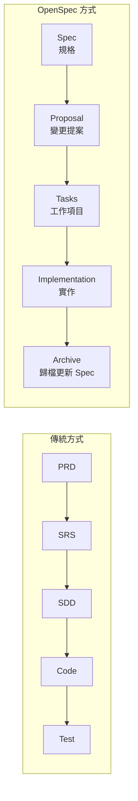

| 比較項目 | 傳統 PRD/SRS | OpenSpec |
|---------|-------------|----------|
| **格式** | Word、Confluence、Wiki | 結構化 Markdown |
| **版本控管** | 手動管理版本號 | Git 版本控管 |
| **AI 可讀性** | 低（自然語言散文） | 高（結構化格式） |
| **變更追蹤** | 透過文件對比 | 透過 Delta 差異檔 |
| **與程式碼關聯** | 分離 | 同一 Repository |
| **即時性** | 可能過時 | 持續更新（活文件） |

#### 關鍵差異說明

1. **AI 可理解**：OpenSpec 的格式讓 AI 能精確理解需求
2. **與程式碼共存**：Spec 放在專案中，與程式碼一起版本控管
3. **增量更新**：透過「變更（Changes）」機制，追蹤每次修改

> ⚠️ **注意事項**：OpenSpec 不是要取代所有文件，而是作為「開發期間的規格真實來源」。高層次的商業需求文件（如 BRD）仍然需要。

---

### 1.3 OpenSpec 在 SDD 中扮演的角色

#### SDD（Spec-Driven Development）概述

SDD 是一種開發方法論，核心理念是：

> **「先有規格，再有程式碼」**

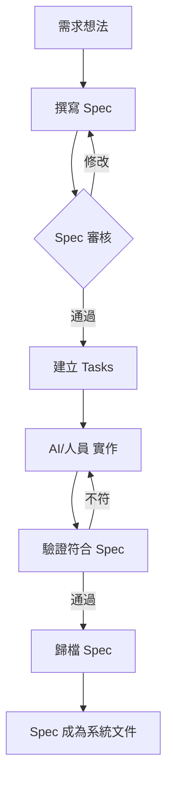

#### OpenSpec 在 SDD 中的定位

OpenSpec 是實踐 SDD 的**工具與框架**：

| 角色 | 說明 |
|------|------|
| **規格管理者** | 管理所有 Spec 的結構與版本 |
| **變更追蹤者** | 追蹤每個功能變更的提案、任務、實作 |
| **AI 指導者** | 提供 AI 助手明確的上下文與指令 |
| **文件保管者** | 歸檔完成的變更，維護系統文件 |

#### 目錄結構

OpenSpec 初始化後會建立以下結構：

```
專案根目錄/
├── openspec/
│   ├── project.md          # 專案級別的設定與約定
│   ├── specs/              # 當前的規格（真實來源）
│   │   ├── auth/
│   │   │   └── spec.md     # 認證模組規格
│   │   └── user/
│   │       └── spec.md     # 用戶模組規格
│   ├── changes/            # 進行中的變更
│   │   └── add-2fa/        # 某個功能變更
│   │       ├── proposal.md # 變更提案
│   │       ├── tasks.md    # 工作項目
│   │       └── specs/      # 規格差異（Delta）
│   └── archive/            # 已完成的變更
└── AGENTS.md               # AI 助手指令檔
```

> 💡 **實務建議**：建議在專案初期就導入 OpenSpec，這樣可以從第一天就建立完整的規格歷史。

---

## 第二章：Spec-Driven Development（SDD）核心概念

### 2.1 規格優先（Spec First）

#### 什麼是「規格優先」？

**規格優先**意味著在寫任何程式碼之前，先完成並確認規格。

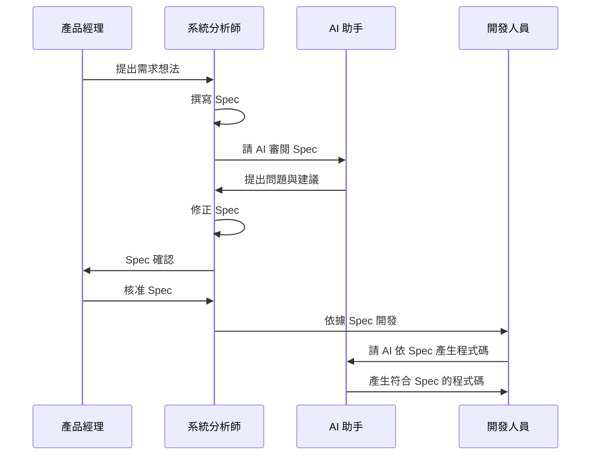

#### 為什麼要「規格優先」？

| 原因 | 說明 |
|------|------|
| **減少返工** | 事先確認需求，避免開發後才發現理解錯誤 |
| **提高 AI 效能** | AI 有明確規格可依循，產出更準確 |
| **便於審核** | 先審規格再審程式碼，效率更高 |
| **降低溝通成本** | 所有人看同一份規格，減少誤解 |

#### 實務範例

**❌ 不好的做法（Code First）**：
```
開發人員：我先寫一版看看
（寫完後）
PM：這不是我要的
開發人員：那你要什麼？
PM：要能支援多種付款方式
開發人員：好，我改
（改完後）
PM：不對，每種付款方式要有不同的手續費計算
開發人員：😫
```

**✅ 好的做法（Spec First）**：
```
系統分析師：我先寫規格

## 付款模組規格

### Requirement: 多元付款支援
系統 SHALL 支援以下付款方式：
- 信用卡
- 銀行轉帳
- 電子錢包

### Requirement: 手續費計算
每種付款方式 SHALL 有獨立的手續費計算規則

#### Scenario: 信用卡付款
- GIVEN 付款方式為信用卡
- WHEN 交易金額為 1000 元
- THEN 手續費為 25 元（2.5%）

（PM 審閱後確認，開發人員依規格開發）
```

> 💡 **銀行系統實務**：金融業的每個功能變更都需要經過「需求確認 → 設計審查 → 程式審查」流程。Spec First 的做法正好對應這個流程，讓需求確認更加結構化。

---

### 2.2 規格即合約（Spec as Contract）

#### 什麼是「規格即合約」？

Spec 不只是文件，而是開發團隊與 AI 之間的**合約**：

- **對人類**：這份 Spec 描述了系統應該做什麼
- **對 AI**：這份 Spec 定義了你應該產生什麼樣的程式碼

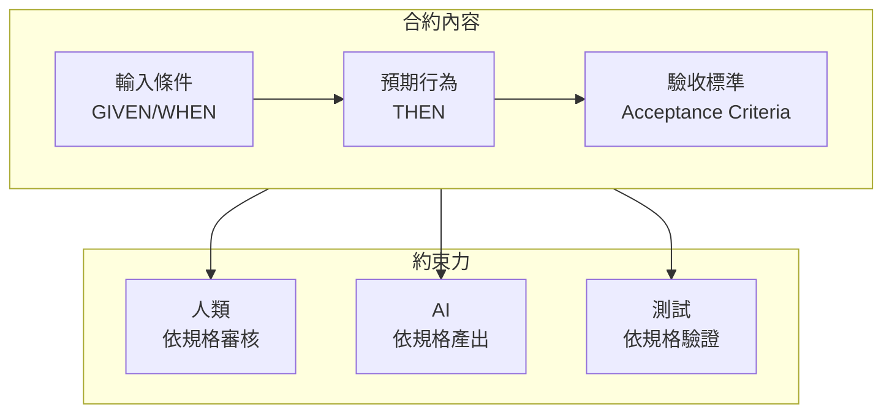

#### 合約的關鍵要素

| 要素 | 說明 | 範例 |
|------|------|------|
| **SHALL** | 必須實作的功能 | 系統 SHALL 驗證密碼長度 |
| **MUST** | 強制要求 | 密碼 MUST 至少 8 個字元 |
| **SHOULD** | 建議實作 | 密碼 SHOULD 包含特殊字元 |
| **MAY** | 可選功能 | 系統 MAY 提供密碼強度提示 |

#### 規格合約範例

```spec
# 用戶認證規格

## Purpose
管理用戶身份驗證與會話管理

## Requirements

### Requirement: 密碼驗證
系統 SHALL 在用戶登入時驗證密碼

#### Scenario: 密碼正確
- GIVEN 用戶帳號存在且為啟用狀態
- WHEN 用戶輸入正確的帳號密碼
- THEN 系統核發 JWT Token
- AND Token 有效期為 30 分鐘

#### Scenario: 密碼錯誤
- GIVEN 用戶帳號存在
- WHEN 用戶輸入錯誤密碼
- THEN 系統回傳 401 Unauthorized
- AND 記錄失敗登入次數

#### Scenario: 帳號鎖定
- GIVEN 用戶連續 5 次登入失敗
- WHEN 用戶再次嘗試登入
- THEN 系統回傳帳號已鎖定訊息
- AND 帳號鎖定 15 分鐘
```

> ⚠️ **注意事項**：規格中的情境（Scenario）應該要能直接轉換為測試案例。如果無法測試，代表規格不夠具體。

---

### 2.3 規格可被 AI 理解與執行

#### 為什麼 AI 可讀性很重要？

AI 助手的能力取決於提供給它的上下文（Context）。結構化的規格讓 AI 能：

1. **理解需求意圖**：知道要實作什麼功能
2. **遵循設計約束**：了解系統的技術限制
3. **產生一致的程式碼**：依據統一的規格格式

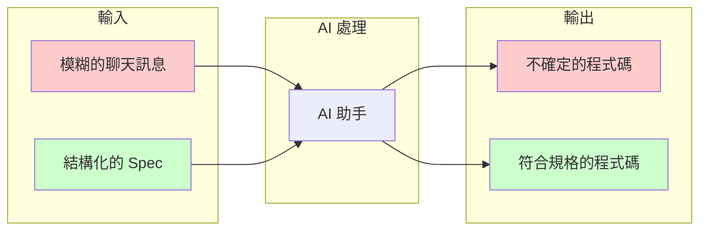

#### OpenSpec 如何提升 AI 可讀性

| 特性 | 說明 |
|------|------|
| **標準格式** | 使用固定的 Markdown 結構 |
| **關鍵字標記** | SHALL、MUST、GIVEN、WHEN、THEN |
| **情境導向** | 每個需求都有具體的情境描述 |
| **檔案組織** | 清晰的目錄結構，便於 AI 定位 |

#### 與 AI 對話的 Prompt 範例

**建立新 Spec 的 Prompt**：
```
請依據 OpenSpec 格式，為「用戶密碼重設」功能建立 Spec。

需求摘要：
- 用戶透過 Email 申請密碼重設
- 系統發送重設連結，有效期 24 小時
- 新密碼不能與最近 5 組相同

請產出：
1. proposal.md - 變更提案
2. specs/auth/spec.md - 規格差異（Delta）
3. tasks.md - 工作項目
```

**審閱 Spec 的 Prompt**：
```
請審閱以下 Spec，檢查：
1. 是否有遺漏的情境（邊界條件、錯誤處理）
2. 是否有模糊不清的描述
3. 是否符合 OpenSpec 格式規範

[貼上 Spec 內容]
```

> 💡 **實務建議**：在與 AI 對話時，明確告訴它要遵循 OpenSpec 格式。這樣 AI 產出的內容會更符合團隊規範。

---

## 第二章小結

| 核心概念 | 重點 |
|---------|------|
| **規格優先** | 先寫 Spec，再寫 Code |
| **規格即合約** | Spec 是人與 AI 共同遵守的約定 |
| **AI 可讀** | 結構化格式讓 AI 更能理解與執行 |

### 本章練習

1. 找一個你最近開發的功能，嘗試用「GIVEN-WHEN-THEN」格式描述一個情境
2. 思考：這個功能如果有 Spec，開發過程會有什麼不同？

---

## 第三章：OpenSpec 文件結構說明

### 3.1 常見 Spec 類型

OpenSpec 支援多種規格類型，適用於不同的開發階段與需求層級：

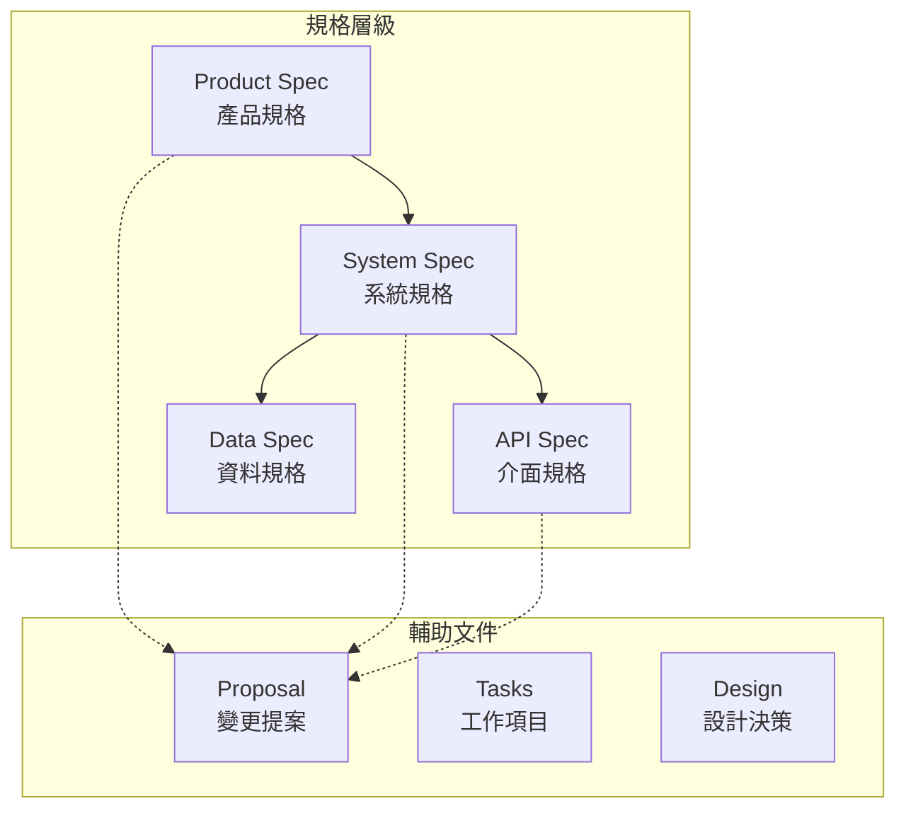

#### 主要 Spec 類型

| 類型 | 用途 | 適用場景 |
|------|------|---------|
| **Product Spec** | 描述產品功能與商業價值 | 新功能規劃、產品討論 |
| **System Spec** | 描述系統行為與業務規則 | 系統分析、功能設計 |
| **API Spec** | 描述介面契約與資料格式 | API 設計、前後端整合 |
| **Data Spec** | 描述資料模型與關聯 | 資料庫設計、資料流 |

#### 輔助文件類型

| 類型 | 檔名 | 用途 |
|------|------|------|
| **Proposal** | `proposal.md` | 說明「為什麼要做這個變更」 |
| **Tasks** | `tasks.md` | 列出「需要完成的工作項目」 |
| **Design** | `design.md` | 記錄「技術決策與架構選擇」 |
| **Delta** | `specs/*/spec.md` | 描述「規格的差異與變更」 |

---

### 3.2 每一種 Spec 的用途與撰寫原則

#### Product Spec（產品規格）

**用途**：從商業角度描述功能需求

**撰寫原則**：
- 聚焦於「使用者能做什麼」
- 包含商業價值說明
- 避免技術細節

**範例**：

```spec
# 密碼重設功能 - Product Spec

## 商業價值
減少客服處理忘記密碼案件的人力，提升用戶自助服務體驗

## 功能描述
用戶可透過 Email 自助重設密碼，無需聯繫客服

## 使用者故事
作為一個忘記密碼的用戶
我想要透過 Email 重設密碼
以便能夠重新登入系統

## 成功指標
- 密碼重設成功率 > 95%
- 平均重設時間 < 3 分鐘
- 客服密碼重設案件減少 50%
```

#### System Spec（系統規格）

**用途**：描述系統應有的行為與規則

**撰寫原則**：
- 使用 SHALL/MUST 明確要求
- 包含所有情境（正常、異常、邊界）
- 可直接作為測試依據

**範例**：

```spec
# 密碼重設 - System Spec

## Purpose
提供用戶透過 Email 自助重設密碼的功能

## Requirements

### Requirement: 申請密碼重設
系統 SHALL 允許用戶申請密碼重設

#### Scenario: 成功申請
- GIVEN 用戶帳號已註冊且為啟用狀態
- WHEN 用戶輸入正確的 Email 申請重設
- THEN 系統發送重設連結至該 Email
- AND 連結有效期為 24 小時

#### Scenario: 帳號不存在
- GIVEN Email 未在系統中註冊
- WHEN 用戶輸入該 Email 申請重設
- THEN 系統仍顯示「重設連結已發送」訊息
- AND 不實際發送任何郵件
- NOTE 此設計為防止帳號探測攻擊

#### Scenario: 重複申請
- GIVEN 用戶已有未過期的重設連結
- WHEN 用戶再次申請重設
- THEN 系統發送新的重設連結
- AND 舊連結立即失效
```

#### API Spec（介面規格）

**用途**：定義 API 的輸入、輸出與錯誤處理

**撰寫原則**：
- 明確定義 Request/Response 格式
- 列出所有可能的狀態碼
- 包含欄位驗證規則

**範例**：

> **API Spec 範例：密碼重設 API**
> 
> **POST /api/v1/auth/password-reset/request**
> 
> **Description**：用戶申請密碼重設
> 
> **Request Body**：
> ```json
> {
>   "email": "user@example.com"
> }
> ```
> 
> **Request Validation**：
> | 欄位 | 類型 | 必填 | 驗證規則 |
> |------|------|------|---------|
> | email | string | Yes | 有效 Email 格式 |
> 
> **Response - Success (200)**：
> ```json
> {
>   "message": "若帳號存在，重設連結已發送至您的信箱",
>   "requestId": "req_abc123"
> }
> ```
> 
> **Response - Error (400)**：
> ```json
> {
>   "error": "INVALID_EMAIL_FORMAT",
>   "message": "Email 格式不正確"
> }
> ```
> 
> **Response - Error (429)**：
> ```json
> {
>   "error": "TOO_MANY_REQUESTS",
>   "message": "請求過於頻繁，請稍後再試",
>   "retryAfter": 60
> }
> ```

#### Data Spec（資料規格）

**用途**：定義資料結構與關聯

**範例**：

```spec
# 密碼重設 - Data Spec

## Entity: PasswordResetToken

### Description
儲存密碼重設令牌

### Fields
| 欄位 | 類型 | 說明 | 限制 |
|------|------|------|------|
| id | UUID | 主鍵 | PK |
| userId | UUID | 關聯用戶 | FK → User.id |
| token | VARCHAR(64) | 重設令牌 | UNIQUE, NOT NULL |
| createdAt | TIMESTAMP | 建立時間 | NOT NULL |
| expiresAt | TIMESTAMP | 過期時間 | NOT NULL |
| usedAt | TIMESTAMP | 使用時間 | NULLABLE |

### Indexes
- UNIQUE INDEX on (token)
- INDEX on (userId, createdAt)
- INDEX on (expiresAt) - 用於清理過期資料

### Retention
- 已使用或過期的 Token 保留 7 天後自動刪除
```

> 💡 **銀行系統實務**：金融業的 API 規格特別重視錯誤處理與安全性。建議在 API Spec 中明確定義所有可能的錯誤碼，並說明是否需要記錄審計日誌。

---

### 3.3 好的 Spec 與壞的 Spec 範例比較

#### 比較表

| 項目 | 壞的 Spec | 好的 Spec |
|------|----------|----------|
| **清晰度** | 模糊、籠統 | 具體、明確 |
| **完整性** | 只有正常情境 | 包含異常與邊界 |
| **可測試性** | 無法寫測試 | 每個情境可測試 |
| **格式一致** | 格式混亂 | 遵循標準格式 |

#### 壞的 Spec 範例 ❌

```spec
# 登入功能

用戶可以登入系統，登入成功後可以使用各種功能。
如果密碼錯誤要給錯誤訊息。
記得要安全一點。
```

**問題**：
- ❌ 沒有具體的驗收條件
- ❌ 「安全一點」太模糊
- ❌ 沒有定義什麼是「登入成功」
- ❌ 沒有考慮邊界情況（如：帳號鎖定）

#### 好的 Spec 範例 ✅

```spec
# 用戶登入 - System Spec

## Purpose
驗證用戶身份並建立會話

## Requirements

### Requirement: 帳號密碼驗證
系統 SHALL 驗證用戶提供的帳號密碼

#### Scenario: 登入成功
- GIVEN 帳號存在且密碼正確
- AND 帳號狀態為「啟用」
- WHEN 用戶提交登入請求
- THEN 系統回傳 JWT Token
- AND Token 包含 userId 與 role
- AND 記錄登入成功審計日誌

#### Scenario: 密碼錯誤
- GIVEN 帳號存在但密碼錯誤
- WHEN 用戶提交登入請求
- THEN 系統回傳 401 Unauthorized
- AND 回應訊息為「帳號或密碼錯誤」
- AND 增加失敗登入次數
- AND 記錄登入失敗審計日誌

#### Scenario: 帳號不存在
- GIVEN 帳號不存在
- WHEN 用戶提交登入請求
- THEN 系統回傳 401 Unauthorized
- AND 回應訊息為「帳號或密碼錯誤」
- NOTE 訊息與密碼錯誤相同，防止帳號探測

#### Scenario: 帳號已鎖定
- GIVEN 帳號連續失敗 5 次登入
- WHEN 用戶嘗試登入
- THEN 系統回傳 403 Forbidden
- AND 回應訊息包含鎖定解除時間

### Requirement: 暴力破解防護
系統 MUST 防止暴力破解攻擊

#### Scenario: 帳號鎖定機制
- GIVEN 同一帳號連續 5 次登入失敗
- WHEN 失敗次數達到閾值
- THEN 帳號鎖定 15 分鐘
- AND 發送異常登入通知 Email

#### Scenario: IP 限制
- GIVEN 同一 IP 在 1 分鐘內嘗試 10 次登入
- WHEN 達到限制
- THEN 該 IP 被暫時封鎖 5 分鐘

## Security Considerations
- 密碼不得以明文傳輸或儲存
- 所有登入請求 MUST 透過 HTTPS
- Token 有效期不得超過 30 分鐘
- 支援 Refresh Token 機制延長會話
```

**優點**：
- ✅ 每個情境都有明確的前提、動作、結果
- ✅ 包含正常、異常、邊界情境
- ✅ 考慮安全性需求
- ✅ 可以直接轉換為測試案例
- ✅ 使用標準關鍵字（SHALL、MUST、GIVEN、WHEN、THEN）

---

## 第三章小結

| 重點 | 說明 |
|------|------|
| **多種 Spec 類型** | Product、System、API、Data Spec 各有用途 |
| **標準格式** | 使用固定的格式與關鍵字 |
| **完整情境** | 涵蓋正常、異常、邊界條件 |
| **可測試性** | 每個情境都能轉換為測試 |

### 本章練習

1. 選擇一個你熟悉的功能，分別用 Product Spec 和 System Spec 的格式描述
2. 檢查你的 Spec 是否包含了異常情境

---

## 第四章：使用 OpenSpec 的標準工作流程

### 4.1 從需求想法到 Spec

#### 完整工作流程

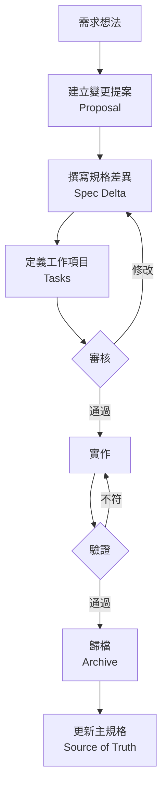

#### Step 1: 建立變更提案（Proposal）

當收到新需求時，首先建立變更提案：

**CLI 方式**：
```bash
# 使用 OpenSpec CLI 建立新的變更
openspec init  # 如果尚未初始化
```

**與 AI 對話方式**：
```
You: 建立一個 OpenSpec 變更提案，功能是「新增用戶雙因素認證」

AI: 我將建立 OpenSpec 變更提案...
    *建立 openspec/changes/add-2fa/ 目錄*
    *建立 proposal.md、tasks.md、specs/auth/spec.md*
```

**Proposal 內容範例**：

```spec
# 變更提案：新增雙因素認證

## 變更編號
CHG-2024-001

## 變更摘要
新增基於 TOTP 的雙因素認證（2FA），提升帳戶安全性

## 變更原因
- 符合金管會資安規範要求
- 降低帳戶被盜風險
- 客戶反映需要更高安全性

## 影響範圍
- 用戶認證模組
- 用戶設定頁面
- 登入 API

## 預計完成時間
2 週

## 風險評估
| 風險 | 機率 | 影響 | 緩解措施 |
|------|------|------|---------|
| 用戶不會設定 | 中 | 中 | 提供圖文教學 |
| 手機遺失 | 低 | 高 | 提供備用碼機制 |
```

#### Step 2: 撰寫規格差異（Spec Delta）

Spec Delta 描述「這次變更會如何改變現有規格」：

```spec
# Delta for Auth

## ADDED Requirements

### Requirement: 雙因素認證設定
系統 SHALL 允許用戶啟用雙因素認證

#### Scenario: 成功啟用 2FA
- GIVEN 用戶已登入
- WHEN 用戶掃描 QR Code 並輸入驗證碼
- THEN 系統啟用該用戶的 2FA
- AND 產生並顯示 10 組備用碼

### Requirement: 雙因素認證驗證
系統 SHALL 在啟用 2FA 的用戶登入時要求驗證

#### Scenario: 2FA 驗證成功
- GIVEN 用戶已啟用 2FA 且密碼驗證通過
- WHEN 用戶輸入正確的 TOTP 碼
- THEN 系統核發 JWT Token

#### Scenario: 使用備用碼
- GIVEN 用戶無法使用 TOTP App
- WHEN 用戶輸入有效的備用碼
- THEN 系統核發 JWT Token
- AND 該備用碼標記為已使用

## MODIFIED Requirements

### Requirement: 帳號密碼驗證（原有）
*修改說明：密碼驗證通過後，需檢查是否啟用 2FA*

#### Scenario: 登入成功（已修改）
- GIVEN 帳號存在且密碼正確
- AND 帳號狀態為「啟用」
- WHEN 用戶提交登入請求
- THEN 若未啟用 2FA：回傳 JWT Token
- OR 若已啟用 2FA：回傳 2FA 挑戰，等待驗證碼
```

#### Step 3: 定義工作項目（Tasks）

將規格拆解為可執行的工作項目：

```spec
# Tasks for add-2fa

## 1. 資料庫設計
- [ ] 1.1 建立 user_2fa_settings 表
- [ ] 1.2 建立 backup_codes 表
- [ ] 1.3 修改 users 表，新增 2fa_enabled 欄位

## 2. 後端實作
- [ ] 2.1 建立 TOTP 產生器服務
- [ ] 2.2 實作 2FA 設定 API（GET /api/v1/user/2fa/setup）
- [ ] 2.3 實作 2FA 啟用 API（POST /api/v1/user/2fa/enable）
- [ ] 2.4 實作 2FA 驗證 API（POST /api/v1/auth/2fa/verify）
- [ ] 2.5 修改登入流程，加入 2FA 檢查
- [ ] 2.6 實作備用碼產生與驗證

## 3. 前端實作
- [ ] 3.1 建立 2FA 設定頁面
- [ ] 3.2 建立 QR Code 掃描元件
- [ ] 3.3 建立 2FA 驗證輸入畫面
- [ ] 3.4 建立備用碼顯示與管理頁面

## 4. 測試
- [ ] 4.1 單元測試：TOTP 產生器
- [ ] 4.2 整合測試：2FA 設定流程
- [ ] 4.3 整合測試：登入 + 2FA 驗證流程
- [ ] 4.4 E2E 測試：完整用戶流程

## 5. 文件與部署
- [ ] 5.1 更新 API 文件
- [ ] 5.2 撰寫用戶操作手冊
- [ ] 5.3 準備部署腳本與資料庫遷移
```

---

### 4.2 與 AI 互動修正 Spec 的方式

#### AI 協作的最佳實踐

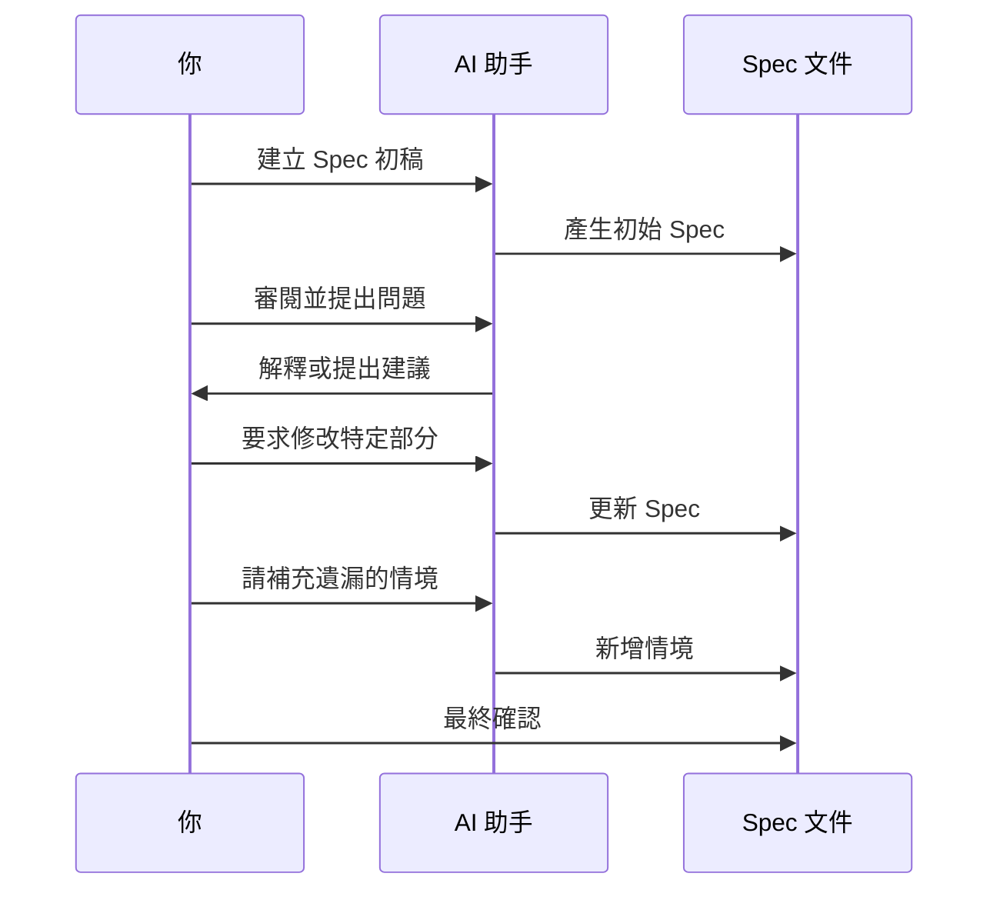

#### Prompt 範例集

**1. 請 AI 建立初稿**：
```
請依據 OpenSpec 格式，為以下功能建立 Spec：

功能：用戶密碼強度檢查
需求：
- 密碼至少 8 字元
- 必須包含大小寫字母
- 必須包含數字
- 建議包含特殊字元

請產出完整的 System Spec，包含所有可能的情境。
```

**2. 請 AI 審閱 Spec**：
```
請審閱以下 Spec，檢查：
1. 是否有遺漏的邊界條件？
2. 錯誤處理是否完整？
3. 是否有安全性考量未涵蓋？

[貼上 Spec 內容]
```

**3. 請 AI 補充情境**：
```
這份 Spec 似乎缺少以下情境，請補充：
- 併發操作的處理
- 網路逾時的處理
- 資料不一致的處理

原有 Spec：
[貼上 Spec 內容]
```

**4. 請 AI 優化格式**：
```
請將以下需求描述轉換為 OpenSpec 標準格式：

原始描述：
「用戶登入時如果輸入錯誤密碼超過5次就要鎖定帳號，鎖定15分鐘後自動解鎖」

請使用 GIVEN-WHEN-THEN 格式。
```

**5. 請 AI 檢查一致性**：
```
請檢查以下三份文件是否一致：
1. Proposal（變更提案）
2. Spec Delta（規格差異）
3. Tasks（工作項目）

確認：
- 所有提案中提到的功能是否都在 Spec 中定義
- 所有 Spec 中的需求是否都有對應的 Task
```

#### 常用的 AI 指令（Slash Commands）

若你使用支援 OpenSpec 的 AI 工具，可使用以下指令：

| 指令 | 功能 |
|------|------|
| `/openspec:proposal <描述>` | 建立新的變更提案 |
| `/openspec:apply <名稱>` | 開始實作指定的變更 |
| `/openspec:archive <名稱>` | 歸檔已完成的變更 |

**CLI 指令**：

```bash
# 列出所有進行中的變更
openspec list

# 查看特定變更的詳情
openspec show add-2fa

# 驗證 Spec 格式
openspec validate add-2fa

# 歸檔已完成的變更
openspec archive add-2fa --yes
```

---

### 4.3 Spec 如何驅動設計、程式碼與測試

#### Spec → 設計

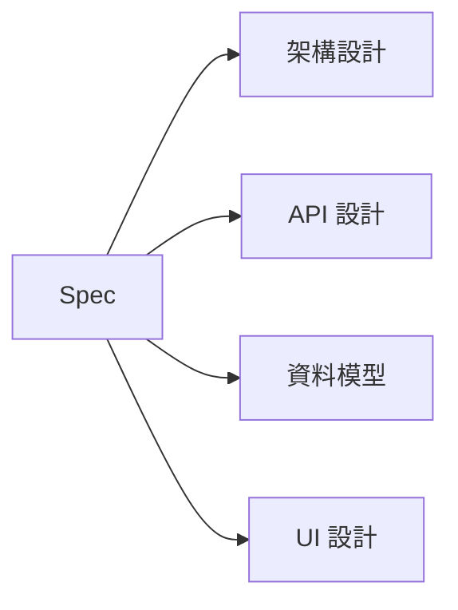

Spec 中的需求直接對應設計決策：

| Spec 內容 | 設計決策 |
|----------|---------|
| 「系統 SHALL 在 3 秒內回應」 | 需要快取機制、效能優化 |
| 「支援 10,000 併發用戶」 | 需要負載平衡、水平擴展 |
| 「密碼 MUST 加密儲存」 | 使用 bcrypt 或 Argon2 |

#### Spec → 程式碼

**Spec 情境**：
```spec
#### Scenario: 密碼錯誤
- GIVEN 帳號存在但密碼錯誤
- WHEN 用戶提交登入請求
- THEN 系統回傳 401 Unauthorized
- AND 增加失敗登入次數
```

**對應程式碼**（Java/Spring Boot）：
```java
@PostMapping("/login")
public ResponseEntity<?> login(@RequestBody LoginRequest request) {
    User user = userRepository.findByEmail(request.getEmail())
        .orElseThrow(() -> new UnauthorizedException("帳號或密碼錯誤"));
    
    if (!passwordEncoder.matches(request.getPassword(), user.getPassword())) {
        // 增加失敗登入次數
        loginAttemptService.loginFailed(request.getEmail());
        throw new UnauthorizedException("帳號或密碼錯誤");
    }
    
    // ... 登入成功邏輯
}
```

#### Spec → 測試

**Spec 情境**直接轉換為**測試案例**：

```java
@Test
@DisplayName("Scenario: 密碼錯誤")
void testLoginWithWrongPassword() {
    // GIVEN 帳號存在但密碼錯誤
    User user = createTestUser("test@example.com", "correctPassword");
    
    // WHEN 用戶提交登入請求
    LoginRequest request = new LoginRequest("test@example.com", "wrongPassword");
    ResponseEntity<?> response = authController.login(request);
    
    // THEN 系統回傳 401 Unauthorized
    assertEquals(HttpStatus.UNAUTHORIZED, response.getStatusCode());
    
    // AND 增加失敗登入次數
    assertEquals(1, loginAttemptService.getFailedAttempts("test@example.com"));
}
```

#### 追溯矩陣

建立需求追溯矩陣，確保每個規格都有對應實作與測試：

| Spec ID | 需求描述 | 程式模組 | 測試案例 | 狀態 |
|---------|---------|---------|---------|------|
| AUTH-001 | 帳號密碼驗證 | AuthService | AuthServiceTest#testLogin* | ✅ |
| AUTH-002 | 帳號鎖定機制 | LoginAttemptService | LoginAttemptTest#testLock* | ✅ |
| AUTH-003 | 2FA 驗證 | TwoFactorService | TwoFactorTest#* | 🔄 |

> 💡 **銀行系統實務**：金融業常要求「需求追溯」，確保每個需求都有對應的設計、程式碼與測試。OpenSpec 的結構化格式讓這個追溯工作變得更容易。

---

## 第四章小結

| 流程步驟 | 產出 | 負責人 |
|---------|------|-------|
| 建立變更提案 | proposal.md | SA/PM |
| 撰寫規格差異 | specs/*/spec.md | SA |
| 定義工作項目 | tasks.md | SA/Dev Lead |
| 審核 | 審核通過 | Tech Lead/PM |
| 實作 | 程式碼 | Dev + AI |
| 驗證 | 測試通過 | QA/Dev |
| 歸檔 | 更新主規格 | SA |

### 本章練習

1. 使用 Prompt 範例，請 AI 幫你建立一份簡單功能的 Spec
2. 練習使用 `openspec list` 和 `openspec show` 指令

---

## 第五章：新進同仁實作範例

> 💡 本章將透過一個完整的實例，示範從「需求描述」到「可開發規格」的完整過程。

### 5.1 案例說明：帳戶餘額查詢 API

#### 業務背景

某銀行核心系統需要提供「帳戶餘額查詢」功能，供網銀與行動銀行 App 使用。

#### 原始需求

```
用戶需要能查詢自己的帳戶餘額，包括：
- 活存帳戶的可用餘額與帳面餘額
- 定存帳戶的本金與到期金額
- 外幣帳戶要顯示各幣別餘額
- 要有適當的權限控制
```

#### 目標

將這段原始需求轉換為符合 OpenSpec 格式的規格文件。

---

### 5.2 從需求描述到 OpenSpec 文件

#### Step 1: 建立變更目錄結構

```
openspec/
└── changes/
    └── account-balance-query/
        ├── proposal.md
        ├── tasks.md
        ├── design.md
        └── specs/
            └── account/
                └── spec.md
```

#### Step 2: 撰寫 Proposal（變更提案）

```spec
# 變更提案：帳戶餘額查詢 API

## 變更編號
CHG-2024-002

## 變更摘要
提供帳戶餘額查詢 API，支援活存、定存、外幣帳戶的餘額查詢

## 變更原因
- 網銀系統需要顯示用戶帳戶餘額
- 行動銀行 App 需要同樣功能
- 現有舊系統 API 即將汰換

## 商業價值
- 每日預估查詢量：50,000 次
- 支援用戶自助查詢，減少臨櫃作業

## 影響範圍
- 帳戶核心模組
- 用戶認證模組（權限驗證）
- 外幣匯率模組（匯率換算）

## 相依性
- 需要 AUTH-001（用戶認證）規格
- 需要 FX-001（外幣匯率）規格

## 時程預估
- 開發：1 週
- 測試：3 天
- 部署：1 天
```

#### Step 3: 撰寫 System Spec（系統規格）

```spec
# 帳戶餘額查詢 - System Spec

## Purpose
提供用戶查詢自有帳戶餘額的功能，支援活存、定存、外幣等帳戶類型

## Scope
- 包含：餘額查詢、多帳戶彙總、幣別顯示
- 不包含：交易明細、轉帳功能

## Requirements

### Requirement: 單一帳戶餘額查詢
系統 SHALL 允許用戶查詢指定帳戶的餘額

#### Scenario: 查詢活存帳戶餘額成功
- GIVEN 用戶已通過身份驗證
- AND 用戶持有帳號 "1234567890"
- AND 該帳戶為活存帳戶
- WHEN 用戶查詢該帳戶餘額
- THEN 系統回傳以下資訊：
  - 帳號：1234567890
  - 帳戶類型：活存
  - 幣別：TWD
  - 可用餘額：實際可動用金額
  - 帳面餘額：含圈存的總金額
  - 查詢時間：系統時間戳記

#### Scenario: 查詢定存帳戶餘額成功
- GIVEN 用戶已通過身份驗證
- AND 用戶持有定存帳號
- WHEN 用戶查詢該帳戶餘額
- THEN 系統回傳以下資訊：
  - 帳號
  - 帳戶類型：定存
  - 本金金額
  - 到期金額（含利息）
  - 存入日期
  - 到期日期
  - 年利率

#### Scenario: 查詢外幣帳戶餘額成功
- GIVEN 用戶已通過身份驗證
- AND 用戶持有外幣帳號
- WHEN 用戶查詢該帳戶餘額
- THEN 系統回傳以下資訊：
  - 帳號
  - 帳戶類型：外幣
  - 各幣別餘額清單（幣別、金額）
  - 換算台幣總值（依即時匯率）

#### Scenario: 查詢非本人帳戶
- GIVEN 用戶已通過身份驗證
- AND 帳號 "9999999999" 非該用戶所有
- WHEN 用戶查詢該帳戶餘額
- THEN 系統回傳 403 Forbidden
- AND 記錄異常查詢審計日誌

#### Scenario: 查詢不存在的帳戶
- GIVEN 用戶已通過身份驗證
- AND 帳號 "0000000000" 不存在於系統中
- WHEN 用戶查詢該帳戶餘額
- THEN 系統回傳 404 Not Found

#### Scenario: 帳戶狀態異常
- GIVEN 用戶已通過身份驗證
- AND 帳戶狀態為「凍結」或「結清」
- WHEN 用戶查詢該帳戶餘額
- THEN 系統回傳餘額資訊
- AND 包含帳戶狀態警示

---

### Requirement: 全部帳戶餘額彙總
系統 SHALL 允許用戶一次查詢所有帳戶的餘額

#### Scenario: 查詢所有帳戶餘額成功
- GIVEN 用戶已通過身份驗證
- AND 用戶持有 3 個帳戶（活存、定存、外幣各一）
- WHEN 用戶查詢所有帳戶餘額
- THEN 系統回傳所有帳戶的餘額清單
- AND 計算總資產（換算為台幣）

#### Scenario: 用戶無任何帳戶
- GIVEN 用戶已通過身份驗證
- AND 用戶名下無任何帳戶
- WHEN 用戶查詢所有帳戶餘額
- THEN 系統回傳空清單
- AND 總資產為 0

---

### Requirement: 權限控制
系統 MUST 確保用戶只能查詢自己的帳戶

#### Scenario: Token 過期
- GIVEN 用戶的 JWT Token 已過期
- WHEN 用戶嘗試查詢帳戶餘額
- THEN 系統回傳 401 Unauthorized
- AND 提示重新登入

#### Scenario: 無效的 Token
- GIVEN 用戶提供的 Token 格式不正確或被竄改
- WHEN 用戶嘗試查詢帳戶餘額
- THEN 系統回傳 401 Unauthorized
- AND 記錄安全事件日誌

---

## Non-Functional Requirements

### 效能需求
- 單一帳戶查詢 SHOULD 在 500ms 內回應
- 所有帳戶查詢 SHOULD 在 2s 內回應

### 可用性需求
- API 可用性 MUST ≥ 99.9%

### 安全性需求
- 所有查詢 MUST 透過 HTTPS
- 所有查詢 MUST 記錄審計日誌
- 敏感資訊（如完整帳號）SHOULD 遮罩處理

---

## API Definition

### GET /api/v1/accounts/{accountNo}/balance

查詢單一帳戶餘額

**Request Headers:**
```
Authorization: Bearer <JWT Token>
X-Request-ID: <UUID>
```

**Path Parameters:**
| 參數 | 類型 | 說明 |
|------|------|------|
| accountNo | string | 帳號 |

**Response - Success (200):**
```json
{
  "accountNo": "123456****",
  "accountType": "SAVINGS",
  "currency": "TWD",
  "availableBalance": 50000.00,
  "ledgerBalance": 52000.00,
  "status": "ACTIVE",
  "queryTime": "2024-01-15T10:30:00Z"
}
```

**Response - Error (403):**
```json
{
  "error": "ACCESS_DENIED",
  "message": "您無權查詢此帳戶"
}
```

### GET /api/v1/accounts/balances

查詢所有帳戶餘額

**Response - Success (200):**
```json
{
  "accounts": [
    {
      "accountNo": "123456****",
      "accountType": "SAVINGS",
      "currency": "TWD",
      "availableBalance": 50000.00
    },
    {
      "accountNo": "789012****",
      "accountType": "TIME_DEPOSIT",
      "currency": "TWD",
      "principal": 100000.00,
      "maturityAmount": 102500.00,
      "maturityDate": "2024-12-31"
    }
  ],
  "totalAssetsTWD": 152500.00,
  "queryTime": "2024-01-15T10:30:00Z"
}
```
```

#### Step 4: 撰寫 Tasks（工作項目）

```spec
# Tasks for account-balance-query

## 1. 資料庫與基礎架構
- [ ] 1.1 確認帳戶資料表結構，建立必要的 View
- [ ] 1.2 建立餘額查詢審計日誌表
- [ ] 1.3 設定 Redis 快取（餘額資料 TTL: 30 秒）

## 2. 核心服務實作
- [ ] 2.1 建立 AccountBalanceService 介面
- [ ] 2.2 實作活存帳戶餘額查詢
- [ ] 2.3 實作定存帳戶餘額查詢
- [ ] 2.4 實作外幣帳戶餘額查詢
- [ ] 2.5 實作帳戶權限驗證邏輯
- [ ] 2.6 整合外幣匯率服務

## 3. API 層實作
- [ ] 3.1 建立 AccountBalanceController
- [ ] 3.2 實作 GET /accounts/{accountNo}/balance
- [ ] 3.3 實作 GET /accounts/balances
- [ ] 3.4 實作統一錯誤處理
- [ ] 3.5 實作審計日誌攔截器

## 4. 測試
- [ ] 4.1 單元測試：AccountBalanceService（各帳戶類型）
- [ ] 4.2 單元測試：權限驗證邏輯
- [ ] 4.3 整合測試：完整 API 流程
- [ ] 4.4 效能測試：確認回應時間符合 SLA

## 5. 文件與交付
- [ ] 5.1 更新 Swagger/OpenAPI 文件
- [ ] 5.2 撰寫 API 使用說明
- [ ] 5.3 更新系統架構圖
```

---

### 5.3 示範如何向 AI 詢問與優化 Spec

#### 對話範例 1：請 AI 建立初稿

```
You: 
我有一個「帳戶餘額查詢」的需求，請依據 OpenSpec 格式建立 System Spec。

需求摘要：
- 用戶可查詢單一帳戶或所有帳戶的餘額
- 支援活存、定存、外幣帳戶
- 需要權限控制，只能查自己的帳戶
- 這是銀行系統，需要考慮安全性

AI:
我將依據 OpenSpec 格式為您建立「帳戶餘額查詢」的 System Spec。

[產生 Spec 內容...]

請問這份 Spec 是否涵蓋了您的需求？是否有需要補充的情境？
```

#### 對話範例 2：請 AI 審閱與補充

```
You:
請審閱這份 Spec，檢查是否有遺漏的情境：

[貼上 Spec]

AI:
我檢查了這份 Spec，發現以下可能遺漏的情境：

1. **系統層面**
   - 核心系統連線失敗時的處理
   - 資料庫查詢逾時的處理
   - 快取與資料庫資料不一致的處理

2. **業務層面**
   - 帳戶有圈存款項時的顯示
   - 定存提前解約的餘額計算
   - 外幣帳戶有多種外幣時的顯示順序

3. **安全層面**
   - 短時間內大量查詢的限制
   - 查詢日誌的保存期限

是否需要我補充這些情境到 Spec 中？
```

#### 對話範例 3：請 AI 協助優化

```
You:
以下這個情境描述不夠清楚，請幫我改寫成更具體的 GIVEN-WHEN-THEN 格式：

「外幣帳戶要顯示各幣別餘額」

AI:
我將這個需求拆解為更具體的情境：

#### Scenario: 查詢外幣帳戶餘額成功
- GIVEN 用戶已通過身份驗證
- AND 用戶持有外幣帳號 "FX-001"
- AND 該帳戶包含 USD 1000.00、JPY 50000、EUR 500.00
- WHEN 用戶查詢該帳戶餘額
- THEN 系統回傳以下資訊：
  - 帳號：FX-001
  - 幣別餘額清單：
    - USD: 1,000.00
    - JPY: 50,000
    - EUR: 500.00
  - 換算台幣總值：依即時匯率計算
  - 匯率更新時間：顯示匯率資料時間

#### Scenario: 外幣帳戶無餘額
- GIVEN 用戶已通過身份驗證
- AND 用戶持有外幣帳號但所有幣別餘額為 0
- WHEN 用戶查詢該帳戶餘額
- THEN 系統回傳空的幣別餘額清單
- AND 換算台幣總值為 0

這樣的描述是否符合您的需求？
```

#### 對話範例 4：從 Spec 產生程式碼

```
You:
請依據以下 Spec 情境，產生對應的 Java 程式碼：

#### Scenario: 查詢非本人帳戶
- GIVEN 用戶已通過身份驗證
- AND 帳號 "9999999999" 非該用戶所有
- WHEN 用戶查詢該帳戶餘額
- THEN 系統回傳 403 Forbidden
- AND 記錄異常查詢審計日誌

AI:
依據這份 Spec，我產生以下程式碼：

// Service 層
@Service
public class AccountBalanceServiceImpl implements AccountBalanceService {
    
    @Autowired
    private AccountRepository accountRepository;
    
    @Autowired
    private AuditLogService auditLogService;
    
    @Override
    public AccountBalance getBalance(String accountNo, String userId) {
        Account account = accountRepository.findByAccountNo(accountNo)
            .orElseThrow(() -> new AccountNotFoundException(accountNo));
        
        // 驗證帳戶所有權
        if (!account.getOwnerId().equals(userId)) {
            // 記錄異常查詢審計日誌
            auditLogService.logSecurityEvent(
                AuditEventType.UNAUTHORIZED_ACCESS_ATTEMPT,
                userId,
                "Attempted to access account: " + accountNo
            );
            throw new AccessDeniedException("您無權查詢此帳戶");
        }
        
        return buildAccountBalance(account);
    }
}

// Controller 層
@GetMapping("/accounts/{accountNo}/balance")
public ResponseEntity<AccountBalanceResponse> getBalance(
        @PathVariable String accountNo,
        @AuthenticationPrincipal UserDetails userDetails) {
    try {
        AccountBalance balance = accountBalanceService
            .getBalance(accountNo, userDetails.getUsername());
        return ResponseEntity.ok(toResponse(balance));
    } catch (AccessDeniedException e) {
        return ResponseEntity.status(HttpStatus.FORBIDDEN)
            .body(new AccountBalanceResponse(e.getMessage()));
    }
}
```

---

## 第五章小結

| 步驟 | 產出物 | 重點 |
|------|--------|------|
| 建立提案 | proposal.md | 說明變更原因與影響 |
| 撰寫規格 | spec.md | 完整情境、標準格式 |
| 定義任務 | tasks.md | 可執行的工作項目 |
| AI 協作 | 優化後的 Spec | 審閱、補充、優化 |

### 本章練習

1. 選擇一個你熟悉的銀行功能（如：轉帳、對帳單查詢），嘗試用 OpenSpec 格式撰寫 Spec
2. 使用 AI 助手審閱你的 Spec，看看它會發現哪些遺漏

---

## 第六章：常見錯誤與反模式（Anti-Patterns）

> ⚠️ 本章列出新手常見的錯誤，幫助你避免踩坑。

### 6.1 規格寫得像程式碼

#### 錯誤示範 ❌

```spec
### Requirement: 登入驗證
- 系統接收 POST /api/login 請求
- 從 request body 取得 email 和 password
- 用 SELECT * FROM users WHERE email = ? 查詢用戶
- 如果 user == null，return 401
- 用 BCrypt.check(password, user.passwordHash) 驗證密碼
- 如果驗證失敗，loginAttempts++
- 如果 loginAttempts >= 5，設定 lockedUntil = now + 15 minutes
- 驗證成功則用 JWT.sign({userId: user.id, role: user.role}) 產生 token
```

**問題**：
- ❌ 包含具體的實作細節（SQL、BCrypt、JWT）
- ❌ 像是虛擬碼而非規格
- ❌ 限制了實作的彈性

#### 正確示範 ✅

```spec
### Requirement: 登入驗證
系統 SHALL 驗證用戶的登入憑證

#### Scenario: 登入成功
- GIVEN 用戶帳號存在且密碼正確
- AND 帳號未被鎖定
- WHEN 用戶提交登入請求
- THEN 系統核發包含用戶身份的存取令牌

#### Scenario: 密碼錯誤
- GIVEN 用戶帳號存在但密碼錯誤
- WHEN 用戶提交登入請求
- THEN 系統回傳驗證失敗
- AND 記錄失敗次數

#### Scenario: 帳號鎖定
- GIVEN 用戶連續登入失敗達到閾值
- WHEN 達到鎖定條件
- THEN 帳號暫時鎖定一段時間
```

**改進**：
- ✅ 描述「做什麼」而非「怎麼做」
- ✅ 不綁定特定技術
- ✅ 關注業務行為

---

### 6.2 規格過於抽象或過度細節化

#### 過於抽象 ❌

```spec
### Requirement: 安全的登入機制
系統應該要有安全的登入機制，保護用戶資料。
```

**問題**：
- 什麼是「安全」？沒有具體定義
- 無法測試
- 不同人有不同理解

#### 過度細節化 ❌

```spec
### Requirement: 密碼輸入欄位
- 密碼欄位使用 <input type="password">
- 欄位寬度為 280px
- 欄位高度為 40px
- 邊框顏色為 #CCCCCC
- 聚焦時邊框顏色變為 #0066CC
- 字型為 Arial, 14px
- 佔位符文字為「請輸入密碼」
- 欄位下方間距為 16px
```

**問題**：
- 這是 UI 設計稿，不是規格
- 過於細節會限制設計彈性
- 規格應該聚焦在行為而非外觀

#### 正確的平衡 ✅

```spec
### Requirement: 密碼輸入安全性
系統 SHALL 保護密碼輸入的安全性

#### Scenario: 密碼遮罩
- GIVEN 用戶在密碼欄位輸入
- WHEN 輸入字元
- THEN 顯示遮罩字元（如 ●）而非明文

#### Scenario: 防止密碼洩漏
- GIVEN 用戶輸入密碼
- THEN 密碼不會被瀏覽器自動儲存（除非用戶明確同意）
- AND 密碼不會出現在網址列或 JavaScript 日誌中
```

---

### 6.3 把 AI 當成自動寫 Code 工具

#### 錯誤心態 ❌

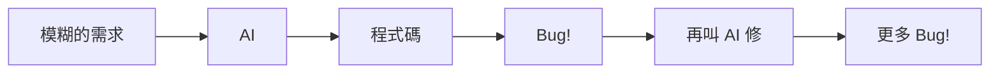

**常見錯誤做法**：
```
You: 幫我寫一個登入功能

AI: [產生一段程式碼]

You: 不對，要用 JWT

AI: [重新產生]

You: 錯誤處理不對

AI: [再次修改]

... 無限循環
```

#### 正確心態 ✅

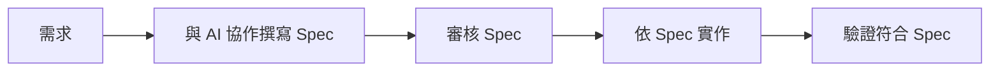

**正確做法**：
```
You: 我需要實作登入功能，請先幫我用 OpenSpec 格式撰寫規格

AI: 好的，讓我先確認需求...
    [產生 Spec]

You: 請補充「帳號鎖定」的情境

AI: [更新 Spec]

You: Spec 看起來完整了，請依據這份 Spec 產生程式碼

AI: 依據 Spec 的以下情境，我產生對應的程式碼...
    [產生符合規格的程式碼]
```

**關鍵差異**：

| 錯誤做法 | 正確做法 |
|---------|---------|
| 直接要程式碼 | 先要規格 |
| 口頭修改需求 | 更新 Spec 文件 |
| AI 猜測需求 | AI 依據 Spec 實作 |
| 結果不可預測 | 結果符合規格 |

---

### 常見反模式總覽

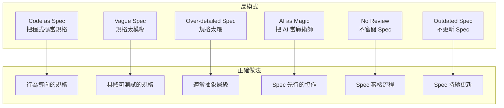

| 反模式 | 症狀 | 解決方法 |
|--------|------|---------|
| **Code as Spec** | 規格中有 SQL、API 路徑 | 聚焦於業務行為 |
| **Vague Spec** | 無法寫測試案例 | 加入具體情境 |
| **Over-detailed** | 包含 UI 細節、顏色值 | 只描述行為規則 |
| **AI as Magic** | 反覆修改、結果不穩定 | Spec First |
| **No Review** | 實作後發現需求錯誤 | 建立審核流程 |
| **Outdated Spec** | Spec 與程式碼不一致 | 變更時更新 Spec |

---

## 第六章小結

| 反模式 | 避免方法 |
|--------|---------|
| 規格像程式碼 | 描述「做什麼」而非「怎麼做」 |
| 規格太抽象 | 加入具體的 GIVEN-WHEN-THEN 情境 |
| 規格太細節 | 只描述行為規則，不描述 UI 細節 |
| AI 當魔術師 | Spec First，先有規格再寫程式 |

### 本章練習

1. 檢視你過去寫的文件，是否有上述反模式？
2. 嘗試改寫一份「過於抽象」的規格，使其更具體

---

## 第七章：導入 OpenSpec 的最佳實務（Best Practices）

### 7.1 團隊協作方式

#### 角色與職責分工

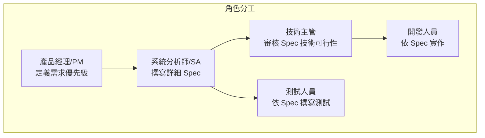

| 角色 | 職責 | OpenSpec 相關任務 |
|------|------|------------------|
| **產品經理 (PM)** | 定義業務需求、優先級 | 審核 Proposal、確認商業價值 |
| **系統分析師 (SA)** | 將需求轉換為規格 | 撰寫 Spec、定義情境 |
| **技術主管 (Tech Lead)** | 技術決策、架構審核 | 審核 Spec 技術面、核准實作 |
| **開發人員 (Dev)** | 程式實作 | 依 Spec 開發、回報問題 |
| **測試人員 (QA)** | 品質保證 | 依 Spec 撰寫測試案例 |

#### 協作流程

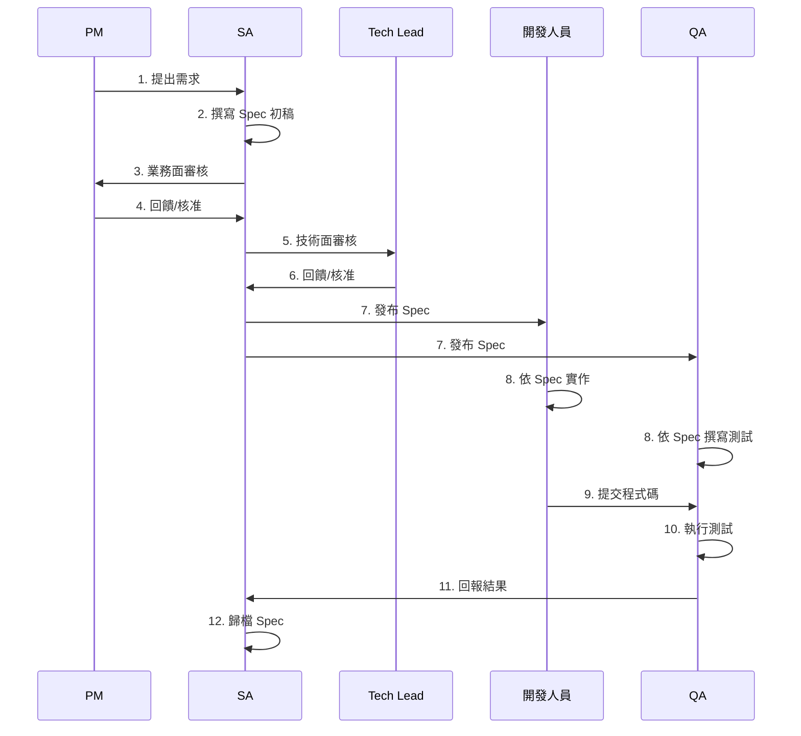

#### 團隊溝通建議

| 階段 | 會議/儀式 | 參與者 | 頻率 |
|------|----------|--------|------|
| **需求確認** | Spec Review Meeting | PM, SA, TL | 每個需求 |
| **開發中** | Daily Standup | Dev, SA | 每日 |
| **整合前** | Spec Check | SA, QA | 每個 Sprint |
| **交付後** | Retrospective | 全員 | 每個 Sprint |

> 💡 **銀行系統實務**：金融業通常有「需求確認會」與「設計審查會」的流程。OpenSpec 的 Proposal + Spec 正好可以作為這兩個會議的輸入文件。

---

### 7.2 Spec Review 重點

#### Review 檢查清單

**業務面檢查**：
- [ ] 需求是否完整？沒有遺漏的功能？
- [ ] 情境是否涵蓋正常、異常、邊界條件？
- [ ] 商業價值是否清楚說明？
- [ ] 優先級是否合理？

**技術面檢查**：
- [ ] 效能需求是否可實現？
- [ ] 安全性需求是否足夠？
- [ ] 是否與現有系統相容？
- [ ] 是否考慮擴展性？

**格式檢查**：
- [ ] 是否使用標準 OpenSpec 格式？
- [ ] GIVEN-WHEN-THEN 是否清楚？
- [ ] 是否使用正確的關鍵字（SHALL、MUST）？

#### Review 會議範例

**會議議程**（30 分鐘）：

| 時間 | 項目 | 說明 |
|------|------|------|
| 0-5 min | 背景說明 | SA 簡報變更背景 |
| 5-15 min | Spec 走讀 | 逐一檢視情境 |
| 15-25 min | 討論 | 提問與釐清 |
| 25-30 min | 結論 | 核准/修改/駁回 |

**常見問題範例**：

```
審核者：「查詢逾時的情況有處理嗎？」
SA：「目前沒有，我補充到 Spec 中。」

審核者：「用戶連續查詢 100 次會怎樣？」
SA：「好問題，我加入 Rate Limiting 的情境。」

審核者：「這個 API 的回應時間 SLA 是多少？」
SA：「我會在 Non-Functional Requirements 補上。」
```

#### Review 常見問題與處理

| 常見問題 | 處理方式 |
|---------|---------|
| Spec 不夠具體 | 要求補充 GIVEN-WHEN-THEN |
| 遺漏錯誤處理 | 列出需要補充的異常情境 |
| 效能要求不清 | 要求定義具體 SLA |
| 安全考量不足 | 要求加入安全相關情境 |

---

### 7.3 如何版本控管 Spec（搭配 Git）

#### 分支策略

```mermaid
gitgraph
    commit id: "main"
    branch feature/add-2fa
    checkout feature/add-2fa
    commit id: "建立 Spec 初稿"
    commit id: "審核後修改"
    commit id: "開始實作"
    commit id: "完成實作"
    checkout main
    merge feature/add-2fa id: "合併 + 歸檔"
```

**建議的分支命名**：
- `feature/add-xxx` - 新功能
- `fix/issue-xxx` - 修復問題
- `refactor/xxx` - 重構

#### Commit 訊息規範

使用 [Conventional Commits](https://www.conventionalcommits.org/) 格式：

```bash
# Spec 相關
spec(auth): add 2fa requirement scenarios
spec(auth): update login scenarios for lockout
docs(spec): fix typo in proposal

# 實作相關
feat(auth): implement 2fa verification
fix(auth): correct token expiry logic
test(auth): add 2fa integration tests
```

#### 目錄結構建議

```
專案根目錄/
├── openspec/
│   ├── project.md              # 專案級設定
│   ├── specs/                  # 主規格（Source of Truth）
│   │   ├── auth/
│   │   │   └── spec.md
│   │   ├── account/
│   │   │   └── spec.md
│   │   └── transaction/
│   │       └── spec.md
│   ├── changes/                # 進行中的變更
│   │   └── add-2fa/
│   │       ├── proposal.md
│   │       ├── tasks.md
│   │       └── specs/
│   │           └── auth/
│   │               └── spec.md  # Delta
│   └── archive/                # 已完成的變更
│       └── 2024-01/
│           └── add-profile-search/
│               ├── proposal.md
│               ├── tasks.md
│               └── specs/
├── src/                        # 程式碼
├── test/                       # 測試
└── AGENTS.md                   # AI 助手設定
```

#### Pull Request 流程

**PR 範本**：

```spec
## 變更類型
- [x] Spec 變更
- [ ] 程式碼變更
- [ ] 文件變更

## 相關 Spec
- openspec/changes/add-2fa/

## 變更摘要
新增雙因素認證的 Spec，包含設定、驗證、備用碼等情境

## 審核確認
- [ ] Spec 格式正確
- [ ] 情境完整
- [ ] 已通過 PM 確認
- [ ] 已通過技術審核
```

> 💡 **實務建議**：建議在 CI/CD 中加入 `openspec validate` 檢查，確保每次提交的 Spec 格式正確。

---

## 第七章小結

| 最佳實務 | 說明 |
|---------|------|
| **角色分工** | 明確定義誰寫、誰審、誰實作 |
| **Review 流程** | 業務面 + 技術面雙重審核 |
| **版本控管** | 使用 Git 分支，Spec 與程式碼一起管理 |
| **命名規範** | 統一的分支、目錄、Commit 命名 |

---

## 第八章：給新進同仁的學習建議

### 8.1 上手順序

#### 學習路徑

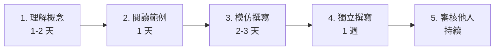

#### 第一週：理解概念

| 天數 | 任務 | 產出 |
|------|------|------|
| Day 1 | 閱讀本手冊第 1-2 章 | 理解 SDD 核心概念 |
| Day 2 | 閱讀第 3-4 章 | 理解 Spec 格式與流程 |
| Day 3 | 閱讀專案中現有的 Spec | 熟悉團隊風格 |
| Day 4 | 跟著第 5 章實作一遍 | 完成第一份 Spec |
| Day 5 | Review + 修改 | 根據回饋改進 |

#### 第二週：實戰練習

| 天數 | 任務 | 說明 |
|------|------|------|
| Day 1-2 | 選一個小功能撰寫 Spec | 如：修改密碼、查詢記錄 |
| Day 3 | 參與 Spec Review | 學習審核要點 |
| Day 4-5 | 依自己寫的 Spec 實作 | 驗證 Spec 的可實作性 |

#### 持續精進

- 每週至少寫/審一份 Spec
- 收集好的 Spec 範例
- 參與團隊 Spec Review 討論

---

### 8.2 常見卡關點

#### 卡關點 1：不知道情境要寫多細

**症狀**：
- 寫太少：只有 happy path
- 寫太多：連 UI 顏色都寫

**解決方法**：

問自己三個問題：
1. 這個情境能不能寫成一個測試案例？
2. 如果交給另一個人看，他能不能實作？
3. 這是「行為」還是「實作細節」？

**經驗法則**：

| 應該寫 | 不該寫 |
|--------|--------|
| 系統回傳 401 Unauthorized | 用 Spring Security 的 @PreAuthorize |
| 密碼至少 8 個字元 | 密碼欄位寬度 280px |
| 查詢結果分頁顯示 | 用 PageRequest.of(0, 10) |

---

#### 卡關點 2：不確定用 SHALL 還是 MUST

**解答**：

| 關鍵字 | 意義 | 使用時機 |
|--------|------|---------|
| **SHALL** | 必須實作 | 一般功能需求 |
| **MUST** | 強制要求 | 安全性、合規性要求 |
| **SHOULD** | 建議實作 | 最佳實務、非必要功能 |
| **MAY** | 可選 | 未來擴展、可選功能 |

**範例**：
```spec
系統 SHALL 提供密碼登入功能（功能需求）
密碼 MUST 使用 bcrypt 或更強的演算法加密（安全要求）
系統 SHOULD 提供密碼強度提示（最佳實務）
系統 MAY 支援指紋登入（可選功能）
```

---

#### 卡關點 3：AI 產出的 Spec 不符合團隊風格

**解決方法**：

1. **提供範例**：
```
請參考以下範例格式撰寫 Spec：
[貼上團隊的 Spec 範例]
```

2. **明確要求**：
```
請使用以下規則：
- 標題用 ### Requirement: 開頭
- 情境用 #### Scenario: 開頭
- 使用 GIVEN-WHEN-THEN 格式
```

3. **迭代修改**：
```
請把這段改成團隊的標準格式：
[貼上需要修改的內容]
```

---

#### 卡關點 4：不知道從哪裡開始

**快速起步模板**：

```spec
# [功能名稱] - System Spec

## Purpose
[一句話說明這個功能的目的]

## Requirements

### Requirement: [主要需求名稱]
系統 SHALL [做什麼事情]

#### Scenario: 成功情境
- GIVEN [前提條件]
- WHEN [用戶執行的動作]
- THEN [預期的結果]

#### Scenario: 失敗情境 - [失敗原因]
- GIVEN [導致失敗的條件]
- WHEN [用戶執行的動作]
- THEN [錯誤處理方式]
```

---

### 8.3 如何從「會寫」進階到「寫得好」

#### 進階技巧

**1. 思考邊界條件**

每個功能都問：
- 輸入值為空會怎樣？
- 輸入值為 null 會怎樣？
- 輸入值超出範圍會怎樣？
- 併發操作會怎樣？
- 網路中斷會怎樣？

**2. 考慮非功能性需求**

```spec
## Non-Functional Requirements

### 效能
- 查詢回應時間 SHOULD < 500ms (P95)
- 系統 SHOULD 支援 1000 TPS

### 安全性
- 所有 API MUST 透過 HTTPS
- 敏感操作 MUST 記錄審計日誌

### 可用性
- 服務可用性 MUST ≥ 99.9%
- 計劃性維護時間 SHOULD < 4 小時/月
```

**3. 使用表格整理複雜邏輯**

```spec
### 手續費計算規則

| 交易類型 | 金額範圍 | 手續費 |
|---------|---------|--------|
| 同行轉帳 | 任意 | 0 |
| 跨行轉帳 | ≤ 500 | 10 |
| 跨行轉帳 | 501-10,000 | 15 |
| 跨行轉帳 | > 10,000 | 交易金額 × 0.1% |
```

**4. 建立自己的 Checklist**

```spec
## 我的 Spec 檢查清單

撰寫完成後確認：
- [ ] 有 Purpose 說明
- [ ] 有成功情境
- [ ] 有失敗/錯誤情境
- [ ] 有邊界條件情境
- [ ] 有權限控制情境（如需要）
- [ ] 有效能需求（如需要）
- [ ] 有安全需求（如需要）
- [ ] 格式符合團隊規範
- [ ] 可以直接轉換為測試案例
```

#### 學習資源

| 類型 | 資源 | 說明 |
|------|------|------|
| **官方** | [OpenSpec GitHub](https://github.com/Fission-AI/OpenSpec) | 官方文件與範例 |
| **社群** | [OpenSpec Discord](https://discord.gg/YctCnvvshC) | 討論與問答 |
| **相關** | [spec-kit](https://github.com/github/spec-kit) | 另一個 SDD 工具 |
| **方法論** | BDD (Behavior-Driven Development) | GIVEN-WHEN-THEN 的來源 |

---

## 第八章小結

| 階段 | 重點 |
|------|------|
| **初期** | 閱讀範例、模仿撰寫 |
| **中期** | 獨立撰寫、接受 Review |
| **進階** | 考慮邊界、非功能需求、審核他人 |

---

## 附錄：檢查清單（Checklist）

### A. OpenSpec 環境設定檢查清單

- [ ] Node.js >= 20.19.0 已安裝
- [ ] OpenSpec CLI 已安裝 (`npm install -g @fission-ai/openspec@latest`)
- [ ] 專案已初始化 (`openspec init`)
- [ ] `openspec/project.md` 已填寫專案資訊
- [ ] AGENTS.md 已建立

### B. Spec 撰寫檢查清單

- [ ] 有 Purpose 說明
- [ ] 每個 Requirement 使用 SHALL/MUST/SHOULD/MAY
- [ ] 每個 Requirement 至少有一個 Scenario
- [ ] Scenario 使用 GIVEN-WHEN-THEN 格式
- [ ] 包含成功情境
- [ ] 包含失敗/錯誤情境
- [ ] 包含邊界條件情境
- [ ] 包含權限驗證情境（如適用）
- [ ] 包含非功能性需求（效能、安全、可用性）
- [ ] API 定義完整（如適用）

### C. Spec Review 檢查清單

**業務面**：
- [ ] 需求是否完整？
- [ ] 情境是否涵蓋所有可能？
- [ ] 商業價值是否清楚？
- [ ] 優先級是否合理？

**技術面**：
- [ ] 效能需求是否可實現？
- [ ] 安全性需求是否足夠？
- [ ] 是否與現有系統相容？
- [ ] 是否考慮擴展性？

**格式面**：
- [ ] 格式是否符合團隊規範？
- [ ] 關鍵字使用是否正確？
- [ ] 情境描述是否清楚？

### D. 變更完成檢查清單

- [ ] 所有 Tasks 已完成
- [ ] 程式碼已提交並審核
- [ ] 測試已通過
- [ ] 文件已更新
- [ ] `openspec archive` 已執行
- [ ] 主規格已更新

### E. 常用 CLI 指令速查

```bash
# 初始化
openspec init

# 查看狀態
openspec list              # 列出所有進行中的變更
openspec show <change>     # 查看特定變更詳情
openspec view              # 互動式 Dashboard

# 驗證與歸檔
openspec validate <change> # 驗證 Spec 格式
openspec archive <change>  # 歸檔已完成的變更

# 更新
openspec update            # 更新 AI 助手設定
```

### F. 與 AI 對話 Prompt 範本

**建立新 Spec**：
```
請依據 OpenSpec 格式，為以下功能建立 System Spec：

功能：[功能名稱]
需求摘要：
- [需求 1]
- [需求 2]
- [需求 3]

請包含成功情境、失敗情境和邊界條件。
```

**審閱 Spec**：
```
請審閱以下 Spec，檢查：
1. 是否有遺漏的情境？
2. 是否有模糊不清的描述？
3. 是否符合 OpenSpec 格式？
4. 是否有安全性考量？

[貼上 Spec 內容]
```

**優化 Spec**：
```
請將以下需求描述轉換為 OpenSpec 的 GIVEN-WHEN-THEN 格式：

[貼上需求描述]
```

---

## 參考資源

### 官方資源

| 資源 | 連結 |
|------|------|
| OpenSpec GitHub | https://github.com/Fission-AI/OpenSpec |
| OpenSpec 官網 | https://openspec.dev/ |
| OpenSpec Discord | https://discord.gg/YctCnvvshC |

### 相關工具

| 工具 | 說明 | 連結 |
|------|------|------|
| spec-kit | GitHub 的 SDD 工具 | https://github.com/github/spec-kit |
| Kiro.dev | 另一個規格管理工具 | https://kiro.dev |

### 延伸閱讀

| 主題 | 說明 |
|------|------|
| BDD (Behavior-Driven Development) | GIVEN-WHEN-THEN 的來源 |
| ATDD (Acceptance Test-Driven Development) | 驗收測試驅動開發 |
| Domain-Driven Design | 領域驅動設計 |

---

## 文件資訊

| 項目 | 內容 |
|------|------|
| **文件名稱** | OpenSpec 使用教學手冊 |
| **版本** | 1.0 |
| **建立日期** | 2025-12-30 |
| **維護者** | [Eric Cheng] |
| **適用對象** | 新進軟體工程師、系統分析師 |

---

> 📝 **回饋與改進**：如果您在使用本手冊過程中發現任何問題或有改進建議，歡迎提出！
