+++
date = '2026-07-22T19:13:15+08:00'
draft = false
title = 'Orca 教學手冊'
tags = ['教學', 'AI開發']
categories = ['教學']
+++
# Orca 教學手冊（企業級實戰版）

> **版本對應**：Orca GitHub Release `v1.4.150`（查證日期：2026-07-22）
> **適用對象**：資深軟體工程師、技術主管、平台工程（Platform Engineering）團隊、DevOps／SRE、AI Solution Architect、AI Agent Architect
> **技術棧範圍**：Electron 桌面應用、Git Worktree、~29 種 Coding Agent CLI（Claude Code、Codex、OpenCode、Cursor、Copilot 等）、SSH／VPS 遠端執行、GitHub、Linear
> **文件等級**：企業內部開發規範／教學手冊（實戰與維運導向）
> **參考來源**：
>
> - 官方 GitHub Repository：<https://github.com/stablyai/orca>
> - 官方網站：<https://www.onorca.dev/>
> - Y Combinator 公司頁面：<https://www.ycombinator.com/companies/stably-ai-orca>
>
> ⚠️ **版本快照提醒**：Orca 採近乎每日發版節奏（查證當下最新版本為 `v1.4.150`），本手冊內容為特定時間點之快照整理。正式導入前，請務必以官方 GitHub Repository 與官方文件站當下內容為準。凡本手冊中涉及**尚未於官方文件明確證實**的內容，均已以「⚠️」、「依推論」、「屬社群驗證路徑」等字樣清楚標註，請讀者審慎查證後再應用於正式環境，切勿將教學示例（案例研究章節）誤認為真實客戶專案。

---

## 目錄

1. [第一章 Orca 概述與工具定位比較](#第一章-orca-概述與工具定位比較)
2. [第二章 核心特色](#第二章-核心特色)
3. [第三章 系統架構](#第三章-系統架構)
4. [第四章 安裝與環境建置](#第四章-安裝與環境建置)
5. [第五章 建立第一個 Workspace](#第五章-建立第一個-workspace)
6. [第六章 Provider 設定與 Agent 帳號管理](#第六章-provider-設定與-agent-帳號管理)
7. [第七章 Agent 管理](#第七章-agent-管理)
8. [第八章 Parallel Agents 平行代理實戰](#第八章-parallel-agents-平行代理實戰)
9. [第九章 AI Coding Workflow](#第九章-ai-coding-workflow)
10. [第十章 企業 Web 應用程式開發案例](#第十章-企業-web-應用程式開發案例)
11. [第十一章 舊系統逆向工程](#第十一章-舊系統逆向工程)
12. [第十二章 Framework Upgrade 框架升級](#第十二章-framework-upgrade-框架升級)
13. [第十三章 Agent Collaboration 協作角色分工](#第十三章-agent-collaboration-協作角色分工)
14. [第十四章 Git Integration](#第十四章-git-integration)
15. [第十五章 Source Control 版本控管](#第十五章-source-control-版本控管)
16. [第十六章 Mobile App 行動裝置應用](#第十六章-mobile-app-行動裝置應用)
17. [第十七章 VPS 與遠端部署](#第十七章-vps-與遠端部署)
18. [第十八章 Prompt Engineering](#第十八章-prompt-engineering)
19. [第十九章 AI Team 企業 AI 團隊](#第十九章-ai-team-企業-ai-團隊)
20. [第二十章 Banking 銀行核心系統案例](#第二十章-banking-銀行核心系統案例)
21. [第二十一章 系統維護](#第二十一章-系統維護)
22. [第二十二章 效能最佳化](#第二十二章-效能最佳化)
23. [第二十三章 常見錯誤與 FAQ](#第二十三章-常見錯誤與-faq)
24. [第二十四章 最佳實務](#第二十四章-最佳實務)
25. [第二十五章 與其他工具比較](#第二十五章-與其他工具比較)
26. [第二十六章 建議導入方式](#第二十六章-建議導入方式)
27. [第二十七章 完整企業案例](#第二十七章-完整企業案例)
28. [第二十八章 Mermaid 圖表彙整](#第二十八章-mermaid-圖表彙整)
29. [第二十九章 Prompt Library](#第二十九章-prompt-library)
30. [第三十章 總結](#第三十章-總結)

---

## 子目錄（詳細版）

> 以下為全書所有小節的完整索引，依章節分組，每一條皆可直接點擊連結到本文對應位置。若只需要快速定位特定主題（如「WSL」「GitLab」「語音輸入」），建議使用編輯器或瀏覽器的頁內搜尋（Ctrl+F／Cmd+F）搭配本目錄關鍵字查找。

**[前言](#前言)**

- [0.1 Orca 是什麼](#01-orca-是什麼)
- [0.2 為何會誕生](#02-為何會誕生)
- [0.3 解決什麼問題](#03-解決什麼問題)
- [0.4 適合哪些團隊／專案](#04-適合哪些團隊專案)
- [0.5 與同類工具的差異定位](#05-與同類工具的差異定位)

**[第一章 Orca 概述與工具定位比較](#第一章-orca-概述與工具定位比較)**

- [1.1 核心概念回顧](#11-核心概念回顧)
- [1.2 與各工具的差異定位詳解](#12-與各工具的差異定位詳解)

**[第二章 核心特色](#第二章-核心特色)**

- [2.1 Parallel Worktrees（平行工作樹）— 已查證](#21-parallel-worktrees平行工作樹-已查證)
- [2.2 Agent Cluster／Multi Agent（多 Agent 群組）— 已查證（概念延伸）](#22-agent-clustermulti-agent多-agent-群組-已查證概念延伸)
- [2.3 ADE（Agent Development Environment）— 官方定位詞](#23-adeagent-development-environment-官方定位詞)
- [2.4 Agent Workspace／Workspace Isolation（工作區隔離）— 已查證](#24-agent-workspaceworkspace-isolation工作區隔離-已查證)
- [2.5 AI Pair Programming（AI 結對協作）— 官方功能延伸](#25-ai-pair-programmingai-結對協作-官方功能延伸)
- [2.6 Design Mode — 已查證](#26-design-mode--已查證)
- [2.7 Source Control／Git Integration — 已查證](#27-source-controlgit-integration--已查證)
- [2.8 Mobile Companion（行動裝置伴侶）— 已查證](#28-mobile-companion行動裝置伴侶-已查證)
- [2.9 Voice Input（語音輸入）— 已查證](#29-voice-input語音輸入-已查證)
- [2.10 Provider Management／API Key（供應商與金鑰管理）— ⚠️ 需重新定義](#210-provider-managementapi-key供應商與金鑰管理-️-需重新定義)
- [2.11 Remote VPS／SSH Worktrees — 已查證](#211-remote-vpsssh-worktrees--已查證)
- [2.12 Multi Device Sync（多裝置同步）— 已查證（透過帳號切換器與行動端）](#212-multi-device-sync多裝置同步-已查證透過帳號切換器與行動端)
- [2.13 Session（工作階段）— 已查證（概念延伸）](#213-session工作階段-已查證概念延伸)
- [2.14 Annotate AI Diffs — 已查證（分兩層機制，需精確理解）](#214-annotate-ai-diffs--已查證分兩層機制需精確理解)
- [2.15 Orca CLI／Orchestration／Scheduled Automations — 已查證](#215-orca-cliorchestrationscheduled-automations--已查證)
- [2.16 Computer Use — 已查證](#216-computer-use--已查證)
- [2.17 Agent Hibernation（Agent 休眠）— 已查證](#217-agent-hibernationagent-休眠-已查證)
- [2.18 Session Restore／Quick Open & Jump Palette — 已查證](#218-session-restorequick-open--jump-palette--已查證)
- [2.19 Drag Files to Agents（拖曳檔案至 Agent）— 已查證](#219-drag-files-to-agents拖曳檔案至-agent-已查證)
- [2.20 Rich 編輯器與檢視器能力 — 已查證](#220-rich-編輯器與檢視器能力--已查證)
- [2.21 Notifications & Inbox／Agents Feed — 已查證](#221-notifications--inboxagents-feed--已查證)

**[第三章 系統架構](#第三章-系統架構)**

- [3.1 整體架構總覽](#31-整體架構總覽)
- [3.2 Agent 架構](#32-agent-架構)
- [3.3 Workspace／Session／Context／Prompt 關係](#33-workspacesessioncontextprompt-關係)

**[第四章 安裝與環境建置](#第四章-安裝與環境建置)**

- [4.1 系統需求總覽](#41-系統需求總覽)
- [4.2 Windows 安裝](#42-windows-安裝)
- [4.3 macOS 安裝](#43-macos-安裝)
- [4.4 Linux／Ubuntu 安裝](#44-linuxubuntu-安裝)
- [4.5 WSL（Windows Subsystem for Linux）— 已查證支援](#45-wslwindows-subsystem-for-linux-已查證支援)
- [4.6 Docker — 官方提供容器內執行指引，但無官方映像檔](#46-docker--官方提供容器內執行指引但無官方映像檔)
- [4.7 VPS／遠端伺服器安裝](#47-vps遠端伺服器安裝)
- [4.8 常見安裝問題](#48-常見安裝問題)
- [第1~4章 檢查清單（Checklist）](#第14章-檢查清單checklist)

**[第五章 建立第一個 Workspace](#第五章-建立第一個-workspace)**

- [5.1 建立 Workspace 的標準流程](#51-建立-workspace-的標準流程)
- [5.2 開啟既有專案（Import Existing Project）](#52-開啟既有專案import-existing-project)
- [5.3 Git Clone 匯入遠端專案](#53-git-clone-匯入遠端專案)
- [5.4 Workspace Settings（工作區設定）](#54-workspace-settings工作區設定)

**[第六章 Provider 設定與 Agent 帳號管理](#第六章-provider-設定與-agent-帳號管理)**

- [6.1 帳號切換器（已查證）](#61-帳號切換器已查證)
- [6.2 各 Agent CLI 的 Provider／模型設定入口對照表](#62-各-agent-cli-的-provider模型設定入口對照表)
- [6.3 API Key／認證管理最佳實務](#63-api-key認證管理最佳實務)
- [6.4 用量、費用與 Rate Limit 治理](#64-用量費用與-rate-limit-治理)
- [6.5 模型選擇建議](#65-模型選擇建議)

**[第七章 Agent 管理](#第七章-agent-管理)**

- [7.1 支援的 Agent CLI 完整清單（查證當下，已核實）](#71-支援的-agent-cli-完整清單查證當下已核實)
- [7.2 建立 Agent](#72-建立-agent)
- [7.3 停止 Agent／重新啟動](#73-停止-agent重新啟動)
- [7.4 Agent Pool／Agent Cluster（教學統稱）](#74-agent-poolagent-cluster教學統稱)
- [7.5 Agent Session／Prompt／Memory／Context](#75-agent-sessionpromptmemorycontext)
- [7.6 Task Queue／Retry／Monitoring](#76-task-queueretrymonitoring)

**[第八章 Parallel Agents 平行代理實戰](#第八章-parallel-agents-平行代理實戰)**

- [8.1 平行分派的基本流程](#81-平行分派的基本流程)
- [8.2 八角色編組範例](#82-八角色編組範例)
- [8.3 如何合作與合併](#83-如何合作與合併)

**[第九章 AI Coding Workflow](#第九章-ai-coding-workflow)**

- [9.1 完整流程總覽](#91-完整流程總覽)
- [9.2 Orca 在各階段的參與方式](#92-orca-在各階段的參與方式)
- [第5~9章 檢查清單（Checklist）](#第59章-檢查清單checklist)

**[第十章 企業 Web 應用程式開發案例](#第十章-企業-web-應用程式開發案例)**

- [10.1 案例背景](#101-案例背景)
- [10.2 需求拆解與 Agent 分派](#102-需求拆解與-agent-分派)
- [10.3 分派範例（Prompt 摘要）](#103-分派範例prompt-摘要)
- [10.4 整合與驗收](#104-整合與驗收)

**[第十一章 舊系統逆向工程](#第十一章-舊系統逆向工程)**

- [11.1 適用情境](#111-適用情境)
- [11.2 平行盤點策略](#112-平行盤點策略)
- [11.3 各技術棧的逆向工程重點](#113-各技術棧的逆向工程重點)
- [11.4 產出彙整與交接](#114-產出彙整與交接)

**[第十二章 Framework Upgrade 框架升級](#第十二章-framework-upgrade-框架升級)**

- [12.1 常見升級路徑](#121-常見升級路徑)
- [12.2 多 Agent 協同升級流程](#122-多-agent-協同升級流程)
- [12.3 Java 8 → Java 25 範例分工](#123-java-8--java-25-範例分工)

**[第十三章 Agent Collaboration 協作角色分工](#第十三章-agent-collaboration-協作角色分工)**

- [13.1 角色設計原則](#131-角色設計原則)
- [13.2 各角色職責說明](#132-各角色職責說明)

**[第十四章 Git Integration](#第十四章-git-integration)**

- [14.1 Worktree 即 Git Worktree](#141-worktree-即-git-worktree)
- [14.2 Branch／Commit／Merge](#142-branchcommitmerge)
- [14.3 GitHub／Linear／Jira 原生整合](#143-githublinearjira-原生整合)
- [14.4 GitLab／Azure DevOps／Bitbucket — 雙重查證狀態，需精確理解](#144-gitlabazure-devopsbitbucket--雙重查證狀態需精確理解)
- [第10~14章 檢查清單（Checklist）](#第1014章-檢查清單checklist)

**[第十五章 Source Control 版本控管](#第十五章-source-control-版本控管)**

- [15.1 版本控制的本質](#151-版本控制的本質)
- [15.2 Diff 檢視](#152-diff-檢視)
- [15.3 History（歷史紀錄）](#153-history歷史紀錄)
- [15.4 Rollback（回復）](#154-rollback回復)
- [15.5 Code Review（結合 Annotate AI Diffs）](#155-code-review結合-annotate-ai-diffs)

**[第十六章 Mobile App 行動裝置應用](#第十六章-mobile-app-行動裝置應用)**

- [16.1 平台支援現況](#161-平台支援現況)
- [16.2 核心行動端功能](#162-核心行動端功能)

**[第十七章 VPS 與遠端部署](#第十七章-vps-與遠端部署)**

- [17.1 SSH Worktrees 概念](#171-ssh-worktrees-概念)
- [17.2 建置步驟](#172-建置步驟)
- [17.3 最佳實務](#173-最佳實務)

**[第十八章 Prompt Engineering](#第十八章-prompt-engineering)**

- [18.1 多 Agent 情境下的 Prompt 設計原則](#181-多-agent-情境下的-prompt-設計原則)
- [18.2 各類型 Prompt 範例（完整範例庫見第 29 章）](#182-各類型-prompt-範例完整範例庫見第-29-章)

**[第十九章 AI Team 企業 AI 團隊](#第十九章-ai-team-企業-ai-團隊)**

- [19.1 組織角色對應](#191-組織角色對應)
- [19.2 角色與 Orca 功能對應](#192-角色與-orca-功能對應)
- [19.3 治理建議](#193-治理建議)
- [第15~19章 檢查清單（Checklist）](#第1519章-檢查清單checklist)

**[第二十章 Banking 銀行核心系統案例](#第二十章-banking-銀行核心系統案例)**

- [20.1 案例背景](#201-案例背景)
- [20.2 任務拆解](#202-任務拆解)
- [20.3 各任務分派重點](#203-各任務分派重點)
- [20.4 治理流程](#204-治理流程)

**[第二十一章 系統維護](#第二十一章-系統維護)**

- [21.1 版本管理與近乎每日發版節奏](#211-版本管理與近乎每日發版節奏)
- [21.2 Workspace 備份與還原](#212-workspace-備份與還原)
- [21.3 升級與遷移](#213-升級與遷移)
- [21.4 Log 與 Troubleshooting 基礎](#214-log-與-troubleshooting-基礎)

**[第二十二章 效能最佳化](#第二十二章-效能最佳化)**

- [22.1 多 Worktree 資源管理](#221-多-worktree-資源管理)
- [22.2 Context／Prompt／Token 效率](#222-contextprompttoken-效率)
- [22.3 成本治理（延伸第 6.4 節）](#223-成本治理延伸第-64-節)
- [22.4 Workspace／Memory 層級最佳化](#224-workspacememory-層級最佳化)
- [第20~22章 檢查清單（Checklist）](#第2022章-檢查清單checklist)

**[第二十三章 常見錯誤與 FAQ](#第二十三章-常見錯誤與-faq)**

- [23.1 基礎概念類](#231-基礎概念類)
- [23.2 安裝與環境類](#232-安裝與環境類)
- [23.3 Agent CLI 與帳號類](#233-agent-cli-與帳號類)
- [23.4 Parallel Worktrees 類](#234-parallel-worktrees-類)
- [23.5 Mobile 類](#235-mobile-類)
- [23.6 Design Mode／Terminal 類](#236-design-modeterminal-類)
- [23.7 Git／GitHub／Linear 類](#237-gitgithublinear-類)
- [23.8 VPS／SSH 類](#238-vpsssh-類)
- [23.9 案例導入類](#239-案例導入類)
- [23.10 效能／維運／其他類](#2310-效能維運其他類)
- [23.11 新功能查證類（本次新增）](#2311-新功能查證類本次新增)

**[第二十四章 最佳實務](#第二十四章-最佳實務)**

- [24.1 架構規劃（1～12）](#241-架構規劃112)
- [24.2 Agent 選用與分工（13～26）](#242-agent-選用與分工1326)
- [24.3 Parallel Worktrees 實務（27～38）](#243-parallel-worktrees-實務2738)
- [24.4 Prompt 設計（39～48）](#244-prompt-設計3948)
- [24.5 Git 與審查（49～60）](#245-git-與審查4960)
- [24.6 安全與金鑰治理（61～72）](#246-安全與金鑰治理6172)
- [24.7 案例導向實務（73～86）](#247-案例導向實務7386)
- [24.8 維運與效能（87～100）](#248-維運與效能87100)

**[第二十五章 與其他工具比較](#第二十五章-與其他工具比較)**

- [25.1 完整比較表](#251-完整比較表)
- [25.2 選型建議摘要](#252-選型建議摘要)

**[第二十六章 建議導入方式](#第二十六章-建議導入方式)**

- [26.1 依組織規模的導入建議](#261-依組織規模的導入建議)
- [26.2 小型團隊（1～10人）](#262-小型團隊110人)
- [26.3 中型企業（數十～數百人工程團隊）](#263-中型企業數十數百人工程團隊)
- [26.4 大型企業（數百人以上）](#264-大型企業數百人以上)
- [26.5 銀行／高監理產業](#265-銀行高監理產業)
- [26.6 政府／SI（系統整合商）](#266-政府si系統整合商)

**[第二十七章 完整企業案例](#第二十七章-完整企業案例)**

- [27.1 需求](#271-需求)
- [27.2 分析](#272-分析)
- [27.3 Architecture](#273-architecture)
- [27.4 Agent 分工](#274-agent-分工)
- [27.5 Coding／Review／Deploy／Maintenance](#275-codingreviewdeploymaintenance)

**[第二十八章 Mermaid 圖表彙整](#第二十八章-mermaid-圖表彙整)**

- [28.1 全書圖表索引](#281-全書圖表索引)
- [28.2 補充圖表類型](#282-補充圖表類型)

**[第二十九章 Prompt Library](#第二十九章-prompt-library)**

- [29.1 Architecture（1～9）](#291-architecture19)
- [29.2 Coding（10～18）](#292-coding1018)
- [29.3 Migration（19～27）](#293-migration1927)
- [29.4 Review（28～36）](#294-review2836)
- [29.5 Testing（37～45）](#295-testing3745)
- [29.6 Documentation（46～54）](#296-documentation4654)
- [29.7 Refactor（55～63）](#297-refactor5563)
- [29.8 Performance（64～72）](#298-performance6472)
- [29.9 Security（73～81）](#299-security7381)
- [29.10 Banking（82～90）](#2910-banking8290)
- [29.11 Framework Upgrade（91～99）](#2911-framework-upgrade9199)
- [29.12 Reverse Engineering（100～108）](#2912-reverse-engineering100108)

**[第三十章 總結](#第三十章-總結)**

- [30.1 Orca 最適合哪些公司](#301-orca-最適合哪些公司)
- [30.2 最適合哪些專案](#302-最適合哪些專案)
- [30.3 最適合哪些開發模式](#303-最適合哪些開發模式)
- [30.4 建議導入流程總覽](#304-建議導入流程總覽)
- [30.5 ADE（Agent Development Environment）的未來趨勢](#305-adeagent-development-environment的未來趨勢)
- [全書總檢查清單（Master Checklist）](#全書總檢查清單master-checklist)

---

## 使用建議

Orca 是一套「操作一整支平行 AI Agent 艦隊」的 ADE（Agent Development Environment），不同角色的讀者關注重點不同，建議依下表選擇優先閱讀路徑，而非從頭線性讀完：

| 讀者角色 | 建議優先閱讀章節 | 閱讀目的 |
|---|---|---|
| 初次接觸的開發者 | 第 1、2、4、5 章 | 快速理解定位、安裝並跑通第一個 Workspace |
| 資深工程師（日常實戰） | 第 6～9、13、14、18 章 | 熟悉 Agent 帳號治理、平行任務分派、Prompt 設計 |
| 技術主管／架構師 | 第 3、19、24、25、26 章 | 評估架構、組建 AI 團隊、與同類工具比較、決定導入策略 |
| DevOps／SRE／Platform Engineer | 第 4、17、21、22 章 | 環境建置、VPS／遠端部署、維運與效能治理 |
| 金融／高監理產業導入者 | 第 6、20、24、26 章 | 理解帳號與金鑰治理、參考銀行案例、掌握合規注意事項 |
| 新進成員／教育訓練 | 第 1、2、5、23、24 章 | 建立基礎概念、避免常見錯誤、快速上手 |
| 需要範本／快速查找者 | 第 28、29 章 | 直接取用 Mermaid 圖表與 Prompt Library |

**小技巧**：若你只有 30 分鐘，建議讀第 1 章（定位）、第 6 章（帳號設定，避免踩坑）、第 23 章（常見錯誤）；若你要做導入評估，直接跳到第 24～26 章。

---

## 前言

### 0.1 Orca 是什麼

Orca（github.com/stablyai/orca）是由 Stably AI（San Francisco，YC W22 梯次公司，共同創辦人 Jinjing Liang〔CEO〕與 Neil Parker〔CTO〕）開發的開源桌面應用，MIT 授權、以 TypeScript／Electron 撰寫。官方對自身的定位並非「又一個 AI IDE」，而是自創了 **ADE（Agent Development Environment，代理開發環境）** 這個詞：

> 官方 Repository 描述原文：「Orca is the ADE for working with a fleet of parallel agents. Run any coding agent with your own subscription. Available on desktop, mobile and VPS.」
> 官方 README 首頁標語：「**The AI Orchestrator for 100x builders.** Run Codex, ClaudeCode, OpenCode or Pi side-by-side — each in its own worktree, tracked in one place.」
> 官方網站 onorca.dev 首頁標語：「Ship 100x With The Agent IDE」／「Run Claude Code, Codex, OpenCode, and more side by side in isolated worktrees.」

**重要背景釐清**：Stably AI 是 YC **W22（2022 年冬季梯次）** 公司，並非近期才從 YC 畢業的新創；公司原先的產品線是 AI 自動化測試工具。Orca 這個產品的 GitHub Repository 則是到 **2026-03-17** 才建立，屬於該公司近期推出的**新產品線**，產品成熟度應以此日期起算，而非公司本身的年齡。企業導入評估時應區分「公司成立時間」與「Orca 產品成熟度」，後者仍屬早期、快速迭代階段（見第 4、21、23 章）。

用白話來說：Orca **本身不是一個會寫程式的 AI**，它是一層「艦隊指揮層」，讓你可以：

- 把同一個需求，同時交給多個不同的 coding agent CLI（例如 Claude Code、Codex、OpenCode）；
- 每個 agent 各自在獨立的 **Git Worktree** 裡工作，彼此不干擾；
- 透過桌面應用比較各 agent 的產出、合併最好的結果；
- 透過手機 App 遠端監控與操作這些 agent；
- 透過 SSH／VPS 把 agent 放到遠端機器上長時間運行。

截至查證日期（2026-07-22），Orca 在 GitHub 上有 **25,500+ 顆星、1,834 個 fork、1,947 個 open issues**，發版頻率接近每日一版（近 9 天內即發布 v1.4.141～v1.4.150 共 10 個版本），是目前「多 Agent 協作」這個新興品類中討論度較高的專案之一。**官方 README 目前已有簡體中文（zh-CN）、日文、韓文、西班牙文、法文、葡萄牙文版本，經查證確認尚無正體中文版**——這也是本手冊存在的價值之一：填補中文（繁體）技術社群在這個新工具類別上的空缺，而非單純翻譯。

### 0.2 為何會誕生

過去兩年，AI coding CLI（Claude Code、Codex、Cursor Agent 等）已證明「單一 agent 執行單一任務」的可行性，但實務上很快浮現三個新問題：

1. **選擇困難**：不同 agent 在不同任務類型上的表現不一致，工程師常需要「多試幾家」才知道哪個做得好，但手動切換終端機、管理多個 clone 非常繁瑣。
2. **平行擴展困難**：一個資深工程師一天能「認真監督」的 agent 工作量是有上限的，若沒有工具輔助，很難同時推進 5～8 個獨立任務。
3. **地點限制**：coding agent 通常綁在一台開著的筆電上，工程師離開座位、外出開會，工作就停擺。

Orca 的切入點正是解決這三個問題：**用 Git Worktree 隔離多個 agent 的工作現場，用桌面應用統一管理與比較，用手機 App 與 VPS 打破「必須坐在電腦前」的限制。**

### 0.3 解決什麼問題

| 傳統痛點 | Orca 的處理方式 |
|---|---|
| 多個 agent 同時修改同一份 repo 容易互相污染 | 每個 agent 分配獨立 Git Worktree，實體檔案互不干擾 |
| 想比較不同 agent／不同 prompt 的產出，只能開多個終端機視窗手動切換 | 桌面應用內建 Terminal Splits（WebGL 渲染、可無限分割）＋統一介面比較 |
| 想調整 UI 細節，得先截圖、描述給 agent，來回溝通成本高 | Design Mode：直接在內嵌瀏覽器點選元素，將 HTML/CSS/截圖送進 prompt |
| 人不在電腦前，agent 工作就停滯，或不知道進度 | Mobile Companion（iOS/Android）：遠端監控、下指令、收到推播通知 |
| 想把長時間任務丟到遠端機器跑，但終端機斷線就前功盡棄 | SSH Worktrees：具備自動重連與 port forwarding |
| Code Review 時很難把「這段是哪個 agent、依據什麼 prompt 產生的」講清楚 | Annotate AI Diffs：對 AI 產生的 diff 直接留言，訊息可回傳給該 agent |

### 0.4 適合哪些團隊／專案

**適合的團隊特徵**：

- 已經在使用至少一種 coding agent CLI（Claude Code、Codex 等），想進一步「規模化」而非「換掉」現有工具。
- 團隊工程師願意採用「先發散、後收斂」的工作模式：先讓多個 agent 平行嘗試，再由人做取捨與合併。
- 有跨平台（桌面＋行動＋伺服器）協作的實際需求，例如 SRE 需要在下班後用手機監看批次任務。
- 對「vendor lock-in」敏感，希望維持多 agent CLI 並存、而非綁死單一供應商。

**適合的專案類型**：

- 大量重複性高、可平行拆解的任務：批次程式碼審查、跨模組小型修復、文件產生、單元測試補齊。
- 需要多角度探索的任務：架構重構前想同時看到 3 種不同切法的草案。
- Legacy 系統盤點與逆向工程（見第 11 章）：多個 agent 分頭啃不同子系統，比人力全數投入更快建立初步理解。

**較不適合／需謹慎評估的情境**：

- 高度需要單一上下文連續推理、無法拆分的核心邏輯重構（平行分派反而增加合併成本）。
- 對「官方保證支援」要求極高的高監理環境（Orca 目前仍是快速迭代中的年輕專案，需自行承擔版本波動風險，詳見第 4、23 章）。

### 0.5 與同類工具的差異定位

Orca 在市場上同時扮演兩種角色，必須分開理解，這也是本手冊第 1、25 章反覆強調的重點：

1. **Orca 內部「包裝／協調」的對象**：Claude Code、Codex、OpenCode、Cursor Agent、GitHub Copilot CLI、Devin、Goose、Cline、Continue、Kiro、Amp、Pi 等 ~29 種 coding agent CLI——這些是 Orca 啟動、管理、比較的「執行單元」，不是 Orca 的競爭者。
2. **與 Orca 同層競爭、屬於「開發環境／IDE／終端機」品類的產品**：Cursor、Windsurf、VS Code（＋GitHub Copilot 擴充套件）、Warp——這些同樣想成為工程師的主要工作介面，才是與 Orca 定位重疊、值得比較的對象。Gemini CLI、Aider、Roo Code、OpenHands 則多半介於兩者之間：本身是可被 Orca 包裝的 agent，但也可獨立作為工作介面使用。

完整比較表請見第 25 章；下表先給第一印象：

| 工具 | 定位 | 平行多 Agent | 桌面 App | 行動 App | VPS／遠端 |
|---|---|---|---|---|---|
| **Orca** | ADE（艦隊指揮層） | ✅ 原生核心特色 | ✅ | ✅ | ✅（SSH Worktrees） |
| Cursor | AI 優先 IDE | 有限 | ✅ | ❌ | 有限 |
| Claude Code | 終端機 coding agent | 需自行腳本化 | ❌（CLI/擴充） | ❌ | 可搭配 tmux 等自建 |
| Windsurf | AI 優先 IDE | 有限 | ✅ | ❌ | 有限 |
| Warp | AI 優先終端機 | 有限 | ✅ | ❌ | ✅ |

> **注意事項**：上表為概念性定位比較，非逐項功能核對；各工具功能演進快速，實際評估請以各自官方文件當下版本為準。

---

## 第一章 Orca 概述與工具定位比較

### 1.1 核心概念回顧

延續前言，Orca 是「操作一整支平行 Agent 艦隊的 ADE」，其核心心智模型可以濃縮成一句話：

> **你不是在跟一個 AI 對話，你是在指揮一群 AI CLI，每個都在自己的 Git Worktree 裡工作，你負責比較與合併。**

**重點整理**：

- Orca＝艦隊指揮層，不自帶模型、不自帶推理引擎，靠包裝既有 coding agent CLI 運作。
- 「ADE」是官方自創詞彙，刻意與傳統「IDE」區隔，強調「多 agent 協作」而非「單人打字」。
- 產品由 Stably AI（YC W22 梯次，San Francisco）開發，MIT 授權，GitHub 星數 25,500+（查證日期 2026-07-22）。

### 1.2 與各工具的差異定位詳解

以下逐一說明 Orca 與使用者常見比較對象的關係，區分「Orca 可包裝的執行單元」與「與 Orca 同層競爭的品類」：

| 工具 | 與 Orca 的關係 | 差異重點 |
|---|---|---|
| **Cursor** | 同層競爭（AI 優先 IDE） | Cursor 是「一個人＋一個 AI」的深度整合編輯器；Orca 是「一個人＋多個 agent／多個 worktree」的艦隊管理層，兩者可並存（可在 Orca 的 worktree 內開 Cursor）。 |
| **Claude Code** | 可被 Orca 包裝的 agent CLI | Claude Code 是單一終端機 agent；Orca 讓你能同時開多個 Claude Code 實例（或搭配其他 agent）分別在不同 worktree 運作，並統一比較。 |
| **Codex（OpenAI Codex CLI）** | 可被 Orca 包裝的 agent CLI | 官方 README 標語即點名「Run Codex, ClaudeCode, OpenCode or Pi side-by-side」，Codex 是核心支援對象之一。 |
| **VS Code（＋GitHub Copilot）** | 同層競爭／可互補 | VS Code 是通用編輯器生態；Orca 提供的「Drag Files to Agents」內建編輯器本身即帶有 VS Code 風格體驗，但聚焦在多 agent 場景，非取代日常編輯器。 |
| **Windsurf** | 同層競爭（AI 優先 IDE） | 與 Cursor 定位相近，皆屬單一 agent 深度整合的編輯器類型，與 Orca 的「多 agent 艦隊」定位不同。 |
| **Gemini CLI** | 潛在可包裝的 agent CLI | 屬於「終端機型 coding agent」品類，理論上可與 Orca 支援的 CLI 清單並列（實際支援狀態請以官方最新清單為準，見第 7 章）。 |
| **Cline** | 已列於官方支援清單的 agent CLI | VS Code 擴充套件型 agent，Orca 官方 README 支援清單中已列名。 |
| **Roo Code** | 同類型 agent CLI | 與 Cline 性質相近的開源 agent 擴充套件，屬「可被包裝」類型。 |
| **Aider** | 同類型 agent CLI | 老牌終端機 pair-programming 工具，概念上與 Orca 包裝的 agent 屬性一致。 |
| **Continue** | 已列於官方支援清單的 agent CLI | 開源 AI coding 助理，本次查證確認已列名於官方 README 支援清單中（見第 7.1 節）。 |
| **OpenHands** | 同類型 agent CLI | 強調自動化程度較高的 agent 框架，屬性上可作為 Orca 的執行單元之一。 |
| **OpenCode** | 官方標語明確點名支援 | 「Run Codex, ClaudeCode, OpenCode or Pi」中的 OpenCode，是官方重點宣傳的整合對象之一。 |
| **Goose** | 已列於官方支援清單的 agent CLI | Block 公司開源的 agent 框架，官方支援清單中已列名。 |
| **Kiro** | 已列於官方支援清單的 agent CLI | AWS 相關的 agent 型開發工具，官方支援清單中已列名。 |
| **Amp** | 已列於官方支援清單的 agent CLI | Sourcegraph 的 agent CLI，官方支援清單中已列名。 |
| **Warp** | 同層競爭（AI 優先終端機） | Warp 走「智慧終端機」路線，與 Orca 的 Terminal Splits 功能有表面相似之處，但 Warp 定位是取代終端機本身，Orca 定位是在終端機之上再疊加多 agent 艦隊管理。 |

**最佳實務**：導入前先盤點團隊目前已在用的 agent CLI，優先確認該 CLI 是否在 Orca 官方支援清單中（清單隨版本更新，見第 7 章），再決定是否導入 Orca 作為統一管理層，而非為了用 Orca 被迫更換既有 agent。

**注意事項**：官方支援清單會隨近乎每日的發版節奏變動，本表為查證當下（2026-07-22）狀態，正式導入前務必到官方 Repository 的 README 確認最新清單。

**常見錯誤**：

1. 誤以為 Orca 是「取代 Claude Code／Codex 的新 AI」——實際上它是這些工具的協調層，仍需要底層 agent CLI 各自的訂閱／認證。
2. 誤以為裝了 Orca 就不需要再管理各 agent CLI 的安裝與版本——Orca 啟動的是各 CLI 的既有安裝，並非重新實作。

**小技巧**：第一次評估時，可以先用團隊已經很熟的一種 agent CLI（例如 Claude Code）在 Orca 裡跑一次完整流程，感受「Worktree 隔離＋比較介面」帶來的差異，再決定是否加入第二種 agent 做平行比較。

---

## 第二章 核心特色

本章逐一介紹 Orca 官方 README 中列出的核心特色，每項皆標註查證狀態。

### 2.1 Parallel Worktrees（平行工作樹）— 已查證

核心賣點：一個需求／prompt 可以同時分派給多個 agent，每個 agent 各自在獨立的 **Git Worktree**（同一個 repo 的多個工作目錄，共享 `.git` 物件庫但檔案樹互相獨立）中執行，彼此不會互相覆寫檔案。

**最佳實務**：任務顆粒度愈明確、愈能獨立驗證（例如「把這個元件轉成 Composition API」），平行分派的效益愈高；顆粒度過大、互相依賴的任務平行分派後合併成本反而更高。

### 2.2 Agent Cluster／Multi Agent（多 Agent 群組）— 已查證（概念延伸）

官方雖未使用「Agent Cluster」作為正式產品名詞，但 Parallel Worktrees＋帳號切換器＋Terminal Splits 三者合起來，實務上就是在管理一組（cluster）同時運行的 agent。本手冊沿用「Agent Cluster」一詞作為教學上的統稱，方便描述「一次管理多個 agent」的操作模式（詳見第 8 章）。

### 2.3 ADE（Agent Development Environment）— 官方定位詞

見第 1 章，這是 Orca 官方用來與傳統 IDE 區隔的定位詞，強調「以指揮多個 agent 為中心」的工作流程設計哲學。

### 2.4 Agent Workspace／Workspace Isolation（工作區隔離）— 已查證

每個專案在 Orca 中對應一個 Workspace，Workspace 底下建立的每個 Worktree 都是實體隔離的檔案樹，避免多個 agent 同時寫入同一份檔案造成衝突。

### 2.5 AI Pair Programming（AI 結對協作）— 官方功能延伸

透過 Annotate AI Diffs（見 2.14）與 Design Mode（見 2.6），人類與 agent 之間形成持續的來回回饋迴圈，屬於「非同步結對」而非傳統即時結對。

### 2.6 Design Mode — 已查證

在 Orca 內嵌的 Chromium 視窗中，直接點選畫面上的 UI 元素，Orca 會將該元素的 HTML/CSS 與畫面截圖打包送進 agent 的 prompt，省去人工截圖、描述元素位置的溝通成本。

**實務案例**：前端工程師發現某個按鈕在深色模式下對比度不足，直接在 Design Mode 點選該按鈕、輸入「請修正深色模式下的對比度，符合 WCAG AA」，agent 即可拿到精確的 DOM／樣式脈絡進行修正。

### 2.7 Source Control／Git Integration — 已查證

每個 Worktree 本質上就是一個真實的 git worktree，所有變更都可直接用標準 git 指令查看、暫存、提交；Orca 桌面應用另外提供圖形化的 diff／history 檢視（詳見第 14、15 章）。

### 2.8 Mobile Companion（行動裝置伴侶）— 已查證

iOS（App Store／TestFlight）與 Android（GitHub Releases APK，⚠️ 未見 Google Play 上架證據）應用程式，可遠端監控 agent 進度、下達指令、接收推播通知（詳見第 16 章）。

### 2.9 Voice Input（語音輸入）— 已查證

本次重新查證已於官方原始碼與文件中確認此功能真實存在，且橫跨桌面與行動兩端，非單純作業系統層級的語音輸入法：

- **桌面端**：設定內建獨立的 Voice 面板（`VoicePane`／`VoiceDictationSettingsSection`），搭配按住即可口述（hold-to-dictate）手勢與語音轉文字服務。
- **行動端**：官方 Mobile Companion 文件明確說明「點麥克風即可口述回覆」，並提供 **Live 模式**——口述內容會直接輸入到目前作用中的終端機，不需再按 Enter（來源：`onorca.dev/docs/mobile`）。
- 語音辨識模型可於設定中選擇（`VoiceModelList`），代表這是一項具備一定成熟度的功能，而非實驗性選配。

**注意事項**：語音輸入的內容會如同一般 Prompt 一樣送往對應的 agent CLI／Provider，涉及機敏資訊的口述內容應比照第 6.3 節的 Prompt 機敏資訊規範處理。

### 2.10 Provider Management／API Key（供應商與金鑰管理）— ⚠️ 需重新定義

**重要區分**：本次查證未發現 Orca 具備原始 LLM Provider（OpenAI／Anthropic／Google／OpenRouter 等）切換 UI 的證據。Orca 已查證的層級是「**帳號切換器＋用量與 Rate Limit 追蹤**」，本質上是管理「你登入了哪些 agent CLI 帳號」，而不是「這個模型呼叫要打去哪個 Provider」。官方 README 主打畫面聚焦於 Claude／Codex 的用量與額度重設時間顯示；官方文件 `onorca.dev/docs/agents/usage-tracking` 則說明用量追蹤實際涵蓋範圍更廣，包含 **Claude Code、Codex、Gemini、OpenCode、Kimi Code、MiniMax** 等 CLI 在本機磁碟上維持的用量狀態（如 `~/.claude`、`~/.codex` 等路徑）。若某 agent CLI 本身設定為連接自訂／非標準 Provider，Orca 也明確標示「Custom provider — no usage tracked」，無法追蹤其用量。各 agent CLI（如 Claude Code、OpenCode）各自管理自己的 Provider 認證與 API Key。完整說明與對照表見第 6 章。

### 2.11 Remote VPS／SSH Worktrees — 已查證

可透過 SSH 將 Worktree 建立在遠端伺服器／VPS 上執行，具備自動重連與 port forwarding，讓長時間任務不受本機網路中斷影響（詳見第 17 章）。

### 2.12 Multi Device Sync（多裝置同步）— 已查證（透過帳號切換器與行動端）

透過同一組帳號登入桌面應用與行動應用，可在不同裝置間查看同一組 Workspace／Worktree 的最新狀態，本質上是「同一份雲端/伺服器狀態的多端檢視」而非傳統雲端文件的即時共編。

### 2.13 Session（工作階段）— 已查證（概念延伸）

每次啟動一個 agent 執行任務，即形成一個可追蹤的 Session，Session 記錄了該次任務的 prompt、產出、對應的 Worktree 與 Diff，是後續 Review 與 Rollback 的基礎單位。

### 2.14 Annotate AI Diffs — 已查證（分兩層機制，需精確理解）

對 AI 產生的程式碼變更（diff）直接留言標註，留言內容可回傳給對應的 agent 作為後續修正依據，形成結構化的 Code Review 迴圈（詳見第 15 章）。**本次查證釐清這實際上是兩層不同的機制，企業導入時應精確區分**：

1. **PR 建立前（本地／未提交的 Diff）**：留言屬於 **Orca 內部機制**——留言內容會直接組成新的 Prompt 送給該 agent，讓 agent 依留言修正程式碼。此階段通常還沒有對應的 GitHub PR 可以同步，留言僅存在於 Orca 本機的 Session 紀錄中。
2. **PR 建立後（GitHub Hosted Review／Checks 面板）**：這是**真正雙向同步 GitHub PR Review Comment** 的機制。原始碼中可見對應 GitHub API 的函式（如讀取 PR 留言、新增 PR Review Comment、回覆留言串），且官方文件明確說明「可在 Checks 面板中回覆任何留言串中的留言，不限於根留言」。此階段的留言會真實寫入 GitHub 上的 PR Review Comment，團隊在 GitHub 網頁上也看得到。

**最佳實務**：若團隊需要留言被完整記錄進 GitHub PR 歷史（供稽核或跨團隊檢視），務必先建立 PR、在 Checks／Hosted Review 面板中留言，而非僅在本地 Diff 畫面留言；本地 Diff 留言適合「還在來回修正、尚未定案」的探索階段。

### 2.15 Orca CLI／Orchestration／Scheduled Automations — 已查證

Orca 本身也提供一支可程式化操作的 CLI（`orca worktree create`、`orca snapshot`、`orca click`、`orca fill` 等指令），讓使用者（甚至 agent 本身）能以腳本方式驅動 Orca，而不只透過圖形介面操作。官方文件站另設有「CLI & Automation」專區，涵蓋：

- **Orchestration**：以程式化方式編排多個 Worktree／Agent 的任務分派順序。
- **Scheduled Automations**：排程自動化，讓特定任務（如每日例行掃描、批次檢查）可在指定時間自動觸發，不需人工每次手動啟動。
- **Worktree Checkpoints**：為 Worktree 建立檢查點，方便在多輪 Agent 迭代中回到特定的中繼狀態，降低「改壞了想retry 卻回不去」的風險。

**最佳實務**：適合將「例行、重複、規則明確」的任務（如每日跑一次的 Legacy 掃描、固定週期的相依套件更新檢查）透過 Scheduled Automations 排程，把人力保留給需要判斷力的審查與取捨工作。

**注意事項**：Orca CLI／自動化排程屬於進階功能，敘述細節（確切指令參數、排程語法）請以官方文件站 `onorca.dev/docs` 的「CLI & Automation」章節當下版本為準，本手冊僅說明其存在與定位。

### 2.16 Computer Use — 已查證

官方 README 明確列出「Computer Use」功能：在某些工作流程確實需要「真實操作可見 UI」時（例如需要點擊瀏覽器內的特定按鈕、填寫某個沒有 API 可呼叫的舊系統網頁表單），可讓 agent 直接操作桌面應用程式與畫面元素，而不只是產生程式碼。

**注意事項**：讓 agent 直接操作桌面 UI 屬於較高風險的自動化行為（尤其若畫面上同時開著其他含機敏資訊的視窗），建議比照第 13 章 Security Agent 的審查精神，限制 Computer Use 的可操作範圍，並避免在含正式環境管理後台的畫面上使用。

### 2.17 Agent Hibernation（Agent 休眠）— 已查證

官方文件站列有專屬頁面，用於降低多個 Agent 長時間併行時的本機資源占用：讓暫時不需要即時互動的 Agent／Worktree 進入休眠狀態，需要時再喚醒，藉此紓解第 22 章討論的多 Worktree 資源壓力。

**最佳實務**：對於「已分派任務、正在等待長時間批次處理、目前不需要人工盯著看」的 Worktree，主動使其進入休眠，把運算資源留給正在互動審查的任務。

### 2.18 Session Restore／Quick Open & Jump Palette — 已查證

- **Session Restore**：工作階段可在應用程式重啟後復原，減少因意外關閉或當機而遺失 Context 的風險。
- **Quick Open & Jump Palette**：跨 Worktree、檔案、Agent、指令與 Repo 內容的快速搜尋／跳轉介面，降低在大量平行 Worktree 之間切換的操作成本（見第 22.1 節的多 Worktree 管理情境）。

### 2.19 Drag Files to Agents（拖曳檔案至 Agent）— 已查證

除了第 2.6 節的 Design Mode（點選畫面元素）之外，Orca 內建的編輯器體驗允許直接把檔案或圖片拖曳進 agent 的 Prompt 輸入框，搭配自動儲存機制，適合「我手上已經有一份設計稿圖檔或範例檔案，想直接讓 agent 參考」的情境，省去另外描述檔案內容的溝通成本。

### 2.20 Rich 編輯器與檢視器能力 — 已查證

Orca 內建編輯器基於 Monaco Editor（與 VS Code 同源），具備自動儲存；另外內建 Markdown 富文字編輯器，以及 Mermaid 圖表、PDF、圖片的內嵌檢視器，加上檔案總管與外部拖放支援，讓使用者在審查 Agent 產出的文件、圖表、設計稿時，不需要另外切換到其他應用程式。

### 2.21 Notifications & Inbox／Agents Feed — 已查證

桌面與行動端皆有通知信箱（Inbox）與跨 Agent 動態流（Agents Feed），彙整所有 Worktree／Agent 的完成通知、待處理事項，作為第 16 章 Mobile Companion 通知機制的桌面端對應功能。

**最佳實務彙整（本章）**：

- 導入初期先聚焦已查證的核心功能（Parallel Worktrees、Design Mode、Mobile Companion、SSH Worktrees、Annotate AI Diffs、Voice Input），避免因誤解 Provider Management 等仍待釐清的功能而在教育訓練中造成錯誤預期。
- 第 2.15～2.21 節屬於進階／近期補強功能，建議在團隊熟悉核心平行協作流程後，再逐步導入 Computer Use、Scheduled Automations 等進階能力，避免一次學習過多介面。
- 每季（或每次重大版號更新）重新核對官方 README 與文件站功能清單，因近乎每日發版可能新增或調整功能邊界。

**注意事項**：本章節「⚠️」標註之項目，代表查證當下無法在官方公開資料中直接證實，並非「確定不存在」，請以官方最新文件為準。

**常見錯誤**：將本手冊中標註「依推論」的內容，當作官方保證功能寫入正式教育訓練教材或客戶合約，建議另外附上查證日期與來源連結。

**小技巧**：可將本章表格轉成團隊內部的「功能查證看板」，每次官方發版後由指定人員複核一次，逐步建立團隊自己的信賴清單。

---

## 第三章 系統架構

### 3.1 整體架構總覽

以下為依官方公開功能描述**推論繪製**的整體架構圖（⚠️ 非官方原廠架構圖），用於幫助讀者建立心智模型：

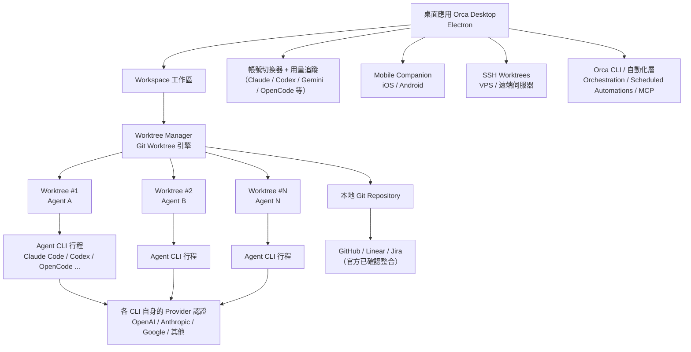

**重點整理**：桌面應用是控制平面，實際「寫程式碼」的工作是委派給各個 Agent CLI 行程完成，Orca 本身不介入模型推理，只負責流程調度、隔離、比較與同步。第 2.15 節提到的 Orca CLI／自動化層（圖中節點 L）與圖形介面是平行的兩種操作方式，兩者最終都落在同一套 Workspace／Worktree 狀態上，因此可以互相搭配（例如用 GUI 監看、用 CLI 排程批次任務）。

### 3.2 Agent 架構

單一 Agent 從啟動到產出的生命週期，依推論繪製如下：

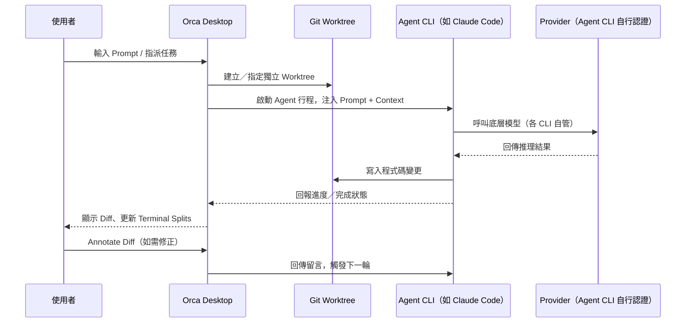

### 3.3 Workspace／Session／Context／Prompt 關係

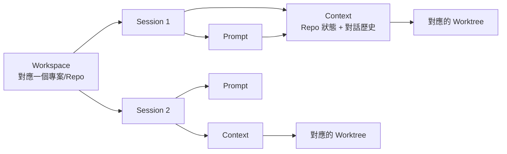

- **Workspace**：對應一個專案／Repository，是最上層容器。
- **Session**：每次任務分派形成一個 Session，記錄 Prompt、Context、對應 Worktree 與產出。
- **Context**：Agent 執行當下所擁有的資訊，包含 Repo 現況、先前對話、Design Mode 送入的截圖／HTML 等。
- **Prompt**：使用者下達的具體指令文字。
- **Git／Source Control**：所有變更最終仍落在真實 git worktree 上，可用標準 git 工具鏈檢視與操作。

**最佳實務**：將「一個 Session 對應一個明確、可驗收的任務」作為團隊規範，避免一個 Session 塞入多個不相關需求，導致 Diff 難以審查。

**注意事項**：本章三張圖皆為依官方功能描述推論繪製，並非官方原廠釋出之架構圖，內部命名（如「Worktree Manager」）僅為教學用途之示意名稱。

**常見錯誤**：將推論架構圖直接當作官方技術文件引用於外部簡報或合約附件，建議加註「示意圖，非官方原廠圖」字樣。

**小技巧**：導入前可要求熟悉 Orca 的成員實際操作一次「一個 Prompt → 兩個 Agent → 比較 Diff → 合併」的流程，反向驗證本章架構圖是否與實際操作介面一致，再決定是否用於團隊教育訓練。

---

## 第四章 安裝與環境建置

### 4.1 系統需求總覽

| 項目 | 內容 | 查證狀態 |
|---|---|---|
| 作業系統 | Windows／macOS（Apple Silicon＋Intel）／Linux | 已查證 |
| 授權模式 | 免費、MIT 授權、Bring Your Own Subscription（自備各 agent CLI 訂閱） | 已查證 |
| 網路需求 | 需能連線至各 agent CLI 對應的 Provider 服務 | 已查證（合理推論） |
| 最低硬體規格 | 官方未列出具體最低 RAM/CPU 門檻數字 | ⚠️ 官方未公告最低規格，但已有具體參考數據，見下方說明 |

**資源使用參考數據（有出處，非臆測）**：

- 第三方評測：安裝檔約 250MB；閒置狀態下多 agent 同時運行約消耗 400–800MB RAM（來源：andrew.ooo 技術評測）。
- **官方自行公開的效能分析文件**（`docs/renderer-memory-profile-2026-06-01.md`，2026-06-01）記錄了一次除錯採樣的實際數字：main process 約 390MB RSS、renderer process 約 460MB RSS（CPU 占用約 40%，以 V8／IPC／反序列化為主）、GPU process 約 145MB RSS、network service 約 59MB、audio service 約 48MB。**這是單一除錯情境的採樣（單一 Codex TUI、無瀏覽器分頁），並非平均值或官方保證規格**，多個平行 Agent 同時運行時，實際佔用會依比例明顯上升。
- 官方也在同一份文件中記錄了因應此問題所做的優化（如卸載未使用中的內嵌瀏覽器 webview、修正終端機重繪緩衝區因 TUI 狀態訊息暴增而膨脹的問題），代表官方對記憶體佔用議題有持續關注與改善動作。

### 4.2 Windows 安裝

1. 前往官方下載頁 `onorca.dev/download` 或 GitHub Releases 頁面，下載 `.exe` 安裝檔。
2. 執行安裝檔，依精靈完成安裝。
3. 首次啟動需登入至少一組 agent CLI 帳號（見第 6 章），才能開始建立 Workspace。

**注意事項**：企業內網若有應用程式白名單管控，需將 Orca 安裝檔與其自動更新機制一併提交資安審核，因其近乎每日發版，建議與資安團隊協商合理的更新審查頻率，而非逐版審查。

### 4.3 macOS 安裝

- 直接下載官方 `.dmg`（區分 Apple Silicon／Intel 版本）安裝。
- 或透過 Homebrew：
  ```bash
  brew install --cask stablyai/orca/orca
  ```

**小技巧**：企業內若已有 Homebrew 集中管理開發工具的慣例，建議優先採用 cask 安裝方式，便於後續版本盤點與批次更新腳本管理。

### 4.4 Linux／Ubuntu 安裝

- 官方提供 AppImage 格式：下載後賦予執行權限即可執行。
  ```bash
  chmod +x Orca-x.y.z.AppImage
  ./Orca-x.y.z.AppImage
  ```
- Ubuntu／Debian 系發行版執行 AppImage 前，可能需要安裝 `libfuse2`（⚠️ 此為 AppImage 格式的通用需求說明，非 Orca 官方文件逐項列出的相依套件，各發行版套件名稱可能不同，請依實際錯誤訊息排查）：
  ```bash
  sudo apt-get install -y libfuse2
  ```
- 社群另提供 AUR 套件（Arch Linux）：
  ```bash
  yay -S stably-orca-bin
  # 或從原始碼建置：
  yay -S stably-orca-git
  ```
- 無頭（headless）Linux 伺服器可執行：
  ```bash
  orca serve
  ```
  搭配第 17 章的 SSH Worktrees 使用。

### 4.5 WSL（Windows Subsystem for Linux）— 已查證支援

> **本次查證更新**：與先前版本手冊的保守判斷不同，官方原始碼與 release notes 已提供明確證據，WSL 屬於**已查證、持續有人維護**的支援情境，而非單純「理論上可行」：
>
> - 官方文件庫中有多份專屬文件處理 WSL 情境，例如 `docs/agent-status-over-wsl.md`（跨 WSL 邊界回報 Agent 狀態）、`docs/wsl-osc7-sleep-wake-cwd.md`（WSL 睡眠／喚醒時的工作目錄同步）、`docs/issue-7649-vscode-wsl-launch.md`（VS Code WSL 啟動整合）。
> - 實際運作機制：對於位於 WSL 檔案系統（`\\wsl.localhost\...`）的 Repository，Orca 會透過 `wsl.exe -d <distro>` 啟動對應的 Linux 發行版；對於原本以 Windows 路徑開啟、但在 WSL 內操作的 Repository，Orca 會將工作目錄轉譯為 `/mnt/<drive>/...` 格式，並帶你進入登入用的 bash shell。
> - 近期 release notes（v1.4.150）仍有 WSL 相關修正上線，例如「修正將 WSL 預設 shell 誤判為 PowerShell」的 bug，代表這是**持續在打磨中的正式支援情境**，而非附帶功能。
>
> **已知風險（誠實揭露）**：官方 GitHub Issue #8470 回報過「Workspace 睡眠後喚醒時的 `DaemonProtocolError`」，屬於 WSL 情境下的已知 open issue。企業導入前建議先在測試環境驗證「休眠／喚醒」情境下的穩定性，尤其是長時間掛機的 Worktree。
>
> 綜合結論：WSL 可視為**已支援、但仍在成熟中**的執行環境，建議正式導入前先小規模試跑，並留意上述已知問題是否已在你使用的版本中修復。

### 4.6 Docker — 官方提供容器內執行指引，但無官方映像檔

> 截至查證日期（2026-07-22），**官方沒有發布 Dockerfile 或現成的 Docker 映像檔**，Docker 並非 Orca 的一級（first-class）部署形式。但與先前版本手冊「官方完全未提供任何說明」的判斷不同，官方文件庫中的 `docs/reference/headless-linux-server.md` 確實提供了**官方認可、在容器內執行 Linux AppImage 的操作指引**，內容包含：
>
> - Docker 容器通常沒有 FUSE 裝置，因此不能直接執行 AppImage，需改用 `--appimage-extract` 先解壓縮一次，或使用 `--appimage-extract-and-run` 直接解壓並執行——兩種方式皆**不需要特權容器（privileged container）**。
> - 解壓縮後可用 `squashfs-root/AppRun serve --port <port>` 啟動無頭模式服務。
> - 容器內若無圖形環境，需搭配 `xvfb`（虛擬顯示伺服器）與 `LIBGL_ALWAYS_SOFTWARE=1` 環境變數，確保 headless 渲染正常運作。
>
> 若企業內部要求容器化部署（例如統一透過 Kubernetes 排程無頭 Agent 任務），建議路徑是：
>
> 1. 直接依循官方 `headless-linux-server.md` 的 AppImage 解壓縮＋Xvfb 指引撰寫 Dockerfile，而非自行從零摸索；
> 2. 仍將此視為**企業自行組裝、非官方發布映像檔**的部署形式，需自行承擔映像檔更新與相容性驗證責任（AppImage 版本更新後，容器建置流程需同步調整）；
> 3. 不建議將自製映像檔對外散布，以免使用者誤認為官方版本。

### 4.7 VPS／遠端伺服器安裝

- VPS 上的安裝方式與第 4.4 節無頭 Linux 相同（`orca serve`），實際的「連線、自動重連、port forwarding」操作細節請見第 17 章，本節僅涵蓋安裝本身，避免內容重複。

### 4.8 常見安裝問題

| 問題 | 可能原因 | 解法 |
|---|---|---|
| AppImage 無法執行 | 缺少 FUSE 相依套件、或未賦予執行權限 | 安裝 `libfuse2`（或對應發行版套件）並確認 `chmod +x` |
| Windows 安裝後無法啟動 | 防毒軟體誤判 Electron 應用 | 將安裝路徑加入防毒白名單，並以官方 GitHub Releases 的檔案雜湊值核對安全性 |
| macOS 提示「無法驗證開發者」 | Gatekeeper 攔截未公證（或公證資訊未同步）的應用 | 於「系統設定 → 隱私權與安全性」中允許執行，並確認下載來源為官方管道 |
| 企業網路無法連線 Provider | 防火牆／Proxy 阻擋 agent CLI 對外連線 | 依第 6 章盤點各 agent CLI 實際連線網域，向資安申請白名單 |

---

### 第1~4章 檢查清單（Checklist）

- [ ] 已理解 Orca＝「艦隊指揮層」而非「取代既有 agent CLI 的新 AI」
- [ ] 已釐清「Orca 包裝的 agent CLI」與「與 Orca 同層競爭的 IDE／終端機」兩種比較關係
- [ ] 已確認團隊常用的 agent CLI 是否在官方最新支援清單中
- [ ] 已理解 Provider Management 實際上是「帳號切換器＋用量追蹤（Claude／Codex／Gemini 等）」，非原始 LLM Provider 切換 UI
- [ ] 已依作業系統完成安裝（Windows／macOS／Linux／VPS）
- [ ] 若評估 WSL 部署，已知悉官方已有支援機制但仍存在已知 open issue（見第 4.5 節），已排入測試計畫
- [ ] 若評估 Docker 容器化部署，已採用官方 `headless-linux-server.md` 指引而非自行摸索（見第 4.6 節）
- [ ] 已將 Orca 安裝檔與自動更新機制提交資安／IT 白名單審核
- [ ] 已建立團隊內部的「官方功能查證看板」，用於追蹤近乎每日發版帶來的變動

---

## 第五章 建立第一個 Workspace

### 5.1 建立 Workspace 的標準流程

依官方快速上手流程重建的典型操作步驟：

1. 開啟 Orca 桌面應用，登入至少一組 agent CLI 帳號（見第 6 章）。
2. 選擇「新增 Workspace」，指向本地端已存在的 Git Repository，或直接透過 Git Clone 匯入遠端 Repository。
3. Orca 讀取該 Repository 的分支狀態後，建立對應的 Workspace 容器。
4. 在 Workspace 內建立第一個 Worktree，指派一個 Agent 與一則 Prompt。
5. 觀察 Terminal Splits 中的即時輸出，任務完成後於 Diff 檢視畫面確認變更。

### 5.2 開啟既有專案（Import Existing Project）

- 若專案已存在本地磁碟，直接選擇資料夾匯入，Orca 會偵測其 `.git` 目錄並建立對應 Workspace。
- 若專案尚未 clone，可在 Orca 內直接輸入 Git Remote URL 執行 Git Clone，完成後自動建立 Workspace。

**注意事項**：匯入既有專案前，建議先確認該 Repository 沒有未提交（uncommitted）的重大變更，避免 Orca 建立 Worktree 時的初始狀態與你預期的基準不一致。

### 5.3 Git Clone 匯入遠端專案

適用於團隊協作情境：新成員第一次設定環境時，直接在 Orca 內完成 Clone，不需另外開終端機操作，簡化 Onboarding 流程。

### 5.4 Workspace Settings（工作區設定）

常見可調整項目（實際欄位以當下版本 UI 為準）：

| 設定項目 | 說明 |
|---|---|
| 預設 Agent CLI | 該 Workspace 新建 Worktree 時預設指派的 agent |
| 分支基準 | 新 Worktree 建立時的來源分支（如 `main`／`develop`） |
| 通知偏好 | 任務完成、需人工介入等事件是否推播到 Mobile Companion |
| 遠端／VPS 綁定 | 若該 Workspace 對應遠端 SSH Worktree，設定連線資訊（見第 17 章） |

**最佳實務**：為不同性質的專案（如「核心服務」與「內部工具」）建立獨立 Workspace，避免不同專案的 Worktree 混雜在同一個檢視畫面中，降低誤操作風險。

**常見錯誤**：多名工程師共用同一個 Workspace 帳號登入卻未建立個人化的 Worktree 命名規則，導致無法分辨「這個 Worktree 是誰建立的、對應哪個需求」。

**小技巧**：Worktree 命名建議帶入需求編號（如 `JIRA-1234-fix-login`），方便日後在 Terminal Splits 與 Diff 列表中快速辨識。

---

## 第六章 Provider 設定與 Agent 帳號管理

> **重要區分**：本章標題沿用「Provider 設定」以符合讀者搜尋習慣，但請務必建立正確心智模型：本次查證**未發現 Orca 具備原始 LLM Provider（OpenAI／Anthropic／Google／OpenRouter／Azure OpenAI／Ollama／LM Studio 等）切換 UI 的證據**。Orca 是 ~29 種 Agent CLI 的協調器，**每個 Agent CLI 各自管理自己的 Provider 認證**；Orca 本身已查證的層級，是「帳號切換器＋針對 Claude 與 Codex 的用量／Rate Limit 追蹤」。以下內容依此事實重新組織章節，確保讀者原本關心的每個主題（API Key、Rate Limit、Cost、Model Selection）都有對應且誠實的說明。

### 6.1 帳號切換器（已查證）

Orca 提供帳號切換器，可在同一個桌面應用中管理多組已登入的 agent CLI 帳號（例如同時登入 Claude 帳號與 Codex 帳號）。官方 README 主打畫面聚焦展示 Claude、Codex 的用量與 Rate Limit 重設時間；官方文件（`onorca.dev/docs/agents/usage-tracking`）進一步說明，Orca 實際是讀取各 CLI 在本機磁碟維持的用量狀態檔案（如 `~/.claude`、`~/.codex` 等路徑），追蹤範圍包含 **Claude Code、Codex、Gemini、OpenCode、Kimi Code、MiniMax**。若某 CLI 被設定為連接自訂／非標準 Provider，則會顯示「Custom provider — no usage tracked」，代表 Orca 無法追蹤該情境下的用量。

**最佳實務**：企業導入時，建議以「團隊共用授權帳號」與「個人帳號」分開管理，並在帳號切換器中清楚標示用途，避免任務混用不同計費主體的額度。

### 6.2 各 Agent CLI 的 Provider／模型設定入口對照表

由於 Orca 不統一覆蓋各 CLI 的 Provider 設定，實際的 OpenAI／Anthropic／Google／OpenRouter／Azure OpenAI／Ollama／LM Studio 等設定，要到「各 Agent CLI 自己的設定入口」完成。下表整理常見對應關係（⚠️ 各 CLI 版本演進快速，實際選項請以該 CLI 官方文件為準）：

| Agent CLI | 常見可用 Provider／模型來源 | 設定入口 |
|---|---|---|
| Claude Code | Anthropic（原生）；企業版另可透過 Bedrock／Vertex 等管道 | Claude Code 自身的認證流程／設定檔 |
| Codex | OpenAI | Codex CLI 自身的登入／設定流程 |
| OpenCode | 原生支援多 Provider（含 OpenRouter、Ollama 等本地/聚合模型） | OpenCode 自身的設定檔／CLI 參數 |
| Cursor Agent | 依 Cursor 帳號綁定之模型選項 | Cursor 應用內設定 |
| GitHub Copilot CLI | GitHub Copilot 訂閱綁定之模型 | GitHub 帳號／Copilot 設定 |
| Goose、Cline、Continue、Aider 等開源 CLI | 多數支援自訂 Provider（含 Azure OpenAI、Ollama、LM Studio 等本地模型） | 各自的設定檔（如 `config.yaml`／環境變數） |

> **注意事項**：Orca 僅負責啟動與管理這些 CLI 的行程（Process），**不會覆蓋或統一各 CLI 自己的 Provider 設定**。若你在 Orca 裡看到「這個 agent 用的是哪個模型」，該資訊來自於該 CLI 自身回報，而非 Orca 內建的模型選擇器。

### 6.3 API Key／認證管理最佳實務

- 每個 agent CLI 的 API Key／認證資訊，建議透過該 CLI 官方支援的機制管理（環境變數、系統金鑰圈、CLI 自身的登入流程），**不建議**將原始金鑰明碼寫入 Orca 的 Prompt 或任何會被記錄／同步到 Mobile Companion 的欄位中。
- 多個 Worktree 平行執行時，注意各 Worktree 是否共用同一組金鑰／同一組額度，避免因為平行擴張而不自覺地放大單一金鑰的曝險面。
- 遠端／VPS 執行（第 17 章）時，金鑰實際落地在遠端主機，需比照企業內部對「伺服器上明碼金鑰」的既有規範（如集中式密鑰管理服務）處理，而非假設 Orca 有內建的金鑰保管機制。

**常見錯誤**：在 Design Mode 或 Prompt 中貼入含有金鑰片段的設定檔截圖，導致金鑰意外進入 agent 的 Context 與對話紀錄。

### 6.4 用量、費用與 Rate Limit 治理

- **已查證部分**：Orca 針對 Claude、Codex（且依官方用量追蹤文件，實際涵蓋範圍更廣，另包含 Gemini、OpenCode、Kimi Code、MiniMax）提供帳號用量與 Rate Limit 的追蹤畫面，可在多個平行 Worktree 同時運行時，提前掌握是否即將觸及限額。
- **建議治理框架（非 Orca 原生功能，屬企業自建最佳實務）**：
  1. 依團隊／專案設定月度預算上限，定期比對各 agent CLI 各自的帳單／用量後台（因為計費仍由各 Provider／CLI 供應商各自負責）。
  2. 平行 Worktree 數量與任務重要度掛鉤——非核心的探索性任務，優先使用成本較低的模型／CLI 組合。
  3. 針對 Rate Limit 較敏感的任務（如即時展示前的修正），避免與大量平行探索任務搶用同一組帳號額度。

### 6.5 模型選擇建議

由於 Orca 本身不提供「選模型」的介面，實務上應理解為「**任務該指派給哪一種 Agent CLI**」，而非「在 Orca 裡切換模型」：

| 任務性質 | 建議指派方向 | 理由 |
|---|---|---|
| 需要強力推理／複雜重構 | 指派給搭配高階模型的 CLI（依當下各 CLI 綁定情況而定） | 複雜任務對模型能力敏感度高 |
| 大量重複性小改動（如批次格式修正） | 指派給成本較低的 CLI／模型組合 | 降低整體平行擴展的成本負擔 |
| 需要本地／離線推理（資料不可外流） | 指派給支援 Ollama／LM Studio 等本地模型的 CLI（如部分開源 CLI） | 滿足資料落地與合規要求 |
| 需要與 GitHub／Linear 深度整合的任務 | 指派給對應整合較成熟的 CLI | 減少額外整合工作 |

**重點整理（本章）**：Orca 的「Provider 設定」本質是「多組 Agent CLI 帳號的管理與用量可視化」，實際模型／Provider 選擇仍下放給各 CLI 自行負責；企業導入時應把治理重點放在「金鑰管理」與「跨 CLI 成本治理」，而非期待 Orca 提供統一的模型路由功能。

**小技巧**：可將本章 6.2 對照表轉成團隊內部的「Agent CLI 能力/Provider 速查表」，隨官方各 CLI 版本更新定期複核。

---

## 第七章 Agent 管理

### 7.1 支援的 Agent CLI 完整清單（查證當下，已核實）

本次查證已直接取得官方 README「Supported Agents」區塊的**完整具名清單**（而非代表性子集合），共 29 個具名 agent，依官方原始出現順序、加上教學用分組如下（完整清單請仍以官方 README 當下版本為準，因近乎每日發版可能持續增修）：

| 分類（教學用分組，非官方分類） | Agent CLI（依官方 README 出現順序） |
|---|---|
| 主流商用終端機 Agent | Claude Code、Codex、Grok、Cursor、GitHub Copilot |
| 開源／社群 Agent | OpenCode、Cline、Continue、Goose、Codebuff、Kilocode |
| 新興／專用 Agent | MiMo Code、Amp、OpenClaude、Antigravity、Pi、oh-my-pi、Hermes Agent、Devin、Auggie、Autohand Code、Charm、Command Code、Droid、Kimi、Kiro、Mistral Vibe、Qwen Code、Rovo Dev |

官方 README 該區塊開頭明確寫道：「Works with any CLI agent — if it runs in a terminal, it runs in Orca.」並在清單最後附上 **「+ any CLI agent」萬用支援**條目——代表即使某支 CLI 未被官方明確列名（例如 Aider、Roo Code、OpenHands、Gemini CLI 等社群常見工具），理論上仍有機會透過此萬用相容性使用，但**實際相容性、操作體驗未經官方逐一保證**，建議正式導入前先行小規模測試。

**注意事項**：

- 上表分類（主流商用／開源社群／新興專用）為教學用分組，非官方原廠分類。
- 官方網站 onorca.dev 行銷文案使用「25+ built-in agents」的說法，與本表 29 個具名條目方向一致（29 ＞ 25）。
- 官方網站比較表提及「Gemini」作為範例模型，但 Gemini CLI **並未**出現在 README 的具名清單中，較可能是透過「+ any CLI agent」萬用支援涵蓋，而非官方預先配置好的獨立條目，本手冊維持第 1.2 節「潛在可包裝、非確認官方預先配置」的保守標註。

### 7.2 建立 Agent

在 Worktree 建立當下（或事後）指派要使用哪一種 Agent CLI 執行任務，前提是該 CLI 已於本機（或遠端主機）完成安裝與登入。

### 7.3 停止 Agent／重新啟動

- **停止**：可中止正在執行的 Agent 行程，該 Worktree 的檔案狀態保留在中止當下，方便之後檢視或續跑。
- **重新啟動**：針對同一個 Session 重新送出（或微調）Prompt，讓 Agent 基於既有 Context 繼續工作，而非從零開始。

**最佳實務**：長任務建議定期檢查進度而非放著不管，一旦發現 Agent 明顯偏離需求方向，及早停止並修正 Prompt，比等到全部跑完再重工更有效率。

### 7.4 Agent Pool／Agent Cluster（教學統稱）

當團隊同時管理多個任務、多個 Agent CLI 時，實務上會形成一個「Agent Pool」：由技術主管或資深工程師決定「這批任務該分配給哪些 Agent、各自的優先順序」，本手冊將這種管理模式統稱為 Agent Cluster 管理（見第 8、13 章的具體案例）。

### 7.5 Agent Session／Prompt／Memory／Context

- **Agent Session**：對應第 3.3 節定義的 Session，一次任務分派的完整記錄。
- **Agent Prompt**：下達給該 Agent 的具體指令，建議搭配第 18 章的 Prompt Engineering 原則撰寫。
- **Agent Memory／Context**：Agent 在單一 Session 內累積的對話與程式碼狀態；**注意**：除非該 Agent CLI 本身具備跨 Session 記憶能力，否則新開的 Session／Worktree 通常不會自動繼承先前 Session 的隱性知識，需要透過明確的 Prompt 或文件重新提供背景。

### 7.6 Task Queue／Retry／Monitoring

- **Task Queue**：多個任務等待分派時，建議由人工（而非全自動）決定優先順序與 Agent 指派，避免一次塞爆過多平行任務導致 Rate Limit 或審查產能跟不上。
- **Retry**：任務失散或產出不符預期時，優先嘗試「調整 Prompt 後在同一 Worktree 重新執行」，而非直接放棄；若多次調整仍無改善，考慮更換 Agent CLI。
- **Monitoring**：透過桌面應用的 Terminal Splits 與 Mobile Companion 的推播通知，掌握各平行任務的即時狀態。

**常見錯誤**：

1. 同時分派過多任務給同一組帳號，觸發 Rate Limit 導致多個 Worktree 同時卡住。
2. 誤以為停止後重新啟動一定會「接續」原本的推理脈絡——實際仍取決於底層 Agent CLI 是否有效保留 Context。

**小技巧**：針對重要任務，建議在 Prompt 中明確要求 Agent 於完成後輸出「變更摘要＋自我檢查清單」，作為人工審查前的第一道過濾。

---

## 第八章 Parallel Agents 平行代理實戰

> ⚠️ 本章示例採用「Agent A～H」八個角色編組作為**教學示例**，用於說明平行分派的操作模式，並非 Orca 官方規定或固定的產品配置；實務上可依專案需求彈性增減。

### 8.1 平行分派的基本流程

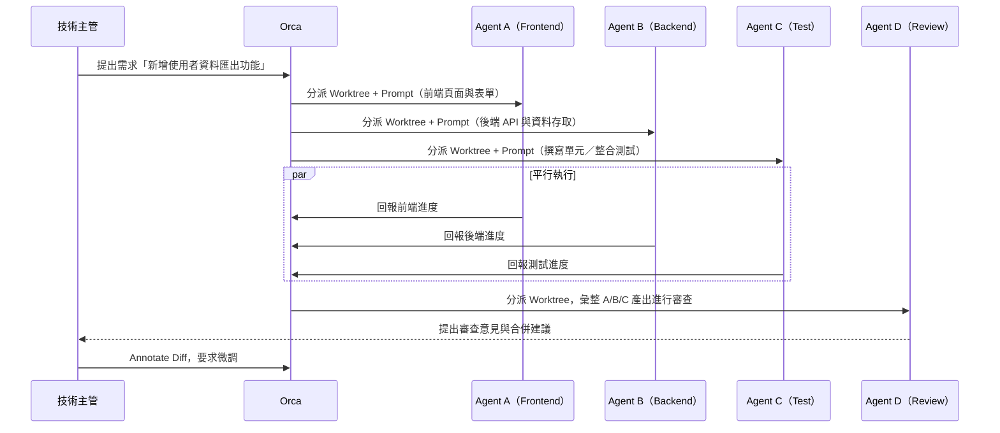

### 8.2 八角色編組範例

| 角色 | 負責範疇 | 產出 |
|---|---|---|
| Agent A – Frontend | UI／表單／狀態管理 | 前端元件與畫面 |
| Agent B – Backend | API、商業邏輯、資料存取 | 後端服務程式碼 |
| Agent C – Test | 單元測試、整合測試 | 測試程式碼與涵蓋率報告 |
| Agent D – Review | 交叉審查 A/B/C 產出 | 審查意見、風險提示 |
| Agent E – Architecture | 評估整體設計是否一致 | 架構調整建議 |
| Agent F – Database | Schema 設計、Migration 腳本 | 資料庫變更腳本 |
| Agent G – Documentation | API 文件、使用說明 | 文件草稿 |
| Agent H – CI/CD | Pipeline 腳本、部署設定調整 | CI/CD 設定檔變更 |

### 8.3 如何合作與合併

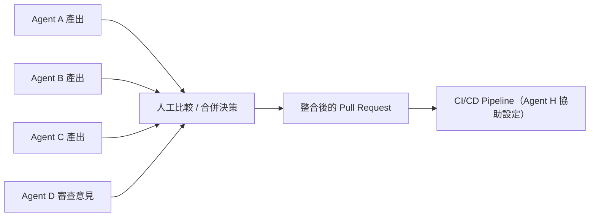

**重點整理**：平行代理的價值不在於「全自動合併」，而在於**縮短「產出候選方案」的時間**，最終的取捨與合併仍需人工決策，這也是第 13 章「Agent 協作角色分工」要進一步強化治理的地方。

**最佳實務**：任務拆分時盡量讓各 Agent 負責的檔案範圍不重疊（如前端/後端/測試分屬不同目錄），降低合併衝突機率。

**注意事項**：角色數愈多，人工審查與整合的負擔也同步增加，建議依團隊實際審查產能決定平行角色數量，而非一味追求最大並行度。

**常見錯誤**：讓多個 Agent 同時修改同一個共用模組（如共用型別定義），導致合併時出現大量衝突，抵銷了平行化帶來的效益。

**小技巧**：先用 2～3 個角色（如 Frontend／Backend／Test）練熟合併流程，確認團隊審查節奏後，再逐步擴充到更多角色。

---

## 第九章 AI Coding Workflow

### 9.1 完整流程總覽

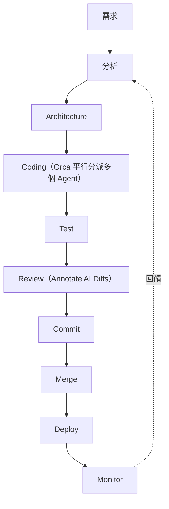

### 9.2 Orca 在各階段的參與方式

| 階段 | Orca 的角色 |
|---|---|
| 需求／分析 | 人工主導，Orca 尚未介入；可先用單一 Agent 做需求釐清草稿 |
| Architecture | 可平行分派多個 Agent 產出不同架構草案，人工比較取捨 |
| Coding | 核心強項：Parallel Worktrees 平行實作，Design Mode 輔助 UI 細節溝通 |
| Test | 可指派專責 Agent（如第 8 章 Agent C）撰寫測試，或要求同一 Agent 自我補測試 |
| Review | Annotate AI Diffs 提供結構化留言機制，回饋可直接送回對應 Agent |
| Commit／Merge | 底層即為標準 git 操作，Orca 提供圖形化輔助（見第 14、15 章） |
| Deploy | Orca 本身不含 CI/CD 執行引擎，需搭配既有 GitHub Actions 等工具（見第 10 章案例） |
| Monitor | 上線後的監控屬既有 SRE／APM 工具範疇，Orca 的 Mobile Companion 可用於接收「部署後需人工確認」類的通知 |

**重點整理**：Orca 的強項集中在 Coding 到 Review 這段迴圈，Deploy／Monitor 仍需與既有 DevOps 工具鏈整合，並非端到端的一站式平台。

**最佳實務**：把「需求→分析→架構」這段留給人類與單一 Agent 深度討論收斂後，再進入 Coding 階段的平行分派，避免在需求還不穩定時就急著平行擴張，造成大量無效產出。

**注意事項**：Deploy／Monitor 階段的自動化，仍需仰賴團隊既有的 CI/CD 與監控體系，不要預期 Orca 能取代這些既有investment。

**常見錯誤**：需求本身還在反覆變動時就分派給多個 Agent 平行實作，導致需求一改、所有 Worktree 的產出全部報廢。

**小技巧**：可將本章流程圖印出或嵌入團隊 Wiki，作為導入 Orca 時向非技術主管說明「AI 加速的是哪一段，哪一段仍需要人」的溝通輔助。

---

### 第5~9章 檢查清單（Checklist）

- [ ] 已完成 Git Clone／Import Existing Project，建立第一個 Workspace 與 Worktree
- [ ] 已理解第 6 章「Provider 設定」的正確心智模型：帳號切換器＋各 CLI 自管 Provider
- [ ] 已建立團隊的 API Key／認證管理規範（不將金鑰明碼寫入 Prompt）
- [ ] 已針對 Claude／Codex 之外的 Agent CLI，建立自訂的用量／成本追蹤方式
- [ ] 已盤點團隊可用的 Agent CLI 清單，並對應到任務類型的指派原則
- [ ] 已練習過至少一次 2～3 角色的平行分派與人工合併流程
- [ ] 已釐清 Orca 在需求→部署全流程中，實際涵蓋的範圍（Coding～Review 為主）

---

## 第十章 企業 Web 應用程式開發案例

> ⚠️ **本章為教學示例案例**，用於示範如何以 Orca 分派多個 Agent 協作開發一套企業 Web 應用，非真實客戶專案，技術棧選型（Spring Boot 4／Java 25 等）僅為教學情境設定，實際專案請以當下可用之穩定版本為準。

### 10.1 案例背景

**情境**：某企業需開發一套內部「客戶資料查詢與匯出」Web 應用，技術棧設定為：

- 前端：Vue 3 ＋ TypeScript ＋ Tailwind CSS ＋ PrimeVue
- 後端：Spring Boot 4 ＋ Java 25
- 資料庫：Oracle（既有核心資料）＋ PostgreSQL（新服務自有資料）
- 快取：Redis
- 部署：Docker ＋ Kubernetes
- 版控／CI：GitHub ＋ GitHub Actions

### 10.2 需求拆解與 Agent 分派

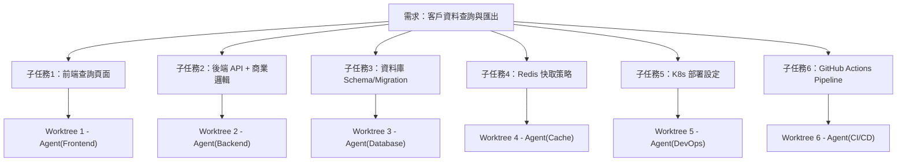

### 10.3 分派範例（Prompt 摘要）

| Worktree | 指派內容摘要 |
|---|---|
| Frontend | 「使用 Vue3 Composition API＋TypeScript＋PrimeVue DataTable，建立客戶資料查詢頁面，支援分頁、條件篩選、匯出 CSV按鈕，樣式採 Tailwind CSS。」 |
| Backend | 「使用 Spring Boot 4／Java 25，建立 `/api/customers/search` 端點，支援分頁與條件查詢，商業邏輯需驗證使用者資料存取權限。」 |
| Database | 「設計客戶查詢所需的索引策略，並提供 Oracle 既有資料表與 PostgreSQL 新表之間的資料同步 Migration 腳本草案。」 |
| Cache | 「針對高頻率查詢條件設計 Redis 快取策略，含快取失效規則建議。」 |
| DevOps | 「撰寫此服務的 Kubernetes Deployment／Service／HPA 設定草案。」 |
| CI/CD | 「撰寫 GitHub Actions workflow，涵蓋建置、單元測試、映像檔建置與推送。」 |

### 10.4 整合與驗收

各 Worktree 完成後，由技術主管／架構師角色（可另指派 Agent E 擔任，見第 8 章）進行整合審查：

1. 確認前端呼叫的 API 契約與後端實作一致。
2. 確認資料庫 Migration 腳本可在測試環境成功套用且不影響既有 Oracle 資料。
3. 確認 K8s／CI 設定與公司既有平台規範相容（如 namespace 命名、Secret 管理方式）。
4. 使用 Annotate AI Diffs 對需要調整之處逐一留言，回傳給對應 Agent 修正。

**最佳實務**：技術棧涉及新舊資料庫並存（Oracle＋PostgreSQL）時，務必指派專責 Agent／人工再次確認資料一致性與交易邊界，不建議完全交由單一 Agent 一次到位。

**注意事項**：K8s 與 CI/CD 設定屬於高風險變更（可能影響正式環境部署），建議一律經過人工審查與測試環境驗證後才合併，不因為是 AI 產出而降低審查標準。

**常見錯誤**：多個 Agent 各自對同一組共用型別（如 DTO／API 契約）做出不同假設，導致前後端介接時出現落差；建議先由一個 Agent（或人工）產出契約草案（如 OpenAPI Spec）作為其他 Agent 的共同輸入。

**小技巧**：可將本案例的六個子任務視為模板，日後遇到類似「多層次企業應用」需求時，直接套用「前端／後端／資料庫／快取／部署／CI」的拆分方式起手。

---

## 第十一章 舊系統逆向工程

> ⚠️ 本章示例為教學情境，示範如何運用 Orca 平行分派多個 Agent 進行 Legacy 系統理解，Orca 提供的是「平行容器」，實際的程式碼理解與逆向分析能力仍取決於底層 Agent CLI 本身的能力。

### 11.1 適用情境

企業常見的 Legacy 技術棧：Java 6／7／8、EJB、Struts、Spring MVC、ASP.NET、Delphi、VB、COBOL。這類系統的共同痛點是「熟悉原始邏輯的人力有限、文件缺失」，適合用平行 Agent 分頭建立初步理解，再由資深工程師收斂驗證。

### 11.2 平行盤點策略

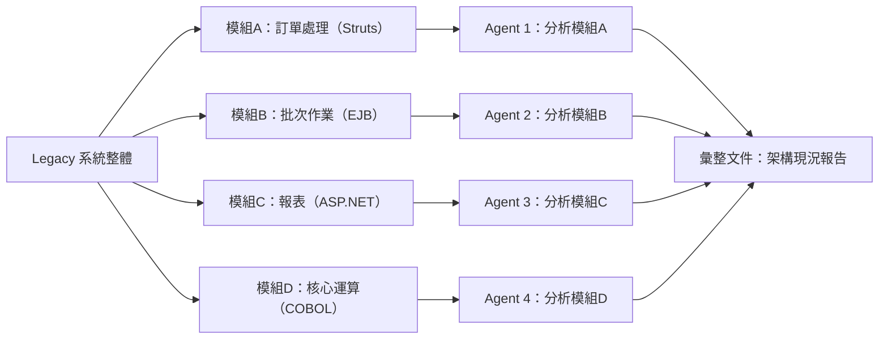

### 11.3 各技術棧的逆向工程重點

| 技術棧 | 常見盤點重點 | Agent 可協助的產出 |
|---|---|---|
| Java 6/7/8 ＋ EJB | 過時 API 使用、EJB 元件邊界、交易管理方式 | 現況架構圖草稿、風險清單 |
| Struts | Action／Form 對應關係、是否仍相容目前 Servlet 容器 | 路由與 Action 對應表 |
| Spring MVC（舊版） | 設定方式（XML vs. 註解混用）、相依版本 | 設定盤點報告、可升級路徑草案 |
| ASP.NET（Web Forms／MVC） | 頁面生命週期、ViewState 使用情況 | 頁面清單與相依關係圖 |
| Delphi／VB | 表單事件邏輯、資料庫直接存取語法 | 業務邏輯摘要文件 |
| COBOL | 資料結構（Copybook）、批次程式的輸入輸出檔案格式 | 資料結構說明文件、批次流程圖 |

### 11.4 產出彙整與交接

**最佳實務**：要求每個 Agent 產出統一格式的「模組現況報告」（如：模組職責、對外相依、已知風險、可觀察到的技術債），方便後續彙整為一份完整的系統現況文件，而非各自風格不一的自由文字。

**注意事項**：Legacy 系統盤點屬於高風險領域（誤判可能導致後續升級規劃失準），Agent 產出的分析報告務必由熟悉該系統的資深工程師覆核，不可直接作為最終決策依據。

**常見錯誤**：對「已多年無人維護、幾乎沒有文件」的模組，期待單一 Agent 一次到位產出完整分析——建議先分派「粗略掃描」任務，確認範圍後再分派「深入分析」任務。

**小技巧**：可將本章 11.3 的技術棧對照表當作「逆向工程 Prompt 起手式」，依實際系統技術棧挑選對應的重點清單快速組出 Prompt。

---

## 第十二章 Framework Upgrade 框架升級

> ⚠️ 本章為教學示例，示範如何以多 Agent 協同完成框架升級評估與遷移，實際遷移仍需搭配官方遷移指南與充分測試。

### 12.1 常見升級路徑

| 升級路徑 | 常見挑戰 |
|---|---|
| Java 8 → Java 25 | API 移除／棄用、模組化（JPMS）、GC 行為變化 |
| Spring Boot 2 → Spring Boot 4 | 設定屬性變更、Jakarta EE 命名空間遷移（`javax.*` → `jakarta.*`）、自動組態行為調整 |
| Hibernate 舊版 → 新版 | 方言（Dialect）調整、Lazy Loading 行為變化 |
| Vue 2 → Vue 3 | Composition API 遷移、全域 API 變更、第三方套件相容性 |
| Angular／React 大版本升級 | 變更偵測機制／Hook 規則調整、第三方套件相容性 |
| .NET Framework → .NET（跨平台版） | 專案檔格式（`.csproj`）調整、部分 API 不再支援 |

### 12.2 多 Agent 協同升級流程

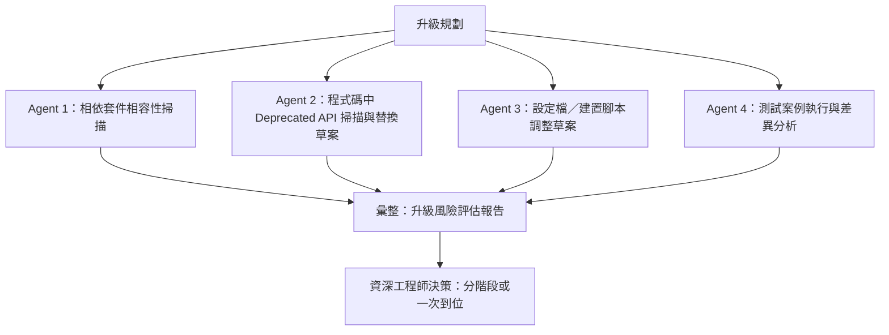

### 12.3 Java 8 → Java 25 範例分工

| Agent | 任務 |
|---|---|
| Agent 1 | 掃描專案中使用到的已移除／棄用 API（如舊版 `sun.*` 內部 API），列出清單 |
| Agent 2 | 針對可自動替換的語法（如改用新版集合／字串 API）產出替換草案 |
| Agent 3 | 調整 Maven／Gradle 建置設定至對應新版 JDK 需求 |
| Agent 4 | 執行既有測試套件，比對升級前後行為差異，標記需人工確認的案例 |

**最佳實務**：大版本跨越式升級（如 Java 8 直接跳 Java 25、Spring Boot 2 直接跳 4）建議先由 Agent 產出「分階段升級路徑」建議（如先升到 LTS 中繼版本），而非要求一次到位，降低風險。

**注意事項**：框架升級涉及生產環境穩定性，Agent 產出的自動替換程式碼務必搭配完整回歸測試，不可僅憑「編譯通過」就視為升級完成。

**常見錯誤**：忽略第三方套件／內部共用套件的相容性掃描，只顧著升級主專案本身，導致整合階段才發現相依套件不相容。

**小技巧**：可將「相容性掃描」與「替換執行」拆成兩個獨立 Agent 任務，先確認風險範圍再決定是否投入大規模替換工作，避免過早承諾工作量。

---

## 第十三章 Agent Collaboration 協作角色分工

### 13.1 角色設計原則

延續第 8 章的平行角色示例，本章聚焦在「治理」層面：如何讓多個 Agent 的協作有明確的權責邊界。

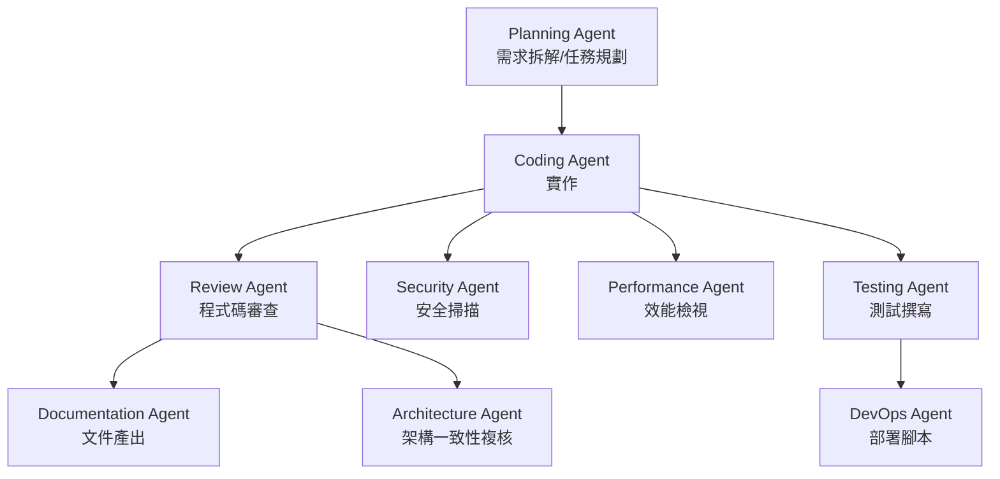

### 13.2 各角色職責說明

| 角色 | 職責 | 產出 |
|---|---|---|
| Planning Agent | 將需求拆解為可平行分派的子任務 | 任務清單、依賴關係圖 |
| Coding Agent | 實作各子任務 | 程式碼變更（Diff） |
| Review Agent | 交叉審查程式碼品質、風格一致性 | 審查意見 |
| Security Agent | 掃描常見安全弱點（如注入攻擊、權限漏洞） | 安全檢查報告 |
| Performance Agent | 檢視效能熱點、資源使用狀況 | 效能建議 |
| Documentation Agent | 產出/更新技術文件、API 文件 | 文件草稿 |
| Testing Agent | 撰寫單元／整合測試 | 測試程式碼 |
| DevOps Agent | 調整部署／CI 設定 | Pipeline／部署腳本 |
| Architecture Agent | 複核整體設計是否偏離既定架構原則 | 架構複核意見 |

**最佳實務**：Security Agent 與 Performance Agent 的審查意見，建議設為「合併前必須處理」的強制關卡，而非選配項目，尤其是對外服務或涉及機敏資料的系統。

**注意事項**：角色分工是教學上的邏輯劃分，實務執行時，一個 Agent CLI 可能同時身兼多個角色（例如同一個 Claude Code 實例先後扮演 Coding 與 Testing），關鍵在於「Prompt 是否清楚切換角色脈絡」，而非要求每個角色對應到不同的 Agent CLI 產品。

**常見錯誤**：Security／Performance 角色形同虛設，Prompt 中只是口頭要求「注意安全性」卻未提供具體檢查基準（如 OWASP Top 10 對照），導致審查流於形式。

**小技巧**：為 Security Agent／Performance Agent 準備固定的檢查清單模板（見第 29 章 Prompt Library），確保每次審查涵蓋的面向一致，不因 Prompt 隨興撰寫而遺漏重點。

---

## 第十四章 Git Integration

### 14.1 Worktree 即 Git Worktree

Orca 的 Worktree 並非抽象概念，而是**實體的 git worktree**：同一個 `.git` 物件庫下，可以有多個工作目錄同時存在，各自檢出不同分支或相同分支的不同狀態，彼此的檔案異動互不影響。這也是 Orca 能讓多個 Agent 平行工作卻不互相覆寫檔案的技術基礎。

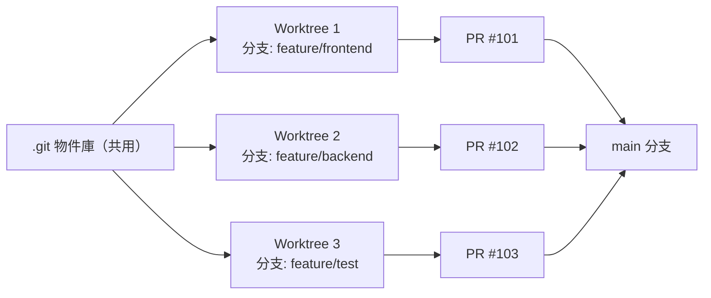

### 14.2 Branch／Commit／Merge

- 每個 Worktree 通常對應一個獨立 Feature Branch，Agent 的每次有意義產出可對應一次 Commit，維持可追溯性。
- Merge 階段建議走正常的 Pull Request 流程（見 14.3），而非直接在本地 merge 進 `main`，確保 Code Review 與 CI 檢查都有執行。

### 14.3 GitHub／Linear／Jira 原生整合

Orca 官方確認提供 GitHub、Linear 與 **Jira** 的原生整合：可直接在 Orca 內瀏覽 PR／Issue／Linear 任務看板與 Jira 事項，並從任務直接開啟對應的 Worktree，減少「先去任務系統看任務、再回來手動建 Worktree」的來回切換。**Jira 為本次查證新確認的整合項目**（官方文件站「Reviewing & Shipping Code」章節明確列有「Jira items drawer」頁面），先前版本手冊未涵蓋此項，特此補充。

### 14.4 GitLab／Azure DevOps／Bitbucket — 雙重查證狀態，需精確理解

本次查證發現一項需要精確拆解的落差，企業導入評估時應特別注意：

- **官方對外文件／行銷層級**：官方 README 與 docs 站的整合章節目前**僅明確列出 GitHub、Linear、Jira** 三者作為「已行銷、已文件化」的原生整合，未見 GitLab、Azure DevOps、Bitbucket 的官方文件頁面或使用說明。
- **原始碼層級**：對公開原始碼倉庫搜尋後，發現專案中已存在對應 GitLab（`src/main/gitlab/`）、Azure DevOps（`src/main/azure-devops/`）、甚至 Bitbucket（`src/main/bitbucket/`）的完整程式模組（含 client、PR／Merge Request 建立、認證探測等功能），且有一套共用的「hosted review」抽象層同時服務 GitHub／GitLab／Azure DevOps／Bitbucket 四種來源。近期 release notes 也曾出現「GitLab 認證探測」相關修正紀錄。

**如何解讀這個落差**：程式碼證據顯示 GitLab／Azure DevOps／Bitbucket 整合**很可能已在開發中、甚至已具備一定功能**，但官方尚未將其列為對外承諾支援、文件化、行銷的正式功能。對企業讀者而言，**正確的實務結論是**：不應將其視為「官方保證、可依賴上線的功能」，但也不該直接斷言「完全不存在」；建議的作法是實際安裝當下版本後在測試環境中試探該功能是否可用，並持續關注官方 release notes 是否正式公告此整合上線。

若企業目前使用 GitLab／Azure DevOps，即使原生整合尚未正式公告，Worktree 本身仍是標準 git 機制，可透過一般 git remote 操作與這些平台互動，不受此落差影響。

**最佳實務**：即使使用原生整合，仍建議團隊維持一致的 Commit Message 規範與 PR 模板，避免因為多個 Agent 各自產生風格迥異的 Commit，拉低歷史紀錄的可讀性。

**注意事項**：使用 GitLab／Azure DevOps 的團隊，在導入評估時應明確認知「原生任務看板整合」目前非官方正式對外承諾支援範圍（即使程式碼證據顯示可能已在開發中），不要假設所有功能都與 GitHub／Linear／Jira 使用經驗一致，正式依賴前務必實測當下版本的實際行為。

**常見錯誤**：多個 Worktree 對應的 Feature Branch 命名雜亂無章，日後難以從分支名稱回推對應的需求或 Agent。

**小技巧**：制定簡單的分支命名規範（如 `agent/<角色>/<需求編號>`），搭配第 5.4 節的 Worktree 命名建議一併使用。

---

### 第10~14章 檢查清單（Checklist）

- [ ] 已完成至少一次「多 Agent 分工＋人工整合審查」的完整企業案例演練
- [ ] Legacy 系統盤點任務已明確要求 Agent 產出統一格式的現況報告
- [ ] 框架升級任務已要求 Agent 先產出風險評估與分階段路徑，而非直接一次到位
- [ ] 已為團隊定義 Agent Collaboration 的角色分工與強制審查關卡（尤其是 Security／Performance）
- [ ] 已確認 Worktree／Branch 命名規範，並落實於團隊規範文件
- [ ] 若使用 GitLab／Azure DevOps，已知悉原生整合便利性目前僅確認及於 GitHub／Linear

---

## 第十五章 Source Control 版本控管

### 15.1 版本控制的本質

如第 14 章所述，Worktree 底層即為真實 git 版本控制，因此團隊既有的版本控制知識（分支策略、Commit 規範、Tag 管理）完全適用，不需要為了 Orca 另外學一套版控概念。

### 15.2 Diff 檢視

Orca 桌面應用提供圖形化 Diff 檢視畫面，逐檔案、逐行呈現 Agent 的變更內容，並支援直接在 Diff 上進行 Annotate（見 15.5）。

### 15.3 History（歷史紀錄）

由於每次 Agent 任務對應到明確的 Commit，History 檢視可以清楚回答「這段程式碼是哪次 Session、依據什麼 Prompt 產生的」，強化可追溯性——這對於日後追查「AI 產出的程式碼為何是這樣寫」特別有幫助。

### 15.4 Rollback（回復）

若某次 Agent 產出的變更不符預期，可直接透過標準 git 操作（如 `git revert`、`git reset` 於對應 Worktree）回復，Worktree 之間的隔離性確保回復動作不會誤傷其他平行任務的成果。

```bash
# 於對應 Worktree 目錄下回復最近一次 Agent 產生的 Commit
git log --oneline -5
git revert <commit-hash>
```

### 15.5 Code Review（結合 Annotate AI Diffs）

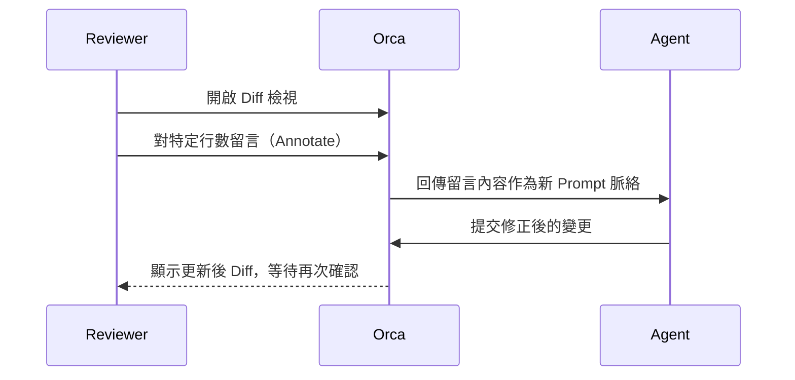

**重要區分（呼應第 2.14 節）**：上圖描述的是 **PR 建立前**的本地 Diff 留言流程，留言僅存在 Orca 內部、直接組成新 Prompt 送給 Agent。若團隊已建立 GitHub PR，則應改在 **Checks／Hosted Review 面板**留言——這是官方原始碼證實的真正雙向同步機制，留言會實際寫入 GitHub PR 的 Review Comment，且可在留言串中回覆任一則留言，不限根留言。兩種留言管道的差異，直接影響「這則留言未來是否能在 GitHub 網頁上被其他團隊成員看到」，導入教育訓練時應明確區分。

**最佳實務**：即使是 AI 產出的程式碼，Code Review 標準應與人工撰寫的程式碼一致（甚至更嚴謹），不應因為「反正是 AI 寫的、改起來很快」而放鬆審查基準。

**注意事項**：Rollback 前務必確認該 Worktree 是否有其他 Agent 或人工正在進行中的變更，避免回復動作與尚未提交的工作互相衝突。

**常見錯誤**：把多次 Agent 修正的過程都擠壓成一個巨大的 Commit，導致 History 難以回溯「哪一輪修正解決了哪個問題」。

**小技巧**：建議每輪 Annotate → 修正，都對應一次獨立 Commit，並在 Commit Message 中簡述「回應了哪一則留言」。

---

## 第十六章 Mobile App 行動裝置應用

### 16.1 平台支援現況

- **iOS**：透過 App Store 或 TestFlight 提供（已查證）。
- **iPad**：與 iPhone 共用 iOS 版本應用，介面可能因螢幕尺寸調整（⚠️ 官方未特別區分 iPad 專屬功能清單）。
- **Android**：**已查證確認**目前僅透過 GitHub Releases 提供 APK 直接下載（安裝套件識別碼 `com.stably.orca.mobile`），Google Play Store 搜尋不到官方上架項目，屬於側載（sideload）安裝。企業導入時若有「僅允許從 Google Play 安裝應用程式」的 MDM 政策，需特別留意此限制並與資安團隊確認例外處理方式。

### 16.2 核心行動端功能

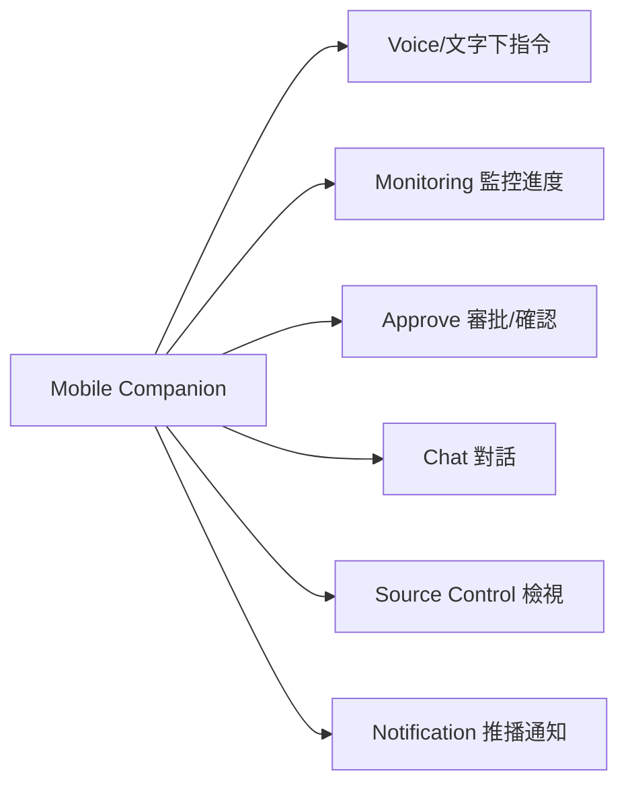

| 功能 | 說明 | 查證狀態 |
|---|---|---|
| Monitoring | 查看各 Worktree／Agent 的即時進度 | 已查證 |
| Chat／下指令 | 透過文字對 Agent 下達後續指示 | 已查證 |
| Notification | 任務完成、需人工確認等事件推播 | 已查證 |
| Approve | 對關鍵決策點（如是否合併）進行遠端確認 | 依功能鏈推論，屬合理延伸 |
| Source Control 檢視 | 查看 Diff／History 摘要 | 依功能鏈推論 |
| Voice | 點麥克風即可口述回覆；Live 模式可將口述內容直接輸入目前作用中的終端機，不需按 Enter | 已查證，見第 2.9 節說明 |

**最佳實務**：行動端適合用於「監控與輕量決策」（如批准合併、確認是否繼續某個方向），不建議用於撰寫長篇複雜 Prompt——長篇需求規劃仍建議在桌面應用完成。

**注意事項**：第三方評論指出，行動端運作需依賴一個持續在線的桌面工作階段（即手機是「遠端操控已在跑的桌面環境」，而非完全獨立的雲端服務），實際依賴關係請以官方文件為準，企業導入時應納入評估。

**常見錯誤**：以為行動端可以完全脫離桌面應用獨立運作長時間任務，忽略了背後仍可能需要桌面端保持連線。

**小技巧**：可將行動端的推播通知，設定僅在「需要人工決策」的關鍵節點觸發（如 Rate Limit 即將觸頂、Agent 卡住待確認），避免過多低價值通知造成干擾疲勞。

---

## 第十七章 VPS 與遠端部署

### 17.1 SSH Worktrees 概念

Orca 官方確認的「Remote Agent」能力核心是 **SSH Worktrees**：把 Worktree 實際建立在遠端主機（VPS／內部伺服器）上，透過 SSH 連線操作，並具備自動重連與 port forwarding，讓長任務不因本機網路斷線而中斷。

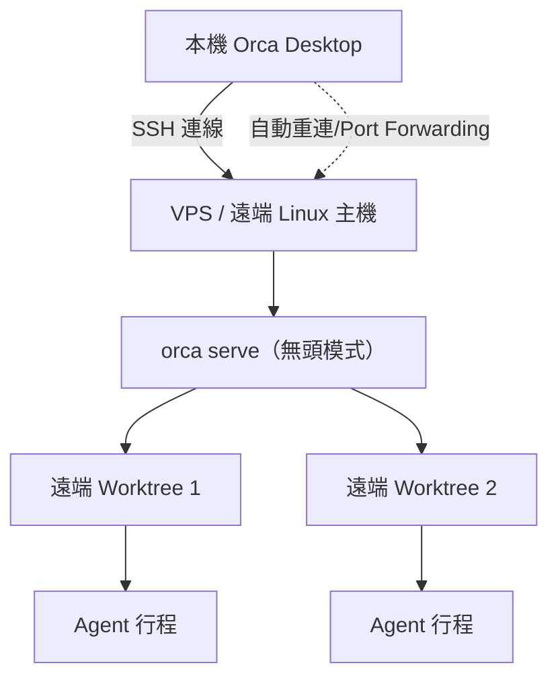

### 17.2 建置步驟

1. 於 VPS／Linux 伺服器安裝 Orca（見第 4.4 節），執行無頭模式：
   ```bash
   orca serve
   ```
2. 於本機 Orca Desktop 新增遠端連線設定（主機位址、SSH 憑證）。
3. 建立 Workspace 時選擇「遠端 SSH Worktree」，指定要在遠端主機建立的工作目錄。
4. 任務執行期間即使本機網路短暫中斷，重新連線後可自動恢復連線狀態，不影響遠端仍在執行的 Agent 行程。

**官方文件補充**：官方文件站 `docs/reference/headless-linux-server.md` 明確支援 Ubuntu 22.04／24.04 與 Debian 穩定版，並指出無頭伺服器若缺乏圖形環境，需搭配 `Xvfb`（虛擬顯示伺服器）才能讓需要渲染的功能（如 Design Mode 內嵌瀏覽器）正常運作；容器化執行方式見第 4.6 節。

### 17.3 最佳實務

- 遠端主機建議獨立於正式環境（Production）之外，避免 Agent 任務意外消耗與正式服務共用的運算資源。
- 針對長時間批次任務（如第 11 章的大規模 Legacy 盤點），優先安排在遠端 VPS 執行，本機桌面應用僅用於監控與審查。
- SSH 憑證管理應比照企業既有的伺服器存取控管規範（金鑰輪替、最小權限原則），不因為是「給 AI agent 用的連線」而降低規格。

**注意事項**：遠端主機上執行的 Agent 仍會存取程式碼與可能的機敏資料，資安評估範圍應涵蓋該遠端主機本身的防護等級，而非只關注本機端。

**常見錯誤**：把正式環境的資料庫連線資訊或憑證，因為「圖方便」直接放在遠端 Agent 執行環境中，擴大了潛在外洩風險面。

**小技巧**：可為「遠端 VPS 任務」建立獨立的服務帳號與存取範圍，與工程師個人帳號區隔，方便日後稽核。

---

## 第十八章 Prompt Engineering

### 18.1 多 Agent 情境下的 Prompt 設計原則

與單一 Agent 對話不同，Orca 情境下的 Prompt 設計需額外考量「這個 Prompt 會被平行複製給多個獨立 Worktree」，因此建議：

1. **明確範圍邊界**：清楚指出該 Agent 負責的檔案／模組範圍，避免多個 Agent 越界修改共用檔案。
2. **提供共同上下文**：若多個 Agent 需要共用某份契約（如 API Schema），先由一個 Agent／人工產出該契約，再作為其他 Prompt 的輸入。
3. **要求結構化輸出**：要求 Agent 在完成後輸出「變更摘要、假設、未解決問題」，降低審查者需要重新讀懂全部程式碼的負擔。
4. **標註驗收標準**：明確描述「怎樣算完成」（如通過哪些測試、符合哪個設計稿），減少來回澄清的輪次。

### 18.2 各類型 Prompt 範例（完整範例庫見第 29 章）

- **Coding Prompt**：「在 `src/modules/customer` 目錄下實作查詢 API，需符合 `docs/api-schema.md` 定義的契約，並補上對應單元測試。」
- **Architecture Prompt**：「請針對目前的單體架構，提出拆分為 3 個微服務的草案，包含服務邊界劃分理由與資料一致性處理方式。」
- **Review Prompt**：「請以 OWASP Top 10 為基準，審查本次 Diff 是否存在注入攻擊、權限繞過等風險，並逐項標註。」
- **Test Prompt**：「為 `OrderService` 補齊單元測試，涵蓋正常路徑與至少 3 種例外情境，測試框架使用 JUnit 5。」
- **Migration Prompt**：「將此模組由 Spring Boot 2 遷移至 Spring Boot 4，需先列出所有受影響的設定屬性與命名空間變更，再進行程式碼調整。」

**最佳實務**：將團隊常用的 Prompt 範本集中管理（可參考第 29 章分類方式），避免每次都從零撰寫，也利於新人快速上手一致的 Prompt 風格。

**注意事項**：Prompt 中若涉及機敏資訊（如正式環境設定、內部網域名稱），需比照一般文件的機敏等級處理，避免透過 Prompt 外洩。

**常見錯誤**：Prompt 過於模糊（如「幫我優化這個模組」）卻期待多個 Agent 平行產出一致方向的結果——模糊的 Prompt 平行分派後，往往得到彼此矛盾、難以合併的多個版本。

**小技巧**：可先用一個 Agent 進行「Prompt 澄清」對話（把需求講清楚、產出結構化任務描述），再把澄清後的結果複製給其他 Agent 平行執行，而非直接把模糊需求平行分派出去。

---

## 第十九章 AI Team 企業 AI 團隊

### 19.1 組織角色對應

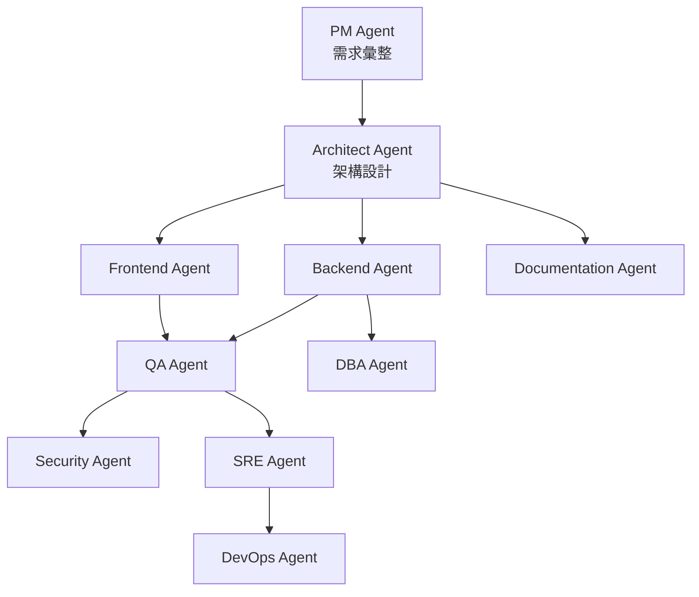

### 19.2 角色與 Orca 功能對應

| AI 團隊角色 | 對應 Orca 操作模式 |
|---|---|
| PM Agent | 負責將業務需求轉換為結構化任務清單（可為一個獨立 Worktree／Session） |
| Architect Agent | 產出架構草案，供其他角色的 Prompt 引用作為共同上下文 |
| Frontend／Backend Agent | 對應第 8 章的平行實作角色 |
| QA Agent | 對應第 8 章的 Test／Review 角色，執行測試與品質把關 |
| Security Agent | 對應第 13 章的 Security Agent，安全審查關卡 |
| SRE／DevOps Agent | 負責部署腳本、監控設定（對應第 9 章 Deploy／Monitor 階段） |
| DBA Agent | 專責資料庫 Schema／效能／Migration 相關任務 |
| Documentation Agent | 統一產出／維護技術文件 |

### 19.3 治理建議

- 由技術主管扮演「Orchestrator（總指揮）」角色，決定任務如何在各 Agent 角色間流動，而非讓所有 Agent 各自為政。
- 針對高風險角色（Security、DBA、SRE）的產出，建議設定「必須由對應職能的真人簽核」才能合併，AI 團隊分工不等於免除真人責任歸屬。

**最佳實務**：建立「AI 團隊角色手冊」，明確記錄每個角色的 Prompt 模板、驗收標準與強制審查關卡，作為新專案起手時的標準配置。

**注意事項**：角色愈多，人工整合與審查的複雜度也隨之上升，建議依專案規模漸進式擴充角色數量，而非一開始就導入全部十種角色。

**常見錯誤**：把「AI 團隊」當成可以完全取代真人團隊的口號來宣傳，導致管理層誤判可以大幅裁減對應職能的真人編制——實務上 AI 團隊角色仍需要真人的規劃、審查與最終責任承擔。

**小技巧**：可先從「Frontend＋Backend＋QA」三角色的小型 AI 團隊開始試點，驗證流程順暢後再逐步擴充 Security、SRE、DBA 等角色。

---

### 第15~19章 檢查清單（Checklist）

- [ ] 已確認 Diff／History／Rollback 操作皆可用標準 git 工具鏈完成，並納入既有版控規範
- [ ] 已針對行動裝置的 MDM／應用程式安裝政策，確認 Android 僅 APK 安裝的相容性
- [ ] 已完成至少一次 SSH Worktrees 遠端部署演練，並確認金鑰管理符合既有伺服器存取規範
- [ ] 已建立團隊共用的 Prompt 設計原則（範圍邊界、共同上下文、結構化輸出、驗收標準）
- [ ] 已定義 AI 團隊各角色的 Prompt 模板與強制審查關卡（尤其 Security／DBA／SRE）
- [ ] 已釐清「AI 團隊角色」不等於取代真人責任歸屬的治理原則

---

## 第二十章 Banking 銀行核心系統案例

> ⚠️ **本章為教學示例案例，非真實銀行客戶專案**。銀行核心系統屬高監理領域，實際導入任何 AI 輔助開發工具前，務必經過完整的資安、合規與內控審查流程，本章僅示範「如何用 Orca 的平行 Agent 模式拆解此類複雜領域的開發任務」。

### 20.1 案例背景

**情境**：某銀行需優化「信用查詢與授信」相關子系統，涉及範圍：信用查詢、授信審核、櫃台交易、批次作業、支付清算（含 ISO 20022 報文格式）、微服務架構、高可用與多資料中心部署。

### 20.2 任務拆解

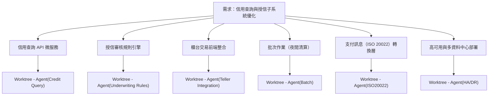

### 20.3 各任務分派重點

| 任務 | Agent 負責重點 | 高風險提醒 |
|---|---|---|
| 信用查詢 API | 微服務化既有查詢邏輯，設計快取與限流策略 | 需確認個資保護（如遮罩敏感欄位）與存取權限控管 |
| 授信審核規則引擎 | 將既有規則（可能散落在程式碼或試算表中）結構化為規則引擎 | 規則變更需完整測試與雙軌驗證，避免誤放款或誤拒 |
| 櫃台交易整合 | 前端整合既有櫃台系統 API | 需考慮櫃台端網路環境限制與離線降級機制 |
| 批次作業 | 重構夜間批次流程，處理大量交易清算 | 批次失敗需有明確重跑（Rerun）與補償交易機制 |
| ISO 20022 轉換層 | 建立內部訊息格式與 ISO 20022 報文之間的轉換邏輯 | 報文格式錯誤可能導致跨行清算失敗，需嚴格比對規格書 |
| 高可用／多資料中心 | 設計跨資料中心的容錯與資料同步策略 | 涉及金融監理對 RTO/RPO 的要求，需法遵／風控部門參與審查 |

### 20.4 治理流程

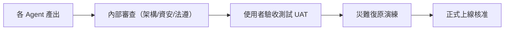

**最佳實務**：涉及授信規則、支付清算等核心邏輯的任務，**一律**要求 Agent 產出「規則變更前後對照表」，並搭配雙軌並行測試（新舊邏輯同時跑，比對結果一致後才切換），不因使用 AI 輔助而簡化既有金融業變更管理流程。

**注意事項**：本案例所有 Agent 產出都必須視為「草案」，需經過銀行內部資安、法遵、風控等既有把關機制，AI 輔助開發不改變既有金融監理要求下的責任歸屬與簽核層級。

**常見錯誤**：把 AI 平行產出的速度優勢，誤用來壓縮本應完整執行的 UAT 與災難復原演練時間，反而增加正式環境風險。

**小技巧**：可先在「非核心、風險較低」的周邊系統（如報表產出、內部管理工具）試點 Orca 的多 Agent 協作模式，累積治理經驗後，再逐步評估是否延伸到核心交易系統的周邊開發任務。

---

## 第二十一章 系統維護

### 21.1 版本管理與近乎每日發版節奏

Orca 官方查證當下（v1.4.150，2026-07-22）維持近乎每日的發版節奏——實際核對 GitHub Releases 紀錄，v1.4.141～v1.4.150 共 10 個版本集中在 2026-07-14～07-22 這 9 天內發布，且多數版本同時包含新功能與臭蟲修正（例如用量追蹤帳號歸屬修正、編輯器字型設定、Linear MCP 式讀寫功能等），未觀察到近期版本有明確標註為「重大變更（Breaking Change）」的項目，但變動頻率本身就是需要治理的風險來源。這對企業維運提出兩個具體要求：

1. **版本追蹤機制**：不建議放任自動更新在無人監控下直接套用到所有工程師機器，建議至少由 IT／平台團隊每週複核一次官方 Release Notes，評估是否有重大變更（Breaking Change）。
2. **相依 Agent CLI 的版本連動**：Orca 本身更新，不代表其包裝的各 Agent CLI（Claude Code、Codex 等）也同步更新，兩者的版本管理需分開追蹤。

### 21.2 Workspace 備份與還原

- Worktree 本質是 git 工作目錄，理論上可透過既有的 Repository 備份機制（遠端 Git 託管平台本身即是一種備份）涵蓋大部分風險。
- Orca 應用層級的設定（如 Workspace 設定、帳號切換器狀態）備份機制，⚠️ 官方文件對此著墨有限，建議企業自行定期匯出／記錄關鍵設定（如透過螢幕截圖或設定檔複製），降低因應用程式重灌導致設定遺失的風險。

### 21.3 升級與遷移

- 升級 Orca 版本前，建議先在一台非關鍵工作站測試，確認既有 Workspace／Worktree 可正常開啟後，再全面推廣更新。
- 若企業因政策要求鎖定特定版本（不隨每日發版更新），需自行維護該版本的離線安裝包，並留意官方是否仍提供對應版本的下載連結。

### 21.4 Log 與 Troubleshooting 基礎

| 常見問題類型 | 建議排查方向 |
|---|---|
| Agent 無回應／卡住 | 檢查該 Agent CLI 自身的認證狀態、Rate Limit 是否已觸頂 |
| Worktree 無法建立 | 確認本機磁碟空間、Git Repository 狀態是否正常 |
| 遠端 SSH Worktree 斷線 | 檢查網路連線、SSH 憑證是否過期 |
| 行動端收不到通知 | 確認桌面端工作階段是否仍在線、行動裝置通知權限是否開啟 |

**最佳實務**：建立「Orca 版本升級檢查清單」（可比照第 4.8 節安裝問題表格的格式），每次升級前後皆執行一次基本功能驗證（建立 Worktree、啟動 Agent、Annotate Diff）。

**注意事項**：近乎每日發版的特性，代表「這週遇到的 bug，下週可能已修復，也可能是新版才出現的新問題」，排查時務必先確認當下版本號，再對照官方 Issue 是否已有相同回報。

**常見錯誤**：長期鎖定舊版本卻未持續關注官方 Release Notes，導致累積大量未評估的變更，一旦被迫升級時風險與工作量暴增。

**小技巧**：可訂閱官方 GitHub Repository 的 Release 通知，或安排固定人員每週瀏覽一次 Release Notes 摘要，並同步到團隊內部頻道。

---

## 第二十二章 效能最佳化

### 22.1 多 Worktree 資源管理

同時開啟的 Worktree／Agent 數量愈多，本機資源（CPU、記憶體、磁碟 I/O）消耗愈高。第 4.1 節已整理具體參考數據：第三方評測估算安裝檔約 250MB、閒置多 agent 情境約 400–800MB RAM；官方自行公開的效能分析文件則記錄單次除錯採樣中 renderer process 約 460MB RSS（CPU 占用約 40%）、main process 約 390MB RSS——這些數字均**有明確出處**，但仍是特定情境下的採樣，多開 Worktree 與 WebGL 渲染的 Terminal Splits 會依比例進一步墊高用量。

**建議做法**：

- 依工作站硬體規格設定「合理平行上限」（例如中階筆電建議不超過 3～4 個同時活躍的 Worktree）。
- 非必要監控中的 Worktree，可暫停或關閉對應終端機分割畫面，降低即時渲染負擔。
- 對於暫時不需要即時互動的 Worktree，優先使用第 2.17 節的 **Agent Hibernation（Agent 休眠）** 功能，而非單純關閉分割畫面，官方設計此功能的目的即是降低多 Agent 併行時的資源占用。

### 22.2 Context／Prompt／Token 效率

- 過長或包含大量無關資訊的 Prompt，會拉長 Agent 推理時間並增加 Token 成本；建議依第 18 章原則，保持 Prompt 聚焦於單一任務範圍。
- Design Mode 傳入的截圖／HTML 內容雖然降低溝通成本，但也會增加該次請求的 Context 大小，對於已經很清楚的簡單需求，可考慮改用純文字描述以節省成本。

### 22.3 成本治理（延伸第 6.4 節）

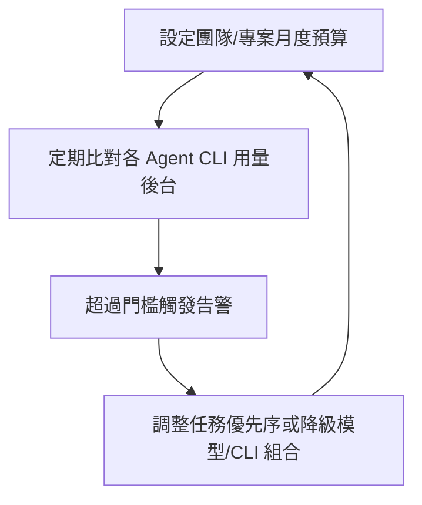

### 22.4 Workspace／Memory 層級最佳化

- 定期清理已完成且不再需要保留的 Worktree（先確認對應分支已合併或已封存），避免 Workspace 列表因大量閒置項目而難以管理。
- 若團隊 Workspace 數量龐大，建議依專案或季度做歸檔整理，維持桌面應用的檢視效率。

**最佳實務**：把「平行 Agent 數量」視為一種需要主動管理的資源配額，而非無上限擴張，效益與成本需一併評估，而非只看速度提升。

**注意事項**：效能瓶頸有時來自本機硬體限制，而非 Orca 或 Agent CLI 本身，排查前建議先確認本機資源使用率（工作管理員／`top`），避免誤判問題根因。

**常見錯誤**：為了追求「最大平行度」同時開啟過多 Worktree，導致本機明顯卡頓，反而拖慢審查與整合的整體效率。

**小技巧**：可依任務急迫度分批次執行平行任務（例如先跑 3 個最高優先序，完成審查後再啟動下一批），而非一次性全開。

---

### 第20~22章 檢查清單（Checklist）

- [ ] 銀行／高監理案例的 Agent 產出已納入既有法遵、風控、資安審查流程，未因 AI 輔助而簡化把關層級
- [ ] 已建立版本追蹤機制，區分 Orca 本身與各 Agent CLI 的版本管理
- [ ] 已規劃 Workspace／關鍵設定的備份方式
- [ ] 已建立 Orca 版本升級前後的基本功能驗證清單
- [ ] 已依團隊硬體規格設定合理的平行 Worktree 上限
- [ ] 已建立跨 Agent CLI 的成本監控與告警機制

---

## 第二十三章 常見錯誤與 FAQ

> 本章彙整 55 題常見問題，依「原因、分析、解決方式」格式整理，分為 11 大類、連續編號 Q1～Q55（其中 Q51～Q55 為本次查證新增的「新功能查證類」，對應第 2 章新增的 2.15～2.21 節功能）。凡涉及第 2、6 章已標註「⚠️ 未查證」的功能，本章一併沿用相同的誠實標註方式。

### 23.1 基礎概念類

**Q1. Orca 是不是一個會自己寫程式的 AI？**
原因：使用者常從產品名稱與行銷素材誤解其定位。
分析：Orca 本身不含推理引擎，是協調 Claude Code、Codex 等既有 agent CLI 的艦隊管理層。
解決方式：導入教育訓練時，第一堂課即說明第 1 章的定位區分，避免後續使用預期落差。

**Q2. 「ADE」跟「IDE」到底差在哪？**
原因：兩個縮寫僅一字之差，容易混淆。
分析：IDE 聚焦單人編輯程式碼；ADE 聚焦指揮多個 agent 平行工作，人的角色從「打字」轉為「決策與審查」。
解決方式：可用第 9 章的工作流程圖向團隊說明兩者的角色差異。

**Q3. 使用 Orca 是否代表要放棄現有的 Claude Code／Codex？**
原因：誤以為 Orca 是替代品。
分析：Orca 需要底層 agent CLI 才能運作，是「疊加層」而非替代品。
解決方式：確認現有 CLI 是否在官方支援清單中（第 7 章），再決定是否導入 Orca 作為管理層。

**Q4. Orca 是免費的嗎？**
原因：對「Bring Your Own Subscription」模式不熟悉。
分析：Orca 本身 MIT 授權、免費，但仍需自備各 agent CLI 的訂閱／API 額度，實際成本來自底層 CLI／Provider。
解決方式：導入前先盤點團隊現有 agent CLI 訂閱狀況，估算疊加後的整體成本（見第 22.3 節）。

**Q5. Orca 適合單人工作室使用嗎？**
原因：官方定位偏向「艦隊」，容易讓小型團隊誤以為門檻很高。
分析：即使單人，也能透過平行 Worktree 同時探索多種實作方向，仍具備價值，但效益會小於多人團隊協作情境。
解決方式：單人使用者可先從「2 個 Worktree 比較兩種實作方案」的輕量場景試用（見第 26 章導入建議）。

### 23.2 安裝與環境類

**Q6. WSL 上可以安裝 Orca 嗎？**
原因：許多 Windows 開發者的日常工作環境即是 WSL2。
分析：**已查證支援**——官方文件庫有多份專屬文件處理 WSL 路徑偵測、shell 啟動、睡眠喚醒等情境，近期版本仍持續有 WSL 相關修正上線，屬於持續維護中的正式支援情境，但存在已知 open issue（workspace 睡眠喚醒偶發錯誤，見第 4.5 節）。
解決方式：可直接在 WSL 環境中使用，但長時間掛機／睡眠喚醒情境建議先在測試環境驗證穩定性後再正式依賴。

**Q7. 官方有提供 Docker 映像檔嗎？**
原因：企業容器化政策普遍要求所有工具皆可容器化部署。
分析：官方**沒有**發布現成的 Dockerfile 或映像檔，但官方文件（`docs/reference/headless-linux-server.md`）**確實提供**在容器內執行 Linux AppImage 的官方指引（`--appimage-extract-and-run`、Xvfb、`LIBGL_ALWAYS_SOFTWARE=1`），並非完全沒有官方說明。
解決方式：如需容器化，依循官方 `headless-linux-server.md` 指引撰寫 Dockerfile，而非自行從零摸索，並標記為企業自行組裝、非官方發布映像檔。

**Q8. macOS 提示「無法驗證開發者」怎麼辦？**
原因：Gatekeeper 攔截機制。
分析：多數 Electron 應用初次執行皆可能觸發此提示。
解決方式：於系統設定的隱私權與安全性頁面允許執行，並以官方下載管道核對來源。

**Q9. AppImage 在 Linux 上無法執行？**
原因：缺少 FUSE 相依套件或未賦予執行權限。
分析：這是 AppImage 格式的通用需求，非 Orca 專屬問題。
解決方式：安裝對應發行版的 `libfuse2`（或等效套件）並執行 `chmod +x`。

**Q10. 企業內網防火牆會擋住 Orca 嗎？**
原因：Orca 本身與其包裝的各 agent CLI 都需要對外連線。
分析：實際需要開放的網域，取決於團隊實際使用的 agent CLI 與其對應 Provider。
解決方式：依第 6.2 節對照表，逐一盤點各 CLI 的連線需求，向資安申請白名單。

### 23.3 Agent CLI 與帳號類

**Q11. 一定要同時裝好幾種 agent CLI 才能用 Orca 嗎？**
原因：官方展示畫面常同時秀出多個 agent 平行運作。
分析：即使只安裝一種 agent CLI，Orca 的 Worktree 隔離與比較介面仍然有價值。
解決方式：可先用單一 CLI 熟悉操作介面，再視需求擴充第二、第三種 CLI。

**Q12. 帳號切換器可以同時登入同一個 CLI 的兩組帳號嗎？**
原因：常見於團隊共用帳號與個人帳號並存的情境。
分析：實際支援情況隨版本演進，需以當下 UI 為準。
解決方式：正式導入前於測試環境驗證多帳號切換情境是否符合團隊治理需求。

**Q13. Rate Limit 追蹤只有 Claude 跟 Codex 有嗎？其他 CLI 呢？**
原因：官方目前明確提供追蹤畫面的對象是 Claude 與 Codex。
分析：其他 CLI 的用量需回到各自的官方後台查詢。
解決方式：建立第 6.4 節建議的跨 CLI 成本治理框架，補足官方未涵蓋的追蹤缺口。

**Q14. API Key 應該存在哪裡？**
原因：擔心金鑰外洩或誤入版控紀錄。
分析：Orca 不提供統一金鑰保管機制，金鑰仍由各 CLI 自行管理。
解決方式：使用各 CLI 官方支援的認證機制（環境變數、系統金鑰圈），不寫入 Prompt 或 Commit。

**Q15. 换了 agent CLI 版本後，Orca 內顯示的模型資訊怪怪的？**
原因：Orca 顯示的模型資訊來自該 CLI 自行回報。
分析：CLI 版本更新後其回報格式或預設模型可能改變，非 Orca 本身的錯誤。
解決方式：先確認該 CLI 官方版本說明，排除是 CLI 端變更而非 Orca 顯示異常。

**Q16. 可以強制某個 Worktree 只能用特定模型嗎？**
原因：team 希望統一模型版本以利成本控管。
分析：模型選擇權在各 CLI 自身設定，Orca 不提供覆蓋層。
解決方式：於指派任務前，先在該 CLI 的設定檔中鎖定模型版本，而非期待 Orca 端控制。

### 23.4 Parallel Worktrees 類

**Q17. 多個 Worktree 會不會互相覆寫檔案？**
原因：擔心平行工作導致資料遺失。
分析：Worktree 底層為獨立檔案樹，正常情況下不會互相覆寫。
解決方式：唯一風險點在於「合併回同一分支」的階段，建議走 PR 流程並人工確認衝突處理。

**Q18. 平行任務數量有沒有上限？**
原因：官方未公告具體上限數字。
分析：實務限制主要來自本機資源與 Rate Limit，而非 Orca 軟體本身的硬性限制。
解決方式：依第 22.1 節建議，依硬體規格設定合理的平行上限。

**Q19. 為什麼兩個 Agent 產出的程式碼風格差異很大？**
原因：不同 agent CLI／不同模型的預設風格本就不同。
分析：這是多 agent 協作的正常現象，非系統錯誤。
解決方式：於 Prompt 中明確指定程式碼風格規範（如 ESLint／Checkstyle 規則），降低風格落差。

**Q20. 合併多個 Worktree 產出時衝突很多怎麼辦？**
原因：任務拆分顆粒度過大或範圍重疊。
分析：顆粒度愈細、範圍愈獨立，合併衝突愈少。
解決方式：參考第 8.2 節的角色拆分方式，重新檢視任務邊界是否清楚切分檔案／模組範圍。

**Q21. 一個 Worktree 可以同時給兩個 Agent CLI 交替使用嗎？**
原因：希望先用 A CLI 起草、再用 B CLI 補強。
分析：技術上 Worktree 是檔案層級隔離，理論上可交替指派不同 CLI 執行，但需注意 Context 是否能有效銜接。
解決方式：交接時建議在 Prompt 中明確提供前一輪的產出摘要，彌補跨 CLI 沒有共用記憶的落差。

### 23.5 Mobile 類

**Q22. 手機上可以做完整的 Code Review 嗎？**
原因：行動端畫面較小，操作習慣與桌面不同。
分析：行動端適合輕量監控與關鍵決策確認，非完整審查的理想介面。
解決方式：重大變更的完整審查建議回到桌面應用執行，行動端僅作為輔助。

**Q23. Android 版為什麼要自己下載 APK？**
原因：查證當下未見 Google Play 上架證據。
分析：可能是策略選擇或審核中，實際狀態請以官方最新公告為準。
解決方式：企業 MDM 政策若限制僅能安裝 Google Play 應用，需向資安申請例外或持續關注官方上架狀態。

**Q24. 手機沒開 Orca App 時，遠端的 Agent 還會繼續跑嗎？**
原因：對「行動端是否為獨立雲端服務」有疑問。
分析：第三方評論指出行動端運作可能依賴一個持續在線的桌面／伺服器工作階段。
解決方式：正式依賴前於測試環境驗證，並優先透過第 17 章的 VPS／SSH Worktrees 確保任務持續運行不依賴手機本身。

**Q25. 推播通知太頻繁，能否篩選？**
原因：預設通知可能涵蓋所有事件層級。
分析：非所有事件都需要即時打斷使用者。
解決方式：依第 16.2 節建議，僅保留「需人工決策」層級的通知。

### 23.6 Design Mode／Terminal 類

**Q26. Design Mode 點選的元素資訊會不會太少，Agent 誤解需求？**
原因：複雜互動邏輯難以單靠 DOM／截圖傳達。
分析：Design Mode 適合「視覺與樣式類」問題，對於複雜互動邏輯仍需搭配文字說明。
解決方式：搭配文字描述期望的互動行為，而非僅依賴點選元素本身。

**Q27. Terminal Splits 可以無限分割真的沒有效能問題嗎？**
原因：「無限分割」容易被誤解為沒有實務限制。
分析：實際效能仍受本機硬體資源限制，並非真正無限。
解決方式：依第 22.1 節建議，依硬體規格設定合理的同時開啟數量。

**Q28. Terminal 裡的 Scrollback 保留多久？**
原因：⚠️ 官方未提供具體保留時長規格。
分析：屬於應用層級設定，可能隨版本調整。
解決方式：重要輸出建議另外複製保存或匯出，不完全依賴終端機保留紀錄。

**Q29. Design Mode 抓取的截圖會不會外流？**
原因：擔心畫面截圖含機敏資訊被傳送出去。
分析：截圖會作為 Prompt 內容送往對應 agent CLI 的 Provider。
解決方式：比照一般 Prompt 的機敏資訊規範，避免在含機敏資料的畫面上使用 Design Mode。

### 23.7 Git／GitHub／Linear 類

**Q30. Worktree 對應的分支要手動建立嗎？**
原因：對自動化程度有疑問。
分析：實務上 Orca 建立 Worktree 時通常會一併處理分支建立，細節依版本 UI 而定。
解決方式：初次使用時實際操作一次確認流程，並記錄於團隊內部 SOP。

**Q31. GitLab／Azure DevOps 使用者能享有跟 GitHub 一樣的整合體驗嗎？**
原因：官方對外文件明確整合對象為 GitHub、Linear、Jira。
分析：官方文件層級「未列出」GitLab／Azure DevOps／Bitbucket 整合，但原始碼中已可觀察到三者對應的完整程式模組（見第 14.4 節），代表功能可能已在開發中、甚至局部可用，只是尚未正式對外文件化與承諾支援。
解決方式：不應假設官方保證支援，但也不必然完全排除；導入評估時以 GitHub／Linear／Jira 使用經驗為準，若團隊確實依賴 GitLab／Azure DevOps，建議實際安裝當下版本測試，並持續關注官方 release notes 是否正式公告。

**Q32. Annotate AI Diffs 的留言會不會留在 GitHub PR 上？**
原因：對留言儲存位置有疑問。
分析：**已查證，分兩種情況**——PR 建立前的本地 Diff 留言屬於 Orca 內部機制，不會同步到 GitHub（因為此時通常還沒有 PR）；PR 建立後，在 Checks／Hosted Review 面板留言，則會透過 GitHub API 真實寫入 PR 的 Review Comment，且可回覆留言串中任一則留言。
解決方式：若需要留言被完整保留在 GitHub PR 歷史中供稽核，務必先建立 PR、在 Checks／Hosted Review 面板留言，而非僅在本地 Diff 畫面留言（詳見第 2.14、15.5 節）。

**Q33. 多個 Agent 的 Commit 歷史太雜亂怎麼辦？**
原因：缺乏統一的 Commit 規範。
分析：AI 產出的 Commit 若無規範，容易出現風格迥異、訊息不清的紀錄。
解決方式：制定並在 Prompt 中要求遵循團隊 Commit Message 規範（如 Conventional Commits）。

**Q34. 可以用 Orca 直接核准並合併 PR 嗎？**
原因：想進一步自動化。
分析：核准與合併屬於高風險決策點，建議保留人工把關。
解決方式：即使流程上便利，核准與合併仍建議由具備權限的真人執行，不完全自動化。

### 23.8 VPS／SSH 類

**Q35. SSH 連線斷了，遠端 Agent 的工作會不會遺失？**
原因：擔心網路不穩定影響長任務。
分析：官方確認具備自動重連機制，遠端 Agent 行程本身通常不因本機端斷線而終止。
解決方式：正式依賴前實測斷線重連情境，確認符合預期。

**Q36. VPS 費用怎麼估算？**
原因：Orca 官方不提供定價，VPS 費用取決於雲端供應商。
分析：成本主要來自 VPS 主機規格與運行時間，而非 Orca 本身。
解決方式：依任務尖峰使用量估算所需規格，並考慮任務完成後是否需要持續開機。

**Q37. 遠端主機上的程式碼安全嗎？**
原因：程式碼與可能的機敏資料會落地在遠端主機。
分析：資安風險範圍需涵蓋該遠端主機本身的防護等級。
解決方式：比照企業既有伺服器安全規範，執行主機強化、存取控管與稽核。

**Q38. Port Forwarding 設定複雜嗎？**
原因：對網路設定不熟悉的工程師可能感到陌生。
分析：實際設定步驟依官方文件版本而定。
解決方式：導入初期可請熟悉網路的同仁協助設定一次，並記錄成團隊 SOP。

**Q39. 可以在同一台 VPS 上跑多個團隊的 Worktree 嗎？**
原因：希望節省 VPS 成本。
分析：技術上可行，但需注意資源競爭與資料隔離。
解決方式：若多團隊共用主機，建議以獨立使用者帳號與資源配額區隔，避免互相干擾。

### 23.9 案例導入類

**Q40. 小團隊真的需要平行多 Agent 嗎？**
原因：平行協作聽起來像是大型團隊才需要的功能。
分析：即使小團隊，平行探索多種實作方案仍具備價值，只是規模較小。
解決方式：參考第 26 章針對小型團隊的導入建議，從輕量場景試點。

**Q41. 銀行／高監理產業導入 Orca 有哪些額外要求？**
原因：金融業對變更管理與稽核要求較高。
分析：見第 20 章案例，需納入既有法遵、風控、資安審查流程。
解決方式：不因 AI 輔助開發而簡化既有變更管理層級，所有 Agent 產出視為草案。

**Q42. Legacy 系統盤點真的可以交給 Agent 做嗎？**
原因：擔心 Agent 誤判造成後續決策失準。
分析：Agent 產出可作為初步理解的加速工具，但需資深工程師覆核。
解決方式：依第 11 章建議，分派「粗略掃描」再逐步深入，且結果務必經人工驗證。

**Q43. 框架升級可以完全交給 Agent 自動完成嗎？**
原因：期待 AI 能一次到位完成升級。
分析：大版本跨越升級風險高，建議分階段並搭配完整回歸測試。
解決方式：依第 12 章建議，先產出風險評估與分階段路徑，而非一次到位。

**Q44. 導入 Orca 需要額外的教育訓練嗎？**
原因：新工具導入常見的組織變革阻力。
分析：ADE 的工作模式（多 Agent 協作、審查取捨）與傳統單人編碼有明顯差異。
解決方式：建議安排至少半天的內部工作坊，實際操作一次第 5、8 章的流程。

**Q45. 如何評估導入 Orca 的投資報酬率？**
原因：管理層通常要求量化效益。
分析：效益來自「平行探索節省的時間」與「審查、合併的額外成本」之間的權衡。
解決方式：可先以第 26 章建議的小規模試點，量測特定任務類型的產出時間變化，再決定是否擴大導入範圍。

### 23.10 效能／維運／其他類

**Q46. 為什麼我的電腦開了幾個 Worktree 就變很慢？**
原因：本機資源（CPU／記憶體）被多個 Worktree 與 Terminal Splits 佔用。
分析：這是本機硬體限制，非 Orca 軟體缺陷。
解決方式：依第 22.1 節建議，依硬體規格設定合理平行上限，或改用第 17 章的遠端 VPS 執行。

**Q47. 官方多久發一次新版？我們要每次都升級嗎？**
原因：近乎每日發版節奏容易讓維運團隊焦慮。
分析：不需要每次都立即升級，但需持續追蹤 Release Notes 是否有重大變更。
解決方式：依第 21.1 節建議，設定每週複核機制，而非逐版緊跟或完全忽略。

**Q48. 設定不小心遺失了，能還原嗎？**
原因：官方對應用層設定的備份機制著墨有限。
分析：Worktree 本身的程式碼有 git 保障，但應用層設定（如 Workspace 偏好）備份機制未被充分證實。
解決方式：依第 21.2 節建議，自行定期記錄關鍵設定，降低應用程式重灌後的損失。

**Q49. 遇到 Bug 該去哪裡回報？**
原因：不清楚官方支援管道。
分析：官方在 GitHub Repository 設有 Issues 與 Discussions，可查詢是否已有相同回報。
解決方式：回報前先搜尋既有 Issue，避免重複回報；企業內部也可先建立自己的已知問題清單（見第 24 章最佳實務）。

**Q50. 這本手冊會不會過時？**
原因：Orca 近乎每日發版，功能邊界持續變動。
分析：本手冊為特定查證日期（2026-07-22）的快照整理，屬性上必然會隨時間產生落差。
解決方式：定期（建議至少每季）重新核對官方 README 與文件站，更新本手冊中標註「⚠️」的項目狀態。

### 23.11 新功能查證類（本次新增）

**Q51. 語音輸入的辨識準確度如何？可以用中文口述嗎？**
原因：第 2.9 節確認語音輸入功能真實存在，讀者關心實際可用性。
分析：官方文件未公告具體辨識準確度數字，也未逐語言列出支援清單；桌面版可於 Voice 設定面板選擇語音辨識模型。
解決方式：正式依賴中文語音輸入前，建議先實測常用術語（如程式碼關鍵字、專案代號）的辨識準確度，不確定時仍以文字輸入為主要管道。

**Q52. Agent Hibernation（Agent 休眠）會不會導致任務中斷或遺失進度？**
原因：擔心「休眠」等同於「終止」，導致任務前功盡棄。
分析：官方文件將此功能定位為降低資源占用的機制，語意上應是暫停而非終止，但具體的狀態保存與喚醒行為細節，官方文件著墨有限。
解決方式：對於重要、不可中斷的任務，正式依賴 Agent Hibernation 前先小規模測試喚醒後的狀態是否完整保留。

**Q53. Orca CLI 可以完全取代圖形介面操作嗎？**
原因：團隊希望將 Orca 操作整合進既有的自動化腳本／CI 流程。
分析：Orca CLI（`orca worktree create`／`snapshot`／`click`／`fill` 等）可程式化操作 Worktree，但目前定位仍是圖形介面的輔助與自動化延伸，而非完全取代。
解決方式：適合把「例行、規則明確」的操作腳本化，複雜的比較、取捨、審查仍建議透過圖形介面進行。

**Q54. Computer Use 讓 Agent 操作桌面 UI，會不會誤觸其他視窗？**
原因：Agent 直接操作可見畫面元素，風險感知上比純文字生成更高。
分析：官方 README 確認此功能存在，但未提供操作範圍隔離的具體技術細節說明。
解決方式：使用 Computer Use 時，建議關閉螢幕上其他含機敏資訊或正式環境管理後台的視窗，並比照第 13 章 Security Agent 的審查精神限制其操作範圍。

**Q55. GitLab／Azure DevOps 整合何時會正式上線？**
原因：第 14.4 節指出原始碼已有相關模組，但官方未正式公告。
分析：官方近乎每日發版，但本次查證的最近 10 個版本中未見 GitLab／Azure DevOps 整合的正式公告。
解決方式：訂閱官方 Release Notes（見第 21.1 節建議），若團隊確實需要此整合，可持續追蹤而非預先規劃上線時程。

---

## 第二十四章 最佳實務

> 本章彙整企業導入 Orca 的 100 條最佳實務，依 8 大類、連續編號 1～100。

### 24.1 架構規劃（1～12）

1. 導入前先盤點現有 agent CLI 使用狀況，Orca 定位為疊加管理層而非替代品。
2. 依專案性質建立獨立 Workspace，避免不同專案的 Worktree 混雜。
3. 高風險核心邏輯（如交易、授信規則）避免過度拆分平行任務，降低合併與驗證複雜度。
4. 需要多方案比較的架構決策（如微服務拆分方式），優先採用平行 Agent 產出多個草案再由人工評選。
5. 制定「任務顆粒度」指引，作為技術主管分派任務時的判斷依據。
6. 建立團隊內部的「Orca 架構決策紀錄」，記錄每次重大導入決策的背景與理由。
7. 對於高監理產業，架構規劃階段即應納入法遵／風控代表參與，而非等到開發完成才審查。
8. 平行任務之間若存在強依賴關係，優先考慮改為序列執行而非勉強平行。
9. 建立契約優先（Contract-First）原則：跨模組任務先產出共用介面規格，再分派給不同 Agent。
10. 定期（如每季）重新檢視 Workspace 與 Worktree 的整體結構，清理不再需要的項目。
11. 導入初期建議先選定 1～2 個代表性專案試點，累積經驗後再全面推廣。
12. 架構文件應同步記錄「哪些模組適合平行 Agent 開發、哪些不適合」，作為長期知識資產。

### 24.2 Agent 選用與分工（13～26）

13. 依任務性質選擇對應能力強項的 Agent CLI，而非固定使用單一工具處理所有任務。
14. 高風險角色（Security、DBA、SRE）的產出，設定強制人工簽核關卡。
15. 角色分工手冊化，記錄每個角色的 Prompt 模板與驗收標準。
16. 避免將「AI 團隊」宣傳為可完全取代真人團隊，管理層期待需務實對齊。
17. 新專案起手時，先以 3 角色小規模編組（如 Frontend／Backend／Test）驗證流程。
18. 逐步擴充角色數量，依團隊審查產能決定擴張速度，而非一次到位。
19. 建立「Agent CLI 能力對照表」，定期依官方更新複核。
20. 針對探索性、低風險任務，優先分配成本較低的 Agent CLI／模型組合。
21. 針對正式環境變更、發布相關任務，優先分配能力較強、歷史表現穩定的 Agent CLI。
22. 建立跨 Agent CLI 的風格規範（Lint／格式化規則），降低多 Agent 產出風格不一致的問題。
23. 定期輪替不同 Agent CLI 執行同類型任務，累積內部「各 CLI 擅長領域」的實證資料。
24. 避免單一工程師同時人工監督過多平行 Agent，設定合理的「人均可監督 Agent 數」上限。
25. 建立 Agent 產出的品質追蹤紀錄，作為未來選用決策的依據。
26. 對於需要跨 Session 記憶的長期任務，明確設計交接文件，而非依賴 Agent 自身記憶。

### 24.3 Parallel Worktrees 實務（27～38）

27. 平行分派前，先確認各任務的檔案／模組範圍互不重疊。
28. 建立 Worktree 命名規範（如帶入需求編號），提升可追溯性。
29. 依硬體規格設定合理的同時活躍 Worktree 上限。
30. 定期清理已完成合併或已封存的 Worktree。
31. 高風險任務避免與大量探索性任務共用同一組帳號額度，防止 Rate Limit 互相排擠。
32. 建立「平行任務儀表板」（可用試算表或看板工具），追蹤各 Worktree 狀態。
33. 對於需要共用契約的任務，先產出契約草案再平行分派。
34. 合併前一律走 Pull Request 流程，不直接本地合併進主幹分支。
35. 針對長時間批次任務，優先安排於遠端 VPS（第 17 章）執行，避免佔用本機資源。
36. 建立「合併衝突處理 SOP」，明確衝突發生時的責任歸屬與處理順序。
37. 平行任務結束後，要求 Agent 輸出結構化摘要，加速人工整合判斷。
38. 定期回顾平行任務的實際效益（節省時間 vs. 額外審查成本），滾動調整策略。

### 24.4 Prompt 設計（39～48）

39. Prompt 中明確標示任務範圍邊界。
40. Prompt 中提供共用上下文（如 API 契約、設計稿連結）。
41. 要求 Agent 輸出結構化摘要（變更內容、假設、未解決問題）。
42. 明確描述驗收標準，減少來回澄清輪次。
43. 集中管理團隊常用 Prompt 範本（見第 29 章）。
44. Prompt 中避免夾帶機敏資訊（如正式環境憑證、內部網域）。
45. 需求仍不穩定時，先用單一 Agent 對話澄清，再平行分派。
46. 針對 Security／Performance 審查類 Prompt，附上具體檢查基準（如 OWASP Top 10）。
47. 定期複核並更新 Prompt 範本，反映團隊踩過的坑與最佳寫法。
48. 對於容易產生歧義的需求，優先用範例（Input/Output 對照）取代純文字描述。

### 24.5 Git 與審查（49～60）

49. 使用 Diff 檢視搭配 Annotate AI Diffs 作為 Code Review 的標準入口，取代單純以即時通訊軟體零散討論變更內容。
50. 每輪 Annotate → 修正對應一次獨立 Commit，維持歷史可讀性。
51. Code Review 標準對 AI 產出與人工產出一視同仁，不因是 AI 寫的而放鬆。
52. 建立團隊一致的 Commit Message 規範（如 Conventional Commits）。
53. Rollback 前確認該 Worktree 是否有其他進行中的工作，避免誤傷。
54. 對高風險模組設定「必須經過 Security／Architecture Agent 審查」的合併關卡。
55. GitLab／Azure DevOps 使用者，導入前確認原生整合便利性的實際範圍。
56. PR 模板中加入「此變更由哪個 Agent／Prompt 產生」的欄位，強化可追溯性。
57. 建立分支命名規範（如 `agent/<角色>/<需求編號>`）。
58. 定期稽核 Commit 歷史，確認 AI 產出的變更皆有對應的人工審查紀錄。
59. 對於跨團隊協作的 Repository，明確定義哪些分支允許 Agent 直接建立 Worktree。
60. 建立「AI 產出程式碼」的標記慣例（如 Commit 訊息前綴），便於日後統計與追蹤。

### 24.6 安全與金鑰治理（61～72）

61. 各 Agent CLI 的 API Key 使用官方支援的機制管理（環境變數、系統金鑰圈）。
62. 不將金鑰明碼寫入 Prompt 或任何會同步到 Mobile Companion 的欄位。
63. 遠端／VPS 執行時，比照企業伺服器既有的金鑰治理規範。
64. 為「遠端 VPS 任務」建立獨立服務帳號，與工程師個人帳號區隔。
65. Design Mode 截圖避免用於含機敏資訊的畫面。
66. 定期輪替敏感金鑰，並確認各 Agent CLI 設定同步更新。
67. 針對高監理產業，Agent 產出一律視為草案，需經既有資安／法遵流程審核。
68. 建立「Prompt 機敏資訊檢查清單」，作為送出前的自我檢核。
69. 行動端推播內容避免包含機敏業務資料的明碼摘要。
70. SSH 憑證管理比照企業既有伺服器存取控管規範（最小權限原則）。
71. 定期稽核帳號切換器中登入的帳號清單，移除離職或不再需要的帳號。
72. 建立「AI 輔助開發資安基準」文件，作為新專案導入前的必要檢核項目。

### 24.7 案例導向實務（73～86）

73. Legacy 系統盤點任務，先分派「粗略掃描」再逐步深入「詳細分析」。
74. Legacy 分析報告要求統一格式（職責、相依、風險、技術債），便於彙整。
75. 框架升級任務要求先產出風險評估與分階段路徑，避免一次到位的高風險升級。
76. 框架升級的自動替換程式碼，一律搭配完整回歸測試。
77. 企業 Web 應用案例，涉及新舊資料庫並存時，指派專責角色確認資料一致性。
78. K8s／CI 設定變更視為高風險變更，一律經人工審查與測試環境驗證。
79. 銀行／金融案例，授信規則變更要求雙軌並行測試。
80. 銀行／金融案例，所有 Agent 產出視為草案，不簡化既有變更管理流程。
81. 高監理產業試點順序，建議先從周邊、低風險系統開始，再逐步延伸至核心系統。
82. 案例導入前，先確認相關利害關係人（法遵、風控、架構委員會）已知悉並認可導入範圍。
83. 案例執行過程中保留完整的 Prompt／Diff／審查紀錄，作為稽核佐證。
84. 案例結束後召開檢討會議，記錄哪些任務類型效益最高、哪些不適合平行分派。
85. 建立跨案例的「適合平行分派任務類型」清單，作為後續專案評估依據。
86. 對外分享案例經驗時，明確標註哪些為真實成果、哪些為教學示例，避免誤導。

### 24.8 維運與效能（87～100）

87. 建立官方 Release Notes 每週複核機制，區分 Orca 本身與各 Agent CLI 的版本管理。
88. 版本升級前於非關鍵工作站測試，確認基本功能正常後再全面推廣。
89. 自行定期記錄關鍵應用設定，降低程式重灌導致設定遺失的風險。
90. 依硬體規格設定合理的平行 Worktree 上限，避免本機明顯卡頓。
91. 建立跨 Agent CLI 的成本監控與告警機制，設定月度預算門檻。
92. 非必要監控中的 Worktree，暫停或關閉對應終端機分割畫面以降低負擔。
93. 建立「Orca 版本升級檢查清單」，每次升級前後執行基本功能驗證。
94. 排查問題時先確認當下版本號，再對照官方 Issue 是否已有相同回報。
95. 訂閱官方 Release 通知，安排固定人員每週瀏覽摘要並同步團隊。
96. 定期依專案或季度歸檔整理 Workspace，維持桌面應用檢視效率。
97. 建立團隊內部的「官方功能查證看板」，追蹤近乎每日發版帶來的功能變動。
98. 導入初期指派專人擔任「Orca 管理員」角色，統一處理帳號、版本、資安相關事項。
99. 建立標準化的教育訓練教材（可基於本手冊），加速新成員上手。
100. 每半年進行一次導入成效總體檢視，評估是否擴大、維持或調整 Orca 的使用範圍。

---

## 第二十五章 與其他工具比較

### 25.1 完整比較表

> **注意事項**：下表為概念性、功能面向的比較整理，各工具功能演進快速，比較基準以查證日期（2026-07-22）前後之公開資訊為準，正式決策前請以各官方文件當下版本核實，尤其 Orca 以外工具的細節本手冊未逐一重新查證，僅依已知公開定位整理。

| 工具 | 定位 | 平行多 Agent | Workspace 隔離 | 桌面 App | 行動 App | Git 整合 | Provider 管理 | 跨 Session 記憶 | 成本模式 | 開源 | 適用情境 |
|---|---|---|---|---|---|---|---|---|---|---|---|
| **Orca** | ADE（艦隊指揮層） | ✅ 原生核心特色（Worktree 隔離） | ✅ | ✅ | ✅ | ✅ Git Worktree＋GitHub/Linear/Jira 原生；⚠️ GitLab/Azure DevOps/Bitbucket 見程式碼證據但未正式文件化 | ⚠️ 僅帳號切換＋用量追蹤（Claude/Codex/Gemini/OpenCode 等），非原始 Provider 切換 UI | 依底層 CLI 而定 | 免費／MIT，BYO 各 CLI 訂閱 | ✅ | 需平行探索、跨裝置監控、多 agent 協作團隊 |
| Cursor | AI 優先 IDE | 有限（多分頁／多視窗） | 部分 | ✅ | ❌ | 標準 git | 內建多 Provider 選項 | 單一專案內延續 | 訂閱制 | ❌ | 單人深度結對編碼 |
| Claude Code | 終端機 coding agent | 需自行腳本化（如 tmux） | ❌ | ❌（CLI） | ❌ | 標準 git | Anthropic 為主 | Session 內延續 | 依 Anthropic 訂閱／用量 | ❌ | 終端機重度使用者、可被 Orca 包裝 |
| Codex CLI | 終端機 coding agent | 需自行腳本化 | ❌ | ❌（CLI） | ❌ | 標準 git | OpenAI 為主 | Session 內延續 | 依 OpenAI 訂閱／用量 | 部分開源 | 終端機重度使用者、可被 Orca 包裝 |
| OpenHands | 自動化程度較高的 agent 框架 | 部分支援 | 部分 | 有限 | ❌ | 標準 git | 可自訂 Provider | 依框架設計 | 依所用模型 | ✅ | 自動化任務框架、可被 Orca 包裝 |
| Cline | VS Code 擴充套件型 agent | 需多視窗 | ❌ | ❌（VS Code 內） | ❌ | 標準 git | 可自訂 Provider | 對話內延續 | 依所用模型 | ✅ | VS Code 使用者、可被 Orca 包裝 |
| Continue | 開源 AI coding 助理 | 需多視窗 | ❌ | ❌（編輯器擴充） | ❌ | 標準 git | 可自訂 Provider | 對話內延續 | 依所用模型 | ✅ | 開源愛好者、可被 Orca 包裝 |
| Aider | 老牌終端機 pair-programming 工具 | 需自行腳本化 | ❌ | ❌（CLI） | ❌ | 深度 git 整合（自動 commit） | 可自訂 Provider | 對話內延續 | 依所用模型 | ✅ | 終端機使用者、可被 Orca 包裝 |
| Roo Code | 開源 agent 擴充套件 | 需多視窗 | ❌ | ❌（編輯器擴充） | ❌ | 標準 git | 可自訂 Provider | 對話內延續 | 依所用模型 | ✅ | 開源愛好者、可被 Orca 包裝 |
| Windsurf | AI 優先 IDE | 有限 | 部分 | ✅ | ❌ | 標準 git | 內建多 Provider 選項 | 單一專案內延續 | 訂閱制 | ❌ | 單人深度結對編碼 |
| VS Code（＋Copilot） | 通用編輯器＋AI 擴充 | 有限 | ❌ | ✅ | ❌ | 標準 git＋擴充套件 | GitHub Copilot 為主 | 對話內延續 | 訂閱制（Copilot） | 編輯器開源／擴充多為閉源 | 通用開發、生態系最廣 |
| GitHub Copilot（獨立使用） | 程式碼補全／對話助理 | ❌ | ❌ | 依宿主編輯器 | ❌ | 標準 git | GitHub／Microsoft | 對話內延續 | 訂閱制 | ❌ | 日常補全與簡單問答 |

### 25.2 選型建議摘要

| 團隊情境 | 建議方向 |
|---|---|
| 已有穩定的單一 agent CLI 工作流程，想規模化平行處理 | 導入 Orca 作為疊加管理層 |
| 追求單人深度結對、重視編輯器整合體驗 | Cursor／Windsurf／VS Code＋Copilot |
| 純終端機重度使用者，暫不需要平行管理 | 直接使用 Claude Code／Codex／Aider 等單一 CLI |
| 需要高度自動化、較少人工介入的任務框架 | 評估 OpenHands 等自動化框架，可再疊加 Orca 做平行管理 |

**最佳實務**：比較表僅作為初步篩選依據，正式決策前建議實際以 1～2 個代表性任務，在候選工具間進行小規模對照試用，而非僅依文件比較就下決策。

**注意事項**：表格中「Provider 管理」一欄刻意將 Orca 標註為 ⚠️，避免讀者誤以為 Orca 具備與 Cursor／Windsurf 相同的原生模型切換能力。

**常見錯誤**：直接將本比較表複製作為採購決策的唯一依據，忽略了各工具功能演進速度快、實際體驗需親自驗證的事實。

**小技巧**：可將本表轉換為團隊內部的「工具選型評分卡」，依自身團隊權重（如 Git 整合重要度、行動端需求）調整各面向的評分權重。

---

## 第二十六章 建議導入方式

### 26.1 依組織規模的導入建議

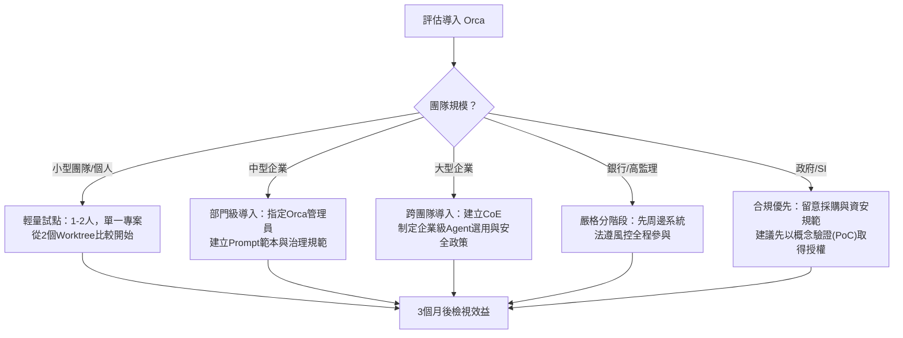

### 26.2 小型團隊（1～10人）

- **建議切入點**：從個人或小組的日常開發任務開始，先體驗「平行 Worktree 比較」的價值，不急著建立複雜治理制度。
- **關鍵成功因素**：團隊內至少有一人願意花時間熟悉工具操作，並將心得分享給其他成員。
- **注意事項**：小型團隊資源有限，避免一次導入過多角色分工（第 13、19 章），先以 2～3 角色驗證流程。

### 26.3 中型企業（數十～數百人工程團隊）

- **建議切入點**：指定 1～2 名「Orca 管理員」，負責帳號治理、Prompt 範本建立與教育訓練。
- **關鍵成功因素**：建立跨專案共用的 Prompt Library（見第 29 章）與 Best Practice 手冊（見第 24 章），避免各團隊各自摸索、重複踩坑。
- **注意事項**：中型企業常見多個團隊並行導入，建議建立中央治理小組協調各團隊的使用規範，避免帳號與成本治理各自為政。

### 26.4 大型企業（數百人以上）

- **建議切入點**：成立跨部門的「AI 開發工具卓越中心（CoE）」，制定企業級的 Agent CLI 選用清單、安全基準與成本治理政策。
- **關鍵成功因素**：與資安、採購、法務部門及早對齊，尤其是 BYO 訂閱模式下的供應商管理與資料落地要求。
- **注意事項**：大型企業內不同事業群的風險容忍度可能差異很大，治理政策應保留一定彈性，而非一體適用所有團隊。

### 26.5 銀行／高監理產業

- **建議切入點**：延續第 20 章案例精神，優先在周邊、低風險系統試點，核心交易系統暫緩，待治理經驗成熟後再評估。
- **關鍵成功因素**：法遵、風控代表從導入評估階段即參與，而非等到開發完成才審查。
- **注意事項**：所有 Agent 產出視為草案，既有的變更管理、雙軌測試、簽核層級不因導入 AI 工具而簡化。

### 26.6 政府／SI（系統整合商）

- **建議切入點**：以概念驗證（PoC）形式在非正式環境先行評估，同時確認採購與資安規範是否允許使用此類 BYO 訂閱、近乎每日發版的開源工具。
- **關鍵成功因素**：釐清「工具本身免費、但仍需採購底層 Agent CLI 訂閱」的實際成本結構，避免預算編列誤判。
- **注意事項**：政府專案常有明確的資料落地與稽核要求，需特別關注第 6.3、22.3 節提及的金鑰與資料治理實務是否符合相關法規。

**最佳實務彙整（本章）**：不論組織規模，導入的第一步都應是「小規模試點＋量化效益評估」，而非直接全面推廣；治理制度（帳號、成本、安全）應與試點同步建立，而非事後補強。

**注意事項**：組織規模與監理要求差異極大，本章建議為通用方向，實際導入計畫應由內部利害關係人共同拍板。

**常見錯誤**：管理層看到展示效果驚豔，跳過試點階段直接要求全公司導入，導致治理制度跟不上使用規模，衍生帳號與成本失控風險。

**小技巧**：可將本章的組織規模對照表，轉化為內部導入提案的附件，向管理層清楚說明「為何要分階段」。

---

## 第二十七章 完整企業案例

> ⚠️ 本章為教學示例案例（保險業情境），與第 10 章（Web 應用）、第 20 章（銀行案例）採不同產業情境，避免案例重複；非真實客戶專案。

### 27.1 需求

**情境**：某保險公司需開發一套「保單續期提醒與線上續繳」服務，需求包含：查詢即將到期保單、發送提醒通知、線上信用卡續繳、續繳結果同步回既有保單系統。

### 27.2 分析

- 既有保單系統為內部 Legacy 系統（需先進行類似第 11 章的逆向工程理解其資料介面）。
- 續繳功能涉及金流，需符合 PCI-DSS 等既有支付合規要求。
- 通知管道需支援 Email／簡訊，並記錄發送與開啟狀態供行銷分析使用。

### 27.3 Architecture

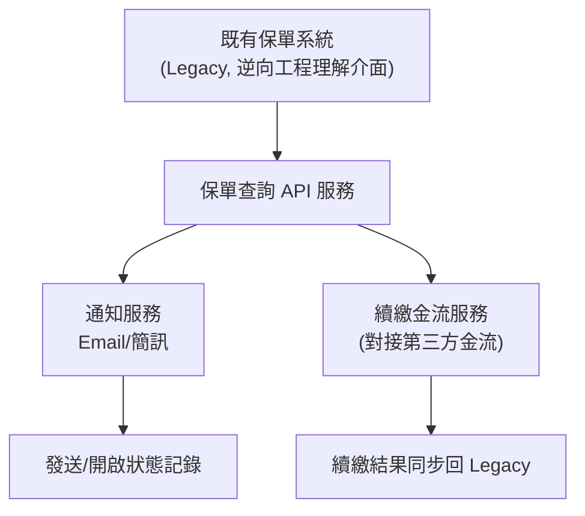

### 27.4 Agent 分工

| Agent 角色 | 任務 |
|---|---|
| Legacy 理解 Agent | 比照第 11 章方法，分析既有保單系統的資料介面與欄位定義 |
| API 開發 Agent | 開發保單查詢 API，含快取與權限控管 |
| 通知服務 Agent | 開發 Email／簡訊通知模組，含發送狀態追蹤 |
| 金流整合 Agent | 對接第三方金流，需嚴格遵循 PCI-DSS 相關規範，不儲存完整卡號 |
| 回寫同步 Agent | 開發續繳結果回寫既有保單系統的同步機制，含失敗重試 |
| Review／Security Agent | 交叉審查所有涉及金流與個資的程式碼 |

### 27.5 Coding／Review／Deploy／Maintenance

- **Coding**：依 27.4 分工，各 Agent 於獨立 Worktree 平行開發。
- **Review**：金流與個資相關模組，強制經過 Security Agent 與真人資安人員雙重審查（比照第 24.6 節最佳實務）。
- **Deploy**：透過既有 GitHub Actions Pipeline 部署至測試環境，經 UAT 通過後才進入正式環境（比照第 20.4 節治理流程精神）。
- **Maintenance**：上線後依第 21 章建議，持續追蹤 Orca 與各 Agent CLI 版本更新，並定期複核金流合規要求是否有變動。

**重點整理**：本案例展示 Orca 從「Legacy 理解」到「新服務開發」再到「與既有系統整合」的完整鏈路，核心仍是「平行加速草案產出，人工把關關鍵風險點（金流、個資）」。

**最佳實務**：涉及支付與個資的模組，審查關卡數量應多於一般功能模組，且務必包含具備相關合規知識的真人參與。

**注意事項**：金流串接屬於高風險領域，Agent 產出的程式碼即使測試通過，仍建議另外安排滲透測試／合規稽核後才正式上線。

**常見錯誤**：因平行開發速度加快，壓縮了原本應完整執行的合規審查與滲透測試時間，本末倒置地增加了上線風險。

**小技巧**：可將本章 27.4 的分工表作為「涉及金流／個資的新服務」標準起手模板，依實際專案調整角色細節。

---

## 第二十八章 Mermaid 圖表彙整

本章彙整全書所有 Mermaid 圖表索引，並補充前面章節未涵蓋的圖表類型（Class、ER、Git Flow、CI/CD、Deployment、State），確保讀者可快速查找或直接取用範本。

### 28.1 全書圖表索引

| # | 章節 | 圖表類型 | 用途 |
|---|---|---|---|
| 1 | 第3章 | graph TD | 整體架構總覽 |
| 2 | 第3章 | sequenceDiagram | Agent 執行生命週期 |
| 3 | 第3章 | graph LR | Workspace/Session/Context/Prompt 關係 |
| 4 | 第8章 | sequenceDiagram | 平行分派基本流程 |
| 5 | 第8章 | graph LR | 平行產出合併流程 |
| 6 | 第9章 | graph TD | AI Coding Workflow 全流程 |
| 7 | 第10章 | graph TD | 企業 Web 應用需求拆解 |
| 8 | 第11章 | graph LR | Legacy 平行盤點策略 |
| 9 | 第12章 | graph TD | 框架升級多 Agent 協同流程 |
| 10 | 第13章 | graph TD | Agent Collaboration 角色分工 |
| 11 | 第14章 | graph LR | Git Worktree 與 PR 關係 |
| 12 | 第15章 | sequenceDiagram | Code Review 與 Annotate 流程 |
| 13 | 第16章 | graph LR | Mobile Companion 功能地圖 |
| 14 | 第17章 | graph TD | SSH Worktrees／VPS 架構 |
| 15 | 第19章 | graph TD | AI 團隊組織角色對應 |
| 16 | 第20章 | graph TD | 銀行案例任務拆解 |
| 17 | 第20章 | graph LR | 銀行案例治理流程 |
| 18 | 第22章 | graph TD | 成本治理流程 |
| 19 | 第26章 | graph TD | 導入決策樹 |
| 20 | 第27章 | graph TD | 保險案例架構 |
| 21 | 第30章 | graph TD | 建議導入流程總覽 |

**注意事項**：第 21 項（第三十章導入流程總覽圖）成書時序上晚於本章寫作，先前版本手冊的索引未納入，本次查證已補上，避免索引與全書實際圖表數量不一致。

**小技巧**：若只需要單張圖表作為簡報素材，可直接複製對應章節的 Mermaid 程式碼區塊，貼入支援 Mermaid 渲染的工具（如 GitHub、Notion、VS Code 擴充套件）中預覽。

### 28.2 補充圖表類型

#### （1）Flowchart — 新人 Onboarding 流程

```mermaid
flowchart TD
    A["新進工程師"] --> B["安裝 Orca（第4章）"]
    B --> C["登入 Agent CLI 帳號（第6章）"]
    C --> D["建立第一個 Workspace（第5章）"]
    D --> E["練習 2-3 角色平行分派（第8章）"]
    E --> F["完成第一次 Annotate Diff 審查（第15章）"]
    F --> G["正式加入團隊專案"]
```

#### （2）Sequence — Design Mode 互動細節

```mermaid
sequenceDiagram
    participant U as 前端工程師
    participant DM as Design Mode（內嵌 Chromium）
    participant AG as Agent CLI
    U->>DM: 點選畫面上的 UI 元素
    DM->>DM: 擷取 HTML/CSS + 截圖
    DM->>AG: 送出 Prompt + 元素脈絡
    AG-->>U: 回傳修正後的樣式/程式碼
```

#### （3）Class Diagram — Orca 核心概念資料模型（教學用簡化示意）

```mermaid
classDiagram
    class Workspace {
        +String name
        +Repository repo
        +listWorktrees()
    }
    class Worktree {
        +String branch
        +String path
        +Agent assignedAgent
    }
    class Session {
        +String prompt
        +DateTime startedAt
        +Diff produce()
    }
    class Agent {
        +String cliType
        +String accountRef
        +run(prompt)
    }
    class Diff {
        +List~Change~ changes
    }
    Workspace "1" --> "many" Worktree
    Worktree "1" --> "many" Session
    Session "1" --> "1" Agent
    Session "1" --> "1" Diff
```

> **注意事項**：本類別圖為教學用簡化示意，非官方原廠資料模型，屬性與方法命名僅供理解概念之用。

#### （4）ER Diagram — 教學用設定/工作階段資料儲存示意

```mermaid
erDiagram
    WORKSPACE ||--o{ WORKTREE : contains
    WORKTREE ||--o{ SESSION : has
    SESSION ||--|| AGENT_ACCOUNT : uses
    SESSION ||--o{ DIFF_ANNOTATION : receives
    AGENT_ACCOUNT {
        string cli_type
        string account_id
    }
    WORKSPACE {
        string workspace_id
        string repo_url
    }
```

> **注意事項**：同上，本 ER 圖為教學推論示意，非官方資料庫схема。

#### （5）Git Flow — 多 Agent 分支策略

```mermaid
graph LR
    MAIN["main"] --> B1["feature/frontend<br/>(Worktree 1)"]
    MAIN --> B2["feature/backend<br/>(Worktree 2)"]
    MAIN --> B3["feature/test<br/>(Worktree 3)"]
    B1 --> PR1["PR #101"]
    B2 --> PR2["PR #102"]
    B3 --> PR3["PR #103"]
    PR1 --> MAIN
    PR2 --> MAIN
    PR3 --> MAIN
    MAIN --> REL["release/1.x"]
    REL --> PROD["正式環境"]
```

#### （6）CI/CD Pipeline

```mermaid
graph LR
    PUSH["Git Push（含 Agent 產出的 Commit）"] --> BUILD["Build"]
    BUILD --> UT["單元測試"]
    UT --> SCAN["安全掃描（Security Agent 建議項）"]
    SCAN --> IMG["建置容器映像"]
    IMG --> STG["部署至 Staging"]
    STG --> UAT["UAT 驗收"]
    UAT --> PROD["部署至 Production"]
```

#### （7）Deployment（Kubernetes 多資料中心）

```mermaid
graph TD
    LB["全域負載平衡"] --> DC1["資料中心 A - K8s Cluster"]
    LB --> DC2["資料中心 B - K8s Cluster"]
    DC1 --> SVC1["服務 Pods"]
    DC2 --> SVC2["服務 Pods"]
    SVC1 --> DB1["主資料庫"]
    SVC2 --> DB2["備援資料庫（同步複寫）"]
    DB1 -.雙向同步.-> DB2
```

#### （8）State Diagram — Agent Session 狀態機

```mermaid
stateDiagram-v2
    [*] --> Queued
    Queued --> Running: 分派 Prompt
    Running --> NeedsReview: Agent 完成產出
    Running --> Failed: 執行錯誤/Rate Limit
    Failed --> Queued: 人工調整後重試
    NeedsReview --> Revising: Annotate Diff
    Revising --> Running
    NeedsReview --> Merged: 審查通過
    Merged --> [*]
```

**重點整理**：本章共補充 8 張新圖表（含 Flowchart、Sequence、Class、ER、Git Flow、CI/CD、Deployment、State），加上前 27 章既有 20 張、第三十章 1 張導入流程總覽圖，全書合計 **29 張** Mermaid 圖表，涵蓋官方要求的九種圖表類型。

**最佳實務**：企業內部教育訓練簡報，建議優先挑選第 28.2 節的補充圖表（Class／ER／State），這幾類圖表在原始章節敘事中較少出現，但對新人建立整體資料與狀態心智模型特別有幫助。

**注意事項**：本章所有圖表皆為教學推論繪製，非官方原廠釋出之圖表，切勿作為官方技術規格引用。

---

## 第二十九章 Prompt Library

> 本章彙整 108 則可直接取用的 Prompt 範例，依 12 大類、連續編號 1～108，供團隊依情境直接套用或微調。使用前建議先套用第 18 章「多 Agent 情境下的 Prompt 設計原則」（範圍邊界、共同上下文、結構化輸出、驗收標準）。

### 29.1 Architecture（1～9）

1. 「請針對現有單體架構，提出三種微服務拆分方案，並比較各方案的資料一致性處理成本與團隊分工難易度。」
2. 「請畫出目前系統的高層架構圖（Mermaid graph TD），標示各服務之間的同步／非同步呼叫關係。」
3. 「請評估將這個模組拆成獨立服務後，需要新增哪些跨服務可觀測性（Observability）機制。」
4. 「請針對高可用需求，提出至少兩種多資料中心部署策略，並比較 RTO/RPO 差異。」
5. 「請檢視此架構是否存在單點故障（SPOF），並提出改善建議。」
6. 「請比較採用事件驅動架構與同步 API 呼叫，對此模組的優缺點。」
7. 「請根據 Domain-Driven Design 原則，為此系統重新劃分 Bounded Context。」
8. 「請提出此系統導入 API Gateway 的必要性評估與建議設計。」
9. 「請針對本次架構變更，列出需要更新的相依文件與需要通知的關聯團隊。」

### 29.2 Coding（10～18）

10. 「請在 `src/modules/customer` 目錄下實作查詢 API，需符合 `docs/api-schema.md` 定義的契約，並補上對應單元測試。」
11. 「請將這個函式重構為純函式，移除其中的隱性副作用。」
12. 「請為這個 Vue3 元件補上 TypeScript 型別定義，並確保 Props 具備完整型別檢查。」
13. 「請實作分頁查詢功能，預設每頁 20 筆，並支援自訂排序欄位。」
14. 「請依現有程式風格（見 `.eslintrc`）撰寫這個新模組，勿引入未使用的相依套件。」
15. 「請將這段重複出現三次以上的邏輯抽成共用工具函式。」
16. 「請實作這個表單的前端驗證邏輯，規則需與後端驗證邏輯一致。」
17. 「請補上這個 API 端點的例外處理，涵蓋逾時、無權限、資料不存在三種情境。」
18. 「請將這個同步阻塞呼叫改為非同步實作，並說明對呼叫端的影響。」

### 29.3 Migration（19～27）

19. 「請將此模組由 Java 8 遷移至 Java 25，先列出所有已棄用 API 的使用位置。」
20. 「請將此設定檔由 Spring Boot 2 格式遷移至 Spring Boot 4，標示每一項屬性名稱的變更。」
21. 「請將 `javax.*` 命名空間全面替換為 `jakarta.*`，並列出需要人工確認的邊界案例。」
22. 「請將此 Vue2 Options API 元件遷移為 Vue3 Composition API，並保留原有測試可通過。」
23. 「請將此 Oracle 專屬 SQL 語法改寫為 PostgreSQL 相容語法，標示行為差異之處。」
24. 「請評估將這個服務由虛擬機部署遷移至 Kubernetes 所需的設定調整清單。」
25. 「請將此 Hibernate 舊版 Mapping 設定遷移至新版語法，並列出 Lazy Loading 行為可能的變化。」
26. 「請規劃此系統由單體架構遷移至微服務的分階段路徑，每階段需可獨立驗收。」
27. 「請將此 .NET Framework 專案遷移至跨平台 .NET，列出無法直接相容的相依套件。」

### 29.4 Review（28～36）

28. 「請以 OWASP Top 10 為基準，審查本次 Diff 是否存在注入攻擊、權限繞過等風險。」
29. 「請審查這段程式碼是否符合團隊的錯誤處理慣例，並指出不一致之處。」
30. 「請檢查這次變更是否會影響既有 API 的向後相容性。」
31. 「請審查此 SQL 查詢是否可能存在效能問題（如缺少索引、N+1 查詢）。」
32. 「請確認這段程式碼的例外處理是否會吞掉重要錯誤資訊。」
33. 「請審查此次變更的測試涵蓋率是否足夠，並指出未涵蓋的邊界案例。」
34. 「請檢查此 Pull Request 的 Commit 訊息是否清楚描述變更動機。」
35. 「請審查這個模組是否有硬編碼的機敏設定值。」
36. 「請比較這兩個 Agent 對同一需求的實作差異，並給出整合建議。」

### 29.5 Testing（37～45）

37. 「請為 `OrderService` 補齊單元測試，涵蓋正常路徑與至少 3 種例外情境。」
38. 「請撰寫此 API 的整合測試，包含資料庫交易回滾的驗證。」
39. 「請為這個 Vue 元件撰寫元件測試，涵蓋使用者互動與非同步狀態更新。」
40. 「請設計此批次作業的測試資料集，涵蓋邊界值與異常輸入。」
41. 「請為此金流串接模組撰寫測試，需 Mock 第三方支付服務的回應。」
42. 「請檢查現有測試套件在本次變更後是否仍全數通過，並分析任何失敗案例的根因。」
43. 「請為這個並行處理邏輯撰寫壓力測試，驗證是否存在競態條件。」
44. 「請補上這個 API 的契約測試，確保前後端介接一致。」
45. 「請為這次資料庫 Migration 腳本撰寫回滾測試。」

### 29.6 Documentation（46～54）

46. 「請為這個新增的 API 端點產出 OpenAPI 規格文件。」
47. 「請為此模組撰寫架構決策紀錄（ADR），說明選型理由與替代方案。」
48. 「請將這份技術文件在地化為繁體中文，保留原有程式碼區塊不變。」
49. 「請為新進工程師撰寫此專案的 Onboarding 指南，涵蓋環境建置與常見問題。」
50. 「請為此次框架升級撰寫遷移手冊，列出每個步驟與注意事項。」
51. 「請為這個模組補上程式碼內的說明（僅在邏輯不直觀之處），避免多餘註解。」
52. 「請整理這次 Legacy 系統盤點的發現，產出結構化的現況報告。」
53. 「請為此服務撰寫 Runbook，涵蓋常見故障排除步驟。」
54. 「請更新 README，反映本次新增的環境變數與設定項目。」

### 29.7 Refactor（55～63）

55. 「請將這個過長的函式拆解為多個職責單一的小函式。」
56. 「請消除這個模組中重複的條件判斷邏輯，改用策略模式。」
57. 「請將這段直接操作全域狀態的程式碼，改為透過明確的參數傳遞。」
58. 「請重新命名這些語意不清的變數與函式名稱，使其符合團隊命名慣例。」
59. 「請將這個巨大的 Vue 元件拆分為多個可重用的子元件。」
60. 「請移除這個模組中已確認不再使用的程式碼與相依套件。」
61. 「請將這段回呼巢狀程式碼改寫為 async/await 風格。」
62. 「請評估將這個類別的繼承關係改為組合，並說明利弊。」
63. 「請重構這個模組的錯誤處理，統一改用團隊慣用的例外類別體系。」

### 29.8 Performance（64～72）

64. 「請分析此 API 端點的效能瓶頸，並提出優化建議。」
65. 「請為這個高頻率查詢設計 Redis 快取策略，並說明快取失效規則。」
66. 「請檢查這個資料庫查詢是否缺少必要索引。」
67. 「請評估這個前端頁面的首次載入效能，並提出程式碼分割建議。」
68. 「請分析這個批次作業的執行時間分佈，找出最耗時的步驟。」
69. 「請檢查這個模組是否存在記憶體洩漏風險。」
70. 「請評估將這個同步呼叫改為批次處理對整體吞吐量的影響。」
71. 「請提出這個服務在高併發情境下的限流策略。」
72. 「請分析目前多個平行 Worktree 同時執行對本機資源的影響，並建議合理上限。」

### 29.9 Security（73～81）

73. 「請檢查此模組是否存在 SQL Injection 風險，並提出修正建議。」
74. 「請審查這個 API 端點的權限驗證邏輯是否存在垂直／水平權限提升風險。」
75. 「請檢查這段程式碼是否有將機敏資訊寫入日誌的情況。」
76. 「請評估這個檔案上傳功能是否存在惡意檔案上傳風險。」
77. 「請審查此次變更是否符合最小權限原則。」
78. 「請檢查這個 API 是否對輸入資料做了充分的驗證與清理。」
79. 「請評估這個第三方套件是否存在已知安全漏洞。」
80. 「請審查此金鑰／憑證的儲存方式是否符合企業資安基準。」
81. 「請檢查這段程式碼在跨來源請求設定上是否過於寬鬆。」

### 29.10 Banking（82～90）

82. 「請為信用查詢 API 設計欄位遮罩策略，確保個資保護符合金融監理要求。」
83. 「請將這段授信規則邏輯轉換為結構化規則引擎設定，並產出變更前後對照表。」
84. 「請設計此批次清算作業的失敗重跑與補償交易機制。」
85. 「請將這份內部交易訊息格式轉換為 ISO 20022 相容格式，並標示欄位對應關係。」
86. 「請評估此服務跨資料中心部署的資料同步策略，並說明可能的一致性風險。」
87. 「請為此支付服務設計限流與異常交易偵測的基本規則。」
88. 「請檢查這個授信審核流程是否有遺漏必要的簽核關卡。」
89. 「請為此金融服務模組撰寫符合稽核要求的操作紀錄機制。」
90. 「請評估此次變更對現有災難復原演練腳本的影響。」

### 29.11 Framework Upgrade（91～99）

91. 「請列出將此專案由 Spring Boot 2 升級至 Spring Boot 4 的完整檢查清單。」
92. 「請評估此專案直接升級至最新 LTS 版本，還是應先升級至中繼版本。」
93. 「請掃描此專案中所有第三方套件，標示哪些與目標框架版本不相容。」
94. 「請針對此次升級，產出可回滾的計畫與觸發條件。」
95. 「請比較升級前後此服務的啟動時間與記憶體用量差異。」
96. 「請列出此次升級後需要重新驗證的整合測試案例清單。」
97. 「請評估此次前端框架升級對既有 E2E 測試腳本的影響範圍。」
98. 「請針對本次升級撰寫給其他團隊的變更通知草稿，說明可能的影響與因應建議。」
99. 「請確認此次升級是否影響既有的 CI/CD Pipeline 設定。」

### 29.12 Reverse Engineering（100～108）

100. 「請分析這個 COBOL 批次程式的輸入輸出檔案格式，並產出資料結構說明文件。」
101. 「請盤點這個 Struts 模組的 Action 與 Form 對應關係，產出路由對照表。」
102. 「請分析這個 EJB 元件的交易管理方式，並標示潛在風險。」
103. 「請理解這個 Delphi 表單的事件邏輯，並整理為結構化的業務規則文件。」
104. 「請分析這個 ASP.NET Web Forms 頁面的 ViewState 使用情況，評估遷移至現代框架的難易度。」
105. 「請盤點這個舊版 VB 專案中直接存取資料庫的程式碼位置。」
106. 「請針對這個沒有文件的模組，先進行粗略掃描，列出主要職責與對外相依。」
107. 「請針對第 106 項掃描結果中風險最高的子模組，進行深入分析並產出詳細現況報告。」
108. 「請比較兩個不同 Agent 對同一個 Legacy 模組的理解結果，標示出有分歧的部分供人工複核。」

**最佳實務**：將本章節錄轉為團隊內部的 Prompt 範本庫（如 Notion／Confluence 頁面），依專案實際情況微調範圍與驗收標準後再套用，不建議原封不動複製貼上。

**注意事項**：涉及 Banking／Security 類別的 Prompt，套用前務必移除或替換為去識別化的範例資料，避免將真實機敏資訊帶入 Prompt。

**常見錯誤**：把範例 Prompt 當作萬用模板，忽略每個專案實際的檔案結構、命名慣例與驗收標準差異，導致 Agent 產出與預期落差。

**小技巧**：可將常用的 5～10 則 Prompt 設為團隊「Quick Open」常用清單，加速日常任務下達。

---

## 第三十章 總結

### 30.1 Orca 最適合哪些公司

- 已採用至少一種 coding agent CLI、希望規模化平行處理的技術團隊。
- 願意投入治理成本（帳號、成本、安全）換取平行探索效率的中大型工程組織。
- 需要跨裝置（桌面／行動／VPS）協作的分散式或遠端優先團隊。
- 能接受「產品仍在快速迭代早期」風險的團隊——Orca 這個產品的 GitHub Repository 至查證日期僅約 4 個月歷史（2026-03-17 建立），雖然背後公司 Stably AI 是 2022 年即獲 YC 投資的成熟團隊，但產品本身的穩定性、功能邊界仍在快速變動中（見第 0.1、21 章）。

### 30.2 最適合哪些專案

- 顆粒度明確、可平行拆解的任務（批次修復、測試補齊、文件產出）。
- 需要多方案比較的架構或設計決策。
- Legacy 系統盤點與框架升級等「探索多於精確一次到位」的任務類型。

### 30.3 最適合哪些開發模式

- 「先發散、後收斂」：多個 Agent 平行產出候選方案，人工取捨合併。
- 角色化協作：將 Planning／Coding／Review／Security／Performance 等角色明確分工（第 13、19 章）。
- 非同步監控：透過行動端與 VPS，讓工作在人不在電腦前時持續推進。

### 30.4 建議導入流程總覽

```mermaid
graph TD
    A["盤點現有 Agent CLI 與訂閱"] --> B["小規模試點（第26章）"]
    B --> C["建立治理規範：帳號/成本/安全（第6/22/24章）"]
    C --> D["建立 Prompt Library 與 Best Practice（第24/29章）"]
    D --> E["擴大至跨團隊/跨專案"]
    E --> F["定期複核官方版本與功能變動（第21/23章）"]
    F --> B
```

### 30.5 ADE（Agent Development Environment）的未來趨勢

依目前 Orca 與同類產品的發展方向觀察（⚠️ 屬趨勢觀察與推論，非官方公告的路線圖）：

1. **從「單一 Agent 助理」走向「艦隊指揮」**：工程師的角色將持續從「打字者」轉向「決策者與審查者」。
2. **跨裝置協作將成為標配**：行動端監控與 VPS／遠端執行的組合，讓「隨時隨地推進工作」不再是少數團隊的特例。
3. **治理與可觀測性需求將快速追上功能發展**：隨著平行 Agent 數量增加，帳號、成本、安全治理工具的成熟度，將決定企業能否真正規模化採用。
4. **多 Agent CLI 並存將是常態，而非過渡期現象**：企業不太可能長期綁死單一 Agent CLI 供應商，協調層（如 Orca）的價值會隨供應商數量增加而提升。
5. **開源、近乎每日發版的節奏，對企業採用是雙面刃**：功能迭代快、社群活躍是優點，但也對企業的版本管理與風險評估能力提出更高要求。

**重點整理（全書）**：Orca 的核心價值是「用 Git Worktree 隔離＋桌面/行動/VPS 三端協作，把多個既有 coding agent CLI 組織成一支可平行調度的艦隊」；它不是模型供應商切換器，也不是要取代你現有的 Claude Code／Codex，而是在其之上再加一層指揮與治理。

**最佳實務**：導入決策應以「小規模試點＋量化效益＋同步建立治理」為主軸，並持續關注官方近乎每日發版帶來的功能邊界變化。

**注意事項**：本手冊所有內容基於 2026-07-22 查證當下之公開資訊整理，讀者應定期回頭核對官方 GitHub Repository 與文件站的最新狀態。

**常見錯誤**：將本手冊教學示例（第 10、20、27 章案例）誤認為真實客戶專案並對外引用。

**小技巧**：建議每季安排一次「Orca 使用現況回顧會議」，同步更新團隊內部規範，並視需要修訂本手冊對應章節。

---

### 全書總檢查清單（Master Checklist）

- [ ] 團隊已清楚理解 Orca 的定位：多 Agent CLI 的艦隊指揮層，而非取代既有工具的新 AI（第 1 章）
- [ ] 已完成安裝並理解 WSL／Docker 的官方支援現況（第 4 章）
- [ ] 已理解「Provider 設定」的正確心智模型：帳號切換器＋各 CLI 自管 Provider（第 6 章）
- [ ] 已盤點團隊可用的 Agent CLI 並建立任務指派原則（第 7 章）
- [ ] 已完成至少一次平行 Agent 協作演練，並理解合併治理要點（第 8、14、15 章）
- [ ] 已釐清 Orca 在需求到部署全流程中的實際涵蓋範圍（第 9 章）
- [ ] 已完成至少一個教學示例等級的複雜案例演練（企業 Web／銀行／保險三選一，第 10、20、27 章）
- [ ] 已建立 Legacy 逆向工程與框架升級的分階段作業原則（第 11、12 章）
- [ ] 已建立團隊 Prompt 設計原則與範本庫（第 18、29 章）
- [ ] 已完成行動端與 VPS／SSH Worktrees 的實務演練（第 16、17 章）
- [ ] 已建立跨 Agent CLI 的金鑰、成本與 Rate Limit 治理機制（第 6、22、24 章）
- [ ] 已彙整團隊自身的常見錯誤與 FAQ，並持續更新（第 23 章）
- [ ] 已完成 100 條最佳實務的內部導讀，並轉化為團隊規範（第 24 章）
- [ ] 已依組織規模與監理要求，選定適合的導入路徑（第 26 章）
- [ ] 已建立版本追蹤與定期複核機制，因應官方近乎每日發版節奏（第 21 章）
- [ ] 已安排定期（建議每季）回顧會議，更新導入現況與本手冊對應內容（第 30 章）

---

*（全書完）*


