+++
date = '2026-06-30T11:52:41+08:00'
draft = false
title = 'PPT Master 教學手冊'
tags = ['教學', 'AI開發']
categories = ['教學']
+++

# PPT Master 教學手冊

> 企業 AI 簡報平台建置手冊 — 從 Prompt 到原生可編輯 PowerPoint 的完整實戰指南
>
> **基於 PPT Master v2.11.0** ｜ **最後更新：2026-06-30** ｜ **GitHub Stars: 34.4k+**

---

## 📋 目錄 (Table of Contents)

### 第一部分：基礎概念與架構

1. [PPT Master 介紹](#第1章-ppt-master-介紹)
2. [PPT Master 系統架構](#第2章-ppt-master-系統架構)
3. [核心技術解析](#第3章-核心技術解析)
4. [SVG → DrawingML 原理](#第4章-svg--drawingml-原理)
5. [PPT Master 工作流程](#第5章-ppt-master-工作流程)

### 第二部分：AI Agent 與安裝設定

6. [AI Agent Skill](#第6章-ai-agent-skill)
7. [安裝教學](#第7章-安裝教學)
8. [系統設定](#第8章-系統設定)

### 第三部分：模板與 Prompt 工程

9. [Template 使用](#第9章-template-使用)
10. [Prompt Engineering](#第10章-prompt-engineering)
11. [文件來源](#第11章-文件來源)
12. [Speaker Notes](#第12章-speaker-notes)

### 第四部分：AI 模型與 IDE 整合

13. [AI 模型支援](#第13章-ai-模型支援)
14. [與 Claude Code 整合](#第14章-與-claude-code-整合)
15. [與 GitHub Copilot 整合](#第15章-與-github-copilot-整合)
16. [與 Cursor 整合](#第16章-與-cursor-整合)
17. [與 MCP 整合](#第17章-與-mcp-整合)

### 第五部分：進階應用

18. [與企業知識庫整合](#第18章-與企業知識庫整合)
19. [實戰案例](#第19章-實戰案例)
20. [Mermaid 圖集](#第20章-mermaid-圖集)
21. [常用 Prompt 範例](#第21章-常用-prompt-範例)

### 第六部分：最佳實務與效能

22. [最佳實務](#第22章-最佳實務)
23. [效能最佳化](#第23章-效能最佳化)

### 第七部分：維運管理

24. [系統維護](#第24章-系統維護)
25. [系統升級](#第25章-系統升級)

### 第八部分：FAQ、疑難排解與參考

26. [常見問題 FAQ](#第26章-常見問題-faq)
27. [Troubleshooting](#第27章-troubleshooting)
28. [與其他工具比較](#第28章-與其他工具比較)

### 第九部分：企業導入與未來發展

29. [企業導入建議](#第29章-企業導入建議)
30. [適用 SSDLC](#第30章-適用-ssdlc)
31. [未來發展](#第31章-未來發展)

### 附錄

- [檢查清單 (Checklist)](#檢查清單-checklist)

---

## 📖 文件說明

### 🎯 文件目標

本手冊將 PPT Master 定位為**企業 AI 簡報生成平台**，涵蓋以下核心能力：

1. **AI 原生簡報生成** — 透過自然語言 Prompt 產出 100% 原生可編輯的 PowerPoint 檔案
2. **多來源文件轉換** — 支援 PDF、Word、Excel、網頁、Markdown 等多種格式轉為專業簡報
3. **企業品牌治理** — 透過模板系統確保所有簡報符合企業品牌識別
4. **多 AI 平台整合** — 無縫整合 Claude Code、GitHub Copilot、Cursor、Gemini CLI 等主流 AI 開發環境
5. **演講自動化** — 自動生成 Speaker Notes 並轉換為語音旁白

### 🎯 適用對象

| 角色 | 使用方式 |
|---|---|
| IT 工程師 | 安裝部署、系統設定、維運管理 |
| AI 工程師 | Prompt Engineering、AI 模型整合 |
| Claude Code 使用者 | 直接在 CLI 中生成簡報 |
| GitHub Copilot 使用者 | 透過 Agent Mode 生成簡報 |
| Cursor 使用者 | 透過 Composer 生成簡報 |
| Gemini CLI 使用者 | 透過 CLI 生成簡報 |
| PM / SA / 架構師 | 產出需求文件、架構設計、專案報告簡報 |
| 一般員工 | 日常簡報、教育訓練、會議報告 |

---

## 第1章 PPT Master 介紹

### 1.1 發展背景

PPT Master 由金融領域從業者 Hugo He（具備 CPA、CPV、諮詢工程師背景）創建並持續維護。截至 2026 年 6 月，專案在 GitHub 上已獲得 **34,400+ Stars**、**2,900+ Forks**，最新穩定版本為 **v2.11.0**，累計發布 9 個版本，擁有 16 位貢獻者。專案以 **MIT 授權** 開源，主要語言為 Python（85.9%）。

作為一位每天需要製作投融資簡報的專業人士，Hugo He 深刻體會到傳統 AI 簡報工具的痛點：**生成的投影片無法在 PowerPoint 中逐元素編輯**。

現有的 AI 簡報工具大致分為四類：

| 類型 | 代表工具 | 輸出格式 | 可逐元素編輯？ | 核心限制 |
|---|---|---|---|---|
| 模板填充型 | 傳統 PPT 外掛 | PPTX | 部分（受限於模板） | 設計受模板限制 |
| 圖片嵌入型 | 多數 AI 工具 | 每頁一張圖 | ❌ | 完全無法修改 |
| HTML 簡報型 | Slidev / Reveal.js | HTML | ❌（非 PPTX） | 無法用 PowerPoint 開啟 |
| **原生可編輯型** | **PPT Master** | **DrawingML** | **✅ 完全可編輯** | **需 AI 模型費用** |

> 📊 **專案數據**（2026-06）：GitHub Stars 34.4k ｜ Forks 2.9k ｜ 最新版本 v2.11.0 ｜ 授權 MIT ｜ 16 位貢獻者 ｜ Python 85.9%

### 1.2 解決什麼問題

PPT Master 解決了 AI 簡報生成領域的核心矛盾：

- **問題一**：AI 生成的簡報是「圖片」而非「物件」，無法修改文字、調整顏色
- **問題二**：企業簡報需要反覆微調，純 AI 生成無法滿足最後一哩路
- **問題三**：現有工具與 AI IDE（Claude Code / Cursor / VS Code + Copilot / Gemini CLI）缺乏原生整合
- **問題四**：企業品牌識別（Logo、色彩、字型）難以在 AI 簡報中統一
- **問題五**：企業資料安全——多數 SaaS 工具需將文件上傳至第三方伺服器

### 1.3 核心理念

PPT Master 的設計哲學可以用一個公式概括：

```
harness + model = agent
```

- **harness（駕馭工具）**：PPT Master 本身，負責工作流程管理、SVG 轉換、品質控制
- **model（AI 模型）**：Claude / GPT / Gemini 等，負責內容理解與視覺設計
- **agent（完整代理）**：兩者結合形成完整的簡報生成代理

> 📌 **重要觀念**：PPT Master 不是「許願池」。AI 負責產出高品質設計初稿（消除 90% 的空白頁工作），最後的打磨由使用者在 PowerPoint 中完成。工具的天花板等於使用者的天花板。

### 1.4 設計思想

| 設計原則 | 說明 |
|---|---|
| SVG 作為中間格式 | AI 生成 SVG 向量圖，再精準轉換為 DrawingML |
| 單一代理角色切換 | Strategist → Image_Generator → Executor 序列執行，非平行子代理 |
| Spec 傳播機制 | 透過 `spec_lock.md` 確保 20+ 頁設計一致性 |
| 模板 opt-in | 預設自由設計，模板是選擇性的 |
| 品質優先 | 禁止批次生成、禁止跳步驟、逐頁序列產出 |
| 資料在地化 | 除 AI 模型通訊外，整條管線完全本地執行 |
| 無平台鎖定 | 支援多種 AI IDE 與多種 AI 模型，不綁定單一廠商 |
| 透明成本 | 工具本身免費開源，唯一費用為 AI 模型使用量 |

### 1.5 適合哪些情境

✅ **適合**：
- 需要在 PowerPoint 中微調的商務簡報
- 將大量文件（PDF / Word / Excel / PPTX / 網頁）快速轉為簡報
- 企業品牌一致性要求高的場景
- AI 開發者想在 IDE 中直接生成簡報
- 需要自動生成 Speaker Notes 和語音旁白
- 資料安全敏感場景（金融、政府、法規遵循）
- 需要產出社群媒體內容（小紅書 3:4、IG 1:1、Story 9:16）

❌ **不適合**：
- 需要即時協作的線上簡報（建議使用 Google Slides）
- 僅需簡單文字投影片（過度殺傷力）
- 無 AI 模型 API 預算的場景
- 需要零設定、瀏覽器即開即用的體驗（建議使用 Gamma / Canva）

### 1.6 適合哪些企業

- 金融業（投融資簡報、年度報告、董事會簡報）
- 科技業（技術簡報、架構設計、產品介紹）
- 顧問業（提案簡報、專案報告）
- 教育機構（教育訓練、課程教材）
- 任何需要大量製作 PowerPoint 的組織

### 1.7 適合哪些人

- AI 工程師與開發者（在 IDE 中直接生成）
- PM / SA / 架構師（將需求文件轉為簡報）
- 業務 / 行銷人員（快速產出提案與產品介紹）
- 主管層（年度報告、策略簡報）

> ⚠️ **注意事項**：PPT Master 是 AI Skill，不是獨立應用程式。它需要在 AI IDE（如 Claude Code、Cursor、VS Code + Copilot）中運行。

---

## 第2章 PPT Master 系統架構

### 2.1 整體架構概覽

PPT Master 採用**三階段管線架構**，將簡報生成拆解為內容理解、視覺設計、工程轉換三個階段：

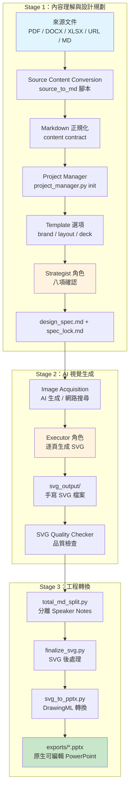

### 2.2 角色系統

PPT Master 採用**單一代理角色切換**模式，而非平行子代理：

| 角色 | 職責 | 模式 |
|---|---|---|
| **Strategist** | 分析來源材料、規劃投影片結構、確認視覺風格 | 開放式對話 |
| **Image_Generator** | 獲取圖像（AI 生成 / 網路搜尋 / 圖片切片） | 工具呼叫 |
| **Template_Designer** | 將現有 PPTX 或品牌指南轉換為可重用模板 | 結構化流程 |
| **Executor** | 嚴格按 spec 逐頁手寫 SVG 程式碼 | 嚴格 XML 模式 |

> 📌 **為何不使用子代理？** 頁面設計依賴完整的上游上下文（前頁色彩、圖示風格、排版節奏），子代理會以過時的上下文快照開始工作，導致視覺一致性快速退化。

### 2.3 Spec 傳播機制

PPT Master 使用雙文件機制確保設計一致性：

| 文件 | 用途 | 讀者 |
|---|---|---|
| `design_spec.md` | 人類可讀的設計敘述（「為什麼」） | 使用者 / Strategist |
| `spec_lock.md` | 機器可讀的執行合約（精確 HEX 色碼、字型、圖示庫） | Executor |

**抗漂移機制**：SKILL.md 強制 Executor 在生成每一頁前重新讀取 `spec_lock.md`，確保色彩值、字型大小等在 20+ 頁中保持逐字一致。

### 2.4 執行紀律（十條強制規則）

| # | 規則 | 說明 |
|---|---|---|
| 1 | 嚴格序列執行 | 不可跳過任何步驟 |
| 2 | BLOCKING = 硬停 | 遇到 BLOCKING 標記必須等待使用者確認 |
| 3 | 禁止跨階段打包 | 每個階段獨立完成 |
| 4 | 每步驟有前置閘門 | 進入下一步前必須通過檢查 |
| 5 | 禁止推測性執行 | 不可預先執行後續步驟 |
| 6 | 禁止子代理 SVG 生成 | SVG 必須由主代理生成 |
| 7 | 逐頁序列生成 | 一次只生成一頁 |
| 8 | 每頁重讀 spec_lock.md | 抗漂移機制 |
| 9 | SVG 必須手寫 | 禁止用腳本自動生成 SVG |
| 10 | 遵循確定性路由 | 根據輸入條件走固定路由 |

### 2.5 即時預覽架構（Live Preview）

PPT Master 提供基於 `localhost:5050` 的即時預覽介面，在生成過程中即可查看與編輯：

| 功能層級 | 說明 |
|---|---|
| **即時渲染** | AI 每產出一頁 SVG，瀏覽器即時顯示 |
| **L1 直接編輯** | 點選元素，在側邊面板修改文字、色彩、字型、大小 |
| **L2 拖曳移動** | 拖曳元素重新定位，或使用方向鍵微調（`Shift` = 10px） |
| **L3 AI 注解改寫** | 點選元素輸入修改指令，提交後 AI 重寫該區域並重新匯出 |

**操作方式**：
- 點選元素 → 側邊面板修改屬性 → 點擊 **Apply changes** 寫入 `svg_output/`
- 或點選元素 → 輸入注解 → 點擊 **Submit annotations** → 在 Chat 中說「apply my annotations」
- `Ctrl+Z` 支援復原

> 💡 **實務說明**：即時預覽不是完整的自由畫布（如 Gamma / Canva），不提供拖曳縮放控制點，且重新匯出 PPTX 仍需透過 Chat 觸發。此功能基於社群貢獻者 @WodenJay 的 PR #85 建構。

---

## 第3章 核心技術解析

### 3.1 技術堆疊關係

PPT Master 的核心技術堆疊涉及多個層次的格式轉換：

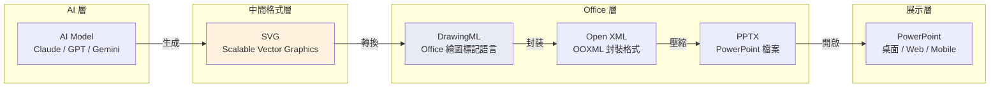

### 3.2 SVG（Scalable Vector Graphics）

SVG 是 W3C 標準的 XML 向量圖形格式，在 PPT Master 中作為**中間格式**（pivot format）：

| 特性 | 說明 |
|---|---|
| 座標系統 | 絕對座標（x, y, width, height） |
| 基本元素 | `<rect>` / `<circle>` / `<ellipse>` / `<path>` / `<text>` / `<image>` |
| 進階特性 | 漸層（`<linearGradient>`）、陰影（`<filter>`）、群組（`<g>`） |
| viewBox | 1280×720（16:9）或 960×720（4:3） |
| 單位 | 像素（px），96 DPI |

### 3.3 DrawingML

DrawingML 是 Microsoft Office 的原生繪圖標記語言，屬於 OOXML 標準的一部分：

| 特性 | 說明 |
|---|---|
| 座標系統 | EMU（English Metric Unit），1 inch = 914400 EMU |
| 轉換公式 | 1 SVG px = 9525 EMU（96 DPI） |
| 基本元素 | `<a:prstGeom>`（預設形狀）/ `<a:custGeom>`（自訂幾何） |
| 文字系統 | `<a:txBody>` → `<a:p>` → `<a:r>` → `<a:t>` |
| 填充系統 | `<a:solidFill>` / `<a:gradFill>` / `<a:pattFill>` |
| 效果系統 | `<a:effectLst>`（陰影、發光、反射） |

### 3.4 SVG → DrawingML 元素映射

| SVG 元素 | DrawingML 對應 | 備註 |
|---|---|---|
| `<rect>` | `<a:prstGeom prst="rect">` | 圓角使用 `roundRect` |
| `<circle>` / `<ellipse>` | `<a:prstGeom prst="ellipse">` | |
| `<path d="...">` | `<a:custGeom>` + `<a:path>` | 貝茲曲線完整支援 |
| `<line>` | `<a:cxnSp>`（連接線） | |
| `<text>` | `<a:txBody>` | 支援多段落、多樣式 |
| `<image>` | `<p:pic>` | Base64 或外部引用 |
| `<linearGradient>` | `<a:gradFill>` | 方向、色標完整映射 |
| `<polygon>` / `<polyline>` | `<a:custGeom>` | 轉為自訂路徑 |
| `fill` | `<a:solidFill>` | HEX 色碼直接映射 |
| `fill-opacity` | `<a:alpha val="...">` | 百分比轉換 |
| `transform` | `<a:xfrm>` | translate / scale / rotate |

### 3.5 座標系統與單位轉換

```
SVG 世界：像素（px），原點左上角
  viewBox="0 0 1280 720"  → 16:9 畫布

DrawingML 世界：EMU（English Metric Unit）
  標準投影片：12192000 × 6858000 EMU

轉換公式：
  EMU = px × 9525
  pt  = px × 0.75（字型大小）
```

### 3.6 PowerPoint 原生物件

PPT Master 生成的每個元素都是 PowerPoint 原生物件：

- **Native Shape**（原生形狀）：矩形、圓形、箭頭等可直接拖曳調整
- **Native Text**（原生文字）：文字框可直接點擊編輯、變更字型
- **Gradient**（漸層）：線性 / 放射漸層可在格式面板調整
- **Path**（路徑）：自訂曲線可編輯控制點
- **Shadow**（陰影）：Office 原生陰影效果
- **Absolute Position**（絕對定位）：每個元素都有精確的座標位置

> 💡 **實務建議**：由於每個元素都是原生物件，你可以在 PowerPoint 中對任何元素執行「右鍵 → 編輯圖案」來微調形狀。

---

## 第4章 SVG → DrawingML 原理

### 4.1 為什麼選擇 SVG 作為中間格式？

PPT Master 團隊經過嚴格的排除法選定 SVG：

| 備選方案 | 評估結果 | 淘汰原因 |
|---|---|---|
| 直接生成 DrawingML | ❌ | XML 結構極為繁瑣，AI 訓練資料稀少，輸出品質不穩定 |
| HTML/CSS | ❌ | 文件流模型（flow layout）vs 畫布模型（canvas）— 結構根本不匹配 |
| WMF/EMF | ❌ | AI 幾乎無任何訓練資料 |
| SVG 作為嵌入圖片 | ❌ | 完全喪失可編輯性 |
| **SVG 轉為 DrawingML** | **✅** | **共享絕對座標 2D 向量圖形世界觀，AI 訓練資料豐富** |

### 4.2 轉換流程

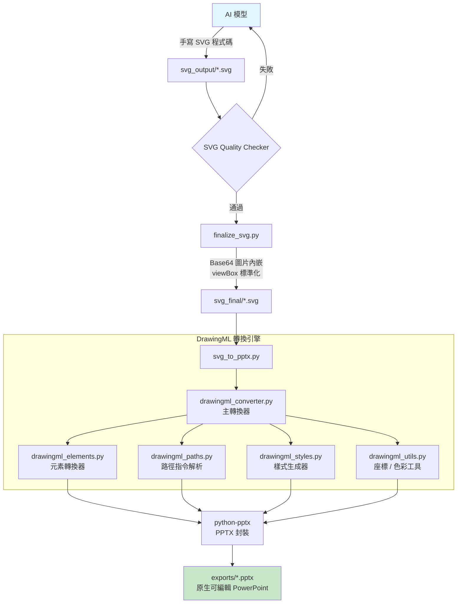

### 4.3 轉換引擎架構

轉換引擎位於 `skills/ppt-master/scripts/svg_to_pptx/` 目錄下：

| 模組 | 職責 |
|---|---|
| `drawingml_converter.py` | 主轉換器，`convert_svg_to_slide_shapes()` 核心函式 |
| `drawingml_elements.py` | 各 SVG 元素轉換器（rect、circle、path、text、image 等） |
| `drawingml_paths.py` | SVG path 指令（M/L/C/Q/A/Z）解析為 DrawingML `<a:path>` |
| `drawingml_styles.py` | 填充、描邊、漸層、透明度等樣式生成 |
| `drawingml_utils.py` | EMU 座標轉換、HEX 色碼解析、字型工具 |
| `drawingml_context.py` | `ConvertContext` 與 `ShapeResult` 資料類別 |

### 4.4 可編輯性保證

PPT Master 確保可編輯性的機制：

1. **逐元素分派**：每種 SVG 元素有專門的 translator，非整檔翻譯
2. **Office 相容模式**：預設為 2019 前版本生成 PNG fallback
3. **原生形狀優先**：`<rect>` 優先映射為 `<a:prstGeom prst="rect">` 而非自訂幾何
4. **文字框獨立**：每個 `<text>` 生成獨立的 `<p:sp>` 形狀，可個別編輯

### 4.5 SVG 限制（黑名單機制）

DrawingML 是 SVG 表達力的**嚴格子集**。以下 SVG 特性在 PPT Master 中被禁用：

| 禁用特性 | 原因 |
|---|---|
| `<mask>` | DrawingML 無對應功能 |
| `<style>` / `class` | 無 CSS 引擎 |
| `@font-face` | 自訂字型無法嵌入 |
| `<foreignObject>` | 非 SVG 原生元素 |
| `<symbol>` + `<use>` | 參照機制不支援 |
| `<textPath>` | 沿路徑文字不支援 |
| `<animate*>` | SVG 動畫不映射 |
| `<script>` / `<iframe>` | 安全性禁止 |

**有條件允許**：
- `marker-start` / `marker-end`：僅用於箭頭
- `clip-path`：僅用於 `<image>` 裁切

> ⚠️ **常見錯誤**：在 SVG 中使用 CSS class 定義樣式會導致轉換後所有樣式遺失。務必使用行內樣式（inline style）。

---

## 第5章 PPT Master 工作流程

### 5.1 完整七步驟工作流

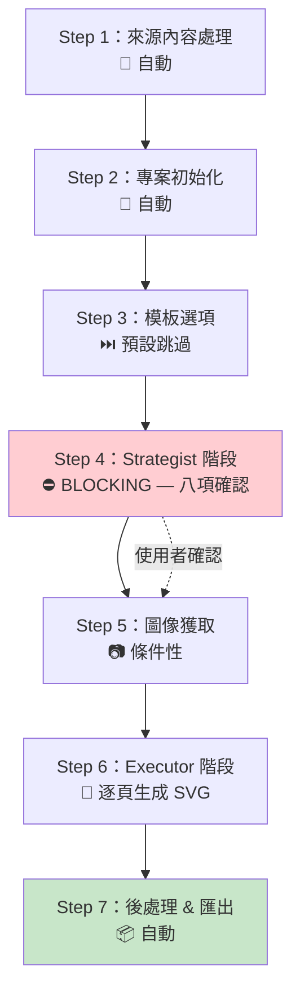

### 5.2 各步驟詳細說明

#### Step 1：來源內容處理

將輸入文件轉換為統一的 Markdown 格式：

```bash
# PDF → Markdown
python scripts/source_to_md/pdf_to_md.py input.pdf

# Word → Markdown
python scripts/source_to_md/doc_to_md.py input.docx

# Excel → Markdown
python scripts/source_to_md/excel_to_md.py input.xlsx

# 網頁 → Markdown
python scripts/source_to_md/web_to_md.py "https://example.com"

# 現有 PPTX → Markdown
python scripts/source_to_md/ppt_to_md.py input.pptx
```

#### Step 2：專案初始化

```bash
python scripts/project_manager.py init --name "我的簡報"
```

產出專案結構：

```
projects/my_presentation/
├── source/          # 來源文件
├── analysis/        # 結構分析
├── svg_output/      # SVG 輸出
├── svg_final/       # SVG 最終版
├── exports/         # PPTX 輸出
├── backup/          # 備份
├── design_spec.md   # 設計規格
└── spec_lock.md     # 執行合約
```

#### Step 3：模板選項（Opt-in）

預設跳過，僅在使用者明確提供模板目錄路徑時觸發。

#### Step 4：Strategist 八項確認（BLOCKING）

Strategist 會與使用者確認以下八項設計決策：

1. 投影片數量與結構
2. 視覺風格（Visual Style）
3. 敘事模式（Narrative Mode）
4. 色彩方案（Color Palette）
5. 字型選擇
6. 圖示風格與圖示庫
7. 圖片策略
8. 畫布格式

#### Step 5：圖像獲取

- AI 圖像生成（gpt-image-2 / Gemini / FLUX）
- 網路圖片搜尋（Openverse / Pexels / Pixabay）
- 圖片切片（slice_images.py）

#### Step 6：Executor 逐頁生成 SVG

每頁的生成流程：
1. 讀取 `spec_lock.md`（抗漂移）
2. 參考前頁設計上下文
3. 手寫 SVG 程式碼至 `svg_output/`
4. 執行品質檢查
5. 記錄 Speaker Notes

#### Step 7：後處理與匯出

```bash
# 分離 Speaker Notes
python scripts/total_md_split.py

# SVG 最終化（Base64 內嵌、viewBox 標準化）
python scripts/finalize_svg.py

# DrawingML 轉換 → PPTX
python scripts/svg_to_pptx.py
```

### 5.3 五個產物

| 產物 | 路徑 | 用途 |
|---|---|---|
| SVG 原始檔 | `svg_output/` | 唯一的手寫來源，品質檢查入口 |
| SVG 最終版 | `svg_final/` | IDE 預覽（VS Code / Cursor 直接開啟 .svg） |
| 原生 PPTX | `exports/<name>_<ts>.pptx` | **主要交付物** — PowerPoint 可編輯 |
| 預覽 PPTX | `exports/<name>_<ts>_svg.pptx` | 跨平台分發（SVG 快照版，選擇性） |
| 備份 | `backup/<ts>/svg_output/` | 存檔，可從凍結 SVG 重新匯出 |

### 5.4 路由系統

PPT Master 根據不同輸入情境自動選擇工作流：

| 情境 | 路由 | 說明 |
|---|---|---|
| 只有主題，無來源文件 | `topic-research` → 主管線 | AI 透過網路搜尋授權來源研究後再設計 |
| 有來源檔案 | 主 SVG 管線 | 標準流程，從材料生成新簡報 |
| 現有 PPTX + 新材料（保留設計） | `template-fill-pptx` | 直接 OOXML 路徑，填充新內容至現有版型 |
| 現有 PPTX + 新材料（重新架構） | 主 SVG 管線（先 `ppt_to_md`） | 擷取內容為 Markdown，讓 Strategist 重新規劃結構 |
| 保留現有 PPTX 1:1 | `beautify-pptx` | 美化但保留結構，文字逐字保留、頁數順序不變 |
| 已完成 PPTX，僅加旁白 | `native-enhance-pptx` | 增加 Speaker Notes / 音訊 / 計時 |
| 自訂動畫 | `customize-animations` | 設定動畫順序與效果 |
| 將 PPTX 轉為可重用模板 | `create-template` | 解析 PPTX 為 SVG 骨架 + 設計規格 |

#### beautify-pptx 與主管線的區分法則

選擇 beautify 或主管線的關鍵判斷：**來源簡報的頁面切割是要保留的資訊，還是只是前一位作者的結構而可以改善？**

- **保留 → beautify**：頁數、順序、每頁用詞完全保留，僅重新排版
- **改善 → 主管線**：允許合併 / 分割 / 重新排序頁面

#### template-fill 工作流

當使用者已有完成的 `.pptx` 並希望保留其設計僅替換內容時：

1. 提供現有 `.pptx` + 新材料
2. AI 將簡報視為原生投影片庫
3. 使用者選擇適合的頁面（可重用、重新排序）
4. AI 將新文字、表格、圖表資料直接寫入原始 OOXML
5. 原始設計、版型、圖片、動畫完全保留

> ⚠️ **重要區分**：`template-fill` 不會變更版型、新增頁面或替換圖片。如需全新結構或不同頁數，應使用 `create-template` 流程。

### 5.5 分割模式（Split Mode）

當信號顯示內容較重（≥ 18 頁、大量來源材料、或 `topic-research` 累積大量網路資料），AI 會在 Strategist 階段提示可選的分割模式：

| 階段 | 內容 | 位置 |
|---|---|---|
| **Phase A** | 八項確認 + 圖像獲取 | 當前 Chat 視窗 |
| **Phase B** | SVG 生成 + 匯出 | 新開 Chat 視窗，輸入 `繼續生成 projects/<name>` |

分割模式犧牲約 6K tokens（重讀 SKILL.md）來釋放 60-200K 的 Phase A 上下文空間，讓 Phase B 有更多空間重讀 `sources/` 產出更豐富的投影片內容。

> 📌 一般情況下不需要分割模式，10-15 頁簡報可輕鬆在 200K 上下文視窗內完成。

---

## 第6章 AI Agent Skill

### 6.1 什麼是 Skill？

在 AI Agent 架構中，**Skill** 是一組可被 AI 代理調用的工具與工作流程定義。PPT Master 以 Skill 形式發布，而非獨立應用程式。

```
AI IDE（Claude Code / Cursor / VS Code）
  ↓ 載入
Skill（PPT Master）
  ↓ 定義
工作流程 + 腳本 + 模板 + 參考文件
  ↓ 驅動
AI 模型執行簡報生成
```

### 6.2 SKILL.md 結構

PPT Master 的 `SKILL.md`（約 71.4 KB）是工作流程的權威文件：

```
skills/ppt-master/
├── SKILL.md              # 主工作流程定義（7 步驟）
├── references/           # 角色定義與技術規格
│   ├── strategist.md     # Strategist 角色定義
│   ├── executor-base.md  # Executor 角色定義
│   ├── shared-standards.md
│   ├── canvas-formats.md # 畫布格式規格
│   ├── animations.md
│   ├── image-layout-patterns.md
│   ├── modes/            # 敘事模式目錄
│   ├── visual-styles/    # 視覺風格目錄
│   ├── image-renderings/ # 圖片渲染風格
│   └── image-palettes/   # 圖片色彩調色盤
├── scripts/              # 可執行工具腳本
├── templates/            # 版面 / 圖表 / 圖示庫
│   ├── layouts/
│   ├── charts/           # 70+ 圖表模板
│   └── icons/            # 三個圖示庫
└── workflows/            # 獨立工作流程
    ├── routing.md
    ├── topic-research.md
    ├── template-fill-pptx.md
    ├── beautify-pptx.md
    └── ...（12+ 工作流程）
```

### 6.3 IDE 整合方式

| AI IDE 類型 | 具體工具 | 整合方式 | 入口點 |
|---|---|---|---|
| **IDE 原生 Agent** | Cursor、Trae、Codebuddy IDE、Windsurf、Void、Zed | 專案目錄載入 | `SKILL.md` |
| **IDE 外掛 / 擴充** | GitHub Copilot、Claude Code（VS Code / JetBrains）、Cline、Continue、Roo Code | 外掛安裝 | `AGENTS.md` / `CLAUDE.md` |
| **CLI Agent** | Claude Code CLI、Codex CLI、Aider、Gemini CLI | 終端機執行 | `SKILL.md` / `AGENTS.md` |
| Codebuddy | 專案目錄載入 | `SKILL.md` |
| Aider | 專案目錄載入 | `SKILL.md` |

### 6.4 Agent Workflow 範例

在 Claude Code 中生成簡報的典型對話：

```
使用者：請將這份 PDF 轉為 10 頁的技術簡報
Claude：[呼叫 pdf_to_md.py 轉換]
Claude：[初始化專案]
Claude：[Strategist 階段] 我建議以下設計方案：
         - 10 頁結構：封面 + 大綱 + 8 頁內容
         - 視覺風格：Corporate Modern
         - 色彩：深藍 #1a365d + 金色 #d4a843
         您確認嗎？
使用者：確認，但色彩改為公司的 #003366 + #FF6600
Claude：[更新 spec_lock.md]
Claude：[Executor 階段 — 逐頁生成 SVG]
Claude：[後處理 — 匯出 PPTX]
Claude：簡報已生成至 exports/tech_presentation_20260630.pptx
```

---

## 第7章 安裝教學

### 7.1 前置需求

| 需求 | 版本 | 說明 |
|---|---|---|
| **Python** | 3.10+ | 唯一必要安裝 |
| AI IDE | 任一 | Claude Code / Cursor / VS Code + Copilot |
| AI 模型 API | 任一 | Claude / GPT / Gemini API Key |
| Pandoc | 選擇性 | 僅用於冷門格式（.doc / .odt / .rtf / .tex） |

### 7.2 三種安裝方式

#### 方式 A：下載 ZIP（不需 Git）

1. 前往 https://github.com/hugohe3/ppt-master
2. 點擊 `Code` → `Download ZIP`
3. 解壓至工作目錄
4. 安裝依賴：

```bash
cd ppt-master
pip install -r requirements.txt
```

#### 方式 B：Git Clone

```bash
git clone https://github.com/hugohe3/ppt-master.git
cd ppt-master
pip install -r requirements.txt
```

#### 方式 C：Skill 市場安裝（推薦）

```bash
# 跨 Agent CLI 安裝
npx skills add hugohe3/ppt-master

# 或在 Claude Code 中
/plugin marketplace add hugohe3/ppt-master
/plugin install ppt-master@ppt-master
```

### 7.3 各平台安裝指南

> 📎 **完整 Windows 指南**：PPT Master 提供專用的逐步式 Windows 安裝指南，涵蓋 PATH 設定、執行原則等細節：[Windows Installation Guide](https://github.com/hugohe3/ppt-master/blob/main/docs/windows-installation.md)

#### Windows

```powershell
# 1. 安裝 Python（建議使用 Microsoft Store）
winget install Python.Python.3.12

# 2. 確認 Python 版本
python --version  # 須 >= 3.10

# 3. Clone 專案
git clone https://github.com/hugohe3/ppt-master.git
cd ppt-master

# 4. 安裝依賴
pip install -r requirements.txt

# 5. 驗證安裝
python -c "import pptx; print('python-pptx OK')"
```

> ⚠️ **Windows 注意事項**：可能需要設定 `Set-ExecutionPolicy RemoteSigned` 執行原則。詳見 [Windows 安裝指南](https://github.com/hugohe3/ppt-master/blob/main/docs/windows-installation.md)。

#### macOS

```bash
# 1. 安裝 Python
brew install python

# 2. Clone 與安裝
git clone https://github.com/hugohe3/ppt-master.git
cd ppt-master
pip install -r requirements.txt
```

#### Linux（Ubuntu / Debian）

```bash
# 1. 安裝 Python
sudo apt update
sudo apt install python3 python3-pip python3-venv

# 2. Clone 與安裝
git clone https://github.com/hugohe3/ppt-master.git
cd ppt-master
pip install -r requirements.txt
```

#### WSL

```bash
# 與 Linux 相同步驟
sudo apt install python3 python3-pip
git clone https://github.com/hugohe3/ppt-master.git
cd ppt-master
pip install -r requirements.txt
```

### 7.4 IDE 安裝設定

#### Claude Code

```bash
# 方式一：Plugin 市場
/plugin install ppt-master@ppt-master

# 方式二：本地載入
cd ppt-master
claude  # 自動讀取 CLAUDE.md
```

#### VS Code + GitHub Copilot

1. 將 `ppt-master/` 加入工作區
2. 確保 Copilot Agent Mode 已啟用
3. 在 Chat 中輸入：`@workspace 請用 PPT Master 生成簡報`

#### Cursor

1. 將 `ppt-master/` 加入 Cursor 工作區
2. 開啟 Composer（`Cmd+K` / `Ctrl+K`）
3. 輸入簡報生成 Prompt

#### Gemini CLI

```bash
# 確保 Gemini CLI 已安裝
gemini --version

# 載入 PPT Master Skill
cd ppt-master
gemini  # 自動讀取 SKILL.md
```

### 7.5 安裝驗證

```bash
# 驗證 Python 依賴
python -c "
import pptx
import lxml
import PIL
print('✅ 所有核心依賴安裝成功')
"

# 驗證腳本可執行
python skills/ppt-master/scripts/project_manager.py --help
```

---

## 第8章 系統設定

### 8.1 環境變數

PPT Master 透過 `.env` 檔案管理設定，讀取順序：

1. 當前工作目錄 `.env`
2. 技能目錄 `.env`
3. Clone 根目錄 `.env`
4. `~/.ppt-master/.env`

```ini
# .env 範例
# ─── AI 圖像生成 ───
IMAGE_BACKEND=gpt-image-2        # 推薦：gpt-image-2
OPENAI_API_KEY=sk-xxx            # OpenAI API Key

# ─── 圖片搜尋（選擇性，免費 API Key 可改善品質）───
PEXELS_API_KEY=xxx               # Pexels 免費 API
PIXABAY_API_KEY=xxx              # Pixabay 免費 API

# ─── 其他 AI 圖像後端（選擇性）───
GEMINI_API_KEY=xxx               # Google Gemini
```

### 8.2 畫布格式系統

PPT Master 支援多種畫布格式，不僅限於 PPT：

| 格式 | viewBox | 用途 |
|---|---|---|
| **PPT 16:9**（預設） | 1280×720 | 標準簡報 |
| PPT 4:3 | 960×720 | 傳統簡報 |
| 小紅書 3:4 | 720×960 | 圖文社群分享 |
| 微信 / IG 1:1 | 720×720 | 方形海報 |
| Story / TikTok 9:16 | 720×1280 | 直式短影音 |
| A4 列印 | 793×1122 | 印刷海報、傳單 |

### 8.3 圖像後端設定

| 後端 | 環境變數 | 說明 |
|---|---|---|
| `gpt-image-2`（推薦） | `OPENAI_API_KEY` | 最高品質，付費 |
| Gemini | `GEMINI_API_KEY` | Google AI |
| FLUX | 依提供商 | 開源模型 |
| Qwen | 依提供商 | 通義萬相 |
| MiniMax | 依提供商 | 中國大陸 |

### 8.4 圖片搜尋設定

| 來源 | 設定 | 費用 |
|---|---|---|
| Openverse / Wikimedia | 零配置 | 免費 |
| Pexels | `PEXELS_API_KEY` | 免費（需註冊） |
| Pixabay | `PIXABAY_API_KEY` | 免費（需註冊） |

### 8.5 輸出設定

| 設定項 | 預設值 | 說明 |
|---|---|---|
| 原生 PPTX | ✅ 預設開啟 | 主要交付物 |
| SVG 預覽 PPTX | ❌ 預設關閉 | 可選擇性開啟 |
| 頁面過渡 | `fade` 0.4s | 預設開啟 |
| 元素動畫 | ❌ 預設關閉 | 避免「AI 簡報感」 |
| Office 相容模式 | ✅ 預設開啟 | 為舊版 Office 生成 PNG fallback |

---

## 第9章 Template 使用

### 9.1 模板設計原則

PPT Master 的模板系統遵循以下原則：

- **預設為自由設計**：不使用模板時，AI 擁有完全的設計自由度
- **模板是 Opt-in**：只有明確提供模板目錄路徑才會觸發
- **機械觸發**：裸名稱或風格描述不會觸發模板匹配
- **模板是地板也是天花板**：使用模板會限制設計的上限

### 9.2 三種模板類型

| 類型 | 擁有範圍 | 效果 | 適用場景 |
|---|---|---|---|
| **brand** | 識別（色彩、字型、Logo、語調） | 鎖定品牌識別，結構自由 | 企業品牌統一 |
| **layout** | 結構（畫布、頁面類型、SVG 名冊） | 鎖定結構，識別在確認中決定 | 固定版型需求 |
| **deck** | 識別 + 結構 + 模板概覽 | 完整複製風格包 | 完整模板複製 |

### 9.3 企業品牌模板（brand）

品牌模板定義企業的視覺識別元素：

```markdown
# Brand Template: ACME Corp

## Identity
- **Primary Color**: #003366
- **Secondary Color**: #FF6600
- **Accent Color**: #00A651
- **Font (Heading)**: Noto Sans TC Bold
- **Font (Body)**: Noto Sans TC Regular
- **Logo**: assets/acme_logo.png
- **Icon Style**: Outlined / Monochrome
- **Tone**: Professional / Authoritative
```

### 9.4 版面模板（layout）

版面模板定義頁面結構與排版方式：

```markdown
# Layout Template: Technical Deck

## Structure
- **Canvas**: PPT 16:9
- **Page Types**: cover, toc, content, split, comparison, summary
- **Max Pages**: 15

## Page Type Definitions
### cover
- Full-width background
- Centered title
- Subtitle + Date

### content
- Left 60% content area
- Right 40% illustration area
- Bottom navigation bar
```

### 9.5 從現有 PPTX 建立模板

PPT Master 提供兩條不同的現有 PPTX 重用路徑：

| 路徑 | 用途 | 經過 SVG 管線？ | 結果 |
|---|---|---|---|
| **create-template** | 將 PPTX 轉為可重用模板 | ✅ | 新簡報，全新結構，任意頁數 |
| **template-fill** | 保留現有設計，只替換內容 | ❌ | 原始簡報，設計保留，內容更新 |

#### create-template 三種複製模式

| 模式 | 輸出頁數 | 抽象程度 | 占位符 | 適用場景 | 需要 PPTX？ |
|---|---|---|---|---|---|
| **standard** | 5 頁骨架（封面/章節/目錄/內容/尾頁） | 高 | ✅ `{{TITLE}}` 等 | 建立基礎品牌模板 | 否 |
| **fidelity** | 每個視覺叢集一個變體 | 中 | ✅ `{{TITLE}}` 等 | 複製多變體政府報告版型 | 是 |
| **mirror** | 原始每頁 1:1 | 零 | ❌ 無占位符 | 逐字複製精美簡報 | 是 |

**mirror 模式消費方式**：mirror 模板不含 `{{}}` 占位符，Strategist 根據 `design_spec.md §V Page Roster` 描述為每個專案頁配對一個 mirror 頁，Executor 複製該 SVG 並直接對內容進行就地編輯——保留所有裝飾、裁切與幾何。

#### PPTX 導入管線

create-template 工作流使用 `pptx_template_import.py` 直接讀取 OOXML，擷取：

- 主題色彩、字型、每個 Master 的主題設定
- Master / Layout 結構、占位符元資料
- 可重用圖片資產
- 產出分層 `svg/` 檢視 + `svg-flat/` 平面預覽

> ⚠️ **回退方案**：當無法提供原始 PPTX 時，可使用截圖集（`cover.png` / `chapter.png` / `content.png` / `closing.png`），但保真度會顯著下降。建議截圖僅作為 PPTX 的輔助說明，而非唯一參考。

#### 模板簽證確認（Template Brief）

create-template 工作流在生成前強制確認以下項目：

| 項目 | 說明 |
|---|---|
| Template ID | 目錄 / 索引鍵，建議使用 ASCII slug |
| Display name | 人類可讀名稱 |
| Category | `brand` / `general` / `scenario` / `government` / `special` |
| Use cases | 年報 / 諮詢 / 答辯 / 政府簡報 / ... |
| Tone summary | 一行風格描述 |
| Theme mode | Light / dark / gradient |
| Canvas format | 預設 ppt169 |
| Replication mode | standard / fidelity / mirror |
| Keywords | 3-5 個標籤 |

確認後產出 `[TEMPLATE_BRIEF_CONFIRMED]` 標記，後續步驟才會執行。此為硬門檻機制。

### 9.6 模板目錄結構

PPT Master 的內建模板分為三個獨立目錄：

| 目錄 | 類型 | 內容 | 範例 |
|---|---|---|---|
| `templates/brands/` | 識別預設 | 色彩 / 字型 / Logo / 語調 / 圖示風格，無 SVG 頁面 | Anthropic、Google |
| `templates/layouts/` | 結構樣式 | 畫布 / 頁面結構 / 頁面類型 / SVG 名冊，無識別 | academic_defense、government_blue、pixel_retro |
| `templates/decks/` | 完整複製 | 識別 + 結構 + 中間段落 | 招商銀行、中國電建、重慶大學 |

派生的模板目錄結構範例：

```
skills/ppt-master/templates/layouts/<your_template_id>/
├── design_spec.md          # 設計規格；§VI 列出每頁
├── 01_cover.svg
├── 02_chapter.svg
├── 02_toc.svg              # 選擇性
├── 03_content.svg
├── 03a_content_two_col.svg # fidelity 模式變體
├── 04_ending.svg
├── logo.png                # 品牌資產
└── bg_pattern.jpg
```

### 9.7 模板融合

PPT Master 支援多模板融合：

- **brand + layout**：brand 覆蓋 identity 段落，layout 覆蓋 structure 段落
- **同類衝突**：以 Git merge 風格呈現給使用者選擇

> 💡 **實務建議**：建議企業先建立 brand 模板，再讓各部門自定 layout 模板。brand 確保品牌一致，layout 滿足不同場景需求。

---

## 第10章 Prompt Engineering

### 10.1 簡報 Prompt 撰寫原則

| 原則 | 說明 | 範例 |
|---|---|---|
| 明確目標 | 清楚說明簡報用途 | 「給 CTO 的季度技術報告」 |
| 指定頁數 | 控制內容深度 | 「10-12 頁」 |
| 定義受眾 | 影響用語深度 | 「面向非技術主管」 |
| 提供來源 | 附上參考文件 | 「根據附件 report.pdf」 |
| 風格要求 | 指定視覺方向 | 「簡潔專業、深色主題」 |

### 10.2 各情境 Prompt 指南

#### 管理簡報

```
請根據以下季度業績數據，生成一份 12 頁的管理簡報：
- 受眾：CEO 與高階主管
- 風格：專業簡潔、以圖表為主
- 色彩：深藍 + 白色
- 必須包含：KPI 儀表板、趨勢圖、下季度計畫
- 資料來源：[附上 Excel 或 PDF]
```

#### 教育訓練

```
請將以下技術文件轉為教育訓練簡報：
- 受眾：新進員工
- 風格：明亮友善、多圖示
- 頁數：15-20 頁
- 每頁重點不超過 3 個
- 包含互動練習頁
- 資料來源：[附上技術文件]
```

#### 技術架構

```
請生成一份系統架構簡報：
- 受眾：技術團隊
- 風格：黑色主題、工程風格
- 必須包含：架構圖、元件關係、部署拓撲
- 使用 Mermaid 風格的流程圖
- 資料來源：[附上架構文件]
```

#### 專案報告

```
請將專案進度報告轉為簡報：
- 受眾：專案 Stakeholders
- 風格：專業中性
- 頁數：8-10 頁
- 必須包含：時程甘特圖、風險矩陣、里程碑
- 資料來源：[附上專案報告]
```

#### 需求規格

```
請將需求規格書轉為簡報：
- 受眾：SA / 開發團隊
- 風格：結構化、條列式
- 必須包含：Use Case 圖、流程圖、資料流圖
- 資料來源：[附上 SRS 文件]
```

---

## 第11章 文件來源

### 11.1 支援格式總覽

| 格式 | 轉換腳本 | 需要 Pandoc？ | 說明 |
|---|---|---|---|
| **PDF** | `pdf_to_md.py` | ❌ | 純 Python 處理 |
| **DOCX** | `doc_to_md.py` | ❌ | 純 Python 處理 |
| **XLSX** | `excel_to_md.py` | ❌ | 表格自動轉為 Markdown |
| **PPTX** | `ppt_to_md.py` | ❌ | 解析現有簡報結構 |
| **URL / 網頁** | `web_to_md.py` | ❌ | 含微信公眾號支援 |
| **Markdown** | 直接使用 | ❌ | 原生支援 |
| **純文字 / 主題** | 直接使用 | ❌ | 觸發 topic-research 工作流 |
| **EPUB** | Pandoc 轉換 | ✅ | 電子書 |
| **HTML** | Pandoc 轉換 | ✅ | 靜態網頁 |
| **LaTeX** | Pandoc 轉換 | ✅ | 學術論文 |
| **RST** | Pandoc 轉換 | ✅ | reStructuredText |
| **.doc**（舊版） | Pandoc 轉換 | ✅ | 舊版 Word |
| **.odt** | Pandoc 轉換 | ✅ | OpenDocument |

### 11.2 來源轉換範例

```bash
# PDF 轉換（自動擷取文字、表格、圖片）
python scripts/source_to_md/pdf_to_md.py quarterly_report.pdf

# 網頁轉換（支援動態內容擷取）
python scripts/source_to_md/web_to_md.py "https://docs.example.com/guide"

# Excel 轉換（自動識別表頭與資料範圍）
python scripts/source_to_md/excel_to_md.py sales_data.xlsx
```

> 💡 **實務建議**：對於 Confluence / Notion 等知識庫平台，建議先匯出為 PDF 或 Markdown，再由 PPT Master 處理。

---

## 第12章 Speaker Notes

### 12.1 Speaker Notes 生成

PPT Master 在 Executor 階段為每頁自動生成演講備忘錄：

- Speaker Notes 是**純 TTS 友好文字**（無 Markdown 標記）
- 語調與內容配合該頁的設計意圖
- 每頁 3-5 句核心講稿

### 12.2 TTS 語音旁白系統

| TTS 提供商 | 費用 | 語言支援 | 品質 | 特殊功能 | 設定方式 |
|---|---|---|---|---|---|
| **edge-tts**（預設） | 免費 | ~90 語區 | 良好 | 無需 API Key | 內建，無額外設定 |
| ElevenLabs | 付費 | 多語言 | 極佳 | 聲音克隆（Instant / Professional） | `ELEVENLABS_API_KEY` |
| MiniMax | 付費 | 中文優秀 | 優秀 | 聲音克隆（~10s-5min 樣本） | `MINIMAX_API_KEY` |
| Qwen TTS | 付費 | 中文優秀 | 優秀 | 聲音克隆（語音合成 → 聲音復刻） | `DASHSCOPE_API_KEY` |
| CosyVoice | 付費 | 中文優秀 | 優秀 | 聲音克隆（音色復刻） | `COSYVOICE_API_KEY` |

### 12.3 語音生成流程

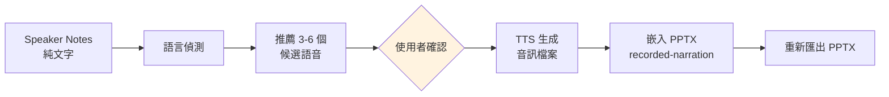

### 12.4 兩種嵌入路徑

PPT Master 提供兩種音訊嵌入方式：

| 參數 | 功能 | 適用場景 |
|---|---|---|
| `--recorded-narration audio` | 準備 PowerPoint 錄製計時與旁白，寫入每頁自動推進計時 | 旁白簡報 / 影片匯出 |
| `--narration-audio-dir audio` | 低階音訊嵌入，允許部分覆蓋 | 測試 / 手動微調 |

### 12.5 聲音克隆（Voice Cloning）

四個雲端提供商支援從短樣本克隆聲音，再以該聲音朗讀整套簡報：

| 提供商 | 克隆方式 | 樣本長度 |
|---|---|---|
| ElevenLabs | elevenlabs.io → Voices → Add Voice | 1 min（Instant）/ 30 min+（Professional） |
| MiniMax | platform.minimaxi.com → 語音克隆 | ~10s - 5min |
| Qwen TTS | DashScope → 語音合成 → 聲音復刻 | ~10s - 5min |
| CosyVoice | DashScope → 語音合成 → 音色復刻 | ~10s - 5min |

**职責分離**：聲音克隆本身在提供商的主控台或 API 中完成，PPT Master 僅負責消費端——接收 `voice_id` 並以該聲音朗讀每頁的 Notes。PPT Master 永遠不會上傳你的聲音樣本。

```bash
# 使用克隆聲音範例
python3 skills/ppt-master/scripts/notes_to_audio.py <project_path> \
  --provider minimax --voice-id <your-cloned-voice-id> \
  --minimax-model speech-2.8-hd
```

> ⚠️ **授權提醒**：僅克隆自己擁有或已獲明確授權的聲音。`voice_id` 一次設定後可永久重用。

### 12.6 影片匯出

嵌入旁白後的 PPTX 可直接透過 PowerPoint 原生功能匯出為影片：

1. 開啟旁白版 `.pptx`
2. **File → Export → Create a Video**
3. 選擇品質（4K / Full HD / HD）與「使用錄製的計時與旁白」
4. 匯出 `.mp4`（或 Windows 上的 `.wmv`）

> 💡 參考檔案大小：20 頁簡報 Full HD 影片通常為 30-80 MB。

### 12.7 操作指令

```bash
# 生成語音旁白
python scripts/notes_to_audio.py --voice "zh-TW-HsiaoChenNeural" --rate "+10%"

# 嵌入至 PPTX（完整計時 + 自動推進）
python scripts/native_enhance_pptx.py --recorded-narration audio

# 匯出影片（使用 PowerPoint 原生功能）
# PowerPoint → File → Export → Create a Video
```

> 💡 **實務建議**：使用 `--rate "+10%"` 稍微加速語音，可讓簡報節奏更緊湊。中文簡報推薦使用 `zh-TW-HsiaoChenNeural`（女聲）或 `zh-TW-YunJheNeural`（男聲）。

---

## 第13章 AI 模型支援

### 13.1 模型比較

| 模型 | 推薦度 | SVG 品質 | 上下文視窗 | 圖像生成 | 備註 |
|---|---|---|---|---|---|
| **Claude Opus 4** | ⭐⭐⭐⭐⭐ | 極佳 | ~1M tokens | 搭配 gpt-image-2 | **官方推薦——最高品質天花板** |
| **Claude Sonnet 4** | ⭐⭐⭐⭐⭐ | 極佳 | ~200K tokens | 搭配 gpt-image-2 | **性價比最佳** |
| **Gemini 3.5 Flash** | ⭐⭐⭐⭐ | 佳 | 1M tokens | 原生圖像 | 速度快、價格低、綜合性價比極高 |
| GPT-5.5 | ⭐⭐⭐⭐ | 佳 | 128K+ | 原生 gpt-image-2 | 較舊版本改善顯著 |
| Kimi | ⭐⭐⭐ | 良好 | 200K | 搭配外部 | 中文優秀 |
| MiniMax | ⭐⭐⭐ | 良好 | 因模型而異 | 搭配外部 | 中文支援良好 |
| Local LLM | ⭐⭐ | 因模型而異 | 因模型而異 | 搭配外部 | 品質差異大 |

> 📌 **模型選擇核心原則**：PPT Master 是 harness，不是完整 agent——`harness + model = agent`，輸出天花板完全由模型決定。以弱模型評估 PPT Master，就像用一檔試駕跑車再說它慢。

### 13.2 推薦配置

| 場景 | 推薦組合 | 估計成本（10 頁） |
|---|---|---|
| **企業標準** | Claude Sonnet + gpt-image-2 | ~$2-5 |
| **高品質** | Claude Opus + gpt-image-2 | ~$5-15 |
| **性價比** | Gemini 3.5 Flash | ~$0.5-2 |
| **預算導向** | GPT-4.5 mini + FLUX | ~$0.3-1 |

### 13.3 AI 圖像三維系統

PPT Master 使用三維系統控制 AI 圖像風格：

| 維度 | 說明 | 範例 |
|---|---|---|
| **Rendering**（渲染風格） | 視覺風格族 | watercolor、3d-render、flat-design |
| **Palette**（調色盤） | HEX 色彩用法 | corporate-blue、warm-sunset |
| **Type**（構圖類型） | 內部構圖方式 | spot-illustration、full-bleed、icon |

---

## 第14章 與 Claude Code 整合

### 14.1 安裝與設定

```bash
# 方式一：Plugin 市場（推薦）
/plugin marketplace add hugohe3/ppt-master
/plugin install ppt-master@ppt-master

# 方式二：本地載入
cd /path/to/ppt-master
claude  # 自動讀取 CLAUDE.md
```

### 14.2 入口點：CLAUDE.md

PPT Master 在根目錄提供 `CLAUDE.md` 作為 Claude Code 的入口點，包含：
- Skill 載入指令
- 可用工作流程清單
- 快速開始指南

### 14.3 工作流程範例

```bash
# 從 PDF 生成簡報
claude "請將 report.pdf 轉為 10 頁專業簡報"

# 從主題生成簡報
claude "請生成一份關於 Kubernetes 架構的技術簡報，12 頁"

# 使用品牌模板
claude "請用 templates/acme-brand 模板將 spec.md 轉為簡報"

# 生成語音旁白
claude "請為最新生成的簡報添加中文語音旁白"
```

### 14.4 專案管理

```bash
# 查看專案清單
python scripts/project_manager.py list

# 重新匯出（從備份 SVG）
python scripts/project_manager.py re-export --project my_presentation

# 清理舊專案
python scripts/project_manager.py clean --older-than 30d
```

---

## 第15章 與 GitHub Copilot 整合

### 15.1 Agent Mode 設定

1. 確保 VS Code 已安裝 GitHub Copilot 擴充功能
2. 將 `ppt-master/` 加入工作區
3. PPT Master 透過 `AGENTS.md` 定義 Agent 能力
4. 確認 Copilot Agent Mode 已啟用（VS Code 設定）

### 15.2 使用方式

在 Copilot Chat 中：

```
@workspace 請用 PPT Master 將 requirements.md 轉為簡報

@workspace 請生成一份 Spring Boot 架構設計簡報，10 頁

@workspace 請將上次生成的簡報添加 Speaker Notes
```

### 15.3 Workspace 整合

- Copilot 會自動讀取 `AGENTS.md` 了解可用能力
- 透過 `@workspace` 觸發 PPT Master 工作流程
- 支援檔案參照：可直接引用工作區中的文件

> 💡 **實務建議**：Copilot Agent Mode 的上下文視窗可能小於 Claude Code，建議簡報頁數控制在 10-12 頁以內以確保品質。若 AI 失去上下文，可要求它重新讀取 `skills/ppt-master/SKILL.md`。

---

## 第16章 與 Cursor 整合

### 16.1 Composer 模式

在 Cursor Composer 中：

```
請用 PPT Master 將以下內容生成簡報：
[貼上或引用文件內容]
```

### 16.2 Agent 模式

Cursor 的 Agent 模式會自動讀取 `SKILL.md` 並按工作流程執行。

### 16.3 Rules 設定

可在 `.cursorrules` 中加入 PPT Master 相關規則：

```
# PPT Master Rules
- 使用 PPT Master Skill 生成簡報
- 遵循 SKILL.md 定義的 7 步驟工作流
- SVG 必須手寫，禁止腳本生成
```

### 16.4 工作流程

```
Cursor Composer → SKILL.md → Strategist → 八項確認 → Executor → PPTX
```

---

## 第17章 與 MCP 整合

### 17.1 MCP 架構

PPT Master 透過 `.claude-plugin/marketplace.json` 定義 MCP 整合介面，並可透過 Claude Code Plugin Marketplace 生態系安裝：

```json
{
  "name": "ppt-master",
  "version": "2.11.0",
  "description": "AI-powered native editable PPTX generation",
  "skills": ["ppt-master"],
  "entry": "skills/ppt-master/SKILL.md"
}
```

安裝方式：

```bash
# 跨 Agent CLI 安裝
npx skills add hugohe3/ppt-master

# 或在 Claude Code 中
/plugin marketplace add hugohe3/ppt-master
/plugin install ppt-master@ppt-master
```

> 📌 市場安裝僅取得 Skill 檔案（非完整 repo），仍需從安裝位置執行 `pip install -r requirements.txt`。

### 17.2 MCP 工具呼叫

PPT Master 的腳本可作為 MCP Tools 被呼叫：

| Tool | 功能 |
|---|---|
| `project_manager.py init` | 初始化專案 |
| `pdf_to_md.py` | PDF 轉 Markdown |
| `doc_to_md.py` | Word 轉 Markdown |
| `svg_quality_checker.py` | SVG 品質檢查 |
| `finalize_svg.py` | SVG 後處理 |
| `svg_to_pptx.py` | SVG → PPTX 轉換 |
| `notes_to_audio.py` | 語音旁白生成 |
| `image_gen.py` | AI 圖像生成 |
| `image_search.py` | 網路圖片搜尋 |

### 17.3 MCP 工作流程

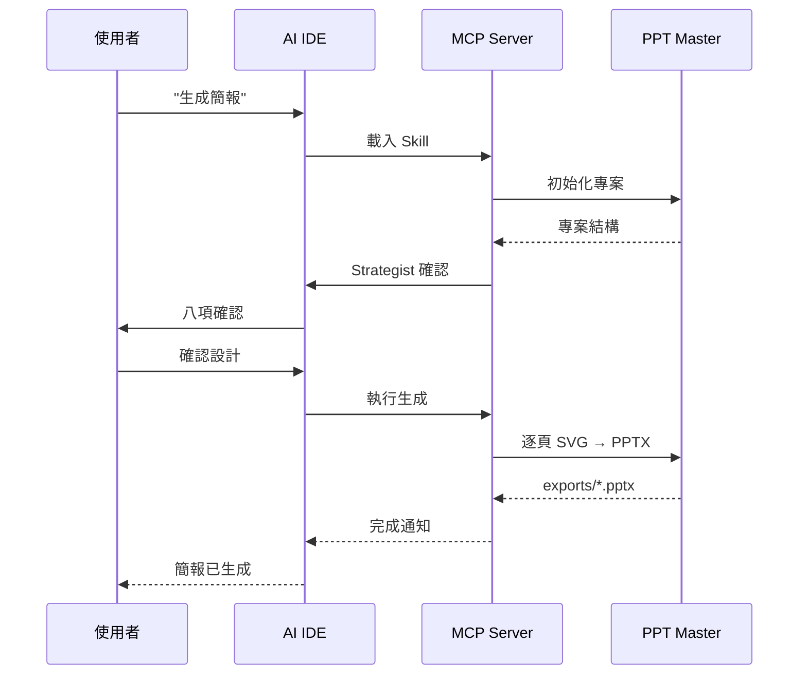

---

## 第18章 與企業知識庫整合

### 18.1 整合策略

PPT Master 不直接連接知識庫平台，而是透過**中間格式**整合：

| 知識庫 | 匯出格式 | PPT Master 處理方式 |
|---|---|---|
| **Confluence** | PDF / Word / HTML | `pdf_to_md.py` / `doc_to_md.py` |
| **SharePoint** | Word / PDF | `doc_to_md.py` / `pdf_to_md.py` |
| **GitHub Wiki** | Markdown | 直接使用 |
| **Notion** | Markdown / PDF | 直接使用 / `pdf_to_md.py` |
| **Google Drive** | PDF / DOCX | `pdf_to_md.py` / `doc_to_md.py` |
| **OneDrive** | PDF / DOCX / PPTX | 對應腳本轉換 |

### 18.2 企業知識庫工作流程

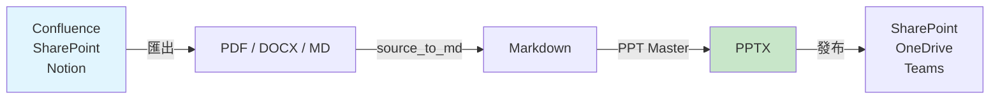

### 18.3 批次處理建議

對於需要定期從知識庫生成簡報的場景：

1. 建立標準化的 Prompt 模板
2. 使用 brand 模板確保品牌一致
3. 排程匯出 → 轉換 → 生成流程
4. 版本控制所有 Prompt 與模板

---

## 第19章 實戰案例

### 19.1 技術簡報

**場景**：向技術團隊介紹微服務架構遷移方案

```
Prompt：
請將附件的微服務遷移方案文件轉為 12 頁技術簡報：
- 受眾：後端開發團隊（15 人）
- 風格：深色主題、工程風格
- 必須包含：現有架構圖、目標架構圖、遷移時程、風險矩陣
- 每頁重點不超過 3 個
- 使用 Monospace 字型呈現程式碼
```

### 19.2 教育訓練

**場景**：新進員工入職訓練教材

```
Prompt：
請將新人入職手冊轉為教育訓練簡報：
- 受眾：新進員工
- 風格：明亮友善、大量插圖
- 頁數：20 頁
- 包含：公司介紹、組織架構、開發流程、工具介紹
- 每頁配圖
- 加入 Speaker Notes 作為講師講稿
```

### 19.3 需求規格

**場景**：向 Stakeholder 展示系統需求

```
Prompt：
請將 SRS 文件轉為需求規格簡報：
- 受眾：PM、SA、業務代表
- 風格：結構化、條列式
- 必須包含：Use Case 清單、流程圖、資料流圖、非功能需求
- 使用表格呈現需求追溯矩陣
```

### 19.4 架構設計

**場景**：架構審查會議

```
Prompt：
請生成系統架構設計簡報：
- 受眾：架構審查委員會
- 風格：專業中性、大量圖表
- 必須包含：C4 架構圖（Context、Container、Component）
- 包含技術選型比較表
- 包含效能基準數據
```

### 19.5 專案報告

```
Prompt：
請將月度專案進度報告轉為簡報：
- 受眾：PMO、專案 Sponsor
- 包含：進度甘特圖、預算使用、風險矩陣、下月計畫
- 使用紅黃綠燈標示狀態
```

### 19.6 產品介紹

```
Prompt：
請生成產品介紹簡報：
- 受眾：潛在客戶
- 風格：品牌色、商務感
- 包含：產品特色、競品比較、定價方案、客戶案例
- 加入 Speaker Notes 作為業務講稿
```

### 19.7 年度報告

```
Prompt：
請將年度報告數據轉為簡報：
- 受眾：全體同仁
- 風格：大器、資訊圖表為主
- 包含：年度 KPI、營收趨勢、團隊成長、明年展望
- 大量使用圖表和數字視覺化
```

### 19.8 董事會簡報

```
Prompt：
請生成董事會季度報告簡報：
- 受眾：董事會成員
- 風格：高端專業、極簡設計
- 包含：財務摘要、策略進展、風險評估、決議事項
- 每頁只有一個核心訊息
- 總頁數不超過 10 頁
```

### 19.9 投資簡報

```
Prompt：
請生成投資提案 Pitch Deck：
- 受眾：VC / 天使投資人
- 風格：現代科技感
- 包含：問題陳述、解決方案、市場規模、商業模式、
        團隊介紹、財務預測、融資需求
- 參考 YC 標準 Pitch Deck 結構
```

---

## 第20章 Mermaid 圖集

### 20.1 系統架構圖

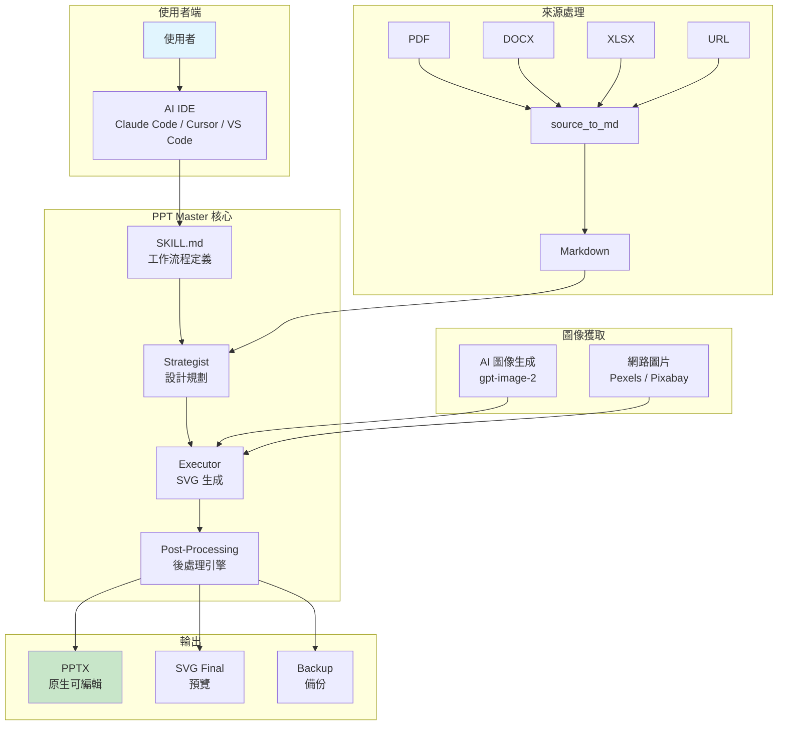

### 20.2 AI 處理流程圖

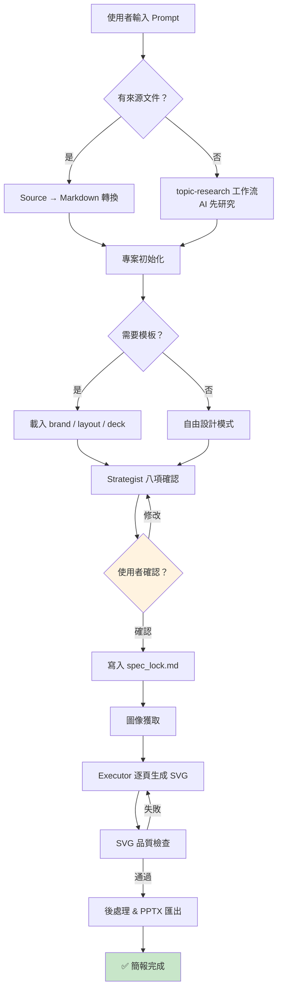

### 20.3 SVG → PPTX 生成流程

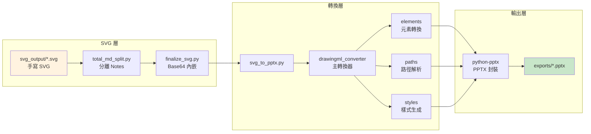

### 20.4 Template 流程

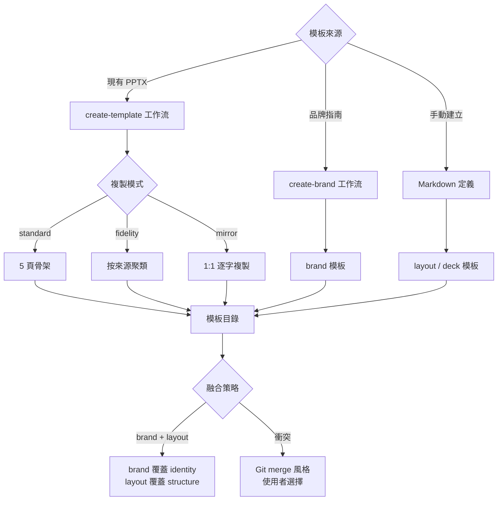

### 20.5 Prompt 工程流程

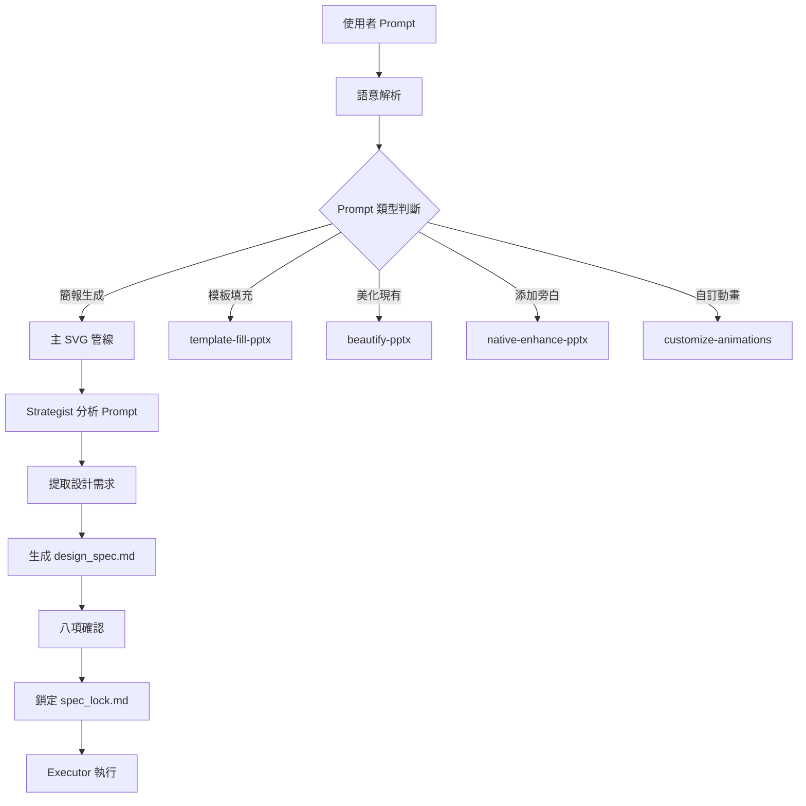

### 20.6 企業導入流程

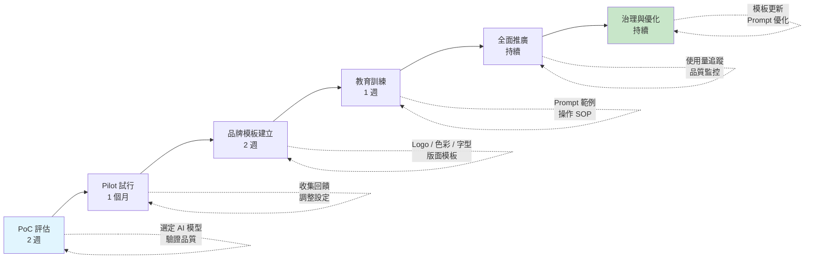

---

## 第21章 常用 Prompt 範例

### 21.1 簡報生成類

| # | Prompt | 用途 |
|---|---|---|
| 1 | `請將附件 PDF 轉為 10 頁技術簡報，深色主題` | 技術文件轉簡報 |
| 2 | `請生成一份 Kubernetes 入門教育訓練簡報，15 頁，面向初學者` | 教育訓練 |
| 3 | `請將需求規格書轉為簡報，包含 Use Case 圖和流程圖` | 需求簡報 |
| 4 | `請生成 API Gateway 系統架構簡報，包含架構圖和元件說明` | 架構簡報 |
| 5 | `請生成微服務遷移 Roadmap 簡報，包含時程和里程碑` | Roadmap |
| 6 | `請將產品功能清單轉為產品介紹簡報，面向潛在客戶` | 產品介紹 |
| 7 | `請生成年度技術成果回顧簡報，使用大量圖表` | 年度成果 |
| 8 | `請將季度數據轉為管理報告簡報，每頁一個 KPI` | 管理報告 |
| 9 | `請生成 DevOps 流程介紹簡報，包含 CI/CD pipeline 圖` | 流程介紹 |
| 10 | `請將競品分析報告轉為簡報，使用比較表格和雷達圖` | 競品分析 |

### 21.2 模板與風格類

| # | Prompt | 用途 |
|---|---|---|
| 11 | `請用 templates/acme-brand 品牌模板生成簡報` | 品牌模板 |
| 12 | `請使用深藍 #003366 + 金色 #D4A843 配色` | 指定配色 |
| 13 | `請用 4:3 比例生成簡報` | 指定比例 |
| 14 | `請使用極簡風格，每頁只有一個核心訊息` | 極簡風格 |
| 15 | `請使用資訊圖表風格，大量使用圖示和數字視覺化` | 資訊圖表 |

### 21.3 進階操作類

| # | Prompt | 用途 |
|---|---|---|
| 16 | `請為最新簡報添加中文語音旁白` | 語音旁白 |
| 17 | `請修改第 3 頁的標題顏色為 #FF6600` | 頁面修改 |
| 18 | `請將簡報從 16:9 轉為 4:3` | 格式轉換 |
| 19 | `請為簡報添加頁面過渡動畫` | 動畫設定 |
| 20 | `請從現有 company.pptx 建立品牌模板` | 模板衍生 |

### 21.4 企業場景類

| # | Prompt | 用途 |
|---|---|---|
| 21 | `請生成 SOC 2 合規報告簡報，面向稽核團隊` | 合規報告 |
| 22 | `請將資安事件報告轉為 Incident Review 簡報` | 事件回顧 |
| 23 | `請生成雲端遷移提案簡報，包含 TCO 分析` | 遷移提案 |
| 24 | `請將 Sprint Review 成果轉為 Demo 簡報` | Sprint Demo |
| 25 | `請生成新人入職技術環境設定指南簡報` | 入職指南 |
| 26 | `請將 API 文件轉為 API 介紹簡報，面向前端團隊` | API 介紹 |
| 27 | `請生成投資 Pitch Deck，參考 YC 標準結構` | Pitch Deck |
| 28 | `請將技術白皮書轉為行銷簡報，面向非技術受眾` | 行銷簡報 |
| 29 | `請生成季度 OKR 回顧簡報，使用紅黃綠燈標示` | OKR 回顧 |
| 30 | `請將會議紀錄轉為 Action Item 追蹤簡報` | 會議追蹤 |

---

## 第22章 最佳實務

### 22.1 Prompt 最佳實務

| # | 建議 | 說明 |
|---|---|---|
| 1 | 明確指定受眾 | 影響用語深度和設計風格 |
| 2 | 限制頁數 | 避免內容過於發散 |
| 3 | 提供來源文件 | 比純主題生成品質更高 |
| 4 | 指定配色 | 確保品牌一致性 |
| 5 | 說明重點 | 告訴 AI 哪些內容最重要 |
| 6 | 分步驟確認 | 不要一次要求太多修改 |

### 22.2 Template 最佳實務

| # | 建議 | 說明 |
|---|---|---|
| 1 | 企業統一使用 brand 模板 | 確保品牌識別一致 |
| 2 | 各部門可自訂 layout | 滿足不同場景需求 |
| 3 | 定期更新模板 | 配合品牌指南變更 |
| 4 | 版本控制模板 | 使用 Git 管理模板目錄 |
| 5 | 提供模板使用指南 | 包含何時使用哪個模板 |

### 22.3 圖片最佳實務

| # | 建議 | 說明 |
|---|---|---|
| 1 | 優先使用 AI 生成圖片 | 風格統一、版權清楚 |
| 2 | 設定圖片渲染風格 | 確保全簡報視覺一致 |
| 3 | 控制圖片尺寸 | 避免 PPTX 檔案過大 |
| 4 | 使用 entity-safety 閘門 | 避免生成不當內容 |

### 22.4 Icon / Chart / Table 最佳實務

| 元素 | 建議 |
|---|---|
| **Icon** | 使用 PPT Master 內建三個圖示庫，確保風格一致 |
| **Chart** | 使用 70+ 圖表模板，優先用 SVG 圖表（非 Excel 圖表） |
| **Table** | 控制欄位數量（≤6 欄），避免過度擁擠 |

### 22.5 Brand / Theme 最佳實務

- 建立企業 `brand` 模板目錄，包含 Logo、色彩、字型定義
- 限制可用色彩為 3-5 個（主色、輔色、強調色）
- 統一字型（建議中文使用 Noto Sans TC）
- 定義禁用元素（如某些動畫效果）

### 22.6 動畫最佳實務

- **頁面過渡**：預設 `fade` 0.4s 已足夠，避免過度花俏
- **元素動畫**：預設關閉是正確的，僅在必要時開啟
- **動畫錨點**：使用頂層 `<g id="...">` 群組作為動畫目標
- **靜態框架**：背景、頁首、頁尾自動跳過動畫
- **錄製旁白模式**：拒絕 `on-click` 動畫（避免衝突）

---

## 第23章 效能最佳化

### 23.1 生成速度

| 頁數 | 預估時間 | 建議 |
|---|---|---|
| 5-10 頁 | 5-15 分鐘 | 標準流程 |
| 10-15 頁 | 10-20 分鐘 | 標準流程 |
| 15-20 頁 | 20-30 分鐘 | 考慮分割模式 |
| 20+ 頁 | 30+ 分鐘 | 建議使用分割模式 |

### 23.2 Token 最佳化

| 策略 | 說明 |
|---|---|
| 控制來源文件大小 | 先摘要再生成，減少輸入 Token |
| 限制頁數 | 每頁約消耗 2000-5000 Token |
| 使用 spec_lock.md | 避免重複描述設計規格 |
| 分割大型簡報 | 超過 18 頁考慮分批處理 |

### 23.3 上下文視窗建議

| 頁數 | 最小上下文視窗 |
|---|---|
| 10-15 頁 | 200K tokens |
| 15-20 頁 | 500K tokens |
| 20+ 頁 | 1M tokens 或分割模式 |

### 23.4 圖片與 SVG 最佳化

| 項目 | 建議 |
|---|---|
| AI 圖片解析度 | 預設即可，避免過高解析度 |
| SVG 複雜度 | 避免過多 path 節點（>1000 個） |
| Base64 編碼 | `finalize_svg.py` 自動處理 |
| PPTX 檔案大小 | 目標 < 50MB，圖片多時注意壓縮 |

---

## 第24章 系統維護

### 24.1 版本管理

```bash
# 查看當前版本
cat skills/ppt-master/SKILL.md | head -5

# 更新至最新版
python skills/ppt-master/scripts/update_repo.py

# 或使用 Git
git pull origin main
pip install -r requirements.txt
```

### 24.2 Template 管理

| 操作 | 方式 |
|---|---|
| 新增模板 | 建立模板目錄 + `design_spec.md`（含 `kind` 宣告） |
| 修改模板 | 直接編輯模板目錄中的檔案 |
| 版本控制 | 使用 Git 管理模板目錄 |
| 分發模板 | 透過 Git Submodule 或 Package 發布 |

### 24.3 Prompt 管理

建議建立 Prompt Library：

```
prompt-library/
├── 技術簡報/
│   ├── 架構設計.md
│   ├── API介紹.md
│   └── 技術選型.md
├── 管理簡報/
│   ├── 季度報告.md
│   └── 年度回顧.md
└── 教育訓練/
    ├── 新人入職.md
    └── 技術培訓.md
```

### 24.4 日誌與備份

| 項目 | 路徑 | 說明 |
|---|---|---|
| SVG 備份 | `backup/<timestamp>/svg_output/` | 每次匯出自動備份 |
| 專案歷史 | `projects/<name>/` | 包含所有中間產物 |
| 設計規格 | `design_spec.md` / `spec_lock.md` | 可重建相同簡報 |

### 24.5 維護 SOP

1. **每週**：檢查 PPT Master 是否有新版本
2. **每月**：審查並更新企業模板
3. **每季**：回顧 Prompt Library，新增常用 Prompt
4. **每年**：評估 AI 模型更新，調整推薦配置

---

## 第25章 系統升級

### 25.1 升級流程

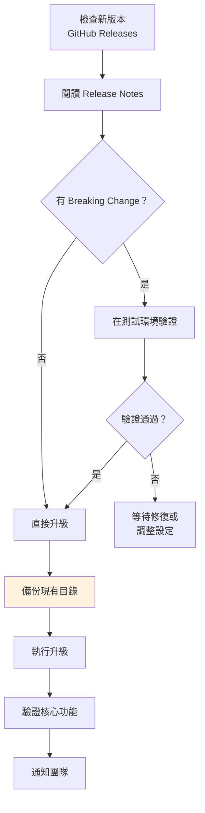

### 25.2 升級指令

```bash
# 方式一：update_repo.py（推薦）
python skills/ppt-master/scripts/update_repo.py

# 方式二：Git Pull
git stash           # 保存本地修改
git pull origin main
git stash pop       # 恢復本地修改
pip install -r requirements.txt

# 方式三：重新安裝
npx skills update hugohe3/ppt-master
```

### 25.3 版本差異注意事項

| 升級類型 | 風險等級 | 說明 |
|---|---|---|
| Patch（x.x.1 → x.x.2） | 🟢 低 | Bug 修復，直接升級 |
| Minor（x.1.x → x.2.x） | 🟡 中 | 新功能，建議測試 |
| Major（1.x → 2.x） | 🔴 高 | 可能有 Breaking Change，必須測試 |

---

## 第26章 常見問題 FAQ

### 安裝與環境

| # | 問題 | 回答 |
|---|---|---|
| 1 | PPT Master 需要付費嗎？ | 工具本身免費（MIT 授權），但需要 AI 模型 API 費用 |
| 2 | 支援哪些 Python 版本？ | Python 3.10 以上 |
| 3 | 必須安裝 Pandoc 嗎？ | 僅處理冷門格式（.doc / .odt / .tex）時需要，常見格式不需要 |
| 4 | 可以離線使用嗎？ | 不行，需要 AI 模型 API 連線。但除 AI 通訊外，整條管線完全本地執行 |
| 5 | 支援 Windows 嗎？ | 完全支援，有專用安裝指南 |
| 6 | 資料安全嗎？ | 檔案不會離開本機——來源轉換、SVG 生成、PPTX 匯出全部本地執行 |
| 7 | 可用在哪些作業系統？ | Windows、macOS、Linux、WSL 均支援 |

### 簡報生成

| # | 問題 | 回答 |
|---|---|---|
| 8 | 生成一份簡報需要多久？ | 10-15 頁約 10-20 分鐘，绱頭通常是模型的輸出速度 |
| 9 | 最多可以生成幾頁？ | 無硬性限制，但 18+ 頁建議使用分割模式 |
| 10 | 可以指定配色嗎？ | 可以，在 Prompt 中提供 HEX 色碼 |
| 11 | 生成的 PPTX 可以在 Mac 開嗎？ | 可以，完全相容 Mac 版 PowerPoint 及 Keynote |
| 12 | 支援中文嗎？ | 完全支援，建議使用 Noto Sans TC 字型 |
| 13 | 只有主題沒有來源檔案能生成嗎？ | 可以，AI 會觸發 topic-research 工作流，透過網路搜尋研究後再生成 |
| 14 | 可以產出非簡報格式嗎？ | 可以，支援小紅書 3:4、IG 1:1、Story 9:16、A4 列印等 |
| 15 | 可以中斷生成修改嗎？ | 可以，隨時可給出回饋，AI 可針對特定頁面重新生成 |

### SVG 與 DrawingML

| # | 問題 | 回答 |
|---|---|---|
| 11 | 為什麼不直接生成 PPTX？ | DrawingML XML 過於繁瑣，AI 無法穩定生成；SVG 與 DrawingML 共享世界觀 |
| 12 | SVG 中可以用 CSS class 嗎？ | 不可以，必須使用行內樣式 |
| 13 | 可以使用自訂字型嗎？ | 使用系統已安裝的字型，不支援 @font-face |
| 14 | 漸層效果會保留嗎？ | 會，linearGradient 完整映射為 gradFill |
| 15 | 動畫效果支援嗎？ | SVG 動畫不支援，但可透過 customize-animations 工作流添加 PPT 原生動畫 |

### 模板

| # | 問題 | 回答 |
|---|---|---|
| 22 | 不使用模板會怎樣？ | AI 自由設計，可能更有創意但品牌不一致 |
| 23 | 可以從現有 PPTX 建立模板嗎？ | 可以，使用 create-template 工作流（支援 standard / fidelity / mirror 三種模式） |
| 24 | brand 和 layout 可以同時使用嗎？ | 可以，會自動融合 |
| 25 | 模板可以版本控制嗎？ | 建議使用 Git 管理 |
| 26 | 模板目錄結構有什麼要求？ | 必須包含含有 `kind` 宣告的 `design_spec.md` |
| 27 | 現有 PPTX 想保留設計只換內容？ | 使用 template-fill 工作流，直接 OOXML 路徑 |
| 28 | 現有 PPTX 想保留內容重新排版？ | 使用 beautify-pptx 工作流，1:1 保留頁數與文字 |

### AI 模型

| # | 問題 | 回答 |
|---|---|---|
| 29 | 推薦使用哪個 AI 模型？ | Claude Sonnet 4（性價比最佳）或 Claude Opus 4（最高品質） |
| 30 | 可以用免費的 AI 模型嗎？ | 可嘗試，但品質可能不穩定 |
| 31 | AI 模型費用大約多少？ | 10 頁簡報約 $0.5-15，取決於模型選擇 |
| 32 | 可以用本地 LLM 嗎？ | 可以，但品質差異大 |
| 33 | 為什麼推薦 gpt-image-2？ | 目前圖像品質最高的 AI 生成模型 |
| 34 | Gemini 3.5 Flash 如何？ | 速度快、價格低、綜合性價比極高，日常使用推薦 |

### Speaker Notes 與音頻

| # | 問題 | 回答 |
|---|---|---|
| 35 | Speaker Notes 會自動生成嗎？ | 是，Executor 階段自動為每頁生成純 TTS 友善文字 |
| 36 | 可以自訂語音嗎？ | 可以，AI 會根據語言推薦 3-6 個候選語音供選擇 |
| 37 | 支援聲音克隆嗎？ | 支援，需使用 ElevenLabs / MiniMax / Qwen TTS / CosyVoice |
| 38 | 可以匯出為影片嗎？ | 可以，嵌入旁白後用 PowerPoint 原生 File → Export → Create a Video |
| 39 | edge-tts 需要付費嗎？ | 不需要，免費但需要網路連線 |
| 40 | 支援哪些語言的 TTS？ | edge-tts 支援約 90 個語區，包含中文各變體、英文、日文、韓文等 |

### IDE 整合

| # | 問題 | 回答 |
|---|---|---|
| 41 | 支援哪些 AI IDE？ | Claude Code、Cursor、VS Code + Copilot、Gemini CLI、Codex CLI、Aider、Trae、Codebuddy、Windsurf 等 |
| 42 | PPT Master 有 GUI 嗎？ | 沒有獨立 GUI，但提供 localhost:5050 即時預覽，支援 L1/L2/L3 三層編輯 |
| 43 | 可以在預覽中直接編輯嗎？ | 可以，支援文字編輯、色彩變更、拖曳移動、AI 注解改寫 |
| 44 | MCP 整合需要什麼？ | 支援 MCP 的 AI IDE 即可，透過 Plugin Marketplace 安裝 |
| 45 | 可以用 API 呼叫嗎？ | PPT Master 不提供獨立 API，透過 AI IDE 的 Skill 機制呼叫 |

### 效能與限制

| # | 問題 | 回答 |
|---|---|---|
| 46 | PPTX 檔案通常多大？ | 無圖片 1-5MB，有圖片 10-50MB |
| 47 | 可以批次生成多份簡報嗎？ | 不建議，品質會下降 |
| 48 | 支援即時協作嗎？ | 不支援，建議生成後用 OneDrive / SharePoint 協作 |
| 49 | 生成的圖表是 Excel 原生圖表嗎？ | 不是，是 SVG 轉換的原生形狀（有意設計，確保跨渲染器一致性） |
| 50 | 支援多語言嗎？ | 支援，AI 可處理多種語言，混合語言簡報亦可運作 |
| 51 | 文字溢出或元素重疊怎麼辦？ | 通常是模型能力問題，換用 Claude 或請 AI 重新生成特定頁面 |
| 52 | 可以變更頁面過渡和動畫嗎？ | 可以，透過 `svg_to_pptx.py` 的 `-t` / `-a` 參數控制 |

---

## 第27章 Troubleshooting

### 27.1 安裝問題

| 問題 | 原因 | 解決方案 |
|---|---|---|
| `pip install` 失敗 | Python 版本過低 | 確認 Python ≥ 3.10 |
| `ModuleNotFoundError: pptx` | 未安裝依賴 | 執行 `pip install -r requirements.txt` |
| Windows 執行原則錯誤 | PowerShell 限制 | `Set-ExecutionPolicy RemoteSigned -Scope CurrentUser` |
| Git clone 失敗 | 網路問題 | 使用 Download ZIP 替代 |

### 27.2 SVG 問題

| 問題 | 原因 | 解決方案 |
|---|---|---|
| SVG 品質檢查失敗 | 使用了黑名單元素 | 移除 `<mask>` / `<style>` / `<animate>` 等 |
| SVG 中文亂碼 | 字型不支援 | 使用 Noto Sans TC 或其他中文字型 |
| SVG 圖片不顯示 | 外部圖片路徑 | 使用 Base64 內嵌或 `finalize_svg.py` 處理 |
| SVG viewBox 錯誤 | 尺寸不匹配 | 確認使用正確的畫布格式（如 1280×720） |

### 27.3 DrawingML 問題

| 問題 | 原因 | 解決方案 |
|---|---|---|
| 形狀位置偏移 | EMU 轉換誤差 | 檢查 SVG 中的座標單位是否為 px |
| 漸層方向錯誤 | gradientTransform 不支援 | 使用 x1/y1/x2/y2 定義方向 |
| 文字溢出 | 文字框大小不足 | 在 SVG 中預留足夠的文字區域 |
| 透明度異常 | opacity vs fill-opacity | 使用 `fill-opacity` 而非全局 `opacity` |

### 27.4 PowerPoint 問題

| 問題 | 原因 | 解決方案 |
|---|---|---|
| PPTX 無法開啟 | 檔案損壞 | 重新執行 `svg_to_pptx.py` |
| 字型顯示不同 | 目標電腦缺字型 | 使用通用字型或嵌入字型 |
| 舊版 Office 顯示異常 | 缺少相容模式 | 確認 Office 相容模式已開啟 |
| 動畫不播放 | 動畫設定缺失 | 使用 `customize-animations` 工作流 |

### 27.5 Template 問題

| 問題 | 原因 | 解決方案 |
|---|---|---|
| 模板未觸發 | 未提供目錄路徑 | 必須提供明確的模板目錄路徑 |
| 模板融合衝突 | 同類模板衝突 | 檢查 Git merge 提示，手動選擇 |
| brand 色彩未套用 | spec_lock.md 未更新 | 重新執行 Strategist 階段 |

### 27.6 Prompt 問題

| 問題 | 原因 | 解決方案 |
|---|---|---|
| 生成內容偏離主題 | Prompt 不夠明確 | 增加受眾、頁數、風格等約束 |
| 頁數超出預期 | 未指定頁數 | 在 Prompt 中明確指定頁數 |
| 風格不一致 | spec 漂移 | 確認 spec_lock.md 是否完整 |

### 27.7 MCP / IDE 問題

| 問題 | 原因 | 解決方案 |
|---|---|---|
| Claude Code 找不到 Skill | 未正確安裝 | 重新執行 `/plugin install` |
| Cursor 無法讀取 SKILL.md | 工作區未包含 | 確認 ppt-master 在工作區中 |
| Copilot Agent 未觸發 | AGENTS.md 缺失 | 確認 AGENTS.md 存在且格式正確 |
| Gemini CLI 無法執行腳本 | Python 環境問題 | 確認虛擬環境已啟動 |

---

## 第28章 與其他工具比較

### 28.1 完整比較表

| 特性 | PPT Master | Gamma | Beautiful.ai | Office Copilot | Canva AI | Marp | Slidev | Reveal.js | pptxgenjs |
|---|---|---|---|---|---|---|---|---|---|
| **輸出格式** | PPTX（原生） | PNG/PDF | PPTX（受限） | PPTX | PNG/PDF | PDF/HTML | HTML | HTML | PPTX |
| **原生可編輯** | ✅ | ❌ | 部分 | ✅ | ❌ | ❌ | ❌ | ❌ | ✅ |
| **AI 驅動** | ✅ | ✅ | ✅ | ✅ | ✅ | ❌ | ❌ | ❌ | ❌ |
| **開源** | ✅（MIT） | ❌ | ❌ | ❌ | ❌ | ✅ | ✅ | ✅ | ✅ |
| **多格式輸入** | ✅（PDF/Word/Excel/PPTX/URL/MD） | 有限 | 手動 | Word/PDF | 手動 | Markdown | Markdown | Markdown | 程式碼 |
| **企業模板** | ✅（brand/layout/deck） | 有限 | ✅ | ✅ | ✅ | 有限 | 有限 | 有限 | ✅ |
| **Speaker Notes + TTS** | ✅ + 多提供商 | ❌ | ❌ | ✅ | ❌ | 有限 | 有限 | ✅ | ✅ |
| **聲音克隆** | ✅ | ❌ | ❌ | ❌ | ❌ | ❌ | ❌ | ❌ | ❌ |
| **即時預覽編輯** | ✅（L1/L2/L3） | ✅ | ✅ | ❌ | ✅ | 有限 | ✅ | ❌ | ❌ |
| **IDE 整合** | ✅（多 IDE） | ❌ | ❌ | Office | ❌ | VS Code | VS Code | ❌ | 程式碼 |
| **資料在地化** | ✅ | ❌ | ❌ | 部分 | ❌ | ✅ | ✅ | ✅ | ✅ |
| **費用** | 免費 + AI API | $8-20/月 | $12-45/月 | Microsoft 365 | $8-20/月 | 免費 | 免費 | 免費 | 免費 |
| **中文支援** | ✅ | 部分 | 部分 | ✅ | ✅ | ✅ | ✅ | ✅ | ✅ |
| **學習曲線** | 中等 | 低 | 低 | 低 | 低 | 低 | 中等 | 高 | 高 |

### 28.2 選型建議

| 需求場景 | 推薦工具 | 理由 |
|---|---|---|
| AI 生成 + PowerPoint 可編輯 | **PPT Master** | 唯一同時滿足的開源工具 |
| 開發者寫 Markdown 簡報 | Marp / Slidev | 更輕量、更快 |
| 非技術人員快速生成 | Canva AI / Gamma | 有 GUI、學習曲線低 |
| 企業已有 Microsoft 365 | Office Copilot | 原生整合 |
| 程式化生成大量簡報 | pptxgenjs | JavaScript API |
| 技術會議投影片 | Reveal.js | 支援程式碼高亮 |

---

## 第29章 企業導入建議

### 29.1 導入路線圖

| 階段 | 時程 | 目標 | 產出 |
|---|---|---|---|
| **PoC 評估** | 2 週 | 驗證技術可行性 | PoC 報告 |
| **Pilot 試行** | 1 個月 | 小團隊實際使用 | 使用回饋 |
| **品牌模板建立** | 2 週 | 建立企業模板 | brand / layout 模板 |
| **教育訓練** | 1 週 | 團隊技能提升 | 培訓教材 |
| **全面推廣** | 持續 | 組織級採用 | 使用指南 |
| **治理與優化** | 持續 | 持續改善 | 治理報告 |

### 29.2 教育訓練計畫

| 對象 | 內容 | 時數 |
|---|---|---|
| IT 工程師 | 安裝部署、系統設定、維運 | 4 小時 |
| AI 工程師 | Prompt Engineering、模型整合 | 4 小時 |
| PM / SA | Prompt 撰寫、實戰案例 | 2 小時 |
| 一般員工 | 基本使用、Prompt 範例 | 1 小時 |

### 29.3 權限管理

| 角色 | 權限 |
|---|---|
| 管理員 | 安裝升級、模板管理、API Key 管理 |
| 進階使用者 | 自訂模板、調整設定 |
| 一般使用者 | 使用現有模板生成簡報 |

### 29.4 品牌治理

- 建立統一的 `brand` 模板，鎖定企業色彩、字型、Logo
- 定期審查生成的簡報是否符合品牌規範
- 建立禁用清單（不當配色、未授權圖片等）

### 29.5 AI 治理

| 治理項目 | 措施 |
|---|---|
| API Key 管理 | 使用環境變數，禁止寫死在程式碼中 |
| 成本控制 | 設定月度 API 使用上限 |
| 內容審查 | 敏感簡報需人工審查後才可發布 |
| 資料安全 | 確認 AI 模型不儲存企業資料 |
| 版權管理 | AI 生成圖片需確認使用授權 |

---

## 第30章 適用 SSDLC

### 30.1 各階段導入方式

PPT Master 可在軟體開發生命週期（SSDLC）的各階段輔助文件產出：

| SSDLC 階段 | 簡報用途 | Prompt 範例 |
|---|---|---|
| **需求分析** | 需求規格簡報、Stakeholder 報告 | 「將 SRS 轉為需求簡報」 |
| **系統分析** | 系統架構簡報、技術選型 | 「生成系統架構設計簡報」 |
| **設計** | UI/UX 設計提案、API 設計 | 「將 API spec 轉為設計簡報」 |
| **Coding** | 技術分享、Coding Standard | 「生成 Coding Standard 教育訓練」 |
| **Code Review** | Review 指南、最佳實務 | 「生成 Code Review 指南簡報」 |
| **Testing** | 測試策略、測試報告 | 「將測試報告轉為簡報」 |
| **Deployment** | 部署手冊、Release Notes | 「生成 Release Notes 簡報」 |
| **Maintenance** | 維運報告、Incident Review | 「將維運報告轉為簡報」 |
| **Documentation** | 技術文件、教育訓練 | 「將技術文件轉為培訓簡報」 |

### 30.2 SSDLC 文件自動化流程

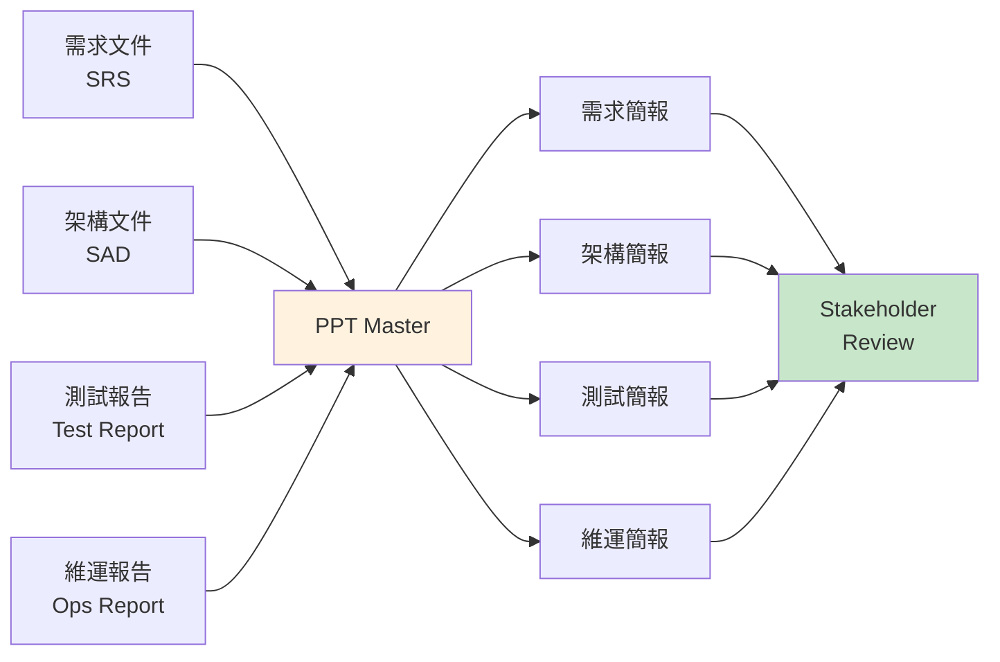

---

## 第31章 未來發展

### 31.1 已完成的里程碑（2026 Q1-Q2）

- ✅ 原生 PPTX 路徑（glow / rotate / text-decoration / stroke-linejoin）
- ✅ 主題研究工作流（無來源生成）
- ✅ 70+ 圖表模板 + 三個圖示庫
- ✅ `spec_lock.md` 機器可讀合約
- ✅ 即時預覽 + 直接編輯（L1 / L2 / L3）
- ✅ AI 圖像三維系統（rendering × palette × type）
- ✅ 模板三類整合（brand / layout / deck）
- ✅ Mode × Visual-style 雙目錄（5 模式 + 18 視覺風格）
- ✅ template-fill / beautify / native-enhance 三條直接 PPTX 路線
- ✅ 互動式八項確認頁面（Confirm UI）
- ✅ 切片式 spot-illustration 管線
- ✅ 網路圖片 entity-safety 閘門
- ✅ PPTX 導入管線（`pptx_template_import.py` 直接讀取 OOXML）
- ✅ 聲音克隆支援（ElevenLabs / MiniMax / Qwen / CosyVoice）
- ✅ 頁面過渡與元素動畫系統（原生 OOXML）
- ✅ 多格式畫布支援（小紅書 / IG / Story / A4）
- ✅ Claude Code Plugin Marketplace 整合
- ✅ 穩定版本 v2.11.0 發布（累計 9 個 Release）

### 31.2 進行中

- 🔄 多簡報來源合併校準
- 🔄 spot-illustration 真實使用校準

### 31.3 明確的 Non-Goals

PPT Master 團隊明確表示以下**不會實作**：

| Non-Goal | 原因 |
|---|---|
| ❌ CLI / SaaS / 桌面應用 | PPT Master 是 Skill，不是應用程式 |
| ❌ 原生 Excel 圖表 | 會破壞跨渲染器一致性 |
| ❌ 純速度優化 | 品質優先於速度 |
| ❌ 讀取任意 PPTX 模板自動填文字 | 屬於不同產品形態 |

### 31.4 未來趨勢

- **AI Agent 生態系**：更多 AI IDE 原生支援 Skill，工具間的互通性提升
- **MCP 標準化**：Model Context Protocol 將成為 AI 工具整合標準
- **Office AI 競合**：Microsoft 365 Copilot 提供原生整合，但成本與彈性不同
- **自動化流程**：從文件管理系統自動觸發簡報生成
- **模型進化**：隨著 AI 模型能力提升，各模型間的品質差距將持續縮小
- **多模態整合**：未來模型可能直接理解視覺設計，進一步提升版面品質

> 📌 **持續追蹤**：關注 [GitHub Releases](https://github.com/hugohe3/ppt-master/releases) 與 [Roadmap](https://github.com/hugohe3/ppt-master/blob/main/docs/roadmap.md) 取得最新進展。

---

## 檢查清單 (Checklist)

### ✅ 安裝與環境

- [ ] Python 3.10+ 已安裝
- [ ] `pip install -r requirements.txt` 成功
- [ ] AI IDE（Claude Code / Cursor / VS Code）已安裝
- [ ] AI 模型 API Key 已設定
- [ ] `.env` 檔案已建立
- [ ] PPT Master Skill 已載入

### ✅ 首次使用

- [ ] 使用簡單 Prompt 生成測試簡報
- [ ] 確認 PPTX 可在 PowerPoint 中正常開啟
- [ ] 確認所有元素可逐一編輯
- [ ] 測試 Speaker Notes 是否正確生成

### ✅ 企業導入

- [ ] brand 模板已建立（Logo、色彩、字型）
- [ ] Prompt Library 已建立
- [ ] API Key 管理流程已建立
- [ ] 團隊已完成教育訓練
- [ ] 使用指南已發布

### ✅ 維運管理

- [ ] 版本更新流程已建立
- [ ] 模板定期審查流程已建立
- [ ] 備份機制已確認
- [ ] 問題回報管道已建立

### ✅ 安全與治理

- [ ] API Key 使用環境變數，未寫死在程式碼中
- [ ] 月度 API 使用上限已設定
- [ ] 敏感簡報審查流程已建立
- [ ] AI 模型資料安全已確認

---

> 📖 **文件版本**：v1.1（2026-06-30）
>
> **基於**：PPT Master v2.11.0（GitHub Stars 34.4k+ ｜ MIT 授權）
>
> **更新紀錄**：
> - v1.1（2026-06-30）：全面更新至 v2.11.0，新增即時預覽架構、模板三模式、聲音克隆、分割模式、PPTX 導入管線等內容
> - v1.0（2026-06-30）：初版發布
>
> **參考來源**：[PPT Master GitHub](https://github.com/hugohe3/ppt-master) ｜ [Getting Started](https://github.com/hugohe3/ppt-master/blob/main/docs/getting-started.md) ｜ [FAQ](https://github.com/hugohe3/ppt-master/blob/main/docs/faq.md) ｜ [Templates Guide](https://github.com/hugohe3/ppt-master/blob/main/docs/templates-guide.md) ｜ [Audio Narration](https://github.com/hugohe3/ppt-master/blob/main/docs/audio-narration.md)
>
> **授權**：本教學手冊依據 PPT Master 官方開源資料（MIT 授權）吸收重寫，以企業教育訓練教材方式呈現。

