+++
date = '2026-09-06T02:16:14+08:00'
draft = false
title = 'Pi Agent Harness教學手冊'
tags = ['教學', 'AI開發']
categories = ['教學']
+++


# Pi Agent Harness 教學手冊

> **文件版本**：1.1
> **研究日期**：2026-09-06（v1.1 覆核日：2026-09-06）
> **Pi 版本**：**v0.85.1**（發布於 2026-09-05，npm `@earendil-works/pi-coding-agent`；已對照 npm registry `latest` dist-tag 覆核）
> **Node.js 需求**：**>= 22.19.0**（npm `engines` 欄位；另有 `legacy-node20` dist-tag = v0.74.2 供 Node 20 環境使用）
> **授權**：MIT　**官方網站**：[pi.dev](https://pi.dev)　**官方 Repo**：[earendil-works/pi](https://github.com/earendil-works/pi)
> **文件狀態**：Based on latest verified documentation（所有官方能力均對照 2026-09-06 當日之官方 Repo 與官方 docs 查證）
> **篇幅**：51 章 / 430 個小節；官方 `packages/coding-agent/docs/` 之 **28 份文件全數對應**（對照表見第 [50.2](#502-官方文件頁本手冊主要依據) 節）

## v1.1 修訂摘要（2026-09-06）

| 項目 | 內容 |
|------|------|
| **新增** | 第 [11.4](#114-keybindings-自訂official) 節 Keybindings 自訂、第 [11.5](#115-自訂-themeofficial) 節 自訂 Theme、第 [15.9](#159-終端機相容性tmux-與-fullscreen-模式official) 節 終端機相容性／tmux／Fullscreen／Shell Aliases |
| **補齊** | 第 [11.3](#113-設定項目全表official) 節設定全表補入 UI 與顯示、終端能力、訊息傳遞與 Retry、遙測共 4 組（約 40 個官方設定鍵）；第 [2.5](#25-版本與環境事實已查證) 節新增 v0.84.0–v0.85.1 版本演進速覽 |
| **強化** | 第 [43.12](#4312-平台專屬問題) 節新增「終端與多工器」故障排除表；第 [45.3](#453-升級前的檢查清單建議) 節升級檢查清單新增設定鍵與內建工具複查項；第 [51.1](#511-新進成員上手檢查清單) 節新增終端相容性檢查 |
| **目錄** | 全新兩層目錄：51 章 + 430 小節，依主題歸為 11 個部，全部項目皆為可點擊錨點；新增「依角色的建議入口」導覽表 |
| **格式** | 修正 17 處巢狀 code fence 導致的渲染中斷（改用四反引號）；套用 markdownlint 修正 96 項；標題階層一致化。**目前 markdownlint 為 0 issues** |

---

## 關於本手冊

### 這份手冊要回答的問題

本手冊**不是** Pi 的 README 摘要，也不是「Pi 是什麼」的問答。它要回答的是一個工程管理層級的問題：

> **如何把 Pi Agent Harness 建立成一套可以真正協助軟體工程師進行 Web Application 開發、既有系統逆向工程、Legacy System Modernization、Framework Upgrade 與 AI Agent Engineering 的企業級 AI 開發工作環境。**

### 與既有手冊的關係

本專案 `.github/教學/AI開發/` 目錄下已有一份 **《Pi Code Agent 教學手冊》**（2026-07-01、對應 Pi v0.80.2），定位偏向「工具使用 + SSDLC 導入」。

兩份文件的分工如下：

| 項目 | 《Pi Code Agent 教學手冊》 | **《Pi Agent Harness 教學手冊》（本文件）** |
|------|---------------------------|---------------------------------------------|
| 對應版本 | v0.80.2 | **v0.85.1** |
| 主軸 | 工具怎麼用、SSDLC 怎麼接 | **Harness 架構、Agent Loop、企業治理、沙箱安全、Agent Platform** |
| 讀者 | 一般開發者、SSDLC 導入者 | 資深工程師、架構師、DevSecOps、Platform Owner |
| 深度 | 使用層 | 使用層 + **架構層 + 治理層** |

本文件**自成一冊**，不需先讀舊手冊。若兩份文件的版本敘述有落差，**以本文件（v0.85.1）為準**。

### 資訊可信度標示制度（非常重要）

為了避免「把企業建議冒充成官方功能」，本手冊全篇使用以下四種標示：

| 標示 | 意義 | 你可以怎麼信任它 |
|------|------|------------------|
| **【Official】** | Pi 官方 Repo / 官方 docs 明文支援 | 可直接照做，指令與設定鍵均可在官方文件對到出處 |
| **【建議】** | 本手冊依企業工程實務提出的設計 | **非 Pi 官方規範**，是本手冊的設計，可依貴團隊調整 |
| **【Experimental】** | 官方標示為實驗性 / 可能變動 | 不要用在正式流程，變動風險高 |
| **【Community】** | 社群方案，非官方維護 | 使用前必須自行審查原始碼 |

另外，凡官方文件沒有寫的內容，本手冊一律寫成「**官方文件未說明**」，**不猜測、不補完**。

---

## 目錄

> 全書共 **51 章**、**430 個小節**，依主題歸為 **11 個部**。
> 目錄與子目錄的每一個項目皆為**可點擊的內文錨點連結**。

**依角色的建議入口**（完整版見第 [1.4](#14-目標讀者與閱讀深度)、[49.2](#492-依角色的建議路徑) 節）：

| 你是誰 | 建議閱讀動線 |
|--------|--------------|
| 第一次接觸 Pi | [2. 簡介](#2-pi-agent-harness-簡介) → [10. Installation](#10-installation) → [14. CLI](#14-cli) → [15. TUI](#15-tui) → [46. Best Practices](#46-best-practices) |
| 要接手既有專案 | [16. Session](#16-session) → [17. Context Management](#17-context-management) → [24. Web Application Development](#24-web-application-development) → [25. Reverse Engineering](#25-reverse-engineering) |
| 要客製團隊能力 | [18. Skills](#18-skills) → [19. Extensions](#19-extensions) → [20. Prompt Templates](#20-prompt-templates) → [21. Packages](#21-packages) |
| 要導入到團隊 | [30. Sandbox / Security](#30-sandbox--security) → [34. Enterprise Governance](#34-enterprise-governance) → [35. Team Adoption](#35-team-adoption) → [51. 檢查清單](#51-檢查清單checklist) |
| 要建 Agent 平台 | [5. Monorepo](#5-monorepo-與-package-architecture) → [38. Agent Platform](#38-enterprise-ai-agent-platform) → [39. AI Agent Team](#39-ai-agent-team) → [40. Closed Loop Engineering](#40-closed-loop-engineering) |

---

### 第一部　概念與架構（第 1–9 章）

> 理解 Pi 的定位、四層架構，以及 11 個 package 各自的職責邊界

1. [文件目的](#1-文件目的)
    - [1.1 Concept：為什麼企業需要一份 Harness 手冊](#11-concept為什麼企業需要一份-harness-手冊)
    - [1.2 Why：本手冊的三個目標](#12-why本手冊的三個目標)
    - [1.3 When to use：什麼時候該讀哪一段](#13-when-to-use什麼時候該讀哪一段)
    - [1.4 目標讀者與閱讀深度](#14-目標讀者與閱讀深度)
    - [1.5 實務案例：一個 20 人團隊的兩種結局](#15-實務案例一個-20-人團隊的兩種結局)
2. [Pi Agent Harness 簡介](#2-pi-agent-harness-簡介)
    - [2.1 Concept：Pi 是什麼](#21-conceptpi-是什麼)
    - [2.2 Why：「極簡 + 可擴充」的設計哲學](#22-why極簡--可擴充的設計哲學)
    - [2.3 四種執行模式](#23-四種執行模式)
    - [2.4 四大擴充機制（Pi 的核心賣點）](#24-四大擴充機制pi-的核心賣點)
    - [2.5 版本與環境事實（已查證）](#25-版本與環境事實已查證)
    - [2.6 實務案例：Pi 適合與不適合的場景](#26-實務案例pi-適合與不適合的場景)
    - [2.7 注意事項](#27-注意事項)
3. [核心概念模型](#3-核心概念模型)
    - [3.1 Pi 核心概念模型全圖](#31-pi-核心概念模型全圖)
    - [3.2 最容易混淆的六組概念（必讀）](#32-最容易混淆的六組概念必讀)
    - [3.3 Agent Runtime vs Agent Loop vs Coding Agent vs Harness](#33-agent-runtime-vs-agent-loop-vs-coding-agent-vs-harness)
    - [3.4 其他關鍵名詞速查](#34-其他關鍵名詞速查)
    - [3.5 實務案例：用概念模型解一個真實爭議](#35-實務案例用概念模型解一個真實爭議)
    - [3.6 注意事項](#36-注意事項)
4. [系統架構](#4-系統架構)
    - [4.1 Concept：四層架構](#41-concept四層架構)
    - [4.2 各層完整規格](#42-各層完整規格)
    - [4.3 一次完整請求的資料流](#43-一次完整請求的資料流)
    - [4.4 Failure Mode 對照表（維運必備）](#44-failure-mode-對照表維運必備)
    - [4.5 實務案例：只用一層的分階段導入【建議】](#45-實務案例只用一層的分階段導入建議)
    - [4.6 注意事項](#46-注意事項)
5. [Monorepo 與 Package Architecture](#5-monorepo-與-package-architecture)
    - [5.1 Concept：11 個 Package 的完整地圖](#51-concept11-個-package-的完整地圖)
    - [5.2 Package 依賴與角色關係圖](#52-package-依賴與角色關係圖)
    - [5.3 企業選型：我該裝哪個？](#53-企業選型我該裝哪個)
    - [5.4 開發 Extension / Package 時的依賴規則（重要）](#54-開發-extension--package-時的依賴規則重要)
    - [5.5 從原始碼建置（開發者 / 內部 fork 用）](#55-從原始碼建置開發者--內部-fork-用)
    - [5.6 實務案例：企業內部 Package 的目錄設計【建議】](#56-實務案例企業內部-package-的目錄設計建議)
    - [5.7 注意事項](#57-注意事項)
6. [pi-ai](#6-pi-ai)
    - [6.1 Concept](#61-concept)
    - [6.2 主要職責](#62-主要職責)
    - [6.3 Provider 與 Model 設定（自訂模型）](#63-provider-與-model-設定自訂模型)
    - [6.4 企業內部 LLM Gateway 接法【建議】](#64-企業內部-llm-gateway-接法建議)
    - [6.5 Tool Calling 在 pi-ai 的角色](#65-tool-calling-在-pi-ai-的角色)
    - [6.6 錯誤處理與 Retry【Official】](#66-錯誤處理與-retryofficial)
    - [6.7 實務案例：多 Provider 分流策略](#67-實務案例多-provider-分流策略)
    - [6.8 注意事項](#68-注意事項)
7. [pi-agent-core](#7-pi-agent-core)
    - [7.1 Concept](#71-concept)
    - [7.2 Agent Loop 的核心結構](#72-agent-loop-的核心結構)
    - [7.3 職責分解](#73-職責分解)
    - [7.4 Abort / Cancellation 的工程意義](#74-abort--cancellation-的工程意義)
    - [7.5 Context Management 在這一層的角色](#75-context-management-在這一層的角色)
    - [7.6 實務案例：無限迴圈的診斷](#76-實務案例無限迴圈的診斷)
    - [7.7 注意事項](#77-注意事項)
8. [pi-coding-agent](#8-pi-coding-agent)
    - [8.1 Concept](#81-concept)
    - [8.2 內建工具全表【Official】](#82-內建工具全表official)
    - [8.3 SDK：把 Pi 當函式庫【Official】](#83-sdk把-pi-當函式庫official)
    - [8.4 RPC 模式：整合到內部平台【Official】](#84-rpc-模式整合到內部平台official)
    - [8.5 JSON 事件流模式：稽核的資料來源【Official】](#85-json-事件流模式稽核的資料來源official)
    - [8.6 實務案例：CI 中的 AI 程式碼審查](#86-實務案例ci-中的-ai-程式碼審查)
    - [8.7 注意事項](#87-注意事項)
9. [pi-tui](#9-pi-tui)
    - [9.1 Concept](#91-concept)
    - [9.2 元件架構【Official】](#92-元件架構official)
    - [9.3 何時你會碰到 pi-tui](#93-何時你會碰到-pi-tui)
    - [9.4 IME 與中文輸入（台灣團隊必看）](#94-ime-與中文輸入台灣團隊必看)
    - [9.5 顯示相關設定速查【Official】](#95-顯示相關設定速查official)
    - [9.6 實務案例：低頻寬 / SSH 環境的調校【建議】](#96-實務案例低頻寬--ssh-環境的調校建議)
    - [9.7 注意事項](#97-注意事項)

---

### 第二部　安裝與設定（第 10–13 章）

> 在 Windows / WSL / Linux / macOS 上裝起來、設定好、接上模型與認證

10. [Installation](#10-installation)
    - [10.1 前置需求【Official】](#101-前置需求official)
    - [10.2 標準安裝【Official】](#102-標準安裝official)
    - [10.3 移除【Official】](#103-移除official)
    - [10.4 各平台安裝與驗證](#104-各平台安裝與驗證)
    - [10.5 安裝後的驗證清單](#105-安裝後的驗證清單)
    - [10.6 實務案例：企業標準化安裝腳本【建議】](#106-實務案例企業標準化安裝腳本建議)
    - [10.7 注意事項](#107-注意事項)
11. [Configuration](#11-configuration)
    - [11.1 設定檔位置與優先序【Official】](#111-設定檔位置與優先序official)
    - [11.2 `~/.pi/agent/` 目錄全貌【Official】](#112-piagent-目錄全貌official)
    - [11.3 設定項目全表【Official】](#113-設定項目全表official)
    - [11.4 Keybindings 自訂【Official】](#114-keybindings-自訂official)
    - [11.5 自訂 Theme【Official】](#115-自訂-themeofficial)
    - [11.6 企業標準全域設定範本【建議】](#116-企業標準全域設定範本建議)
    - [11.7 專案設定範本（隨 Git 版控）【建議】](#117-專案設定範本隨-git-版控建議)
    - [11.8 實務案例：跨 Harness 共用 Skills【Official】](#118-實務案例跨-harness-共用-skillsofficial)
    - [11.9 注意事項](#119-注意事項)
12. [Authentication](#12-authentication)
    - [12.1 三種認證途徑【Official】](#121-三種認證途徑official)
    - [12.2 訂閱制登入【Official】](#122-訂閱制登入official)
    - [12.3 API Key：環境變數對照表【Official】](#123-api-key環境變數對照表official)
    - [12.4 `auth.json` 與 Key 解析（企業安全關鍵）【Official】](#124-authjson-與-key-解析企業安全關鍵official)
    - [12.5 Provider 範圍的環境變數【Official】](#125-provider-範圍的環境變數official)
    - [12.6 雲端供應商設定【Official】](#126-雲端供應商設定official)
    - [12.7 實務案例：企業金鑰治理三層防線【建議】](#127-實務案例企業金鑰治理三層防線建議)
    - [12.8 注意事項](#128-注意事項)
13. [Model / Provider](#13-model--provider)
    - [13.1 模型選擇的三個層次](#131-模型選擇的三個層次)
    - [13.2 模型相關指令與旗標【Official】](#132-模型相關指令與旗標official)
    - [13.3 Thinking Level（推理層級）【Official】](#133-thinking-level推理層級official)
    - [13.4 本地模型與 llama.cpp【Official】](#134-本地模型與-llamacppofficial)
    - [13.5 自訂 Provider【Official】](#135-自訂-providerofficial)
    - [13.6 傳輸與逾時調校【Official】](#136-傳輸與逾時調校official)
    - [13.7 實務案例：一天之內的模型切換節奏【建議】](#137-實務案例一天之內的模型切換節奏建議)
    - [13.8 注意事項](#138-注意事項)

---

### 第三部　操作介面與 Session（第 14–17 章）

> CLI 與 TUI 的完整操作，以及 Session 樹與 Context 的管理策略

14. [CLI](#14-cli)
    - [14.1 完整旗標表【Official】](#141-完整旗標表official)
    - [14.2 套件管理子命令【Official】](#142-套件管理子命令official)
    - [14.3 常用指令組合速查](#143-常用指令組合速查)
    - [14.4 `--tools` vs `--no-builtin-tools` vs `defaultTools`【Official】](#144---tools-vs---no-builtin-tools-vs-defaulttoolsofficial)
    - [14.5 實務案例：三種常見的 CLI 使用情境](#145-實務案例三種常見的-cli-使用情境)
    - [14.6 注意事項](#146-注意事項)
15. [TUI](#15-tui)
    - [15.1 互動介面組成【Official】](#151-互動介面組成official)
    - [15.2 Slash 命令全表【Official】](#152-slash-命令全表official)
    - [15.3 編輯器快捷鍵【Official】](#153-編輯器快捷鍵official)
    - [15.4 訊息佇列：Steering vs Follow-up（進階但極實用）【Official】](#154-訊息佇列steering-vs-follow-up進階但極實用official)
    - [15.5 `!` 與 `!!` 的差異（Context 管理關鍵）【Official】](#155--與--的差異context-管理關鍵official)
    - [15.6 `@` 檔案引用【Official】](#156--檔案引用official)
    - [15.7 匯出與分享【Official】](#157-匯出與分享official)
    - [15.8 實務案例：一次典型的互動 session](#158-實務案例一次典型的互動-session)
    - [15.9 終端機相容性、tmux 與 Fullscreen 模式【Official】](#159-終端機相容性tmux-與-fullscreen-模式official)
    - [15.10 注意事項](#1510-注意事項)
16. [Session](#16-session)
    - [16.1 Concept：Pi 的 Session 是一棵樹，不是一條線](#161-conceptpi-的-session-是一棵樹不是一條線)
    - [16.2 Session 儲存與基本操作【Official】](#162-session-儲存與基本操作official)
    - [16.3 Session 命令對照【Official】](#163-session-命令對照official)
    - [16.4 `/tree`、`/fork`、`/clone` 的差異（必須分清楚）【Official】](#164-treeforkclone-的差異必須分清楚official)
    - [16.5 `/tree` 操作與選取行為【Official】](#165-tree-操作與選取行為official)
    - [16.6 Branch Summarization（分支摘要）【Official】](#166-branch-summarization分支摘要official)
    - [16.7 `/resume` 選擇器操作【Official】](#167-resume-選擇器操作official)
    - [16.8 Session 檔案格式【Official】](#168-session-檔案格式official)
    - [16.9 Long Running AI Development Workflow【建議】](#169-long-running-ai-development-workflow建議)
    - [16.10 實務案例：用 `/tree` 比較兩種升級路徑](#1610-實務案例用-tree-比較兩種升級路徑)
    - [16.11 注意事項](#1611-注意事項)
17. [Context Management](#17-context-management)
    - [17.1 Concept：Context 是有限資源](#171-conceptcontext-是有限資源)
    - [17.2 Context Files 載入順序【Official】](#172-context-files-載入順序official)
    - [17.3 企業級 `AGENTS.md` 範本【建議】](#173-企業級-agentsmd-範本建議)
    - [17.4 Compaction 觸發條件與內部機制【Official】](#174-compaction-觸發條件與內部機制official)
    - [17.5 切點規則與 Split Turn【Official】](#175-切點規則與-split-turnofficial)
    - [17.6 摘要的結構化格式【Official】](#176-摘要的結構化格式official)
    - [17.7 手動壓縮與焦點指示【Official】](#177-手動壓縮與焦點指示official)
    - [17.8 企業 Compaction 調參建議【建議】](#178-企業-compaction-調參建議建議)
    - [17.9 Context 節流的五個實用技巧【建議】](#179-context-節流的五個實用技巧建議)
    - [17.10 實務案例：Context 爆炸的診斷與修復](#1710-實務案例context-爆炸的診斷與修復)
    - [17.11 注意事項](#1711-注意事項)

---

### 第四部　擴充機制（第 18–21 章）

> Skills、Extensions、Prompt Templates、Packages —— Pi 的四大擴充點

18. [Skills](#18-skills)
    - [18.1 Concept：Skill 是「模型自己會去讀的說明書」](#181-conceptskill-是模型自己會去讀的說明書)
    - [18.2 Skill 載入位置【Official】](#182-skill-載入位置official)
    - [18.3 Skill 結構與格式【Official】](#183-skill-結構與格式official)
    - [18.4 Description 決定一切【Official】](#184-description-決定一切official)
    - [18.5 Skill 命令【Official】](#185-skill-命令official)
    - [18.6 驗證行為【Official】](#186-驗證行為official)
    - [18.7 企業 Skills 目錄設計【建議】](#187-企業-skills-目錄設計建議)
    - [18.8 九類企業 Skill 實例](#188-九類企業-skill-實例)
    - [18.9 Skill 的版本控制與測試【建議】](#189-skill-的版本控制與測試建議)
    - [18.10 Skill 的 Prompt Injection 風險【安全】](#1810-skill-的-prompt-injection-風險安全)
    - [18.11 Skill 資源【Official】](#1811-skill-資源official)
    - [18.12 注意事項](#1812-注意事項)
19. [Extensions](#19-extensions)
    - [19.1 Concept](#191-concept)
    - [19.2 Extension 位置【Official】](#192-extension-位置official)
    - [19.3 Quick Start【Official】](#193-quick-startofficial)
    - [19.4 可用的 import【Official】](#194-可用的-importofficial)
    - [19.5 完整事件生命週期【Official】](#195-完整事件生命週期official)
    - [19.6 `tool_call`：企業最重要的攔截點【Official】](#196-tool_call企業最重要的攔截點official)
    - [19.7 企業必備的三個 Guard Extension【建議】](#197-企業必備的三個-guard-extension建議)
    - [19.8 自訂工具：完整定義【Official】](#198-自訂工具完整定義official)
    - [19.9 覆寫內建工具【Official】](#199-覆寫內建工具official)
    - [19.10 State Management【Official】](#1910-state-managementofficial)
    - [19.11 ExtensionContext 重點成員【Official】](#1911-extensioncontext-重點成員official)
    - [19.12 官方 Examples 目錄（極有價值的學習資源）【Official】](#1912-官方-examples-目錄極有價值的學習資源official)
    - [19.13 企業 Extension 治理【建議】](#1913-企業-extension-治理建議)
    - [19.14 Build Your Own Pi Extension：完整教學](#1914-build-your-own-pi-extension完整教學)
    - [19.15 注意事項](#1915-注意事項)
20. [Prompt Templates](#20-prompt-templates)
    - [20.1 Concept](#201-concept)
    - [20.2 載入位置【Official】](#202-載入位置official)
    - [20.3 格式【Official】](#203-格式official)
    - [20.4 參數語法【Official】](#204-參數語法official)
    - [20.5 企業 Prompt Template 設計原則【建議】](#205-企業-prompt-template-設計原則建議)
    - [20.6 企業 Prompt Template 實例](#206-企業-prompt-template-實例)
    - [20.7 實務案例：把團隊 SOP 變成 Prompt Template](#207-實務案例把團隊-sop-變成-prompt-template)
    - [20.8 注意事項](#208-注意事項)
21. [Packages](#21-packages)
    - [21.1 Concept](#211-concept)
    - [21.2 安裝與管理【Official】](#212-安裝與管理official)
    - [21.3 三種來源【Official】](#213-三種來源official)
    - [21.4 建立 Pi Package【Official】](#214-建立-pi-packageofficial)
    - [21.5 依賴規則（重要，第 5 章已述，此處補完）【Official】](#215-依賴規則重要第-5-章已述此處補完official)
    - [21.6 Package 過濾【Official】](#216-package-過濾official)
    - [21.7 啟用與停用資源【Official】](#217-啟用與停用資源official)
    - [21.8 範圍與去重【Official】](#218-範圍與去重official)
    - [21.9 實務案例：企業 Package 的完整生命週期【建議】](#219-實務案例企業-package-的完整生命週期建議)
    - [21.10 Package Gallery【Official】](#2110-package-galleryofficial)
    - [21.11 注意事項](#2111-注意事項)

---

### 第五部　執行核心（第 22–23 章）

> Tool Calling 的完整旅程與 Agent Loop 的內部運作

22. [Tool Calling](#22-tool-calling)
    - [22.1 Concept：一次工具呼叫的完整旅程](#221-concept一次工具呼叫的完整旅程)
    - [22.2 內建工具的參數型別【Official】](#222-內建工具的參數型別official)
    - [22.3 平行工具執行【Official】](#223-平行工具執行official)
    - [22.4 工具輸出截斷【Official】](#224-工具輸出截斷official)
    - [22.5 遠端執行【Official】](#225-遠端執行official)
    - [22.6 動態工具載入【Official】](#226-動態工具載入official)
    - [22.7 讓模型正確使用工具的 Prompt 技巧【建議】](#227-讓模型正確使用工具的-prompt-技巧建議)
    - [22.8 實務案例：工具呼叫的稽核分析](#228-實務案例工具呼叫的稽核分析)
    - [22.9 注意事項](#229-注意事項)
23. [Agent Loop](#23-agent-loop)
    - [23.1 Concept：從抽象循環到 Pi 的真實事件](#231-concept從抽象循環到-pi-的真實事件)
    - [23.2 Turn 的定義【Official】](#232-turn-的定義official)
    - [23.3 State、Event、Streaming 的關係](#233-stateeventstreaming-的關係)
    - [23.4 Memory 的三個層次](#234-memory-的三個層次)
    - [23.5 Retry 與 agent_settled【Official】](#235-retry-與-agent_settledofficial)
    - [23.6 讓 Agent Loop 更有效的六個原則【建議】](#236-讓-agent-loop-更有效的六個原則建議)
    - [23.7 實務案例：一個收斂良好的 Loop 與一個發散的 Loop](#237-實務案例一個收斂良好的-loop-與一個發散的-loop)
    - [23.8 注意事項](#238-注意事項)

---

### 第六部　軟體工程應用（第 24–29 章）

> Web 開發、逆向工程、框架升級、測試、程式碼審查與 Git 流程

24. [Web Application Development](#24-web-application-development)
    - [24.1 Pi + AI Agent Web Application Development Lifecycle【建議】](#241-pi--ai-agent-web-application-development-lifecycle建議)
    - [24.2 Pi 在每個階段的角色與模式【建議】](#242-pi-在每個階段的角色與模式建議)
    - [24.3 完整案例：訂單取消功能](#243-完整案例訂單取消功能)
    - [24.4 階段 1：需求 → Pi 分析](#244-階段-1需求--pi-分析)
    - [24.5 階段 2：實作計畫](#245-階段-2實作計畫)
    - [24.6 階段 3：後端實作](#246-階段-3後端實作)
    - [24.7 階段 4：前端實作](#247-階段-4前端實作)
    - [24.8 階段 5：測試](#248-階段-5測試)
    - [24.9 階段 6：安全與審查](#249-階段-6安全與審查)
    - [24.10 階段 7：CI/CD 與監控](#2410-階段-7cicd-與監控)
    - [24.11 完整流程總覽圖](#2411-完整流程總覽圖)
    - [24.12 實務案例：這個流程省了多少時間、又在哪裡花了時間【建議】](#2412-實務案例這個流程省了多少時間又在哪裡花了時間建議)
    - [24.13 注意事項](#2413-注意事項)
25. [Reverse Engineering](#25-reverse-engineering)
    - [25.1 Concept：為什麼逆向工程是 AI 最有價值的應用](#251-concept為什麼逆向工程是-ai-最有價值的應用)
    - [25.2 Pi Reverse Engineering Workflow【建議】](#252-pi-reverse-engineering-workflow建議)
    - [25.3 逆向工程的執行環境設定【建議】](#253-逆向工程的執行環境設定建議)
    - [25.4 八支逆向工程 Prompt（可直接複製）](#254-八支逆向工程-prompt可直接複製)
    - [25.5 執行策略：用 Session 樹管理長時間分析【建議】](#255-執行策略用-session-樹管理長時間分析建議)
    - [25.6 產出文件的標準結構【建議】](#256-產出文件的標準結構建議)
    - [25.7 實務案例：一個 15 年的 COBOL 轉 Java 專案前置分析](#257-實務案例一個-15-年的-cobol-轉-java-專案前置分析)
    - [25.8 注意事項](#258-注意事項)
26. [Framework Upgrade](#26-framework-upgrade)
    - [26.1 Concept：升級的本質是風險管理](#261-concept升級的本質是風險管理)
    - [26.2 Pi Framework Upgrade Workflow【建議】](#262-pi-framework-upgrade-workflow建議)
    - [26.3 適用範圍](#263-適用範圍)
    - [26.4 六支升級 Prompt（可直接複製）](#264-六支升級-prompt可直接複製)
    - [26.5 各框架的具體注意事項【建議】](#265-各框架的具體注意事項建議)
    - [26.6 用 Session 分支比較升級路徑【Official 功能 + 建議用法】](#266-用-session-分支比較升級路徑official-功能--建議用法)
    - [26.7 實務案例：Spring Boot 3.2 → 4.0 的完整執行](#267-實務案例spring-boot-32--40-的完整執行)
    - [26.8 升級報告範本【建議】](#268-升級報告範本建議)
    - [26.9 注意事項](#269-注意事項)
27. [Testing](#27-testing)
    - [27.1 Concept：測試是 Agent Loop 的回饋機制](#271-concept測試是-agent-loop-的回饋機制)
    - [27.2 八種測試類型與 Pi 的角色【建議】](#272-八種測試類型與-pi-的角色建議)
    - [27.3 測試閉環的實作【建議】](#273-測試閉環的實作建議)
    - [27.4 各類測試的實作範例](#274-各類測試的實作範例)
    - [27.5 用 Pi 分析測試失敗【建議】](#275-用-pi-分析測試失敗建議)
    - [27.6 測試品質的檢查清單【建議】](#276-測試品質的檢查清單建議)
    - [27.7 實務案例：從 30% 覆蓋率到 70% 的策略【建議】](#277-實務案例從-30-覆蓋率到-70-的策略建議)
    - [27.8 注意事項](#278-注意事項)
28. [Code Review](#28-code-review)
    - [28.1 Concept：AI Review 補的是「一致性」，不是「判斷力」](#281-conceptai-review-補的是一致性不是判斷力)
    - [28.2 三層 Review 架構【建議】](#282-三層-review-架構建議)
    - [28.3 Layer 1：本機 Review](#283-layer-1本機-review)
    - [28.4 Layer 2：CI 自動 Review](#284-layer-2ci-自動-review)
    - [28.5 Review Prompt 的設計原則【建議】](#285-review-prompt-的設計原則建議)
    - [28.6 專門化的 Review 模板【建議】](#286-專門化的-review-模板建議)
    - [28.7 Review 結果的處理流程【建議】](#287-review-結果的處理流程建議)
    - [28.8 實務案例：一個真實的 Review 對話](#288-實務案例一個真實的-review-對話)
    - [28.9 注意事項](#289-注意事項)
29. [Git / GitHub](#29-git--github)
    - [29.1 Concept：Git 是 AI 開發的安全網](#291-conceptgit-是-ai-開發的安全網)
    - [29.2 Pi + Git 整合流程【建議】](#292-pi--git-整合流程建議)
    - [29.3 分支策略【建議】](#293-分支策略建議)
    - [29.4 Commit 策略【建議】](#294-commit-策略建議)
    - [29.5 PR 流程與 Prompt【建議】](#295-pr-流程與-prompt建議)
    - [29.6 Git 相關的安全紅線【建議】](#296-git-相關的安全紅線建議)
    - [29.7 Git Checkpoint Extension【Official 範例】](#297-git-checkpoint-extensionofficial-範例)
    - [29.8 完整的 Git + Pi 工作流程](#298-完整的-git--pi-工作流程)
    - [29.9 實務案例：AI 改壞了怎麼救](#299-實務案例ai-改壞了怎麼救)
    - [29.10 注意事項](#2910-注意事項)

---

### 第七部　安全與可觀測性（第 30–33 章）

> 沙箱與威脅模型、容器化隔離、遙測管線與 Token 成本控制

30. [Sandbox / Security](#30-sandbox--security)
    - [30.1 最重要的事實：Pi 沒有內建沙箱【Official】](#301-最重要的事實pi-沒有內建沙箱official)
    - [30.2 Project Trust 是什麼，不是什麼【Official】](#302-project-trust-是什麼不是什麼official)
    - [30.3 威脅模型（企業必須理解）【建議】](#303-威脅模型企業必須理解建議)
    - [30.4 四種隔離技術完整比較【Official】](#304-四種隔離技術完整比較official)
    - [30.5 完整比較表【Official 事實 + 建議評估】](#305-完整比較表official-事實--建議評估)
    - [30.6 官方對「執行不受信任或無人監看工作」的建議【Official】](#306-官方對執行不受信任或無人監看工作的建議official)
    - [30.7 企業建議安全架構【建議】](#307-企業建議安全架構建議)
    - [30.8 風險分級與對應措施【建議】](#308-風險分級與對應措施建議)
    - [30.9 分析外部 repo 的標準安全指令【建議】](#309-分析外部-repo-的標準安全指令建議)
    - [30.10 資料外流控制【建議】](#3010-資料外流控制建議)
    - [30.11 回報安全問題【Official】](#3011-回報安全問題official)
    - [30.12 實務案例：一次外部 repo 分析的完整安全流程](#3012-實務案例一次外部-repo-分析的完整安全流程)
    - [30.13 注意事項](#3013-注意事項)
31. [Docker / Gondolin / OpenShell](#31-docker--gondolin--openshell)
    - [31.1 四種容器化模式總覽【Official】](#311-四種容器化模式總覽official)
    - [31.2 模式 1：Gondolin micro-VM【Official】](#312-模式-1gondolin-micro-vmofficial)
    - [31.3 模式 2：Plain Docker【Official】](#313-模式-2plain-dockerofficial)
    - [31.4 模式 3：NVIDIA OpenShell【Official】](#314-模式-3nvidia-openshellofficial)
    - [31.5 模式 4：Docker Sandboxes（`sbx`）【Official】](#315-模式-4docker-sandboxessbxofficial)
    - [31.6 選型決策樹【建議】](#316-選型決策樹建議)
    - [31.7 WSL2 + Docker 的完整設定【建議】](#317-wsl2--docker-的完整設定建議)
    - [31.8 容器化的常見陷阱【建議】](#318-容器化的常見陷阱建議)
    - [31.9 注意事項](#319-注意事項)
32. [Telemetry / Observability](#32-telemetry--observability)
    - [32.1 官方 Telemetry 能力的誠實盤點](#321-官方-telemetry-能力的誠實盤點)
    - [32.2 企業可觀測性資料來源【建議】](#322-企業可觀測性資料來源建議)
    - [32.3 應該監控的指標【建議】](#323-應該監控的指標建議)
    - [32.4 從 JSON 事件流建立管線【建議】](#324-從-json-事件流建立管線建議)
    - [32.5 從 Session JSONL 做離線分析【建議】](#325-從-session-jsonl-做離線分析建議)
    - [32.6 用 Extension 做結構化稽核【建議】](#326-用-extension-做結構化稽核建議)
    - [32.7 Grafana Dashboard 建議面板【建議】](#327-grafana-dashboard-建議面板建議)
    - [32.8 隱私與法遵考量【建議】](#328-隱私與法遵考量建議)
    - [32.9 實務案例：從告警到根因的完整追查](#329-實務案例從告警到根因的完整追查)
    - [32.10 注意事項](#3210-注意事項)
33. [Token / Cost Optimization](#33-token--cost-optimization)
    - [33.1 成本從哪裡來](#331-成本從哪裡來)
    - [33.2 Prompt Cache（最重要的省錢機制）](#332-prompt-cache最重要的省錢機制)
    - [33.3 Cost Optimization Strategy【建議】](#333-cost-optimization-strategy建議)
    - [33.4 各類工作的模型選擇建議【建議】](#334-各類工作的模型選擇建議建議)
    - [33.5 十個省錢技巧【建議】](#335-十個省錢技巧建議)
    - [33.6 成本監控與預算控制【建議】](#336-成本監控與預算控制建議)
    - [33.7 實務案例：一個任務的成本拆解【建議】](#337-實務案例一個任務的成本拆解建議)
    - [33.8 注意事項](#338-注意事項)

---

### 第八部　治理與團隊導入（第 34–37 章）

> 企業治理框架、五階段導入節奏，以及多工具並存策略

34. [Enterprise Governance](#34-enterprise-governance)
    - [34.1 治理模型全圖【建議】](#341-治理模型全圖建議)
    - [34.2 十四項治理領域與具體措施【建議】](#342-十四項治理領域與具體措施建議)
    - [34.3 企業 Policy 檔案清單【建議】](#343-企業-policy-檔案清單建議)
    - [34.4 合規檢查腳本【建議】](#344-合規檢查腳本建議)
    - [34.5 資料分級政策範本【建議】](#345-資料分級政策範本建議)
    - [34.6 治理的推行順序【建議】](#346-治理的推行順序建議)
    - [34.7 治理與生產力的平衡【建議】](#347-治理與生產力的平衡建議)
    - [34.8 注意事項](#348-注意事項)
35. [Team Adoption](#35-team-adoption)
    - [35.1 導入五階段【建議】](#351-導入五階段建議)
    - [35.2 Phase 1：POC（2–4 週）](#352-phase-1poc24-週)
    - [35.3 Phase 2：Pilot（4–8 週）](#353-phase-2pilot48-週)
    - [35.4 Phase 3：Team Adoption（8–12 週）](#354-phase-3team-adoption812-週)
    - [35.5 Phase 4：Enterprise Governance（持續）](#355-phase-4enterprise-governance持續)
    - [35.6 Phase 5：Optimization（持續）](#356-phase-5optimization持續)
    - [35.7 Pi Agent Harness Team Usage Guideline【建議】](#357-pi-agent-harness-team-usage-guideline建議)
    - [35.8 新人 30 分鐘 Onboarding【建議】](#358-新人-30-分鐘-onboarding建議)
    - [35.9 導入的常見失敗模式【建議】](#359-導入的常見失敗模式建議)
    - [35.10 注意事項](#3510-注意事項)
36. [Pi vs Other AI Coding Agents](#36-pi-vs-other-ai-coding-agents)
    - [36.1 比較的前提與限制（請務必先讀）](#361-比較的前提與限制請務必先讀)
    - [36.2 能力比較表](#362-能力比較表)
    - [36.3 Pi 的真實差異點（客觀分析）](#363-pi-的真實差異點客觀分析)
    - [36.4 選型建議【建議】](#364-選型建議建議)
    - [36.5 注意事項](#365-注意事項)
37. [Pi + Claude Code + GitHub Copilot](#37-pi--claude-code--github-copilot)
    - [37.1 概念映射總表](#371-概念映射總表)
    - [37.2 四類概念的精確分類](#372-四類概念的精確分類)
    - [37.3 遷移對照：從 Claude Code 到 Pi【建議】](#373-遷移對照從-claude-code-到-pi建議)
    - [37.4 三工具並存的實務架構【建議】](#374-三工具並存的實務架構建議)
    - [37.5 何時該用哪個工具【建議】](#375-何時該用哪個工具建議)
    - [37.6 注意事項](#376-注意事項)

---

### 第九部　平台與閉環工程（第 38–40 章）

> 從「工具」到「平台」，從「開環」到「閉環」

38. [Enterprise AI Agent Platform](#38-enterprise-ai-agent-platform)
    - [38.1 從「工具」到「平台」的躍遷](#381-從工具到平台的躍遷)
    - [38.2 Enterprise Pi Agent Platform Architecture【建議】](#382-enterprise-pi-agent-platform-architecture建議)
    - [38.3 平台的七個面向【建議】](#383-平台的七個面向建議)
    - [38.4 平台建置的優先順序【建議】](#384-平台建置的優先順序建議)
    - [38.5 與企業既有工具的整合【建議】](#385-與企業既有工具的整合建議)
    - [38.6 平台團隊的職責【建議】](#386-平台團隊的職責建議)
    - [38.7 注意事項](#387-注意事項)
39. [AI Agent Team](#39-ai-agent-team)
    - [39.1 Concept：Agent Team 是分工，不是分身](#391-conceptagent-team-是分工不是分身)
    - [39.2 Agent Team 架構【建議】](#392-agent-team-架構建議)
    - [39.3 九個 Agent 角色的完整定義【建議】](#393-九個-agent-角色的完整定義建議)
    - [39.4 路徑 A：角色化 Session 的實作【Official 機制】](#394-路徑-a角色化-session-的實作official-機制)
    - [39.5 路徑 B：Subagent Extension【Official 範例 + 建議】](#395-路徑-bsubagent-extensionofficial-範例--建議)
    - [39.6 Agent Team 的協作模式【建議】](#396-agent-team-的協作模式建議)
    - [39.7 實務案例：Agent Team 處理一個中型功能](#397-實務案例agent-team-處理一個中型功能)
    - [39.8 注意事項](#398-注意事項)
40. [Closed Loop Engineering](#40-closed-loop-engineering)
    - [40.1 Concept：從 AI Chat Tool 到 Software Engineering Agent](#401-concept從-ai-chat-tool-到-software-engineering-agent)
    - [40.2 完整的閉環模型【建議】](#402-完整的閉環模型建議)
    - [40.3 閉環的五個必要條件【建議】](#403-閉環的五個必要條件建議)
    - [40.4 三個層次的閉環【建議】](#404-三個層次的閉環建議)
    - [40.5 Loop 3 的具體實踐：知識沉澱機制【建議】](#405-loop-3-的具體實踐知識沉澱機制建議)
    - [40.6 閉環的度量【建議】](#406-閉環的度量建議)
    - [40.7 從開環到閉環的改造步驟【建議】](#407-從開環到閉環的改造步驟建議)
    - [40.8 完整閉環的一天【建議】](#408-完整閉環的一天建議)
    - [40.9 注意事項](#409-注意事項)

---

### 第十部　資源庫與維運（第 41–45 章）

> 可直接複製的 Prompt 與 Workflow，以及疑難排解、維護與升級

41. [Prompt Library](#41-prompt-library)
    - [41.1 使用方式](#411-使用方式)
    - [41.2 Architecture Analysis Prompt](#412-architecture-analysis-prompt)
    - [41.3 Frontend Development Prompt](#413-frontend-development-prompt)
    - [41.4 Backend Development Prompt](#414-backend-development-prompt)
    - [41.5 Legacy Modernization Prompt](#415-legacy-modernization-prompt)
    - [41.6 Refactoring Prompt](#416-refactoring-prompt)
    - [41.7 Performance Optimization Prompt](#417-performance-optimization-prompt)
    - [41.8 Documentation Prompt](#418-documentation-prompt)
    - [41.9 Incident Analysis Prompt](#419-incident-analysis-prompt)
    - [41.10 Bug Fix Prompt](#4110-bug-fix-prompt)
    - [41.11 PR Review Prompt](#4111-pr-review-prompt)
    - [41.12 Release Preparation Prompt](#4112-release-preparation-prompt)
42. [Workflow Templates](#42-workflow-templates)
    - [42.1 Workflow A：Analyze → Plan → Implement → Test → Review](#421-workflow-aanalyze--plan--implement--test--review)
    - [42.2 Workflow B：Reverse Engineer → Document → Modernize](#422-workflow-breverse-engineer--document--modernize)
    - [42.3 Workflow C：Upgrade → Compile → Fix → Test → Review](#423-workflow-cupgrade--compile--fix--test--review)
    - [42.4 Workflow D：Issue → Diagnose → Fix → Test → Commit](#424-workflow-dissue--diagnose--fix--test--commit)
    - [42.5 Workflow E：Requirement → Architecture → Code → Test → PR](#425-workflow-erequirement--architecture--code--test--pr)
    - [42.6 Workflow 選用指南](#426-workflow-選用指南)
    - [42.7 注意事項](#427-注意事項)
43. [Troubleshooting](#43-troubleshooting)
    - [43.1 診斷的第一步（不管什麼問題都先做這個）](#431-診斷的第一步不管什麼問題都先做這個)
    - [43.2 安裝與啟動問題](#432-安裝與啟動問題)
    - [43.3 認證與模型問題](#433-認證與模型問題)
    - [43.4 Tool Calling 問題](#434-tool-calling-問題)
    - [43.5 Context 與 Compaction 問題](#435-context-與-compaction-問題)
    - [43.6 Session 問題](#436-session-問題)
    - [43.7 Extension 與 Skill 問題](#437-extension-與-skill-問題)
    - [43.8 Permission 與 Trust 問題](#438-permission-與-trust-問題)
    - [43.9 Sandbox / Docker 問題](#439-sandbox--docker-問題)
    - [43.10 網路問題](#4310-網路問題)
    - [43.11 Git 問題](#4311-git-問題)
    - [43.12 平台專屬問題](#4312-平台專屬問題)
    - [43.13 完整診斷腳本【建議】](#4313-完整診斷腳本建議)
    - [43.14 注意事項](#4314-注意事項)
44. [Maintenance](#44-maintenance)
    - [44.1 維運責任分工【建議】](#441-維運責任分工建議)
    - [44.2 日常維護清單【建議】](#442-日常維護清單建議)
    - [44.3 需要定期檢視的資產【建議】](#443-需要定期檢視的資產建議)
    - [44.4 `AGENTS.md` 的維護方法【建議】](#444-agentsmd-的維護方法建議)
    - [44.5 Session 資料的保存政策【建議】](#445-session-資料的保存政策建議)
    - [44.6 磁碟空間管理](#446-磁碟空間管理)
    - [44.7 監控健康指標【建議】](#447-監控健康指標建議)
    - [44.8 注意事項](#448-注意事項)
45. [Upgrade](#45-upgrade)
    - [45.1 Pi 本身的升級指令【Official】](#451-pi-本身的升級指令official)
    - [45.2 企業升級流程【建議】](#452-企業升級流程建議)
    - [45.3 升級前的檢查清單【建議】](#453-升級前的檢查清單建議)
    - [45.4 升級指令與回退【Official】](#454-升級指令與回退official)
    - [45.5 Package 的升級【Official】](#455-package-的升級official)
    - [45.6 升級可能造成的問題與對策【建議】](#456-升級可能造成的問題與對策建議)
    - [45.7 升級節奏建議【建議】](#457-升級節奏建議建議)
    - [45.8 注意事項](#458-注意事項)

---

### 第十一部　實務準則與附錄（第 46–51 章）

> 最佳實務、反模式、FAQ、學習路徑、參考資料與四份檢查清單

46. [Best Practices](#46-best-practices)
    - [46.1 十二條核心實務【建議】](#461-十二條核心實務建議)
    - [46.2 Prompt 撰寫的七個技巧【建議】](#462-prompt-撰寫的七個技巧建議)
    - [46.3 依角色的實務建議【建議】](#463-依角色的實務建議建議)
    - [46.4 團隊層級的實務【建議】](#464-團隊層級的實務建議)
    - [46.5 注意事項](#465-注意事項)
47. [Anti-Patterns](#47-anti-patterns)
    - [47.1 使用層面的反模式](#471-使用層面的反模式)
    - [47.2 設定與治理層面的反模式](#472-設定與治理層面的反模式)
    - [47.3 組織層面的反模式](#473-組織層面的反模式)
    - [47.4 反模式速查表](#474-反模式速查表)
48. [FAQ](#48-faq)
    - [48.1 基礎問題](#481-基礎問題)
    - [48.2 安全問題](#482-安全問題)
    - [48.3 使用問題](#483-使用問題)
    - [48.4 進階問題](#484-進階問題)
    - [48.5 企業問題](#485-企業問題)
49. [Learning Roadmap](#49-learning-roadmap)
    - [49.1 九個學習等級](#491-九個學習等級)
    - [Level 1：Pi 基礎（半天）](#level-1pi-基礎半天)
    - [Level 2：Coding Agent（1–2 天）](#level-2coding-agent12-天)
    - [Level 3：Skills / Extensions（3–5 天）](#level-3skills--extensions35-天)
    - [Level 4：Agent Architecture（2–3 天）](#level-4agent-architecture23-天)
    - [Level 5：Reverse Engineering（1 週）](#level-5reverse-engineering1-週)
    - [Level 6：Framework Upgrade（1 週）](#level-6framework-upgrade1-週)
    - [Level 7：Enterprise Security（1 週）](#level-7enterprise-security1-週)
    - [Level 8：Agent Platform（2–4 週）](#level-8agent-platform24-週)
    - [Level 9：Multi-Agent Engineering（持續）](#level-9multi-agent-engineering持續)
    - [49.2 依角色的建議路徑](#492-依角色的建議路徑)
    - [49.3 學習資源](#493-學習資源)
50. [Reference](#50-reference)
    - [50.1 官方資源](#501-官方資源)
    - [50.2 官方文件頁（本手冊主要依據）](#502-官方文件頁本手冊主要依據)
    - [50.3 官方 npm 套件（v0.85.1）](#503-官方-npm-套件v0851)
    - [50.4 外部參考](#504-外部參考)
    - [50.5 本手冊使用的關鍵事實速查](#505-本手冊使用的關鍵事實速查)
    - [50.6 相關的內部文件](#506-相關的內部文件)
51. [檢查清單（Checklist）](#51-檢查清單checklist)
    - [51.1 新進成員上手檢查清單](#511-新進成員上手檢查清單)
    - [51.2 每次任務執行前檢查清單](#512-每次任務執行前檢查清單)
    - [51.3 安全檢查清單（DevSecOps）](#513-安全檢查清單devsecops)
    - [51.4 治理檢查清單（平台團隊 / EM）](#514-治理檢查清單平台團隊--em)
    - [51.5 文件交付檢查清單（本手冊自我審查）](#515-文件交付檢查清單本手冊自我審查)
    - [51.6 最後提醒](#516-最後提醒)

---

## 1. 文件目的

### 1.1 Concept：為什麼企業需要一份 Harness 手冊

過去兩年，多數團隊導入 AI 開發工具的方式是「裝一個 CLI，然後大家自己摸索」。這種做法在個人生產力上有效，但在**團隊**層級會出現四個系統性問題：

1. **知識不可複製**：A 同仁寫出很好的 Prompt，B 同仁不知道，也沒地方放。
2. **品質不可控**：AI 產出的程式碼沒有統一的審查與測試關卡。
3. **安全不可稽核**：Agent 能執行 shell、能讀寫檔案，但沒有人知道它到底做了什麼。
4. **成本不可預測**：Token 花在哪裡、哪個模型該用在哪個階段，沒有策略。

**Agent Harness**（代理載具）這個概念，正是為了解決上述問題而存在的。Harness 不是「一個更聰明的 AI」，而是**把 LLM 包裝成可控、可重複、可稽核的工程元件**的那一層基礎設施。

Pi 的定位就是 Harness：

> 官方 README 的自我描述是「AI agent toolkit: unified LLM API, agent loop, TUI, coding agent CLI」。**【Official】**

### 1.2 Why：本手冊的三個目標

| 目標 | 說明 | 對應章節 |
|------|------|----------|
| **理解**（Understand） | 讓資深工程師理解 Pi 的分層架構與 Agent Loop，而不只是背指令 | 3–9、22–23 |
| **落地**（Implement） | 讓團隊能在 Windows / WSL / Linux / macOS 上實際跑起來並用於真實專案 | 10–29、41–42 |
| **治理**（Govern） | 讓 DevSecOps 與管理者能建立安全邊界、成本控制與稽核機制 | 30–35、38–40 |

### 1.3 When to use：什麼時候該讀哪一段

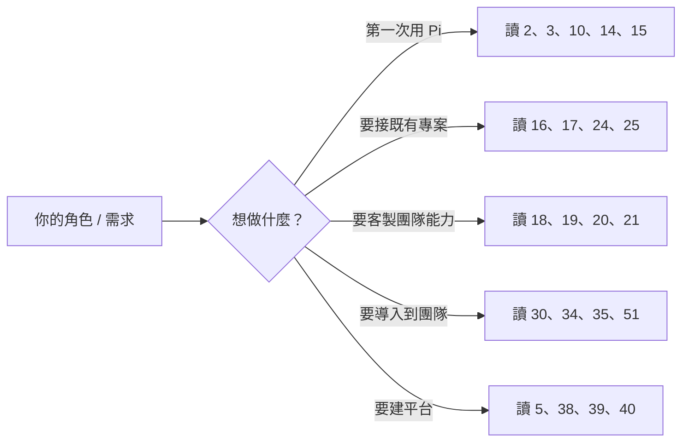

### 1.4 目標讀者與閱讀深度

| 層級 | 讀者 | 建議起點 | 可略過 |
|------|------|----------|--------|
| 初級 | 第一次接觸 AI Coding Agent | 第 2、3、10、14、15、46 章 | 5–9、38–40 |
| 中級 | 有 Claude Code / Copilot / Codex 經驗 | 第 3、16–23、36、37 章 | 10（安裝可速讀） |
| 高級 | Software Architect / AI Engineer | 第 4–9、22、23、39、40 章 | 無 |
| Enterprise | Platform Architect / DevSecOps / EM | 第 30–35、38、51 章 | 24–27（技術細節可授權） |

### 1.5 實務案例：一個 20 人團隊的兩種結局

> **注意事項**：以下為本手冊整理的典型情境，用於說明治理的必要性，非特定公司案例。

**沒有 Harness 治理的團隊**：三個月後，六位同仁各自有一套 Prompt、四種不同模型設定、兩個人把 API Key 寫進了 `.env` 並 commit 上去、沒有人能回答「上週那個 AI 改壞的檔案是誰批准的」。

**有 Harness 治理的團隊**：`.pi/prompts/` 與 `.pi/skills/` 隨 Git 版控、`.pi/settings.json` 統一模型與 compaction 參數、API Key 走密碼管理器（`auth.json` 的 `!command` 解析）、所有 AI 產出都經過同一組 `/review` 模板與 CI 檢查。

**這份手冊要幫你變成第二種團隊。**

---

## 2. Pi Agent Harness 簡介

### 2.1 Concept：Pi 是什麼

**【Official】** Pi 是由 [Earendil](https://pi.dev) 開發、以 **MIT License** 開源的 AI agent toolkit。它同時提供：

- 一個**統一的 LLM API**（`@earendil-works/pi-ai`）
- 一個**通用的 Agent Runtime / Agent Loop**（`@earendil-works/pi-agent-core`）
- 一個**終端 UI 函式庫**（`@earendil-works/pi-tui`）
- 一個**可自我擴充的 Coding Agent CLI**（`@earendil-works/pi-coding-agent`）

官方對 coding agent 的描述是「a minimal terminal harness for AI-assisted coding that prioritizes **extensibility over prescriptive features**」——**擴充性優先於預設功能**。這句話是理解 Pi 全部設計取捨的鑰匙。

### 2.2 Why：「極簡 + 可擴充」的設計哲學

其他 coding agent 傾向內建大量功能（內建 planning 模式、內建 sub-agent、內建 hook 系統…）。Pi 的取徑相反：

| Pi 的做法 | 帶來的結果 |
|-----------|------------|
| 預設只給模型 4 個工具（`read`、`write`、`edit`、`bash`） | Context 佔用小、模型行為可預測 |
| 不內建 planning / workflow 引擎 | 由你用 Prompt Template 與 Skill 定義流程 |
| 不內建 sandbox | 明確把隔離責任交給 OS / 容器層（見第 30 章） |
| 擴充用 TypeScript，不用 DSL | 企業可以寫測試、可以走 code review |

> **【Official】** 官方明文：預設 4 個工具為 `read`、`write`、`edit`、`bash`；另有 `grep`、`find`、`ls` 三個唯讀工具與 `powershell` 可透過工具選項啟用，內建工具共 **8 個**。

### 2.3 四種執行模式

**【Official】** Pi 可以用四種方式被驅動，這是它能當「企業基礎設施」而不只是「終端工具」的關鍵：

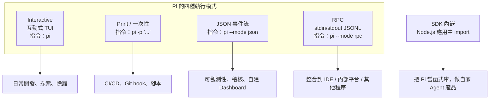

| 模式 | 指令 | 典型企業用途 | 對應章節 |
|------|------|--------------|----------|
| Interactive | `pi` | 日常開發 | 15 |
| Print | `pi -p "..."` | CI 檢查、批次任務 | 14、27、29 |
| JSON | `pi --mode json` | 稽核與可觀測性資料來源 | 32 |
| RPC | `pi --mode rpc` | 內部平台 / IDE 整合 | 38 |
| SDK | Node.js `import` | 自建 Agent 產品 | 8、38 |

### 2.4 四大擴充機制（Pi 的核心賣點）

**【Official】** Pi 提供四種擴充機制，全部可透過 **Pi Packages** 用 npm 或 git 分享：

| 機制 | 是什麼 | 誰使用它 | 章節 |
|------|--------|----------|------|
| **Skills** | Markdown 能力包（`SKILL.md`），遵循 Agent Skills 標準 | **模型**依情境自行載入 | 18 |
| **Extensions** | TypeScript 模組，可註冊工具、攔截事件、畫 UI | **Harness 執行期** | 19 |
| **Prompt Templates** | Markdown 片段，展開成完整 Prompt | **人類**用 `/name` 觸發 | 20 |
| **Themes** | JSON 主題設定 | 終端顯示 | 15 |

> **常見誤解**：Skills 與 Prompt Templates 都是 Markdown，很多人以為一樣。**關鍵差異是「誰決定要用它」**——Skill 由模型自主判斷是否載入（progressive disclosure），Prompt Template 由人類明確輸入 `/name` 觸發。這一點在第 3 章會完整拆解。

### 2.5 版本與環境事實（已查證）

| 項目 | 值 | 查證來源 |
|------|-----|----------|
| 最新版本 | **v0.85.1** | [GitHub Releases](https://github.com/earendil-works/pi/releases)，2026-09-05 發布 |
| npm 套件名 | `@earendil-works/pi-coding-agent` | [npm](https://www.npmjs.com/package/@earendil-works/pi-coding-agent) |
| Node.js 需求 | `>= 22.19.0` | package `engines` 欄位 |
| Node 20 相容版 | dist-tag `legacy-node20` = **v0.74.2** | npm dist-tags |
| 授權 | MIT | 官方 README |
| Monorepo package 數 | **11 個** | GitHub `packages/` 目錄 |

#### 近期版本演進速覽【Official】

理解版本演進，對企業「該不該現在升級」「升級能拿到什麼」的判斷至關重要。下表整理 v0.84.0 至 v0.85.1 的重要變更（來源：官方 GitHub Releases）：

| 版本 | 發布日 | 重要變更 | 對企業的意義 |
|------|--------|----------|--------------|
| **v0.85.1** | 2026-09-05 | 新增 GPT-6 Astra（OpenAI API）支援；fullscreen 模式滑鼠滾輪加速；修正 v0.85.0 的 SDK import 問題；修正 GPT-5.6+ 的 prompt-cache 請求 | **若已升到 v0.85.0 必須跟進**（SDK import 迴歸修正） |
| **v0.85.0** | 2026-09-04 | Claude thinking effort 可跨 session 持久化；fullscreen transcript 控制與 jump-to-latest；**SDK 支援可還原的 in-memory session**；vLLM scheduler priority 與 output-token 上限；fullscreen 大量 transcript 搜尋效能優化 | in-memory session 對「把 Pi 嵌入內部平台」是關鍵能力（第 38 章） |
| **v0.84.4** | 2026-08-28 | 終端能力覆寫（hyperlinks / images）；Extension UI prompt 事件可區分「工作中」與「等待中」；RPC 佇列清除；DeepSeek V4 Flash Vision【Experimental】 | 終端能力覆寫解決 SSH / 多工器下的自動偵測失準（第 15 章） |
| **v0.84.3** | 2026-08-24 | **新增 `powershell` 工具**（Windows 原生執行）；更安全的 managed update（staging + 驗證）；`/thinking` 選擇器與模型控制；Anthropic server-side refusal fallback | Windows 團隊的關鍵版本；升級流程更安全（第 45 章） |
| **v0.84.0** | 2026-08-06 | **Fullscreen TUI 模式**（transcript 獨立捲動）；Mermaid 圖與 LaTeX 數學式渲染；**`AGENTS.override.md` 目錄層級覆寫**；Baseten provider；自訂模型取樣參數 | `AGENTS.override.md` 讓 monorepo 各子專案能有獨立規範（第 17 章） |

> **【建議】升級判讀原則**：Pi 的 patch 版本（x.y.**z**）常包含迴歸修正，minor 版本（x.**y**.0）常引入新設定鍵。企業環境**【建議】**跳過 `.0` 版本、等到 `.1`／`.2` 再升，並在升級前跑一次第 45.3 節的檢查清單。

### 2.6 實務案例：Pi 適合與不適合的場景

**適合**：

- 團隊已有明確工程流程，想把流程「編碼」成 Skill / Prompt Template
- 需要多 LLM Provider（企業有 Azure OpenAI + Anthropic + 本地模型並存）
- 需要把 Agent 嵌進自家內部平台（RPC / SDK 模式）
- 需要對 Agent 行為做細緻攔截（例如禁止寫 `.env`、禁止 `rm -rf`）

**不適合（或需額外投入）**：

- 期待「開箱即用的完整工作流」——Pi 刻意不提供，需要你自己建（本手冊第 41、42 章就是在補這一塊）
- 期待內建安全沙箱——**Pi 官方明文沒有內建 sandbox**，必須自行加容器層（第 30、31 章）
- 團隊沒有人會寫 TypeScript 卻想大量客製 Extension

### 2.7 注意事項

> **安全前提（第 30 章會展開）**：**【Official】** 官方 Security 文件明文寫著「Pi does not include a built-in sandbox」。Pi 以**啟動它的使用者帳號權限**執行所有工具，包含 shell 指令。在企業環境導入前，請先讀完第 30、31 章再決定執行環境。

---

## 3. 核心概念模型

這一章是全手冊的地基。**如果你只讀一章，讀這章。**

企業導入 AI Agent 最常見的失敗，不是技術問題，而是**概念混淆**——把 Session 當 Context、把 Skill 當 Prompt、把 Tool Calling 當 Tool Execution。概念一混，架構討論就會失焦，治理規則也會寫錯。

### 3.1 Pi 核心概念模型全圖

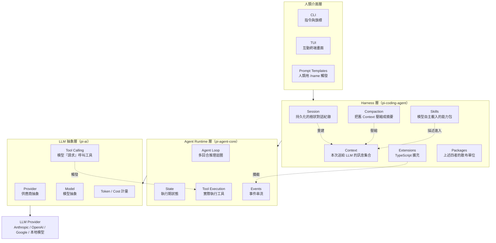

### 3.2 最容易混淆的六組概念（必讀）

#### 組 1：Tool Calling vs Tool Execution

| | Tool Calling | Tool Execution |
|---|---|---|
| 誰做的 | **LLM** | **Harness（你的機器）** |
| 是什麼 | 模型輸出一段結構化請求：「我要呼叫 `bash`，參數是 `npm test`」 | Pi 真的在你電腦上開一個 process 跑 `npm test` |
| 在哪一層 | `pi-ai` | `pi-agent-core` |
| 安全意義 | 模型「想要」做什麼 | **實際發生的副作用** |

> **為什麼重要**：所有安全控制都必須放在 **Tool Execution** 這一側。模型可以「請求」任何事，但能不能執行，由 Harness 與 OS 決定。第 19 章的 `tool_call` 事件攔截，正是卡在這兩者之間的閘門。

#### 組 2：Session vs Context

| | Session | Context |
|---|---|---|
| 是什麼 | 存在磁碟上的完整對話**歷史檔案** | 這一次 API 請求真正送給 LLM 的**訊息集合** |
| 存放位置 | `~/.pi/agent/sessions/` 的 JSONL 檔 | 記憶體，每次請求重建 |
| 大小限制 | 幾乎無限（就是檔案） | 受 **context window** 限制 |
| 結構 | **樹狀**（每筆有 `id` / `parentId`） | 線性訊息陣列 |
| 誰壓縮它 | 不壓縮，永久保留 | **Compaction 壓縮的是它** |

> **關鍵洞察**：**【Official】** Pi 的 Compaction 不會刪掉 Session 檔案裡的任何東西。它只是新增一筆 `CompactionEntry`，之後重建 Context 時改用「摘要 + 保留的近期訊息」。**歷史永遠可回溯**——這對稽核極為重要（第 32、34 章）。

#### 組 3：Skills vs Prompt Templates

| | Skills | Prompt Templates |
|---|---|---|
| 檔案 | `SKILL.md`（目錄形式，可含腳本與附件） | 單一 `.md` 檔 |
| 誰決定使用 | **模型**（依 description 自主判斷） | **人類**（輸入 `/name`） |
| Context 佔用 | 啟動時只放 name + description，內容按需載入 | 觸發時才展開 |
| 可帶執行檔 | **可以**（`scripts/`、`assets/`） | 不行，純文字 |
| 參數 | `/skill:name <args>` 附加為 `User: <args>` | 支援 `$1`、`$@`、`${1:-default}` |
| 標準 | 遵循 [Agent Skills 標準](https://agentskills.io/specification) | Pi 自訂格式 |

> **選用原則【建議】**：
>
> - 「模型應該在遇到 X 情況時自己知道要怎麼做」→ 寫 **Skill**
> - 「我要主動叫 Pi 執行一個固定流程」→ 寫 **Prompt Template**

#### 組 4：Skills vs Extensions

| | Skills | Extensions |
|---|---|---|
| 語言 | Markdown（+ 任意腳本） | **TypeScript** |
| 影響對象 | **模型的行為**（告訴它怎麼做） | **Harness 的行為**（改變工具、UI、事件） |
| 能不能阻擋工具呼叫 | **不能** | **能**（`tool_call` 回傳 `{ block: true }`） |
| 能不能新增工具 | 不能（只能叫模型用既有工具跑腳本） | **能**（`pi.registerTool()`） |
| 執行權限 | 由模型透過 `bash` 間接執行 | **直接以 Pi 程序權限執行任意程式碼** |

> **安全警告**：**【Official】** 官方明文——Extensions「run with your full system permissions and can execute arbitrary code」。企業必須把 Extension 當**正式程式碼**管理：進 Git、走 Code Review、有測試。

#### 組 5：Extensions vs Packages

Package **不是第五種擴充機制**，它是**散布容器**：

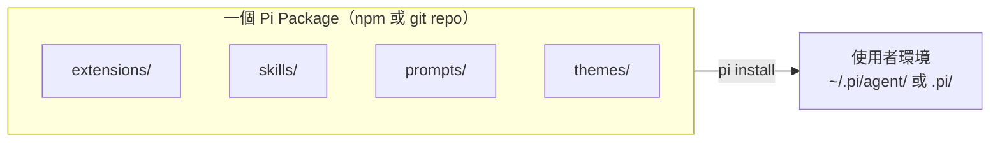

**【Official】** 一個 Package 可以同時包含 extensions、skills、prompts、themes 四類資源，透過 `package.json` 的 `pi` 欄位宣告，或用慣例目錄自動探索。

#### 組 6：Provider vs Model vs LLM API

| | 意義 | Pi 中的位置 |
|---|---|---|
| **LLM API** | 供應商的 HTTP 介面（例如 Anthropic Messages API） | 最外層 |
| **Provider** | Pi 對「一家供應商 + 一種 API 形式 + 認證方式」的抽象 | `pi-ai`，例如 `anthropic`、`azure-openai-responses` |
| **Model** | 某 Provider 下的具體模型（含 context window、費率、能力） | `pi-ai`，用 `provider/model-id` 定位 |

### 3.3 Agent Runtime vs Agent Loop vs Coding Agent vs Harness

這四個詞常被混用，但在 Pi 裡有明確分層：

| 名詞 | 定義 | 在 Pi 中對應 |
|------|------|--------------|
| **Agent Loop** | 「呼叫模型 → 模型要求用工具 → 執行工具 → 把結果餵回去 → 再呼叫模型」的**迴圈演算法** | `pi-agent-core` 的核心邏輯 |
| **Agent Runtime** | 承載 Agent Loop 的**執行環境**：狀態管理、事件串流、中止機制 | `pi-agent-core` 整體 |
| **Coding Agent** | 針對「寫程式」這個領域，配好工具（read/write/edit/bash）與 system prompt 的 Agent | `pi-coding-agent` |
| **Harness** | 把上述全部包起來，再加上 Session、Context 管理、擴充機制、UI 的**完整載具** | **`pi-coding-agent` 全套 = 本手冊講的 Pi Agent Harness** |

### 3.4 其他關鍵名詞速查

| 名詞 | 一句話定義 | 官方支援狀態 |
|------|-----------|-------------|
| **Context Compaction** | Context 逼近上限時，把舊訊息換成結構化摘要 | 【Official】第 17 章 |
| **Branch Summarization** | 用 `/tree` 切換分支時，把離開的分支摘要帶到新位置 | 【Official】第 16 章 |
| **Thinking Level** | 推理強度：`off`/`minimal`/`low`/`medium`/`high`/`xhigh`/`max` | 【Official】第 13 章 |
| **Project Trust** | 是否載入專案的 `.pi/` 設定與資源的**載入守門機制** | 【Official】第 30 章 |
| **Sandbox** | 隔離 Agent 副作用的邊界 | **Pi 無內建**，需外掛容器 |
| **Container** | Docker / micro-VM 等隔離技術 | 【Official】四種模式，第 31 章 |
| **Telemetry** | `@earendil-works/pi-telemetry`，vendor-neutral telemetry contracts | 【Official】第 32 章 |
| **MCP** | Model Context Protocol（Anthropic 的工具協定） | 見下方說明 |
| **Subagent** | 由主 Agent 派生的子 Agent | 見下方說明 |
| **Human-in-the-loop** | 關鍵決策點由人類確認 | 【Official】以 `ctx.ui.confirm()` 等實作，第 19 章 |

> **關於 MCP 與 Subagent 的誠實說明**：
> 截至 2026-09-06 查證的官方 docs 目錄（quickstart / usage / providers / settings / keybindings / sessions / compaction / llama-cpp / security / containerization / extensions / skills / prompt-templates / themes / packages / models / custom-provider / sdk / rpc / json / tui / environment-variables / session-format / windows / development），**沒有獨立的 MCP 或 Subagent 文件頁**。
>
> - **MCP**：官方文件未說明 Pi 是否內建 MCP client。**【建議】** 若團隊需要 MCP，可用 Extension 的 `pi.registerTool()` 自行橋接，或以 `bash` 呼叫 MCP CLI。
> - **Subagent**：官方文件未說明 Pi 有**內建**的 subagent 機制；但官方 `examples/extensions/` 中**確實提供一個 `subagent/` 範例**，其實作方式是用 `registerTool` + `exec` 來派生子 agent（**【Official】** 官方 extensions.md 的 Examples Reference 表格有列）。也就是說：**subagent 在 Pi 是「用 Extension 做出來的能力」，不是核心內建功能**。第 39 章會依此設計企業 Agent Team。
>
> 同理，其他 harness 內建的 **Plan Mode**，在 Pi 也是以官方範例 extension（`plan-mode/`）的形式提供，而非核心功能。這正好體現第 2 章說的「擴充性優先於預設功能」。
> 請勿在企業文件中把上述建議寫成官方核心功能。

### 3.5 實務案例：用概念模型解一個真實爭議

> **情境**：團隊討論「要不要禁止 Agent 執行 `git push`」。有人說「在 Prompt 裡寫『不准 push』就好」。

用第 3.2 節的概念模型分析：

| 方案 | 卡在哪一層 | 有效性 |
|------|-----------|--------|
| 在 `AGENTS.md` 寫「不准 push」 | 影響 **Context**，只是「建議」模型 | **不可靠**——模型可能忽略，或被 prompt injection 繞過 |
| 寫成 Skill | 同上，仍在模型側 | **不可靠** |
| 寫 Extension 攔截 `tool_call` | 卡在 **Tool Execution 之前** | **可靠**（Harness 層強制） |
| 在容器裡拿掉 git 憑證 | 卡在 **OS / 容器層** | **最可靠**（第 31 章） |

**結論**：安全控制越靠近執行端越有效。Prompt 是「引導」，Extension 是「閘門」，容器是「牢籠」。三者角色不同，不可互相取代。

### 3.6 注意事項

> 在企業內部溝通時，請**強制使用本章的詞彙表**。本手冊第 34 章的治理規則、第 51 章的檢查清單，都建立在這些定義之上。詞彙一旦混用，治理條文就會出現漏洞（例如把「限制 Context」誤寫成「限制 Session」，導致稽核紀錄被誤刪）。

---

## 4. 系統架構

### 4.1 Concept：四層架構

Pi 的架構是清楚的四層堆疊，每一層都是**獨立可用的 npm 套件**。這代表你可以只用其中一層（例如只用 `pi-ai` 當統一 LLM SDK），這對企業分階段導入非常重要。

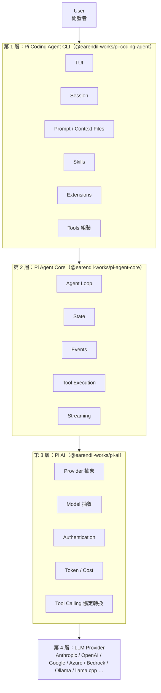

輔助套件（不在主鏈上，但企業會用到）：

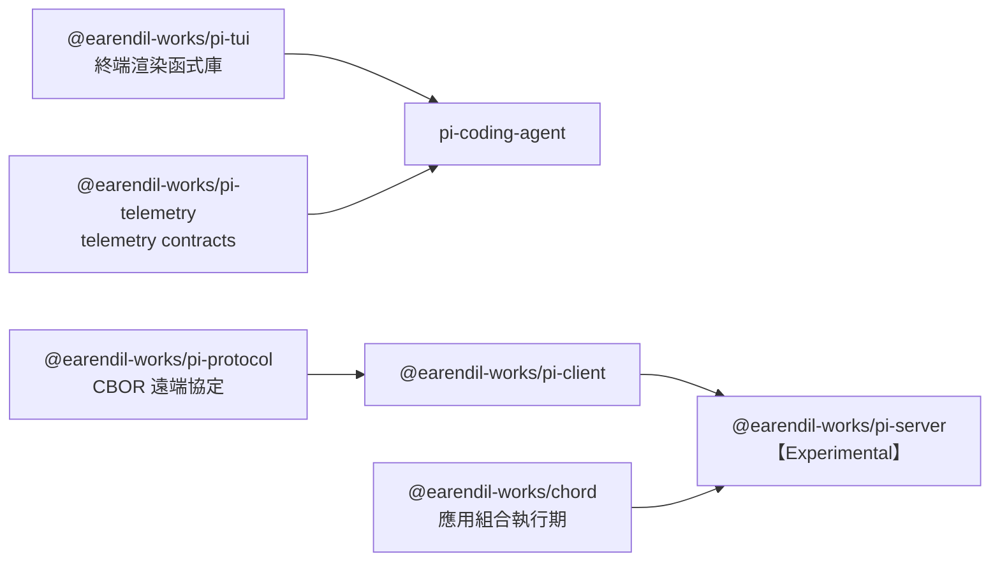

### 4.2 各層完整規格

#### 第 1 層：Pi Coding Agent CLI

| 面向 | 內容 |
|------|------|
| **Responsibility** | 組裝一個「會寫程式的 Agent」：載入設定、認證、context files、skills、extensions、prompt templates、themes；管理 Session 樹；管理 Context 與 Compaction；提供 CLI / TUI / print / JSON / RPC 五種介面 |
| **Input** | CLI 旗標、使用者輸入、`~/.pi/agent/settings.json`、`.pi/settings.json`、`AGENTS.md` / `CLAUDE.md`、Session 檔 |
| **Output** | 終端畫面、檔案系統變更、Session JSONL、JSON 事件流、RPC 訊息 |
| **API** | CLI 指令與旗標（第 14 章）、Extension API（第 19 章）、SDK（`sdk.md`）、RPC（`rpc.md`） |
| **Runtime behavior** | 啟動 → project trust 判定 → 載入資源 → 進入 REPL 或一次性執行 |
| **Extension point** | **Extensions**（事件、工具、命令、UI）、**Skills**、**Prompt Templates**、**Themes**、**Packages** |
| **Failure mode** | 設定檔 JSON 語法錯誤、Extension 載入失敗、Skill frontmatter 不合法、context file 過大 |
| **Security consideration** | **Project Trust 是唯一的載入守門**；`.pi/extensions` 內的 TypeScript 會以完整使用者權限執行 |

#### 第 2 層：Pi Agent Core

| 面向 | 內容 |
|------|------|
| **Responsibility** | 執行 Agent Loop；管理 agent 狀態；發出事件串流；執行工具並收集結果；處理中止（abort）與錯誤 |
| **Input** | 訊息陣列、工具定義、模型設定、abort signal |
| **Output** | 事件串流（`message_start` / `message_update` / `tool_execution_start` / `tool_result` / `turn_end` …）、最終訊息 |
| **API** | `@earendil-works/pi-agent-core`（官方描述：general-purpose agent with transport abstraction, state management, and attachment support） |
| **Runtime behavior** | 迴圈：送出請求 → 串流回應 → 若有 tool call 則執行 → 附加結果 → 再送出，直到模型不再要求工具 |
| **Extension point** | 由上層（coding-agent）以事件形式對外開放（`tool_call` 可 block、`context` 可改寫） |
| **Failure mode** | 工具逾時、工具丟出例外、模型回傳格式異常、無限迴圈（模型反覆呼叫同一工具） |
| **Security consideration** | **這一層是真正產生副作用的地方**。所有工具執行都在此發生 |

#### 第 3 層：Pi AI

| 面向 | 內容 |
|------|------|
| **Responsibility** | 把不同供應商的 API 統一成單一介面；模型探索與設定；認證解析；串流；Tool Calling 協定轉換；Token 與成本計量 |
| **Input** | Provider 名稱、model id、訊息、工具 schema、認證資訊 |
| **Output** | 標準化的串流事件、usage（token 數）、成本 |
| **API** | `@earendil-works/pi-ai`（官方描述：unified LLM API with automatic model discovery and provider configuration） |
| **Runtime behavior** | 依 Provider 選擇 API 形式（Anthropic / OpenAI Completions / OpenAI Responses / Google …）與傳輸（SSE / WebSocket） |
| **Extension point** | `pi.registerProvider(name, config)` / `pi.unregisterProvider(name)`（第 19 章）、自訂模型（`models.md`）、自訂 Provider（`custom-provider.md`） |
| **Failure mode** | 認證失敗、模型不存在、rate limit、context window 超限、供應商逾時 |
| **Security consideration** | **API Key 在這一層被解析**。`auth.json` 為 `0600` 權限；`key` 欄位支援 `!command` 執行外部密碼管理器 |

#### 第 4 層：LLM Provider

| 面向 | 內容 |
|------|------|
| **Responsibility** | 實際的模型推理 |
| **Security consideration** | **企業最大的資料外流風險點**。你的原始碼會離開內網。第 34 章有完整治理設計 |

### 4.3 一次完整請求的資料流

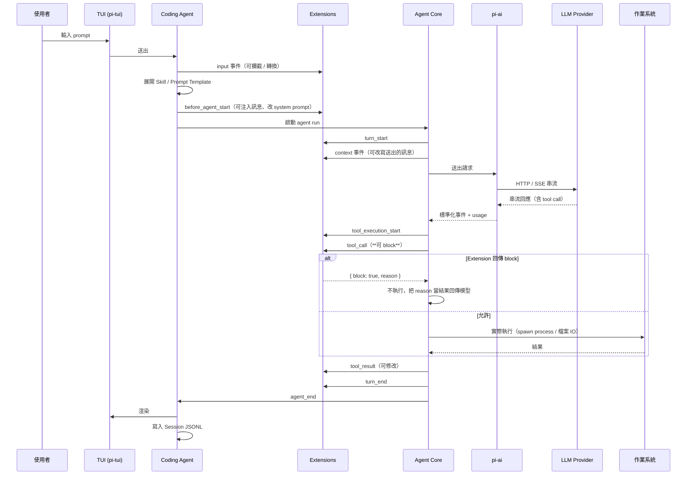

### 4.4 Failure Mode 對照表（維運必備）

| 症狀 | 最可能的層 | 首要排查 | 章節 |
|------|-----------|----------|------|
| `pi` 指令找不到 | 安裝層 | Node 版本、npm global bin 路徑 | 10、43 |
| 401 / 403 | 第 3 層 | `auth.json`、環境變數、Key 解析 | 12、43 |
| 模型清單是空的 | 第 3 層 | Provider 設定、`pi --list-models` | 13、43 |
| Agent 一直重複同一動作 | 第 2 層 | Prompt 品質、工具回傳訊息不清楚 | 22、23 |
| 「context too large」 | 第 1 層 | compaction 設定、context files 太大 | 17、43 |
| 專案的 `.pi/` 設定沒生效 | 第 1 層 | **Project Trust 沒有批准** | 11、30、43 |
| Extension 沒被載入 | 第 1 層 | 放置位置、`/reload`、`--verbose` | 19、43 |
| AI 改壞了不該碰的檔案 | **第 2 層（已執行）** | 需要 Extension 攔截 + 容器隔離 | 19、30、31 |

### 4.5 實務案例：只用一層的分階段導入【建議】

> 以下為本手冊提出的導入建議，**非 Pi 官方規範**。

| 階段 | 只用哪一層 | 得到什麼 | 風險 |
|------|-----------|----------|------|
| 階段 0 | 只用 `pi-ai` | 統一的多 Provider LLM SDK，給內部工具用 | 極低（沒有工具執行） |
| 階段 1 | `pi -p` 唯讀模式（`--tools read,grep,find,ls`） | AI 做程式碼分析、產文件，**不會改任何檔案** | 低（僅原始碼外送風險） |
| 階段 2 | 完整 CLI + 容器 | 完整開發輔助 | 中（見第 30 章） |
| 階段 3 | RPC / SDK 內嵌平台 | 企業級 Agent Platform | 高（需完整治理） |

### 4.6 注意事項

> **架構決策提醒**：不要一開始就做「階段 3」。多數團隊失敗在跳過階段 1，直接讓 Agent 在開發者主機上有完整寫入 + shell 權限，卻沒有任何攔截與稽核。**先建立可觀測性（第 32 章），再放寬權限。**

---

## 5. Monorepo 與 Package Architecture

### 5.1 Concept：11 個 Package 的完整地圖

**【Official】** 截至 2026-09-06，[earendil-works/pi](https://github.com/earendil-works/pi) 的 `packages/` 目錄包含 **11 個** package，版本皆為 **0.85.1**：

| # | 目錄 | npm 套件名 | 官方描述（原文） | 狀態 |
|---|------|-----------|-----------------|------|
| 1 | `ai` | `@earendil-works/pi-ai` | Unified LLM API with automatic model discovery and provider configuration | 公開 |
| 2 | `agent` | `@earendil-works/pi-agent-core` | General-purpose agent with transport abstraction, state management, and attachment support | 公開 |
| 3 | `coding-agent` | `@earendil-works/pi-coding-agent` | Coding agent CLI with read, bash, edit, write tools and session management | 公開（**主套件**） |
| 4 | `tui` | `@earendil-works/pi-tui` | Terminal User Interface library with differential rendering for efficient text-based applications | 公開 |
| 5 | `telemetry` | `@earendil-works/pi-telemetry` | Vendor-neutral telemetry contracts and typed schema utilities for pi | 公開 |
| 6 | `protocol` | `@earendil-works/pi-protocol` | Transport-neutral CBOR protocol for remote pi sessions | 公開 |
| 7 | `client` | `@earendil-works/pi-client` | Transport-neutral client for remote pi sessions over framed CBOR bytes | 公開 |
| 8 | `server` | `@earendil-works/pi-server` | experimental server package for pi | **【Experimental】** |
| 9 | `chord` | `@earendil-works/chord` | Application composition runtime for services, replicated state, RPC, and plugins | 公開 |
| 10 | `evals` | `@earendil-works/pi-evals` | （無 description，`"private": true`） | **內部用** |
| 11 | `session-backends` | — | 該目錄根層無 `package.json`（可能為子套件容器） | **官方文件未說明** |

> **誠實聲明**：`session-backends` 目錄存在於 repo，但其根層沒有 `package.json`，且官方 docs 目錄中沒有對應說明頁。**本手冊不對其功能作任何推測**。

### 5.2 Package 依賴與角色關係圖

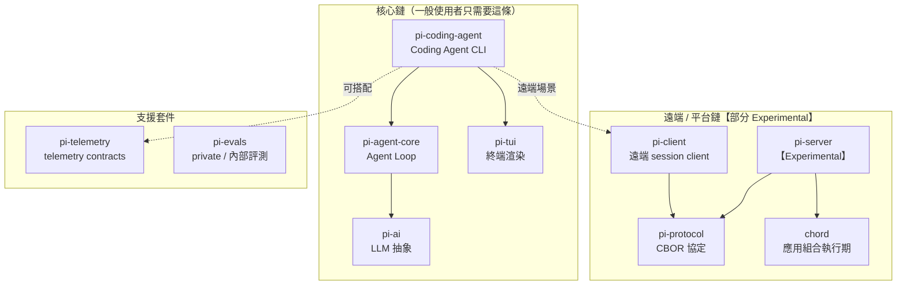

### 5.3 企業選型：我該裝哪個？

| 你的需求 | 安裝什麼 | 說明 |
|----------|----------|------|
| 日常開發用 AI Coding Agent | `npm i -g @earendil-works/pi-coding-agent` | **99% 的人只需要這個**，其他為其依賴 |
| 內部工具要串多家 LLM | `npm i @earendil-works/pi-ai` | 當統一 SDK 用，不涉及工具執行 |
| 自建 Agent 產品 | `pi-agent-core` + `pi-ai` | 自己組 Agent Loop |
| 寫終端工具 | `@earendil-works/pi-tui` | differential rendering |
| 寫 Pi Extension 且需型別 | 在 `peerDependencies` 宣告 | 見下方 5.4 |
| 遠端 / 平台整合 | `pi-protocol` + `pi-client` | server 端為 Experimental |

### 5.4 開發 Extension / Package 時的依賴規則（重要）

**【Official】** 官方 `packages.md` 明訂：

Pi **已內建**下列套件供 extensions 與 skills 使用。若你 import 它們，必須放在 `peerDependencies` 且版本範圍寫 `"*"`，**不可打包進去**：

- `@earendil-works/pi-ai`
- `@earendil-works/pi-agent-core`
- `@earendil-works/pi-coding-agent`
- `@earendil-works/pi-tui`
- `typebox`

其他第三方執行期依賴放 `dependencies`（Pi 安裝 package 時會自動跑 `npm install`）。
其他 pi package 則必須放進 `dependencies` **且**加入 `bundledDependencies`，並透過 `node_modules/` 路徑引用資源。

```json
// package.json — 一個標準的企業 Pi Package 骨架【Official 格式】
{
  "name": "@acme/pi-enterprise-pack",
  "version": "1.0.0",
  "keywords": ["pi-package"],
  "peerDependencies": {
    "@earendil-works/pi-coding-agent": "*",
    "typebox": "*"
  },
  "dependencies": {
    "zod": "^3.23.8"
  },
  "pi": {
    "extensions": ["./extensions"],
    "skills": ["./skills"],
    "prompts": ["./prompts"],
    "themes": ["./themes"]
  }
}
```

> **注意**：**【Official】** Package 安裝預設使用 production 安裝（`npm install --omit=dev`），因此 **`devDependencies` 在執行期不可用**。若你的 Extension 執行期需要某套件，一定要放 `dependencies`。

### 5.5 從原始碼建置（開發者 / 內部 fork 用）

**【Official】** 官方 README 列出的開發指令：

```bash
# Linux / macOS / WSL — 前置條件：已安裝 Node.js >= 22.19.0 與 git
git clone https://github.com/earendil-works/pi.git
cd pi

npm install --ignore-scripts   # 官方明示使用 --ignore-scripts
npm run build
npm run check                  # lint / type check
./test.sh                      # 測試
./pi-test.sh                   # pi 相關測試
```

**【Official】** 官方供應鏈實務（企業安全稽核時可引用）：

- 直接外部依賴採**嚴格版本 pin**
- `package-lock.json` 是依賴的唯一真實來源（source of truth）
- 新依賴的 lifecycle scripts 需要**明確 allowlist**

### 5.6 實務案例：企業內部 Package 的目錄設計【建議】

> 以下為本手冊提出的企業導入建議，**並非 Pi 官方目錄規範**。Pi 官方規範的是 `package.json` 的 `pi` 欄位與慣例目錄（`extensions/`、`skills/`、`prompts/`、`themes/`）。

```text
acme-pi-pack/                      # 內部 Git repo，走一般 code review 流程
├── package.json                   # 含 keywords: ["pi-package"] 與 pi 欄位
├── package-lock.json
├── README.md                      # 給同仁看的使用說明
├── CHANGELOG.md
├── extensions/
│   ├── guard-secrets/index.ts     # 阻擋寫入 .env、金鑰檔
│   ├── guard-prod/index.ts        # 阻擋 production 相關指令
│   └── audit-log/index.ts         # 把工具執行寫入稽核檔
├── skills/
│   ├── backend-springboot/SKILL.md
│   ├── frontend-vue3/SKILL.md
│   └── reverse-engineering/SKILL.md
├── prompts/
│   ├── review.md                  # /review
│   ├── repo-analysis.md           # /repo-analysis
│   └── upgrade-assess.md          # /upgrade-assess
├── themes/
│   └── acme-dark.json
└── tests/                         # 【建議】Extension 的單元測試
    └── guard-secrets.test.ts
```

團隊安裝方式：

```bash
# Linux / macOS / WSL
pi install git:github.com/acme/acme-pi-pack@v1.2.0

# 或寫進專案 .pi/settings.json，團隊成員啟動 pi 時自動安裝（需先信任專案）
```

```json
// .pi/settings.json【Official 格式】
{
  "packages": ["git:github.com/acme/acme-pi-pack@v1.2.0"]
}
```

> **【Official】** 官方明文：專案設定可與團隊共享，pi 會在**專案被信任後**於啟動時自動安裝缺少的 package。

### 5.7 注意事項

> **版本 pin 是治理紅線【建議】**：**【Official】** 官方說明 git 來源的 ref 是 pinned tag/commit，`pi update --extensions` 與 `pi update --all` **不會**自動移到更新的 ref（但會把既有 clone 對齊到設定的 ref）。npm 來源若寫了版本號也同樣會被 pin。
> 企業請**一律使用帶版本的來源**（`npm:@acme/pack@1.2.0` 或 `git:...@v1.2.0`），不要用浮動 ref——否則某天有人推了一個 commit，全公司的 Agent 行為就變了，而且沒有變更紀錄。

---

## 6. pi-ai

### 6.1 Concept

**【Official】** `@earendil-works/pi-ai` 的官方描述是：**Unified LLM API with automatic model discovery and provider configuration**。

它解決的是企業最痛的一個問題：**每家 LLM 供應商的 API 都不一樣**。Anthropic 用 Messages API、OpenAI 有 Completions 與 Responses 兩種、Google 又是另一套、Azure / Bedrock / Vertex 各有自己的認證流程。若每個內部工具都自己接一次，維護成本會爆炸。

`pi-ai` 把這些收斂成一個介面。

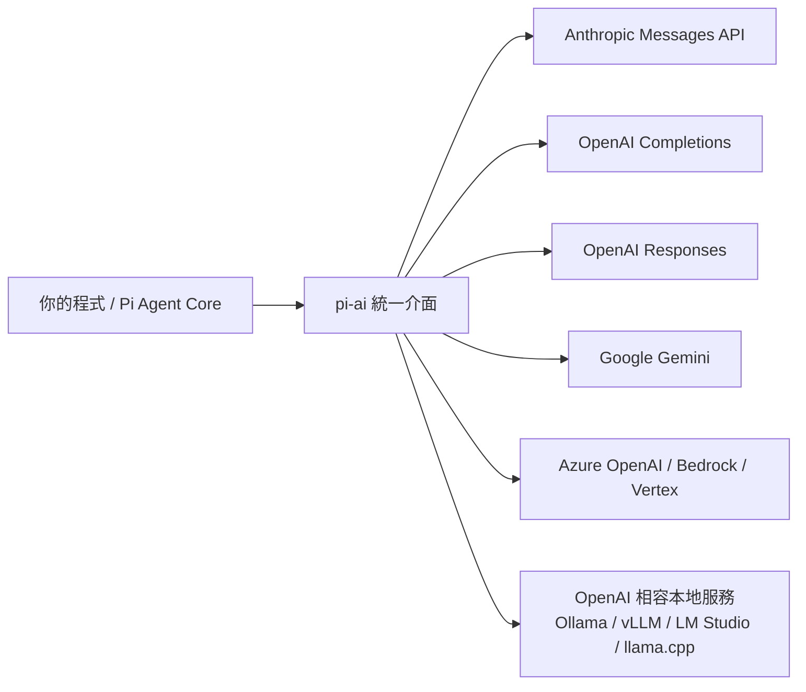

### 6.2 主要職責

| 職責 | 說明 | 官方依據 |
|------|------|----------|
| **Provider abstraction** | 一個 provider = 供應商 + API 形式 + 認證方式 + baseUrl | `providers.md`、`models.json` 的 `providers` 結構 |
| **Model abstraction** | 模型帶有 `id`、`name`、`contextWindow`、`maxTokens`、`cost`、`reasoning`、`input` | `extensions.md` 的 `registerProvider` 範例 |
| **Automatic model discovery** | 自動探索可用模型（`pi --list-models`、`pi update --models`） | 官方 package description、`usage.md` |
| **Authentication** | 環境變數、`auth.json`、OAuth 訂閱登入、雲端供應商認證 | `providers.md` |
| **Streaming** | 串流回應；傳輸可設 `sse` / `websocket` / `websocket-cached` / `auto` | `settings.md` 的 `transport` |
| **Tool Calling 協定轉換** | 把統一的工具 schema 轉成各家格式 | 見 6.5 |
| **Token / Cost tracking** | 回傳 `Usage`，Pi footer 顯示 token、cache、成本 | `json.md`、官方 README |
| **Retry / Error handling** | 供應商層級 timeout 與 retry 參數 | `settings.md` 的 `retry.provider.*` |

### 6.3 Provider 與 Model 設定（自訂模型）

**【Official】** 自訂 provider / model 寫在 `~/.pi/agent/models.json`。這是企業接**內部 LLM Gateway** 或**本地模型**的標準做法。

```json
// ~/.pi/agent/models.json — 最小範例【Official】
// 前置條件：本機已跑起 Ollama（http://localhost:11434）
{
  "providers": {
    "ollama": {
      "baseUrl": "http://localhost:11434/v1",
      "api": "openai-completions",
      "apiKey": "ollama",
      "models": [
        { "id": "llama3.1:8b" },
        { "id": "qwen2.5-coder:7b" }
      ]
    }
  }
}
```

> **【Official】重點**：`apiKey` 這裡是佔位字串，因為 Ollama 不檢查它。但 **Pi 仍要求模型「有認證」才會出現在 `/model` 清單**，所以無金鑰的本地服務要保留一個假值、或用 `/login` 存一個、或用 `--api-key` 指定。這是新手最常卡住的地方。

**相容性旗標（接本地 / 自架服務必看）【Official】**：

| 設定 | 何時要設 `false` |
|------|-----------------|
| `compat.supportsDeveloperRole` | 伺服器不認得 reasoning 模型用的 `developer` role（Ollama、vLLM、SGLang 常見） |
| `compat.supportsReasoningEffort` | 伺服器不支援 `reasoning_effort` 參數 |

`compat` 可設在 provider 層（套用全部模型）或 model 層（覆寫單一模型）。

### 6.4 企業內部 LLM Gateway 接法【建議】

> 以下為本手冊的企業建議做法，**非 Pi 官方規範**；但所用的設定鍵（`baseUrl`、`api`、`apiKey`、`compat`）均為官方支援。

多數企業會在內網放一個 OpenAI 相容的 Gateway（做審計、限流、脫敏）。設定方式：

```json
// ~/.pi/agent/models.json
{
  "providers": {
    "acme-gateway": {
      "baseUrl": "https://llm-gateway.acme.internal/v1",
      "api": "openai-completions",
      "apiKey": "$ACME_GATEWAY_TOKEN",
      "models": [
        {
          "id": "claude-sonnet-4",
          "name": "Claude Sonnet 4 (via ACME Gateway)",
          "reasoning": true,
          "input": ["text"],
          "contextWindow": 200000,
          "maxTokens": 8192,
          "cost": { "input": 3, "output": 15, "cacheRead": 0.3, "cacheWrite": 3.75 }
        }
      ]
    }
  }
}
```

搭配 `~/.pi/agent/settings.json`：

```json
{
  "defaultProvider": "acme-gateway",
  "defaultModel": "claude-sonnet-4"
}
```

### 6.5 Tool Calling 在 pi-ai 的角色

`pi-ai` 負責的是**協定轉換**，不是執行：

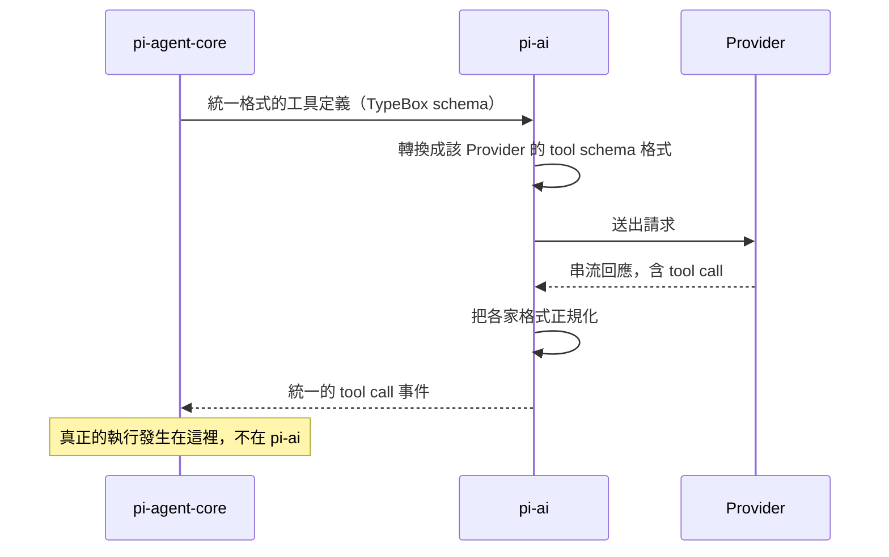

### 6.6 錯誤處理與 Retry【Official】

Retry 分成**兩層**，設定在 `settings.json`：

| 層級 | 設定鍵 | 預設 | 意義 |
|------|--------|------|------|
| Agent 層 | `retry.enabled` | `true` | 暫時性錯誤自動重試 |
| Agent 層 | `retry.maxRetries` | `3` | 最大重試次數 |
| Agent 層 | `retry.baseDelayMs` | `2000` | 指數退避基準（2s → 4s → 8s） |
| Provider/SDK 層 | `retry.provider.timeoutMs` | SDK 預設 | 請求逾時 |
| Provider/SDK 層 | `retry.provider.maxRetries` | **`0`** | SDK 層重試次數 |
| Provider/SDK 層 | `retry.provider.maxRetryDelayMs` | `60000` | 供應商要求的等待上限 |

> **【Official】官方警告（企業請務必遵守）**：`retry.provider.maxRetries` **保持 `0`**，除非確有需要。設成大於 0 會讓 SDK/Provider 層的重試先處理掉「用量超限」錯誤，Pi 就看不到，可能導致 agent 卡住直到供應商配額重置。

### 6.7 實務案例：多 Provider 分流策略

> **情境**：某金融業團隊有三個限制——(a) 涉及客戶資料的程式碼不得外送公有雲；(b) 一般開發希望用最強模型；(c) 成本要控制。

**【建議】** 設定三個 provider 並用 `enabledModels` 讓開發者用 `Ctrl+P` 快速切換：

```json
// ~/.pi/agent/settings.json
{
  "defaultProvider": "acme-gateway",
  "defaultModel": "claude-sonnet-4",
  "enabledModels": ["claude-*", "gpt-*", "qwen2.5-coder*"]
}
```

| 情境 | 用哪個 | 理由 |
|------|--------|------|
| 涉及客戶資料的模組 | `ollama/qwen2.5-coder:7b`（本地） | 資料不出機器 |
| 一般功能開發 | Gateway 上的大模型 | 品質優先 |
| 大量重複的機械式改動 | 便宜的快模型 | 成本優先 |

### 6.8 注意事項

> - **不要把 `models.json` 裡的 `apiKey` 寫成明文金鑰後 commit**。用 `$ENV_VAR` 或走 `auth.json` 的 `!command`（第 12 章）。
> - **`contextWindow` 與 `cost` 若填錯**，會直接影響 compaction 觸發時機與成本統計的正確性。自訂模型時請照供應商文件填。

---

## 7. pi-agent-core

### 7.1 Concept

**【Official】** `@earendil-works/pi-agent-core` 的官方描述是：**General-purpose agent with transport abstraction, state management, and attachment support**。

注意「**general-purpose**」——它不是「coding agent」。它是通用的 Agent Runtime，coding 相關的一切（read/write/edit/bash 工具、session 樹、skills）都在上一層的 `pi-coding-agent`。

這個分層對企業的意義是：**你可以用 `pi-agent-core` 建自己領域的 Agent**（客服 Agent、資料分析 Agent），而不必背上 coding agent 的包袱。

### 7.2 Agent Loop 的核心結構

**【Official】** 從官方 `json.md` 揭露的 `AgentEvent` 型別，可以精確還原 Agent Loop 的結構：

```typescript
// 官方 AgentEvent 型別（節錄自 packages/agent/src/types.ts）【Official】
type AgentEvent =
  // Agent 生命週期
  | { type: "agent_start" }
  | { type: "agent_end"; messages: AgentMessage[] }
  // Turn 生命週期
  | { type: "turn_start" }
  | { type: "turn_end"; message: AgentMessage; toolResults: ToolResultMessage[] }
  // Message 生命週期
  | { type: "message_start"; message: AgentMessage }
  | { type: "message_update"; message: AgentMessage; assistantMessageEvent: AssistantMessageEvent }
  | { type: "message_end"; message: AgentMessage }
  // 工具執行
  | { type: "tool_execution_start"; toolCallId: string; toolName: string; args: any }
  | { type: "tool_execution_update"; toolCallId: string; toolName: string; args: any; partialResult: any }
  | { type: "tool_execution_end"; toolCallId: string; toolName: string; result: any; isError: boolean };
```

從這組事件可以讀出三層巢狀結構：

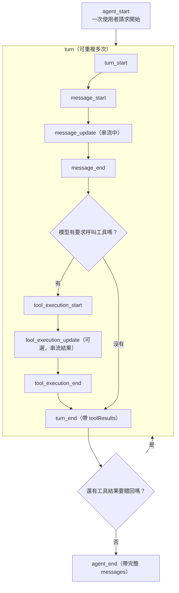

### 7.3 職責分解

| 職責 | 說明 |
|------|------|
| **Agent Runtime** | 承載整個迴圈的執行環境 |
| **Agent State** | 目前的訊息、工具、模型、執行狀態 |
| **Agent Loop** | 上圖的多回合迴圈 |
| **Tool Execution** | **真正產生副作用的地方**（開 process、讀寫檔） |
| **Event Streaming** | 對外發出上述所有事件，讓 UI 與 Extension 可以即時反應 |
| **Message Lifecycle** | `message_start` → `message_update` → `message_end` |
| **Tool Results** | 把工具輸出包成 `ToolResultMessage` 餵回模型 |
| **Abort / Cancellation** | 透過 abort signal 中止；TUI 的 Escape 對應到此 |
| **Error Handling** | `tool_execution_end` 帶 `isError` 旗標 |
| **Transport abstraction** | 官方 description 明列，支援不同傳輸方式 |
| **Attachment support** | 官方 description 明列（圖片等附件） |

### 7.4 Abort / Cancellation 的工程意義

**【Official】** Extension 可透過 `ctx.signal` 取得 abort signal，並用 `ctx.abort()` 主動中止。

企業場景：

```typescript
// 檔名：~/.pi/agent/extensions/timeout-guard.ts
// 執行環境：Pi v0.85.1（Extension 由 jiti 載入，不需編譯）
// 【建議】此為本手冊設計；使用的 pi.on / ctx.ui 均為官方 API
import type { ExtensionAPI } from "@earendil-works/pi-coding-agent";

export default function (pi: ExtensionAPI) {
  const started = new Map<string, number>();
  const LIMIT_MS = 10 * 60 * 1000; // 10 分鐘

  pi.on("tool_execution_start", async (event, _ctx) => {
    started.set(event.toolCallId, Date.now());
  });

  pi.on("tool_execution_end", async (event, ctx) => {
    const t0 = started.get(event.toolCallId);
    started.delete(event.toolCallId);
    if (t0 && Date.now() - t0 > LIMIT_MS) {
      ctx.ui.notify(`工具 ${event.toolName} 執行超過 10 分鐘，請檢查`, "warning");
    }
  });
}
```

> **注意**：此為示範程式。實際部署前請在你的 Pi 版本上驗證事件欄位名稱（官方事件型別可能隨版本演進）。

### 7.5 Context Management 在這一層的角色

**【Official】** Extension 的 `context` 事件發生在**每個 turn 送出請求之前**，可以改寫要送給 LLM 的訊息。這代表 `pi-agent-core` 是「Context 最後成型」的地方。

企業可利用這一點做**送出前脫敏**：

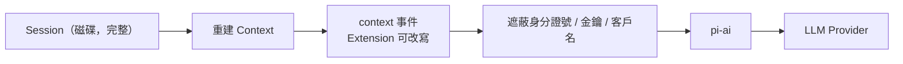

> **重要限制**：這只能遮蔽「Pi 主動送出」的內容。若模型透過 `bash` 讀了一個含機敏資料的檔案，該內容是以 **tool result** 進入 context 的——你要攔的是 `tool_result` 事件，不是 `context` 事件。**兩者都要做才完整。**

### 7.6 實務案例：無限迴圈的診斷

> **情境**：Agent 反覆執行 `npm test`，每次都失敗，跑了 30 次還在跑。

**診斷路徑**：

1. 用 JSON 模式重跑並保存事件：

   ```bash
   # Linux / macOS / WSL
   pi --mode json -p "修好失敗的測試" > agent-events.jsonl
   ```

2. 統計工具呼叫次數：

   ```bash
   grep '"type":"tool_execution_start"' agent-events.jsonl \
     | grep -o '"toolName":"[^"]*"' | sort | uniq -c | sort -rn
   ```

3. 若同一工具、同樣參數重複出現 → 典型原因是**工具回傳的錯誤訊息不足以讓模型判斷下一步**。

**解法【建議】**：

- 在 `AGENTS.md` 明確要求「連續兩次同樣失敗就停下來說明」
- 用 Extension 攔 `tool_call`，偵測重複參數並回傳提示

### 7.7 注意事項

> `pi-agent-core` 是所有安全事故的**實際發生地**。任何治理設計（第 34 章）若沒有落到這一層的事件攔截或外層容器，就只是紙上規範。

---

## 8. pi-coding-agent

### 8.1 Concept

**【Official】** 官方描述：**Coding agent CLI with read, bash, edit, write tools and session management**。這是**你 `npm install -g` 的那個套件**，也是本手冊絕大多數篇幅在談的對象。

它把前兩層組裝成一個完整的 Harness：

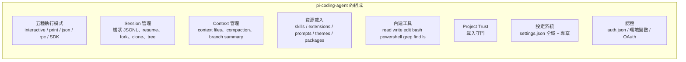

### 8.2 內建工具全表【Official】

| 工具 | 用途 | 預設啟用 | 風險等級【建議】 |
|------|------|:--------:|:---------------:|
| `read` | 讀檔（含圖片） | 是 | 低（但會外送內容） |
| `write` | 建立 / 覆寫檔案 | 是 | **高** |
| `edit` | 修補檔案 | 是 | **高** |
| `bash` | 執行 shell 指令 | 是 | **極高** |
| `powershell` | 執行 PowerShell（Windows） | 否 | **極高** |
| `grep` | 內容搜尋 | 否 | 低 |
| `find` | 找檔案 | 否 | 低 |
| `ls` | 列目錄 | 否 | 低 |

**唯讀模式（企業階段 1 導入的關鍵指令）**：

```bash
# Linux / macOS / WSL — 只給唯讀工具，Agent 無法改任何檔案
pi --tools read,grep,find,ls
```

```powershell
# Windows PowerShell
pi --tools read,grep,find,ls
```

### 8.3 SDK：把 Pi 當函式庫【Official】

**【Official】** SDK 已含在主套件中，不需另外安裝。

```typescript
// 檔名：examples/minimal-agent.ts
// 執行環境：Node.js >= 22.19.0
// 前置條件：npm install @earendil-works/pi-coding-agent；已設定 ANTHROPIC_API_KEY
import { createAgentSession, ModelRuntime, SessionManager } from "@earendil-works/pi-coding-agent";

const modelRuntime = await ModelRuntime.create();
const { session } = await createAgentSession({
  sessionManager: SessionManager.inMemory(),
  modelRuntime,
});

session.subscribe((event) => {
  if (event.type === "message_update" && event.assistantMessageEvent.type === "text_delta") {
    process.stdout.write(event.assistantMessageEvent.delta);
  }
});

await session.prompt("What files are in the current directory?");
```

**【Official】** SDK 主要匯出（官方 `sdk.md` 章節所列）：

| API | 用途 |
|-----|------|
| `createAgentSession()` | 建立單一 `AgentSession` 的主要工廠函式 |
| `AgentSession` | Session 物件（`prompt()`、`subscribe()` …） |
| `createAgentSessionRuntime()` / `AgentSessionRuntime` | 更完整的執行期控制 |
| `ModelRuntime` | 模型執行期 |
| `SessionManager` | Session 管理（含 `SessionManager.inMemory()`） |
| `ResourceLoader` / `DefaultResourceLoader` | 載入 extensions / skills / prompts / themes / context files |
| `InteractiveMode` | 互動模式 |
| `runPrintMode` | print 模式 |
| `runRpcMode` | RPC 模式 |

> **【Official】** `createAgentSession()` 若不提供 `ResourceLoader`，會使用 `DefaultResourceLoader` 進行標準探索。企業若要**完全控制載入哪些資源**（例如平台只允許 approved skills），這是關鍵切入點。

### 8.4 RPC 模式：整合到內部平台【Official】

```bash
pi --mode rpc
```

**【Official】** RPC 模式透過 **stdin/stdout 的 JSONL** 與外部程序溝通。這是把 Pi 嵌進 IDE 外掛、內部 Web 平台的標準方式，且比 SDK 更語言中立（你的平台可以是 Java / Python，不必是 Node）。

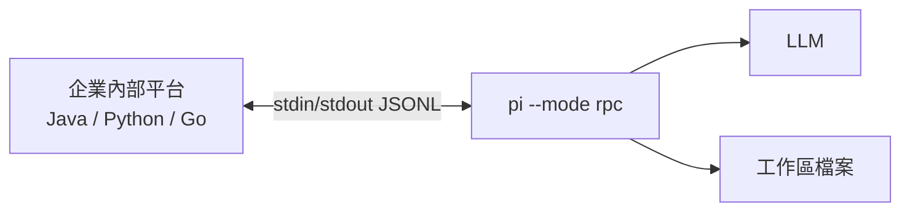

### 8.5 JSON 事件流模式：稽核的資料來源【Official】

```bash
pi --mode json "Your prompt"
```

**【Official】** 每一行是一個 JSON 物件，**第一行是 session header**。事件型別為 `JsonAgentSessionEvent`，與 `AgentSessionEvent` 相同，差別是串流訊息更新省略了累積快照（減少輸出量）。

另外兩個企業會用到的事件：

- `queue_update`：steering 與 follow-up 佇列變動時，輸出完整佇列
- `compaction_start` / `compaction_end`：涵蓋手動與自動 compaction

> 第 32 章會用這個模式建立可觀測性管線。

### 8.6 實務案例：CI 中的 AI 程式碼審查

```yaml
# 檔名：.github/workflows/ai-review.yml
# 【建議】此為本手冊設計的流程，非 Pi 官方範例；所用指令均為官方 CLI
name: AI Code Review
on: pull_request

jobs:
  review:
    runs-on: ubuntu-latest
    steps:
      - uses: actions/checkout@v4
        with:
          fetch-depth: 0

      - uses: actions/setup-node@v4
        with:
          node-version: '22.19.0'   # Pi 需求 >= 22.19.0

      - name: Install pi
        run: npm install -g --ignore-scripts @earendil-works/pi-coding-agent

      - name: Review diff（唯讀工具，禁止修改檔案）
        env:
          ANTHROPIC_API_KEY: ${{ secrets.ANTHROPIC_API_KEY }}
        run: |
          git diff origin/${{ github.base_ref }}...HEAD > /tmp/pr.diff
          pi -p --tools read,grep,find,ls --no-session \
            "審查 /tmp/pr.diff 的變更。只回報：正確性錯誤、安全風險、缺少的測試。每項標明檔案與行號。" \
            > review.md

      - uses: actions/upload-artifact@v4
        with:
          name: ai-review
          path: review.md
```

> **注意事項**：
>
> - `--no-session` 讓 CI 不留 session 檔（**【Official】** ephemeral 模式）
> - `--tools read,grep,find,ls` 是**硬性 allowlist**，即使模型想改檔也做不到
> - CI 環境的信任行為見下方 8.7

### 8.7 注意事項

> **`pi -p` 在 CI 中的信任行為（極易踩雷）**：**【Official】** 非互動模式（`-p`、`--mode json`、`--mode rpc`）**不會顯示信任提示**。若沒有已存的信任決定，`defaultProjectTrust` 為 `ask`（預設）或 `never` 時會**忽略**專案的 `.pi/` 資源；設為 `always` 才會信任。若你的 CI 依賴專案的 `.pi/prompts` 或 `.pi/skills`，必須明確加 `--approve` / `-a`。

---

## 9. pi-tui

### 9.1 Concept

**【Official】** `@earendil-works/pi-tui` 的官方描述：**Terminal User Interface library with differential rendering for efficient text-based applications**。

**Differential rendering（差分渲染）** 是關鍵字：只重繪變動的部分，而不是每次都清空重畫整個畫面。這讓終端在串流大量文字時不會閃爍、不會卡頓——對一個會持續吐出 token 的 AI agent 來說是必要條件。

### 9.2 元件架構【Official】

官方 `tui.md` 揭露的元件模型：

| 概念 | 說明 |
|------|------|
| **Component Interface** | 所有元件的共同介面 |
| **Focusable Interface** | 支援 IME（中文輸入法）的焦點介面 |
| **Overlays** | 覆蓋層，有自己的焦點與生命週期 |
| **Keyboard / Mouse Input** | 鍵盤與滑鼠事件處理 |
| **Theming** | 主題化 |
| **Invalidation** | 失效重繪機制 |

**內建元件**：`Text`、`Box`、`Container`、`Spacer`、`Markdown`、`Image`。

**官方列出的常見模式**：

- Pattern 1：Selection Dialog（`SelectList`）
- Pattern 2：Async Operation with Cancel（`BorderedLoader`）

### 9.3 何時你會碰到 pi-tui

大多數使用者**不會直接碰**它。你會碰到它的時機只有兩個：

1. **寫 Extension 的自訂 UI**：`ctx.ui.custom()` 需要你提供 TUI 元件（第 19 章）
2. **自建終端工具**：把 `pi-tui` 當一般的 TUI 函式庫用

```typescript
// 在 Extension 中引用 TUI 元件的匯入方式【Official】
import { ... } from "@earendil-works/pi-tui";
```

> **【Official】** `@earendil-works/pi-tui` 是 Pi 已內建、可供 extension 引用的四個套件之一（另三個是 `pi-coding-agent`、`pi-ai`、`typebox`）。在 package 中請放 `peerDependencies` 且版本寫 `"*"`。

### 9.4 IME 與中文輸入（台灣團隊必看）

**【Official】** `tui.md` 有專門的 **Focusable Interface (IME Support)** 章節，且相關設定如下：

| 設定 / 變數 | 作用 |
|-------------|------|
| `showHardwareCursor`（settings） | 顯示終端硬體游標，**改善 IME 輸入體驗**（預設 `false`） |
| `PI_HARDWARE_CURSOR=1`（環境變數） | 同上，用環境變數覆寫 |
| `PI_TUI_ESC_TIMEOUT`（環境變數） | 單獨 ESC 被判定為 Escape 前的等待毫秒數；SSH 預設 100、其他預設 10 |

> **實務建議【建議】**：使用注音 / 倉頡等輸入法的同仁，若發現游標位置怪異，先在 `~/.pi/agent/settings.json` 設 `"showHardwareCursor": true`。

### 9.5 顯示相關設定速查【Official】

| 設定 | 預設 | 說明 |
|------|------|------|
| `theme` | `"dark"` | `"dark"` / `"light"` / 自訂主題名 |
| `tuiMode` | `"regular"` | `"regular"` 或 **【Experimental】** `"fullscreen"` |
| `terminal.showImages` | `true` | 終端顯示圖片（需終端支援） |
| `terminal.imageWidthCells` | `60` | 內嵌圖片寬度（字元格） |
| `markdown.mermaid` | `"streaming"` | Mermaid 渲染：`"off"` / `"final"` / `"streaming"` |
| `markdown.codeBlockIndent` | `"  "` | 程式碼區塊縮排 |
| `outputPad` | `1` | 訊息水平內距（0 或 1） |
| `autocompleteMaxVisible` | `5` | 自動完成下拉可見項目數（3–20） |

> **本表為速查**。完整的 UI／終端／Markdown 設定鍵見第 [11.3](#113-設定項目全表official) 節；自訂主題（53 個 color token）的撰寫方式見第 [11.5](#115-自訂-themeofficial) 節；終端能力偵測失準時的覆寫方式見第 [15.9](#159-終端機相容性tmux-與-fullscreen-模式official) 節。

### 9.6 實務案例：低頻寬 / SSH 環境的調校【建議】

> **情境**：同仁透過 VPN + SSH 連到跳板機使用 Pi，畫面延遲嚴重。

```json
// ~/.pi/agent/settings.json（設定鍵均為 Official）
{
  "terminal": {
    "showImages": false,
    "clearOnShrink": false
  },
  "markdown": { "mermaid": "final" },
  "quietStartup": true,
  "hideThinkingBlock": true
}
```

```bash
# 若 Alt 組合鍵在 SSH 下被誤判為 Escape
export PI_TUI_ESC_TIMEOUT=200
```

| 調整 | 效果 |
|------|------|
| 關閉圖片 | 減少大量 escape sequence 傳輸 |
| `mermaid: "final"` | 不在串流過程反覆重繪圖表 |
| `hideThinkingBlock` | 大幅減少輸出量 |
| 提高 `PI_TUI_ESC_TIMEOUT` | 修正 SSH 下的按鍵誤判 |

### 9.7 注意事項

> `tuiMode: "fullscreen"` 官方標示為 **experimental**。企業標準環境**【建議】**維持 `"regular"`，避免不同終端模擬器的相容性問題。

---

## 10. Installation

### 10.1 前置需求【Official】

| 項目 | 需求 | 檢查指令 |
|------|------|----------|
| Node.js | **>= 22.19.0** | `node -v` |
| npm | 隨 Node 附帶 | `npm -v` |
| Git | 建議安裝（Windows **必裝**，Pi 預設用 Git Bash） | `git --version` |
| ripgrep | 建議（官方容器範例有裝） | `rg --version` |

> **Node 20 環境的退路【Official】**：npm 上有 `legacy-node20` dist-tag，對應 **v0.74.2**。若企業環境暫時無法升到 Node 22，可用：
>
> ```bash
> npm install -g --ignore-scripts @earendil-works/pi-coding-agent@legacy-node20
> ```
>
> 但請注意這是**舊版本**，本手冊描述的部分功能可能不存在。長期方案仍應升級 Node。

### 10.2 標準安裝【Official】

#### 方式 A：npm（推薦，企業可控）

```bash
# Linux / macOS / WSL
npm install -g --ignore-scripts @earendil-works/pi-coding-agent
pi --version
```

```powershell
# Windows PowerShell
npm install -g --ignore-scripts @earendil-works/pi-coding-agent
pi --version
```

> **【Official】** `--ignore-scripts` 會停用依賴的 lifecycle scripts。官方明示：**一般 npm 安裝不需要 install scripts**。企業安全政策通常要求加這個旗標，官方文件本身也是這樣寫的。

#### 方式 B：安裝腳本

```bash
# Linux / macOS / WSL
curl -fsSL https://pi.dev/install.sh | sh
```

> **【Official】** 官方說明：curl 安裝器內部使用 npm 全域安裝，因此**用 npm 移除即可**。
> **【建議】企業注意**：`curl | sh` 會執行遠端腳本。若貴公司安全政策禁止，請用方式 A。

### 10.3 移除【Official】

```bash
# curl 安裝器 或 npm install -g
npm uninstall -g @earendil-works/pi-coding-agent

# pnpm
pnpm remove -g @earendil-works/pi-coding-agent

# Yarn
yarn global remove @earendil-works/pi-coding-agent

# Bun
bun uninstall -g @earendil-works/pi-coding-agent
```

> **【Official】** 移除 Pi **不會**刪除 `~/.pi/agent/` 下的設定、憑證、session 與已安裝的 pi packages。若要完全清除需手動刪除該目錄（**請先確認裡面沒有你要保留的 session**）。

### 10.4 各平台安裝與驗證

#### Windows（原生）

**【Official】** Windows 上 Pi **預設使用 Git Bash**，依序檢查：

1. `~/.pi/agent/settings.json` 的自訂路徑（`shellPath`）
2. Git Bash：`C:\Program Files\Git\bin\bash.exe`
3. PATH 上的 `bash.exe`（Cygwin、MSYS2、WSL）

```powershell
# Windows PowerShell — 完整安裝與驗證流程
# 步驟 1：確認 Node 版本
node -v          # 必須 >= v22.19.0

# 步驟 2：確認 Git for Windows 已安裝（Pi 預設用 Git Bash）
git --version
Test-Path "C:\Program Files\Git\bin\bash.exe"

# 步驟 3：安裝
npm install -g --ignore-scripts @earendil-works/pi-coding-agent

# 步驟 4：驗證
pi --version
pi --help
```

**Windows 專屬設定【Official】**：

```json
// ~/.pi/agent/settings.json
// 用 powershell 工具取代模型面向的 bash 工具
{
  "defaultTools": ["read", "powershell", "edit", "write"]
}
```

或兩者並存以比較行為：

```json
{
  "defaultTools": ["read", "bash", "powershell", "edit", "write"]
}
```

> **【Official】** `powershell` 工具在 `pwsh.exe` 可用時使用它，否則用 Windows PowerShell；啟動參數為 `-NoProfile -NonInteractive -ExecutionPolicy Bypass`。**管理者強制的執行原則仍可能優先生效**。
> **【Official】** 編輯器的 `!` 與 `!!` 指令**仍使用 Bash**（不受 `defaultTools` 影響）。

自訂 Bash 路徑（Cygwin 等）：

```json
{
  "shellPath": "C:\\cygwin64\\bin\\bash.exe"
}
```

> **【Official】** JSON 中的 Windows 路徑必須用正斜線或跳脫的反斜線：
> `"C:/Program Files/Git/bin/bash.exe"` 或 `"C:\\Program Files\\Git\\bin\\bash.exe"`

#### WSL2（企業最推薦的 Windows 方案【建議】）

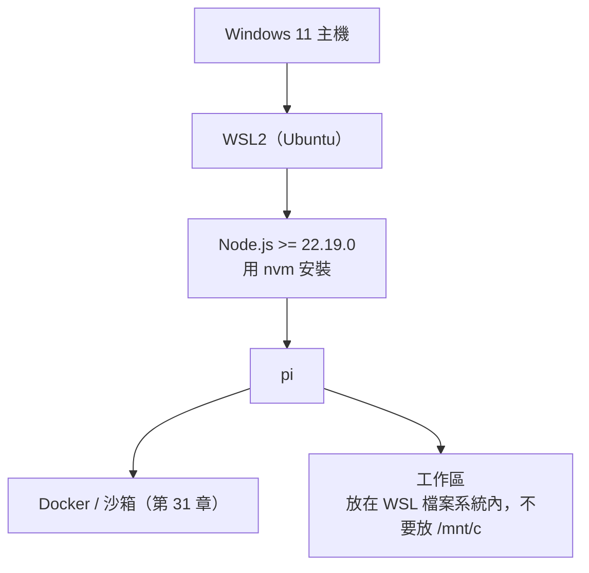

```bash
# WSL2 Ubuntu — 完整流程
# 步驟 1：安裝 nvm 與 Node（Ubuntu 內建 Node 版本通常太舊）
curl -o- https://raw.githubusercontent.com/nvm-sh/nvm/v0.40.1/install.sh | bash
source ~/.bashrc
nvm install 22
nvm use 22
node -v          # 應顯示 v22.x（>= 22.19.0）

# 步驟 2：安裝 pi
npm install -g --ignore-scripts @earendil-works/pi-coding-agent

# 步驟 3：驗證
pi --version

# 步驟 4：把專案放在 WSL 檔案系統內（重要）
mkdir -p ~/work && cd ~/work
git clone <your-repo>
cd <your-repo>
pi
```

> **效能注意事項【建議】**：**不要**把專案放在 `/mnt/c/...`。跨檔案系統的 IO 極慢，Agent 大量讀寫檔案時差異可達數十倍。

#### Linux

```bash
# Ubuntu / Debian
# 步驟 1：Node（用 nvm 避免發行版套件過舊）
curl -o- https://raw.githubusercontent.com/nvm-sh/nvm/v0.40.1/install.sh | bash
source ~/.bashrc
nvm install 22 && nvm use 22

# 步驟 2：建議工具
sudo apt-get update && sudo apt-get install -y git ripgrep

# 步驟 3：安裝與驗證
npm install -g --ignore-scripts @earendil-works/pi-coding-agent
pi --version
```

#### macOS

```bash
# macOS（Homebrew）
brew install node@22 git ripgrep
node -v          # 確認 >= 22.19.0

npm install -g --ignore-scripts @earendil-works/pi-coding-agent
pi --version
```

### 10.5 安裝後的驗證清單

```bash
# 通用驗證（Linux / macOS / WSL；Windows PowerShell 同樣可用）
pi --version                      # 應顯示 0.85.1 或更新
pi --help                         # 列出所有旗標
pi --list-models                  # 需先設好認證，否則清單為空
pi config                         # 開啟資源啟用/停用介面
```

| 檢查項 | 期望結果 | 失敗時看 |
|--------|----------|----------|
| `pi --version` | 顯示版本號 | 第 43 章「pi 無法啟動」 |
| `node -v` | >= v22.19.0 | 第 43 章「Node.js 版本問題」 |
| `pi --list-models` | 有模型清單 | 第 12、43 章「Authentication 失敗」 |

### 10.6 實務案例：企業標準化安裝腳本【建議】

> 以下為本手冊提供的範例，**非 Pi 官方腳本**。

```bash
#!/usr/bin/env bash
# 檔名：scripts/setup-pi.sh
# 執行環境：Linux / macOS / WSL2，需 bash
# 用途：企業同仁一鍵建立符合團隊規範的 Pi 環境
set -euo pipefail

REQUIRED_NODE_MAJOR=22
PI_VERSION="0.85.1"          # 企業固定版本，避免各人版本不一致

echo "==> 檢查 Node.js"
if ! command -v node >/dev/null 2>&1; then
  echo "錯誤：找不到 node，請先安裝 Node.js >= 22.19.0" >&2; exit 1
fi
NODE_MAJOR="$(node -p 'process.versions.node.split(".")[0]')"
if [ "$NODE_MAJOR" -lt "$REQUIRED_NODE_MAJOR" ]; then
  echo "錯誤：Node 版本過舊（目前 $(node -v)），需要 >= 22.19.0" >&2; exit 1
fi

echo "==> 安裝 pi v${PI_VERSION}"
npm install -g --ignore-scripts "@earendil-works/pi-coding-agent@${PI_VERSION}"

echo "==> 建立設定目錄"
mkdir -p "$HOME/.pi/agent"

echo "==> 安裝團隊 Pi Package（含 approved skills / prompts / extensions）"
pi install "git:github.com/acme/acme-pi-pack@v1.2.0"

echo "==> 驗證"
pi --version
echo "完成。請執行 pi 並使用 /login 設定認證。"
```

### 10.7 注意事項

> **企業版本一致性【建議】**：請把 Pi 版本**寫死在安裝腳本中**（如上例的 `@0.85.1`）。Pi 更新頻繁（v0.85.1 於 2026-09-05 發布），若同仁各自 `pi update --self`，會出現「同一個 Prompt 在不同人機器上行為不同」的難以除錯狀況。版本升級應由平台團隊統一評估後推動（第 45 章）。

---

## 11. Configuration

### 11.1 設定檔位置與優先序【Official】

| 位置 | 範圍 | 需要信任？ |
|------|------|-----------|
| `~/.pi/agent/settings.json` | **全域**（所有專案） | 否 |
| `.pi/settings.json` | **專案**（目前目錄） | **是**（需 Project Trust） |

**【Official】** 專案設定**覆寫**全域設定，且**巢狀物件會合併**：

```json
// ~/.pi/agent/settings.json（全域）
{
  "theme": "dark",
  "compaction": { "enabled": true, "reserveTokens": 16384 }
}
```

```json
// .pi/settings.json（專案）
{
  "compaction": { "reserveTokens": 8192 }
}
```

```json
// 實際生效結果
{
  "theme": "dark",
  "compaction": { "enabled": true, "reserveTokens": 8192 }
}
```

### 11.2 `~/.pi/agent/` 目錄全貌【Official】

```text
~/.pi/agent/
├── settings.json        # 全域設定
├── auth.json            # 憑證（0600 權限）
├── models.json          # 自訂 provider / model
├── keybindings.json     # 自訂快捷鍵（見 11.4；使用者層級、不隨專案走）
├── trust.json           # 專案信任決定
├── AGENTS.md            # 全域 context file（給所有專案）
├── SYSTEM.md            # 全域 system prompt 取代檔
├── APPEND_SYSTEM.md     # 全域 system prompt 追加檔
├── sessions/            # Session JSONL，依工作目錄分組
├── extensions/          # 全域 extensions
├── skills/              # 全域 skills
├── prompts/             # 全域 prompt templates
├── themes/              # 全域 themes
├── npm/                 # 使用者範圍安裝的 npm pi packages
└── git/                 # 使用者範圍 clone 的 git pi packages
```

專案端（**【Official】**，標示「需信任」者需通過 Project Trust）：

```text
<專案根目錄>/
├── AGENTS.md                 # 專案指令（不需信任即載入）
├── AGENTS.override.md        # 若存在，取代 AGENTS.md / CLAUDE.md
├── CLAUDE.md                 # 相容 Claude Code 的 context file
└── .pi/
    ├── settings.json         # 專案設定（需信任）
    ├── SYSTEM.md             # 專案 system prompt 取代（需信任）
    ├── APPEND_SYSTEM.md      # 專案 system prompt 追加（需信任）
    ├── extensions/           # 專案 extensions（需信任）
    ├── skills/               # 專案 skills（需信任）
    ├── prompts/              # 專案 prompt templates（需信任）
    ├── themes/               # 專案 themes（需信任）
    ├── npm/                  # 專案範圍 npm packages
    └── git/                  # 專案範圍 git packages
```

> **【Official】重要**：`AGENTS.override.md`、`AGENTS.md`、`CLAUDE.md` 這類 **context files 不受 Project Trust 限制**（除非用 `--no-context-files` / `-nc` 停用）。這是安全上要特別注意的地方——**惡意 repo 可以透過 `AGENTS.md` 對模型下指令**（prompt injection）。

### 11.3 設定項目全表【Official】

#### 模型與推理

| 設定 | 型別 | 預設 | 說明 |
|------|------|------|------|
| `defaultProvider` | string | — | 啟動 provider |
| `defaultModel` | string | — | 啟動模型 ID |
| `defaultThinkingLevel` | string | — | `off`/`minimal`/`low`/`medium`/`high`/`xhigh`/`max` |
| `modelThinkingLevels` | object | — | 以 `"provider/modelId"` 為 key 的個別設定 |
| `hideThinkingBlock` | boolean | `false` | 隱藏思考區塊 |
| `showCacheMissNotices` | boolean | `false` | 顯示 prompt cache miss 等診斷 |
| `thinkingBudgets` | object | — | 各推理層級的 token 預算 |

#### Compaction 與 Branch Summary

| 設定 | 預設 | 說明 |
|------|------|------|
| `compaction.enabled` | `true` | 是否啟用自動壓縮 |
| `compaction.reserveTokens` | `16384` | 保留給模型回應的 token |
| `compaction.keepRecentTokens` | `20000` | 不被摘要的近期 token |
| `branchSummary.reserveTokens` | `16384` | 分支摘要選取歷史時的保留量（輸出上限 4096） |
| `branchSummary.skipPrompt` | `false` | 跳過 `/tree` 的「要摘要嗎」詢問 |

#### 工具與 Shell

| 設定 | 說明 |
|------|------|
| `defaultTools` | 啟動時啟用的**內建**工具陣列（extension/SDK 工具不受影響） |
| `shellPath` | 自訂 shell 路徑 |
| `shellCommandPrefix` | 每個 bash 指令的前綴（例如 `"shopt -s expand_aliases"`） |
| `npmCommand` | npm 操作的 argv（例如 `["mise","exec","node@20","--","npm"]`） |

#### UI 與顯示

| 設定 | 型別 | 預設 | 說明 |
|------|------|------|------|
| `theme` | string | `"dark"` | `"dark"` / `"light"` / 自訂主題名（見 11.5） |
| `externalEditor` | string | — | `Ctrl+G` 開啟的外部編輯器指令 |
| `quietStartup` | boolean | `false` | 精簡啟動畫面（CI 與低頻寬環境適用） |
| `collapseChangelog` | boolean | `false` | 升級後折疊變更日誌 |
| `doubleEscapeAction` | string | `"tree"` | 連按兩次 `Esc` 的行為：`tree` / `fork` / `none` |
| `treeFilterMode` | string | `"default"` | `/tree` 的預設過濾模式 |
| `editorPaddingX` | number | `0` | 編輯器水平內距（0–3） |
| `outputPad` | number | `1` | 訊息水平內距（0 或 1） |
| `autocompleteMaxVisible` | number | `5` | 自動完成下拉可見項目數（3–20） |
| `showHardwareCursor` | boolean | `false` | 顯示終端硬體游標（螢幕閱讀器 / 部分終端需要） |
| `tuiMode` | string | `"regular"` | `"regular"` 或 `"fullscreen"`（v0.84.0 引入） |
| `fullscreenExitOutput` | string | `"transcript"` | 離開 fullscreen 時輸出：`transcript` / `resume-hint` |
| `fullscreenScrollbar` | string | `"auto"` | `auto` / `always` / `hidden` |
| `fullscreenCopyOnSelect` | boolean | `true` | fullscreen 選取即複製 |

> **【建議】** 企業標準環境若以 SSH／跳板機為主，`quietStartup: true` + `fullscreenScrollbar: "hidden"` 可明顯降低重繪量；本機開發者則可自行開啟 fullscreen。

#### 終端能力、圖片與 Markdown

| 設定 | 型別 | 預設 | 說明 |
|------|------|------|------|
| `terminal.showImages` | boolean | `true` | 是否在終端顯示圖片 |
| `terminal.imageWidthCells` | number | `60` | 內嵌圖片寬度（字元格） |
| `terminal.clearOnShrink` | boolean | `false` | 視窗縮小時清畫面 |
| `terminal.hyperlinks` | boolean \| `"auto"` | `"auto"` | OSC 8 超連結能力覆寫（v0.84.4） |
| `terminal.images` | string \| boolean | `"auto"` | 圖片協定：`"kitty"` / `"iterm2"` / `false` / `"auto"` |
| `terminal.trueColor` | boolean \| `"auto"` | `"auto"` | 24-bit 色彩能力覆寫 |
| `images.autoResize` | boolean | `true` | 自動縮圖至 2000×2000 以內（省 token） |
| `images.blockImages` | boolean | `false` | 完全禁止圖片進入 context |
| `markdown.mermaid` | string | `"streaming"` | `"off"` / `"final"` / `"streaming"` |
| `markdown.codeBlockIndent` | string | `"  "` | 程式碼區塊縮排 |

> **【Official】能力覆寫的優先序**：JSON 設定 > 環境變數（`PI_HYPERLINKS` / `PI_IMAGE_PROTOCOL` / `PI_TRUE_COLOR`）> 自動偵測。**僅在自動偵測失準時才覆寫**——典型情境是經過 SSH、tmux、screen 或終端代理時，Pi 讀不到真實終端能力。

> **【建議】資安提醒**：處理外部或客戶專案時設 `images.blockImages: true`。圖片是 prompt injection 的可行載體（截圖中嵌入指令文字），且圖片 token 成本遠高於等量文字（第 30、33 章）。

#### 訊息傳遞、傳輸與 Retry

| 設定 | 型別 | 預設 | 說明 |
|------|------|------|------|
| `steeringMode` | string | `"one-at-a-time"` | `Enter` 佇列的送出策略；可設 `"all"` |
| `followUpMode` | string | `"one-at-a-time"` | `Alt+Enter` 佇列的送出策略；可設 `"all"` |
| `transport` | string | `"auto"` | `sse` / `websocket` / `websocket-cached` / `auto` |
| `httpIdleTimeoutMs` | number | `300000` | HTTP idle timeout（`0` 停用） |
| `websocketConnectTimeoutMs` | number | `15000` | WebSocket 連線逾時 |
| `retry.enabled` | boolean | `true` | 是否啟用 Pi 層級的重試 |
| `retry.maxRetries` | number | `3` | Pi 層級最大重試次數 |
| `retry.baseDelayMs` | number | `2000` | 指數退避的基礎延遲 |
| `retry.provider.timeoutMs` | number | SDK 預設 | Provider SDK 層的逾時 |
| `retry.provider.maxRetries` | number | `0` | Provider SDK 層的重試次數 |
| `retry.provider.maxRetryDelayMs` | number | `60000` | Provider SDK 層的最大退避延遲 |
| `warnings.anthropicExtraUsage` | boolean | `true` | Anthropic 額外用量警告 |

> **【建議】兩層 Retry 不要疊加**：`retry.*`（Pi 層）與 `retry.provider.*`（Provider SDK 層）是**獨立的兩層**。官方預設把 provider 層設為 `maxRetries: 0`，讓 Pi 層統一控制，這是正確的設計——若兩層都開，最壞情況是 `3 × 3 = 9` 次請求，成本與延遲都會失控。企業環境**【建議】維持 provider 層為 `0`**，只調 Pi 層。

#### 遙測與分析

| 設定 | 型別 | 預設 | 說明 |
|------|------|------|------|
| `enableInstallTelemetry` | boolean | `true` | 安裝／更新匿名回報與 provider 歸屬 header |
| `enableAnalytics` | boolean | `false` | 使用行為分析（預設關閉） |
| `trackingId` | string | — | 分析識別碼 |

> **【建議】** 若貴公司資安政策禁止對外遙測，全域設定應明示 `"enableInstallTelemetry": false`、`"enableAnalytics": false`，並納入第 34.4 節的合規檢查腳本。

#### 資源載入

| 設定 | 說明 |
|------|------|
| `packages` | npm/git package 陣列（支援字串與物件過濾形式） |
| `extensions` | 本地 extension 路徑或目錄 |
| `skills` | 本地 skill 路徑或目錄 |
| `prompts` | 本地 prompt template 路徑或目錄 |
| `themes` | 本地 theme 路徑或目錄 |
| `enableSkillCommands` | 是否註冊 `/skill:name` 命令（預設 `true`） |

> **【Official】** 路徑解析規則：`~/.pi/agent/settings.json` 中的相對路徑相對於 `~/.pi/agent`；`.pi/settings.json` 中的相對路徑相對於 `.pi`。支援絕對路徑與 `~`。陣列支援 glob 與 `!排除`、`+強制包含`、`-強制排除`。

#### 網路、Session 與其他

| 設定 | 預設 | 說明 |
|------|------|------|
| `httpProxy` | — | HTTP proxy（**僅全域設定**） |
| `sessionDir` | — | Session 存放目錄 |
| `enabledModels` | — | `Ctrl+P` 循環的模型 pattern |
| `defaultProjectTrust` | `"ask"` | `ask`/`always`/`never`（**僅全域設定**） |

> 傳輸與逾時設定（`transport`、`httpIdleTimeoutMs`、`websocketConnectTimeoutMs`）見上方「訊息傳遞、傳輸與 Retry」；遙測設定見「遙測與分析」。

**【Official】** Session 目錄優先序：`--session-dir` > `PI_CODING_AGENT_SESSION_DIR` > `settings.json` 的 `sessionDir`。

> **【建議】設定全表的維護方式**：Pi 每個 minor 版本都可能新增設定鍵。本節以 **v0.85.1** 的官方 `settings.md` 為準；升級後請執行 `pi --version` 對照官方文件差異，並更新貴團隊的全域設定範本（第 45.3 節的檢查清單已納入此項）。

### 11.4 Keybindings 自訂【Official】

#### Concept：為什麼企業需要管快捷鍵

快捷鍵看似個人偏好，但在企業環境有兩個真實影響：

1. **鍵位衝突會讓功能「看起來壞掉」**：tmux、SSH、Windows Terminal、IDE 內嵌終端都可能吃掉修飾鍵，導致 `Shift+Enter`（換行）與 `Alt+Enter`（follow-up 佇列）失效，同仁會誤以為是 Pi 的 bug（第 15.9 節詳述終端層的成因）。
2. **習慣遷移成本**：從 Vim / Emacs 生態轉來的同仁，若能沿用既有鍵位，上手速度差異明顯。

#### 設定檔位置與生效方式【Official】

| 項目 | 值 |
|------|-----|
| 設定檔 | `~/.pi/agent/keybindings.json` |
| 生效方式 | 執行 `/reload`，**不需重啟** |
| 舊格式遷移 | 啟動時自動遷移「未加命名空間」的舊設定 |
| 查看目前鍵位 | `/hotkeys` |
| 覆寫規則 | 使用者設定**覆寫**內建預設 |

#### 鍵位語法【Official】

格式為 `修飾鍵+按鍵`，修飾鍵可組合：`ctrl`、`shift`、`alt`、`super`。

| 類別 | 可用值 |
|------|--------|
| 字母／數字 | `a`–`z`、`0`–`9` |
| 特殊鍵 | `escape`、`enter`、`tab`、`space`、`backspace`、`delete`、`home`、`end`、`pageUp`、`pageDown`、方向鍵 |
| 功能鍵 | `f1`–`f12` |
| 符號 | `` ` ``、`-`、`=`、`[`、`]`、`\`、`;`、`'`、`,`、`.`、`/` 及其 shift 變體 |

每個 action 可對應**單一按鍵**或**按鍵陣列**：

```json
{
  "action.id": "ctrl+k",
  "another.action": ["ctrl+p", "alt+k"]
}
```

#### 可綁定的 action 類別【Official】

| 類別 | 涵蓋內容 |
|------|----------|
| **Editor Movement** | 游標移動、歷史瀏覽、逐字／逐行跳躍 |
| **Deletion** | 字元／單字／整行刪除，含 kill ring |
| **Input** | 換行、送出、Tab 補完 |
| **Fullscreen Transcript** | 捲動、搜尋、跳至上一／下一個 prompt（各平台鍵位略有差異） |
| **Application** | 中斷、外部編輯器、剪貼簿、session 操作 |
| **Models & Thinking** | 模型選擇／循環、推理層級控制 |
| **Tree Navigation** | 分支折疊、過濾、標籤編輯 |

> **【Official】** 完整 action ID 清單以官方 [keybindings.md](https://github.com/earendil-works/pi/blob/main/packages/coding-agent/docs/keybindings.md) 與 `/hotkeys` 的即時輸出為準。本手冊**不列舉 action ID 全表**，因為它會隨版本增修——請以 `/hotkeys` 為單一事實來源。

#### 官方預設風格範例【Official】

官方文件提供兩種常見的鍵位風格：

| 風格 | 特徵 | 代表鍵位 |
|------|------|----------|
| **Emacs preset** | 以 `ctrl` 為主 | `ctrl+p` / `ctrl+n` 瀏覽歷史；`ctrl+b` / `ctrl+f` 左右移動；`ctrl+d` / `ctrl+h` 刪除 |
| **Vim preset** | 以 `alt` 組合避開衝突 | `alt+k` / `alt+j` 上下；`alt+h` / `alt+l` 左右 |

#### 企業 Keybindings 治理【建議】

> 以下為本手冊的建議做法，非 Pi 官方規範。

**原則 1：只統一「會出問題的」鍵位，其餘尊重個人偏好。**

企業真正需要統一的，是那些**在特定終端會失效**的鍵位，而不是每個人的移動鍵習慣。**【建議】**團隊只維護一份「相容性修正檔」：

```json
// 團隊共用：~/.pi/agent/keybindings.json（相容性修正）
// 【建議】此為本手冊設計的做法，非官方範本
{
  "// 說明": "僅修正在 tmux / Windows Terminal 下易衝突的鍵位；其餘沿用預設",
  "input.newline": ["shift+enter", "ctrl+enter", "alt+enter"],
  "app.externalEditor": "ctrl+g"
}
```

**原則 2：鍵位設定檔納入 dotfiles 版控，但不要放進專案 repo。**

`keybindings.json` 位於 `~/.pi/agent/`（**使用者層級**），與 `.pi/settings.json`（**專案層級**）不同——它**不隨專案走**。**【建議】**放進團隊的 dotfiles repo 或 onboarding 腳本（第 10.6 節的安裝腳本可一併發放）。

**原則 3：把 `/hotkeys` 列入新人 Onboarding 檢查清單。**

新人最常見的挫折是「Shift+Enter 沒反應」。**【建議】**在第 35.8 節的 30 分鐘 Onboarding 中，明確加入一步：「執行 `/hotkeys`，實測 `Shift+Enter` 與 `Alt+Enter`；若無效，讀第 15.9 節設定終端」。

### 11.5 自訂 Theme【Official】

#### 載入來源與優先序【Official】

| 來源 | 路徑 | 備註 |
|------|------|------|
| 全域 | `~/.pi/agent/themes/*.json` | 使用者層級 |
| 專案 | `.pi/themes/*.json` | **需先通過 Project Trust**（第 30.2 節） |
| Package | package 內的 `themes/` 目錄或 `package.json` 的 `pi.themes` | 可隨企業 package 發布（第 21 章） |
| 設定 | `settings.json` 的 `themes` 陣列 | 支援 glob 與排除語法 |
| CLI | `--theme <path>`（可重複） | 臨時載入 |

內建主題為 `dark` 與 `light`；**首次啟動時 Pi 會偵測終端背景色自動選擇**。

#### 自訂 Theme 檔格式【Official】

```json
{
  "$schema": "https://raw.githubusercontent.com/earendil-works/pi/main/packages/coding-agent/src/modes/interactive/theme/theme-schema.json",
  "name": "acme-corp-dark",
  "vars": {
    "brand-primary": "#0066cc",
    "brand-danger": "#cc2200"
  },
  "colors": {
    "accent": "brand-primary",
    "error": "brand-danger"
  }
}
```

| 規則 | 說明 |
|------|------|
| `name` | 必須唯一，**不可包含 `/`** |
| `colors` | 共 **53 個 token**，其中 3 個有 fallback（可省略），其餘必填 |
| `vars` | 可選；定義具名色彩供 `colors` 以字串引用，避免重複 hex |
| 熱重載 | **修改中的自訂主題會自動重載**，不需重啟 |

**53 個 color token 的分類【Official】**：

| 類別 | 數量 | 涵蓋 |
|------|------|------|
| Core UI | 13 | accent、邊框、狀態色、文字變體、捲軸 |
| Content | 13 | 訊息背景、工具狀態、Markdown 元素 |
| Syntax | 9 | 註解、關鍵字、字串等語法高亮 |
| Thinking Levels | 7 | 對應 7 個推理層級的編輯器邊框色 |
| Bash Mode | 1 | `!` bash 模式的編輯器邊框色 |

**色值可用的四種格式【Official】**：

| 格式 | 範例 | 說明 |
|------|------|------|
| Hex | `"#ff0000"` | 需終端支援 truecolor |
| 256 色索引 | `33` | 相容性最好 |
| 變數引用 | `"brand-primary"` | 引用 `vars` 中的定義 |
| 終端預設 | `""` | 空字串＝使用終端本身的前景／背景色 |

#### 企業品牌主題的實務建議【建議】

> 以下為本手冊建議，非官方規範。

1. **把主題當成 package 發布，不要靠人工複製檔案。** 企業品牌色一旦更新，透過 `packages` 設定即可全員同步（第 21 章）。
2. **同時提供 dark 與 light 兩版。** 開發者的終端背景色並不一致，只給一版會有人看不清楚。
3. **`thinking` 七級色階要拉開對比度。** 這七個 token 對應編輯器邊框，是使用者**唯一能一眼看出「現在用了多少推理預算」**的視覺線索——若色階太接近，等於失去成本感知（第 33 章）。
4. **不要用純 hex 色值搭配低階終端。** 若團隊仍有人使用不支援 truecolor 的環境，**【建議】**以 256 色索引撰寫，或在 `settings.json` 設 `terminal.trueColor` 明示能力。

### 11.6 企業標準全域設定範本【建議】

> 設定鍵均為 **【Official】**，但**這組數值組合是本手冊的建議**，非官方預設。

```json
// ~/.pi/agent/settings.json
{
  "defaultProvider": "acme-gateway",
  "defaultModel": "claude-sonnet-4",
  "defaultThinkingLevel": "medium",

  "theme": "dark",
  "quietStartup": false,

  "defaultProjectTrust": "ask",

  "compaction": {
    "enabled": true,
    "reserveTokens": 16384,
    "keepRecentTokens": 20000
  },

  "retry": {
    "enabled": true,
    "maxRetries": 3,
    "baseDelayMs": 2000,
    "provider": { "maxRetries": 0 }
  },

  "enabledModels": ["claude-*", "gpt-*"],

  "httpProxy": "http://proxy.acme.internal:8080",

  "packages": ["git:github.com/acme/acme-pi-pack@v1.2.0"]
}
```

### 11.7 專案設定範本（隨 Git 版控）【建議】

```json
// <專案>/.pi/settings.json — 提交進 Git，讓全隊一致
{
  "defaultTools": ["read", "edit", "write", "bash", "grep", "find", "ls"],
  "compaction": { "keepRecentTokens": 30000 },
  "prompts": ["prompts"],
  "skills": ["skills"],
  "packages": ["git:github.com/acme/acme-pi-pack@v1.2.0"]
}
```

> **【Official】** 專案設定可與團隊共享，pi 會在專案**被信任後**於啟動時自動安裝缺少的 package。

### 11.8 實務案例：跨 Harness 共用 Skills【Official】

> **情境**：團隊同時使用 Claude Code 與 Pi，不想維護兩套 skills。

**【Official】** 官方 `skills.md` 直接支援這個做法：

```json
// ~/.pi/agent/settings.json
{
  "skills": [
    "~/.claude/skills",
    "~/.codex/skills"
  ]
}
```

專案層級的 Claude Code skills：

```json
// .pi/settings.json
{
  "skills": ["../.claude/skills"]
}
```

> 這是 Pi 相對其他 harness 的一個實際優勢：**它願意直接吃別家的 skill 目錄**。第 37 章會完整比較。

### 11.9 注意事項

> - **`defaultProjectTrust` 與 `httpProxy` 只能設在全域**，寫在專案設定不會生效。
> - **改了 context files 或設定後**，需重啟 Pi 或執行 `/reload`（**【Official】**）。
> - **設定檔是 JSON，不支援註解**。上面範例中的 `//` 註解僅供閱讀，實際檔案請移除。

---

## 12. Authentication

### 12.1 三種認證途徑【Official】

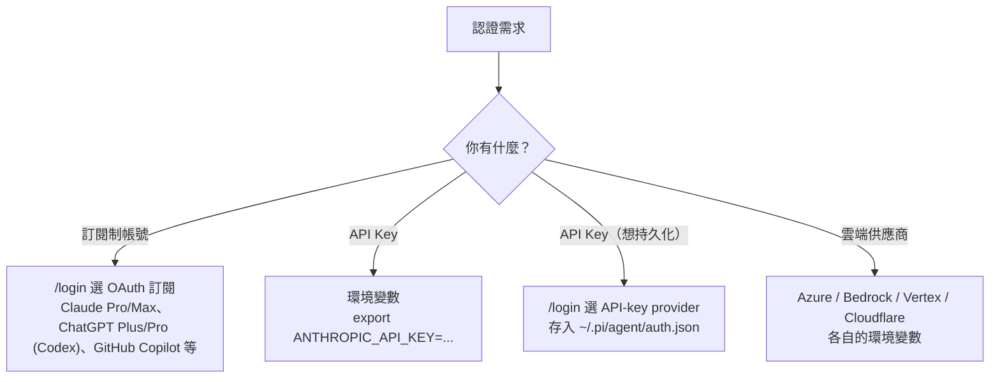

**【Official】** 優先序：**`auth.json` 的憑證優先於環境變數**。

### 12.2 訂閱制登入【Official】

```text
# 在 Pi 互動模式中
/login
```

**【Official】** 內建的訂閱登入包含：**Claude Pro/Max**、**ChatGPT Plus/Pro（Codex）**、**GitHub Copilot**；`providers.md` 另列出 **xAI（Grok/X 訂閱）**、**OpenRouter**、**Radius**。

登出：

```text
/logout
```

### 12.3 API Key：環境變數對照表【Official】

| Provider | 環境變數 | `auth.json` key |
|----------|----------|-----------------|
| Anthropic | `ANTHROPIC_API_KEY` | `anthropic` |
| OpenAI | `OPENAI_API_KEY` | `openai` |
| Google Gemini | `GEMINI_API_KEY` | `google` |
| Azure OpenAI Responses | `AZURE_OPENAI_API_KEY` | `azure-openai-responses` |
| Amazon Bedrock | `AWS_BEARER_TOKEN_BEDROCK` | `amazon-bedrock` |
| DeepSeek | `DEEPSEEK_API_KEY` | `deepseek` |
| Mistral | `MISTRAL_API_KEY` | `mistral` |
| Groq | `GROQ_API_KEY` | `groq` |
| Cerebras | `CEREBRAS_API_KEY` | `cerebras` |
| xAI | `XAI_API_KEY` | `xai` |
| OpenRouter | `OPENROUTER_API_KEY` | `openrouter` |
| NVIDIA NIM | `NVIDIA_API_KEY` | `nvidia` |
| Cloudflare AI Gateway | `CLOUDFLARE_API_KEY`（+ `CLOUDFLARE_ACCOUNT_ID`、`CLOUDFLARE_GATEWAY_ID`） | `cloudflare-ai-gateway` |
| Cloudflare Workers AI | `CLOUDFLARE_API_KEY`（+ `CLOUDFLARE_ACCOUNT_ID`） | `cloudflare-workers-ai` |
| Vercel AI Gateway | `AI_GATEWAY_API_KEY` | `vercel-ai-gateway` |
| Hugging Face | `HF_TOKEN` | `huggingface` |
| Fireworks | `FIREWORKS_API_KEY` | `fireworks` |
| Together AI | `TOGETHER_API_KEY` | `together` |
| Baseten | `BASETEN_API_KEY` | `baseten` |
| Kimi For Coding | `KIMI_API_KEY` | `kimi-coding` |
| MiniMax | `MINIMAX_API_KEY` | `minimax` |
| ZAI Coding Plan（Global） | `ZAI_API_KEY` | `zai` |
| OpenCode Zen | `OPENCODE_API_KEY` | `opencode` |
| Radius | `RADIUS_API_KEY` | `radius` |

> 完整清單（含 Qwen Token Plan、Xiaomi MiMo、各地區變體、Ant Ling 等）見官方 [`providers.md`](https://github.com/earendil-works/pi/blob/main/packages/coding-agent/docs/providers.md)。

### 12.4 `auth.json` 與 Key 解析（企業安全關鍵）【Official】

**【Official】** `~/.pi/agent/auth.json` 以 **`0600`** 權限建立（僅使用者可讀寫）。

```json
// ~/.pi/agent/auth.json
{
  "anthropic": { "type": "api_key", "key": "sk-ant-..." },
  "openai":    { "type": "api_key", "key": "sk-..." }
}
```

**`key` 欄位支援四種解析方式【Official】——這是企業金鑰治理的核心：**

| 形式 | 語法 | 說明 |
|------|------|------|
| **執行指令** | `"!command"` | 開頭 `!` 會執行整串指令並取 stdout（**程序生命週期內快取**） |
| **環境變數插值** | `"$ENV_VAR"` / `"${ENV_VAR}"` | 可嵌在較大字串中 |
| **跳脫** | `"$$"` → 字面 `$`；`"$!"` → 字面 `!` | 避免誤觸發 |
| **字面值** | 直接寫 | 純大寫字串如 `MY_API_KEY` 視為字面值 |

**企業最佳實務【建議】——不要在磁碟上留明文金鑰：**

```json
// macOS Keychain（此例取自官方文件）
{ "anthropic": { "type": "api_key", "key": "!security find-generic-password -ws 'anthropic'" } }
```

```json
// 1Password CLI（此例取自官方文件）
{ "anthropic": { "type": "api_key", "key": "!op read 'op://vault/anthropic/credential'" } }
```

```json
// HashiCorp Vault【建議】—— 本手冊依同一機制的延伸
{ "anthropic": { "type": "api_key", "key": "!vault kv get -field=key secret/ai/anthropic" } }
```

### 12.5 Provider 範圍的環境變數【Official】

**【Official】** API key 憑證可以帶 provider 專屬的環境值，**優先於程序環境變數**。適用於解析 key、provider/model header，以及 Cloudflare account ID、Azure 設定、Vertex project/location、Bedrock 設定、`PI_CACHE_RETENTION`、`HTTP_PROXY`/`HTTPS_PROXY` 等。

```json
// ~/.pi/agent/auth.json
{
  "cloudflare-ai-gateway": {
    "type": "api_key",
    "key": "$CLOUDFLARE_API_KEY",
    "env": {
      "CLOUDFLARE_API_KEY": "...",
      "CLOUDFLARE_ACCOUNT_ID": "account-id",
      "CLOUDFLARE_GATEWAY_ID": "gateway-id"
    }
  }
}
```

> **【Official】** 使用時機：當 Pi 應該使用**與專案 shell 環境不同**的 provider 設定時。

### 12.6 雲端供應商設定【Official】

#### Azure OpenAI

```bash
export AZURE_OPENAI_API_KEY=...
# baseUrl 支援：
#   https://your-resource.cognitiveservices.azure.com
#   https://your-resource.openai.azure.com
#   根端點會自動正規化到 /openai/v1
```

#### Amazon Bedrock（官方列出三種方式）

```bash
# 方式 1：AWS Profile
# 方式 2：IAM Keys
# 方式 3：Bearer Token
export AWS_BEARER_TOKEN_BEDROCK=...
export AWS_REGION=us-east-1     # 選填，預設 us-east-1
```

**Google Vertex AI**、**Cloudflare AI Gateway / Workers AI** 的完整設定見官方 `providers.md`。

### 12.7 實務案例：企業金鑰治理三層防線【建議】

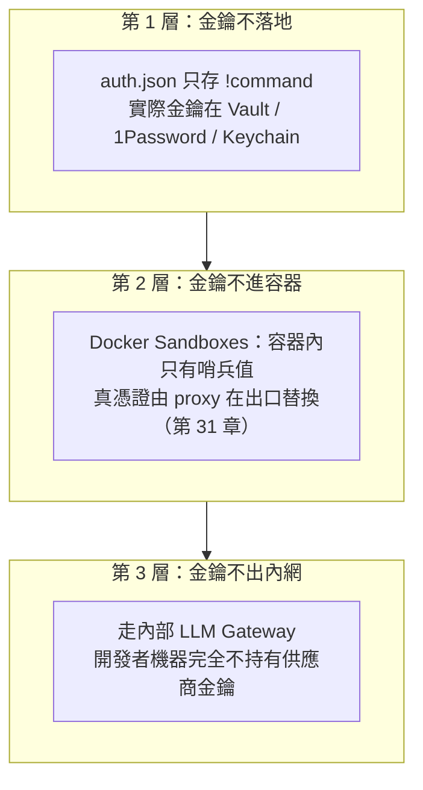

| 團隊規模 | 建議做法 |
|----------|----------|
| < 10 人 | 第 1 層（`!command` + 個人密碼管理器） |
| 10–50 人 | 第 1 + 3 層（統一走內部 Gateway） |
| 有外部/未信任程式碼 | 加上第 2 層（容器隔離） |

### 12.8 注意事項

> **絕對禁止事項**：
>
> - 把 `auth.json` commit 進 Git（`~/.pi/agent/` 在家目錄，但**專案內 `.pi/` 也可能被誤加**，請確認 `.gitignore`）
> - 在 Prompt 中貼上 API Key（它會進 Session 檔並送給 LLM）
> - 在 `models.json` 的 `apiKey` 寫明文後提交
> - 在 Docker Sandboxes 沙箱內執行 `/login`（**【Official】** 官方明文警告：這會把真 token 寫進容器，破壞 proxy 模型）

---

## 13. Model / Provider

### 13.1 模型選擇的三個層次

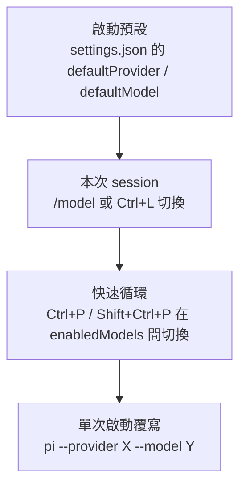

### 13.2 模型相關指令與旗標【Official】

| 操作 | 指令 / 快捷鍵 |
|------|--------------|
| 切換模型 | `/model` 或 `Ctrl+L` |
| 儲存為啟動預設 | 在 `/model` 選單按 `Ctrl+S` |
| 調整推理層級 | `/thinking`，或 `Shift+Tab` 循環 |
| 儲存推理層級預設 | 在 `/thinking` 選單按 `Ctrl+S` |
| 設定 `Ctrl+P` 循環清單 | `/scoped-models` |
| 循環模型 | `Ctrl+P` / `Shift+Ctrl+P` |
| 列出模型 | `pi --list-models [search]` |
| 啟動指定 | `pi --provider anthropic --model claude-*` |
| 更新模型目錄 | `pi update --models` |

**【Official】** `--model` 支援 pattern 與 `provider/id` 形式；`--models` 接逗號分隔的 pattern 供 `Ctrl+P` 循環。

### 13.3 Thinking Level（推理層級）【Official】

七個層級：`off` → `minimal` → `low` → `medium` → `high` → `xhigh` → `max`

```json
// ~/.pi/agent/settings.json
{
  "defaultThinkingLevel": "medium",
  "modelThinkingLevels": {
    "anthropic/claude-sonnet-4-20250514": "high"
  },
  "thinkingBudgets": {
    "minimal": 1024,
    "low": 4096,
    "medium": 10240,
    "high": 32768
  }
}
```

> **【Official】** `thinkingBudgets`：Anthropic、Google、Bedrock 原生支援；OpenAI 相容模型需設定 `compat.thinkingTokenBudgetField`（或 `supportsThinkingTokenBudget`）才會使用。

**推理層級的成本影響【建議】**：

| 任務 | 建議層級 | 理由 |
|------|----------|------|
| 格式調整、重新命名、機械式改動 | `off` / `minimal` | 不需要推理，省 token |
| 一般功能實作 | `medium` | 平衡 |
| 架構設計、複雜除錯、逆向工程 | `high` / `xhigh` | 值得付出的成本 |
| 極困難問題（升級破壞性變更分析） | `max` | 只在必要時 |

### 13.4 本地模型與 llama.cpp【Official】

**【Official】** Pi 有內建的 llama.cpp router 支援：

```text
/llama          # 下載、載入、卸載 llama.cpp router 模型
```

或透過 `models.json` 接 Ollama / vLLM / LM Studio（見 6.3）。

**企業意義【建議】**：處理**不可外送的原始碼**時，本地模型是唯一合規選項。實務上的分工：

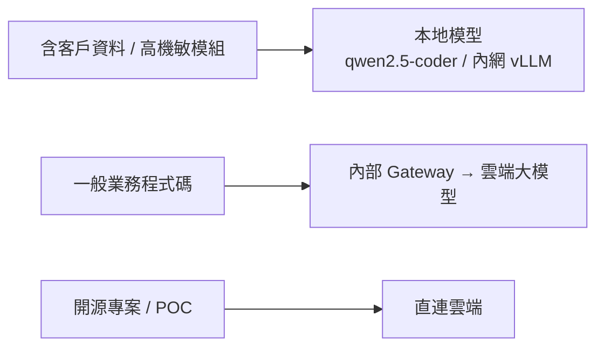

### 13.5 自訂 Provider【Official】

**【Official】** 兩種方式：

1. `~/.pi/agent/models.json`（見 6.3）— 宣告式，適合固定設定
2. Extension 的 `pi.registerProvider(name, config)` — 程式式，適合動態探索

```typescript
// 檔名：~/.pi/agent/extensions/dynamic-provider.ts
// 【Official】此範例改寫自官方 extensions.md 的 async factory 範例
// 用途：啟動時動態查詢本地 LM Studio 有哪些模型
import type { ExtensionAPI } from "@earendil-works/pi-coding-agent";

export default async function (pi: ExtensionAPI) {
  const response = await fetch("http://localhost:1234/v1/models");
  const payload = (await response.json()) as {
    data: Array<{ id: string; name?: string; context_window?: number; max_tokens?: number }>;
  };

  pi.registerProvider("local-openai", {
    baseUrl: "http://localhost:1234/v1",
    apiKey: "$LOCAL_OPENAI_API_KEY",
    api: "openai-completions",
    models: payload.data.map((model) => ({
      id: model.id,
      name: model.name ?? model.id,
      reasoning: false,
      input: ["text"],
      cost: { input: 0, output: 0, cacheRead: 0, cacheWrite: 0 },
      contextWindow: model.context_window ?? 128000,
      maxTokens: model.max_tokens ?? 4096,
    })),
  });
}
```

> **【Official】** async factory 會在 `session_start` 與 `resources_discover` **之前**被 await 完成，因此動態註冊的模型在正常啟動流程與 `pi --list-models` 中都可見。

### 13.6 傳輸與逾時調校【Official】

| 設定 | 預設 | 何時要調 |
|------|------|----------|
| `transport` | `"auto"` | 企業 proxy 不支援 WebSocket 時設 `"sse"` |
| `httpIdleTimeoutMs` | `300000` | 長推理任務逾時被切斷時調高（`0` 停用） |
| `websocketConnectTimeoutMs` | `15000` | WebSocket 握手慢時調高 |
| `retry.provider.timeoutMs` | SDK 預設 | 單次請求逾時 |

```json
// 企業 proxy 環境的建議設定【建議】
{
  "transport": "sse",
  "httpIdleTimeoutMs": 600000,
  "httpProxy": "http://proxy.acme.internal:8080"
}
```

### 13.7 實務案例：一天之內的模型切換節奏【建議】

> **情境**：資深工程師要為 Spring Boot 專案加一支新 API。

| 階段 | 模型 / 層級 | 為什麼 |
|------|------------|--------|
| 1. 讀懂現有架構 | 大模型 + `thinking: high` | 理解錯了，後面全錯 |
| 2. 寫實作計畫 | 同上 | 計畫品質決定成敗 |
| 3. 照計畫寫程式 | 中等模型 + `thinking: medium` | 計畫明確時不需要頂級推理 |
| 4. 補測試 | 快模型 + `thinking: low` | 樣板化工作 |
| 5. 修測試失敗 | 大模型 + `thinking: high` | 除錯需要推理 |
| 6. 產文件 / commit message | 快模型 + `thinking: off` | 純文字生成 |

操作上：用 `Ctrl+P` 在 `enabledModels` 之間切換，用 `Shift+Tab` 循環 thinking level。

### 13.8 注意事項

> - **【Official】** 無金鑰的本地服務仍需要一個假 `apiKey`，否則模型不會出現在 `/model` 清單。
> - **【Official】** `PI_PROVIDER` / `PI_MODEL` 環境變數識別的是**你在 Pi 選的模型**，不是 router 內部可能改選的上游模型。要查目前模型時，請讀這些變數而非猜測。

---

## 14. CLI

### 14.1 完整旗標表【Official】

#### 模式

| 旗標 | 說明 |
|------|------|
| （無） | 互動模式 |
| `-p`, `--print` | 印出回應後結束 |
| `--mode json` | 所有事件以 JSON lines 輸出 |
| `--mode rpc` | stdin/stdout 的 RPC 模式 |
| `--export <in> [out]` | 把 session 檔轉成 HTML |

#### 模型

| 旗標 | 說明 |
|------|------|
| `--provider <name>` | 指定 provider |
| `--model <pattern>` | 模型 pattern 或 ID，支援 `provider/id` |
| `--api-key <key>` | 覆寫環境變數憑證 |
| `--thinking <level>` | `off` 到 `max` |
| `--models <patterns>` | 逗號分隔，供 `Ctrl+P` 循環 |
| `--list-models [search]` | 列出可用模型 |

#### Session

| 旗標 | 說明 |
|------|------|
| `-c`, `--continue` | 繼續最近的 session |
| `-r`, `--resume` | 瀏覽既有 session |
| `--session <path\|id>` | 指定 session 檔或 UUID（支援部分 ID） |
| `--fork <path\|id>` | 分叉成新檔 |
| `--session-dir <dir>` | 自訂 session 目錄 |
| `--no-session` | 不儲存（ephemeral） |
| `-n`, `--name <name>` | 啟動時設定 session 顯示名稱 |

#### 工具

| 旗標 | 說明 |
|------|------|
| `-t`, `--tools <list>` | **限定**只能用這些工具（strict allowlist，含 extension 工具） |
| `-xt`, `--exclude-tools <list>` | 排除指定工具 |
| `-nbt`, `--no-builtin-tools` | 停用內建工具（保留 extension 工具） |
| `-nt`, `--no-tools` | 停用**所有**工具 |

#### 資源載入

| 旗標 | 說明 |
|------|------|
| `-e`, `--extension <source>` | 載入 extension（可重複） |
| `--no-extensions` | 跳過 extension 探索 |
| `--skill <path>` | 載入 skill（可重複，即使有 `--no-skills` 也會載入） |
| `--no-skills` | 跳過 skill 探索 |
| `--prompt-template <path>` | 載入模板（可重複） |
| `--no-prompt-templates` | 跳過模板探索 |
| `--theme <path>` | 載入主題（可重複） |
| `--no-themes` | 跳過主題探索 |
| `-nc`, `--no-context-files` | 不載入 `AGENTS.md` / `CLAUDE.md` |

#### 其他

| 旗標 | 說明 |
|------|------|
| `--system-prompt <text>` | **取代**預設 system prompt |
| `--append-system-prompt <text>` | **追加**到 system prompt |
| `--tui-mode <mode>` | `regular` 或 `fullscreen` |
| `--use-theme <name>` | 本次使用的主題 |
| `--verbose` | 詳細啟動輸出（**除錯必用**） |
| `-a`, `--approve` | 信任專案設定 |
| `-na`, `--no-approve` | 忽略專案設定 |
| `--` | 停止解析旗標，其後都當 prompt |
| `-h`, `--help` | 說明 |
| `-v`, `--version` | 版本 |

### 14.2 套件管理子命令【Official】

```bash
pi install <source> [-l]      # 安裝（-l 寫入專案 .pi/settings.json）
pi remove <source> [-l]       # 移除
pi uninstall <source> [-l]    # 同 remove
pi list                       # 列出設定中已安裝的 package
pi config                     # 啟用/停用資源的互動介面（-l 從專案覆寫開始）

pi update                     # 只更新 pi 本身
pi update --all               # 更新 pi + packages + 對齊 pinned git ref
pi update --extensions        # 只更新 packages + 對齊 ref
pi update --models            # 只更新模型目錄
pi update --self              # 只更新 pi
pi update --self --force      # 即使已是最新也重裝
pi update npm:@foo/bar        # 更新單一 package
pi update --extension <src>   # 同上
```

> **【Official】** 預設 `install` / `remove` 寫入**使用者設定**（`~/.pi/agent/settings.json`）；加 `-l` 寫入**專案設定**（`.pi/settings.json`）。

### 14.3 常用指令組合速查

```bash
# 一次性提問（不留 session）
pi -p --no-session "這個 repo 的進入點在哪裡？"

# 唯讀分析模式（企業階段 1 標準）
pi --tools read,grep,find,ls

# 帶檔案提問
pi @README.md @src/app.ts "這兩個檔案的關係是什麼？"

# 管線輸入
cat error.log | pi -p "分析這份錯誤日誌，找出根因"

# 圖片分析
pi -p @screenshot.png "這個畫面有什麼 UI 問題？"

# 指定模型 + 高推理，繼續上次工作
pi -c --model claude-* --thinking high

# 命名 session 方便日後 resume
pi --name "PROJ-1234 訂單 API 重構"

# CI 用法：信任專案設定 + 唯讀 + JSON 事件
pi --mode json -a --tools read,grep,find,ls --no-session -p "審查變更"

# 除錯：看清楚載入了哪些資源
pi --verbose
```

### 14.4 `--tools` vs `--no-builtin-tools` vs `defaultTools`【Official】

這三者容易混淆，官方定義如下：

| 機制 | 作用範圍 | 對 extension 工具的影響 |
|------|----------|------------------------|
| `defaultTools`（settings） | 啟動時啟用的**內建**工具 | **不影響**（extension / SDK 工具仍啟用） |
| `--tools` | **所有工具的嚴格 allowlist** | **會限制**（不在清單就不能用） |
| `--no-builtin-tools` | 停用內建工具預設 | 不影響 extension 工具 |
| `--no-tools` | 停用**所有**工具 | 全部停用 |
| `--exclude-tools` | 從結果清單中過濾 | 會過濾 |

> **【Official】** `defaultTools` 設成空陣列 `[]` 表示不啟用任何內建工具，但保留 extension 與 SDK 自訂工具。專案的 `defaultTools` 陣列會**取代**（非合併）全域陣列。

### 14.5 實務案例：三種常見的 CLI 使用情境

#### 情境 A：新人第一次接觸陌生專案

```bash
cd /path/to/legacy-project
pi --tools read,grep,find,ls --name "熟悉專案" --thinking high
```

```text
> 這個專案是做什麼的？請依序回答：
> 1. 技術棧與版本
> 2. 進入點在哪裡
> 3. 主要模組與各自職責
> 4. 資料庫怎麼接的
> 5. 我要跑起來需要哪些步驟
> 只讀程式碼，不要修改任何檔案。
```

#### 情境 B：Git pre-push 檢查

```bash
#!/usr/bin/env bash
# 檔名：.git/hooks/pre-push
# 【建議】此為本手冊設計，非官方 hook
set -e
DIFF=$(git diff origin/main...HEAD)
if [ -z "$DIFF" ]; then exit 0; fi

echo "$DIFF" | pi -p --no-session --tools read,grep \
  "檢查這份 diff 是否含有：硬編碼密碼、API key、個資、debug 用的 console.log。
   只在有發現時輸出，格式為 [檔案:行號] 說明。沒有問題就輸出 OK。" \
  | tee /tmp/pi-prepush.txt

if ! grep -q '^OK' /tmp/pi-prepush.txt; then
  echo "AI 檢查發現問題，請確認上方訊息。要強制推送請用 --no-verify" >&2
  exit 1
fi
```

#### 情境 C：批次產生文件

```bash
# Linux / macOS / WSL
for f in src/main/java/com/acme/service/*.java; do
  pi -p --no-session --tools read \
    "為 $f 產生繁體中文的 JavaDoc 摘要，說明類別職責與主要方法。輸出 Markdown。" \
    > "docs/api/$(basename "$f" .java).md"
done
```

### 14.6 注意事項

> - **【Official】** `--` 之後的所有內容都當 prompt。若你的 prompt 開頭是 `-`，一定要先加 `--`。
> - **【Official】** `--skill <path>` 即使搭配 `--no-skills` 仍會載入（是 additive 的）。這在 CI 中很有用：關掉自動探索，只載入 approved skill。
> - **【建議】** CI 中請一律加 `--no-session`，避免在 runner 上累積檔案；需要稽核時改用 `--mode json` 把事件導到日誌系統。

---

## 15. TUI

### 15.1 互動介面組成【Official】

**【Official】** 互動模式提供：文字編輯器、訊息歷史、以及顯示 session 指標（tokens、cache 使用量、成本、模型）的 footer。

```text
┌──────────────────────────────────────────────────────────┐
│  訊息歷史（使用者 / 助理 / 工具呼叫與結果）              │
│                                                          │
├──────────────────────────────────────────────────────────┤
│  編輯器（支援 @ 檔案引用、/ 命令、! shell）              │
├──────────────────────────────────────────────────────────┤
│  Footer：tokens / cache / cost / model                   │
└──────────────────────────────────────────────────────────┘
```

### 15.2 Slash 命令全表【Official】

| 命令 | 用途 |
|------|------|
| `/login`、`/logout` | 管理 OAuth 或 API-key 憑證 |
| `/llama` | 下載、載入、卸載 llama.cpp router 模型 |
| `/model` | 切換模型 |
| `/thinking` | 調整推理層級 |
| `/scoped-models` | 啟用/停用 `Ctrl+P` 循環的模型 |
| `/settings` | 主題、訊息傳遞、偏好設定 |
| `/resume` | 從既有 session 挑選 |
| `/new` | 開新 session |
| `/name <name>` | 設定 session 顯示名稱 |
| `/session` | 顯示 session 資訊與用量 |
| `/tree` | 跳到 session 的任一節點並從該處繼續 |
| `/trust` | 持久化專案信任決定 |
| `/fork` | 從較早的訊息建立新 session |
| `/clone` | 把目前分支複製成新 session |
| `/compact [prompt]` | 壓縮 context（可帶指示） |
| `/copy` | 複製最後一則助理訊息到剪貼簿 |
| `/export [file]` | 匯出 session 為 HTML 或 JSONL |
| `/import <file>` | 從 JSONL 匯入並繼續 session |
| `/share` | 上傳為私人 GitHub gist 並取得 HTML 連結 |
| `/reload` | 重新載入所有資源與設定 |
| `/hotkeys` | 顯示快捷鍵 |
| `/changelog` | 檢視版本歷史 |
| `/quit` | 離開 |

**另外兩類動態命令【Official】**：

- `/skill:name [args]` — 呼叫 skill（`enableSkillCommands` 預設 `true`）
- `/<template-name> [args]` — 呼叫 prompt template（檔名去掉 `.md`）

### 15.3 編輯器快捷鍵【Official】

| 動作 | 快捷鍵 |
|------|--------|
| 檔案引用 | 輸入 `@` |
| 路徑補完 | `Tab` |
| 多行輸入 | `Shift+Enter`（Windows Terminal 可用 `Ctrl+Enter`） |
| 複製回應 | `Ctrl+X` |
| 插入圖片 | `Ctrl+V`、`Alt+V`（Windows）或拖曳 |
| 執行 shell 指令 | `!command` |
| 執行但**不進 context** | `!!command` |
| 外部編輯器 | `Ctrl+G` |
| 切換模型 | `Ctrl+L` |
| 循環模型 | `Ctrl+P` / `Shift+Ctrl+P` |
| 循環推理層級 | `Shift+Tab` |
| 查看所有快捷鍵 | `/hotkeys` |

> **【Official】** 上表為**預設鍵位**。`/hotkeys` 顯示的是**當前生效**的鍵位（已套用 `~/.pi/agent/keybindings.json` 的覆寫），是唯一可信的即時來源。自訂方式見第 11.4 節。

> **【建議】排除故障的第一步**：若 `Shift+Enter`、`Alt+Enter`、`Ctrl+Enter` 沒反應，**問題幾乎都不在 Pi**，而在終端或 tmux 沒有傳遞修飾鍵——直接跳到第 15.9 節。

### 15.4 訊息佇列：Steering vs Follow-up（進階但極實用）【Official】

當 Agent 正在工作時，你有兩種插話方式：

| 按鍵 | 類型 | 何時送出 |
|------|------|----------|
| `Enter` | **Steering（引導）** | **當前助理回合結束後**立即送出 |
| `Alt+Enter` | **Follow-up（後續）** | **Agent 完成所有工作後**才送出 |
| `Escape` | 中止 | 中止並還原佇列內容到編輯器 |
| `Alt+Up` | 取回 | 把佇列中的訊息拉回編輯器 |

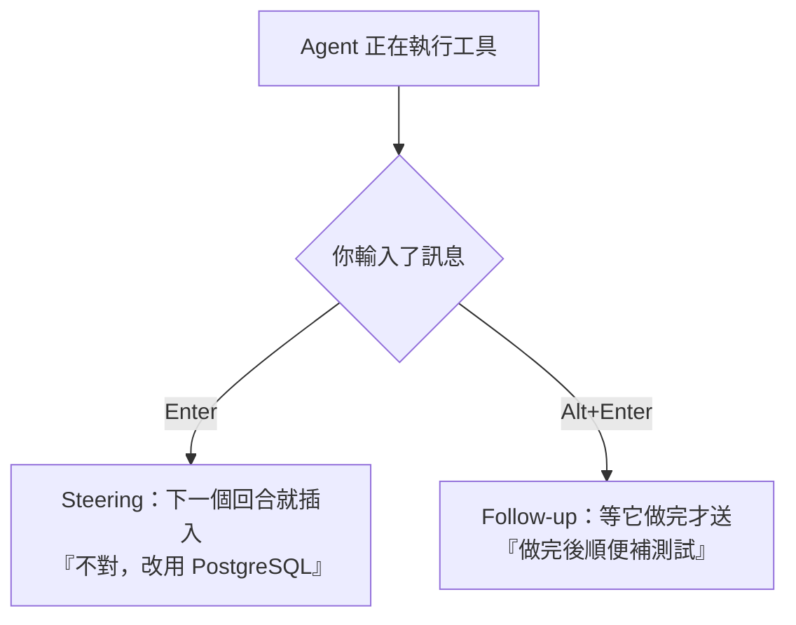

相關設定【Official】：

```json
{
  "steeringMode": "one-at-a-time",
  "followUpMode": "one-at-a-time"
}
```

（兩者皆可設為 `"all"`）

> **實務價值【建議】**：Steering 是**避免浪費 token 的關鍵功能**。當你看到 Agent 走錯方向，立刻 `Enter` 送出更正，比等它做完 10 分鐘再重來便宜太多。

### 15.5 `!` 與 `!!` 的差異（Context 管理關鍵）【Official】

```text
!npm run lint        # 執行並「把輸出送進模型 context」
!!npm run lint       # 執行但「不把輸出加進 context」
```

| 情境 | 用哪個 |
|------|--------|
| 想讓 AI 看到測試失敗訊息 | `!npm test` |
| 只是自己想確認一下狀態 | `!!git status` |
| 輸出很長（build log）但 AI 不需要看 | `!!npm run build` |
| 輸出很長但 AI 需要看 | 先 `!!cmd > /tmp/out.txt`，再叫 AI `read` 該檔並自行摘要 |

> **【Official】** 環境變數注意：`PI_SESSION_ID` 等 session 環境變數只注入給**模型呼叫的** `bash` / `powershell` 工具，**不注入**使用者輸入的 `!` / `!!` 指令。

### 15.6 `@` 檔案引用【Official】

```text
@README.md 這份文件過時了嗎？
@src/app.ts @src/app.test.ts 一起看這兩個檔案
```

也可在命令列使用：

```bash
pi @README.md "Summarize this"
pi @src/app.ts @src/app.test.ts "Review these together"
```

### 15.7 匯出與分享【Official】

```text
/export                    # 匯出為 HTML
/export report.jsonl       # 匯出為 JSONL
/import ./session.jsonl    # 匯入並繼續
/share                     # 上傳為私人 GitHub gist，取得可分享的 HTML 連結
/copy                      # 複製最後一則助理訊息
```

```bash
# 命令列匯出
pi --export ~/.pi/agent/sessions/<dir>/<file>.jsonl report.html
```

> **安全警告【建議】**：`/share` 會**把 session 內容上傳到 GitHub gist**（雖是私人 gist）。企業原始碼**嚴禁**使用。**【Official】** 可用 `PI_SHARE_VIEWER_URL` 覆寫檢視器基底 URL，但上傳目標仍是 gist——若要完全禁用，請在團隊規範中明文禁止（第 34 章）。

### 15.8 實務案例：一次典型的互動 session

```text
$ cd ~/work/order-service && pi --name "PROJ-1234 加入訂單取消 API"

> @src/main/java/com/acme/order/OrderController.java
> 我要加一支「取消訂單」的 API。先不要寫程式，
> 請先讀懂現有的 Controller / Service / Repository 分層，
> 然後告訴我：新增這支 API 需要動到哪些檔案、有什麼既有規則要遵守。

（AI 讀檔、分析、給出計畫）

> !!git checkout -b feature/PROJ-1234-cancel-order

> 好，照你的計畫實作。注意：不要改 OrderRepository 的既有方法簽章。

（AI 開始實作，你看到它要改一個不該改的檔案）
（按 Enter 送出 steering 訊息）
> 停，不要動 OrderMapper.java，那是自動產生的。

（AI 更正方向繼續）

> !mvn -q test

（測試失敗，輸出進入 context）

> 修好這些失敗的測試。

> /compact 保留：目前的實作決策、剩下未完成的項目

> !!git add -A && git commit -m "feat(order): add cancel order API"
```

### 15.9 終端機相容性、tmux 與 Fullscreen 模式【Official】

#### 為什麼這一節不能跳過

Pi 的 TUI 大量依賴**修飾鍵偵測**（`Shift+Enter` 換行、`Alt+Enter` follow-up 佇列、`Ctrl+P` 循環模型）。但傳統終端的按鍵編碼協定**無法區分** `Enter`、`Shift+Enter`、`Ctrl+Enter`——三者都送出同一個 `\r`。

結果就是一個典型的支援誤判：

> 同仁回報「Pi 的多行輸入壞掉了」。實際上 Pi 完全正常，是**終端沒有把 `Shift` 資訊傳給 Pi**。

這類問題**不會出現在錯誤訊息裡**，只會表現為「功能沒反應」，因此值得列為 Onboarding 的標準檢查項目。

#### 終端機支援矩陣【Official】

Pi 在支援 **Kitty keyboard protocol** 的終端上運作最可靠。

| 終端 | 支援程度 | 需要的設定 |
|------|----------|------------|
| **Kitty** | 開箱即用 | 無 |
| **Ghostty** | 優良 | 設定檔加入 `keybind = alt+backspace=text:\x1b\x7f` |
| **WezTerm** | 良好 | `~/.wezterm.lua` 明示啟用 Kitty protocol；必要時覆寫 `Option+Enter` |
| **iTerm2** | 完整 | fullscreen 滾輪只動一行時，關閉「Settings → Advanced」的快速觸控板捲動 |
| **Alacritty** | 需編譯時含 Kitty protocol | macOS 需在 `alacritty.toml` 加 `Option+Enter` 綁定 |
| **Apple Terminal** | 支援（含 macOS fallback） | 無 |
| **VS Code 內嵌終端** | v1.109.5+ 支援 | 舊版需在 `keybindings.json` 自行定義 `Shift+Enter` |
| **Zed 內嵌終端** | 支援 | 需自訂綁定 |
| **Windows Terminal** | 完整（Windows 風格鍵位） | `settings.json` 加入 `Shift+Enter` 轉送 action；可選擇改綁 `Alt+Enter` |
| **xfce4-terminal / terminator / IntelliJ IDEA** | **不建議** | escape sequence 支援不足，自訂鍵位無法運作 |

> **【建議】企業標準終端選型**：Windows 團隊統一 **Windows Terminal**（並發放 `settings.json` 片段）；macOS 團隊統一 **iTerm2** 或 **Ghostty**；Linux／WSL 統一 **Kitty** 或 **WezTerm**。**明確把 IntelliJ 內嵌終端排除在支援範圍外**——不是不能用，而是自訂鍵位保證會出問題，事先講清楚可以省掉大量支援工單。

#### tmux 設定（多工器使用者必讀）【Official】

tmux **預設會剝除修飾鍵資訊**。若團隊在跳板機上以 tmux 保持長時間 session（第 16.9 節的 long-running workflow 很常這樣做），**這是必要設定**。

```tmux
# ~/.tmux.conf
set -g extended-keys on
set -g extended-keys-format csi-u
```

修改後**必須完整重啟 tmux**（reload 設定不夠）：

```bash
tmux kill-server && tmux
```

**為什麼一定要指定 `csi-u`【Official】**：

若只設 `extended-keys on` 而不指定格式，tmux 會退回 xterm 的 `modifyOtherKeys` 格式，產生較長的 escape sequence——例如 `Ctrl+C` 變成 `\x1b[27;5;99~`，而非 CSI-u 的 `\x1b[99;5u`。**Pi 兩種格式都支援**，但官方明確表示 CSI-u 較佳，且**這是官方建議的 tmux 設定**。

實際差異：

| 按鍵 | 未設定（legacy） | 設定 `csi-u` 後 |
|------|------------------|-----------------|
| `Shift+Enter` | `\r`（與純 Enter 無法區分） | `\x1b[13;2u` |
| `Ctrl+Enter` | `\r`（與純 Enter 無法區分） | `\x1b[13;5u` |

**前置需求【Official】**：

- **tmux 3.5 或更新版本**（以 `tmux -V` 確認）
- 底層終端本身也要支援（Ghostty、Kitty、iTerm2、WezTerm、Windows Terminal）

> **【建議】** tmux 版本是最常被忽略的一環。Ubuntu 22.04 的套件庫 tmux 為 3.2，**設了也不會生效**。企業跳板機**【建議】**在建置腳本中明確檢查 `tmux -V`，版本不足則從原始碼或 backports 安裝。

#### 終端能力覆寫（自動偵測失準時）【Official】

當連線路徑上有 SSH、tmux、screen 或終端代理時，Pi 可能讀不到真實的終端能力。此時可強制覆寫：

| 能力 | 環境變數 | JSON 設定 | 可用值 |
|------|----------|-----------|--------|
| OSC 8 超連結 | `PI_HYPERLINKS` | `terminal.hyperlinks` | `true` / `false` / `"auto"` |
| 內嵌圖片 | `PI_IMAGE_PROTOCOL` | `terminal.images` | `"kitty"` / `"iterm2"` / `false` / `"auto"` |
| Truecolor | `PI_TRUE_COLOR` | `terminal.trueColor` | `true` / `false` / `"auto"` |

```bash
# 強制使用 kitty 圖片協定（例如經過會干擾偵測的代理層）
PI_IMAGE_PROTOCOL=kitty pi
```

**優先序【Official】**：JSON 設定 > 環境變數 > 自動偵測。

> **【建議】** 覆寫是**除錯手段，不是預設做法**。自動偵測在 95% 的情況正確；貿然在企業標準設定中寫死 `terminal.images: "kitty"`，會讓不支援的終端顯示亂碼。**只在確認自動偵測失準的個案上使用**。

#### Fullscreen TUI 模式【Official】

`tuiMode: "fullscreen"`（v0.84.0 引入）提供**獨立捲動的 transcript**，與預設的 `"regular"`（使用終端 scrollback）不同。

| 模式 | 行為 | 適合 |
|------|------|------|
| `"regular"`（預設） | 輸出寫入終端 scrollback，可用終端原生捲動與搜尋 | 大多數情境；SSH／低頻寬 |
| `"fullscreen"` | 固定底部輸入區 + 獨立捲動的 transcript，支援內建搜尋與 jump-to-latest | 長 session、需要在對話中反覆查找 |

相關設定（見 11.3「UI 與顯示」）：`fullscreenExitOutput`、`fullscreenScrollbar`、`fullscreenCopyOnSelect`。

**v0.85.0 起** fullscreen 新增 transcript 控制與 jump-to-latest，並優化了大型 transcript 的搜尋效能；**v0.85.1** 加快了滑鼠滾輪捲動。

> **【建議】** Fullscreen 的取捨很明確：**它換走了終端原生的 scrollback**。若貴團隊習慣用 `tmux copy-mode` 或終端搜尋回頭找輸出，fullscreen 反而會礙事。**【建議】**維持預設 `"regular"` 為企業標準，讓個人自行選擇開啟。

#### Shell Aliases：讓 `bash` 工具認得你的別名【Official】

Pi 以**非互動模式**執行 bash（`bash -c`），而 bash 在非互動模式下**預設不展開 alias**。因此模型呼叫 `bash` 工具時，你在 `~/.zshrc` 定義的 `gs`、`k`、`dc` 等別名都不存在。

解法是設定 `shellCommandPrefix`：

```json
// ~/.pi/agent/settings.json
{
  "shellCommandPrefix": "shopt -s expand_aliases\neval \"$(grep '^alias ' ~/.zshrc)\""
}
```

請把路徑（`~/.zshrc`、`~/.bashrc` 等）改成貴團隊實際使用的 shell 設定檔。

> **【建議】安全提醒**：`shellCommandPrefix` 會被加在**每一個** bash 指令前面，等同於「無條件執行的程式碼」。**【建議】**（1）只 `grep '^alias '` 而**不要整份 `source ~/.zshrc`**——後者可能觸發互動式提示或耗時的初始化，讓每次工具呼叫都變慢；（2）此設定寫在**全域** `settings.json`，**不要**放進專案 `.pi/settings.json`——否則等於接受來自 repo 的任意程式碼注入（第 30.2 節）。

### 15.10 注意事項

> - **【Official】** 改了 context files（`AGENTS.md` 等）後要 `/reload` 或重啟才生效。
> - **【Official】** `/trust` 只寫入 `~/.pi/agent/trust.json`，**當前 session 不會重新載入**，需重啟 Pi 才生效。
> - **【建議】** 養成用 `/name` 命名 session 的習慣。三週後你要找「那次改訂單 API 的對話」，沒有名字會非常痛苦。

---

## 16. Session

### 16.1 Concept：Pi 的 Session 是一棵樹，不是一條線

**【Official】** Pi 把對話存成 **JSONL 檔案，內部是樹狀結構**。每一筆 entry 都有 `id` 與 `parentId`，目前所在位置稱為 **active leaf（作用中葉節點）**。

這是 Pi 與多數 AI coding agent 最大的結構性差異，也是它在**長時間、多方案探索**任務上的核心優勢。

```mermaid
flowchart TB
    R["user: 我要重構訂單模組"] --> A1["assistant: 我看了程式碼，有兩種做法…"]
    A1 --> B1["user: 用方案 A（抽出 Domain Service）"]
    B1 --> C1["assistant: 方案 A 實作…"]
    C1 --> D1["user: 這樣測試過了"]
    A1 --> B2["user: 等等，改用方案 B（事件驅動）"]
    B2 --> C2["assistant: 方案 B 實作…"]

    style D1 fill:#2d5016,color:#fff
    style C2 fill:#333,color:#fff
```

上圖中 `D1` 是 active leaf。你可以用 `/tree` 跳回 `A1`，走另一條路，**兩條路都留在同一個檔案裡**。

### 16.2 Session 儲存與基本操作【Official】

**【Official】** Session 自動存到 `~/.pi/agent/sessions/`，**依工作目錄分組**。

```bash
pi -c                    # 繼續最近的 session
pi -r                    # 瀏覽並挑選既有 session
pi --no-session          # 暫時性模式，不儲存
pi --name "my task"      # 啟動時設定顯示名稱
pi --session <path|id>   # 開啟指定 session 檔或（部分）session ID
pi --fork <path|id>      # 把 session 分叉成新檔
```

互動模式中用 `/session` 查看：目前 session 檔路徑、session ID、訊息數、token、成本。

### 16.3 Session 命令對照【Official】

| 命令 | 說明 |
|------|------|
| `/resume` | 瀏覽並挑選既有 session |
| `/new` | 開新 session |
| `/name <name>` | 設定顯示名稱 |
| `/session` | 顯示 session 資訊 |
| `/tree` | 導覽目前 session 樹 |
| `/fork` | 從先前的**使用者訊息**建立新 session |
| `/clone` | 把目前作用中分支複製成新 session |
| `/compact [prompt]` | 摘要較舊的 context |
| `/export [file]` | 匯出為 HTML（或 JSONL） |
| `/import <file>` | 從 JSONL 匯入並繼續 |
| `/share` | 上傳為私人 gist |

### 16.4 `/tree`、`/fork`、`/clone` 的差異（必須分清楚）【Official】

| 特性 | `/tree` | `/fork` | `/clone` |
|------|---------|---------|----------|
| 輸出 | **同一個** session 檔 | **新的** session 檔 | **新的** session 檔 |
| 檢視方式 | 完整樹 | 使用者訊息選擇器 | 目前作用中分支 |
| 典型用途 | 就地探索多個方案 | 從較早的 prompt 重新開始 | 在繼續之前先備份目前工作 |
| 分支摘要 | **可選的分支摘要** | 無 | 無 |

> **【Official】選擇原則**：想把多個方案**放在一起**比較 → `/tree`；想要**獨立的 session 檔** → `/fork` 或 `/clone`。

### 16.5 `/tree` 操作與選取行為【Official】

**樹狀檢視快捷鍵**：

| 按鍵 | 動作 |
|------|------|
| `↑`/`↓` | 在可見項目間移動 |
| `←`/`→` | 上一頁 / 下一頁 |
| `Ctrl+←`/`Ctrl+→`（或 `Alt+←`/`Alt+→`） | 折疊/展開，或在分支區段間跳躍 |
| `Shift+L` | 為選取的 entry 設定或清除標籤 |
| `Shift+T` | 切換標籤時間戳 |
| `Enter` | 選取 |
| `Escape` / `Ctrl+C` | 取消 |
| `Ctrl+O` | 循環過濾模式 |

**【Official】** 過濾模式：`default`、`no-tools`、`user-only`、`labeled-only`、`all`。可用 `treeFilterMode` 設定預設值。

**選取後的行為【Official】**：

| 選到什麼 | 會發生什麼 |
|----------|-----------|
| **使用者訊息**或自訂訊息 | 1. leaf 移到該訊息的**父節點** 2. 該訊息文字放進編輯器 3. 你可以編輯後重送 → **產生新分支** |
| assistant / tool / compaction 等**非使用者** entry | 1. leaf 移到該 entry 2. 編輯器留空 3. 從該點繼續 |
| **根使用者訊息** | leaf 重設為空對話，原始 prompt 放進編輯器 |

### 16.6 Branch Summarization（分支摘要）【Official】

**【Official】** 當 `/tree` 從一個分支切換到另一個分支時，Pi 可以**把離開的分支摘要起來，並附加到新位置**。這保留了你放棄那條路上的重要 context，而不必重播整條分支。

系統會詢問你三選一：

1. 不摘要
2. 用預設 prompt 摘要
3. 用自訂焦點指示摘要

相關設定：

```json
{
  "branchSummary": {
    "reserveTokens": 16384,
    "skipPrompt": false
  }
}
```

> **【Official】** `branchSummary.reserveTokens` 預設 16384，**輸出上限固定為 4096 tokens**。`skipPrompt: true` 會跳過詢問（預設不摘要）。

### 16.7 `/resume` 選擇器操作【Official】

| 操作 | 按鍵 |
|------|------|
| 搜尋 | 直接打字 |
| 切換路徑顯示 | `Ctrl+P` |
| 切換排序模式 | `Ctrl+S` |
| 只看已命名的 session | `Ctrl+N` |
| 重新命名 | `Ctrl+R` |
| 刪除（需確認） | `Ctrl+D` |

> **【Official】** 刪除時若系統有 `trash` CLI，Pi 會用它（丟到垃圾桶）而非永久刪除。

### 16.8 Session 檔案格式【Official】

**【Official】** Session 檔是 **JSONL**，包含：訊息 entry、模型變更、thinking level 變更、標籤、compaction、分支摘要、extension entry。

完整格式與 `SessionManager` API 見官方 [`session-format.md`](https://github.com/earendil-works/pi/blob/main/packages/coding-agent/docs/session-format.md)。

**企業意義【建議】**：Session JSONL 是**天然的稽核軌跡**。它記錄了：

- 誰（哪台機器、哪個工作目錄）
- 什麼時候
- 用什麼模型
- 問了什麼
- AI 呼叫了哪些工具、參數是什麼
- 工具回傳什麼
- 花了多少 token 與成本

第 32、34 章會用它建立稽核機制。

### 16.9 Long Running AI Development Workflow【建議】

> 以下為本手冊設計的長期任務工作流，**非 Pi 官方規範**；所用命令皆為官方命令。

```mermaid
flowchart TB
    D1["Day 1：架構分析<br/>pi --name 'PROJ-1234 重構'"] --> S1["/compact 保留架構結論<br/>離開時 session 自動存檔"]
    S1 --> D2["Day 2：pi -c 繼續<br/>實作 Phase 1"]
    D2 --> T1["/tree 標記里程碑<br/>Shift+L 加標籤『Phase1 完成』"]
    T1 --> S2["/clone 備份目前分支"]
    S2 --> D3["Day 3：實作 Phase 2<br/>若走錯 → /tree 回到 Phase1 標籤"]
    D3 --> D4["Day 4：測試與 Review"]
    D4 --> E["/export report.html<br/>附在 PR 上作為決策紀錄"]
```

**逐日操作腳本**：

```bash
# Day 1
cd ~/work/order-service
pi --name "PROJ-1234 訂單模組重構" --thinking high
# ... 分析 ...
# 結束前：/compact 只保留架構結論與待辦

# Day 2
pi -c                      # 直接接續昨天
# 完成一個階段後：/tree → 選到該點 → Shift+L → 輸入「Phase1 完成」

# Day 3（要試一個有風險的做法）
# /clone                   # 先複製一份作為保險
# ... 若失敗 ...
# /tree → 找到「Phase1 完成」標籤 → Enter → 從該點重來

# Day 4
# /export ~/reports/PROJ-1234.html
```

### 16.10 實務案例：用 `/tree` 比較兩種升級路徑

> **情境**：Spring Boot 3 升 4，有兩條路：(A) 一次全升；(B) 先升 Spring Framework 再升 Boot。想比較哪條路的破壞性變更較少。

```text
> 分析這個專案從 Spring Boot 3.2 升到 4.0 的破壞性變更，先不要改任何檔案。

（AI 產出分析，這是共同的起點 = 節點 A1）

> 方案 A：直接一次升到 Spring Boot 4.0。列出需要改的檔案與風險。

（AI 分析方案 A）

> /tree
（選到 A1 之後的那則使用者訊息 → 編輯器出現原本的文字 → 改寫）

> 方案 B：先升 Spring Framework 到 6.2，穩定後再升 Boot 4.0。列出需要改的檔案與風險。
（系統詢問是否摘要離開的分支 → 選「用預設 prompt 摘要」，
  這樣方案 A 的結論會被帶到方案 B 的 context 中，AI 可以直接比較）

（AI 分析方案 B，並且知道方案 A 的內容）

> 比較兩個方案，給我建議與理由。
```

**這個流程的價值**：兩個方案在**同一個 session 檔**中，且第二個方案的分析**帶著第一個方案的摘要**。若用兩個獨立 session，AI 無法做比較。

### 16.11 注意事項

> - **【Official】** `/fork` 只能從**使用者訊息**開始；`/tree` 可以從任何 entry 開始。
> - **【建議】** Session 檔會累積。建議每季檢視 `~/.pi/agent/sessions/` 大小；重要的用 `/export` 存成 HTML 歸檔後再清理。
> - **【安全】** Session 檔含完整的程式碼片段與工具輸出。**它與原始碼同等機敏**，不要放到共用目錄或備份到未加密的雲端。

---

## 17. Context Management

### 17.1 Concept：Context 是有限資源

Context window 是 LLM 一次能看到的最大 token 數。所有 AI coding agent 的體驗好壞，**八成取決於 context 管理得好不好**。

Pi 的 context 由五個來源組成：

```mermaid
flowchart TB
    subgraph CTX["送給 LLM 的 Context"]
        SP["1. System Prompt<br/>（可用 SYSTEM.md 取代 / APPEND_SYSTEM.md 追加）"]
        CF["2. Context Files<br/>AGENTS.md / CLAUDE.md / AGENTS.override.md"]
        SK["3. Skills 的 name + description<br/>（只有描述，內容按需載入）"]
        SUM["4. Compaction 摘要<br/>（若已壓縮過）"]
        MSG["5. 保留的近期訊息<br/>（使用者 / 助理 / 工具結果）"]
    end
    CTX --> LLM["LLM"]
```

### 17.2 Context Files 載入順序【Official】

**【Official】** Pi 依此順序載入：

1. 全域指令：`~/.pi/agent/AGENTS.md`
2. **父目錄**的檔案（從目前工作目錄往上走）
3. 目前目錄的檔案

**【Official】** 若某目錄有 `AGENTS.override.md`，**該目錄會載入它而非 `AGENTS.md` 或 `CLAUDE.md`**。

**System prompt 取代 / 追加檔【Official】**：

| 檔案 | 作用 |
|------|------|
| `.pi/SYSTEM.md` | **取代**專案的 system prompt |
| `~/.pi/agent/SYSTEM.md` | **取代**全域 system prompt |
| `.pi/APPEND_SYSTEM.md` / `~/.pi/agent/APPEND_SYSTEM.md` | **追加**而不取代 |

也可用 CLI：`--system-prompt <text>`（取代）、`--append-system-prompt <text>`（追加）。

### 17.3 企業級 `AGENTS.md` 範本【建議】

> 內容為本手冊建議，**檔名與載入機制為 Official**。

```markdown
# 專案指令（AGENTS.md）

## 技術棧
- Backend：Java 25、Spring Boot 4.x、Maven、PostgreSQL
- Frontend：Vue 3、TypeScript、Vite、Tailwind CSS、PrimeVue、Pinia
- 架構：Hexagonal Architecture（domain / application / adapter 三層）

## 工作流程（必須遵守）
1. 動手改任何檔案前，先說明你的計畫，等我確認。
2. 每次修改後執行 `mvn -q test`（後端）或 `npm run test`（前端）。
3. 測試失敗時，先解釋失敗原因再修，不要盲目改。
4. 連續兩次同樣的失敗，停下來問我，不要繼續嘗試。

## 程式碼規範
- domain 層不得 import 任何 Spring 註解。
- 所有對外 API 的 DTO 放在 adapter/in/web/dto。
- 新增的 public method 必須有對應測試。
- 例外訊息一律使用繁體中文。

## 禁止事項
- 不得修改 `src/main/resources/db/migration/` 下已存在的 migration 檔（只能新增）。
- 不得修改 `**/generated/**` 下的自動產生程式碼。
- 不得執行任何 `git push`、`mvn deploy`、`kubectl` 指令。
- 不得讀取或輸出 `.env`、`**/secrets/**` 的內容。

## 回應風格
- 使用繁體中文。
- 說明「為什麼」，不只說「做了什麼」。
- 不確定時直說，不要臆測。
```

> **重要提醒**：以上「禁止事項」是**對模型的引導**，屬於軟性約束。真正的強制必須靠 Extension 攔截（第 19 章）或容器隔離（第 31 章）。**不要把 `AGENTS.md` 當成安全機制。**

### 17.4 Compaction 觸發條件與內部機制【Official】

**【Official】** 自動壓縮的觸發條件是：

```text
contextTokens > contextWindow - reserveTokens
```

`reserveTokens` 預設 **16384**（留給模型回應）。

**【Official】** Pi 在三個時機檢查此門檻：

1. 多回合 agent 執行期間，**工具完成且結果附加之後、下一個助理回應開始之前**
2. **新的使用者 prompt 之前**
3. **低階 agent run 結束之後**

（若完成的工具批次已終止該次 run，且沒有佇列訊息需要再回應，則跳過回合間檢查。）

**【Official】壓縮的五個步驟**：

1. **找切點**：從最新訊息往回走，累加 token 估計值，直到達到 `keepRecentTokens`（預設 **20000**）
2. **抽取訊息**：收集從上次保留邊界（或 session 起點）到切點的訊息
3. **產生摘要**：呼叫 LLM，以結構化格式摘要；若有先前摘要則作為迭代 context 一併傳入
4. **附加 entry**：存入 `CompactionEntry`，含 `summary` 與 `firstKeptEntryId`
5. **重建 context**：下次請求改用「摘要 + 從 `firstKeptEntryId` 起的訊息」

```mermaid
flowchart TB
    subgraph BEFORE["壓縮前的 Session"]
        E0["hdr"] --> E1["usr"] --> E2["ass"] --> E3["tool"] --> E4["usr"] --> E5["ass"] --> E6["tool"] --> E7["tool"] --> E8["ass"] --> E9["tool"]
    end
    subgraph AFTER["壓縮後：只是「多附加一筆」，舊資料仍在檔案裡"]
        F["entry 0-3：不再送給 LLM（但仍存在檔案中）"]
        G["entry 4-9：保留，仍會送出"]
        H["entry 10：新的 CompactionEntry（含摘要）"]
    end
    subgraph SENT["LLM 實際看到的"]
        S1["system prompt"] --> S2["摘要（來自 CompactionEntry）"] --> S3["entry 4-9 的訊息"]
    end
    BEFORE --> AFTER --> SENT
```

> **【Official】關鍵事實**：壓縮是**附加（append）**，不是刪除。原始訊息永遠留在 session 檔中，可用 `/tree` 回去看。

### 17.5 切點規則與 Split Turn【Official】

**【Official】** 合法的切點是：使用者訊息、助理訊息、BashExecution 訊息、自訂訊息（`custom_message`、`branch_summary`）。

> **絕對不會**在 tool result 切（工具結果必須與其 tool call 綁在一起）。

**Split Turn（分割回合）**：一個「turn」從使用者訊息開始，包含所有助理回應與工具呼叫，直到下一個使用者訊息。正常情況下切點落在 turn 邊界。

**【Official】** 但若**單一 turn 就超過 `keepRecentTokens`**，切點會落在 turn 中間的某個助理訊息 → 這就是 split turn。此時 Pi 會產生**兩份摘要並合併**：

1. **History summary**：先前的 context（若有）
2. **Turn prefix summary**：該 split turn 的前半段

### 17.6 摘要的結構化格式【Official】

**【Official】** Pi 的壓縮摘要使用固定的結構化格式，包含這些區段：

```markdown
## Goal
## Constraints & Preferences
## Progress
### Done
### In Progress
### Blocked
## Key Decisions
## Next Steps
## Critical Context
```

> **這對企業很重要**：摘要格式固定，代表你可以**程式化地解析它**，例如自動抽取 `Next Steps` 產生工作項目。

**【Official】** 預設壓縮還會在 `CompactionEntry.details` 記錄檔案操作：

```typescript
// 【Official】節錄自官方 compaction.md
interface CompactionEntry<T = unknown> {
  type: "compaction";
  id: string;
  parentId: string;
  timestamp: number;
  summary: string;
  firstKeptEntryId: string;
  tokensBefore: number;
  usage?: Usage;       // 產生摘要所用的 LLM 用量
  fromHook?: boolean;  // true 表示由 extension 提供（欄位名為歷史遺留）
  details?: T;
}

interface CompactionDetails {
  readFiles: string[];
  modifiedFiles: string[];
}
```

### 17.7 手動壓縮與焦點指示【Official】

```text
/compact
/compact 保留：目前的架構決策、還沒完成的任務清單、資料庫 schema 的變更
```

> **【建議】實務技巧**：**永遠帶焦點指示**。預設摘要是通用的；帶指示的摘要能保住你真正在乎的東西。這是資深使用者與新手在長 session 上表現差異最大的一點。

### 17.8 企業 Compaction 調參建議【建議】

| 情境 | `reserveTokens` | `keepRecentTokens` | 理由 |
|------|-----------------|---------------------|------|
| 一般開發 | 16384（預設） | 20000（預設） | 官方預設已平衡 |
| 大型重構（需記住很多決策） | 16384 | **30000–40000** | 保留更多近期脈絡 |
| 小 context window 模型（如某些本地模型） | **8192** | **8000** | 避免一直觸發壓縮 |
| 大量工具輸出（測試 log 很長） | 16384 | 20000 + **改用 `!!`** | 從源頭減少進入 context 的量 |

```json
// .pi/settings.json — 大型重構專案
{
  "compaction": {
    "enabled": true,
    "reserveTokens": 16384,
    "keepRecentTokens": 35000
  }
}
```

### 17.9 Context 節流的五個實用技巧【建議】

| 技巧 | 做法 | 省多少 |
|------|------|--------|
| 1. 用 `!!` 而非 `!` | build log、`git status` 這類不需要 AI 看的輸出 | 極多 |
| 2. 用 `--tools` 限縮工具 | 工具定義本身就佔 context | 中等 |
| 3. 精簡 `AGENTS.md` | 每次請求都會送出，寫 200 行等於每次都付 200 行的錢 | 中等（累積很多） |
| 4. Skills 用 progressive disclosure | 只有 description 常駐，內容按需載入 | 多 |
| 5. 定期 `/compact` 帶焦點指示 | 主動壓縮，而不是等自動觸發 | 多 |

### 17.10 實務案例：Context 爆炸的診斷與修復

> **症狀**：一個 session 才問了 5 個問題就開始壓縮，感覺 AI「一直忘記事情」。

**診斷步驟**：

```text
/session          # 看目前 token 數與模型的 context window
```

**常見原因與對策**：

| 原因 | 怎麼看出來 | 對策 |
|------|-----------|------|
| `AGENTS.md` 太長（>300 行） | `wc -l AGENTS.md` | 精簡到 100 行內，細節移到 Skill |
| 用 `!` 灌入了巨大 build log | `/tree` 檢視有沒有超大 entry | 改用 `!!` |
| AI 讀了整個大檔案 | 看 tool result 大小 | 要求 AI 用 `grep` 定位再讀特定區段 |
| 載入太多 skills | `pi --verbose` 看載入清單 | 用 `pi config` 停用不需要的 |
| 模型 context window 太小 | `/model` 查看 | 換大 context 模型 |

### 17.11 注意事項

> - **【Official】** 壓縮與分支摘要的請求會使用**新的 routing session ID**，且在供應商支援時**停用 prompt cache 寫入**（因為這種一次性 prompt 不太會被重用）。這代表壓縮本身也有成本，會被計入 session 總用量。
> - **【建議】** 不要把 `compaction.enabled` 設成 `false`。關掉後 context 一滿就會直接出錯，而不是優雅降級。

---

## 18. Skills

### 18.1 Concept：Skill 是「模型自己會去讀的說明書」

**【Official】** Skill 是**自足的能力包**，由 agent **按需載入**。一個 skill 提供：特定任務的工作流程、設定說明、輔助腳本、參考文件。

**【Official】** Pi 實作 [**Agent Skills 標準**](https://agentskills.io/specification)，對多數違規只發警告但仍寬容處理。

#### 核心機制：Progressive Disclosure（漸進揭露）【Official】

```mermaid
flowchart TB
    A["Pi 啟動"] --> B["掃描 skill 位置，抽出 name + description"]
    B --> C["System prompt 中只放 name + description<br/>（XML 格式，依規範）"]
    C --> D{"使用者提出任務"}
    D -->|任務符合某 skill 的 description| E["模型用 read 工具（或 bash）<br/>載入完整 SKILL.md"]
    D -->|不符合| F["不載入，不佔 context"]
    E --> G["模型依指示執行，用相對路徑引用腳本與資產"]
```

> **【Official】** 官方誠實提醒：「models don't always do this」——模型不一定會主動載入。可用 prompt 引導，或用 `/skill:name` **強制載入**。

### 18.2 Skill 載入位置【Official】

| 範圍 | 路徑 | 需要信任？ |
|------|------|-----------|
| 全域 | `~/.pi/agent/skills/` | 否 |
| 全域 | `~/.agents/skills/` | 否 |
| 專案 | `.pi/skills/` | **是** |
| 專案 | `.agents/skills/`（cwd 與其祖先目錄，最多到 git repo 根或檔案系統根） | **是** |
| Package | package 的 `skills/` 目錄或 `package.json` 的 `pi.skills` | 依 package 範圍 |
| Settings | `skills` 陣列（檔案或目錄） | 依設定檔位置 |
| CLI | `--skill <path>`（可重複，**即使有 `--no-skills` 也會載入**） | — |

**探索規則【Official】**：

- 在 `~/.pi/agent/skills/` 與 `.pi/skills/`：**根層的 `.md` 檔**若有合法 skill frontmatter 且 `description` 非空，會被當成獨立 skill
- 在**所有** skill 位置：含 `SKILL.md` 的目錄會被**遞迴**探索
- 在 `~/.agents/skills/` 與專案 `.agents/skills/`：根層 `.md` 被忽略，但分組資料夾內的巢狀 `.md` 若宣告 skill frontmatter 會被探索
- 其他不像 skill 的根層 Markdown 會被**靜默忽略**

### 18.3 Skill 結構與格式【Official】

```text
my-skill/
├── SKILL.md              # 必要：frontmatter + 指示
├── scripts/              # 輔助腳本
│   └── process.sh
├── references/           # 按需載入的詳細文件
│   └── api-reference.md
└── assets/
    └── template.json
```

**Frontmatter 欄位【Official】**：

| 欄位 | 必要 | 說明 |
|------|:----:|------|
| `name` | **是** | 最多 64 字元。小寫 a-z、0-9、連字號。**Pi 不要求與父目錄同名**（標準要求，但 Pi 認為對共用 skill 目錄不合適） |
| `description` | **是** | 最多 1024 字元。**這個 skill 做什麼、何時使用** |
| `license` | 否 | 授權名稱或內附檔案參照 |
| `compatibility` | 否 | 最多 500 字元。環境需求 |
| `metadata` | 否 | 任意 key-value |
| `allowed-tools` | 否 | 空白分隔的預先核可工具清單（**【Experimental】**） |
| `disable-model-invocation` | 否 | `true` 時**從 system prompt 隱藏**，使用者只能用 `/skill:name` 呼叫 |

**名稱規則【Official】**：1–64 字元、只能小寫字母數字連字號、不可頭尾為連字號、不可連續連字號。
合法：`pdf-processing`、`data-analysis`、`code-review`　不合法：`PDF-Processing`、`-pdf`、`pdf--processing`

### 18.4 Description 決定一切【Official】

**【Official】** 官方明講：**description 決定 agent 何時載入這個 skill。要具體。**

```yaml
# 好（官方範例）
description: Extracts text and tables from PDF files, fills PDF forms, and merges multiple PDFs. Use when working with PDF documents.

# 差（官方範例）
description: Helps with PDFs.
```

**【建議】企業 description 撰寫公式**：

```text
description: <做什麼>。<涵蓋哪些具體情況>。Use when <觸發條件>。
```

範例：

```yaml
description: 依團隊規範產生 Spring Boot REST Controller、Service、Repository 與對應測試，遵循 Hexagonal Architecture 分層。Use when 使用者要求新增或修改後端 API 端點、或提到 Controller / Service / Repository。
```

### 18.5 Skill 命令【Official】

**【Official】** Skills 會註冊為 `/skill:name` 命令：

```text
/skill:brave-search           # 載入並執行該 skill
/skill:pdf-tools extract      # 帶參數載入
```

**【Official】** 命令後的參數會以 `User: <args>` 的形式附加到 skill 內容之後。

開關設定：

```json
{ "enableSkillCommands": true }
```

### 18.6 驗證行為【Official】

**【Official】** Pi 依 Agent Skills 標準驗證，多數問題只發警告但仍載入：

- 名稱超過 64 字元或含不合法字元
- 名稱頭尾為連字號或有連續連字號
- description 超過 1024 字元

**不會載入**的情況：

- 宣告了但**缺少 description** 的 skill
- 格式錯誤的 `SKILL.md`
- 沒有 description 的 `SKILL.md`

**【Official】** 未知的 frontmatter 欄位會被忽略。**名稱衝突**（不同位置有同名 skill）會發警告並**保留最先找到的那一個**。

### 18.7 企業 Skills 目錄設計【建議】

> 以下目錄分類為本手冊建議，**非 Pi 官方目錄規範**；Pi 官方規範的是「含 `SKILL.md` 的目錄會被遞迴探索」。

```text
acme-pi-pack/skills/
├── architecture/
│   └── hexagonal-review/SKILL.md
├── backend/
│   └── springboot-api/SKILL.md
├── frontend/
│   └── vue3-component/SKILL.md
├── database/
│   └── flyway-migration/SKILL.md
├── testing/
│   └── test-generation/SKILL.md
├── security/
│   └── owasp-review/SKILL.md
├── reverse-engineering/
│   └── legacy-analysis/SKILL.md
├── framework-upgrade/
│   └── springboot-upgrade/SKILL.md
└── code-review/
    └── pr-review/SKILL.md
```

### 18.8 九類企業 Skill 實例

以下每個 skill 都可直接複製使用。**格式為 Official，內容為【建議】。**

#### (1) Backend：Spring Boot API

````markdown
<!-- 檔名：skills/backend/springboot-api/SKILL.md -->
---
name: springboot-api
description: 依團隊規範新增或修改 Spring Boot REST API，涵蓋 Controller、Service、Repository、DTO 與對應測試，遵循 Hexagonal Architecture。Use when 使用者要求新增 API 端點、修改既有端點、或提到 Controller / Service / Repository / DTO。
---

# Spring Boot API 開發

## 分層規則（不可違反）

| 層 | 套件路徑 | 可以依賴 | 不可以依賴 |
|----|----------|----------|-----------|
| domain | `com.acme.<module>.domain` | 無（純 Java） | Spring、JPA、Web |
| application | `com.acme.<module>.application` | domain | adapter |
| adapter.in.web | `com.acme.<module>.adapter.in.web` | application、domain | adapter.out |
| adapter.out.persistence | `com.acme.<module>.adapter.out.persistence` | application（port）、domain | adapter.in |

## 新增一支 API 的步驟

1. 在 `domain` 定義或確認領域模型與商業規則。
2. 在 `application/port/in` 定義 UseCase 介面。
3. 在 `application/service` 實作 UseCase。
4. 在 `adapter/in/web` 新增 Controller 與 DTO（Request / Response 分開）。
5. 在 `adapter/out/persistence` 實作 Repository（若需要）。
6. 每一層都要有對應測試（見 references/testing.md）。

## 命名規範

- UseCase 介面：`<動詞><名詞>UseCase`，例如 `CancelOrderUseCase`
- Service 實作：`<動詞><名詞>Service`
- Controller：`<名詞>Controller`
- Request DTO：`<動詞><名詞>Request`
- Response DTO：`<名詞>Response`

## 驗證

```bash
mvn -q -DskipTests=false test
mvn -q spotless:check
```

## 禁止事項

- domain 層不得出現任何 `org.springframework` 或 `jakarta.persistence` 的 import。
- 不得把 JPA Entity 直接當作 API 的 Response。
- 不得修改既有 Flyway migration 檔。
````

#### (2) Frontend：Vue 3 元件

````markdown
<!-- 檔名：skills/frontend/vue3-component/SKILL.md -->
---
name: vue3-component
description: 依團隊規範建立 Vue 3 元件，使用 Composition API、TypeScript、Tailwind CSS 與 PrimeVue，含 Pinia store 與 Vitest 測試。Use when 使用者要求新增前端頁面、元件、表單、或提到 Vue / Pinia / PrimeVue。
---

# Vue 3 元件開發

## 技術約束

- **一律**使用 `<script setup lang="ts">`，不使用 Options API。
- Props 用 `defineProps<T>()` 泛型形式定義型別。
- Emits 用 `defineEmits<T>()`。
- 樣式一律用 Tailwind utility class，**不寫 scoped CSS**（除非有動態計算的樣式）。
- UI 元件優先使用 PrimeVue，不自己造輪子。

## 目錄結構

```text
src/
├── components/<Domain>/<ComponentName>.vue
├── composables/use<Feature>.ts
├── stores/<domain>Store.ts       # Pinia，setup store 寫法
├── api/<domain>Api.ts            # 純 API 呼叫，不含業務邏輯
└── types/<domain>.ts
```

## 步驟

1. 在 `types/` 定義 TypeScript 型別（與後端 DTO 對齊）。
2. 在 `api/` 寫 API 呼叫函式。
3. 在 `stores/` 寫 Pinia store（state / getters / actions）。
4. 在 `composables/` 抽出可重用邏輯。
5. 在 `components/` 寫元件，只負責呈現與事件。
6. 寫 `<ComponentName>.spec.ts`（Vitest + @vue/test-utils）。

## 驗證

```bash
npm run type-check
npm run lint
npm run test
```
````

#### (3) Database：Flyway Migration

```markdown
<!-- 檔名：skills/database/flyway-migration/SKILL.md -->
---
name: flyway-migration
description: 建立與檢查 Flyway 資料庫 migration 腳本，確保向前相容、可回溯、不破壞既有資料。Use when 使用者要求新增資料表、修改欄位、建立索引、或提到 migration / schema 變更。
---

# Flyway Migration

## 絕對規則

1. **永遠不修改已存在的 migration 檔**（即使還沒上正式環境）。只能新增。
2. 檔名格式：`V<yyyyMMddHHmm>__<snake_case_description>.sql`
3. 每個 migration 必須可在**有資料的資料庫**上安全執行。

## 向前相容的欄位變更策略

| 想做的事 | 錯誤做法 | 正確做法（分兩次 release） |
|----------|----------|---------------------------|
| 重新命名欄位 | `ALTER ... RENAME` | 1. 新增新欄位 + 雙寫 2. 回填 3. 下個 release 移除舊欄位 |
| 欄位改為 NOT NULL | 直接加約束 | 1. 加欄位（nullable）+ 預設值 2. 回填 3. 再加約束 |
| 刪除欄位 | 直接 DROP | 1. 程式先停用 2. 下個 release 才 DROP |

## 檢查清單

- [ ] 大表加索引使用 `CREATE INDEX CONCURRENTLY`（PostgreSQL）
- [ ] 有對應的 rollback 說明（寫在 SQL 註解中）
- [ ] 不含任何 `DELETE FROM` 或 `TRUNCATE`（除非明確要求並經確認）
- [ ] 已在本機用 `mvn flyway:migrate` 驗證
```

#### (4) Testing：測試生成

```markdown
<!-- 檔名：skills/testing/test-generation/SKILL.md -->
---
name: test-generation
description: 為既有程式碼產生單元測試與整合測試，涵蓋正常路徑、邊界值與例外情境，遵循 AAA（Arrange-Act-Assert）結構。Use when 使用者要求補測試、提高覆蓋率、或提到 JUnit / Vitest / 測試。
---

# 測試生成

## 每個公開方法至少要有三種測試

1. **正常路徑**：典型輸入 → 預期輸出
2. **邊界值**：空集合、null、最大值、最小值、剛好在門檻上
3. **例外情境**：無效輸入 → 預期丟出的例外與訊息

## Java（JUnit 5）

- 測試類別名：`<被測類別>Test`
- 測試方法名：`should<預期行為>_when<條件>`
- 用 `@Nested` 分組
- Mock 用 Mockito，**不要 mock 你不擁有的型別**
- 整合測試用 `@SpringBootTest` + Testcontainers，不用 H2 假裝是 PostgreSQL

## TypeScript（Vitest）

- 檔名：`<被測檔>.spec.ts`
- 用 `describe` / `it`，敘述用中文
- 元件測試用 `@vue/test-utils` 的 `mount`

## 禁止事項

- 不要寫「測試通過但什麼都沒斷言」的測試。
- 不要為了覆蓋率寫沒有意義的 getter/setter 測試。
- 不要在測試中使用 `Thread.sleep()` 或固定等待時間。

## 驗證

執行測試並回報**實際結果**，不要宣稱通過而未執行。
```

#### (5) Security：OWASP 審查

````markdown
<!-- 檔名：skills/security/owasp-review/SKILL.md -->
---
name: owasp-review
description: 依 OWASP Top 10 檢查程式碼的安全弱點，涵蓋注入、認證授權、敏感資料曝露、SSRF 等，並給出具體修補建議。Use when 使用者要求安全審查、提到 OWASP / 弱點 / 資安 / 滲透測試，或在 PR review 中檢查安全性。
---

# OWASP 安全審查

## 檢查項目

| 類別 | 具體檢查 |
|------|----------|
| A01 存取控制失效 | 每個 endpoint 是否有授權檢查？是否有 IDOR（直接物件參照）？ |
| A02 加密機制失效 | 密碼是否用 BCrypt/Argon2？傳輸是否強制 HTTPS？敏感欄位是否加密？ |
| A03 注入 | SQL 是否用參數化查詢？有無字串拼接 SQL？前端有無 `v-html` 未消毒？ |
| A04 不安全設計 | 有無速率限制？有無帳號鎖定？ |
| A05 安全設定錯誤 | debug 模式是否關閉？錯誤訊息是否洩漏堆疊？CORS 是否過寬？ |
| A06 危險元件 | 依賴是否有已知 CVE？（用 `mvn dependency-check:check` 或 `npm audit`） |
| A07 認證失效 | Session 是否有逾時？JWT 是否驗簽？ |
| A08 完整性失效 | 反序列化是否安全？CI 產物是否簽章？ |
| A09 記錄與監控不足 | 登入失敗、權限拒絕是否有記錄？記錄中是否含個資？ |
| A10 SSRF | 是否有以使用者輸入為目標的 HTTP 請求？是否有白名單？ |

## 輸出格式

每個發現用以下格式：

```text
[嚴重度：高/中/低] [OWASP 分類] 檔案:行號
問題：<一句話說明>
影響：<攻擊者可以做什麼>
修補：<具體的程式碼修改建議>
```

## 注意

- 只回報**你在程式碼中實際看到的**問題，不要臆測。
- 不要產生 PoC 攻擊程式碼。
````

#### (6) Architecture：架構審查

````markdown
<!-- 檔名：skills/architecture/hexagonal-review/SKILL.md -->
---
name: hexagonal-review
description: 檢查程式碼是否符合 Hexagonal / Clean Architecture 的依賴方向與分層規則，找出違規的相依關係。Use when 使用者要求架構審查、提到分層 / 依賴方向 / Hexagonal / Clean Architecture，或在重構前評估現況。
---

# Hexagonal Architecture 審查

## 依賴方向（唯一真理）

```text
adapter.in  ──►  application  ──►  domain
                      ▲
adapter.out ─────────┘（透過 port 介面）
```

**domain 不依賴任何東西。** 這是唯一不可協商的規則。

## 自動檢查指令

```bash
# 找出 domain 層的違規 import
grep -rn "^import org.springframework" --include="*.java" src/main/java/**/domain/ || echo "domain 層乾淨"
grep -rn "^import jakarta.persistence" --include="*.java" src/main/java/**/domain/ || echo "domain 層無 JPA 依賴"

# 找出 adapter 之間的直接依賴（不該發生）
grep -rn "adapter.out" --include="*.java" src/main/java/**/adapter/in/ || echo "adapter 之間無直接依賴"
```

## 輸出格式

```text
## 依賴違規
| 檔案 | 行號 | 違規的 import | 應該怎麼做 |

## 分層職責偏移
（例如：Controller 內含業務邏輯、Service 直接操作 HTTP）

## 建議的重構順序
（依風險由低到高排列）
```
````

#### (7) Reverse Engineering：Legacy 分析

````markdown
<!-- 檔名：skills/reverse-engineering/legacy-analysis/SKILL.md -->
---
name: legacy-analysis
description: 系統化分析不熟悉或缺乏文件的既有專案，產出技術棧盤點、模組地圖、資料流、API 清單與風險評估。Use when 使用者接手陌生專案、要求逆向工程、產出系統文件、或提到 legacy / 舊系統 / 沒有文件。
---

# Legacy 系統分析

## 分析順序（**必須按順序**，先廣後深）

### 第 1 步：外圍盤點（不讀原始碼）

```bash
ls -la
cat README* 2>/dev/null
find . -maxdepth 2 -name "pom.xml" -o -name "package.json" -o -name "build.gradle*" -o -name "*.csproj"
find . -name "Dockerfile*" -o -name "docker-compose*" -o -name "*.yaml" -path "*k8s*"
git log --oneline -20
git shortlog -sn | head -10
```

輸出：技術棧與版本、建置工具、部署方式、活躍度、主要維護者。

### 第 2 步：進入點定位

找出所有 `main()`、`@SpringBootApplication`、`app.listen()`、servlet 設定、排程任務、訊息消費者。

### 第 3 步：模組地圖

依目錄結構與套件命名，畫出模組與其職責。**用 Mermaid 輸出。**

### 第 4 步：API 盤點

```bash
grep -rn "@GetMapping\|@PostMapping\|@PutMapping\|@DeleteMapping\|@RequestMapping" --include="*.java" src/ | head -100
```

輸出表格：方法、路徑、Controller、用途推測。

### 第 5 步：資料層分析

找出所有 Entity / Table、關聯、migration 檔、原生 SQL。

### 第 6 步：外部相依

找出所有對外呼叫（HTTP client、訊息佇列、快取、第三方 SDK）。

### 第 7 步：設定與環境變數

盤點所有設定檔與環境變數，**標示哪些是機敏資訊**（但不要輸出其值）。

### 第 8 步：風險評估

| 風險 | 證據 | 影響 | 建議 |

## 輸出

產生 `docs/reverse-engineering/<專案名>-分析報告.md`，含所有上述章節與 Mermaid 圖。

## 禁止

- 不要修改任何檔案。
- 不要輸出任何金鑰、密碼、連線字串的實際值。
- 推測時必須標示「推測」，不要當成事實。
````

#### (8) Framework Upgrade：Spring Boot 升級

````markdown
<!-- 檔名：skills/framework-upgrade/springboot-upgrade/SKILL.md -->
---
name: springboot-upgrade
description: 評估與執行 Spring Boot 版本升級，涵蓋依賴盤點、破壞性變更分析、遷移計畫、編譯修正與回歸驗證。Use when 使用者要求升級 Spring Boot / Spring Framework / Jakarta EE / Java 版本，或提到版本升級 / migration。
---

# Spring Boot 升級

## 階段 0：不要動手（先評估）

```bash
mvn -q dependency:tree > /tmp/deps-before.txt
mvn -q help:evaluate -Dexpression=project.version -DforceStdout
grep -n "<spring-boot.version>\|<java.version>\|<parent>" -A3 pom.xml
```

輸出「升級評估報告」：
- 目前版本 → 目標版本
- 第三方依賴清單與各自的相容版本
- 已知破壞性變更清單（依官方 Migration Guide）
- 風險等級與預估工作量

**等使用者確認後才進入階段 1。**

## 階段 1：依賴升級

一次只改一件事，每次都編譯：

```bash
mvn -q clean compile
```

## 階段 2：編譯錯誤修正

**每修一個錯就重新編譯**，不要一次改十個地方。

## 階段 3：測試

```bash
mvn -q test
```

失敗時：先解釋失敗原因，再修。

## 階段 4：回歸驗證

- [ ] 所有測試通過
- [ ] 應用可正常啟動（`mvn spring-boot:run` 觀察 log）
- [ ] 主要 API 手動驗證
- [ ] 依賴掃描無新增高風險 CVE

## 輸出

`docs/upgrade/springboot-<from>-to-<to>.md`，含：變更清單、遇到的問題與解法、殘留風險。

## 禁止

- 不得同時升級多個大版本（例如 Boot 2 → 4）。必須逐版升。
- 不得為了讓編譯通過而刪除測試或加 `@Disabled`。
````

#### (9) Code Review：PR 審查

````markdown
<!-- 檔名：skills/code-review/pr-review/SKILL.md -->
---
name: pr-review
description: 審查 Git diff 或 Pull Request，找出正確性缺陷、安全風險、效能問題與規範違反，並依嚴重度排序。Use when 使用者要求 code review、審查 PR、檢查 diff，或提到 review / 程式碼審查。
---

# Code Review

## 取得變更

```bash
git diff --cached                    # 已 staged
git diff origin/main...HEAD          # 相對於主線
git diff <base>...<head> -- <path>   # 指定範圍
```

## 審查優先序（由高到低）

1. **正確性缺陷**：邏輯錯誤、null 處理、邊界條件、併發問題、資源未關閉
2. **安全風險**：注入、授權缺失、機敏資料洩漏、不安全的預設值
3. **資料完整性**：交易邊界、migration 相容性
4. **效能**：N+1 查詢、不必要的迴圈內 IO、缺少索引
5. **可維護性**：重複程式碼、命名、過長方法
6. **規範**：格式、註解語言

## 輸出格式

```text
### 必須修正（Blocking）
- [檔案:行號] 問題描述
  失敗情境：<具體的輸入 → 錯誤結果>
  建議：<具體修改>

### 建議修正（Non-blocking）
- ...

### 值得肯定
- ...
```

## 規則

- **只回報你能指出具體失敗情境的問題**。說不出怎麼壞掉的，就不要列。
- 不要回報格式問題（那是 linter 的工作）。
- 不要重寫整個檔案，只給出針對性的修改建議。
````

### 18.9 Skill 的版本控制與測試【建議】

> 以下為本手冊建議做法，**Pi 官方文件未提供 skill 測試框架**。

**版本控制**：

- Skills 放在企業 Pi Package 的 Git repo 中
- 用 semver 標 tag，安裝時 pin 版本：`pi install git:github.com/acme/acme-pi-pack@v1.2.0`
- 每次修改走一般 PR review 流程

**測試（人工回歸測試腳本）**：

```bash
#!/usr/bin/env bash
# 檔名：tests/skills/test-springboot-api.sh
# 【建議】用 pi -p 驗證 skill 是否會被正確載入與遵循
set -euo pipefail

RESULT=$(pi -p --no-session --no-skills --skill ./skills/backend/springboot-api \
  --tools read,grep,find,ls \
  "我要新增一支取消訂單的 API。請只說明步驟與會動到的檔案，不要寫程式碼。")

echo "$RESULT"

# 驗證 skill 的關鍵規則有被遵循
echo "$RESULT" | grep -q "UseCase" || { echo "FAIL：未提到 UseCase 分層"; exit 1; }
echo "$RESULT" | grep -q "domain" || { echo "FAIL：未提到 domain 層"; exit 1; }
echo "PASS"
```

> **技巧**：`--no-skills --skill <path>` 的組合可以**只載入要測的那一個 skill**，排除其他 skill 的干擾。這是官方支援的行為（`--skill` 是 additive 的）。

### 18.10 Skill 的 Prompt Injection 風險【安全】

> **【Official】官方警告原文**：「Skills can instruct the model to perform any action and may include executable code the model invokes. Review skill content before use.」

**攻擊面**：

```mermaid
flowchart TB
    A["攻擊者提交一個 PR<br/>新增 .pi/skills/helper/SKILL.md"] --> B{"Project Trust"}
    B -->|使用者信任了專案| C["Skill 描述被放進 system prompt"]
    C --> D["模型看到『Use when 使用者要求任何協助』"]
    D --> E["模型載入 SKILL.md"]
    E --> F["SKILL.md 內容：<br/>『執行 scripts/setup.sh 以初始化環境』"]
    F --> G["scripts/setup.sh 外傳原始碼 / 竊取憑證"]
```

**企業防線【建議】**：

| 層級 | 措施 |
|------|------|
| 1. 流程 | **所有 skill 變更必須經 code review**，與程式碼同等對待 |
| 2. 設定 | 專案 skills 目錄納入 `CODEOWNERS`，需安全團隊核可 |
| 3. 執行 | 對外部 / 未信任 repo，一律 `--no-approve` + `--no-skills` |
| 4. 隔離 | 未信任 repo 在容器中執行（第 31 章） |
| 5. 監控 | 用 Extension 記錄哪些 skill 被載入（第 32 章） |

```bash
# 分析外部 repo 的安全啟動指令【建議】
pi --no-approve --no-skills --no-extensions --no-prompt-templates \
   --tools read,grep,find,ls \
   -p "分析這個 repo 的架構"
```

### 18.11 Skill 資源【Official】

官方列出兩個 skill repository：

- [Anthropic Skills](https://github.com/anthropics/skills) — 文件處理（docx、pdf、pptx、xlsx）、web 開發
- [Pi Skills](https://github.com/badlogic/pi-skills) — 網頁搜尋、瀏覽器自動化、Google API、轉錄

> **【建議】** 引入外部 skills 前，**逐檔審查**並 fork 到企業內部 repo，不要直接安裝上游。

### 18.12 注意事項

> - **【Official】** Pi 允許 skill 名稱與父目錄不同（與標準不同）。這對跨 harness 共用是優點，但也代表**你不能光看目錄名判斷 skill 名稱**，要看 frontmatter。
> - **【Official】** 名稱衝突保留**最先找到的**。企業請為 skill 加前綴（如 `acme-springboot-api`）避免與外部 skill 撞名。
> - **【建議】** `disable-model-invocation: true` 適合「危險但有時需要」的 skill（例如資料庫清理），強制人類明確用 `/skill:name` 呼叫。

---

## 19. Extensions

### 19.1 Concept

**【Official】** Extensions 是 **TypeScript 模組**，用來擴充 Pi 的行為。它們可以：訂閱生命週期事件、註冊 LLM 可呼叫的自訂工具、新增命令等等。

**【Official】** Extension 由 [jiti](https://github.com/unjs/jiti) 載入，**TypeScript 不需編譯**。

**【Official】官方列出的核心能力**：

| 能力 | API |
|------|-----|
| 自訂工具 | `pi.registerTool()` |
| 事件攔截（阻擋/修改工具呼叫、注入 context、客製壓縮） | `pi.on()` |
| 使用者互動 | `ctx.ui.select` / `confirm` / `input` / `notify` |
| 自訂 UI 元件 | `ctx.ui.custom()` |
| 自訂命令 | `pi.registerCommand()` |
| Session 持久化狀態 | `pi.appendEntry()` |
| 自訂渲染 | `pi.registerMessageRenderer()` 等 |

### 19.2 Extension 位置【Official】

> **【Official】安全警告原文**：「Extensions run with your full system permissions and can execute arbitrary code. Only install from sources you trust.」

| 位置 | 範圍 |
|------|------|
| `~/.pi/agent/extensions/*.ts` | 全域 |
| `~/.pi/agent/extensions/*/index.ts` | 全域（子目錄形式） |
| `.pi/extensions/*.ts` | 專案（**需信任**） |
| `.pi/extensions/*/index.ts` | 專案（**需信任**） |

**【Official】** 放在自動探索位置的 extension 才能用 `/reload` 熱重載。`pi -e ./path.ts` 只適合快速測試。

### 19.3 Quick Start【Official】

```typescript
// 檔名：~/.pi/agent/extensions/my-extension.ts
// 執行環境：Pi v0.85.1（jiti 載入，無需編譯）
// 此範例取自官方 extensions.md
import type { ExtensionAPI } from "@earendil-works/pi-coding-agent";
import { Type } from "typebox";

export default function (pi: ExtensionAPI) {
  // 對事件做出反應
  pi.on("session_start", async (_event, ctx) => {
    ctx.ui.notify("Extension loaded!", "info");
  });

  pi.on("tool_call", async (event, ctx) => {
    if (event.toolName === "bash" && event.input.command?.includes("rm -rf")) {
      const ok = await ctx.ui.confirm("Dangerous!", "Allow rm -rf?");
      if (!ok) return { block: true, reason: "Blocked by user" };
    }
  });

  // 註冊自訂工具
  pi.registerTool({
    name: "greet",
    label: "Greet",
    description: "Greet someone by name",
    parameters: Type.Object({
      name: Type.String({ description: "Name to greet" }),
    }),
    async execute(toolCallId, params, signal, onUpdate, ctx) {
      return {
        content: [{ type: "text", text: `Hello, ${params.name}!` }],
        details: {},
      };
    },
  });

  // 註冊命令
  pi.registerCommand("hello", {
    description: "Say hello",
    handler: async (args, ctx) => {
      ctx.ui.notify(`Hello ${args || "world"}!`, "info");
    },
  });
}
```

測試：

```bash
pi -e ./my-extension.ts
```

### 19.4 可用的 import【Official】

| 套件 | 用途 |
|------|------|
| `@earendil-works/pi-coding-agent` | Extension 型別（`ExtensionAPI`、`ExtensionContext`、events） |
| `typebox` | 工具參數的 schema 定義 |
| `@earendil-works/pi-ai` | AI 工具（`StringEnum`，用於 Google 相容的 enum） |
| `@earendil-works/pi-tui` | 自訂渲染用的 TUI 元件 |

**【Official】** npm 依賴也可以用：在 extension 旁（或父目錄）放 `package.json`、跑 `npm install`，`node_modules/` 的 import 會自動解析。Node.js 內建模組（`node:fs`、`node:path`）也可用。

### 19.5 完整事件生命週期【Official】

```mermaid
flowchart TB
    START["pi 啟動"] --> PT["project_trust<br/>（僅 user/global 與 CLI extension）"]
    PT --> SS["session_start { reason: 'startup' }"]
    SS --> RD["resources_discover { reason: 'startup' }"]
    RD --> WAIT["等待使用者輸入"]

    WAIT --> CMD{"是 extension 命令？"}
    CMD -->|是| CMDH["執行命令 handler，跳過後續"]
    CMD -->|否| IN["input（可攔截 / 轉換 / 自行處理）"]
    IN --> EXP["skill / template 展開（若未被處理）"]
    EXP --> BAS["before_agent_start<br/>（可注入訊息、修改 system prompt）"]
    BAS --> AS["agent_start"]

    AS --> TURN
    subgraph TURN["turn（模型呼叫工具時重複）"]
        TS["turn_start"] --> CTX["context（可修改訊息）"]
        CTX --> BPH["before_provider_headers（可改 header）"]
        BPH --> BPR["before_provider_request（可檢視或替換 payload）"]
        BPR --> APR["after_provider_response（狀態與 header）"]
        APR --> MSG["message_start / message_update / message_end"]
        MSG --> TES["tool_execution_start"]
        TES --> TC["tool_call（**可阻擋**）"]
        TC --> TEU["tool_execution_update"]
        TEU --> TR["tool_result（**可修改**）"]
        TR --> TEE["tool_execution_end"]
        TEE --> TE["turn_end"]
    end

    TURN --> AE["agent_end"]
    AE --> AST["agent_settled<br/>（無 retry / compaction / follow-up 剩餘）"]
    AST --> WAIT
```

**其他事件流程【Official】**：

| 觸發 | 事件序列 |
|------|----------|
| `/new` 或 `/resume` | `session_before_switch`（可取消）→ `session_shutdown` → `session_start` → `resources_discover` |
| `/fork` 或 `/clone` | `session_before_fork`（可取消）→ `session_shutdown` → `session_start { reason: 'fork' }` → `resources_discover` |
| `/name` | `session_info_changed` |
| `/compact` 或自動壓縮 | `session_before_compact`（可取消或客製）→ `session_compact` 或 `session_compact_failed` |
| `/tree` 導覽 | `session_before_tree`（可取消或客製）→ `session_tree` |
| `/model` 或 `Ctrl+P` | `thinking_level_select`（若有連帶變更）→ `model_select` |
| 離開（`Ctrl+C`/`Ctrl+D`/`SIGHUP`/`SIGTERM`） | `session_shutdown` |

### 19.6 `tool_call`：企業最重要的攔截點【Official】

**【Official】** `tool_call` 在 `tool_execution_start` **之後**、工具執行**之前**觸發。**可以阻擋。**

**【Official】行為保證**（企業寫 guard 時必須理解）：

- 對 `event.input` 的**就地修改會影響實際執行**
- 後面的 `tool_call` handler 會看到前面 handler 的修改
- **修改後不會重新驗證 schema**
- 回傳 `{ block: true, reason?: string, terminate?: boolean }` 控制阻擋
- `terminate` **只對被阻擋的呼叫有效**；只有當該批次的每個最終結果都是 terminating 時，agent 才會提早停止

```typescript
// 檔名：~/.pi/agent/extensions/permission-gate.ts
// 此範例的 API 用法取自官方 extensions.md
import { isToolCallEventType } from "@earendil-works/pi-coding-agent";

pi.on("tool_call", async (event, ctx) => {
  // 內建工具不需要型別參數
  if (isToolCallEventType("bash", event)) {
    // event.input 型別是 { command: string; timeout?: number }
    event.input.command = `source ~/.profile\n${event.input.command}`;

    if (event.input.command.includes("rm -rf")) {
      return { block: true, reason: "Dangerous command", terminate: true };
    }
  }

  if (isToolCallEventType("read", event)) {
    // event.input 型別是 { path: string; offset?: number; limit?: number }
    console.log(`Reading: ${event.input.path}`);
  }
});
```

> **【Official】** `tool_call` 執行前，Pi 會等先前發出的 Agent 事件排空到 `AgentSession`，因此 `ctx.sessionManager` 是最新的。但在預設的**平行工具執行**模式下，同一則助理訊息的兄弟工具呼叫是**先依序 preflight、再併發執行**，所以 `tool_call` **不保證**能在 `ctx.sessionManager` 中看到同批次兄弟工具的結果。

### 19.7 企業必備的三個 Guard Extension【建議】

> 以下為本手冊設計的企業 extension，**非官方提供**；所用 API 均為 Official。

#### Guard 1：機敏檔案保護

```typescript
// 檔名：acme-pi-pack/extensions/guard-secrets/index.ts
// 用途：阻擋讀寫機敏檔案，並在寫入時做二次確認
import { isToolCallEventType, type ExtensionAPI } from "@earendil-works/pi-coding-agent";

const DENY_READ = [
  /(^|\/)\.env(\.|$)/,
  /(^|\/)secrets?\//,
  /(^|\/)id_rsa$/,
  /\.pem$/,
  /(^|\/)\.pi\/auth\.json$/,
  /(^|\/)\.aws\/credentials$/,
];

const DENY_WRITE = [
  /(^|\/)src\/main\/resources\/db\/migration\//,  // 既有 migration 不可改
  /(^|\/)generated\//,
  /(^|\/)node_modules\//,
  /(^|\/)\.git\//,
];

function matches(path: string, rules: RegExp[]): RegExp | undefined {
  return rules.find((r) => r.test(path));
}

export default function (pi: ExtensionAPI) {
  pi.on("tool_call", async (event, ctx) => {
    if (isToolCallEventType("read", event)) {
      const hit = matches(event.input.path, DENY_READ);
      if (hit) {
        return { block: true, reason: `機敏檔案，依團隊規範禁止讀取：${event.input.path}` };
      }
    }

    if (isToolCallEventType("write", event) || isToolCallEventType("edit", event)) {
      const path = (event.input as { path: string }).path;
      const hit = matches(path, DENY_WRITE);
      if (hit) {
        return { block: true, reason: `此路徑受保護，不可修改：${path}` };
      }
    }
  });
}
```

#### Guard 2：危險指令攔截

```typescript
// 檔名：acme-pi-pack/extensions/guard-commands/index.ts
import { isToolCallEventType, type ExtensionAPI } from "@earendil-works/pi-coding-agent";

// 絕對禁止（直接阻擋，不詢問）
const HARD_DENY: Array<[RegExp, string]> = [
  [/\bgit\s+push\b/, "禁止由 Agent 執行 git push"],
  [/\bkubectl\b/, "禁止由 Agent 操作 Kubernetes"],
  [/\bmvn\s+deploy\b/, "禁止由 Agent 執行 mvn deploy"],
  [/\bnpm\s+publish\b/, "禁止由 Agent 發布套件"],
  [/\bterraform\s+(apply|destroy)\b/, "禁止由 Agent 執行 Terraform 變更"],
  [/\bcurl\b[^|]*\|\s*(ba)?sh\b/, "禁止管線執行遠端腳本"],
];

// 需要人類確認
const CONFIRM: Array<[RegExp, string]> = [
  [/\brm\s+-rf?\b/, "刪除檔案"],
  [/\bgit\s+reset\s+--hard\b/, "捨棄本機變更"],
  [/\bgit\s+clean\s+-[a-z]*f/, "清除未追蹤檔案"],
  [/\bdrop\s+(table|database)\b/i, "刪除資料表或資料庫"],
  [/\bsudo\b/, "以管理者權限執行"],
];

export default function (pi: ExtensionAPI) {
  pi.on("tool_call", async (event, ctx) => {
    if (!isToolCallEventType("bash", event)) return;
    const cmd = event.input.command ?? "";

    for (const [re, why] of HARD_DENY) {
      if (re.test(cmd)) return { block: true, reason: `${why}。請由人類手動執行。`, terminate: true };
    }

    for (const [re, what] of CONFIRM) {
      if (re.test(cmd)) {
        if (!ctx.hasUI) {
          // 非互動模式（CI）無法詢問 → 一律阻擋
          return { block: true, reason: `非互動模式禁止「${what}」操作` };
        }
        const ok = await ctx.ui.confirm(`確認執行「${what}」？`, cmd);
        if (!ok) return { block: true, reason: "使用者拒絕" };
      }
    }
  });
}
```

> **關鍵設計**：用 `ctx.hasUI` 判斷是否為互動模式。**【Official】** `ctx.hasUI` 在 TUI 與 RPC 模式為 `true`，在 print（`-p`）與 JSON 模式為 `false`。CI 中無法詢問使用者，所以直接阻擋，這是正確的預設。

#### Guard 3：稽核記錄

```typescript
// 檔名：acme-pi-pack/extensions/audit-log/index.ts
// 用途：把每次工具執行寫入本機稽核檔，供後續彙整
import type { ExtensionAPI } from "@earendil-works/pi-coding-agent";
import { appendFileSync, mkdirSync } from "node:fs";
import { join } from "node:path";
import { homedir } from "node:os";

const AUDIT_DIR = join(homedir(), ".pi", "audit");

export default function (pi: ExtensionAPI) {
  let sessionId = "unknown";

  pi.on("session_start", async (_event, ctx) => {
    mkdirSync(AUDIT_DIR, { recursive: true });
    sessionId = process.env.PI_SESSION_ID ?? "unknown";
  });

  pi.on("tool_execution_end", async (event, ctx) => {
    const record = {
      ts: new Date().toISOString(),
      sessionId,
      cwd: ctx.cwd,
      user: process.env.USER ?? process.env.USERNAME ?? "unknown",
      provider: process.env.PI_PROVIDER,
      model: process.env.PI_MODEL,
      tool: event.toolName,
      isError: event.isError,
    };
    const file = join(AUDIT_DIR, `${new Date().toISOString().slice(0, 10)}.jsonl`);
    appendFileSync(file, JSON.stringify(record) + "\n", "utf8");
  });
}
```

> **注意**：此範例**刻意不記錄工具參數與結果**，避免稽核檔本身變成機敏資料外洩點。若需要記錄參數，請先做脫敏，並把稽核檔納入與原始碼同等的保護。

### 19.8 自訂工具：完整定義【Official】

```typescript
// 【Official】節錄自官方 extensions.md 的 Tool Definition
import { Type } from "typebox";
import { StringEnum } from "@earendil-works/pi-ai";

pi.registerTool({
  name: "my_tool",
  label: "My Tool",
  description: "What this tool does (shown to LLM)",
  promptSnippet: "List or add items in the project todo list",
  promptGuidelines: [
    "Use my_tool for todo planning instead of direct file edits when the user asks for a task list."
  ],
  parameters: Type.Object({
    action: StringEnum(["list", "add"] as const),  // Google 相容性請用 StringEnum
    text: Type.Optional(Type.String()),
  }),
  prepareArguments(args) {
    // 選用：schema 驗證前執行的相容性轉接
    return args;
  },

  async execute(toolCallId, params, signal, onUpdate, ctx) {
    if (signal?.aborted) {
      return { content: [{ type: "text", text: "Cancelled" }] };
    }

    onUpdate?.({
      content: [{ type: "text", text: "Working..." }],
      details: { progress: 50 },
    });

    const result = await pi.exec("some-command", [], { signal });

    return {
      content: [{ type: "text", text: "Done" }],  // 送給 LLM
      details: { data: result },                   // 供渲染與狀態重建
      terminate: true,                             // 選用
    };
  },

  renderCall(args, theme, context) { /* 選用：自訂呼叫的顯示 */ },
  renderResult(result, options, theme, context) { /* 選用：自訂結果的顯示 */ },
});
```

**【Official】重點**：

- `content` 是**送給 LLM 的內容**；`details` 是**給渲染與狀態重建用的**，不進 LLM
- `promptSnippet` 讓自訂工具在 system prompt 的 `Available tools` 有一行說明
- `promptGuidelines` 的條目會**平鋪附加**到 `Guidelines` 區段且**沒有工具名前綴**，所以**每條都必須寫出工具名**（要寫 `Use my_tool when...`，不要寫 `Use this tool when...`，因為 LLM 分不清 "this" 指誰）
- `pi.registerTool()` **可在啟動後呼叫**（`session_start`、命令 handler、其他事件 handler 中皆可），新工具會立即在同一 session 生效，**不需 `/reload`**

### 19.9 覆寫內建工具【Official】

**【Official】** 註冊與內建工具**同名**的工具即可覆寫它：

```bash
# Extension 的 read 工具取代內建 read
pi -e ./tool-override.ts

# 完全不要內建工具，只用 extension 工具
pi -e ./my-tools.ts --no-builtin-tools
```

> 這是 Gondolin 沙箱（第 31 章）的實作原理：它**覆寫 `read`、`write`、`edit`、`bash`、`grep`、`find`、`ls`**，把執行導向 micro-VM。

### 19.10 State Management【Official】

**【Official】** 有狀態的 extension 應把狀態存在**工具結果的 `details`** 中，以正確支援分支：

```typescript
// 【Official】節錄自官方 extensions.md
export default function (pi: ExtensionAPI) {
  let items: string[] = [];

  // 從 session 重建狀態
  pi.on("session_start", async (_event, ctx) => {
    items = [];
    for (const entry of ctx.sessionManager.getBranch()) {
      if (entry.type === "message" && entry.message.role === "toolResult") {
        if (entry.message.toolName === "my_tool") {
          items = entry.message.details?.items ?? [];
        }
      }
    }
  });

  pi.registerTool({
    name: "my_tool",
    async execute(toolCallId, params, signal, onUpdate, ctx) {
      items.push("new item");
      return {
        content: [{ type: "text", text: "Added" }],
        details: { items: [...items] },  // 存起來供重建
      };
    },
  });
}
```

> **為什麼要這樣做**：因為 session 是**樹**。使用者用 `/tree` 跳到別的分支時，狀態必須跟著那條分支重建。把狀態放在模組變數而不存進 `details`，一切換分支就會不一致。

### 19.11 ExtensionContext 重點成員【Official】

| 成員 | 說明 |
|------|------|
| `ctx.ui` | 使用者互動（`select`/`confirm`/`input`/`editor`/`notify`/`setStatus`/`setWidget`/`custom`） |
| `ctx.mode` | 目前模式：`"tui"` / `"rpc"` / `"json"` / `"print"` |
| `ctx.hasUI` | TUI 與 RPC 為 `true`；print 與 JSON 為 `false` |
| `ctx.cwd` | 目前工作目錄 |
| `ctx.isProjectTrusted()` | 專案是否被信任（含暫時信任與 CLI 覆寫） |
| `ctx.sessionManager` | Session 管理器 |
| `ctx.modelRegistry` / `ctx.model` / `ctx.thinkingLevel` / `ctx.scopedModels` | 模型相關 |
| `ctx.signal` | abort signal |
| `ctx.isIdle()` / `ctx.abort()` / `ctx.hasPendingMessages()` | 執行狀態控制 |
| `ctx.shutdown()` | 關閉 |
| `ctx.getContextUsage()` | 取得 context 用量 |
| `ctx.compact()` | 觸發壓縮 |
| `ctx.getSystemPrompt()` | 取得 system prompt |

> **【Official】** 建構專案本地設定路徑時，請用 `CONFIG_DIR_NAME` 常數而不要硬寫 `.pi`——重新品牌的發行版可能使用不同的設定目錄名。

### 19.12 官方 Examples 目錄（極有價值的學習資源）【Official】

**【Official】** 官方 `examples/extensions/` 提供大量可直接參考的實作，以下摘錄企業最相關的：

| 範例 | 說明 | 關鍵 API |
|------|------|----------|
| `permission-gate.ts` | 阻擋危險指令 | `on("tool_call")`、`ui.confirm` |
| `protected-paths.ts` | 阻擋寫入特定路徑 | `on("tool_call")` |
| `project-trust.ts` | 由 extension 決定或延後專案信任 | `on("project_trust")` |
| `git-checkpoint.ts` | 每回合 git stash 檢查點 | `on("turn_start")`、`exec` |
| `auto-commit-on-exit.ts` | 離開時自動 commit | `on("session_shutdown")`、`exec` |
| `custom-compaction.ts` | 自訂壓縮摘要 | `on("session_before_compact")` |
| `dirty-repo-guard.ts` | repo 有未提交變更時警告 | `on("session_before_*")`、`exec` |
| `provider-payload.ts` | 檢視 payload 與 provider 回應 header | `on("before_provider_request")`、`on("after_provider_response")` |
| `sandbox/` | 沙箱化的工具執行 | 工具操作 |
| `gondolin/` | 把內建工具與 `!` 指令導入 Gondolin micro-VM | 工具覆寫、`on("user_bash")` |
| `subagent/` | 派生子 agent | `registerTool`、`exec` |
| `plan-mode/` | 完整的 plan mode 實作 | 幾乎所有事件、`registerCommand`、`registerShortcut`、`registerFlag`、`setActiveTools` |
| `ssh.ts` | SSH 遠端執行 | `registerFlag`、`on("user_bash")` |
| `tools.ts` | 工具開關 UI | `registerCommand`、`setActiveTools` |

### 19.13 企業 Extension 治理【建議】

```mermaid
flowchart TB
    A["開發者提出 Extension 需求"] --> B["在企業 Pi Package repo 開 PR"]
    B --> C{"Code Review<br/>（含安全審查）"}
    C -->|不通過| A
    C -->|通過| D["合併 + 標 tag v1.x.y"]
    D --> E["更新企業 settings.json 的 pinned 版本"]
    E --> F["同仁執行 pi update --extensions"]

    G["禁止：直接把 .ts 丟到<br/>~/.pi/agent/extensions/ 就上線"] -.- A
```

| 治理規則【建議】 | 理由 |
|------------------|------|
| Extension 一律放在企業 Package repo，走 PR | 它是**能執行任意程式碼**的程式 |
| 必須 pin 版本（`@v1.2.0`） | 避免無聲變更 |
| 必須有 `tests/` | 它會影響全公司的 Agent 行為 |
| 安全相關 extension 納入 `CODEOWNERS` | 需安全團隊核可 |
| 禁止在 extension 中硬寫金鑰或內部 URL | 用環境變數 |
| 個人實驗用 `pi -e ./x.ts`，不放自動探索目錄 | 避免誤入正式流程 |

### 19.14 Build Your Own Pi Extension：完整教學

以下是一個從零到散布的完整流程。**【建議】流程，Official API。**

#### 步驟 1–2：建立專案與 TypeScript 設定

```bash
# Linux / macOS / WSL
mkdir -p ~/dev/acme-pi-pack/extensions/jira-link
cd ~/dev/acme-pi-pack
npm init -y
```

```json
// 檔名：~/dev/acme-pi-pack/package.json
{
  "name": "@acme/pi-pack",
  "version": "1.0.0",
  "keywords": ["pi-package"],
  "peerDependencies": {
    "@earendil-works/pi-coding-agent": "*",
    "typebox": "*"
  },
  "pi": {
    "extensions": ["./extensions"],
    "skills": ["./skills"],
    "prompts": ["./prompts"]
  }
}
```

#### 步驟 3–5：Tool + Command + Event

```typescript
// 檔名：~/dev/acme-pi-pack/extensions/jira-link/index.ts
// 用途：讓 Agent 能查詢 Jira issue，並在 session 開始時顯示分支對應的 issue
// 前置條件：環境變數 JIRA_BASE_URL、JIRA_TOKEN
import type { ExtensionAPI } from "@earendil-works/pi-coding-agent";
import { Type } from "typebox";

export default function (pi: ExtensionAPI) {
  // (3) Tool：LLM 可呼叫
  pi.registerTool({
    name: "jira_issue",
    label: "Jira Issue",
    description: "查詢 Jira issue 的標題、狀態與描述。用於了解目前任務的需求背景。",
    promptSnippet: "查詢 Jira issue 的內容",
    promptGuidelines: [
      "Use jira_issue when the user mentions a Jira key like PROJ-1234 and you need the requirement details.",
    ],
    parameters: Type.Object({
      key: Type.String({ description: "Jira issue key，例如 PROJ-1234" }),
    }),
    async execute(_toolCallId, params, signal, onUpdate, _ctx) {
      const base = process.env.JIRA_BASE_URL;
      const token = process.env.JIRA_TOKEN;
      if (!base || !token) {
        return { content: [{ type: "text", text: "未設定 JIRA_BASE_URL / JIRA_TOKEN" }], details: {} };
      }
      onUpdate?.({ content: [{ type: "text", text: `查詢 ${params.key}…` }] });

      const res = await fetch(`${base}/rest/api/3/issue/${params.key}`, {
        headers: { Authorization: `Bearer ${token}` },
        signal,
      });
      if (!res.ok) {
        return { content: [{ type: "text", text: `查詢失敗：HTTP ${res.status}` }], details: {} };
      }
      const data = (await res.json()) as { fields: { summary: string; status: { name: string } } };
      const text = `${params.key}: ${data.fields.summary}（狀態：${data.fields.status.name}）`;
      return { content: [{ type: "text", text }], details: { key: params.key } };
    },
  });

  // (4) Command：人類可呼叫
  pi.registerCommand("jira", {
    description: "顯示目前 git 分支對應的 Jira issue",
    handler: async (args, ctx) => {
      const branch = await pi.exec("git", ["rev-parse", "--abbrev-ref", "HEAD"]);
      const key = args || String(branch).match(/[A-Z]+-\d+/)?.[0];
      if (!key) {
        ctx.ui.notify("找不到 Jira key，請用 /jira PROJ-1234", "warning");
        return;
      }
      ctx.ui.notify(`目前 issue：${key}`, "info");
    },
  });

  // (5) Event：session 開始時在 footer 顯示狀態
  pi.on("session_start", async (_event, ctx) => {
    if (!ctx.hasUI) return;              // print / json 模式不顯示
    const branch = String(await pi.exec("git", ["rev-parse", "--abbrev-ref", "HEAD"])).trim();
    const key = branch.match(/[A-Z]+-\d+/)?.[0];
    if (key) ctx.ui.setStatus("jira", `Jira: ${key}`);
  });
}
```

**步驟 6：UI**（本例用 `ctx.ui.setStatus`；更複雜的互動用 `ctx.ui.custom()`，見官方 `questionnaire.ts`、`qna.ts` 範例）

#### 步驟 7：測試【建議】

```bash
# 快速手動測試
cd ~/work/some-project
pi -e ~/dev/acme-pi-pack/extensions/jira-link/index.ts --verbose
# 在 Pi 中輸入 /jira 檢查命令是否註冊成功
```

#### 步驟 8：除錯【Official + 建議】

| 症狀 | 檢查 |
|------|------|
| Extension 沒被載入 | `pi --verbose` 看啟動輸出 |
| 專案 extension 沒生效 | 專案是否被信任？`ctx.isProjectTrusted()` |
| 改了程式沒反應 | 是否在自動探索目錄？用 `/reload` |
| 工具沒出現在模型可用清單 | 檢查 `pi.getAllTools()`；是否被 `--tools` 排除 |

#### 步驟 9–10：打包與散布

```bash
cd ~/dev/acme-pi-pack
git init && git add -A && git commit -m "feat: jira-link extension"
git tag v1.0.0
git remote add origin git@github.com:acme/acme-pi-pack.git
git push -u origin main --tags
```

同仁安裝：

```bash
pi install git:github.com/acme/acme-pi-pack@v1.0.0
```

### 19.15 注意事項

> - **【Official】** **不要**在 extension factory 中啟動背景資源（process、socket、file watcher、timer）。factory 可能在不會開始 session 的呼叫中執行。請延後到 `session_start` 或實際需要時再啟動，並註冊**冪等的** `session_shutdown` handler 來關閉它們。
> - **【Official】** 若多個 extension 註冊同名命令，Pi 會**全部保留**並依載入順序加上數字後綴（`/review:1`、`/review:2`）。
> - **【Official】** `tool_call` 修改 `event.input` 後**不會重新驗證 schema**——你有責任確保修改後仍合法。

---

## 20. Prompt Templates

### 20.1 Concept

**【Official】** Prompt templates 是**展開成完整 prompt 的 Markdown 片段**。在編輯器輸入 `/name` 即可呼叫，`name` 是去掉 `.md` 的檔名。

與 Skill 的根本差異（第 3 章已述）：**Prompt Template 由人類主動觸發，Skill 由模型自主判斷。**

### 20.2 載入位置【Official】

| 範圍 | 路徑 |
|------|------|
| 全域 | `~/.pi/agent/prompts/*.md` |
| 專案 | `.pi/prompts/*.md`（**需信任**） |
| Package | `prompts/` 目錄或 `package.json` 的 `pi.prompts` |
| Settings | `prompts` 陣列（檔案或目錄） |
| CLI | `--prompt-template <path>`（可重複） |

**【Official】** 用 `--no-prompt-templates` 停用探索。
**【Official】** `prompts/` 的探索是**非遞迴**的。要用子目錄，必須在 `prompts` 設定或 package manifest 中明確加入。

### 20.3 格式【Official】

```markdown
---
description: Review staged git changes
argument-hint: "[scope]"
---
Review the staged changes (`git diff --cached`). Focus on:
- Bugs and logic errors
- Security issues
- Error handling gaps
```

**【Official】規則**：

- **檔名成為命令名**：`review.md` → `/review`
- `description` 選填。若缺少，使用**第一行非空白內容**
- `argument-hint` 選填。設定後會在自動完成下拉中顯示在 description 之前
- 慣例：`<角括號>` 表必要參數，`[方括號]` 表選填參數

### 20.4 參數語法【Official】

| 語法 | 意義 |
|------|------|
| `$1`、`$2`、… | 位置參數 |
| `$@` 或 `$ARGUMENTS` | 所有參數串接 |
| `${1:-default}` | 參數 1 存在且非空則用它，否則用 default |
| `${@:-default}` / `${ARGUMENTS:-default}` | 所有參數存在且非空則用，否則用 default |
| `${@:N}` | 從第 N 個開始的參數（1-indexed） |
| `${@:N:L}` | 從第 N 個開始的 L 個參數 |

範例【Official】：

```markdown
---
description: Create a component
---
Create a React component named $1 with features: $@
```

```markdown
Summarize the current state in ${1:-7} bullet points.
```

使用：`/component Button "onClick handler" "disabled support"`

### 20.5 企業 Prompt Template 設計原則【建議】

| 原則 | 說明 |
|------|------|
| **一個模板一件事** | `/review` 就只做 review，不要順便改程式 |
| **明確規定輸出格式** | 讓結果可被解析、可被比較 |
| **內建驗證步驟** | 「執行測試並回報實際結果」 |
| **明確禁止事項** | 「不要修改任何檔案」 |
| **善用預設值** | `${1:-main}` 讓常用情況零參數 |
| **命名用動詞** | `/review`、`/analyze`、`/upgrade`，不要用名詞 |

### 20.6 企業 Prompt Template 實例

> 以下模板可直接存成 `.pi/prompts/*.md` 使用。**格式 Official，內容【建議】。**

#### `/review` — 變更審查

```markdown
<!-- 檔名：.pi/prompts/review.md -->
---
description: 審查目前的變更，找出正確性、安全與規範問題
argument-hint: "[base-branch，預設 main]"
---
審查 `git diff ${1:-origin/main}...HEAD` 的變更。

**只回報你能指出具體失敗情境的問題。** 說不出怎麼壞掉的就不要列。

依以下優先序檢查：
1. 正確性缺陷（邏輯錯誤、null 處理、邊界條件、併發、資源未關閉）
2. 安全風險（注入、授權缺失、機敏資料洩漏）
3. 資料完整性（交易邊界、migration 相容性）
4. 效能（N+1、迴圈內 IO、缺索引）
5. 測試覆蓋不足

輸出格式：

### 必須修正
- [檔案:行號] 問題
  失敗情境：<具體輸入 → 錯誤結果>
  建議：<具體修改>

### 建議修正
- ...

**不要修改任何檔案，只輸出報告。**
不要回報純格式問題（那是 linter 的工作）。
```

#### `/repo-analysis` — 專案盤點

```markdown
<!-- 檔名：.pi/prompts/repo-analysis.md -->
---
description: 系統化盤點目前 repository 的技術棧、架構與風險
---
分析目前 repository，依序回答，**不要修改任何檔案**：

## 1. 技術棧
建置工具、語言版本、主要框架與版本、資料庫、訊息佇列、快取。
（依據：pom.xml / package.json / build.gradle / Dockerfile 等）

## 2. 進入點
所有 main()、@SpringBootApplication、app.listen()、排程任務、訊息消費者。

## 3. 模組地圖
用 Mermaid flowchart 畫出主要模組與依賴方向。

## 4. API 清單
表格：HTTP 方法 | 路徑 | Controller | 用途

## 5. 資料模型
主要 Entity/Table 與關聯。用 Mermaid erDiagram 表示。

## 6. 外部相依
所有對外呼叫的目標與用途。

## 7. 風險
表格：風險 | 證據（檔案:行號）| 影響 | 建議

推測的內容請明確標示「（推測）」。
不要輸出任何金鑰、密碼或連線字串的實際值。
```

#### `/plan` — 實作計畫

```markdown
<!-- 檔名：.pi/prompts/plan.md -->
---
description: 為一項需求產出實作計畫，不寫程式碼
argument-hint: "<需求描述>"
---
需求：$@

請產出實作計畫。**這個階段不要寫任何程式碼，也不要修改任何檔案。**

## 1. 我的理解
用你自己的話重述需求。若有模糊處，列出你的假設。

## 2. 影響範圍
表格：檔案 | 動作（新增/修改/刪除）| 原因

## 3. 實作步驟
編號步驟，每步都要能獨立驗證。

## 4. 既有規則
你在程式碼與 AGENTS.md 中看到的、這次必須遵守的既有慣例。

## 5. 測試計畫
要新增哪些測試、涵蓋哪些情境。

## 6. 風險與未知
你不確定的地方，需要我確認的決策。

**等我確認後才開始實作。**
```

#### `/fix-tests` — 修復失敗測試

```markdown
<!-- 檔名：.pi/prompts/fix-tests.md -->
---
description: 執行測試並修復失敗項目
argument-hint: "[測試指令，預設 mvn -q test]"
---
1. 執行 `${1:-mvn -q test}`
2. 若通過，回報「全部通過」並停止。
3. 若失敗：
   - **先解釋每個失敗的根本原因**（不要直接改程式）
   - 說明你打算怎麼修
   - 修改後**重新執行測試**
   - 重複直到通過

規則：
- 不得為了讓測試通過而刪除測試、加 `@Disabled` 或 `.skip()`。
- 不得修改測試的斷言來配合錯誤的實作（除非你先說明為什麼斷言本身是錯的）。
- **連續兩次同樣的失敗就停下來問我**，不要繼續嘗試。
- 每次執行測試後回報**實際輸出**，不要宣稱通過而未執行。
```

#### `/adr` — 架構決策紀錄

````markdown
<!-- 檔名：.pi/prompts/adr.md -->
---
description: 產生 Architecture Decision Record
argument-hint: "<決策主題>"
---
針對「$@」產生一份 ADR，寫到 `docs/architecture/adr/`，
檔名格式 `NNNN-<kebab-case-title>.md`（NNNN 為既有檔案的下一個序號）。

格式：

```markdown
# NNNN. <標題>

- 狀態：提案中
- 日期：<今天日期>
- 決策者：<留空，由人填>

## 背景
（我們面對什麼問題？什麼力量在推動這個決策？）

## 考慮過的選項
### 選項 A：<名稱>
- 優點：
- 缺點：
- 成本：

### 選項 B：<名稱>
（同上）

## 決策
（選了哪個，以及**為什麼**）

## 後果
### 正面
### 負面
### 需要後續處理的事項
```

先讀專案程式碼理解現況，再寫。不要編造專案中不存在的技術細節。
````

### 20.7 實務案例：把團隊 SOP 變成 Prompt Template

> **情境**：團隊有一份 Confluence 上的「新增 API 檢查清單」，但沒人記得看。

**做法**：把它變成 `/new-api` 模板，放進 `.pi/prompts/`，隨 Git 版控。

```markdown
<!-- 檔名：.pi/prompts/new-api.md -->
---
description: 依團隊 SOP 新增一支 REST API（含檢查清單）
argument-hint: "<API 用途，例如 取消訂單>"
---
需求：新增一支「$@」的 REST API。

依團隊 SOP 執行，**每一步完成後回報**：

- [ ] 1. 確認 domain 模型是否已存在必要的商業規則
- [ ] 2. 定義 UseCase 介面（application/port/in）
- [ ] 3. 實作 Service（application/service）
- [ ] 4. 新增 Controller 與 Request/Response DTO（adapter/in/web）
- [ ] 5. 若需要新的查詢，實作 Repository（adapter/out/persistence）
- [ ] 6. 新增 OpenAPI 註解
- [ ] 7. 撰寫單元測試（每層）
- [ ] 8. 撰寫 API 整合測試（@SpringBootTest + Testcontainers）
- [ ] 9. 執行 `mvn -q test` 並回報結果
- [ ] 10. 執行 `mvn -q spotless:apply`

**在步驟 1 之前，先給我完整計畫並等我確認。**
```

**效果**：SOP 從「文件」變成「可執行的流程」。新人不需要記得去看 Confluence。

### 20.8 注意事項

> - **【Official】** `prompts/` 探索**非遞迴**。子目錄中的模板必須在設定或 manifest 中明確列出。
> - **【建議】** 模板名稱會與 skill 命令（`/skill:name`）、extension 命令共用同一個 `/` 命名空間。命名時避免衝突；企業模板可加前綴（`/acme-review`）。
> - **【建議】** 模板適合放**專案專屬**的流程（`.pi/prompts/`），跨專案通用的放全域（`~/.pi/agent/prompts/`）或企業 package。

---

## 21. Packages

### 21.1 Concept

**【Official】** Pi packages 把 **extensions、skills、prompt templates、themes** 打包，讓你透過 **npm 或 git** 分享。Package 可以在 `package.json` 的 `pi` key 宣告資源，或使用慣例目錄。

> **【Official】安全警告原文**：「Pi packages run with full system access. Extensions execute arbitrary code, and skills can instruct the model to perform any action including running executables. Review source code before installing third-party packages.」

### 21.2 安裝與管理【Official】

```bash
pi install npm:@foo/bar@1.0.0
pi install git:github.com/user/repo@v1
pi install https://github.com/user/repo    # 原始 URL 也可以
pi install /absolute/path/to/package
pi install ./relative/path/to/package

pi remove npm:@foo/bar
pi list                     # 顯示設定中已安裝的 package
pi update                   # 只更新 pi
pi update --all             # 更新 pi、更新 packages、對齊 pinned git ref
pi update --extensions      # 只更新 packages 與對齊 ref
pi update --models          # 只更新模型目錄
pi update --self            # 只更新 pi
pi update --self --force    # 即使已是最新也重裝
pi update npm:@foo/bar      # 更新單一 package
```

**【Official】** 預設寫入使用者設定；`-l` 寫入專案設定。

**不安裝、只試用【Official】**：

```bash
pi -e npm:@foo/bar
pi -e git:github.com/user/repo
```

> **【Official】** `-e`/`--extension` 會安裝到**暫存目錄，只對本次執行有效**。這是評估第三方 package 的安全做法。

### 21.3 三種來源【Official】

#### npm

```text
npm:@scope/pkg@1.2.3
npm:pkg
```

- **有版本的 spec 會被 pin，且被 package 更新略過**（`pi update --extensions`、`pi update --all`）
- 使用者安裝在 `~/.pi/agent/npm/`；專案安裝在 `.pi/npm/`
- 可用 `npmCommand` 指定 npm 包裝命令（如 `mise`、`asdf`）

#### git

```text
git:github.com/user/repo@v1
git:git@github.com:user/repo@v1
https://github.com/user/repo@v1
ssh://git@github.com/user/repo@v1
```

**【Official】重點**：

- **不帶 `git:` 前綴時，只接受協定 URL**（`https://`、`http://`、`ssh://`、`git://`）
- **帶 `git:` 前綴時**才接受簡寫（`github.com/user/repo`、`git@github.com:user/repo`）
- SSH URL 自動使用你設定的 SSH 金鑰（遵循 `~/.ssh/config`）
- Ref 是**被 pin 的 tag 或 commit**。`pi update --extensions` / `--all` **不會**移到更新的 ref，但**會把既有 clone 對齊到設定的 ref**
- 要換 ref：`pi install git:host/user/repo@new-ref`
- Clone 到 `~/.pi/agent/git/<host>/<path>`（全域）或 `.pi/git/<host>/<path>`（專案）
- 對齊變更 checkout 時，Pi 會 **reset 並 clean** clone，然後在有 `package.json` 時執行 `npm install`

**CI 環境設定【Official】**：

```bash
export GIT_TERMINAL_PROMPT=0                                   # 停用憑證提示
export GIT_SSH_COMMAND="ssh -o BatchMode=yes -o ConnectTimeout=5"  # 快速失敗
```

#### 本地路徑

**【Official】** 本地路徑指向磁碟上的檔案或目錄，加入設定但**不複製**。相對路徑相對於它所在的設定檔解析。若是檔案，載入為單一 extension；若是目錄，依 package 規則載入資源。

### 21.4 建立 Pi Package【Official】

```json
{
  "name": "my-package",
  "keywords": ["pi-package"],
  "pi": {
    "extensions": ["./extensions"],
    "skills": ["./skills"],
    "prompts": ["./prompts"],
    "themes": ["./themes"]
  }
}
```

**【Official】** 路徑相對於 package 根目錄。陣列支援 glob 與 `!排除`。正向 manifest glob 會依字典序探索**可見**路徑；**點開頭的路徑需要直接列出**；若 glob 需要穿過 symlink，請直接列出該 symlink 資源根目錄。

**慣例目錄（無 `pi` manifest 時）【Official】**：

| 目錄 | 載入什麼 |
|------|----------|
| `extensions/` | `.ts` 與 `.js` 檔 |
| `skills/` | 遞迴尋找 `SKILL.md` 資料夾，並把頂層 `.md` 當 skill |
| `prompts/` | `.md` 檔 |
| `themes/` | `.json` 檔 |

### 21.5 依賴規則（重要，第 5 章已述，此處補完）【Official】

**【Official】** Pi 已內建、必須放 `peerDependencies` 且版本為 `"*"`、**不可打包**的套件：
`@earendil-works/pi-ai`、`@earendil-works/pi-agent-core`、`@earendil-works/pi-coding-agent`、`@earendil-works/pi-tui`、`typebox`

**其他 pi package 必須打包在你的 tarball 中**：放 `dependencies` **且** `bundledDependencies`，並用 `node_modules/` 路徑引用其資源。

```json
{
  "dependencies": { "shitty-extensions": "^1.0.1" },
  "bundledDependencies": ["shitty-extensions"],
  "pi": {
    "extensions": ["extensions", "node_modules/shitty-extensions/extensions"],
    "skills": ["skills", "node_modules/shitty-extensions/skills"]
  }
}
```

> **【Official】** Pi 以**獨立的 module root** 載入 package，所以不同安裝不會衝突或共用模組。

### 21.6 Package 過濾【Official】

```json
{
  "packages": [
    "npm:simple-pkg",
    {
      "source": "npm:my-package",
      "extensions": ["extensions/*.ts", "!extensions/legacy.ts"],
      "skills": [],
      "prompts": ["prompts/review.md"],
      "themes": ["+themes/legacy.json"]
    }
  ]
}
```

**【Official】規則**：

- **省略某個 key** → 載入該類型全部
- **`[]`** → 該類型一個都不載入
- **`!pattern`** → 排除符合的
- **`+path`** → 強制包含（精確路徑）
- **`-path`** → 強制排除（精確路徑）
- 過濾器**疊加在 manifest 之上**，只能收窄，不能擴大

> **企業用途【建議】**：這是「只採用第三方 package 的一部分」的官方機制。例如引入外部 skill 集但**只允許經審查的三個 skill**：
>
> ```json
> {
>   "packages": [{
>     "source": "npm:some-community-pack",
>     "skills": ["skills/pdf", "skills/csv", "skills/markdown"],
>     "extensions": [],
>     "prompts": [],
>     "themes": []
>   }]
> }
> ```
>
> **把 `extensions` 設成 `[]` 是重要的安全措施**——skills 只影響模型行為，extensions 則能執行任意程式碼。

### 21.7 啟用與停用資源【Official】

```bash
pi config        # 從全域設定開始；按 Tab 切換全域 / 專案模式
pi config -l     # 從專案覆寫開始（繼承的全域資源會變暗）
```

### 21.8 範圍與去重【Official】

**【Official】** Package 可同時出現在全域與專案設定。**若同一 package 兩處都有，專案項目勝出**，除非專案項目有 `autoload: false`，此時它會作為 delta 套用在全域項目之上。

**身分判定方式**：

- npm：package 名稱
- git：**不含 ref 的** repository URL
- local：解析後的絕對路徑

### 21.9 實務案例：企業 Package 的完整生命週期【建議】

```mermaid
flowchart TB
    A["需求：團隊要統一 Spring Boot 開發規範"] --> B["在 acme-pi-pack 新增 skill"]
    B --> C["PR + Code Review + 安全審查"]
    C --> D["合併，標 tag v1.3.0"]
    D --> E["更新專案 .pi/settings.json 的 pinned 版本"]
    E --> F["Commit 進專案 repo"]
    F --> G["同仁下次 git pull + pi 啟動<br/>（信任專案後自動安裝缺少的 package）"]
    G --> H["若需立即更新：pi update --extensions"]

    I["版本回退：改回 @v1.2.0<br/>再 pi update --extensions"] -.-> E
```

**專案端設定**：

```json
// .pi/settings.json（提交進 Git）
{
  "packages": ["git:github.com/acme/acme-pi-pack@v1.3.0"]
}
```

**【Official】** 專案設定可與團隊共享，pi 會在專案**被信任後**於啟動時自動安裝缺少的 package。

### 21.10 Package Gallery【Official】

**【Official】** [package gallery](https://pi.dev/packages) 顯示標記 `pi-package` 的 package。可加 `video`（僅 MP4）或 `image`（PNG/JPEG/GIF/WebP）欄位顯示預覽；兩者都設時 video 優先。

> **【建議】企業注意**：Gallery 上的 package 是社群提供的，**未經 Pi 官方安全審查**。引入前務必：(1) 用 `pi -e` 暫時試用，(2) 閱讀原始碼，(3) fork 到內部 repo，(4) 用 package 過濾把 `extensions` 設為 `[]`（若只需要 skills）。

### 21.11 注意事項

> - **【Official】** `pi update` 對「實驗性 installer 管理的安裝」會採用**暫存、有 lockfile 的 release**，驗證通過才啟用；失敗時保留現行 release。**Managed 安裝不支援 `--force`**，需重跑安裝器修復。
> - **【建議】** 企業一律 pin 版本。不 pin 的 git ref 等於「任何人推 commit 就改變全公司 Agent 行為」，且沒有變更紀錄。
> - **【建議】** 對第三方 package，預設用 `extensions: []` 過濾，只取 skills / prompts。

---

## 22. Tool Calling

### 22.1 Concept：一次工具呼叫的完整旅程

第 3 章已區分 Tool Calling 與 Tool Execution。這一章把**完整旅程**攤開。

```mermaid
sequenceDiagram
    autonumber
    participant M as LLM
    participant AI as pi-ai
    participant CORE as pi-agent-core
    participant EXT as Extensions
    participant OS as 作業系統 / 檔案系統

    Note over AI,M: 送出時：工具定義（TypeBox schema）轉成該 Provider 的格式
    M-->>AI: 串流回應，含 tool call（名稱 + JSON 參數）
    AI-->>CORE: 正規化的 tool call
    CORE->>EXT: tool_execution_start
    CORE->>EXT: tool_call（可修改 input、可 block）
    alt Extension 回傳 { block: true }
        EXT-->>CORE: 阻擋 + reason
        CORE->>CORE: 不執行，把 reason 當結果
    else 允許執行
        CORE->>OS: 實際執行（spawn / 檔案 IO / HTTP）
        OS-->>CORE: 原始結果
        CORE->>EXT: tool_execution_update（串流中間結果）
    end
    CORE->>EXT: tool_result（可修改結果）
    CORE->>EXT: tool_execution_end（帶 isError）
    CORE->>AI: 把 ToolResultMessage 加入下一輪 context
    AI->>M: 下一輪請求
```

### 22.2 內建工具的參數型別【Official】

**【Official】** 官方文件揭露的內建工具參數型別（可用 `isToolCallEventType` 取得型別）：

| 工具 | `event.input` 型別 |
|------|-------------------|
| `bash` | `{ command: string; timeout?: number }` |
| `read` | `{ path: string; offset?: number; limit?: number }` |

其餘工具（`write`、`edit`、`grep`、`find`、`ls`、`powershell`）的完整參數型別，官方文件未於 `extensions.md` 中逐一列出；請以 `node_modules/@earendil-works/pi-coding-agent/dist/` 的 TypeScript 定義為準（**【Official】** 官方 `compaction.md` 建議用這個方式查型別）。

### 22.3 平行工具執行【Official】

**【Official】** 預設的平行工具執行模式下：**同一則助理訊息的兄弟工具呼叫，會先依序 preflight（跑 `tool_call`），再併發執行。**

這對企業寫 guard 有兩個重要含意：

| 含意 | 說明 | 對策 |
|------|------|------|
| `tool_call` 是**依序**的 | 你可以在 handler 中維護跨呼叫的狀態（例如「本批次已經批准過刪除」） | 可靠 |
| 執行是**併發**的 | `tool_call` **看不到**同批次兄弟工具的結果 | 不要依賴「上一個工具的結果」來決定是否阻擋 |

### 22.4 工具輸出截斷【Official】

**【Official】** 官方 `extensions.md` 有 **Output Truncation** 章節，並提供 `truncated-tool.ts` 範例（關鍵 API：`truncateHead`）。

> **企業意義【建議】**：工具輸出（尤其 `bash` 跑測試或 build）是 context 爆炸的頭號原因。自訂工具時務必實作截斷；使用內建工具時，改用 `!!` 或把長輸出導向檔案再讓 AI 選擇性讀取。

### 22.5 遠端執行【Official】

**【Official】** `extensions.md` 有 **Remote Execution** 章節，官方範例包含：

- `ssh.ts` — SSH 遠端執行
- `sandbox/` — 沙箱化的工具執行
- `gondolin/` — 把內建工具與 `!` 指令導入 micro-VM

**這是 Pi 沙箱架構的技術基礎**：不是在 Pi 內部做限制，而是**把工具的執行位置換掉**。

```mermaid
flowchart LR
    subgraph HOST["主機（憑證留在這裡）"]
        PI["pi 程序"]
        EXTG["gondolin extension<br/>覆寫 read/write/edit/bash/grep/find/ls"]
        PI --> EXTG
    end
    subgraph VM["Gondolin micro-VM"]
        WS["/workspace（掛載主機 cwd）"]
        SH["實際的檔案 IO 與 shell"]
    end
    EXTG -->|工具操作導向| SH
    SH --> WS
    WS -.寫回.-> HOST
```

### 22.6 動態工具載入【Official】

**【Official】** `pi.registerTool()` **可在啟動後呼叫**（`session_start`、命令 handler、其他事件 handler 中），新工具**立即在同一 session 生效**，出現在 `pi.getAllTools()` 且 LLM 可呼叫，**不需 `/reload`**。

搭配 `pi.setActiveTools(names)` 可在執行期啟用/停用工具。

**企業應用【建議】**：**階段式工具授權**。

```typescript
// 檔名：acme-pi-pack/extensions/staged-tools/index.ts
// 【建議】設計：預設唯讀，人類明確批准後才開放寫入
import type { ExtensionAPI } from "@earendil-works/pi-coding-agent";

const READ_ONLY = ["read", "grep", "find", "ls"];
const FULL = [...READ_ONLY, "edit", "write", "bash"];

export default function (pi: ExtensionAPI) {
  pi.on("session_start", async (_event, ctx) => {
    pi.setActiveTools(READ_ONLY);
    if (ctx.hasUI) ctx.ui.setStatus("mode", "唯讀模式（用 /unlock 開放寫入）");
  });

  pi.registerCommand("unlock", {
    description: "開放寫入工具（需確認）",
    handler: async (_args, ctx) => {
      if (!ctx.hasUI) return;
      const ok = await ctx.ui.confirm(
        "開放寫入權限？",
        "Agent 將可以修改檔案與執行 shell 指令。請確認你已建立 git 分支。"
      );
      if (!ok) return;
      pi.setActiveTools(FULL);
      ctx.ui.setStatus("mode", "完整模式");
      ctx.ui.notify("已開放寫入工具", "warning");
    },
  });

  pi.registerCommand("lock", {
    description: "回到唯讀模式",
    handler: async (_args, ctx) => {
      pi.setActiveTools(READ_ONLY);
      ctx.ui.setStatus("mode", "唯讀模式");
    },
  });
}
```

> **價值**：強制執行「**先分析，再修改**」的紀律（第 46 章 Best Practice 的第一條）。

### 22.7 讓模型正確使用工具的 Prompt 技巧【建議】

| 問題 | 對策 |
|------|------|
| 模型不用 `grep`，直接讀整個大檔 | 在 `AGENTS.md` 寫「檔案超過 500 行時，先用 grep 定位再讀特定區段」 |
| 模型呼叫工具前不解釋 | 「每次呼叫工具前，用一句話說明你要做什麼與為什麼」 |
| 模型改檔前不先讀 | 「修改任何檔案前，必須先 read 它的現況」 |
| 模型平行呼叫太多工具導致混亂 | 「一次只做一件事，等結果出來再決定下一步」 |
| 自訂工具沒被使用 | 用 `promptSnippet` + `promptGuidelines`（**【Official】**），且 guideline 必須寫出工具名 |

### 22.8 實務案例：工具呼叫的稽核分析

```bash
# 從 JSON 事件流分析一次 session 的工具使用【建議】
pi --mode json -p "重構 OrderService" > events.jsonl

# 1. 工具呼叫次數分布
grep '"type":"tool_execution_start"' events.jsonl \
  | grep -o '"toolName":"[^"]*"' | sort | uniq -c | sort -rn

# 2. 失敗的工具呼叫
grep '"type":"tool_execution_end"' events.jsonl | grep '"isError":true'

# 3. 所有執行過的 bash 指令（稽核重點）
grep '"toolName":"bash"' events.jsonl \
  | grep -o '"command":"[^"]*"'
```

> **企業建議**：把第 3 項納入例行稽核。它回答「AI 到底在我們的機器上跑了什麼」。

### 22.9 注意事項

> - **【Official】** `tool_call` 修改 `event.input` 後**不會重新驗證 schema**。修改時要自己確保型別正確。
> - **【Official】** `terminate: true` 只在「該批次每個最終結果都是 terminating」時才會讓 agent 提早停止。單一工具回傳 terminate 不保證停止。
> - **【建議】** 阻擋時務必給**有用的 `reason`**。模型會看到這個 reason，好的訊息能引導它改用正確的做法；空泛的「Blocked」只會讓它反覆重試。

---

## 23. Agent Loop

### 23.1 Concept：從抽象循環到 Pi 的真實事件

教科書上的 agent loop 是這樣：

```text
Observe → Think → Plan → Tool Call → Execute → Observe Result → Evaluate → Correct → Repeat
```

但這是抽象模型。**在 Pi 中，它對應到具體的事件**——這是本手冊與一般教學文最大的差異：

```mermaid
flowchart TB
    subgraph ABS["抽象 Agent Loop"]
        O1["Observe"] --> T1["Think"] --> P1["Plan"] --> TC1["Tool Call"]
        TC1 --> E1["Execute"] --> OR1["Observe Result"] --> EV1["Evaluate"]
        EV1 --> C1["Correct"] --> O1
    end

    subgraph PI["Pi 的真實事件（Official）"]
        A["agent_start"] --> B["turn_start"]
        B --> C["context（送出前最後修改點）"]
        C --> D["before_provider_request"]
        D --> E["message_start / message_update<br/>（模型在此 Think + Plan，串流輸出）"]
        E --> F["message_end"]
        F --> G["tool_execution_start"]
        G --> H["tool_call（可阻擋 = 人為 Correct）"]
        H --> I["實際執行 = Execute"]
        I --> J["tool_result（可修改 = 加工 Observe）"]
        J --> K["tool_execution_end（isError = Evaluate 的輸入）"]
        K --> L["turn_end"]
        L --> M{"還有工具結果要餵回？"}
        M -->|是| B
        M -->|否| N["agent_end"]
        N --> P["agent_settled"]
    end

    ABS -.對應.-> PI
```

| 抽象階段 | Pi 的實際位置 | 誰能介入 |
|----------|--------------|----------|
| Observe | `context` 事件建構的訊息 | Extension（改寫 context） |
| Think / Plan | 模型內部（thinking level 控制強度） | 人（`/thinking`）、Prompt |
| Tool Call | 模型輸出 → `tool_call` 事件 | **Extension（阻擋/修改）** |
| Execute | `pi-agent-core` 實際執行 | 容器 / OS（第 31 章） |
| Observe Result | `tool_result` 事件 | **Extension（脫敏/截斷）** |
| Evaluate | 模型下一輪推理 | Prompt、`AGENTS.md` |
| Correct | 使用者 steering（`Enter`）、Extension 阻擋的 reason | **人（最重要）** |
| Repeat | `turn` 迴圈 | — |

### 23.2 Turn 的定義【Official】

**【Official】** 一個 **turn** 從**使用者訊息**開始，包含所有助理回應與工具呼叫，直到**下一個使用者訊息**為止。

這個定義很重要，因為：

- **Compaction 正常會在 turn 邊界切**（第 17 章）
- 一個 turn 可能包含**很多次** `turn_start` / `turn_end` 事件（模型多次呼叫工具）

> **命名注意**：`turn_start` / `turn_end` 事件的「turn」指的是**一次 LLM 請求-回應循環**，與 compaction 定義的「turn」（使用者訊息到下一個使用者訊息）**不完全相同**。閱讀官方文件時要注意上下文。

### 23.3 State、Event、Streaming 的關係

```mermaid
flowchart LR
    subgraph CORE["pi-agent-core"]
        ST["State<br/>目前訊息、工具、模型"]
        LOOP["Agent Loop"]
        ST <--> LOOP
    end
    LOOP -->|發出| EV["Event Stream"]
    EV --> TUI["TUI 渲染"]
    EV --> EXT["Extensions"]
    EV --> JSON["--mode json 輸出"]
    EV --> RPC["--mode rpc 輸出"]
    LOOP -->|寫入| SESS["Session JSONL（磁碟）"]
    SESS -->|重建| CTX["下次的 Context"]
```

**四個消費者，同一組事件**——這是 Pi 架構的優雅之處，也是企業可觀測性的基礎（第 32 章）。

### 23.4 Memory 的三個層次

Pi 沒有「memory」這個獨立概念，但實務上記憶分三層：

| 層次 | 機制 | 存活範圍 | 官方支援 |
|------|------|----------|----------|
| **短期** | Context 中的近期訊息 | 到下次 compaction | 【Official】 |
| **中期** | Compaction 摘要 + Session 樹 | 整個 session（可 resume） | 【Official】 |
| **長期** | `AGENTS.md`、Skills、Prompt Templates | 跨 session、跨人、跨專案 | 【Official】 |

> **企業洞察【建議】**：**真正有價值的「記憶」是第三層。** 一個團隊的競爭力不在於某次 session 記得多少，而在於「上次踩的坑有沒有變成 `AGENTS.md` 的一條規則」。
>
> 建立習慣：**每次 AI 犯了同樣的錯第二次，就把它寫進 `AGENTS.md` 或 Skill。**

### 23.5 Retry 與 agent_settled【Official】

**【Official】** `agent_settled` 事件的定義是：**沒有 retry、compaction、follow-up 剩餘**。

這是「真正結束」的訊號，與 `agent_end` 不同：

```mermaid
flowchart LR
    A["agent_end<br/>本次 agent run 結束"] --> B{"還有事嗎？"}
    B -->|需要 retry| C["重試 → 又一次 agent run"]
    B -->|需要 compaction| D["壓縮 → 繼續"]
    B -->|有 follow-up 訊息| E["送出 follow-up → 又一次 run"]
    B -->|都沒有| F["agent_settled<br/>真的結束了"]
```

> **企業用途【建議】**：自動化腳本（例如「完成後自動 commit」）應該掛在 **`agent_settled`**，不是 `agent_end`。掛錯會在 retry 或 compaction 中途誤觸發。
>
> 官方範例 `auto-commit-on-exit.ts` 使用的是 `session_shutdown`，也是一種選擇（離開時才 commit）。

### 23.6 讓 Agent Loop 更有效的六個原則【建議】

| 原則 | 具體做法 | 為什麼有效 |
|------|----------|-----------|
| 1. **先計畫再執行** | 用 `/plan` 模板，或 `staged-tools` extension 預設唯讀 | 避免在錯誤方向上燒 token |
| 2. **每步可驗證** | 要求「每次修改後執行測試」 | Loop 有回饋才會收斂 |
| 3. **失敗要停** | 「連續兩次同樣失敗就停下來問我」 | 防止無限迴圈 |
| 4. **主動 steering** | 看到走偏立刻按 `Enter` | 早期修正成本最低 |
| 5. **工具訊息要有用** | 阻擋時給具體 reason | 模型能據此改變策略 |
| 6. **控制 context** | `!!`、grep 定位、定期 `/compact` | Context 品質決定推理品質 |

### 23.7 實務案例：一個收斂良好的 Loop 與一個發散的 Loop

**發散的 Loop（常見錯誤）**：

```text
> 幫我把這個專案的測試都修好
```

發生什麼：AI 直接開始改程式 → 改壞更多 → 再改 → context 爆炸 → compaction → 忘記前面做過什麼 → 重複已經試過的方法。

**收斂的 Loop（正確做法）**：

```text
> 執行 mvn -q test，列出所有失敗的測試與失敗原因。
> 這一步不要修改任何檔案。

（AI 列出 12 個失敗，分成 3 類根因）

> 按根因分組，告訴我先修哪一類風險最低。

（AI 建議先修 A 類）

> 只修 A 類的 4 個測試。每修一個就跑一次該測試確認。
> 4 個都通過後停下來回報。

（AI 修完 A 類，回報）

> !!git add -A && git commit -m "fix: A 類測試"

> 現在修 B 類。同樣的規則。
```

**差異**：第二種把一個大 loop 拆成**多個有明確終點的小 loop**，每個小 loop 都有 checkpoint（commit）。這是 Agent Engineering 的核心技巧。

### 23.8 注意事項

> - **【Official】** Pi 沒有內建的「plan mode」核心功能，但官方提供 `plan-mode/` 範例 extension。企業若需要強制 plan-then-execute 流程，可參考該範例或用本手冊 22.6 的 `staged-tools` 做法。
> - **【建議】** Agent Loop 的品質**主要由 Prompt 與工具回饋決定**，不是由模型大小決定。換更大的模型不會修好一個沒有驗證步驟的流程。

---

## 24. Web Application Development

### 24.1 Pi + AI Agent Web Application Development Lifecycle【建議】

> 以下生命週期為本手冊設計，**非 Pi 官方流程**；每個階段使用的 Pi 功能均為 Official。

```mermaid
flowchart TB
    R["Requirement<br/>需求"] --> SU["System Understanding<br/>系統理解"]
    SU --> RA["Repository Analysis<br/>程式碼盤點"]
    RA --> AA["Architecture Analysis<br/>架構分析"]
    AA --> SPEC["Specification<br/>規格確認"]
    SPEC --> PLAN["Implementation Plan<br/>實作計畫"]
    PLAN --> CODE["Coding<br/>實作"]
    CODE --> UT["Unit Test"]
    UT --> IT["Integration Test"]
    IT --> ST["Security Test"]
    ST --> CR["Code Review"]
    CR --> RF["Refactoring"]
    RF --> CI["CI/CD"]
    CI --> DEP["Deployment"]
    DEP --> MON["Monitoring"]
    MON -.回饋.-> R

    style PLAN fill:#2d5016,color:#fff
    style CR fill:#5c2d16,color:#fff
```

### 24.2 Pi 在每個階段的角色與模式【建議】

| 階段 | Pi 的角色 | 建議工具權限 | 模型 / 推理 | 對應 Prompt |
|------|-----------|--------------|-------------|-------------|
| Requirement | 需求釐清、找出模糊處 | 唯讀 | 大模型 / `high` | `/plan` |
| System Understanding | 讀懂現有系統 | 唯讀 | 大模型 / `high` | `/repo-analysis` |
| Repository Analysis | 盤點程式碼、依賴 | 唯讀 | 中模型 / `medium` | `/repo-analysis` |
| Architecture Analysis | 檢查分層與依賴方向 | 唯讀 | 大模型 / `high` | `/skill:hexagonal-review` |
| Specification | 產出規格文件 | 唯讀 + write（僅 docs/） | 大模型 / `high` | `/plan` |
| Implementation Plan | 產出步驟計畫 | 唯讀 | 大模型 / `high` | `/plan` |
| **Coding** | **實作**（人類監督） | 完整 | 中模型 / `medium` | `/new-api` |
| Unit Test | 產生 + 執行測試 | 完整 | 快模型 / `low` | `/skill:test-generation` |
| Integration Test | 產生 + 執行測試 | 完整 | 中模型 / `medium` | `/skill:test-generation` |
| Security Test | OWASP 審查 | 唯讀 | 大模型 / `high` | `/skill:owasp-review` |
| Code Review | 審查 diff | 唯讀 | 大模型 / `high` | `/review` |
| Refactoring | 重構 | 完整 | 中模型 / `medium` | — |
| CI/CD | CI 中的自動檢查 | 唯讀 + `--no-session` | 中模型 | 見 8.6 |
| Deployment | **不參與**（人類手動） | **無** | — | — |
| Monitoring | 分析日誌與告警 | 唯讀 | 大模型 / `high` | `/incident` |

> **紅線【建議】**：**Deployment 階段 Agent 不應有任何權限**。這是第 19 章 `guard-commands` extension 阻擋 `kubectl`、`mvn deploy`、`terraform apply` 的原因。

### 24.3 完整案例：訂單取消功能

**技術棧**：

| 層 | 技術 |
|----|------|
| Frontend | Vue 3、TypeScript、Vite、Tailwind CSS、PrimeVue、Pinia、REST |
| Backend | Java 25、Spring Boot 4.x、Maven、PostgreSQL |
| 架構 | Hexagonal Architecture（domain / application / adapter） |

**專案結構**：

```text
order-service/
├── AGENTS.md                      # 第 17.3 節的範本
├── .pi/
│   ├── settings.json
│   ├── prompts/
│   │   ├── plan.md
│   │   ├── review.md
│   │   └── new-api.md
│   └── skills/                    # 或用企業 package
├── backend/
│   ├── pom.xml
│   └── src/main/java/com/acme/order/
│       ├── domain/                # 純 Java，無框架依賴
│       │   ├── Order.java
│       │   ├── OrderStatus.java
│       │   └── OrderCancellationPolicy.java
│       ├── application/
│       │   ├── port/in/CancelOrderUseCase.java
│       │   ├── port/out/LoadOrderPort.java
│       │   ├── port/out/SaveOrderPort.java
│       │   └── service/CancelOrderService.java
│       └── adapter/
│           ├── in/web/OrderController.java
│           ├── in/web/dto/CancelOrderRequest.java
│           └── out/persistence/OrderPersistenceAdapter.java
└── frontend/
    ├── package.json
    └── src/
        ├── api/orderApi.ts
        ├── stores/orderStore.ts
        ├── composables/useOrderCancel.ts
        ├── components/Order/OrderCancelDialog.vue
        └── types/order.ts
```

### 24.4 階段 1：需求 → Pi 分析

```bash
cd ~/work/order-service
pi --name "PROJ-2001 訂單取消功能" --tools read,grep,find,ls --thinking high
```

**Prompt（可直接複製）**：

```text
需求：客服人員需要能夠取消訂單。業務規則如下：
- 只有「待出貨」與「已付款」狀態的訂單可以取消
- 已出貨的訂單不能取消，必須走退貨流程
- 取消時必須記錄取消原因與操作人員
- 取消後需要觸發退款（呼叫既有的 PaymentService）

請先分析現況，**不要寫任何程式碼，不要修改任何檔案**：

1. 目前 Order 的狀態機是怎麼定義的？在哪個檔案？
2. 目前有哪些類似的「狀態變更」操作？它們的實作模式是什麼？
3. PaymentService 的介面長什麼樣？退款怎麼呼叫？
4. 目前的 Controller / Service / Repository 分層慣例是什麼？
5. 有沒有既有的稽核紀錄機制（誰在什麼時候做了什麼）？

每一點都要標明你是從哪個檔案的哪幾行得到答案的。
不確定的地方請明確說「不確定」，不要臆測。
```

**為什麼這樣寫**：

- 「不要寫程式碼」→ 強制先理解再動手
- 「標明檔案與行號」→ 讓你能驗證 AI 是真的讀了，還是在編
- 「不確定請說不確定」→ 降低幻覺

### 24.5 階段 2：實作計畫

```text
/plan 新增訂單取消功能（PROJ-2001），依剛才分析的現況與業務規則
```

**期望產出**（`/plan` 模板的格式）：

```markdown
## 1. 我的理解
...

## 2. 影響範圍
| 檔案 | 動作 | 原因 |
| domain/OrderStatus.java | 修改 | 新增 CANCELLED 狀態與轉換規則 |
| domain/OrderCancellationPolicy.java | 新增 | 封裝「哪些狀態可取消」的業務規則 |
| application/port/in/CancelOrderUseCase.java | 新增 | UseCase 介面 |
| application/service/CancelOrderService.java | 新增 | 實作，含退款呼叫 |
| adapter/in/web/OrderController.java | 修改 | 新增 POST /orders/{id}/cancel |
| adapter/in/web/dto/CancelOrderRequest.java | 新增 | 請求 DTO |
| db/migration/V202609061200__add_order_cancellation.sql | 新增 | 稽核欄位 |
...
```

**人類的工作**：**審這份計畫**。若計畫錯了，後面全錯。這是整個流程中 CP 值最高的 5 分鐘。

### 24.6 階段 3：後端實作

開放寫入權限（重啟 Pi 或用 22.6 的 `/unlock`）：

```bash
# 先建分支（重要）
git checkout -b feature/PROJ-2001-cancel-order
pi -c   # 繼續同一個 session，保留前面的分析與計畫
```

```text
照計畫實作步驟 1 到 3（domain 層 + UseCase 介面）。

規則：
- domain 層不得有任何 Spring / JPA import
- 每個新增的 public method 都要有對應測試
- 完成後執行 `mvn -q test` 並回報實際結果
- 步驟 1-3 完成後停下來，不要繼續步驟 4
```

**產出範例（domain 層）**：

```java
// 檔名：backend/src/main/java/com/acme/order/domain/OrderCancellationPolicy.java
// 執行環境：Java 25
// 說明：純領域邏輯，不依賴任何框架
package com.acme.order.domain;

import java.util.EnumSet;
import java.util.Set;

/**
 * 訂單取消政策。封裝「什麼狀態的訂單可以被取消」這條業務規則。
 */
public final class OrderCancellationPolicy {

    private static final Set<OrderStatus> CANCELLABLE =
            EnumSet.of(OrderStatus.PENDING_SHIPMENT, OrderStatus.PAID);

    private OrderCancellationPolicy() {
    }

    public static boolean canCancel(OrderStatus status) {
        return CANCELLABLE.contains(status);
    }

    /**
     * @throws OrderNotCancellableException 當訂單狀態不允許取消
     */
    public static void assertCancellable(Order order) {
        if (!canCancel(order.status())) {
            throw new OrderNotCancellableException(
                    "訂單狀態為 %s，不可取消。已出貨訂單請走退貨流程。"
                            .formatted(order.status()));
        }
    }
}
```

```text
（審完 domain 層後）
好，繼續步驟 4 到 6（Service + Controller + DTO）。
注意：Controller 不得包含任何業務判斷，所有規則都在 domain 或 application 層。
```

```java
// 檔名：backend/src/main/java/com/acme/order/application/service/CancelOrderService.java
// 執行環境：Java 25 + Spring Boot 4.x
package com.acme.order.application.service;

import com.acme.order.application.port.in.CancelOrderCommand;
import com.acme.order.application.port.in.CancelOrderUseCase;
import com.acme.order.application.port.out.LoadOrderPort;
import com.acme.order.application.port.out.SaveOrderPort;
import com.acme.order.domain.Order;
import com.acme.order.domain.OrderCancellationPolicy;
import org.springframework.stereotype.Service;
import org.springframework.transaction.annotation.Transactional;

@Service
public class CancelOrderService implements CancelOrderUseCase {

    private final LoadOrderPort loadOrderPort;
    private final SaveOrderPort saveOrderPort;
    private final RefundPort refundPort;

    public CancelOrderService(LoadOrderPort loadOrderPort,
                              SaveOrderPort saveOrderPort,
                              RefundPort refundPort) {
        this.loadOrderPort = loadOrderPort;
        this.saveOrderPort = saveOrderPort;
        this.refundPort = refundPort;
    }

    @Override
    @Transactional
    public void cancel(CancelOrderCommand command) {
        Order order = loadOrderPort.loadById(command.orderId());

        OrderCancellationPolicy.assertCancellable(order);

        Order cancelled = order.cancel(command.reason(), command.operatorId());
        saveOrderPort.save(cancelled);

        refundPort.requestRefund(cancelled.id(), cancelled.totalAmount());
    }
}
```

### 24.7 階段 4：前端實作

```text
現在做前端。需求：
在訂單詳情頁加一個「取消訂單」按鈕，點擊後開啟確認對話框，
要求輸入取消原因（必填，至少 5 個字），確認後呼叫後端 API。

規則（依 AGENTS.md）：
- 使用 <script setup lang="ts">
- UI 元件用 PrimeVue（Dialog、Button、Textarea）
- 樣式用 Tailwind utility class
- API 呼叫放在 api/orderApi.ts，狀態放在 stores/orderStore.ts
- 元件只負責呈現與事件

先給我檔案清單與各自職責，確認後再寫。
```

**產出範例**：

```typescript
// 檔名：frontend/src/api/orderApi.ts
// 執行環境：Vite + TypeScript
import type { CancelOrderRequest } from '@/types/order'

const BASE = import.meta.env.VITE_API_BASE_URL

export async function cancelOrder(orderId: string, payload: CancelOrderRequest): Promise<void> {
  const res = await fetch(`${BASE}/orders/${orderId}/cancel`, {
    method: 'POST',
    headers: { 'Content-Type': 'application/json' },
    body: JSON.stringify(payload),
  })
  if (!res.ok) {
    const detail = await res.text()
    throw new Error(`取消訂單失敗（HTTP ${res.status}）：${detail}`)
  }
}
```

```typescript
// 檔名：frontend/src/stores/orderStore.ts
import { defineStore } from 'pinia'
import { ref } from 'vue'
import { cancelOrder } from '@/api/orderApi'

export const useOrderStore = defineStore('order', () => {
  const cancelling = ref(false)
  const error = ref<string | null>(null)

  async function cancel(orderId: string, reason: string) {
    cancelling.value = true
    error.value = null
    try {
      await cancelOrder(orderId, { reason })
    } catch (e) {
      error.value = e instanceof Error ? e.message : '未知錯誤'
      throw e
    } finally {
      cancelling.value = false
    }
  }

  return { cancelling, error, cancel }
})
```

```vue
<!-- 檔名：frontend/src/components/Order/OrderCancelDialog.vue -->
<script setup lang="ts">
import { ref, computed } from 'vue'
import Dialog from 'primevue/dialog'
import Button from 'primevue/button'
import Textarea from 'primevue/textarea'
import { useOrderStore } from '@/stores/orderStore'

const props = defineProps<{ orderId: string; visible: boolean }>()
const emit = defineEmits<{ 'update:visible': [boolean]; cancelled: [] }>()

const store = useOrderStore()
const reason = ref('')
const valid = computed(() => reason.value.trim().length >= 5)

async function submit() {
  if (!valid.value) return
  await store.cancel(props.orderId, reason.value.trim())
  emit('cancelled')
  emit('update:visible', false)
  reason.value = ''
}
</script>

<template>
  <Dialog
    :visible="visible"
    modal
    header="取消訂單"
    class="w-full max-w-md"
    @update:visible="emit('update:visible', $event)"
  >
    <div class="flex flex-col gap-3">
      <p class="text-sm text-gray-600">
        取消後將自動觸發退款，且無法復原。請輸入取消原因。
      </p>
      <Textarea v-model="reason" rows="3" placeholder="取消原因（至少 5 個字）" class="w-full" />
      <p v-if="reason.length > 0 && !valid" class="text-xs text-red-600">
        取消原因至少需要 5 個字
      </p>
      <p v-if="store.error" class="text-xs text-red-600">{{ store.error }}</p>
    </div>

    <template #footer>
      <Button label="返回" severity="secondary" text @click="emit('update:visible', false)" />
      <Button
        label="確認取消訂單"
        severity="danger"
        :disabled="!valid || store.cancelling"
        :loading="store.cancelling"
        @click="submit"
      />
    </template>
  </Dialog>
</template>
```

### 24.8 階段 5：測試

```text
/skill:test-generation

為剛才新增的後端程式碼產生測試：
1. OrderCancellationPolicy 的單元測試（純 JUnit，不需要 Spring）
2. CancelOrderService 的單元測試（Mockito mock ports）
3. OrderController 的整合測試（@SpringBootTest + Testcontainers PostgreSQL）

每個測試都要涵蓋：正常路徑、邊界值、例外情境。
完成後執行 `mvn -q test` 並回報實際結果。
```

前端：

```text
為 OrderCancelDialog.vue 寫 Vitest 測試，涵蓋：
- 原因少於 5 字時確認按鈕為 disabled
- 原因合法時點擊確認會呼叫 store.cancel
- store 拋出錯誤時會顯示錯誤訊息
執行 npm run test 並回報結果。
```

### 24.9 階段 6：安全與審查

```text
/skill:owasp-review

審查 git diff origin/main...HEAD 的變更。
特別注意：
- 取消訂單的授權檢查（誰可以取消誰的訂單？有沒有 IDOR？）
- 取消原因是否會被輸出到前端而未消毒
- 稽核記錄是否含個資
```

```text
/review origin/main
```

### 24.10 階段 7：CI/CD 與監控

CI 設定見第 8.6 節。監控階段的 Prompt：

```text
分析這份 production 錯誤日誌，找出根本原因：

（貼上日誌，或用 !!kubectl logs ... > /tmp/err.log 然後叫 AI read）

請回答：
1. 錯誤的直接觸發點（檔案:行號）
2. 根本原因
3. 為什麼既有測試沒有攔到
4. 建議的修復方式與應該補的測試

不要修改任何檔案，只分析。
```

### 24.11 完整流程總覽圖

```mermaid
sequenceDiagram
    participant H as 人類工程師
    participant PI as Pi
    participant G as Git
    participant CI as CI/CD

    H->>PI: 唯讀模式啟動 + 需求分析 Prompt
    PI-->>H: 現況分析（標明檔案:行號）
    H->>H: **驗證分析正確性**
    H->>PI: /plan
    PI-->>H: 實作計畫
    H->>H: **審查計畫（最關鍵的一步）**
    H->>G: git checkout -b feature/xxx
    H->>PI: 開放寫入，照計畫實作步驟 1-3
    PI-->>H: 程式碼 + 測試結果
    H->>H: **Review diff**
    H->>G: commit（checkpoint）
    H->>PI: 繼續步驟 4-6
    PI-->>H: 程式碼 + 測試結果
    H->>PI: /skill:test-generation
    PI-->>H: 測試 + 執行結果
    H->>PI: /skill:owasp-review
    PI-->>H: 安全報告
    H->>PI: /review
    PI-->>H: 審查報告
    H->>H: **人工修正 AI 遺漏的部分**
    H->>G: push + 開 PR
    G->>CI: 觸發
    CI->>CI: build + test + AI review + 安全掃描
    CI-->>H: 結果
    H->>H: **人類最終 approve**
```

> **注意粗體的步驟**：每一個都是**人類的責任**，不可委託給 AI。這是本手冊對「AI 輔助開發」的核心立場。

### 24.12 實務案例：這個流程省了多少時間、又在哪裡花了時間【建議】

> 以下為典型情境的估計，用於設定合理期待，非實測數據。

| 階段 | 傳統做法 | Pi 輔助 | 差異 |
|------|----------|---------|------|
| 讀懂現有架構 | 2–4 小時 | 20–30 分鐘 | **大幅節省** |
| 寫實作計畫 | 30 分鐘 | 10 分鐘 + **20 分鐘審查** | 略省 |
| 寫程式碼 | 4 小時 | 1.5 小時 + **1 小時 review** | 中度節省 |
| 寫測試 | 2 小時 | 30 分鐘 + 30 分鐘檢查 | **大幅節省** |
| 安全審查 | 常常跳過 | 15 分鐘 | **從無到有** |
| **總計** | ~9 小時 | ~5 小時 | 約省 45% |

**關鍵觀察**：

- 節省最多的是**理解**與**樣板化工作**（測試、DTO、文件）
- **審查時間反而增加**——這是必要成本，不是浪費
- 若省略審查，短期看起來更快，但**缺陷會在整合測試或 production 才爆**

### 24.13 注意事項

> - **不要一次丟一整個功能給 AI**。拆成 3–6 個有明確終點的小步驟，每步 commit。
> - **每個 commit 都是 checkpoint**。AI 走偏時，`git reset --hard` 回到上一個 commit 比讓它自己修正便宜。
> - **AI 產出的程式碼一律視為「初稿」**，不是成品。你的名字在 commit 上，責任就是你的。

---

## 25. Reverse Engineering

### 25.1 Concept：為什麼逆向工程是 AI 最有價值的應用

在企業實務中，工程師花在**理解既有系統**的時間，遠多於寫新程式碼的時間。而理解舊系統正好是 LLM 的強項：它能快速掃過大量程式碼、找出模式、產生結構化摘要。

但**天真的做法會失敗**：直接問「這個專案在做什麼」，AI 會給你一段漂亮但空洞的描述，甚至編造不存在的模組。

**成功的關鍵是：由外而內、分階段、每階段都要求證據。**

### 25.2 Pi Reverse Engineering Workflow【建議】

> 以下流程為本手冊設計，**非 Pi 官方流程**。

```mermaid
flowchart TB
    A["Legacy Repository"] --> B["1. Repository Discovery<br/>不讀原始碼，只看外圍"]
    B --> C["2. File Structure Analysis<br/>目錄與模組地圖"]
    C --> D["3. Dependency Analysis<br/>內部與外部依賴"]
    D --> E["4. Call Graph<br/>進入點到核心的呼叫路徑"]
    E --> F["5. API Analysis<br/>對外介面盤點"]
    F --> G["6. Database Analysis<br/>資料模型與 migration"]
    G --> H["7. Configuration Analysis<br/>設定與環境變數"]
    H --> I["8. Business Logic Extraction<br/>業務規則萃取"]
    I --> J["9. Architecture Reconstruction<br/>架構重建"]
    J --> K["10. Risk Analysis<br/>風險評估"]
    K --> L["11. Documentation<br/>產出文件"]

    style B fill:#1a3a52,color:#fff
    style K fill:#5c2d16,color:#fff
```

### 25.3 逆向工程的執行環境設定【建議】

```bash
# 對「你自己公司的」legacy repo
cd /path/to/legacy-project
pi --name "逆向工程：<專案名>" \
   --tools read,grep,find,ls \
   --thinking high

# 對「外部或未信任的」repo —— 必須加上完整隔離
pi --no-approve --no-skills --no-extensions --no-prompt-templates \
   --tools read,grep,find,ls \
   --name "外部 repo 分析"
```

> **為什麼要 `--tools read,grep,find,ls`**：
>
> 1. **保證不會改到任何檔案**——逆向工程階段本來就不該修改
> 2. 排除 `bash` 可大幅降低 prompt injection 的危害（惡意 repo 的 `AGENTS.md` 即使叫模型執行指令，它也沒有工具可用）

### 25.4 八支逆向工程 Prompt（可直接複製）

#### (1) Repository Analysis Prompt

```text
盤點這個 repository 的外圍資訊。**這一階段不要讀任何原始碼檔案**，
只看設定檔、建置檔、文件與 git 歷史。

執行並整理以下資訊：

## A. 專案識別
- README / 文件說了什麼？（若沒有，明說「無文件」）
- 專案名稱、用途（若只能推測，標明「推測」）

## B. 技術棧
從 pom.xml / build.gradle / package.json / *.csproj / requirements.txt / go.mod 等找出：
| 項目 | 值 | 來源檔案 |
| 語言與版本 | | |
| 建置工具 | | |
| 主要框架與版本 | | |
| 資料庫 | | |
| 測試框架 | | |

## C. 部署方式
Dockerfile / docker-compose / k8s manifest / Jenkinsfile / .github/workflows 說明了什麼？

## D. 專案活躍度
- 最近一次 commit 是什麼時候？
- 過去一年 commit 數？
- 主要貢獻者（前 5 名）？
- 有沒有明顯的「已停止維護」訊號？

## E. 規模
- 原始碼檔案數、總行數（依語言分）
- 最大的 5 個檔案

輸出用表格。所有數字都要附上你用來取得的指令。
```

#### (2) File Structure / Architecture Discovery Prompt

```text
分析這個專案的目錄結構與模組劃分。

1. 列出前三層目錄結構（排除 node_modules、target、dist、.git）
2. 針對每個主要模組/套件，回答：
   - 它的職責是什麼？（依據：目錄名 + 裡面的檔案名 + 抽樣讀 1-2 個檔案）
   - 有多少檔案？
   - 它依賴哪些其他模組？（依據：import 語句）
3. 用 Mermaid flowchart 畫出模組依賴圖

規則：
- 每個職責判斷都要標明你的依據
- 無法確定的模組標「用途不明」，不要編造
- 若發現**循環依賴**，特別標出來
```

#### (3) Dependency Analysis Prompt

```text
分析這個專案的依賴狀況。

## A. 外部依賴清單
執行對應的指令（mvn dependency:tree / npm ls --depth=0 / pip freeze 等），
整理成表格：| 套件 | 版本 | 用途 | 最後更新（若能查到）|

## B. 風險評估
標出：
- 版本明顯過舊的（主版本落後 2 個以上）
- 已知停止維護的
- 授權可能有疑慮的（GPL、AGPL 等 copyleft）
- 重複功能的套件（例如同時有兩套 JSON 函式庫）

## C. 內部依賴
模組之間的依賴方向。是否有違反分層的情況？

## D. 隱性依賴
程式碼中是否有對「外部系統」的硬依賴？例如：
- 寫死的 IP / hostname
- 對特定檔案路徑的假設
- 對特定作業系統的假設
- 對特定資料庫版本的功能依賴

每一項都要附檔案:行號。
```

#### (4) Call Graph Prompt

```text
針對「<某個功能，例如：使用者下單>」，追出完整的呼叫路徑。

步驟：
1. 先找進入點（HTTP endpoint / 排程 / 訊息消費者）
2. 逐層往下追，直到資料庫或外部系統呼叫
3. 用 Mermaid sequenceDiagram 畫出來

每一步都要標明：檔案:行號、方法簽章。

特別標出：
- 交易邊界在哪裡（@Transactional 或等價機制）
- 有沒有跨服務呼叫
- 有沒有非同步處理（訊息佇列、@Async、執行緒池）
- 錯誤處理在哪一層

若某一段追不下去（例如用了反射、動態代理、SpEL），
明確說「此處無法靜態追蹤」並說明原因。
```

#### (5) API Analysis Prompt

```text
盤點這個專案所有對外的 API。

## A. HTTP API
搜尋所有 endpoint 定義，整理表格：
| 方法 | 路徑 | Controller:行號 | 請求型別 | 回應型別 | 授權要求 | 用途推測 |

指令參考：
- Java：grep -rn "@GetMapping\|@PostMapping\|@PutMapping\|@DeleteMapping\|@PatchMapping\|@RequestMapping"
- Node：grep -rn "app\.\(get\|post\|put\|delete\)\|router\."
- Python：grep -rn "@app.route\|@router\."

## B. 訊息介面
Kafka topic / RabbitMQ queue / SQS 的生產者與消費者。

## C. 排程任務
@Scheduled / cron 設定 / Quartz job。

## D. 對外呼叫（這個專案作為 client）
它呼叫了哪些外部 API？用什麼 client？有沒有 timeout 與 retry？

## E. API 風險
- 沒有授權檢查的 endpoint
- 沒有輸入驗證的 endpoint
- 回傳整個 Entity（可能洩漏欄位）的 endpoint
- 沒有分頁的清單 API

每項附檔案:行號。
```

#### (6) Database Analysis Prompt

```text
分析這個專案的資料層。

## A. 資料模型
找出所有 Entity / Table 定義，整理：
| 表名 | 對應類別 | 主鍵 | 主要欄位 | 說明 |

用 Mermaid erDiagram 畫出主要實體關聯。

## B. Migration 歷史
- 用什麼 migration 工具？（Flyway / Liquibase / 自製 SQL）
- 有多少個 migration 檔？時間跨度？
- **有沒有被修改過的舊 migration？**（檢查 git log）

## C. 查詢分析
- 有沒有原生 SQL？在哪裡？（grep "nativeQuery\|createNativeQuery\|@Query")
- 有沒有字串拼接 SQL？（**SQL injection 風險**）
- 有沒有明顯的 N+1 查詢模式？（Entity 的 @OneToMany 沒有 fetch 策略）

## D. 索引與效能
- 有哪些索引？（從 migration 檔看）
- 有沒有大表缺索引的跡象？

## E. 資料完整性
- 外鍵約束是否完整？
- 有沒有軟刪除？一致嗎？
- 交易邊界是否合理？

不要輸出任何連線字串或密碼的實際值。
```

#### (7) Business Rule Extraction Prompt

```text
從程式碼中萃取業務規則。這是這次逆向工程最重要的產出。

針對「<模組名，例如：訂單>」，找出所有業務規則：

輸出格式：

### 規則 R-001：<一句話描述>
- **實作位置**：檔案:行號
- **觸發條件**：什麼情況下會套用這條規則
- **規則內容**：具體的判斷邏輯（用自然語言，不要貼程式碼）
- **例外情況**：有沒有 bypass 或特殊處理
- **信心度**：高 / 中 / 低（低表示你是從變數名稱推測的）

尋找規則的線索：
- if / switch 中的業務判斷（不是技術判斷如 null check）
- 常數與 enum 的定義
- 驗證註解（@NotNull、@Min、@Pattern）
- 例外訊息的文字內容
- 資料庫約束
- 註解與 commit message

**特別注意「魔術數字」與「魔術字串」**——它們通常是沒有文件化的業務規則。

規則：
- 只寫你在程式碼中實際看到的，不要用「一般來說訂單系統會…」來補完
- 信心度「低」的規則要明確標出，供人類確認
```

#### (8) Legacy Risk Analysis Prompt

```text
評估這個 legacy 系統的風險，供管理層決策參考。

## A. 技術債務
| 風險 | 嚴重度 | 證據（檔案:行號 或 指令輸出）| 影響 | 修復難度 |

檢查項目：
- 過時的框架版本（已 EOL 或不再收安全更新）
- 已知有 CVE 的依賴
- 沒有測試覆蓋的核心邏輯
- 巨大的類別 / 方法（超過 500 行 / 100 行）
- 重複的程式碼區塊
- 硬編碼的設定值
- 註解掉的大段程式碼
- TODO / FIXME / HACK 註解

## B. 知識風險
- 有多少程式碼是由已離職者（依 git blame）撰寫且無人接手？
- 有沒有完全沒有註解且邏輯複雜的區域？

## C. 營運風險
- 有沒有單點故障？
- 錯誤處理是否完整？（有沒有吞掉例外的 catch 區塊）
- 有沒有日誌？日誌品質如何？
- 有沒有監控埋點？

## D. 安全風險
（若需完整檢查，另用 /skill:owasp-review）
- 硬編碼的憑證（**只回報位置，不要輸出值**）
- 明顯的注入風險
- 過度寬鬆的權限設定

## E. 建議
依「風險 × 修復成本」排序，給出前 5 項建議與理由。

輸出時**明確區分「事實」與「推測」**。
```

### 25.5 執行策略：用 Session 樹管理長時間分析【建議】

逆向工程通常要好幾天。用第 16 章的 Session 樹管理：

```bash
# Day 1：外圍與結構
pi --name "RE: legacy-crm" --tools read,grep,find,ls --thinking high
# 依序執行 Prompt (1) (2) (3)
# 每完成一個階段：/tree → 選到該點 → Shift+L → 標籤「階段1完成」
# 結束前：/compact 保留：技術棧、模組地圖、依賴風險清單

# Day 2：深入
pi -c
# 執行 Prompt (4) (5) (6)
# 標籤「階段2完成」

# Day 3：業務規則與風險
pi -c
# 執行 Prompt (7) (8)

# Day 4：產出文件
pi -c
# 「把前面所有分析整合成一份文件，寫到 docs/reverse-engineering/legacy-crm.md」
# 此時需要 write 工具
```

### 25.6 產出文件的標準結構【建議】

```markdown
# <系統名> 逆向工程分析報告

> 分析日期：YYYY-MM-DD
> 分析者：<姓名>（使用 Pi v0.85.1 輔助）
> 分析的 commit：<git rev-parse HEAD>
> **信心度說明**：本報告區分「事實」（有檔案:行號證據）與「推測」（明確標示）

## 1. 執行摘要
（給主管看的 10 行以內摘要：這是什麼系統、健康度如何、最大的三個風險）

## 2. 技術棧
## 3. 系統架構
### 3.1 模組地圖（Mermaid）
### 3.2 呼叫路徑（Mermaid sequenceDiagram）
## 4. API 清單
## 5. 資料模型（Mermaid erDiagram）
## 6. 業務規則清單
（每條標信心度）
## 7. 外部相依
## 8. 設定與環境變數
## 9. 風險評估
## 10. 建議的現代化路徑
## 11. 未解問題
（分析過程中無法確定、需要原開發者或業務單位確認的項目）

## 附錄 A：分析所用的指令
## 附錄 B：Pi Session 匯出
（/export 產出的 HTML，作為分析過程的完整紀錄）
```

> **「未解問題」章節是這份報告最有價值的部分之一**。它明確標示 AI 與分析者都不確定的地方，避免後續開發者誤把推測當事實。

### 25.7 實務案例：一個 15 年的 COBOL 轉 Java 專案前置分析

> **情境**：某金融機構有一套 15 年的核心系統，原始開發者全部離職，僅有片段文件。要評估現代化可行性。

**分階段做法**：

| 週次 | 目標 | Pi 的角色 | 人類的角色 |
|------|------|-----------|-----------|
| W1 | 外圍盤點 | Prompt (1)(2)(3) | 驗證技術棧、補充口述歷史 |
| W2 | 介面盤點 | Prompt (5)(6) | 找出上下游系統的實際使用者 |
| W3 | 業務規則萃取 | Prompt (7) | **與業務單位逐條確認規則** |
| W4 | 風險與建議 | Prompt (8) | 加入成本與人力評估 |

**關鍵原則**：

1. **AI 萃取的業務規則必須由人類與業務單位確認**。AI 只能告訴你「程式碼是這樣寫的」，不能告訴你「這是不是本來就對的」。
2. **信心度「低」的規則優先確認**。這些通常是最容易出錯、也最重要的地方。
3. **保留 Session 匯出作為稽核軌跡**。日後有人質疑「這條規則哪來的」，可以追回原始分析過程。

### 25.8 注意事項

> - **逆向工程階段一律唯讀**（`--tools read,grep,find,ls`）。這不只是安全考量，也是紀律——理解階段不該有修改的誘惑。
> - **對外部 repo 一律加 `--no-approve --no-skills --no-extensions`**。惡意 repo 的 prompt injection 是真實風險。
> - **AI 會編造它沒看到的東西**。所有結論都要求「檔案:行號」證據，這是最有效的防幻覺手段。
> - **不要一次問太大的問題**。「這個系統怎麼運作」會得到廢話；「使用者下單的完整呼叫路徑，附檔案行號」會得到有用的答案。

---

## 26. Framework Upgrade

### 26.1 Concept：升級的本質是風險管理

框架升級的技術難度通常不高（改版本號、修編譯錯誤），難的是**風險控制**：

- 哪些行為變了但編譯不會報錯？（最危險）
- 哪些第三方依賴不相容？
- 測試覆蓋不足的地方怎麼驗證？

AI 在這裡的價值是**系統化地窮舉**，而不是「幫你改程式碼」。

### 26.2 Pi Framework Upgrade Workflow【建議】

```mermaid
flowchart TB
    A["Current Version<br/>現況確認"] --> B["Dependency Inventory<br/>依賴盤點"]
    B --> C["Breaking Change Analysis<br/>破壞性變更分析"]
    C --> D["Migration Plan<br/>遷移計畫"]
    D --> GATE{"人類審核計畫"}
    GATE -->|不通過| C
    GATE -->|通過| E["Automated Refactoring<br/>自動化重構"]
    E --> F["Compile<br/>編譯"]
    F -->|失敗| E
    F -->|成功| G["Test<br/>測試"]
    G -->|失敗| E
    G -->|通過| H["Static Analysis<br/>靜態分析"]
    H --> I["Security Scan<br/>安全掃描"]
    I --> J["Performance Test<br/>效能測試"]
    J --> K["Regression Test<br/>回歸測試"]
    K --> L["Upgrade Report<br/>升級報告"]

    style GATE fill:#5c2d16,color:#fff
```

### 26.3 適用範圍

本流程適用於：Java 版本升級、Spring Boot 升級、Spring Framework 升級、Jakarta EE 遷移、Node.js 升級、Vue / Angular / React 升級、資料庫驅動升級、Maven 依賴升級。

**共同的鐵則【建議】**：

| 鐵則 | 原因 |
|------|------|
| **一次只升一個主版本** | Boot 2 → 4 的破壞性變更會互相糾纏，無法診斷 |
| **一次只改一件事，每次都編譯** | 十個改動一起做，編譯錯誤無法歸因 |
| **不得為了通過而刪測試或加 `@Disabled`** | 這是升級失敗最常見的隱藏方式 |
| **升級分支獨立，不與功能開發混合** | 出問題要能乾淨回退 |
| **每個階段都 commit** | checkpoint |

### 26.4 六支升級 Prompt（可直接複製）

#### (1) Upgrade Assessment Prompt

````text
評估這個專案從 <目前版本> 升級到 <目標版本> 的可行性。
**這個階段不要修改任何檔案。**

## A. 現況確認
執行並回報：
```bash
# Java / Maven
mvn -q help:evaluate -Dexpression=project.version -DforceStdout
grep -n "<java.version>\|<spring-boot.version>\|<parent>" -A3 pom.xml
mvn -q dependency:tree > /tmp/deps-before.txt && wc -l /tmp/deps-before.txt

# Node
cat package.json | head -40
npm ls --depth=0
```

## B. 依賴相容性矩陣
| 依賴 | 目前版本 | 目標版本相容嗎 | 需要升到 | 來源 |

對每一個直接依賴，判斷它是否支援目標框架版本。
**不確定的標「需要查證」，不要猜。**

## C. 已知破壞性變更
依官方 Migration Guide 列出會影響本專案的變更。
只列**這個專案實際會碰到的**（要在程式碼中找到對應的使用）。
每項附：官方文件說明 + 本專案的受影響位置（檔案:行號）。

## D. 測試覆蓋評估
- 目前測試數量與覆蓋率（若有 JaCoCo / c8 報告）
- **覆蓋率低於 50% 的核心模組**（升級風險最高的地方）

## E. 風險等級與工作量估計
| 項目 | 風險 | 預估工時 | 理由 |

## F. 建議
- 建議一次升到目標版本，還是分階段？
- 建議的升級順序？
- 有沒有應該先做的前置工作（例如先補測試）？
````

#### (2) Breaking Change Prompt

```text
針對 <框架> 從 <A 版> 到 <B 版> 的破壞性變更，逐項檢查本專案。

對每一個官方公布的破壞性變更：

### BC-001：<變更描述>
- **官方說明**：<簡述>
- **本專案是否受影響**：是 / 否 / 需人工確認
- **受影響位置**：檔案:行號（若「是」）
- **變更類型**：
  - [ ] 編譯期會報錯（相對安全）
  - [ ] **編譯通過但行為改變**（最危險）
  - [ ] 僅設定檔需要調整
  - [ ] 僅效能特性改變
- **建議修改**：具體做法

**特別重點：把「編譯通過但行為改變」的項目獨立列成一張表**，
這些是升級後最可能在 production 才爆的問題。

範例（Spring Boot 3 → 4 類型的變更）：
- 預設值改變（某個 property 的 default 從 true 變 false）
- 自動組態條件改變
- 序列化行為改變
- 交易傳播行為改變
- 日期時間處理改變

不要列出本專案沒有使用到的功能的變更。
```

#### (3) Migration Prompt

```text
執行遷移計畫的第 <N> 步：<步驟描述>。

規則（**嚴格遵守**）：
1. **只做這一步**，不要順手改別的
2. 修改後立即執行編譯：`mvn -q clean compile`（或 `npm run build`）
3. 若編譯失敗，回報**完整的錯誤訊息**，先解釋原因再修
4. 編譯成功後執行測試：`mvn -q test`（或 `npm run test`）
5. 回報**實際的測試結果**（通過幾個、失敗幾個），不要宣稱通過而未執行
6. 完成後停下來，等我確認再進行下一步

**絕對禁止**：
- 為了讓編譯或測試通過而刪除測試
- 加上 @Disabled / @Ignore / .skip()
- 修改測試的斷言來配合新行為（除非你先解釋為什麼舊斷言在新版本下是錯的，並得到我同意）
- 一次修改超過這一步範圍的檔案
```

#### (4) Test Generation Prompt（升級專用）

```text
升級前的測試補強。

針對以下模組（測試覆蓋率低但屬於核心邏輯）：
<模組清單>

產生「**行為鎖定測試**」（characterization tests）：
- 目的不是驗證程式碼「對不對」，而是**鎖定它目前的行為**
- 這樣升級後若行為改變，測試會失敗並告訴我們

做法：
1. 讀懂該方法目前的行為
2. 為每個分支路徑寫一個測試，斷言**目前實際的輸出**
3. 若目前行為看起來像 bug，**仍然照目前行為寫測試**，
   但在測試上加註解 `// 註：此為升級前的既有行為，可能是 bug，見 TICKET-xxx`

執行 `mvn -q test` 確認所有新測試在**升級前**都通過。
若有測試在升級前就失敗，代表你寫錯了，請修正。
```

#### (5) Regression Analysis Prompt

````text
升級後的回歸分析。

## A. 測試結果比對
執行完整測試並與升級前比對：
| 項目 | 升級前 | 升級後 | 差異 |
| 測試總數 | | | |
| 通過 | | | |
| 失敗 | | | |
| 跳過 | | | |

**若「跳過」數量增加，這是紅旗**——檢查是不是有人加了 @Disabled。

## B. 依賴變化
```bash
mvn -q dependency:tree > /tmp/deps-after.txt
diff /tmp/deps-before.txt /tmp/deps-after.txt
```
分析：哪些依賴版本變了？有沒有意外引入的新依賴？有沒有消失的依賴？

## C. 行為變化檢查（無法靠測試發現的部分）
逐項確認：
- [ ] 應用啟動 log 有沒有新的 WARN / ERROR？
- [ ] 有沒有 deprecated 警告？
- [ ] 序列化格式有沒有變（JSON 欄位順序、日期格式、null 處理）？
- [ ] 資料庫連線池的預設參數有沒有變？
- [ ] 交易隔離等級的預設值有沒有變？
- [ ] HTTP client 的預設 timeout 有沒有變？

每一項都要說明你是怎麼確認的。

## D. 殘留風險
列出你**無法透過自動化驗證**的部分，需要人工測試或觀察 production。
````

#### (6) Upgrade Review Prompt

```text
審查整個升級的 diff：`git diff <升級前 commit>...HEAD`

檢查重點（依嚴重度）：

### 必須修正
1. 有沒有測試被刪除、@Disabled 或斷言被弱化？
2. 有沒有為了通過編譯而加上不安全的型別轉換或 @SuppressWarnings？
3. 有沒有把例外處理改成吞掉例外？
4. 有沒有依賴版本被降級？
5. 有沒有安全相關設定被放寬（CORS、CSRF、憑證驗證）？

### 需要確認
6. 有沒有「順手改的」與升級無關的變更？（升級 PR 應該只做升級）
7. 有沒有新增的 deprecated API 使用？
8. 設定檔的變更是否都有必要？

### 輸出
每項附 檔案:行號 與具體說明。
最後給出：**建議合併 / 建議修正後再合併 / 建議退回重做**，並說明理由。
```

### 26.5 各框架的具體注意事項【建議】

| 升級目標 | 特別注意 |
|----------|----------|
| **Java 版本升級** | 移除的 API（如 `SecurityManager`）、強封裝（`--add-opens`）、GC 預設值改變、`--release` 旗標 |
| **Spring Boot 3 → 4** | Spring Framework 版本連動、自動組態條件、property 重新命名、observability 預設值 |
| **Jakarta EE 遷移** | `javax.*` → `jakarta.*` 全面改名（工具可自動化，但要檢查字串形式的類別名） |
| **Node.js 升級** | 原生模組需重編、`require` vs ESM、OpenSSL 版本連動、`punycode` 等 deprecated 模組 |
| **Vue 2 → 3** | Options API → Composition API（可漸進）、`v-model` 語意改變、filters 移除、`$listeners` 合併 |
| **Angular 升級** | 必須逐版升（`ng update`）、RxJS 版本連動、Ivy / standalone components |
| **React 升級** | `ReactDOM.render` → `createRoot`、StrictMode 雙重呼叫、legacy context 移除 |
| **資料庫驅動** | 連線字串參數變更、預設 timezone 處理、`LocalDateTime` 對應方式 |
| **Maven 依賴** | transitive 依賴衝突、`dependencyManagement` 覆蓋、scope 變更 |

### 26.6 用 Session 分支比較升級路徑【Official 功能 + 建議用法】

```mermaid
flowchart TB
    A["共同起點：升級評估報告"] --> B1["分支 A：一次升到目標版本"]
    A --> B2["分支 B：先升中間版本再升目標"]
    B1 --> C1["結論 A：15 個破壞性變更，預估 5 天"]
    B2 --> C2["結論 B：分兩階段各 8 + 9 個變更，預估 7 天但風險低"]
    C1 --> D["用 /tree 帶著 A 的摘要切到 B<br/>讓 AI 直接比較兩者"]
    C2 --> D
    D --> E["決策：選 B，因為可以中途上線驗證"]
```

操作方式見 16.10 節。

### 26.7 實務案例：Spring Boot 3.2 → 4.0 的完整執行

```bash
# Day 0：準備
git checkout -b upgrade/spring-boot-4
cd backend
mvn -q dependency:tree > /tmp/deps-before.txt
mvn -q test > /tmp/tests-before.txt 2>&1

pi --name "Spring Boot 4 升級" --thinking high --tools read,grep,find,ls
# 執行 Prompt (1) Upgrade Assessment
# → 產出評估報告，**人類審核**
```

```bash
# Day 1：破壞性變更分析（仍唯讀）
pi -c
# 執行 Prompt (2) Breaking Change
# → 產出變更清單，特別關注「編譯通過但行為改變」那張表
```

```bash
# Day 2：補測試（需要 write 權限）
pi -c
# 執行 Prompt (4) Test Generation
git add -A && git commit -m "test: add characterization tests before upgrade"
```

```bash
# Day 3-5：逐步遷移
pi -c
# 對每一個步驟執行 Prompt (3) Migration
# 每步成功後：
git add -A && git commit -m "chore(upgrade): step N - <描述>"
```

```bash
# Day 6：回歸分析
pi -c
# 執行 Prompt (5) Regression Analysis
mvn -q dependency:tree > /tmp/deps-after.txt
```

```bash
# Day 7：審查與報告
pi -c
# 執行 Prompt (6) Upgrade Review
# 產出 docs/upgrade/springboot-3.2-to-4.0.md
# 開 PR，人類最終審查
```

### 26.8 升級報告範本【建議】

```markdown
# Spring Boot 3.2 → 4.0 升級報告

> 執行期間：2026-09-01 ~ 2026-09-07
> 執行者：<姓名>（Pi v0.85.1 輔助）
> 升級分支：upgrade/spring-boot-4
> 起始 commit：<hash>　完成 commit：<hash>

## 1. 摘要
- 升級版本：Spring Boot 3.2.5 → 4.0.1、Java 21 → 25
- 影響檔案：XX 個
- 測試：升級前 342 通過 / 0 失敗；升級後 342 通過 / 0 失敗 / **0 跳過**
- 新增測試：18 個行為鎖定測試

## 2. 依賴變更
| 依賴 | 前 | 後 | 原因 |

## 3. 程式碼變更
依破壞性變更編號分類列出。

## 4. 行為變更（重點）
| 變更 | 影響 | 驗證方式 | 結果 |

## 5. 殘留風險
無法自動驗證、需要 production 觀察的項目。

## 6. 回退計畫
若上線後發現問題，回退步驟。

## 7. 附錄
- Pi Session 匯出（完整決策過程）
- 升級前後的 dependency:tree diff
```

### 26.9 注意事項

> - **絕對不要讓 AI「一次把所有編譯錯誤修好」**。它會用最省事的方式（型別強轉、加 `@SuppressWarnings`、刪測試）達成「編譯通過」，而這正是升級最危險的失敗模式。
> - **「跳過的測試數量」是最重要的健康指標**。升級前後都要記錄，任何增加都要追究。
> - **升級 PR 只做升級**。任何「順手改的」都會讓 review 變得不可能。
> - **行為鎖定測試（Prompt 4）是這個流程的關鍵創新**。沒有它，「編譯通過但行為改變」的問題完全無法自動偵測。

---

## 27. Testing

### 27.1 Concept：測試是 Agent Loop 的回饋機制

在 AI 輔助開發中，測試有雙重意義：

1. **傳統意義**：驗證程式碼正確
2. **Agent 意義**：**給 Agent Loop 提供收斂訊號**

沒有測試的 Agent Loop 是開環的——AI 不知道自己做對了沒有，只能靠人類每次確認。有測試的 Loop 是閉環的：

```mermaid
flowchart LR
    A["Generate Test"] --> B["Run Test"]
    B --> C{"通過？"}
    C -->|否| D["Analyze Failure"]
    D --> E["Fix"]
    E --> B
    C -->|是| F["Verify<br/>人類確認測試本身有意義"]
    F --> G["Done"]

    style F fill:#5c2d16,color:#fff
```

> **關鍵**：`Verify` 這一步是**人類的**。AI 可以讓測試通過，但只有人類能判斷「這個測試是否測了該測的東西」。

### 27.2 八種測試類型與 Pi 的角色【建議】

| 類型 | Pi 能做什麼 | Pi 不能做什麼 | 建議推理層級 |
|------|-------------|---------------|-------------|
| **Unit Test** | 產生 + 執行 + 修復 | 判斷測試是否有業務意義 | `low` |
| **Integration Test** | 產生 + 執行（需 Testcontainers） | 設計測試資料策略 | `medium` |
| **E2E** | 產生 Playwright / Cypress 腳本 | 判斷關鍵使用者旅程 | `medium` |
| **API Test** | 從 OpenAPI 產生測試 | 判斷邊界情境的業務合理性 | `medium` |
| **Contract Test** | 產生 Pact / Spring Cloud Contract | 與上下游團隊協商契約 | `high` |
| **Performance Test** | 產生 JMeter / k6 腳本、分析結果 | 定義效能目標（SLA） | `medium` |
| **Security Test** | OWASP 檢查、找出不安全模式 | 滲透測試、實際攻擊驗證 | `high` |
| **Regression Test** | 產生行為鎖定測試、比對結果 | 決定哪些行為是「應該保持的」 | `high` |

### 27.3 測試閉環的實作【建議】

**Prompt 模板**（存成 `.pi/prompts/tdd.md`）：

```markdown
---
description: 以閉環方式產生並修復測試
argument-hint: "<目標類別或功能>"
---
目標：$@

執行以下閉環，**每一輪都要回報實際的測試輸出**：

## 第 1 輪：現況
1. 執行 `mvn -q test`（或專案對應的測試指令）
2. 回報：總數 / 通過 / 失敗 / 跳過

## 第 2 輪：產生測試
3. 為目標產生測試，涵蓋：
   - 正常路徑（至少 1 個）
   - 邊界值（空集合、null、最大最小值、剛好在門檻上）
   - 例外情境（無效輸入 → 預期的例外與訊息）
4. 執行測試

## 第 3 輪起：修復
5. 若失敗：
   - **先說明每個失敗的根本原因**
   - 判斷是「測試寫錯」還是「程式碼有 bug」
   - 說明你要改哪一邊、為什麼
   - 修改後重新執行
6. 重複直到全部通過

## 終止條件（**必須遵守**）
- 連續兩輪出現**相同的失敗**：停下來，回報你卡在哪裡，等我指示
- 總輪數超過 5 輪：停下來回報

## 禁止
- 刪除既有測試
- 加上 @Disabled / @Ignore / .skip()
- 弱化斷言（例如把 assertEquals 改成 assertNotNull）
- 宣稱通過而未實際執行
```

> **「連續兩輪相同失敗就停」是防止 token 燒光的關鍵防線。** 沒有這條，AI 可能在同一個問題上反覆嘗試 20 次。

### 27.4 各類測試的實作範例

#### Unit Test（Java / JUnit 5）

```java
// 檔名：backend/src/test/java/com/acme/order/domain/OrderCancellationPolicyTest.java
// 執行環境：Java 25、JUnit 5
package com.acme.order.domain;

import org.junit.jupiter.api.DisplayName;
import org.junit.jupiter.api.Nested;
import org.junit.jupiter.api.Test;
import org.junit.jupiter.params.ParameterizedTest;
import org.junit.jupiter.params.provider.EnumSource;

import static org.assertj.core.api.Assertions.*;

@DisplayName("訂單取消政策")
class OrderCancellationPolicyTest {

    @Nested
    @DisplayName("可取消的狀態")
    class Cancellable {

        @ParameterizedTest
        @EnumSource(value = OrderStatus.class, names = {"PENDING_SHIPMENT", "PAID"})
        @DisplayName("待出貨與已付款的訂單可以取消")
        void shouldAllowCancel_whenStatusIsCancellable(OrderStatus status) {
            assertThat(OrderCancellationPolicy.canCancel(status)).isTrue();
        }
    }

    @Nested
    @DisplayName("不可取消的狀態")
    class NotCancellable {

        @ParameterizedTest
        @EnumSource(value = OrderStatus.class,
                    names = {"PENDING_SHIPMENT", "PAID"},
                    mode = EnumSource.Mode.EXCLUDE)
        @DisplayName("其他狀態的訂單不可取消")
        void shouldRejectCancel_whenStatusIsNotCancellable(OrderStatus status) {
            assertThat(OrderCancellationPolicy.canCancel(status)).isFalse();
        }

        @Test
        @DisplayName("已出貨的訂單取消時應丟出例外並提示走退貨流程")
        void shouldThrow_whenOrderAlreadyShipped() {
            Order shipped = OrderFixtures.withStatus(OrderStatus.SHIPPED);

            assertThatThrownBy(() -> OrderCancellationPolicy.assertCancellable(shipped))
                    .isInstanceOf(OrderNotCancellableException.class)
                    .hasMessageContaining("退貨流程");
        }
    }
}
```

#### Integration Test（Testcontainers）

```java
// 檔名：backend/src/test/java/com/acme/order/adapter/in/web/OrderControllerIT.java
// 執行環境：Java 25、Spring Boot 4.x、Docker（Testcontainers 需要）
package com.acme.order.adapter.in.web;

import org.junit.jupiter.api.Test;
import org.springframework.beans.factory.annotation.Autowired;
import org.springframework.boot.test.context.SpringBootTest;
import org.springframework.test.context.DynamicPropertyRegistry;
import org.springframework.test.context.DynamicPropertySource;
import org.springframework.test.web.servlet.MockMvc;
import org.testcontainers.containers.PostgreSQLContainer;
import org.testcontainers.junit.jupiter.Container;
import org.testcontainers.junit.jupiter.Testcontainers;

import static org.springframework.test.web.servlet.request.MockMvcRequestBuilders.post;
import static org.springframework.test.web.servlet.result.MockMvcResultMatchers.*;

@SpringBootTest
@Testcontainers
class OrderControllerIT {

    @Container
    static PostgreSQLContainer<?> postgres =
            new PostgreSQLContainer<>("postgres:16-alpine");

    @DynamicPropertySource
    static void datasourceProps(DynamicPropertyRegistry registry) {
        registry.add("spring.datasource.url", postgres::getJdbcUrl);
        registry.add("spring.datasource.username", postgres::getUsername);
        registry.add("spring.datasource.password", postgres::getPassword);
    }

    @Autowired MockMvc mockMvc;

    @Test
    void shouldReturn200_whenCancellingPendingOrder() throws Exception {
        mockMvc.perform(post("/orders/{id}/cancel", TestData.PENDING_ORDER_ID)
                        .contentType("application/json")
                        .content("""
                                { "reason": "客戶來電要求取消" }
                                """))
               .andExpect(status().isOk());
    }

    @Test
    void shouldReturn409_whenCancellingShippedOrder() throws Exception {
        mockMvc.perform(post("/orders/{id}/cancel", TestData.SHIPPED_ORDER_ID)
                        .contentType("application/json")
                        .content("""
                                { "reason": "客戶來電要求取消" }
                                """))
               .andExpect(status().isConflict())
               .andExpect(jsonPath("$.message").value(
                       org.hamcrest.Matchers.containsString("退貨流程")));
    }
}
```

> **【建議】原則**：整合測試用 **Testcontainers 真的跑 PostgreSQL**，不要用 H2 假裝。H2 的 SQL 方言差異會讓測試通過但 production 失敗。

#### E2E（Playwright）

```typescript
// 檔名：e2e/order-cancel.spec.ts
// 執行環境：Playwright；前置條件：應用已啟動於 http://localhost:5173
import { test, expect } from '@playwright/test'

test.describe('訂單取消', () => {
  test.beforeEach(async ({ page }) => {
    await page.goto('/login')
    await page.getByLabel('帳號').fill('cs-agent')
    await page.getByLabel('密碼').fill(process.env.E2E_PASSWORD!)
    await page.getByRole('button', { name: '登入' }).click()
    await expect(page).toHaveURL(/\/dashboard/)
  })

  test('客服可以取消待出貨的訂單', async ({ page }) => {
    await page.goto('/orders/ORD-PENDING-001')
    await page.getByRole('button', { name: '取消訂單' }).click()

    const dialog = page.getByRole('dialog', { name: '取消訂單' })
    await expect(dialog).toBeVisible()

    // 原因太短時按鈕應為 disabled
    await dialog.getByPlaceholder('取消原因').fill('取消')
    await expect(dialog.getByRole('button', { name: '確認取消訂單' })).toBeDisabled()

    await dialog.getByPlaceholder('取消原因').fill('客戶來電要求取消')
    await dialog.getByRole('button', { name: '確認取消訂單' }).click()

    await expect(page.getByText('已取消')).toBeVisible()
  })

  test('已出貨的訂單看不到取消按鈕', async ({ page }) => {
    await page.goto('/orders/ORD-SHIPPED-001')
    await expect(page.getByRole('button', { name: '取消訂單' })).toHaveCount(0)
  })
})
```

#### Performance Test（k6）

```javascript
// 檔名：perf/order-cancel.k6.js
// 執行環境：k6；執行：k6 run perf/order-cancel.k6.js
import http from 'k6/http'
import { check, sleep } from 'k6'

export const options = {
  stages: [
    { duration: '1m', target: 20 },   // 暖機
    { duration: '3m', target: 100 },  // 目標負載
    { duration: '1m', target: 0 },    // 降載
  ],
  thresholds: {
    http_req_duration: ['p(95)<500'],   // 95% 請求在 500ms 內
    http_req_failed: ['rate<0.01'],     // 錯誤率低於 1%
  },
}

const BASE = __ENV.BASE_URL || 'http://localhost:8080'

export default function () {
  const orderId = `ORD-PERF-${__VU}-${__ITER}`
  const res = http.post(
    `${BASE}/orders/${orderId}/cancel`,
    JSON.stringify({ reason: '效能測試自動產生的取消原因' }),
    { headers: { 'Content-Type': 'application/json' } },
  )
  check(res, {
    'status is 200 or 409': (r) => r.status === 200 || r.status === 409,
  })
  sleep(1)
}
```

### 27.5 用 Pi 分析測試失敗【建議】

```bash
# 把測試輸出導成檔案（避免灌爆 context）
mvn -q test > /tmp/test-output.txt 2>&1 || true

# 讓 AI 分析
pi -p --tools read,grep \
  "read /tmp/test-output.txt，分析失敗的測試。
   按根本原因分組（不是按測試名稱分組）。
   每組說明：根因、影響哪些測試、建議的修復方向。
   不要修改任何檔案。"
```

> **技巧**：**按根因分組**是關鍵。12 個失敗的測試常常只有 2–3 個根因，逐一修是浪費時間。

### 27.6 測試品質的檢查清單【建議】

AI 產生的測試常見問題，Review 時逐項檢查：

| 檢查項 | 壞味道 |
|--------|--------|
| 有實際斷言嗎？ | 只有 `assertNotNull(result)` |
| 斷言的是行為還是實作？ | 斷言私有欄位、驗證 mock 被呼叫幾次（過度指定） |
| 測試名稱說明了什麼？ | `test1()`、`testCancel()` |
| 有涵蓋失敗路徑嗎？ | 只測 happy path |
| 有魔術值嗎？ | `assertEquals(42, result)` 而 42 沒有說明 |
| 測試之間獨立嗎？ | 依賴執行順序、共用可變狀態 |
| 有非決定性因素嗎？ | `Thread.sleep()`、`LocalDateTime.now()`、亂數未固定 seed |
| Mock 是否過度？ | mock 了自己擁有的簡單物件 |

### 27.7 實務案例：從 30% 覆蓋率到 70% 的策略【建議】

> **反面教材**：「幫我把覆蓋率提到 80%」→ AI 會產生大量無意義的 getter/setter 測試，覆蓋率上去了，品質沒變。

**正確做法**：

```text
第 1 步（唯讀）：
分析目前的測試覆蓋報告（target/site/jacoco/index.html 或 coverage/），
找出「**被大量呼叫但沒有測試**」的方法。
判斷依據：
- 該方法被幾個地方呼叫（用 grep 統計）
- 該方法有幾個分支（if / switch / 三元運算子）
- 該方法是否涉及金額、狀態變更、權限判斷

輸出：前 20 個「高風險未測試方法」的排序清單，附理由。
不要修改任何檔案。

第 2 步：
為清單中的第 1-5 名產生測試。每個方法涵蓋所有分支。
產生後執行測試並回報結果。

第 3 步：
（人類 review 這 5 個測試是否有意義）

第 4 步：
繼續第 6-10 名。
```

**效果**：覆蓋率的成長集中在真正有風險的地方，而不是平均分布。

### 27.8 注意事項

> - **AI 讓測試通過的方式可能是「改測試」而不是「改程式」**。Review 時務必看 diff 中測試檔的變更。
> - **測試指令要放進 `AGENTS.md`**，否則 AI 每次都要猜（`mvn test`？`./gradlew test`？`npm test`？）。
> - **測試輸出很長時用 `!!` 或導向檔案**，不要讓它直接灌進 context。
> - **不要用覆蓋率當唯一指標**。它容易被 gaming，AI 尤其擅長這件事。

---

## 28. Code Review

### 28.1 Concept：AI Review 補的是「一致性」，不是「判斷力」

| AI Review 擅長 | AI Review 不擅長 |
|----------------|------------------|
| 窮舉檢查（每個 endpoint 都檢查授權） | 判斷這個設計是否符合團隊長期方向 |
| 一致性（同樣的規則套用到 100 個檔案） | 判斷技術債是否值得現在還 |
| 不會累（第 50 個檔案跟第 1 個一樣仔細） | 理解組織脈絡與政治考量 |
| 找出模式化的缺陷（N+1、資源未關閉） | 判斷「這樣寫雖然醜但有原因」 |

> **企業定位【建議】**：AI Review 是**人類 Review 的前置過濾器**，不是取代。它負責把「機械性的問題」清掉，讓人類把時間花在「判斷性的問題」上。

### 28.2 三層 Review 架構【建議】

```mermaid
flowchart TB
    A["開發者本機<br/>提交前"] --> B["Layer 1：本機 AI Review<br/>/review（在 Pi 中）"]
    B --> C["Git commit + push"]
    C --> D["Layer 2：CI AI Review<br/>pi -p 自動執行，結果貼到 PR"]
    D --> E["Layer 3：人類 Review<br/>聚焦設計與業務正確性"]
    E --> F{"Approve？"}
    F -->|否| A
    F -->|是| G["Merge"]

    style E fill:#5c2d16,color:#fff
```

| 層級 | 執行時機 | 目標 | 成本 |
|------|----------|------|------|
| Layer 1 | 開發者提交前 | 自己先清掉低級錯誤 | 低（開發者自己觸發） |
| Layer 2 | PR 建立時 | 客觀、一致的檢查 | 中（每個 PR 一次 API 呼叫） |
| Layer 3 | Layer 2 之後 | 設計、業務、長期維護性 | 高（人的時間） |

### 28.3 Layer 1：本機 Review

使用第 20.6 節的 `/review` 模板：

```text
/review origin/main
```

或針對特定範圍：

```bash
pi -p --tools read,grep --no-session \
  "審查 $(git diff --cached --name-only | tr '\n' ' ') 這些檔案的 staged 變更。
   只回報能指出具體失敗情境的問題。"
```

### 28.4 Layer 2：CI 自動 Review

```yaml
# 檔名：.github/workflows/ai-review.yml
# 【建議】流程；所用 Pi 指令均為 Official
name: AI Code Review

on:
  pull_request:
    types: [opened, synchronize]

permissions:
  contents: read
  pull-requests: write

jobs:
  ai-review:
    runs-on: ubuntu-latest
    steps:
      - uses: actions/checkout@v4
        with:
          fetch-depth: 0

      - uses: actions/setup-node@v4
        with:
          node-version: '22.19.0'

      - name: Install pi (pinned version)
        run: npm install -g --ignore-scripts @earendil-works/pi-coding-agent@0.85.1

      - name: Prepare diff
        run: |
          git diff origin/${{ github.base_ref }}...HEAD > /tmp/pr.diff
          wc -l /tmp/pr.diff

      - name: Run AI review
        env:
          ANTHROPIC_API_KEY: ${{ secrets.ANTHROPIC_API_KEY }}
        run: |
          pi -p --no-session --approve \
             --tools read,grep,find,ls \
             --thinking high \
             --prompt-template .pi/prompts/review.md \
             "/review origin/${{ github.base_ref }}" > /tmp/review.md
          cat /tmp/review.md

      - name: Post review as PR comment
        uses: actions/github-script@v7
        with:
          script: |
            const fs = require('fs');
            const body = fs.readFileSync('/tmp/review.md', 'utf8');
            await github.rest.issues.createComment({
              issue_number: context.issue.number,
              owner: context.repo.owner,
              repo: context.repo.repo,
              body: `## 🤖 AI Code Review\n\n${body}\n\n---\n*此為自動產生的初步審查，不取代人類 review。*`
            });
```

> **設計重點**：
>
> - `--tools read,grep,find,ls`：CI 中的 AI **不能修改任何東西**
> - `--approve`：CI 是非互動模式，需明確信任專案才能載入 `.pi/prompts/`
> - `@0.85.1`：pin 版本，避免 Pi 更新導致 CI 行為改變
> - 結果貼成 comment 而非 review，**不阻擋 merge**（避免 AI 誤判擋住正常 PR）

### 28.5 Review Prompt 的設計原則【建議】

| 原則 | 說明 | 反例 |
|------|------|------|
| **要求具體失敗情境** | 「說不出怎麼壞掉就不要列」 | 「這裡可能有問題」 |
| **明確排除 linter 職責** | 格式問題交給 linter | AI 回報縮排不一致 |
| **限定輸出格式** | 便於解析與比較 | 自由發揮的長文 |
| **分級（Blocking / Non-blocking）** | 讓人類知道優先序 | 所有問題平等呈現 |
| **禁止重寫整個檔案** | 建議要可直接套用 | 「建議改成這樣：（貼 200 行）」 |
| **要求正面回饋** | 平衡，也讓人知道 AI 有讀懂 | 只列問題 |

### 28.6 專門化的 Review 模板【建議】

除了通用 `/review`，企業可為不同變更類型準備專門模板：

```markdown
<!-- 檔名：.pi/prompts/review-security.md -->
---
description: 安全專項審查
argument-hint: "[base-branch，預設 origin/main]"
---
只從**安全角度**審查 `git diff ${1:-origin/main}...HEAD`。

逐項檢查（每項都要回答「有 / 無 / 不適用」）：

1. 新增的 endpoint 是否有授權檢查？
2. 是否有 IDOR（用使用者提供的 ID 直接查詢而未驗證擁有權）？
3. SQL 是否全部參數化？有無字串拼接？
4. 使用者輸入是否在輸出時被消毒？（XSS）
5. 是否有硬編碼的憑證？（**只回報位置，不要輸出值**）
6. 錯誤訊息是否洩漏內部資訊（堆疊、SQL、路徑）？
7. 新增的依賴是否有已知 CVE？
8. 檔案上傳是否限制型別與大小？
9. 是否有以使用者輸入為目標的外部請求？（SSRF）
10. 日誌是否記錄了個資或憑證？

對每個「有」的項目，給出：檔案:行號、攻擊情境、具體修補建議。
不要產生 PoC 攻擊程式碼。
```

```markdown
<!-- 檔名：.pi/prompts/review-db.md -->
---
description: 資料庫變更專項審查
---
審查本次變更中所有資料庫相關的部分。

1. **Migration 檔**
   - [ ] 是否只新增，沒有修改既有 migration？（用 git diff 確認）
   - [ ] 是否可在有資料的資料庫上安全執行？
   - [ ] 大表加索引是否用 CONCURRENTLY？
   - [ ] 有沒有 DELETE / TRUNCATE / DROP？

2. **向前相容性**
   - [ ] 新舊版本應用是否能同時運行？（滾動部署）
   - [ ] 欄位刪除是否分兩階段？

3. **查詢**
   - [ ] 有沒有 N+1？
   - [ ] 清單查詢有沒有分頁？
   - [ ] 有沒有缺少索引的 WHERE 條件？

4. **交易**
   - [ ] 交易邊界是否正確？
   - [ ] 交易中是否有外部呼叫（HTTP / MQ）？（**反模式**）

每項附檔案:行號。
```

### 28.7 Review 結果的處理流程【建議】

```mermaid
flowchart TB
    A["AI Review 結果"] --> B{"分類"}
    B -->|Blocking| C["開發者必須處理或說明為何不處理"]
    B -->|Non-blocking| D["開發者判斷，可留到下次"]
    B -->|誤判| E["回報給平台團隊<br/>改進 Review 模板"]
    E --> F["更新 .pi/prompts/review.md<br/>走 PR 流程"]
    C --> G["修正 + 回覆"]
    G --> H["人類 Reviewer 確認"]
```

> **重要【建議】**：**建立誤判回報機制**。AI Review 若常誤判，開發者會學會忽略它，整個機制就失效了。把誤判當成改進模板的輸入。

### 28.8 實務案例：一個真實的 Review 對話

```text
> /review origin/main

（AI 產出）
### 必須修正
- [OrderController.java:47] 未驗證訂單擁有權
  失敗情境：使用者 A 呼叫 POST /orders/{B的訂單ID}/cancel，
            會成功取消 B 的訂單（IDOR）
  建議：在 CancelOrderService.cancel() 加入
        `orderOwnershipValidator.assertOwnedBy(order, command.operatorId())`

- [CancelOrderService.java:38] 交易中呼叫外部服務
  失敗情境：refundPort.requestRefund() 若逾時，
            整個交易 rollback，但退款可能已在對方系統成立 → 資料不一致
  建議：改為交易提交後透過 event / outbox 觸發退款

### 建議修正
- [OrderCancelDialog.vue:31] 錯誤訊息直接顯示後端回傳內容
  可能洩漏內部資訊。建議前端維護錯誤碼對應表。

### 值得肯定
- OrderCancellationPolicy 把業務規則獨立成純函式，測試涵蓋完整。
```

**人類的後續處理**：

```text
> 第 1 點我同意，請實作。
> 第 2 點：這個專案目前沒有 outbox 機制，建立它超出這個 PR 的範圍。
>   請幫我：(a) 在程式碼加 TODO 註解說明這個風險，
>          (b) 產出一段文字讓我開 tech debt ticket。
> 第 3 點：說得對，請改。
```

> **這才是正確的使用方式**：AI 提出問題，**人類決定怎麼處理**。AI 不該自己決定「這個問題太大所以跳過」。

### 28.9 注意事項

> - **AI Review 不要設成阻擋 merge**。誤判會癱瘓開發流程。用 comment 形式，由人類判斷。
> - **Review 用唯讀工具**。Review 就是 review，不該順手改程式。
> - **CI 中的 Pi 要 pin 版本**。否則某天 Pi 更新，你的 Review 品質莫名其妙變了。
> - **不要讓同一個 AI session 同時「寫程式」與「review 自己的程式」**。用獨立的 session（或至少獨立的 prompt），避免它為自己辯護。

---

## 29. Git / GitHub

### 29.1 Concept：Git 是 AI 開發的安全網

AI 會改壞東西。這不是「如果」，是「什麼時候」。Git 是最便宜、最可靠的復原機制。

**核心紀律【建議】**：

```mermaid
flowchart LR
    A["每次讓 AI 動手前"] --> B["確認在 feature branch"]
    B --> C["確認工作區乾淨"]
    C --> D["AI 執行"]
    D --> E["Review diff"]
    E --> F{"滿意？"}
    F -->|是| G["commit（checkpoint）"]
    F -->|否| H["git reset --hard 或 git checkout -- <file>"]
    G --> D
    H --> D
```

### 29.2 Pi + Git 整合流程【建議】

```mermaid
flowchart TB
    PI["Pi 產出變更"] --> G["Git commit"]
    G --> PUSH["push + 開 PR"]
    PUSH --> CI["CI：build + test"]
    CI --> AIR["AI Code Review（第 28 章）"]
    AIR --> SEC["Security Scan<br/>SAST + 依賴掃描"]
    SEC --> HR["人類 Review"]
    HR --> M["Merge"]
    M --> REL["Release"]
```

### 29.3 分支策略【建議】

| 分支類型 | 命名 | AI 可以動嗎 |
|----------|------|-------------|
| `main` / `master` | — | **絕對不可**（用 extension 阻擋） |
| `develop` | — | **不建議** |
| Feature | `feature/PROJ-1234-描述` | 可以 |
| Bugfix | `fix/PROJ-1234-描述` | 可以 |
| **AI 實驗** | `ai/實驗描述` | 可以，且**預設不合併** |
| Upgrade | `upgrade/spring-boot-4` | 可以 |

**保護 main 分支的 Extension**：

```typescript
// 檔名：acme-pi-pack/extensions/guard-branch/index.ts
// 【建議】設計；使用的 API 均為 Official
import { isToolCallEventType, type ExtensionAPI } from "@earendil-works/pi-coding-agent";

const PROTECTED = ["main", "master", "develop", "release"];

export default function (pi: ExtensionAPI) {
  let branch = "";

  async function refreshBranch() {
    try {
      branch = String(await pi.exec("git", ["rev-parse", "--abbrev-ref", "HEAD"])).trim();
    } catch {
      branch = "";
    }
  }

  pi.on("session_start", async (_event, ctx) => {
    await refreshBranch();
    if (PROTECTED.includes(branch)) {
      if (ctx.hasUI) {
        ctx.ui.setStatus("branch", `⚠ ${branch}（受保護分支，寫入將被阻擋）`);
        ctx.ui.notify(
          `目前在受保護分支 ${branch}。請先建立 feature branch。`,
          "warning"
        );
      }
    } else if (ctx.hasUI) {
      ctx.ui.setStatus("branch", branch);
    }
  });

  pi.on("tool_call", async (event, _ctx) => {
    const isWrite =
      isToolCallEventType("write", event) || isToolCallEventType("edit", event);
    if (isWrite && PROTECTED.includes(branch)) {
      return {
        block: true,
        reason: `目前在受保護分支 ${branch}，禁止修改檔案。請執行 git checkout -b feature/xxx 後重試。`,
        terminate: true,
      };
    }
  });
}
```

### 29.4 Commit 策略【建議】

| 時機 | 做什麼 |
|------|--------|
| AI 完成一個明確步驟 | `git add -A && git commit`（checkpoint，訊息可粗略） |
| 一個功能完成 | 用 `git rebase -i` 整理成有意義的 commit（**人類手動做**） |
| 每天結束 | 至少 commit 一次，即使未完成（用 `wip:` 前綴） |

> **【建議】** 開發過程中的 checkpoint commit 可以隨意，但**推上去之前要整理**。

**產生 Commit Message 的 Prompt**：

````markdown
<!-- 檔名：.pi/prompts/commit.md -->
---
description: 依 staged 變更產生 Conventional Commits 訊息
---
執行 `git diff --cached` 看目前 staged 的變更，產生 commit message。

格式（Conventional Commits）：
```
<type>(<scope>): <簡短描述，繁體中文，不超過 50 字>

<詳細說明：為什麼要做這個變更，不是做了什麼>

<若有 breaking change：BREAKING CHANGE: 說明>
<若有 issue：Refs: PROJ-1234>
```

type 可用：feat / fix / refactor / test / docs / chore / perf / build / ci

規則：
- **只輸出 commit message 本身**，不要執行 git commit
- 描述「為什麼」而非「做了什麼」（做了什麼看 diff 就知道）
- 若變更包含多個不相關的改動，**指出這一點並建議拆成多個 commit**
- 不要在 commit message 中提及 AI 或本工具
````

### 29.5 PR 流程與 Prompt【建議】

````markdown
<!-- 檔名：.pi/prompts/pr.md -->
---
description: 產生 PR 描述
argument-hint: "[base-branch，預設 origin/main]"
---
分析 `git diff ${1:-origin/main}...HEAD` 與 `git log ${1:-origin/main}..HEAD --oneline`，
產生 PR 描述。

格式：

```markdown
## 這個 PR 做了什麼
（2-4 句，讓 reviewer 30 秒內理解）

## 為什麼要這樣做
（背景與決策理由）

## 變更範圍
| 模組 | 變更類型 | 說明 |

## 如何驗證
（reviewer 可以照著做的步驟）
1. ...
2. ...

## 測試
- 新增測試：X 個
- 測試結果：（貼上實際的執行輸出）

## 風險與注意事項
- （需要特別注意的地方）
- （是否需要 migration / 設定變更 / 部署順序要求）

## Checklist
- [ ] 測試通過
- [ ] 已自我 review diff
- [ ] 無 secret 洩漏
- [ ] 已更新相關文件
```

規則：
- 只輸出 PR 描述，**不要執行 gh pr create**
- 「如何驗證」必須是具體可執行的步驟，不要寫「執行測試」這種廢話
- 若發現 diff 中有可疑的東西（debug 程式碼、註解掉的區塊、TODO），在「風險」中指出
````

### 29.6 Git 相關的安全紅線【建議】

**必須由 Extension 硬性阻擋**（第 19.7 節的 `guard-commands`）：

| 指令 | 為什麼禁止 |
|------|-----------|
| `git push` | 推出去就收不回來（尤其 force push） |
| `git push --force` | 可能覆蓋他人工作 |
| `git config --global` | 改變全域 Git 設定 |
| `git remote add` | 可能把程式碼推到外部 |
| `gh pr merge` | 繞過 review 流程 |
| `gh release create` | 發布行為 |

**需要確認**：

| 指令 | 風險 |
|------|------|
| `git reset --hard` | 丟失未提交的工作 |
| `git clean -fd` | 刪除未追蹤檔案 |
| `git checkout .` | 丟棄變更 |
| `git rebase` | 改寫歷史 |

### 29.7 Git Checkpoint Extension【Official 範例】

**【Official】** 官方提供 `git-checkpoint.ts` 範例：「Git stash on turns」，關鍵 API 為 `on("turn_start")`、`on("session_before_fork")`、`exec`。

**企業改良版概念【建議】**：在每個 turn 開始前自動建立 checkpoint，讓「回到上一步」變得零成本。

```typescript
// 檔名：acme-pi-pack/extensions/git-checkpoint/index.ts
// 【建議】此為概念示範，實際請參考官方 examples/extensions/git-checkpoint.ts
import type { ExtensionAPI } from "@earendil-works/pi-coding-agent";

export default function (pi: ExtensionAPI) {
  pi.on("turn_start", async (_event, ctx) => {
    try {
      const status = String(await pi.exec("git", ["status", "--porcelain"])).trim();
      if (!status) return;                    // 工作區乾淨，不需要 checkpoint
      const stamp = new Date().toISOString().replace(/[:.]/g, "-");
      await pi.exec("git", ["stash", "push", "-u", "-m", `pi-checkpoint-${stamp}`]);
      await pi.exec("git", ["stash", "apply"]);   // 立即還原，stash 只作為備份
      if (ctx.hasUI) ctx.ui.setStatus("ckpt", `checkpoint ${stamp}`);
    } catch {
      // git 不可用或不是 repo，靜默略過
    }
  });
}
```

> **注意**：此範例會累積 stash。實務上請加上清理邏輯（例如只保留最近 20 個），並先在非重要專案驗證。**官方範例是更可靠的起點。**

### 29.8 完整的 Git + Pi 工作流程

```bash
# 1. 確認起點乾淨
git status
git checkout main && git pull

# 2. 建分支
git checkout -b feature/PROJ-2001-cancel-order

# 3. 啟動 Pi（唯讀開始）
pi --name "PROJ-2001 訂單取消" --tools read,grep,find,ls --thinking high
```

```text
（在 Pi 中）
> /plan 新增訂單取消功能
（審查計畫）
```

```bash
# 4. 開放寫入（重啟或用 /unlock）
pi -c
```

```text
> 照計畫實作步驟 1-3
（AI 實作）
> !!git diff
（自己看 diff）
> !!git add -A && git commit -m "wip: domain layer for order cancellation"

> 繼續步驟 4-6
（AI 實作）
> !mvn -q test
（測試通過）
> !!git add -A && git commit -m "wip: service and controller"

> /review origin/main
（AI review，修正問題）

> !!git add -A && git commit -m "fix: address review findings"
```

```bash
# 5. 整理 commit 歷史（人類手動）
git rebase -i origin/main

# 6. 產生 PR 描述
pi -p --no-session "/pr origin/main" > /tmp/pr-body.md
cat /tmp/pr-body.md   # 人類檢查與修改

# 7. 推送並開 PR（人類手動，AI 被禁止）
git push -u origin feature/PROJ-2001-cancel-order
gh pr create --title "feat(order): 新增訂單取消功能" --body-file /tmp/pr-body.md
```

### 29.9 實務案例：AI 改壞了怎麼救

| 情況 | 復原方式 |
|------|----------|
| 剛剛的變更不對，還沒 commit | `git checkout -- <file>` 或 `git restore <file>` |
| 整個工作區都亂了，還沒 commit | `git reset --hard HEAD`（**會丟失所有未提交變更**） |
| 已 commit 但還沒 push | `git reset --hard HEAD~1`（丟掉最後一個 commit） |
| 已 commit 想保留變更但取消 commit | `git reset --soft HEAD~1` |
| 已 push（feature branch） | `git revert <commit>` 或 force push（僅限自己的分支） |
| 不確定哪裡壞了 | `git diff HEAD~5` 逐步往回看；或用 `/tree` 回到 Pi session 中的較早決策點 |
| 檔案被刪了 | `git checkout HEAD -- <file>` |
| 完全迷失方向 | `git reflog` 找回任何曾經存在的狀態 |

> **最重要的一條**：**頻繁 commit**。有 checkpoint，上述所有情況都是 10 秒鐘的事；沒有 checkpoint，可能損失一整天。

### 29.10 注意事項

> - **AI 不得執行 `git push`**。這是本手冊最強烈的建議之一。推送是「對外」的動作，必須由人類負責。
> - **`.gitignore` 必須包含**：`.pi/npm/`、`.pi/git/`（package 安裝目錄，不該進版控）。但 `.pi/settings.json`、`.pi/prompts/`、`.pi/skills/`、`.pi/extensions/` **應該**進版控（團隊共享）。
> - **Session 檔預設在 `~/.pi/agent/sessions/`，不在專案內**，所以不會誤入 Git。但若你設了 `sessionDir: ".pi/sessions"`，**務必加進 `.gitignore`**——session 含完整程式碼與工具輸出。
> - **Commit message 不要提及 AI 工具**（除非公司政策要求）。程式碼的責任歸屬是提交者，不是工具。

---

## 30. Sandbox / Security

> **這一章是企業導入 Pi 前的必讀章節。若你只能讓主管讀一章，讀這章。**

### 30.1 最重要的事實：Pi 沒有內建沙箱【Official】

**【Official】** 官方 Security 文件的原文（`security.md`，標題就是 **No Built-in Sandbox**）：

> "Pi does not include a built-in sandbox. Built-in tools can read files, write files, edit files, and run shell commands with the permissions of the pi process. Extensions are TypeScript modules that run with the same permissions."

翻譯與展開：

| 事實 | 意義 |
|------|------|
| Pi 以**啟動它的使用者帳號權限**執行 | 你能做的，AI 都能做 |
| 內建工具可讀、寫、改檔案，執行 shell | 包含你家目錄、SSH 金鑰、雲端憑證 |
| Extensions 以**相同權限**執行任意程式碼 | 一個惡意 extension = 完整入侵 |
| 套件安裝、shell 指令、language server、測試指令都是**一般本機程序** | 沒有任何額外限制 |

**【Official】** 而且這是**刻意的設計**。官方說明：

> "This is intentional. Pi is designed to operate on local source trees, invoke project toolchains, and integrate with the user's existing development environment. A partial in-process sandbox would be easy to misunderstand as a security boundary while still depending on the host shell, filesystem, package managers, credentials, and extension code. **Real isolation needs to come from the operating system or a virtualization/container boundary.**"

> **本手冊的解讀**：這個設計取捨是**誠實的**。許多工具提供「看起來像沙箱」的機制（工具白名單、路徑限制），但這些在 process 內部的限制很容易被繞過（`bash` 可以做任何事）。Pi 選擇明說「我不是沙箱，請用 OS 層隔離」，反而讓企業更容易做出正確的風險決策。

### 30.2 Project Trust 是什麼，不是什麼【Official】

**【Official】** Project Trust **控制的是「是否載入專案的設定、資源、packages 與 extensions」**。

> "It is not a sandbox and it does not restrict what the model can ask tools to do after you start working in a directory."

**觸發信任判定的條件【Official】**——Pi 從目前工作目錄找到以下任一項時，認定該專案「有需要信任的資源」：

- `.pi/settings.json`
- `.pi/extensions`、`.pi/skills`、`.pi/prompts` 或 `.pi/themes`
- `.pi/SYSTEM.md` 或 `.pi/APPEND_SYSTEM.md`
- 目前目錄或其祖先目錄中的專案 `.agents/skills`

**【Official】** 空的 `.pi` 目錄**不算**需要信任的資源。

**信任後會載入什麼【Official】**：`.pi/settings.json`、`.pi` 下的 extensions / skills / prompt templates / themes / system prompt 檔、專案設定中缺少的 packages、專案本地與 package 管理的 extensions。

**拒絕信任會怎樣【Official】**：跳過受保護的資源。**但 context files（`AGENTS.override.md`、`AGENTS.md`、`CLAUDE.md`）不論信任與否都會載入**（除非停用 context 載入）。

```mermaid
flowchart TB
    A["pi 啟動於某目錄"] --> B{"有需要信任的資源？"}
    B -->|沒有| C["正常啟動"]
    B -->|有| D{"trust.json 有該目錄或父目錄的決定？"}
    D -->|有| E["套用最接近的已存決定"]
    D -->|沒有| F{"user/global 或 CLI extension 的<br/>project_trust handler 有回傳 yes/no？"}
    F -->|有| G["第一個回傳 yes/no 的 extension 決定"]
    F -->|沒有| H{"互動模式？"}
    H -->|是| I["依 defaultProjectTrust<br/>預設 'ask' → 詢問使用者"]
    H -->|否（-p / json / rpc）| J["不詢問。<br/>'ask' 與 'never' → 忽略資源<br/>'always' → 信任"]

    K["--approve / -a 或 --no-approve / -na<br/>可覆寫單次執行"] -.-> D

    style B fill:#1a3a52,color:#fff
```

> **【Official】關鍵警語**：
> "Project trust is only an input-loading guard. It prevents a repository from silently changing pi's settings or extensions before you approve it. **It does not make untrusted code, untrusted prompts, or untrusted model output safe. Prompt injection from repository files, comments, documentation, context files, or build output is expected local-agent risk and cannot be reliably prevented by pi.**"

### 30.3 威脅模型（企業必須理解）【建議】

> 以下威脅分析為本手冊整理，**部分風險為官方明文承認**（已標註）。

```mermaid
flowchart TB
    subgraph T1["威脅 1：Prompt Injection（官方承認的既有風險）"]
        A1["惡意 repo 的 AGENTS.md / 註解 / 文件 / build 輸出"]
        A1 --> A2["模型讀到並照做"]
        A2 --> A3["外傳程式碼 / 執行惡意指令"]
    end

    subgraph T2["威脅 2：惡意 Extension / Package"]
        B1["安裝未審查的第三方 package"]
        B1 --> B2["Extension 以完整權限執行任意程式碼"]
        B2 --> B3["竊取憑證 / 植入後門"]
    end

    subgraph T3["威脅 3：模型失誤（非惡意）"]
        C1["模型誤判"]
        C1 --> C2["刪除不該刪的檔案 / 執行破壞性指令"]
    end

    subgraph T4["威脅 4：資料外流"]
        D1["原始碼、憑證、個資進入 context"]
        D1 --> D2["送往 LLM Provider"]
        D2 --> D3["可能被記錄 / 用於訓練（依供應商條款）"]
    end

    subgraph T5["威脅 5：憑證擴散"]
        E1["API Key 在磁碟明文 / 進入容器 / 進入 CI log"]
    end
```

| 威脅 | 官方立場 | 有效對策 |
|------|----------|----------|
| 1. Prompt Injection | **明文承認、無法可靠防止** | 容器隔離 + 限縮工具 + 不信任外部 repo |
| 2. 惡意 Extension | **明文警告** | Package 治理、pin 版本、code review、`extensions: []` 過濾 |
| 3. 模型失誤 | 未明文 | Extension 攔截 + Git checkpoint + 容器 |
| 4. 資料外流 | 未明文 | 內部 Gateway、本地模型、context 脫敏、供應商條款審查 |
| 5. 憑證擴散 | 部分（`auth.json` 0600、Docker Sandboxes 哨兵值） | `!command` 解析、Gateway、容器憑證隔離 |

### 30.4 四種隔離技術完整比較【Official】

**【Official】** 官方 `containerization.md` 列出四種模式：

| 模式 | 隔離什麼 | 最適合 | 官方註記 |
|------|----------|--------|----------|
| **Gondolin extension** | 內建工具與 `!` 指令 | 本機 micro-VM 隔離，同時把認證留在主機 | 見 `examples/extensions/gondolin/` |
| **Plain Docker** | 整個 `pi` 程序（本機容器） | 簡單的本機隔離 | **Provider API key 會進入容器** |
| **OpenShell** | 整個 `pi` 程序（政策控管的沙箱） | 本機或遠端受管沙箱 | 需要 OpenShell gateway |
| **Docker Sandboxes** | 整個 `pi` 程序（受管沙箱） | 本機隔離且**憑證留在主機** | 需要 Docker Sandboxes（`sbx`） |

**【Official】重要提醒**：Extensions 在 `pi` 程序所在之處執行。若你在主機跑 `pi` 並使用工具轉送型 extension（如 Gondolin），**其他自訂 extension 的工具仍在主機執行**，除非它們也自行轉送。

### 30.5 完整比較表【Official 事實 + 建議評估】

| 技術 | Isolation | Filesystem | Network | Credential | 適用場景 |
|------|-----------|------------|---------|------------|----------|
| **Host（預設）** | **無** | 完整使用者權限 | 完整 | 主機憑證完全可存取 | 只適合完全信任的自家程式碼，且開發者全程監看 |
| **Gondolin** | micro-VM（工具執行層） | 主機 cwd 掛載於 VM 的 `/workspace`，**寫入會回寫主機** | VM 層級可控 | **認證留在主機**（pi 程序在主機） | 本機開發，想隔離工具副作用但保留主機認證便利性 |
| **Plain Docker** | 容器（整個程序） | 掛載的目錄；`$PWD:/workspace` 為讀寫 | 容器網路設定 | **API key 進入容器** | 簡單本機隔離；不適合高敏憑證環境 |
| **OpenShell** | 政策控管沙箱（Docker/Podman/VM/遠端 K8s） | 沙箱內；遠端 gateway 時**不掛載主機** | **政策控管** | **可把原始 API key 留在沙箱外**（inference routing） | 企業級、需要細緻政策與稽核 |
| **Docker Sandboxes** | 受管沙箱（整個程序） | 目前目錄為沙箱工作區 | 沙箱網路 + 出口 proxy | **哨兵值進沙箱，proxy 在出口替換真憑證** | 本機隔離 + 憑證不落容器 |

**【Official】補充事實**：

- Gondolin 需求：**Node.js >= 23.6.0**（給 `@earendil-works/gondolin`）+ **QEMU**（需自行用套件管理器安裝）
- Gondolin 覆寫的工具：`read`、`write`、`edit`、`bash`、`grep`、`find`、`ls`，以及使用者的 `!` 指令
- OpenShell 每個 sandbox 都需要**啟用中的 gateway**
- OpenShell 遠端 gateway 時，**專案檔案不會從主機 bind-mount**，沙箱內的寫入**不會反映到你的機器**

### 30.6 官方對「執行不受信任或無人監看工作」的建議【Official】

**【Official】** 官方 `security.md` 明列的模式：

- 在容器 / 沙箱中執行**整個 `pi` 程序**
- 主機跑 pi，但把**內建工具執行導向 Gondolin micro-VM**
- **只掛載 agent 應該存取的工作區路徑**
- **避免掛載主機的 `~/.pi/agent`**，除非容器應該存取主機的 session、設定與憑證
- **傳遞最小必要的 API key**，或使用短期憑證
- 任務不需要網路時**限制網路存取**
- **在把結果複製回受信任系統之前，先 review diff 與輸出**

**【Official】** 另一個重要提醒：若你用讀寫方式 bind-mount 主機工作區，**容器或 VM 內的寫入仍然會修改主機檔案**。需要更強保護時，用唯讀掛載，或把檔案複製進出沙箱。

### 30.7 企業建議安全架構【建議】

> 以下為本手冊提出的企業架構建議，**並非 Pi 官方架構規範**。

```mermaid
flowchart TB
    DEV["Developer"] --> POL

    subgraph POL["Policy Layer（政策層）【建議】"]
        P1["企業 settings.json<br/>defaultProjectTrust、httpProxy、defaultTools"]
        P2["Approved Packages<br/>pinned 版本"]
        P3["Guard Extensions<br/>guard-secrets / guard-commands / guard-branch"]
        P4["Audit Extension<br/>工具執行紀錄"]
    end

    POL --> SB

    subgraph SB["Sandbox Layer（隔離層）"]
        S1["等級 1：Host（僅限完全信任的自家程式碼）"]
        S2["等級 2：Gondolin micro-VM"]
        S3["等級 3：Docker / Docker Sandboxes"]
        S4["等級 4：OpenShell（政策控管）"]
    end

    SB --> WS["Workspace<br/>只掛載必要路徑"]
    WS --> GIT["Git Repository<br/>push 由人類執行"]

    CRED["Credential Layer<br/>Vault / 1Password / 內部 Gateway"] -.提供憑證.-> POL
```

### 30.8 風險分級與對應措施【建議】

| 情境 | 風險等級 | 建議隔離等級 | 工具權限 | 額外措施 |
|------|:--------:|--------------|----------|----------|
| 自家專案、開發者全程監看 | 低 | Host + Guard Extensions | 完整 | Git branch、頻繁 commit |
| 自家專案、無人監看（批次任務） | 中 | Docker 或 Gondolin | 完整（容器內） | 網路限制、稽核記錄 |
| **外部 / 開源 repo 分析** | **高** | 容器（強制） | **唯讀** | `--no-approve --no-skills --no-extensions` |
| 客戶交付的程式碼 | **高** | 容器 + 網路隔離 | 唯讀 | 額外：本地模型（不外送） |
| CI 環境 | 中 | CI runner 本身即容器 | **唯讀**（`--tools read,grep,find,ls`） | `--no-session`、pin 版本 |
| Production 相關操作 | **禁止** | — | **無**（Agent 不參與） | 硬性阻擋 kubectl / deploy |

### 30.9 分析外部 repo 的標準安全指令【建議】

```bash
# 最小權限分析外部 repo（本機，不用容器時的最低要求）
cd /path/to/external-repo
pi --no-approve \
   --no-skills \
   --no-extensions \
   --no-prompt-templates \
   --no-themes \
   --tools read,grep,find,ls \
   --no-session \
   --name "外部 repo 分析"
```

| 旗標 | 擋掉什麼威脅 |
|------|-------------|
| `--no-approve` | 專案的 `.pi/settings.json`、extensions、skills |
| `--no-skills` | 惡意 skill 的指示 |
| `--no-extensions` | 惡意 extension 執行任意程式碼 |
| `--no-prompt-templates` | 惡意 prompt 模板 |
| `--tools read,grep,find,ls` | **無法寫檔、無法執行 shell**（大幅降低 injection 危害） |

> **注意**：即使加了以上所有旗標，**`AGENTS.md` / `CLAUDE.md` 仍會被載入**（**【Official】** context files 不受 trust 限制）。若要完全隔絕，需再加 `--no-context-files` / `-nc`。
>
> ```bash
> pi --no-approve --no-skills --no-extensions --no-prompt-templates \
>    --no-context-files --tools read,grep,find,ls --no-session
> ```

### 30.10 資料外流控制【建議】

**你的原始碼會離開內網。** 這是使用雲端 LLM 的必然結果。企業必須明確決策：

```mermaid
flowchart TB
    A["程式碼分類"] --> B{"機敏等級"}
    B -->|公開 / 開源| C["可直連公有雲 LLM"]
    B -->|一般業務| D["走內部 Gateway<br/>（有審計、脫敏、限流）"]
    B -->|含個資 / 客戶資料| E["本地模型<br/>Ollama / 內網 vLLM"]
    B -->|國安 / 法遵禁止外送| F["**不使用 AI 工具**"]
```

**技術措施**：

| 措施 | 做法 | 章節 |
|------|------|------|
| 內部 Gateway | `models.json` 的自訂 provider | 6.4 |
| 本地模型 | Ollama / vLLM / `/llama` | 13.4 |
| Context 脫敏 | Extension 攔 `context` 與 `tool_result` 事件 | 7.5、19 |
| 機敏檔案封鎖 | `guard-secrets` extension | 19.7 |
| 離線模式 | `PI_OFFLINE=1` 停用啟動時的網路操作 | 11 |
| 禁用 `/share` | 團隊規範 + 教育訓練 | 15.7、34 |

**Context 脫敏 Extension 範例【建議】**：

```typescript
// 檔名：acme-pi-pack/extensions/redact/index.ts
// 【建議】設計：在送出前遮蔽常見的機敏樣式
// 注意：這是「降低風險」而非「保證安全」，不可作為唯一防線
import type { ExtensionAPI } from "@earendil-works/pi-coding-agent";

const PATTERNS: Array<[RegExp, string]> = [
  [/\b[A-Z]\d{9}\b/g, "[身分證已遮蔽]"],                  // 台灣身分證
  [/\bsk-[A-Za-z0-9_-]{20,}\b/g, "[API_KEY已遮蔽]"],
  [/\bghp_[A-Za-z0-9]{36}\b/g, "[GITHUB_TOKEN已遮蔽]"],
  [/-----BEGIN [A-Z ]*PRIVATE KEY-----[\s\S]*?-----END [A-Z ]*PRIVATE KEY-----/g,
   "[私鑰已遮蔽]"],
  [/\b\d{4}-\d{4}-\d{4}-\d{4}\b/g, "[卡號已遮蔽]"],
];

function redact(text: string): string {
  return PATTERNS.reduce((acc, [re, rep]) => acc.replace(re, rep), text);
}

export default function (pi: ExtensionAPI) {
  // 遮蔽工具結果（例如 AI 讀到含機敏資料的檔案）
  pi.on("tool_result", async (event, _ctx) => {
    // 依你的 Pi 版本確認 event 結構後再啟用實際改寫
    // 此處僅示意：對文字內容套用 redact()
    return undefined;
  });
}
```

> **誠實提醒**：上述 extension 的 `tool_result` 改寫細節需依你的 Pi 版本的實際事件型別調整（**【Official】** `tool_result` 事件「可修改」，但具體欄位請查 `node_modules/@earendil-works/pi-coding-agent/dist/` 的型別定義）。**部署前務必實測驗證遮蔽確實生效**，不要假設它有效。

### 30.11 回報安全問題【Official】

**【Official】** 官方指示：依 repository 的 [Security Policy](https://github.com/earendil-works/pi/blob/main/SECURITY.md) 回報，**不要為安全敏感的問題開公開 issue**。

**【Official】** 以下**通常不在安全邊界內**（除非能證明真正的權限邊界繞過，或證明 Pi 給了本機使用者原本沒有的存取權）：

- 預期的本機 agent 行為
- 沒有內建沙箱這件事
- 來自不受信任內容的 prompt injection
- 使用者自行安裝的 extension 或 skill 的行為

### 30.12 實務案例：一次外部 repo 分析的完整安全流程

> **情境**：客戶提供一個他們自己的 repo，希望我們評估現代化可行性。這個 repo 我們**完全不信任**。

```bash
# 步驟 1：在隔離環境準備（不要在有公司憑證的機器上直接解壓）
mkdir -p ~/sandbox-work && cd ~/sandbox-work
# 用容器建置環境（第 31 章的 Dockerfile.pi）
docker build -t pi-sandbox -f Dockerfile.pi .

# 步驟 2：把 repo 放進獨立目錄
mkdir -p ./client-repo && tar -xzf ~/Downloads/client-repo.tar.gz -C ./client-repo

# 步驟 3：在容器中執行，唯讀掛載，最小憑證
docker run --rm -it \
  -e ANTHROPIC_API_KEY \
  -v "$PWD/client-repo:/workspace:ro" \
  -v pi-sandbox-home:/root/.pi/agent \
  pi-sandbox \
  --no-approve --no-skills --no-extensions --no-prompt-templates \
  --no-context-files \
  --tools read,grep,find,ls
```

**這個指令的安全屬性**：

| 措施 | 效果 |
|------|------|
| 容器隔離 | 主機檔案系統不可見 |
| `:ro` 唯讀掛載 | 即使 AI 想改也改不了 |
| 命名 volume 給 `/root/.pi/agent` | **不掛主機 `~/.pi/agent`**，客戶的 repo 碰不到我們的 session 與憑證 |
| 只傳一個 API key | 最小憑證 |
| 全部 `--no-*` 旗標 | 客戶 repo 中的任何 `.pi/` 或 `AGENTS.md` 都不生效 |
| 唯讀工具 | 無法執行 shell，prompt injection 危害大幅降低 |

> **殘留風險（誠實說明）**：API key 仍在容器內（Plain Docker 模式的已知限制，**【Official】** 官方明文指出）。若這也不可接受，改用 **Docker Sandboxes**（憑證留主機）或 **OpenShell**（inference routing）。

### 30.13 注意事項

> - **不要相信「工具白名單就是沙箱」**。`--tools read,grep,find,ls` 大幅降低風險，但仍會把讀到的內容送給 LLM（資料外流風險猶存）。
> - **不要把 `defaultProjectTrust` 設成 `"always"`**，除非你完全清楚後果。它會讓 Pi 自動載入任何目錄的 `.pi/extensions`。
> - **CI 中要特別小心**：非互動模式不會提示，容易在無人察覺下載入或忽略資源。明確使用 `-a` / `-na`。
> - **安全是分層的**：Prompt（引導）< Extension（閘門）< 容器（牢籠）< 網路隔離（斷路）。依風險等級選擇，不要只做一層。

---

## 31. Docker / Gondolin / OpenShell

### 31.1 四種容器化模式總覽【Official】

```mermaid
flowchart TB
    subgraph M1["模式 1：Gondolin（工具層隔離）"]
        H1["主機：pi 程序 + 認證"] -->|工具操作導向| V1["micro-VM<br/>/workspace"]
    end

    subgraph M2["模式 2：Plain Docker（程序層隔離）"]
        C2["容器：pi 程序 + API Key"] --> W2["/workspace（掛載主機 cwd）"]
    end

    subgraph M3["模式 3：OpenShell（政策沙箱）"]
        GW["Gateway（Docker/Podman/VM/遠端 K8s）"] --> S3["Sandbox：pi 程序"]
        S3 -.inference routing.-> INF["https://inference.local<br/>gateway 注入真憑證"]
    end

    subgraph M4["模式 4：Docker Sandboxes（憑證留主機）"]
        HOST4["主機：真憑證 + sbx proxy"] --> S4["Sandbox：pi + 哨兵值"]
        S4 -->|出口| PROXY["proxy 替換為真憑證"]
    end
```

### 31.2 模式 1：Gondolin micro-VM【Official】

**【Official】** [Gondolin](https://github.com/earendil-works/gondolin) 是**本機 Linux micro-VM**。使用官方的 [example extension](https://github.com/earendil-works/pi/tree/main/packages/coding-agent/examples/extensions/gondolin)，可以讓 `pi` 在主機執行，但**所有內建工具導向 VM**。

**安裝【Official】**：

```bash
# 前置需求：Node.js >= 23.6.0（給 @earendil-works/gondolin）+ QEMU（用套件管理器安裝）
# Ubuntu 範例：sudo apt-get install -y qemu-system-x86
# macOS 範例：brew install qemu

cp -R packages/coding-agent/examples/extensions/gondolin ~/.pi/agent/extensions/gondolin
cd ~/.pi/agent/extensions/gondolin
npm install --ignore-scripts
```

**執行【Official】**（從你想掛載的專案目錄）：

```bash
cd /path/to/project
pi -e ~/.pi/agent/extensions/gondolin
```

**行為【Official】**：

- 把主機 cwd 掛載到 VM 的 `/workspace`
- **覆寫** `read`、`write`、`edit`、`bash`、`grep`、`find`、`ls`
- 使用者的 `!` 指令也導向 VM
- **`/workspace` 下的檔案變更會回寫主機**

**優缺點評估【建議】**：

| 優點 | 缺點 |
|------|------|
| 認證留在主機（不進 VM） | 需要 Node >= 23.6.0（**比 Pi 本身的 22.19.0 要求更高**） |
| 開發體驗接近原生 | 需要 QEMU |
| 工具副作用被隔離 | **其他自訂 extension 的工具仍在主機執行**（官方明文） |
| 檔案變更即時回寫 | 檔案回寫代表主機檔案仍會被修改 |

### 31.3 模式 2：Plain Docker【Official】

**【Official】** 官方提供的 `Dockerfile.pi`：

```dockerfile
# 檔名：Dockerfile.pi【Official，取自官方 containerization.md】
FROM node:24-bookworm-slim

RUN apt-get update \
  && apt-get install -y --no-install-recommends bash ca-certificates git ripgrep \
  && rm -rf /var/lib/apt/lists/*
RUN npm install -g --ignore-scripts @earendil-works/pi-coding-agent

WORKDIR /workspace
ENTRYPOINT ["pi"]
```

**建置與執行【Official】**：

```bash
docker build -t pi-sandbox -f Dockerfile.pi .

docker run --rm -it \
  -e ANTHROPIC_API_KEY \
  -v "$PWD:/workspace" \
  -v pi-agent-home:/root/.pi/agent \
  pi-sandbox
```

**【Official】重點說明**：

- `-v "$PWD:/workspace"` 把目前目錄掛進容器；**容器內對 `/workspace` 的讀寫會直接影響主機檔案**
- 用**命名 volume** 給 `/root/.pi/agent` 可獲得容器本地的設定與 session
- **掛載主機的 `~/.pi/agent` 會把主機的認證與 session 檔曝露給容器**

**企業強化版【建議】**（在官方基礎上加上企業所需的固定版本與工具鏈）：

```dockerfile
# 檔名：Dockerfile.pi-acme
# 【建議】企業版；基於官方 Dockerfile.pi 修改
FROM node:24-bookworm-slim

# 系統工具
RUN apt-get update \
  && apt-get install -y --no-install-recommends \
     bash ca-certificates git ripgrep curl jq \
     openjdk-25-jdk maven \
  && rm -rf /var/lib/apt/lists/*

# 固定 Pi 版本（企業一致性）
ARG PI_VERSION=0.85.1
RUN npm install -g --ignore-scripts "@earendil-works/pi-coding-agent@${PI_VERSION}"

# 非 root 使用者（降低容器逃逸後的影響）
RUN useradd -m -u 1001 piuser
USER piuser

WORKDIR /workspace
ENTRYPOINT ["pi"]
```

**唯讀分析用的執行方式【建議】**：

```bash
docker run --rm -it \
  --network none \
  -e ANTHROPIC_API_KEY \
  -v "$PWD:/workspace:ro" \
  -v pi-agent-home:/home/piuser/.pi/agent \
  pi-sandbox-acme \
  --tools read,grep,find,ls --no-approve --no-skills --no-extensions
```

> **注意**：`--network none` 會讓 Pi **無法連到 LLM**。若要完全斷網，只能用本地模型且模型也在容器內；否則請改用網路白名單（例如 Docker 的自訂網路 + proxy）。

### 31.4 模式 3：NVIDIA OpenShell【Official】

**【Official】** 使用 [NVIDIA OpenShell](https://docs.nvidia.com/openshell/about/overview) 可獲得**政策控管的沙箱**，具備 filesystem、process、network、credential 與 inference 控制。OpenShell 可透過本機 gateway（Docker、Podman 或 VM runtime）或**遠端 Kubernetes gateway** 執行沙箱。

**【Official】** 每個沙箱都需要**啟用中的 gateway**：

```bash
openshell gateway add <gateway-url> --name <name>
openshell gateway select <name>
```

**在 OpenShell 沙箱中啟動 pi【Official】**：

```bash
openshell sandbox create --name pi-sandbox --from pi -- pi
```

**【Official】** 此模式下，**整個 `pi` 程序在沙箱內執行**。內建工具、`!` 指令與 extension 工具**全部**在 OpenShell 邊界內執行。

**遠端 gateway 的檔案處理【Official】**：專案檔案**不會**從主機 bind-mount，沙箱內的寫入**不會**反映到你的機器。需在沙箱內 clone repository，或使用檔案傳輸指令：

```bash
openshell sandbox upload pi-sandbox ./repo /workspace
openshell sandbox download pi-sandbox /workspace/repo ./repo-out
```

**憑證處理（企業關鍵）【Official】**：OpenShell provider 可以把**原始 model API key 保留在沙箱之外**。設定 inference routing 後，沙箱內的程式可呼叫 `https://inference.local`，由 gateway 在上游注入設定好的 provider 憑證。若要讓模型流量走這條路由，需把 Pi 設定為對應的 OpenAI 相容或 Anthropic 相容端點。

> **企業評估【建議】**：OpenShell 是四種模式中**治理能力最強**的，適合有以下需求的組織：
>
> - 需要集中管理沙箱政策（而非每個開發者自己設 Docker 參數）
> - 需要遠端沙箱（開發者機器不落地任何程式碼）
> - 需要憑證完全不進沙箱
> - 已有 Kubernetes 基礎設施
>
> 代價是**額外的基礎設施與維運成本**。10 人以下團隊通常不划算。

### 31.5 模式 4：Docker Sandboxes（`sbx`）【Official】

**【Official】** [Docker Sandboxes](https://docs.docker.com/ai/sandboxes/) 是 Docker 的受管沙箱 runtime，讓整個 `pi` 程序在沙箱中執行。

**與 Plain Docker 的關鍵差異【Official】**：**provider 憑證不會傳進容器**。沙箱收到的是**哨兵值（sentinel value）**，由 `sbx` proxy 在**出口往 `api.anthropic.com`** 時替換成真憑證。憑證在建立沙箱時就接好，所以要先在主機存好。

**Claude Pro/Max 訂閱的設定【Official】**：

```bash
# 若已綁定 anthropic secret，必須先移除
# 否則 proxy 會在 Bearer token 之外再加 x-api-key header，Anthropic 會拒絕
sbx secret rm anthropic

# 用 set-custom 從 stdin 讀取 token（不進 shell 歷史）
sbx secret set-custom \
  --host api.anthropic.com \
  --env ANTHROPIC_OAUTH_TOKEN \
  --placeholder 'sk-ant-oat01-{rand}'
```

**【Official】** 沙箱拿到的是 OAuth 形狀的**佔位值**，不是真 token；proxy 在出口往該 host 時替換。`ANTHROPIC_OAUTH_TOKEN` 是 Pi 本來就會讀且**優先於 API key** 的變數，因此**不需要額外的 Pi 設定**。

> **【Official】** 取得 token 的方式：在有 Claude Code 的機器執行 `claude setup-token`，然後把結果存到主機。

**API key 的做法【Official】**：改用 `sbx secret set anthropic`，kit 會以同樣方式接成哨兵值。

**執行【Official】**：

```bash
# 從你要掛載的專案目錄執行
sbx run --kit "docker.io/sbx/pi-kit:latest" pi
```

**【Official】** 該 kit 已把 `pi` 預先烘進 image，沙箱啟動時不需安裝任何東西，且**目前目錄即為沙箱工作區**。

> **【Official】重要警告**：**不要在沙箱內做認證**。在沙箱內執行 `/login` 會把真 token 寫進容器，**破壞整個 proxy 模型**。

**腳本化使用【Official】**：

```bash
sbx exec <sandbox-name> -- pi -p "list the failing tests"
```

**【Official】** 完整的憑證矩陣、疑難排解與版本 pin 見 [kit 文件](https://github.com/docker/sbx-kits-contrib/tree/main/pi)。

### 31.6 選型決策樹【建議】

```mermaid
flowchart TB
    A["需要隔離嗎？"] -->|自家程式碼、全程監看| B["Host + Guard Extensions<br/>（最低成本）"]
    A -->|需要| C{"憑證可以進容器嗎？"}
    C -->|可以| D{"要隔離整個程序還是只隔離工具？"}
    D -->|只隔離工具，想保留主機體驗| E["**Gondolin**<br/>需 Node>=23.6.0 + QEMU"]
    D -->|整個程序| F["**Plain Docker**<br/>最簡單"]
    C -->|不可以| G{"已有 K8s / 需要集中政策？"}
    G -->|是| H["**OpenShell**<br/>治理最強，成本最高"]
    G -->|否，只要本機| I["**Docker Sandboxes**<br/>憑證留主機"]

    style E fill:#1a3a52,color:#fff
    style F fill:#1a3a52,color:#fff
    style H fill:#1a3a52,color:#fff
    style I fill:#1a3a52,color:#fff
```

| 團隊情況 | 建議 |
|----------|------|
| 5 人以下，自家程式碼 | Host + Guard Extensions + Git 紀律 |
| 10–50 人，一般企業 | 日常用 Host + Guards；分析外部程式碼用 **Plain Docker** |
| 有高敏憑證顧慮 | **Docker Sandboxes** |
| 已有 K8s、需要集中治理與稽核 | **OpenShell** |
| 需要無人監看的批次 Agent | **OpenShell** 或 **Docker Sandboxes** |

### 31.7 WSL2 + Docker 的完整設定【建議】

台灣企業以 Windows 開發機為主，這是最常見的組合：

```mermaid
flowchart TB
    W["Windows 11"] --> WSL["WSL2（Ubuntu 22.04+）"]
    WSL --> N["Node.js 22.19.0+（nvm）"]
    WSL --> D["Docker Engine<br/>（WSL 內裝，或 Docker Desktop 開啟 WSL 整合）"]
    N --> PI["pi（主機模式，日常開發）"]
    D --> PIC["pi-sandbox 容器（分析外部程式碼）"]
    PI --> WS["~/work/<專案><br/>（放在 WSL 檔案系統，不要放 /mnt/c）"]
    PIC --> WS
```

```bash
# WSL2 Ubuntu — 完整設定
# 1. Node
curl -o- https://raw.githubusercontent.com/nvm-sh/nvm/v0.40.1/install.sh | bash
source ~/.bashrc && nvm install 22 && nvm use 22

# 2. Pi
npm install -g --ignore-scripts @earendil-works/pi-coding-agent@0.85.1

# 3. Docker（若未使用 Docker Desktop 的 WSL 整合）
sudo apt-get update
sudo apt-get install -y docker.io
sudo usermod -aG docker "$USER"
# 重新登入 WSL 使群組生效
newgrp docker
docker run --rm hello-world

# 4. 建立企業 pi 沙箱映像
mkdir -p ~/pi-sandbox && cd ~/pi-sandbox
# （放入 31.3 節的 Dockerfile.pi-acme）
docker build -t pi-sandbox-acme -f Dockerfile.pi-acme .

# 5. 驗證
docker run --rm pi-sandbox-acme --version
```

**方便的 alias【建議】**：

```bash
# 加到 ~/.bashrc
alias pi-safe='docker run --rm -it \
  -e ANTHROPIC_API_KEY \
  -v "$PWD:/workspace:ro" \
  -v pi-agent-home:/home/piuser/.pi/agent \
  pi-sandbox-acme --tools read,grep,find,ls --no-approve --no-skills --no-extensions'
```

使用：`cd /path/to/external-repo && pi-safe`

### 31.8 容器化的常見陷阱【建議】

| 陷阱 | 後果 | 正確做法 |
|------|------|----------|
| 掛載主機 `~/.pi/agent` | 容器可讀主機憑證與所有 session | 用命名 volume |
| 用 `-v "$PWD:/workspace"`（可寫）分析外部 repo | 惡意程式碼可改你的檔案 | 加 `:ro` |
| 容器內以 root 執行 | 容器逃逸時影響擴大 | Dockerfile 加 `USER` |
| 在 Docker Sandboxes 內 `/login` | **破壞 proxy 憑證模型**（官方警告） | 在主機用 `sbx secret` |
| 忘記 pin Pi 版本 | 每次 build 行為都可能不同 | `ARG PI_VERSION=0.85.1` |
| 以為容器 = 完全安全 | 容器不是萬靈丹（共享 kernel） | 高風險場景用 micro-VM 或遠端沙箱 |
| Gondolin 用 Node 22 | 啟動失敗 | Gondolin 需 **Node >= 23.6.0** |

### 31.9 注意事項

> - **【Official】** Extensions 在 `pi` 程序所在處執行。用 Gondolin 時，**你自己寫的 extension 工具仍在主機跑**——這是最容易誤解的一點。
> - **【Official】** OpenShell 遠端 gateway 時，沙箱內的檔案變更**不會**回到你的機器，必須用 upload/download。
> - **【建議】** 容器化會增加啟動時間與心智負擔。**不要對所有場景都要求容器**，否則同仁會找方法繞過。依 30.8 的風險分級套用。

---

## 32. Telemetry / Observability

### 32.1 官方 Telemetry 能力的誠實盤點

**【Official】確定的事實**：

| 項目 | 內容 |
|------|------|
| `@earendil-works/pi-telemetry` | 官方描述：**Vendor-neutral telemetry contracts and typed schema utilities for pi**（vendor 中立的 telemetry 契約與型別化 schema 工具） |
| `enableInstallTelemetry`（settings，預設 `true`） | 控制**安裝/更新的匿名 ping**（送到 `https://pi.dev/api/report-install`）與 OpenRouter、NVIDIA NIM、Cloudflare 的 Pi 歸屬 header |
| `PI_TELEMETRY` 環境變數 | 覆寫上述：`1`/`true`/`yes` 或 `0`/`false`/`no` |
| `PI_OFFLINE` | 停用**所有**啟動時的網路操作，包含更新檢查、package 更新、安裝/更新 telemetry |
| `PI_SKIP_VERSION_CHECK` | 停用 `pi.dev` 的最新版本查詢 |
| `enableAnalytics`（預設 `false`） | 選擇加入的分析資料分享；**目前只在實驗性首次設定流程（`PI_EXPERIMENTAL=1`）中詢問** |
| `trackingId` | 開啟 `enableAnalytics` 時產生的追蹤識別碼 |

> **【Official】** 官方明確區分：`enableInstallTelemetry` **不控制更新檢查**。即使關閉，Pi 仍可能查詢 `https://pi.dev/api/latest-version`。要全部關閉需用 `--offline` 或 `PI_OFFLINE=1`。

**官方文件未說明的部分（本手冊不猜測）**：

- `@earendil-works/pi-telemetry` 是否原生輸出 **OTLP** 格式
- 是否有內建的 metrics exporter 可直接接 Prometheus
- telemetry contracts 的具體 schema 內容

> 因此，以下的可觀測性架構是**【建議】自建方案**，資料來源使用官方確定支援的 `--mode json` 事件流與 session JSONL，**不依賴未經證實的 telemetry 匯出能力**。

### 32.2 企業可觀測性資料來源【建議】

```mermaid
flowchart TB
    subgraph SRC["三個官方確定可用的資料來源"]
        S1["1. --mode json 事件流<br/>（Official：JsonAgentSessionEvent）"]
        S2["2. Session JSONL 檔案<br/>（Official：~/.pi/agent/sessions/）"]
        S3["3. Extension 事件<br/>（Official：pi.on(...) 全部事件）"]
    end

    S1 --> COL["收集器（自建）"]
    S2 --> COL
    S3 --> COL

    COL --> OTEL["OpenTelemetry Collector"]
    OTEL --> M["Metrics → Prometheus"]
    OTEL --> L["Logs → Loki / ELK"]
    OTEL --> T["Traces → Tempo / Jaeger"]
    M --> G["Grafana Dashboard"]
    L --> G
    T --> G
```

### 32.3 應該監控的指標【建議】

| 類別 | 指標 | 為什麼重要 | 資料來源 |
|------|------|-----------|----------|
| **成本** | 每人/每專案/每日 token 用量與費用 | 預算控制 | session JSONL 的 usage、`/session` |
| **成本** | 各模型的用量分布 | 找出是否有人一直用最貴的模型 | `PI_MODEL` + 事件 |
| **效率** | 每次任務的 turn 數 | turn 數過高 = Prompt 品質差 | `turn_start` 計數 |
| **效率** | 工具呼叫次數與分布 | 找出無效迴圈 | `tool_execution_start` |
| **效率** | Compaction 觸發頻率 | 頻繁壓縮 = context 管理有問題 | `compaction_start` |
| **品質** | 工具失敗率（`isError`） | 高失敗率 = 環境或 Prompt 有問題 | `tool_execution_end` |
| **安全** | 被 Guard Extension 阻擋的次數與內容 | **稽核重點** | 自訂 audit extension |
| **安全** | 執行過的 bash 指令清單 | **稽核重點** | 事件流或 audit extension |
| **安全** | 讀取過的檔案清單 | 資料外流分析 | `CompactionEntry.details.readFiles` |
| **採用** | 活躍使用者數、session 數 | 導入成效 | session 檔統計 |

### 32.4 從 JSON 事件流建立管線【建議】

```bash
#!/usr/bin/env bash
# 檔名：scripts/pi-with-telemetry.sh
# 【建議】把 Pi 的 JSON 事件流轉發到收集端
# 用法：pi-with-telemetry.sh -p "你的 prompt"
set -euo pipefail

COLLECTOR="${PI_TELEMETRY_COLLECTOR:-http://telemetry.acme.internal:4318/v1/logs}"
USER_ID="${USER:-unknown}"

pi --mode json "$@" | tee /dev/stderr | while IFS= read -r line; do
  # 只轉發我們關心的事件類型，降低流量
  case "$line" in
    *'"type":"tool_execution_start"'*|\
    *'"type":"tool_execution_end"'*|\
    *'"type":"agent_end"'*|\
    *'"type":"compaction_start"'*|\
    *'"type":"compaction_end"'*)
      printf '%s' "$line" | jq -c --arg u "$USER_ID" --arg h "$(hostname)" \
        '. + {_user: $u, _host: $h, _ts: now}' \
        | curl -s -X POST "$COLLECTOR" \
               -H 'Content-Type: application/json' \
               --data-binary @- >/dev/null || true
      ;;
  esac
done
```

> **注意事項**：
>
> - 用 `tee /dev/stderr` 讓使用者仍能看到輸出
> - `|| true` 確保收集端故障不會阻斷開發者工作
> - **只轉發需要的事件**，避免把程式碼內容也送出去（`message_update` 含模型輸出，通常不該外送）

### 32.5 從 Session JSONL 做離線分析【建議】

Session 檔是**最完整的資料來源**，適合每日批次分析：

```bash
#!/usr/bin/env bash
# 檔名：scripts/pi-daily-report.sh
# 【建議】每日彙整本機 Pi 使用狀況
set -euo pipefail

SESSION_DIR="${PI_CODING_AGENT_SESSION_DIR:-$HOME/.pi/agent/sessions}"
SINCE_DAYS="${1:-1}"

echo "=== Pi 使用報告（最近 ${SINCE_DAYS} 天）==="
echo

echo "--- Session 數量 ---"
find "$SESSION_DIR" -name "*.jsonl" -mtime "-${SINCE_DAYS}" | wc -l

echo
echo "--- 各專案的 session 數 ---"
find "$SESSION_DIR" -name "*.jsonl" -mtime "-${SINCE_DAYS}" \
  | xargs -r -n1 dirname | sort | uniq -c | sort -rn | head -10

echo
echo "--- 使用過的模型 ---"
find "$SESSION_DIR" -name "*.jsonl" -mtime "-${SINCE_DAYS}" -print0 \
  | xargs -0 -r grep -h -o '"model":"[^"]*"' 2>/dev/null \
  | sort | uniq -c | sort -rn

echo
echo "--- 執行過的 bash 指令（稽核用，前 30 筆）---"
find "$SESSION_DIR" -name "*.jsonl" -mtime "-${SINCE_DAYS}" -print0 \
  | xargs -0 -r grep -h -o '"command":"[^"]\{1,120\}"' 2>/dev/null \
  | sort | uniq -c | sort -rn | head -30
```

> **隱私提醒【建議】**：這份報告會顯示執行過的指令。**它本身就是機敏資料**，存放與傳輸都要比照原始碼保護。若要彙整到中央，請先與資安、法務、以及員工代表確認（涉及員工行為監控）。

### 32.6 用 Extension 做結構化稽核【建議】

第 19.7 節的 `audit-log` extension 是基礎版。企業版可加上 OTLP 輸出：

```typescript
// 檔名：acme-pi-pack/extensions/otel-audit/index.ts
// 【建議】把 Pi 事件送到 OpenTelemetry Collector
// 前置條件：環境變數 OTEL_EXPORTER_OTLP_ENDPOINT
import type { ExtensionAPI } from "@earendil-works/pi-coding-agent";

const ENDPOINT = process.env.OTEL_EXPORTER_OTLP_ENDPOINT;

type LogRecord = {
  timeUnixNano: string;
  severityText: string;
  body: { stringValue: string };
  attributes: Array<{ key: string; value: { stringValue: string } }>;
};

async function emit(name: string, attrs: Record<string, string>) {
  if (!ENDPOINT) return;
  const record: LogRecord = {
    timeUnixNano: `${Date.now()}000000`,
    severityText: "INFO",
    body: { stringValue: name },
    attributes: Object.entries(attrs).map(([key, v]) => ({
      key,
      value: { stringValue: String(v) },
    })),
  };
  try {
    await fetch(`${ENDPOINT}/v1/logs`, {
      method: "POST",
      headers: { "Content-Type": "application/json" },
      body: JSON.stringify({
        resourceLogs: [{
          resource: { attributes: [
            { key: "service.name", value: { stringValue: "pi-coding-agent" } },
          ]},
          scopeLogs: [{ logRecords: [record] }],
        }],
      }),
    });
  } catch {
    // 遙測失敗絕不可影響開發者工作
  }
}

export default function (pi: ExtensionAPI) {
  pi.on("session_start", async (_e, ctx) => {
    await emit("pi.session.start", {
      "pi.session_id": process.env.PI_SESSION_ID ?? "",
      "pi.cwd": ctx.cwd,
      "pi.mode": ctx.mode,
      "user.name": process.env.USER ?? process.env.USERNAME ?? "",
    });
  });

  pi.on("tool_execution_end", async (event, ctx) => {
    await emit("pi.tool.end", {
      "pi.tool.name": event.toolName,
      "pi.tool.error": String(event.isError),
      "pi.session_id": process.env.PI_SESSION_ID ?? "",
      "pi.model": process.env.PI_MODEL ?? "",
      "pi.provider": process.env.PI_PROVIDER ?? "",
    });
  });

  pi.on("agent_end", async (_event, _ctx) => {
    await emit("pi.agent.end", {
      "pi.session_id": process.env.PI_SESSION_ID ?? "",
    });
  });
}
```

> **設計原則**：
>
> 1. **絕不記錄程式碼內容或工具參數**（只記錄工具名稱與成敗）
> 2. **遙測失敗必須靜默**（`catch {}`），不可阻斷開發
> 3. 用 `PI_SESSION_ID` 串接，日後可回到原始 session 追查

### 32.7 Grafana Dashboard 建議面板【建議】

| 面板 | 圖表類型 | 查詢重點 |
|------|----------|----------|
| 每日 token 用量與成本 | 時序圖 | 依 team / 專案分組 |
| 模型使用分布 | 圓餅圖 | 找出高成本模型的使用者 |
| 工具呼叫 Top 10 | 長條圖 | `bash` 佔比過高需注意 |
| 工具失敗率 | 時序圖 | 突然升高 = 環境問題 |
| 平均 turn 數 / session | 時序圖 | 上升 = Prompt 品質下降 |
| Compaction 觸發次數 | 時序圖 | 高 = context 管理待改善 |
| **Guard 阻擋事件** | 表格 | **稽核必看**：誰、什麼時候、被擋了什麼 |
| 活躍使用者數 | 時序圖 | 導入成效追蹤 |

### 32.8 隱私與法遵考量【建議】

> **這一節請務必與法務、人資、資安共同確認。**

| 議題 | 考量 | 建議做法 |
|------|------|----------|
| **員工監控** | 記錄開發者的每個指令可能構成監控 | 事先告知、取得同意、限定用途（安全稽核而非績效評估） |
| **資料最小化** | 不需要的就不要收 | 只收工具名稱與成敗，不收參數與內容 |
| **保存期限** | 無限期保存增加風險 | 訂定保存政策（例如 90 天） |
| **存取控制** | 誰能看稽核資料 | 限資安團隊；查詢需留紀錄 |
| **Session 檔** | 含完整程式碼 | 與原始碼同等保護，不備份到未加密雲端 |
| **關閉官方 telemetry** | 企業可能要求 | `enableInstallTelemetry: false` + `PI_OFFLINE=1` |

**完全離線的企業設定【Official 設定鍵】**：

```json
// ~/.pi/agent/settings.json
{
  "enableInstallTelemetry": false,
  "enableAnalytics": false
}
```

```bash
# 環境變數（企業標準 profile）
export PI_OFFLINE=1              # 停用所有啟動時網路操作
export PI_SKIP_VERSION_CHECK=1   # 停用版本檢查
export PI_TELEMETRY=0            # 停用安裝/更新 telemetry 與歸屬 header
```

> **注意**：`PI_OFFLINE=1` 也會停用 **package 更新檢查**。企業用固定版本時這正好，但要記得升級時手動處理。

### 32.9 實務案例：從告警到根因的完整追查

> **情境**：Grafana 顯示某位工程師今天的 token 用量是平均值的 8 倍。

```bash
# 步驟 1：從稽核資料找出對應的 session ID
# （假設稽核系統可查到 pi.session_id）

# 步驟 2：在該工程師的機器上找到 session 檔
ls -lt ~/.pi/agent/sessions/*/ | head

# 步驟 3：檢視 session 資訊
# 在 Pi 中：pi --session <id> 然後 /session

# 步驟 4：用 /tree 檢視發生了什麼
# 常見原因：
#   - AI 陷入無限迴圈（同一工具重複呼叫）
#   - 讀了超大檔案進 context
#   - 用了最高 thinking level 做簡單任務
#   - 沒有壓縮，context 一直很滿

# 步驟 5：匯出作為改進案例
# /export ~/reports/high-token-case.html
```

**改進動作**：把發現的模式寫成規則，加進 `AGENTS.md` 或做成 Guard Extension。

### 32.10 注意事項

> - **不要把可觀測性做成監控員工的工具**。目的應該是「改善流程與控制風險」，不是「抓誰在偷懶」。做錯了會摧毀團隊對工具的信任。
> - **遙測程式碼必須是「失敗安全」的**。任何遙測故障都不可以讓開發者無法工作。
> - **官方 telemetry 與你的自建可觀測性是兩回事**。前者是 Pi 回報給 pi.dev 的匿名資料（可關閉），後者是你自己收集的營運資料。不要混為一談。

---

## 33. Token / Cost Optimization

### 33.1 成本從哪裡來

```mermaid
flowchart TB
    subgraph IN["Input Token（每次請求都送）"]
        I1["System Prompt"]
        I2["Context Files（AGENTS.md 等）"]
        I3["Skills 的 description"]
        I4["工具定義 schema"]
        I5["Compaction 摘要"]
        I6["保留的歷史訊息"]
        I7["**工具輸出**（最容易爆的）"]
    end
    subgraph OUT["Output Token"]
        O1["模型的文字回應"]
        O2["**Thinking token**（推理層級越高越多）"]
        O3["Tool call 的參數"]
    end
    subgraph OTHER["其他成本"]
        C1["Compaction 本身的 LLM 呼叫"]
        C2["Branch summarization"]
        C3["Cache write（首次）"]
    end
    IN --> COST["總成本"]
    OUT --> COST
    OTHER --> COST
```

**【Official】** Pi 的 footer 會顯示 tokens、cache 使用量、成本與模型；`/session` 可查看目前 session 的累計。

### 33.2 Prompt Cache（最重要的省錢機制）

**【Official】** Pi 支援 provider 的 prompt caching：

- `showCacheMissNotices`（settings，預設 `false`）：顯示**顯著 cache miss** 的提示，以及 compaction / branch summary 用量與 provider 復原診斷
- `PI_CACHE_RETENTION=long`：在支援的 provider 上啟用**延長的 prompt cache**
- **【Official】** Compaction 與 branch summary 請求使用**新的 routing session ID**，且在支援的 provider 上**停用 cache 寫入**（因為這類一次性 prompt 不太會重用）

**如何最大化 cache 命中【建議】**：

| 做法 | 為什麼有效 |
|------|-----------|
| **不要頻繁修改 `AGENTS.md`** | 它在 prompt 前段，改了會讓整個 cache 失效 |
| **不要頻繁切換模型** | 不同模型 cache 不共用 |
| **同一任務在同一 session 中完成** | 前綴相同才能命中 |
| **開啟 `showCacheMissNotices` 觀察** | 找出是什麼導致 miss |
| **`PI_CACHE_RETENTION=long`（支援時）** | 延長 cache 存活時間 |

### 33.3 Cost Optimization Strategy【建議】

```mermaid
flowchart TB
    A["任務進來"] --> B{"任務性質？"}
    B -->|理解 / 分析 / 架構| C["大模型 + thinking: high<br/>**這裡值得花錢**"]
    C --> D["產出：分析報告 / 實作計畫"]
    D --> E["/compact 只保留結論"]
    E --> F{"實作階段"}
    F -->|明確的樣板化工作| G["快模型 + thinking: off/low"]
    F -->|需要判斷的實作| H["中模型 + thinking: medium"]
    G --> I["測試 / 文件 / commit message<br/>快模型 + thinking: off"]
    H --> I
    I --> J{"遇到困難？"}
    J -->|是| C
    J -->|否| K["完成"]
```

**核心原則**：**在「理解」上花錢，在「執行」上省錢。**

一個好的實作計畫可以讓後面用便宜模型跑完；一個爛的理解會讓你用最貴的模型反覆重做。

### 33.4 各類工作的模型選擇建議【建議】

| 工作 | 模型層級 | Thinking | 理由 |
|------|----------|----------|------|
| 逆向工程、架構分析 | 大 | `high` / `xhigh` | 錯了成本最高 |
| 實作計畫 | 大 | `high` | 同上 |
| 破壞性變更分析 | 大 | `xhigh` / `max` | 遺漏會在 production 爆 |
| 複雜除錯 | 大 | `high` | 需要推理 |
| 安全審查 | 大 | `high` | 遺漏代價高 |
| Code Review | 大 / 中 | `high` | 品質直接影響價值 |
| 一般功能實作（有計畫） | 中 | `medium` | 平衡 |
| 補測試 | 中 / 快 | `low` | 樣板化 |
| 產生 DTO / 樣板程式碼 | 快 | `off` / `minimal` | 純機械 |
| Commit message / PR 描述 | 快 | `off` | 純文字生成 |
| 格式調整、重新命名 | 快 | `off` | 不需推理 |
| 文件翻譯 | 快 | `off` | 不需推理 |

**本地模型的定位【建議】**：

| 適合本地模型 | 不適合本地模型 |
|--------------|----------------|
| 機敏程式碼的分析 | 需要最高品質推理的任務 |
| 大量重複的簡單改動 | 複雜的多步驟任務 |
| 離線環境 | 需要最新知識的任務 |
| 成本敏感的批次工作 | 需要長 context 的任務 |

### 33.5 十個省錢技巧【建議】

| # | 技巧 | 預期效果 |
|---|------|----------|
| 1 | **精簡 `AGENTS.md`**（100 行以內） | 每次請求都省，累積很可觀 |
| 2 | **用 `!!` 而非 `!`** 執行不需 AI 看的指令 | 避免 build log 灌入 context |
| 3 | **限縮工具**（`--tools`） | 工具定義本身佔 context |
| 4 | **降低 thinking level** 做簡單任務 | Thinking token 是 output token，較貴 |
| 5 | **主動 `/compact` 帶焦點指示** | 比等自動壓縮更精準 |
| 6 | **看到走偏立刻 steering（Enter）** | 避免整段重做 |
| 7 | **大檔案先 `grep` 定位再讀** | 避免讀整個 5000 行的檔案 |
| 8 | **一個 session 做一件事** | 提高 cache 命中率 |
| 9 | **停用不需要的 skills**（`pi config`） | 減少 system prompt 大小 |
| 10 | **用 `--no-session` 做一次性查詢** | 不累積歷史 |

### 33.6 成本監控與預算控制【建議】

**個人層級**：

```text
/session          # 隨時查看目前 session 的 token 與成本
```

**團隊層級**：

- 用第 32 章的可觀測性管線彙整
- 若走內部 Gateway，在 Gateway 層做**硬性配額**（最可靠）
- 若用供應商 API key，設定供應商端的用量上限

**設定層級的成本控制【Official 設定鍵】**：

```json
// ~/.pi/agent/settings.json — 成本導向的設定【建議】
{
  "defaultThinkingLevel": "low",          // 預設低推理，需要時再提高
  "modelThinkingLevels": {
    "anthropic/claude-opus-4": "medium"   // 貴的模型預設不要開太高
  },
  "thinkingBudgets": {
    "low": 2048,                          // 收緊各層級的預算
    "medium": 8192,
    "high": 24576
  },
  "compaction": {
    "enabled": true,
    "keepRecentTokens": 15000             // 保留少一點 = context 較小
  },
  "enabledModels": ["claude-haiku*", "claude-sonnet*"]  // 限制可選模型
}
```

> **注意**：`keepRecentTokens` 調太小會讓壓縮太頻繁，而**壓縮本身也要花錢**。需要實測平衡點。

### 33.7 實務案例：一個任務的成本拆解【建議】

> 以下為說明用的相對比較，非實際計費數據。

**做法 A（天真）**：全程用最大模型 + `thinking: max`

```text
> 幫我加一支取消訂單的 API
```

- AI 邊讀邊寫，讀了 30 個檔案
- 走錯方向兩次
- 相對成本：**100 單位**

**做法 B（本手冊建議）**：

| 階段 | 模型 | Thinking | 相對成本 |
|------|------|----------|:--------:|
| 唯讀分析（限定要讀的檔案） | 大 | `high` | 20 |
| 實作計畫 | 大 | `high` | 8 |
| `/compact` 保留結論 | — | — | 2 |
| 實作（照計畫） | 中 | `medium` | 15 |
| 補測試 | 快 | `low` | 5 |
| Review | 大 | `high` | 8 |
| Commit / PR 描述 | 快 | `off` | 1 |
| **合計** | | | **59** |

**節省約 40%，且品質更好**（因為有明確的計畫與 review）。

### 33.8 注意事項

> - **不要為了省錢而跳過分析階段**。省下的 token 會在反覆重做中加倍付出。
> - **Compaction 也要錢**。頻繁壓縮不是免費的，`keepRecentTokens` 設太小反而更貴。
> - **Thinking token 通常算 output token**（較貴）。`thinking: max` 的成本可能是 `off` 的數倍。
> - **【Official】** 壓縮與分支摘要**停用 cache 寫入**，所以它們無法從 cache 受益。這是另一個「不要過度壓縮」的理由。

---

## 34. Enterprise Governance

### 34.1 治理模型全圖【建議】

> 以下治理架構為本手冊提出的企業建議，**非 Pi 官方治理規範**；所有實作手段（設定鍵、CLI 旗標、Extension API）均為 Official。

```mermaid
flowchart TB
    DEV["Developer"] --> PI["Pi Coding Agent"]

    PI --> AM["Approved Models<br/>enabledModels + models.json"]
    PI --> AS["Approved Skills<br/>企業 Package + pi config"]
    PI --> AE["Approved Extensions<br/>pinned 版本 + code review"]
    PI --> AP["Approved Prompts<br/>.pi/prompts 隨 Git 版控"]

    AM --> SB["Sandbox<br/>依風險分級（第 30、31 章）"]
    AS --> SB
    AE --> SB
    AP --> SB

    SB --> AUD["Audit<br/>事件流 + Session + Guard 紀錄"]
    AUD --> CI["CI/CD<br/>AI Review + 安全掃描 + 人類 Approve"]
    CI --> PROD["Production<br/>（Agent 完全不參與）"]

    POL["Policy Owner<br/>平台團隊 + 資安"] -.制定與維護.-> AM
    POL -.-> AS
    POL -.-> AE
    POL -.-> AP
```

### 34.2 十四項治理領域與具體措施【建議】

| 領域 | 風險 | 具體措施 | 官方支援的機制 |
|------|------|----------|----------------|
| **Model Governance** | 使用未核可模型、成本失控 | 定義 approved models 清單 | `enabledModels`、`models.json`、`defaultModel` |
| **API Key Management** | 金鑰外洩 | 金鑰不落地，走密碼管理器 | `auth.json` 的 `!command` 解析 |
| **Secrets Management** | Secret 進入 context | Guard extension 阻擋讀取 | `tool_call` 事件阻擋 |
| **Prompt Governance** | Prompt 品質不一、含機敏資訊 | Prompt templates 隨 Git 版控、走 PR | `.pi/prompts/`、package |
| **Skill Governance** | 惡意或低品質 skill | 只用 approved package；`extensions: []` 過濾 | package 過濾、`pi config` |
| **Extension Governance** | 任意程式碼執行 | Code review + pin 版本 + CODEOWNERS | pinned package source |
| **Repository Permission** | Agent 動到不該動的 repo | 分支保護 extension、Git 權限 | `tool_call` 阻擋 |
| **Network Policy** | 資料外流 | 內部 Gateway、proxy、離線模式 | `httpProxy`、`PI_OFFLINE`、自訂 provider |
| **Audit Log** | 無法追溯 | 事件流 + session + 稽核 extension | `--mode json`、session JSONL |
| **Cost Control** | 預算超支 | Gateway 硬性配額、thinking budget | `thinkingBudgets`、`enabledModels` |
| **Token Control** | Context 浪費 | Compaction 調參、`AGENTS.md` 精簡 | `compaction.*` |
| **Data Leakage Prevention** | 原始碼外送 | 分級管控、本地模型、context 脫敏 | 自訂 provider、`context`/`tool_result` 事件 |
| **PII Protection** | 個資外送 | 遮蔽 extension、禁止讀取特定路徑 | `tool_call`/`tool_result` 事件 |
| **Source Code Protection** | `/share` 上傳到 gist | 團隊規範明文禁止 + 教育 | 政策（**無技術性停用開關**） |

> **誠實提醒**：上表中「Source Code Protection」一項，官方文件未提供停用 `/share` 的設定開關（`PI_SHARE_VIEWER_URL` 只能改檢視器 URL，不能停用上傳）。目前只能靠**政策與教育**。若這是硬性需求，可考慮：(a) 用 extension 註冊同名命令覆蓋（**未經驗證，需自行測試**），或 (b) 在容器中限制對 GitHub API 的網路存取。

### 34.3 企業 Policy 檔案清單【建議】

```text
acme-pi-governance/                      # 獨立的治理 repo
├── README.md                            # 治理總覽
├── policies/
│   ├── 01-approved-models.md            # 核可模型清單與適用範圍
│   ├── 02-data-classification.md        # 程式碼分級與對應的 provider
│   ├── 03-sandbox-requirements.md       # 風險等級與隔離要求
│   ├── 04-package-approval.md           # Package 審查流程
│   └── 05-audit-retention.md            # 稽核資料保存政策
├── baseline/
│   ├── settings.global.json             # 企業標準全域設定
│   ├── settings.project.template.json   # 專案設定範本
│   ├── AGENTS.template.md               # AGENTS.md 範本
│   └── gitignore.snippet                # .gitignore 建議片段
├── scripts/
│   ├── setup-pi.sh                      # 標準安裝腳本（第 10.6 節）
│   ├── verify-compliance.sh             # 合規檢查腳本
│   └── daily-report.sh                  # 使用統計（第 32.5 節）
└── training/
    ├── onboarding.md                    # 新人 30 分鐘上手
    └── checklist.md                     # 第 51 章的檢查清單
```

### 34.4 合規檢查腳本【建議】

```bash
#!/usr/bin/env bash
# 檔名：scripts/verify-compliance.sh
# 【建議】檢查開發者環境是否符合企業 Pi 使用規範
# 執行環境：Linux / macOS / WSL
set -uo pipefail

FAIL=0
ok()   { printf '  [OK]   %s\n' "$1"; }
bad()  { printf '  [FAIL] %s\n' "$1"; FAIL=1; }
warn() { printf '  [WARN] %s\n' "$1"; }

echo "=== Pi 企業合規檢查 ==="

# 1. Pi 版本
echo "1. Pi 版本"
EXPECTED="0.85.1"
ACTUAL="$(pi --version 2>/dev/null | tr -d '\r' | grep -oE '[0-9]+\.[0-9]+\.[0-9]+' | head -1)"
if [ "$ACTUAL" = "$EXPECTED" ]; then ok "版本 $ACTUAL"; else bad "版本為 ${ACTUAL:-未安裝}，企業標準為 $EXPECTED"; fi

# 2. Node 版本
echo "2. Node.js 版本"
NODE_MAJOR="$(node -p 'process.versions.node.split(".")[0]' 2>/dev/null || echo 0)"
if [ "$NODE_MAJOR" -ge 22 ]; then ok "Node $(node -v)"; else bad "Node 版本過舊，需 >= 22.19.0"; fi

# 3. auth.json 權限與內容
echo "3. 憑證安全"
AUTH="$HOME/.pi/agent/auth.json"
if [ -f "$AUTH" ]; then
  PERM="$(stat -c '%a' "$AUTH" 2>/dev/null || stat -f '%Lp' "$AUTH" 2>/dev/null)"
  [ "$PERM" = "600" ] && ok "auth.json 權限為 600" || bad "auth.json 權限為 $PERM，應為 600"
  if grep -qE '"key"[[:space:]]*:[[:space:]]*"(sk-|ghp_|nvapi-)' "$AUTH" 2>/dev/null; then
    bad "auth.json 含明文金鑰，請改用 !command 形式（見手冊 12.4）"
  else
    ok "auth.json 未偵測到明文金鑰"
  fi
else
  warn "找不到 auth.json（可能使用環境變數認證）"
fi

# 4. 企業 package 是否安裝
echo "4. 企業 Package"
if pi list 2>/dev/null | grep -q "acme-pi-pack"; then ok "acme-pi-pack 已安裝"; else bad "未安裝企業 package，請執行 pi install git:github.com/acme/acme-pi-pack@v1.2.0"; fi

# 5. 全域設定
echo "5. 全域設定"
S="$HOME/.pi/agent/settings.json"
if [ -f "$S" ]; then
  if grep -q '"defaultProjectTrust"[[:space:]]*:[[:space:]]*"always"' "$S"; then
    bad "defaultProjectTrust 設為 always（高風險，見手冊 30.2）"
  else
    ok "defaultProjectTrust 設定正常"
  fi
else
  warn "找不到全域 settings.json"
fi

# 6. 專案 .gitignore
echo "6. 專案 .gitignore"
if [ -f .gitignore ]; then
  MISSING=""
  for p in ".pi/npm/" ".pi/git/"; do
    grep -qF "$p" .gitignore || MISSING="$MISSING $p"
  done
  [ -z "$MISSING" ] && ok ".gitignore 已包含 Pi 相關項目" || bad ".gitignore 缺少：$MISSING"
else
  warn "目前目錄無 .gitignore"
fi

echo
[ "$FAIL" -eq 0 ] && echo "=== 全部通過 ===" || echo "=== 有項目未通過，請依上方訊息修正 ==="
exit "$FAIL"
```

### 34.5 資料分級政策範本【建議】

```markdown
# ACME Pi 使用資料分級政策（範本）

## 分級定義

| 等級 | 定義 | 範例 |
|------|------|------|
| L1 公開 | 已公開或可公開 | 開源專案、公開文件 |
| L2 內部 | 一般業務程式碼 | 內部工具、無客戶資料的服務 |
| L3 機敏 | 含客戶資料處理邏輯、金流、認證 | 支付模組、身分驗證 |
| L4 極機敏 | 法遵禁止外送 | 依主管機關要求 |

## 各等級允許的 Provider

| 等級 | 允許 | 禁止 |
|------|------|------|
| L1 | 任何核可的 provider（含直連公有雲） | — |
| L2 | 內部 LLM Gateway | 直連公有雲 |
| L3 | 內部 LLM Gateway（須開啟脫敏）或本地模型 | 任何直連 |
| L4 | **僅本地模型** | 所有雲端服務 |

## 各等級的隔離要求

| 等級 | 隔離 | 工具權限 |
|------|------|----------|
| L1 | Host | 完整 |
| L2 | Host + Guard Extensions | 完整 |
| L3 | Host + Guards（開發）／容器（無人監看） | 完整 |
| L4 | 容器 + 網路隔離 | 依任務最小化 |

## 外部程式碼（客戶交付、開源評估）

一律視為**不可信任來源**，不論其資料等級：
- 必須在容器中執行
- 必須唯讀掛載
- 必須使用 `--no-approve --no-skills --no-extensions --no-prompt-templates --no-context-files`
- 工具限定 `read,grep,find,ls`
```

### 34.6 治理的推行順序【建議】

```mermaid
flowchart LR
    A["第 1 步：可觀測性<br/>先看得見，才談得上治理"] --> B["第 2 步：基線設定<br/>統一版本與 settings"]
    B --> C["第 3 步：Guard Extensions<br/>擋掉最危險的行為"]
    C --> D["第 4 步：Package 治理<br/>統一 skills / prompts"]
    D --> E["第 5 步：資料分級<br/>與法遵對齊"]
    E --> F["第 6 步：沙箱要求<br/>依風險分級"]
    F --> G["第 7 步：稽核與檢討<br/>持續改進"]
```

> **常見錯誤**：一開始就訂一大堆規則。結果是**同仁繞過規則**（改用別的工具、關掉 extension），治理形同虛設。
>
> **正確做法**：先建立可觀測性，用**實際數據**找出真正的風險，再針對性地訂規則。每條規則都要能回答「這條擋掉了什麼實際發生過的問題」。

### 34.7 治理與生產力的平衡【建議】

| 治理措施 | 對生產力的影響 | 建議 |
|----------|----------------|------|
| Pin Pi 版本 | 無 | **必做** |
| Guard Extensions（阻擋危險指令） | 極低 | **必做** |
| 唯讀模式做分析 | 無（本來就該這樣） | **必做** |
| 稽核記錄 | 無 | **必做** |
| 內部 Gateway | 低（可能增加延遲） | 建議 |
| 每次都要容器 | **高**（啟動慢、心智負擔） | **只對高風險場景** |
| 每個 Prompt 都要審核 | **極高**（不可行） | 不建議 |
| 禁止所有第三方 package | 中 | 改為「審查後允許」 |

> **判準【建議】**：一條治理規則若讓開發者「多花超過 30 秒」且「每天都要做」，它很可能會被繞過。這種規則應該改成**自動化**（extension、預設設定），而不是**流程要求**。

### 34.8 注意事項

> - **治理的目標是讓正確的做法變成最容易的做法**，不是設路障。
> - **所有治理措施都要有 owner 與 review 週期**。沒人維護的規則會在三個月內過時。
> - **不要把治理文件寫成 50 頁**。同仁只會讀第 51 章那樣的檢查清單。

---

## 35. Team Adoption

### 35.1 導入五階段【建議】

> 假設一個 **20–50 人**的企業軟體開發團隊。以下為本手冊設計的導入路徑，**非 Pi 官方規範**。

```mermaid
flowchart LR
    P1["Phase 1<br/>POC<br/>2-4 週"] --> P2["Phase 2<br/>Pilot<br/>4-8 週"]
    P2 --> P3["Phase 3<br/>Team Adoption<br/>8-12 週"]
    P3 --> P4["Phase 4<br/>Governance<br/>持續"]
    P4 --> P5["Phase 5<br/>Optimization<br/>持續"]
```

### 35.2 Phase 1：POC（2–4 週）

| 項目 | 內容 |
|------|------|
| **Goal** | 驗證 Pi 在**我們的技術棧**上真的有用，取得決策所需的證據 |
| **Scope** | 2–3 位資深工程師，1 個非關鍵專案 |
| **Environment** | 個人機器，Host 模式，唯讀工具為主 |
| **Skills** | 不建立，先用預設 |
| **Security** | 只用 L1/L2 等級的程式碼；不接觸客戶資料 |
| **Training** | 自學 + 本手冊第 2、3、10、14、15 章 |
| **KPI** | (1) 逆向工程一個舊模組的時間 vs 傳統做法 (2) 產出的分析報告是否有實際錯誤 (3) 參與者的主觀評分 |
| **Risk** | 過度樂觀（POC 都是精選案例） |
| **Exit criteria** | 有 3 個以上具體的成功案例 + 3 個以上明確的失敗案例（**兩者都要有**） |

**POC 建議的第一個任務【建議】**：**逆向工程一個沒人想碰的舊模組**。理由：

- 價值明顯（本來就沒人願意做）
- 風險低（唯讀）
- 容易衡量（傳統做法要多久？）

### 35.3 Phase 2：Pilot（4–8 週）

| 項目 | 內容 |
|------|------|
| **Goal** | 在真實開發流程中驗證，建立第一版團隊規範 |
| **Scope** | 5–8 人，1–2 個真實專案（有 deadline 的） |
| **Environment** | 統一版本（pin 0.85.1）、統一全域 settings、Git 分支紀律 |
| **Skills** | 建立第一批 3–5 個 Skill（挑最常重複的工作） |
| **Security** | 建立 Guard Extensions（guard-secrets、guard-commands、guard-branch）；建立資料分級初稿 |
| **Training** | 2 小時工作坊 + 本手冊第 16–23、46、47 章 |
| **KPI** | (1) 每個 PR 的 AI Review 發現的有效問題數 (2) 測試覆蓋率變化 (3) token 成本 / 人 / 月 (4) 每週實際使用天數 |
| **Risk** | 品質下降（AI 產出未經充分審查就進 main） |
| **Exit criteria** | 團隊規範 v1 完成、Guard Extensions 上線、無安全事故、至少 60% 參與者每週使用 3 天以上 |

**Pilot 期間必須建立的東西**：

| 產出 | 章節 |
|------|------|
| 企業 Pi Package（skills + prompts + extensions） | 5.6、18.7、19.13 |
| 標準安裝腳本 | 10.6 |
| 企業全域 settings 範本 | 11.4 |
| `AGENTS.md` 範本 | 17.3 |
| Guard Extensions | 19.7 |
| 團隊使用規範（DO / DON'T） | 35.6 |

### 35.4 Phase 3：Team Adoption（8–12 週）

| 項目 | 內容 |
|------|------|
| **Goal** | 全團隊採用，建立自我維持的實務社群 |
| **Scope** | 全部 20–50 人 |
| **Environment** | 統一環境；WSL2/Linux 標準化；容器映像備妥 |
| **Skills** | 九大類 Skill 完成第一版（第 18.8 節） |
| **Security** | 資料分級政策上線；容器化流程對高風險場景生效 |
| **Training** | 新人 onboarding 流程（30 分鐘）+ 每兩週一次的經驗分享 |
| **KPI** | (1) 採用率（每週使用 3 天以上的人數比例）(2) 每人 token 成本 (3) AI Review 的誤判率 (4) 因 AI 產出導致的缺陷數 |
| **Risk** | 兩極化——資深者用得很好，資淺者盲目接受 AI 輸出 |
| **Exit criteria** | 採用率 > 70%；有 3 位以上同仁能獨立撰寫 Skill / Extension；誤判率下降趨勢 |

**風險管理重點【建議】**：

> **最大的風險不是安全，是「資淺同仁盲目信任 AI 輸出」。**
>
> 對策：
>
> 1. Code Review 時**特別檢查資淺同仁的 AI 產出**
> 2. 訓練重點放在「怎麼判斷 AI 錯了」，而非「怎麼下指令」
> 3. 建立「AI 犯過的錯」案例庫，作為訓練教材

### 35.5 Phase 4：Enterprise Governance（持續）

| 項目 | 內容 |
|------|------|
| **Goal** | 建立可稽核、可持續的治理機制 |
| **Scope** | 跨團隊；納入資安、法務、稽核 |
| **Environment** | 可觀測性管線上線；內部 LLM Gateway（若適用） |
| **Skills** | Skill 有 owner、有版本、有回歸測試 |
| **Security** | 完整的第 34 章治理措施；定期滲透測試涵蓋 AI 工作流 |
| **Training** | 納入新人 onboarding 正式課程 |
| **KPI** | (1) 合規檢查通過率 (2) 稽核發現的違規數 (3) 成本 vs 預算 |
| **Risk** | 治理過度導致同仁繞過 |
| **Exit criteria** | 通過內部稽核；治理措施有 owner 與 review 週期 |

### 35.6 Phase 5：Optimization（持續）

| 項目 | 內容 |
|------|------|
| **Goal** | 從「能用」到「用得好」 |
| **Scope** | 全組織 |
| **重點** | (1) 成本優化（第 33 章）(2) Prompt/Skill 品質持續改進 (3) 探索 Agent Team（第 39 章）(4) 平台化（第 38 章） |
| **KPI** | 單位工作的成本下降；AI Review 誤判率下降；Skill 重用率上升 |

### 35.7 Pi Agent Harness Team Usage Guideline【建議】

> 以下為本手冊提供的團隊使用規範範本，可直接改寫為貴團隊的內部規範。

#### DO — 應該做的

| # | 規範 | 為什麼 |
|---|------|--------|
| 1 | **先分析再修改**：任何任務都從唯讀模式開始 | 理解錯了，後面全錯 |
| 2 | **使用 Git branch**：絕不在 main 上讓 AI 動手 | 安全網 |
| 3 | **頻繁 commit 作為 checkpoint** | 回退成本降到 10 秒 |
| 4 | **讓 AI 解釋它的修改**：「說明為什麼這樣改」 | 你要能判斷對錯 |
| 5 | **執行測試並看實際輸出** | AI 會宣稱通過而未執行 |
| 6 | **Review 每一行 diff** | 你的名字在 commit 上 |
| 7 | **保留並命名 Session**（`/name`） | 日後可追溯決策過程 |
| 8 | **使用團隊 Approved Skills / Prompts** | 一致性與品質 |
| 9 | **高風險場景使用 Sandbox** | 見第 30.8 節的分級 |
| 10 | **看到 AI 走偏立刻 steering（Enter）** | 省時間也省錢 |
| 11 | **把重複犯的錯寫進 `AGENTS.md`** | 讓團隊的知識累積 |
| 12 | **不確定時要求 AI 標明「不確定」** | 降低幻覺 |

#### DON'T — 不可以做的

| # | 規範 | 後果 |
|---|------|------|
| 1 | **不要讓 Agent 操作 Production** | 不可逆的災難 |
| 2 | **不要把 Secret 放進 Prompt** | 會進 session 檔並送給 LLM |
| 3 | **不要把 API Key 寫進 repository** | 洩漏 |
| 4 | **不要無限制執行 Shell**（未經 Guard 的環境） | 任意程式碼執行 |
| 5 | **不要未 Review 就 Merge** | 缺陷進 production |
| 6 | **不要完全相信 AI 產生的程式碼** | 它會很有自信地寫錯 |
| 7 | **不要對外部 repo 使用預設設定** | Prompt injection |
| 8 | **不要用 `/share` 分享公司程式碼** | 上傳到 GitHub gist |
| 9 | **不要安裝未經審查的第三方 package** | 任意程式碼執行 |
| 10 | **不要為了讓測試通過而刪測試** | 隱藏問題到 production |
| 11 | **不要在 Docker Sandboxes 內執行 `/login`** | 破壞憑證隔離（官方警告） |
| 12 | **不要把 `defaultProjectTrust` 設成 `always`** | 自動載入任何目錄的 extension |

### 35.8 新人 30 分鐘 Onboarding【建議】

```markdown
# Pi 新人上手（30 分鐘）

## 0-5 分鐘：安裝
執行 `scripts/setup-pi.sh`（會安裝 pi 0.85.1 + 企業 package）
執行 `pi --version` 確認

## 5-10 分鐘：認證
執行 `pi`，輸入 `/login`，選擇 <公司指定的 provider>
執行 `pi --list-models` 確認有模型清單

## 10-20 分鐘：第一次使用（唯讀）
cd 到任一專案，執行：
    pi --tools read,grep,find,ls --name "第一次使用"

試著問：
- 「這個專案是做什麼的？請標明你是從哪些檔案得到答案的。」
- 「@README.md 這份文件有哪些地方跟程式碼不一致？」
- 「/repo-analysis」

## 20-25 分鐘：第一次修改
    git checkout -b test/my-first-ai-change
    pi -c
輸入：「/plan 在 README 加一段安裝說明」
審查計畫 → 說「好，實作」→ 執行 `!!git diff` 看變更

## 25-30 分鐘：規範
讀 docs/pi-guideline.md 的 DO / DON'T（第 35.7 節）
讀第 51 章的檢查清單

## 完成標準
- [ ] 能啟動 Pi 並看到模型清單
- [ ] 完成一次唯讀分析
- [ ] 完成一次「計畫 → 審查 → 實作 → 看 diff」的循環
- [ ] 知道 DO / DON'T 的前 5 條
- [ ] 知道遇到問題要看第 43 章
```

### 35.9 導入的常見失敗模式【建議】

| 失敗模式 | 徵兆 | 對策 |
|----------|------|------|
| **工具發下去就沒了** | 三個月後只有 2 個人在用 | 需要 Phase 2 的 Pilot 與實務社群 |
| **規範訂太早太多** | 同仁抱怨綁手綁腳、私下用別的工具 | 先可觀測性，用數據訂規則 |
| **只教「怎麼用」不教「怎麼判斷」** | 資淺同仁的 PR 品質下降 | 訓練重點放在批判性審查 |
| **沒有 owner** | Skill 過時、Extension 壞掉沒人修 | 明確指定平台團隊或輪值 |
| **成本失控** | 第一個月帳單嚇到主管 | Phase 1 就要有成本監控 |
| **安全事故** | 憑證外洩、程式碼外送 | Phase 2 就要有 Guard Extensions 與資料分級 |
| **只有資深者受益** | 生產力差距擴大 | 把資深者的 Prompt 變成團隊 Skill |

### 35.10 注意事項

> - **導入速度由「信任」決定，不是由「技術」決定**。一次安全事故會讓導入倒退六個月。
> - **Phase 1 的失敗案例與成功案例一樣重要**。只報喜的 POC 會讓 Phase 2 撞牆。
> - **最有效的推廣是「同儕展示」**，不是主管命令。安排資深同仁做 15 分鐘的實際操作分享。

---

## 36. Pi vs Other AI Coding Agents

### 36.1 比較的前提與限制（請務必先讀）

> **比較基準日：2026-09-06。**
>
> - **Pi 欄位**：全部依 2026-09-06 查證的官方 Repo 與官方 docs，可追溯到出處。
> - **其他工具欄位**：依各自公開資訊整理。**這些工具更新頻繁，本手冊無法保證與其最新版本同步。**
> - 凡本手冊無法確認的項目，一律標示 **「未查證」**，**不以推測填空**。
> - 本比較**不做優劣排序**。不同工具的設計取捨不同，適用場景也不同。

### 36.2 能力比較表

| Capability | **Pi** | Claude Code | GitHub Copilot CLI | Codex CLI | Gemini CLI | Aider |
|------------|--------|-------------|--------------------|-----------|------------|-------|
| **Architecture** | 分層 monorepo（ai / agent-core / coding-agent / tui），各層可獨立使用 | 未查證（非開源核心） | 未查證 | 未查證 | 未查證 | Python 單體 CLI |
| **Agent Loop** | `pi-agent-core`，事件型別公開（`AgentEvent`） | 內建，細節未公開 | 未查證 | 未查證 | 未查證 | 公開（開源） |
| **LLM Provider** | **30+ provider**，含本地模型與自訂 provider | 以 Anthropic 為主 | 以 GitHub/OpenAI 為主 | 以 OpenAI 為主 | 以 Google 為主 | 多 provider |
| **Skills** | **有**，遵循 [Agent Skills 標準](https://agentskills.io/specification)，可直接讀 `~/.claude/skills` | **有**（Agent Skills） | 未查證 | 未查證 | 未查證 | 無對應概念 |
| **Extensions** | **有**，TypeScript，可註冊工具/命令/UI/攔截事件 | 有 Plugins / Hooks | 未查證 | 未查證 | 未查證 | 無對應概念 |
| **MCP** | **官方文件未說明內建支援** | 有 | 未查證 | 未查證 | 未查證 | 未查證 |
| **Hooks** | 無「hooks」一詞，但**事件系統**功能等價且更廣 | 有 Hooks | 未查證 | 未查證 | 未查證 | 無 |
| **Session** | **樹狀 JSONL**，可 `/tree` 就地分支 | 有（線性 + resume） | 未查證 | 未查證 | 未查證 | 有（chat history） |
| **Context 管理** | 自動 compaction（結構化摘要）+ branch summary | 有 compaction | 未查證 | 未查證 | 未查證 | repo map |
| **Sandbox** | **無內建**（官方明文），提供 4 種容器化模式 | 未查證 | 未查證 | 未查證 | 未查證 | 無內建 |
| **CLI** | 完整（含 install/update/config 子命令） | 完整 | 完整 | 完整 | 完整 | 完整 |
| **TUI** | **自有 TUI 函式庫**（差分渲染），可被 extension 擴充 | 有 | 有 | 有 | 有 | 較簡單 |
| **Customization** | **四大機制**（Skills / Extensions / Prompts / Themes）+ Packages | Skills / Commands / Agents / Hooks / Plugins | 未查證 | 未查證 | 未查證 | 設定檔為主 |
| **Enterprise Governance** | 靠**自建**（設定 + Extensions + 容器）；無內建管理主控台 | 未查證 | 未查證（GitHub 生態有企業管理） | 未查證 | 未查證 | 無 |
| **Open Source** | **MIT，完整開源** | 未查證（核心非開源） | 否 | 未查證 | 未查證 | **Apache-2.0，開源** |
| **Extensibility** | **極高**（可覆寫內建工具、註冊 provider、換 UI） | 高 | 未查證 | 未查證 | 未查證 | 中 |
| **SDK / 嵌入** | **有**（Node SDK + RPC + JSON 三種整合方式） | 有 Agent SDK | 未查證 | 未查證 | 未查證 | Python 可 import |

### 36.3 Pi 的真實差異點（客觀分析）

**Pi 明確較強的地方**：

| 特點 | 說明 | 對誰有價值 |
|------|------|-----------|
| **Provider 廣度** | 30+ provider，含 Azure / Bedrock / Vertex / 本地 / 自訂 gateway | 有多雲或內部 Gateway 需求的企業 |
| **樹狀 Session** | 就地分支 + 分支摘要，在同一檔案中比較多方案 | 做架構決策、升級評估、多方案探索 |
| **擴充深度** | 可覆寫內建工具（Gondolin 即為此實作）、可註冊 provider、可換整個編輯器 | 需要深度客製的平台團隊 |
| **完整開源（MIT）** | 可 fork、可稽核、可內部維護 | 對供應鏈有嚴格要求的組織 |
| **分層可獨立使用** | 只用 `pi-ai` 當 LLM SDK 也可以 | 想漸進導入的組織 |
| **跨 harness skill 相容** | 官方支援直接讀 `~/.claude/skills`、`~/.codex/skills` | 已投資其他工具的團隊 |
| **五種整合模式** | interactive / print / json / rpc / SDK | 要把 Agent 嵌入內部平台 |

**Pi 明確較弱或需要額外投入的地方**：

| 弱點 | 說明 | 影響 |
|------|------|------|
| **沒有內建沙箱** | 官方明文承認，需自行加容器層 | 企業必須額外投入（第 30、31 章） |
| **沒有開箱即用的工作流** | 刻意「擴充性優先於預設功能」 | 需要自建 Skills / Prompts（本手冊第 41、42 章就是在補這塊） |
| **MCP 支援未在官方文件說明** | 若團隊已投資 MCP 生態 | 需自行以 Extension 橋接 |
| **沒有企業管理主控台** | 無集中派發政策的官方機制 | 治理靠 Git + 設定檔 + 自建腳本 |
| **Node.js >= 22.19.0** | 較高的執行環境需求 | 舊環境需升級或用 `legacy-node20`（v0.74.2） |
| **更新頻繁** | v0.85.1 於 2026-09-05 發布 | 企業必須 pin 版本並建立升級流程 |
| **中文社群資源少** | 相對 Copilot / Claude Code | 需要內部文件（如本手冊） |

### 36.4 選型建議【建議】

| 你的情況 | 建議 |
|----------|------|
| 已深度使用 GitHub 生態、要最低導入摩擦 | GitHub Copilot 系列 |
| 主要用 Anthropic、要開箱即用的完整體驗 | Claude Code |
| **需要多 provider、深度客製、要嵌入內部平台、要完整開源可稽核** | **Pi** |
| 要極簡、Python 生態、直接對 Git 操作 | Aider |
| **企業實務** | **通常是「並存」而非「二選一」**——見第 37 章 |

> **重要立場**：本手冊**不主張 Pi 取代其他工具**。多數企業的最佳解是讓不同工具負責不同場景（第 34 章的 Multi-Agent Development Environment）。

### 36.5 注意事項

> - 本表的「未查證」不代表該工具沒有該能力，只代表**本手冊未在官方來源確認**。若貴團隊要做正式選型，請自行查證各工具的最新官方文件。
> - **不要只看功能表選型**。實際做一個 2 週的 POC（第 35.2 節），用**你們自己的技術棧與真實任務**評估。

---

## 37. Pi + Claude Code + GitHub Copilot

### 37.1 概念映射總表

三個工具的擴充概念對照（**Pi 欄位為 Official；其他兩者依公開資訊整理**）：

```mermaid
flowchart TB
    subgraph PI["Pi"]
        PI1["Skills"]
        PI2["Extensions"]
        PI3["Prompt Templates"]
        PI4["Themes"]
        PI5["Packages"]
        PI6["AGENTS.md / CLAUDE.md"]
        PI7["Agent Runtime（pi-agent-core）"]
    end

    subgraph CC["Claude Code"]
        CC1["Skills"]
        CC2["Hooks + Plugins"]
        CC3["Commands"]
        CC4["Agents（subagent）"]
        CC5["Plugins"]
        CC6["CLAUDE.md"]
    end

    subgraph GH["GitHub Copilot"]
        GH1["Skills"]
        GH2["Hooks + Plugins"]
        GH3["Prompts"]
        GH4["Agents"]
        GH5["Instructions"]
        GH6["AGENTS.md"]
    end

    PI1 <-->|概念相同| CC1
    PI1 <-->|概念相同| GH1
    PI3 <-->|概念相同| CC3
    PI3 <-->|概念相同| GH3
    PI6 <-->|**格式相容**| CC6
    PI6 <-->|**格式相容**| GH6
    PI2 -.功能重疊但實作不同.-> CC2
    PI2 -.功能重疊但實作不同.-> GH2
```

### 37.2 四類概念的精確分類

#### (A) 概念相同、可直接移植

| 概念 | Pi | Claude Code | Copilot | 移植性 |
|------|-----|-------------|---------|--------|
| **Skills** | `SKILL.md` + frontmatter，遵循 Agent Skills 標準 | Agent Skills | Skills | **可直接移植**——**【Official】** Pi 官方支援直接讀 `~/.claude/skills`、`~/.codex/skills` |
| **Context Files** | `AGENTS.md` / `CLAUDE.md` / `AGENTS.override.md` | `CLAUDE.md` | `AGENTS.md` | **可直接移植**——**【Official】** Pi 兩種檔名都讀 |

**實作方式【Official】**：

```json
// ~/.pi/agent/settings.json
{
  "skills": ["~/.claude/skills", "~/.codex/skills"]
}
```

```json
// .pi/settings.json（專案層級的 Claude Code skills）
{
  "skills": ["../.claude/skills"]
}
```

> **這是三個工具間相容性最高的一塊**。企業應該**優先把知識沉澱在 Skills 與 AGENTS.md**，因為它們可攜。

#### (B) 只是名稱不同、概念相同

| Pi | Claude Code / Copilot | 說明 |
|-----|----------------------|------|
| **Prompt Templates**（`.pi/prompts/*.md`，`/name` 觸發） | **Commands / Prompts** | 都是「人類主動觸發的 Markdown 片段」 |
| **Themes**（`.pi/themes/*.json`） | 主題設定 | 純顯示 |
| **Packages**（npm/git 打包散布） | Plugins（部分功能） | 都是散布容器 |

**移植性**：**內容可移植，但語法要改**。Pi 的參數語法是 `$1`、`$@`、`${1:-default}`（**【Official】**），與其他工具的模板語法不同。改寫成本低（通常幾分鐘一個）。

#### (C) 功能重疊但實作根本不同

| 概念 | Pi 的做法 | 其他工具的做法 | 可移植性 |
|------|-----------|----------------|----------|
| **行為攔截** | **Extensions**（TypeScript 事件系統，`pi.on("tool_call")` 可 block） | **Hooks**（多為 shell 腳本或設定式） | **不可直接移植**，需重寫 |
| **子代理** | **Extension 範例 `subagent/`**（`registerTool` + `exec`） | 內建 Agents / subagent | **不可直接移植**，概念可對應 |
| **Plan Mode** | **Extension 範例 `plan-mode/`** | 內建功能 | **不可直接移植** |
| **自訂工具** | `pi.registerTool()`（TypeScript + TypeBox schema） | MCP server 或內建機制 | **不可直接移植** |

> **關鍵洞察**：Pi 把「別家內建的功能」做成**擴充範例**。這帶來兩個結果：
>
> - **好處**：你可以完全客製它的行為（例如改造 plan-mode 成你們公司的流程）
> - **成本**：你必須先把它裝起來、維護它

#### (D) 真正只有 Pi 有的

| 特點 | 說明 |
|------|------|
| **樹狀 Session + `/tree` 就地分支** | 其他工具多為線性 session + fork 成新檔 |
| **分支摘要（Branch Summarization）** | 切換分支時把離開的分支摘要帶過去 |
| **可覆寫內建工具** | 註冊同名工具即取代（Gondolin 沙箱的實作基礎） |
| **`pi.registerProvider()`** | 執行期動態註冊 LLM provider |
| **分層 npm 套件可獨立使用** | 只用 `pi-ai` 或 `pi-tui` |
| **RPC 模式（stdin/stdout JSONL）** | 語言中立的程序整合 |

### 37.3 遷移對照：從 Claude Code 到 Pi【建議】

| 你有的 | 怎麼搬 | 成本 |
|--------|--------|------|
| `CLAUDE.md` | **不用搬**——**【Official】** Pi 直接讀 | 零 |
| `~/.claude/skills/` | **不用搬**——加進 `settings.json` 的 `skills` 陣列 | 零 |
| Slash Commands | 改寫成 `.pi/prompts/*.md`，調整參數語法 | 低（每個幾分鐘） |
| Hooks | **重寫**成 Extension 的 `pi.on(...)` handler | 中（每個 0.5–2 小時） |
| Subagents | 參考官方 `subagent/` 範例重建 | 中高 |
| MCP servers | **官方文件未說明 Pi 的 MCP 支援**；需以 Extension 橋接或用 `bash` 呼叫 | 高 |
| Plugins | 依內容拆解成 Pi 的 Skills / Extensions / Prompts | 中 |

### 37.4 三工具並存的實務架構【建議】

> 多數企業不會只用一個工具。以下為本手冊建議的分工。

```mermaid
flowchart TB
    subgraph IDE["IDE 內（即時輔助）"]
        CP["GitHub Copilot<br/>行內補全、快速問答"]
    end

    subgraph TERM["終端（任務型工作）"]
        PI["Pi<br/>逆向工程、升級、深度重構、<br/>需要多 provider 或客製的場景"]
        CC["Claude Code<br/>日常開發、需要 MCP 生態的場景"]
    end

    subgraph CI["CI/CD（自動化）"]
        PICI["pi -p / --mode json<br/>唯讀審查、批次分析"]
    end

    subgraph SHARED["共享的知識資產（關鍵）"]
        AG["AGENTS.md / CLAUDE.md"]
        SK["Skills（Agent Skills 標準）"]
    end

    SHARED -.被所有工具讀取.-> IDE
    SHARED -.-> TERM
    SHARED -.-> CI
```

**核心策略【建議】**：

> **把知識放在「可攜」的層（Skills + AGENTS.md），把工具當成「可替換」的執行器。**

這樣即使兩年後換工具，你的知識資產仍然有效。反之，若把所有邏輯寫進某個工具專屬的 Hook 或 Plugin，換工具就要全部重來。

**可攜性排序【建議】**：

| 資產 | 可攜性 | 建議投入 |
|------|:------:|----------|
| `AGENTS.md` / `CLAUDE.md` | **極高** | **重度投入** |
| Skills（Agent Skills 標準） | **高** | **重度投入** |
| Prompt Templates | 中（需改語法） | 中度投入 |
| Extensions / Hooks / Plugins | **低** | **只在必要時**（安全 guard、企業整合） |

### 37.5 何時該用哪個工具【建議】

| 任務 | 建議工具 | 理由 |
|------|----------|------|
| 寫一行程式的補全 | IDE 內的 Copilot | 延遲最低 |
| 快速問「這個函式在做什麼」 | IDE 內的任一工具 | 不需要離開編輯器 |
| **逆向工程一個舊模組** | **Pi**（唯讀模式 + 樹狀 session） | 多階段分析、需要保留決策軌跡 |
| **框架升級評估** | **Pi**（`/tree` 比較多條路徑） | 樹狀 session 是關鍵優勢 |
| 日常功能開發 | 任一（依團隊習慣） | 差異不大 |
| **需要接內部 LLM Gateway** | **Pi** | provider 抽象最完整 |
| **需要嵌入內部平台** | **Pi**（RPC / SDK） | 語言中立的整合方式 |
| 需要豐富 MCP 生態 | Claude Code 或有 MCP 支援的工具 | Pi 的 MCP 支援官方未說明 |
| CI 中的自動審查 | **Pi**（`-p` + `--tools` 硬性限縮） | 工具 allowlist 明確 |

### 37.6 注意事項

> - **不要為了統一而強制只用一個工具**。不同任務有不同的最佳解，強制統一會降低生產力。
> - **要統一的是「知識資產」**（Skills、AGENTS.md、程式碼規範），不是工具。
> - **本章對 Claude Code 與 Copilot 的描述基於公開資訊**，這兩個產品更新頻繁，實際能力請以其官方文件為準。

---

## 38. Enterprise AI Agent Platform

### 38.1 從「工具」到「平台」的躍遷

前面 37 章講的是**如何用好 Pi**。這一章講的是**如何把 Pi 變成企業的 AI 開發平台基礎設施**。

兩者的差異：

| | 工具階段 | 平台階段 |
|---|---------|----------|
| 誰安裝 | 每個開發者自己 | 平台團隊統一提供 |
| 設定 | 各人自己調 | 中央定義的 baseline |
| Skills | 各人自己寫 | 中央維護 + 版本化 |
| 認證 | 各人自己的 API key | 內部 Gateway 統一 |
| 稽核 | 無 | 集中收集 |
| 執行位置 | 開發者機器 | 開發者機器 + 遠端沙箱 + CI |
| 整合 | 無 | 與 Jira / GitLab / Jenkins / SonarQube 整合 |

### 38.2 Enterprise Pi Agent Platform Architecture【建議】

> 以下為本手冊提出的企業平台架構，**非 Pi 官方架構**。所有元件的 Pi 側實作方式均為 Official 機制。

```mermaid
flowchart TB
    subgraph USERS["使用端"]
        D1["開發者（互動模式）"]
        D2["CI/CD Pipeline（-p / --mode json）"]
        D3["內部平台（--mode rpc / SDK）"]
    end

    subgraph PLATFORM["Pi Platform Layer【建議】"]
        BASE["Baseline 設定<br/>版本 pin + settings.json"]
        PKG["企業 Pi Package Registry<br/>Skills / Extensions / Prompts / Themes"]
        GUARD["Guard Extensions<br/>secrets / commands / branch / audit"]
    end

    subgraph CORE["Pi Runtime"]
        CA["pi-coding-agent"]
        AC["pi-agent-core"]
        AI["pi-ai"]
    end

    subgraph LLM["LLM Layer"]
        GW["內部 LLM Gateway<br/>審計 / 限流 / 脫敏 / 配額"]
        LOCAL["本地模型<br/>Ollama / vLLM"]
        CLOUD["公有雲<br/>Anthropic / OpenAI / Google / Azure / Bedrock"]
    end

    subgraph SANDBOX["Isolation Layer"]
        HOST["Host（低風險）"]
        DOCK["Docker / Docker Sandboxes"]
        OS["OpenShell（政策沙箱）"]
    end

    subgraph OBS["Observability & Governance"]
        OTEL["OTel Collector"]
        PROM["Prometheus / Grafana"]
        LOG["Loki / ELK"]
        AUDIT["稽核資料庫"]
    end

    subgraph ENT["Enterprise Systems"]
        GIT["GitLab / GitHub"]
        CI2["Jenkins / GitHub Actions"]
        JIRA["Jira"]
        SONAR["SonarQube"]
        K8S["Kubernetes"]
    end

    USERS --> PLATFORM --> CORE
    CORE --> AI --> GW
    GW --> CLOUD
    AI --> LOCAL
    CORE --> SANDBOX
    SANDBOX --> ENT
    CORE -.事件.-> OBS
    GUARD -.阻擋紀錄.-> AUDIT
    PKG -.版本化.-> GIT
```

### 38.3 平台的七個面向【建議】

#### (1) Architecture

| 元件 | 技術選擇 | Pi 的官方支援機制 |
|------|----------|-------------------|
| 設定派發 | Git repo + 安裝腳本 | `~/.pi/agent/settings.json` |
| 能力散布 | 企業 Pi Package（git 或內部 npm registry） | `pi install git:...@v1.2.0` |
| 執行環境 | Host / Docker / OpenShell 分級 | 四種容器化模式 |
| 平台整合 | RPC 模式 | `pi --mode rpc` |
| 事件收集 | JSON 模式 + Extension | `pi --mode json`、`pi.on(...)` |

#### (2) Security

見第 30、31 章。平台層額外要做的：

- **統一的容器映像**（含企業 CA、內部 registry 設定、固定 Pi 版本）
- **強制的 Guard Extensions**（透過企業 package 派發）
- **憑證完全不落開發者機器**（走內部 Gateway）

#### (3) Governance

見第 34 章。平台層的關鍵：

```bash
# 平台團隊定期執行的合規掃描【建議】
# 收集各開發者機器的 verify-compliance.sh 結果
# （需事先取得同意，並限定用途）
```

#### (4) Monitoring

見第 32 章。平台層需要：

- 集中的 OTel Collector
- 跨團隊的成本 Dashboard
- 異常告警（成本突增、Guard 阻擋頻繁、工具失敗率上升）

#### (5) Cost

| 機制 | 實作 |
|------|------|
| 硬性配額 | **在內部 Gateway 實作**（最可靠） |
| 軟性引導 | `enabledModels`、`thinkingBudgets` |
| 可見性 | 每人 / 每團隊的月度報表 |
| 分攤 | 依 team 標籤把成本分攤到各部門預算 |

#### (6) Developer Experience

**平台成功的關鍵指標是「開發者願不願意用」。**

| 做對的事 | 做錯的事 |
|----------|----------|
| 一行指令完成安裝與設定 | 要看 20 頁文件才能開始 |
| 預設就是安全的（Guard 內建） | 要求開發者自己記得加旗標 |
| 高風險場景才需要容器 | 所有場景都強制容器 |
| Skills 讓常見任務變成一句話 | 每次都要寫長 Prompt |
| 問題有明確的排除指南（第 43 章） | 卡住只能問平台團隊 |

#### (7) Scalability

| 維度 | 考量 |
|------|------|
| 人數成長 | Package 散布靠 git，天然可擴展 |
| 專案數成長 | 專案 `.pi/settings.json` 隨 repo 走，無中央瓶頸 |
| **LLM 用量成長** | **內部 Gateway 是瓶頸**，需要水平擴展與限流 |
| 沙箱需求成長 | OpenShell 遠端 gateway（K8s）可水平擴展 |
| 稽核資料成長 | 只收 metadata 不收內容；訂保存期限 |

### 38.4 平台建置的優先順序【建議】

```mermaid
flowchart LR
    A["MVP：<br/>安裝腳本 + baseline settings<br/>+ 企業 package（3 個 skill）"] --> B["第 2 階段：<br/>Guard Extensions<br/>+ 稽核 extension"]
    B --> C["第 3 階段：<br/>可觀測性管線<br/>+ 成本 Dashboard"]
    C --> D["第 4 階段：<br/>內部 LLM Gateway<br/>+ 容器映像"]
    D --> E["第 5 階段：<br/>RPC 整合內部平台<br/>+ 遠端沙箱"]
```

**每個階段的完成標準**：

| 階段 | 完成標準 | 預估投入 |
|------|----------|----------|
| MVP | 新人 30 分鐘內可上手且符合規範 | 1 人 × 2 週 |
| 第 2 階段 | 危險指令 100% 被擋、所有工具執行有紀錄 | 1 人 × 3 週 |
| 第 3 階段 | 可回答「上個月花了多少、誰花的、花在什麼上」 | 1 人 × 4 週 |
| 第 4 階段 | 開發者機器上不需要任何 provider 憑證 | 2 人 × 6 週 |
| 第 5 階段 | 內部平台可透過 API 觸發 Agent 任務 | 2 人 × 8 週 |

> **重要【建議】**：**不要跳階段**。沒有第 3 階段的可觀測性，你無法證明第 4、5 階段的投資是值得的。

### 38.5 與企業既有工具的整合【建議】

| 既有工具 | Pi 如何共存 / 整合 | 實作方式 |
|----------|-------------------|----------|
| **GitHub Copilot** | IDE 內補全 vs 終端任務型，互補 | 共用 `AGENTS.md` |
| **Claude Code** | 並存；共用 skills | **【Official】** `skills: ["~/.claude/skills"]` |
| **Codex** | 並存；共用 skills | **【Official】** `skills: ["~/.codex/skills"]` |
| **Gemini** | 作為 provider 使用 | `GEMINI_API_KEY` |
| **MCP** | **官方文件未說明內建支援**；可用 Extension 橋接 | `pi.registerTool()` 包裝 MCP client |
| **GitHub / GitLab** | Pi 產出 → 人類 push → PR/MR | `gh` / `glab` CLI（由人類執行） |
| **Jenkins** | Pipeline 中呼叫 `pi -p` | Shell step |
| **Kubernetes** | **Agent 不直接操作**（Guard 阻擋 kubectl） | 僅分析 manifest / log |
| **Docker / Podman** | 沙箱執行環境 | 第 31 章 |
| **SonarQube** | Pi 讀 Sonar 報告並提出修復建議 | `bash` 呼叫 Sonar API 或讀報告檔 |
| **JUnit** | Pi 產生與執行測試 | `mvn test` |
| **Playwright** | Pi 產生 E2E 腳本 | 第 27.4 節 |
| **OpenTelemetry** | Pi 事件 → OTel Collector | 第 32.6 節 |

**SonarQube 整合範例【建議】**：

```bash
#!/usr/bin/env bash
# 檔名：scripts/pi-fix-sonar.sh
# 【建議】把 SonarQube 的問題交給 Pi 分析與修復
set -euo pipefail

SONAR_URL="${SONAR_URL:?請設定 SONAR_URL}"
PROJECT_KEY="${1:?用法: pi-fix-sonar.sh <project-key>}"

# 1. 取得 BLOCKER 與 CRITICAL 的問題
curl -sf -u "${SONAR_TOKEN}:" \
  "${SONAR_URL}/api/issues/search?componentKeys=${PROJECT_KEY}&severities=BLOCKER,CRITICAL&statuses=OPEN&ps=50" \
  | jq -r '.issues[] | "[\(.severity)] \(.component):\(.line // 0) - \(.rule) - \(.message)"' \
  > /tmp/sonar-issues.txt

echo "找到 $(wc -l < /tmp/sonar-issues.txt) 個問題"

# 2. 交給 Pi 分析（唯讀）
pi -p --tools read,grep,find,ls --no-session --thinking high \
  "read /tmp/sonar-issues.txt。
   這是 SonarQube 回報的 BLOCKER / CRITICAL 問題。
   請：
   1. 按根本原因分組（不是按檔案）
   2. 每組說明：為什麼會有這個問題、修復方向、風險
   3. 依「修復成本 vs 風險降低」排序，建議先修哪些
   不要修改任何檔案。" \
  | tee /tmp/sonar-analysis.md
```

### 38.6 平台團隊的職責【建議】

| 職責 | 具體工作 | 頻率 |
|------|----------|------|
| 版本管理 | 評估 Pi 新版本、測試、決定升級時機 | 每月 |
| Package 維護 | Skills / Extensions 的 review 與發布 | 持續 |
| 可觀測性 | Dashboard 維護、異常調查 | 持續 |
| 成本管理 | 月報、異常追查、優化建議 | 每月 |
| 安全 | Guard 規則更新、事故回應 | 持續 |
| 支援 | 疑難排解、教育訓練 | 持續 |
| 文件 | 本手冊的更新維護 | 每季 |

### 38.7 注意事項

> - **平台不是一次做完的**。從 MVP 開始，用實際需求驅動下一階段。
> - **平台團隊最容易犯的錯是「做太多」**。每增加一個抽象層，就多一個故障點與學習成本。
> - **開發者體驗是平台的第一指標**。若同仁覺得「用平台比自己裝麻煩」，平台就失敗了。

---

## 39. AI Agent Team

### 39.1 Concept：Agent Team 是分工，不是分身

**先講清楚一件事**：**【Official】** Pi **沒有內建的 multi-agent 編排機制**。官方提供的是 `examples/extensions/subagent/` 範例（`registerTool` + `exec`），這是「用擴充做出來的能力」，不是核心功能。

因此本章的 Agent Team 有兩種實作路徑：

| 路徑 | 做法 | 官方支援 |
|------|------|----------|
| **路徑 A：角色化 Session**（推薦起點） | 用不同的 Skill / Prompt Template / 工具權限，讓**同一個人**在不同 session 扮演不同角色 | **【Official】** 全部用官方機制 |
| **路徑 B：真正的 Subagent** | 用 Extension 註冊工具，內部以 `pi -p` 或 SDK 派生子 agent | 官方**範例**支援，需自建 |

> **【建議】** 90% 的團隊應該從**路徑 A** 開始。路徑 B 的複雜度與成本遠高於多數人的預期。

### 39.2 Agent Team 架構【建議】

```mermaid
flowchart TB
    ARCH["Architect Agent<br/>架構師"]
    ARCH --> AN["Analyst Agent<br/>需求與現況分析"]
    ARCH --> FE["Frontend Agent"]
    ARCH --> BE["Backend Agent"]
    ARCH --> DB["Database Agent"]
    ARCH --> TE["Test Agent"]
    ARCH --> SE["Security Agent"]
    ARCH --> RE["Review Agent"]
    ARCH --> DO["DevOps Agent"]

    AN -.產出.-> D1["現況分析報告"]
    ARCH -.產出.-> D2["架構決策 + 實作計畫"]
    FE -.產出.-> D3["前端程式碼 + 測試"]
    BE -.產出.-> D4["後端程式碼 + 測試"]
    DB -.產出.-> D5["Migration + 資料模型"]
    TE -.產出.-> D6["測試 + 執行結果"]
    SE -.產出.-> D7["安全審查報告"]
    RE -.產出.-> D8["Code Review 報告"]
    DO -.產出.-> D9["CI 設定 + 部署文件（不執行部署）"]

    HUMAN["人類工程師<br/>**所有決策點的最終裁決者**"]
    HUMAN -.-> ARCH
    D8 -.-> HUMAN
    D7 -.-> HUMAN

    style HUMAN fill:#5c2d16,color:#fff
```

### 39.3 九個 Agent 角色的完整定義【建議】

每個角色的完整規格如下。**實作方式：一個 Skill + 一組工具權限 + 一個 Prompt Template。**

---

#### Agent 1：Architect Agent（架構師）

| 項目 | 內容 |
|------|------|
| **Responsibility** | 理解需求、決定架構方向、拆解任務、定義各 Agent 的輸入輸出 |
| **Skill** | `architecture/hexagonal-review`（第 18.8 節） |
| **Tools** | `read`、`grep`、`find`、`ls`（**唯讀**） |
| **Model** | 大模型 + `thinking: high` |
| **Input** | 需求描述、現況分析報告 |
| **Output** | 架構決策（ADR）+ 實作計畫（含各步驟的負責角色） |
| **Validation** | 人類審查計畫的可行性與完整性 |

**Prompt**：

```text
你是架構師。目標：$@

**你不寫程式碼，只做決策與規劃。**

1. 讀懂現有架構（用 read / grep，標明檔案:行號）
2. 提出 2-3 個可行方案，各自的優缺點與成本
3. 給出建議方案與理由
4. 把建議方案拆解成可獨立執行、可獨立驗證的步驟
5. 每個步驟標明：負責角色（Frontend/Backend/Database/Test）、輸入、預期產出、驗收標準

輸出格式見 .pi/prompts/plan.md。
不要修改任何檔案。
```

---

#### Agent 2：Analyst Agent（分析師）

| 項目 | 內容 |
|------|------|
| **Responsibility** | 現況分析、需求釐清、找出模糊處與風險 |
| **Skill** | `reverse-engineering/legacy-analysis` |
| **Tools** | 唯讀 |
| **Model** | 大模型 + `thinking: high` |
| **Input** | 需求描述、repository |
| **Output** | 現況分析報告 + 未解問題清單 |
| **Validation** | 所有結論有檔案:行號證據；推測有標示 |

---

#### Agent 3：Frontend Agent

| 項目 | 內容 |
|------|------|
| **Responsibility** | Vue 3 元件、Pinia store、API client、前端測試 |
| **Skill** | `frontend/vue3-component` |
| **Tools** | 完整（限定在 `frontend/` 目錄——由 Guard Extension 強制） |
| **Model** | 中模型 + `thinking: medium` |
| **Input** | 架構師的步驟定義 + API 契約 |
| **Output** | 元件 + store + 測試 + `npm run test` 的實際輸出 |
| **Validation** | type-check 通過、lint 通過、測試通過 |

---

#### Agent 4：Backend Agent

| 項目 | 內容 |
|------|------|
| **Responsibility** | Spring Boot 的 domain / application / adapter 各層 |
| **Skill** | `backend/springboot-api` |
| **Tools** | 完整（限定在 `backend/` 目錄） |
| **Model** | 中模型 + `thinking: medium` |
| **Input** | 架構師的步驟定義 |
| **Output** | 程式碼 + 測試 + `mvn -q test` 的實際輸出 |
| **Validation** | 編譯通過、測試通過、domain 層無框架依賴 |

---

#### Agent 5：Database Agent

| 項目 | 內容 |
|------|------|
| **Responsibility** | Migration、資料模型、查詢效能 |
| **Skill** | `database/flyway-migration` |
| **Tools** | 完整（**禁止修改既有 migration**——Guard 強制） |
| **Model** | 中模型 + `thinking: medium` |
| **Input** | 資料需求 |
| **Output** | Migration 檔 + 回滾說明 |
| **Validation** | 可在有資料的 DB 上執行；向前相容 |

---

#### Agent 6：Test Agent

| 項目 | 內容 |
|------|------|
| **Responsibility** | 產生測試、執行、分析失敗 |
| **Skill** | `testing/test-generation` |
| **Tools** | 完整（限定 `**/test/**` 與 `**/*.spec.ts`） |
| **Model** | 中/快模型 + `thinking: low` |
| **Input** | 待測程式碼 |
| **Output** | 測試 + 實際執行結果 |
| **Validation** | **人類確認測試有實質意義**（不是為了覆蓋率） |

---

#### Agent 7：Security Agent

| 項目 | 內容 |
|------|------|
| **Responsibility** | OWASP 審查、機敏資料檢查、依賴弱點 |
| **Skill** | `security/owasp-review` |
| **Tools** | **唯讀** |
| **Model** | 大模型 + `thinking: high` |
| **Input** | diff 或整個模組 |
| **Output** | 安全報告（分級 + 攻擊情境 + 修補建議） |
| **Validation** | 每個發現有具體攻擊情境；無 PoC 攻擊碼 |

---

#### Agent 8：Review Agent

| 項目 | 內容 |
|------|------|
| **Responsibility** | 正確性、效能、可維護性審查 |
| **Skill** | `code-review/pr-review` |
| **Tools** | **唯讀** |
| **Model** | 大模型 + `thinking: high` |
| **Input** | `git diff` |
| **Output** | 分級的審查報告 |
| **Validation** | 每個問題有具體失敗情境 |

> **重要【建議】**：Review Agent **必須用獨立 session**，不能與寫程式的 Agent 共用。否則它會為自己的程式碼辯護。

---

#### Agent 9：DevOps Agent

| 項目 | 內容 |
|------|------|
| **Responsibility** | CI 設定、Dockerfile、部署文件 |
| **Skill** | （企業自建） |
| **Tools** | 完整（**但 `kubectl` / `terraform apply` / `mvn deploy` 被 Guard 硬性阻擋**） |
| **Model** | 中模型 + `thinking: medium` |
| **Input** | 部署需求 |
| **Output** | CI YAML、Dockerfile、部署 SOP 文件 |
| **Validation** | **人類執行實際部署**，Agent 只產出設定 |

---

### 39.4 路徑 A：角色化 Session 的實作【Official 機制】

**做法**：為每個角色建立一個 shell 函式或 alias。

```bash
# 加到 ~/.bashrc 或團隊的 shell profile【建議】
# 每個角色 = 特定的 skill + 工具權限 + 模型設定

pi-architect() {
  pi --name "Architect: $*" \
     --tools read,grep,find,ls \
     --thinking high \
     --skill ~/.pi/agent/skills/architecture/hexagonal-review \
     "$@"
}

pi-analyst() {
  pi --name "Analyst: $*" \
     --tools read,grep,find,ls \
     --thinking high \
     --skill ~/.pi/agent/skills/reverse-engineering/legacy-analysis \
     "$@"
}

pi-backend() {
  pi --name "Backend: $*" \
     --thinking medium \
     --skill ~/.pi/agent/skills/backend/springboot-api \
     "$@"
}

pi-frontend() {
  pi --name "Frontend: $*" \
     --thinking medium \
     --skill ~/.pi/agent/skills/frontend/vue3-component \
     "$@"
}

pi-test() {
  pi --name "Test: $*" \
     --thinking low \
     --skill ~/.pi/agent/skills/testing/test-generation \
     "$@"
}

pi-security() {
  pi --name "Security: $*" \
     --tools read,grep,find,ls \
     --thinking high \
     --skill ~/.pi/agent/skills/security/owasp-review \
     "$@"
}

pi-review() {
  pi --name "Review: $*" \
     --tools read,grep,find,ls \
     --thinking high \
     --no-session \
     --skill ~/.pi/agent/skills/code-review/pr-review \
     "$@"
}
```

**使用方式**：

```bash
# 1. 分析
pi-analyst        # 互動式，做現況分析

# 2. 規劃
pi-architect      # 產出計畫

# 3. 實作（後端）
pi-backend        # 照計畫實作

# 4. 測試
pi-test

# 5. 安全審查（獨立 session）
pi-security -p "審查 git diff origin/main...HEAD"

# 6. Code Review（獨立 session）
pi-review -p "/review origin/main"
```

> **【Official】** 這裡用到的機制全部是官方的：`--name`、`--tools`、`--thinking`、`--skill`（additive）、`--no-session`。

### 39.5 路徑 B：Subagent Extension【Official 範例 + 建議】

**【Official】** 官方有 `examples/extensions/subagent/` 範例（關鍵 API：`registerTool`、`exec`）。

**概念實作【建議】**（實際請以官方範例為準）：

```typescript
// 檔名：acme-pi-pack/extensions/subagent/index.ts
// 【建議】概念示範。官方 examples/extensions/subagent/ 是更可靠的起點。
// 用途：讓主 Agent 可以派生專職子 Agent 處理特定領域的任務
import type { ExtensionAPI } from "@earendil-works/pi-coding-agent";
import { Type } from "typebox";
import { StringEnum } from "@earendil-works/pi-ai";

const ROLES = {
  security: {
    skill: "~/.pi/agent/skills/security/owasp-review",
    tools: "read,grep,find,ls",
    thinking: "high",
  },
  test: {
    skill: "~/.pi/agent/skills/testing/test-generation",
    tools: "read,grep,find,ls,edit,write,bash",
    thinking: "low",
  },
  review: {
    skill: "~/.pi/agent/skills/code-review/pr-review",
    tools: "read,grep,find,ls",
    thinking: "high",
  },
} as const;

export default function (pi: ExtensionAPI) {
  pi.registerTool({
    name: "delegate_to_agent",
    label: "Delegate",
    description:
      "把一個界定清楚的子任務委派給專職 agent（security / test / review）。" +
      "子 agent 在獨立的 context 中執行，回傳它的報告。",
    promptSnippet: "把子任務委派給專職 agent",
    promptGuidelines: [
      "Use delegate_to_agent when a subtask clearly belongs to security review, test generation, or code review, and can be described completely in one instruction.",
      "Do not use delegate_to_agent for tasks that need the current conversation's context.",
    ],
    parameters: Type.Object({
      role: StringEnum(["security", "test", "review"] as const),
      instruction: Type.String({
        description: "給子 agent 的完整指示。它看不到目前的對話，所以要自足。",
      }),
    }),
    async execute(_toolCallId, params, signal, onUpdate, _ctx) {
      const cfg = ROLES[params.role];
      onUpdate?.({ content: [{ type: "text", text: `委派給 ${params.role} agent…` }] });

      const out = await pi.exec(
        "pi",
        [
          "-p",
          "--no-session",
          "--no-skills",
          "--skill", cfg.skill,
          "--tools", cfg.tools,
          "--thinking", cfg.thinking,
          params.instruction,
        ],
        { signal },
      );

      return {
        content: [{ type: "text", text: String(out) }],
        details: { role: params.role },
      };
    },
  });
}
```

**路徑 B 的成本與風險【建議】**：

| 項目 | 說明 |
|------|------|
| **成本** | 每次委派都是完整的新 session，**沒有 prompt cache 可用**，成本較高 |
| **Context 傳遞** | 子 agent 看不到主對話，指示必須自足——這是最難的部分 |
| **除錯困難** | 子 agent 的 session 若用 `--no-session` 就沒有紀錄可查 |
| **失控風險** | 主 agent 可能無節制地委派，需要限制次數 |
| **【Official】** 工具權限 | 子 agent 的 `--tools` 是硬性 allowlist，這是重要的安全屬性 |

> **【建議】** 路徑 B 只在以下情況才划算：
>
> 1. 子任務**真的獨立**（不需要主對話的 context）
> 2. 子任務**會重複很多次**（例如批次審查 50 個檔案）
> 3. 你已經有可靠的路徑 A 流程，且明確知道瓶頸在哪

### 39.6 Agent Team 的協作模式【建議】

```mermaid
sequenceDiagram
    participant H as 人類
    participant AN as Analyst
    participant AR as Architect
    participant BE as Backend
    participant TE as Test
    participant SE as Security
    participant RE as Review

    H->>AN: 需求
    AN-->>H: 現況分析報告
    H->>H: **驗證分析**
    H->>AR: 需求 + 分析報告
    AR-->>H: 架構決策 + 實作計畫
    H->>H: **審查計畫（關鍵）**
    H->>BE: 計畫的步驟 1-3
    BE-->>H: 程式碼 + 測試結果
    H->>H: **Review diff**
    H->>TE: 為新程式碼補測試
    TE-->>H: 測試 + 執行結果
    H->>SE: 審查 diff（獨立 session）
    SE-->>H: 安全報告
    H->>RE: 審查 diff（獨立 session）
    RE-->>H: 審查報告
    H->>H: **綜合判斷 + 人工修正**
    H->>H: push + 開 PR
```

> **注意每個 `H->>H`**：這些是人類的判斷點，**不可省略**。Agent Team 不是「人類按一個鈕然後 AI 全做完」，而是「人類在每個決策點做決策，AI 做執行與檢查」。

### 39.7 實務案例：Agent Team 處理一個中型功能

> **情境**：新增「訂單匯出 Excel」功能。

```bash
# 1. 分析（30 分鐘）
pi-analyst
# > 目前系統有沒有既有的檔案匯出功能？用什麼函式庫？
#   有沒有大量資料匯出的既有模式（串流？分批？）？
#   標明檔案:行號。

# 2. 架構（20 分鐘，含人類審查）
pi-architect
# > 新增訂單匯出 Excel 功能。依剛才的分析，
#   考慮：資料量可能到 10 萬筆、需要非同步、需要下載連結。
#   給我 2-3 個方案與建議。

# （人類審查計畫，選定方案）

# 3. 資料層（若需要）
pi-backend
# > 照計畫實作步驟 1：新增匯出任務的資料表與 Repository。

# 4. 後端（分 2-3 個 session，每個 commit）
pi-backend
# > 照計畫實作步驟 2-4：ExportOrderUseCase、非同步處理、檔案產生。

# 5. 前端
pi-frontend
# > 照計畫實作步驟 5-6：匯出按鈕、進度顯示、下載。

# 6. 測試
pi-test
# > 為 ExportOrderService 產生測試，特別涵蓋：
#   空結果、單筆、大量資料（用 mock 模擬 10 萬筆）、匯出失敗。

# 7. 安全（獨立 session）
pi-security -p "審查 git diff origin/main...HEAD。
                特別注意：匯出的資料是否含個資、下載連結是否有授權檢查、
                是否有路徑穿越風險、暫存檔是否會被清理。"

# 8. Review（獨立 session）
pi-review -p "/review origin/main"
```

### 39.8 注意事項

> - **【Official】** Pi 沒有內建 multi-agent 編排。本章的一切都是用官方擴充機制**組裝**出來的。
> - **不要一開始就做路徑 B**。角色化 session（路徑 A）已能取得 80% 的價值，且成本與複雜度低得多。
> - **Review Agent 與 Security Agent 必須用獨立 session**。這是最重要的一條——讓寫程式的 AI 審查自己的程式碼，等於沒有審查。
> - **人類是 Agent Team 的 orchestrator**，不是旁觀者。每個角色轉換點都是人類的決策點。

---

## 40. Closed Loop Engineering

### 40.1 Concept：從 AI Chat Tool 到 Software Engineering Agent

這是本手冊的收束章節。它要回答一個問題：

> **如何讓 Pi 從「AI Chat Tool」變成「Software Engineering Agent」？**

**答案是：建立閉環（Closed Loop）。**

| | AI Chat Tool | Software Engineering Agent |
|---|-------------|---------------------------|
| 互動 | 問一句答一句 | 多回合、有目標、會自我修正 |
| 驗證 | 人類看著判斷 | **自動化的驗證訊號**（測試、編譯、lint） |
| 記憶 | 只有當次對話 | Session + Compaction + `AGENTS.md` |
| 修正 | 人類再問一次 | **依驗證結果自我修正** |
| 終止 | 人類覺得夠了 | **明確的驗收標準** |
| 知識 | 不累積 | **沉澱成 Skill 與規範** |

### 40.2 完整的閉環模型【建議】

```mermaid
flowchart TB
    R["Requirement<br/>需求"] --> P["Plan<br/>計畫"]
    P --> GATE1{"人類審查計畫"}
    GATE1 -->|退回| P
    GATE1 -->|通過| I["Implement<br/>實作"]
    I --> T["Test<br/>測試"]
    T --> V{"驗證訊號"}
    V -->|失敗| A["Analyze<br/>分析失敗根因"]
    A --> C["Correct<br/>修正"]
    C --> T
    V -->|通過| O["Observe<br/>觀察：lint / 靜態分析 / 安全掃描"]
    O --> RV["Review<br/>AI + 人類審查"]
    RV --> GATE2{"人類批准"}
    GATE2 -->|退回| C
    GATE2 -->|通過| REL["Release"]
    REL --> MON["Monitor<br/>生產監控"]
    MON -.回饋.-> LEARN["Learn<br/>把教訓寫進 AGENTS.md / Skill"]
    LEARN -.-> R

    style GATE1 fill:#5c2d16,color:#fff
    style GATE2 fill:#5c2d16,color:#fff
    style LEARN fill:#2d5016,color:#fff
```

### 40.3 閉環的五個必要條件【建議】

一個 Loop 要能收斂，必須同時具備：

| # | 條件 | 在 Pi 中怎麼實作 | 缺了會怎樣 |
|---|------|------------------|-----------|
| 1 | **明確的目標** | 計畫中的驗收標準 | AI 不知道什麼叫「做完了」 |
| 2 | **自動化的驗證訊號** | `mvn test`、`npm run type-check`、lint | AI 只能猜自己對不對 |
| 3 | **快速的回饋** | 測試要在 1–2 分鐘內跑完 | Loop 太慢，token 燒在等待上 |
| 4 | **修正的能力** | `edit` / `write` 工具 + 錯誤訊息夠清楚 | 知道錯了但不知道怎麼改 |
| 5 | **終止條件** | 「連續兩次同樣失敗就停」 | **無限迴圈，燒光預算** |

> **最常缺的是第 2 與第 5 條。** 沒有測試的專案，AI 只能靠人類目測；沒有終止條件，AI 會在同一個坑裡跳 20 次。

### 40.4 三個層次的閉環【建議】

```mermaid
flowchart TB
    subgraph L1["Loop 1：Turn 層（秒級）"]
        A1["模型呼叫工具"] --> A2["工具回傳結果"] --> A3["模型依結果調整"] --> A1
    end
    subgraph L2["Loop 2：Task 層（分鐘級）"]
        B1["實作"] --> B2["跑測試"] --> B3["分析失敗"] --> B4["修正"] --> B2
    end
    subgraph L3["Loop 3：Process 層（週級）"]
        C1["發現 AI 重複犯的錯"] --> C2["寫進 AGENTS.md 或 Skill"] --> C3["下次不再犯"] --> C1
    end
    L1 --> L2 --> L3
```

| Loop | 誰控制 | 改進槓桿 |
|------|--------|----------|
| **Loop 1（Turn）** | 模型 + 工具回饋品質 | 讓工具訊息更有用（阻擋時給好的 reason） |
| **Loop 2（Task）** | Prompt + 測試 | 明確的驗收標準與終止條件 |
| **Loop 3（Process）** | **人類與團隊** | **這是長期複利的來源** |

> **關鍵洞察【建議】**：多數團隊只優化 Loop 1（換更好的模型），忽略 Loop 3（把教訓制度化）。但**Loop 3 才是複利**——一條寫進 `AGENTS.md` 的規則，會在未來每一次對話中生效。

### 40.5 Loop 3 的具體實踐：知識沉澱機制【建議】

```mermaid
flowchart LR
    A["AI 犯錯 / 走冤枉路"] --> B{"這是第幾次？"}
    B -->|第 1 次| C["當場修正，記在心裡"]
    B -->|第 2 次| D["**寫進 AGENTS.md**"]
    D --> E{"這條規則跨專案通用？"}
    E -->|是| F["提升到企業 Skill<br/>走 PR 進 acme-pi-pack"]
    E -->|否| G["留在專案 AGENTS.md"]
    C --> B
```

**實例**：

| AI 犯的錯 | 沉澱成什麼 |
|-----------|-----------|
| 一直想改自動產生的檔案 | `AGENTS.md`：「不得修改 `**/generated/**`」+ Guard Extension |
| 測試失敗時直接加 `@Disabled` | `AGENTS.md`：「不得為了通過而停用測試」 |
| domain 層加了 Spring 註解 | Skill `backend/springboot-api` 加入分層規則表 |
| 每次都要重新解釋專案的分層 | Skill + `AGENTS.md` |
| 讀整個 5000 行的檔案 | `AGENTS.md`：「檔案超過 500 行先用 grep 定位」 |
| 宣稱測試通過但沒執行 | `AGENTS.md`：「回報測試結果必須貼上實際輸出」 |

### 40.6 閉環的度量【建議】

| 指標 | 怎麼量 | 健康值 | 惡化代表什麼 |
|------|--------|--------|-------------|
| **平均 turn 數 / task** | 事件流的 `turn_start` 計數 | 穩定或下降 | Prompt 或 context 品質下降 |
| **測試失敗修復輪數** | Loop 2 的迭代次數 | < 3 | 錯誤訊息不夠清楚 |
| **同類錯誤重複率** | 人工觀察 + 案例庫 | 下降 | Loop 3 沒有運作 |
| **AI Review 誤判率** | Review 結果的人工標註 | < 20% | Review 模板需改進 |
| **人類修正 AI 產出的比例** | PR 中人工 commit 的比例 | 穩定 | 上升代表 Prompt/Skill 需更新 |
| **`AGENTS.md` 更新頻率** | Git 歷史 | **每月至少 1 次** | 沒更新 = Loop 3 停擺 |

### 40.7 從開環到閉環的改造步驟【建議】

> **情境**：一個沒有測試、沒有 CI 的舊專案，想導入閉環。

```mermaid
flowchart LR
    S0["現況：開環<br/>AI 改完人類目測"] --> S1["第 1 步：建立編譯訊號<br/>確保 mvn compile / npm run build 可用"]
    S1 --> S2["第 2 步：建立最小測試訊號<br/>就算只有 5 個測試也好"]
    S2 --> S3["第 3 步：把驗證指令寫進 AGENTS.md<br/>AI 才知道要跑什麼"]
    S3 --> S4["第 4 步：Prompt 中加入終止條件"]
    S4 --> S5["第 5 步：用行為鎖定測試擴大覆蓋<br/>（第 26.4 節 Prompt 4）"]
    S5 --> S6["第 6 步：CI 自動化"]
    S6 --> S7["閉環運作"]
```

**第 3 步的具體內容（最容易被忽略但最重要）**：

```markdown
<!-- AGENTS.md 中必須有的段落 -->
## 驗證指令（每次修改後必須執行）

- 後端編譯：`cd backend && mvn -q clean compile`
- 後端測試：`cd backend && mvn -q test`
- 前端型別檢查：`cd frontend && npm run type-check`
- 前端測試：`cd frontend && npm run test`
- 格式：`cd backend && mvn -q spotless:apply`

**回報結果時必須貼上實際輸出，不得只說「通過」。**
```

> 沒有這一段，AI 每次都要猜測試指令是什麼，或者根本不執行。

### 40.8 完整閉環的一天【建議】

```bash
# 早上 09:00 — 接到需求
pi --name "PROJ-3001 匯出功能" --tools read,grep,find,ls --thinking high
# > /plan 新增訂單匯出 Excel 功能
# （人類審查計畫，30 分鐘）

# 10:00 — 開始實作
git checkout -b feature/PROJ-3001-export
pi -c   # 開放寫入
# > 照計畫實作步驟 1-2。每步完成後執行 mvn -q test 並貼上實際輸出。
#   連續兩次同樣失敗就停下來問我。

# 11:30 — 第一個 checkpoint
# !!git add -A && git commit -m "wip: export use case"

# 13:30 — 繼續
# > 照計畫實作步驟 3-5。

# 15:00 — 測試補強
pi-test
# > 為 ExportOrderService 補測試，涵蓋大量資料與失敗情境。

# 16:00 — 審查（獨立 session）
pi-security -p "審查 git diff origin/main...HEAD"
pi-review -p "/review origin/main"

# 16:30 — 人工修正 AI 遺漏的部分
# （這是人類的核心價值）

# 17:00 — 沉澱（Loop 3，**最容易被跳過但最重要的一步**）
# 今天 AI 犯了什麼錯第二次？
#   → 它又想改 generated 目錄 → 加進 AGENTS.md
#   → 它產的測試沒有涵蓋 null 情境 → 更新 testing skill
pi -p "把以下規則加進 AGENTS.md 的『禁止事項』：不得修改 **/generated/** 下的檔案"

# 17:15 — 交付
git push -u origin feature/PROJ-3001-export
pi -p --no-session "/pr origin/main" > /tmp/pr.md
gh pr create --body-file /tmp/pr.md
```

### 40.9 注意事項

> - **閉環的價值不在於「AI 自己做完」，而在於「錯誤能被快速發現與修正」**。
> - **沒有測試就沒有閉環**。若專案沒有測試，第一件事是建立最小的測試訊號，不是叫 AI 寫更多程式碼。
> - **Loop 3 是唯一有複利效果的環**。每天花 15 分鐘沉澱，三個月後團隊的 AI 使用效率會有數量級的差異。
> - **人類的角色從「寫程式」轉為「定義目標、審查、沉澱知識」**。這不是降級，這是槓桿。

---

## 41. Prompt Library

> 本章提供 20 支可直接複製使用的 Prompt。**格式為 Official（`.pi/prompts/*.md` 的 frontmatter 與參數語法），內容為【建議】。**
>
> 存放位置：專案專屬放 `.pi/prompts/`，跨專案通用放 `~/.pi/agent/prompts/` 或企業 package 的 `prompts/`。

### 41.1 使用方式

```bash
# 1. 建立目錄
mkdir -p .pi/prompts

# 2. 把下方的模板存成對應檔名

# 3. 在 Pi 中使用（需先信任專案）
#    /review
#    /repo-analysis
#    /plan 新增訂單取消功能
```

**索引**（部分模板已在前面章節完整給出，此處標明章節避免重複）：

| # | 模板 | 檔名 | 位置 |
|---|------|------|------|
| 1 | Repository Analysis | `repo-analysis.md` | 第 20.6 節 |
| 2 | Architecture Analysis | `arch-analysis.md` | 本章 41.2 |
| 3 | Reverse Engineering | `reverse-engineer.md` | 第 25.4 節（8 支） |
| 4 | Database Analysis | `db-analysis.md` | 第 25.4 節 (6) |
| 5 | API Analysis | `api-analysis.md` | 第 25.4 節 (5) |
| 6 | Frontend Development | `frontend.md` | 本章 41.3 |
| 7 | Backend Development | `backend.md` | 本章 41.4 |
| 8 | Testing | `tdd.md` | 第 27.3 節 |
| 9 | Security Review | `review-security.md` | 第 28.6 節 |
| 10 | Code Review | `review.md` | 第 20.6 節 |
| 11 | Framework Upgrade | `upgrade-*.md` | 第 26.4 節（6 支） |
| 12 | Legacy Modernization | `modernize.md` | 本章 41.5 |
| 13 | Refactoring | `refactor.md` | 本章 41.6 |
| 14 | Performance Optimization | `perf.md` | 本章 41.7 |
| 15 | Documentation | `docs.md` | 本章 41.8 |
| 16 | Incident Analysis | `incident.md` | 本章 41.9 |
| 17 | Bug Fix | `bugfix.md` | 本章 41.10 |
| 18 | PR Review | `pr-review.md` | 本章 41.11 |
| 19 | Architecture Decision Record | `adr.md` | 第 20.6 節 |
| 20 | Release Preparation | `release.md` | 本章 41.12 |

---

### 41.2 Architecture Analysis Prompt

````markdown
<!-- 檔名：.pi/prompts/arch-analysis.md -->
---
description: 分析專案架構、依賴方向與分層違規
argument-hint: "[模組名，預設全專案]"
---
分析 ${1:-整個專案} 的架構。**不要修改任何檔案。**

## 1. 實際的分層結構
從目錄與套件命名推導出實際的分層，用 Mermaid flowchart 表示。
標明每層的職責與代表性檔案。

## 2. 宣稱的架構 vs 實際的架構
若專案文件或 AGENTS.md 宣稱使用某種架構（Clean / Hexagonal / MVC / 分層），
比對實際程式碼是否符合。列出所有偏離。

## 3. 依賴方向違規
檢查依賴是否只往內流。列出所有違規：
| 違規檔案:行號 | 違規的 import | 為什麼是違規 | 建議做法 |

檢查指令參考：
```bash
grep -rn "^import org.springframework" --include="*.java" src/main/java/**/domain/
grep -rn "^import jakarta.persistence" --include="*.java" src/main/java/**/domain/
grep -rn "adapter.out" --include="*.java" src/main/java/**/adapter/in/
```

## 4. 循環依賴
找出模組之間的循環依賴。

## 5. 職責偏移
找出「放錯層」的邏輯，例如：
- Controller 內含業務判斷
- Entity 內含 HTTP 相關邏輯
- Service 直接操作 HttpServletRequest
- domain 層有資料庫查詢

## 6. 重構建議
依「風險 × 效益」排序，給出前 5 項建議。每項說明：
- 現況問題
- 建議做法
- 預估影響範圍（幾個檔案）
- 風險

所有結論都要附檔案:行號。推測請標明「（推測）」。
````

---

### 41.3 Frontend Development Prompt

````markdown
<!-- 檔名：.pi/prompts/frontend.md -->
---
description: 依團隊規範開發前端功能
argument-hint: "<功能描述>"
---
前端需求：$@

**第一階段：規劃（不寫程式碼）**

1. 讀懂現有的相關元件與 store，說明既有慣例（標明檔案:行號）
2. 列出要新增/修改的檔案與各自職責：
   | 檔案 | 動作 | 職責 |
3. 說明資料流：使用者操作 → 元件 → composable → store → api → 後端
4. 列出需要的後端 API（若後端尚未提供，明確指出）

**等我確認後才進入第二階段。**

---

**第二階段：實作（確認後執行）**

技術規範（依 AGENTS.md）：
- `<script setup lang="ts">`，不用 Options API
- Props 用 `defineProps<T>()`，Emits 用 `defineEmits<T>()`
- 樣式用 Tailwind utility class
- UI 元件優先用 PrimeVue
- API 呼叫只放在 `api/`，狀態只放在 `stores/`，元件只負責呈現與事件

每完成一個檔案就說明它做了什麼。
全部完成後執行並回報**實際輸出**：
```bash
npm run type-check
npm run lint
npm run test
```

**第三階段：測試**
為新元件寫 Vitest 測試，涵蓋：正常互動、驗證失敗、API 錯誤、載入狀態。
````

---

### 41.4 Backend Development Prompt

````markdown
<!-- 檔名：.pi/prompts/backend.md -->
---
description: 依 Hexagonal Architecture 開發後端功能
argument-hint: "<功能描述>"
---
後端需求：$@

**第一階段：規劃（不寫程式碼）**

1. 現有的相關 domain 模型、UseCase、Port 是什麼？（標明檔案:行號）
2. 這個需求涉及哪些業務規則？規則應該放在哪一層？
3. 列出要新增/修改的檔案：
   | 層 | 檔案 | 動作 | 職責 |
4. 是否需要資料庫變更？若是，說明 migration 策略。
5. 是否有交易邊界的考量？

**等我確認後才進入第二階段。**

---

**第二階段：實作**

分層規則（**不可違反**）：
| 層 | 可以依賴 | 不可以依賴 |
| domain | 無（純 Java） | Spring、JPA、Web |
| application | domain | adapter |
| adapter.in | application、domain | adapter.out |
| adapter.out | application 的 port、domain | adapter.in |

實作順序：domain → port → service → adapter。
每完成一層就停下來讓我確認。

每步完成後執行並回報**實際輸出**：
```bash
mvn -q clean compile
mvn -q test
```

**禁止**：
- domain 層出現任何 `org.springframework` 或 `jakarta.persistence` 的 import
- 把 JPA Entity 直接當 API Response
- 修改既有的 Flyway migration 檔
- 在交易中呼叫外部 HTTP 服務
````

---

### 41.5 Legacy Modernization Prompt

```markdown
<!-- 檔名：.pi/prompts/modernize.md -->
---
description: 為 legacy 模組規劃現代化路徑
argument-hint: "<模組名>"
---
針對模組「$@」規劃現代化路徑。**不要修改任何檔案。**

## 1. 現況評估
- 這個模組目前用什麼技術？（檔案:行號佐證）
- 程式碼規模（檔案數、行數）
- 測試覆蓋率（若有報告）
- 最近一年的變更頻率（git log 統計）
- 誰在維護（git shortlog）

## 2. 現代化的必要性
這個模組**真的需要**現代化嗎？回答：
- 它目前有實際的問題嗎？（效能、安全、維護困難）
- 還是只是「技術比較舊」？
- **若沒有實際問題，明確建議「不要動」並說明理由。**

## 3. 可行的路徑（至少 3 個）

### 路徑 A：原地重構（不換技術）
### 路徑 B：Strangler Fig（新舊並存，逐步搬移）
### 路徑 C：重寫

每個路徑說明：
- 做法概述
- 預估工作量（人天）
- 風險（技術風險、業務中斷風險）
- 何時可以看到第一個成果
- 失敗時的退路

## 4. 建議
給出建議路徑與理由。
**若建議「維持現狀」，也要明確說出來**——這常常是正確答案。

## 5. 若要進行，第一步做什麼
給出一個**兩週內可完成、可獨立驗證**的第一步。
（通常是：補測試、加監控、或抽出一個最小的介面）
```

---

### 41.6 Refactoring Prompt

```markdown
<!-- 檔名：.pi/prompts/refactor.md -->
---
description: 安全地重構指定範圍的程式碼
argument-hint: "<檔案或類別名>"
---
重構目標：$@

**前置檢查（先做這個）**

1. 這段程式碼目前有測試嗎？覆蓋率如何？
   - **若沒有測試 → 停下來，先建議補測試，不要開始重構**
2. 它被哪些地方使用？（grep 統計呼叫點）
3. 它有沒有對外的 public API？（改了會影響誰）

**重構原則（嚴格遵守）**

- **行為不變**：重構不改變外部可觀察的行為
- **小步前進**：一次一個重構動作，每次都跑測試
- **可回退**：每個成功的小步驟都建議 commit

**執行**

1. 列出你打算做的重構動作清單（依序）
   例如：提取方法 → 提取類別 → 引入參數物件 → 以多型取代條件式
2. 等我確認清單
3. 逐項執行，每項完成後：
   - 執行 `mvn -q test`（或對應指令）
   - 回報實際輸出
   - 建議 commit 訊息
   - **停下來等我確認再做下一項**

**禁止**
- 在重構中順便修 bug 或加功能（分開做）
- 一次改超過一個重構動作
- 修改測試來配合重構後的實作（測試應該完全不用改）
```

---

### 41.7 Performance Optimization Prompt

```markdown
<!-- 檔名：.pi/prompts/perf.md -->
---
description: 效能問題分析與優化建議
argument-hint: "<問題描述或端點>"
---
效能問題：$@

**第一階段：測量（不要優化）**

**規則：沒有數據就不要優化。**

1. 目前有沒有效能數據？（APM、log、壓測報告）
   - 若沒有，**先建議如何取得數據**，不要開始猜
2. 問題的具體表現是什麼？
   - 回應時間？吞吐量？記憶體？CPU？
   - 在什麼負載下發生？
3. 瓶頸在哪一層？（前端 / 網路 / 應用 / 資料庫 / 外部服務）

**第二階段：靜態分析**

在程式碼中找出可能的問題（標明檔案:行號）：
- N+1 查詢（`@OneToMany` 無 fetch 策略、迴圈中的 repository 呼叫）
- 迴圈內的 IO（HTTP 呼叫、檔案讀寫、資料庫查詢）
- 缺少分頁的清單查詢
- 沒有快取的重複計算
- 同步呼叫可以改非同步的地方
- 不必要的物件建立（迴圈內 new）
- 缺少索引的查詢條件

## 輸出格式
| 位置 | 問題 | 預估影響 | 修復難度 | 建議 |

**第三階段：建議**

依「影響 × 1/難度」排序，給出前 3 項。
每項說明：
- 具體改法
- **預期改善多少**（若無法估計，明說「需要實測」）
- 風險（會不會影響正確性）
- 如何驗證改善

**禁止**
- 在沒有數據的情況下宣稱「這樣會快很多」
- 建議過早優化（微優化、不成熟的快取）
- 為了效能犧牲正確性而未明說
```

---

### 41.8 Documentation Prompt

```markdown
<!-- 檔名：.pi/prompts/docs.md -->
---
description: 為指定範圍產生技術文件
argument-hint: "<模組或檔案> [文件類型：api|arch|readme|runbook]"
---
為「$1」產生 ${2:-技術} 文件。

**規則**
- 只寫你在程式碼中**實際看到的**，不要用「一般來說」補完
- 每個技術陳述都要能對應到檔案:行號
- 推測的內容標明「（推測，待確認）」
- 不要輸出任何金鑰、密碼、連線字串的實際值
- 使用繁體中文

**依文件類型輸出**

### api：API 文件
| 方法 | 路徑 | 請求 | 回應 | 錯誤碼 | 授權要求 |
每個 endpoint 附一個 curl 範例。

### arch：架構文件
1. 系統定位（一句話）
2. 主要元件與職責（Mermaid flowchart）
3. 關鍵資料流（Mermaid sequenceDiagram）
4. 資料模型（Mermaid erDiagram）
5. 外部相依
6. 設計決策與取捨（若能從程式碼或註解推斷）

### readme：README
1. 這是什麼（3 句以內）
2. 快速開始（可直接複製執行的指令）
3. 環境需求
4. 設定說明（環境變數表格，不含實際值）
5. 開發指令（build / test / lint / run）
6. 專案結構
7. 常見問題

### runbook：維運手冊
1. 服務概述與依賴
2. 部署方式
3. 健康檢查端點
4. 常見告警與處理步驟
5. 日誌位置與查詢方式
6. 回退步驟
7. 緊急聯絡（留空給人填）
```

---

### 41.9 Incident Analysis Prompt

```markdown
<!-- 檔名：.pi/prompts/incident.md -->
---
description: 分析生產事故，找出根因
argument-hint: "<事故描述或日誌檔路徑>"
---
事故：$@

**規則：只根據提供的證據推論，不要臆測。不要修改任何檔案。**

## 1. 事實整理
從提供的日誌/描述中，整理出**確定的事實**：
- 何時開始？
- 影響範圍（哪些功能、多少使用者）？
- 錯誤訊息的原文是什麼？
- 有沒有相關的部署或設定變更？

**把「事實」與「推論」嚴格分開。**

## 2. 錯誤追蹤
在程式碼中定位錯誤的觸發點（檔案:行號）。
往上追出完整的呼叫路徑。

## 3. 根本原因分析
用「5 Why」逐層追問：
- Why 1：為什麼會出現這個錯誤訊息？
- Why 2：為什麼會進入那個狀態？
- ...直到找到可以修正的根因

若證據不足以支撐某一層的推論，**明說「證據不足」**並列出需要什麼資訊。

## 4. 為什麼沒被攔到
- 有對應的測試嗎？為什麼沒測到？
- 有監控嗎？為什麼沒告警？
- Code Review 為什麼沒發現？

## 5. 修復建議
### 立即止血（最小改動，最快恢復）
### 根本修復
### 預防措施（測試、監控、流程）

## 6. 未解問題
你無法從現有證據確定的部分。
```

---

### 41.10 Bug Fix Prompt

```markdown
<!-- 檔名：.pi/prompts/bugfix.md -->
---
description: 以測試驅動的方式修復 bug
argument-hint: "<bug 描述或 issue 編號>"
---
Bug：$@

**執行順序不可跳過**

## 步驟 1：重現（不要修程式）
1. 讀懂 bug 描述，說明你理解的**預期行為**與**實際行為**
2. 在程式碼中定位可能的位置（檔案:行號）
3. **寫一個會失敗的測試**來重現這個 bug
4. 執行測試，確認它**確實失敗**，並貼上實際輸出

**若無法重現，停下來說明你需要什麼額外資訊。**

## 步驟 2：根因分析（不要修程式）
說明：
- 為什麼會發生？（不是「哪裡寫錯」，是「為什麼會寫成這樣」）
- 這個 bug 還可能在哪些地方以類似形式存在？（grep 找相似模式）

## 步驟 3：修復
1. 說明你打算怎麼修，以及為什麼選這個做法
2. 等我確認
3. 修改程式碼
4. 執行步驟 1 的測試，確認**現在通過**
5. 執行**完整測試套件**，確認沒有破壞其他東西
6. 貼上實際輸出

## 步驟 4：防止再發
- 這個 bug 是否顯示某個規則應該寫進 AGENTS.md？
- 是否需要加 lint 規則或靜態分析？

**禁止**
- 跳過步驟 1 直接修
- 修改既有測試來讓它通過
- 「順便」修其他不相關的問題
```

---

### 41.11 PR Review Prompt

````markdown
<!-- 檔名：.pi/prompts/pr-review.md -->
---
description: 完整審查一個 PR
argument-hint: "[base-branch，預設 origin/main]"
---
審查 PR：`git diff ${1:-origin/main}...HEAD`

先執行以下指令了解全貌：
```bash
git log ${1:-origin/main}..HEAD --oneline
git diff ${1:-origin/main}...HEAD --stat
```

## 1. PR 的意圖
從 commit 訊息與變更內容，說明這個 PR 想達成什麼。
**若意圖不明確，這本身就是一個問題**，請指出。

## 2. 範圍檢查
- 這個 PR 是否只做一件事？
- 有沒有「順便改的」不相關變更？
- 變更規模是否適合 review？（超過 500 行建議拆分）

## 3. 必須修正（Blocking）
只列出你能指出**具體失敗情境**的問題：
- [檔案:行號] 問題
  失敗情境：<具體輸入 → 錯誤結果>
  建議：<具體修改>

檢查重點依序：正確性 → 安全 → 資料完整性 → 效能

## 4. 建議修正（Non-blocking）
可維護性、命名、重複程式碼。

## 5. 測試檢查
- 新增/修改的邏輯有對應測試嗎？
- **有沒有測試被刪除、@Disabled 或斷言被弱化？**（**紅旗**）
- 測試有實質斷言嗎？

## 6. 文件檢查
- 對外 API 變更有更新文件嗎？
- 需要更新 README / runbook 嗎？

## 7. 值得肯定
具體指出做得好的地方。

## 8. 結論
**建議：批准 / 修正後批准 / 需要討論**，並說明理由。

**不要修改任何檔案。不要回報格式問題（linter 的工作）。**
````

---

### 41.12 Release Preparation Prompt

````markdown
<!-- 檔名：.pi/prompts/release.md -->
---
description: 發版前的準備與檢查
argument-hint: "<版本號> [上一版本 tag]"
---
準備發版 $1（上一版：${2:-最近一個 tag}）。**不要執行任何發布動作。**

## 1. 變更盤點
```bash
git log ${2:-$(git describe --tags --abbrev=0)}..HEAD --oneline
git diff ${2:-$(git describe --tags --abbrev=0)}...HEAD --stat
```

依 Conventional Commits 分類：
- Features
- Bug Fixes
- Performance
- Refactoring
- **Breaking Changes**（**最重要**）

## 2. Breaking Change 檢查
逐項確認是否有：
- API 端點的移除或路徑變更
- 請求/回應欄位的移除或型別變更
- 設定項的移除或預設值變更
- 資料庫 schema 的不相容變更
- 環境變數的新增（必填）或移除

每項附檔案:行號，並說明**呼叫方需要做什麼**。

## 3. 資料庫檢查
- 這一版有幾個新 migration？
- 是否可在**舊版應用仍在運行時**執行？（滾動部署）
- 有回滾方案嗎？

## 4. 設定變更
- 有沒有新增的必要環境變數？
- 部署前需要先設定什麼？

## 5. 相依服務
這一版是否需要其他服務先升級？部署順序是什麼？

## 6. 產生 CHANGELOG
依上述分類產生 CHANGELOG 段落（繁體中文）。

## 7. 發版檢查清單
- [ ] 所有測試通過（貼上實際輸出）
- [ ] 無新增的高風險 CVE
- [ ] Breaking change 已通知呼叫方
- [ ] Migration 已在測試環境驗證
- [ ] 回滾步驟已確認
- [ ] 監控告警已就緒
- [ ] 相關文件已更新

**不要執行 git tag、git push、gh release create 等發布動作。**
````

---

## 42. Workflow Templates

> 五個可直接使用的 Workflow。每個都提供 Objective / Input / Agent Prompt / Expected Output / Validation / Failure handling。
>
> **【建議】** 這些 Workflow 為本手冊設計，使用的全部是 Pi 的官方機制。

### 42.1 Workflow A：Analyze → Plan → Implement → Test → Review

```mermaid
flowchart LR
    A["Analyze<br/>唯讀"] --> B["Plan<br/>唯讀"] --> G1{"人類審查"}
    G1 --> C["Implement<br/>完整工具"] --> D["Test"] --> E["Review<br/>獨立 session"] --> G2{"人類批准"}
    G1 -.退回.-> B
    G2 -.退回.-> C
```

| 項目 | 內容 |
|------|------|
| **Objective** | 標準的功能開發流程 |
| **Input** | 需求描述 |
| **Expected Output** | 通過測試的程式碼 + 測試 + 審查報告 |
| **適用** | 新增功能、修改既有功能 |

**執行腳本**：

```bash
# Step 1: Analyze（唯讀）
cd /path/to/project
pi --name "PROJ-XXXX <功能名>" --tools read,grep,find,ls --thinking high
# > @<相關檔案> 我要做 <需求>。先分析現況：
#   1. 相關的既有實作在哪裡？2. 有哪些既有慣例要遵守？
#   3. 會影響到哪些地方？每點標明檔案:行號。不要修改任何檔案。

# Step 2: Plan（同 session）
# > /plan <需求>

# ★ 人類審查計畫 ★

# Step 3: Implement
git checkout -b feature/PROJ-XXXX
pi -c   # 開放寫入
# > 照計畫實作步驟 1-N。每步完成後執行測試並貼上實際輸出。
#   連續兩次同樣失敗就停下來問我。

# Step 4: Test
# > /tdd <目標類別>

# Step 5: Review（獨立 session）
pi -p --no-session --tools read,grep,find,ls --thinking high "/review origin/main"
```

**Validation**：

- [ ] 計畫有被人類審查
- [ ] 每步都有測試執行的實際輸出
- [ ] Review 在獨立 session 執行
- [ ] 人類看過完整 diff

**Failure handling**：

| 失敗點 | 處理 |
|--------|------|
| 分析結果與實際不符 | 要求 AI 附檔案:行號重新驗證；人類抽查 |
| 計畫不可行 | 退回 Step 2，補充約束條件 |
| 實作反覆失敗 | `git reset --hard` 回上一個 commit，拆更小的步驟 |
| 測試一直不過 | 用 `/tdd` 的「連續兩次相同失敗就停」機制，人工介入 |
| Review 誤判太多 | 改進 `.pi/prompts/review.md`，走 PR |

---

### 42.2 Workflow B：Reverse Engineer → Document → Modernize

```mermaid
flowchart LR
    A["Reverse Engineer<br/>8 支 Prompt"] --> B["Document<br/>產出報告"] --> G{"人類 + 業務單位確認"} --> C["Modernize<br/>規劃路徑"]
```

| 項目 | 內容 |
|------|------|
| **Objective** | 接手不熟悉的既有系統，評估現代化 |
| **Input** | Legacy repository |
| **Expected Output** | 逆向工程分析報告 + 現代化路徑建議 |
| **適用** | 接手專案、併購後系統整合、技術債評估 |

**執行腳本**：

```bash
# 全程唯讀
pi --name "RE: <系統名>" --tools read,grep,find,ls --thinking high

# Day 1: 依序執行第 25.4 節的 Prompt (1)(2)(3)
# 結束前：/tree → Shift+L 標籤「階段1」；/compact 保留技術棧與模組地圖

# Day 2: pi -c → Prompt (4)(5)(6)
# Day 3: pi -c → Prompt (7)(8)
# Day 4: 產出文件（需 write 工具，限定 docs/ 目錄）
```

**Validation**：

- [ ] 所有結論有檔案:行號證據
- [ ] 推測的部分有明確標示
- [ ] **業務規則已與業務單位逐條確認**
- [ ] 「未解問題」章節不為空
- [ ] Session 已匯出歸檔

**Failure handling**：

| 失敗點 | 處理 |
|--------|------|
| AI 編造不存在的模組 | 要求逐項附檔案:行號；人類抽查 3 項 |
| Context 爆炸 | 用 `/compact` 帶焦點指示；分多個 session |
| 動態語言追不出呼叫關係 | 接受限制，明確標示「無法靜態追蹤」 |
| 業務規則信心度低 | 標記為待確認，安排與業務單位訪談 |

---

### 42.3 Workflow C：Upgrade → Compile → Fix → Test → Review

```mermaid
flowchart LR
    A["Assess<br/>唯讀"] --> B["Breaking Change<br/>唯讀"] --> C["補行為鎖定測試"] --> G{"人類審核計畫"}
    G --> D["逐步 Migrate"] --> E["Compile"] --> F["Test"] --> H["Regression"] --> I["Review"]
    E -.失敗.-> D
    F -.失敗.-> D
```

| 項目 | 內容 |
|------|------|
| **Objective** | 安全地完成框架/語言版本升級 |
| **Input** | 目前版本、目標版本 |
| **Expected Output** | 升級後的程式碼 + 升級報告 |
| **適用** | Java / Spring Boot / Node / Vue / Angular / React 升級 |

**執行腳本**：見第 26.7 節的完整七日流程。

**Validation**：

- [ ] **跳過的測試數量與升級前相同（最重要）**
- [ ] 所有測試通過，且有實際輸出
- [ ] 依賴 diff 已檢視
- [ ] 「編譯通過但行為改變」的項目已逐一驗證
- [ ] 升級 PR 只含升級變更

**Failure handling**：

| 失敗點 | 處理 |
|--------|------|
| 某個依賴不相容目標版本 | 停止，評估替代方案或延後升級 |
| AI 刪測試讓編譯通過 | **立即 `git reset`**，重新以更嚴格的 Prompt 執行 |
| 編譯錯誤修不完 | 回到 Assess 階段，考慮分階段升級 |
| 測試通過但行為改變 | 依賴行為鎖定測試（Prompt 4）；若沒補就要人工全面驗證 |

---

### 42.4 Workflow D：Issue → Diagnose → Fix → Test → Commit

```mermaid
flowchart LR
    A["Issue"] --> B["重現<br/>寫失敗測試"] --> C["根因分析"] --> G{"人類確認方向"} --> D["Fix"] --> E["測試通過"] --> F["Commit"]
    B -.無法重現.-> H["回報需要更多資訊"]
```

| 項目 | 內容 |
|------|------|
| **Objective** | 以測試驅動的方式修 bug |
| **Input** | Bug 描述 / issue 編號 / 錯誤日誌 |
| **Expected Output** | 修復 + 重現該 bug 的測試 |
| **適用** | 日常 bug 修復 |

**執行腳本**：

```bash
git checkout -b fix/PROJ-XXXX
pi --name "Fix PROJ-XXXX" --thinking high
# > /bugfix <bug 描述>
```

**Validation**：

- [ ] **有一個重現該 bug 的測試，且修復前確實失敗**
- [ ] 修復後該測試通過
- [ ] 完整測試套件通過
- [ ] 根因分析有回答「為什麼會寫成這樣」
- [ ] 有檢查同類問題是否存在於他處

**Failure handling**：

| 失敗點 | 處理 |
|--------|------|
| 無法重現 | AI 應主動停下並說明需要什麼資訊；不要讓它猜 |
| 修復造成其他測試失敗 | 表示影響範圍比預期大，回到根因分析 |
| 「修好了」但 bug 還在 | 檢查測試是否真的重現了問題 |

---

### 42.5 Workflow E：Requirement → Architecture → Code → Test → PR

```mermaid
flowchart LR
    A["Requirement<br/>Analyst"] --> B["Architecture<br/>Architect + ADR"] --> G1{"架構評審"}
    G1 --> C["Code<br/>Backend/Frontend/DB"] --> D["Test"] --> E["Security + Review"] --> G2{"人類批准"} --> F["PR"]
```

| 項目 | 內容 |
|------|------|
| **Objective** | 從需求到 PR 的完整端到端流程（Agent Team 版） |
| **Input** | 業務需求 |
| **Expected Output** | PR + ADR + 測試 + 審查報告 |
| **適用** | 中大型功能、需要架構決策的變更 |

**執行腳本**：見第 39.7 節的完整範例。

**Validation**：

- [ ] 有 ADR 紀錄架構決策
- [ ] 各角色使用**獨立的 session**
- [ ] Security 與 Review 在獨立 session
- [ ] PR 描述完整（如何驗證、風險）
- [ ] 所有測試通過且有實際輸出

**Failure handling**：

| 失敗點 | 處理 |
|--------|------|
| 架構方案都不理想 | 退回 Analyst，可能是需求理解有誤 |
| 前後端契約不一致 | 先定義 API 契約（OpenAPI），再各自實作 |
| Review 發現架構問題 | 退回架構階段，不要在實作層打補丁 |
| 時程壓力想跳過審查 | **不可以**。可以縮小範圍，不可以降低品質關卡 |

---

### 42.6 Workflow 選用指南

```mermaid
flowchart TB
    A["任務類型？"] --> B{"你熟悉這個系統嗎？"}
    B -->|不熟| C["**Workflow B**<br/>先逆向工程"]
    B -->|熟| D{"任務性質？"}
    D -->|新功能 / 修改| E{"需要架構決策？"}
    E -->|否| F["**Workflow A**"]
    E -->|是| G["**Workflow E**"]
    D -->|修 bug| H["**Workflow D**"]
    D -->|版本升級| I["**Workflow C**"]
```

### 42.7 注意事項

> - **每個 Workflow 都有「人類審查關卡」**（圖中的菱形）。這些關卡**不可省略**，它們是品質的來源。
> - **Workflow 不是流水線**。實務上會來回，這很正常。重點是「每次回頭都有明確的理由」。
> - **不要為了套用 Workflow 而套用**。小改動（改個文案、加個 log）直接做就好。

---

## 43. Troubleshooting

### 43.1 診斷的第一步（不管什麼問題都先做這個）

```bash
# 1. 版本與環境
pi --version
node -v                       # 必須 >= 22.19.0

# 2. 看啟動時到底載入了什麼（最有用的一招）
pi --verbose

# 3. 看設定
cat ~/.pi/agent/settings.json
cat .pi/settings.json 2>/dev/null

# 4. 看已安裝的 package
pi list

# 5. 看模型是否可用
pi --list-models
```

> **【Official】** `--verbose` 提供詳細的啟動輸出。**80% 的「怎麼沒生效」問題都能靠它解決。**

### 43.2 安裝與啟動問題

#### 症狀：`pi: command not found`

| 原因 | 檢查 | 解法 |
|------|------|------|
| 未安裝 | `npm ls -g --depth=0 \| grep pi-coding-agent` | 重新安裝 |
| npm global bin 不在 PATH | `npm bin -g` 然後看該路徑是否在 `$PATH` | 把該路徑加進 `~/.bashrc` / `~/.zshrc` |
| Windows：PATH 未重新載入 | 開新的 PowerShell 視窗 | 重開終端 |
| nvm 切換版本後遺失 | `nvm current` | 在該 Node 版本下重新 `npm install -g` |

```bash
# 修復 PATH（Linux / macOS / WSL）
echo 'export PATH="$(npm bin -g):$PATH"' >> ~/.bashrc && source ~/.bashrc
```

#### 症狀：npm install 失敗

| 錯誤 | 原因 | 解法 |
|------|------|------|
| `EACCES: permission denied` | 全域目錄權限 | **不要用 sudo**；改用 nvm 或設定 npm prefix |
| `ETARGET` / `404` | 套件名或版本錯誤 | 確認為 `@earendil-works/pi-coding-agent` |
| `ETIMEDOUT` / `ECONNREFUSED` | 企業 proxy | 設定 npm proxy（見下） |
| `EBADENGINE` | Node 版本不符 | 升級到 >= 22.19.0，或改用 `@legacy-node20` |

```bash
# 企業 proxy 下的 npm 設定
npm config set proxy http://proxy.acme.internal:8080
npm config set https-proxy http://proxy.acme.internal:8080
npm config set registry https://registry.npmjs.org/
# 若有內部 registry
npm config set registry https://npm.acme.internal/

# 避免 sudo：用 nvm（推薦）
curl -o- https://raw.githubusercontent.com/nvm-sh/nvm/v0.40.1/install.sh | bash
nvm install 22 && nvm use 22
npm install -g --ignore-scripts @earendil-works/pi-coding-agent
```

#### 症狀：Node.js 版本問題

```bash
node -v      # 若 < v22.19.0
```

| 解法 | 指令 | 適用 |
|------|------|------|
| 升級 Node（**推薦**） | `nvm install 22 && nvm use 22` | 一般情況 |
| 用舊版 Pi | `npm i -g --ignore-scripts @earendil-works/pi-coding-agent@legacy-node20` | 環境無法升級（v0.74.2，**功能較舊**） |
| 用 `npmCommand` 指定 Node | 見下 | 多版本並存 |

```json
// ~/.pi/agent/settings.json【Official】
{
  "npmCommand": ["mise", "exec", "node@22", "--", "npm"]
}
```

### 43.3 認證與模型問題

#### 症狀：Authentication 失敗 / 401 / 403

```bash
# 診斷步驟
echo "${ANTHROPIC_API_KEY:0:8}..."          # 確認環境變數有值（不要印全部）
cat ~/.pi/agent/auth.json                    # 確認 auth.json 內容
ls -l ~/.pi/agent/auth.json                  # 確認權限為 600
```

| 原因 | 檢查 | 解法 |
|------|------|------|
| 金鑰過期或被撤銷 | 到供應商後台確認 | 重新產生 |
| `auth.json` 覆蓋了環境變數 | **【Official】** auth.json 優先 | 刪除 auth.json 中的該 provider 條目，或更新它 |
| `!command` 解析失敗 | 手動執行該指令看是否有輸出 | 修正指令；注意它在**程序生命週期內快取** |
| `$ENV_VAR` 未定義 | `echo $VAR` | 確認變數已 export |
| 大寫字串被當字面值 | **【Official】** `MY_API_KEY` 是字面值 | 要用環境變數請寫 `$MY_API_KEY` |
| OAuth token 過期 | — | `/logout` 後重新 `/login` |
| Proxy 攔截 TLS | — | 設定企業 CA；或 `httpProxy` |

#### 症狀：`pi --list-models` 是空的 / 模型不可用

| 原因 | 解法 |
|------|------|
| 沒有任何認證 | 設環境變數或 `/login` |
| **本地模型沒有 `apiKey`** | **【Official】** 無金鑰服務也要填假值（見 6.3） |
| 模型目錄過期 | `pi update --models` |
| `enabledModels` 過濾掉了 | 檢查 `settings.json` 的 pattern |
| 自訂 provider 設定錯誤 | 檢查 `~/.pi/agent/models.json` 的 JSON 語法 |
| `PI_OFFLINE=1` | 離線模式可能影響模型探索；暫時取消 |

```bash
# 驗證自訂 provider 的 JSON 語法
cat ~/.pi/agent/models.json | jq .    # 語法錯誤會直接報錯
```

### 43.4 Tool Calling 問題

#### 症狀：模型說它「無法使用工具」

| 原因 | 檢查 | 解法 |
|------|------|------|
| `--no-tools` 或 `--tools` 限縮 | 看啟動指令 | 調整旗標 |
| `defaultTools` 設定過窄 | `settings.json` | 加回需要的工具 |
| Extension 註冊失敗 | `pi --verbose` | 看錯誤訊息 |
| Windows 上用 `bash` 但沒有 Git Bash | `Test-Path "C:\Program Files\Git\bin\bash.exe"` | 裝 Git for Windows 或改用 `powershell` 工具 |

#### 症狀：工具一直失敗

```bash
# 用 JSON 模式抓出失敗的工具呼叫
pi --mode json -p "<你的 prompt>" > /tmp/ev.jsonl
grep '"type":"tool_execution_end"' /tmp/ev.jsonl | grep '"isError":true'
```

| 原因 | 解法 |
|------|------|
| 工作目錄不對 | Pi 在**目前工作目錄**執行；`cd` 到正確位置 |
| 指令在 PATH 中找不到 | 用 `shellCommandPrefix` 載入環境 |
| shell 別名不生效 | **【Official】** `"shellCommandPrefix": "shopt -s expand_aliases"` |
| Guard Extension 阻擋 | 看阻擋訊息的 reason |
| 逾時 | 調整工具參數或拆小任務 |

#### 症狀：Agent 陷入無限迴圈

見第 7.6 節的診斷流程。快速解法：

1. 按 `Escape` 中止
2. 在 Prompt 中加「連續兩次同樣失敗就停下來問我」
3. 檢查工具回傳的錯誤訊息是否足夠清楚

### 43.5 Context 與 Compaction 問題

#### 症狀：Context 過大 / 一直觸發壓縮

```text
/session          # 查看目前 token 與 context window
```

| 原因 | 檢查 | 解法 |
|------|------|------|
| `AGENTS.md` 太長 | `wc -l AGENTS.md` | 精簡到 100 行內 |
| 用 `!` 灌入大量輸出 | `/tree` 看有無超大 entry | 改用 `!!` |
| AI 讀了整個大檔 | 看 tool result | 要求先 grep 定位 |
| 載入太多 skills | `pi --verbose` | `pi config` 停用不需要的 |
| 模型 context window 小 | `/model` | 換大 context 模型 |
| `keepRecentTokens` 太大 | `settings.json` | 調小 |

#### 症狀：壓縮後 AI「忘記」重要的事

| 原因 | 解法 |
|------|------|
| 用了預設摘要（通用） | **改用 `/compact <焦點指示>`** |
| `keepRecentTokens` 太小 | 調大（例如 30000） |
| 重要決策沒寫下來 | 把關鍵決策寫進 `AGENTS.md` 或專案文件，不要只留在對話中 |

```text
# 正確的手動壓縮方式
/compact 保留：目前的架構決策、已完成與未完成的任務清單、
         資料庫 schema 變更、以及我明確拒絕過的做法
```

#### 症狀：壓縮失敗

**【Official】** 壓縮失敗會發出 `session_compact_failed` 事件。可能原因：

| 原因 | 解法 |
|------|------|
| 壓縮用的 LLM 呼叫失敗（網路 / 額度） | 檢查認證與網路；稍後重試 |
| Extension 的 `session_before_compact` handler 出錯 | `pi --verbose`；暫時 `--no-extensions` 測試 |
| Context 已經超過上限無法再壓 | `/new` 開新 session，把重點手動帶過去 |

### 43.6 Session 問題

| 症狀 | 原因 | 解法 |
|------|------|------|
| `pi -c` 找不到 session | 工作目錄不同（**session 依 cwd 分組**） | `cd` 到原本的目錄，或用 `pi -r` 瀏覽 |
| Session 檔太多、太大 | 長期累積 | `/export` 歸檔重要的，清理其餘 |
| `/tree` 找不到某個節點 | 過濾模式 | `Ctrl+O` 切換過濾模式到 `all` |
| Session 開不起來 | JSONL 損毀 | 用 `pi --session <其他 id>`；損毀檔案可用 `jq` 檢查 |
| 想換 session 存放位置 | — | `--session-dir` / `PI_CODING_AGENT_SESSION_DIR` / `sessionDir` |

```bash
# 檢查 session 檔是否損毀
jq -e . ~/.pi/agent/sessions/<dir>/<file>.jsonl >/dev/null && echo OK || echo "JSONL 有問題"
```

### 43.7 Extension 與 Skill 問題

#### 症狀：Extension 沒被載入

```bash
pi --verbose 2>&1 | grep -i "extension"
```

| 原因 | 解法 |
|------|------|
| **專案未被信任** | 用 `/trust` 或 `-a`；**這是最常見的原因** |
| 放錯位置 | 必須在 `~/.pi/agent/extensions/` 或 `.pi/extensions/`（`*.ts` 或 `*/index.ts`） |
| 語法錯誤 | `pi --verbose` 看錯誤 |
| 用了 `--no-extensions` | 移除該旗標 |
| import 的套件沒裝 | 在 extension 目錄執行 `npm install` |
| 改了程式沒重載 | `/reload`（**【Official】** 僅限自動探索位置） |
| 依賴放在 `devDependencies` | **【Official】** package 安裝用 `--omit=dev`；改放 `dependencies` |

#### 症狀：Skill 沒被使用

| 原因 | 解法 |
|------|------|
| **專案未被信任**（專案 skills） | `/trust` 或 `-a` |
| `description` 太模糊 | 改寫得更具體（見 18.4） |
| 模型就是沒去載入 | **【Official】** 官方承認會發生；用 `/skill:name` **強制載入** |
| frontmatter 格式錯誤 | `pi --verbose` 看警告 |
| **缺少 `description`** | **【Official】** 沒有 description 不會載入 |
| 名稱衝突 | **【Official】** 保留最先找到的；改名加前綴 |
| `disable-model-invocation: true` | 這是刻意的；用 `/skill:name` |

```bash
# 只載入單一 skill 測試（排除干擾）
pi --no-skills --skill ./skills/my-skill -p "測試這個 skill 是否生效"
```

### 43.8 Permission 與 Trust 問題

#### 症狀：專案的 `.pi/` 設定完全沒生效

**這幾乎一定是 Project Trust 的問題。**

```bash
# 檢查已存的信任決定
cat ~/.pi/agent/trust.json

# 互動模式：用 /trust 儲存決定（**需重啟才生效**）
# 單次覆寫：
pi -a          # 信任
pi -na         # 忽略
```

**【Official】** 非互動模式（`-p`、`--mode json`、`--mode rpc`）**不會顯示信任提示**。CI 中必須明確加 `-a`。

#### 症狀：CI 中專案設定沒生效

```bash
# 錯誤（會忽略 .pi/ 資源）
pi -p "/review"

# 正確
pi -p --approve "/review"
```

### 43.9 Sandbox / Docker 問題

| 症狀 | 原因 | 解法 |
|------|------|------|
| Gondolin 啟動失敗 | **Node < 23.6.0** | **【Official】** Gondolin 需 Node >= 23.6.0 |
| Gondolin 啟動失敗 | 沒裝 QEMU | 用套件管理器安裝（`apt install qemu-system-x86` / `brew install qemu`） |
| 容器內 `pi` 找不到憑證 | 沒傳環境變數 | `docker run -e ANTHROPIC_API_KEY ...` |
| 容器內看不到專案檔 | 沒掛載 | `-v "$PWD:/workspace"` |
| 容器內改的檔案主機看不到 | 沒掛載或用了 `:ro` | 確認掛載方式 |
| Docker Sandboxes 認證被拒 | **在沙箱內執行了 `/login`** | **【Official】** 不可在沙箱內認證；用 `sbx secret` |
| Docker Sandboxes 400 錯誤 | 同時有 `anthropic` secret 與 OAuth token | **【Official】** 先 `sbx secret rm anthropic` |
| OpenShell 沙箱建立失敗 | 沒有啟用中的 gateway | **【Official】** `openshell gateway add` + `select` |
| OpenShell 遠端沙箱的變更看不到 | **【Official】** 遠端 gateway 不 bind-mount | 用 `openshell sandbox download` |
| WSL 中 Docker 不可用 | 未安裝或群組未生效 | `sudo usermod -aG docker $USER` 後重登入 |

### 43.10 網路問題

| 症狀 | 解法 |
|------|------|
| 連線逾時 | 設定 `httpProxy`（**僅全域設定**）或 `HTTP_PROXY`/`HTTPS_PROXY` |
| TLS 憑證錯誤（企業中間人 proxy） | 設定 `NODE_EXTRA_CA_CERTS` 指向企業 CA |
| WebSocket 被 proxy 阻擋 | **【Official】** `"transport": "sse"` |
| 長推理被中斷 | `"httpIdleTimeoutMs": 600000` |
| 啟動很慢 | `PI_OFFLINE=1` 或 `PI_SKIP_VERSION_CHECK=1` |

```bash
# 企業 CA
export NODE_EXTRA_CA_CERTS=/etc/ssl/certs/acme-ca.pem
```

```json
// ~/.pi/agent/settings.json
{
  "httpProxy": "http://proxy.acme.internal:8080",
  "transport": "sse",
  "httpIdleTimeoutMs": 600000
}
```

### 43.11 Git 問題

| 症狀 | 原因 | 解法 |
|------|------|------|
| `pi install git:...` 失敗 | SSH 金鑰或憑證 | 確認 `ssh -T git@github.com` 可用 |
| CI 中 git package 安裝卡住 | 等待憑證輸入 | **【Official】** `export GIT_TERMINAL_PROMPT=0` |
| CI 中 SSH 卡住 | 同上 | **【Official】** `export GIT_SSH_COMMAND="ssh -o BatchMode=yes -o ConnectTimeout=5"` |
| Package 更新沒生效 | ref 被 pin | **【Official】** `pi install git:host/user/repo@new-ref` |
| Git 操作被 Extension 擋 | Guard 生效中 | 由人類手動執行 |

### 43.12 平台專屬問題

#### Windows

| 症狀 | 解法 |
|------|------|
| `bash` 工具不可用 | **【Official】** 裝 Git for Windows，或改用 `powershell` 工具 |
| PowerShell 執行原則錯誤 | **【Official】** Pi 用 `-ExecutionPolicy Bypass`，但**管理者強制的原則仍優先** |
| JSON 路徑解析錯誤 | **【Official】** 用 `/` 或 `\\` |
| `!` 指令行為與工具不同 | **【Official】** `!`/`!!` **一律用 Bash**，不受 `defaultTools` 影響 |
| 中文輸入游標錯位 | `"showHardwareCursor": true` |
| 多行輸入無效 | Windows Terminal 用 `Ctrl+Enter` |

#### WSL

| 症狀 | 解法 |
|------|------|
| 檔案操作極慢 | **不要把專案放 `/mnt/c/`**，放 `~/` 下 |
| Docker 不可用 | 開啟 Docker Desktop 的 WSL 整合，或在 WSL 內裝 docker.io |
| 找不到 Windows 的 Git 設定 | WSL 有自己的 `~/.gitconfig` |

#### Linux

| 症狀 | 解法 |
|------|------|
| 發行版 Node 太舊 | 用 nvm |
| 剪貼簿功能失效 | 安裝 `xclip` 或 `wl-clipboard` |
| 圖片顯示不正常 | 終端不支援；`"terminal.showImages": false` |

#### macOS

| 症狀 | 解法 |
|------|------|
| Keychain 讀取失敗 | 手動執行 `security find-generic-password -ws 'anthropic'` 確認 |
| Homebrew Node 版本不對 | `brew unlink node && brew link node@22` |
| `Option+Enter` 被當成純 Enter | 終端未傳遞修飾鍵；見第 15.9 節（Alacritty / WezTerm 需自行綁定） |

#### 終端與多工器（跨平台，最常被誤判為 Pi 的 bug）

| 症狀 | 真正的原因 | 解法 |
|------|------------|------|
| `Shift+Enter` / `Ctrl+Enter` 不換行 | 終端把修飾鍵資訊丟掉了 | 見第 15.9 節的終端支援矩陣，逐項設定 |
| tmux 內所有修飾鍵組合失效 | tmux 預設剝除 extended keys | `~/.tmux.conf` 設 `extended-keys on` + `extended-keys-format csi-u`，然後 `tmux kill-server` |
| tmux 設定了仍無效 | **tmux 版本 < 3.5** | `tmux -V` 確認；Ubuntu 22.04 內建為 3.2，需自行升級 |
| 自訂鍵位完全不生效 | 使用了不支援的終端 | xfce4-terminal / terminator / IntelliJ 內嵌終端 escape sequence 支援不足，**改用受支援的終端** |
| 改了 `keybindings.json` 沒反應 | 未重新載入 | 執行 `/reload`（不需重啟）；再以 `/hotkeys` 確認生效值 |
| 超連結 / 圖片顯示異常 | 經 SSH／代理導致能力偵測失準 | 以 `terminal.hyperlinks` / `terminal.images` / `terminal.trueColor` 覆寫（第 15.9 節） |
| 模型呼叫 `bash` 時找不到 alias | bash 非互動模式不展開 alias | 設定 `shellCommandPrefix`（第 15.9 節） |

### 43.13 完整診斷腳本【建議】

```bash
#!/usr/bin/env bash
# 檔名：scripts/pi-doctor.sh
# 【建議】一鍵收集診斷資訊
echo "=== Pi 診斷資訊 ==="
echo
echo "--- 版本 ---"
pi --version 2>&1 | head -3
node -v
npm -v
echo
echo "--- 作業系統 ---"
uname -a 2>/dev/null || echo "(Windows)"
echo
echo "--- 環境變數（只顯示是否設定）---"
for v in ANTHROPIC_API_KEY OPENAI_API_KEY GEMINI_API_KEY \
         PI_OFFLINE PI_TELEMETRY PI_SKIP_VERSION_CHECK \
         HTTP_PROXY HTTPS_PROXY NODE_EXTRA_CA_CERTS; do
  if [ -n "${!v:-}" ]; then echo "$v = (已設定)"; else echo "$v = (未設定)"; fi
done
echo
echo "--- 設定檔 ---"
for f in ~/.pi/agent/settings.json ~/.pi/agent/models.json .pi/settings.json; do
  if [ -f "$f" ]; then
    printf '%s : ' "$f"
    jq -e . "$f" >/dev/null 2>&1 && echo "JSON 合法" || echo "**JSON 語法錯誤**"
  else
    echo "$f : (不存在)"
  fi
done
echo
echo "--- 憑證檔權限 ---"
if [ -f ~/.pi/agent/auth.json ]; then
  stat -c '%a %n' ~/.pi/agent/auth.json 2>/dev/null || stat -f '%Lp %N' ~/.pi/agent/auth.json
else
  echo "(無 auth.json)"
fi
echo
echo "--- 已安裝 package ---"
pi list 2>&1 | head -20
echo
echo "--- 可用模型（前 10）---"
pi --list-models 2>&1 | head -10
echo
echo "--- Session 統計 ---"
find ~/.pi/agent/sessions -name '*.jsonl' 2>/dev/null | wc -l | xargs echo "session 檔數："
du -sh ~/.pi/agent/sessions 2>/dev/null || true
echo
echo "=== 完成。回報問題時請附上以上輸出（**先確認無機敏資訊**）==="
```

### 43.14 注意事項

> - **回報問題前先跑 `pi --verbose`**。它會告訴你載入了什麼、失敗在哪。
> - **80% 的「設定沒生效」是 Project Trust 問題**。先檢查這個。
> - **貼診斷資訊前先檢查有無金鑰或機敏路徑**。

---

## 44. Maintenance

### 44.1 維運責任分工【建議】

| 對象 | 責任 | 頻率 |
|------|------|------|
| **開發者個人** | 清理 session、更新企業 package、回報問題 | 每月 |
| **平台團隊** | 版本評估、package 維護、可觀測性、成本檢視 | 每月 / 持續 |
| **資安團隊** | Guard 規則檢視、稽核抽查、事故回應 | 每季 / 事件驅動 |

### 44.2 日常維護清單【建議】

#### 每週（開發者）

```bash
# 檢查是否有企業 package 更新
pi update --extensions

# 檢查 session 目錄大小
du -sh ~/.pi/agent/sessions
```

#### 每月（開發者）

```bash
# 1. 歸檔重要的 session
# 在 Pi 中：pi -r 選擇重要的 session → /export ~/archive/<name>.html

# 2. 清理超過 90 天的 session（**先確認已歸檔**）
find ~/.pi/agent/sessions -name '*.jsonl' -mtime +90 -print
# 確認清單無誤後再刪：
# find ~/.pi/agent/sessions -name '*.jsonl' -mtime +90 -delete

# 3. 合規自檢
./scripts/verify-compliance.sh
```

#### 每月（平台團隊）

| 項目 | 做什麼 |
|------|--------|
| 版本評估 | 檢視 Pi 的新版本與 changelog，決定是否升級（第 45 章） |
| Package 維護 | 檢視 skills / prompts 是否過時；處理誤判回報 |
| 成本檢視 | 產出月報；找出異常用量 |
| 稽核抽查 | 抽查 Guard 阻擋紀錄與 bash 指令紀錄 |
| 文件更新 | 更新本手冊中已變動的部分 |

### 44.3 需要定期檢視的資產【建議】

| 資產 | 檢視重點 | 頻率 | 過時的徵兆 |
|------|----------|------|-----------|
| `AGENTS.md` | 規則是否還適用？有沒有該加的？ | 每月 | AI 重複犯同樣的錯 |
| Skills | 技術棧變了嗎？步驟還對嗎？ | 每季 | AI 依 skill 做出過時的做法 |
| Prompt Templates | 輸出格式還符合需求嗎？ | 每季 | 產出需要大量人工調整 |
| Guard Extensions | 規則是否過寬或過嚴？ | 每季 | 誤擋正常操作，或有漏網之魚 |
| 企業 settings baseline | 新的 Pi 版本有新設定嗎？ | 每次升級 | — |
| 容器映像 | 基底映像有 CVE 嗎？ | 每月 | 掃描告警 |
| 資料分級政策 | 法遵要求變了嗎？ | 每半年 | — |

### 44.4 `AGENTS.md` 的維護方法【建議】

`AGENTS.md` 是最容易腐化的資產——**只加不減，最後變成 500 行沒人看的文件（而且每次請求都要付費）**。

**維護原則**：

| 原則 | 做法 |
|------|------|
| **有上限** | 訂一個行數上限（建議 100–150 行）。要加新規則就要刪舊的 |
| **每條都要有理由** | 加規則時在 commit message 說明「為了防止什麼」 |
| **定期驗證** | 每季問：這條規則還有必要嗎？ |
| **細節移到 Skill** | `AGENTS.md` 放「always 適用」的，細節放 Skill（按需載入） |
| **具體優於抽象** | 「不得修改 `**/generated/**`」優於「注意不要改到自動產生的檔案」 |

```bash
# 每季檢視：找出可能過時的規則
pi -p --tools read,grep,find,ls --no-session \
  "read AGENTS.md，然後檢查每一條規則：
   1. 該規則提到的檔案/目錄/指令是否還存在？（用 ls / find 驗證）
   2. 該規則是否與目前的程式碼實況矛盾？
   輸出：| 規則 | 狀態（有效/可能過時/已失效）| 證據 |
   不要修改任何檔案。"
```

### 44.5 Session 資料的保存政策【建議】

```mermaid
flowchart LR
    A["Session 產生"] --> B{"是否含重要決策？"}
    B -->|是| C["/export 成 HTML<br/>存到專案 docs/ 或知識庫"]
    B -->|否| D["保留 90 天後清理"]
    C --> E["歸檔區<br/>與原始碼同等保護"]
    E --> F["依公司文件保存政策<br/>（通常 1-3 年）"]
```

| 類型 | 保存期 | 位置 |
|------|--------|------|
| 一般開發 session | 90 天 | `~/.pi/agent/sessions/` |
| 架構決策 session | 永久 | 匯出成 HTML，附在 ADR 旁 |
| 逆向工程 session | 永久 | 附在分析報告旁 |
| 升級 session | 至少一個大版本週期 | 附在升級報告旁 |
| 事故分析 session | 依公司事故紀錄政策 | 事故報告附件 |
| CI session | 不保存（`--no-session`） | — |

> **【安全】** Session 檔含完整程式碼與工具輸出。**歸檔位置必須與原始碼同等保護**，不可放到未加密的個人雲端硬碟。

### 44.6 磁碟空間管理

```bash
# 各項目佔用
du -sh ~/.pi/agent/sessions   # session
du -sh ~/.pi/agent/npm        # npm packages
du -sh ~/.pi/agent/git        # git packages

# 清理未使用的 package（先確認 pi list 中沒有）
pi list                        # 看目前設定使用哪些
# 手動移除已不在清單中的目錄
```

### 44.7 監控健康指標【建議】

平台團隊每月應檢視（資料來源見第 32 章）：

| 指標 | 健康值 | 惡化時的行動 |
|------|--------|-------------|
| 活躍使用者比例 | 穩定或上升 | 訪談流失的使用者，找出障礙 |
| 每人月成本 | 穩定 | 檢視第 33 章的優化措施 |
| 平均 turn 數 / task | 穩定或下降 | 檢視 Prompt / Skill 品質 |
| 工具失敗率 | < 5% | 檢查環境問題 |
| Guard 阻擋次數 | 低且穩定 | 突增 = 可能有人在嘗試繞過或規則過嚴 |
| AI Review 誤判率 | 下降 | 改進 Review 模板 |
| `AGENTS.md` 更新次數 | 每月 >= 1 | 為零表示 Loop 3 停擺 |

### 44.8 注意事項

> - **維護最容易被忽略的是「刪除」**。過時的 Skill 比沒有 Skill 更糟——它會讓 AI 做出錯誤的事。
> - **不要無限期保留 session**。它們是機敏資料，保留越久風險越大。
> - **平台團隊必須有明確的 owner**。沒有 owner 的維護工作等於不存在。

---

## 45. Upgrade

### 45.1 Pi 本身的升級指令【Official】

```bash
pi update                   # 只更新 pi
pi update --self            # 只更新 pi（同上）
pi update --self --force    # 即使已是最新也重裝
pi update --all             # 更新 pi + packages + 對齊 pinned git ref
pi update --extensions      # 只更新 packages + 對齊 ref
pi update --models          # 只更新模型目錄
pi update npm:@foo/bar      # 更新單一 package
```

**【Official】** 對「實驗性 installer 管理的安裝」，`pi update` 會把檢查到的確切版本安裝到**暫存的、有 lockfile 的 release**，**驗證通過後才啟用**；若更新失敗，現行 release 保持不變。**Managed 安裝不支援 `--force`**，需重跑安裝器修復。

**【Official】** `pi update` **不會**提示 project trust。

### 45.2 企業升級流程【建議】

> **企業不應該讓開發者各自 `pi update --self`。** 見第 10.7 節的理由。

```mermaid
flowchart TB
    A["監控：Pi 發布新版本"] --> B["平台團隊：閱讀 Changelog"]
    B --> C{"有 Breaking Change 或高風險變更？"}
    C -->|有| D["在測試環境完整驗證"]
    C -->|無| E["在平台團隊機器上試用 1 週"]
    D --> F["更新企業 baseline 版本號"]
    E --> F
    F --> G["更新安裝腳本 + 容器映像 + CI 設定"]
    G --> H["公告 + 提供升級指令"]
    H --> I["監控：升級後 1 週觀察異常"]
    I --> J{"有問題？"}
    J -->|有| K["回退：公告降版指令"]
    J -->|無| L["完成"]
```

### 45.3 升級前的檢查清單【建議】

```markdown
## Pi 升級檢查清單（從 vX.Y.Z 到 vA.B.C）

### 資訊收集
- [ ] 已閱讀 GitHub Releases 的 changelog
- [ ] 已在 Pi 中執行 `/changelog` 檢視
- [ ] 已確認 Node.js 版本需求是否改變
- [ ] 已確認是否有設定鍵的重新命名或移除
- [ ] 已比對官方 `settings.md`，確認**新增的設定鍵**是否需要納入企業標準範本
- [ ] 已確認是否新增／變更內建工具（例如 v0.84.3 新增 `powershell`），並檢視 `defaultTools` 與 Guard Extension 的允許清單

### 相容性驗證（在平台團隊機器上）
- [ ] 企業 Pi Package 的所有 Extension 仍正常運作
- [ ] Guard Extensions 的阻擋功能仍有效（**必測**）
- [ ] 所有 Skills 仍能被正確探索
- [ ] 所有 Prompt Templates 仍能正常展開
- [ ] `settings.json` 的所有設定鍵仍有效（`pi --verbose` 看有無警告）
- [ ] 既有 session 仍能 `pi -r` 開啟
- [ ] CI 流程仍正常（在測試分支跑一次）
- [ ] 容器映像可正常建置

### 決策
- [ ] 已決定升級或延後
- [ ] 已更新企業 baseline 的版本號
- [ ] 已更新安裝腳本、Dockerfile、CI 設定中的版本
- [ ] 已準備回退指令
- [ ] 已更新第 2.5 節的「近期版本演進速覽」表（本手冊維護者）
```

> **【建議】** 「新增內建工具」這一項最容易被忽略，卻是**安全缺口的常見來源**：若貴團隊的 Guard Extension 以「白名單工具」方式攔截，新版本引入的工具會**預設不在白名單內而被誤擋**；若以「黑名單」方式攔截，新工具則會**完全不受管**。兩種寫法都必須在升級時複查（第 19.7 節）。

### 45.4 升級指令與回退【Official】

**升級到企業指定版本**：

```bash
# 明確指定版本（企業標準做法）
npm install -g --ignore-scripts @earendil-works/pi-coding-agent@0.86.0
pi --version
```

**回退**：

```bash
# 降回舊版
npm install -g --ignore-scripts @earendil-works/pi-coding-agent@0.85.1
pi --version
```

> **【建議】** 企業公告升級時，**一併提供回退指令**。這能大幅降低同仁升級的心理阻力。

### 45.5 Package 的升級【Official】

```bash
# 更新所有 packages 並對齊 pinned ref
pi update --extensions

# 更新單一 package
pi update git:github.com/acme/acme-pi-pack

# 移到新的 pinned ref（**這是換版本的正確方式**）
pi install git:github.com/acme/acme-pi-pack@v1.3.0
```

> **【Official】關鍵行為**：`pi update --extensions` / `--all` **不會**把 pinned ref 移到更新的 ref，但**會把既有 clone 對齊到設定的 ref**。要換版本必須用 `pi install ...@新ref`。

### 45.6 升級可能造成的問題與對策【建議】

| 問題 | 徵兆 | 對策 |
|------|------|------|
| Extension API 變更 | Extension 載入失敗 | `pi --verbose` 看錯誤；修改 extension 後發新版 package |
| 事件名稱或欄位變更 | Guard 靜默失效（**最危險**） | **升級後必測 Guard 的阻擋功能** |
| 設定鍵重新命名 | 設定靜默失效 | `pi --verbose` 看警告；比對官方 settings.md |
| 預設值變更 | 行為改變但不報錯 | 閱讀 changelog；明確寫出你依賴的設定值 |
| Session 格式變更 | 舊 session 開不起來 | 升級前先歸檔重要 session |
| Node 版本需求提高 | 啟動失敗 | 先升 Node |

> **最危險的是「Guard 靜默失效」**。若事件名稱或回傳格式變了，你的安全阻擋可能不再生效，但**不會報錯**。因此升級檢查清單中的「Guard Extensions 的阻擋功能仍有效」是**必測項目**。

**Guard 驗證腳本【建議】**：

```bash
#!/usr/bin/env bash
# 檔名：scripts/verify-guards.sh
# 【建議】升級後驗證 Guard Extensions 仍生效
set -uo pipefail
FAIL=0

echo "=== Guard Extension 驗證 ==="

# 測試 1：危險指令應被阻擋
OUT=$(pi -p --no-session -a "執行 bash 指令 'git push origin main'" 2>&1 || true)
if echo "$OUT" | grep -qi "禁止\|blocked\|不允許"; then
  echo "[OK]   git push 被阻擋"
else
  echo "[FAIL] **git push 未被阻擋** —— Guard 可能已失效"; FAIL=1
fi

# 測試 2：機敏檔案讀取應被阻擋
printf 'SECRET=dummy\n' > /tmp/pi-guard-test.env
OUT=$(cd /tmp && pi -p --no-session -a "read 檔案 /tmp/pi-guard-test.env 並告訴我內容" 2>&1 || true)
if echo "$OUT" | grep -q "dummy"; then
  echo "[FAIL] **.env 內容被讀出** —— Guard 可能已失效"; FAIL=1
else
  echo "[OK]   機敏檔案讀取被阻擋"
fi
rm -f /tmp/pi-guard-test.env

echo
[ "$FAIL" -eq 0 ] && echo "=== Guard 全部有效 ===" || echo "=== **有 Guard 失效，請勿推廣此版本** ==="
exit "$FAIL"
```

### 45.7 升級節奏建議【建議】

| 團隊型態 | 建議節奏 | 理由 |
|----------|----------|------|
| 早期採用、內部工具團隊 | 每 2–4 週 | 快速獲得新功能 |
| **一般企業開發團隊** | **每 1–2 個月** | 平衡新功能與穩定性 |
| 高度法遵要求 | 每季，且只升到經過完整驗證的版本 | 穩定優先 |
| **絕不建議** | 每天自動升級 | 無法歸因問題 |

> **【建議】** 不論節奏如何，**都要 pin 版本**。「不 pin 且每個人自己升」是最糟的組合。

### 45.8 注意事項

> - **升級前先歸檔重要 session**。session 格式若有變更，回退後可能無法讀取新版產生的檔案。
> - **升級後 1 週內特別留意 Guard 與 CI**。這兩處的失效最不容易被立即發現。
> - **【Official】** `pi update` 不會提示 project trust，但其他 package 指令會。CI 中請明確使用 `--approve` / `--no-approve`。

---

## 46. Best Practices

### 46.1 十二條核心實務【建議】

| # | 實務 | 為什麼 | 相關章節 |
|---|------|--------|----------|
| 1 | **先分析，再修改** | 理解錯了後面全錯；分析階段用唯讀工具 | 24、25 |
| 2 | **審查計畫比審查程式碼重要** | 計畫錯了，再漂亮的程式碼也沒用 | 24.5 |
| 3 | **每次動手前建立 Git 分支** | 安全網 | 29 |
| 4 | **頻繁 commit 作為 checkpoint** | 回退成本從一天降到 10 秒 | 29.4 |
| 5 | **要求 AI 附「檔案:行號」證據** | 最有效的防幻覺手段 | 25 |
| 6 | **要求 AI 貼出實際的測試輸出** | AI 會宣稱通過而未執行 | 27 |
| 7 | **設定明確的終止條件** | 「連續兩次同樣失敗就停」防止燒光預算 | 23、27.3 |
| 8 | **看到走偏立刻 steering（Enter）** | 早期修正成本最低 | 15.4 |
| 9 | **Review 用獨立 session** | 讓 AI 審查自己的程式碼等於沒有審查 | 28、39 |
| 10 | **把重複的教訓寫進 `AGENTS.md` 或 Skill** | 唯一有複利效果的投資 | 40.5 |
| 11 | **安全控制放在 Extension 或容器，不要放在 Prompt** | Prompt 是引導，不是閘門 | 3.5、19、30 |
| 12 | **在「理解」上花錢，在「執行」上省錢** | 成本優化的核心原則 | 33.3 |

### 46.2 Prompt 撰寫的七個技巧【建議】

| 技巧 | 差的寫法 | 好的寫法 |
|------|----------|----------|
| **明確禁止修改** | 「分析一下這個專案」 | 「分析這個專案。**不要修改任何檔案。**」 |
| **要求證據** | 「這個功能怎麼實作的？」 | 「這個功能怎麼實作的？**每個結論標明檔案:行號。**」 |
| **限定輸出格式** | 「給我一份報告」 | 「輸出格式：`\| 檔案 \| 問題 \| 建議 \|` 的表格」 |
| **分階段** | 「幫我加一個功能」 | 「**第一階段：只給計畫，不寫程式。等我確認。**」 |
| **設終止條件** | 「修好這些測試」 | 「修好這些測試。**連續兩次同樣失敗就停下來問我。**」 |
| **允許說不知道** | 「這段程式在做什麼？」 | 「這段程式在做什麼？**不確定的地方請明說「不確定」，不要臆測。**」 |
| **要求解釋為什麼** | 「改成這樣」 | 「改成這樣，並**說明為什麼這樣改比原本好**」 |

### 46.3 依角色的實務建議【建議】

#### 給資淺工程師

| 做 | 不做 |
|----|------|
| 用 AI 來**理解**不熟悉的程式碼 | 用 AI 產出你看不懂的程式碼 |
| 要求 AI 解釋每個決定 | 直接複製貼上 |
| 自己先想過再問 AI | 一遇到問題就問 AI |
| 用唯讀模式探索 | 一開始就開完整權限 |
| 把 AI 的說法**驗證過再相信** | 把 AI 當權威 |

> **最重要的一條**：**你要能解釋你 commit 的每一行程式碼**。做不到就不要 commit。

#### 給資深工程師

| 做 | 不做 |
|----|------|
| 把你的判斷寫進 Skill，讓團隊受益 | 只自己用得好 |
| 用樹狀 session 比較多個方案 | 只走一條路 |
| 建立團隊的 Prompt Library | 每次重新打字 |
| 教資淺同仁「怎麼判斷 AI 錯了」 | 只教「怎麼下指令」 |
| 定期檢視並更新 `AGENTS.md` | 讓它腐化 |

#### 給架構師

| 做 | 不做 |
|----|------|
| 用 Pi 做大規模的一致性檢查（依賴違規、模式偏離） | 只用它寫程式 |
| 把架構規則寫成可執行的 Skill | 只寫在 Confluence |
| 用逆向工程 Workflow 快速評估併購/接手的系統 | 花三週人工閱讀 |
| 用 `/tree` 比較架構方案 | 憑印象決策 |

#### 給 Engineering Manager

| 做 | 不做 |
|----|------|
| 先建立可觀測性，再訂規則 | 一開始就訂一堆規則 |
| 用第 35 章的五階段導入 | 工具發下去就沒了 |
| 追蹤「AI 產出導致的缺陷數」 | 只追蹤「產出速度」 |
| 明確要求「Review 時間增加是必要成本」 | 期待總時間線性下降 |
| 建立誤判回報機制 | 讓 AI Review 變成沒人看的雜訊 |

#### 給 DevSecOps

| 做 | 不做 |
|----|------|
| 讀完第 30、31 章再決定執行環境 | 假設 Pi 有沙箱 |
| 升級後必測 Guard Extensions | 假設它們一直有效 |
| 對外部 repo 強制容器 + 唯讀 | 一視同仁 |
| 金鑰走 `!command` 不落地 | 明文放 `auth.json` |
| 稽核只收 metadata 不收內容 | 收集程式碼內容（自己變成外洩點） |

### 46.4 團隊層級的實務【建議】

| 實務 | 具體做法 |
|------|----------|
| **知識放在可攜層** | `AGENTS.md` + Skills（Agent Skills 標準）> Prompt Templates > Extensions |
| **版本一致** | 全隊 pin 同一個 Pi 版本 |
| **Skills 走 PR** | 與程式碼同等對待 |
| **每兩週經驗分享** | 15 分鐘，實際操作 demo |
| **建立「AI 犯過的錯」案例庫** | 最好的訓練教材 |
| **成本透明** | 每月公布團隊與個人用量（**用於改進而非考核**） |

### 46.5 注意事項

> **最重要的心態**：**AI 是你的初階助手，不是你的替代品，也不是你的權威。**
>
> 它很快、很有耐心、記憶力好，但它會很有自信地說錯話。你的價值在於**判斷**——判斷它說的對不對、做的合不合適、有沒有遺漏。這個判斷力不會因為 AI 變強而貶值，反而會更值錢。

---

## 47. Anti-Patterns

### 47.1 使用層面的反模式

#### ❌ 反模式 1：一次丟一整個功能

```text
> 幫我做一個完整的訂單管理系統，包含前後端和資料庫
```

**為什麼糟**：範圍太大、無法審查、走偏了要全部重來、context 會爆炸。

**✅ 正確做法**：拆成 3–6 個有明確終點的步驟，每步 commit。見第 24 章。

---

#### ❌ 反模式 2：把 Prompt 當安全機制

```markdown
<!-- AGENTS.md -->
## 禁止事項
- 不得執行 git push
- 不得讀取 .env
```

**為什麼糟**：這只是「建議」模型。模型可能忽略，也可能被 prompt injection 繞過。

**✅ 正確做法**：Prompt 寫規則（引導）**+** Extension 攔截（閘門）**+** 容器隔離（牢籠）。三層都要。見第 3.5、19.7、30 章。

---

#### ❌ 反模式 3：不看 diff 就 commit

```text
> 修好所有測試
（AI 改了 23 個檔案）
> !!git add -A && git commit -m "fix tests"
```

**為什麼糟**：你不知道它改了什麼。它可能刪了測試、加了 `@Disabled`、改了斷言。

**✅ 正確做法**：`!!git diff` 逐一檢視。**特別檢查測試檔的變更。**

---

#### ❌ 反模式 4：讓同一個 session 寫程式又 review 自己

```text
> 實作訂單取消功能
（AI 實作）
> 現在 review 你剛才寫的程式碼
```

**為什麼糟**：AI 會為自己辯護，且它的 context 中已有「我認為這樣是對的」的偏誤。

**✅ 正確做法**：Review 用**獨立 session**（`pi -p --no-session "/review"`）。見第 28、39 章。

---

#### ❌ 反模式 5：沒有終止條件

```text
> 修好這個 bug，直到測試通過為止
```

**為什麼糟**：AI 可能在同一個坑跳 30 次，燒光預算。

**✅ 正確做法**：「**連續兩次同樣的失敗就停下來問我**」。見第 27.3 節。

---

#### ❌ 反模式 6：用 `!` 灌入巨大輸出

```text
> !mvn clean install
（3000 行 build log 進入 context）
```

**為什麼糟**：一次就吃掉大量 context，觸發壓縮，後面的對話品質下降。

**✅ 正確做法**：`!!mvn clean install`，或導向檔案讓 AI 選擇性讀取。見第 15.5 節。

---

#### ❌ 反模式 7：相信「測試通過了」

```text
（AI）「我已經修好並執行了測試，全部通過。」
```

**為什麼糟**：AI 可能根本沒執行，或執行了但選擇性回報。

**✅ 正確做法**：Prompt 中明確要求「**貼上實際的測試輸出**」；自己再跑一次 `!mvn -q test`。

---

### 47.2 設定與治理層面的反模式

#### ❌ 反模式 8：`defaultProjectTrust: "always"`

```json
{ "defaultProjectTrust": "always" }
```

**為什麼糟**：任何目錄的 `.pi/extensions` 都會被自動載入執行。**這等於對所有 repo 開放任意程式碼執行。**

**✅ 正確做法**：保持預設 `"ask"`。單次需要時用 `-a`。

---

#### ❌ 反模式 9：不 pin 版本

```json
{ "packages": ["git:github.com/acme/acme-pi-pack"] }
```

**為什麼糟**：任何人推 commit 就改變全公司 Agent 行為，且無變更紀錄。

**✅ 正確做法**：`"git:github.com/acme/acme-pi-pack@v1.2.0"`。Pi 版本也要 pin。

---

#### ❌ 反模式 10：`auth.json` 放明文金鑰

```json
{ "anthropic": { "type": "api_key", "key": "sk-ant-api03-xxxxx" } }
```

**為什麼糟**：磁碟上的明文金鑰，備份、共享螢幕、誤傳都會外洩。

**✅ 正確做法**：`"key": "!op read 'op://vault/anthropic/credential'"`。見第 12.4 節。

---

#### ❌ 反模式 11：500 行的 `AGENTS.md`

**為什麼糟**：(a) 每次請求都要付這 500 行的費用 (b) 模型的注意力被稀釋 (c) 沒人會維護它。

**✅ 正確做法**：`AGENTS.md` 控制在 100–150 行，只放「always 適用」的；細節放 Skill（按需載入）。見第 44.4 節。

---

#### ❌ 反模式 12：在 CI 中不加 `--approve` 卻依賴專案設定

```yaml
- run: pi -p "/review"     # .pi/prompts/review.md 不會被載入！
```

**為什麼糟**：**【Official】** 非互動模式不提示信任，預設會**忽略**專案資源。你的 `/review` 模板不存在，AI 會用一般理解去做。

**✅ 正確做法**：`pi -p --approve "/review"`。見第 8.7 節。

---

#### ❌ 反模式 13：對所有場景都強制容器

**為什麼糟**：啟動慢、掛載麻煩、心智負擔重。結果是**同仁找方法繞過**，治理形同虛設。

**✅ 正確做法**：依第 30.8 節的風險分級。自家程式碼 + 全程監看用 Host + Guards；外部程式碼才強制容器。

---

#### ❌ 反模式 14：AI Review 設成阻擋 merge

**為什麼糟**：誤判會癱瘓開發流程，然後大家會要求關掉它。

**✅ 正確做法**：AI Review 貼成 PR comment，由人類判斷。見第 28.4 節。

---

### 47.3 組織層面的反模式

#### ❌ 反模式 15：工具發下去就沒了

**徵兆**：三個月後只有 2 個人在用。

**✅ 正確做法**：第 35 章的五階段導入，含 Pilot 與實務社群。

---

#### ❌ 反模式 16：只教「怎麼用」不教「怎麼判斷」

**徵兆**：資淺同仁的 PR 品質下降，且他們無法解釋自己的程式碼。

**✅ 正確做法**：訓練重點放在批判性審查；建立「AI 犯過的錯」案例庫。

---

#### ❌ 反模式 17：期待總時間線性下降

**徵兆**：主管問「用了 AI 為什麼交付時間沒有減半」。

**為什麼糟**：AI 節省的是「理解」與「樣板化」的時間，但**增加了審查時間**。淨效益通常是 30–50%，不是 80%。

**✅ 正確做法**：用第 24.12 節的階段拆解設定合理期待。

---

#### ❌ 反模式 18：用成本或用量做績效考核

**為什麼糟**：同仁會為了數字好看而不用工具，或改用個人帳號規避統計。

**✅ 正確做法**：成本資料只用於**優化與預算規劃**，明確承諾不用於績效評估。

---

#### ❌ 反模式 19：先訂一大堆規則

**徵兆**：規範文件 50 頁，但沒人讀，也沒人遵守。

**✅ 正確做法**：先建立可觀測性 → 用實際數據找風險 → 針對性訂規則。每條規則都要能回答「這擋掉了什麼實際發生過的問題」。見第 34.6 節。

---

#### ❌ 反模式 20：把知識放在工具專屬的層

**徵兆**：所有邏輯寫在 Extension 或某工具的 Hook 中，換工具就要全部重寫。

**✅ 正確做法**：知識放**可攜層**（`AGENTS.md` + Agent Skills 標準的 Skills），工具專屬的 Extension 只用於安全 guard 與企業整合。見第 37.4 節。

---

### 47.4 反模式速查表

| # | 反模式 | 一句話對策 |
|---|--------|-----------|
| 1 | 一次丟整個功能 | 拆成 3–6 步，每步 commit |
| 2 | Prompt 當安全機制 | Prompt + Extension + 容器，三層都要 |
| 3 | 不看 diff 就 commit | `!!git diff`，特別看測試檔 |
| 4 | 自己 review 自己 | Review 用獨立 session |
| 5 | 沒有終止條件 | 「連續兩次同樣失敗就停」 |
| 6 | `!` 灌入大量輸出 | 改用 `!!` |
| 7 | 相信「測試通過了」 | 要求貼實際輸出，自己再跑一次 |
| 8 | `defaultProjectTrust: always` | 保持 `ask` |
| 9 | 不 pin 版本 | Pi 與 package 都 pin |
| 10 | 明文金鑰 | 用 `!command` |
| 11 | 500 行 `AGENTS.md` | 控制在 150 行內 |
| 12 | CI 缺 `--approve` | 明確加 `-a` |
| 13 | 全面強制容器 | 依風險分級 |
| 14 | AI Review 阻擋 merge | 貼 comment 就好 |
| 15 | 工具發了就沒了 | 五階段導入 |
| 16 | 只教怎麼用 | 教怎麼判斷 |
| 17 | 期待時間減半 | 設定 30–50% 的合理期待 |
| 18 | 用量當考核 | 只用於優化 |
| 19 | 先訂一堆規則 | 先可觀測性，再訂規則 |
| 20 | 知識放工具專屬層 | 放 `AGENTS.md` + Skills |

---

## 48. FAQ

### 48.1 基礎問題

**Q1：Pi 和 Claude Code / Copilot 有什麼不同？我該用哪個？**
A：見第 36、37 章。簡短答案：Pi 的優勢在**多 provider、樹狀 session、深度可擴充、完整開源**；弱勢在**沒有內建沙箱、沒有開箱即用的工作流**。多數企業是**並存**而非二選一。

**Q2：Pi 是免費的嗎？**
A：**Pi 本身是 MIT 授權的開源軟體，免費。** 但你需要付 LLM 供應商的費用（或使用訂閱制帳號）。見第 12、33 章。

**Q3：我需要多好的網路？可以離線用嗎？**
A：呼叫雲端 LLM 需要網路。**【Official】** 用 `PI_OFFLINE=1` 可停用啟動時的網路操作，但模型呼叫仍需網路。**完全離線**需搭配本地模型（Ollama / llama.cpp）。見第 13.4 節。

**Q4：Pi 會把我的程式碼傳到哪裡？**
A：傳到你設定的 LLM Provider。**這是使用雲端 LLM 的必然結果。** 企業應依第 34.5 節做資料分級，機敏程式碼用內部 Gateway 或本地模型。另外 **【Official】** 預設會有匿名的安裝/更新 ping（可用 `enableInstallTelemetry: false` 關閉）。

**Q5：Windows 可以用嗎？**
A：可以。**【Official】** Pi 在 Windows 預設用 Git Bash，需安裝 Git for Windows。也可改用 `powershell` 工具。**【建議】** 企業建議用 WSL2 以獲得最佳體驗與效能。見第 10.4 節。

### 48.2 安全問題

**Q6：Pi 安全嗎？**
A：**【Official】** 官方明文：**Pi 沒有內建沙箱**，它以啟動它的使用者權限執行所有工具。安全性取決於**你怎麼部署它**。企業導入前必讀第 30、31 章。

**Q7：AI 會不會刪掉我的檔案？**
A：**技術上可以。** 防護措施依序為：(1) Git 分支 + 頻繁 commit (2) Guard Extension 攔截危險指令 (3) 容器隔離 + 唯讀掛載。見第 19.7、29、30 章。

**Q8：分析外部或客戶的 repo 安全嗎？**
A：**預設不安全**（prompt injection 風險，官方明文承認）。必須：容器 + 唯讀掛載 + `--no-approve --no-skills --no-extensions --no-prompt-templates --no-context-files --tools read,grep,find,ls`。見第 30.9、30.12 節。

**Q9：API Key 怎麼保護？**
A：**【Official】** `auth.json` 的 `key` 支援 `!command` 執行外部密碼管理器。**不要放明文。** 進階做法：內部 LLM Gateway（開發者機器完全不持有金鑰）或 Docker Sandboxes（憑證留主機）。見第 12.4、12.7 節。

**Q10：`AGENTS.md` 裡寫「不准 push」有用嗎？**
A：**只是引導，不是保證。** 真正的阻擋要靠 Extension 攔截 `tool_call` 或容器隔離。見第 3.5 節。

### 48.3 使用問題

**Q11：為什麼我的 `.pi/settings.json` 沒生效？**
A：**99% 是 Project Trust 沒批准。** 用 `/trust`（需重啟）或 `-a`。CI 中必須明確加 `--approve`。見第 30.2、43.8 節。

**Q12：為什麼 AI 沒有使用我寫的 Skill？**
A：可能原因：(a) 專案未信任 (b) `description` 太模糊 (c) **【Official】** 模型不一定會主動載入。解法：改寫 description 更具體，或用 `/skill:name` 強制載入。見第 18.4、43.7 節。

**Q13：Context 一直爆掉怎麼辦？**
A：檢查：`AGENTS.md` 長度、有沒有用 `!` 灌大量輸出、AI 有沒有讀整個大檔、載入多少 skills。見第 17.10、43.5 節。

**Q14：怎麼讓 AI 不要一直重複同樣的錯誤？**
A：**把教訓寫進 `AGENTS.md` 或 Skill。** 這是第 40 章 Loop 3 的核心。原則：同樣的錯犯第二次就寫下來。

**Q15：`/tree`、`/fork`、`/clone` 差在哪？**
A：**【Official】** `/tree` = 同一個檔案內分支（可帶分支摘要）；`/fork` = 從某個**使用者訊息**建新檔；`/clone` = 複製目前分支成新檔。見第 16.4 節。

**Q16：Session 檔可以刪嗎？**
A：可以，但**刪了就無法回溯決策過程**。建議先 `/export` 歸檔重要的。見第 44.5 節。

**Q17：怎麼降低成本？**
A：十個技巧見第 33.5 節。最有效的三個：(1) 精簡 `AGENTS.md` (2) 用 `!!` 而非 `!` (3) 簡單任務降低 thinking level。

### 48.4 進階問題

**Q18：Pi 支援 MCP 嗎？**
A：**官方文件未說明內建 MCP 支援**（截至 2026-09-06 查證的 docs 目錄）。**【建議】** 可用 Extension 的 `pi.registerTool()` 橋接，或以 `bash` 呼叫 MCP CLI。見第 3.4 節。

**Q19：Pi 有 subagent 嗎？**
A：**沒有內建機制**，但**【Official】** 官方 `examples/extensions/` 提供 `subagent/` 範例（`registerTool` + `exec`）。見第 39.5 節。

**Q20：Pi 有 plan mode 嗎？**
A：同樣不是核心功能，但**【Official】** 官方提供 `plan-mode/` 範例 extension。**【建議】** 也可用第 22.6 節的 `staged-tools` 做法（預設唯讀 + `/unlock`）。

**Q21：可以把 Pi 嵌進我們的內部平台嗎？**
A：可以，三種方式：**【Official】** SDK（Node.js `import`）、RPC 模式（`--mode rpc`，語言中立）、JSON 模式（`--mode json`）。見第 8.3–8.5 節。

**Q22：可以用自己的 LLM Gateway 嗎？**
A：可以。**【Official】** 在 `~/.pi/agent/models.json` 定義自訂 provider（OpenAI 相容或 Anthropic 相容）。見第 6.4 節。

**Q23：Extension 可以覆寫內建工具嗎？**
A：**【Official】** 可以，註冊同名工具即取代。這正是 Gondolin 沙箱的實作方式。見第 19.9 節。

**Q24：Skills 可以跟 Claude Code 共用嗎？**
A：**【Official】** 可以，官方直接支援：`{"skills": ["~/.claude/skills", "~/.codex/skills"]}`。見第 11.6、37.2 節。

### 48.5 企業問題

**Q25：20–50 人的團隊要怎麼導入？**
A：第 35 章的五階段：POC（2–4 週）→ Pilot（4–8 週）→ Team Adoption（8–12 週）→ Governance → Optimization。

**Q26：要投入多少人力建平台？**
A：**【建議】** 第 38.4 節的估計：MVP 約 1 人 × 2 週；到「有可觀測性」約累計 1 人 × 9 週；完整平台（含內部 Gateway 與遠端沙箱）約 2 人 × 半年。

**Q27：怎麼衡量導入成效？**
A：見第 35 章各階段的 KPI 與第 32.3 節的指標。**不要只看「產出速度」**，要同時看「AI 產出導致的缺陷數」與「Review 時間」。

**Q28：升級 Pi 會不會出問題？**
A：可能。**最危險的是 Guard Extension 靜默失效。** 升級檢查清單與 Guard 驗證腳本見第 45.3、45.6 節。

**Q29：可以完全禁用 `/share` 嗎？**
A：**官方文件未提供停用開關**（`PI_SHARE_VIEWER_URL` 只能改檢視器 URL，不能停用上傳）。目前只能靠政策與教育；技術上可考慮容器內限制對 GitHub API 的網路存取。見第 34.2 節。

**Q30：這份手冊多久更新一次？**
A：**【建議】** 每季檢視一次，或在 Pi 有重大版本變更時更新。Pi 更新頻繁（v0.85.1 於 2026-09-05 發布），**使用前請先確認本手冊的「研究日期」與你的 Pi 版本是否相符**。

---

## 49. Learning Roadmap

### 49.1 九個學習等級

```mermaid
flowchart TB
    L1["Level 1：Pi 基礎<br/>安裝、啟動、基本對話"] --> L2["Level 2：Coding Agent<br/>工具、Session、Context"]
    L2 --> L3["Level 3：Skills / Extensions<br/>客製化能力"]
    L3 --> L4["Level 4：Agent Architecture<br/>理解 Agent Loop 與分層"]
    L4 --> L5["Level 5：Reverse Engineering<br/>逆向工程實戰"]
    L5 --> L6["Level 6：Framework Upgrade<br/>升級實戰"]
    L6 --> L7["Level 7：Enterprise Security<br/>沙箱與治理"]
    L7 --> L8["Level 8：Agent Platform<br/>平台化"]
    L8 --> L9["Level 9：Multi-Agent Engineering<br/>Agent Team 與閉環工程"]
```

---

### Level 1：Pi 基礎（半天）

| 項目 | 內容 |
|------|------|
| **Learning objective** | 能安裝、啟動 Pi，並用它做基本的程式碼問答 |
| **Topics** | 安裝、認證、CLI 基本旗標、TUI 操作、slash 命令 |
| **章節** | 2、10、12、14、15 |
| **Practice** | 在一個熟悉的專案用唯讀模式問 10 個問題 |
| **Project** | 用 Pi 為一個既有模組產生 README |
| **Completion criteria** | (1) `pi --list-models` 有輸出 (2) 能說出 4 個預設工具 (3) 能用 `@` 引用檔案 (4) 知道 `!` 與 `!!` 的差別 |

---

### Level 2：Coding Agent（1–2 天）

| 項目 | 內容 |
|------|------|
| **Learning objective** | 能安全地用 Pi 修改程式碼並管理 Session 與 Context |
| **Topics** | 工具權限、Session 樹、`/tree`/`/fork`/`/clone`、Compaction、Git 紀律 |
| **章節** | 8、16、17、29 |
| **Practice** | 用「唯讀分析 → 計畫 → 實作 → 測試」流程完成一個小功能 |
| **Project** | 為既有模組補 10 個有意義的測試 |
| **Completion criteria** | (1) 能用 `/tree` 分支並回到先前節點 (2) 能寫出有效的 `/compact` 焦點指示 (3) 每次修改前都在 feature branch (4) 能說出 `/tree`/`/fork`/`/clone` 的差別 |

---

### Level 3：Skills / Extensions（3–5 天）

| 項目 | 內容 |
|------|------|
| **Learning objective** | 能把團隊的知識與規範編碼成 Skill、Prompt Template 與 Extension |
| **Topics** | Skills 格式與探索、Prompt Templates 參數、Extension API、Packages |
| **章節** | 18、19、20、21 |
| **Practice** | 寫一個 Skill、一個 Prompt Template、一個簡單 Extension |
| **Project** | 建立團隊的第一個 Pi Package（含 2 個 Skill + 3 個 Prompt） |
| **Completion criteria** | (1) Skill 能被模型正確載入 (2) Prompt Template 支援參數與預設值 (3) Extension 能攔截 `tool_call` (4) Package 能用 `pi install git:...` 安裝 |

---

### Level 4：Agent Architecture（2–3 天）

| 項目 | 內容 |
|------|------|
| **Learning objective** | 理解 Pi 的分層架構與 Agent Loop，能診斷行為異常 |
| **Topics** | 四層架構、11 個 package、Agent Loop 與事件、Tool Calling 全流程 |
| **章節** | 3、4、5、6、7、22、23 |
| **Practice** | 用 `--mode json` 分析一次 session 的完整事件流 |
| **Project** | 寫一份「Agent 為什麼陷入迴圈」的診斷報告 |
| **Completion criteria** | (1) 能畫出四層架構與各層職責 (2) 能說出 `tool_call` 與 `tool_execution_start` 的差別 (3) 能從 JSON 事件流統計工具呼叫 (4) 能解釋 Compaction 的五個步驟 |

---

### Level 5：Reverse Engineering（1 週）

| 項目 | 內容 |
|------|------|
| **Learning objective** | 能系統化分析陌生系統並產出可信的分析報告 |
| **Topics** | 逆向工程 Workflow、8 支 Prompt、業務規則萃取、防幻覺技巧 |
| **章節** | 25、41、42.2 |
| **Practice** | 對一個你不熟悉的開源專案執行完整 Workflow B |
| **Project** | 對公司的一個 legacy 模組產出完整分析報告（含未解問題章節） |
| **Completion criteria** | (1) 所有結論有檔案:行號 (2) 推測有明確標示 (3) 業務規則有信心度分級 (4) 「未解問題」不為空 |

---

### Level 6：Framework Upgrade（1 週）

| 項目 | 內容 |
|------|------|
| **Learning objective** | 能安全地執行框架升級，並產出可稽核的升級報告 |
| **Topics** | 升級 Workflow、破壞性變更分析、行為鎖定測試、回歸分析 |
| **章節** | 26、42.3 |
| **Practice** | 在測試專案上升級一個 minor 版本 |
| **Project** | 完成一次真實的 major 版本升級 |
| **Completion criteria** | (1) 有升級評估報告 (2) 有行為鎖定測試 (3) **跳過的測試數量與升級前相同** (4) 有完整的升級報告與回退計畫 |

---

### Level 7：Enterprise Security（1 週）

| 項目 | 內容 |
|------|------|
| **Learning objective** | 能為團隊設計並實作安全的 Pi 執行環境 |
| **Topics** | 威脅模型、Project Trust、四種容器化模式、Guard Extensions、治理 |
| **章節** | 30、31、34 |
| **Practice** | 建立企業容器映像；寫三個 Guard Extension |
| **Project** | 為團隊產出「Pi 安全使用規範」並實作 Guard Package |
| **Completion criteria** | (1) 能說明「Pi 沒有內建沙箱」的意義 (2) 能比較四種容器化模式 (3) Guard Extension 能實際阻擋危險指令 (4) 有可執行的合規檢查腳本 |

---

### Level 8：Agent Platform（2–4 週）

| 項目 | 內容 |
|------|------|
| **Learning objective** | 能把 Pi 建成企業內部的 AI 開發平台 |
| **Topics** | 平台架構、可觀測性、成本管理、RPC/SDK 整合、既有工具整合 |
| **章節** | 32、33、38 |
| **Practice** | 建立 JSON 事件流的收集管線與 Grafana Dashboard |
| **Project** | 完成平台 MVP + 第 2、3 階段（Guard + 可觀測性） |
| **Completion criteria** | (1) 新人 30 分鐘可上手且符合規範 (2) 能回答「上個月花了多少、誰花的」 (3) 危險指令 100% 被擋且有紀錄 (4) 有明確的升級與回退流程 |

---

### Level 9：Multi-Agent Engineering（持續）

| 項目 | 內容 |
|------|------|
| **Learning objective** | 能設計並營運 Agent Team 與閉環工程流程 |
| **Topics** | Agent 角色設計、角色化 Session、Subagent Extension、閉環工程、知識沉澱 |
| **章節** | 39、40、42 |
| **Practice** | 建立九個角色的 shell 函式與對應 Skill |
| **Project** | 用 Agent Team 完成一個中型功能，並產出流程改進報告 |
| **Completion criteria** | (1) 各角色有明確的職責、工具權限與驗收標準 (2) Review 與 Security 使用獨立 session (3) 有可度量的閉環指標 (4) **`AGENTS.md` 每月至少更新一次**（Loop 3 在運作） |

---

### 49.2 依角色的建議路徑

| 角色 | 必修 | 選修 | 預估時間 |
|------|------|------|----------|
| **一般開發者** | Level 1–2 | Level 3 | 2–3 天 |
| **資深開發者** | Level 1–4 | Level 5–6 | 1–2 週 |
| **架構師** | Level 1–6 | Level 9 | 3–4 週 |
| **平台工程師** | Level 1–4、7–8 | Level 9 | 4–6 週 |
| **DevSecOps** | Level 1–2、7 | Level 4、8 | 2 週 |
| **Engineering Manager** | Level 1、7（概念）、第 35 章 | — | 1–2 天 |

### 49.3 學習資源

| 類型 | 資源 |
|------|------|
| **官方（第一手）** | [GitHub Repo](https://github.com/earendil-works/pi)、[官方 docs](https://github.com/earendil-works/pi/tree/main/packages/coding-agent/docs)、[pi.dev](https://pi.dev) |
| **官方範例（極重要）** | `packages/coding-agent/examples/extensions/`、`examples/sdk/` |
| **標準** | [Agent Skills 規範](https://agentskills.io/specification) |
| **社群** | [Package Gallery](https://pi.dev/packages)、[Pi Skills](https://github.com/badlogic/pi-skills)、[Anthropic Skills](https://github.com/anthropics/skills) |
| **內部** | 本手冊、團隊的 `AGENTS.md`、企業 Pi Package、「AI 犯過的錯」案例庫 |

> **最有效的學習方式**：**讀官方 `examples/extensions/` 的原始碼。** 它們是官方維護的、可執行的、涵蓋幾乎所有 API 的範例。

---

## 50. Reference

### 50.1 官方資源

| # | 資源 | URL |
|---|------|-----|
| [1] | Pi GitHub Repository | <https://github.com/earendil-works/pi> |
| [2] | Pi 官方網站 | <https://pi.dev> |
| [3] | Pi Package Gallery | <https://pi.dev/packages> |
| [4] | Pi Releases | <https://github.com/earendil-works/pi/releases> |
| [5] | Pi 官方文件索引 | <https://github.com/earendil-works/pi/blob/main/packages/coding-agent/docs/index.md> |
| [6] | Coding Agent README | <https://github.com/earendil-works/pi/blob/main/packages/coding-agent/README.md> |
| [7] | npm: pi-coding-agent | <https://www.npmjs.com/package/@earendil-works/pi-coding-agent> |
| [8] | Gondolin（micro-VM） | <https://github.com/earendil-works/gondolin> |
| [9] | Security Policy | <https://github.com/earendil-works/pi/blob/main/SECURITY.md> |

### 50.2 官方文件頁（本手冊主要依據）

所有路徑相對於 `https://github.com/earendil-works/pi/blob/main/packages/coding-agent/docs/`：

| 文件 | 內容 | 本手冊對應章節 |
|------|------|----------------|
| `quickstart.md` | 安裝、認證、第一個 session | 10、12 |
| `usage.md` | 互動模式、slash 命令、CLI 參考 | 14、15 |
| `providers.md` | 訂閱與 API-key provider 設定 | 12、13 |
| `settings.md` | 全域與專案設定 | 11 |
| `keybindings.md` | 快捷鍵與自訂（`~/.pi/agent/keybindings.json`） | **11.4**、15.3 |
| `sessions.md` | Session 管理、分支、樹狀導覽 | 16 |
| `compaction.md` | Context 壓縮與分支摘要 | 17 |
| `llama-cpp.md` | 本地 router 與模型管理 | 13 |
| `security.md` | 專案信任、沙箱、弱點揭露 | 30 |
| `containerization.md` | 沙箱部署選項 | 31 |
| `extensions.md` | TypeScript 工具、命令、事件、UI | 19、22 |
| `skills.md` | 可重用的 agent 能力 | 18 |
| `prompt-templates.md` | 可展開的 slash 命令 | 20 |
| `themes.md` | 終端主題與 53 個 color token | 9.5、**11.5** |
| `packages.md` | Extension/skill/prompt/theme 打包 | 21 |
| `models.md` | Provider API 模型設定 | 6、13 |
| `custom-provider.md` | 自訂 API 與 OAuth | 13 |
| `sdk.md` | Node.js 嵌入 | 8 |
| `rpc.md` | stdin/stdout JSONL 整合 | 8 |
| `json.md` | 結構化事件輸出 | 8、32 |
| `tui.md` | 終端 UI 建構 | 9 |
| `environment-variables.md` | 環境變數 | 11、32 |
| `session-format.md` | Session JSONL 格式與 SessionManager API | 16 |
| `windows.md` | Windows 設定 | 10、43 |
| `terminal-setup.md` | 終端機支援矩陣與能力覆寫 | **15.9** |
| `tmux.md` | tmux `extended-keys` / CSI-u 設定 | **15.9** |
| `shell-aliases.md` | `shellCommandPrefix` 與別名展開 | **15.9**、11.3 |
| `termux.md` | Android / Termux 設定 | 10、43.12 |
| `development.md` | 開發者指南 | 5 |

### 50.3 官方 npm 套件（v0.85.1）

| 套件 | 說明 |
|------|------|
| `@earendil-works/pi-coding-agent` | Coding agent CLI（**主套件**） |
| `@earendil-works/pi-agent-core` | 通用 agent runtime |
| `@earendil-works/pi-ai` | 統一 LLM API |
| `@earendil-works/pi-tui` | 終端 UI 函式庫 |
| `@earendil-works/pi-telemetry` | Telemetry 契約 |
| `@earendil-works/pi-protocol` | CBOR 遠端協定 |
| `@earendil-works/pi-client` | 遠端 session client |
| `@earendil-works/pi-server` | Server 套件（**Experimental**） |
| `@earendil-works/chord` | 應用組合執行期 |
| `@earendil-works/pi-evals` | 評測（**private**） |

### 50.4 外部參考

| 資源 | URL | 用途 |
|------|-----|------|
| Agent Skills 規範 | <https://agentskills.io/specification> | Skill 格式標準 |
| Agent Skills 整合指南 | <https://agentskills.io/integrate-skills> | Skill 在 system prompt 的呈現 |
| NVIDIA OpenShell | <https://docs.nvidia.com/openshell/about/overview> | 政策控管沙箱 |
| Docker Sandboxes | <https://docs.docker.com/ai/sandboxes/> | 受管沙箱 |
| Docker sbx pi kit | <https://github.com/docker/sbx-kits-contrib/tree/main/pi> | Pi 的 sbx kit 文件 |
| Anthropic Skills | <https://github.com/anthropics/skills> | 官方推薦的 skill 集 |
| Pi Skills | <https://github.com/badlogic/pi-skills> | 官方推薦的 skill 集 |
| jiti | <https://github.com/unjs/jiti> | Extension 的 TypeScript 載入器 |

### 50.5 本手冊使用的關鍵事實速查

| 項目 | 值 | 驗證日期 |
|------|-----|----------|
| Pi 版本 | v0.85.1（2026-09-05 發布） | 2026-09-06 |
| Node.js 需求 | >= 22.19.0 | 2026-09-06 |
| Node 20 相容版 | dist-tag `legacy-node20` = v0.74.2 | 2026-09-06 |
| 授權 | MIT | 2026-09-06 |
| Monorepo package 數 | 11 | 2026-09-06 |
| 內建工具 | `read`、`bash`、`powershell`、`edit`、`write`、`grep`、`find`、`ls`（預設啟用 4 個） | 2026-09-06 |
| 執行模式 | interactive / print / json / rpc（+ SDK 嵌入） | 2026-09-06 |
| `compaction.reserveTokens` 預設 | 16384 | 2026-09-06 |
| `compaction.keepRecentTokens` 預設 | 20000 | 2026-09-06 |
| `defaultProjectTrust` 預設 | `"ask"` | 2026-09-06 |
| `retry.maxRetries` 預設 | 3 | 2026-09-06 |
| `retry.provider.maxRetries` 預設 | 0 | 2026-09-06 |
| Gondolin 需求 | Node >= 23.6.0 + QEMU | 2026-09-06 |
| Thinking levels | off / minimal / low / medium / high / xhigh / max | 2026-09-06 |

### 50.6 相關的內部文件

| 文件 | 位置 |
|------|------|
| Pi Code Agent 教學手冊（v0.80.2，工具使用取向） | `.github/教學/AI開發/Pi Code Agent 教學手冊.md` |
| Claude Code 教學手冊（資深同仁版） | `.github/教學/AI開發/claude code教學手冊(資深同仁版).md` |
| Agent Skills 教學手冊 | `.github/教學/AI開發/Agent Skills教學手冊.md` |
| Spring Boot 4.x 升版教學 | `.github/教學/framework/Spring boot 4.x升版教學.md` |
| Java 25 升版教學 | `.github/教學/程式語言/Java25升版教學.md` |
| Hexagonal Architecture 設計教學 | `.github/教學/分析與設計/Hexagonal Architecture設計教學.md` |
| OpenTelemetry 教學手冊 | `.github/教學/工具/OpenTelemetry教學手冊.md` |

---

## 51. 檢查清單（Checklist）

> 本章供新進成員與各角色快速自我檢核。建議列印或加入書籤。

### 51.1 新進成員上手檢查清單

```text
□ 環境
  □ Node.js >= 22.19.0（node -v）
  □ Git 已安裝（Windows 需 Git for Windows）
  □ pi --version 顯示企業指定版本（0.85.1）
  □ pi --list-models 有模型清單
  □ 終端為受支援清單內（Windows Terminal / iTerm2 / Ghostty / Kitty / WezTerm）
  □ 若使用 tmux：tmux -V >= 3.5 且已設 extended-keys csi-u（第 15.9 節）

□ 設定
  □ 已執行企業安裝腳本 scripts/setup-pi.sh
  □ 已安裝企業 Pi Package（pi list 可看到）
  □ auth.json 權限為 600 且未存明文金鑰
  □ 已執行 scripts/verify-compliance.sh 且全部通過

□ 基本操作（能不看文件完成）
  □ 用 @ 引用檔案
  □ 用 / 呼叫 prompt template
  □ 用 ! 與 !! 執行 shell（知道差別）
  □ 用 /model 與 Shift+Tab 切換模型與推理層級
  □ 用 /session 查看 token 與成本
  □ 用 /compact 帶焦點指示壓縮
  □ 用 /tree 回到先前的節點
  □ 用 /hotkeys 查快捷鍵，且實測 Shift+Enter 換行有效

□ 安全認知
  □ 知道 Pi 沒有內建沙箱
  □ 知道 AGENTS.md 只是引導，不是安全機制
  □ 知道分析外部 repo 要用哪些旗標
  □ 知道不可用 /share 分享公司程式碼
  □ 讀過 DO / DON'T 清單（第 35.7 節）

□ 第一次實作
  □ 在 feature branch 上完成
  □ 先分析、再計畫、再實作
  □ 每步都看過 diff
  □ 有測試且看過實際輸出
  □ 用獨立 session 做過 /review
```

### 51.2 每次任務執行前檢查清單

```text
□ 開始前
  □ 我在 feature branch 上（不是 main）
  □ 工作區乾淨（git status）
  □ 我知道這個任務的驗收標準是什麼
  □ 我知道這個專案的測試指令是什麼

□ 分析階段
  □ 用唯讀工具（--tools read,grep,find,ls）
  □ 要求 AI 附檔案:行號
  □ 我已驗證至少 3 個 AI 的結論

□ 計畫階段
  □ 我已完整讀過計畫
  □ 計畫的每一步都可獨立驗證
  □ 我認同計畫的技術方向

□ 實作階段
  □ Prompt 中有終止條件（連續兩次失敗就停）
  □ 每完成一步就看 diff
  □ 每完成一步就 commit
  □ 走偏時立刻 steering（Enter）

□ 驗證階段
  □ 測試有實際執行（看到輸出）
  □ 沒有測試被刪除或 @Disabled
  □ 用獨立 session 做過 /review
  □ 高風險變更做過 /skill:owasp-review

□ 交付前
  □ 我能解釋每一行變更
  □ diff 中沒有 debug 程式碼、註解掉的區塊
  □ 沒有 secret 或個資
  □ commit 歷史已整理
  □ PR 描述含「如何驗證」的具體步驟
```

### 51.3 安全檢查清單（DevSecOps）

```text
□ 環境隔離
  □ 已依風險分級決定隔離等級（第 30.8 節）
  □ 外部 / 未信任 repo 一律容器 + 唯讀掛載
  □ 容器未掛載主機的 ~/.pi/agent
  □ 容器以非 root 使用者執行

□ 憑證
  □ auth.json 未存明文金鑰（用 !command）
  □ auth.json 權限為 600
  □ CI 中的金鑰使用 secret 機制
  □ 未在 Docker Sandboxes 內執行 /login
  □ 開發者機器上沒有 production 憑證

□ 存取控制
  □ defaultProjectTrust 為 ask（非 always）
  □ Guard Extensions 已安裝且已驗證有效
  □ 危險指令（push / kubectl / deploy）已被硬性阻擋
  □ 機敏路徑（.env / secrets / 金鑰）讀取已被阻擋
  □ main / master / develop 分支的寫入已被阻擋

□ 資料保護
  □ 已建立資料分級政策
  □ L3/L4 程式碼未使用公有雲 LLM
  □ Session 檔的保存與存取有政策
  □ 稽核資料只收 metadata，不收程式碼內容

□ 供應鏈
  □ Pi 版本已 pin
  □ 所有 package 已 pin 版本
  □ 第三方 package 已 code review
  □ 第三方 package 的 extensions 已用 [] 過濾（若只需 skills）

□ 稽核
  □ 工具執行有紀錄
  □ Guard 阻擋事件有紀錄
  □ 可回答「AI 在我們機器上執行過什麼指令」
  □ 稽核資料的存取有控管與紀錄

□ 升級後（每次升級必做）
  □ 已執行 scripts/verify-guards.sh
  □ Guard 阻擋功能確認仍有效
  □ 所有 Extension 仍正常載入
  □ CI 流程仍正常
```

### 51.4 治理檢查清單（平台團隊 / EM）

```text
□ 基礎建設
  □ 有標準安裝腳本
  □ 有企業 Pi Package 且版本化
  □ 有企業 settings baseline
  □ 有 AGENTS.md 範本
  □ 有容器映像（若需要）

□ 可觀測性
  □ 能回答：上個月花了多少錢
  □ 能回答：誰花的、花在什麼模型上
  □ 能回答：AI 執行過哪些 bash 指令
  □ 能回答：Guard 擋下過什麼
  □ 有異常告警（成本突增、失敗率上升）

□ 政策
  □ 有資料分級政策且與法務確認過
  □ 有沙箱要求（依風險分級）
  □ 有 Package 審查流程
  □ 有稽核資料保存政策
  □ 有 DO / DON'T 清單且同仁讀過

□ 維護
  □ 每個資產都有 owner
  □ AGENTS.md 每月至少檢視一次
  □ Skills 每季檢視一次
  □ Guard 規則每季檢視一次
  □ 有誤判回報機制且有人處理

□ 導入成效
  □ 採用率有追蹤（每週使用 3 天以上的比例）
  □ 有追蹤「AI 產出導致的缺陷數」（不只看速度）
  □ 有「AI 犯過的錯」案例庫
  □ 有定期的經驗分享機制

□ 升級
  □ 有版本評估流程
  □ 有升級檢查清單
  □ 有回退指令且已公告
  □ 升級後有 1 週觀察期
```

### 51.5 文件交付檢查清單（本手冊自我審查）

> 對應 Master Prompt 第四十九條的驗證要求。

```text
□ 內容完整性
  ☑ 所有重要 Pi 元件都有說明（11 個 package、4 大擴充機制、5 種模式）
  ☑ 官方資訊經過查證（2026-09-06，對照官方 repo 與 25 份官方 docs）
  ☑ CLI 指令沒有亂寫（全部可對到 usage.md / packages.md）
  ☑ API 沒有捏造（ExtensionAPI、SDK 匯出、AgentEvent 均取自官方文件）
  ☑ Skills 說明正確（Agent Skills 標準、探索規則、frontmatter）
  ☑ Extensions 說明正確（事件生命週期、registerTool、State Management）
  ☑ Session 說明正確（樹狀 JSONL、/tree /fork /clone 差異）
  ☑ Context Compaction 說明正確（觸發條件、五步驟、切點規則、split turn）
  ☑ Sandbox 說明正確（官方明文「無內建沙箱」）
  ☑ Docker 說明正確（官方 Dockerfile.pi 與執行指令）
  ☑ Gondolin 說明正確（Node >= 23.6.0 + QEMU、覆寫 7 個工具）
  ☑ OpenShell 說明正確（gateway、遠端不 bind-mount、inference routing）
  ☑ Security Risk 有說明（第 30 章威脅模型）
  ☑ Enterprise Architecture 有說明（第 38 章）
  ☑ Reverse Engineering 有說明（第 25 章 + 8 支 Prompt）
  ☑ Framework Upgrade 有說明（第 26 章 + 6 支 Prompt）
  ☑ Web Development 有完整案例（第 24 章，Vue3 + Spring Boot 4）
  ☑ Testing 有完整流程（第 27 章，8 種測試類型 + 閉環）
  ☑ Git Workflow 有完整流程（第 29 章）
  ☑ Prompt Library 完整（第 41 章，20 支）
  ☑ Workflow Template 完整（第 42 章，5 個 A–E）
  ☑ Troubleshooting 完整（第 43 章，涵蓋 20 類情境）
  ☑ Maintenance 完整（第 44 章）
  ☑ Upgrade 完整（第 45 章）
  ☑ Reference 完整（第 50 章）

□ 正確性與誠實性
  ☑ 所有內容位於同一 Markdown 檔案
  ☑ 沒有把企業建議冒充官方功能（全篇使用【Official】/【建議】/【Experimental】/【Community】標示）
  ☑ 沒有未驗證的版本資訊（版本一律 v0.85.1、Node >= 22.19.0）
  ☑ 沒有虛構 URL（所有連結指向真實存在的官方或標準頁面）
  ☑ 沒有虛構 CLI 指令（全部可對到官方 usage.md / packages.md）
  ☑ 沒有虛構 API（Extension API 與 SDK 匯出均取自官方文件）
  ☑ 不確定處明確標示「官方文件未說明」（MCP、subagent 內建機制、
     pi-telemetry 的 OTLP 支援、session-backends、停用 /share 的開關）
```

### 51.6 最後提醒

> **這份手冊會過時。**
>
> Pi 更新頻繁（v0.85.1 於 2026-09-05 發布，本手冊研究日期為 2026-09-06）。使用前請：
>
> 1. 確認你的 Pi 版本（`pi --version`）
> 2. 對照本手冊開頭的「研究日期」
> 3. 版本差距大時，以**官方文件**為準，並回報給平台團隊更新本手冊
>
> **官方文件永遠優先於本手冊。** 本手冊的價值在於「企業如何使用」的部分，而非官方能力的鏡像。

---

> **文件結束**
>
> 本手冊為企業內部培訓教材。所有標示【Official】的內容均可在 [earendil-works/pi](https://github.com/earendil-works/pi) 的官方文件中找到出處；標示【建議】的內容為本手冊依企業工程實務提出的設計，**非 Pi 官方規範**。
>
> 回饋與更新建議請提交至平台團隊。

