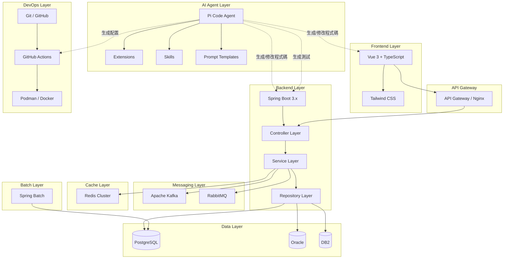
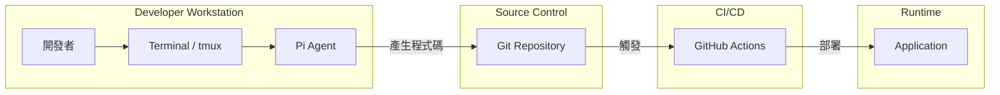
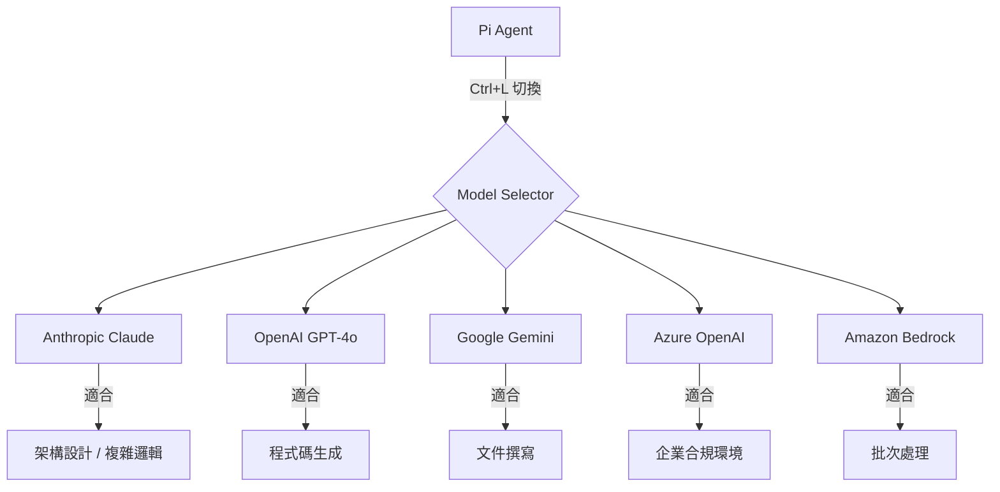
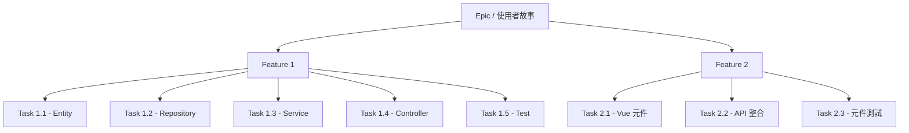
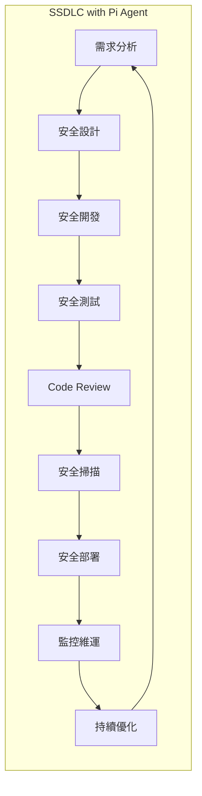
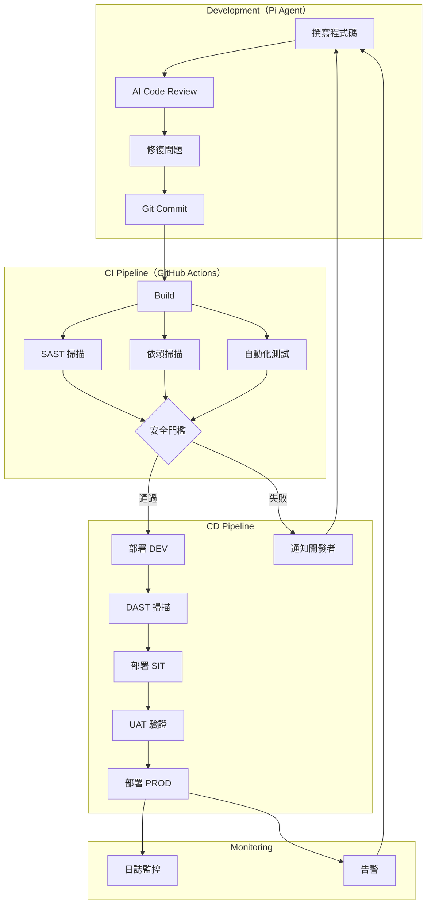
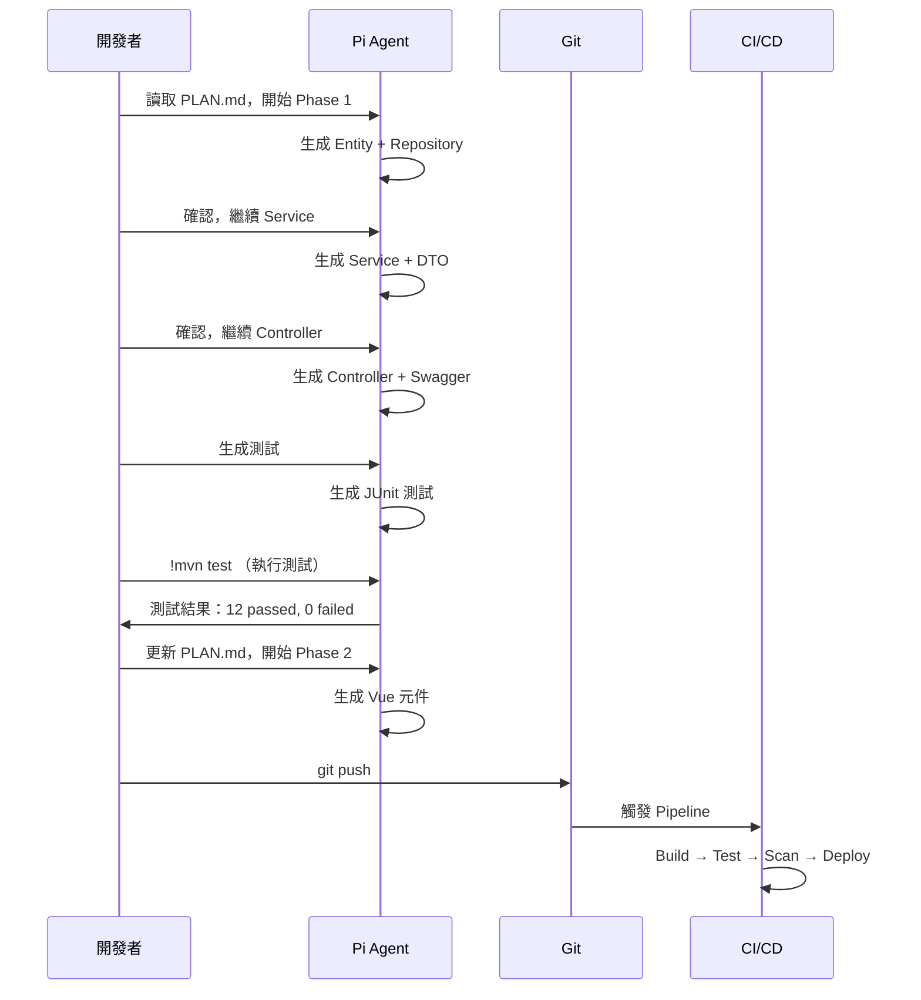
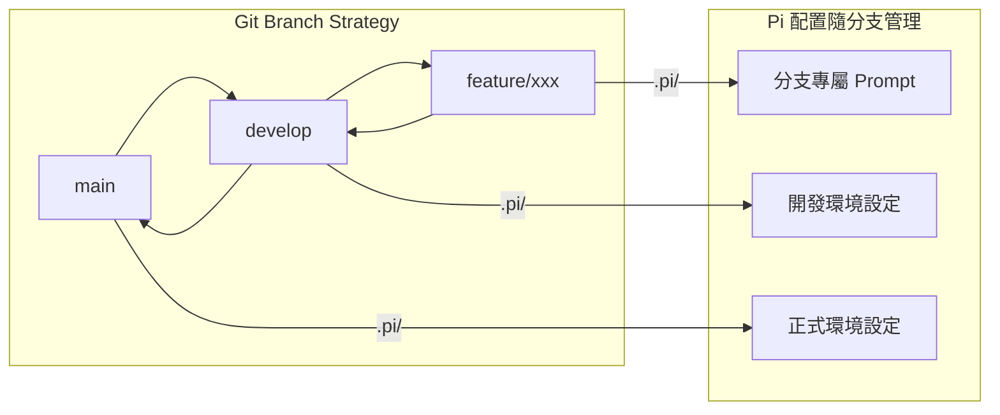
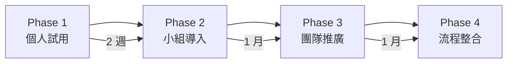

+++
date = '2026-05-31T10:00:00+08:00'
draft = false
title = 'Pi Code Agent 教學手冊'
tags = ['教學', 'AI開發']
categories = ['教學']
+++

# Pi Code Agent 教學手冊（Enterprise Edition）

> **版本**：v0.78.0（2026 年 5 月 31 日更新）  
> **適用對象**：資深工程師、架構師、DevOps 工程師  
> **技術棧**：Java / Spring Boot / Vue / TypeScript / Redis / Kafka / PostgreSQL  
> **授權**：MIT License  
> **開發公司**：[Earendil Inc.](https://earendil.com/)  
> **開源統計**：⭐ 58.1k+ Stars、210+ Contributors、225+ Releases、6.9k+ Forks

---

## 目錄（Table of Contents）

1. [概述（Overview）](#1-概述overview)
2. [核心設計哲學（Architecture Philosophy）](#2-核心設計哲學architecture-philosophy)
3. [系統架構設計（System Architecture）](#3-系統架構設計system-architecture)
4. [安裝與環境建置（Installation & Setup）](#4-安裝與環境建置installation--setup)
5. [基本使用教學（Getting Started）](#5-基本使用教學getting-started)
6. [Context Engineering（上下文工程）](#6-context-engineering上下文工程)
7. [PLAN.md 開發模式](#7-planmd-開發模式)
8. [Extensions / Skills / Prompt Templates / Themes](#8-extensions--skills--prompt-templates--themes)
9. [Pi Agent + SSDLC（企業重點）](#9-pi-agent--ssdlc企業重點)
10. [實戰案例（Hands-on）](#10-實戰案例hands-on)
11. [維運與監控（Operations）](#11-維運與監控operations)
12. [升級與版本管理（Upgrade Strategy）](#12-升級與版本管理upgrade-strategy)
13. [OSS Session 共享與社群貢獻](#13-oss-session-共享與社群貢獻)
14. [Best Practices（企業建議）](#14-best-practices企業建議)
15. [Anti-Patterns（重要）](#15-anti-patterns重要)
16. [結論（Conclusion）](#16-結論conclusion)
17. [檢查清單（Checklist）](#17-檢查清單checklist)

---

## 1. 概述（Overview）

### 1.1 Pi Code Agent 是什麼

Pi（又名 Pi Coding Agent）是由 [Mario Zechner（badlogic）](https://github.com/badlogic) 與 [Earendil Inc.](https://earendil.com/) 開發的**極簡終端 AI 程式碼開發工具**，以 MIT License 開源於 [GitHub](https://github.com/earendil-works/pi)。其核心定位為：

- **極簡終端控制框架**（Minimal Terminal Coding Harness）——適應開發者工作流，而非強迫開發者適應工具
- 預設僅掛載 **4 個工具**（`read`、`write`、`edit`、`bash`），透過內建全量 **7 個工具**（加上 `grep`、`find`、`ls`）即可覆蓋絕大多數開發場景
- 透過 TypeScript Extensions、Skills、Prompt Templates、Themes 四大擴充機制進行無限延伸
- 透過 **Pi Packages** 機制（npm / git / SSH / HTTPS）分享與安裝擴充套件
- 支援 **30+ LLM Provider**（Anthropic、OpenAI、Google Gemini、Google Vertex、Azure OpenAI、Amazon Bedrock、DeepSeek、Mistral、Groq、Cerebras、xAI、Hugging Face、Kimi For Coding、MiniMax、OpenRouter、Vercel AI Gateway、ZAI、OpenCode Zen、OpenCode Go、Cloudflare AI Gateway、Cloudflare Workers AI、Fireworks、Together AI、Xiaomi MiMo、Xiaomi MiMo Token Plan（China / Amsterdam / Singapore）等）
- npm 套件名稱：`@earendil-works/pi-coding-agent`
- Monorepo（[earendil-works/pi](https://github.com/earendil-works/pi)）包含 4 個核心套件：

| 套件 | 用途 |
|------|------|
| `@earendil-works/pi-ai` | 統一多 Provider LLM API（OpenAI / Anthropic / Google 等） |
| `@earendil-works/pi-agent-core` | Agent 執行時期與工具呼叫狀態管理 |
| `@earendil-works/pi-coding-agent` | 互動式編碼 Agent CLI |
| `@earendil-works/pi-tui` | 終端 UI 差異渲染函式庫 |

- 4 種運行模式：Interactive（互動）、Print / JSON（非互動）、RPC（JSON stdin/stdout 協議）、SDK（TypeScript 程式化嵌入）
- 另有獨立專案 [earendil-works/pi-chat](https://github.com/earendil-works/pi-chat) 提供 Slack / 聊天自動化整合
- 官方鼓勵開發者 [共享 OSS 編碼 Session](https://github.com/badlogic/pi-share-hf)，協助改善模型與工具評估

Pi 的設計理念是「**適應你的工作流，而非讓你適應工具**」。官方自述：「Pi is aggressively extensible so it doesn't have to dictate your workflow.」

### 1.2 與其他工具比較

| 特性 | Pi Code Agent | Claude Code | GitHub Copilot | Cursor |
|------|--------------|-------------|----------------|--------|
| **運行環境** | Terminal（CLI） | Terminal（CLI） | VS Code / IDE | 獨立 IDE |
| **開源** | ✅ MIT | ❌ 閉源 | ❌ 閉源 | ❌ 閉源 |
| **可擴充性** | ✅ Extension/Skill/Prompt/Theme | ❌ 有限 | ✅ MCP/Extension | ❌ 有限 |
| **Plan Mode** | ✅ PLAN.md + Extension 範例 | ✅ 內建 | ❌ 無 | ✅ 內建 |
| **Sub-Agents** | ✅ Extension 範例可實作 | ✅ 內建 | ✅ 有限 | ❌ 無 |
| **MCP 支援** | ✅ Extension 範例可整合 | ✅ 原生 | ✅ 原生 | ✅ 原生 |
| **多模型切換** | ✅ 30+ Provider | ❌ Anthropic only | ❌ 有限 | ✅ 多模型 |
| **Session 管理** | ✅ 樹狀分支/Fork/Clone | ✅ 基本 | ❌ 無 | ❌ 無 |
| **成本控制** | ✅ 即時顯示 Token/Cost | ❌ 有限 | ❌ 訂閱制 | ❌ 訂閱制 |
| **自訂系統提示** | ✅ AGENTS.md / SYSTEM.md | ❌ 有限 | ✅ Instructions | ❌ Rules |
| **SDK/嵌入** | ✅ TypeScript SDK + RPC | ❌ 無 | ❌ 無 | ❌ 無 |
| **套件生態** | ✅ Pi Packages (npm/git) | ❌ 無 | ✅ Marketplace | ❌ 無 |

> **重要澄清**：Pi 不「內建」Plan Mode、Sub-Agents、MCP 等功能，但透過其 Extension 系統皆可實現。官方 `examples/extensions/` 提供了 **55+ 個範例檔案與 8 個完整目錄範例**，涵蓋以下類別：
>
> | 類別 | 代表範例 |
> |------|---------|
> | 生命週期與安全 | `permission-gate.ts`、`protected-paths.ts`、`confirm-destructive.ts`、`dirty-repo-guard.ts`、`sandbox/` |
> | 自訂工具 | `todo.ts`、`tool-override.ts`、`dynamic-tools.ts`、`structured-output.ts`、`ssh.ts`、`subagent/` |
> | 命令與 UI | `plan-mode/`、`preset.ts`、`handoff.ts`、`interactive-shell.ts`、`doom-overlay/`、`modal-editor.ts`、`snake.ts` |
> | Git 整合 | `git-checkpoint.ts`、`auto-commit-on-exit.ts`、`git-merge-and-resolve.ts` |
> | 系統提示與壓縮 | `pirate.ts`、`claude-rules.ts`、`custom-compaction.ts`、`trigger-compact.ts` |
> | 自訂 Provider | `custom-provider-anthropic/`、`custom-provider-gitlab-duo/` |
> | Session 後設資料 | `session-name.ts`、`bookmark.ts` |
> | 訊息與通訊 | `message-renderer.ts`、`event-bus.ts`、`notify.ts` |
>
> Pi 的哲學是**不在核心中堆疊功能**，而是讓使用者按需組裝。你甚至可以直接請 Pi 為你建構 Extension——`pi can create extensions`。

### 1.3 適用場景

#### ✅ 適合使用 Pi 的情境

- **企業級專案開發**：需要完全透明、可審計的 AI 開發流程
- **多模型策略**：同一專案中需切換不同 LLM（如 Claude 做設計、GPT 做測試）
- **客製化工作流**：團隊有獨特的開發規範或安全要求
- **CLI 優先的開發者**：習慣終端操作、tmux 工作流
- **成本敏感環境**：需要精確控制 Token 使用量

#### ⚠️ 不適合的情境

- 需要圖形化介面的開發者（建議用 Cursor 或 Copilot）
- 不熟悉終端操作的初學者
- 需要即開即用、零配置的場景

> **實務建議**：建議團隊中至少一位成員熟悉 TypeScript，以便開發自訂 Extension。Pi 的價值在於**可塑性**，投入客製化的時間會在長期開發中獲得回報。

---

## 2. 核心設計哲學（Architecture Philosophy）

### 2.1 極簡主義（Minimalism）

Pi 的核心僅提供七個內建工具，其中**預設啟用四個**（`read`、`write`、`edit`、`bash`）：

| 工具 | 用途 | 預設啟用 |
|------|------|---------|
| `read` | 讀取檔案內容（支援圖片辨識） | ✅ |
| `write` | 寫入檔案 | ✅ |
| `edit` | 編輯檔案（差異替換，支援多區域批次編輯） | ✅ |
| `bash` | 執行 Shell 命令（串流輸出、可攔截） | ✅ |
| `grep` | 正則搜尋檔案內容 | ❌（需明確啟用） |
| `find` | 搜尋檔案路徑 | ❌（需明確啟用） |
| `ls` | 列出目錄內容 | ❌（需明確啟用） |

> **設計考量**：Pi 在 v0.70+ 後將預設工具精簡為 4 個，因為 `bash` 已可執行 `grep`、`find`、`ls` 等效操作。若專案需要更精細的工具控制，可透過 `--tools` 明確指定。

```bash
# 啟用全部 7 個內建工具
pi --tools read,bash,edit,write,grep,find,ls

# 唯讀模式（Code Review 用）
pi --tools read,grep,find,ls -p "Review the code"

# 禁用所有工具
pi --no-tools

# 禁用內建工具但保留 Extension 工具
pi --no-builtin-tools

# 排除特定工具（保留其餘）
pi --exclude-tools bash,write
```

**設計理念**：不內建功能，讓使用者透過 Extension 自行擴充。這確保核心保持輕量且穩定。

### 2.2 可觀測性（Observability）

Pi 的每一個操作都是**可見且可中斷的**：

- 所有工具呼叫的輸入/輸出皆在終端即時顯示
- 按 `Ctrl+O` 展開/收合工具輸出
- 按 `Ctrl+T` 展開/收合 Thinking Block
- 按 `Escape` 可隨時中斷操作（連按兩下開啟 `/tree`）
- 按 `Ctrl+G` 開啟外部編輯器（如 vim、nano）
- Session 以 JSONL 格式儲存，完全可追溯

```
# Session 儲存位置
~/.pi/agent/sessions/<encoded-cwd>/

# 也可自訂 Session 目錄
pi --session-dir /path/to/sessions
```

### 2.3 PLAN.md 驅動開發

Pi **刻意不內建 Plan Mode**，原因如下：

1. 內建 Plan Mode 是「黑盒」——你無法版控、無法跨會話共享
2. PLAN.md 是純文字檔，可以 Git 版控
3. 團隊成員可以共同編輯 PLAN.md
4. AI 和人類都可以讀寫 PLAN.md

> 如果你真的需要 Plan Mode，Pi 提供了官方 Extension 範例 `examples/extensions/plan-mode/` 來實作，包含步驟追蹤、進度小工具和唯讀 bash 允許清單。

### 2.4 明確的「不做」原則

Pi 的設計哲學中有數項**刻意不做**的決定：

| 不做的事 | 替代方案 | 理由 |
|---------|---------|------|
| **No Sub-Agents** | tmux 多實例 / Extension 實作 | 子代理使偵錯複雜化，tmux 提供完整可觀測性 |
| **No Built-in To-dos** | 使用 `TODO.md` 檔案 | 內建待辦會混淆模型，純文字檔更可靠 |
| **No Permission Popups** | PLAN.md + Extension 權限閘門 | 彈出視窗中斷工作流，PLAN.md 提供更好的控制 |
| **No Background Bash** | 使用 tmux | 背景執行缺乏可觀測性，tmux 提供完整控制 |
| **No Built-in MCP** | Extension 整合 / CLI 工具 + Skills | MCP 可透過 Extension 實現，但官方建議使用 CLI 工具搭配 README（見 [Why?](https://mariozechner.at/posts/2025-11-02-what-if-you-dont-need-mcp/)） |
| **No GUI** | TUI 終端介面 | CLI 天然適合自動化、遠端連線和管道操作 |

### 2.5 優點與缺點分析

#### 優點

| 項目 | 說明 |
|------|------|
| 完全透明 | 所有操作可見、可追溯、可審計 |
| 高度可擴充 | TypeScript Extension 可做任何事 |
| 多模型支援 | 30+ Provider，隨時切換 |
| 成本可控 | 即時顯示 Token 用量與費用 |
| 無廠商鎖定 | 開源 MIT，可自行 Fork |
| 輕量快速 | 啟動快，資源佔用低 |
| 多運行模式 | Interactive / Print / RPC / SDK |
| 完整 SDK | 可程式化嵌入自有系統 |

#### 缺點

| 項目 | 說明 |
|------|------|
| 學習曲線 | 需熟悉終端操作與 TypeScript |
| 無 GUI | 不適合需要視覺化的工作流 |
| 需自行配置 | 不像 Cursor 般即開即用 |
| 社群較小 | 相比 Copilot/Cursor，生態系較年輕 |

> **實務案例**：某團隊將 Pi 用於後端 API 開發（利用 Claude 模型），同時用 GitHub Copilot 處理前端 Vue 元件。Pi 的多模型支援讓他們可以在同一終端中切換使用最適合各階段的模型。

---

## 3. 系統架構設計（System Architecture）

### 3.1 企業級 Web 系統架構圖

以下展示使用 Pi Agent 開發大型 Web 系統的完整架構：



### 3.2 Pi 在架構中的定位

Pi Agent 運作在**開發者工作站層**，而非系統運行時：



### 3.3 Agent 參與開發流程

Pi Agent 在 SDLC 各階段的參與方式：

| 階段 | Pi 的角色 | 使用方式 |
|------|----------|---------|
| 需求分析 | 協助產生 User Story | Prompt Template |
| 系統設計 | 生成架構文件、API Spec | PLAN.md + Skill |
| 開發 | 生成/修改程式碼 | 互動模式 |
| 測試 | 生成測試案例 | Extension + Skill |
| Code Review | AI 審查程式碼 | 唯讀模式 |
| 部署 | 生成 CI/CD 配置 | Prompt Template |
| 維運 | Log 分析、問題診斷 | 互動模式 |

### 3.4 多模型策略架構



> **實務建議**：建議在 `settings.json` 中設定 `scopedModels`，讓 `Ctrl+P` 可以快速在常用模型間切換，避免每次都要搜尋。

---

## 4. 安裝與環境建置（Installation & Setup）

### 4.1 系統需求

| 項目 | 需求 |
|------|------|
| Node.js | v18.0+（建議 v20 LTS） |
| npm | v9.0+（或 pnpm / yarn） |
| 作業系統 | Windows / macOS / Linux / Android（Termux） |
| 終端 | 建議使用 Windows Terminal / iTerm2 / Alacritty / Kitty |
| Git | v2.30+ |

> **平台支援說明**：
> - **Windows**：需使用 Windows Terminal；不支援原生 `Ctrl+Z` 暫停，但其餘功能完整。詳見 [docs/windows.md](https://github.com/earendil-works/pi/blob/main/packages/coding-agent/docs/windows.md)。
> - **macOS / Linux**：完整支援，包含 `Ctrl+Z` 暫停/恢復。Linux ARM64（musl）亦支援。
> - **Android（Termux）**：`pkg install nodejs termux-api git && npm install -g --ignore-scripts @earendil-works/pi-coding-agent`
> - **tmux**：建議搭配使用，需啟用 `set -g extended-keys on`。詳見 [docs/tmux.md](https://github.com/earendil-works/pi/blob/main/packages/coding-agent/docs/tmux.md)。

### 4.2 安裝步驟

#### Windows

```powershell
# 1. 確認 Node.js 版本
node --version  # 需 >= 18

# 2. 全域安裝 Pi Coding Agent
npm install -g --ignore-scripts @earendil-works/pi-coding-agent

# 3. 確認安裝成功
pi --version
```

#### macOS / Linux

```bash
# 1. 確認 Node.js 版本
node --version  # 需 >= 18

# 2a. 全域安裝（npm）
npm install -g --ignore-scripts @earendil-works/pi-coding-agent

# 2b. 替代方式：使用 Installer Script
curl -fsSL https://pi.dev/install.sh | sh

# 3. 確認安裝
pi --version
```

#### 解安裝

```bash
# npm 安裝的解安裝
npm uninstall -g @earendil-works/pi-coding-agent

# pnpm 安裝的解安裝
pnpm remove -g @earendil-works/pi-coding-agent

# yarn 安裝的解安裝
yarn global remove @earendil-works/pi-coding-agent
```

### 4.3 認證設定

Pi 支援兩種認證方式：

#### 方式一：API Key（推薦用於企業環境）

```bash
# Anthropic
export ANTHROPIC_API_KEY=sk-ant-xxx

# OpenAI
export OPENAI_API_KEY=sk-xxx

# DeepSeek
export DEEPSEEK_API_KEY=xxx

# Google Gemini
export GOOGLE_API_KEY=xxx

# Google Vertex AI
export GOOGLE_CLOUD_API_KEY=xxx  # 或使用 Application Default Credentials

# Azure OpenAI
export AZURE_OPENAI_API_KEY=xxx
export AZURE_OPENAI_ENDPOINT=https://xxx.openai.azure.com

# Amazon Bedrock
# 使用 AWS CLI 預設認證鏈，或設定：
export AWS_ACCESS_KEY_ID=xxx
export AWS_SECRET_ACCESS_KEY=xxx
export AWS_REGION=us-east-1
# 替代方式：Bearer Token
export AWS_BEARER_TOKEN_BEDROCK=xxx

# Mistral
export MISTRAL_API_KEY=xxx

# Groq
export GROQ_API_KEY=xxx

# Cerebras
export CEREBRAS_API_KEY=xxx

# xAI (Grok)
export XAI_API_KEY=xxx

# Hugging Face
export HF_TOKEN=xxx

# Kimi For Coding (Moonshot AI)
export KIMI_API_KEY=xxx

# MiniMax / MiniMax China
export MINIMAX_API_KEY=xxx

# OpenRouter
export OPENROUTER_API_KEY=xxx

# Cloudflare AI Gateway
export CLOUDFLARE_API_KEY=xxx

# Cloudflare Workers AI
export CLOUDFLARE_WORKERS_AI_API_KEY=xxx

# Fireworks
export FIREWORKS_API_KEY=xxx

# Together AI
export TOGETHER_API_KEY=xxx

# Xiaomi MiMo
export XIAOMI_API_KEY=xxx
# 另支援 Xiaomi MiMo Token Plan（China / Amsterdam / Singapore 三個區域版本）

# ZAI (z.ai)
export ZAI_API_KEY=xxx

# OpenCode Zen
export OPENCODE_ZEN_API_KEY=xxx

# OpenCode Go
export OPENCODE_API_KEY=xxx

# Vercel AI Gateway
export VERCEL_API_KEY=xxx
```

> **安全提醒**：
> - 請勿將 API Key 寫入程式碼或 Git 中。使用環境變數或 Secret Manager。
> - 在 `auth.json` 中可使用 Shell 命令解析：`"anthropic": "!security find-generic-password -ws 'anthropic'"`
> - API Key 也可存於 `~/.pi/agent/auth.json`：`{ "anthropic": "sk-ant-xxx" }`

#### 方式二：OAuth 訂閱登入

```bash
pi
/login  # 在互動模式中登入
```

支援的訂閱服務：

| 訂閱服務 | 說明 |
|---------|------|
| **Anthropic Claude Pro/Max** | 注意：第三方使用扣除額外用量，依 Token 計費 |
| **OpenAI ChatGPT Plus/Pro（Codex）** | 支援 `gpt-4o`、`o3`、`o4-mini` 等模型 |
| **GitHub Copilot** | 支援 Copilot Business/Enterprise 帳戶 |

> **自訂 Provider 與模型**：若你的 Provider 使用 OpenAI / Anthropic / Google 相容 API，可在 `~/.pi/agent/models.json` 中新增自訂模型定義。若需自訂 OAuth 或特殊 API 協議，可透過 Extension 實作。詳見 [docs/models.md](https://github.com/earendil-works/pi/blob/main/packages/coding-agent/docs/models.md) 與 [docs/custom-provider.md](https://github.com/earendil-works/pi/blob/main/packages/coding-agent/docs/custom-provider.md)。

### 4.4 供應鏈安全

Pi v0.78.0 持續強化供應鏈安全機制，是所有開源 AI Agent 中措施最完善的之一：

| 安全措施 | 說明 |
|---------|------|
| `--ignore-scripts` 預設 | `npm install` 加入 `--ignore-scripts` 防止 postinstall 惡意腳本 |
| `npm-shrinkwrap.json` | 所有依賴版本完全鎖定（由根 lockfile 產生），可重現建構 |
| 依賴釘選（pinned deps） | 直接外部依賴固定到精確版本；`.npmrc` 設定 `save-exact=true` 與 `min-release-age=2`，避免引入當日新發佈的套件 |
| Lockfile 保護 | Pre-commit hook 阻擋意外 lockfile 提交，除非設定 `PI_ALLOW_LOCKFILE_CHANGE=1` |
| CI 安全掃描 | 持續整合使用 `npm ci --ignore-scripts`，排程工作流執行 `npm audit --omit=dev` 與 `npm audit signatures --omit=dev` |
| 生命週期腳本白名單 | Shrinkwrap 產生時有明確的 lifecycle scripts 白名單，新增依賴腳本須經過審查 |
| Release 煙霧測試 | 釋出前使用 `npm run release:local` 在隔離環境中建構、打包、安裝驗證 |
| Pi Packages 權限模型 | Extension 執行於主程序內，擁有系統存取權限——**安裝前務必審查原始碼** |

```bash
# 確認安裝完整性
npm ls -g @earendil-works/pi-coding-agent

# 離線模式（不檢查更新、不送遙測資料）
pi --offline
# 或設定環境變數
export PI_OFFLINE=true
```

#### 進階環境變數

| 變數 | 用途 |
|------|------|
| `PI_OFFLINE` | 完全離線模式（停用更新檢查、套件更新檢查、安裝遙測） |
| `PI_SKIP_VERSION_CHECK` | 僅跳過啟動時的 pi.dev 版本檢查（不影響遙測） |
| `PI_TELEMETRY` | `0`/`false`/`no` 停用安裝/更新遙測；`1`/`true`/`yes` 啟用。不影響版本檢查 |
| `PI_CACHE_RETENTION` | `long` 延長 Prompt Cache（Anthropic: 1 小時、OpenAI: 24 小時） |
| `PI_CODING_AGENT_DIR` | 自訂全域設定目錄（取代 `~/.pi/agent`） |
| `PI_CODING_AGENT_SESSION_DIR` | 自訂 Session 儲存路徑（可被 `--session-dir` 覆蓋） |
| `PI_PACKAGE_DIR` | 自訂已安裝 Pi Packages 目錄（適用 Nix/Guix 等路徑 tokenize 不佳的環境） |
| `VISUAL` / `EDITOR` | 指定 `Ctrl+G` 開啟的外部編輯器（如 vim、nano、code） |
| `PI_ALLOW_LOCKFILE_CHANGE` | `1` 允許 pre-commit hook 提交 lockfile 變更（供維護者使用） |

### 4.5 專案初始化

```bash
# 進入專案目錄
cd /path/to/your-project

# 建立 Pi 專案配置目錄
mkdir -p .pi/extensions .pi/skills .pi/prompts .pi/themes

# 建立 AGENTS.md（專案指引）
cat > AGENTS.md << 'EOF'
# 專案指引

## 技術棧
- 後端：Java 21 + Spring Boot 3.5
- 前端：Vue 3 + TypeScript + Tailwind CSS
- 資料庫：PostgreSQL 16
- 快取：Redis 7
- 訊息佇列：Kafka 3.x

## 程式碼規範
- 使用 Clean Architecture
- Controller → Service → Repository 分層
- 所有 API 必須有 Swagger 文件
- 測試覆蓋率 > 80%

## 命名規範
- 類別：PascalCase
- 方法/變數：camelCase
- 常數：UPPER_SNAKE_CASE
- 資料表：snake_case
EOF
```

### 4.6 全域設定

```bash
# 建立全域配置目錄
mkdir -p ~/.pi/agent/prompts ~/.pi/agent/skills ~/.pi/agent/extensions

# 編輯全域設定
cat > ~/.pi/agent/settings.json << 'EOF'
{
  "provider": "anthropic",
  "model": "claude-sonnet-4-20250514",
  "thinking": "medium",
  "enableInstallTelemetry": false,
  "compaction": {
    "enabled": true,
    "mode": "auto"
  }
}
EOF
```

### 4.7 專案層級設定

```bash
cat > .pi/settings.json << 'EOF'
{
  "provider": "anthropic",
  "model": "claude-sonnet-4-20250514",
  "thinking": "high",
  "tools": ["read", "write", "edit", "bash", "grep", "find", "ls"]
}
EOF
```

### 4.8 目錄結構一覽

```
your-project/
├── .pi/                          # Pi 專案配置
│   ├── settings.json             # 專案設定（覆蓋全域，唯讀版控用）
│   ├── extensions/               # 專案 Extension
│   ├── skills/                   # 專案 Skill
│   ├── prompts/                  # 專案 Prompt Template
│   └── themes/                   # 專案 Theme
├── .agents/                      # Agent Skills 標準路徑（替代 .pi/skills/）
│   └── skills/                   # 依 Agent Skills 標準組織
├── AGENTS.md                     # 專案指引（Pi 啟動時自動載入）
├── CLAUDE.md                     # AGENTS.md 的別名（相容 Claude Code 用戶）
├── SYSTEM.md                     # 自訂系統提示（取代預設系統提示）
├── APPEND_SYSTEM.md              # 附加到系統提示末尾（不取代）
├── PLAN.md                       # 開發計畫（手動維護）
├── src/                          # 原始碼
├── test/                         # 測試
└── ...

~/.pi/agent/                      # 全域配置
├── auth.json                     # API Key 與 OAuth Token
├── settings.json                 # 全域設定
├── models.json                   # 自訂模型定義
├── keybindings.json              # 自訂快捷鍵
├── sessions/                     # Session 儲存
│   └── <encoded-cwd>/           # 依專案路徑編碼
├── extensions/                   # 全域 Extension
├── skills/                       # 全域 Skill（也支援 ~/.agents/skills/）
├── prompts/                      # 全域 Prompt Template
├── themes/                       # 全域 Theme
└── bin/                          # 託管二進位檔（fd, rg）
```

> **Context Files 載入順序**：Pi 會從當前目錄向上遍歷父目錄，依序載入所有找到的 `AGENTS.md`（或 `CLAUDE.md`）。`SYSTEM.md` 取代預設系統提示；`APPEND_SYSTEM.md` 則附加在末尾。

### 4.9 常見錯誤與解法

| 錯誤 | 原因 | 解法 |
|------|------|------|
| `command not found: pi` | npm 全域路徑未加入 PATH | 確認 `npm prefix -g` 路徑在 PATH 中 |
| `ANTHROPIC_API_KEY not set` | 未設定環境變數 | `export ANTHROPIC_API_KEY=sk-ant-xxx` 或在 `auth.json` 中設定 |
| `Context overflow` | Session 過長 | 使用 `/compact` 或 `/new` 開新 Session |
| `Model not found` | 模型名稱錯誤 | `pi --list-models` 查看可用模型 |
| Windows 下 `Alt+Enter` 無效 | Windows Terminal 預設全螢幕 | 在 Windows Terminal 設定中重新映射 |
| Node.js 版本太舊 | Pi 需要 Node 18+ | 升級 Node.js 至 v20 LTS |
| `ERR_MODULE_NOT_FOUND` | pnpm 嚴格模式缺少依賴 | 重新安裝 `npm install -g --ignore-scripts @earendil-works/pi-coding-agent` |
| tmux 中 Shift+Enter 無效 | tmux 未啟用 extended-keys | 在 tmux.conf 加入 `set -g extended-keys on` |
| Ctrl+Z 在 Windows 下崩潰 | Windows 不支援 SIGTSTP | v0.67.4+ 已修復，更新到最新版 |

> **實務建議**：企業環境中建議統一使用 `nvm`（Node Version Manager）管理 Node.js 版本，並在專案中放置 `.nvmrc` 檔案指定版本。若使用 pnpm 或其他套件管理器，可在 `settings.json` 中設定 `"npmCommand": "pnpm"` 以確保相容。

---

## 5. 基本使用教學（Getting Started）

### 5.1 啟動 Pi Agent

```bash
# 基本啟動（互動模式）
pi

# 帶初始 Prompt 啟動
pi "列出 src/ 下所有 Java 檔案"

# 繼續上次 Session
pi -c

# 瀏覽並選擇 Session
pi -r

# 無 Session 模式（不儲存歷史）
pi --no-session

# 指定模型啟動
pi --provider anthropic --model claude-sonnet-4-20250514

# 簡寫模型指定
pi --model anthropic/claude-sonnet-4-20250514

# 指定思考等級（含 xhigh 超高思考）
pi --model sonnet:high "解決這個複雜問題"
pi --thinking xhigh "設計整個微服務架構"

# 從先前 Session 分支（fork）
pi --fork <session-id-or-path>

# 恢復指定 Session
pi --session <session-id-or-path>

# 不載入任何 Context Files
pi --no-context-files
pi -nc

# 附加系統提示
pi --append-system-prompt "所有回應使用繁體中文"

# 限制可用工具
pi --tools read,grep,find,ls  # 唯讀模式
pi --no-tools                  # 完全禁用工具
```

### 5.2 生成程式碼

#### 範例 1：生成 Spring Boot REST Controller

```
> 請幫我建立一個 UserController，包含 CRUD API，使用 Clean Architecture 分層：
> - Controller：處理 HTTP 請求
> - Service：業務邏輯
> - Repository：資料存取
> - Entity：資料模型
> 使用 JPA + PostgreSQL
```

#### 範例 2：生成 Vue 元件

```
> 建立一個 UserList.vue 元件：
> - 使用 Composition API + TypeScript
> - 使用 Tailwind CSS 排版
> - 包含搜尋、分頁功能
> - 呼叫 /api/users GET API
```

### 5.3 修改檔案

```
> 在 UserService.java 中新增一個 searchUsers 方法：
> - 參數：keyword (String), pageable (Pageable)
> - 回傳：Page<UserDTO>
> - 支援模糊搜尋 name 和 email
```

Pi 會使用 `edit` 工具進行差異替換，你可以在終端看到具體修改的內容。

### 5.4 執行指令

```
> 執行 Maven 測試
```

Pi 會呼叫 `bash` 工具執行：

```bash
mvn test
```

你也可以直接在終端中用 `!` 前綴執行命令：

```
!mvn clean compile    # 執行並將輸出傳給 LLM
!!mvn clean compile   # 執行但不傳給 LLM
```

### 5.5 Debug 技巧

```
> 這個測試失敗了，請分析原因：
> @src/test/java/com/example/UserServiceTest.java
> 
> 錯誤訊息：
> java.lang.NullPointerException at UserService.java:42
```

使用 `@` 前綴可以引入檔案內容到 Prompt 中。

### 5.6 常用互動模式操作

#### 快捷鍵一覽

| 操作 | 快捷鍵 | 說明 |
|------|--------|------|
| **模型管理** | | |
| 切換模型 | `Ctrl+L` | 開啟模型選擇器（保留編輯器文字） |
| 快速切換模型 | `Ctrl+P` | 在 Scoped Models 間向前循環 |
| 反向切換模型 | `Shift+Ctrl+P` | 在 Scoped Models 間向後循環 |
| **思考控制** | | |
| 切換思考等級 | `Shift+Tab` | off → minimal → low → medium → high → xhigh |
| 展開/收合思考 | `Ctrl+T` | 查看 LLM 的思考過程 |
| **工具與輸出** | | |
| 展開/收合工具輸出 | `Ctrl+O` | 查看或隱藏工具執行細節 |
| **Session 管理** | | |
| 開啟 Session Tree | `Escape` × 2 | 連按兩次 Escape 開啟 `/tree` |
| **編輯器** | | |
| 送出訊息（Steering） | `Enter` | 送出轉向訊息（如 Agent 正在運行，會在當前工具批次後插入） |
| 送出訊息（Follow-up） | `Alt+Enter` | 送出後續訊息（等待 Agent 完成後才送出） |
| 多行輸入 | `Shift+Enter` | 換行（tmux 需啟用 extended-keys） |
| 外部編輯器 | `Ctrl+G` | 在 vim/nano 等外部編輯器中編輯輸入 |
| 引用檔案 | `@` | 輸入 `@` 後模糊搜尋檔案引入 |
| 路徑補全 | `Tab` | 自動補全路徑和斜線命令 |
| 貼上圖片 | `Ctrl+V` | 貼上剪貼簿圖片（Windows 用 `Alt+V`） |
| Kill Line / Yank | `Ctrl+K` / `Ctrl+Y` | Emacs 風格 kill ring 操作 |
| Undo | `Ctrl+Z` | 復原上一步編輯 |
| Word 前進 / 後退 | `Alt+F` / `Alt+B` | Shell 風格單詞導航 |
| **中斷與退出** | | |
| 中斷 | `Escape` | 中斷當前操作 |
| 清除輸入 | `Ctrl+C` | 清除編輯器內容 |
| 退出 | `Ctrl+C` × 2 | 連按兩次退出 Pi |

#### Message Queue（訊息佇列機制）

Pi 具備獨特的**訊息佇列機制**，讓你在 Agent 運行中仍可送出訊息：

| 訊息類型 | 快捷鍵 | 行為 |
|---------|--------|------|
| **Steering（轉向）** | `Enter` | 在當前工具批次完成後立即插入，用於**引導方向** |
| **Follow-up（後續）** | `Alt+Enter` | 等待 Agent 完全完成後才送出，用於**追加任務** |

```
# 情境範例：Agent 正在修改 UserService.java
# 你突然想到還需要加入驗證邏輯：

Steering（Enter）: "等等，請在 createUser 方法中加入 email 格式驗證"
→ Agent 會在完成當前工具操作後讀取此訊息，改變方向

Follow-up（Alt+Enter）: "完成後請一併寫測試"
→ Agent 會先完成所有手頭工作，然後才處理此訊息
```

> **企業建議**：Steering 和 Follow-up 的行為可透過 `/settings` 調整 `steeringMode` 和 `followUpMode`。

#### 常用斜線命令

| 命令 | 說明 |
|------|------|
| `/new` | 開啟新 Session |
| `/tree` | 開啟 Session Tree（檢視分支歷史） |
| `/fork` | 從先前的訊息分支出新 Session |
| `/clone` | 複製當前分支到新 Session |
| `/resume` | 瀏覽並恢復先前 Session |
| `/model` | 切換 LLM 模型 |
| `/scoped-models` | 啟用/停用 `Ctrl+P` 循環中的模型 |
| `/thinking` | 切換思考等級 |
| `/compact` | 手動壓縮 Session 上下文 |
| `/share` | 上傳為 private GitHub Gist，產生可分享 HTML 連結 |
| `/export` | 匯出 Session 為 HTML 檔案 |
| `/changelog` | 顯示版本更新日誌 |
| `/copy` | 複製最後回應到剪貼簿 |
| `/config` | 檢視/切換已載入的資源 |
| `/settings` | 開啟設定選單（思考等級、主題、訊息傳遞模式、傳輸協議） |
| `/reload` | 熱重載所有資源（快捷鍵、AGENTS.md / Extension / Skill / Prompt / 主題自動熱重載） |
| `/login` | OAuth 訂閱登入 |
| `/name` | 為當前 Session 命名 |
| `/session` | 顯示當前 Session ID 與路徑 |
| `/hotkeys` | 顯示所有快捷鍵 |
| `/quit` | 退出 Pi |

#### CLI 啟動選項

```bash
# 為 Session 命名（方便 /resume 搜尋）
pi --name "feature-login-refactor"
pi -n "fix bug #1234"

# 離線模式（不檢查更新、不送遙測）
pi --offline

# 排除特定工具（保留其餘）
pi --exclude-tools bash,write
pi -xt bash,write

# 僅使用 Extension 工具，不載入內建工具
pi --no-builtin-tools
pi -nbt

# 停用所有資源探索，只載入指定的
pi --no-extensions -e ./my-ext.ts  # 僅載入指定 Extension
pi --no-skills --skill ./my-skill  # 僅載入指定 Skill
pi --no-prompt-templates           # 停用 Prompt Template 探索
pi --no-themes                     # 停用 Theme 探索

# 附加系統提示（可重複使用）
pi --append-system-prompt "所有回應使用繁體中文"
pi --append-system-prompt "遵循 Clean Architecture"

# 指定 API Key（覆蓋環境變數）
pi --api-key sk-ant-xxx

# 指定模型循環清單（Ctrl+P 使用）
pi --models "claude-*,gpt-4o"

# 列出可用模型
pi --list-models
pi --list-models "claude"  # 搜尋篩選
```

### 5.7 非互動模式（Print / JSON / RPC）

Pi 提供多種非互動運行模式，適合自動化與整合：

#### Print 模式（`-p`）

```bash
# 印出回應後退出
pi -p "分析 pom.xml 的依賴是否有安全漏洞"

# 管線輸入
cat README.md | pi -p "幫我翻譯成英文"

# 唯讀模式審查
pi --tools read,grep,find,ls -p "Review src/ 的程式碼品質"

# 指定思考等級
pi -p --thinking high "重構 UserService 為 Clean Architecture"
```

#### JSON 模式

```bash
# 結構化輸出（適合程式處理）
pi --mode json -p "列出所有 TODO" | jq '.result'
```

#### RPC 模式

```bash
# JSON 協議透過 stdin/stdout（適合 IDE 整合）
pi --mode rpc
# 送入 JSON 命令，接收 JSON 事件
```

> **重要**：RPC 模式使用嚴格的 LF 分隔 JSONL 格式。客戶端必須僅以 `\n` 分割記錄，**不可**使用 Node.js `readline` 等通用行讀取器（它們會在 JSON 負載中的 Unicode 分隔符號上誤分割）。

> **實務建議**：非互動模式非常適合整合到 CI/CD Pipeline 中，例如在 PR 建立時自動進行 Code Review。RPC 模式特別適合建構自有的前端 UI 或 IDE 外掛。

### 5.8 SDK 模式（程式化嵌入）

Pi 可作為 TypeScript 函式庫嵌入到自有系統中。v0.78.0 的 SDK API 需要明確建構認證、模型註冊與 Session 管理元件：

```typescript
import {
  AuthStorage,
  createAgentSession,
  ModelRegistry,
  SessionManager,
} from "@earendil-works/pi-coding-agent";

// 建構必要元件
const authStorage = AuthStorage.create();
const modelRegistry = ModelRegistry.create(authStorage);

// 建立 Agent Session
const { session } = await createAgentSession({
  sessionManager: SessionManager.inMemory(), // 或使用持久化 Session
  authStorage,
  modelRegistry,
});

// 送出訊息
await session.prompt("請審查 src/main/java 目錄下的 Controller 是否符合 RESTful 規範");

// 進階：多 Session 管理（使用 AgentSessionRuntime）
// 適合需要同時管理多個 Session 並在運行時替換的場景
// 詳見 docs/sdk.md 與 examples/sdk/
```

> **實際案例**：[openclaw/openclaw](https://github.com/openclaw/openclaw) 專案使用 Pi SDK 建構了法律文件自動化處理系統。進階的多 Session 運行時替換，可使用 `createAgentSessionRuntime()` 與 `AgentSessionRuntime`。

---

## 6. Context Engineering（上下文工程）

### 6.1 Context Files 體系

Pi 使用多層級的 Context Files 來建構 LLM 的系統提示。理解這套體系是有效使用 Pi 的關鍵。

| 檔案 | 作用 | 優先級 |
|------|------|--------|
| `AGENTS.md` | 專案指引，描述技術棧、規範、架構 | 自動載入，從 cwd 向上遍歷所有父目錄 |
| `CLAUDE.md` | `AGENTS.md` 的別名（相容 Claude Code 用戶） | 與 `AGENTS.md` 等效 |
| `SYSTEM.md` | 完全取代預設系統提示 | 取代，非附加 |
| `APPEND_SYSTEM.md` | 附加到系統提示末尾 | 附加，不取代 |
| Skills | 任務專精指引（如「寫測試」、「做 Code Review」） | 由 Agent 自動選擇或手動 `@skill-name` 觸發 |
| Prompt Templates | 可重複使用的提示範本 | 透過 `/template-name` 觸發 |

#### AGENTS.md 的作用鏈

```
~/.pi/agent/AGENTS.md           ← 全域指引（個人偏好）
  ↓
~/projects/company/AGENTS.md    ← 公司層級指引
  ↓
~/projects/company/my-app/AGENTS.md  ← 專案層級指引（cwd）
```

Pi 會依序載入從 cwd 到根目錄路徑上所有找到的 `AGENTS.md`，全部注入系統提示。

### 6.2 AGENTS.md 撰寫最佳實務

```markdown
# AGENTS.md - Spring Boot 微服務專案

## 技術棧
- Java 21 + Spring Boot 3.5 + Spring Cloud 2024
- PostgreSQL 16 + Redis 7 + Kafka 3.x
- Vue 3 + TypeScript + Tailwind CSS

## 架構原則
- Clean Architecture：Controller → Service → Repository
- 所有 API 必須有 OpenAPI 3.0 文件
- 禁止在 Controller 中寫業務邏輯

## 程式碼規範
- 測試覆蓋率 > 80%
- 所有 public 方法需有 JavaDoc
- 使用 Lombok @Slf4j 記錄日誌
- 例外處理使用 @ControllerAdvice

## 禁止事項
- 不得使用 System.out.println
- 不得在程式碼中硬編碼密碼或金鑰
- 不得跳過測試
```

### 6.3 SYSTEM.md vs APPEND_SYSTEM.md

| 用途 | 使用的檔案 | 範例場景 |
|------|-----------|---------|
| 完全覆蓋系統提示 | `SYSTEM.md` | 建構特殊用途 Agent（如 SQL-only Agent） |
| 在預設提示上增補 | `APPEND_SYSTEM.md` | 加入團隊特有的安全檢查清單 |
| CLI 附加 | `--append-system-prompt "..."` | 臨時增加指令（支援多次使用） |
| 禁用 Context Files | `--no-context-files` / `-nc` | 乾淨執行，不載入任何專案 Context |

```bash
# 範例：使用 SYSTEM.md 建構唯讀稽核 Agent
cat > SYSTEM.md << 'EOF'
You are a code auditor. You can only use read, grep, and find tools.
Never modify any files. Report findings in a structured format.
EOF

# 範例：附加安全檢查到現有提示
cat > APPEND_SYSTEM.md << 'EOF'
## Additional Security Requirements
- Always check for SQL injection vulnerabilities
- Flag any hardcoded credentials
- Verify input validation on all API endpoints
EOF
```

---

## 7. PLAN.md 開發模式

### 7.1 為什麼 Pi 不用 Plan Mode

| 議題 | 內建 Plan Mode | PLAN.md |
|------|---------------|---------|
| 可版控 | ❌ | ✅ Git 追蹤 |
| 跨會話共享 | ❌ | ✅ 任何 Session 可讀 |
| 多人協作 | ❌ | ✅ 團隊共同編輯 |
| 透明度 | ❌ 黑盒 | ✅ 純文字 |
| 格式自由 | ❌ 固定格式 | ✅ 自訂格式 |
| AI 可讀寫 | ❌ 僅 AI 內部 | ✅ AI + 人類皆可 |

### 7.2 PLAN.md 範本

```markdown
# PLAN.md - 使用者管理模組

## 專案資訊
- **模組名稱**：User Management
- **負責人**：@chihhung
- **Sprint**：Sprint 23（2026/04/21 - 2026/05/02）
- **狀態**：🔄 進行中

## 目標
建立完整的使用者管理功能，包含 CRUD、搜尋、權限控制。

## 任務分解

### Phase 1：後端 API（預估 3 天）

- [x] 建立 User Entity + JPA 設定
- [x] 建立 UserRepository
- [ ] 建立 UserService（含業務邏輯）
  - [ ] createUser()
  - [ ] updateUser()
  - [ ] deleteUser()
  - [ ] searchUsers()
- [ ] 建立 UserController
  - [ ] POST /api/users
  - [ ] PUT /api/users/{id}
  - [ ] DELETE /api/users/{id}
  - [ ] GET /api/users?keyword=xxx&page=0&size=20
- [ ] 建立 UserDTO + Mapper
- [ ] 撰寫 JUnit 測試（覆蓋率 > 80%）

### Phase 2：前端 UI（預估 2 天）

- [ ] UserList.vue - 使用者列表
- [ ] UserForm.vue - 新增/編輯表單
- [ ] UserDetail.vue - 使用者詳情
- [ ] API 整合（axios）
- [ ] 元件測試

### Phase 3：進階功能（預估 2 天）

- [ ] 角色權限（RBAC）
- [ ] 操作日誌（Audit Log）
- [ ] 匯出 Excel

## 技術決策
- 使用 Spring Data JPA Specification 做動態查詢
- DTO 轉換使用 MapStruct
- 密碼加密使用 BCrypt
- API 文件使用 SpringDoc OpenAPI

## 注意事項
- 所有 API 需加入 @PreAuthorize 權限控制
- 密碼欄位不得出現在 Response 中
- 刪除改用軟刪除（isDeleted flag）
```

### 7.3 任務拆解原則



**拆解原則**：
1. 每個 Task 應在 **30 分鐘內完成**
2. 每個 Task 應有**明確的完成標準**
3. Task 之間的**依賴關係**要清楚標示
4. 使用 Checkbox 追蹤進度

### 7.4 Sprint 規劃範例

```markdown
# Sprint 23 PLAN.md

## Sprint 目標
完成使用者管理模組的後端 API 與前端 UI。

## 每日任務安排

### Day 1（Mon）
- [ ] 設計 DB Schema（users, roles, user_roles）
- [ ] 建立 Entity + Repository
- [ ] Pi Prompt: "根據 PLAN.md 的 DB Schema 建立 JPA Entity"

### Day 2（Tue）
- [ ] 建立 Service Layer
- [ ] Pi Prompt: "建立 UserService，實作 PLAN.md Phase 1 的所有方法"

### Day 3（Wed）
- [ ] 建立 Controller + DTO
- [ ] 撰寫 Swagger 文件
- [ ] Pi Prompt: "建立 UserController，使用 SpringDoc 註解"

### Day 4（Thu）
- [ ] 撰寫 JUnit 測試
- [ ] Pi Prompt: "為 UserService 撰寫完整的 JUnit 5 測試"

### Day 5（Fri）
- [ ] 前端 UserList.vue
- [ ] Pi Prompt: "建立 UserList.vue，使用 Composition API + Tailwind"

## Retrospective（Sprint 結束後填寫）
- 什麼做得好：
- 什麼需要改進：
- Pi 使用心得：
```

### 7.5 實戰：開發 Web API 的 PLAN.md

在 Pi 互動模式中使用 PLAN.md：

```
> 請讀取 PLAN.md，然後開始執行 Phase 1 中尚未完成的第一個任務
```

```
> @PLAN.md 目前進度到哪了？請繼續下一個待辦事項
```

```
> 我完成了 UserService，請更新 PLAN.md 將該項標記為完成，
> 並告訴我下一步該做什麼
```

> **實務建議**：每次開始工作前，先讓 Pi 讀取 PLAN.md 了解上下文。這比重新描述需求更有效率，也確保 AI 的輸出與計畫一致。

---

## 8. Extensions / Skills / Prompt Templates / Themes

### 8.1 概覽

Pi 的四大擴充機制：

| 機制 | 用途 | 載入時機 | 開發語言 |
|------|------|---------|---------|
| **Extension** | 自訂工具、命令、快捷鍵、UI、Provider | 啟動時 | TypeScript |
| **Skill** | 按需載入的能力包（指令 + 工具） | 自動匹配或 `@skill-name` 觸發 | Markdown + YAML Frontmatter |
| **Prompt Template** | 可重用的 Prompt 範本 | `/name` 展開 | Markdown + YAML Frontmatter |
| **Theme** | 自訂終端配色主題 | 啟動時，支援熱重載 | JSON |

### 8.2 Prompt Templates

放置位置：
- 全域：`~/.pi/agent/prompts/`
- 專案：`.pi/prompts/`

#### 範例：Code Review 模板

```markdown
<!-- .pi/prompts/review.md -->
請對以下程式碼進行 Code Review，檢查：

1. **安全性**：SQL Injection、XSS、CSRF、敏感資訊洩漏
2. **效能**：N+1 Query、不必要的迴圈、記憶體洩漏
3. **可維護性**：命名規範、方法長度、單一職責
4. **測試**：是否有對應測試、邊界條件
5. **Clean Architecture**：是否違反分層規則

目標檔案：{{file}}

請用表格格式輸出發現的問題，包含：嚴重度、行號、問題描述、建議修改。
```

使用方式：
```
/review
```

#### 範例：測試生成模板

```markdown
<!-- .pi/prompts/gen-test.md -->
請為 {{file}} 生成完整的 JUnit 5 測試：

要求：
1. 使用 @ExtendWith(MockitoExtension.class)
2. 每個 public 方法至少 3 個測試案例（正常、邊界、異常）
3. 使用 @DisplayName 描述測試目的
4. Mock 外部依賴
5. 使用 AssertJ 斷言
6. 測試覆蓋率目標 > 80%
```

#### 範例：帶引數提示的 Prompt Template

```markdown
---
argument-hint: 要產生 API 的資源名稱（如 User, Order）
---
請為 {{input}} 資源建立完整的 RESTful API：

1. Entity + JPA 註解
2. Repository（Spring Data JPA）
3. Service（含 DTO 轉換）
4. Controller（含 Swagger 註解）
5. JUnit 測試
```

### 8.3 Skills

Skills 遵循 [Agent Skills 標準](https://agentskills.io/)，是按需載入的能力包。LLM 會根據上下文自動選擇適當的 Skill，或由使用者透過 `@skill-name` 手動觸發。

放置位置：
- 全域：`~/.pi/agent/skills/`
- 專案：`.pi/skills/` 或 `.agents/skills/`（兩者皆支援）

#### 範例：資料庫遷移 Skill

```markdown
<!-- .pi/skills/db-migration/SKILL.md -->
# Database Migration Skill

使用此 Skill 管理資料庫 Schema 遷移。

## 工具

### flyway-migrate
執行 Flyway 遷移：
```bash
mvn flyway:migrate
```

### flyway-info
查看遷移狀態：
```bash
mvn flyway:info
```

## 步驟

1. 在 `src/main/resources/db/migration/` 下建立遷移檔案
2. 命名規範：`V{版號}__{描述}.sql`（如 `V1.0__create_users_table.sql`）
3. 執行 `flyway-migrate` 套用變更
4. 執行 `flyway-info` 確認狀態

## 注意事項
- 已套用的遷移檔案**不可修改**
- 使用 `V` 前綴做版本遷移，`R` 前綴做可重複遷移
- 生產環境遷移前必須先在 SIT/UAT 驗證
```

使用方式：
```
/skill:db-migration
```
或 AI 會根據上下文自動載入相關 Skill。

### 8.4 Extensions

Extensions 是 TypeScript 模組，擁有完整的 Pi API 存取權限。預設匯出函式可為同步或 `async`——Pi 會等待非同步初始化完成後才繼續啟動，這對需要在啟動前取得遠端模型清單的場景特別有用。

放置位置：
- 全域：`~/.pi/agent/extensions/`
- 專案：`.pi/extensions/`

#### Extension 能力一覽

| 能力 | 說明 |
|------|------|
| 自訂工具 | 註冊新工具或完全取代內建工具 |
| 子代理（Sub-agents） | 委派任務給專業化子代理，使用隔離的上下文視窗 |
| Plan Mode | 實作 Claude Code 風格的計畫模式 |
| 自訂壓縮 | 自訂上下文壓縮與摘要策略 |
| 權限閘門 | 路徑保護與危險操作確認 |
| 自訂編輯器與 UI | 替換編輯器、新增 Widget、Status Line、Header/Footer、Overlay |
| SSH / Sandbox 執行 | 透過 SSH 委派工具到遠端機器，或使用沙箱執行 |
| MCP 伺服器整合 | 透過 Extension 連接 MCP 伺服器 |
| Git 自動化 | Checkpoint、Auto-commit、Merge 與衝突解決 |
| 自訂 Provider | 實作自訂 LLM Provider（含 OAuth） |
| 遊戲 | Doom、Snake、Space Invaders、Tic-Tac-Toe 等（等待時娛樂） |

#### 範例 1：Git Checkpoint Extension

```typescript
// .pi/extensions/git-checkpoint.ts
import type { ExtensionAPI } from "@earendil-works/pi-coding-agent";

export default function (pi: ExtensionAPI) {
  // 在每次工具呼叫後自動 Git Commit
  pi.on("tool_result", async (event, ctx) => {
    if (event.toolName === "write" || event.toolName === "edit") {
      const filePath = event.args?.filePath || event.args?.file_path;
      if (filePath) {
        await ctx.bash(`git add ${filePath} && git commit -m "pi: auto-checkpoint ${filePath}" --no-verify`, {
          silent: true,
        });
      }
    }
  });

  // 註冊 rollback 命令
  pi.registerCommand("rollback", {
    description: "回滾到上一個 Git checkpoint",
    handler: async (args, ctx) => {
      await ctx.bash("git log --oneline -10");
      ctx.ui.notify("使用 git revert <commit> 來回滾特定變更", "info");
    },
  });
}
```

#### 範例 2：Permission Gate Extension（v0.78.0 推薦寫法）

```typescript
// .pi/extensions/permission-gate.ts
import type { ExtensionAPI } from "@earendil-works/pi-coding-agent";

export default function (pi: ExtensionAPI) {
  pi.on("tool_call", async (event, ctx) => {
    // 攔截危險的 bash 命令
    if (event.toolName === "bash" && event.input.command?.includes("rm -rf")) {
      const ok = await ctx.ui.confirm("⚠️ 危險操作", "確定要執行 rm -rf 嗎？");
      if (!ok) return { block: true, reason: "使用者取消了危險操作" };
    }
  });
}
```

#### 範例 3：自訂工具（使用 TypeBox Schema）

```typescript
// .pi/extensions/deploy-tool.ts
import type { ExtensionAPI } from "@earendil-works/pi-coding-agent";
import { Type } from "typebox";
import { StringEnum } from "@earendil-works/pi-ai";

export default function (pi: ExtensionAPI) {
  pi.registerTool({
    name: "deploy",
    label: "Deploy",
    description: "部署應用程式到指定環境",
    parameters: Type.Object({
      // 使用 StringEnum 確保 Google API 相容性
      environment: StringEnum(["dev", "sit", "uat"] as const, {
        description: "目標環境",
      }),
      version: Type.String({ description: "版本號（如 1.2.3）" }),
    }),
    async execute(toolCallId, params, onUpdate, ctx, signal) {
      if (params.environment === "prod") {
        return {
          content: [{ type: "text", text: "生產環境部署必須透過 CI/CD Pipeline" }],
          details: { blocked: true },
        };
      }

      ctx.ui.notify(`開始部署 v${params.version} 到 ${params.environment}...`, "info");

      const result = await ctx.bash(
        `./scripts/deploy.sh --env ${params.environment} --version ${params.version}`
      );

      return {
        content: [{ type: "text", text: result }],
        details: { environment: params.environment, version: params.version },
      };
    },
  });
}
```

> **重要提醒**：定義工具參數的字串列舉時，務必使用 `StringEnum`（來自 `@earendil-works/pi-ai`）而非 `Type.Union([Type.Literal(...)])`，後者在 Google API 中無法正常運作。

### 8.5 自動生成 Extension

你可以直接請 Pi 幫你寫 Extension：

```
> 幫我寫一個 Pi Extension，功能如下：
> 1. 註冊一個 /stats 命令，顯示目前專案的程式碼統計（行數、檔案數）
> 2. 在每次 Session 開始時，自動載入 PLAN.md 的內容
> 3. 把 Extension 放在 .pi/extensions/ 目錄下
```

### 8.6 Pi Packages（套件分享）

將 Extension、Skill、Prompt Template、Theme 打包為 Pi Package。可在 [npmjs.com](https://www.npmjs.com/search?q=keywords%3Api-package) 或 [Discord](https://discord.com/channels/1456806362351669492/1457744485428629628) 上搜尋社群套件。

```json
// package.json
{
  "name": "@myteam/pi-enterprise-tools",
  "version": "1.0.0",
  "keywords": ["pi-package"],
  "pi": {
    "extensions": ["./extensions"],
    "skills": ["./skills"],
    "prompts": ["./prompts"],
    "themes": ["./themes"]
  }
}
```

> **自動探索**：若 `package.json` 中沒有 `pi` 欄位，Pi 會自動從慣例目錄（`extensions/`、`skills/`、`prompts/`、`themes/`）中探索資源。

安裝與管理：

```bash
# 從 npm 安裝
pi install npm:@myteam/pi-enterprise-tools

# 從 npm 安裝指定版本（pinned version）
pi install npm:@myteam/pi-enterprise-tools@1.2.3

# 從 Git 安裝（支援多種 URL 格式）
pi install git:github.com/myteam/pi-enterprise-tools
pi install git:github.com/myteam/pi-enterprise-tools@v1.3.0  # pin 到 tag
pi install git:git@github.com:myteam/pi-enterprise-tools       # SSH 格式
pi install https://github.com/myteam/pi-enterprise-tools        # HTTPS 格式
pi install ssh://git@github.com/myteam/pi-enterprise-tools      # SSH URL 格式

# 專案本地安裝（僅當前專案，不影響全域）
pi install npm:@myteam/pi-enterprise-tools -l

# 列出已安裝套件
pi list

# 更新所有套件（跳過 pinned 版本）
pi update

# 僅更新 Pi 本體
pi update --self

# 強制重新安裝 Pi 本體
pi update --self --force

# 僅更新所有已安裝 Extension 套件
pi update --extensions

# 更新特定套件
pi update npm:@myteam/pi-enterprise-tools

# 移除套件（remove 與 uninstall 為同義）
pi remove npm:@myteam/pi-enterprise-tools
pi uninstall npm:@myteam/pi-enterprise-tools

# 啟用/停用已安裝資源
pi config
```

> **Pinned 版本行為**：Git 套件使用 `@ref` 指定的 tag 或 commit 為 pinned 版本，`pi update` 時會跳過。若要移至新版，需重新執行 `pi install git:host/user/repo@new-ref`。
>
> **Node 版本管理器整合**：若使用 mise、nvm 等版本管理器，可在 `settings.json` 中設定 `"npmCommand": ["mise", "exec", "node@20", "--", "npm"]`，確保套件安裝使用穩定的 npm 環境。
>
> **安全提醒**：Pi Packages 擁有完整的系統存取權限。Extension 可執行任意程式碼，Skill 可指示模型執行任何操作。安裝第三方套件前，請務必**審查原始碼**。

### 8.7 Themes（配色主題）

自訂終端 UI 的配色方案：

放置位置：
- 全域：`~/.pi/agent/themes/`
- 專案：`.pi/themes/`

```json
// .pi/themes/corporate.json
{
  "name": "Corporate Blue",
  "colors": {
    "primary": "#0078D4",
    "secondary": "#106EBE",
    "accent": "#FFB900",
    "background": "#1E1E1E",
    "text": "#D4D4D4",
    "success": "#4CAF50",
    "error": "#F44336",
    "warning": "#FF9800"
  }
}
```

在 `settings.json` 中指定主題：

```json
{
  "theme": "corporate"
}
```

> **提示**：主題支援 `/reload` 熱重載，修改後不需重啟 Pi。

---

## 9. Pi Agent + SSDLC（企業重點）

### 9.1 SSDLC 流程概覽



### 9.2 各階段 Pi 整合方式

#### (1) 安全設計（Secure Design）

```
> @PLAN.md 請針對使用者管理模組進行威脅模型分析（Threat Modeling），
> 使用 STRIDE 方法，並產出安全設計文件
```

#### (2) 安全開發（Secure Coding）

建立 Secure Coding 的 Prompt Template：

```markdown
<!-- .pi/prompts/secure-code.md -->
請在撰寫程式碼時遵循以下安全規範：

1. **輸入驗證**：所有外部輸入必須驗證（使用 Jakarta Validation）
2. **SQL 防注入**：使用 JPA Parameterized Query，禁止字串拼接
3. **XSS 防護**：輸出編碼，使用 OWASP Java Encoder
4. **CSRF 防護**：啟用 Spring Security CSRF Token
5. **認證授權**：使用 @PreAuthorize 控制 API 存取
6. **敏感資料**：密碼使用 BCrypt，日誌不得記錄敏感欄位
7. **錯誤處理**：不得將堆疊追蹤回傳給客戶端
8. **依賴安全**：不使用已知漏洞的依賴
```

#### (3) AI Code Review

```bash
# 使用唯讀模式進行安全審查
pi --tools read,grep,find,ls -p \
  "請對 src/main/java/com/example/controller/ 目錄下的所有 Controller 進行安全審查，
   檢查 OWASP Top 10 風險，以表格格式輸出結果"
```

#### (4) SAST / DAST 整合

````markdown
<!-- .pi/skills/security-scan/SKILL.md -->
# Security Scan Skill

## SAST（靜態分析）
```bash
# SpotBugs 安全掃描
mvn spotbugs:check

# SonarQube 掃描
mvn sonar:sonar -Dsonar.host.url=http://sonarqube:9000
```

## Dependency Scan
```bash
# OWASP Dependency Check
mvn org.owasp:dependency-check-maven:check
```

## 步驟
1. 執行 SAST 掃描
2. 分析報告
3. 修復發現的漏洞
4. 重新掃描驗證
````

#### (5) CI/CD 安全整合

```yaml
# .github/workflows/ssdlc.yml
name: SSDLC Pipeline

on:
  pull_request:
    branches: [main, develop]

jobs:
  security-scan:
    runs-on: ubuntu-latest
    steps:
      - uses: actions/checkout@v4

      - name: Setup Java
        uses: actions/setup-java@v4
        with:
          distribution: 'temurin'
          java-version: '21'

      - name: SAST - SpotBugs
        run: mvn spotbugs:check

      - name: Dependency Check
        run: mvn org.owasp:dependency-check-maven:check

      - name: Unit Tests
        run: mvn test

      - name: AI Code Review (Pi)
        env:
          ANTHROPIC_API_KEY: ${{ secrets.ANTHROPIC_API_KEY }}
        run: |
          npm install -g --ignore-scripts @earendil-works/pi-coding-agent
          pi --tools read,grep,find,ls -p \
            "Review all changed files for security issues. Output as JSON." \
            --mode json > review-results.json

      - name: Upload Results
        uses: actions/upload-artifact@v4
        with:
          name: security-reports
          path: |
            target/spotbugsXml.xml
            target/dependency-check-report.html
            review-results.json
```

### 9.3 DevSecOps 流程圖



> **實務建議**：在 PR 流程中整合 Pi 的非互動模式做自動 Code Review，可以在人工 Review 前先過濾掉明顯的安全問題，大幅提升效率。

---

## 10. 實戰案例（Hands-on）

### 10.1 案例概述

使用 Pi 從零建立一個**任務管理系統（Task Manager）**。

**技術棧**：
- 後端：Spring Boot 3.5 + Java 21
- 前端：Vue 3 + TypeScript + Tailwind CSS
- 資料庫：PostgreSQL 16
- API 文件：SpringDoc OpenAPI

### 10.2 Step 1：初始化專案

```
> 請幫我用 Spring Initializr 建立一個 Spring Boot 3.5 專案：
> - Group: com.example
> - Artifact: task-manager
> - Dependencies: Spring Web, Spring Data JPA, PostgreSQL Driver,
>   Spring Validation, SpringDoc OpenAPI
> - Java 21
> - 使用 Maven
```

### 10.3 Step 2：設計 DB Schema

```
> 設計 Task Manager 的資料庫 Schema：
> 
> tasks 表：
> - id (BIGSERIAL, PK)
> - title (VARCHAR 200, NOT NULL)
> - description (TEXT)
> - status (VARCHAR 20: TODO/IN_PROGRESS/DONE)
> - priority (VARCHAR 10: LOW/MEDIUM/HIGH)
> - assignee (VARCHAR 100)
> - due_date (TIMESTAMP)
> - created_at (TIMESTAMP, DEFAULT NOW())
> - updated_at (TIMESTAMP)
> - is_deleted (BOOLEAN, DEFAULT FALSE)
> 
> 請產生 Flyway 遷移腳本 V1.0__create_tasks_table.sql
```

### 10.4 Step 3：建立後端 API

```
> 根據 tasks 表建立完整的後端程式碼：
> 
> 1. TaskEntity.java - JPA Entity
> 2. TaskRepository.java - Spring Data JPA Repository
> 3. TaskService.java - 業務邏輯（含 DTO 轉換）
> 4. TaskController.java - REST API Controller
> 5. TaskDTO.java - 資料傳輸物件
> 6. TaskStatus.java / TaskPriority.java - Enum
> 
> API 規格：
> - POST   /api/tasks         建立任務
> - GET    /api/tasks          查詢任務列表（支援分頁、篩選）
> - GET    /api/tasks/{id}     查詢單一任務
> - PUT    /api/tasks/{id}     更新任務
> - DELETE /api/tasks/{id}     軟刪除任務
> 
> 要求：
> - 使用 Clean Architecture 分層
> - 加入 Jakarta Validation
> - 加入 SpringDoc Swagger 註解
> - 使用 Specification 做動態查詢
```

### 10.5 Step 4：撰寫測試

```
> 為 TaskService 撰寫完整的 JUnit 5 測試：
> - 使用 MockitoExtension
> - 每個方法至少 3 個測試案例
> - 包含正常流程、邊界條件、異常處理
> - 使用 AssertJ 斷言
```

### 10.6 Step 5：建立前端

```
> 使用 Vue 3 + TypeScript + Tailwind CSS 建立前端頁面：
> 
> 1. TaskList.vue - 任務列表頁
>    - 表格顯示所有任務
>    - 支援狀態篩選、搜尋
>    - 分頁功能
>    
> 2. TaskForm.vue - 新增/編輯任務的表單
>    - 表單驗證
>    - 日期選擇器
>    
> 3. api/taskApi.ts - API 呼叫層
>    - 使用 axios
>    - 統一錯誤處理
```

### 10.7 Step 6：部署配置

```
> 建立部署配置：
> 
> 1. Dockerfile（多階段建置）
> 2. docker-compose.yml（含 PostgreSQL）
> 3. application-dev.yml
> 4. application-prod.yml（敏感資訊用環境變數）
```

### 10.8 完整開發流程圖



> **實務建議**：每完成一個 Phase，使用 `/compact` 壓縮上下文，避免 Token 用量過高。同時用 `/tree` 標記重要節點方便回溯。

---

## 11. 維運與監控（Operations）

### 11.1 Log 設計

Pi 的所有操作記錄在 Session 檔案中（JSONL 格式）：

```bash
# Session 儲存位置
ls ~/.pi/agent/sessions/

# 匯出 Session 為 HTML（方便閱讀與分享）
pi --export session-file.jsonl output.html

# 上傳為 GitHub Gist 分享
# 在互動模式中使用 /share 命令
```

#### 建議的 Log 管理策略

```bash
# 定期清理過舊的 Session
find ~/.pi/agent/sessions/ -name "*.jsonl" -mtime +30 -delete

# 保留重要 Session（加入 Git 追蹤）
cp ~/.pi/agent/sessions/important-session.jsonl \
   ./docs/ai-sessions/
```

### 11.2 Agent 行為監控

```bash
# 使用 JSON 模式監控 Agent 行為
pi --mode json -p "執行安全掃描" 2>&1 | tee agent-log.json

# 監控 Token 使用量
# 在互動模式中，Footer 會即時顯示：
# - Total Tokens
# - Cache Usage
# - Cost（美元）
```

#### 使用 `/session` 命令查看統計

```
/session
# 輸出：
# Session ID: abc123
# Messages: 45
# Total Tokens: 125,000
# Cache Tokens: 89,000
# Cost: $0.42
```

### 11.3 Debug 方法

| 狀況 | 解法 |
|------|------|
| Agent 產出的程式碼有 Bug | 貼上錯誤訊息，讓 Pi 分析修復 |
| Agent 不遵循 AGENTS.md | 檢查 AGENTS.md 格式是否正確，重啟 Session |
| Context 過大導致回應品質下降 | 使用 `/compact` 壓縮上下文 |
| Extension 不運作 | 使用 `--verbose` 啟動查看載入日誌 |
| 工具呼叫失敗 | 按 `Ctrl+O` 展開工具輸出查看錯誤 |

```bash
# Verbose 模式啟動（顯示詳細載入資訊）
pi --verbose
```

### 11.4 成本控制

#### Token 使用量最佳化

| 策略 | 說明 |
|------|------|
| 使用 Compaction | 自動壓縮舊訊息，減少 Token 用量 |
| 選擇適當模型 | 簡單任務用小模型（如 Haiku），複雜任務用大模型 |
| 善用 Prompt Cache | 固定的系統提示會被快取，降低成本 |
| 唯讀模式 | Code Review 使用 `--tools read` 避免不必要的工具呼叫 |
| 非互動模式 | 明確任務用 `-p` 模式，避免多輪對話 |

```bash
# 延長 Prompt Cache（降低重複成本）
export PI_CACHE_RETENTION=long
# Anthropic: 1 小時快取
# OpenAI: 24 小時快取
```

#### 成本估算參考（以 Claude Sonnet 為例）

| 任務類型 | 預估 Token | 預估成本 |
|---------|-----------|---------|
| 生成一個 CRUD API | 5,000-10,000 | $0.03-0.06 |
| Code Review（單檔） | 3,000-5,000 | $0.02-0.03 |
| 完整模組開發（1 天） | 50,000-100,000 | $0.30-0.60 |
| Sprint（5 天） | 250,000-500,000 | $1.50-3.00 |

> **實務建議**：建議團隊設定每月 Token 預算上限，並透過 `/session` 定期檢視成本。使用 `Ctrl+P` 切換模型可以有效控制成本——初步探索用低成本模型，精細調整用高品質模型。

---

## 12. 升級與版本管理（Upgrade Strategy）

### 12.1 Pi 升級方式

```bash
# 查看當前版本
pi --version

# 升級到最新版（建議方式）
pi update --self

# 強制重新安裝（即使版本相同）
pi update --self --force

# 或使用 npm 手動升級
npm update -g @earendil-works/pi-coding-agent

# 安裝特定版本
npm install -g --ignore-scripts @earendil-works/pi-coding-agent@0.78.0

# 查看更新日誌
# 在互動模式中
/changelog
```

#### v0.78.0 重點更新摘要

| 功能 | 說明 |
|------|------|
| **Named Startup Sessions** | `--name` / `-n` 在啟動時命名 Session，適用於互動、Print、JSON、RPC 所有模式 |
| **可點擊檔案路徑** | 內建檔案工具標題渲染 OSC 8 `file://` 超連結，支援 tmux 客戶端 |
| **Extension API 擴充** | 匯出 `convertToPng`、`parseArgs` 與 `Args` 型別供 Extension 作者使用 |
| **Amazon Bedrock 自訂標頭** | 支援自訂 Bedrock 請求標頭 |
| **輸入緩衝修正** | 在 prompt loop 啟動前鍵入的內容不再被丟棄 |
| **OpenRouter / OpenCode 修正** | 修正 Kimi K2.6 的訊息格式與思考參數相容性 |

### 12.2 升級前檢查清單

1. ✅ 備份自訂 Extension（`~/.pi/agent/extensions/`）
2. ✅ 備份設定檔（`~/.pi/agent/settings.json`）
3. ✅ 檢查 [CHANGELOG](https://github.com/earendil-works/pi/blob/main/packages/coding-agent/CHANGELOG.md) 是否有 Breaking Change
4. ✅ 在非生產環境先測試
5. ✅ 確認 Extension API 相容性

### 12.3 Prompt / Extension 版本管理

```bash
# 建議將 Pi 配置納入 Git 版控
your-project/
├── .pi/
│   ├── settings.json          # Git 追蹤
│   ├── extensions/            # Git 追蹤
│   │   ├── git-checkpoint.ts
│   │   └── permission-gate.ts
│   ├── skills/                # Git 追蹤
│   ├── prompts/               # Git 追蹤
│   └── .gitignore             # 排除 npm/git 安裝的套件
├── AGENTS.md                  # Git 追蹤
├── PLAN.md                    # Git 追蹤
└── ...
```

`.pi/.gitignore` 建議內容：

```gitignore
# 安裝的第三方套件
npm/
git/
```

### 12.4 與 Git 整合策略



> **實務建議**：每次 Pi 大版本更新（如 0.67 → 0.68）時，建議先在 Feature Branch 測試，確認所有自訂 Extension 正常運作後再合併到 develop。

---

## 13. OSS Session 共享與社群貢獻

### 13.1 為什麼共享 Session 很重要

Pi 官方積極推動開源 Session 共享計畫。公開的 OSS 編碼 Session 資料可協助改善：

- **模型品質**：提供真實世界開發工作流，取代人工基準測試
- **提示工程**：發現有效的 Prompt 模式與反模式
- **工具呼叫**：優化工具使用策略與錯誤恢復
- **評估基準**：建立基於真實任務的評估資料集

### 13.2 共享方式

使用 [badlogic/pi-share-hf](https://github.com/badlogic/pi-share-hf) 工具將 Session 上傳至 Hugging Face：

```bash
# 前置需求
# 1. Hugging Face 帳戶
# 2. Hugging Face CLI
# 3. pi-share-hf 工具

# 安裝 pi-share-hf
git clone https://github.com/badlogic/pi-share-hf
cd pi-share-hf
# 依照 README.md 完成設定

# Pi 內建的分享方式
/share  # 上傳為 private GitHub Gist，產生可分享 HTML 連結
/export session.html  # 匯出為 HTML 檔案
```

### 13.3 社群參與管道

| 管道 | 說明 |
|------|------|
| [Discord](https://discord.com/invite/3cU7Bz4UPx) | 社群討論、套件分享、問題求助 |
| [GitHub Discussions](https://github.com/earendil-works/pi/discussions) | 功能討論與提案 |
| [GitHub Issues](https://github.com/earendil-works/pi/issues) | Bug 回報（新貢獻者的 Issue/PR 預設自動關閉，維護者每日審查） |
| [CONTRIBUTING.md](https://github.com/earendil-works/pi/blob/main/CONTRIBUTING.md) | 貢獻指南 |
| [Hugging Face 資料集](https://huggingface.co/datasets/badlogicgames/pi-mono) | Mario Zechner 的 pi-mono 工作 Session 公開資料集 |

> **企業建議**：企業內部也可建立自己的 Session 資料庫，用於新人訓練、最佳實務傳承、以及團隊開發模式分析。使用 `/export` 匯出的 HTML 檔案可納入內部知識管理系統。

---

## 14. Best Practices（企業建議）

### 14.1 團隊使用規範

#### 統一開發環境

```bash
# 在專案根目錄放置 .nvmrc
echo "20" > .nvmrc

# 在 AGENTS.md 中明確指定規範
# 所有成員使用相同的 AGENTS.md
```

#### 程式碼品質標準

| 規範 | 標準 |
|------|------|
| 測試覆蓋率 | > 80% |
| Code Review | 人工 + AI 雙重審查 |
| Commit Message | Conventional Commits |
| 分支策略 | Git Flow 或 Trunk-based |
| 文件 | Swagger + JavaDoc |

### 14.2 Prompt Engineering 原則

#### 原則一：具體明確

```
❌ 不好的 Prompt：
"幫我寫一個 API"

✅ 好的 Prompt：
"建立 GET /api/tasks API，支援以下查詢參數：
- status (enum: TODO/IN_PROGRESS/DONE)
- priority (enum: LOW/MEDIUM/HIGH)
- keyword (模糊搜尋 title 和 description)
- page (預設 0)
- size (預設 20)
回傳 Page<TaskDTO>，使用 Spring Data JPA Specification"
```

#### 原則二：提供上下文

```
✅ 好的做法：
> @src/main/java/com/example/entity/Task.java
> @src/main/java/com/example/repository/TaskRepository.java
> 基於這些既有檔案，建立 TaskService
```

#### 原則三：分步執行

```
✅ 好的做法：
第一步：> 建立 TaskEntity.java
第二步：> 確認後，建立 TaskRepository.java
第三步：> 確認後，建立 TaskService.java

❌ 不好的做法：
> 幫我一次建立完整的後端，包含 Entity、Repository、Service、Controller、Test
```

#### 原則四：善用 Steering Message

在 Pi 工作時，可以用 `Enter` 送出引導訊息：
```
（Pi 正在寫 Service...）
> 記得加入交易管理 @Transactional
（Pi 收到後會在當前工具完成後調整）
```

### 14.3 Session 管理建議

| 原則 | 說明 |
|------|------|
| 一個功能一個 Session | 避免 Context 混亂 |
| 定期 Compact | 長 Session 用 `/compact` 壓縮 |
| 標記重要節點 | 使用 `/tree` 和 `Shift+L` 標記 |
| 匯出重要 Session | `/export` 或 `/share` 保存 |
| 使用 `/fork` | 從某個節點分支探索不同方案 |

### 14.4 團隊導入策略



| 階段 | 目標 | 行動 |
|------|------|------|
| Phase 1 | 熟悉工具 | 1-2 位成員試用，建立基礎 Prompt Template |
| Phase 2 | 建立規範 | 3-5 人小組使用，共建 AGENTS.md 和 Extension |
| Phase 3 | 全面推廣 | 團隊統一使用，分享最佳實務 |
| Phase 4 | 流程整合 | 整合 CI/CD，建立自動化 Code Review |

---

## 15. Anti-Patterns（重要）

### 15.1 不該這樣用 Pi 的方式

| Anti-Pattern | 問題 | 正確做法 |
|-------------|------|---------|
| 🚫 一次要求過大 | Context 爆掉、品質下降 | 分步執行，每步確認 |
| 🚫 不看 AI 輸出直接套用 | 可能有安全漏洞或邏輯錯誤 | 每次輸出都 Review |
| 🚫 不用 AGENTS.md | AI 不了解專案規範 | 維護完整的 AGENTS.md |
| 🚫 長期不 Compact | Token 浪費、回應變慢 | 定期 `/compact` |
| 🚫 把 API Key 寫在程式碼中 | 安全風險 | 使用環境變數 |
| 🚫 讓 AI 修改 Production 配置 | 安全風險 | 使用 Permission Gate Extension |
| 🚫 不測試 AI 生成的程式碼 | 品質風險 | 必須跑測試驗證 |
| 🚫 直接用 AI 生成的 SQL 跑 DB | 資料風險 | 先 Review 再執行 |
| 🚫 安裝未審查的第三方 Package | 安全風險 | 審查原始碼後再安裝 |
| 🚫 不同步 PLAN.md | 團隊進度不透明 | 每日更新 PLAN.md |

### 15.2 常見踩雷

#### 踩雷 1：Context Pollution

```
問題：在同一個 Session 中做了太多不同的事，AI 開始混淆上下文。
解法：一個功能一個 Session。用 /new 開新 Session。
```

#### 踩雷 2：Model Hallucination

```
問題：AI 生成了不存在的 API 或方法。
解法：
1. 提供明確的上下文（@file）
2. 使用高思考等級（--thinking high）
3. 要求 AI 先讀取相關檔案再回答
```

#### 踩雷 3：Prompt Template 衝突

```
問題：全域和專案層級的 Prompt Template 名稱衝突。
解法：專案層級優先。使用有意義的命名前綴，如 proj-review。
```

#### 踩雷 4：Extension 相容性

```
問題：Pi 升級後自訂 Extension 無法載入。
解法：
1. 查看 CHANGELOG 中的 Breaking Changes
2. 使用 --verbose 查看錯誤訊息
3. 更新 Extension API 呼叫
```

#### 踩雷 5：成本失控

```
問題：月底發現 API 費用超出預算。
解法：
1. 使用 /session 定期檢視成本
2. 簡單任務用低成本模型（Ctrl+P 切換）
3. 善用 Prompt Cache（PI_CACHE_RETENTION=long）
4. Code Review 用唯讀模式（--tools read）
```

---

## 16. 結論（Conclusion）

### 16.1 Pi Code Agent 的定位

Pi Code Agent 是一個**極簡但極度可擴充**的 AI 程式碼開發工具。它不試圖成為萬能工具，而是提供一個堅實的基礎框架，讓團隊根據自身需求進行客製化。

### 16.2 核心價值

| 價值 | 說明 |
|------|------|
| **透明** | 所有操作可見、可追溯、可審計 |
| **可控** | 成本可控、行為可控、風險可控 |
| **可擴充** | Extension 可實現任何工作流 |
| **無鎖定** | 開源 MIT、多模型支援、無廠商綁定 |

### 16.3 建議的導入路徑

1. **先從 Prompt Template 開始** — 最低學習成本，最高 ROI
2. **逐步引入 Skills** — 按需載入專業能力
3. **根據痛點開發 Extension** — 解決團隊特定問題
4. **整合 CI/CD** — 自動化 Code Review 和安全掃描
5. **建立 Pi Package** — 在團隊間共享最佳實務

### 16.4 持續學習資源

| 資源 | 連結 |
|------|------|
| 官方網站 | https://pi.dev/ |
| 官方文件 | https://pi.dev/docs/latest |
| GitHub 源碼 | https://github.com/earendil-works/pi |
| npm 套件 | https://www.npmjs.com/package/@earendil-works/pi-coding-agent |
| Discord 社群 | https://discord.com/invite/3cU7Bz4UPx |
| Extension 範例 | https://github.com/earendil-works/pi/tree/main/packages/coding-agent/examples/extensions |
| Skills 範例 | https://github.com/earendil-works/pi/tree/main/packages/coding-agent/examples/skills |
| Prompt 範例 | https://github.com/earendil-works/pi/tree/main/packages/coding-agent/examples/prompts |
| Theme 範例 | https://github.com/earendil-works/pi/tree/main/packages/coding-agent/examples/themes |
| SDK 範例 | https://github.com/earendil-works/pi/tree/main/packages/coding-agent/examples/sdk |
| 設計哲學部落格 | https://mariozechner.at/posts/2025-11-30-pi-coding-agent/ |
| 為何不需要 MCP | https://mariozechner.at/posts/2025-11-02-what-if-you-dont-need-mcp/ |
| CHANGELOG | https://github.com/earendil-works/pi/blob/main/CHANGELOG.md |
| Agent Skills 標準 | https://agentskills.io/ |
| CONTRIBUTING 指南 | https://github.com/earendil-works/pi/blob/main/CONTRIBUTING.md |
| Pi Package 搜尋 | https://www.npmjs.com/search?q=keywords%3Api-package |
| Session 共享工具 | https://github.com/badlogic/pi-share-hf |

---

## 17. 檢查清單（Checklist）

### ✅ 新進成員快速上手清單

#### 環境建置

- [ ] 安裝 Node.js v20 LTS
- [ ] 安裝 Pi：`npm install -g --ignore-scripts @earendil-works/pi-coding-agent`
- [ ] 確認版本：`pi --version`
- [ ] 設定 API Key（環境變數）
- [ ] 測試啟動：`pi "Hello, Pi!"`

#### 專案設定

- [ ] 閱讀專案 `AGENTS.md`（或 `CLAUDE.md`）
- [ ] 閱讀專案 `PLAN.md`
- [ ] 確認 `.pi/settings.json` 設定
- [ ] 確認 `SYSTEM.md` / `APPEND_SYSTEM.md` 是否存在
- [ ] 了解可用的 Prompt Templates（`/` 查看）
- [ ] 了解可用的 Skills（`/skill:` 查看）
- [ ] 了解已安裝的 Extensions（啟動時顯示）
- [ ] 了解已安裝的 Pi Packages（`pi list`）

#### 基本操作

- [ ] 學會使用 `@` 引入檔案
- [ ] 學會使用 `Tab` 路徑補全
- [ ] 學會使用 `Ctrl+L` 切換模型
- [ ] 學會使用 `Ctrl+P` 快速切換常用模型
- [ ] 學會使用 `Shift+Tab` 調整思考等級（含 `xhigh`）
- [ ] 學會使用 `Ctrl+O` 展開/收合工具輸出
- [ ] 學會使用 `Ctrl+T` 展開/收合思考過程
- [ ] 學會使用 `Ctrl+G` 開啟外部編輯器
- [ ] 學會使用 `!` 執行 Shell 命令（`!!` 不送輸出給 LLM）
- [ ] 學會使用 `/compact` 壓縮上下文
- [ ] 學會使用 `/tree` 導航 Session
- [ ] 學會使用 `/clone` 複製 Session
- [ ] 學會使用 `/export` 匯出 Session
- [ ] 學會使用 `/share` 上傳 Session 為 GitHub Gist
- [ ] 學會使用 `/reload` 熱重載資源
- [ ] 學會使用 `/config` 啟用/停用已安裝資源
- [ ] 了解 Steering（`Enter`）與 Follow-up（`Alt+Enter`）訊息佇列
- [ ] 學會使用 `--name` / `-n` 為 Session 命名（v0.78.0 新功能）

#### 開發流程

- [ ] 開始工作前先讀 PLAN.md
- [ ] 一個功能一個 Session
- [ ] 每個 AI 輸出都要 Review
- [ ] 定期 `/compact`
- [ ] 完成任務後更新 PLAN.md
- [ ] 重要 Session 用 `/export` 保存

#### 安全規範

- [ ] 不在程式碼中寫入 API Key
- [ ] 不讓 AI 直接修改 Production 配置
- [ ] 安裝第三方 Package 前審查原始碼
- [ ] AI 生成的程式碼必須通過測試
- [ ] AI 生成的 SQL 必須 Review 後再執行

#### 成本控制

- [ ] 了解 `/session` 查看 Token/Cost
- [ ] 簡單任務用低成本模型
- [ ] 善用 Prompt Cache（`PI_CACHE_RETENTION=long`）
- [ ] Code Review 用唯讀模式（`--tools read,grep,find,ls`）

#### 社群參與

- [ ] 加入 [Discord 社群](https://discord.com/invite/3cU7Bz4UPx)
- [ ] 了解 [CONTRIBUTING.md](https://github.com/earendil-works/pi/blob/main/CONTRIBUTING.md) 貢獻指南
- [ ] 考慮共享 OSS Session 資料（使用 [pi-share-hf](https://github.com/badlogic/pi-share-hf)）
- [ ] 追蹤 `/changelog` 了解版本更新

---

> **文件維護**：本手冊隨 Pi Code Agent 版本更新而修訂。最後更新日期：2026 年 5 月 31 日。

