+++
date = '2026-07-01T10:00:00+08:00'
draft = false
title = 'Pi Code Agent 教學手冊'
lastmod = '2026-08-20T18:00:00+08:00'
tags = ['教學', 'AI開發']
categories = ['教學']
+++

## Pi Code Agent 教學手冊（Enterprise Edition）

> **版本**：v0.84.2（2026 年 8 月 14 日發布，手冊內容核校至 2026 年 8 月 20 日）  
> **適用對象**：資深工程師、架構師、DevOps 工程師  
> **技術棧**：Java / Spring Boot / Vue / TypeScript / Redis / Kafka / PostgreSQL  
> **授權**：MIT License  
> **開發公司**：[Earendil Inc.](https://earendil.com/)(原作者 Mario Zechner「badlogic」2026 年 4 月將專案併入 Earendil)  
> **開源統計**：⭐ 94.1k+ Stars、11.6k+ Forks、278+ Contributors、255+ Releases、310+ Watchers(GitHub API 即時查詢，2026-08-20 核對；`Unreleased` 分支已累積數項待發布的修復與 Extension 事件強化，尚未正式掛上版本號)  
> **倉庫健康度**：Open Issues 87、Open PRs 48(新貢獻者提交會自動關閉待每日人工審查，見 [CONTRIBUTING.md](https://github.com/earendil-works/pi/blob/main/CONTRIBUTING.md))；語言組成 TypeScript 94% / JavaScript 5.3% / Shell 0.3% / CSS 0.3% / C 0.1%,單一 TypeScript 為主的技術棧有利企業內部靜態分析工具鏈整合

---

## 目錄（Table of Contents）

1. [概述（Overview）](#1-概述overview)
   1.1 Pi Code Agent 是什麼 · 1.2 與其他工具比較 · 1.3 適用場景
2. [核心設計哲學（Architecture Philosophy）](#2-核心設計哲學architecture-philosophy)
   2.1 極簡主義 · 2.2 可觀測性 · 2.3 PLAN.md 驅動開發 · 2.4 明確的「不做」原則 · 2.5 優缺點分析
3. [系統架構設計（System Architecture）](#3-系統架構設計system-architecture)
   3.1 企業級 Web 系統架構圖 · 3.2 Pi 在架構中的定位 · 3.3 Agent 參與開發流程 · 3.4 多模型策略架構 · 3.5 Remote Session 多端共享架構(實驗性)
4. [安裝與環境建置（Installation & Setup）](#4-安裝與環境建置installation--setup)
   4.1 系統需求 · 4.2 安裝步驟 · 4.3 認證設定(含 4.3.1 llama.cpp 本地模型、4.3.2 認證健診) · 4.4 供應鏈安全 · 4.5 專案初始化 · 4.6 全域設定 · 4.7 專案層級設定 · 4.8 目錄結構一覽 · 4.9 常見錯誤與解法
5. [基本使用教學（Getting Started）](#5-基本使用教學getting-started)
   5.1 啟動 Pi Agent · 5.2 生成程式碼 · 5.3 修改檔案 · 5.4 執行指令 · 5.5 Debug 技巧 · 5.6 常用互動模式操作(快捷鍵/訊息佇列/斜線命令) · 5.7 非互動模式(Print/JSON/RPC) · 5.8 SDK 模式
6. [Context Engineering（上下文工程）](#6-context-engineering上下文工程)
   6.1 Context Files 體系(含 Project Trust) · 6.2 AGENTS.md 撰寫最佳實務 · 6.3 SYSTEM.md vs APPEND_SYSTEM.md
7. [PLAN.md 開發模式](#7-planmd-開發模式)
   7.1 為什麼 Pi 不用 Plan Mode · 7.2 PLAN.md 範本 · 7.3 任務拆解原則 · 7.4 Sprint 規劃範例 · 7.5 實戰演練
8. [Extensions / Skills / Prompt Templates / Themes](#8-extensions--skills--prompt-templates--themes)
   8.1 概覽 · 8.2 Prompt Templates · 8.3 Skills · 8.4 Extensions(事件系統) · 8.5 自動生成 Extension · 8.6 Pi Packages(套件市集) · 8.7 Themes
9. [Pi Agent + SSDLC（企業重點）](#9-pi-agent--ssdlc企業重點)
   9.1 SSDLC 流程概覽 · 9.2 各階段 Pi 整合方式 · 9.3 DevSecOps 流程圖
10. [實戰案例（Hands-on）](#10-實戰案例hands-on)
    10.1 案例概述 · 10.2-10.7 六步驟建置流程 · 10.8 完整開發流程圖
11. [維運與監控（Operations）](#11-維運與監控operations)
    11.1 Log 設計 · 11.2 Agent 行為監控 · 11.3 Debug 方法 · 11.4 成本控制 · 11.5 Compaction 運作機制 · 11.6 Session 格式與程式化查詢
12. [升級與版本管理（Upgrade Strategy）](#12-升級與版本管理upgrade-strategy)
    12.1 Pi 升級方式(含近期版本歷程) · 12.2 升級前檢查清單 · 12.3 Prompt/Extension 版本管理 · 12.4 與 Git 整合策略
13. [OSS Session 共享與社群貢獻](#13-oss-session-共享與社群貢獻)
    13.1 為什麼共享 Session 很重要 · 13.2 共享方式 · 13.3 社群參與管道
14. [Best Practices（企業建議）](#14-best-practices企業建議)
    14.1 團隊使用規範 · 14.2 Prompt Engineering 原則 · 14.3 Session 管理建議 · 14.4 團隊導入策略
15. [Anti-Patterns（重要）](#15-anti-patterns重要)
    15.1 不該這樣用 Pi 的方式 · 15.2 常見踩雷
16. [容器化與沙箱安全（Containerization & Sandboxing）](#16-容器化與沙箱安全containerization--sandboxing)
    16.1 為什麼需要容器化 · 16.2 三種容器化模式(Gondolin/Docker/OpenShell) · 16.3 企業部署架構 · 16.4 安全邊界建議
17. [結論（Conclusion）](#17-結論conclusion)
    17.1 Pi Code Agent 的定位 · 17.2 核心價值 · 17.3 建議的導入路徑 · 17.4 持續學習資源
18. [檢查清單（Checklist）](#18-檢查清單checklist)
    新進成員快速上手清單(環境建置/專案設定/基本操作/開發流程/安全規範/成本控制/社群參與)

> 章節編號連結對應各章開頭的 `##` 主標題錨點；`X.Y` 子章節請於各章內以編輯器目錄(Outline)或搜尋章節標題定位，行動裝置瀏覽器亦可使用「頁內搜尋」快速跳轉。

---

## 1. 概述（Overview）

### 1.1 Pi Code Agent 是什麼

Pi（又名 Pi Coding Agent）最初由奧地利工程師 [Mario Zechner(GitHub 帳號 badlogic，libgdx 遊戲引擎作者)](https://github.com/badlogic) 於 2025 年 8 月在個人 `pi-mono` monorepo 中獨立開發。2026 年 4 月，Zechner 帶著 Pi 專案加入由 Armin Ronacher 與 Colin Daymond Hanna 創辦的 [Earendil Inc.](https://earendil.com/)，主倉庫隨之遷移至 [earendil-works/pi](https://github.com/earendil-works/pi),但仍以 **MIT License** 完全開源,設計哲學與治理模式並未改變。其核心定位為：

- **極簡終端控制框架**（Minimal Terminal Coding Harness）——適應開發者工作流，而非強迫開發者適應工具;官方網站 [pi.dev](https://pi.dev/) 的標語是「Adapt Pi to your workflows, not the other way around.」
- 預設僅掛載 **4 個工具**（`read`、`write`、`edit`、`bash`），透過內建全量 **7 個工具**（加上 `grep`、`find`、`ls`）即可覆蓋絕大多數開發場景
- 透過 TypeScript Extensions、Skills、Prompt Templates、Themes 四大擴充機制進行無限延伸
- 透過 **Pi Packages** 機制(npm / git / SSH / 本機路徑)分享與安裝擴充套件,並有官方 [Package Gallery](https://pi.dev/packages) 供瀏覽與挑選
- 支援 **20+ LLM Provider(數百個模型)**:Anthropic、OpenAI、Google Gemini、Google Vertex AI、Azure OpenAI(含 Responses API)、Amazon Bedrock、DeepSeek、Mistral、Groq、Cerebras、xAI、Ant Ling、NVIDIA NIM、Hugging Face、Kimi For Coding、MiniMax(含中國區)、OpenRouter、Radius、Vercel AI Gateway、ZAI Coding Plan(全球/中國)、OpenCode Zen/Go、Cloudflare AI Gateway、Cloudflare Workers AI、Fireworks、Together AI、Baseten、Qwen Token Plan(三種方案)、Xiaomi MiMo(四種區域方案)等
- 支援 **本地模型**:內建 **llama.cpp Router** 整合(`/login llama.cpp` + `/llama` 指令,可直接從 Hugging Face 搜尋、下載並熱載入/卸載 GGUF 模型);Ollama、LM Studio、vLLM 等 OpenAI 相容伺服器則透過 `~/.pi/agent/models.json` 自訂 Provider 掛載,同樣可完全離線運行
- npm 套件名稱：`@earendil-works/pi-coding-agent`
- Monorepo（[earendil-works/pi](https://github.com/earendil-works/pi)）目前包含 **10 個核心套件**,較早期的 4 個套件大幅擴充：

| 套件 | 用途 |
| ------ | ------ |
| `@earendil-works/pi-ai` | 統一多 Provider LLM API(OpenAI / Anthropic / Google 等) |
| `@earendil-works/pi-agent-core` | Agent 執行時期、工具呼叫狀態管理與 v4 Session 儲存模型 |
| `@earendil-works/pi-coding-agent` | 互動式編碼 Agent CLI(本手冊主要涵蓋範圍) |
| `@earendil-works/pi-tui` | 終端 UI 差異渲染函式庫(含 Fullscreen 模式渲染引擎) |
| `@earendil-works/pi-telemetry` | 供應商中立的遙測(Telemetry)Schema 與規範 |
| `@earendil-works/pi-protocol` | Remote Session 通訊協議定義(CBOR-based) |
| `@earendil-works/pi-client` | 跨程序 / 遠端 Session 控制器 `RemoteSession`(實驗性) |
| `@earendil-works/pi-server` | Remote Session 伺服器端執行時期(實驗性) |
| `@earendil-works/pi-session-backends` | 可插拔 Session 儲存後端(JSONL、記憶體等) |
| `@earendil-works/pi-evals` | Agent 行為評估框架 |

- **4 種主要運行模式**:Interactive(互動 TUI,含 Regular / 實驗性 Fullscreen 兩種呈現)、Print / JSON(非互動)、RPC(JSON stdin/stdout 協議)、SDK(TypeScript 程式化嵌入);此外 `pi-client` / `pi-protocol` / `pi-server` 三個套件正在實驗性建構第 5 種模式——**Remote Session**(透過 Unix Socket 與 CBOR 協議,讓多個前端共享同一個遠端 Agent Session),企業導入時可留意其後續成熟度
- 另有獨立專案 [earendil-works/pi-chat](https://github.com/earendil-works/pi-chat) 提供 Slack / 聊天自動化整合
- 官方鼓勵開發者 [共享 OSS 編碼 Session](https://github.com/badlogic/pi-share-hf)，協助改善模型與工具評估;累積的公開 Session 資料集發布於 [Hugging Face](https://huggingface.co/datasets/badlogicgames/pi-mono)

Pi 的設計理念是「**適應你的工作流，而非讓你適應工具**」。這個哲學源自 Zechner 本人大量使用 Claude Code 等既有工具的經驗——他認為此類工具功能疊代過快、行為易變且難以預期,因此決心打造一個核心刻意精簡、且所有擴充都必須經由公開、可版控機制完成的替代方案。

> **v0.84.2 相較舊版的重點新功能摘要**(完整版本歷程見第 12 章)：
> - **Fullscreen TUI 模式**(`--tui-mode fullscreen`):獨立捲動的逐字稿區域、常駐編輯器/頁尾、可拖曳捲軸,並支援 Mermaid 圖表與 LaTeX 數學式的終端內即時渲染
> - **`AGENTS.override.md`**:可針對特定目錄「取代」而非「疊加」該層的 `AGENTS.md` / `CLAUDE.md`
> - **`pi auth check` / `pi auth print-api-key` / `pi auth print-bearer-token`**:新增認證健診與憑證匯出子指令,便於 CI 與外部工具整合
> - **`defaultTools` 設定**與 **`--use-theme`** 旗標:更細緻的啟動期工具與佈景主題控制
> - 完整的容器化文件化(Gondolin micro-VM、Plain Docker、NVIDIA OpenShell)與獨立 [Security](https://github.com/earendil-works/pi/blob/main/packages/coding-agent/docs/security.md) 文件,明確定義 Project Trust 與「無內建沙箱」的安全邊界
> - Bash 工具自動注入 `PI_SESSION_ID`、`PI_PROVIDER`、`PI_MODEL`、`PI_REASONING_LEVEL` 等 Session 環境變數
> - 供應鏈安全持續強化(npm-shrinkwrap、依賴釘選、CI 安全掃描)
> - Pi Packages 新增 Package Gallery、本機路徑安裝、資源過濾(filtering)語法
> - 新增 Baseten、Qwen Token Plan(含 Individual 方案)、Ant Ling 等 Provider,OAuth 訂閱登入擴及 xAI、OpenRouter、Radius

### 1.2 與其他工具比較

| 特性 | Pi Code Agent | Claude Code | GitHub Copilot | Cursor |
| ------ | -------------- | ------------- | ---------------- | -------- |
| **運行環境** | Terminal（CLI） | Terminal（CLI） | VS Code / IDE | 獨立 IDE |
| **開源** | ✅ MIT | ✅ MIT（v1.0.34+） | ❌ 閉源 | ❌ 閉源 |
| **可擴充性** | ✅ Extension/Skill/Prompt/Theme | ✅ Hooks/MCP | ✅ MCP/Extension | ❌ 有限 |
| **Plan Mode** | ✅ PLAN.md + Extension 範例 | ✅ 內建 | ❌ 無 | ✅ 內建 |
| **Sub-Agents** | ✅ Extension 範例可實作 | ✅ 內建 | ✅ 有限 | ❌ 無 |
| **MCP 支援** | ✅ Extension 範例可整合 | ✅ 原生 | ✅ 原生 | ✅ 原生 |
| **多模型切換** | ✅ 20+ Provider | ❌ Anthropic only | ✅ 多模型 | ✅ 多模型 |
| **Session 管理** | ✅ 樹狀分支/Fork/Clone | ✅ 基本 | ❌ 無 | ❌ 無 |
| **成本控制** | ✅ 即時顯示 Token/Cost | ❌ 有限 | ❌ 訂閱制 | ❌ 訂閱制 |
| **自訂系統提示** | ✅ AGENTS.md / SYSTEM.md | ✅ CLAUDE.md | ✅ Instructions | ❌ Rules |
| **SDK/嵌入** | ✅ TypeScript SDK + RPC | ❌ 無 | ❌ 無 | ❌ 無 |
| **套件生態** | ✅ Pi Packages (npm/git) | ❌ 無 | ✅ Marketplace | ❌ 無 |
| **容器化/沙箱** | ✅ Gondolin/Docker/OpenShell | ✅ 內建沙箱 | ❌ 無 | ❌ 無 |
| **本地模型** | ✅ llama.cpp Router 內建 + Ollama/vLLM 自訂 Provider | ❌ 無 | ❌ 無 | ✅ Ollama |
| **Remote/多端共享 Session** | 🧪 pi-client/pi-server(實驗性) | ❌ 無 | ❌ 無 | ❌ 無 |

> **重要澄清**：Pi 不「內建」Plan Mode、Sub-Agents、MCP 等功能，但透過其 Extension 系統皆可實現。官方 `examples/extensions/` 目前提供了 **69+ 個範例檔案與 9 個完整目錄範例**(隨版本持續增加),涵蓋以下類別:
>
> | 類別 | 代表範例 |
> | ------ | --------- |
> | 生命週期與安全 | `permission-gate.ts`、`protected-paths.ts`、`confirm-destructive.ts`、`dirty-repo-guard.ts`、`project-trust.ts`、`sandbox/` |
> | 自訂工具 | `todo.ts`、`tool-override.ts`、`dynamic-tools.ts`、`structured-output.ts`、`ssh.ts`、`subagent/` |
> | 容器化與沙箱 | `gondolin/`(§16 詳述)、`sandbox/` |
> | 命令與 UI | `plan-mode/`、`preset.ts`、`handoff.ts`、`interactive-shell.ts`、`doom-overlay/`、`modal-editor.ts`、`snake.ts`、`space-invaders.ts`、`tic-tac-toe.ts` |
> | Git 整合 | `git-checkpoint.ts`、`auto-commit-on-exit.ts`、`git-merge-and-resolve.ts` |
> | 系統提示與壓縮 | `pirate.ts`、`claude-rules.ts`、`custom-compaction.ts`、`trigger-compact.ts` |
> | 自訂 Provider | `custom-provider-anthropic/`、`custom-provider-gitlab-duo/`、`provider-payload.ts` |
> | Session 後設資料 | `session-name.ts`、`bookmark.ts` |
> | 訊息與通訊 | `message-renderer.ts`、`event-bus.ts`、`notify.ts`、`send-user-message.ts` |
> | 依賴管理範例 | `with-deps/`、`dynamic-resources/`(展示如何在執行期動態載入資源與 npm 依賴) |
>
> Pi 的哲學是**不在核心中堆疊功能**，而是讓使用者按需組裝。你甚至可以直接請 Pi 為你建構 Extension——官方文件反覆強調「pi can create extensions」。

### 1.3 適用場景

#### ✅ 適合使用 Pi 的情境

- **企業級專案開發**：需要完全透明、可審計的 AI 開發流程
- **多模型策略**：同一專案中需切換不同 LLM（如 Claude 做設計、GPT 做測試）
- **客製化工作流**：團隊有獨特的開發規範或安全要求
- **CLI 優先的開發者**：習慣終端操作、tmux 工作流
- **成本敏感環境**：需要精確控制 Token 使用量

#### ⚠️ 不適合的情境

- 需要圖形化介面的開發者（建議用 Cursor 或 Copilot）
- 不熟悉終端操作的初學者
- 需要即開即用、零配置的場景

> **實務建議**：建議團隊中至少一位成員熟悉 TypeScript，以便開發自訂 Extension。Pi 的價值在於**可塑性**，投入客製化的時間會在長期開發中獲得回報。

---

## 2. 核心設計哲學（Architecture Philosophy）

### 2.1 極簡主義（Minimalism）

Pi 的核心僅提供七個內建工具，其中**預設啟用四個**（`read`、`write`、`edit`、`bash`）：

| 工具 | 用途 | 預設啟用 |
| ------ | ------ | --------- |
| `read` | 讀取檔案內容（支援圖片辨識） | ✅ |
| `write` | 寫入檔案 | ✅ |
| `edit` | 編輯檔案（差異替換，支援多區域批次編輯） | ✅ |
| `bash` | 執行 Shell 命令（串流輸出、可攔截） | ✅ |
| `grep` | 正則搜尋檔案內容 | ❌（需明確啟用） |
| `find` | 搜尋檔案路徑 | ❌（需明確啟用） |
| `ls` | 列出目錄內容 | ❌（需明確啟用） |

> **設計考量**：Pi 在 v0.70+ 後將預設工具精簡為 4 個，因為 `bash` 已可執行 `grep`、`find`、`ls` 等效操作。若專案需要更精細的工具控制，可透過 `--tools` 明確指定,或在 v0.84.2 起於 `settings.json` 設定 `defaultTools` 全域/專案調整啟動時預設工具組合。

```bash
# 啟用全部 7 個內建工具
pi --tools read,bash,edit,write,grep,find,ls

# 唯讀模式（Code Review 用）
pi --tools read,grep,find,ls -p "Review the code"

# 禁用所有工具
pi --no-tools

# 禁用內建工具但保留 Extension 工具
pi --no-builtin-tools

# 排除特定工具（保留其餘）
pi --exclude-tools bash,write
```

```json
// ~/.pi/agent/settings.json — v0.84.2 起可設定啟動預設工具組合
{
  "defaultTools": ["bash", "edit", "write"]
}
```

**設計理念**：不內建功能，讓使用者透過 Extension 自行擴充。這確保核心保持輕量且穩定。`defaultTools` 只影響啟動時的內建工具選擇,Extension 與 SDK 自訂工具永遠維持啟用。

### 2.2 可觀測性（Observability）

Pi 的每一個操作都是**可見且可中斷的**：

- 所有工具呼叫的輸入/輸出皆在終端即時顯示
- 按 `Ctrl+O` 展開/收合工具輸出
- 按 `Ctrl+T` 展開/收合 Thinking Block
- 按 `Escape` 可隨時中斷操作（連按兩下開啟 `/tree`）
- 按 `Ctrl+G` 開啟外部編輯器（如 vim、nano)
- v0.84+ 實驗性 **Fullscreen TUI 模式**(`--tui-mode fullscreen`)下,可用 `Ctrl+Shift+F` 對逐字稿全文搜尋、`Enter`/`Ctrl+G` 跳下一筆符合、`Shift+Enter`/`Ctrl+Shift+G` 跳上一筆,操作透明度更進一步延伸到「可搜尋」
- Session 以 JSONL 格式儲存，完全可追溯,所有快捷鍵皆可於 `~/.pi/agent/keybindings.json` 自訂重新綁定

```text
# Session 儲存位置
~/.pi/agent/sessions/<encoded-cwd>/

# 也可自訂 Session 目錄
pi --session-dir /path/to/sessions
```

### 2.3 PLAN.md 驅動開發

Pi **刻意不內建 Plan Mode**，原因如下：

1. 內建 Plan Mode 是「黑盒」——你無法版控、無法跨會話共享
2. PLAN.md 是純文字檔，可以 Git 版控
3. 團隊成員可以共同編輯 PLAN.md
4. AI 和人類都可以讀寫 PLAN.md

> 如果你真的需要 Plan Mode，Pi 提供了官方 Extension 範例 `examples/extensions/plan-mode/` 來實作，包含步驟追蹤、進度小工具和唯讀 bash 允許清單。

### 2.4 明確的「不做」原則

Pi 的設計哲學中有數項**刻意不做**的決定：

| 不做的事 | 替代方案 | 理由 |
| --------- | --------- | ------ |
| **No Sub-Agents** | tmux 多實例 / Extension 實作 | 子代理使偵錯複雜化，tmux 提供完整可觀測性 |
| **No Built-in To-dos** | 使用 `TODO.md` 檔案 | 內建待辦會混淆模型，純文字檔更可靠 |
| **No Permission Popups** | PLAN.md + Extension 權限閘門 | 彈出視窗中斷工作流，PLAN.md 提供更好的控制 |
| **No Background Bash** | 使用 tmux | 背景執行缺乏可觀測性，tmux 提供完整控制 |
| **No Built-in MCP** | Extension 整合 / CLI 工具 + Skills | MCP 可透過 Extension 實現，但官方建議使用 CLI 工具搭配 README（見 [Why?](https://mariozechner.at/posts/2025-11-02-what-if-you-dont-need-mcp/)） |
| **No GUI** | TUI 終端介面 | CLI 天然適合自動化、遠端連線和管道操作 |
| **No Built-in Sandbox** | Gondolin / Docker / OpenShell(§16) | 官方 [Security](https://github.com/earendil-works/pi/blob/main/packages/coding-agent/docs/security.md) 文件明確聲明:Pi 以啟動者的完整權限執行,內建工具與 Extension 皆可讀寫檔案、執行任意 Shell 指令;Project Trust 僅是「載入前的守門機制」,不是沙箱,真正的隔離邊界必須交由作業系統或虛擬化/容器層負責 |

### 2.5 優點與缺點分析

#### 優點

| 項目 | 說明 |
| ------ | ------ |
| 完全透明 | 所有操作可見、可追溯、可審計 |
| 高度可擴充 | TypeScript Extension 可做任何事 |
| 多模型支援 | 20+ Provider,涵蓋主流雲端、訂閱制與本地模型,隨時切換 |
| 成本可控 | 即時顯示 Token 用量與費用 |
| 無廠商鎖定 | 開源 MIT，可自行 Fork |
| 輕量快速 | 啟動快，資源佔用低 |
| 多運行模式 | Interactive(Regular/Fullscreen) / Print / JSON / RPC / SDK |
| 完整 SDK | 可程式化嵌入自有系統 |
| 快捷鍵完全可自訂 | `keybindings.json` 可重新綁定所有動作,支援 Vim/Emacs 風格預設範本 |

#### 缺點

| 項目 | 說明 |
| ------ | ------ |
| 學習曲線 | 需熟悉終端操作與 TypeScript |
| 無 GUI | 不適合需要視覺化的工作流 |
| 需自行配置 | 不像 Cursor 般即開即用 |
| 社群較小 | 相比 Copilot/Cursor，生態系仍相對年輕(但成長快速,見 §1 統計數據) |
| 無內建沙箱 | 需自行導入容器化方案才能取得執行隔離(見 §16) |
| Remote Session 仍屬實驗性 | 多端共享同一 Session 的能力(`pi-client`/`pi-server`)尚未達到生產穩定度 |

> **實務案例**：某團隊將 Pi 用於後端 API 開發（利用 Claude 模型），同時用 GitHub Copilot 處理前端 Vue 元件。Pi 的多模型支援讓他們可以在同一終端中切換使用最適合各階段的模型。

---

## 3. 系統架構設計（System Architecture）

### 3.1 企業級 Web 系統架構圖

以下展示使用 Pi Agent 開發大型 Web 系統的完整架構：

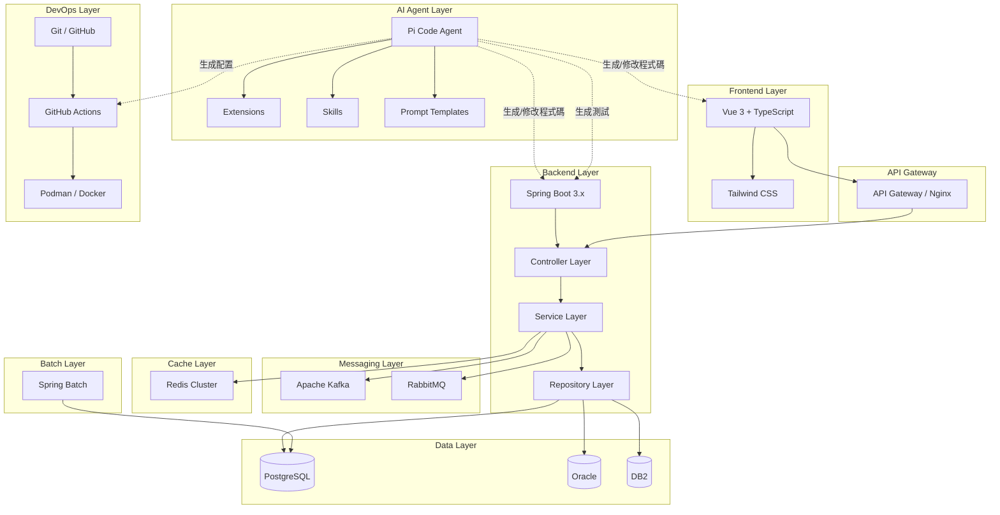
```mermaid
graph TB
    subgraph "AI Agent Layer"
        PI[Pi Code Agent]
        EXT[Extensions]
        SKL[Skills]
        PT[Prompt Templates]
        PI --> EXT
        PI --> SKL
        PI --> PT
    end

    subgraph "Frontend Layer"
        VUE[Vue 3 + TypeScript]
        TAILWIND[Tailwind CSS]
        VUE --> TAILWIND
    end

    subgraph "API Gateway"
        GW[API Gateway / Nginx]
    end

    subgraph "Backend Layer"
        SB[Spring Boot 3.x]
        CTRL[Controller Layer]
        SVC[Service Layer]
        REPO[Repository Layer]
        SB --> CTRL --> SVC --> REPO
    end

    subgraph "Messaging Layer"
        KAFKA[Apache Kafka]
        RMQ[RabbitMQ]
    end

    subgraph "Cache Layer"
        REDIS[Redis Cluster]
    end

    subgraph "Data Layer"
        PG[(PostgreSQL)]
        ORACLE[(Oracle)]
        DB2[(DB2)]
    end

    subgraph "Batch Layer"
        BATCH[Spring Batch]
    end

    subgraph "DevOps Layer"
        GIT[Git / GitHub]
        CI[GitHub Actions]
        DOCKER[Podman / Docker]
    end

    PI -.->|生成/修改程式碼| VUE
    PI -.->|生成/修改程式碼| SB
    PI -.->|生成測試| SB
    PI -.->|生成配置| CI

    VUE --> GW --> CTRL
    SVC --> KAFKA
    SVC --> RMQ
    SVC --> REDIS
    REPO --> PG
    REPO --> ORACLE
    REPO --> DB2
    BATCH --> PG
    GIT --> CI --> DOCKER
```

### 3.2 Pi 在架構中的定位

Pi Agent 運作在**開發者工作站層**，而非系統運行時：

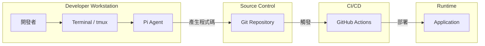
```mermaid
graph LR
    subgraph "Developer Workstation"
        DEV[開發者]
        PI[Pi Agent]
        TERM[Terminal / tmux]
        DEV --> TERM --> PI
    end

    subgraph "Source Control"
        GIT[Git Repository]
    end

    subgraph "CI/CD"
        GHA[GitHub Actions]
    end

    subgraph "Runtime"
        APP[Application]
    end

    PI -->|產生程式碼| GIT
    GIT -->|觸發| GHA
    GHA -->|部署| APP
```

### 3.3 Agent 參與開發流程

Pi Agent 在 SDLC 各階段的參與方式：

| 階段 | Pi 的角色 | 使用方式 |
| ------ | ---------- | --------- |
| 需求分析 | 協助產生 User Story | Prompt Template |
| 系統設計 | 生成架構文件、API Spec | PLAN.md + Skill |
| 開發 | 生成/修改程式碼 | 互動模式 |
| 測試 | 生成測試案例 | Extension + Skill |
| Code Review | AI 審查程式碼 | 唯讀模式 |
| 部署 | 生成 CI/CD 配置 | Prompt Template |
| 維運 | Log 分析、問題診斷 | 互動模式 |

### 3.4 多模型策略架構

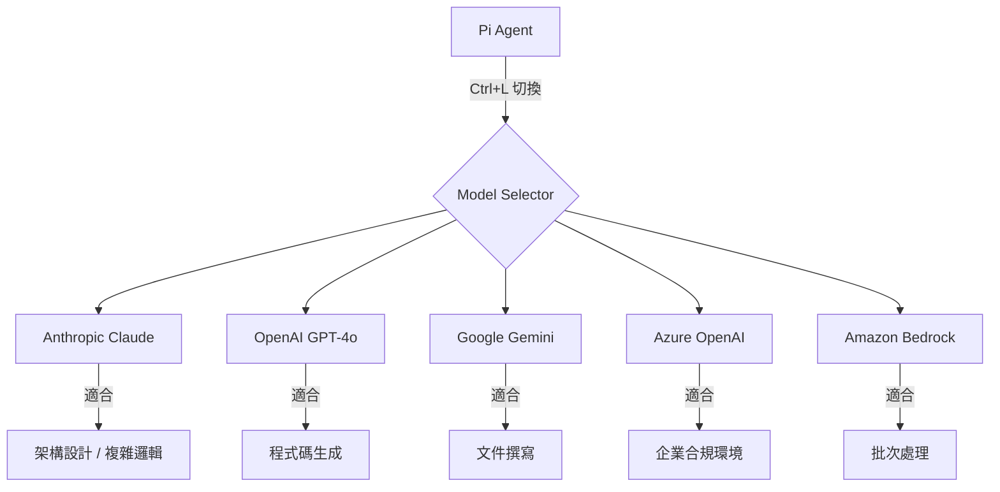
```mermaid
graph TD
    PI[Pi Agent] --> |Ctrl+L 切換| MS{Model Selector}
    MS --> ANT[Anthropic Claude]
    MS --> OAI[OpenAI GPT-4o]
    MS --> GEM[Google Gemini]
    MS --> AZ[Azure OpenAI]
    MS --> BED[Amazon Bedrock]

    ANT --> |適合| DESIGN[架構設計 / 複雜邏輯]
    OAI --> |適合| CODE[程式碼生成]
    GEM --> |適合| DOC[文件撰寫]
    AZ --> |適合| ENTERPRISE[企業合規環境]
    BED --> |適合| BATCH_AI[批次處理]
```

> **實務建議**：建議在 `settings.json` 中設定 `enabledModels`(model cycling 清單,支援與 `--models` CLI 旗標相同的萬用字元格式,例如 `["claude-*", "gpt-4o", "gemini-2*"]`),讓 `Ctrl+P` / `Shift+Ctrl+P` 可以在常用模型間快速循環切換,或在互動模式輸入 `/scoped-models` 以圖形化介面勾選。

### 3.5 Remote Session:多端共享架構(實驗性)

v0.84.0 起,`pi-protocol`、`pi-client`、`pi-server` 三個新套件開始建構一套跨程序的 Remote Session 能力,允許多個前端(例如公司內部自建的 Web IDE、行動裝置 App)透過 Unix Socket 與 CBOR 二進位協議連上**同一個** Agent Session,共享同一份逐字稿與工具執行狀態:

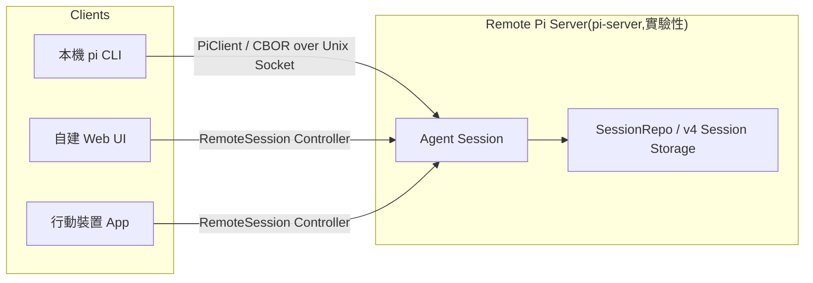
```mermaid
graph LR
    subgraph "Remote Pi Server(pi-server,實驗性)"
        AGENT[Agent Session]
        REPO[SessionRepo / v4 Session Storage]
        AGENT --> REPO
    end

    subgraph "Clients"
        CLI[本機 pi CLI]
        WEBUI[自建 Web UI]
        MOBILE[行動裝置 App]
    end

    CLI -->|PiClient / CBOR over Unix Socket| AGENT
    WEBUI -->|RemoteSession Controller| AGENT
    MOBILE -->|RemoteSession Controller| AGENT
```

> **企業評估建議**：官方 CHANGELOG 將此能力標示為「experimental」,`RemoteSession.sessions` 目前僅回傳精簡的 `SessionMetadata`(不含即時執行階段狀態),API 介面仍在快速演進。若考慮以 Pi 為基礎建構「多人協作 / 多裝置」型態的內部工具,建議先以 RPC 模式(§5.7)搭配自建閘道實作,並持續關注 [`packages/client/README.md`](https://github.com/earendil-works/pi/blob/main/packages/client/README.md) 與 [`packages/protocol/README.md`](https://github.com/earendil-works/pi/blob/main/packages/protocol/README.md) 的穩定度公告,再評估正式導入時程。

---

## 4. 安裝與環境建置（Installation & Setup）

### 4.1 系統需求

| 項目 | 需求 |
| ------ | ------ |
| Node.js | v18.0+（建議 v20 LTS） |
| npm | v9.0+（或 pnpm / yarn） |
| 作業系統 | Windows / macOS / Linux / Android（Termux） |
| 終端 | 建議使用 Windows Terminal / iTerm2 / Alacritty / Kitty |
| Git | v2.30+ |

> **平台支援說明**：
> - **Windows**：需使用 Windows Terminal；不支援原生 `Ctrl+Z` 暫停，但其餘功能完整。詳見 [docs/windows.md](https://github.com/earendil-works/pi/blob/main/packages/coding-agent/docs/windows.md)。
> - **macOS / Linux**：完整支援，包含 `Ctrl+Z` 暫停/恢復。Linux ARM64（musl）亦支援。
> - **Android（Termux）**：`pkg install nodejs termux-api git && npm install -g --ignore-scripts @earendil-works/pi-coding-agent`
> - **tmux**：建議搭配使用，需啟用 `set -g extended-keys on`。詳見 [docs/tmux.md](https://github.com/earendil-works/pi/blob/main/packages/coding-agent/docs/tmux.md)。

### 4.2 安裝步驟

#### Windows

```powershell
# 1. 確認 Node.js 版本
node --version  # 需 >= 18

# 2. 全域安裝 Pi Coding Agent
npm install -g --ignore-scripts @earendil-works/pi-coding-agent

# 3. 確認安裝成功
pi --version
```

#### macOS / Linux

```bash
# 1. 確認 Node.js 版本
node --version  # 需 >= 18

# 2a. 全域安裝（npm）
npm install -g --ignore-scripts @earendil-works/pi-coding-agent

# 2b. 替代方式：使用 Installer Script
curl -fsSL https://pi.dev/install.sh | sh

# 3. 確認安裝
pi --version
```

#### 解安裝

```bash
# npm 安裝的解安裝
npm uninstall -g @earendil-works/pi-coding-agent

# pnpm 安裝的解安裝
pnpm remove -g @earendil-works/pi-coding-agent

# yarn 安裝的解安裝
yarn global remove @earendil-works/pi-coding-agent
```

### 4.3 認證設定

Pi 支援兩種認證方式：

#### 方式一：API Key（推薦用於企業環境）

```bash
# Anthropic
export ANTHROPIC_API_KEY=sk-ant-xxx

# OpenAI
export OPENAI_API_KEY=sk-xxx

# DeepSeek
export DEEPSEEK_API_KEY=xxx

# Google Gemini(注意:官方環境變數名稱為 GEMINI_API_KEY,並非 GOOGLE_API_KEY)
export GEMINI_API_KEY=xxx

# Google Vertex AI(使用 Application Default Credentials)
gcloud auth application-default login
export GOOGLE_CLOUD_PROJECT=your-project
export GOOGLE_CLOUD_LOCATION=us-central1

# Azure OpenAI(Chat Completions 與 Responses API 共用同一組金鑰)
export AZURE_OPENAI_API_KEY=xxx
export AZURE_OPENAI_BASE_URL=https://your-resource.ai.azure.com
# 亦支援 cognitiveservices.azure.com / openai.azure.com,或改用資源名稱:
export AZURE_OPENAI_RESOURCE_NAME=your-resource

# Amazon Bedrock
# 使用 AWS CLI 預設認證鏈,或設定:
export AWS_ACCESS_KEY_ID=xxx
export AWS_SECRET_ACCESS_KEY=xxx
export AWS_REGION=us-east-1
# 替代方式:Bearer Token(亦可用 /login amazon-bedrock 儲存)
export AWS_BEARER_TOKEN_BEDROCK=xxx

# Mistral
export MISTRAL_API_KEY=xxx

# Groq
export GROQ_API_KEY=xxx

# Cerebras
export CEREBRAS_API_KEY=xxx

# xAI(Grok)——亦可 /login xai 使用 X 訂閱登入
export XAI_API_KEY=xxx

# Ant Ling
export ANT_LING_API_KEY=xxx

# NVIDIA NIM
export NVIDIA_API_KEY=xxx

# Hugging Face
export HF_TOKEN=xxx

# Kimi For Coding(Moonshot AI)
export KIMI_API_KEY=xxx

# MiniMax(國際版)/ MiniMax 中國區(各自獨立金鑰)
export MINIMAX_API_KEY=xxx
export MINIMAX_CN_API_KEY=xxx

# OpenRouter——亦可 /login openrouter 走 PKCE OAuth,由 OpenRouter 額度計費
export OPENROUTER_API_KEY=xxx

# Radius(動態 pi-messages 閘道,建議以 /login radius 取得 OAuth)
export RADIUS_API_KEY=xxx

# Cloudflare AI Gateway 與 Cloudflare Workers AI 共用同一把金鑰,僅差在帳號/閘道參數
export CLOUDFLARE_API_KEY=xxx
export CLOUDFLARE_ACCOUNT_ID=xxx
export CLOUDFLARE_GATEWAY_ID=xxx   # 僅 AI Gateway 需要,於 dash.cloudflare.com 建立

# Fireworks
export FIREWORKS_API_KEY=xxx

# Together AI
export TOGETHER_API_KEY=xxx

# Baseten
export BASETEN_API_KEY=xxx

# Qwen Token Plan(國際版 / Individual 版共用同一組金鑰,僅目錄不同;中國區獨立)
export QWEN_TOKEN_PLAN_API_KEY=xxx
export QWEN_TOKEN_PLAN_CN_API_KEY=xxx

# Xiaomi MiMo(全球)與 Xiaomi MiMo Token Plan(中國 / 阿姆斯特丹 / 新加坡三個區域版本)
export XIAOMI_API_KEY=xxx
export XIAOMI_TOKEN_PLAN_CN_API_KEY=xxx
export XIAOMI_TOKEN_PLAN_AMS_API_KEY=xxx
export XIAOMI_TOKEN_PLAN_SGP_API_KEY=xxx

# ZAI Coding Plan(全球 / 中國區獨立金鑰)
export ZAI_API_KEY=xxx
export ZAI_CODING_CN_API_KEY=xxx

# OpenCode Zen 與 OpenCode Go 共用同一把金鑰
export OPENCODE_API_KEY=xxx

# Vercel AI Gateway(注意:官方環境變數名稱為 AI_GATEWAY_API_KEY,並非 VERCEL_API_KEY)
export AI_GATEWAY_API_KEY=xxx

# llama.cpp 本地路由(見 §4.3.1)
export LLAMA_BASE_URL=http://127.0.0.1:8080
export LLAMA_API_KEY=optional-secret
```

> **權威來源提醒**：以上環境變數名稱以官方 [`packages/ai/src/env-api-keys.ts`](https://github.com/earendil-works/pi-mono/blob/main/packages/ai/src/env-api-keys.ts) 與 [Providers](https://github.com/earendil-works/pi/blob/main/packages/coding-agent/docs/providers.md) 文件為準;第三方文章或舊版手冊中常見的 `GOOGLE_API_KEY`、`VERCEL_API_KEY`、`OPENCODE_ZEN_API_KEY`、`CLOUDFLARE_WORKERS_AI_API_KEY`、`AZURE_OPENAI_ENDPOINT` 等命名皆為**不存在或已變更**的變數,設定前務必以官方文件核對,避免因變數名稱錯誤而導致認證靜默失敗。
>
> **安全提醒**：
> - 請勿將 API Key 寫入程式碼或 Git 中。使用環境變數或 Secret Manager。
> - `auth.json` 的 `key` 欄位支援三種解析方式:`"!command"` 執行 Shell 命令並取用 stdout(如 `"!security find-generic-password -ws 'anthropic'"` 或 `"!op read 'op://vault/item/credential'"`)、`"$ENV_VAR"` / `"${ENV_VAR}"` 插值環境變數、或直接寫入字面值。`$$` 可跳脫成字面 `$`,`$!` 可跳脫成字面 `!`。
> - API Key 也可存於 `~/.pi/agent/auth.json`,格式為 `{ "anthropic": { "type": "api_key", "key": "sk-ant-xxx" } }`;此檔案建立時權限固定為 `0600`(僅擁有者可讀寫),且優先權高於環境變數。
> - 憑證解析優先順序為:CLI `--api-key` 旗標 > `auth.json` 項目 > 環境變數 > `models.json` 自訂 Provider 金鑰。

#### 方式二：OAuth 訂閱登入

```bash
pi
/login  # 在互動模式中登入
```

支援的訂閱服務(以 `/login <provider>` 直接指定,或 `/login` 互動選單挑選)：

| 訂閱服務 | 說明 |
| --------- | ------ |
| **Anthropic Claude Pro/Max** | 注意：第三方 Coding Agent 使用會扣除 [Extra Usage 額度](https://claude.ai/settings/usage)，依 Token 計費，不計入一般 Claude 方案額度 |
| **OpenAI ChatGPT Plus/Pro（Codex）** | 已獲 OpenAI 官方認可的 [Codex for OSS](https://developers.openai.com/community/codex-for-oss) 整合對象 |
| **GitHub Copilot** | 支援 github.com 或 GitHub Enterprise Server;若出現「model not supported」,需先在 VS Code 的 Copilot Chat 模型選單中手動啟用該模型 |
| **xAI(Grok / X 訂閱)** | `/login xai` 後選擇「Use a subscription」;`XAI_API_KEY` 仍可作為 API Key 替代方案 |
| **OpenRouter** | `/login openrouter` 走 PKCE OAuth 流程,取得使用者自有、由 OpenRouter 額度計費的 API Key;純終端/SSH 環境可貼上回呼網址或授權碼完成登入 |
| **Radius** | 動態 `pi-messages` 閘道,`/login radius` 儲存 OAuth Token,型錄由閘道端獨立更新 |

> **自訂 Provider 與模型**：若你的 Provider 使用 OpenAI / Anthropic / Google 相容 API,可在 `~/.pi/agent/models.json` 中新增自訂模型定義(詳見 §4.3.2)。若需自訂 OAuth 或特殊 API 協議,可透過 Extension 實作。詳見 [docs/models.md](https://github.com/earendil-works/pi/blob/main/packages/coding-agent/docs/models.md) 與 [docs/custom-provider.md](https://github.com/earendil-works/pi/blob/main/packages/coding-agent/docs/custom-provider.md)。

#### 4.3.1 本地模型:llama.cpp Router

v0.8x 起,Pi 內建對 [llama.cpp](https://github.com/ggml-org/llama.cpp) Router Server 的原生支援,取代舊版以 Ollama 作為預設本地模型入口的做法:

```bash
# 1. 以 Router 模式啟動 llama-server(不可傳入 --model / -m,否則會變成單模型模式)
llama-server \
  --models-dir ~/models \
  --no-models-autoload \
  --jinja \
  --host 127.0.0.1 \
  --port 8080 \
  -ngl 999 \
  -c 32768

# 2. 在 Pi 中設定連線(或用 LLAMA_BASE_URL / LLAMA_API_KEY 環境變數)
pi
/login llama.cpp

# 3. 管理模型:搜尋、下載、載入、卸載 GGUF 模型(支援直接從 Hugging Face 抓取)
/llama

# 4. 已載入的模型才會出現在 /model 選單中
/model
```

模型目錄結構範例:單檔模型可直接放在 `~/models/` 下;多模態或多分片模型需各自獨立子目錄(例如含 `mmproj-*.gguf` 的視覺模型)。Hugging Face 搜尋會依序檢查 `HF_TOKEN`、`$HF_TOKEN_PATH`、`$HF_HOME/token`、`~/.cache/huggingface/token`,未設定 Token 時仍可搜尋公開模型,但速率限制較低。

#### 4.3.2 認證健診與憑證匯出(v0.83+)

```bash
# 驗證某 Provider 或模型的憑證是否可用(CI 前置檢查極為實用)
pi auth check anthropic

# 匯出目前解析出的 API Key / Bearer Token,供外部工具(如自建 curl 腳本)使用
pi auth print-api-key anthropic
pi auth print-bearer-token amazon-bedrock
```

`pi auth print-*` 系列指令會自動處理 OAuth Token 刷新與最短有效期保證,適合在 CI Pipeline 或自訂 Skill 腳本中,將 Pi 已管理好的憑證動態注入到非 Pi 原生的工具鏈中,避免另外維護一套密鑰管理機制。

### 4.4 供應鏈安全

Pi 持續強化供應鏈安全機制,是所有開源 AI Agent 中措施最完善的之一：

| 安全措施 | 說明 |
| --------- | ------ |
| `--ignore-scripts` 預設 | `npm install` 加入 `--ignore-scripts` 防止 postinstall 惡意腳本 |
| `npm-shrinkwrap.json` | 所有依賴版本完全鎖定（由根 lockfile 產生），可重現建構 |
| 依賴釘選（pinned deps） | 直接外部依賴固定到精確版本；`.npmrc` 設定 `save-exact=true` 與 `min-release-age=2`，避免引入當日新發佈的套件 |
| Lockfile 保護 | Pre-commit hook 阻擋意外 lockfile 提交，除非設定 `PI_ALLOW_LOCKFILE_CHANGE=1` |
| CI 安全掃描 | 持續整合使用 `npm ci --ignore-scripts`，排程工作流執行 `npm audit --omit=dev` 與 `npm audit signatures --omit=dev` |
| 生命週期腳本白名單 | Shrinkwrap 產生時有明確的 lifecycle scripts 白名單，新增依賴腳本須經過審查 |
| Release 煙霧測試 | 釋出前使用 `npm run release:local` 在隔離環境中建構、打包、安裝驗證 |
| Pi Packages 權限模型 | Extension 執行於主程序內，擁有系統存取權限——**安裝前務必審查原始碼** |

```bash
# 確認安裝完整性
npm ls -g @earendil-works/pi-coding-agent

# 離線模式（不檢查更新、不送遙測資料）
pi --offline
# 或設定環境變數
export PI_OFFLINE=true
```

#### 進階環境變數(Pi 行程本身讀取)

| 變數 | 用途 |
| ------ | ------ |
| `PI_OFFLINE` | 完全離線模式(停用啟動期所有網路操作:更新檢查、套件更新檢查、安裝/更新遙測) |
| `PI_SKIP_VERSION_CHECK` | 僅停用啟動時對 `pi.dev` 的最新版本查詢 |
| `PI_TELEMETRY` | `0`/`false`/`no` 停用安裝/更新遙測與 Provider 歸因標頭；`1`/`true`/`yes` 啟用。不影響版本檢查 |
| `PI_CACHE_RETENTION` | `long` 延長 Prompt Cache(Anthropic:1 小時、OpenAI:24 小時,依 Provider 支援程度而定) |
| `PI_CODING_AGENT_DIR` | 自訂全域設定目錄(取代 `~/.pi/agent`) |
| `PI_CODING_AGENT_SESSION_DIR` | 自訂 Session 儲存路徑(可被 `--session-dir` 覆蓋) |
| `PI_PACKAGE_DIR` | 自訂已安裝 Pi Packages 目錄(適用 Nix/Guix 等路徑 tokenize 不佳的環境) |
| `PI_SHARE_VIEWER_URL` | 覆寫 `/share` 使用的檢視器基底網址(企業可自架 Session 檢視服務) |
| `PI_HARDWARE_CURSOR` | 設為 `1` 顯示硬體游標(輸入法/IME 相容性用途,見 [Terminal setup](https://github.com/earendil-works/pi/blob/main/packages/coding-agent/docs/terminal-setup.md)) |
| `PI_TUI_ESC_TIMEOUT` | 等待單獨 ESC 按鍵多久才視為「中斷」的毫秒數;SSH 連線預設 100ms,本機預設 10ms,高延遲環境可調高避免 Alt 組合鍵被誤判 |
| `VISUAL` / `EDITOR` | 指定 `Ctrl+G` 開啟的外部編輯器(如 vim、nano、`code --wait`);優先權低於 `settings.json` 的 `externalEditor` |
| `HTTP_PROXY` / `HTTPS_PROXY` | 代理所有對外 HTTP 請求 |
| `PI_ALLOW_LOCKFILE_CHANGE` | `1` 允許 pre-commit hook 提交 lockfile 變更(供維護者使用) |

#### Bash 工具 Session 環境變數(v0.84+,注入至 LLM 可呼叫的 `bash` 工具)

Pi 會在每次由 LLM 呼叫的 `bash` 工具執行前,將下列變數注入指令環境,方便 Agent 在腳本中判斷自己所處的 Session 狀態(**不會**注入使用者自行輸入的 `!`/`!!` 命令):

| 變數 | 說明 |
| ------ | ------ |
| `PI_SESSION_ID` | 目前 Session ID |
| `PI_SESSION_FILE` | 目前 Session JSONL 檔案的絕對路徑(暫時性 Session 則未設定) |
| `PI_PROVIDER` | 目前選用的 Provider |
| `PI_MODEL` | 目前選用的模型 ID |
| `PI_REASONING_LEVEL` | 目前生效的思考等級:`off`、`minimal`、`low`、`medium`、`high`、`xhigh`、`max` |
| `AI_AGENT=pi` | 通用標記,讓子行程可判斷自己是被 AI Agent 啟動(非 Pi 專屬) |
| `PI_CODING_AGENT=true` | Pi 專屬標記,子行程可用以判斷自己執行於 Pi 環境中 |

> 這些變數會隨模型/思考等級切換即時更新,不需重啟 Pi。企業若要在 Skill 腳本中記錄「這段操作是哪個模型做的」,可直接讀取 `$PI_PROVIDER`/`$PI_MODEL`,比要求模型自行複述系統提示更可靠。

### 4.5 專案初始化

```bash
# 進入專案目錄
cd /path/to/your-project

# 建立 Pi 專案配置目錄
mkdir -p .pi/extensions .pi/skills .pi/prompts .pi/themes

# 建立 AGENTS.md（專案指引）
cat > AGENTS.md << 'EOF'
# 專案指引

## 技術棧
- 後端：Java 21 + Spring Boot 3.5
- 前端：Vue 3 + TypeScript + Tailwind CSS
- 資料庫：PostgreSQL 16
- 快取：Redis 7
- 訊息佇列：Kafka 3.x

## 程式碼規範
- 使用 Clean Architecture
- Controller → Service → Repository 分層
- 所有 API 必須有 Swagger 文件
- 測試覆蓋率 > 80%

## 命名規範
- 類別：PascalCase
- 方法/變數：camelCase
- 常數：UPPER_SNAKE_CASE
- 資料表：snake_case
EOF
```

### 4.6 全域設定

```bash
# 建立全域配置目錄
mkdir -p ~/.pi/agent/prompts ~/.pi/agent/skills ~/.pi/agent/extensions

# 編輯全域設定(鍵名請以官方 settings.md 為準:defaultProvider / defaultModel / defaultThinkingLevel / defaultTools)
cat > ~/.pi/agent/settings.json << 'EOF'
{
  "defaultProvider": "anthropic",
  "defaultModel": "claude-sonnet-4-20250514",
  "defaultThinkingLevel": "medium",
  "enableInstallTelemetry": false,
  "defaultProjectTrust": "ask",
  "compaction": {
    "enabled": true,
    "reserveTokens": 16384,
    "keepRecentTokens": 20000
  }
}
EOF
```

> **常見誤植提醒**：`settings.json` 的模型/思考等級鍵名為 `defaultProvider`、`defaultModel`、`defaultThinkingLevel`,並非簡寫的 `provider`/`model`/`thinking`;`compaction` 底下也沒有 `mode` 欄位,只有 `enabled`、`reserveTokens`、`keepRecentTokens` 三項可調。網路上流傳的簡化範例常誤用舊鍵名,設定不會生效但也不會報錯,務必核對官方 [Settings](https://github.com/earendil-works/pi/blob/main/packages/coding-agent/docs/settings.md) 文件。

### 4.7 專案層級設定

```bash
cat > .pi/settings.json << 'EOF'
{
  "defaultProvider": "anthropic",
  "defaultModel": "claude-sonnet-4-20250514",
  "defaultThinkingLevel": "high",
  "defaultTools": ["read", "write", "edit", "bash", "grep", "find", "ls"]
}
EOF
```

> 專案設定與全域設定採**逐欄位合併**(deep merge):純量欄位由專案值覆蓋全域值,巢狀物件(如 `compaction`)則逐鍵合併而非整體取代。`defaultTools` 屬陣列型別,專案層級設定時會**整體取代**全域陣列,而非合併。

### 4.8 目錄結構一覽

```text
your-project/
├── .pi/                          # Pi 專案配置(需通過 Project Trust 才會載入,見 §6.1)
│   ├── settings.json             # 專案設定（覆蓋全域，唯讀版控用）
│   ├── SYSTEM.md                 # 自訂系統提示（取代預設系統提示;注意路徑在 .pi/ 之下,非專案根目錄)
│   ├── APPEND_SYSTEM.md          # 附加到系統提示末尾（不取代;同樣位於 .pi/ 之下)
│   ├── extensions/               # 專案 Extension
│   ├── skills/                   # 專案 Skill
│   ├── prompts/                  # 專案 Prompt Template
│   ├── themes/                   # 專案 Theme
│   ├── npm/                      # `pi install -l` 安裝的 npm 套件（建議 .gitignore）
│   └── git/                      # `pi install -l` 安裝的 git 套件（建議 .gitignore）
├── .agents/                      # Agent Skills 標準路徑（替代 .pi/skills/）
│   └── skills/                   # 依 Agent Skills 標準組織
├── AGENTS.md                     # 專案指引（Pi 啟動時自動載入,不受 Project Trust 限制,位於專案根目錄）
├── AGENTS.override.md            # v0.84+:若存在,「取代」而非疊加該目錄層的 AGENTS.md/CLAUDE.md(同樣位於根目錄,不受 Project Trust 限制)
├── CLAUDE.md                     # AGENTS.md 的別名（相容 Claude Code 用戶）
├── PLAN.md                       # 開發計畫（手動維護）
├── src/                          # 原始碼
├── test/                         # 測試
└── ...

~/.pi/agent/                      # 全域配置
├── auth.json                     # API Key 與 OAuth Token（建立時權限固定 0600）
├── settings.json                 # 全域設定
├── models.json                   # 自訂模型定義（每次開啟 /model 都會重新讀取，免重啟）
├── keybindings.json              # 自訂快捷鍵（v0.8x 起採命名空間 id,如 tui.editor.cursorUp）
├── trust.json                    # Project Trust 決策紀錄（/trust 寫入）
├── models-store.json             # 各 Provider 型錄快取（供離線使用）
├── sessions/                     # Session 儲存
│   └── <encoded-cwd>/           # 依專案路徑編碼
├── extensions/                   # 全域 Extension
├── skills/                       # 全域 Skill（也支援 ~/.agents/skills/）
├── npm/                          # 全域安裝的 npm Pi Packages
├── git/                          # 全域安裝的 git Pi Packages
├── prompts/                      # 全域 Prompt Template
└── themes/                       # 全域 Theme
```

> **Context Files 載入順序**：Pi 會從當前目錄向上遍歷父目錄，依序載入所有找到的 `AGENTS.md`（或 `CLAUDE.md`），並最先套用 `~/.pi/agent/AGENTS.md` 作為全域指引。`SYSTEM.md` 取代預設系統提示；`APPEND_SYSTEM.md` 則附加在末尾。若某層目錄存在 `AGENTS.override.md`,該層會改用它取代 `AGENTS.md`/`CLAUDE.md`(其他層的 Context 仍正常疊加,不受影響)。

### 4.9 常見錯誤與解法

| 錯誤 | 原因 | 解法 |
| ------ | ------ | ------ |
| `command not found: pi` | npm 全域路徑未加入 PATH | 確認 `npm prefix -g` 路徑在 PATH 中 |
| `ANTHROPIC_API_KEY not set` | 未設定環境變數 | `export ANTHROPIC_API_KEY=sk-ant-xxx` 或在 `auth.json` 中設定 |
| `Context overflow` | Session 過長 | 使用 `/compact` 或 `/new` 開新 Session |
| `Model not found` | 模型名稱錯誤 | `pi --list-models` 查看可用模型 |
| Windows 下 `Alt+Enter` 無效 | Windows Terminal 預設全螢幕 | 在 Windows Terminal 設定中重新映射 |
| Node.js 版本太舊 | Pi 需要 Node 18+ | 升級 Node.js 至 v20 LTS |
| `ERR_MODULE_NOT_FOUND` | pnpm 嚴格模式缺少依賴 | 重新安裝 `npm install -g --ignore-scripts @earendil-works/pi-coding-agent` |
| tmux 中 Shift+Enter 無效 | tmux 未啟用 extended-keys | 在 tmux.conf 加入 `set -g extended-keys on` |
| Ctrl+Z 在 Windows 下崩潰 | Windows 不支援 SIGTSTP | v0.67.4+ 已修復，更新到最新版；`app.suspend` 在原生 Windows 無預設綁定,WSL 中則正常 |
| 認證看似設定但仍失敗 | 環境變數名稱誤植（如用了不存在的 `GOOGLE_API_KEY`） | 用 `pi auth check <provider>` 健診，並核對 §4.3 的官方變數名稱表 |
| Shell alias（如 `ll`、`gco`）在 bash 工具中失效 | Pi 以 `bash -c` 非互動模式執行，預設不展開 alias | 在 `settings.json` 設定 `shellCommandPrefix`（見 §5.6.1） |

> **實務建議**：企業環境中建議統一使用 `nvm`（Node Version Manager）管理 Node.js 版本，並在專案中放置 `.nvmrc` 檔案指定版本。若使用 pnpm 或其他套件管理器，需在 `settings.json` 中以**陣列（argv）格式**設定 `"npmCommand": ["pnpm"]`（而非誤寫成字串 `"pnpm"`），必要時可結合版本管理器,例如 `"npmCommand": ["mise", "exec", "node@20", "--", "npm"]`。

---

## 5. 基本使用教學（Getting Started）

### 5.1 啟動 Pi Agent

```bash
# 基本啟動（互動模式）
pi

# 帶初始 Prompt 啟動
pi "列出 src/ 下所有 Java 檔案"

# 繼續上次 Session
pi -c

# 瀏覽並選擇 Session
pi -r

# 無 Session 模式（不儲存歷史）
pi --no-session

# 指定模型啟動
pi --provider anthropic --model claude-sonnet-4-20250514

# 簡寫模型指定
pi --model anthropic/claude-sonnet-4-20250514

# 指定思考等級（含 xhigh 超高思考）
pi --model sonnet:high "解決這個複雜問題"
pi --thinking xhigh "設計整個微服務架構"

# 從先前 Session 分支（fork）
pi --fork <session-id-or-path>

# 恢復指定 Session
pi --session <session-id-or-path>

# 不載入任何 Context Files
pi --no-context-files
pi -nc

# 附加系統提示
pi --append-system-prompt "所有回應使用繁體中文"

# 限制可用工具
pi --tools read,grep,find,ls  # 唯讀模式
pi --no-tools                  # 完全禁用工具
```

### 5.2 生成程式碼

#### 範例 1：生成 Spring Boot REST Controller

```text
> 請幫我建立一個 UserController，包含 CRUD API，使用 Clean Architecture 分層：
> - Controller：處理 HTTP 請求
> - Service：業務邏輯
> - Repository：資料存取
> - Entity：資料模型
> 使用 JPA + PostgreSQL
```

#### 範例 2：生成 Vue 元件

```text
> 建立一個 UserList.vue 元件：
> - 使用 Composition API + TypeScript
> - 使用 Tailwind CSS 排版
> - 包含搜尋、分頁功能
> - 呼叫 /api/users GET API
```

### 5.3 修改檔案

```text
> 在 UserService.java 中新增一個 searchUsers 方法：
> - 參數：keyword (String), pageable (Pageable)
> - 回傳：Page<UserDTO>
> - 支援模糊搜尋 name 和 email
```

Pi 會使用 `edit` 工具進行差異替換，你可以在終端看到具體修改的內容。

### 5.4 執行指令

```text
> 執行 Maven 測試
```

Pi 會呼叫 `bash` 工具執行：

```bash
mvn test
```

你也可以直接在終端中用 `!` 前綴執行命令：

```text
!mvn clean compile    # 執行並將輸出傳給 LLM
!!mvn clean compile   # 執行但不傳給 LLM
```

### 5.5 Debug 技巧

```text
> 這個測試失敗了，請分析原因：
> @src/test/java/com/example/UserServiceTest.java
> 
> 錯誤訊息：
> java.lang.NullPointerException at UserService.java:42
```

使用 `@` 前綴可以引入檔案內容到 Prompt 中。

### 5.6 常用互動模式操作

#### 快捷鍵一覽

> **v0.8x 起,所有快捷鍵皆可自訂**:Pi 將每個動作賦予一個命名空間 id(如 `app.model.select`、`tui.editor.undo`),可在 `~/.pi/agent/keybindings.json` 中覆寫其按鍵綁定,舊版設定檔中的非命名空間 id(如 `cursorUp`)啟動時會自動遷移。修改後執行 `/reload` 或 `/hotkeys` 立即查看目前生效的完整對照表,以下僅列出**預設值**。

| 操作 | 預設快捷鍵 | 對應動作 id | 說明 |
| ------ | -------- | ------ | ------ |
| **模型管理** | — | — | — |
| 切換模型 | `Ctrl+L` | `app.model.select` | 開啟模型選擇器（保留編輯器文字） |
| 快速切換模型 | `Ctrl+P` | `app.model.cycleForward` | 在 `enabledModels` 設定的清單間向前循環 |
| 反向切換模型 | `Shift+Ctrl+P` | `app.model.cycleBackward` | 向後循環 |
| **思考控制** | — | — | — |
| 切換思考等級 | `Shift+Tab` | `app.thinking.cycle` | off → minimal → low → medium → high → xhigh → max |
| 展開/收合思考 | `Ctrl+T` | `app.thinking.toggle` | 查看 LLM 的思考過程 |
| **工具與輸出** | — | — | — |
| 展開/收合工具輸出 | `Ctrl+O` | `app.tools.expand` | 查看或隱藏工具執行細節 |
| **Session 管理** | — | — | — |
| 開啟 Session Tree | `Escape` × 2 | 由 `doubleEscapeAction` 設定控制 | 預設連按兩次 Escape 開啟 `/tree`;可在 `settings.json` 改成 `"fork"` 或 `"none"` |
| 複製最後一則回應 | `Ctrl+X` | `app.message.copy` | 在 `/tree` 中則複製目前選取的訊息 |
| **編輯器** | — | — | — |
| 送出訊息（Steering） | `Enter` | `tui.input.submit` | 送出轉向訊息（如 Agent 正在運行，會在當前工具批次後插入） |
| 送出訊息（Follow-up） | `Alt+Enter` | `app.message.followUp` | 送出後續訊息（等待 Agent 完成後才送出）;Windows Terminal 預設將此鍵用於全螢幕,需另行重新映射 |
| 多行輸入 | `Shift+Enter`（或 `Ctrl+J`） | `tui.input.newLine` | 換行（tmux 需啟用 extended-keys） |
| 取回排隊中的訊息 | `Alt+Up` | `app.message.dequeue` | 將已排隊的 Steering/Follow-up 訊息還原到編輯器 |
| 外部編輯器 | `Ctrl+G` | `app.editor.external` | 於 `externalEditor` 設定或 `$VISUAL`/`$EDITOR` 指定的編輯器中編輯輸入 |
| 引用檔案 | `@` | — | 輸入 `@` 後模糊搜尋檔案引入 |
| 路徑補全 | `Tab` | `tui.input.tab` | 自動補全路徑和斜線命令 |
| 貼上圖片 | `Ctrl+V` | `app.clipboard.pasteImage` | 貼上剪貼簿圖片（Windows 用 `Alt+V`） |
| Kill Line / Yank | `Ctrl+K` / `Ctrl+Y` | `tui.editor.deleteToLineEnd` / `tui.editor.yank` | Emacs 風格 kill ring 操作 |
| **Undo（注意:非 Ctrl+Z）** | `Ctrl+-` | `tui.editor.undo` | 復原上一步編輯 |
| Word 前進 / 後退 | `Alt+F` / `Alt+B` | `tui.editor.cursorWordRight` / `cursorWordLeft` | Shell 風格單詞導航 |
| **中斷與退出** | — | — | — |
| 中斷 | `Escape` | `app.interrupt` | 中斷當前操作 |
| 清除輸入 | `Ctrl+C` | `app.clear` | 第一次清除編輯器內容 |
| 退出 | `Ctrl+C` × 2 或 `Ctrl+D`（編輯器為空時） | `app.clear` / `app.exit` | 連按兩次 `Ctrl+C`,或編輯器空白時按 `Ctrl+D` |
| 暫停到背景 | `Ctrl+Z`（Windows 原生無預設,WSL 正常） | `app.suspend` | **注意:這不是 Undo**,是類 Unix 工作控制的「暫停」,對應章節 4.1 平台限制說明 |

> **實務建議**：偏好 Vim 或 Emacs 編輯習慣的工程師,可直接套用官方文件提供的鍵位範本(於 `keybindings.json` 貼上對應 JSON 區塊),無需逐一手動重新綁定。企業團隊也可將標準化的 `keybindings.json` 納入內部 dotfiles 倉庫統一發佈。

#### Message Queue（訊息佇列機制）

Pi 具備獨特的**訊息佇列機制**，讓你在 Agent 運行中仍可送出訊息：

| 訊息類型 | 快捷鍵 | 行為 |
| --------- | -------- | ------ |
| **Steering（轉向）** | `Enter` | 在當前工具批次完成後立即插入，用於**引導方向** |
| **Follow-up（後續）** | `Alt+Enter` | 等待 Agent 完全完成後才送出，用於**追加任務** |

```text
# 情境範例：Agent 正在修改 UserService.java
# 你突然想到還需要加入驗證邏輯：

Steering（Enter）: "等等，請在 createUser 方法中加入 email 格式驗證"
→ Agent 會在完成當前工具操作後讀取此訊息，改變方向

Follow-up（Alt+Enter）: "完成後請一併寫測試"
→ Agent 會先完成所有手頭工作，然後才處理此訊息
```

> **企業建議**：Steering 和 Follow-up 的行為可透過 `/settings` 調整 `steeringMode` 和 `followUpMode`。

#### 常用斜線命令

| 命令 | 說明 |
| ------ | ------ |
| `/new` | 開啟新 Session |
| `/tree` | 開啟 Session Tree（檢視分支歷史） |
| `/fork` | 從先前的訊息分支出新 Session |
| `/clone` | 複製當前分支到新 Session |
| `/resume` | 瀏覽並恢復先前 Session |
| `/model` | 切換 LLM 模型 |
| `/scoped-models` | 啟用/停用 `Ctrl+P` 循環中的模型 |
| `/llama` | 搜尋、下載、載入/卸載 llama.cpp Router 本地模型(見 §4.3.1) |
| `/thinking` | 切換思考等級 |
| `/compact` | 手動壓縮 Session 上下文 |
| `/share` | 上傳為 private GitHub Gist，產生可分享 HTML 連結 |
| `/export` | 匯出 Session 為 HTML 檔案 |
| `/import` | 從 JSONL 檔案匯入並恢復 Session |
| `/trust` | 儲存專案信任決策（寫入 `~/.pi/agent/trust.json`） |
| `/changelog` | 顯示版本更新日誌 |
| `/copy` | 複製最後回應到剪貼簿 |
| `/config` | 檢視/切換已載入的資源（啟用/停用 Extension、Skill 等） |
| `/settings` | 開啟設定選單（思考等級、主題、訊息傳遞模式、傳輸協議） |
| `/reload` | 熱重載所有資源（快捷鍵、AGENTS.md / Extension / Skill / Prompt / 主題自動熱重載） |
| `/login` | OAuth 訂閱登入 |
| `/logout` | 登出 OAuth 認證 |
| `/name` | 為當前 Session 命名 |
| `/session` | 顯示當前 Session ID、路徑、訊息數、Token 與費用統計 |
| `/hotkeys` | 顯示所有快捷鍵 |
| `/quit` | 退出 Pi |

#### CLI 啟動選項

```bash
# 為 Session 命名（方便 /resume 搜尋）
pi --name "feature-login-refactor"
pi -n "fix bug #1234"

# 離線模式（不檢查更新、不送遙測）
pi --offline

# 排除特定工具（保留其餘）
pi --exclude-tools bash,write
pi -xt bash,write

# 僅使用 Extension 工具，不載入內建工具
pi --no-builtin-tools
pi -nbt

# 停用所有資源探索，只載入指定的
pi --no-extensions -e ./my-ext.ts  # 僅載入指定 Extension
pi --no-skills --skill ./my-skill  # 僅載入指定 Skill
pi --no-prompt-templates           # 停用 Prompt Template 探索
pi --no-themes                     # 停用 Theme 探索

# 附加系統提示（可重複使用）
pi --append-system-prompt "所有回應使用繁體中文"
pi --append-system-prompt "遵循 Clean Architecture"

# 指定 API Key（覆蓋環境變數）
pi --api-key sk-ant-xxx

# 指定模型循環清單（Ctrl+P 使用）
pi --models "claude-*,gpt-4o"

# 列出可用模型
pi --list-models
pi --list-models "claude"  # 搜尋篩選

# Project Trust 控制（v0.80+ 新增）
pi --approve       # 信任專案本地設定（僅本次）
pi -a              # 簡寫
pi --no-approve    # 忽略專案本地設定（僅本次）
pi -na             # 簡寫

# 實驗性 Fullscreen TUI 模式(v0.84+):逐字稿獨立捲動、常駐編輯器/頁尾、可拖曳捲軸
pi --tui-mode fullscreen

# 指定本次啟動的佈景主題,不寫回 settings.json(v0.84.2+)
pi --use-theme dark
pi --use-theme corporate/dark   # 主題名稱/變體

# 以 @ 前綴直接在啟動參數帶入檔案(等同互動模式輸入 @file)
pi @src/app.ts @src/app.test.ts "Review these together"
pi -p @screenshot.png "這張截圖裡有什麼？"
```

### 5.7 非互動模式（Print / JSON / RPC）

Pi 提供多種非互動運行模式，適合自動化與整合：

#### Print 模式（`-p`）

```bash
# 印出回應後退出
pi -p "分析 pom.xml 的依賴是否有安全漏洞"

# 管線輸入
cat README.md | pi -p "幫我翻譯成英文"

# 唯讀模式審查
pi --tools read,grep,find,ls -p "Review src/ 的程式碼品質"

# 指定思考等級
pi -p --thinking high "重構 UserService 為 Clean Architecture"
```

#### JSON 模式

```bash
# 結構化輸出（適合程式處理）
pi --mode json -p "列出所有 TODO" | jq '.result'
```

#### RPC 模式

```bash
# JSON 協議透過 stdin/stdout（適合 IDE 整合）
pi --mode rpc
# 送入 JSON 命令，接收 JSON 事件
```

> **重要**：RPC 模式使用嚴格的 LF 分隔 JSONL 格式。客戶端必須僅以 `\n` 分割記錄，**不可**使用 Node.js `readline` 等通用行讀取器（它們會在 JSON 負載中的 Unicode 分隔符號上誤分割）。
>
> **實務建議**：非互動模式非常適合整合到 CI/CD Pipeline 中，例如在 PR 建立時自動進行 Code Review。RPC 模式特別適合建構自有的前端 UI 或 IDE 外掛。

### 5.8 SDK 模式（程式化嵌入）

Pi 可作為 TypeScript 函式庫嵌入到自有系統中。**注意:v0.84 系列的建構方式已與早期文件常見的範例不同**——目前官方建議的入口是 `ModelRuntime.create()`,不再要求手動組出 `AuthStorage` + `ModelRegistry` 這兩個元件:

```typescript
import { createAgentSession, ModelRuntime, SessionManager } from "@earendil-works/pi-coding-agent";

// 建構 Model Runtime(內部整合認證與模型型錄)
const modelRuntime = await ModelRuntime.create();

// 建立 Agent Session;未指定 resourceLoader 時預設使用 DefaultResourceLoader
// 會自動探索 Extension / Skill / Prompt Template / Theme / Context Files
const { session } = await createAgentSession({
  sessionManager: SessionManager.inMemory(), // 或改用持久化 Session
  modelRuntime,
});

// 訂閱事件流(串流輸出文字)
session.subscribe((event) => {
  if (event.type === "message_update" && event.assistantMessageEvent.type === "text_delta") {
    process.stdout.write(event.assistantMessageEvent.delta);
  }
});

// 送出訊息
await session.prompt("請審查 src/main/java 目錄下的 Controller 是否符合 RESTful 規範");

// 進階：多 Session 管理（使用 AgentSessionRuntime / createAgentSessionRuntime()）
// 適合需要同時管理多個 Session 並在運行時替換的場景
// 詳見 docs/sdk.md 與 examples/sdk/(從最小範例到完整控制皆有涵蓋)
```

> **企業實際案例**：[OpenClaw](https://openclaw.ai/)（原名 ClawdBot，2026/1 陸續更名為 Moltbot、OpenClaw，由 Peter Steinberger 發起，現已轉由非營利的 [OpenClaw Foundation](https://openclaw.org/) 開發維護），GitHub（[openclaw/openclaw](https://github.com/openclaw/openclaw)）累積達 **386.8k+ Stars、81.3k+ Forks、2,914+ Contributors**（2026-08-20 核對）,是 Pi 生態中最具代表性的下游應用之一——它是一套可自架的個人 AI 助理閘道，讓使用者透過 WhatsApp、Telegram 或終端傳訊息，由內嵌的 Agent 在使用者自己的機器上執行指令（搜尋檔案、跑腳本、讀 Log 等）。**重要澄清**：OpenClaw 早期確實直接建立於 Pi SDK 之上，但隨專案規模擴張，相關整合程式碼後來已被重構、並部分內部化為自有的 Agent Runtime；其 [README](https://github.com/openclaw/openclaw#readme) 仍明確鳴謝 Mario Zechner 及 Pi 對本專案的支持。對企業而言，這是一個觀摩「SDK 模式如何從落地產品逐步演進為自建執行層」的實證案例，而非視為目前仍完全依賴 Pi SDK 運作的系統。若需更新相關整合細節，建議直接查閱 [OpenClaw 文件](https://docs.openclaw.ai/) 與其 GitHub CHANGELOG。

---

## 6. Context Engineering（上下文工程）

### 6.1 Context Files 體系

Pi 使用多層級的 Context Files 來建構 LLM 的系統提示。理解這套體系是有效使用 Pi 的關鍵。

| 檔案 | 作用 | 優先級 |
| ------ | ------ | -------- |
| `AGENTS.md` | 專案指引，描述技術棧、規範、架構 | 自動載入，從 cwd 向上遍歷所有父目錄;**不受 Project Trust 限制**,永遠載入 |
| `CLAUDE.md` | `AGENTS.md` 的別名（相容 Claude Code 用戶） | 與 `AGENTS.md` 等效 |
| `AGENTS.override.md` | v0.84+ 新增:若該層目錄存在此檔,**取代**（而非疊加）該層的 `AGENTS.md`/`CLAUDE.md` | 僅影響「同一層目錄」,其餘層級的 Context 仍正常疊加;同樣不受 Project Trust 限制 |
| `SYSTEM.md` | 完全取代預設系統提示 | 取代，非附加;位於 `.pi/` 下,**須通過 Project Trust** |
| `APPEND_SYSTEM.md` | 附加到系統提示末尾 | 附加，不取代;位於 `.pi/` 下,**須通過 Project Trust** |
| Skills | 任務專精指引（如「寫測試」、「做 Code Review」） | 由 Agent 自動選擇或手動 `/skill:name` 觸發;專案層級 Skill 須通過 Project Trust |
| Prompt Templates | 可重複使用的提示範本 | 透過 `/template-name` 觸發 |

#### AGENTS.md 的作用鏈

```text
~/.pi/agent/AGENTS.md           ← 全域指引（個人偏好）
  ↓
~/projects/company/AGENTS.md    ← 公司層級指引
  ↓
~/projects/company/my-app/AGENTS.md  ← 專案層級指引（cwd）
```

Pi 會依序載入從 cwd 到根目錄路徑上所有找到的 `AGENTS.md`，全部注入系統提示。

#### Project Trust 機制（v0.80+，行為細節已於官方 [Security](https://github.com/earendil-works/pi/blob/main/packages/coding-agent/docs/security.md) 文件明確化）

Project Trust 判斷是否載入專案本地的動態設定,**觸發條件並非「存在 `.pi/` 目錄」這麼籠統**——官方文件明確定義,只有當目前目錄找到以下任一項目時才需要信任決策:

- `.pi/settings.json`
- `.pi/extensions`、`.pi/skills`、`.pi/prompts`、`.pi/themes` 其中之一
- `.pi/SYSTEM.md` 或 `.pi/APPEND_SYSTEM.md`
- 目前目錄或其父目錄中的專案 `.agents/skills`

> 換句話說,**一個空的 `.pi/` 目錄本身不會觸發信任提示**。而 `AGENTS.md`、`CLAUDE.md`、`AGENTS.override.md` 這類 Context Files,無論專案是否受信任都會照常載入——因為它們只影響「提示內容」，不會讓 Pi 執行額外程式碼。

| 情境 | 行為 |
| ------ | ------ |
| 首次進入符合上述條件的專案 | 互動模式顯示信任提示，等候使用者決定 |
| 已儲存信任決策 | 依「目前目錄或其最近的父目錄」比對 `~/.pi/agent/trust.json`,套用最接近的決策 |
| 非互動模式（`-p`、`--mode json`、`--mode rpc`） | **不會**顯示信任提示;依 `defaultProjectTrust` 設定決定（`ask`/`never` 皆視為不信任該次執行的專案資源,`always` 則信任） |
| CLI 覆蓋 | `--approve` / `-a` 為本次執行強制信任；`--no-approve` / `-na` 為本次執行強制忽略 |
| `pi config` 與套件管理指令 | 與互動模式相同的信任流程,唯獨 `pi update` **永不**顯示信任提示 |
| Extension 攔截 | 使用者/全域層級與 CLI `-e` 載入的 Extension 可監聽 `project_trust` 事件自行決定信任與否;**專案本地**的 Extension 在信任決議前不會被載入,因此無法參與該次決策 |

```bash
# 在互動模式中儲存信任決策(僅寫入 trust.json,當次 Session 不會重新載入,需重啟生效)
/trust

# 全域設定預設行為(僅能設定於全域 settings.json,專案層級無法覆寫此欄位)
{
  "defaultProjectTrust": "ask"  // "ask" | "always" | "never"
}
```

> **重要澄清(常見誤解)**：Project Trust **不是沙箱**。它只決定「Pi 啟動時要不要載入專案本地的 Extension/設定/Skill」,並不限制受信任後的 Extension、Skill 或 LLM 透過 `bash` 工具能做的事——一旦信任,程式碼就以啟動 Pi 的使用者權限完整執行。要防範惡意或不受信任的程式碼、提示注入(prompt injection)等風險,必須依賴作業系統或容器層級的隔離(見 §16),而不是僅靠 Trust 機制。
>
> **企業建議**：在 CI/CD 環境中建議設定 `defaultProjectTrust: "always"` 或使用 `--approve` 旗標，避免自動化流程卡在信任提示;但務必同時將 CI Runner 置於一次性、隔離的容器中執行,不要把「已信任」與「已隔離」混為一談。

### 6.2 AGENTS.md 撰寫最佳實務

```markdown
# AGENTS.md - Spring Boot 微服務專案

## 技術棧
- Java 21 + Spring Boot 3.5 + Spring Cloud 2024
- PostgreSQL 16 + Redis 7 + Kafka 3.x
- Vue 3 + TypeScript + Tailwind CSS

## 架構原則
- Clean Architecture：Controller → Service → Repository
- 所有 API 必須有 OpenAPI 3.0 文件
- 禁止在 Controller 中寫業務邏輯

## 程式碼規範
- 測試覆蓋率 > 80%
- 所有 public 方法需有 JavaDoc
- 使用 Lombok @Slf4j 記錄日誌
- 例外處理使用 @ControllerAdvice

## 禁止事項
- 不得使用 System.out.println
- 不得在程式碼中硬編碼密碼或金鑰
- 不得跳過測試
```

### 6.3 SYSTEM.md vs APPEND_SYSTEM.md

> **路徑提醒**：與 `AGENTS.md` 不同,`SYSTEM.md` 與 `APPEND_SYSTEM.md` 皆位於 **`.pi/` 目錄之下**(專案層級為 `.pi/SYSTEM.md`,全域層級為 `~/.pi/agent/SYSTEM.md`),而非專案根目錄;因此**須先通過 Project Trust**(見 §6.1)才會生效。

| 用途 | 使用的檔案 | 範例場景 |
| ------ | ----------- | --------- |
| 完全覆蓋系統提示 | `.pi/SYSTEM.md` | 建構特殊用途 Agent（如 SQL-only Agent） |
| 在預設提示上增補 | `.pi/APPEND_SYSTEM.md` | 加入團隊特有的安全檢查清單 |
| CLI 附加 | `--append-system-prompt "..."` | 臨時增加指令（支援多次使用） |
| CLI 覆蓋 | `--system-prompt "..."` | 完整取代系統提示(Context Files 與 Skills 仍會附加) |
| 禁用 Context Files | `--no-context-files` / `-nc` | 乾淨執行，不載入任何專案 Context |

```bash
# 範例：使用 .pi/SYSTEM.md 建構唯讀稽核 Agent
mkdir -p .pi
cat > .pi/SYSTEM.md << 'EOF'
You are a code auditor. You can only use read, grep, and find tools.
Never modify any files. Report findings in a structured format.
EOF

# 範例：附加安全檢查到現有提示
cat > .pi/APPEND_SYSTEM.md << 'EOF'
## Additional Security Requirements
- Always check for SQL injection vulnerabilities
- Flag any hardcoded credentials
- Verify input validation on all API endpoints
EOF
```

---

## 7. PLAN.md 開發模式

### 7.1 為什麼 Pi 不用 Plan Mode

| 議題 | 內建 Plan Mode | PLAN.md |
| ------ | --------------- | --------- |
| 可版控 | ❌ | ✅ Git 追蹤 |
| 跨會話共享 | ❌ | ✅ 任何 Session 可讀 |
| 多人協作 | ❌ | ✅ 團隊共同編輯 |
| 透明度 | ❌ 黑盒 | ✅ 純文字 |
| 格式自由 | ❌ 固定格式 | ✅ 自訂格式 |
| AI 可讀寫 | ❌ 僅 AI 內部 | ✅ AI + 人類皆可 |

### 7.2 PLAN.md 範本

```markdown
# PLAN.md - 使用者管理模組

## 專案資訊
- **模組名稱**：User Management
- **負責人**：@chihhung
- **Sprint**：Sprint 23（2026/04/21 - 2026/05/02）
- **狀態**：🔄 進行中

## 目標
建立完整的使用者管理功能，包含 CRUD、搜尋、權限控制。

## 任務分解

### Phase 1：後端 API（預估 3 天）

- [x] 建立 User Entity + JPA 設定
- [x] 建立 UserRepository
- [ ] 建立 UserService（含業務邏輯）
  - [ ] createUser()
  - [ ] updateUser()
  - [ ] deleteUser()
  - [ ] searchUsers()
- [ ] 建立 UserController
  - [ ] POST /api/users
  - [ ] PUT /api/users/{id}
  - [ ] DELETE /api/users/{id}
  - [ ] GET /api/users?keyword=xxx&page=0&size=20
- [ ] 建立 UserDTO + Mapper
- [ ] 撰寫 JUnit 測試（覆蓋率 > 80%）

### Phase 2：前端 UI（預估 2 天）

- [ ] UserList.vue - 使用者列表
- [ ] UserForm.vue - 新增/編輯表單
- [ ] UserDetail.vue - 使用者詳情
- [ ] API 整合（axios）
- [ ] 元件測試

### Phase 3：進階功能（預估 2 天）

- [ ] 角色權限（RBAC）
- [ ] 操作日誌（Audit Log）
- [ ] 匯出 Excel

## 技術決策
- 使用 Spring Data JPA Specification 做動態查詢
- DTO 轉換使用 MapStruct
- 密碼加密使用 BCrypt
- API 文件使用 SpringDoc OpenAPI

## 注意事項
- 所有 API 需加入 @PreAuthorize 權限控制
- 密碼欄位不得出現在 Response 中
- 刪除改用軟刪除（isDeleted flag）
```

### 7.3 任務拆解原則

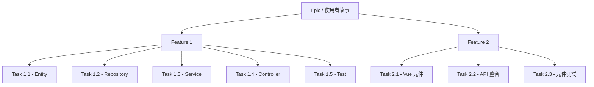
```mermaid
graph TD
    EPIC[Epic / 使用者故事] --> F1[Feature 1]
    EPIC --> F2[Feature 2]
    F1 --> T1[Task 1.1 - Entity]
    F1 --> T2[Task 1.2 - Repository]
    F1 --> T3[Task 1.3 - Service]
    F1 --> T4[Task 1.4 - Controller]
    F1 --> T5[Task 1.5 - Test]
    F2 --> T6[Task 2.1 - Vue 元件]
    F2 --> T7[Task 2.2 - API 整合]
    F2 --> T8[Task 2.3 - 元件測試]
```

**拆解原則**：
1. 每個 Task 應在 **30 分鐘內完成**
2. 每個 Task 應有**明確的完成標準**
3. Task 之間的**依賴關係**要清楚標示
4. 使用 Checkbox 追蹤進度

### 7.4 Sprint 規劃範例

```markdown
# Sprint 23 PLAN.md

## Sprint 目標
完成使用者管理模組的後端 API 與前端 UI。

## 每日任務安排

### Day 1（Mon）
- [ ] 設計 DB Schema（users, roles, user_roles）
- [ ] 建立 Entity + Repository
- [ ] Pi Prompt: "根據 PLAN.md 的 DB Schema 建立 JPA Entity"

### Day 2（Tue）
- [ ] 建立 Service Layer
- [ ] Pi Prompt: "建立 UserService，實作 PLAN.md Phase 1 的所有方法"

### Day 3（Wed）
- [ ] 建立 Controller + DTO
- [ ] 撰寫 Swagger 文件
- [ ] Pi Prompt: "建立 UserController，使用 SpringDoc 註解"

### Day 4（Thu）
- [ ] 撰寫 JUnit 測試
- [ ] Pi Prompt: "為 UserService 撰寫完整的 JUnit 5 測試"

### Day 5（Fri）
- [ ] 前端 UserList.vue
- [ ] Pi Prompt: "建立 UserList.vue，使用 Composition API + Tailwind"

## Retrospective（Sprint 結束後填寫）
- 什麼做得好：
- 什麼需要改進：
- Pi 使用心得：
```

### 7.5 實戰：開發 Web API 的 PLAN.md

在 Pi 互動模式中使用 PLAN.md：

```text
> 請讀取 PLAN.md，然後開始執行 Phase 1 中尚未完成的第一個任務
```

```text
> @PLAN.md 目前進度到哪了？請繼續下一個待辦事項
```

```text
> 我完成了 UserService，請更新 PLAN.md 將該項標記為完成，
> 並告訴我下一步該做什麼
```

> **實務建議**：每次開始工作前，先讓 Pi 讀取 PLAN.md 了解上下文。這比重新描述需求更有效率，也確保 AI 的輸出與計畫一致。

---

## 8. Extensions / Skills / Prompt Templates / Themes

### 8.1 概覽

Pi 的四大擴充機制：

| 機制 | 用途 | 載入時機 | 開發語言 |
| ------ | ------ | --------- | --------- |
| **Extension** | 自訂工具、命令、快捷鍵、UI、Provider | 啟動時 | TypeScript |
| **Skill** | 按需載入的能力包（指令 + 工具） | 自動匹配或 `@skill-name` 觸發 | Markdown + YAML Frontmatter |
| **Prompt Template** | 可重用的 Prompt 範本 | `/name` 展開 | Markdown + YAML Frontmatter |
| **Theme** | 自訂終端配色主題 | 啟動時，支援熱重載 | JSON |

### 8.2 Prompt Templates

放置位置：
- 全域：`~/.pi/agent/prompts/`
- 專案：`.pi/prompts/`

#### 範例：Code Review 模板

```markdown
<!-- .pi/prompts/review.md -->
請對以下程式碼進行 Code Review，檢查：

1. **安全性**：SQL Injection、XSS、CSRF、敏感資訊洩漏
2. **效能**：N+1 Query、不必要的迴圈、記憶體洩漏
3. **可維護性**：命名規範、方法長度、單一職責
4. **測試**：是否有對應測試、邊界條件
5. **Clean Architecture**：是否違反分層規則

目標檔案：{{file}}

請用表格格式輸出發現的問題，包含：嚴重度、行號、問題描述、建議修改。
```

使用方式：

```text
/review
```

#### 範例：測試生成模板

```markdown
<!-- .pi/prompts/gen-test.md -->
請為 {{file}} 生成完整的 JUnit 5 測試：

要求：
1. 使用 @ExtendWith(MockitoExtension.class)
2. 每個 public 方法至少 3 個測試案例（正常、邊界、異常）
3. 使用 @DisplayName 描述測試目的
4. Mock 外部依賴
5. 使用 AssertJ 斷言
6. 測試覆蓋率目標 > 80%
```

#### 範例：帶引數提示的 Prompt Template

```markdown
---
argument-hint: 要產生 API 的資源名稱（如 User, Order）
---
請為 {{input}} 資源建立完整的 RESTful API：

1. Entity + JPA 註解
2. Repository（Spring Data JPA）
3. Service（含 DTO 轉換）
4. Controller（含 Swagger 註解）
5. JUnit 測試
```

### 8.3 Skills

Skills 遵循 [Agent Skills 標準](https://agentskills.io/specification)，是按需載入的能力包。啟動時 Pi 只會把每個 Skill 的 `name` 與 `description` 放進系統提示（漸進式揭露,progressive disclosure）；當任務內容與描述相符時，LLM 才會用 `read` 工具載入完整的 `SKILL.md`,或由使用者以 `/skill:name` 手動強制觸發。

放置位置：
- 全域：`~/.pi/agent/skills/` **與** `~/.agents/skills/`（兩者皆會掃描）
- 專案（**須通過 Project Trust** 才會載入）：`.pi/skills/`,以及 cwd 與其所有父目錄（最遠到 Git 倉庫根目錄，非 Git 專案則到檔案系統根目錄）中的 `.agents/skills/`
- 套件：Pi Package 內的 `skills/` 目錄，或 `package.json` 的 `pi.skills` 欄位
- CLI：`--skill <path>`（可重複，即使搭配 `--no-skills` 也會額外載入）

> **探索規則細節**：僅 `~/.pi/agent/skills/` 與 `.pi/skills/` 會把根目錄下的獨立 `.md` 檔視為個別 Skill；`~/.agents/skills/` 與專案 `.agents/skills/` 僅辨識**含有 `SKILL.md` 的子目錄**，忽略根目錄下的散落 `.md` 檔。同名 Skill 出現在多個位置時,以**先發現者為準**並顯示警告。用 `--no-skills` 可停用自動探索(明確以 `--skill` 指定的路徑仍會載入)。

#### 沿用 Claude Code / OpenAI Codex 既有的 Skills

企業若已在 Claude Code 或 Codex 累積了一批 Skills,不需要重寫,直接在 `settings.json` 指向既有目錄即可沿用：

```json
{
  "skills": ["~/.claude/skills", "~/.codex/skills"]
}
```

專案層級同理，在 `.pi/settings.json` 中指向 `"../.claude/skills"` 等相對路徑即可。

#### 範例：資料庫遷移 Skill

````markdown
<!-- .pi/skills/db-migration/SKILL.md -->
# Database Migration Skill

使用此 Skill 管理資料庫 Schema 遷移。

## 工具

### flyway-migrate

執行 Flyway 遷移：

```bash
mvn flyway:migrate
```

### flyway-info

查看遷移狀態：

```bash
mvn flyway:info
```

## 步驟

1. 在 `src/main/resources/db/migration/` 下建立遷移檔案
2. 命名規範：`V{版號}__{描述}.sql`（如 `V1.0__create_users_table.sql`）
3. 執行 `flyway-migrate` 套用變更
4. 執行 `flyway-info` 確認狀態

## 注意事項

- 已套用的遷移檔案**不可修改**
- 使用 `V` 前綴做版本遷移，`R` 前綴做可重複遷移
- 生產環境遷移前必須先在 SIT/UAT 驗證
````

使用方式：

```text

/skill:db-migration

```

或 AI 會根據上下文自動載入相關 Skill。若要求 Skill 帶引數執行(引數會以 `User: <args>` 附加到 Skill 內容後方送出),例如 `/skill:db-migration status`。

#### SKILL.md Frontmatter 欄位一覽

| 欄位 | 必填 | 說明 |
| ------ | ------ | ------ |
| `name` | ✅ | 最長 64 字元,僅限小寫字母/數字/連字號;**Pi 刻意放寬**標準中「必須與目錄名稱一致」的規則,方便多個 Agent 框架共用同一批 Skill 目錄 |
| `description` | ✅ | 最長 1024 字元,決定 LLM 何時會載入此 Skill,務必具體 |
| `license` | ❌ | 授權名稱或內附授權檔案參照 |
| `compatibility` | ❌ | 最長 500 字元,描述執行環境需求 |
| `metadata` | ❌ | 任意 key-value,供自訂用途 |
| `allowed-tools` | ❌ | 以空白分隔的預先核准工具清單(實驗性) |
| `disable-model-invocation` | ❌ | 設為 `true` 時,此 Skill 不會出現在系統提示中,僅能以 `/skill:name` 手動觸發 |

> Pi 會依 Agent Skills 標準驗證 Frontmatter,大部分違規僅顯示警告仍會照常載入,唯獨**缺少 `description`** 會直接跳過該 Skill。

#### 官方與社群 Skill 倉庫

| 倉庫 | 內容 |
|------|------|
| [anthropics/skills](https://github.com/anthropics/skills) | 文件處理(docx/pdf/pptx/xlsx)、Web 開發等 Anthropic 官方 Skills |
| [badlogic/pi-skills](https://github.com/badlogic/pi-skills) | 網頁搜尋、瀏覽器自動化、Google API、逐字稿轉錄等 Pi 社群 Skills |

### 8.4 Extensions

Extensions 是 TypeScript 模組，擁有完整的 Pi API 存取權限。預設匯出函式可為同步或 `async`——Pi 會等待非同步初始化完成後才繼續啟動，這對需要在啟動前取得遠端模型清單的場景特別有用。

放置位置：
- 全域：`~/.pi/agent/extensions/`
- 專案：`.pi/extensions/`（需通過 Project Trust）

#### Extension 能力一覽

| 能力 | 說明 |
| ------ | ------ |
| 自訂工具 | 註冊新工具或完全取代內建工具（含 `promptSnippet` / `promptGuidelines`） |
| 並行工具安全 | 使用 `withFileMutationQueue()` 確保並行工具不互相覆寫檔案 |
| 子代理（Sub-agents） | 委派任務給專業化子代理，使用隔離的上下文視窗 |
| Plan Mode | 實作 Claude Code 風格的計畫模式（含步驟追蹤、進度 Widget） |
| 自訂壓縮 | 自訂上下文壓縮與摘要策略（含 `session_before_compact` 事件） |
| 權限閘門 | 路徑保護與危險操作確認（含 `project_trust` 事件） |
| 自訂編輯器與 UI | 替換編輯器（Vim/Emacs 模式）、Overlay 浮動面板、Widget、Status Line、Header/Footer |
| Autocomplete Provider | 自訂編輯器自動補全（如 GitHub Issue `#` 補全） |
| SSH / Sandbox 執行 | 透過 SSH 委派工具到遠端、Gondolin micro-VM 沙箱 |
| MCP 伺服器整合 | 透過 Extension 連接 MCP 伺服器 |
| Git 自動化 | Checkpoint、Auto-commit、Merge 與衝突解決 |
| 自訂 Provider | 實作自訂 LLM Provider（含 OAuth、動態模型探索） |
| Markdown 轉換器 | v0.84+ `pi.registerMarkdownTransformer()`,可鏈式串接,僅影響顯示不影響傳給 LLM 的內容 |
| 遊戲 | Doom（Overlay）、Snake、Space Invaders 等（等待時娛樂） |

#### Extension 生命週期（v0.8x 完整事件流,較早期版本新增多個掛鉤點）

```text

pi starts
  ├─► project_trust（僅使用者/全域與 CLI -e Extension 參與,決定是否信任專案）
  ├─► session_start { reason: "startup" }
  └─► resources_discover { reason: "startup" }
      │
user sends prompt ─────────────────────────────────────────┐
  ├─► （Extension 命令優先比對，命中則直接執行並跳過 input 事件）      │
  ├─► input（可攔截、轉換或處理；此時 /skill:xxx、/template 尚未展開） │
  ├─► （若未攔截，展開 Skill / Prompt Template）                    │
  ├─► before_agent_start（可注入訊息、修改系統提示）                 │
  ├─► agent_start                                                  │
  ├─► message_start / message_update / message_end（訊息串流生命週期）│
  │   ┌─── turn（LLM 呼叫工具時重複） ───────────────────┐          │
  │   ├─► turn_start                                     │          │
  │   ├─► context（可修改訊息歷史）                        │          │
  │   ├─► before_provider_headers（可增刪 HTTP 標頭）      │          │
  │   ├─► before_provider_request（可檢視/替換請求 payload）│          │
  │   ├─► after_provider_response（HTTP 狀態碼與標頭）      │          │
  │   │     ├─► tool_execution_start                      │          │
  │   │     ├─► tool_call（可阻擋、可修改參數）              │          │
  │   │     ├─► tool_execution_update（串流進度）           │          │
  │   │     ├─► tool_result（可修改結果）                   │          │
  │   │     └─► tool_execution_end                        │          │
  │   └─► turn_end                                        │          │
  ├─► agent_end                                                    │
  └─► agent_settled（確認不會再自動重試/壓縮/接續執行）                │
                                                                     │
user 送出下一則訊息 ◄─────────────────────────────────────────────────┘

/model 或 Ctrl+P 循環模型      → model_select（含 thinking_level_select,若思考等級隨模型變動）
思考等級變更                    → thinking_level_select
!/!! 使用者輸入的 Shell 命令     → user_bash（可攔截、轉發至遠端如 SSH，或完全取代結果）
/compact 或自動壓縮觸發          → session_before_compact → session_compact
/tree 導覽                     → session_before_tree → session_tree
/new、/resume                  → session_before_switch → session_shutdown → session_start
/fork、/clone                  → session_before_fork → session_shutdown → session_start
退出（Ctrl+C/Ctrl+D/SIGTERM）   → session_shutdown

```

> **重要設計原則**：
> - Extension factory 中**不應**啟動背景資源（進程、Socket、Timer）；應延遲到 `session_start` 或首次使用時
> - 使用 `session_shutdown` 清理 Session 生命週期中開啟的資源
> - Async factory 會阻擋啟動流程直到完成——適合用於從遠端取得模型清單
> - `agent_end` 觸發後 Pi 仍可能自動重試、自動壓縮後重試，或接續處理排隊中的 Follow-up 訊息；若你的整合需要「確定 Pi 已完全閒置」才能安全動作，應改監聽 `agent_settled`

#### 範例 1：Git Checkpoint Extension

```typescript
// .pi/extensions/git-checkpoint.ts
import type { ExtensionAPI } from "@earendil-works/pi-coding-agent";

export default function (pi: ExtensionAPI) {
  // 在每次工具呼叫後自動 Git Commit
  pi.on("tool_result", async (event, ctx) => {
    if (event.toolName === "write" || event.toolName === "edit") {
      const filePath = event.args?.filePath || event.args?.file_path;
      if (filePath) {
        await ctx.bash(`git add ${filePath} && git commit -m "pi: auto-checkpoint ${filePath}" --no-verify`, {
          silent: true,
        });
      }
    }
  });

  // 註冊 rollback 命令
  pi.registerCommand("rollback", {
    description: "回滾到上一個 Git checkpoint",
    handler: async (args, ctx) => {
      await ctx.bash("git log --oneline -10");
      ctx.ui.notify("使用 git revert <commit> 來回滾特定變更", "info");
    },
  });
}
```

#### 範例 2：Permission Gate Extension

```typescript
// .pi/extensions/permission-gate.ts
import type { ExtensionAPI } from "@earendil-works/pi-coding-agent";

export default function (pi: ExtensionAPI) {
  pi.on("tool_call", async (event, ctx) => {
    // 攔截危險的 bash 命令
    if (event.toolName === "bash" && event.input.command?.includes("rm -rf")) {
      const ok = await ctx.ui.confirm("⚠️ 危險操作", "確定要執行 rm -rf 嗎？");
      if (!ok) return { block: true, reason: "使用者取消了危險操作" };
    }
  });
}
```

#### 範例 3：自訂工具（使用 TypeBox Schema）

```typescript
// .pi/extensions/deploy-tool.ts
import type { ExtensionAPI } from "@earendil-works/pi-coding-agent";
import { Type } from "typebox";
import { StringEnum } from "@earendil-works/pi-ai";

export default function (pi: ExtensionAPI) {
  pi.registerTool({
    name: "deploy",
    label: "Deploy",
    description: "部署應用程式到指定環境",
    parameters: Type.Object({
      // 使用 StringEnum 確保 Google API 相容性
      environment: StringEnum(["dev", "sit", "uat"] as const, {
        description: "目標環境",
      }),
      version: Type.String({ description: "版本號（如 1.2.3）" }),
    }),
    // 注意參數順序：(toolCallId, params, signal, onUpdate, ctx) —— signal 在 onUpdate 之前，ctx 最後
    async execute(toolCallId, params, signal, onUpdate, ctx) {
      if (params.environment === "prod") {
        return {
          content: [{ type: "text", text: "生產環境部署必須透過 CI/CD Pipeline" }],
          details: { blocked: true },
        };
      }

      ctx.ui.notify(`開始部署 v${params.version} 到 ${params.environment}...`, "info");

      const result = await ctx.bash(
        `./scripts/deploy.sh --env ${params.environment} --version ${params.version}`
      );

      return {
        content: [{ type: "text", text: result }],
        details: { environment: params.environment, version: params.version },
      };
    },
  });
}
```

> **重要提醒**：定義工具參數的字串列舉時，務必使用 `StringEnum`（來自 `@earendil-works/pi-ai`）而非 `Type.Union([Type.Literal(...)])`，後者在 Google API 中無法正常運作。

#### 範例 4：並行工具檔案安全（withFileMutationQueue）

Pi 預設並行執行同一批次中的工具呼叫。當多個工具同時修改同一檔案時，可能發生 race condition。使用 `withFileMutationQueue()` 確保安全：

```typescript
import { withFileMutationQueue } from "@earendil-works/pi-coding-agent";
import { readFile, writeFile } from "node:fs/promises";
import { resolve } from "node:path";

async execute(_toolCallId, params, _signal, _onUpdate, ctx) {
  const absolutePath = resolve(ctx.cwd, params.path);

  // 佇列化整個讀取-修改-寫入操作
  return withFileMutationQueue(absolutePath, async () => {
    const current = await readFile(absolutePath, "utf8");
    const next = current.replace(params.oldText, params.newText);
    await writeFile(absolutePath, next, "utf8");

    return {
      content: [{ type: "text", text: `Updated ${params.path}` }],
      details: {},
    };
  });
}
```

> **設計要點**：佇列化的範圍應涵蓋整個 read-modify-write 操作，而非僅最後的 write。Pi 會透過 `realpath()` 統一 symlink 別名，確保同一檔案的所有修改都排入同一佇列。

#### 範例 5：自訂 Autocomplete Provider

在編輯器中新增自訂自動補全邏輯（如 GitHub Issue `#` 補全），疊加在內建的斜線命令與路徑補全之上：

```typescript
import type { ExtensionAPI } from "@earendil-works/pi-coding-agent";

export default function (pi: ExtensionAPI) {
  pi.on("session_start", async (_event, ctx) => {
    // 從 GitHub CLI 預載 issue 列表
    const result = await pi.exec("gh", ["issue", "list", "--json", "number,title", "-L", "50"]);
    const issues = JSON.parse(result.stdout || "[]");

    ctx.ui.addAutocompleteProvider((current) => ({
      triggerCharacters: ["#"],
      async getSuggestions(lines, line, col, options) {
        const beforeCursor = (lines[line] ?? "").slice(0, col);
        const match = beforeCursor.match(/(?:^|[ \t])#([^\s#]*)$/);
        if (!match) return current.getSuggestions(lines, line, col, options);

        return {
          prefix: `#${match[1] ?? ""}`,
          items: issues.map((i: any) => ({
            value: `#${i.number}`,
            label: `#${i.number}`,
            description: i.title,
          })),
        };
      },
      applyCompletion: current.applyCompletion,
      shouldTriggerFileCompletion: current.shouldTriggerFileCompletion,
    }));
  });
}
```

#### 範例 6：Custom Editor（Vim 模式）

替換 Pi 的預設編輯器為 Vim 風格的模態編輯器：

```typescript
import { CustomEditor, type ExtensionAPI } from "@earendil-works/pi-coding-agent";
import { matchesKey } from "@earendil-works/pi-tui";

class VimEditor extends CustomEditor {
  private mode: "normal" | "insert" = "insert";

  handleInput(data: string): void {
    if (matchesKey(data, "escape") && this.mode === "insert") {
      this.mode = "normal";
      return;
    }
    if (this.mode === "normal" && data === "i") {
      this.mode = "insert";
      return;
    }
    super.handleInput(data); // 委派給內建的 app 快捷鍵 + 文字編輯
  }
}

export default function (pi: ExtensionAPI) {
  pi.on("session_start", (_event, ctx) => {
    ctx.ui.setEditorComponent((_tui, theme, keybindings) =>
      new VimEditor(theme, keybindings)
    );
  });
}
```

> **進階 UI 能力**：v0.80+ 支援 Overlay 浮動面板（`ctx.ui.custom({ overlay: true })`）、自訂 Footer（`ctx.ui.setFooter()`）、Working Indicator 動畫（`ctx.ui.setWorkingIndicator()`）、以及帶 Timeout 的對話框（`ctx.ui.confirm("...", { timeout: 5000 })`）。完整 TUI API 見 [tui.md](https://pi.dev/docs/latest/tui)。

### 8.5 自動生成 Extension

你可以直接請 Pi 幫你寫 Extension：

```text
> 幫我寫一個 Pi Extension，功能如下：
> 1. 註冊一個 /stats 命令，顯示目前專案的程式碼統計（行數、檔案數）
> 2. 在每次 Session 開始時，自動載入 PLAN.md 的內容
> 3. 把 Extension 放在 .pi/extensions/ 目錄下
```

### 8.6 Pi Packages（套件分享）

將 Extension、Skill、Prompt Template、Theme 打包為 Pi Package。可在 [npmjs.com](https://www.npmjs.com/search?q=keywords%3Api-package) 或 [Discord](https://discord.com/channels/1456806362351669492/1457744485428629628) 上搜尋社群套件。

```json
// package.json
{
  "name": "@myteam/pi-enterprise-tools",
  "version": "1.0.0",
  "keywords": ["pi-package"],
  "pi": {
    "extensions": ["./extensions"],
    "skills": ["./skills"],
    "prompts": ["./prompts"],
    "themes": ["./themes"]
  }
}
```

> **自動探索**：若 `package.json` 中沒有 `pi` 欄位，Pi 會自動從慣例目錄（`extensions/`、`skills/`、`prompts/`、`themes/`）中探索資源。企業若想公開分享套件,可在 `pi.image` / `pi.video` 欄位附上預覽圖或 MP4 展示影片,會顯示在官方 [Package Gallery](https://pi.dev/packages) 的卡片上。

安裝與管理：

```bash
# 從 npm 安裝
pi install npm:@myteam/pi-enterprise-tools

# 從 npm 安裝指定版本（pinned version）
pi install npm:@myteam/pi-enterprise-tools@1.2.3

# 從 Git 安裝（支援多種 URL 格式）
pi install git:github.com/myteam/pi-enterprise-tools
pi install git:github.com/myteam/pi-enterprise-tools@v1.3.0  # pin 到 tag
pi install git:git@github.com:myteam/pi-enterprise-tools       # SSH 格式
pi install https://github.com/myteam/pi-enterprise-tools        # HTTPS 格式(不加 git: 前綴時僅接受完整協議網址)
pi install ssh://git@github.com/myteam/pi-enterprise-tools      # SSH URL 格式

# 從本機路徑安裝(適合企業內部尚未發佈到 npm/git 的套件,僅登記路徑不會複製檔案)
pi install /absolute/path/to/my-package
pi install ./relative/path/to/my-package

# 專案本地安裝（僅當前專案，寫入 .pi/settings.json,不影響全域）
pi install npm:@myteam/pi-enterprise-tools -l

# 僅本次執行試用套件(裝進暫存目錄,不寫入任何 settings.json)
pi -e npm:@myteam/pi-enterprise-tools
pi -e git:github.com/myteam/pi-enterprise-tools

# 列出已安裝套件
pi list

# 更新所有套件（跳過 pinned 版本）
pi update

# 更新 Pi 本體 + 所有已安裝套件（含 reconcile pinned git refs）
pi update --all

# 僅更新 Pi 本體
pi update --self

# 強制重新安裝 Pi 本體
pi update --self --force

# 僅更新所有已安裝 Extension 套件（含 reconcile pinned git refs）
pi update --extensions

# 僅重新整理模型型錄快取(不更新套件本身)
pi update --models

# 更新特定套件（--extension 為單數形式,與 --extensions 複數形式意義不同）
pi update npm:@myteam/pi-enterprise-tools
pi update --extension npm:@myteam/pi-enterprise-tools

# 移除套件（remove 與 uninstall 為同義）
pi remove npm:@myteam/pi-enterprise-tools
pi uninstall npm:@myteam/pi-enterprise-tools

# 啟用/停用已安裝資源(全域模式,按 Tab 切換至專案模式)
pi config
# 直接以專案覆寫模式開啟(全域資源以淡色顯示)
pi config -l
```

#### 資源過濾語法(僅載入套件中的部分資源)

大型企業套件常包含數十個 Extension/Skill,若只想啟用其中幾個,可在 `settings.json` 用物件形式取代純字串來源:

```json
{
  "packages": [
    "npm:simple-pkg",
    {
      "source": "npm:@myteam/pi-enterprise-tools",
      "extensions": ["extensions/*.ts", "!extensions/legacy.ts"],
      "skills": [],
      "prompts": ["prompts/review.md"],
      "themes": ["+themes/legacy.json"]
    }
  ]
}
```

省略某類型鍵代表載入該類型全部資源;`[]` 代表完全不載入該類型;`!pattern` 排除比對到的路徑;`+path`/`-path` 則是強制納入/排除指定的確切路徑(優先權高於萬用字元規則)。

> **Pinned 版本行為**：Git 套件使用 `@ref` 指定的 tag 或 commit 為 pinned 版本，`pi update` 時會跳過(但仍會將既有 clone reconcile 到該 pinned ref)。若要移至新版，需重新執行 `pi install git:host/user/repo@new-ref`。CI 等非互動環境建議設定 `GIT_TERMINAL_PROMPT=0` 避免卡在憑證提示,並可用 `GIT_SSH_COMMAND="ssh -o BatchMode=yes -o ConnectTimeout=5"` 讓連線失敗時快速失敗而非掛起。
>
> **Node 版本管理器整合**：若使用 mise、nvm 等版本管理器，可在 `settings.json` 中設定 `"npmCommand": ["mise", "exec", "node@20", "--", "npm"]`，確保套件安裝使用穩定的 npm 環境。
>
> **全域與專案的作用域與去重**：同一個套件可同時出現在全域與專案設定中;識別身分的依據是 npm 套件名稱、git 倉庫網址(不含 ref)、或本機路徑的絕對路徑。若兩邊都有登記,**專案項目優先**,除非該專案項目設定 `"autoload": false`,此時會被視為疊加在全域設定之上的差異(delta)而非整體取代。
>
> **安全提醒**：Pi Packages 擁有完整的系統存取權限。Extension 可執行任意程式碼，Skill 可指示模型執行任何操作。安裝第三方套件前，請務必**審查原始碼**。

### 8.7 Themes（配色主題）

自訂終端 UI 的配色方案：

放置位置：
- 全域：`~/.pi/agent/themes/`
- 專案：`.pi/themes/`

```json
// .pi/themes/corporate.json
{
  "name": "Corporate Blue",
  "colors": {
    "primary": "#0078D4",
    "secondary": "#106EBE",
    "accent": "#FFB900",
    "background": "#1E1E1E",
    "text": "#D4D4D4",
    "success": "#4CAF50",
    "error": "#F44336",
    "warning": "#FF9800"
  }
}
```

在 `settings.json` 中指定主題：

```json
{
  "theme": "corporate"
}
```

> **提示**：主題支援 `/reload` 熱重載，修改後不需重啟 Pi。

---

## 9. Pi Agent + SSDLC（企業重點）

### 9.1 SSDLC 流程概覽

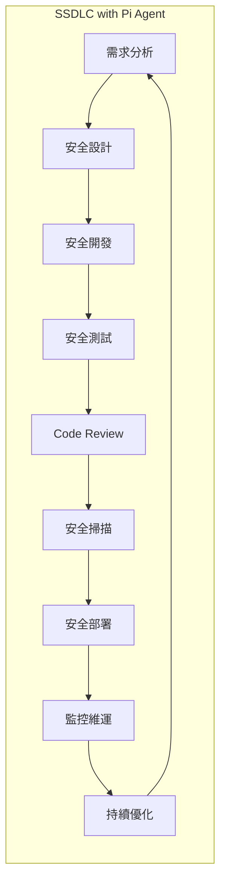
```mermaid
graph LR
    subgraph "SSDLC with Pi Agent"
        REQ[需求分析] --> DES[安全設計]
        DES --> DEV[安全開發]
        DEV --> TEST[安全測試]
        TEST --> REV[Code Review]
        REV --> SCAN[安全掃描]
        SCAN --> DEPLOY[安全部署]
        DEPLOY --> MON[監控維運]
        MON --> OPT[持續優化]
        OPT --> REQ
    end
```

### 9.2 各階段 Pi 整合方式

#### (1) 安全設計（Secure Design）

```text
> @PLAN.md 請針對使用者管理模組進行威脅模型分析（Threat Modeling），
> 使用 STRIDE 方法，並產出安全設計文件
```

#### (2) 安全開發（Secure Coding）

建立 Secure Coding 的 Prompt Template：

```markdown
<!-- .pi/prompts/secure-code.md -->
請在撰寫程式碼時遵循以下安全規範：

1. **輸入驗證**：所有外部輸入必須驗證（使用 Jakarta Validation）
2. **SQL 防注入**：使用 JPA Parameterized Query，禁止字串拼接
3. **XSS 防護**：輸出編碼，使用 OWASP Java Encoder
4. **CSRF 防護**：啟用 Spring Security CSRF Token
5. **認證授權**：使用 @PreAuthorize 控制 API 存取
6. **敏感資料**：密碼使用 BCrypt，日誌不得記錄敏感欄位
7. **錯誤處理**：不得將堆疊追蹤回傳給客戶端
8. **依賴安全**：不使用已知漏洞的依賴
```

#### (3) AI Code Review

```bash
# 使用唯讀模式進行安全審查
pi --tools read,grep,find,ls -p \
  "請對 src/main/java/com/example/controller/ 目錄下的所有 Controller 進行安全審查，
   檢查 OWASP Top 10 風險，以表格格式輸出結果"
```

#### (4) SAST / DAST 整合

````markdown
<!-- .pi/skills/security-scan/SKILL.md -->
# Security Scan Skill

## SAST（靜態分析）
```bash
# SpotBugs 安全掃描
mvn spotbugs:check

# SonarQube 掃描
mvn sonar:sonar -Dsonar.host.url=http://sonarqube:9000
```

## Dependency Scan
```bash
# OWASP Dependency Check
mvn org.owasp:dependency-check-maven:check
```

## 步驟
1. 執行 SAST 掃描
2. 分析報告
3. 修復發現的漏洞
4. 重新掃描驗證
````

#### (5) CI/CD 安全整合

```yaml
# .github/workflows/ssdlc.yml
name: SSDLC Pipeline

on:
  pull_request:
    branches: [main, develop]

jobs:
  security-scan:
    runs-on: ubuntu-latest
    steps:
      - uses: actions/checkout@v4

      - name: Setup Java
        uses: actions/setup-java@v4
        with:
          distribution: 'temurin'
          java-version: '21'

      - name: SAST - SpotBugs
        run: mvn spotbugs:check

      - name: Dependency Check
        run: mvn org.owasp:dependency-check-maven:check

      - name: Unit Tests
        run: mvn test

      - name: AI Code Review (Pi)
        env:
          ANTHROPIC_API_KEY: ${{ secrets.ANTHROPIC_API_KEY }}
        run: |
          npm install -g --ignore-scripts @earendil-works/pi-coding-agent
          # --approve 用於信任專案內 .pi/(prompts、skills 等),CI 為非互動模式,
          # 若省略此旗標,預設 defaultProjectTrust=ask 會直接略過受信任範圍內的專案資源
          pi --approve --tools read,grep,find,ls -p \
            "Review all changed files for security issues. Output as JSON." \
            --mode json > review-results.json

      - name: Upload Results
        uses: actions/upload-artifact@v4
        with:
          name: security-reports
          path: |
            target/spotbugsXml.xml
            target/dependency-check-report.html
            review-results.json
```

### 9.3 DevSecOps 流程圖

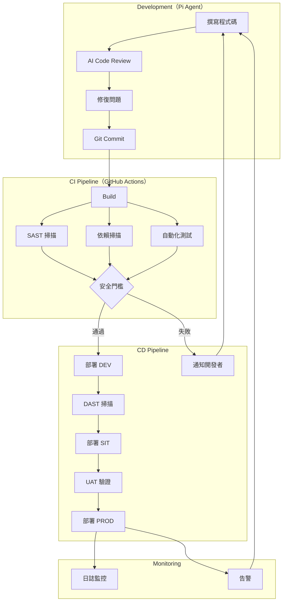
```mermaid
graph TB
    subgraph "Development（Pi Agent）"
        CODE[撰寫程式碼] --> REVIEW[AI Code Review]
        REVIEW --> FIX[修復問題]
        FIX --> COMMIT[Git Commit]
    end

    subgraph "CI Pipeline（GitHub Actions）"
        COMMIT --> BUILD[Build]
        BUILD --> SAST[SAST 掃描]
        BUILD --> DEP[依賴掃描]
        BUILD --> TEST[自動化測試]
        SAST --> GATE{安全門檻}
        DEP --> GATE
        TEST --> GATE
    end

    subgraph "CD Pipeline"
        GATE -->|通過| DEPLOY_DEV[部署 DEV]
        DEPLOY_DEV --> DAST[DAST 掃描]
        DAST --> DEPLOY_SIT[部署 SIT]
        DEPLOY_SIT --> UAT[UAT 驗證]
        UAT --> PROD[部署 PROD]
        GATE -->|失敗| NOTIFY[通知開發者]
        NOTIFY --> CODE
    end

    subgraph "Monitoring"
        PROD --> LOG[日誌監控]
        PROD --> ALERT[告警]
        ALERT --> CODE
    end
```

> **實務建議**：在 PR 流程中整合 Pi 的非互動模式做自動 Code Review，可以在人工 Review 前先過濾掉明顯的安全問題，大幅提升效率。

---

## 10. 實戰案例（Hands-on）

### 10.1 案例概述

使用 Pi 從零建立一個**任務管理系統（Task Manager）**。

**技術棧**：
- 後端：Spring Boot 3.5 + Java 21
- 前端：Vue 3 + TypeScript + Tailwind CSS
- 資料庫：PostgreSQL 16
- API 文件：SpringDoc OpenAPI

### 10.2 Step 1：初始化專案

```text
> 請幫我用 Spring Initializr 建立一個 Spring Boot 3.5 專案：
> - Group: com.example
> - Artifact: task-manager
> - Dependencies: Spring Web, Spring Data JPA, PostgreSQL Driver,
>   Spring Validation, SpringDoc OpenAPI
> - Java 21
> - 使用 Maven
```

### 10.3 Step 2：設計 DB Schema

```text
> 設計 Task Manager 的資料庫 Schema：
> 
> tasks 表：
> - id (BIGSERIAL, PK)
> - title (VARCHAR 200, NOT NULL)
> - description (TEXT)
> - status (VARCHAR 20: TODO/IN_PROGRESS/DONE)
> - priority (VARCHAR 10: LOW/MEDIUM/HIGH)
> - assignee (VARCHAR 100)
> - due_date (TIMESTAMP)
> - created_at (TIMESTAMP, DEFAULT NOW())
> - updated_at (TIMESTAMP)
> - is_deleted (BOOLEAN, DEFAULT FALSE)
> 
> 請產生 Flyway 遷移腳本 V1.0__create_tasks_table.sql
```

### 10.4 Step 3：建立後端 API

```text
> 根據 tasks 表建立完整的後端程式碼：
> 
> 1. TaskEntity.java - JPA Entity
> 2. TaskRepository.java - Spring Data JPA Repository
> 3. TaskService.java - 業務邏輯（含 DTO 轉換）
> 4. TaskController.java - REST API Controller
> 5. TaskDTO.java - 資料傳輸物件
> 6. TaskStatus.java / TaskPriority.java - Enum
> 
> API 規格：
> - POST   /api/tasks         建立任務
> - GET    /api/tasks          查詢任務列表（支援分頁、篩選）
> - GET    /api/tasks/{id}     查詢單一任務
> - PUT    /api/tasks/{id}     更新任務
> - DELETE /api/tasks/{id}     軟刪除任務
> 
> 要求：
> - 使用 Clean Architecture 分層
> - 加入 Jakarta Validation
> - 加入 SpringDoc Swagger 註解
> - 使用 Specification 做動態查詢
```

### 10.5 Step 4：撰寫測試

```text
> 為 TaskService 撰寫完整的 JUnit 5 測試：
> - 使用 MockitoExtension
> - 每個方法至少 3 個測試案例
> - 包含正常流程、邊界條件、異常處理
> - 使用 AssertJ 斷言
```

### 10.6 Step 5：建立前端

```text
> 使用 Vue 3 + TypeScript + Tailwind CSS 建立前端頁面：
> 
> 1. TaskList.vue - 任務列表頁
>    - 表格顯示所有任務
>    - 支援狀態篩選、搜尋
>    - 分頁功能
>    
> 2. TaskForm.vue - 新增/編輯任務的表單
>    - 表單驗證
>    - 日期選擇器
>    
> 3. api/taskApi.ts - API 呼叫層
>    - 使用 axios
>    - 統一錯誤處理
```

### 10.7 Step 6：部署配置

```text
> 建立部署配置：
> 
> 1. Dockerfile（多階段建置）
> 2. docker-compose.yml（含 PostgreSQL）
> 3. application-dev.yml
> 4. application-prod.yml（敏感資訊用環境變數）
```

### 10.8 完整開發流程圖

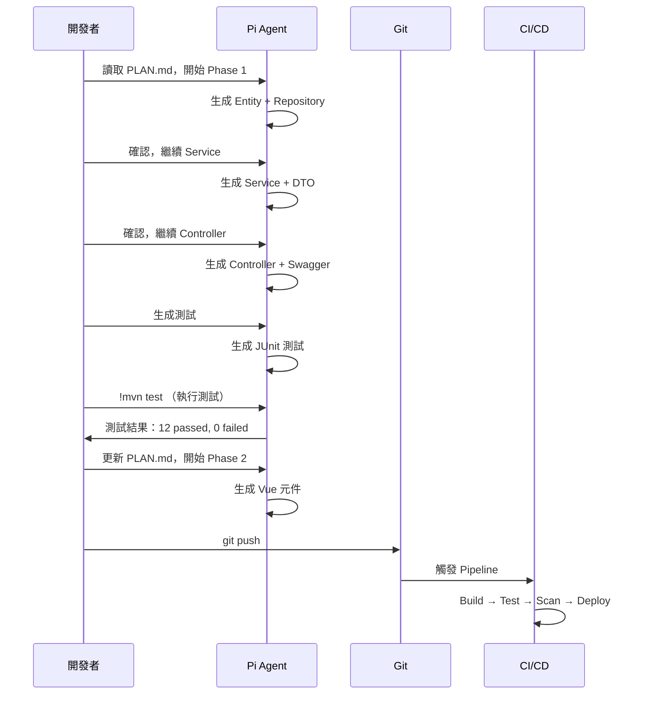
```mermaid
sequenceDiagram
    participant DEV as 開發者
    participant PI as Pi Agent
    participant GIT as Git
    participant CI as CI/CD

    DEV->>PI: 讀取 PLAN.md，開始 Phase 1
    PI->>PI: 生成 Entity + Repository
    DEV->>PI: 確認，繼續 Service
    PI->>PI: 生成 Service + DTO
    DEV->>PI: 確認，繼續 Controller
    PI->>PI: 生成 Controller + Swagger
    DEV->>PI: 生成測試
    PI->>PI: 生成 JUnit 測試
    DEV->>PI: !mvn test （執行測試）
    PI->>DEV: 測試結果：12 passed, 0 failed
    DEV->>PI: 更新 PLAN.md，開始 Phase 2
    PI->>PI: 生成 Vue 元件
    DEV->>GIT: git push
    GIT->>CI: 觸發 Pipeline
    CI->>CI: Build → Test → Scan → Deploy
```

> **實務建議**：每完成一個 Phase，使用 `/compact` 壓縮上下文，避免 Token 用量過高。同時用 `/tree` 標記重要節點方便回溯。

---

## 11. 維運與監控（Operations）

### 11.1 Log 設計

Pi 的所有操作記錄在 Session 檔案中（JSONL 格式）：

```bash
# Session 儲存位置
ls ~/.pi/agent/sessions/

# 匯出 Session 為 HTML（方便閱讀與分享）
pi --export session-file.jsonl output.html

# 上傳為 GitHub Gist 分享
# 在互動模式中使用 /share 命令
```

#### 建議的 Log 管理策略

```bash
# 定期清理過舊的 Session
find ~/.pi/agent/sessions/ -name "*.jsonl" -mtime +30 -delete

# 保留重要 Session（加入 Git 追蹤）
cp ~/.pi/agent/sessions/important-session.jsonl \
   ./docs/ai-sessions/
```

### 11.2 Agent 行為監控

```bash
# 使用 JSON 模式監控 Agent 行為
pi --mode json -p "執行安全掃描" 2>&1 | tee agent-log.json

# 監控 Token 使用量
# 在互動模式中，Footer 會即時顯示：
# - Total Tokens
# - Cache Usage
# - Cost（美元）
```

#### 使用 `/session` 命令查看統計

```text
/session
# 輸出：
# Session ID: abc123
# Messages: 45
# Total Tokens: 125,000
# Cache Tokens: 89,000
# Cost: $0.42
```

### 11.3 Debug 方法

| 狀況 | 解法 |
| ------ | ------ |
| Agent 產出的程式碼有 Bug | 貼上錯誤訊息，讓 Pi 分析修復 |
| Agent 不遵循 AGENTS.md | 檢查 AGENTS.md 格式是否正確，重啟 Session |
| Context 過大導致回應品質下降 | 使用 `/compact` 壓縮上下文 |
| Extension 不運作 | 使用 `--verbose` 啟動查看載入日誌 |
| 工具呼叫失敗 | 按 `Ctrl+O` 展開工具輸出查看錯誤 |

```bash
# Verbose 模式啟動（顯示詳細載入資訊）
pi --verbose
```

### 11.4 成本控制

#### Token 使用量最佳化

| 策略 | 說明 |
| ------ | ------ |
| 使用 Compaction | 自動壓縮舊訊息，減少 Token 用量 |
| 選擇適當模型 | 簡單任務用小模型（如 Haiku），複雜任務用大模型 |
| 善用 Prompt Cache | 固定的系統提示會被快取，降低成本 |
| 唯讀模式 | Code Review 使用 `--tools read` 避免不必要的工具呼叫 |
| 非互動模式 | 明確任務用 `-p` 模式，避免多輪對話 |

```bash
# 延長 Prompt Cache（降低重複成本）
export PI_CACHE_RETENTION=long
# Anthropic: 1 小時快取
# OpenAI: 24 小時快取
```

#### 成本估算參考（以 Claude Sonnet 為例）

| 任務類型 | 預估 Token | 預估成本 |
| --------- | ----------- | --------- |
| 生成一個 CRUD API | 5,000-10,000 | $0.03-0.06 |
| Code Review（單檔） | 3,000-5,000 | $0.02-0.03 |
| 完整模組開發（1 天） | 50,000-100,000 | $0.30-0.60 |
| Sprint（5 天） | 250,000-500,000 | $1.50-3.00 |

> **實務建議**：建議團隊設定每月 Token 預算上限，並透過 `/session` 定期檢視成本。使用 `Ctrl+P` 切換模型可以有效控制成本——初步探索用低成本模型，精細調整用高品質模型。

### 11.5 Compaction 運作機制(理解自動壓縮才能有效除錯)

自動壓縮並非「整段刪除舊訊息」，而是有明確的觸發條件與規則,了解這套機制有助於判斷「為什麼上下文變短了」或「為什麼摘要漏了某個細節」：

- **觸發時機**：當 `目前 Context Token 數 > 模型上下文視窗 - reserveTokens` 時自動觸發（`reserveTokens` 預設 16384),或使用者手動執行 `/compact [自訂指示]`
- **切點規則**：從最新訊息往回累計，直到達到 `keepRecentTokens`(預設 20000)為止的位置即為切點；切點只會落在使用者訊息、助理訊息、Bash 執行紀錄或自訂訊息上，**絕不會**切在「工具呼叫」與其「工具結果」之間，確保上下文結構完整
- **Split Turn**：若單一回合（一次使用者發言到下一次發言之間的所有助理回應與工具呼叫）就超過 `keepRecentTokens`，切點會落在該回合中段的助理訊息上，此時 Pi 會產生「歷史摘要」與「回合前半摘要」兩份摘要再合併
- **累積檔案追蹤**：每次摘要都會累積記錄「已讀取檔案」與「已修改檔案」清單，即使歷經多次壓縮也不會遺失這份記錄
- **分支摘要（Branch Summary）**：與自動壓縮共用同一套摘要格式，差別在於觸發時機是 `/tree` 切換到不同分支時,用來保留「被放棄分支」的關鍵上下文

```json
// ~/.pi/agent/settings.json 或 .pi/settings.json
{
  "compaction": {
    "enabled": true,
    "reserveTokens": 16384,
    "keepRecentTokens": 20000
  },
  "branchSummary": {
    "reserveTokens": 16384,
    "skipPrompt": false
  }
}
```

> **除錯建議**：若懷疑 Agent「忘記」了某個決策，先用 `/tree` 或 `/session` 確認是否曾發生壓縮（`compaction` 類型的節點），再檢視該節點的 `summary` 內容,而非假設模型本身出錯。Extension 開發者可透過 `session_before_compact` 事件完全客製化摘要邏輯,詳見官方 [Compaction](https://github.com/earendil-works/pi/blob/main/packages/coding-agent/docs/compaction.md) 文件。

### 11.6 Session 格式與程式化查詢

Session 檔案是**樹狀結構**的 JSONL,每一筆記錄都有 `id` 與 `parentId`,目前所在位置稱為「active leaf」。除了用 `/tree` 在互動模式導覽，企業也可以直接用指令碼分析：

```bash
# 檢視 Session 檔案最後一筆記錄(可用於監控腳本判斷是否已完成回應)
tail -n 1 ~/.pi/agent/sessions/<encoded-cwd>/<session-id>.jsonl

# 搭配 jq 統計某 Session 中所有 assistant 訊息的累積花費
jq -s '[.[] | select(.type=="message" and .message.role=="assistant") | .message.usage.cost.total // 0] | add' \
  session-file.jsonl
```

若需要在自建工具中解析 Session,建議直接呼叫 SDK 的 `SessionManager` API（`getEntries()`、`getBranch()`、`buildContextEntries()`、`getLeafId()` 等),而非自行解析 JSONL Schema——官方在小版本間可能調整內部欄位,SDK 介面較穩定。完整格式定義見 [Session Format](https://github.com/earendil-works/pi/blob/main/packages/coding-agent/docs/session-format.md)。

---

## 12. 升級與版本管理（Upgrade Strategy）

### 12.1 Pi 升級方式

```bash
# 查看當前版本
pi --version

# 升級到最新版（建議方式）
pi update --self

# 強制重新安裝（即使版本相同）
pi update --self --force

# 或使用 npm 手動升級
npm update -g @earendil-works/pi-coding-agent

# 安裝特定版本
npm install -g --ignore-scripts @earendil-works/pi-coding-agent@0.84.2

# 查看更新日誌
# 在互動模式中
/changelog
```

#### 近期重點版本歷程（v0.83 → v0.84.2,依官方 [CHANGELOG](https://github.com/earendil-works/pi/blob/main/packages/coding-agent/CHANGELOG.md) 整理;中間的 0.81/0.82 小版號多為修復與微調,未逐一列出)

| 版本 | 發布日期 | 重點功能 |
| ------ | --------- | --------- |
| **v0.83.0** | 2026-07-29 | 新增 `pi auth print-api-key` / `print-bearer-token` 憑證匯出;OpenRouter 無圖形介面環境（如 SSH）可貼上回呼網址完成登入;GitHub Copilot 支援 Claude Opus 5（1M Context) |
| **v0.84.0** | 2026-08-06 | **重大更新**:實驗性 Fullscreen TUI 模式;Mermaid/LaTeX 終端內渲染;`AGENTS.override.md`;新增 Baseten Provider;`samplingParams` 自訂取樣參數;內部 Session 儲存模型改版為 pi-agent-core v4（多項 Breaking Change,僅影響直接呼叫底層 API 的進階整合) |
| **v0.84.1** | 2026-08-07 | 新增 Qwen Token Plan Individual;新增 `pi auth check` 認證健診;`tool_call` 事件可標記 `terminate` 讓全數阻擋的批次略過多餘的模型呼叫;改善 Fullscreen 模式滑鼠選取體驗 |
| **v0.84.2** | 2026-08-14 | Fullscreen 逐字稿搜尋（`Ctrl+Shift+F`);新增 `defaultTools` 設定與 `--use-theme` 旗標;可設定 Fullscreen 結束後輸出行為;修正 JSON/RPC 模式 `message_update` 遺失累積用量的問題 |

> **企業版本策略建議**：v0.84.0 對底層 Session 儲存與部分 Provider Refresh API 有 Breaking Change,若貴團隊有直接呼叫 `pi-agent-core` 或自訂 Provider `refreshModels()` 的整合,升級前務必詳讀該版 CHANGELOG 的 Breaking Changes 段落並於測試環境驗證,一般僅使用 CLI/Extension/Skill 的用戶不受影響。

### 12.2 升級前檢查清單

1. ✅ 備份自訂 Extension（`~/.pi/agent/extensions/`）
2. ✅ 備份設定檔（`~/.pi/agent/settings.json`）
3. ✅ 檢查 [CHANGELOG](https://github.com/earendil-works/pi/blob/main/packages/coding-agent/CHANGELOG.md) 是否有 Breaking Change
4. ✅ 在非生產環境先測試
5. ✅ 確認 Extension API 相容性

### 12.3 Prompt / Extension 版本管理

```bash
# 建議將 Pi 配置納入 Git 版控
your-project/
├── .pi/
│   ├── settings.json          # Git 追蹤
│   ├── extensions/            # Git 追蹤
│   │   ├── git-checkpoint.ts
│   │   └── permission-gate.ts
│   ├── skills/                # Git 追蹤
│   ├── prompts/               # Git 追蹤
│   └── .gitignore             # 排除 npm/git 安裝的套件
├── AGENTS.md                  # Git 追蹤
├── PLAN.md                    # Git 追蹤
└── ...
```

`.pi/.gitignore` 建議內容：

```gitignore
# 安裝的第三方套件
npm/
git/
```

### 12.4 與 Git 整合策略

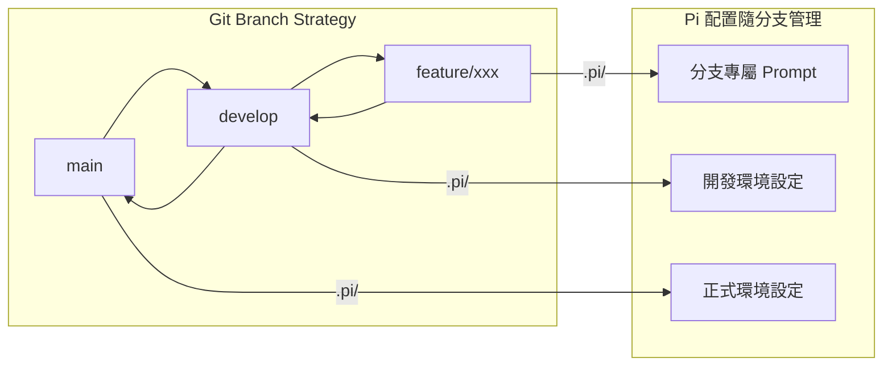
```mermaid
graph LR
    subgraph "Git Branch Strategy"
        MAIN[main] --> DEV[develop]
        DEV --> FEAT[feature/xxx]
        FEAT --> DEV
        DEV --> MAIN
    end

    subgraph "Pi 配置隨分支管理"
        FEAT --> |.pi/| PI_FEAT[分支專屬 Prompt]
        DEV --> |.pi/| PI_DEV[開發環境設定]
        MAIN --> |.pi/| PI_MAIN[正式環境設定]
    end
```

> **實務建議**：每次 Pi 大版本更新（如 0.67 → 0.68）時，建議先在 Feature Branch 測試，確認所有自訂 Extension 正常運作後再合併到 develop。

---

## 13. OSS Session 共享與社群貢獻

### 13.1 為什麼共享 Session 很重要

Pi 官方積極推動開源 Session 共享計畫,即使專案主導權已於 2026 年 4 月轉移至 Earendil Inc.,這項由 Mario Zechner 發起的社群傳統仍延續至今。公開的 OSS 編碼 Session 資料可協助改善：

- **模型品質**：提供真實世界開發工作流，取代人工基準測試
- **提示工程**：發現有效的 Prompt 模式與反模式
- **工具呼叫**：優化工具使用策略與錯誤恢復
- **評估基準**：建立基於真實任務的評估資料集

### 13.2 共享方式

使用 [badlogic/pi-share-hf](https://github.com/badlogic/pi-share-hf) 工具將 Session 上傳至 Hugging Face：

```bash
# 前置需求
# 1. Hugging Face 帳戶
# 2. Hugging Face CLI
# 3. pi-share-hf 工具

# 安裝 pi-share-hf
git clone https://github.com/badlogic/pi-share-hf
cd pi-share-hf
# 依照 README.md 完成設定

# Pi 內建的分享方式
/share  # 上傳為 private GitHub Gist，產生可分享 HTML 連結
/export session.html  # 匯出為 HTML 檔案
```

### 13.3 社群參與管道

| 管道 | 說明 |
| ------ | ------ |
| [Discord](https://discord.com/invite/3cU7Bz4UPx) | 社群討論、套件分享、問題求助 |
| [GitHub Discussions](https://github.com/earendil-works/pi/discussions) | 功能討論與提案 |
| [GitHub Issues](https://github.com/earendil-works/pi/issues) | Bug 回報（新貢獻者的 Issue/PR 預設自動關閉，維護者每日審查） |
| [CONTRIBUTING.md](https://github.com/earendil-works/pi/blob/main/CONTRIBUTING.md) | 貢獻指南 |
| [Hugging Face 資料集](https://huggingface.co/datasets/badlogicgames/pi-mono) | Mario Zechner 的 pi-mono 工作 Session 公開資料集 |

> **企業建議**：企業內部也可建立自己的 Session 資料庫，用於新人訓練、最佳實務傳承、以及團隊開發模式分析。使用 `/export` 匯出的 HTML 檔案可納入內部知識管理系統。

---

## 14. Best Practices（企業建議）

### 14.1 團隊使用規範

#### 統一開發環境

```bash
# 在專案根目錄放置 .nvmrc
echo "20" > .nvmrc

# 在 AGENTS.md 中明確指定規範
# 所有成員使用相同的 AGENTS.md
```

#### 程式碼品質標準

| 規範 | 標準 |
| ------ | ------ |
| 測試覆蓋率 | > 80% |
| Code Review | 人工 + AI 雙重審查 |
| Commit Message | Conventional Commits |
| 分支策略 | Git Flow 或 Trunk-based |
| 文件 | Swagger + JavaDoc |

### 14.2 Prompt Engineering 原則

#### 原則一：具體明確

```text
❌ 不好的 Prompt：
"幫我寫一個 API"

✅ 好的 Prompt：
"建立 GET /api/tasks API，支援以下查詢參數：
- status (enum: TODO/IN_PROGRESS/DONE)
- priority (enum: LOW/MEDIUM/HIGH)
- keyword (模糊搜尋 title 和 description)
- page (預設 0)
- size (預設 20)
回傳 Page<TaskDTO>，使用 Spring Data JPA Specification"
```

#### 原則二：提供上下文

```text
✅ 好的做法：
> @src/main/java/com/example/entity/Task.java
> @src/main/java/com/example/repository/TaskRepository.java
> 基於這些既有檔案，建立 TaskService
```

#### 原則三：分步執行

```text
✅ 好的做法：
第一步：> 建立 TaskEntity.java
第二步：> 確認後，建立 TaskRepository.java
第三步：> 確認後，建立 TaskService.java

❌ 不好的做法：
> 幫我一次建立完整的後端，包含 Entity、Repository、Service、Controller、Test
```

#### 原則四：善用 Steering Message

在 Pi 工作時，可以用 `Enter` 送出引導訊息：

```text
（Pi 正在寫 Service...）
> 記得加入交易管理 @Transactional
（Pi 收到後會在當前工具完成後調整）
```

### 14.3 Session 管理建議

| 原則 | 說明 |
| ------ | ------ |
| 一個功能一個 Session | 避免 Context 混亂 |
| 定期 Compact | 長 Session 用 `/compact` 壓縮 |
| 標記重要節點 | 使用 `/tree` 和 `Shift+L` 標記 |
| 匯出重要 Session | `/export` 或 `/share` 保存 |
| 使用 `/fork` | 從某個節點分支探索不同方案 |

### 14.4 團隊導入策略

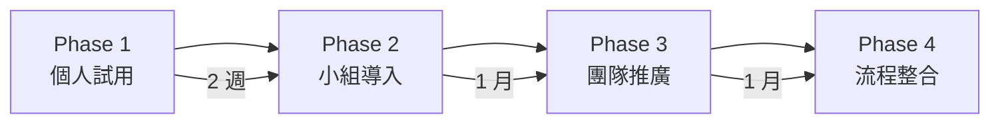
```mermaid
graph LR
    P1[Phase 1<br/>個人試用] --> P2[Phase 2<br/>小組導入]
    P2 --> P3[Phase 3<br/>團隊推廣]
    P3 --> P4[Phase 4<br/>流程整合]

    P1 --> |2 週| P2
    P2 --> |1 月| P3
    P3 --> |1 月| P4
```

| 階段 | 目標 | 行動 |
| ------ | ------ | ------ |
| Phase 1 | 熟悉工具 | 1-2 位成員試用，建立基礎 Prompt Template |
| Phase 2 | 建立規範 | 3-5 人小組使用，共建 AGENTS.md 和 Extension |
| Phase 3 | 全面推廣 | 團隊統一使用，分享最佳實務 |
| Phase 4 | 流程整合 | 整合 CI/CD，建立自動化 Code Review |

---

## 15. Anti-Patterns（重要）

### 15.1 不該這樣用 Pi 的方式

| Anti-Pattern | 問題 | 正確做法 |
| ------------- | ------ | --------- |
| 🚫 一次要求過大 | Context 爆掉、品質下降 | 分步執行，每步確認 |
| 🚫 不看 AI 輸出直接套用 | 可能有安全漏洞或邏輯錯誤 | 每次輸出都 Review |
| 🚫 不用 AGENTS.md | AI 不了解專案規範 | 維護完整的 AGENTS.md |
| 🚫 長期不 Compact | Token 浪費、回應變慢 | 定期 `/compact` |
| 🚫 把 API Key 寫在程式碼中 | 安全風險 | 使用環境變數 |
| 🚫 讓 AI 修改 Production 配置 | 安全風險 | 使用 Permission Gate Extension |
| 🚫 不測試 AI 生成的程式碼 | 品質風險 | 必須跑測試驗證 |
| 🚫 直接用 AI 生成的 SQL 跑 DB | 資料風險 | 先 Review 再執行 |
| 🚫 安裝未審查的第三方 Package | 安全風險 | 審查原始碼後再安裝 |
| 🚫 不同步 PLAN.md | 團隊進度不透明 | 每日更新 PLAN.md |

### 15.2 常見踩雷

#### 踩雷 1：Context Pollution

```text
問題：在同一個 Session 中做了太多不同的事，AI 開始混淆上下文。
解法：一個功能一個 Session。用 /new 開新 Session。
```

#### 踩雷 2：Model Hallucination

```text
問題：AI 生成了不存在的 API 或方法。
解法：
1. 提供明確的上下文（@file）
2. 使用高思考等級（--thinking high）
3. 要求 AI 先讀取相關檔案再回答
```

#### 踩雷 3：Prompt Template 衝突

```text
問題：全域和專案層級的 Prompt Template 名稱衝突。
解法：專案層級優先。使用有意義的命名前綴，如 proj-review。
```

#### 踩雷 4：Extension 相容性

```text
問題：Pi 升級後自訂 Extension 無法載入。
解法：
1. 查看 CHANGELOG 中的 Breaking Changes
2. 使用 --verbose 查看錯誤訊息
3. 更新 Extension API 呼叫
```

#### 踩雷 5：成本失控

```text
問題：月底發現 API 費用超出預算。
解法：
1. 使用 /session 定期檢視成本
2. 簡單任務用低成本模型（Ctrl+P 切換）
3. 善用 Prompt Cache（PI_CACHE_RETENTION=long）
4. Code Review 用唯讀模式（--tools read）
```

---

## 16. 容器化與沙箱安全（Containerization & Sandboxing）

### 16.1 為什麼需要容器化

Pi **刻意不內建沙箱**——這是官方 [Security](https://github.com/earendil-works/pi/blob/main/packages/coding-agent/docs/security.md) 文件明確聲明的設計決策,而非尚未實作的功能。預設情況下，Pi 以啟動它的使用者權限運行，內建工具與 Extension 皆可讀寫檔案、以該使用者身份執行任意 Shell 指令。官方理由是：一套「只做半套」的行程內沙箱，容易讓人誤以為它是安全邊界,但實際上仍依賴主機 Shell、檔案系統、套件管理器、憑證與 Extension 程式碼,真正的隔離必須交由作業系統或虛擬化/容器層負責。這在開發環境中是合理的權衡，但在以下情境中需要額外導入更強的隔離邊界：

| 情境 | 風險 | 建議方案 |
| ------ | ------ | --------- |
| 執行不受信任的程式碼 | 惡意 Extension 或 LLM 指令可能刪除檔案 | Gondolin / Docker |
| 多租戶共享環境 | 使用者間缺乏隔離 | Docker / OpenShell |
| CI/CD 自動化 | 自動化 Agent 可能修改非預期路徑 | Docker + `--tools` 限制 |
| 企業合規要求 | 稽核需要明確的安全邊界 | OpenShell + 政策控制 |

### 16.2 三種容器化模式

#### (1) Gondolin Extension（推薦：開發環境）

[Gondolin](https://github.com/earendil-works/gondolin) 是一套本地 Linux micro-VM,將 Pi 主進程與 Provider 認證保留在**宿主機**，僅將全部內建工具（`read`、`write`、`edit`、`bash`、`grep`、`find`、`ls`）與使用者輸入的 `!`/`!!` 命令路由到 VM 內執行,VM 掛載宿主機當前目錄為 `/workspace`,VM 內對 `/workspace` 的變更會直接寫回宿主機：

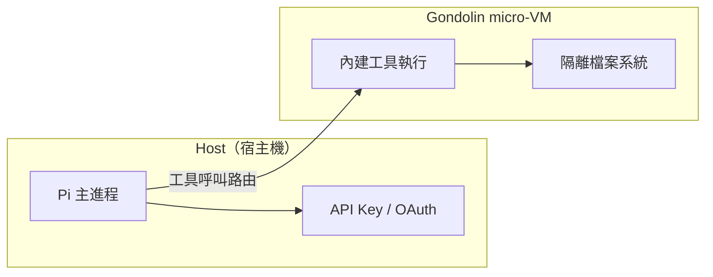
```mermaid
graph LR
    subgraph "Host（宿主機）"
        PI[Pi 主進程]
        AUTH[API Key / OAuth]
        PI --> AUTH
    end

    subgraph "Gondolin micro-VM"
        TOOLS[內建工具執行]
        FS[隔離檔案系統]
        TOOLS --> FS
    end

    PI -->|工具呼叫路由| TOOLS
```

**特點**：
- API Key 不進入 VM，降低洩漏風險
- 工具呼叫在隔離環境中執行
- 宿主機的 Extension 仍可正常運作
- 適合日常開發使用

```bash
# 安裝範例 Extension(需 Node.js >= 23.6.0 供 @earendil-works/gondolin 使用,並透過套件管理器安裝 QEMU)
cp -R packages/coding-agent/examples/extensions/gondolin ~/.pi/agent/extensions/gondolin
cd ~/.pi/agent/extensions/gondolin
npm install --ignore-scripts

# 於欲掛載的專案目錄中啟動
cd /path/to/project
pi -e ~/.pi/agent/extensions/gondolin
```

#### (2) Plain Docker（推薦：CI/CD）

將整個 Pi 進程放入 Docker 容器中執行：

```dockerfile
# Dockerfile.pi-agent
FROM node:20-slim

# 安裝 Pi
RUN npm install -g --ignore-scripts @earendil-works/pi-coding-agent

# 安裝常用工具
RUN apt-get update && apt-get install -y git curl jq && rm -rf /var/lib/apt/lists/*

# 設定非 root 使用者
RUN useradd -m -s /bin/bash piuser
USER piuser
WORKDIR /workspace

ENTRYPOINT ["pi"]
```

```bash
# 建構映像
docker build -f Dockerfile.pi-agent -t pi-agent .

# 執行（掛載專案目錄，傳入 API Key）
docker run --rm -it \
  -v $(pwd):/workspace \
  -e ANTHROPIC_API_KEY=$ANTHROPIC_API_KEY \
  pi-agent -p "Review the code for security issues"

# CI/CD 中的唯讀審查模式
docker run --rm \
  -v $(pwd):/workspace:ro \
  -e ANTHROPIC_API_KEY=$ANTHROPIC_API_KEY \
  pi-agent --tools read,grep,find,ls -p "Audit this codebase"
```

**企業建議**：
- 使用 `:ro` 唯讀掛載防止意外修改
- 搭配 `--tools read,grep,find,ls` 限制可用工具
- 在 CI Pipeline 中每次建立新容器，確保乾淨環境

#### (3) NVIDIA OpenShell（推薦：高安全企業環境）

[NVIDIA OpenShell](https://docs.nvidia.com/openshell/about/overview) 提供政策控制的沙箱，支援細粒度的檔案系統、進程、網路與**憑證**存取控制,可透過本地閘道(以 Docker/Podman/VM 為後端)或遠端 Kubernetes 閘道運行沙箱。**正確的指令流程**是先註冊並選定一個閘道,再建立沙箱——並非單一個 `openshell run` 指令即可完成:

```bash
# 1. 註冊並選定閘道(僅需執行一次)
openshell gateway add <gateway-url> --name <name>
openshell gateway select <name>

# 2. 建立沙箱並在其中啟動 pi(整個 pi 行程,含內建工具、!命令、Extension 皆在沙箱邊界內執行)
openshell sandbox create --name pi-sandbox --from pi -- pi
```

若閘道為**遠端**,沙箱不會自動 bind-mount 主機檔案(這與本機 Gondolin/Docker 模式不同),需要另外上傳/下載專案檔案：

```bash
openshell sandbox upload pi-sandbox ./repo /workspace
openshell sandbox download pi-sandbox /workspace/repo ./repo-out
```

**特點**：
- 可設定「推論路由」(inference routing),讓沙箱內程式碼呼叫固定的 `https://inference.local` 端點,由閘道端注入實際的 Provider 憑證——**原始 API Key 完全不進入沙箱**,較 Gondolin 更進一步降低金鑰外洩風險(需將 Pi 設定為對應的 OpenAI 相容或 Anthropic 相容端點)
- 支援檔案系統、進程、網路與憑證的細粒度政策控制
- 適合金融、醫療等高合規要求行業

### 16.3 企業容器化部署架構

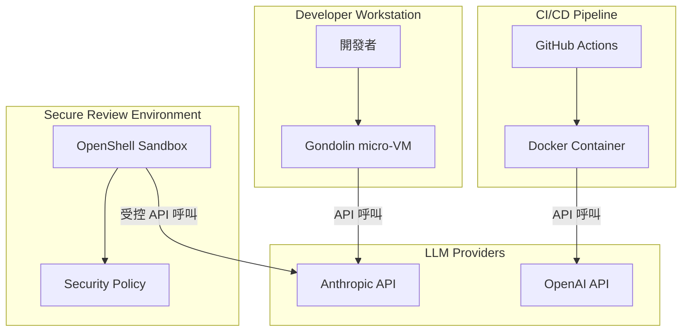
```mermaid
graph TB
    subgraph "Developer Workstation"
        DEV[開發者]
        GOND[Gondolin micro-VM]
        DEV --> GOND
    end

    subgraph "CI/CD Pipeline"
        GHA[GitHub Actions]
        DOCKER[Docker Container]
        GHA --> DOCKER
    end

    subgraph "Secure Review Environment"
        OPENSHELL[OpenShell Sandbox]
        POLICY[Security Policy]
        OPENSHELL --> POLICY
    end

    subgraph "LLM Providers"
        ANTHROPIC[Anthropic API]
        OPENAI[OpenAI API]
    end

    GOND -->|API 呼叫| ANTHROPIC
    DOCKER -->|API 呼叫| OPENAI
    OPENSHELL -->|受控 API 呼叫| ANTHROPIC
```

### 16.4 安全邊界建議

| 層級 | 機制 | 保護範圍 |
| ------ | ------ | --------- |
| **應用層** | Permission Gate Extension | 個別命令攔截（如 `rm -rf`） |
| **專案層** | Project Trust + `.pi/settings.json` | 限制專案載入未審查 Extension |
| **工具層** | `--tools` / `--exclude-tools` | 限制 Agent 可使用的工具 |
| **系統層** | Gondolin / Docker / OpenShell | OS 級別的檔案系統與網路隔離 |
| **網路層** | 防火牆 / Proxy | 限制 API 出站目的地 |

> **實務建議**：企業環境中建議採用**分層防禦**策略——開發環境使用 Gondolin + Permission Gate Extension，CI/CD 使用 Docker + 唯讀工具限制，安全審查使用 OpenShell + 嚴格政策。不要僅依賴單一層級的安全機制。

---

## 17. 結論（Conclusion）

### 17.1 Pi Code Agent 的定位

Pi Code Agent 是一個**極簡但極度可擴充**的 AI 程式碼開發工具。它不試圖成為萬能工具，而是提供一個堅實的基礎框架，讓團隊根據自身需求進行客製化。

### 17.2 核心價值

| 價值 | 說明 |
| ------ | ------ |
| **透明** | 所有操作可見、可追溯、可審計 |
| **可控** | 成本可控、行為可控、風險可控 |
| **可擴充** | Extension 可實現任何工作流 |
| **無鎖定** | 開源 MIT、多模型支援、無廠商綁定 |

### 17.3 建議的導入路徑

1. **先從 Prompt Template 開始** — 最低學習成本，最高 ROI
2. **逐步引入 Skills** — 按需載入專業能力
3. **根據痛點開發 Extension** — 解決團隊特定問題
4. **整合 CI/CD** — 自動化 Code Review 和安全掃描
5. **建立 Pi Package** — 在團隊間共享最佳實務

### 17.4 持續學習資源

#### 入門與核心文件

| 資源 | 連結 |
| ------ | ------ |
| 官方網站 | [pi.dev](https://pi.dev/) |
| 官方文件首頁 | [pi.dev/docs/latest](https://pi.dev/docs/latest) |
| Quickstart | [docs/quickstart.md](https://github.com/earendil-works/pi/blob/main/packages/coding-agent/docs/quickstart.md) |
| Using Pi(互動模式/CLI 完整參考) | [docs/usage.md](https://github.com/earendil-works/pi/blob/main/packages/coding-agent/docs/usage.md) |
| GitHub 源碼 | [earendil-works/pi](https://github.com/earendil-works/pi) |
| npm 套件 | [@earendil-works/pi-coding-agent](https://www.npmjs.com/package/@earendil-works/pi-coding-agent) |
| CHANGELOG | [packages/coding-agent/CHANGELOG.md](https://github.com/earendil-works/pi/blob/main/packages/coding-agent/CHANGELOG.md) |

#### 設定、認證與環境

| 資源 | 連結 |
| ------ | ------ |
| Providers(認證與模型設定) | [docs/providers.md](https://github.com/earendil-works/pi/blob/main/packages/coding-agent/docs/providers.md) |
| Custom Models | [docs/models.md](https://github.com/earendil-works/pi/blob/main/packages/coding-agent/docs/models.md) |
| Settings 完整參考 | [docs/settings.md](https://github.com/earendil-works/pi/blob/main/packages/coding-agent/docs/settings.md) |
| Environment Variables | [docs/environment-variables.md](https://github.com/earendil-works/pi/blob/main/packages/coding-agent/docs/environment-variables.md) |
| Keybindings 自訂 | [docs/keybindings.md](https://github.com/earendil-works/pi/blob/main/packages/coding-agent/docs/keybindings.md) |
| llama.cpp 本地模型 | [docs/llama-cpp.md](https://github.com/earendil-works/pi/blob/main/packages/coding-agent/docs/llama-cpp.md) |
| Shell Aliases | [docs/shell-aliases.md](https://github.com/earendil-works/pi/blob/main/packages/coding-agent/docs/shell-aliases.md) |

#### 安全與容器化

| 資源 | 連結 |
|------|------|
| Security(Project Trust、無內建沙箱聲明) | [docs/security.md](https://github.com/earendil-works/pi/blob/main/packages/coding-agent/docs/security.md) |
| Containerization(Gondolin/Docker/OpenShell) | [docs/containerization.md](https://github.com/earendil-works/pi/blob/main/packages/coding-agent/docs/containerization.md) |

#### 擴充機制與範例

| 資源 | 連結 |
| ------ | ------ |
| Extensions 完整 API | [docs/extensions.md](https://github.com/earendil-works/pi/blob/main/packages/coding-agent/docs/extensions.md) |
| Skills | [docs/skills.md](https://github.com/earendil-works/pi/blob/main/packages/coding-agent/docs/skills.md) |
| Prompt Templates | [docs/prompt-templates.md](https://github.com/earendil-works/pi/blob/main/packages/coding-agent/docs/prompt-templates.md) |
| Themes | [docs/themes.md](https://github.com/earendil-works/pi/blob/main/packages/coding-agent/docs/themes.md) |
| Pi Packages(含 Package Gallery 說明) | [docs/packages.md](https://github.com/earendil-works/pi/blob/main/packages/coding-agent/docs/packages.md) |
| Package Gallery(瀏覽社群套件) | [pi.dev/packages](https://pi.dev/packages) |
| Extension 範例(69+ 檔案) | [examples/extensions](https://github.com/earendil-works/pi/tree/main/packages/coding-agent/examples/extensions) |
| Skills 範例 | [examples/skills](https://github.com/earendil-works/pi/tree/main/packages/coding-agent/examples/skills) |
| Prompt 範例 | [examples/prompts](https://github.com/earendil-works/pi/tree/main/packages/coding-agent/examples/prompts) |
| Theme 範例 | [examples/themes](https://github.com/earendil-works/pi/tree/main/packages/coding-agent/examples/themes) |
| Anthropic 官方 Skills | [anthropics/skills](https://github.com/anthropics/skills) |
| Pi 社群 Skills | [badlogic/pi-skills](https://github.com/badlogic/pi-skills) |
| Agent Skills 標準 | [agentskills.io](https://agentskills.io/specification) |

#### 程式化整合

| 資源 | 連結 |
| ------ | ------ |
| SDK 文件 | [docs/sdk.md](https://github.com/earendil-works/pi/blob/main/packages/coding-agent/docs/sdk.md) |
| SDK 範例 | [examples/sdk](https://github.com/earendil-works/pi/tree/main/packages/coding-agent/examples/sdk) |
| RPC 模式 | [docs/rpc.md](https://github.com/earendil-works/pi/blob/main/packages/coding-agent/docs/rpc.md) |
| JSON Event Stream 模式 | [docs/json.md](https://github.com/earendil-works/pi/blob/main/packages/coding-agent/docs/json.md) |
| Session Format / SessionManager API | [docs/session-format.md](https://github.com/earendil-works/pi/blob/main/packages/coding-agent/docs/session-format.md) |
| Compaction 內部機制 | [docs/compaction.md](https://github.com/earendil-works/pi/blob/main/packages/coding-agent/docs/compaction.md) |
| Sessions(分支/Fork/Tree) | [docs/sessions.md](https://github.com/earendil-works/pi/blob/main/packages/coding-agent/docs/sessions.md) |
| Custom Provider | [docs/custom-provider.md](https://github.com/earendil-works/pi/blob/main/packages/coding-agent/docs/custom-provider.md) |
| OpenClaw(SDK 起源案例，386.8k+ Stars) | [docs.openclaw.ai](https://docs.openclaw.ai/) |

#### 平台安裝細節

| 資源 | 連結 |
| ------ | ------ |
| Windows | [docs/windows.md](https://github.com/earendil-works/pi/blob/main/packages/coding-agent/docs/windows.md) |
| Termux(Android) | [docs/termux.md](https://github.com/earendil-works/pi/blob/main/packages/coding-agent/docs/termux.md) |
| tmux | [docs/tmux.md](https://github.com/earendil-works/pi/blob/main/packages/coding-agent/docs/tmux.md) |
| Terminal Setup | [docs/terminal-setup.md](https://github.com/earendil-works/pi/blob/main/packages/coding-agent/docs/terminal-setup.md) |

#### 社群與治理

| 資源 | 連結 |
| ------ | ------ |
| Discord 社群 | [discord.com/invite/3cU7Bz4UPx](https://discord.com/invite/3cU7Bz4UPx) |
| 設計哲學部落格(Mario Zechner) | [mariozechner.at](https://mariozechner.at/posts/2025-11-30-pi-coding-agent/) |
| 為何不需要 MCP | [mariozechner.at](https://mariozechner.at/posts/2025-11-02-what-if-you-dont-need-mcp/) |
| CONTRIBUTING 指南 | [CONTRIBUTING.md](https://github.com/earendil-works/pi/blob/main/CONTRIBUTING.md) |
| Pi Package 搜尋(npm) | [npmjs.com](https://www.npmjs.com/search?q=keywords%3Api-package) |
| Session 共享工具 | [badlogic/pi-share-hf](https://github.com/badlogic/pi-share-hf) |
| Hugging Face 公開 Session 資料集 | [huggingface.co](https://huggingface.co/datasets/badlogicgames/pi-mono) |
| Earendil Inc.(現任開發公司) | [earendil.com](https://earendil.com/) |

> **文件核校方法說明**：本手冊第 1-16 章所有版本號、統計數據、指令與 API 簽章,皆透過 GitHub API 與上表列出的官方原始文件於 2026 年 8 月 20 日直接核對,而非轉引第三方部落格或既有中文教學內容改寫。核對當下最新正式版本仍為 v0.84.2（2026-08-14 發布）,`CHANGELOG.md` 的 `[Unreleased]` 區段已累積 UTF-8 BOM 設定檔解析修復、`session_compact_failed` Extension 事件等項目,惟尚未掛上正式版本號,故本次核校不將其視為已發布功能。

---

## 18. 檢查清單（Checklist）

### ✅ 新進成員快速上手清單

#### 環境建置

- [ ] 安裝 Node.js v20 LTS
- [ ] 安裝 Pi：`npm install -g --ignore-scripts @earendil-works/pi-coding-agent`
- [ ] 確認版本：`pi --version`
- [ ] 設定 API Key（環境變數）
- [ ] 測試啟動：`pi "Hello, Pi!"`

#### 專案設定

- [ ] 閱讀專案 `AGENTS.md`（或 `CLAUDE.md`、`AGENTS.override.md`）
- [ ] 閱讀專案 `PLAN.md`
- [ ] 確認 `.pi/settings.json` 設定（鍵名為 `defaultProvider`/`defaultModel`/`defaultThinkingLevel`/`defaultTools`）
- [ ] 確認 `.pi/SYSTEM.md` / `.pi/APPEND_SYSTEM.md` 是否存在（注意路徑在 `.pi/` 之下，非專案根目錄）
- [ ] 了解可用的 Prompt Templates（`/` 查看）
- [ ] 了解可用的 Skills（`/skill:` 查看）
- [ ] 了解已安裝的 Extensions（啟動時顯示）
- [ ] 了解已安裝的 Pi Packages（`pi list`）
- [ ] 首次進入專案時確認 Project Trust 決策（`/trust`）

#### 基本操作

- [ ] 學會使用 `@` 引入檔案
- [ ] 學會使用 `Tab` 路徑補全
- [ ] 學會使用 `Ctrl+L` 切換模型
- [ ] 學會使用 `Ctrl+P` 快速切換常用模型
- [ ] 學會使用 `Shift+Tab` 調整思考等級（含 `xhigh`）
- [ ] 學會使用 `Ctrl+O` 展開/收合工具輸出
- [ ] 學會使用 `Ctrl+T` 展開/收合思考過程
- [ ] 學會使用 `Ctrl+G` 開啟外部編輯器
- [ ] 學會使用 `!` 執行 Shell 命令（`!!` 不送輸出給 LLM）
- [ ] 學會使用 `/compact` 壓縮上下文
- [ ] 學會使用 `/tree` 導航 Session
- [ ] 學會使用 `/clone` 複製 Session
- [ ] 學會使用 `/export` 匯出 Session
- [ ] 學會使用 `/share` 上傳 Session 為 GitHub Gist
- [ ] 學會使用 `/reload` 熱重載資源
- [ ] 學會使用 `/config` 啟用/停用已安裝資源
- [ ] 了解 Steering（`Enter`）與 Follow-up（`Alt+Enter`）訊息佇列
- [ ] 學會使用 `--name` / `-n` 為 Session 命名
- [ ] 了解 `Ctrl+-` 為 Undo（**非** `Ctrl+Z`，後者是暫停到背景）
- [ ] 知道快捷鍵可於 `~/.pi/agent/keybindings.json` 完全自訂
- [ ] 若使用本地模型，學會 `/llama` 管理 llama.cpp Router
- [ ] 認識實驗性 Fullscreen 模式（`--tui-mode fullscreen`）與 `Ctrl+Shift+F` 逐字稿搜尋

#### 開發流程

- [ ] 開始工作前先讀 PLAN.md
- [ ] 一個功能一個 Session
- [ ] 每個 AI 輸出都要 Review
- [ ] 定期 `/compact`
- [ ] 完成任務後更新 PLAN.md
- [ ] 重要 Session 用 `/export` 保存

#### 安全規範

- [ ] 不在程式碼中寫入 API Key
- [ ] 不讓 AI 直接修改 Production 配置
- [ ] 安裝第三方 Package 前審查原始碼
- [ ] AI 生成的程式碼必須通過測試
- [ ] AI 生成的 SQL 必須 Review 後再執行

#### 成本控制

- [ ] 了解 `/session` 查看 Token/Cost
- [ ] 簡單任務用低成本模型
- [ ] 善用 Prompt Cache（`PI_CACHE_RETENTION=long`）
- [ ] Code Review 用唯讀模式（`--tools read,grep,find,ls`）
- [ ] 認證問題先用 `pi auth check <provider>` 健診，避免猜測環境變數名稱

#### 社群參與

- [ ] 加入 [Discord 社群](https://discord.com/invite/3cU7Bz4UPx)
- [ ] 了解 [CONTRIBUTING.md](https://github.com/earendil-works/pi/blob/main/CONTRIBUTING.md) 貢獻指南
- [ ] 考慮共享 OSS Session 資料（使用 [pi-share-hf](https://github.com/badlogic/pi-share-hf)）
- [ ] 追蹤 `/changelog` 了解版本更新

---

> **文件維護**：本手冊隨 Pi Code Agent 版本更新而修訂。最後更新日期：2026 年 8 月 20 日（對應 Pi Code Agent v0.84.2，已逐項比對官方 GitHub 倉庫、CHANGELOG 與 Releases 頁面確認無更新版本）。
