+++
date = '2026-04-12T15:55:51+08:00'
draft = false
title = 'Playwright 教學手冊'
tags = ['教學', 'AI開發','DevOps']
categories = ['教學']
+++

# Playwright 教學手冊（企業級完整版）

> **版本**：基於 Playwright v1.59.1（2026 年 4 月）  
> **適用對象**：資深工程師、SDET、QA Lead、DevOps 工程師  
> **授權**：Apache 2.0（Playwright 開源授權）  
> **最後更新**：2026-04-12

---

## 目錄

- [第 1 章：Playwright 總覽](#第-1-章playwright-總覽)
  - [1.1 什麼是 Playwright](#11-什麼是-playwright)
  - [1.2 Playwright 核心架構](#12-playwright-核心架構)
  - [1.3 Playwright vs. Selenium vs. Cypress 比較](#13-playwright-vs-selenium-vs-cypress-比較)
  - [1.4 適用場景](#14-適用場景)
  - [1.5 系統需求](#15-系統需求)
- [第 2 章：系統架構設計（企業級）](#第-2-章系統架構設計企業級)
  - [2.1 測試架構總覽](#21-測試架構總覽test-architecture)
  - [2.2 分層設計](#22-分層設計)
  - [2.3 測試資料管理策略](#23-測試資料管理策略)
  - [2.4 多環境配置](#24-多環境配置)
  - [2.5 與微服務架構整合](#25-與微服務架構整合)
- [第 3 章：安裝與環境建置](#第-3-章安裝與環境建置)
  - [3.1 Node.js 安裝](#31-nodejs-安裝typescriptjavascript)
  - [3.2 Python 安裝](#32-python-安裝)
  - [3.3 Java 安裝](#33-java-安裝)
  - [3.4 專案目錄結構](#34-專案目錄結構企業級推薦)
  - [3.5 VS Code 設定](#35-vs-code-設定)
  - [3.6 Playwright MCP Server 設定](#36-playwright-mcp-server-設定ai-agent-整合)
  - [3.7 Playwright CLI 安裝](#37-playwright-cli-安裝coding-agent-用)
  - [3.8 Playwright Agents 設定（v1.56+）](#38-playwright-agents-設定v156)
  - [3.9 企業環境安裝注意事項](#39-企業環境安裝注意事項)
- [第 4 章：基礎使用教學](#第-4-章基礎使用教學)
  - [4.1 第一個測試案例](#41-第一個測試案例)
  - [4.2 Locator 使用策略](#42-locator-使用策略)
  - [4.3 Auto-wait 機制](#43-auto-wait-機制)
  - [4.4 Assertions（Web-First 驗證）](#44-assertionsweb-first-驗證)
  - [4.5 Headless / Headed 模式](#45-headless--headed-模式)
- [第 5 章：進階功能](#第-5-章進階功能)
  - [5.1 Codegen（錄製測試）](#51-codegen錄製測試)
  - [5.2 Playwright Inspector](#52-playwright-inspector)
  - [5.3 Trace Viewer](#53-trace-viewer)
  - [5.4 Network 攔截（Mock API）](#54-network-攔截mock-api)
  - [5.5 多分頁 / iframe 操作](#55-多分頁--iframe-操作)
  - [5.6 檔案上傳與下載](#56-檔案上傳與下載)
  - [5.7 視覺測試（Screenshot Comparison）](#57-視覺測試screenshot-comparison)
  - [5.8 認證狀態重用（Auth State）](#58-認證狀態重用auth-state)
  - [5.9 Screencast API（v1.59+）](#59-screencast-apiv159)
  - [5.10 Browser Interoperability（v1.59+）](#510-browser-interoperabilityv159)
  - [5.11 Observability Dashboard（v1.59+）](#511-observability-dashboardv159)
  - [5.12 CLI Debugger for Agents（v1.59+）](#512-cli-debugger-for-agentsv159)
  - [5.13 CLI Trace 分析（v1.59+）](#513-cli-trace-分析v159)
  - [5.14 Async Disposables — await using（v1.59+）](#514-async-disposables--await-usingv159)
- [第 6 章：測試設計最佳實踐](#第-6-章測試設計最佳實踐)
  - [6.1 Page Object Model（POM）完整實作](#61-page-object-modelpom完整實作)
  - [6.2 減少 Flaky Test 策略](#62-減少-flaky-test-策略)
  - [6.3 測試命名規範](#63-測試命名規範)
  - [6.4 自訂 Fixtures](#64-自訂-fixtures)
- [第 7 章：CI/CD 整合（企業級重點）](#第-7-章cicd-整合企業級重點)
  - [7.1 GitHub Actions](#71-github-actions)
  - [7.2 GitLab CI](#72-gitlab-ci)
  - [7.3 Jenkins Pipeline](#73-jenkins-pipeline)
  - [7.4 測試報告整合](#74-測試報告整合)
  - [7.5 測試失敗通知](#75-測試失敗通知)
  - [7.6 Docker 化測試執行](#76-docker-化測試執行)
  - [7.7 WebServer Wait 功能（v1.57+）](#77-webserver-wait-功能v157)
  - [7.8 testConfig.tag — 全域標籤（v1.57+）](#78-testconfigtag--全域標籤v157)
- [第 8 章：測試報告與監控](#第-8-章測試報告與監控)
  - [8.1 Playwright HTML Report](#81-playwright-html-report)
  - [8.2 Trace 分析](#82-trace-分析)
  - [8.3 自訂 Reporter](#83-自訂-reporter)
  - [8.4 測試結果 Dashboard](#84-測試結果-dashboard)
- [第 9 章：系統維運與管理](#第-9-章系統維運與管理)
  - [9.1 測試環境管理](#91-測試環境管理)
  - [9.2 測試資料清理](#92-測試資料清理)
  - [9.3 測試排程](#93-測試排程)
  - [9.4 平行測試（Parallel Execution）](#94-平行測試parallel-execution)
  - [9.5 測試資源最佳化](#95-測試資源最佳化)
- [第 10 章：升級與版本管理策略](#第-10-章升級與版本管理策略)
  - [10.1 Playwright 版本升級策略](#101-playwright-版本升級策略)
  - [10.2 Breaking Changes 處理](#102-breaking-changes-處理)
  - [10.3 瀏覽器版本管理](#103-瀏覽器版本管理)
  - [10.4 回滾策略](#104-回滾策略)
- [第 11 章：安全與合規（銀行級）](#第-11-章安全與合規銀行級)
  - [11.1 敏感資料處理](#111-敏感資料處理)
  - [11.2 測試帳號管理](#112-測試帳號管理)
  - [11.3 存取控制（RBAC）](#113-存取控制rbac)
  - [11.4 稽核與日誌（Audit Log）](#114-稽核與日誌audit-log)
- [第 12 章：團隊導入指南](#第-12-章團隊導入指南)
  - [12.1 Playwright 導入 Roadmap](#121-playwright-導入-roadmap)
  - [12.2 導入里程碑](#122-導入里程碑)
  - [12.3 團隊角色分工](#123-團隊角色分工)
  - [12.4 Code Review 規範](#124-code-review-規範)
  - [12.5 教育訓練計畫](#125-教育訓練計畫)
- [第 13 章：完整專案範本](#第-13-章完整專案範本)
  - [13.1 專案結構](#131-專案結構)
  - [13.2 完整 playwright.config.ts 範本](#132-完整-playwrightconfigts-範本)
  - [13.3 完整 package.json 範本](#133-完整-packagejson-範本)
  - [13.4 .gitignore 範本](#134-gitignore-範本)
  - [13.5 Tag 使用策略](#135-tag-使用策略)
- [附錄 A：新進成員檢查清單（Checklist）](#附錄-a新進成員檢查清單checklist)
- [附錄 B：常用指令速查表](#附錄-b常用指令速查表)
- [附錄 C：參考資源](#附錄-c參考資源)

---

## 第 1 章：Playwright 總覽

### 1.1 什麼是 Playwright

Playwright 是由 **Microsoft** 開發並開源的瀏覽器自動化與端對端（E2E）測試框架，採用 **Apache 2.0** 授權。它透過單一 API 驅動 **Chromium**、**Firefox** 與 **WebKit** 三大瀏覽器引擎，支援 Windows、Linux、macOS 跨平台執行。

截至 2026 年 4 月，Playwright 在 GitHub 上已獲得 **86,200+ 顆星**，擁有 **718+ 位貢獻者**，發布 **160+ 個版本**。

#### Playwright 產品線

| 產品 | 定位 | 安裝指令 |
|------|------|----------|
| **Playwright Test** | 端對端測試框架 | `npm init playwright@latest` |
| **Playwright CLI** | AI 編碼代理用 CLI（Token 效率優於 MCP） | `npm i -g @playwright/cli@latest` |
| **Playwright MCP** | AI Agent / LLM 自動化（Model Context Protocol） | `npx @playwright/mcp@latest` |
| **Playwright Agents** | LLM 自動化測試代理（Planner / Generator / Healer） | `npx playwright init-agents` |
| **Playwright Library** | 瀏覽器自動化腳本 | `npm i playwright` |
| **VS Code Extension** | VS Code 測試整合 | VS Code Marketplace 安裝 |

> **📌 v1.56+ 新增 Playwright Agents**：三個自訂 Agent 定義（Planner、Generator、Healer），可引導 LLM 自動完成測試規劃、程式碼生成、以及失敗測試的自動修復。
>
> **📌 v1.58+ 新增 Playwright CLI+SKILLs**：比 MCP 更省 Token 的 CLI 操作模式，Snapshot 不再強制載入 LLM，適合 Coding Agent 整合。

### 1.2 Playwright 核心架構

> **⚠️ 自 v1.57 起，Playwright 預設使用 [Chrome for Testing](https://developer.chrome.com/blog/chrome-for-testing/) 取代 Chromium 建置**。功能上無差異，但在工具列顯示的圖示與標題已更新為 Chrome 品牌。在 Arm64 Linux 上仍使用 Chromium。

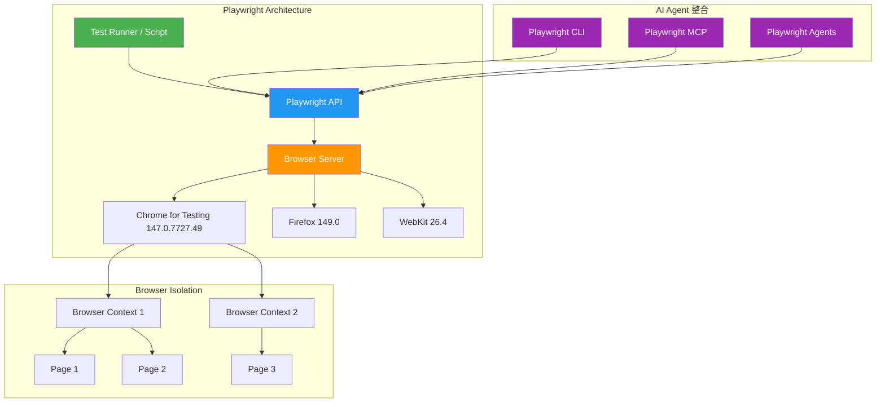

**三層架構說明：**

| 層級 | 說明 | 特性 |
|------|------|------|
| **Browser** | 瀏覽器實例 | 支援 Chromium / Firefox / WebKit |
| **Browser Context** | 瀏覽器上下文 | 獨立的 Cookie / Storage / Cache，等同全新瀏覽器設定檔 |
| **Page** | 頁面實例 | 對應一個瀏覽器分頁，支援 DOM 操作、網路攔截 |

### 1.3 Playwright vs. Selenium vs. Cypress 比較

| 特性 | Playwright | Selenium | Cypress |
|------|-----------|----------|---------|
| **瀏覽器支援** | Chromium / Firefox / WebKit | 所有主流瀏覽器 | Chromium / Firefox（有限） |
| **執行速度** | ⚡ 極快（原生協定） | 中等（WebDriver 協定） | 快（直接注入） |
| **自動等待** | ✅ 內建 Auto-wait | ❌ 需手動等待 | ✅ 部分支援 |
| **測試隔離** | ✅ Browser Context 隔離 | ❌ 需額外設定 | ✅ 測試隔離 |
| **多語言** | Node.js / Python / Java / .NET | Java / Python / C# / Ruby 等 | 僅 JavaScript |
| **行動裝置模擬** | ✅ Chrome Android / Mobile Safari | ❌ 需 Appium | ❌ 不支援 |
| **Trace Viewer** | ✅ 內建完整追蹤 | ❌ 無 | ✅ 時間旅行偵錯 |
| **AI Agent 整合** | ✅ MCP Server / CLI | ❌ 無原生支援 | ❌ 無原生支援 |
| **授權** | Apache 2.0 | Apache 2.0 | MIT |

### 1.4 適用場景

| 場景 | 說明 | 推薦指數 |
|------|------|----------|
| **E2E 測試** | Web 應用程式端對端功能驗證 | ⭐⭐⭐⭐⭐ |
| **視覺回歸測試** | 頁面截圖比對 | ⭐⭐⭐⭐⭐ |
| **API 測試** | 直接呼叫 API 並驗證回應 | ⭐⭐⭐⭐ |
| **爬蟲 / 抓取** | 動態網頁資料擷取 | ⭐⭐⭐⭐ |
| **PDF / 截圖產生** | 自動化文件生成 | ⭐⭐⭐⭐ |
| **AI Agent 瀏覽器控制** | LLM 驅動的自動化 | ⭐⭐⭐⭐⭐ |
| **效能監控** | 頁面載入效能指標收集 | ⭐⭐⭐ |

### 1.5 系統需求

| 項目 | 需求 |
|------|------|
| **Node.js** | 20.x / 22.x / 24.x（最新穩定版） |
| **作業系統** | Windows 11+、Windows Server 2019+、WSL、macOS 15+（Sequoia）、Debian 12 / 13（Trixie）、Ubuntu 22.04 / 24.04 |
| **CPU 架構** | x86-64 或 arm64 |
| **磁碟空間** | 約 500MB（含三個瀏覽器） |
| **Python**（可選） | 3.9+（使用 Python 版本時） |
| **Java**（可選） | 8+（使用 Java 版本時） |
| **.NET**（可選） | .NET 8+（使用 .NET 版本時） |

> **⚠️ 注意事項**：
> 1. 在企業環境中，若有 Proxy 限制，需額外設定 `HTTPS_PROXY` 環境變數以下載瀏覽器
> 2. **v1.57+ Breaking**：不再支援 macOS 13 的 WebKit
> 3. **v1.59+ Breaking**：不再支援 macOS 14 的 WebKit，建議升級至 macOS 15+
> 4. **v1.55+ 新增**：支援 Debian 13「Trixie」
> 5. **v1.55+ Breaking**：停止支援 Chromium Extension Manifest V2

---

## 第 2 章：系統架構設計（企業級）

### 2.1 測試架構總覽（Test Architecture）

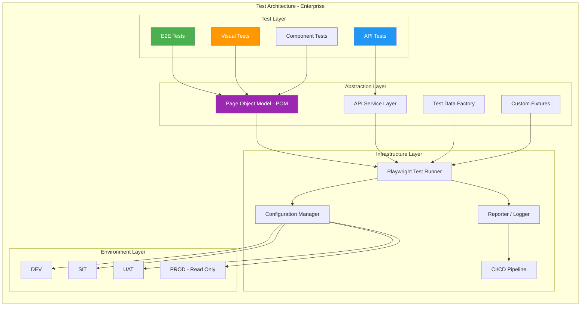

### 2.2 分層設計

#### 2.2.1 Test Layer（測試層）

負責撰寫具體測試案例，每個測試應明確、獨立、可重複執行。

```typescript
// tests/login.spec.ts
import { test, expect } from '@playwright/test';
import { LoginPage } from '../pages/LoginPage';

test.describe('登入功能', () => {
  test('使用有效帳號登入', async ({ page }) => {
    const loginPage = new LoginPage(page);
    await loginPage.goto();
    await loginPage.login('user@example.com', 'password123');
    await expect(page).toHaveURL('/dashboard');
  });

  test('使用無效帳號登入顯示錯誤', async ({ page }) => {
    const loginPage = new LoginPage(page);
    await loginPage.goto();
    await loginPage.login('invalid@example.com', 'wrong');
    await expect(loginPage.errorMessage).toBeVisible();
  });
});
```

#### 2.2.2 Page Object Model（POM 層）

將頁面操作封裝為可重用元件，降低維護成本。

```typescript
// pages/LoginPage.ts
import { type Page, type Locator } from '@playwright/test';

export class LoginPage {
  readonly page: Page;
  readonly emailInput: Locator;
  readonly passwordInput: Locator;
  readonly submitButton: Locator;
  readonly errorMessage: Locator;

  constructor(page: Page) {
    this.page = page;
    this.emailInput = page.getByLabel('電子郵件');
    this.passwordInput = page.getByLabel('密碼');
    this.submitButton = page.getByRole('button', { name: '登入' });
    this.errorMessage = page.getByTestId('error-message');
  }

  async goto() {
    await this.page.goto('/login');
  }

  async login(email: string, password: string) {
    await this.emailInput.fill(email);
    await this.passwordInput.fill(password);
    await this.submitButton.click();
  }
}
```

#### 2.2.3 Service Layer（API 服務層）

用於直接呼叫後端 API，進行前置資料準備或後置清理。

```typescript
// services/ApiService.ts
import { type APIRequestContext } from '@playwright/test';

export class ApiService {
  private request: APIRequestContext;

  constructor(request: APIRequestContext) {
    this.request = request;
  }

  async createUser(userData: { name: string; email: string }) {
    const response = await this.request.post('/api/users', {
      data: userData,
    });
    return response.json();
  }

  async deleteUser(userId: string) {
    await this.request.delete(`/api/users/${userId}`);
  }

  async getAuthToken(email: string, password: string): Promise<string> {
    const response = await this.request.post('/api/auth/login', {
      data: { email, password },
    });
    const body = await response.json();
    return body.token;
  }
}
```

### 2.3 測試資料管理策略

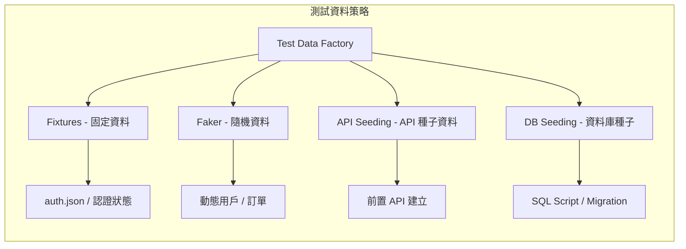

**企業級資料管理原則：**

| 原則 | 說明 |
|------|------|
| **資料隔離** | 每個測試使用獨立數據，避免交叉污染 |
| **可重建** | 測試結束後可透過 API 或腳本清理還原 |
| **環境感知** | 不同環境使用不同資料集 |
| **敏感資料遮罩** | 測試帳號不得使用真實客戶資料 |

```typescript
// fixtures/test-data.ts
import { test as base } from '@playwright/test';
import { faker } from '@faker-js/faker/locale/zh_TW';

type TestData = {
  testUser: { name: string; email: string; password: string };
};

export const test = base.extend<TestData>({
  testUser: async ({}, use) => {
    const user = {
      name: faker.person.fullName(),
      email: faker.internet.email(),
      password: faker.internet.password({ length: 12 }),
    };
    await use(user);
    // Teardown: 清理測試用戶
  },
});
```

### 2.4 多環境配置

```typescript
// config/environments.ts
export const environments = {
  dev: {
    baseURL: 'https://dev.example.com',
    apiURL: 'https://api-dev.example.com',
    timeout: 30_000,
  },
  sit: {
    baseURL: 'https://sit.example.com',
    apiURL: 'https://api-sit.example.com',
    timeout: 45_000,
  },
  uat: {
    baseURL: 'https://uat.example.com',
    apiURL: 'https://api-uat.example.com',
    timeout: 60_000,
  },
  prod: {
    baseURL: 'https://www.example.com',
    apiURL: 'https://api.example.com',
    timeout: 30_000,
  },
} as const;

export type Environment = keyof typeof environments;
```

```typescript
// playwright.config.ts（多環境支援）
import { defineConfig } from '@playwright/test';
import { environments, type Environment } from './config/environments';

const env: Environment = (process.env.TEST_ENV as Environment) || 'dev';
const config = environments[env];

export default defineConfig({
  testDir: './tests',
  timeout: config.timeout,
  retries: env === 'prod' ? 0 : 2,
  workers: env === 'prod' ? 1 : undefined,

  use: {
    baseURL: config.baseURL,
    trace: 'on-first-retry',
    screenshot: 'only-on-failure',
    video: 'retain-on-failure',
  },

  projects: [
    { name: 'chromium', use: { browserName: 'chromium' } },
    { name: 'firefox', use: { browserName: 'firefox' } },
    { name: 'webkit', use: { browserName: 'webkit' } },
  ],
});
```

**使用方式：**
```bash
# 執行 SIT 環境測試
TEST_ENV=sit npx playwright test

# 執行 UAT 環境，僅 Chromium
TEST_ENV=uat npx playwright test --project=chromium
```

### 2.5 與微服務架構整合

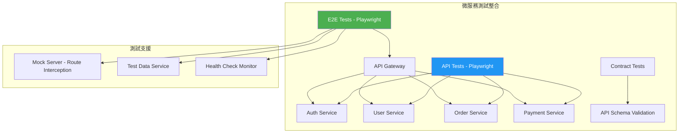

> **✅ 最佳實踐**：在微服務架構中，使用 Playwright 的 Network Route 功能 Mock 不穩定的外部服務，確保 E2E 測試穩定性。

---

## 第 3 章：安裝與環境建置

### 3.1 Node.js 安裝（TypeScript / JavaScript）

#### 3.1.1 初始化新專案

```bash
# 方法一：互動式建立（推薦）
npm init playwright@latest

# 選擇：
# - TypeScript（推薦）
# - 測試資料夾：tests 或 e2e
# - GitHub Actions workflow：Yes
# - 安裝瀏覽器：Yes
```

#### 3.1.2 加入現有專案

```bash
# 安裝核心套件
npm install -D @playwright/test

# 下載瀏覽器（含系統依賴）
npx playwright install --with-deps
```

### 3.2 Python 安裝

```bash
# 安裝 Playwright for Python
pip install playwright

# 下載瀏覽器
playwright install --with-deps
```

```python
# 範例：Python 基本測試
from playwright.sync_api import sync_playwright

with sync_playwright() as p:
    browser = p.chromium.launch()
    page = browser.new_page()
    page.goto("https://playwright.dev/")
    print(page.title())
    browser.close()
```

### 3.3 Java 安裝

```xml
<!-- pom.xml -->
<dependency>
  <groupId>com.microsoft.playwright</groupId>
  <artifactId>playwright</artifactId>
  <version>1.59.0</version>
</dependency>
```

```java
// 範例：Java 基本測試
import com.microsoft.playwright.*;

public class PlaywrightExample {
    public static void main(String[] args) {
        try (Playwright playwright = Playwright.create()) {
            Browser browser = playwright.chromium().launch();
            Page page = browser.newPage();
            page.navigate("https://playwright.dev/");
            System.out.println(page.title());
        }
    }
}
```

### 3.4 專案目錄結構（企業級推薦）

```
playwright-e2e/
├── .github/
│   └── workflows/
│       └── playwright.yml          # CI/CD Pipeline
├── config/
│   ├── environments.ts             # 環境配置
│   └── test-constants.ts           # 測試常數
├── fixtures/
│   ├── auth.setup.ts               # 認證 Setup
│   └── test-data.ts                # 測試資料 Fixtures
├── pages/
│   ├── BasePage.ts                 # Page Object 基底類別
│   ├── LoginPage.ts                # 登入頁
│   ├── DashboardPage.ts            # 儀表板頁
│   └── components/
│       ├── HeaderComponent.ts      # 共用 Header
│       └── SidebarComponent.ts     # 共用 Sidebar
├── services/
│   ├── ApiService.ts               # API 服務
│   └── AuthService.ts              # 認證服務
├── tests/
│   ├── auth/
│   │   ├── login.spec.ts
│   │   └── logout.spec.ts
│   ├── dashboard/
│   │   └── dashboard.spec.ts
│   ├── api/
│   │   └── user-api.spec.ts
│   └── visual/
│       └── homepage-visual.spec.ts
├── utils/
│   ├── helpers.ts                  # 輔助函式
│   └── logger.ts                   # 日誌工具
├── test-results/                   # 測試結果（.gitignore）
├── playwright-report/              # HTML 報告（.gitignore）
├── .env.dev                        # DEV 環境變數
├── .env.sit                        # SIT 環境變數
├── .env.uat                        # UAT 環境變數
├── .gitignore
├── package.json
├── playwright.config.ts            # Playwright 配置
└── tsconfig.json
```

### 3.5 VS Code 設定

#### 3.5.1 必裝擴充套件

| 擴充套件 | ID | 說明 |
|----------|----|------|
| **Playwright Test for VS Code** | `ms-playwright.playwright` | 官方測試整合 |
| **ESLint** | `dbaeumer.vscode-eslint` | 程式碼品質 |
| **Prettier** | `esbenp.prettier-vscode` | 格式化 |

#### 3.5.2 工作區設定

```jsonc
// .vscode/settings.json
{
  "playwright.reuseBrowser": true,
  "playwright.showTrace": true,
  "testing.defaultGutterClickAction": "debug",
  "editor.formatOnSave": true,
  "editor.defaultFormatter": "esbenp.prettier-vscode",
  "[typescript]": {
    "editor.defaultFormatter": "esbenp.prettier-vscode"
  }
}
```

### 3.6 Playwright MCP Server 設定（AI Agent 整合）

```jsonc
// .vscode/mcp.json（VS Code MCP 設定）
{
  "mcpServers": {
    "playwright": {
      "command": "npx",
      "args": ["@playwright/mcp@latest"]
    }
  }
}
```

```bash
# Claude Code 整合
claude mcp add playwright npx @playwright/mcp@latest
```

### 3.7 Playwright CLI 安裝（Coding Agent 用）

Playwright CLI 是專為 Coding Agent 設計的命令列介面，比 MCP 更省 Token — 命令避免載入大型 Tool Schema 和 Accessibility Tree 到模型上下文中。

```bash
# 全域安裝 CLI
npm install -g @playwright/cli@latest

# 安裝 Skills（增強 Agent 整合）
playwright-cli install --skills

# 開啟監控面板（Dashboard）
playwright-cli show
```

**CLI 常用命令：**

```bash
# 開啟指定 URL
playwright-cli open https://example.com --headed

# 對頁面進行輸入操作
playwright-cli type "搜尋關鍵字"
playwright-cli press Enter

# 截圖
playwright-cli screenshot

# 取得頁面快照（Accessibility Tree）
playwright-cli snapshot
```

### 3.8 Playwright Agents 設定（v1.56+）

Playwright Agents 是三個預定義的 LLM 代理定義，引導 AI 完成測試的完整生命週期：

| Agent | 角色 | 功能 |
|-------|------|------|
| **🎭 Planner** | 測試規劃師 | 探索應用程式並產出 Markdown 測試計畫 |
| **🎭 Generator** | 測試產生器 | 將 Markdown 計畫轉換為 Playwright Test 程式碼 |
| **🎭 Healer** | 測試修復師 | 執行測試套件並自動修復失敗的測試 |

```bash
# 依據你的開發工具產生 Agent 定義檔
# Visual Studio Code
npx playwright init-agents --loop=vscode

# Claude Code
npx playwright init-agents --loop=claude

# OpenCode
npx playwright init-agents --loop=opencode
```

> **⚠️ 注意**：VS Code 需要 v1.105+（目前在 Insiders 通道）才能使用完整的 Agentic 體驗。
>
> 📖 詳細文件請參閱：[Playwright Agents 官方文件](https://playwright.dev/docs/test-agents)

### 3.9 企業環境安裝注意事項

### 3.9 企業環境安裝注意事項

> **⚠️ 企業注意事項**：  
> 1. 在受限網路環境中，可設定 `PLAYWRIGHT_BROWSERS_PATH` 指向共享瀏覽器路徑  
> 2. 使用 `HTTPS_PROXY` 設定 Proxy  
> 3. 可預先下載瀏覽器到離線環境：`npx playwright install --dry-run` 取得下載 URL  
> 4. 使用 `PLAYWRIGHT_SKIP_BROWSER_DOWNLOAD=1` 跳過自動下載（搭配共享路徑使用）  
> 5. Docker 環境建議直接使用官方映像檔：`mcr.microsoft.com/playwright:v1.59.0-noble`

---

## 第 4 章：基礎使用教學

### 4.1 第一個測試案例

```typescript
// tests/example.spec.ts
import { test, expect } from '@playwright/test';

test('驗證首頁標題', async ({ page }) => {
  // 導航至目標頁面
  await page.goto('https://playwright.dev/');
  
  // 驗證標題包含 "Playwright"
  await expect(page).toHaveTitle(/Playwright/);
});

test('點擊快速開始連結', async ({ page }) => {
  await page.goto('https://playwright.dev/');
  
  // 使用語意化 Locator
  await page.getByRole('link', { name: 'Get started' }).click();
  
  // 驗證導航成功
  await expect(page.getByRole('heading', { name: 'Installation' })).toBeVisible();
});
```

**執行測試：**
```bash
# 執行所有測試（Headless 模式）
npx playwright test

# 顯示瀏覽器視窗（Headed 模式）
npx playwright test --headed

# 僅執行 Chromium
npx playwright test --project=chromium

# 執行單一檔案
npx playwright test tests/example.spec.ts

# UI 模式（互動式偵錯）
npx playwright test --ui
```

### 4.2 Locator 使用策略

Playwright 推薦使用**語意化 Locator**，優先順序如下：


| Locator 方法 | 範例 | 使用時機 |
|-------------|------|----------|
| `getByRole` | `page.getByRole('button', { name: '送出' })` | 按鈕、連結、標題等 |
| `getByLabel` | `page.getByLabel('電子郵件')` | 表單欄位 |
| `getByPlaceholder` | `page.getByPlaceholder('搜尋...')` | 搜尋框 |
| `getByText` | `page.getByText('歡迎回來')` | 段落文字 |
| `getByTestId` | `page.getByTestId('submit-btn')` | 自訂 data-testid |
| `locator(css)` | `page.locator('.btn-primary')` | CSS Selector |
| `locator(xpath)` | `page.locator('//div[@class="card"]')` | XPath |

#### 4.2.1 新增 Locator 方法（v1.57+）

| 方法 | 說明 | 版本 |
|------|------|------|
| `locator.normalize()` | 將 Locator 轉換為最佳實踐格式（test id、aria role） | v1.59+ |
| `locator.describe()` | 為 Locator 設定可讀描述 | v1.57+ |
| `locator.description()` | 取得 Locator 的描述，`toString()` 也會使用描述 | v1.57+ |
| `page.ariaSnapshot()` | 擷取頁面的 Aria Snapshot（等同 `body` 的 ariaSnapshot） | v1.59+ |
| `page.pickLocator()` | 互動模式：滑鼠懸停元素顯示最佳 Locator，點擊取得 | v1.59+ |
| `page.cancelPickLocator()` | 取消 pickLocator 互動模式 | v1.59+ |

```typescript
test('新 Locator API 示範', async ({ page }) => {
  await page.goto('/form');

  // 描述 Locator 用途，讓測試報告更清楚
  const submitBtn = page.getByRole('button', { name: '送出' });
  submitBtn.describe('主要送出按鈕');
  console.log(submitBtn.description()); // '主要送出按鈕'

  // 將任意 Locator 轉換為最佳實踐格式
  const normalized = await page.locator('.submit-btn').normalize();
  // 可能回傳: page.getByRole('button', { name: '送出' })

  // 擷取頁面 Aria Snapshot（適合 AI Agent 理解頁面結構）
  const snapshot = await page.ariaSnapshot();
  console.log(snapshot);

  // 互動式選取 Locator（開發偵錯用）
  // const locator = await page.pickLocator();
});

```typescript
// 最佳 Locator 範例
test('Locator 策略示範', async ({ page }) => {
  await page.goto('/form');

  // ✅ 推薦：語意化 Locator
  await page.getByRole('textbox', { name: '使用者名稱' }).fill('admin');
  await page.getByRole('textbox', { name: '密碼' }).fill('pass123');
  await page.getByRole('button', { name: '登入' }).click();

  // ✅ 推薦：data-testid
  await expect(page.getByTestId('welcome-message')).toContainText('歡迎');

  // ❌ 避免：脆弱的 CSS Selector
  // await page.locator('#root > div:nth-child(3) > button').click();
});
```

### 4.3 Auto-wait 機制

Playwright 在執行操作前會自動等待元素滿足以下條件：

| 操作 | 自動等待條件 |
|------|-------------|
| `click()` | 元素可見、啟用、穩定、可接收事件 |
| `fill()` | 元素可見、啟用、可編輯 |
| `check()` | 元素可見、啟用、穩定 |
| `selectOption()` | 元素可見、啟用 |

```typescript
// Auto-wait 自動處理，無需手動等待
test('Auto-wait 範例', async ({ page }) => {
  await page.goto('/dynamic-page');

  // Playwright 自動等待按鈕出現並可點擊
  await page.getByRole('button', { name: '載入更多' }).click();

  // 自動等待文字出現
  await expect(page.getByText('載入完成')).toBeVisible();

  // ❌ 避免：不要使用固定等待
  // await page.waitForTimeout(3000);
});
```

### 4.4 Assertions（Web-First 驗證）

Playwright 提供**自動重試的 Web-First 斷言**，在逾時前持續檢查：

```typescript
test('Web-First Assertions 範例', async ({ page }) => {
  await page.goto('/dashboard');

  // 頁面驗證
  await expect(page).toHaveTitle('儀表板');
  await expect(page).toHaveURL(/\/dashboard/);

  // 元素驗證
  await expect(page.getByTestId('user-name')).toHaveText('王小明');
  await expect(page.getByRole('button', { name: '送出' })).toBeEnabled();
  await expect(page.getByTestId('loading')).toBeHidden();

  // 數量驗證
  await expect(page.getByRole('listitem')).toHaveCount(5);

  // CSS 驗證
  await expect(page.getByTestId('alert')).toHaveClass(/alert-success/);

  // 屬性驗證
  await expect(page.getByRole('link', { name: '首頁' })).toHaveAttribute('href', '/');
});
```

### 4.5 Headless / Headed 模式

| 模式 | 說明 | 適用場景 |
|------|------|----------|
| **Headless** | 無瀏覽器視窗，背景執行 | CI/CD、大量測試 |
| **Headed** | 顯示瀏覽器視窗 | 開發偵錯 |
| **UI Mode** | 互動式測試執行器 | 測試開發 |

```typescript
// playwright.config.ts
export default defineConfig({
  use: {
    headless: true,  // CI 預設 headless
    // headless: false, // 開發時切換
  },
});
```

```bash
# 命令列控制
npx playwright test --headed    # 顯示瀏覽器
npx playwright test --ui        # UI 模式
npx playwright test             # Headless（預設）
```

> **✅ 最佳實踐**：開發階段使用 `--ui` 模式，CI 環境使用預設 headless 模式。

---

## 第 5 章：進階功能

### 5.1 Codegen（錄製測試）

Codegen 可透過實際操作自動產生測試程式碼：

```bash
# 開啟 Codegen
npx playwright codegen https://example.com

# 指定輸出檔案
npx playwright codegen --output tests/recorded.spec.ts https://example.com

# 模擬行動裝置
npx playwright codegen --device="iPhone 15" https://example.com

# 指定瀏覽器
npx playwright codegen --browser=firefox https://example.com
```

#### 5.1.1 自動 toBeVisible() 斷言（v1.55+）

Codegen 現在可自動在常見 UI 互動後產生 `toBeVisible()` 斷言，此功能可在 Codegen 設定 UI 中啟用。

> **⚠️ 注意**：Codegen 產生的程式碼為「起點」，需重構為 POM 模式並加入適當斷言。

### 5.2 Playwright Inspector

```bash
# 啟動 Inspector（逐步偵錯）
npx playwright test --debug

# 在程式碼中插入斷點
await page.pause();  // 暫停執行，開啟 Inspector
```

**Inspector 功能：**
- 逐步執行（Step Over / Step Into）
- 即時查看 Locator 匹配
- 修改 Locator 並即時驗證
- 檢視執行日誌

### 5.3 Trace Viewer

Trace Viewer 是 Playwright 最強大的偵錯工具，記錄完整執行詳情：

```typescript
// playwright.config.ts
export default defineConfig({
  use: {
    // 'on'：總是錄製
    // 'off'：不錄製
    // 'on-first-retry'：第一次重試時錄製（推薦）
    // 'retain-on-failure'：失敗時保留
    // 'retain-on-failure-and-retries'：記錄每次執行，失敗時保留所有 Trace（v1.59+，適合除錯 Flaky Test）
    trace: 'on-first-retry',
  },
});
```

```bash
# 查看 Trace 檔案
npx playwright show-trace trace.zip

# 或在測試後開啟報告（包含 Trace）
npx playwright show-report
```

**Trace Viewer 包含：**
- 每一步的 DOM 快照
- 網路請求 / 回應
- Console log
- 截圖時間軸
- 操作時序圖

### 5.4 Network 攔截（Mock API）

```typescript
test('Mock API 回應', async ({ page }) => {
  // 攔截 API 並回傳 Mock 資料
  await page.route('**/api/users', async (route) => {
    await route.fulfill({
      status: 200,
      contentType: 'application/json',
      body: JSON.stringify([
        { id: 1, name: '王小明', email: 'wang@example.com' },
        { id: 2, name: '李大華', email: 'lee@example.com' },
      ]),
    });
  });

  await page.goto('/users');
  await expect(page.getByText('王小明')).toBeVisible();
});

test('模擬網路錯誤', async ({ page }) => {
  // 模擬 500 Server Error
  await page.route('**/api/users', (route) =>
    route.fulfill({ status: 500, body: 'Internal Server Error' })
  );

  await page.goto('/users');
  await expect(page.getByText('載入失敗')).toBeVisible();
});

test('攔截並修改請求', async ({ page }) => {
  // 攔截請求，修改 Header
  await page.route('**/api/**', async (route) => {
    const headers = {
      ...route.request().headers(),
      'X-Test-Header': 'playwright-test',
    };
    await route.continue({ headers });
  });

  await page.goto('/dashboard');
});

test('阻擋圖片載入（加速測試）', async ({ page }) => {
  await page.route('**/*.{png,jpg,jpeg,gif,svg}', (route) => route.abort());
  await page.goto('/heavy-page');
});
```

### 5.5 多分頁 / iframe 操作

```typescript
test('多分頁操作', async ({ page, context }) => {
  await page.goto('/');

  // 監聽新分頁
  const [newPage] = await Promise.all([
    context.waitForEvent('page'),
    page.getByRole('link', { name: '在新視窗開啟' }).click(),
  ]);

  // 操作新分頁
  await newPage.waitForLoadState();
  await expect(newPage).toHaveTitle(/新頁面/);
  await newPage.close();
});

test('iframe 操作', async ({ page }) => {
  await page.goto('/page-with-iframe');

  // 取得 iframe
  const frame = page.frameLocator('#payment-iframe');

  // 在 iframe 內操作
  await frame.getByLabel('卡號').fill('4111111111111111');
  await frame.getByLabel('到期月/年').fill('12/28');
  await frame.getByRole('button', { name: '付款' }).click();
});
```

### 5.6 檔案上傳與下載

```typescript
test('檔案上傳', async ({ page }) => {
  await page.goto('/upload');

  // 單一檔案上傳
  await page.getByLabel('選擇檔案').setInputFiles('test-data/report.pdf');

  // 多檔案上傳
  await page.getByLabel('選擇檔案').setInputFiles([
    'test-data/doc1.pdf',
    'test-data/doc2.pdf',
  ]);

  await page.getByRole('button', { name: '上傳' }).click();
  await expect(page.getByText('上傳成功')).toBeVisible();
});

test('檔案下載', async ({ page }) => {
  await page.goto('/download');

  // 等待下載事件
  const [download] = await Promise.all([
    page.waitForEvent('download'),
    page.getByRole('link', { name: '下載報表' }).click(),
  ]);

  // 儲存至指定路徑
  await download.saveAs('downloads/' + download.suggestedFilename());
  
  // 驗證檔案名稱
  expect(download.suggestedFilename()).toBe('monthly-report.xlsx');
});
```

### 5.7 視覺測試（Screenshot Comparison）

```typescript
test('首頁視覺回歸', async ({ page }) => {
  await page.goto('/');

  // 全頁截圖比對
  await expect(page).toHaveScreenshot('homepage.png', {
    maxDiffPixelRatio: 0.01,  // 允許 1% 差異
    fullPage: true,
  });
});

test('元件視覺測試', async ({ page }) => {
  await page.goto('/components');

  // 特定元素截圖比對
  const card = page.getByTestId('product-card');
  await expect(card).toHaveScreenshot('product-card.png');
});

test('PDF 產生', async ({ page }) => {
  await page.goto('/report');
  await page.pdf({
    path: 'output/report.pdf',
    format: 'A4',
    printBackground: true,
    margin: { top: '20mm', bottom: '20mm', left: '15mm', right: '15mm' },
  });
});
```

### 5.8 認證狀態重用（Auth State）

```typescript
// fixtures/auth.setup.ts
import { test as setup } from '@playwright/test';

const authFile = 'playwright/.auth/user.json';

setup('登入並儲存認證狀態', async ({ page }) => {
  await page.goto('/login');
  await page.getByLabel('帳號').fill('admin@example.com');
  await page.getByLabel('密碼').fill('Admin123!');
  await page.getByRole('button', { name: '登入' }).click();

  // 等待登入完成
  await page.waitForURL('/dashboard');

  // 儲存認證狀態
  await page.context().storageState({ path: authFile });
});
```

```typescript
// playwright.config.ts
export default defineConfig({
  projects: [
    // Setup project：執行登入
    { name: 'setup', testMatch: /.*\.setup\.ts/ },

    // 測試專案：重用認證狀態
    {
      name: 'chromium',
      use: {
        ...devices['Desktop Chrome'],
        storageState: 'playwright/.auth/user.json',
      },
      dependencies: ['setup'],
    },
  ],
});
```

> **✅ 最佳實踐**：全域認證只執行一次，大幅加速測試執行。

### 5.9 Screencast API（v1.59+）

Screencast API 提供統一的頁面內容擷取介面，支援影片錄製、動作標註、視覺覆蓋層和即時幀擷取。

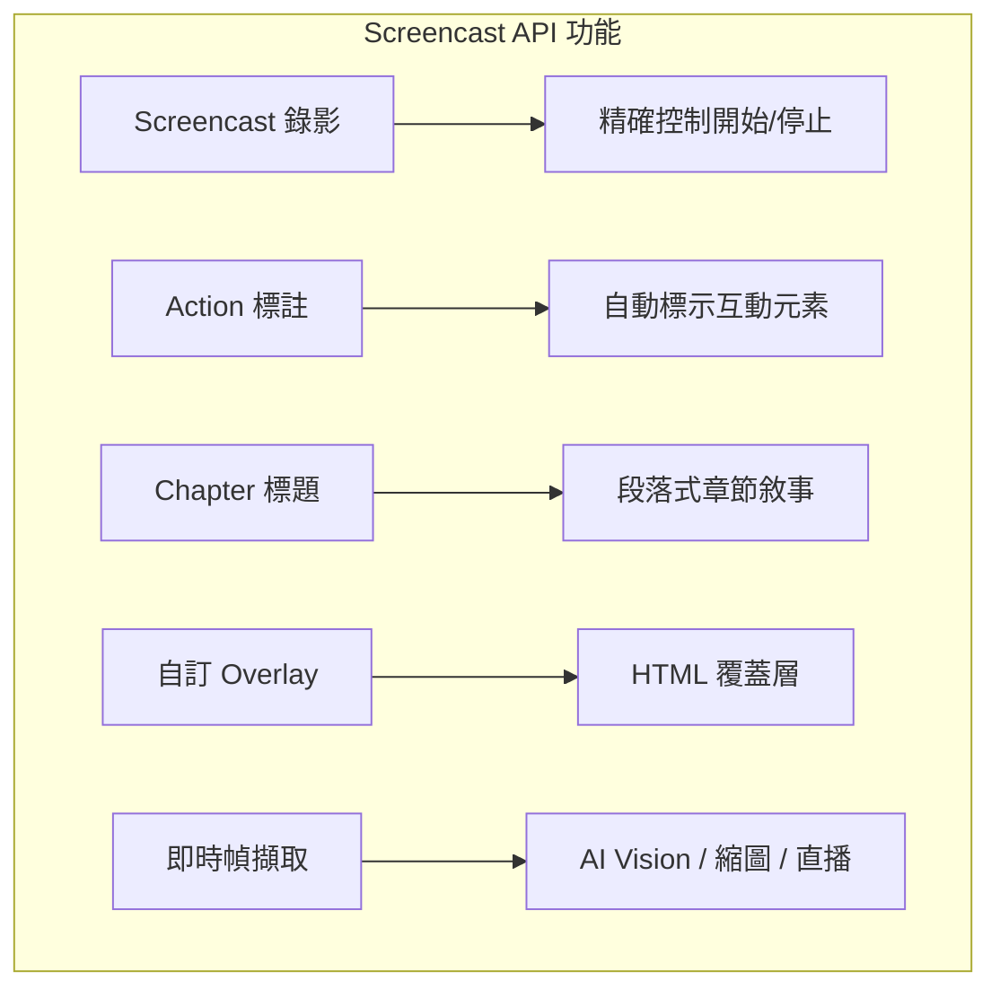

#### 5.9.1 影片錄製

```typescript
test('Screencast 錄影範例', async ({ page }) => {
  // 開始錄影
  await page.screencast.start({ path: 'video.webm' });

  await page.goto('/dashboard');
  await page.getByRole('button', { name: '新增' }).click();
  // ... 執行操作

  // 停止錄影
  await page.screencast.stop();
});
```

#### 5.9.2 Action 標註

```typescript
test('Screencast 動作標註', async ({ page }) => {
  // 啟用動作標註：自動標示互動元素並顯示動作標題
  await page.screencast.showActions({ position: 'top-right' });

  // 也可在配置檔中啟用
  // playwright.config.ts:
  // use: {
  //   video: {
  //     mode: 'on',
  //     show: {
  //       actions: { position: 'top-left' },
  //       test: { position: 'top-right' },
  //     },
  //   },
  // },
});
```

#### 5.9.3 Chapter 標題與視覺覆蓋層

```typescript
test('Screencast 章節與覆蓋層', async ({ page }) => {
  await page.screencast.start({ path: 'receipt.webm' });
  await page.screencast.showActions({ position: 'top-right' });

  // 顯示章節標題
  await page.screencast.showChapter('驗證結帳流程', {
    description: '新增優惠券支援 - Ticket #1234',
    duration: 1000,
  });

  // 執行驗證步驟
  await page.locator('#coupon').fill('SAVE20');
  await page.locator('#apply-coupon').click();
  await expect(page.locator('.discount')).toContainText('20%');

  // 顯示自訂 HTML 覆蓋層
  await page.screencast.showOverlay('<div style="color: red">錄製中</div>');

  await page.screencast.showChapter('完成', {
    description: '優惠券已套用，折扣已反映在總金額',
  });

  await page.screencast.stop();
});
```

#### 5.9.4 即時幀擷取（AI Vision 整合）

```typescript
test('即時幀擷取', async ({ page }) => {
  await page.screencast.start({
    onFrame: ({ data }) => sendToVisionModel(data),
    size: { width: 800, height: 600 },
  });

  // 執行操作，每一幀都會透過 onFrame 回呼傳送
  await page.goto('/dashboard');

  await page.screencast.stop();
});
```

> **✅ 企業應用場景**：
> - **Agentic Video Receipts**：Coding Agent 完成任務後錄製帶標註的影片證據，供人類 Review
> - **AI Vision 分析**：即時將畫面傳送給 Vision Model 進行分析
> - **操作教學影片**：自動產生帶章節標題的操作教學影片

### 5.10 Browser Interoperability（v1.59+）

`browser.bind()` API 讓啟動的瀏覽器可被 `playwright-cli`、`@playwright/mcp` 及其他客戶端連接。

```typescript
import { chromium } from 'playwright';

// 啟動並綁定瀏覽器
const browser = await chromium.launch();
const { endpoint } = await browser.bind('my-session', {
  workspaceDir: '/my/project',
});

// 其他客戶端可透過以下方式連接：
// 1. playwright-cli:
//    playwright-cli attach my-session
//    playwright-cli -s my-session snapshot

// 2. @playwright/mcp:
//    @playwright/mcp --endpoint=my-session

// 3. Playwright API（支援多客戶端同時連接）:
//    const browser = await chromium.connect(endpoint);

// 也可透過 WebSocket 綁定
const { endpoint: wsEndpoint } = await browser.bind('ws-session', {
  host: 'localhost',
  port: 0,  // 自動分配 Port
});
// wsEndpoint 為 ws:// URL

// 停止接受新連接
await browser.unbind();
```

### 5.11 Observability Dashboard（v1.59+）

執行 `playwright-cli show` 開啟 Dashboard，可視覺化管理所有綁定的瀏覽器：

- 即時查看 Agent 在背景瀏覽器的操作
- 點擊 Session 進行手動干預
- 開啟 DevTools 檢查背景瀏覽器的頁面

```bash
# 開啟 Dashboard
playwright-cli show

# playwright-cli 自動綁定所有瀏覽器
# 也可用環境變數讓 @playwright/test 的瀏覽器出現在 Dashboard：
PLAYWRIGHT_DASHBOARD=1 npx playwright test
```

### 5.12 CLI Debugger for Agents（v1.59+）

Coding Agent 可使用 `--debug=cli` 模式透過 CLI 附加並除錯測試，適合在 Agentic 工作流中自動修復測試：

```bash
# 啟動 CLI 除錯
$ npx playwright test --debug=cli
### Debugging Instructions
- Run "playwright-cli attach tw-87b59e" to attach to this test

# 在另一個終端機附加
$ playwright-cli attach tw-87b59e
### Session `tw-87b59e` created, attached to `tw-87b59e`.

# 逐步執行
$ playwright-cli --session tw-87b59e step-over
### Page
- Page URL: https://playwright.dev/
- Page Title: Fast and reliable end-to-end testing for modern web apps | Playwright
```

### 5.13 CLI Trace 分析（v1.59+）

Coding Agent 可透過命令列探索 Playwright Trace，理解失敗或不穩定的測試：

```bash
# 開啟 Trace
$ npx playwright trace open test-results/example-has-title-chromium/trace.zip

# 列出所有動作
$ npx playwright trace actions --grep="expect"
     # Time       Action                                          Duration
  ──── ─────────  ────────────────────────────────────────────── ────────
    9. 0:00.859  Expect "toHaveTitle"                                5.1s  ✗

# 查看特定動作詳情
$ npx playwright trace action 9
  Expect "toHaveTitle"
  Error: expect(page).toHaveTitle(expected) failed
    Expected pattern: /Wrong Title/
    Received string:  "Fast and reliable end-to-end testing for modern web apps | Playwright"

# 查看 DOM 快照
$ npx playwright trace snapshot 9 --name after

# 關閉 Trace
$ npx playwright trace close
```

### 5.14 Async Disposables — `await using`（v1.59+）

許多 API 現在回傳 Async Disposable，支援 `await using` 語法自動清理資源：

```typescript
test('await using 自動清理範例', async ({ context }) => {
  await using page = await context.newPage();

  {
    // Route 和 InitScript 在區塊結束時自動移除
    await using route = await page.route('**/*', route => route.continue());
    await using script = await page.addInitScript('console.log("init")');
    await page.goto('https://playwright.dev');
  }
  // 此處 route 和 init script 已自動被移除
});
```

> **✅ 最佳實踐**：使用 `await using` 取代手動 teardown，減少資源洩漏風險。

---

## 第 6 章：測試設計最佳實踐

### 6.1 Page Object Model（POM）完整實作

#### 6.1.1 BasePage（基底類別）

```typescript
// pages/BasePage.ts
import { type Page, type Locator, expect } from '@playwright/test';

export abstract class BasePage {
  readonly page: Page;
  readonly header: Locator;
  readonly footer: Locator;
  readonly loadingSpinner: Locator;

  constructor(page: Page) {
    this.page = page;
    this.header = page.locator('header');
    this.footer = page.locator('footer');
    this.loadingSpinner = page.getByTestId('loading-spinner');
  }

  async waitForPageLoad() {
    await this.loadingSpinner.waitFor({ state: 'hidden' });
  }

  async navigateTo(path: string) {
    await this.page.goto(path);
    await this.waitForPageLoad();
  }

  async getCurrentURL(): Promise<string> {
    return this.page.url();
  }

  async takeScreenshot(name: string) {
    await this.page.screenshot({ path: `screenshots/${name}.png`, fullPage: true });
  }
}
```

#### 6.1.2 具體 Page Object

```typescript
// pages/TransactionPage.ts（銀行系統範例）
import { type Page, type Locator, expect } from '@playwright/test';
import { BasePage } from './BasePage';

export class TransactionPage extends BasePage {
  readonly accountSelect: Locator;
  readonly amountInput: Locator;
  readonly memoInput: Locator;
  readonly submitButton: Locator;
  readonly confirmDialog: Locator;
  readonly successMessage: Locator;
  readonly transactionTable: Locator;

  constructor(page: Page) {
    super(page);
    this.accountSelect = page.getByLabel('轉出帳號');
    this.amountInput = page.getByLabel('轉帳金額');
    this.memoInput = page.getByLabel('備註');
    this.submitButton = page.getByRole('button', { name: '確認轉帳' });
    this.confirmDialog = page.getByRole('dialog');
    this.successMessage = page.getByTestId('success-message');
    this.transactionTable = page.getByRole('table');
  }

  async goto() {
    await this.navigateTo('/transaction/transfer');
  }

  async transfer(account: string, amount: string, memo?: string) {
    await this.accountSelect.selectOption(account);
    await this.amountInput.fill(amount);
    if (memo) {
      await this.memoInput.fill(memo);
    }
    await this.submitButton.click();
  }

  async confirmTransfer() {
    await this.confirmDialog.getByRole('button', { name: '確認' }).click();
  }

  async verifySuccess(expectedMessage: string) {
    await expect(this.successMessage).toContainText(expectedMessage);
  }

  async getTransactionCount(): Promise<number> {
    return this.transactionTable.getByRole('row').count() - 1; // 排除 header
  }
}
```

### 6.2 減少 Flaky Test 策略

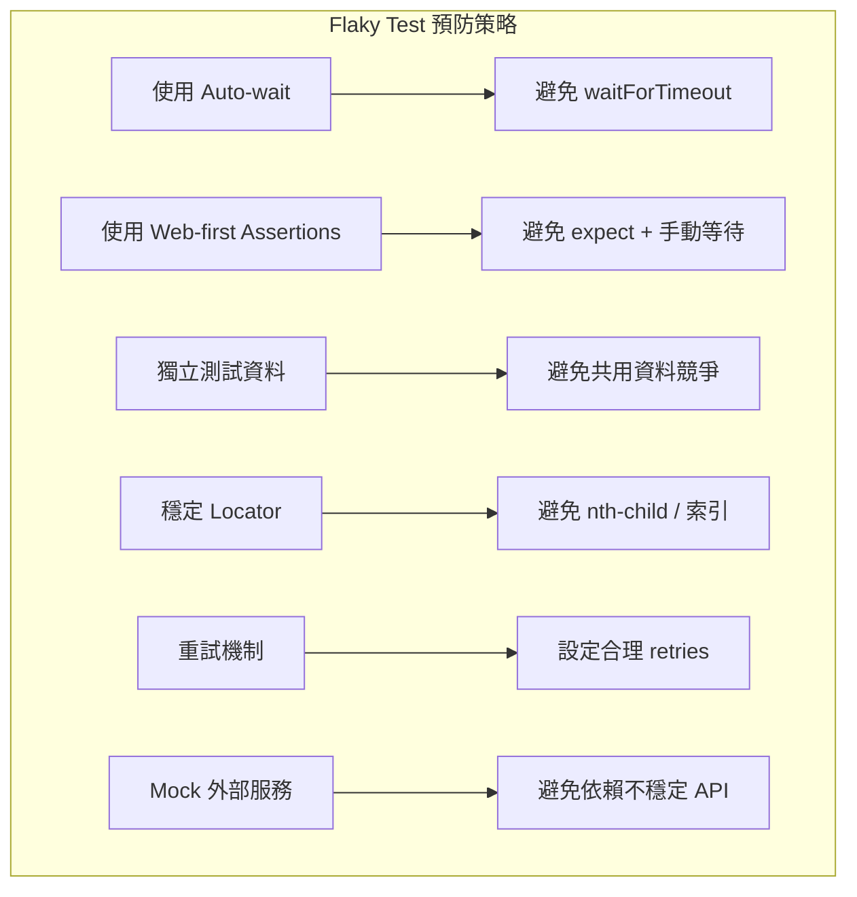

**Flaky Test 排查流程：**

| 步驟 | 操作 | 說明 |
|------|------|------|
| 1 | 啟用 Trace | `trace: 'on'` 錄製完整追蹤 |
| 2 | 重複執行 | `--repeat-each=10` 重複執行找出不穩定測試 |
| 3 | 檢查 Timing | 確認是否有 Race Condition |
| 4 | 檢查 Locator | 確認 Selector 是否唯一 |
| 5 | 檢查資料 | 確認測試資料是否獨立 |

```bash
# 重複執行測試，找出 Flaky Test
npx playwright test --repeat-each=10

# 重試失敗測試
npx playwright test --retries=2
```

### 6.3 測試命名規範

```typescript
// ✅ 推薦命名格式
test.describe('交易功能', () => {
  test('應該在輸入有效金額時成功轉帳', async ({ page }) => {});
  test('應該在餘額不足時顯示錯誤訊息', async ({ page }) => {});
  test('應該在超過每日限額時阻擋交易', async ({ page }) => {});
});

// ✅ 英文命名（國際團隊）
test.describe('Transaction Feature', () => {
  test('should transfer successfully with valid amount', async ({ page }) => {});
  test('should show error when balance is insufficient', async ({ page }) => {});
  test('should block transaction when daily limit exceeded', async ({ page }) => {});
});
```

**命名規則：**

| 規則 | 說明 | 範例 |
|------|------|------|
| **describe** | 功能模組名稱 | `交易功能` / `登入模組` |
| **test** | 「應該 + 條件 + 結果」 | `應該在輸入有效帳號時成功登入` |
| **檔名** | `功能.spec.ts` | `login.spec.ts` / `transfer.spec.ts` |

### 6.4 自訂 Fixtures

```typescript
// fixtures/index.ts
import { test as base } from '@playwright/test';
import { LoginPage } from '../pages/LoginPage';
import { DashboardPage } from '../pages/DashboardPage';
import { ApiService } from '../services/ApiService';

type MyFixtures = {
  loginPage: LoginPage;
  dashboardPage: DashboardPage;
  apiService: ApiService;
};

export const test = base.extend<MyFixtures>({
  loginPage: async ({ page }, use) => {
    await use(new LoginPage(page));
  },
  dashboardPage: async ({ page }, use) => {
    await use(new DashboardPage(page));
  },
  apiService: async ({ request }, use) => {
    await use(new ApiService(request));
  },
});

export { expect } from '@playwright/test';
```

```typescript
// tests/dashboard.spec.ts（使用自訂 Fixtures）
import { test, expect } from '../fixtures';

test('儀表板顯示正確資訊', async ({ dashboardPage }) => {
  await dashboardPage.goto();
  await expect(dashboardPage.welcomeMessage).toBeVisible();
});
```

---

## 第 7 章：CI/CD 整合（企業級重點）

### 7.1 GitHub Actions

```yaml
# .github/workflows/playwright.yml
name: Playwright Tests

on:
  push:
    branches: [main, develop]
  pull_request:
    branches: [main]

jobs:
  test:
    timeout-minutes: 30
    runs-on: ubuntu-latest
    strategy:
      fail-fast: false
      matrix:
        shard: [1/4, 2/4, 3/4, 4/4]  # 平行分片

    steps:
      - uses: actions/checkout@v4

      - uses: actions/setup-node@v4
        with:
          node-version: 22

      - name: Install dependencies
        run: npm ci

      - name: Install Playwright Browsers
        run: npx playwright install --with-deps

      - name: Run Playwright tests
        run: npx playwright test --shard=${{ matrix.shard }}
        env:
          TEST_ENV: sit

      - name: Upload test results
        uses: actions/upload-artifact@v4
        if: ${{ !cancelled() }}
        with:
          name: playwright-report-${{ matrix.shard }}
          path: playwright-report/
          retention-days: 30

      - name: Upload blob report
        uses: actions/upload-artifact@v4
        if: ${{ !cancelled() }}
        with:
          name: blob-report-${{ strategy.job-index }}
          path: blob-report/
          retention-days: 1

  merge-reports:
    if: ${{ !cancelled() }}
    needs: [test]
    runs-on: ubuntu-latest
    steps:
      - uses: actions/checkout@v4
      - uses: actions/setup-node@v4
        with:
          node-version: 22
      - run: npm ci

      - name: Download blob reports
        uses: actions/download-artifact@v4
        with:
          path: all-blob-reports
          pattern: blob-report-*
          merge-multiple: true

      - name: Merge reports
        run: npx playwright merge-reports --reporter html ./all-blob-reports

      - name: Upload merged report
        uses: actions/upload-artifact@v4
        with:
          name: playwright-report-merged
          path: playwright-report/
          retention-days: 30
```

### 7.2 GitLab CI

```yaml
# .gitlab-ci.yml
stages:
  - test
  - report

playwright-tests:
  stage: test
  image: mcr.microsoft.com/playwright:v1.59.0-noble
  parallel: 4
  script:
    - npm ci
    - npx playwright test --shard=$CI_NODE_INDEX/$CI_NODE_TOTAL
  artifacts:
    when: always
    paths:
      - playwright-report/
      - test-results/
    expire_in: 7 days
  rules:
    - if: '$CI_PIPELINE_SOURCE == "merge_request_event"'
    - if: '$CI_COMMIT_BRANCH == "main"'
```

### 7.3 Jenkins Pipeline

```groovy
// Jenkinsfile
pipeline {
    agent {
        docker {
            image 'mcr.microsoft.com/playwright:v1.59.0-noble'
        }
    }

    environment {
        TEST_ENV = 'sit'
        CI = 'true'
    }

    stages {
        stage('Install') {
            steps {
                sh 'npm ci'
            }
        }

        stage('Test') {
            steps {
                sh 'npx playwright test'
            }
        }
    }

    post {
        always {
            publishHTML(target: [
                allowMissing: true,
                alwaysLinkToLastBuild: true,
                keepAll: true,
                reportDir: 'playwright-report',
                reportFiles: 'index.html',
                reportName: 'Playwright Report'
            ])

            archiveArtifacts artifacts: 'test-results/**', allowEmptyArchive: true
        }
        failure {
            // 發送 Teams / Email 通知
            office365ConnectorSend(
                status: 'FAILURE',
                webhookUrl: "${TEAMS_WEBHOOK_URL}",
                message: "Playwright 測試失敗：${BUILD_URL}"
            )
        }
    }
}
```

### 7.4 測試報告整合

#### 7.4.1 HTML Reporter（內建）

```typescript
// playwright.config.ts
export default defineConfig({
  reporter: [
    ['html', { open: 'never', outputFolder: 'playwright-report' }],
    ['json', { outputFile: 'test-results/results.json' }],
    ['junit', { outputFile: 'test-results/junit.xml' }],
  ],
});
```

#### 7.4.2 Allure Reporter

```bash
# 安裝 Allure Reporter
npm install -D allure-playwright
```

```typescript
// playwright.config.ts
export default defineConfig({
  reporter: [
    ['allure-playwright', { outputFolder: 'allure-results' }],
    ['html'],
  ],
});
```

```bash
# 產生 Allure 報告
npx allure generate allure-results -o allure-report --clean
npx allure open allure-report
```

### 7.5 測試失敗通知

```typescript
// utils/notify.ts
export async function sendTeamsNotification(webhookUrl: string, results: {
  total: number;
  passed: number;
  failed: number;
  reportUrl: string;
}) {
  const card = {
    '@type': 'MessageCard',
    summary: 'Playwright 測試結果',
    themeColor: results.failed > 0 ? 'FF0000' : '00FF00',
    title: `Playwright 測試 ${results.failed > 0 ? '❌ 失敗' : '✅ 通過'}`,
    sections: [{
      facts: [
        { name: '總數', value: results.total.toString() },
        { name: '通過', value: results.passed.toString() },
        { name: '失敗', value: results.failed.toString() },
      ],
    }],
    potentialAction: [{
      '@type': 'OpenUri',
      name: '查看報告',
      targets: [{ os: 'default', uri: results.reportUrl }],
    }],
  };

  await fetch(webhookUrl, {
    method: 'POST',
    headers: { 'Content-Type': 'application/json' },
    body: JSON.stringify(card),
  });
}
```

### 7.6 Docker 化測試執行

```dockerfile
# Dockerfile.playwright
FROM mcr.microsoft.com/playwright:v1.59.0-noble

WORKDIR /app

COPY package*.json ./
RUN npm ci

COPY . .

CMD ["npx", "playwright", "test"]
```

```yaml
# docker-compose.yml
services:
  playwright:
    build:
      context: .
      dockerfile: Dockerfile.playwright
    environment:
      - TEST_ENV=sit
      - CI=true
    volumes:
      - ./playwright-report:/app/playwright-report
      - ./test-results:/app/test-results
```

```bash
# 使用 Docker 執行測試
docker compose run --rm playwright
```

> **✅ 最佳實踐**：  
> 1. 使用官方 Docker Image `mcr.microsoft.com/playwright:v1.59.0-noble` 確保環境一致  
> 2. CI 中使用 Sharding 分散測試負載  
> 3. 測試失敗時自動保存 Trace / Screenshot / Video  
> 4. 報告部署至內部伺服器供團隊查看

### 7.7 WebServer Wait 功能（v1.57+）

`webServer.wait` 選項允許等待服務啟動輸出匹配特定正則表達式後再開始測試，支援命名擷取群組自動建立環境變數：

```typescript
// playwright.config.ts
import { defineConfig } from '@playwright/test';

export default defineConfig({
  webServer: {
    command: 'npm run start',
    wait: {
      stdout: '/Listening on port (?<my_server_port>\\d+)/',
    },
  },
});
```

```typescript
// 測試中可透過環境變數取得擷取的 Port
import { test, expect } from '@playwright/test';

test.use({ baseURL: `http://localhost:${process.env.MY_SERVER_PORT ?? 3000}` });

test('首頁載入', async ({ page }) => {
  await page.goto('/');
});
```

> **✅ 應用場景**：除了擷取動態 Port 外，也適用於等待非 HTTP 服務的就緒訊息（如資料庫 Migration 完成）。

### 7.8 testConfig.tag — 全域標籤（v1.57+）

為整次測試執行添加全域標籤，特別適合搭配 merge-reports 使用：

```typescript
// playwright.config.ts
export default defineConfig({
  tag: '@nightly',  // 所有測試自動附加此標籤
});
```

---

## 第 8 章：測試報告與監控

### 8.1 Playwright HTML Report

Playwright 內建的 HTML Reporter 提供完整的測試結果視覺化：

```typescript
// playwright.config.ts
export default defineConfig({
  reporter: [
    // HTML 報告
    ['html', {
      open: 'never',         // CI 中不自動開啟
      outputFolder: 'playwright-report',
      host: '0.0.0.0',      // 允許遠端存取
      port: 9323,
    }],
    // JSON 結構化資料
    ['json', { outputFile: 'test-results/results.json' }],
    // JUnit XML（CI 整合）
    ['junit', { outputFile: 'test-results/junit.xml' }],
    // 行列表（終端機輸出）
    ['list'],
  ],
});
```

```bash
# 手動開啟 HTML 報告
npx playwright show-report

# 指定報告路徑
npx playwright show-report ./playwright-report

# 指定 Port
npx playwright show-report --port 9323
```

**報告功能：**

| 功能 | 說明 |
|------|------|
| **按瀏覽器篩選** | 分別查看 Chromium / Firefox / WebKit 結果 |
| **按狀態篩選** | Passed / Failed / Skipped / Flaky |
| **測試步驟展開** | 查看每一步操作細節 |
| **測試步驟搜尋** | 篩選測試步驟快速定位（v1.59+） |
| **Worker 執行列表** | 顯示相同 Worker 的測試執行清單（v1.59+） |
| **Trace 內嵌** | 直接在報告中查看 Trace |
| **截圖附件** | 失敗截圖直接顯示 |
| **影片播放** | 失敗影片直接播放 |
| **檔案合併檢視** | 可將 test 和 describe 區塊合併為統一列表（v1.56+） |
| **停用「複製 Prompt」按鈕** | HTML Reporter 支援隱藏「Copy prompt」按鈕（v1.56+） |

### 8.1.1 Speedboard（v1.57+）

HTML Reporter 新增 **Speedboard** 分頁，將所有執行的測試按慢速排序，幫助識別效能瓶頸：

- 顯示所有測試依執行時間排序
- 找出等待時間過長的測試
- 幫助優化整體測試套件執行速度

> **✅ 建議**：定期檢視 Speedboard，找出不合理的慢速測試並進行優化。

### 8.1.2 Timeline（v1.58+）

使用 [merged reports](https://playwright.dev/docs/test-sharding#merging-reports-from-multiple-environments) 時，HTML Report 的 Speedboard 分頁現在會顯示 **Timeline**：

- 視覺化呈現所有 Shard / Worker 的測試執行時序
- 幫助識別 Shard 之間的負載不平衡
- 優化 Sharding 策略

### 8.2 Trace 分析

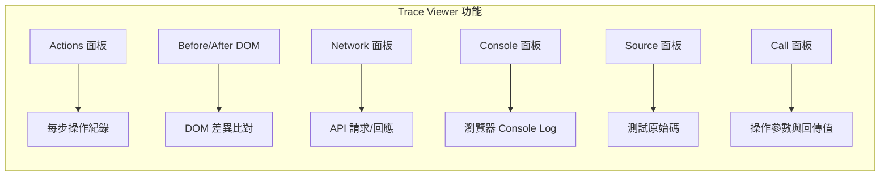

**UI Mode 與 Trace Viewer 改進（v1.58+）：**

| 改進項目 | 說明 |
|---------|------|
| **系統主題** | 新增 `'system'` 主題選項，跟隨作業系統的深色/淺色模式 |
| **程式碼搜尋** | 程式碼編輯器內支援 Cmd/Ctrl+F 搜尋 |
| **網路面板重整** | 網路詳情面板重新設計，提升可用性 |
| **JSON 自動格式化** | JSON 回應自動美化顯示 |
| **動作篩選** | 改進的動作過濾功能（v1.59+） |
| **受影響測試** | UI Mode 可僅顯示受原始碼變更影響的測試（v1.59+） |
| **更新快照** | UI Mode 新增鏡像 `--update-snapshots` 選項（v1.56+） |
| **單一 Worker** | UI Mode 新增僅使用單一 Worker 執行的選項（v1.56+） |

```typescript
// 在程式碼中手動建立 Trace
test('交易流程追蹤', async ({ page, context }) => {
  // 開始追蹤
  await context.tracing.start({
    screenshots: true,
    snapshots: true,
    sources: true,
  });

  // 執行測試步驟
  await page.goto('/transaction');
  await page.getByLabel('金額').fill('50000');
  await page.getByRole('button', { name: '轉帳' }).click();

  // 停止追蹤並儲存
  await context.tracing.stop({ path: 'traces/transaction-trace.zip' });
});
```

### 8.3 自訂 Reporter

```typescript
// reporters/CustomReporter.ts
import type {
  FullConfig, FullResult, Reporter, Suite, TestCase, TestResult
} from '@playwright/test/reporter';

class CustomReporter implements Reporter {
  private startTime: number = 0;
  private results: { passed: number; failed: number; skipped: number } = {
    passed: 0, failed: 0, skipped: 0,
  };

  onBegin(config: FullConfig, suite: Suite) {
    this.startTime = Date.now();
    console.log(`🚀 開始執行 ${suite.allTests().length} 個測試`);
  }

  onTestEnd(test: TestCase, result: TestResult) {
    const status = result.status;
    if (status === 'passed') this.results.passed++;
    else if (status === 'failed') this.results.failed++;
    else if (status === 'skipped') this.results.skipped++;

    const duration = (result.duration / 1000).toFixed(2);
    const icon = status === 'passed' ? '✅' : status === 'failed' ? '❌' : '⏭️';
    console.log(`${icon} [${duration}s] ${test.title}`);
  }

  async onEnd(result: FullResult) {
    const duration = ((Date.now() - this.startTime) / 1000).toFixed(2);
    console.log('\n📊 測試結果摘要：');
    console.log(`   通過：${this.results.passed}`);
    console.log(`   失敗：${this.results.failed}`);
    console.log(`   跳過：${this.results.skipped}`);
    console.log(`   耗時：${duration}s`);
    console.log(`   狀態：${result.status}`);
  }
}

export default CustomReporter;
```

```typescript
// playwright.config.ts
export default defineConfig({
  reporter: [
    ['./reporters/CustomReporter.ts'],
    ['html'],
  ],
});
```

### 8.4 測試結果 Dashboard

#### 8.4.1 整合 Prometheus + Grafana

```typescript
// reporters/PrometheusReporter.ts
import type { Reporter, FullResult, TestCase, TestResult } from '@playwright/test/reporter';

class PrometheusReporter implements Reporter {
  private metrics: string[] = [];

  onTestEnd(test: TestCase, result: TestResult) {
    const labels = `suite="${test.parent.title}",test="${test.title}",browser="${test.parent.project()?.name || 'unknown'}"`;
    
    // 測試持續時間
    this.metrics.push(
      `playwright_test_duration_seconds{${labels}} ${result.duration / 1000}`
    );
    
    // 測試結果
    this.metrics.push(
      `playwright_test_status{${labels},status="${result.status}"} 1`
    );
  }

  async onEnd(result: FullResult) {
    // 推送至 Prometheus Pushgateway
    const metricsBody = this.metrics.join('\n');
    
    try {
      await fetch('http://pushgateway:9091/metrics/job/playwright', {
        method: 'POST',
        body: metricsBody,
      });
      console.log('📊 指標已推送至 Prometheus');
    } catch (error) {
      console.error('推送指標失敗:', error);
    }
  }
}

export default PrometheusReporter;
```

#### 8.4.2 Grafana Dashboard 查詢範例

```
# 測試通過率
sum(playwright_test_status{status="passed"}) / sum(playwright_test_status) * 100

# 平均測試時間
avg(playwright_test_duration_seconds) by (suite)

# 失敗測試數量趨勢
sum(rate(playwright_test_status{status="failed"}[24h])) by (suite)
```

> **✅ 最佳實踐**：建立自動化 Dashboard 監控測試趨勢，及早發現品質下降。

---

## 第 9 章：系統維運與管理

### 9.1 測試環境管理

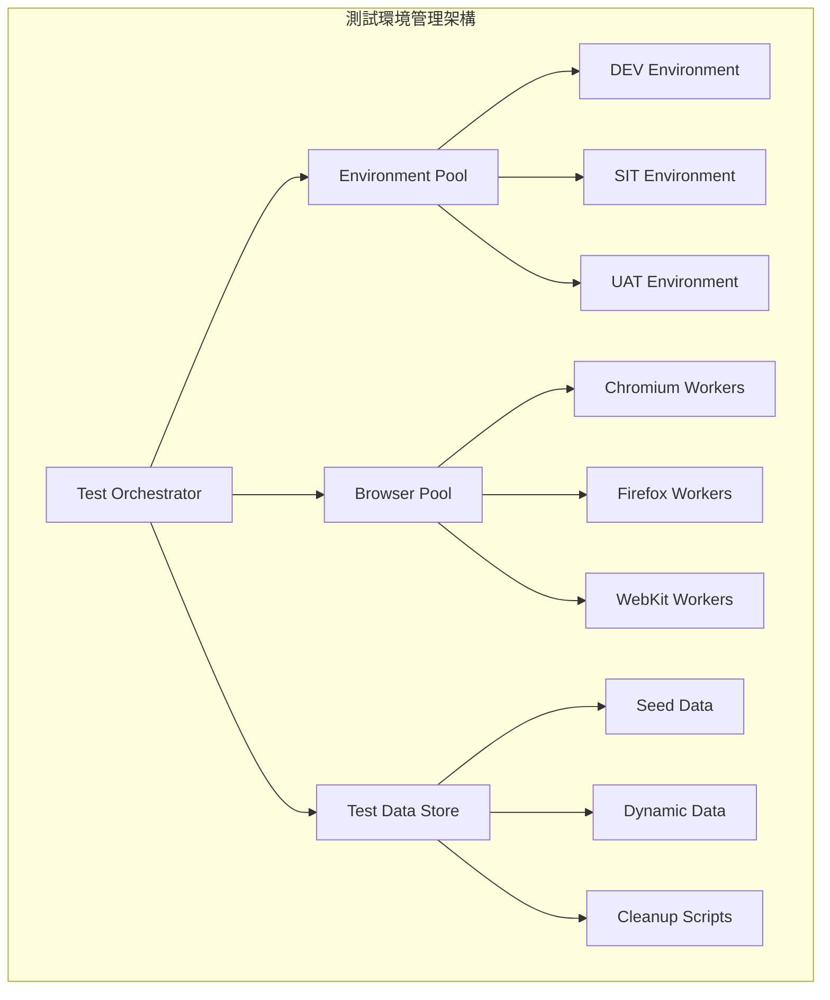

**環境管理矩陣：**

| 環境 | 測試類型 | 資料策略 | 執行頻率 | 瀏覽器 |
|------|---------|---------|---------|--------|
| **DEV** | Smoke + New Feature | Mock + Seed | 每次 Commit | Chromium |
| **SIT** | Full Regression | Seed + API | 每日 + PR | 全瀏覽器 |
| **UAT** | E2E + Visual | Real-like Data | 每週 + Release | Chromium + Firefox |
| **PROD** | Smoke Only | Read-Only | Release 後 | Chromium |

### 9.2 測試資料清理

```typescript
// utils/cleanup.ts
import { type APIRequestContext } from '@playwright/test';

export class TestDataCleaner {
  private request: APIRequestContext;
  private createdResources: { type: string; id: string }[] = [];

  constructor(request: APIRequestContext) {
    this.request = request;
  }

  track(type: string, id: string) {
    this.createdResources.push({ type, id });
  }

  async cleanAll() {
    for (const resource of this.createdResources.reverse()) {
      try {
        await this.request.delete(`/api/${resource.type}/${resource.id}`);
        console.log(`🗑️ 清理 ${resource.type}/${resource.id}`);
      } catch (error) {
        console.warn(`⚠️ 清理失敗 ${resource.type}/${resource.id}:`, error);
      }
    }
    this.createdResources = [];
  }
}
```

```typescript
// 使用範例
import { test } from '@playwright/test';
import { TestDataCleaner } from '../utils/cleanup';

test('建立並清理測試資料', async ({ request }) => {
  const cleaner = new TestDataCleaner(request);

  try {
    // 建立測試資料
    const response = await request.post('/api/users', {
      data: { name: 'Test User', email: 'test@example.com' },
    });
    const user = await response.json();
    cleaner.track('users', user.id);

    // 執行測試 ...
  } finally {
    // 確保清理
    await cleaner.cleanAll();
  }
});
```

### 9.3 測試排程

#### 9.3.1 GitHub Actions Cron

```yaml
# .github/workflows/scheduled-tests.yml
name: Scheduled Playwright Tests

on:
  schedule:
    # 每日凌晨 2 點（UTC+8 = UTC 18:00 前一天）
    - cron: '0 18 * * *'
    # 每週一上午 9 點
    - cron: '0 1 * * 1'
  workflow_dispatch:  # 手動觸發

jobs:
  nightly-regression:
    if: github.event.schedule == '0 18 * * *' || github.event_name == 'workflow_dispatch'
    runs-on: ubuntu-latest
    steps:
      - uses: actions/checkout@v4
      - uses: actions/setup-node@v4
        with:
          node-version: 22
      - run: npm ci
      - run: npx playwright install --with-deps
      - name: Run Full Regression
        run: npx playwright test --grep @regression
        env:
          TEST_ENV: sit

  weekly-visual:
    if: github.event.schedule == '0 1 * * 1'
    runs-on: ubuntu-latest
    steps:
      - uses: actions/checkout@v4
      - uses: actions/setup-node@v4
        with:
          node-version: 22
      - run: npm ci
      - run: npx playwright install --with-deps
      - name: Run Visual Tests
        run: npx playwright test --grep @visual
        env:
          TEST_ENV: uat
```

### 9.4 平行測試（Parallel Execution）

```typescript
// playwright.config.ts
export default defineConfig({
  // 完全平行（預設）
  fullyParallel: true,

  // Worker 數量（CI 中可設定固定值）
  workers: process.env.CI ? 4 : undefined,

  // 分片執行（CI 跨機器分散）
  // 由 CLI 指定：--shard=1/4
});
```

```bash
# 本地平行執行
npx playwright test --workers=4

# CI 分片執行（4 台機器）
npx playwright test --shard=1/4  # Machine 1
npx playwright test --shard=2/4  # Machine 2
npx playwright test --shard=3/4  # Machine 3
npx playwright test --shard=4/4  # Machine 4
```

**平行化策略：**

| 策略 | 說明 | 適用場景 |
|------|------|----------|
| `fullyParallel: true` | 所有測試完全平行 | 測試之間無相依 |
| `fullyParallel: false` | 同 describe 內序列執行 | 有狀態依賴的流程 |
| `--shard=N/M` | 跨機器分散 | CI 橫向擴展 |
| `--workers=N` | 單機多 Worker | 開發機本地測試 |

### 9.5 測試資源最佳化

```typescript
// playwright.config.ts（效能最佳化設定）
export default defineConfig({
  use: {
    // 只在失敗時錄影，減少 I/O
    video: 'retain-on-failure',
    
    // 只在第一次重試時追蹤
    trace: 'on-first-retry',
    
    // 只在失敗時截圖
    screenshot: 'only-on-failure',
    
    // 關閉 JavaScript（純靜態頁面測試）
    // javaScriptEnabled: false,
    
    // 限制視口大小
    viewport: { width: 1280, height: 720 },
    
    // 阻擋不必要的資源
    // 在 globalSetup 中設定
  },
  
  // 依瀏覽器設定不同 timeout
  projects: [
    {
      name: 'chromium',
      use: { ...devices['Desktop Chrome'] },
      timeout: 30_000,
    },
    {
      name: 'firefox',
      use: { ...devices['Desktop Firefox'] },
      timeout: 45_000,  // Firefox 稍慢
    },
  ],
});
```

> **✅ 最佳實踐**：  
> 1. 使用 `test.slow()` 標記預期較慢的測試，而非增加全域 timeout  
> 2. 使用 Tag（如 `@smoke`、`@regression`）分類測試，按需執行  
> 3. 阻擋第三方資源（Analytics / Ads）加速測試

---

## 第 10 章：升級與版本管理策略

### 10.1 Playwright 版本升級策略

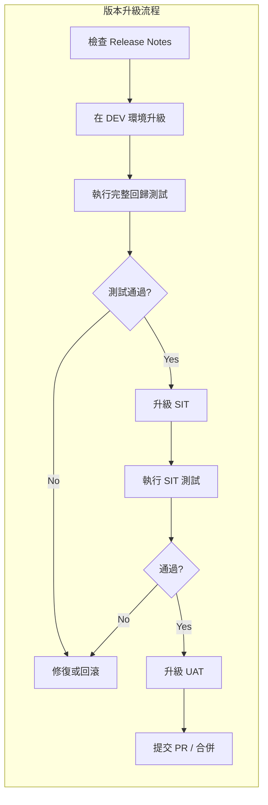

**升級步驟：**

```bash
# Step 1：更新 Playwright
npm install -D @playwright/test@latest

# Step 2：更新瀏覽器
npx playwright install --with-deps

# Step 3：檢查版本
npx playwright --version

# Step 4：執行測試驗證
npx playwright test

# Step 5：更新視覺快照（如有變更）
npx playwright test --update-snapshots
```

### 10.2 Breaking Changes 處理

| 版本 | Breaking Changes | 處理方式 |
|------|-----------------|---------|
| **v1.59** | 移除 macOS 14 WebKit 支援；移除 `@playwright/experimental-ct-svelte` | 升級 macOS 至 15+；改用其他元件測試方案 |
| **v1.58** | 移除 `_react`、`_vue` selector；移除 `:light` selector 後綴；移除 `devtools` 啟動選項；移除 macOS 13 WebKit 支援 | 改用標準 CSS / Locator API；使用 `args: ['--auto-open-devtools-for-tabs']` 替代 |
| **v1.57** | 移除 `Page#accessibility` API（已棄用 3 年） | 改用 Axe 等無障礙測試工具 |
| **v1.56** | 棄用 `browserContext.on('backgroundpage')` 事件 | 使用 `browserContext.backgroundPages()` 替代 |
| **v1.55** | 停止支援 Chromium Extension Manifest V2 | 升級至 Manifest V3 |
| **Minor** | 新增 API / 新瀏覽器版本 | 通常向下相容，直接升級 |
| **Browser** | 瀏覽器行為變更 | 更新視覺快照、調整 Locator |

**v1.55~v1.59 新增重要 API 彙整：**

| 版本 | 新增 API | 說明 |
|------|---------|------|
| **v1.59** | `page.screencast` | 統一影片錄製、動作標註、覆蓋層管理 |
| **v1.59** | `browser.bind()` / `browser.unbind()` | 瀏覽器互操作性，讓 CLI/MCP 連接 |
| **v1.59** | `page.ariaSnapshot()` / `locator.normalize()` | Aria Snapshot 與 Locator 最佳化 |
| **v1.59** | `page.pickLocator()` | 互動式 Locator 選取 |
| **v1.59** | `browserContext.setStorageState()` | 清除並重設 Storage State |
| **v1.59** | `browserContext.debugger` | 程式化控制 Playwright Debugger |
| **v1.59** | `await using` 支援 | Async Disposable 自動清理 |
| **v1.57** | `locator.describe()` / `locator.description()` | Locator 可讀描述 |
| **v1.57** | `testConfig.tag` | 全域標籤 |
| **v1.57** | `webServer.wait` | 等待服務啟動輸出 |
| **v1.56** | Playwright Agents | Planner / Generator / Healer 三代理 |
| **v1.56** | `page.consoleMessages()` / `page.pageErrors()` | 最近 Console 訊息與頁面錯誤 |
| **v1.56** | `page.requests()` | 最近網路請求 |
| **v1.55** | `testStepInfo.titlePath` | 完整標題路徑 |

```typescript
// 版本固定策略（package.json）
{
  "devDependencies": {
    // ✅ 推薦：固定 Minor 版本
    "@playwright/test": "~1.59.0",
    
    // ❌ 避免：自動升級 Major
    // "@playwright/test": "^1.59.0"
  }
}
```

### 10.3 瀏覽器版本管理

```bash
# 查看已安裝的瀏覽器
npx playwright install --list

# 安裝特定瀏覽器
npx playwright install chromium
npx playwright install firefox
npx playwright install webkit

# 清理舊版瀏覽器
npx playwright install --clean
```

### 10.4 回滾策略

```bash
# 回滾至特定版本
npm install -D @playwright/test@1.58.0

# 重新安裝對應瀏覽器
npx playwright install --with-deps

# 驗證回滾
npx playwright test
```

> **⚠️ 注意事項**：  
> 1. 每次升級都應在分支上進行，通過測試後再合併  
> 2. 保留升級前的 `package-lock.json` 以便回滾  
> 3. 升級日誌記錄至 CHANGELOG

---

## 第 11 章：安全與合規（銀行級）

### 11.1 敏感資料處理

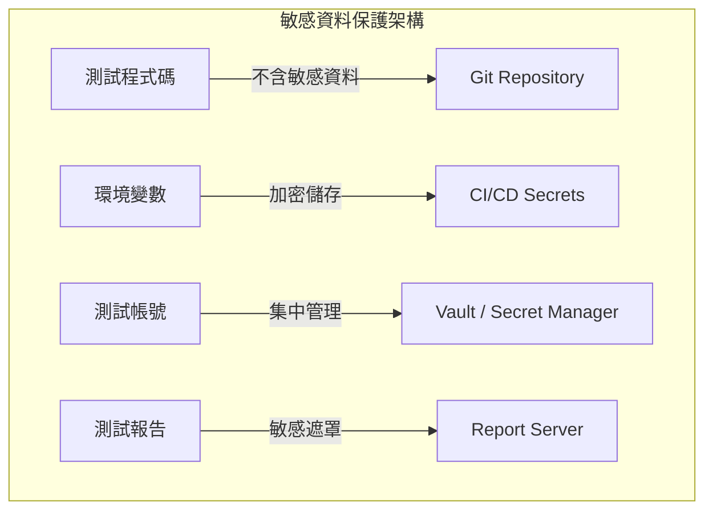

**資料分級與處理：**

| 資料等級 | 範例 | 處理方式 |
|---------|------|---------|
| **公開** | 頁面文字、UI 元素 | 可寫入程式碼 |
| **內部** | 測試 URL、環境名稱 | 環境變數管理 |
| **機密** | 帳號密碼、API Key | Vault / CI Secrets |
| **極機密** | 客戶資料、金融資料 | **禁止使用於測試** |

```typescript
// ✅ 正確做法：使用環境變數
test('登入系統', async ({ page }) => {
  const username = process.env.TEST_USER!;
  const password = process.env.TEST_PASSWORD!;
  
  await page.goto('/login');
  await page.getByLabel('帳號').fill(username);
  await page.getByLabel('密碼').fill(password);
  await page.getByRole('button', { name: '登入' }).click();
});

// ❌ 錯誤做法：硬編碼敏感資料
// await page.getByLabel('帳號').fill('admin@bank.com');
// await page.getByLabel('密碼').fill('RealPassword123!');
```

```bash
# .env.sit（加入 .gitignore）
TEST_USER=test_user_sit
TEST_PASSWORD=encrypted_password_here
TEST_API_KEY=sit_api_key_here
```

### 11.2 測試帳號管理

| 原則 | 說明 |
|------|------|
| **專用帳號** | 測試使用專用帳號，不使用真實用戶帳號 |
| **最小權限** | 測試帳號僅具備必要權限 |
| **定期輪換** | 密碼定期更新 |
| **環境隔離** | 每個環境使用不同測試帳號 |
| **用後清理** | 測試產生的資料需清理 |

### 11.3 存取控制（RBAC）

```typescript
// fixtures/roles.ts
import { test as base } from '@playwright/test';

type RoleFixture = {
  adminPage: import('@playwright/test').Page;
  userPage: import('@playwright/test').Page;
  viewerPage: import('@playwright/test').Page;
};

export const test = base.extend<RoleFixture>({
  adminPage: async ({ browser }, use) => {
    const context = await browser.newContext({
      storageState: 'playwright/.auth/admin.json',
    });
    const page = await context.newPage();
    await use(page);
    await context.close();
  },

  userPage: async ({ browser }, use) => {
    const context = await browser.newContext({
      storageState: 'playwright/.auth/user.json',
    });
    const page = await context.newPage();
    await use(page);
    await context.close();
  },

  viewerPage: async ({ browser }, use) => {
    const context = await browser.newContext({
      storageState: 'playwright/.auth/viewer.json',
    });
    const page = await context.newPage();
    await use(page);
    await context.close();
  },
});
```

```typescript
// tests/rbac/admin-access.spec.ts
import { test, expect } from '../../fixtures/roles';

test('管理員可以存取系統設定', async ({ adminPage }) => {
  await adminPage.goto('/settings');
  await expect(adminPage.getByRole('heading', { name: '系統設定' })).toBeVisible();
});

test('一般用戶無法存取系統設定', async ({ userPage }) => {
  await userPage.goto('/settings');
  await expect(userPage.getByText('權限不足')).toBeVisible();
});
```

### 11.4 稽核與日誌（Audit Log）

```typescript
// utils/audit-logger.ts
import * as fs from 'fs';
import * as path from 'path';

export class AuditLogger {
  private logFile: string;

  constructor() {
    const timestamp = new Date().toISOString().replace(/[:.]/g, '-');
    this.logFile = path.join('audit-logs', `test-audit-${timestamp}.log`);
    fs.mkdirSync('audit-logs', { recursive: true });
  }

  log(action: string, details: Record<string, string>) {
    const entry = {
      timestamp: new Date().toISOString(),
      action,
      ...details,
    };
    fs.appendFileSync(this.logFile, JSON.stringify(entry) + '\n');
  }
}
```

```typescript
// 使用範例
test('稽核 - 交易操作', async ({ page }) => {
  const audit = new AuditLogger();

  audit.log('TEST_START', { test: '交易轉帳', env: process.env.TEST_ENV! });

  await page.goto('/transaction');
  audit.log('NAVIGATE', { url: '/transaction' });

  await page.getByLabel('金額').fill('50000');
  audit.log('INPUT', { field: '金額', value: '50000' });

  await page.getByRole('button', { name: '送出' }).click();
  audit.log('SUBMIT', { action: '轉帳送出' });

  audit.log('TEST_END', { status: 'passed' });
});
```

**日誌保留規範：**

| 項目 | 規範 |
|------|------|
| **保留期限** | 測試日誌保留 90 天 |
| **儲存位置** | 集中式日誌伺服器（如 ELK） |
| **存取控制** | 僅授權人員可查閱 |
| **敏感遮罩** | 密碼、Token 等資料必須遮罩 |

> **✅ 最佳實踐**：在金融系統中，所有測試執行均需記錄稽核日誌，包含執行者、時間、環境、操作內容。

---

## 第 12 章：團隊導入指南

### 12.1 Playwright 導入 Roadmap

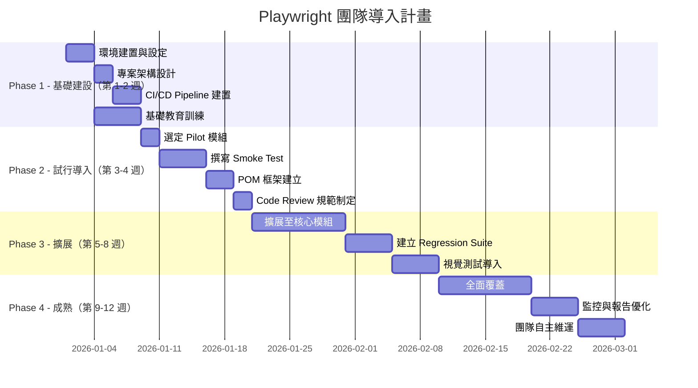

### 12.2 導入里程碑

| Phase | 目標 | KPI |
|-------|------|-----|
| **Phase 1** | 環境就緒、團隊具備基礎知識 | 所有成員完成 Playwright 基礎培訓 |
| **Phase 2** | Pilot 模組自動化測試上線 | 至少 20 個 E2E 測試案例 |
| **Phase 3** | 核心模組覆蓋 | 測試覆蓋率 > 60%，Flaky Rate < 5% |
| **Phase 4** | 全面自動化、自主維運 | 覆蓋率 > 80%，CI 通過率 > 95% |

### 12.3 團隊角色分工

| 角色 | 職責 | 人數建議 |
|------|------|---------|
| **SDET Lead** | 框架設計、CI/CD、Code Review | 1 人 |
| **SDET** | 測試案例撰寫、POM 維護 | 2-3 人 |
| **QA Engineer** | 測試案例設計、執行驗證 | 2-3 人 |
| **Developer** | 提供 data-testid、修復 Bug | 全團隊 |
| **DevOps** | CI/CD 維護、環境管理 | 1 人 |

### 12.4 Code Review 規範

| 檢查項目 | 說明 |
|---------|------|
| **Locator 品質** | 是否使用語意化 Locator，避免脆弱 Selector |
| **POM 使用** | 是否遵循 Page Object Model |
| **斷言充分** | 是否包含足夠且正確的 Assertions |
| **資料隔離** | 測試資料是否獨立，不影響其他測試 |
| **命名規範** | 測試描述是否清晰易懂 |
| **無硬編碼** | 是否使用環境變數管理機敏資料 |
| **清理機制** | 是否有 Teardown 清理測試資料 |
| **無 waitForTimeout** | 是否避免使用固定等待 |

### 12.5 教育訓練計畫

| 階段 | 主題 | 時長 | 對象 |
|------|------|------|------|
| **Week 1** | Playwright 概覽 + 安裝 + 第一個測試 | 4h | 全團隊 |
| **Week 2** | Locator + Auto-wait + Assertions | 4h | 全團隊 |
| **Week 3** | POM 設計 + Fixtures + 資料管理 | 4h | SDET / QA |
| **Week 4** | 進階：Network Mock / Trace / Debug | 4h | SDET / QA |
| **Week 5** | CI/CD 整合 + 報告 + 監控 | 4h | SDET / DevOps |
| **Week 6** | 實戰：Pilot 專案 Pair Programming | 8h | 全團隊 |

> **✅ 最佳實踐**：  
> 1. 指定一位「Playwright Champion」負責推動導入  
> 2. 每週 30 分鐘 Playwright 分享會  
> 3. 建立內部 Wiki 記錄常見問題與解法  
> 4. 定期更新測試規範文件

---

## 第 13 章：完整專案範本

### 13.1 專案結構

```
playwright-enterprise-template/
├── .github/
│   └── workflows/
│       ├── playwright.yml              # PR 測試
│       └── scheduled-tests.yml         # 排程測試
├── .vscode/
│   ├── settings.json                   # VS Code 設定
│   ├── extensions.json                 # 推薦擴充
│   └── mcp.json                        # MCP 設定
├── config/
│   ├── environments.ts                 # 多環境配置
│   └── constants.ts                    # 測試常數
├── fixtures/
│   ├── auth.setup.ts                   # 認證 Setup
│   ├── index.ts                        # 自訂 Fixtures
│   └── test-data.ts                    # 測試資料工廠
├── pages/
│   ├── BasePage.ts                     # 基底 Page Object
│   ├── LoginPage.ts                    # 登入頁
│   ├── DashboardPage.ts               # 儀表板
│   ├── TransactionPage.ts             # 交易頁
│   └── components/
│       ├── HeaderComponent.ts          # 共用 Header
│       ├── SidebarComponent.ts         # 共用 Sidebar
│       └── DialogComponent.ts          # 共用 Dialog
├── services/
│   ├── ApiService.ts                   # API 服務
│   ├── AuthService.ts                  # 認證服務
│   └── DataService.ts                  # 資料服務
├── reporters/
│   └── CustomReporter.ts              # 自訂報告器
├── tests/
│   ├── auth/
│   │   ├── login.spec.ts               # @smoke @auth
│   │   ├── logout.spec.ts              # @smoke @auth
│   │   └── password-reset.spec.ts      # @regression @auth
│   ├── dashboard/
│   │   └── dashboard.spec.ts           # @smoke @dashboard
│   ├── transaction/
│   │   ├── transfer.spec.ts            # @regression @transaction
│   │   └── history.spec.ts             # @regression @transaction
│   ├── api/
│   │   ├── user-api.spec.ts            # @api
│   │   └── transaction-api.spec.ts     # @api
│   └── visual/
│       ├── homepage.spec.ts            # @visual
│       └── dashboard.spec.ts           # @visual
├── utils/
│   ├── helpers.ts                      # 輔助函式
│   ├── logger.ts                       # 日誌工具
│   ├── cleanup.ts                      # 資料清理
│   └── audit-logger.ts                # 稽核日誌
├── test-data/
│   ├── users.json                      # 測試用戶資料
│   └── transactions.json               # 測試交易資料
├── playwright/
│   └── .auth/                          # 認證狀態（.gitignore）
├── .env.dev                            # DEV 環境變數
├── .env.sit                            # SIT 環境變數
├── .env.uat                            # UAT 環境變數
├── .gitignore
├── Dockerfile.playwright               # Docker 設定
├── docker-compose.yml                  # Docker Compose
├── package.json
├── playwright.config.ts                # Playwright 主配置
├── tsconfig.json
└── README.md
```

### 13.2 完整 playwright.config.ts 範本

```typescript
// playwright.config.ts
import { defineConfig, devices } from '@playwright/test';
import { environments, type Environment } from './config/environments';
import dotenv from 'dotenv';

// 載入環境變數
const env: Environment = (process.env.TEST_ENV as Environment) || 'dev';
dotenv.config({ path: `.env.${env}` });

const config = environments[env];

export default defineConfig({
  // 測試目錄
  testDir: './tests',

  // 完全平行執行
  fullyParallel: true,

  // CI 模式：禁止 test.only
  forbidOnly: !!process.env.CI,

  // 重試次數
  retries: process.env.CI ? 2 : 0,

  // Worker 數量
  workers: process.env.CI ? 4 : undefined,

  // 全域逾時
  timeout: config.timeout,

  // Expect 逾時
  expect: {
    timeout: 10_000,
    toHaveScreenshot: {
      maxDiffPixelRatio: 0.01,
    },
  },

  // Reporter 設定
  reporter: process.env.CI
    ? [
        ['html', { open: 'never' }],
        ['junit', { outputFile: 'test-results/junit.xml' }],
        ['json', { outputFile: 'test-results/results.json' }],
        ['./reporters/CustomReporter.ts'],
      ]
    : [
        ['html', { open: 'on-failure' }],
        ['list'],
      ],

  // 全域設定
  use: {
    baseURL: config.baseURL,
    trace: 'on-first-retry',
    screenshot: 'only-on-failure',
    video: 'retain-on-failure',
    locale: 'zh-TW',
    timezoneId: 'Asia/Taipei',

    // Action 逾時
    actionTimeout: 15_000,
    navigationTimeout: 30_000,

    // HTTP 認證（如需要）
    // httpCredentials: { username: '', password: '' },

    // 忽略 HTTPS 錯誤（僅測試環境）
    ignoreHTTPSErrors: env !== 'prod',
  },

  // 專案設定
  projects: [
    // Setup
    {
      name: 'setup',
      testMatch: /.*\.setup\.ts/,
    },

    // Desktop Browsers
    {
      name: 'chromium',
      use: {
        ...devices['Desktop Chrome'],
        storageState: 'playwright/.auth/user.json',
      },
      dependencies: ['setup'],
    },
    {
      name: 'firefox',
      use: {
        ...devices['Desktop Firefox'],
        storageState: 'playwright/.auth/user.json',
      },
      dependencies: ['setup'],
    },
    {
      name: 'webkit',
      use: {
        ...devices['Desktop Safari'],
        storageState: 'playwright/.auth/user.json',
      },
      dependencies: ['setup'],
    },

    // Mobile
    {
      name: 'mobile-chrome',
      use: {
        ...devices['Pixel 7'],
        storageState: 'playwright/.auth/user.json',
      },
      dependencies: ['setup'],
    },
    {
      name: 'mobile-safari',
      use: {
        ...devices['iPhone 15'],
        storageState: 'playwright/.auth/user.json',
      },
      dependencies: ['setup'],
    },
  ],

  // 測試前啟動本地服務（開發時）
  // webServer: {
  //   command: 'npm run dev',
  //   url: 'http://localhost:3000',
  //   reuseExistingServer: !process.env.CI,
  //   // v1.57+ 新增 wait 選項：等待 stdout 輸出匹配特定正則表達式
  //   // wait: {
  //   //   stdout: '/Listening on port (?<my_server_port>\\d+)/',
  //   // },
  // },
});
```

### 13.3 完整 package.json 範本

```json
{
  "name": "playwright-enterprise-template",
  "version": "1.0.0",
  "description": "企業級 Playwright E2E 測試專案",
  "scripts": {
    "test": "playwright test",
    "test:headed": "playwright test --headed",
    "test:ui": "playwright test --ui",
    "test:debug": "playwright test --debug",
    "test:chromium": "playwright test --project=chromium",
    "test:smoke": "playwright test --grep @smoke",
    "test:regression": "playwright test --grep @regression",
    "test:visual": "playwright test --grep @visual",
    "test:api": "playwright test --grep @api",
    "test:dev": "TEST_ENV=dev playwright test",
    "test:sit": "TEST_ENV=sit playwright test",
    "test:uat": "TEST_ENV=uat playwright test",
    "report": "playwright show-report",
    "codegen": "playwright codegen",
    "trace": "playwright show-trace",
    "install:browsers": "playwright install --with-deps",
    "update:snapshots": "playwright test --update-snapshots",
    "lint": "eslint tests/ pages/ services/ fixtures/ utils/"
  },
  "devDependencies": {
    "@playwright/test": "~1.59.0",
    "@faker-js/faker": "^9.0.0",
    "dotenv": "^16.0.0",
    "eslint": "^9.0.0",
    "allure-playwright": "^3.0.0"
  }
}
```

### 13.4 .gitignore 範本

```gitignore
# Playwright
/test-results/
/playwright-report/
/blob-report/
/playwright/.auth/
/screenshots/
/downloads/
/traces/
/audit-logs/

# Allure
/allure-results/
/allure-report/

# Environment
.env.*
!.env.example

# Node
node_modules/
```

### 13.5 Tag 使用策略

```typescript
// tests/auth/login.spec.ts
import { test, expect } from '../../fixtures';

// 使用 Tag 分類測試
test('應該成功登入 @smoke @auth', async ({ loginPage }) => {
  await loginPage.goto();
  await loginPage.login('user@example.com', 'password');
  await expect(loginPage.page).toHaveURL('/dashboard');
});

test('密碼錯誤應顯示錯誤 @regression @auth', async ({ loginPage }) => {
  await loginPage.goto();
  await loginPage.login('user@example.com', 'wrong');
  await expect(loginPage.errorMessage).toBeVisible();
});

test('帳號鎖定後無法登入 @regression @auth @security', async ({ loginPage }) => {
  // 多次錯誤登入
  for (let i = 0; i < 5; i++) {
    await loginPage.goto();
    await loginPage.login('locked@example.com', 'wrong');
  }
  await expect(loginPage.page.getByText('帳號已鎖定')).toBeVisible();
});
```

```bash
# 按 Tag 執行
npx playwright test --grep @smoke           # Smoke Test
npx playwright test --grep @regression      # 回歸測試
npx playwright test --grep @security        # 安全相關
npx playwright test --grep-invert @visual   # 排除視覺測試
npx playwright test --grep "@smoke|@api"    # Smoke + API
```

---

## 附錄 A：新進成員檢查清單（Checklist）

### 環境建置 Checklist

- [ ] 安裝 Node.js（v20.x / v22.x / v24.x）
- [ ] 安裝 VS Code
- [ ] 安裝 VS Code Playwright 擴充套件（`ms-playwright.playwright`）
- [ ] Clone 專案並執行 `npm ci`
- [ ] 執行 `npx playwright install --with-deps`
- [ ] 設定環境變數（`.env.dev`）
- [ ] 執行 `npx playwright test` 驗證環境
- [ ] 安裝 Playwright CLI（選用）：`npm i -g @playwright/cli@latest`
- [ ] 產生 Playwright Agents 定義（選用）：`npx playwright init-agents`

### 開發 Checklist

- [ ] 遵循 Page Object Model（POM）模式
- [ ] 使用語意化 Locator（`getByRole` / `getByLabel` / `getByTestId`）
- [ ] 使用 Web-First Assertions（`expect(locator).toBeVisible()` 等）
- [ ] 不使用 `waitForTimeout`（使用 Auto-wait）
- [ ] 測試資料獨立，不依賴其他測試
- [ ] 敏感資料使用環境變數
- [ ] 測試命名清晰（「應該 + 條件 + 結果」）
- [ ] 使用 Tag 分類測試（`@smoke` / `@regression` / `@visual`）
- [ ] 善用 `await using` 自動清理資源（v1.59+）

### Code Review Checklist

- [ ] Locator 是否穩定且語意化
- [ ] 是否有足夠的 Assertions
- [ ] 測試是否獨立且可重複執行
- [ ] 是否遵循命名規範
- [ ] 是否有適當的 Teardown / 清理
- [ ] 是否避免硬編碼敏感資料
- [ ] CI 是否通過

### CI/CD Checklist

- [ ] GitHub Actions / GitLab CI / Jenkins Pipeline 已設定
- [ ] 測試報告自動產出
- [ ] 失敗通知已配置（Email / Teams）
- [ ] 瀏覽器快取機制已設定
- [ ] Sharding 平行化已啟用
- [ ] 測試結果 Artifact 已保留

---

## 附錄 B：常用指令速查表

### 測試執行

| 指令 | 說明 |
|------|------|
| `npx playwright test` | 執行所有測試 |
| `npx playwright test --headed` | 顯示瀏覽器視窗 |
| `npx playwright test --ui` | UI 互動模式 |
| `npx playwright test --debug` | 偵錯模式（Inspector） |
| `npx playwright test --debug=cli` | CLI 偵錯模式（適合 Coding Agent）（v1.59+） |
| `npx playwright test --project=chromium` | 指定瀏覽器 |
| `npx playwright test tests/login.spec.ts` | 執行單一檔案 |
| `npx playwright test --grep @smoke` | 按 Tag 篩選 |
| `npx playwright test --grep-invert @visual` | 排除 Tag |
| `npx playwright test --grep "@smoke\|@api"` | 多 Tag 聯合篩選 |
| `npx playwright test --workers=4` | 指定 Worker 數 |
| `npx playwright test --shard=1/4` | 分片執行 |
| `npx playwright test --retries=2` | 重試失敗測試 |
| `npx playwright test --repeat-each=5` | 重複執行（抓 Flaky） |
| `npx playwright test --update-snapshots` | 更新視覺快照 |
| `npx playwright test --test-list=file.txt` | 指定測試清單執行（v1.56+） |

### 工具

| 指令 | 說明 |
|------|------|
| `npx playwright codegen https://example.com` | 錄製測試 |
| `npx playwright show-report` | 開啟 HTML 報告 |
| `npx playwright show-trace trace.zip` | 開啟 Trace Viewer |
| `npx playwright install --with-deps` | 安裝瀏覽器（含系統依賴） |
| `npx playwright install --list` | 列出已安裝的瀏覽器 |
| `npx playwright install --clean` | 清理舊版瀏覽器 |
| `npx playwright --version` | 查看版本 |

### Trace CLI（v1.59+）

| 指令 | 說明 |
|------|------|
| `npx playwright trace open <trace.zip>` | 命令列開啟 Trace |
| `npx playwright trace actions` | 列出所有動作 |
| `npx playwright trace actions --grep="expect"` | 篩選動作 |
| `npx playwright trace action <N>` | 查看特定動作詳情 |
| `npx playwright trace snapshot <N> --name before` | 查看動作前 DOM 快照 |
| `npx playwright trace close` | 關閉 Trace |

### Playwright CLI（Coding Agent 用）

| 指令 | 說明 |
|------|------|
| `playwright-cli open <url> --headed` | 開啟 URL |
| `playwright-cli snapshot` | 取得 Accessibility Snapshot |
| `playwright-cli screenshot` | 截圖 |
| `playwright-cli type "text"` | 輸入文字 |
| `playwright-cli press Enter` | 模擬按鍵 |
| `playwright-cli show` | 開啟 Dashboard 監控面板 |
| `playwright-cli attach <session>` | 附加至瀏覽器 Session |
| `playwright-cli install --skills` | 安裝 Skills |

### Playwright Agents（v1.56+）

| 指令 | 說明 |
|------|------|
| `npx playwright init-agents --loop=vscode` | 產生 VS Code Agent 定義 |
| `npx playwright init-agents --loop=claude` | 產生 Claude Code Agent 定義 |
| `npx playwright init-agents --loop=opencode` | 產生 OpenCode Agent 定義 |

---

## 附錄 C：參考資源

### 官方資源

| 資源 | 連結 |
|------|------|
| **官方文件** | https://playwright.dev/ |
| **API 手冊** | https://playwright.dev/docs/api/class-playwright |
| **GitHub** | https://github.com/microsoft/playwright |
| **MCP Server** | https://github.com/microsoft/playwright-mcp |
| **CLI（Coding Agent）** | https://github.com/microsoft/playwright-cli |
| **VS Code 擴充** | https://github.com/microsoft/playwright-vscode |
| **Release Notes** | https://github.com/microsoft/playwright/releases |
| **Discord 社群** | https://aka.ms/playwright/discord |
| **Microsoft Learn** | https://learn.microsoft.com/en-us/training/modules/build-with-playwright/ |

### 多語言文件

| 語言 | 連結 |
|------|------|
| **Python 版本** | https://playwright.dev/python/docs/intro |
| **Java 版本** | https://playwright.dev/java/docs/intro |
| **.NET 版本** | https://playwright.dev/dotnet/docs/intro |

### 進階主題文件

| 主題 | 連結 |
|------|------|
| **Playwright Agents** | https://playwright.dev/docs/test-agents |
| **CLI Agent 文件** | https://playwright.dev/docs/cli-agent |
| **MCP 文件** | https://playwright.dev/docs/mcp |
| **Trace Viewer** | https://playwright.dev/docs/trace-viewer |
| **Accessibility 測試** | https://playwright.dev/docs/accessibility-testing |
| **Service Workers** | https://playwright.dev/docs/service-workers |
| **Sharding 與合併報告** | https://playwright.dev/docs/test-sharding |
| **Getting Started VS Code** | https://playwright.dev/docs/getting-started-vscode |

---

> **文件維護說明**：  
> - 本文件由測試團隊維護，每季度檢視一次  
> - Playwright 版本升級時同步更新本文件  
> - 如有任何問題，請聯繫 SDET Team Lead

