+++
date = '2026-08-21T11:43:14+08:00'
draft = flase
title = 'QM教學手冊'
tags = ['教學', 'AI開發']
categories = ['教學']
+++

# QM 教學手冊

> **QM —— Y Combinator Software 開源之 Multiplayer Agent Harness for Work 企業導入完整指南**
> 適用對象：資深 Software Architect、SA、Backend/Frontend Engineer、DevOps/SRE、Cloud Architect、Cybersecurity Architect、AI Agent 平台團隊、Tech Lead、企業導入負責人
> 文件性質：企業內部「QM」導入、開發與維運培訓教材，偏重實戰與維運
> 版本基準：`yc-software/qm`（MIT License），研究基準為官方 GitHub **`main`** 分支，查證時（2026-08-21）約 14,000+ ★ / 1,600+ forks（會隨時間持續變動，數字僅供查證當下參考）
> 查證日期：2026-08-21
> 技術堆疊：Node.js（`>=24.15.0`）、TypeScript（`type: module`）、Fastify、PostgreSQL、Slack（Bolt）、Vite/Lit（Web UI）、MIT License

---

## ⚠️ 重要聲明（請務必先讀）

1. **QM 是一個 2026-07-29 才建立、目前仍高速迭代中的年輕開源專案。** 查證時（2026-08-21）repository 尚有 101 則 open Issues、195 個 open PR，涵蓋 turn 結果記錄語意、cron 重試/退避、provider failover、admin 稽核日誌等尚在修正中的行為。**任何 CLI 指令、環境變數、目錄結構、Security 行為，在正式導入前，務必以你實際安裝版本的官方 `README.md`／`SECURITY.md`／`cli/README.md`／`docs/` 為準。**

2. **本手冊是彙整、重組、補充企業導入實務，而不是官方文件的翻譯。** 本書不逐字翻譯官方 README，而是依官方 Repository（README、SECURITY.md、AGENTS.md、CLI 文件、部署文件、`.env.example`、`package.json`、原始碼目錄結構）與官方網站 `qm.ycombinator.com` 重新查證後，以繁體中文重新組織、延伸為企業教材，並大量補充 Scenario、AI Prompt 範例、比較表、Checklist 與企業導入建議。

3. **本手冊採用五層 Provenance 標示，請務必先理解這套標示法，它貫穿全書每一個具體事實與主張：**

   | 標示 | 意義 | 使用時機 |
   |---|---|---|
   | **官方已實作** | README／SECURITY.md／官方文件明確確認已出貨的功能 | 有明確官方文件出處可查 |
   | **Source-confirmed** | 只能從原始碼目錄結構／設定檔（`.env.example`／`package.json`／`cli/README.md`）確認，官方敘述性文件未著墨或有落差 | 本手冊研究團隊直接查看原始碼目錄與設定檔得到的事實 |
   | **Roadmap/Issue（規劃中）** | 官方 GitHub Issue 或 PR 討論中，尚未 merge/發布 | 用於區分「已規劃/正在修」與「已出貨」，避免混淆 |
   | **建議架構** | 本手冊作者針對企業導入的建議，非官方功能 | 用於企業落地建議、原創比較表、原創案例 |
   | **推測/Hypothesis** | 無法從任何來源確認，僅為合理推論 | 用於誠實標示研究缺口 |
   | **官方目前沒有找到足夠資料確認此功能** | 明確查無資料，或第三方報導與官方一手資料衝突時 | 用於杜絕以訛傳訛，尤其是 Agent Harness 支援清單、AWS 底層虛擬化技術等爭議點 |

   凡是標成「建議架構」或「推測/Hypothesis」的內容，**都不是 QM 的官方功能**，請勿在企業內部溝通或對外簡報時誤植為官方保證。

4. **一個必須從第一頁就知道的重要辨析：「QM 執行期支援的 Agent Harness」與「開發 QM 專案本身所用的 AI Coding Assistant」是兩件不同的事，且前者的清單已在 2026-08-21 本次查證中發生變動。** 截至本次查證，QM 官方 README 明確列出的 model harness 已擴充為 **Pi、OpenCode、Codex、Claude Code** 四種（官方已實作，README 原文："Pi, OpenCode, Codex, and Claude Code all drive the same core"），且 `package.json` 已將 `@openai/codex` 列為正式相依套件、`src/harness/` 目錄下亦存在 `codex-harness.ts`／`codex-app-server.ts` 兩個對應原始碼檔案（Source-confirmed）。本手冊舊版曾因僅查得三種 harness 的官方文件，而將 Codex 標記為「官方目前沒有找到足夠資料確認」，此標記已隨官方文件更新而失效——**這正是本手冊反覆強調「QM 為高速迭代中年輕專案」的具體案例，請讀者在自己導入時，務必以當下安裝版本的官方 README／`package.json`／`src/harness/` 目錄重新查證，不要逕自沿用本手冊任何一個版本的清單**。至於 `AGENTS.md`（`CLAUDE.md` 為其 symlink）提到的 Claude Code／Codex／Cursor／Pi／OpenCode 五種工具，指的仍是「開發 QM 這個專案原始碼時，各家 AI coding assistant 共用同一份開發規範」，這件事與「QM 執行期可選的 Agent Harness 清單」在概念上依然是兩回事，只是兩份清單目前的交集已擴大到四種，詳見第7章。

5. **另一個必須注意的目錄落差：Slack 整合實際位於 `src/slack/`，不在 `plugins/` 之下。** `plugins/` 目錄實際內容為 `admin, auth, chassis, onboarding, portal, web-ui`（Source-confirmed），並無 Slack 子目錄；README 敘述中「選用 plugins：Web UI、admin panel、public portal、Slack」是產品層的功能分類敘述，不是逐一對應到 `plugins/` 目錄下的同名資料夾。本手冊在第16章會清楚呈現這個落差。

6. **MIT License 授權範圍聲明**：QM 採 MIT License，本手冊對授權條款的說明僅供參考，實際權利義務請以官方 `LICENSE` 檔案逐字內容為準，本手冊不構成法律意見。

7. **第21-26、41章的企業/銀行案例聲明**：本手冊中出現的企業/金融業案例（例如 PaymentController、信用卡額度系統、Oracle/DB2/PostgreSQL 銀行系統等）均為**教學示範用途之虛構情境**，用於示範 QM 與既有企業技術堆疊（Java 25、Spring Boot 4.x、Vue3、PrimeVue 等）的整合模式，並非真實客戶專案。涉及既有框架的深入機制，請參閱本 Repository 既有手冊：
   - [Spring boot 4.x 教學手冊](../framework/Spring%20boot%204.x%20教學手冊.md)
   - [Vue3 前端framework教學](../framework/Vue3%20前端framework教學.md)
   - [PrimeVue使用教學](../framework/PrimeVue使用教學.md)
   - [Java25升版教學](../程式語言/Java25升版教學.md)

8. 官方權威來源與研究來源分級，請見 Appendix E（Official References）與 Appendix F（Research Sources）。

---

## 符號約定

### Provenance 五層標示

本文以括號文字直接標示於句末，例如「...（官方已實作，README）」或「...（建議架構）」。標示意義同上表，全書一致使用，不再重複解釋。

### Mermaid 圖表慣例

- 所有架構圖、流程圖、序列圖均以 Mermaid 語法呈現，可直接在支援 Mermaid 的 Markdown 檢視器（GitHub、VS Code 外掛等）中渲染。
- 節點標籤若包含括號、冒號、斜線等特殊字元，一律以雙引號包住整個標籤（例如 `A["Headless Core (API/Identity/Policy)"]`），避免解析錯誤。
- 實線箭頭代表已從官方文件或原始碼目錄結構確認的關係（Source-confirmed／官方已實作）；虛線箭頭代表依現有事實合理推論、但官方未逐一列點確認的路徑（建議架構），圖說明會另外標註。

### 程式碼區塊慣例

- 標示為「示意」或「非逐字官方指令」的區塊，是本手冊為了幫助理解而重新撰寫的概念示範，**不是官方文件的逐字引用**，不可直接複製貼上當作生產環境設定。
- 未標示「示意」的指令（例如 CLI 指令表中的指令）為官方 `cli/README.md`／部署文件中可查證的真實指令語法。
- 所有 Placeholder（如 `<org>`、`<slug>`、`<your-org>`）在使用前必須替換為實際值，本文不含任何真實 Secret、API Key 或密碼。

### 章節固定小節

重要章節盡量包含以下小節：Scenario（具體案例）、AI Prompt 範例、本章 Checklist 與小結。

---

## 版本與相容性速查表

| 項目 | 值 | 來源標示 |
|---|---|---|
| Repository | `yc-software/qm` | 官方已實作 |
| Description | "Multiplayer agent harness for work. In Slack and on the web." | 官方已實作 |
| Default Branch | `main` | Source-confirmed |
| 建立時間 | 2026-07-29 | Source-confirmed |
| 查證時 Star/Fork（2026-08-21） | 約 14,000+ ★ / 1,600+ forks（會持續變動） | Source-confirmed |
| License | MIT | 官方已實作 |
| 主要語言/框架 | Node.js（`type: module`）、TypeScript、Fastify | 官方已實作 |
| Node.js 需求版本 | `>=24.15.0` | 官方已實作，package.json |
| npm 需求版本 | `>=11.10.0` | 官方已實作，package.json |
| 已發佈 npm 套件名稱 | `@yc-software/qm`（與 repo 內 `package.json` 的 `name: qm` 不同，屬 monorepo 內部名稱與已發佈套件名稱的常見落差） | 官方已實作（cli 文件所述安裝指令與套件發佈流程） |
| 持久層 | PostgreSQL（sessions／memory；`queue` 為 README 敘述但未見獨立同名模組） | 官方已實作＋Source-confirmed（見第5章落差說明） |
| 官方列出之 Agent Harness | Pi、OpenCode、Codex、Claude Code（四種，2026-08-21 查證時已確認） | 官方已實作，README＋`package.json`＋`src/harness/` |
| Codex 是否為執行期 Harness | 是，官方第四種 Harness（`src/harness/codex-harness.ts`、`codex-app-server.ts`、`package.json` 之 `@openai/codex` 相依套件三方佐證，見第7章） | 官方已實作＋Source-confirmed |
| Security Posture | Strict／Auto（預設）／Dangerous 三種 | 官方已實作，README＋`.env.example` |
| 控制安全姿態的環境變數 | `HARNESS_SECURITY_POSTURE`（預設 `auto`） | 官方已實作，`.env.example` |
| 控制 Harness 選擇的環境變數 | `HARNESS`（預設 `pi`） | 官方已實作，`.env.example` |
| 部署目標（`--target`） | `docker`、`fly`、`aws`（三種） | 官方已實作，`cli/README.md` |
| AWS 部署底層 | ECS Fargate + Lambda MicroVM agents（是否為 Firecracker 等更底層技術未逐一查證） | 官方已實作（部署概述層級）／技術細節官方目前沒有找到足夠資料確認 |
| 官網 | `qm.ycombinator.com` | 官方已實作 |
| 聯絡窗口 | `labs@ycombinator.com` | 官方已實作 |

---

<!-- TOC-AUTO-BEGIN -->
## 目錄（Table of Contents）

- [1. 文件說明](#1-文件說明)
  - [1.1 這份手冊要解決什麼問題](#11-這份手冊要解決什麼問題)
  - [1.2 如何閱讀這份手冊](#12-如何閱讀這份手冊)
  - [1.3 與其他 AI Agent Harness / Coding Agent 文件的差異](#13-與其他-ai-agent-harness--coding-agent-文件的差異)
  - [1.4 本章 Checklist 與小結](#14-本章-checklist-與小結)
- [2. QM 是什麼](#2-qm-是什麼)
  - [2.1 一句話定位](#21-一句話定位)
  - [2.2 QM 不是什麼（初學者常見誤解）](#22-qm-不是什麼初學者常見誤解)
  - [2.3 QM 要解決的核心問題（換句話說）](#23-qm-要解決的核心問題換句話說)
  - [2.4 專案背景與命名由來](#24-專案背景與命名由來)
  - [2.5 授權與社群現況](#25-授權與社群現況)
  - [Scenario：企業第一次接觸這個專案](#scenario企業第一次接觸這個專案)
  - [2.6 AI Prompt 範例](#26-ai-prompt-範例)
  - [2.7 本章 Checklist 與小結](#27-本章-checklist-與小結)
- [3. QM 解決什麼問題](#3-qm-解決什麼問題)
  - [3.1 問題起點：AI Agent 導入企業的三個現實困境](#31-問題起點ai-agent-導入企業的三個現實困境)
  - [3.2 QM 的回應方式（總覽）](#32-qm-的回應方式總覽)
  - [3.3 簡短比較：QM 與其他相鄰工具的定位差異](#33-簡短比較qm-與其他相鄰工具的定位差異)
  - [Scenario：三個月後的維運視角](#scenario三個月後的維運視角)
  - [3.4 AI Prompt 範例](#34-ai-prompt-範例)
  - [3.5 本章 Checklist 與小結](#35-本章-checklist-與小結)
- [4. QM 核心概念](#4-qm-核心概念)
  - [4.1 五個必須先理解的核心名詞](#41-五個必須先理解的核心名詞)
  - [4.2 這五個概念如何組合成一次任務執行](#42-這五個概念如何組合成一次任務執行)
  - [4.3 為什麼這五個概念缺一不可](#43-為什麼這五個概念缺一不可)
  - [4.4 AI Prompt 範例](#44-ai-prompt-範例)
  - [4.5 本章 Checklist 與小結](#45-本章-checklist-與小結)
- [5. QM Architecture](#5-qm-architecture)
  - [5.1 架構總覽：README 概念用語 vs 原始碼實際模組](#51-架構總覽readme-概念用語-vs-原始碼實際模組)
  - [5.2 整體架構圖](#52-整體架構圖)
  - [5.3 二十一個責任元件速覽](#53-二十一個責任元件速覽)
  - [5.4 資料流向：一次典型任務的端到端路徑](#54-資料流向一次典型任務的端到端路徑)
  - [5.5 可替換性與 Extension Point](#55-可替換性與-extension-point)
  - [Scenario：架構師的第一次程式碼走查](#scenario架構師的第一次程式碼走查)
  - [5.6 AI Prompt 範例](#56-ai-prompt-範例)
  - [5.7 本章 Checklist 與小結](#57-本章-checklist-與小結)
- [6. Scope](#6-scope)
  - [6.1 四層解釋法](#61-四層解釋法)
  - [6.2 三種 Scope 類型](#62-三種-scope-類型)
  - [6.3 企業案例：Scope 隔離示意](#63-企業案例scope-隔離示意)
  - [6.4 Scoped 資源清單](#64-scoped-資源清單)
  - [6.5 為什麼「隔離單位是 Scope，不是 User」](#65-為什麼隔離單位是-scope不是-user)
  - [Scenario：新人 Onboarding 與離職交接](#scenario新人-onboarding-與離職交接)
  - [6.6 AI Prompt 範例](#66-ai-prompt-範例)
  - [6.7 本章 Checklist 與小結](#67-本章-checklist-與小結)
- [7. Agent Harness](#7-agent-harness)
  - [7.1 為什麼 QM 不綁定單一 AI Agent Framework](#71-為什麼-qm-不綁定單一-ai-agent-framework)
  - [7.2 官方目前確認的四種 Harness](#72-官方目前確認的四種-harness)
  - [7.3 查證歷程紀錄：Codex 從「未確認」到「官方第四種 Harness」](#73-查證歷程紀錄codex-從未確認到官方第四種-harness)
  - [7.4 Harness Abstraction 對企業的價值](#74-harness-abstraction-對企業的價值)
  - [7.5 架構圖：QM 與各 Coding Agent 的關係](#75-架構圖qm-與各-coding-agent-的關係)
  - [Scenario：企業評估是否可以「換掉」Coding Agent](#scenario企業評估是否可以換掉coding-agent)
  - [7.6 AI Prompt 範例](#76-ai-prompt-範例)
  - [7.7 本章 Checklist 與小結](#77-本章-checklist-與小結)
- [8. Sandbox](#8-sandbox)
  - [8.1 四層解釋法](#81-四層解釋法)
  - [8.2 Sandbox 內部組成](#82-sandbox-內部組成)
  - [8.3 Durable Sandbox 對 Coding Agent 的重要性](#83-durable-sandbox-對-coding-agent-的重要性)
  - [8.4 Sandbox 建置與發佈（CLI 對應）](#84-sandbox-建置與發佈cli-對應)
  - [Scenario：Java/Spring Boot 專案的 Sandbox 設定](#scenariojavaspring-boot-專案的-sandbox-設定)
  - [8.5 AI Prompt 範例](#85-ai-prompt-範例)
  - [8.6 本章 Checklist 與小結](#86-本章-checklist-與小結)
- [9. Memory](#9-memory)
  - [9.1 Memory 在 QM 中的角色](#91-memory-在-qm-中的角色)
  - [9.2 Memory 與 Scope 的關係](#92-memory-與-scope-的關係)
  - [9.3 Memory 的技術細節：誠實的研究缺口](#93-memory-的技術細節誠實的研究缺口)
  - [9.4 架構位置示意](#94-架構位置示意)
  - [Scenario：跨任務的脈絡延續](#scenario跨任務的脈絡延續)
  - [9.5 AI Prompt 範例](#95-ai-prompt-範例)
  - [9.6 本章 Checklist 與小結](#96-本章-checklist-與小結)
- [10. Skills](#10-skills)
  - [10.1 Skill 不是單純 Prompt Template](#101-skill-不是單純-prompt-template)
  - [10.2 `skills-seed/` 實際內容](#102-skills-seed-實際內容)
  - [10.3 Skill 的部署層存放位置](#103-skill-的部署層存放位置)
  - [10.4 Enterprise Skill Governance（建議架構）](#104-enterprise-skill-governance建議架構)
  - [10.5 Skill 與 Git Repository 的關係](#105-skill-與-git-repository-的關係)
  - [Scenario：一個 Skill 從個人試驗到組織標配的旅程](#scenario一個-skill-從個人試驗到組織標配的旅程)
  - [10.6 AI Prompt 範例](#106-ai-prompt-範例)
  - [10.7 本章 Checklist 與小結](#107-本章-checklist-與小結)
- [11. Security](#11-security)
  - [11.1 三種 Security Posture](#111-三種-security-posture)
  - [11.2 SECURITY.md 核心內容（2026-08-21 依官方最新版重新整理）](#112-securitymd-核心內容2026-08-21-依官方最新版重新整理)
    - [Scope（信任邊界的作用範圍）](#scope信任邊界的作用範圍)
    - [Protected assets and actors（受保護資產與相關角色）](#protected-assets-and-actors受保護資產與相關角色)
    - [Trust boundaries and operator assumptions（信任邊界與 Operator 假設）](#trust-boundaries-and-operator-assumptions信任邊界與-operator-假設)
    - [What the controls do and do not guarantee（控制措施的保證範圍）](#what-the-controls-do-and-do-not-guarantee控制措施的保證範圍)
    - [Deliberately portal-only actions（刻意只能在 Portal 執行的操作）](#deliberately-portal-only-actions刻意只能在-portal-執行的操作)
    - [Known limitations（已知限制，2026-08-21 依最新版整理，較舊版更詳細）](#known-limitations已知限制2026-08-21-依最新版整理較舊版更詳細)
    - [Dependency cooldown（依賴套件冷卻期，本手冊舊版未涵蓋，本次查證新增）](#dependency-cooldown依賴套件冷卻期本手冊舊版未涵蓋本次查證新增)
    - [Supported versions（受支援版本）](#supported-versions受支援版本)
    - [弱點通報流程](#弱點通報流程)
  - [11.3 Threat Model 總覽](#113-threat-model-總覽)
  - [11.4 企業安全建議（建議架構）](#114-企業安全建議建議架構)
  - [Scenario：Strict Posture 用於維運任務](#scenariostrict-posture-用於維運任務)
  - [11.5 AI Prompt 範例](#115-ai-prompt-範例)
  - [11.6 本章 Checklist 與小結](#116-本章-checklist-與小結)
- [12. Installation](#12-installation)
  - [12.1 Prerequisites](#121-prerequisites)
  - [12.2 重要觀念：QM Source Repository 與 Deployment Repository 不是同一件事](#122-重要觀念qm-source-repository-與-deployment-repository-不是同一件事)
  - [12.3 QM CLI 初始化](#123-qm-cli-初始化)
  - [12.4 `qm init` 之後：組織會得到什麼](#124-qm-init-之後組織會得到什麼)
  - [12.5 完整部署流程（2026-08-21 依 `docs/getting-started.md` 與 `docs/deploy-directory.md` 重新整理）](#125-完整部署流程2026-08-21-依-docsgetting-startedmd-與-docsdeploy-directorymd-重新整理)
  - [12.6 CLI 指令完整參考（節錄自 `cli/README.md`）](#126-cli-指令完整參考節錄自-clireadmemd)
  - [12.7 標準初始化與驗證流程（示意，AWS 為例）](#127-標準初始化與驗證流程示意aws-為例)
  - [Scenario：架構師的第一次 `qm init`](#scenario架構師的第一次-qm-init)
  - [12.8 AI Prompt 範例](#128-ai-prompt-範例)
  - [12.9 本章 Checklist 與小結](#129-本章-checklist-與小結)
- [13. Local Development](#13-local-development)
  - [13.1 本章定位](#131-本章定位)
  - [13.2 本機開發前置需求](#132-本機開發前置需求)
  - [13.3 Windows + WSL2 實務建議（建議架構）](#133-windows--wsl2-實務建議建議架構)
  - [13.4 常見 npm scripts（節錄，Source-confirmed，`package.json`）](#134-常見-npm-scripts節錄source-confirmedpackagejson)
  - [Scenario：新進工程師的第一次本機環境設定](#scenario新進工程師的第一次本機環境設定)
  - [13.5 AI Prompt 範例](#135-ai-prompt-範例)
  - [13.6 本章 Checklist 與小結](#136-本章-checklist-與小結)
- [14. Docker](#14-docker)
  - [14.1 Docker 作為部署 Target 之一](#141-docker-作為部署-target-之一)
  - [14.2 Docker 部署指令示意](#142-docker-部署指令示意)
  - [14.3 Sandbox 映像建置與發佈](#143-sandbox-映像建置與發佈)
  - [14.4 適用情境與限制](#144-適用情境與限制)
  - [Scenario：PoC 階段使用 Docker Target](#scenariopoc-階段使用-docker-target)
  - [14.5 AI Prompt 範例](#145-ai-prompt-範例)
  - [14.6 本章 Checklist 與小結](#146-本章-checklist-與小結)
- [15. Fly.io](#15-flyio)
  - [15.1 Fly.io 部署相關檔案（Source-confirmed）](#151-flyio-部署相關檔案source-confirmed)
  - [15.2 Fly.io 部署指令示意](#152-flyio-部署指令示意)
  - [15.3 Fly.io 部署涵蓋的維運面向（建議架構，依 Fly Machines 平台特性延伸）](#153-flyio-部署涵蓋的維運面向建議架構依-fly-machines-平台特性延伸)
  - [15.4 Rollback 與版本管理](#154-rollback-與版本管理)
  - [Scenario：新創公司選擇 Fly.io 的考量](#scenario新創公司選擇-flyio-的考量)
  - [15.5 AI Prompt 範例](#155-ai-prompt-範例)
  - [15.6 本章 Checklist 與小結](#156-本章-checklist-與小結)
- [16. AWS](#16-aws)
  - [16.1 AWS 部署架構（官方已實作，cli 文件）](#161-aws-部署架構官方已實作cli-文件)
  - [16.2 AWS 部署涉及的基礎設施](#162-aws-部署涉及的基礎設施)
  - [16.3 AWS 部署指令示意](#163-aws-部署指令示意)
  - [16.4 資料庫快照與回滾](#164-資料庫快照與回滾)
  - [16.5 官方支援 vs 建議架構的區分](#165-官方支援-vs-建議架構的區分)
  - [Scenario：金融業客戶評估 AWS 部署](#scenario金融業客戶評估-aws-部署)
  - [16.6 AI Prompt 範例](#166-ai-prompt-範例)
  - [16.7 本章 Checklist 與小結](#167-本章-checklist-與小結)
- [17. Slack](#17-slack)
  - [17.1 重要澄清：Slack 整合的實際程式碼位置](#171-重要澄清slack-整合的實際程式碼位置)
  - [17.2 Slack 整合架構](#172-slack-整合架構)
  - [17.3 Slack 整合涵蓋的功能面向（依 `src/slack/` 檔名結構推論，Source-confirmed 檔案存在／功能細節建議架構）](#173-slack-整合涵蓋的功能面向依-srcslack-檔名結構推論source-confirmed-檔案存在功能細節建議架構)
  - [17.4 Slack Bot 加入流程（依第12.5節部署流程之「選擇性加入 Connectors 與 Slack」步驟）](#174-slack-bot-加入流程依第125節部署流程之選擇性加入-connectors-與-slack步驟)
  - [17.5 Slack 使用情境](#175-slack-使用情境)
  - [Scenario：跨部門頻道的協作](#scenario跨部門頻道的協作)
  - [17.6 AI Prompt 範例](#176-ai-prompt-範例)
  - [17.7 本章 Checklist 與小結](#177-本章-checklist-與小結)
- [18. Web UI](#18-web-ui)
  - [18.1 Web UI 相關元件](#181-web-ui-相關元件)
  - [18.2 Web UI 與 Core 的關係](#182-web-ui-與-core-的關係)
  - [18.3 Public Portal 與 Web Apps](#183-public-portal-與-web-apps)
  - [Scenario：透過 Portal 對外分享一個 Web App](#scenario透過-portal-對外分享一個-web-app)
  - [18.4 AI Prompt 範例](#184-ai-prompt-範例)
  - [18.5 本章 Checklist 與小結](#185-本章-checklist-與小結)
- [19. Administration](#19-administration)
  - [19.1 Admin 的角色定位](#191-admin-的角色定位)
  - [19.2 Admin 可執行的操作（依 SECURITY.md 之刻意排除清單反推）](#192-admin-可執行的操作依-securitymd-之刻意排除清單反推)
  - [19.3 部署階段的 Admin 設定](#193-部署階段的-admin-設定)
  - [19.4 Admin 稽核與治理建議（建議架構）](#194-admin-稽核與治理建議建議架構)
  - [Scenario：Admin 權限的最小化實踐](#scenarioadmin-權限的最小化實踐)
  - [19.5 AI Prompt 範例](#195-ai-prompt-範例)
  - [19.6 本章 Checklist 與小結](#196-本章-checklist-與小結)
- [20. Enterprise Configuration](#20-enterprise-configuration)
  - [20.1 兩層設定總覽](#201-兩層設定總覽)
  - [20.2 完整環境變數清單與用途](#202-完整環境變數清單與用途)
  - [20.3 品牌與多租戶自訂](#203-品牌與多租戶自訂)
  - [20.4 Rate Limit 與 Budget 治理](#204-rate-limit-與-budget-治理)
  - [Scenario：多子公司品牌隔離部署](#scenario多子公司品牌隔離部署)
  - [20.5 AI Prompt 範例](#205-ai-prompt-範例)
  - [20.6 本章 Checklist 與小結](#206-本章-checklist-與小結)
- [21. Web Application Development](#21-web-application-development)
  - [21.1 情境設定](#211-情境設定)
  - [21.2 QM Agent Team 設計（建議架構）](#212-qm-agent-team-設計建議架構)
  - [21.3 各「Agent 角色」建議定位（建議架構）](#213-各agent-角色建議定位建議架構)
  - [21.4 端到端開發流程圖](#214-端到端開發流程圖)
  - [Scenario：新功能開發的一次完整迭代](#scenario新功能開發的一次完整迭代)
  - [21.5 AI Prompt 範例](#215-ai-prompt-範例)
  - [21.6 本章 Checklist 與小結](#216-本章-checklist-與小結)
- [22. Reverse Engineering](#22-reverse-engineering)
  - [22.1 QM 協助 Legacy System 逆向工程的流程（建議架構）](#221-qm-協助-legacy-system-逆向工程的流程建議架構)
  - [22.2 涵蓋範圍](#222-涵蓋範圍)
  - [22.3 為什麼 QM 的 Scope／Sandbox 機制適合這類任務](#223-為什麼-qm-的-scopesandbox-機制適合這類任務)
  - [Scenario：一個 20 年歷史的核心系統評估](#scenario一個-20-年歷史的核心系統評估)
  - [22.4 AI Prompt 範例](#224-ai-prompt-範例)
  - [22.5 本章 Checklist 與小結](#225-本章-checklist-與小結)
- [23. Framework Upgrade](#23-framework-upgrade)
  - [23.1 Framework Upgrade 完整流程（建議架構）](#231-framework-upgrade-完整流程建議架構)
  - [23.2 涵蓋的升級類型](#232-涵蓋的升級類型)
  - [23.3 版本示範（僅為教學示範，非官方相容性保證）](#233-版本示範僅為教學示範非官方相容性保證)
  - [23.4 為什麼建議用獨立 Scope 執行升級任務](#234-為什麼建議用獨立-scope-執行升級任務)
  - [Scenario：分階段升級策略](#scenario分階段升級策略)
  - [23.5 AI Prompt 範例](#235-ai-prompt-範例)
  - [23.6 本章 Checklist 與小結](#236-本章-checklist-與小結)
- [24. Git / GitHub](#24-git--github)
  - [24.1 QM 與 Git 的關係](#241-qm-與-git-的關係)
  - [24.2 建議的 Agent 產出治理流程](#242-建議的-agent-產出治理流程)
  - [24.3 私有 Fork 治理（比照 QM 官方自身模式）](#243-私有-fork-治理比照-qm-官方自身模式)
  - [Scenario：企業 Coding Agent 產出的標準 Git 流程](#scenario企業-coding-agent-產出的標準-git-流程)
  - [24.4 AI Prompt 範例](#244-ai-prompt-範例)
  - [24.5 本章 Checklist 與小結](#245-本章-checklist-與小結)
- [25. CI/CD](#25-cicd)
  - [25.1 QM 與 CI/CD 的關係](#251-qm-與-cicd-的關係)
  - [25.2 建議的 CI/CD 流程（建議架構）](#252-建議的-cicd-流程建議架構)
  - [25.3 與既有 CI/CD 工具的搭配](#253-與既有-cicd-工具的搭配)
  - [25.4 Deploy 階段與 CI/CD 的整合建議](#254-deploy-階段與-cicd-的整合建議)
  - [Scenario：導入 Quality Gate 阻擋未經審查的變更](#scenario導入-quality-gate-阻擋未經審查的變更)
  - [25.5 AI Prompt 範例](#255-ai-prompt-範例)
  - [25.6 本章 Checklist 與小結](#256-本章-checklist-與小結)
- [26. Testing](#26-testing)
  - [26.1 QM 自身的測試分類（Source-confirmed，`package.json`）](#261-qm-自身的測試分類source-confirmedpackagejson)
  - [26.2 企業使用 QM 進行 Testing 的建議工作模式（建議架構）](#262-企業使用-qm-進行-testing-的建議工作模式建議架構)
  - [26.3 QM 自身可供參考的測試治理原則](#263-qm-自身可供參考的測試治理原則)
  - [Scenario：測試優先的 Bug 修復流程](#scenario測試優先的-bug-修復流程)
  - [26.4 AI Prompt 範例](#264-ai-prompt-範例)
  - [26.5 本章 Checklist 與小結](#265-本章-checklist-與小結)
- [27. Security Engineering](#27-security-engineering)
  - [27.1 從 Security Posture 到企業 Security Engineering](#271-從-security-posture-到企業-security-engineering)
  - [27.2 Threat Model 延伸盤點（依 SECURITY.md 延伸的企業檢核項目）](#272-threat-model-延伸盤點依-securitymd-延伸的企業檢核項目)
  - [27.3 供應鏈安全提醒：0.1.5 版本 Provenance Attestation 事件](#273-供應鏈安全提醒015-版本-provenance-attestation-事件)
  - [27.4 Enterprise Security Governance 落地建議](#274-enterprise-security-governance-落地建議)
  - [Scenario：紅隊演練驗證 Auto Posture 的實際效果](#scenario紅隊演練驗證-auto-posture-的實際效果)
  - [27.5 AI Prompt 範例](#275-ai-prompt-範例)
  - [27.6 本章 Checklist 與小結](#276-本章-checklist-與小結)
- [28. Observability](#28-observability)
  - [28.1 QM 官方 Observability 現況](#281-qm-官方-observability-現況)
  - [28.2 建議的 Observability 資料流（建議架構）](#282-建議的-observability-資料流建議架構)
  - [28.3 已知的健康檢查限制](#283-已知的健康檢查限制)
  - [Scenario：發現健康檢查誤報的真實案例](#scenario發現健康檢查誤報的真實案例)
  - [28.4 AI Prompt 範例](#284-ai-prompt-範例)
  - [28.5 本章 Checklist 與小結](#285-本章-checklist-與小結)
- [29. Operations](#29-operations)
  - [29.1 QM Operations Guide 總覽](#291-qm-operations-guide-總覽)
  - [29.2 常用維運指令](#292-常用維運指令)
  - [29.3 已知的維運風險（依查證時的 Issue 討論）](#293-已知的維運風險依查證時的-issue-討論)
  - [Scenario：維運團隊建立「不完全信任內建統計」的作業習慣](#scenario維運團隊建立不完全信任內建統計的作業習慣)
  - [29.4 AI Prompt 範例](#294-ai-prompt-範例)
  - [29.5 本章 Checklist 與小結](#295-本章-checklist-與小結)
- [30. Backup / Recovery](#30-backup--recovery)
  - [30.1 Backup 涵蓋範圍](#301-backup-涵蓋範圍)
  - [30.2 Recovery 涵蓋範圍與指令](#302-recovery-涵蓋範圍與指令)
  - [30.3 RPO／RTO 建議表（建議架構，非官方 SLA 保證）](#303-rporto-建議表建議架構非官方-sla-保證)
  - [Scenario：一次 RDS 快照拯救的資料庫誤操作](#scenario一次-rds-快照拯救的資料庫誤操作)
  - [30.4 AI Prompt 範例](#304-ai-prompt-範例)
  - [30.5 本章 Checklist 與小結](#305-本章-checklist-與小結)
- [31. Upgrade](#31-upgrade)
  - [31.1 升級 SOP 總覽](#311-升級-sop-總覽)
  - [31.2 升級涉及的具體項目](#312-升級涉及的具體項目)
  - [31.3 升級前的供應鏈驗證提醒](#313-升級前的供應鏈驗證提醒)
  - [Scenario：先在 Test 環境跑過一輪完整 SOP](#scenario先在-test-環境跑過一輪完整-sop)
  - [31.4 AI Prompt 範例](#314-ai-prompt-範例)
  - [31.5 本章 Checklist 與小結](#315-本章-checklist-與小結)
- [32. Troubleshooting](#32-troubleshooting)
  - [32.1 常見故障排除表](#321-常見故障排除表)
  - [Scenario：值班工程師的第一線排查習慣](#scenario值班工程師的第一線排查習慣)
  - [32.2 AI Prompt 範例](#322-ai-prompt-範例)
  - [32.3 本章 Checklist 與小結](#323-本章-checklist-與小結)
- [33. Performance](#33-performance)
  - [33.1 影響效能與成本的面向](#331-影響效能與成本的面向)
  - [33.2 內建的速率與預算控制](#332-內建的速率與預算控制)
  - [33.3 效能調校建議（建議架構）](#333-效能調校建議建議架構)
  - [Scenario：發現一個異常吃資源的 Cron](#scenario發現一個異常吃資源的-cron)
  - [33.4 AI Prompt 範例](#334-ai-prompt-範例)
  - [33.5 本章 Checklist 與小結](#335-本章-checklist-與小結)
- [34. Cost Management](#34-cost-management)
  - [34.1 QM 成本構成模型（建議架構）](#341-qm-成本構成模型建議架構)
  - [34.2 內建的成本治理槓桿](#342-內建的成本治理槓桿)
  - [34.3 企業成本治理方法（建議架構）](#343-企業成本治理方法建議架構)
  - [Scenario：季度成本歸因報告](#scenario季度成本歸因報告)
  - [34.4 AI Prompt 範例](#344-ai-prompt-範例)
  - [34.5 本章 Checklist 與小結](#345-本章-checklist-與小結)
- [35. Agent Team Design](#35-agent-team-design)
  - [35.1 Enterprise Agent Team Pattern（建議架構）](#351-enterprise-agent-team-pattern建議架構)
  - [35.2 各角色設計要素](#352-各角色設計要素)
  - [35.3 為什麼要用「表格」而非「真正獨立的 Agent 進程」理解這個模型](#353-為什麼要用表格而非真正獨立的-agent-進程理解這個模型)
  - [Scenario：一次跨角色協作的完整任務鏈](#scenario一次跨角色協作的完整任務鏈)
  - [35.4 AI Prompt 範例](#354-ai-prompt-範例)
  - [35.5 本章 Checklist 與小結](#355-本章-checklist-與小結)
- [36. SDLC Integration](#36-sdlc-integration)
  - [36.1 QM 介入企業 SDLC 各階段（建議架構）](#361-qm-介入企業-sdlc-各階段建議架構)
  - [36.2 各階段對應的 QM 機制](#362-各階段對應的-qm-機制)
  - [Scenario：完整走過一次 SDLC 迭代](#scenario完整走過一次-sdlc-迭代)
  - [36.3 AI Prompt 範例](#363-ai-prompt-範例)
  - [36.4 本章 Checklist 與小結](#364-本章-checklist-與小結)
- [37. Spec-Driven Development](#37-spec-driven-development)
  - [37.1 QM 與 Spec-Driven Development 的搭配（建議架構）](#371-qm-與-spec-driven-development-的搭配建議架構)
  - [37.2 與既有 Spec-Driven 工具鏈的整合方式](#372-與既有-spec-driven-工具鏈的整合方式)
  - [Scenario：以 Spec 文件驅動一次功能開發](#scenario以-spec-文件驅動一次功能開發)
  - [37.3 AI Prompt 範例](#373-ai-prompt-範例)
  - [37.4 本章 Checklist 與小結](#374-本章-checklist-與小結)
- [38. Enterprise Governance](#38-enterprise-governance)
  - [38.1 治理框架總覽](#381-治理框架總覽)
  - [38.2 治理責任分工建議（建議架構）](#382-治理責任分工建議建議架構)
  - [38.3 治理委員會建議（建議架構）](#383-治理委員會建議建議架構)
  - [Scenario：治理委員會的季度會議](#scenario治理委員會的季度會議)
  - [38.4 AI Prompt 範例](#384-ai-prompt-範例)
  - [38.5 本章 Checklist 與小結](#385-本章-checklist-與小結)
- [39. Team Usage Guidelines](#39-team-usage-guidelines)
  - [39.1 公司 QM 使用規範](#391-公司-qm-使用規範)
  - [39.2 團隊日常操作提醒](#392-團隊日常操作提醒)
  - [Scenario：新人第一週的規範教育](#scenario新人第一週的規範教育)
  - [39.3 AI Prompt 範例](#393-ai-prompt-範例)
  - [39.4 本章 Checklist 與小結](#394-本章-checklist-與小結)
- [40. Training](#40-training)
  - [40.1 三個 Level 的培訓教材設計](#401-三個-level-的培訓教材設計)
  - [40.2 Level 1：一般使用者](#402-level-1一般使用者)
  - [40.3 Level 2：Developer](#403-level-2developer)
  - [40.4 Level 3：Administrator / Architect](#404-level-3administrator--architect)
  - [40.5 培訓教材的持續更新機制（建議架構）](#405-培訓教材的持續更新機制建議架構)
  - [Scenario：三階段培訓的實際排程](#scenario三階段培訓的實際排程)
  - [40.6 AI Prompt 範例](#406-ai-prompt-範例)
  - [40.7 本章 Checklist 與小結](#407-本章-checklist-與小結)
- [41. Real-world Cases](#41-real-world-cases)
  - [Case 1：新 Web Application 開發](#case-1新-web-application-開發)
  - [Case 2：Legacy Java System Reverse Engineering](#case-2legacy-java-system-reverse-engineering)
  - [Case 3：Spring Boot Upgrade](#case-3spring-boot-upgrade)
  - [Case 4：Vue 2 → Vue 3 Migration](#case-4vue-2--vue-3-migration)
  - [Case 5：Database Migration](#case-5database-migration)
  - [Case 6：Production Incident Investigation](#case-6production-incident-investigation)
  - [Case 7：Automated Code Review](#case-7automated-code-review)
  - [Case 8：每日 CI/CD Health Check](#case-8每日-cicd-health-check)
  - [本章 Checklist 與小結（第41章）](#本章-checklist-與小結第41章)
- [42. SOP](#42-sop)
  - [SOP-01：建立新 Project](#sop-01建立新-project)
  - [SOP-02：建立 Project Agent](#sop-02建立-project-agent)
  - [SOP-03：設定 Skill](#sop-03設定-skill)
  - [SOP-04：授權 Repository](#sop-04授權-repository)
  - [SOP-05：執行 Coding Task](#sop-05執行-coding-task)
  - [SOP-06：執行 Code Review](#sop-06執行-code-review)
  - [SOP-07：建立 Pull Request](#sop-07建立-pull-request)
  - [SOP-08：執行 Framework Upgrade](#sop-08執行-framework-upgrade)
  - [SOP-09：進行 Legacy Reverse Engineering](#sop-09進行-legacy-reverse-engineering)
  - [SOP-10：處理 Production Incident](#sop-10處理-production-incident)
  - [SOP-11：建立 Cron](#sop-11建立-cron)
  - [SOP-12：建立 Slack Collaboration](#sop-12建立-slack-collaboration)
  - [SOP-13：升級 QM](#sop-13升級-qm)
  - [SOP-14：Rollback QM](#sop-14rollback-qm)
  - [本章 Checklist 與小結（第42章）](#本章-checklist-與小結第42章)
- [43. Checklists](#43-checklists)
  - [QM Installation Checklist](#qm-installation-checklist)
  - [QM Security Checklist](#qm-security-checklist)
  - [QM Production Readiness Checklist](#qm-production-readiness-checklist)
  - [QM Agent Onboarding Checklist](#qm-agent-onboarding-checklist)
  - [QM Project Onboarding Checklist](#qm-project-onboarding-checklist)
  - [QM Developer Checklist](#qm-developer-checklist)
  - [QM Upgrade Checklist](#qm-upgrade-checklist)
  - [QM Backup Checklist](#qm-backup-checklist)
  - [QM Incident Checklist](#qm-incident-checklist)
  - [本章 Checklist 與小結（第43章）](#本章-checklist-與小結第43章)
- [44. ADR（Architecture Decision Records）](#44-adrarchitecture-decision-records)
  - [ADR-001：為什麼採用 QM](#adr-001為什麼採用-qm)
  - [ADR-002：Scope Isolation](#adr-002scope-isolation)
  - [ADR-003：Agent Harness Abstraction](#adr-003agent-harness-abstraction)
  - [ADR-004：Sandbox Isolation](#adr-004sandbox-isolation)
  - [ADR-005：PostgreSQL](#adr-005postgresql)
  - [ADR-006：Security Posture](#adr-006security-posture)
  - [ADR-007：Skill Governance](#adr-007skill-governance)
  - [ADR-008：Production Deployment](#adr-008production-deployment)
  - [ADR-009：AI Model Governance](#adr-009ai-model-governance)
  - [ADR-010：Human Approval](#adr-010human-approval)
  - [本章 Checklist 與小結（第44章）](#本章-checklist-與小結第44章)
- [45. QM vs Other Tools](#45-qm-vs-other-tools)
  - [45.1 比較表](#451-比較表)
  - [45.2 QM 與 Claude Code／Codex／OpenCode／Pi 的關係（避免混淆的心智模型）](#452-qm-與-claude-codecodexopencodepi-的關係避免混淆的心智模型)
  - [Scenario：向採購委員會解釋為什麼不是「二選一」](#scenario向採購委員會解釋為什麼不是二選一)
  - [45.3 AI Prompt 範例](#453-ai-prompt-範例)
  - [45.4 本章 Checklist 與小結](#454-本章-checklist-與小結)
- [46. Adoption Roadmap](#46-adoption-roadmap)
  - [46.1 五階段導入路徑](#461-五階段導入路徑)
  - [46.2 Phase 0：PoC](#462-phase-0poc)
  - [46.3 Phase 1：Developer Team](#463-phase-1developer-team)
  - [46.4 Phase 2：Multiple Projects](#464-phase-2multiple-projects)
  - [46.5 Phase 3：Enterprise Integration](#465-phase-3enterprise-integration)
  - [46.6 Phase 4：Production](#466-phase-4production)
  - [46.7 Phase 5：Agent Platform](#467-phase-5agent-platform)
  - [Scenario：一家中型企業的三年導入歷程](#scenario一家中型企業的三年導入歷程)
  - [46.8 AI Prompt 範例](#468-ai-prompt-範例)
  - [46.9 本章 Checklist 與小結](#469-本章-checklist-與小結)
- [47. KPI](#47-kpi)
  - [47.1 Engineering KPI](#471-engineering-kpi)
  - [47.2 AI KPI](#472-ai-kpi)
  - [47.3 Cost KPI](#473-cost-kpi)
  - [47.4 Security KPI](#474-security-kpi)
  - [Scenario：KPI 儀表板的月度檢視](#scenariokpi-儀表板的月度檢視)
  - [47.5 AI Prompt 範例](#475-ai-prompt-範例)
  - [47.6 本章 Checklist 與小結](#476-本章-checklist-與小結)
- [48. Best Practices](#48-best-practices)
  - [本章 Checklist 與小結（第48章）](#本章-checklist-與小結第48章)
- [49. Anti-Patterns](#49-anti-patterns)
  - [Scenario：一次 Anti-Pattern 導致的教訓](#scenario一次-anti-pattern-導致的教訓)
  - [AI Prompt 範例（第49章）](#ai-prompt-範例第49章)
  - [本章 Checklist 與小結（第49章）](#本章-checklist-與小結第49章)
- [50. FAQ](#50-faq)
  - [本章 Checklist 與小結（第50章）](#本章-checklist-與小結第50章)
- [51. Glossary](#51-glossary)
  - [本章 Checklist 與小結（第51章）](#本章-checklist-與小結第51章)
- [52. Reference](#52-reference)
  - [本章 Checklist 與小結（第52章）](#本章-checklist-與小結第52章)
- [53. Conclusion](#53-conclusion)
- [Appendix A：Command Reference](#appendix-acommand-reference)
  - [本附錄使用建議（Appendix A）](#本附錄使用建議appendix-a)
- [Appendix B：Configuration Reference](#appendix-bconfiguration-reference)
  - [本附錄使用建議（Appendix B）](#本附錄使用建議appendix-b)
- [Appendix C：Architecture Diagrams 索引](#appendix-carchitecture-diagrams-索引)
  - [本附錄使用建議（Appendix C）](#本附錄使用建議appendix-c)
- [Appendix D：Glossary 補充對照](#appendix-dglossary-補充對照)
  - [本附錄使用建議（Appendix D）](#本附錄使用建議appendix-d)
- [Appendix E：Official References](#appendix-eofficial-references)
  - [本附錄使用建議（Appendix E）](#本附錄使用建議appendix-e)
- [Appendix F：Research Sources](#appendix-fresearch-sources)
  - [F.1 原始碼目錄結構查證（Tier 3，Source-confirmed）](#f1-原始碼目錄結構查證tier-3source-confirmed)
  - [F.2 技術媒體與社群報導（Tier 4，第三方描述，非官方一手來源）](#f2-技術媒體與社群報導tier-4第三方描述非官方一手來源)
  - [F.3 官方網站內容摘要（Tier 2，官方來源但為單次頁面轉述）](#f3-官方網站內容摘要tier-2官方來源但為單次頁面轉述)
  - [F.4 未能查證項目清單（明確列出，避免臆測補完）](#f4-未能查證項目清單明確列出避免臆測補完)
  - [F.5 本附錄使用建議](#f5-本附錄使用建議)

<!-- TOC-AUTO-END -->

---

## 1. 文件說明

### 1.1 這份手冊要解決什麼問題

企業導入一個 2026-07-29 才建立、仍高速迭代中的開源 Agent Harness，最大的風險不是「學不會」，而是**把行銷語言、第三方報導、Roadmap 規劃當成已出貨的官方功能**，然後把企業關鍵流程綁死在一個尚未穩定的行為假設上。本手冊的定位是：

> 用可追溯、可查證、分級標示信心程度的方式，教會企業軟體開發團隊真正部署、管理並使用 QM——而不是單純介紹「QM 是什麼」。

### 1.2 如何閱讀這份手冊

- **PM / 產品負責人**：優先閱讀第2-4章（定位與核心概念）、第41章（實務案例）、第46-49章（Roadmap、KPI、Best Practices、Anti-Patterns）。
- **SA / Architect**：第5-11章（架構、Scope、Harness、Sandbox、Memory、Skills、Security）為核心，第44章 ADR 提供架構決策脈絡。
- **Developer / DevOps**：第12-33章（安裝、部署、CI/CD、維運、故障排除）是日常操作手冊。
- **Security Engineer**：第11、27章為必讀，第25章企業安全治理、第26章金融/銀行環境注意事項不可略過。
- **企業導入負責人**：第38-40章（企業治理、團隊規範、培訓教材）與第45-49章（SOP、Checklist、Roadmap、KPI）是導入專案管理的骨幹。

### 1.3 與其他 AI Agent Harness / Coding Agent 文件的差異

本 Repository 已有多份與 AI Coding Agent 相關的手冊（例如 [Claude Code生態圈教學手冊](Claude%20Code生態圈教學手冊.md)、[OpenAI Codex生態系教學手冊](OpenAI%20Codex生態系教學手冊.md)、[Pi Code Agent 教學手冊](Pi%20Code%20Agent%20教學手冊.md)、[opencode 生態系教學手冊](opencode%20生態系教學手冊.md)）。這些手冊聚焦於「單一 Coding Agent 本身怎麼用」；本手冊聚焦於**QM 作為一個多人協作的 Agent Harness/Runtime 平台，如何把這些既有的 Coding Agent 接進企業工作環境並治理它們**（建議架構）。閱讀本手冊前，建議先對 Claude Code 或 Pi 有基本認識，會更容易理解第7章 Agent Harness Abstraction 的價值。

### 1.4 本章 Checklist 與小結

- [ ] 已理解本手冊的定位是「可追溯查證」而非「行銷介紹」。
- [ ] 已依自己的角色（PM/Architect/Developer/Security/導入負責人）找到對應的優先閱讀章節。
- [ ] 已知道本 Repository 有其他 Coding Agent 手冊可作為背景知識補充。

---

## 2. QM 是什麼

### 2.1 一句話定位

> QM 是 Y Combinator Software 開源的 **Multiplayer Agent Harness for Work**——一個讓公司在 Slack 與 Web 上，為每一位員工、每一個專案、每一個共享頻道，各自配置獨立、隔離、可治理的 AI Agent 工作空間的執行期平台（官方已實作）。

### 2.2 QM 不是什麼（初學者常見誤解）

QM 官方 README 對其定位的描述十分精簡（"A multiplayer agent harness for work. In Slack and on the web."），這種精簡容易讓初次接觸者望文生義。本手冊先建立以下正確觀念：

| 常見誤解 | 為什麼不對 |
|---|---|
| QM 是一般 Chatbot | QM 沒有自帶對話模型，它是協調 Agent 執行、身分、權限、Sandbox 的 Harness 層（官方已實作，見第5章架構） |
| QM 是單純 Slack Bot | Slack 只是 QM 的其中一個 surface（另一個是 Web），核心是 Headless Core（官方已實作） |
| QM 是 LangChain / LlamaIndex 的替代品 | LangChain/LlamaIndex 是應用層框架/函式庫；QM 是包含身分、Scope、Sandbox、排程、Slack/Web 介面的完整執行期平台，兩者定位層級不同 |
| QM 是單純 Coding Agent | QM 本身不寫程式碼，它透過 Harness Abstraction 呼叫 Pi／OpenCode／Codex／Claude Code 等 Coding Agent 來執行任務（官方已實作，見第7章） |
| QM 是單純 Agent UI | Web UI 只是 QM 眾多元件之一，核心價值在 Headless Core 與 Sandbox 治理 |
| QM 是單純 Docker 管理工具 | Docker 只是 QM 支援的其中一種部署 target（另有 Fly、AWS），且此三者皆非 QM 的核心價值主張 |
| QM 是 Claude Code Wrapper | Claude Code 只是 QM 可選用的四種 Harness 之一（Pi、OpenCode、Codex、Claude Code），QM 不綁定單一 Coding Agent（官方已實作） |

### 2.3 QM 要解決的核心問題（換句話說）

官方 README 用一段話直接點出這個問題的起點（官方已實作，原文）：「Most agents are designed like personal assistants. You can make one work for a whole company, but it quickly gets complex. QM is designed for startups.」——換言之，市面上大多數 Agent 產品是以「個人助理」的心智模型設計的，勉強擴充成「全公司共用一個 Agent」時，隔離、權限、記憶邊界很快就會失控；QM 從一開始就是為「一家公司、多位員工」的情境設計，而不是把單人助理硬套到多人組織上。

具體而言，如何讓一家公司同時管理：多位員工、多個 AI Agent、多個 Project、多個 Slack Channel、多個 Workspace、多種 AI Harness、多種 Model、多種 Tool、多種 Credential、多個 Sandbox、多組 Memory、多個 Scheduled Jobs、多種安全政策——並且讓這些 AI Agents 能夠安全地進行個人工作與多人協作（建議架構，依官方 README 定位延伸歸納）。

### 2.4 專案背景與命名由來

QM 官網（`qm.ycombinator.com`）說明其名稱源自船艦上負責艙內後勤協調的職務「quartermaster」，作為「在背後協調 Agent 活動」的比喻（官方已實作，惟官網內容為單次頁面摘要，逐字文案請自行以瀏覽器核對）。官網提及的發展脈絡：YC 最初以 Ruby 打造一套具備內部資料存取工具的基礎 agent loop，之後加入排程工作與 webhook 觸發，並在一批稱為「Hermes」的 50+ 個人助理 agent 實驗中累積經驗，最終發展出目前這套兼顧彈性與簡潔的 QM（官方已實作，官網摘要）。本 Repository 另有 [Hermes Agent生態系教學手冊](Hermes%20Agent生態系教學手冊.md) 可作背景對照，但請注意兩者是 YC 內部不同階段的產物，Hermes 不等於 QM 的前身程式碼本身，僅為概念與經驗上的先行實驗（推測/Hypothesis，官網未逐字說明兩者程式碼傳承關係）。

### 2.5 授權與社群現況

- License：MIT（官方已實作）
- GitHub Organization：`yc-software`，即 Y Combinator 官方帳號（Source-confirmed）
- 查證時（2026-08-21）：約 14,000+ ★／1,600+ forks、101 則 open Issues、195 個 open PR、GitHub Discussions 僅 4 則（Source-confirmed，數字會持續變動）
- 社群反應（第三方描述，非官方立場）：Hacker News 討論串（`news.ycombinator.com/item?id=49126604`）出現對其程式碼風格規範、「Agent 以使用者身份行動」的安全疑慮、貢獻流程要求人工撰寫文字說明而非純程式碼等討論，屬社群意見，本手冊列出僅供風險意識參考，不代表官方立場。

### Scenario：企業第一次接觸這個專案

某中型 SaaS 公司的 CTO 在 Hacker News 上看到 QM 發布討論串，決定安排一位資深後端工程師花一週時間評估。工程師第一天的任務不是「把它跑起來」，而是先做本章 2.2 節的「QM 不是什麼」釐清，並向 CTO 回報：QM 的價值在於「員工/專案/頻道各自獨立的 Agent 工作空間 + 可替換的 Coding Agent Harness + Sandbox 隔離」，而不是取代既有的 LangChain 應用或 Claude Code 使用習慣。這個定位釐清直接決定了後續評估要看的重點：不是「Agent 聰不聰明」，而是「多租戶隔離、Security Posture、Sandbox 治理是否滿足企業需求」（建議架構）。

### 2.6 AI Prompt 範例

```text
角色：你是資深 Solution Architect，正在評估一個新的開源 Agent Harness 專案。
任務：閱讀 QM 的 README.md 與 SECURITY.md，用一句話總結它的定位，並列出
     3 個「QM 不是什麼」的常見誤解，附上各自的官方依據。
限制：不可以把 Roadmap/Issue 中規劃中的功能當作已出貨功能描述；
     引用內容需標示信心層級（官方已實作/Source-confirmed/建議架構）。
輸出：一份 500 字以內的定位說明備忘錄，供 CTO 決策參考。
```

### 2.7 本章 Checklist 與小結

- [ ] 已能用一句話向非技術主管解釋 QM 是什麼。
- [ ] 已釐清 QM 不是 Chatbot、不是 LangChain 替代品、不是單純 Coding Agent。
- [ ] 已知道 QM 專案非常年輕（2026-07-29 建立），任何細節都需要對照當前安裝版本重新查證。

---

## 3. QM 解決什麼問題

### 3.1 問題起點：AI Agent 導入企業的三個現實困境

企業導入 AI Coding Agent／AI Assistant 時，常見以下三個現實困境，這正是 QM 定位所要回應的問題（建議架構，依官方定位延伸歸納）：

1. **孤島問題**：每位員工各自在自己的終端機安裝 Claude Code / Codex / Copilot，Agent 之間沒有共享的身分、記憶或治理層，公司無法統一管理 Credential、無法統一稽核。
2. **共用問題**：如果反過來讓所有人共用同一個 Agent 帳號/Session，又會導致個人工作內容互相汙染、權限無法區分、無法做到「這個 Agent 只能碰這個專案的程式碼」。
3. **協作問題**：當多位員工需要在同一個 Slack 頻道／同一個專案裡，讓多個不同角色的 Agent（Coding Agent、Research Agent、QA Agent）協同工作時，缺乏一個統一的 Runtime 來處理身分辨識、Scope 隔離、Tool 執行與審批流程。

### 3.2 QM 的回應方式（總覽）

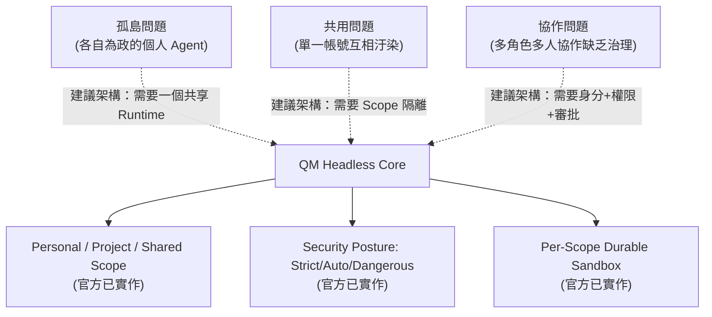

QM 官方 README 的解法是：每位員工與每個「room」（頻道/專案）都各自擁有獨立 Scope 的 memory、files、credential 檢視範圍（keychain view）、permissions、crons、web apps 與 durable sandbox（官方已實作）。這代表 QM 不是「一個大家共用的 Agent」，而是「每個人與每個協作空間都有一個屬於自己的、隔離的 Agent 工作環境，同時可以在共享頻道/專案中協作」（官方已實作，README 定位延伸）。

### 3.3 簡短比較：QM 與其他相鄰工具的定位差異

| 工具類型 | 代表 | 解決的問題層級 |
|---|---|---|
| Agent Harness / Runtime | **QM** | 身分、Scope、Sandbox、多人協作、企業治理 |
| Coding Agent | Claude Code、Codex、Pi、OpenCode | 單次任務內，如何理解程式碼、呼叫工具、產生變更 |
| Agent 應用開發框架 | LangChain、LangGraph | 如何組裝 LLM 呼叫鏈、工具呼叫邏輯 |
| Multi-Agent 編排框架 | CrewAI | 如何定義多個 Agent 角色互相溝通的工作流程 |

QM 與這些工具**不是互斥關係**：QM 透過 Harness Abstraction 呼叫 Claude Code 等 Coding Agent 來實際執行工作（官方已實作，見第7章），第46章會有更完整的比較表。

### Scenario：三個月後的維運視角

一家導入 QM 三個月的新創公司，工程副總在回顧會議上這樣描述價值：「以前每個工程師的 Claude Code 是自己電腦上的黑盒子，離職交接時記憶跟設定都帶走了。現在專案的 Agent Scope 留在 QM 裡，新人接手時，Project Scope 的 Memory、Skills、Files 都還在，Slack 頻道裡的協作記錄也是治理稽核的一部分。」（Scenario 為教學示範用途之虛構情境，用以說明 Scope 持久化與交接的價值主張，非官方案例）。

### 3.4 AI Prompt 範例

```text
角色：你是企業 AI 導入顧問。
任務：根據 QM 的 Scope（Personal/Project/Shared）與 Security Posture 機制，
     幫我寫一段 200 字的內部說服文案，說明為什麼「每人自己裝 Coding Agent」
     不足以應付多人協作與稽核需求。
限制：不要誇大官方未證實的功能，凡涉及 QM 具體機制需標示信心層級。
```

### 3.5 本章 Checklist 與小結

- [ ] 已能說明企業導入 AI Agent 常見的三個困境（孤島／共用／協作）。
- [ ] 已理解 QM 用 Scope + Security Posture + Sandbox 三者組合回應這些困境。
- [ ] 已釐清 QM 與 Coding Agent、Agent 應用框架的分工關係，不會混為一談。

---

## 4. QM 核心概念

### 4.1 五個必須先理解的核心名詞

| 名詞 | 一句話定義 | Provenance |
|---|---|---|
| Scope | Agent 工作與資料隔離的基本單位（Personal／Project／Shared） | 官方已實作，見第6章 |
| Harness | 實際執行任務的 Coding Agent（Pi／OpenCode／Codex／Claude Code） | 官方已實作，見第7章 |
| Sandbox | 每個 Scope 專屬的持久化執行環境（檔案、工具、憑證、Runtime） | 官方已實作，見第8章 |
| Security Posture | 控制 Tool Call 是否需要人工核准、資料是否篩檢的姿態（Strict／Auto／Dangerous） | 官方已實作，見第11章 |
| Skill | 可重用的 Agent 工作流程能力封裝，非單純 Prompt Template | 官方已實作（`skills-seed/` 目錄存在），見第10章 |

### 4.2 這五個概念如何組合成一次任務執行

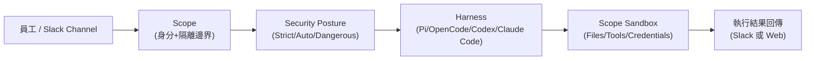

> 圖表節點標籤修正提醒：正式收錄於正文時，所有含括號節點標籤已依 Mermaid 慣例以雙引號包住（見上方符號約定）。

### 4.3 為什麼這五個概念缺一不可

- 沒有 **Scope**：Agent 記憶與檔案會互相汙染，無法做到「這個 Agent 只碰這個專案」。
- 沒有 **Harness Abstraction**：企業被綁死在單一 Coding Agent 供應商，無法因應模型/工具演進（見第7章 Vendor Independence 討論）。
- 沒有 **Sandbox**：每次任務都要重新設定執行環境，無法累積已安裝工具與專案脈絡。
- 沒有 **Security Posture** 分級：企業無法依風險等級（例如 Production 維運 vs. 一般開發）調整人工核准密度。
- 沒有 **Skill**：每次任務都要重新教 Agent 怎麼做一件重複性工作，無法沉澱組織知識。

### 4.4 AI Prompt 範例

```text
角色：你是負責向團隊做 QM 教育訓練的 Tech Lead。
任務：用一張表格，把 Scope／Harness／Sandbox／Security Posture／Skill
     這五個概念，對應到團隊每天實際會遇到的具體情境各一則。
限制：情境必須具體到「誰、在哪個 Scope、做什麼任務」的程度，不要空泛描述。
```

### 4.5 本章 Checklist 與小結

- [ ] 已能不看手冊，自行說出 Scope／Harness／Sandbox／Security Posture／Skill 五個核心概念。
- [ ] 已理解這五個概念是如何在一次任務執行中依序作用的。
- [ ] 已準備好進入第5章，理解這五個概念在整體架構中的確切位置。

---

## 5. QM Architecture

### 5.1 架構總覽：README 概念用語 vs 原始碼實際模組

QM README 以敘述性語言描述架構為：**Postgres 持久層（sessions・memory・queue）+ Headless core（API／identity／policy／scheduler／agent loop）+ per-scope sandbox + 選用 plugins（Web UI、admin panel、public portal、Slack）**（官方已實作）。但實際查看 `src/` 目錄的頂層子目錄清單後，會發現這些敘述性名詞與原始碼模組名稱**並非逐一對應**，本手冊在此誠實揭露這個落差，避免讀者對照原始碼時感到混亂：

| README 敘述用語 | 原始碼實際對應 | 落差說明 |
|---|---|---|
| Headless Core | 沒有名為 `headless-core` 的目錄；`src/core/`（含 `orchestrator/`、`turn-*.ts` 等）承擔 agent turn 處理邏輯 | README 用語是產品層敘述，非目錄名稱（Source-confirmed） |
| Identity | `src/identity/` | 目錄名稱與敘述一致（Source-confirmed） |
| Policy | `src/policy/` | 目錄名稱與敘述一致（Source-confirmed） |
| Session | `src/sessions/`（複數形） | 目錄名稱與敘述一致，僅單複數用法不同（Source-confirmed） |
| Scheduler | 沒有名為 `scheduler` 的目錄；`src/cron/` 承擔排程概念 | README 用語是產品層敘述，程式碼模組名為 `cron`（Source-confirmed） |
| Queue | 未見獨立同名模組目錄 | 僅 README 文字提及 Postgres 儲存 queue，目錄層級未見對應資料夾（官方目前沒有找到足夠資料確認其獨立模組化程度） |
| Memory | `src/memory/` | 目錄名稱與敘述一致（Source-confirmed） |
| Sandbox | `src/sandbox/` | 目錄名稱與敘述一致（Source-confirmed） |
| Slack Plugin | 不在 `plugins/` 下，實際位於 `src/slack/`（37 個檔案＋README.md＋manifest.json） | **重要落差**，見第16章（Source-confirmed） |

`src/` 完整頂層子目錄清單（Source-confirmed）：`acl, admin, api, audit, auth, classify, connectors, core, credentials, cron, delivery, deploy, deployment, directory, environments, files, harness, idempotency, identity, insights, mcp, memory, model, monitors, onboarding, persistence, policy, processes, projects, ratelimit, reach, resolution, runs, sandbox, security, sessions, skills, slack, surface-cache, surfaces, tasks, tools, triggers, util, wake, webhooks, workspace`。頂層檔案：`config.ts, egress-authz-main.ts, index.ts, types.ts, wiring.ts`。

`plugins/` 目錄實際內容（Source-confirmed）：`admin, auth, chassis, onboarding, portal, web-ui`（**不含 slack**）。

**補充查證（2026-08-21）**：官方 README 目前的架構敘述新增了兩個值得注意的細節（官方已實作）：(1) Agent 的工具介面是「small, fixed tool surface」，其中一個工具即為 `execute`，專門在 Scope 自己的隔離 Sandbox 中執行指令；(2) Sandbox 被描述為「files · tools · logged-in services」，即 Sandbox 內不只放檔案與工具，也包含已登入狀態的外部服務連線（例如已授權的 CLI 工具或連接器 session），這呼應第8章 Durable Sandbox「安裝過的工具維持已安裝狀態」的說法，但進一步點出「已登入狀態」也會被保留，企業導入時應將這視為 Credential／Session 生命週期治理的一部分。另外值得注意：README 官方架構圖（Mermaid）本身的節點文字仍寫著「Agent loop (Pi, OpenCode, Claude Code)」，只列出三種，與同一份 README 前段「Pi, OpenCode, Codex, and Claude Code」的文字敘述**不一致**——這是官方文件本身圖與文尚未同步更新的落差（Source-confirmed，查證時原始 Mermaid 原始碼如此），本手冊採信文字敘述＋原始碼雙重佐證（見第7章），將 Codex 一併畫入下圖。

### 5.2 整體架構圖

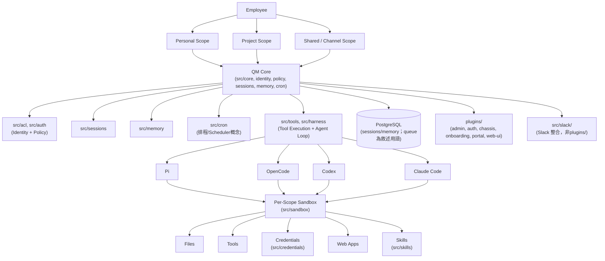

### 5.3 二十一個責任元件速覽

| 元件 | 責任 | Provenance |
|---|---|---|
| Headless Core（產品敘述） | 承載 API、identity、policy、scheduler、agent loop 的中樞邏輯，原始碼對應 `src/core/` | 官方已實作＋Source-confirmed |
| API | Fastify 為主要 Web 框架 | 官方已實作 |
| Identity | 使用者/Agent 身分辨識，`src/identity/` | Source-confirmed |
| Policy | 權限與規則判斷，`src/policy/` | Source-confirmed |
| Agent Loop | 由 `src/core/orchestrator`、`turn-*.ts` 系列檔案承擔 | Source-confirmed |
| Harness abstraction | `src/harness/` 目錄，解耦 Core 與具體 Coding Agent | Source-confirmed，見第7章 |
| Session | `src/sessions/` | Source-confirmed |
| Memory | `src/memory/` | Source-confirmed |
| Queue | README 文字提及，未見獨立目錄 | 官方目前沒有找到足夠資料確認此功能之獨立模組化程度 |
| Scheduler | 產品敘述用語，程式碼對應 `src/cron/` | Source-confirmed |
| Sandbox | `src/sandbox/` | Source-confirmed |
| Scope | 貫穿多個模組的隔離邊界概念，非單一目錄 | 官方已實作，見第6章 |
| Skill | `src/skills/`，種子內容在 `skills-seed/` | Source-confirmed |
| Credential | `src/credentials/` | Source-confirmed |
| Tool | `src/tools/` | Source-confirmed |
| Web App | Scope 內可執行的自訂 Web 應用（產品層功能） | 官方已實作，README |
| Slack Plugin | 實際為 `src/slack/`，非 `plugins/slack` | Source-confirmed（見5.1節落差說明） |
| Web UI | `plugins/web-ui/` | Source-confirmed |
| Admin UI | `plugins/admin/` | Source-confirmed |
| Portal | `plugins/portal/`（public portal） | Source-confirmed |
| PostgreSQL | 唯一持久層，儲存 sessions／memory（queue 部分見上方落差說明） | 官方已實作 |

### 5.4 資料流向：一次典型任務的端到端路徑

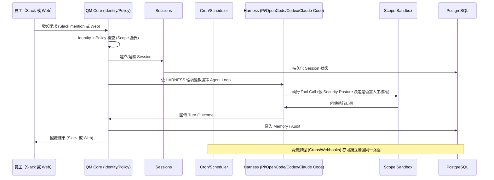

### 5.5 可替換性與 Extension Point

- **Harness 層可替換**：透過 `src/harness/` 的抽象層，理論上可加入新的 Coding Agent 整合（官方已實作 Pi/OpenCode/Codex/Claude Code 四種，新增其他 Harness 屬於官方或社群可能的擴充方向，建議架構）。
- **儲存後端目前僅 PostgreSQL**：README 與原始碼皆未提及可替換的其他資料庫後端（官方目前沒有找到足夠資料確認其他儲存後端支援）。
- **部署 target 可替換**：Docker／Fly／AWS 三種（官方已實作，見第13-16章）。
- **Slack／Web 為兩個獨立 Surface**：可個別啟用/停用（官方已實作）。

### Scenario：架構師的第一次程式碼走查

一位 Solution Architect 在評估 QM 時，第一步不是看架構圖，而是直接 clone repository 並列出 `src/` 目錄。他發現 README 講的「Headless Core」在程式碼裡找不到同名資料夾，一度懷疑架構圖是否過時。後來確認這是「產品敘述用語」與「程式碼模組名稱」的正常落差（許多開源專案都有這種現象），而非文件錯誤，於是改用本手冊 5.1 節的對照表，作為向團隊解說架構時的「翻譯層」（Scenario 為教學示範用途）。

### 5.6 AI Prompt 範例

```text
角色：你是正在初次審視 QM 原始碼的資深架構師。
任務：列出 src/ 目錄下的頂層子目錄清單，並將每一個目錄名稱與 README 中
     描述的敘述性架構元件（Headless Core/Identity/Policy/Scheduler等）做對照，
     標出「名稱一致」與「僅概念對應、名稱不同」兩類。
限制：找不到對應目錄時，明確寫「未找到對應模組」，不要臆測其存在。
```

### 5.7 本章 Checklist 與小結

- [ ] 已理解 README 的敘述性架構用語與 `src/` 實際目錄名稱之間的落差，尤其是 Headless Core／Scheduler／Queue 三者。
- [ ] 已確認 Slack 整合實際位於 `src/slack/`，而非 `plugins/` 目錄。
- [ ] 已能畫出「員工 → Scope → Core → Harness → Sandbox → PostgreSQL」的資料流向圖，並向團隊解釋每一段的責任邊界。
- [ ] 已知道「Queue」在原始碼層級的獨立模組化程度目前無法確認，導入前應自行查證當前版本的實作方式。

---

## 6. Scope

### 6.1 四層解釋法

**Level 1（一句話）**：Scope 是 QM 裡 AI 工作隔離與協作的基本單位——**AI Agent 真正的隔離邊界不是「使用者」，而是「Scope」**（官方已實作，README 定位延伸）。

**Level 2（初學者）**：想像公司裡每個人都有一個「個人抽屜」（Personal Scope），每個專案都有一個「專案櫃子」（Project Scope），每個 Slack 頻道都有一個「公用會議室」（Shared/Channel Scope）。放進抽屜的東西別人看不到；放進專案櫃子的東西，只有這個專案的成員看得到；放進公用會議室的東西，頻道裡的每個人（跟受邀的 Agent）都看得到。QM 的 Memory、Files、Credential 檢視範圍、Permissions、Crons、Web Apps 都是按照這個「抽屜/櫃子/會議室」的邏輯隔離的（官方已實作，README：Scope 擁有各自的 memory、files、keychain view、permissions、crons、web apps、durable sandbox）。

**Level 3（Developer）**：實作上，Scope 貫穿 `src/identity/`、`src/policy/`、`src/acl/`、`src/sessions/`、`src/memory/`、`src/sandbox/`、`src/credentials/`、`src/skills/` 等多個模組（Source-confirmed，見第5章）——它不是單一個目錄，而是一個貫穿全系統的「隔離邊界」概念，每個模組在存取資料時都要先通過 Scope 的身分與權限檢查。

**Level 4（Architect）**：Scope 的設計權衡在於：

- **Security**：Scope 邊界是 Prompt Injection、資料外洩防護的第一道防線（見第11章 SECURITY.md 的 Trust Model，org admin 屬於「privileged content readers」，代表即使是管理員，存取其他人 Scope 內容也有稽核但非逐次同意的特殊定位）。
- **Isolation**：Personal/Project/Shared 三種 Scope 類型提供不同粒度的隔離，但也代表企業需要自行設計「誰的哪些工作該放在哪種 Scope」的治理規則（建議架構，官方未提供治理範本）。
- **Scalability**：Scope 數量會隨員工數 × 專案數 × 頻道數增長，Sandbox 與 Memory 的儲存/運算成本需要納入第34章成本管理考量。
- **Governance**：Scope 本身不等於權限治理的全部，仍需搭配 Policy、ACL、Credential 管理（見第25章）才能構成完整的企業安全治理。

### 6.2 三種 Scope 類型

| Scope 類型 | 對應情境 | 隔離範圍 |
|---|---|---|
| Personal Scope | 員工個人的日常 AI 助理工作 | 僅該員工可見 |
| Project Scope | 特定專案的 Coding Agent 工作空間 | 該專案成員（含被授權的 Agent）可見 |
| Shared / Channel Scope | Slack 頻道等共享協作空間 | 頻道成員與受邀 Agent 可見 |

### 6.3 企業案例：Scope 隔離示意

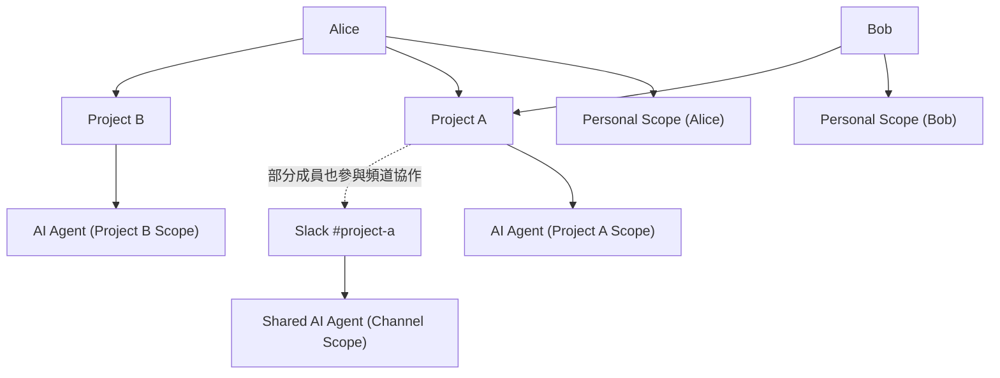

上圖對應原 Prompt 要求的企業情境：Alice 有個人 Scope、參與 Project A 與 Project B（各自獨立的 Agent Scope）；Bob 有個人 Scope、也參與 Project A；Slack `#project-a` 頻道有自己的 Shared Agent Scope，與 Project A 的 Scope 是不同層級的隔離單位（建議架構，依官方 Scope 概念延伸繪製之整合視圖）。

### 6.4 Scoped 資源清單

Scope 所隔離的資源類型（官方已實作，README 定位）：Memory、Files、Credentials（keychain view）、Permissions、Crons、Web Apps、Sandbox。Skill 的 Scope 歸屬與跨 Scope 分享機制見第10章。

### 6.5 為什麼「隔離單位是 Scope，不是 User」

一位使用者（例如 Alice）可能同時是 Personal Scope 的擁有者、Project A 的成員、Project B 的成員、以及 Slack `#project-a` 頻道的成員——她在不同 Scope 下看到的 Memory、Files、Agent 記憶完全不同。如果系統的隔離單位是「User」而不是「Scope」，Alice 在 Project A 中與 Agent 討論的機敏內容，就可能被同一個 Agent 帶進 Project B 的對話脈絡中，造成跨專案資料汙染。這正是 QM 選擇以 Scope（而非 User）作為隔離邊界的核心理由（建議架構，依官方 Scope 定位延伸推論）。

### Scenario：新人 Onboarding 與離職交接

新人加入 Project A 時，管理員將其加入 Project A 的 Scope，新人立即可以看到該 Scope 既有的 Memory、Files、Skills（若已授權分享，見第10章），不需要重新「教」Agent 一次專案脈絡。反之，員工離職時，只需將其移出各 Scope 的成員清單，Project/Shared Scope 本身的資料與 Agent 工作環境完整保留給團隊其他成員繼續使用，不會因為單一員工離職而遺失（建議架構，依 Scope 隔離模型合理推論其交接情境）。

### 6.6 AI Prompt 範例

```text
角色：你是負責設計公司 QM Scope 治理規則的 SA。
任務：針對「一位員工同時屬於 2 個 Project Scope + 1 個 Personal Scope」
     的情境，設計一份「什麼類型的資訊該放進哪個 Scope」的判斷準則，
     至少涵蓋：客戶機敏資料、程式碼、個人待辦、跨專案共用的技術筆記。
限制：明確標示這是企業治理建議，非 QM 官方規則。
```

### 6.7 本章 Checklist 與小結

- [ ] 已能用四層解釋法（一句話/初學者/Developer/Architect）向不同對象解釋 Scope。
- [ ] 已理解 Personal／Project／Shared 三種 Scope 的隔離範圍差異。
- [ ] 已理解「AI Agent 的真正隔離單位是 Scope，不是 User」這個核心設計理念。
- [ ] 已準備好在導入專案中設計「哪些資訊該放進哪個 Scope」的企業治理規則（見第38章企業治理）。

---

## 7. Agent Harness

### 7.1 為什麼 QM 不綁定單一 AI Agent Framework

QM Core 與 Agent Harness 之間透過 abstraction／interface 解耦（官方已實作，`src/harness/` 目錄存在即為此抽象層之佐證，Source-confirmed）。這代表 QM 本身不「內建」一套 Coding Agent 邏輯，而是把「怎麼理解程式碼、怎麼呼叫工具、怎麼產生變更」這件事委派給可替換的 Harness。

### 7.2 官方目前確認的四種 Harness

| Harness | 定位 | 適合工作 | Provenance |
|---|---|---|---|
| Pi | Agent toolkit／coding agent，`.env.example` 之 `HARNESS` 預設值 | Coding | 官方已實作 |
| OpenCode | Open-source coding agent | Coding | 官方已實作 |
| Codex | OpenAI 之 coding agent，`src/harness/codex-harness.ts`／`codex-app-server.ts`、`package.json` 之 `@openai/codex` 相依套件均可查證 | Coding | 官方已實作，README＋Source-confirmed |
| Claude Code | Coding agent，`@anthropic-ai/claude-agent-sdk` 為其底層相依套件 | Coding／Repository work | 官方已實作 |

官方 README 原文：「Pick your own harness and model and switch between them — Pi, OpenCode, Codex, and Claude Code all drive the same core, so a deployment isn't tied to any single vendor.」本 Repository 對這四者皆有獨立教學手冊可作背景補充：[Pi Code Agent 教學手冊](Pi%20Code%20Agent%20教學手冊.md)、[opencode 生態系教學手冊](opencode%20生態系教學手冊.md)、[OpenAI Codex生態系教學手冊](OpenAI%20Codex生態系教學手冊.md)、[Claude Code生態圈教學手冊](Claude%20Code生態圈教學手冊.md)。

### 7.3 查證歷程紀錄：Codex 從「未確認」到「官方第四種 Harness」

本節刻意保留查證歷程，作為「QM 為高速迭代年輕專案」的具體教材，而不僅是修正一筆錯誤：

- **舊查證結果（本手冊較早版本）**：當時僅能從官方 README 查得 Pi、OpenCode、Claude Code 三種 harness，`.env.example` 的 `HARNESS` 環境變數也只示範預設值 `pi`，未列出完整合法列舉值；因此當時將 Codex 標記為「官方目前沒有找到足夠資料確認」，並明確指出這與部分第三方技術媒體「QM 支援 4 種 harness」的說法不一致。
- **本次查證結果（2026-08-21）**：官方 README 已改寫為明確列出 Pi、OpenCode、Codex、Claude Code 四種 harness；同時原始碼 `src/harness/` 目錄下可查得 `codex-harness.ts` 與 `codex-app-server.ts` 兩支對應檔案，根目錄 `package.json` 的 `dependencies` 也新增 `@openai/codex` 套件——三方（README 敘述、原始碼檔案、相依套件宣告）互相印證，Codex 應視為**官方已實作**的第四種執行期 Harness。
- **方法論教訓**：`AGENTS.md`（`CLAUDE.md` 為其 symlink）中提及 Claude Code／Codex／Cursor／Pi／OpenCode 五種工具，描述的仍是「開發 QM 這個專案原始碼時，各家 AI coding assistant 共用同一份開發規範」，這件事本身**沒有改變**——它與「QM 執行期可選的 Agent Harness 清單」在概念上依然是兩個獨立的清單，只是這次查證後兩份清單的交集擴大到四個工具名稱重疊（Cursor 仍只出現在開發治理文件，不是執行期 Harness）。

企業導入前，務必直接查詢當下安裝版本的官方 README、`package.json`、`src/harness/` 目錄，或 `HARNESS` 環境變數的實際合法列舉值（例如原始碼中的型別定義檔），不應假設任何一份文件（包含本手冊）在你導入當下仍完全準確。

### 7.4 Harness Abstraction 對企業的價值

| 價值 | 說明 |
|---|---|
| Vendor Independence | 不綁定單一 AI 供應商，可因應各家 Coding Agent 的授權/定價變化調整（建議架構） |
| Model Independence | Harness 底層呼叫的模型可能隨 Harness 本身設定調整，不需重寫 QM Core 邏輯（建議架構） |
| Harness Independence | 新的 Coding Agent 出現時，理論上僅需擴充 `src/harness/` 對應的整合層（建議架構） |
| Migration | 企業可視情況從一種 Harness 遷移到另一種，而不需重新設計 Scope／Security Posture 等治理層（建議架構） |
| Cost Optimization | 依任務複雜度選用不同 Harness／模型組合，降低整體 Token 成本（建議架構） |
| Future-proof Architecture | Core 與 Harness 解耦，降低企業被單一 AI 供應商鎖定的風險（建議架構） |

### 7.5 架構圖：QM 與各 Coding Agent 的關係

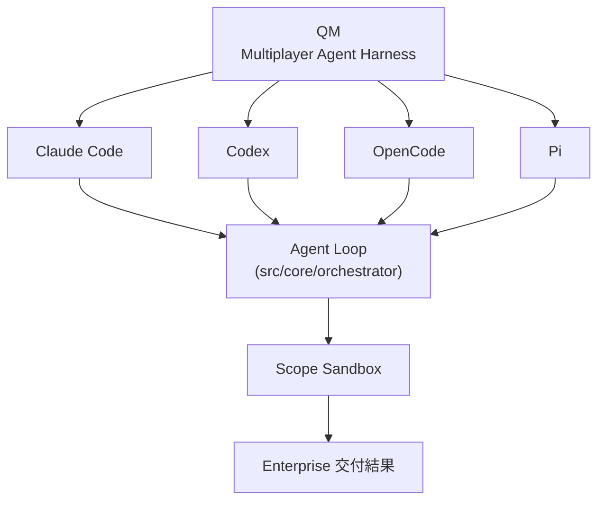

> 四個 Harness 節點均以實線連接，代表均已由官方 README、`package.json` 相依套件與 `src/harness/` 原始碼三方源頭確認（官方已實作）。QM 是協作與運行環境，不等於其中任何一個 Coding Agent 本身；企業導入時仍應以當下安裝版本重新核對這份清單是否有新增或變動。

### Scenario：企業評估是否可以「換掉」Coding Agent

某企業原先在 QM 上使用 Claude Code 作為主要 Harness，因應內部政策變化想評估改用 OpenCode 或 Codex。由於 QM 的 Scope、Security Posture、Sandbox 治理層與 Harness 選擇解耦，理論上企業只需調整 `HARNESS` 環境變數，而不需重新設計整個 Scope 與權限治理架構（建議架構，依 Harness Abstraction 設計原則推論；實際遷移仍需驗證任務品質與工具相容性，不代表零成本切換）。

### 7.6 AI Prompt 範例

```text
角色：你是負責 QM Harness 選型的 Tech Lead。
任務：比較 Pi/OpenCode/Codex/Claude Code 四種官方已確認的 Harness，
     列出各自的定位、成本考量與適合的工作類型。
限制：導入前請重新查詢當下安裝版本的官方 README、package.json、
     src/harness/ 目錄，確認這份清單在你導入當下是否仍然準確，
     不要假設本手冊列出的清單永遠有效。
```

### 7.7 本章 Checklist 與小結

- [ ] 已理解 QM 官方（2026-08-21 查證時）確認 Pi、OpenCode、Codex、Claude Code 四種執行期 Harness，且此清單過去曾經變動過。
- [ ] 已清楚分辨 AGENTS.md 中五種工具清單（開發 QM 專案用）與執行期 Harness 清單（用 QM 的人用）是兩件不同的事，即使兩份清單的交集已擴大。
- [ ] 已理解 Harness Abstraction 為企業帶來的 Vendor/Model/Harness Independence 價值。
- [ ] 導入前已規劃好如何實際查證當前安裝版本的 `HARNESS` 合法值列舉，而非沿用任何一份文件的既有清單。

---

## 8. Sandbox

### 8.1 四層解釋法

**Level 1**：Sandbox 是每個 Scope 專屬的持久化執行環境，Agent 在其中操作檔案、呼叫工具、執行指令（官方已實作，README：per-scope durable sandbox）。

**Level 2（初學者）**：把 Sandbox 想成「這個 Scope 專用的一台電腦」——裡面已經裝好這個專案需要的 git、npm、Maven 等工具，Agent 每次執行任務時都在這台「專用電腦」裡工作，不會影響到其他 Scope 的環境，下次任務也不需要重新安裝一次工具。

**Level 3（Developer）**：對應原始碼中的 `src/sandbox/` 模組（Source-confirmed）。部署目錄結構（`docs/deploy-directory.md`）中定義的 `sandbox/` 資料夾包含 `Dockerfile`（optional）、`tools/<id>/tool.json` 與對應 binary、`skills/<id>/SKILL.md` 與相關素材（官方已實作），這些是組成一個 Scope Sandbox 映像的具體素材。

**Level 4（Architect）**：

- **Security**：Sandbox 是 Trust Boundary 的具體落地——依 SECURITY.md，sandbox 憑證在程序使用期間以明文存在（已知限制，需搭配 Security Posture 分級管理，見第11章）。
- **Isolation**：每個 Scope 一個 Sandbox，降低跨 Scope 資料/工具汙染風險。
- **Scalability**：Sandbox 數量隨 Scope 數量增長，需納入運算/儲存成本規劃（見第34章）。
- **Governance**：`sandbox/tools/` 與 `sandbox/skills/` 的內容應納入企業變更管理流程，避免未經審查的工具/腳本被加入 Sandbox 映像。

### 8.2 Sandbox 內部組成

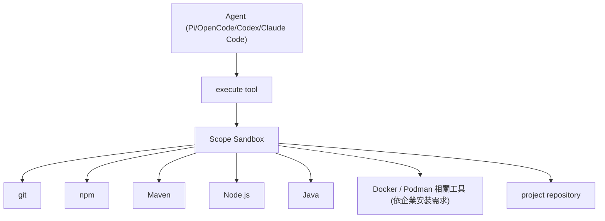

> 上圖之 Maven／Java／Docker/Podman 工具為企業導入 Java/Spring Boot 專案時「建議架構」下常見的 Sandbox 工具組合，非 QM 官方預先綁定的固定工具清單；QM 官方對 Sandbox 工具的定義來自 `sandbox/tools/<id>/tool.json`（官方已實作機制），實際安裝哪些工具由部署方自行決定。

### 8.3 Durable Sandbox 對 Coding Agent 的重要性

- **避免重複安裝**：Coding Agent 常需要 clone repository、安裝相依套件；Durable Sandbox 讓這些狀態在多次任務之間持續存在，不必每次從零開始（建議架構，依 durable sandbox 概念推論其效益）。
- **累積專案脈絡**：搭配 Memory（第9章）與 Skill（第10章），Sandbox 中累積的檔案與工具狀態，讓 Agent 在同一 Scope 內的後續任務可以延續前次工作成果。
- **Credential 生命週期**：Sandbox 內的 Credential 存在期間需要搭配 Security Posture 與 Command Policy 管理（見第11章），避免長期明文存在的憑證被濫用。

### 8.4 Sandbox 建置與發佈（CLI 對應）

依官方 `cli/README.md`，`qm sandbox` 指令支援 `build` 與 `publish` 子指令，用於本地驗證 Sandbox 映像與透過 OCI Registry 發佈（官方已實作）：

```bash
# 示意：本地建置 Sandbox 映像後以 dry-run 驗證,不實際推送
npm exec qm -- sandbox build --from <base-image> --tag <tag> --dry-run

# 示意：發佈 Sandbox 映像至指定 OCI Registry
npm exec qm -- sandbox publish --app <registry/repo> --tag <tag>
```

> 上方指令語法依官方 `cli/README.md` 之 `qm sandbox [build|publish]` 與 `--from`／`--tag`／`--dry-run`／`--app` 參數整理，實際參數組合請以當前安裝版本 `qm sandbox --help` 之輸出為準。

### Scenario：Java/Spring Boot 專案的 Sandbox 設定

某企業要用 QM 的 Project Scope 協助一個 Spring Boot 4.x 專案的開發，架構師在 `sandbox/tools/` 下準備了 Maven、指定版本的 JDK、以及專案私有 Maven Repository 的存取設定，並在 `sandbox/skills/` 放入「執行單元測試並產生覆蓋率報告」的 Skill。之後每次 Coding Agent 在這個 Project Scope 執行任務時，都能直接使用這些預先準備好的工具與 Skill，不需要每次任務都重新設定（建議架構，依 Sandbox 與 Deployment Directory Contract 組合推論之企業導入情境）。

### 8.5 AI Prompt 範例

```text
角色：你是負責準備 QM Sandbox 映像的 DevOps 工程師。
任務：針對一個 Java 25 + Spring Boot 4.x + Maven 的專案，
     列出應該放進 sandbox/tools/ 的工具清單與對應 tool.json 應包含的欄位。
限制：tool.json 的確切 schema 若無法從官方文件查證，
     需標示「請依當前版本 docs/deploy-directory.md 確認 tool.json 實際欄位」。
```

### 8.6 本章 Checklist 與小結

- [ ] 已理解每個 Scope 都有專屬的 Durable Sandbox。
- [ ] 已理解 Sandbox 素材（Dockerfile／tools／skills）在 Deployment Directory Contract 中的存放位置。
- [ ] 已知道 Sandbox 憑證在程序期間以明文存在（SECURITY.md 已知限制），需搭配 Security Posture 管理。
- [ ] 已理解 `qm sandbox build|publish` 指令的用途，並確認實際參數以當前版本 CLI 說明為準。

---

## 9. Memory

### 9.1 Memory 在 QM 中的角色

Memory 是 Scope 所隔離的資源之一（官方已實作，README 定位），對應原始碼 `src/memory/` 模組（Source-confirmed）。QM README 描述持久層為「Postgres：sessions・memory・queue」（官方已實作），代表 Memory 的持久化最終落在 PostgreSQL。

### 9.2 Memory 與 Scope 的關係

- Personal Scope 的 Memory：僅該員工可見的個人工作記憶。
- Project Scope 的 Memory：該專案成員（含受權 Agent）共享的專案脈絡記憶。
- Shared/Channel Scope 的 Memory：頻道協作過程中累積的共享記憶。

三者彼此隔離，不會互相汙染（官方已實作，Scope 隔離模型）。

### 9.3 Memory 的技術細節：誠實的研究缺口

關於 Memory 的具體儲存結構（例如是否有分層機制、向量化檢索、去重邏輯等實作細節），本手冊研究範圍內的 README、SECURITY.md、CLI 文件、`.env.example` 均未提供足夠細節（**官方目前沒有找到足夠資料確認此功能的具體實作方式**）。企業導入前若需要深入了解 Memory 的檢索/儲存機制，建議直接查閱當前安裝版本 `src/memory/` 目錄下的原始碼與相關文件，不應假設其實作方式與其他 Agent Memory 框架（例如本 Repository 另一份 [TencentDB-Agent-Memory 教學手冊](TencentDB-Agent-Memory%20教學手冊.md) 介紹的分層管線）相同。

### 9.4 架構位置示意

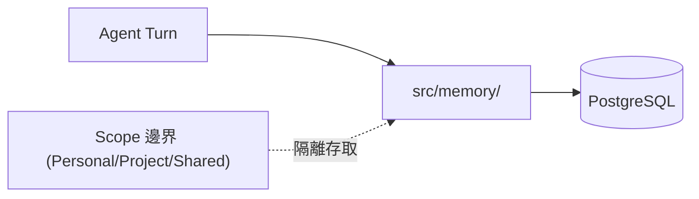

### Scenario：跨任務的脈絡延續

一位員工在 Personal Scope 中請 Agent 協助整理一週的待辦事項，隔天再次詢問「昨天提到的那件事後續怎麼處理」，Agent 能夠透過 Memory 找回前次對話脈絡，而不需要員工重新描述一次背景（建議架構，依 Memory 之持久化定位合理推論其使用者體驗，非官方逐字承諾的具體行為）。

### 9.5 AI Prompt 範例

```text
角色：你是負責評估 QM Memory 機制是否符合企業資料保留政策的合規顧問。
任務：列出企業在導入 QM 前，應該向技術團隊確認的 5 個關於 Memory
     儲存/保留/刪除機制的具體問題。
限制：不要假設 QM 有特定的資料保留天數設定或刪除 API，
     若官方文件未提及，應列為「需自行向部署團隊/原始碼確認」的問題。
```

### 9.6 本章 Checklist 與小結

- [ ] 已理解 Memory 是 Scope 隔離的資源之一，持久化於 PostgreSQL。
- [ ] 已誠實理解 Memory 的具體儲存/檢索實作細節目前官方文件未充分揭露，需自行查證原始碼。
- [ ] 已準備好向合規/法遵部門提出關於 Memory 資料保留政策的具體確認問題。

---

## 10. Skills

### 10.1 Skill 不是單純 Prompt Template

QM 的 Skill 系統是 Agent 執行工作流程的重要能力封裝，而不是單純的 Prompt Template（建議架構，依 `skills-seed/` 目錄實際存在多個結構化技能項目、以及 Deployment Directory Contract 中 `sandbox/skills/<id>/SKILL.md` 的存在推論其定位）。

### 10.2 `skills-seed/` 實際內容

官方 repository 的 `skills-seed/` 目錄下（Source-confirmed）實際包含以下技能種子：`admin, browse, cloud-cli, connect-apps, dropbox, email-draft-in-voice, email-voice-profile, github-gitlab, google-drive-sheets, google-workspace, interactive-login, linear, memory, morning-digest, popular-web-designs, publish, slack-drafts, taste-skill, use-shared-credential`。

從這份清單可以看出 Skill 涵蓋的範圍相當廣泛：連接外部服務（Google Workspace、Dropbox、GitHub/GitLab、Linear）、日常工作流程（晨間摘要 morning-digest、以特定語氣撰寫郵件草稿 email-draft-in-voice）、以及基礎設施操作（cloud-cli、interactive-login、use-shared-credential）。

### 10.3 Skill 的部署層存放位置

依 `docs/deploy-directory.md`（官方已實作），組織自訂 Skill 存放於 `sandbox/skills/<id>/SKILL.md` 及相關文字素材，隨 Sandbox 一起部署到各 Scope。

### 10.4 Enterprise Skill Governance（建議架構）

QM 官方目前沒有找到足夠資料確認一套內建的「Skill 審核晉升」治理流程（Personal→Project→Team→Admin Review→Organization 的分級授權機制）。以下為本手冊針對企業導入提出的**建議治理模型**，非官方功能：

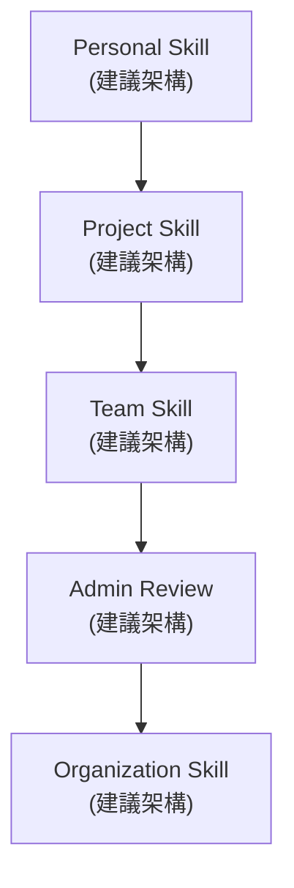

企業可參考此模型，自行建立 Skill 審核流程：個人在 Personal Scope 中試驗一個新 Skill → 驗證有效後提升到 Project Scope 供團隊共用 → 多專案驗證後提升到 Team 層級 → 由管理員審查內容安全性/正確性 → 最終晉升為組織級 Skill，供所有 Scope 引用（建議架構）。

### 10.5 Skill 與 Git Repository 的關係

依 `deploy/layers/README.md`（官方已實作），組織專屬的部署內容（含可能的 Skill 客製化）存放於私有 fork 的 `deploy/layers/<org>/`，並明確規定「Nothing under `deploy/layers/` may reach upstream qm」——代表企業自訂的 Skill 內容不會（也不應該）被提交回 QM 官方上游 Repository，這對於 Skill 治理有重要意涵：企業的 Skill 客製化是私有的、獨立於官方版本演進的（官方已實作）。

### Scenario：一個 Skill 從個人試驗到組織標配的旅程

一位工程師在 Personal Scope 中寫了一個「檢查 Pull Request 是否符合公司 Commit Message 規範」的 Skill 雛型，在自己的日常工作中驗證有效後，提交給 Project Tech Lead 審核，Tech Lead 認可後將其提升為 Project Skill，供整個專案團隊的 Coding Agent 使用。三個月後，另外兩個專案也反映有相同需求，架構師決定將其審查後提升為組織級 Skill（建議架構，示範企業可自建的 Skill 治理流程，非官方逐字保證的功能）。

### 10.6 AI Prompt 範例

```text
角色：你是負責建立公司 Skill 審核流程的 AI 平台團隊成員。
任務：設計一份「Skill 提升為組織級」的審核checklist，
     至少涵蓋安全性檢查、內容正確性驗證、與既有 Skill 的重複性檢查。
限制：明確標示這是企業建議治理流程，QM 官方目前未提供內建審核機制。
```

### 10.7 本章 Checklist 與小結

- [ ] 已理解 Skill 是能力封裝，而非單純 Prompt Template。
- [ ] 已知道官方 `skills-seed/` 提供的種子技能涵蓋範圍（雲端服務連接、日常工作流程、基礎設施操作）。
- [ ] 已理解企業自訂 Skill 存放於私有 fork 的 `deploy/layers/<org>/`，不會回饋至官方上游。
- [ ] 已準備好依建議的 Personal→Project→Team→Admin Review→Organization 治理模型，設計自己企業的 Skill 審核流程。

---

## 11. Security

### 11.1 三種 Security Posture

QM 提供三種 Security Posture，由環境變數 `HARNESS_SECURITY_POSTURE` 控制（官方已實作，預設值 `auto`）：

| Posture | 行為 | Provenance |
|---|---|---|
| **Strict** | 每次 Harness Tool Call 原則上需要 Human Approval | 官方已實作 |
| **Auto**（預設） | 外部資料與 Tool Result 經過 classifier／screening 機制後才提供給 Agent | 官方已實作 |
| **Dangerous** | 不進行內容 screening，也不在 Tool Call 之間暫停 | 官方已實作 |

**重要澄清**：Dangerous 並不代表所有 command 都完全沒有防護。依官方 `docs/deploy-directory.md`，部署方可設定一個外部「security screen proxy」，以 HTTPS POST 接收分段（chunk）內容並回傳 `score`／`threshold`／`primary_outcome`，並選擇 `shadow`（僅記錄比較結果，不影響判定）或 `enforce`（分數達門檻即強制轉為 Strict）兩種 rollout 模式（官方已實作）；未設定時 Auto 使用內建的 model classifier。此外，命令層級的既定政策（Predeclared Command Policy，例如遞迴刪除、破壞性 SQL 的核准規則與強制拒絕）在**任何 Posture（含 Dangerous）下都持續生效**（官方已實作，README）。企業切勿將 Dangerous 誤解為「完全無防護」。

### 11.2 SECURITY.md 核心內容（2026-08-21 依官方最新版重新整理）

QM 的 `SECURITY.md` 自我定位為「early, experimental software」：這是一份「當前安全模型的公開摘要」，明確聲明此摘要**並非詳盡無遺**，也不保證規劃中的控制措施一定會出貨（官方已實作）。截至本次查證，官方 `SECURITY.md` 的章節結構已比先前版本更完整，本節依最新結構重新整理：

#### Scope（信任邊界的作用範圍）

QM 的互動式 Agent 介面目前假設服務對象是「單一組織內已通過驗證的內部使用者」；訪客與外部使用者原則上在這個互動邊界之外，除非部署方明確以 admin 層級設定例外（例如 Slack 頻道中允許外部參與者的內部使用者互動）。**Published App 是刻意設計的另一個例外**：擁有者可以把一個 capability link 發送給組織外的訪客，但持有這個連結只授權存取「該 App」，並不會建立一個 QM 使用者身分，也不授權與 Agent 或控制平面互動。換言之，**QM 目前不是一個 hardened 的公開或多租戶服務邊界**（官方已實作，SECURITY.md 原文精神）。

#### Protected assets and actors（受保護資產與相關角色）

- **受保護資產**：憑證與 capability token、對話與模型請求資料、Memory、Files／Workspace、部署資料、稽核紀錄，以及對接系統中產生的 side effect。
- **相關角色**：internal users、org admins、deployment operators、model-driven agent、sandbox processes、surface plugins、model/browser providers、connected services。
- **安全目標**：防止跨 Scope 的未授權讀寫與外洩、讓憑證只停留在被授權的 Scope 內、對每個角色做身分驗證、保留歸屬與稽核證據。**QM 不保證模型輸出正確，也不保證持續可用性**（官方已實作，這是 SECURITY.md 明確劃出的「不保證」範圍，企業溝通時應避免誇大 QM 的能力邊界）。

#### Trust boundaries and operator assumptions（信任邊界與 Operator 假設）

| 角色 | 定位 |
|---|---|
| Deployment operator | 控制雲端帳號、網路、身分提供者、資料庫、物件儲存、執行期設定、加密金鑰與初始 admin 授權——**QM 無法防禦惡意或已被入侵的 operator** |
| Org admin | 是「privileged content reader」而不只是政策管理者；admin 的內容讀取行為經過 scope 授權且會被稽核，但**不需要額外的使用者逐次同意** |
| Model providers | 會接收到送給它們的 prompt 與請求資料；browser providers 會接收到瀏覽任務與流量，且瀏覽器對外流量走 provider 自己的網路——operator 必須自行評估這些 provider 的資料保留政策 |
| Agent 與其在 Sandbox 中執行的軟體 | **不被信任做授權決策**；Core 負責在其周圍強制執行身分、Scope、授權與確定性的 effect gate。Sandbox 仍是敏感邊界，因為它執行模型產生的指令，且可能持有可用的憑證 |
| Surface／Connector 輸入 | 屬於不受信任資料；身分驗證只能證明「來源或發起主體」，**不代表內容本身是安全的** |
| Published App 及其執行環境 | 是獨立的信任邊界；App 程式碼會接收訪客請求與資料，可能持有明確提供的 App 環境變數，也可能使用設定好的 per-app acting-as 存取權。QM 讓 App 拿不到作者的環境憑證，但**不審查 App 程式碼、也不保證 App 如何處理訪客資料** |

#### What the controls do and do not guarantee（控制措施的保證範圍）

QM 針對每個 turn 解析出一個 principal 與 Scope、分隔各 Scope 的工作空間、使用簽章過的 ingress／capability token、套用 grant 與 audience 檢查，並記錄安全相關動作。這些控制設計上用於**降低**跨 Scope 存取風險、讓行為可歸責——但**不是形式化的 non-interference 證明**，也不保證模型不會洩漏資料。Command Approval、內容篩檢、Egress 政策都屬於 Defense in Depth：實際效果取決於所選的 Posture、設定的規則、可用的 classifier 與 Sandbox 後端。稽核紀錄支援事後調查，**但不會阻止動作發生**。靜態加密只保護「儲存中」的密鑰資料，不保護程序正在使用中的明文憑證；一次核准只代表「當下人類基於當時資訊接受了這個顯示出來的動作」，不代表後續行為一定安全（官方已實作，SECURITY.md 原文精神，這段是本次查證新增且對企業溝通期望管理特別重要的段落）。

#### Deliberately portal-only actions（刻意只能在 Portal 執行的操作）

以下三項操作刻意排除在 Agent 可自我呼叫的 API 之外，即使 Web Portal 提供這些功能，也絕不透過 Agent 自我服務 API 開放——官方原文明確指出「這些是牆，不是能力落差，不應該被視為待補的 gap 而『修好』」（官方已實作）：

1. **Admin grant 變更**：只能在已驗證的 admin 自己操作 Portal 時發生。若 Agent 能改變 grant，一個被 Prompt Injection 或入侵的 Agent 程序就能提升自己 operator 的權限，或是降級所有其他人的權限。
2. **冒名（Impersonation）**：Agent 永遠以該次 turn 解析出的 principal 身分行動，沒有任何自我服務 API 路徑可以讓它「切換身分」，因為下游所有授權判斷都是依這個身分做的，一個可切換的身分會把「一次被混淆的 turn」變成「冒充另一個人的完整權限」。
3. **Command-approval 決策**：核准一個被攔截的指令，是核准者在自己那次 turn 上做出的人類判斷。若 Agent 能自己觸達核准路徑，等於把「人在迴圈中」這道閘門，收斂成單一模型的自我決策——而這正是這道閘門存在的目的。

這三者共通點：每一項都是「授權未來 Agent 行為」的決策，所以這個決策本身必須來自 Agent 之外。日後任何要求「功能對齊」的需求，都應該繞過這三道牆，而不是打通它們。

#### Known limitations（已知限制，2026-08-21 依最新版整理，較舊版更詳細）

- **Command Policy 可被繞過**：能分類 shell 文字並攔截常見的危險型態，但混淆、編碼、或「先寫檔案腳本再執行」可以規避它——這是防呆的減速丘，不是 Sandbox 邊界。
- **Browser 動作部分繞過核心閘門**：Browser Runner 內的動作不會重新進入 Command Policy 或人工核准，只依賴任務層級的同意與 Runner 自己的花費檢查；瀏覽器流量走 Browser Provider 的網路，不經過 QM 自己的 Egress Proxy。
- **Sandbox 憑證在使用期間是明文**：以環境變數或檔案形式具現化的憑證與 capability token，在該 Sandbox 內的程序都能讀取；Scope 隔離、稽核與短期效期能限制曝險範圍，但**無法阻止已被入侵的 Agent 程序濫用或外洩正在使用中的憑證**。
- **憑證用途不是強制執行的授權**（本次查證新增）：Core 只強制執行 grant 的擁有者、對象、一次性／常駐模式、效期、撤銷與稽核；憑證附帶的「用途說明」只是傳給模型的指示與稽核欄位，Core **不會**判斷後續指令是否真的符合這個用途。憑證一旦具現化到 Sandbox 中，用途文字就無法約束一個已被入侵的 Agent 程序如何使用它。
- **安全篩檢不完整且屬 heuristic**：Auto 只篩檢有標示 provenance 的支援型外部文字與支援型工具結果；指令與背景程序輸出、不透明或多模態結果、原始 webhook payload、以及「shadow 轉 enforce」切換期間的重放補救，都**未被完整涵蓋**。Classifier 核准不等於授權，也不能保證能抵禦 Prompt Injection。
- **Audience-floor 過濾有已知缺口**（本次查證新增）：Model context 中的項目尚未對每一筆已授權讀取都攜帶完整的來源標籤，因此混合權限的過濾並不完整；Slack 上的 ambient judge 路徑也還沒有對「主動 mention 的 turn」所用的完整 internal-only 檢查做重複檢驗。
- **Egress 執行是有條件的**（本次查證新增）：Force-through egress 依賴後端網路層的強制執行，Core 目前還沒有拒絕「對要求的政策而言太粗放」的每一種後端；部署期執行環境本身的 Egress 強制尚未建置。
- **Admin 可讀取敏感內容**：經 Scope 授權的 admin 可以直接讀取逐字稿、擷取到的 provider 請求、文件、Memory、Connector 與 Keychain metadata、被鏡射的訊息內容、ambient-judge 的輸入、使用者細節與 Skill 內容——這個讀取會被稽核，但**不是逐次徵得同意**。
- **持久化資料可能比使用者預期活得更久**（本次查證新增，對企業合規極重要）：當持久層啟用時，Session、Memory 與「精確的模型請求擷取」都會被保存，且請求擷取**預設就是開啟的**；檔案 Artifact 沒有過期機制，Artifact 汰除與去重位元組回收目前都**尚未實作**，代表 Artifact 與去重後的位元組可能無限期累積。
- **Published-app 的 capability 連結是 bearer 授權**：任何拿到連結的人都能存取該 App，不需要建立身分，連結也沒有綁定到「預期的接收者」；Gateway 會把 token 從網址列移除並放進一天效期的瀏覽器 Cookie，但**被複製出去的連結仍然可用**，App 的 ACL 變更也不會撤銷個別連結持有者的存取權。
- **Portal Session 有殘留風險**：簽章過的 Portal Session 預設 8 小時效期，且使用時會續期；登出只會清除瀏覽器 Cookie，**無法在效期到期前撤銷一個已經被複製出去的 Session Token**。
- **部分 model-provider 路徑繞過既定 Gateway**（本次查證新增）：Slack 上的 ambient judge 的模型呼叫尚未走 ModelGateway；OpenCode adapter 目前是直接把自己的 provider key 提供給受監督的 sidecar。
- **部分治理與資料遺失控制尚缺**（本次查證新增）：Standing instruction 的編輯還沒有統一受組織層下限或人工核准約束，治理變更也還沒有統一被版本化或可回復；provider 端的 token 撤銷與組織層級的 kill switch 尚未完整；檔案寫入時的密鑰掃描尚未實作。

#### Dependency cooldown（依賴套件冷卻期，本手冊舊版未涵蓋，本次查證新增）

為降低 npm 供應鏈攻擊（維護者帳號被入侵、發布惡意版本、數小時內被抓到並下架這類情境）的風險，QM 要求**新發布的套件版本必須「冷卻」滿 7 天**才能進入 lockfile，透過 `.npmrc` 中的 `min-release-age=7` 強制執行（需 npm ≥ 11.10.0，版本由 `.node-version` 釘選）（官方已實作）。這個冷卻期限制 `npm install`／`npm update`；CI 用 `npm ci` 從已提交的 lockfile 安裝，**不受此限制影響**。若有緊急安全修補需要提前引入，可以明確指定確切版本號安裝以跳過冷卻窗口。企業導入建議：私有 Fork 或部署目錄若自行加入相依套件，應比照同樣的冷卻紀律，而不是為了「趕快用上新版」而繞過這道供應鏈防線。

#### Supported versions（受支援版本）

安全修補只會套用在最新 release 與 `main` 分支；較舊的 release 可能需要先升級才能取得修補（官方已實作）。另外官方明確聲明：**公開的原始碼發佈必須從全新 export 開始**，直接把一個私有 Repository 既有的完整歷史發佈出來是明確不支援的做法——這點對第24章「私有 Fork 治理」中考慮要不要把私有 Fork 轉為公開時，是一個容易被忽略但重要的限制。

#### 弱點通報流程

使用 GitHub Repository 的「Security → Report a vulnerability」功能私下通報，並包含受影響版本、設定、影響範圍與最小可重現步驟，避免在公開 Issue 或 PR 中揭露 exploit 細節；且**不應存取不屬於自己的資料，也不應對非自己所有的部署進行測試**（官方已實作）。

### 11.3 Threat Model 總覽

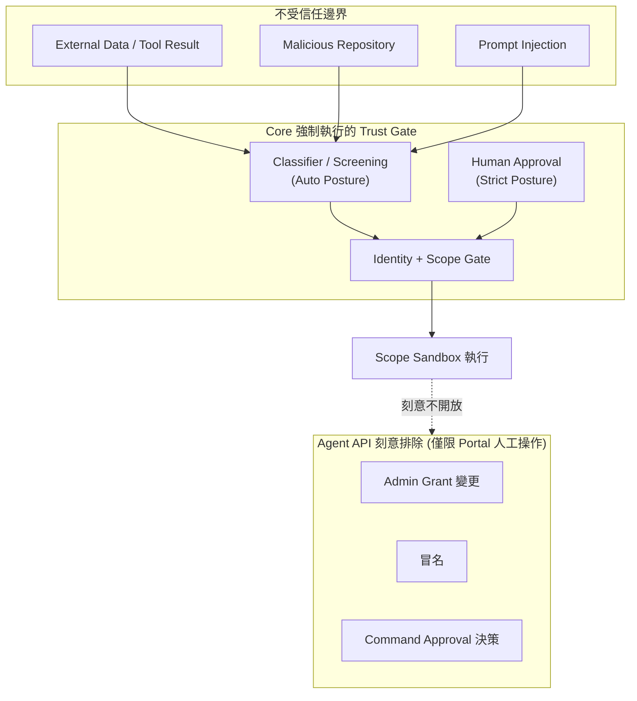

### 11.4 企業安全建議（建議架構）

- **不要長期使用 Dangerous Posture**：Dangerous 適合高度信任、風險可控的內部測試情境，Production 或涉及機敏資料的 Scope 建議搭配 Strict 或 Auto。
- **Sandbox 憑證生命週期管理**：由於憑證在程序期間明文存在，且「用途說明」不是強制執行的授權邊界，建議搭配 Credential 最小權限、短期效期與定期輪替策略（見第25章）。
- **Admin 讀取應搭配內部政策**：SECURITY.md 明確指出 admin 讀取「有稽核但非逐次同意」，企業應自行建立「何時允許 admin 讀取員工 Scope 內容」的內部規範（建議架構，官方僅提供稽核機制，未提供使用政策範本）。
- **Published-app bearer token 風險**：由於連結未與接收者身分綁定，且 App ACL 變更不會撤銷既有連結，企業應建立此類連結的分享、到期與撤銷管理規範，避免長期有效的連結外流。
- **資料保留政策必須企業自訂**（依「持久化資料可能比預期活得更久」之已知限制）：Session、Memory、模型請求擷取預設會持久保存，檔案 Artifact 沒有過期機制；企業應自訂資料保留期限、定期清理排程與去識別化政策，不能假設 QM 會自動幫忙做資料生命週期管理（見第30章 Backup／Recovery）。
- **供應鏈治理應延伸依賴套件冷卻期精神**：QM 核心對新版套件強制 7 天冷卻期（`min-release-age=7`），企業自建的 Sandbox 工具、Skill 或私有 Fork 額外引入的相依套件，建議比照同樣紀律，並在第31章升級 SOP 中納入這項檢查。
- **Portal Session 與其他 Provider Gateway 繞道應納入稽核範圍**：Portal Session 8 小時效期內若被複製即無法即時撤銷，OpenCode adapter 目前直接把 provider key 交給 sidecar 而非統一走 ModelGateway，這些都是稽核與紅隊演練時應主動測試的路徑，而非等官方文件提示才發現。

### Scenario：Strict Posture 用於維運任務

某企業將「可能觸及 Production 資料庫」的 Project Scope 設定為 Strict Posture，每次涉及資料庫查詢的 Tool Call 都需要值班工程師人工核准，而一般開發用的 Project Scope 則維持 Auto Posture，兼顧開發效率與 Production 環境的風險控管（建議架構，依三種 Posture 的行為差異合理設計之企業案例）。

### 11.5 AI Prompt 範例

```text
角色：你是企業資安架構師，正在為不同風險等級的 QM Scope 制定 Security Posture 政策。
任務：針對「一般開發 Scope」「觸及 Production 資料的 Scope」「對外公開 Web App 的 Scope」
     三種情境，各建議一種 Security Posture，並說明理由。
限制：Dangerous Posture 不可用於任何涉及機敏資料或 Production 存取的 Scope，
     並需說明其「仍有 command policy」但不做內容篩檢的特性。
```

### 11.6 本章 Checklist 與小結

- [ ] 已理解 Strict／Auto／Dangerous 三種 Security Posture 的行為差異。
- [ ] 已破除「Dangerous = 完全無防護」的誤解，理解其仍有 command policy 與可選的 security proxy 機制。
- [ ] 已理解 SECURITY.md 的 Trust Model：operator、org admin、agent/sandbox、model/browser provider 各自的信任邊界。
- [ ] 已知道 Admin Grant 變更、冒名、Command Approval 決策三項操作被刻意排除在 Agent API 之外。
- [ ] 已準備好依企業風險等級，為不同 Scope 指定合適的 Security Posture。

---

## 12. Installation

### 12.1 Prerequisites

| 項目 | 需求 | Provenance |
|---|---|---|
| Node.js | `>=24.15.0` | 官方已實作，package.json |
| npm | `>=11.10.0` | 官方已實作，package.json |
| Git | 需要（用於管理部署 repository 與私有 fork） | 官方已實作，AGENTS.md/部署文件 |
| Docker（含 Buildx） | 部署流程需要，用於建置 Sandbox/服務映像 | 官方已實作，部署文件 |
| openssl | 部署流程需要 | 官方已實作，部署文件 |
| Cloud Account | Fly.io 或 AWS 帳號（依 `--target` 選擇） | 官方已實作 |
| PostgreSQL | 持久層必要元件（部署流程會提供對應資源） | 官方已實作 |
| AI Model Provider API Key | 例如 `ANTHROPIC_API_KEY`／`OPENAI_API_KEY`／`OPENROUTER_API_KEY` | 官方已實作，`.env.example` |
| Slack App（若需要 Slack 整合） | 需要建立 Slack App 並設定對應 Token | 官方已實作，`.env.example` 有 `SLACK_BOT_TOKEN` 等變數 |

> 版本號請以你實際安裝版本的官方 `package.json`／`README.md` 再次確認，本表為查證時（2026-08-21）的官方資訊。

### 12.2 重要觀念：QM Source Repository 與 Deployment Repository 不是同一件事

- **QM Source Repository**（`github.com/yc-software/qm`）：QM 官方原始碼庫，包含 Core、Harness、Sandbox 等所有邏輯實作。
- **Deployment Repository**：透過 `qm init` 指令產生的、**組織專屬**的部署用 Repository，內含該組織的設定（`qm.config.jsonc`）、Sandbox 客製化、以及僅適用於該組織的基礎設施程式碼（Terraform，若使用 AWS）。

企業**不需要 clone 完整的 QM Source Repository 原始碼**即可部署 QM（官方已實作，`docs/getting-started.md`：組織可在不 clone 完整原始碼庫的情況下部署 QM）。`qm init` 會在你指定的目錄下（例如私有 fork 的 `deploy/layers/<org>/`）建立組織專屬客製化內容。

### 12.3 QM CLI 初始化

```bash
# 示意：初始化一個組織的部署目錄
# <slug> 請替換為你的組織識別碼，<fly-or-aws> 請替換為 fly 或 aws（或 docker）
npm exec --yes --package=@yc-software/qm@latest -- \
  qm init . --org <slug> --target <fly-or-aws>

npm install
```

> ⚠️ **修正提醒（2026-08-21 查證）**：本手冊較早版本曾在範例中加入 `--model-provider <provider>` 參數，但重新查證官方 `cli/README.md` 的 `init` 指令語法只有 `[dir] [--org id] [--target docker|fly|aws]` 兩個選項，**沒有 `--model-provider` 這個旗標**。Model provider 的選擇是在後續的 agent 導引流程（見12.5節）或 `qm.config.jsonc`／`.env` 設定中處理，而不是 `init` 指令本身的參數。企業導入前務必以當前安裝版本的 `qm init --help` 為準，不要照抄任何文件（含本手冊）中曾出現過的旗標。
>
> ⚠️ 注意：QM 原始碼庫根目錄 `package.json` 的 `name` 欄位是 `qm`，但實際發佈到 npm 供部署使用的套件名稱是 `@yc-software/qm`（官方已實作，cli 文件所述安裝流程與套件簽章/provenance attestation 機制）。這是常見的 monorepo 內部開發名稱與已發佈套件名稱不同的情況，執行安裝指令前請以上方指令為準，不要誤用 repo 內 `package.json` 的 `name` 欄位作為安裝套件名稱。

### 12.4 `qm init` 之後：組織會得到什麼

- 一個部署目錄（依 `docs/deploy-directory.md` 的 Deployment Directory Contract v1），內含：`package.json`／`package-lock.json`（固定 QM CLI 版本）、`qm.config.jsonc`（部署設定，不含任何機密值）、`deployment.md`（部署流程指標檔，指向完整流程於 `cli/templates/deployment/deployment.md`）、`.codex/skills/deploy-qm/`（materialize 出的 agent 可讀部署技能，供交給 agent 執行部署導引流程，見12.5節）、`.env.example`（僅記錄 secret 名稱與說明、無值）、`.env`（本機值，已加入 `.gitignore`）、`slack-app-manifest.yml`（選用的 Socket Mode Bot）／`slack-sso-manifest.yml`（僅當 Portal 設定使用 Slack OpenID 時才會產生）、`terraform.tfvars` 與 `infra/`（僅 `--target aws` 使用，`init` 之後這份 Terraform 拷貝即歸屬於該部署目錄自行維護）。
- `sandbox/` 目錄骨架，供組織後續填入 `Dockerfile`（optional，只要宣告的每個 binary 都已存在於各自的 tool 目錄中即可省略）、`tools/<id>/tool.json`＋binary、`skills/<id>/SKILL.md`＋素材。

核心原則（官方已實作，逐字引用）："the `qm` CLI is the only interpreter of that directory"——代表這個部署目錄的行為完全由你當時使用的 `qm` CLI 版本決定，即使不同 operator 電腦上安裝的 Node.js/npm 版本不同，只要 `qm` CLI 版本一致，行為就應該一致。

**Contract 版本化（官方已實作，`docs/deploy-directory.md`）**：`package.json` 釘選的是「這個部署目錄由哪個 CLI 版本產生／解讀」，`qm.config.jsonc` 中的 `contract: 1` 只是「相容性下限」，不等於實際 CLI 版本。`@yc-software/qm/contract` 這個 package export 是唯一對外承諾語意化版本（semver-stable）的可程式化介面，只包含設定載入／驗證、環境變數推導、Approval 編譯與 contract 版本本身；只要部署目錄的結構出現不相容變更，contract 主版本號就會遞增，次要版本內只會新增可選欄位。企業在規劃長期升級路徑（見第31章）時，應把這個 contract 版本號當成「部署目錄是否需要重新產生」的判斷依據，而不是只看 CLI 套件版本號。`qm init` **不會覆寫既有的部署設定**（即已存在 `qm.config.jsonc` 時不會重跑初始化）。

### 12.5 完整部署流程（2026-08-21 依 `docs/getting-started.md` 與 `docs/deploy-directory.md` 重新整理）

官方部署流程的權威版本在 `cli/templates/deployment/deployment.md`（`qm init` 會把它 materialize 到部署目錄的 `deployment.md`），但**流程的敘事邏輯**已在 `docs/getting-started.md` 中重新表述為「交給 Agent 執行」的導引流程，與本手冊較早版本描述的「七步驟」在**順序與強調重點**上有落差，本節依最新查證重新繪製（官方已實作）：

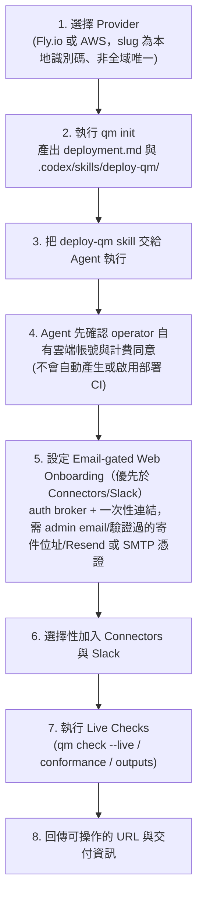

**與本手冊舊版「七步驟」的關鍵差異**：(1) Email-gated Web Onboarding（透過內建 `auth` broker 寄送一次性連結）是**優先於** Connectors／Slack 設定的步驟，而非放在管理員設定之後才處理；(2) 若要改用外部身分提供者取代內建 `auth` broker，需要從 `services` 設定中移除 `"auth"`，並讓該身分提供者註冊 `<publicUrl>/auth/callback` 這個精確的回呼網址（官方已實作，新增細節）；(3) `qm init` **不會**自動建立或啟用部署用 CI，QM 原始碼庫本身也沒有生產環境部署的 workflow——這代表「持續部署」是每個組織要自行建置的能力，不是開箱即有（官方已實作，容易被誤解的重點）。

```bash
# 示意：Live Checks 常用的驗證指令組合
npm exec qm -- check --live
npm exec qm -- conformance
npm exec qm -- outputs --json
```

```bash
# 示意：加入 Slack Bot 後刷新對應的 manifest
npm exec qm -- slack render
npm exec qm -- outputs
```

**標準指令閘門順序（官方已實作，`docs/deploy-directory.md`「Commands, conformance, and versioning」）**：`check` → `doctor` → 建置 Sandbox 映像（Docker/Fly 用 `sandbox publish`，AWS 用 `infra build-image`）→ `plan` → `up --yes` → `check --live`。`check` 是純靜態驗證（不需要網路連線），`doctor` 對外部前置條件做唯讀檢查，`plan` 只渲染部署結果不做任何變更；只有 `up --yes` 才會真正產生副作用。

### 12.6 CLI 指令完整參考（節錄自 `cli/README.md`）

| 指令 | 語法 | 主要參數 |
|---|---|---|
| init | `qm init [dir]` | `--org id`、`--target docker\|fly\|aws` |
| check | `qm check` | `--json`、`--live` |
| doctor | `qm doctor` | 無 |
| infra | `qm infra [render\|build-image\|delete-image\|delete-task-definitions]` | 子指令 |
| conformance | `qm conformance [dir]` | `--static` |
| plan | `qm plan` | 無 |
| up | `qm up` | `--yes`、`--build-from[=repo]`、`--image-label label` |
| slack | `qm slack render` | 子指令 |
| outputs | `qm outputs` | `--json` |
| proof | `qm proof scope-key <scope-id>` | 必要參數 |
| secrets | `qm secrets push` | `--from file` |
| status | `qm status` | 無 |
| logs | `qm logs [service]` | `-f`、`--tail n` |
| down | `qm down` | `--purge` |
| rollback | `qm rollback` | `--to revision-or-sha` |
| sandbox | `qm sandbox [build\|publish]` | `--from image`、`--tag tag`、`--dry-run`、`--app registry/repo` |

共同支援：`--config`、`--env-file`、`--sandbox-dir`。`--target` 合法值為 `docker`、`fly`、`aws` 三種（官方已實作）。CLI 本身的定位（官方已實作）："The CLI deploys long-running QM services; it is not the runtime."——也就是說，`qm` CLI 是部署工具，不是 QM 執行期本身。另有 `dev` 指令，但那是**貢獻者的 worktree 開發迴圈**，與這份「可攜式部署 contract」是分開的兩件事，不應與上表的部署指令混為一談（官方已實作）。

**發佈與供應鏈簽章（本手冊舊版未涵蓋，2026-08-21 新增，官方已實作）**：`@yc-software/qm` 套件發佈到 npm 時帶有 **npm provenance attestation**，證明它是由指定的建置 workflow 產生的。一次 release 對應 `main` 分支上一次 `.github/workflows/release.yml` 的手動觸發：簽署並推送第一方映像、發佈套件並釘住這些映像的 digest、然後打上 `v<version>` 標籤並建立 GitHub Release（附上解析後的 digest）。版本號來自 `cli/package.json`，CI 要求「只要這個檔案的版本號有變動就必須經過 PR」，且**已存在的 tag 會直接擋下這次 release，而不是覆蓋它**。部署目錄內建的映像清單只是一個 sentinel，實際部署時會被真正的 digest 覆寫。企業導入時可以把「npm provenance + digest 釘選 + 版本號變動需經 PR」這三件事，當作評估這個開源專案供應鏈治理成熟度的具體佐證（見第27章）。

### 12.7 標準初始化與驗證流程（示意，AWS 為例）

```bash
qm init . --org acme --target aws
npm install
npm exec qm -- check
npm exec qm -- plan
npm exec qm -- up --yes
```

> 上方為官方 CLI 文件所述之標準工作流程示意（`acme` 為官方文件範例組織代稱，非真實客戶名稱），實際指令參數請以當前版本 `qm --help` 為準。`check` 驗證設定但不需要網路連線；`doctor` 則用於驗證外部前置條件（Provenance：官方已實作）。

### Scenario：架構師的第一次 `qm init`

一位架構師依照 12.3 節指令執行 `qm init`，發現產生的目錄結構完全符合 `docs/deploy-directory.md` 所描述的 Deployment Directory Contract，於是放心地把這個目錄提交進企業內部的私有 Git fork，並依 AGENTS.md 的指引，確保組織專屬內容都限定在 `deploy/layers/<org>/` 之下，維持與 QM 官方上游的核心程式碼保持一致（Scenario 為教學示範用途，依官方文件實際流程整理）。

### 12.8 AI Prompt 範例

```text
角色：你是負責第一次導入 QM 的 DevOps 工程師。
任務：依照12.5節的部署流程（選擇 Provider → qm init → 交給 Agent →
     確認帳號與計費 → Email-gated Onboarding → 選配 Connectors/Slack →
     Live Checks），列出你在正式執行 qm init 之前，
     需要向公司內部（IT/資安/財務）確認的必要資訊清單
     （例如 admin email、驗證過的寄件位址、model provider 選擇、預算上限等）。
限制：所有指令與環境變數名稱需與本手冊「已驗證事實庫」一致，
     不可新增未見於 .env.example 的環境變數，且不可假設 qm init
     支援本手冊未實際查證過的旗標。
```

### 12.9 本章 Checklist 與小結

- [ ] 已理解 QM Source Repository 與 Deployment Repository 是兩個不同的東西。
- [ ] 已確認安裝指令使用 `@yc-software/qm` 套件名稱，而非 repo 內 `package.json` 的 `qm` 名稱。
- [ ] 已理解 `qm init` 之後產生的 Deployment Directory Contract 結構。
- [ ] 已熟悉 CLI 指令表中的 16 個主要指令與其參數。
- [ ] 已理解「`qm` CLI 是部署工具，不是 QM 執行期本身」這個關鍵定位。

---

## 13. Local Development

### 13.1 本章定位

QM 官方文件研究範圍內，並未提供逐一列點的「Windows/macOS/Linux 本機開發完整指南」（官方目前沒有找到足夠資料確認一份獨立的本機開發文件）。但透過 `local/` 目錄（僅含一個 `Dockerfile`，Source-confirmed）與 `package.json` 中超過 50 個 npm scripts（涵蓋 `dev`、`start`、`dev-instance`、`test`、`test:e2e`、`test:pg`、`typecheck`、`lint`、`format` 等分類，Source-confirmed），可以合理推斷本機開發是以 Node.js 專案的標準方式進行，並可選搭配 `local/Dockerfile` 做容器化本機環境。

### 13.2 本機開發前置需求

| 項目 | 需求 | Provenance |
|---|---|---|
| Node.js | `>=24.15.0` | 官方已實作 |
| npm | `>=11.10.0` | 官方已實作 |
| Git | 需要 | 官方已實作 |
| PostgreSQL | 本機或容器化，供 sessions/memory 持久層使用 | 官方已實作（持久層需求），本機部署方式建議架構 |
| `.env` 檔 | 依 `.env.example` 建立本機環境變數（`HARNESS`、`HARNESS_SECURITY_POSTURE`、model provider API key 等） | 官方已實作 |

### 13.3 Windows + WSL2 實務建議（建議架構）

由於 QM 官方文件未提供 Windows 原生支援的逐字說明，企業軟體開發團隊在 Windows 環境下，建議透過 WSL2 進行本機開發：

```powershell
# 於 Windows PowerShell（系統管理員權限）安裝 WSL2
wsl --install -d Ubuntu
```

```bash
# 於 WSL2 Ubuntu 內安裝 Node.js（示意，使用 NodeSource 或 nvm）
curl -fsSL https://deb.nodesource.com/setup_current.x | sudo -E bash -
sudo apt-get install -y nodejs git

# 確認版本符合官方需求
node -v   # 應 >= 24.15.0
npm -v    # 應 >= 11.10.0
```

- **Git／GitHub**：建議在 WSL2 內設定 Git 使用者資訊與 SSH Key，並透過 WSL2 內的 Git 操作 Repository，避免 Windows/WSL2 檔案系統換行符與權限混用造成問題。
- **Docker Desktop / Docker Engine**：Windows 端可安裝 Docker Desktop 並啟用 WSL2 整合，讓 WSL2 內的指令可直接呼叫 Docker；或直接在 WSL2 內安裝 Docker Engine。
- **PostgreSQL**：建議在 WSL2 內以 Docker 容器方式啟動 PostgreSQL，避免 Windows 原生安裝與 WSL2 之間的連線設定複雜度。
- **Repository Mount／檔案權限**：建議將專案原始碼 clone 在 WSL2 檔案系統內（例如 `~/projects/`），而非透過 `/mnt/c/...` 掛載 Windows 磁碟，可大幅提升檔案 I/O 效能與避免權限問題。
- **Networking**：QM 本機服務（Fastify）啟動的埠號需確認 WSL2 與 Windows 之間的埠轉發（新版 WSL2 預設支援 `localhost` 轉發，一般免額外設定）。

以上為本手冊依通用 Node.js/PostgreSQL 專案的 Windows+WSL2 實務經驗提出的建議架構，並非 QM 官方文件的逐字指引。

### 13.4 常見 npm scripts（節錄，Source-confirmed，`package.json`）

| Script 分類 | 範例 | 用途 |
|---|---|---|
| 開發 | `start`、`dev`、`dev-instance` | 啟動本機開發伺服器 |
| 測試 | `test`、`test:e2e`、`test:all`、`test:pg` | 單元測試／端對端測試／PostgreSQL 專用測試 |
| 程式碼品質 | `typecheck`、`lint`、`format`、`lint:ox`（oxlint） | 型別檢查、程式碼規範 |
| Live 測試 | `livetest`、`live-e2e`、`gallery:shots` | 針對已部署環境的驗證（`gallery:shots` 用於 Slack 截圖驗證） |
| 部署 | `build:aws-image`、`deploy:fly-image` | 建置/部署對應 target 的映像 |
| 效能 | `bench:memory` | 記憶體效能基準測試 |

> 實際可用的 script 名稱請以當前版本 `package.json` 為準，本表僅為查證時的節錄。

### Scenario：新進工程師的第一次本機環境設定

一位剛加入 AI 平台團隊的工程師依照本章指引，在 WSL2 Ubuntu 中安裝 Node.js 24+，clone QM 原始碼庫（若需要參與核心開發）或部署 repository（若僅需部署),建立 `.env` 檔並填入開發用的 model provider API key，執行 `npm install` 後以 `npm run dev` 啟動本機服務，並用本機 PostgreSQL 容器驗證持久層連線（Scenario 為教學示範用途，依 package.json scripts 與 WSL2 實務推論之流程）。

### 13.5 AI Prompt 範例

```text
角色：你是協助新人 onboarding 的資深工程師。
任務：寫一份「Windows 工程師如何在 30 分鐘內完成 QM 本機開發環境設定」的
     逐步指南，涵蓋 WSL2、Node.js、PostgreSQL、.env 設定。
限制：明確標示這是企業建議流程，QM 官方文件未提供 Windows 專屬安裝指南。
```

### 13.6 本章 Checklist 與小結

- [ ] 已確認 Node.js／npm 版本符合官方需求。
- [ ] 已理解 QM 官方未提供逐一列點的本機開發完整指南，本章內容多屬建議架構。
- [ ] Windows 團隊已規劃透過 WSL2 進行本機開發，避免原生 Windows 環境的相容性問題。
- [ ] 已熟悉 `package.json` 中常用的 npm scripts 分類。

---

## 14. Docker

### 14.1 Docker 作為部署 Target 之一

`--target docker` 是官方 CLI 支援的三個部署目標之一（官方已實作，`cli/README.md`）。Deployment Directory Contract 中的 `sandbox/Dockerfile`（optional）用於建置 Sandbox 映像（官方已實作，`docs/deploy-directory.md`）。

### 14.2 Docker 部署指令示意

```bash
# 示意：以 docker 為部署目標初始化
npm exec --yes --package=@yc-software/qm@latest -- \
  qm init . --org <slug> --target docker

npm install
npm exec qm -- check
npm exec qm -- up --yes
```

### 14.3 Sandbox 映像建置與發佈

```bash
# 示意：本地建置 Sandbox 映像（不推送）
npm exec qm -- sandbox build --from <base-image> --tag <tag> --dry-run

# 示意：發佈 Sandbox 映像至 OCI Registry
npm exec qm -- sandbox publish --app <registry/repo> --tag <tag>
```

Sandbox 映像的發佈透過 OCI Registry 進行（官方已實作，cli 文件），企業可將其接入既有的容器映像治理流程（例如內部 Harbor/ECR，建議架構）。

### 14.4 適用情境與限制

Docker target 適合作為本機驗證、PoC 或不需要雲端託管彈性的小規模部署情境（建議架構）。若企業需要雲端擴展性、備援或託管服務，建議評估第15章 Fly.io 或第16章 AWS。

### Scenario：PoC 階段使用 Docker Target

某企業評估 QM 的第一階段（PoC）選擇 `--target docker`，在內部一台開發伺服器上完成部署驗證，確認核心功能（Scope、Harness、Security Posture）符合預期後，才進一步規劃正式的 Fly.io 或 AWS 部署（建議架構，見第48章 Adoption Roadmap Phase 0）。

### 14.5 AI Prompt 範例

```text
角色：你是評估 QM PoC 部署方式的 DevOps 工程師。
任務：比較 docker/fly/aws 三種部署 target，針對「兩週內完成 PoC」
     這個目標，建議應該選擇哪一種，並說明理由。
限制：需標示每個 target 的資訊來源（官方已實作/建議架構）。
```

### 14.6 本章 Checklist 與小結

- [ ] 已理解 `--target docker` 是官方支援的三種部署目標之一。
- [ ] 已熟悉 Sandbox 映像建置（`sandbox build`）與發佈（`sandbox publish`）指令。
- [ ] 已理解 Docker target 適合 PoC/小規模部署，雲端擴展性需求應評估 Fly.io 或 AWS。

---

## 15. Fly.io

### 15.1 Fly.io 部署相關檔案（Source-confirmed）

官方 repository 的 `fly/` 目錄下實際內容為：`Dockerfile`、`README.md`、`fly.toml`（Fly.io 平台標準設定檔）、`tools/`（子目錄，內容未逐一查證）。這些檔案佐證 README 中「部署目標可選 `--target fly`」的能力（官方已實作）。

### 15.2 Fly.io 部署指令示意

```bash
# 示意：以 fly 為部署目標初始化
npm exec --yes --package=@yc-software/qm@latest -- \
  qm init . --org <slug> --target fly

npm install
npm exec qm -- check --live
npm exec qm -- plan
npm exec qm -- up --yes
```

### 15.3 Fly.io 部署涵蓋的維運面向（建議架構，依 Fly Machines 平台特性延伸）

| 面向 | 說明 |
|---|---|
| Fly Machines | Fly.io 以輕量 VM（Machines）運行服務，QM 服務可望依此模式部署（Source-confirmed 存在 `fly.toml`，具體 Machine 規格配置屬企業依需求自訂） |
| Persistent Storage | PostgreSQL 持久層需搭配 Fly.io 的持久化磁碟或託管 Postgres（Fly Postgres）方案（建議架構） |
| Networking | Fly.io 提供內建的 anycast 網路與私有網路（6PN），可用於服務間通訊（建議架構） |
| Secrets | 建議透過 Fly.io 的 `fly secrets` 機制管理 `.env` 中的敏感值，而非提交進版控（建議架構） |
| Scaling | Fly Machines 可依負載調整數量（建議架構，具體 QM 是否原生支援自動擴展，官方目前沒有找到足夠資料確認） |
| Monitoring | 建議搭配 Fly.io 內建 metrics 或外部 Observability 工具（見第28章） |
| Backup | PostgreSQL 備份策略需企業自行規劃（見第30章） |

### 15.4 Rollback 與版本管理

依官方 CLI 文件，`qm rollback --to <revision-or-sha>` 可還原程式碼與設定，並提供對應的資料還原點（官方已實作）；`qm down --purge` 則用於下線並徹底清除環境（官方已實作，`cli/README.md`）。

### Scenario：新創公司選擇 Fly.io 的考量

一家 10-50 人規模的新創公司評估雲端部署選項時，考量團隊沒有專職的 AWS 基礎設施工程師，選擇 Fly.io 作為部署 target，因其設定相對單純、`fly.toml` 設定檔化的部署方式與團隊既有的其他 Fly.io 服務部署經驗一致（建議架構，示範企業選型考量，非官方保證的適用情境）。

### 15.5 AI Prompt 範例

```text
角色：你是評估 Fly.io 作為 QM 部署平台的架構師。
任務：列出選擇 Fly.io 而非 AWS 的三個主要考量，
     以及在 Fly.io 上需要企業自行規劃的維運項目（例如備份、監控）。
限制：QM 官方是否原生支援 Fly.io 自動擴展等細節如無法查證，
     需標示「官方目前沒有找到足夠資料確認」。
```

### 15.6 本章 Checklist 與小結

- [ ] 已確認 `fly/` 目錄內容（Dockerfile、README.md、fly.toml、tools/）。
- [ ] 已理解 Fly.io target 的部署指令與 CLI 檢查/測試流程。
- [ ] 已知道持久化儲存、監控、備份等維運面向多數需要企業自行規劃（非 QM 原生提供的托管服務）。

---

## 16. AWS

### 16.1 AWS 部署架構（官方已實作，cli 文件）

QM 支援以 `--target aws` 部署，底層採用 **ECS Fargate 搭配 Lambda MicroVM agents**（官方已實作，`cli/README.md` 所述部署概述層級描述）。更底層的虛擬化技術細節（例如是否使用 AWS Firecracker microVM）**官方目前沒有找到足夠資料確認**，本手冊不對此做進一步技術聲稱。

`aws/microvm-agent/` 目錄下實際內容僅有兩個檔案：`Dockerfile` 與 `agent.mjs`（Source-confirmed），證實 repo 中確實有對應的 AWS microVM agent 部署程式碼骨架，但內部具體技術實作方式（例如是否使用 Firecracker、EC2 bare-metal 等）本手冊未進一步查證，導入前建議自行閱讀該檔案內容確認。

### 16.2 AWS 部署涉及的基礎設施

| 元件 | 用途 | Provenance |
|---|---|---|
| ECS Fargate | 承載 QM 長時間執行的服務，任務為 **digest 釘選的 ARM64** 映像（官方已實作，`docs/deploy-directory.md`，本次查證新增架構細節） | 官方已實作 |
| Lambda + MicroVM agents | 承載 Agent 執行的隔離運算單元；`sandbox` 設定區塊留空時，預設跑具名的 Lambda MicroVM 映像 | 官方已實作（部署概述層級） |
| RDS（PostgreSQL） | 持久層資料庫，官方 CLI 提及在變更前會自動快照 RDS 實例；Terraform 擁有 `DATABASE_URL`（因為 Terraform 本身建立 RDS） | 官方已實作 |
| CloudFront + ALB | 參考 Terraform 模組以 CloudFront（HTTPS）對外，HTTP ALB 的 origin 限制在 CloudFront 的受管 origin 前綴內；**啟用 Portal 時**，ALB 唯一的 Target 就是 Portal，存取 core／web／admin 這些私有介面都需要簽章過的 Portal 身分；**未啟用 Portal 時**，只有 core 是 ALB 的 Target | 官方已實作，`docs/deploy-directory.md`（本次查證新增架構細節） |
| Terraform（`infra/`） | AWS target 專屬的基礎設施即程式碼模組，`init --target aws` 會把參考模組與其產生的 `terraform.tfvars` 一併帶入部署目錄，之後這份拷貝就歸屬於該部署自行維護 | 官方已實作，`docs/deploy-directory.md` |
| GitHub OIDC（若啟用 operator 自有 CI） | 需要帳號層級已存在 `arn:aws:iam::<account-id>:oidc-provider/token.actions.githubusercontent.com` 這個 GitHub Provider；Environment 型信任必須搭配 GitHub 的 deployment-branch 限制，因為其 OIDC subject 不含分支資訊；Fork PR 無法承接部署角色 | 官方已實作，`docs/deploy-directory.md`（本次查證新增，屬於容易被忽略的 CI 前置條件） |
| IAM | 依 AWS 標準實踐，需要為 ECS/Lambda 元件設定最小權限角色；`doctor` 會對 ECS/ECR/RDS/CloudFront-ALB 路由與部署角色做唯讀檢查 | 官方已實作（`doctor` 檢查機制）＋建議架構（具體 Policy 設計） |
| Secrets | 建議透過 AWS Secrets Manager／Parameter Store 管理敏感值 | 建議架構 |

### 16.3 AWS 部署指令示意

```bash
# 示意：以 aws 為部署目標初始化
npm exec --yes --package=@yc-software/qm@latest -- \
  qm init . --org <slug> --target aws

npm install
npm exec qm -- check
npm exec qm -- plan
npm exec qm -- up --yes
```

```bash
# 示意：AWS infra 相關子指令
npm exec qm -- infra render
npm exec qm -- infra build-image
```

> `infra [render|build-image|delete-image|delete-task-definitions]` 為官方 CLI 提供的 AWS 基礎設施操作子指令（官方已實作，`cli/README.md`），實際參數與使用時機請以當前版本 CLI 說明為準。

### 16.4 資料庫快照與回滾

官方 CLI 文件提及，在 AWS 上第一次執行變更性的 `up` 之前，會在部署租約（deploy lease）保護下對 RDS 實例做快照，快照名稱依即將產生的部署 manifest 命名，並記錄在該 manifest 中（官方已實作，`docs/deploy-directory.md`）。這些「部署前快照」會被修剪到一個有上限的數量，若不希望自動快照，可將設定中的 `aws.predeployDbSnapshot` 設為 `false` 選擇退出（官方已實作，本次查證新增細節）。`rollback` 只會還原程式碼與設定，**不會還原資料**，因此執行時會印出它所還原的部署所對應的那個快照，作為「資料要還原到哪個時間點」的參考點；`--to` 可以用 manifest id 或已記錄的 release label 指定另一個完整 manifest。這與 `qm rollback --to <revision-or-sha>` 搭配使用，讓企業清楚知道「程式碼回滾」與「資料回滾」是兩個分開的動作，資料回滾必須另外執行 RDS 快照還原（見第30章 Backup／Recovery）。

### 16.5 官方支援 vs 建議架構的區分

**必須區分**：

- **官方支援**：`--target aws` 選項本身、ECS Fargate + Lambda MicroVM 的部署概述、RDS 自動快照機制、Terraform `infra/` 模組的存在（官方已實作）。
- **企業建議架構（非官方逐字規定）**：具體 IAM Policy 設計、Secrets Manager 整合細節、多帳號/多 Region 架構、災難復原（DR）演練頻率——這些均需企業依自身雲端治理標準自行設計。
- **Experimental／未充分驗證**：`aws/microvm-agent/` 目錄內部的具體虛擬化技術（是否為 Firecracker），因僅有兩個檔案且未深入查證程式碼內容，暫不對此下具體技術結論。

企業在正式生產環境採用 AWS target 前，建議先由具備雲端基礎設施經驗的工程師，實際閱讀 `infra/` Terraform 模組與 `aws/microvm-agent/` 原始碼，確認其符合公司的雲端安全基準（例如 CIS Benchmark、公司內部 IaC 規範）。

**已知問題提醒（2026-08-21 查證，GitHub Issue #340，仍為 open）**：AWS 參考 Terraform 模組目前的 ALB 資安群組設定**不會自動放行 443 埠**，即使設定了 HTTPS `publicUrl`，也可能得到一個實際連不到的 Load Balancer（Roadmap/Issue，Source-confirmed）。這代表 `qm up` 執行成功、`qm check --live` 通過，**不等於**外部使用者一定能透過 HTTPS 連上服務——企業以 AWS target 正式上線前，務必額外做一次「從外部網路實際發出 HTTPS 請求」的驗證，不能只信任 CLI 回報的成功訊息。

### Scenario：金融業客戶評估 AWS 部署

某銀行數位部門（教學示範用途之虛構情境）評估以 AWS 部署 QM，資安團隊要求先確認：ECS Fargate 任務角色的最小權限設計、RDS 是否啟用加密與私有子網路、Lambda MicroVM agent 的網路出口（egress）控制。工程團隊依本章 16.5 節的區分，明確向資安團隊說明哪些是官方提供的基礎設施骨架、哪些需要企業自行補強（教學示範案例，非真實客戶）。

### 16.6 AI Prompt 範例

```text
角色：你是負責 QM AWS 部署資安審查的 Cloud Security Architect。
任務：列出在 ECS Fargate + RDS + Lambda MicroVM 架構下，
     企業應自行確認的 5 項雲端安全設定（例如網路隔離、IAM 最小權限、加密）。
限制：不要假設 QM 官方 Terraform 模組已經涵蓋所有這些安全設定，
     需明確標示哪些屬於企業自行負責的範疇。
```

### 16.7 本章 Checklist 與小結

- [ ] 已理解 AWS target 採用 ECS Fargate + Lambda MicroVM agents 的部署概述。
- [ ] 已知道更底層虛擬化技術細節（是否為 Firecracker）目前無法從官方資料確認。
- [ ] 已理解 RDS 自動快照機制與 `qm rollback` 搭配使用的回滾流程。
- [ ] 已清楚區分「官方支援的基礎設施骨架」與「企業需自行設計的雲端安全治理」。

---

## 17. Slack

### 17.1 重要澄清：Slack 整合的實際程式碼位置

**Slack 整合實際位於 `src/slack/`，不在 `plugins/` 目錄之下。** `plugins/` 目錄下實際內容為 `admin, auth, chassis, onboarding, portal, web-ui`（Source-confirmed），並無 Slack 子目錄。`src/slack/` 內含約 34 個 TypeScript 檔案（2026-08-21 重新查證，較本手冊舊版記載的 37 個略有變動，會隨版本持續增減）、一份 `README.md`、以及 `manifest.json`（Slack App 設定檔）（Source-confirmed）。README 中「選用 plugins：...Slack」的敘述是產品層功能分類，不是逐一對應 `plugins/` 目錄下的同名資料夾，導入或維運時若要修改 Slack 整合相關程式碼，應查找 `src/slack/`。

### 17.2 Slack 整合架構

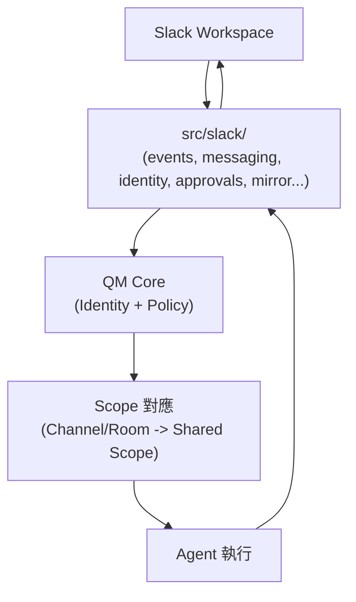

### 17.3 Slack 整合涵蓋的功能面向（依 `src/slack/` 檔名結構推論，Source-confirmed 檔案存在／功能細節建議架構）

| 檔案/模組 | 推論功能 |
|---|---|
| `events.ts` | 接收 Slack 事件（訊息、mention 等） |
| `messaging.ts` | 發送訊息回 Slack |
| `identity.ts` | Slack 使用者身分對應到 QM Identity |
| `approval-cards.ts`／`approvals.ts` | Strict Posture 下的人工核准卡片介面 |
| `conversation.ts` | 對話狀態管理 |
| `mirror.ts` | 訊息鏡像/同步機制 |
| `reactions.ts` | Slack 表情符號互動處理 |
| `directory.ts` | Slack 使用者/頻道目錄對應 |
| `manifest.json` | Slack App 的官方設定清單（scopes、事件訂閱等） |
| `message-gating.ts`（2026-08-21 新確認檔案） | 推論為訊息是否應觸發 Agent 回應的判斷邏輯（例如過濾非目標訊息） |
| `refusals.ts`（2026-08-21 新確認檔案） | 推論為 Agent 拒絕執行某項請求時，回覆使用者的標準化處理 |
| `deliveries.ts`／`delivery.ts`（2026-08-21 新確認檔案） | 推論為訊息投遞狀態追蹤，呼應第28章 Observability 的投遞成功率概念 |
| `presenters.ts`／`mrkdwn.ts`（2026-08-21 新確認檔案） | 推論為將 Agent 輸出轉換為 Slack mrkdwn 格式的呈現層 |

> 上表除檔案本身存在為 Source-confirmed 外，各檔案具體功能為依檔名合理推論（建議架構），實際邏輯請以原始碼內容為準。本次查證發現 `src/slack/` 檔案組成比本手冊舊版記載時新增了十餘個檔案（例如 `attachments.ts`、`config.ts`、`conversation-view.ts`、`deferred-ack.ts`、`dev-introspection.ts`、`directives.ts`、`forwards.ts`、`http-events.ts`、`safe-cut.ts`、`surface-context.ts` 等），反映這是一個持續在演進、尚未穩定的模組，企業導入前應自行重新列出當前版本的完整檔案清單，不應假設本表已窮盡。

### 17.4 Slack Bot 加入流程（依第12.5節部署流程之「選擇性加入 Connectors 與 Slack」步驟）

```bash
# 示意：產生 Slack App Manifest 並取得部署所需輸出
npm exec qm -- slack render
npm exec qm -- outputs
```

依官方部署流程，`qm init` 會產生 `slack-app-manifest.yml`（選用的 Socket Mode Bot）；若 Portal 設定使用 Slack OpenID 登入，還會另外產生 `slack-sso-manifest.yml`。`publicUrl` 變更後，執行 `qm slack render` 可重新整理這些 manifest。透過 manifest 內容於 Slack 平台建立/更新 App 後，再回到目標 Workspace 頻道中測試互動（官方已實作）。

### 17.5 Slack 使用情境

- **頻道 Mention 觸發**：使用者在頻道中 `@提及` QM Bot，觸發該頻道 Shared Scope 的 Agent 執行任務。
- **Group Message／DM**：員工可透過私訊與其 Personal Scope 的 Agent 互動。
- **Strict Posture 下的核准卡片**：涉及風險較高的 Tool Call，Bot 會在 Slack 中發出核准卡片，等待授權人員點擊核准/拒絕（建議架構，依 `approval-cards.ts` 檔名與 Strict Posture 定義合理推論）。

### Scenario：跨部門頻道的協作

`#project-payment` 頻道中，Alice、Bob、Charlie 三位工程師與一個 Shared Scope 的 Coding Agent 協作。當有人在頻道中要求「幫我看一下這個 PR 有沒有安全疑慮」，Agent 依該頻道 Shared Scope 的 Security Posture 設定（例如 Auto），先對 PR 內容做 Screening，再產出審查意見回覆至頻道（建議架構，示範 Slack 協作情境，非官方逐字案例）。

### 17.6 AI Prompt 範例

```text
角色：你是負責設定 QM Slack 整合的工程師。
任務：規劃一個 #project-x 頻道的 Shared Scope Bot 加入流程，
     包含 Slack App Manifest 產生、Workspace 安裝、頻道邀請、首次互動測試。
限制：涉及 Slack Bot Token/App Token 等敏感資訊不可寫入文件明文，
     一律以環境變數/Secret 管理方式處理。
```

### 17.7 本章 Checklist 與小結

- [ ] 已確認 Slack 整合程式碼實際位於 `src/slack/`，不在 `plugins/` 目錄。
- [ ] 已理解 Slack 頻道如何對應到 QM 的 Shared/Channel Scope。
- [ ] 已熟悉 `qm slack render` 與 `qm outputs` 在 Slack Bot 加入流程中的角色。
- [ ] 已知道 Strict Posture 下 Slack 核准卡片的運作方式（建議架構層級的推論，需實測確認）。

---

## 18. Web UI

### 18.1 Web UI 相關元件

依 `plugins/` 目錄實際內容（Source-confirmed），與 Web 介面相關的元件包括：`plugins/web-ui/`（Web UI 本身）、`plugins/admin/`（Admin Panel）、`plugins/portal/`（Public Portal）、`plugins/auth/`（登入/身分驗證）、`plugins/onboarding/`（引導流程）、`plugins/chassis/`（推測為共用底層框架/佈局元件，Source-confirmed 目錄存在／具體功能建議架構推論）。README 提及 Web UI 技術採用 Vite/Lit（官方已實作）。

### 18.2 Web UI 與 Core 的關係

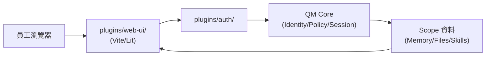

### 18.3 Public Portal 與 Web Apps

- **Public Portal**（`plugins/portal/`）：提供對外公開的介面，SECURITY.md 提及 Published-app 連結是 bearer token、未與接收者身分綁定（官方已實作，見第11章安全考量）。
- **Scope 內的自訂 Web Apps**：屬於 Scope 隔離的資源之一（官方已實作，README 定位），可能透過 Portal 對外發佈——發佈前應評估第11章提及的 bearer token 風險。

### Scenario：透過 Portal 對外分享一個 Web App

某 Project Scope 的團隊利用 QM 建立了一個內部工具的簡易 Web 介面，並透過 Portal 產生分享連結給客戶檢視進度。由於該連結是未綁定身分的 bearer token，團隊決定設定連結的有效期並於使用後主動撤銷，而非長期公開（建議架構，依 SECURITY.md 已知限制設計之因應措施）。

### 18.4 AI Prompt 範例

```text
角色：你是負責 Web UI／Portal 使用規範的工程師。
任務：撰寫一份「透過 Portal 分享 Web App 前的檢查清單」，
     需涵蓋 SECURITY.md 提及的 bearer token 風險。
限制：明確引用官方 SECURITY.md 的已知限制作為規範依據。
```

### 18.5 本章 Checklist 與小結

- [ ] 已理解 Web UI／Admin Panel／Public Portal 分別對應 `plugins/` 下的哪些目錄。
- [ ] 已理解 Public Portal 分享連結的 bearer token 風險，並規劃對應的使用規範。
- [ ] 已理解 Scope 內自訂 Web Apps 與 Portal 對外發佈之間的關係。

---

## 19. Administration

### 19.1 Admin 的角色定位

依 SECURITY.md，Org Admin 屬於「privileged content readers」——具備 scope-authorized 但未經個別使用者逐次同意的存取權限（官方已實作，見第11章）。這代表 Admin 並非「無限制的超級使用者」，而是在 Trust Model 中有明確定位、且其讀取行為會被稽核的角色。

### 19.2 Admin 可執行的操作（依 SECURITY.md 之刻意排除清單反推）

依 SECURITY.md，以下三項操作被刻意排除在 Agent API 之外、僅能透過 Portal 由人工（含 Admin）操作（官方已實作）：Admin grant 變更、冒名（Impersonation）、Command-approval 決策。這代表這三項屬於 **Admin/Portal 專屬的人工操作範疇**，不會被開放給 Agent 自動化執行——這是刻意的安全設計，避免 Prompt Injection 導致權限被自動化提升。

### 19.3 部署階段的 Admin 設定

依官方部署流程，`.env` 中設定 `ADMIN_GRANTS=<email>:org_admin`，即可指定初始管理員（官方已實作，`cli/templates/deployment/deployment.md`）。

```bash
# 示意：.env 中設定管理員授權（勿提交真實 email 進版控）
ADMIN_GRANTS=<admin-email>:org_admin
```

**重要補充（2026-08-21 查證，`plugins/admin/README.md`）**：`ADMIN_GRANTS` 環境變數**只是「空白 Admin 儲存區的一次性種子」**——admin 的身分、角色與 Scope 實際存放在 Core 的一個持久、可變更的 `admin_grants` 資料表中，並沒有名為 `ADMIN_PRINCIPALS` 的東西。第一次設定 `ADMIN_GRANTS` 建立初始管理員之後，**後續的 admin 晉升／撤銷都是透過 Admin 頁面的 Users 分頁在執行期完成**，重新部署（redeploy）並不會清掉這些執行期授權——這與第11章 SECURITY.md「Admin grant 變更只能在 Portal 由已驗證的 admin 操作」的說法完全吻合。企業導入時應理解：`ADMIN_GRANTS` 只在「全新、空白的部署」上有意義，日常的 admin 人事異動請直接在 Admin UI 操作，而不是回頭修改 `.env` 並重新部署。

### 19.4 Admin 稽核與治理建議（建議架構）

由於 SECURITY.md 明確指出 Admin 讀取「有稽核但非逐次同意」，企業應自行建立以下治理措施：

- **最小 Admin 人數原則**：僅授予真正需要管理職責的人員 `org_admin` 授權。
- **Admin 操作稽核複查**：定期複查 Admin 的讀取/操作稽核記錄，確認符合企業內部政策（而非僅依賴系統稽核機制本身）。
- **Admin 異動流程**：員工異動/離職時，應有明確 SOP 及時撤銷其 `org_admin` 授權（見第45章 SOP）。
- **Segregation of Duties**：涉及 Production 資料的 Admin 操作，建議與一般日常管理操作的權限分離（見第25章企業安全治理）。

### Scenario：Admin 權限的最小化實踐

某企業導入 QM 初期，將全部 5 位平台團隊成員都設為 `org_admin`，半年後資安稽核發現這造成不必要的權限暴露面。企業依 19.4 節建議，重新設計為「僅 2 位平台負責人保有 `org_admin`，其餘成員依 Project Scope 授權即可完成日常工作」，並建立 Admin 異動的 Quarterly Review 流程（教學示範用途之虛構情境，示範 Admin 權限治理的常見演進路徑）。

### 19.5 AI Prompt 範例

```text
角色：你是負責設計 QM Admin 治理規範的資安工程師。
任務：設計一份「Admin 授權申請與定期複查」流程，
     涵蓋申請理由、核准層級、複查週期、異動後的撤銷 SLA。
限制：需引用 SECURITY.md「Admin 讀取有稽核但非逐次同意」的定位作為規範前提。
```

### 19.6 本章 Checklist 與小結

- [ ] 已理解 Org Admin 在 SECURITY.md Trust Model 中的定位（privileged content readers）。
- [ ] 已知道 Admin Grant 變更、冒名、Command-approval 決策三項操作僅能透過 Portal 人工執行。
- [ ] 已理解 `ADMIN_GRANTS` 環境變數只是「空白部署的一次性種子」，日常 admin 晉升／撤銷應在 Admin UI 的 Users 分頁操作，而非修改 `.env` 後重新部署。
- [ ] 已規劃好企業內部的 Admin 最小化與定期複查治理流程。

---

## 20. Enterprise Configuration

### 20.1 兩層設定總覽

QM 的設定分為兩個層級（Source-confirmed，依 Deployment Directory Contract 與 `.env.example` 整理）：

1. **部署層設定**（`.env`／`qm.config.jsonc`）：控制 Harness 選擇、Security Posture、Model Provider、品牌自訂、Slack 憑證、簽章密鑰、Rate Limit／Budget 等組織層級參數。
2. **Sandbox 層設定**（`sandbox/tools/`、`sandbox/skills/`）：控制個別 Scope Sandbox 內可用的工具與技能。

### 20.2 完整環境變數清單與用途

| 環境變數 | 用途 | 預設值 | Provenance |
|---|---|---|---|
| `HARNESS` | 選擇 Agent Harness | `pi` | 官方已實作 |
| `HARNESS_SECURITY_POSTURE` | 選擇 Security Posture | `auto` | 官方已實作 |
| `ANTHROPIC_API_KEY` | Anthropic model provider 金鑰 | 無 | 官方已實作 |
| `OPENAI_API_KEY` | OpenAI model provider 金鑰 | 無 | 官方已實作 |
| `OPENROUTER_API_KEY` | OpenRouter model provider 金鑰 | 無 | 官方已實作 |
| `ORG_ID` | 組織識別碼 | `acme`（範例值） | 官方已實作 |
| `PORT` | 服務監聽埠 | `8080` | 官方已實作 |
| `ORG_BRAND_SELF_LABEL` | 組織品牌自我標籤 | 無 | 官方已實作 |
| `ORG_BRAND_ORG_NAME` | 組織品牌名稱 | 無 | 官方已實作 |
| `ORG_BRAND_ACCENT` | 品牌主色 | 無 | 官方已實作 |
| `ORG_BRAND_MARK` | 品牌標誌 | 無 | 官方已實作 |
| `SLACK_BOT_TOKEN` | Slack Bot Token | 無 | 官方已實作 |
| `SLACK_APP_TOKEN` | Slack App Token | 無 | 官方已實作 |
| `SLACK_BOT_DISPLAY_NAME` | Slack Bot 顯示名稱 | 無 | 官方已實作 |
| `SLACK_BOT_ICON_EMOJI` | Slack Bot 圖示 Emoji | 無 | 官方已實作 |
| `CORE_SIGNING_SECRET` | Core 簽章密鑰 | 無 | 官方已實作 |
| `CAPABILITY_SECRET` | Capability Token 密鑰 | 無 | 官方已實作 |
| `PORTAL_IDENTITY_SECRET` | Portal 身分密鑰 | 無 | 官方已實作 |
| `CONNECTOR_SECRET_KEY` | Connector 密鑰 | 無 | 官方已實作 |
| `SKILL_SIGNING_SECRET` | Skill 簽章密鑰 | 無 | 官方已實作 |
| `RATE_LIMIT_PER_WINDOW` | 速率限制次數 | `60` | 官方已實作 |
| `RATE_LIMIT_WINDOW_MS` | 速率限制時間窗（毫秒） | `60000` | 官方已實作 |
| `BUDGET_USD_PER_WINDOW` | 個別 Scope 預算上限（USD） | `25` | 官方已實作 |
| `ORG_BUDGET_USD_PER_WINDOW` | 組織層級預算上限（USD） | `100` | 官方已實作 |
| `BUDGET_WINDOW_MS` | 預算時間窗（毫秒） | `86400000`（24小時） | 官方已實作 |
| `DATABASE_CA_CERT` | PostgreSQL 連線 CA 憑證 | 無 | 官方已實作 |

> 本表為 `.env.example` 查證時（2026-08-21）的完整節錄，導入前請以當前安裝版本的 `.env.example` 為準，不應假設有本表以外的環境變數存在。

### 20.3 品牌與多租戶自訂

`ORG_BRAND_*` 系列環境變數（`SELF_LABEL`／`ORG_NAME`／`ACCENT`／`MARK`）允許組織自訂 Bot 顯示名稱、主色與標誌（官方已實作），這對於多租戶或需要區分不同品牌形象的企業內部團隊有實務價值（例如集團旗下不同子公司各自部署一組 QM 並自訂品牌）。

**補充查證（2026-08-21，`docs/deploy-directory.md`）**：品牌設定其實還有兩個對應到 `qm.config.jsonc` 的欄位有明確長度限制——`botName`（最多 31 字元，確保自動產生的「`<botName>` SSO」這個 Slack App 名稱不超過 Slack 35 字元上限）決定使用者在所有地方看到的 Bot 名稱（產生的 Slack App manifest、Prompt 中的身分、登入頁面）；`orgName`（最多 40 字元）則是 Bot 用來稱呼組織本身的名稱。兩者預設都是中性值，且都可以在 **Admin 頁面的 Branding 卡片直接即時修改**，一旦透過 Admin 頁面修改過，會**優先於**部署設定檔中的既有值（官方已實作）——換言之，品牌設定不是「只能改 `.env` 重新部署」才能調整，Admin 有一個更即時的操作介面。

### 20.4 Rate Limit 與 Budget 治理

`RATE_LIMIT_*` 與 `BUDGET_*` 系列環境變數提供內建的速率限制與預算控管能力（官方已實作），這對企業成本治理（見第34章）非常關鍵——避免單一 Scope 或組織整體的 Model API 呼叫量／費用超出預期。企業應在部署初期即依財務規劃設定合理的 `ORG_BUDGET_USD_PER_WINDOW` 與 `BUDGET_WINDOW_MS`，而非沿用官方範例值（`100` USD／24小時）直接上線生產環境。

### Scenario：多子公司品牌隔離部署

某控股集團旗下有三家子公司，決定為每家子公司各自部署一組 QM（各自獨立的 Deployment Repository 與 Postgres），並透過 `ORG_BRAND_*` 系列變數讓 Slack Bot 顯示各自子公司的名稱與標誌，同時依各子公司歷史用量設定不同的 `ORG_BUDGET_USD_PER_WINDOW`（教學示範用途之虛構情境）。

### 20.5 AI Prompt 範例

```text
角色：你是負責規劃 QM 企業級設定的架構師。
任務：針對一個預計有 200 位員工、20 個專案 Scope 的組織，
     建議 RATE_LIMIT_PER_WINDOW、BUDGET_USD_PER_WINDOW、
     ORG_BUDGET_USD_PER_WINDOW 的起始設定值與後續調整依據。
限制：起始值為企業建議，非官方保證的最佳實踐，需標示清楚。
```

### 20.6 本章 Checklist 與小結

- [ ] 已完整盤點 `.env.example` 中的所有環境變數，並確認不會使用清單以外的變數。
- [ ] 已理解部署層設定（`.env`）與 Sandbox 層設定（`sandbox/tools`、`sandbox/skills`）的分工。
- [ ] 已依企業實際規模，重新評估 Rate Limit 與 Budget 相關設定值，而非沿用官方範例值。
- [ ] 已規劃品牌自訂變數的使用情境（若企業有多租戶/多品牌需求）。

---

## 21. Web Application Development

### 21.1 情境設定

假設企業要使用 QM 協助開發一個採用以下技術堆疊的 Web Application（教學示範用途之技術堆疊假設，非官方案例）：

- **Frontend**：Vue 3、TypeScript、Tailwind CSS、PrimeVue、Pinia、Vite
- **Backend**：Java 25、Spring Boot 4.x、Maven、REST API、PostgreSQL/Oracle/DB2
- **Architecture**：Clean Architecture、Hexagonal Architecture、Microservices、REST、OpenAPI

### 21.2 QM Agent Team 設計（建議架構）

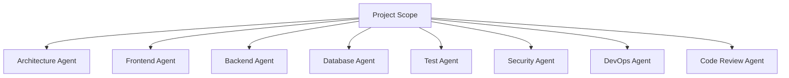

> **重要澄清**：QM 官方目前沒有找到足夠資料確認一套內建的「多角色 Agent Team」編排機制。上圖與下表是本手冊依 Scope／Harness／Skill 等既有機制，針對企業 Web Application 開發情境提出的**建議架構**——實務上這代表在同一個 Project Scope 內，透過不同的 Skill／Prompt／任務指派慣例，讓 Coding Agent 依「角色」執行不同性質的任務，而非 QM 提供了字面意義上的多個獨立 Agent 角色系統。

### 21.3 各「Agent 角色」建議定位（建議架構）

| 角色 | Role | Skill（建議） | Scope | Tools | Deliverables |
|---|---|---|---|---|---|
| Architecture Agent | 架構一致性把關 | 架構規範檢查 Skill | Project Scope | 程式碼搜尋、架構文件產生 | 架構決策記錄、模組邊界建議 |
| Frontend Agent | Vue3/PrimeVue 開發 | 前端 Component 生成 Skill | Project Scope | npm、Vite、ESLint | 前端元件、單元測試 |
| Backend Agent | Spring Boot 4.x 開發 | REST API 生成 Skill | Project Scope | Maven、JDK、Spring 相關工具 | Controller/Service/Repository、OpenAPI 文件 |
| Database Agent | Schema／Migration 設計 | DB Migration Skill | Project Scope | psql/資料庫 CLI | Migration Script、ER 圖 |
| Test Agent | 單元/整合測試撰寫 | 測試框架 Skill | Project Scope | JUnit、Vitest | 測試案例、覆蓋率報告 |
| Security Agent | 安全掃描與審查 | SAST/依賴掃描 Skill | Project Scope | 安全掃描工具 | 安全審查報告 |
| DevOps Agent | CI/CD 流程維護 | Pipeline 設定 Skill | Project Scope | Git、CI 工具 | Pipeline 設定檔 |
| Code Review Agent | PR 審查 | Code Review Skill | Project Scope | Git、靜態分析 | 審查意見 |

### 21.4 端到端開發流程圖

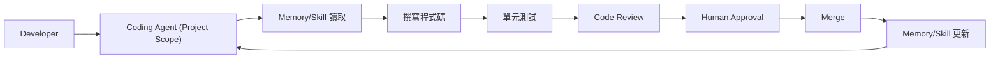

### Scenario：新功能開發的一次完整迭代

某企業 Project Scope 團隊要新增一個「信用卡額度查詢」REST API（教學示範用途之虛構情境）。開發者在 QM Project Scope 中請 Coding Agent（Backend 角色任務）依既有 Spring Boot 4.x 專案慣例產生 Controller/Service/Repository 骨架與對應 OpenAPI 文件，接著請另一個任務（Test 角色）補上單元測試，最後由開發者本人 Review 並提交 PR，經人工核准後合併（Scenario 為教學示範，實際 PR/合併治理見第24章）。

### 21.5 AI Prompt 範例

```text
角色：你是使用 QM Project Scope 進行 Spring Boot 4.x 開發的 Backend Agent。
任務：依既有專案的 Clean Architecture 分層慣例，為「信用卡額度查詢」
     功能產生 Controller/Service/Repository 骨架與 OpenAPI 註解。
限制：不得直接修改 Production 設定；所有變更需以 Feature Branch 產出，
     供人工 Review 後才能合併（見第24章 Git 治理）。
```

### 21.6 本章 Checklist 與小結

- [ ] 已理解「Agent Team」在 QM 中是建議架構（透過 Scope/Skill/任務慣例實現），而非官方內建的多角色系統。
- [ ] 已依企業技術堆疊，設計出 Frontend/Backend/Database/Test/Security/DevOps/Review 對應的 Skill 與任務慣例。
- [ ] 已理解端到端開發流程中，Human Approval 與 Merge 前的 Review 步驟不可省略。

---

## 22. Reverse Engineering

### 22.1 QM 協助 Legacy System 逆向工程的流程（建議架構）

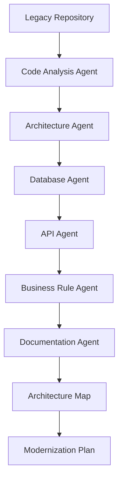

> 同第21章的重要澄清：以上「Agent」角色為本手冊依 QM 既有 Scope／Skill 機制設計的建議工作流程，非 QM 官方內建的逆向工程專屬功能。

### 22.2 涵蓋範圍

| 分析面向 | 說明 |
|---|---|
| Source Code Analysis | Coding Agent 讀取既有原始碼，梳理模組邊界與相依關係 |
| Dependency Analysis | 分析 Maven/npm 相依套件版本與已知漏洞 |
| Database Schema | 逆向產出 ER 圖與資料表關聯 |
| API Analysis | 梳理既有 REST/SOAP API 的輸入輸出與呼叫關係 |
| Batch Job Analysis | 分析既有排程作業的觸發條件與資料處理邏輯 |
| Configuration Analysis | 梳理環境設定檔、Feature Flag 等組態管理現況 |
| Security Analysis | 掃描既有程式碼中的已知安全弱點模式 |
| Business Rule Extraction | 從程式碼與註解中萃取隱含的業務規則 |
| Architecture Recovery | 重建目前系統的實際架構圖（而非文件宣稱的架構） |
| Technical Debt | 盤點技術債清單並排序 |
| Modernization Roadmap | 產出現代化改造的分階段建議 |

### 22.3 為什麼 QM 的 Scope／Sandbox 機制適合這類任務

逆向工程任務通常需要長時間、跨多次 Session 累積對一個大型 Legacy Repository 的理解——QM 的 Durable Sandbox（見第8章）與 Scope Memory（見第9章）機制，理論上能讓 Coding Agent 在多次任務之間持續累積對這個 Legacy 系統的理解，而不必每次從零開始重新分析整個 Repository（建議架構，依 Sandbox／Memory 持久化特性推論其效益）。

### Scenario：一個 20 年歷史的核心系統評估

某企業有一套服役 20 年的 Java 核心系統（教學示範用途之虛構情境），決定用一個獨立的 Project Scope 進行逆向工程評估。團隊將 Legacy Repository 掛載進 Sandbox，依 22.1 節流程逐步產出：模組相依圖、資料庫 ER 圖、既有 REST API 清單、以及一份技術債排序清單，作為後續現代化改造專案立項的依據（Scenario 為教學示範，非真實客戶案例）。

### 22.4 AI Prompt 範例

```text
角色：你是負責逆向工程一個 Legacy Java 系統的 Code Analysis Agent。
任務：掃描這個 Repository 的 Controller 層，列出所有對外暴露的 REST API
     端點、其輸入輸出格式，以及呼叫的 Service 層方法。
限制：僅做唯讀分析，不得修改任何原始碼；輸出以 Markdown 表格呈現。
```

### 22.5 本章 Checklist 與小結

- [ ] 已理解逆向工程流程中各分析面向（原始碼、相依性、資料庫、API、批次作業、設定、安全性、業務規則）。
- [ ] 已理解 QM 的 Durable Sandbox／Scope Memory 特性如何協助跨多次任務累積系統理解。
- [ ] 已規劃好將逆向工程結果整理為架構圖與現代化改造 Roadmap 的產出格式。

---

## 23. Framework Upgrade

### 23.1 Framework Upgrade 完整流程（建議架構）

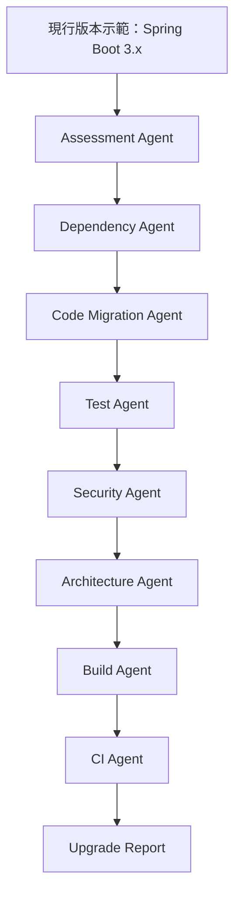

### 23.2 涵蓋的升級類型

Java Upgrade、Spring Boot Upgrade、Jakarta EE Upgrade、Maven Upgrade、Node.js Upgrade、Vue Upgrade、Angular Upgrade、Database Driver Upgrade（建議架構，依常見企業升級情境列舉）。

### 23.3 版本示範（僅為教學示範，非官方相容性保證）

```text
Before:
  Java 21
  Spring Boot 3.x
  Jakarta EE 10
  Maven 3.x

After:
  Java 25
  Spring Boot 4.x
  Jakarta EE 12
  Maven 4.x
```

> ⚠️ 以上版本僅為示範案例，**實際升級前必須重新查詢官方 compatibility matrix**，不可直接套用本手冊列出的版本組合。本 Repository 另有 [Java25升版教學](../程式語言/Java25升版教學.md) 可供背景參考。

### 23.4 為什麼建議用獨立 Scope 執行升級任務

建議為 Framework Upgrade 任務建立獨立的 Project Scope（或至少獨立的 Feature Branch 搭配獨立的 Sandbox 工具版本），避免升級過程中 Agent 誤用舊版工具鏈影響到團隊其他日常開發任務的 Sandbox 狀態（建議架構）。

### Scenario：分階段升級策略

某企業決定將一個 Spring Boot 3.x 專案升級到 4.x，工程團隊先在獨立 Project Scope 中請 Assessment Agent（任務角色）產出「哪些 API 有 Breaking Change」的清單，確認風險範圍後，才由 Dependency Agent（任務角色）逐一更新 `pom.xml`，並在每個階段都執行既有測試套件驗證，最後才提交 PR 讓人工 Review（Scenario 為教學示範用途，實際版本相容性請以官方 compatibility matrix 為準）。

### 23.5 AI Prompt 範例

```text
角色：你是負責評估 Spring Boot 3.x 升級到 4.x 影響範圍的 Assessment Agent。
任務：掃描這個專案使用的 Spring Boot API，列出可能受 Breaking Change
     影響的用法清單，並標註風險等級（高/中/低）。
限制：所有相容性判斷需註明「僅供參考，正式升級前應查詢官方 Migration Guide」。
```

### 23.6 本章 Checklist 與小結

- [ ] 已理解 Framework Upgrade 建議流程（Assessment→Dependency→Migration→Test→Security→Architecture→Build→CI→Report）。
- [ ] 已知道本手冊列出的版本組合僅為教學示範，正式升級前必須查證官方 compatibility matrix。
- [ ] 已規劃使用獨立 Scope／Branch 進行升級任務，避免影響團隊日常開發環境。

---

## 24. Git / GitHub

### 24.1 QM 與 Git 的關係

QM 官方文件（AGENTS.md）本身即建立在明確的 Git 治理規範上：merge 到 `main` 前需要 fresh-context review，禁止自我審查（self-review）；私有 fork 必須將組織專屬程式碼隔離於 `deploy/layers/<org>/`，核心檔案需與 upstream 保持一致；透過 `git remote -v` 判斷所在 repo 情境是 upstream 或私有 fork（官方已實作，AGENTS.md，此為 QM 專案自身的開發治理規範，企業可借鏡此模式設計自己的 Coding Agent 產出治理流程）。

### 24.2 建議的 Agent 產出治理流程

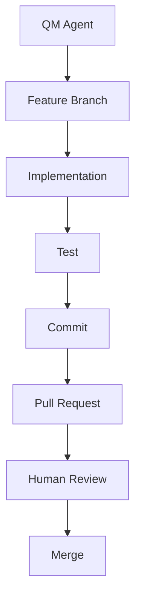

**禁止事項**：不得讓 Agent 在沒有治理的情況下直接修改 Production Branch（建議架構，比照 AGENTS.md「禁止自我審查」的精神延伸）。

### 24.3 私有 Fork 治理（比照 QM 官方自身模式）

企業若需要客製化 QM 部署內容，依官方 `deploy/layers/README.md` 與 AGENTS.md 之治理原則（官方已實作）：

- 組織專屬內容一律放在 `deploy/layers/<org>/`，"Nothing under `deploy/layers/` may reach upstream qm"。
- `upstream-pr`／`update-qm` 兩個 skills 用於管理組織 layer 與 upstream 同步的邊界（官方已實作，`deploy/layers/README.md`）。
- Secrets 絕不可提交至 Git，必須存放於雲端 provider 的加密 secret store（官方已實作）。

### Scenario：企業 Coding Agent 產出的標準 Git 流程

某 Project Scope 的 Coding Agent 被要求修復一個 Bug。依團隊治理規範，Agent 產出的所有變更必須先建立 Feature Branch，本地測試通過後才 Commit 並開 PR，PR 必須經過至少一位人類工程師 Review 後才能 Merge 到 `main`——即使 Security Posture 設為 Dangerous，這個 Git 層面的治理流程也不會被繞過（建議架構，示範企業如何用 Git 流程作為 QM Security Posture 之外的第二道治理防線）。

### 24.4 AI Prompt 範例

```text
角色：你是負責制定 QM Agent 產出 Git 治理規範的 Tech Lead。
任務：撰寫一份「Agent 產出的程式碼變更必須遵循的 Git 流程」規範，
     明確禁止 Agent 直接推送到 main/production branch。
限制：規範需可套用於任何 Security Posture 設定，不依賴 QM 內建機制作為唯一防線。
```

### 24.5 本章 Checklist 與小結

- [ ] 已理解 QM 官方自身在 AGENTS.md 中示範的 Git 治理模式（fresh-context review、禁止自我審查）。
- [ ] 已建立「Agent 產出必須經過 Feature Branch → PR → Human Review → Merge」的企業內部規範。
- [ ] 已理解私有 Fork 的組織專屬內容治理原則（`deploy/layers/<org>/`、secrets 不可提交 Git）。

---

## 25. CI/CD

### 25.1 QM 與 CI/CD 的關係

QM 官方文件明確聲明：deployment initialization（`qm init`）**不會建立 CI pipeline**，QM 原始碼庫本身不含正式環境部署 workflow（官方已實作，`docs/getting-started.md`）。這代表 CI/CD Pipeline 的建立與維護，是企業導入 QM 時**需要自行規劃的部分**，而非 QM 開箱即用的功能。

### 25.2 建議的 CI/CD 流程（建議架構）

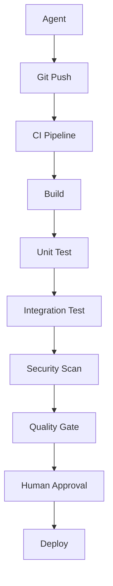

### 25.3 與既有 CI/CD 工具的搭配

企業可將 QM Agent 產出的 PR 接入既有的 Jenkins、GitHub Actions、GitLab CI 等既有流程，QM 本身不提供、也不取代這些工具（官方已實作，「不建立 CI pipeline」的明確聲明）。QM CLI 提供的 `conformance` 指令可用於**驗證部署目錄本身的一致性**（官方已實作，`cli/README.md`：`qm conformance [dir]` 支援 `--static`），企業可將這個指令納入自己的 CI Pipeline 中，作為部署前的一道檢查關卡。

```yaml
# 示意：GitHub Actions 中納入 QM 部署目錄一致性檢查（非官方逐字範本，示意寫法）
name: qm-conformance-check
on: [pull_request]
jobs:
  conformance:
    runs-on: ubuntu-latest
    steps:
      - uses: actions/checkout@v4
      - uses: actions/setup-node@v4
        with:
          node-version: '24'
      - run: npm install
      - run: npm exec qm -- conformance --static
```

### 25.4 Deploy 階段與 CI/CD 的整合建議

`qm up`（部署）、`qm check --live`（線上驗證）、`qm rollback`（回滾）等指令可被納入 CI/CD 的 Deploy 階段（官方已實作各指令本身，建議架構為如何整合進 Pipeline）：

```bash
# 示意：CI/CD Deploy Stage
npm exec qm -- check --live
npm exec qm -- up --yes
npm exec qm -- outputs --json
```

### Scenario：導入 Quality Gate 阻擋未經審查的變更

某企業將 `qm conformance --static` 納入 PR 檢查的必要條件，任何 Agent 產出的部署目錄變更，若未通過一致性檢查，PR 無法合併；正式 `qm up` 部署動作則被限制只能由 CI/CD Pipeline 在 Human Approval 之後觸發，避免任何人（含 Agent 產出的自動化腳本）直接在本機對生產環境執行 `qm up`（建議架構，示範企業導入 Quality Gate 的具體做法）。

### 25.5 AI Prompt 範例

```text
角色：你是負責把 QM 部署流程接入企業既有 CI/CD 的 DevOps 工程師。
任務：設計一個 GitHub Actions workflow，在 PR 階段執行
     qm conformance --static，在 main 分支合併後才允許觸發 qm up 部署。
限制：部署動作必須有 Human Approval 關卡，不可全自動化直接上線 Production。
```

### 25.6 本章 Checklist 與小結

- [ ] 已理解 QM 官方明確聲明不建立 CI pipeline，這部分需企業自行規劃。
- [ ] 已將 `qm conformance --static` 納入 PR 階段的檢查關卡。
- [ ] 已設計好 Deploy 階段的 Human Approval 機制，避免未經審查的自動部署。

---

## 26. Testing

### 26.1 QM 自身的測試分類（Source-confirmed，`package.json`）

從 `package.json` 的 npm scripts 可以看出 QM 專案自身採用多層次測試策略：`test`（一般單元測試）、`test:e2e`（端對端測試）、`test:all`（完整測試套件）、`test:pg`（PostgreSQL 專用測試，涵蓋超過20個 Postgres-backed store 的個別測試檔）、`test:root:shard`（測試分片執行，供 CI 平行化）（Source-confirmed）。AGENTS.md 建議本機開發時只跑受影響的測試，讓 CI 負責完整套件驗證（官方已實作）。

**補充查證（2026-08-21）**：`package.json` 另外還有一系列 `smoke:*` 腳本（例如 `smoke:pi`、`smoke:monitor`、`smoke:git-cli`、`smoke:google-oauth`、`smoke:service-cred`、`smoke:aws-sandbox`、`smoke:local-sandbox`），對應各個外部整合點（Harness、監控、Git CLI、OAuth、Service Credential、AWS／本機 Sandbox）各自的最小可行性驗證（Source-confirmed，具體驗證內容未逐一查證）；以及 `live-e2e`／`gallery:shots`（針對已部署 Slack 環境的即時驗證與截圖）、`typecheck:contract`（針對 `@yc-software/qm/contract` 這個對外承諾的程式化介面做獨立型別檢查）、`lint:knip`（偵測未使用的程式碼/依賴）。企業若參考 QM 自身的測試分層設計自己的 Testing 策略，這種「每個外部整合點各自一支 smoke test」的模式，值得作為 Coding Agent Team 測試治理的借鏡（建議架構）。

### 26.2 企業使用 QM 進行 Testing 的建議工作模式（建議架構）

- **Unit Test Agent**：在 Project Scope 中請 Coding Agent 針對新增/修改的程式碼補齊單元測試。
- **Integration Test Agent**：針對跨模組整合點（例如 Controller→Service→Repository）設計整合測試。
- **Test Coverage 檢視**：將測試覆蓋率報告納入 PR 審查的參考依據（見第24章 Git 治理）。

### 26.3 QM 自身可供參考的測試治理原則

AGENTS.md 中「本機只跑受影響的測試，CI 負責完整套件」的原則，同樣適用於企業使用 QM Agent 進行日常開發時的建議——避免每次 Agent 任務都觸發全量測試造成過長的回饋週期與過高的運算成本（建議架構，借鏡 QM 自身開發治理原則）。

### Scenario：測試優先的 Bug 修復流程

某 Project Scope 收到一個 Bug 回報，團隊要求 Coding Agent 的第一步驟必須是先寫一個能重現該 Bug 的失敗測試案例，確認測試失敗後才開始修復程式碼，修復後測試通過才能提交 PR——這個「先寫失敗測試」的紀律，同時也是 Human Review 時快速驗證修復是否對症下藥的依據（建議架構，示範 TDD 精神在 QM Agent 工作流程中的應用）。

### 26.4 AI Prompt 範例

```text
角色：你是負責修復 Bug 的 QM Coding Agent。
任務：針對回報的 Bug，先撰寫一個能重現問題的失敗單元測試，
     確認測試失敗後，再進行程式碼修復，最後確認測試通過。
限制：不得跳過「先寫失敗測試」的步驟直接修改程式碼。
```

### 26.5 本章 Checklist 與小結

- [ ] 已理解 QM 自身採用的多層次測試策略（單元／端對端／完整套件／PostgreSQL 專用）可作為企業測試分層的參考。
- [ ] 已建立「本機跑受影響測試、CI 跑完整套件」的效率原則。
- [ ] 已將「先寫失敗測試再修復」的紀律納入 Bug 修復類任務的標準流程。

---

## 27. Security Engineering

### 27.1 從 Security Posture 到企業 Security Engineering

第11章介紹了 QM 內建的 Security Posture 機制；本章聚焦於企業如何在這個基礎上，建立更完整的 Security Engineering 實踐。

### 27.2 Threat Model 延伸盤點（依 SECURITY.md 延伸的企業檢核項目）

| 威脅類型 | QM 官方機制 | 企業補強建議（建議架構） |
|---|---|---|
| Prompt Injection | Auto Posture 之 classifier／screening（官方已實作） | 針對高風險 Scope 強制使用 Strict Posture；定期紅隊演練測試 Screening 有效性 |
| Tool Abuse | Command Policy（官方已實作，惟可被繞過） | 針對 Sandbox 內可用工具做白名單審查，定期稽核 `sandbox/tools/` 內容 |
| Credential Exposure | Sandbox 憑證於程序期間明文存在（已知限制） | 縮短憑證存活時間、最小權限原則、定期輪替 |
| Data Exfiltration | Model／Browser Provider 會接觸 prompt 資料（官方已知） | 評估 Provider 的資料保留政策，機敏資料 Scope 避免使用會保留資料的 Provider |
| Malicious Repository | 官方目前沒有找到足夠資料確認內建的惡意 Repository 偵測機制 | 對外部/第三方 Repository 的存取，建議先經過人工安全掃描再授權給 Agent |
| Untrusted External Data | Auto Posture 之 Screening（官方已實作） | 對高敏感 Scope，避免讓 Agent 直接處理未經驗證的外部資料 |
| Destructive Commands | Command Policy 中的 Hard Denial（官方已實作機制存在，具體清單未逐一查證） | 企業應自行測試/確認哪些破壞性指令（例如遞迴刪除、破壞性 SQL）已被內建阻擋，哪些需要企業自行補強 |
| Sandbox Escape | 官方目前沒有找到足夠資料確認具體防護機制細節 | 定期針對 Sandbox 隔離進行滲透測試 |
| Privilege Escalation | Agent API 刻意排除 Admin Grant 變更等操作（官方已實作） | 定期稽核 Admin 授權清單，避免權限蔓延 |
| Auditability | Admin 讀取有稽核記錄（官方已實作） | 稽核記錄應接入企業既有 SIEM／日誌集中管理系統（見第28章） |
| Provenance | npm 套件透過簽章與 provenance attestation 發佈（官方已實作，惟查證時發現 Issue 中曾出現 0.1.5 版本 provenance attestation 缺失事件） | 部署前應驗證所安裝套件版本的 provenance attestation 是否正常，避免供應鏈風險 |

### 27.3 供應鏈安全提醒：0.1.5 版本 Provenance Attestation 事件

查證時（2026-08-21）發現官方 Issue Tracker 中有一則關於「Release 0.1.5 trust downgrade（缺少 provenance attestation），導致在 pnpm/aube 等環境下安裝失敗」的討論（Roadmap/Issue，Source-confirmed）。這提醒企業：即使官方發佈流程原則上包含簽章與 provenance attestation（官方已實作機制），**個別版本仍可能出現供應鏈驗證失敗的情況**，企業在自動化部署流程中應加入套件驗證失敗時的告警與人工介入機制，而非假設每次安裝都會無條件成功。

### 27.4 Enterprise Security Governance 落地建議

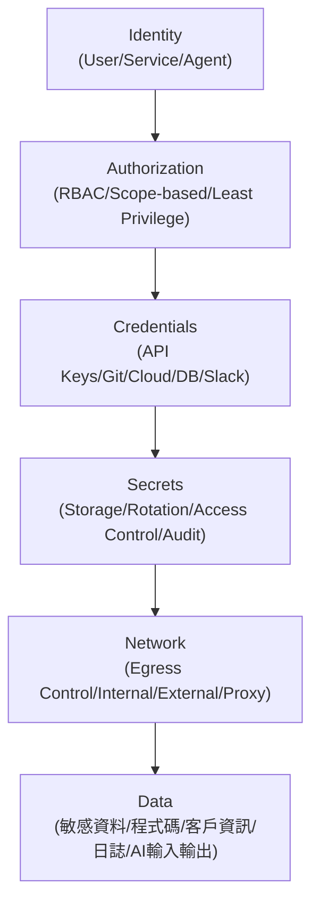

- **Identity**：User Identity（Scope 擁有者）、Service Identity（部署基礎設施）、Agent Identity（Harness 執行身分）三者需分開管理與稽核（建議架構）。
- **Authorization**：以 Scope-based Permission 搭配 Least Privilege 原則設計授權（官方已實作 Scope 機制，具體授權顆粒度建議架構）。
- **Credentials**：API Keys、Git Credentials、Cloud Credentials、Database Credentials、Slack Credentials 應分開管理，避免單一 Credential 洩漏波及全公司（建議架構）。
- **Secrets**：儲存、輪替、存取控制、稽核四項須制度化（`.env` 中多個 `*_SECRET` 變數需妥善管理，官方已實作變數存在，管理制度為建議架構）。
- **Network**：Egress Control 對防止資料外洩尤其重要（見27.2節 Data Exfiltration），Internal/External 服務邊界需明確劃分。
- **Data**：敏感資料、程式碼、客戶資訊、日誌、AI Prompt 與 AI 輸出五類資料，各自需要不同的分類分級與保留政策（建議架構）。

### Scenario：紅隊演練驗證 Auto Posture 的實際效果

某企業資安團隊定期針對 Auto Posture 下的 Screening 機制進行紅隊演練，嘗試以精心設計的外部資料誘導 Agent 執行未授權操作，並記錄哪些嘗試被 Screening 攔截、哪些未被攔截，作為調整哪些 Scope 應升級為 Strict Posture 的依據（建議架構，示範企業如何主動驗證官方機制的實際防護效果，而非單純信任其存在）。

### 27.5 AI Prompt 範例

```text
角色：你是負責 QM 企業安全治理的 Security Engineer。
任務：依 27.2 節的威脅盤點表，為公司設計一份季度安全稽核 Checklist，
     每一項威脅類型都要有對應的稽核方法與稽核頻率。
限制：需區分「QM 官方已提供的機制」與「企業需自行補強的措施」。
```

### 27.6 本章 Checklist 與小結

- [ ] 已依 27.2 節威脅盤點表，逐一確認企業自身的補強措施是否到位。
- [ ] 已知道 0.1.5 版本曾出現 provenance attestation 缺失的供應鏈事件，並在部署流程中加入套件驗證檢查。
- [ ] 已建立 Identity／Authorization／Credentials／Secrets／Network／Data 六大面向的企業安全治理框架。
- [ ] 已規劃定期紅隊演練，驗證 Security Posture 機制的實際防護效果。

---

## 28. Observability

### 28.1 QM 官方 Observability 現況

QM 官方文件研究範圍內，並未提供逐一列點的內建 Observability/Metrics/Tracing 儀表板說明（官方目前沒有找到足夠資料確認一套完整的內建可觀測性方案）。但查證時（2026-08-21）發現的 GitHub Issue 中，有一則與「`/healthz` 健康檢查在 Provider 故障時仍顯示綠燈（誤報）」相關的討論（Roadmap/Issue，Source-confirmed），這代表 QM **確實有 `/healthz` 健康檢查端點**（Source-confirmed 其存在），但其準確性目前仍有已知的改進空間。

### 28.2 建議的 Observability 資料流（建議架構）

```mermaid
flowchart TD
    User["User"] --> Agent["Agent"]
    Agent --> Harness["Harness"]
    Harness --> Tool["Tool"]
    Tool --> Sandbox["Sandbox"]
    Sandbox --> External["External System"]

    Agent -.->|"建議：企業自行接入"| Metrics["Metrics"]
    Agent -.->|"建議：企業自行接入"| Logs["Logs"]
    Agent -.->|"建議：企業自行接入"| Trace["Trace"]
    Metrics --> Dashboard["Dashboard"]
    Logs --> Dashboard
    Trace --> Dashboard
```

每一層都應該能回答：Who、What、When、Where、Why、Result、Cost、Duration、Permission、Approval——**QM 官方目前沒有找到足夠資料確認完整涵蓋以上十個面向的內建 Observability 方案，建議由企業自行補充**（例如將 PostgreSQL 中的 sessions/memory/audit 相關資料表接入企業既有的日誌與監控平台）。

### 28.3 已知的健康檢查限制

依查證時的 Issue 討論（Roadmap/Issue，Source-confirmed）：「provider 故障時無重試、cron 無退避、無 failover，且 `/healthz` 仍顯示綠燈」——這代表企業**不能完全信任 QM 內建的健康檢查端點**作為服務健康的唯一判斷依據，建議搭配額外的端對端功能性檢測（例如定期發送測試訊息驗證 Agent 是否真正回應）。

### Scenario：發現健康檢查誤報的真實案例

某企業導入初期完全依賴 QM 的 `/healthz` 端點做告警，某次 Model Provider API 發生區域性故障，Agent 已無法正常回應，但 `/healthz` 持續回報正常，導致問題延遲了數小時才被使用者回報發現。事後檢討，團隊加入了「每 5 分鐘發送一則測試訊息並驗證 Agent 是否回應」的端對端監控，作為 `/healthz` 之外的第二道防線（教學示範用途，依查證到的官方 Issue 已知限制設計的因應措施）。

### 28.4 AI Prompt 範例

```text
角色：你是負責建立 QM Observability 的 SRE。
任務：設計一組端對端功能性監控（Synthetic Monitoring），
     用於補強官方 `/healthz` 端點在 Provider 故障時可能誤報綠燈的已知限制。
限制：需說明這是企業補強措施，不是 QM 官方提供的監控機制。
```

### 28.5 本章 Checklist 與小結

- [ ] 已知道 QM 官方目前沒有找到足夠資料確認完整的內建 Observability 方案。
- [ ] 已知道 `/healthz` 端點存在但有誤報綠燈的已知限制（Provider 故障時）。
- [ ] 已規劃端對端功能性監控作為健康檢查的補強措施。
- [ ] 已將 Who/What/When/Where/Why/Result/Cost/Duration/Permission/Approval 十個面向的可觀測性需求，對應到企業自建的監控方案。

---

## 29. Operations

### 29.1 QM Operations Guide 總覽

| 維運面向 | QM 官方現況 | Provenance |
|---|---|---|
| Health Check | `/healthz` 端點存在，惟有已知誤報限制（見第28章） | Source-confirmed |
| Logs | `qm logs [service]` 指令，支援 `-f`／`--tail n` | 官方已實作 |
| Status | `qm status` 指令 | 官方已實作 |
| Metrics/Tracing | 官方目前沒有找到足夠資料確認內建方案 | 官方目前沒有找到足夠資料確認此功能 |
| PostgreSQL Monitoring | 需企業自行接入資料庫監控工具 | 建議架構 |
| Sandbox Monitoring | 需企業自行監控 Sandbox 資源使用 | 建議架構 |
| Agent Monitoring | 依 Issue 討論，turn 結果記錄語意仍有已知問題 | Roadmap/Issue（規劃中） |
| Cron Monitoring | 依 Issue 討論，cron 故障時目前無自動退避機制 | Roadmap/Issue（規劃中） |
| Slack 整合 Monitoring | 需企業自行監控 Slack Bot 連線狀態 | 建議架構 |
| Credential Monitoring | 需企業自行監控 Credential 有效期與使用狀況 | 建議架構 |

### 29.2 常用維運指令

```bash
# 查看服務狀態
npm exec qm -- status

# 查看日誌（持續追蹤）
npm exec qm -- logs -f

# 查看特定服務日誌，僅顯示最後100行
npm exec qm -- logs <service> --tail 100

# 健康檢查（含即時連線）
npm exec qm -- check --live
```

### 29.3 已知的維運風險（依查證時的 Issue 討論）

- **Turn 結果記錄語意混亂**：某些情況下「silent」狀態代表兩種相反的意義，且被抑制的 turn 未出現在 `turn_metrics` 中（Roadmap/Issue，Source-confirmed），這代表企業目前**不能完全信任內建的 turn 統計數字**作為唯一的維運判斷依據。
- **Cron 故障無自動退避**：故障的 cron 任務會持續以原頻率重試而非退避（Roadmap/Issue，Source-confirmed），可能造成資源浪費或對外部系統造成不必要的負載，企業應自行監控異常頻繁失敗的 cron 任務。
- **Admin Error Log 空白問題**：依 Issue 討論，某些真實故障情況下 admin 錯誤日誌可能保持空白（Roadmap/Issue，Source-confirmed），企業不應假設「錯誤日誌沒有記錄=沒有發生錯誤」。
- **Dev Supervisor 無自動重啟**：本機開發模式下，若子程序當機，目前沒有自動重啟機制，也沒有 foreground 模式可供 systemd 等服務管理工具接管（Roadmap/Issue，Source-confirmed），生產環境部署應確認實際採用的部署 target（Docker/Fly/AWS）是否有各自平台層級的程序監督機制。
- **Fly target：Postgres 連線池故障不會自動恢復**（2026-08-21 重新查證仍為 open）：Fly 平台上（Managed Postgres basic 方案）發生「Connection terminated unexpectedly」時，連線池不會自行恢復，需要手動重啟機器才能復原（GitHub Issue #136，Roadmap/Issue，Source-confirmed）。使用 Fly target 的企業應為此類故障準備告警與手動介入 SOP，不要假設連線池會自動重連。
- **AWS target：ALB 資安群組預設未開放 443**（2026-08-21 新確認，仍為 open）：依 GitHub Issue #340，AWS 參考 Terraform 模組目前的 ALB 資安群組設定不會自動放行 443 埠，導致設定了 HTTPS `publicUrl` 卻產生一個實際連不到的 Load Balancer（Roadmap/Issue，Source-confirmed）。企業以 AWS target 部署後，**務必實際驗證 HTTPS 連線可達**，不要只看 `qm up` 執行成功就視為部署完成。
- **重試／退避機制已有對應 PR 在處理中**（2026-08-21 新確認）：GitHub 上已有 `feat(runs): retry transient provider errors with backoff`（#624）與 `feat(cron): back a failing cron off instead of re-firing every tick`（#625）兩個 Roadmap/Issue 項目在推進，代表官方已知悉「Provider 暫時性錯誤無重試」與「Cron 故障無退避」這兩項限制並著手修復，企業可持續關注這兩個項目的合併狀態，作為評估是否可以放寬相關維運補強措施的依據。

### Scenario：維運團隊建立「不完全信任內建統計」的作業習慣

某企業維運團隊在導入初期，發現月度報表中的「Agent 任務成功率」數字與使用者實際回報的問題數量對不上，深入調查後發現正是 turn 結果記錄語意混亂的已知問題所致。團隊因此建立了「重要決策不能只看內建統計數字，需搭配使用者回報與日誌交叉驗證」的維運文化（教學示範用途之虛構情境，依查證到的官方 Issue 已知限制設計）。

### 29.4 AI Prompt 範例

```text
角色：你是負責 QM 日常維運的 SRE。
任務：設計一份「每日健康檢查」SOP，需涵蓋 qm status、qm logs、
     qm check --live 三個指令的檢查順序與異常判讀方式。
限制：需在 SOP 中註明 turn 統計數字與 cron 重試機制目前的已知限制，
     提醒值班人員不要單憑內建數字做出重大判斷。
```

### 29.5 本章 Checklist 與小結

- [ ] 已熟悉 `qm status`／`qm logs`／`qm check --live` 等日常維運指令。
- [ ] 已知道 turn 結果記錄語意、cron 退避、admin error log 等目前的已知限制。
- [ ] 已建立「不完全信任內建統計數字」的維運文化，搭配日誌與使用者回報交叉驗證。
- [ ] 已確認實際部署 target（Docker/Fly/AWS）的程序監督機制，補強 Dev Supervisor 無自動重啟的已知限制。

---

## 30. Backup / Recovery

### 30.1 Backup 涵蓋範圍

| 項目 | 官方機制 | Provenance |
|---|---|---|
| PostgreSQL | AWS target 上，`up` 等變更操作前會自動快照 RDS 實例 | 官方已實作（AWS target） |
| Configuration | `qm.config.jsonc`／`.env` 屬部署目錄的一部分，建議納入企業自身的版本控制與備份流程 | 建議架構 |
| Skills | `sandbox/skills/` 屬 Sandbox 素材的一部分，建議隨部署目錄一併備份 | 建議架構 |
| Deployment Repository | 建議整個部署目錄納入企業 Git 備份與存取控制流程 | 建議架構 |
| Critical Artifacts | Sandbox 映像／Skill 內容等關鍵產出物，建議另行備份至企業內部 Artifact Registry | 建議架構 |

**容量規劃提醒（依第11章 SECURITY.md「已知限制」延伸）**：檔案 Artifact 目前**沒有過期機制**，Artifact 汰除與去重位元組回收也**尚未實作**，這代表 Artifact 儲存量會隨使用量無限期累積；同時 Session、Memory、模型請求擷取在持久層啟用時預設會被保存。企業做 Backup 容量與成本規劃時，應把這個「只增不減」的特性納入考量，而不是假設 QM 會自動幫忙清理歷史資料（見第34章成本管理）。

### 30.2 Recovery 涵蓋範圍與指令

- **Database Recovery**：AWS target 上可搭配 RDS 快照進行資料庫還原（官方已實作機制存在，具體還原操作流程屬 AWS 平台標準操作，建議架構）。
- **程式碼/設定 Recovery**：`qm rollback --to <revision-or-sha>` 可還原程式碼與設定，並提供對應的資料還原點（官方已實作）。
- **Sandbox Recovery**：透過 `qm sandbox build`／`publish` 重新建置/發佈 Sandbox 映像（官方已實作指令，具體 Recovery 流程屬企業自訂）。
- **Credential Recovery**：`qm secrets push --from <file>` 可用於重新推送 Secrets（官方已實作，`cli/README.md`）。
- **Agent Recovery**：官方目前沒有找到足夠資料確認針對「Agent 狀態」本身的獨立還原機制，Agent 狀態應隨 Session/Memory 一併還原。

```bash
# 示意：回滾到指定版本
npm exec qm -- rollback --to <revision-or-sha>

# 示意：重新推送 Secrets
npm exec qm -- secrets push --from <secrets-file>
```

### 30.3 RPO／RTO 建議表（建議架構，非官方 SLA 保證）

| 情境 | 建議 RPO | 建議 RTO | 說明 |
|---|---|---|---|
| PostgreSQL 資料庫故障（AWS target） | 依 RDS 快照頻率決定 | 數十分鐘至數小時 | 依賴 RDS 自動快照機制，企業應確認快照頻率是否符合業務需求 |
| 部署設定損毀 | 接近 0（Git 版控） | 數分鐘 | 部署目錄應納入 Git 版控，可快速還原設定檔 |
| Sandbox 映像損毀 | 依映像 Registry 保留策略 | 數分鐘至數十分鐘 | 依賴 OCI Registry 保留的歷史映像版本 |
| 整體服務下線（`qm down`誤觸） | 依 Backup 策略 | 依 `qm up` 重新部署所需時間 | 建議所有破壞性指令（`down --purge`）需二次確認 |

> 上表為本手冊依 QM 已知機制與一般企業維運經驗提出的建議起始值，非官方 SLA 保證，企業應依自身業務重要性與實測結果調整。

### Scenario：一次 RDS 快照拯救的資料庫誤操作

某企業維運人員在測試環境誤執行了破壞性的資料庫遷移腳本，所幸 AWS target 部署的 QM 在此次變更操作前已自動產生 RDS 快照，團隊得以快速還原到操作前的狀態，並藉此事件建立了「重大變更前手動再次確認快照存在」的內部 SOP（教學示範用途之虛構情境，依 AWS target 自動快照機制設計）。

### 30.4 AI Prompt 範例

```text
角色：你是負責制定 QM Backup/Recovery 政策的維運負責人。
任務：依本章 RPO/RTO 建議表，為公司實際的業務重要性等級
     （Production/UAT/Test/Dev）分別制定對應的備份頻率與還原演練排程。
限制：RPO/RTO 數字需標示為企業建議起始值，並說明應依實測結果調整。
```

### 30.5 本章 Checklist 與小結

- [ ] 已理解 AWS target 上的 RDS 自動快照機制，並確認其快照頻率是否符合企業需求。
- [ ] 已熟悉 `qm rollback`／`qm secrets push` 等 Recovery 相關指令。
- [ ] 已依業務重要性等級，制定對應的 RPO/RTO 目標並排定定期還原演練。
- [ ] 已將部署目錄與 Sandbox 素材納入企業自身的版本控制與備份流程。

---

## 31. Upgrade

### 31.1 升級 SOP 總覽

```mermaid
flowchart TD
    Check["Check Current Version"] --> Notes["Read Release Notes"]
    Notes --> Breaking["Read Breaking Changes"]
    Breaking --> Backup["Backup"]
    Backup --> TestEnv["Test Environment"]
    TestEnv --> Upgrade["Upgrade"]
    Upgrade --> Migration["Migration"]
    Migration --> IntTest["Integration Test"]
    IntTest --> SecTest["Security Test"]
    SecTest --> PerfTest["Performance Test"]
    PerfTest --> Prod["Production"]
    Prod --> Monitor["Monitor"]
```

### 31.2 升級涉及的具體項目

| 項目 | 說明 | Provenance |
|---|---|---|
| npm package upgrade | 更新 `@yc-software/qm` 套件版本 | 官方已實作 |
| Deployment Repository upgrade | 部署目錄本身可能隨 `qm` CLI 版本演進調整結構 | Source-confirmed（依 Deployment Directory Contract v1 版本化設計推論） |
| Database migration | 隨版本演進可能需要 Schema migration | 建議架構（官方目前沒有找到足夠資料確認具體 migration 指令機制） |
| Sandbox image | 可能需要重新 `qm sandbox build`／`publish` | 官方已實作指令存在 |
| Skills compatibility | 新版本可能調整 Skill Schema，需確認既有自訂 Skill 相容性 | 建議架構 |
| Harness compatibility | 確認 `HARNESS` 選項與對應 Coding Agent 版本相容性 | 建議架構 |
| Plugin compatibility | 確認 `plugins/` 下各元件版本相容性 | 建議架構 |
| Environment variables | 新版本可能新增/棄用環境變數，需比對 `.env.example` 差異 | 建議架構 |
| Rollback | `qm rollback --to <revision-or-sha>` | 官方已實作 |

### 31.3 升級前的供應鏈驗證提醒

如第27章所述，查證時發現曾有 0.1.5 版本 provenance attestation 缺失事件（Roadmap/Issue）。升級 SOP 中應加入「驗證新版本套件簽章/provenance attestation 是否正常」這一步驟，避免在缺乏驗證的情況下貿然升級生產環境。另依第11章新增查證之 **Dependency Cooldown** 機制，QM 核心本身要求新版套件冷卻滿 7 天（`min-release-age=7`）才進入 lockfile；企業升級 SOP 若需要提前引入緊急安全修補，應明確指定確切版本號跳過冷卻窗口，而不是全面關閉這道供應鏈防線。

### Scenario：先在 Test 環境跑過一輪完整 SOP

某企業每次 QM 版本升級，都先在獨立的 Test 環境完整跑過本章 31.1 節的十步驟 SOP，特別關注 `.env.example` 新增/棄用的環境變數（避免遺漏必要的新設定值），確認 Integration Test 與 Security Test 皆通過後，才排定 Production 升級時間窗口，並在升級後持續監控 24 小時（教學示範用途之虛構情境）。

### 31.4 AI Prompt 範例

```text
角色：你是負責 QM 版本升級的 DevOps 工程師。
任務：比對目前版本與新版本的 .env.example 差異，
     列出新增、棄用、預設值變更的環境變數清單。
限制：若無法取得官方 CHANGELOG 中明確的環境變數異動紀錄，
     需以實際 diff .env.example 檔案的方式進行，不可臆測。
```

### 31.5 本章 Checklist 與小結

- [ ] 已依十二步驟 SOP（Check Version→Release Notes→Breaking Changes→Backup→Test→Upgrade→Migration→Integration Test→Security Test→Performance Test→Production→Monitor）規劃升級流程。
- [ ] 已在升級 SOP 中加入套件供應鏈簽章驗證步驟。
- [ ] 已建立比對 `.env.example` 差異的習慣，避免遺漏新增的必要環境變數。
- [ ] 已確認 `qm rollback` 作為升級失敗時的回滾手段。

---

## 32. Troubleshooting

### 32.1 常見故障排除表

| 問題 | Symptom | Cause | Diagnosis | Commands | Solution | Prevention |
|---|---|---|---|---|---|---|
| QM 無法啟動 | 服務啟動即失敗 | 環境變數缺漏／PostgreSQL 連線失敗 | 檢查 `.env` 是否完整 | `qm check` | 補齊必要環境變數後重啟 | 部署前務必執行 `qm check` |
| PostgreSQL connection failure | 服務啟動但資料庫相關功能失敗 | 連線字串錯誤／CA 憑證問題 | 檢查 `DATABASE_CA_CERT` 等設定 | `qm doctor` | 修正連線設定 | 定期驗證資料庫連線 |
| Agent 無回應 | 使用者發送請求後無任何回覆 | Model Provider API 故障／Turn 結果記錄語意問題（見28-29章已知限制） | 檢查 Provider 狀態、查看 `qm logs` | `qm status`、`qm logs -f` | 視 Provider 狀態決定是否需人工介入或等待恢復 | 建立端對端 Synthetic Monitoring（見第28章） |
| Harness 無法執行 | 特定 Harness 呼叫失敗 | Harness 設定錯誤／對應 Coding Agent 版本不相容 | 檢查 `HARNESS` 環境變數與對應 Harness 安裝狀態 | `qm doctor` | 修正 Harness 設定或版本 | 升級前確認 Harness compatibility（見第31章） |
| Sandbox 問題 | Tool 執行失敗 | Sandbox 映像缺少必要工具 | 檢查 `sandbox/tools/` 內容 | `qm sandbox build --dry-run` | 補齊缺少的工具並重新建置映像 | 導入變更管理流程審查 Sandbox 工具清單 |
| Slack 無回應 | Slack Bot 不回應訊息 | Slack Token 過期／events 訂閱設定錯誤 | 檢查 `SLACK_BOT_TOKEN`／`SLACK_APP_TOKEN`，重新 `qm slack render` | `qm slack render`、`qm outputs` | 更新 Token 或重新產生 Manifest | 定期驗證 Slack 憑證有效期 |
| Web UI 無法登入 | 登入頁面卡住或報錯 | Auth 服務設定錯誤／`PORTAL_IDENTITY_SECRET` 等密鑰問題 | 檢查 `plugins/auth/` 相關設定 | `qm check` | 修正身分驗證設定 | 部署後立即驗證登入流程 |
| Credential failure | Tool 呼叫因憑證失敗而中止 | Credential 過期或權限不足 | 檢查對應 Credential 的有效期與權限範圍 | `qm secrets push --from <file>` | 更新/重新推送 Credential | 建立 Credential 到期提醒機制 |
| Model API failure | Agent 回應包含 API 錯誤 | Model Provider 端故障或額度用盡 | 檢查對應 Provider API Key 額度與狀態頁 | 查看 `qm logs` | 切換備援 Provider（若已規劃）或等待恢復 | 依 Budget 設定監控用量避免超額 |
| Queue stuck | 任務長時間未被處理 | 依 README 敘述，Queue 為持久層概念，具體排隊機制細節未充分揭露 | 檢查 Session／Cron 相關日誌 | `qm logs`、`qm status` | 官方目前沒有找到足夠資料確認的專屬排解指令，建議重啟對應服務並持續觀察 | 建立佇列堆積告警（建議架構） |
| Cron failure | 排程任務未執行或重複失敗 | 依 Issue 討論，故障 cron 目前無自動退避（見第29章） | 檢查 Cron 相關日誌 | `qm logs` | 人工介入停用異常 Cron，待修復後重新啟用 | 監控 Cron 失敗率，避免無限重試消耗資源 |
| Webhook failure | 外部系統觸發的 Webhook 未生效 | Webhook 設定錯誤或簽章驗證失敗 | 檢查 `CONNECTOR_SECRET_KEY` 等設定 | `qm check` | 修正 Webhook 設定與簽章密鑰 | 部署後驗證 Webhook 端到端流程 |
| Git failure | Agent 產出的變更無法推送 | Git 認證設定錯誤 | 檢查部署環境的 Git 認證設定 | 檢查 Git 設定與網路連線 | 修正認證設定 | 定期驗證 CI/CD 環境的 Git 存取權限 |
| Permission denied | Agent 操作被拒絕 | Scope／Policy 權限不足（設計如此，屬正常安全機制） | 確認該操作是否本就應被拒絕 | 檢查 Policy／ACL 設定 | 若為誤判，調整對應 Scope 權限；若非誤判，維持現狀 | 定期複查權限設定是否符合實際需求 |
| Tool approval 卡住 | Strict Posture 下核准請求無人處理 | 核准人員未收到通知或不在線 | 檢查 Slack 核准卡片是否正確送達 | 檢查 `src/slack/approval-cards.ts` 相關設定 | 建立核准請求的備援通知管道與 SLA | 設定核准逾時提醒機制（建議架構） |
| Deployment failure | `qm up` 執行失敗 | 設定錯誤／基礎設施資源不足／套件驗證失敗 | 檢查 `qm plan` 輸出與錯誤訊息 | `qm check`、`qm plan`、`qm up --yes` | 依錯誤訊息修正對應設定後重試 | 部署前務必先跑過 `check`／`plan`，並確認套件供應鏈驗證正常 |

### Scenario：值班工程師的第一線排查習慣

值班工程師收到「Agent 無回應」的回報後，依本章表格的排查順序：先跑 `qm status` 確認整體服務狀態，再跑 `qm logs -f` 即時觀察日誌，同時對照第28-29章已知限制（turn 結果記錄語意、健康檢查誤報），避免僅憑 `/healthz` 顯示綠燈就排除問題（教學示範用途，依故障排除表整理之標準排查習慣）。

### 32.2 AI Prompt 範例

```text
角色：你是值班的 SRE，收到「Slack Bot 沒有回應」的回報。
任務：依本章故障排除表的 Slack 相關項目，列出你會依序執行的
     診斷指令與判讀邏輯。
限制：需先排除「Slack Token 過期」這個最常見原因，再往下深入排查。
```

### 32.3 本章 Checklist 與小結

- [ ] 已熟悉本章故障排除表中至少 10 種常見問題的 Symptom/Cause/Diagnosis/Commands/Solution/Prevention。
- [ ] 已知道 Queue／Cron 相關故障目前部分排解方式官方文件未充分揭露，需搭配日誌人工判斷。
- [ ] 已建立值班排查的標準順序（先看整體狀態，再看細部日誌，避免誤信健康檢查綠燈）。

---

## 33. Performance

### 33.1 影響效能與成本的面向

Agent concurrency、Queue、PostgreSQL、Sandbox resource（CPU/Memory/Network）、Model token usage、Tool execution、Cron、Background jobs（建議架構，依 QM 架構元件推論影響效能的面向）。

### 33.2 內建的速率與預算控制

`RATE_LIMIT_PER_WINDOW`／`RATE_LIMIT_WINDOW_MS` 控制請求速率，`BUDGET_USD_PER_WINDOW`／`ORG_BUDGET_USD_PER_WINDOW`／`BUDGET_WINDOW_MS` 控制費用上限（官方已實作，見第20章）。這些內建機制本身就是一種效能與成本的雙重治理手段——避免單一 Scope 的異常行為（例如迴圈呼叫）耗盡整體資源或預算。

### 33.3 效能調校建議（建議架構）

- **Sandbox 資源監控**：定期檢視各 Scope Sandbox 的 CPU/Memory 使用狀況，避免少數 Scope 佔用過多共享運算資源。
- **Model Token 使用監控**：搭配 Budget 機制，針對 Token 使用量異常的 Scope 提前預警，而非等到觸及 Budget 上限才發現。
- **Cron 頻率設計**：避免將高頻率 Cron（例如每分鐘執行）設計在需要呼叫 Model API 的任務上，以控制成本與速率限制的相互影響。
- **並行 Agent 任務數量**：企業應評估部署 target 的資源上限（例如 AWS Fargate 任務規格），避免同時觸發過多 Agent 任務造成資源競爭。

### Scenario：發現一個異常吃資源的 Cron

某企業維運團隊透過 Sandbox 資源監控，發現某個 Project Scope 的每分鐘排程 Cron 任務異常頻繁呼叫 Model API，逼近 `BUDGET_USD_PER_WINDOW` 上限。深入調查後發現該 Cron 邏輯設計錯誤，導致每次觸發都重新處理全部歷史資料而非增量處理，修正後 Token 用量下降 90%（教學示範用途之虛構情境）。

### 33.4 AI Prompt 範例

```text
角色：你是負責 QM 效能調校的工程師。
任務：檢視目前所有 Cron 任務的觸發頻率與對應的 Model API 呼叫模式，
     找出可能造成不必要 Token 消耗的排程設計問題。
限制：需先確認哪些 Cron 任務有呼叫 Model API 的邏輯，再評估其觸發頻率是否合理。
```

### 33.5 本章 Checklist 與小結

- [ ] 已理解 Rate Limit 與 Budget 是內建的雙重治理機制，並依企業實際規模調整設定值。
- [ ] 已建立 Sandbox 資源與 Token 使用量的監控機制。
- [ ] 已檢視 Cron 任務設計，避免高頻率排程造成不必要的成本與速率限制衝突。

---

## 34. Cost Management

### 34.1 QM 成本構成模型（建議架構）

```text
Cost
=
Model Cost（Token 用量 × 各 Provider 費率）
+
Compute Cost（Sandbox／Core 服務運算資源，依部署 target 而定）
+
Database Cost（PostgreSQL，含 AWS RDS 或其他託管服務費用）
+
Storage Cost（Sandbox 映像、部署 Artifact 儲存）
+
Network Cost（Egress／內部服務通訊）
+
Sandbox Cost（每個 Scope 專屬 Sandbox 的運算/儲存資源）
```

### 34.2 內建的成本治理槓桿

| 槓桿 | 對應環境變數 | Provenance |
|---|---|---|
| 單一 Scope 預算上限 | `BUDGET_USD_PER_WINDOW` | 官方已實作 |
| 組織整體預算上限 | `ORG_BUDGET_USD_PER_WINDOW` | 官方已實作 |
| 預算時間窗 | `BUDGET_WINDOW_MS` | 官方已實作 |
| 請求速率限制 | `RATE_LIMIT_PER_WINDOW`／`RATE_LIMIT_WINDOW_MS` | 官方已實作 |

### 34.3 企業成本治理方法（建議架構）

- **依 Scope 分類設定不同預算**：高頻使用的 Project Scope 給予較高預算上限，低頻使用的 Personal Scope 給予較保守上限。
- **定期成本歸因分析**：將 Model Cost 依 Scope／Harness／任務類型分類統計，找出成本異常集中的來源。
- **Harness 選型的成本考量**：不同 Harness／模型組合的 Token 效率與費率不同，第7章提及的 Vendor/Model Independence 讓企業可依成本考量調整選型。
- **Cron 與 Background Job 的成本審視**：如第33章 Scenario 所述，排程設計不當會造成不必要的 Token 消耗，應納入成本審視的重點對象。

### Scenario：季度成本歸因報告

某企業 AI 平台團隊每季產出一份成本歸因報告，將前一季的 Model Cost 依 Project Scope 別、Harness 別呈現，發現某個已經停止活躍開發的專案 Scope 仍有異常的背景任務持續消耗預算，追查後發現是遺留的測試用 Cron 未被停用，及時關閉後節省了可觀的月度成本（教學示範用途之虛構情境）。

### 34.4 AI Prompt 範例

```text
角色：你是負責 QM 成本治理的 FinOps 工程師。
任務：設計一份季度成本歸因報告範本，依 Scope 與 Harness 類別
     呈現 Model Cost、Compute Cost、Database Cost 的佔比。
限制：需標示哪些成本項目可直接從 QM 內建機制取得數據
     （例如 Budget 相關設定），哪些需企業自行從雲端帳單額外歸因。
```

### 34.5 本章 Checklist 與小結

- [ ] 已理解 QM 成本構成的六大要素（Model/Compute/Database/Storage/Network/Sandbox）。
- [ ] 已依 Scope 特性差異化設定 Budget 相關環境變數。
- [ ] 已建立定期成本歸因分析的機制，找出異常消耗來源。

---

## 35. Agent Team Design

### 35.1 Enterprise Agent Team Pattern（建議架構）

```mermaid
flowchart TD
    PO["Product Owner Agent"] --> Arch["Architect Agent"]
    Arch --> FE["Frontend Agent"]
    Arch --> BE["Backend Agent"]
    Arch --> DB["Database Agent"]
    FE --> QA["QA Agent"]
    BE --> QA
    DB --> QA
    QA --> Sec["Security Agent"]
    Sec --> DevOps["DevOps Agent"]
    DevOps --> Review["Review Agent"]
```

> 再次強調（呼應第21章）：QM 官方目前沒有找到足夠資料確認一套內建的多角色 Agent Team 編排系統。以上為本手冊針對企業 SDLC 情境，依 Scope／Skill／Harness 既有機制設計的建議架構。

### 35.2 各角色設計要素

| 角色 | Scope | Skill（建議） | Permission（建議） | Model／Harness | Memory | Handoff | Approval |
|---|---|---|---|---|---|---|---|
| Product Owner Agent | Project Scope | 需求整理 Skill | 唯讀程式碼、可寫需求文件 | 依任務複雜度選擇 Harness | 專案需求歷史 | 交付需求規格給 Architect | 需求變更需 PM 核准 |
| Architect Agent | Project Scope | 架構分析 Skill | 唯讀程式碼、可寫架構文件 | 建議選用推理能力較強的 Harness | 架構決策歷史 | 交付架構設計給各實作角色 | 重大架構變更需架構師核准 |
| Frontend/Backend/Database Agent | Project Scope | 各自技術棧對應 Skill | 可寫對應程式碼目錄 | 依任務選擇 | 各自模組的實作脈絡 | 交付程式碼給 QA | Feature Branch PR 需 Review |
| QA Agent | Project Scope | 測試設計 Skill | 可寫測試程式碼 | 依任務選擇 | 測試案例歷史 | 交付測試結果給 Security | 測試失敗需回退給實作角色 |
| Security Agent | Project Scope | 安全掃描 Skill | 唯讀程式碼 | 依任務選擇 | 安全審查歷史 | 交付安全報告給 DevOps | 高風險發現需人工判定 |
| DevOps Agent | Project Scope | Pipeline 設定 Skill | 可寫 CI/CD 設定 | 依任務選擇 | 部署歷史 | 交付部署結果給 Review | 生產部署需 Human Approval |
| Review Agent | Project Scope | Code Review Skill | 唯讀程式碼 | 依任務選擇 | 歷史審查意見 | 最終交付人工決策 | 合併決策一律人工核准 |

### 35.3 為什麼要用「表格」而非「真正獨立的 Agent 進程」理解這個模型

本表中的「Agent」多數情況下是**同一個 Coding Agent（依 Scope 選定的 Harness）在不同任務指派下扮演的角色**，而非 QM 啟動了 7 個真正獨立運作的程序。企業在設計 Skill 與任務 Prompt 時，應該以「這次任務要它扮演哪個角色」的方式指派，而非誤以為需要架設 7 條獨立的基礎設施（建議架構，澄清常見誤解）。

### Scenario：一次跨角色協作的完整任務鏈

Product Owner 提出「新增訂單匯出功能」需求，Architect 角色任務先確認此功能應落在既有哪個模組、是否需要新增 API；Backend 角色任務依此產出程式碼；QA 角色任務補上測試；Security 角色任務掃描是否有敏感資料外洩風險（訂單資料可能含客戶個資）；DevOps 角色任務準備 Pipeline 設定；最終由人類 Review Agent 角色（實際上是人類工程師擔任 Reviewer）核准合併（教學示範用途之虛構情境）。

### 35.4 AI Prompt 範例

```text
角色：你是負責設計企業 QM Agent Team 任務指派慣例的 Tech Lead。
任務：針對「新增一個對外 REST API」這個任務類型，設計各角色
     任務指派的 Prompt 範本與交接（Handoff）條件。
限制：需清楚說明這是任務指派慣例，不是啟動多個獨立 Agent 進程。
```

### 35.5 本章 Checklist 與小結

- [ ] 已理解 Agent Team 是建議架構，實務上是同一 Harness 在不同任務指派下扮演不同角色。
- [ ] 已設計好 Product Owner／Architect／Frontend／Backend／Database／QA／Security／DevOps／Review 各角色的任務指派慣例。
- [ ] 已在角色設計中明確標示 Handoff 與 Approval 關卡，避免流程在中途失去人工把關。

---

## 36. SDLC Integration

### 36.1 QM 介入企業 SDLC 各階段（建議架構）

```mermaid
flowchart TD
    Req["Requirement"] --> Analysis["Analysis Agent 任務"]
    Analysis --> Architecture["Architecture"]
    Architecture --> Design["Design"]
    Design --> Dev["Development"]
    Dev --> UT["Unit Test"]
    UT --> IT["Integration Test"]
    IT --> ST["Security Test"]
    ST --> CR["Code Review"]
    CR --> CI["CI"]
    CI --> Deploy["Deploy"]
    Deploy --> Monitor["Monitoring"]
    Monitor -.->|"回饋"| Req
```

### 36.2 各階段對應的 QM 機制

| SDLC 階段 | QM 對應機制 |
|---|---|
| Requirement／Analysis | Project Scope 中的需求討論記錄（Memory） |
| Architecture／Design | Architecture Agent 任務角色產出設計文件 |
| Development | Backend/Frontend Agent 任務角色 + Sandbox 工具鏈 |
| Unit/Integration Test | Test Agent 任務角色 + Sandbox 測試工具 |
| Security Test | Security Posture（Auto/Strict）+ Security Agent 任務角色 |
| Code Review | 第24章 Git 治理流程（Feature Branch → PR → Human Review） |
| CI | 第25章企業自建 CI Pipeline（QM 不提供） |
| Deploy | `qm up`／`qm rollback` 等部署指令（見第12-16章） |
| Monitoring | 第28-29章 Observability／Operations（多數需企業自建） |

### Scenario：完整走過一次 SDLC 迭代

某企業每個 Sprint 都用一個 Project Scope 追蹤本次迭代的所有需求討論、架構決策、程式碼變更、測試結果，Sprint 結束後的 Retro 會議，團隊直接調閱該 Scope 的 Memory 記錄，回顧本次迭代 Agent 協助的哪些部分特別有效率、哪些部分仍需要大量人工介入（教學示範用途之虛構情境）。

### 36.3 AI Prompt 範例

```text
角色：你是負責把 QM 導入企業 SDLC 的流程設計師。
任務：為一個兩週一次的 Sprint 週期，設計 Requirement 到 Monitoring
     每個階段應該在哪個 Scope、由哪個角色任務、產出什麼 Deliverable。
限制：CI/CD 與 Monitoring 部分需標明是企業自建，非 QM 官方內建功能。
```

### 36.4 本章 Checklist 與小結

- [ ] 已理解 QM 在 SDLC 各階段可以介入的具體機制與其官方/建議架構的區分。
- [ ] 已設計好每個 Sprint 週期使用 Scope 追蹤需求到部署的完整記錄。
- [ ] 已建立 Retro 會議調閱 Scope Memory 記錄的習慣，持續優化 Agent 協作方式。

---

## 37. Spec-Driven Development

### 37.1 QM 與 Spec-Driven Development 的搭配（建議架構）

```mermaid
flowchart TD
    Req["Requirement"] --> Spec["Specification"]
    Spec --> Plan["Plan"]
    Plan --> Task["Task"]
    Task --> Exec["Agent Execution (QM Scope)"]
    Exec --> Test["Test"]
    Test --> Review["Review"]
    Review --> Impl["Implementation"]
```

### 37.2 與既有 Spec-Driven 工具鏈的整合方式

企業若已採用 Spec-Driven Development 相關工具（本 Repository 另有 [spec-kit使用教學](spec-kit使用教學.md)、[OpenSpec使用教學](OpenSpec使用教學.md) 可供背景參考），可以將 Spec/Plan/Task 文件放置於 QM Project Scope 的 Files 中，讓 Coding Agent 在執行任務前先讀取這些規格文件作為脈絡（建議架構，依 Scope Files 機制與 Spec-Driven 工具鏈慣例整合）。

- **Agent Skills**：可將「依 Spec 文件產生 Task 清單」封裝為一個 Skill（見第10章）。
- **Coding Agents**：QM 選定的 Harness（Pi/OpenCode/Codex/Claude Code）負責實際依 Task 執行程式碼變更。
- **Git／Pull Request**：每個 Task 對應一個 Feature Branch 與 PR，維持第24章的治理流程。
- **CI/CD**：第25章企業自建的 Pipeline 驗證每個 Task 的變更。

### Scenario：以 Spec 文件驅動一次功能開發

某團隊先在 Project Scope 中放入這次功能的 Specification 與 Plan 文件，接著請 Coding Agent 依 Plan 中列出的 Task 逐一執行，每完成一個 Task 就開一個 PR，團隊 Review 後合併，最終所有 Task 完成後，Specification 文件也一併更新為「已實作」狀態，作為未來查閱的依據（教學示範用途之虛構情境）。

### 37.3 AI Prompt 範例

```text
角色：你是使用 QM 執行 Spec-Driven Development 的 Coding Agent。
任務：讀取 Project Scope 中的 spec.md 與 plan.md，
     列出尚未完成的 Task 清單，並依序執行第一個未完成的 Task。
限制：每個 Task 完成後需獨立建立 Feature Branch 與 PR，
     不得將多個 Task 的變更混在同一個 PR 中。
```

### 37.4 本章 Checklist 與小結

- [ ] 已理解如何將 Spec-Driven Development 的文件放入 QM Scope Files 供 Agent 讀取。
- [ ] 已將「依 Spec 產生 Task」封裝為可重用的 Skill。
- [ ] 已維持每個 Task 對應獨立 Feature Branch／PR 的治理紀律。

---

## 38. Enterprise Governance

### 38.1 治理框架總覽

```mermaid
flowchart TD
    Identity["Identity"] --> AuthZ["Authorization<br/>(RBAC/Least Privilege)"]
    AuthZ --> Cred["Credentials"]
    Cred --> Secrets["Secrets"]
    Secrets --> Network["Network"]
    Network --> Data["Data Classification"]
```

（詳見第27章 Security Engineering 完整展開）

### 38.2 治理責任分工建議（建議架構）

| 治理面向 | 建議負責角色 |
|---|---|
| Scope 治理（誰能建立/加入哪些 Scope） | AI 平台團隊 |
| Security Posture 設定 | 資安團隊 + 各 Project Tech Lead |
| Credential／Secrets 管理 | DevOps／資安團隊 |
| Skill 審核晉升 | AI 平台團隊 + 各領域 Tech Lead |
| Budget／Cost 治理 | FinOps／財務部門 + AI 平台團隊 |
| Admin 授權管理 | AI 平台團隊負責人 |
| 稽核與合規 | 資安／法遵團隊 |

### 38.3 治理委員會建議（建議架構）

對於中大型企業，建議成立跨部門的「AI Agent 治理委員會」，定期（例如每季）檢視：Scope 使用現況、Security Posture 設定是否合宜、Budget 使用趨勢、Skill 審核清單、Admin 授權清單、以及第27章威脅盤點表的補強進度。

### Scenario：治理委員會的季度會議

某企業的 AI Agent 治理委員會在季度會議上，檢視到某個 Project Scope 長期使用 Dangerous Posture 卻沒有明確理由，要求該團隊在下次會議前提出說明或改為 Auto/Strict Posture；同時也發現有 3 位已離職員工的 Admin 授權尚未撤銷，立即要求 AI 平台團隊處理（教學示範用途之虛構情境）。

### 38.4 AI Prompt 範例

```text
角色：你是 AI Agent 治理委員會的秘書。
任務：整理一份季度治理會議的檢視清單範本，
     涵蓋 Scope／Security Posture／Budget／Skill／Admin 授權／稽核六大面向。
限制：每個檢視項目需說明檢視方式（例如查詢哪個指令或報表）。
```

### 38.5 本章 Checklist 與小結

- [ ] 已建立跨部門的治理責任分工表。
- [ ] 已規劃定期（建議每季）的治理委員會審查機制。
- [ ] 已將 Scope／Security Posture／Budget／Skill／Admin／稽核六大面向納入標準審查範疇。

---

## 39. Team Usage Guidelines

### 39.1 公司 QM 使用規範

**DO**：

- 使用 Scope 隔離工作，不同專案/客戶資料不混用同一 Scope。
- 遵循 Least Privilege 原則設定 Scope 權限。
- Agent 產出的程式碼變更一律透過 Git Branch + PR 流程。
- 涉及 Production 或機敏資料的操作，一律經過 Human Review。
- 保留稽核記錄，定期複查。
- 為新功能/Bug 修復撰寫對應測試。
- 使用正式的 Skill Governance 流程晉升可重用的 Skill。

**DON'T**：

- 不把 Production Credential 放入一般開發 Scope。
- 不讓 Agent 任意存取所有 Repository（應依 Scope 授權範圍限制）。
- 不讓 Agent 任意存取 Production 資料庫。
- 不長期使用 Dangerous Posture（僅限高度信任的內部測試情境）。
- 不直接接受 AI 產出的 Production 程式碼而跳過 Review。
- 不跳過 Security Review 直接部署。

### 39.2 團隊日常操作提醒

- 每次開始新任務前，先確認自己在正確的 Scope 中操作。
- 涉及核准的 Tool Call（Strict Posture），應在合理時間內處理，避免任務堆積。
- 發現任何可疑的 Agent 行為（例如嘗試存取超出授權範圍的資源），應立即回報 AI 平台團隊。

### Scenario：新人第一週的規範教育

新人加入團隊的第一週，Tech Lead 會逐條走過本章 DO/DON'T 清單，並實際示範一次「錯誤示範」（例如嘗試把 Production API Key 直接貼進 Personal Scope 對話中）與「正確做法」（透過 Secrets 管理機制），確保新人在第一次實際操作前就建立正確的使用習慣（教學示範用途之虛構情境）。

### 39.3 AI Prompt 範例

```text
角色：你是負責新人 QM 使用規範教育的 Tech Lead。
任務：將本章 DO/DON'T 清單改寫成一份 10 分鐘可以講完的
     新人教育訓練簡報大綱，包含至少 2 個具體錯誤示範情境。
限制：錯誤示範情境需具體到「會造成什麼實際後果」，不要空泛描述。
```

### 39.4 本章 Checklist 與小結

- [ ] 團隊成員皆已閱讀並理解 DO/DON'T 使用規範。
- [ ] 已建立可疑 Agent 行為的回報管道。
- [ ] 新人 Onboarding 流程已納入本規範的教育訓練。

---

## 40. Training

### 40.1 三個 Level 的培訓教材設計

```mermaid
flowchart LR
    L1["Level 1<br/>一般使用者"] --> L2["Level 2<br/>Developer"]
    L2 --> L3["Level 3<br/>Administrator/Architect"]
```

### 40.2 Level 1：一般使用者

**目標**：會使用 QM 與 AI Agent 工作。

**教學內容**：Scope 基本概念、Slack 中如何與 Agent 互動、Web UI 基本操作、Files 上傳與管理、如何使用既有 Skill、Background Work（Cron/Webhook）的基本概念。

### 40.3 Level 2：Developer

**目標**：能使用 QM 開發軟體。

**教學內容**：Repository 授權與存取、Git 治理流程（第24章）、如何指派 Coding Agent 任務、Sandbox 工具鏈設定、Test Agent 任務角色的使用、PR 流程、CI/CD 整合（第25章）。

### 40.4 Level 3：Administrator / Architect

**目標**：能管理企業 QM 平台。

**教學內容**：部署流程（第12-16章）、PostgreSQL 維運、Security Posture 與 Governance（第11、27、38章）、Scope 治理、Skill 審核晉升機制、Credential／Harness／Model 管理、Observability／Monitoring（第28-29章）、Backup／Upgrade SOP（第30-31章）。

### 40.5 培訓教材的持續更新機制（建議架構）

由於 QM 是快速迭代中的年輕專案，建議培訓教材至少每季隨官方版本更新重新校對一次，避免教材內容與實際系統行為脫節（建議架構，呼應本手冊「重要聲明」第1點的一致精神）。

### Scenario：三階段培訓的實際排程

某企業安排全體工程師參加 Level 1 培訓（2小時），Backend/Frontend 工程師額外參加 Level 2 培訓（半天），AI 平台團隊與架構師參加 Level 3 培訓（一天），並在每次 QM 版本升級後，安排 30 分鐘的「本次升級對日常操作的影響」簡短更新會議（教學示範用途之虛構情境）。

### 40.6 AI Prompt 範例

```text
角色：你是負責設計 QM 三階段培訓教材的教育訓練負責人。
任務：為 Level 2 Developer 培訓設計一份包含實作練習的教材大綱，
     練習項目需涵蓋「指派一個 Coding Agent 任務並完成 PR 流程」。
限制：教材中提及的具體指令與環境變數需與本手冊「已驗證事實庫」一致。
```

### 40.7 本章 Checklist 與小結

- [ ] 已依角色分派對應的 Level 1/2/3 培訓內容。
- [ ] 已建立培訓教材隨官方版本更新的定期校對機制。
- [ ] 已排定實際的培訓時程與練習項目。

---

## 41. Real-world Cases

> 本章全部 8 個案例均為**教學示範用途之虛構情境**，用於示範 QM 各項機制的組合應用，並非真實客戶專案。所有涉及具體 QM 機制的描述均延續前述章節的 Provenance 標示，企業案例本身標示為建議架構。

### Case 1：新 Web Application 開發

- **Business Problem**：新創公司要開發一個訂單管理系統，團隊 5 人。
- **Architecture**：Vue3+PrimeVue 前端、Spring Boot 4.x 後端、PostgreSQL。
- **QM Scope**：單一 Project Scope。
- **Agent Team**：Backend／Frontend／Test 三個任務角色（見第35章）。
- **Skills**：REST API 生成 Skill、前端元件生成 Skill。
- **Harness**：Claude Code。
- **Permissions**：Auto Posture。
- **Workflow**：Requirement→Task→Agent 實作→Test→PR→Review→Merge。
- **Commands**：`qm init`、`qm up`、日常 `git` 操作。
- **Expected Result**：兩週內完成 MVP 核心流程。
- **Human Approval**：每個 PR 均需人工 Review。
- **Risk**：專案初期 Skill 尚未成熟，Agent 產出品質需密集 Review。

### Case 2：Legacy Java System Reverse Engineering

- **Business Problem**：企業有一套 15 年歷史的訂單系統急需盤點技術債。
- **Architecture**：既有系統技術棧不明，需先逆向確認。
- **QM Scope**：獨立 Project Scope，唯讀存取 Legacy Repository。
- **Agent Team**：依第22章逆向工程流程之任務角色。
- **Skills**：程式碼分析 Skill、資料庫 Schema 萃取 Skill。
- **Harness**：Claude Code（適合大型 Repository 理解）。
- **Permissions**：Strict Posture（涉及舊系統，任何寫入操作需人工核准；本案例僅唯讀分析，理論上不需寫入）。
- **Workflow**：Source Code Analysis→Architecture Recovery→Modernization Plan。
- **Commands**：僅唯讀查詢，無寫入類 CLI 指令。
- **Expected Result**：完整技術債清單與現代化改造建議書。
- **Human Approval**：最終報告需經架構師審核後才對外呈報。
- **Risk**：Legacy 程式碼可能包含未文件化的隱性業務規則，需搭配業務部門訪談驗證。

### Case 3：Spring Boot Upgrade

- **Business Problem**：既有系統需從 Spring Boot 3.x 升級到 4.x。
- **Architecture**：見第23章版本示範（僅為教學示範，非官方相容性保證）。
- **QM Scope**：獨立 Project Scope（隔離升級任務的 Sandbox 工具版本）。
- **Agent Team**：Assessment／Dependency／Migration／Test 任務角色。
- **Skills**：Spring Boot Migration Guide 檢核 Skill。
- **Harness**：OpenCode 或 Claude Code。
- **Permissions**：Auto Posture。
- **Workflow**：見第23章流程圖。
- **Commands**：Maven 相關指令（於 Sandbox 內執行）。
- **Expected Result**：升級後所有既有測試通過，Breaking Change 清單完整記錄。
- **Human Approval**：升級 PR 需架構師與 QA 共同核准。
- **Risk**：第三方套件相容性問題需額外時間排查。

### Case 4：Vue 2 → Vue 3 Migration

- **Business Problem**：前端系統仍使用 Vue 2，需遷移至 Vue 3 以延續官方支援。
- **Architecture**：Options API → Composition API 遷移。
- **QM Scope**：獨立 Project Scope。
- **Agent Team**：Frontend Agent 任務角色為主。
- **Skills**：Vue2→Vue3 元件轉換 Skill。
- **Harness**：Claude Code。
- **Permissions**：Auto Posture。
- **Workflow**：逐元件遷移→單元測試→視覺回歸測試→PR。
- **Commands**：npm／Vite 相關指令。
- **Expected Result**：所有元件遷移完成且視覺/功能無回歸。
- **Human Approval**：每個元件遷移 PR 需前端 Lead Review。
- **Risk**：第三方 Vue 2 專屬套件可能無 Vue 3 對應版本，需額外評估替代方案。

### Case 5：Database Migration

- **Business Problem**：企業要將既有 Oracle 資料庫遷移至 PostgreSQL。
- **Architecture**：Schema 轉換＋資料遷移＋應用層 SQL 相容性調整。
- **QM Scope**：獨立 Project Scope，Strict Posture（涉及資料庫操作風險較高）。
- **Agent Team**：Database Agent 任務角色為主，搭配 Backend Agent 調整 ORM 設定。
- **Skills**：Schema 轉換 Skill、SQL 方言差異檢核 Skill。
- **Harness**：Claude Code。
- **Permissions**：Strict Posture，所有資料庫寫入操作需人工核准。
- **Workflow**：Schema Diff→Migration Script 產生→Dry-run 驗證→正式遷移。
- **Commands**：資料庫遷移工具（依企業既有工具鏈，非 QM 官方指令）。
- **Expected Result**：資料零遺失遷移，應用層相容性驗證通過。
- **Human Approval**：正式遷移執行前需 DBA 與架構師雙重核准。
- **Risk**：資料量龐大時遷移視窗與停機時間需審慎規劃，建議先在 Staging 環境完整演練。

### Case 6：Production Incident Investigation

- **Business Problem**：Production 環境發生非預期錯誤，需快速定位根因。
- **Architecture**：既有 Production 系統（唯讀調查，不修改 Production）。
- **QM Scope**：獨立的「事件調查」Project Scope，僅唯讀存取日誌與監控資料。
- **Agent Team**：單一 Coding Agent 任務角色，聚焦日誌分析。
- **Skills**：日誌關聯分析 Skill。
- **Harness**：Pi 或 Claude Code。
- **Permissions**：Strict Posture（即使唯讀，涉及 Production 資料仍建議人工把關存取範圍）。
- **Workflow**：蒐集日誌→關聯分析→根因假設→驗證→事件報告。
- **Commands**：`qm logs`（若日誌接入 QM）或既有企業日誌平台查詢。
- **Expected Result**：完整事件時間軸與根因分析報告。
- **Human Approval**：根因結論需資深工程師確認後才能結案。
- **Risk**：Agent 分析結果可能只是關聯性而非因果性，需人工驗證邏輯合理性。

### Case 7：Automated Code Review

- **Business Problem**：團隊 PR 數量增加，人工 Review 產能吃緊。
- **Architecture**：既有 Git 工作流程（見第24章）。
- **QM Scope**：Project Scope（與既有開發共用）。
- **Agent Team**：Code Review Agent 任務角色，作為人工 Review 前的第一道檢查。
- **Skills**：程式碼規範檢查 Skill、安全掃描 Skill。
- **Harness**：依團隊既有選型。
- **Permissions**：Auto Posture。
- **Workflow**：PR 建立→Agent 自動初審→人工 Review→Merge。
- **Commands**：CI Pipeline 中觸發 Agent 審查（見第25章整合方式）。
- **Expected Result**：人工 Review 聚焦於邏輯與架構判斷，重複性檢查交由 Agent 初審。
- **Human Approval**：最終合併決策仍由人工 Reviewer 負責，Agent 初審僅供參考。
- **Risk**：Agent 初審意見若品質不穩定，可能造成人工 Reviewer 的信任度下降，需持續調校 Skill。

### Case 8：每日 CI/CD Health Check

- **Business Problem**：團隊希望及早發現 CI/CD Pipeline 的異常趨勢（例如測試 flaky、建置時間變長）。
- **Architecture**：既有 CI/CD 系統（Jenkins/GitHub Actions/GitLab CI）。
- **QM Scope**：Shared/Channel Scope（Slack 頻道），供團隊共同查看每日報告。
- **Agent Team**：單一 Background Agent 任務（透過 Cron 觸發）。
- **Skills**：CI 日誌分析 Skill。
- **Harness**：依團隊既有選型。
- **Permissions**：Auto Posture（唯讀分析 CI 記錄）。
- **Workflow**：Cron 每日觸發→讀取當日 CI 記錄→分析→Slack 通知摘要。
- **Commands**：Cron 設定（見第17章 Background Work 對應章節，本手冊第42章 SOP-11）。
- **Expected Result**：每日早晨於 Slack 頻道收到 CI 健康度摘要，異常趨勢及早被發現。
- **Human Approval**：報告本身無需核准，但若報告建議調整 Pipeline 設定，需依第25章治理流程走 PR/Review。
- **Risk**：Cron 觸發頻率需注意第33章成本考量，避免不必要的 Token 消耗。

### 本章 Checklist 與小結（第41章）

- [ ] 已理解 8 個案例均為教學示範情境，用於展示 Scope／Harness／Security Posture／Skill 的組合應用模式。
- [ ] 已能依自己企業的實際情境，比照案例格式（Business Problem/Architecture/Scope/Agent Team/Skills/Harness/Permissions/Workflow/Commands/Expected Result/Human Approval/Risk）設計自己的導入案例。
- [ ] 已注意到高風險案例（Case 2、5、6）均建議採用 Strict Posture，而非預設的 Auto。

---

## 42. SOP

> 以下 SOP 均為本手冊依 QM 已驗證機制設計的**建議架構**流程，企業可依實際治理需求調整，不代表官方逐字規定的固定流程。

### SOP-01：建立新 Project

1. 由 Project 負責人向 AI 平台團隊申請新 Project Scope。
2. AI 平台團隊確認 Scope 命名慣例與初始成員清單。
3. 設定該 Scope 的 Security Posture（預設建議 Auto）。
4. 設定該 Scope 的 Budget 相關環境變數（依預期用量）。
5. 通知 Project 成員 Scope 已就緒。

### SOP-02：建立 Project Agent

1. 確認該 Project Scope 需要的 Harness（Pi/OpenCode/Codex/Claude Code）。
2. 於 Sandbox 中安裝對應開發工具鏈（見第8章）。
3. 驗證 Agent 可正常回應測試訊息。
4. 記錄本次設定於部署目錄的 Sandbox 素材中，納入版控。

### SOP-03：設定 Skill

1. 於 Personal 或 Project Scope 中撰寫/測試 Skill 雛型。
2. 驗證 Skill 在實際任務中的有效性。
3. 依第10章 Enterprise Skill Governance 模型提交審核。
4. 審核通過後，將 Skill 素材放入對應層級的 `sandbox/skills/`。

### SOP-04：授權 Repository

1. 確認該 Repository 應歸屬的 Project Scope。
2. 依 Least Privilege 原則設定存取範圍（例如唯讀 vs 可寫）。
3. 將 Repository 存取憑證納入 Credential 管理流程（見第25章、27章）。
4. 驗證 Agent 可正常 clone／操作該 Repository。

### SOP-05：執行 Coding Task

1. 於對應 Project Scope 中，以清楚的任務描述（含限制條件）指派 Agent。
2. Agent 於 Feature Branch 上執行變更。
3. 本機/CI 執行相關測試（依第26章「先寫失敗測試」原則）。
4. 提交 PR。

### SOP-06：執行 Code Review

1. Reviewer 確認 PR 是否經過 Automated Code Review Agent 初審（見 Case 7）。
2. 人工檢視邏輯正確性、架構一致性、安全性。
3. 提出修改意見或核准合併。
4. 記錄本次 Review 意見供未來 Skill 優化參考。

### SOP-07：建立 Pull Request

1. 確認變更已在 Feature Branch 上，且通過本機測試。
2. 撰寫清楚的 PR 描述（含變更目的、測試方式）。
3. 指派適當的 Reviewer。
4. 待 CI Pipeline 通過後才可合併。

### SOP-08：執行 Framework Upgrade

依第23章流程圖：Assessment→Dependency→Migration→Test→Security→Architecture→Build→CI→Upgrade Report，每一步驟均需記錄產出物供後續審查。

### SOP-09：進行 Legacy Reverse Engineering

依第22章流程圖：Code Analysis→Architecture→Database→API→Business Rule→Documentation→Architecture Map→Modernization Plan，全程使用唯讀權限的 Scope。

### SOP-10：處理 Production Incident

1. 立即建立獨立的「事件調查」Scope（唯讀存取相關日誌/監控）。
2. 依 Case 6 流程進行根因分析。
3. 根因確認後，若需修復程式碼，另建立獨立的修復 Task（走 SOP-05）。
4. 事件結束後撰寫 Postmortem，更新對應 Runbook。

### SOP-11：建立 Cron

1. 明確定義 Cron 任務的觸發頻率與目的。
2. 評估該 Cron 是否會呼叫 Model API，若會，需估算對 Budget 的影響（見第33-34章）。
3. 於對應 Scope 設定 Cron。
4. 監控前幾次執行結果，確認邏輯正確後才視為穩定運作。

### SOP-12：建立 Slack Collaboration

1. 確認頻道對應的 Shared/Channel Scope。
2. 依第17章流程執行 `qm slack render`／`qm outputs` 產生/更新 Manifest。
3. 將 Bot 加入目標頻道並測試互動。
4. 向頻道成員說明使用規範（見第39章）。

### SOP-13：升級 QM

依第31章十二步驟 SOP：Check Version→Release Notes→Breaking Changes→Backup→Test Environment→Upgrade→Migration→Integration Test→Security Test→Performance Test→Production→Monitor。

### SOP-14：Rollback QM

1. 確認需要回滾的版本／revision／SHA。
2. 執行 `qm rollback --to <revision-or-sha>`。
3. 驗證回滾後的資料還原點是否符合預期（尤其資料庫層面）。
4. 通知相關團隊回滾原因與後續修復計畫。

### 本章 Checklist 與小結（第42章）

- [ ] 已將本章 14 項 SOP 對應到企業內部的實際負責人與工具。
- [ ] 已確認高風險 SOP（SOP-05執行任務、SOP-10事件處理、SOP-13/14升級回滾）均有明確的人工核准關卡。
- [ ] 已將 SOP 文件納入企業內部的知識庫，供新人與值班人員查閱。

---

## 43. Checklists

### QM Installation Checklist

- [ ] Node.js 版本 `>=24.15.0`、npm 版本 `>=11.10.0` 已確認。
- [ ] Git／Docker（含 Buildx）／openssl 已安裝。
- [ ] 已選定部署 target（docker／fly／aws）。
- [ ] 已準備 Model Provider API Key。
- [ ] 已執行 `qm init` 並確認產生的 Deployment Directory Contract 結構正確。
- [ ] `.env` 已依 `.env.example` 完整填寫，且未提交進版控。

### QM Security Checklist

- [ ] 已為每個 Scope 選定合適的 Security Posture（非預設沿用 Dangerous）。
- [ ] 已閱讀並理解 SECURITY.md 的 Trust Model 與已知限制。
- [ ] Admin 授權清單已最小化並定期複查。
- [ ] Credential／Secrets 已納入輪替與稽核機制。
- [ ] 已規劃第27章威脅盤點表的企業補強措施。

### QM Production Readiness Checklist

- [ ] 已完成 Staging 環境的完整功能驗證。
- [ ] Backup／Recovery（第30章）機制已驗證可用。
- [ ] Observability（第28章）之端對端監控已補強官方健康檢查的已知限制。
- [ ] CI/CD Pipeline（第25章）已包含 `qm conformance --static` 檢查。
- [ ] Budget／Rate Limit 已依實際規模調整（非官方範例值）。

### QM Agent Onboarding Checklist

- [ ] 已確認該 Agent 使用的 Harness 與對應 Sandbox 工具鏈就緒。
- [ ] 已完成一次測試任務驗證 Agent 正常回應。
- [ ] 已確認該 Agent 所屬 Scope 的權限範圍符合預期。

### QM Project Onboarding Checklist

- [ ] 已依 SOP-01 建立 Project Scope。
- [ ] 已依 SOP-04 完成 Repository 授權。
- [ ] 已向團隊說明第39章使用規範。

### QM Developer Checklist

- [ ] 已理解 Git 治理流程（Feature Branch→PR→Review→Merge）。
- [ ] 已知道不可跳過測試直接提交 PR。
- [ ] 已了解如何在 Sandbox 中使用既有工具鏈執行建置/測試。

### QM Upgrade Checklist

- [ ] 已依第31章十二步驟 SOP 完整走過一次流程。
- [ ] 已比對新舊版本 `.env.example` 差異。
- [ ] 已驗證套件供應鏈簽章/provenance attestation 正常。

### QM Backup Checklist

- [ ] 已確認 AWS target 的 RDS 快照頻率符合業務需求（若使用 AWS）。
- [ ] 部署目錄與 Sandbox 素材已納入企業版控與備份流程。
- [ ] 已完成至少一次還原演練。

### QM Incident Checklist

- [ ] 已依 SOP-10 建立獨立的事件調查 Scope。
- [ ] 已確認根因分析報告經資深工程師確認。
- [ ] 已完成 Postmortem 並更新對應 Runbook。

### 本章 Checklist 與小結（第43章）

- [ ] 本章所有 Checklist 已轉化為企業內部可直接使用的文件或工具（例如 Wiki 頁面、PR 模板）。
- [ ] 已指定各 Checklist 的負責角色與檢視頻率。

---

## 44. ADR（Architecture Decision Records）

> 以下 ADR 為本手冊依企業導入 QM 的常見決策點所提供之範本，實際決策內容（Status／Decision／Consequences）須由企業自身架構治理流程決定，本手冊僅提供結構範本與考量因素。

### ADR-001：為什麼採用 QM

- **Context**：企業需要一個能同時管理多員工、多專案、多 Agent 的協作平台，而非各自為政的個人 Coding Agent 安裝。
- **Decision（待企業自行填寫）**：是否採用 QM 作為企業 Agent Harness 平台。
- **Consequences**：需承擔年輕開源專案的迭代風險（見「重要聲明」第1點），換取 Scope／Security Posture／Harness Abstraction 帶來的治理能力。

### ADR-002：Scope Isolation

- **Context**：需要決定企業內部 Scope 的劃分粒度（例如是否每個 Sprint 建立新 Scope，或以 Project 為單位長期使用）。
- **Consequences**：粒度越細，隔離性越好但管理成本越高；粒度越粗，管理簡單但跨團隊資料汙染風險上升。

### ADR-003：Agent Harness Abstraction

- **Context**：是否綁定單一 Harness（例如僅用 Claude Code）或保留彈性依任務切換。
- **Consequences**：綁定單一 Harness 簡化維運但增加供應商鎖定風險；保留彈性需要更多測試以確保多 Harness 行為一致性。

### ADR-004：Sandbox Isolation

- **Context**：Sandbox 工具鏈的標準化程度（統一映像 vs 各 Project 客製化）。
- **Consequences**：統一映像利於維運，但可能無法滿足特殊專案需求；客製化映像彈性高但增加治理負擔（見第8章 Governance）。

### ADR-005：PostgreSQL

- **Context**：QM 官方僅支援 PostgreSQL 作為持久層（官方目前沒有找到足夠資料確認其他儲存後端），企業需決定自建或使用託管服務（如 AWS RDS）。
- **Consequences**：託管服務降低維運負擔但增加雲端費用；自建則需企業自行負責備份/高可用性。

### ADR-006：Security Posture

- **Context**：不同 Scope 應採用 Strict／Auto／Dangerous 中的哪一種作為預設。
- **Consequences**：越嚴格的 Posture 安全性越高但效率越低；需依 Scope 風險等級差異化設定（見第11章）。

### ADR-007：Skill Governance

- **Context**：是否採用第10章建議的 Personal→Project→Team→Admin Review→Organization 晉升模型。
- **Consequences**：治理流程越完整，Skill 品質越有保障，但初期建立與維護治理流程需要額外投入。

### ADR-008：Production Deployment

- **Context**：選擇 Docker／Fly.io／AWS 中哪一個作為 Production 部署 target。
- **Consequences**：見第13-16章各 target 的能力與限制比較，需依企業既有雲端策略與團隊能力決定。

### ADR-009：AI Model Governance

- **Context**：企業內部允許使用哪些 Model Provider（Anthropic／OpenAI／OpenRouter 等）。
- **Consequences**：需考量各 Provider 的資料保留政策（見第27章 Data Exfiltration 考量）與費率差異。

### ADR-010：Human Approval

- **Context**：哪些操作類型必須強制要求 Human Approval（不論 Security Posture 設定為何）。
- **Consequences**：Git 治理流程（第24章）與 CI/CD Quality Gate（第25章）可作為 Security Posture 之外的第二道人工把關防線。

### 本章 Checklist 與小結（第44章）

- [ ] 已為本章 10 個 ADR 主題召開企業內部的架構決策會議並記錄結論。
- [ ] 已將 ADR 文件納入企業架構治理知識庫，供未來新成員查閱決策脈絡。

---

## 45. QM vs Other Tools

### 45.1 比較表

| Tool | 核心定位 | Multiplayer | Sandbox | Memory | Slack | Harness Abstraction | Enterprise Governance |
|---|---|---|---|---|---|---|---|
| **QM** | Agent Harness／Runtime | 官方已實作（Scope 機制） | 官方已實作（Per-Scope Durable Sandbox） | 官方已實作（Postgres 持久化） | 官方已實作（`src/slack/`） | 官方已實作（Pi/OpenCode/Codex/Claude Code） | 部分官方機制（Security Posture/Admin）+ 大量需企業自建（建議架構） |
| Claude Code | Coding Agent | 官方目前沒有找到足夠資料確認多人協作機制 | 依其自身沙盒機制（非本手冊研究範圍） | 依其自身機制 | 無原生 Slack 整合（需外部整合） | 不適用（本身即為單一 Coding Agent，但可作為 QM 的其中一種 Harness） | 需搭配外部平台（如 QM）補強 |
| Codex | Coding Agent | 官方目前沒有找到足夠資料確認多人協作機制 | 依其自身機制 | 依其自身機制 | 無原生整合 | 不適用（本身即為單一 Coding Agent，但可作為 QM 的其中一種 Harness） | 需搭配外部平台補強 |
| OpenCode | Coding Agent（開源） | 非本手冊研究範圍 | 依其自身機制 | 依其自身機制 | 無原生整合 | 不適用 | 需搭配外部平台補強 |
| LangGraph | Agent 應用開發框架 | 不適用（函式庫層級） | 不適用 | 依開發者自行實作 | 需自行整合 | 不適用（框架而非 Harness） | 需開發者自行設計治理 |
| CrewAI | Multi-Agent 編排框架 | 不適用（框架層級） | 不適用 | 依開發者自行實作 | 需自行整合 | 不適用 | 需開發者自行設計治理 |

> 本表僅列出各工具在本手冊研究範圍內可查證的定位差異，凡標示「非本手冊研究範圍」者，代表本次研究未深入查證該工具的對應能力，並非斷言其不存在。不為了填滿表格而虛構功能。

### 45.2 QM 與 Claude Code／Codex／OpenCode／Pi 的關係（避免混淆的心智模型）

```mermaid
flowchart TD
    QM["QM<br/>Multiplayer Agent Harness"] --> ClaudeCode["Claude Code"]
    QM --> Codex["Codex"]
    QM --> OpenCode["OpenCode"]
    QM --> Pi["Pi"]

    ClaudeCode --> AgentLoop["Agent Loop"]
    Codex --> AgentLoop
    OpenCode --> AgentLoop
    Pi --> AgentLoop

    AgentLoop --> Sandbox["Scope Sandbox"]
    Sandbox --> Enterprise["Enterprise"]
```

**QM 是協作與運行環境，不等於其中任何一個 Coding Agent。** 企業評估時應避免將 QM 與 Claude Code／Codex 等 Coding Agent 放在同一個比較維度上直接競爭比較，兩者是不同層級的工具（見第2、7章）。

### Scenario：向採購委員會解釋為什麼不是「二選一」

某企業採購委員會原先誤以為「導入 QM」與「繼續使用 Claude Code」是互斥的兩個選項，架構師依本章比較表澄清：QM 是協作/治理層，Claude Code 是其中一種可選的執行引擎，企業導入 QM 之後仍然可以（且很可能會）持續使用 Claude Code 作為主要 Harness（教學示範用途之虛構情境）。

### 45.3 AI Prompt 範例

```text
角色：你是向管理層說明 QM 定位的架構師。
任務：用一頁投影片的篇幅，說明 QM 與 Claude Code 不是互斥的競爭關係，
     而是「治理層」與「執行引擎」的分工關係。
限制：需引用本手冊已驗證的官方 Harness 清單（Pi/OpenCode/Codex/Claude Code），
     並提醒讀者導入前應重新查證當下版本的清單是否已再次變動。
```

### 45.4 本章 Checklist 與小結

- [ ] 已理解 QM 與 Coding Agent（Claude Code/Codex/OpenCode/Pi）的分工關係，不會誤以為是互斥選項。
- [ ] 已能向管理層/採購委員會清楚說明比較表中各項目的信心層級。

---

## 46. Adoption Roadmap

### 46.1 五階段導入路徑

```mermaid
flowchart LR
    P0["Phase 0<br/>PoC"] --> P1["Phase 1<br/>Developer Team"]
    P1 --> P2["Phase 2<br/>Multiple Projects"]
    P2 --> P3["Phase 3<br/>Enterprise Integration"]
    P3 --> P4["Phase 4<br/>Production"]
    P4 --> P5["Phase 5<br/>Agent Platform"]
```

> 本章五階段路徑為本手冊之**建議架構**，非官方發布的導入方法論。

### 46.2 Phase 0：PoC

- **Goal**：驗證 QM 核心機制（Scope／Harness／Security Posture）符合企業需求。
- **Scope**：單一 Project Scope，1-3 位志願工程師。
- **Architecture**：`--target docker` 本機/內部伺服器部署。
- **Security**：Auto Posture，僅使用測試資料，不接觸真實客戶資料。
- **Team**：1 位 Champion + 志願工程師。
- **Skills**：使用官方 `skills-seed/` 既有種子技能為主。
- **Metrics**：Agent 任務完成率、工程師主觀滿意度。
- **Exit Criteria**：團隊決議是否推進至 Phase 1。

### 46.3 Phase 1：Developer Team

- **Goal**：讓核心開發團隊在日常工作中常態使用 QM。
- **Scope**：擴大到該團隊所有專案 Scope。
- **Architecture**：評估遷移到 Fly.io 或 AWS 部署。
- **Security**：依 Scope 風險分級設定 Posture。
- **Team**：整個開發團隊 + AI 平台 Champion。
- **Skills**：開始培育 Project 層級的客製 Skill。
- **Metrics**：PR 產出效率、Agent 產出程式碼的 Review 通過率。
- **Exit Criteria**：團隊主動要求擴大到其他團隊使用。

### 46.4 Phase 2：Multiple Projects

- **Goal**：多個專案團隊同時使用 QM，開始出現跨團隊協作需求。
- **Scope**：多個 Project Scope + 初步的 Shared/Channel Scope（Slack 整合）。
- **Architecture**：正式的 Production-grade 部署（見第16章 AWS 或第15章 Fly.io）。
- **Security**：正式建立第38章企業治理框架。
- **Team**：正式成立 AI 平台團隊。
- **Skills**：啟動第10章 Skill Governance 晉升流程。
- **Metrics**：見第47章 KPI。
- **Exit Criteria**：治理框架運作穩定，具備推廣到全企業的信心。

### 46.5 Phase 3：Enterprise Integration

- **Goal**：與企業既有 SDLC／CI/CD／合規流程深度整合。
- **Scope**：涵蓋大部分開發團隊。
- **Architecture**：與企業 SSO／IAM 整合（若需要，屬企業自建，QM 未提供原生 SSO，建議架構）。
- **Security**：完整落地第25-27章 CI/CD Quality Gate 與安全治理。
- **Team**：跨部門（資安/法遵/財務）參與治理委員會（見第38章）。
- **Skills**：組織級 Skill 庫成形。
- **Metrics**：全公司採用率、Incident 數量趨勢。
- **Exit Criteria**：通過內部稽核/資安審查。

### 46.6 Phase 4：Production

- **Goal**：QM 成為企業日常軟體工程不可或缺的一部分，涵蓋 Production 維運場景（如 Case 6 Incident Investigation）。
- **Scope**：涵蓋維運、資安、DevOps 團隊。
- **Architecture**：完整的 Backup／Recovery（第30章）與 Observability（第28章）補強機制到位。
- **Security**：定期紅隊演練（見第27章）。
- **Team**：全公司規模的治理與支援體系。
- **Skills**：涵蓋維運/故障排除類 Skill。
- **Metrics**：MTTR（平均修復時間）、Production Incident 相關 KPI。
- **Exit Criteria**：本階段為持續運營狀態，無一次性畢業條件。

### 46.7 Phase 5：Agent Platform

- **Goal**：QM 成為企業「AI Software Engineering Platform」的核心基礎設施，支撐多角色 Agent Team（見第35章）大規模協作。
- **Scope**：端到端 SDLC（見第36章）全面接入。
- **Architecture**：多 Project、多團隊、多 Harness 的複雜協作拓樸。
- **Security**：企業級 AI Governance 全面落地（見第25-27章）。
- **Team**：AI 平台團隊具備成熟的產品化營運能力。
- **Skills**：Skill 庫涵蓋 SDLC 各階段。
- **Metrics**：見第47章全部 KPI 面向。
- **Exit Criteria**：持續運營，以季度治理復盤機制持續檢視。

### Scenario：一家中型企業的三年導入歷程

某擁有 300 位工程師的中型企業，用了大約 18 個月從 Phase 0 走到 Phase 3，期間經歷了一次因 Dangerous Posture 誤用導致的內部安全事件（促成第38章治理委員會的正式成立），目前正朝 Phase 4 邁進，預計再花 12 個月建立完整的 Production 維運能力（教學示範用途之虛構情境）。

### 46.8 AI Prompt 範例

```text
角色：你是負責規劃企業 QM 導入 Roadmap 的專案經理。
任務：依本章五階段模型，為一個 150 人規模的工程組織
     制定各階段的預估時程與里程碑。
限制：時程為企業規劃參考，非官方保證的導入速度。
```

### 46.9 本章 Checklist 與小結

- [ ] 已依五階段模型評估企業目前所處的導入階段。
- [ ] 已為下一階段設定明確的 Exit Criteria。
- [ ] 已理解 Phase 4/5 是持續運營狀態，沒有一次性畢業條件。

---

## 47. KPI

### 47.1 Engineering KPI

| 指標 | 說明 |
|---|---|
| Lead Time | 需求提出到上線的總時間 |
| Cycle Time | 開發開始到完成的時間 |
| PR Throughput | 單位時間內合併的 PR 數量 |
| Defect Rate | 上線後缺陷密度 |
| Test Coverage | 測試覆蓋率 |

### 47.2 AI KPI

| 指標 | 說明 |
|---|---|
| Agent Success Rate | Agent 任務成功完成的比例 |
| Task Completion Rate | 任務端到端完成率 |
| Human Intervention Rate | 需要人工介入修正的任務比例 |
| Rework Rate | Agent 產出被要求重做的比例 |
| Tool Failure Rate | Tool Call 失敗的比例 |

> ⚠️ 提醒：第29章已提及 Turn 結果記錄語意目前有已知的官方限制（Roadmap/Issue），企業在計算 Agent Success Rate／Task Completion Rate 時，應交叉驗證日誌與使用者回報，不宜完全依賴內建統計。

### 47.3 Cost KPI

| 指標 | 說明 |
|---|---|
| Token Cost | Model API Token 費用 |
| Model Cost | 依 Provider／模型別的費用分布 |
| Compute Cost | Sandbox／Core 服務運算費用 |
| Cost per Task | 平均每個任務的總成本 |

### 47.4 Security KPI

| 指標 | 說明 |
|---|---|
| Approval Rate | Strict Posture 下核准通過率 |
| Blocked Actions | 被 Command Policy 或人工拒絕的操作數量 |
| Security Incidents | 安全事件數量 |
| Credential Exposure | 憑證外洩事件數量（目標為 0） |
| Policy Violations | 違反企業內部治理政策的次數 |

### Scenario：KPI 儀表板的月度檢視

某企業 AI 平台團隊每月產出一份 KPI 儀表板，其中 Agent Success Rate 特別標註「本數字因官方 Turn 記錄已知限制，實際數字可能略高於顯示值，已交叉比對使用者回報進行校正」，避免管理層過度解讀單一內建數字（教學示範用途之虛構情境）。

### 47.5 AI Prompt 範例

```text
角色：你是負責產出 QM 月度 KPI 報告的數據分析師。
任務：設計一份月度 KPI 儀表板範本，涵蓋 Engineering/AI/Cost/Security 四大類指標。
限制：AI 類指標需附註第29章提及的 Turn 記錄統計已知限制。
```

### 47.6 本章 Checklist 與小結

- [ ] 已建立涵蓋 Engineering／AI／Cost／Security 四大類的 KPI 儀表板。
- [ ] 已在 AI 類 KPI 報告中註明官方統計數字的已知限制，避免誤導管理層決策。
- [ ] 已排定定期（建議每月）的 KPI 檢視會議。

---

## 48. Best Practices

1. **以 Scope 而非 User 作為隔離設計的第一原則**（見第6章）。
2. **依風險等級差異化設定 Security Posture，不要全公司統一用同一種**（見第11章）。
3. **善用 Harness Abstraction，定期評估是否有更適合的 Coding Agent 選擇**（見第7章）。
4. **Sandbox 工具鏈納入變更管理，不隨意讓 Agent 自行安裝未經審查的工具**（見第8章）。
5. **Skill 治理走完整的晉升流程，避免品質不一的 Skill 污染組織級知識庫**（見第10章）。
6. **所有 Agent 產出的程式碼變更一律經過 Git PR + Human Review**（見第24章）。
7. **不完全信任內建統計數字，搭配日誌與使用者回報交叉驗證**（見第29、47章）。
8. **Budget／Rate Limit 依實際規模設定，定期檢視用量趨勢**（見第20、34章）。
9. **定期執行升級 SOP 與供應鏈驗證，不因迭代快速而略過測試環境驗證**（見第31章）。
10. **建立跨部門治理委員會，避免治理責任分散無人負責**（見第38章）。

### 本章 Checklist 與小結（第48章）

- [ ] 已將本章 10 條 Best Practices 納入企業內部技術規範文件。
- [ ] 已指定各條規範的落實負責人。

---

## 49. Anti-Patterns

1. **把 QM 當 Chatbot**——忽略其 Scope／治理層的核心價值。
2. **把 QM 當 Coding Agent**——與 Claude Code 等工具混淆定位（見第45章）。
3. **沒有 Scope Governance**——任意建立 Scope 缺乏命名與權限規範。
4. **所有 Agent 使用相同 Credential**——單一憑證外洩波及全公司。
5. **Production 與 Development 共用 Sandbox**——缺乏環境隔離（見第34章企業部署策略）。
6. **Dangerous Posture 長期開啟**——誤解為「圖方便」而忽略其安全風險（見第11章）。
7. **沒有 Git Branch Policy**——Agent 產出直接進入 main（見第24章）。
8. **Agent 直接修改 Production**——跳過人工審批流程。
9. **沒有 Approval Workflow**——高風險操作缺乏人工把關。
10. **沒有 Audit**——無法回溯 Admin 或 Agent 的操作歷史。
11. **沒有 PostgreSQL Backup**——持久層資料無備援（見第30章）。
12. **沒有 Skill Governance**——Skill 品質參差不齊、重複造輪子。
13. **沒有 Model Governance**——各團隊各自選用 Model Provider，缺乏統一資安評估。
14. **沒有 Cost Control**——未設定合理 Budget，導致成本失控。
15. **沒有 Token Usage Monitoring**——無法及早發現異常消耗。
16. **沒有 Agent Output Review**——直接採信 AI 產出而不做人工判斷。
17. **沒有 Prompt Injection 防護意識**——誤以為 Auto Posture 可以完全防禦所有攻擊。
18. **沒有 Data Classification**——未區分哪些資料可以進入哪個 Scope。
19. **沒有 Incident Response 計畫**——事件發生時手忙腳亂，缺乏 SOP-10 對應流程。
20. **沒有 Upgrade／Rollback Plan**——版本升級沒有退路，出問題只能硬著頭皮排查。

### Scenario：一次 Anti-Pattern 導致的教訓

某企業（教學示範用途之虛構情境）初期為求快速上線，讓所有 Project Scope 共用同一組 Model Provider API Key（Anti-Pattern #4），也沒有設定 Budget 上限（Anti-Pattern #14），某個 Project 的 Cron 邏輯錯誤（呼應第33章 Scenario）導致單月 Model 費用暴增。事後檢討會議上，團隊依本章清單逐條檢視，發現同時踩中至少 5 個 Anti-Pattern，決定啟動第38章治理委員會加速補強。

### AI Prompt 範例（第49章）

```text
角色：你是負責健檢企業 QM 導入現況的顧問。
任務：依本章 20 個 Anti-Pattern，為某企業目前的 QM 使用現況
     做一次健檢，標示「已避免」「部分符合」「明確踩雷」三種狀態。
限制：健檢結果需附上對應本手冊章節的改善建議連結。
```

### 本章 Checklist 與小結（第49章）

- [ ] 已對照本章 20 個 Anti-Pattern，逐一健檢企業目前的 QM 使用現況。
- [ ] 已針對「明確踩雷」項目排定優先改善順序。
- [ ] 已將本清單納入第38章治理委員會的定期審查項目。

---

## 50. FAQ

**Q1：QM 是不是 Claude Code 的替代品？**
不是。QM 可以透過 Harness Abstraction 呼叫 Claude Code 作為執行引擎之一（官方已實作），兩者是協作層與執行引擎的關係，不是替代關係（見第2、7、45章）。

**Q2：QM 支援 Codex 嗎？**
支援。截至 2026-08-21 查證，官方 README、`package.json` 相依套件與 `src/harness/codex-harness.ts` 原始碼三方均確認 Codex 為官方第四種執行期 Harness（與 Pi、OpenCode、Claude Code 並列，見第7.2、7.3節）。這份清單過去曾經只有三種，請在自己導入時以當下版本重新查證，不要假設清單永遠不變。

**Q3：Dangerous Posture 是不是代表完全沒有防護？**
不是。Dangerous 僅代表不做內容 Screening、不在 Tool Call 間暫停，但仍有既定的 Command Policy（例如針對破壞性指令的限制，見第11章）。

**Q4：QM 需要自己建立 CI/CD Pipeline 嗎？**
是的。官方明確聲明 `qm init` 不會建立 CI Pipeline，QM 本身不含正式環境部署 workflow（見第25章），CI/CD 需企業自行建立並可選擇性接入 `qm conformance` 等指令。

**Q5：QM Source Repository 與 Deployment Repository 有什麼不同？**
QM Source Repository 是官方原始碼庫；Deployment Repository 是透過 `qm init` 產生的組織專屬部署目錄，兩者不可混淆（見第12章）。

**Q6：企業自訂的 Skill 會不會被提交回官方 Repository？**
不會。依 `deploy/layers/README.md`，"Nothing under `deploy/layers/` may reach upstream qm"，組織專屬內容（含 Skill 客製化）保持私有（見第10章）。

**Q7：QM 是否提供內建的多角色 Agent Team 編排機制？**
官方目前沒有找到足夠資料確認這樣的內建機制。第21、35章介紹的 Agent Team 模式是本手冊依 Scope／Skill／Harness 既有機制設計的建議架構。

**Q8：QM 支援哪些雲端部署方式？**
官方 CLI 明確支援 `docker`、`fly`、`aws` 三種 `--target` 選項（見第13-16章）。

**Q9：QM 的 Memory 機制與其他 Agent Memory 框架（例如向量資料庫）一樣嗎？**
目前官方文件未充分揭露 Memory 的具體儲存/檢索實作細節（見第9章），不應假設其與其他框架（如本 Repository [TencentDB-Agent-Memory 教學手冊](TencentDB-Agent-Memory%20教學手冊.md)介紹的分層管線）相同。

**Q10：QM 是否已經是穩定可用於 Production 的成熟產品？**
QM 是 2026-07-29 才建立的年輕專案，查證時仍有大量 open Issues/PR（見第29章維運風險），企業導入前應充分評估其「early, experimental software」的自我定位（SECURITY.md 官方已實作之聲明），並在正式 Production 導入前完整走過第46章 Adoption Roadmap 的各階段驗證。

### 本章 Checklist 與小結（第50章）

- [ ] 已將本章 FAQ 納入企業內部 Wiki，供團隊成員自助查詢常見疑問。
- [ ] 已確認 FAQ 內容與本手冊其他章節的 Provenance 標示一致，避免自相矛盾。

---

## 51. Glossary

| 術語 | 定義 | 分類 |
|---|---|---|
| Scope | AI 工作隔離與協作的基本單位，分 Personal／Project／Shared 三種 | 官方術語 |
| Harness | 實際執行任務的 Coding Agent（Pi／OpenCode／Codex／Claude Code） | 官方術語 |
| Sandbox | 每個 Scope 專屬的持久化執行環境 | 官方術語 |
| Security Posture | 控制 Tool Call 核准與資料篩檢方式的姿態（Strict／Auto／Dangerous） | 官方術語 |
| Skill | 可重用的 Agent 工作流程能力封裝 | 官方術語 |
| Headless Core | README 對 Core 邏輯的產品層敘述用語（原始碼對應 `src/core/`） | 官方術語（敘述性） |
| Deployment Directory Contract | `docs/deploy-directory.md` 定義的部署目錄結構規範 | 官方術語 |
| Deployment Repository | 透過 `qm init` 產生的組織專屬部署用 Repository | 官方術語 |
| QM Source Repository | `github.com/yc-software/qm`，QM 官方原始碼庫 | 官方術語 |
| `deploy/layers/<org>/` | 私有 fork 中存放組織專屬客製化內容的路徑 | 官方術語 |
| Org Admin | 具備 scope-authorized 但非逐次同意讀取權限的管理員角色 | 官方術語（SECURITY.md） |
| Provenance 六層標示法 | 本手冊建立的證據分級系統，貫穿全書 | 本手冊分析詞彙 |
| Agent Team（建議架構） | 本手冊針對企業 SDLC 情境設計的多角色任務指派模式，非官方內建系統 | 本手冊分析詞彙 |
| Enterprise Skill Governance | 本手冊建議的 Skill 審核晉升模型（Personal→Project→Team→Admin Review→Organization） | 本手冊分析詞彙 |
| Quartermaster（QM 名稱由來） | 船艦上負責艙內後勤協調的職務，QM 命名靈感來源 | 官方術語（官網敘述） |
| ECS Fargate + Lambda MicroVM agents | AWS target 部署概述層級所採用的底層架構 | 官方術語 |

### 本章 Checklist 與小結（第51章）

- [ ] 已將本詞彙表提供給新人作為快速查閱的參考資料。
- [ ] 已理解「官方術語」與「本手冊分析詞彙」的分類差異，避免將分析框架誤植為官方規格。

---

## 52. Reference

- [QM GitHub Repository](https://github.com/yc-software/qm) —— 官方原始碼庫，本手冊研究基準
- [QM 官方網站](https://qm.ycombinator.com/) —— 官方專案介紹頁面，含命名由來與發展脈絡敘述
- QM `README.md`（repo 根目錄）—— 官方定位、架構敘述、Security Posture 概述、CLI 初始化範例
- QM `SECURITY.md`（repo 根目錄）—— Trust Model、已知限制、弱點通報流程
- QM `AGENTS.md` / `CLAUDE.md`（symlink）（repo 根目錄）—— QM 專案自身的開發治理規範
- QM `cli/README.md` —— CLI 完整指令參考
- QM `docs/getting-started.md` —— 組織部署起步指引
- QM `docs/deploy-directory.md` —— Deployment Directory Contract v1
- QM `cli/templates/deployment/deployment.md` —— 完整部署流程之權威版本（見第12.5節）
- QM `deploy/layers/README.md` —— 私有 Fork 組織專屬內容治理原則
- QM `.env.example` —— 完整環境變數清單
- QM `package.json` —— 相依套件、Node/npm 版本需求、npm scripts
- [GitHub Issues](https://github.com/yc-software/qm/issues) —— 已知問題與設計討論
- [GitHub Pull Requests](https://github.com/yc-software/qm/pulls) —— 正在進行中的修復與功能開發
- [GitHub Discussions](https://github.com/yc-software/qm/discussions) —— 社群討論串
- [Hacker News 討論串](https://news.ycombinator.com/item?id=49126604) —— 社群對 QM 發布的公開討論（第三方意見，非官方立場）

本 Repository 相關背景手冊：

- [Pi Code Agent 教學手冊](Pi%20Code%20Agent%20教學手冊.md) —— QM 官方 Harness 之一的背景知識
- [opencode 生態系教學手冊](opencode%20生態系教學手冊.md) —— QM 官方 Harness 之一的背景知識
- [Claude Code生態圈教學手冊](Claude%20Code生態圈教學手冊.md) —— QM 官方 Harness 之一的背景知識
- [OpenAI Codex生態系教學手冊](OpenAI%20Codex生態系教學手冊.md) —— QM 官方 Harness 之一的背景知識（2026-08-21 查證確認，見第7章）
- [Hermes Agent生態系教學手冊](Hermes%20Agent生態系教學手冊.md) —— YC 內部先行實驗專案的背景知識
- [TencentDB-Agent-Memory 教學手冊](TencentDB-Agent-Memory%20教學手冊.md) —— 另一種 Agent Memory 機制設計的對照參考（與 QM Memory 機制不同，不可混淆）

### 本章 Checklist 與小結（第52章）

- [ ] 已收藏本章列出的官方連結，供日後查證版本更新時使用。
- [ ] 已理解各連結的用途分類（官方一手資料 vs 社群/背景知識）。

---

## 53. Conclusion

QM 是一個 2026-07-29 才建立、仍在高速迭代中的年輕開源專案，其核心價值主張——**用 Scope 作為 AI Agent 真正的隔離與協作單位，用 Harness Abstraction 保持對 Coding Agent 供應商的彈性，用三段式 Security Posture 搭配 Sandbox 建立可治理的執行環境**——回應了企業導入 AI Agent 時最現實的孤島、共用、協作三個困境（見第3章）。

但本手冊也如實呈現了這個專案現階段的侷限：README 的敘述性架構用語與原始碼實際模組之間有落差（第5章）、官方執行期 Harness 清單在短短查證期間內就從三種擴充為四種（第7章，本身即是查證需要持續進行的活教材）、Memory 與 Observability 的具體實作細節官方文件揭露有限（第9、28章）、Turn 結果記錄與 Cron 重試等維運行為仍有已知問題（第29章）、甚至曾出現過供應鏈 provenance attestation 缺失的事件（第27章）。這些都不是要否定 QM 的價值，而是提醒企業：**導入一個年輕的開源基礎設施專案，治理紀律與持續查證的習慣，和技術本身同等重要。**

> QM 的價值不是讓 AI 完全取代工程師，而是建立一個可管理、可隔離、可協作、可審計的 Agent 工作環境。

本手冊希望達成的目標，不是讓讀者「知道 QM 是什麼」，而是讓 PM、SA、Architect、Developer、QA、DevOps、Security Engineer 都能依照本書提供的 Provenance 標示，分辨清楚「官方保證了什麼」「原始碼透露了什麼」「業界正在規劃什麼」「本手冊建議什麼」——並在此基礎上，真正動手部署、治理並使用 QM，把它變成企業自己的、可長期信賴的 AI Software Engineering 基礎設施。

---

## Appendix A：Command Reference

本表彙整全書出現過的所有 `qm` CLI 指令，來源為官方 `cli/README.md`（官方已實作）。導入前請以當前安裝版本 `qm --help` 或對應子指令 `--help` 之輸出為準，CLI 指令可能隨版本演進調整。

| 指令 | 語法 | 主要參數 | 所在章節 |
|---|---|---|---|
| init | `qm init [dir]` | `--org id`、`--target docker\|fly\|aws` | 第12章 |
| check | `qm check` | `--json`、`--live` | 第12、25、29章 |
| doctor | `qm doctor` | 無 | 第12、32章 |
| infra | `qm infra [render\|build-image\|delete-image\|delete-task-definitions]` | 子指令 | 第16章 |
| conformance | `qm conformance [dir]` | `--static` | 第12、25章 |
| plan | `qm plan` | 無 | 第12、16章 |
| up | `qm up` | `--yes`、`--build-from[=repo]`、`--image-label label` | 第12、16、25章 |
| slack | `qm slack render` | 子指令 | 第12、17章 |
| outputs | `qm outputs` | `--json` | 第12、17章 |
| proof | `qm proof scope-key <scope-id>` | 必要參數 | 第12章 |
| secrets | `qm secrets push` | `--from file` | 第12、30章 |
| status | `qm status` | 無 | 第29、32章 |
| logs | `qm logs [service]` | `-f`、`--tail n` | 第29、32章 |
| down | `qm down` | `--purge` | 第12章 |
| rollback | `qm rollback` | `--to revision-or-sha` | 第15、30、31章 |
| sandbox | `qm sandbox [build\|publish]` | `--from image`、`--tag tag`、`--dry-run`、`--app registry/repo` | 第8、14章 |

共同支援：`--config`、`--env-file`、`--sandbox-dir`。CLI 本身定位（官方已實作，逐字引用）："The CLI deploys long-running QM services; it is not the runtime."

### 本附錄使用建議（Appendix A）

- [ ] 導入前逐一核對本表指令在目前安裝版本中是否仍存在，CLI 指令在快速迭代專案中可能變動（見全書「重要聲明」第1點）。
- [ ] `--target` 合法值為 `docker`、`fly`、`aws` 三種，不要誤以為只有 `fly`／`aws` 兩種（部分文件範例的 placeholder 寫成 `<fly-or-aws>` 僅為示範省略，不代表 docker 不受支援）。

---

## Appendix B：Configuration Reference

本表彙整全書出現過的所有真實環境變數，來源為 `.env.example`（官方已實作）。**除下表所列之外，本手冊不承認任何其他環境變數的存在**，若導入時發現當前版本有本表未列出的變數，請以當前版本 `.env.example` 為準並自行補充查證，不可假設本手冊列出的是完整或最新清單。

| 環境變數 | 用途 | 預設/範例值 | 所在章節 |
|---|---|---|---|
| `HARNESS` | 選擇 Agent Harness | `pi` | 第7、20章 |
| `HARNESS_SECURITY_POSTURE` | 選擇 Security Posture | `auto` | 第11、20章 |
| `ANTHROPIC_API_KEY` | Anthropic model provider 金鑰 | 無 | 第12、20章 |
| `OPENAI_API_KEY` | OpenAI model provider 金鑰 | 無 | 第12、20章 |
| `OPENROUTER_API_KEY` | OpenRouter model provider 金鑰 | 無 | 第12、20章 |
| `ORG_ID` | 組織識別碼 | `acme`（範例） | 第20章 |
| `PORT` | 服務監聽埠 | `8080` | 第20章 |
| `ORG_BRAND_SELF_LABEL` | 組織品牌自我標籤 | 無 | 第20章 |
| `ORG_BRAND_ORG_NAME` | 組織品牌名稱 | 無 | 第20章 |
| `ORG_BRAND_ACCENT` | 品牌主色 | 無 | 第20章 |
| `ORG_BRAND_MARK` | 品牌標誌 | 無 | 第20章 |
| `SLACK_BOT_TOKEN` | Slack Bot Token | 無 | 第17、20章 |
| `SLACK_APP_TOKEN` | Slack App Token | 無 | 第17、20章 |
| `SLACK_BOT_DISPLAY_NAME` | Slack Bot 顯示名稱 | 無 | 第20章 |
| `SLACK_BOT_ICON_EMOJI` | Slack Bot 圖示 Emoji | 無 | 第20章 |
| `CORE_SIGNING_SECRET` | Core 簽章密鑰 | 無 | 第20、27章 |
| `CAPABILITY_SECRET` | Capability Token 密鑰 | 無 | 第20、27章 |
| `PORTAL_IDENTITY_SECRET` | Portal 身分密鑰 | 無 | 第18、20章 |
| `CONNECTOR_SECRET_KEY` | Connector 密鑰 | 無 | 第20、32章 |
| `SKILL_SIGNING_SECRET` | Skill 簽章密鑰 | 無 | 第10、20章 |
| `RATE_LIMIT_PER_WINDOW` | 速率限制次數 | `60` | 第20、33章 |
| `RATE_LIMIT_WINDOW_MS` | 速率限制時間窗（毫秒） | `60000` | 第20、33章 |
| `BUDGET_USD_PER_WINDOW` | Scope 預算上限（USD） | `25` | 第20、34章 |
| `ORG_BUDGET_USD_PER_WINDOW` | 組織預算上限（USD） | `100` | 第20、34章 |
| `BUDGET_WINDOW_MS` | 預算時間窗（毫秒） | `86400000` | 第20、34章 |
| `DATABASE_CA_CERT` | PostgreSQL 連線 CA 憑證 | 無 | 第18、20章 |

### 本附錄使用建議（Appendix B）

- [ ] `ADMIN_GRANTS=<email>:org_admin` 為部署流程文件（`cli/templates/deployment/deployment.md`）提及的設定語法，與 `.env.example` 列出之變數屬不同來源文件，企業實際設定時請兩份文件並參；且依 `plugins/admin/README.md`（2026-08-21 查證），這個環境變數**只是空白部署的一次性種子**，之後的 admin 晉升／撤銷請在 Admin UI 的 Users 分頁操作，不要每次都回頭改 `.env` 重新部署（見第19.3節）。
- [ ] 所有 `*_SECRET` 系列變數務必透過企業 Secret 管理機制注入，不可明文提交版控（見第27章）。

---

## Appendix C：Architecture Diagrams 索引

本索引收錄本手冊正文中實際出現的 Mermaid 圖表，依出現章節順序排列。

| 圖表名稱 | 所在章節 | 用途一句話說明 |
|---|---|---|
| QM 回應三大困境總覽圖 | 第3章 3.2節 | 說明孤島/共用/協作三個問題如何對應到 Scope/Security Posture/Sandbox |
| 五個核心概念組合圖 | 第4章 4.2節 | Scope→Security Posture→Harness→Sandbox→執行結果的任務執行順序 |
| 整體架構圖 | 第5章 5.2節 | Employee→Scope→Core→Harness→Sandbox→PostgreSQL 完整架構 |
| 一次任務端到端時序圖 | 第5章 5.4節 | 員工請求到結果回覆的完整 sequence diagram |
| 企業 Scope 隔離示意圖 | 第6章 6.3節 | Alice/Bob/Slack 頻道的 Scope 隔離企業案例 |
| QM 與 Coding Agent 關係圖 | 第7章 7.5節 | 澄清 QM 與 Pi/OpenCode/Claude Code/Codex 的定位關係 |
| Sandbox 內部組成圖 | 第8章 8.2節 | Agent→Tool 執行→Sandbox 內部工具鏈 |
| Memory 架構位置示意圖 | 第9章 9.4節 | Memory 模組與 Scope、PostgreSQL 的關係 |
| Skill Governance 晉升模型圖 | 第10章 10.4節 | Personal→Project→Team→Admin Review→Organization |
| Threat Model 總覽圖 | 第11章 11.3節 | 不受信任邊界→Trust Gate→Agent API 刻意排除操作 |
| 部署流程圖（2026-08-21 依 Agent 導引流程重繪） | 第12章 12.5節 | 選擇Provider→qm init→交給Agent→確認帳號計費→Email-gated Onboarding→選配Connectors/Slack→Live Checks→回傳URL |
| Slack 整合架構圖 | 第17章 17.2節 | Slack→src/slack/→Core→Scope→Agent |
| Web UI 與 Core 關係圖 | 第18章 18.2節 | 瀏覽器→Web UI→Auth→Core→Scope |
| Enterprise Governance 框架圖 | 第27章 27.4節 | Identity→Authorization→Credentials→Secrets→Network→Data |
| Observability 資料流圖 | 第28章 28.2節 | User→Agent→Harness→Tool→Sandbox→External System |
| 升級 SOP 流程圖 | 第31章 31.1節 | Check Version→...→Monitor 十二步驟 |
| Web Application Development 端到端流程圖 | 第21章 21.4節 | Developer→Agent→Memory/Skill→Coding→Test→Review→Merge |
| 逆向工程流程圖 | 第22章 22.1節 | Legacy Repository→...→Modernization Plan |
| Framework Upgrade 流程圖 | 第23章 23.1節 | Assessment→...→Upgrade Report |
| Git 治理流程圖 | 第24章 24.2節 | Feature Branch→Implementation→Test→Commit→PR→Review→Merge |
| CI/CD 流程圖 | 第25章 25.2節 | Agent→Push→CI→Build→Test→Security Scan→Gate→Approval→Deploy |
| Enterprise Agent Team Pattern 圖 | 第35章 35.1節 | Product Owner→Architect→Frontend/Backend/Database→QA→Security→DevOps→Review |
| SDLC Integration 全流程圖 | 第36章 36.1節 | Requirement→...→Monitoring→回饋循環 |
| Spec-Driven Development 流程圖 | 第37章 37.1節 | Requirement→Specification→Plan→Task→Execution→Test→Review→Implementation |
| 治理框架總覽圖 | 第38章 38.1節 | Identity→Authorization→Credentials→Secrets→Network→Data Classification |
| 三個 Level 培訓路徑圖 | 第40章 40.1節 | Level 1→Level 2→Level 3 |
| QM 與 Coding Agent 關係圖（比較篇） | 第45章 45.2節 | 避免混淆的心智模型，強調 QM 是協作/運行環境 |
| 五階段導入路徑圖 | 第46章 46.1節 | PoC→Developer Team→Multiple Projects→Enterprise Integration→Production→Agent Platform |

> **圖例慣例提醒**：實線箭頭代表已從官方文件或原始碼目錄結構確認的關係（Source-confirmed／官方已實作）；虛線箭頭或以 `stroke-dasharray` 標示的節點代表官方未逐一列點確認的路徑（建議架構／官方目前沒有找到足夠資料確認）。截至 2026-08-21 查證，Pi/OpenCode/Codex/Claude Code 四個 Harness 節點均已確認為官方已實作，圖中一律以實線呈現；若未來再次查證發現新增或移除 Harness，請同步更新此圖例說明。節點標籤含括號、冒號、斜線者一律以雙引號包住整個標籤。

### 本附錄使用建議（Appendix C）

- [ ] 引用任何一張圖做內部簡報前，先核對圖中虛線/建議架構部分是否被誤讀為官方保證。
- [ ] 「整體架構圖」（第5章）與「Threat Model 總覽圖」（第11章）建議搭配閱讀，是全書最重要的兩張心智地圖。

---

## Appendix D：Glossary 補充對照

本附錄承接第51章 Glossary 之官方/原始碼術語，此處補充英文術語與中文說明的雙向對照，並標示其在原始碼中的實際模組位置，方便工程團隊查找。

| 術語（EN） | 中文說明 | 原始碼/文件位置 |
|---|---|---|
| Multiplayer Agent Harness | 多人協作 Agent 執行期平台 | README（官方定位描述） |
| Scope | 隔離與協作邊界 | 貫穿 `src/identity`、`src/policy`、`src/acl` 等模組 |
| Harness | 可替換的 Coding Agent 執行引擎 | `src/harness/` |
| Durable Sandbox | 持久化的 Scope 專屬執行環境 | `src/sandbox/` |
| Security Posture | Strict／Auto／Dangerous 三種安全姿態 | `HARNESS_SECURITY_POSTURE` |
| Deployment Directory Contract | 部署目錄的結構化契約規範 | `docs/deploy-directory.md` |
| Org Admin | 具稽核但非逐次同意讀取權限的管理員 | SECURITY.md |
| Trust Model | SECURITY.md 定義的信任邊界模型 | SECURITY.md |
| Conformance | 部署目錄一致性檢查 | `qm conformance` |
| Quartermaster | QM 名稱靈感來源（船艦後勤協調職務） | 官網 `qm.ycombinator.com` |

### 本附錄使用建議（Appendix D）

- [ ] 英文術語對照表可作為跨國團隊或英文技術文件撰寫時的統一用詞參考。

---

## Appendix E：Official References

本表僅收錄 Tier 1（官方一手來源）：官方 GitHub Repository、官方網站、以及 Repository 內的官方文件檔案。

| 文件類型 | 檔案路徑／URL | 本手冊引用重點 |
|---|---|---|
| GitHub Repository（Tier 1） | `https://github.com/yc-software/qm`（default branch `main`，查證時約 14,000+★／1,600+ forks，2026-08-21） | 全書研究基準；MIT License；建立於 2026-07-29 |
| 官方網站（Tier 1） | `https://qm.ycombinator.com/` | 專案定位、命名由來、發展脈絡（Ruby→Hermes→QM） |
| README.md（Tier 1） | repo 根目錄 `README.md` | 產品定位、架構敘述、三種 Security Posture、**四種**官方 Harness（Pi/OpenCode/Codex/Claude Code，2026-08-21 查證確認）、CLI 初始化範例 |
| SECURITY.md（Tier 1） | repo 根目錄 `SECURITY.md` | Threat Model、Trust Boundary、Deliberately portal-only actions、Known limitations、Dependency cooldown、弱點通報流程 |
| AGENTS.md／CLAUDE.md（symlink）（Tier 1） | repo 根目錄 | QM 專案自身開發治理規範，五種開發用 AI 工具共用同一份指引 |
| src/harness/（Tier 1，Source-confirmed） | `src/harness/*.ts` | 逐一確認 `pi-harness.ts`、`opencode-harness.ts`、`codex-harness.ts`／`codex-app-server.ts`、`claude-harness.ts`、`harness-router.ts` 等檔案存在，佐證四種 Harness 均為官方已實作 |
| cli/README.md（Tier 1） | `cli/README.md` | CLI 完整指令參考、`--target` 合法值、CLI 定位聲明、Release 流程 |
| docs/getting-started.md（Tier 1） | `docs/getting-started.md` | 組織部署起步指引，`qm init` 初始化語法、auth broker 說明 |
| docs/deploy-directory.md（Tier 1） | `docs/deploy-directory.md` | Deployment Directory Contract v1 完整結構、Clause Status 表 |
| deployment.md 與 cli/templates/deployment/deployment.md（Tier 1） | repo 根目錄／`cli/templates/deployment/` | 完整部署流程（權威版本在 `cli/templates/deployment/deployment.md`） |
| deploy/layers/README.md（Tier 1） | `deploy/layers/README.md` | 私有 Fork 組織專屬內容治理原則 |
| .env.example（Tier 1） | repo 根目錄 `.env.example` | 環境變數清單與範例值 |
| package.json（Tier 1） | repo 根目錄 `package.json` | Node/npm 版本需求、npm scripts 分類、套件描述、相依套件清單（含 `@openai/codex`、`@anthropic-ai/claude-agent-sdk`、`@earendil-works/pi-*`、`@opencode-ai/*`） |
| GitHub Releases／Issues／PRs／Discussions（Tier 1） | `https://github.com/yc-software/qm/{issues,pulls,discussions}` | 已知問題、進行中修復、社群討論（查證時間點 2026-08-21，內容會持續變動） |

### 本附錄使用建議（Appendix E）

- [ ] 對外簡報或合規文件若要引用官方主張，一律優先連結本表項目，不引用 Appendix F 的 Tier 3-5 來源作為「官方保證」。
- [ ] Issues／PRs 為查證時間點（2026-08-21）的即時內容，企業導入時應重新查詢當前狀態，部分問題可能已修復。

---

## Appendix F：Research Sources

本表收錄 Tier 3-5 來源，與 Appendix E 的 Tier 1 官方來源嚴格分開。

### F.1 原始碼目錄結構查證（Tier 3，Source-confirmed）

| 查證對象 | 查證方式 | 引用重點 |
|---|---|---|
| `src/` 頂層子目錄清單 | GitHub 網頁 tree 檢視 + GitHub REST API 交叉比對 | 確認 identity/policy/sessions/memory/sandbox/cron 等模組存在，scheduler/queue/headless-core 無同名目錄 |
| `plugins/` 目錄內容 | GitHub 網頁 tree + API 交叉比對 | 確認無 Slack 子目錄，實際為 admin/auth/chassis/onboarding/portal/web-ui |
| `src/slack/` 目錄內容 | GitHub 網頁 tree 檢視（2026-08-21 重新查證） | 確認 Slack 整合實際位置，約34個 TypeScript 檔案（較舊版查證時的37個略有變動）+README.md+manifest.json |
| `skills-seed/` 目錄內容 | GitHub 網頁 tree 檢視 | 完整技能種子清單 |
| `aws/microvm-agent/` 目錄內容 | GitHub 網頁 tree + API 交叉比對 | 確認僅含 Dockerfile 與 agent.mjs 兩檔案 |
| `fly/` 目錄內容 | GitHub 網頁 tree + API 交叉比對 | Dockerfile／README.md／fly.toml／tools/ |
| `local/` 目錄內容 | GitHub 網頁 tree + API 交叉比對 | 僅一個 Dockerfile |
| GitHub Organization `yc-software` | GitHub 網頁查證 | 確認為 Y Combinator 官方帳號 |

### F.2 技術媒體與社群報導（Tier 4，第三方描述，非官方一手來源）

| 來源 | 引用重點 |
|---|---|
| MarkTechPost（2026年8月文章） | 對 QM 架構的第三方技術報導，聲稱支援 4 種 Harness（含 Codex）。本手冊較早版本因當時官方 README 僅列出 3 種而未採信此說法；2026-08-21 重新查證後，官方 README／`package.json`／`src/harness/` 已三方確認 4 種 Harness 屬實，此處作為「第三方報導領先官方文件更新」的具體案例保留紀錄，而非否定第三方來源 |
| Substack、Medium 系統設計拆解文、wavect.io、aibrew.io 等技術部落格（2026年8月） | 對 QM 架構/定位的第三方描述，內容與 repository 直接查證結果大致吻合之部分（headless core／Fastify／Postgres／per-scope sandbox／Slack+Web 雙 surface）已納入正文，未查證吻合之部分（如 Harness 數量）未採信 |
| Hacker News 討論串（`news.ycombinator.com/item?id=49126604`） | 社群對程式碼風格規範、Agent 以使用者身份行動的安全疑慮、貢獻流程要求人工撰寫文字說明等討論，屬社群意見，僅供風險意識參考 |

### F.3 官方網站內容摘要（Tier 2，官方來源但為單次頁面轉述）

`qm.ycombinator.com` 之查證進行了兩次獨立摘要以交叉比對：兩次一致出現的內容（QM 名稱源自 quartermaster、Ruby 早期系統、Hermes 50+ agent 實驗歷程、聯絡信箱 `labs@ycombinator.com`）已採信並納入正文；僅單次出現、兩次未能交叉確認的措辭（例如與特定第三方產品的直接類比說法）本手冊選擇不予採納或以保守方式改寫，避免將摘要工具可能的轉述誤差當作官方逐字文案引用。

### F.4 未能查證項目清單（明確列出，避免臆測補完）

- `HARNESS` 環境變數的完整合法列舉值 schema（僅知範例預設值 `pi`；README／`src/harness/` 已確認 Pi/OpenCode/Codex/Claude Code 四種官方 Harness，但型別定義檔中是否還有其他未在 README 提及的合法值，未能查證）。
- `aws/microvm-agent/agent.mjs` 內部是否使用 AWS Firecracker 或其他特定 microVM 虛擬化技術之具體實作細節。
- QM Memory（`src/memory/`）的具體儲存/檢索/去重演算法實作細節。
- 內建 Metrics／Tracing Observability 方案的完整規格（僅確認 `/healthz` 端點存在及其已知的誤報限制）。
- Queue 在持久層的具體模組化程度（README 文字提及，原始碼目錄層級未見獨立同名模組）。

### F.5 本附錄使用建議

- [ ] F.2 第三方報導與官方一手資料衝突處（尤其 Harness 數量），一律以 Appendix E 官方來源為準。
- [ ] F.4 未能查證項目，企業導入前應自行以當前安裝版本的原始碼或官方文件重新查證，不應假設本手冊的查證結果適用於未來版本。
- [ ] 本手冊之研究截止查證日期為 2026-08-21，QM 專案查證時仍高速迭代（101 open issues／195 open PR），本表所有 Tier 3-5 內容與部分 Tier 1-2 之即時性資料（Star數／Issue狀態）均會隨時間變化，請勿將本附錄視為永久不變的事實紀錄。

---
