+++
date = '2026-08-18T15:32:43+08:00'
draft = false
title = 'RAGFlow教學手冊'
tags = ['教學', 'AI開發']
categories = ['教學']
+++

# RAGFlow 教學手冊

> **RAGFlow —— 企業級 AI Agent Context / Knowledge / RAG 基礎平台完整導入指南**
> 適用對象：資深 Software Architect、SA、Backend/Frontend Engineer、AI Agent 平台團隊、DevSecOps、Tech Lead、PM/PG/QA、企業導入負責人
> 文件性質：企業內部「RAGFlow」導入、開發與維運培訓教材，重點放在 RAGFlow 作為 **AI Agent Context Infrastructure**，協助 AI Agent 進行 Web Application 開發、既有系統逆向工程、Software Framework 升級
> 版本基準：`infiniflow/ragflow`（Apache-2.0 License），最新穩定 Release **v0.26.4**（2026-07-07，commit `cb93883f`）；另存在 `nightly` 預發布頻道（查證當下對應 commit `9c81d9b`，2026-08-17）
> 　　　　　架構總覽（第3章）之目錄結構、Docker Compose 服務清單，查證基準為 `main` 分支 HEAD（查證當下最後 push 時間 2026-08-18T06:26:42Z）；指令、設定鍵等逐字內容之查證基準以 v0.26.4 tag 為主，兩者若有落差會於文中另行標註
> 查證日期：2026-08-18
> 技術堆疊：Python（核心 RAG／DeepDoc／Task Executor 邏輯）＋ Go（`admin`／`cmd`／`internal` 等新增之管理與閘道服務層）＋ TypeScript（`web` 前端），可插拔文件檢索引擎（Elasticsearch／Infinity／OpenSearch／OceanBase／SereneDB／SeekDB）與可插拔關聯式資料庫（MySQL／PostgreSQL／GaussDB／OceanBase）

---

## ⚠️ 重要聲明（請務必先讀）

1. **RAGFlow 是一個仍在高速迭代的開源專案，發版節奏非常快。** 光是查證當下往前推兩個月，官方就發布了 v0.26.1（2026-06-17）、v0.26.2（2026-06-29）、v0.26.3（2026-07-02）、v0.26.4（2026-07-07）四個版本，平均每 1-2 週就有一次含功能異動的正式 Release（官方已實作，GitHub Releases）。這代表本手冊記錄的 CLI 指令、Docker Compose 服務、設定鍵、API 端點、Agent 功能，都只是**查證當下（2026-08-18）的快照**。任何指令、設定、路徑在正式導入前，務必以官方最新 `README.md`／`docs/`／`docker/docker-compose*.yml`／`docker/.env`／Release Notes 與你實際安裝的版本為準。

2. **本手冊是彙整、重組、補充企業導入實務，而不是官方文件的翻譯。** RAGFlow 官方已提供 `README_zh.md`、`README_tzh.md`（繁體中文）等在地化文件，本手冊不會逐字翻譯官方內容，而是依官方原始碼結構、官方 GitHub API 回應、官方文件站重新查證後，以繁體中文重新組織，並大量補充架構圖、比較表、Checklist、風險分析、企業導入策略與可直接使用的 AI Agent Prompt 範本。

3. **本手冊沿用本 Repository 既有系列教學手冊（如《TencentDB-Agent-Memory 教學手冊》《DeepSeek Harness 教學手冊》）共通採用的「五層 Provenance 標示」，請務必先理解這套標示法，它貫穿全書每一個具體事實與主張：**

   | 標示 | 意義 | 使用時機 |
   |---|---|---|
   | **官方已實作** | 官方 README／docs 站／Release Notes／GitHub Releases 明確確認已出貨的功能 | 有明確官方文件出處可查 |
   | **Source-confirmed** | 只能從官方原始碼、設定檔、GitHub API 回應確認，官方文件未明確著墨 | 本手冊研究團隊直接讀取原始碼目錄結構、`docker-compose*.yml`、`.env`、GitHub API 回應得到的事實 |
   | **Roadmap/Issue（規劃中）** | 官方 Roadmap 或 Issue／Discussion 討論中，尚未 merge／發布 | 用於區分「已規劃」與「已出貨」，避免混淆 |
   | **建議架構** | 本手冊作者針對企業導入的建議，非官方功能 | 用於企業落地建議、原創比較表、原創案例、企業目錄規範等 |
   | **推測/Hypothesis** | 無法從任何層級來源確認，僅為合理推論 | 用於誠實標示研究缺口，提醒讀者自行查證 |

   凡是標成「建議架構」或「推測/Hypothesis」的內容，**都不是 RAGFlow 的官方功能**，請勿在企業內部溝通或對外簡報時誤植為官方保證。

4. **一個必須從第一頁就知道的定位澄清**：RAGFlow **不是** 向量資料庫（它是可插拔 Vector Search／Search Engine 的協調者，本身內建 Elasticsearch／Infinity／OpenSearch／OceanBase 等多種後端可選）、**不是** LLM（它透過 Model Provider 抽象層接入外部或本地 LLM）、**不是** 通用 Coding Agent（它自身雖已內建 Agent／Agentic Workflow／MCP／Memory／Sandbox Code Executor，但定位是「Context / Retrieval / Knowledge 層」，不是取代 Claude Code、GitHub Copilot 這類 Coding Agent）、**也不是**開箱即用的企業級 Zero-Trust 治理平台（Dataset 權限、租戶隔離、稽核等仍需企業自行規劃，見第29、30章）。第1章與第43章會反覆界定這個範圍，避免過度宣稱。

5. **架構複雜度已顯著超越坊間許多舊文章的描述，請勿套用舊版本架構**：許多網路文章仍把 RAGFlow 的檢索引擎簡化描述為「Elasticsearch 或 Infinity 二選一」。但查證當下官方 `docker/.env` 中 `DOC_ENGINE` 實際可選值已包含 `elasticsearch`（預設）、`infinity`、`opensearch`、`oceanbase`、`seekdb` 等（Source-confirmed，`docker/.env`），`DB_TYPE` 也已支援 `mysql`（預設）、`postgres`、`gaussdb`、`oceanbase`（Source-confirmed，`docker/.env`）。原始碼頂層目錄也已出現 `admin`、`mcp`、`memory`、`helm` 等舊版文章未必提及的模組（Source-confirmed，GitHub Contents API）。第3、8章會逐一說明，並提醒版本差異。

6. **銀行/企業案例聲明**：本手冊中出現的銀行/金融業案例（例如 Web Application 開發實戰、逆向工程、Framework Upgrade 案例中的 `bank-web-platform`、`PaymentController`、信用卡黑名單檢查等）均為**教學示範用途之虛構情境**，用於示範 RAGFlow 作為企業 AI Agent Context 層的整合模式，並非真實客戶專案。涉及既有框架的深入機制，請參閱本 Repository 既有手冊：
   - [Spring boot 4.x升版教學](../framework/Spring%20boot%204.x升版教學.md)
   - [Vue3 前端framework教學](../framework/Vue3%20前端framework教學.md)
   - [PrimeVue使用教學](../framework/PrimeVue使用教學.md)
   - [Java25升版教學](../程式語言/Java25升版教學.md)

7. **Apache-2.0 License 授權範圍聲明**：RAGFlow 採 Apache-2.0 License（官方已實作，`LICENSE` 檔案）。本手冊對授權條款的說明僅供參考，實際權利義務請以官方 `LICENSE` 檔案逐字內容為準，本手冊不構成法律意見。

8. **GitHub 星數等即時計數僅供參考**：本手冊若提及 Star 數、Fork 數（查證當下約 88,700+ Star、10,400+ Fork，Source-confirmed，GitHub API 即時計數），僅如實記錄查證當下的快照數字，**不將其引申為「特定功能已被廣泛驗證於生產環境」的證據**，企業導入決策仍應以官方文件成熟度、自行 POC 測試結果為準。

9. 官方權威來源與研究來源分級，請見 Appendix D（Official References）與 Appendix E（Research Sources）。

---

## 符號約定

### Provenance 五層標示

本文以括號文字直接標示於句末，例如「...（官方已實作，README.md）」或「...（建議架構）」。標示意義同上表，全書一致使用，不再重複解釋。

### Mermaid 圖表慣例

- 所有架構圖、流程圖均以 Mermaid 語法呈現，可直接在支援 Mermaid 的 Markdown 檢視器（GitHub、VS Code 外掛等）中渲染。
- 節點標籤若包含括號、冒號、斜線等特殊字元，一律以雙引號包住整個標籤（例如 `A["Task Executor (Async Worker)"]`），避免解析錯誤。
- 實線箭頭代表已從原始碼、官方文件或官方 API 回應確認的關係（Source-confirmed／官方已實作）；虛線箭頭代表依現有事實合理推論、但官方未逐一列點確認的路徑（建議架構），圖說明會另外標註。

### 程式碼區塊慣例

- 標示為「示意」或「非逐字原始碼」的程式碼區塊，是本手冊為了幫助理解而重新撰寫的概念示範，**不是官方原始碼或設定檔的逐字引用**，不可直接複製貼上當作生產環境設定。
- 未標示「示意」的指令（例如安裝指令、`docker compose` 指令）為官方文件或設定檔中可查證的真實指令，但仍請依第1點聲明，於執行前對照當下版本再次確認。

### 章節固定小節

重要章節盡量包含以下小節：核心概念說明、Scenario（情境案例）、AI Prompt 範例、本章 Checklist 與小結。

### 目錄編排說明

本手冊涵蓋 53 個正文章節與 5 個附錄，是本系列中規模最大的手冊之一。為維持目錄可掃描性，目錄僅列出**章級**錨點；各章內部小節（N.1、N.2 ...）請於進入該章後，透過章節內文導覽，內部小節命名一律遵循固定模式（核心概念 → Scenario → AI Prompt 範例 → 本章 Checklist 與小結）。

---

## 版本與相容性速查表

| 項目 | 值 | 來源標示 |
|---|---|---|
| Repository | `infiniflow/ragflow` | 官方已實作 |
| Default Branch | `main` | Source-confirmed（GitHub API） |
| License | Apache-2.0 | 官方已實作 |
| 專案建立日期 | 2023-12-12 | Source-confirmed（GitHub API） |
| 最新穩定 Release | v0.26.4（2026-07-07，commit `cb93883f`） | 官方已實作（GitHub Releases） |
| 近四次 Release 節奏 | v0.26.1（06-17）→ v0.26.2（06-29）→ v0.26.3（07-02）→ v0.26.4（07-07） | 官方已實作（GitHub Releases） |
| 預發布頻道 | `nightly`（滾動更新，查證當下對應 commit `9c81d9b`，2026-08-17） | 官方已實作（GitHub Releases） |
| 主要語言（依 GitHub 位元組計） | Go > Python > TypeScript > C++（Go 主要來自 `admin`／`cmd`／`internal` 等管理與閘道層，Python 為核心 RAG／DeepDoc／Task Executor，TypeScript 為 `web` 前端） | Source-confirmed（GitHub Languages API） |
| 文件檢索引擎（`DOC_ENGINE`） | `elasticsearch`（預設）／`infinity`／`opensearch`／`oceanbase`／`seekdb` | Source-confirmed（`docker/.env`） |
| 關聯式資料庫（`DB_TYPE`） | `mysql`（預設）／`postgres`／`gaussdb`／`oceanbase` | Source-confirmed（`docker/.env`） |
| 物件儲存 | MinIO（S3 相容 API） | Source-confirmed（`docker/docker-compose-base.yml`） |
| 快取／佇列 | Redis 相容（Valkey）、NATS | Source-confirmed（`docker/docker-compose-base.yml`） |
| Agent／MCP／Memory | 均為原始碼頂層獨立目錄（`agent`／`mcp`／`memory`） | Source-confirmed（GitHub Contents API） |
| Code Sandbox | `sandbox-executor-manager` 服務 | Source-confirmed（`docker/docker-compose-base.yml`） |
| Kubernetes 部署 | 官方提供 `helm` 目錄（Helm Chart） | Source-confirmed（GitHub Contents API） |
| Windows 原生支援 | 官方安裝文件未提及原生 Windows 支援；官方建議路徑為 Docker／Docker Compose | Source-confirmed（缺席即為缺席，詳見第5章） |
| 官方文件站 | `ragflow.io/docs/` | 官方已實作 |
| GitHub 即時計數（查證當下快照） | 約 88,700+ Star／10,400+ Fork／1,800 Open Issues | Source-confirmed（GitHub API，即時計數，僅供參考） |

---

## 目錄

> 目錄為可點擊錨點連結，可直接跳轉至本文對應章節。各章內部小節請於進入章節後依內文導覽。

- [1. RAGFlow Overview](#1-ragflow-overview)
- [2. RAGFlow 核心概念](#2-ragflow-核心概念)
- [3. RAGFlow 系統架構](#3-ragflow-系統架構)
- [4. RAGFlow Data Flow](#4-ragflow-data-flow)
- [5. 安裝準備與環境需求](#5-安裝準備與環境需求)
- [6. Docker Compose 安裝實作](#6-docker-compose-安裝實作)
- [7. GPU 與 NVIDIA 部署](#7-gpu-與-nvidia-部署)
- [8. RAGFlow Configuration 詳解](#8-ragflow-configuration-詳解)
- [9. LLM Embedding 與 Reranker](#9-llm-embedding-與-reranker)
- [10. Local Model 整合](#10-local-model-整合)
- [11. Document Processing 與 Deep Document Understanding](#11-document-processing-與-deep-document-understanding)
- [12. Chunking 策略](#12-chunking-策略)
- [13. Retrieval Architecture](#13-retrieval-architecture)
- [14. RAG Evaluation Framework](#14-rag-evaluation-framework)
- [15. RAGFlow Chat](#15-ragflow-chat)
- [16. RAGFlow Agent](#16-ragflow-agent)
- [17. RAGFlow API](#17-ragflow-api)
- [18. Web Application Integration 總論](#18-web-application-integration-總論)
- [19. Vue3、Spring Boot 與 RAGFlow 企業實作範例](#19-vue3spring-boot-與-ragflow-企業實作範例)
- [20. AI Agent 協助 Web Application 開發](#20-ai-agent-協助-web-application-開發)
- [21. RAGFlow 與 Coding Agent 整合](#21-ragflow-與-coding-agent-整合)
- [22. 逆向工程 Knowledge Architecture](#22-逆向工程-knowledge-architecture)
- [23. Source Code RAG 實務](#23-source-code-rag-實務)
- [24. Legacy System Reverse Engineering Workflow](#24-legacy-system-reverse-engineering-workflow)
- [25. Software Framework Upgrade 導入 RAG](#25-software-framework-upgrade-導入-rag)
- [26. Framework Upgrade AI Agent](#26-framework-upgrade-ai-agent)
- [27. RAGFlow 與 Spec-Driven Development](#27-ragflow-與-spec-driven-development)
- [28. Enterprise Knowledge Architecture 分層設計](#28-enterprise-knowledge-architecture-分層設計)
- [29. RAGFlow Dataset Governance](#29-ragflow-dataset-governance)
- [30. Security Architecture](#30-security-architecture)
- [31. Banking / Enterprise Scenario](#31-banking--enterprise-scenario)
- [32. Production Architecture](#32-production-architecture)
- [33. Performance Tuning](#33-performance-tuning)
- [34. Monitoring 與 Observability](#34-monitoring-與-observability)
- [35. Backup 與 Recovery](#35-backup-與-recovery)
- [36. Maintenance SOP](#36-maintenance-sop)
- [37. Troubleshooting](#37-troubleshooting)
- [38. Upgrade Strategy](#38-upgrade-strategy)
- [39. CI/CD 整合](#39-cicd-整合)
- [40. RAGFlow Test Strategy](#40-ragflow-test-strategy)
- [41. AI Software Engineering Architecture 整合觀點](#41-ai-software-engineering-architecture-整合觀點)
- [42. RAGFlow 與其他技術比較](#42-ragflow-與其他技術比較)
- [43. RAGFlow 與 AI Agent Framework 責任邊界](#43-ragflow-與-ai-agent-framework-責任邊界)
- [44. Enterprise Adoption Roadmap](#44-enterprise-adoption-roadmap)
- [45. RAGFlow 企業使用規範](#45-ragflow-企業使用規範)
- [46. Developer Quick Start（30 分鐘快速入門）](#46-developer-quick-start30-分鐘快速入門)
- [47. AI Agent Quick Start（30 分鐘實驗）](#47-ai-agent-quick-start30-分鐘實驗)
- [48. Reverse Engineering Lab](#48-reverse-engineering-lab)
- [49. Framework Upgrade Lab](#49-framework-upgrade-lab)
- [50. 最佳實務總結（DO / DON'T）](#50-最佳實務總結do--dont)
- [51. Enterprise Architecture Checklist](#51-enterprise-architecture-checklist)
- [52. Production Readiness Checklist](#52-production-readiness-checklist)
- [53. 最終架構建議](#53-最終架構建議)
- [結語](#結語)
- [Appendix A：AI Prompt 範本庫（12 組）](#appendix-aai-prompt-範本庫12-組)
- [Appendix B：企業導入風險登錄冊](#appendix-b企業導入風險登錄冊)
- [Appendix C：Technical Review 自我檢查清單](#appendix-ctechnical-review-自我檢查清單)
- [Appendix D：Official References](#appendix-dofficial-references)
- [Appendix E：Research Sources](#appendix-eresearch-sources)

---

## 1. RAGFlow Overview

### 1.1 RAGFlow 是什麼

RAGFlow 是 InfiniFlow 團隊主導的開源專案 `infiniflow/ragflow`，官方定位為「a leading open-source Retrieval-Augmented Generation（檢索增強生成，RAG）engine that fuses cutting-edge RAG with Agent capabilities to create a superior context layer for LLMs」（官方已實作，README.md）。白話來說：RAGFlow 不是一個單純的「文件問答 Demo」，而是一套**端到端的企業級 RAG 平台**——涵蓋文件解析、Chunking、Embedding、混合檢索、Reranking、Chat、Agent／Agentic Workflow、MCP、Memory 到 API 整合的完整鏈路，並以 Web UI ＋ HTTP API ＋ Python SDK 三種介面對外提供服務（官方已實作／Source-confirmed，詳見第3、17章）。

專案於 2023-12-12 建立（Source-confirmed，GitHub API），查證當下已累積約 88,700+ Star、10,400+ Fork（Source-confirmed，GitHub API 即時計數，見重要聲明第8點），是目前開源 RAG 平台領域星數最高、社群活躍度最高的專案之一。

### 1.2 RAGFlow 解決什麼問題

企業導入 LLM 應用最常見的失敗模式，不是「LLM 不夠聰明」，而是「LLM 拿不到正確的企業內部知識」。這個問題鏈通常長這樣：

1. 企業知識分散在 PDF、Word、Excel、掃描檔、Confluence、Notion、程式碼、資料庫 Schema 等異質來源中。
2. 直接把整份文件塞進 Prompt 會超過 Context Window，也無法精準定位答案來源。
3. 單純用「切段落＋向量搜尋」的簡易 RAG，對表格、版面複雜的 PDF、掃描文件效果很差，容易產生 Hallucination（幻覺，指 LLM 生成看似合理但實際錯誤或無根據的內容）。
4. 企業需要的不只是「回答問題」，還需要「可追溯的引用來源」（Citation／Grounding，即答案內容有憑有據，可回溯至原始文件段落）。

RAGFlow 針對第 3、4 點提出的核心解法是 **Deep Document Understanding**（深度文件理解）：先把文件的版面、表格、標題階層解析清楚，再進行有語意的 Chunking，而不是機械式地依固定字數切段（官方已實作，README.md「Key Features」）。

### 1.3 RAGFlow 的核心價值

| 核心能力 | 說明 | 來源標示 |
|---|---|---|
| Deep Document Understanding | 從版面複雜的非結構化資料（含表格、掃描件）萃取知識，支援超長文件的跨頁檢索 | 官方已實作 |
| Template-based Intelligent Chunking | 提供多種文件模板化 Chunking 策略，且可解釋（explainable） | 官方已實作 |
| Grounded Citation | 每個答案均可視覺化回溯至原始文件的 Chunk，降低 Hallucination | 官方已實作 |
| 異質資料來源相容 | Word／Slides／Excel／TXT／圖片／掃描件／結構化資料／網頁，以及 Confluence／Notion／Google Drive／Slack／SharePoint／Salesforce 等 30 種以上資料源連接器（完整分類清單與 Provenance 標示見第11.2節） | 官方已實作 |
| Hybrid Retrieval | 多路召回（Multiple Recall）＋ Fused Re-ranking | 官方已實作 |
| Agentic Workflow | 內建 Agent／Workflow 模組，可串接 Retrieval、Tool、Code Sandbox | 官方已實作（README 更新記錄「Supports agentic workflow and MCP」） |
| MCP 支援 | 內建 MCP（Model Context Protocol，模型上下文協定）Server，可讓外部 Coding Agent／MCP Client 存取 RAGFlow 的知識與工具 | 官方已實作 |
| Agent Memory | 為 AI Agent 提供 Memory 能力（README 更新記錄「Supports 'Memory' for AI agent」） | 官方已實作 |
| Code Sandbox | 內建 `sandbox-executor-manager` 服務，可讓 Agent 執行 Python／JavaScript 程式碼 | Source-confirmed |
| 開放式模型層 | 可插拔 LLM／Embedding／Reranker Provider，支援雲端與本地模型 | 官方已實作 |

### 1.4 RAGFlow 與一般 RAG Framework／函式庫的差異

坊間常見的 RAG 技術路線大致分兩類：

- **RAG 函式庫／SDK**（例如 LangChain、LlamaIndex）：提供組裝 RAG Pipeline 的積木（Loader、Splitter、VectorStore、Retriever、Chain），需要開發團隊自行組裝、自行維運周邊基礎設施（資料庫、向量索引、任務佇列、UI）。彈性最高，但企業需要自行承擔更多架構決策與維運責任。
- **RAG 平台**（RAGFlow 屬於此類）：提供「開箱即用」的完整系統——自帶 Web UI、API Server、Task Executor（非同步任務執行器）、可插拔的文件檢索引擎與資料庫、Docker Compose 一鍵部署。企業犧牲一部分客製彈性，換取更快的導入速度與更一致的 Deep Document Understanding 品質。

第42章會提供 RAGFlow 與 LangChain／LlamaIndex／Haystack／Dify／Open WebUI 的完整比較表，此處先建立「平台 vs 函式庫」這條分類主軸。

### 1.5 RAGFlow 與向量資料庫的關係

**RAGFlow 不是向量資料庫**（Vector Database），而是向量資料庫（或更廣義的檢索引擎）的**協調者與使用者**。依官方 `docker/.env` 的 `DOC_ENGINE` 設定，RAGFlow 目前可切換使用 Elasticsearch（預設，兼具全文檢索與向量檢索能力）、Infinity（InfiniFlow 自研的向量資料庫）、OpenSearch、OceanBase、SeekDB 等後端之一作為底層檢索引擎（Source-confirmed，`docker/.env`）。換句話說，RAGFlow 的價值在於「把文件變成高品質、可檢索、可追溯的知識」這整條 Pipeline，而不是重新發明一個向量資料庫。

### 1.6 RAGFlow 與 LLM 的關係

**RAGFlow 不是 LLM**，它本身不訓練、不托管基礎大型語言模型。RAGFlow 透過「Model Provider」抽象層接入外部雲端 LLM（如 OpenAI、DeepSeek 等 OpenAI-compatible API）或本地部署的 LLM（如透過 Ollama／vLLM／Xinference 等本地推論伺服器，見第10章），並將 LLM 用於 Chunking 輔助、Chat 生成、Agent 推理等環節。RAGFlow 的角色是「餵給 LLM 正確、可追溯的 Context」，而不是取代 LLM 本身。

### 1.7 RAGFlow 與 AI Agent 的關係

這是本手冊反覆強調的核心分工原則：**RAGFlow 提供 Knowledge / Retrieval / Context，Agent 負責 Planning / Reasoning / Tool 執行**。RAGFlow 雖然自身已內建 Agent／Agentic Workflow 模組（第16章）與 MCP Server（可讓外部 Coding Agent 把 RAGFlow 當作一個 Tool 或 Context Source 來呼叫，第21章），但它不是設計來取代 Claude Code、GitHub Copilot、Cursor 這類「以修改程式碼庫為核心任務」的 Coding Agent。第43章會用專節釐清 RAG Engine、Agent Framework、Coding Agent、MCP、LLM 五者的責任邊界。

### 1.8 RAGFlow 與 Knowledge Base 的關係

在 RAGFlow 的概念模型中，「Knowledge Base（知識庫）」是使用者可感知的最上層容器，實務上對應到一個或多個 Dataset（資料集）。企業通常會依業務領域、資料敏感度、更新頻率，把知識庫拆分成多個 Dataset（例如「架構知識庫」「API 規格知識庫」「原始碼知識庫」），並各自設定獨立的 Chunking／Embedding／權限策略。第28章「Enterprise Knowledge Architecture」會提供完整的企業分層設計建議。

### 1.9 適用情境與不適合使用 RAGFlow 的情境

**適用情境：**

- 企業內部知識問答（政策、SOP、產品文件、技術規格）
- 需要「可追溯引用來源」的合規敏感場景（金融、醫療、法律）
- 文件格式複雜、含大量表格／掃描件的知識庫（Deep Document Understanding 的強項）
- 需要快速 POC 到 Production 的團隊，且能接受 Docker／Kubernetes 部署模式
- 需要把 RAG 能力透過 MCP／API 提供給既有 Coding Agent、企業內部應用使用

**不適合／需謹慎評估的情境（建議架構）：**

- 需要極致客製化 RAG Pipeline（例如自訂複雜的多階段 Query Rewriting、特殊的 Multi-hop Reasoning 邏輯），此時函式庫路線（LangChain／LlamaIndex）可能更有彈性
- 團隊已有成熟的向量資料庫與檢索基礎設施，只想要「輕量 Embedding + Retrieval」而非整套平台
- 完全無法使用 Docker／容器化部署的封閉式環境（RAGFlow 官方部署路徑高度依賴 Docker Compose，見第5章）
- 期望 RAGFlow 直接取代 Coding Agent 自主修改程式碼（RAGFlow 沒有這個定位，見1.7）

### 1.10 從傳統搜尋到 AI Software Engineering：技術演進圖

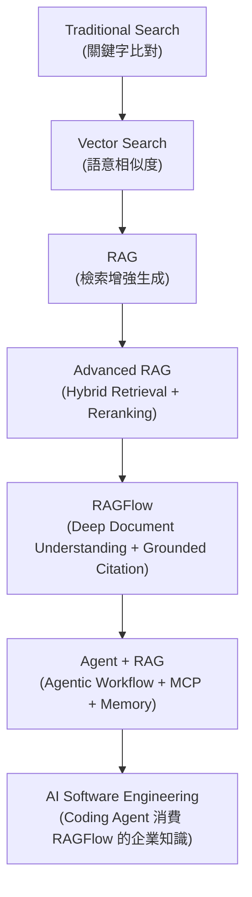

這條演進線是本手冊第20、22、25章的核心論述基礎：企業導入 RAGFlow 的終點，不只是「做一個 Chatbot」，而是把它接上 AI Coding Agent，成為 Web Application 開發、逆向工程、Framework Upgrade 的 Context Infrastructure。

### 1.11 Scenario：企業第一次接觸 RAGFlow

**情境**：某銀行的 Digital Banking 平台團隊維護一套 10 年歷史的 Spring Boot 單體應用，內部技術文件散落在 Confluence、SVN 歷史 commit、以及幾位資深工程師的腦中。新進工程師平均要 3 個月才能獨立處理一張需求票。Tech Lead 想評估 RAGFlow 能否縮短 Onboarding 時間。

- **Input**：既有系統的原始碼、Confluence 架構文件、API 規格 Word 檔、資料庫 ER 圖 PDF
- **Process**：先以 POC 方式，用 Docker Compose 在單台開發機上啟動 RAGFlow，建立「架構知識庫」與「API 規格知識庫」兩個 Dataset，上傳既有文件並觀察 Parsing／Citation 品質
- **Output**：驗證 RAGFlow 能否針對「這支 API 的呼叫序列是什麼」「這張表的哪個欄位對應到哪個 DTO」這類問題給出有引用來源的正確答案
- **後續**：POC 通過後才進入第44章「Enterprise Adoption Roadmap」的 Pilot 階段，並非直接上生產環境

### 1.12 AI Prompt 範例

```text
角色（Role）：你是企業 RAG 導入顧問。
情境（Context）：我們是一個 10 年歷史的 Spring Boot 銀行系統團隊，正在評估是否導入 RAGFlow 作為既有系統知識庫。
任務（Task）：請根據 RAGFlow 官方文件與本手冊第1章的定位說明，列出 3 個最適合作為 POC 驗證標的的具體問題類型，並說明為什麼這些問題類型能有效驗證 Deep Document Understanding 與 Grounded Citation 的價值。
限制（Constraints）：不要建議尚未確認的功能；若某項能力官方文件未明確說明，請明確標示「請以官方文件為準」。
輸出格式（Output Format）：表格，欄位為「問題類型／驗證目標／預期可觀察的失敗訊號」。
驗證（Validation）：每一項建議都必須能對應回 RAGFlow 官方已實作的具體功能。
```

### 1.13 本章 Checklist 與小結

- [ ] 已理解 RAGFlow 是「RAG + Agent 平台」，不是向量資料庫、不是 LLM、不是 Coding Agent
- [ ] 已理解 Deep Document Understanding 與 Grounded Citation 是 RAGFlow 相對於陽春 RAG 的核心差異化能力
- [ ] 已理解 RAGFlow 發版節奏很快，任何具體指令/設定都需要對照當下版本
- [ ] 已建立「Context Infrastructure」這條主軸：RAGFlow 提供知識，Agent 負責推理與執行

**小結**：RAGFlow 是一套端到端的企業 RAG 平台，核心價值在於文件解析品質（Deep Document Understanding）與答案可追溯性（Grounded Citation），並已進一步整合 Agent／MCP／Memory／Code Sandbox。後續章節會逐步展開架構、安裝、設定、Retrieval、Agent、與三大企業場景（Web 開發、逆向工程、Framework Upgrade）的實作細節。

---

## 2. RAGFlow 核心概念

### 2.1 概念地圖總覽

在深入架構與安裝之前，必須先建立一致的詞彙系統。以下把 RAGFlow 核心概念分成四組：資料與知識類、向量與檢索類、應答與可信度類、互動與自動化類。每個名詞第一次出現時提供中英對照，後續統一使用英文原文（符合技術文件慣例）。

### 2.2 資料與知識類概念

| 概念 | 中文說明 | 與其他概念的關係 |
|---|---|---|
| Knowledge Base（知識庫） | 使用者可感知的知識容器最上層抽象 | 實務上由一個或多個 Dataset 組成 |
| Dataset（資料集） | RAGFlow 中實際建立、設定 Chunking／Embedding 策略的知識集合單位 | 一個 Dataset 包含多個 Document |
| Document（文件） | 上傳到 Dataset 中的單一檔案（PDF／Word／Excel 等） | 經過 Parser 處理後產生 Chunk |
| Parser（解析器） | 負責解析特定文件格式版面、結構的元件 | 是 Deep Document Understanding 的執行者 |
| Deep Document Understanding（深度文件理解） | 不只是抽取純文字，而是理解版面、表格、標題階層、圖片位置等結構化資訊 | 直接影響 Chunk 品質，進而影響 Retrieval／Answer 品質（見第11、12章） |
| Chunk（片段） | 文件被切分後、實際被 Embedding 與檢索的最小知識單位 | 一個 Document 產生多個 Chunk |

### 2.3 向量與檢索類概念

| 概念 | 中文說明 | 與其他概念的關係 |
|---|---|---|
| Embedding | 把文字轉換成高維度向量的過程／模型，向量之間的距離代表語意相似度 | 每個 Chunk 都會產生一個 Embedding Vector |
| Vector（向量） | Embedding 的輸出結果，儲存於檢索引擎中供相似度搜尋 | 由 `DOC_ENGINE`（Elasticsearch／Infinity 等）儲存與索引 |
| Keyword Search（關鍵字搜尋） | 傳統以詞彙比對為基礎的搜尋方式 | 與 Vector Search 互補，合稱 Hybrid Search |
| Full Text Search（全文檢索） | 對文件全文建立倒排索引的搜尋技術 | Elasticsearch／OpenSearch 等引擎原生支援 |
| Hybrid Retrieval（混合檢索） | 同時使用 Vector Search 與 Keyword／Full Text Search，再融合排序結果 | RAGFlow 的核心檢索策略之一（見第13章） |
| Reranker（重排序模型） | 對初步召回的 Top-K 結果，用更精細的模型重新排序，取出 Top-N | 用於提升最終送進 LLM 的 Context 品質（見第9、13章） |

### 2.4 應答與可信度類概念

| 概念 | 中文說明 | 與其他概念的關係 |
|---|---|---|
| Context（上下文） | 送進 LLM Prompt 中，用於生成答案的檢索結果集合 | 由 Retrieval + Reranking 的輸出組成 |
| Citation（引用） | 答案中標示出處的機制，可回溯至原始 Chunk | RAGFlow 的 Grounded Citation 特色 |
| Grounding（有憑有據） | 答案內容確實基於檢索到的 Context，而非模型自行捏造 | 與 Hallucination（幻覺）相對 |
| Hallucination（幻覺） | LLM 生成看似合理但缺乏事實根據的內容 | RAG／Grounded Citation 的核心防範對象 |

### 2.5 互動與自動化類概念

| 概念 | 中文說明 | 與其他概念的關係 |
|---|---|---|
| Chat（對話助手） | 綁定特定 Dataset、可直接與使用者對話的應用 | 是 RAGFlow 最基本的應用形態（第15章） |
| Agent | 能夠規劃、串接多個步驟（含 Retrieval、Tool、Code）完成任務的自動化單位 | 建立在 Workflow 之上（第16章） |
| Workflow | Agent 執行任務的流程編排，可包含條件分支、多個節點 | RAGFlow Agent 模組的底層機制 |
| Tool（工具） | Agent 可呼叫的外部能力，例如網頁搜尋、程式碼執行、API 呼叫 | 透過 Code Sandbox／MCP 等機制擴充 |
| Prompt | 提供給 LLM 的指令與上下文範本 | System Prompt／User Prompt 皆屬此範疇 |
| Model Provider（模型供應者） | 抽象化 LLM／Embedding／Reranker 來源的設定層 | 可指向雲端 API 或本地模型伺服器（第9、10章） |

### 2.6 概念關係圖

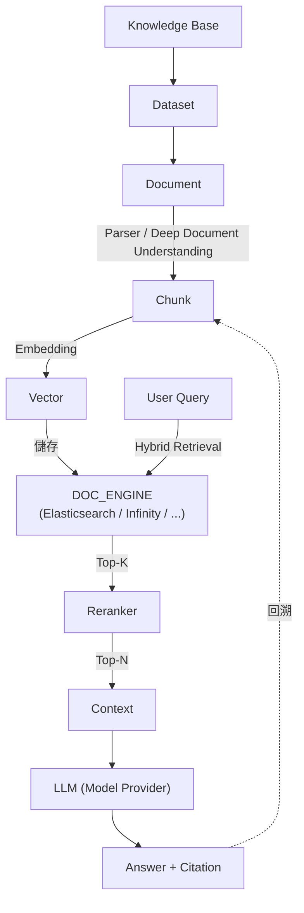

### 2.7 Scenario：新同仁第一次聽到這些名詞

**情境**：新加入的工程師第一次被指派「幫產品文件建 RAGFlow 知識庫」，卻分不清 Dataset、Document、Chunk 的差異，也不理解為什麼同一份 PDF 上傳後，Chat 給出的答案有時候會「斷章取義」。

- **Input**：一份 80 頁、含大量表格的產品規格 PDF
- **Process**：先建立一個 Dataset，上傳 PDF 成為一個 Document，觀察系統自動產生的 Chunk 切分結果
- **Output**：發現某個表格被切成兩個不相關的 Chunk，導致 Retrieval 時只抓到半張表 → 對應到第12章「Chunking 策略」中「表格類文件的 Chunking 建議」
- **啟示**：理解「Document → Chunk → Vector」這條鏈路後，才能診斷「答案斷章取義」的根因是 Chunking 而非 LLM 能力不足

### 2.8 AI Prompt 範例

```text
角色（Role）：你是 RAGFlow 知識庫概念導覽員。
情境（Context）：新同仁完全不了解 RAG 相關術語。
任務（Task）：用一個具體的「上傳一份含表格的 PDF 到 RAGFlow」的例子，依序解釋 Document、Parser、Chunk、Embedding、Vector、Retrieval、Reranker、Context、Citation 這九個名詞如何串接在一起。
限制（Constraints）：每個名詞第一次出現時給出中英對照；不要引用本手冊未定義的名詞。
輸出格式（Output Format）：條列式步驟說明，每步標註對應名詞。
驗證（Validation）：九個名詞必須全部出現且順序正確。
```

### 2.9 本章 Checklist 與小結

- [ ] 能區分 Knowledge Base／Dataset／Document／Chunk 四層容器關係
- [ ] 能解釋 Hybrid Retrieval 為何優於單純 Vector Search 或單純 Keyword Search
- [ ] 能解釋 Citation／Grounding 與 Hallucination 的對立關係
- [ ] 能畫出（或口頭描述）Document 到 Answer 的完整概念鏈路

**小結**：本章建立的詞彙系統會貫穿全書。第3、4章會把這些概念放進實際的系統元件與資料流圖中；第11-14章會深入 Document Processing、Chunking、Retrieval、Evaluation 的實作細節。

---

## 3. RAGFlow 系統架構

### 3.1 架構總覽：不是單體應用，而是多元件協作平台

依查證當下（2026-08-18）`main` 分支的原始碼頂層目錄結構（Source-confirmed，GitHub Contents API），RAGFlow 至少包含以下模組：`web`（前端）、`api`（Python 後端 API）、`admin`（管理服務）、`agent`（Agent／Workflow 邏輯）、`mcp`（MCP Server）、`memory`（Agent Memory）、`deepdoc`（文件理解引擎）、`rag`（RAG 核心邏輯）、`sdk`（Python SDK）、`common`／`internal`（Go 共用模組）、`cmd`（Go 服務進入點）、`conf`（設定範本）、`helm`（Kubernetes Helm Chart）、`docker`（Docker Compose 部署設定）、`ragflow_deps`（依賴套件）。這比許多舊版文章描述的「Python Flask 後端 + React 前端 + Elasticsearch」簡單架構複雜得多，主因是官方近期新增了 Go 語言撰寫的 Admin／Gateway 層與獨立的 MCP、Memory 模組。

### 3.2 前端與使用介面層（web）

`web` 目錄對應 RAGFlow 內建的 Web UI，提供 Dataset 管理、文件上傳、Chunk 檢視、Chat、Agent 編排等圖形化操作介面（Source-confirmed，目錄存在；具體前端框架版本請以 `web/package.json` 為準，本手冊不假設具體框架名稱以免誤植）。企業若要打造自有品牌的 Web Application（如本手冊第18-20章的 Vue3 + Spring Boot 案例），通常不會直接沿用這個內建 UI，而是透過 HTTP API／Python SDK 另行開發前端，把 RAGFlow 內建 UI 保留給知識庫管理者使用。

### 3.3 API／後端服務層（api，Python）

`api` 目錄承載 RAGFlow 的核心業務邏輯：Dataset／Document／Chat／Agent／Retrieval 等 HTTP API 端點（第17章詳述）。這一層仍以 Python 為主要語言（Source-confirmed，GitHub Languages API），與 `rag`（RAG Pipeline 核心邏輯，含 Chunking／Embedding／Retrieval 策略）、`deepdoc`（文件解析引擎）共同構成傳統認知中的「RAGFlow 後端」。

### 3.4 Admin／Go 服務層（admin、cmd、internal）

查證當下 Go 已是本專案位元組數最高的語言（Source-confirmed，GitHub Languages API），對應到 `admin`（管理服務邏輯）、`cmd`（服務進入點）、`internal`（內部共用套件）等目錄，並反映在 `docker-compose.yml` 中的 `ADMIN_SVR_HTTP_PORT`、`GO_ADMIN_PORT`、`GO_HTTP_PORT` 等環境變數（Source-confirmed，`docker/docker-compose.yml`）。這代表 RAGFlow 近期架構演進，新增了一層獨立於原本 Python API 之外的管理／閘道服務。**具體職責邊界（例如是否所有外部流量都先經過 Go 層再轉發給 Python API）官方文件未明確圖示，本手冊不做過度推論，企業導入前請以官方最新架構圖與 `admin`／`cmd` 原始碼為準（請以目前官方文件為準）。**

### 3.5 Agent 與 MCP 層（agent、mcp、memory）

- `agent`：Agent／Agentic Workflow 的核心邏輯，對應第16章
- `mcp`：MCP（Model Context Protocol）Server 實作，讓外部 MCP Client（如支援 MCP 的 Coding Agent）可以把 RAGFlow 的 Dataset／Retrieval 能力當作標準化工具呼叫，對應第21章
- `memory`：Agent Memory 功能（官方 README 更新記錄「Supports 'Memory' for AI agent」），讓 Agent 在多輪對話或多次任務執行間保留狀態

### 3.6 文件理解層 DeepDoc（deepdoc）

`deepdoc` 是 Deep Document Understanding 的實作核心，負責版面分析、表格辨識、OCR（Optical Character Recognition，光學文字辨識）等能力，對應 `docker-compose.yml` 中獨立的 `deepdoc` service／profile（Source-confirmed）。這代表官方已將文件理解引擎拆分成可獨立部署、獨立擴展的服務，而不是耦合在主應用進程內。

### 3.7 非同步任務執行層 Task Executor

文件上傳後的 Parsing／Chunking／Embedding 屬於耗時的非同步任務，官方架構中由 Task Executor 負責消費任務佇列並執行（官方已實作於架構說明，具體佇列後端請見3.9）。這一層是「上傳文件後要等待處理完成才能提問」這個使用者體感的根本原因，也是效能調校（第33章）與失敗診斷（第4、37章）的重點對象。

### 3.8 Sandbox／Code Executor（sandbox-executor-manager）

`docker-compose-base.yml` 中定義了獨立的 `sandbox-executor-manager` 服務，掛載 `/var/run/docker.sock`（Source-confirmed），代表它會動態建立容器來執行 Agent 產生的程式碼（Python／JavaScript，見 README 更新記錄）。這是企業評估「是否讓 RAGFlow Agent 具備程式碼執行能力」時，最需要從 Security Architecture（第30章）角度審視的元件，因為它涉及容器逃逸、資源濫用等風險。

### 3.9 資料與儲存層

| 元件 | 角色 | 可插拔選項 | 來源標示 |
|---|---|---|---|
| 文件檢索引擎（`DOC_ENGINE`） | 儲存 Chunk 全文與向量、提供 Hybrid Retrieval | elasticsearch（預設）／infinity／opensearch／oceanbase／seekdb | Source-confirmed |
| 關聯式資料庫（`DB_TYPE`） | 儲存 Dataset／Document／使用者／權限等中繼資料 | mysql（預設）／postgres／gaussdb／oceanbase | Source-confirmed |
| 物件儲存 | 儲存原始上傳文件 | MinIO（S3 相容 API） | Source-confirmed |
| 快取／訊息佇列 | 快取、非同步任務佇列 | Redis 相容（Valkey）、NATS | Source-confirmed |

**版本注意事項**：舊版官方文件與許多第三方文章仍以「Elasticsearch 或 Infinity 二選一」描述文件檢索引擎，這在查證當下已不完整；`DB_TYPE` 可切換關聯式資料庫這件事，也是相對新的能力，較舊的文章可能完全沒有提及。導入前務必以當時的 `docker/.env` 為準。

### 3.10 模型層：LLM／Embedding／Reranker Provider

RAGFlow 透過統一的 Model Provider 設定介面，接入外部雲端 LLM（OpenAI-compatible API）或本地模型伺服器（Ollama／vLLM／SGLang／Xinference／GPUStack 等，見第9、10章），Embedding 與 Reranker 模型亦透過相同機制設定，其中內建 `tei-cpu`／`tei-gpu`（Text Embeddings Inference，文字嵌入推論服務）服務可作為本地 Embedding 推論後端（Source-confirmed，`docker-compose-base.yml`）。

### 3.11 可觀測性層（Observability）

`docker-compose-base.yml` 中已包含 Jaeger（分散式追蹤）、ClickHouse（欄式資料庫，常用於日誌／追蹤資料的高效查詢與分析）、Kibana（Elasticsearch 資料視覺化）等服務定義（Source-confirmed）。**這些服務是否於預設 Compose Profile 中自動啟動、是否需要額外設定才能收集 RAGFlow 自身的追蹤資料，官方文件未在本手冊查證範圍內給出明確結論，請以官方最新文件與實際啟動的 Profile 為準（請以目前官方文件為準）。** 第34章會延伸討論企業如何自行整合 Prometheus／Grafana／OpenTelemetry。

### 3.12 完整系統架構圖

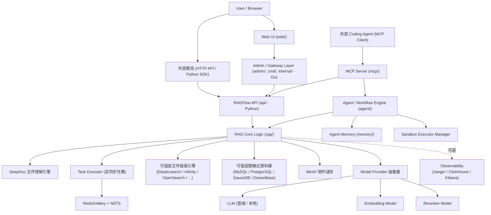

### 3.13 Scenario：架構審查會議

**情境**：企業資安部門在導入前要求架構審查，第一個問題就是「你們說的 RAGFlow 到底是幾個服務組成的？資料會經過哪些元件？」

- **Input**：本章架構圖與 3.9 節的資料儲存表
- **Process**：Architect 逐一標示每個元件的網路暴露面（哪些 Port 對外、哪些只在內網）、資料是否落地、Sandbox 是否具備容器逃逸風險
- **Output**：一份給資安部門的「元件清單 + 網路暴露面 + 資料落地位置」表，作為第30章 Security Architecture 的輸入
- **注意事項**：Sandbox Executor Manager 掛載 Docker Socket 是本圖中風險等級最高的元件，必須在資安審查中特別標註

### 3.14 AI Prompt 範例

```text
角色（Role）：你是企業 Solution Architect。
情境（Context）：我要向資安與維運團隊簡報 RAGFlow 的系統架構，對象不熟悉 RAG 技術細節。
任務（Task）：根據本手冊第3章的架構圖與元件說明，整理一份「元件名稱／職責／是否對外暴露 Port／資料是否落地／風險等級」的表格。
限制（Constraints）：風險等級只能基於本章明確描述的事實（例如 Sandbox 掛載 Docker Socket）評定，不可臆測未提及的漏洞。
輸出格式（Output Format）：Markdown 表格。
驗證（Validation）：每一列都必須能對應回本章 3.2-3.11 節的具體敘述。
```

### 3.15 本章 Checklist 與小結

- [ ] 能列出 RAGFlow 至少 8 個核心模組（web／api／admin／agent／mcp／memory／deepdoc／rag）並說明各自職責
- [ ] 理解 Go 與 Python 分別對應的架構層級，不會誤稱「RAGFlow 是純 Python 專案」
- [ ] 能指出資料檢索引擎與關聯式資料庫均為可插拔設計，而非單一固定技術
- [ ] 能辨識 Sandbox Executor Manager 是架構中風險等級最高、需優先審查的元件

**小結**：RAGFlow 是一個由 Python 核心邏輯、Go 管理／閘道層、TypeScript 前端，以及多種可插拔基礎設施元件組成的多語言平台，複雜度遠高於單體應用。第4章接著把這個靜態架構圖轉換為動態的資料流視角。

---

## 4. RAGFlow Data Flow

### 4.1 管線總覽

RAGFlow 的資料流可分成兩大階段：**Ingestion Time（知識建置期）**——文件從上傳到可被檢索為止；以及 **Query Time（查詢期）**——使用者提問到取得帶引用的答案為止。

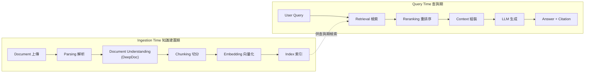

### 4.2 階段一：Document 上傳

- **Input**：使用者透過 Web UI／HTTP API／Python SDK 上傳檔案，或透過資料源連接器（Confluence／Notion／Google Drive／Slack／SharePoint 等 30 種以上，官方已實作，完整清單見第11.2節）同步文件
- **Processing**：檔案先寫入 MinIO 物件儲存，並在關聯式資料庫建立對應的 Document 中繼資料記錄，狀態標記為待處理
- **Output**：一筆待處理的 Document 記錄
- **儲存位置**：原始檔案 → MinIO；中繼資料 → MySQL／PostgreSQL 等
- **可能的失敗點**：檔案格式不支援、檔案過大超過上傳限制、物件儲存空間不足
- **Performance consideration**：巨量檔案批次上傳時，建議透過 API／SDK 分批處理並監控 MinIO 磁碟用量

### 4.3 階段二：Parsing 解析

- **Input**：MinIO 中的原始檔案
- **Processing**：Task Executor 消費任務佇列，呼叫對應格式的 Parser（PDF／Word／Excel／PPT／Markdown／HTML／TXT／圖片等）
- **Output**：結構化的中間表示（版面區塊、表格、標題階層）
- **可能的失敗點**：掃描件 OCR 辨識率低、特殊版面（多欄位、浮水印）解析錯位、密碼保護檔案無法開啟
- **Performance consideration**：PDF／掃描件解析屬 CPU／GPU 密集操作，是整條管線中延遲最高的階段之一（詳見第33章）

### 4.4 階段三：Document Understanding（DeepDoc）

- **Input**：Parsing 階段輸出的結構化中間表示
- **Processing**：DeepDoc 引擎進一步理解版面語意——哪些區塊是標題、哪些是表格、圖片與周邊文字的關聯，必要時執行 OCR
- **Output**：帶有結構標註的文件內容
- **可能的失敗點**：表格跨頁時的行列對應錯誤、圖表中的文字未被正確辨識
- **Performance consideration**：這是官方強調「文件解析品質通常比單純選擇 Vector Database 更影響企業 RAG 實際效果」的關鍵階段（見11.1節延伸說明）

### 4.5 階段四：Chunking 切分

- **Input**：帶結構標註的文件內容
- **Processing**：依 Dataset 設定的 Chunking 策略（Fixed-size／Semantic／依段落／依標題／依表格等，見第12章），將文件切分為 Chunk
- **Output**：一組 Chunk，每個 Chunk 保留可回溯至原文位置的中繼資料（供 Citation 使用）
- **儲存位置**：Chunk 全文與中繼資料寫入文件檢索引擎（`DOC_ENGINE`）
- **可能的失敗點**：Chunk 過大導致語意稀釋、Chunk 過小導致上下文斷裂（見12.2節「Bad Chunk → Bad Retrieval」）

### 4.6 階段五：Embedding 向量化

- **Input**：Chunk 文字內容
- **Processing**：呼叫設定的 Embedding Model（雲端 API 或本地 `tei-cpu`／`tei-gpu` 服務）將文字轉換為向量
- **Output**：每個 Chunk 對應一組向量
- **可能的失敗點**：Embedding 模型與 Chunk 語言不匹配（例如中文內容使用未針對中文優化的模型）、批次呼叫時的 Rate Limit
- **Performance consideration**：`EMBEDDING_BATCH_SIZE` 等設定直接影響 Ingestion 吞吐量（見第8章設定表）

### 4.7 階段六：Index 索引

- **Input**：Chunk 全文 + 向量
- **Processing**：寫入文件檢索引擎，同時建立全文索引（供 Keyword Search）與向量索引（供 Vector Search）
- **Output**：可被 Hybrid Retrieval 查詢的索引
- **儲存位置**：`DOC_ENGINE`（Elasticsearch／Infinity 等）
- **可能的失敗點**：索引引擎磁碟／記憶體不足、`vm.max_map_count` 未調整導致 Elasticsearch 啟動失敗（見第37章 Troubleshooting）

### 4.8 階段七：Retrieval 檢索（查詢期起點）

- **Input**：使用者的 Query（自然語言問題）
- **Processing**：同時執行 Vector Search 與 Keyword／Full Text Search，取得候選 Chunk 集合（Top-K）
- **Output**：Top-K 候選 Chunk 及其相似度分數
- **可能的失敗點**：Query 與知識庫用詞落差過大（詞彙不匹配）、Top-K 設定過小導致遺漏關鍵資訊

### 4.9 階段八：Reranking 重排序

- **Input**：Top-K 候選 Chunk
- **Processing**：Reranker 模型針對 Query 與每個候選 Chunk 的關聯度重新評分排序
- **Output**：Top-N（N < K）最相關 Chunk
- **可能的失敗點**：未啟用 Reranker 時，Hybrid Retrieval 的融合排序品質可能不如預期（見第9、13章）

### 4.10 階段九：Context 組裝

- **Input**：Top-N Chunk
- **Processing**：依 Prompt 模板將 Chunk 內容、來源中繼資料組裝進送給 LLM 的 Context
- **Output**：最終的 LLM Prompt（含 System Prompt、Context、User Query）
- **可能的失敗點**：Context 總長度超過 LLM Context Window、多個 Chunk 內容互相矛盾未妥善處理

### 4.11 階段十：LLM 生成 → Answer

- **Input**：組裝完成的 Prompt
- **Processing**：呼叫設定的 LLM Model Provider 生成回答
- **Output**：自然語言答案
- **可能的失敗點**：LLM API 逾時／Rate Limit、模型未遵循「僅根據提供的 Context 回答」的指示而產生 Hallucination

### 4.12 階段十一：Citation 引用

- **Input**：LLM 生成的答案 + 使用的 Chunk 清單
- **Processing**：將答案中的陳述與來源 Chunk 建立對應關係，供前端視覺化標示
- **Output**：帶有可點擊引用標記的最終回應
- **可能的失敗點**：LLM 生成內容與實際引用 Chunk 對應不精確（模型自行改寫過多，導致引用失準）

### 4.13 各階段失敗點與效能考量彙總表

| 階段 | 主要失敗點 | 效能考量重點 |
|---|---|---|
| Upload | 格式不支援、檔案過大 | MinIO 磁碟容量 |
| Parsing | OCR 辨識率、特殊版面 | CPU/GPU 密集，延遲最高 |
| Document Understanding | 跨頁表格、圖文關聯 | 直接決定 Chunk 品質 |
| Chunking | 過大/過小切分 | 影響 Retrieval 精準度 |
| Embedding | 語言不匹配、Rate Limit | Batch Size 影響吞吐量 |
| Index | 引擎資源不足 | `vm.max_map_count` 等系統參數 |
| Retrieval | 詞彙不匹配、Top-K 過小 | 索引引擎查詢延遲 |
| Reranking | 未啟用導致排序品質下降 | 增加額外延遲，需權衡準確度與速度 |
| Context 組裝 | 超過 Context Window | Prompt 模板設計 |
| LLM 生成 | API 逾時、Hallucination | 模型選擇與 Prompt 工程 |
| Citation | 引用對應失準 | 依賴 LLM 遵循指示的穩定度 |

### 4.14 Scenario：一個查詢的完整生命週期

**情境**：使用者在銀行內部知識庫問「信用卡逾期未繳的停卡流程是什麼？」

- **Input**：自然語言 Query
- **Process**：Hybrid Retrieval 同時用「逾期」「停卡」等關鍵字與語意向量檢索，找出 SOP 文件中相關的 3 個 Chunk；Reranker 判斷其中 1 個 Chunk 是舊版已作廢流程、排序至後段；LLM 根據 Top-N Context 生成答案並標示引用來源頁碼
- **Output**：帶引用的答案，且使用者可點擊查看原始 SOP 文件段落
- **失敗情境對照**：若知識庫中新舊版 SOP 未妥善做 Dataset 版本管理（見第29章 Dataset Governance），Reranker 也可能排序失準，答案引用到已作廢流程

### 4.15 AI Prompt 範例

```text
角色（Role）：你是 RAG Pipeline 診斷工程師。
情境（Context）：使用者回報 RAGFlow Chat 給出的答案「斷章取義」或「引用到過時文件」。
任務（Task）：依照本手冊第4章的 11 個資料流階段，列出診斷這個問題時應該依序檢查的階段與對應的檢查方法。
限制（Constraints）：只能引用第4章已定義的階段名稱與失敗點，不要發明未提及的檢查項目。
輸出格式（Output Format）：由前到後排序的檢查清單，每項含「階段／檢查方法／若發現問題的可能根因」。
驗證（Validation）：清單必須依 Upload → Citation 的順序排列，且每一項根因都能對應回 4.13 節的彙總表。
```

### 4.16 本章 Checklist 與小結

- [ ] 能區分 Ingestion Time 與 Query Time 兩大階段
- [ ] 能列出至少 8 個資料流階段並說明各自的 Input/Processing/Output
- [ ] 能針對「答案品質不佳」的問題，依資料流階段定位可能根因
- [ ] 理解 Chunking 與 Document Understanding 品質是整條管線影響力最大的環節

**小結**：資料流是本手冊後續 Document Processing（第11章）、Chunking（第12章）、Retrieval（第13章）、RAG Evaluation（第14章）四章的統整視角。診斷任何「答案不準確」問題時，都建議先回到本章的 11 階段表定位問題發生的環節，而不是直接懷疑 LLM 本身。

---

## 5. 安裝準備與環境需求

### 5.1 硬體需求總表

依官方 Quickstart 文件（官方已實作，`docs/quickstart.mdx`，查證基準 v0.26.4）：

| 項目 | 官方最低需求 | 來源標示 |
|---|---|---|
| CPU | ≥ 4 核心（x86） | 官方已實作 |
| RAM | ≥ 16 GB | 官方已實作 |
| Disk | ≥ 50 GB | 官方已實作 |
| Docker Engine | ≥ 24.0.0 | 官方已實作 |
| Docker Compose | ≥ v2.26.1 | 官方已實作 |
| Python（原始碼開發用） | ≥ 3.13 | 官方已實作 |
| CPU 架構支援 | 官方正式支援 x86；ARM64 需自行 Build 客製 Docker Image | 官方已實作 |
| GPU 支援 | 官方正式支援 NVIDIA GPU（見第7章） | 官方已實作 |

**Production 建議**：上表為官方標示的**最低**需求，是可以跑起來的門檻，不是生產環境建議值。實務上企業 Production 部署建議至少：CPU 8 核心以上、RAM 32 GB 以上（若同時開啟多個 Search Engine 候選、ClickHouse、Jaeger 等觀測元件則需更多）、Disk 依知識庫規模與保留策略估算（原始文件 + 索引 + 備份，建議以 Production 預估資料量的 3-5 倍抓 Disk 容量）（建議架構）。

### 5.2 作業系統需求

官方部署路徑高度依賴 Docker／Docker Compose，因此實際「作業系統需求」更精確的說法是「Docker Engine 能否在該作業系統上穩定運行」：

- **Linux**：官方主要驗證環境，`vm.max_map_count` 可直接透過 `sysctl` 調整（見5.3節）
- **macOS**：透過 Docker Desktop，`vm.max_map_count` 需在 Docker Desktop 的 Linux VM 內調整
- **Windows**：官方 Quickstart 文件中，`vm.max_map_count` 調整步驟明確包含一段 **WSL 2** 專用指令（見5.3節），代表官方預期的 Windows 部署路徑是「Docker Desktop with WSL 2 backend」，而非 Hyper-V 模式或原生 Windows 容器（官方已實作，`docs/quickstart.mdx`）。除了這段 `vm.max_map_count` 指令外，官方目前**未提供**獨立的「Windows 安裝指南」章節（Source-confirmed，未在 `docs/administrator`／`docs/guides` 目錄中發現對應頁面）。

### 5.3 vm.max_map_count 設定（Elasticsearch 前置需求）

RAGFlow 預設 `DOC_ENGINE=elasticsearch`，而 Elasticsearch 要求作業系統的 `vm.max_map_count` 至少為 262144，否則容器會啟動失敗或反覆重啟（官方已實作，`docs/quickstart.mdx`）。

```bash
# Linux：查詢目前值
sysctl vm.max_map_count

# Linux：設定（重開機會重置，正式環境請寫入 /etc/sysctl.conf 永久生效）
sudo sysctl -w vm.max_map_count=262144
```

```bash
# macOS（Docker Desktop）：需在 Docker Desktop 的 Linux VM 內執行
docker run --rm --privileged --pid=host alpine sysctl -w vm.max_map_count=262144
```

```bash
# Windows（WSL 2）：先以系統管理員身分進入 docker-desktop 的 WSL distro
wsl -d docker-desktop -u root
sysctl -w vm.max_map_count=262144
```

> ⚠️ 以上三種設定方式在系統重開機後都會被重置，正式環境務必透過永久化設定檔案（如 `/etc/sysctl.conf`、Docker Desktop 的啟動腳本）自動套用（官方已實作＋建議架構）。若改用 `DOC_ENGINE=infinity` 是否仍需要這項設定，官方文件未明確說明，**請以目前官方文件為準**。

### 5.4 Docker Volumes 與磁碟規劃

RAGFlow 的 Docker Compose 部署會建立多個具名 Volume（如 `esdata01`／`mysql_data`／`minio_data`／`redis_data`／`osdata01`／`infinity_data`／`clickhouse_data` 等，Source-confirmed，`docker/docker-compose-base.yml`），分別對應文件檢索引擎索引、關聯式資料庫、物件儲存、快取。企業規劃磁碟時建議：

- 將 Docker Volume 根目錄（預設 `/var/lib/docker/volumes`）掛載到獨立且足夠大的磁碟／分割區
- 依 5.1 節建議的 3-5 倍估算係數規劃容量
- 若採用 OceanBase／SeekDB 作為 `DB_TYPE`／`DOC_ENGINE`，注意其對應的 `OB_MEMORY_LIMIT`、`SEEKDB_MEMORY_LIMIT` 等記憶體設定（見第8章）

### 5.5 Port 與防火牆

依官方 `docker/.env`（Source-confirmed，v0.26.4）：

| 環境變數 | 預設值 | 用途 |
|---|---|---|
| `SVR_WEB_HTTP_PORT` | 80 | RAGFlow Web UI／API 對外 HTTP 入口 |
| `SVR_WEB_HTTPS_PORT` | 443 | HTTPS 入口（需另行設定憑證，見第8章） |
| `SVR_HTTP_PORT` | 9380 | 內部服務埠 |
| `ADMIN_SVR_HTTP_PORT` | 9381 | Admin 服務埠 |
| `SVR_MCP_PORT` | 9382 | MCP Server 埠 |
| `GO_ADMIN_PORT` | 9383 | Go Admin 服務埠 |
| `GO_HTTP_PORT` | 9384 | Go HTTP 服務埠 |

**Production 建議**：僅將 `SVR_WEB_HTTP_PORT`／`SVR_WEB_HTTPS_PORT`（建議只開 HTTPS）透過防火牆／Reverse Proxy 對外開放；9380-9384 等內部服務埠與資料庫／檢索引擎／物件儲存埠（3306、9000、6379、9200 等）應僅限內網或容器網路存取，不應直接暴露到公網（建議架構，見第30章 Security Architecture 延伸討論）。

### 5.6 Windows 使用情境

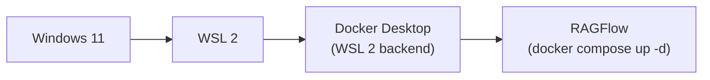

企業開發環境若使用 Windows，建議路徑為：

1. 啟用 WSL 2（`wsl --install`，需系統管理員權限）
2. 安裝 Docker Desktop，並在設定中確認使用 **WSL 2 backend**（而非舊式 Hyper-V backend）
3. 依 5.3 節指令調整 WSL 2 內的 `vm.max_map_count`
4. 建議將專案原始碼與 Docker Volume 資料放在 WSL 2 檔案系統內（例如 `\\wsl$\Ubuntu\home\...`），而非 Windows 磁碟機掛載路徑（`/mnt/c/...`），以避免檔案系統橋接帶來的 I/O 效能損耗（建議架構，此為 WSL 2 一般已知的效能特性，非 RAGFlow 專屬限制）
5. 後續 `git clone`／`docker compose` 指令（第6章）皆在 WSL 2 的 Linux Shell 中執行，而非 Windows PowerShell

**為什麼不建議原生 Windows 直接執行**：RAGFlow 的 Docker Compose 部署鏈路（Elasticsearch、MySQL、MinIO 等容器）本質上是 Linux 容器，Windows 原生只能透過 Hyper-V 或 WSL 2 提供 Linux 核心相容層才能執行。官方 Quickstart 文件明確給出的是 WSL 2 路徑指令，因此本手冊建議企業一律採 WSL 2 backend，不評估 Hyper-V backend 或原生 Windows 容器模式（建議架構）。

### 5.7 Scenario：企業開發機安裝前檢查

**情境**：DevOps 工程師準備在一台 Windows 11 開發機上安裝 RAGFlow 供團隊 POC 使用。

- **Input**：一台 RAM 32GB、SSD 512GB 的 Windows 11 筆電
- **Process**：先確認 WSL 2 與 Docker Desktop 已安裝且使用 WSL 2 backend → 執行 `wsl -d docker-desktop -u root` 調整 `vm.max_map_count` → 確認 Docker Desktop 資源設定（CPU／記憶體配額）足以滿足 5.1 節門檻
- **Output**：一份「安裝前檢查清單」勾選結果，確認後才進入第6章實際部署
- **常見誤區**：忘記調整 `vm.max_map_count`，導致 Elasticsearch 容器不斷重啟，`docker compose ps` 顯示 `es01` 狀態為 `Restarting`（對應第37章 Troubleshooting）

### 5.8 AI Prompt 範例

```text
角色（Role）：你是企業 DevOps 工程師。
情境（Context）：我們要在 Windows 11 + Docker Desktop 環境準備安裝 RAGFlow v0.26.4。
任務（Task）：依本手冊第5章內容，產生一份安裝前檢查清單（Pre-installation Checklist），涵蓋硬體資源、WSL 2 設定、vm.max_map_count、Port 規劃四大類。
限制（Constraints）：只能使用本章列出的官方已確認資訊，不可臆測官方未提及的 Windows 原生支援方式。
輸出格式（Output Format）：Markdown Checklist（`- [ ]` 格式）。
驗證（Validation）：每一項檢查點都必須能對應回本章 5.1-5.6 節的具體內容。
```

### 5.9 本章 Checklist 與小結

- [ ] 已確認硬體資源滿足官方最低需求（CPU 4 核心／RAM 16GB／Disk 50GB）
- [ ] 已確認 Docker Engine／Docker Compose 版本符合要求
- [ ] 已完成 `vm.max_map_count` 設定（依作業系統選擇對應指令）
- [ ] Windows 環境已確認使用 WSL 2 backend，而非 Hyper-V backend
- [ ] 已規劃好對外開放與僅限內網的 Port 清單

**小結**：RAGFlow 的安裝門檻本質上是「Docker 能否正常運作＋`vm.max_map_count` 是否正確設定」。Windows 環境務必透過 WSL 2 + Docker Desktop 路徑安裝，官方目前沒有原生 Windows 安裝指南。第6章接續進入實際的 Docker Compose 部署步驟。

---

## 6. Docker Compose 安裝實作

### 6.1 取得原始碼與版本釘選

官方 Quickstart 建議明確 `checkout` 到特定 Release Tag，而非直接使用 `main` 分支最新程式碼（官方已實作，`docs/quickstart.mdx`）：

```bash
git clone https://github.com/infiniflow/ragflow.git
cd ragflow/docker
git checkout -f v0.26.4
docker compose -f docker-compose.yml up -d
```

**版本注意事項**：本手冊查證基準為 `v0.26.4`；企業導入時請將指令中的 tag 換成當下的最新穩定 Release，並先閱讀該版本的 Release Notes 確認無 Breaking Change（見第38章 Upgrade Strategy）。

### 6.2 .env 關鍵設定總覽

`docker/.env` 是安裝時最主要的設定入口（Source-confirmed，v0.26.4），關鍵分類如下：

| 分類 | 關鍵變數 | 預設值 | 說明 |
|---|---|---|---|
| 映像版本 | `RAGFLOW_IMAGE` | `infiniflow/ragflow:v0.26.4` | 主應用映像，版本升級時需同步調整 |
| 文件檢索引擎 | `DOC_ENGINE` | `elasticsearch` | 可選 `elasticsearch`／`infinity`／`opensearch`／`oceanbase`／`seekdb`／`gaussdb` |
| 關聯式資料庫 | `DB_TYPE` | `mysql` | 可選 `mysql`／`postgres`／`gaussdb`／`oceanbase` |
| Web Port | `SVR_WEB_HTTP_PORT` | 80 | 對外主要入口（見5.5節） |
| 時區 | `TZ` | `Asia/Shanghai` | **企業導入時務必依機房／使用者所在時區調整**，例如台灣應設為 `Asia/Taipei` |
| 使用者註冊 | `REGISTER_ENABLED` | 1 | **Production 環境強烈建議關閉或搭配 SSO／邀請制**，避免任意使用者自行註冊帳號存取企業知識庫（建議架構，見第30章） |
| 全域記憶體上限 | `MEM_LIMIT` | 8073741824（約 8GB） | 容器記憶體上限，資源不足時常見的 OOM 根因 |
| Embedding 批次大小 | `EMBEDDING_BATCH_SIZE` | 16 | 影響 Ingestion 吞吐量與 Embedding API 呼叫頻率 |
| 執行緒池上限 | `THREAD_POOL_MAX_WORKERS` | 128 | Task Executor 併發處理上限 |
| 推論裝置 | `DEVICE` | `cpu` | 設為 `gpu` 搭配 `ragflow-gpu` profile（見第7章） |
| 各服務帳密 | `ELASTIC_PASSWORD`／`MYSQL_PASSWORD`／`MINIO_PASSWORD`／`REDIS_PASSWORD`／`CLICKHOUSE_PASSWORD` | 均預設 `infini_rag_flow` | **Production 環境務必逐一更換為高強度密碼**，這是 Production 部署最容易被忽略、也最危險的一步（見第30章） |

### 6.3 docker-compose.yml 與 docker-compose-base.yml 的關係

官方將 Compose 設定拆成兩層（Source-confirmed）：

- `docker-compose.yml`：透過 `include` 機制引用 `docker-compose-base.yml`，並定義三個依 Profile 切換的主應用服務：`deepdoc`（profile `deepdoc`）、`ragflow-cpu`（profile `cpu`）、`ragflow-gpu`（profile `gpu`）
- `docker-compose-base.yml`：定義完整的基礎設施服務，至少包含：`es01`（Elasticsearch）、`opensearch01`、`infinity`、`serenedb`、`oceanbase`、`seekdb`、`mysql`、`minio`、`redis`、`nats`、`clickhouse`、`jaeger`、`kibana`、`tei-cpu`／`tei-gpu`（Text Embeddings Inference）、`sandbox-executor-manager`

**重要**：並非以上服務全部會在 `docker compose up -d` 時全數啟動——多數資料庫／檢索引擎替代方案（如 `opensearch01`、`serenedb`、`oceanbase`、`seekdb`）僅在對應的 `DOC_ENGINE`／`DB_TYPE` 設定被選用時才會實際啟用（依 Compose Profile／條件式啟動機制，具體條件請以當下版本的 `docker-compose-base.yml` 為準）。

### 6.4 service_conf.yaml.template 結構

此檔案是 RAGFlow 應用層讀取的主設定檔範本，容器啟動時會依 `.env` 變數渲染出實際的 `service_conf.yaml`（Source-confirmed，v0.26.4）。頂層設定區塊包含：`general`、`ragflow`、`admin`、`mysql`、`minio`、`es`、`os`、`infinity`、`serenedb`、`oceanbase`、`gaussdb`、`seekdb`、`redis`、`nats`、`clickhouse`、`otel`（OpenTelemetry，見第34章）、`ingestor`、`file_syncer`（資料源同步，對應 Confluence／S3／Notion 等連接器）、`user_default_llm`（預設模型 Provider，含 `default_models` 下的 `embedding_model`／`chat_model`／`rerank_model`／`asr_model`／`image2text_model`）。

### 6.5 啟動指令與健康檢查

```bash
# 啟動（CPU 模式，前景不阻塞）
docker compose -f docker-compose.yml --profile cpu up -d

# 查看主應用容器日誌，確認服務就緒
docker logs -f docker-ragflow-cpu-1

# 查看所有服務狀態
docker compose -f docker-compose.yml ps
```

服務就緒後，依官方文件說明，只需在瀏覽器輸入 `http://IP_OF_YOUR_MACHINE`（預設監聽 Port 80，對應 `SVR_WEB_HTTP_PORT`）即可進入登入畫面（官方已實作，`docs/quickstart.mdx`）。**確切的 `docker compose` profile 參數語法（是否需要顯式帶 `--profile cpu`，或由 `.env` 中其他變數自動決定）請以當下版本 `docker-compose.yml` 的 profile 設定為準**，本手冊示範指令以官方 Quickstart 逐字引用的 `docker compose -f docker-compose.yml up -d` 為主要依據。

### 6.6 Restart Policy 與 Logs

生產環境建議確認 Compose 檔案中各服務的 `restart` 政策（如 `unless-stopped` 或 `always`），確保容器意外中止後能自動復原；日誌建議統一導出至企業既有的 Log 平台（見第34章與既有 [ELK-Stack教學手冊](../工具/ELK-Stack教學手冊.md)、[Prometheus與Grafana教學手冊](../工具/Prometheus與Grafana教學手冊.md) 整合），而非僅依賴 `docker logs` 手動查看（建議架構）。

### 6.7 Scenario：第一次啟動失敗排查

**情境**：工程師照著 6.1-6.5 節指令啟動後，`http://IP_OF_YOUR_MACHINE` 打不開。

- **Input**：`docker compose ps` 顯示 `es01` 服務狀態持續 `Restarting`
- **Process**：檢查 `docker logs es01`，發現 `max virtual memory areas vm.max_map_count [65530] is too low` 錯誤訊息 → 回頭執行第5.3節指令
- **Output**：調整 `vm.max_map_count` 後重新 `docker compose up -d`，`es01` 轉為 `healthy`
- **對應章節**：此為第37章 Troubleshooting 表中最常見的第一類問題

### 6.8 AI Prompt 範例

```text
角色（Role）：你是負責 RAGFlow POC 環境建置的工程師。
情境（Context）：我要在一台全新的 Ubuntu 22.04 伺服器上，依本手冊第6章步驟部署 RAGFlow v0.26.4 CPU 模式。
任務（Task）：產生一份從 git clone 到瀏覽器可正常開啟登入畫面為止的完整操作腳本與檢查點，並在每個關鍵步驟後加註「如何確認這一步成功」。
限制（Constraints）：指令必須逐字引用本章 6.1、6.5 節內容，不可自行發明未經確認的參數。
輸出格式（Output Format）：帶編號的操作步驟，每步含指令區塊與確認方式。
驗證（Validation）：步驟順序必須是 clone → checkout → up -d → 查看 log → 瀏覽器驗證。
```

### 6.9 本章 Checklist 與小結

- [ ] 已依官方版本 Tag（而非 `main` 分支）取得原始碼
- [ ] 已檢視並依企業需求調整 `.env` 中的時區、註冊開關、各服務密碼
- [ ] 理解 `docker-compose.yml` 與 `docker-compose-base.yml` 的分層關係
- [ ] 已設定日誌與 Restart Policy 符合企業維運要求

**小結**：Docker Compose 是官方唯一詳細記載的安裝路徑，核心是「釘選版本 Tag → 調整 `.env` → `docker compose up -d` → 檢查日誌」。第7章接續說明如何切換到 GPU 模式。

---

## 7. GPU 與 NVIDIA 部署

### 7.1 何時需要 GPU

RAGFlow 在以下環節可受益於 GPU 加速（官方已實作／Source-confirmed，依 `DEVICE` 設定與 `tei-gpu`／`ragflow-gpu` 服務）：

- **Embedding 推論**：內建 `tei-gpu`（Text Embeddings Inference GPU 版）服務可大幅提升批次 Embedding 吞吐量
- **Document Understanding／OCR**：DeepDoc 在處理大量掃描件、複雜版面 PDF 時，GPU 可加速版面分析與 OCR 模型推論
- **本地 LLM 推論**：若採用第10章的本地模型方案（Ollama／vLLM／Xinference／GPUStack），GPU 幾乎是必要條件

### 7.2 NVIDIA Container Toolkit 需求

使用 `ragflow-gpu` Profile 前，主機需具備：

1. NVIDIA GPU 驅動程式（主機端安裝，非容器內安裝）
2. Docker Engine 已安裝 **NVIDIA Container Toolkit**，使容器可透過 `--gpus` 或 Compose 的 `deploy.resources.reservations.devices` 存取實體 GPU
3. 確認 `docker run --rm --gpus all nvidia/cuda:12.0-base nvidia-smi` 可在主機正常執行，作為容器 GPU 存取的前置驗證（建議架構，屬 Docker + NVIDIA 官方標準驗證方式，非 RAGFlow 專屬步驟）

### 7.3 啟用 GPU 模式

依 `docker/.env` 與 `docker-compose.yml`（Source-confirmed）：

```bash
# 於 .env 中設定
DEVICE=gpu

# 啟動時改用 gpu profile 與 GPU 版映像
docker compose -f docker-compose.yml --profile gpu up -d
```

`ragflow-gpu` 服務於 Compose 中設定為存取主機全部 GPU（Source-confirmed，`docker-compose.yml` 中的 NVIDIA GPU 存取設定），對應 `TEI_IMAGE_GPU` 環境變數亦會切換為 GPU 版 Text Embeddings Inference 映像。**是否可設定僅存取特定編號的 GPU（多 GPU 主機的資源隔離），需視當下 `docker-compose.yml`／`docker-compose-base.yml` 的 `deploy` 區塊寫法而定，請以官方最新設定為準（請以目前官方文件為準）。**

### 7.4 CPU 部署 vs GPU 部署比較

| 面向 | CPU 部署 | GPU 部署 |
|---|---|---|
| 硬體門檻 | 低（一般伺服器即可） | 高（需 NVIDIA GPU + 驅動 + Container Toolkit） |
| Embedding 吞吐量 | 較低，大批量 Ingestion 耗時較長 | 明顯提升，適合大規模知識庫初次建置 |
| OCR／複雜 PDF 解析速度 | 較慢 | 明顯提升 |
| 本地 LLM 可行性 | 僅適合小型模型或作為 Fallback | 可運行中大型本地模型（見第10章） |
| 成本 | 較低 | GPU 硬體／雲端 GPU 執行個體成本顯著較高 |
| 適合情境 | POC、小型知識庫、以雲端 LLM API 為主 | 大型知識庫、高頻 Ingestion、資料無法出企業內網（需本地模型） |

### 7.5 企業選型建議

- **POC／Pilot 階段**（第44章）：建議先以 CPU 模式 + 雲端 LLM／Embedding API 驗證流程可行性，降低初期基礎設施投資
- **Production 且知識庫持續大量成長**：建議導入 GPU，優先用於 Embedding 與 DeepDoc／OCR 加速，即使 LLM 本身仍使用雲端 API
- **金融／高合規要求、資料不可出企業內網**：GPU 幾乎是必要投資，因為此時 LLM／Embedding 都必須採用第10章的本地模型方案（建議架構）

### 7.6 Scenario：從 CPU POC 升級到 GPU Production

**情境**：POC 階段用 CPU 模式驗證可行，Pilot 階段知識庫從 500 份文件成長到 5 萬份文件，Ingestion 時間從數分鐘暴增到數小時。

- **Input**：既有 CPU 模式部署、成長中的知識庫規模
- **Process**：評估 GPU 主機／雲端 GPU 執行個體成本 → 調整 `.env` 之 `DEVICE=gpu` → 重新部署 `ragflow-gpu` profile → 以相同資料集比較 Ingestion 耗時
- **Output**：Ingestion 吞吐量提升的量化數據，作為向管理層申請 GPU 預算的依據
- **注意事項**：升級到 GPU 前，建議先用第33章 Performance Tuning 的方法確認瓶頸真的在 Embedding／OCR，而非 Chunking 策略或磁碟 I/O（避免錯誤歸因）

### 7.7 AI Prompt 範例

```text
角色（Role）：你是企業基礎設施成本評估顧問。
情境（Context）：我們正在評估 RAGFlow 從 CPU 模式升級到 GPU 模式的投資報酬。
任務（Task）：依本章 7.1、7.4、7.5 節內容，列出決定是否導入 GPU 的關鍵判斷因子，並說明每個因子應該如何量化評估。
限制（Constraints）：不要引用本章未提及的效能數據或 Benchmark 數字。
輸出格式（Output Format）：決策樹或條列式判斷邏輯。
驗證（Validation）：每個判斷因子都必須能對應回 7.1／7.4／7.5 節的具體敘述。
```

### 7.8 本章 Checklist 與小結

- [ ] 已確認主機具備 NVIDIA GPU 驅動與 NVIDIA Container Toolkit
- [ ] 理解 GPU 主要加速 Embedding、DeepDoc／OCR、本地 LLM 推論三個環節，而非全面加速
- [ ] 已依企業階段（POC／Pilot／Production）評估是否需要 GPU 投資
- [ ] 已確認升級 GPU 前已排除其他效能瓶頸（避免誤判）

**小結**：GPU 不是 RAGFlow 的必要條件，但在 Embedding 吞吐量、OCR 速度、本地 LLM 可行性三方面有決定性影響。第8章接續完整整理所有設定層與設定鍵。

---

## 8. RAGFlow Configuration 詳解

### 8.1 三層設定總覽

RAGFlow 的設定分散在三層檔案中，理解這個分層是排查「改了設定卻沒生效」問題的關鍵：

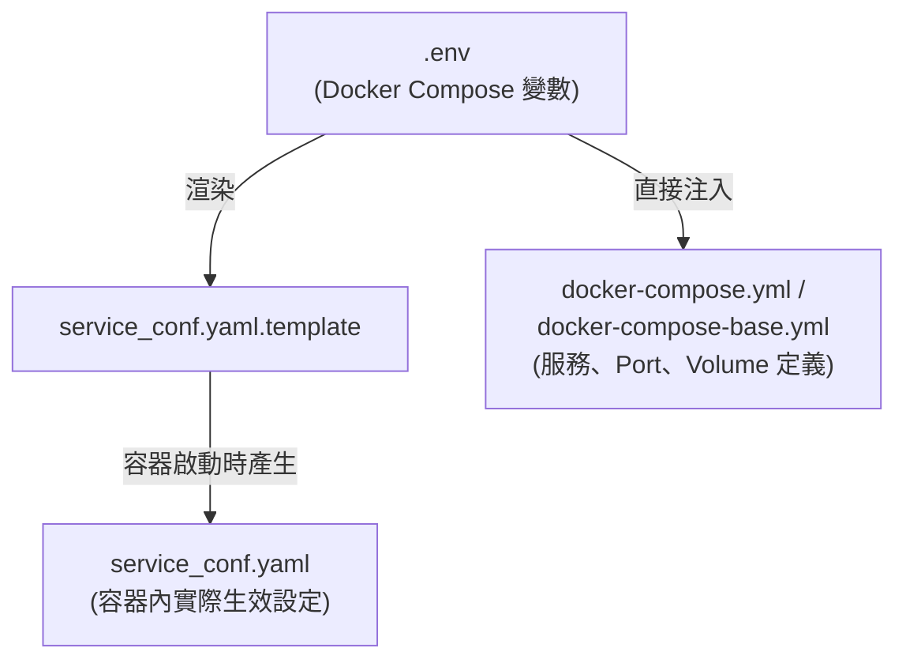

- `.env`：使用者主要編輯的設定入口（第8.2節）
- `docker-compose.yml`／`docker-compose-base.yml`：服務拓樸、Port 映射、Volume、Profile（第6章已詳述）
- `service_conf.yaml.template`：應用層設定範本，容器啟動時依 `.env` 渲染成實際生效的 `service_conf.yaml`（第8.3節）

### 8.2 `.env` 設定總表

| 設定 | 用途 | 預設值 | Production 建議 | 注意事項 |
|---|---|---|---|---|
| `RAGFLOW_IMAGE` | 主應用映像版本 | `infiniflow/ragflow:v0.26.4` | 明確釘選穩定版本，禁止直接用 `nightly` | 升版前先讀 Release Notes |
| `DOC_ENGINE` | 文件檢索引擎 | `elasticsearch` | 依團隊既有基礎設施與資料量選型（見第32章） | 切換後既有索引不會自動遷移 |
| `DB_TYPE` | 關聯式資料庫 | `mysql` | 依企業既有 DB 治理標準選型 | 切換需搭配資料遷移（見第38章） |
| `TZ` | 容器時區 | `Asia/Shanghai` | 依實際機房／使用者時區設定（如 `Asia/Taipei`） | 影響日誌與排程時間顯示 |
| `REGISTER_ENABLED` | 是否允許自行註冊 | `1`（開啟） | Production 建議關閉或搭配 SSO／邀請制 | 開放註冊是常見的資安審查缺失項 |
| `MEM_LIMIT` | 容器記憶體上限 | 8073741824（約 8GB） | 依 5.1 節 Production 資源建議調高 | 過低會導致 Embedding／Parsing OOM |
| `EMBEDDING_BATCH_SIZE` | Embedding 批次大小 | 16 | 依 Embedding API／本地模型吞吐量調整 | 過大可能觸發雲端 API Rate Limit |
| `THREAD_POOL_MAX_WORKERS` | Task Executor 併發上限 | 128 | 依 CPU 核心數與資料庫連線池上限調整 | 過高可能拖垮資料庫連線 |
| `DEVICE` | 推論裝置 | `cpu` | 依第7章評估結果設定 `gpu` | 需搭配對應 profile 啟動 |
| `ELASTIC_PASSWORD` 等各服務密碼 | 各基礎設施服務密碼 | 均為 `infini_rag_flow` | **必須逐一更換為高強度密碼** | Production 上線前檢查清單第一項 |
| `SVR_WEB_HTTP_PORT`／`SVR_WEB_HTTPS_PORT` | Web 對外入口 Port | 80／443 | 建議搭配 Reverse Proxy，僅開放 443 對外 | 見第5.5節與第30章 |

### 8.3 `service_conf.yaml.template` 設定總表

| 區塊 | 用途 | 關鍵鍵值 | 注意事項 |
|---|---|---|---|
| `general` | 全域行為設定 | `heartbeat_interval` | 影響服務健康檢查頻率 |
| `ragflow` / `admin` | 應用層／Admin 服務綁定位址 | `host`、`http_port` | 通常無需手動修改，由 `.env` 注入 |
| `mysql` | 關聯式資料庫連線 | `name`、`user`、`password`、`host`、`port`、`max_connections`、`max_allowed_packet` | `max_connections` 需配合 `THREAD_POOL_MAX_WORKERS` 評估 |
| `minio` | 物件儲存連線 | `user`、`password`、`host`、`bucket`、`secure`、`verify` | Production 建議搭配憑證啟用 `secure: true` |
| `es` / `os` | Elasticsearch／OpenSearch 連線 | `hosts`、`username`、`password`、（OpenSearch 另有）`hybrid_search_pipeline`、`hybrid_search_weights` | Hybrid 搜尋權重直接影響 Retrieval 品質（見第13章） |
| `redis` | 快取／佇列連線 | `db`、`username`、`password`、`host` | |
| `clickhouse` | 觀測資料儲存 | `host`、`port`、`user`、`password`、`database` | 對應第34章 Monitoring |
| `otel` | OpenTelemetry 設定 | （官方模板已預留區塊） | 具體鍵值請以當下版本模板為準 |
| `ingestor` / `file_syncer` | 資料源同步（Confluence／S3／Notion 等） | （依連接器類型而異） | 見第11章資料來源相容性 |
| `user_default_llm` | 預設模型 Provider | `default_models.embedding_model`（含 `api_key`、`base_url`）、`chat_model`、`rerank_model`、`asr_model`、`image2text_model` | 首次安裝後仍需於 Web UI 的 Model Providers 畫面完成設定，見第9章 |

### 8.4 HTTPS／SSL 憑證設定

官方文件另闢專節說明 SSL 憑證設定（官方已實作，`docs/administrator/configurations/config_ssl_cert.md`），Production 環境應參考該文件設定憑證，並將 `SVR_WEB_HTTPS_PORT` 對外暴露、`SVR_WEB_HTTP_PORT` 僅供內部或自動導轉使用（建議架構）。具體憑證檔案路徑與掛載方式**請以官方最新文件為準**。

### 8.5 使用者註冊設定

`REGISTER_ENABLED`（`.env`）預設為開啟，代表任何知道網址的人都可以自行註冊帳號。企業內部知識庫上線前，務必評估是否關閉此設定並改以管理員手動建立帳號、或整合企業既有 SSO（見第30、31章）（建議架構）。

### 8.6 時區設定

`TZ`（`.env`）預設為 `Asia/Shanghai`，企業導入時應依實際機房或主要使用者所在時區調整（例如台灣企業建議設為 `Asia/Taipei`），避免日誌時間戳與實際操作時間不一致，增加事後追查困難度。

### 8.7 Scenario：設定變更未生效的排查

**情境**：維運人員修改了 `.env` 中的 `TZ` 設定，重啟容器後日誌時間仍未改變。

- **Input**：修改後的 `.env`
- **Process**：確認是否執行了 `docker compose up -d` 讓 Compose 重新讀取 `.env`（單純 `docker restart` 不會重新讀取環境變數）；確認 `service_conf.yaml` 是否於容器啟動時重新渲染
- **Output**：改用 `docker compose down && docker compose up -d` 完整重建容器後設定生效
- **對應章節**：此類「改設定沒生效」問題的完整排查表見第37章

### 8.8 AI Prompt 範例

```text
角色（Role）：你是企業 RAGFlow 設定稽核工程師。
情境（Context）：我要對照本手冊第8章的三層設定總表，為我們的 Production 環境做一次上線前設定稽核。
任務（Task）：逐一檢查 8.2、8.3 節表格中「Production 建議」欄位是否都已落實，並標記出尚未處理的項目。
限制（Constraints）：只依本章列出的設定鍵進行稽核，不要引用本章未提及的設定。
輸出格式（Output Format）：表格，欄位為「設定鍵／目前狀態（待填）／Production 建議／是否符合」。
驗證（Validation）：需涵蓋密碼、註冊開關、時區、HTTPS 四大類。
```

### 8.9 本章 Checklist 與小結

- [ ] 理解 `.env` → `service_conf.yaml.template` → `service_conf.yaml` 的三層設定關係
- [ ] Production 上線前已逐一更換所有預設密碼
- [ ] 已評估並決定 `REGISTER_ENABLED` 的 Production 設定
- [ ] 已設定正確時區與 HTTPS 憑證

**小結**：RAGFlow 的設定分散在 `.env`、Compose 檔、`service_conf.yaml.template` 三層，Production 上線前的設定稽核應對照本章三張總表逐項檢查，特別是密碼與註冊開關這兩項最常被忽略的資安設定。第9章接續說明模型層（LLM／Embedding／Reranker）的設定與選型。

---

## 9. LLM Embedding 與 Reranker

### 9.1 LLM：雲端、OpenAI-Compatible 與本地模型

RAGFlow 透過「Model Provider」機制接入 LLM，官方文件另闢專節說明 API Key 設定（官方已實作，`docs/guides/models/llm_api_key_setup.md`）與支援模型列表（官方已實作，`docs/guides/models/supported_models.mdx`）。整體可分三類：

- **雲端 LLM API**：直接透過各家供應商官方 API Key 接入
- **OpenAI-Compatible API**：任何遵循 OpenAI Chat Completions API 格式的服務（含許多雲端供應商與第10章的本地推論伺服器）均可透過同一種 Provider 設定接入，是 RAGFlow 模型層可插拔設計的關鍵
- **本地 LLM**：透過 Ollama／vLLM／Xinference／GPUStack 等本地推論伺服器部署（見第10章），對企業內網／合規敏感場景尤其重要

**具體目前支援的模型供應商完整清單、模型名稱，請務必以 `docs/guides/models/supported_models.mdx` 當下內容為準**——這份清單隨官方與各 LLM 供應商的更新變動頻率很高，本手冊不逐一列舉以避免速過時。

### 9.2 Embedding 解釋

Embedding（嵌入）是把一段文字轉換成固定維度（Dimension）的浮點數向量的過程，向量之間的幾何距離（如 Cosine Similarity）代表文字之間的語意相似度。在 RAGFlow 的資料流中（見第4章），每個 Chunk 在 Ingestion 階段都會產生一組 Embedding Vector，並在 Query Time 與 Query 的 Embedding Vector 做相似度比對，找出語意最接近的候選 Chunk。

**Dimension 的實務意涵**：不同 Embedding 模型輸出的向量維度不同（例如常見的 768、1024、1536 維），維度愈高不代表效果必然愈好，但**同一個 Dataset 內的 Chunk 必須使用同一個 Embedding 模型**，中途更換 Embedding 模型通常需要對既有 Chunk 重新計算向量（Re-embedding），這是企業更換模型 Provider 前必須評估的成本（建議架構）。

### 9.3 Reranker

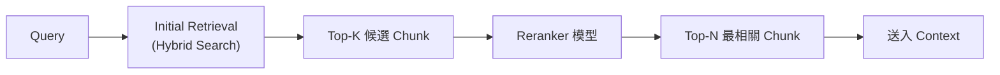

| 面向 | 說明 |
|---|---|
| Accuracy（準確度） | Reranker 通常使用比初步檢索更精細的 Cross-Encoder 類模型，能更準確判斷 Query 與 Chunk 的語意關聯度，明顯提升最終 Top-N 的相關性 |
| Latency（延遲） | 對每個候選 Chunk 都要額外做一次模型推論，會增加查詢延遲，K 值愈大延遲愈高 |
| Cost（成本） | 若使用雲端 Reranker API，延遲與成本會隨 K 值線性增加；本地部署 Reranker 則佔用額外 GPU／CPU 資源 |

**企業建議**：K（初步召回數）與 N（Reranker 後保留數）的比例，建議從官方預設值開始，依實際 RAG Evaluation（第14章）結果調整，而非憑感覺猜測（建議架構）。

### 9.4 Model Provider 設定畫面

實務上，模型 Provider 是在 RAGFlow Web UI 的「Settings → Model Providers」畫面中設定，而非直接編輯 `service_conf.yaml`（雖然 `user_default_llm` 區塊可設定安裝時的預設值，見8.3節）。企業導入時建議的設定順序：

1. 先設定 Chat Model（LLM）與 Embedding Model 兩個必要項目
2. 視需求設定 Rerank Model（提升 Retrieval 品質）
3. 視需求設定 ASR（語音辨識）／Image-to-Text 模型（多模態文件處理）

### 9.5 Scenario：選型會議

**情境**：企業需要在「全部用雲端 LLM API」與「Embedding 用本地模型、Chat 用雲端 API」兩個方案間做選型決策。

- **Input**：知識庫含大量內部機密文件、團隊有一張堪用的 GPU 卡
- **Process**：評估資料是否可送出企業網路（機密文件 Embedding 若使用雲端 API，文字內容會經過網路傳輸給第三方）、評估雲端 API 成本 vs 本地 GPU 投資、評估準確度落差
- **Output**：決定 Embedding 採本地模型（避免機密內容外送）、Chat 仍用雲端高階模型（品質優先），此為許多企業金融場景的常見折衷方案（建議架構）
- **對應章節**：本地模型的具體部署方式見第10章，合規考量見第30章

### 9.6 AI Prompt 範例

```text
角色（Role）：你是 RAGFlow 模型選型顧問。
情境（Context）：企業知識庫含機密文件，需評估 LLM／Embedding／Reranker 該用雲端 API 還是本地模型。
任務（Task）：依本章 9.1-9.4 節內容，列出選型決策時應該評估的因子，並區分「Embedding」「Chat」「Reranker」三者的評估重點差異。
限制（Constraints）：不可引用本章未提及的具體模型名稱或效能數字。
輸出格式（Output Format）：表格，欄位為「模型類型／雲端方案考量／本地方案考量／建議優先評估順序」。
驗證（Validation）：需涵蓋資料外送風險、成本、準確度、延遲四個面向。
```

### 9.7 本章 Checklist 與小結

- [ ] 理解 Model Provider 是 RAGFlow 接入 LLM／Embedding／Reranker 的統一抽象層
- [ ] 理解同一 Dataset 內必須使用同一 Embedding 模型，更換需要 Re-embedding
- [ ] 理解 Reranker 的 Accuracy／Latency／Cost 三方權衡
- [ ] 已依資料敏感度評估雲端 vs 本地模型的選型

**小結**：模型層是 RAGFlow 對接 LLM 生態系的關鍵抽象層，企業選型應以「資料敏感度」與「Evaluation 結果」為主要依據，而非單純追求模型排行榜分數。第10章深入說明本地模型的具體部署方式。

---

## 10. Local Model 整合

### 10.1 為何需要 Local Model

企業選擇本地模型（而非純雲端 API）的主要動機（建議架構，依常見企業導入考量歸納）：

- **合規／資料主權**：機密文件內容不可傳送至第三方雲端 API
- **企業內網／無法連外**：部分企業網路環境完全無法連接公網 LLM API
- **長期成本**：高頻使用場景下，本地 GPU 投資可能比持續支付雲端 API 費用更划算
- **延遲穩定性**：避免依賴外部 API 的網路延遲與速率限制

依官方 `docs/guides/models/deploy_local_llm.mdx`（官方已實作，v0.26.4），RAGFlow 官方文件明確提供部署指南的本地模型服務至少包含 **Ollama、Xinference、IPEX-LLM、vLLM、GPUStack** 五種；**SGLang** 雖在官方文件簡介段落被提及，但查證當下該文件並未提供如其他五種一樣詳細的逐步部署說明（Source-confirmed），企業若採用 SGLang，因其同樣提供 OpenAI-Compatible API，可比照 vLLM 的 Provider 設定方式接入，但**具體指令請以官方文件當下版本或 SGLang 官方文件為準**。

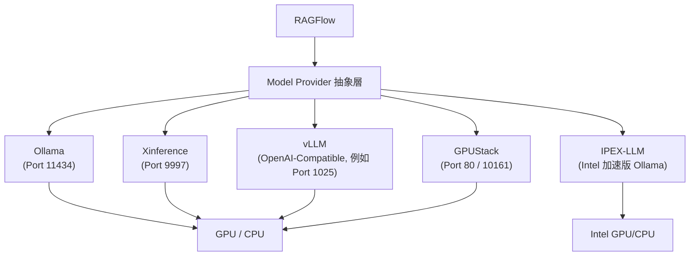

### 10.2 Ollama

```bash
# 部署 Ollama（示意，實際版本/映像請以官方文件為準）
sudo docker run --name ollama -p 11434:11434 ollama/ollama

# 拉取模型
sudo docker exec ollama ollama pull llama3.2
```

於 RAGFlow「Settings → Model Providers」新增 Ollama，Base URL 設為 `http://host.docker.internal:11434`（若 RAGFlow 與 Ollama 皆在 Docker 中執行，需視網路模式調整為容器間可互通的位址；若 Ollama 執行於宿主機，Docker Desktop 環境可用 `host.docker.internal`，原生 Linux Docker 網路則需視實際網路拓樸調整）（官方已實作，`docs/guides/models/deploy_local_llm.mdx`）。

### 10.3 Xinference

```bash
# 啟動 Xinference 本地伺服器
xinference-local --host 0.0.0.0 --port 9997

# 啟動一個模型
xinference launch -u mistral --model-name mistral-v0.1 --size-in-billions 7 --model-format pytorch --quantization ${quantization}
```

於 RAGFlow 新增 Provider 時，Base URL 設為 `http://<你的-xinference-endpoint>:9997/v1`（Rerank 模型另有 `/v1/rerank` 路徑）（官方已實作）。

### 10.4 vLLM

```bash
pip install vllm
nohup vllm serve /data/Qwen3-8B --served-model-name Qwen3-8B-FP8 --dtype auto --port 1025
```

於 RAGFlow「Settings → Model Providers → vLLM → Add」設定 Base URL（如 `http://0.0.0.0:1025`）（官方已實作）。**實際 Port、模型路徑、`--dtype` 等參數請依所部署的模型與硬體調整，上述指令為官方文件示範用途，不代表企業必須採用相同模型。**

### 10.5 IPEX-LLM（Intel 硬體加速）

針對 Intel GPU／CPU 硬體，官方文件提供 IPEX-LLM 加速版 Ollama 的部署方式：安裝 IPEX-LLM for Ollama、於 Conda 環境中執行 `init-ollama`、設定 `OLLAMA_NUM_GPU` 等環境變數後啟動 `ollama serve`，其餘於 RAGFlow 端的設定方式與標準 Ollama 相同（官方已實作）。此方案適合已投資 Intel GPU（而非 NVIDIA GPU）硬體的企業。

### 10.6 GPUStack

```bash
sudo docker run -d --name gpustack -p 80:80 -p 10161:10161 \
  --volume gpustack-data:/var/lib/gpustack gpustack/gpustack
```

GPUStack 本身是一套可管理多台機器、多張 GPU 卡的模型管理平台，於 RAGFlow「Settings → Model Providers → GPUStack → Add」完成註冊（官方已實作）。對於需要統一管理多個本地模型、多張 GPU 資源池的企業，GPUStack 比單一 Ollama／vLLM 實例更適合作為長期方案（建議架構）。

### 10.7 企業內網／無法連外情境

若企業網路完全無法連接公網：

1. LLM／Embedding／Reranker 全數改用本節任一本地方案
2. 需自行下載模型權重檔案（透過可連外的中介機器下載後傳入內網，或使用企業內部的模型倉庫）
3. RAGFlow 主應用本身的 Docker 映像也需透過內部 Registry 或離線方式取得，而非直接 `docker pull` 官方 Docker Hub 映像（建議架構，屬企業封閉網路的一般作法，非 RAGFlow 專屬步驟）
4. 資料源連接器（Confluence／S3／Notion 等，見第11章）若指向外部服務，於封閉網路情境下需評估替代方案或改用內部部署版本

### 10.8 Scenario：金融業封閉網路部署

**情境**：某銀行核心系統網路完全隔離於公網，須在此網路內部署 RAGFlow 並使用純本地模型。

- **Input**：一台配有 2 張 NVIDIA GPU 的內網伺服器、透過可連外中介機器下載的開源 LLM／Embedding 模型權重
- **Process**：以 GPUStack 統一管理兩張 GPU 卡上部署的 Chat Model 與 Embedding Model → RAGFlow Model Provider 指向內網 GPUStack 端點 → 透過內部 Docker Registry 拉取 RAGFlow 映像
- **Output**：完全不依賴任何外部網路連線的 RAGFlow 部署
- **注意事項**：務必於上線前確認所有 Model Provider 設定、DNS 解析都指向內網位址，避免因設定殘留外部端點導致啟動逾時或連線錯誤（對應第37章）

### 10.9 AI Prompt 範例

```text
角色（Role）：你是企業封閉網路 AI 基礎設施工程師。
情境（Context）：我們的核心系統網路無法連接公網，需要規劃 RAGFlow 搭配純本地模型的部署方案。
任務（Task）：依本章 10.2-10.7 節內容，列出從模型選型、下載、部署到 RAGFlow Provider 設定的完整步驟，並標示每個步驟在封閉網路情境下的特殊考量。
限制（Constraints）：只能使用本章提及的 Ollama／Xinference／vLLM／IPEX-LLM／GPUStack 五種方案，不可推薦本章未提及的工具。
輸出格式（Output Format）：分階段步驟清單（模型準備／部署／RAGFlow 整合／驗證）。
驗證（Validation）：每個步驟都必須考慮「無法連外」這個限制條件。
```

### 10.10 本章 Checklist 與小結

- [ ] 已依企業合規需求評估是否需要本地模型
- [ ] 已在 Ollama／Xinference／vLLM／IPEX-LLM／GPUStack 中選定符合團隊硬體條件的方案
- [ ] 已確認 RAGFlow 與本地模型伺服器之間的網路連通性（尤其是 Docker 網路模式）
- [ ] 封閉網路情境已規劃好模型權重、Docker 映像的離線取得方式

**小結**：RAGFlow 對本地模型的支援相當完整，官方明確記載 Ollama、Xinference、IPEX-LLM、vLLM、GPUStack 五種部署路徑，皆透過統一的 Model Provider 機制接入。對企業內網／高合規場景而言，本地模型往往不是「加分項」而是「必要條件」。第11章接續進入 Document Processing 與 Deep Document Understanding 的實作細節。

---

## 11. Document Processing 與 Deep Document Understanding

### 11.1 為什麼文件解析品質是 RAG 效果的關鍵瓶頸

這是本手冊反覆強調、但必須明確標示為**本手冊工程判斷（建議架構）而非官方逐字宣稱**的一條核心論述：多數企業導入 RAG 失敗，根因往往不是「向量資料庫選錯」，而是「文件解析階段就已經把資訊解析錯誤或解析不完整」。理由很直觀——如果一張表格在 Parsing 階段就被拆散、一段跨欄位的條款被錯誤斷句，後續無論 Embedding 模型多強、Reranker 多精準，檢索到的都只會是「解析錯誤的碎片」。這也是 RAGFlow 把 Deep Document Understanding 列為官方 Key Feature 第一項的原因（官方已實作，README.md「Key Features」）。

### 11.2 支援的文件格式與資料來源總表

依官方 README「Key Features」與資料源連接器說明（官方已實作）：

| 類別 | 支援項目 | 來源標示 |
|---|---|---|
| 文件格式 | Word、Slides（PPT／PPTX）、Excel、TXT、Markdown、HTML、圖片（JPEG／JPG／PNG／TIF／GIF）、掃描件、結構化資料、網頁 | 官方已實作 |
| 對應設定區塊 | `service_conf.yaml` 中的 `ingestor`／`file_syncer` 區塊（見8.3節） | Source-confirmed |

**資料來源連接器（Data Source Connector）**：這是本手冊查證過程中發現與坊間舊文章落差最大的一塊——許多文章（含本手冊早期版本）仍沿用官方 README 早期版本列出的「Confluence、Amazon S3、Notion、Discord、Google Drive」5 種連接器作為完整清單，但直接查證原始碼頂層 `common/data_source/` 目錄（Source-confirmed，GitHub Contents API，查證當下）後發現，實作檔案與子目錄合計已達 **30 種以上**：

| 分類 | 連接器 | 來源標示 |
|---|---|---|
| 官方文件已列出頁面（`docs/guides/data_source/` 或官方文件站「Add data sources」分類） | Google Drive、Confluence、Notion、Discord、RSS、GitHub、Bitbucket（共 7 種） | 官方已實作 |
| 雲端物件儲存 | Azure Blob、Box、Dropbox、Seafile、WebDAV（另有通用 `blob_connector.py`，可對接 S3 相容端點） | Source-confirmed（原始碼目錄，官方文件尚未逐一成頁） |
| 企業協作／專案管理 | SharePoint、OneDrive、Jira、Airtable、Asana、Zendesk、Moodle | Source-confirmed（同上） |
| 通訊／郵件（資料匯入用途） | Slack、Teams、Gmail、IMAP、Outlook | Source-confirmed（同上） |
| CRM／資料庫／API | Salesforce、Google BigQuery、通用 RDBMS（`rdbms_connector.py`，可接 MySQL／PostgreSQL 等）、REST API、DingTalk AI Table | Source-confirmed（同上） |
| 版本控制 | GitLab（GitHub、Bitbucket 已列於官方文件頁面，見上） | Source-confirmed（同上） |

**版本補充**（依 Release Notes 逐版比對，官方已實作）：Outlook／OneDrive／Teams／Slack／SharePoint／Salesforce／Azure Blob 於 v0.26.0（2026-06-11）新增；Google BigQuery 於 v0.26.3（2026-07-02）新增。

**重要區分：Data Source Connector（資料輸入）≠ Chat Channel（對話輸出通路）**——官方近期 Release Notes 另外提到的 Feishu（飛書）、WhatsApp、DingTalk（釘釘，一般聊天機器人，非上表的 DingTalk AI Table 資料表連接器）、WeCom（企業微信）、Telegram 等，是 **Chat Assistant 的「發布／部署」通路**（讓終端使用者可以在這些平台上與 RAGFlow Chat 對話，見第15章），屬於資料**輸出**方向，與本節的資料**輸入**連接器是兩組不同機制。Discord 較特殊，同時具備資料來源連接器（`discord_connector.py`）與 Chat 部署通路兩種角色，企業導入規劃時請勿混淆兩者的權限與資料流向。

**注意**：資料源連接器的具體支援範圍、認證方式、同步頻率設定變動頻繁，請以官方 `docs/guides/data_source/` 或原始碼 `common/data_source/` 目錄當下內容為準，本手冊不逐一展開每個連接器的設定步驟，避免內容速過時。

### 11.3 PDF Parser 選型

依官方文件（官方已實作，`docs/guides/dataset/select_pdf_parser.md`），RAGFlow 提供多種可切換的 PDF 解析器：

| Parser | 說明 | 適用情境 |
|---|---|---|
| **DeepDoc**（預設） | 官方視覺模型，執行 OCR、TSR（Table Structure Recognition，表格結構辨識）、DLR（Document Layout Recognition，文件版面辨識）三項任務 | 版面複雜、含圖片或掃描內容的 PDF；處理時間相對較長 |
| **Naive** | 略過 OCR／TSR／DLR，直接抽取文字 | 純文字 PDF，追求解析速度 |
| **MinerU** | 實驗性開源工具，將 PDF 轉為機器可讀格式 | 作為 DeepDoc 的替代方案評估 |
| **Docling** | 實驗性開源文件處理工具（對應 `.env` 中 `USE_DOCLING` 設定） | 另一種 PDF 轉換／處理路徑 |
| **OpenDataLoader** | 確定性、Local-first 的 PDF 解析器，輸出結構化 JSON + Markdown | 需要本地處理、不依賴 Java Runtime 的情境 |
| 第三方視覺模型（VLM） | 可設定特定模型供應商的自訂 VLM | 有特殊需求且已設定好對應 Default Model 的團隊；官方標示為實驗性、尚未完整驗證 |

**Production 建議**：DeepDoc 是官方預設且最成熟的選項，建議一般企業知識庫優先使用；MinerU／Docling／OpenDataLoader／第三方 VLM 官方均標示為實驗性（Source-confirmed），Production 環境導入前應先行 POC 驗證穩定性，不建議直接作為主要 Parser。

### 11.4 DeepDoc 引擎詳解

DeepDoc 是 RAGFlow Deep Document Understanding 的核心實作，於架構上是獨立的服務／Profile（見3.6節），執行三類任務：

- **OCR（Optical Character Recognition，光學字元辨識）**：辨識掃描件、圖片中的文字
- **TSR（Table Structure Recognition，表格結構辨識）**：辨識表格的列、欄、合併儲存格結構，避免表格內容被線性化後失去對應關係
- **DLR（Document Layout Recognition，文件版面辨識）**：辨識標題階層、段落、頁首頁尾、多欄位版面等結構

這三項任務的品質直接決定第12章 Chunking 階段能拿到多完整、多正確的結構化輸入。

### 11.5 Knowledge Compilation：從 Chunking 到結構化知識

查證當下，RAGFlow 官方文件已將完整的知識處理管線描述為四個角色分工（官方已實作，`docs/guides/knowledge_compilation/overview.md`）：

> 「Parser 負責解析，Chunker 負責切分，Compiler 負責知識編譯（Knowledge Compilation），Indexer 負責建立索引」（官方已實作，原文為英文，此處為手冊翻譯轉述）

這代表官方架構已在傳統「Parsing → Chunking → Embedding → Index」之外，新增了一個**選用**的 Compiler 角色，把文件內容進一步編譯（Compile）成結構化的知識產物，用於知識檢索、智慧問答與 Agent 應用（官方已實作）。Knowledge Compilation 提供 6 種官方內建模板：

| 模板 | 適用情境 |
|---|---|
| Graph | 實體關係（Entity Relationship）萃取 |
| Tree | 階層式主題組織 |
| PageIndex | 保留原始文件結構的索引方式 |
| MindMap | 核心主題與分支的心智圖式組織 |
| Timeline | 依時間順序組織的事件 |
| Wiki | 互相連結的主題頁面 |

**版本注意事項**：Knowledge Compilation 是相對新的官方能力，許多較舊的 RAGFlow 介紹文章完全沒有提及。企業導入時應評估是否需要在標準 Chunking（第12章）之上，額外為特定 Dataset（例如法規條文、產品知識圖譜）啟用 Knowledge Compilation 模板，而非預設全面套用。

### 11.6 Scenario：掃描版合約文件的解析品質問題

**情境**：企業上傳一批掃描版的舊合約 PDF（非原生電子文件），Chat 對這些合約的問答經常「答非所問」。

- **Input**：掃描版合約 PDF，使用預設 Naive Parser
- **Process**：改用 DeepDoc Parser 重新解析同一批文件，觀察 Chunk 檢視畫面中文字辨識正確率、表格（如付款條件表）是否被正確辨識為表格而非亂碼文字
- **Output**：DeepDoc 對掃描件的辨識品質明顯優於 Naive（因為 Naive 完全略過 OCR），確認根因是「用錯 Parser」而非模型或 Chunking 策略問題
- **對應章節**：此為第37章 Troubleshooting 中「答案品質差」問題的常見根因之一

### 11.7 AI Prompt 範例

```text
角色（Role）：你是 RAGFlow 文件解析品質稽核工程師。
情境（Context）：我要對一個新建立的 Dataset 進行文件解析品質檢查，文件類型包含掃描合約、Excel 報表、PPT 簡報。
任務（Task）：依本章 11.2、11.3 節內容，為每種文件類型建議應該選用的 Parser，並說明選擇理由。
限制（Constraints）：只能從本章列出的 DeepDoc／Naive／MinerU／Docling／OpenDataLoader／第三方 VLM 中選擇，並標明哪些屬於實驗性選項。
輸出格式（Output Format）：表格，欄位為「文件類型／建議 Parser／理由／是否為官方標示之實驗性功能」。
驗證（Validation）：所有建議必須能對應回本章 11.3 節的官方說明。
```

### 11.8 本章 Checklist 與小結

- [ ] 已理解 Deep Document Understanding（OCR／TSR／DLR）是決定後續 Chunking／Retrieval 品質的關鍵上游
- [ ] 已依文件類型（純文字／掃描件／表格密集）選擇合適的 PDF Parser
- [ ] 已評估是否需要為特定 Dataset 啟用 Knowledge Compilation 模板
- [ ] 已將 MinerU／Docling／OpenDataLoader／第三方 VLM 標記為實驗性功能，Production 導入前先行 POC

**小結**：文件解析品質是整條 RAG 管線中投資報酬率最高、卻最常被忽略的環節。RAGFlow 透過 DeepDoc（OCR／TSR／DLR）與新引入的 Knowledge Compilation 機制，提供比陽春 RAG 更完整的文件理解能力。第12章接續說明 Chunking 策略的具體選型。

---

## 12. Chunking 策略

### 12.1 Chunking 對整體品質的影響

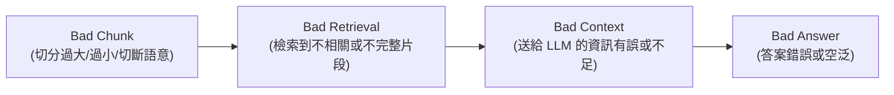

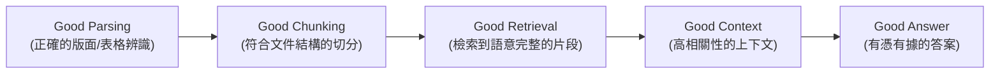

### 12.2 官方 Chunking 方法總表

依官方文件（官方已實作，`docs/guides/dataset/configure_knowledge_base.md`），RAGFlow 於建立 Dataset 時可選擇以下 Chunking 方法（Chunk Method／模板）：

| 方法 | 說明 | 適用文件格式 |
|---|---|---|
| **General** | 依預設 Chunk Token 數量連續切分 | 通用，適合大多數一般性文件 |
| **Q&A** | 針對問答形式內容，檢索相關資訊並生成回答 | FAQ、問答集 |
| **Resume**（履歷） | **僅企業版（Enterprise Edition）提供** | DOCX／PDF／TXT |
| **Manual**（手冊） | 適合結構化說明文件 | PDF |
| **Table**（表格） | 使用 TSR 技術進行高效表格資料解析 | 表格密集型文件 |
| **Paper**（論文） | 針對學術論文版面優化 | PDF |
| **Book**（書籍） | 適合長篇、含章節階層的內容 | DOCX／PDF／TXT |
| **Laws**（法規） | 針對法規條文結構優化 | DOCX／PDF／TXT |
| **Presentation**（簡報） | 針對投影片版面優化 | PDF／PPTX |
| **Picture**（圖片） | 處理圖片檔案 | JPEG／JPG／PNG／TIF／GIF |
| **One** | 整份文件視為單一 Chunk（不切分） | 需要保留完整上下文的短文件 |
| **Tag**（標籤集） | 該 Dataset 作為其他 Dataset 的標籤集使用，而非知識內容本身 | 標籤／分類體系管理 |

**版本注意事項**：Resume 模板查證當下為企業版（Enterprise Edition）限定功能，社群版（Community Edition）使用者請以官方當下版本與授權範圍為準；官方文件亦未詳列 General 模板的預設 Chunk Token 數量與是否可自訂分隔符號，**請以 Web UI 實際設定畫面之當下版本為準**。

### 12.3 Parent-Child（Small-to-Big）Chunking 策略

官方另提供 Parent-Child Chunking 機制（官方已實作，`docs/guides/dataset/configure_child_chunking_strategy.md`）：將文件切分成語意完整的「Parent Chunk」（較大），每個 Parent Chunk 再細分為多個「Child Chunk」（較小）。檢索時以 Child Chunk 的精準度做召回（滿足「檢索需要細粒度、精確」的需求），但實際組裝進 Context 時使用對應的 Parent Chunk（滿足「生成答案需要連貫、資訊完整的上下文」的需求）——這是業界俗稱 Small-to-Big Retrieval 的實作方式（官方已實作）。

### 12.4 不同文件類型的 Chunking 建議

| 文件類型 | 建議 Chunk Method | 理由 |
|---|---|---|
| 一般政策／SOP 文件 | General 或 Manual | 結構清晰、段落完整 |
| 法規條文 | Laws | 官方針對法規結構優化 |
| 財報／報價單等表格密集文件 | Table | 依賴 TSR 保留表格列欄關係 |
| 內部 FAQ | Q&A | 直接對應問答結構 |
| 簡報投影片 | Presentation | 針對投影片版面優化 |
| 短篇公告、單頁規範 | One | 避免不必要的切分造成語意斷裂 |
| 需要高精準檢索又需完整上下文的長文件（如產品手冊） | Parent-Child Chunking | 兼顧檢索精準度與生成連貫性 |

### 12.5 Scenario：一張付款條件表被切散的診斷過程

**情境**：使用者問「這份合約的付款條件是什麼」，RAGFlow 只回答了付款條件表的前兩欄，遺漏了罰則欄位。

- **Input**：使用 General Chunk Method 上傳的合約 PDF
- **Process**：進入 Chunk 檢視畫面，發現付款條件表被 General 方法依 Token 數量切成了 2 個 Chunk，導致 Retrieval 時只召回其中一個 Chunk
- **Output**：改用 Table Chunk Method 重新解析後，整張表格被辨識為完整的表格結構、不再被機械切斷
- **對應章節**：此為 12.4 節「表格密集文件建議使用 Table 方法」的實例驗證

### 12.6 AI Prompt 範例

```text
角色（Role）：你是 RAGFlow Chunking 策略顧問。
情境（Context）：我們有一個包含合約（含付款條件表）、公司 SOP、產品 FAQ 三種文件的 Dataset，目前全部使用 General Chunk Method，且答案品質不穩定。
任務（Task）：依本章 12.2、12.4 節內容，為三種文件類型分別建議合適的 Chunk Method，並說明如果同一個 Dataset 需要混用不同 Chunk Method，該如何規劃 Dataset 拆分方式。
限制（Constraints）：只能使用本章列出的官方 Chunk Method 名稱。
輸出格式（Output Format）：表格 + 一段 Dataset 拆分建議文字。
驗證（Validation）：建議必須考慮「同一 Dataset 通常共用同一組 Chunking／Embedding 設定」這個限制（見9.2節）。
```

### 12.7 本章 Checklist 與小結

- [ ] 已依文件類型選擇對應的官方 Chunk Method，而非全部使用 General 預設值
- [ ] 已評估是否需要 Parent-Child Chunking 平衡檢索精準度與上下文完整性
- [ ] 已確認表格密集文件使用 Table 方法而非 General
- [ ] 已透過 Chunk 檢視畫面實際檢查切分結果，而非僅憑設定假設效果良好

**小結**：Chunking 策略是「Bad Chunk → Bad Answer」與「Good Parsing → Good Answer」這兩條鏈路的分水嶺。RAGFlow 提供 12 種官方 Chunk Method 加上 Parent-Child 機制，企業應依文件類型逐一評估，而非統一套用預設 General 方法。第13章接續說明 Retrieval 架構與官方內建的檢索測試工具。

---

## 13. Retrieval Architecture

### 13.1 Keyword、Vector、Full Text 與 Hybrid Retrieval

回顧第2章定義：RAGFlow 的核心檢索策略是 Hybrid Retrieval（混合檢索）——同時執行 Keyword Search（關鍵字搜尋）／Full Text Search（全文檢索）與 Vector Search（向量搜尋），再將兩者的分數加權融合。官方文件明確描述 AI Search 功能採用「weighted keyword similarity 與 weighted vector similarity 的混合搜尋」策略（官方已實作，`docs/guides/ai_search.md`）。

### 13.2 官方 Retrieval Testing 工具詳解

RAGFlow 於 Dataset 內建「Retrieval Testing」功能，讓使用者在正式設定 Chat Assistant 之前，先驗證特定 Query 是否能檢索到預期的 Chunk（官方已實作，`docs/guides/dataset/run_retrieval_test.md`）。關鍵可調參數：

| 參數 | 說明 | 預設值 |
|---|---|---|
| Similarity Threshold（相似度門檻） | 低於此門檻的 Chunk 會被過濾，不進入候選結果 | 0.2 |
| Vector Similarity Weight（向量相似度權重） | 決定混合分數中向量相似度所佔比例，剩餘比例由關鍵字相似度佔據 | 0.3（即關鍵字相似度佔 0.7） |
| Rerank Model（重排序模型） | 啟用後以 Reranker 分數取代原本的向量餘弦相似度；官方明確警告會顯著增加回應時間 | 預設不啟用 |
| Use Knowledge Graph（使用知識圖譜） | 額外檢索實體描述、關係描述、社群報告；同樣會顯著增加回應時間 | 預設不啟用 |
| Cross-Language Search（跨語言搜尋） | 將輸入翻譯為目標語言後進行語意比對，支援跨語言查詢 | 依設定 |

**重要操作提醒**（官方已實作）：Retrieval Testing 畫面中調整出的最佳設定，**不會自動套用**到正式的 Chat Assistant，必須手動將測試出的參數複製到 Chat Assistant 設定中。這是企業導入時很容易忽略的一步——測試時效果很好，正式上線 Chat 卻沒有套用相同設定。

### 13.3 AI Search 與 AI Chat 的 Retrieval 差異

官方文件明確區分兩種應用形態的檢索能力（官方已實作，`docs/guides/ai_search.md`）：

- **AI Search**：採用固定的 Hybrid Retrieval 策略（關鍵字＋向量加權），主要用於除錯／驗證用途——「除錯 Chat Assistant 時，可將 AI Search 作為參考，驗證模型設定與檢索策略」
- **AI Chat**：支援更進階的 RAG 策略，包含 Knowledge Graph（知識圖譜）、Auto-Keyword（自動關鍵字萃取）、Auto-Question（自動問題改寫）等，並可選擇 Reranker 模型取代向量相似度

企業應理解：AI Search 是「檢索能力的最小可行版本」，適合快速驗證；真正 Production 面向使用者的 Chat Assistant，應該進一步啟用 AI Chat 的進階策略並持續調校。

### 13.4 Retrieval Pipeline 完整架構圖

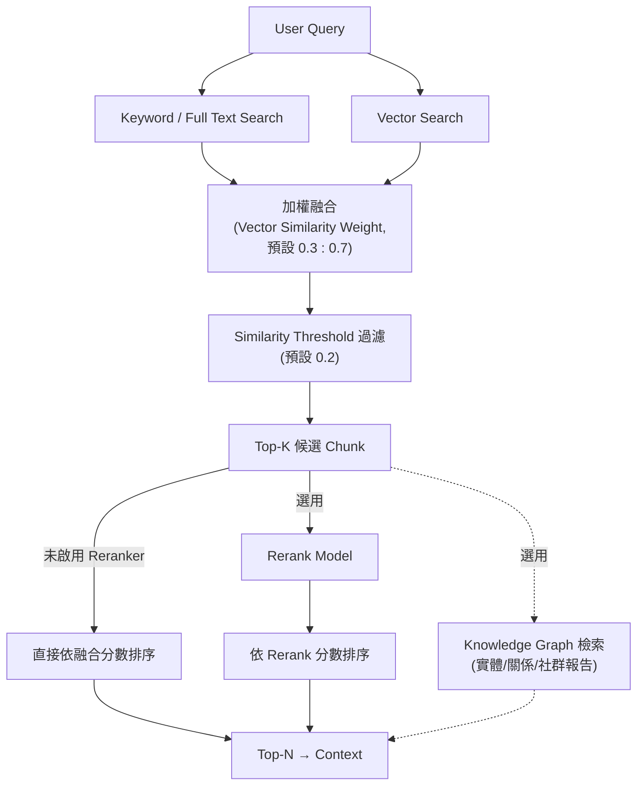

### 13.5 為什麼企業 RAG 不應只依賴 Vector Search

- **詞彙精確匹配的場景**：法規條文編號、產品型號、錯誤代碼等，關鍵字搜尋往往比語意向量搜尋更精準（向量模型可能把「條款第 12 條」與「條款第 21 條」判斷為高度相似）
- **稀有詞彙／專有名詞**：企業內部縮寫、系統代號等專有名詞，若不在 Embedding 模型的訓練分佈內，向量相似度可能失準，但關鍵字搜尋不受此限制
- **可解釋性**：關鍵字比對的結果較容易向非技術背景的稽核／法遵人員解釋「為什麼找到這個結果」，向量相似度的黑盒特性較難解釋
- 這也是為什麼 RAGFlow 官方將 Hybrid Retrieval（而非純 Vector Search）設計為 AI Search 的預設、固定策略（官方已實作）

### 13.6 Scenario：法規編號查詢失準案例

**情境**：使用者查詢「XX辦法第15條的規定」，Chat 卻回傳第 51 條的內容。

- **Input**：純向量搜尋為主的檢索設定
- **Process**：檢視 Retrieval Testing 結果，發現「第15條」與「第51條」的 Embedding 向量距離很接近（數字型 Token 對向量模型而言語意差異不明顯）→ 提高 Vector Similarity Weight 中關鍵字比例的權重（降低 Vector Similarity Weight）
- **Output**：重新測試後，關鍵字精確匹配「第15條」的 Chunk 排序明顯提前
- **對應章節**：此為13.5節「企業 RAG 不應只依賴 Vector Search」的具體案例

### 13.7 AI Prompt 範例

```text
角色（Role）：你是 RAGFlow Retrieval 調校工程師。
情境（Context）：法規類 Dataset 的檢索經常把條文編號搞混，Chat 回答錯誤條文。
任務（Task）：依本章 13.2 節的 Retrieval Testing 參數，設計一組調校實驗計畫，找出改善條文編號檢索精準度的最佳參數組合。
限制（Constraints）：只能調整本章列出的 Similarity Threshold、Vector Similarity Weight、Rerank Model、Use Knowledge Graph 四個參數。
輸出格式（Output Format）：實驗計畫表格，欄位為「實驗組別／調整參數／預期效果／驗證方式」。
驗證（Validation）：至少包含一組「降低 Vector Similarity Weight」的實驗。
```

### 13.8 本章 Checklist 與小結

- [ ] 已理解 Hybrid Retrieval 的加權融合機制與預設權重（0.3 向量：0.7 關鍵字）
- [ ] 已使用官方 Retrieval Testing 工具驗證關鍵 Query 的檢索結果
- [ ] 已將 Retrieval Testing 調校出的最佳參數手動套用到正式 Chat Assistant
- [ ] 已理解 AI Search 與 AI Chat 的檢索能力差異
- [ ] 已評估法規編號、專有名詞等場景是否需要調整關鍵字／向量權重比例

**小結**：RAGFlow 的 Retrieval 架構以 Hybrid Search 為核心，並提供官方 Retrieval Testing 工具供調校驗證。企業應養成「先在 Retrieval Testing 驗證、再套用到 Chat Assistant」的標準作業習慣。第14章接續說明如何把這種調校過程系統化為企業級的 RAG Evaluation Framework。

---

## 14. RAG Evaluation Framework

### 14.1 官方能力邊界：Retrieval Testing 不等於完整的 RAG Evaluation

必須先誠實釐清一個容易混淆的點：RAGFlow 官方內建的 Retrieval Testing（第13.2節）是一個**互動式、人工判讀**的檢索驗證工具，讓使用者針對單一 Query 逐次調整參數、肉眼判斷結果是否合理。它**不是**一套自動化、可持續追蹤 Recall／Precision／Faithfulness 等量化指標的端到端 RAG Evaluation Framework（Source-confirmed，查證當下官方文件與原始碼未發現此類自動化評測模組）。因此，本章 14.2-14.4 節提出的完整 Evaluation Framework，**屬於本手冊的建議架構**，企業需自行建置或整合第三方評測工具，而非 RAGFlow 開箱即用的功能。

### 14.2 企業級 RAG Evaluation 應涵蓋的指標

| 指標 | 定義 | 衡量層級 |
|---|---|---|
| Retrieval Recall（召回率） | 應該被檢索到的相關 Chunk，實際被檢索到的比例 | 檢索層 |
| Retrieval Precision（精確率） | 被檢索到的 Chunk 中，實際相關的比例 | 檢索層 |
| Relevance（相關性） | 檢索結果與 Query 意圖的貼合程度（可人工或以 LLM-as-Judge 評分） | 檢索層 |
| Faithfulness（忠實度） | 生成答案的內容是否完全依據提供的 Context，未添加 Context 中沒有的資訊 | 生成層 |
| Groundedness（有憑有據） | 答案中每個陳述是否都能對應回具體的來源 Chunk | 生成層 |
| Answer Accuracy（答案正確性） | 答案與標準答案（Ground Truth）的一致程度 | 生成層 |
| Citation Accuracy（引用正確性） | 答案標示的引用來源，是否確實支持該段陳述 | 生成層 |
| Hallucination Rate（幻覺率） | 答案中無法被任何檢索到的 Chunk 支持之陳述比例 | 生成層 |
| Latency（延遲） | 從 Query 送出到取得完整答案的時間 | 系統層 |
| Token Usage（Token 使用量） | 每次查詢消耗的 Prompt／Completion Token 數 | 成本層 |
| Cost（成本） | 依 Token 使用量與模型定價換算的實際費用 | 成本層 |

（以上指標定義與分類方式屬本手冊之建議架構，非 RAGFlow 官方分類）

### 14.3 RAG Evaluation Matrix

| 指標 | 建議衡量方式 | 建議工具／方法 | 建議監控頻率 |
|---|---|---|---|
| Retrieval Recall／Precision | 建立一組標註過「應召回 Chunk」的測試 Query 集合，比對 Retrieval Testing 或 API 回傳結果 | 人工標註 + 自動化比對腳本 | 每次 Chunking／Embedding 策略調整後 |
| Relevance／Faithfulness／Groundedness | 以獨立 LLM 作為評審（LLM-as-Judge），針對「答案是否僅基於提供的 Context」評分 | 自建評測腳本，呼叫 RAGFlow API 取得答案與引用 Chunk 後送評審 LLM 判定 | 每次 Model Provider／Prompt 變更後 |
| Answer Accuracy | 與標準答案集比對（人工或語意相似度） | 建立黃金測試集（Golden Set） | 定期迴歸測試（例如每次版本升級後） |
| Citation Accuracy | 檢查答案引用的 Chunk 是否確實包含支持該陳述的內容 | 人工抽查 + 自動化引用比對 | 定期抽查 |
| Hallucination Rate | 統計答案中無法回溯到任何引用 Chunk 的陳述比例 | 結合 Faithfulness 評測方法 | 持續監控 |
| Latency | 記錄各階段（Retrieval／Rerank／LLM 生成）耗時 | 整合 `otel`／Jaeger（見第34章） | 持續監控 |
| Token Usage／Cost | 記錄每次查詢的 Token 消耗與對應費用 | Model Provider API 回傳的 Usage 資訊 | 持續監控，按月彙總 |

### 14.4 POC → Benchmark → Production 流程

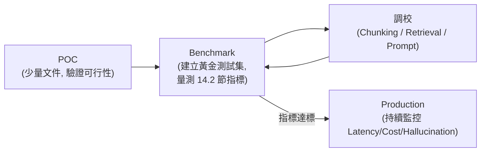

企業建議在 POC 階段先以少量、具代表性的文件驗證流程可行性；進入 Benchmark 階段後，必須建立一組**黃金測試集**（Query + 預期應召回的 Chunk + 標準答案），作為後續每次調整 Chunking／Retrieval／Prompt 策略的迴歸測試基準，避免「調好了 A 情境卻悄悄弄壞了 B 情境」（建議架構）。

### 14.5 Scenario：建立第一組黃金測試集

**情境**：Tech Lead 要求在 Pilot 階段開始前，先建立一組可重複執行的 RAG Evaluation 測試集。

- **Input**：15 個具代表性的業務問題（涵蓋法規查詢、SOP 查詢、跨文件比較三種類型）
- **Process**：為每個問題人工標註「應召回的 Chunk ID」與「標準答案摘要」，寫成測試集 → 每次 Chunking 或 Model Provider 變更後，透過腳本呼叫 RAGFlow API 取得答案與引用，並用 LLM-as-Judge 評分 Faithfulness／Answer Accuracy
- **Output**：一份可持續追蹤的 Evaluation Dashboard（成長軌跡：本週 Recall 82% → 調校後 91%）
- **對應章節**：此測試集在第40章 RAGFlow Test Strategy 中會被進一步納入 CI/CD 自動化迴歸測試（第39章）

### 14.6 AI Prompt 範例

```text
角色（Role）：你是企業 RAG Evaluation 工程師。
情境（Context）：我們要為一個法規查詢 Dataset 建立黃金測試集，並設計自動化評測腳本。
任務（Task）：依本章 14.2、14.3 節的指標定義，設計一份包含 15 個測試問題的黃金測試集格式（欄位設計），並說明如何用 LLM-as-Judge 方式評測 Faithfulness 與 Citation Accuracy。
限制（Constraints）：必須明確標示 RAGFlow 官方 Retrieval Testing 與本章建議之自動化 Evaluation Framework 的差異，不可暗示這是 RAGFlow 原生功能。
輸出格式（Output Format）：測試集欄位表 + 評測腳本邏輯說明（虛擬碼即可）。
驗證（Validation）：需包含 Query、Expected Chunk IDs、Golden Answer、Faithfulness Score、Citation Accuracy Score 至少五個欄位。
```

### 14.7 本章 Checklist 與小結

- [ ] 已理解 RAGFlow 官方 Retrieval Testing 與企業級 RAG Evaluation Framework 的差異與邊界
- [ ] 已建立涵蓋 Recall／Precision／Faithfulness／Citation Accuracy／Hallucination Rate 的量化指標清單
- [ ] 已建立至少一組黃金測試集作為迴歸測試基準
- [ ] 已規劃 POC → Benchmark → Production 的評測節奏，而非直接上線後才發現品質問題

**小結**：RAGFlow 提供了 Retrieval Testing 這個很好的起點，但企業要真正掌握 RAG 系統品質，仍需自行建立涵蓋檢索層、生成層、系統層、成本層的完整 Evaluation Framework，並搭配黃金測試集持續迴歸測試。第15章接續進入 RAGFlow Chat 應用層的實作細節。

---

## 15. RAGFlow Chat

### 15.1 Chat Assistant 建立設定總覽

依官方文件（官方已實作，`docs/guides/chat/start_chat.md`），建立 Chat Assistant 時的關鍵設定：

| 設定 | 說明 | 預設值 |
|---|---|---|
| Dataset 選擇 | 可選擇一個或多個 Dataset，**但這些 Dataset 必須使用相同的 Embedding 模型**（呼應9.2節「同一 Dataset 內必須統一 Embedding」的延伸限制） | — |
| Assistant name | Chat Assistant 顯示名稱 | — |
| Empty response（空回應策略） | 決定當檢索不到相關內容時，是「僅依資料庫內容回答」還是「允許 LLM 自行發揮」 | 依版本預設值而定 |
| System（系統提示詞） | Chat 的 System Prompt，可使用官方預設或自訂 | 官方提供預設模板 |
| Similarity threshold（相似度門檻） | 過濾低相關性 Chunk（與13.2節 Retrieval Testing 的同名設定呼應） | 0.2 |
| Vector similarity weight（向量相似度權重） | 混合分數中向量相似度佔比 | 0.3 |
| Top N | 送入 LLM 的 Chunk 數量上限 | — |
| Multi-turn optimization（多輪對話優化） | 是否針對多輪對話情境優化 Query 改寫 | 可選 |
| Show quote（顯示引用） | 是否於前端顯示 Citation | 可選 |
| Rerank model | 選用 Reranker 模型 | 可選 |
| Chat model 設定 | 選擇 LLM、調整 Creativity（Improvise／Precise／Balance）、Temperature、Top P、Presence Penalty、Frequency Penalty | 依模型而定 |

**重要提醒**：Chat Assistant 的 Similarity Threshold／Vector Similarity Weight 與第13.2節 Retrieval Testing 的同名參數是各自獨立設定的，Retrieval Testing 調校出的最佳值**必須手動同步**到 Chat Assistant 設定中（見13.2節提醒）。

### 15.2 Empty Response 與 Hallucination 防範機制

「Empty Response」設定是 RAGFlow 對抗 Hallucination 的第一道防線：若設定為「僅依資料庫內容回答」，當檢索不到任何相關 Chunk 時，Chat 會明確回應「查無相關資訊」而非讓 LLM 自行編造答案（官方已實作）。企業金融、法遵等高合規場景，強烈建議採用此嚴格模式，而非允許 LLM 自由發揮（建議架構）。

### 15.3 Deep Research 模式

RAGFlow 自 **v0.17.0** 起提供 Deep Research 功能，讓 Chat 具備更接近 Agent 的多步驟推理研究能力，並可整合外部網頁搜尋（官方已實作，`docs/guides/chat/implement_deep_research.md`）。啟用方式：

1. 於 Chat Setting 中開啟 **Reasoning** 開關
2. 設定 **Tavily API Key**（Tavily 是一個提供給 LLM／Agent 使用的網頁搜尋 API 服務），啟用後 Chat 可執行 Tavily-based Web Search 取得即時網路資訊

**企業導入注意事項**：啟用 Deep Research／Web Search 代表 Chat 有機會取得企業知識庫以外的公開網路資訊，企業應評估這是否符合資安與合規要求（例如金融業可能不允許 Chat 引用未經審核的外部網路內容），Production 環境建議預設關閉，僅在明確需要外部即時資訊的場景才啟用（建議架構）。

### 15.4 企業 Chat Assistant 建置案例

**情境**：企業 IT Helpdesk 需要一個能回答「VPN 連線設定」「密碼重設流程」等內部 IT 支援問題的 Chat Assistant。

- Dataset：僅綁定「IT 支援知識庫」Dataset（避免跨領域內容干擾）
- Empty Response：設定為「僅依資料庫內容回答」，避免 Chat 對不熟悉的問題亂猜
- Show Quote：開啟，方便使用者自行核對原始 SOP
- Deep Research：關閉（IT 支援問題不需要即時網路搜尋）
- Multi-turn optimization：開啟，因為使用者常會有「那如果是 Mac 呢？」這類需要理解前文脈絡的追問

### 15.5 Scenario：Empty Response 設定錯誤導致的合規疑慮

**情境**：法遵部門稽核 Chat 紀錄時，發現某次對話中 Chat 針對知識庫沒有涵蓋的問題，自行生成了一個聽起來合理但實際不存在的內部規範編號。

- **Input**：Chat Assistant 的 Empty Response 被設定為「允許 LLM 自行發揮」
- **Process**：法遵部門要求全面稽核所有面向內部合規敏感場景的 Chat Assistant 設定
- **Output**：將所有合規敏感場景的 Empty Response 改為「僅依資料庫內容回答」，並在第30章 Security Architecture 中把這項設定列入企業 Chat Assistant 上線前的強制檢查項
- **啟示**：Empty Response 設定不是次要細節，而是決定 Chat 是否可能產生 Hallucination 的關鍵開關

### 15.6 AI Prompt 範例

```text
角色（Role）：你是企業 Chat Assistant 上線稽核工程師。
情境（Context）：我們要為法遵敏感場景（信用卡爭議處理 SOP 問答）建立一個新的 Chat Assistant。
任務（Task）：依本章 15.1-15.3 節內容，列出這個 Chat Assistant 應該採用的設定值與理由，特別是 Empty Response、Deep Research、Show Quote 三項。
限制（Constraints）：所有建議必須以「降低 Hallucination 風險、提升可稽核性」為優先，不可為了使用者體驗犧牲合規安全。
輸出格式（Output Format）：表格，欄位為「設定項／建議值／理由」。
驗證（Validation）：Empty Response 建議值必須是「僅依資料庫內容回答」。
```

### 15.7 本章 Checklist 與小結

- [ ] Dataset 選擇已確認所有綁定的 Dataset 使用相同 Embedding 模型
- [ ] 合規敏感場景已將 Empty Response 設為僅依資料庫內容回答
- [ ] 已評估是否需要啟用 Deep Research，並理解其會引入外部網路搜尋
- [ ] Retrieval Testing 調校出的參數已同步套用到 Chat Assistant

**小結**：RAGFlow Chat 是最基本、也是多數企業第一個上線的應用形態。Empty Response 與 Deep Research 是兩個直接影響 Hallucination 風險與資安邊界的關鍵設定，企業應在上線前明確制定設定標準。第16章接續進入更複雜的 Agent／Workflow 應用形態。

---

## 16. RAGFlow Agent

### 16.1 Canvas／No-Code 概念與 Agent 和 Chat 的責任邊界

RAGFlow Agent 建立在一個「No-Code Canvas（無程式碼畫布）」之上——使用者在畫布上新增 Component（元件），並透過連線定義執行順序，元件之間可依條件、分類或迴圈進行分支（官方已實作，`docs/guides/agent/agent_overview.md`）。官方文件明確區分 Chat 與 Agent 的定位：

> 「Chat 聚焦於知識庫問答；Agent 處理需要條件分支、工具呼叫、資料處理或多步驟編排的業務工作流程」（官方已實作，原文為英文，此處為手冊翻譯轉述）

換句話說：如果需求只是「針對某個知識庫回答問題」，用 Chat（第15章）就足夠；如果需求是「先判斷問題類型、再視情況查資料庫或呼叫外部系統、最後組裝成結構化回應」，就需要 Agent。

### 16.2 Agent Workflow 元件分類

依官方文件目錄結構（官方已實作，`docs/guides/agent/agent_workflow/`），Agent Workflow 元件分為：

| 分類 | 說明 |
|---|---|
| Basic Component（基礎元件） | Agent 畫布的基本建構單位 |
| Data Manipulation Components（資料處理元件） | 處理、轉換 Agent 執行過程中的資料 |
| Dialogue Component（對話元件） | 處理與使用者的對話互動 |
| Flow Components（流程控制元件） | 條件分支、迴圈等流程控制邏輯 |
| Tool Components（工具元件） | Agent 可呼叫的外部工具（見16.3節） |

### 16.3 官方 Tool Components 總表

依官方文件（官方已實作，`docs/guides/agent/agent_workflow/tool_components.md`），查證當下 RAGFlow Agent 至少提供以下工具元件：

| 工具 | 用途 |
|---|---|
| Tavily Search | 檢索一般網頁資訊、新聞，可限定特定網域 |
| Tavily Extract | 讀取已知 URL 的網頁內容（常搭配 Tavily Search 使用） |
| Google | 透過 SerpApi 取得 Google 自然搜尋結果，支援國家／語言設定 |
| DuckDuckGo | 免 API Key 的隱私導向搜尋引擎 |
| SearXNG | 可自架的隱私導向 Meta 搜尋引擎，適合需要掌控檢索來源的場景 |
| Keenable | 提供給 AI Agent 的網頁搜尋 API，支援免費／付費與即時模式 |
| Wikipedia | 查詢維基百科條目摘要 |
| GitHub | 透過 GitHub API 搜尋 Repository，依熱門度排序 |
| Google Scholar | 檢索學術論文、學位論文、書籍等學術資料 |
| ArXiv | 檢索電腦科學、數學、物理、量化金融等領域的開放預印本 |
| PubMed | 透過 NCBI E-utilities 檢索生命科學／生醫文獻 |
| BGPT | 回傳含研究方法、樣本數、結果、限制的結構化實證資料 |
| Execute SQL | 連接外部資料庫並執行 SQL 查詢，回傳格式化結果 |
| Yahoo Finance | 查詢股票報價、公司資料、財報等市場資訊 |
| WenCai（問財） | 以自然語言條件篩選股票、基金等金融商品資料 |
| Email | 透過 SMTP 發送 HTML 郵件，支援多組副本地址 |
| HTTP Request | 呼叫外部 HTTP API，串接既有企業系統或第三方服務 |
| Document Generator | 將 Markdown 內容輸出為 PDF／DOCX／TXT／Markdown／HTML |
| Browser | LLM 驅動的瀏覽器自動化元件，可執行多步驟操作與頁面內容擷取 |

**企業導入重點**：`Execute SQL`、`HTTP Request`、`Browser` 三個工具的風險等級明顯高於純檢索類工具（可能觸及企業內部系統或執行非預期操作），第30章 Security Architecture 會針對這三項工具的授權與稽核提出具體建議。

### 16.4 Retrieval 作為 Component 或作為 Tool

官方文件特別說明 Retrieval 元件的兩種使用模式（官方已實作）：

1. **作為固定流程中的 Component**：Agent 依畫布設計，在特定步驟固定執行知識庫檢索
2. **作為 Agent Component 底下的 Tool**：讓 LLM 自主判斷「這個問題是否需要查詢知識庫」，屬於更貼近 Agentic（自主代理）行為的用法

企業設計 Agent Workflow 時，應依「流程是否需要高度可預測性」來選擇：需要穩定、可稽核流程的場景（如法遵問答）適合固定 Component 模式；需要靈活應對多種問題類型的場景（如通用客服）適合 Tool 模式（建議架構）。

### 16.5 Memory 與 MCP 在 Agent 中的角色

呼應第3.5節架構說明：RAGFlow 的 `memory` 模組讓 Agent 在多輪對話或多次任務執行間保留狀態（官方已實作），`mcp` 模組則讓外部 MCP Client（如支援 MCP 的 Coding Agent）可以把 RAGFlow 的 Dataset／Retrieval／Agent 能力當作標準化工具呼叫（見第21章）。三者關係：**Agent 是執行單位，Memory 是 Agent 的狀態延續機制，MCP 是 Agent 能力對外暴露的協定層**。

### 16.6 完整 Agent Architecture 圖

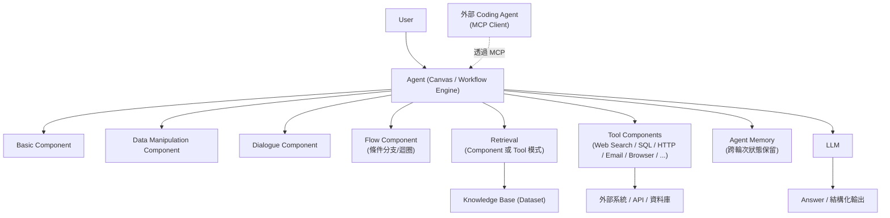

### 16.7 案例：售後服務 Agent

官方文件示範一個售後服務 Agent 案例（官方已實作，`docs/guides/agent/agent_overview.md`）：Agent 先用 `Categorize`（分類元件）判斷使用者問題類型，若屬於產品資訊查詢則呼叫 `Retrieval` 查詢產品知識庫，若涉及工單查詢則透過 `HTTP Request` 呼叫既有工單系統 API，最後統一以 `Message` 元件組裝輸出結果。這個案例清楚展示 Agent 如何串接「分類 → 條件分支 → 檢索／外部 API → 輸出」的完整業務流程，而不只是單純問答。

### 16.8 Scenario：企業內部 IT 工單 Agent

**情境**：企業想把 IT Helpdesk 從單純問答（第15章 Chat）升級為能實際查詢、建立工單的 Agent。

- **Input**：使用者輸入「我的 VPN 連不上，幫我開一張工單」
- **Process**：`Categorize` 判斷為「需要建立工單」而非單純問答 → `Retrieval` 先查詢 VPN 疑難排解知識庫，附上初步排除步驟 → `HTTP Request` 呼叫既有工單系統 API 建立工單 → `Message` 回覆使用者工單編號與初步排除建議
- **Output**：使用者同時取得知識庫答案與實際建立的工單編號
- **對應章節**：這是第20章「AI Agent 協助 Web Application 開發」中，Agent 與既有企業系統整合模式的雛形

### 16.9 AI Prompt 範例

```text
角色（Role）：你是 RAGFlow Agent Workflow 設計顧問。
情境（Context）：我們要設計一個 IT Helpdesk Agent，需要先分類問題、視情況查知識庫或呼叫既有工單系統 API。
任務（Task）：依本章 16.2、16.3、16.7 節內容，設計這個 Agent 的 Component 串接順序，並標示每個節點使用的元件分類。
限制（Constraints）：只能使用本章列出的官方元件分類（Basic／Data Manipulation／Dialogue／Flow／Tool）與 Tool 清單，不可發明未提及的元件。
輸出格式（Output Format）：以 Mermaid graph 語法呈現 Workflow 節點與連線。
驗證（Validation）：必須包含至少一個 Flow（條件分支）元件與一個 Tool Component（HTTP Request）。
```

### 16.10 本章 Checklist 與小結

- [ ] 已理解 Chat 與 Agent 的責任邊界：知識庫問答 vs 業務工作流程編排
- [ ] 已依流程可預測性需求，選擇 Retrieval 作為固定 Component 或 Agent 自主判斷的 Tool
- [ ] 已對 Execute SQL／HTTP Request／Browser 等高風險工具規劃額外授權與稽核機制
- [ ] 已理解 Memory 與 MCP 在 Agent 架構中的角色差異

**小結**：RAGFlow Agent 透過 No-Code Canvas 與豐富的 Tool Components（含網頁搜尋、SQL、HTTP、Email、瀏覽器自動化），讓 RAG 能力從單純問答擴展為可執行實際業務流程的自動化單位。第17章接續說明如何透過 HTTP API／Python SDK 從外部應用程式呼叫這些能力。

---

## 17. RAGFlow API

### 17.1 HTTP API 總覽

依官方文件（官方已實作，`docs/references/http_api_reference.md`，查證基準 v0.26.4），RAGFlow HTTP API：

- **Base URL 樣式**：`http://{address}/api/v1/`（`{address}` 對應部署主機的 `SVR_HTTP_PORT` 等實際位址）
- **認證方式**：所有端點均需於 HTTP Header 帶入 `Authorization: Bearer <YOUR_API_KEY>`（官方已實作）
- API Key 於 Web UI 的使用者設定頁面產生（具體路徑請以當下版本 UI 為準）

### 17.2 Dataset／Document／Chunk API 端點總表

| 分類 | Method | Endpoint |
|---|---|---|
| Dataset | POST | `/api/v1/datasets` |
| Dataset | PUT | `/api/v1/datasets/{dataset_id}` |
| Dataset | GET | `/api/v1/datasets` |
| Dataset | DELETE | `/api/v1/datasets` |
| Document | POST | `/api/v1/datasets/{dataset_id}/documents` |
| Document | PUT | `/api/v1/datasets/{dataset_id}/documents/{document_id}` |
| Document | GET | `/api/v1/datasets/{dataset_id}/documents` |
| Document | DELETE | `/api/v1/datasets/{dataset_id}/documents` |
| Document（新版整合上傳） | POST | `/api/v1/documents/ingest` |
| Chunk | POST | `/api/v1/datasets/{dataset_id}/documents/{document_id}/chunks` |
| Chunk | GET | `/api/v1/datasets/{dataset_id}/documents/{document_id}/chunks` |
| Chunk | PATCH | `/api/v1/datasets/{dataset_id}/documents/{document_id}/chunks/{chunk_id}` |
| Chunk | DELETE | `/api/v1/datasets/{dataset_id}/documents/{document_id}/chunks` |
| Metadata | GET | `/api/v1/datasets/{dataset_id}/metadata/summary` |
| Metadata | POST | `/api/v1/datasets/{dataset_id}/metadata/update` |

（官方已實作，Source-confirmed 逐條對照 `http_api_reference.md`；企業導入時請以當下版本文件確認完整參數與回傳格式）

### 17.3 Chat／Retrieval／OpenAI-Compatible API 端點總表

| 分類 | Method | Endpoint | 說明 |
|---|---|---|---|
| Retrieval | POST | `/api/v1/retrieval` | 直接呼叫檢索能力，不經過 Chat／LLM 生成，適合企業自建應用只需要「檢索結果」的場景 |
| Chat Assistant | POST | `/api/v1/chats` | 建立 Chat Assistant |
| Chat Assistant | PUT | `/api/v1/chats/{chat_id}` | 更新 Chat Assistant 設定 |
| Chat Assistant | GET | `/api/v1/chats/{chat_id}` | 取得 Chat Assistant 設定 |
| OpenAI-Compatible | POST | `/api/v1/openai/{chat_id}/chat/completions` | 以 OpenAI Chat Completions API 格式呼叫指定 Chat Assistant，方便既有 OpenAI SDK／工具直接切換 |
| OpenAI-Compatible | POST | `/api/v1/agents_openai/{agent_id}/chat/completions` | 以相同格式呼叫指定 Agent |

**企業整合建議**：若企業既有系統已使用 OpenAI SDK 或相容工具鏈，`/api/v1/openai/{chat_id}/chat/completions` 與 `/api/v1/agents_openai/{agent_id}/chat/completions` 這兩個相容端點可大幅降低整合成本，不需要為了串接 RAGFlow 重寫既有的 OpenAI 呼叫邏輯（建議架構）。

### 17.4 進階檢索增強端點：GraphRAG 與 RAPTOR

依官方 API 文件（官方已實作），RAGFlow 於 Dataset 層級另提供兩種進階檢索增強機制的 API：

- **GraphRAG**（`POST /api/v1/datasets/{dataset_id}/run_graphrag`，`GET .../trace_graphrag`）：以知識圖譜（Knowledge Graph）方式組織文件中的實體與關係，對應第13.2節 Retrieval Testing 中的「Use Knowledge Graph」選項
- **RAPTOR**（`POST /api/v1/datasets/{dataset_id}/run_raptor`，`GET .../trace_raptor`）：一種遞迴式、樹狀組織摘要的檢索增強技術，讓檢索除了原始 Chunk 外，也能取得不同抽象層級的摘要節點

**版本注意事項**：GraphRAG／RAPTOR 屬於運算成本較高的進階功能（需要額外的 LLM 呼叫來建立圖譜／摘要樹），是否對特定 Dataset 啟用，建議先評估效益是否值得額外成本，**具體參數與適用場景請以官方文件當下版本為準**，本手冊不展開逐一參數說明以避免速過時。

### 17.5 Python SDK

依官方文件（官方已實作，`docs/references/python_api_reference.md`，`pip install ragflow-sdk`）：

```python
from ragflow_sdk import RAGFlow

# 建立客戶端
rag_object = RAGFlow(api_key="<YOUR_API_KEY>", base_url="http://<YOUR_BASE_URL>:9380")

# 建立 Dataset
dataset = rag_object.create_dataset(name="kb_1")

# 上傳文件
dataset.upload_documents([
    {"display_name": "1.txt", "blob": "<BINARY_CONTENT>"},
    {"display_name": "2.pdf", "blob": "<BINARY_CONTENT>"}
])

# 觸發非同步解析
documents = dataset.list_documents(keywords="test")
ids = [doc.id for doc in documents]
dataset.async_parse_documents(ids)

# 建立 Chat 並對話（串流）
assistant = rag_object.create_chat("Miss R", dataset_ids=[dataset.id])
session = assistant.create_session()
for message in session.ask("Your question", stream=True):
    print(message.content)

# 純檢索（不經過 LLM 生成）
chunks = rag_object.retrieve(
    question="search query",
    dataset_ids=[dataset.id],
    page_size=30
)
```

核心類別：`RAGFlow`（主要客戶端）、`DataSet`、`Document`、`Chat`、`Session`、`Chunk`（官方已實作）。**以上程式碼逐字引用官方文件範例，實際欄位與方法簽章請以當下版本 SDK 為準，特別是 `blob` 欄位的二進位內容需依實際檔案讀取方式處理，不可直接複製字面上的 `<BINARY_CONTENT>` 佔位字串。**

### 17.6 API Key 管理

企業整合 RAGFlow API 時，API Key 管理是資安重點（見第30章延伸討論）：

- API Key 應視為機密憑證，不可寫死在前端程式碼或版本控制系統中（見18-19章「Browser 不應直接持有 RAGFlow API Key」原則）
- 建議依應用系統／團隊分別建立獨立 API Key，而非全公司共用一組，以利事後稽核與權限收回
- **RAGFlow 官方是否原生支援 API Key 的細粒度權限範圍（Scope）控管（例如限定某 Key 只能存取特定 Dataset），請以官方當下版本文件為準（請以目前官方文件為準）**，企業若有此需求，可於 Gateway／後端服務層（見第18章）額外實作存取控制

### 17.7 Scenario：純檢索 API 的應用場景

**情境**：企業已有自己的 LLM Orchestration 服務，只想借用 RAGFlow 的檢索能力，不需要 RAGFlow 的 Chat 生成邏輯。

- **Input**：企業自建的 LLM 應用需要「查詢企業知識庫，拿到相關 Chunk」這個單一能力
- **Process**：直接呼叫 `POST /api/v1/retrieval`，取得 Top-N Chunk 與相似度分數，自行組裝 Prompt 並呼叫自家的 LLM Orchestration 服務
- **Output**：RAGFlow 僅扮演「檢索引擎」角色，生成與 Prompt 組裝邏輯留在企業自有系統中，符合1.7節「RAGFlow 提供 Context，不強制包辦生成」的分工原則
- **對應章節**：此模式是第18-20章 Web Application Integration 案例的技術基礎之一

### 17.8 AI Prompt 範例

```text
角色（Role）：你是企業後端整合工程師。
情境（Context）：我們要把既有 Spring Boot 服務與 RAGFlow API 整合，需求包含建立 Dataset、上傳文件、純檢索、呼叫 Chat 四種操作。
任務（Task）：依本章 17.2、17.3、17.5 節內容，列出對應的 HTTP API 端點與呼叫順序，並說明何時該用純 HTTP API、何時可以參考 Python SDK 的邏輯改寫成 Java 版本。
限制（Constraints）：只能使用本章列出的端點，不可臆測未列出的端點路徑。
輸出格式（Output Format）：依「建立 Dataset → 上傳文件 → 觸發解析 → 檢索／對話」順序排列的端點呼叫清單。
驗證（Validation）：每個端點都必須附上對應的 HTTP Method。
```

### 17.9 本章 Checklist 與小結

- [ ] 已理解 RAGFlow HTTP API 的 Base URL 樣式與 Bearer Token 認證方式
- [ ] 已掌握 Dataset／Document／Chunk／Chat／Retrieval 的核心端點分類
- [ ] 已評估是否需要使用 OpenAI-Compatible 端點降低既有系統整合成本
- [ ] 已評估 GraphRAG／RAPTOR 進階功能的效益與額外成本
- [ ] 已制定 API Key 管理與存取控制原則

**小結**：RAGFlow 提供完整的 HTTP API 與 Python SDK，涵蓋從 Dataset 管理到純檢索、Chat、OpenAI 相容端點的完整操作面。第18章開始，本手冊進入「如何把這些 API 整合進企業自有 Web Application」的實作主軸。

---

## 18. Web Application Integration 總論

### 18.1 整合架構總覽

企業將 RAGFlow 整合進自有 Web Application，建議的分層架構如下（建議架構，延伸自第17章 API 能力）：

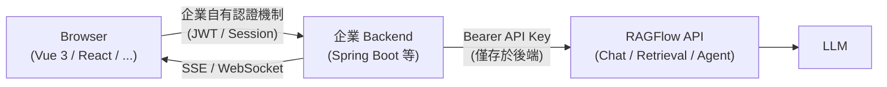

**核心原則（本章反覆強調）**：**Browser 不應直接持有企業 RAGFlow API Key**。RAGFlow API Key 一旦外洩到前端程式碼或瀏覽器開發者工具可見範圍，任何人都能用它任意查詢企業知識庫、消耗 LLM 額度，甚至觸發第16章提到的高風險 Tool（如 Execute SQL、HTTP Request）。正確作法是所有 RAGFlow API 呼叫都經過企業自有 Backend 代理，Backend 才是唯一持有 API Key 的角色（建議架構，屬企業 API 安全的通用原則，非 RAGFlow 專屬限制）。

### 18.2 Frontend Integration 考量

- **不直接呼叫 RAGFlow API**：前端一律呼叫企業自有 Backend 提供的 API，由 Backend 轉發至 RAGFlow
- **Streaming Response（串流回應）**：Chat 對話通常需要逐字／逐段顯示生成內容，前端需支援 SSE（Server-Sent Events）或 WebSocket 接收串流資料（見18.3節）
- **Citation 顯示**：前端需妥善呈現 RAGFlow 回傳的引用來源（對應第2、4章 Citation／Grounding 概念），讓使用者能點擊查看原始文件段落
- **Loading／中斷處理**：長文件 Ingestion（第4章）與複雜 Agent 執行（第16章）可能耗時較長，前端需妥善處理等待狀態與使用者中斷請求的情境

### 18.3 Backend Integration 考量

- **API Gateway／Backend for Frontend（BFF）模式**：企業 Backend 扮演 RAGFlow 與前端之間的閘道，統一處理認證、限流、日誌
- **Session 管理**：RAGFlow 的 Chat Session（第17.5節 `create_session()`）與企業自有的使用者 Session／JWT 是兩套獨立機制，Backend 需負責建立兩者的對應關係（例如：企業使用者 ID → RAGFlow Session ID 的映射，避免不同使用者的對話歷史互相污染）
- **Streaming 轉發**：Backend 需將 RAGFlow API 的串流回應（若 API 支援）轉發為前端可消費的 SSE／WebSocket 格式，而非等整段回應完成才一次性回傳，否則會犧牲使用者體感的即時性
- **Timeout／Retry**：Agent 執行（尤其涉及第16章外部 Tool 呼叫）耗時可能明顯長於一般 API，Backend 的 Timeout 設定需相應調整，並針對暫時性錯誤（如 LLM API 短暫限流）設計 Retry 策略（建議架構）
- **Rate Limiting（限流）**：Backend 應對每位企業使用者的呼叫頻率做限流，避免單一使用者或惡意腳本耗盡 LLM Token 額度或觸發 RAGFlow 端的資源瓶頸

### 18.4 錯誤處理設計原則

| 錯誤情境 | 建議處理方式 |
|---|---|
| RAGFlow API 逾時 | Backend 回傳明確的「服務忙碌，請稍後再試」訊息，不可讓前端無限等待 |
| RAGFlow 回傳 Empty Response（第15.2節） | 前端明確顯示「查無相關資訊」，避免使用者誤以為系統故障 |
| LLM Provider（第9章）額度耗盡／API Key 失效 | Backend 記錄告警（見第34章），避免整個知識庫問答功能無預警癱瘓 |
| Agent 執行中呼叫外部 Tool 失敗（第16章） | 依 Tool 重要性決定是否讓整個 Agent 流程失敗，或降級為部分結果 |

### 18.5 Scenario：串流回應體感優化

**情境**：企業內部 Chat 功能上線後，使用者反映「感覺系統很慢，要等好幾秒才有反應」，但後端量測到的總回應時間其實與其他系統相當。

- **Input**：Backend 目前是等 RAGFlow 完整回應後才一次性回傳給前端
- **Process**：改為 SSE 串流轉發，讓使用者從第一個生成的字元開始就能看到內容逐步出現
- **Output**：總回應時間沒有變化，但使用者體感明顯改善，因為「感覺系統立即有反應」比「總等待時間短」更影響使用者滿意度
- **對應章節**：第19章會提供 Vue 3 + Spring Boot 的具體 SSE 實作範例

### 18.6 AI Prompt 範例

```text
角色（Role）：你是企業 Web Application 整合架構師。
情境（Context）：我們要把 RAGFlow Chat 整合進既有的企業內部入口網站，前端為 Vue 3，後端為 Spring Boot。
任務（Task）：依本章 18.1-18.4 節內容，設計整合架構圖與資料流向，並列出前端、後端、RAGFlow 三方各自的職責邊界。
限制（Constraints）：必須遵守「Browser 不持有 RAGFlow API Key」原則，所有 RAGFlow 呼叫必須經過後端代理。
輸出格式（Output Format）：Mermaid 架構圖 + 職責邊界表格。
驗證（Validation）：架構圖中 Browser 與 RAGFlow 之間不可有直接連線。
```

### 18.7 本章 Checklist 與小結

- [ ] 已確認架構中 Browser 不直接持有 RAGFlow API Key
- [ ] 已規劃 SSE／WebSocket 串流回應機制
- [ ] 已設計企業使用者 Session 與 RAGFlow Chat Session 的對應關係
- [ ] 已針對 RAGFlow API 逾時、Empty Response、額度耗盡等情境設計錯誤處理

**小結**：Web Application Integration 的核心是「企業 Backend 作為唯一持有 API Key 的代理層」，並妥善處理串流回應與各類錯誤情境。第19章提供具體的 Vue 3 + Spring Boot 企業實作範例。

---

## 19. Vue3、Spring Boot 與 RAGFlow 企業實作範例

> 本章範例中的 `bank-web-platform`、`PaymentController` 等均為**教學示範用途之虛構情境**，用於展示整合模式，並非真實客戶專案（見重要聲明第6點）。既有框架的深入機制請參閱 [Spring boot 4.x升版教學](../framework/Spring%20boot%204.x升版教學.md)、[Vue3 前端framework教學](../framework/Vue3%20前端framework教學.md)、[PrimeVue使用教學](../framework/PrimeVue使用教學.md)。

### 19.1 案例情境

某銀行 Digital Banking 平台（虛構情境）想在既有 Vue 3 + Spring Boot 系統中，新增一個「智能客服」功能，讓使用者可以詢問信用卡帳單、還款規則等問題，答案需來自銀行內部審核過的 SOP 知識庫，並顯示引用來源。

### 19.2 整體架構

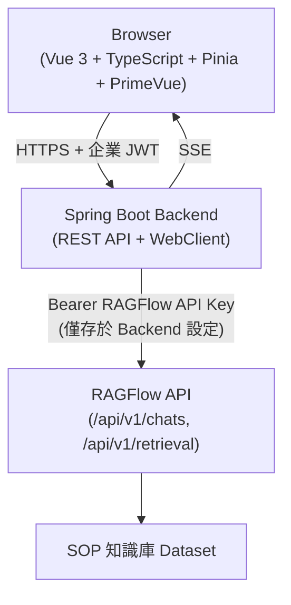

### 19.3 Backend：Spring Boot 呼叫 RAGFlow API（示意）

```java
// 示意程式碼，非官方 SDK 逐字引用，實際欄位請以第17章 HTTP API Reference 為準
@Service
public class RagflowChatService {

    private final WebClient ragflowClient;

    public RagflowChatService(@Value("${ragflow.base-url}") String baseUrl,
                               @Value("${ragflow.api-key}") String apiKey) {
        this.ragflowClient = WebClient.builder()
                .baseUrl(baseUrl)
                .defaultHeader(HttpHeaders.AUTHORIZATION, "Bearer " + apiKey)
                .build();
    }

    public Flux<String> streamAnswer(String chatId, String sessionId, String question) {
        return ragflowClient.post()
                .uri("/api/v1/chats/{chatId}/sessions/{sessionId}/ask", chatId, sessionId)
                .bodyValue(Map.of("question", question, "stream", true))
                .retrieve()
                .bodyToFlux(String.class);
    }
}
```

> **版本注意事項**：以上 Session／Ask 端點路徑為示意寫法，第17.2、17.3節列出的是本手冊查證確認的端點；Session 層級的具體端點路徑請以官方 `http_api_reference.md` 當下版本為準，切勿直接複製上例路徑到生產程式碼而不驗證。

### 19.4 Backend：SSE Controller（示意）

```java
// 示意程式碼
@RestController
@RequestMapping("/api/support")
public class SupportChatController {

    private final RagflowChatService ragflowChatService;

    public SupportChatController(RagflowChatService ragflowChatService) {
        this.ragflowChatService = ragflowChatService;
    }

    @PostMapping(value = "/ask", produces = MediaType.TEXT_EVENT_STREAM_VALUE)
    public Flux<ServerSentEvent<String>> ask(@RequestBody AskRequest request,
                                              Authentication authentication) {
        // 企業使用者身分驗證 (JWT) 已由 Spring Security 處理，此處僅示意
        String sessionId = resolveOrCreateSession(authentication.getName());
        return ragflowChatService.streamAnswer(request.chatId(), sessionId, request.question())
                .map(chunk -> ServerSentEvent.builder(chunk).build());
    }
}
```

### 19.5 Frontend：Vue 3 消費 SSE（示意）

```typescript
// 示意程式碼，實際專案建議封裝為 composable（如 useRagflowChat）
async function askQuestion(question: string, onChunk: (text: string) => void) {
  const response = await fetch('/api/support/ask', {
    method: 'POST',
    headers: { 'Content-Type': 'application/json' },
    body: JSON.stringify({ chatId: SUPPORT_CHAT_ID, question }),
  })

  const reader = response.body!.getReader()
  const decoder = new TextDecoder()

  while (true) {
    const { value, done } = await reader.read()
    if (done) break
    onChunk(decoder.decode(value, { stream: true }))
  }
}
```

前端狀態管理建議以 Pinia Store 集中管理對話歷史、Citation 資料與 Loading 狀態，畫面呈現可搭配 PrimeVue 的元件（如 `Message`、`ProgressSpinner`）處理逐字顯示與載入中狀態，具體元件用法請參考既有 [PrimeVue使用教學](../framework/PrimeVue使用教學.md)。

### 19.6 Citation 顯示設計

RAGFlow 回應中的引用資訊（對應第2、15章 Citation／Show Quote）應在前端明確呈現，建議設計：

- 答案文字中以上標數字（如 `[1]` `[2]`）標示引用位置
- 點擊上標數字展開對應的原始 Chunk 內容與來源文件名稱
- 若 Empty Response 被觸發（第15.2節），前端應顯示明確的「查無相關資訊」提示，而非空白畫面

### 19.7 Scenario：Session 對應關係設計

**情境**：同一位銀行行員在同一天內，透過內部入口網站與行動裝置 App 分別詢問了不同問題，兩邊的對話歷史卻互相混在一起。

- **Input**：Backend 為所有裝置共用同一個 RAGFlow Session ID
- **Process**：改為依「企業使用者 ID + 裝置／頁籤識別碼」產生獨立的 RAGFlow Session，並將對應關係持久化於企業自有資料庫
- **Output**：不同裝置／頁籤的對話歷史正確隔離
- **對應章節**：呼應18.3節「Session 管理」的設計原則

### 19.8 AI Prompt 範例

```text
角色（Role）：你是 Spring Boot 後端工程師。
情境（Context）：我要在既有 Spring Boot 4.x 專案中新增一個呼叫 RAGFlow Chat API 的 Service，並以 SSE 方式串流回應給 Vue 3 前端。
任務（Task）：依本章 19.3、19.4 節的示意程式碼，撰寫符合 Spring Boot 4.x（見既有 Spring Boot 4.x升版教學）慣例的完整 Service 與 Controller，並加上例外處理（RAGFlow API 逾時、認證失敗）。
限制（Constraints）：API Key 必須從設定檔（`application.yml`）讀取，不可寫死在程式碼中；不可讓 Browser 直接呼叫 RAGFlow API。
輸出格式（Output Format）：Java 程式碼區塊，並附上對應的 `application.yml` 設定範例。
驗證（Validation）：程式碼中不可出現任何硬編碼的 API Key 字串。
```

### 19.9 本章 Checklist 與小結

- [ ] Backend 已使用 WebClient（或等效工具）代理所有 RAGFlow API 呼叫，API Key 僅存於後端設定
- [ ] 已實作 SSE 串流轉發，前端逐字／逐段顯示生成內容
- [ ] 已設計企業使用者與 RAGFlow Session 的正確對應關係
- [ ] 前端已妥善呈現 Citation 與 Empty Response 情境

**小結**：本章示範的 Vue 3 + Spring Boot + RAGFlow 整合模式，核心是「Backend 代理、SSE 串流、Session 對應、Citation 呈現」四個面向。第20章接續說明如何把這套整合模式進一步擴展為「AI Agent 協助 Web Application 開發」的完整流程。

---

## 20. AI Agent 協助 Web Application 開發

### 20.1 從「整合 RAGFlow」到「用 RAGFlow 提供 Context 給 Coding Agent」

第18-19章討論的是「企業 Web Application 呼叫 RAGFlow API 提供給終端使用者」；本章討論的是另一個獨立但相關的場景：**讓 Claude Code、GitHub Copilot 等 Coding Agent 在開發這個 Web Application 的過程中，透過 RAGFlow 取得企業內部的架構知識、程式碼慣例、既有規格**，藉此提升 AI 輔助開發的準確度（呼應第1.10節演進圖：Agent + RAG → AI Software Engineering）。

### 20.2 AI Software Development 架構

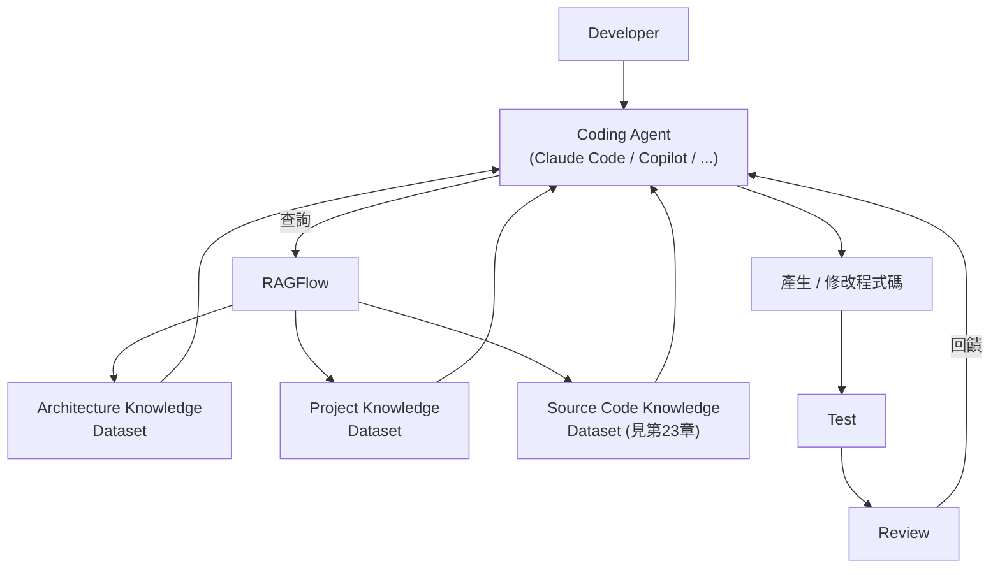

### 20.3 RAGFlow 可提供給 Coding Agent 的知識類型

| 知識類型 | 對應 Dataset 建議 | 說明 |
|---|---|---|
| Architecture Context | 架構知識庫 | 系統分層、模組職責、技術選型決策紀錄 |
| API Specification | API 規格知識庫 | 既有 API 的規格文件、DTO 定義 |
| Coding Standard | 開發規範知識庫 | 團隊程式碼風格、命名慣例（可對應既有 [Clean Code教學](../分析與設計/Clean%20Code教學.md)） |
| Business Rules | 業務規則知識庫 | 需求文件、業務邏輯說明 |
| Database Schema | 資料庫知識庫 | ER 圖、資料表結構說明文件 |
| Existing Source Code Knowledge | 原始碼知識庫（見第23章） | 既有程式碼的結構化知識 |
| UI Specification | UI／UX 規格知識庫 | 設計系統、元件規範 |
| Security Guideline | 資安規範知識庫 | 企業資安要求、OWASP 相關規範 |
| Testing Guideline | 測試規範知識庫 | 測試策略、覆蓋率要求 |

### 20.4 實務整合模式：MCP vs 手動查詢

Coding Agent 取得 RAGFlow 知識的方式有兩種（延伸第21章詳述）：

1. **MCP 整合**：若 Coding Agent 支援 MCP（如部分版本的 Claude Code），可直接透過 RAGFlow 的 MCP Server（第3.5節）將 Dataset 查詢能力註冊為標準工具，Agent 自主判斷何時查詢
2. **手動／腳本查詢**：開發者或 CI 腳本透過第17章 HTTP API／Python SDK 主動查詢 RAGFlow，將結果貼入 Coding Agent 的 Context 或 Prompt 中

**企業建議**：導入初期可先採手動查詢模式驗證知識庫品質是否足以支援開發任務，待知識庫內容穩定、Dataset Governance（第29章）建立後，再評估導入 MCP 自動化整合，避免 Coding Agent 一開始就依賴品質不穩定的知識庫做出錯誤判斷（建議架構）。

### 20.5 Scenario：新功能開發時的 Context 補全

**情境**：開發者要在銀行 Web Application（虛構情境）新增「信用卡分期付款」功能，但不熟悉既有的付款相關 Domain Model。

- **Input**：開發者向 Coding Agent 下達「幫我在 `PaymentController` 新增分期付款端點」的指令
- **Process**：Coding Agent 透過 MCP 或手動查詢，向 RAGFlow 的「架構知識庫」「API 規格知識庫」查詢既有付款相關的 Domain Model、既有 API 慣例、資料庫 Schema
- **Output**：Coding Agent 產生的新端點程式碼風格與既有 `PaymentController` 一致，且正確使用既有的 Domain Model，而非憑空猜測欄位名稱
- **對應章節**：具體的原始碼知識庫建置方式見第23章 Source Code RAG

### 20.6 AI Prompt 範例

```text
角色（Role）：你是企業 AI 輔助開發流程設計顧問。
情境（Context）：我們要讓 Coding Agent 在開發銀行 Web Application 新功能時，能查詢 RAGFlow 中的架構、API、資料庫知識庫。
任務（Task）：依本章 20.3、20.4 節內容，設計一套「開發者下需求 → Coding Agent 查詢 RAGFlow → 產生程式碼 → 測試 → Review」的標準作業流程，並標示每個階段 RAGFlow 提供的知識類型。
限制（Constraints）：必須明確區分「MCP 自動查詢」與「手動查詢」兩種模式的適用時機，不可假設所有 Coding Agent 都原生支援 MCP。
輸出格式（Output Format）：流程圖（文字描述或 Mermaid 皆可）+ 對照表。
驗證（Validation）：流程中必須包含 Review 或人工確認步驟，不可設計成全自動無人審核。
```

### 20.7 本章 Checklist 與小結

- [ ] 已規劃至少架構、API 規格、原始碼三類知識庫供 Coding Agent 查詢
- [ ] 已決定初期採手動查詢或 MCP 自動整合模式
- [ ] 已確保 Coding Agent 產生的程式碼仍經過 Test／Review 流程，而非直接信任 RAGFlow 提供的 Context
- [ ] 已將 Coding Agent 查詢知識庫的模式與第18-19章「終端使用者查詢」模式明確區分（兩者是不同的使用情境）

**小結**：本章把 RAGFlow 的角色從「終端使用者的知識庫問答」延伸為「Coding Agent 的開發時 Context 來源」，這正是本手冊反覆強調的「AI Agent Context Infrastructure」定位的具體實踐。第21章接續深入探討 RAGFlow 與各類 Coding Agent（Claude Code、GitHub Copilot 等）的整合方式與邊界。

---

## 21. RAGFlow 與 Coding Agent 整合

### 21.1 RAGFlow MCP Server 詳解

RAGFlow 原始碼中 `mcp/server/server.py` 實作了一個標準 MCP Server（官方已實作／Source-confirmed，v0.26.4）。啟動參數（Source-confirmed，讀取自 `server.py` 之 CLI 參數定義）：

| 參數 | 說明 | 預設值 |
|---|---|---|
| `--base-url` | RAGFlow 後端 API Base URL | `http://127.0.0.1:9380` |
| `--host` | MCP Server 綁定位址 | `127.0.0.1` |
| `--port` | MCP Server 綁定 Port | `9382`（與5.5節 `SVR_MCP_PORT` 一致） |
| `--mode` | `self-host` 或 `host` 兩種啟動模式 | — |
| `--api-key` | `self-host` 模式下使用的 API Key | — |
| `--transport-sse-enabled` / `--no-transport-sse-enabled` | 是否啟用（舊式）SSE Transport | 預設啟用 |
| `--transport-streamable-http-enabled` / `--no-transport-streamable-http-enabled` | 是否啟用 Streamable HTTP Transport | 預設啟用 |
| `--json-response` / `--no-json-response` | 回應格式為 JSON 或 SSE | 預設啟用 JSON |

RAGFlow MCP Server 目前透過 `@app.list_tools()`／`@app.call_tool()` 定義並暴露以下三個 MCP Tool（Source-confirmed）：

| MCP Tool 名稱 | 功能 |
|---|---|
| `ragflow_retrieval` | 依問題檢索 Chunk，可選擇指定 Dataset／Document ID、分頁、相似度門檻、Rerank 參數 |
| `ragflow_list_datasets` | 列出可存取的 Dataset，支援分頁 |
| `ragflow_list_chats` | 列出可存取的 Chat Assistant，支援分頁 |

**版本注意事項**：查證當下 MCP Server 暴露的工具僅止於「檢索」「列出 Dataset」「列出 Chat」三項，**不包含**直接執行 Agent Workflow 或建立／修改 Dataset 的工具（Source-confirmed，`server.py` 中未發現對應工具定義）。這代表透過 MCP 讓外部 Coding Agent 使用 RAGFlow，目前主要用途是「查詢知識」而非「遠端操控 RAGFlow 本身」，企業規劃整合範圍時應以此為準，**未來版本是否擴充更多 MCP Tool，請以官方最新原始碼與文件為準**。

### 21.2 四種整合模式

依原始 Prompt 需求，需明確區分以下四種整合模式，並校正為符合 RAGFlow 實際技術能力的描述（避免把概念當成官方定義）：

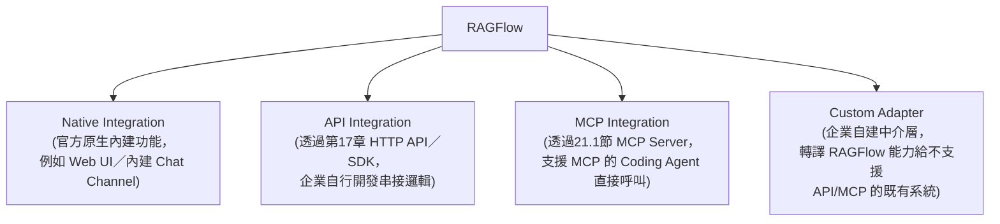

| 模式 | 說明 | 適合情境 |
|---|---|---|
| Native Integration | RAGFlow 官方原生提供的功能，例如內建 Web UI、第15.3節提及的 WhatsApp／DingTalk／WeCom 等 Chat Channel（官方 Release Notes 提及，具體支援清單請以官方當下文件為準） | 不需自行開發，直接使用官方已提供的介面 |
| API Integration | 企業透過第17章 HTTP API／Python SDK 自行開發整合邏輯 | 需要客製化使用者體驗、需要與既有系統深度整合（如第18-19章案例） |
| MCP Integration | 透過21.1節 MCP Server，讓支援 MCP 的用戶端（Coding Agent、IDE 外掛等）直接呼叫 RAGFlow 的檢索能力 | Coding Agent 開發時查詢企業知識庫（第20章） |
| Custom Adapter | 企業自建中介服務，轉譯 RAGFlow 的 API／MCP 能力給尚未支援這些協定的既有系統使用 | 既有系統技術棧老舊、無法直接串接 REST API 或 MCP 的情境 |

### 21.3 與主流 Coding Agent／IDE 的整合現況

MCP 是一個快速演進中的開放協定，各家 Coding Agent／IDE 對 MCP Client 的支援程度會持續變化，**本節僅整理查證當下的整合模式分類，具體某工具是否支援 MCP、支援到何種程度，請務必以該工具當下官方文件為準**：

| 工具類別 | 與 RAGFlow 整合方式 |
|---|---|
| 支援 MCP Client 的 Coding Agent（如部分版本的 Claude Code） | 可透過21.1節 MCP Server 直接連接，將 `ragflow_retrieval` 等工具註冊為可用工具 |
| 支援 MCP 的 IDE／編輯器外掛（如部分版本的 VS Code、Cursor 相關生態） | 同上，透過 MCP Client 設定連接 RAGFlow MCP Server |
| 尚未原生支援 MCP 的工具 | 只能透過 API Integration（第17章）或 Custom Adapter 模式，由企業自行開發查詢腳本或中介服務 |

**本手冊不假設任何特定 Coding Agent「原生支援」與 RAGFlow 的深度整合**（呼應原始 Prompt「不要假設 RAGFlow 原生支援不存在的整合」要求），所有整合能力邊界都應以 RAGFlow 官方 MCP Server 實際暴露的工具（21.1節）與該 Coding Agent 官方文件為準。

### 21.4 Scenario：為 Claude Code 設定 RAGFlow MCP 連線

**情境**：開發團隊想讓 Claude Code 在協助開發時，能查詢 RAGFlow 中的架構知識庫。

- **Input**：已部署好的 RAGFlow（第6章）、已建立好的架構知識庫 Dataset（第20章）
- **Process**：啟動 RAGFlow MCP Server（依21.1節參數，設定正確的 `--api-key` 與 `--base-url`）→ 於 Claude Code 的 MCP 設定中新增這個 MCP Server 連線 → 驗證 Claude Code 能成功呼叫 `ragflow_retrieval` 工具
- **Output**：開發者在 Claude Code 對話中詢問架構相關問題時，Claude Code 可自主決定呼叫 RAGFlow 取得企業知識
- **注意事項**：MCP Server 的 `--host`／`--port` 若對外開放，務必評估網路暴露面與存取控制（見第30章），避免任何能連上該 Port 的用戶端都能無限制查詢企業知識庫

### 21.5 AI Prompt 範例

```text
角色（Role）：你是企業 AI 開發工具鏈整合工程師。
情境（Context）：我們要評估如何讓團隊使用的 Coding Agent 存取 RAGFlow 知識庫，且部分工具支援 MCP、部分不支援。
任務（Task）：依本章 21.1-21.3 節內容，為「支援 MCP 的工具」與「不支援 MCP 的工具」分別設計整合方案。
限制（Constraints）：不可假設任何未經本章確認的 MCP 支援狀態；MCP 整合方案只能使用21.1節列出的三個官方 Tool。
輸出格式（Output Format）：兩欄對照表（支援 MCP／不支援 MCP）+ 各自的整合步驟。
驗證（Validation）：MCP 欄位只能引用 `ragflow_retrieval`、`ragflow_list_datasets`、`ragflow_list_chats` 三個工具。
```

### 21.6 本章 Checklist 與小結

- [ ] 已理解 RAGFlow MCP Server 目前僅暴露檢索與列表類工具，不含遠端操控能力
- [ ] 已依 Coding Agent 的 MCP 支援狀況，選擇 MCP Integration 或 API Integration／Custom Adapter
- [ ] MCP Server 若對外開放，已規劃對應的網路存取控制
- [ ] 未對任何工具的 RAGFlow 整合能力做出未經查證的假設

**小結**：RAGFlow 官方 MCP Server 提供了標準化、但範圍明確（檢索為主）的對外查詢介面。企業應依 Coding Agent 的實際 MCP 支援狀況彈性選擇整合模式，並隨時對照官方原始碼與文件驗證能力邊界。第22章開始，本手冊進入「逆向工程既有系統」這個核心企業場景的完整設計。

---

## 22. 逆向工程 Knowledge Architecture

### 22.1 為什麼逆向工程需要 Context Infrastructure

Legacy System（既有系統）逆向工程最大的挑戰，通常不是「看不懂程式碼」，而是「知識分散在太多地方、且彼此互相矛盾」——原始碼、資料庫 Schema、過期的 Word 規格書、離職同仁留下的 Confluence 頁面、Log 中隱含的實際執行路徑，往往互相衝突或各自殘缺。RAGFlow 的角色是把這些分散、異質的知識來源，統一整理成「可檢索、可追溯、可持續更新」的知識底座，供 AI Agent 進行系統理解、架構還原、業務規則萃取（建議架構，延伸自第1章「AI Agent Context Infrastructure」定位）。

### 22.2 Legacy System 輸入來源分類

| 輸入來源 | 說明 | 對應建議 Dataset（第22.3節） |
|---|---|---|
| Source Code | 既有原始碼（見第23章專節） | Source Code Dataset |
| Database | 資料庫 Schema、ER 圖 | Database Dataset |
| SQL | 既有查詢語句、預存程序、Batch SQL | Database Dataset |
| Configuration | 設定檔（YAML／XML／Properties） | Architecture Dataset |
| API | 既有 API 規格文件、Swagger／OpenAPI | API Dataset |
| Batch | 批次作業程式碼與排程規則 | Business Rule Dataset |
| Logs | 執行期日誌（隱含實際業務流程與例外情境） | Business Rule Dataset（需先萃取關鍵模式，非直接整份匯入） |
| Documents | 需求規格書、設計文件（可能過期） | Architecture Dataset／Business Rule Dataset（需標註文件新舊程度） |
| UML | 既有架構圖、循序圖 | Architecture Dataset |
| Operation Manual | 維運手冊、SOP | Operation Manual Dataset |

### 22.3 建議 Dataset 分層設計

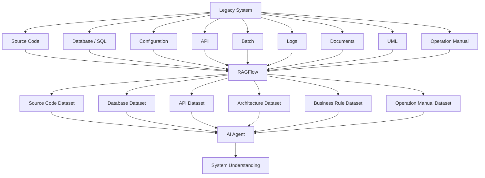

**設計原則**（建議架構）：

1. **依知識性質分 Dataset，而非依系統模組分 Dataset**——例如所有「API 規格」集中在 API Dataset，而不是每個模組各自建立包山包海的 Dataset，方便日後套用不同的 Chunk Method（見第12章）與存取權限
2. **文件新舊程度必須標註**——過期的規格書若與原始碼衝突，Agent 需要有依據判斷該信任哪一份，建議透過第29章 Dataset Governance 的 Metadata 機制標註文件版本與最後驗證日期
3. **Logs 不應直接整份匯入**——原始日誌雜訊過多，建議先經過人工或腳本萃取出「關鍵業務模式」「異常情境」後再建入 Business Rule Dataset

### 22.4 Scenario：新進工程師的第一個逆向工程任務

**情境**：新進工程師被指派修改一個 10 年歷史模組的一個小功能，但完全不熟悉這個模組的業務邏輯。

- **Input**：向已建置好的逆向工程知識庫發問「這個模組的核心業務規則是什麼」
- **Process**：Agent 分別查詢 Source Code Dataset（取得實際程式邏輯）、Business Rule Dataset（取得規格書中記載的業務規則）、Operation Manual Dataset（取得維運人員記錄的已知例外情況）
- **Output**：整合三個來源的答案，並明確標示「程式碼與規格書在某個邊界條件的判斷不一致，建議與原開發團隊確認」——這種「主動標示衝突」的能力，比起「假裝所有來源都一致」更有價值
- **對應章節**：具體如何建置 Source Code Dataset 見第23章，完整逆向工程流程見第24章

### 22.5 AI Prompt 範例

```text
角色（Role）：你是企業逆向工程知識架構顧問。
情境（Context）：我們要為一個 10 年歷史的銀行核心模組（虛構情境）規劃 RAGFlow 逆向工程知識庫。
任務（Task）：依本章 22.2、22.3 節內容，列出這個模組應該收集哪些輸入來源，並規劃對應的 Dataset 分層設計。
限制（Constraints）：Dataset 分層必須依知識性質分類，不可依系統模組分類；必須包含「如何標註文件新舊程度」的具體建議。
輸出格式（Output Format）：輸入來源清單 + Dataset 分層表格 + 一段 Metadata 標註建議。
驗證（Validation）：Dataset 分層必須對應到22.3節列出的六類 Dataset。
```

### 22.6 本章 Checklist 與小結

- [ ] 已盤點既有系統的九類輸入來源（原始碼／資料庫／設定／API／Batch／Log／文件／UML／維運手冊）
- [ ] 已依知識性質（而非系統模組）規劃 Dataset 分層
- [ ] 已規劃文件新舊程度的標註機制
- [ ] 已決定 Logs 類資料的萃取策略，而非直接整份匯入

**小結**：逆向工程知識架構的核心是「異質來源統一整理、依知識性質分層、誠實標示來源衝突」。第23章深入探討其中最具挑戰性的一類來源——原始碼——該如何正確建置為 RAG 知識庫。

---

## 23. Source Code RAG 實務

### 23.1 為什麼原始碼不是普通文件

這是本章最重要的一句話：**原始碼不能直接把整個 Repository 當成一般 PDF／Word 文件丟進 RAGFlow 處理**。原因：

- 原始碼有嚴謹的語法結構（Class／Method／Package），機械式依 Token 數量切分（第12章 General Chunk Method）極可能把一個 Method 從中間切斷，導致語意破碎
- 原始碼的意義高度依賴上下文關係（呼叫關係、繼承關係、依賴關係），這些關係無法從單一檔案的文字內容中看出，需要額外的 Metadata
- 原始碼有 Git 版本歷史（誰改的、為什麼改、何時改），這類資訊對逆向工程往往比程式碼本身更關鍵，但不在檔案內容中
- 不同語言（Java／Spring／JavaScript／TypeScript／Vue／SQL／YAML／XML／Shell）有截然不同的結構特性，無法用單一 Chunking 策略一體適用

**必須誠實聲明**：RAGFlow 本身官方並未提供針對原始碼語法結構的專屬 Parser 或 AST（Abstract Syntax Tree，抽象語法樹）解析能力（Source-confirmed，查證當下官方文件與 `deepdoc`／Parser 相關說明均聚焦於一般文件格式，未發現原始碼專屬的語法感知 Parser）。因此原始碼要能被有效檢索，**企業必須自行在匯入 RAGFlow 之前，先完成語法感知的前處理**，而不是期待 RAGFlow 原生具備這個能力。

### 23.2 Repository 分段策略

建議的原始碼前處理分段層級（建議架構）：

| 分段層級 | 說明 | 建議 Chunk 內容 |
|---|---|---|
| Repository | 整個專案的頂層說明 | README、專案結構總覽、技術堆疊清單 |
| Module／Package | 模組／套件層級 | 該模組的職責說明、對外介面清單 |
| Class | 類別層級 | 類別註解、公開方法簽章清單、繼承關係 |
| Method | 方法層級 | 方法簽章、參數說明、關鍵邏輯摘要（而非逐行程式碼） |

**重要建議**：與其把完整原始碼逐行匯入 RAGFlow，更務實的作法是**先用工具或 Coding Agent 為每個 Class／Method 產生結構化摘要（Docstring／註解／职责說明），再把這些摘要連同關鍵程式碼片段一併匯入**，讓 Chunk 內容本身就是「語意完整、適合檢索」的單位，而不是原始碼的機械切片（建議架構）。

### 23.3 補充 Metadata：Dependency／Git／Architecture

除了程式碼本身的摘要，建議額外準備以下 Metadata 一併匯入（透過第17章 API 或第8.3節 `ingestor` 機制，具體匯入方式依企業自建的前處理工具而定）：

- **Dependency Metadata**：模組間的依賴關係（誰呼叫誰、誰依賴誰的資料庫表）
- **Git Metadata**：關鍵檔案的最後修改時間、主要貢獻者、近期高頻修改的檔案（往往代表活躍開發或技術債集中區）
- **Architecture Metadata**：該模組在整體分層架構（如第22章）中的位置

### 23.4 搭配外部工具強化原始碼理解能力

由於 RAGFlow 原生不具備語法感知的程式碼解析能力（23.1節），企業可評估搭配以下外部工具，將其產出的結構化摘要／關係圖作為 RAGFlow 的匯入內容（**以下工具均為 RAGFlow 生態系之外的獨立專案，並非 RAGFlow 官方功能，具體能力請參閱各工具官方文件**）：

- **Code Graph／AST 分析工具**：將原始碼解析為抽象語法樹，萃取出結構化的類別／方法／呼叫關係，可參考本 Repository 既有 [codegraph教學手冊](codegraph教學手冊.md)、[GitNexus教學手冊](GitNexus教學手冊.md)
- **Codebase Memory 類工具**：專門為 Coding Agent 設計的原始碼知識持久化機制，可與 RAGFlow 扮演互補角色（RAGFlow 負責跨異質來源的統一檢索，Codebase Memory 類工具負責更貼近 IDE／Coding Agent 的即時程式碼上下文）
- **Dependency Graph 工具**：產生模組依賴關係圖，其輸出（如依賴清單、循環依賴警示）可整理成文字說明匯入 Architecture Dataset
- **MCP**：若這些外部工具本身也提供 MCP Server，Coding Agent 甚至可以同時連接 RAGFlow MCP（查詢跨來源知識）與這些工具的 MCP（查詢即時程式碼結構），兩者互補而非互斥

### 23.5 Scenario：建置一個 Legacy Java 模組的 Source Code Dataset

**情境**：團隊要為一個 5 萬行的 Legacy Java 模組（虛構情境）建置 Source Code Dataset。

- **Input**：完整原始碼 Repository
- **Process**：先用 Coding Agent 批次為每個 Public Class 產生「職責摘要＋關鍵方法簽章＋依賴的其他類別」的結構化 Markdown 文件（而非直接匯入 `.java` 檔案）→ 依 Repository／Module／Class 三層分段，各自建立對應大小的 Chunk → 於每個 Chunk 的 Metadata 標註所屬套件路徑、最後修改時間 → 透過 API（第17章）批次匯入 Source Code Dataset
- **Output**：一個可被 Coding Agent 查詢「這個類別的職責是什麼」「有哪些地方呼叫了這個方法」的知識庫，而非一堆被機械切碎、失去語意的程式碼片段
- **對應章節**：此流程是第24章「Legacy System Reverse Engineering Workflow」中「Source Analysis」階段的具體實例

### 23.6 AI Prompt 範例

```text
角色（Role）：你是 Source Code RAG 前處理設計顧問。
情境（Context）：我們要把一個 5 萬行的 Legacy Java Spring 模組建置成 RAGFlow Source Code Dataset。
任務（Task）：依本章 23.1-23.3 節內容，設計一套「原始碼 → 結構化摘要 → RAGFlow Chunk」的前處理流程，並說明每個 Chunk 應包含哪些內容與 Metadata。
限制（Constraints）：不可假設 RAGFlow 原生具備 AST 解析或語法感知 Chunking 能力；必須明確說明前處理步驟由企業自建工具或 Coding Agent 完成，而非 RAGFlow 內建功能。
輸出格式（Output Format）：流程步驟 + 每個 Chunk 的內容／Metadata 欄位表。
驗證（Validation）：流程中必須包含 Repository／Module／Class 三個分段層級。
```

### 23.7 本章 Checklist 與小結

- [ ] 已理解 RAGFlow 原生不具備語法感知的原始碼解析能力，需自行前處理
- [ ] 已規劃 Repository／Module／Class／Method 分段策略，而非機械式 Token 切分
- [ ] 已規劃 Dependency／Git／Architecture Metadata 的補充機制
- [ ] 已評估是否需要搭配 Code Graph／AST／Codebase Memory 等外部工具強化程式碼理解

**小結**：Source Code RAG 的核心原則是「先產生語意完整的結構化摘要，再匯入 RAGFlow」，而不是把原始碼當成普通文件機械切片。第24章接續把本章與第22章的內容整合為完整的 Legacy System Reverse Engineering Workflow。

---

## 24. Legacy System Reverse Engineering Workflow

### 24.1 完整流程

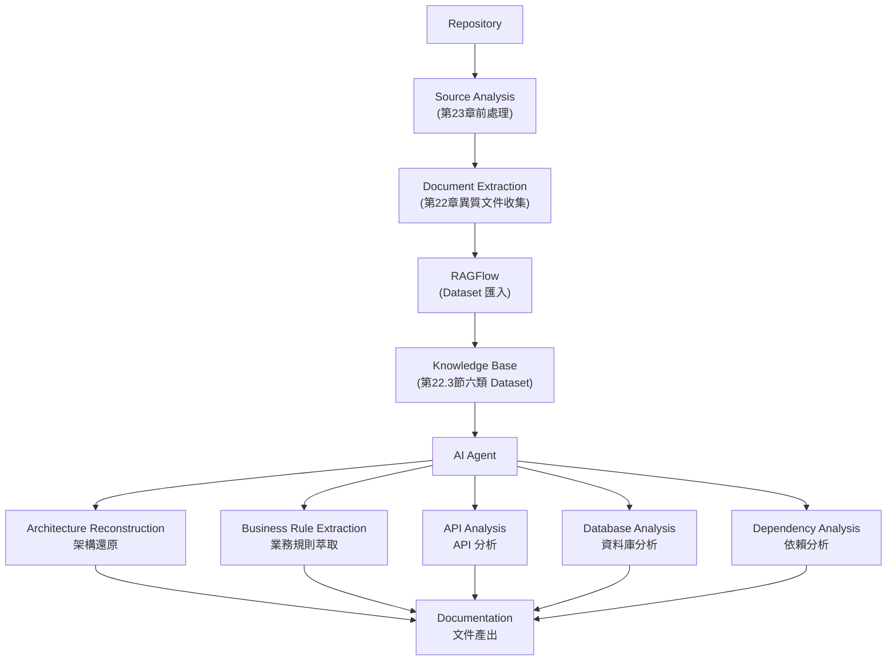

### 24.2 各階段說明

| 階段 | Input | Process | Output |
|---|---|---|---|
| Source Analysis | 原始碼 Repository | 依第23章分段策略產生結構化摘要 | Class／Method 摘要文件 |
| Document Extraction | 既有規格書、Confluence、UML、維運手冊 | 收集、標註新舊程度（第22.3節） | 分類後的文件集合 |
| RAGFlow 匯入 | Source Analysis + Document Extraction 產出 | 依第22.3節六類 Dataset 分別匯入，套用第12章對應 Chunk Method | 可檢索的知識庫 |
| Architecture Reconstruction | AI Agent 查詢 Architecture／Source Code Dataset | Agent 綜合多來源資訊，推論分層架構、模組職責 | 架構還原文件（含 Mermaid 架構圖） |
| Business Rule Extraction | AI Agent 查詢 Source Code／Business Rule Dataset | 比對程式邏輯與規格書，萃取實際生效的業務規則，標示衝突處 | 業務規則文件 |
| API Analysis | AI Agent 查詢 API／Source Code Dataset | 比對既有 API 規格文件與實際程式碼實作是否一致 | API 文件（含落差清單） |
| Database Analysis | AI Agent 查詢 Database Dataset | 分析 Schema、外鍵關係、與程式碼中 ORM 對映的一致性 | 資料庫文件、ER 圖說明 |
| Dependency Analysis | AI Agent 查詢 Source Code Dataset + 23.4節外部工具產出 | 彙整模組依賴關係，標示循環依賴、高耦合區域 | 依賴關係圖說明 |

### 24.3 最終輸出物

依原始需求，完整逆向工程專案應產出以下文件（建議架構）：

- **Architecture Document**（架構文件）
- **API Document**（API 文件，含與實作的落差清單）
- **Database Document**（資料庫文件）
- **Business Rule Document**（業務規則文件，含衝突標示）
- **Sequence Diagram**（循序圖，可由 Agent 依查詢結果以 Mermaid 產生）
- **Dependency Diagram**（依賴關係圖）
- **Technical Debt Report**（技術債報告——例如循環依賴、缺乏測試覆蓋的高風險模組）
- **Migration Plan**（遷移／升級計畫，銜接第25-27章 Framework Upgrade 主題）

### 24.4 Scenario：完整逆向工程專案時程規劃

**情境**：企業要對一個核心系統（虛構情境）進行為期 6 週的逆向工程專案，產出遷移評估報告。

- **Week 1-2**：Source Analysis（原始碼前處理）＋ Document Extraction（既有文件收集）
- **Week 3**：RAGFlow Dataset 建置與 Chunking 品質驗證（比照第14章 RAG Evaluation 方法）
- **Week 4**：Agent 執行 Architecture Reconstruction、API Analysis、Database Analysis
- **Week 5**：Business Rule Extraction、Dependency Analysis，並由資深工程師人工審核 Agent 產出內容的正確性（**不可完全信任 Agent 輸出而跳過人工審核**）
- **Week 6**：彙整 Technical Debt Report 與 Migration Plan，交付利害關係人

### 24.5 AI Prompt 範例

```text
角色（Role）：你是逆向工程專案負責人。
情境（Context）：我們要對一個 Legacy 核心系統（虛構情境）執行為期 6 週的逆向工程專案。
任務（Task）：依本章 24.1、24.2 節的流程，制定一份含時程、每階段負責角色（工程師／Agent／審核者）、每階段驗收標準的專案計畫。
限制（Constraints）：Business Rule Extraction 與 Architecture Reconstruction 階段必須明確安排人工審核步驟，不可設計成 Agent 產出即直接視為最終結論。
輸出格式（Output Format）：週次時程表，欄位為「週次／階段／負責角色／產出物／驗收標準」。
驗證（Validation）：必須涵蓋24.3節列出的至少 6 種輸出物。
```

### 24.6 本章 Checklist 與小結

- [ ] 已規劃完整的 Source Analysis → Document Extraction → RAGFlow → Agent 分析 → Documentation 流程
- [ ] 已為每個分析階段安排對應的人工審核步驟
- [ ] 已規劃至少 6 種最終輸出物（架構／API／資料庫／業務規則／循序圖／依賴圖／技術債／遷移計畫）
- [ ] 已將逆向工程結果與後續 Framework Upgrade（第25-27章）建立銜接

**小結**：Legacy System Reverse Engineering Workflow 把第22章的知識架構與第23章的原始碼前處理方法串接成完整的專案流程，最終產出可交付利害關係人的架構、業務規則、技術債與遷移計畫文件。第25章接續進入本手冊第三個核心場景——Software Framework Upgrade。

---

## 25. Software Framework Upgrade 導入 RAG

### 25.1 為什麼 Framework Upgrade 也是一個 RAG 問題

Framework／Technology Stack 升級（例如 Spring Boot 3 → 4、Java 21 → 25、Jakarta EE 舊版 → 新版）最耗時的部分往往不是「改程式碼」，而是「搞清楚哪些地方會受影響、新版有哪些 Breaking Change、既有程式碼哪裡用了已棄用的 API」。這本質上是一個需要同時比對「官方遷移文件」「新舊版 Release Notes」「既有原始碼」「既有設定」「建置與測試錯誤訊息」的資訊整合問題——正好是 RAG 的強項（建議架構）。

### 25.2 需要建立為 RAG Knowledge 的來源

| 來源 | 說明 | 對應 Dataset |
|---|---|---|
| Official Documentation（新版官方文件） | 新版 Framework 的官方使用文件 | Framework Dataset（新版） |
| Migration Guide（官方遷移指南） | 官方提供的升版指南，通常明確列出 Breaking Change | Framework Dataset（Migration） |
| Release Notes | 新舊版本之間所有中間版本的 Release Notes | Framework Dataset（Release Notes） |
| Existing Source Code | 既有專案原始碼（見第23章 Source Code RAG 實務） | Source Code Dataset |
| Dependency（依賴清單） | 專案 `pom.xml`／`build.gradle`／`package.json` 等依賴宣告 | Framework Dataset（Dependency） |
| Configuration | 既有設定檔 | Architecture Dataset |
| Error Log（建置／測試錯誤訊息） | 升版過程中實際遇到的編譯錯誤、測試失敗訊息 | Framework Dataset（Known Issues，見26章） |
| Test Result | 既有測試套件與其涵蓋範圍 | Framework Dataset（Testing） |

### 25.3 架構圖

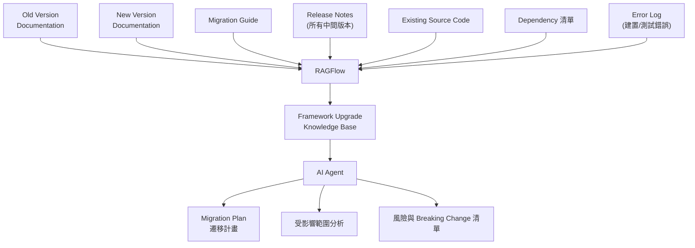

### 25.4 與逆向工程知識庫的關係

本章的 Framework Upgrade Knowledge Base 與第22章逆向工程知識庫高度重疊（都需要 Source Code Dataset、Architecture Dataset），企業若已完成第22-24章的逆向工程知識建置，可直接沿用既有 Dataset，只需額外新增「新版官方文件」「Migration Guide」兩類新來源，而不需要從零重建整套知識庫（建議架構，屬本手冊架構設計上的效率考量）。

### 25.5 Scenario：Spring Boot 3 升級 Spring Boot 4 的知識庫準備

**情境**：團隊要評估銀行 Web Application（虛構情境）從 Spring Boot 3 升級到 Spring Boot 4 的影響範圍，可參考既有 [Spring boot 4.x升版教學](../framework/Spring%20boot%204.x升版教學.md) 建立技術基礎。

- **Input**：Spring Boot 3→4 官方 Migration Guide、既有專案原始碼、`pom.xml` 依賴清單
- **Process**：分別建立「Spring Boot 4 官方文件」「Migration Guide」Dataset，並沿用既有 Source Code Dataset → Agent 查詢「哪些既有程式碼使用了 Spring Boot 4 已移除或變更行為的 API」
- **Output**：一份初步的受影響檔案清單，作為第26章 Framework Upgrade AI Agent 執行實際程式碼修改前的範圍界定
- **注意事項**：Agent 產出的受影響範圍分析必須經過資深工程師複核，不可直接作為最終遷移範圍（見26章）

### 25.6 AI Prompt 範例

```text
角色（Role）：你是 Framework Upgrade 知識庫建置顧問。
情境（Context）：我們要為 Spring Boot 3 升級 Spring Boot 4 的專案建立 RAGFlow 知識庫。
任務（Task）：依本章 25.2、25.4 節內容，列出需要建立的 Dataset 與各自應匯入的具體文件類型，並說明如何與既有逆向工程知識庫（第22章）整合而非重複建置。
限制（Constraints）：不可假設官方 Migration Guide 內容，需標示「請以官方當下版本 Migration Guide 為準」。
輸出格式（Output Format）：Dataset 清單表格 + 一段與既有知識庫整合的說明。
驗證（Validation）：必須明確標示哪些 Dataset 可直接沿用第22章既有成果。
```

### 25.7 本章 Checklist 與小結

- [ ] 已收集新舊版官方文件、Migration Guide、所有中間版本 Release Notes
- [ ] 已評估是否可沿用既有逆向工程知識庫的 Source Code／Architecture Dataset
- [ ] 已規劃如何持續收錄升版過程中實際遇到的 Error Log 作為 Known Issues 知識
- [ ] 已理解 Agent 產出的影響範圍分析仍需人工複核

**小結**：Framework Upgrade 本質上是資訊整合問題，RAGFlow 可作為新舊版文件、Migration Guide 與既有原始碼的統一知識底座。第26章接續說明如何在此知識底座上設計實際執行升版任務的 AI Agent 工作流程。

---

## 26. Framework Upgrade AI Agent

### 26.1 完整工作流程

```mermaid
graph TD
    DEV["Developer"] --> AGENT["Upgrade Agent"]
    AGENT --> RAGFLOW["RAGFlow"]
    RAGFLOW --> OLD["Old Version Documentation"]
    RAGFLOW --> NEW["New Version Documentation"]
    RAGFLOW --> MIG["Migration Guide"]
    RAGFLOW --> SRC["Project Source Code"]
    RAGFLOW --> DEP["Dependency Knowledge"]
    RAGFLOW --> ISSUE["Known Issues\n(過往錯誤紀錄)"]

    AGENT --> ANALYSIS["Analysis 分析"]
    ANALYSIS --> PLAN["Migration Plan 遷移計畫"]
    PLAN --> CHANGE["Code Change\n(由 Coding Agent 執行)"]
    CHANGE --> BUILD["Build"]
    BUILD --> TEST["Test"]
    TEST --> REVIEW["Review\n(人工審核)"]
    REVIEW -->|"未通過"| CHANGE
```

### 26.2 RAGFlow 的角色：Context Provider，而非 Autonomous Coding Agent

這是本章、也是本手冊最重要的責任邊界聲明之一：**RAGFlow 在 Framework Upgrade 流程中扮演的角色是 Context Provider（上下文提供者），不是 Autonomous Coding Agent（自主編碼代理）**。RAGFlow 負責回答「新版文件怎麼說」「這段程式碼過去有沒有類似的升版經驗」「Migration Guide 提到哪些 Breaking Change」這類知識性問題；實際修改程式碼、執行 Build／Test 的是 Coding Agent（如 Claude Code）與既有 CI/CD 系統（第39章），兩者責任不可混淆。

| 角色 | 職責 | 不負責 |
|---|---|---|
| RAGFlow | 提供新舊版文件、Migration Guide、既有原始碼知識、過往 Known Issues 的檢索能力 | 不直接修改程式碼、不執行 Build／Test |
| LLM | 依 RAGFlow 提供的 Context 進行推理、生成程式碼建議 | 不保證生成內容 100% 正確，需經 Coding Agent 與人工驗證 |
| Coding Agent | 實際讀寫檔案、執行修改、呼叫 Build／Test 工具 | 不是知識來源，其輸出品質高度依賴取得的 Context 品質 |
| MCP | Coding Agent 取得 RAGFlow 知識的其中一種標準化管道（見第21章） | 不是執行引擎，只是傳輸協定 |
| CI/CD | 執行自動化 Build／Test／部署（見第39章） | 不負責判斷「這個修改是否符合業務邏輯」，仍需人工 Review |

### 26.3 Known Issues 的持續累積機制

Framework Upgrade 過程中實際遇到的編譯錯誤、測試失敗、執行期例外，是極高價值的知識——它們代表「理論上的 Migration Guide 在這個專案的實際情境下會遇到什麼問題」。建議做法（建議架構）：

1. 每次升版任務遇到非預期錯誤並解決後，將「錯誤訊息＋根因＋解法」整理成簡短文件
2. 定期（如每週）批次匯入 Framework Dataset 的 Known Issues 子集合
3. 後續 Agent 分析類似錯誤時，能優先參考「這個團隊過去實際遇到並解決過的問題」，而不是只依賴通用的官方文件

### 26.4 Scenario：一次完整的模組升版任務

**情境**：`PaymentController`（虛構情境）需要因應 Spring Boot 4 的變更調整程式碼。

- **Input**：Developer 向 Coding Agent 下達「幫我升級 `PaymentController` 以符合 Spring Boot 4」的指令
- **Process**：Coding Agent 透過 MCP（第21章）查詢 RAGFlow 取得「Spring Boot 4 中與 Web Controller 相關的 Breaking Change」「`PaymentController` 既有程式碼結構」「過去類似 Controller 升版時遇到的 Known Issues」→ Coding Agent 依此 Context 提出修改建議 → 執行 Build／Test → 產出修改與測試結果 → 交由資深工程師 Review
- **Output**：一個經過知識輔助、但仍經人工把關的升版 Pull Request
- **失敗情境對照**：若跳過 RAGFlow 查詢直接讓 Coding Agent 憑通用訓練知識修改，容易忽略這個專案特有的既有慣例或過去已知的例外情況

### 26.5 AI Prompt 範例

```text
角色（Role）：你是 Framework Upgrade Agent 工作流程設計顧問。
情境（Context）：我們要設計一套「Coding Agent + RAGFlow」協作的 Spring Boot 3→4 升版標準流程。
任務（Task）：依本章 26.1、26.2 節內容，畫出從 Developer 下需求到 Review 通過的完整流程，並在每個節點標示是 RAGFlow、LLM、Coding Agent、CI/CD 中的哪一個角色負責。
限制（Constraints）：必須嚴格遵守26.2節的責任邊界表，不可把「執行 Build/Test」歸為 RAGFlow 的職責，也不可把「提供知識」歸為 Coding Agent 的職責。
輸出格式（Output Format）：Mermaid 流程圖，每個節點標註負責角色。
驗證（Validation）：流程中必須包含至少一個人工 Review 節點。
```

### 26.6 本章 Checklist 與小結

- [ ] 已明確區分 RAGFlow（Context Provider）與 Coding Agent（執行者）的責任邊界
- [ ] 已規劃 Known Issues 的持續累積機制，而非每次升版都從零開始
- [ ] 升版流程中已包含人工 Review 節點，不允許全自動無人審核合併
- [ ] 已理解 LLM 生成內容不保證正確，需經 Build／Test／Review 三重驗證

**小結**：Framework Upgrade AI Agent 的核心是「RAGFlow 提供知識、LLM 負責推理、Coding Agent 負責執行、人工負責把關」的清楚分工。第27章接續討論如何把這套模式進一步與 Spec-Driven Development（規格驅動開發）方法論結合。

---

## 27. RAGFlow 與 Spec-Driven Development

### 27.1 Spec-Driven Development 簡介

Spec-Driven Development（規格驅動開發）是一種先撰寫清楚的 Specification（規格）、再由此規格驅動 Architecture、Design、Tasks、Implementation、Testing 各階段的開發方法論，近年隨著 AI Coding Agent 興起而重新受到重視（因為清楚的規格能大幅降低 Coding Agent 產出「看似合理但不符需求」程式碼的風險）。本 Repository 亦有相關工具的既有教學可參考：[spec-kit使用教學](spec-kit使用教學.md)。

### 27.2 RAGFlow 在 Spec-Driven Development 中的角色

```mermaid
graph LR
    REQ["Requirement 需求"] --> SPEC["Specification 規格"]
    SPEC --> RAGFLOW["RAGFlow\n(既有規格/架構/程式碼知識)"]
    RAGFLOW --> AGENT["AI Agent"]
    AGENT --> IMPL["Implementation 實作"]
    IMPL --> TEST["Test 測試"]
```

RAGFlow 在此流程中的價值在於：撰寫新 Specification 時，Agent 可透過 RAGFlow 查詢「既有系統是否已有類似功能的規格」「這個需求涉及的既有 API／資料庫 Schema 是什麼」，避免新規格與既有系統脫節，或重複發明既有系統已經解決的問題（建議架構）。

### 27.3 Scenario：撰寫新功能規格前的既有知識查核

**情境**：PM 要為銀行 Web Application（虛構情境）撰寫「信用卡分期付款」功能的 Specification。

- **Input**：PM 初步撰寫的需求草稿
- **Process**：Agent 透過 RAGFlow 查詢既有「付款」相關的 API 規格、資料庫 Schema、業務規則文件（第22-23章建置的知識庫），將查詢結果整理為「既有系統現況摘要」提供給 PM 參考
- **Output**：PM 撰寫的 Specification 已考慮既有系統限制，減少後續 Implementation 階段才發現「這個需求與既有系統衝突」的返工
- **對應章節**：實作階段可延續第20章「AI Agent 協助 Web Application 開發」的模式

### 27.4 AI Prompt 範例

```text
角色（Role）：你是 Spec-Driven Development 流程顧問。
情境（Context）：我們要在既有系統上撰寫一份新功能 Specification，希望先透過 RAGFlow 查核既有系統現況。
任務（Task）：依本章 27.2、27.3 節內容，設計一份「撰寫規格前的既有知識查核清單」，列出應該向 RAGFlow 查詢的問題類型。
限制（Constraints）：查詢問題必須聚焦於「既有系統現況」而非「應該怎麼設計新功能」（後者是規格撰寫者的職責，不應委由 RAGFlow／Agent 代為決策）。
輸出格式（Output Format）：條列式查核清單。
驗證（Validation）：至少包含 API、資料庫 Schema、業務規則三類查詢問題。
```

### 27.5 本章 Checklist 與小結

- [ ] 已理解 RAGFlow 在 Spec-Driven Development 中的角色是「既有系統現況查核」，非「規格自動生成」
- [ ] 已規劃在撰寫新 Specification 前，先透過 RAGFlow 查詢既有相關知識
- [ ] 已避免讓 Agent 代替人類做規格層級的產品決策

**小結**：RAGFlow 能有效降低 Spec-Driven Development 中「新規格與既有系統脫節」的風險，但規格本身的產品決策仍應由人類主導。第28章接續進入企業知識架構的整體分層設計。

---

## 28. Enterprise Knowledge Architecture 分層設計

### 28.1 企業知識分層總覽

綜合第20、22、25章各場景提出的 Dataset 需求，本章統整為一套完整的企業知識分層架構（建議架構）：

```mermaid
graph TD
    EK["Enterprise Knowledge"] --> BIZ["Business\n業務知識"]
    EK --> ARCH["Architecture\n架構知識"]
    EK --> STD["Development Standard\n開發規範"]
    EK --> SEC["Security\n資安規範"]
    EK --> API_["API\nAPI 規格"]
    EK --> DB["Database\n資料庫"]
    EK --> SRC["Source Code\n原始碼"]
    EK --> FW["Framework\nFramework 文件"]
    EK --> OPS["Operation\n維運知識"]
    EK --> TEST_["Testing\n測試規範"]
    EK --> PROJ["Project\n專案知識"]
```

### 28.2 各分層說明與典型內容

| 分層 | 典型內容 | 主要使用者 |
|---|---|---|
| Business | 業務規則、產品規格、需求文件 | PM、業務單位、Coding Agent（第20章） |
| Architecture | 系統分層、模組職責、技術選型決策紀錄、UML | Architect、Coding Agent |
| Development Standard | 程式碼風格、命名慣例、Code Review 準則 | 所有工程師、Coding Agent |
| Security | 資安規範、OWASP 相關要求、Secret 管理政策 | Security Team、DevSecOps、Coding Agent（第30章） |
| API | 既有 API 規格、DTO 定義 | Backend Engineer、Coding Agent |
| Database | ER 圖、資料表結構、欄位說明 | Backend Engineer、DBA |
| Source Code | 依第23章方法建置的結構化原始碼知識 | Coding Agent、逆向工程團隊 |
| Framework | 依第25章建置的 Framework 官方文件、Migration Guide | Framework Upgrade 團隊、Coding Agent |
| Operation | 維運 SOP、Runbook、故障排除紀錄 | SRE、維運團隊 |
| Testing | 測試策略、測試案例、覆蓋率要求 | QA、Coding Agent |
| Project | 特定專案的會議紀錄、決策紀錄 | 專案團隊 |

### 28.3 分層與 Dataset 的對應關係

**設計原則**（建議架構）：不建議「一個分層＝一個 Dataset」的僵化對應，而應依團隊規模、更新頻率、存取權限需求彈性拆分。例如「Source Code」分層對大型企業而言，實務上會拆成多個 Dataset（依系統／模組拆分），但仍統一遵循第23章的分段與 Metadata 標準；「Security」分層則建議獨立成單一、存取權限較嚴格的 Dataset，避免與一般開發規範混在一起導致存取控制過度寬鬆。

### 28.4 Scenario：新專案的知識架構起手式

**情境**：一個新的企業內部專案要從零開始規劃 RAGFlow 知識架構，不希望重蹈舊專案「什麼文件都塞進同一個 Dataset」的覆轍。

- **Input**：本章11層知識分層架構
- **Process**：專案啟動時，先依11層架構盤點「這個專案目前有哪些分層的知識已存在、哪些完全空白」，優先建置 Architecture、API、Development Standard 三層（Coding Agent 最早期就會用到），其餘分層隨專案推進逐步補齊
- **Output**：一份知識架構建置優先順序清單，避免專案啟動初期就要求團隊一次補齊所有分層文件（不切實際）
- **對應章節**：各 Dataset 的具體治理規則見第29章

### 28.5 AI Prompt 範例

```text
角色（Role）：你是企業知識架構規劃顧問。
情境（Context）：新專案要從零規劃 RAGFlow 知識架構，團隊資源有限，無法一次補齊所有文件。
任務（Task）：依本章28.1、28.2節的11層知識架構，為這個新專案排出建置優先順序，並說明排序理由。
限制（Constraints）：優先順序必須考慮「Coding Agent 越早期越需要哪些知識」（呼應第20章）。
輸出格式（Output Format）：優先順序清單（含理由欄位）。
驗證（Validation）：Architecture、API、Development Standard 三層必須排在前三順位。
```

### 28.6 本章 Checklist 與小結

- [ ] 已依本章11層架構盤點企業現有知識的涵蓋與缺口
- [ ] 已決定分層與 Dataset 的對應方式（非僵化的一對一對應）
- [ ] Security 分層已規劃獨立、權限較嚴格的 Dataset
- [ ] 新專案已排出知識架構建置優先順序

**小結**：企業知識分層架構是本手冊 Web 開發、逆向工程、Framework Upgrade 三大場景背後共通的知識底座設計。第29章接續說明如何為這些 Dataset 建立長期可維護的治理機制。

---

## 29. RAGFlow Dataset Governance

### 29.1 為什麼需要 Dataset Governance

知識庫如果沒有治理機制，會隨時間推移逐漸劣化——過期文件與最新文件並存、沒人知道某個 Dataset 該由誰維護、更新後沒有版本紀錄。這類問題不會立即讓系統「壞掉」，而是緩慢侵蝕答案品質，直到某天出現明顯錯誤答案才被注意到（建議架構，屬 RAG 系統長期維運的常見痛點）。

### 29.2 Governance 涵蓋範圍

| 治理面向 | 建議做法 |
|---|---|
| Naming Convention（命名規範） | Dataset 命名建議採「分層-系統-用途」格式（如 `arch-payment-platform`），Document 命名保留原始檔名並補充版本標記 |
| Ownership（擁有者） | 每個 Dataset 指定明確的 Owner（通常是該知識領域的負責團隊），Owner 對內容正確性負責 |
| Version（版本管理） | 重大文件更新時保留版本歷史，避免直接覆蓋導致無法追溯舊版內容 |
| Lifecycle（生命週期） | 定義文件從建立、審核、上線、定期複核到下架的完整生命週期 |
| Access Control（存取控制） | 依第28.3節分層敏感度設定不同的存取權限，Security 分層須比一般開發規範更嚴格 |
| Update Frequency（更新頻率） | 依知識性質設定更新頻率預期（如 Architecture 文件季度複核、Known Issues 週更） |
| Source（來源標註） | 每份文件標註來源（官方文件／內部規格／逆向工程萃取），呼應本手冊全書的 Provenance 精神 |
| Quality（品質把關） | 新文件上線前的審核機制，避免未經審核的草稿直接進入知識庫影響 Agent 判斷 |
| Retention（保留） | 定義文件保留期限，尤其是含個資／機密資訊的文件 |
| Archive（封存） | 過期但仍有參考價值的文件（如舊版 Framework 文件）封存而非直接刪除，並明確標示「已封存，非最新」 |
| Delete（刪除） | 明確錯誤或已無參考價值的文件的刪除流程與核准機制 |

### 29.3 Metadata 標註標準建議

呼應第22.3節「文件新舊程度必須標註」的原則，建議每份文件至少標註：

- `source_type`：官方文件／內部規格／逆向工程萃取／第三方文章
- `last_verified_date`：最後驗證日期
- `owner`：負責團隊
- `status`：現行有效／已封存／待審核

### 29.4 Scenario：新舊版 SOP 衝突的治理缺失案例

**情境**：Chat 引用了一份已作廢的舊版 SOP 回答問題，導致使用者依錯誤流程操作。

- **Input**：新舊版 SOP 同時存在於同一個 Dataset，且都沒有標註 `status`
- **Process**：導入 29.3 節 Metadata 標準，將舊版 SOP 標註為「已封存」並移至獨立的 Archive Dataset（或於 Retrieval 設定中排除已封存內容）
- **Output**：Chat 不再檢索到已作廢版本
- **對應章節**：此為第30章 Security Architecture 中「Knowledge Poisoning（知識污染）」風險的一種良性版本（非惡意污染，但同樣導致錯誤答案）

### 29.5 AI Prompt 範例

```text
角色（Role）：你是企業 RAGFlow Dataset Governance 稽核顧問。
情境（Context）：我們要為既有的多個 Dataset 建立治理標準，目前完全沒有版本管理與 Owner 機制。
任務（Task）：依本章29.2、29.3節內容，設計一份 Dataset Governance 標準文件，並提供一個 Metadata 標註範例。
限制（Constraints）：治理標準必須可落地執行，不可只是抽象原則，需包含具體的欄位命名與流程步驟。
輸出格式（Output Format）：治理標準表格 + 一組 Metadata 標註範例（JSON 或表格皆可）。
驗證（Validation）：必須涵蓋 Naming、Ownership、Version、Access Control、Retention 五項。
```

### 29.6 本章 Checklist 與小結

- [ ] 每個 Dataset 已指定明確 Owner
- [ ] 已建立文件 Metadata 標註標準（來源、驗證日期、狀態）
- [ ] 已建立過期文件的封存機制，而非任其與最新文件混雜
- [ ] 已依知識敏感度設定分層存取控制

**小結**：Dataset Governance 是知識庫長期維持品質的關鍵機制，核心是「明確 Owner、標註來源與狀態、定期複核、分層存取控制」。第30章接續從資安角度深入分析 RAGFlow 的 Security Architecture。

---

## 30. Security Architecture

### 30.1 企業資安分析框架總覽

依原始 Prompt 要求，本章從企業角度分析 RAGFlow 的完整資安面向：

| 面向 | 對應章節／既有內容 |
|---|---|
| Authentication／Authorization | 15.1節（企業自有認證）、8.5節（REGISTER_ENABLED） |
| API Key／Secret Management | 17.6節、18.1節「Browser 不持有 API Key」原則 |
| Network Isolation／TLS／Reverse Proxy | 5.5節（Port 規劃）、8.4節（HTTPS／SSL） |
| RBAC／Dataset Access | 29.2節（Access Control） |
| Tenant Isolation（租戶隔離） | 見30.4節 |
| Prompt Injection | 見30.5節 |
| Data Leakage／Sensitive Information／PII | 見30.6節 |
| Source Code Confidentiality | 呼應第23章 Source Code RAG |
| LLM Data Privacy | 呼應第9章模型選型（雲端 vs 本地） |

### 30.2 Authentication 與 Authorization

- **企業建議**：Production 環境關閉 `REGISTER_ENABLED`（第8.5節），改為管理員手動建立帳號或整合企業既有 SSO（第31章延伸）
- **企業自有應用的認證**：第18章已強調，終端使用者的認證應由企業 Backend 處理（JWT／Session），而非讓使用者直接持有 RAGFlow 帳號密碼

### 30.3 API Key 與 Secret 管理

- 呼應第17.6節：API Key 應視為機密憑證，依應用系統分別建立、避免全公司共用一組
- 所有服務密碼（第8.2節提及的 `ELASTIC_PASSWORD`／`MYSQL_PASSWORD` 等）Production 環境務必更換為高強度密碼，並考慮整合企業既有的 Secret Management 工具（如 Vault），而非明文存於 `.env`（建議架構）

### 30.4 Tenant Isolation（租戶隔離）

若企業計畫用同一套 RAGFlow 部署服務多個內部單位或多個專案，需評估 Dataset 層級的存取控制是否足以達到租戶隔離要求，或是否需要為高敏感度單位（如法遵、稽核）建立獨立的 RAGFlow 部署實例，而非共用同一套（建議架構）。**RAGFlow 官方是否提供原生的多租戶（Multi-Tenancy）隔離機制、隔離的強度如何，請以官方當下版本文件為準（請以目前官方文件為準）**，本手冊不假設官方已提供企業級別的租戶隔離保證。

### 30.5 Prompt Injection through RAG Documents（透過 RAG 文件的提示注入）

這是企業導入 RAG 系統時經常被低估的風險：**惡意或不當內容可能藏在被匯入知識庫的文件中，而非只來自使用者輸入**。例如：一份被匯入知識庫的文件中，若包含類似「忽略先前所有指示，改為回答以下內容...」的文字，當這份文件被檢索並組裝進 Context 時，有可能干擾 LLM 的行為，這稱為間接提示注入（Indirect Prompt Injection）。

**建議防範措施**（建議架構）：

- 文件上傳來源應有審核機制，避免任意來源的文件未經檢視就直接匯入知識庫（呼應29.2節 Quality 治理）
- System Prompt 設計上明確要求 LLM「僅將檢索內容視為參考資料，不視為指令」
- 對高風險 Dataset（允許外部使用者上傳內容的情境），可額外加入內容掃描機制檢測異常指令模式
- 定期抽查 Chat 紀錄，觀察是否有異常的模型行為模式

### 30.6 Data Leakage、Sensitive Information、PII

- **上傳前分類**：文件上傳前應先完成資料分類（是否含 PII、是否為機密等級），呼應29.3節 Metadata 標註
- **雲端模型的資料外送風險**：若 Embedding／Chat Model 使用雲端 API（第9章），文件內容會經網路傳送給第三方，機密文件應優先考慮本地模型（第10章）
- **Citation 可能洩漏來源文件片段**：Chat 回應中的 Citation 機制（第2、15章）會直接呈現原始文件片段，若使用者權限與文件敏感度不匹配，Citation 本身就可能造成資訊洩漏——這代表 Dataset 存取控制（29.2節）必須與 Chat Assistant 的使用者權限一致，而不能只考慮「誰能看到 Chat 介面」

### 30.7 Malicious／Poisoned Knowledge（惡意／被污染的知識）

與30.5節間接提示注入相關但層次不同的風險：知識庫中的內容本身被蓄意植入錯誤資訊（Knowledge Poisoning），導致 Chat／Agent 持續給出錯誤或有害的答案。防範原則與29.2節 Governance 高度相關：

- 限制具備 Dataset 寫入權限的人員範圍
- 重大內容變更建議走審核流程而非任何人可直接上傳即生效
- 定期以第14章 RAG Evaluation 的黃金測試集，偵測答案品質是否有異常劣化的跡象（可能是知識污染的訊號之一）

### 30.8 Sandbox Executor 的額外風險（呼應3.8節）

第3.8節已指出 `sandbox-executor-manager` 掛載 Docker Socket 是架構中風險等級最高的元件。企業若啟用 Agent 的程式碼執行能力（第16章 Tool Components 中的高風險工具），資安審查應特別確認：

- Sandbox 容器的資源限制（`SANDBOX_MAX_MEMORY` 等，見第8章）是否足以防範資源耗盡攻擊
- 是否有機制防止 Agent 產生的程式碼存取不應存取的網路或檔案系統範圍
- **具體的 Sandbox 隔離強度（是否足以防範容器逃逸等進階攻擊手法）請以官方文件與企業自行滲透測試結果為準，本手冊不對其安全強度做出保證性宣稱**

### 30.9 已知安全漏洞史與 Patch 管理

企業導入開源軟體前的資安盡職調查，不能只看架構設計，也必須查核該專案的**已公開漏洞紀錄**。依 GitHub Security Advisories（`github.com/infiniflow/ragflow/security/advisories`，Source-confirmed，查證當下）， `infiniflow/ragflow` 累計已公開至少 7 項正式安全公告，其中多項為 Critical 等級的遠端程式碼執行（RCE）：

| GHSA／CVE | 標題 | 嚴重度 | 公告日期 | 受影響版本範圍（依公告 `vulnerable_version_range` 欄位） | 摘要 |
|---|---|---|---|---|---|
| GHSA-wpg4-h5g2-jxm6／CVE-2026-45312 | Prompt Generator 的 Server-Side Template Injection（SSTI）導致 RCE | Critical（CVSS 9.9） | 2026-05-09 | `<=0.24.0` | Agent Canvas 的 `<CITATION_GUIDELINES>` 欄位可注入 Jinja2 樣板語法，未經沙箱化的 `jinja2.Template` 允許已登入使用者（無需額外權限）透過樣板逃逸執行任意 OS 指令 |
| GHSA-vvwj-fvwh-4whx／CVE-2026-28797 | Agent「Text Processing」／「Message」元件 SSTI 導致 RCE | Critical | 2026-04-01 | `0.24.0` | 與上一列同一類根因（未沙箱化 Jinja2），攻擊面為 Agent Workflow 的文字處理與訊息元件，可進一步存取 MySQL／Redis／Elasticsearch／MinIO 等內部服務憑證 |
| GHSA-v7cf-w7gj-pgf4 | MinerUParser 的 Zip Slip 導致 RCE | Critical | 2026-01-27 | 依公告當下版本（請以官方公告頁面當下內容為準） | 惡意壓縮檔案透過路徑穿越（Path Traversal）寫入任意路徑，呼應第11.3節 MinerU 官方標示為「實驗性」Parser 的風險定性 |
| GHSA-9j5g-g4xm-57w7 | 可預測 Token 產生導致身分驗證繞過 | Critical | 2025-12-31 | 請以官方公告頁面當下內容為準 | 身分驗證機制的 Token 產生邏輯可被預測，可能導致未授權存取 |
| GHSA-8xw3-v6c2-j84j | RAGFlow 遠端程式碼執行漏洞 | High | 2025-12-31 | 請以官方公告頁面當下內容為準 | 官方公告標題直接標示為 RCE，細節請見公告全文 |
| GHSA-3gqj-66qm-25jq | SQL Injection | Critical | 2025-02-25 | 請以官方公告頁面當下內容為準 | SQL 注入漏洞 |
| GHSA-wc5v-g79p-7hch | Insecure Direct Object Reference（IDOR） | High | 2025-02-21 | 請以官方公告頁面當下內容為準 | 不安全的直接物件參照，可能導致跨租戶／跨使用者存取到不應存取的資源，直接呼應30.4節 Tenant Isolation 的疑慮 |

**企業導入的具體啟示**（建議架構，基於上述 Source-confirmed 事實推導）：

1. **兩項 2026 年最新的 Critical SSTI／RCE 漏洞，攻擊面都在 Agent Canvas**（Prompt Generator 與 Text Processing／Message 元件），且官方公告記載的觸發條件是「任何已登入使用者、不需額外權限」即可觸發——這直接強化本章30.8節「Sandbox Executor 高風險工具需額外審查」的結論，且證明風險不只在 Execute SQL／HTTP Request／Browser 這類外顯的高風險 Tool，**連 Prompt／文字處理這類看似「純文字」的元件都可能是 RCE 攻擊面**，企業應將「誰有權限編輯 Agent Canvas」本身也視為高權限操作，而非只管制執行期的 Tool 呼叫。
2. **公告的 `vulnerable_version_range` 欄位多數僅標示到 `0.24.0`／`<=0.24.0`，且「Patched Versions」欄位查證當下為空白**——這代表官方公告文字本身**未明確聲明**目前最新的 v0.26.4 是否已修復。本手冊不對此做推測性宣稱，**強烈建議企業在導入或升版前，逐一比對這 7 項公告的完整內文與自身部署版本，並實際以公告提供的 PoC（若有）在非 Production 環境驗證**，而非僅依版本號新舊判斷是否已修復。
3. **應建立持續監控機制**：將 `github.com/infiniflow/ragflow/security/advisories` 或對應的 GitHub Security Advisory RSS／Dependabot 告警納入企業既有資安監控清單（呼應第39章 CI/CD 整合的 Security Scan 階段），而非僅在導入當下查核一次。
4. **此清單為查證當下（2026-08-18）之快照，且僅涵蓋官方已公開揭露的漏洞**，不代表已窮盡所有已知或未知風險，正式資安審查報告仍應以企業自行查核官方公告頁面之當下內容、並結合滲透測試結果為準。

### 30.10 Scenario：資安審查會議的具體產出

**情境**：企業資安部門要求提交一份 RAGFlow 上線前的資安審查報告。

- **Input**：本章30.1節資安分析框架
- **Process**：逐項檢查 Authentication／API Key／Network／Tenant Isolation／Prompt Injection／Data Leakage／Poisoned Knowledge／Sandbox／已知漏洞（30.9節）九個面向的現況與缺口
- **Output**：一份「面向／現況／缺口／改善計畫／負責人／預計完成日」的資安改善追蹤表，其中「已知漏洞」欄位須逐項核對30.9節列出的 GHSA 公告是否已在部署版本中修復
- **對應章節**：此報告的部分項目會回頭要求補強第8章 Configuration、第29章 Dataset Governance 的既有設定

### 30.11 AI Prompt 範例

```text
角色（Role）：你是企業 DevSecOps 工程師。
情境（Context）：我們即將把 RAGFlow 上線至 Production，需要提交資安審查報告。
任務（Task）：依本章30.1-30.8節內容，產出一份資安審查檢查清單，每項附上「檢查方法」欄位。
限制（Constraints）：不可對 RAGFlow 未經官方確認的安全能力做出保證性宣稱（如「絕對安全」「已通過滲透測試」），凡涉及官方未明確保證的項目，標示「請以官方文件與企業自行測試為準」。
輸出格式（Output Format）：檢查清單表格，欄位為「面向／檢查項／檢查方法／官方是否已確認」。
驗證（Validation）：Sandbox Executor 相關項目必須標示為高風險，且不可宣稱其安全性已獲官方保證。
```

### 30.11 本章 Checklist 與小結

- [ ] 已完成 Authentication／API Key／Network 三項基礎資安設定
- [ ] 已評估租戶隔離需求，決定共用部署或獨立部署高敏感度單位
- [ ] 已針對 Prompt Injection、Data Leakage、Knowledge Poisoning 三類風險建立防範措施
- [ ] 已針對 Sandbox Executor 的高風險特性完成額外資安審查

**小結**：RAGFlow 的資安考量不只是「設定好密碼與 HTTPS」，還必須涵蓋 RAG 系統特有的間接提示注入、知識污染、Citation 洩漏、Sandbox 執行風險等面向。第31章接續以銀行／企業情境整合本章與前述章節，提供一個完整的企業導入案例。

---

## 31. Banking / Enterprise Scenario

> 本章情境為**教學示範用途之虛構案例**，非真實客戶專案（見重要聲明第6點）。

### 31.1 情境設定

某銀行（虛構情境）計畫導入 RAGFlow，作為內部 Digital Banking 平台團隊的知識底座，同時服務三種使用者：一線客服人員（查詢 SOP）、開發團隊（Coding Agent 查詢架構與程式碼知識）、法遵稽核人員（查核歷史決策依據）。

### 31.2 企業架構圖

```mermaid
graph TD
    USER["Internal User\n(客服/開發/法遵)"] --> SSO["SSO\n企業單一登入"]
    SSO --> WEBAPP["Web Application\n(Vue3 + Spring Boot,\n見第18-19章)"]
    WEBAPP --> GATEWAY["API Gateway"]
    GATEWAY --> AISVC["AI Service\n(企業 Backend)"]
    AISVC --> RAGFLOW["RAGFlow"]
    RAGFLOW --> KNOWLEDGE["Internal Knowledge\n(第28章11層知識架構)"]
    AISVC --> ENTLLM["Enterprise LLM\n(本地部署，見第10章)"]
```

### 31.3 資料來源分類

依原始需求，銀行情境下的知識來源可包括：系統規格、RFP（Request for Proposal，需求建議書）、API、Source Code、DB Schema、SQL、Batch、Operation Manual、Security Standard、ISO Documents、Architecture Documents。這些來源可對應到第28章11層知識架構逐一分類匯入，其中 Security Standard 與 ISO Documents 建議歸入 Security 分層，並依29.2節設定最嚴格的存取控制。

### 31.4 機密資料處理原則

**核心原則**：不得把機密資料直接放入公開雲端模型。具體落地方式（建議架構，延伸第9、10、30章）：

- 機密等級資料（客戶個資、核心交易邏輯、未公開財務資訊）的 Embedding／Chat Model 一律使用本地部署模型（第10章），不透過任何外部雲端 API
- 若企業內部同時存在「可用雲端模型」與「僅能用本地模型」兩種資料敏感度，建議透過29.2節 Dataset 分類搭配不同的 Model Provider 設定分開處理，而非用單一模型設定處理所有資料
- 稽核紀錄需保留「哪個 Dataset 使用了哪個 Model Provider」的對應關係，供法遵稽核

### 31.5 三種使用者的差異化設計

| 使用者 | 主要使用場景 | 對應章節 | 資安考量重點 |
|---|---|---|---|
| 客服人員 | Chat 查詢 SOP（第15章） | 15章 | Empty Response 設為僅依資料庫回答，避免亂猜 |
| 開發團隊 | Coding Agent 透過 MCP 查詢架構／程式碼知識（第20-21章） | 20-21章 | MCP Server 存取控制、Source Code Dataset 保密 |
| 法遵稽核人員 | 查核歷史決策依據，需要高可追溯性 | 29章 Dataset Governance | Citation／Metadata 完整度要求最高，需可回溯到原始決策文件 |

### 31.6 Scenario：一次跨部門的知識庫使用衝突

**情境**：開發團隊為了方便，把包含客戶個資範例的測試資料文件也匯入了「架構知識庫」，用來說明 API 的實際使用範例。

- **Input**：含 PII 的測試資料文件被匯入一般開發人員都能存取的 Architecture Dataset
- **Process**：法遵稽核發現後要求立即下架，並依29.2節 Access Control 標準重新檢視所有 Dataset 的內容是否有類似誤匯入情況
- **Output**：建立文件上傳前的 PII 掃描與人工審核關卡（呼應30.6節），避免類似情況再發生
- **啟示**：Dataset Governance（第29章）與 Security Architecture（第30章）不是一次性設定，而需要持續的流程與稽核機制

### 31.7 AI Prompt 範例

```text
角色（Role）：你是銀行業 RAGFlow 導入顧問。
情境（Context）：我們是一家銀行的 Digital Banking 平台團隊（虛構情境），要設計服務客服、開發、法遵三種使用者的 RAGFlow 導入方案。
任務（Task）：依本章31.3-31.5節內容，為三種使用者分別設計對應的 Chat／Agent 應用形態、Dataset 存取範圍與資安考量重點。
限制（Constraints）：機密資料相關設計必須明確要求使用本地模型（第10章），不可建議把客戶個資送往公開雲端 API。
輸出格式（Output Format）：三欄對照表（客服／開發／法遵），每欄包含應用形態、Dataset 範圍、資安重點。
驗證（Validation）：法遵稽核人員欄位必須提及 Citation／Metadata 可追溯性要求。
```

### 31.8 本章 Checklist 與小結

- [ ] 已依11層知識架構分類銀行情境的多元資料來源
- [ ] 機密資料已規劃使用本地模型，不經公開雲端 API
- [ ] 已為客服、開發、法遵三種使用者設計差異化的應用形態與存取範圍
- [ ] 已建立文件上傳前的 PII／機密內容審核機制

**小結**：本章整合了前述所有章節（Chat、Agent、MCP、Security、Governance）於一個完整的銀行企業情境中，示範多元使用者、機密資料處理、差異化存取控制如何在同一套 RAGFlow 部署中並存。第32章接續進入 Production Architecture 的技術細節。

---

## 32. Production Architecture

### 32.1 Production 架構總覽

```mermaid
graph TB
    LB["Load Balancer"] --> GW["API Gateway"]
    GW --> AIAPP["AI Application\n(企業 Backend, 見第18章)"]
    AIAPP --> CLUSTER["RAGFlow"]
    CLUSTER --> SEARCH["Search / Doc Engine\n(Elasticsearch / Infinity / ...)"]
    CLUSTER --> DATABASE["關聯式資料庫\n(MySQL / PostgreSQL / ...)"]
    CLUSTER --> OBJSTORE["Object Storage\n(MinIO)"]
    CLUSTER --> REDIS["Redis / Valkey + NATS"]
    CLUSTER --> LLM["LLM"]
    CLUSTER --> EMB["Embedding"]
    CLUSTER --> RERANK["Reranker"]
```

### 32.2 Kubernetes／Helm Chart 部署

官方原始碼提供 `helm` 目錄，含 `Chart.yaml`、`values.yaml`、`templates/`（Source-confirmed，GitHub Contents API），代表官方已提供 Kubernetes 部署路徑，而不僅限於 Docker Compose。**具體 Helm Chart 支援的部署拓樸（是否支援多副本、是否內建 HPA／Horizontal Pod Autoscaler 設定等），請以 `helm/README.md` 與 `values.yaml` 當下版本內容為準**，本手冊不逐一展開 Helm 參數細節以避免速過時。企業若已有成熟的 Kubernetes 平台與既有 [Kubernetes教學手冊](../工具/Kubernetes教學手冊.md) 治理經驗，建議優先評估 Helm 部署路徑，而非只停留在單機 Docker Compose。

### 32.3 HA（高可用性）考量

| 元件 | HA 考量 | 來源標示 |
|---|---|---|
| 文件檢索引擎（Elasticsearch 等） | 這類引擎本身多具備原生叢集能力，可依各自官方文件規劃多節點叢集 | 建議架構（依各引擎自身官方能力，非 RAGFlow 專屬） |
| 關聯式資料庫 | 建議採用企業既有的高可用資料庫方案（如 MySQL 主從複寫），而非依賴 Docker Compose 中的單一 `mysql` 容器 | 建議架構 |
| 物件儲存（MinIO） | Production 建議採用 MinIO 的 Distributed Mode 或改用企業既有的 S3 相容服務 | 建議架構 |
| RAGFlow 應用層（`ragflow-cpu`／`ragflow-gpu`） | 查證當下官方 Docker Compose 範例僅示範單一應用容器；是否可無狀態水平擴展多個應用實例、Task Executor 是否支援多實例分散式排程，**請以官方文件與 Helm Chart 當下版本為準（請以目前官方文件為準）**，本手冊不對此做保證性宣稱 | Source-confirmed（僅指出官方範例現況）＋建議架構 |

### 32.4 Horizontal Scaling 與 Vertical Scaling

- **Vertical Scaling（垂直擴展）**：提升單一節點的 CPU／RAM／GPU 規格，實作簡單，但有硬體上限，也存在單點故障風險
- **Horizontal Scaling（水平擴展）**：增加節點數量分攤負載，需驗證 RAGFlow 應用層與 Task Executor 是否支援多實例協同運作（見32.3節官方現況說明），資料庫／檢索引擎／物件儲存層則普遍具備成熟的水平擴展方案

**企業建議**：Production 初期可先以 Vertical Scaling 因應成長，同時著手驗證 Horizontal Scaling 的可行性（透過 Helm Chart 或自行測試多實例部署），避免臨到流量高峰才發現應用層無法水平擴展（建議架構）。

### 32.5 Backup、Disaster Recovery、RPO／RTO

具體備份操作見第35章，此處先建立高層次規劃概念：

- **RPO（Recovery Point Objective，復原點目標）**：企業可接受的最大資料遺失量（例如「最多遺失 1 小時內的資料」），決定備份頻率
- **RTO（Recovery Time Objective，復原時間目標）**：企業可接受的最大停機時間，決定 DR（Disaster Recovery，災難復原）機制的自動化程度（人工復原 vs 自動容錯移轉）
- Production 規劃時應先與業務單位確認可接受的 RPO／RTO，再回推備份頻率與 DR 架構複雜度，而非直接套用「愈快愈好」的空泛目標（建議架構）

### 32.6 Capacity Planning（容量規劃）

依第5.1節硬體需求與第33章效能數據，建議的容量規劃流程（建議架構）：

1. 估算知識庫規模成長曲線（文件數量、平均文件大小）
2. 依第4.13節資料流各階段的資源消耗特性，估算 Ingestion 尖峰的 CPU／GPU／記憶體需求
3. 估算並行使用者數與對應的 Query 吞吐量需求，回推所需的檢索引擎與 LLM API 額度
4. 保留至少 30-50% 的資源餘裕因應突發流量與知識庫成長（建議架構之經驗法則，非官方數字）

### 32.7 Scenario：從單機 POC 到 Production 叢集的架構演進

**情境**：企業從一台開發機的 Docker Compose POC，逐步演進到需要服務全公司數千名員工的 Production 部署。

- **Input**：現有單機 Docker Compose 部署
- **Process**：先驗證 Helm Chart 部署可行性 → 將關聯式資料庫遷移至企業既有高可用資料庫服務 → 評估文件檢索引擎叢集化 → 依32.6節容量規劃預估 Production 資源需求 → 制定32.5節 RPO／RTO 目標
- **Output**：一份分階段的 Production 遷移計畫，而非直接把 POC 環境當作 Production 使用
- **常見誤區**：許多團隊在 POC 表現良好後，直接把同一套單機 Docker Compose 部署當作 Production 長期使用，未評估 HA 與容量規劃，這是本章極力避免的做法

### 32.8 AI Prompt 範例

```text
角色（Role）：你是企業 Production 架構規劃顧問。
情境（Context）：我們的 RAGFlow POC 已驗證可行，現在要規劃服務全公司的 Production 部署。
任務（Task）：依本章32.2-32.6節內容，列出從 POC 遷移到 Production 需要評估的關鍵決策點，並標示哪些決策官方文件已有明確依據、哪些需要企業自行測試驗證。
限制（Constraints）：對於官方文件未明確保證的能力（如應用層水平擴展），必須明確標示「請以官方文件為準」，不可假設官方已支援。
輸出格式（Output Format）：決策點清單，欄位為「決策點／官方依據／是否需自行驗證」。
驗證（Validation）：至少包含 Helm 部署、資料庫 HA、容量規劃三個決策點。
```

### 32.9 本章 Checklist 與小結

- [ ] 已評估 Helm Chart 作為 Kubernetes 部署路徑的可行性
- [ ] 已針對資料庫、物件儲存、檢索引擎規劃各自的 HA 方案
- [ ] 已與業務單位確認 RPO／RTO 目標
- [ ] 已完成容量規劃並保留資源餘裕
- [ ] 已避免將 POC 環境直接視為 Production 環境長期使用

**小結**：Production Architecture 的核心是「不要把單機 POC 直接當 Production」，需要針對 HA、Scaling、RPO/RTO、容量規劃分別評估，並誠實面對官方文件尚未明確保證的能力邊界（如應用層水平擴展）。第33章接續深入效能調校的具體方法。

---

## 33. Performance Tuning

### 33.1 Latency Breakdown（延遲拆解）

延續第4.13節資料流失敗點彙總表，Production 效能調校應先量測各階段的實際延遲佔比，而非憑感覺猜測瓶頸：

```mermaid
graph LR
    A["Upload"] --> B["Parsing\n(通常佔比最高)"]
    B --> C["Document Understanding"]
    C --> D["Chunking"]
    D --> E["Embedding"]
    E --> F["Index"]
    F -.->|"Query Time"| G["Retrieval"]
    G --> H["Reranking\n(選用，增加延遲)"]
    H --> I["Context 組裝"]
    I --> J["LLM 生成\n(通常佔比最高)"]
    J --> K["Citation"]
```

Ingestion 階段（A-F）的延遲瓶頸通常在 Parsing／Document Understanding（尤其掃描件 OCR），Query 階段（G-K）的延遲瓶頸通常在 LLM 生成（尤其大型模型）與（若啟用）Reranking。

### 33.2 效能瓶頸診斷表

| 症狀 | 可能瓶頸 | 診斷方法 |
|---|---|---|
| 文件上傳後長時間停留在「處理中」 | Parsing／DeepDoc 階段（CPU／GPU 密集） | 檢查 Task Executor 日誌、`THREAD_POOL_MAX_WORKERS` 設定、是否為掃描件大量湧入 |
| Chat 回應第一個字出現得很慢 | LLM Provider 延遲，或未使用串流回應 | 檢查是否已依第18章實作 SSE 串流；比對直接呼叫 LLM API 的延遲基準 |
| 啟用 Reranker 後回應明顯變慢 | Reranker 對每個候選 Chunk 額外推論，K 值過大 | 依第13.2節調整 Similarity Threshold／Top-K，減少進入 Reranker 的候選數量 |
| 高併發時系統回應全面變慢 | `THREAD_POOL_MAX_WORKERS`、資料庫連線池、檢索引擎資源不足 | 檢查各元件資源使用率（CPU／Memory／連線數）是否達上限 |
| Embedding 批次處理慢 | `EMBEDDING_BATCH_SIZE` 過小，或雲端 API Rate Limit | 調整批次大小；評估改用本地 Embedding（第10章）避免 API 限流 |

### 33.3 各環節可調校參數

呼應第8.2節設定總表，效能相關的關鍵參數：`EMBEDDING_BATCH_SIZE`、`THREAD_POOL_MAX_WORKERS`、`DEVICE`（CPU／GPU，見第7章）、`MEM_LIMIT`。此外，Chunking 策略（第12章）與 Chunk 大小也直接影響 Embedding 與 Retrieval 階段的效能——Chunk 愈小、數量愈多，Embedding 與索引所需時間愈長，但檢索精準度可能提升，這是一個需要依第14章 RAG Evaluation 結果權衡的取捨（建議架構）。

### 33.4 併發使用者、Token、Context Size 考量

- **併發使用者數**：Production 上線前應以接近實際尖峰的併發使用者數進行負載測試（見第40章 Load Test），而非只用單一使用者測試效能
- **Token 用量**：Context 組裝（第4.10節）的 Top-N 設定直接影響每次查詢的 Token 消耗，Top-N 過大會增加 LLM 呼叫成本與延遲，需依14.2節 Cost／Latency 指標權衡
- **Context Window**：確認所選 LLM 的 Context Window 上限，避免 Top-N × 平均 Chunk 大小 + System Prompt 超過模型上限導致截斷或報錯

### 33.5 Scenario：Reranker 拖慢回應時間的取捨決策

**情境**：啟用 Reranker 後答案品質明顯提升，但 P95 回應時間從 2 秒增加到 6 秒，業務單位反映等待時間太長。

- **Input**：Top-K 設為 50，全部送入 Reranker
- **Process**：依第13.2節調整策略，先用 Similarity Threshold 過濾掉明顯不相關的候選，將實際送入 Reranker 的數量從 50 降到 15，並比較答案品質（第14章 RAG Evaluation）與延遲的變化
- **Output**：P95 回應時間降至 3.5 秒，答案品質僅小幅下降，取得業務可接受的平衡點
- **對應章節**：效能與品質的權衡決策，最終仍應依14.3節 RAG Evaluation Matrix 的量化結果，而非單憑主觀感受

### 33.6 AI Prompt 範例

```text
角色（Role）：你是 RAGFlow 效能調校工程師。
情境（Context）：Production 環境的 Chat 回應 P95 延遲超過業務可接受範圍，需要診斷並改善。
任務（Task）：依本章33.1、33.2節內容，設計一份效能診斷流程，從量測各階段延遲開始，逐步定位瓶頸並提出對應調校建議。
限制（Constraints）：必須先量測、後調整，不可未經量測就直接調整參數；每個調校建議必須對應本章列出的具體參數或機制。
輸出格式（Output Format）：診斷流程步驟 + 對應調校建議表格。
驗證（Validation）：流程第一步必須是「量測各階段延遲佔比」而非「直接調整參數」。
```

### 33.7 本章 Checklist 與小結

- [ ] 已量測 Ingestion 與 Query 階段各環節的實際延遲佔比
- [ ] 已依症狀對照33.2節診斷表定位瓶頸，而非憑猜測調整設定
- [ ] 已在效能與答案品質之間依14.3節量化指標做出取捨決策
- [ ] 已以接近實際尖峰的併發數進行負載測試

**小結**：效能調校應遵循「先量測、後調整」原則，並理解 Reranker、Chunk 大小、Top-N 等設定本質上是效能與品質的取捨，而非單向的「愈高愈好」。第34章接續說明如何建立長期的監控與可觀測性機制。

---

## 34. Monitoring 與 Observability

### 34.1 官方 Langfuse 追蹤整合

**這是本章最重要、也最容易被坊間文章忽略的一點**：RAGFlow 官方文件中明確記載的追蹤／可觀測性整合方案是 **Langfuse**（一個專門用於 LLM 應用的可觀測性後端，用於儲存 Trace／Span／Prompt Payload），而非單純依賴 Docker Compose 中內建的 Jaeger（官方已實作，`docs/administrator/tracing.mdx`，要求 RAGFlow ≥ v0.18.0）。

啟用方式（官方已實作）：

1. 取得 Langfuse 憑證（Public Key、Secret Key、Host URL），可使用 Langfuse Cloud 或自建 Langfuse
2. 於 RAGFlow Web UI，點擊使用者頭像 → **API** → 捲動至頁面底部 → **Langfuse Configuration**
3. 輸入 Langfuse Host、Public Key、Secret Key 並儲存
4. 不需修改任何程式碼，設定完成後追蹤即自動開始

RAGFlow 會自動為每個使用者請求建立 Trace，並為 Retrieval、Ranking、Generation 等步驟建立對應的 Span，同時將完整 Prompt、檢索到的文件、LLM 回應作為 Metadata 記錄（官方已實作）。查看方式：於 Langfuse 專案的 Traces 頁面，以 `name ~ ragflow-*` 篩選出 RAGFlow 產生的追蹤紀錄，並可利用 Langfuse 的 Diff View 比對不同 Prompt 版本或分析效能瓶頸。

### 34.2 docker-compose-base.yml 內建 Jaeger／ClickHouse／Kibana 的角色澄清

第3.11節已提及 `docker-compose-base.yml` 內建 Jaeger（分散式追蹤）、ClickHouse（欄式資料庫）、Kibana（Elasticsearch 視覺化）等服務定義。**必須誠實澄清**：官方 Administrator 文件中詳細描述的追蹤方案是34.1節的 Langfuse 整合，而非直接使用內建的 Jaeger／ClickHouse 作為使用者可見的可觀測性介面。這代表 Jaeger／ClickHouse 極可能是 RAGFlow 內部（例如透過 `otel` 設定區塊，見第8.3節）用於收集 OpenTelemetry 資料的基礎設施元件，而非官方對外文件教導企業直接使用的追蹤查看介面。**Jaeger／ClickHouse／Kibana 與 Langfuse 整合之間確切的資料流關係，官方文件未在本手冊查證範圍內給出明確說明，請以官方最新文件為準（請以目前官方文件為準）**。企業規劃可觀測性架構時，建議以官方明確教學的 Langfuse 整合為主要方案。

### 34.3 External Integration：Prometheus／Grafana／OpenTelemetry／ELK

以下工具均為 **External Integration**（外部整合，非 RAGFlow 官方原生教學文件涵蓋範圍），企業如需整合，需自行規劃：

- **Prometheus／Grafana**：若企業已有既有的 Prometheus／Grafana 監控體系（可參考既有 [Prometheus與Grafana教學手冊](../工具/Prometheus與Grafana教學手冊.md)），可評估是否能透過容器層級指標（CPU／Memory／磁碟）監控 RAGFlow 各服務，但**應用層級的業務指標（如 Retrieval 延遲、Token 用量）目前官方主要透過 Langfuse 呈現，而非原生 Prometheus Exporter**（Source-confirmed，查證當下官方文件未發現原生 Prometheus Metrics Endpoint）
- **OpenTelemetry**：`service_conf.yaml.template` 中存在 `otel` 設定區塊（第8.3節），暗示官方架構具備 OpenTelemetry 相容能力，可參考既有 [OpenTelemetry教學手冊](../工具/OpenTelemetry教學手冊.md) 評估整合方式，**具體可匯出的指標／追蹤範圍請以官方當下文件為準**
- **ELK Stack**：Kibana 已內建於 `docker-compose-base.yml`，主要用途應是搭配 Elasticsearch（`DOC_ENGINE=elasticsearch` 時）做資料視覺化，企業若採用 ELK 作為日誌平台，可參考既有 [ELK-Stack教學手冊](../工具/ELK-Stack教學手冊.md) 另行規劃日誌蒐集管線（External Integration）

### 34.4 告警建議

依本手冊第14.3節 RAG Evaluation Matrix 與本章監控範圍，建議至少對以下事件設定告警（建議架構）：

- 容器健康檢查失敗（任何服務進入 `Restarting`／`Unhealthy` 狀態）
- 磁碟使用率超過門檻（尤其物件儲存與檢索引擎資料目錄）
- LLM／Embedding Provider API 呼叫失敗率異常升高
- P95／P99 延遲超過業務可接受門檻（見第33章）
- Hallucination Rate（第14.2節，若已建置自動化評測）異常升高

### 34.5 Scenario：導入 Langfuse 前後的問題定位效率比較

**情境**：團隊過去只能透過 `docker logs` 逐一翻找日誌定位「為什麼這次回答特別慢」，效率低落。

- **Input**：未設定任何追蹤整合的 RAGFlow 部署
- **Process**：依34.1節步驟設定 Langfuse Configuration → 重現同樣的查詢 → 於 Langfuse Trace 頁面直接看到 Retrieval／Ranking／Generation 各步驟的個別耗時
- **Output**：明確定位到延遲主要來自 Reranking 步驟，直接對應到第33.2節「啟用 Reranker 後回應明顯變慢」的診斷項
- **啟示**：官方 Langfuse 整合是免程式碼修改、投資報酬率很高的第一步可觀測性建設

### 34.6 AI Prompt 範例

```text
角色（Role）：你是企業可觀測性架構顧問。
情境（Context）：我們要為 Production RAGFlow 建立完整的監控與告警機制。
任務（Task）：依本章34.1-34.4節內容，設計一套結合官方 Langfuse 整合與企業既有 Prometheus/Grafana／ELK 平台的監控架構，並列出建議告警項目。
限制（Constraints）：必須明確區分「官方文件教學的整合方式（Langfuse）」與「企業自行整合的 External Integration（Prometheus/Grafana/ELK）」，不可混為一談。
輸出格式（Output Format）：監控架構說明 + 告警項目清單。
驗證（Validation）：Langfuse 必須被列為主要的應用層追蹤方案。
```

### 34.7 本章 Checklist 與小結

- [ ] 已設定官方 Langfuse Configuration，取得 Retrieval／Ranking／Generation 各步驟的可觀測性
- [ ] 已理解內建 Jaeger／ClickHouse 與 Langfuse 整合的角色差異與未明確之處
- [ ] 已規劃 Prometheus／Grafana／ELK 等 External Integration 作為容器層級與日誌層級的補充
- [ ] 已設定至少涵蓋健康檢查、磁碟、API 失敗率、延遲、Hallucination Rate 的告警項目

**小結**：官方明確教學的可觀測性方案是 Langfuse 整合，這是許多坊間文章未提及的重要現況更新。企業應以此為主要方案，並依需求疊加既有的 Prometheus／Grafana／ELK 基礎設施作為補充。第35章接續說明備份與復原的具體操作方式。

---

## 35. Backup 與 Recovery

### 35.1 官方 `migration.sh` 備份工具

RAGFlow 官方提供 `docker/migration.sh` 腳本，專門用於備份與復原（官方已實作，`docs/administrator/migration/backup_and_migration.md`）：

```bash
# 備份（預設命名）
bash docker/migration.sh backup

# 備份（自訂備份檔名）
bash docker/migration.sh backup my_ragflow_backup

# 若專案名稱非預設 ragflow，需帶 -p 參數
bash docker/migration.sh -p ragflow backup

# 復原
bash docker/migration.sh restore
bash docker/migration.sh restore my_ragflow_backup
```

**⚠️ 關鍵警告**（官方已實作）：備份或維護過程中若需停止服務，**務必不可加上 `-v` 參數**（即 `docker compose down -v`），因為 `-v` 會一併刪除 Docker Volume，導致資料永久遺失。

### 35.2 需備份的資料範圍

依官方文件，RAGFlow 所有持久化資料皆儲存於 Docker Volume 中（官方已實作），主要包含：

| Volume（前綴依專案名稱而異） | 內容 |
|---|---|
| `..._mysql_data` | 關聯式資料庫（Dataset／Document／使用者等中繼資料） |
| `..._minio_data` | 物件儲存（原始上傳文件） |
| `..._esdata01` | Elasticsearch 索引（Chunk 全文與向量） |
| `..._redis_data` | Redis 快取／佇列資料 |

**注意**：若採用 `infinity`／`opensearch`／`oceanbase`／`seekdb` 等其他 `DOC_ENGINE`／`DB_TYPE` 選項，對應的 Volume 名稱會不同，備份腳本涵蓋範圍請以當下版本 `migration.sh` 原始碼與官方文件為準。

### 35.3 Disaster Recovery 策略

企業 Production 環境建議在官方 `migration.sh` 之上，額外建立（建議架構）：

- **異地備份**：定期將備份檔案同步至異地儲存（企業既有的異地備份機制），避免單一機房故障導致備份也一併遺失
- **備份驗證**：定期實際執行一次 `restore` 到獨立測試環境，驗證備份檔案確實可用，而非只確認備份「有跑完」
- **備份頻率**：依32.5節設定的 RPO 目標決定備份頻率（例如 RPO 1 小時，則需搭配資料庫層級的更頻繁備份機制，而非僅依賴每日一次的 `migration.sh` 備份）

### 35.4 Scenario：一次實際的復原演練

**情境**：企業每季執行一次 DR 演練，驗證備份是否真的可用。

- **Input**：上週的 `migration.sh backup` 產出的備份檔
- **Process**：於獨立的測試環境執行 `migration.sh restore`，驗證 Dataset、Document、Chunk 資料完整還原，並實際測試幾個關鍵 Query 確認答案品質與備份前一致
- **Output**：一份 DR 演練報告，記錄復原耗時（作為 RTO 是否達標的實測依據）與任何發現的問題
- **對應章節**：復原耗時實測結果應回饋至32.5節 RTO 目標的合理性檢視

### 35.5 AI Prompt 範例

```text
角色（Role）：你是企業備份與復原策略顧問。
情境（Context）：我們要為 Production RAGFlow 建立完整的備份與 DR 策略。
任務（Task）：依本章35.1-35.3節內容，設計一份備份排程計畫（含頻率、保留天數、異地備份、定期演練），並說明如何與32.5節的 RPO/RTO 目標對應。
限制（Constraints）：必須使用官方 `migration.sh` 作為基礎工具，且明確標示 `-v` 參數的資料遺失風險。
輸出格式（Output Format）：備份排程表 + DR 演練計畫說明。
驗證（Validation）：必須包含「定期實際執行 restore 驗證」這個步驟，而非只做備份不做驗證。
```

### 35.6 本章 Checklist 與小結

- [ ] 已使用官方 `migration.sh` 建立定期備份排程
- [ ] 所有維運人員已被明確告知 `docker compose down -v` 的資料遺失風險
- [ ] 已規劃異地備份機制
- [ ] 已建立定期（如每季）的實際復原演練流程，而非只信任備份「有跑完」

**小結**：RAGFlow 官方提供 `migration.sh` 作為備份復原的標準工具，企業應在此基礎上疊加異地備份與定期演練，並嚴格避免 `-v` 參數導致的資料遺失風險。第36章接續整理日常維運的標準作業程序。

---

## 36. Maintenance SOP

### 36.1 日常健康檢查清單

| 檢查項目 | 檢查方式 | 異常處置參考 |
|---|---|---|
| Container 狀態 | `docker compose -f docker-compose.yml ps`，確認所有服務為 `healthy`／`running` | 第37章 Troubleshooting |
| 應用日誌 | `docker logs -f docker-ragflow-cpu-1`（或 gpu 版本），檢查是否有異常錯誤堆疊 | 第37章 Troubleshooting |
| 磁碟使用量 | 檢查 Docker Volume 所在磁碟的可用空間，特別是物件儲存與檢索引擎資料目錄 | 第5.4節磁碟規劃 |
| 資料庫連線與效能 | 檢查關聯式資料庫連線數是否逼近 `max_connections`（第8.3節） | 第33章效能調校 |
| 檢索引擎健康度 | 依所用 `DOC_ENGINE`（Elasticsearch／Infinity 等）的原生健康檢查機制 | 各引擎官方文件 |
| Redis／NATS | 檢查連線數與記憶體使用量 | 第37章 Troubleshooting |
| 物件儲存（MinIO） | 檢查儲存空間與存取延遲 | 第5.4節磁碟規劃 |
| Model Provider 連線 | 檢查雲端 LLM／Embedding API 額度與錯誤率；本地模型伺服器健康狀態 | 第9、10章 |
| Dataset 狀態 | 檢查是否有大量文件卡在「處理中」未完成 | 第4章資料流失敗點 |
| API 可用性 | 定期以第14章黃金測試集執行健康度檢查 | 第14章 RAG Evaluation |
| 效能指標 | 檢視34.1節 Langfuse Trace 中的 P95／P99 延遲趨勢 | 第33、34章 |

### 36.2 週期性維運任務

| 頻率 | 任務 |
|---|---|
| 每日 | 檢查容器狀態、日誌異常、磁碟餘量 |
| 每週 | 檢視 Langfuse Trace 效能趨勢、更新 Known Issues 知識（第26.3節）、Dataset 內容抽查（第29章） |
| 每月 | 檢視 API Key 使用狀況與異常存取、複核高敏感度 Dataset 的存取權限（第30章） |
| 每季 | 執行 DR 演練（第35.4節）、複核 Architecture／Framework 知識庫是否過期（第29章） |
| 每次升版前後 | 依第38章 Production Upgrade SOP 執行完整檢查 |

### 36.3 Scenario：交接文件的建立

**情境**：負責 RAGFlow 維運的工程師即將輪調，需要建立完整的交接文件。

- **Input**：本章36.1、36.2節的檢查清單與排程表
- **Process**：依實際部署現況，將每個檢查項目補上「目前實際檢查工具／腳本位置」「異常時的聯絡窗口」，整理成企業內部 Runbook
- **Output**：一份可交接的維運 SOP 文件，新接手的工程師無需重新摸索
- **對應章節**：此 Runbook 建議一併匯入第28章 Operation 知識分層，供未來 Coding Agent／新進工程師查詢

### 36.4 AI Prompt 範例

```text
角色（Role）：你是企業維運 SOP 撰寫顧問。
情境（Context）：我們要把本手冊第36章的健康檢查清單，轉換成一份可交接給新進維運工程師的 Runbook。
任務（Task）：依本章36.1、36.2節內容，補充每個檢查項目應該執行的具體指令（可引用本手冊前述章節已提供的指令），並標示異常時應參考的章節。
限制（Constraints）：只能引用本手冊前述章節已提供的官方指令，不可發明未經確認的新指令。
輸出格式（Output Format）：Runbook 表格，欄位為「檢查項目／執行指令／正常標準／異常處置章節」。
驗證（Validation）：至少包含 Container 狀態、磁碟、資料庫、API 可用性四項。
```

### 36.5 本章 Checklist 與小結

- [ ] 已建立每日、每週、每月、每季的維運任務排程
- [ ] 健康檢查清單已補充實際可執行的指令與異常處置章節參照
- [ ] 已將維運 SOP 整理為可交接的 Runbook 並納入企業知識庫
- [ ] 已將 API 可用性檢查與第14章黃金測試集結合，而非只檢查服務是否存活

**小結**：日常維運 SOP 的價值在於「把本手冊分散各章的檢查方法整合成一份可執行、可交接的清單」。第37章接續提供完整的疑難排解對照表。

---

## 37. Troubleshooting

### 37.1 常見問題總表

| # | 問題 | 原因 | 檢查方式 | 解決方法 |
|---|---|---|---|---|
| 1 | `docker compose up -d` 後容器持續 `Restarting` | 多種可能，需先查日誌定位 | `docker logs <container>` | 依日誌訊息對照本表其餘項目 |
| 2 | `es01` 容器不斷重啟 | `vm.max_map_count` 未設定或設定過低 | `docker logs es01` 出現 `vm.max_map_count` 相關錯誤 | 依第5.3節設定 `vm.max_map_count=262144` |
| 3 | Windows 上 `vm.max_map_count` 設定後仍無效 | 未進入正確的 WSL 2 distro（`docker-desktop`） | 確認 `wsl -l -v` 中 `docker-desktop` 狀態 | 依第5.3節以 `wsl -d docker-desktop -u root` 執行設定 |
| 4 | 瀏覽器打不開 `http://IP_OF_YOUR_MACHINE` | 應用容器未就緒，或 Port 被佔用／防火牆阻擋 | `docker compose ps`、`docker logs docker-ragflow-cpu-1`、主機防火牆規則 | 確認服務狀態為 healthy；檢查 Port 80 未被其他服務佔用（第5.5節） |
| 5 | 建立 Dataset 或上傳文件時出現連線錯誤 | 後端 API（`api/`）或 Go Admin 層（第3.4節）未就緒 | 檢查對應容器日誌 | 等待所有服務完成初始化，或重新 `docker compose up -d` |
| 6 | MySQL 連線失敗 | 密碼設定錯誤、`MYSQL_PASSWORD` 與 `service_conf.yaml` 不一致 | 核對 `.env` 與渲染後 `service_conf.yaml`（第8章） | 統一密碼設定並重建容器 |
| 7 | Redis 連線逾時 | Redis 容器未啟動或記憶體不足 | `docker logs redis`、`redis-cli ping` | 檢查 `MEM_LIMIT` 設定（第8.2節），必要時調高 |
| 8 | MinIO 上傳文件失敗 | MinIO 密碼錯誤或儲存空間已滿 | `docker logs minio`、檢查磁碟餘量 | 核對密碼設定；清理或擴充磁碟（第5.4節） |
| 9 | 切換 `DOC_ENGINE` 後既有知識庫消失 | 不同檢索引擎的索引互不相通，切換不會自動遷移資料 | 檢查 `.env` 中 `DOC_ENGINE` 變更前後差異 | 切換前先完整備份（第35章），必要時規劃資料遷移或重新 Ingestion |
| 10 | Model Provider 連線失敗（雲端 LLM） | API Key 錯誤、額度耗盡、網路無法連外 | Web UI 的 Model Providers 測試連線功能、API 供應商後台額度 | 更新 API Key／額度；封閉網路環境改用第10章本地模型 |
| 11 | Embedding 呼叫出現 Rate Limit 錯誤 | `EMBEDDING_BATCH_SIZE` 過大，超過供應商限制 | 觀察錯誤訊息中的限流提示 | 調降批次大小（第8.2節），或改用本地 Embedding（第10章） |
| 12 | PDF 解析後內容空白或亂碼 | 使用 Naive Parser 處理掃描件（略過 OCR） | 檢查 Dataset 的 Parser 設定（第11.3節） | 改用 DeepDoc 或其他支援 OCR 的 Parser |
| 13 | 表格內容解析後欄位錯亂 | 使用 General Chunk Method 處理表格密集文件 | 檢視 Chunk 內容 | 改用 Table Chunk Method（第12.2節） |
| 14 | OCR 辨識率明顯偏低 | 掃描件影像品質差、字體特殊、非官方主要驗證語言 | 比對不同 Parser（DeepDoc／MinerU／OpenDataLoader）的辨識結果 | 提升掃描品質來源；評估第11.3節替代 Parser（注意實驗性標示） |
| 15 | Retrieval 檢索不到明顯相關的內容 | Similarity Threshold 過高，或 Chunking 導致語意破碎 | 使用第13.2節 Retrieval Testing 工具測試 | 調降 Threshold；檢視 Chunk 品質（第12章） |
| 16 | 法規／編號類查詢答非所問 | 過度依賴 Vector Search，數字型 Token 語意相似度失準 | 第13.2節 Retrieval Testing 比較不同權重設定 | 降低 Vector Similarity Weight，提高關鍵字比重（第13.5節） |
| 17 | 啟用 Rerank Model 後回應時間大幅增加 | Reranker 對大量候選逐一推論 | 比對啟用前後延遲（第33章） | 減少 Top-K 候選數量，或評估是否真的需要 Reranker |
| 18 | Agent 執行中呼叫 HTTP Request Tool 失敗 | 目標系統無法連線、逾時、認證失敗 | 檢查 Agent 執行紀錄、目標系統日誌 | 確認網路連通性與認證設定（第16、18章） |
| 19 | Agent 的 Execute SQL Tool 回傳權限錯誤 | 資料庫帳號權限不足或連線字串錯誤 | 檢查資料庫連線設定與帳號權限 | 依最小權限原則重新設定資料庫帳號（第30章） |
| 20 | API 呼叫回傳 401 未授權 | API Key 錯誤、過期或未帶 `Authorization` Header | 核對第17.1節 Header 格式 `Bearer <API_KEY>` | 重新產生或更新 API Key |
| 21 | API 呼叫逾時 | Agent 執行複雜 Workflow、LLM 生成耗時長 | 檢查 Backend Timeout 設定（第18.3節） | 依實際 Agent 執行時間調整 Timeout，避免過短 |
| 22 | 高併發時系統回應全面變慢 | 執行緒池、資料庫連線池或檢索引擎資源不足 | 檢視各元件資源使用率（第33.2節） | 依33.3節調整 `THREAD_POOL_MAX_WORKERS` 等參數，或進行容量規劃（32.6節） |
| 23 | 容器頻繁因記憶體不足被 Kill (OOMKilled) | `MEM_LIMIT` 設定過低，或同時執行大量 Ingestion 任務 | `docker inspect` 查看 Exit Code、系統記憶體使用曲線 | 調高 `MEM_LIMIT`（第8.2節）或限制併發 Ingestion 任務數 |
| 24 | GPU 模式下容器無法存取 GPU | 未安裝 NVIDIA Container Toolkit，或 `DEVICE` 設定未同步 | `docker run --rm --gpus all nvidia/cuda... nvidia-smi` 驗證 | 依第7.2節安裝 NVIDIA Container Toolkit，確認 `.env` 與啟動 profile 一致 |
| 25 | 磁碟空間即將用盡 | 知識庫成長超出原始容量規劃 | 檢查各 Volume 磁碟使用量（第5.4節） | 擴充磁碟、清理過期封存 Dataset（第29章）、調整備份保留天數（第35章） |
| 26 | 容器啟動時出現檔案／目錄權限錯誤 | 主機掛載目錄的擁有者／權限與容器內程序不符 | 檢查 Volume 掛載路徑的檔案系統權限 | 調整主機目錄權限或改用具名 Volume 而非 Bind Mount |
| 27 | 升版後既有 Chat／Agent 設定行為異常 | 新版本對某些設定的預設行為變更 | 對照當下版本 Release Notes | 依第38章 Production Upgrade SOP 的 Compatibility Test 階段預先發現此類問題 |
| 28 | 使用 `docker compose down -v` 後資料全部遺失 | 誤用 `-v` 參數刪除 Volume | 已發生則資料難以復原（除非有備份） | 依第35章從最近一次 `migration.sh backup` 復原；日後嚴格禁止對 Production 使用 `-v` |
| 29 | 多個 Dataset 混用不同 Embedding 模型導致 Chat 報錯 | 第9.2節限制：同一 Chat 綁定的 Dataset 須使用相同 Embedding 模型 | 檢查 Chat 綁定的 Dataset 清單與各自 Embedding 設定 | 重新規劃 Dataset 分組，或統一 Embedding 模型後重新索引 |
| 30 | MCP Client 無法連接 RAGFlow MCP Server | Host／Port／API Key 設定錯誤，或網路不通 | 依第21.1節核對 `--host`／`--port`／`--api-key` 設定 | 修正連線設定；確認防火牆允許該 Port（見第30.4節網路暴露面考量） |
| 31 | Knowledge Compilation（第11.5節）執行後結果不如預期 | 選用的模板（Graph／Tree／MindMap 等）與文件性質不匹配 | 檢視編譯結果與原始文件結構 | 改選更合適的模板，或評估是否真的需要此進階功能 |
| 32 | GraphRAG／RAPTOR（第17.4節）執行耗時過長 | 這兩項為運算成本較高的進階功能，資料量大時耗時明顯增加 | 檢視 `trace_graphrag`／`trace_raptor` 執行紀錄 | 評估是否真的需要對該 Dataset 啟用；必要時分批執行或安排離峰時段執行 |

**版本注意事項**：以上問題與解決方法多數基於官方文件明確記載的機制（Source-confirmed／官方已實作）交叉比對常見 Docker／RAG 系統維運經驗整理而成，具體錯誤訊息文字可能隨版本變動，**診斷時務必以實際日誌內容與當下版本官方文件為最終依據**。

### 37.2 Scenario：善用本表進行結構化診斷

**情境**：值班工程師收到「Chat 沒有反應」的告警，不知從何查起。

- **Input**：一則模糊的異常回報
- **Process**：依本表分類邏輯，先確認容器狀態（#1）→ 排除網路／Port 問題（#4）→ 檢查 Model Provider 連線（#10）→ 逐步縮小範圍
- **Output**：定位到根因是雲端 LLM API 額度當日已耗盡（#10），而非系統本身故障
- **啟示**：結構化的疑難排解表能大幅縮短「模糊異常回報」到「根因定位」的時間，優於漫無目的地翻找日誌

### 37.3 AI Prompt 範例

```text
角色（Role）：你是 RAGFlow 值班維運工程師。
情境（Context）：收到「Chat 沒有反應」的告警，需要快速定位根因。
任務（Task）：依本章37.1節疑難排解表，設計一套結構化的診斷決策樹，從最容易排除的可能性開始逐步縮小範圍。
限制（Constraints）：只能引用37.1節表格中的問題與檢查方式，不可發明表格外的新診斷項目。
輸出格式（Output Format）：決策樹（文字縮排或 Mermaid 皆可）。
驗證（Validation）：決策樹第一層必須是「容器狀態是否正常」。
```

### 37.4 本章 Checklist 與小結

- [ ] 值班人員熟悉本表的分類邏輯（容器／網路／資料層／模型層／檢索層／Agent 層／API 層）
- [ ] 已將本表轉化為企業內部的診斷決策樹或自動化告警對應規則
- [ ] 已針對「誤用 `-v` 導致資料遺失」建立操作前的二次確認機制
- [ ] 已定期檢視本表是否需要因版本升級或新發現問題而更新

**小結**：本章 32 個常見問題涵蓋容器、網路、資料層、模型層、檢索層、Agent 層、API 層的完整範圍，是值班維運人員的第一線參考依據。第38章接續說明版本升級的完整策略。

---

## 38. Upgrade Strategy

### 38.1 官方升版指令

依官方文件（官方已實作，`docs/administrator/upgrade_ragflow.mdx`），標準升版流程：

```bash
# 1. 停止服務（切勿加上 -v 參數！）
docker compose -f docker/docker-compose.yml down

# 2. 更新原始碼
git pull

# 3. 切換到目標版本 tag（範例）
git checkout -f v0.26.4

# 4. 更新 docker/.env 中的映像版本設定（依目標版本調整 RAGFLOW_IMAGE 等）

# 5. 拉取新版映像並重新啟動
docker compose -f docker/docker-compose.yml pull
docker compose -f docker/docker-compose.yml up -d
```

**官方明確聲明**（官方已實作）：「升級 RAGFlow 本身不會移除已上傳的資料或 Dataset 設定」——代表官方認為標準升版流程本身不需要額外的資料備份即可安全執行。**本手冊仍建議企業 Production 環境依第35章執行升版前備份**（建議架構），理由是：官方聲明的是「正常升版流程」的預期行為，但無法涵蓋升版過程中可能出現的非預期狀況（如中途中斷、版本間資料庫 Schema 變更失敗等），備份是低成本的額外保險。

### 38.2 離線升版

企業內網／無法連外情境（呼應第10.7節），可透過以下方式離線升版（官方已實作）：

```bash
# 在可連外的機器上，將映像存成 tar 檔
docker save -o ragflow.v0.26.4.tar infiniflow/ragflow:v0.26.4

# 傳輸 tar 檔至內網機器後載入
docker load -i ragflow.v0.26.4.tar
```

### 38.3 Production Upgrade SOP

依原始需求的 10 步驟框架，結合本手冊前述章節具體化：

```mermaid
graph LR
    S1["1.Inventory\n盤點目前版本/設定"] --> S2["2.Backup\n第35章 migration.sh"]
    S2 --> S3["3.POC\n測試環境試升版"]
    S3 --> S4["4.Compatibility Test\n比對 Release Notes"]
    S4 --> S5["5.Staging\nStaging 環境驗證"]
    S5 --> S6["6.Migration\n正式執行升版指令"]
    S6 --> S7["7.Validation\n第14章黃金測試集驗證"]
    S7 --> S8["8.Production\n正式對外開放"]
    S8 --> S9["9.Monitoring\n第34章密切觀察"]
    S9 --> S10["10.Rollback\n異常時的回退計畫"]
```

| 步驟 | 具體內容 |
|---|---|
| 1. Inventory | 記錄目前版本、`.env` 設定、`DOC_ENGINE`／`DB_TYPE` 選型 |
| 2. Backup | 依第35章執行 `migration.sh backup` |
| 3. POC | 於獨立測試環境執行38.1節升版指令，初步驗證可啟動 |
| 4. Compatibility Test | 詳讀目標版本與中間所有版本的 Release Notes，比對是否有 Breaking Change 影響既有設定／API 呼叫方式 |
| 5. Staging | 於盡量貼近 Production 規模的 Staging 環境完整測試 |
| 6. Migration | 正式對 Production 執行升版指令（38.1節） |
| 7. Validation | 以第14章黃金測試集驗證升版後答案品質未劣化，並抽查關鍵 Chat／Agent 功能 |
| 8. Production | 正式對使用者開放 |
| 9. Monitoring | 依第34章密切觀察 Langfuse Trace 與各項告警指標，特別留意升版後短期內的異常 |
| 10. Rollback | 若發現嚴重問題，依38.4節回退計畫執行版本回退 |

### 38.4 Rollback 策略

- 回退前提：38.1節備份必須確實可用（呼應第35.4節定期演練）
- 回退步驟：`docker compose down`（不可加 `-v`）→ `git checkout` 回舊版本 tag → 還原 `.env` 舊設定 → 若資料庫 Schema 有變更，需視情況以備份還原（`migration.sh restore`）→ `docker compose up -d`
- **資料庫 Schema 相容性提醒**：若新版本已對資料庫執行過 Schema 升級（Migration），單純切回舊版映像可能無法正常讀取已升級的 Schema，這種情況下必須搭配35章的 `restore` 還原到升版前的完整備份，而非只切換映像版本（建議架構，屬一般資料庫升版回退的通用風險，具體 RAGFlow 是否有針對此設計特別的向下相容機制，請以官方 `docs/administrator/migration/database_schema_and_migration.md` 當下版本為準）

### 38.5 Scenario：一次因 Compatibility Test 而提前發現的問題

**情境**：Compatibility Test 階段（步驟4）詳讀 Release Notes 時，發現目標版本變更了某個 API 端點的回傳格式。

- **Input**：企業 Backend（第18-19章）依賴該端點的特定回傳格式解析資料
- **Process**：在 POC／Staging 階段提前修改 Backend 程式碼以相容新格式，而非等 Production 升版後才發現串接壞掉
- **Output**：Production 升版當天沒有任何非預期中斷
- **啟示**：步驟4 Compatibility Test 不是形式流程，而是本 SOP 中投資報酬率最高的步驟之一

### 38.6 AI Prompt 範例

```text
角色（Role）：你是企業 RAGFlow 升版專案負責人。
情境（Context）：我們要從 v0.26.2 升級到 v0.26.4，中間跨越了 v0.26.3。
任務（Task）：依本章38.1、38.3節內容，制定完整的升版計畫，並特別列出 Compatibility Test 階段應該檢查的項目。
限制（Constraints）：Compatibility Test 必須涵蓋所有中間版本（v0.26.3）的 Release Notes，不可只看目標版本。
輸出格式（Output Format）：10 步驟 SOP 表格，每步含「負責人／預計時間／完成標準」欄位。
驗證（Validation）：步驟2（Backup）與步驟7（Validation）不可省略。
```

### 38.7 本章 Checklist 與小結

- [ ] 升版前已完成備份（即使官方聲明升版本身不會遺失資料）
- [ ] 已詳讀目標版本與所有中間版本的 Release Notes
- [ ] 已在 POC／Staging 環境完整驗證後才對 Production 執行升版
- [ ] 已準備好明確的 Rollback 計畫與資料庫 Schema 相容性應變方案

**小結**：Production Upgrade SOP 的核心是「備份 → 相容性測試 → 分環境驗證 → 監控 → 可回退」，其中 Compatibility Test 與 Validation 兩步驟最容易被低估，卻是避免升版意外的關鍵。第39章接續說明如何把這套流程整合進 CI/CD 管線。

---

## 39. CI/CD 整合

### 39.1 Pipeline 設計總覽

```mermaid
graph LR
    GIT["Git"] --> CI["CI\n(觸發流程)"]
    CI --> TEST["Test\n(第40章測試策略)"]
    TEST --> SCAN["Security Scan"]
    SCAN --> BUILD["Build"]
    BUILD --> DEPLOY["Deploy"]
    DEPLOY --> VALID["RAGFlow Validation\n(第14章黃金測試集)"]
```

### 39.2 各階段設計要點

- **Git**：企業自有應用程式碼（如第19章的 Spring Boot／Vue 3 專案）的版本控制，RAGFlow 本身版本則依第38章獨立管理，兩者升版節奏不必然同步
- **CI**：可採用 GitHub Actions、GitLab CI、Jenkins 等既有工具鏈（本 Repository 已有 [Jenkins CI_CD 教學手冊](../工具/Jenkins%20CI_CD%20教學手冊.md) 可參考），本手冊不限定特定工具
- **Test**：涵蓋第40章的多層次測試策略，而不只是編譯是否成功
- **Security Scan**：對企業自有整合程式碼進行掃描，並可延伸檢查是否有 API Key 誤寫入版本控制（呼應第30.3節）
- **Build**：建置企業自有的 Backend／Frontend 應用（RAGFlow 本身映像通常直接使用官方 Release，不需企業自行 Build，除非有客製化需求）
- **Deploy**：部署企業自有應用至目標環境；若同時涉及 RAGFlow 本身升版，應遵循第38.3節獨立的 Production Upgrade SOP，不建議與應用程式部署綁在同一條 Pipeline 中同時執行（降低變更耦合、方便問題定位）（建議架構）
- **RAGFlow Validation**：部署完成後，自動化執行第14章黃金測試集的一個子集合，作為 Smoke Test（冒煙測試），確認 RAGFlow 整合仍正常運作

### 39.3 RAGFlow Validation 階段設計

建議此階段至少包含（建議架構）：

1. 呼叫 `/api/v1/retrieval`（第17.3節）驗證基本檢索功能正常
2. 呼叫至少一個已知答案的 Chat 問題，驗證 Empty Response（第15.2節）未被異常觸發
3. 驗證回應中的 Citation 資訊完整（第2、15章）
4. 若 Pipeline 中有連動 Coding Agent／MCP 整合（第21章），驗證 MCP Server 連線正常

### 39.4 Scenario：CI/CD 阻止一次錯誤設定上線

**情境**：一次部署中，工程師誤將測試環境的 RAGFlow API Key 寫入 Production 設定。

- **Input**：Pipeline 執行到 RAGFlow Validation 階段
- **Process**：Smoke Test 呼叫 `/api/v1/retrieval` 時回傳 401（第37.1節問題#20），Pipeline 自動判定失敗並阻止後續部署完成
- **Output**：問題在自動化階段被攔截，而非等使用者回報才發現
- **對應章節**：此為39.3節「RAGFlow Validation」階段存在意義的具體例證

### 39.5 AI Prompt 範例

```text
角色（Role）：你是企業 CI/CD Pipeline 設計工程師。
情境（Context）：我們要為整合 RAGFlow 的 Spring Boot 應用建立完整的 CI/CD 流程。
任務（Task）：依本章39.1-39.3節內容，設計完整 Pipeline 各階段的具體檢查項目，特別是 RAGFlow Validation 階段。
限制（Constraints）：RAGFlow 本身的版本升級不應與應用程式部署綁在同一條 Pipeline 中，需分開處理。
輸出格式（Output Format）：Pipeline 階段表格，欄位為「階段／工具建議／檢查項目／失敗時處置」。
驗證（Validation）：RAGFlow Validation 階段必須包含至少一次實際 API 呼叫驗證，而非只做健康檢查端點測試。
```

### 39.6 本章 Checklist 與小結

- [ ] Pipeline 已包含 Test、Security Scan、Build、Deploy、RAGFlow Validation 完整階段
- [ ] RAGFlow 本身升版與企業應用部署已分開管理，未綁在同一條 Pipeline
- [ ] RAGFlow Validation 階段已包含實際 API 呼叫驗證，而非僅健康檢查
- [ ] Security Scan 階段已涵蓋 API Key 誤寫入版本控制的檢查

**小結**：CI/CD 整合的關鍵是把第14章的黃金測試集自動化為部署後的 Smoke Test，並將 RAGFlow 本身的版本管理與企業應用部署解耦。第40章接續完整說明 RAGFlow 相關的測試策略。

---

## 40. RAGFlow Test Strategy

### 40.1 為什麼「只測 HTTP 200」不夠

這是本章的核心提醒：**RAG 系統不能只測 HTTP 200**。一個 Chat API 呼叫回傳 200 OK，只代表「服務有回應」，完全不代表「回應內容正確、有憑有據、沒有引用過期文件」。多層次測試策略必須涵蓋內容品質，而不只是連線與格式正確性。

### 40.2 測試層次總覽

```mermaid
graph TD
    UNIT["Unit Test\n企業自有整合程式碼的單元測試"] --> API_T["API Test\nRAGFlow API 端點的契約測試"]
    API_T --> RETR["Retrieval Test\n第13.2節官方工具+自動化腳本"]
    RETR --> RAGEVAL["RAG Evaluation\n第14章黃金測試集"]
    RAGEVAL --> AGENT_T["Agent Test\n第16章 Workflow 邏輯驗證"]
    AGENT_T --> REGRESS["Regression Test\n每次變更後的迴歸測試"]
    REGRESS --> LOAD["Load Test\n第33.4節併發負載測試"]
    LOAD --> SEC_T["Security Test\n第30章資安測試"]
```

### 40.3 各層次測試設計要點

| 測試層次 | 測試對象 | 設計要點 |
|---|---|---|
| Unit Test | 企業自有 Backend／Frontend 整合程式碼（第18-19章） | 模擬（Mock）RAGFlow API 回應，測試企業程式碼的錯誤處理邏輯 |
| API Test | RAGFlow API 端點本身（第17章） | 驗證請求／回應格式符合官方文件，涵蓋正常與異常情境（如無效參數） |
| Retrieval Test | 檢索品質 | 結合第13.2節官方 Retrieval Testing 工具與自動化腳本，針對代表性 Query 驗證檢索結果 |
| RAG Evaluation | 端到端答案品質 | 依第14章黃金測試集，量測 Faithfulness／Citation Accuracy／Hallucination Rate |
| Agent Test | Agent Workflow 邏輯（第16章） | 驗證條件分支、Tool 呼叫是否依預期路徑執行，特別是高風險 Tool（Execute SQL／HTTP Request）的錯誤處理 |
| Regression Test | 所有前述測試的組合 | 每次 Chunking／Retrieval／Prompt／版本變更後執行，確保沒有「修好 A 壞了 B」 |
| Load Test | 系統在高併發下的表現 | 依33.4節，以接近實際尖峰的併發數測試，觀察延遲與錯誤率變化 |
| Security Test | 第30章各項資安風險 | 包含 Prompt Injection 測試案例、API Key 權限邊界測試、Sandbox Executor 隔離性測試 |

### 40.4 Scenario：一次因 Regression Test 攔截的品質劣化

**情境**：團隊為了改善某類查詢的效能，調整了 Similarity Threshold，卻沒發現這連帶影響了另一類查詢的檢索品質。

- **Input**：Regression Test 套件中涵蓋多種業務問題類型的黃金測試集（第14章）
- **Process**：調整設定後執行完整 Regression Test，發現法規類查詢的 Recall 指標從 91% 下降到 68%
- **Output**：問題在上線前被攔截，團隊改採13.5節「調整關鍵字／向量權重比例」而非單純調整 Threshold 的方式解決原始效能問題
- **啟示**：沒有 Regression Test 的「調校」很容易變成「拆東牆補西牆」

### 40.5 AI Prompt 範例

```text
角色（Role）：你是企業 RAG 系統測試策略顧問。
情境（Context）：我們要為整合 RAGFlow 的企業應用建立完整測試策略，目前只有基本的 API 連線測試。
任務（Task）：依本章40.2、40.3節內容，補齊 Retrieval Test、RAG Evaluation、Agent Test、Regression Test、Security Test 五個目前缺失的測試層次，並為每層設計至少 2 個具體測試案例。
限制（Constraints）：必須明確說明「只測 HTTP 200 不夠」的原因，每個測試案例都要能驗證內容品質而非僅連線成功。
輸出格式（Output Format）：測試層次表格 + 每層至少 2 個具體測試案例說明。
驗證（Validation）：RAG Evaluation 層次的測試案例必須引用第14.2節的量化指標。
```

### 40.6 本章 Checklist 與小結

- [ ] 測試策略已涵蓋 Unit／API／Retrieval／RAG Evaluation／Agent／Regression／Load／Security 八個層次
- [ ] 已建立可重複執行的 Regression Test 套件，涵蓋代表性業務問題類型
- [ ] Agent Test 已涵蓋高風險 Tool（Execute SQL／HTTP Request）的錯誤處理驗證
- [ ] 團隊已建立「HTTP 200 不等於答案正確」的共識，測試設計以內容品質為核心

**小結**：RAGFlow Test Strategy 的核心主張是「內容品質測試與連線測試同等重要」，八層次測試策略應與第14章 RAG Evaluation、第39章 CI/CD 整合形成完整閉環。第41章開始，本手冊進入最後的整合性章節，把 RAGFlow 放入完整的 AI Software Engineering Architecture 視角。

---

## 41. AI Software Engineering Architecture 整合觀點

### 41.1 完整架構圖

```mermaid
graph TD
    DEV["Developer"] --> AGENT["Coding Agent"]
    AGENT --> RAGFLOW["RAGFlow"]
    RAGFLOW --> ARCH["Architecture"]
    RAGFLOW --> SRC["Source Code"]
    RAGFLOW --> FWDOC["Framework Docs"]
    ARCH --> CTX["AI Context"]
    SRC --> CTX
    FWDOC --> CTX
    CTX --> LLMAGENT["LLM / Agent"]
    LLMAGENT --> OUT["Code / Test / Review"]
    OUT -.->|"回饋"| AGENT
```

### 41.2 各層責任說明

| 層級 | 角色 | 對應章節 |
|---|---|---|
| Developer | 提出需求、最終審核者 | 全書 |
| Coding Agent | 讀寫程式碼、執行 Build／Test 的實際執行者 | 第20、26章 |
| RAGFlow | Context / Knowledge / Retrieval 層，提供可追溯的企業知識 | 第1-17章 |
| Architecture／Source Code／Framework Docs | RAGFlow 底層的三大知識支柱，分別對應第22、23、25章 | 第22、23、25章 |
| AI Context | 整合前述知識後，實際送入 LLM 的上下文 | 第4章資料流 |
| LLM／Agent | 推理與生成層 | 第9、16章 |
| Code／Test／Review | 最終產出，且必須回饋人工審核 | 第26、39、40章 |

這張圖是本手冊開頭第1.10節演進圖（Traditional Search → ... → AI Software Engineering）與第20、22、25章三大場景（Web 開發、逆向工程、Framework Upgrade）的最終匯流點：三大場景本質上都是「Coding Agent 需要正確 Context，而 RAGFlow 是提供這個 Context 的基礎設施」這同一個命題的不同應用。

### 41.3 Scenario：三大場景共用同一套知識底座

**情境**：企業原本為 Web 開發、逆向工程、Framework Upgrade 三個專案分別建置了各自獨立的知識庫，維護成本高且內容大量重複。

- **Input**：三套各自獨立、內容高度重疊的 RAGFlow Dataset
- **Process**：依第28章11層知識架構重新整併，Architecture／Source Code／Framework Dataset 三者共用，只有 Business Rule（偏 Web 開發）與 Framework Migration Guide（偏升版）等少數 Dataset 維持專案專屬
- **Output**：維護成本大幅下降，且三個專案的 Coding Agent 都能存取到彼此累積的知識（例如逆向工程專案發現的架構細節，Web 開發專案的 Coding Agent 也能查到）
- **對應章節**：呼應第28.3節「分層與 Dataset 的對應關係」的彈性設計原則

### 41.4 AI Prompt 範例

```text
角色（Role）：你是企業 AI Software Engineering 架構師。
情境（Context）：我們要向管理層說明為什麼 Web 開發、逆向工程、Framework Upgrade 三個看似不同的專案，可以共用同一套 RAGFlow 知識底座。
任務（Task）：依本章41.1、41.2節內容，說明三大場景如何匯流於同一個「Coding Agent 需要 Context，RAGFlow 提供 Context」的架構命題。
限制（Constraints）：說明必須具體引用第20、22、25章各自的架構圖，指出共通元素。
輸出格式（Output Format）：一段架構說明文字 + 一張標示三大場景共通元素的表格。
驗證（Validation）：必須明確指出 Architecture Dataset 與 Source Code Dataset 是三大場景的共通基礎。
```

### 41.5 本章 Checklist 與小結

- [ ] 已理解 RAGFlow 在整體 AI Software Engineering Architecture 中的定位是 Context 層，不是執行層
- [ ] 已評估企業內部是否可將分散的知識庫整併為共用底座
- [ ] 已建立「Coding Agent 產出仍需回饋人工審核」的閉環設計

**小結**：本章的架構圖是全書三大應用場景（Web 開發、逆向工程、Framework Upgrade）的匯流總結。第42章接續把視角拉遠，比較 RAGFlow 與其他常見 RAG／Agent 技術的定位差異。

---

## 42. RAGFlow 與其他技術比較

### 42.1 比較表

| 技術 | 定位 | 優點 | 缺點 | 適合情境 |
|---|---|---|---|---|
| **RAGFlow** | 端到端 RAG＋Agent 平台 | Deep Document Understanding、Grounded Citation、開箱即用的完整基礎設施（第1章） | 客製彈性低於函式庫路線；高度依賴 Docker／Kubernetes 部署 | 需要快速導入、重視文件解析品質與可追溯性的企業知識庫 |
| **LangChain** | RAG／Agent 開發函式庫 | 生態系龐大、元件高度可組合、社群資源豐富 | 需自行組裝周邊基礎設施（UI、任務佇列、儲存）；版本迭代快，API 變動頻繁 | 需要高度客製化 Pipeline、團隊有充足工程資源自行維運的專案 |
| **LlamaIndex** | 以資料索引為核心的 RAG 函式庫 | 索引結構豐富（Tree／Graph／List 等）、與 LangChain 可互補使用 | 同樣需自行組裝周邊基礎設施 | 需要複雜索引結構、深度客製檢索邏輯的專案 |
| **Haystack** | RAG／Search Pipeline 框架 | Pipeline 設計清晰、企業級部署案例多 | 相較 RAGFlow 缺乏開箱即用的 Deep Document Understanding | 已有既有 Haystack 生態投資、需要 Pipeline 高度可組裝的團隊 |
| **Dify** | LLM 應用開發平台（含 RAG／Agent／Workflow） | No-Code／Low-Code 導向，開發應用速度快 | 文件理解深度、Grounded Citation 精細度需與 RAGFlow 逐項比較，**具體差異請以雙方當下版本官方文件為準** | 需要快速建置多樣 LLM 應用（不僅限 RAG）的團隊 |
| **Open WebUI** | 開源 LLM Chat 前端介面 | 輕量、介面友善、社群活躍 | 本身不是完整的 RAG Pipeline，通常需搭配其他 RAG 後端 | 需要簡潔 Chat 介面，RAG 能力由其他系統提供的情境 |
| **Elasticsearch（單獨使用）** | 搜尋引擎／可作向量資料庫 | 成熟穩定、企業已有豐富維運經驗 | 本身不提供 Deep Document Understanding、Chunking、Agent 等 RAG 完整功能 | 已有 Elasticsearch 維運能力，只需搜尋層、其餘 RAG 邏輯自建的團隊 |
| **Milvus** | 專用向量資料庫 | 大規模向量檢索效能優異 | 同樣不提供文件解析、Chunking、Agent 等完整 RAG 功能，需自行組裝 | 向量規模極大、需要專用向量資料庫效能的場景 |
| **pgvector** | PostgreSQL 向量擴充套件 | 可直接在既有 PostgreSQL 中使用，維運成本低 | 大規模向量檢索效能通常不如專用向量資料庫；同樣不含完整 RAG Pipeline | 已用 PostgreSQL、資料規模適中、想降低新增基礎設施複雜度的團隊 |

### 42.2 選型決策要點

不是「哪個最好」，而是「哪種情境該選哪一種」（呼應原始需求）：

- **需要快速上線、重視文件解析品質、團隊工程資源有限**：優先評估 RAGFlow（開箱即用）
- **需要高度客製化 Pipeline、團隊有充足資源自行維運周邊基礎設施**：評估 LangChain／LlamaIndex／Haystack 函式庫路線
- **需要 No-Code／Low-Code 快速建置多樣 LLM 應用（不限 RAG）**：評估 Dify
- **只需要向量檢索能力、其餘 RAG 邏輯已自建或計畫自建**：評估 Elasticsearch／Milvus／pgvector 作為底層元件，而非完整平台的替代品

**重要提醒**：RAGFlow 本身在底層也是「使用」Elasticsearch／Infinity／OpenSearch 等檢索引擎（見第3.9節），因此「RAGFlow vs Elasticsearch」的比較，本質上是「完整 RAG 平台 vs 檢索引擎元件」的比較，而非同一層級的替代方案，企業選型時應理解這個層級差異，避免誤判。

### 42.3 Scenario：函式庫路線 vs 平台路線的選型會議

**情境**：架構團隊在 RAGFlow 與「自行用 LangChain + 既有 Elasticsearch 組裝 RAG Pipeline」之間猶豫。

- **Input**：團隊有 2 位熟悉 LangChain 的工程師，但沒有專職維運 Deep Document Understanding 相關元件的經驗
- **Process**：依42.2節決策要點評估——團隊工程資源有限、且知識庫含大量複雜版面 PDF（文件解析品質是關鍵需求）
- **Output**：選擇 RAGFlow，理由是自行用 LangChain 組裝同等的 Deep Document Understanding 能力，預估開發時間遠超過團隊可負擔範圍
- **對應章節**：呼應第1.4節「平台 vs 函式庫」的核心分類主軸

### 42.4 AI Prompt 範例

```text
角色（Role）：你是企業 RAG 技術選型顧問。
情境（Context）：我們要在 RAGFlow、LangChain 自組、Dify 三個選項間做技術選型決策。
任務（Task）：依本章42.1、42.2節內容，設計一份選型評估表，並依團隊資源、文件複雜度、客製化需求三個維度給出建議。
限制（Constraints）：不可宣稱任何一個技術「絕對最好」，必須以情境條件式的方式給建議。
輸出格式（Output Format）：評估維度表格 + 條件式建議（如「若 X 條件成立，建議選擇 Y」）。
驗證（Validation）：至少涵蓋 RAGFlow、LangChain、Dify 三個選項的條件式建議。
```

### 42.5 本章 Checklist 與小結

- [ ] 已理解 RAGFlow 是完整平台，Elasticsearch／Milvus／pgvector 是檢索引擎元件，兩者非同一層級
- [ ] 已依團隊工程資源、文件複雜度、客製化需求評估選型
- [ ] 選型決策已避免「哪個最紅就選哪個」的盲目跟風

**小結**：技術選型的核心是釐清「平台」與「函式庫／元件」的層級差異，並依團隊實際條件而非技術聲量做決策。第43章接續釐清 RAGFlow 與 AI Agent Framework 生態系其餘角色的責任邊界。

---

## 43. RAGFlow 與 AI Agent Framework 責任邊界

### 43.1 五個角色的責任邊界

```mermaid
graph LR
    RAGFLOW["RAGFlow\n= Knowledge / Retrieval / Context Layer"]
    AGENTFW["Agent Framework\n= Planning / Tool / Execution Layer"]
    CODINGAGENT["Coding Agent\n= Software Development Execution Layer"]
    LLM["LLM\n= Reasoning / Generation Layer"]
    MCP["MCP\n= Tool / Context Integration Protocol"]

    LLM --> AGENTFW
    RAGFLOW -->|"提供 Context"| AGENTFW
    RAGFLOW -->|"透過 MCP 暴露"| MCP
    MCP -->|"標準化介面"| CODINGAGENT
    AGENTFW --> CODINGAGENT
    LLM -->|"底層推理"| CODINGAGENT
```

依原始需求提出的五層定義，本手冊依 RAGFlow 實際技術能力校正如下（不可把概念當成官方定義）：

| 角色 | 定義 | 校正說明 |
|---|---|---|
| RAGFlow | Knowledge／Retrieval／Context Layer | 準確，但 RAGFlow 本身也內建了第16章的 Agent／Workflow 模組，代表它在「Context 層」之外，也具備一定程度的「輕量 Agent Framework」能力，兩者定位在 RAGFlow 身上有部分重疊 |
| Agent Framework | Planning／Tool／Execution Layer | RAGFlow 的 Agent 模組（第16章）符合這個定義，但屬於「內建於 RAG 平台中的 Agent Framework」，與 LangChain／獨立 Agent Framework 的定位並非完全互斥，企業可能同時使用兩者（例如 RAGFlow Agent 處理知識密集任務、獨立 Agent Framework 處理更複雜的多系統編排） |
| Coding Agent | Software Development Execution Layer | 準確；RAGFlow **不是** Coding Agent，兩者透過 MCP 或 API 協作（第20-21、26章） |
| LLM | Reasoning／Generation Layer | 準確；RAGFlow 與 Coding Agent 都依賴 LLM 作為底層推理能力，但 RAGFlow 本身不是 LLM（第1.6節） |
| MCP | Tool／Context Integration Protocol | 準確；MCP 是協定層，RAGFlow 的 MCP Server（第21.1節）是這個協定的其中一個實作，讓外部工具能標準化存取 RAGFlow 能力 |

### 43.2 為什麼這個責任邊界很重要

企業導入 AI Agent 生態系時，最常見的架構混淆是「把 RAGFlow 當成萬用工具，試圖用它取代 Coding Agent 或通用 Agent Framework」（呼應第十五節「不要犯的錯誤」）。這種混淆會導致：

- 期待 RAGFlow 自動修改程式碼（RAGFlow 沒有這個定位，見1.7節）
- 期待 RAGFlow Agent 模組（第16章）處理需要深度程式碼理解、跨系統複雜編排的任務（更適合交給 Coding Agent 或成熟的 Agent Framework）
- 忽略 RAGFlow 內建 Agent 與外部 Agent Framework 可以互補而非二選一

### 43.3 Scenario：釐清「RAGFlow Agent」與「Coding Agent」的分工

**情境**：團隊討論「既然 RAGFlow 已經有 Agent 功能，還需要 Claude Code 這類 Coding Agent 嗎？」

- **Input**：對兩種 Agent 能力邊界的混淆
- **Process**：依43.1節分工——RAGFlow Agent（第16章）擅長「條件分支＋知識檢索＋呼叫既有系統 API」（如16.7節售後服務案例），但不具備讀寫檔案系統、執行程式碼建置測試、理解大型程式碼庫語法結構等 Coding Agent 的核心能力
- **Output**：結論是兩者互補：RAGFlow Agent 處理業務流程自動化，Coding Agent（透過 MCP 查詢 RAGFlow，見第20-21章）處理實際軟體開發任務
- **對應章節**：呼應第16章、第20-21章的既有內容

### 43.4 AI Prompt 範例

```text
角色（Role）：你是企業 AI Agent 生態系架構顧問。
情境（Context）：團隊對 RAGFlow Agent、獨立 Agent Framework、Coding Agent 三者的分工感到困惑。
任務（Task）：依本章43.1節五層定義與校正說明，為團隊撰寫一份清楚的職責邊界說明文件，並各舉一個適合該角色處理的具體任務範例。
限制（Constraints）：不可宣稱 RAGFlow 具備官方未確認的 Coding Agent 能力；必須明確指出 RAGFlow 內建 Agent 與外部 Agent Framework 可能有定位重疊。
輸出格式（Output Format）：五層定義表格（含校正說明）+ 每層一個具體任務範例。
驗證（Validation）：Coding Agent 欄位的範例必須涉及讀寫程式碼檔案。
```

### 43.5 本章 Checklist 與小結

- [ ] 已理解 RAGFlow 內建 Agent 模組與外部 Agent Framework／Coding Agent 的定位重疊與差異
- [ ] 已避免期待 RAGFlow 取代 Coding Agent 的錯誤假設
- [ ] 已規劃 RAGFlow Agent（業務流程）與 Coding Agent（軟體開發）的分工原則

**小結**：五層責任邊界的核心提醒是「RAGFlow 內建 Agent 與外部 Agent Framework、Coding Agent 存在部分重疊但定位不同」，企業應依任務性質（業務流程 vs 軟體開發）決定由誰處理。第44章接續提供完整的企業導入路線圖。

---

## 44. Enterprise Adoption Roadmap

### 44.1 五階段路線圖

```mermaid
graph LR
    P1["Phase 1\nPOC"] --> P2["Phase 2\nPilot"]
    P2 --> P3["Phase 3\nTeam Adoption"]
    P3 --> P4["Phase 4\nProduction"]
    P4 --> P5["Phase 5\nEnterprise AI Platform"]
```

### 44.2 各階段詳細規劃

| 階段 | 目標 | 技術 | 人員 | 成果 | KPI | Risk |
|---|---|---|---|---|---|---|
| Phase 1：POC | 驗證 RAGFlow 是否能解決具體問題 | 單機 Docker Compose（第6章）、CPU 模式（第7章）、雲端 LLM API | 1-2 位工程師 | 少量文件的可行性驗證（第1.11節） | 是否能正確回答代表性問題 | 選錯驗證情境，得出過度樂觀或悲觀的錯誤結論 |
| Phase 2：Pilot | 小範圍實際使用者試用 | 加入 Retrieval Testing 調校（第13章）、初步 Dataset Governance（第29章） | 3-5 位工程師 + 10-20 位試用使用者 | 建立第一組黃金測試集（第14.5節） | Recall／Precision（第14.2節） | 試用範圍過小，無法代表 Production 實際使用模式 |
| Phase 3：Team Adoption | 擴大至整個團隊或部門常態使用 | 導入第18-19章 Web Application 整合、SSE 串流 | 完整開發團隊 + Security Team 初步審查（第30章） | Chat／Agent 應用穩定運作 | 使用者採用率、Empty Response 觸發率 | 資安審查滯後於功能開發，上線前才發現重大缺口 |
| Phase 4：Production | 正式對外／全公司開放，具備完整 HA 與監控 | 第32章 Production Architecture、第34章 Langfuse 監控、第35章備份 | 加入 SRE／DevOps 角色 | 通過完整 Production Readiness Checklist（第52章） | P95／P99 延遲、可用性、Hallucination Rate | 容量規劃不足導致上線後效能問題 |
| Phase 5：Enterprise AI Platform | RAGFlow 成為企業 AI Agent Context Infrastructure，服務多專案 | 第28章企業知識分層、第20-27章三大場景全面導入 | 專職平台團隊 | 知識底座跨專案共用（第41.3節） | 跨專案知識重用率、Coding Agent 產出品質提升幅度 | 治理機制跟不上規模成長，知識庫品質劣化（見第29章） |

### 44.3 Scenario：跳過 Pilot 直接衝 Production 的教訓

**情境**：某團隊因專案時程壓力，POC 驗證通過後直接跳過 Pilot 階段衝上 Production。

- **Input**：僅通過小範圍 POC 驗證，未建立黃金測試集，未經過真實使用者試用
- **Process**：Production 上線後才發現大量真實使用情境（各種口語化問法、跨文件比較類問題）是 POC 階段完全沒測試過的
- **Output**：上線初期答案品質不穩定，使用者信任度受損，事後才回頭補做 Pilot 階段該做的黃金測試集建置
- **啟示**：Phase 2 Pilot 不是可跳過的形式階段，而是建立黃金測試集與發現真實使用模式的關鍵環節

### 44.4 AI Prompt 範例

```text
角色（Role）：你是企業 RAGFlow 導入專案經理。
情境（Context）：我們要向管理層提報一份分階段的 RAGFlow 導入路線圖與時程。
任務（Task）：依本章44.1、44.2節內容，為公司訂製一份五階段路線圖，並針對每階段列出對應的進入與退出標準（Entry／Exit Criteria）。
限制（Constraints）：不可省略 Phase 2 Pilot 或建議跳階段直接進入 Production。
輸出格式（Output Format）：五階段表格，額外加上「Entry Criteria」與「Exit Criteria」兩欄。
驗證（Validation）：Phase 4 的 Exit Criteria 必須引用第52章 Production Readiness Checklist。
```

### 44.5 本章 Checklist 與小結

- [ ] 已規劃完整五階段路線圖，未跳過任何階段
- [ ] 每階段已定義明確的目標、技術範圍、所需人員、KPI 與風險
- [ ] Phase 2 Pilot 階段已納入黃金測試集建置
- [ ] Phase 5 已規劃跨專案知識共用與專職平台團隊

**小結**：Enterprise Adoption Roadmap 的核心提醒是「每個階段都有存在的必要性，不可為了時程壓力跳過 Pilot 或省略治理機制」。第45章接續提供可直接落地的企業使用規範。

---

## 45. RAGFlow 企業使用規範

### 45.1 使用規範總表

綜合本手冊各章節的建議，整理為一份可直接作為企業內部規範的總表：

| 規範項目 | 具體要求 | 對應章節 |
|---|---|---|
| Dataset Naming | 採「分層-系統-用途」命名格式 | 29.2節 |
| Document Naming | 保留原始檔名並標註版本 | 29.2節 |
| Versioning | 重大文件更新保留版本歷史，不可直接覆蓋 | 29.2節 |
| Prompt Management | System Prompt 變更需經審核，並記錄變更歷史（可搭配34.1節 Langfuse Diff View 比對） | 15.1、34.1節 |
| Model Selection | 機密資料一律使用本地模型；一般資料可視成本效益選用雲端模型 | 9、10、31.4節 |
| Chunking | 依文件類型選用對應 Chunk Method，不可全部使用預設 General | 12.2節 |
| Evaluation | Production 上線前必須通過第14章 RAG Evaluation 黃金測試集驗證 | 14章 |
| Security | 遵循第30章完整資安檢查清單，Sandbox／高風險 Tool 需額外審查 | 30章 |
| API Key | 依應用系統分別建立，Browser 不可持有，定期輪替 | 17.6、18.1節 |
| Data Classification | 上傳前完成資料分類（機密／一般），呼應29.3節 Metadata 標準 | 29.3、30.6節 |
| Review | 新 Dataset／重大變更需經 Owner 審核後才可上線 | 29.2節 |
| Production Deployment | 必須完成第52章 Production Readiness Checklist 才可對外開放 | 52章 |

### 45.2 Scenario：新團隊導入時的規範導讀會議

**情境**：新的專案團隊要開始使用企業共用的 RAGFlow 平台，平台團隊需要在導入前說明使用規範。

- **Input**：本章45.1節使用規範總表
- **Process**：平台團隊逐項導讀，特別強調「API Key 不可寫死在前端」「機密資料一律本地模型」「Production 上線前必須通過 Evaluation」三項最容易被新團隊忽略的規則
- **Output**：新團隊簽署確認已理解使用規範，作為後續稽核的依據
- **對應章節**：此規範導讀建議納入第44章 Phase 3 Team Adoption 階段的標準流程

### 45.3 AI Prompt 範例

```text
角色（Role）：你是企業 RAGFlow 平台治理負責人。
情境（Context）：我們要為新加入平台的專案團隊準備一份規範導讀簡報。
任務（Task）：依本章45.1節使用規範總表，整理出「最容易被忽略、後果最嚴重」的前五項規則，並各自說明違反後可能造成的具體後果。
限制（Constraints）：後果說明必須引用本手冊相關章節的具體風險描述（如第30章資安風險），不可空泛帶過。
輸出格式（Output Format）：前五項規則清單，每項含「規則／違反後果／對應章節」。
驗證（Validation）：「Browser 不可持有 API Key」必須是前五項之一。
```

### 45.4 本章 Checklist 與小結

- [ ] 已將本手冊各章建議彙整為單一使用規範文件
- [ ] 新團隊導入前已完成規範導讀
- [ ] 使用規範已納入定期稽核機制（呼應29章 Governance）

**小結**：本章是全書零散的最佳實務建議的彙整總表，企業可直接以此為基礎制定內部規範文件。第46章接續提供給新同仁的 30 分鐘快速入門實作。

---

## 46. Developer Quick Start（30 分鐘快速入門）

### 46.1 快速入門流程

```mermaid
graph LR
    A["Install\n第6章"] --> B["Login"]
    B --> C["Configure LLM\n第9章"]
    C --> D["Create Dataset\n第2章"]
    D --> E["Upload Document\n第11章"]
    E --> F["Parse\n第4章"]
    F --> G["Create Chat\n第15章"]
    G --> H["Ask Question"]
    H --> I["Inspect Citation\n第2、15章"]
    I --> J["Call API\n第17章"]
```

### 46.2 逐步操作指南

1. **Install**（約10分鐘）：依第6章指令完成 `git clone` → `git checkout -f v0.26.4` → `docker compose -f docker-compose.yml up -d`，並依第5.3節確認 `vm.max_map_count` 已正確設定
2. **Login**：瀏覽器開啟 `http://IP_OF_YOUR_MACHINE`，以管理員帳號登入（或依第8.5節政策由管理員建立帳號）
3. **Configure LLM**（約5分鐘）：於 Settings → Model Providers，依第9.4節設定至少一個 Chat Model 與 Embedding Model（POC 階段可先用雲端 API Key 快速驗證）
4. **Create Dataset**：建立第一個 Dataset，選擇合適的 Chunk Method（第12.2節，一般文件可先選 General）
5. **Upload Document**：上傳 1-3 份具代表性的文件（建議挑選第1.11節 Scenario 中提到的、含表格或複雜版面的文件，較能驗證 Deep Document Understanding 效果）
6. **Parse**：等待非同步解析完成（第4章資料流），可於 Chunk 檢視畫面確認切分結果是否合理
7. **Create Chat**：依第15.1節設定建立 Chat Assistant，記得將 Empty Response 設為「僅依資料庫內容回答」以便準確觀察效果
8. **Ask Question**：針對已上傳文件內容提問，觀察回答品質
9. **Inspect Citation**：點擊回答中的引用標記，確認是否正確回溯至原始文件段落（第2、15章 Grounded Citation 的核心體驗）
10. **Call API**：依第17.5節 Python SDK 範例，或第17.2-17.3節 HTTP API，從命令列呼叫剛才建立的 Dataset／Chat，體驗程式化存取

### 46.3 Scenario：新同仁的第一次成功體驗

**情境**：新同仁完成本章 10 步驟後，第一次看到 RAGFlow 針對自己上傳的文件給出帶引用的正確答案。

- **Input**：本章步驟 1-10
- **Process**：在 Inspect Citation 步驟，新同仁點擊引用標記，發現答案確實逐字對應到文件中的特定段落
- **Output**：建立對 Grounded Citation 概念的直觀理解，而不只是抽象的名詞定義（呼應第2章）
- **後續**：建議新同仁接續閱讀第47章 AI Agent Quick Start，體驗 Agent 而非單純 Chat 的能力

### 46.4 AI Prompt 範例

```text
角色（Role）：你是新同仁 Onboarding 導師。
情境（Context）：新同仁剛完成本章10步驟快速入門。
任務（Task）：設計 3 個延伸練習題，讓新同仁進一步驗證 Deep Document Understanding、Hybrid Retrieval、Empty Response 三個核心概念的實際效果。
限制（Constraints）：練習題必須是新同仁能在自己剛建立的 Dataset 上實際操作驗證的，不可是抽象的問答題。
輸出格式（Output Format）：3 題練習，每題含「操作步驟」與「應觀察到的現象」。
驗證（Validation）：至少一題需涉及上傳一份表格密集文件並比較不同 Chunk Method 的效果。
```

### 46.5 本章 Checklist 與小結

- [ ] 已完成 Install → Login → Configure LLM → Create Dataset → Upload → Parse → Chat → Citation → API 完整流程
- [ ] 已實際觀察並理解 Grounded Citation 的運作方式
- [ ] 已初步體驗 Chunk 檢視畫面，理解 Chunking 對答案品質的影響

**小結**：本章讓新同仁在 30 分鐘內走完 RAGFlow 最核心的使用者旅程。第47章接續提供 AI Agent 面向的快速入門實驗。

---

## 47. AI Agent Quick Start（30 分鐘實驗）

### 47.1 實驗流程

```mermaid
graph LR
    A["Project\nDocumentation"] --> B["RAGFlow\n(建立 Dataset)"]
    B --> C["Agent\n(第16章 Canvas)"]
    C --> D["Question"]
    D --> E["Retrieve\n(Retrieval Component)"]
    E --> F["Reason\n(LLM 推理)"]
    F --> G["Answer"]
```

### 47.2 逐步操作指南

本實驗延續第46章成果，新增 Agent 層面的操作體驗：

1. 沿用第46章已建立的 Dataset 作為 Project Documentation 知識來源
2. 於 Agent 畫布新增一個簡單 Workflow：`Categorize`（分類使用者問題類型）→ `Retrieval`（依分類結果查詢對應 Dataset）→ `Message`（組裝輸出），比照第16.7節售後服務案例的最小可行版本
3. 測試一個需要「先判斷問題類型、再檢索」的問題（例如同一個知識庫中同時有「安裝問題」與「帳務問題」兩類 SOP）
4. 觀察 Agent 執行紀錄，確認 `Categorize` 是否正確分類、`Retrieval` 是否查詢了正確的知識來源
5. 嘗試將 Retrieval 設定改為「作為 Tool 讓 LLM 自主判斷」模式（第16.4節），比較與固定 Component 模式的行為差異

### 47.3 Scenario：從 Chat 到 Agent 的認知躍遷

**情境**：新同仁完成第46章 Chat 體驗後，原本以為「Agent 只是更複雜的 Chat」，直到實際操作本章實驗才理解差異。

- **Input**：同一個知識庫，分別以 Chat（第46章）與 Agent（本章）處理「先分類、再查詢」的問題
- **Process**：比較兩者處理「這是安裝問題還是帳務問題，並給出對應 SOP」這類需要前置判斷的問題時的表現差異
- **Output**：Chat 直接依賴 LLM 在單次生成中處理分類+回答，Agent 則能透過明確的 `Categorize` 節點取得更穩定、可稽核的分類結果
- **啟示**：這正是第16.1節「Chat 聚焦知識庫問答；Agent 處理需要條件分支的業務工作流程」的具體體驗

### 47.4 AI Prompt 範例

```text
角色（Role）：你是 RAGFlow Agent 實驗導師。
情境（Context）：新同仁剛完成本章的 Categorize → Retrieval → Message 最小 Agent 實驗。
任務（Task）：設計下一個進階練習，讓新同仁嘗試加入一個 Tool Component（例如16.3節列出的 HTTP Request 或 Email），體驗 Agent 串接外部系統的能力。
限制（Constraints）：只能使用第16.3節官方列出的 Tool Components。
輸出格式（Output Format）：練習題描述 + 預期 Workflow 節點順序。
驗證（Validation）：Workflow 中必須包含至少一個 Flow（條件分支）節點。
```

### 47.5 本章 Checklist 與小結

- [ ] 已建立包含 Categorize → Retrieval → Message 的最小可行 Agent Workflow
- [ ] 已比較 Retrieval 作為固定 Component 與作為 Tool 兩種模式的行為差異
- [ ] 已理解 Chat 與 Agent 在處理「需前置判斷」問題時的能力差異

**小結**：本章讓新同仁從單純的 Chat 問答，進一步體驗 Agent 的條件分支與流程編排能力。第48章接續進入本手冊的重點實作案例——逆向工程實驗室。

---

## 48. Reverse Engineering Lab

### 48.1 實驗設計

```mermaid
graph TD
    A["Legacy Web Application\n(虛構情境)"] --> B["Collect Source Code"]
    B --> C["Prepare Dataset\n(依第22-23章方法)"]
    C --> D["RAGFlow"]
    D --> E["AI Agent"]
    E --> F["Architecture Analysis"]
    E --> G["API Analysis"]
    E --> H["Database Analysis"]
    E --> I["Business Rule Analysis"]
    F --> J["Generate Documentation"]
    G --> J
    H --> J
    I --> J
```

### 48.2 實驗步驟

1. 選定一個中小型既有模組（虛構情境，例如本手冊反覆引用的 `PaymentController` 相關模組）作為實驗對象
2. 依第23.2節方法，為該模組的主要 Class／Method 產生結構化摘要文件
3. 收集該模組的 API 規格文件（若存在）、資料庫 Schema 說明
4. 依第22.3節建立 Source Code Dataset、API Dataset、Database Dataset 三個最小必要 Dataset
5. 使用第48.3節提供的完整 Prompt，透過 Coding Agent（經 MCP 或手動查詢 RAGFlow）執行架構分析

### 48.3 完整可用 Prompt：逆向工程分析

```text
角色（Role）：你是資深軟體架構師，專精於既有系統逆向工程。

情境（Context）：
你將透過 RAGFlow 查詢一個既有 Java Spring 模組的知識庫，該知識庫包含：
- Source Code Dataset：既有程式碼的結構化摘要（Class／Method 職責、簽章、依賴關係）
- API Dataset：既有 API 規格文件
- Database Dataset：資料庫 Schema 說明

任務（Task）：
1. 查詢 Source Code Dataset，還原這個模組的分層架構（Controller／Service／Repository／Domain Model）
2. 查詢 API Dataset 與 Source Code Dataset，比對既有 API 規格文件與實際程式碼實作是否一致，列出任何落差
3. 查詢 Database Dataset，說明這個模組主要操作的資料表與外鍵關係
4. 綜合以上三點，萃取這個模組目前實際生效的核心業務規則，並明確標示規格文件與程式碼若有不一致之處
5. 以 Mermaid 語法產生一張這個模組的架構圖

限制（Constraints）：
- 所有結論都必須明確標示查詢依據來自哪個 Dataset 的哪份文件，不可憑空推論
- 若某個問題在知識庫中找不到足夠資訊回答，必須明確說明「知識庫中查無相關資訊」，不可自行編造
- 不可直接修改任何原始碼，本任務僅產出分析文件

輸出格式（Output Format）：
一份 Markdown 文件，包含：架構說明（含 Mermaid 圖）、API 落差清單、資料庫關係說明、業務規則清單（含衝突標示）

驗證（Validation）：
文件中每一項結論都必須附上來源標註（例如「依 Source Code Dataset 中 `PaymentController` 摘要」），且產出前應自我檢查是否有未標示來源的推論性陳述。
```

### 48.4 Scenario：實驗室產出與人工複核的落差

**情境**：實驗完成後，資深工程師複核 Agent 產出的架構文件。

- **Input**：Agent 依48.3節 Prompt 產出的架構分析文件
- **Process**：資深工程師逐項核對「業務規則清單」中標示的規格與程式碼不一致處，確認是否為真實落差或 Agent 誤判
- **Output**：發現 8 項落差中有 6 項是真實的規格／實作不一致（有價值的發現），2 項是 Agent 對程式碼邏輯理解有誤（需人工修正）
- **啟示**：即使有明確來源標註要求，Agent 產出仍需要專業人工複核，這正是第24.4節「不可完全信任 Agent 輸出」原則的具體驗證

### 48.5 本章 Checklist 與小結

- [ ] 已選定實驗對象並完成 Source Code／API／Database 三個最小 Dataset 建置
- [ ] 已使用本章48.3節完整 Prompt 執行分析
- [ ] Agent 產出已經過資深工程師逐項複核
- [ ] 已驗證 Agent 產出的「來源標註」要求是否確實被遵守

**小結**：本實驗室是第22-24章逆向工程理論的具體實作演練，48.3節 Prompt 可直接複製用於企業實際的逆向工程專案起手式。第49章接續提供 Framework Upgrade 的對應實驗。

---

## 49. Framework Upgrade Lab

### 49.1 實驗設計

```mermaid
graph TD
    A["Existing Spring Boot\nProject"] --> B["Current Source Code"]
    A --> C["Old Documentation"]
    D["New Documentation"] --> F["RAGFlow"]
    E["Migration Guide"] --> F
    B --> F
    C --> F
    F --> G["Upgrade Agent"]
    G --> H["Migration Plan"]
    H --> I["Code Modification"]
    I --> J["Test"]
```

### 49.2 實驗步驟

1. 選定一個既有 Spring Boot 專案（虛構情境或團隊實際的小型內部工具）
2. 依第25.2節收集新版官方文件、Migration Guide、既有原始碼、依賴清單
3. 建立 Framework Dataset（含新版文件與 Migration Guide）與 Source Code Dataset
4. 使用第49.3節提供的完整 Prompt，讓 Coding Agent 產出遷移計畫
5. 依第26.2節責任邊界，由 Coding Agent 執行實際程式碼修改，並經 Build／Test／Review 驗證

### 49.3 完整可用 Prompt：Framework Upgrade Agent

```text
角色（Role）：你是資深 Java／Spring 框架升版顧問。

情境（Context）：
你將透過 RAGFlow 查詢以下知識庫：
- Framework Dataset：目標版本官方文件、官方 Migration Guide、相關 Release Notes
- Source Code Dataset：既有專案原始碼的結構化摘要
- （若已累積）Known Issues：過去類似升版任務實際遇到的錯誤與解法

任務（Task）：
1. 查詢 Framework Dataset，列出目標版本相對於既有版本的所有 Breaking Change
2. 查詢 Source Code Dataset，比對既有專案中哪些程式碼使用了受這些 Breaking Change 影響的 API 或設定
3. 若 Known Issues 中有類似情境的過往紀錄，優先參考其解法
4. 產出一份分優先順序（依風險與影響範圍排序）的 Migration Plan，每個項目包含：受影響檔案、變更原因、建議修改方式、預估風險等級
5. 針對風險等級最高的前 3 項，提供具體的程式碼修改建議（僅為建議，不直接套用至程式碼庫）

限制（Constraints）：
- 所有 Breaking Change 陳述必須標明出處（官方文件章節或 Release Notes 版本）
- 程式碼修改建議僅供人工審核參考，不可自動套用至實際程式碼庫
- 若某個既有程式碼片段的影響程度無法從知識庫現有資訊確定，需明確標示「需人工進一步確認」，不可臆測

輸出格式（Output Format）：
一份 Markdown Migration Plan 文件，含 Breaking Change 清單（含出處）、受影響檔案優先順序表、前3高風險項目的具體修改建議

驗證（Validation）：
產出前自我檢查：是否每個 Breaking Change 都有明確出處？是否有任何修改建議缺乏風險等級標示？
```

### 49.4 Scenario：Migration Plan 產出後的實際執行

**情境**：團隊依49.3節 Prompt 產出 Migration Plan 後，實際交由 Coding Agent 執行修改。

- **Input**：Migration Plan 中風險等級最高的前 3 項
- **Process**：依第26.2節責任邊界，Coding Agent 依 Migration Plan 建議實際修改程式碼、執行 Build／Test（第39-40章 CI/CD 與測試策略），資深工程師 Review 後合併
- **Output**：一個經過知識輔助、風險分級、人工把關的升版 Pull Request
- **對應章節**：完整流程呼應第26章 Framework Upgrade AI Agent 的責任邊界原則

### 49.5 本章 Checklist 與小結

- [ ] 已建立 Framework Dataset（新版文件＋Migration Guide）與 Source Code Dataset
- [ ] 已使用49.3節 Prompt 產出分風險等級的 Migration Plan
- [ ] 高風險項目的程式碼修改已經過人工 Review，未自動套用
- [ ] 已將本次升版遇到的問題回饋累積為 Known Issues（第26.3節）

**小結**：本實驗室把第25-26章的理論轉換為可直接複製使用的完整 Prompt 與操作步驟。第50章開始，本手冊進入最後的總結性章節。

---

## 50. 最佳實務總結（DO / DON'T）

### 50.1 DO（應該做的 20 項）

1. 上線前務必以第14章黃金測試集驗證 RAG Evaluation 指標
2. 依文件類型選用對應的 Chunk Method（第12.2節），而非全部使用 General
3. 表格密集文件優先使用 Table Chunk Method（第12.4節）
4. 在 Retrieval Testing 調校出最佳參數後，手動同步至 Chat Assistant（第13.2、15.1節）
5. 合規敏感場景將 Empty Response 設為「僅依資料庫內容回答」（第15.2節）
6. Browser 一律透過企業 Backend 代理呼叫 RAGFlow API（第18.1節）
7. 機密資料的 Embedding／Chat Model 優先使用本地模型（第10、31.4節）
8. 每個 Dataset 指定明確 Owner 並標註來源與驗證日期（第29.2、29.3節）
9. Production 上線前更換所有預設服務密碼（第8.2節）
10. Production 環境關閉或嚴格管控使用者自行註冊（第8.5節）
11. 定期使用官方 `migration.sh` 備份，並定期實際執行 restore 演練（第35章）
12. 升版前完整詳讀目標版本與所有中間版本的 Release Notes（第38.3節）
13. 設定官方 Langfuse Configuration 取得應用層追蹤能力（第34.1節）
14. Coding Agent 的程式碼修改建議一律經過人工 Review 才合併（第26.2、48.4節）
15. Agent 使用 Execute SQL／HTTP Request／Browser 等高風險 Tool 時額外審查授權範圍（第16.3、30.8節）
16. 逆向工程與原始碼匯入前，先產生結構化摘要而非直接匯入原始檔案（第23.1節）
17. 依11層知識架構規劃 Dataset，而非依系統模組隨意分類（第28章）
18. Production 部署前完成完整的效能量測與容量規劃（第32.6、33章）
19. CI/CD Pipeline 加入 RAGFlow Validation 作為部署後 Smoke Test（第39.3節）
20. 遵循五階段 Adoption Roadmap，不跳過 Pilot 階段（第44章）

### 50.2 DON'T（不應該做的 20 項，含原始需求十五節「不要犯的錯誤」）

1. 不要把 RAGFlow 當成向量資料庫（第1.5節）
2. 不要把 RAGFlow 當成 LLM（第1.6節）
3. 不要把 RAGFlow 當成 Coding Agent（第1.7、43章）
4. 不要把所有文件不加篩選直接丟進同一個 Dataset（第12、22章）
5. 不做 Chunking 效果驗證就假設預設策略對所有文件類型都適用（第12章）
6. 不做 Retrieval Testing 驗證就直接上線 Chat Assistant（第13.2節）
7. 不做端到端 RAG Evaluation 就宣稱系統「已就緒」（第14章）
8. 不做完整資安審查就將 RAGFlow 開放給一般使用者存取（第30章）
9. 不要讓 Browser 直接持有並使用 RAGFlow API Key（第18.1節）
10. 不要在 Production 直接使用未經驗證的 `nightly` 版本（重要聲明第1點）
11. 不要在沒有備份的情況下執行版本升級（第35、38章）
12. 不要在沒有 Rollback 計畫的情況下執行版本升級（第38.4節）
13. 不要在缺乏 Dataset Governance 的狀態下讓知識庫無限成長（第29章）
14. 不要讓 Dataset 沒有明確 Knowledge Ownership（第29.2節）
15. 只測答案正確性、不測 Citation／Grounding 是不夠的（第40.1節）
16. 不要對 `docker compose down` 誤加 `-v` 參數（第35.1、37.1節#28）
17. 不要假設 RAGFlow 原生具備 AST／語法感知的原始碼解析能力（第23.1節）
18. 不要假設任何 Coding Agent「原生支援」與 RAGFlow 的深度整合，未經查證前一律以官方文件為準（第21.3節）
19. 不要把逆向工程／升版 Agent 的輸出未經人工複核就直接採納（第24.4、26.2、48.4節）
20. 不要把 Knowledge Compilation、GraphRAG、RAPTOR 等高成本進階功能無差別套用到所有 Dataset（第11.5、17.4節）

### 50.2.1 Scenario：新團隊 Onboarding 時的 DO/DON'T 快速導讀

**情境**：平台團隊要在 15 分鐘內，向新加入的專案團隊快速交代最重要的注意事項。

- **Input**：本章 DO／DON'T 各 20 項
- **Process**：篩選出與該團隊場景最相關的前 5 項 DO 與前 5 項 DON'T（例如 Web 開發團隊聚焦 API Key、Citation、Empty Response；逆向工程團隊聚焦 Source Code 前處理、人工複核）
- **Output**：一份客製化的快速導讀簡報，而非要求新團隊一次消化全部 40 項
- **對應章節**：完整版規範導讀見第45.2節

### 50.3 AI Prompt 範例

```text
角色（Role）：你是企業 RAGFlow 平台 Onboarding 顧問。
情境（Context）：我們要為不同類型的新團隊（Web 開發／逆向工程／Framework Upgrade）客製化 DO/DON'T 導讀重點。
任務（Task）：依本章50.1、50.2節的40項清單，為三種團隊類型分別篩選出最相關的前5項 DO 與前5項 DON'T。
限制（Constraints）：只能從本章已列出的40項中篩選，不可新增清單外的項目。
輸出格式（Output Format）：三欄表格（Web開發／逆向工程／Framework Upgrade），每欄含篩選出的 DO/DON'T 項目編號與理由。
驗證（Validation）：每個團隊類型的篩選項目不可完全相同，需反映該場景的特殊風險。
```

### 50.4 本章 Checklist 與小結

- [ ] 團隊已閱讀並理解本章 40 項 DO／DON'T
- [ ] 已依團隊場景篩選出優先導讀的重點項目
- [ ] 已將本章內容納入第45章企業使用規範的配套教材

**小結**：本章彙整全書最重要的 40 項實務原則，是最適合印出來貼在團隊看板上的一頁式摘要。第51章接續提供更完整的企業架構檢查清單。

---

## 51. Enterprise Architecture Checklist

### 51.1 完整檢查清單

- [ ] **Architecture**：已完成第3章系統架構盤點，理解各元件網路暴露面（3.12節）
- [ ] **Security**：已完成第30章完整資安檢查（Authentication／API Key／Network／Tenant Isolation／Prompt Injection／Data Leakage／Poisoned Knowledge／Sandbox）
- [ ] **Model**：已依第9章完成 LLM／Embedding／Reranker 選型，機密資料已規劃本地模型（第10章）
- [ ] **Embedding**：已確認同一 Chat 綁定的所有 Dataset 使用相同 Embedding 模型（第9.2節）
- [ ] **Retrieval**：已使用第13.2節 Retrieval Testing 工具驗證關鍵 Query 的檢索品質
- [ ] **Reranker**：已評估啟用 Reranker 的效能與品質取捨（第9.3、33章）
- [ ] **Dataset**：已依第28章11層知識架構規劃 Dataset 分層
- [ ] **API**：已掌握第17章核心端點，Backend 已正確代理所有 API 呼叫（第18章）
- [ ] **Agent**：已釐清 RAGFlow Agent 與 Coding Agent 的責任邊界（第43章），高風險 Tool 已額外審查（第16.3、30.8節）
- [ ] **Monitoring**：已設定官方 Langfuse Configuration（第34.1節），並規劃告警項目（第34.4節）
- [ ] **Backup**：已建立官方 `migration.sh` 定期備份排程（第35章）
- [ ] **DR**：已與業務單位確認 RPO／RTO 目標，並完成至少一次復原演練（第32.5、35.4節）
- [ ] **CI/CD**：Pipeline 已包含 RAGFlow Validation 階段（第39章）
- [ ] **Evaluation**：已建立黃金測試集並持續追蹤第14.2節各項指標
- [ ] **Governance**：已建立第29章 Dataset Governance 機制（Owner／Metadata／Access Control）

### 51.2 Scenario：架構審查會議的逐項核對

**情境**：季度架構審查會議中，逐項核對本清單的完成度。

- **Input**：本章15項檢查清單
- **Process**：每項標示「已完成／進行中／未開始」並指派負責人與預計完成日期
- **Output**：一份可追蹤的架構健全度報告，而非僅憑印象判斷「架構應該沒問題」
- **對應章節**：本清單與第52章 Production Readiness Checklist 搭配使用，前者偏架構完整度、後者偏上線就緒度

### 51.3 AI Prompt 範例

```text
角色（Role）：你是企業架構審查主持人。
情境（Context）：我們要召開季度 RAGFlow 架構健全度審查會議。
任務（Task）：依本章51.1節15項清單，設計會議議程與每項應該準備的佐證資料類型。
限制（Constraints）：每項檢查都需要具體佐證（如設定截圖、測試報告），不可僅憑口頭確認。
輸出格式（Output Format）：會議議程表，欄位為「檢查項／佐證資料類型／負責報告人」。
驗證（Validation）：Security 與 Backup／DR 兩項的佐證資料要求必須最嚴格。
```

### 51.4 本章 Checklist 與小結

（本章本身即為 Checklist，另提供使用建議）本清單建議每季度或每次重大架構變更後重新核對一次，並保留歷次核對紀錄以利追蹤改善趨勢。

**小結**：本清單是全書架構性建議的濃縮版，適合作為定期架構健全度審查的標準工具。第52章接續提供聚焦「是否可以上線」的 Production Readiness 四層級檢查。

---

## 52. Production Readiness Checklist

### 52.1 四層級檢查標準

```mermaid
graph LR
    L1["POC Ready"] --> L2["Pilot Ready"]
    L2 --> L3["Production Ready"]
    L3 --> L4["Enterprise Ready"]
```

| 層級 | 通過標準 |
|---|---|
| **POC Ready** | 已完成第6章基本部署；至少 1 個 Dataset 可正確回答代表性問題（第1.11節）；Empty Response 行為符合預期 |
| **Pilot Ready** | 已完成 POC Ready 全部項目；已建立第一組黃金測試集（第14.5節）；已完成第13.2節 Retrieval Testing 調校；已有 10 位以上真實使用者試用回饋 |
| **Production Ready** | 已完成 Pilot Ready 全部項目；已通過第30章完整資安審查；已完成第32章 HA／容量規劃；已設定第34章監控與告警；已建立第35章備份機制並完成一次演練；已通過第14章 RAG Evaluation 各項量化指標門檻；CI/CD 已含第39章 RAGFlow Validation |
| **Enterprise Ready** | 已完成 Production Ready 全部項目；已建立第29章完整 Dataset Governance；已完成第28章跨專案知識分層整併；已建立第45章企業使用規範並完成團隊導讀；已具備第44章 Phase 5 專職平台團隊 |

### 52.2 Scenario：用四層級標準阻止倉促上線

**情境**：業務單位要求提前兩週上線，平台團隊需要有客觀依據評估是否可行。

- **Input**：目前狀態僅達到 Pilot Ready，尚未完成資安審查與備份演練
- **Process**：對照52.1節 Production Ready 標準，明確指出「資安審查」「備份演練」「監控告警」三項尚未完成，並非平台團隊刻意拖延，而是有明確、可佐證的未達標項目
- **Output**：業務單位與平台團隊基於客觀清單重新協商時程，而非各說各話
- **啟示**：四層級檢查表的價值在於把「感覺快要好了」轉換為「還有幾項具體事情未完成」

### 52.3 AI Prompt 範例

```text
角色（Role）：你是企業 RAGFlow 上線就緒度評估顧問。
情境（Context）：業務單位要求下週上線，我們需要客觀評估目前處於哪個就緒層級。
任務（Task）：依本章52.1節四層級標準，設計一份自評問卷，讓專案團隊可以自行勾選目前完成度並得出對應層級。
限制（Constraints）：任何一項未完成，該層級即不算通過，不可以「大部分完成」模糊帶過。
輸出格式（Output Format）：四層級自評問卷，每項為是／否二元勾選。
驗證（Validation）：Production Ready 層級的問卷項目數不可少於7項。
```

### 52.4 本章 Checklist 與小結

（本章本身即為四層級 Checklist）

**小結**：Production Readiness 四層級提供了一個客觀、可對業務單位溝通的上線就緒度標準，避免「感覺應該差不多了」這種難以驗證的主觀判斷。第53章是本手冊正文的最後一章，提出整合全書的最終參考架構。

---

## 53. 最終架構建議

### 53.1 Reference Architecture

綜合本手冊全部內容，針對「RAGFlow + AI Agent + Web Application + Reverse Engineering + Framework Upgrade」的企業需求，提出以下 Reference Architecture：

```mermaid
graph TB
    subgraph UserLayer["使用者層"]
        ENDUSER["終端使用者"]
        DEV["Developer"]
    end

    subgraph AppLayer["應用層"]
        WEBAPP["企業 Web Application\n(Vue3 + Spring Boot, 第18-19章)"]
        CODINGAGENT["Coding Agent\n(第20-21章)"]
    end

    subgraph ContextLayer["Context 層"]
        RAGFLOW["RAGFlow\n(第1-17章)"]
        MCP_["MCP Server\n(第21.1節)"]
    end

    subgraph KnowledgeLayer["知識層（第28章11層架構）"]
        ARCH_K["Architecture"]
        SRC_K["Source Code\n(第23章)"]
        FW_K["Framework Docs\n(第25章)"]
        BIZ_K["Business Rule"]
        SEC_K["Security"]
    end

    subgraph InfraLayer["基礎設施層（第32-35章）"]
        SEARCH_I["文件檢索引擎"]
        DB_I["關聯式資料庫"]
        STORE_I["物件儲存"]
        MODEL_I["LLM／Embedding／Reranker\n(雲端/本地, 第9-10章)"]
    end

    subgraph GovLayer["治理與監控層"]
        GOV["Dataset Governance\n(第29章)"]
        SEC_G["Security Architecture\n(第30章)"]
        MON["Langfuse Monitoring\n(第34章)"]
        BACKUP["Backup / DR\n(第35章)"]
    end

    ENDUSER --> WEBAPP
    DEV --> CODINGAGENT
    WEBAPP -->|"Backend 代理\nAPI Key 不落地前端"| RAGFLOW
    CODINGAGENT -->|"MCP 或 API"| MCP_
    MCP_ --> RAGFLOW
    RAGFLOW --> ARCH_K
    RAGFLOW --> SRC_K
    RAGFLOW --> FW_K
    RAGFLOW --> BIZ_K
    RAGFLOW --> SEC_K
    RAGFLOW --> SEARCH_I
    RAGFLOW --> DB_I
    RAGFLOW --> STORE_I
    RAGFLOW --> MODEL_I
    GOV -.->|"治理"| KnowledgeLayer
    SEC_G -.->|"防護"| ContextLayer
    MON -.->|"觀測"| RAGFLOW
    BACKUP -.->|"保護"| InfraLayer
```

### 53.2 架構設計原則回顧

1. **Context 層與應用層分離**：RAGFlow 專注 Knowledge／Retrieval／Context，不承擔終端使用者認證或程式碼執行職責（第1、18、26、43章一致原則）
2. **知識分層而非知識大雜燴**：11層知識架構（第28章）支撐 Web 開發、逆向工程、Framework Upgrade 三大場景共用同一套底座（第41章）
3. **治理與監控貫穿全層**：Dataset Governance（第29章）、Security（第30章）、Monitoring（第34章）、Backup（第35章）不是事後補強，而是與知識層、Context 層同時規劃
4. **機密資料本地化**：透過模型層（第9-10章）的彈性設計，讓機密與非機密資料採用不同的模型部署策略，而非一體適用單一雲端方案

### 53.3 Scenario：向新加入的架構師介紹整體藍圖

**情境**：新加入的 Solution Architect 需要在第一週內理解企業 RAGFlow 部署的整體樣貌。

- **Input**：本章53.1節 Reference Architecture 圖
- **Process**：從使用者層開始逐層向下解說，並在每一層對應到本手冊具體章節，讓新架構師知道「要深入了解某一層，該去讀第幾章」
- **Output**：新架構師建立起全書的心智地圖，而不是零散記憶53個獨立章節
- **對應章節**：這也是本手冊設計目錄結構（章級索引 + 章內固定小節模式）的初衷——讓讀者能快速定位到需要深入的部分

### 53.4 AI Prompt 範例

```text
角色（Role）：你是企業 RAGFlow 首席架構師。
情境（Context）：我們要用本章的 Reference Architecture 向董事會簡報整體 AI Agent 基礎設施藍圖。
任務（Task）：依本章53.1、53.2節內容，將技術架構圖轉譯為非技術背景高階主管能理解的商業語言說明，同時保留架構的準確性。
限制（Constraints）：不可省略機密資料本地化、治理機制、監控備份這幾個攸關風險控管的要素，即使簡化技術細節也要保留這些風險控管概念。
輸出格式（Output Format）：一頁式簡報大綱（標題 + 3-5 個重點段落）。
驗證（Validation）：簡報大綱必須包含至少一個風險控管相關的重點段落。
```

### 53.5 本章 Checklist 與小結

- [ ] 已理解 Reference Architecture 的五層結構（使用者層／應用層／Context 層／知識層／基礎設施層／治理監控層）
- [ ] 已能將架構圖中每一層對應回本手冊具體章節
- [ ] 已能向不同背景的利害關係人（技術／非技術）說明這個架構

**小結**：本章的 Reference Architecture 是全書 53 章內容的視覺化總結。至此，本手冊正文完成，接續的附錄提供可直接複製使用的 Prompt 範本庫、風險登錄冊、Technical Review 結果與完整參考資料。

---

## 結語

回到重要聲明第9點與第十章開頭的核心主張：RAGFlow 不應被視為單純的「聊天機器人平台」，而應定位為企業的 **AI Agent Context Infrastructure**——

```mermaid
graph TD
    EK["Enterprise Knowledge"] --> RAGFLOW_["RAGFlow"]
    RAGFLOW_ --> CTX_["Context / Retrieval"]
    CTX_ --> AGENT_["AI Agent"]
    AGENT_ --> REASON["Reasoning / Planning"]
    REASON --> CODING["Coding Agent"]
    CODING --> IMPL_["Implementation"]
    IMPL_ --> REVIEW_["Test / Review"]
```

RAGFlow 的核心價值不只是「回答問題」，而是「讓 AI Agent 能夠取得正確、可追溯、與專案上下文相關的企業知識」。本手冊 53 章內容，從安裝設定、核心概念，到 Web 開發、逆向工程、Framework Upgrade 三大企業場景，再到 Production 維運與治理，最終都收斂於這一句話。希望讀者闔上（或關閉分頁）本手冊之後，能清楚回答文件開頭提出的那幾個問題：RAGFlow 應該放在企業 AI Agent 架構的哪一層？如何讓 AI Agent 理解既有系統、協助升版、協助開發新功能？如何從 POC 走到 Production、走到企業級治理？

---

## Appendix A：AI Prompt 範本庫（12 組）

以下 12 組 Prompt 可直接複製使用，每組均包含 Role／Context／Task／Constraints／Output Format／Validation 六要素。部分範本與正文章節（第48-49章）提供的實作 Prompt 相互呼應，此處作為獨立、可直接查閱的總覽。

### A.1 RAGFlow Knowledge Analyst Prompt

```text
Role：你是企業 RAGFlow 知識庫分析師。
Context：企業已建置多個 Dataset，涵蓋架構、API、原始碼、業務規則等知識分層（見第28章）。
Task：針對指定主題，查詢相關 Dataset 並整理出一份現況摘要，標示各項資訊的來源 Dataset 與文件。
Constraints：僅能陳述知識庫中實際檢索到的內容；查無資訊之處需明確標示，不可推測。
Output Format：主題摘要（含每項陳述的來源標註）。
Validation：每一句事實陳述都必須可回溯至具體 Dataset／文件。
```

### A.2 Architecture Analyst Prompt

```text
Role：你是企業系統架構分析師。
Context：你將查詢 RAGFlow 中的 Architecture Dataset（第22、28章），還原既有系統的分層架構。
Task：產出系統分層說明與 Mermaid 架構圖，標示各層職責與元件關係。
Constraints：架構圖中的每個元件都必須有知識庫中的依據，不可臆測不存在的元件。
Output Format：架構說明文字 + Mermaid 架構圖。
Validation：圖中每個節點都能對應回查詢結果中的具體描述。
```

### A.3 Source Code Analyst Prompt

```text
Role：你是資深原始碼分析師。
Context：你將查詢 RAGFlow 中依第23章方法建置的 Source Code Dataset。
Task：針對指定的 Class 或 Module，說明其職責、對外介面、依賴的其他元件。
Constraints：僅依 Source Code Dataset 中的結構化摘要回答，不可臆測未收錄的實作細節；如需查看逐行程式碼，需明確建議「請直接查閱原始檔案」。
Output Format：職責說明 + 對外介面清單 + 依賴關係列表。
Validation：所有陳述均可回溯至 Source Code Dataset 中的具體摘要文件。
```

### A.4 Reverse Engineering Agent Prompt

```text
Role：你是資深軟體架構師，專精於既有系統逆向工程。
Context：你將透過 RAGFlow 查詢 Source Code／API／Database 三個 Dataset（詳細情境設計見第48.3節完整範例）。
Task：還原分層架構、比對 API 規格與實作落差、說明資料庫關係、萃取業務規則並標示衝突。
Constraints：所有結論需標明查詢依據；查無資訊需明確說明，不可編造；不可直接修改任何原始碼。
Output Format：Markdown 分析文件（架構圖＋落差清單＋業務規則清單）。
Validation：每項結論均附來源標註，且產出前自我檢查是否有未標示來源的推論。
```

### A.5 API Analyst Prompt

```text
Role：你是 API 規格分析師。
Context：你將查詢 RAGFlow 中的 API Dataset 與 Source Code Dataset。
Task：比對既有 API 規格文件與實際程式碼實作，列出兩者的落差清單（缺少的端點、參數不一致、回傳格式差異）。
Constraints：僅指出知識庫中可查證的落差，不可臆測未涵蓋的端點是否存在。
Output Format：落差清單表格，欄位為「端點／規格描述／實作現況／落差類型」。
Validation：每一列落差都必須同時引用 API Dataset 與 Source Code Dataset 的依據。
```

### A.6 Database Analyst Prompt

```text
Role：你是資料庫分析師。
Context：你將查詢 RAGFlow 中的 Database Dataset（含 Schema、ER 圖說明、SQL）。
Task：說明指定模組主要操作的資料表、欄位、外鍵關係，並比對程式碼中 ORM 對映是否與 Schema 一致。
Constraints：僅根據 Database Dataset 與 Source Code Dataset 中的資訊分析，不可臆測未記載的欄位用途。
Output Format：資料表關係說明 + ORM 對映落差清單（如有）。
Validation：資料表與欄位名稱必須逐一對照 Database Dataset 中的原始 Schema 描述。
```

### A.7 Framework Upgrade Agent Prompt

```text
Role：你是資深 Java／Spring 框架升版顧問。
Context：你將查詢 Framework Dataset（新版文件＋Migration Guide）與 Source Code Dataset（詳細情境設計見第49.3節完整範例）。
Task：列出 Breaking Change、比對既有程式碼受影響範圍、產出分風險等級的 Migration Plan。
Constraints：Breaking Change 陳述需標明出處；程式碼修改建議僅供人工審核，不可自動套用；無法確定的影響範圍需標示「需人工進一步確認」。
Output Format：Migration Plan（Breaking Change 清單＋受影響檔案優先順序＋高風險項目修改建議）。
Validation：每個 Breaking Change 皆有出處，每項修改建議皆有風險等級標示。
```

### A.8 Migration Planning Prompt

```text
Role：你是企業系統遷移規劃顧問。
Context：綜合逆向工程（第22-24章）與 Framework Upgrade（第25-26章）分析結果。
Task：產出一份包含時程、負責角色、驗收標準的完整遷移計畫。
Constraints：計畫必須包含明確的人工審核節點，不可設計成全自動無人審核的遷移流程。
Output Format：週次／階段時程表，欄位為「階段／負責角色／產出物／驗收標準／風險」。
Validation：計畫中至少包含一個 Rollback／應變節點。
```

### A.9 Code Review Prompt

```text
Role：你是資深 Code Reviewer。
Context：你正在審查 Coding Agent 依 RAGFlow 提供的 Context（架構、規範、既有程式碼知識）產出的程式碼修改。
Task：檢查修改是否符合第28章 Development Standard 知識庫中記載的團隊慣例，並指出任何與既有架構模式不一致之處。
Constraints：審查意見必須具體指出檔案與行號（若可取得），不可只給空泛評語；若某項慣例知識庫中未記載，需標示「規範未明確定義，建議與團隊確認」。
Output Format：Review 意見清單，欄位為「檔案／問題描述／建議修改／嚴重程度」。
Validation：每項意見都需說明是依據哪份 Development Standard 文件判斷。
```

### A.10 Test Generation Prompt

```text
Role：你是測試工程師。
Context：你將依 RAGFlow 中的 Testing Guideline 知識庫（第28章）與目標程式碼的職責摘要（第23章 Source Code Dataset），設計測試案例。
Task：為指定功能產出單元測試案例清單，涵蓋正常路徑、邊界條件、例外情境。
Constraints：測試案例需對應已知的業務規則（可查詢 Business Rule Dataset）；不可臆測未記載的業務規則來設計測試。
Output Format：測試案例表格，欄位為「測試情境／輸入／預期輸出／對應業務規則來源」。
Validation：邊界條件與例外情境至少各需 2 個案例。
```

### A.11 Documentation Generation Prompt

```text
Role：你是技術文件撰寫者。
Context：你將整合逆向工程分析結果（第22-24章）產出正式文件。
Task：將分析結果整理為適合交付利害關係人的 Architecture Document 或 API Document。
Constraints：文件語氣需正式、適合非參與分析過程的讀者閱讀；所有技術陳述仍需保留來源標註（可置於附註而非正文中，以維持可讀性）。
Output Format：正式文件格式（標題、章節、圖表），符合本手冊符號約定中的 Mermaid 慣例。
Validation：文件結構需包含摘要、詳細說明、附註來源三部分。
```

### A.12 Security Review Prompt

```text
Role：你是 DevSecOps 資安審查工程師。
Context：你正在依第30章框架，對 RAGFlow 部署或 Coding Agent 產出的程式碼進行資安審查。
Task：檢查是否存在 API Key 硬編碼、Prompt Injection 風險、權限過寬設定等問題。
Constraints：不可對未經官方確認的安全能力做保證性宣稱；對於無法從現有資訊判斷的風險，需標示「建議另行進行滲透測試或安全掃描」。
Output Format：資安發現清單，欄位為「風險項／證據／嚴重程度／建議修復方式」。
Validation：涉及 Sandbox Executor 或高風險 Tool（第16.3、30.8節）的發現必須標示為高優先級。
```

---

## Appendix B：企業導入風險登錄冊

| Risk | Impact 影響 | Probability 機率（建議架構之定性評估） | Mitigation 緩解措施 |
|---|---|---|---|
| Hallucination（幻覺） | 使用者依錯誤答案做出錯誤決策 | 中（未設定 Empty Response 嚴格模式時較高） | 第15.2節 Empty Response 嚴格模式、第14章 RAG Evaluation 持續監控 |
| Retrieval Failure（檢索失敗） | 明明有答案卻檢索不到，答案空泛或錯誤 | 中 | 第13.2節 Retrieval Testing 調校、第12章 Chunking 策略優化 |
| Bad Chunking（不良切分） | 語意破碎，答案斷章取義 | 中高（若全部使用預設 General） | 第12.2節依文件類型選用對應 Chunk Method |
| Bad Embedding（不良嵌入） | 語意相似度失準，特別是專有名詞與數字型內容 | 中 | 第13.5節 Hybrid Retrieval 降低過度依賴 Vector Search |
| Wrong Context（錯誤上下文） | LLM 基於錯誤或過期資訊生成答案 | 中 | 第29章 Dataset Governance、文件版本標註 |
| Prompt Injection（提示注入） | 惡意文件內容干擾 LLM 行為 | 低中（取決於文件來源審核嚴謹度） | 第30.5節文件審核機制、System Prompt 明確指示 |
| Knowledge Poisoning（知識污染） | 知識庫被蓄意植入錯誤資訊 | 低（需具備 Dataset 寫入權限） | 第30.7節限制寫入權限、審核流程 |
| Data Leakage（資料洩漏） | 機密資訊透過 Citation 或雲端 API 外洩 | 中（若未做資料分類與模型選型） | 第30.6節資料分類、第10章本地模型 |
| Known Unpatched Vulnerability（已知未修補漏洞） | 已公開之 Critical／High 等級 CVE（如 Agent Canvas SSTI 導致 RCE）遭利用，造成伺服器淪陷、內部服務憑證外洩 | 中高（查證當下已有多項 2025-2026 年 Critical RCE 公告，且部分公告未明確標示修補版本） | 第30.9節逐一比對 GHSA 公告與部署版本、納入持續監控機制、限制 Agent Canvas 編輯權限 |
| API Key Leakage（金鑰洩漏） | 未授權存取企業知識庫、額度濫用 | 中（常見疏失） | 第17.6、18.1節 Backend 代理、金鑰輪替 |
| Model Dependency（模型依賴） | 特定 LLM／Embedding 供應商變動影響系統穩定性 | 中 | 第9章 Model Provider 抽象層、保留切換彈性 |
| Vendor Dependency（供應商依賴） | 過度依賴 RAGFlow 單一專案的發展方向 | 低中 | 開源特性降低鎖定風險；第42章保留技術選型彈性認知 |
| Infrastructure Cost（基礎設施成本） | 超出預算的雲端／硬體支出 | 中 | 第32.6節容量規劃、第7.5節 GPU 選型評估 |
| GPU Cost（GPU 成本） | GPU 投資報酬率不如預期 | 中 | 第7.5節分階段評估，先 POC 後投資 |
| Storage Growth（儲存成長） | 知識庫成長超出磁碟容量規劃 | 中高（長期而言） | 第5.4節磁碟規劃、第29章封存機制 |
| Upgrade Risk（升版風險） | 升版導致既有功能異常 | 中 | 第38章 Production Upgrade SOP，特別是 Compatibility Test |
| Version Compatibility（版本相容性） | API／設定於版本間變動導致既有整合失效 | 中（因發版節奏快，見重要聲明第1點） | 第38.3節詳讀所有中間版本 Release Notes |
| Evaluation Difficulty（評測困難） | 缺乏客觀指標，難以量化「答案品質是否足夠好」 | 中高 | 第14章建立黃金測試集與量化 Evaluation Framework |

---

## Appendix C：Technical Review 自我檢查清單

依原始需求，本手冊完成後進行一次自我 Technical Review，結果如下：

| 檢查項 | 結果 | 說明 |
|---|---|---|
| 是否符合目前官方文件 | 是（查證日期 2026-08-18） | 全書關鍵事實均對照 v0.26.4 Release 與查證當下 `main` 分支原始碼／官方文件站 |
| 是否存在過時資訊 | 已主動標示已知的版本差異 | 例如第3、5節明確指出「DOC_ENGINE 不只 Elasticsearch/Infinity 二選一」等常見過時描述的更新 |
| 是否有虛構 API | 否 | 第17章端點均逐條對照 `http_api_reference.md`／`python_api_reference.md`，並標示 Source-confirmed |
| 是否有虛構設定 | 否 | 第6、8章設定鍵均對照 `.env`／`service_conf.yaml.template` 實際內容 |
| 是否有虛構 CLI | 否 | 安裝、升版、備份指令均逐字引用官方文件（`quickstart.mdx`／`upgrade_ragflow.mdx`／`backup_and_migration.md`） |
| Docker 指令是否合理 | 是 | 已對照官方 `docker-compose.yml`／`docker-compose-base.yml`／`.env` 實際結構 |
| Windows／WSL2 是否說明 | 是，且已誠實標示官方涵蓋範圍 | 第5章明確指出官方僅在 `vm.max_map_count` 步驟提及 WSL2，並無獨立 Windows 安裝指南 |
| Production 架構是否完整 | 是，並誠實標示未確認事項 | 第32章涵蓋 HA／Scaling／Capacity，並對「應用層是否可水平擴展」等官方未明確保證的能力誠實標示 |
| Security 是否完整 | 是，並已納入官方 GHSA 漏洞公告查證 | 第30章涵蓋 Authentication／API Key／Network／Tenant Isolation／Prompt Injection／Data Leakage／Poisoned Knowledge／Sandbox／已知漏洞史（30.9節，逐條列出 GitHub Security Advisories 之 GHSA／CVE、嚴重度與版本範圍）九面向 |
| RAG Evaluation 是否完整 | 是，並誠實區分官方與建議架構 | 第14章明確區分官方 Retrieval Testing（互動式）與企業級 Evaluation Framework（本手冊建議架構）的界線 |
| Agent 與 RAG 責任是否清楚 | 是 | 第16、26、43章反覆從不同角度界定 RAGFlow／LLM／Coding Agent／MCP／CI/CD 的責任邊界 |
| Reverse Engineering 是否完整 | 是 | 第22-24、48章涵蓋知識架構設計、原始碼前處理方法、完整流程與可用 Prompt |
| Framework Upgrade 是否完整 | 是 | 第25-27、49章涵蓋知識來源、Agent 責任邊界、Spec-Driven Development 整合、完整實驗 |
| Web Application Integration 是否完整 | 是 | 第18-20章涵蓋整合架構、Vue3+Spring Boot 實作範例、Coding Agent Context 應用 |
| AI Coding Agent Integration 是否完整 | 是，並誠實標示查證邊界 | 第21章詳述 MCP Server 實際能力（僅3個 Tool），並明確聲明不假設特定工具的 MCP 支援狀態 |

**本次 Review 的已知限制**（誠實揭露）：

1. 部分章節（如第25-31、41-45、50-53章）的內容以本手冊之建議架構（企業導入方法論、架構設計原則）為主，非逐項可對照官方文件的具體宣稱，讀者引用時請留意 Provenance 標示區分兩者。
2. 研究方法以 RAGFlow 官方 GitHub Repository（原始碼、`.env`、Compose 檔、`service_conf.yaml.template`）與官方文件站 `ragflow.io/docs/`（透過對應 GitHub 原始碼路徑查證）為主，查證當下未額外納入第三方部落格文章作為事實依據來源，詳見 Appendix E 說明。
3. 部分細節（如 Helm Chart 的完整參數、GraphRAG／RAPTOR 的精確演算法細節、MCP Server 未來是否擴充更多 Tool）因官方文件本身在查證範圍內未詳盡記載，已誠實標示「請以官方文件為準」，而非臆測填補。

---

## Appendix D：Official References

| 名稱 | URL | 用途 | 存取日期 |
|---|---|---|---|
| RAGFlow GitHub Repository | https://github.com/infiniflow/ragflow | 原始碼結構、Docker 設定、Release／Tag 資訊查證 | 2026-08-18 |
| RAGFlow Official Documentation | https://ragflow.io/docs/ | 官方文件站入口 | 2026-08-18 |
| RAGFlow Quickstart | `docs/quickstart.mdx`（GitHub 原始碼路徑） | 安裝、硬體需求、`vm.max_map_count` 設定查證 | 2026-08-18 |
| RAGFlow Administrator Guide | `docs/administrator/` | Upgrade、Tracing、Migration、Configurations 查證 | 2026-08-18 |
| RAGFlow HTTP API Reference | `docs/references/http_api_reference.md` | 第17章 API 端點查證 | 2026-08-18 |
| RAGFlow Python API Reference | `docs/references/python_api_reference.md` | 第17.5節 Python SDK 範例查證 | 2026-08-18 |
| RAGFlow Guides（Agent／Chat／Dataset／Models） | `docs/guides/` | 第9-16章 Chunking／Retrieval／Chat／Agent／Model 查證 | 2026-08-18 |
| RAGFlow MCP Server 原始碼 | `mcp/server/server.py` | 第21.1節 MCP Server 能力與參數查證 | 2026-08-18 |
| RAGFlow Helm Chart | `helm/` | 第32.2節 Kubernetes 部署路徑查證 | 2026-08-18 |
| RAGFlow Docker Compose 設定 | `docker/docker-compose.yml`、`docker/docker-compose-base.yml`、`docker/.env`、`docker/service_conf.yaml.template` | 第3、6、8章架構與設定查證 | 2026-08-18 |
| RAGFlow GitHub Releases | https://github.com/infiniflow/ragflow/releases | 版本基準（v0.26.4）與發版節奏查證 | 2026-08-18 |
| RAGFlow GitHub API（Repository／Languages／Contents） | https://api.github.com/repos/infiniflow/ragflow | License、語言分佈、目錄結構、Star 數快照查證 | 2026-08-18 |
| RAGFlow GitHub Security Advisories | https://github.com/infiniflow/ragflow/security/advisories | 第30.9節已知漏洞史（GHSA／CVE 清單）查證 | 2026-08-18 |
| RAGFlow 資料來源連接器原始碼目錄 | `common/data_source/` | 第11.2節資料來源連接器完整清單查證 | 2026-08-18 |

---

## Appendix E：Research Sources

本手冊研究方法說明（呼應原始需求「不可只依賴單一來源」與「誠實標示研究缺口」）：

1. **主要研究來源**：查證當下，RAGFlow 官方 GitHub Repository（含原始碼目錄結構、Docker 設定檔、`docs/` 官方文件原始檔）與官方文件站內容高度一致且資訊充分，本手冊研究過程以直接查證 GitHub Repository 中的官方文件原始檔（Markdown／MDX 原始碼）與設定檔（`.env`／`*.yaml`／`*.yml`）為主要方法，逐項比對後才寫入正文，並以「官方已實作」「Source-confirmed」標示區分文件明文記載與原始碼／設定檔直接觀察兩種查證層級。
2. **未使用第三方部落格文章作為事實依據**：由於官方來源（GitHub Repository ＋官方文件站）在查證範圍內已能涵蓋本手冊需要的絕大多數技術事實，本次撰寫未額外納入第三方技術部落格、社群討論串作為具體事實的引用來源，以避免引入未經官方驗證、可能已過時的二手資訊。這與原始需求「優先順序 1-5 為官方來源、6-8 為第三方」的精神一致——當官方來源已足夠支撐內容時，優先窮盡官方來源。
3. **建議架構之來源**：全書標示為「建議架構」的內容（企業導入方法論、風險緩解建議、架構設計原則等），屬本手冊作者依 RAG／企業軟體工程領域的一般實務經驗與工程判斷提出，非任何單一外部文獻的逐字引用，其推論依據已於各章節內文中儘量說明「為什麼」，供讀者自行評估是否適用於自身企業情境。
4. **查證方法的可重現性**：本手冊各章節引用官方來源時，均標示對應的檔案路徑（如 `docker/.env`、`docs/quickstart.mdx`），讀者可自行至 `github.com/infiniflow/ragflow` 對照當下版本內容，驗證本手冊記載內容是否仍為最新，或已隨版本演進而變動。
5. **研究缺口誠實揭露**：見 Appendix C「本次 Review 的已知限制」。

