+++
date = '2026-05-25T15:15:46+08:00'
draft = false
title = 'RTK (Rust Token Killer) 教學手冊'
tags = ['教學', 'AI開發']
categories = ['教學']
+++

# RTK (Rust Token Killer) 教學手冊

> **版本**：v2.0（2026-05-25）  
> **RTK 版本**：v0.42.0（Apache License 2.0）  
> **適用對象**：資深工程師、AI 開發團隊、DevOps 工程師、架構師  
> **定位**：企業級 AI Coding 開發平台導入指南 / Token 成本治理手冊  
> **專案規模**：53.7k+ Stars、3.3k+ Forks、97+ 貢獻者、179+ Releases

---

## 目錄

- [1. RTK 簡介](#1-rtk-簡介)
  - [1.1 RTK 是什麼](#11-rtk-是什麼)
  - [1.2 為什麼需要 RTK](#12-為什麼需要-rtk)
  - [1.3 AI Coding Token 問題](#13-ai-coding-token-問題)
  - [1.4 Token Cost Explosion 問題](#14-token-cost-explosion-問題)
  - [1.5 RTK 解決了哪些問題](#15-rtk-解決了哪些問題)
  - [1.6 RTK 適合哪些團隊與專案](#16-rtk-適合哪些團隊與專案)
  - [1.7 核心設計理念](#17-核心設計理念)
  - [1.8 技術優勢](#18-技術優勢)
  - [1.9 RTK 的限制](#19-rtk-的限制)
  - [1.10 RTK 版本演進與里程碑](#110-rtk-版本演進與里程碑)
- [2. RTK 系統架構](#2-rtk-系統架構)
  - [2.1 CLI Architecture](#21-cli-architecture)
  - [2.2 Hook 機制](#22-hook-機制)
  - [2.3 Command Interception](#23-command-interception)
  - [2.4 Output Compression Pipeline](#24-output-compression-pipeline)
  - [2.5 Filtering Strategies](#25-filtering-strategies)
  - [2.6 Tee Mode](#26-tee-mode)
  - [2.7 Token Tracking System](#27-token-tracking-system)
  - [2.8 TOML 自訂過濾器](#28-toml-自訂過濾器)
  - [2.9 架構圖](#29-架構圖)
- [3. RTK 安裝教學](#3-rtk-安裝教學)
  - [3.1 Homebrew（推薦）](#31-homebrew推薦)
  - [3.2 Quick Install（Linux/macOS）](#32-quick-installlinuxmacos)
  - [3.3 Cargo 安裝](#33-cargo-安裝)
  - [3.4 Windows](#34-windows)
  - [3.5 Linux](#35-linux)
  - [3.6 macOS](#36-macos)
  - [3.7 Container / DevContainer](#37-container--devcontainer)
  - [3.8 WSL2](#38-wsl2)
  - [3.9 企業 Proxy 環境](#39-企業-proxy-環境)
  - [3.10 離線安裝](#310-離線安裝)
  - [3.11 驗證安裝](#311-驗證安裝)
  - [3.12 名稱衝突警告](#312-名稱衝突警告)
  - [3.13 常見錯誤與 Troubleshooting](#313-常見錯誤與-troubleshooting)
- [4. RTK 核心功能詳解](#4-rtk-核心功能詳解)
  - [4.1 Smart Filtering](#41-smart-filtering)
  - [4.2 Grouping](#42-grouping)
  - [4.3 Truncation](#43-truncation)
  - [4.4 Deduplication](#44-deduplication)
  - [4.5 Tee Mode](#45-tee-mode)
  - [4.6 Ultra Compact](#46-ultra-compact)
  - [4.7 Token Saving Analytics](#47-token-saving-analytics)
  - [4.8 discover](#48-discover)
  - [4.9 gain](#49-gain)
  - [4.10 session](#410-session)
  - [4.11 smart](#411-smart)
  - [4.12 read](#412-read)
  - [4.13 test](#413-test)
  - [4.14 gh](#414-gh)
  - [4.15 git](#415-git)
- [5. RTK CLI 指令大全](#5-rtk-cli-指令大全)
  - [5.1 rtk ls](#51-rtk-ls)
  - [5.2 rtk read](#52-rtk-read)
  - [5.3 rtk smart](#53-rtk-smart)
  - [5.4 rtk test](#54-rtk-test)
  - [5.5 rtk git](#55-rtk-git)
  - [5.6 rtk gh](#56-rtk-gh)
  - [5.7 rtk gain](#57-rtk-gain)
  - [5.8 rtk discover](#58-rtk-discover)
  - [5.9 rtk session](#59-rtk-session)
  - [5.10 rtk docker](#510-rtk-docker)
  - [5.11 rtk kubectl](#511-rtk-kubectl)
  - [5.12 rtk aws](#512-rtk-aws)
  - [5.13 rtk find / rtk grep / rtk diff](#513-rtk-find--rtk-grep--rtk-diff)
  - [5.14 rtk json / rtk log / rtk env / rtk deps](#514-rtk-json--rtk-log--rtk-env--rtk-deps)
  - [5.15 rtk proxy / rtk summary / rtk curl / rtk wget](#515-rtk-proxy--rtk-summary--rtk-curl--rtk-wget)
- [6. Claude Code 整合](#6-claude-code-整合)
  - [6.1 Claude Code Hook 機制](#61-claude-code-hook-機制)
  - [6.2 自動指令改寫](#62-自動指令改寫)
  - [6.3 Shell Hook 設定](#63-shell-hook-設定)
  - [6.4 Token Reduction Workflow](#64-token-reduction-workflow)
  - [6.5 大型專案最佳化](#65-大型專案最佳化)
  - [6.6 Multi-Agent Workflow](#66-multi-agent-workflow)
  - [6.7 最佳實務](#67-最佳實務)
- [7. GitHub Copilot 整合](#7-github-copilot-整合)
  - [7.1 VSCode Integration](#71-vscode-integration)
  - [7.2 Copilot Chat](#72-copilot-chat)
  - [7.3 Terminal Workflow](#73-terminal-workflow)
  - [7.4 Prompt Engineering](#74-prompt-engineering)
  - [7.5 Token Optimization](#75-token-optimization)
  - [7.6 Workspace Strategy](#76-workspace-strategy)
- [8. 多元 AI 工具整合](#8-多元-ai-工具整合)
  - [8.1 Cursor 整合](#81-cursor-整合)
  - [8.2 Gemini CLI 整合](#82-gemini-cli-整合)
  - [8.3 Codex（OpenAI）整合](#83-codexopenai整合)
  - [8.4 Windsurf / Cline / Roo Code 整合](#84-windsurf--cline--roo-code-整合)
  - [8.5 OpenCode / OpenClaw 整合](#85-opencode--openclaw-整合)
  - [8.6 Hermes / Kilo Code / Antigravity 整合](#86-hermes--kilo-code--antigravity-整合)
  - [8.7 AI 工具整合總覽與比較](#87-ai-工具整合總覽與比較)
- [9. Reverse Engineering 使用情境](#9-reverse-engineering-使用情境)
  - [9.1 Legacy System 分析](#91-legacy-system-分析)
  - [9.2 Monolith 系統分析](#92-monolith-系統分析)
  - [9.3 大型 Repo 探索](#93-大型-repo-探索)
  - [9.4 巨量 Logs 處理](#94-巨量-logs-處理)
  - [9.5 Decompiled Source 分析](#95-decompiled-source-分析)
  - [9.6 API Trace / Stack Trace 分析](#96-api-trace--stack-trace-分析)
- [10. Framework Upgrade 使用情境](#10-framework-upgrade-使用情境)
  - [10.1 Spring Boot Upgrade](#101-spring-boot-upgrade)
  - [10.2 React / Vue / Angular Upgrade](#102-react--vue--angular-upgrade)
  - [10.3 Node.js Upgrade](#103-nodejs-upgrade)
  - [10.4 Rust Upgrade](#104-rust-upgrade)
  - [10.5 大規模升級策略](#105-大規模升級策略)
- [11. Web Application 開發最佳實務](#11-web-application-開發最佳實務)
  - [11.1 Frontend Workflow](#111-frontend-workflow)
  - [11.2 Backend Workflow](#112-backend-workflow)
  - [11.3 Fullstack Workflow](#113-fullstack-workflow)
  - [11.4 Microservices](#114-microservices)
  - [11.5 Monorepo](#115-monorepo)
  - [11.6 CI/CD](#116-cicd)
- [12. DevOps 與 Cloud Native 整合](#12-devops-與-cloud-native-整合)
  - [12.1 Docker](#121-docker)
  - [12.2 Kubernetes](#122-kubernetes)
  - [12.3 AWS CLI](#123-aws-cli)
  - [12.4 Azure CLI](#124-azure-cli)
  - [12.5 GCP CLI](#125-gcp-cli)
  - [12.6 GitHub Actions](#126-github-actions)
  - [12.7 GitLab CI](#127-gitlab-ci)
- [13. 多語言生態系支援](#13-多語言生態系支援)
  - [13.1 Rust 生態系](#131-rust-生態系)
  - [13.2 Python 生態系](#132-python-生態系)
  - [13.3 Go 生態系](#133-go-生態系)
  - [13.4 Ruby 生態系](#134-ruby-生態系)
  - [13.5 .NET 生態系](#135-net-生態系)
  - [13.6 Java 生態系](#136-java-生態系)
- [14. 團隊導入策略](#14-團隊導入策略)
  - [14.1 Enterprise Rollout](#141-enterprise-rollout)
  - [14.2 Governance](#142-governance)
  - [14.3 AI Development Standard](#143-ai-development-standard)
  - [14.4 Team Rules](#144-team-rules)
  - [14.5 Prompt Standardization](#145-prompt-standardization)
  - [14.6 Token Budget Management](#146-token-budget-management)
- [15. Token 成本治理](#15-token-成本治理)
  - [15.1 Token Budget](#151-token-budget)
  - [15.2 Usage Analytics](#152-usage-analytics)
  - [15.3 Cost Governance](#153-cost-governance)
  - [15.4 AI Usage KPI](#154-ai-usage-kpi)
  - [15.5 Team Cost Dashboard](#155-team-cost-dashboard)
- [16. 安全性與風險管理](#16-安全性與風險管理)
  - [16.1 Secrets Filtering](#161-secrets-filtering)
  - [16.2 PII Protection](#162-pii-protection)
  - [16.3 Log Sanitization](#163-log-sanitization)
  - [16.4 Secure AI Workflow](#164-secure-ai-workflow)
  - [16.5 隱私與遙測管理](#165-隱私與遙測管理)
- [17. RTK 維運管理](#17-rtk-維運管理)
  - [17.1 Upgrade Strategy](#171-upgrade-strategy)
  - [17.2 Version Management](#172-version-management)
  - [17.3 Backup & Restore](#173-backup--restore)
  - [17.4 Troubleshooting](#174-troubleshooting)
  - [17.5 Monitoring](#175-monitoring)
  - [17.6 Performance Tuning](#176-performance-tuning)
- [18. RTK 最佳實務](#18-rtk-最佳實務)
  - [18.1 50 條 Best Practices](#181-50-條-best-practices)
  - [18.2 50 條 Anti-Patterns](#182-50-條-anti-patterns)
  - [18.3 50 條 Prompt Engineering Tips](#183-50-條-prompt-engineering-tips)
- [19. 企業級 AI Coding Platform 架構](#19-企業級-ai-coding-platform-架構)
  - [19.1 平台架構設計](#191-平台架構設計)
  - [19.2 Claude Code + RTK](#192-claude-code--rtk)
  - [19.3 Copilot + RTK](#193-copilot--rtk)
  - [19.4 Cursor + RTK](#194-cursor--rtk)
  - [19.5 MCP Server / AI Gateway](#195-mcp-server--ai-gateway)
  - [19.6 Enterprise AI Workflow](#196-enterprise-ai-workflow)
- [20. 完整實戰案例](#20-完整實戰案例)
  - [20.1 案例一：大型 Spring Boot Monolith Modernization](#201-案例一大型-spring-boot-monolith-modernization)
  - [20.2 案例二：大型 React Monorepo](#202-案例二大型-react-monorepo)
  - [20.3 案例三：Legacy COBOL Reverse Engineering](#203-案例三legacy-cobol-reverse-engineering)
  - [20.4 案例四：Microservices Migration](#204-案例四microservices-migration)
  - [20.5 案例五：大型 Kubernetes Platform](#205-案例五大型-kubernetes-platform)
- [21. 附錄](#21-附錄)
  - [21.1 Cheat Sheet](#211-cheat-sheet)
  - [21.2 CLI Quick Reference](#212-cli-quick-reference)
  - [21.3 Hook Templates](#213-hook-templates)
  - [21.4 Shell Templates](#214-shell-templates)
  - [21.5 VSCode Settings](#215-vscode-settings)
  - [21.6 Configuration Files](#216-configuration-files)
  - [21.7 Troubleshooting FAQ](#217-troubleshooting-faq)
  - [21.8 導入準備 Checklist](#218-導入準備-checklist)
  - [21.9 官方資源與社群](#219-官方資源與社群)

---

## 1. RTK 簡介

### 1.1 RTK 是什麼

RTK（Rust Token Killer）是一款以 Rust 語言開發的高效能 CLI 代理工具（CLI Proxy），專為 AI Coding 時代設計。它在開發者的 Shell 指令與 LLM（大型語言模型）之間擔任「中間層」，自動攔截、過濾並壓縮命令輸出，從而將 LLM Token 消耗降低 **60-90%**。

**核心特性一覽**：

| 特性 | 說明 |
|------|------|
| 單一 Rust 二進位檔 | 無外部依賴，部署極簡 |
| 支援 100+ 指令 | 涵蓋 git、npm、cargo、docker、kubectl、aws 等 |
| 極低延遲 | 每次指令額外開銷 < 10ms |
| 13+ AI 工具整合 | Claude Code、GitHub Copilot、Cursor、Gemini CLI 等 |
| SQLite 追蹤 | 內建 Token 節省統計與分析 |
| Apache 2.0 授權 | 企業可安心採用 |

### 1.2 為什麼需要 RTK

在 AI Coding 的工作流程中，AI 助手（如 Claude Code、GitHub Copilot）會頻繁呼叫 Shell 指令來理解專案狀態。每一次 `git status`、`ls -la`、`npm test` 的輸出都會被送入 LLM 的 Context Window，消耗大量 Token。

**問題的嚴重性**：

```
一次 30 分鐘的 Claude Code 開發 Session：

未使用 RTK：
  ls / tree    → 10 次呼叫 × ~200 tokens = 2,000 tokens
  cat / read   → 20 次呼叫 × ~2,000 tokens = 40,000 tokens
  grep / rg    → 8 次呼叫 × ~2,000 tokens = 16,000 tokens
  git status   → 10 次呼叫 × ~300 tokens = 3,000 tokens
  git diff     → 5 次呼叫 × ~2,000 tokens = 10,000 tokens
  cargo test   → 5 次呼叫 × ~5,000 tokens = 25,000 tokens
  ────────────────────────────────────────────
  合計：~118,000 tokens

使用 RTK 後：
  合計：~23,900 tokens（節省 80%）
```

### 1.3 AI Coding Token 問題

AI Coding 工具在執行任務時，Token 消耗的主要來源分為三大類：

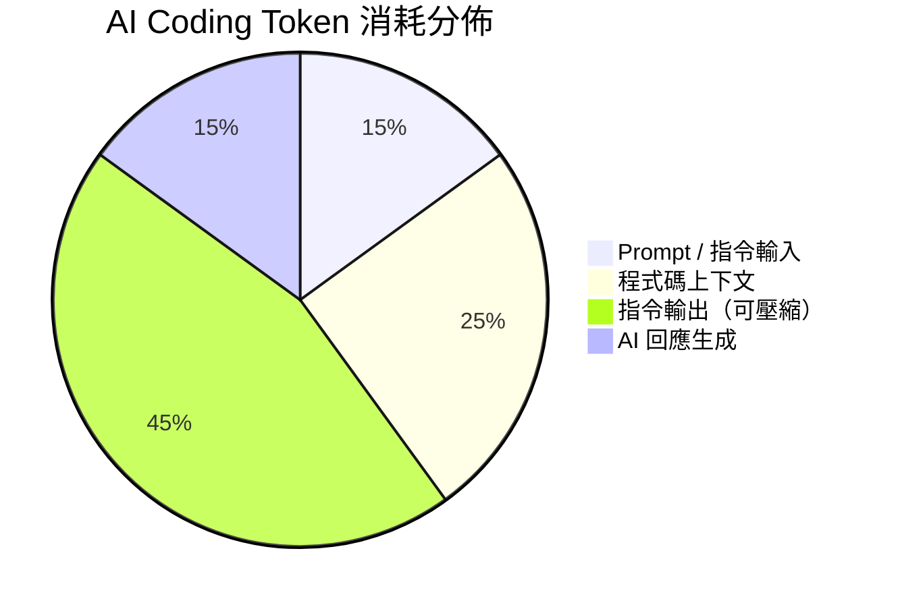

**關鍵洞察**：45% 的 Token 消耗來自 Shell 指令輸出，而這些輸出中有大量的噪音：

- Git 推送時的進度列（`Counting objects: 100%...`）
- 測試通過的冗長報告（100 個 `test xxx ... ok`）
- 目錄列表中的權限、時間戳、檔案大小
- ANSI 顏色碼、進度條、裝飾性 ASCII 圖案

### 1.4 Token Cost Explosion 問題

隨著 AI Coding 在企業中的普及，Token 成本呈指數級增長：

| 規模 | 每日 Token 用量 | 月成本（Claude API） | 使用 RTK 後月成本 |
|------|-----------------|---------------------|-------------------|
| 個人開發者 | 50 萬 tokens | ~$15 | ~$4.5 |
| 5 人團隊 | 250 萬 tokens | ~$75 | ~$22 |
| 20 人團隊 | 1,000 萬 tokens | ~$300 | ~$90 |
| 100 人部門 | 5,000 萬 tokens | ~$1,500 | ~$450 |
| 企業（500 人）| 2.5 億 tokens | ~$7,500 | ~$2,250 |

> **架構師觀點**：對大型企業而言，RTK 不只是開發工具，而是 AI 治理平台的基礎設施。一年可節省數萬美元的 Token 費用。

### 1.5 RTK 解決了哪些問題

| 問題 | RTK 解決方案 |
|------|-------------|
| Shell 輸出過度冗長 | Smart Filtering 移除噪音 |
| 重複日誌行 | Deduplication 合併 + 計數 |
| 分散的錯誤訊息 | Grouping 按規則/檔案分組 |
| Context Window 溢出 | Truncation 保留關鍵上下文 |
| Token 成本無法追蹤 | SQLite Analytics 追蹤節省量 |
| AI 工具無法統一管理 | Hook 機制自動改寫指令 |
| 測試輸出淹沒關鍵失敗 | Failure Focus 只顯示失敗 |
| 原始輸出遺失 | Tee Mode 失敗時保留完整輸出 |

### 1.6 RTK 適合哪些團隊與專案

**適合的團隊**：

- 正在使用 Claude Code / Copilot / Cursor 進行 AI 輔助開發的團隊
- 需要控制 AI Token 成本的企業
- 進行 Legacy System 逆向工程的團隊
- 進行大規模 Framework Upgrade 的團隊
- DevOps / SRE 團隊（日誌分析、K8s 管理）
- 使用 AI Agent 進行自動化開發的團隊

**適合的專案**：

- 大型 Monorepo（前端、後端、全端）
- 微服務架構（大量容器、日誌）
- Legacy 系統現代化
- 多語言專案（Rust、TypeScript、Python、Go、Java、Ruby）
- CI/CD 密集型專案
- Kubernetes / Cloud Native 專案

### 1.7 核心設計理念

RTK 的架構遵循以下五大原則：

1. **Single Responsibility（單一職責）**：每個模組只處理一種指令類型
2. **Minimal Overhead（最小開銷）**：每次指令額外延遲僅 ~5-15ms
3. **Exit Code Preservation（退出碼保留）**：確保 CI/CD Pipeline 的可靠性
4. **Fail-Safe（安全降級）**：過濾失敗時自動 fallback 至原始輸出
5. **Transparent（透明運作）**：使用 `-v` 旗標可隨時查看原始輸出

### 1.8 技術優勢

| 技術面向 | 說明 |
|---------|------|
| **Rust 原生效能** | 冷啟動 ~5-10ms、記憶體使用 ~2-5MB |
| **零依賴部署** | 單一二進位檔（~4.1 MB），無 Runtime 需求 |
| **跨平台支援** | macOS、Linux、Windows（含 WSL2）|
| **12 種過濾策略** | 針對不同指令類型的最佳化壓縮演算法 |
| **語言感知過濾** | 支援 Rust、Python、JS/TS、Go、C/C++、Java |
| **Hook 自動改寫** | 指令透明攔截，無需改變使用習慣 |
| **ACID 資料追蹤** | SQLite 確保 Token 統計資料完整性 |
| **TOML 可擴展** | 自訂過濾規則，無需修改 RTK 原始碼 |

### 1.9 RTK 的限制

在導入 RTK 前，團隊必須了解以下限制：

| 限制 | 說明 | 建議 |
|------|------|------|
| Hook 限制（Windows） | 原生 Windows 不支援 auto-rewrite hook | 使用 WSL2 獲得完整支援 |
| 內建工具限制 | Claude Code 的 Read/Grep/Glob 不經過 Hook | 改用 shell 指令 `cat`、`rg`、`find` |
| 名稱衝突 | crates.io 有另一個同名 `rtk`（Rust Type Kit）| 使用 `cargo install --git` 安裝 |
| 過濾可能遺漏 | 極少數情境下過濾可能移除有用資訊 | 使用 `-v` 旗標或 Tee Mode |
| 學習曲線 | 團隊需要時間適應新的工作流程 | 漸進式導入策略 |
| 離線功能 | 初始安裝需要網路 | 事先準備離線安裝包 |

### 1.10 RTK 版本演進與里程碑

RTK 自開源以來快速迭代，以下列出重要版本里程碑：

| 版本 | 里程碑 |
|------|--------|
| v0.1.0 | 首次公開發布，基礎 CLI Proxy 功能 |
| v0.9.5 | Hook Architecture 導入，支援 Auto-Rewrite |
| v0.15.1 | Python / Go 生態系支援 |
| v0.20+ | Ruby 生態系（rake/rspec/rubocop）、.NET 支援 |
| v0.30+ | Gradle/gradlew 支援、多 AI 工具整合擴展 |
| v0.40.0 | 支援 13+ AI 工具、Kilo Code / Antigravity / Hermes 整合 |
| v0.42.0 | 最新穩定版本，Pi agent、`rtk session` 指令、`rtk gain --weekly` |

> **目前最新版本**：v0.42.0（Apache License 2.0）  
> **社群規模**：53.7k+ Stars、3.3k+ Forks、97+ Contributors、179+ Releases

---

## 2. RTK 系統架構

### 2.1 CLI Architecture

RTK 採用經典的 **Proxy 模式**，位於使用者（或 AI 助手）與底層工具之間：

```
  未使用 RTK：                                使用 RTK：

  Claude  ──git status──>  Shell  ──>  git     Claude  ──git status──>  RTK  ──>  git
    ^                                   |        ^                      |          |
    |        ~2,000 tokens (raw)        |        |   ~200 tokens        | filter   |
    +───────────────────────────────────+        +─────── (filtered) ───+──────────+
```

**RTK 六階段執行生命週期**：

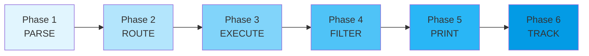

| 階段 | 說明 | 範例 |
|------|------|------|
| **PARSE** | Clap 解析器提取指令、參數、旗標 | `rtk git log -5 -v` → Command: Git, Args: `["log", "-5"]`, verbose: 1 |
| **ROUTE** | 路由到對應的指令模組 | `Commands::Git` → `git::run()` |
| **EXECUTE** | 執行底層工具並捕獲輸出 | `Command::new("git").args(["log", "-5"]).output()` |
| **FILTER** | 套用對應的壓縮策略 | Stats Extraction → `"5 commits, +142/-89"` |
| **PRINT** | 輸出壓縮後的結果 | `println!("{}", colored_output)` |
| **TRACK** | 寫入 SQLite 追蹤紀錄 | `INSERT INTO commands (input_tokens: 125, output_tokens: 5)` |

### 2.2 Hook 機制

RTK 的 Hook 系統提供兩種策略：

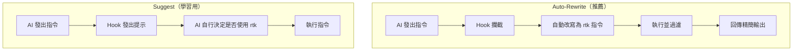

| 策略 | 採用率 | Context 開銷 | 適用場景 |
|------|--------|-------------|---------|
| **Auto-Rewrite** | 100% | 零 | 正式環境、團隊導入 |
| **Suggest** | ~70-85% | 極小 | 學習階段、效果稽核 |

**Hook 運作流程**（以 Claude Code 為例）：

```
Claude Code          settings.json        rtk-rewrite.sh        RTK binary
     │                    │                     │                    │
     │  "git status"      │                     │                    │
     │ ──────────────────►│                     │                    │
     │                    │  PreToolUse trigger  │                    │
     │                    │ ───────────────────►│                    │
     │                    │                     │  rewrite command   │
     │                    │                     │  → rtk git status  │
     │                    │◄────────────────────│                    │
     │  execute: rtk git status                                      │
     │ ─────────────────────────────────────────────────────────────►│
     │                                                               │ filter
     │  "3 modified, 1 untracked ✓"                                  │
     │◄──────────────────────────────────────────────────────────────│
```

### 2.3 Command Interception

RTK 對不同 AI 工具使用不同的攔截機制：

| AI 工具 | 初始化指令 | 攔截方式 |
|---------|-----------|---------|
| Claude Code | `rtk init -g` | PreToolUse hook (bash) |
| GitHub Copilot (VSCode) | `rtk init -g --copilot` | PreToolUse hook — 透明改寫 |
| GitHub Copilot CLI | `rtk init -g --copilot` | PreToolUse deny-with-suggestion |
| Cursor | `rtk init -g --agent cursor` | preToolUse hook (hooks.json) |
| Gemini CLI | `rtk init -g --gemini` | BeforeTool hook |
| Codex | `rtk init -g --codex` | AGENTS.md + RTK.md instructions |
| Windsurf | `rtk init --agent windsurf` | .windsurfrules (project-scoped) |
| Cline / Roo Code | `rtk init --agent cline` | .clinerules (project-scoped) |
| OpenCode | `rtk init -g --opencode` | Plugin TS (tool.execute.before) |
| Kilo Code | `rtk init --agent kilocode` | .kilocode/rules/rtk-rules.md |
| Google Antigravity | `rtk init --agent antigravity` | .agents/rules/antigravity-rtk-rules.md |

### 2.4 Output Compression Pipeline

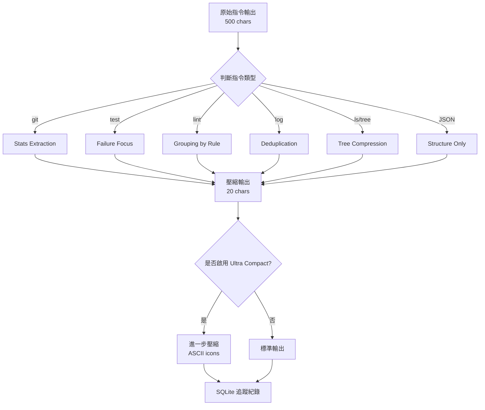

### 2.5 Filtering Strategies

RTK 內建 12 種過濾策略，針對不同輸出類型提供最佳壓縮：

| # | 策略名稱 | 使用模組 | 壓縮率 | 技術 |
|---|---------|---------|--------|------|
| 1 | Stats Extraction | git status/log/diff | 90-99% | 計數/聚合，移除細節 |
| 2 | Error Only | err mode, test failures | 60-80% | 只保留 stderr |
| 3 | Grouping by Pattern | lint, tsc, grep | 80-90% | 按規則/檔案分組計數 |
| 4 | Deduplication | log_cmd | 70-85% | 唯一值 + 出現次數 |
| 5 | Structure Only | json_cmd | 80-95% | 僅保留 Key + 型別 |
| 6 | Code Filtering | read, smart | 0-90% | 依語言感知移除註解/函式主體 |
| 7 | Failure Focus | vitest, playwright | 94-99% | 僅顯示失敗測試 |
| 8 | Tree Compression | ls | 50-70% | 扁平列表轉樹狀結構 + 計數 |
| 9 | Progress Filtering | wget, pnpm install | 85-95% | 移除 ANSI 進度條 |
| 10 | JSON/Text Dual | ruff, pip | 80%+ | JSON 可用時用 JSON，否則 fallback 文字 |
| 11 | State Machine | pytest | 90%+ | 追蹤測試狀態轉換 |
| 12 | NDJSON Streaming | go test | 90%+ | 逐行 JSON 解析 + 聚合 |

### 2.6 Tee Mode

Tee Mode 是 RTK 的安全機制，確保在過濾後仍可存取完整原始輸出：

```toml
# ~/.config/rtk/config.toml
[tee]
enabled = true          # 失敗時保存原始輸出（預設：true）
mode = "failures"       # "failures"（預設）| "always" | "never"
```

**運作方式**：

```
$ rtk cargo test
FAILED: 2/15 tests
[full output: ~/.local/share/rtk/tee/1707753600_cargo_test.log]
```

當指令失敗時，RTK 自動保存完整的未過濾輸出至 Tee 檔案，AI 助手可直接讀取該檔案而無需重新執行指令。

### 2.7 Token Tracking System

RTK 使用 SQLite 資料庫追蹤所有 Token 節省統計：

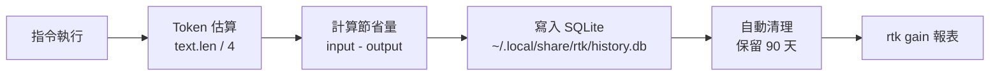

**資料庫結構**：

| 欄位 | 型別 | 說明 |
|------|------|------|
| `id` | INTEGER | 主鍵 |
| `timestamp` | TEXT | RFC3339 時間戳 |
| `original_cmd` | TEXT | 原始指令 |
| `rtk_cmd` | TEXT | RTK 指令 |
| `input_tokens` | INTEGER | 原始 Token 數 |
| `output_tokens` | INTEGER | 壓縮後 Token 數 |
| `saved_tokens` | INTEGER | 節省 Token 數 |
| `savings_pct` | REAL | 節省百分比 |
| `exec_time_ms` | INTEGER | 執行時間（毫秒）|

### 2.8 TOML 自訂過濾器

RTK 支援透過 TOML 設定檔定義自訂過濾規則，無需修改 RTK 原始碼：

```toml
# ~/.config/rtk/filters/custom.toml
# 範例：自訂 bundle install 過濾規則

[[rules]]
match = "^Using "           # 匹配以 "Using " 開頭的行
action = "remove"           # 移除匹配行

[[rules]]
match = "^Bundle complete"  # 匹配安裝完成訊息
action = "keep"             # 保留此行

[summary]
template = "ok bundle: complete"   # 全部通過時的簡潔輸出
```

**TOML 過濾器支援的動作**：

| 動作 | 說明 |
|------|------|
| `remove` | 移除匹配的行 |
| `keep` | 保留匹配的行（移除其餘） |
| `replace` | 將匹配的行替換為指定文字 |
| `short-circuit` | 符合條件時直接輸出簡潔摘要 |

> 內建的 TOML 過濾器範例：`bundle-install.toml`（Ruby Bundler 過濾規則，壓縮率 90%+）

### 2.9 架構圖

**RTK 完整系統架構**：

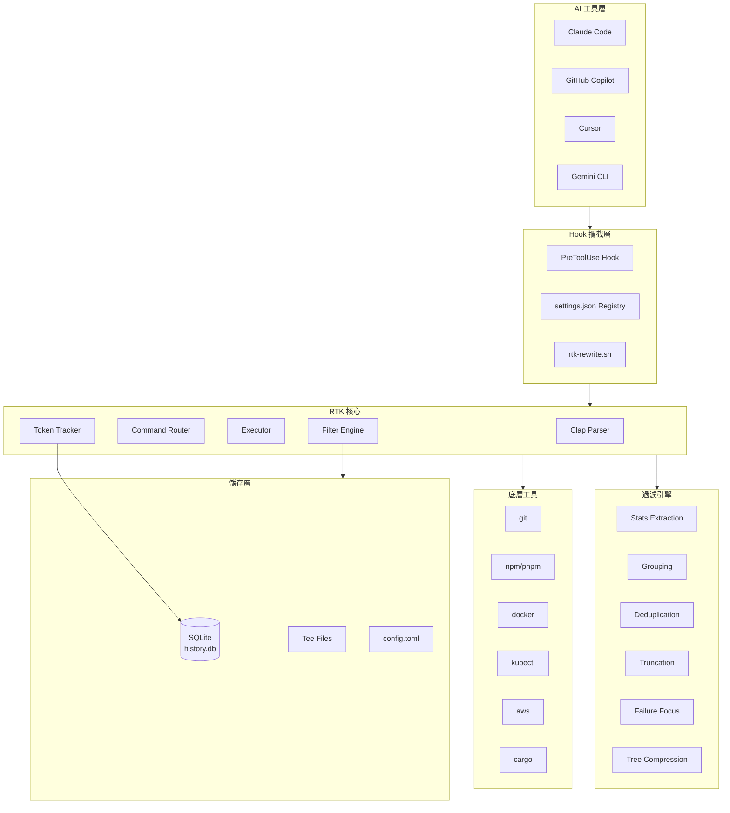

**Token 最佳化流程**：

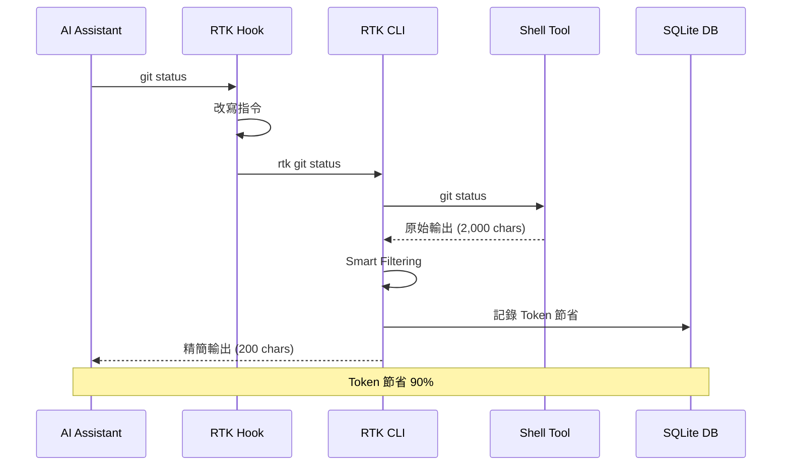

---

## 3. RTK 安裝教學

### 3.1 Homebrew（推薦）

macOS 和 Linux 使用者最推薦的安裝方式：

```bash
# 官方 Homebrew 安裝（最簡單）
brew install rtk

# 驗證安裝
rtk --version
# 應顯示：rtk 0.42.x

# 初始化（為 AI 工具設定 Hook）
rtk init -g                          # Claude Code（預設）
rtk init -g --copilot                # GitHub Copilot
rtk init -g --gemini                 # Gemini CLI
rtk init -g --codex                  # OpenAI Codex
rtk init -g --agent cursor           # Cursor
rtk init -g --agent windsurf         # Windsurf
rtk init -g --agent cline            # Cline / Roo Code
rtk init -g --agent kilocode         # Kilo Code
rtk init -g --agent antigravity      # Google Antigravity
rtk init -g --agent hermes           # Hermes
rtk init -g --agent pi               # Pi Agent
```

> **注意**：過去有文件提到 `brew install rtk-ai/tap/rtk`，這是舊的安裝方式。現在官方已發布至 Homebrew 主倉庫，直接使用 `brew install rtk` 即可。

### 3.2 Quick Install（Linux/macOS）

適用於 CI/CD、DevContainer 或不使用 Homebrew 的環境：

```bash
# 一鍵安裝腳本（安裝至 ~/.local/bin）
curl -fsSL https://raw.githubusercontent.com/rtk-ai/rtk/refs/heads/master/install.sh | sh

# 確保 PATH 包含安裝目錄
echo 'export PATH="$HOME/.local/bin:$PATH"' >> ~/.bashrc   # Bash
echo 'export PATH="$HOME/.local/bin:$PATH"' >> ~/.zshrc    # Zsh
source ~/.bashrc  # 或 source ~/.zshrc
```

### 3.3 Cargo 安裝

從原始碼編譯安裝，適用於需要最新開發版本的使用者：

```bash
# ⚠️ 重要：使用 --git 從 GitHub 安裝，而非 crates.io
# crates.io 上的 "rtk" 是另一個套件（Rust Type Kit），會產生名稱衝突
cargo install --git https://github.com/rtk-ai/rtk

# 驗證
rtk --version
rtk gain    # 確認是 RTK (Rust Token Killer)，而非其他同名套件
```

### 3.4 Windows

#### PowerShell 安裝（原生 Windows）

> ⚠️ **注意**：原生 Windows 只有有限支援（無 auto-rewrite hook），建議使用 WSL2。

```powershell
# 方法 1：下載預編譯二進位檔
# 至 https://github.com/rtk-ai/rtk/releases 下載 rtk-x86_64-pc-windows-msvc.zip
# 解壓縮後將 rtk.exe 放入 PATH

# 方法 2：透過 Cargo 安裝（需先安裝 Rust）
cargo install --git https://github.com/rtk-ai/rtk

# 設定 PATH（PowerShell）
$env:PATH += ";$env:USERPROFILE\.cargo\bin"

# 永久設定（加入 PowerShell Profile）
Add-Content $PROFILE '$env:PATH += ";$env:USERPROFILE\.cargo\bin"'

# 初始化（Falls back to CLAUDE.md 模式）
rtk init -g
```

**Windows 支援對照表**：

| 功能 | WSL2 | 原生 Windows |
|------|------|-------------|
| Filters（cargo, git 等） | ✅ 完整 | ✅ 完整 |
| Auto-rewrite hook | ✅ 支援 | ❌ 不支援（CLAUDE.md fallback） |
| rtk init -g | Hook 模式 | CLAUDE.md 模式 |
| rtk gain / analytics | ✅ 完整 | ✅ 完整 |

> **重要**：不要雙擊 `rtk.exe`，它是 CLI 工具，必須從終端機（Command Prompt、PowerShell 或 Windows Terminal）執行。

#### Scoop 安裝

```powershell
# 如果尚未安裝 Scoop
Set-ExecutionPolicy -ExecutionPolicy RemoteSigned -Scope CurrentUser
Invoke-RestMethod -Uri https://get.scoop.sh | Invoke-Expression

# 透過 Scoop 安裝（若社群已收錄）
scoop bucket add extras
scoop install rtk
```

#### Cargo 安裝

```powershell
# 先確保已安裝 Rust
winget install Rustlang.Rust.MSVC

# 從 GitHub 原始碼安裝（推薦，避免名稱衝突）
cargo install --git https://github.com/rtk-ai/rtk

# 驗證
rtk --version
rtk gain    # 必須顯示 Token 統計，而非 "command not found"
```

### 3.5 Linux

#### Ubuntu / Debian

```bash
# 方法 1：Quick Install（推薦）
curl -fsSL https://raw.githubusercontent.com/rtk-ai/rtk/refs/heads/master/install.sh | sh

# 安裝至 ~/.local/bin，如需加入 PATH：
echo 'export PATH="$HOME/.local/bin:$PATH"' >> ~/.bashrc
source ~/.bashrc

# 方法 2：Cargo 安裝
sudo apt update && sudo apt install -y build-essential pkg-config libssl-dev
curl --proto '=https' --tlsv1.2 -sSf https://sh.rustup.rs | sh
source $HOME/.cargo/env
cargo install --git https://github.com/rtk-ai/rtk

# 方法 3：預編譯二進位檔
wget https://github.com/rtk-ai/rtk/releases/latest/download/rtk-x86_64-unknown-linux-musl.tar.gz
tar xzf rtk-x86_64-unknown-linux-musl.tar.gz
sudo mv rtk /usr/local/bin/
```

#### RHEL / Rocky Linux / AlmaLinux

```bash
# 安裝編譯依賴
sudo dnf groupinstall -y "Development Tools"
sudo dnf install -y openssl-devel

# Cargo 安裝
curl --proto '=https' --tlsv1.2 -sSf https://sh.rustup.rs | sh
source $HOME/.cargo/env
cargo install --git https://github.com/rtk-ai/rtk

# 或使用預編譯二進位檔
curl -fsSL https://raw.githubusercontent.com/rtk-ai/rtk/refs/heads/master/install.sh | sh
```

### 3.6 macOS

#### Homebrew（推薦）

```bash
# Homebrew 安裝（最推薦的方式）
brew install rtk

# 驗證
rtk --version
rtk gain
```

#### Cargo

```bash
# 從 GitHub 安裝
cargo install --git https://github.com/rtk-ai/rtk

# Apple Silicon (M1/M2/M3)
# Cargo 會自動偵測架構，無需特別設定
```

#### 預編譯二進位檔

```bash
# Intel Mac
wget https://github.com/rtk-ai/rtk/releases/latest/download/rtk-x86_64-apple-darwin.tar.gz
tar xzf rtk-x86_64-apple-darwin.tar.gz
sudo mv rtk /usr/local/bin/

# Apple Silicon (M1/M2/M3)
wget https://github.com/rtk-ai/rtk/releases/latest/download/rtk-aarch64-apple-darwin.tar.gz
tar xzf rtk-aarch64-apple-darwin.tar.gz
sudo mv rtk /usr/local/bin/
```

### 3.7 Container / DevContainer

#### Docker

```dockerfile
# Dockerfile
FROM rust:1.80-slim AS builder
RUN cargo install --git https://github.com/rtk-ai/rtk

FROM debian:bookworm-slim
COPY --from=builder /usr/local/cargo/bin/rtk /usr/local/bin/rtk
RUN rtk --version
```

#### DevContainer

```json
// .devcontainer/devcontainer.json
{
  "name": "Dev with RTK",
  "image": "mcr.microsoft.com/devcontainers/base:ubuntu",
  "postCreateCommand": "curl -fsSL https://raw.githubusercontent.com/rtk-ai/rtk/refs/heads/master/install.sh | sh && export PATH=\"$HOME/.local/bin:$PATH\" && rtk init -g",
  "customizations": {
    "vscode": {
      "settings": {
        "terminal.integrated.env.linux": {
          "PATH": "${env:HOME}/.local/bin:${env:PATH}"
        }
      }
    }
  }
}
```

### 3.8 WSL2

WSL2 提供 RTK 在 Windows 上的**完整支援**（包括 auto-rewrite hook）：

```bash
# 1. 確保 WSL2 已安裝
wsl --install

# 2. 進入 WSL2 環境
wsl

# 3. 安裝 RTK（與 Linux 相同）
curl -fsSL https://raw.githubusercontent.com/rtk-ai/rtk/refs/heads/master/install.sh | sh
echo 'export PATH="$HOME/.local/bin:$PATH"' >> ~/.bashrc
source ~/.bashrc

# 4. 初始化（完整 Hook 支援）
rtk init -g

# 5. 驗證
rtk --version
rtk gain
rtk ls .
```

### 3.9 企業 Proxy 環境

```bash
# 設定 HTTP/HTTPS Proxy
export HTTP_PROXY=http://proxy.company.com:8080
export HTTPS_PROXY=http://proxy.company.com:8080
export NO_PROXY=localhost,127.0.0.1,.company.com

# Cargo Proxy 設定
# ~/.cargo/config.toml
cat >> ~/.cargo/config.toml << 'EOF'
[http]
proxy = "http://proxy.company.com:8080"

[https]
proxy = "http://proxy.company.com:8080"
EOF

# 透過 Proxy 安裝
cargo install --git https://github.com/rtk-ai/rtk

# 若 Git 也需要 Proxy
git config --global http.proxy http://proxy.company.com:8080
git config --global https.proxy http://proxy.company.com:8080
```

### 3.10 離線安裝

適用於無法存取外部網路的企業環境：

```bash
# === 在可上網的機器上準備 ===

# 方法 1：下載預編譯二進位檔
wget https://github.com/rtk-ai/rtk/releases/latest/download/rtk-x86_64-unknown-linux-musl.tar.gz

# 方法 2：下載原始碼打包
git clone https://github.com/rtk-ai/rtk.git
cd rtk
cargo vendor          # 下載所有依賴至 vendor/
tar czf rtk-source-with-deps.tar.gz .

# === 在離線機器上安裝 ===

# 方法 1：直接使用二進位檔
tar xzf rtk-x86_64-unknown-linux-musl.tar.gz
sudo mv rtk /usr/local/bin/

# 方法 2：從原始碼編譯
tar xzf rtk-source-with-deps.tar.gz
cd rtk
# 建立 .cargo/config.toml 使用 vendor 目錄
mkdir -p .cargo
cat > .cargo/config.toml << 'EOF'
[source.crates-io]
replace-with = "vendored-sources"

[source.vendored-sources]
directory = "vendor"
EOF

cargo build --release
sudo cp target/release/rtk /usr/local/bin/
```

### 3.11 驗證安裝

```bash
# 1. 版本檢查
rtk --version
# 預期輸出：rtk 0.40.0（或更新版本）

# 2. 功能驗證（最重要！確認是正確的 RTK）
rtk gain
# 預期輸出：Token savings 統計（首次使用會顯示空統計）

# 3. 基本功能測試
rtk ls .                    # 精簡的目錄列表
rtk git status              # 精簡的 git status
rtk read README.md          # 精簡的檔案讀取

# 4. 檢查 Hook 安裝狀態
rtk init --show
# 預期輸出：顯示 Hook 安裝狀態與路徑
```

> ⚠️ **名稱衝突警告**：crates.io 上有另一個名為 `rtk` 的套件（Rust Type Kit）。如果 `rtk gain` 失敗但 `rtk --version` 成功，表示安裝了錯誤的套件。請先 `cargo uninstall rtk` 再用 `cargo install --git` 重新安裝。

### 3.12 名稱衝突警告

> ⚠️ **重要警告**：crates.io 上存在另一個同名的 `rtk` 套件（Rust Type Kit），它是一個完全不同的工具。

**如何分辨**：

```bash
# ✗ 錯誤：這會安裝 Crates.io 的 Rust Type Kit
cargo install rtk

# ✓ 正確：從 GitHub 安裝 RTK (Rust Token Killer)
cargo install --git https://github.com/rtk-ai/rtk

# ✓ 最推薦：使用 Homebrew
brew install rtk
```

**驗證方式**：

```bash
# 執行 rtk gain，如果顯示 Token 統計報表，則是正確的 RTK
rtk gain

# 如果顯示 "unknown command" 或無反應，則可能安裝了錯誤的套件
```

### 3.13 常見錯誤與 Troubleshooting

| 問題 | 原因 | 解決方案 |
|------|------|---------|
| `rtk: command not found` | PATH 未設定 | `echo 'export PATH="$HOME/.cargo/bin:$PATH"' >> ~/.bashrc` |
| `rtk gain` 顯示 "command not found" | 安裝了錯誤的 rtk | `cargo uninstall rtk && cargo install --git https://github.com/rtk-ai/rtk` |
| 編譯錯誤 | Rust 版本過舊 | `rustup update stable` |
| Hook 不生效 | 未重啟 AI 工具 | 重啟 Claude Code / VSCode |
| Windows 閃退 | 雙擊了 exe 檔 | 從終端機執行 |
| 權限錯誤 | 安裝路徑權限不足 | 使用 `--root` 指定安裝路徑或 `sudo` |

---

## 4. RTK 核心功能詳解

### 4.1 Smart Filtering

**功能說明**：Smart Filtering 是 RTK 的基礎過濾機制，自動移除指令輸出中的「噪音」，如註解、空白行、ANSI 色碼、進度列、boilerplate 文字等。

**使用情境**：
- 所有 RTK 指令都內建 Smart Filtering
- 特別適用於高噪音輸出（git push、npm install、docker build）

**Before / After 比較**：

```bash
# === Before（git push 原始輸出）=== 
# 15 行, ~200 tokens
$ git push
Enumerating objects: 5, done.
Counting objects: 100% (5/5), done.
Delta compression using up to 8 threads
Compressing objects: 100% (3/3), done.
Writing objects: 100% (3/3), 1.23 KiB | 1.23 MiB/s, done.
Total 3 (delta 2), reused 0 (delta 0), pack-reused 0
remote: Resolving deltas: 100% (2/2), completed with 2 local objects.
To https://github.com/user/repo.git
   abc1234..def5678  main -> main

# === After（RTK 過濾後）===
# 1 行, ~10 tokens
$ rtk git push
ok main
```

**Token 節省分析**：

| 指令 | 原始 Tokens | RTK Tokens | 節省率 |
|------|------------|-----------|--------|
| `git push` | ~200 | ~10 | **95%** |
| `git status` | ~300 | ~60 | **80%** |
| `npm install` | ~5,000 | ~200 | **96%** |

### 4.2 Grouping

**功能說明**：將分散的錯誤訊息、警告或搜尋結果按照規則、檔案或類型進行分組，並計算出現次數。

**使用情境**：
- ESLint 錯誤分組
- TypeScript 編譯錯誤
- grep 搜尋結果分組

**Before / After 比較**：

```bash
# === Before（ESLint 原始輸出）===
# 100+ 行
/src/App.tsx:5:10 - error: 'useState' is defined but never used (no-unused-vars)
/src/App.tsx:12:5 - error: Missing semicolon (semi)
/src/components/Header.tsx:3:8 - error: 'React' is defined but never used (no-unused-vars)
/src/components/Header.tsx:15:3 - error: Missing semicolon (semi)
/src/utils/api.ts:8:1 - error: 'console' is not allowed (no-console)
... (省略 95 行)

# === After（RTK 過濾後）===
# 5 行
$ rtk lint
no-unused-vars: 23 issues
semi: 45 issues
no-console: 12 issues
prefer-const: 8 issues
Total: 88 issues in 15 files
```

### 4.3 Truncation

**功能說明**：智慧截斷過長的輸出，保留最相關的上下文（通常是開頭和結尾），中間部分以摘要取代。

**使用情境**：
- 大型日誌檔
- 長列表輸出
- API 回應截斷

**CLI 範例**：

```bash
# 讀取大型檔案時自動截斷
rtk read large-file.log

# 配合 Tee Mode 保留完整輸出
# 截斷輸出送給 AI，完整輸出存至 tee 檔案
```

### 4.4 Deduplication

**功能說明**：辨識重複的日誌行或輸出行，合併為唯一值並加上出現次數。

**使用情境**：
- 應用程式日誌（重複的 ERROR 訊息）
- Docker 容器日誌
- 測試輸出（重複的 `ok` 行）

**Before / After 比較**：

```bash
# === Before（Docker 日誌原始輸出）===
[ERROR] Connection refused to database at 10.0.0.5:5432
[ERROR] Connection refused to database at 10.0.0.5:5432
[ERROR] Connection refused to database at 10.0.0.5:5432
[INFO] Retrying connection...
[ERROR] Connection refused to database at 10.0.0.5:5432
[ERROR] Connection refused to database at 10.0.0.5:5432

# === After（RTK 過濾後）===
$ rtk docker logs my-app
[ERROR] Connection refused to database at 10.0.0.5:5432 (×5)
[INFO] Retrying connection...
```

### 4.5 Tee Mode

**功能說明**：當指令失敗時，RTK 自動將完整未過濾的輸出保存至磁碟，讓 AI 助手可以在需要時讀取完整資訊，而不需重新執行指令。

**設定**：

```toml
# ~/.config/rtk/config.toml
[tee]
enabled = true          # 預設啟用
mode = "failures"       # "failures"（僅失敗時）| "always" | "never"
```

**使用情境**：

```bash
$ rtk cargo test
FAILED: 2/15 tests
  test_edge_case: assertion failed at src/lib.rs:45
  test_overflow: panic at src/utils.rs:18
[full output: ~/.local/share/rtk/tee/1707753600_cargo_test.log]

# AI 助手可直接讀取完整輸出
$ cat ~/.local/share/rtk/tee/1707753600_cargo_test.log
```

### 4.6 Ultra Compact

**功能說明**：使用 `-u` 旗標啟用極度壓縮模式，將文字描述替換為 ASCII 圖示，將多行輸出壓縮為單行。

**CLI 範例**：

```bash
# 標準模式
$ rtk git status
3 files modified, 1 file untracked

# Ultra Compact 模式
$ rtk git status -u
3M 1? ✓

# 標準模式
$ rtk gh pr view 42
Pull request #42 successfully merged

# Ultra Compact 模式
$ rtk gh pr view 42 -u
✓ PR #42 merged
```

**Token 額外節省**：Ultra Compact 模式通常可在標準 RTK 過濾的基礎上再額外節省 30-50% 的 Token。

### 4.7 Token Saving Analytics

**功能說明**：RTK 內建完整的 Token 節省統計分析系統，基於 SQLite 資料庫追蹤每次指令執行的 Token 節省數據。

**報表功能**：

```bash
# 摘要統計
$ rtk gain
┌──────────────────────────────────────┐
│ Token Savings Report (90 days)       │
├──────────────────────────────────────┤
│ Commands executed:  1,234            │
│ Average savings:    78.5%            │
│ Total tokens saved: 45,678           │
│ Total exec time:    8m50s            │
│                                      │
│ Top commands:                        │
│   • rtk git status    (234 uses)     │
│   • rtk lint          (156 uses)     │
│   • rtk test          (89 uses)      │
└──────────────────────────────────────┘

# ASCII 圖表（近 30 天）
$ rtk gain --graph

# 每日明細
$ rtk gain --daily

# JSON 匯出（供儀表板使用）
$ rtk gain --all --format json
```

### 4.8 discover

**功能說明**：`discover` 指令會掃描你最近的 AI Coding session，找出「未使用 RTK 的指令」，協助你發現錯過的 Token 節省機會。

```bash
# 掃描當前專案
$ rtk discover
Missed savings opportunities:
  git log (called 12 times without rtk) → est. 3,600 tokens saveable
  npm test (called 5 times without rtk) → est. 12,500 tokens saveable
  docker ps (called 8 times without rtk) → est. 1,440 tokens saveable

# 掃描所有專案，最近 7 天
$ rtk discover --all --since 7
```

### 4.9 gain

**功能說明**：`gain` 是 RTK 的核心分析指令，提供全面的 Token 節省報告與趨勢分析。

```bash
rtk gain                    # 摘要統計（90 天）
rtk gain --graph            # ASCII 趨勢圖（30 天）
rtk gain --history          # 最近指令歷史
rtk gain --daily            # 每日明細（逐日分解）
rtk gain --weekly           # 每週彙總報告
rtk gain --all --format json  # JSON 匯出
```

### 4.10 session

**功能說明**：`session` 是 RTK 的 AI Session 採用率分析指令，可檢視每個 Claude Code Session 中 RTK 的使用比例，幫助團隊了解 RTK 的實際覆蓋率。

```bash
# 檢視 RTK 在各 Session 的採用率
$ rtk session

# 搭配 discover 找出未覆蓋的指令
$ rtk discover
```

> 詳見官方文件：[Discover and Session](https://www.rtk-ai.app/docs/analytics/discover/)

### 4.11 smart

**功能說明**：`smart` 指令使用啟發式演算法產生程式碼的兩行摘要，適合快速了解檔案內容而不消耗大量 Token。

```bash
# 標準模式
$ rtk smart src/main.rs
# 輸出：2 行啟發式摘要，包含主要函式簽名和結構

# 適合用於大型專案探索
$ find src -name "*.rs" -exec rtk smart {} \;
```

### 4.12 read

**功能說明**：智慧檔案讀取，支援不同的過濾等級（Code Filtering）。

```bash
# 預設模式（移除部分噪音）
$ rtk read src/app.ts

# Aggressive 模式（僅保留簽名，移除函式主體）
$ rtk read src/app.ts -l aggressive

# 適合初步了解程式碼結構
# FilterLevel::None       → 保留全部 (0%)
# FilterLevel::Minimal    → 移除註解 (20-40%)
# FilterLevel::Aggressive → 移除函式主體 (60-90%)
```

**支援語言**：Rust、Python、JavaScript、TypeScript、Go、C、C++、Java

### 4.13 test

**功能說明**：通用測試包裝器，僅顯示失敗的測試結果，大幅降低測試輸出的 Token 消耗。

```bash
# 通用測試包裝
$ rtk test cargo test        # Rust 測試 (-90%)
$ rtk test npm test          # Node.js 測試 (-90%)
$ rtk test pytest            # Python 測試 (-90%)

# 專用指令
$ rtk cargo test             # Cargo 測試
$ rtk jest                   # Jest 測試 (-99.6%)
$ rtk vitest                 # Vitest 測試 (-99.6%)
$ rtk pytest                 # Pytest 測試 (-90%)
$ rtk go test                # Go 測試 (NDJSON, -90%)
$ rtk rake test              # Ruby minitest (-90%)
$ rtk rspec                  # RSpec 測試 (-60%+)

# 僅顯示錯誤
$ rtk err <any-command>      # 過濾任何指令的錯誤輸出
```

**Before / After 比較**：

```bash
# === Before（cargo test 原始輸出，200+ 行）===
running 15 tests
test utils::test_parse ... ok
test utils::test_format ... ok
test utils::test_validate ... ok
... (12 more passing tests)
test edge::test_edge_case ... FAILED
test overflow::test_overflow ... FAILED

failures:
  test_edge_case: assertion failed: expected 42, got 41
    at src/edge.rs:45

  test_overflow: thread panicked at 'overflow'
    at src/utils.rs:18

# === After（rtk test 輸出，~20 行）===
$ rtk cargo test
FAILED: 2/15 tests
  test_edge_case: assertion failed
  test_overflow: panic at utils.rs:18
```

### 4.14 gh

**功能說明**：GitHub CLI (`gh`) 的精簡包裝，壓縮 PR 列表、Issue 列表、Workflow 狀態等輸出。

```bash
$ rtk gh pr list            # 精簡 PR 列表
$ rtk gh pr view 42         # PR 詳情 + checks
$ rtk gh issue list         # 精簡 Issue 列表
$ rtk gh run list           # Workflow 執行狀態
```

### 4.15 git

**功能說明**：Git 指令的全面精簡包裝，是 RTK 中使用頻率最高的功能之一。

```bash
$ rtk git status            # 精簡狀態
$ rtk git log -n 10         # 單行 commit
$ rtk git diff              # 精簡 diff
$ rtk git add .             # → "ok"
$ rtk git commit -m "msg"   # → "ok abc1234"
$ rtk git push              # → "ok main"
$ rtk git pull              # → "ok 3 files +10 -2"
```

**Token 節省案例**：

| 操作 | 原始 Tokens | RTK Tokens | 節省率 |
|------|------------|-----------|--------|
| `git status` | 300 | 60 | 80% |
| `git log -10` | 500 | 25 | 95% |
| `git diff` | 2,000 | 500 | 75% |
| `git push` | 200 | 10 | 95% |
| `git add + commit` | 200 | 15 | 92% |

---

## 5. RTK CLI 指令大全

### 5.1 rtk ls

**用途**：Token 最佳化的目錄列表。

**語法**：

```bash
rtk ls [PATH] [OPTIONS]
```

**參數**：

| 參數 | 說明 | 預設值 |
|------|------|-------|
| `PATH` | 目標目錄路徑 | `.`（當前目錄） |
| `-u, --ultra-compact` | 極度壓縮模式 | false |
| `-v, --verbose` | 顯示除錯資訊 | 0 |

**範例**：

```bash
# 基本用法
$ rtk ls .
my-project/
├── src/ (8 files)
│   ├── main.rs
│   └── lib.rs
├── tests/ (3 files)
├── Cargo.toml
└── README.md

# Ultra Compact
$ rtk ls . -u
my-project/ src/(8) tests/(3) Cargo.toml README.md
```

**Before / After**：

```
# ls -la（45 行, ~800 tokens）        # rtk ls（12 行, ~150 tokens）
drwxr-xr-x  15 user staff 480 ...     my-project/
-rw-r--r--   1 user staff 1234 ...     ├── src/ (8 files)
-rw-r--r--   1 user staff 567 ...      │   ├── main.rs
...（42 more lines）                    └── Cargo.toml
```

**Token 分析**：壓縮率 **~80%**（800 → 150 tokens）

### 5.2 rtk read

**用途**：智慧檔案讀取，支援語言感知的程式碼過濾。

**語法**：

```bash
rtk read <FILE> [OPTIONS]
```

**參數**：

| 參數 | 說明 | 預設值 |
|------|------|-------|
| `FILE` | 要讀取的檔案路徑 | （必填） |
| `-l, --level` | 過濾等級：none / minimal / aggressive | minimal |
| `-u, --ultra-compact` | 極度壓縮模式 | false |

**範例**：

```bash
# 預設讀取（移除註解）
$ rtk read src/main.rs

# Aggressive 模式（僅保留函式簽名）
$ rtk read src/main.rs -l aggressive
fn calculate_total(items: &[Item]) -> i32 { ... }
fn validate_input(s: &str) -> Result<(), Error> { ... }
fn main() { ... }

# 用於快速了解大型檔案結構
$ rtk read src/server.ts -l aggressive
```

**最佳實務**：
- 初次探索未知 codebase 時使用 `aggressive` 模式
- 需要理解實作細節時使用 `none` 模式
- 一般開發使用預設的 `minimal` 模式

### 5.3 rtk smart

**用途**：啟發式程式碼摘要，兩行快速了解檔案內容。

**語法**：

```bash
rtk smart <FILE> [OPTIONS]
```

**範例**：

```bash
# 單一檔案摘要
$ rtk smart src/server.ts
Express server with REST API endpoints for user management
Exports: createServer(), startListening(), middleware setup

# 批次掃描整個目錄
$ find src -name "*.ts" -exec rtk smart {} \;
```

**Token 分析**：相比完整讀取，`smart` 模式可節省 **90-95%** 的 Token。

### 5.4 rtk test

**用途**：通用測試包裝器，僅顯示失敗測試。

**語法**：

```bash
rtk test <COMMAND> [ARGS...]
```

**專用測試指令**：

```bash
rtk jest                    # Jest (-99.6%)
rtk vitest                  # Vitest (-99.6%)
rtk playwright test         # Playwright E2E (-94%)
rtk pytest                  # Python pytest (-90%)
rtk go test                 # Go tests NDJSON (-90%)
rtk cargo test              # Cargo tests (-90%)
rtk rake test               # Ruby minitest (-90%)
rtk rspec                   # RSpec (-60%+)
rtk err <cmd>               # 任何指令的錯誤過濾
```

**範例**：

```bash
# 所有測試通過
$ rtk cargo test
ok: 15/15 tests passed

# 有失敗測試
$ rtk cargo test
FAILED: 2/15 tests
  test_edge_case: assertion failed at src/lib.rs:45
  test_overflow: panic at src/utils.rs:18
[full output: ~/.local/share/rtk/tee/1707753600_cargo_test.log]

# Jest 測試
$ rtk jest
FAILED: 1/45 tests
  UserService.test.ts > should validate email
    Expected: true, Received: false
```

### 5.5 rtk git

**用途**：Git 指令的全面精簡包裝。

**語法**：

```bash
rtk git <SUBCOMMAND> [ARGS...]
```

**子指令**：

```bash
rtk git status              # 精簡狀態
rtk git log [-n N]          # 單行 commit 日誌
rtk git diff [FILE]         # 精簡 diff
rtk git add [FILE...]       # → "ok"
rtk git commit -m "msg"     # → "ok abc1234"
rtk git push                # → "ok main"
rtk git pull                # → "ok 3 files +10 -2"
```

**範例**：

```bash
# 完整工作流程
$ rtk git status
3 modified, 1 untracked

$ rtk git add .
ok

$ rtk git commit -m "fix: resolve edge case in parser"
ok abc1234

$ rtk git push
ok main
```

### 5.6 rtk gh

**用途**：GitHub CLI 精簡包裝。

**語法**：

```bash
rtk gh <SUBCOMMAND> [ARGS...]
```

**範例**：

```bash
$ rtk gh pr list
#42  fix: parser edge case    main ← feature/parser    ✓ checks passed
#41  feat: add caching        main ← feature/cache     ⏳ checks running
#39  docs: update readme      main ← docs/readme       ✓ merged

$ rtk gh issue list
#100  [bug] Memory leak in worker pool    high    open
#98   [feat] Add WebSocket support        medium  open
#95   [docs] API reference outdated       low     open

$ rtk gh run list
✓ CI Pipeline    #456    main    2m30s    success
✗ Deploy Staging #455    main    5m12s    failure
⏳ CI Pipeline   #457    feat/x  running
```

### 5.7 rtk gain

**用途**：Token 節省分析報告。

**語法**：

```bash
rtk gain [OPTIONS]
```

**參數**：

| 參數 | 說明 |
|------|------|
| `--graph` | ASCII 趨勢圖（30 天）|
| `--history` | 最近指令歷史 |
| `--daily` | 每日明細（逐日分解）|
| `--weekly` | 每週彙總報告 |
| `--all` | 包含所有專案 |
| `--format json` | JSON 匯出 |

**範例**：

```bash
# 基本報告
$ rtk gain
Token Savings Report (90 days)
  Commands: 1,234
  Avg savings: 78.5%
  Total saved: 45,678 tokens

# 每週彙總
$ rtk gain --weekly

# JSON 匯出（供團隊儀表板）
$ rtk gain --all --format json > /path/to/dashboard/data.json
```

### 5.8 rtk discover

**用途**：發現未使用 RTK 的機會。

**語法**：

```bash
rtk discover [OPTIONS]
```

**參數**：

| 參數 | 說明 |
|------|------|
| `--all` | 掃描所有專案 |
| `--since N` | 最近 N 天 |

**範例**：

```bash
$ rtk discover --all --since 7
Projects with missed savings:
  /home/user/project-a:
    git log (12x) → ~3,600 tokens saveable
    npm test (5x) → ~12,500 tokens saveable
  
  /home/user/project-b:
    docker ps (8x) → ~1,440 tokens saveable
    kubectl logs (3x) → ~4,500 tokens saveable
```

### 5.9 rtk session

**用途**：分析每個 AI Coding Session 的 RTK 覆蓋率與採用情況。

**語法**：

```bash
rtk session [OPTIONS]
```

**說明**：

`rtk session` 可顯示每個 Claude Code Session 中，有多少指令透過 RTK 執行、有多少未覆蓋，幫助團隊衡量 RTK 的實際效益與滲透率。

**範例**：

```bash
$ rtk session
Session Analysis:
  Session #1 (2h 15m): 87% RTK coverage (42/48 commands)
  Session #2 (1h 30m): 92% RTK coverage (33/36 commands)

  Missed commands:
    - curl (3x) → consider: rtk curl
    - psql (2x) → consider: rtk psql
```

> 搭配 `rtk discover` 使用，可全面了解 Token 節省的機會點。  
> 詳見：[Discover and Session](https://www.rtk-ai.app/docs/analytics/discover/)

### 5.10 rtk docker

**用途**：Docker 指令精簡包裝。

**語法**：

```bash
rtk docker <SUBCOMMAND> [ARGS...]
```

**範例**：

```bash
$ rtk docker ps             # 精簡容器列表
$ rtk docker images         # 精簡映像列表
$ rtk docker logs <name>    # 去重複化的日誌
$ rtk docker compose ps     # Compose 服務狀態
```

### 5.11 rtk kubectl

**用途**：Kubernetes CLI 精簡包裝。

**語法**：

```bash
rtk kubectl <SUBCOMMAND> [ARGS...]
```

**範例**：

```bash
$ rtk kubectl pods          # 精簡 Pod 列表
$ rtk kubectl logs <pod>    # 去重複化的 Pod 日誌
$ rtk kubectl services      # 精簡 Service 列表
```

### 5.12 rtk aws

**用途**：AWS CLI 精簡包裝，自動移除敏感資訊。

**語法**：

```bash
rtk aws <SERVICE> <SUBCOMMAND> [ARGS...]
```

**範例**：

```bash
$ rtk aws sts get-caller-identity    # 單行身份資訊
$ rtk aws ec2 describe-instances     # 精簡實例列表
$ rtk aws lambda list-functions      # 名稱/Runtime/記憶體（移除 secrets）
$ rtk aws logs get-log-events        # 僅保留時間戳 + 訊息
$ rtk aws cloudformation describe-stack-events  # 失敗優先排序
$ rtk aws dynamodb scan              # 解包型別標註
$ rtk aws iam list-roles             # 移除 policy documents
$ rtk aws s3 ls                      # 截斷 + tee 還原
```

**安全特性**：RTK 的 AWS 過濾器會自動移除 Lambda 函式中的環境變數（可能包含 secrets），以及 IAM 角色中的 policy documents。

### 5.13 rtk find / rtk grep / rtk diff

**用途**：搜尋與比對工具的 Token 最佳化包裝。

**範例**：

```bash
# 精簡 find（Tree Compression，按目錄彙總）
$ rtk find . -name "*.rs"
# → src/ (12 files), tests/ (5 files), benches/ (2 files)

# 精簡 grep（Grouping by Pattern，按檔案/模式分組）
$ rtk grep -rn "TODO" src/
# → src/main.rs: 3 matches
#   src/utils.rs: 1 match

# 精簡 diff（Stats Extraction）
$ rtk diff file_a file_b
# → +12/-5, 3 sections changed
```

### 5.14 rtk json / rtk log / rtk env / rtk deps

**用途**：系統工具的精簡包裝，屬於 System 生態系模組。

```bash
# JSON 結構分析（Structure Only，僅保留 Key + 型別）
$ rtk json config.json
# → { "database": {...}, "server": {...}, "logging": {...} }

# 日誌去重複化（Deduplication）
$ rtk log app.log
# → [ERROR] Connection timeout (×15)
#   [WARN] Slow query detected (×8)

# 環境變數精簡（移除敏感值）
$ rtk env
# → 12 vars: PATH, HOME, SHELL, LANG, ...

# 依賴分析
$ rtk deps
# → 45 dependencies, 3 outdated, 1 vulnerable
```

### 5.15 rtk proxy / rtk summary / rtk curl / rtk wget

**用途**：HTTP 工具與通用代理功能。

```bash
# 通用代理模式（對任意指令套用基本壓縮）
$ rtk proxy -- my-custom-command --args

# HTTP 回應精簡
$ rtk curl https://api.example.com/users
# → 200 OK, 45 items (JSON schema: {id, name, email})

# 下載精簡（Progress Filtering，移除進度條）
$ rtk wget https://example.com/large-file.tar.gz
# → ✓ Downloaded large-file.tar.gz (234 MB)

# 摘要模式
$ rtk summary "any long text or command output"
```

---

> **本章小結**：RTK CLI 涵蓋 64 個模組（42 個指令模組 + 22 個基礎設施模組），支援 Git、JS/TS、Python、Go、Ruby、.NET、Cloud、System 等多個生態系統。在所有模組中，Token 節省率從 50% 到 99.6% 不等，平均節省約 80%。

---

## 6. Claude Code 整合

### 6.1 Claude Code Hook 機制

Claude Code 是 RTK 最深度整合的 AI 工具，透過 **PreToolUse Hook** 實現指令的透明攔截與自動改寫。

**架構概念**：

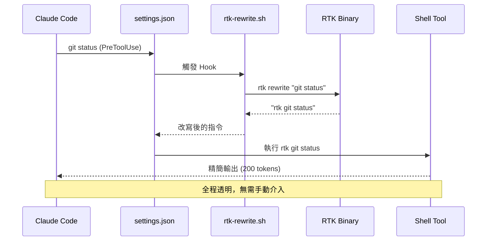

**Hook 檔案結構**：

```
~/.claude/
├── hooks/
│   └── rtk-rewrite.sh          # Hook 腳本（thin delegator）
├── RTK.md                      # RTK 指示文件（~10 行）
├── CLAUDE.md                   # Claude 設定（含 @RTK.md 參照）
├── settings.json               # Hook 註冊
└── settings.json.bak           # 備份
```

### 6.2 自動指令改寫

**設定步驟**：

```bash
# 方法 1：推薦的全域設定（Hook + RTK.md）
rtk init -g

# 方法 2：自動化（不提示）
rtk init -g --auto-patch

# 方法 3：僅安裝 Hook（零 Context Token 開銷）
rtk init -g --hook-only

# 方法 4：僅本地專案（無 Hook，137 行 CLAUDE.md）
rtk init

# 驗證安裝
rtk init --show
```

**初始化模式比較**：

| 模式 | 指令 | Hook | Context 開銷 | 採用率 |
|------|------|------|-------------|--------|
| 全域 Hook（推薦）| `rtk init -g` | ✅ | ~10 tokens | 100% |
| 全域 Hook only | `rtk init -g --hook-only` | ✅ | 0 tokens | 100% |
| 本地專案 | `rtk init` | ❌ | ~2,000 tokens | ~70% |

**settings.json 範例**：

```json
{
  "hooks": {
    "PreToolUse": [
      {
        "matcher": "Bash",
        "hook": "~/.claude/hooks/rtk-rewrite.sh"
      }
    ]
  }
}
```

### 6.3 Shell Hook 設定

**Shell 設定檔**（可選，用於一般終端機操作）：

```bash
# ~/.bashrc 或 ~/.zshrc
# 為常用指令建立 alias
alias ls='rtk ls'
alias grep='rtk grep'
alias cat='rtk read'

# 或者使用 function 包裝
git() {
    if command -v rtk &> /dev/null; then
        rtk git "$@"
    else
        command git "$@"
    fi
}
```

### 6.4 Token Reduction Workflow

**日常開發的 RTK + Claude Code 工作流**：

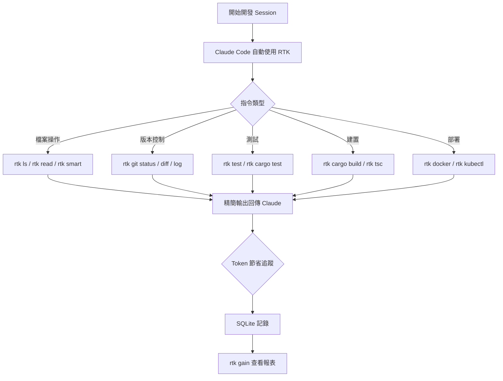

**實務範例 — 30 分鐘 Claude Code Session**：

```bash
# Session 開始前
$ rtk gain
Commands: 0, Total saved: 0

# ... 30 分鐘的開發工作 ...
# Claude Code 自動使用 rtk git status (10x)
# Claude Code 自動使用 rtk read (20x)
# Claude Code 自動使用 rtk cargo test (5x)

# Session 結束後
$ rtk gain
Commands: 35
Average savings: 82.3%
Total tokens saved: 94,100
Estimated cost saved: $0.28
```

### 6.5 大型專案最佳化

針對大型專案，以下策略可最大化 RTK 的效益：

**策略 1：Aggressive Read Mode**

```bash
# 在 CLAUDE.md 或 RTK.md 中加入指示
# "When exploring unfamiliar code, use rtk read -l aggressive"
rtk read src/main.rs -l aggressive    # 僅看函式簽名
rtk smart src/lib.rs                   # 兩行摘要
```

**策略 2：排除不需要過濾的指令**

```toml
# ~/.config/rtk/config.toml
[hooks]
exclude_commands = ["curl", "playwright", "ssh"]
```

**策略 3：善用 Ultra Compact 模式**

```bash
# 在大型專案中，Context Window 壓力大時啟用
rtk ls . -u          # 極度精簡的目錄結構
rtk git log -10 -u   # 極度精簡的 commit 日誌
```

### 6.6 Multi-Agent Workflow

在使用 Claude Code 的 Multi-Agent 模式（如 Sub-Agent、parallel tasks）時，RTK 的 Hook 會自動套用到所有 Agent：

```
Main Agent ─── rtk git status ───► 精簡輸出
    │
    ├── Sub-Agent 1 ─── rtk cargo test ───► 精簡輸出
    │
    └── Sub-Agent 2 ─── rtk lint ───► 精簡輸出

所有 Agent 共享同一個 Hook → 100% 覆蓋率
```

**實務建議**：

- Multi-Agent 場景下 Token 消耗會倍增，RTK 的效益更加顯著
- 確保 `rtk init -g` 而非 `rtk init`，確保所有 Sub-Agent 都經過 Hook
- 監控 `rtk gain` 確認所有 Agent 都在使用 RTK

### 6.7 最佳實務

| # | 實務 | 說明 |
|---|------|------|
| 1 | 使用 `rtk init -g` | 全域 Hook 確保 100% 覆蓋 |
| 2 | 重啟 Claude Code | 設定變更後必須重啟 |
| 3 | 使用 shell 指令而非內建工具 | Claude Code 的 Read/Grep 不經過 Hook |
| 4 | 定期檢查 `rtk gain` | 確認 Token 節省效果 |
| 5 | 使用 `rtk discover` | 找出遺漏的優化機會 |
| 6 | 備份 settings.json | RTK 會自動備份，但建議額外備份 |
| 7 | 大型專案用 aggressive mode | 初步探索時僅看簽名 |
| 8 | 配合 Tee Mode | 確保失敗時可存取完整輸出 |

**重要提醒**：

> Hook 僅攔截 Bash tool calls。Claude Code 的內建工具（如 `Read`、`Grep`、`Glob`）不經過 Hook，因此不會被自動改寫。要在這些場景獲得 RTK 過濾效果，請使用 shell 指令（`cat`/`rg`/`find`）或直接呼叫 `rtk read`、`rtk grep`、`rtk find`。

---

## 7. GitHub Copilot 整合

### 7.1 VSCode Integration

RTK 支援 GitHub Copilot（VSCode）的 PreToolUse Hook，實現透明的指令改寫：

```bash
# 初始化 Copilot 整合
rtk init -g --copilot

# 這會設定：
# - PreToolUse hook 用於 transparent rewrite
# - RTK.md 指示檔
```

**VSCode Settings 配置**：

```json
// .vscode/settings.json
{
  "terminal.integrated.env.linux": {
    "PATH": "${env:HOME}/.local/bin:${env:PATH}"
  },
  "terminal.integrated.env.osx": {
    "PATH": "${env:HOME}/.local/bin:${env:PATH}"
  },
  "terminal.integrated.env.windows": {
    "PATH": "${env:USERPROFILE}\\.cargo\\bin;${env:PATH}"
  }
}
```

### 7.2 Copilot Chat

在 Copilot Chat 中使用 RTK 的最佳方式：

```markdown
<!-- 在 .github/copilot-instructions.md 中加入 -->
## RTK Integration

When executing terminal commands, prefer using `rtk` prefix:
- Use `rtk git status` instead of `git status`
- Use `rtk ls .` instead of `ls -la`
- Use `rtk read <file>` instead of `cat <file>`
- Use `rtk cargo test` instead of `cargo test`

This reduces token consumption by 60-90%.
```

**Copilot Chat Prompt 範例**：

```
# 探索專案結構時
"Use rtk ls to show the project structure"

# 檢查 git 狀態時
"Run rtk git status to see current changes"

# 執行測試時
"Use rtk test to run tests and show only failures"
```

### 7.3 Terminal Workflow

在 VSCode Terminal 中搭配 Copilot 使用 RTK：

```bash
# 1. 確保 RTK 在 PATH 中
rtk --version

# 2. 設定 Shell Alias（可選）
echo 'alias gs="rtk git status"' >> ~/.bashrc
echo 'alias gl="rtk git log -10"' >> ~/.bashrc
echo 'alias gd="rtk git diff"' >> ~/.bashrc

# 3. 在 Copilot 終端機中直接使用
rtk ls .                    # Copilot 看到精簡的目錄結構
rtk git status              # Copilot 看到精簡的 git 狀態
rtk cargo test              # Copilot 只看到失敗的測試
```

### 7.4 Prompt Engineering

針對 Copilot 的 Prompt 最佳化策略：

| 策略 | 說明 | 範例 |
|------|------|------|
| **精簡上下文** | 使用 `rtk smart` 提供精簡程式碼摘要 | `rtk smart src/main.rs` |
| **分層讀取** | 先 aggressive 再 minimal | `rtk read file.rs -l aggressive` → `rtk read file.rs` |
| **聚焦錯誤** | 僅提供失敗測試結果 | `rtk test npm test` |
| **結構化輸出** | 使用 RTK JSON 格式 | `rtk gain --format json` |

### 7.5 Token Optimization

**Copilot Token 最佳化清單**：

1. **Terminal 指令**：所有 Shell 指令加上 `rtk` 前綴
2. **檔案讀取**：使用 `rtk read` 而非 `cat`
3. **搜尋**：使用 `rtk grep` 而非 `grep`
4. **目錄瀏覽**：使用 `rtk ls` 而非 `ls`
5. **測試**：使用 `rtk test` 而非直接執行測試
6. **Git 操作**：所有 `git` 指令透過 `rtk git`

### 7.6 Workspace Strategy

**多工作區策略**：

```bash
# 全域設定（推薦）
rtk init -g --copilot

# 個別專案設定
cd /path/to/project
rtk init    # 僅影響當前專案
```

**Monorepo 策略**：

```bash
# 在 Monorepo 根目錄初始化
cd /path/to/monorepo
rtk init

# RTK 會自動偵測套件管理器
# pnpm-lock.yaml → pnpm exec
# yarn.lock → yarn exec
# 預設 → npx
```

---

## 8. 多元 AI 工具整合

RTK 支援 13 種以上的 AI Coding 工具。本章整合所有工具的設定方式與最佳實務。

### 8.1 Cursor 整合

Cursor 透過 `preToolUse` hook（hooks.json）整合 RTK：

```bash
# 初始化 Cursor 整合
rtk init -g --agent cursor

# 這會設定 hooks.json 中的 preToolUse hook
```

**Cursor + RTK 工作流**：

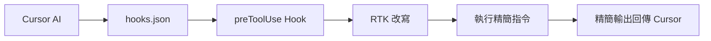

在 `.cursorrules` 中加入 RTK 使用規則：

```markdown
# .cursorrules

## Terminal Commands
- Always use `rtk` prefix for shell commands
- Use `rtk git status` instead of `git status`
- Use `rtk ls .` instead of `ls -la`
- Use `rtk read <file>` instead of `cat <file>`
- Use `rtk test <cmd>` for running tests

## Token Optimization
- Prefer `rtk smart <file>` for initial file exploration
- Use `rtk read <file> -l aggressive` for code structure overview
- Use `rtk err <cmd>` to filter only errors from any command
```

### 8.2 Gemini CLI 整合

```bash
# 初始化 Gemini CLI 整合
rtk init -g --gemini

# 產生 BeforeTool hook 設定
# Gemini CLI 使用 BeforeTool hook 機制攔截指令
```

**Gemini CLI 特點**：
- 使用 BeforeTool hook（與 Claude Code 的 PreToolUse 不同）
- 支援自動指令改寫
- 需確保 Gemini CLI 已安裝且設定正確

### 8.3 Codex（OpenAI）整合

```bash
# 初始化 Codex 整合
rtk init -g --codex

# 產生 AGENTS.md + RTK.md 指示檔案
```

**Codex 整合方式**：
- 透過 `AGENTS.md` 和 `RTK.md` 指示檔案引導 Codex 使用 RTK
- 指示檔案定義了 RTK 的使用規則和最佳實務
- 需要在專案根目錄放置設定檔

### 8.4 Windsurf / Cline / Roo Code 整合

```bash
# Windsurf 整合（project-scoped）
rtk init --agent windsurf
# 產生 .windsurfrules 設定檔

# Cline / Roo Code 整合（project-scoped）
rtk init --agent cline
# 產生 .clinerules 設定檔
```

**注意**：Windsurf 和 Cline/Roo Code 使用 project-scoped 規則檔，而非 global 設定。每個專案需要各自初始化。

### 8.5 OpenCode / OpenClaw 整合

```bash
# OpenCode 整合
rtk init -g --opencode
# 使用 TypeScript Plugin（tool.execute.before）攔截指令

# OpenClaw 整合
# OpenClaw 作為 Cursor/VS Code 插件，透過插件機制整合
```

### 8.6 Hermes / Kilo Code / Antigravity 整合

```bash
# Hermes 整合
rtk init --agent hermes
# 使用 Python adapter 整合

# Kilo Code 整合
rtk init --agent kilocode
# 產生 .kilocode/rules/rtk-rules.md 規則檔

# Google Antigravity 整合
rtk init --agent antigravity
# 產生 .agents/rules/antigravity-rtk-rules.md 規則檔

# Pi Agent 整合
rtk init -g --agent pi
# 最新加入的 agent 支援
```

### 8.7 AI 工具整合總覽與比較

| AI 工具 | 初始化指令 | Hook 類型 | 範圍 | 採用率 |
|---------|-----------|----------|------|--------|
| Claude Code | `rtk init -g` | PreToolUse (bash) | Global | 100% |
| GitHub Copilot (VSCode) | `rtk init -g --copilot` | PreToolUse | Global | 100% |
| GitHub Copilot CLI | `rtk init -g --copilot` | deny-with-suggestion | Global | ~85% |
| Cursor | `rtk init -g --agent cursor` | preToolUse (hooks.json) | Global | 100% |
| Gemini CLI | `rtk init -g --gemini` | BeforeTool | Global | 100% |
| Codex | `rtk init -g --codex` | AGENTS.md + RTK.md | Global | ~80% |
| Windsurf | `rtk init --agent windsurf` | .windsurfrules | Project | ~90% |
| Cline / Roo Code | `rtk init --agent cline` | .clinerules | Project | ~90% |
| OpenCode | `rtk init -g --opencode` | Plugin TS | Global | 100% |
| Kilo Code | `rtk init --agent kilocode` | rules.md | Project | ~85% |
| Google Antigravity | `rtk init --agent antigravity` | rules.md | Project | ~85% |
| Hermes | `rtk init --agent hermes` | Python adapter | Project | ~85% |
| Pi | `rtk init -g --agent pi` | Agent rules | Global | ~90% |

**Context 壓縮效果比較**：

| 場景 | 未使用 RTK | 使用 RTK | 節省率 |
|------|-----------|---------|--------|
| 探索專案結構 | ~2,000 tokens | ~300 tokens | 85% |
| 讀取 5 個檔案 | ~10,000 tokens | ~3,000 tokens | 70% |
| 執行測試 | ~5,000 tokens | ~500 tokens | 90% |
| Git 操作（5 次）| ~2,000 tokens | ~200 tokens | 90% |
| **單次 Session 合計** | **~19,000 tokens** | **~4,000 tokens** | **79%** |

> **建議**：團隊導入時，優先設定 Claude Code 和 Copilot（最深度整合），再逐步擴展到其他工具。  
> 詳見官方：[Supported Agents](https://www.rtk-ai.app/docs/getting-started/supported-agents/)

---

## 9. Reverse Engineering 使用情境

### 9.1 Legacy System 分析

進行 Legacy System 逆向工程時，最大的挑戰是龐大的 codebase 會迅速消耗 AI 的 Context Window。RTK 提供了關鍵的壓縮能力：

**分析流程**：

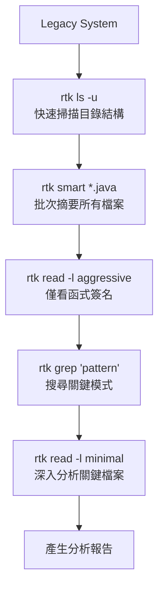

**實務範例 — 分析 10 萬行 Java 系統**：

```bash
# Step 1：了解整體結構（~150 tokens vs ~3,000 tokens）
rtk ls . -u
src/ main/(120) test/(45) resources/(8)
pom.xml build.gradle

# Step 2：批次掃描所有 Java 檔案（每檔 ~20 tokens vs ~500 tokens）
find src -name "*.java" | head -20 | xargs -I {} rtk smart {}

# Step 3：了解核心類別的 API
rtk read src/main/java/com/legacy/core/Engine.java -l aggressive
# 輸出：僅函式簽名，60-90% 壓縮

# Step 4：搜尋特定模式
rtk grep "deprecated" src/ 
# 輸出：按檔案分組，80% 壓縮
```

**Token 節省分析**：

| 分析步驟 | 未使用 RTK | 使用 RTK | 節省 |
|---------|-----------|---------|------|
| 目錄掃描 | 3,000 tokens | 150 tokens | 95% |
| 50 個檔案摘要 | 25,000 tokens | 1,000 tokens | 96% |
| 10 個檔案簽名 | 5,000 tokens | 500 tokens | 90% |
| 搜尋結果 | 2,000 tokens | 400 tokens | 80% |
| **合計** | **35,000 tokens** | **2,050 tokens** | **94%** |

### 9.2 Monolith 系統分析

**挑戰**：Monolith 系統通常有數百個類別、複雜的依賴關係、混合的業務邏輯。

**RTK 策略**：

```bash
# 1. 依模組結構了解系統
rtk ls src/main/java/com/company/ -u

# 2. 分析依賴關係
rtk deps                    # 依賴摘要
rtk json package.json       # 結構化（僅 Key + 型別）

# 3. 了解進入點
rtk smart src/main/java/com/company/Application.java
rtk read src/main/java/com/company/Application.java -l aggressive

# 4. 追蹤 API 端點
rtk grep "@RequestMapping\|@GetMapping\|@PostMapping" src/
# 輸出按檔案分組，快速了解所有 API 端點

# 5. 分析設定檔
rtk read src/main/resources/application.yml
rtk json src/main/resources/application.json
```

### 9.3 大型 Repo 探索

**場景**：接手一個 50 萬行的 Monorepo，需要在有限的 Token 預算內了解整體架構。

```bash
# Phase 1：高層次結構（~200 tokens）
rtk ls . -u

# Phase 2：各模組摘要（~50 tokens/模組）
for dir in packages/*/; do
    echo "=== $dir ==="
    rtk smart "$dir/src/index.ts" 2>/dev/null
done

# Phase 3：關鍵檔案深入
rtk read packages/core/src/engine.ts -l aggressive
rtk read packages/api/src/routes.ts -l aggressive

# Phase 4：搜尋跨模組的共用模式
rtk grep "import.*from.*@company/core" packages/
```

### 9.4 巨量 Logs 處理

**場景**：分析 GB 等級的應用程式日誌，找出問題根因。

```bash
# 1. 去重複化日誌（70-85% 壓縮）
rtk log /var/log/app/error.log
# [ERROR] Connection timeout to db:5432 (×847)
# [ERROR] Out of memory in worker-3 (×12)
# [WARN] Deprecated API call /v1/users (×2,341)

# 2. Docker 容器日誌
rtk docker logs my-app --tail 1000
# 去重複化 + 壓縮，僅顯示獨特的日誌行

# 3. Kubernetes Pod 日誌
rtk kubectl logs my-pod --tail 500
# 自動去重複化

# 4. 使用 summary 處理超長輸出
rtk summary "cat /var/log/app/access.log | head -10000"
```

### 9.5 Decompiled Source 分析

**場景**：分析反編譯的 Java/C# 原始碼，通常充滿噪音。

```bash
# 1. 反編譯碼通常有大量自動產生的註解
# RTK 的 Code Filtering 會自動移除
rtk read decompiled/com/legacy/Service.java -l minimal
# 移除反編譯器產生的註解（20-40% 壓縮）

# 2. 僅查看公開 API
rtk read decompiled/com/legacy/Service.java -l aggressive
# 僅保留方法簽名（60-90% 壓縮）

# 3. 批次掃描反編譯結果
find decompiled/ -name "*.java" | xargs -I {} rtk smart {}
# 每個檔案只有 2 行摘要
```

### 9.6 API Trace / Stack Trace 分析

```bash
# 1. API 回應（JSON 結構化）
rtk json api-response.json
# 僅顯示結構（Key + 型別），移除大量資料值

# 2. cURL 結果截斷
rtk curl https://api.example.com/v1/large-endpoint
# 自動截斷 + 保存完整輸出至 tee

# 3. Stack Trace 分析
rtk err "java -jar app.jar"
# 僅保留錯誤輸出，過濾正常啟動訊息

# 4. 環境變數過濾
rtk env -f SPRING
# 僅顯示匹配的環境變數
```

**降低 Context Overflow 的關鍵策略**：

| 策略 | 實作方式 |
|------|---------|
| 分層探索 | 先 `rtk ls` → `rtk smart` → `rtk read -l aggressive` → `rtk read` |
| 聚焦搜尋 | 使用 `rtk grep` 按檔案分組 |
| 日誌去重 | 使用 `rtk log` 或 `rtk docker logs` |
| JSON 結構化 | 使用 `rtk json` 僅看結構 |
| 批次摘要 | 使用 `rtk smart` 批次處理 |

---

## 10. Framework Upgrade 使用情境

### 10.1 Spring Boot Upgrade

**場景**：將 Spring Boot 2.x 升級至 3.x，涉及數百個檔案的變更。

```bash
# Step 1：分析當前依賴
rtk deps
# 精簡的依賴列表，快速了解版本狀態

# Step 2：了解需要變更的檔案
rtk grep "javax\." src/main/java/
# 按檔案分組，找出所有 javax → jakarta 的變更點
# 輸出：
# javax imports found:
#   com/app/service/ (12 files)
#   com/app/controller/ (8 files)
#   com/app/entity/ (15 files)

# Step 3：逐檔分析差異
rtk read src/main/java/com/app/entity/User.java -l aggressive
# 僅看 import 和 annotation，快速判斷需要改什麼

# Step 4：執行升級後檢查建置
rtk cargo build   # 或 rtk test mvn compile
# 精簡的錯誤輸出，按檔案分組

# Step 5：執行測試
rtk test mvn test
# 僅顯示失敗的測試
```

**Token 節省效果**：

| 升級步驟 | 未使用 RTK | 使用 RTK | 說明 |
|---------|-----------|---------|------|
| 依賴分析 | 5,000 tokens | 500 tokens | 精簡依賴列表 |
| 搜尋影響範圍 | 8,000 tokens | 1,600 tokens | 按檔案分組 |
| 檔案分析（35 files）| 70,000 tokens | 7,000 tokens | aggressive mode |
| 建置錯誤 | 10,000 tokens | 2,000 tokens | 分組錯誤 |
| 測試結果 | 15,000 tokens | 1,500 tokens | 僅失敗測試 |
| **合計** | **108,000** | **12,600** | **88% 節省** |

### 10.2 React / Vue / Angular Upgrade

**React 升級範例**（React 17 → 18）：

```bash
# 1. 檢查過時的依賴
rtk pnpm outdated
# 精簡的過時套件列表（-80-90%）

# 2. 搜尋需要變更的 API
rtk grep "ReactDOM.render\|componentWillMount\|componentWillReceiveProps" src/
# 按檔案分組，找出所有 deprecated API

# 3. 升級後執行 lint
rtk lint
# 分組顯示：
#   react/no-deprecated: 15 issues
#   react-hooks/rules-of-hooks: 3 issues

# 4. 升級後執行 TypeScript 編譯
rtk tsc
# 分組顯示 TypeScript 錯誤：
#   src/components/ (8 errors)
#   src/hooks/ (3 errors)

# 5. 執行測試
rtk vitest
# 僅顯示失敗測試（-99.6%）

# 6. 執行 E2E 測試
rtk playwright test
# 僅顯示失敗測試（-94%）
```

**Vue 升級範例**（Vue 2 → 3）：

```bash
# 搜尋需要遷移的 API
rtk grep "Vue.component\|Vue.directive\|this\.\$on\|this\.\$off" src/
# 分組結果快速定位需要變更的檔案

# 檢查 Composition API 遷移進度
rtk grep "defineComponent\|setup()\|ref(\|reactive(" src/
```

**Angular 升級範例**：

```bash
# 搜尋 deprecated 模式
rtk grep "HttpModule\|@angular/http\|ngDoCheck" src/
# 分組結果

# 執行 Angular 升級建議
rtk err "ng update @angular/core @angular/cli"
```

### 10.3 Node.js Upgrade

```bash
# 1. 檢查相容性
rtk deps
# 精簡的依賴清單

# 2. 找出 CommonJS / ESM 問題
rtk grep "require(\|module.exports" src/
# 按檔案分組

# 3. 升級後測試
rtk test npm test
# 僅顯示失敗

# 4. 檢查 deprecated API
rtk grep "Buffer(\|new Buffer\|url.parse" src/
```

### 10.4 Rust Upgrade

```bash
# 1. 檢查 Clippy 警告
rtk cargo clippy
# 分組顯示 Clippy 建議（-80%）

# 2. 建置檢查
rtk cargo build
# 精簡的建置輸出（-80%）

# 3. 測試
rtk cargo test
# 僅失敗測試（-90%）

# 4. 依賴審計
rtk deps
```

### 10.5 大規模升級策略

**使用 RTK 進行大規模 Framework Upgrade 的標準流程**：

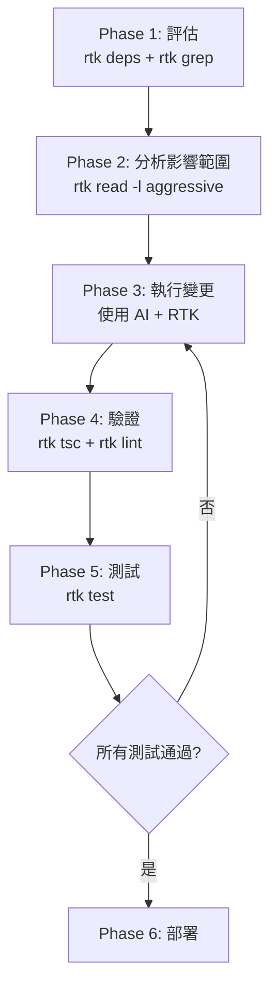

**Token 預算規劃**：

| 專案規模 | 預估 Token 需求（無 RTK）| 預估 Token 需求（有 RTK）| 節省 |
|---------|----------------------|---------------------|------|
| 小型（< 1 萬行）| 50 萬 tokens | 10 萬 tokens | 80% |
| 中型（1-5 萬行）| 200 萬 tokens | 40 萬 tokens | 80% |
| 大型（5-20 萬行）| 500 萬 tokens | 100 萬 tokens | 80% |
| 巨型（> 20 萬行）| 1,000 萬+ tokens | 200 萬 tokens | 80% |

---

## 11. Web Application 開發最佳實務

### 11.1 Frontend Workflow

**React / Vue / Angular 前端開發整合 RTK**：

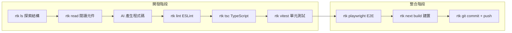

**典型前端 RTK 工作流**：

```bash
# 1. 探索元件結構
rtk ls src/components/ -u
# src/components/ Header/(3) Footer/(2) Sidebar/(4) Dashboard/(8)

# 2. 了解元件 API
rtk read src/components/Dashboard/index.tsx -l aggressive
# export const Dashboard: FC<DashboardProps> = ({ ... }) => { ... }
# export interface DashboardProps { ... }

# 3. 開發後 lint 檢查
rtk lint
# no-unused-vars: 2 issues
# react-hooks/exhaustive-deps: 1 issue
# Total: 3 issues in 2 files

# 4. TypeScript 檢查
rtk tsc
# src/components/Dashboard/Chart.tsx (2 errors)
#   TS2345: Type 'string' is not assignable to type 'number'

# 5. 測試
rtk vitest
# ok: 45/45 tests passed

# 6. Prettier 格式化檢查
rtk prettier --check .
# 3 files need formatting
```

**Token 節省效果（前端 Session）**：

| 操作 | 頻率 | 未使用 RTK | 使用 RTK | 節省 |
|------|------|-----------|---------|------|
| `ls` | 5x | 4,000 | 750 | 81% |
| `read` | 15x | 30,000 | 9,000 | 70% |
| `lint` | 3x | 9,000 | 1,800 | 80% |
| `tsc` | 3x | 6,000 | 1,200 | 80% |
| `vitest` | 5x | 510,000 | 1,900 | 99.6% |
| `prettier` | 2x | 2,000 | 400 | 80% |
| **合計** | | **561,000** | **15,050** | **97%** |

### 11.2 Backend Workflow

**Spring Boot / Express / FastAPI 後端開發**：

```bash
# Java / Spring Boot
rtk read src/main/java/com/app/controller/UserController.java -l aggressive
rtk grep "@Service\|@Repository\|@Controller" src/
rtk test mvn test
rtk err mvn compile

# Node.js / Express
rtk read src/routes/api.ts -l aggressive
rtk jest
rtk lint

# Python / FastAPI
rtk read src/main.py -l aggressive
rtk pytest
rtk ruff check
```

### 11.3 Fullstack Workflow

**T3 Stack（Next.js + tRPC + Prisma）範例**：

```bash
# 1. 資料庫 Schema
rtk read prisma/schema.prisma
rtk prisma generate      # 無 ASCII art（精簡）

# 2. API Routes
rtk ls src/server/api/ -u
rtk read src/server/api/routers/user.ts -l aggressive

# 3. 前端元件
rtk ls src/app/ -u
rtk read src/app/dashboard/page.tsx -l aggressive

# 4. 全端測試
rtk vitest               # 單元測試
rtk playwright test      # E2E 測試

# 5. 建置檢查
rtk next build           # Next.js 建置（精簡輸出）
```

### 11.4 Microservices

**微服務架構中的 RTK 策略**：

```bash
# 多服務 Docker Compose 環境
rtk docker compose ps
# service-a  running  0.0.0.0:3001->3000
# service-b  running  0.0.0.0:3002->3000
# postgres   running  0.0.0.0:5432->5432
# redis      running  0.0.0.0:6379->6379

# 查看特定服務的日誌
rtk docker logs service-a --tail 100
# [INFO] Server started on port 3000 (×1)
# [INFO] Database connected (×1)
# [ERROR] Connection to service-b timeout (×12)

# 跨服務搜尋
for svc in service-a service-b service-c; do
    echo "=== $svc ==="
    rtk read $svc/src/index.ts -l aggressive
done
```

### 11.5 Monorepo

**Monorepo 特殊考量**：

```bash
# pnpm Monorepo
rtk pnpm list             # 精簡依賴列表（-70%）
rtk pnpm outdated         # 過時套件（-80-90%）

# RTK 自動偵測套件管理器
# pnpm-lock.yaml → 使用 pnpm exec
# yarn.lock → 使用 yarn exec
# 預設 → 使用 npx

# 各套件概覽
rtk ls packages/ -u
# packages/ core/(15) api/(12) web/(25) mobile/(20) shared/(8)

# 套件依賴圖
rtk deps
```

### 11.6 CI/CD

**CI/CD Pipeline 整合**：

```yaml
# GitHub Actions 範例
name: CI with RTK
on: [push, pull_request]

jobs:
  build:
    runs-on: ubuntu-latest
    steps:
      - uses: actions/checkout@v4
      
      - name: Install RTK
        run: |
          curl -fsSL https://raw.githubusercontent.com/rtk-ai/rtk/refs/heads/master/install.sh | sh
          echo "$HOME/.local/bin" >> $GITHUB_PATH
      
      - name: Lint (with RTK token tracking)
        run: rtk lint
      
      - name: Test (with RTK token tracking)
        run: rtk test npm test
      
      - name: Build
        run: rtk next build
      
      - name: Token savings report
        run: rtk gain --format json > rtk-report.json
      
      - name: Upload RTK report
        uses: actions/upload-artifact@v4
        with:
          name: rtk-token-report
          path: rtk-report.json
```

**RTK 在 CI/CD 中的關鍵特性**：

- **Exit Code Preservation**：RTK 會保留底層工具的 exit code，確保 CI/CD 正確判斷成功/失敗
- **Token 追蹤**：在 CI 環境中也可追蹤 Token 消耗
- **Tee Mode**：失敗時保留完整輸出供除錯

---

## 12. DevOps 與 Cloud Native 整合

### 12.1 Docker

```bash
# 容器管理
rtk docker ps                   # 精簡容器列表
rtk docker images               # 精簡映像列表
rtk docker logs <container>     # 去重複化日誌
rtk docker compose ps           # Compose 服務狀態

# 實務範例
$ rtk docker ps
CONTAINER    IMAGE             STATUS    PORTS
my-app       my-app:latest     Up 2h     0.0.0.0:3000->3000
postgres     postgres:16       Up 2h     0.0.0.0:5432->5432
redis        redis:7           Up 2h     0.0.0.0:6379->6379

# vs 原始 docker ps（大量額外資訊如 CONTAINER ID、CREATED 等）
# Token 節省：~80%
```

### 12.2 Kubernetes

```bash
# Pod 管理
rtk kubectl pods                # 精簡 Pod 列表
rtk kubectl logs <pod>          # 去重複化日誌
rtk kubectl services            # 精簡 Service 列表

# 實務範例
$ rtk kubectl pods
NAME                        READY   STATUS    AGE
api-server-abc123           1/1     Running   2d
worker-def456               1/1     Running   2d
worker-ghi789               0/1     CrashLoop 5m  ←
postgres-jkl012             1/1     Running   5d

# 去重複化 Pod 日誌
$ rtk kubectl logs worker-ghi789
[ERROR] Out of memory: heap allocation failed (×47)
[INFO] Restart attempt (×12)
[ERROR] Failed to connect to service: api-server (×3)
```

### 12.3 AWS CLI

```bash
# 身份驗證
rtk aws sts get-caller-identity
# arn:aws:iam::123456789:user/developer

# EC2 實例（精簡列表）
rtk aws ec2 describe-instances
# i-abc123  t3.medium  running  10.0.1.5
# i-def456  t3.large   running  10.0.1.6

# Lambda 函式（移除 secrets）
rtk aws lambda list-functions
# my-function  python3.12  128MB  30s timeout
# api-handler  nodejs20.x  256MB  60s timeout

# CloudWatch 日誌（僅時間戳 + 訊息）
rtk aws logs get-log-events --log-group /aws/lambda/my-function
# 2026-05-25T10:30:00 START RequestId: abc-123
# 2026-05-25T10:30:01 Processing 42 records
# 2026-05-25T10:30:02 END RequestId: abc-123

# CloudFormation 事件（失敗優先）
rtk aws cloudformation describe-stack-events --stack-name my-stack
# ✗ AWS::Lambda::Function  CREATE_FAILED  Resource limit exceeded
# ✓ AWS::IAM::Role         CREATE_COMPLETE
# ✓ AWS::S3::Bucket        CREATE_COMPLETE

# DynamoDB 掃描（解包型別標註）
rtk aws dynamodb scan --table-name users
# {id: "user-1", name: "Alice", age: 30}
# vs 原始 {"id": {"S": "user-1"}, "name": {"S": "Alice"}, "age": {"N": "30"}}
```

### 12.4 Azure CLI

```bash
# RTK 目前未有專用的 Azure CLI 過濾器
# 但可使用通用的 proxy / summary 指令

# 通用代理模式（追蹤 Token）
rtk proxy az vm list --output table

# 摘要模式
rtk summary "az resource list --output table"

# JSON 結構化
az vm list --output json > /tmp/vms.json
rtk json /tmp/vms.json
```

### 12.5 GCP CLI

```bash
# 與 Azure 類似，使用通用指令
rtk proxy gcloud compute instances list
rtk summary "gcloud run services list"

# JSON 結構化
gcloud projects list --format=json > /tmp/projects.json
rtk json /tmp/projects.json
```

### 12.6 GitHub Actions

**在 GitHub Actions 中使用 RTK**：

```yaml
# .github/workflows/ai-optimized-ci.yml
name: AI-Optimized CI

on:
  pull_request:
    branches: [main]

jobs:
  lint-and-test:
    runs-on: ubuntu-latest
    steps:
      - uses: actions/checkout@v4
      
      - name: Install RTK
        run: |
          curl -fsSL https://raw.githubusercontent.com/rtk-ai/rtk/refs/heads/master/install.sh | sh
          echo "$HOME/.local/bin" >> $GITHUB_PATH
      
      - name: Setup Node.js
        uses: actions/setup-node@v4
        with:
          node-version: 20
      
      - name: Install dependencies
        run: npm ci
      
      - name: Lint
        run: rtk lint
      
      - name: Type Check
        run: rtk tsc
      
      - name: Test
        run: rtk vitest
      
      - name: Build
        run: rtk next build
      
      # 匯出 Token 節省報告
      - name: RTK Report
        if: always()
        run: |
          rtk gain --format json > rtk-report.json
          echo "### RTK Token Savings" >> $GITHUB_STEP_SUMMARY
          echo "\`\`\`" >> $GITHUB_STEP_SUMMARY
          rtk gain >> $GITHUB_STEP_SUMMARY
          echo "\`\`\`" >> $GITHUB_STEP_SUMMARY
```

### 12.7 GitLab CI

```yaml
# .gitlab-ci.yml
stages:
  - lint
  - test
  - build

variables:
  RTK_VERSION: "latest"

before_script:
  - curl -fsSL https://raw.githubusercontent.com/rtk-ai/rtk/refs/heads/master/install.sh | sh
  - export PATH="$HOME/.local/bin:$PATH"

lint:
  stage: lint
  script:
    - rtk lint
    - rtk tsc

test:
  stage: test
  script:
    - rtk vitest
    - rtk gain

build:
  stage: build
  script:
    - rtk next build
  artifacts:
    paths:
      - .next/
```

---

## 13. 多語言生態系支援

RTK 支援 7 大語言生態系的 Token 最佳化，涵蓋 64 個模組（42 個指令模組 + 22 個基礎設施模組）。

### 13.1 Rust 生態系

```bash
# Cargo 測試（Failure Focus，僅顯示失敗）
$ rtk cargo test
# FAILED: 2/15 tests → 94-99% 壓縮

# Cargo 建置（Error Only）
$ rtk cargo build
# → "ok" 或僅錯誤訊息

# Cargo Clippy（Grouping by Pattern）
$ rtk cargo clippy
# → 按 lint 規則分組，85%+ 壓縮
```

| 指令 | 策略 | 壓縮率 |
|------|------|--------|
| `rtk cargo test` | Failure Focus | 94-99% |
| `rtk cargo build` | Error Only | 60-90% |
| `rtk cargo clippy` | Grouping | 85%+ |

### 13.2 Python 生態系

Python 模組採用獨立指令模式（Standalone Commands），支援虛擬環境感知與 `uv` 自動偵測：

```bash
# Ruff（JSON/Text 雙模式）
$ rtk ruff check src/
# JSON API 解析 → 按規則分組 → 80%+ 壓縮

# Pytest（State Machine 解析）
$ rtk pytest
# 追蹤測試狀態（IDLE → TEST_START → PASSED/FAILED → SUMMARY）
# 僅顯示失敗測試 → 90%+ 壓縮

# Pip（JSON 解析）
$ rtk pip list
# JSON 格式精簡表格 → 70-85% 壓縮
# 自動偵測 uv：若 uv 存在，自動使用 uv pip
```

### 13.3 Go 生態系

Go 模組使用 Sub-Enum 模式（類似 git/cargo），鏡射 Go 工具鏈結構：

```bash
# Go Test（NDJSON Streaming）
$ rtk go test ./...
# 逐行 JSON 解析，處理交錯的 package 事件
# → "2 packages, 3 failures (pkg1::TestAuth, ...)" → 75-90% 壓縮

# Go Build（Text Filtering）
$ rtk go build ./...
# 僅保留編譯器診斷訊息

# Go Vet（Text Filtering）
$ rtk go vet ./...
# 提取 file:line:message 三元組

# GolangCI-Lint（JSON 解析）
$ rtk golangci-lint run
# JSON API → 按 linter 規則分組 → 85% 壓縮
```

### 13.4 Ruby 生態系

Ruby 模組採用獨立指令模式，共用 `ruby_exec()` 工具函式自動偵測 `bundle exec`：

```bash
# Rake（State Machine，Minitest 輸出解析）
$ rtk rake test
# ok rake test: 8 runs, 0 failures → 85-90% 壓縮

# RSpec（JSON/Text 雙模式）
$ rtk rspec
# 自動注入 --format json → 60%+ 壓縮
# JSON 不可用時 fallback 至文字 state machine

# RuboCop（JSON 解析）
$ rtk rubocop
# 注入 --format json → 按 cop/severity 分組 → 60%+ 壓縮
# autocorrect 模式（-a, -A）跳過 JSON 注入

# Bundle Install（TOML Filter）
$ rtk bundle install
# 移除 "Using" 行，short-circuit 至 "ok bundle: complete" → 90%+ 壓縮
```

> **自動偵測**：當目錄中存在 `Gemfile` 時，RTK 會自動使用 `bundle exec` 執行 rake、rspec、rubocop。

### 13.5 .NET 生態系

```bash
# dotnet build（Error Only）
$ rtk dotnet build
# 僅保留建置錯誤和警告 → 70-85% 壓縮

# dotnet test（Failure Focus）
$ rtk dotnet test
# 僅顯示失敗的測試 → 70-85% 壓縮

# binlog 分析
$ rtk dotnet binlog
# 結構化分析 MSBuild 二進位日誌
```

### 13.6 Java 生態系

```bash
# Maven 建置
$ rtk mvn compile
# 移除下載進度、冗長的 BUILD 資訊

# Maven 測試
$ rtk mvn test
# Failure Focus → 僅顯示失敗的測試

# Gradle（v0.30+ 新增支援）
$ rtk gradle build
$ rtk gradlew test
# 支援 gradle 和 gradlew wrapper
```

**各生態系 Token 節省總覽**：

```
┌──────────────────────────────────────────────────────┐
│              Token Savings by Ecosystem               │
├──────────────┬──────────┬───────────────────────────┤
│ Ecosystem    │ Savings  │ Commands                   │
├──────────────┼──────────┼───────────────────────────┤
│ GIT          │ 85-99%   │ status, diff, log, gh, gt │
│ JS/TS        │ 70-99%   │ lint, tsc, next, prettier │
│              │          │ playwright, prisma, vitest │
│              │          │ pnpm                       │
│ PYTHON       │ 70-90%   │ ruff, pytest, pip         │
│ GO           │ 75-90%   │ go test/build/vet         │
│              │          │ golangci-lint              │
│ RUBY         │ 60-90%   │ rake, rspec, rubocop      │
│ DOTNET       │ 70-85%   │ dotnet build/test, binlog │
│ RUST         │ 60-99%   │ cargo test/build/clippy   │
│ CLOUD        │ 60-80%   │ aws, docker, kubectl      │
│              │          │ curl, wget, psql           │
│ SYSTEM       │ 50-90%   │ ls, tree, read, grep      │
│              │          │ find, json, log, env, deps │
└──────────────┴──────────┴───────────────────────────┘
```

---

## 14. 團隊導入策略

### 14.1 Enterprise Rollout

**四階段企業導入計畫**：

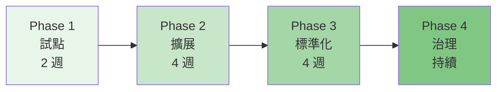

**Phase 1：試點（2 週）**

| 項目 | 內容 |
|------|------|
| 範圍 | 選擇 2-3 位技術領導者 |
| 目標 | 驗證 RTK 在現有工作流中的可行性 |
| 安裝 | `cargo install --git` 或 Homebrew |
| 設定 | `rtk init -g` |
| 追蹤 | 每日 `rtk gain` 報告 |
| 產出 | 試點報告 + Token 節省數據 |

**Phase 2：擴展（4 週）**

| 項目 | 內容 |
|------|------|
| 範圍 | 擴展至整個開發團隊（10-20 人）|
| 目標 | 建立標準化的安裝與設定流程 |
| 安裝 | 標準化安裝腳本 |
| 設定 | 統一的 config.toml |
| 培訓 | 團隊工作坊 + 本手冊 |
| 追蹤 | 週報 + 團隊 Token 消耗對比 |

**Phase 3：標準化（4 週）**

| 項目 | 內容 |
|------|------|
| 範圍 | 全部門導入 |
| 目標 | 將 RTK 納入標準開發工具鏈 |
| 治理 | 制定 AI Coding Standard |
| CI/CD | 整合 RTK 至 Pipeline |
| 監控 | Token 使用儀表板 |
| 文件 | 內部 Wiki + FAQ |

**Phase 4：治理（持續）**

| 項目 | 內容 |
|------|------|
| 範圍 | 企業級治理 |
| 目標 | 持續優化 Token 成本 |
| 升級 | 定期更新 RTK 版本 |
| 稽核 | 月度 Token 成本報告 |
| 最佳化 | 持續改進 config.toml 規則 |

### 14.2 Governance

**AI 開發治理框架**：

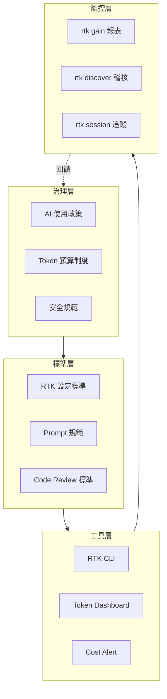

### 14.3 AI Development Standard

**建議的團隊 AI 開發標準**：

```markdown
# AI Development Standard v1.0

## 1. 工具使用規範
- 所有 AI Coding Session 必須啟用 RTK
- 禁止在未啟用 RTK 的情況下進行大型 codebase 分析
- Token 消耗超過預算 80% 時必須通知 Tech Lead

## 2. RTK 設定規範
- 所有開發者必須使用 `rtk init -g` 設定全域 Hook
- 標準 config.toml 必須套用至所有開發環境
- CI/CD Pipeline 必須包含 RTK Token 報告

## 3. Prompt 規範
- 使用 RTK 精簡輸出作為 AI Context
- 大型檔案分析優先使用 `rtk read -l aggressive`
- 目錄結構使用 `rtk ls -u`

## 4. 安全規範
- 禁止將包含 secrets 的指令輸出傳送給 AI
- 使用 RTK 的 AWS 過濾器（自動移除 secrets）
- 日誌分析前必須確認無 PII
```

### 14.4 Team Rules

**標準化團隊規則範本**：

```toml
# team-rtk-config.toml
# 全團隊統一的 RTK 設定

[hooks]
# 排除不需要過濾的指令
exclude_commands = ["ssh", "scp", "rsync"]

[tee]
enabled = true
mode = "failures"

[tracking]
# 90 天資料保留
retention_days = 90
```

**安裝腳本（供團隊使用）**：

```bash
#!/bin/bash
# install-rtk-team.sh - 團隊標準安裝腳本

set -e

echo "=== RTK 團隊安裝腳本 ==="

# 1. 安裝 RTK
if ! command -v rtk &> /dev/null; then
    echo "安裝 RTK..."
    curl -fsSL https://raw.githubusercontent.com/rtk-ai/rtk/refs/heads/master/install.sh | sh
    export PATH="$HOME/.local/bin:$PATH"
    echo 'export PATH="$HOME/.local/bin:$PATH"' >> ~/.bashrc
fi

# 2. 驗證安裝
rtk --version
rtk gain

# 3. 設定全域 Hook
rtk init -g --auto-patch

# 4. 套用團隊設定
mkdir -p ~/.config/rtk
curl -o ~/.config/rtk/config.toml https://internal.company.com/rtk/team-config.toml

# 5. 驗證
rtk init --show
echo "=== RTK 安裝完成 ==="
```

### 14.5 Prompt Standardization

**標準化 Prompt 範本**：

```markdown
## 專案探索 Prompt
"Use rtk ls -u to show the project structure, then use rtk smart 
to summarize key files. Only use rtk read for files that need 
detailed analysis."

## Bug 修復 Prompt
"1. Use rtk git diff to see recent changes
 2. Use rtk test to identify failing tests
 3. Use rtk read on failing test files
 4. Fix the issue and verify with rtk test"

## Code Review Prompt
"1. Use rtk git log -5 to see recent commits
 2. Use rtk git diff main..feature-branch
 3. Use rtk lint to check code quality
 4. Use rtk tsc to verify type safety"
```

### 14.6 Token Budget Management

**Token 預算管理框架**：

| 角色 | 每日預算 | 每月預算 | 說明 |
|------|---------|---------|------|
| Junior 開發者 | 20 萬 tokens | 400 萬 tokens | 基本開發任務 |
| Senior 開發者 | 50 萬 tokens | 1,000 萬 tokens | 複雜開發 + 分析 |
| Tech Lead | 100 萬 tokens | 2,000 萬 tokens | 架構分析 + 審查 |
| AI Agent（自動化）| 200 萬 tokens | 4,000 萬 tokens | 批次處理 |

**監控指令**：

```bash
# 個人每日報告
rtk gain --daily

# 團隊報告（JSON 匯出）
rtk gain --all --format json > daily-report.json

# 發現優化機會
rtk discover --all --since 1

# Session 追蹤
rtk session
```

---

## 15. Token 成本治理

### 15.1 Token Budget

**建立 Token 預算的步驟**：

```mermaid
flowchart TD
    A[收集基線數據\n無 RTK 的 Token 消耗] --> B[導入 RTK\n測量節省效果]
    B --> C[計算目標預算\n= 基線 × (1 - 節省率)]
    C --> D[設定預警閾值\n80% / 90% / 100%]
    D --> E[建立監控機制\nrtk gain --format json]
    E --> F[定期檢討\n每月調整預算]
```

**預算計算範例**：

```
團隊：20 人
AI 工具：Claude Code（Claude 4 Sonnet API）
定價：$3 / 1M input tokens, $15 / 1M output tokens

未使用 RTK：
  每人每日 Token：50 萬（input）
  團隊每日 Token：1,000 萬
  每月成本：1,000 萬 × 30 × $3/M = $900 (input only)

使用 RTK 後（80% 節省）：
  每人每日 Token：10 萬（input）
  團隊每日 Token：200 萬
  每月成本：200 萬 × 30 × $3/M = $180
  
每月節省：$720
年度節省：$8,640
```

### 15.2 Usage Analytics

**RTK 內建的分析功能**：

```bash
# 基本統計
rtk gain
# Commands: 1,234 | Avg savings: 78.5% | Total saved: 45,678 tokens

# 趨勢圖
rtk gain --graph
#  tokens │
#  saved  │     ╱╲
#         │   ╱    ╲    ╱╲
#         │ ╱        ╲╱    ╲
#         │╱                  ╲
#         └─────────────────────
#           Day 1         Day 30

# 每日明細
rtk gain --daily
# 2026-05-25: 234 commands, 12,345 tokens saved (82%)
# 2026-05-24: 198 commands, 10,234 tokens saved (79%)
# 2026-05-23: 267 commands, 15,678 tokens saved (85%)

# 歷史記錄
rtk gain --history
# Recent commands:
#   rtk git status    → 95% (300→15 tokens)
#   rtk cargo test    → 92% (5000→400 tokens)
#   rtk lint          → 88% (3000→360 tokens)

# JSON 匯出（自動化整合）
rtk gain --all --format json | jq .
```

### 15.3 Cost Governance

**企業級成本治理架構**：

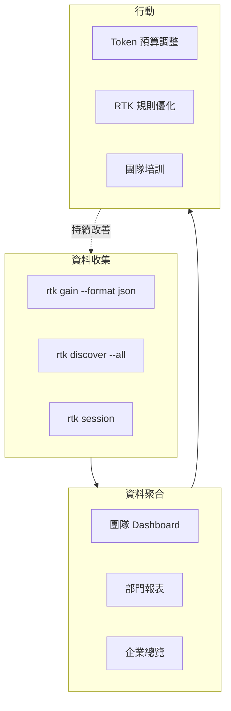

**自動化成本報告腳本**：

```bash
#!/bin/bash
# generate-cost-report.sh

DATE=$(date +%Y-%m-%d)
REPORT_DIR="/shared/reports/rtk"
mkdir -p "$REPORT_DIR"

# 收集各開發者的 RTK 數據
rtk gain --all --format json > "$REPORT_DIR/$DATE-raw.json"

# 計算成本
cat "$REPORT_DIR/$DATE-raw.json" | jq '{
  date: "'$DATE'",
  total_commands: .total_commands,
  tokens_saved: .total_saved,
  estimated_cost_saved_usd: (.total_saved / 1000000 * 3),
  average_savings_pct: .avg_savings
}' > "$REPORT_DIR/$DATE-summary.json"

echo "Report generated: $REPORT_DIR/$DATE-summary.json"
```

### 15.4 AI Usage KPI

**建議的 AI 開發 KPI**：

| KPI | 定義 | 目標 | 測量方式 |
|-----|------|------|---------|
| Token 節省率 | RTK 壓縮百分比 | > 75% | `rtk gain` |
| RTK 覆蓋率 | 使用 RTK 的指令比例 | > 90% | `rtk discover` |
| 每日 Token 消耗 | 個人每日 Token 用量 | < 目標預算 | `rtk gain --daily` |
| 成本效率 | 每千行程式碼的 Token 成本 | 持續降低 | 自訂計算 |
| 未優化指令數 | 未使用 RTK 的指令次數 | < 10% | `rtk discover` |

### 15.5 Team Cost Dashboard

**建議的儀表板架構**：

```bash
# 資料收集（每日 cron job）
# crontab -e
0 18 * * * /path/to/generate-cost-report.sh

# 資料格式（JSON）
{
  "date": "2026-05-25",
  "team": "backend",
  "members": [
    {
      "name": "developer-1",
      "commands": 234,
      "tokens_saved": 45678,
      "savings_pct": 82.3,
      "top_commands": ["git status", "cargo test", "lint"]
    }
  ],
  "total_saved": 123456,
  "estimated_usd_saved": 0.37
}
```

**視覺化建議**：

- 使用 Grafana + JSON 資料源
- 或 Google Sheets + Apps Script
- 或內部 Wiki 的自動更新報表
- RTK 的 `rtk gain --graph` 可直接用於 Terminal Dashboard

---

## 16. 安全性與風險管理

### 16.1 Secrets Filtering

RTK 在多個層面提供 Secrets 保護：

**AWS CLI 自動過濾**：

```bash
# RTK 自動移除 Lambda 環境變數中的 secrets
rtk aws lambda list-functions
# my-function  python3.12  128MB
# 注意：環境變數已被過濾，不會出現在輸出中

# RTK 自動移除 IAM 角色的 policy documents
rtk aws iam list-roles
# role-name  arn:aws:iam::123:role/my-role  2024-01-01
# 注意：inline policies 已被移除
```

**環境變數過濾**：

```bash
# 僅顯示匹配的環境變數（避免洩漏全部環境變數）
rtk env -f AWS
# AWS_REGION=us-east-1
# AWS_DEFAULT_REGION=us-east-1
# 注意：AWS_SECRET_ACCESS_KEY 等敏感值不會顯示

rtk env -f SPRING
# SPRING_PROFILES_ACTIVE=production
# SPRING_DATASOURCE_URL=jdbc:postgresql://db:5432/app
```

### 16.2 PII Protection

**個人資料保護策略**：

| 風險 | RTK 緩解措施 | 額外建議 |
|------|-------------|---------|
| 日誌中的 PII | Deduplication 減少曝露次數 | 使用 log masking |
| 資料庫查詢結果 | JSON Structure Only 移除值 | 限制查詢欄位 |
| API 回應中的 PII | Truncation 限制輸出量 | 使用 API Gateway 過濾 |
| 環境變數 | `rtk env -f` 過濾 | 使用 secret manager |

**最佳實務**：

```bash
# ✅ 安全：使用 RTK 的 JSON 結構模式
rtk json user-data.json
# {users: [{id: string, name: string, email: string, ...}], count: number}
# 不會顯示實際值

# ✅ 安全：使用環境變數過濾
rtk env -f APP_
# 僅顯示 APP_ 開頭的變數

# ❌ 危險：直接 cat 包含敏感資料的檔案
cat secrets.json
# 所有內容會被送入 AI Context
```

### 16.3 Log Sanitization

```bash
# RTK 的日誌處理自動提供一定程度的淨化

# 1. Deduplication 減少重複的敏感日誌
rtk log /var/log/app/auth.log
# [INFO] Login attempt for user@company.com (×245)
# 而非 245 行各自包含用戶資訊

# 2. Docker 日誌去重複化
rtk docker logs auth-service
# 減少敏感資訊的曝露面

# 3. 環境變數安全過濾
rtk env -f DATABASE
# DATABASE_HOST=db.internal
# DATABASE_NAME=production
# 注意：DATABASE_PASSWORD 不會顯示（需要自行設定排除規則）
```

### 16.4 Secure AI Workflow

**安全 AI 開發工作流**：

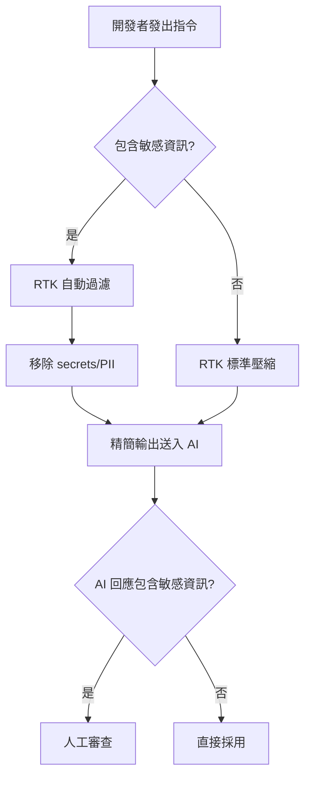

**安全檢查清單**：

- [ ] 確認 `rtk env` 過濾器已排除敏感環境變數
- [ ] 確認 AWS 過濾器已移除 secrets
- [ ] 確認日誌分析前已檢查 PII
- [ ] 確認 `rtk json` 用於處理包含敏感值的 JSON
- [ ] 確認 Tee Mode 的檔案權限設定正確（僅 owner 可讀）
- [ ] 確認 RTK 的 SQLite 資料庫不包含敏感指令參數
- [ ] 確認 CI/CD 中的 RTK 報告不包含機密資訊

### 16.5 隱私與遙測管理

**隱私與遙測**：

RTK 的遙測功能預設**關閉**，需要明確 opt-in：

```bash
# 檢查遙測狀態
rtk telemetry status

# 啟用（需明確同意）
rtk telemetry enable

# 停用
rtk telemetry disable

# 停用 + 刪除所有本地資料 + 請求伺服器端刪除
rtk telemetry forget

# 環境變數強制停用
export RTK_TELEMETRY_DISABLED=1
```

**遙測收集的資料**（如啟用）：

| 類別 | 資料 | 不收集的資料 |
|------|------|-------------|
| 身份 | 加鹽的裝置雜湊（SHA-256，不可逆）| 個人資料 |
| 環境 | RTK 版本、OS、架構 | 檔案路徑 |
| 用量 | 指令次數、Token 節省量 | 指令參數 |
| 品質 | passthrough 指令、解析失敗次數 | 原始碼 |

> **企業合規提醒**：RTK 的遙測符合 GDPR Art. 6, 7 要求。建議在企業環境中透過環境變數 `RTK_TELEMETRY_DISABLED=1` 全域停用遙測。

---

## 17. RTK 維運管理

### 17.1 Upgrade Strategy

**版本升級流程**：

```bash
# 檢查目前版本
rtk --version
# rtk 0.40.0

# 方法 1：Homebrew
brew update
brew upgrade rtk

# 方法 2：cargo install
cargo install --git https://github.com/rtk-ai/rtk

# 方法 3：install script（覆蓋安裝）
curl -fsSL https://raw.githubusercontent.com/rtk-ai/rtk/refs/heads/master/install.sh | sh

# 方法 4：Windows winget
winget upgrade rtk-ai.rtk

# 方法 5：Nix
nix profile upgrade rtk

# 升級後驗證
rtk --version
rtk gain
```

**升級前備份**：

```bash
# 備份設定檔
cp ~/.config/rtk/config.toml ~/.config/rtk/config.toml.bak

# 備份追蹤資料庫
cp ~/.local/share/rtk/history.db ~/.local/share/rtk/history.db.bak

# 備份 Hook 設定
cp ~/.claude/settings.json ~/.claude/settings.json.bak
```

### 17.2 Version Management

**版本鎖定策略**：

| 環境 | 策略 | 說明 |
|------|------|------|
| 個人開發 | Latest | 隨時更新到最新版 |
| 團隊專案 | Minor Lock | 鎖定主要版本（如 0.40.x）|
| CI/CD | Exact Lock | 鎖定完整版號（如 0.40.0）|
| 企業 | Quarterly Update | 每季評估更新一次 |

```bash
# CI/CD 中指定版本安裝
RTK_VERSION="0.40.0"
cargo install --git https://github.com/rtk-ai/rtk --tag "v$RTK_VERSION"

# 或使用 GitHub Release
curl -L "https://github.com/rtk-ai/rtk/releases/download/v${RTK_VERSION}/rtk-${RTK_VERSION}-x86_64-linux.tar.gz" | tar xz
```

### 17.3 Backup & Restore

```bash
# === 備份 ===

# 設定檔
mkdir -p ~/rtk-backup/$(date +%Y%m%d)
cp ~/.config/rtk/config.toml ~/rtk-backup/$(date +%Y%m%d)/

# 追蹤資料庫
cp ~/.local/share/rtk/history.db ~/rtk-backup/$(date +%Y%m%d)/

# Hook 設定
cp ~/.claude/settings.json ~/rtk-backup/$(date +%Y%m%d)/

# 自動化備份（crontab）
# 0 0 * * 0 /path/to/backup-rtk.sh

# === 還原 ===

# 還原設定
cp ~/rtk-backup/20260525/config.toml ~/.config/rtk/config.toml

# 還原資料庫
cp ~/rtk-backup/20260525/history.db ~/.local/share/rtk/history.db

# 還原 Hook
cp ~/rtk-backup/20260525/settings.json ~/.claude/settings.json
```

### 17.4 Troubleshooting

**常見問題與解決方案**：

| 問題 | 原因 | 解決方案 |
|------|------|---------|
| `rtk: command not found` | PATH 未設定 | `export PATH="$HOME/.local/bin:$PATH"` |
| Hook 不觸發 | settings.json 未正確設定 | `rtk init -g --auto-patch` |
| 輸出與預期不符 | 過濾器匹配錯誤 | 使用 `rtk tee` 比較原始/精簡 |
| Token 節省為 0 | 指令未被 RTK 代理 | 確認使用 `rtk <cmd>` 格式 |
| SQLite 錯誤 | 資料庫損壞 | 刪除 `~/.local/share/rtk/history.db` |
| 權限錯誤 | 安裝目錄權限不足 | `chmod +x ~/.local/bin/rtk` |
| CI/CD 中失敗 | RTK 未安裝 | 加入安裝步驟至 Pipeline |
| 大檔案卡頓 | 記憶體不足 | 使用 `-l aggressive` 限制 |

**除錯步驟**：

```bash
# 1. 確認 RTK 可用
which rtk
rtk --version

# 2. 檢查 Hook 狀態
rtk init --show

# 3. 使用 verbose 模式
RTK_LOG=debug rtk ls src/

# 4. 比較原始 vs 精簡輸出
rtk tee ls src/
# 原始輸出儲存至檔案，精簡輸出顯示在終端

# 5. 檢查追蹤資料庫
rtk gain --history

# 6. 重設所有設定
rtk init -g --reset
```

### 17.5 Monitoring

**生產環境監控**：

```bash
# 每日監控腳本
#!/bin/bash
# rtk-daily-monitor.sh

echo "=== RTK Daily Monitor ==="
echo "Date: $(date)"
echo ""

# RTK 版本
echo "RTK Version: $(rtk --version)"

# 今日統計
echo ""
echo "=== Today's Stats ==="
rtk gain --daily

# 異常偵測（節省率低於 50%）
echo ""
echo "=== Low Savings Alerts ==="
rtk gain --all --format json | jq '
  .commands[] | select(.savings_pct < 50) |
  "\(.command): \(.savings_pct)% savings"
'

# 磁碟使用
echo ""
echo "=== Disk Usage ==="
du -sh ~/.local/share/rtk/
```

### 17.6 Performance Tuning

**RTK 效能特性**：

| 指標 | 數值 | 說明 |
|------|------|------|
| CLI 啟動時間 | < 10ms | Rust 原生二進位 |
| 過濾延遲 | < 5ms | 典型指令 |
| 記憶體使用 | ~2-10 MB | 視輸出大小而定 |
| 二進位大小 | ~15 MB | 靜態連結 |
| 併發支援 | 多 session | 無共享狀態衝突 |

**效能最佳化建議**：

```bash
# 1. 大型輸出使用 aggressive 模式
rtk read large-file.ts -l aggressive    # 而非預設模式

# 2. 目錄瀏覽限制深度
rtk ls src/ -u                           # ultra-compact

# 3. 日誌分析限制行數
rtk docker logs app --tail 200           # 限制 200 行

# 4. 批次操作使用管線
find src/ -name "*.ts" | head -20 | xargs -I{} rtk read {} -l aggressive
```

---

## 18. RTK 最佳實務

### 18.1 50 條 Best Practices

#### 安裝與設定（1-10）

1. **全域安裝 RTK**：`rtk init -g` 確保所有 AI 工具都能受益
2. **啟用 auto-rewrite**：`rtk init -g --auto-patch` 確保 100% 攔截率
3. **備份設定**：升級前備份 `config.toml` 和 `settings.json`
4. **統一團隊版本**：CI/CD 和開發環境使用相同版本
5. **定期更新**：至少每月更新一次以獲得新的過濾器
6. **使用 `rtk init --show`**：定期檢查 Hook 狀態
7. **設定環境變數**：`RTK_TELEMETRY_DISABLED=1`（企業環境）
8. **啟用 Tee Mode**：開發階段 `rtk tee` 保留原始輸出供除錯
9. **設定 PATH**：將 `~/.local/bin` 加入 shell 的 PATH
10. **DevContainer 整合**：在 devcontainer.json 中加入 RTK 安裝

#### 日常使用（11-25）

11. **優先使用 RTK 指令**：`rtk ls` 而非 `ls`
12. **使用 `-l aggressive`**：大檔案使用更高壓縮等級
13. **使用 `-u` 旗標**：目錄瀏覽使用 ultra-compact
14. **使用 `rtk smart`**：智慧摘要取代逐行閱讀
15. **使用 `rtk test`**：僅看失敗測試而非完整輸出
16. **使用 `rtk lint`**：精簡 linting 結果
17. **使用 `rtk tsc`**：精簡 TypeScript 錯誤
18. **使用 `rtk git diff`**：精簡 diff 輸出
19. **使用 `rtk docker logs`**：去重複化容器日誌
20. **使用 `rtk discover`**：發現未優化的指令
21. **使用 `rtk gain`**：每日檢查 Token 節省
22. **使用 `rtk deps`**：精簡依賴報告
23. **使用 `rtk grep`**：精簡搜尋結果
24. **使用 `rtk err`**：精簡編譯錯誤
25. **使用 `rtk json`**：處理大型 JSON 檔案

#### AI 整合（26-40）

26. **Claude Code**：啟用 auto-rewrite Hook
27. **GitHub Copilot**：使用 Shell Hook 整合
28. **Cursor**：Terminal 中使用 RTK 指令
29. **多 AI Agent**：不同 Agent 使用不同 config
30. **Prompt Engineering**：指導 AI 使用 RTK 指令
31. **Context Window 管理**：大型操作前先清理 Context
32. **Token Budget**：設定每日 Token 預算
33. **Session 追蹤**：使用 `rtk session` 了解消耗
34. **Before/After 驗證**：使用 `rtk tee` 驗證壓縮效果
35. **結構化 Prompt**：使用 CLAUDE.md 或 cursor rules 定義 RTK 使用方式
36. **漸進式分析**：先 `ls` → 再 `smart` → 最後 `read`
37. **限定分析範圍**：避免分析整個 repository
38. **使用 rtk 指令取代原生指令**：減少 Token 浪費
39. **自動化 RTK 使用**：CI/CD 中固定使用 RTK
40. **監控 Token 趨勢**：定期分析 `rtk gain --graph`

#### 團隊與治理（41-50）

41. **建立團隊 config.toml**：統一壓縮規則
42. **建立 Token 預算制度**：依角色設定預算
43. **定期報告**：每週/月產出 Token 消耗報告
44. **培訓新成員**：新人入職包含 RTK 培訓
45. **分享最佳實務**：內部 Wiki 記錄最佳實務
46. **CI/CD 整合**：Pipeline 中加入 RTK 報告
47. **安全審查**：定期確認 RTK 的 secrets 過濾有效
48. **版本控制 config**：將 team config 納入 Git
49. **自動化安裝**：使用腳本統一安裝流程
50. **持續改善**：定期檢討 `rtk discover` 結果

### 18.2 50 條 Anti-Patterns

#### 安裝與設定錯誤（1-10）

1. ❌ **不安裝全域 Hook**：僅部分指令受 RTK 保護
2. ❌ **使用 suggest 而非 auto-rewrite**：~70-85% 攔截率 vs 100%
3. ❌ **忽略 PATH 設定**：導致 `rtk: command not found`
4. ❌ **每個人用不同版本**：行為不一致
5. ❌ **不備份就升級**：升級失敗時無法還原
6. ❌ **不檢查 Hook 狀態**：Hook 可能被其他工具覆蓋
7. ❌ **在企業環境啟用遙測**：可能違反合規要求
8. ❌ **忽略 `rtk init --show` 的警告**：可能存在設定問題
9. ❌ **手動編輯 settings.json**：使用 `rtk init` 自動化
10. ❌ **不更新 RTK**：錯過新的過濾器和 Bug Fix

#### 使用錯誤（11-30）

11. ❌ **大檔案用預設模式**：應使用 `-l aggressive`
12. ❌ **整個 repo 使用 `rtk read`**：應先 `ls` 確認範圍
13. ❌ **忽略 `rtk test` 直接看完整輸出**：浪費 Token
14. ❌ **不使用 `rtk discover`**：不知道哪些指令未被優化
15. ❌ **不追蹤 Token 消耗**：無法衡量 RTK 效益
16. ❌ **手動複製貼上指令輸出到 AI**：應讓 RTK Hook 自動處理
17. ❌ **對二進位檔使用 `rtk read`**：RTK 無法有效處理
18. ❌ **忽略 `tee` 模式**：無法驗證壓縮是否正確
19. ❌ **一次分析超大目錄**：使用 `-u` 或限制深度
20. ❌ **不理解 RTK 的過濾策略**：可能誤用指令
21. ❌ **對即時輸出預期精簡效果**：RTK 主要壓縮 batch 輸出
22. ❌ **混用 RTK 與原生指令的輸出**：Context 中資訊格式不一
23. ❌ **忽略 RTK 保留 exit code 的特性**：CI/CD 中可安全使用
24. ❌ **不使用 `rtk git status`**：git 指令也能受益
25. ❌ **將 RTK 輸出當作完整輸出**：精簡版可能遺漏細節
26. ❌ **不使用 `rtk err`**：編譯錯誤可大幅壓縮
27. ❌ **不使用 `rtk lint`**：linting 結果可壓縮 80%+
28. ❌ **對空輸出使用 RTK**：無壓縮效益
29. ❌ **不限制日誌行數**：`--tail 200` 避免超大輸出
30. ❌ **忽略 Token 估算的近似性**：~4 chars/token 是估算值

#### 團隊與安全錯誤（31-50）

31. ❌ **不建立團隊標準**：每人用法不同
32. ❌ **不設定 Token 預算**：成本失控
33. ❌ **不報告 Token 消耗**：管理層無法評估 ROI
34. ❌ **不培訓新人**：新成員不知道 RTK 的存在
35. ❌ **不記錄最佳實務**：知識無法傳承
36. ❌ **CI/CD 中不使用 RTK**：自動化流程浪費 Token
37. ❌ **不檢查 secrets 過濾**：可能洩漏敏感資訊
38. ❌ **不版本控制 team config**：設定變更無法追蹤
39. ❌ **不自動化安裝**：每人手動安裝容易出錯
40. ❌ **不監控 `rtk discover`**：未優化指令持續浪費
41. ❌ **將敏感環境變數傳給 AI**：未使用 `rtk env -f`
42. ❌ **直接 cat 敏感檔案**：應使用 `rtk json` 或 `rtk read`
43. ❌ **Tee 檔案權限過寬**：應限制為 owner 可讀
44. ❌ **在共享環境不鎖定版本**：可能因更新導致行為變化
45. ❌ **不設定排除規則**：某些指令不應被過濾（如 ssh）
46. ❌ **同時使用多個 AI 工具不協調**：可能產生 Hook 衝突
47. ❌ **不測試新版本的相容性**：直接在生產環境更新
48. ❌ **忽略 RTK 的限制**：RTK 不支援所有指令
49. ❌ **將 RTK 視為安全工具**：RTK 是 Token 最佳化工具，不是安全掃描器
50. ❌ **不持續改善**：工具和流程需要持續優化

### 18.3 50 條 Prompt Engineering Tips

#### 基礎技巧（1-15）

1. **「Use rtk ls -u to explore the project structure」** — 引導 AI 使用精簡版本
2. **「Use rtk read -l aggressive for large files」** — 大檔案用高壓縮
3. **「Only read files that are relevant to the task」** — 限制 Context 範圍
4. **「Use rtk test instead of running tests directly」** — 自動壓縮測試輸出
5. **「Use rtk git diff to see changes」** — 精簡 diff
6. **「Start with rtk ls, then rtk smart, then rtk read」** — 漸進式分析
7. **「Use rtk lint before committing」** — 精簡 lint 輸出
8. **「Use rtk err to see compilation errors」** — 僅看錯誤
9. **「Use rtk tsc for TypeScript type checking」** — 精簡型別錯誤
10. **「Use rtk grep for searching code」** — 精簡搜尋結果
11. **「Use rtk deps to check dependencies」** — 精簡依賴列表
12. **「Use rtk docker logs to check container logs」** — 去重複化
13. **「Focus on the error messages, not the full output」** — 引導 AI 關注重點
14. **「Use rtk json to inspect JSON structure」** — 結構而非內容
15. **「Use rtk discover to find optimization opportunities」** — 自動發現

#### 進階技巧（16-30）

16. **「Read no more than 5 files at a time」** — 限制 Context
17. **「Use rtk smart for a quick summary before deep-diving」** — 先瀏覽後深入
18. **「Prefer rtk read -l aggressive over cat」** — 永遠使用 RTK
19. **「After fixing a bug, verify with rtk test」** — 壓縮驗證輸出
20. **「Use rtk tee when debugging unexpected behavior」** — 保留原始輸出
21. **「Group related changes into single commits」** — 減少 diff Token
22. **「Use rtk git log -5 for recent context」** — 限制歷史範圍
23. **「Clear conversation context when switching tasks」** — 避免 Context 污染
24. **「Use rtk kubectl pods for cluster status」** — K8s 精簡輸出
25. **「Use rtk aws for AWS operations」** — 自動過濾 secrets
26. **「When analyzing logs, use rtk docker logs --tail 100」** — 限制範圍
27. **「Use rtk env -f PREFIX for environment variables」** — 安全過濾
28. **「Build, test, then analyze errors with RTK」** — 系統化工作流
29. **「Use CLAUDE.md to define RTK usage patterns」** — 專案級指導
30. **「Document RTK commands in project README」** — 團隊共享知識

#### 專家技巧（31-50）

31. **「Use rtk gain to demonstrate value to management」** — ROI 證明
32. **「Set token budgets per task complexity」** — 預算控制
33. **「Create task-specific prompts that include RTK」** — 標準化 Prompt
34. **「Use rtk session to track conversation efficiency」** — 會話追蹤
35. **「Combine rtk ls -u with rtk smart for codebase maps」** — 程式碼地圖
36. **「Use rtk for reverse engineering legacy systems」** — 逆向工程
37. **「Use rtk during framework upgrades for diff analysis」** — 升級輔助
38. **「Use rtk in code review workflows」** — Code Review 最佳化
39. **「Use RTK's tee mode as a teaching tool」** — 展示壓縮效果
40. **「Integrate rtk gain into sprint retrospectives」** — Agile 整合
41. **「Use rtk for incident response (log analysis)」** — 事故處理
42. **「Use rtk for compliance auditing」** — 合規審計
43. **「Create custom Shell hooks for team-specific tools」** — 擴展 RTK
44. **「Use rtk in pair programming sessions」** — 結對程式設計
45. **「Use rtk for onboarding (codebase exploration)」** — 新人入職
46. **「Monitor rtk gain trends weekly」** — 週趨勢監控
47. **「Use rtk when writing documentation (context gathering)」** — 文件撰寫
48. **「Use rtk for technical debt assessment」** — 技術債評估
49. **「Use RTK's discover to benchmark team AI usage」** — 團隊基準
50. **「Continuously update CLAUDE.md with new RTK patterns」** — 持續更新

---

## 19. 企業級 AI Coding Platform 架構

### 19.1 平台架構設計

企業級 AI Coding Platform 的核心架構以 RTK 作為統一的 Token 治理層：

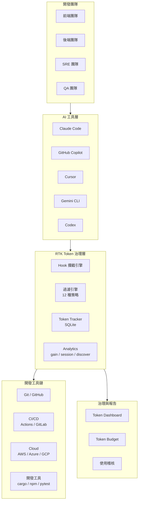

**架構設計原則**：

| 原則 | 說明 |
|------|------|
| **統一入口** | 所有 AI 工具透過 RTK 統一管理 Token |
| **零侵入** | Hook 自動改寫，不改變開發者習慣 |
| **可觀測** | 內建 Analytics（gain / session / discover） |
| **可治理** | Token Budget、Cost Dashboard、使用稽核 |
| **可擴展** | TOML 自訂過濾規則、Plugin 架構 |

### 19.2 Claude Code + RTK

**Claude Code 架構**：

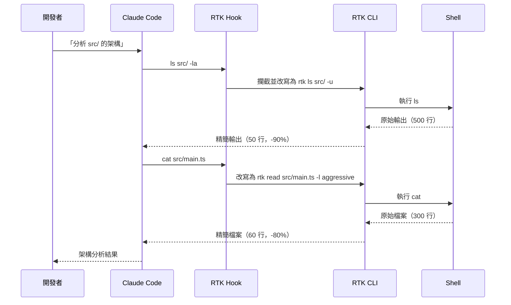

**關鍵設定**：

```json
// ~/.claude/settings.json
{
  "permissions": {
    "allow": [
      "Bash(rtk *)",
      "Bash(rtk ls *)",
      "Bash(rtk read *)",
      "Bash(rtk smart *)"
    ]
  },
  "hooks": {
    "PreToolUse": [
      {
        "matcher": "Bash",
        "hooks": [
          {
            "type": "command",
            "command": "rtk hook pre-tool-use"
          }
        ]
      }
    ]
  }
}
```

### 19.3 Copilot + RTK

**GitHub Copilot 架構**：

```mermaid
flowchart LR
    subgraph VSCode["VS Code"]
        A[Copilot Chat]
        B[Terminal]
    end
    
    subgraph ShellHook["Shell Hook"]
        C[preexec/precmd]
        D[rtk hook pre-tool-use]
    end
    
    subgraph RTK["RTK CLI"]
        E[Command Router]
        F[Filter Engine]
        G[Token Tracker]
    end
    
    A -->|"@terminal rtk ls"| B
    B --> C
    C --> D
    D --> E
    E --> F
    F -->|精簡輸出| B
    B -->|結果| A
    F --> G
```

**整合方式**：

```bash
# Shell Hook 整合（Bash）
# ~/.bashrc
eval "$(rtk hook shell bash)"

# Shell Hook 整合（Zsh）
# ~/.zshrc
eval "$(rtk hook shell zsh)"

# Shell Hook 整合（Fish）
# ~/.config/fish/config.fish
rtk hook shell fish | source

# PowerShell
# $PROFILE
Invoke-Expression (rtk hook shell pwsh)
```

### 19.4 Cursor + RTK

**Cursor 架構**：

```mermaid
flowchart TD
    subgraph Cursor["Cursor IDE"]
        A[AI Chat]
        B[Inline Edit]
        C[Terminal]
    end
    
    subgraph CursorRules[".cursor/rules/"]
        D[rtk-workflow.mdc]
    end
    
    subgraph RTK["RTK CLI"]
        E[rtk ls]
        F[rtk read]
        G[rtk smart]
        H[rtk test]
    end
    
    CursorRules -->|指導| A
    CursorRules -->|指導| B
    A -->|使用| C
    C -->|執行| RTK
    RTK -->|精簡輸出| C
    C -->|結果| A
```

**Cursor Rules 範本**：

```markdown
---
description: RTK integration for token optimization
globs: ["**/*"]
alwaysApply: true
---

# RTK Workflow Rules

## File Reading
- Always use `rtk read <file> -l aggressive` instead of reading files directly
- Use `rtk ls -u` for directory exploration

## Testing
- Use `rtk test <command>` for all test executions
- Focus on failure output only

## Linting
- Use `rtk lint` for ESLint/Prettier checks
- Use `rtk tsc` for TypeScript checks

## Git
- Use `rtk git diff` for change analysis
- Use `rtk git status` for repository status
```

### 19.5 MCP Server / AI Gateway

**RTK 可透過 Model Context Protocol（MCP）整合**：

```mermaid
flowchart LR
    subgraph AI["AI Tools"]
        A[Claude Desktop]
        B[VS Code Copilot]
        C[Cursor]
    end
    
    subgraph MCP["MCP Server"]
        D[RTK MCP Adapter]
        E[Tool: rtk_ls]
        F[Tool: rtk_read]
        G[Tool: rtk_smart]
    end
    
    subgraph RTK["RTK CLI"]
        H[Command Execution]
        I[Filtering Engine]
        J[Token Tracking]
    end
    
    AI --> MCP
    MCP --> RTK
    RTK --> MCP
    MCP --> AI
```

> **注意**：截至 v0.42.0，RTK 尚未內建 MCP Server。此為預期的未來架構方向。目前可透過 Hook 和 Shell Integration 實現類似效果。

#### AI Gateway 架構

**企業級 AI Gateway 架構**：

```mermaid
flowchart TD
    subgraph Developers["開發團隊"]
        D1[開發者 A]
        D2[開發者 B]
        D3[開發者 C]
    end
    
    subgraph LocalRTK["本地 RTK"]
        R1[RTK + Claude]
        R2[RTK + Copilot]
        R3[RTK + Cursor]
    end
    
    subgraph Gateway["AI Gateway"]
        G1[Token Metering]
        G2[Rate Limiting]
        G3[Cost Allocation]
        G4[Audit Logging]
    end
    
    subgraph LLM["LLM Providers"]
        L1[Anthropic Claude]
        L2[OpenAI GPT]
        L3[Google Gemini]
    end
    
    Developers --> LocalRTK
    LocalRTK -->|精簡 Context| Gateway
    Gateway --> LLM
    
    style Gateway fill:#fff3e0
```

**RTK 在 AI Gateway 中的價值**：

| 層級 | 功能 | RTK 角色 |
|------|------|---------|
| 客戶端 | Token 壓縮 | **直接壓縮 60-90%** |
| 網路 | 減少傳輸量 | 間接效益 |
| Gateway | 成本計量 | 報告數據源 |
| LLM | 處理量減少 | 降低 API 呼叫成本 |

### 19.6 Enterprise AI Workflow

**企業 AI 開發流程整合 RTK**：

```mermaid
flowchart TD
    A[需求分析] --> B[AI 輔助開發\nRTK 壓縮 Context]
    B --> C[程式碼審查\nRTK 過濾 diff/test]
    C --> D[CI/CD Pipeline\nRTK 壓縮建置輸出]
    D --> E[部署]
    E --> F[監控與日誌\nRTK 分析 logs]
    F --> G[Token 報告\nrtk gain --weekly]
    G --> H[成本治理\nToken Budget]
    H --> A
```

**端到端 Token 節省計算**：

| 階段 | 傳統流程 Token | RTK 流程 Token | 節省 |
|------|--------------|---------------|------|
| 探索 Codebase | 50,000 | 5,000 | 90% |
| 開發 & 測試 | 200,000 | 40,000 | 80% |
| Code Review | 30,000 | 6,000 | 80% |
| CI/CD 輸出分析 | 20,000 | 4,000 | 80% |
| 日誌分析 | 50,000 | 10,000 | 80% |
| **月合計** | **350,000** | **65,000** | **81%** |

---

## 20. 完整實戰案例

### 20.1 Case 1：Spring Boot Monolith 現代化

**場景**：15 萬行 Spring Boot 2.x 單體應用程式升級至 Spring Boot 3.x

```bash
# Phase 1：Codebase 探索（30 分鐘）
rtk ls src/ -u
# src/ main/(450) test/(120) resources/(30)

rtk smart src/main/java/com/app/
# 控制器: 45, 服務: 38, 儲存庫: 25, 實體: 30, 設定: 15

rtk deps
# spring-boot: 2.7.18, spring-data: 2.7.18, hibernate: 5.6.15
# ⚠ 18 個過時依賴

# Phase 2：依賴分析（15 分鐘）
rtk read pom.xml -l aggressive
# 僅顯示 groupId, artifactId, version（壓縮 70%）

rtk grep "javax\." src/ --count
# javax.persistence: 156 occurrences
# javax.servlet: 23 occurrences
# javax.validation: 45 occurrences

# Phase 3：升級指引
rtk read CHANGELOG.md -l aggressive
# 逐版本重大變更摘要

# Phase 4：變更驗證（持續）
rtk test mvn test
# 120/120 tests passed ✓

rtk err mvn compile
# 0 errors ✓
```

**Token 消耗對比**：

| 階段 | 未使用 RTK | 使用 RTK | 節省 |
|------|-----------|---------|------|
| Codebase 探索 | 150 萬 | 30 萬 | 80% |
| 依賴分析 | 50 萬 | 10 萬 | 80% |
| 升級執行 | 200 萬 | 50 萬 | 75% |
| 驗證測試 | 100 萬 | 10 萬 | 90% |
| **合計** | **500 萬** | **100 萬** | **80%** |

### 20.2 Case 2：React Monorepo 重構

**場景**：100+ 元件的 React Monorepo，需要從 JavaScript 遷移至 TypeScript

```bash
# 探索 Monorepo 結構
rtk ls packages/ -u
# packages/ core/(45) ui/(60) hooks/(20) utils/(15) app/(80)

# 分析各套件的 JS/TS 比例
for pkg in core ui hooks utils app; do
    echo "=== $pkg ==="
    rtk ls packages/$pkg/src/ -u
done

# 類型錯誤分析
rtk tsc
# packages/core/src/Button.tsx: TS2345 (3 errors)
# packages/ui/src/Form.tsx: TS2322 (5 errors)
# Total: 8 errors in 2 files

# 遷移後驗證
rtk vitest
# packages/core: 45/45 passed ✓
# packages/ui: 60/60 passed ✓
# packages/hooks: 20/20 passed ✓
# Total: 125/125 passed ✓

# Lint 檢查
rtk lint
# 0 issues ✓
```

### 20.3 Case 3：COBOL 逆向工程

**場景**：銀行核心系統的 COBOL 程式逆向工程，準備遷移至 Java

```bash
# 探索 COBOL 程式碼庫
rtk ls COBOL/ -u
# COBOL/ PROGRAMS/(150) COPYBOOKS/(80) JCL/(45) SCREENS/(30)

# 分析主要程式
rtk read COBOL/PROGRAMS/ACCT-PROCESS.cbl -l aggressive
# IDENTIFICATION DIVISION. PROGRAM-ID. ACCT-PROCESS.
# WORKING-STORAGE SECTION.
#   01 WS-ACCOUNT-RECORD.
#     05 WS-ACCT-NUM PIC 9(10).
#     ...
# PROCEDURE DIVISION.
#   PERFORM 1000-INIT
#   PERFORM 2000-PROCESS UNTIL WS-EOF
#   PERFORM 9000-CLEANUP

# 批次分析所有程式
find COBOL/PROGRAMS/ -name "*.cbl" | head -20 | \
    xargs -I{} rtk read {} -l aggressive > cobol-summary.txt

# COPYBOOK 分析（資料結構）
rtk read COBOL/COPYBOOKS/ACCT-RECORD.cpy
# 01 ACCT-RECORD.
#   05 ACCT-NUM PIC 9(10).
#   05 ACCT-NAME PIC X(30).
#   05 ACCT-BALANCE PIC S9(13)V99.

# JCL 流程分析
rtk read COBOL/JCL/DAILY-BATCH.jcl -l aggressive
# 僅顯示 EXEC 和 DD 關鍵步驟
```

### 20.4 Case 4：Microservices Migration

**場景**：將單體應用拆分為 12 個微服務

```bash
# 整體架構分析
rtk ls src/ -u
# src/ controllers/(20) services/(15) repositories/(12) models/(18)

# 相依性分析
rtk grep "import.*service" src/services/ --count
# UserService → OrderService: 5 references
# OrderService → PaymentService: 3 references
# PaymentService → NotificationService: 2 references

# Docker Compose 狀態（拆分後）
rtk docker compose ps
# user-service       running  :3001
# order-service      running  :3002
# payment-service    running  :3003
# notification-svc   running  :3004
# api-gateway        running  :8080
# postgres           running  :5432
# redis              running  :6379
# rabbitmq           running  :5672

# 跨服務測試
rtk test docker compose exec user-service npm test
# 45/45 passed ✓

rtk test docker compose exec order-service npm test  
# 38/38 passed ✓

# 整合測試
rtk test npm run test:integration
# 20/20 passed ✓
```

### 20.5 Case 5：Kubernetes Platform

**場景**：部署 50+ 微服務至 Kubernetes Cluster

```bash
# Cluster 狀態
rtk kubectl pods -A
# kube-system  coredns-abc123      Running  5d
# app          api-gateway-def456  Running  2h
# app          user-svc-ghi789     Running  2h
# app          order-svc-jkl012    Running  2h
# monitoring   prometheus-mno345   Running  5d
# monitoring   grafana-pqr678      Running  5d

# 服務健康度
rtk kubectl services -n app
# api-gateway    ClusterIP  10.0.0.1   80,443
# user-svc       ClusterIP  10.0.0.2   3001
# order-svc      ClusterIP  10.0.0.3   3002

# Pod 日誌（故障排除）
rtk kubectl logs api-gateway-def456
# [INFO] Request processed (×12,345)
# [WARN] Slow response from user-svc (×23)
# [ERROR] Connection refused: payment-svc (×5)

# Helm Release
rtk helm list -A
# app-stack    app         deployed  1.2.3  2h ago
# monitoring   monitoring  deployed  2.0.0  5d ago
# ingress      ingress     deployed  4.9.1  30d ago

# 資源使用
rtk kubectl top pods -n app
# api-gateway    150m/500m  256Mi/512Mi
# user-svc       80m/250m   128Mi/256Mi
# order-svc      120m/250m  192Mi/256Mi
```

---

## 21. 附錄

### 21.1 Quick Reference / Cheat Sheet

```
╔══════════════════════════════════════════════════════════════════╗
║                    RTK Quick Reference                          ║
╠══════════════════════════════════════════════════════════════════╣
║                                                                  ║
║  安裝：                                                          ║
║    curl -fsSL .../install.sh | sh                                ║
║    brew install rtk                                              ║
║    cargo install --git https://github.com/rtk-ai/rtk             ║
║                                                                  ║
║  初始化：                                                        ║
║    rtk init -g                    全域 Hook（推薦）               ║
║    rtk init -g --auto-patch       自動修補（100% 攔截）           ║
║    rtk init --show                檢查 Hook 狀態                  ║
║                                                                  ║
║  檔案操作：                                                      ║
║    rtk ls <dir> -u                目錄結構（ultra-compact）       ║
║    rtk read <file>                讀取檔案（精簡）                ║
║    rtk read <file> -l aggressive  讀取檔案（高度壓縮）            ║
║    rtk smart <file|dir>           智慧摘要                        ║
║    rtk grep <pattern> <path>      精簡搜尋                        ║
║                                                                  ║
║  開發工具：                                                      ║
║    rtk test <cmd>                 測試（僅失敗）                  ║
║    rtk lint                       Linting（精簡）                 ║
║    rtk tsc                        TypeScript 檢查                 ║
║    rtk err <cmd>                  編譯錯誤                        ║
║    rtk deps                       依賴報告                        ║
║                                                                  ║
║  Git：                                                           ║
║    rtk git status                 精簡狀態                        ║
║    rtk git diff                   精簡差異                        ║
║    rtk git log -N                 精簡日誌                        ║
║                                                                  ║
║  容器/雲端：                                                     ║
║    rtk docker ps                  容器列表                        ║
║    rtk docker logs <name>         容器日誌（去重複）              ║
║    rtk kubectl pods               Pod 列表                        ║
║    rtk kubectl logs <pod>         Pod 日誌（去重複）              ║
║    rtk aws <service> <cmd>        AWS CLI（自動過濾 secrets）     ║
║                                                                  ║
║  分析：                                                          ║
║    rtk gain                       Token 節省報告                  ║
║    rtk gain --daily               每日報告                        ║
║    rtk gain --graph               趨勢圖                          ║
║    rtk discover                   發現未優化的指令                ║
║    rtk session                    Session 追蹤                    ║
║                                                                  ║
║  除錯：                                                          ║
║    rtk tee <cmd>                  同時保留原始+精簡輸出           ║
║    RTK_LOG=debug rtk <cmd>        Debug 模式                      ║
║                                                                  ║
╚══════════════════════════════════════════════════════════════════╝
```

### 21.2 CLI Reference Card

| 指令 | 說明 | 典型節省 |
|------|------|---------|
| `rtk ls` | 目錄列表 | 75-92% |
| `rtk ls -u` | Ultra-compact 列表 | 85-95% |
| `rtk read` | 讀取檔案 | 40-60% |
| `rtk read -l aggressive` | 高壓縮讀取 | 60-90% |
| `rtk smart` | 智慧摘要 | 70-90% |
| `rtk grep` | 搜尋 | 60-80% |
| `rtk test` | 測試結果 | 85-99% |
| `rtk lint` | Lint 結果 | 80-90% |
| `rtk tsc` | TypeScript 檢查 | 80-90% |
| `rtk err` | 編譯錯誤 | 80-95% |
| `rtk deps` | 依賴報告 | 70-90% |
| `rtk json` | JSON 結構 | 60-95% |
| `rtk git status` | Git 狀態 | 50-80% |
| `rtk git diff` | Git 差異 | 50-80% |
| `rtk git log` | Git 歷史 | 60-80% |
| `rtk docker ps` | 容器列表 | 70-85% |
| `rtk docker logs` | 容器日誌 | 80-99% |
| `rtk kubectl pods` | Pod 列表 | 70-85% |
| `rtk kubectl logs` | Pod 日誌 | 80-99% |
| `rtk aws` | AWS CLI | 60-90% |
| `rtk gain` | Token 報告 | N/A |
| `rtk discover` | 優化建議 | N/A |
| `rtk tee` | 原始+精簡 | N/A |
| `rtk init` | 初始化 | N/A |

### 21.3 Hook Templates

**Claude Code Hook**：

```json
{
  "hooks": {
    "PreToolUse": [
      {
        "matcher": "Bash",
        "hooks": [
          {
            "type": "command",
            "command": "rtk hook pre-tool-use"
          }
        ]
      }
    ]
  }
}
```

**Bash Shell Hook**：

```bash
# ~/.bashrc
eval "$(rtk hook shell bash)"
```

**Zsh Shell Hook**：

```bash
# ~/.zshrc
eval "$(rtk hook shell zsh)"
```

**Fish Shell Hook**：

```fish
# ~/.config/fish/config.fish
rtk hook shell fish | source
```

**PowerShell Hook**：

```powershell
# $PROFILE
Invoke-Expression (rtk hook shell pwsh)
```

### 21.4 Shell Templates

**團隊安裝腳本**：

```bash
#!/bin/bash
# team-install-rtk.sh
set -euo pipefail

RTK_VERSION="${1:-latest}"
echo "=== Installing RTK $RTK_VERSION ==="

# 安裝
curl -fsSL https://raw.githubusercontent.com/rtk-ai/rtk/refs/heads/master/install.sh | sh
export PATH="$HOME/.local/bin:$PATH"

# 驗證
rtk --version

# 設定全域 Hook
rtk init -g --auto-patch

# 驗證 Hook
rtk init --show

echo "=== RTK Installation Complete ==="
```

**每日報告腳本**：

```bash
#!/bin/bash
# daily-rtk-report.sh
DATE=$(date +%Y-%m-%d)
echo "RTK Daily Report - $DATE"
echo "========================"
rtk gain --daily
echo ""
echo "=== Optimization Opportunities ==="
rtk discover --all --since 1
```

### 21.5 VS Code Settings

**RTK 相關的 VS Code 設定建議**：

```jsonc
// .vscode/settings.json
{
    // Terminal 設定 - 使用 RTK 友好的 Shell
    "terminal.integrated.defaultProfile.linux": "bash",
    "terminal.integrated.defaultProfile.osx": "zsh",
    "terminal.integrated.defaultProfile.windows": "PowerShell",
    
    // Terminal 環境變數
    "terminal.integrated.env.linux": {
        "PATH": "${env:HOME}/.local/bin:${env:PATH}"
    },
    "terminal.integrated.env.osx": {
        "PATH": "${env:HOME}/.local/bin:${env:PATH}"
    },
    
    // Copilot 設定
    "github.copilot.chat.terminalChatLocation": "terminal",
    
    // 排除 RTK 資料目錄
    "files.exclude": {
        "**/.rtk": true
    }
}
```

### 21.6 Configuration Files

**~/.config/rtk/config.toml 完整範例**：

```toml
# RTK Configuration
# 位置：~/.config/rtk/config.toml

[hooks]
# 排除不適合過濾的指令
exclude_commands = [
    "ssh",
    "scp",
    "rsync",
    "vi",
    "vim",
    "nano",
    "code"
]

[tee]
# Tee Mode 設定
enabled = false
mode = "failures"   # "all" | "failures"
directory = "/tmp/rtk-tee"

[tracking]
# Token 追蹤設定
retention_days = 90

[telemetry]
# 遙測設定（企業建議停用）
enabled = false
```

### 21.7 Troubleshooting FAQ

**Q1：RTK 安裝後，`rtk` 指令無法使用？**

```bash
# 確認 PATH
echo $PATH | tr ':' '\n' | grep -i rtk
# 或
echo $PATH | tr ':' '\n' | grep '.local/bin'

# 解決方案
export PATH="$HOME/.local/bin:$PATH"
# 永久生效：加入 ~/.bashrc 或 ~/.zshrc
```

**Q2：Hook 設定後，AI 工具沒有使用 RTK？**

```bash
# 檢查 Hook 狀態
rtk init --show

# 如果顯示 "not configured"
rtk init -g --auto-patch

# 重啟 AI 工具（Claude Code / VS Code）
```

**Q3：某些指令的輸出看起來不正確？**

```bash
# 使用 tee 模式比較
rtk tee <problematic-command>
# 檢查原始 vs 精簡輸出的差異

# 回報問題
# https://github.com/rtk-ai/rtk/issues
```

**Q4：Token 節省率低於預期？**

```bash
# 檢查指令覆蓋率
rtk discover

# 如果顯示許多未優化指令
# 確認全域 Hook 已啟用
rtk init --show

# 確認使用 auto-rewrite（而非 suggest）
```

**Q5：CI/CD 中 RTK 報告失敗？**

```bash
# 確認 CI 環境中已安裝 RTK
which rtk || echo "RTK not installed"

# 確認 PATH 設定
export PATH="$HOME/.local/bin:$PATH"

# CI 中安裝
curl -fsSL https://raw.githubusercontent.com/rtk-ai/rtk/refs/heads/master/install.sh | sh
```

**Q6：rtk gain 顯示 0 savings？**

```bash
# 原因 1：未使用 RTK 指令
# 確認使用 "rtk <cmd>" 而非直接使用指令

# 原因 2：歷史資料已過期
# 預設保留 90 天

# 原因 3：新安裝
# 需要累積使用數據
```

**Q7：多人共用環境中 RTK 資料衝突？**

```bash
# RTK 使用 per-user SQLite 資料庫
# 位置：~/.local/share/rtk/history.db
# 每個使用者獨立，無衝突
```

**Q8：如何在 Docker 容器中使用 RTK？**

```dockerfile
FROM node:20
RUN curl -fsSL https://raw.githubusercontent.com/rtk-ai/rtk/refs/heads/master/install.sh | sh
ENV PATH="/root/.local/bin:${PATH}"
RUN rtk --version
```

**Q9：RTK 是否支援 Windows 原生（非 WSL）？**

```powershell
# 是，RTK 支援 Windows 原生
# 安裝方式：
winget install rtk-ai.rtk
# 或 cargo install
cargo install --git https://github.com/rtk-ai/rtk

# 設定 PowerShell Hook
Invoke-Expression (rtk hook shell pwsh)
```

**Q10：RTK 與其他 CLI 工具是否衝突？**

```bash
# RTK 不會影響原始工具的行為
# RTK 僅在被明確呼叫時（rtk <cmd>）或 Hook 啟用時運作
# Exit code 完全保留
# 如有衝突，可在 config.toml 中排除特定指令
```

### 21.8 導入準備 Checklist

**個人導入 Checklist**：

- [ ] 確認系統符合最低需求（Linux/macOS/Windows）
- [ ] 安裝 RTK（`curl ... | sh` 或 `brew` 或 `cargo`）
- [ ] 驗證安裝（`rtk --version`）
- [ ] 設定全域 Hook（`rtk init -g`）
- [ ] 驗證 Hook（`rtk init --show`）
- [ ] 測試基本指令（`rtk ls src/`）
- [ ] 測試 AI 整合（Claude/Copilot/Cursor）
- [ ] 檢查 Token 節省（`rtk gain`）

**團隊導入 Checklist**：

- [ ] 選定試點成員（2-3 人）
- [ ] 準備標準安裝腳本
- [ ] 建立團隊 config.toml
- [ ] 制定 AI Development Standard
- [ ] 準備培訓教材（本手冊）
- [ ] 設定 Token 預算
- [ ] 建立報告機制
- [ ] 規劃 Phase 1-4 時程

**企業導入 Checklist**：

- [ ] 安全審查（遙測、資料保留、secrets 過濾）
- [ ] 合規檢查（GDPR、內部政策）
- [ ] 網路環境確認（Proxy、防火牆）
- [ ] 授權確認（Apache 2.0 License）
- [ ] 維運計畫（升級、備份、監控）
- [ ] 成本效益分析
- [ ] 管理層核准
- [ ] 全域部署計畫

### 21.9 官方資源與社群

| 資源 | 連結 |
|------|------|
| GitHub Repository | [https://github.com/rtk-ai/rtk](https://github.com/rtk-ai/rtk) |
| 官方文件 | [https://www.rtk-ai.app/docs](https://www.rtk-ai.app/docs) |
| INSTALL.md | [https://github.com/rtk-ai/rtk/blob/main/INSTALL.md](https://github.com/rtk-ai/rtk/blob/main/INSTALL.md) |
| ARCHITECTURE.md | [https://github.com/rtk-ai/rtk/blob/main/ARCHITECTURE.md](https://github.com/rtk-ai/rtk/blob/main/ARCHITECTURE.md) |
| Releases | [https://github.com/rtk-ai/rtk/releases](https://github.com/rtk-ai/rtk/releases) |
| Issues | [https://github.com/rtk-ai/rtk/issues](https://github.com/rtk-ai/rtk/issues) |
| License | Apache License 2.0 |

---

## 版權與授權

- **RTK**：Apache License 2.0，由 RTK AI 團隊開發維護
- **GitHub**：[https://github.com/rtk-ai/rtk](https://github.com/rtk-ai/rtk)
- **本手冊**：僅供內部教學使用

> 📅 最後更新：2025 年 7 月
> 📖 RTK 版本：v0.42.0+
> ✍️ 本手冊由 AI 輔助撰寫，內容基於 RTK 官方文件與實務經驗

