+++
date = '2026-09-16T15:17:45+08:00'
draft = false
title = 'Refactoring to Patterns 企業級軟體開發教學手冊'
tags = ['教學', 'AI開發', '重構',  'Design Patterns']
categories = ['教學']
+++

# Refactoring to Patterns 教學手冊

> **文件版本**：1.1
> **資訊確認日期**：2026-09-16
> **理論基礎**：Joshua Kerievsky,《Refactoring to Patterns》（Addison-Wesley Professional，2004-08-05 出版，Addison-Wesley Signature Series (Fowler)，ISBN 978-0-321-21335-8）；Industrial Logic 官方 catalog 的 **27 個 pattern-directed refactorings**
> **程式碼版本基準**：**Before 範例刻意使用 Java 8 + Spring Boot 2.x + `javax`**（貼近企業 Legacy 現況）；**After 範例使用 Java 25（LTS）+ Spring Boot 4.1.x + Spring Framework 7.x + Jakarta EE 11**
> **測試框架**：**JUnit 6 為主**（官方當前世代，需 Java 17+／Kotlin 2.1+），並標註 JUnit 5（Jupiter）對照寫法；ArchUnit 1.5.0（`archunit-junit6`）
> **前端**：**Vue 3（Composition API）與 Angular v22（Standalone + Signals + Zoneless）等量並列**，TypeScript 7.0
> **適用對象**：PM、SA、Software Architect、Senior Developer、Developer、QA、DevOps、維運人員、AI Coding Agent 使用者、Legacy 系統維護團隊、Framework Upgrade 團隊
> **篇幅**：**46 章，分為 11 部**，另含 27 個 refactoring 完整條目、21 個 Code Smell、5 個實作 Lab、10 個企業案例、20 組 AI Agent Prompt 與 9 份附錄
> **版本時效**：所有技術版本宣稱的來源 URL 與查證日期，集中列於 [附錄 I](#附錄-i技術版本基準與查證紀錄)；該附錄同時提供每季複查的 SOP
> **文件狀態**：catalog 條目清單以 Industrial Logic 官方頁面查證為準。**本手冊自行整理的分組、流程與治理設計均明確標示為「本手冊的工程建議」，不冒充原作觀點；查不到的資訊一律標示「原始資料未說明」，不猜測、不補完。**

---

## 關於本手冊

### 這份手冊要回答的問題

關於 Design Pattern 的教材，市面上幾乎都在回答同一個問題：「這個 Pattern 的標準寫法長什麼樣子？」

那個問題不難。本 repo 自己就有一份 [Design Pattern教學.md](../分析與設計/Design%20Pattern教學.md)（216KB）與 [DESIGN_PATTERNS.md](../../../DESIGN_PATTERNS.md) 底下 23 個可執行的 Java 範例，把 GoF 的標準結構寫得很完整。

本手冊要回答的是另一個、而且困難得多的問題：

> **一個同時維護十幾套 Legacy 系統、正在把 Spring Boot 2 升到 4、而且團隊已經大量使用 GitHub Copilot 與 Claude Code 寫程式的企業開發團隊，要怎麼讓「設計改善」這件事，既不退化成「不敢動的技術債」，也不暴衝成「AI 一口氣產出三十個 Interface 的過度設計」？**

這個問題底下藏著三件事：

1. **教科書上的 Pattern 範例，永遠是「已經長好的樣子」。** 沒有人教你「從一坨 800 行的 `if/else` 走到 Strategy」中間那十四個步驟長什麼樣、每一步要跑哪些測試、哪一步之後其實就該停下來了。
2. **Legacy 系統最大的風險不是醜，而是沒有人知道它到底在做什麼。** 一段沒人看得懂的 `if (flag == 9 && amt > 0)`，可能是十年前某次金管會函釋留下的規則。AI 看到它只會說「這段可以簡化」。
3. **AI 產生程式碼的速度，遠超過人類判斷「該不該這樣設計」的速度。** 當你對 Copilot 說「重構這段程式碼」，它極大機率會回給你一組 Strategy 介面加三個實作類別——**不管你的專案是不是真的只有兩種情況、而且五年沒變過。**

本手冊的核心主張是：

> **Pattern 是「演進之後可能抵達的設計目的地」，不是「一開始就該套上去的設計起點」。**
> **而在 AI Agent 時代，這句話從「資深工程師的品味」變成了「必須寫成規則、寫進 CI、AI 繞不過去的工程紀律」。**

### 一句話說清楚三者的差別

| | Refactoring | Design Pattern | Refactoring to Patterns |
|---|---|---|---|
| **回答的問題** | 這段程式碼怎麼在不改行為的前提下變好？ | 這類設計問題的成熟解法長什麼樣？ | 從現在這段爛程式碼，要怎麼一步步走到那個解法？**而且該不該走？** |
| **關注點** | 手法（Extract Method、Move Field…） | 結構（Strategy、Factory…） | **路徑與時機** |
| **典型產出** | 一連串小步驟 | 一張類別圖 | **Smell 證據 → 步驟序列 → Pattern（或決定不走）** |
| **最大風險** | 沒有測試就動手 | 沒有問題就硬套 | **誤把「候選方向」當成「自動轉換規則」** |
| **AI 的常見錯誤** | 一次改太多 | 產生過多抽象 | **跳過中間步驟，直接產生最終結構** |

最關鍵的是最後一列。AI 最擅長的正是「直接產生最終結構」，而這恰好是 Refactoring to Patterns 最反對的做法——因為**中間步驟才是驗證「這個方向對不對」的地方**。

### 與本 repo 既有教材的定位

本手冊**不重複**既有教材的內容，而是把它們串起來。閱讀前建議先確認你需要的是哪一份：

| 你想解決的問題 | 該讀哪一份 |
|---|---|
| 「Extract Method 怎麼做？」 | [分析與設計/Refactoring重構教學.md](../分析與設計/Refactoring重構教學.md) |
| 「Strategy 的標準結構長怎樣？」 | [分析與設計/Design Pattern教學.md](../分析與設計/Design%20Pattern教學.md) |
| 「給我一段可以跑的 Pattern 範例」 | [DESIGN_PATTERNS.md](../../../DESIGN_PATTERNS.md) 與 `src/` |
| 「怎麼寫乾淨的程式碼？」 | [分析與設計/Clean Code教學.md](../分析與設計/Clean%20Code教學.md) |
| 「怎麼防止架構在 PR 中被侵蝕？」 | [AI開發/ArchUnit 企業級軟體架構測試與 AI Agent 開發教學手冊.md](./ArchUnit%20企業級軟體架構測試與%20AI%20Agent%20開發教學手冊.md) |
| **「什麼時候該套 Pattern、什麼時候不該、要怎麼安全地走過去、AI 可以做到哪裡」** | **本手冊** |

### 本手冊的來源分級標註

企業手冊最怕的事情之一，是把「作者的個人偏好」寫得像「業界公認的鐵律」。本手冊全篇使用四種標記區分主張的來源強度：

> 📖 **Kerievsky 原作觀點**
> 出自《Refactoring to Patterns》一書或 Industrial Logic 公開資料的主張。

> 🏭 **業界常見實務**
> 多個來源都採用、但沒有單一權威出處的做法。

> 🔧 **本手冊的工程建議**
> 本手冊依企業軟體工程實務提出的設計，屬於建議而非定論，團隊可依情境調整。

> 🤖 **AI Agent 使用建議**
> 專門針對 Coding Agent 工作流的指引，人工作業時可視情況放寬。

當不同來源存在分歧時，本手冊**並陳差異、不強行統一**，並說明各自適用的情境。

### 怎麼讀這份手冊

| 你的角色 | 建議路徑 |
|---|---|
| **Developer（第一次接觸）** | 第 1～4 章 → 第 6 章 → 第 33～34 章 → 附錄 C、D |
| **Senior Developer** | 第一部 → 第二部 → 第三部（挑你正在遇到的條目）→ 第四部 |
| **Architect / 技術主管** | 第 5 章 → 第四部 → 第九部 → 第十部 → 附錄 B |
| **QA** | 第 27 章 → 第九部 → 附錄 D |
| **AI Agent 使用者** | **第五部（第 20～25 章）優先**，再回頭補第二、三部 |
| **Legacy 維護團隊** | 第六部 → 第七部 → 第 45 章 |
| **要制定團隊規範的人** | 附錄 B（可直接貼進 `CLAUDE.md`）→ 第 42～43 章 |

---

## 目錄

> 本目錄包含**章與小節兩層**，每一項均可直接跳轉至內文。依部別摺疊，點擊展開即可瀏覽該部的完整結構。

<details>
<summary><b>關於本手冊</b>｜定位、讀法與來源分級</summary>

- [關於本手冊](#關於本手冊)
  - [這份手冊要回答的問題](#這份手冊要回答的問題)
  - [一句話說清楚三者的差別](#一句話說清楚三者的差別)
  - [與本 repo 既有教材的定位](#與本-repo-既有教材的定位)
  - [本手冊的來源分級標註](#本手冊的來源分級標註)
  - [怎麼讀這份手冊](#怎麼讀這份手冊)

</details>

<details>
<summary><b>第一部：觀念基礎</b>｜第 1～5 章</summary>

- [第 1 章 Refactoring to Patterns 是什麼](#第-1-章-refactoring-to-patterns-是什麼)
  - [1.1 一句話定義](#11-一句話定義)
  - [1.2 三個最常見的誤解](#12-三個最常見的誤解)
  - [1.3 核心演進鏈路](#13-核心演進鏈路)
  - [1.4 這套方法要對抗的兩個極端](#14-這套方法要對抗的兩個極端)
  - [1.5 本章實務案例](#15-本章實務案例)
  - [1.6 本章注意事項](#16-本章注意事項)
- [第 2 章 Refactoring 的基礎](#第-2-章-refactoring-的基礎)
  - [2.1 定義與目的](#21-定義與目的)
  - [2.2 外部行為不變到底指什麼](#22-外部行為不變到底指什麼)
  - [2.3 重構與重寫、改功能、效能調校的界線](#23-重構與重寫改功能效能調校的界線)
  - [2.4 為什麼安全性來自小步驟](#24-為什麼安全性來自小步驟)
  - [2.5 重構的經濟理由](#25-重構的經濟理由)
  - [2.6 本章實務案例](#26-本章實務案例)
  - [2.7 本章注意事項](#27-本章注意事項)
- [第 3 章 Design Pattern 的本質與代價](#第-3-章-design-pattern-的本質與代價)
  - [3.1 Pattern 是什麼](#31-pattern-是什麼)
  - [3.2 Pattern 不是什麼](#32-pattern-不是什麼)
  - [3.3 每個 Pattern 都要付的四種代價](#33-每個-pattern-都要付的四種代價)
  - [3.4 Pattern 的適用前提](#34-pattern-的適用前提)
  - [3.5 本章實務案例](#35-本章實務案例)
  - [3.6 本章注意事項](#36-本章注意事項)
- [第 4 章 Toward、To 與 Away From Patterns](#第-4-章-towardto-與-away-from-patterns)
  - [4.1 三個方向總覽](#41-三個方向總覽)
  - [4.2 Refactoring Toward a Pattern](#42-refactoring-toward-a-pattern)
  - [4.3 Refactoring To a Pattern](#43-refactoring-to-a-pattern)
  - [4.4 Refactoring Away From a Pattern](#44-refactoring-away-from-a-pattern)
  - [4.5 該在哪裡停下來](#45-該在哪裡停下來)
  - [4.6 本章實務案例](#46-本章實務案例)
  - [4.7 本章注意事項](#47-本章注意事項)
- [第 5 章 為什麼企業需要 Refactoring to Patterns](#第-5-章-為什麼企業需要-refactoring-to-patterns)
  - [5.1 變更成本曲線](#51-變更成本曲線)
  - [5.2 技術債的四個象限](#52-技術債的四個象限)
  - [5.3 AI 時代帶來的新壓力](#53-ai-時代帶來的新壓力)
  - [5.4 三個真實的企業痛點](#54-三個真實的企業痛點)
  - [5.5 導入成本的誠實評估](#55-導入成本的誠實評估)
  - [5.6 本章實務案例](#56-本章實務案例)
  - [5.7 本章注意事項](#57-本章注意事項)

</details>

<details>
<summary><b>第二部：Code Smell</b>｜第 6～9 章</summary>

- [第 6 章 Code Smell 判讀方法論](#第-6-章-code-smell-判讀方法論)
  - [6.1 Smell 不是錯誤](#61-smell-不是錯誤)
  - [6.2 判讀 Smell 的三個問題](#62-判讀-smell-的三個問題)
  - [6.3 何時不要重構](#63-何時不要重構)
  - [6.4 Smell 的嚴重度分級](#64-smell-的嚴重度分級)
  - [6.5 本章實務案例](#65-本章實務案例)
  - [6.6 本章注意事項](#66-本章注意事項)
- [第 7 章 Code Smell 目錄（上）重複、體積與職責](#第-7-章-code-smell-目錄上重複體積與職責)
  - [7.1 本章條目的共同格式](#71-本章條目的共同格式)
  - [7.2 Duplicated Code](#72-duplicated-code)
  - [7.3 Long Method](#73-long-method)
  - [7.4 Large Class](#74-large-class)
  - [7.5 Long Parameter List](#75-long-parameter-list)
  - [7.6 Data Clumps](#76-data-clumps)
  - [7.7 Primitive Obsession](#77-primitive-obsession)
  - [7.8 Divergent Change](#78-divergent-change)
  - [7.9 Shotgun Surgery](#79-shotgun-surgery)
  - [7.10 Feature Envy](#710-feature-envy)
  - [7.11 Solution Sprawl](#711-solution-sprawl)
  - [7.12 本章實務案例](#712-本章實務案例)
  - [7.13 本章注意事項](#713-本章注意事項)
- [第 8 章 Code Smell 目錄（下）條件、耦合與過度設計](#第-8-章-code-smell-目錄下條件耦合與過度設計)
  - [8.1 Conditional Complexity](#81-conditional-complexity)
  - [8.2 Switch Statements](#82-switch-statements)
  - [8.3 Combinatorial Explosion](#83-combinatorial-explosion)
  - [8.4 Oddball Solution](#84-oddball-solution)
  - [8.5 Alternative Classes with Different Interfaces](#85-alternative-classes-with-different-interfaces)
  - [8.6 Indecent Exposure](#86-indecent-exposure)
  - [8.7 Temporary Field](#87-temporary-field)
  - [8.8 Message Chains](#88-message-chains)
  - [8.9 Middle Man](#89-middle-man)
  - [8.10 Lazy Class](#810-lazy-class)
  - [8.11 Speculative Generality](#811-speculative-generality)
  - [8.12 本章實務案例](#812-本章實務案例)
  - [8.13 本章注意事項](#813-本章注意事項)
- [第 9 章 Smell 到 Refactoring 到 Pattern 的對應](#第-9-章-smell-到-refactoring-到-pattern-的對應)
  - [9.1 這張表怎麼用，以及怎麼被誤用](#91-這張表怎麼用以及怎麼被誤用)
  - [9.2 完整對應總表](#92-完整對應總表)
  - [9.3 反向查表：從 Pattern 回推該有的 Smell](#93-反向查表從-pattern-回推該有的-smell)
  - [9.4 AI Agent 使用這張表的限制](#94-ai-agent-使用這張表的限制)
  - [9.5 本章實務案例](#95-本章實務案例)
  - [9.6 本章注意事項](#96-本章注意事項)

</details>

<details>
<summary><b>第三部：Pattern-directed Refactoring Catalog</b>｜第 10～16 章</summary>

- [第 10 章 Catalog 總覽](#第-10-章-catalog-總覽)
  - [10.1 官方 27 項清單](#101-官方-27-項清單)
  - [10.2 本手冊的分組方式](#102-本手冊的分組方式)
  - [10.3 與常見清單的差異對照](#103-與常見清單的差異對照)
  - [10.4 每個條目的閱讀方式](#104-每個條目的閱讀方式)
  - [10.5 本章實務案例](#105-本章實務案例)
  - [10.6 本章注意事項](#106-本章注意事項)
- [第 11 章 Creation 類重構](#第-11-章-creation-類重構)
  - [11.1 Replace Constructors with Creation Methods](#111-replace-constructors-with-creation-methods)
  - [11.2 Move Creation Knowledge to Factory](#112-move-creation-knowledge-to-factory)
  - [11.3 Encapsulate Classes with Factory](#113-encapsulate-classes-with-factory)
  - [11.4 Introduce Polymorphic Creation with Factory Method](#114-introduce-polymorphic-creation-with-factory-method)
  - [11.5 Encapsulate Composite with Builder](#115-encapsulate-composite-with-builder)
  - [11.6 Inline Singleton](#116-inline-singleton)
  - [11.7 Limit Instantiation with Singleton](#117-limit-instantiation-with-singleton)
  - [11.8 本章實務案例](#118-本章實務案例)
  - [11.9 本章注意事項](#119-本章注意事項)
- [第 12 章 Simplification 類重構（上）](#第-12-章-simplification-類重構上)
  - [12.1 Compose Method](#121-compose-method)
  - [12.2 Replace Conditional Logic with Strategy](#122-replace-conditional-logic-with-strategy)
  - [12.3 Move Embellishment to Decorator](#123-move-embellishment-to-decorator)
  - [12.4 本章實務案例](#124-本章實務案例)
  - [12.5 本章注意事項](#125-本章注意事項)
- [第 13 章 Simplification 類重構（下）](#第-13-章-simplification-類重構下)
  - [13.1 Replace State-Altering Conditionals with State](#131-replace-state-altering-conditionals-with-state)
  - [13.2 Replace Conditional Dispatcher with Command](#132-replace-conditional-dispatcher-with-command)
  - [13.3 Replace Implicit Tree with Composite](#133-replace-implicit-tree-with-composite)
  - [13.4 本章實務案例](#134-本章實務案例)
  - [13.5 本章注意事項](#135-本章注意事項)
- [第 14 章 Generalization 類重構](#第-14-章-generalization-類重構)
  - [14.1 Form Template Method](#141-form-template-method)
  - [14.2 Extract Composite](#142-extract-composite)
  - [14.3 Replace One/Many Distinctions with Composite](#143-replace-onemany-distinctions-with-composite)
  - [14.4 Replace Type Code with Class](#144-replace-type-code-with-class)
  - [14.5 本章實務案例](#145-本章實務案例)
  - [14.6 本章注意事項](#146-本章注意事項)
- [第 15 章 Protection 與 Accumulation 類重構](#第-15-章-protection-與-accumulation-類重構)
  - [15.1 Introduce Null Object](#151-introduce-null-object)
  - [15.2 Replace Hard-Coded Notifications with Observer](#152-replace-hard-coded-notifications-with-observer)
  - [15.3 Move Accumulation to Collecting Parameter](#153-move-accumulation-to-collecting-parameter)
  - [15.4 Move Accumulation to Visitor](#154-move-accumulation-to-visitor)
  - [15.5 Replace Implicit Language with Interpreter](#155-replace-implicit-language-with-interpreter)
  - [15.6 本章實務案例](#156-本章實務案例)
  - [15.7 本章注意事項](#157-本章注意事項)
- [第 16 章 Boundary 與 Utilities 類重構](#第-16-章-boundary-與-utilities-類重構)
  - [16.1 Unify Interfaces](#161-unify-interfaces)
  - [16.2 Unify Interfaces with Adapter](#162-unify-interfaces-with-adapter)
  - [16.3 Extract Adapter](#163-extract-adapter)
  - [16.4 Chain Constructors](#164-chain-constructors)
  - [16.5 Extract Parameter](#165-extract-parameter)
  - [16.6 本章實務案例](#166-本章實務案例)
  - [16.7 本章注意事項](#167-本章注意事項)

</details>

<details>
<summary><b>第四部：不要亂套 Pattern</b>｜第 17～19 章</summary>

- [第 17 章 Pattern Abuse 全譜](#第-17-章-pattern-abuse-全譜)
  - [17.1 Patternitis 的典型症狀](#171-patternitis-的典型症狀)
  - [17.2 十五種常見濫用](#172-十五種常見濫用)
  - [17.3 過度設計的實際代價](#173-過度設計的實際代價)
  - [17.4 如何在 Code Review 抓到](#174-如何在-code-review-抓到)
  - [17.5 本章實務案例](#175-本章實務案例)
  - [17.6 本章注意事項](#176-本章注意事項)
- [第 18 章 Refactoring Away From Patterns](#第-18-章-refactoring-away-from-patterns)
  - [18.1 為什麼移除 Pattern 是正當的工程行為](#181-為什麼移除-pattern-是正當的工程行為)
  - [18.2 五個該移除的訊號](#182-五個該移除的訊號)
  - [18.3 常用的移除手法](#183-常用的移除手法)
  - [18.4 移除的安全步驟](#184-移除的安全步驟)
  - [18.5 本章實務案例](#185-本章實務案例)
  - [18.6 本章注意事項](#186-本章注意事項)
- [第 19 章 決策樹與 Decision Matrix](#第-19-章-決策樹與-decision-matrix)
  - [19.1 是否應該 Refactor 的決策樹](#191-是否應該-refactor-的決策樹)
  - [19.2 Pattern 導入判斷流程](#192-pattern-導入判斷流程)
  - [19.3 Decision Matrix](#193-decision-matrix)
  - [19.4 本章實務案例](#194-本章實務案例)
  - [19.5 本章注意事項](#195-本章注意事項)

</details>

<details>
<summary><b>第五部：AI Agent 整合</b>｜第 20～25 章</summary>

- [第 20 章 AI Agent 的角色重新定義](#第-20-章-ai-agent-的角色重新定義)
  - [20.1 AI Agent 不該是 Pattern 產生器](#201-ai-agent-不該是-pattern-產生器)
  - [20.2 七個正確角色](#202-七個正確角色)
  - [20.3 AI 擅長與不擅長的事](#203-ai-擅長與不擅長的事)
  - [20.4 本章實務案例](#204-本章實務案例)
  - [20.5 本章注意事項](#205-本章注意事項)
- [第 21 章 AI Agent Refactoring Workflow](#第-21-章-ai-agent-refactoring-workflow)
  - [21.1 完整流程](#211-完整流程)
  - [21.2 每個階段的輸入與輸出](#212-每個階段的輸入與輸出)
  - [21.3 一次完整的對話示範](#213-一次完整的對話示範)
  - [21.4 本章實務案例](#214-本章實務案例)
  - [21.5 本章注意事項](#215-本章注意事項)
- [第 22 章 AI Agent Refactoring Guardrails](#第-22-章-ai-agent-refactoring-guardrails)
  - [22.1 十五項前置檢查](#221-十五項前置檢查)
  - [22.2 把 Guardrail 變成可執行的機制](#222-把-guardrail-變成可執行的機制)
  - [22.3 Hook 與 CI 的落地](#223-hook-與-ci-的落地)
  - [22.4 本章實務案例](#224-本章實務案例)
  - [22.5 本章注意事項](#225-本章注意事項)
- [第 23 章 AI 不得自行重構的紅線](#第-23-章-ai-不得自行重構的紅線)
  - [23.1 十一條紅線](#231-十一條紅線)
  - [23.2 遇到紅線時 AI 必須做的五件事](#232-遇到紅線時-ai-必須做的五件事)
  - [23.3 紅線的可執行版本](#233-紅線的可執行版本)
  - [23.4 本章實務案例](#234-本章實務案例)
  - [23.5 本章注意事項](#235-本章注意事項)
- [第 24 章 AI Refactoring Anti-Patterns](#第-24-章-ai-refactoring-anti-patterns)
  - [24.1 十五種反模式總覽](#241-十五種反模式總覽)
  - [24.2 認知類反模式](#242-認知類反模式)
  - [24.3 執行類反模式](#243-執行類反模式)
  - [24.4 忽略類反模式](#244-忽略類反模式)
  - [24.5 本章實務案例](#245-本章實務案例)
  - [24.6 本章注意事項](#246-本章注意事項)
- [第 25 章 Human 與 AI 的協作模型](#第-25-章-human-與-ai-的協作模型)
  - [25.1 責任分界表](#251-責任分界表)
  - [25.2 協作流程](#252-協作流程)
  - [25.3 Review 重點的轉移](#253-review-重點的轉移)
  - [25.4 本章實務案例](#254-本章實務案例)
  - [25.5 本章注意事項](#255-本章注意事項)

</details>

<details>
<summary><b>第六部：Legacy 與逆向工程</b>｜第 26～29 章</summary>

- [第 26 章 Legacy Reverse Engineering 方法論](#第-26-章-legacy-reverse-engineering-方法論)
  - [26.1 為什麼不能直接重寫](#261-為什麼不能直接重寫)
  - [26.2 十二步逆向流程](#262-十二步逆向流程)
  - [26.3 動手前必須先回答的七個問題](#263-動手前必須先回答的七個問題)
  - [26.4 產出物清單](#264-產出物清單)
  - [26.5 本章實務案例](#265-本章實務案例)
  - [26.6 本章注意事項](#266-本章注意事項)
- [第 27 章 Characterization Test](#第-27-章-characterization-test)
  - [27.1 它和單元測試的差別](#271-它和單元測試的差別)
  - [27.2 建立步驟](#272-建立步驟)
  - [27.3 Java 實作範例](#273-java-實作範例)
  - [27.4 覆蓋率不足時的補救](#274-覆蓋率不足時的補救)
  - [27.5 AI 產生 Characterization Test 的風險](#275-ai-產生-characterization-test-的風險)
  - [27.6 本章實務案例](#276-本章實務案例)
  - [27.7 本章注意事項](#277-本章注意事項)
- [第 28 章 Legacy 語言與整合專章](#第-28-章-legacy-語言與整合專章)
  - [28.1 COBOL](#281-cobol)
  - [28.2 VB、VB.NET 與舊版 C# 系統](#282-vbvbnet-與舊版-c-系統)
  - [28.3 Stored Procedure 與 SQL 邏輯](#283-stored-procedure-與-sql-邏輯)
  - [28.4 Batch 作業](#284-batch-作業)
  - [28.5 MQ 整合](#285-mq-整合)
  - [28.6 FTP 與 SFTP 檔案介接](#286-ftp-與-sftp-檔案介接)
  - [28.7 本章實務案例](#287-本章實務案例)
  - [28.8 本章注意事項](#288-本章注意事項)
- [第 29 章 Strangler Fig、ACL 與 Adapter](#第-29-章-strangler-figacl-與-adapter)
  - [29.1 三者的關係](#291-三者的關係)
  - [29.2 Strangler Fig 的實作步驟](#292-strangler-fig-的實作步驟)
  - [29.3 Anti-Corruption Layer](#293-anti-corruption-layer)
  - [29.4 何時拆掉相容層](#294-何時拆掉相容層)
  - [29.5 本章實務案例](#295-本章實務案例)
  - [29.6 本章注意事項](#296-本章注意事項)

</details>

<details>
<summary><b>第七部：Framework Upgrade</b>｜第 30～32 章</summary>

- [第 30 章 升級即重構](#第-30-章-升級即重構)
  - [30.1 Upgrade 不等於 Rewrite](#301-upgrade-不等於-rewrite)
  - [30.2 十步升級流程](#302-十步升級流程)
  - [30.3 Baseline 的建立](#303-baseline-的建立)
  - [30.4 本章實務案例](#304-本章實務案例)
  - [30.5 本章注意事項](#305-本章注意事項)
- [第 31 章 Java 與 Spring 升級實戰](#第-31-章-java-與-spring-升級實戰)
  - [31.1 javax 到 jakarta](#311-javax-到-jakarta)
  - [31.2 Java 8 到 Java 25 的語言特性重構](#312-java-8-到-java-25-的語言特性重構)
  - [31.3 Spring Boot 2 到 Spring Boot 4](#313-spring-boot-2-到-spring-boot-4)
  - [31.4 Deprecated API 的 Adapter 策略](#314-deprecated-api-的-adapter-策略)
  - [31.5 本章實務案例](#315-本章實務案例)
  - [31.6 本章注意事項](#316-本章注意事項)
- [第 32 章 前端升級實戰](#第-32-章-前端升級實戰)
  - [32.1 Vue 2 到 Vue 3](#321-vue-2-到-vue-3)
  - [32.2 Angular 舊版到新版](#322-angular-舊版到新版)
  - [32.3 JavaScript 到 TypeScript](#323-javascript-到-typescript)
  - [32.4 本章實務案例](#324-本章實務案例)
  - [32.5 本章注意事項](#325-本章注意事項)

</details>

<details>
<summary><b>第八部：實戰</b>｜第 33～37 章</summary>

- [第 33 章 Web 實戰案例一與案例二](#第-33-章-web-實戰案例一與案例二)
  - [33.1 案例一：巨大的 if/else](#331-案例一巨大的-ifelse)
  - [33.2 案例二：巨大的 Controller](#332-案例二巨大的-controller)
  - [33.3 本章實務案例](#333-本章實務案例)
  - [33.4 本章注意事項](#334-本章注意事項)
- [第 34 章 Web 實戰案例三到案例五](#第-34-章-web-實戰案例三到案例五)
  - [34.1 案例三：複雜的物件建立](#341-案例三複雜的物件建立)
  - [34.2 案例四：寫死的通知邏輯](#342-案例四寫死的通知邏輯)
  - [34.3 案例五：Legacy API 整合](#343-案例五legacy-api-整合)
  - [34.4 本章實務案例](#344-本章實務案例)
  - [34.5 本章注意事項](#345-本章注意事項)
- [第 35 章 Java 與 Spring Boot 的 Pattern 演進實戰](#第-35-章-java-與-spring-boot-的-pattern-演進實戰)
  - [35.1 十一個 Pattern 的演進起點](#351-十一個-pattern-的演進起點)
  - [35.2 Strategy、Factory 與 Builder](#352-strategyfactory-與-builder)
  - [35.3 Template Method、Adapter 與 Decorator](#353-template-methodadapter-與-decorator)
  - [35.4 Observer、State 與 Command](#354-observerstate-與-command)
  - [35.5 Composite 與 Null Object](#355-composite-與-null-object)
  - [35.6 本章實務案例](#356-本章實務案例)
  - [35.7 本章注意事項](#357-本章注意事項)
- [第 36 章 Vue 3 前端重構實戰](#第-36-章-vue-3-前端重構實戰)
  - [36.1 共同案例設定](#361-共同案例設定)
  - [36.2 巨大 Component 的拆解](#362-巨大-component-的拆解)
  - [36.3 重複的 API 邏輯](#363-重複的-api-邏輯)
  - [36.4 條件式 UI](#364-條件式-ui)
  - [36.5 狀態流轉](#365-狀態流轉)
  - [36.6 事件處理複雜度](#366-事件處理複雜度)
  - [36.7 本章實務案例](#367-本章實務案例)
  - [36.8 本章注意事項](#368-本章注意事項)
- [第 37 章 Angular 前端重構實戰](#第-37-章-angular-前端重構實戰)
  - [37.1 同一案例的 Angular 版設定](#371-同一案例的-angular-版設定)
  - [37.2 巨大 Component 的拆解](#372-巨大-component-的拆解)
  - [37.3 重複的 API 邏輯](#373-重複的-api-邏輯)
  - [37.4 條件式 UI](#374-條件式-ui)
  - [37.5 狀態流轉](#375-狀態流轉)
  - [37.6 Vue 與 Angular 的對照總結](#376-vue-與-angular-的對照總結)
  - [37.7 本章實務案例](#377-本章實務案例)
  - [37.8 本章注意事項](#378-本章注意事項)

</details>

<details>
<summary><b>第九部：品質防線</b>｜第 38～41 章</summary>

- [第 38 章 Testing Strategy](#第-38-章-testing-strategy)
  - [38.1 七種測試各自防什麼](#381-七種測試各自防什麼)
  - [38.2 重構過程的測試順序](#382-重構過程的測試順序)
  - [38.3 AI 與測試共謀的風險](#383-ai-與測試共謀的風險)
  - [38.4 本章實務案例](#384-本章實務案例)
  - [38.5 本章注意事項](#385-本章注意事項)
- [第 39 章 ArchUnit 與 Refactoring to Patterns](#第-39-章-archunit-與-refactoring-to-patterns)
  - [39.1 兩者的分工](#391-兩者的分工)
  - [39.2 重構期間該有的架構規則](#392-重構期間該有的架構規則)
  - [39.3 用架構規則防止 Pattern Abuse](#393-用架構規則防止-pattern-abuse)
  - [39.4 本章實務案例](#394-本章實務案例)
  - [39.5 本章注意事項](#395-本章注意事項)
- [第 40 章 AI Refactoring Quality Gate](#第-40-章-ai-refactoring-quality-gate)
  - [40.1 五大面向檢查](#401-五大面向檢查)
  - [40.2 哪些可以自動化](#402-哪些可以自動化)
  - [40.3 CI 設定範例](#403-ci-設定範例)
  - [40.4 本章實務案例](#404-本章實務案例)
  - [40.5 本章注意事項](#405-本章注意事項)
- [第 41 章 評估模型與 Git Workflow](#第-41-章-評估模型與-git-workflow)
  - [41.1 十維度 Before 與 After 評估](#411-十維度-before-與-after-評估)
  - [41.2 Trade-off 的記錄方式](#412-trade-off-的記錄方式)
  - [41.3 Git Workflow](#413-git-workflow)
  - [41.4 Commit 訊息規範](#414-commit-訊息規範)
  - [41.5 本章實務案例](#415-本章實務案例)
  - [41.6 本章注意事項](#416-本章注意事項)

</details>

<details>
<summary><b>第十部：企業導入</b>｜第 42～45 章</summary>

- [第 42 章 Enterprise SOP](#第-42-章-enterprise-sop)
  - [42.1 SOP 總覽](#421-sop-總覽)
  - [42.2 RTP-01 到 RTP-05](#422-rtp-01-到-rtp-05)
  - [42.3 RTP-06 到 RTP-10](#423-rtp-06-到-rtp-10)
  - [42.4 本章實務案例](#424-本章實務案例)
  - [42.5 本章注意事項](#425-本章注意事項)
- [第 43 章 Team Guidelines 與導入成熟度](#第-43-章-team-guidelines-與導入成熟度)
  - [43.1 DO 與 DON'T](#431-do-與-dont)
  - [43.2 五級成熟度模型](#432-五級成熟度模型)
  - [43.3 每一級的落地清單](#433-每一級的落地清單)
  - [43.4 本章實務案例](#434-本章實務案例)
  - [43.5 本章注意事項](#435-本章注意事項)
- [第 44 章 訓練課程與實作 Lab](#第-44-章-訓練課程與實作-lab)
  - [44.1 五天課程大綱](#441-五天課程大綱)
  - [44.2 Lab 1 到 Lab 5](#442-lab-1-到-lab-5)
  - [44.3 講師與學員注意事項](#443-講師與學員注意事項)
  - [44.4 本章實務案例](#444-本章實務案例)
  - [44.5 本章注意事項](#445-本章注意事項)
- [第 45 章 企業案例研究](#第-45-章-企業案例研究)
  - [45.1 案例的共同分析格式](#451-案例的共同分析格式)
  - [45.2 案例一到案例五](#452-案例一到案例五)
  - [45.3 案例六到案例十](#453-案例六到案例十)
  - [45.4 跨案例的共通結論](#454-跨案例的共通結論)
  - [45.5 本章注意事項](#455-本章注意事項)

</details>

<details>
<summary><b>第十一部：工具鏈與時效維護</b>｜第 46 章</summary>

- [第 46 章 自動化重構工具鏈與 pattern-directed refactoring 的分工](#第-46-章-自動化重構工具鏈與-pattern-directed-refactoring-的分工)
  - [46.1 自動化重構的三層光譜](#461-自動化重構的三層光譜)
  - [46.2 OpenRewrite 的實務用法](#462-openrewrite-的實務用法)
  - [46.3 工具絕對不該碰的部分](#463-工具絕對不該碰的部分)
  - [46.4 把分層規則寫進 CI](#464-把分層規則寫進-ci)
  - [46.5 本章實務案例](#465-本章實務案例)
  - [46.6 本章注意事項](#466-本章注意事項)

</details>

<details>
<summary><b>附錄與手冊結語</b>｜附錄 A～I</summary>

- [附錄 A：AI Prompt Library](#附錄-aai-prompt-library)
  - [A.1 Code Smell Analysis（對應第 6～8 章）](#a1-code-smell-analysis對應第-68-章)
  - [A.2 Architecture Smell Analysis（對應第 39 章）](#a2-architecture-smell-analysis對應第-39-章)
  - [A.3 Refactoring Candidate（對應第 9 章）](#a3-refactoring-candidate對應第-9-章)
  - [A.4 Strategy Refactoring（對應第 12.2 節）](#a4-strategy-refactoring對應第-122-節)
  - [A.5 Factory Refactoring（對應第 11.2、11.3 節）](#a5-factory-refactoring對應第-112113-節)
  - [A.6 Builder Refactoring（對應第 11.5 節）](#a6-builder-refactoring對應第-115-節)
  - [A.7 Adapter Refactoring（對應第 16.2 節）](#a7-adapter-refactoring對應第-162-節)
  - [A.8 Decorator Refactoring（對應第 12.3 節）](#a8-decorator-refactoring對應第-123-節)
  - [A.9 State Refactoring（對應第 13.1 節）](#a9-state-refactoring對應第-131-節)
  - [A.10 Observer Refactoring（對應第 15.2 節）](#a10-observer-refactoring對應第-152-節)
  - [A.11 Template Method Refactoring（對應第 14.1 節）](#a11-template-method-refactoring對應第-141-節)
  - [A.12 Command Refactoring（對應第 13.2 節）](#a12-command-refactoring對應第-132-節)
  - [A.13 Composite Refactoring（對應第 13.3、14.2、14.3 節）](#a13-composite-refactoring對應第-133142143-節)
  - [A.14 Legacy Refactoring（對應第 26 章）](#a14-legacy-refactoring對應第-26-章)
  - [A.15 Characterization Test（對應第 27 章）](#a15-characterization-test對應第-27-章)
  - [A.16 Framework Upgrade（對應第 30、31 章）](#a16-framework-upgrade對應第-3031-章)
  - [A.17 Refactoring Review（對應第 25.3 節）](#a17-refactoring-review對應第-253-節)
  - [A.18 Pattern Abuse Detection（對應第 17 章）](#a18-pattern-abuse-detection對應第-17-章)
  - [A.19 Refactoring Away（對應第 18 章）](#a19-refactoring-away對應第-18-章)
  - [A.20 Final Refactoring Quality Gate（對應第 40 章）](#a20-final-refactoring-quality-gate對應第-40-章)
  - [A.21 Prompt 使用的六個通則](#a21-prompt-使用的六個通則)
- [附錄 B：AI Agent Governance Prompt](#附錄-bai-agent-governance-prompt)
  - [B.1 完整規則（可直接複製）](#b1-完整規則可直接複製)
  - [B.2 精簡版（適合放進 .cursorrules 等長度受限的場合）](#b2-精簡版適合放進-cursorrules-等長度受限的場合)
- [附錄 C：Refactoring to Patterns Cheat Sheet](#附錄-crefactoring-to-patterns-cheat-sheet)
  - [C.1 Smell → Refactoring → Pattern 速查](#c1-smell--refactoring--pattern-速查)
  - [C.2 Pattern 導入前的必要證據](#c2-pattern-導入前的必要證據)
  - [C.3 三個核心決策](#c3-三個核心決策)
- [附錄 D：Checklist 總表](#附錄-dchecklist-總表)
  - [D.1 Before Refactoring（動手前）](#d1-before-refactoring動手前)
  - [D.2 During Refactoring（過程中）](#d2-during-refactoring過程中)
  - [D.3 After Refactoring（完成後）](#d3-after-refactoring完成後)
  - [D.4 Review AI 產生的重構 PR](#d4-review-ai-產生的重構-pr)
  - [D.5 新進成員的第一週](#d5-新進成員的第一週)
  - [D.6 團隊導入的檢查點](#d6-團隊導入的檢查點)
- [附錄 E：中英名詞對照表](#附錄-e中英名詞對照表)
- [附錄 F：參考資料與來源](#附錄-f參考資料與來源)
  - [F.1 主要理論來源](#f1-主要理論來源)
  - [F.2 技術版本來源（時效性資料）](#f2-技術版本來源時效性資料)
  - [F.3 本手冊的來源分級標註說明](#f3-本手冊的來源分級標註說明)
  - [F.4 明確標示的差異與未知](#f4-明確標示的差異與未知)
  - [F.5 延伸閱讀](#f5-延伸閱讀)
- [附錄 G：本 repo 相關教材](#附錄-g本-repo-相關教材)
- [附錄 H：官方 catalog 對照表與命名沿革](#附錄-h官方-catalog-對照表與命名沿革)
  - [H.1 27 項對照總表](#h1-27-項對照總表)
  - [H.2 命名沿革對照](#h2-命名沿革對照)
  - [H.3 名稱判定流程](#h3-名稱判定流程)
- [附錄 I：技術版本基準與查證紀錄](#附錄-i技術版本基準與查證紀錄)
  - [I.1 版本基準表（查證日期 2026-09-16）](#i1-版本基準表查證日期-2026-09-16)
  - [I.2 哪些內容會過期，哪些不會](#i2-哪些內容會過期哪些不會)
  - [I.3 每季時效維護 SOP](#i3-每季時效維護-sop)
  - [I.4 查證用 Prompt](#i4-查證用-prompt)
- [手冊結語](#手冊結語)
  - [三件最重要的事](#三件最重要的事)
  - [企業級 Refactoring to Patterns 心法](#企業級-refactoring-to-patterns-心法)
  - [最後五句話](#最後五句話)

</details>

---

# 第一部：觀念基礎

這一部要建立的是「判斷力」，不是「技巧」。

技巧可以查表（第三部就是那張表），但**判斷力決定你會不會查錯表**。實務上絕大多數的設計災難，不是因為工程師不會寫 Strategy，而是因為他在一個只有兩種情況、而且五年沒變過的地方寫了 Strategy。

---

## 第 1 章 Refactoring to Patterns 是什麼

### 1.1 一句話定義

> **Refactoring to Patterns 是「用一連串小而安全的重構步驟，讓設計逐步演進到某個 Design Pattern」的工程方法。**
> **它同時也包含相反方向：當某個 Pattern 不再帶來價值時，用同樣的方法把它拆掉。**

這句定義裡有四個關鍵字，每一個都值得單獨強調：

| 關鍵字 | 意義 | 少了它會變成什麼 |
|---|---|---|
| **一連串** | 不是一次到位，是很多步 | 變成 Big Bang Rewrite |
| **小而安全** | 每一步都能編譯、能跑測試、能 rollback | 變成「改到一半不敢 commit」 |
| **逐步演進** | 由實際需求推動，不是預先規劃 | 變成 Big Design Up Front |
| **某個 Pattern** | Pattern 是**可能的終點**，不是**必然的終點** | 變成 Pattern Hunting |

> 📖 **Kerievsky 原作觀點**
> Martin Fowler 在介紹本書時的說法可以當作一句話註解：patterns **need not be designed in up front, but evolved to as a system grows**（模式不必事先設計，而是隨著系統成長演進而來）。
> 來源：<https://martinfowler.com/books/r2p.html>

**原書的可查證事實**

企業教材引用二手說法時最容易失真。以下是可直接在出版商頁面查證的原書事實，供正式文件（ADR、內訓教材、採購書單）引用：

| 項目 | 內容 | 查證來源 |
|---|---|---|
| 作者 | Joshua Kerievsky | InformIT 書目頁 |
| 出版 | Addison-Wesley Professional，2004-08-05（版權頁標示 2005） | InformIT 書目頁 |
| 叢書 | **Addison-Wesley Signature Series (Fowler)** | InformIT 書目頁 |
| 篇幅 / ISBN | 400 頁；ISBN-13 **978-0-321-21335-8**（ISBN-10 0-321-21335-1） | InformIT 書目頁 |
| 推薦序 | **Ralph Johnson**（GoF 作者之一）與 **Martin Fowler** 各一篇 | O'Reilly 目次頁 |
| 官方文案 | 「a catalog of **twenty-seven** pattern-directed refactorings」與「descriptions of **twelve** design smells」 | InformIT／O'Reilly 書介 |
| 獎項 | Software Development **Jolt Productivity Award（2005）** | martinfowler.com 書介頁 |
| 原書結構 | 第 1～4 章為理論（Why I Wrote This Book／Refactoring／Patterns／Code Smells），第 5 章為 catalog 導讀，其後為 catalog 本體 | O'Reilly 目次頁 |

> ⚠️ **兩個數字要特別注意**
> 1. 原書的 design smells 是 **12 個**；本手冊第二部列出 **21 個**，是「原書 12 個 ＋ Fowler《Refactoring》9 個」的合併清單，詳見 [7.1 節的來源對照表](#71-本章條目的共同格式)。引用時務必說明是哪一份清單。
> 2. 原書出版於 **2004 年**，當時 Java 尚無 `enum` 之外的 `sealed`、`record`、pattern matching。**本手冊在多處標示「原書做法」與「2026 年 Java 25 做法」的差異**，這些差異是時代造成的，不是原書錯誤。

查證日期：2026-09-16。完整來源 URL 見 [附錄 F](#附錄-f參考資料與來源)。

### 1.2 三個最常見的誤解

#### 誤解一：「看到問題就套 Pattern」

這是最普遍、也最危險的誤解。它把 Refactoring to Patterns 讀成了「Pattern 速查手冊」：看到 `if/else` 就查到 Strategy，看到 `new` 就查到 Factory。

實際上這套方法的重點在**前半段**——**你怎麼知道這裡真的有問題？**

```text
❌ 錯誤讀法
看到 if/else  →  查表  →  套用 Strategy

✅ 正確讀法
這次需求變更改了三個檔案  →  為什麼？
  →  因為新增付款方式要同時改三處 if/else
    →  這是 Shotgun Surgery + Conditional Complexity
      →  未來還會再新增付款方式嗎？（問 PM，不要猜）
        →  會，明年至少三種
          →  那麼把變化點集中是划算的
            →  Extract Method → Extract Class → Introduce Interface
              →  結果長得像 Strategy
```

**注意最後一句話的語氣**：不是「我決定要用 Strategy」，而是「走完之後，它長得像 Strategy」。這個差別看起來只是措辭，但它決定了你會不會在第三步就停下來——如果走到 Extract Class 之後痛點已經消失，**那就該停了**。

#### 誤解二：「這本書是在反對 Design Patterns」

不是。

Kerievsky 的主張不是「Pattern 不好」，而是「**脫離實際問題、過早、無目的地使用 Pattern 不好**」。這是兩件完全不同的事。

| 主張 | 是否為本方法的立場 |
|---|---|
| Design Pattern 是有價值的設計知識 | ✅ 是 |
| 應該學習 GoF 的 23 個 Pattern | ✅ 是 |
| 應該在寫程式之前就決定要用哪些 Pattern | ❌ 不是 |
| 程式碼裡 Pattern 越多品質越好 | ❌ 不是 |
| 已經套上的 Pattern 不該移除 | ❌ 不是 |

> 🔧 **本手冊的工程建議**
> 反過來說，**完全不懂 Pattern 的人，也做不好 Refactoring to Patterns**。因為你必須認得出「這串小步驟正在往哪個方向走」，才知道什麼時候該繼續、什麼時候該停。
> 所以本手冊不取代 [Design Pattern教學.md](../分析與設計/Design%20Pattern教學.md)，而是接在它後面讀。

#### 誤解三：「這是資深工程師的品味問題，寫不成規則」

在 AI Agent 出現之前，這個說法有一半是對的。

但當 Copilot 一次產出 800 行程式碼、Claude Code 一次改 20 個檔案時，「靠資深工程師的品味把關」在物理上已經來不及了。**品味必須被外顯成規則、寫進 CLAUDE.md、變成 CI 檢查。**

這正是本手冊第五部與附錄 B 存在的理由。

### 1.3 核心演進鏈路

整套方法可以畫成一條鏈路。**請特別注意：Pattern 出現在最後面，而且前面有兩個迴圈。**

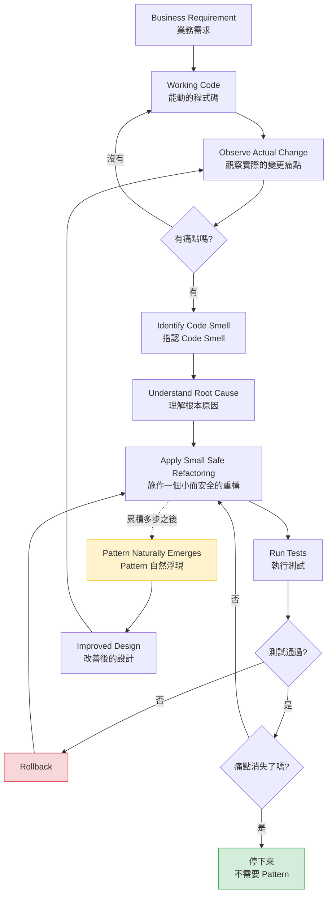

這張圖有三個地方是刻意設計的：

1. **`停下來 / 不需要 Pattern` 是綠色的正常終點**，不是失敗。大部分重構應該在這裡結束。
2. **`Pattern 自然浮現` 是虛線進入的**，代表它是累積的結果，不是某一步的目標。
3. **最後回到 `觀察痛點`**，代表這是持續的循環，不是一次性專案。

### 1.4 這套方法要對抗的兩個極端

企業裡的設計問題，幾乎都落在天平的兩端。Refactoring to Patterns 要做的是把團隊拉回中間。

| | 極端一：Under-engineering | 中間：Refactoring to Patterns | 極端二：Over-engineering |
|---|---|---|---|
| **典型症狀** | 3000 行的 `Service`、到處複製貼上 | 設計複雜度與實際變化程度相稱 | 每個 `Service` 都有 `Interface`、四層 Factory |
| **口頭禪** | 「能動就好」「以後再說」 | 「這裡真的會變嗎？」 | 「以後擴充比較方便」 |
| **變更成本** | 高（改一處要找十處） | 低 | 高（改一處要穿過五層抽象） |
| **新人上手** | 難（沒有結構） | 中 | 難（結構太多，找不到真正做事的那行） |
| **AI 的傾向** | 很少 | 需要明確引導才會 | **極高 — 這是 AI 的預設行為** |

> 🤖 **AI Agent 使用建議**
> 最後一列是本手冊最重要的觀察之一。**LLM 在訓練資料裡看到的「好程式碼」大量來自開源框架與教科書範例，而那些程式碼本來就該高度抽象**（因為框架的使用者是未知的）。
> 但你的內部系統不是框架。當 AI 把框架的設計密度套到一個只有三個使用者的行內批次程式上時，它產生的不是「好設計」，是**技術債**。

### 1.5 本章實務案例

**情境**：某銀行的匯款手續費計算模組，五年來被改過 27 次。

團隊某次 Sprint 決定「重構它」，一位工程師花了三天，把它改成了一組 `FeeCalculationStrategy` 介面 + 9 個實作類別 + 1 個 `FeeStrategyFactory` + 1 個 `FeeStrategyRegistry`。Code Review 時大家覺得「看起來很專業」，就合併了。

半年後的問題：

| 現象 | 原因 |
|---|---|
| 新人看不懂手續費怎麼算 | 一筆計算要跳 4 個檔案才看得到真正的公式 |
| 改一個費率要動 3 個檔案 | Registry 的註冊、Strategy 的實作、測試的 fixture |
| 9 個 Strategy 有 7 個內容幾乎一樣 | 原本的 27 次變更裡，有 23 次改的是**費率數字**，不是**計算邏輯** |

**問題出在哪裡**：團隊看到了 Smell（Conditional Complexity），但**沒有分析變化的性質**。

真正的變化是「費率數字會變」，不是「計算演算法會變」。正確的重構應該是：

```text
Extract Method（把公式抽出來）
  ↓
Replace Magic Number with Named Constant（費率具名）
  ↓
把費率移到設定檔或資料表
  ↓
停。（不需要 Strategy）
```

三天的工作量可以縮短成半天，而且結果更好維護。

**事後補救**：這個模組後來在第 18 章描述的「Refactoring Away From Patterns」流程下，被拆回成 1 個類別 + 1 張費率表。

### 1.6 本章注意事項

> ⚠️ **不要把「重構」當成 Sprint 裡的獨立任務**
> 「這個 Sprint 我們來重構 XX 模組」這種規劃方式，天然會導向過度設計——因為工程師被指派了「要做出東西」的任務，而最容易做出來的東西就是抽象層。
> **重構應該附著在真實的需求變更上**：「我要加第四種付款方式，而現在加起來很痛，所以我先把它變好改。」

> ⚠️ **「以後可能會變」不是重構的理由**
> 它是 Speculative Generality（第 8.11 節）的定義。如果你需要一個理由，去問 PM「明年的 roadmap 有沒有這一項」，得到的答案才算證據。

> ✅ **停下來是正常的，而且應該被記錄**
> 在 PR 描述裡寫「本次只做到 Extract Class，因為痛點已消除，暫不導入 Strategy」是非常好的工程行為。它讓下一個人知道**你考慮過了**，而不是不懂。

> 📌 **與後續章節的關係**
> 本章講的是心法。從第 6 章開始講「怎麼判斷有沒有問題」，第三部講「有問題之後的具體手法」，第四部講「什麼時候該收手或倒退」。

---

## 第 2 章 Refactoring 的基礎

這一章是全書的地基。如果團隊對「什麼算重構」沒有共識，後面所有的流程、Guardrail 與 Quality Gate 都會失效——因為大家會把「順手改了個 bug」「順手調了個效能」都叫做重構，然後在出事時無法判斷是哪一步造成的。

### 2.1 定義與目的

> **重構（Refactoring）：在不改變軟體外部可觀察行為的前提下，調整其內部結構，使其更容易被理解與修改。**

這個定義來自 Martin Fowler，是業界的共同基準。它有兩個部分，**缺一不可**：

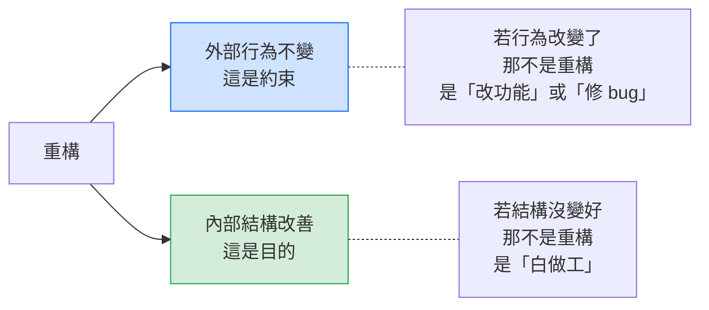

重構要達成的目的，按照企業實務的優先順序排列：

| 目的 | 白話說明 | 怎麼衡量 |
|---|---|---|
| **降低變更成本** | 下次要改這裡時比較快、比較不容易錯 | 同類需求的開發工時、改動檔案數 |
| **提高可測試性** | 能不啟動整個 Spring Context 就測到邏輯 | 單元測試的執行時間、需要 mock 的數量 |
| **提高可理解性** | 新人看懂這段要多久 | Code Review 的往返次數、新人 onboarding 時間 |
| **降低技術債利息** | 減少「每次都要小心繞過」的地方 | 該檔案的 bug 密度、修改後的回歸率 |
| **為後續變更鋪路** | 讓「原本做不到」的需求變成「可以做」 | 主觀，但可在 ADR 中記錄 |

> ⚠️ **注意：「讓程式碼變漂亮」不在這張表上。**
> 美觀不是重構的目的，它是上述五項達成後的副產品。**以「變漂亮」為理由的重構，通常無法通過成本效益檢驗，也最容易被 AI 濫用當成藉口。**

### 2.2 外部行為不變到底指什麼

這是實務上爭議最多的地方，也是 AI 最容易踩雷的地方。「外部行為」的範圍，遠比大多數人想的還要大。

| 層面 | 必須保持不變的內容 | Legacy 系統常見的地雷 |
|---|---|---|
| **回傳值** | 相同輸入 → 相同輸出 | 浮點數運算順序改變導致小數第 8 位不同 |
| **例外行為** | 同樣情況丟同樣的例外、同樣的訊息 | 把 `catch(Exception)` 改成 `catch(IOException)`，漏掉了原本被吞掉的 `NPE` |
| **副作用** | 寫入的資料表、發出的訊息、寫的 log | 調整方法順序導致 log 的先後改變，而下游有系統在 parse log |
| **交易邊界** | commit / rollback 的時機與範圍 | Extract Method 後加上 `@Transactional`，把一個交易變成兩個 |
| **null 語意** | 回傳 `null` 還是空集合 | 「順手」把 `return null` 改成 `return Collections.emptyList()`，呼叫端的 `if (x == null)` 從此永遠不成立 |
| **執行緒安全性** | 原本的同步保證 | 把欄位從區域變數提升成實例欄位，破壞執行緒安全 |
| **效能特性** | 不能從 O(n) 變成 O(n²) | 為了「可讀性」把迴圈拆成多個 stream，在百萬筆資料上爆掉 |
| **API 合約** | HTTP 狀態碼、欄位名稱、欄位順序 | JSON 欄位順序改變，下游用固定位置解析 |

> 📖 **Kerievsky 原作觀點 vs 🏭 業界實務的分歧**
> 學術定義通常說「外部行為不變」只包含**功能性行為**，不包含效能。
> 但企業實務（尤其是金融業的批次作業）普遍把**效能特性納入不可變更的範圍**——一個原本跑 40 分鐘的日結批次，重構後跑 6 小時，即使結果完全正確，在營運上也是重大事故。
> **本手冊採用後者的嚴格定義**，並在第 38 章把 Performance Test 納入重構的驗證項目。

#### 一個真實會出事的例子

```java
// Before：Java 8 + Spring Boot 2.x
public List<Account> findActiveAccounts(String custId) {
    List<Account> result = dao.queryByCustomer(custId);
    if (result == null || result.isEmpty()) {
        return null;            // ← 十年前寫的，呼叫端依賴這個 null
    }
    return result;
}
```

AI 看到這段，非常可能「順手改善」成：

```java
// AI 的「改善」——這不是重構，這是行為變更
public List<Account> findActiveAccounts(String custId) {
    return Optional.ofNullable(dao.queryByCustomer(custId))
                   .orElseGet(List::of);     // ← 再也不會回傳 null
}
```

程式碼確實更現代、更安全、更符合最佳實務。**但它改變了外部行為**。如果呼叫端有這樣的程式碼：

```java
if (findActiveAccounts(id) == null) {
    throw new NoActiveAccountException();    // ← 這行從此永遠不會執行
}
```

那麼原本應該擋掉的案件會全部放行。這種 bug **不會被單元測試抓到**（因為測試多半只測有資料的情況），而且會在生產環境安靜地錯很久。

> 🤖 **AI Agent 使用建議**
> 這是附錄 B 治理規則第 5 條（Preserve external behavior unless explicitly authorized）存在的原因。
> 正確的做法是：AI **可以提出**這個改善建議，但必須把它標示為「**行為變更，非重構**」，列出所有呼叫端，並要求人類確認。

### 2.3 重構與重寫、改功能、效能調校的界線

企業裡必須把這四件事分開，因為它們的**風險等級、測試策略與核准流程完全不同**。

| | 重構 | 改功能 | 修 Bug | 效能調校 | 重寫 |
|---|---|---|---|---|---|
| **外部行為** | 不變 | 刻意改變 | 刻意改變（修正錯的） | 功能不變、時間/資源特性改變 | 目標相同、行為可能偏移 |
| **需要的測試** | 既有測試全綠即可 | 需要新測試 | 需要重現該 bug 的測試 | 需要效能基準 | 需要完整的 Characterization Test |
| **風險** | 低（若有測試） | 中 | 中 | 中高 | **極高** |
| **可否與其他項目混在同一個 commit** | ❌ 絕對不可 | — | — | — | — |
| **AI 可否自主執行** | 有條件可以（第 22 章） | 否 | 否 | 否 | **絕對不可** |

> 🔧 **本手冊的工程建議：一個 commit 只做一件事**
> 這不是潔癖，是**風險控制**。
> 當一個 commit 同時包含「Extract Method」與「順手修正的判斷條件」時，一旦生產環境出事，你無法用 `git revert` 安全地退回——因為退回會同時退掉那個修正。
> 第 41.4 節提供了可直接採用的 commit 訊息規範。

#### 重寫為什麼是最後手段

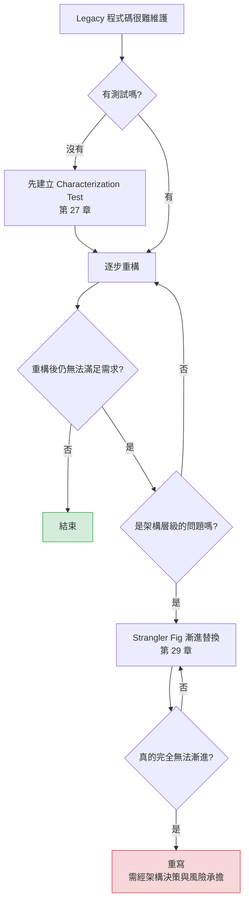

重寫的致命問題不是「工作量大」，而是**你會把「不知道為什麼存在的行為」全部弄丟**。第 26 章會詳細說明，Legacy 程式碼裡最醜的那些 `if`，往往正是最重要的業務規則。

### 2.4 為什麼安全性來自小步驟

這是整套方法的物理基礎，值得用數學說明。

假設你做了一次大重構，改動了 50 個地方，跑測試發現失敗了。此時你要在 50 個改動裡找出是哪一個造成的——搜尋空間是 50。

如果你分成 50 次小重構，每次改一個地方就跑測試，那麼測試失敗時，**搜尋空間永遠是 1**。

```text
大步驟：改動 50 處 → 測試失敗 → 除錯範圍 50 處 → 常見結局是「全部 revert，明天再說」
小步驟：改動  1 處 → 測試失敗 → 除錯範圍  1 處 → 30 秒內修好或 revert，繼續前進
```

「小步驟」的具體標準：

| 標準 | 說明 |
|---|---|
| **可編譯** | 每一步結束時程式碼必須能編譯 |
| **可測試** | 每一步結束時既有測試必須全綠 |
| **可 commit** | 每一步結束時的狀態，是可以安全上線的 |
| **時間 < 15 分鐘** | 超過這個時間通常代表步驟切太大 |
| **一句話能說完** | 「把這段抽成方法」可以；「重構計費模組」不行 |

> 🏭 **業界常見實務**
> IDE 的自動重構功能（IntelliJ 的 Extract Method、Rename、Move、Change Signature）之所以重要，正是因為它們是**機械化的、不會手滑的小步驟**。
> 實務上的原則是：**能用 IDE 自動重構完成的，絕不手工改**。這也適用於 AI——請 AI 產生一段「等價的新程式碼」，遠比請 IDE 執行一次 Extract Method 危險。

### 2.5 重構的經濟理由

要說服管理層撥時間，需要的是成本語言，不是設計語言。

| 說法 | 管理層的反應 |
|---|---|
| 「這段程式碼很醜，我想重構」 | ❌ 沒有商業價值，排到有空再說 |
| 「這個模組耦合度太高，違反 SRP」 | ❌ 聽不懂，而且聽起來像個人偏好 |
| 「同樣一個需求，改這個模組要 5 天，改隔壁模組只要 1 天。差別在於這裡每次都要同步修改 4 處。我花 2 天把那 4 處收斂成 1 處，之後每次需求可以省 3 天。今年預計還有 5 次類似需求。」 | ✅ 這是投資報酬計算 |

這就是重構的經濟模型：

```text
重構成本 = 一次性投入（人天）
重構收益 = 每次變更節省的成本 × 預期變更次數 − 新增的理解成本

當「預期變更次數」= 0 時，收益永遠是負的。
→ 這就是為什麼「不會再改的程式碼，再醜也不該重構」。
```

> 🔧 **本手冊的工程建議：重構的三個合法時機**
>
> 1. **變更前重構（Preparatory Refactoring）**——「我要加新功能，但現在加很痛，所以先讓它好加。」**這是最划算的時機**，因為你已經有明確的需求當證據。
> 2. **變更後重構**——「功能做完了，但我留下了重複，趁記憶還熱的時候收斂。」
> 3. **理解式重構（Comprehension Refactoring）**——「我看不懂這段，邊改名邊抽方法來幫助自己理解。」產出是**理解**，程式碼改善是附帶的。
>
> 不在這三個時機裡的重構，請先問「為什麼是現在」。

### 2.6 本章實務案例

**情境**：某壽險公司的保費試算 API，回應時間從 200ms 惡化到 3 秒。

團隊分析後發現，問題出在一個 1200 行的 `PremiumCalculator.calculate()` 方法裡，有一段迴圈重複查詢資料庫。

**第一版做法（錯誤）**：一位工程師決定「既然要動它，乾脆一起重構」，在同一個 PR 裡：

1. 把 1200 行拆成 23 個方法
2. 抽出 4 個類別
3. 修正了那個 N+1 查詢
4. 順手把日期處理從 `Date` 換成 `LocalDate`
5. 順手把幾個 `if` 簡化了

結果：PR 有 1800 行 diff，Review 了兩週。上線後第三天，發現某種保單的保費少算了 3 元——**沒有人能確定是哪一項改動造成的**，最後只能整個 revert，效能問題也跟著回去了。

**第二版做法（正確）**：拆成五個獨立的 PR，依序進行。

| PR | 內容 | 類型 | 驗證方式 |
|---|---|---|---|
| #1 | 針對 `calculate()` 建立 Characterization Test，涵蓋 217 組歷史試算資料 | 測試 | 全綠（記錄現況，**包含那 3 元的既有行為**） |
| #2 | Extract Method × 23，不改任何邏輯 | **重構** | #1 的測試全綠 |
| #3 | Extract Class × 4 | **重構** | #1 的測試全綠 |
| #4 | 修正 N+1 查詢 | **效能調校** | #1 的測試全綠 + 回應時間基準測試 |
| #5 | `Date` → `LocalDate` | **行為變更（時區語意不同）** | #1 的測試 + 新增跨時區測試 + 人工 Review |

第 #4 個 PR 上線後效能就恢復了，總歷時反而比第一版短。而第 #5 個 PR 在 Review 時被擋下——因為 Reviewer 發現原本的 `Date` 在某個日切邊界上有特殊行為，需要另外處理。

**這個案例的三個教訓**：

1. **先有測試，再談重構。** PR #1 是整件事成立的前提。
2. **分類決定風險。** #2、#3 是重構（低風險），#4 是調校（中風險），#5 是行為變更（高風險）。混在一起，整包都變成高風險。
3. **Characterization Test 要記錄「現況」，不是「正確」。** 那 3 元的既有偏差被寫進了測試——因為在確認它是 bug 之前，它就是規格。

### 2.7 本章注意事項

> ⚠️ **沒有測試的重構不叫重構，叫「祈禱」**
> 這是全書最硬的一條規則。如果既有程式碼沒有測試，第一步永遠是建立 Characterization Test（第 27 章），而不是開始改。

> ⚠️ **「順手」是最貴的兩個字**
> 在重構的 commit 裡出現任何「順手改的」東西，都會讓這個 commit 失去「可安全 revert」的性質。看到不對的地方，開 issue，不要順手。

> ⚠️ **AI 特別容易破壞「例外行為」與「null 語意」**
> 因為這兩者在訓練資料裡幾乎都被當成「應該改掉的壞味道」。請在 Guardrail 中明確要求 AI 保留原有的 null 與例外語意（第 22 章）。

> ✅ **善用 IDE 的自動重構**
> IntelliJ IDEA 的 `Ctrl+Alt+M`（Extract Method）、`Shift+F6`（Rename）、`F6`（Move）是機械化且可信的。本 repo 的 [工具/IntelliJ IDEA Community Edition使用教學.md](../工具/IntelliJ%20IDEA%20Community%20Edition使用教學.md) 有完整操作說明。

> 📌 **延伸閱讀**
> 低階重構手法的完整目錄（Extract Method、Inline、Move Field…）請見 [分析與設計/Refactoring重構教學.md](../分析與設計/Refactoring重構教學.md)。本手冊不重複那些內容，而是專注在「這些手法怎麼組合成 Pattern 的演進路徑」。

---

## 第 3 章 Design Pattern 的本質與代價

### 3.1 Pattern 是什麼

> **Design Pattern 是「某一類設計問題，在特定情境下，經過多次驗證的解決方案骨架」，加上「採用它要付出的代價」。**

多數人只記得前半句，忘了後半句。而後半句才是決定「該不該用」的關鍵。

一個完整的 Pattern 描述至少包含四個部分：

| 部分 | 內容 | 多數人的認知 |
|---|---|---|
| **Context（情境）** | 什麼情況下會遇到這個問題 | 常被跳過 |
| **Problem（問題）** | 具體的設計困難是什麼 | 常被跳過 |
| **Solution（解法）** | 類別結構與互動方式 | ✅ 只記得這個 |
| **Consequences（後果）** | 得到什麼、失去什麼 | 常被跳過 |

> 🔧 **本手冊的工程建議**
> 當有人（或 AI）提議導入某個 Pattern 時，請他先講 **Context 與 Problem**，最後才講 Solution。
> 講不出 Context 與 Problem 的提議，一律退回。這一條規則能擋掉八成的過度設計。

### 3.2 Pattern 不是什麼

這一節要澄清企業裡最常見的概念混淆。

| Pattern **不是** | 差別 | 混淆的後果 |
|---|---|---|
| **不是 Architecture** | Pattern 作用在類別與物件層級；Architecture 作用在模組、部署、邊界層級 | 以為「用了 Repository 就是 Clean Architecture」 |
| **不是 Framework** | Framework 是你要遵守的程式碼；Pattern 是你可以參考的結構 | 以為「Spring 用了 Proxy，所以我也要自己寫 Proxy」 |
| **不是 Coding Style** | Style 是格式與命名慣例；Pattern 是結構決策 | 把「所有類別都要有 Interface」寫進 coding standard |
| **不是品質指標** | 程式碼裡的 Pattern 數量與品質沒有正相關 | Code Review 時說「這裡沒用 Pattern，退回」 |
| **不是最佳解** | Pattern 是「在該情境下的成熟解」，不是「唯一解」 | 明明一個 `Map<String, BiFunction>` 就夠，卻寫了 9 個類別 |
| **不是永久結構** | Pattern 可以也應該被移除 | 「這是 Pattern，不能刪」 |

#### 特別澄清：Pattern 與 Architecture 的關係

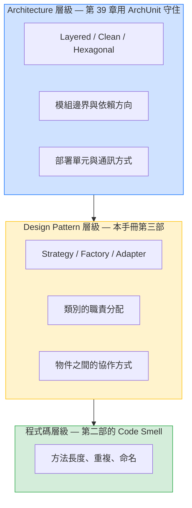

三個層級的問題**不能互相取代**：

- 你不能用 Strategy 解決「Domain 層依賴了 JPA」的架構問題。
- 你也不能用 ArchUnit 規則解決「這個方法有 400 行」的程式碼問題。

> 📌 本 repo 的 [ArchUnit 手冊](./ArchUnit%20企業級軟體架構測試與%20AI%20Agent%20開發教學手冊.md) 守的是最上層，本手冊守的是中間與下層。第 39 章說明兩者怎麼搭配。

### 3.3 每個 Pattern 都要付的四種代價

> 🔧 **本手冊的工程建議**
> 任何 Pattern 導入提案，都必須明確回答這四項代價。這是第 40 章 Quality Gate 的檢查項目之一。

| 代價 | 具體表現 | 怎麼評估 |
|---|---|---|
| **① 間接層（Indirection）** | 要看懂一件事，需要跳更多檔案 | 「從 Controller 追到真正做事的那一行，要經過幾個檔案？」超過 4 個就要警覺 |
| **② 類別數量（Class Count）** | 專案裡多了 N 個檔案 | 「這 N 個檔案未來會各自演化嗎？如果永遠一起改，那它們不該被拆開」 |
| **③ 認知負荷（Cognitive Load）** | 新人需要先懂這個 Pattern 才能改 | 「團隊裡有幾個人能獨立修改這段？」少於一半就是風險 |
| **④ 執行成本（Runtime Cost）** | 多型分派、物件配置、代理呼叫 | 通常可忽略，但在**批次、迴圈內部、高頻交易路徑**上必須實測 |

#### 代價的量化範例

以第 1.5 節那個手續費案例為例：

| 項目 | 重構前 | 重構後（Strategy 版） | 變化 |
|---|---|---|---|
| 檔案數 | 1 | 12 | **+1100%** |
| 讀懂一筆計算要開的檔案數 | 1 | 4 | **+300%** |
| 新增一種費率要改的檔案數 | 1 | 3 | **+200%**（變差了！） |
| 新增一種**計算演算法**要改的檔案數 | 1 | 1 | 持平 |
| 單元測試可獨立測試的單位 | 1 | 9 | +800%（變好了） |

這張表清楚顯示：**這次重構只有在「新增計算演算法」這個場景下才有價值，而那正是五年來沒發生過的場景。**

> 🏭 **業界常見實務**
> 有經驗的團隊會在 PR 描述裡直接放這張表。它讓 Review 從「我覺得這樣比較好」變成「數字顯示哪些場景變好、哪些變差」。

### 3.4 Pattern 的適用前提

每個 Pattern 都有它的「入場門檻」。門檻沒到就導入，得到的是純粹的代價。

| Pattern | 必要前提（缺一不可） | 常見的誤用情境 |
|---|---|---|
| **Strategy** | ① 至少 2 個真實變體 ② 變體會各自獨立演化 ③ 執行期或設定期需要切換 | 只有 2 個分支且十年沒變 |
| **Factory** | 建立邏輯本身有複雜度（選型、組裝、快取、驗證） | 只是包了一層 `return new X()` |
| **Abstract Factory** | 存在「產品族」，且族與族之間必須整組替換 | 只有一個產品族 |
| **Builder** | 建構參數多（>4）且有可選組合，或需要不可變物件 | 三個參數就寫 Builder |
| **Observer** | 訂閱者數量未知或可動態增減 | 永遠只有一個訂閱者 |
| **State** | 存在明確的狀態機，且**狀態轉移邏輯本身很複雜** | 只是一個 enum 欄位 |
| **Command** | 需要把行為當物件傳遞、排隊、延遲、復原或記錄 | 只是想避免寫 `switch` |
| **Decorator** | 職責可自由組合，且組合順序有意義 | 只有一種裝飾，且永遠都套用 |
| **Composite** | 真實存在 part-whole 樹狀結構，且要統一處理 | 只有兩層，而且第二層不會再長 |
| **Template Method** | 演算法骨架穩定，只有少數步驟變化 | 骨架本身也一直在變（此時繼承是負債） |
| **Adapter** | 兩個**你無法同時修改**的介面需要協作 | 兩邊都是自己的程式碼，直接改就好 |
| **Singleton** | 必須確保全域唯一，且該唯一性是**領域要求** | 只是想圖個方便存取 |

> ⚠️ **關於 Singleton 的特別提醒**
> 在 Spring 環境下，`@Component` 預設就是 singleton scope。**自己手寫 Singleton（私有建構子 + `getInstance()`）在 Spring 專案裡幾乎永遠是錯的**，因為它繞過了 DI 容器，讓測試無法替換、讓生命週期不受管理。
> 第 11.6 節的 Inline Singleton 與 11.7 節的 Limit Instantiation with Singleton 會詳細處理這件事。

### 3.5 本章實務案例

**情境**：某電商團隊的訂單通知功能。

PM 提出需求：「訂單成立後要發 Email。」

工程師 A 的實作（30 分鐘完成）：

```java
// Java 8 + Spring Boot 2.x
@Service
public class OrderService {
    @Autowired private EmailSender emailSender;

    public void placeOrder(Order order) {
        orderRepository.save(order);
        emailSender.send(order.getCustomerEmail(), "訂單成立", buildBody(order));
    }
}
```

工程師 B 的實作（2 天完成）：定義 `NotificationEvent` 介面、`NotificationListener` 介面、`NotificationDispatcher`、`EmailNotificationListener`、`NotificationChannelFactory`、`NotificationTemplateStrategy`，外加一組設定類別。

理由是：「以後一定會加簡訊跟 App 推播。」

**六個月後的實際狀況**：

| 事件 | 對 A 的影響 | 對 B 的影響 |
|---|---|---|
| 第 2 個月：改 Email 內容 | 改 1 行 | 找了 20 分鐘才找到 template 在哪 |
| 第 4 個月：加簡訊通知 | 加 1 行 + 1 個 `SmsSender` | 加 1 個 Listener（**這次 B 佔優**） |
| 第 5 個月：要求「簡訊失敗不能影響訂單成立，Email 失敗要 rollback」 | 加 try-catch，10 分鐘 | **卡住**——Dispatcher 統一處理例外，無法對不同通道做不同的交易語意，最後拆掉 Dispatcher |
| 第 6 個月：新人接手 | 30 分鐘看懂 | 兩天，而且改壞一次 |

**結論**：B 的預測（會加通道）**是對的**，但他的設計仍然是失敗的——因為他預測的是「通道會增加」，實際的變化卻是「**不同通道的錯誤處理語意不同**」，而他的 Pattern 恰恰讓這件事變難了。

> 🔧 **這個案例要傳達的是**
> 過度設計的問題不只是「浪費了 2 天」，而是**你猜錯了變化的方向，並且把猜錯的方向固化進了結構裡**。
> 正確的做法是 A 的實作 + 在第 4 個月真的要加簡訊時，才走一次第 15.2 節的 Replace Hard-Coded Notifications with Observer——那時你已經知道「兩個通道的錯誤處理不同」，會做出完全不同、而且正確的設計。

### 3.6 本章注意事項

> ⚠️ **「以後一定會加」不是前提，是預測**
> 前提是可驗證的事實（已經有兩個變體、PM 的 roadmap 上有這一項）；預測是猜。**用預測當作導入 Pattern 的理由，是 Speculative Generality。**

> ⚠️ **不要在 Code Review 用「有沒有用 Pattern」當評分標準**
> 正確的問題是「這段程式碼好不好改、好不好測、好不好懂」。Pattern 只是達成它的可能手段之一。

> ⚠️ **效能代價在三個地方會真的出事**
> ① 批次作業的內層迴圈 ② 高頻交易路徑 ③ 大量物件配置的場景。在這三處導入 Pattern 前，**必須有實測數據**，不能只憑「JIT 會處理掉」的直覺。

> ✅ **把「代價表」變成 PR 模板的一部分**
> 第 3.3 節那張量化表，建議直接放進 `.github/PULL_REQUEST_TEMPLATE.md` 的「設計變更」區塊，強制提案者填寫。

> 📌 **Pattern 的標準結構請查既有教材**
> 本章刻意不畫任何 Pattern 的類別圖。需要時請查 [分析與設計/Design Pattern教學.md](../分析與設計/Design%20Pattern教學.md) 或 [DESIGN_PATTERNS.md](../../../DESIGN_PATTERNS.md)。**本手冊關心的是「怎麼走到那裡」與「該不該走」。**

---

## 第 4 章 Toward、To 與 Away From Patterns

這一章是 Refactoring to Patterns 與一般 Pattern 教材最大的差異所在。

一般教材只有一個方向：**沒有 Pattern → 有 Pattern**。
本方法有三個方向，而且**第三個方向和前兩個一樣重要**。

### 4.1 三個方向總覽

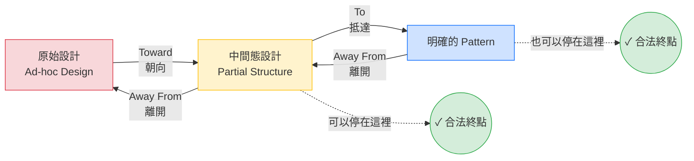

| 方向 | 意義 | 何時使用 | 實務佔比（🔧 本手冊估計） |
|---|---|---|---|
| **Toward** | 朝 Pattern 的方向移動，但**不一定走到底** | 痛點存在，但還不確定最終形狀 | **約 60%** |
| **To** | 完整走到 Pattern 的結構 | 變化方向已經明確，且變體數量會繼續增加 | 約 25% |
| **Away From** | 拆掉不再有價值的 Pattern | Pattern 的前提已消失，或當初根本不該導入 | **約 15%（但幾乎沒人做）** |

> 📖 **Kerievsky 原作觀點**
> 原書明確討論了 to / towards / away from 三種方向。這是本方法與「Pattern 速查手冊」最根本的差異：**Pattern 不是單向的終點，而是設計空間裡一個可以來回移動的位置。**

### 4.2 Refactoring Toward a Pattern

**「朝向」的意思是：我知道這段程式碼在往 Strategy 的方向長，但我這次只走三步，因為三步之後痛點就消失了。**

這是最常見、也最被低估的方向。

#### 一個完整的「朝向」過程

```text
起點：一個 200 行的 calculateFee() 方法，裡面有 5 段 if/else

Step 1  Extract Method            → 5 個私有方法，主方法剩 30 行
        ✅ 測試全綠。痛點還在嗎？「新增費率要改 3 處」→ 還在。繼續。

Step 2  把 5 個方法的共同參數整理成 FeeContext（Introduce Parameter Object）
        ✅ 測試全綠。痛點還在嗎？→ 還在。繼續。

Step 3  Extract Class → FeeCalculation 類別，含那 5 個方法
        ✅ 測試全綠。痛點還在嗎？
        →「新增費率」現在只要改 1 處了。痛點消失。

        ⛔ 停。不需要走到 Strategy。
```

如果三個月後出現了第 6 種、第 7 種計算方式，而且它們**真的各自不同**，那時再從 Step 3 繼續走：

```text
Step 4  Introduce Interface（FeeCalculator）
Step 5  把 5 個方法拆成 5 個實作類別
Step 6  呼叫端改為依賴介面
        → 現在它是 Strategy 了。
```

> 🔧 **本手冊的工程建議：每一步之後都要問「痛點消失了嗎？」**
> 這一問是整套方法的節流閥。沒有這一問，所有的重構都會自動滑向「走到 Pattern 為止」。
> 在第 21 章的 AI Workflow 中，這一問被設計成 AI **必須**向人類回報的檢查點。

#### 中間態設計是合法的產物

很多工程師（與絕大多數 AI）有一種焦慮：「這樣改一半，結構不上不下，很奇怪。」

**這個焦慮是錯的。** 中間態設計有它自己的價值：

| 中間態 | 已經獲得的好處 | 還沒付的代價 |
|---|---|---|
| Extract Method 之後 | 可讀性大幅改善、每段可單獨測試 | 沒有增加任何檔案 |
| Extract Class 之後 | 職責分離、可獨立測試、變更集中 | 只多 1 個檔案，沒有間接層 |
| Introduce Interface 之後 | 可替換、可 mock | 多 1 個檔案 + 1 層間接 |
| 完整 Strategy | 變體可獨立演化 | 多 N 個檔案 + 分派邏輯 |

**每一行都是一個可以長期停留的穩定狀態。**

### 4.3 Refactoring To a Pattern

「抵達」的判斷標準是什麼？本手冊建議三個條件**同時**成立：

| 條件 | 驗證方式 | 不成立時該做什麼 |
|---|---|---|
| **① 變體數 ≥ 3，或 ≥ 2 且確定會增加** | 數現有的分支；問 PM roadmap | 停在中間態 |
| **② 變體會各自獨立演化** | 檢視 git log：過去的變更是「全部一起改」還是「只改其中一個」 | 停在中間態（一起改代表它們是同一件事） |
| **③ 新增變體的成本，高於維護抽象的成本** | 第 3.3 節的量化表 | 停在中間態 |

> 🏭 **業界常見實務：用 git log 當證據**
> 這是最被低估的技巧。要判斷「這些分支會不會各自演化」，最可靠的證據不是猜測，是歷史：
>
> ```bash
> # 看這個檔案過去兩年的變更，每次改了哪些行
> git log --since="2 years ago" -p --follow -- src/main/java/com/example/fee/FeeService.java
>
> # 更快的方式：看每次 commit 改了幾個檔案（判斷 Shotgun Surgery）
> git log --since="2 years ago" --name-only --pretty=format:"%h %s" -- src/main/java/com/example/fee/ \
>   | awk 'NF' | sort | uniq -c | sort -rn | head -20
> ```
>
> 如果 27 次變更裡有 23 次是改同一個常數，那麼 Strategy 不是答案（回到第 1.5 節的案例）。

### 4.4 Refactoring Away From a Pattern

這是本手冊最強調、也是企業裡最缺乏的能力。

> **當一個 Pattern 的適用前提已經不存在時，保留它不是「維持架構完整性」，而是持續支付一筆沒有對應收益的成本。**

#### 為什麼沒有人做

| 心理障礙 | 實際情況 |
|---|---|
| 「這是 Pattern，刪掉顯得我不懂設計」 | 能判斷該刪，才是真的懂設計 |
| 「當初有人花很多時間寫的」 | 沉沒成本，與「現在該不該留」無關 |
| 「刪掉會不會有風險」 | 有測試的話，刪除抽象層比新增抽象層**更安全**（減少分支） |
| 「Code Review 會不會被質疑」 | 這正是本手冊第 18 章與附錄 B 要解決的組織問題 |

#### 一個典型的移除流程

```text
現況：PaymentProcessorFactory + PaymentProcessor 介面 + 1 個實作類別

診斷：
  ✓ 只有 1 個實作（三年來都是）
  ✓ Factory 的內容是 `return new CreditCardProcessor();`
  ✓ 介面沒有任何第二個實作，也沒有被 mock（測試用的是真實物件）
  → 這個 Pattern 提供的價值 = 0，成本 = 2 個額外檔案 + 1 層間接

移除步驟：
  Step 1  Inline Factory：呼叫端改為直接 new CreditCardProcessor()
          ✅ 測試全綠
  Step 2  刪除 PaymentProcessorFactory
          ✅ 測試全綠
  Step 3  Inline Interface：把呼叫端的型別從 PaymentProcessor 改成 CreditCardProcessor
          ✅ 測試全綠
  Step 4  刪除 PaymentProcessor 介面
          ✅ 測試全綠

結果：檔案 −2、間接層 −1、行為完全不變
```

> ⚠️ **移除前必須確認的三件事**
>
> 1. **沒有外部模組依賴那個介面**（用 IDE 的 Find Usages，範圍設定為整個 workspace；多模組專案要跨模組查）
> 2. **測試沒有依賴那個介面做 mock**（若有，先評估改用真實物件或改用測試替身）
> 3. **不是框架要求的擴充點**（例如 Spring 的 `BeanPostProcessor` 介面不能刪）

第 18 章會提供完整的移除手法目錄。

### 4.5 該在哪裡停下來

把三個方向合併成一個可以貼在牆上的判斷流程：

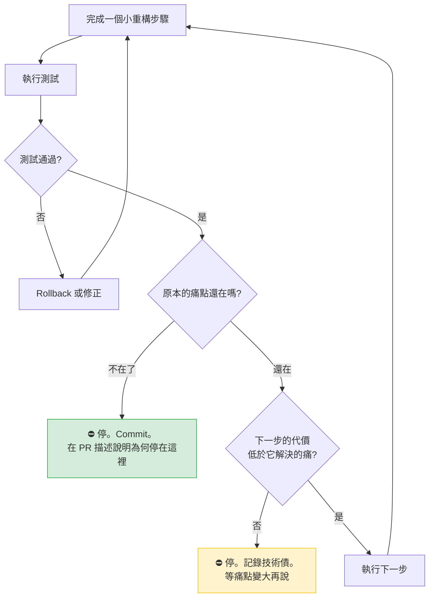

> 🤖 **AI Agent 使用建議**
> 這張圖就是 AI Refactoring Workflow 的核心迴圈（第 21 章）。
> **關鍵在於「E」與「G」兩個菱形必須由人類回答，或至少由人類確認 AI 的回答。** AI 傾向於在這兩處一路回答「還在」「是」，直到走完整個 Pattern。

### 4.6 本章實務案例

**情境**：某券商的委託單驗證邏輯，歷經三任團隊。

**第一任（2018）**：一個 `OrderValidator.validate()` 方法，600 行，裡面是連續的 `if (...) throw new ValidationException(...)`。

**第二任（2021）**：認為這是典型的 Chain of Responsibility 場景，重構為：

- `ValidationRule` 介面
- 14 個 Rule 實作類別
- `ValidationChain` 組裝器
- `ValidationRuleRegistry` + 自訂 annotation `@Order`
- 一組 YAML 設定檔控制規則的啟用與順序

**第三任（2024，接手後的觀察）**：

| 觀察項目 | 數據 |
|---|---|
| 三年來新增的規則數 | 2 條 |
| 三年來刪除的規則數 | 0 條 |
| 三年來調整規則順序的次數 | **0 次** |
| YAML 設定被修改的次數 | **0 次** |
| 生產事故：某規則因 `@Order` 值重複而被跳過 | 1 次（損失約 40 萬） |
| 新人理解「一張委託單會經過哪些驗證」所需時間 | 平均 1.5 天 |

**第三任的決策**：執行 Refactoring Away。

```text
Step 1  刪除 YAML 設定與 Registry，改為在一個類別中明確列出規則順序
        （順序從「執行期不可見」變成「原始碼裡一眼可見」）
        ✅ 測試全綠

Step 2  把 14 個 Rule 中，7 個只有 3～5 行且從未單獨變動的，
        inline 回一個 BasicOrderChecks 類別
        ✅ 測試全綠

Step 3  保留其餘 7 個 Rule 類別（它們確實各自複雜、且有獨立的測試）
        但把 ValidationChain 簡化為一個明確的 List<ValidationRule>
        ✅ 測試全綠
```

**結果**：

| 指標 | Before | After | 變化 |
|---|---|---|---|
| 檔案數 | 18 | 10 | −44% |
| 「一張單會過哪些驗證」的可見度 | 需讀 YAML + Registry + annotation | 讀 1 個檔案的 1 個 list | 大幅改善 |
| 新增一條規則的成本 | 新檔案 + annotation + YAML | 新檔案 + list 加一行 | 略降 |
| 順序錯誤的可能性 | 高（`@Order` 數字） | **零**（list 的順序就是執行順序） | 消除了事故根因 |

**注意：這不是「把 Pattern 全部拆光」。** 第三任保留了 7 個 Rule 類別——因為那 7 個**真的**各自複雜、各自有測試、各自演化過。他們拆掉的是「**沒有帶來價值的那一半**」。

> 🔧 **這個案例最值得學的一點**
> 第二任團隊並不笨，他們的設計在教科書上完全正確。他們的錯誤只有一個：**把「規則可能會頻繁增減與重排」當成了事實，但那只是預測，而且預測錯了。**
> 而第三任團隊做對的事，是**用三年的 git log 當證據**去驗證那個預測，而不是憑感覺。

### 4.7 本章注意事項

> ⚠️ **不要在同一個 PR 裡同時做 Toward 與 Away**
> 例如「把 A 模組導入 Strategy，順便把 B 模組的 Factory 拆掉」。這兩件事的風險性質不同，應該分開 Review。

> ⚠️ **Away From 之前一定要先確認測試覆蓋**
> 移除抽象層時，最容易漏掉的是「只有某個整合測試才會走到」的路徑。移除前請先確認該區域的測試覆蓋率，必要時補 Characterization Test。

> ✅ **把「停下來的理由」寫進 PR**
> 建議的寫法：
>
> ```text
> ## 重構範圍
> Extract Method × 5 → Extract Class × 1
>
> ## 為什麼停在這裡（沒有導入 Strategy）
> 痛點「新增費率要改 3 處」已在 Extract Class 後消除（現在只需改 1 處）。
> 檢視 git log 近兩年 27 次變更，其中 23 次改的是費率常數而非演算法，
> 不符合導入 Strategy 的前提（變體需各自獨立演化）。
> 若未來出現第 3 種演算法，可從本次的 FeeCalculation 類別繼續演進。
> ```

> 📌 **Away From Patterns 的完整手法在第 18 章**
> 本章只建立觀念。第 18 章會給出移除 Factory、Interface、Decorator、Observer 等的具體步驟與安全檢查。

---

## 第 5 章 為什麼企業需要 Refactoring to Patterns

前四章講的是「怎麼做」與「為什麼這樣做」。這一章要回答的是另一個問題：**為什麼企業要花錢做這件事？**

如果你需要說服的對象是部門主管、PMO 或資訊長，這一章就是你的素材。

### 5.1 變更成本曲線

軟體專案真正的成本，不在第一次開發，而在後續的每一次變更。

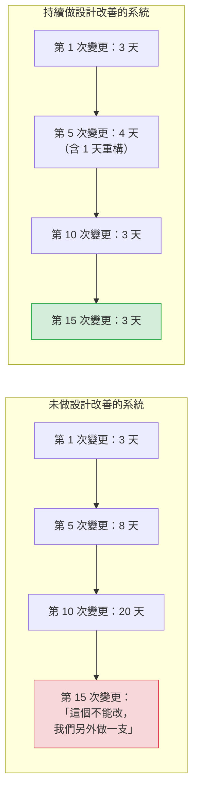

左邊的終局——「這個不能改，我們另外做一支」——是企業 Legacy 系統氾濫的**真正成因**。它不是因為技術落後，是因為**每次變更都比上次更貴，貴到某個臨界點之後，繞過它比修改它便宜**。

然後你就有了兩套做類似事情的系統。五年後，有五套。

| 階段 | 症狀 | 企業實際付出的代價 |
|---|---|---|
| **第 1 年** | 偶爾覺得某些地方很難改 | 幾乎為零 |
| **第 3 年** | 特定模組需要「懂的人」才能改 | 人力調度風險、加班 |
| **第 5 年** | 需求評估時出現「這個不好做」 | 需求被打折、業務競爭力下降 |
| **第 7 年** | 開始出現繞過原系統的新系統 | **系統重複建置、資料不一致** |
| **第 10 年** | 「重寫專案」被提案 | **數千萬預算 + 2～3 年 + 高失敗率** |

> 🔧 **本手冊的工程建議：用「繞過成本」而非「技術債」來溝通**
> 管理層對「技術債」四個字已經疲乏了。改用具體的問句：
>
> - 「過去兩年，有幾個需求因為『那個系統不好改』而被放棄或繞過？」
> - 「我們有幾套系統在做重疊的事？當初為什麼不改原本那套？」
>
> 這兩個問題的答案，通常比任何技術指標都更有說服力。

### 5.2 技術債的四個象限

不是所有技術債都該還。**分類決定策略。**

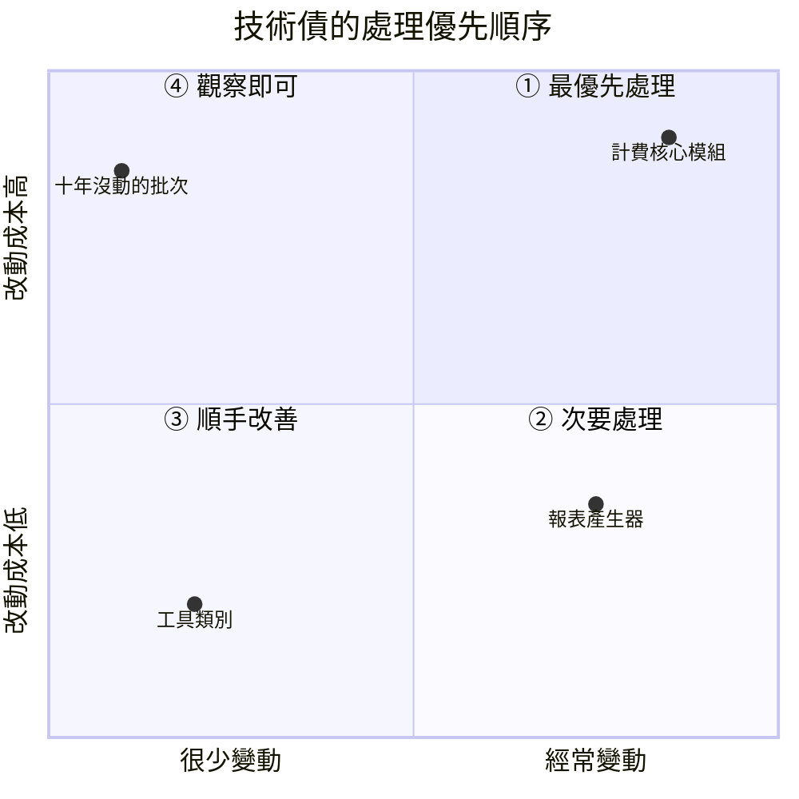

| 象限 | 特徵 | 策略 | 典型例子 |
|---|---|---|---|
| **① 高變動 + 高成本** | 每次改都痛，而且一直在改 | **最優先。這裡的每一分投入回報最高** | 計費、費率、核心交易流程 |
| **② 高變動 + 低成本** | 常改但還算好改 | 保持現狀，改的時候順手優化 | 設定、參數、報表格式 |
| **③ 低變動 + 低成本** | 沒人在意 | 不用管 | 工具類別 |
| **④ 低變動 + 高成本** | 很醜，但十年沒人碰 | **不要重構。** 記錄在技術債清單即可 | 早年的批次、已停售商品的邏輯 |

> ⚠️ **第 ④ 象限是 AI 最容易浪費資源的地方**
> 當你對 AI 說「掃描整個專案找出 Code Smell」，它會忠實地回報第 ④ 象限的所有問題——那些又長又醜、但十年沒人碰過的程式碼。
> 這些報告看起來很有價值，實際上**處理它們的投資報酬率是負的**（重構風險 > 零收益）。
> 第 21 章的 AI Workflow 明確要求：**Smell 分析必須結合 git 變更頻率資料**，否則輸出無法用於決策。

實務上取得變更頻率的方式：

```bash
# 找出過去一年變更最頻繁的 30 個檔案（第 ①、② 象限的候選）
git log --since="1 year ago" --name-only --pretty=format: -- '*.java' \
  | grep -v '^$' | sort | uniq -c | sort -rn | head -30
```

把這份清單與 SonarQube 的複雜度報告交叉比對，交集就是第 ① 象限。**這才是重構應該投入的地方。**

### 5.3 AI 時代帶來的新壓力

這一節是本手冊與傳統重構教材最根本的差異。

在 2023 年之前，「設計品質」的把關機制大致是：

```text
工程師寫程式（速度受限於人類）
    ↓
資深工程師 Code Review（速度也受限於人類，但量相當）
    ↓
品質大致可控
```

2026 年的現況是：

```text
AI Agent 產生程式碼（一次 800 行，30 秒）
    ↓
資深工程師 Code Review（一次 800 行，30 分鐘，而且注意力會下降）
    ↓
❌ 產能不對等 → Review 退化成「看起來沒問題就 approve」
```

這造成三個新問題：

| 新問題 | 具體表現 | 本手冊的對策 |
|---|---|---|
| **① 抽象層爆炸** | AI 預設產生大量介面與抽象類別 | 第 17 章 Pattern Abuse 清單 + 第 39.3 節的 ArchUnit 規則 |
| **② 行為悄悄改變** | AI 把 `null` 改成空集合、把例外類型「改善」掉 | 第 22 章 Guardrails + 第 27 章 Characterization Test |
| **③ 測試與程式碼共謀** | AI 同時產生程式碼與測試，兩者共享同一套錯誤假設 | 第 38.3 節：測試必須獨立於實作產生 |

> 🤖 **第 ③ 點值得特別展開**
> 當你請 AI「重構這段程式碼並補上測試」時，AI 是**先理解程式碼、再產生測試**的。
> 如果它對程式碼的理解有偏差（例如誤解了某個 `if` 的業務意圖），那麼它產生的測試會**忠實地驗證它的錯誤理解**。
> 結果是：**測試全綠，但行為已經改變。** 而綠燈給了團隊虛假的安全感。
>
> 對策（第 38.3 節詳述）：
>
> 1. Characterization Test 必須**在重構之前**、基於**現行程式碼的實際輸出**產生，而非基於 AI 對程式碼的理解
> 2. 重構的 PR 中，**測試檔案不應該被修改**。若測試需要修改，代表行為改變了，必須明確說明
> 3. 高風險模組採用「A 產生實作、B 產生測試」的分離機制（人與 AI 或兩個獨立 AI session）

### 5.4 三個真實的企業痛點

> 🏭 這三個痛點在金融、保險、製造業的 IT 部門幾乎普遍存在。

#### 痛點一：「那個系統只有某某人能改」

**表象**：人力風險、無法休假、離職即危機。

**根因**：程式碼的複雜度超過了「靠閱讀就能理解」的門檻，只能靠**經驗記憶**來維護。

**Refactoring to Patterns 的作用**：不是讓程式碼變漂亮，而是**把「只存在某人腦中的知識」外顯成結構**。當 `if (type == 3 && flag == 'Y')` 被重構成 `if (order.isUrgentTransfer())` 時，那個知識就從人腦移到了程式碼裡。

#### 痛點二：「需求評估永遠是 3 個月起跳」

**表象**：業務單位覺得 IT 沒有競爭力。

**根因**：每個需求都要穿過大量的既有耦合，評估時無法確定影響範圍，只能報高。

**Refactoring to Patterns 的作用**：把變化點收斂。當「新增一種商品」從「要改 8 個檔案、影響範圍不明」變成「新增 1 個類別、其他不動」時，評估才可能準確。

#### 痛點三：「導入 AI 之後，程式碼品質反而下降了」

**表象**：PR 數量增加，但 bug 也增加；新人更看不懂專案。

**根因**：AI 加速了「產出」，但團隊沒有同步加速「把關」。

**Refactoring to Patterns 的作用**：提供一套**AI 也能遵守的、可驗證的設計紀律**——這正是第五部與附錄 B 的內容。

### 5.5 導入成本的誠實評估

> 🔧 **本手冊的工程建議**
> 任何宣稱「導入某方法論零成本」的文件都不可信。以下是誠實的估算，供規劃參考。

| 項目 | 一次性成本 | 持續成本 | 備註 |
|---|---|---|---|
| **團隊教育訓練** | 5 天（第 44 章的課程） | 每季半天複訓 | 新人 onboarding 需納入 |
| **建立 Characterization Test** | 核心模組每個 3～10 人天 | — | **最大的一筆，但也最有價值** |
| **建立 AI Guardrail 文件** | 2～3 人天 | 每季複查 | 附錄 B 可直接改用，能省下大半 |
| **CI 加入 Quality Gate** | 3～5 人天 | 維護 CI | 第 40 章有設定範例 |
| **ArchUnit 規則** | 5～10 人天 | 規則隨架構調整 | 已有 ArchUnit 的團隊成本趨近零 |
| **每次變更的重構時間** | — | **開發工時 +10～20%** | 這是最需要向管理層說明的一項 |
| **Code Review 時間** | — | 初期 +30%，三個月後回到原水準 | 因為要 Review 設計理由，不只看程式碼 |

**最常見的失敗模式**（🏭 業界普遍觀察）：

| 失敗模式 | 為什麼會發生 | 怎麼避免 |
|---|---|---|
| 「重構專案」被獨立立案，做了半年 | 管理層想要「一次解決」 | 拒絕獨立立案，附著在需求上做（第 2.5 節的三個時機） |
| 前兩個月很熱衷，第三個月沒人做了 | 沒有納入 Definition of Done，全靠自律 | 寫進 PR 模板與 CI，變成流程而非美德 |
| 重構後 bug 變多，團隊失去信心 | 沒有先建立測試就開始改 | **Characterization Test 是不可跳過的前置條件** |
| AI 產生了大量「重構」PR，Review 不完 | 沒有設定 AI 的作業範圍 | 第 22 章的 Guardrail + 第 23 章的紅線 |

### 5.6 本章實務案例

**情境**：某產險公司的核保系統現代化評估（2025 年）。

**背景**：系統 2009 年上線，Java 6 起家，現在是 Java 8 + Spring 4，約 120 萬行。業務單位抱怨「新商品上架要 6 個月」。

**第一版提案（被否決）**：全面重寫為微服務架構，預算 8000 萬，工期 30 個月。

否決理由：董事會詢問「重寫期間，現有系統的法規變更（每年約 15 次）怎麼辦？」提案方回答「並行維護」——等於同時養兩套系統 30 個月。

**第二版提案（採用）**：以 Refactoring to Patterns + Strangler Fig 為主軸，分三階段。

| 階段 | 期間 | 內容 | 預算 |
|---|---|---|---|
| **一：止血** | 6 個月 | ① 對「商品定義」與「核保規則」兩個核心模組建立 Characterization Test（涵蓋近三年 4.2 萬筆核保紀錄）② 導入 ArchUnit 基準線 ③ 建立 AI Guardrail 與 Code Review 規範 | 900 萬 |
| **二：收斂變化點** | 12 個月 | 針對「新商品上架」這條路徑做 Refactoring to Patterns：商品參數外部化 → Extract Class → 出現 Strategy（**只在真正有多變體的三處**） | 1800 萬 |
| **三：選擇性替換** | 18 個月 | 用 Strangler Fig 把「報價試算」獨立成新服務，其餘留在原系統 | 2400 萬 |

**第一階段結束時的實際數據**：

| 指標 | 專案前 | 第一階段後 |
|---|---|---|
| 核心模組的測試覆蓋率 | 4% | 71%（含 Characterization Test） |
| 新商品上架工時 | 平均 26 週 | 平均 22 週（尚未大幅改善，符合預期） |
| 上線後回歸 bug 數 | 平均每次 7.3 件 | 平均每次 1.8 件 |
| 團隊對「敢不敢改核心模組」的信心調查 | 2.1 / 5 | 3.9 / 5 |

**第二階段結束時**：新商品上架工時降至平均 7 週。

**這個案例的三個關鍵決策**：

1. **沒有重寫。** 把 8000 萬的重寫，換成 5100 萬的漸進改善，而且期間法規變更照常進行。
2. **第一階段完全沒有改善「功能」，只建立了安全網。** 這是最難向管理層說明、但也最關鍵的一步——第二階段之所以能快，正是因為第一階段建好了測試。
3. **Strategy 只導入了三處。** 評估時發現原本預期的 17 處「多變體」中，只有 3 處符合「變體會各自獨立演化」的條件，其餘 14 處用參數外部化就解決了。

### 5.7 本章注意事項

> ⚠️ **不要承諾「重構之後開發速度會變快」**
> 短期內不會。重構的收益出現在「第 5 次之後的變更」。承諾短期效益，三個月後會失去管理層的信任。
> 誠實的說法是：「前三個月會慢 15%，從第二季開始，同類需求的工時會下降。我們會逐月追蹤數據。」

> ⚠️ **不要在沒有度量的情況下開始**
> 至少要有：① 該模組的變更頻率（git log）② 同類需求的歷史工時 ③ 上線後的回歸 bug 數。
> 沒有 before 數據，你永遠無法證明 after 有價值。

> ⚠️ **第 ④ 象限（低變動 + 高成本）真的不要碰**
> 這一條會被違反，因為那些程式碼最醜、最容易在掃描報告中跳出來。請在 AI 的 Prompt 中明確排除。

> ✅ **把重構工時納入需求估算，而非另外申請**
> 「這個需求 5 天，其中 1 天是為了讓它好做而先整理既有程式碼」——這是正常的工程估算，不需要特別核准。
> 反之，「我要申請 20 天做重構」一定會被砍。

> 📌 **本部結束**
> 到這裡，你應該能回答三個問題：什麼是 Refactoring to Patterns（第 1 章）、什麼算重構（第 2 章）、Pattern 的代價是什麼（第 3 章）、三個演進方向（第 4 章）、以及為什麼企業要投資（第 5 章）。
> 接下來的第二部，要處理更前面的問題：**你怎麼知道哪裡有問題？**

---

# 第二部：Code Smell

第一部建立的是判斷力，這一部要建立的是**證據能力**。

Refactoring to Patterns 全流程的起點不是「我想用某個 Pattern」，而是「**這裡有一個可以被指出來的具體問題**」。Code Smell 就是那個問題的名字。

沒有名字的問題無法討論、無法 Review、無法寫進 PR、也無法教給 AI。這一部的目的，是讓團隊擁有一套共同的詞彙。

---

## 第 6 章 Code Smell 判讀方法論

### 6.1 Smell 不是錯誤

這是最重要的觀念，也是最常被誤解的一點。

> **Code Smell 是「可能有設計問題」的徵兆，不是「一定有問題」的判決。**

| | Bug | Code Smell |
|---|---|---|
| **性質** | 行為錯誤，客觀 | 設計徵兆，需要判斷 |
| **是否一定要處理** | 是 | **否** |
| **判斷依據** | 規格 | **變更痛點 + 變更頻率** |
| **處理時機** | 盡快 | **下次要改到這裡時** |
| **典型誤用** | 無 | 把它當成「必須修正的違規」 |

這個差別在工具與 AI 介入之後變得格外重要。SonarQube 會把 Code Smell 標成問題數量，AI 會把它列成待辦清單——兩者都很容易讓團隊誤以為「這些都要清掉」。

> ⚠️ **一個 800 行、十年沒人改過、而且跑得好好的批次程式，它的 Long Method 不是問題，是現狀。**
> 動它才是問題（風險 > 0，收益 = 0）。這正是第 5.2 節第 ④ 象限的結論。

### 6.2 判讀 Smell 的三個問題

> 🔧 **本手冊的工程建議**
> 任何 Smell 被提出時（無論是人提的還是 AI 掃出來的），都必須通過這三個問題才進入重構候選名單。

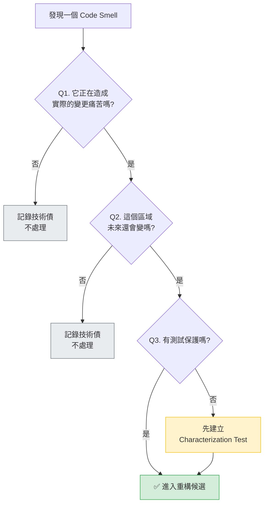

三個問題各自需要什麼證據：

| 問題 | 有效證據 | **無效**的「證據」 |
|---|---|---|
| **Q1 造成變更痛苦嗎** | 上次改這裡改了幾個檔案、花了多久、出了幾個 bug | 「它看起來很亂」 |
| **Q2 未來還會變嗎** | `git log` 的變更頻率、PM 的 roadmap | 「以後應該會用到」 |
| **Q3 有測試嗎** | 覆蓋率報告、實際跑一次測試 | 「應該有吧」 |

用一個指令同時取得 Q1 與 Q2 的證據：

```bash
# 某個檔案過去兩年的變更次數、每次的 commit 摘要
git log --since="2 years ago" --oneline --follow -- src/main/java/com/example/fee/FeeService.java

# 更有用的：找出「每次都一起被修改」的檔案組合（Shotgun Surgery 的直接證據）
git log --since="2 years ago" --name-only --pretty=format:"===%h" -- '*.java' \
  | awk '/^===/{if(n>1)print buf; buf="";n=0;next}{if($0!=""){buf=buf" "$0;n++}}END{if(n>1)print buf}' \
  | tr ' ' '\n' | grep -v '^$' | sort | uniq -c | sort -rn | head -20
```

### 6.3 何時不要重構

> 🔧 **本手冊的工程建議：七個明確的「不要」**

| # | 情境 | 理由 |
|---|---|---|
| 1 | **即將下線的系統** | 收益在未來，而未來不存在 |
| 2 | **第 ④ 象限（低變動 + 高成本）** | 風險 > 0，收益 ≈ 0 |
| 3 | **沒有測試，且無法建立測試** | 沒有安全網（先解決測試問題） |
| 4 | **正在趕上線的前一週** | 任何非必要的變更都是風險 |
| 5 | **你不理解那段程式碼在做什麼** | 先做理解式重構（改名、加註解），不要動結構 |
| 6 | **業務規則不明確** | 可能會「重構掉」一條你不知道的規則（第 23 章紅線） |
| 7 | **只是為了符合某個 coding standard** | 標準是手段不是目的 |

> ⚠️ **第 5 條特別容易被 AI 違反**
> AI 永遠不會說「我看不懂這段」。它會給出一個看似合理的解釋，然後基於那個解釋去重構。
> 這正是第 24 章「AI Hallucinated Business Rule」反模式的來源，也是附錄 B 治理規則第 8 條（Stop when business rules are unclear）存在的理由。

### 6.4 Smell 的嚴重度分級

> 🔧 **本手冊的工程建議**
> 導入時建議採用三級制，並把它寫進 Code Review 規範。

| 等級 | 定義 | 處理方式 | 範例 |
|---|---|---|---|
| **🔴 阻斷（Blocking）** | 會導致未來的變更出錯，或已經造成生產事故 | **本次 PR 必須處理** | Shotgun Surgery 導致上次漏改；重複的業務規則已經不同步 |
| **🟡 警告（Warning）** | 明顯增加變更成本，但不會直接致錯 | **下次改到這裡時處理**，記錄於技術債清單 | Long Method、Conditional Complexity |
| **🟢 觀察（Info）** | 有徵兆但未造成實際困擾 | 不處理，僅記錄 | 六個參數的方法，但很少改 |

**分級的關鍵不在 Smell 的種類，而在它所在的位置。**

```text
同樣是 Long Method：

  位於「每月改 3 次的計費核心」  → 🔴 阻斷
  位於「每年改 1 次的報表」      → 🟡 警告
  位於「十年沒改的批次」         → 🟢 觀察（且不處理）
```

> 🤖 **AI Agent 使用建議**
> 請 AI 做 Smell 分析時，**必須同時提供變更頻率資料**，並要求它輸出分級。
> 沒有分級的 Smell 清單是無法用於決策的——它只會讓團隊看到 400 個問題然後放棄。
> 附錄 A 的 Prompt 1（Code Smell Analysis）已內建這項要求。

### 6.5 本章實務案例

**情境**：某銀行團隊導入 SonarQube 後的第一週。

SonarQube 報告：**4,127 個 Code Smell**，技術債估計 **312 天**。

團隊的第一反應是「這個數字沒辦法看，先把 Quality Gate 關掉」。

**改用本章方法論重新分析**：

```bash
# Step 1：取得過去 18 個月變更最頻繁的檔案
git log --since="18 months ago" --name-only --pretty=format: -- '*.java' \
  | grep -v '^$' | sort | uniq -c | sort -rn > /tmp/churn.txt

head -20 /tmp/churn.txt
```

結果：4,127 個 Smell 分布在 892 個檔案中，但**過去 18 個月被修改過的檔案只有 143 個**。

| 分類 | 檔案數 | Smell 數 | 佔比 | 處理決策 |
|---|---|---|---|---|
| 18 個月內改過 **≥ 10 次** | 23 | 681 | 16.5% | 🔴 **優先處理** |
| 18 個月內改過 1～9 次 | 120 | 1,204 | 29.2% | 🟡 改到時處理 |
| 18 個月內**完全沒改過** | 749 | 2,242 | **54.3%** | 🟢 **不處理**，加入 SonarQube 排除清單 |

**決策**：把 Quality Gate 設定為「只針對本次 PR 異動的程式碼」（SonarQube 的 New Code 模式），並把 54.3% 的歷史 Smell 標記為 baseline 不再計入。

**六個月後的結果**：

| 指標 | 導入時 | 六個月後 |
|---|---|---|
| Quality Gate 是否啟用 | 否（被關掉） | **是** |
| 團隊對報告的信任度 | 低 | 高 |
| 高頻檔案（23 個）的 Smell 數 | 681 | 194（−71%） |
| 低頻檔案的 Smell 數 | 2,242 | 2,240（幾乎不變，**且無所謂**） |

**這個案例的核心教訓**：

> **4,127 這個數字本身沒有意義，而且它的最大危害是讓團隊放棄。**
> **把它拆成「會痛的 681 個」與「不會痛的 2,242 個」之後，這件事才變得可以執行。**

相關的 SonarQube 設定方式，可參考本 repo 的 [工具/SonarQube教學手冊.md](../工具/SonarQube教學手冊.md)。

### 6.6 本章注意事項

> ⚠️ **不要用 Smell 總數當 KPI**
> 這會直接導致兩種行為：① 去清最容易清的（通常是最沒價值的）② 想辦法讓工具不要報。
> 有意義的指標是「**高變更頻率檔案的 Smell 密度**」。

> ⚠️ **AI 掃出的 Smell 清單，預設是不可執行的**
> 因為 AI 看不到 git 歷史與業務 roadmap（除非你提供）。請務必在 Prompt 中附上變更頻率資料，並要求分級。

> ✅ **把「這個 Smell 的證據是什麼」變成 Review 的標準問句**
> 當有人在 Review 中說「這裡有 Code Smell」，標準回應是：「上次改這裡花了多久？未來還會改嗎？」
> 這一問能把討論從品味之爭拉回工程判斷。

> 📌 **接下來兩章的用法**
> 第 7、8 章是**查詢用的目錄**，不需要從頭讀完。建議的用法是：當你在 Review 或重構時遇到一個說不出名字的問題，來這裡找到它的名字，然後照著「候選重構」往下走。

---

## 第 7 章 Code Smell 目錄（上）重複、體積與職責

### 7.1 本章條目的共同格式

第 7、8 兩章共收錄 **21 個 Code Smell**。

> ⚠️ **請先看清楚這 21 個的來源，不要對外宣稱「原書有 21 個 smell」**
> Addison-Wesley 對《Refactoring to Patterns》的官方文案明載本書包含「descriptions of **twelve** design smells」，也就是 **原書是 12 個**。
> 本手冊列出 21 個，是因為企業現場的重構討論幾乎不可能只用 Kerievsky 的 12 個；Fowler《Refactoring》中另外 9 個在 Code Review 中同樣高頻。**兩份清單合併後為 21 個。**
> 以下對照表明確標示每一個 smell 的來源，供正式文件引用時擇一使用。

| # | Code Smell | 來源 | 本手冊章節 |
|---|---|---|---|
| 1 | Duplicated Code | 📖 Kerievsky 12 個之一（Fowler 亦有） | [7.2](#72-duplicated-code) |
| 2 | Long Method | 📖 Kerievsky 12 個之一（Fowler 亦有） | [7.3](#73-long-method) |
| 3 | Large Class | 📖 Kerievsky 12 個之一（Fowler 亦有） | [7.4](#74-large-class) |
| 4 | Conditional Complexity | 📖 Kerievsky 12 個之一 | [8.1](#81-conditional-complexity) |
| 5 | Switch Statements | 📖 Kerievsky 12 個之一（Fowler 亦有） | [8.2](#82-switch-statements) |
| 6 | Combinatorial Explosion | 📖 Kerievsky 12 個之一（**本書獨有**） | [8.3](#83-combinatorial-explosion) |
| 7 | Oddball Solution | 📖 Kerievsky 12 個之一（**本書獨有**） | [8.4](#84-oddball-solution) |
| 8 | Solution Sprawl | 📖 Kerievsky 12 個之一（**本書獨有**） | [7.11](#711-solution-sprawl) |
| 9 | Indecent Exposure | 📖 Kerievsky 12 個之一（**本書獨有**） | [8.6](#86-indecent-exposure) |
| 10 | Primitive Obsession | 📖 Kerievsky 12 個之一（Fowler 亦有） | [7.7](#77-primitive-obsession) |
| 11 | Alternative Classes with Different Interfaces | 📖 Kerievsky 12 個之一（Fowler 亦有） | [8.5](#85-alternative-classes-with-different-interfaces) |
| 12 | Lazy Class | 📖 Kerievsky 12 個之一（Fowler 亦有） | [8.10](#810-lazy-class) |
| 13 | Long Parameter List | 🏭 Fowler《Refactoring》 | [7.5](#75-long-parameter-list) |
| 14 | Data Clumps | 🏭 Fowler《Refactoring》 | [7.6](#76-data-clumps) |
| 15 | Divergent Change | 🏭 Fowler《Refactoring》 | [7.8](#78-divergent-change) |
| 16 | Shotgun Surgery | 🏭 Fowler《Refactoring》 | [7.9](#79-shotgun-surgery) |
| 17 | Feature Envy | 🏭 Fowler《Refactoring》 | [7.10](#710-feature-envy) |
| 18 | Temporary Field | 🏭 Fowler《Refactoring》 | [8.7](#87-temporary-field) |
| 19 | Message Chains | 🏭 Fowler《Refactoring》 | [8.8](#88-message-chains) |
| 20 | Middle Man | 🏭 Fowler《Refactoring》 | [8.9](#89-middle-man) |
| 21 | Speculative Generality | 🏭 Fowler《Refactoring》 | [8.11](#811-speculative-generality) |

> 🔧 **本手冊的工程建議**
> 上表中標示「**本書獨有**」的四個 smell（Combinatorial Explosion、Oddball Solution、Solution Sprawl、Indecent Exposure），是 Kerievsky 對 smell 目錄最主要的貢獻，也是**最直接指向 pattern-directed refactoring** 的四個。若你的團隊時間有限，優先把這四個納入 Code Review Checklist 的效益最高。

每一個條目採用相同的九段格式，方便查詢與比對：

| 段落 | 內容 |
|---|---|
| **症狀** | 你在程式碼裡看到什麼 |
| **根因** | 為什麼會變成這樣 |
| **風險** | 不處理會發生什麼 |
| **值得重構的訊號** | 什麼情況下該動手 |
| **不要重構的訊號** | 什麼情況下該放著 |
| **候選低階重構** | 先做哪些 Fowler 式的小步驟 |
| **可能演進出的 Pattern** | 走下去可能長成什麼（**候選，非必然**） |
| **AI 如何識別與處理** | 給 Coding Agent 的具體指引 |
| **驗證方式** | 重構後怎麼確認沒改壞 |

> ⚠️ **關於「可能演進出的 Pattern」欄位的鄭重提醒**
> 這個欄位是本手冊最容易被誤用的地方。它的正確讀法是：
>
> ```text
> ✅ 「如果痛點持續存在、而且變體會各自演化，走下去可能會長成 Strategy」
> ❌ 「這個 Smell 對應 Strategy，所以改成 Strategy」
> ```
>
> 第 9.1 節會再次強調這一點。**請不要把第 9.2 節的總表當成自動轉換規則交給 AI。**

---

### 7.2 Duplicated Code

**症狀**：同一段邏輯（或高度相似的邏輯）出現在兩個以上的地方。

**根因**：

- 趕時間時複製貼上，打算「之後再整理」
- 兩個團隊平行開發，不知道對方已經寫過
- 原本只是相似，後來各自演化成真的重複

**風險**：修改時漏改其中一處。這是企業裡**最常見的生產事故成因**——不是程式寫錯，是「改了 3 處、漏了第 4 處」。

**值得重構的訊號**：

- 這段邏輯改過，而且**曾經漏改**過
- 重複的是**業務規則**（例如手續費計算、資格判斷）
- 重複處 ≥ 3

**不要重構的訊號**：

- 只是**長得像**，但業務意義不同（例如「員工年齡驗證」與「商品保固天數驗證」剛好都是 `> 0 && < 150`）——強行合併會製造錯誤的耦合
- 重複在測試程式碼中（測試的重複容忍度較高，可讀性優先）
- 兩處分屬不同的 bounded context，未來會各自演化

**候選低階重構**：`Extract Method` → `Pull Up Method`（若在同一繼承體系）→ `Extract Class` → `Form Template Method`

**可能演進出的 Pattern**：Template Method（骨架相同、細節不同時）、Strategy（整段邏輯可替換時）

**AI 如何識別與處理**：

```text
✅ AI 擅長：找出語法上相似的區塊（這是它的強項）
❌ AI 不擅長：判斷「長得像」與「真的是同一件事」的差別

要求 AI 輸出時必須說明：
- 這兩段的「業務意義」是否相同？依據是什麼？
- 過去兩年，這兩段是「一起被修改」還是「各自被修改」？
```

**驗證方式**：

- [ ] 抽取後，兩處的呼叫端測試皆全綠
- [ ] 確認抽出的方法**沒有為了合併而新增參數旗標**（若需要 `boolean isTypeA` 參數才能合併，代表它們不該合併）
- [ ] 確認沒有把不同 bounded context 的程式碼耦合在一起

> ⚠️ **最危險的重構之一：用旗標參數強行合併**
>
> ```java
> // ❌ 這不是消除重複，這是製造更難維護的程式碼
> private BigDecimal calculate(Order o, boolean isVip, boolean isOverseas, boolean isUrgent) {
>     // 8 個分支組合
> }
> ```
>
> 如果合併需要新增旗標參數，**那代表這兩段本來就不是同一件事**。這正是第 8.3 節 Combinatorial Explosion 的起點。

---

### 7.3 Long Method

**症狀**：一個方法長到需要捲動才能看完，或需要用註解分段。

**根因**：每次需求變更都往裡面加幾行，沒有人負責重新組織。

**風險**：無法單獨測試其中一段；理解成本高；容易在中間插入破壞性的變更。

**值得重構的訊號**：

- 方法內有**註解分段**（`// 1. 驗證` `// 2. 計算` `// 3. 儲存`）——註解正在告訴你邊界在哪
- 區域變數超過 7～8 個
- 巢狀層級 ≥ 3
- 這個方法最近改過

**不要重構的訊號**：

- 它是一段**線性的、沒有分支的**設定程式碼（例如 100 行的欄位對應）——拆開反而更難讀
- 效能敏感的內層迴圈（方法呼叫雖然通常會被 JIT inline，但在極端場景需實測）

**候選低階重構**：`Extract Method` → `Replace Temp with Query` → `Introduce Parameter Object` → `Decompose Conditional`

**可能演進出的 Pattern**：Compose Method（第 12.1 節，這是最直接的目標）、Command（若每一段都是獨立的操作）

**AI 如何識別與處理**：

```text
✅ AI 擅長：Extract Method（這是機械化操作）
⚠️ AI 的常見錯誤：抽出來的方法名稱只描述「怎麼做」而非「做什麼」
    例如抽出 `private void doStep2()` — 這沒有改善任何事

要求 AI：
- 方法名稱必須描述「意圖」，不是「步驟編號」
- 每次只抽一個方法，跑完測試再抽下一個
- 不得同時調整邏輯
```

**驗證方式**：

- [ ] 既有測試全綠，**且測試檔案未被修改**
- [ ] 抽出的每個方法名稱，能讓人不看內容就知道它做什麼
- [ ] 主方法讀起來像一段「步驟說明」

---

### 7.4 Large Class

**症狀**：一個類別有太多欄位、太多方法，或明顯在做好幾件事。

**根因**：「這個功能跟現有的有點關係，就加在這裡吧」，累積而成。典型的 `XxxService`、`XxxManager`、`XxxUtil`。

**風險**：

- 高耦合（任何改動都可能影響其他功能）
- 無法平行開發（多人同時改同一個檔案）
- 測試需要準備大量無關的 mock

**值得重構的訊號**：

- 欄位可以明顯分成幾組，**每組只被特定的方法使用**（這是 Extract Class 的最佳訊號）
- git log 顯示這個檔案每次被改的**原因不同**（即 Divergent Change，第 7.8 節）
- 類別名稱裡有 `And`、`Manager`、`Util`、`Helper`

**不要重構的訊號**：

- 它是一個**資料載體**（DTO、Entity），欄位多是正常的
- 它是框架要求的結構（例如某些設定類別）

**候選低階重構**：`Extract Class` → `Move Method` / `Move Field` → `Extract Interface`（若有多個使用面向）

**可能演進出的 Pattern**：Facade（若拆出的多個類別仍需統一入口）、Strategy、State

**AI 如何識別與處理**：

```text
✅ AI 擅長：分析「哪些欄位被哪些方法使用」，產生分群建議
❌ AI 不擅長：判斷分群的「業務意義」是否合理

要求 AI 輸出一張「欄位 × 方法」使用矩陣，由人類判斷切割線在哪裡。
不要讓 AI 直接執行切割。
```

**驗證方式**：

- [ ] 拆出的每個類別，都能用一句話說明它的職責（**不含「和」字**）
- [ ] 拆分後，測試準備的 mock 數量下降
- [ ] 沒有產生循環依賴（可用 ArchUnit 驗證，見第 39 章）

---

### 7.5 Long Parameter List

**症狀**：方法有太多參數（一般認為 > 4 就該警覺，> 7 幾乎必然有問題）。

**根因**：功能增加時不斷往簽章上加參數；或是為了「彈性」而把所有可能的選項都開放出來。

**風險**：呼叫端容易傳錯順序（尤其多個同型別參數並列時，編譯器抓不到）；難以閱讀；每次新增參數都要改所有呼叫端。

**值得重構的訊號**：

- 有 ≥ 2 個相鄰參數是**同一個型別**（`calculate(String custId, String prodId, String branchId)` — 傳錯順序編譯器不會報錯）
- 某幾個參數**總是一起出現**（這是 Data Clumps，第 7.6 節）
- 有 `boolean` 旗標參數（呼叫端讀起來是 `calc(order, true, false, true)`，完全無法理解）

**不要重構的訊號**：

- 參數確實各自獨立且都必要，且方法只被呼叫一兩次
- 是框架規定的簽章

**候選低階重構**：`Introduce Parameter Object` → `Preserve Whole Object` → `Replace Parameter with Method Call` → `Remove Flag Argument`（把一個帶旗標的方法拆成兩個具名方法）

**可能演進出的 Pattern**：Builder（參數多且有可選組合時，第 11.5 節）、Command（參數整組代表一次操作時）

**AI 如何識別與處理**：

```text
✅ 要求 AI 優先處理 boolean 旗標參數 — 這是 CP 值最高的
    calc(order, true) → calcWithDiscount(order)
                       calcWithoutDiscount(order)
⚠️ 不要讓 AI 直接跳到 Builder。先做 Introduce Parameter Object，
    多數情況下那樣就夠了。
```

**驗證方式**：

- [ ] 呼叫端讀起來不需要對照方法簽章就能理解
- [ ] 沒有為了湊 Parameter Object 而把不相關的參數硬綁在一起

---

### 7.6 Data Clumps

**症狀**：同一組資料（三個以上的欄位或參數）總是成群出現在不同的地方。

典型例子：

```java
// Java 8 — 這三個永遠一起出現
public void transfer(String fromBank, String fromBranch, String fromAccount,
                     String toBank,   String toBranch,   String toAccount,
                     BigDecimal amount) { ... }
```

**根因**：缺少一個代表該概念的型別。上例缺少的是 `AccountNumber`。

**風險**：驗證邏輯散落各處（每個用到這三個欄位的地方都要各自驗證）；參數容易傳錯；概念無法被命名與討論。

**值得重構的訊號**：

- 這組欄位在 ≥ 3 個地方一起出現
- 這組欄位有**共同的驗證規則**（例如帳號格式檢查）
- 你能為這組欄位取一個業務上的名字

**不要重構的訊號**：

- 只是碰巧一起出現，沒有共同的業務概念

**候選低階重構**：`Extract Class` / `Introduce Parameter Object` → `Move Method`（把相關的驗證與行為搬進新類別）

**可能演進出的 Pattern**：Value Object（DDD 概念，非 GoF）；有時會演進為 Composite

**Before / After 對照**：

```java
// Before：Java 8
public void transfer(String fromBank, String fromBranch, String fromAccount,
                     String toBank, String toBranch, String toAccount,
                     BigDecimal amount) {
    if (fromBank == null || fromBank.length() != 3) throw new IllegalArgumentException();
    if (fromAccount == null || fromAccount.length() < 10) throw new IllegalArgumentException();
    // 同樣的驗證再寫一次給 to...
}
```

```java
// After：Java 25 — record 讓 Value Object 幾乎沒有樣板程式碼
public record AccountNumber(String bank, String branch, String account) {
    public AccountNumber {
        if (bank == null || bank.length() != 3) {
            throw new IllegalArgumentException("銀行代碼必須為 3 碼");
        }
        if (account == null || account.length() < 10) {
            throw new IllegalArgumentException("帳號長度不足");
        }
    }
    public boolean isSameBank(AccountNumber other) {
        return this.bank.equals(other.bank);
    }
}

public void transfer(AccountNumber from, AccountNumber to, BigDecimal amount) { ... }
```

**注意這次重構帶來的額外好處**：驗證邏輯從「散落在每個呼叫點」變成「不可能建立出無效的 `AccountNumber`」。這是型別系統幫你做的事。

**AI 如何識別與處理**：

```text
✅ AI 擅長：找出成群出現的參數
✅ AI 擅長：產生 record 與建構子驗證

⚠️ 必須人工確認：新型別的「名字」是否符合公司的領域語彙
    （例如公司內部叫「帳戶識別碼」而非「帳號」）
```

**驗證方式**：

- [ ] 所有呼叫端編譯通過
- [ ] 原本散落的驗證邏輯已集中，**且行為完全一致**（包含例外訊息）
- [ ] 序列化行為未改變（若該結構會進出 JSON 或 DB）

---

### 7.7 Primitive Obsession

**症狀**：用 `String`、`int`、`BigDecimal` 表示具有業務意義的概念。

```java
String customerId;      // 其實有格式規則
BigDecimal amount;      // 其實有幣別
int status;             // 其實是 5 種狀態的其中之一
String email;           // 其實有驗證規則
```

**根因**：一開始只是一個簡單欄位，業務規則後來才長出來，但型別沒有跟著演化。

**風險**：

- 業務規則散落（每個用到 `amount` 的地方都要自己處理幣別）
- 型別無法防呆（`transfer(customerId, accountId)` 傳反了，編譯器不會抓）
- **金額相關的錯誤特別昂貴**（不同幣別的 `BigDecimal` 直接相加）

**值得重構的訊號**：

- 這個 primitive 有**格式或範圍的驗證規則**
- 這個 primitive 有**專屬的操作**（例如金額的換匯、帳號的遮罩）
- 曾經因為參數傳反而出過 bug

**不要重構的訊號**：

- 它真的只是一個數字（例如迴圈計數器、陣列長度）
- 只在單一方法內部使用

**候選低階重構**：`Replace Data Value with Object` → `Replace Type Code with Class`（第 14.4 節）→ `Extract Class`

**可能演進出的 Pattern**：Value Object；若是狀態碼，可能演進為 State（第 13.1 節）

#### 特別說明：金額

> 🏭 **業界常見實務**
> 金融系統中，`BigDecimal` 直接代表金額是最普遍的 Primitive Obsession，而且是**最值得處理的**一個：
>
> ```java
> // After：Java 25
> public record Money(BigDecimal amount, Currency currency) implements Comparable<Money> {
>     public Money {
>         Objects.requireNonNull(amount);
>         Objects.requireNonNull(currency);
>     }
>     public Money add(Money other) {
>         if (!currency.equals(other.currency)) {
>             throw new CurrencyMismatchException(currency, other.currency);   // ← 這個例外救過很多人
>         }
>         return new Money(amount.add(other.amount), currency);
>     }
>     @Override public int compareTo(Money o) { /* 同幣別才可比較 */ }
> }
> ```
>
> **但請注意**：在既有系統中導入 `Money` 是一次大範圍的變更，必須漸進進行（先在新程式碼使用，邊界處轉換），不能一次全換。

**AI 如何識別與處理**：

```text
✅ AI 擅長：識別出「這個 String 其實有格式規則」
❌ AI 的高風險行為：一次把整個專案的 BigDecimal 換成 Money
    — 這會產生數千行的 diff，無法 Review，而且極可能改變精度行為

要求 AI：
- 一次只處理一個型別、一個模組
- 明確列出精度（scale）與捨入（RoundingMode）行為是否改變
```

**驗證方式**：

- [ ] **精度與捨入行為完全未變**（金額重構的頭號風險）
- [ ] JSON 序列化的格式未變（下游系統可能依賴）
- [ ] DB 欄位對應未變

---

### 7.8 Divergent Change

**症狀**：同一個類別，因為**不同的原因**被反覆修改。

```text
OrderService 過去一年的變更原因：
  3 次 — 稅率規則改變
  4 次 — 通知方式調整
  2 次 — 報表欄位增加
  5 次 — 折扣邏輯變更
```

**根因**：違反單一職責原則。這個類別承擔了多個「變化的軸線」。

**風險**：任何一個原因的變更，都可能影響到其他三個面向；測試範圍被迫擴大；多人同時修改時衝突頻繁。

**值得重構的訊號**：

- `git log` 顯示這個檔案的 commit 訊息主題明顯分成好幾類（**這是最客觀的證據**）
- 每次改動只碰到檔案的某一區塊，而不同次改動碰的區塊不重疊

**不要重構的訊號**：

- 變更雖然頻繁，但原因其實是同一個
- 這是一個 Facade，職責本來就是「彙整」

**取得證據的方式**：

```bash
# 列出某檔案的所有 commit 訊息，人工分類其變更原因
git log --pretty=format:"%ad %s" --date=short --follow \
  -- src/main/java/com/example/order/OrderService.java | head -40
```

**候選低階重構**：`Extract Class`（沿著「變化原因」切，不是沿著「功能」切）→ `Move Method`

**可能演進出的 Pattern**：Strategy（若某條軸線有多個變體）、Observer（若某條軸線是「通知」）

**AI 如何識別與處理**：

```text
✅ 給 AI 這個 Prompt 效果很好：

"以下是 OrderService 過去兩年的 commit 訊息。
 請依「變更原因」分類，並指出每一類變更主要影響檔案的哪些方法。
 不要修改任何程式碼，只輸出分析。
 [貼上 git log 輸出]"

這比讓 AI 讀原始碼去猜職責準確得多 — 因為 git log 是行為證據。
```

**驗證方式**：

- [ ] 拆分後，模擬一次「稅率變更」，確認只需要改 1 個檔案
- [ ] 沒有產生新的雙向依賴

---

### 7.9 Shotgun Surgery

**症狀**：一個小小的需求變更，需要修改很多個檔案。

**Divergent Change 的相反**：

| | Divergent Change | Shotgun Surgery |
|---|---|---|
| **描述** | 一個類別，多種變更原因 | 一種變更原因，散落多個類別 |
| **比喻** | 一個人做太多事 | 一件事被太多人分著做 |
| **解法方向** | 拆開（Extract Class） | **收攏**（Move Method / Inline Class） |

**根因**：某個概念沒有被封裝，它的片段散落在系統各處。

**風險**：**這是企業裡最直接導致生產事故的 Smell**——因為必然會有人漏改其中一處。

**值得重構的訊號**（🔴 通常直接列為阻斷級）：

- 曾經因為漏改而出事
- 新人第一次做這類需求時，必定會漏掉某處
- 團隊有一份「改 XX 時要記得改的地方」的文件（**這份文件的存在本身就是證據**）

**不要重構的訊號**：

- 散落的地方分屬不同的部署單元，收攏會製造新的耦合
- 收攏需要建立跨層的依賴（會違反架構規則）

**候選低階重構**：`Move Method` / `Move Field`（把散落的行為搬到一起）→ `Inline Class`（若某個類別只是個薄殼）→ `Extract Class`（建立一個真正擁有該概念的類別）

**可能演進出的 Pattern**：Facade、Observer（若散落的是「某事發生時要通知的動作」）

**AI 如何識別與處理**：

```text
✅ 最有效的用法 — 讓 AI 分析 git 的「共同變更」關係：

"以下是過去兩年，每次 commit 修改的檔案清單。
 請找出「經常一起被修改」的檔案組合（同時出現 ≥ 5 次），
 並推測它們共享的是什麼概念。
 [貼上 git log --name-only 輸出]"

這會直接指出 Shotgun Surgery 的位置，準確度遠高於靜態分析。
```

**驗證方式**：

- [ ] 模擬一次典型變更，確認需要修改的檔案數下降
- [ ] 收攏後沒有違反架構分層（用 ArchUnit 驗證）
- [ ] 那份「要記得改的地方」的文件可以刪掉了

---

### 7.10 Feature Envy

**症狀**：某個方法對「別的類別的資料」比對「自己類別的資料」更有興趣。

```java
// Before：Java 8 — 這個方法住錯地方了
public class OrderReportService {
    public String formatCustomerLabel(Customer c) {
        return c.getLastName() + c.getFirstName()
             + "（" + c.getVipLevel() + "）"
             + (c.getAge() >= 65 ? " [敬老]" : "");
    }
}
```

這個方法只用到 `Customer` 的資料，沒用到 `OrderReportService` 的任何東西。

**根因**：資料與行為被分開了（典型的「貧血模型」症狀）。

**風險**：`Customer` 的結構改變時，要修改散落在各服務中的方法；相同的格式化邏輯容易被重複實作。

**值得重構的訊號**：

- 方法中 `otherObject.getXxx()` 的呼叫次數，明顯多於 `this.xxx`
- 同樣的邏輯在其他服務裡也出現過（結合 Duplicated Code）

**不要重構的訊號**：

- 目標類別是 **JPA Entity 且團隊採用嚴格的貧血模型架構**——此時把行為搬進 Entity 會違反團隊約定（先討論架構決策，不要單方面改）
- 目標類別是 DTO 或外部 API 的回應結構（不該有業務行為）
- 這個方法需要用到多個類別的資料（此時它可能真的該待在服務層）

**候選低階重構**：`Move Method` → `Extract Method` 再 `Move Method`（若只有部分程式碼有 envy）

**可能演進出的 Pattern**：通常不需要 Pattern；有時會演進為 Visitor（第 15.4 節，當你**不能**修改目標類別時）

**AI 如何識別與處理**：

```text
✅ AI 擅長：計算方法內的 this vs other 存取比例
⚠️ 必須人工確認：團隊的架構風格是否允許把行為放進該類別

Prompt 中必須告知 AI 團隊的架構約定，例如：
"本專案採用 Rich Domain Model，Entity 可以有業務方法"
或
"本專案 Entity 僅為資料載體，業務邏輯一律放在 Domain Service"
否則 AI 會依它的預設偏好（通常偏向 Rich Model）行動。
```

**驗證方式**：

- [ ] 搬移後，來源類別不再需要 import 目標類別的細節型別
- [ ] 沒有違反團隊的架構分層約定（ArchUnit）
- [ ] 若搬進 Entity，確認不會意外觸發 lazy loading

---

### 7.11 Solution Sprawl

**症狀**：實作**一個**職責所需的程式碼，散落在很多個類別或方法中。

> 📖 這是 Kerievsky 在原書中特別強調的 Smell，在 Fowler 的原始清單中沒有對應項目。

**與 Shotgun Surgery 的差別**：

| | Shotgun Surgery | Solution Sprawl |
|---|---|---|
| **觀察角度** | **修改時**才發現要改很多處 | **閱讀時**就發現一件事被拆得太散 |
| **核心問題** | 變更成本高 | **理解成本高** |
| **常見成因** | 缺少封裝 | 過度拆分 / 責任分配不當 |

**典型例子**：

```text
「建立一張訂單」這件事，分布在：
  OrderController        — 組裝參數
  OrderValidator         — 驗證
  OrderNumberGenerator   — 產生單號
  OrderFactory           — 建立物件
  OrderEnricher          — 補充預設值
  OrderPersister         — 儲存
  OrderEventPublisher    — 發事件

想知道「一張訂單建立時到底做了哪些事」，要開 7 個檔案。
```

**注意**：這個例子裡的每一個類別**單獨看都很合理**。Solution Sprawl 的狡猾之處在於，它常常是「過度遵守單一職責原則」的結果。

**風險**：新人無法建立整體圖像；修改時容易在錯誤的層次動手；除錯時難以追蹤流程。

**值得重構的訊號**：

- 需要開 ≥ 5 個檔案才能理解一個業務流程
- 這些類別**永遠一起被修改**（用 git 驗證）
- 某些類別只有一個方法、且只被一個地方呼叫

**不要重構的訊號**：

- 這些類別確實各自被多處重用
- 分散是為了滿足明確的架構邊界（例如 Hexagonal 的 port/adapter）

**候選低階重構**：`Inline Class`（合併只有薄殼功能的類別）→ `Move Method` → `Compose Method`（第 12.1 節，讓主流程一眼可見）

**可能演進出的 Pattern**：Facade（保留細部類別，但提供一個統一入口，讓流程可見）

> 🔧 **本手冊的工程建議：判斷準則**
> 問一個問題：「**這 7 個類別，有哪幾個曾經被單獨修改過、或被其他流程重用過？**」
> 答案若是「沒有」，那它們不是 7 個職責，是 1 個職責被切成 7 塊。

**AI 如何識別與處理**：

```text
⚠️ 這是 AI 最不擅長識別的 Smell，因為每個類別單看都符合 SRP
⚠️ 更糟的是：AI 本身就是 Solution Sprawl 的主要製造者
    （它傾向於為每個步驟建立一個類別）

有效的 Prompt：
"請畫出『建立訂單』這個流程實際經過的所有類別與方法的呼叫順序。
 然後標示出：哪些類別只被這一條流程使用？
 不要修改程式碼。"
```

**驗證方式**：

- [ ] 合併後，「這個流程做了什麼」能在 1～2 個檔案內看完
- [ ] 沒有把真正被重用的類別誤刪
- [ ] 沒有違反架構邊界

---

### 7.12 本章實務案例

**情境**：某壽險公司的「保單變更」功能，同時呈現了本章五個 Smell。

團隊在準備「新增保單借款功能」時，發現光是評估影響範圍就花了一週。以下是他們的診斷過程。

#### Step 1：先取證據，不先看程式碼

```bash
# 過去 24 個月，policy 套件下最常被一起修改的檔案
git log --since="24 months ago" --name-only --pretty=format:"===%h %s" \
  -- 'src/main/java/com/example/policy/**' > /tmp/policy-churn.txt
```

結果：

| 檔案 | 變更次數 | 主要變更原因（人工分類 commit 訊息） |
|---|---|---|
| `PolicyChangeService.java`（2,100 行） | 47 | 費率(12)、通知(9)、檢核(15)、報表(7)、其他(4) |
| `PolicyChangeValidator.java` | 41 | 檢核(38)、其他(3) |
| `NotifyUtil.java` | 23 | 通知(23) |
| `PolicyDao.java` | 19 | 欄位(19) |

#### Step 2：對照 Smell 目錄

| 觀察 | Smell | 分級 |
|---|---|---|
| `PolicyChangeService` 2,100 行，欄位 31 個 | **Large Class**（7.4） | 🟡 |
| 該檔案的 47 次變更分屬 5 種不同原因 | **Divergent Change**（7.8） | 🔴 |
| 每次「新增一種變更類型」要改 6 個檔案 | **Shotgun Surgery**（7.9） | 🔴 |
| 保額驗證邏輯在 Service、Validator、Dao 各寫了一次（**且三處的邊界值不同**） | **Duplicated Code**（7.2） | 🔴 |
| `(policyNo, subPolicyNo, endorsementNo)` 這三個參數出現在 34 個方法簽章上 | **Data Clumps**（7.6） | 🟡 |

**「三處的邊界值不同」是關鍵發現**：

```java
// PolicyChangeService.java
if (amount.compareTo(new BigDecimal("10000000")) > 0) { ... }   // 一千萬

// PolicyChangeValidator.java
if (amount.doubleValue() > 10000000) { ... }                     // 一千萬，但用 double

// PolicyDao.java（SQL 裡）
// AND CHG_AMT <= 9999999                                        // 少一元！
```

這代表**已經發生過漏改**，只是還沒有人發現。這個發現讓這次重構從「技術債整理」升級為「**風險處理**」，立刻獲得了排程。

#### Step 3：處理順序（依風險，不依難度）

| 順序 | 處理項目 | 手法 | 為什麼是這個順序 |
|---|---|---|---|
| 1 | 建立 Characterization Test | 第 27 章 | **沒有它什麼都不能做**；用近三年 8,400 筆實際變更紀錄 |
| 2 | 確認三處邊界值哪個才對 | 找業務單位 | **這是 bug，不是 Smell**，必須先釐清（結果：一千萬才對，SQL 寫錯了） |
| 3 | 修正 SQL 的 bug | 獨立 PR | 與重構分開（第 2.3 節的原則） |
| 4 | Duplicated Code → 抽出 `PolicyChangeLimit` | Extract Class | 消除未來再次不同步的可能 |
| 5 | Data Clumps → `PolicyKey` record | Introduce Parameter Object | 34 個簽章一次收斂 |
| 6 | Divergent Change → 沿「變更原因」拆 | Extract Class × 4 | 費率、通知、檢核、報表各自獨立 |
| 7 | 重新評估 Shotgun Surgery | — | **拆完後重新測量**：新增一種變更類型從改 6 個檔案降到 2 個 |

#### Step 8：停下來的決定

團隊原本規劃第 7 步之後導入 Strategy（讓每種「保單變更類型」成為一個 Strategy）。

**評估後決定不做**：

```text
檢視 git log：過去兩年新增的變更類型 = 1 種
PM roadmap：未來一年規劃新增 = 1 種
→ 不符合「變體會持續增加且各自演化」的前提（第 4.3 節）
→ 停在 Extract Class。
→ 在 PR 描述中記錄此決策與依據。
```

**最終成果**：

| 指標 | Before | After |
|---|---|---|
| 「新增一種保單變更類型」需修改的檔案數 | 6 | 2 |
| 該功能的測試覆蓋率 | 11% | 76% |
| 保額上限定義的位置數 | 3（且不一致） | **1** |
| 最大類別行數 | 2,100 | 640 |
| 新增的類別數 | — | +6（**不是 +20**） |

### 7.13 本章注意事項

> ⚠️ **不要一次處理多個 Smell**
> 上面案例中的 7 個步驟，是 7 個獨立的 PR。混在一起的話，一旦出事就無法定位。

> ⚠️ **Smell 與 Bug 要分開處理**
> 案例中第 2、3 步是 bug 修正，必須獨立於重構之外。把 bug 修正藏在重構 PR 裡，是企業裡常見但極危險的做法——因為它讓重構 PR 失去了「可安全 revert」的性質。

> ⚠️ **Duplicated Code 的三處若「行為不同」，那是警訊而非雜訊**
> 發現重複的程式碼彼此行為不一致時，**先停下來確認哪個才對**。不要直接挑一個當作基準去統一——你有 2/3 的機率選錯。

> ✅ **用 git 當證據，不要用直覺**
> 本章反覆出現的 `git log` 指令是整套方法論最實用的工具。它把「我覺得這裡很亂」變成「這個檔案 24 個月被改了 47 次，分屬 5 種原因」。

> ✅ **重構完成後要「重新測量」**
> 案例中的第 7 步很關鍵：拆完之後重新評估 Shotgun Surgery 是否還存在。很多時候處理了根因，衍生的 Smell 會自動消失，不需要另外處理。

---

## 第 8 章 Code Smell 目錄（下）條件、耦合與過度設計

本章收錄的 11 個 Smell，是**最容易被 AI 錯誤處理**的一批——尤其是 8.1 到 8.3，AI 幾乎必然會建議套用 Pattern。

---

### 8.1 Conditional Complexity

**症狀**：複雜的條件邏輯——深層巢狀的 `if`、冗長的布林運算式、難以理解的判斷。

```java
// Before：Java 8 — 真實系統裡的樣子
if (order.getType() == 1 && order.getAmount().compareTo(LIMIT) > 0
        && (customer.getLevel() >= 3 || customer.getYears() > 5)
        && !order.isOverseas() && order.getStatus() != 9) {
    // 40 行
} else if (...) {
    // 又 40 行
}
```

**根因**：每次新增的業務規則，都以「再加一個條件」的方式塞進來。

**風險**：無法理解；無法測試（分支組合爆炸）；修改時容易破壞既有規則。

**值得重構的訊號**：

- 條件式本身需要註解才能看懂
- 巢狀層級 ≥ 3
- 布林運算元 ≥ 4
- 圈複雜度（Cyclomatic Complexity）> 10

**不要重構的訊號**：

- 條件雖多但扁平、可讀（例如連續的 guard clause）
- 這段程式碼很少變動

**候選低階重構**（**依序嘗試，通常前兩步就夠了**）：

```text
1. Decompose Conditional      把條件抽成具名方法 → isVipLargeOrder(order, customer)
2. Replace Nested Conditional with Guard Clauses   把巢狀改為提早返回
3. Consolidate Conditional Expression   合併同結果的條件
4. Extract Method             把每個分支的內容抽出
5. （若仍有痛點）Extract Class → Introduce Interface
```

**可能演進出的 Pattern**：Strategy（第 12.2 節）、State（第 13.1 節，**若條件是關於狀態轉移**）、Command（第 13.2 節，若是分派邏輯）

**第 1 步的效果常常被低估**：

```java
// 只做 Decompose Conditional，一步就大幅改善
if (isVipLargeDomesticOrder(order, customer)) {
    // 40 行
}

private boolean isVipLargeDomesticOrder(Order order, Customer customer) {
    return order.getType() == ORDER_TYPE_NORMAL
        && order.getAmount().compareTo(LIMIT) > 0
        && isVipCustomer(customer)
        && !order.isOverseas()
        && order.getStatus() != STATUS_CANCELLED;
}

private boolean isVipCustomer(Customer c) {
    return c.getLevel() >= VIP_LEVEL_THRESHOLD || c.getYears() > VIP_YEARS_THRESHOLD;
}
```

**這一步沒有新增任何類別，卻解決了 80% 的可讀性問題。**

**AI 如何識別與處理**：

```text
🔴 這是 AI 最容易過度反應的 Smell

AI 的預設行為：
  看到多分支 if/else → 直接產生 Strategy 介面 + N 個實作類別

必須在 Prompt 中明確限制：
  "請依序只做以下步驟，做完一步停下來等我確認：
   1. Decompose Conditional（把條件抽成具名方法）
   2. Replace Nested Conditional with Guard Clauses
   不要建立任何新的類別或介面。"
```

**驗證方式**：

- [ ] 圈複雜度下降（SonarQube 可量測）
- [ ] 分支覆蓋率未下降
- [ ] **所有原本的邊界條件行為完全一致**（特別注意 `>=` vs `>`）
- [ ] 沒有為了簡化而改變短路求值的順序（若條件中有副作用或 null 檢查，順序改變會出事）

> ⚠️ **短路求值順序是隱形地雷**
>
> ```java
> if (customer != null && customer.getLevel() >= 3) { }   // 安全
> if (customer.getLevel() >= 3 && customer != null) { }   // NPE
> ```
>
> AI 在「整理」條件式時可能重排順序。這是必須明確檢查的項目。

---

### 8.2 Switch Statements

**症狀**：同一組 `switch` 或 `if-else if` 的型別判斷，在多個地方重複出現。

```java
// 在三個不同的檔案裡都出現
switch (product.getType()) {
    case "LOAN":     return calcLoanFee(product);
    case "DEPOSIT":  return calcDepositFee(product);
    case "FX":       return calcFxFee(product);
}
```

**根因**：型別碼（type code）沒有被物件化，導致「依型別分派」的邏輯必須在每個需要的地方重寫。

**風險**：新增一種型別時，必須找出所有的 `switch` 並各自修改（這是 Shotgun Surgery 的特例）。

> ⚠️ **重要澄清：單一個 `switch` 不是 Smell**
> 一個 `switch` 只出現在一個地方、而且它就是那個「唯一的分派點」，這是**完全正常且良好**的設計。
> Smell 是**同一組判斷在多處重複**。這個區別非常重要，因為 AI 幾乎總是把「看到 switch」當成 Smell。

**值得重構的訊號**：

- 同一組 case 在 ≥ 3 處出現
- 新增型別時曾經漏改
- 每個 case 的內容 ≥ 10 行

**不要重構的訊號**：

- 只出現在一處
- case 內容都是一行（例如單純的字串對應）
- 型別集合是**封閉且穩定的**（例如「借、貸」兩種，十年不會變）

**Java 25 的重要變化**：

```java
// Java 25：sealed interface + pattern matching switch
// 編譯器會檢查是否涵蓋所有情況 — 漏掉一種就編譯失敗
public sealed interface Product permits Loan, Deposit, Fx {}

BigDecimal fee = switch (product) {
    case Loan l    -> l.principal().multiply(LOAN_RATE);
    case Deposit d -> d.balance().multiply(DEPOSIT_RATE);
    case Fx f      -> f.amount().multiply(f.spread());
};
// 新增一種 Product 時，所有 switch 都會編譯失敗 → 不可能漏改
```

> 🔧 **本手冊的工程建議**
> 在 Java 21 以上的專案裡，**`sealed` + pattern matching switch 常常是比 Strategy 更好的答案**：
>
> | | Strategy | sealed + switch |
> |---|---|---|
> | 新增型別時漏改的可能 | 有（忘記註冊） | **零（編譯失敗）** |
> | 新增「操作」（例如新增一種計算）| 要改所有實作類別 | 只要新增一個 switch |
> | 型別集合是否需要開放擴充 | 開放 | **封閉** |
> | 檔案數 | N+1 | 1 |
>
> 選擇準則：**型別集合封閉 → sealed switch；型別需要由外部（其他模組、plugin）擴充 → Strategy。**
> 這是本手冊與 2004 年原書最重要的一處時代差異。

**候選低階重構**：`Replace Type Code with Class`（第 14.4 節）→ `Replace Conditional with Polymorphism` → 或改用 `sealed` 型別

**可能演進出的 Pattern**：Strategy、State、Command；或**不需要 Pattern**（用 sealed）

**AI 如何識別與處理**：

```text
必須在 Prompt 中明確告知 Java 版本與偏好：

"本專案為 Java 25。處理型別分派時：
 - 若型別集合封閉，優先使用 sealed interface + pattern matching switch
 - 只有在型別需要被外部模組擴充時，才考慮 Strategy
 - 請先回答：這組型別是封閉的還是開放的？依據是什麼？"
```

**驗證方式**：

- [ ] 所有原本的 case（**包含 `default` 的行為**）都被涵蓋
- [ ] `default` 分支原本若是丟例外，重構後行為一致
- [ ] 新增一種型別時，確認會編譯失敗或有測試會失敗（**主動驗證這一點**）

---

### 8.3 Combinatorial Explosion

**症狀**：大量程式碼在處理「不同組合」的情況，而這些組合是幾個獨立維度的乘積。

```java
// Before：8 個方法 = 2 × 2 × 2
findByCustomer(id)
findByCustomerAndDate(id, date)
findByCustomerAndDateAndStatus(id, date, status)
findByCustomerAndStatus(id, status)
findByDate(date)
findByDateAndStatus(date, status)
findByStatus(status)
findAll()
```

或是：

```java
// 或這種形式
if (isVip && isOverseas && isUrgent)       { ... }
else if (isVip && isOverseas && !isUrgent) { ... }
else if (isVip && !isOverseas && isUrgent) { ... }
// ... 8 個分支
```

**根因**：幾個**獨立的變化維度**被展開成了笛卡兒積，而不是被組合。

**風險**：新增一個維度，程式碼量加倍；維度之間的交互規則難以維護；測試組合爆炸。

**值得重構的訊號**：

- 方法名稱或分支呈現明顯的組合規律
- 新增一個「條件」需要新增多個方法或分支
- 分支數 = 2ⁿ 或 m × n 的形式

**不要重構的訊號**：

- 組合數少（≤ 4）且穩定
- 各組合的處理邏輯**完全不同**（代表它們其實不是同一組維度的組合）

**候選低階重構**：`Extract Method` → 找出獨立維度 → 把每個維度變成可組合的物件

**可能演進出的 Pattern**：

- **Decorator**（第 12.3 節）——當維度是「附加行為」時
- **Interpreter / Specification**（第 15.5 節）——當維度是「查詢條件」時
- **Builder**（第 11.5 節）——當維度是「建構選項」時

**Before / After（查詢條件的情況）**：

```java
// After：Java 25 — 用可組合的 Specification 取代組合爆炸
public interface OrderSpec {
    Predicate toPredicate(Root<Order> root, CriteriaBuilder cb);

    default OrderSpec and(OrderSpec other) {
        return (root, cb) -> cb.and(this.toPredicate(root, cb), other.toPredicate(root, cb));
    }
}

// 8 個方法 → 3 個可組合的條件
OrderSpec byCustomer(String id) { return (r, cb) -> cb.equal(r.get("customerId"), id); }
OrderSpec byDate(LocalDate d)   { return (r, cb) -> cb.equal(r.get("orderDate"), d); }
OrderSpec byStatus(Status s)    { return (r, cb) -> cb.equal(r.get("status"), s); }

// 呼叫端自由組合
repository.findAll(byCustomer(id).and(byDate(today)).and(byStatus(ACTIVE)));
```

**代價的誠實說明**：

| | Before（8 個方法） | After（3 個可組合條件） |
|---|---|---|
| 新增一個維度 | 方法數從 8 → 16 | 新增 1 個方法 |
| 可讀性（單一查詢） | **較好**（方法名直接說明） | 較差（要讀組合） |
| IDE 自動完成的幫助 | **較好** | 較差 |
| 適用時機 | 維度 ≤ 3 且穩定 | 維度 ≥ 3 且會增加 |

> ⚠️ **不要在只有 4 個組合時做這件事。** 8 個方法雖然囉唆，但比一套組合機制好懂。

**AI 如何識別與處理**：

```text
✅ AI 擅長：識別命名上的組合規律
❌ AI 的高風險行為：一看到組合就導入 Specification / Decorator 框架

要求 AI 先回答：
 "目前有幾個獨立維度？每個維度有幾種值？
  未來一年預計會新增幾個維度？（若不知道，請說不知道，不要猜）"
```

**驗證方式**：

- [ ] 所有原本的組合都能產生完全相同的結果（**逐一測試 2ⁿ 種組合**）
- [ ] SQL 產生的語句與原本等價（可比對 `spring.jpa.show-sql` 的輸出）
- [ ] 效能沒有退化（動態組合的查詢可能無法使用原本的索引）

---

### 8.4 Oddball Solution

**症狀**：同一個問題，在系統的不同地方用了**不同的解法**。

```text
日期格式化：
  ModuleA 用 SimpleDateFormat
  ModuleB 用 DateTimeFormatter
  ModuleC 用自己寫的 DateUtil
  ModuleD 用 Apache Commons 的 DateFormatUtils
```

> 📖 這也是 Kerievsky 特別列出的 Smell。

**根因**：缺乏團隊共識；不同時期、不同人各自解決；沒有共用元件或沒人知道它存在。

**風險**：行為不一致（**尤其在邊界情況**，例如時區、閏年、跨日）；維護時需要理解多套做法；修 bug 時只修了其中一套。

**值得重構的訊號**：

- 不同解法產生了**不一致的結果**（🔴 阻斷級）
- 新人不知道該用哪一套
- 其中某些解法已經過時或有已知缺陷（例如 `SimpleDateFormat` 非執行緒安全）

**不要重構的訊號**：

- 不同解法各自有合理的理由（例如效能敏感處用了特殊做法）
- 統一的成本 > 不一致的成本

**候選低階重構**：`Substitute Algorithm`（把各處換成統一解法）→ `Extract Class`（建立共用元件）

**可能演進出的 Pattern**：Strategy（若確實需要多種解法並存）；多數情況下**只需要統一，不需要 Pattern**

**AI 如何識別與處理**：

```text
✅ 極適合 AI 的任務：

"請掃描整個專案，找出所有進行『日期格式化』的程式碼，
 列出各自使用的方式、所在檔案，以及它們在以下情境的行為差異：
 - 跨時區
 - 閏年 2/29
 - 月底日期加一個月
 不要修改任何程式碼。"

AI 在「找出所有相似目的的不同實作」這件事上非常強。
```

**驗證方式**：

- [ ] 統一後，**逐一驗證邊界情況的行為與各原始實作一致**（或明確記錄哪些行為被刻意改變了）
- [ ] 執行緒安全性未退化
- [ ] 效能未退化

---

### 8.5 Alternative Classes with Different Interfaces

**症狀**：兩個類別做的事情很像，但方法名稱、參數或回傳型別不同，無法互換使用。

```java
// 兩者都是「寄送通知」，但介面完全不同
class EmailSender {
    public boolean send(String to, String subject, String body) { }
}
class SmsGateway {
    public SendResult dispatch(SmsRequest req) { }
}
```

**根因**：分別在不同時期由不同人開發；或分別包裝了不同的第三方 SDK。

**風險**：呼叫端必須為每一種寫不同的程式碼；無法統一處理（例如統一的重試、記錄、監控）。

**值得重構的訊號**：

- 呼叫端出現 `if (type == EMAIL) {...} else if (type == SMS) {...}` 這種分派
- 需要對兩者做同樣的橫切處理（重試、稽核記錄）
- 要新增第三種通道

**不要重構的訊號**：

- 兩者雖然「概念相似」，但**語意差異大**（例如 Email 可以很長、SMS 有 70 字限制且計費，硬統一會隱藏重要差異）
- 只有一個呼叫端，而且不會增加

**候選低階重構**：`Rename Method` → `Add Parameter` / `Remove Parameter` → `Move Method` → `Extract Superclass` 或 `Extract Interface`

**可能演進出的 Pattern**：**Adapter**（第 16.2、16.3 節，當你無法修改其中一方時）、Strategy

**關鍵判斷**：

```text
兩個類別都是你可以修改的        → Unify Interfaces（第 16.1 節），直接改成一致
其中一個是第三方或不可修改      → Extract Adapter（第 16.3 節）
兩者語意差異大，不該統一        → 不要重構，保持各自的介面
```

**AI 如何識別與處理**：

```text
⚠️ AI 傾向於「統一」— 因為統一看起來比較整齊

要求 AI 先列出兩者的「語意差異」：
 "請列出 EmailSender 與 SmsGateway 在以下面向的差異：
  失敗語意、重試語意、長度限制、計費、送達確認、非同步性。
  然後回答：統一介面是否會隱藏其中任何一項重要差異？"
```

**驗證方式**：

- [ ] 統一後的介面沒有隱藏重要的行為差異
- [ ] 錯誤處理語意一致（或明確地分開處理）
- [ ] 沒有為了統一而產生「只有某些實作才支援」的方法（那是 Refused Bequest）

---

### 8.6 Indecent Exposure

**症狀**：類別把不該公開的內部細節公開了出去——`public` 的欄位、`public` 的內部輔助類別、回傳可變的內部集合。

```java
// Before — 三個問題
public class Order {
    public List<OrderLine> lines = new ArrayList<>();   // ① public 欄位
    public BigDecimal internalTaxBase;                   // ② 內部計算的中間值也公開了

    public List<OrderLine> getLines() {
        return lines;                                     // ③ 回傳可變集合，外部可以直接改
    }
}
```

> 📖 Kerievsky 列出的 Smell。它同時也是封裝原則的直接違反。

**根因**：為了方便；或是被 IDE 的「自動產生 getter/setter」帶著走。

**風險**：

- 外部程式碼直接修改內部狀態，繞過所有驗證
- 內部結構無法改變（因為外部已經依賴它）
- 這是**最難事後補救的 Smell**之一（呼叫端越多越難改）

**值得重構的訊號**：

- 有外部程式碼直接修改該欄位或集合
- 內部結構想改但不敢改
- 曾經因為「某處繞過驗證直接改資料」而出過 bug

**不要重構的訊號**：

- 是 DTO 或 Entity，且團隊明確採用貧血模型
- 是框架要求（例如某些序列化需要 public 欄位）

**候選低階重構**：`Encapsulate Field` → `Encapsulate Collection` → `Hide Method` → `Move Method`（把操作搬進來）

**可能演進出的 Pattern**：通常不需要；有時會演進為 Facade（收斂對外介面）

**After 範例**：

```java
// After：Java 25
public class Order {
    private final List<OrderLine> lines = new ArrayList<>();
    private BigDecimal internalTaxBase;          // 不對外公開

    public List<OrderLine> lines() {
        return List.copyOf(lines);               // 回傳不可變副本
    }

    public void addLine(OrderLine line) {        // 唯一的修改入口，可以驗證
        Objects.requireNonNull(line);
        if (lines.size() >= MAX_LINES) {
            throw new TooManyOrderLinesException(MAX_LINES);
        }
        lines.add(line);
        recalculateTaxBase();                    // 確保內部一致性
    }
}
```

> ⚠️ **`List.copyOf()` 是行為變更，不是純重構**
> 原本外部拿到的 list 可以修改（而且那個修改會反映到 Order 內部）。改成不可變副本之後，**原本依賴這個行為的程式碼會拋 `UnsupportedOperationException`**。
> 這必須先用 Find Usages 找出所有呼叫端，逐一確認。**這是一次行為變更，需要完整的回歸測試。**

**驗證方式**：

- [ ] 所有呼叫端已確認，沒有依賴「修改回傳集合」的行為
- [ ] 序列化行為未變（Jackson 對 `List.copyOf` 的處理）
- [ ] 效能未受影響（每次呼叫都複製，在高頻路徑上要注意）

---

### 8.7 Temporary Field

**症狀**：某個欄位只在特定情況下才有值，其他時候是 `null` 或預設值。

```java
public class ReportGenerator {
    private List<Row> rows;           // 只在 generate() 執行期間有值
    private BigDecimal runningTotal;  // 同上
    private int pageCount;            // 同上

    public Report generate(Query q) {
        rows = fetch(q);
        runningTotal = BigDecimal.ZERO;
        pageCount = 0;
        // ... 一連串方法互相透過這些欄位傳遞資料
        return buildReport();
    }
}
```

**根因**：為了避免在多個私有方法之間傳遞參數，把它們提升成了欄位。

**風險**：

- **執行緒安全問題**（若該物件是 Spring 的 singleton bean，這段程式碼在並行下會出錯）
- 物件狀態難以理解（什麼時候有值？）
- 無法單獨測試那些私有方法

> 🔴 **在 Spring 環境中，這個 Smell 常常是阻斷級的**
> `@Service` 預設是 singleton。上面那段程式碼在兩個請求同時進來時，`runningTotal` 會互相污染。
> **這類 bug 在測試環境幾乎測不出來，只在生產環境的尖峰時段偶發。**

**值得重構的訊號**：

- 該類別是 Spring bean 或其他共享實例（🔴 立即處理）
- 欄位只在一個 public 方法的執行期間有意義
- 有多個這樣的欄位互相配合

**不要重構的訊號**：

- 該物件確實是每次使用都 new 的短生命週期物件，且非共享

**候選低階重構**：`Replace Method with Method Object`（把整個運算變成一個獨立物件）→ `Introduce Parameter Object` → `Move Accumulation to Collecting Parameter`（第 15.3 節）

**可能演進出的 Pattern**：Collecting Parameter、Builder

**After 範例**：

```java
// After：把運算過程封裝成獨立的、每次新建的物件
@Service
public class ReportGenerator {                 // singleton，但現在無狀態
    public Report generate(Query q) {
        return new ReportBuilding(fetch(q)).build();   // 每次新建，執行緒安全
    }

    private record ReportBuilding(List<Row> rows) {    // 或用一般 class
        Report build() {
            var total = rows.stream()
                            .map(Row::amount)
                            .reduce(BigDecimal.ZERO, BigDecimal::add);
            // ...
        }
    }
}
```

**驗證方式**：

- [ ] **並行測試**：同時發起多個請求，確認結果互不影響（這是本 Smell 最重要的驗證）
- [ ] 該 Spring bean 現在是無狀態的
- [ ] 效能未退化（每次新建物件的成本通常可忽略，但高頻路徑要實測）

---

### 8.8 Message Chains

**症狀**：一長串的方法呼叫鏈。

```java
String city = order.getCustomer().getAddress().getCity().getName();
```

**根因**：呼叫端需要深層的資料，但沒有人提供一個直接的存取方式。

**風險**：

- 呼叫端與整條鏈上的所有型別耦合（其中任何一個改變都要修改這裡）
- 任何一環是 `null` 就會 NPE
- JPA 環境下可能觸發多次 lazy loading（**效能陷阱**）

**值得重構的訊號**：

- 同樣的鏈在多處出現
- 鏈長 ≥ 3
- 曾經因為鏈上的 null 而出過 NPE

**不要重構的訊號**：

- 是流暢介面（Fluent API），例如 `StringBuilder.append().append()` 或 Stream 鏈——**那不是 Message Chain**
- 鏈長為 2 且只出現一次

**候選低階重構**：`Hide Delegate`（在 `Order` 上提供 `getCustomerCity()`）→ `Extract Method` → `Move Method`

**可能演進出的 Pattern**：通常不需要；過度使用 Hide Delegate 會產生 Middle Man（第 8.9 節）

> ⚠️ **這個 Smell 有一個對立的 Smell**
> 消除 Message Chains 的手法是 Hide Delegate（增加轉發方法）。
> 做過頭之後，就會產生 Middle Man（一堆什麼都不做、只負責轉發的方法）。
> **這兩個 Smell 是一組天平的兩端**，實務上要在中間找平衡點，而不是把其中一個消滅到零。

**驗證方式**：

- [ ] JPA 查詢次數未增加（用 `spring.jpa.properties.hibernate.generate_statistics=true` 檢查）
- [ ] null 處理行為一致
- [ ] 沒有為了隱藏委派而在中介類別塞入大量轉發方法

---

### 8.9 Middle Man

**症狀**：一個類別的大部分方法，都只是把工作轉發給另一個物件。

```java
public class OrderService {
    private final OrderRepository repo;

    public Order find(Long id)      { return repo.find(id); }
    public void save(Order o)       { repo.save(o); }
    public void delete(Long id)     { repo.delete(id); }
    public List<Order> findAll()    { return repo.findAll(); }
    // ... 15 個方法，全都是一行轉發
}
```

**根因**：

- 為了「符合分層架構」而建立的空殼層
- 過度使用 Hide Delegate
- 「每個 Repository 都要有對應的 Service」這類團隊慣例

**風險**：增加了一層卻沒有增加任何價值；修改時要改兩個地方；讀程式碼時多跳一層。

**值得重構的訊號**：

- ≥ 70% 的方法是單純轉發（無任何邏輯）
- 這一層從未擋下或改變過任何東西

**不要重構的訊號**：

- 這一層是**架構邊界**（例如 Hexagonal 的 port），即使目前是純轉發，它的存在是為了隔離
- 這一層有橫切關注點（`@Transactional`、`@PreAuthorize`、稽核記錄）——**即使方法體只有一行，annotation 也是實質內容**

> ⚠️ **這是 AI 最容易誤判的 Smell**
> AI 看到「方法體只有一行轉發」就會建議 Inline。但如果那個方法上有 `@Transactional`，inline 掉它會**破壞交易邊界**——這是第 24 章「AI Ignoring Transaction Boundary」反模式。

**候選低階重構**：`Remove Middle Man`（讓呼叫端直接使用被委派者）→ `Inline Class`

**可能演進出的 Pattern**：**移除**通常是往 Away From Patterns 的方向（第 18 章）

**驗證方式**：

- [ ] **確認沒有 annotation 被移除**（`@Transactional`、`@Cacheable`、`@PreAuthorize`、`@Retryable`）
- [ ] 確認沒有違反架構分層規則（用 ArchUnit 驗證，第 39 章）
- [ ] 交易邊界未改變（可用交易測試驗證：故意丟例外，確認 rollback 範圍一致）

---

### 8.10 Lazy Class

**症狀**：一個類別做的事太少，不足以justify它的存在。

**根因**：

- 重構過程中留下的殘骸（原本的職責被搬走了）
- 為了「未來擴充」而預先建立
- 過度拆分的結果

**風險**：增加檔案數與認知負荷，但沒有對應收益。

**值得重構的訊號**：

- 只有一個方法，且只被一處呼叫
- 沒有欄位，或只有一個欄位
- 名稱中有 `Helper`、`Util`、`Manager` 且內容單薄

**不要重構的訊號**：

- 它是一個**有意義的領域概念**，即使目前很小（例如 `Money`、`AccountNumber`）
- 它是架構邊界的一部分
- 它是策略的其中一個實作（即使很短）

**候選低階重構**：`Inline Class` → `Collapse Hierarchy`（若是只有一個子類別的繼承）

**可能演進出的 Pattern**：**移除**（第 18 章）

> ⚠️ **不要用行數判斷 Lazy Class**
> `public record Money(BigDecimal amount, Currency currency) {}` 只有一行，但它是極有價值的類別。
> 判斷準則是「**它是否代表一個獨立的概念**」，不是「它有幾行」。

**驗證方式**：

- [ ] Inline 之後，沒有讓接收的類別變成 Large Class
- [ ] 沒有刪除掉實際上被外部模組使用的類別

---

### 8.11 Speculative Generality

**症狀**：為了「未來可能的需求」而建立的、目前沒有用到的彈性機制。

典型表現：

| 表現 | 具體例子 |
|---|---|
| 只有一個實作的介面 | `PaymentProcessor` + `CreditCardProcessor`（三年來只有這一個） |
| 沒有子類別的抽象類別 | `AbstractReportGenerator`（沒有任何子類別） |
| 沒有被使用的參數 | `calculate(order, options)` 而 `options` 永遠是 `null` |
| 為「未來的資料庫」準備的抽象層 | 而公司十五年來只用過 Oracle |
| 過度泛型化 | `Processor<T, R, C extends Context>` 而只有一種組合 |
| 「可設定」但從未被設定過 | YAML 裡的開關，五年來都是預設值 |

**根因**：

- 「以後一定會用到」
- 想展現設計能力
- **AI 產生的程式碼**（🔴 這是目前最大的來源）

**風險**：

- 付出了所有的代價（間接層、類別數、認知負荷），卻沒有得到任何收益
- 而且它**猜錯方向的機率很高**（回顧第 3.5 節的案例）
- 未來真的要擴充時，往往發現當初的抽象不符合實際需求，還要先拆掉

**值得重構的訊號**（即：值得**移除**）：

- 介面只有一個實作，且超過一年沒有新增
- 抽象類別沒有子類別
- 參數永遠傳同一個值
- 設定項從未被改過

**不要移除的訊號**：

- 介面是為了**測試替身**而存在（但先確認測試是否真的用到了）
- 介面是**架構邊界**（Hexagonal 的 port，即使只有一個 adapter）
- 是對外發布的 API（移除會破壞相容性）

**候選低階重構**：`Inline Class` → `Collapse Hierarchy` → `Remove Parameter` → `Inline Method`

**可能演進出的 Pattern**：**這是純粹的 Away From Patterns**（第 18 章）

**取得證據的方式**：

```bash
# 找出只有一個實作的介面（粗略版，需人工複核）
for i in $(grep -rl "^public interface" src/main/java --include="*.java"); do
  name=$(basename "$i" .java)
  count=$(grep -rl "implements .*\b$name\b" src/main/java --include="*.java" | wc -l)
  if [ "$count" -le 1 ]; then echo "$count  $name  ($i)"; fi
done | sort -n
```

**AI 如何識別與處理**：

```text
🔴 最重要的一段

AI 是 Speculative Generality 的主要製造者。它的訓練資料大量來自
開源框架 — 而框架「本來就該」高度抽象，因為使用者是未知的。
你的內部系統不是框架。

必須寫進 CLAUDE.md / copilot-instructions.md 的規則（見附錄 B）：

  - 不得為單一實作建立介面
  - 不得建立沒有子類別的抽象類別
  - 不得新增目前沒有使用情境的設定項
  - 不得為「未來可能的需求」預留擴充點
  - 若認為某處需要擴充點，必須先說明「現在有哪個已知需求需要它」
```

**驗證方式**：

- [ ] 移除後編譯通過、測試全綠
- [ ] 確認沒有外部模組依賴被移除的介面
- [ ] 確認測試沒有依賴該介面做 mock（若有，評估是否改用真實物件）

---

### 8.12 本章實務案例

**情境**：某證券公司委託一個外包團隊開發「智能下單」模組，六個月後接手。

接手時的統計：

| 項目 | 數量 |
|---|---|
| Java 檔案數 | 312 |
| 介面數 | 87 |
| **只有一個實作的介面** | **71（81.6%）** |
| 抽象類別數 | 23 |
| **沒有子類別的抽象類別** | **14** |
| 泛型參數 ≥ 3 個的類別 | 19 |
| YAML 設定項數 | 156 |
| **六個月內被修改過的設定項** | **8** |
| 實際的業務邏輯行數（扣除介面、DTO、設定） | 約 4,800 |

**診斷**：這是一個典型的 Speculative Generality 重災區。312 個檔案在承載約 4,800 行的實際邏輯。

**接手團隊的處理方式**：

#### Step 1：先確認哪些抽象是有價值的（不是全部刪掉）

```text
71 個單一實作的介面，逐一分類：

  ✅ 保留 12 個 — 是 Hexagonal 架構的 port（對外部系統的邊界）
  ✅ 保留  6 個 — 測試中確實用到 mock，且該依賴難以在測試中建立
  ❌ 移除 53 個 — 沒有任何價值
```

#### Step 2：建立安全網

在移除任何東西之前，先針對「智能下單」的 5 條主要流程建立端對端的 Characterization Test。

#### Step 3：分批移除（每批一個 PR）

| 批次 | 內容 | 檔案減少 |
|---|---|---|
| 1 | 移除 14 個無子類別的抽象類別 | −14 |
| 2 | 移除 53 個單一實作介面（分 5 個 PR，每個約 10 個） | −53 |
| 3 | 移除 148 個從未被修改的設定項，改為常數 | −0（但 YAML 從 156 行降到 8 行） |
| 4 | 簡化 19 個過度泛型化的類別 | −0（但簽章可讀性大幅改善） |
| 5 | Inline 31 個 Lazy Class | −31 |

**結果**：

| 指標 | Before | After | 變化 |
|---|---|---|---|
| Java 檔案數 | 312 | 214 | **−31%** |
| 讀懂「一張委託單的處理流程」需開啟的檔案數 | 11 | 4 | **−64%** |
| 新人 onboarding 到能獨立修改 | 3 週 | 1 週 | **−67%** |
| 業務邏輯行數 | 4,800 | 4,810 | 幾乎不變（**證明沒有改行為**） |
| 測試執行時間 | 4 分 12 秒 | 2 分 38 秒 | −37% |
| 建置時間 | 1 分 50 秒 | 1 分 12 秒 | −35% |

**最後一列值得注意**：業務邏輯行數幾乎不變，證明這次大規模的移除**完全沒有改變功能**——移除的都是純粹的包裝。

**一個沒有預期到的收穫**：移除過程中發現了 3 個 bug。因為原本的抽象層太多，某些條件判斷被分散在介面的預設方法、抽象類別的樣板方法、與實作類別中，合併之後才看出邏輯互相矛盾。

### 8.13 本章注意事項

> ⚠️ **8.1～8.3 是 AI 的高風險區**
> Conditional Complexity、Switch Statements、Combinatorial Explosion——這三個 Smell，AI 幾乎必然會建議套用 Pattern。
> 請務必在 Prompt 中限制步驟（見各節的「AI 如何識別與處理」），並要求它做完一步就停下來。

> ⚠️ **Message Chains 與 Middle Man 是一組天平**
> 不要試圖把兩者都消滅到零——消除其中一個會增加另一個。實務上要找的是平衡點。

> ⚠️ **Middle Man 的 annotation 是實質內容**
> 移除「只有一行轉發」的方法前，務必確認方法上沒有 `@Transactional`、`@Cacheable`、`@PreAuthorize`、`@Retryable`、`@Async`。這些 annotation 才是那個方法存在的理由。

> ⚠️ **Temporary Field 在 Spring 環境是執行緒安全問題**
> 這不只是設計問題，是**生產環境的並行 bug**。發現 `@Service` 類別有可變欄位時，應列為 🔴 阻斷級。

> ✅ **Speculative Generality 的移除，必須從「分類」開始**
> 不要一律刪除。先分出「架構邊界」「測試需要」「純粹多餘」三類，只刪第三類。

> 📌 **接下來**
> 第 9 章會把這 21 個 Smell 整理成一張對應表，並且會非常嚴肅地說明**那張表不該怎麼用**。

---

## 第 9 章 Smell 到 Refactoring 到 Pattern 的對應

### 9.1 這張表怎麼用，以及怎麼被誤用

在給出對應表之前，必須先講清楚它的性質。

> ⚠️ **這張表是「候選方向」，不是「自動轉換規則」。**

| | ✅ 正確用法 | ❌ 錯誤用法 |
|---|---|---|
| **人使用時** | 「我遇到 Conditional Complexity，先看看有哪些低階重構可以試」 | 「Conditional Complexity 對應 Strategy，那就改成 Strategy」 |
| **Review 時** | 「你走到了 Extract Class 就停，理由是什麼？」 | 「表上寫 Strategy，你怎麼沒做到？」 |
| **給 AI 時** | 「以下是候選手法，請從最簡單的開始，一次一步」 | 把整張表貼給 AI 說「依此重構」 |

**為什麼特別要強調這件事**：

這張表的形式（A → B → C）天然帶有「流程」的暗示。人類讀者會自動補上「所以要走完」的語意，AI 更是如此。

實際上，正確的讀法是：

```text
Code Smell      = 症狀（你觀察到的）
Refactoring     = 藥方（多半只需要吃前一兩帖）
Pattern         = 如果症狀持續，而且是某種特定體質，可能需要的手術
警告            = 這個手術什麼情況下不該做
```

**多數情況下，你只需要「候選重構」那一欄。**

### 9.2 完整對應總表

| # | Code Smell | 候選低階 Refactoring（**依序嘗試**） | 可能的 Pattern | ⚠️ 警告 |
|---|---|---|---|---|
| 1 | **Duplicated Code** | Extract Method → Pull Up Method → Extract Class | Template Method / Strategy | 「長得像」不等於「是同一件事」；不要用旗標參數強行合併 |
| 2 | **Long Method** | Extract Method → Replace Temp with Query → Decompose Conditional | **Compose Method** | 抽出的方法名要描述意圖，不是步驟編號 |
| 3 | **Large Class** | Extract Class → Move Method/Field | Facade / Strategy / State | 沿「變化原因」切，不要沿「功能名稱」切 |
| 4 | **Long Parameter List** | Introduce Parameter Object → Remove Flag Argument | Builder / Command | 先處理 boolean 旗標，CP 值最高；三個參數不需要 Builder |
| 5 | **Data Clumps** | Extract Class / Introduce Parameter Object | Value Object | 只是碰巧同時出現的參數不要硬綁 |
| 6 | **Primitive Obsession** | Replace Data Value with Object → Replace Type Code with Class | Value Object / State | 金額型別的重構要特別注意精度與捨入 |
| 7 | **Divergent Change** | Extract Class（沿變化軸線） | Strategy / Observer | 用 git log 分類變更原因當證據，不要憑感覺 |
| 8 | **Shotgun Surgery** | Move Method/Field → Inline Class → Extract Class | Facade / Observer | 收攏不可違反架構分層 |
| 9 | **Feature Envy** | Move Method → Extract then Move | （多半不需要）/ Visitor | 先確認團隊的 Rich vs Anemic Model 約定 |
| 10 | **Solution Sprawl** | Inline Class → Move Method → Compose Method | Facade | AI 本身就是此 Smell 的製造者 |
| 11 | **Conditional Complexity** | **Decompose Conditional** → Guard Clauses → Extract Method | Strategy / State / Command | **前兩步通常就夠了**；不要看到 if 就套 Strategy |
| 12 | **Switch Statements** | Replace Type Code with Class → Replace Conditional with Polymorphism | Strategy / State / Command | **單一個 switch 不是 Smell**；Java 21+ 優先考慮 sealed + pattern matching |
| 13 | **Combinatorial Explosion** | Extract Method → 辨識獨立維度 | Decorator / Interpreter / Builder | 組合數 ≤ 4 時不要動 |
| 14 | **Oddball Solution** | Substitute Algorithm → Extract Class | （多半不需要）/ Strategy | 統一前先驗證各實作的邊界行為差異 |
| 15 | **Alternative Classes<br/>with Different Interfaces** | Rename Method → Extract Interface | **Adapter** / Strategy | 語意差異大時不該統一 |
| 16 | **Indecent Exposure** | Encapsulate Field → Encapsulate Collection → Hide Method | （多半不需要）/ Facade | 回傳不可變集合是**行為變更**，要查所有呼叫端 |
| 17 | **Temporary Field** | Replace Method with Method Object | Collecting Parameter / Builder | Spring singleton 中出現此 Smell 是**並行 bug**，🔴 阻斷級 |
| 18 | **Message Chains** | Hide Delegate → Extract Method | （多半不需要） | 做過頭會變成 Middle Man；注意 JPA lazy loading |
| 19 | **Middle Man** | Remove Middle Man → Inline Class | **移除**（Away From） | **先確認方法上沒有 `@Transactional` 等 annotation** |
| 20 | **Lazy Class** | Inline Class → Collapse Hierarchy | **移除**（Away From） | 不要用行數判斷；`record Money` 只有一行但很有價值 |
| 21 | **Speculative Generality** | Inline Class → Collapse Hierarchy → Remove Parameter | **移除**（Away From） | 先分類：架構邊界 / 測試需要 / 純粹多餘，只刪第三類 |

**統計一下這張表告訴我們什麼**：

| 觀察 | 數字 |
|---|---|
| 21 個 Smell 中，**主要解法是低階重構、不需要 Pattern** 的 | **約 13 個** |
| 主要解法是**移除**既有結構的 | 3 個（#19、#20、#21） |
| 真的可能需要導入 Pattern 的 | 約 5～8 個，**且都附帶前提條件** |

> 🔧 **這就是本手冊最想傳達的比例感**
> 在真實專案中，「需要導入 Design Pattern」的情況，遠比 Pattern 教材給人的印象少得多。
> **絕大多數的設計改善，止於 Extract Method、Extract Class、Move Method。**

### 9.3 反向查表：從 Pattern 回推該有的 Smell

這張表是給 **Code Review** 用的。當有人（或 AI）提議導入某個 Pattern 時，用它來檢查前提。

> 🔧 **使用方式**：提案者必須能指出「必要證據」欄位的具體事實。指不出來 → 退回。

| 提議的 Pattern | 必須先存在的 Smell | 必要證據（**具體、可查證**） | 常見的假證據 |
|---|---|---|---|
| **Strategy** | Conditional Complexity / Switch Statements | ① 現有 ≥ 3 個變體，或 ≥ 2 且 roadmap 上有第 3 個<br/>② git log 顯示變體曾**各自單獨**被修改 | 「以後會有更多種」 |
| **State** | Conditional Complexity（**關於狀態轉移**） | ① 有明確的狀態轉移圖<br/>② 轉移規則本身複雜（不只是 `status = X`）<br/>③ 不同狀態下**同一個操作行為不同** | 「有一個 status 欄位」 |
| **Factory** | 複雜的建立邏輯散落各處 | ① 建立過程涉及選型、組裝、驗證或快取<br/>② 同樣的建立邏輯在 ≥ 3 處重複 | 「想把 new 包起來」 |
| **Abstract Factory** | 產品族需整組替換 | ① 真的存在 ≥ 2 個產品族<br/>② 族內元件必須一致（混用會出錯） | 「只有一個族，但以後可能有」 |
| **Builder** | Long Parameter List / Temporary Field | ① 建構參數 > 4 且有可選組合<br/>② 或需要建立不可變物件 | 「三個參數看起來有點多」 |
| **Observer** | Hard-coded Notification / Divergent Change | ① 訂閱者數量未知或可動態增減<br/>② 或發布者不該知道訂閱者是誰 | 「只有一個訂閱者，但以後會加」 |
| **Decorator** | Combinatorial Explosion | ① 職責可自由組合<br/>② **組合順序有意義**<br/>③ 實際存在 ≥ 2 種組合被使用 | 「只有一種裝飾，而且永遠都套用」 |
| **Adapter** | Alternative Classes with Different Interfaces | ① 至少一方**你無法修改**（第三方、其他團隊、Legacy） | 「兩邊都是我們自己的程式碼」→ 直接改 |
| **Template Method** | Duplicated Code（骨架相同） | ① 演算法骨架**穩定**<br/>② 只有少數步驟變化<br/>③ 變體 ≥ 3 | 「骨架本身也一直在變」→ 繼承會變成負債 |
| **Command** | Conditional Dispatcher | ① 需要把行為當物件傳遞、排隊、延遲、復原或稽核 | 「只是想避免寫 switch」 |
| **Composite** | Implicit Tree / One-Many 區分 | ① 真實的 part-whole 樹狀結構<br/>② 需要統一處理單一與群組 | 「只有兩層，且第二層不會再長」 |
| **Null Object** | 到處都是 null 檢查 | ① 同一個 null 檢查在 ≥ 5 處重複<br/>② 「不存在」有明確的預設行為 | 「想少寫幾個 if」 |
| **Visitor** | Feature Envy（且無法修改目標類別） | ① 目標類別階層**穩定**<br/>② 需要頻繁新增**操作**<br/>③ 且你不能修改那些類別 | 「類別階層還在變」→ Visitor 會變成噩夢 |
| **Singleton** | — | ① 唯一性是**領域要求**<br/>② 且非 Spring 環境 | 「想方便存取」；**Spring 專案幾乎永遠不需要手寫 Singleton** |

### 9.4 AI Agent 使用這張表的限制

> 🤖 這一節是給團隊制定 AI 規範時使用的。

**如果你直接把 9.2 節的表貼給 AI，會發生什麼**：

實測觀察（🏭 業界普遍現象）：AI 會忽略「候選低階 Refactoring」欄位與「警告」欄位，直接跳到「可能的 Pattern」欄位。

原因有三：

1. Pattern 欄位的內容**最具體**（有明確的名字與結構）
2. 產生 Pattern 的程式碼在訓練資料中**最常見**
3. 「做得更多」在多數 RLHF 訓練中被視為**更有幫助**

**正確的使用方式**：

```text
❌ 錯誤：
"這裡有 Conditional Complexity，請參考下表重構：[貼整張表]"

✅ 正確：
"這裡有 Conditional Complexity。
 請**只執行** Decompose Conditional：把複雜的布林條件抽成具名的私有方法。
 不要建立任何新的類別或介面。
 不要改變條件的判斷順序。
 完成後停下來，執行測試，並回報：
 （a）圈複雜度的變化
 （b）你認為痛點是否已經解決
 （c）如果沒有，下一步你建議什麼，以及為什麼"
```

**關鍵差異**：

| | 錯誤方式 | 正確方式 |
|---|---|---|
| 指定的動作 | 「重構」（開放） | 「Decompose Conditional」（封閉） |
| 範圍限制 | 無 | 明確禁止新增類別 |
| 停止點 | 無（AI 會一路做到底） | 明確（做完一步就停） |
| 驗證要求 | 無 | 要求回報數據與判斷 |

> 🤖 **把這個模式寫進團隊規範**
> 附錄 A 的 20 組 Prompt 全部採用這個結構（Role / Context / Objective / Constraints / Steps / Expected Output / Verification / **Stop Conditions**）。
> 其中 **Stop Conditions** 是最常被遺漏、也最重要的一段。

### 9.5 本章實務案例

**情境**：某團隊導入 Claude Code 協助重構，第一個月的實測記錄。

他們設計了一個對照實驗：同一份程式碼（一個 480 行、有 6 層巢狀 if 的 `LoanApprovalService`），分別用三種 Prompt 方式處理。

#### 方式 A：開放式指令

```text
Prompt: "請重構 LoanApprovalService，改善它的可讀性與可維護性。"
```

結果：

| 產出 | 數量 |
|---|---|
| 新增檔案 | 19 |
| 新增介面 | 6 |
| 新增抽象類別 | 2 |
| diff 行數 | 1,847 |
| 導入的 Pattern | Strategy、Factory、Chain of Responsibility、Builder |
| Review 耗時 | 3.5 小時 |
| Review 結論 | **退回**（無法確認行為是否一致；抽象層與實際變化不符） |

#### 方式 B：貼上第 9.2 節的完整對應表

```text
Prompt: "這裡有 Conditional Complexity。請參考以下對應表進行重構：[整張表]"
```

結果：

| 產出 | 數量 |
|---|---|
| 新增檔案 | 11 |
| diff 行數 | 1,102 |
| 導入的 Pattern | Strategy、State |
| AI 是否執行了「候選低階 Refactoring」欄位的步驟 | **否**（直接跳到 Pattern） |
| AI 是否引用了「警告」欄位 | **否** |
| Review 結論 | **退回** |

#### 方式 C：限定單一步驟 + 明確的停止條件

```text
Prompt:
"角色：資深 Java 工程師，正在對 Legacy 程式碼進行安全重構。

 背景：LoanApprovalService.approve() 有 480 行、6 層巢狀 if。
 本專案為 Java 25 + Spring Boot 4.1.x。
 已有 Characterization Test 共 340 筆（LoanApprovalCharacterizationTest）。

 目標：只執行 Decompose Conditional。

 限制（硬性）：
 - 不得新增任何 class、interface、enum、record
 - 不得改變任何條件的判斷順序（短路求值必須完全一致）
 - 不得修改測試檔案
 - 不得修改方法簽章
 - 每抽出一個條件方法，就執行一次測試

 步驟：
 1. 列出所有複雜的布林條件式（含所在行號）
 2. 為每一個提出具業務意義的方法名稱，等我確認
 3. 我確認後，一次抽出一個，每次執行 mvn test -Dtest=LoanApprovalCharacterizationTest

 預期輸出：
 - 步驟 1、2 只輸出分析，不修改程式碼
 - 步驟 3 每次只提供一個方法的 diff

 停止條件：
 - 任何測試失敗 → 立即停止並回報
 - 若你發現某個條件的業務意義不明確 → 停止並詢問，不要猜測
 - 完成所有抽取後停止，不要繼續進行其他重構"
```

結果：

| 產出 | 數量 |
|---|---|
| 新增檔案 | **0** |
| 新增私有方法 | 14 |
| diff 行數 | 218 |
| AI 主動提出的疑問 | **3 個**（其中 1 個確實是團隊也不清楚的歷史規則） |
| 圈複雜度 | 47 → 11 |
| Review 耗時 | 25 分鐘 |
| Review 結論 | **通過** |

**AI 提出的那 3 個疑問中，最有價值的一個**：

```text
"第 219 行的條件是：
   if (applicant.getAge() >= 20 && applicant.getAge() < 65
       && !(applicant.getAge() == 64 && applicant.getMonth() > 6))

 前兩個條件我可以命名為 isWorkingAgeApplicant()，
 但第三個條件（64 歲且月份 > 6 時排除）我無法從程式碼推斷其業務意義。

 這可能是：
 (a) 某個法規的特殊規定
 (b) 一個 bug
 (c) 已經失效的舊規則

 請提供業務意義後我再命名。我不會自行猜測命名。"
```

團隊查證後發現：這是 2016 年某次法規調整留下的過渡條款，**該條款已於 2019 年失效**，但程式碼沒有移除。

**這個發現的價值，遠超過這次重構本身。**

**三種方式的總結**：

| | 方式 A | 方式 B | 方式 C |
|---|---|---|---|
| diff 行數 | 1,847 | 1,102 | **218** |
| 新增檔案 | 19 | 11 | **0** |
| Review 耗時 | 3.5h | 2h | **25min** |
| 是否通過 | ❌ | ❌ | ✅ |
| 是否發現既有問題 | 否 | 否 | **是（3 個）** |

> 🔧 **這個實驗最重要的結論**
> **限制 AI 的範圍，不會降低它的價值，反而會提高。**
> 方式 C 產出最少的程式碼，但它是唯一通過 Review 的，而且是唯一發現既有問題的。
> 原因是：當 AI 不被允許「用新增抽象來解決問題」時，它只能真正去**理解**那段程式碼。

### 9.6 本章注意事項

> ⚠️ **不要把 9.2 節的表當成 checklist 去「清完」**
> 這張表是查詢用的字典，不是待辦清單。

> ⚠️ **不要在 Code Review 用「表上寫了 X，你為什麼沒做」來質疑**
> 正確的問法是：「你停在這裡的理由是什麼？」

> ⚠️ **9.3 節的反向表是 Review 工具，請實際使用它**
> 當 PR 中出現新的介面或抽象類別時，要求提案者填寫「必要證據」欄位。這一個動作能擋掉大部分的過度設計。

> ✅ **Prompt 的品質決定產出的品質**
> 第 9.5 節的實驗顯示，同一個 AI、同一份程式碼，Prompt 的差異造成了 8 倍的 diff 大小差異與完全相反的 Review 結果。
> **Prompt 工程不是「話術」，是工程規範的一部分。**

> ✅ **鼓勵 AI 說「我不知道」**
> 方式 C 的 Prompt 中，「若業務意義不明確 → 停止並詢問，不要猜測」這一句，是整段最有價值的限制。
> 預設情況下 AI 不會說不知道——它會給出一個聽起來合理的解釋。**你必須明確授權它停下來。**

> 📌 **本部結束**
> 你現在有了 21 個 Smell 的詞彙、一套判讀方法論、以及一張（要小心使用的）對應表。
> 第三部開始，會逐一展開 Kerievsky 官方 catalog 的 27 個 pattern-directed refactorings——**每一個都附帶「什麼時候不要用」。**

---

# 第三部：Pattern-directed Refactoring Catalog

這一部是本手冊的參考核心：**Kerievsky 官方 catalog 的 27 個 pattern-directed refactorings**，逐一展開。

在開始之前，請先接受一個心理準備：

> **這 27 個條目中，你的專案這輩子可能只會用到 6～8 個。**
> **而且其中至少 3 個是「把東西拆掉」的方向。**

這不是誇張。第 9.2 節的統計已經說明，絕大多數的設計改善止於 Extract Method 與 Extract Class。這一部的價值不在於「全部學會」，而在於**當你真的遇到那 6～8 個情境時，有一份可靠的步驟說明與停損點**。

---

## 第 10 章 Catalog 總覽

### 10.1 官方 27 項清單

以下清單依 Industrial Logic 公開的 Refactoring to Patterns catalog 頁面查證，**共 27 項**，此處依原頁面的字母順序列出：

| # | Refactoring 名稱 | 本手冊章節 |
|---|---|---|
| 1 | Chain Constructors | [16.4](#164-chain-constructors) |
| 2 | Compose Method | [12.1](#121-compose-method) |
| 3 | Encapsulate Classes With Factory | [11.3](#113-encapsulate-classes-with-factory) |
| 4 | Encapsulate Composite With Builder | [11.5](#115-encapsulate-composite-with-builder) |
| 5 | Extract Adapter | [16.3](#163-extract-adapter) |
| 6 | Extract Composite | [14.2](#142-extract-composite) |
| 7 | Extract Parameter | [16.5](#165-extract-parameter) |
| 8 | Form Template Method | [14.1](#141-form-template-method) |
| 9 | Inline Singleton | [11.6](#116-inline-singleton) |
| 10 | Introduce Null Object | [15.1](#151-introduce-null-object) |
| 11 | Introduce Polymorphic Creation With Factory Method | [11.4](#114-introduce-polymorphic-creation-with-factory-method) |
| 12 | Limit Instantiation With Singleton | [11.7](#117-limit-instantiation-with-singleton) |
| 13 | Move Accumulation To Collecting Parameter | [15.3](#153-move-accumulation-to-collecting-parameter) |
| 14 | Move Accumulation To Visitor | [15.4](#154-move-accumulation-to-visitor) |
| 15 | Move Creation Knowledge To Factory | [11.2](#112-move-creation-knowledge-to-factory) |
| 16 | Move Embellishment To Decorator | [12.3](#123-move-embellishment-to-decorator) |
| 17 | Replace Conditional Dispatcher With Command | [13.2](#132-replace-conditional-dispatcher-with-command) |
| 18 | Replace Conditional Logic With Strategy | [12.2](#122-replace-conditional-logic-with-strategy) |
| 19 | Replace Constructors With Creation Methods | [11.1](#111-replace-constructors-with-creation-methods) |
| 20 | Replace Hard-Coded Notifications With Observer | [15.2](#152-replace-hard-coded-notifications-with-observer) |
| 21 | Replace Implicit Language With Interpreter | [15.5](#155-replace-implicit-language-with-interpreter) |
| 22 | Replace Implicit Tree With Composite | [13.3](#133-replace-implicit-tree-with-composite) |
| 23 | Replace One/Many Distinctions With Composite | [14.3](#143-replace-onemany-distinctions-with-composite) |
| 24 | Replace State-Altering Conditionals With State | [13.1](#131-replace-state-altering-conditionals-with-state) |
| 25 | Replace Type Code With Class | [14.4](#144-replace-type-code-with-class) |
| 26 | Unify Interfaces | [16.1](#161-unify-interfaces) |
| 27 | Unify Interfaces With Adapter | [16.2](#162-unify-interfaces-with-adapter) |

> **來源**：Industrial Logic, Refactoring to Patterns Catalog（現行頁）
> <https://www.industriallogic.com/xp/refactoring/catalog.html>
> 每一項的官方條目 URL 與命名沿革，完整列於 [附錄 H](#附錄-h官方-catalog-對照表與命名沿革)。
> **查證日期**：2026-09-16

> ⚠️ **Industrial Logic 同時存在兩份 catalog 頁面**
> 除了上述現行頁，網站上還保留著一份**出版前的舊頁**（<https://www.industriallogic.com/papers/catalog.html>，頁面上寫的是「forthcoming book… to be published by Addison Wesley mid 2004」）。
> 兩份都是 **27 項**、且條目一一對應，但**有三個條目的名稱不同**。這是業界清單混亂的真正根源，詳見 10.3 節。

### 10.2 本手冊的分組方式

> ⚠️ **重要聲明**
> Industrial Logic 公開的 catalog **網頁**只提供扁平的 27 項清單，**沒有提供分組**；但**原書本身是有章節分組的**（第 1～4 章為理論、第 5 章為 catalog 導讀，其後依主題分章展開 27 個條目）。
> 本手冊未能從公開來源取得原書 catalog 各分章的完整章名（O'Reilly 目次頁僅公開到第 5 章），因此下表六個分組仍屬 **本手冊為了教學便利而自行整理**，**不等於原書章節結構**。
> 若你需要引用原書的章節結構，請直接查閱原書，**不要引用本手冊的分組當作原書結構**。

| 本手冊分組 | 條目數 | 章 | 這一組在解決什麼 |
|---|---|---|---|
| **Creation（建立）** | 7 | 第 11 章 | 物件「怎麼被建立出來」的知識散落各處 |
| **Simplification（簡化）** | 6 | 第 12、13 章 | 程式碼太複雜、條件太多、方法太長 |
| **Generalization（一般化）** | 4 | 第 14 章 | 相似的東西各寫一套，缺少共通結構 |
| **Protection & Accumulation（保護與累積）** | 5 | 第 15 章 | null 檢查氾濫、通知寫死、累積邏輯糾纏 |
| **Boundary & Utilities（邊界與工具）** | 5 | 第 16 章 | 介面不一致、建構子重複、參數處理 |

分組的完整對應：

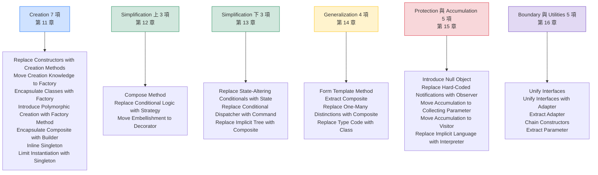

### 10.3 與常見清單的差異對照

網路上與各種教材中流傳的「Refactoring to Patterns 清單」，經常與現行官方 catalog 不完全一致。**其中大多數差異並不是錯誤，而是命名沿革**。本節把三種性質完全不同的情況分開列出，避免讀者在交叉比對時把「舊名」誤判為「幻覺」。

#### 情況一：同一條目的出版前舊名

Industrial Logic 網站上的**出版前舊 catalog 頁**（`papers/catalog.html`）與**現行頁**（`xp/refactoring/catalog.html`）都是 27 項，但有三個條目換過名字。兩頁的條目連結**使用完全相同的 URL slug**，這就是「它們是同一條目」的直接證據：

| 出版前舊名 | 現行官方名稱 | 共用的 URL slug（證據） | 本手冊章節 |
|---|---|---|---|
| Replace **Multiple** Constructors with Creation Methods | Replace Constructors with Creation Methods | `constructorCreation.html` | 11.1 |
| **Consolidate Creation with Factory** | Move Creation Knowledge to Factory | `creationWithFactory.html` | 11.2 |
| **Pull Up Common Interface** | Unify Interfaces | `commonInterface.html` | 16.1 |

> 🏭 **這件事為什麼重要**
> 許多企業內部文件（甚至部分 AI 生成的整理）會把 *Consolidate Creation with Factory* 或 *Pull Up Common Interface* 直接判定為「書上沒有、可能是幻覺」。
> **這個判定是錯的。** 它們是 Industrial Logic 在 2004 年書籍出版前使用的官方名稱，舊頁至今仍可存取。正確的說法是「這是舊名，現行名稱是……」，而不是「沒有這個條目」。

#### 情況二：官方有、但常見清單經常遺漏的兩項

| 條目 | 為什麼常被遺漏 | 本手冊的處理 |
|---|---|---|
| **Inline Singleton** | 它是「移除」方向的重構，與「導入 Pattern」的直覺相反 | **完整展開（11.6）**，而且本手冊認為它是最重要的條目之一 |
| **Unify Interfaces** | 名稱與 Unify Interfaces with Adapter 相近，常被誤認為同一項 | **分開展開（16.1 與 16.2）**，並說明兩者的使用時機差異 |

#### 情況三：真的不屬於本書的條目

下表這些名稱常被混入 Refactoring to Patterns 清單，但它們**實際來自 Fowler《Refactoring》**，屬於低階重構，不是 pattern-directed refactoring：

| 常見名稱 | 實際出處 | 與本書條目的差別 |
|---|---|---|
| Replace Conditional with Polymorphism | Fowler《Refactoring》 | 一步到位的低階重構；Kerievsky 的 **Replace Conditional Logic with Strategy**（12.2）是一連串步驟且目標為 Strategy 結構 |
| Introduce Parameter Object | Fowler《Refactoring》 | 低階重構；本手冊在 7.6 Data Clumps 中引用它作為前置手法 |
| Extract Interface / Pull Up Method | Fowler《Refactoring》 | 它們是執行 **Unify Interfaces**（16.1）時會用到的工具，本身不是本書條目 |

> 🔧 **本手冊的工程建議**
> 名稱混淆在企業內部文件中非常常見，而且會造成實際問題：當 A 工程師說「我們做一下 Consolidate Creation with Factory」，B 工程師去查新版書卻查不到，溝通就斷了。
> 建議三點：
>
> 1. **正式文件（ADR、PR 描述、Commit message）一律使用現行 27 個英文名稱**。
> 2. 舊名不是錯誤，但只當口語說法；若必須寫入文件，請以「現行名（舊名）」格式標註。
> 3. 收到 AI Agent 產出的名稱時，**先查附錄 H 的對照表再判定是否為幻覺**，不要直接否定。

### 10.4 每個條目的閱讀方式

第 11～16 章的每一個條目，都採用以下十段格式：

| 段落 | 用途 | 你可能只需要讀這幾段 |
|---|---|---|
| **① 一句話** | 這個重構在做什麼 | ✅ 快速掃描時 |
| **② 起點 Smell** | 什麼情況下會用到它 | ✅ 快速掃描時 |
| **③ Before** | Java 8 + Spring Boot 2.x 風格的原始程式碼 | |
| **④ 重構步驟** | 編號的小步驟，每步可編譯可測 | ✅ 實際動手時 |
| **⑤ 中間態** | 走到一半長什麼樣，以及可不可以停在這裡 | ✅ **最重要，但最常被跳過** |
| **⑥ After** | Java 25 + Spring Boot 4.x 風格的結果 | |
| **⑦ 得到什麼** | Benefits | |
| **⑧ 付出什麼** | Trade-offs（含安全性、效能、可維護性三面向） | ✅ 提案與 Review 時 |
| **⑨ 什麼時候不要用** | When NOT to use | ✅ **必讀** |
| **⑩ AI Prompt 與驗證** | 給 Coding Agent 的指令與 checklist | ✅ 使用 AI 時 |

> ⚠️ **關於 Before 範例的說明**
> 本手冊的 Before 範例刻意使用 **Java 8 + Spring Boot 2.x + `javax`** 的寫法，包含一些現在看來過時的做法（`SimpleDateFormat`、`@Autowired` 欄位注入、`Date`）。
> **這不是疏忽，是刻意的**——因為企業裡實際會遇到的就是這樣的程式碼。用 Java 25 寫「假的爛程式碼」沒有教學價值。

### 10.5 本章實務案例

**情境**：某團隊建立內部的「重構手法清單」時遇到的問題。

團隊架構師整理了一份 Wiki 頁面，列出 35 個「重構手法」，來源包括 Fowler 的書、Kerievsky 的書、幾篇部落格文章與 AI 工具的整理。

三個月後發現的問題：

| 問題 | 具體狀況 |
|---|---|
| 名稱衝突 | 清單裡同時有 `Replace Conditional with Polymorphism`（Fowler）與 `Replace Conditional Logic with Strategy`（Kerievsky），工程師不知道差別 |
| 查不到來源 | 有 4 個名稱在兩本書裡都查不到，追查後發現是 AI 整理時的幻覺 |
| 層級混亂 | 低階重構（Extract Method）與 pattern-directed refactoring（Move Creation Knowledge to Factory）混在同一份清單，給人「難度相同」的錯覺 |
| Review 時無法引用 | PR 描述寫「依 Wiki 第 17 項重構」，但 Wiki 改過版，編號變了 |

修正做法：

```text
拆成三份文件，各自標明來源：

  文件 A：低階重構手法（來源：Fowler《Refactoring》）
          → 直接連到本 repo 的 分析與設計/Refactoring重構教學.md

  文件 B：Pattern-directed Refactoring（來源：Kerievsky，27 項，附官方 URL）
          → 即本手冊第三部

  文件 C：團隊自訂的慣例做法（明確標示「這是我們自己的，不是書上的」）
```

成效：

| 指標 | Before | After |
|---|---|---|
| PR 描述中重構手法名稱的正確率 | 約 60% | 97% |
| 「這個手法是哪本書的」爭論次數 | 每月 2～3 次 | 0 |
| 幻覺條目數 | 4 | 0 |

> 🔧 **這個案例的教訓**
> 在 AI 協助整理技術資料的時代，**「來源可查證」比「清單完整」更重要**。
> 一份 27 項、每項都能追到官方頁面的清單，價值遠高於一份 35 項、其中 4 項是虛構的清單。

### 10.6 本章注意事項

> ⚠️ **不要把本章的分組當成原書結構引用**
> 官方 catalog 頁面沒有提供分組。本手冊的六個分組是教學用的整理，請在引用時註明。

> ⚠️ **Kerievsky 的條目與 Fowler 的條目要分開**
> 兩者的層級不同：Fowler 的是「一步」，Kerievsky 的是「一連串步驟組成的演進」。混在一起會讓團隊低估後者的成本。

> ✅ **建立團隊的名稱共識**
> 建議在團隊 Wiki 上直接連結本章 10.1 節的表格，並約定「正式文件只使用這 27 個英文名稱」。

> ✅ **先讀「什麼時候不要用」**
> 這是本手冊建議的閱讀順序。當你在考慮某個重構時，先看它的「不要用」條件，比先看步驟更有效率——因為多數情況下你會在這一段就決定不做。

---

## 第 11 章 Creation 類重構

這一章的 7 個條目，全部圍繞同一件事：**物件是怎麼被建立出來的**。

在進入細節之前，先看一張決策圖。**這張圖最重要的訊息是：多數情況下的答案是「不需要任何東西」。**

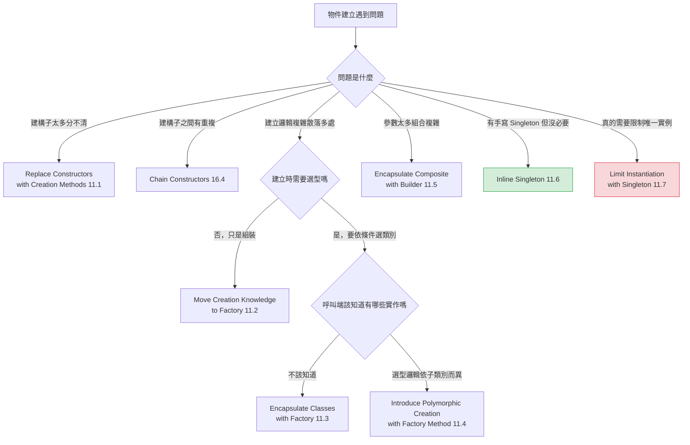

> ⚠️ **整章最重要的一句話**
> **把 `new` 包起來本身不是價值。**
> 一個內容只有 `return new Xxx();` 的 Factory，提供的抽象等於零，成本卻是一個額外的檔案加一層間接。
> 在 Spring 專案中，這件事更嚴重——因為 Spring 的 DI 容器本來就在做物件建立與組裝，自己再寫一層 Factory 通常是**重複了框架的職責**。

---

### 11.1 Replace Constructors with Creation Methods

#### 一句話

把「多個難以分辨的建構子」換成「名稱能說明意圖的靜態工廠方法」。

#### 起點 Smell

- 一個類別有多個建構子，簽章相似到需要看文件才知道差別
- 建構子被迫用「多一個沒用的參數」來區分多載（overload）
- 呼叫端讀起來像 `new Loan(commitment, riskRating, maturity, null)`，完全看不出意圖

#### Before

```java
// Before：Java 8 — 三個建構子，呼叫端無法分辨
public class Loan {
    private final BigDecimal commitment;
    private final BigDecimal outstanding;
    private final int riskRating;
    private final Date maturity;
    private final Date expiry;

    // 定期貸款
    public Loan(BigDecimal commitment, int riskRating, Date maturity) {
        this(commitment, BigDecimal.ZERO, riskRating, maturity, null);
    }

    // 循環信用
    public Loan(BigDecimal commitment, int riskRating, Date maturity, Date expiry) {
        this(commitment, BigDecimal.ZERO, riskRating, maturity, expiry);
    }

    // 已動用的循環信用 — 注意：只差在多了 outstanding
    public Loan(BigDecimal commitment, BigDecimal outstanding,
                int riskRating, Date maturity, Date expiry) {
        this.commitment = commitment;
        this.outstanding = outstanding;
        this.riskRating = riskRating;
        this.maturity = maturity;
        this.expiry = expiry;
    }
}
```

呼叫端：

```java
// 這三行分別建立了什麼？必須去看建構子的實作才知道
Loan a = new Loan(amount, 3, maturityDate);
Loan b = new Loan(amount, 3, maturityDate, expiryDate);
Loan c = new Loan(amount, used, 3, maturityDate, expiryDate);
```

#### 重構步驟

| 步驟 | 動作 | 驗證 |
|---|---|---|
| 1 | 為每一個建構子，新增一個**具名的 static 方法**，內容呼叫原建構子 | 編譯通過、測試全綠 |
| 2 | 用 IDE 的 Find Usages 找出所有 `new Loan(...)`，**一次改一處**，改成呼叫具名方法 | 每改一處跑一次測試 |
| 3 | 全部改完後，把建構子改為 `private` | 編譯失敗代表還有漏改的地方 |
| 4 | 合併只剩一個的建構子，用 Chain Constructors（16.4）消除重複 | 測試全綠 |

#### 中間態

**走完步驟 2 就已經獲得了大部分價值**：呼叫端變得可讀。步驟 3、4 是收尾。

如果這個類別是對外發布的 API（其他團隊或外部系統在用），**步驟 3 必須跳過**——把建構子改成 private 會破壞相容性。此時保留 public 建構子，只是不再推薦使用即可。

#### After

```java
// After：Java 25
public final class Loan {
    private final Money commitment;
    private final Money outstanding;
    private final RiskRating riskRating;
    private final LocalDate maturity;
    private final LocalDate expiry;      // 可為 null，代表無到期展期

    private Loan(Money commitment, Money outstanding, RiskRating riskRating,
                 LocalDate maturity, LocalDate expiry) {
        this.commitment = Objects.requireNonNull(commitment);
        this.outstanding = Objects.requireNonNull(outstanding);
        this.riskRating = Objects.requireNonNull(riskRating);
        this.maturity = Objects.requireNonNull(maturity);
        this.expiry = expiry;
    }

    /** 定期貸款：一次撥貸、到期還清，無循環額度。 */
    public static Loan newTermLoan(Money commitment, RiskRating rating, LocalDate maturity) {
        return new Loan(commitment, Money.zero(commitment.currency()), rating, maturity, null);
    }

    /** 循環信用額度：尚未動用。 */
    public static Loan newRevolver(Money commitment, RiskRating rating,
                                   LocalDate maturity, LocalDate expiry) {
        return new Loan(commitment, Money.zero(commitment.currency()), rating, maturity, expiry);
    }

    /** 循環信用額度：已動用部分金額。 */
    public static Loan newDrawnRevolver(Money commitment, Money outstanding,
                                        RiskRating rating, LocalDate maturity, LocalDate expiry) {
        return new Loan(commitment, outstanding, rating, maturity, expiry);
    }
}
```

呼叫端：

```java
Loan a = Loan.newTermLoan(amount, RiskRating.of(3), maturityDate);
Loan b = Loan.newRevolver(amount, RiskRating.of(3), maturityDate, expiryDate);
Loan c = Loan.newDrawnRevolver(amount, used, RiskRating.of(3), maturityDate, expiryDate);
```

#### 得到什麼

- 呼叫端**一眼可讀**，不需要查建構子
- 每種建立方式可以有**各自的驗證規則**（但請見下方的重要警告）
- 未來可以在方法內加入快取、池化或回傳子類別，而呼叫端不受影響
- 方法名稱成為**領域語彙**的一部分（`newRevolver` 是業務詞彙，`new Loan(...)` 不是）

#### 付出什麼

| 面向 | 代價 |
|---|---|
| **可維護性** | 幾乎沒有代價。這是 CP 值最高的 creation 類重構 |
| **效能** | 無（static 方法會被 JIT inline） |
| **安全性** | **正面影響**——可以在建立時集中做驗證，避免建立出無效物件 |
| **相容性** | ⚠️ 若把建構子改為 private，會破壞既有 API 的相容性 |
| **框架相容** | ⚠️ Jackson 反序列化、JPA 需要無參數建構子或特定 annotation，改 private 前要確認 |

#### 什麼時候不要用

- 類別只有**一個**建構子，且參數意圖清楚 → 不需要
- 類別是 JPA Entity（需要無參數建構子）或 DTO（框架要反序列化）→ 需要額外處理，通常不值得
- 類別是對外 API 且不能破壞相容性 → 可以新增具名方法，但不要動原建構子
- 只是為了「看起來比較專業」→ 不要

#### AI Prompt 與驗證

```text
角色：資深 Java 工程師。

背景：[類別名稱] 有 [N] 個建構子，呼叫端難以分辨用途。
      本專案 Java 25 / Spring Boot 4.1.x。

目標：執行 Replace Constructors with Creation Methods。

限制：
- 不得修改任何建構子的邏輯，只新增 static 方法呼叫它們
- 不得在新方法中加入任何新的驗證或檢查（這是行為變更，我會另外處理）
- 不得把建構子改為 private（這一步我會另外決定）
- 不得修改測試檔案
- 方法名稱必須使用本專案既有的領域語彙（參考 [glossary 檔案路徑]）

步驟：
1. 先列出每個建構子實際代表的業務情境，以及你建議的方法名稱，等我確認
2. 確認後，一次新增一個 static 方法，每次執行測試
3. 列出所有呼叫端，但不要修改它們

停止條件：
- 若某個建構子的業務意圖無法從程式碼判斷，停止並詢問，不要猜測命名
- 若發現該類別是 JPA Entity 或有 Jackson annotation，停止並回報
```

驗證 checklist：

- [ ] 所有既有測試全綠，且測試檔案未被修改
- [ ] 若類別參與序列化：JSON 的序列化與反序列化結果完全一致
- [ ] 若類別是 JPA Entity：確認無參數建構子仍存在
- [ ] **沒有在 Creation Method 中新增任何驗證**（見下方警告）
- [ ] 方法名稱經過領域專家或 PM 確認

> ⚠️ **最容易出事的一點**
> 在 Creation Method 中「順手」加上驗證（例如檢查動用金額不得大於額度），**是行為變更，不是重構**。
> 原本可以建立的無效物件，現在會丟例外。如果 Legacy 系統中真的存在這種資料（很常見），這會造成生產事故。
> **正確做法**：先分成兩個 PR——第一個純粹重構，第二個才加驗證，並且第二個 PR 要先查詢生產資料確認有多少筆會受影響。

---

### 11.2 Move Creation Knowledge to Factory

#### 一句話

把「建立某個物件所需的知識」從散落的呼叫端，集中到一個 Factory 中。

#### 起點 Smell

- 同一組「建立 + 組裝 + 設定預設值」的程式碼，在 3 個以上的地方重複
- 建立一個物件需要知道很多細節（要先查表、要依條件設定欄位、要組裝子物件）
- 建立邏輯改變時，要修改多個地方（Shotgun Surgery）

#### Before

```java
// Before：Java 8 — 兩個 Service 各自組裝 Notification，邏輯幾乎相同但細節有差
@Service
public class OrderService {
    @Autowired private CustomerDao customerDao;
    @Autowired private TemplateDao templateDao;
    @Autowired private NotificationSender sender;

    public void notifyOrderPlaced(Order order) {
        Notification n = new Notification();
        n.setRecipient(customerDao.findEmail(order.getCustomerId()));
        n.setTemplate(templateDao.find("ORDER_PLACED"));
        n.setLocale(customerDao.findLocale(order.getCustomerId()));
        n.setPriority(order.getAmount().compareTo(BIG) > 0 ? 1 : 5);
        n.setRetryCount(3);
        n.setSendAt(new Date());
        sender.send(n);
    }
}

@Service
public class ShipmentService {
    @Autowired private CustomerDao customerDao;
    @Autowired private TemplateDao templateDao;
    @Autowired private NotificationSender sender;

    public void notifyShipped(Shipment s) {
        Notification n = new Notification();
        n.setRecipient(customerDao.findEmail(s.getCustomerId()));
        n.setTemplate(templateDao.find("SHIPPED"));
        n.setLocale(customerDao.findLocale(s.getCustomerId()));
        n.setPriority(5);
        n.setRetryCount(3);
        // 這裡忘了 setSendAt — 這就是散落建立邏輯的典型後果
        sender.send(n);
    }
}
```

#### 重構步驟

| 步驟 | 動作 | 驗證 |
|---|---|---|
| 1 | **先確認各處的差異是有意的還是 bug**（上例的 `setSendAt` 遺漏就是 bug） | 查業務規則 |
| 2 | 若是 bug，**先開獨立 PR 修正**，不要混在重構裡 | 修正後測試 |
| 3 | 建立 `NotificationFactory`，把第一處的建立邏輯搬進去 | 測試全綠 |
| 4 | 第一處改為呼叫 Factory | 測試全綠 |
| 5 | 逐一把其餘呼叫端改為使用 Factory，**每次一處** | 每次跑測試 |
| 6 | 移除各 Service 中不再需要的 `CustomerDao` / `TemplateDao` 依賴 | 測試全綠 |

#### 中間態

**步驟 4 之後就可以停下來評估**。如果只有兩處呼叫端，而且它們的差異其實很大，那麼把它們硬塞進同一個 Factory 可能不划算。

**判斷準則**：如果 Factory 的方法需要 2 個以上的 `boolean` 參數來應付差異，代表這些建立邏輯不該合併。

#### After

```java
// After：Java 25 + Spring Boot 4.x
@Component
public class NotificationFactory {
    private final CustomerDao customerDao;
    private final TemplateDao templateDao;
    private final Clock clock;                       // 可測試的時間來源

    public NotificationFactory(CustomerDao customerDao, TemplateDao templateDao, Clock clock) {
        this.customerDao = customerDao;
        this.templateDao = templateDao;
        this.clock = clock;
    }

    public Notification forOrderPlaced(Order order) {
        Priority priority = order.amount().isGreaterThan(Money.of(BIG_AMOUNT))
                            ? Priority.HIGH : Priority.NORMAL;
        return baseFor(order.customerId(), TemplateCode.ORDER_PLACED, priority);
    }

    public Notification forShipped(Shipment shipment) {
        return baseFor(shipment.customerId(), TemplateCode.SHIPPED, Priority.NORMAL);
    }

    private Notification baseFor(CustomerId customerId, TemplateCode code, Priority priority) {
        var profile = customerDao.findProfile(customerId);
        return Notification.builder()
                .recipient(profile.email())
                .locale(profile.locale())
                .template(templateDao.find(code))
                .priority(priority)
                .retryCount(DEFAULT_RETRY)
                .sendAt(LocalDateTime.now(clock))      // 不會再有人忘記
                .build();
    }
}
```

#### 得到什麼

- 建立邏輯**只有一份**，不會再出現「某處忘了設某個欄位」
- 新增一種通知只需要在 Factory 加一個方法
- Service 不再需要認識 `CustomerDao`、`TemplateDao`（依賴減少）
- Factory 可以單獨測試

#### 付出什麼

| 面向 | 代價 |
|---|---|
| **可維護性** | 多一個類別；但若原本有 3 處以上重複，淨效益為正 |
| **效能** | 無明顯影響 |
| **安全性** | **正面**——集中處理代表可以集中做權限與遮罩檢查 |
| **耦合** | ⚠️ Factory 會成為多個 Service 的共同依賴，它的變更會影響所有使用者 |
| **測試** | ⚠️ Service 的測試現在需要 mock Factory（或使用真實 Factory 加 mock 其依賴） |

#### 什麼時候不要用

- **只有 1 至 2 處呼叫端** → 直接抽一個私有方法就好，不需要新類別
- **各處的建立邏輯差異大**，合併後需要多個旗標參數 → 不要合併
- **Spring 已經在做這件事**——如果你要建立的是 Spring bean，用 `@Configuration` 加 `@Bean` 即可，不要另外寫 Factory
- 建立邏輯只有 `new Xxx()` → **這是最常見的誤用**，包一層 Factory 毫無價值

#### AI Prompt 與驗證

```text
角色：資深 Java 工程師。

背景：以下 [N] 個位置都在建立 [類別名稱]，疑似有重複的建立邏輯。
      [列出檔案與行號]

目標：分析是否應該執行 Move Creation Knowledge to Factory。

限制（第一階段只做分析，不得修改程式碼）：
- 不得修改任何檔案

步驟：
1. 逐一比對各處的建立邏輯，做出一張「欄位 × 位置」的設定對照表
2. 標示出有差異的欄位，並分類為：
   (a) 有意的業務差異
   (b) 疑似遺漏或 bug
   (c) 無法判斷
3. 回答：若要合併，Factory 的方法需要幾個參數？其中有幾個是 boolean 旗標？
4. 給出建議：合併 / 不合併 / 先修 bug 再評估

停止條件：
- 步驟 2 中若出現 (b) 或 (c) 類別的欄位，停止，先由人類確認業務規則
- 若步驟 3 的 boolean 旗標達 2 個以上，建議不合併，並說明理由
```

驗證 checklist：

- [ ] 各處的行為與重構前**完全一致**（包含原本的差異，除非已明確決定統一）
- [ ] 若統一了原本不一致的行為，這是行為變更，需獨立 PR 與回歸測試
- [ ] Factory 沒有變成一個什麼都做的 God Class
- [ ] Factory 的方法簽章中沒有 2 個以上的 boolean 旗標
- [ ] 時間、亂數等不確定來源已抽象化（如 `Clock`），使 Factory 可測試

---

### 11.3 Encapsulate Classes with Factory

#### 一句話

把「有哪些實作類別」這件事藏起來，只讓呼叫端看到介面與 Factory。

#### 起點 Smell

- 呼叫端需要 `import` 一堆具體實作類別
- 呼叫端出現 `if (type.equals("A")) return new AProcessor(); else ...`
- 想新增一個實作時，發現要修改多個呼叫端

#### Before

```java
// Before：Java 8 — 呼叫端知道太多
package com.example.report;

public interface ReportGenerator { byte[] generate(ReportRequest req); }
public class PdfReportGenerator implements ReportGenerator { }    // public
public class ExcelReportGenerator implements ReportGenerator { }  // public
public class CsvReportGenerator implements ReportGenerator { }    // public

// 呼叫端
import com.example.report.PdfReportGenerator;
import com.example.report.ExcelReportGenerator;
import com.example.report.CsvReportGenerator;

public byte[] download(String format, ReportRequest req) {
    if ("PDF".equals(format))        return new PdfReportGenerator().generate(req);
    else if ("XLSX".equals(format))  return new ExcelReportGenerator().generate(req);
    else if ("CSV".equals(format))   return new CsvReportGenerator().generate(req);
    else throw new UnsupportedFormatException(format);
}
```

#### 重構步驟

| 步驟 | 動作 | 驗證 |
|---|---|---|
| 1 | 建立 `ReportGeneratorFactory`，把選型的 `if/else` 搬進去 | 測試全綠 |
| 2 | 呼叫端改為 `factory.create(format).generate(req)` | 測試全綠 |
| 3 | 移除呼叫端對具體類別的 `import` | 編譯通過 |
| 4 | 把三個實作類別的可見度改為 **package-private**（拿掉 `public`） | 編譯失敗代表還有外部依賴 |
| 5 | 用 ArchUnit 加一條規則，防止未來又有人直接 new 具體類別 | 架構測試通過 |

#### 中間態

**步驟 2 之後就有價值了**。步驟 3 至 5 是「把門鎖上」，防止未來回退。

如果專案還沒有 ArchUnit，步驟 5 可以省略，但步驟 4 一定要做——**package-private 是最便宜的封裝機制**。

#### After

```java
// After：Java 25 + Spring Boot 4.x
package com.example.report;

// 對外只有這兩個是 public
public interface ReportGenerator {
    ReportFormat format();
    byte[] generate(ReportRequest req);
}

@Component
public class ReportGeneratorFactory {
    private final Map<ReportFormat, ReportGenerator> generators;

    // Spring 會自動注入所有 ReportGenerator 實作
    public ReportGeneratorFactory(List<ReportGenerator> all) {
        this.generators = all.stream()
            .collect(Collectors.toUnmodifiableMap(ReportGenerator::format, Function.identity()));
    }

    public ReportGenerator create(ReportFormat format) {
        ReportGenerator generator = generators.get(format);
        if (generator == null) {
            throw new UnsupportedFormatException(format);
        }
        return generator;
    }
}

// 這三個變成 package-private，外部看不到
@Component class PdfReportGenerator   implements ReportGenerator { }
@Component class ExcelReportGenerator implements ReportGenerator { }
@Component class CsvReportGenerator   implements ReportGenerator { }
```

搭配 ArchUnit 規則（第 39 章會詳述）：

```java
@ArchTest
static final ArchRule 報表實作不得被套件外直接使用 =
    classes().that().implement(ReportGenerator.class)
             .should().onlyBeAccessed().byClassesThat()
             .resideInAPackage("com.example.report..");
```

> 🔧 **Spring 環境的重要提醒**
> 上面的 After 版本利用了 Spring 的「注入同型別所有 bean」機制。這在 Spring 專案中**通常比手寫 switch 的 Factory 更好**，因為新增一個實作時完全不需要修改 Factory。
> 但代價是：**新增一個實作變成隱式的**——看 Factory 的程式碼看不出有哪些實作。團隊要在「新增時零修改」與「可見性」之間取捨。

#### 得到什麼

- 呼叫端不再與具體實作耦合
- 新增一種格式：只需新增一個 package-private 類別（Spring 版本連 Factory 都不用改）
- 實作類別可以自由改名、改結構、合併，不影響外部

#### 付出什麼

| 面向 | 代價 |
|---|---|
| **可維護性** | 多一個 Factory 類別 |
| **可見性** | ⚠️ Spring 自動注入版本：**無法從程式碼直接看出有哪些實作**，需要靠 IDE 或執行期觀察 |
| **效能** | 無（Map 查找） |
| **安全性** | **正面**——可以在 Factory 中集中做權限檢查（例如某些格式只有特定角色可用） |
| **除錯** | ⚠️ 選型錯誤時的錯誤訊息要設計好，否則「為什麼拿到的是 CSV」會很難查 |

#### 什麼時候不要用

- **只有一個實作** → 這是 Speculative Generality（第 8.11 節），不要做
- **實作類別本來就該被外部知道**（例如它們是公開 API 的一部分）
- **選型邏輯只出現在一個地方** → 那個 `if/else` 就是唯一的分派點，它沒有問題
- 呼叫端本來就只用其中一種

#### AI Prompt 與驗證

```text
角色：資深 Java / Spring 工程師。

背景：[介面名稱] 目前有 [N] 個實作，呼叫端直接 new 具體類別。
      本專案 Java 25 / Spring Boot 4.1.x，使用建構子注入。

目標：評估並執行 Encapsulate Classes with Factory。

限制：
- 不得改變任何實作類別的內部邏輯
- 不得改變選型的判斷結果（相同輸入必須選到相同的實作）
- 保留原本 default 或 else 分支的例外型別與訊息

步驟：
1. 先回答：目前有幾個實作？有哪些呼叫端？（列出檔案行號）
2. 回答：實作數量是否達 2 個以上？若只有 1 個，請建議不要執行本重構並停止
3. 提出兩種方案的比較：
   (a) Factory 內用明確的 switch（可見性好，新增要改 Factory）
   (b) Spring 注入 List 介面（新增零修改，可見性差）
   說明各自的取捨，等我選擇
4. 依我的選擇實作，每步跑測試

停止條件：
- 實作數為 1，停止
- 發現有實作類別被 com.example.report 以外的套件使用，停止並列出
```

驗證 checklist：

- [ ] 所有原本的 format 值都能選到相同的實作
- [ ] 未知 format 的例外型別與訊息完全一致
- [ ] 實作類別已改為 package-private，且編譯通過
- [ ] 若使用 Spring 自動注入：確認**所有**實作都有 `@Component`（漏掉一個會靜默少一種格式）
- [ ] 若使用 Spring 自動注入：確認沒有兩個實作回傳相同的 format key（`toUnmodifiableMap` 會丟例外，但要在啟動時就發現）
- [ ] 加上 ArchUnit 規則防止回退

### 11.4 Introduce Polymorphic Creation with Factory Method

#### 一句話

當一個繼承體系裡，每個子類別都需要「建立自己專屬的某種物件」時，把那個建立動作抽成一個可覆寫的方法。

> ⚠️ **先講結論**：這是 Creation 類中**最少用到**的一項。在 Spring 專案中，它幾乎總是被依賴注入取代。請先讀「什麼時候不要用」。

#### 起點 Smell

- 一個繼承體系中，多個子類別有**幾乎相同**的方法，唯一的差別是中間 `new` 了不同的類別
- 這是 Duplicated Code（7.2）的一種特殊形式

#### Before

```java
// Before：Java 8 — 兩個測試類別的 setUp 幾乎一樣，只差在 new 了不同的東西
public abstract class DataProcessorTest {
    // 子類別各自複製了幾乎相同的流程
}

public class XmlProcessorTest extends DataProcessorTest {
    public void testProcess() {
        DataProcessor p = new XmlProcessor();      // ← 只有這行不同
        p.setEncoding("UTF-8");
        p.setStrictMode(true);
        Result r = p.process(sampleInput());
        assertEquals(expected(), r);
    }
}

public class JsonProcessorTest extends DataProcessorTest {
    public void testProcess() {
        DataProcessor p = new JsonProcessor();     // ← 只有這行不同
        p.setEncoding("UTF-8");
        p.setStrictMode(true);
        Result r = p.process(sampleInput());
        assertEquals(expected(), r);
    }
}
```

#### 重構步驟

| 步驟 | 動作 | 驗證 |
|---|---|---|
| 1 | 在父類別加入一個 `protected abstract` 的建立方法 | 編譯（子類別會編譯失敗，這是預期的） |
| 2 | 每個子類別實作該方法，內容就是原本的那一行 `new` | 編譯通過、測試全綠 |
| 3 | 把重複的流程用 Form Template Method（14.1）拉到父類別 | 測試全綠 |
| 4 | 移除子類別中重複的方法 | 測試全綠 |

#### 中間態

步驟 2 之後，子類別仍有重複的流程，但建立點已經被抽象化。**如果重複的部分只有兩三行，可以停在這裡**——把流程也拉到父類別會引入繼承耦合，未必划算。

#### After

```java
// After：Java 25 + JUnit 5
abstract class DataProcessorTestBase {

    /** 由各子類別決定要測試哪一種實作。 */
    protected abstract DataProcessor createProcessor();

    @Test
    void 處理樣本輸入應產生預期結果() {
        DataProcessor processor = createProcessor();
        processor.setEncoding(StandardCharsets.UTF_8);
        processor.setStrictMode(true);

        Result result = processor.process(sampleInput());

        assertThat(result).isEqualTo(expected());
    }
}

class XmlProcessorTest extends DataProcessorTestBase {
    @Override protected DataProcessor createProcessor() { return new XmlProcessor(); }
}

class JsonProcessorTest extends DataProcessorTestBase {
    @Override protected DataProcessor createProcessor() { return new JsonProcessor(); }
}
```

> 🔧 **本手冊的工程建議：JUnit 5 有更好的做法**
> 上面的繼承結構在 JUnit 5 中可以用 `@ParameterizedTest` 完全取代，而且不需要繼承：
>
> ```java
> @ParameterizedTest
> @MethodSource("processors")
> void 處理樣本輸入應產生預期結果(DataProcessor processor) {
>     processor.setEncoding(StandardCharsets.UTF_8);
>     processor.setStrictMode(true);
>     assertThat(processor.process(sampleInput())).isEqualTo(expected());
> }
>
> static Stream<DataProcessor> processors() {
>     return Stream.of(new XmlProcessor(), new JsonProcessor());
> }
> ```
>
> **在 JUnit 5 專案中，請優先考慮這個做法。** 這是本手冊與 2004 年原書的另一處時代差異——當年的 JUnit 3 沒有參數化測試。

#### 得到什麼

- 消除子類別間的重複流程
- 新增一種實作的測試只需要寫一個方法

#### 付出什麼

| 面向 | 代價 |
|---|---|
| **可維護性** | ⚠️ **引入了繼承耦合**。父類別的任何變更都會影響所有子類別 |
| **可讀性** | ⚠️ 要理解一個測試，必須同時看父類別與子類別 |
| **彈性** | ⚠️ Java 單一繼承，用掉了唯一的繼承額度 |
| **效能** | 無 |

#### 什麼時候不要用

- **Spring 專案的正式程式碼中** → 用依賴注入，不要用繼承 + Factory Method
- **JUnit 5 專案的測試中** → 用 `@ParameterizedTest`
- **只有兩個子類別，且重複只有兩三行** → 重複比繼承便宜
- **子類別之間的流程其實有微妙差異** → 硬拉到父類別後會出現一堆 `if (isXml())`，比原本更糟

#### AI Prompt 與驗證

```text
角色：資深 Java 工程師。

背景：[父類別] 底下有 [N] 個子類別，疑似有重複的流程。
      本專案 Java 25 / JUnit 5。

目標：評估是否適合 Introduce Polymorphic Creation with Factory Method。

限制（只做分析）：
- 不得修改任何檔案

步驟：
1. 逐行比對各子類別的重複方法，標示出「完全相同」與「有差異」的部分
2. 回答：差異是否只有物件建立那一行？若還有其他差異，請列出
3. 回答：這是測試程式碼還是正式程式碼？
4. 依以下規則給出建議：
   - 若是測試且專案為 JUnit 5，建議改用 @ParameterizedTest 而非繼承
   - 若是 Spring 正式程式碼，建議改用依賴注入而非繼承
   - 若差異不只建立那一行，建議不要執行本重構
   - 其餘情況才建議執行

停止條件：
- 完成步驟 4 後停止，等我決定
```

驗證 checklist：

- [ ] 所有子類別的測試仍然各自執行（沒有因為抽到父類別而少跑）
- [ ] 測試數量與重構前相同
- [ ] 沒有把「原本有差異的行為」誤當成相同而合併

---

### 11.5 Encapsulate Composite with Builder

#### 一句話

當要建立一個巢狀的樹狀結構（例如 XML、DOM、規則樹）很囉唆時，用 Builder 把建立過程變得簡潔且不易出錯。

#### 起點 Smell

- 建立巢狀結構的程式碼充滿樣板：`new Node(); node.setX(); parent.add(node);` 反覆出現
- 呼叫端需要知道 Composite 的內部結構細節
- 容易忘記把子節點加入父節點（結構建錯但不會報錯）

#### Before

```java
// Before：Java 8 — 建立一段 XML 需要大量樣板
TagNode orders = new TagNode("orders");

TagNode order = new TagNode("order");
order.addAttribute("id", "12345");
orders.add(order);

TagNode product = new TagNode("product");
product.addAttribute("id", "P-001");
product.addAttribute("color", "red");
order.add(product);

TagNode price = new TagNode("price");
price.addAttribute("currency", "TWD");
price.setValue("1200");
product.add(price);
// 很容易寫成 orders.add(price) — 結構錯了，但編譯與執行都不會報錯
```

#### 重構步驟

| 步驟 | 動作 | 驗證 |
|---|---|---|
| 1 | 建立 `TagBuilder`，內部維護一個「目前節點」的堆疊 | 測試全綠 |
| 2 | 提供 `addChild` / `addAttribute` / `addValue` / `end` 等方法 | 新增 Builder 的單元測試 |
| 3 | 一次改寫一處呼叫端，比對產出的字串與原本完全相同 | **每處都要比對輸出** |
| 4 | 全部改完後，把 `TagNode` 的可見度降為 package-private | 編譯通過 |

#### 中間態

步驟 3 進行到一半是完全可以接受的狀態——新程式碼用 Builder，舊程式碼維持原樣。**不需要一次改完所有呼叫端。**

#### After

```java
// After：Java 25
public final class TagBuilder {
    private final Deque<TagNode> stack = new ArrayDeque<>();
    private final TagNode root;

    public TagBuilder(String rootName) {
        this.root = new TagNode(rootName);
        stack.push(root);
    }

    public TagBuilder addChild(String name) {
        TagNode child = new TagNode(name);
        stack.peek().add(child);          // 不可能忘記掛到父節點
        stack.push(child);
        return this;
    }

    public TagBuilder addAttribute(String name, String value) {
        stack.peek().addAttribute(name, value);
        return this;
    }

    public TagBuilder addValue(String value) {
        stack.peek().setValue(value);
        return this;
    }

    public TagBuilder end() {
        if (stack.size() <= 1) {
            throw new IllegalStateException("已在根節點，無法再結束");
        }
        stack.pop();
        return this;
    }

    public String toXml() {
        return root.toXml();
    }
}
```

呼叫端：

```java
String xml = new TagBuilder("orders")
        .addChild("order").addAttribute("id", "12345")
            .addChild("product")
                .addAttribute("id", "P-001")
                .addAttribute("color", "red")
                .addChild("price").addAttribute("currency", "TWD").addValue("1200").end()
            .end()
        .end()
        .toXml();
```

#### 得到什麼

- 呼叫端**不可能忘記把子節點掛到父節點**（結構由 Builder 保證）
- 程式碼的縮排反映了結構的巢狀關係，可讀性大幅提升
- Composite 的內部結構被封裝，未來可以替換實作

#### 付出什麼

| 面向 | 代價 |
|---|---|
| **可維護性** | 多一個 Builder 類別 |
| **可讀性** | ⚠️ `end()` 的配對錯誤在編譯期抓不到，寫錯縮排時很難查 |
| **效能** | ⚠️ 多一層物件與方法呼叫；大量產生時（例如批次產生百萬筆 XML）需實測 |
| **安全性** | ⚠️ **若內容來自使用者輸入，Builder 必須處理跳脫**，否則會產生 XML injection |
| **除錯** | ⚠️ 流暢介面的堆疊追蹤較難閱讀 |

> ⚠️ **安全性提醒**
> 上面的範例沒有做 XML 跳脫。若 `addValue` 的內容可能來自使用者輸入，必須對 `< > & " '` 進行跳脫，否則會產生結構破壞或注入問題。
> **實務上請優先使用成熟的函式庫**（JAXB、Jackson XML、DOM API），不要自己寫 XML 產生器。本節的範例是為了說明 Builder 的結構，不是建議你自己實作 XML。

#### 什麼時候不要用

- **已經有成熟的函式庫**（JSON 用 Jackson、XML 用 JAXB）→ 用函式庫
- **結構只有兩層且固定** → 直接寫，不需要 Builder
- **只在一兩個地方建立** → 抽一個私有方法就夠
- 把 Builder 用在**非樹狀**的簡單物件上（那是另一種 Builder，見 7.5 節的 Long Parameter List）

#### AI Prompt 與驗證

```text
角色：資深 Java 工程師。

背景：以下程式碼在建立巢狀的 [結構名稱]，樣板程式碼很多。
      [貼上程式碼]
      本專案 Java 25。

目標：評估並執行 Encapsulate Composite with Builder。

限制：
- 產出的結果字串必須與原本「逐字元完全相同」
- 不得改變任何屬性的輸出順序
- 不得新增或移除任何跳脫處理（若原本沒跳脫，保持沒跳脫，但要在回報中標示這是安全風險）

步驟：
1. 先回答：專案是否已有處理此格式的成熟函式庫？若有，建議改用函式庫並停止
2. 若沒有，設計 Builder 的 API，先只輸出設計，等我確認
3. 確認後實作 Builder，並附上單元測試
4. 一次改寫一處呼叫端，每次都輸出「重構前後的結果字串比對」

停止條件：
- 任何一處的輸出字串有差異，立即停止並回報差異內容
- 發現內容可能來自使用者輸入而原本沒有跳脫，停止並回報安全風險
```

驗證 checklist：

- [ ] **產出的字串與重構前逐字元相同**（用 `assertEquals` 比對完整輸出，不要只比對片段）
- [ ] 屬性順序未改變（某些下游系統會依順序解析）
- [ ] 跳脫行為未改變
- [ ] `end()` 呼叫不足或過多時有明確的例外
- [ ] 大量產生時的效能未明顯退化

---

### 11.6 Inline Singleton

#### 一句話

把不必要的 Singleton 拆掉，讓它變回一般的物件。

> 🔧 **本手冊認為這是 Creation 類中最重要的一項**，因為企業 Java 專案裡的手寫 Singleton，絕大多數都該被移除。

#### 起點 Smell

- 有一個手寫的 Singleton（私有建構子 + `getInstance()`）
- 它的「唯一性」沒有任何領域上的必要，只是為了方便存取
- 測試時無法替換它，導致測試必須連到真實的資料庫或外部系統
- 它持有可變狀態，在並行下有風險

#### Before

```java
// Before：Java 8 — 典型的手寫 Singleton
public class ExchangeRateCache {
    private static final ExchangeRateCache INSTANCE = new ExchangeRateCache();
    private final Map<String, BigDecimal> rates = new HashMap<>();   // 可變狀態
    private Date lastRefresh;

    private ExchangeRateCache() { }

    public static ExchangeRateCache getInstance() { return INSTANCE; }

    public BigDecimal getRate(String currency) {
        if (lastRefresh == null || isStale(lastRefresh)) {
            refresh();                    // 會連外部 API
        }
        return rates.get(currency);
    }
}

// 呼叫端 — 散落在 23 個地方
BigDecimal rate = ExchangeRateCache.getInstance().getRate("USD");
```

這段程式碼的四個問題：

| 問題 | 後果 |
|---|---|
| 測試無法替換 | 任何用到匯率的單元測試，都會真的去呼叫外部 API |
| `HashMap` 非執行緒安全 | 並行 refresh 時可能無限迴圈或資料錯亂 |
| 隱藏的依賴 | 從 `OrderService` 的簽章完全看不出它依賴匯率服務 |
| 生命週期不受管理 | JVM 啟動到關閉都存在，無法重新初始化 |

#### 重構步驟

| 步驟 | 動作 | 驗證 |
|---|---|---|
| 1 | 把 `getInstance()` 改為回傳一個**由 Spring 管理的 bean**（過渡橋接） | 測試全綠 |
| 2 | 逐一把呼叫端改為建構子注入，**一次改一個類別** | 每次跑測試 |
| 3 | 全部改完後，移除 `getInstance()` 與 static 欄位 | 編譯失敗代表還有漏改 |
| 4 | 把 `private` 建構子改為 `public`，加上 `@Component` | 測試全綠 |
| 5 | 順手修正執行緒安全問題（**獨立 PR**） | 並行測試 |

**步驟 1 的橋接寫法**（讓新舊寫法可以並存，這是能漸進遷移的關鍵）：

```java
// 過渡期：兩種寫法都能用
@Component
public class ExchangeRateCache {
    private static ExchangeRateCache instance;       // 過渡用，最後會移除

    public ExchangeRateCache(RateApiClient client) { /* ... */ }

    @PostConstruct
    void registerLegacyAccess() { instance = this; }

    /** @deprecated 過渡期用，請改為建構子注入。預計於 2026-Q4 移除。 */
    @Deprecated(since = "2026-09", forRemoval = true)
    public static ExchangeRateCache getInstance() { return instance; }
}
```

#### 中間態

**步驟 1 完成後就是一個可以長期停留的狀態**：新程式碼用注入，舊程式碼繼續用 `getInstance()`。

這讓你可以在**不中斷開發**的情況下，花三個月慢慢遷移 23 個呼叫端。加上 `@Deprecated(forRemoval = true)` 之後，IDE 會提醒每個碰到舊寫法的人。

#### After

```java
// After：Java 25 + Spring Boot 4.x
@Component
public class ExchangeRateCache {
    private final RateApiClient client;
    private final Clock clock;
    private final Map<String, BigDecimal> rates = new ConcurrentHashMap<>();   // 執行緒安全
    private volatile Instant lastRefresh;

    public ExchangeRateCache(RateApiClient client, Clock clock) {
        this.client = client;
        this.clock = clock;
    }

    public BigDecimal getRate(CurrencyCode currency) {
        refreshIfStale();
        return rates.get(currency.value());
    }
}

// 呼叫端 — 依賴變成明示的
@Service
public class OrderService {
    private final ExchangeRateCache rateCache;

    public OrderService(ExchangeRateCache rateCache) {   // 一眼看出依賴
        this.rateCache = rateCache;
    }
}
```

#### 得到什麼

- **測試可以注入假的匯率**，單元測試不再連外部 API（這通常是最大的收穫）
- 依賴關係變成明示的，從建構子簽章就看得出來
- 生命週期由 Spring 管理，可以做 `@PreDestroy`、健康檢查、metrics
- 可以有多個實例（例如測試用、正式用）

#### 付出什麼

| 面向 | 代價 |
|---|---|
| **遷移成本** | ⚠️ 呼叫端越多越貴。23 個呼叫端大約需要 2 至 3 人天 |
| **可維護性** | **正面**——依賴明示、可測試 |
| **效能** | 無差異（Spring 的 singleton scope 效能與 static 相同） |
| **安全性** | **正面**——可控的生命週期，可加入稽核與權限 |
| **風險** | ⚠️ 過渡期的 static 橋接如果忘了移除，會留下技術債 |

#### 什麼時候不要用

- **Singleton 的唯一性是領域要求**（例如一個實體的硬體裝置控制器）→ 保留，但改用 11.7 節的做法
- **不在 DI 容器環境中**（純工具程式、Android 的某些情境）
- **它是真正無狀態的工具類別**（例如只有 static 方法的 `StringUtils`）→ 那不是 Singleton，不需要處理
- **呼叫端超過 100 處且該模組即將下線** → 成本效益不成立

#### AI Prompt 與驗證

```text
角色：資深 Java / Spring 工程師。

背景：[類別名稱] 是手寫的 Singleton（private 建構子 + getInstance()）。
      本專案 Java 25 / Spring Boot 4.1.x，使用建構子注入。

目標：執行 Inline Singleton，改為 Spring 管理的 bean。

限制：
- 必須採用「過渡橋接」方式，不得一次改完所有呼叫端
- 每個 PR 最多修改 5 個呼叫端
- 不得在本次重構中修改該類別的任何業務邏輯
- 不得在本次重構中修正執行緒安全問題（那是另一個 PR）

步驟：
1. 列出所有 getInstance() 的呼叫端（檔案與行號），並統計總數
2. 回答：該類別是否持有可變狀態？是否有執行緒安全疑慮？（只回報，不修正）
3. 實作過渡橋接版本（保留 getInstance 並標示 @Deprecated(forRemoval = true)）
4. 提出遷移計畫：分幾個 PR、每個 PR 改哪些呼叫端

停止條件：
- 若呼叫端超過 30 處，停止並先與我確認遷移計畫
- 若發現該類別在 static 初始化區塊中有副作用，停止並回報
```

驗證 checklist：

- [ ] 過渡期：`getInstance()` 與注入兩種方式都能取得**同一個實例**
- [ ] 所有呼叫端遷移完成後，static 欄位與 `getInstance()` 已完全移除
- [ ] 確認沒有在 Spring context 初始化前呼叫 `getInstance()`（會拿到 null）
- [ ] 確認沒有在 `static` 初始化區塊或 `static` 方法中使用該類別
- [ ] 測試現在可以注入測試替身，且單元測試不再連外部系統
- [ ] 執行緒安全問題已記錄為獨立的後續工作

---

### 11.7 Limit Instantiation with Singleton

#### 一句話

當「必須只有一個實例」是真實的需求時，用 Singleton 限制它。

> ⚠️ **這是 27 個條目中，本手冊最不建議使用的一項。**
> 在 Spring / Jakarta EE 環境中，**容器已經提供了這個能力**，自己實作幾乎總是錯的。
> 本節存在的目的，主要是說明「什麼時候才真的需要」，以及「若真的需要，正確做法是什麼」。

#### 起點 Smell

- 系統中意外產生了多個本該唯一的實例，造成資源浪費或狀態不一致
- 例如：連線池被建立了三份、快取有多份副本互不同步

#### 什麼情況才算「真的需要」

必須**同時**滿足以下條件：

| 條件 | 說明 |
|---|---|
| ① 唯一性是**領域或技術的硬性要求** | 不只是「比較方便」，而是多實例會導致錯誤 |
| ② **不在 DI 容器管理範圍內** | 若在 Spring 中，直接用預設的 singleton scope |
| ③ 建立成本高或持有獨占資源 | 例如作業系統層級的檔案鎖、硬體裝置控制 |
| ④ 沒有測試替換的需求 | 或已經接受測試困難的代價 |

**若任何一項不成立 → 不要用 Singleton。**

#### Before 與 After 的正確對照

```java
// ❌ 不要這樣：在 Spring 專案中手寫 Singleton
public class ConnectionPool {
    private static final ConnectionPool INSTANCE = new ConnectionPool();
    private ConnectionPool() { }
    public static ConnectionPool getInstance() { return INSTANCE; }
}
```

```java
// ✅ Spring 專案的正確做法：讓容器管理
@Component            // 預設就是 singleton scope
public class ConnectionPool {
    public ConnectionPool(DataSourceProperties props) { }
}

// 或在設定類別中
@Configuration
public class PoolConfig {
    @Bean                                   // 容器保證唯一
    public ConnectionPool connectionPool(DataSourceProperties props) {
        return new ConnectionPool(props);
    }
}
```

```java
// ✅ 非 DI 環境（例如純 Java 工具程式）的正確做法：enum singleton
public enum FileLockManager {
    INSTANCE;

    private final Map<Path, FileLock> locks = new ConcurrentHashMap<>();

    public FileLock acquire(Path path) { }
}
```

> 🏭 **業界常見實務：為什麼 enum 是最安全的 Singleton 實作**
>
> | 實作方式 | 執行緒安全 | 防序列化破壞 | 防反射破壞 | 程式碼量 |
> |---|---|---|---|---|
> | `static` 欄位 + `getInstance()` | ✅ | ❌ | ❌ | 中 |
> | 雙重檢查鎖定（DCL） | ⚠️ 需 `volatile`，容易寫錯 | ❌ | ❌ | 多 |
> | 靜態內部類別（holder） | ✅ | ❌ | ❌ | 中 |
> | **`enum`** | ✅ | ✅ | ✅ | **最少** |
>
> 若真的必須手寫 Singleton，**請使用 `enum`**。

#### 得到什麼

- 保證唯一實例
- 避免重複建立昂貴資源

#### 付出什麼

| 面向 | 代價 |
|---|---|
| **可測試性** | 🔴 **這是最大的代價。** 無法替換成測試替身，任何依賴它的程式碼都變難測 |
| **耦合** | 🔴 依賴變成隱藏的（呼叫端的簽章看不出依賴關係） |
| **並行** | ⚠️ 若持有可變狀態，必須自己處理執行緒安全 |
| **生命週期** | ⚠️ 無法重新初始化，JVM 存活期間都在 |
| **安全性** | ⚠️ 全域可存取代表任何程式碼都能碰到它，權限控制困難 |

#### 什麼時候不要用

實務上，**以下情況佔了 95% 以上，全部都不該用 Singleton**：

- 在 Spring / Jakarta EE / Quarkus 等 DI 容器中 → 用容器的 singleton scope
- 只是想「方便存取」 → 用依賴注入
- 只是想「避免重複建立」 → 用容器的 bean 或 lazy 初始化
- 需要被測試替換 → 絕對不要
- 持有可變的業務狀態 → 絕對不要（並行風險）

> 🤖 **AI Agent 的特別提醒**
> AI 在被要求「實作一個快取」或「實作一個設定管理器」時，**經常會自動產生 Singleton**，因為那是教科書上的標準答案。
> 請在 `CLAUDE.md` 中明確規定（見附錄 B）：
>
> ```text
> 禁止手寫 Singleton（private 建構子 + getInstance）。
> 需要唯一實例時，一律使用 Spring 的 @Component 或 @Bean。
> 若確認非 DI 環境且必須唯一，使用 enum singleton，並在 PR 描述中說明理由。
> ```

#### AI Prompt 與驗證

```text
角色：資深 Java / Spring 工程師。

背景：[需求描述]。本專案 Java 25 / Spring Boot 4.1.x。

目標：判斷是否需要限制唯一實例，以及應採用什麼方式。

限制：
- 不得直接產生程式碼

步驟：
1. 回答以下四個問題（逐一給出依據）：
   (a) 唯一性是領域或技術的硬性要求嗎？多個實例會導致什麼錯誤？
   (b) 這個物件是否在 Spring 容器管理範圍內？
   (c) 它是否持有可變狀態？
   (d) 測試時是否需要替換它？
2. 依以下規則給出結論：
   - (b) 為是，建議使用 @Component 或 @Bean，不要手寫 Singleton
   - (a) 為否，建議不要限制唯一性
   - (d) 為是，建議不要使用 Singleton
   - 只有全部條件都指向「必須手寫」時，才建議 enum singleton
3. 輸出結論與理由，等我決定

停止條件：
- 完成步驟 3 後停止
```

驗證 checklist：

- [ ] 已確認四個前提條件全部成立（否則不該做）
- [ ] 若在 Spring 環境 → **已改用 `@Component` / `@Bean`，沒有手寫 Singleton**
- [ ] 若必須手寫 → 使用 `enum` 實作
- [ ] 沒有持有可變的業務狀態；若有，已處理執行緒安全
- [ ] 在 ADR 或 PR 描述中記錄了「為什麼必須唯一」

### 11.8 本章實務案例

**情境**：某保險公司的核心系統，2011 年起累積了 47 個手寫 Singleton。

**問題浮現的過程**：

團隊要為「保費試算」寫單元測試時，發現一個測試要跑 8 秒——因為 `RateTableCache.getInstance()` 會連 DB2 載入 12 萬筆費率。而這個 Singleton 被 6 個其他 Singleton 依賴，形成一張隱藏的依賴網。

**盤點結果**：

```bash
# 找出所有手寫 Singleton
grep -rn "private static final.*INSTANCE\|getInstance()" src/main/java --include="*.java" \
  | grep -v "^.*Test" | wc -l
```

| 分類 | 數量 | 處置決策 |
|---|---|---|
| 持有可變狀態、且被業務邏輯依賴 | 19 | 🔴 **Inline Singleton**（最優先） |
| 無狀態的工具方法集合 | 14 | 改為 `final class` + static 方法，**不算 Singleton，不處理** |
| 快取類（持有資料但唯讀） | 9 | 🟡 Inline Singleton（次優先） |
| 真正的獨占資源（檔案鎖、序號產生器） | 3 | ✅ 保留，但改為 `enum` 實作 |
| 已無人使用的殘骸 | 2 | 直接刪除 |

**執行過程**（歷時 5 個月，共 34 個 PR）：

| 階段 | 內容 | 期間 |
|---|---|---|
| 1 | 對 19 個高優先 Singleton 加上過渡橋接（`@Component` + `@Deprecated` 的 `getInstance`） | 2 週，1 個 PR |
| 2 | 逐一遷移呼叫端，每個 PR 最多 5 處 | 3 個月，26 個 PR |
| 3 | 移除所有 `getInstance()` 與 static 欄位 | 3 週，4 個 PR |
| 4 | 3 個保留的改為 `enum` | 1 週，1 個 PR |
| 5 | 加上 ArchUnit 規則防止回退 | 3 天，2 個 PR |

**第 5 階段的 ArchUnit 規則**：

```java
@ArchTest
static final ArchRule 不得手寫_Singleton =
    noClasses().that().resideInAPackage("com.example..")
        .and().areNotEnums()
        .should(new ArchCondition<JavaClass>("宣告 getInstance() 靜態方法") {
            @Override
            public void check(JavaClass item, ConditionEvents events) {
                item.getMethods().stream()
                    .filter(m -> m.getModifiers().contains(JavaModifier.STATIC))
                    .filter(m -> m.getName().equals("getInstance"))
                    .forEach(m -> events.add(SimpleConditionEvent.violated(item,
                        item.getName() + " 宣告了 getInstance()，請改用 Spring 管理的 bean")));
            }
        })
        .because("手寫 Singleton 會讓依賴隱藏且無法測試，見手冊第 11.6、11.7 節");
```

**成果**：

| 指標 | Before | After | 變化 |
|---|---|---|---|
| 手寫 Singleton 數 | 47 | 3（皆為 `enum`） | −94% |
| 保費試算單元測試執行時間 | 8.2 秒 | 0.04 秒 | **−99.5%** |
| 整體測試套件執行時間 | 22 分鐘 | 6 分鐘 | −73% |
| 可在不啟動 Spring Context 下測試的類別數 | 31 | 284 | **+816%** |
| 因為快取不同步造成的生產事故（年） | 2 | 0 | — |

**最後一列最值得注意**：原本的 `RateTableCache` 在叢集環境下每個節點有一份，而重新載入的時機各自獨立——導致同一筆試算在不同節點會得到不同結果。改為 Spring bean 之後，團隊才有機會加上統一的快取失效機制。

> 🔧 **這個案例最重要的一點**
> 測試時間從 8.2 秒降到 0.04 秒，**不是效能優化的成果，是可測試性改善的副產品**。
> 而測試變快之後，團隊才真的開始寫測試——這是所有後續改善的前提。

### 11.9 本章注意事項

> ⚠️ **不要為了「包住 new」而建立 Factory**
> 一個只有 `return new Xxx();` 的 Factory 沒有任何價值。Factory 的價值來自它**封裝了建立的知識**（選型、組裝、驗證、快取）。

> ⚠️ **Spring 專案中，先問「容器是不是已經在做這件事」**
> 物件建立、生命週期管理、依賴組裝、單例保證——這些 Spring 都在做。自己再寫一層，多半是重複勞動。

> ⚠️ **在 Creation Method 中新增驗證是行為變更**
> 這是本章最容易被忽略的風險。重構 PR 中不要加驗證；要加，另開 PR，並先確認生產資料中有多少筆會被擋下。

> ⚠️ **Inline Singleton 必須用過渡橋接漸進遷移**
> 一次改完所有呼叫端的 PR 無法 Review，也無法安全 revert。`@Deprecated(forRemoval = true)` 是讓遷移可以拖三個月而不失控的關鍵。

> ✅ **用 ArchUnit 把決策固化下來**
> 花五個月清掉的 44 個 Singleton，如果沒有規則保護，兩年後會長回來。第 39 章有完整的規則寫法。

> ✅ **框架相容性要在動手前確認**
> JPA 需要無參數建構子、Jackson 需要可存取的建構子或 setter、某些函式庫用反射建立物件。把建構子改 private 之前，先確認這些。

> 📌 **下一章**
> 第 12 章進入 Simplification 類的前三項：Compose Method、Replace Conditional Logic with Strategy、Move Embellishment to Decorator。
> 其中 **Replace Conditional Logic with Strategy 是全書最常被誤用的條目**，該節會用最大的篇幅說明「什麼時候不要用」。

## 第 12 章 Simplification 類重構（上）

本章三個條目的共同目標是：**讓複雜的程式碼變簡單**。

但三者的「代價曲線」差異極大：

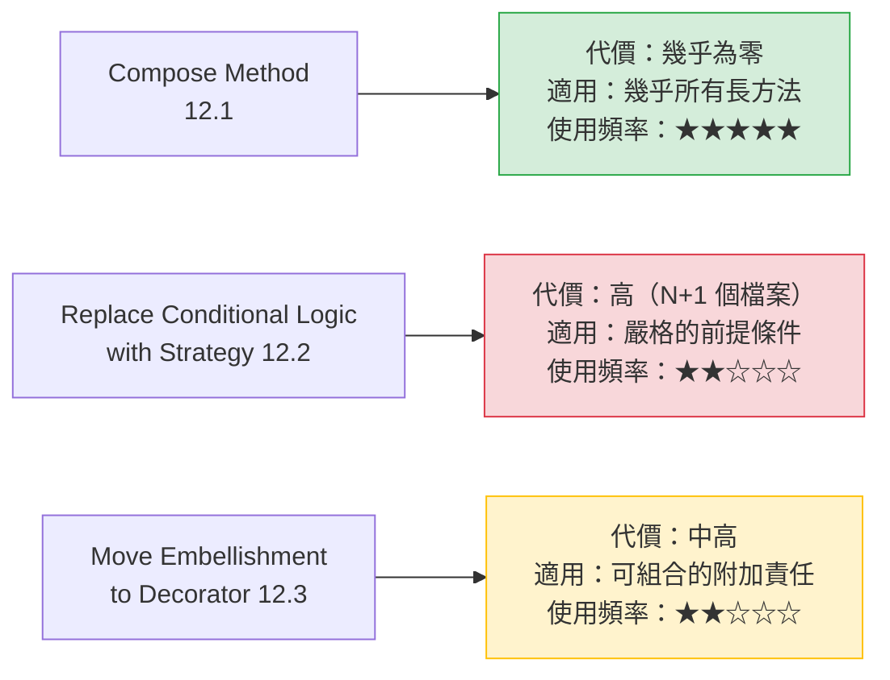

> 🔧 **本手冊的工程建議**
> 如果你這輩子只學一個 pattern-directed refactoring，學 **Compose Method**。
> 它適用範圍最廣、代價最低，而且是所有其他重構的前置步驟。

---

### 12.1 Compose Method

#### 一句話

把一個長方法改寫成「一連串同一抽象層級的具名步驟」，讓主方法讀起來像一段說明。

#### 起點 Smell

- Long Method（7.3）
- 方法內有註解分段（`// 1. 驗證` `// 2. 計算`）
- 方法內混雜了不同抽象層級：一行是 `validateOrder(o)`，下一行是 `if (s.charAt(3) == 'X')`

#### Before

```java
// Before：Java 8 — 混雜了四種抽象層級
@Service
public class SettlementService {

    public SettlementResult settle(String batchId) {
        // 1. 取得批次
        Batch batch = batchDao.find(batchId);
        if (batch == null) {
            throw new BatchNotFoundException(batchId);
        }
        if (batch.getStatus() != 1 && batch.getStatus() != 2) {
            throw new IllegalBatchStatusException(batchId, batch.getStatus());
        }

        // 2. 計算總額
        BigDecimal total = BigDecimal.ZERO;
        BigDecimal fee = BigDecimal.ZERO;
        for (Transaction t : batch.getTransactions()) {
            if (t.getStatus() == 9) continue;
            total = total.add(t.getAmount());
            if (t.getAmount().compareTo(new BigDecimal("50000")) > 0) {
                fee = fee.add(t.getAmount().multiply(new BigDecimal("0.001")));
            } else {
                fee = fee.add(new BigDecimal("15"));
            }
        }

        // 3. 寫入結算檔
        StringBuilder sb = new StringBuilder();
        sb.append("H").append(new SimpleDateFormat("yyyyMMdd").format(new Date()));
        sb.append(String.format("%015d", total.movePointRight(2).longValue()));
        for (Transaction t : batch.getTransactions()) {
            if (t.getStatus() == 9) continue;
            sb.append("D").append(t.getId()).append(...);
        }
        Files.write(Paths.get("/data/settle/" + batchId + ".txt"), sb.toString().getBytes());

        // 4. 更新狀態
        batch.setStatus(3);
        batch.setSettledAt(new Date());
        batchDao.update(batch);

        return new SettlementResult(batchId, total, fee);
    }
}
```

#### 重構步驟

| 步驟 | 動作 | 驗證 |
|---|---|---|
| 1 | 每一個註解分段，用 IDE 的 Extract Method 抽成一個私有方法 | 每抽一個跑一次測試 |
| 2 | 把抽出方法的名稱改成**描述意圖**（不是步驟編號） | 測試全綠 |
| 3 | 檢查主方法：每一行是否都在同一抽象層級 | 人工檢視 |
| 4 | 若某個抽出的方法仍然太長，對它再做一次同樣的事（遞迴） | 測試全綠 |
| 5 | 把 magic number 抽成具名常數 | 測試全綠 |

> ✅ **步驟 1 請務必使用 IDE 的自動重構功能**，不要手打。
> IntelliJ：選取程式碼後 `Ctrl+Alt+M`。它會自動處理區域變數的進出參數，不會手滑。

#### 中間態

**步驟 1 + 2 完成後就已經達成目標**。步驟 3～5 是精修。

> ⚠️ **步驟 2 是關鍵，不能省略**
> 只做步驟 1（抽方法但不改名）的結果是 `doStep1()`、`doStep2()`，**這沒有改善任何事**——你只是把 100 行分成 4 個 25 行，讀者仍然要全部讀完才知道在做什麼。
> 好的名稱讓讀者**可以不讀實作**。這才是 Compose Method 的價值。

#### After

```java
// After：Java 25 + Spring Boot 4.x
@Service
public class SettlementService {

    private static final Money LARGE_TXN_THRESHOLD = Money.twd(50_000);
    private static final BigDecimal LARGE_TXN_FEE_RATE = new BigDecimal("0.001");
    private static final Money SMALL_TXN_FLAT_FEE = Money.twd(15);

    public SettlementResult settle(BatchId batchId) {
        Batch batch = loadSettleableBatch(batchId);
        List<Transaction> effective = effectiveTransactions(batch);

        Money total = sumAmounts(effective);
        Money fee = calculateTotalFee(effective);

        writeSettlementFile(batchId, total, effective);
        markBatchAsSettled(batch);

        return new SettlementResult(batchId, total, fee);
    }

    // ---- 以下每個方法都在「比主方法低一層」的抽象層級 ----

    private Batch loadSettleableBatch(BatchId batchId) {
        Batch batch = batchDao.find(batchId)
                .orElseThrow(() -> new BatchNotFoundException(batchId));
        if (!batch.status().isSettleable()) {
            throw new IllegalBatchStatusException(batchId, batch.status());
        }
        return batch;
    }

    private List<Transaction> effectiveTransactions(Batch batch) {
        return batch.transactions().stream()
                    .filter(t -> !t.isVoided())
                    .toList();
    }

    private Money sumAmounts(List<Transaction> transactions) {
        return transactions.stream()
                .map(Transaction::amount)
                .reduce(Money.zeroTwd(), Money::add);
    }

    private Money calculateTotalFee(List<Transaction> transactions) {
        return transactions.stream()
                .map(this::feeOf)
                .reduce(Money.zeroTwd(), Money::add);
    }

    private Money feeOf(Transaction transaction) {
        return transaction.amount().isGreaterThan(LARGE_TXN_THRESHOLD)
               ? transaction.amount().multiply(LARGE_TXN_FEE_RATE)
               : SMALL_TXN_FLAT_FEE;
    }
    // writeSettlementFile / markBatchAsSettled 略
}
```

**現在 `settle()` 讀起來像一段業務說明**：載入可結算的批次 → 取出有效交易 → 加總金額 → 計算手續費 → 寫結算檔 → 標記已結算。

#### 得到什麼

- 主方法成為**流程的目錄**，讀者可以只讀它就理解整體
- 每個私有方法可以單獨理解、單獨測試（若改為 package-private）
- 業務詞彙被明確命名（`isSettleable`、`isVoided`、`effectiveTransactions`）
- 後續的任何重構（Strategy、Factory）都以此為起點

#### 付出什麼

| 面向 | 代價 |
|---|---|
| **可維護性** | **幾乎沒有代價**——沒有新增類別、沒有新增間接層 |
| **效能** | 極小（JIT 通常會 inline 私有方法）。唯一要注意的是**極深的迴圈內部** |
| **安全性** | 中性。但要注意：抽方法時若改變了驗證的執行順序，可能造成未驗證就使用 |
| **檔案長度** | 檔案會變長（多了方法宣告），但**可讀性淨提升** |

#### 什麼時候不要用

- 方法是**線性、無分支的資料對應**（例如 80 行的欄位 mapping）→ 拆開反而更難對照
- **極端效能敏感的內層迴圈**（需實測，不要憑感覺）
- 方法已經很短且清楚

#### AI Prompt 與驗證

```text
角色：資深 Java 工程師，正在執行安全重構。

背景：[類別].[方法] 有 [N] 行，包含註解分段。
      本專案 Java 25 / Spring Boot 4.1.x。
      已有測試：[測試類別名稱]。

目標：只執行 Compose Method。

限制（硬性）：
- 不得新增任何 class、interface、enum、record
- 不得改變任何邏輯、條件順序或例外行為
- 不得修改測試檔案
- 不得改變方法簽章
- 抽出的方法一律為 private
- 方法名稱必須描述「做什麼」，禁止使用 step1 / doPart2 / process1 這類名稱

步驟：
1. 列出你打算抽出的每一段（起訖行號）與建議的方法名稱，等我確認
2. 確認後，一次抽出一個方法，每次執行 [測試指令]
3. 每次回報：抽出的方法名稱、diff、測試結果

停止條件：
- 任何測試失敗，立即停止並回報
- 若某一段的業務意圖不明確而無法命名，停止並詢問，不要猜測
- 完成所有抽取後停止，不要繼續進行其他重構（特別是不要導入任何 Pattern）
```

驗證 checklist：

- [ ] 既有測試全綠，**測試檔案未被修改**
- [ ] 圈複雜度下降（SonarQube）
- [ ] 主方法的每一行都在同一抽象層級
- [ ] 沒有 `step1` / `doPart2` 這類名稱
- [ ] **條件的短路求值順序未改變**
- [ ] 例外的型別、訊息與拋出時機完全一致
- [ ] 沒有新增任何類別

---

### 12.2 Replace Conditional Logic with Strategy

> 🔴 **這是全書最常被誤用的條目。請先讀「什麼時候不要用」再讀其他段落。**

#### 一句話

把「依條件選擇不同演算法」的邏輯，改成「把演算法變成可替換的物件」。

#### 起點 Smell

- Conditional Complexity（8.1）
- 同一組條件分派在多處重複（8.2 Switch Statements）
- 每個分支內部都是**一整套完整的演算法**（不是一兩行）

#### 使用前的三道關卡

> 🔧 **本手冊的工程建議：這三個問題必須全部答「是」，才能進行本重構。**

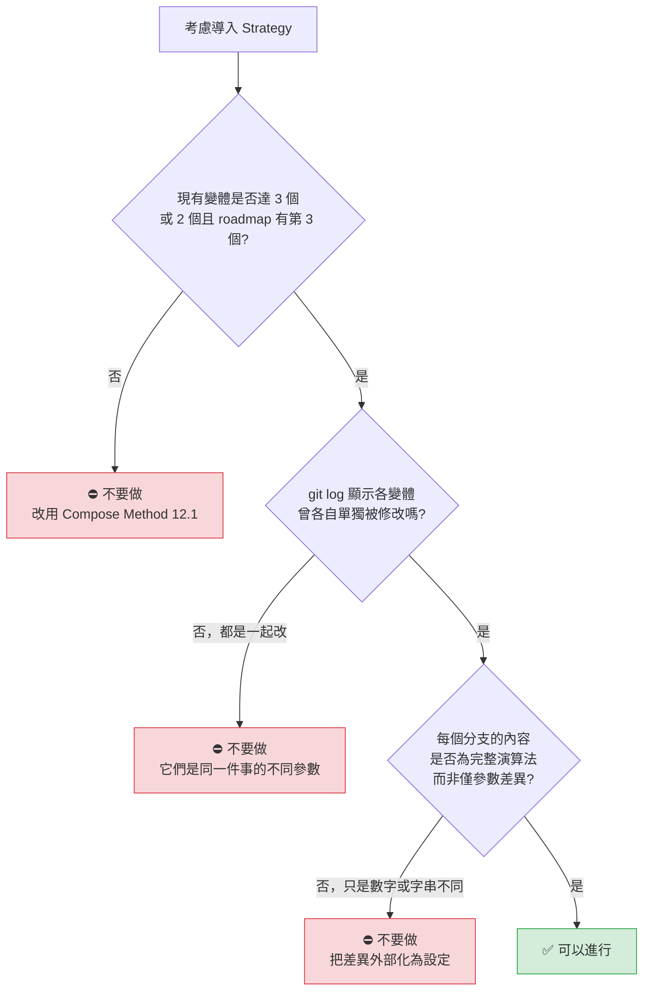

**取得第二道關卡的證據**：

```bash
# 檢視含分派邏輯的檔案，過去兩年每次改了哪些分支
git log --since="2 years ago" -p --follow -- src/main/java/com/example/fee/FeeCalculator.java \
  | grep -E "^\+|^commit|^Date" | head -80
```

#### Before

```java
// Before：Java 8 — 三種計息方式，每種都是完整的演算法
@Service
public class InterestCalculator {

    public BigDecimal calculate(Loan loan, Date asOf) {
        String method = loan.getInterestMethod();

        if ("SIMPLE".equals(method)) {
            // 單利：本金 × 年利率 × 天數 / 365
            long days = daysBetween(loan.getStartDate(), asOf);
            return loan.getPrincipal()
                       .multiply(loan.getAnnualRate())
                       .multiply(new BigDecimal(days))
                       .divide(new BigDecimal(365), 2, RoundingMode.HALF_UP);

        } else if ("COMPOUND_MONTHLY".equals(method)) {
            // 月複利：逐月滾入
            BigDecimal balance = loan.getPrincipal();
            BigDecimal monthlyRate = loan.getAnnualRate()
                                         .divide(new BigDecimal(12), 10, RoundingMode.HALF_UP);
            int months = monthsBetween(loan.getStartDate(), asOf);
            for (int i = 0; i < months; i++) {
                balance = balance.add(balance.multiply(monthlyRate)
                                             .setScale(2, RoundingMode.HALF_UP));
            }
            return balance.subtract(loan.getPrincipal());

        } else if ("ACTUAL_360".equals(method)) {
            // 實際天數 / 360（國際慣例）
            long days = daysBetween(loan.getStartDate(), asOf);
            return loan.getPrincipal()
                       .multiply(loan.getAnnualRate())
                       .multiply(new BigDecimal(days))
                       .divide(new BigDecimal(360), 2, RoundingMode.HALF_UP);

        } else {
            throw new UnsupportedInterestMethodException(method);
        }
    }
}
```

**這個例子通過了三道關卡嗎？**

| 關卡 | 答案 | 依據 |
|---|---|---|
| ① 變體 ≥ 3 | ✅ 是 | 三種，且銀行業務確實會新增計息方式 |
| ② 各自獨立演化 | ✅ 是 | git log 顯示 COMPOUND_MONTHLY 的捨入邏輯單獨被改過 3 次 |
| ③ 完整演算法 | ✅ 是 | 三者的計算方式本質不同，不是參數差異 |

**結論：可以進行。**

#### 重構步驟

| 步驟 | 動作 | 驗證 |
|---|---|---|
| 1 | **先做 Compose Method**：把每個分支抽成一個私有方法 | 測試全綠 |
| 2 | **此時停下來評估**：可讀性是否已經足夠？若是，結束 | — |
| 3 | 定義 `InterestCalculationStrategy` 介面 | 編譯通過 |
| 4 | 把第一個私有方法搬到一個實作類別 | 測試全綠 |
| 5 | 逐一搬移其餘方法，**一次一個** | 每次跑測試 |
| 6 | 把分派邏輯改為查表（Map 或 Spring 注入） | 測試全綠 |
| 7 | 移除原本的 `if/else` | 測試全綠 |

> ⚠️ **步驟 1 與步驟 2 不可跳過**
> 直接從 Before 跳到 Strategy 是 AI 最常犯的錯誤。先做 Compose Method 有兩個好處：
> ① 它本身就可能解決問題（那就省下了 N+1 個檔案）
> ② 它讓後續的搬移變成機械動作，風險大幅降低

#### 中間態

**步驟 2 是本手冊最強調的停損點。** 做完 Compose Method 之後，程式碼長這樣：

```java
public BigDecimal calculate(Loan loan, LocalDate asOf) {
    return switch (loan.interestMethod()) {
        case SIMPLE           -> simpleInterest(loan, asOf);
        case COMPOUND_MONTHLY -> monthlyCompoundInterest(loan, asOf);
        case ACTUAL_360       -> actual360Interest(loan, asOf);
    };
}
```

**這已經很好讀了。** 如果你的痛點是「看不懂」，到這裡就結束。

只有當痛點是「**新增一種計息方式要改這個檔案，而這個檔案還有其他 20 個方法，每次改都要 Review 全部**」時，才需要繼續往下走。

#### After

```java
// After：Java 25 + Spring Boot 4.x

public interface InterestCalculationStrategy {
    InterestMethod method();
    Money calculate(Loan loan, LocalDate asOf);
}

@Component
class SimpleInterestStrategy implements InterestCalculationStrategy {
    private static final BigDecimal DAYS_PER_YEAR = new BigDecimal(365);

    @Override public InterestMethod method() { return InterestMethod.SIMPLE; }

    @Override
    public Money calculate(Loan loan, LocalDate asOf) {
        long days = ChronoUnit.DAYS.between(loan.startDate(), asOf);
        return loan.principal()
                   .multiply(loan.annualRate())
                   .multiply(BigDecimal.valueOf(days))
                   .divide(DAYS_PER_YEAR, 2, RoundingMode.HALF_UP);
    }
}

@Component
class MonthlyCompoundInterestStrategy implements InterestCalculationStrategy {
    @Override public InterestMethod method() { return InterestMethod.COMPOUND_MONTHLY; }

    @Override
    public Money calculate(Loan loan, LocalDate asOf) {
        Money balance = loan.principal();
        BigDecimal monthlyRate = loan.annualRate()
                                     .divide(BigDecimal.valueOf(12), 10, RoundingMode.HALF_UP);
        int months = (int) ChronoUnit.MONTHS.between(loan.startDate(), asOf);
        for (int i = 0; i < months; i++) {
            balance = balance.add(balance.multiply(monthlyRate)
                                         .setScale(2, RoundingMode.HALF_UP));
        }
        return balance.subtract(loan.principal());
    }
}

// Actual360InterestStrategy 略

@Service
public class InterestCalculator {
    private final Map<InterestMethod, InterestCalculationStrategy> strategies;

    public InterestCalculator(List<InterestCalculationStrategy> all) {
        this.strategies = all.stream().collect(
            Collectors.toUnmodifiableMap(InterestCalculationStrategy::method, Function.identity()));
    }

    public Money calculate(Loan loan, LocalDate asOf) {
        InterestCalculationStrategy strategy = strategies.get(loan.interestMethod());
        if (strategy == null) {
            throw new UnsupportedInterestMethodException(loan.interestMethod());
        }
        return strategy.calculate(loan, asOf);
    }
}
```

#### 得到什麼

- 新增一種計息方式：**新增一個檔案，不修改任何既有檔案**（開放封閉原則）
- 每種演算法可以獨立測試、獨立 Review、獨立部署變更
- 各演算法的複雜邏輯不再互相干擾

#### 付出什麼

| 面向 | 代價 |
|---|---|
| **檔案數** | ⚠️ 從 1 個變成 5 個（介面 + 3 實作 + 原類別） |
| **可讀性** | ⚠️ 「總共有哪幾種計息方式」從程式碼看不出來（Spring 注入版本） |
| **除錯** | ⚠️ 追蹤執行流程要多跳一層；IDE 的 Go to Implementation 會列出多個候選 |
| **效能** | 多型分派的成本極小，但**大量迴圈中**（例如百萬筆批次計息）需實測 |
| **安全性** | ⚠️ 若某個 Strategy 忘了加 `@Component`，該計息方式會**靜默失效**（拿到 null 才報錯） |
| **測試** | **正面**——每個 Strategy 可獨立測試 |

> ⚠️ **金融計算的特別提醒**
> 搬移計算邏輯時，`RoundingMode` 與 `scale` 的每一個細節都必須完全保留。
> 上面的 `MonthlyCompoundInterestStrategy` 中，`setScale(2, HALF_UP)` 在迴圈**內部**——若重構時誤把它移到迴圈外，算出來的利息會差好幾塊錢。
> **這類差異不會被「大方向對不對」的測試抓到，必須用歷史資料做逐筆比對。**

#### 什麼時候不要用

**這一段是本節最重要的部分。**

| 情況 | 為什麼不該用 | 該用什麼 |
|---|---|---|
| **只有 2 個分支且穩定** | N+1 個檔案換不到任何好處 | Compose Method（12.1） |
| **分支差異只是數字或字串** | 那是設定，不是演算法 | 把差異移到設定檔或資料表 |
| **分支永遠一起被修改** | 它們是同一件事，拆開會製造 Shotgun Surgery | Compose Method |
| **型別集合封閉且 Java ≥ 21** | `sealed` + pattern matching switch 更安全（漏改會編譯失敗） | sealed interface（見 8.2 節） |
| **分支內容只有 1～3 行** | 一個類別包一行程式碼 | Map + Lambda |
| **只是想避免寫 `if`** | `if` 本身不是問題 | 什麼都不做 |

**Map + Lambda 的替代方案**（當每個分支很短時）：

```java
// 當每個「策略」只有一行時，這比 3 個類別好得多
private static final Map<InterestMethod, BiFunction<Loan, LocalDate, Money>> CALCULATORS =
    Map.of(
        InterestMethod.SIMPLE,      (loan, asOf) -> simpleInterest(loan, asOf),
        InterestMethod.ACTUAL_360,  (loan, asOf) -> actual360(loan, asOf)
    );
```

> 🤖 **AI Agent 的行為模式（必讀）**
> 在第 9.5 節的實測中，當被要求「重構這段有多分支 if/else 的程式碼」時，AI 在三次嘗試中**三次都直接產生了完整的 Strategy 結構**，沒有先做 Compose Method，也沒有詢問變體是否會各自演化。
> 這不是模型能力問題，是**預設行為問題**。必須用 Prompt 的 Constraints 段落明確阻止。

#### AI Prompt 與驗證

```text
角色：資深 Java 工程師，正在評估設計變更。

背景：[類別].[方法] 有 [N] 個條件分支，各自執行不同的計算。
      本專案 Java 25 / Spring Boot 4.1.x。
      以下是該檔案過去兩年的 git log：
      [貼上 git log --oneline 輸出]

目標：判斷是否應該導入 Strategy，並在確認後執行。

限制（第一階段只做評估，不得修改任何程式碼）：
- 不得產生任何程式碼

步驟：
1. 回答三道關卡（各自給出依據，不得推測）：
   (a) 現有變體幾個？未來是否會增加？依據是什麼？（若無法從提供的資料判斷，請回答「無法判斷」）
   (b) 從 git log 看，各分支是「一起被修改」還是「各自被修改」？請列出具體 commit
   (c) 各分支的差異是「完整演算法」還是「參數或常數」？
2. 若任一關卡未通過，明確建議「不要導入 Strategy」，並提出替代方案
3. 若三關皆通過，提出分階段計畫：
   階段一 Compose Method（先做，做完重新評估）
   階段二 Extract Strategy（僅在階段一後痛點仍在時才做）
4. 等我決定後才進入實作

停止條件：
- 完成步驟 3 後停止
- 若 (a) 的答案是「無法判斷」，停止並要求我提供 roadmap 資訊
```

驗證 checklist：

- [ ] **每個分支的計算結果與重構前逐筆相同**（用歷史資料做回歸比對，不只測幾個樣本）
- [ ] `RoundingMode` 與 `scale` 在每一步都完全一致
- [ ] 迴圈內外的運算順序未改變
- [ ] 未知型別的例外型別與訊息一致
- [ ] **所有 Strategy 都有 `@Component`**（用測試驗證：斷言 Map 的 size 等於列舉數量）
- [ ] 沒有兩個 Strategy 回傳相同的 key
- [ ] 效能：若在批次迴圈中使用，已實測百萬筆的執行時間

**強烈建議加上這個測試**（防止漏註冊）：

```java
@Test
void 每一種計息方式都必須有對應的_Strategy() {
    assertThat(strategies.keySet())
        .containsExactlyInAnyOrder(InterestMethod.values());
}
```

---

### 12.3 Move Embellishment to Decorator

#### 一句話

把「加在核心邏輯上的附加行為」（記錄、快取、重試、計時、加密）搬到可組合的 Decorator 中。

#### 起點 Smell

- 核心方法裡混雜了大量非核心的程式碼（log、try-catch 重試、計時、快取檢查）
- 這些附加行為在多個類別中重複出現
- Combinatorial Explosion（8.3）：出現 `WithCacheAndRetryService`、`WithRetryOnlyService` 這類類別

#### Before

```java
// Before：Java 8 — 核心邏輯只有 3 行，其餘 30 行都是附加行為
@Service
public class CreditScoreService {
    private static final Logger log = LoggerFactory.getLogger(CreditScoreService.class);

    public CreditScore query(String customerId) {
        long start = System.currentTimeMillis();                    // 計時
        log.info("查詢信用評分 start, customerId={}", customerId);    // 記錄

        CreditScore cached = cache.get(customerId);                 // 快取
        if (cached != null && !isStale(cached)) {
            log.info("命中快取, customerId={}", customerId);
            return cached;
        }

        int attempt = 0;
        while (true) {                                              // 重試
            try {
                attempt++;
                // ===== 以下 3 行才是核心邏輯 =====
                CreditReportRequest req = new CreditReportRequest(customerId);
                CreditReportResponse resp = jcicClient.query(req);
                CreditScore score = mapper.toScore(resp);
                // ==============================
                cache.put(customerId, score);
                log.info("查詢信用評分 end, cost={}ms", System.currentTimeMillis() - start);
                return score;
            } catch (TimeoutException e) {
                if (attempt >= 3) {
                    log.error("查詢信用評分失敗, 已重試 {} 次", attempt, e);
                    throw new CreditScoreUnavailableException(customerId, e);
                }
                sleep(1000L * attempt);
            }
        }
    }
}
```

#### 重構步驟

| 步驟 | 動作 | 驗證 |
|---|---|---|
| 1 | 抽出介面 `CreditScoreQuery`，讓原類別實作它 | 測試全綠 |
| 2 | 建立一個乾淨的核心實作（只有那 3 行） | 新增核心的單元測試 |
| 3 | 建立第一個 Decorator（例如重試），包住核心 | 測試全綠 |
| 4 | 逐一建立其餘 Decorator，**一次一個** | 每次跑測試 |
| 5 | 在 `@Configuration` 中組裝順序 | 整合測試 |

#### 中間態

**步驟 3 完成後可以停下來評估**：如果只需要重試，一個 Decorator 就夠了，不必把 log、快取、計時全部拆開。

> 🔧 **本手冊的工程建議：先問「框架有沒有提供」**
> 在 Spring 專案中，這四種附加行為**全部都有現成的宣告式支援**：
>
> | 附加行為 | Spring 提供的方式 | 還需要自己寫 Decorator 嗎 |
> |---|---|---|
> | 快取 | `@Cacheable` | ❌ 不需要 |
> | 重試 | `@Retryable`（Spring Retry） | ❌ 不需要 |
> | 計時與 metrics | `@Timed`（Micrometer） | ❌ 不需要 |
> | 記錄 | AOP `@Around` 或 `@Observed` | ❌ 通常不需要 |
> | 交易 | `@Transactional` | ❌ 不需要 |
> | **自訂的業務性包裝** | 無 | ✅ **這才是 Decorator 的用武之地** |
>
> **這是本節最重要的提醒**：在 Spring 環境中，Move Embellishment to Decorator 的適用範圍比原書小很多，因為 AOP 已經解決了橫切關注點。

#### After（兩個版本）

##### 版本 A：Spring 宣告式（多數情況的正確答案）

```java
// After A：Java 25 + Spring Boot 4.x — 核心邏輯回到 3 行
@Service
public class CreditScoreService {

    @Cacheable(cacheNames = "creditScore", key = "#customerId.value()")
    @Retryable(retryFor = TimeoutException.class, maxAttempts = 3,
               backoff = @Backoff(delay = 1000, multiplier = 2))
    @Timed(value = "creditScore.query", description = "JCIC 信用評分查詢耗時")
    public CreditScore query(CustomerId customerId) {
        CreditReportResponse response = jcicClient.query(new CreditReportRequest(customerId));
        return mapper.toScore(response);
    }

    @Recover
    CreditScore onExhausted(TimeoutException e, CustomerId customerId) {
        throw new CreditScoreUnavailableException(customerId, e);
    }
}
```

##### 版本 B：手寫 Decorator（當附加行為有業務語意時）

```java
// After B：當包裝本身有業務規則時（例如：查詢要扣點、要寫稽核軌跡）
public interface CreditScoreQuery {
    CreditScore query(CustomerId customerId);
}

@Component
@Primary
class AuditedCreditScoreQuery implements CreditScoreQuery {
    private final CreditScoreQuery delegate;
    private final AuditLogger auditLogger;

    AuditedCreditScoreQuery(@Qualifier("quotaLimited") CreditScoreQuery delegate,
                            AuditLogger auditLogger) {
        this.delegate = delegate;
        this.auditLogger = auditLogger;
    }

    @Override
    public CreditScore query(CustomerId customerId) {
        auditLogger.record(AuditEvent.creditScoreQueried(customerId));   // 法規要求
        return delegate.query(customerId);
    }
}

@Component("quotaLimited")
class QuotaLimitedCreditScoreQuery implements CreditScoreQuery {
    private final CreditScoreQuery delegate;
    private final QuotaService quotaService;

    @Override
    public CreditScore query(CustomerId customerId) {
        quotaService.consumeOrThrow(customerId);      // 每月查詢次數上限
        return delegate.query(customerId);
    }
}
```

**版本 B 的判斷準則**：附加行為是否有**業務規則**？稽核軌跡與額度扣點是業務要求（會被稽核、會被客訴），用宣告式 AOP 表達會讓業務規則藏在 annotation 裡，不容易被發現與測試。

#### 得到什麼

- 核心邏輯回到本質（3 行）
- 附加行為可以自由組合、調整順序
- 每個 Decorator 可以單獨測試
- 新增一種附加行為不需要修改核心

#### 付出什麼

| 面向 | 代價 |
|---|---|
| **可讀性** | 🔴 **最大的代價**：從程式碼**看不出實際的包裝順序**，要看 `@Configuration` 或 bean 定義 |
| **除錯** | 🔴 堆疊追蹤變得很深，中間都是 Decorator |
| **效能** | 每層多一次方法呼叫，通常可忽略；但層數多時（> 5 層）在高頻路徑要實測 |
| **安全性** | ⚠️ **順序錯誤會造成安全漏洞**——例如把「權限檢查」放在「快取」之後，會導致無權限者讀到快取資料 |
| **啟動** | ⚠️ Spring 的循環依賴風險（Decorator 注入自己的介面型別） |

> 🔴 **順序是安全議題，不只是設計議題**
>
> ```text
> ✅ 正確：權限檢查 → 快取 → 重試 → 核心
> ❌ 錯誤：快取 → 權限檢查 → 重試 → 核心
>          （第一個有權限的人查詢後，無權限的人也能從快取讀到）
> ```
>
> **建議做法**：把組裝順序寫在一個明確的 `@Configuration` 類別中，並加上註解說明為什麼是這個順序。不要依賴 `@Order` 的數字。

#### 什麼時候不要用

- **Spring 已有宣告式支援**（快取、重試、交易、metrics）→ 用 annotation
- **只有一種裝飾，而且永遠都套用** → 直接寫在核心裡
- **裝飾之間有順序依賴且難以表達** → 明確的流程方法比隱式組合好
- **團隊不熟悉這個結構** → 除錯成本會超過收益

#### AI Prompt 與驗證

```text
角色：資深 Java / Spring 工程師。

背景：[類別].[方法] 中，核心邏輯被大量附加行為包圍。
      [貼上程式碼]
      本專案 Java 25 / Spring Boot 4.1.x，已引入 Spring Retry 與 Micrometer。

目標：評估是否應執行 Move Embellishment to Decorator。

限制（只做分析）：
- 不得修改程式碼

步驟：
1. 逐段標示：哪幾行是核心邏輯？哪幾行是附加行為？分別是哪一類附加行為？
2. 對每一種附加行為，回答：
   (a) Spring 是否已有宣告式支援？（@Cacheable / @Retryable / @Timed / @Transactional）
   (b) 這個附加行為是否帶有業務規則（會被稽核、會影響計費、客戶會感知）？
3. 依規則給出建議：
   - (a) 為是且 (b) 為否，建議改用 Spring annotation
   - (b) 為是，建議手寫 Decorator，並說明它應該排在哪一層
   - 若只有一種附加行為且永遠套用，建議維持現狀
4. 若建議手寫 Decorator，請明確列出建議的組裝順序，並說明每一層為何在該位置
   （特別說明：權限或額度檢查是否必須在快取之前）

停止條件：
- 完成步驟 4 後停止
```

驗證 checklist：

- [ ] 重構後的**行為完全一致**：快取命中率、重試次數、退避時間、例外型別
- [ ] **組裝順序正確**，且權限／額度檢查在快取之前
- [ ] 組裝順序有明確的文件或 `@Configuration` 說明
- [ ] 沒有 Spring 循環依賴（啟動測試）
- [ ] 堆疊深度可接受；已確認例外的堆疊追蹤仍可定位問題
- [ ] 若改用 `@Cacheable`：確認 key 的產生方式與原本的快取 key 完全一致
- [ ] 若改用 `@Retryable`：確認重試條件、次數與退避演算法與原本相同

### 12.4 本章實務案例

**情境**：某銀行的「交易手續費計算」重構，一次同時遇到本章三個條目。

**原始程式碼**：`FeeService.calculateFee()`，620 行，處理 6 種交易類型，每種都混雜了快取、log 與重試。

**團隊的處理順序與決策**：

| 階段 | 動作 | 結果 | 決策 |
|---|---|---|---|
| 1 | 建立 Characterization Test（近三年 12 萬筆實際交易） | 覆蓋率 4% → 81% | 繼續 |
| 2 | **Compose Method**（12.1）：抽出 31 個私有方法 | 620 行 → 主方法 42 行 | **重新評估** |
| 3 | 評估：痛點是否消失？ | 「看不懂」解決了；「新增交易類型要改這個檔案」還在 | 繼續 |
| 4 | 分析 6 種交易類型的 git log | 4 種永遠一起改（只有費率數字不同）；2 種各自改過 | **關鍵發現** |
| 5 | 把那 4 種的費率移到資料表 | 4 種合併成 1 個方法 + 1 張費率表 | — |
| 6 | 對剩下的 2 種評估 Strategy | 只有 2 個變體 → **未通過第一道關卡** | **不導入 Strategy** |
| 7 | 附加行為：快取與重試 | 確認可用 `@Cacheable` / `@Retryable` 取代 | 改用 annotation |
| 8 | 附加行為：查詢額度扣點 | 有業務規則、會被稽核 | **手寫一個 Decorator** |

**最終結果**：

| 指標 | Before | After |
|---|---|---|
| `FeeService` 行數 | 620 | 96 |
| 新增類別數 | — | **+2**（1 個 Decorator、1 個費率 Repository） |
| 費率設定的位置 | 散落在 4 個分支的 magic number | 1 張資料表 |
| 「新增一種費率」的成本 | 改程式碼、重新部署 | **改資料表，不需部署** |
| 「新增一種交易類型」的成本 | 改 1 個檔案（620 行） | 改 1 個檔案（96 行） |

**這個案例最值得注意的三個決定**：

1. **第 5 步是整件事的關鍵**，但它不是任何一個 catalog 條目——它只是「把資料從程式碼移到資料表」。**最有價值的改善經常不是 Pattern。**
2. **第 6 步決定不導入 Strategy**，儘管所有人的直覺都是「這裡應該用 Strategy」。理由是第一道關卡：只剩 2 個變體。
3. **總共只新增 2 個類別**。如果一開始就交給 AI 做開放式重構，很可能會得到 15 個以上的新檔案。

### 12.5 本章注意事項

> ⚠️ **Compose Method 是所有其他重構的前置步驟，不要跳過**
> 直接從「一坨 if/else」跳到 Strategy，會讓你錯過「其實 Compose Method 就夠了」這個最省成本的結局。

> ⚠️ **Strategy 的三道關卡必須逐一書面回答**
> 建議在 PR 描述中直接列出三個問題與答案。這能讓 Review 者快速判斷，也留下決策記錄。

> ⚠️ **金融計算的搬移，必須逐筆比對歷史資料**
> `RoundingMode`、`scale`、迴圈內外的位置——任何一個細節錯了，結果會差幾塊錢，而「差幾塊錢」的 bug 極難被一般測試抓到。

> ⚠️ **Decorator 的組裝順序是安全議題**
> 權限與額度檢查必須在快取之前。請把順序寫在明確的 `@Configuration` 中並加註說明。

> ✅ **Spring 環境中，先問「框架有沒有提供」**
> 快取、重試、交易、metrics、記錄——這些都有現成的宣告式支援。手寫 Decorator 只保留給「帶有業務規則」的包裝。

> ✅ **加上「所有實作都已註冊」的測試**
> Strategy 與 Factory 的 Spring 自動注入版本有一個共同風險：漏加 `@Component` 會靜默失效。一個斷言 Map size 的測試就能防住。

---

## 第 13 章 Simplification 類重構（下）

本章三個條目處理的是**更特定**的情境，使用頻率比第 12 章低，但在遇到時價值很高。

---

### 13.1 Replace State-Altering Conditionals with State

#### 一句話

當「狀態轉移的規則」散落在一堆 `if` 裡面時，把每個狀態變成一個物件，讓它自己決定能轉到哪裡。

#### 起點 Smell

- 有一個 `status` 欄位，而程式碼中到處是 `if (status == X)` 的判斷
- 狀態轉移的規則散落在多個方法中
- 曾經發生「不該允許的狀態轉移」造成的資料錯誤

#### 三個前提（必須全部成立）

| 前提 | 驗證方式 |
|---|---|
| ① 存在**明確的狀態機**（能畫出轉移圖） | 畫得出來嗎？畫不出來就不要做 |
| ② 轉移規則**本身複雜**（不只是 `status = X`） | 有條件、有副作用、有驗證 |
| ③ **同一個操作在不同狀態下行為不同** | 而不只是「某些狀態不能執行」 |

> ⚠️ **最常見的誤用**：看到 `enum Status` 就導入 State Pattern。
> 一個只是用來標記的 `status` 欄位，**不需要** State Pattern。

#### Before

```java
// Before：Java 8 — 轉移規則散落在四個方法中
@Service
public class OrderStateService {

    public void pay(Order order) {
        if (order.getStatus() != 1) {                 // 1 = 待付款
            throw new IllegalStateException("狀態不允許付款");
        }
        order.setStatus(2);                           // 2 = 已付款
        order.setPaidAt(new Date());
        inventoryService.reserve(order);
    }

    public void ship(Order order) {
        if (order.getStatus() != 2) {
            throw new IllegalStateException("狀態不允許出貨");
        }
        order.setStatus(3);                           // 3 = 已出貨
        order.setShippedAt(new Date());
        notifyService.notifyShipped(order);
    }

    public void cancel(Order order) {
        // 取消的規則比較複雜 — 不同狀態下行為不同
        if (order.getStatus() == 1) {
            order.setStatus(9);                       // 直接取消
        } else if (order.getStatus() == 2) {
            order.setStatus(9);
            refundService.refund(order);              // 已付款要退款
            inventoryService.release(order);
        } else if (order.getStatus() == 3) {
            throw new IllegalStateException("已出貨不可取消，請申請退貨");
        } else {
            throw new IllegalStateException("狀態不允許取消");
        }
    }
}
```

**檢視三個前提**：

| 前提 | 結果 |
|---|---|
| ① 明確狀態機 | ✅ 待付款 → 已付款 → 已出貨，任一點可轉已取消 |
| ② 轉移規則複雜 | ✅ 有副作用（預留庫存、退款、通知） |
| ③ 同一操作行為不同 | ✅ `cancel()` 在三種狀態下行為完全不同 |

**結論：適合導入。**

#### 重構步驟

| 步驟 | 動作 | 驗證 |
|---|---|---|
| 1 | **先畫出狀態轉移圖，與業務單位確認** | 書面確認 |
| 2 | 把數字狀態碼改成 `enum`（Replace Type Code with Class，14.4） | 測試全綠 |
| 3 | 為每個狀態建立一個類別，先只實作「能否轉移」的判斷 | 測試全綠 |
| 4 | 逐一把轉移的副作用搬進對應的狀態類別 | 每次跑測試 |
| 5 | 移除原本的 `if/else` | 測試全綠 |

#### 中間態

**步驟 2 完成後（把 `int` 改成 `enum`）通常就解決了 60% 的問題**——因為可讀性大幅提升，而且編譯器開始幫你檢查。

如果你的痛點只是「`status == 3` 看不懂」，到這裡就結束。

#### After

```java
// After：Java 25 — 用 sealed interface 讓編譯器檢查完整性
public sealed interface OrderState
        permits AwaitingPayment, Paid, Shipped, Cancelled {

    OrderStatus code();

    default Order pay(Order order, OrderServices services) {
        throw new IllegalOrderTransitionException(code(), "pay");
    }
    default Order ship(Order order, OrderServices services) {
        throw new IllegalOrderTransitionException(code(), "ship");
    }
    default Order cancel(Order order, OrderServices services) {
        throw new IllegalOrderTransitionException(code(), "cancel");
    }
}

record AwaitingPayment() implements OrderState {
    public OrderStatus code() { return OrderStatus.AWAITING_PAYMENT; }

    @Override
    public Order pay(Order order, OrderServices services) {
        services.inventory().reserve(order);
        return order.withState(new Paid(), services.clock());
    }

    @Override
    public Order cancel(Order order, OrderServices services) {
        return order.withState(new Cancelled(), services.clock());   // 未付款，直接取消
    }
}

record Paid() implements OrderState {
    public OrderStatus code() { return OrderStatus.PAID; }

    @Override
    public Order ship(Order order, OrderServices services) {
        services.notification().notifyShipped(order);
        return order.withState(new Shipped(), services.clock());
    }

    @Override
    public Order cancel(Order order, OrderServices services) {
        services.refund().refund(order);                             // 已付款要退款
        services.inventory().release(order);
        return order.withState(new Cancelled(), services.clock());
    }
}

record Shipped() implements OrderState {
    public OrderStatus code() { return OrderStatus.SHIPPED; }
    // cancel 使用 default 實作，直接丟例外 — 但訊息不夠具體，覆寫它
    @Override
    public Order cancel(Order order, OrderServices services) {
        throw new IllegalOrderTransitionException(code(), "cancel",
                "已出貨不可取消，請申請退貨");
    }
}

record Cancelled() implements OrderState {
    public OrderStatus code() { return OrderStatus.CANCELLED; }
}
```

狀態轉移圖（建議直接放進程式碼註解或專案文件）：

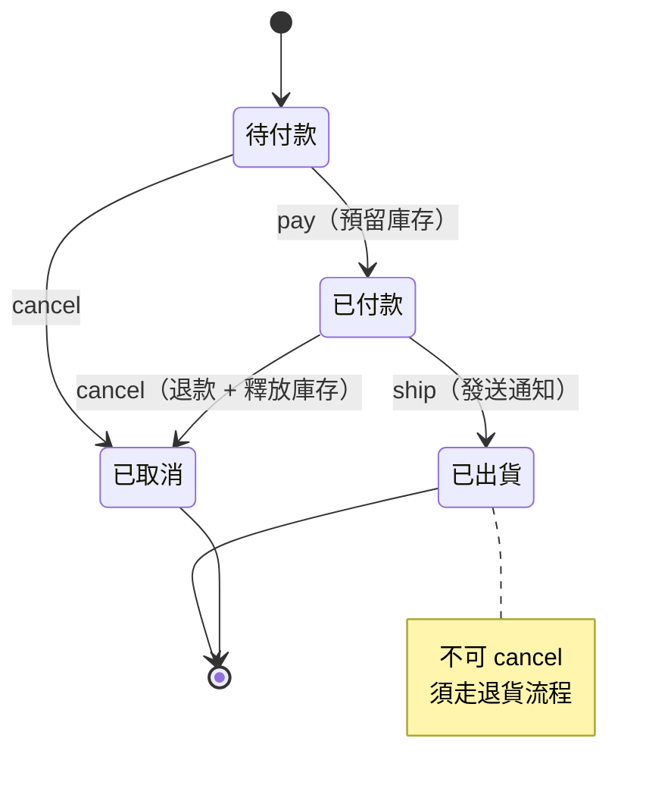

#### 得到什麼

- **狀態轉移規則集中在各自的狀態類別**，一眼可見
- 不可能執行非法轉移（每個狀態只實作它允許的操作）
- 新增一個狀態：新增一個 record，`sealed` 會強制你處理所有分派點
- 狀態圖與程式碼一一對應

#### 付出什麼

| 面向 | 代價 |
|---|---|
| **檔案數** | ⚠️ 每個狀態一個類別（或一個 record） |
| **可讀性** | ⚠️ 「pay 這個動作做了什麼」要看多個檔案 |
| **持久化** | 🔴 **最大的難點**：狀態物件如何存回 DB？需要 `code()` 與 DB 欄位的雙向轉換 |
| **效能** | 極小（record 是輕量物件） |
| **既有資料** | 🔴 Legacy 資料中可能存在「不該存在的狀態」或「非法的狀態組合」 |

> 🔴 **Legacy 系統的頭號陷阱**
> 生產資料庫裡幾乎一定存在**當前程式碼認為不可能的狀態**——例如 `status = 5` 但 enum 裡沒有 5、或是「已出貨但沒有付款時間」。
> 導入 State 之前，**必須先跑一次資料盤點**：
>
> ```sql
> SELECT status, COUNT(*) FROM orders GROUP BY status ORDER BY status;
> SELECT COUNT(*) FROM orders WHERE status = 3 AND paid_at IS NULL;
> ```
>
> 若發現異常資料，**先處理資料問題，再重構程式碼**。否則上線當天就會有一批訂單無法載入。

#### 什麼時候不要用

- **只是一個標記欄位**，沒有轉移規則 → 用 `enum` 就好
- **轉移規則只是「某些狀態不能做某事」**，沒有各自的副作用 → 用一張允許矩陣（`EnumMap`）
- **狀態少於 3 個** → 直接寫 `if`
- **狀態機會頻繁變動** → 每次變動要改多個檔案，可能不如集中的規則表
- **已在使用工作流引擎**（Camunda、Flowable）→ 讓引擎管狀態

**允許矩陣的替代方案**（當只需要「能不能」而沒有副作用時）：

```java
private static final Map<OrderStatus, Set<OrderAction>> ALLOWED = Map.of(
    OrderStatus.AWAITING_PAYMENT, EnumSet.of(PAY, CANCEL),
    OrderStatus.PAID,             EnumSet.of(SHIP, CANCEL),
    OrderStatus.SHIPPED,          EnumSet.noneOf(OrderAction.class)
);
```

#### AI Prompt 與驗證

```text
角色：資深 Java 工程師。

背景：[類別] 使用 [欄位名稱] 表示狀態，轉移規則散落在多個方法。
      本專案 Java 25 / Spring Boot 4.1.x。

目標：評估是否應執行 Replace State-Altering Conditionals with State。

限制（只做分析）：
- 不得修改程式碼

步驟：
1. 從程式碼中還原出完整的狀態轉移圖（用 mermaid stateDiagram 表示）
   標示每個轉移的觸發條件與副作用
2. 回答三個前提：
   (a) 狀態機是否明確？（若你無法完整還原，回答「否」並說明哪裡不明確）
   (b) 轉移是否有副作用？請列出
   (c) 是否存在「同一個操作在不同狀態下行為不同」的情況？請舉例
3. 列出程式碼中出現過的所有狀態值，以及是否有 default 分支處理未知值
4. 產生一段 SQL，用於盤點生產資料庫中實際存在哪些狀態值與異常組合
5. 給出建議

停止條件：
- 完成步驟 5 後停止
- 若步驟 1 無法完整還原狀態圖，停止並要求提供業務規格文件
```

驗證 checklist：

- [ ] **已執行生產資料盤點**，確認沒有程式碼無法處理的狀態值
- [ ] 狀態轉移圖已與業務單位書面確認
- [ ] 每一條原本合法的轉移，重構後仍然合法
- [ ] 每一條原本非法的轉移，重構後仍然拋出**相同型別與訊息**的例外
- [ ] 副作用的**執行順序**未改變（例如「先退款再釋放庫存」不可對調）
- [ ] 持久化：狀態的存取與 DB 欄位對應正確，含 null 的處理
- [ ] 若使用 `sealed`：確認新增狀態時所有 switch 都會編譯失敗

---

### 13.2 Replace Conditional Dispatcher with Command

#### 一句話

把「依代碼分派到不同處理邏輯」的大型 `switch`，改成「每種處理各自是一個 Command 物件」。

#### 起點 Smell

- 一個巨大的分派中心：`switch (msgType) { case "0100": ...; case "0200": ... }`
- 分派表本身就有數十個項目
- 新增一種訊息型別要修改這個中心（Shotgun Surgery 的源頭）

#### 與 Strategy 的差別

這是實務上最容易混淆的一組。

| | Strategy | Command |
|---|---|---|
| **封裝的是** | **演算法**（怎麼算） | **操作**（做什麼） |
| **典型簽章** | `R calculate(Input in)` | `void execute()` 或 `Result execute(Context ctx)` |
| **變體數量** | 通常少（3～8） | 通常多（10～100+） |
| **是否需要排隊、延遲、復原、稽核** | 否 | **是（這是 Command 的核心價值）** |
| **選擇依據** | 資料的某個屬性 | **請求的類型** |

> 🔧 **判斷準則**
> 如果你需要「**把這個操作存起來、等一下再執行、或是記錄下來以便重放**」，那是 Command。
> 如果只是「依情況選一種算法」，那是 Strategy。

#### Before

```java
// Before：Java 8 — ATM 電文分派，實際系統中有 40 多個 case
@Service
public class MessageDispatcher {

    public MessageResponse dispatch(AtmMessage msg) {
        String type = msg.getMessageType();

        if ("0100".equals(type)) {                 // 授權請求
            validateAuthRequest(msg);
            AuthResult r = authService.authorize(msg.getCardNo(), msg.getAmount());
            auditLog.record(msg, r);
            return MessageResponse.of("0110", r.getCode());

        } else if ("0200".equals(type)) {          // 財務請求
            validateFinancialRequest(msg);
            TxnResult r = txnService.process(msg);
            auditLog.record(msg, r);
            return MessageResponse.of("0210", r.getCode());

        } else if ("0400".equals(type)) {          // 沖正
            validateReversal(msg);
            ReversalResult r = reversalService.reverse(msg.getOriginalStan());
            auditLog.record(msg, r);
            return MessageResponse.of("0410", r.getCode());

        } // ... 還有 37 個 else if

        else {
            return MessageResponse.of("0810", "12");   // 不支援的電文
        }
    }
}
```

#### 重構步驟

| 步驟 | 動作 | 驗證 |
|---|---|---|
| 1 | 定義 `MessageCommand` 介面（含 `supports()` 與 `execute()`） | 編譯通過 |
| 2 | 把第一個 case 搬成一個 Command 實作 | 測試全綠 |
| 3 | 分派器改為：先查表找到 Command，找不到才走原本的 `if/else` | 測試全綠 |
| 4 | 逐一搬移其餘 case，**每個 PR 搬 3～5 個** | 每次跑測試 |
| 5 | 全部搬完後，移除原本的 `if/else` | 測試全綠 |
| 6 | 把共同的前置與後置（驗證、稽核）抽到分派器或 Decorator | 測試全綠 |

> ✅ **步驟 3 的「混合模式」是能安全遷移 40 個 case 的關鍵**
> 它讓新舊兩種寫法並存，你可以花兩個月慢慢搬，而不是在一個 PR 裡改 40 個地方。

#### 中間態

步驟 3～4 之間是一個可以停留數週的穩定狀態：

```java
public MessageResponse dispatch(AtmMessage msg) {
    MessageCommand command = commands.get(msg.messageType());
    if (command != null) {
        return command.execute(msg);          // 已搬移的走這裡
    }
    return legacyDispatch(msg);               // 還沒搬的走原本的 if/else
}
```

#### After

```java
// After：Java 25 + Spring Boot 4.x
public interface MessageCommand {
    MessageType supports();
    MessageResponse execute(AtmMessage message);
}

@Component
class AuthorizationCommand implements MessageCommand {
    private final AuthService authService;

    @Override public MessageType supports() { return MessageType.AUTH_REQUEST; }   // 0100

    @Override
    public MessageResponse execute(AtmMessage message) {
        AuthResult result = authService.authorize(message.cardNo(), message.amount());
        return MessageResponse.of(MessageType.AUTH_RESPONSE, result.code());
    }
}

@Service
public class MessageDispatcher {
    private final Map<MessageType, MessageCommand> commands;
    private final AuditLogger auditLog;

    public MessageDispatcher(List<MessageCommand> all, AuditLogger auditLog) {
        this.commands = all.stream().collect(
            Collectors.toUnmodifiableMap(MessageCommand::supports, Function.identity()));
        this.auditLog = auditLog;
    }

    public MessageResponse dispatch(AtmMessage message) {
        MessageCommand command = commands.get(message.messageType());
        if (command == null) {
            return MessageResponse.unsupported();
        }
        MessageResponse response = command.execute(message);
        auditLog.record(message, response);          // 共同的後置處理，集中一處
        return response;
    }
}
```

#### 得到什麼

- 新增一種電文：**新增一個檔案，不動分派器**
- 每種電文的處理可以獨立測試、獨立 Review
- 共同的前後置處理（稽核、驗證）集中在分派器，不會有人漏寫
- Command 物件可以被**排隊、序列化、重放**——這是 Command 相對於 Strategy 的核心價值

#### 付出什麼

| 面向 | 代價 |
|---|---|
| **檔案數** | ⚠️ 40 個 case 變成 40 個檔案 |
| **可見性** | ⚠️ 「支援哪些電文」從程式碼看不出來（需靠測試或啟動時列印） |
| **效能** | Map 查找，比長串 `if/else` **更快** |
| **安全性** | ⚠️ 漏加 `@Component` 會讓某種電文靜默變成「不支援」 |
| **除錯** | ⚠️ 從電文型別追到處理邏輯要多一步 |

#### 什麼時候不要用

- **case 數量少（< 8）且穩定** → `switch` 就是最好的分派器
- **各 case 的內容只有一兩行** → 用 `Map<Type, Function>` 即可
- **Java ≥ 21 且型別集合封閉** → `sealed` + pattern matching switch 更安全
- **不需要排隊、延遲、稽核或重放** → 考慮 Strategy 或直接用 Map

#### AI Prompt 與驗證

```text
角色：資深 Java / Spring 工程師。

背景：[類別].[方法] 是一個分派中心，有 [N] 個 case。
      本專案 Java 25 / Spring Boot 4.1.x。

目標：評估並分階段執行 Replace Conditional Dispatcher with Command。

限制：
- 必須採用混合模式（新 Command 與舊 if/else 並存），不得一次全部搬移
- 每個 PR 最多搬移 5 個 case
- 不得改變任何 case 的處理結果與例外行為
- 不得改變 default 分支的行為

步驟：
1. 列出所有 case 值與其對應的處理邏輯摘要
2. 標示出各 case 的「共同前置與後置處理」（例如驗證、稽核記錄）
3. 回答：是否需要排隊、延遲執行、復原或重放？若都不需要，說明為何 Command 仍優於 Map + Lambda
4. 提出分階段計畫（分幾個 PR、每個 PR 搬哪幾個 case）
5. 實作混合模式的分派器骨架，等我確認後再開始搬移

停止條件：
- 若 case 數少於 8，建議不執行本重構並停止
- 若步驟 3 的答案是「都不需要」且各 case 內容少於 3 行，建議改用 Map + Lambda 並停止
```

驗證 checklist：

- [ ] **每一種 case 的處理結果與重構前完全一致**（逐一比對，含回應碼）
- [ ] `default` 或 `else` 分支的行為一致
- [ ] 共同的前後置處理（稽核、驗證）沒有遺漏，也沒有被執行兩次
- [ ] **所有 Command 都有 `@Component`**（加上斷言數量的測試）
- [ ] 沒有兩個 Command 宣告支援同一個型別
- [ ] 遷移期間：混合模式下新舊路徑的行為一致
- [ ] 效能：Map 查找未造成退化（通常會變快）

---

### 13.3 Replace Implicit Tree with Composite

#### 一句話

當程式碼用字串、陣列或巢狀 Map 隱含地表達樹狀結構時，把它改成明確的物件樹。

#### 起點 Smell

- 用字串拼接來表達巢狀結構（例如手工組 XML、JSON、HTML）
- 用 `Map<String, Object>` 表示巢狀資料，存取時充滿型別轉換
- 結構的正確性只能在執行期（甚至下游系統）才發現

#### Before

```java
// Before：Java 8 — 用字串拼接表達樹狀結構
public String buildOrderXml(Order order) {
    StringBuilder sb = new StringBuilder();
    sb.append("<order id=\"").append(order.getId()).append("\">");
    for (OrderLine line : order.getLines()) {
        sb.append("<line>");
        sb.append("<product>").append(line.getProductName()).append("</product>");
        sb.append("<qty>").append(line.getQty()).append("</qty>");
        // 漏了 </line> 也不會有任何錯誤提示，直到下游解析失敗
    }
    sb.append("</order>");
    return sb.toString();
}
```

**三個問題**：

| 問題 | 後果 |
|---|---|
| 標籤配對錯誤無法在編譯期發現 | 只有下游解析時才爆炸 |
| 沒有跳脫處理 | 商品名稱含 `&` 或 `<` 就會破壞結構（也是 injection 風險） |
| 無法對結構做任何操作 | 想「找出所有 qty > 100 的 line」只能用字串處理或正則 |

#### 重構步驟

| 步驟 | 動作 | 驗證 |
|---|---|---|
| 1 | 定義明確的節點型別（`Node`、`Element`、`TextNode`） | 編譯通過 |
| 2 | 建立一個 `toXml()` 的序列化方法，含正確的跳脫 | 新增單元測試 |
| 3 | 改寫第一處產生程式碼，**逐字元比對輸出** | 輸出比對通過 |
| 4 | 逐一改寫其餘產生點 | 每處都比對 |
| 5 | 若有解析需求，加上遍歷方法 | 測試全綠 |

#### 中間態

步驟 3 之後，新舊兩種寫法可以並存。**不需要一次改完。**

#### After

```java
// After：Java 25 — 用 sealed interface 表達樹
public sealed interface XmlNode permits Element, TextNode {
    String render();
}

public record TextNode(String value) implements XmlNode {
    @Override
    public String render() {
        return escape(value);                     // 跳脫，消除 injection 風險
    }
    private static String escape(String s) {
        return s.replace("&", "&amp;").replace("<", "&lt;")
                .replace(">", "&gt;").replace("\"", "&quot;");
    }
}

public record Element(String name, Map<String, String> attributes, List<XmlNode> children)
        implements XmlNode {

    public Element {
        attributes = Map.copyOf(attributes);
        children = List.copyOf(children);         // 不可變，執行緒安全
    }

    public static Element of(String name) {
        return new Element(name, Map.of(), List.of());
    }

    public Element with(String attr, String value) {
        var newAttrs = new LinkedHashMap<>(attributes);
        newAttrs.put(attr, value);
        return new Element(name, newAttrs, children);
    }

    public Element containing(XmlNode... nodes) {
        var newChildren = new ArrayList<>(children);
        newChildren.addAll(List.of(nodes));
        return new Element(name, attributes, newChildren);
    }

    @Override
    public String render() {
        String attrs = attributes.entrySet().stream()
                .map(e -> " %s=\"%s\"".formatted(e.getKey(), TextNode.escape(e.getValue())))
                .collect(Collectors.joining());
        String inner = children.stream().map(XmlNode::render).collect(Collectors.joining());
        return "<%s%s>%s</%s>".formatted(name, attrs, inner, name);   // 標籤必定配對
    }

    /** 樹狀結構讓「查詢」變成可能。 */
    public Stream<Element> descendants() {
        return Stream.concat(
            Stream.of(this),
            children.stream()
                    .filter(Element.class::isInstance).map(Element.class::cast)
                    .flatMap(Element::descendants));
    }
}
```

呼叫端：

```java
Element root = Element.of("order").with("id", order.id().value());
for (OrderLine line : order.lines()) {
    root = root.containing(
        Element.of("line").containing(
            Element.of("product").containing(new TextNode(line.productName())),
            Element.of("qty").containing(new TextNode(String.valueOf(line.qty())))
        ));
}
String xml = root.render();
```

#### 得到什麼

- **標籤必定配對**（由 `render()` 保證，不可能漏掉結束標籤）
- **跳脫集中處理**，消除 injection 風險
- 結構可以被查詢、遍歷、轉換（`descendants()`）
- 可以對結構做單元測試，而不是對字串做

#### 付出什麼

| 面向 | 代價 |
|---|---|
| **檔案數** | 多 2～3 個型別 |
| **效能** | ⚠️ 建立大量小物件；**大檔案（> 10MB）或高頻產生時必須實測**，可能需要改用串流寫出 |
| **記憶體** | ⚠️ 整棵樹在記憶體中；巨大文件不適用 |
| **可讀性** | 正面 |
| **安全性** | **正面**——集中跳脫 |

#### 什麼時候不要用

- **已有成熟函式庫**（JAXB、Jackson、Thymeleaf）→ 用函式庫，不要自己造
- **結構固定且只有兩層** → 直接寫
- **極大的文件**（GB 級）→ 必須用串流 API（StAX、SAX），不能建整棵樹
- **只產生一次且不需查詢** → 字串拼接加上跳脫就夠了

#### AI Prompt 與驗證

```text
角色：資深 Java 工程師。

背景：以下程式碼用字串拼接產生 [格式名稱]。
      [貼上程式碼]
      本專案 Java 25。

目標：評估並執行 Replace Implicit Tree with Composite。

限制：
- 產出的字串必須與原本逐字元相同（包含空白與屬性順序）
- 若原本沒有跳脫處理，重構後「可以」加上跳脫，但必須：
  (a) 明確標示這是行為變更
  (b) 分成獨立的第二個 PR
  (c) 列出哪些既有資料會因此產生不同輸出

步驟：
1. 回答：專案中是否已有處理此格式的函式庫（JAXB / Jackson / DOM）？若有，建議改用並停止
2. 回答：預期的文件大小與產生頻率？是否需要串流處理？
3. 設計節點型別，先只輸出設計，等我確認
4. 實作，並提供「重構前後輸出的逐字元比對測試」

停止條件：
- 步驟 1 若已有函式庫，停止
- 步驟 2 若文件可能超過 100MB，停止並建議串流方案
- 任何輸出比對不一致，停止並回報差異
```

驗證 checklist：

- [ ] **輸出字串與重構前逐字元相同**（含空白、換行、屬性順序）
- [ ] 若加入了跳脫：已列出受影響的既有資料，且分成獨立 PR
- [ ] 大資料量的效能與記憶體用量已實測
- [ ] 不可變性：多執行緒下同時產生不會互相干擾
- [ ] 深層巢狀不會造成 `StackOverflowError`（遞迴 `render()` 的深度限制）

### 13.4 本章實務案例

**情境**：某銀行的 ATM 交換系統（Switch），2013 年建置，處理 47 種 ISO 8583 電文。

**問題**：`MessageDispatcher.dispatch()` 有 2,800 行，包含 47 個 `else if`。每次新增一種電文，這個檔案就要進一次 Review，而 Review 者必須確認「新增的部分沒有影響其他 46 種」——實際上不可能做到。

**觸發重構的事件**：2025 年某次新增「行動支付授權」電文時，開發者不小心把一個 `break` 放錯位置，導致「跨行提款」電文在特定條件下回傳了錯誤的回應碼。事故持續 6 小時，影響約 3,000 筆交易。

**處理過程**：

| 階段 | 內容 | 期間 | PR 數 |
|---|---|---|---|
| 1 | 建立 Characterization Test：用生產環境的電文側錄檔（去識別化後 8.2 萬筆），驗證每種電文的回應 | 6 週 | 4 |
| 2 | 資料盤點：確認 47 種電文中，有 3 種在近三年從未出現過 | 1 週 | 0 |
| 3 | 與業務確認後，**移除那 3 種**（它們對應的業務已停辦） | 1 週 | 1 |
| 4 | 建立混合模式的分派器骨架 | 1 週 | 1 |
| 5 | 分批搬移 44 種電文，每批 4～5 種 | 3 個月 | 10 |
| 6 | 移除 legacy 分派邏輯 | 1 週 | 1 |
| 7 | 把共同的稽核記錄抽到分派器 | 1 週 | 1 |
| 8 | 加上 ArchUnit 規則與「所有 Command 已註冊」的測試 | 3 天 | 1 |

**第 5 階段的一個重要發現**：

搬移到第 7 批時，開發者發現兩個 `else if` 分支的條件重複了——`"0420"` 出現了兩次，第二個永遠不會被執行。追查後確認：第二個才是正確的實作，第一個是 2018 年的舊版本，當時應該刪除但忘了。

**這代表「沖正建議」電文（0420）已經用錯誤的邏輯運行了 7 年。**

這個 bug 在 2,800 行的 `if/else` 中不可能被看出來，但在搬移成 Command 時，`toUnmodifiableMap` 立刻因為重複的 key 而拋出例外。

**成果**：

| 指標 | Before | After |
|---|---|---|
| `MessageDispatcher` 行數 | 2,800 | 38 |
| 新增一種電文的 diff 大小 | 平均 +180 行（在 2,800 行的檔案中） | +1 個檔案，分派器 0 行變更 |
| 新增電文的 Review 時間 | 平均 2.5 小時 | 平均 20 分鐘 |
| 電文處理的單元測試覆蓋率 | 23% | 89% |
| 重構期間發現的既有 bug | — | **3 個**（含上述 0420） |
| 事故後 12 個月的同類事故 | — | 0 |

**團隊事後的評估**：

> 「最大的價值不是程式碼變漂亮，是**新增電文時不用再擔心影響到其他 46 種**。
> 而最意外的收穫是，搬移過程逼我們逐一讀懂了每一種電文——那是 2,800 行的檔案在 12 年裡從來沒有人完整讀過的。」

### 13.5 本章注意事項

> ⚠️ **State Pattern 導入前必須做生產資料盤點**
> Legacy 資料庫中幾乎一定存在「程式碼認為不可能」的狀態值。不先處理資料，上線當天就會出事。

> ⚠️ **Command 與 Strategy 不要混用名稱**
> 團隊內部要有共識：封裝演算法叫 Strategy，封裝操作叫 Command。名稱混用會讓後續的討論失焦。

> ⚠️ **大型分派器必須用混合模式漸進搬移**
> 47 個 case 一次搬完的 PR 無法 Review。混合模式讓你可以搬三個月，而且隨時可以停下來。

> ⚠️ **Composite 的效能在大資料量下要實測**
> 建立整棵物件樹的記憶體成本，在 GB 級文件上是不可行的。必須改用串流 API。

> ✅ **重構過程本身就是最好的 Legacy 稽核**
> 第 13.4 節的案例中，搬移過程發現了 3 個潛伏多年的 bug。這個價值經常超過重構本身。

> ✅ **善用編譯器與集合的內建檢查**
> `sealed` 讓漏掉的分支編譯失敗；`toUnmodifiableMap` 讓重複的 key 立刻拋例外。**讓工具幫你找 bug，而不是靠人眼。**

> 📌 **下一章**
> 第 14 章進入 Generalization 類：Form Template Method、Extract Composite、Replace One/Many Distinctions with Composite、Replace Type Code with Class。
> 這一組的共同風險是**繼承耦合**——請特別注意每一節的 Trade-offs。

## 第 14 章 Generalization 類重構

本章四個條目的共同目標是：**把相似的東西收斂成共通的結構**。

它們也有一個共同風險：**三個用到繼承，而繼承是 Java 中最難撤銷的耦合**。

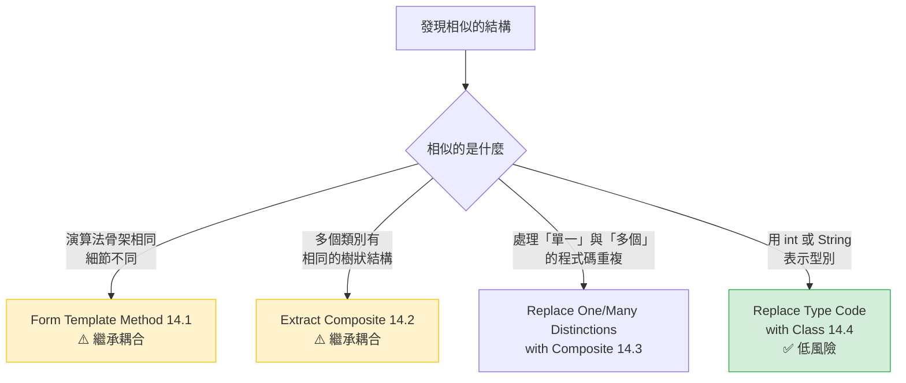

> 🔧 **本手冊的工程建議**
> 四個條目中，**只有 14.4（Replace Type Code with Class）是可以放心使用的**。
> 另外三個都應該先問：「有沒有用組合（composition）而非繼承的做法？」

---

### 14.1 Form Template Method

#### 一句話

當多個子類別的方法「步驟順序相同、只有某些步驟的做法不同」時，把骨架拉到父類別，把變化的步驟留給子類別。

#### 起點 Smell

- Duplicated Code（7.2）：多個類別有結構幾乎相同的方法
- 差異只在中間某幾個步驟

#### Before

```java
// Before：Java 8 — 兩個報表產生器，流程一樣，只有取資料與格式化不同
public class MonthlySalesReport {
    public byte[] generate(ReportParam param) {
        validate(param);                                   // 相同
        List<SalesRecord> data = salesDao.findByMonth(param.getMonth());   // 不同
        BigDecimal total = data.stream().map(SalesRecord::getAmount)
                               .reduce(BigDecimal.ZERO, BigDecimal::add);  // 不同
        String html = renderSalesHtml(data, total);        // 不同
        byte[] pdf = htmlToPdf(html);                      // 相同
        auditLog.record(param, pdf.length);                // 相同
        return pdf;
    }
}

public class MonthlyInventoryReport {
    public byte[] generate(ReportParam param) {
        validate(param);                                   // 相同
        List<StockRecord> data = stockDao.findByMonth(param.getMonth());   // 不同
        int total = data.stream().mapToInt(StockRecord::getQty).sum();     // 不同
        String html = renderStockHtml(data, total);        // 不同
        byte[] pdf = htmlToPdf(html);                      // 相同
        auditLog.record(param, pdf.length);                // 相同
        return pdf;
    }
}
```

#### 重構步驟

| 步驟 | 動作 | 驗證 |
|---|---|---|
| 1 | 確認兩個方法的**步驟順序完全一致**（若順序不同，不適用本重構） | 人工比對 |
| 2 | 建立抽象父類別，把 `generate()` 的骨架放進去 | 編譯通過 |
| 3 | 把變化的步驟宣告為 `protected abstract` | 子類別編譯失敗（預期） |
| 4 | 子類別實作那些抽象方法，內容從原本的程式碼搬過來 | 測試全綠 |
| 5 | 移除子類別中的 `generate()` | 測試全綠 |

#### 中間態

步驟 2 之後若發現「骨架其實不完全相同」（例如其中一個多了一步），**應該停下來重新評估**。硬拉到父類別後用 `if (isSalesReport())` 補差異，會比原本更糟。

#### After

```java
// After：Java 25
public abstract class MonthlyPdfReport {

    /** 樣板方法：定義流程骨架，不可被覆寫。 */
    public final byte[] generate(ReportParam param) {
        validate(param);
        ReportData data = fetchData(param);          // 由子類別決定
        String html = render(data);                  // 由子類別決定
        byte[] pdf = htmlToPdf(html);
        auditLog.record(param, pdf.length);
        return pdf;
    }

    protected abstract ReportData fetchData(ReportParam param);
    protected abstract String render(ReportData data);

    // validate / htmlToPdf / auditLog 為共用實作
}

@Component
class MonthlySalesReport extends MonthlyPdfReport {
    @Override protected ReportData fetchData(ReportParam param) { }
    @Override protected String render(ReportData data) { }
}
```

> ✅ **`final` 很重要**
> 樣板方法必須宣告為 `final`，否則子類別可以覆寫整個流程，那就失去了「確保步驟順序」的價值。

#### 得到什麼

- 骨架只有一份；改流程（例如加一步「浮水印」）只改父類別
- 強制所有子類別遵守相同的流程（例如稽核記錄不可能被漏掉）

#### 付出什麼

| 面向 | 代價 |
|---|---|
| **耦合** | 🔴 **繼承耦合**。父類別的任何變更影響所有子類別，且無法在執行期改變 |
| **彈性** | 🔴 Java 單一繼承，用掉唯一的繼承額度（子類別不能再繼承別的） |
| **可讀性** | ⚠️ 讀一個子類別要同時讀父類別 |
| **測試** | ⚠️ 測試子類別時無法跳過父類別的步驟（例如 `htmlToPdf` 很慢） |
| **效能** | 無 |

**組合式的替代方案**（🔧 本手冊建議優先考慮）：

```java
// 用組合取代繼承 — 沒有繼承耦合，且可在執行期組裝
@Component
public class MonthlyPdfReportGenerator {
    public byte[] generate(ReportParam param, ReportSource source, ReportRenderer renderer) {
        validate(param);
        ReportData data = source.fetch(param);
        String html = renderer.render(data);
        byte[] pdf = htmlToPdf(html);
        auditLog.record(param, pdf.length);
        return pdf;
    }
}
```

| | Template Method（繼承） | 組合 |
|---|---|---|
| 新增一種報表 | 新增子類別 | 新增 source + renderer 的組合 |
| 混搭（銷售資料用庫存格式） | ❌ 做不到 | ✅ 自由組合 |
| 繼承額度 | 用掉 | 不用 |
| 測試 | 較難隔離 | 容易 |

#### 什麼時候不要用

- **骨架本身也會變動** → 繼承會變成負債
- **只有兩個子類別，且重複只有三五行** → 重複比繼承便宜
- **子類別已經需要繼承別的類別**
- **可以用組合達成** → 優先用組合
- **Spring 環境** → 通常組合 + 注入更合適

#### AI Prompt 與驗證

```text
角色：資深 Java 工程師。

背景：[類別 A] 與 [類別 B] 的 [方法名稱] 疑似有相同的流程骨架。
      本專案 Java 25 / Spring Boot 4.1.x。

目標：評估是否適合 Form Template Method。

限制（只做分析）：
- 不得修改程式碼

步驟：
1. 逐步驟列表比對兩個方法，標示「完全相同」「僅參數不同」「完全不同」
2. 回答：步驟的「順序」是否完全一致？若有任何差異請明確指出
3. 回答：是否可以用「組合 + 注入」達成相同目的？請給出組合版本的設計草圖
4. 比較繼承版與組合版的取捨，並給出建議
   （本專案的預設偏好是：能用組合就不用繼承）

停止條件：
- 步驟 2 若順序不一致，建議不執行本重構並停止
- 完成步驟 4 後停止
```

驗證 checklist：

- [ ] 樣板方法已宣告為 `final`
- [ ] 每個子類別的執行結果與重構前完全一致
- [ ] 步驟的執行順序未改變
- [ ] 沒有為了應付差異而在父類別加入 `if (isXxx())`
- [ ] 子類別沒有覆寫不該覆寫的共用步驟
- [ ] 已評估過組合方案並在 PR 中說明為何選擇繼承

---

### 14.2 Extract Composite

#### 一句話

當多個子類別各自實作了「管理子節點」的相同程式碼時，把那段程式碼抽到一個共同的父類別。

> ⚠️ 這是 27 項中**使用頻率最低**的條目之一，適用情境非常特定。

#### 起點 Smell

- 一個繼承體系中，多個子類別都有 `List<Node> children` 與 `add()` / `remove()` / `getChildren()`
- 這些實作幾乎一模一樣

#### Before 與 After

```java
// Before：Java 8 — 兩個子類別各自實作了子節點管理
public class AndSpecification extends Specification {
    private List<Specification> children = new ArrayList<>();
    public void add(Specification s) { children.add(s); }
    public List<Specification> getChildren() { return children; }
    public boolean isSatisfiedBy(Order o) {
        return children.stream().allMatch(c -> c.isSatisfiedBy(o));
    }
}

public class OrSpecification extends Specification {
    private List<Specification> children = new ArrayList<>();   // 重複
    public void add(Specification s) { children.add(s); }       // 重複
    public List<Specification> getChildren() { return children; } // 重複
    public boolean isSatisfiedBy(Order o) {
        return children.stream().anyMatch(c -> c.isSatisfiedBy(o));
    }
}
```

```java
// After：Java 25 — 把重複的子節點管理抽到 CompositeSpecification
public abstract sealed class CompositeSpecification extends Specification
        permits AndSpecification, OrSpecification {

    private final List<Specification> children;

    protected CompositeSpecification(List<Specification> children) {
        this.children = List.copyOf(children);      // 不可變
    }

    protected List<Specification> children() { return children; }
}

public final class AndSpecification extends CompositeSpecification {
    public AndSpecification(List<Specification> children) { super(children); }

    @Override
    public boolean isSatisfiedBy(Order order) {
        return children().stream().allMatch(c -> c.isSatisfiedBy(order));
    }
}
```

#### 重構步驟

| 步驟 | 動作 | 驗證 |
|---|---|---|
| 1 | 確認各子類別的子節點管理**行為完全一致**（含 null 處理、重複元素的處理） | 人工比對 |
| 2 | 建立中間層抽象類別，放入子節點管理 | 編譯通過 |
| 3 | 一個子類別改為繼承中間層，移除重複程式碼 | 測試全綠 |
| 4 | 其餘子類別逐一比照 | 每次跑測試 |

#### 得到什麼／付出什麼

**得到**：消除子節點管理的重複；未來加入「遍歷」「計數」等共用能力只需改一處。

| 面向 | 代價 |
|---|---|
| **耦合** | 🔴 多了一層繼承，體系變深 |
| **可讀性** | ⚠️ 繼承階層 3 層以上時難以追蹤 |
| **效能** | 無 |

#### 什麼時候不要用

- **只有兩個子類別**，重複只有三五行 → 不值得多一層繼承
- **子節點管理的行為其實有細微差異**（例如一個允許重複、一個不允許）
- 可以用**介面的 default method** 或組合達成

#### AI Prompt 與驗證

```text
角色：資深 Java 工程師。
背景：[繼承體系] 中的子類別疑似有重複的子節點管理程式碼。
目標：評估 Extract Composite。
限制：只做分析，不得修改程式碼。
步驟：
1. 逐一比對各子類別的子節點管理程式碼，標示差異（含 null 處理、重複元素、順序保證）
2. 回答：目前繼承階層有幾層？抽出中間層後會變成幾層？
3. 回答：能否改用介面 default method 或組合達成？
4. 給出建議
停止條件：若子類別少於 3 個或階層已達 3 層，建議不執行並停止。
```

驗證 checklist：

- [ ] 各子類別的行為完全未變（含加入 null、加入重複元素的行為）
- [ ] 繼承階層未超過 3 層
- [ ] 子節點集合的可變性語意未改變（原本可變改成不可變是**行為變更**）

---

### 14.3 Replace One/Many Distinctions with Composite

#### 一句話

當程式碼同時有「處理單一項目」與「處理多個項目」兩套幾乎相同的邏輯時，用 Composite 讓兩者統一。

#### 起點 Smell

- 成對出現的方法：`process(Item)` 與 `processAll(List<Item>)`，內容高度重複
- 呼叫端到處是 `if (isSingle) ... else ...`

#### Before 與 After

```java
// Before：Java 8 — 單一與多個各一套
public class DiscountRule {
    public BigDecimal applyTo(Product p) {
        return p.getPrice().multiply(rate);
    }
    public BigDecimal applyToAll(List<Product> products) {
        BigDecimal total = BigDecimal.ZERO;
        for (Product p : products) {
            total = total.add(p.getPrice().multiply(rate));   // 重複的邏輯
        }
        return total;
    }
}
```

```java
// After：Java 25 — 統一為一個介面，單一項目是「只有一個元素的群組」
public sealed interface Priceable permits Product, ProductBundle {
    Money price();
}

public record Product(String sku, Money price) implements Priceable { }

public record ProductBundle(List<Priceable> items) implements Priceable {
    @Override
    public Money price() {
        return items.stream().map(Priceable::price)
                    .reduce(Money.zeroTwd(), Money::add);       // 遞迴，支援任意巢狀
    }
}

public class DiscountRule {
    public Money applyTo(Priceable target) {                     // 只剩一個方法
        return target.price().multiply(rate);
    }
}
```

#### 重構步驟

| 步驟 | 動作 | 驗證 |
|---|---|---|
| 1 | 定義共同介面，讓「單一」型別實作它 | 編譯通過 |
| 2 | 建立「群組」型別，也實作該介面 | 新增測試 |
| 3 | 把 `processAll()` 的呼叫端改為傳入群組物件 | 測試全綠 |
| 4 | 移除 `processAll()` | 測試全綠 |

#### 得到什麼／付出什麼

**得到**：呼叫端不需要區分單一與多個；支援任意深度的巢狀組合；重複邏輯消失。

| 面向 | 代價 |
|---|---|
| **可讀性** | ⚠️ 「一個 Product 也是 Priceable」對新人需要解釋 |
| **效能** | ⚠️ 遞迴計算；深度巢狀時要注意堆疊深度與重複計算（可能需快取） |
| **除錯** | ⚠️ 遞迴的堆疊追蹤較難閱讀 |

#### 什麼時候不要用

- **單一與多個的處理邏輯本來就不同**（例如多個時要先排序、要去重）
- **不存在真正的巢狀需求**（永遠只有一層）→ 直接用 `List` 就好
- 效能敏感且集合很大 → 遞迴與物件包裝的成本要實測

#### AI Prompt 與驗證

```text
角色：資深 Java 工程師。
背景：[類別] 中有 process(X) 與 processAll(List<X>) 兩個方法，疑似重複。
目標：評估 Replace One/Many Distinctions with Composite。
限制：只做分析。
步驟：
1. 逐行比對兩個方法，標示重複與差異的部分
2. 回答：多個項目時是否有額外處理（排序、去重、分組、短路）？
3. 回答：業務上是否真的存在「群組中還有群組」的巢狀需求？請舉實例
4. 給出建議
停止條件：步驟 3 若無巢狀需求，建議不執行並停止。
```

驗證 checklist：

- [ ] 單一項目與多個項目的計算結果與重構前一致
- [ ] 空集合的行為一致（原本回傳 0 還是丟例外）
- [ ] 深層巢狀不會 `StackOverflowError`
- [ ] 效能在最大預期資料量下已實測

---

### 14.4 Replace Type Code with Class

#### 一句話

把用 `int` 或 `String` 表示的型別代碼，換成一個真正的型別。

> ✅ **這是本章唯一可以放心使用的條目，也是 CP 值極高的重構。**

#### 起點 Smell

- Primitive Obsession（7.7）
- `if (status == 3)` 這類程式碼（讀者不知道 3 是什麼）
- 型別代碼的合法值散落在常數、註解或文件中
- 曾經因為傳錯代碼而出過 bug

#### Before

```java
// Before：Java 8 — 代碼的意義只存在於註解與人的記憶中
public class Order {
    // 1=待付款 2=已付款 3=已出貨 9=已取消
    private int status;

    // 1=一般 2=急件 3=預購
    private int type;

    public void setStatus(int status) { this.status = status; }
}

// 呼叫端 — 編譯器完全無法防止這種錯誤
order.setStatus(order.getType());      // 傳錯了，但編譯通過
order.setStatus(7);                    // 不存在的狀態，但編譯通過
```

#### 重構步驟

| 步驟 | 動作 | 驗證 |
|---|---|---|
| 1 | **先盤點生產資料的實際值**（見下方 SQL） | 資料盤點報告 |
| 2 | 建立 `enum`，涵蓋**所有實際存在的值**（包含文件沒寫的） | 編譯通過 |
| 3 | 在 enum 中加入 `fromCode()` / `code()` 的雙向轉換 | 單元測試 |
| 4 | 在**邊界**（DAO、DTO 轉換）做轉換，內部改用 enum | 測試全綠 |
| 5 | 逐一把 `int status` 改為 `OrderStatus status` | 每次跑測試 |
| 6 | JPA 加上 `@Converter`（**不要用 `@Enumerated(ORDINAL)`**） | 整合測試 |

**步驟 1 的資料盤點（不可跳過）**：

```sql
-- 找出實際存在的所有值，以及各自的筆數
SELECT status, COUNT(*) AS cnt, MIN(created_at), MAX(created_at)
FROM orders GROUP BY status ORDER BY status;

-- 檢查是否有 null
SELECT COUNT(*) FROM orders WHERE status IS NULL;
```

> 🔴 **這一步幾乎總會有驚喜**
> 實務上非常常見的情況：文件寫 4 種狀態，實際資料有 7 種——多出來的是歷史遺留、測試資料或某次緊急修復留下的。
> **enum 必須涵蓋所有實際值**，否則載入舊資料時會拋例外。

#### After

```java
// After：Java 25
public enum OrderStatus {
    AWAITING_PAYMENT(1, "待付款"),
    PAID(2, "已付款"),
    SHIPPED(3, "已出貨"),
    CANCELLED(9, "已取消"),
    /** 2016 年前的歷史資料，業務已停辦。僅供讀取，不得新增。 */
    LEGACY_PENDING_REVIEW(5, "舊版待審");

    private static final Map<Integer, OrderStatus> BY_CODE =
        Arrays.stream(values()).collect(Collectors.toUnmodifiableMap(OrderStatus::code, s -> s));

    private final int code;
    private final String displayName;

    OrderStatus(int code, String displayName) {
        this.code = code;
        this.displayName = displayName;
    }

    public int code() { return code; }
    public String displayName() { return displayName; }

    public static OrderStatus fromCode(int code) {
        OrderStatus status = BY_CODE.get(code);
        if (status == null) {
            throw new UnknownOrderStatusException(code);
        }
        return status;
    }

    public boolean isSettleable() { return this == PAID || this == SHIPPED; }
}

// JPA 轉換器 — 必須用 code，不可依賴 ordinal
@Converter(autoApply = true)
public class OrderStatusConverter implements AttributeConverter<OrderStatus, Integer> {
    @Override public Integer convertToDatabaseColumn(OrderStatus s) {
        return s == null ? null : s.code();
    }
    @Override public OrderStatus convertToEntityAttribute(Integer code) {
        return code == null ? null : OrderStatus.fromCode(code);
    }
}
```

#### 得到什麼

- **編譯器防呆**：`order.setStatus(order.getType())` 不再能編譯
- 代碼的意義寫在程式碼裡，不在註解裡
- 可以把相關行為放進 enum（`isSettleable()`）
- 搭配 `switch` 可獲得完整性檢查
- IDE 的自動完成會列出所有合法值

#### 付出什麼

| 面向 | 代價 |
|---|---|
| **可維護性** | **正面**，幾乎無代價 |
| **效能** | 無 |
| **安全性** | **正面**——不可能設定非法值 |
| **既有資料** | 🔴 **未涵蓋的舊值會導致載入失敗**（必須先盤點） |
| **序列化** | ⚠️ JSON 的輸出會從數字變成名稱，**下游系統可能會壞**（需用 `@JsonValue` 保持數字） |
| **JPA** | 🔴 **絕不可用 `@Enumerated(EnumType.ORDINAL)`**——插入新的 enum 常數會讓所有既有資料錯位 |

> 🔴 **兩個會造成生產事故的地雷**
>
> **地雷一：`@Enumerated(ORDINAL)`**
> 它存的是 enum 的宣告順序（0, 1, 2...）。如果有人在中間插入一個新常數，**所有既有資料的意義全部位移**。
> 正確做法：用 `AttributeConverter` 明確對應 code。
>
> **地雷二：JSON 序列化格式改變**
> `int status = 2` 序列化成 `"status": 2`；`OrderStatus.PAID` 預設序列化成 `"status": "PAID"`。
> 如果有下游系統在解析這個欄位，改版當天就會壞。
> 正確做法：在 enum 上加 `@JsonValue` 回傳 code，或明確確認所有下游都已同步調整。

#### 什麼時候不要用

- 代碼的合法值**由外部系統動態決定**（例如來自設定表，隨時會新增）→ 用值物件包裝 `String`，不要用 enum
- 值的數量很多（> 50）且經常變動 → 考慮資料表 + 值物件
- 該欄位即將廢除

#### AI Prompt 與驗證

```text
角色：資深 Java / Spring 工程師。

背景：[類別].[欄位] 使用 [int/String] 表示型別代碼。
      本專案 Java 25 / Spring Boot 4.1.x / JPA。

目標：執行 Replace Type Code with Class。

限制：
- enum 必須涵蓋「生產資料中實際存在的所有值」，不只是文件寫的
- JPA 必須使用 AttributeConverter，禁止使用 @Enumerated(ORDINAL)
- 不得改變 JSON 序列化的輸出格式（必要時使用 @JsonValue）
- 不得改變任何既有的判斷結果

步驟：
1. 掃描程式碼，列出所有出現過的代碼值與其對應的意義（含註解中的說明）
2. 產生一段 SQL，用於盤點生產資料庫的實際值分布與 null 數量
3. 【等我提供盤點結果後再繼續】
4. 依盤點結果設計 enum，對「文件沒寫但資料中存在」的值，明確標示為歷史值
5. 實作 AttributeConverter 與 @JsonValue
6. 逐一替換使用處

停止條件：
- 步驟 2 之後停止，等我提供實際的資料盤點結果
- 若發現該欄位的值來自外部系統且會動態新增，建議改用值物件而非 enum，並停止
```

驗證 checklist：

- [ ] **已執行生產資料盤點**，enum 涵蓋所有實際值
- [ ] null 的處理與原本一致
- [ ] JPA 使用 `AttributeConverter`，**沒有** `@Enumerated(ORDINAL)`
- [ ] **JSON 輸出格式未改變**（用實際的 API 回應比對）
- [ ] 所有原本的比較（`==`、`equals`）結果一致
- [ ] 資料庫寫入的值與原本相同
- [ ] 遇到未知代碼時的行為已明確定義（丟例外或回傳預設值）

### 14.5 本章實務案例

**情境**：某壽險公司的「保單狀態」欄位重構。

原始狀況：`policy.status` 是 `char(2)`，程式碼中有 47 處 `if ("01".equals(status))` 這類判斷。系統文件寫有 6 種狀態。

#### 第 1 步：資料盤點的結果

```sql
SELECT status, COUNT(*) FROM policy GROUP BY status ORDER BY status;
```

| status | 筆數 | 文件有寫嗎 |
|---|---|---|
| `01` 有效 | 2,840,112 | ✅ |
| `02` 停效 | 184,220 | ✅ |
| `03` 復效 | 31,004 | ✅ |
| `04` 滿期 | 920,341 | ✅ |
| `05` 解約 | 411,882 | ✅ |
| `09` 失效 | 88,190 | ✅ |
| `0A` | **3,204** | ❌ **文件沒有** |
| `  `（兩個空白） | **47** | ❌ **文件沒有** |
| `NULL` | **2** | ❌ **文件沒有** |

**追查結果**：

| 值 | 真相 |
|---|---|
| `0A` | 2009 年某次系統轉換的中繼狀態，應該轉完就清掉，但有 3,204 筆卡住 |
| 兩個空白 | 2013 年某次批次程式的 bug，寫入了空字串 |
| `NULL` | 2 筆測試資料誤入生產環境 |

**如果直接把 enum 寫成文件上的 6 種，這 3,253 筆資料會在載入時全部拋例外。**

**處理決策**：

| 值 | 決策 |
|---|---|
| `0A` | 納入 enum，標示為 `@Deprecated` 的歷史值；另開專案清理那 3,204 筆 |
| 空白 | 納入 enum 作為 `UNKNOWN`；同時開 ticket 修正批次程式 |
| `NULL` | 直接刪除那 2 筆測試資料（獨立 PR） |

**第 6 步的一個關鍵發現**：

團隊原本打算用 `@Enumerated(EnumType.STRING)`，因為「存字串比較看得懂」。但檢視後發現，DB 欄位是 `char(2)`，而 enum 常數名稱是 `ACTIVE`、`LAPSED` 等——**長度超過 2，會被截斷**。

改用 `AttributeConverter` 明確對應 `01`、`02` 等原始代碼，問題解決。

**成果**：

| 指標 | Before | After |
|---|---|---|
| 狀態判斷的位置 | 47 處字串比較 | 47 處 enum 比較 |
| 傳錯狀態代碼的可能 | 有（`char(2)` 誰都能傳） | **零**（型別不符無法編譯） |
| 「有哪些狀態」的可見度 | 散落在 4 份文件 | 1 個 enum |
| 重構過程發現的資料問題 | — | **3 類、3,253 筆** |
| 上線後的問題 | — | 0 |

> 🔧 **這個案例的核心教訓**
> 這次重構最大的價值**不是程式碼變好，是發現了 3,253 筆沒人知道的問題資料**。
> 而如果跳過資料盤點直接寫 enum，這些資料會在上線當天變成 3,253 次例外。

### 14.6 本章注意事項

> ⚠️ **本章三個條目涉及繼承，請先考慮組合**
> Form Template Method、Extract Composite 都可以用組合 + 注入達成。在 Spring 環境中，組合幾乎總是更好的選擇。

> ⚠️ **Replace Type Code with Class 之前，必須先做生產資料盤點**
> 這是本章最重要的一條。文件與實際資料不一致是常態，不是例外。

> 🔴 **JPA 的 `@Enumerated(ORDINAL)` 是禁用項目**
> 建議直接寫進團隊規範與 ArchUnit 規則。它造成的資料錯位是不可逆的。

> ⚠️ **enum 化會改變 JSON 序列化格式**
> 有下游系統時，這是行為變更。用 `@JsonValue` 保持原格式，或確認所有下游已同步。

> ✅ **樣板方法要宣告 `final`**
> 否則子類別可以覆寫整個流程，失去 Template Method 的保證價值。

> ✅ **繼承階層不要超過 3 層**
> 超過之後，追蹤一個方法的實際行為需要開太多檔案。建議用 ArchUnit 規則限制。

---

## 第 15 章 Protection 與 Accumulation 類重構

本章五個條目分為兩組：

| 組別 | 條目 | 共同目標 |
|---|---|---|
| **保護（Protection）** | Introduce Null Object、Replace Hard-Coded Notifications with Observer | 讓程式碼不必到處防禦 |
| **累積（Accumulation）** | Move Accumulation to Collecting Parameter、Move Accumulation to Visitor、Replace Implicit Language with Interpreter | 把「邊走邊累積」的邏輯理清 |

> ⚠️ **本章包含全書難度最高的三個條目**（Observer、Visitor、Interpreter）。
> 它們的共同特徵是：**威力強大，但一旦用錯情境，維護成本會高於原本的爛程式碼。**
> 請務必先讀每一節的「什麼時候不要用」。

---

### 15.1 Introduce Null Object

#### 一句話

用一個「什麼都不做但行為合法」的物件，取代散落各處的 `null` 檢查。

#### 起點 Smell

- 同一個 `if (x == null)` 檢查在 5 處以上重複
- 「不存在」的情況有**明確且一致的預設行為**
- 因為漏了 null 檢查而出過 NPE

#### Before

```java
// Before：Java 8 — 同一個 null 檢查散落 8 處
@Service
public class PricingService {

    public Money finalPrice(Order order) {
        Money base = order.subtotal();
        Coupon coupon = couponDao.findActive(order.customerId());
        if (coupon == null) {                                   // 第 1 處
            return base;
        }
        return base.subtract(coupon.discountFor(base));
    }

    public String receiptLine(Order order) {
        Coupon coupon = couponDao.findActive(order.customerId());
        if (coupon == null) {                                   // 第 2 處
            return "無折扣";
        }
        return "折扣券 " + coupon.code() + "：-" + coupon.discountFor(order.subtotal());
    }

    public boolean isEligibleForFreeShipping(Order order) {
        Coupon coupon = couponDao.findActive(order.customerId());
        if (coupon == null) {                                   // 第 3 處
            return order.subtotal().isGreaterThan(FREE_SHIPPING_THRESHOLD);
        }
        return coupon.includesFreeShipping()
            || order.subtotal().isGreaterThan(FREE_SHIPPING_THRESHOLD);
    }
    // 還有 5 處
}
```

#### 重構步驟

| 步驟 | 動作 | 驗證 |
|---|---|---|
| 1 | **逐一檢視每個 null 檢查的行為是否一致**（這是關鍵前提） | 書面比對表 |
| 2 | 建立 Null Object 實作，每個方法回傳「不存在時的預設值」 | 單元測試 |
| 3 | 把查詢方法改為「找不到時回傳 Null Object」 | 測試全綠 |
| 4 | 逐一移除 null 檢查 | 每次跑測試 |
| 5 | 若查詢方法對外公開，考慮改回傳 `Optional` 而非 Null Object | 視情況 |

> 🔴 **步驟 1 不可跳過**
> 如果 8 處 null 檢查中有 2 處的行為不同（例如一處回傳 0、一處丟例外），**那就不適合 Null Object**。
> 硬做的結果是：你必須在 Null Object 裡塞入 `if`，或是在呼叫端保留部分 null 檢查——兩者都比原本更糟。

#### After

```java
// After：Java 25 — 用 sealed interface 讓「不存在」成為一種正常狀態
public sealed interface Coupon permits IssuedCoupon, NoCoupon {

    String code();
    Money discountFor(Money base);
    boolean includesFreeShipping();
    String receiptDescription();

    static Coupon none() { return NoCoupon.INSTANCE; }
}

public record IssuedCoupon(String code, BigDecimal rate, boolean freeShipping)
        implements Coupon {

    @Override public Money discountFor(Money base) { return base.multiply(rate); }
    @Override public boolean includesFreeShipping() { return freeShipping; }
    @Override public String receiptDescription() {
        return "折扣券 %s".formatted(code);
    }
}

/** Null Object：代表「這位客戶沒有可用折扣券」。 */
public final class NoCoupon implements Coupon {
    static final NoCoupon INSTANCE = new NoCoupon();
    private NoCoupon() { }

    @Override public String code() { return ""; }
    @Override public Money discountFor(Money base) { return Money.zero(base.currency()); }
    @Override public boolean includesFreeShipping() { return false; }
    @Override public String receiptDescription() { return "無折扣"; }
}
```

呼叫端：

```java
@Service
public class PricingService {

    public Money finalPrice(Order order) {
        Coupon coupon = couponDao.findActive(order.customerId());   // 永不回傳 null
        return order.subtotal().subtract(coupon.discountFor(order.subtotal()));
    }

    public String receiptLine(Order order) {
        return couponDao.findActive(order.customerId()).receiptDescription();
    }

    public boolean isEligibleForFreeShipping(Order order) {
        Coupon coupon = couponDao.findActive(order.customerId());
        return coupon.includesFreeShipping()
            || order.subtotal().isGreaterThan(FREE_SHIPPING_THRESHOLD);
    }
}
```

#### 得到什麼

- 8 處 null 檢查全部消失
- 不可能忘記處理「不存在」的情況
- 「不存在時該怎麼辦」的規則集中在一個類別，一眼可見

#### 付出什麼

| 面向 | 代價 |
|---|---|
| **可讀性** | 🔴 **最大的風險：錯誤會被靜默吞掉。** 原本 NPE 會炸，現在會安靜地回傳 0 |
| **除錯** | ⚠️ 「為什麼折扣是 0」比「為什麼 NPE」更難查 |
| **檔案數** | 多一個介面 + 一個 Null Object |
| **效能** | 無（單例） |
| **與 Optional 的重疊** | ⚠️ Java 8 以後，`Optional` 常常是更好的選擇 |

> 🔴 **靜默失敗是 Null Object 的真實代價**
>
> ```text
> Before：資料異常 → coupon 為 null → NPE → 監控告警 → 兩小時內修好
> After： 資料異常 → 拿到 NoCoupon → 折扣 0 元 → 沒有告警 → 客訴三週後才發現
> ```
>
> **建議做法**：在 Null Object 中加入 debug 層級的記錄，或在查詢方法中區分「查無資料」與「資料異常」兩種情況——後者仍應拋例外。

#### Null Object 與 Optional 的取捨

> 🔧 **本手冊的工程建議**

| 情境 | 建議 |
|---|---|
| 「不存在」有**明確且一致**的預設行為，且會被呼叫多個方法 | **Null Object** |
| 「不存在」是呼叫端必須明確處理的情況 | **`Optional`** |
| 跨模組或對外的 API 邊界 | **`Optional`**（語意更明確，呼叫端不會誤以為有資料） |
| 內部的領域模型，且「空」是正常狀態 | **Null Object** |
| 只有 1～2 處 null 檢查 | **兩者都不用**，直接 `if` |

#### 什麼時候不要用

- **null 檢查少於 5 處**
- **各處的預設行為不一致**
- **「不存在」是異常狀況，應該要炸出來**（例如查不到必要的主檔資料）
- **需要區分「沒有」與「有但是空的」**
- 團隊已普遍使用 `Optional` 且慣例一致

#### AI Prompt 與驗證

```text
角色：資深 Java 工程師。

背景：[類別] 中對 [型別] 有多處 null 檢查。
      本專案 Java 25 / Spring Boot 4.1.x。

目標：評估是否應執行 Introduce Null Object。

限制（只做分析）：
- 不得修改程式碼

步驟：
1. 列出所有 null 檢查的位置，以及各處「為 null 時」的行為
2. 製作對照表，標示各處行為是否一致
3. 回答：null 代表「正常的空」還是「異常的缺失」？依據是什麼？
4. 回答：若改為 Null Object，哪些原本會拋 NPE 的異常情況會變成靜默失敗？
5. 比較三種方案：Null Object / Optional / 維持現狀，並給出建議

停止條件：
- 步驟 2 若發現行為不一致，建議不使用 Null Object 並停止
- 步驟 3 若 null 代表異常缺失，建議維持拋例外並停止
```

驗證 checklist：

- [ ] 所有原本的 null 分支行為，在 Null Object 中完全重現
- [ ] 查詢方法**確實不可能回傳 null**（含例外路徑）
- [ ] 已區分「正常的空」與「異常的缺失」，後者仍會拋例外
- [ ] Null Object 有記錄或監控，避免問題被靜默吞掉
- [ ] 序列化行為已確認（Null Object 進 JSON 會長什麼樣）
- [ ] `equals` / `hashCode` 行為正確

---

### 15.2 Replace Hard-Coded Notifications with Observer

#### 一句話

把「某件事發生時要通知誰」這個寫死的清單，改成「有興趣的對象自己來訂閱」。

#### 起點 Smell

- 一個業務方法末尾接了一串通知呼叫
- 每新增一個「事情發生後要做的事」，就要修改核心業務方法
- 核心業務類別依賴了一堆與核心無關的服務

#### 使用前的三道關卡

> 🔧 **本手冊的工程建議：三題必須全部答「是」。**

| 關卡 | 問題 | 若答「否」該怎麼做 |
|---|---|---|
| ① | 訂閱者的數量是否**未知或會動態增減**？ | 只有 1 個且不會變 → 直接呼叫 |
| ② | 發布者是否**不應該知道**訂閱者是誰？ | 應該知道 → 直接呼叫更清楚 |
| ③ | 各訂閱者的**失敗是否可以互相獨立**？ | 不可獨立（必須同進退） → 用明確的流程，不要用事件 |

**第 ③ 題是實務上最常被忽略的。** 回顧第 3.5 節的案例：「簡訊失敗不能影響訂單成立，Email 失敗要 rollback」——這種需求用 Observer 表達會非常痛苦。

#### Before

```java
// Before：Java 8 — 核心業務方法末尾接了五個通知
@Service
public class OrderService {
    @Autowired private EmailSender emailSender;
    @Autowired private SmsGateway smsGateway;
    @Autowired private InventoryService inventoryService;
    @Autowired private LoyaltyService loyaltyService;
    @Autowired private DataWarehouseClient dwClient;

    @Transactional
    public Order placeOrder(OrderRequest request) {
        Order order = orderFactory.create(request);
        orderRepository.save(order);

        // 以下五件事都不是「下訂單」的核心
        emailSender.sendOrderConfirmation(order);
        smsGateway.sendOrderSms(order);
        inventoryService.reserve(order);
        loyaltyService.addPoints(order);
        dwClient.publishOrderEvent(order);

        return order;
    }
}
```

**這段程式碼的問題不只是「耦合」**：

| 問題 | 後果 |
|---|---|
| 五個動作都在 `@Transactional` 內 | Email 寄送失敗會導致訂單 rollback |
| 外部服務逾時 | 交易持有時間拉長，DB 連線被佔用 |
| 新增一種通知 | 要改這個核心方法 |
| 測試 `placeOrder` | 要 mock 五個服務 |

#### 重構步驟

| 步驟 | 動作 | 驗證 |
|---|---|---|
| 1 | **先釐清每個動作的交易語意**（必須同交易？可以失敗？需要重試？） | 與業務確認的書面紀錄 |
| 2 | 定義事件型別（`OrderPlacedEvent`） | 編譯通過 |
| 3 | 把**一個**動作改為事件監聽器 | 測試全綠 |
| 4 | 依步驟 1 的結論，為每個監聽器選擇正確的 `@TransactionalEventListener` phase | 交易測試 |
| 5 | 逐一搬移其餘動作 | 每次跑測試 |

> 🔴 **步驟 1 是整件事成敗的關鍵**
> 如果不先釐清交易語意就改成事件，你會得到一個「有時候庫存沒扣但訂單成立了」的系統。

#### 中間態

搬移 1～2 個動作之後是穩定狀態。**不需要把五個都改成事件**——例如「預留庫存」很可能應該留在原地（因為它必須與訂單在同一交易內）。

#### After

```java
// After：Java 25 + Spring Boot 4.x

public record OrderPlacedEvent(OrderId orderId, CustomerId customerId,
                               Money amount, Instant occurredAt) { }

@Service
public class OrderService {
    private final ApplicationEventPublisher events;

    @Transactional
    public Order placeOrder(OrderRequest request) {
        Order order = orderFactory.create(request);
        orderRepository.save(order);

        inventoryService.reserve(order);          // 必須同交易，留在原地

        events.publishEvent(new OrderPlacedEvent(
                order.id(), order.customerId(), order.amount(), Instant.now()));
        return order;
    }
}

@Component
class OrderNotificationListener {

    /** 交易成功提交後才寄送，避免「訂單 rollback 但信已寄出」。 */
    @TransactionalEventListener(phase = TransactionPhase.AFTER_COMMIT)
    @Async
    void onOrderPlaced(OrderPlacedEvent event) {
        emailSender.sendOrderConfirmation(event.orderId());
    }
}

@Component
class LoyaltyPointsListener {

    /** 點數必須與訂單同進同退，因此在同一交易內。 */
    @TransactionalEventListener(phase = TransactionPhase.BEFORE_COMMIT)
    void onOrderPlaced(OrderPlacedEvent event) {
        loyaltyService.addPoints(event.customerId(), event.amount());
    }
}
```

**`TransactionPhase` 的選擇是本節最重要的技術細節**：

| Phase | 執行時機 | 適用 | 風險 |
|---|---|---|---|
| `BEFORE_COMMIT` | 提交前 | **必須與主交易同進退**（點數、額度） | 失敗會讓主交易 rollback |
| `AFTER_COMMIT` | 提交成功後 | **對外的副作用**（寄信、發簡訊、推播） | 執行失敗不會 rollback，需自行處理補償 |
| `AFTER_ROLLBACK` | 回滾後 | 補償、告警 | — |
| `AFTER_COMPLETION` | 無論成敗 | 清理資源 | — |

> ⚠️ **預設值是陷阱**
> `@TransactionalEventListener` 的預設 phase 是 `AFTER_COMMIT`。而**一般的 `@EventListener` 是同步、在同一交易內執行的**。
> 兩者混用會造成極難追查的問題。**建議團隊規定：涉及交易的監聽器一律明確寫出 phase，不依賴預設值。**

#### 得到什麼

- 核心業務方法回到本質
- 新增一種「訂單成立後要做的事」：新增一個監聽器，**不修改 `OrderService`**
- 每個監聽器可以獨立測試、獨立設定重試與非同步
- 交易邊界變得明確可控

#### 付出什麼

| 面向 | 代價 |
|---|---|
| **可追蹤性** | 🔴 **最大的代價：從 `placeOrder` 看不出訂單成立後會發生什麼事** |
| **除錯** | 🔴 事件的流向需要靠 IDE 搜尋或執行期追蹤 |
| **交易** | 🔴 phase 選錯會造成資料不一致，且極難察覺 |
| **非同步** | ⚠️ `@Async` 的例外預設會被吞掉，必須設定 `AsyncUncaughtExceptionHandler` |
| **順序** | ⚠️ 多個監聽器的執行順序需用 `@Order` 明確指定，否則不保證 |
| **測試** | ⚠️ 整合測試需要確認事件確實被發布與消費 |

#### 什麼時候不要用

- **永遠只有一個訂閱者，且不會增加** → 直接呼叫
- **訂閱者必須全部成功，否則整筆失敗** → 用明確的流程方法，不要用事件
- **執行順序有嚴格要求** → 事件的順序保證薄弱
- **需要取得訂閱者的回傳值** → 事件是單向的
- **團隊對事件驅動不熟悉** → 除錯成本會很高

> ⚠️ **本手冊看到最常見的誤用**
> 「以後可能會有更多通知方式」而提前導入事件機制。回顧第 3.5 節的案例——那位工程師的預測甚至是對的，設計仍然失敗了。
> **等到真的有第二個訂閱者時再做，那時你會知道它們的失敗語意是否可以獨立。**

#### AI Prompt 與驗證

```text
角色：資深 Java / Spring 工程師。

背景：[類別].[方法] 末尾有多個通知或副作用呼叫。
      [貼上程式碼]
      本專案 Java 25 / Spring Boot 4.1.x，方法標註 @Transactional。

目標：評估是否應執行 Replace Hard-Coded Notifications with Observer。

限制（只做分析）：
- 不得修改程式碼

步驟：
1. 列出方法中每一個副作用呼叫
2. 對每一個回答（若無法從程式碼判斷，請回答「需要業務確認」，不要猜測）：
   (a) 它是否必須與主交易同進同退？
   (b) 它失敗時，主交易是否應該 rollback？
   (c) 它是否呼叫外部系統？逾時會如何？
   (d) 它與其他副作用是否有執行順序的相依？
3. 依 (a)(b) 的答案，指出每一個應該使用哪一種 TransactionPhase，或應該留在原地
4. 回答三道關卡：訂閱者數量是否會變？發布者是否該知道訂閱者？失敗是否可獨立？
5. 給出建議：哪些搬成事件、哪些留在原地

停止條件：
- 步驟 2 中若有任何一項標記為「需要業務確認」，停止並列出待確認清單
```

驗證 checklist：

- [ ] **每個監聽器的 `TransactionPhase` 已明確指定**，未依賴預設值
- [ ] 原本在交易內的副作用，若改為 `AFTER_COMMIT`，已確認業務可接受
- [ ] 原本 rollback 的情境，重構後仍然 rollback
- [ ] `@Async` 監聽器已設定例外處理器，失敗不會被靜默吞掉
- [ ] 有順序需求的監聽器已用 `@Order` 指定
- [ ] 整合測試涵蓋「事件發布後監聽器確實執行」
- [ ] 整合測試涵蓋「主交易 rollback 時，`AFTER_COMMIT` 監聽器不執行」
- [ ] 在文件或註解中記錄「這個事件有哪些監聽器」（彌補可追蹤性的損失）

---

### 15.3 Move Accumulation to Collecting Parameter

#### 一句話

當多個方法各自產生一部分結果、再由呼叫端拼起來時，改成傳入一個「收集器」，讓每個方法把結果加進去。

#### 起點 Smell

- Temporary Field（8.7）：用實例欄位在私有方法間傳遞累積中的結果
- 多個方法各自回傳片段，呼叫端負責組裝
- 方法簽章充滿 `StringBuilder` 的回傳與再傳入

#### Before

```java
// Before：Java 8 — 用實例欄位累積（Spring singleton 下有並行風險）
@Service
public class AuditReportBuilder {
    private StringBuilder buffer;        // 🔴 實例欄位，非執行緒安全
    private int lineCount;

    public String build(AuditQuery query) {
        buffer = new StringBuilder();
        lineCount = 0;

        appendHeader(query);
        appendTransactions(query);
        appendSummary();
        appendFooter();

        return buffer.toString();
    }

    private void appendHeader(AuditQuery query) {
        buffer.append("稽核報表 ").append(query.getPeriod()).append("\n");
        lineCount++;
    }
    // appendTransactions / appendSummary / appendFooter 同樣直接操作 buffer
}
```

#### 重構步驟

| 步驟 | 動作 | 驗證 |
|---|---|---|
| 1 | 建立一個 Collecting Parameter 型別（可以就是 `StringBuilder`，或自訂） | 編譯通過 |
| 2 | 把它加為各私有方法的參數 | 測試全綠 |
| 3 | 移除實例欄位 | 編譯通過 |
| 4 | **驗證並行安全**（這是本重構的主要目的） | 並行測試 |

#### After

```java
// After：Java 25 — 無狀態的 Spring bean，執行緒安全
@Service
public class AuditReportBuilder {

    public String build(AuditQuery query) {
        ReportAccumulator accumulator = new ReportAccumulator();   // 每次新建

        appendHeader(accumulator, query);
        appendTransactions(accumulator, query);
        appendSummary(accumulator);
        appendFooter(accumulator);

        return accumulator.render();
    }

    private void appendHeader(ReportAccumulator acc, AuditQuery query) {
        acc.line("稽核報表 %s".formatted(query.period()));
    }

    /** Collecting Parameter：承接各步驟的累積結果。 */
    static final class ReportAccumulator {
        private final StringBuilder buffer = new StringBuilder();
        private int lineCount;

        void line(String text) {
            buffer.append(text).append(System.lineSeparator());
            lineCount++;
        }
        int lineCount() { return lineCount; }
        String render() { return buffer.toString(); }
    }
}
```

#### 得到什麼

- **Spring bean 變成無狀態，執行緒安全**（這通常是最重要的收穫）
- 每個私有方法可以單獨測試（傳入一個累積器，驗證結果）
- 累積的邏輯（例如行數統計、格式）集中在累積器中

#### 付出什麼

| 面向 | 代價 |
|---|---|
| **參數數量** | ⚠️ 每個方法多一個參數 |
| **可讀性** | 中性 |
| **效能** | 無（通常比實例欄位版本更好，因為可以並行） |
| **可維護性** | **正面** |

#### 什麼時候不要用

- 該類別**每次使用都是新建的**（非共享），且方法很少 → 實例欄位沒有並行風險
- 只有一兩個方法參與累積 → 直接回傳值再組裝即可
- 可以用 Stream 的 `collect()` 自然表達 → 用 Stream

#### AI Prompt 與驗證

```text
角色：資深 Java / Spring 工程師。
背景：[類別] 使用實例欄位在私有方法間傳遞累積中的結果。
本專案 Java 25 / Spring Boot 4.1.x。
目標：執行 Move Accumulation to Collecting Parameter。
限制：
- 不得改變輸出結果（逐字元相同）
- 不得改變任何格式、換行符號、順序
步驟：
1. 回答：該類別是否為 Spring bean？若是，指出目前的並行風險
2. 列出所有參與累積的實例欄位與使用它們的方法
3. 設計 Collecting Parameter 型別，先只輸出設計
4. 實作，並提供一個並行測試（同時 100 執行緒呼叫，驗證結果互不污染）
停止條件：完成步驟 3 後停止等我確認。
```

驗證 checklist：

- [ ] 輸出結果與重構前**逐字元相同**（含換行符號）
- [ ] 類別已無可變的實例欄位
- [ ] **並行測試通過**（多執行緒同時呼叫，結果互不污染）
- [ ] 換行符號的處理一致（`\n` vs `System.lineSeparator()` 在跨平台時會有差異）

---

### 15.4 Move Accumulation to Visitor

#### 一句話

當你需要對一個物件結構做多種不同的「走訪與累積」，而且**不能修改那些類別**時，把走訪邏輯搬到 Visitor。

> ⚠️ **這是 27 項中最容易誤用、且誤用代價最高的條目。請務必讀完「什麼時候不要用」。**

#### 起點 Smell

- 一個方法用一連串 `instanceof` 判斷來處理不同型別的元素
- 同樣的型別判斷結構在多個方法中重複
- 需要新增「對這個結構的新操作」，但不想（或不能）修改結構中的類別

#### 使用前的關鍵判斷

Visitor 做的是一個**明確的取捨**：

```text
Visitor 讓「新增操作」變容易，但讓「新增型別」變困難。
```

| | 不用 Visitor | 用 Visitor |
|---|---|---|
| **新增一種元素型別** | 改一處（新增類別） | 🔴 **改所有 Visitor**（每個都要加一個方法） |
| **新增一種操作** | 🔴 改所有元素類別 | ✅ 新增一個 Visitor |

> 🔧 **本手冊的工程建議：只有當「型別穩定、操作會增加」時才用 Visitor。**
> 如果型別階層還在演化（這在企業系統中是常態），Visitor 會變成噩夢。

#### Before

```java
// Before：Java 8 — 用 instanceof 走訪，而且這個結構在四個方法中重複
public class TaxCalculator {
    public BigDecimal totalTax(List<LineItem> items) {
        BigDecimal total = BigDecimal.ZERO;
        for (LineItem item : items) {
            if (item instanceof GoodsItem) {
                total = total.add(((GoodsItem) item).getPrice().multiply(GOODS_TAX_RATE));
            } else if (item instanceof ServiceItem) {
                total = total.add(((ServiceItem) item).getFee().multiply(SERVICE_TAX_RATE));
            } else if (item instanceof ExemptItem) {
                // 免稅，不加
            }
        }
        return total;
    }
    // totalAmount()、itemDescriptions()、validateAll() 各有一套同樣的 instanceof 結構
}
```

#### Java 21 以後的重要替代方案

> 🔴 **這一段可能讓你完全不需要 Visitor。**

```java
// Java 25：sealed + pattern matching switch
public sealed interface LineItem permits GoodsItem, ServiceItem, ExemptItem { }

public Money totalTax(List<LineItem> items) {
    return items.stream()
        .map(item -> switch (item) {
            case GoodsItem g   -> g.price().multiply(GOODS_TAX_RATE);
            case ServiceItem s -> s.fee().multiply(SERVICE_TAX_RATE);
            case ExemptItem e  -> Money.zeroTwd();
        })
        .reduce(Money.zeroTwd(), Money::add);
}
```

**與 Visitor 的比較**：

| | Visitor | sealed + pattern matching |
|---|---|---|
| 新增操作 | 新增一個 Visitor 類別 | 新增一個方法 |
| 新增型別時漏改 | ⚠️ 編譯通過（除非用 abstract 方法強制） | ✅ **編譯失敗** |
| 檔案數 | 介面 + N 個 Visitor + 每個元素一個 `accept()` | **0 個新檔案** |
| 可讀性 | 走訪邏輯分散 | 集中且線性 |
| 元素類別是否需修改 | **需要**（加 `accept()`） | **不需要** |

> 🔧 **本手冊的工程建議**
> **在 Java 21 以上的專案中，pattern matching switch 幾乎總是優於 Visitor。**
> Visitor 的價值只剩下兩種情境：
>
> 1. 元素類別**無法修改**（第三方函式庫）且**無法宣告為 sealed**
> 2. 走訪邏輯本身**很複雜、有狀態**（例如需要在走訪過程中維護一個堆疊）

#### After（真的需要 Visitor 時）

```java
// After：Java 25 — 當元素類別來自第三方、無法改為 sealed 時
public interface LineItemVisitor<R> {
    R visitGoods(GoodsItem item);
    R visitService(ServiceItem item);
    R visitExempt(ExemptItem item);
}

// 每個元素類別需要加上 accept（這就是 Visitor 的侵入性代價）
public class GoodsItem implements LineItem {
    @Override public <R> R accept(LineItemVisitor<R> visitor) { return visitor.visitGoods(this); }
}

// 一個操作 = 一個 Visitor
public class TaxVisitor implements LineItemVisitor<Money> {
    @Override public Money visitGoods(GoodsItem item)     { return item.price().multiply(GOODS_TAX_RATE); }
    @Override public Money visitService(ServiceItem item) { return item.fee().multiply(SERVICE_TAX_RATE); }
    @Override public Money visitExempt(ExemptItem item)   { return Money.zeroTwd(); }
}

// 使用
Money tax = items.stream()
                 .map(item -> item.accept(new TaxVisitor()))
                 .reduce(Money.zeroTwd(), Money::add);
```

#### 重構步驟

| 步驟 | 動作 | 驗證 |
|---|---|---|
| 1 | **先確認 Java 版本與型別是否可宣告 sealed**；若可以，改用 pattern matching 並結束 | — |
| 2 | 定義 Visitor 介面 | 編譯通過 |
| 3 | 為每個元素類別加上 `accept()` | 編譯通過 |
| 4 | 把第一個操作改寫成 Visitor | 測試全綠 |
| 5 | 逐一改寫其餘操作 | 每次跑測試 |

#### 得到什麼／付出什麼

**得到**：新增操作不需修改元素類別；走訪邏輯集中；操作可以有狀態。

| 面向 | 代價 |
|---|---|
| **型別擴充** | 🔴 **新增一種元素型別，要修改所有 Visitor** |
| **侵入性** | 🔴 每個元素類別都要加 `accept()` |
| **可讀性** | 🔴 雙重分派（double dispatch）對多數工程師不直覺 |
| **檔案數** | 每個操作一個類別 |
| **效能** | 兩次虛擬呼叫，通常可忽略 |

#### 什麼時候不要用

- **Java ≥ 21 且型別可宣告 `sealed`** → 用 pattern matching switch
- **型別階層還在演化** → Visitor 會讓每次新增型別都很痛
- **只有一兩個操作** → 直接寫
- **團隊不熟悉 double dispatch** → 除錯與維護成本高
- 只是為了「消除 `instanceof`」→ `instanceof` 本身不是罪

#### AI Prompt 與驗證

```text
角色：資深 Java 工程師。

背景：[類別] 中有多處 instanceof 判斷，處理 [型別階層] 的不同元素。
      本專案 Java 25 / Spring Boot 4.1.x。

目標：評估是否應執行 Move Accumulation to Visitor。

限制（只做分析）：
- 不得修改程式碼

步驟：
1. 回答：元素型別階層中的類別，是否全部由本專案控制？能否宣告為 sealed？
2. 若答案是「能」，建議改用 sealed + pattern matching switch，提供改寫範例，並停止
3. 若不能，回答：
   (a) 目前有幾種元素型別？過去兩年新增過幾種？（請提供 git 查詢方式）
   (b) 目前有幾種操作？未來預計新增幾種？
4. 依規則給出建議：
   - 若型別數的成長速度 > 操作數，建議不使用 Visitor
   - 若操作數的成長速度 > 型別數，且型別穩定，才建議使用
5. 輸出結論

停止條件：
- 步驟 2 若可用 sealed，停止
- 完成步驟 5 後停止
```

驗證 checklist：

- [ ] **已先評估 `sealed` + pattern matching 方案**，並在 PR 中說明為何不採用
- [ ] 每一種元素型別的計算結果與重構前一致
- [ ] 沒有元素型別被遺漏（加上一個「所有型別都有對應 visit 方法」的測試）
- [ ] 未知型別的行為已定義
- [ ] 若 Visitor 有狀態，已確認不會被重複使用造成污染

---

### 15.5 Replace Implicit Language with Interpreter

#### 一句話

當程式碼中充滿「用組合方式表達規則」的重複結構時，定義一套小型的規則語言與直譯器。

> 🔴 **這是 27 項中最重的一項。導入之後幾乎不可能撤回。請極度謹慎。**

#### 起點 Smell

- 有大量「條件的組合」需要表達（例如查詢條件、業務規則、權限規則）
- 這些組合本身是資料，而不是程式邏輯（可能來自設定檔或使用者輸入）
- Combinatorial Explosion（8.3）

#### Before

```java
// Before：Java 8 — 每一種條件組合都要寫一個方法
public class CustomerQuery {
    public List<Customer> findVipInTaipei() { }
    public List<Customer> findVipInTaipeiWithRecentOrder() { }
    public List<Customer> findVipWithRecentOrder() { }
    public List<Customer> findInTaipeiWithRecentOrder() { }
    // 3 個維度 = 8 個方法；加一個維度變 16 個
}
```

#### After

```java
// After：Java 25 — Specification 是 Interpreter 的輕量形式
public sealed interface CustomerSpec permits VipSpec, CitySpec, RecentOrderSpec, AndSpec, OrSpec {

    boolean isSatisfiedBy(Customer customer);

    default CustomerSpec and(CustomerSpec other) { return new AndSpec(this, other); }
    default CustomerSpec or(CustomerSpec other)  { return new OrSpec(this, other); }
}

record VipSpec(int minLevel) implements CustomerSpec {
    public boolean isSatisfiedBy(Customer c) { return c.vipLevel() >= minLevel; }
}

record CitySpec(String city) implements CustomerSpec {
    public boolean isSatisfiedBy(Customer c) { return city.equals(c.address().city()); }
}

record AndSpec(CustomerSpec left, CustomerSpec right) implements CustomerSpec {
    public boolean isSatisfiedBy(Customer c) {
        return left.isSatisfiedBy(c) && right.isSatisfiedBy(c);
    }
}

// 使用：8 個方法變成自由組合
CustomerSpec spec = new VipSpec(3)
                        .and(new CitySpec("台北市"))
                        .and(new RecentOrderSpec(Duration.ofDays(30)));
List<Customer> result = repository.findAll(spec);
```

#### 重構步驟

| 步驟 | 動作 | 驗證 |
|---|---|---|
| 1 | **先確認是否真的需要「執行期組合」**（若組合是固定的，不需要） | 書面評估 |
| 2 | 定義最小的「語言」：有哪些基本條件、有哪些組合運算 | 設計文件 |
| 3 | 實作基本條件（葉節點） | 單元測試 |
| 4 | 實作組合運算（`and` / `or` / `not`） | 單元測試 |
| 5 | 逐一改寫呼叫端 | 每次跑測試 |
| 6 | 若需要轉成 SQL，另外實作一個「翻譯成 Criteria」的走訪 | 整合測試 |

#### 中間態

**步驟 3～4 之後可以停很久**。只支援 `and`，不支援 `or` 與 `not`，通常已經涵蓋 90% 的需求。

> 🔧 **本手冊的工程建議：語言要盡可能小**
> Interpreter 最大的失控風險是「語言不斷長大」——先是 `and`，接著 `or`、`not`、括號、變數、函式呼叫……
> 最後你維護的是一個沒有規格書、沒有語法檢查、沒有除錯工具的自製程式語言。
> **請在設計時就明確寫下「這個語言不支援什麼」，並在 Review 時嚴守。**

#### 得到什麼／付出什麼

**得到**：條件可以在執行期自由組合；新增一個條件維度只需新增一個類別；規則可以來自設定或使用者輸入。

| 面向 | 代價 |
|---|---|
| **複雜度** | 🔴 **最高**。你正在實作一個小型語言 |
| **可讀性** | 🔴 組合出來的規則難以閱讀與除錯 |
| **效能** | 🔴 若在記憶體中過濾，等於放棄了資料庫索引；若翻譯成 SQL，動態 SQL 可能無法使用既有索引 |
| **安全性** | 🔴 **若規則來自使用者輸入，等同於提供了一個 DSL**，必須嚴格限制可用的運算與欄位，否則可能被構造出耗盡資源的查詢 |
| **除錯** | 🔴 「為什麼這筆資料沒被選中」極難追查，必須自行實作規則的可讀化輸出 |

> 🔴 **安全性是這一項最被忽略的風險**
> 如果你允許前端傳入一個 JSON 來組成 Specification，實際上等於開放了一個查詢語言。
> **必須做到**：白名單限制可查詢的欄位、限制組合的深度、限制結果集大小、對每個查詢設定逾時。
> 否則會出現「一個查詢把整個資料庫拖垮」的情況。

#### 什麼時候不要用

- **組合是固定的**（只有那 8 種，而且不會變）→ 寫 8 個方法比較好懂
- **維度 ≤ 3 且穩定**
- **已有成熟方案**（Spring Data JPA 的 `Specification`、QueryDSL）→ 用現成的
- **規則來自使用者且無法嚴格限制** → 安全風險過高
- **團隊沒有人維護得了** → 這是實話，不是藉口

#### AI Prompt 與驗證

```text
角色：資深 Java 工程師。

背景：[類別] 中有大量條件組合的方法或分支。
      本專案 Java 25 / Spring Boot 4.1.x / Spring Data JPA。

目標：評估是否應執行 Replace Implicit Language with Interpreter。

限制（只做分析）：
- 不得修改程式碼

步驟：
1. 列出所有獨立的「條件維度」與每個維度的可能值
2. 回答：目前實際被使用的組合有幾種？（不是理論上的 2^n，是實際用到的）
3. 回答：組合是「編譯期固定」還是「執行期決定」？若是後者，來源是什麼
   （設定檔 / 資料庫 / 使用者輸入）？
4. 回答：專案是否已引入 Spring Data JPA Specification 或 QueryDSL？
5. 依規則給出建議：
   - 若步驟 4 為是，建議使用現成方案，不要自製
   - 若步驟 2 的實際組合數少於 6，建議維持現狀
   - 若步驟 3 的來源是使用者輸入，列出必須實作的安全限制清單
6. 若建議實作，明確寫出「這個語言不支援什麼」

停止條件：
- 完成步驟 6 後停止
```

驗證 checklist：

- [ ] **已先評估現成方案**（Spring Data Specification、QueryDSL）並說明為何不用
- [ ] 每一種原本的組合，新方案產生相同的結果集
- [ ] **效能**：產生的 SQL 已檢視，確認使用了預期的索引
- [ ] 若規則來自外部輸入：欄位白名單、深度限制、結果集上限、查詢逾時**全部已實作**
- [ ] 提供了規則的可讀化輸出方法（`toString()` 或 `describe()`），以便除錯
- [ ] 已明文記錄「這個語言不支援什麼」，並納入 Review 檢查項目

### 15.6 本章實務案例

**情境**：某電商平台的「訂單成立後續處理」重構，觸發原因是一次生產事故。

**事故經過**：促銷期間，簡訊供應商回應變慢（從 200ms 變成 8 秒）。由於 `placeOrder()` 是 `@Transactional`，而簡訊呼叫在交易內，導致：

```text
簡訊變慢 → 交易持有時間拉長 → DB 連線池耗盡 → 整個下單功能癱瘓 47 分鐘
```

**根因分析**：`placeOrder()` 內有 6 個副作用呼叫，全部在同一個交易內。

**重構過程**：

**第 1 步：釐清每個副作用的交易語意**（與業務單位開了兩次會）

| 副作用 | 必須同交易？ | 失敗應 rollback？ | 決策 |
|---|---|---|---|
| 預留庫存 | ✅ 是 | ✅ 是 | **留在原地** |
| 扣除紅利點數 | ✅ 是 | ✅ 是 | 事件 + `BEFORE_COMMIT` |
| 寄送確認信 | ❌ 否 | ❌ 否 | 事件 + `AFTER_COMMIT` + `@Async` |
| 發送簡訊 | ❌ 否 | ❌ 否 | 事件 + `AFTER_COMMIT` + `@Async` |
| 推送 App 通知 | ❌ 否 | ❌ 否 | 事件 + `AFTER_COMMIT` + `@Async` |
| 寫入資料倉儲 | ❌ 否 | ❌ 否 | 事件 + `AFTER_COMMIT` + `@Async` |

#### 第 2 步：檢視 Observer 的三道關卡

| 關卡 | 答案 |
|---|---|
| ① 訂閱者數量會變嗎？ | ✅ 是（近一年新增了 App 推播與資料倉儲） |
| ② 發布者不該知道訂閱者？ | ✅ 是（下單邏輯不該關心行銷部門要什麼資料） |
| ③ 失敗可以互相獨立？ | ✅ 是（除了庫存與點數，其餘皆可獨立失敗） |

**第 3 步：分批搬移**（5 個 PR，每個搬一個副作用）

#### 第 4 步：補上可追蹤性

團隊注意到「從 `placeOrder` 看不出會發生什麼事」這個代價，因此加了兩件事：

```java
/**
 * 發布 {@link OrderPlacedEvent}。
 * 目前的監聽器（請在新增監聽器時同步更新此清單）：
 *   - LoyaltyPointsListener      BEFORE_COMMIT  扣除紅利點數
 *   - OrderEmailListener         AFTER_COMMIT   寄送確認信
 *   - OrderSmsListener           AFTER_COMMIT   發送簡訊
 *   - OrderPushListener          AFTER_COMMIT   App 推播
 *   - DataWarehouseListener      AFTER_COMMIT   寫入資料倉儲
 */
```

以及一個測試：

```java
@Test
void 訂單成立事件的監聽器清單應與文件一致() {
    Map<String, ApplicationListener<?>> listeners =
        context.getBeansOfType(ApplicationListener.class);
    // 斷言數量，新增監聽器時強制開發者更新文件
    assertThat(countListenersFor(OrderPlacedEvent.class)).isEqualTo(5);
}
```

**成果**：

| 指標 | Before | After |
|---|---|---|
| `placeOrder()` 的交易持有時間（P99） | 8,400ms（事故期間） | 42ms |
| `placeOrder()` 依賴的服務數 | 6 | 1 |
| 新增一種後續處理的成本 | 修改核心方法 | 新增 1 個 Listener |
| `placeOrder()` 單元測試需要的 mock 數 | 6 | 1 |
| 外部服務變慢造成下單癱瘓的可能 | 有 | **無** |
| 「訂單成立後會做什麼」的可見度 | 程式碼一眼可見 | ⚠️ 需查 javadoc（**這是付出的代價**） |

**團隊對最後一列的處理態度值得參考**：

> 「我們確實失去了『打開 `placeOrder` 就知道全部』的好處。這是真實的損失，不能假裝沒有。
> 所以我們用 javadoc 清單加上一個會失敗的測試來補償——**新增 Listener 時，那個測試會強迫你回來更新文件。**」

### 15.7 本章注意事項

> 🔴 **Observer 的 `TransactionPhase` 是資料一致性議題，不是設計偏好**
> 選錯會造成「訂單 rollback 了但點數已經扣掉」。務必在搬移前逐一與業務確認每個副作用的交易語意。

> 🔴 **Null Object 會把錯誤變成靜默失敗**
> 導入前請先確認：原本會炸的異常情況，變成安靜回傳預設值之後，你有沒有其他方式發現問題。

> 🔴 **Java ≥ 21 的專案，Visitor 幾乎總是輸給 sealed + pattern matching**
> 前者新增型別時會靜默漏掉，後者會編譯失敗。除非元素類別無法修改，否則不要用 Visitor。

> 🔴 **Interpreter 若接受外部輸入，等同開放一個查詢語言**
> 欄位白名單、深度限制、結果集上限、查詢逾時——四項缺一不可。

> ⚠️ **事件驅動會失去可追蹤性，請主動補償**
> javadoc 清單 + 會失敗的測試，是本手冊建議的最低補償措施。

> ✅ **Collecting Parameter 主要是為了執行緒安全**
> 在 Spring 專案中，`@Service` 有可變實例欄位就是並行 bug。這個重構的價值遠大於「程式碼比較乾淨」。

> ✅ **累積類的三個條目，先問「Stream 能不能做」**
> `collect()`、`reduce()`、`teeing()` 經常可以自然表達累積邏輯，而且不需要新增任何類別。

---

## 第 16 章 Boundary 與 Utilities 類重構

本章五個條目分為兩組：

| 組別 | 條目 | 共同目標 |
|---|---|---|
| **邊界（Boundary）** | Unify Interfaces、Unify Interfaces with Adapter、Extract Adapter | 讓不一致的介面能夠協作 |
| **工具（Utilities）** | Chain Constructors、Extract Parameter | 消除細部的重複 |

---

### 16.1 Unify Interfaces

#### 一句話

當兩個類別做的事情相似、但介面不一致，而且**兩者你都能修改**時，直接把它們的介面改成一致。

#### 與 16.2 / 16.3 的關鍵差別

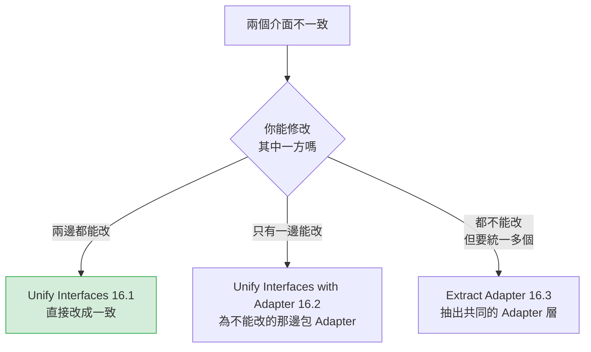

> 🔧 **這是本章最重要的判斷**
> 很多團隊在兩邊都是自己的程式碼時，仍然寫了 Adapter——那是白白多一層。
> **能直接改，就直接改。**

#### Before 與 After

```java
// Before：Java 8 — 兩個都是自己的類別，但介面不一致
public class EmailSender {
    public boolean send(String to, String subject, String body) { }
}
public class SmsGateway {
    public SendResult dispatch(SmsRequest req) { }
}

// 呼叫端被迫分開處理
if (channel == EMAIL) {
    boolean ok = emailSender.send(addr, subj, content);
    if (!ok) log.error("寄送失敗");
} else {
    SendResult r = smsGateway.dispatch(new SmsRequest(addr, content));
    if (r.getCode() != 0) log.error("寄送失敗: {}", r.getMessage());
}
```

```java
// After：Java 25 — 統一介面，兩邊都改
public interface NotificationChannel {
    ChannelType type();
    DeliveryResult send(NotificationMessage message);
}

public record DeliveryResult(boolean success, String failureCode, String failureMessage) {
    public static DeliveryResult ok() { return new DeliveryResult(true, null, null); }
    public static DeliveryResult failed(String code, String message) {
        return new DeliveryResult(false, code, message);
    }
}

@Component
class EmailChannel implements NotificationChannel {
    @Override public ChannelType type() { return ChannelType.EMAIL; }
    @Override public DeliveryResult send(NotificationMessage message) { }
}

// 呼叫端統一
DeliveryResult result = channels.get(channelType).send(message);
if (!result.success()) {
    log.error("寄送失敗: {} {}", result.failureCode(), result.failureMessage());
}
```

#### 重構步驟

| 步驟 | 動作 | 驗證 |
|---|---|---|
| 1 | **先列出兩者的語意差異**（失敗語意、長度限制、非同步性、計費） | 書面比對 |
| 2 | 確認統一後**不會隱藏重要差異**；若會，停止 | 人工判斷 |
| 3 | 設計共同介面與共同的回傳型別 | 編譯通過 |
| 4 | 用 `Rename Method` / `Change Signature` 逐一調整其中一方 | 每次跑測試 |
| 5 | 另一方比照調整 | 測試全綠 |
| 6 | 抽出介面，讓兩者實作 | 測試全綠 |
| 7 | 呼叫端改為依賴介面 | 測試全綠 |

#### 中間態

步驟 4～5 之間（一方已改、另一方未改）是暫時的不一致狀態，應該在同一個 PR 內完成，不要跨 PR。

#### 得到什麼／付出什麼

**得到**：呼叫端統一；可以對所有通道做共同處理（重試、稽核、監控）；新增通道有明確的契約。

| 面向 | 代價 |
|---|---|
| **語意** | 🔴 **最大風險：統一的介面可能隱藏重要差異**（SMS 有 70 字限制、有計費、Email 沒有） |
| **呼叫端** | ⚠️ 所有呼叫端都要改 |
| **效能** | 無 |

#### 什麼時候不要用

- **兩者的語意差異大**，統一後會誤導使用者
- **其中一方不能修改**（第三方、其他團隊）→ 用 16.2
- 只有一個呼叫端，而且不會增加
- 統一後會產生「某些實作不支援」的方法（那是 Refused Bequest）

#### AI Prompt 與驗證

```text
角色：資深 Java 工程師。
背景：[類別 A] 與 [類別 B] 功能相似但介面不一致，兩者皆為本專案程式碼。
目標：評估 Unify Interfaces。
限制：只做分析。
步驟：
1. 列出兩者在以下面向的差異：失敗語意、例外型別、重試語意、長度或大小限制、
   計費、同步或非同步、送達確認、逾時行為
2. 回答：統一介面後，上述哪些差異會被隱藏？被隱藏的差異是否會誤導呼叫端？
3. 回答：統一後是否會出現「某個實作不支援」的方法？
4. 給出建議
停止條件：步驟 2 若有重要差異會被隱藏，建議不統一並停止。
```

驗證 checklist：

- [ ] 兩者原本的成功／失敗判斷邏輯，在新介面下結果一致
- [ ] 例外的型別與訊息語意未遺失
- [ ] 沒有出現「某些實作丟 `UnsupportedOperationException`」的方法
- [ ] 各通道的限制（長度、大小、頻率）仍然被明確表達

---

### 16.2 Unify Interfaces with Adapter

#### 一句話

當其中一方（通常是第三方函式庫或 Legacy 系統）**你無法修改**時，為它包一層 Adapter，讓它符合你的介面。

#### 起點 Smell

- 需要整合第三方 SDK，但它的介面與你的系統格格不入
- 第三方的例外、型別、命名滲透到你的業務邏輯中
- 要換一家供應商時，發現要改幾十個檔案

#### Before

```java
// Before：Java 8 — 第三方 SDK 的細節滲透到業務邏輯
@Service
public class PaymentService {
    private final EsunPaymentSDK esunSdk;           // 第三方

    public void charge(Order order) {
        EsunTxnRequest req = new EsunTxnRequest();
        req.setMerId(MERCHANT_ID);
        req.setTxnAmt(order.getAmount().movePointRight(2).intValue());  // 分為單位
        req.setOrderNo(order.getId());
        try {
            EsunTxnResponse resp = esunSdk.doTransaction(req);
            if (!"0000".equals(resp.getRetCode())) {                    // 第三方的代碼
                throw new PaymentFailedException(resp.getRetMsg());
            }
        } catch (EsunSDKException e) {                                   // 第三方的例外
            throw new PaymentFailedException(e.getMessage(), e);
        }
    }
}
```

#### 重構步驟

| 步驟 | 動作 | 驗證 |
|---|---|---|
| 1 | 定義**以你的領域語彙為準**的介面（不是照抄第三方的） | 編譯通過 |
| 2 | 建立 Adapter，把第三方的呼叫與轉換搬進去 | 測試全綠 |
| 3 | 把第三方的例外轉成你的例外（**保留原因鏈**） | 測試全綠 |
| 4 | 業務邏輯改為依賴你的介面 | 測試全綠 |
| 5 | 用 ArchUnit 禁止第三方套件被 Adapter 以外的地方使用 | 架構測試通過 |

> ✅ **步驟 1 的關鍵**
> 介面必須用**你的**領域語彙設計。如果你的介面長得像 `doTransaction(TxnRequest)`，那只是把第三方的介面搬了個位置，沒有解耦。

#### After

```java
// After：Java 25 + Spring Boot 4.x

// 用自己的領域語彙定義
public interface PaymentGateway {
    PaymentReceipt charge(PaymentInstruction instruction);
}

@Component
class EsunPaymentGatewayAdapter implements PaymentGateway {
    private final EsunPaymentSDK sdk;
    private final String merchantId;

    @Override
    public PaymentReceipt charge(PaymentInstruction instruction) {
        EsunTxnRequest request = toEsunRequest(instruction);
        try {
            EsunTxnResponse response = sdk.doTransaction(request);
            if (!SUCCESS_CODE.equals(response.getRetCode())) {
                throw new PaymentDeclinedException(
                        mapDeclineReason(response.getRetCode()),      // 轉成自己的原因碼
                        response.getRetMsg());
            }
            return new PaymentReceipt(response.getTxnId(), instruction.amount());
        } catch (EsunSDKException e) {
            throw new PaymentGatewayUnavailableException("玉山金流暫時無法使用", e);  // 保留 cause
        }
    }

    private EsunTxnRequest toEsunRequest(PaymentInstruction instruction) {
        EsunTxnRequest request = new EsunTxnRequest();
        request.setMerId(merchantId);
        request.setTxnAmt(instruction.amount().toMinorUnits());
        request.setOrderNo(instruction.reference().value());
        return request;
    }
}

// 業務邏輯 — 完全不知道玉山的存在
@Service
public class PaymentService {
    private final PaymentGateway gateway;

    public void charge(Order order) {
        PaymentReceipt receipt = gateway.charge(PaymentInstruction.of(order));
        order.recordPayment(receipt);
    }
}
```

ArchUnit 規則：

```java
@ArchTest
static final ArchRule 第三方金流SDK只能在_Adapter_中使用 =
    noClasses().that().resideOutsideOfPackage("com.example.payment.adapter..")
        .should().dependOnClassesThat().resideInAPackage("com.esun.sdk..")
        .because("第三方 SDK 必須被 Adapter 隔離，見手冊第 16.2 節");
```

#### 得到什麼

- 業務邏輯與第三方完全解耦；換供應商只需新增一個 Adapter
- 第三方的例外、型別、代碼不再滲透
- 測試業務邏輯時可以用假的 `PaymentGateway`，不需要連第三方
- **這是 Anti-Corruption Layer 的最小實作**（見第 29.3 節）

#### 付出什麼

| 面向 | 代價 |
|---|---|
| **檔案數** | 多一個介面 + 一個 Adapter |
| **轉換成本** | ⚠️ 每次呼叫都要轉換兩次（進、出） |
| **資訊遺失** | 🔴 **最大風險**：第三方回傳的某些資訊可能在轉換中被丟掉，而那些資訊在客訴追查時很重要 |
| **效能** | 極小；但大量呼叫時轉換成本要評估 |
| **安全性** | **正面**——可以在 Adapter 中集中做敏感資料遮罩與稽核 |

> ⚠️ **資訊遺失是最常見的問題**
> `PaymentReceipt` 只保留了交易編號與金額，但第三方回傳的 `retCode`、`retMsg`、`bankRefNo`、`authCode` 全部被丟掉了。
> 三個月後客訴追查時，你會發現**沒有任何地方記錄了銀行的原始回應**。
> **建議做法**：在 Adapter 中把第三方的完整原始回應寫入稽核記錄（注意遮罩卡號等敏感資料），即使領域模型不需要它。

#### 什麼時候不要用

- **兩邊都是你的程式碼** → 用 16.1，直接改
- **第三方只在一個地方使用，且不會換** → 一層 Adapter 可能不划算（但仍建議，因為測試會變容易）
- **第三方 SDK 已經設計良好且符合你的需求**

#### AI Prompt 與驗證

```text
角色：資深 Java / Spring 工程師。

背景：[第三方 SDK 名稱] 的呼叫散落在 [N] 個業務類別中。
      本專案 Java 25 / Spring Boot 4.1.x。

目標：執行 Unify Interfaces with Adapter。

限制：
- 介面必須使用本專案的領域語彙，不得照抄第三方的方法名稱與型別
- 例外轉換必須保留原始例外作為 cause
- 不得在轉換中丟棄第三方回傳的任何欄位（未使用的欄位須寫入稽核記錄）
- 金額單位轉換必須明確標示（元、分、最小單位）

步驟：
1. 列出第三方 SDK 被使用的所有位置與呼叫的方法
2. 列出第三方回傳物件的所有欄位，標示：業務需要 / 不需要但應稽核 / 可丟棄
3. 設計介面（使用本專案語彙），先只輸出設計，等我確認
4. 實作 Adapter，並提供 ArchUnit 規則
5. 逐一改寫業務類別

停止條件：
- 步驟 3 後停止等我確認介面設計
- 若發現第三方的某個方法有副作用或狀態依賴（例如必須先呼叫 init），停止並回報
```

驗證 checklist：

- [ ] 介面使用領域語彙，**沒有第三方的型別出現在介面簽章中**
- [ ] 所有第三方例外都被轉換，且**保留 cause**
- [ ] 第三方的回應代碼已對應到自己的原因碼，**對應表完整且經確認**
- [ ] 未使用的第三方回應欄位已寫入稽核記錄
- [ ] 金額、日期、編碼的轉換正確（含邊界值）
- [ ] ArchUnit 規則已加入，防止第三方套件外洩
- [ ] 敏感資料（卡號、身分證號）在記錄前已遮罩

---

### 16.3 Extract Adapter

#### 一句話

當一個類別為了支援**多個版本或多個廠商**而塞滿條件判斷時，把每一種的差異抽成獨立的 Adapter。

#### 與 16.2 的差別

| | Unify Interfaces with Adapter（16.2） | Extract Adapter（16.3） |
|---|---|---|
| **起點** | 一個第三方，介面不合 | **一個類別同時支援多個版本或廠商** |
| **症狀** | 第三方細節滲透 | 類別內充滿 `if (version == 2)` |
| **產出** | 1 個 Adapter | **N 個 Adapter** |

#### Before

```java
// Before：Java 8 — 一個類別同時支援三個版本的憑證 API
public class CertificateClient {
    private final int apiVersion;

    public CertInfo query(String idNo) {
        if (apiVersion == 1) {
            V1Response r = v1Client.get(idNo);
            return new CertInfo(r.getSerial(), parseV1Date(r.getExpire()));
        } else if (apiVersion == 2) {
            V2Response r = v2Client.query(new V2Request(idNo));
            return new CertInfo(r.getCertSerial(), r.getExpiryDate());
        } else if (apiVersion == 3) {
            V3Result r = v3Client.lookup(idNo, TOKEN);
            return new CertInfo(r.serial(), r.validUntil().toLocalDate());
        }
        throw new UnsupportedApiVersionException(apiVersion);
    }
    // 還有 revoke()、renew()、verify() 各有一套同樣的 if/else
}
```

#### 重構步驟

| 步驟 | 動作 | 驗證 |
|---|---|---|
| 1 | 定義 `CertificateApiAdapter` 介面（用你的領域語彙） | 編譯通過 |
| 2 | 為第一個版本建立 Adapter，把該版本的所有分支搬進去 | 測試全綠 |
| 3 | 主類別改為：先查 Adapter，找不到才走原本的 `if/else`（混合模式） | 測試全綠 |
| 4 | 逐一搬移其餘版本 | 每次跑測試 |
| 5 | 移除原本的 `if/else` | 測試全綠 |

#### After

```java
// After：Java 25
public interface CertificateApiAdapter {
    ApiVersion version();
    CertInfo query(NationalId idNo);
    void revoke(CertSerial serial, RevokeReason reason);
}

@Component
class V3CertificateApiAdapter implements CertificateApiAdapter {
    @Override public ApiVersion version() { return ApiVersion.V3; }

    @Override
    public CertInfo query(NationalId idNo) {
        V3Result result = v3Client.lookup(idNo.value(), token);
        return new CertInfo(new CertSerial(result.serial()), result.validUntil().toLocalDate());
    }
}

@Service
public class CertificateClient {
    private final Map<ApiVersion, CertificateApiAdapter> adapters;

    public CertInfo query(NationalId idNo) {
        return adapterFor(configuredVersion).query(idNo);
    }
}
```

#### 得到什麼／付出什麼

**得到**：每個版本的邏輯集中在一處；**淘汰舊版本時只需刪一個檔案**（這是最大的價值）；新增版本不需修改既有程式碼。

| 面向 | 代價 |
|---|---|
| **檔案數** | 每個版本一個檔案 |
| **重複** | ⚠️ 各 Adapter 之間可能有重複程式碼（可用 16.1 的共用方法處理，但不要急著抽） |
| **可見性** | ⚠️ 「支援哪些版本」需查設定或測試 |

#### 什麼時候不要用

- **只支援兩個版本，且舊版即將下線** → 等它下線就好
- **版本間的差異只有一兩行**
- **差異不在「如何呼叫」而在「業務規則」** → 那是 Strategy，不是 Adapter

#### AI Prompt 與驗證

```text
角色：資深 Java 工程師。
背景：[類別] 中有多處 if (version == N) 的分支，支援 [N] 個版本的外部 API。
目標：評估並分階段執行 Extract Adapter。
限制：
- 必須使用混合模式漸進搬移，每個 PR 最多搬一個版本
- 不得改變任何版本的呼叫參數與回傳轉換結果
步驟：
1. 列出所有方法中與版本相關的分支，做成「方法 × 版本」矩陣
2. 回答：各版本的差異是「呼叫方式不同」還是「業務規則不同」？
   若是後者，建議用 Strategy 而非 Adapter
3. 回答：是否有版本已無使用者？（請提供查詢方式，例如設定檔或監控指標）
4. 提出分階段計畫
停止條件：步驟 3 若發現某版本已無人使用，建議先移除該版本再重構，並停止。
```

驗證 checklist：

- [ ] 每個版本的呼叫參數與回傳轉換結果完全一致
- [ ] 日期、編碼、金額的解析方式未改變
- [ ] 不支援版本的例外行為一致
- [ ] 遷移期間混合模式的行為一致
- [ ] 所有 Adapter 都已註冊（斷言數量的測試）

---

### 16.4 Chain Constructors

#### 一句話

讓多個建構子互相呼叫，把重複的初始化邏輯收斂到一個「主建構子」中。

> ✅ 這是最單純、風險最低的條目之一。通常作為 11.1 的收尾步驟。

#### Before 與 After

```java
// Before：Java 8 — 三個建構子各自重複初始化
public class Loan {
    public Loan(BigDecimal commitment, int riskRating, Date maturity) {
        this.commitment = commitment;
        this.outstanding = BigDecimal.ZERO;
        this.riskRating = riskRating;
        this.maturity = maturity;
        this.expiry = null;
        this.createdAt = new Date();         // 這行在三個建構子裡各寫一次
    }
    public Loan(BigDecimal commitment, int riskRating, Date maturity, Date expiry) {
        this.commitment = commitment;
        this.outstanding = BigDecimal.ZERO;   // 重複
        this.riskRating = riskRating;         // 重複
        this.maturity = maturity;             // 重複
        this.expiry = expiry;
        this.createdAt = new Date();          // 重複
    }
}
```

```java
// After：Java 25 — 只有一個建構子真正做事
public final class Loan {
    public Loan(Money commitment, RiskRating riskRating, LocalDate maturity) {
        this(commitment, Money.zero(commitment.currency()), riskRating, maturity, null);
    }

    public Loan(Money commitment, RiskRating riskRating, LocalDate maturity, LocalDate expiry) {
        this(commitment, Money.zero(commitment.currency()), riskRating, maturity, expiry);
    }

    /** 主建構子：唯一實際指派欄位的地方。 */
    public Loan(Money commitment, Money outstanding, RiskRating riskRating,
                LocalDate maturity, LocalDate expiry) {
        this.commitment = Objects.requireNonNull(commitment);
        this.outstanding = Objects.requireNonNull(outstanding);
        this.riskRating = Objects.requireNonNull(riskRating);
        this.maturity = Objects.requireNonNull(maturity);
        this.expiry = expiry;
    }
}
```

#### 重構步驟

| 步驟 | 動作 | 驗證 |
|---|---|---|
| 1 | 找出「參數最多」的建構子，作為主建構子 | — |
| 2 | 確認其他建構子能完全用主建構子表達（若有特殊邏輯，先處理） | 人工比對 |
| 3 | 一次改一個建構子，改為 `this(...)` 呼叫 | 每次跑測試 |

#### 得到什麼／付出什麼

**得到**：初始化邏輯只有一份；新增欄位只需改一處；驗證集中。

| 面向 | 代價 |
|---|---|
| **可維護性** | **正面**，幾乎無代價 |
| **可讀性** | ⚠️ 追蹤實際的初始化要多跳一層 |
| **效能** | 無 |

#### 什麼時候不要用

- 只有一個建構子
- 各建構子的初始化邏輯**本質不同**，無法用參數表達
- 用了 Lombok 的 `@Builder` 或 record（已經不需要）

#### AI Prompt 與驗證

```text
角色：資深 Java 工程師。
背景：[類別] 有 [N] 個建構子，疑似有重複的初始化邏輯。
目標：執行 Chain Constructors。
限制：
- 不得改變任何欄位的最終值
- 不得改變欄位的初始化順序（若有相依關係）
- 不得新增或移除任何驗證
步驟：
1. 做出「建構子 × 欄位」的指派對照表，標示各建構子對每個欄位指派了什麼
2. 指出哪個建構子適合作為主建構子，並說明理由
3. 逐一改寫，每次跑測試
停止條件：若某個建構子有無法用參數表達的特殊邏輯，停止並回報。
```

驗證 checklist：

- [ ] 每個建構子產生的物件狀態與重構前完全相同（逐欄位比對）
- [ ] 欄位初始化順序未改變（若有相依關係）
- [ ] 沒有新增或移除驗證
- [ ] 若類別參與序列化，行為未變

---

### 16.5 Extract Parameter

#### 一句話

當方法內部使用了「本來可以由呼叫端決定」的值（例如直接讀欄位、讀系統時間、讀設定）時，把它改成參數傳入。

#### 起點 Smell

- 方法無法單獨測試，因為它依賴外部狀態（`new Date()`、`System.getenv()`、實例欄位）
- 同一個方法在不同情境需要不同的值，只好複製一份
- Temporary Field（8.7）

#### Before 與 After

```java
// Before：Java 8 — 無法測試，因為依賴當下時間
public class InterestCalculator {
    public BigDecimal calculateAccrued(Loan loan) {
        Date today = new Date();                      // 無法控制
        long days = daysBetween(loan.getStartDate(), today);
        return loan.getPrincipal().multiply(loan.getRate())
                   .multiply(new BigDecimal(days));
    }
}
```

```java
// After：Java 25 — 時間變成參數，可測試
public class InterestCalculator {
    public Money calculateAccrued(Loan loan, LocalDate asOf) {     // 提取為參數
        long days = ChronoUnit.DAYS.between(loan.startDate(), asOf);
        return loan.principal().multiply(loan.rate()).multiply(BigDecimal.valueOf(days));
    }
}

// 呼叫端（Spring 注入 Clock，測試時可替換）
Money accrued = calculator.calculateAccrued(loan, LocalDate.now(clock));
```

> 🔧 **本手冊的工程建議：`Clock` 是企業 Java 專案的必備 bean**
>
> ```java
> @Configuration
> public class ClockConfig {
>     @Bean
>     public Clock clock() { return Clock.systemDefaultZone(); }
> }
> ```
>
> 測試時注入 `Clock.fixed(...)`，就能測試「月底」「閏年 2/29」「跨年」等邊界情境。
> **這一個 bean 能解決企業系統中大量的「日期相關 bug 測不到」問題。**

#### 重構步驟

| 步驟 | 動作 | 驗證 |
|---|---|---|
| 1 | 新增一個多載方法，帶上新參數，原方法改為呼叫它並傳入原本的值 | 測試全綠 |
| 2 | 逐一把呼叫端改為使用新方法 | 每次跑測試 |
| 3 | 全部改完後，移除舊方法 | 編譯通過 |

**步驟 1 的過渡寫法**（讓遷移可以漸進）：

```java
/** @deprecated 請改用帶 asOf 參數的版本。預計於 2026-Q4 移除。 */
@Deprecated(since = "2026-09", forRemoval = true)
public Money calculateAccrued(Loan loan) {
    return calculateAccrued(loan, LocalDate.now());
}

public Money calculateAccrued(Loan loan, LocalDate asOf) { }
```

#### 得到什麼／付出什麼

**得到**：可測試性大幅提升；方法變成純函式（相同輸入必有相同輸出）；同一個方法可用於「試算未來」「重算過去」等情境。

| 面向 | 代價 |
|---|---|
| **參數數量** | ⚠️ 參數變多；過度使用會造成 Long Parameter List（7.5） |
| **呼叫端** | ⚠️ 所有呼叫端都要改 |
| **效能** | 無 |
| **可測試性** | **正面，且這通常是做這件事的唯一理由** |

#### 什麼時候不要用

- 該值**確實應該由方法內部決定**（例如產生流水號）
- 參數已經很多（先處理 Long Parameter List）
- 只是為了「看起來比較純」而沒有測試需求

#### AI Prompt 與驗證

```text
角色：資深 Java 工程師。
背景：[類別].[方法] 內部使用了 [外部狀態來源]，導致無法單獨測試。
本專案 Java 25 / Spring Boot 4.1.x。
目標：執行 Extract Parameter。
限制：
- 必須使用多載加 @Deprecated(forRemoval = true) 的過渡方式
- 不得一次改完所有呼叫端
- 不得改變任何計算邏輯
步驟：
1. 列出該方法內所有「不由參數決定」的輸入來源
   （時間、亂數、環境變數、設定、實例欄位、靜態方法）
2. 對每一項回答：它應該由呼叫端決定，還是確實該由方法內部決定？
3. 實作過渡版本
4. 列出所有呼叫端，提出分批遷移計畫
停止條件：完成步驟 4 後停止等我確認。
```

驗證 checklist：

- [ ] 過渡期新舊兩個方法的行為完全一致
- [ ] 時區處理未改變（`Date` → `LocalDate` 的轉換特別容易出錯）
- [ ] 新方法已有涵蓋邊界情境的測試（月底、閏年、跨年、跨時區）
- [ ] 舊方法已標示 `@Deprecated(forRemoval = true)` 並設定移除期限
- [ ] 參數總數未超過 4 個（否則先做 Introduce Parameter Object）

### 16.6 本章實務案例

**情境**：某銀行的「電子憑證驗證」模組，同時串接三家憑證中心（TWCA、中華電信、內政部），且每家各有兩個 API 版本。

**原始狀況**：`CertificateService` 有 1,900 行，包含 6 組 `if (provider == X && version == Y)` 的判斷，分散在 `query()`、`verify()`、`revoke()`、`renew()` 四個方法中。

**重構前的問題**：

| 問題 | 具體狀況 |
|---|---|
| 新增一家憑證中心 | 要改 4 個方法、增加約 200 行 |
| TWCA 升級 API 版本 | 改動範圍不明，Review 要看完 1,900 行 |
| 無法單獨測試 | 每個測試都要 mock 三家的 SDK |
| 第三方例外滲透 | 業務層要 catch `TWCAException`、`HiCAException`、`MOICAException` |

**處理過程**：

| 階段 | 手法 | 內容 |
|---|---|---|
| 1 | — | 建立 Characterization Test（用側錄的 4,200 筆實際請求與回應） |
| 2 | **16.5 Extract Parameter** | 把 `new Date()` 與 `System.getProperty()` 提取為參數，讓方法可測 |
| 3 | **16.2 Unify Interfaces with Adapter** | 定義 `CertificateAuthority` 介面（用銀行自己的語彙） |
| 4 | **16.3 Extract Adapter** | 為 6 個「廠商 × 版本」組合各建一個 Adapter，混合模式漸進搬移 |
| 5 | — | 加 ArchUnit 規則，禁止三家 SDK 出現在 adapter 套件外 |

**第 4 階段的一個重要發現**：

搬移到「內政部 V1」時，團隊發現這個分支在近兩年的日誌中**從未被執行過**——內政部的 V1 API 已於 2023 年停止服務，但程式碼沒有移除。

刪除該分支後，`CertificateService` 少了 180 行，也少了一個永遠不會被測到的路徑。

**成果**：

| 指標 | Before | After |
|---|---|---|
| `CertificateService` 行數 | 1,900 | 110 |
| 廠商或版本相關的 `if` 數量 | 6 組 × 4 方法 = 24 處 | **0** |
| 新增一家憑證中心的成本 | 改 4 個方法、約 200 行 | 新增 1 個檔案 |
| 業務層需要 catch 的第三方例外 | 3 種 | **0** |
| 可在不連外部系統下測試的比例 | 約 15% | 100% |
| 重構中移除的死程式碼 | — | 180 行 |

### 16.7 本章注意事項

> ⚠️ **先問「我能不能改對方」，再決定要不要寫 Adapter**
> 兩邊都是自己的程式碼時，直接統一介面（16.1）。多寫一層 Adapter 是純成本。

> ⚠️ **Adapter 的介面必須用自己的領域語彙**
> 如果介面長得像第三方的方法簽章，那只是換了個位置，沒有解耦。

> 🔴 **Adapter 最常見的問題是資訊遺失**
> 第三方回傳的欄位若在轉換中被丟掉，客訴追查時會找不到證據。**未使用的欄位請寫入稽核記錄。**

> ⚠️ **例外轉換必須保留 cause**
> `throw new MyException(msg)` 會丟掉原始堆疊。永遠用 `throw new MyException(msg, e)`。

> ✅ **`Clock` bean 是企業 Java 專案的基礎建設**
> 它讓所有日期相關的邊界情境變得可測試。建議在專案初期就加入。

> ✅ **搬移過程順便清理死程式碼**
> 第 16.6 節的案例中，搬移過程發現了一個已停止服務兩年的 API 分支。**逐一搬移會逼你讀懂每一段，這是最有效的死碼偵測方式。**

> 📌 **下一章**
> 第 15 章是 Catalog 的最後一組：Protection 與 Accumulation。
> 其中 Observer 與 Visitor 是兩個「威力強大但容易失控」的條目，請特別注意它們的前提條件。

# 第四部：不要亂套 Pattern

第三部給了你 27 把工具。這一部要教你**什麼時候該把工具放回箱子裡**。

這一部只有三章，但它們是本手冊在企業導入時**最被需要**的三章——因為多數團隊缺的不是「會用 Pattern 的人」，而是**「敢說不要用 Pattern 的人」**。

---

## 第 17 章 Pattern Abuse 全譜

### 17.1 Patternitis 的典型症狀

> **Patternitis（模式炎）**：把 Design Pattern 當成品質指標，導致程式碼中充滿沒有實際用途的抽象結構。

企業裡的五個典型症狀：

| 症狀 | 具體表現 | 你會聽到的說法 |
|---|---|---|
| **① 抽象層比業務邏輯多** | 300 個檔案裡只有 4,000 行真正做事的程式碼 | 「這樣架構比較乾淨」 |
| **② 追一個流程要開 8 個檔案** | 從 Controller 到真正執行 SQL 的那一行，經過 8 層 | 「這是分層架構」 |
| **③ 介面數量約等於類別數量** | 每個 Service 都有一個只有它實作的 Interface | 「方便以後替換」 |
| **④ 設定項從未被設定過** | YAML 有 156 項，5 年來改過 8 項 | 「保留彈性」 |
| **⑤ Code Review 以 Pattern 為評分標準** | 「這裡沒用 Strategy，退回」 | 「要符合設計規範」 |

> 🔧 **本手冊的工程建議：一個簡單的自我檢測**
>
> 隨機挑三個 Service 類別，問新進成員：「從 API 收到請求，到資料真的寫進資料庫，中間經過哪些檔案？」
>
> - 答得出來且 ≤ 4 個檔案 → 健康
> - 答得出來但 ≥ 6 個檔案 → 警訊
> - **答不出來 → 已經發病**

### 17.2 十五種常見濫用

| # | 濫用形式 | 症狀 | 為什麼會發生 | 解法 |
|---|---|---|---|---|
| 1 | **Patternitis** | 到處都是 Pattern | 把 Pattern 當品質指標 | 第 19 章決策樹 |
| 2 | **Over-engineering** | 設計複雜度 > 問題複雜度 | 想展現能力；怕以後不好改 | 第 3.3 節代價表 |
| 3 | **Premature Abstraction** | 還不知道會怎麼變就先抽象 | 「以後一定會變」 | 等到第 3 次重複再抽 |
| 4 | **Premature Generalization** | 為未知需求做泛型化 | 同上 | YAGNI |
| 5 | **Factory Everywhere** | 每個類別都有 Factory | 誤以為不能直接 `new` | 第 11 章：Spring 就是 Factory |
| 6 | **Strategy Everywhere** | 每個 `if` 都變成 Strategy | AI 的預設行為 | 第 12.2 節三道關卡 |
| 7 | **Repository Everywhere** | 每個 Entity 都有 Repository，即使只被讀一次 | 「Clean Architecture 規定的」 | 依實際需求建立 |
| 8 | **Service Layer Everywhere** | Service 只是轉發給 Repository | 「分層架構規定的」 | 第 8.9 節 Middle Man |
| 9 | **Observer Everywhere** | 所有呼叫都改成發事件 | 追求「解耦」 | 第 15.2 節三道關卡 |
| 10 | **Singleton Everywhere** | 手寫一堆 `getInstance()` | 方便存取 | 第 11.6 節 |
| 11 | **Generic Framework Syndrome** | 內部系統寫成通用框架 | 想做出「可重用的資產」 | 你的使用者是已知的 |
| 12 | **Excessive Interface** | 介面數 ≈ 類別數 | 「方便 mock」「方便替換」 | 第 8.11 節 |
| 13 | **Excessive Inheritance** | 繼承 4 層以上 | 想消除重複 | 改用組合 |
| 14 | **Excessive DI** | 建構子注入 12 個依賴 | 職責過多的徵兆 | 第 7.4 節 Large Class |
| 15 | **Excessive Layering** | 6 層以上的分層 | 照抄架構圖 | 每層都要能說出它擋掉了什麼 |

#### 三個最需要展開說明的

##### 濫用 7 與 8：Repository 與 Service 的空殼層

```java
// ❌ 典型的空殼組合 — 兩個檔案，零價值
public interface CountryRepository extends JpaRepository<Country, String> { }

@Service
public class CountryService {
    private final CountryRepository repository;
    public List<Country> findAll() { return repository.findAll(); }     // 純轉發
    public Country findById(String id) { return repository.findById(id).orElseThrow(); }
}
```

> 🔧 **本手冊的判斷準則**
> 一個 Service 若 **70% 以上的方法是純轉發**，且**沒有任何 annotation**（`@Transactional`、`@PreAuthorize`），它就是 Middle Man（第 8.9 節），應該移除。
>
> **例外**：若它是架構邊界（Hexagonal 的 port），即使是純轉發也應保留——但要在 ADR 中明確記錄這個決定。

##### 濫用 11：Generic Framework Syndrome

這是企業內部最昂貴的一種濫用。

```text
症狀：團隊為了「以後其他專案也能用」，把一個行內系統的元件寫成通用框架。

實際結果（本手冊觀察到的典型結局）：
  - 通用化讓它比原本複雜 3 倍
  - 其他專案評估後決定不用（因為不符合他們的需求）
  - 唯一的使用者是原本那個系統
  - 但現在它有「框架」的包袱，不敢改
```

> 🔧 **判斷準則**
> **框架與應用程式的根本差別，是「使用者是否已知」。**
> 框架的使用者未知，所以必須高度抽象；你的內部系統使用者已知（就是你們），不需要。
> 真的要做框架，等到**第三個專案**提出需求時再說。

##### 濫用 15：Excessive Layering

```text
❌ 六層：Controller → Facade → Service → Manager → Repository → DAO → Mapper

問題：Facade、Manager、Mapper 各自擋掉了什麼？如果說不出來，它們就是純成本。
```

> 🔧 **每一層都必須能回答：「這一層擋掉了什麼？」**
>
> | 層 | 它擋掉了什麼 | 合理嗎 |
> |---|---|---|
> | Controller | HTTP 協定細節不進入業務邏輯 | ✅ |
> | Application Service | 交易邊界、用例協調 | ✅ |
> | Domain | 業務規則不被技術污染 | ✅ |
> | Repository | 持久化技術細節 | ✅ |
> | Manager | ？ | ❌ 說不出來 |
> | Facade（內部用） | ？ | ❌ 說不出來 |

### 17.3 過度設計的實際代價

過度設計不是「多花了一點時間」，它有具體且持續的成本。

| 代價 | 實際影響 | 可量測的指標 |
|---|---|---|
| **新人上手時間** | 從 1 週變成 1 個月 | onboarding 到首次獨立 PR 的天數 |
| **變更成本** | 改一個規則要穿過 6 層 | 單一需求的異動檔案數 |
| **除錯時間** | 堆疊追蹤 40 層，看不出哪裡是自己的程式碼 | 平均事故排除時間（MTTR） |
| **建置時間** | 檔案數增加，編譯與測試變慢 | CI pipeline 時間 |
| **Review 品質** | diff 太大，Reviewer 退化成「看起來沒問題」 | PR 平均行數、Review 時間 |
| **人力風險** | 只有原作者看得懂 | 「能獨立修改此模組的人數」 |
| **隱藏 bug** | 邏輯分散在多層的 default method 與樣板方法中 | 第 8.12 節案例中發現的 3 個矛盾 |

> 🏭 **一個值得記住的觀察**
> 第 8.12 節的案例中，移除 98 個多餘檔案後，**測試執行時間下降 37%、建置時間下降 35%**。
> 過度設計的成本，連 CI 都付得出來。

### 17.4 如何在 Code Review 抓到

> 🔧 **本手冊的工程建議：六個標準問句**
> 建議直接放進 `.github/PULL_REQUEST_TEMPLATE.md`。

當 PR 中出現**新的介面、抽象類別或分層**時，Reviewer 應該問：

| # | 問句 | 不通過的答案 |
|---|---|---|
| 1 | 這個介面現在有幾個實作？ | 「1 個」（除非是架構邊界） |
| 2 | 第 2 個實作預計什麼時候出現？依據是什麼？ | 「以後應該會有」 |
| 3 | 不用這個抽象，會有什麼具體問題？ | 「程式碼比較不乾淨」 |
| 4 | 有沒有更簡單的做法？你評估過哪些？ | 「沒想過」 |
| 5 | 新人要理解這段，需要先懂哪些概念？ | 「要先懂 Visitor 和 double dispatch」 |
| 6 | 這個變更讓哪些場景變好、哪些變差？ | 「全部都變好」（不可能） |

**PR 模板的建議寫法**：

```markdown
## 設計變更（若本 PR 新增了介面、抽象類別或分層，必填）

- **新增的抽象**：
- **現有實作數**：
- **導入的證據**（git log、roadmap、事故記錄）：
- **評估過但未採用的更簡單方案**：
- **哪些場景變好**：
- **哪些場景變差**：
```

> ✅ **這份模板最大的價值不是擋下壞設計，而是「讓提案者自己想清楚」**
> 實務上，很多過度設計在填寫這張表的過程中就被提案者自己撤回了。

### 17.5 本章實務案例

**情境**：某金控的「共用元件開發團隊」，三年成果的檢討。

該團隊的任務是「開發全行共用的技術元件」。三年間產出 14 個元件。

**檢討時的實際使用狀況**：

| 元件 | 預期使用單位 | 實際使用單位 | 程式碼行數 |
|---|---|---|---|
| 統一日誌框架 | 全行 | **12 個系統** ✅ | 3,200 |
| 檔案傳輸元件 | 全行 | **8 個系統** ✅ | 5,400 |
| 通用驗證框架 | 全行 | **1 個**（開發它的那個） | 18,900 |
| 通用工作流引擎 | 全行 | **0 個** | 34,200 |
| 通用報表引擎 | 全行 | **2 個**（其中 1 個已改用商用方案） | 27,600 |
| 其餘 9 個 | — | 平均 1.2 個 | 平均 8,000 |

#### 分析：成功與失敗的兩個元件對照

| | 統一日誌框架（成功） | 通用工作流引擎（失敗） |
|---|---|---|
| 開發起點 | **先有 3 個系統遇到同樣的問題** | 「未來大家都會需要流程管理」 |
| 抽象程度 | 低（幾乎就是一層薄封裝） | 極高（可設定的節點、條件、腳本引擎） |
| 導入成本 | 加一個依賴、改設定檔 | 平均 3 人月的學習與整合 |
| 程式碼行數 | 3,200 | 34,200 |
| 外部依賴 | 2 | 17 |
| 能維護它的人數 | 6 | **1** |

**檢討結論（該團隊自己寫的）**：

> 「成功的兩個元件，都是**先觀察到三個以上系統的重複痛點**才開始做的。
> 失敗的那些，都是**先想像需求再開發**。
>
> 而且有一個殘酷的規律：**我們投入越多時間把它做得越通用，實際使用的單位就越少。**
> 因為通用化增加的複雜度，超過了它省下的開發時間。」

**後續處置**：

| 元件 | 決策 |
|---|---|
| 使用單位 ≥ 5 | 繼續維護 |
| 使用單位 1～2 | **下放給實際使用的系統自行維護**，不再是「共用元件」 |
| 使用單位 0 | 封存（含通用工作流引擎的 34,200 行） |

**團隊轉型**：從「開發共用元件」改為「**協助各系統解決重複問題，累積三個案例後才考慮元件化**」。

> 🔧 **這個案例的核心教訓**
> 「Rule of Three」不只適用於程式碼重複，也適用於元件化與抽象化：
> **在第三個真實案例出現之前，你不知道真正的共通點在哪裡。**

### 17.6 本章注意事項

> ⚠️ **不要用 Pattern 數量當品質指標**
> 這會直接導致 Patternitis。有意義的指標是「變更成本」與「新人上手時間」。

> ⚠️ **「Clean Architecture 規定的」不是理由**
> Clean Architecture 談的是依賴方向，不是「每個 Entity 都要有 Repository 和 Service」。
> 本 repo 的 [分析與設計/Clean Architecture教學.md](../分析與設計/Clean%20Architecture教學.md) 有完整說明。

> ⚠️ **每一層都要能回答「它擋掉了什麼」**
> 答不出來的層，就是純成本。

> ⚠️ **內部系統不是框架**
> 你的使用者是已知的。不需要框架等級的抽象。

> ✅ **把六個標準問句放進 PR 模板**
> 這是本章最可執行的建議。它的價值在於讓提案者自己先想清楚。

> ✅ **Rule of Three 適用於所有抽象化決策**
> 第 3 次重複出現時再抽象。前兩次請忍住。

---

## 第 18 章 Refactoring Away From Patterns

### 18.1 為什麼移除 Pattern 是正當的工程行為

> **當一個 Pattern 的適用前提已經消失時，保留它不是「維持設計完整性」，而是持續支付一筆沒有對應收益的成本。**

這件事在企業裡幾乎沒有人做，原因不是技術，是**組織心理**：

| 心理障礙 | 事實 |
|---|---|
| 「刪掉會顯得我不懂設計」 | **能判斷該刪，才是真的懂設計** |
| 「當初有人花很多時間寫的」 | 沉沒成本，與「現在該不該留」無關 |
| 「刪掉會不會有風險」 | 有測試的話，**移除抽象比新增抽象更安全**（分支變少） |
| 「Review 會不會被質疑」 | 這正是本章與附錄 B 要解決的組織問題 |
| 「以後說不定會用到」 | 那就以後再加。加回來的成本，遠低於一直維護它的成本 |

> 📖 **Kerievsky 原作觀點**
> 原書明確把 away from patterns 列為三個方向之一，與 to / towards 同等重要。
> **Pattern 是設計空間中的一個位置，不是單向的終點。**

### 18.2 五個該移除的訊號

> 🔧 **本手冊的工程建議：符合任一項即可列入評估。**

| # | 訊號 | 如何取得證據 |
|---|---|---|
| 1 | **只有一個實作，且超過一年沒新增** | Find Usages + git log |
| 2 | **抽象層從未擋下或改變過任何東西** | 檢視該層的程式碼是否只有轉發 |
| 3 | **可設定但從未被設定** | 查 git log 中該設定檔的變更歷史 |
| 4 | **當初預測的變化沒有發生，而且實際的變化是另一個方向** | 比對 ADR 的預測與實際 git 歷史 |
| 5 | **它造成過事故或誤解** | 事故報告、Review 記錄 |

**取得證據的實用指令**：

```bash
# 訊號 1：找出只有 0 或 1 個實作的介面
for f in $(grep -rl "^public interface" src/main/java --include="*.java"); do
  n=$(basename "$f" .java)
  c=$(grep -rl "implements .*\b$n\b\|extends .*\b$n\b" src/main/java --include="*.java" | wc -l)
  [ "$c" -le 1 ] && echo "$c  $n"
done | sort -n

# 訊號 3：某個設定檔過去兩年被改過幾次
git log --since="2 years ago" --oneline -- src/main/resources/application.yml | wc -l
```

### 18.3 常用的移除手法

| 要移除的東西 | 手法 | 風險 |
|---|---|---|
| 只有一個實作的介面 | `Inline Interface`（呼叫端改用具體型別後刪除） | 低 |
| 沒有子類別的抽象類別 | `Collapse Hierarchy` | 低 |
| 純轉發的 Factory | `Inline Factory`（呼叫端直接 `new` 或注入） | 低 |
| 手寫 Singleton | `Inline Singleton`（第 11.6 節） | 中 |
| 純轉發的 Service 層 | `Remove Middle Man` | ⚠️ **中高**（注意 annotation） |
| 只有一種裝飾的 Decorator | `Inline Decorator`（把行為併入核心） | 中 |
| 只有一個訂閱者的 Observer | `Inline Listener`（改為直接呼叫） | ⚠️ **高**（交易語意會變） |
| 從未被設定的設定項 | 改為常數 | 低 |
| 過度泛型化 | `Remove Type Parameter` | 低 |

#### 三個需要特別說明的

##### 移除 Observer（風險最高）

把事件監聽器改回直接呼叫，**會改變交易語意**：

```text
Before（事件）：AFTER_COMMIT 執行 → 主交易已提交 → 失敗不影響主交易
After（直接呼叫）：在主交易內執行 → 失敗會 rollback 主交易
```

**這是行為變更，不是重構。** 必須先確認業務可接受。

##### 移除 Middle Man（最容易踩雷）

```java
// 看起來是純轉發，可以 inline
@Service
public class OrderService {
    @Transactional                                  // ← 但這個 annotation 是實質內容！
    public void save(Order o) { repository.save(o); }
}
```

**Inline 之後交易邊界就消失了。** 移除前必須檢查：`@Transactional`、`@Cacheable`、`@PreAuthorize`、`@Retryable`、`@Async`、`@Observed`。

##### 移除介面時的測試依賴

```java
// 測試用 mock 依賴了這個介面
@MockBean private PaymentProcessor processor;
```

移除介面前，先評估測試能否改用真實物件或測試替身類別。**如果為了保留這個介面而放棄移除，請在 ADR 中記錄——那是一個合理的決定。**

### 18.4 移除的安全步驟

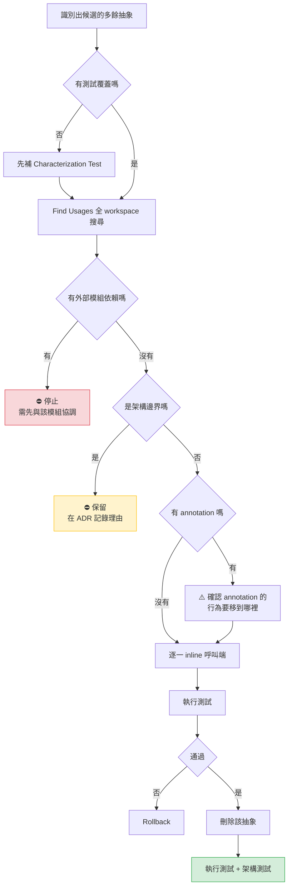

**每個 PR 的建議規模**：一次移除 **5～10 個**同類型的抽象。太少會拖很久，太多則無法 Review。

### 18.5 本章實務案例

**情境**：某壽險公司「保單行政系統」的抽象層清理，2025 年。

**背景**：系統於 2019 年由外部顧問導入 Clean Architecture，四層結構。六年後的實際狀況：

| 層 | 類別數 | 其中「純轉發」的比例 |
|---|---|---|
| Controller | 68 | 12% |
| Application Service | 71 | **81%** |
| Domain Service | 64 | **73%** |
| Repository 介面 | 89 | — |
| Repository 實作 | 89 | 8% |

**團隊的診斷**：

```text
Application Service 有 81% 是純轉發 → Middle Man
Domain Service 有 73% 是純轉發 → Middle Man
89 個 Repository 介面各自只有 1 個實作 → 但這是架構邊界，需個別判斷
```

**處理決策（逐項判斷，不一刀切）**：

| 項目 | 數量 | 決策 | 理由 |
|---|---|---|---|
| Application Service 有 `@Transactional` | 13 | **保留** | annotation 是實質內容 |
| Application Service 有實際邏輯（協調多個 Domain Service） | 14 | **保留** | 有價值 |
| Application Service 純轉發、無 annotation | **44** | **移除** | 零價值 |
| Domain Service 有實際業務規則 | 17 | **保留** | — |
| Domain Service 純轉發 | **47** | **移除** | — |
| Repository 介面（被領域層依賴） | 71 | **保留** | Hexagonal 的 port，是架構邊界 |
| Repository 介面（只被 Infrastructure 內部使用） | **18** | **移除** | 不跨越邊界，沒有隔離價值 |

**執行方式**：分 12 個 PR，每個移除 8～10 個類別，歷時 7 週。

**過程中的三個意外**：

| 意外 | 處理 |
|---|---|
| 有 3 個「純轉發」的 Service 其實有 `@PreAuthorize`，被初步掃描漏掉 | 補上檢查腳本，把所有 annotation 納入判斷 |
| 有 1 個介面被另一個專案透過 Maven 依賴使用 | 保留，並在 ADR 記錄 |
| 移除過程發現 2 個 Application Service 的轉發參數順序寫反了（傳入 `(b, a)`） | **獨立 PR 修正**，這是潛伏 4 年的 bug |

**成果**：

| 指標 | Before | After | 變化 |
|---|---|---|---|
| 類別總數 | 381 | 272 | −29% |
| 追蹤一個 API 到 SQL 需開啟的檔案數 | 7 | 4 | −43% |
| 建置時間 | 2 分 40 秒 | 1 分 55 秒 | −28% |
| 測試執行時間 | 11 分 | 7 分 30 秒 | −32% |
| 新人 onboarding 到首次獨立 PR | 18 天 | 9 天 | −50% |
| 業務邏輯行數 | 28,400 | 28,410 | **幾乎不變** |
| 過程中發現的既有 bug | — | **2 個** | — |

**最後兩列是重點**：業務邏輯行數幾乎不變，證明這次大規模移除**完全沒有改變功能**——移除的都是純粹的包裝。

**團隊在 ADR 中的記錄**：

```markdown
# ADR-041：移除純轉發的抽象層

## 背景
2019 年導入的四層架構中，Application Service 與 Domain Service
有 70% 以上是純轉發，未提供任何隔離或協調價值。

## 決策
移除純轉發且無 annotation 的 91 個類別。
保留：有交易邊界、有授權檢查、有實際協調邏輯、跨越架構邊界者。

## 不採用的方案
- 全部保留：持續支付認知成本與建置成本，無對應收益
- 全部移除（含架構邊界）：會讓 Domain 直接依賴 Infrastructure，破壞依賴方向

## 後果
- 檔案數減少 29%，新人上手時間減半
- 部分「未來可能需要擴充」的彈性消失。評估認為：真的需要時再加回來的成本，
  低於持續維護 91 個空殼的成本
- 新增 ArchUnit 規則，防止再度產生純轉發層
```

### 18.6 本章注意事項

> 🔴 **移除 Middle Man 前，務必檢查 annotation**
> `@Transactional`、`@Cacheable`、`@PreAuthorize`、`@Retryable`、`@Async`——這些才是那個「只有一行的方法」存在的理由。

> 🔴 **移除 Observer 是行為變更，不是重構**
> 交易語意會從「提交後執行」變成「交易內執行」。必須先與業務確認。

> ⚠️ **架構邊界的介面即使只有一個實作也應保留**
> Hexagonal 的 port、對外發布的 API、跨模組的契約——這些的價值是「隔離」，不是「多型」。
> 但請在 ADR 中明確記錄，避免後人誤刪。

> ⚠️ **每個 PR 移除 5～10 個，不要一次清光**
> 一次移除 91 個類別的 PR 無法 Review。

> ✅ **移除後要用 ArchUnit 鎖住**
> 否則兩年後會長回來。第 39.3 節有規則寫法。

> ✅ **在 ADR 中記錄「保留了什麼、為什麼」**
> 這比記錄「移除了什麼」更重要——它讓後人知道哪些是刻意保留的。

---

## 第 19 章 決策樹與 Decision Matrix

本章把前 18 章的判斷準則，收斂成三張可以直接貼在牆上的圖表。

### 19.1 是否應該 Refactor 的決策樹

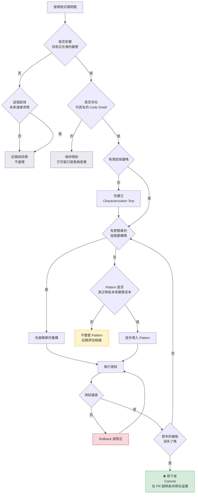

**使用這張圖的三個要點**：

1. **「記錄技術債／不處理」是最常見的正確結果**，不是失敗。
2. **「停下來」是綠色的終點**，而且應該在 PR 中說明理由。
3. **最後回到「有更簡單的重構嗎」形成迴圈**——這確保你永遠優先做最便宜的那一步。

### 19.2 Pattern 導入判斷流程

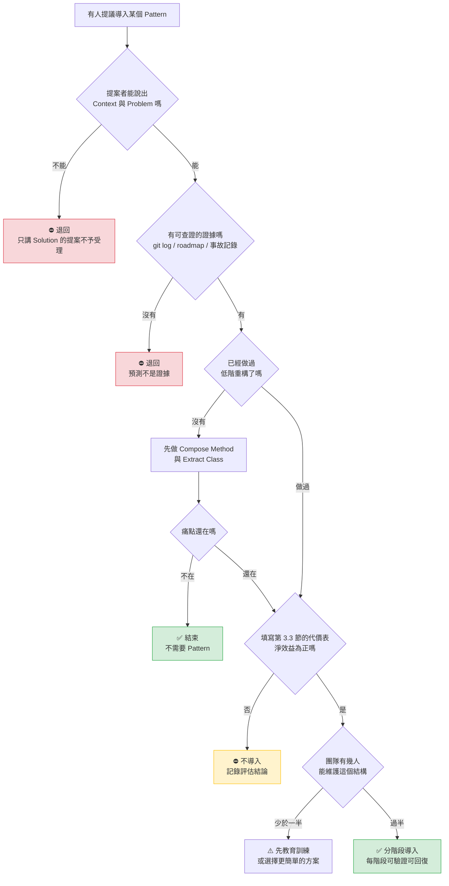

### 19.3 Decision Matrix

> 🔧 **本手冊的工程建議：把這張表印出來貼在團隊區域。**

| 遇到的問題 | 優先考慮（便宜且安全） | **不應立即做**（昂貴或危險） | 判斷關鍵 |
|---|---|---|---|
| **重複程式碼** | Extract Method / Move Method | 建立通用框架 | 先確認「長得像」是否等於「同一件事」 |
| **方法太長** | **Compose Method** | 拆成多個類別 | 抽方法就能解決 90% |
| **條件邏輯複雜** | Decompose Conditional → Guard Clause | 把每個 `if` 變成 Strategy | 前兩步通常就夠 |
| **多分支型別判斷** | `sealed` + pattern matching（Java 21+） | Strategy / Visitor | 型別集合封不封閉 |
| **複雜的物件建立** | Creation Method（11.1） | 每個類別都配一個 Factory | Spring 本身就是 Factory |
| **建構參數太多** | Introduce Parameter Object | Builder | 4 個以下不需要 Builder |
| **介面不相容** | 先問「我能不能改對方」 | 無條件包 Adapter | 兩邊都能改就直接改 |
| **需要附加行為** | Spring annotation（`@Cacheable` 等） | 手寫 Decorator | 框架有沒有提供 |
| **狀態欄位判斷** | `enum` + 允許矩陣 | State Pattern | 轉移規則有沒有副作用 |
| **有多個後續動作** | 先確認交易語意 | 一律改成事件 | 失敗能不能獨立 |
| **重複的演算法骨架** | 組合 + 注入 | 繼承 + Template Method | 能用組合就不用繼承 |
| **到處 null 檢查** | `Optional` 或就地 `if` | Null Object | 少於 5 處不用做 |
| **型別代碼（int/String）** | **`enum` + AttributeConverter** | 維持現狀 | ✅ 這個幾乎總是該做 |
| **查詢條件組合爆炸** | Spring Data Specification | 自製 Interpreter | 別自己造輪子 |
| **只有一個實作的介面** | **移除它** | 保留「以備不時之需」 | 除非是架構邊界 |
| **純轉發的 Service** | **移除它** | 「分層架構規定的」 | 先檢查 annotation |

### 19.4 本章實務案例

**情境**：某銀行團隊把本章三張圖表導入 Code Review 流程，六個月後的統計。

**導入方式**：

1. 決策樹（19.1）印出貼在團隊區
2. Pattern 導入流程（19.2）做成 PR 模板的必填欄位
3. Decision Matrix（19.3）放進團隊 Wiki 首頁

**六個月的數據**：

| 指標 | 導入前 6 個月 | 導入後 6 個月 |
|---|---|---|
| 含「新增介面或抽象類別」的 PR 數 | 47 | 19 |
| 其中通過 Review 的比例 | 91% | 68% |
| **被退回的主因** | — | 「說不出 Context 與 Problem」（9 件） |
| **提案者自行撤回的件數** | 0 | **11 件**（填模板時自己發現不需要） |
| 新增的類別總數 | 312 | 148 |
| 移除的類別總數 | 8 | **97** |
| 單一需求的平均異動檔案數 | 6.2 | 4.1 |
| PR 平均 Review 時間 | 52 分鐘 | 31 分鐘 |

**最值得注意的一列是「提案者自行撤回 11 件」**：

> 團隊 Lead 的說法：
> 「這 11 件不是被我們擋下來的，是他們在填『第 2 個實作預計什麼時候出現、依據是什麼』這一欄時，
> 自己發現寫不出來。
>
> **模板的價值不在於審查，而在於讓人在動手前先問自己一次。**」

**一個副作用**：導入後三個月，團隊出現了「是不是都不能用 Pattern 了」的疑慮。

**Lead 的處理方式**：在 Wiki 上加了一節「**這些情況請放心使用 Pattern**」：

```text
以下情況不需要走完整評估流程，直接做：

  ✅ Replace Type Code with Class（int/String → enum）
  ✅ Compose Method（抽出具名的私有方法）
  ✅ Replace Constructors with Creation Methods
  ✅ Chain Constructors
  ✅ Extract Parameter（為了可測試性）
  ✅ Inline Singleton（移除手寫 Singleton）
  ✅ 移除只有一個實作且非架構邊界的介面

這些的共同點：代價極低、風險極低、或方向是「簡化」。
```

> 🔧 **這是本手冊建議每個團隊都做的事**
> 光有「不要亂用」的規則，會讓團隊變得什麼都不敢做。
> **必須同時給出「這些請放心做」的白名單。**

### 19.5 本章注意事項

> ⚠️ **決策樹不是用來「證明自己是對的」**
> 它的價值在於**逼你走過每一個問題**。如果你已經決定要用 Strategy 才來查表，那它就失效了。

> ⚠️ **不要讓流程變成官僚**
> 低風險的重構（Compose Method、enum 化）不需要填模板。請明確列出白名單。

> ⚠️ **Decision Matrix 的「不應立即做」不等於「永遠不做」**
> 它的意思是「不是第一選擇」。當簡單方案試過且不夠時，就該往下走。

> ✅ **PR 模板的價值在於自我審查**
> 第 19.4 節的數據顯示，自行撤回的件數（11）超過被退回的件數（9）。

> ✅ **同時提供「放心使用」的白名單**
> 否則團隊會過度保守，連該做的簡化都不敢做。

> 📌 **本部結束**
> 第四部給了你「什麼時候該收手」與「什麼時候該倒退」的判斷框架。
> 第五部要處理一個新問題：**當寫程式的是 AI 時，這些判斷該怎麼執行？**

---

# 第五部：AI Agent 整合

這一部是本手冊與傳統重構教材最根本的差異。

前四部講的是「怎麼判斷、怎麼做、什麼時候停」。那套方法在 2004 年就成立，到今天依然正確。

改變的是**執行者**。

當寫程式的是一個能在 30 秒內產出 800 行、一次修改 20 個檔案的 AI Agent 時，「資深工程師的判斷力」這個把關機制在**產能上已經失效**。判斷力必須被外顯成規則、寫進 `CLAUDE.md`、變成 CI 檢查、變成 AI 繞不過去的護欄。

**這一部要做的就是那件事。**

---

## 第 20 章 AI Agent 的角色重新定義

### 20.1 AI Agent 不該是 Pattern 產生器

先看一個真實的對比（取自第 9.5 節的實測）：

```text
同一份 480 行的程式碼，同一個 AI：

  開放式指令「請重構它」
    → 19 個新檔案、1,847 行 diff、4 種 Pattern → Review 退回

  限定式指令「只做 Decompose Conditional，不得新增類別」
    → 0 個新檔案、218 行 diff、14 個私有方法 → 通過，且發現 3 個既有問題
```

**差異不在模型能力，在於它被賦予的角色。**

> 🤖 **AI 的預設傾向（必須理解才能管理）**
>
> | 傾向 | 原因 | 後果 |
> |---|---|---|
> | 產生更多抽象 | 訓練資料大量來自開源框架，而框架**本來就該**高度抽象 | 你的內部系統被套上框架等級的複雜度 |
> | 一次做完 | 「更有幫助」在訓練中被獎勵 | 跳過中間步驟，錯過「其實不需要 Pattern」的結論 |
> | 不說「我不知道」 | 傾向給出完整答案 | 對看不懂的業務規則給出**聽起來合理的錯誤解釋** |
> | 順手改善 | 把 `return null` 改成 `Optional`、把 `Date` 改成 `LocalDate` | **靜默的行為變更** |
>
> 這四項都不是缺陷，是**預設值**。管理 AI 的重點是**改變預設值**，不是抱怨它。

### 20.2 七個正確角色

> 🔧 **本手冊的工程建議：AI Agent 在 Refactoring to Patterns 中的七個角色**

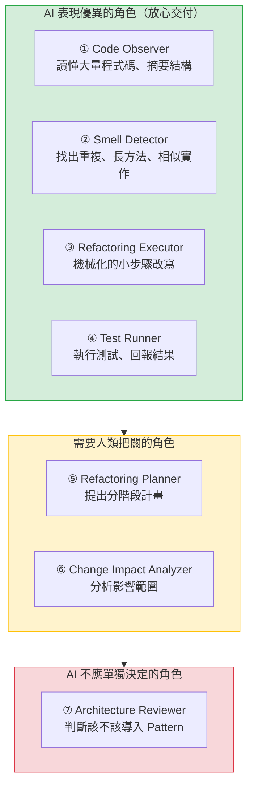

| # | 角色 | AI 的任務 | 人類的責任 |
|---|---|---|---|
| ① | **Code Observer** | 讀懂現有程式碼、還原流程、產生呼叫圖 | 驗證摘要是否正確 |
| ② | **Smell Detector** | 找出可具名的 Smell，附上證據與位置 | **提供變更頻率資料**（AI 看不到 git 歷史的意義） |
| ③ | **Refactoring Executor** | 執行明確指定的單一重構步驟 | 指定步驟、設定限制 |
| ④ | **Test Runner** | 執行測試、回報失敗細節 | 確保測試本身可信 |
| ⑤ | **Refactoring Planner** | 提出分階段計畫與驗證點 | **核准計畫**；判斷階段切分是否合理 |
| ⑥ | **Change Impact Analyzer** | 列出呼叫端、依賴、可能受影響的模組 | 補充 AI 看不到的部分（外部系統、批次、報表） |
| ⑦ | **Architecture Reviewer** | 提供評估資訊與取捨分析 | 🔴 **做決定**。AI 不得自行決定架構方向 |

### 20.3 AI 擅長與不擅長的事

這張表是設計 Prompt 與 Guardrail 的基礎。

| 任務 | AI 表現 | 說明 |
|---|---|---|
| 找出語法上相似的程式碼區塊 | ✅ **優異** | 遠勝人工 |
| 讀懂 3,000 行的 Legacy 方法並摘要 | ✅ **優異** | 這是最被低估的價值 |
| 找出「所有做同一件事的不同實作」 | ✅ **優異** | Oddball Solution 的偵測 |
| 執行 Extract Method 等機械化重構 | ✅ 良好 | 但仍建議用 IDE 的自動重構 |
| 產生樣板程式碼（Adapter、轉換器） | ✅ 良好 | — |
| 從 git log 分析變更模式 | ✅ 良好 | **前提是你把 log 貼給它** |
| 判斷兩段相似程式碼是否為「同一件事」 | ⚠️ 普通 | 需要業務知識 |
| 判斷變更的方向與頻率 | ⚠️ 普通 | 看不到 roadmap |
| 估計重構的風險 | ⚠️ 普通 | 傾向低估 |
| 判斷該不該導入 Pattern | 🔴 **不佳** | 傾向一律「應該」 |
| 判斷「停在這裡就好」 | 🔴 **不佳** | 傾向做到底 |
| 理解未文件化的業務規則 | 🔴 **危險** | **會給出聽起來合理的錯誤解釋** |
| 判斷哪些行為不能改 | 🔴 **危險** | 看不出「這個 null 是刻意的」 |
| 評估對外部系統的影響 | 🔴 **危險** | 看不到系統外的世界 |

> 🔴 **最後四項是第 23 章「紅線」的來源**
> 它們的共同特徵是：**AI 不僅做不好，而且做錯時看起來很像做對了。**

### 20.4 本章實務案例

**情境**：某銀行團隊導入 Claude Code 與 GitHub Copilot 的前三個月。

#### 第一個月：無規範

團隊只說「可以用 AI 協助重構」。

| 現象 | 數據 |
|---|---|
| AI 產生的 PR 數 | 87 |
| 通過 Review 的比例 | 41% |
| 平均 diff 行數 | 640 |
| 新增的介面數 | 112 |
| 因 AI 重構造成的生產問題 | **2 件**（一件是 `null` 語意被改，一件是交易邊界消失） |
| Reviewer 的主觀感受 | 「Review 不完，開始只看有沒有編譯過」 |

#### 第二個月：導入角色定義（本章 20.2 節）

團隊規定 AI 只能擔任①②③④角色，⑤⑥必須人類核准，⑦完全由人類決定。

| 指標 | 第 1 個月 | 第 2 個月 |
|---|---|---|
| AI 產生的 PR 數 | 87 | 64 |
| 通過 Review 的比例 | 41% | 73% |
| 平均 diff 行數 | 640 | 185 |
| 新增的介面數 | 112 | 23 |
| 生產問題 | 2 | 0 |

#### 第三個月：加上 Guardrail 與紅線（第 22、23 章）

| 指標 | 第 3 個月 |
|---|---|
| AI 產生的 PR 數 | 71 |
| 通過 Review 的比例 | **89%** |
| 平均 diff 行數 | 142 |
| 新增的介面數 | 9 |
| **AI 主動停下來詢問的次數** | **31 次** |
| 其中「確實是團隊也不清楚的業務規則」 | **12 次** |

**團隊 Lead 的評估**：

> 「第三個月最有價值的數字是『AI 主動停下來詢問 31 次』，其中 12 次問到了我們自己也不知道答案的東西。
>
> 那 12 個問題，在過去十年裡沒有任何一個工程師問過——因為人類看到看不懂的程式碼會**假設它是對的然後繞過去**，
> 而 AI 在被明確授權說『不知道』之後，會**直接指出來**。
>
> **我們原本以為 AI 的價值是寫得快，結果它最大的價值是問得多。**」

### 20.5 本章注意事項

> ⚠️ **不要問 AI「這段程式碼該怎麼重構」**
> 這個問法等於邀請它產生 Pattern。正確的問法是「這段程式碼有哪些 Code Smell？各自的證據是什麼？」

> ⚠️ **AI 看不到你的 git 歷史、roadmap、生產資料、外部系統**
> 它只能看到你給它的東西。**它的分析品質上限，等於你提供的上下文品質。**

> ⚠️ **AI 不會說「我不知道」，除非你明確授權**
> 「若業務意義不明確，停止並詢問，不要猜測」——這一句必須寫進每一個 Prompt。

> ✅ **把 AI 用在它最強的地方：讀懂 Legacy 程式碼**
> 一個 3,000 行、十五年沒人完整讀過的方法，AI 可以在幾分鐘內產生可信的摘要。**這比讓它寫新程式碼有價值得多。**

> ✅ **限制範圍會提高產出品質，不會降低**
> 第 9.5 節與本節的數據都指向同一個結論。

---

## 第 21 章 AI Agent Refactoring Workflow

### 21.1 完整流程

```mermaid
flowchart TD
    A[使用者提出需求] --> B[階段一：理解]
    B --> B1[Repository 盤點]
    B1 --> B2[架構探索]
    B2 --> B3[依賴分析]
    B3 --> C{AI 能說明<br/>現況嗎}
    C -->|否| C1["🔴 停止<br/>要求補充文件或訪談"]
    C -->|是| D[階段二：診斷]

    D --> D1[識別 Code Smell]
    D1 --> D2["人類提供<br/>git 變更頻率 + roadmap"]
    D2 --> D3[Smell 分級]
    D3 --> E{有 🔴 或 🟡<br/>等級的 Smell 嗎}
    E -->|沒有| E1["✅ 結束<br/>不需要重構"]
    E -->|有| F[階段三：規劃]

    F --> F1[提出候選重構方案]
    F1 --> F2[說明各方案的取捨]
    F2 --> F3["🧑 人類核准計畫"]
    F3 --> G[階段四：建立安全網]

    G --> G1{有測試嗎}
    G1 -->|否| G2[建立 Characterization Test]
    G2 --> G3["🧑 人類驗證測試<br/>記錄的是「現況」而非「AI 的理解」"]
    G3 --> H
    G1 -->|是| H[階段五：執行]

    H --> H1["執行「一個」小步驟"]
    H1 --> H2[編譯]
    H2 --> H3[單元測試]
    H3 --> H4[整合測試]
    H4 --> H5[靜態分析]
    H5 --> H6[架構測試]
    H6 --> I{全部通過}
    I -->|否| I1[Rollback 並回報]
    I1 --> H1
    I -->|是| J["🧑 人類 Review diff"]
    J --> K{痛點消失了嗎}
    K -->|是| L["✅ Commit 並結束"]
    K -->|否| M{還有下一步嗎<br/>且代價合理}
    M -->|否| L
    M -->|是| H1

    style C1 fill:#f8d7da,stroke:#dc3545
    style E1 fill:#d4edda,stroke:#28a745
    style L fill:#d4edda,stroke:#28a745
    style F3 fill:#cfe2ff,stroke:#0d6efd
    style G3 fill:#cfe2ff,stroke:#0d6efd
    style J fill:#cfe2ff,stroke:#0d6efd
```

**這張圖有三個藍色方塊，代表「人類必須介入的檢查點」**：

| 檢查點 | 為什麼不能交給 AI |
|---|---|
| **核准重構計畫** | AI 傾向規劃到 Pattern 為止 |
| **驗證 Characterization Test** | AI 產生的測試可能記錄了它對程式碼的**誤解**（第 5.3 節） |
| **Review 每一步的 diff** | 這是唯一能發現「靜默行為變更」的機會 |

### 21.2 每個階段的輸入與輸出

| 階段 | 輸入 | AI 的輸出 | 人類提供 | 退出條件 |
|---|---|---|---|---|
| **一、理解** | 原始碼、建置設定 | 架構摘要、流程圖、依賴圖 | 業務背景、系統定位 | AI 能正確說明「這段程式在做什麼」 |
| **二、診斷** | 階段一的產出 | Smell 清單 + 證據 + 位置 | **git 變更頻率、PM roadmap** | Smell 已分級（🔴🟡🟢） |
| **三、規劃** | 階段二的產出 | 分階段計畫、各方案取捨 | **核准或修改計畫** | 計畫每一步都可獨立驗證 |
| **四、安全網** | 現有測試、覆蓋率 | Characterization Test | **驗證測試記錄的是現況** | 目標區域覆蓋率達標 |
| **五、執行** | 已核准的計畫 | 單步的 diff + 測試結果 | **Review 每一步** | 痛點消失或下一步代價過高 |

### 21.3 一次完整的對話示範

以下是一段可以直接參考的實際互動範例（已簡化）。

#### 階段一：理解

```text
🧑 人類：
請閱讀 src/main/java/com/example/settlement/ 底下的程式碼。
不要修改任何檔案。
請回答：
1. 這個模組的主要職責是什麼？
2. 對外的入口點有哪些？
3. 它依賴哪些外部系統（DB、MQ、檔案、HTTP）？
4. 有哪些地方你讀不懂或無法確定其意圖？請明確列出，不要猜測。
```

```text
🤖 AI：
1. 職責：日終結算批次，將當日交易彙總並產生結算檔給清算中心。
2. 入口點：
   - SettlementJob.run()（Spring Batch，每日 23:30 觸發）
   - SettlementController.manualSettle()（人工補跑用）
3. 外部依賴：
   - DB2：TXN_MASTER、SETTLE_LOG 兩張表
   - 檔案系統：/data/settle/ 產生固定長度檔
   - MQ：SETTLE.DONE queue

4. 我讀不懂的地方（共 3 處）：
   (a) SettlementService:L412 — `if (txn.getFlag() == 'X' && day == 25)`
       無法判斷 25 日的特殊處理是什麼業務規則
   (b) FileWriter:L88 — 第 47 個位元組固定寫 '9'，註解寫「舊系統相容」
       但沒有說明是哪個系統、是否仍需要
   (c) SettlementService:L560 — catch 到例外後只記 log 不重拋，
       無法判斷這是刻意忽略還是遺漏
```

> ✅ **注意第 4 點**：這是整段對話最有價值的部分。三個問題中，(a) 與 (b) 後來證實團隊也不知道答案。

#### 階段二：診斷

```text
🧑 人類：
以下是這個模組過去 24 個月的變更統計（git log 輸出）：
[貼上資料]

PM 的 roadmap 顯示，未來一年預計：新增一種清算管道（1 種）。

請依此分析 Code Smell，並依以下規則分級：
🔴 該檔案 24 個月內改過 ≥ 10 次，且 Smell 會導致變更出錯
🟡 改過 1～9 次
🟢 未改過

不要修改程式碼。每個 Smell 必須附上檔案、行號與具體證據。
```

```text
🤖 AI：
🔴 阻斷級（2 項）
  1. Shotgun Surgery — SettlementService、FileWriter、SettleLogDao
     證據：24 個月內有 14 次 commit 同時修改這三個檔案。
     其中 commit a3f2e1「修正結算金額」只改了兩個，
     隔週 commit 8b1c4d「補修正結算金額」補改第三個 → 曾經漏改。

  2. Duplicated Code — 金額進位邏輯出現在 3 處且不一致
     SettlementService:L233  RoundingMode.HALF_UP, scale=2
     FileWriter:L145         RoundingMode.HALF_EVEN, scale=2   ← 不一致
     SettleLogDao:L67        RoundingMode.HALF_UP, scale=0     ← 不一致

🟡 警告級（3 項）
  3. Long Method — SettlementService.settle() 620 行（改過 11 次）
  4. Temporary Field — SettlementService 有 4 個可變實例欄位，
     而它是 @Service（singleton）→ 並行風險
  5. Primitive Obsession — 金額使用 BigDecimal 未封裝幣別

🟢 觀察級（7 項，不建議處理）
  [略]

⚠️ 我要特別指出第 2 項：三處的進位方式不同，這可能是 bug 而非單純的 Smell。
   建議先確認哪一個才是正確的業務規則，再進行任何重構。
```

#### 階段三：規劃

```text
🧑 人類：
請針對 🔴 的兩項提出分階段重構計畫。
不要實作。每一階段必須可獨立驗證與回復。
請說明每個階段完成後，要如何判斷「是否需要繼續下一階段」。
```

```text
🤖 AI：
前置（不屬於重構）：
  P0. 確認三處進位邏輯何者正確 → 這是業務問題，需人類確認
  P1. 若是 bug，先開獨立 PR 修正（不與重構混合）

階段 1：建立安全網
  - 對 settle() 建立 Characterization Test
  - 資料來源：近 3 個月的實際結算檔（建議提供 ≥ 60 個日結檔）
  - 驗證方式：逐位元組比對產生的結算檔
  - 完成判準：測試能重現現行的所有輸出（含既有的不一致）

階段 2：Compose Method
  - 把 620 行的 settle() 抽成具名私有方法
  - 不新增任何類別
  - 【重新評估點】完成後請確認：「看不懂」的痛點是否解決？

階段 3：消除重複的進位邏輯
  - 抽出 SettlementRounding 類別，集中進位規則
  - 【重新評估點】完成後請確認：Shotgun Surgery 是否減輕？
    （模擬一次「修改進位規則」的變更，看需要改幾個檔案）

階段 4（條件性）：Temporary Field → Collecting Parameter
  - 僅在階段 3 後仍有並行疑慮時執行

我不建議導入 Strategy：
  roadmap 只新增 1 種清算管道，加上現有的 2 種共 3 種，
  但從 git log 看，這 2 種過去 24 個月一直是「一起被修改」的，
  不符合「變體各自獨立演化」的前提（手冊第 12.2 節第二道關卡）。
```

> ✅ **最後一段是這個 Workflow 成功的標誌**：AI 主動提出「不建議導入 Pattern」，並給出可查證的理由。
> 這不是模型自發的行為，是**Prompt 與 Guardrail 設計出來的**。

#### 階段五：執行（節錄）

```text
🧑 人類：
執行階段 2。限制：
- 不得新增任何 class / interface / enum / record
- 不得改變任何邏輯、條件順序或例外行為
- 不得修改測試檔案
- 一次抽一個方法，每次執行：mvn test -Dtest=SettlementCharacterizationTest
- 方法名稱必須描述意圖，禁止 step1 / doPart2
- 每次回報：方法名稱、diff、測試結果
- 若某段的業務意圖不明確，停止並詢問

先列出你打算抽出的所有段落與建議名稱，等我確認。
```

```text
🤖 AI：
我打算抽出 14 個方法：
  L112-L156  → loadTodayTransactions()
  L158-L201  → excludeVoidedTransactions()
  ...
  L412-L430  → ⚠️ 無法命名

  L412-L430 是 `if (txn.getFlag() == 'X' && day == 25)` 那段。
  我不知道它的業務意義，因此無法給出描述意圖的名稱。
  我不會用 handleSpecialCase() 這種名稱掩蓋我的不理解。

  請提供業務意義，或允許我暫時不抽出這一段。
```

### 21.4 本章實務案例

**情境**：第 21.3 節的對話是真實案例的簡化版。以下是後續發展。

**那三個「AI 讀不懂」的地方，追查結果**：

| 位置 | 追查結果 | 處置 |
|---|---|---|
| `L412` 的 25 日特殊處理 | 2014 年某清算中心要求「每月 25 日的 X 類交易延後一日結算」。**該清算中心已於 2021 年停止服務** | 移除（獨立 PR，經業務確認） |
| `FileWriter:L88` 的固定 `'9'` | 為了相容一個 2016 年下線的上游系統 | 移除（獨立 PR） |
| `L560` 的吞例外 | 查 git blame 找到當年的開發者（已離職），但 commit 訊息寫「暫時 workaround，待修」 | **改為記錄並告警**（獨立 PR），不再靜默 |

**三處進位邏輯不一致的追查結果**：

正確的是 `HALF_UP, scale=2`。`FileWriter` 的 `HALF_EVEN` 導致結算檔金額在特定尾數時少一分錢。

**這個 bug 已經存在 6 年**，每年約影響 40～60 筆，因為金額極小（1 分）從未被發現。

**最終成果**：

| 指標 | Before | After |
|---|---|---|
| `SettlementService` 行數 | 620 | 138 |
| 進位規則的定義位置 | 3 處（不一致） | **1 處** |
| 「修改進位規則」需異動的檔案數 | 3 | 1 |
| 新增的類別數 | — | **+1**（`SettlementRounding`） |
| 導入的 Design Pattern 數 | — | **0** |
| 移除的死程式碼 | — | 2 段（共 41 行） |
| 修正的既有 bug | — | **1 個**（潛伏 6 年） |
| 測試覆蓋率 | 8% | 84% |

**注意「導入的 Design Pattern 數 = 0」**。

這是一次成功的 Refactoring to Patterns 實踐——**成功的標誌不是導入了多少 Pattern，而是痛點消失了，而且沒有增加不必要的結構。**

### 21.5 本章注意事項

> ⚠️ **三個人類檢查點不可省略**
> 核准計畫、驗證測試、Review diff。省略任何一個，這套流程就退化成「AI 自由發揮」。

> ⚠️ **階段二一定要提供 git 變更頻率**
> 沒有它，AI 會回報第 ④ 象限（低變動高成本）的一堆 Smell，而處理那些的投資報酬率是負的。

> ⚠️ **不要在同一輪對話中跨越階段**
> 「請分析並重構」會讓 AI 跳過診斷直接動手。**一輪對話一個階段。**

> ✅ **「我讀不懂的地方」是最有價值的輸出**
> 請在每個階段一的 Prompt 中都要求它。第 21.4 節的三個發現全部來自這一項。

> ✅ **成功的標誌不是導入 Pattern**
> 是痛點消失、測試覆蓋提升、而結構沒有變複雜。

---

## 第 22 章 AI Agent Refactoring Guardrails

### 22.1 十五項前置檢查

> 🔧 **本手冊的工程建議**
> AI Agent 在執行**任何**重構前，必須能回答這 15 個問題。答不出來的，就是必須先補齊的資訊。

| # | 檢查項 | 若答不出來該怎麼辦 |
|---|---|---|
| 1 | 是否真的存在可具名的 Code Smell？證據是什麼？ | 停止，先做診斷 |
| 2 | 這個區域有測試保護嗎？覆蓋率多少？ | 停止，先建立 Characterization Test |
| 3 | 相關的 Business Rule 是否明確？ | 🔴 **停止並詢問**（第 23 章紅線） |
| 4 | 對外的 API Contract 是什麼？會不會被影響？ | 停止，先確認契約 |
| 5 | 資料庫的 schema 與約束是什麼？ | 停止，先查 DDL |
| 6 | 交易邊界在哪裡？會不會改變？ | 🔴 **停止並詢問** |
| 7 | 有哪些外部系統整合？契約是什麼？ | 停止，先盤點 |
| 8 | 這次變更會不會改變外部可觀察行為？ | 若會 → 這不是重構，需重新定性 |
| 9 | 有沒有更簡單的重構可以達成同樣目的？ | 先做簡單的 |
| 10 | 真的需要 Design Pattern 嗎？三道關卡過了嗎？ | 未過 → 不要導入 |
| 11 | 這樣做會不會造成過度設計？ | 填第 3.3 節代價表 |
| 12 | 能不能拆成更小的步驟？ | 能 → 就拆 |
| 13 | 出問題時能不能 rollback？ | 不能 → 重新設計步驟 |
| 14 | 能用自動化測試驗證嗎？ | 不能 → 需人工驗證計畫 |
| 15 | 這次變更需要人工 Review 嗎？ | **預設「是」** |

### 22.2 把 Guardrail 變成可執行的機制

光是把 15 項寫進文件，效果有限——因為沒有人會每次都查。

> 🔧 **本手冊的工程建議：三層落地機制**

```mermaid
flowchart TD
    A["第一層：Prompt 層<br/>寫進 CLAUDE.md / copilot-instructions.md"] --> B["第二層：Hook 層<br/>AI 動手前後的自動檢查"]
    B --> C["第三層：CI 層<br/>PR 的自動閘門"]

    A --> A1["優點：AI 主動遵守<br/>缺點：可能被忽略"]
    B --> B1["優點：即時阻擋<br/>缺點：需要設定"]
    C --> C1["優點：無法繞過<br/>缺點：發現得晚"]

    style A fill:#d1e7dd,stroke:#198754
    style B fill:#fff3cd,stroke:#ffc107
    style C fill:#cfe2ff,stroke:#0d6efd
```

**三層的分工**：

| 層 | 適合檢查什麼 | 範例 |
|---|---|---|
| **Prompt** | 需要判斷的事 | 「不得為單一實作建立介面」 |
| **Hook** | 機械可判斷、且要即時阻擋的事 | 「重構 PR 不得修改測試檔案」 |
| **CI** | 全域性的規則 | ArchUnit 規則、覆蓋率門檻 |

### 22.3 Hook 與 CI 的落地

#### Claude Code 的 Hook 設定

在 `.claude/settings.json` 中設定：

```json
{
  "hooks": {
    "PostToolUse": [
      {
        "matcher": "Edit|Write",
        "hooks": [
          {
            "type": "command",
            "command": "bash .claude/hooks/check-refactoring-scope.sh"
          }
        ]
      }
    ]
  }
}
```

`.claude/hooks/check-refactoring-scope.sh`：

```bash
#!/bin/bash
# 重構 PR 的範圍檢查
# 回傳非 0 會讓 Claude Code 看到錯誤訊息並自行修正

set -u
BRANCH=$(git rev-parse --abbrev-ref HEAD)

# 只對 refactor/ 開頭的分支套用
case "$BRANCH" in
  refactor/*) ;;
  *) exit 0 ;;
esac

FAIL=0

# 規則 1：重構 PR 不得修改測試檔案
CHANGED_TESTS=$(git diff --name-only HEAD -- 'src/test/**' | head -5)
if [ -n "$CHANGED_TESTS" ]; then
  echo "❌ 重構 PR 不得修改測試檔案。若測試需要修改，代表行為改變了。"
  echo "   受影響的檔案："
  echo "$CHANGED_TESTS" | sed 's/^/     /'
  FAIL=1
fi

# 規則 2：新增的介面若只有一個實作，需在 commit message 說明理由
for f in $(git diff --name-only --diff-filter=A HEAD -- 'src/main/**/*.java'); do
  if grep -q "^public interface" "$f" 2>/dev/null; then
    NAME=$(basename "$f" .java)
    IMPLS=$(grep -rl "implements .*\b$NAME\b" src/main/java --include="*.java" 2>/dev/null | wc -l)
    if [ "$IMPLS" -le 1 ]; then
      echo "⚠️  新增的介面 $NAME 目前只有 $IMPLS 個實作。"
      echo "   請確認它是架構邊界，或移除它（手冊第 8.11 節）。"
      FAIL=1
    fi
  fi
done

# 規則 3：不得移除交易或安全相關的 annotation
REMOVED=$(git diff -U0 HEAD -- 'src/main/**/*.java' \
          | grep '^-' | grep -oE '@(Transactional|PreAuthorize|PostAuthorize|Secured|Cacheable|Retryable|Async)' \
          | sort -u)
if [ -n "$REMOVED" ]; then
  echo "🔴 偵測到移除了以下 annotation，這會改變交易或安全行為："
  echo "$REMOVED" | sed 's/^/     /'
  echo "   若為刻意移除，請在 commit message 中以 BEHAVIOR-CHANGE: 開頭說明。"
  FAIL=1
fi

exit $FAIL
```

> ✅ **規則 3 是本手冊認為最有價值的一條 Hook**
> 它防的是第 8.9 節與第 24 章提到的「AI Inline 掉帶 `@Transactional` 的 Middle Man」——
> 這種錯誤編譯會通過、測試也會通過，但交易邊界已經消失。

#### GitHub Copilot 的設定

在 `.github/copilot-instructions.md` 中加入附錄 B 的治理規則。Copilot 會在產生建議時參考它。

#### CI 層的閘門

`.github/workflows/refactoring-quality-gate.yml`：

```yaml
name: Refactoring Quality Gate

on:
  pull_request:
    branches: [ main, develop ]

jobs:
  gate:
    if: startsWith(github.head_ref, 'refactor/')
    runs-on: ubuntu-latest
    steps:
      - uses: actions/checkout@v4
        with:
          fetch-depth: 0

      - uses: actions/setup-java@v4
        with:
          distribution: temurin
          java-version: '25'
          cache: maven

      # 閘門 1：測試檔案不得被修改
      - name: 檢查測試檔案未被修改
        run: |
          CHANGED=$(git diff --name-only origin/${{ github.base_ref }}...HEAD -- 'src/test/**')
          if [ -n "$CHANGED" ]; then
            echo "::error::重構 PR 不得修改測試檔案："
            echo "$CHANGED"
            exit 1
          fi

      # 閘門 2：所有測試必須通過
      - name: 執行測試
        run: mvn -B verify

      # 閘門 3：架構規則
      - name: 架構測試
        run: mvn -B test -Dtest='*ArchitectureTest'

      # 閘門 4：複雜度不得上升
      - name: SonarQube 分析
        run: mvn -B sonar:sonar -Dsonar.qualitygate.wait=true
        env:
          SONAR_TOKEN: ${{ secrets.SONAR_TOKEN }}

      # 閘門 5：介面數量不得無故增加
      - name: 檢查新增的單一實作介面
        run: bash .github/scripts/check-single-impl-interfaces.sh
```

> ⚠️ **閘門 1 的例外處理**
> 有時重構確實需要調整測試（例如被測方法改名）。建議的做法是：
> 允許在 commit message 中加上 `TEST-ADJUST:` 前綴並說明理由，Hook 與 CI 偵測到該前綴時放行，但**要求該 PR 必須有兩位 Reviewer**。

### 22.4 本章實務案例

**情境**：某證券公司導入 Hook 機制前後的比較。

**導入前的三個月，AI 重構造成的問題**：

| # | 問題 | 發現時機 | 影響 |
|---|---|---|---|
| 1 | AI 把帶 `@Transactional` 的轉發方法 inline 掉 | **生產環境**（部分失敗未 rollback） | 37 筆委託單狀態不一致 |
| 2 | AI 為了讓測試通過，修改了測試的預期值 | Review 時被發現 | 無（險些） |
| 3 | AI 把 `return null` 改成 `Optional.empty()` | **生產環境** | 一個檢核被跳過 4 天 |
| 4 | AI 產生了 23 個單一實作的介面 | Review 時被發現 | 無（PR 退回） |
| 5 | AI 把 `@Async` 移除，使非同步變同步 | 壓測時發現 | 無 |

**導入 Hook + CI 後的六個月**：

| # | 同類問題 | 被哪一層擋下 | 結果 |
|---|---|---|---|
| 1 | 移除 `@Transactional` | **Hook（即時）** | AI 自行修正，未進入 PR |
| 2 | 修改測試檔案 | **Hook（即時）** | AI 改為詢問人類 |
| 3 | 改變 null 語意 | ⚠️ **未被自動擋下** | 由 Review 發現（2 次） |
| 4 | 單一實作介面 | **Hook（警告）** | AI 主動移除（11 次） |
| 5 | 移除 `@Async` | **Hook（即時）** | AI 自行修正 |

**進入生產環境的問題數**：3 → **0**

**第 3 項未被自動擋下，值得說明**：

「把 `return null` 改成 `Optional.empty()`」在語法上無法用簡單規則判斷（有時這確實是正確的改善）。團隊的處理方式是加進 Prompt 層：

```text
本專案的重構規則（摘自 CLAUDE.md）：

禁止在重構 PR 中改變 null 語意。具體而言：
- 不得把 `return null` 改為 `Optional.empty()` 或空集合
- 不得把 `return Collections.emptyList()` 改為 `return null`
- 不得新增或移除 null 檢查

若你認為某處的 null 處理應該改善，請：
1. 不要修改
2. 在回報中列出該位置與建議
3. 說明有哪些呼叫端依賴目前的 null 行為
由人類決定是否另開 PR 處理。
```

導入這段之後，該類問題在後續四個月未再發生。

### 22.5 本章注意事項

> 🔴 **Hook 的第 3 條（annotation 移除偵測）是最有價值的一條**
> 它擋下的錯誤是「編譯過、測試過、但交易邊界消失」——這是所有 AI 重構問題中最危險的一類。

> ⚠️ **不要只靠 Prompt 層**
> Prompt 可能被忽略（尤其在長對話中）。機械可判斷的規則要下放到 Hook 與 CI。

> ⚠️ **不要只靠 CI 層**
> CI 發現得太晚，AI 已經產生了大量程式碼。Hook 的價值在於**即時**，讓 AI 當場自行修正。

> ⚠️ **Hook 要給出可執行的錯誤訊息**
> 「檢查失敗」沒有用。要寫「重構 PR 不得修改測試檔案。若測試需要修改，代表行為改變了」——
> AI 讀到具體的理由才能正確修正。

> ✅ **閘門要留合理的例外通道**
> 完全沒有例外的閘門會被繞過（例如改用其他分支名稱）。`TEST-ADJUST:` 前綴 + 雙人 Review 是合理的設計。

> ✅ **先從三條規則開始**
> 不要一次上 15 條。建議的起手三條：① 重構 PR 不得改測試 ② 不得移除交易與安全 annotation ③ 新增單一實作介面要說明理由。

---

## 第 23 章 AI 不得自行重構的紅線

### 23.1 十一條紅線

前一章的 Guardrail 是「檢查清單」——答不出來就先補資訊。

**這一章的紅線不同：踩到就停，沒有補資訊之外的選項。**

> 🔴 **紅線的定義**
> 在以下情況下，AI Agent **不得自行修改任何程式碼**，必須停止並向人類求證。
> 這不是「建議」，是團隊規範，且應寫入 `CLAUDE.md`（見附錄 B）。

| # | 紅線 | 為什麼 AI 特別危險 | 典型的錯誤後果 |
|---|---|---|---|
| 1 | **Business Rule 不明** | AI 會給出聽起來合理的錯誤解釋 | 重構掉一條真實的業務規則 |
| 2 | **沒有測試** | AI 無法驗證自己有沒有改壞 | 靜默的行為變更 |
| 3 | **API Contract 不明** | AI 看不到下游系統 | 下游解析失敗 |
| 4 | **DB Transaction 邊界不明** | `@Transactional` 的效果不在程式碼文字中 | 部分失敗未 rollback |
| 5 | **MQ 語意不明** | 至少一次 / 恰好一次 / 順序保證，AI 無從得知 | 重複扣款、訊息遺失 |
| 6 | **外部系統 Contract 不明** | 看不到對方的規格 | 介接中斷 |
| 7 | **Security Rule 不明** | 安全檢查常長得像「多餘的判斷」 | 權限繞過 |
| 8 | **Authorization Rule 不明** | 同上 | 越權存取 |
| 9 | **Financial calculation 不明** | 進位、精度、幣別的細節極易被「優化」掉 | 金額錯誤 |
| 10 | **Legacy hidden behavior 不明** | 最醜的 `if` 往往是最重要的規則 | 見第 21.4 節案例 |
| 11 | **Production critical path** | AI 不知道哪條路徑承載了 90% 的流量 | 效能退化造成服務中斷 |

#### 三條最需要展開的紅線

##### 紅線 1：Business Rule 不明

```java
// AI 看到這段
if (customer.getType() == 2 && order.getAmount().compareTo(new BigDecimal("30000")) > 0
        && !customer.getBranch().equals("998")) {
    fee = fee.multiply(new BigDecimal("0.5"));
}
```

**AI 的典型反應**（危險）：

```text
「這段判斷 VIP 客戶的大額訂單折扣，建議抽成 isEligibleForVipDiscount() 並簡化條件。
 其中 !branch.equals("998") 看起來是排除測試分行，可以移到設定檔。」
```

**問題**：`"998"` 可能是「員工分行」「已裁撤分行」「代管帳戶專用分行」——AI 的猜測聽起來完全合理，但可能完全錯誤。而一旦它被「移到設定檔」並在某次調整中被拿掉，就會產生真實的財務損失。

**正確反應**：

```text
「L412 的條件我無法確定業務意義：
   - type == 2 是什麼客戶類型？
   - 30000 這個門檻的依據？
   - branch "998" 代表什麼？為什麼要排除？
 在取得答案前，我不會修改這一段，也不會為它命名。」
```

##### 紅線 4：交易邊界不明

交易邊界的一個特性讓它對 AI 特別危險：**它不在程式碼的文字中**。

```java
@Service
public class OrderService {
    @Transactional
    public void process(Order o) {
        validate(o);
        save(o);
        notify(o);          // 這一行在交易內 — 但從這一行本身看不出來
    }
}
```

AI 若把 `notify(o)` 搬到另一個類別、或把 `process` 拆成兩個方法，交易邊界就變了。而**編譯通過、測試通過**。

##### 紅線 9：金融計算

```java
// AI 看到這段，極可能「優化」
BigDecimal fee = amount.multiply(rate).setScale(2, RoundingMode.HALF_UP);
BigDecimal tax = fee.multiply(TAX_RATE).setScale(2, RoundingMode.HALF_UP);
BigDecimal total = fee.add(tax);
```

**AI 可能改成**：

```java
BigDecimal total = amount.multiply(rate).multiply(BigDecimal.ONE.add(TAX_RATE))
                          .setScale(2, RoundingMode.HALF_UP);   // 數學上等價，實務上不等價
```

**問題**：原本是「各自進位後相加」，改成「相加後進位」。兩者在大部分情況下相同，但在特定尾數會差一分錢。而**一分錢的差異在對帳時是重大事故**。

### 23.2 遇到紅線時 AI 必須做的五件事

```mermaid
flowchart LR
    A["🔴 偵測到紅線"] --> B["1. Stop<br/>停止所有修改"]
    B --> C["2. Explain Unknowns<br/>明確列出不確定的項目"]
    C --> D["3. Gather Evidence<br/>提供可查證的線索"]
    D --> E["4. Ask Human<br/>提出具體問題"]
    E --> F["5. Wait<br/>不得自行假設後繼續"]

    style A fill:#f8d7da,stroke:#dc3545
    style F fill:#cfe2ff,stroke:#0d6efd
```

**第 3 步「提供可查證的線索」是最有價值的一步**。好的 AI 回應不只是說「我不知道」，而是：

```text
我無法確定 branch "998" 的意義，但我找到以下線索供你判斷：

1. git blame：這一行由 commit 7f3a21 在 2017-03-14 加入
   commit 訊息：「依業管單位 106/03/10 會議決議調整」

2. 全專案搜尋 "998" 的其他出現位置：
   - BranchConstants.java:L23  `public static final String HQ_VIRTUAL = "998";`
   - branch-master.sql:L1102   INSERT 中有一筆 name = '總行虛擬分行'

3. 根據線索 2，"998" 很可能是「總行虛擬分行」，
   但我無法確定「為什麼總行虛擬分行不適用此折扣」這個業務規則。

建議詢問：業管單位或當年參與 106/03/10 會議的人員。
```

> ✅ **這段回應的價值遠高於直接重構**
> 它把一個「沒人知道的問題」變成了「有線索、可追查的問題」。

### 23.3 紅線的可執行版本

> 🔧 **本手冊的工程建議：把紅線寫成 AI 能檢查的形式**

放進 `CLAUDE.md` / `.github/copilot-instructions.md`（完整版見附錄 B）：

```markdown
## 重構紅線（最高優先，覆蓋其他所有指示）

在修改任何程式碼之前，你必須先確認以下項目。
若任何一項無法從程式碼、測試或本專案文件中確定，**立即停止，不要猜測，不要繼續**。

1. 這段程式碼的業務規則是什麼？每一個 magic number 與特殊條件的意義？
2. 這段程式碼有測試覆蓋嗎？
3. 它是否在交易（@Transactional）範圍內？搬移後交易邊界會不會改變？
4. 它是否涉及金額、利率、匯率、稅務計算？進位與精度規則是什麼？
5. 它是否涉及權限、授權或安全檢查？
6. 它是否與 MQ、外部 API、檔案介接有關？對方的契約是什麼？

停止時，你必須輸出：
- 哪一項無法確定
- 你為此查找了哪些線索（git blame、搜尋結果、相關常數）
- 你建議向誰詢問
- 在取得答案前你不會做什麼

**禁止的行為**：
- 為看不懂的程式碼取一個泛稱名稱（handleSpecialCase、processData、doCheck）
- 假設 magic number 的意義後繼續
- 把「看起來多餘」的條件判斷移除或外部化
- 同時處理「重構」與「修 bug」
```

#### 一個可以立即使用的檢測 Prompt

```text
在你開始任何修改之前，請先執行紅線檢查。

針對 [檔案:行號範圍] 的程式碼，逐項回答：

| 檢查項 | 答案 | 依據（檔案:行號 或「無法確定」） |
|---|---|---|
| 所有 magic number 的業務意義 | | |
| 所有特殊條件（排除、豁免）的原因 | | |
| 測試覆蓋情況 | | |
| 是否在交易範圍內 | | |
| 是否涉及金額計算 | | |
| 是否涉及權限檢查 | | |
| 是否與外部系統整合 | | |

規則：
- 「依據」欄位必須指向具體的檔案行號或文件，不得填寫推測
- 任何一項填「無法確定」，請在表格後列出你查找過的線索，然後停止
- 不要在表格中填寫「應該是」「可能是」「推測為」
```

### 23.4 本章實務案例

**情境**：某銀行導入紅線規則的第一週，AI 停下來的 9 次。

| # | AI 停下來的原因 | 追查結果 | 價值 |
|---|---|---|---|
| 1 | 不確定 `if (day == 25)` 的意義 | 已失效的清算中心規則 | 🔴 **高**（移除了死規則） |
| 2 | 不確定 `flag == 'X'` | 「跨行交易」的舊代碼 | 🟡 中（補上註解） |
| 3 | 不確定為何 catch 後不重拋 | **確實是 bug**，2019 年的 workaround | 🔴 **高**（修正了吞例外） |
| 4 | 不確定 `setScale(0)` 是否正確 | **確實是 bug**，應為 `setScale(2)` | 🔴 **高**（金額精度錯誤） |
| 5 | 不確定 `"998"` 分行的意義 | 總行虛擬分行，規則仍有效 | 🟢 低（確認後繼續） |
| 6 | 不確定某個 MQ 是否保證順序 | 不保證，但程式碼假設了順序 | 🔴 **高**（潛在的資料錯亂） |
| 7 | 不確定 `@Transactional` 的傳播行為 | `REQUIRES_NEW`，刻意設計 | 🟢 低 |
| 8 | 不確定某欄位為何允許 null | 舊資料相容 | 🟢 低 |
| 9 | 不確定某個檔案格式的第 47 位元組 | 已下線系統的相容欄位 | 🟡 中 |

**統計**：9 次停止中，**4 次發現了真實的問題**（其中 2 個是潛在的生產事故）。

**團隊的反應**：

> 「一開始我們擔心 AI 一直停下來會拖慢進度。
> 第一週 9 次停止，我們花了大約 6 小時去追查與回答。
>
> 但那 6 小時找出了 2 個會造成財務損失的 bug，和 1 個 MQ 順序假設的錯誤。
> **如果 AI 沒有停下來，它會很流暢地把這些問題一起重構進新的程式碼裡，然後我們永遠不會發現。**」

**第 6 項值得特別說明**：

程式碼假設 MQ 訊息會依序到達（先收到「開戶」再收到「入金」）。實際上該 MQ 設定為多 consumer 並行消費，不保證順序。

這個問題存在 4 年沒被發現，因為實務上訊息量小、時間差大，幾乎不會亂序。但在促銷期間曾發生過兩次「入金失敗」的客訴，當時被歸因為「系統忙碌」。

**AI 是怎麼發現的**：它在讀 Characterization Test 時注意到測試永遠依固定順序送訊息，因此詢問「生產環境是否保證此順序」。

### 23.5 本章注意事項

> 🔴 **紅線的優先級必須高於其他所有指示**
> 在 `CLAUDE.md` 中要明確寫「本節覆蓋其他所有指示」。否則當使用者說「快點幫我重構完」時，AI 可能會妥協。

> 🔴 **禁止 AI 用泛稱名稱掩蓋不理解**
> `handleSpecialCase()`、`processData()`、`doCheck()`——這些名稱是「我不懂但我還是做了」的訊號。

> ⚠️ **不要因為「AI 一直停下來」而放寬紅線**
> 第 23.4 節的數據顯示，停下來的價值遠高於流暢度。**如果 AI 從來不停，那代表紅線沒有生效。**

> ⚠️ **金融計算的紅線要特別強調「進位順序」**
> 「數學上等價」不等於「會計上等價」。任何改變 `setScale` 位置的變更，都必須逐筆比對。

> ✅ **要求 AI 在停止時提供查找過的線索**
> 這是把「我不知道」變成「可追查的問題」的關鍵。`git blame` + 全專案搜尋 + 相關常數，三項缺一不可。

> ✅ **把每次停止的追查結果寫回程式碼**
> 追查出來的業務意義，應該以常數命名或註解的形式寫回程式碼。否則下一個人（或下一次 AI）還要再問一次。

---

## 第 24 章 AI Refactoring Anti-Patterns

### 24.1 十五種反模式總覽

| # | 反模式 | 一句話 | 嚴重度 |
|---|---|---|---|
| 1 | AI Pattern Hunting | 為了套 Pattern 而找問題 | 🟡 |
| 2 | AI Over-Abstraction | 產生遠多於需要的抽象層 | 🟡 |
| 3 | AI Big Bang Refactoring | 一次改 20 個檔案 | 🔴 |
| 4 | AI Rewrite Instead of Refactoring | 名為重構，實為重寫 | 🔴 |
| 5 | AI Hallucinated Business Rule | 為看不懂的程式碼編造解釋 | 🔴 |
| 6 | AI Test-as-Afterthought | 先改程式碼再補測試 | 🔴 |
| 7 | AI Self-Validation Bias | 測試與程式碼共享同一套錯誤假設 | 🔴 |
| 8 | AI Changing Behavior Accidentally | 「順手改善」造成靜默行為變更 | 🔴 |
| 9 | AI Creating Excessive Interfaces | 每個類別配一個介面 | 🟡 |
| 10 | AI Creating Factory Everywhere | 把所有 `new` 包起來 | 🟡 |
| 11 | AI Creating Generic Framework | 把內部系統寫成框架 | 🟡 |
| 12 | AI Ignoring Legacy Constraints | 忽略歷史相容性需求 | 🔴 |
| 13 | AI Ignoring Performance | 為可讀性犧牲效能 | 🟡 |
| 14 | AI Ignoring Transaction Boundary | 搬移程式碼時改變交易範圍 | 🔴 |
| 15 | AI Ignoring Security Boundary | 移除或繞過安全檢查 | 🔴 |

以下依「認知」「執行」「忽略」三類展開。每一項採相同格式：**問題 → 為什麼發生 → 錯誤範例 → 改善方式 → Guardrail**。

### 24.2 認知類反模式

#### 反模式 1：AI Pattern Hunting

**問題**：AI 從「這裡可以用什麼 Pattern」出發，而不是從「這裡有什麼問題」出發。

**為什麼發生**：Pattern 在訓練資料中是「好設計」的標記；而「什麼都不做」很少被示範為正確答案。

**錯誤範例**：

```text
🧑 「這個類別看起來有點亂，幫我看看」
🤖 「這裡可以用 Strategy 重構條件邏輯，用 Factory 封裝建立過程，
     用 Observer 解耦通知，我來幫你實作。」
```

**改善方式**：把提問從「怎麼重構」改成「有什麼 Smell、證據是什麼」。

**Guardrail**：

```text
在提出任何 Design Pattern 之前，你必須先：
1. 指出具體的 Code Smell（使用手冊第 7、8 章的名稱）
2. 提供證據（檔案、行號、git log）
3. 說明「不導入 Pattern」會有什麼具體問題
無法完成這三項時，不得提及任何 Pattern 名稱。
```

---

#### 反模式 2：AI Over-Abstraction

**問題**：產生的抽象層數遠超過問題的複雜度。

**為什麼發生**：訓練資料中的「優良程式碼」大量來自開源框架，而框架的使用者未知，本來就該高度抽象。

**錯誤範例**：為一個只被呼叫一次的「寄送 Email」需求產生 `NotificationChannel` 介面、`ChannelFactory`、`ChannelRegistry`、`MessageTemplateStrategy`。

**改善方式**：在 Prompt 中明確說明「這是內部系統，使用者是已知的」。

**Guardrail**：

```text
本專案是企業內部系統，不是對外發布的框架。
- 不得為單一實作建立介面
- 不得建立沒有子類別的抽象類別
- 不得新增目前沒有使用情境的設定項
- 每新增一個類別，必須說明「不新增它會有什麼問題」
```

---

#### 反模式 5：AI Hallucinated Business Rule

**問題**：AI 為看不懂的程式碼給出**聽起來完全合理但錯誤**的解釋，然後基於那個解釋去重構。

**為什麼發生**：AI 不會說「我不知道」，除非被明確授權。

**錯誤範例**：見第 23.1 節的 `branch != "998"` 案例。

**這是十五項中最危險的一項**，因為：

```text
錯誤的解釋 → 聽起來合理 → 人類 Review 時也覺得合理 → 通過 → 業務規則被悄悄改變
```

**改善方式**：明確授權 AI 說「我不知道」，並要求它提供查找過的線索。

**Guardrail**：見第 23.3 節的完整紅線規則。

---

#### 反模式 7：AI Self-Validation Bias

**問題**：AI 同時產生程式碼與測試，兩者共享同一套錯誤假設，導致「測試全綠但行為錯誤」。

**為什麼發生**：AI 是先理解程式碼、再產生測試。如果理解有偏差，測試會忠實地驗證那個偏差。

**錯誤範例**：

```text
1. AI 誤以為某個 if 是「排除測試資料」
2. AI 重構時把它改成從設定檔讀取
3. AI 產生的測試驗證「設定為空時不排除任何資料」
4. 測試全綠 ✅
5. 實際上那個 if 是排除已裁撤分行，現在裁撤分行的資料會被納入計算 🔴
```

**改善方式**（三層防護）：

| 防護 | 做法 |
|---|---|
| ① 測試來源分離 | Characterization Test 必須**基於現行程式碼的實際輸出**產生，不是基於 AI 的理解 |
| ② 測試不可修改 | 重構 PR 中測試檔案不得被修改（Hook 強制，第 22.3 節） |
| ③ 產生者分離 | 高風險模組：實作與測試由不同的 session 或不同的人產生 |

**Characterization Test 的正確產生方式**（第 27 章詳述）：

```text
❌ 錯誤：「請為這個方法寫測試」
         → AI 依它的理解寫測試

✅ 正確：「請寫一個測試，用以下 200 組真實輸入呼叫這個方法，
          把『目前實際的輸出』記錄為預期值。
          不要判斷那些輸出是否正確。」
         → 測試記錄的是「現況」，不是「AI 的理解」
```

**Guardrail**：

```text
產生測試時：
- Characterization Test 的預期值必須來自「實際執行結果」，不得來自你對程式碼的理解
- 若某個輸出看起來像 bug，仍然把它記錄為預期值，並在註解中標示「疑似既有 bug，待確認」
- 重構 PR 中不得修改任何既有測試
```

### 24.3 執行類反模式

#### 反模式 3：AI Big Bang Refactoring

**問題**：一次修改 20 個檔案、1,800 行 diff。

**為什麼發生**：AI 沒有「累」的概念，也沒有「這樣 Review 不完」的直覺。

**改善方式 + Guardrail**：

```text
每次回應最多修改 1 個檔案。
完成後停止，執行測試，回報結果，等待我的確認再繼續。
禁止在單一回應中完成多個重構步驟。
```

> ✅ 實測顯示，加上「完成後停止等待確認」這一句，比任何行數限制都有效。

---

#### 反模式 4：AI Rewrite Instead of Refactoring

**問題**：名為重構，實際上是「讀懂後重新寫一遍」。

**為什麼發生**：對 AI 而言，重寫比逐步變換更容易。

**如何識別**：

| 訊號 | 說明 |
|---|---|
| diff 幾乎是「整個方法被刪除 + 新方法被加入」 | 而非逐段的小調整 |
| 變數名稱全部改變 | 重構會保留大部分名稱 |
| 程式碼順序大幅重排 | — |
| 「我重新實作了這個方法，邏輯更清晰」 | 這句話就是警訊 |

**風險**：重寫會丟掉「不知道為什麼存在的行為」——而那正是 Legacy 程式碼最重要的部分。

**Guardrail**：

```text
你只能執行以下明確命名的重構手法：
Extract Method / Inline Method / Rename / Move Method / Move Field /
Extract Class / Introduce Parameter Object / Replace Temp with Query /
Decompose Conditional / Guard Clause

禁止「重新實作」「改寫」「重新設計」任何方法。
每次修改的 diff 中，被刪除的行數不得超過被新增行數的 1.5 倍
（超過代表你在重寫，不是重構）。
```

---

#### 反模式 6：AI Test-as-Afterthought

**問題**：先改程式碼，再補測試。

**為什麼發生**：使用者的指令通常是「重構並補上測試」，AI 依序執行。

**風險**：補上的測試只能證明「重構後的行為」，無法證明「與重構前一致」。

**Guardrail**：

```text
執行任何重構之前，先確認測試覆蓋：
1. 執行 mvn test -Dtest=[相關測試] 並回報結果
2. 若無測試或覆蓋不足，停止，先建立 Characterization Test
3. Characterization Test 必須經我確認後，才能開始重構
```

---

#### 反模式 8：AI Changing Behavior Accidentally

**問題**：「順手改善」造成靜默的行為變更。

**最常見的八種**：

| 順手改的東西 | 造成的行為變更 |
|---|---|
| `return null` → `Optional.empty()` / `List.of()` | 呼叫端的 null 檢查失效 |
| `catch (Exception)` → `catch (IOException)` | 其他例外不再被吞掉，會往上拋 |
| `Date` → `LocalDate` | 時區語意改變 |
| `HashMap` → `ConcurrentHashMap` | 不接受 null key/value |
| 條件順序重排 | 短路求值改變，可能 NPE |
| `setScale` 位置移動 | 進位結果改變 |
| 回傳集合改為不可變 | 呼叫端修改時拋例外 |
| `==` → `equals`（或反向） | 比較語意改變 |

**Guardrail**：

```text
禁止在重構中改變以下任何一項（即使你認為現況是錯的）：
- null 的回傳與檢查語意
- 例外的型別、訊息與拋出時機
- 條件判斷的順序
- 數值的精度與進位方式
- 集合的可變性
- 日期時間的型別與時區處理
- 執行緒安全的保證程度

若你認為某一項應該改善，請：
1. 不要修改
2. 在回報中列出位置與建議
3. 說明有哪些呼叫端會受影響
由人類決定是否另開 PR。
```

### 24.4 忽略類反模式

#### 反模式 12：AI Ignoring Legacy Constraints

**問題**：把「為了相容而存在的東西」當成技術債移除。

**典型受害者**：

| 東西 | AI 的看法 | 實際原因 |
|---|---|---|
| 固定長度檔案中的無用欄位 | 「沒用到，可以移除」 | 下游系統依位置解析 |
| JSON 中的重複欄位 | 「重複了，留一個就好」 | 新舊版 App 各讀一個 |
| 看似無用的 `sleep(100)` | 「效能問題」 | 外部系統的頻率限制 |
| 奇怪的日期格式 | 「改用 ISO 8601」 | 主機系統只接受該格式 |
| 空的 catch 區塊 | 「應該處理例外」 | 可能是刻意的（但需確認） |

**Guardrail**：

```text
遇到以下情況時，停止並詢問，不得自行移除：
- 任何看起來「沒有被使用」的欄位、參數或輸出
- 任何 sleep、retry 或延遲
- 任何非標準的格式或編碼
- 任何空的或只記 log 的 catch 區塊
- 任何註解中出現「相容」「舊系統」「暫時」「workaround」的程式碼
```

---

#### 反模式 13：AI Ignoring Performance

**問題**：為了可讀性，把 O(n) 改成 O(n²)，或在迴圈中引入物件配置。

**典型情況**：

```java
// Before：一次查詢
Map<String, Product> products = productDao.findAllByIds(ids);
for (OrderLine line : lines) {
    Product p = products.get(line.getProductId());
}

// AI 的「改善」：每次查詢 — 在 10,000 筆的批次中變成災難
for (OrderLine line : lines) {
    Product p = productDao.findById(line.getProductId());   // N+1
}
```

**Guardrail**：

```text
不得改變以下程式碼的演算法複雜度：
- 迴圈內部（尤其是批次作業）
- 標註 @Scheduled、@Async 或屬於 Spring Batch 的程式碼
- 任何處理超過 1,000 筆資料的方法

若重構可能影響效能，必須在回報中標示，並要求執行效能測試。
```

---

#### 反模式 14：AI Ignoring Transaction Boundary

**問題**：搬移程式碼時改變了交易範圍。

**三種典型情況**：

| 操作 | 後果 |
|---|---|
| Inline 掉帶 `@Transactional` 的方法 | 交易邊界消失 |
| 把方法搬到另一個類別 | Spring 的 self-invocation 問題：同類別內呼叫 `@Transactional` 方法不會啟動交易 |
| 把同步呼叫改成事件 | 交易語意完全改變（第 15.2 節） |

**Guardrail**：見第 22.3 節的 Hook 規則 3（偵測 annotation 移除）。

---

#### 反模式 15：AI Ignoring Security Boundary

**問題**：移除或繞過安全檢查。

**為什麼危險**：安全檢查常常長得像「多餘的防禦性程式碼」。

```java
// AI 可能認為這是重複檢查（Controller 已經有 @PreAuthorize）
public Account getAccount(String accountId, String requesterId) {
    Account account = dao.find(accountId);
    if (!account.getOwnerId().equals(requesterId)) {       // 「看起來多餘」
        throw new AccessDeniedException();
    }
    return account;
}
```

**實際上這是縱深防禦**：`@PreAuthorize` 檢查的是「有沒有查詢帳戶的權限」，這一段檢查的是「是不是自己的帳戶」。移除它會造成**越權存取**。

**Guardrail**：

```text
禁止移除、簡化或合併任何與以下相關的程式碼：
- 權限檢查（包含看起來重複的檢查）
- 輸入驗證
- 資料遮罩
- 稽核記錄
- 加解密
- Session 或 Token 驗證

即使你確定某個檢查是多餘的，也只能在回報中提出，不得修改。
```

### 24.5 本章實務案例

**情境**：某金控整理了 2025 年一整年 AI 輔助重構的問題記錄，共 143 件。

| 反模式 | 件數 | 佔比 | 被哪一層擋下 |
|---|---|---|---|
| 8. 意外改變行為 | 34 | 24% | Review 21、生產環境 3、Hook 10 |
| 2. 過度抽象 | 28 | 20% | Review 28 |
| 9. 過多介面 | 19 | 13% | Hook 19 |
| 3. Big Bang | 17 | 12% | Review 17 |
| 5. 幻覺業務規則 | 11 | 8% | Review 9、**生產環境 2** |
| 14. 忽略交易邊界 | 9 | 6% | Hook 7、**生產環境 2** |
| 其他 9 種 | 25 | 17% | — |

**進入生產環境的 7 件**：

| # | 反模式 | 影響 | 為什麼沒被擋下 |
|---|---|---|---|
| 1 | 行為變更（null 語意） | 檢核跳過 4 天 | 無自動規則可判斷 |
| 2 | 行為變更（例外型別） | 錯誤訊息改變，客服誤導 | Review 時未注意 |
| 3 | 行為變更（進位順序） | 1,200 筆金額差 1 分 | **測試未涵蓋該尾數** |
| 4 | 幻覺業務規則 | 一條折扣規則失效 3 週 | 解釋聽起來太合理 |
| 5 | 幻覺業務規則 | 分行排除失效 | 同上 |
| 6 | 交易邊界 | 37 筆狀態不一致 | Hook 尚未導入 |
| 7 | 交易邊界 | 部分失敗未 rollback | 同上 |

**改善措施與效果**：

| 措施 | 針對 | 導入後同類事件 |
|---|---|---|
| Hook 偵測 annotation 移除 | 14 | 9 → 0 |
| Hook 禁止修改測試檔案 | 6、7 | — |
| Prompt 禁止改變 null 與例外語意 | 8 | 34 → 6 |
| 紅線規則 + 要求提供線索 | 5 | 11 → 2 |
| Characterization Test 涵蓋邊界尾數 | 3 | — |
| PR 模板的六個問句 | 2、9 | 47 → 12 |

**該金控的總結**：

> 「143 件中，有 136 件在 Review 或 Hook 被擋下。真正進生產的 7 件，
> 有 5 件的共同特徵是：**它們看起來都像是改善**。
>
> 這是 AI 輔助開發最困難的部分——**它產生的問題不是明顯的錯誤，而是合理的錯誤**。
> 人類 Reviewer 在看到『把 return null 改成 Optional』時，直覺反應是『這改得好』。
>
> 所以我們的結論是：**不能靠 Review 的品味，要靠規則的明確禁止。**」

### 24.6 本章注意事項

> 🔴 **反模式 5、7、8、14、15 是會進生產環境的五項**
> 它們的共同特徵：看起來像改善、編譯會過、測試會過。

> 🔴 **「順手改善」必須被明文禁止**
> 不是「盡量避免」，是「禁止」。因為 AI 無法判斷哪些「明顯的壞味道」其實是刻意的。

> ⚠️ **安全檢查看起來像重複時，最危險**
> 縱深防禦的每一層都必須保留。禁止 AI 碰任何權限、驗證、遮罩、稽核相關的程式碼。

> ⚠️ **Characterization Test 的預期值必須來自實際執行**
> 而不是來自 AI 對程式碼的理解。這是反模式 7 的根本解法。

> ✅ **「完成後停止等待確認」是最有效的一句 Prompt**
> 它同時解決了反模式 3（Big Bang）與 4（Rewrite）。

> ✅ **記錄每一件問題並分類**
> 第 24.5 節的統計讓該金控精準地投資在最有效的三道防線上。沒有統計，就只能憑感覺加規則。

---

## 第 25 章 Human 與 AI 的協作模型

### 25.1 責任分界表

> 🔧 **本手冊的工程建議：這張表應作為團隊規範的一部分。**

| 項目 | 🧑 人類 | 🤖 AI | 最終責任 |
|---|---|---|---|
| **業務脈絡的提供** | ✅ 必須 | ❌ | 人類 |
| **架構方向的決定** | ✅ 必須 | 提供分析 | 人類 |
| **風險承擔** | ✅ 必須 | ❌ | 人類 |
| **重構範圍的核准** | ✅ 必須 | 提出建議 | 人類 |
| **程式碼理解與摘要** | 驗證 | ✅ 執行 | 人類 |
| **Code Smell 偵測** | 提供變更頻率 | ✅ 執行 | 共同 |
| **重構計畫擬定** | ✅ 核准 | ✅ 草擬 | 人類 |
| **Characterization Test 建立** | ✅ 驗證記錄的是現況 | ✅ 產生 | 人類 |
| **單一重構步驟執行** | Review | ✅ 執行 | 共同 |
| **測試執行與回報** | — | ✅ 執行 | AI |
| **diff Review** | ✅ 必須 | 說明變更 | 人類 |
| **合併與部署決定** | ✅ 必須 | ❌ | 人類 |
| **上線後的品質** | ✅ 必須 | ❌ | **人類** |

> 🔴 **最後一列是整張表的重點**
> **AI 不承擔責任。** 無論 AI 產生了多少程式碼，出問題時負責的是核准與合併的人。
> 這不是推卸責任的說法，而是**決定了「Review 不能流於形式」**。

### 25.2 協作流程

```mermaid
flowchart TD
    subgraph H1["🧑 人類：設定脈絡"]
        A1[提供業務背景]
        A2[提供 git 變更頻率與 roadmap]
        A3[說明架構約定與紅線]
    end

    subgraph AI1["🤖 AI：分析"]
        B1[理解程式碼]
        B2[偵測 Smell 並分級]
        B3[列出「我讀不懂的地方」]
    end

    subgraph H2["🧑 人類：決策"]
        C1[回答 AI 的疑問]
        C2[核准或修改重構計畫]
        C3[決定停損點]
    end

    subgraph AI2["🤖 AI：執行"]
        D1[建立 Characterization Test]
        D2[執行單一重構步驟]
        D3[執行測試並回報]
    end

    subgraph H3["🧑 人類：把關"]
        E1[驗證測試記錄的是現況]
        E2[Review 每一步的 diff]
        E3[決定合併或退回]
    end

    H1 --> AI1 --> H2 --> AI2 --> H3
    H3 -->|需要下一步| AI2
    H3 -->|痛點已消失| F["✅ 完成"]

    style H1 fill:#cfe2ff,stroke:#0d6efd
    style H2 fill:#cfe2ff,stroke:#0d6efd
    style H3 fill:#cfe2ff,stroke:#0d6efd
    style AI1 fill:#d1e7dd,stroke:#198754
    style AI2 fill:#d1e7dd,stroke:#198754
    style F fill:#d4edda,stroke:#28a745
```

### 25.3 Review 重點的轉移

AI 輔助開發最被低估的變化是：**Code Review 該看什麼，已經改變了。**

| | 傳統的 Review 重點 | AI 時代的 Review 重點 |
|---|---|---|
| **主要風險** | 寫錯（語法、邏輯、邊界） | **改變了不該改的東西** |
| **典型問題** | 「這裡少判斷了 null」 | 「這裡的 null 判斷為什麼不見了」 |
| **關注點** | 新增的程式碼 | **被刪除的程式碼** |
| **看 diff 的方式** | 從上到下看新增的部分 | **優先看刪除的行**（先執行 `git diff` 再以 `grep` 過濾開頭為減號的行） |
| **需要質疑的** | 「這樣寫對嗎」 | **「為什麼要這樣改」** |
| **最危險的變更** | 明顯的錯誤 | **看起來像改善的變更** |

> 🔧 **本手冊的工程建議：AI 產生的 PR，先看刪除的行**

```bash
# Review AI 的重構 PR 時，第一個指令
git diff origin/main...HEAD -- 'src/main/**/*.java' | grep '^-' | grep -v '^---' | less

# 特別檢查這些被刪除的東西
git diff origin/main...HEAD | grep '^-' | grep -E '@Transactional|@PreAuthorize|@Cacheable|@Async|@Retryable|null|catch|setScale|RoundingMode|synchronized|volatile'
```

**五個標準 Review 問句（針對 AI 產生的重構 PR）**：

| # | 問句 |
|---|---|
| 1 | 有哪些行被刪除了？每一行被刪除的理由是什麼？ |
| 2 | 測試檔案有被修改嗎？若有，為什麼？ |
| 3 | 有任何 annotation 被移除或移動嗎？ |
| 4 | null、例外、進位、條件順序，有任何一項改變嗎？ |
| 5 | 新增的抽象各有幾個實作？ |

### 25.4 本章實務案例

**情境**：某壽險公司對「AI 重構 PR」與「人類重構 PR」的 Review 效果比較（2025 年下半年，各 60 件）。

| 指標 | 人類產生的 PR | AI 產生的 PR |
|---|---|---|
| 平均 diff 行數 | 96 | 152 |
| Review 平均耗時 | 18 分鐘 | **34 分鐘** |
| 首次 Review 通過率 | 78% | 71% |
| **被退回的主因** | 邏輯錯誤（14 件） | **意外的行為變更（11 件）** |
| Review 發現的問題中，「刪除造成」的比例 | 21% | **68%** |
| 上線後的問題數 | 3 | 2 |

**兩個關鍵發現**：

**發現一：AI 的 PR 需要更長的 Review 時間，不是更短。**

> 「大家原本預期 AI 會讓 Review 變輕鬆，因為程式碼品質看起來比較好。
> 實際上相反——**因為 AI 的程式碼看起來太好了，你必須更仔細地找出哪裡不對。**」

**發現二：68% 的問題來自「被刪除的部分」。**

這直接改變了團隊的 Review 方法：

```text
舊流程：打開 PR → 從頭看到尾 → 提意見

新流程（針對 AI 的 PR）：
  1. 先只看刪除的行（git diff | grep '^-'）
  2. 對每一個被刪除的判斷、annotation、null 檢查，問「為什麼」
  3. 確認沒問題後，才看新增的部分
```

**導入新流程後三個月**：

| 指標 | 導入前 | 導入後 |
|---|---|---|
| Review 平均耗時 | 34 分鐘 | **22 分鐘** |
| 發現行為變更的比例 | 65% | **91%** |
| 上線後的行為變更問題 | 2 | 0 |

**團隊的總結**：

> 「先看刪除的行，這一個簡單的順序改變，讓 Review 時間降了三分之一，發現率卻上升了。
>
> 原因很簡單：**AI 新增的程式碼通常是對的，它的問題在於它拿掉了什麼。**
> 我們以前花大量時間在檢查新增的部分，那是在錯誤的地方找東西。」

### 25.5 本章注意事項

> 🔴 **AI 不承擔責任，核准的人承擔**
> 這一條必須在團隊中說清楚。否則會出現「這是 AI 寫的」這種卸責說法。

> ⚠️ **AI 的 PR 需要更長的 Review 時間，請據此調整排程**
> 不要假設 AI 會讓 Review 變快。它讓「產出」變快，「把關」的負擔反而加重。

> ⚠️ **Review 時優先看被刪除的行**
> 這是本章最可執行的一條建議。第 25.4 節的數據顯示它讓 Review 時間降 35%、發現率升 26 個百分點。

> ⚠️ **不要讓同一個人同時扮演「指揮 AI」與「Review AI」的角色**
> 指揮者已經知道 AI 的意圖，會不自覺地接受它的解釋。高風險模組建議由第二人 Review。

> ✅ **把五個 Review 問句做成 PR 的 checklist**
> 讓 Reviewer 逐項打勾，而不是憑印象。

> 📌 **本部結束**
> 第五部建立了 AI Agent 的角色、流程、護欄、紅線、反模式與協作模型。
> 第六部要把這套方法用在最困難的場域：**沒有測試、沒有文件、沒有人懂的 Legacy 系統。**

---

# 第六部：Legacy 與逆向工程

前五部的方法，都有一個隱含前提：**你看得懂那段程式碼**。

這一部處理的是沒有這個前提的情況——十五年的系統、離職的作者、遺失的文件、四行的註解、沒有測試。

> **本部的核心主張**
> 面對 Legacy 系統，AI 最大的價值不是「幫你重寫」，而是**「幫你讀懂」**。
> 而在讀懂之前，任何修改都是賭博。

---

## 第 26 章 Legacy Reverse Engineering 方法論

### 26.1 為什麼不能直接重寫

企業裡最常聽到的提案是：「這個系統太爛了，重寫比較快。」

這句話在**開發階段**通常是對的，在**整體專案**上幾乎總是錯的。原因不是工作量，是**資訊不對稱**。

```mermaid
flowchart LR
    subgraph OLD["現有系統包含的東西"]
        A1["明確的需求規格<br/>約 40%"]
        A2["文件中沒寫、但大家知道的慣例<br/>約 25%"]
        A3["只存在程式碼中的歷史規則<br/>約 25%"]
        A4["連程式碼都看不出原因的行為<br/>約 10%"]
    end
    subgraph NEW["重寫時你能取得的東西"]
        B1["明確的需求規格<br/>40%"]
        B2["訪談到的慣例<br/>部分"]
    end
    OLD -->|重寫| NEW
    A3 -.->|❌ 遺失| NEW
    A4 -.->|❌ 遺失| NEW

    style A3 fill:#f8d7da,stroke:#dc3545
    style A4 fill:#f8d7da,stroke:#dc3545
```

> 🔧 **本手冊的工程建議：百分比只是示意，重點是「有一大塊知識只存在於程式碼中」**
> 第 21.4 節與第 23.4 節的案例，都出現了「連原作者都已離職、註解只寫『依會議決議』」的規則。
> 這些規則在重寫時會全部消失，而且**你不會知道它們消失了**——直到某次對帳對不起來。

**重寫失敗的典型模式**：

| 階段 | 發生的事 |
|---|---|
| 第 1～6 個月 | 新系統開發順利，功能看起來都有 |
| 第 7 個月 | 開始平行測試，發現結果與舊系統不一致 |
| 第 8～14 個月 | 逐一比對差異，把「漏掉的規則」補回去 |
| 第 15 個月 | 新系統的複雜度已經接近舊系統，但團隊對它的理解還不如舊系統 |
| 第 18 個月 | 上線，前三個月事故不斷 |
| 同時 | 舊系統這 18 個月的法規變更，必須在兩套系統各做一次 |

> 🏭 **業界常見實務**
> 重寫在以下情況下是合理的：① 技術平台已不可維護（例如 VB6、已停止支援的 framework）
> ② 系統規模小（< 3 萬行）③ 業務規則簡單且有完整文件 ④ 有足夠的平行運行期間。
> **四項都成立時才考慮。** 否則請走第 29 章的 Strangler Fig。

### 26.2 十二步逆向流程

```mermaid
flowchart TD
    A["1. Repository Inventory<br/>盤點有什麼"] --> B["2. Entry Point Discovery<br/>找出入口"]
    B --> C["3. Call Graph<br/>呼叫關係"]
    C --> D["4. Dependency Graph<br/>依賴關係"]
    D --> E["5. Data Flow<br/>資料流向"]
    E --> F["6. External Integration Discovery<br/>外部整合盤點"]
    F --> G["7. Transaction Discovery<br/>交易邊界盤點"]
    G --> H["8. Business Rule Discovery<br/>業務規則萃取"]
    H --> I["9. Unknown List<br/>列出讀不懂的地方"]
    I --> J["10. Human Verification<br/>人類確認"]
    J --> K["11. Characterization Tests<br/>建立安全網"]
    K --> L["12. Refactoring Plan<br/>重構計畫"]

    I -.->|這一步最重要| J

    style I fill:#fff3cd,stroke:#ffc107
    style J fill:#cfe2ff,stroke:#0d6efd
    style K fill:#d4edda,stroke:#28a745
```

**每一步的具體做法與 AI 的角色**：

| 步驟 | 做法 | AI 的角色 | 產出 |
|---|---|---|---|
| **1. 盤點** | 統計檔案數、行數、語言、框架版本 | ✅ 執行 | 盤點表 |
| **2. 入口** | 找出 Controller、Job、MQ Listener、main() | ✅ 執行 | 入口清單 |
| **3. 呼叫圖** | 從入口往下追 | ✅ 執行 | 呼叫圖 |
| **4. 依賴圖** | 套件間的依賴方向與循環 | ✅ 執行（或用 ArchUnit） | 依賴圖 |
| **5. 資料流** | 哪些表被讀、被寫、被誰 | ✅ 執行 | 資料流圖 |
| **6. 外部整合** | DB、MQ、HTTP、檔案、批次 | ✅ 執行 | 整合清單 |
| **7. 交易邊界** | `@Transactional` 的分布與傳播行為 | ✅ 執行 | 交易邊界圖 |
| **8. 業務規則** | 從條件判斷中萃取規則 | ⚠️ 草擬，**人類驗證** | 規則清單 |
| **9. 未知清單** | **AI 讀不懂的地方** | ✅ **最重要的產出** | 待確認清單 |
| **10. 人類確認** | 訪談、查會議記錄、git blame | 🧑 **人類執行** | 答案 |
| **11. 安全網** | Characterization Test | ✅ 執行 | 測試 |
| **12. 計畫** | 分階段重構計畫 | ✅ 草擬，🧑 核准 | 計畫 |

#### 實用指令集

```bash
# 步驟 1：盤點
find src/main -name "*.java" | wc -l
find src/main -name "*.java" -exec wc -l {} + | tail -1
find src/main -name "*.jsp" -o -name "*.xml" -o -name "*.sql" | wc -l

# 步驟 2：找出入口點
grep -rln "@RestController\|@Controller" src/main/java
grep -rln "@Scheduled\|implements Job\|extends QuartzJobBean" src/main/java
grep -rln "@JmsListener\|@KafkaListener\|@RabbitListener" src/main/java
grep -rln "public static void main" src/main/java

# 步驟 5：找出被存取的資料表
grep -rhoiE "(from|join|into|update)\s+[a-z_][a-z0-9_]*" src/main --include="*.java" --include="*.xml" --include="*.sql" \
  | awk '{print toupper($2)}' | sort -u

# 步驟 6：外部整合
grep -rn "RestTemplate\|WebClient\|HttpClient\|JmsTemplate\|KafkaTemplate\|FTPClient\|SFTP" src/main/java | head -40

# 步驟 7：交易邊界
grep -rn "@Transactional" src/main/java | sed 's/:.*@Transactional/ → @Transactional/' | head -40

# 輔助：找出最複雜與最常變動的檔案（決定從哪裡開始）
git log --since="2 years ago" --name-only --pretty=format: -- '*.java' \
  | grep -v '^$' | sort | uniq -c | sort -rn | head -20
```

### 26.3 動手前必須先回答的七個問題

> 🔴 **這七個問題全部有答案之前，不得修改任何一行程式碼。**

| # | 問題 | 為什麼重要 | 查證方式 |
|---|---|---|---|
| 1 | **它現在做什麼？** | 這是最基本的 | AI 摘要 + 人類驗證 |
| 2 | **為什麼這樣做？** | 區分規則與偶然 | git blame、會議記錄、訪談 |
| 3 | **哪些行為是 Business Rule？** | 不可更動 | 業務單位確認 |
| 4 | **哪些只是 Technical Debt？** | 可以改善 | 技術判斷 |
| 5 | **哪些是歷史相容性？** | 需確認是否仍需要 | 下游系統盤點 |
| 6 | **哪些行為絕對不能改？** | 紅線 | 法規、稽核、對帳需求 |
| 7 | **哪裡可以安全改善？** | 這才是重構的範圍 | 前六題的交集 |

**第 2 題「為什麼這樣做」的實用查證流程**：

```bash
# 1. 找出這一行是誰、什麼時候加的
git blame -L 412,430 src/main/java/com/example/SettlementService.java

# 2. 看那個 commit 的完整訊息與同批變更
git show 7f3a21 --stat
git log -1 --format="%an%n%ad%n%n%B" 7f3a21

# 3. 找出同時期的相關變更（可能有線索）
git log --since="2017-03-01" --until="2017-04-01" --oneline

# 4. 搜尋專案中所有出現該常數的位置
grep -rn '"998"' src/ --include="*.java" --include="*.xml" --include="*.sql"
```

### 26.4 產出物清單

一次完整的逆向工程，應該產出以下八份文件。**它們的價值往往超過後續的重構本身。**

| # | 產出物 | 內容 | 維護方式 |
|---|---|---|---|
| 1 | **系統盤點表** | 規模、語言、框架版本、模組 | 每次大版本更新 |
| 2 | **入口點清單** | API、Job、MQ Listener、批次 | 新增入口時更新 |
| 3 | **資料流圖** | 哪些流程讀寫哪些表 | 每季複查 |
| 4 | **外部整合清單** | 對象、協定、契約、頻率、SLA | 變更時更新 |
| 5 | **交易邊界圖** | 各流程的交易範圍與傳播行為 | 變更時更新 |
| 6 | **業務規則清單** | 規則、出處、是否仍有效 | **持續累積** |
| 7 | **未知清單** | 讀不懂的地方與查證狀態 | **持續消化** |
| 8 | **Characterization Test** | 現況行為的快照 | 隨重構維護 |

**業務規則清單的建議格式**：

| 編號 | 位置 | 規則描述 | 出處 | 是否仍有效 | 確認人 | 確認日期 |
|---|---|---|---|---|---|---|
| BR-001 | `SettlementService:L412` | 每月 25 日的 X 類交易延後一日結算 | 2014 某清算中心要求 | ❌ **已失效**（該中心 2021 停業） | 王○○（業管） | 2026-03-14 |
| BR-002 | `FeeService:L233` | 總行虛擬分行（998）不適用大額折扣 | 106/03/10 業管會議 | ✅ 有效 | 李○○（業管） | 2026-03-14 |
| BR-003 | `FileWriter:L88` | 結算檔第 47 位元組固定寫 9 | 2016 上游系統相容 | ❌ **已失效**（該系統已下線） | 陳○○（架構） | 2026-03-20 |

> ✅ **這份清單是逆向工程最有價值的產出**
> 它把「只存在於程式碼中的知識」變成「可查詢、可驗證、可交接的文件」。
> 即使後續的重構全部取消，這份清單的價值依然存在。

### 26.5 本章實務案例

**情境**：某產險公司的「核保規則引擎」逆向工程，2025 年。

**背景**：2008 年上線，Java 5 起家，目前 Java 8。約 24 萬行。原始開發團隊已全數離職。文件只有一份 2009 年的架構圖。

**執行過程（8 週）**：

| 週 | 內容 | 產出 |
|---|---|---|
| 1 | 步驟 1～4（盤點、入口、呼叫圖、依賴圖） | 發現 412 個類別中，有 89 個從未被呼叫（死程式碼） |
| 2 | 步驟 5～7（資料流、外部整合、交易邊界） | 發現 3 個未列在任何文件中的外部介接 |
| 3～4 | 步驟 8（業務規則萃取） | AI 萃取出 340 條候選規則 |
| 5 | 步驟 9（未知清單） | AI 列出 **87 處「無法確定意圖」** |
| 6～7 | 步驟 10（人類確認） | 訪談 6 位業管人員、查 14 年的會議記錄 |
| 8 | 步驟 11～12 | Characterization Test + 重構計畫 |

**87 處未知的確認結果**：

| 類別 | 數量 | 說明 |
|---|---|---|
| ✅ 仍有效的業務規則 | 41 | 補上具名常數與註解 |
| ❌ 已失效的規則 | 19 | 移除（分 6 個獨立 PR，各經業管簽核） |
| 🐛 **確認是 bug** | **7** | 其中 2 個會造成保費計算錯誤 |
| ⚠️ 歷史相容需求 | 12 | 保留，補上說明 |
| ❓ **至今無人知道** | **8** | **保留，標示為「不可修改」** |

**那 8 處「至今無人知道」的處理方式**：

```java
/**
 * ⚠️ 此段程式碼的業務意義不明。
 *
 * 查證記錄（2026-04-02）：
 *   - git blame：2011-08-19，作者已離職
 *   - commit 訊息：「調整」（無其他資訊）
 *   - 詢問業管單位 6 人：皆不知道
 *   - 查閱 2011 年會議記錄：無相關記載
 *   - 停用測試：關閉此段後，近三年 4.2 萬筆核保案件中有 217 筆結果改變
 *
 * 結論：確實有作用，但原因不明。
 * 處置：保留，不得修改。任何變更需經風控與業管會簽。
 * 追蹤：REV-2026-041
 */
if (policy.getChannel() == 7 && applicant.getAge() < 25) {
    riskScore = riskScore.add(new BigDecimal("0.03"));
}
```

> 🔧 **這段註解是本手冊推薦的處理方式**
> 承認「不知道」，記錄「查過什麼」，說明「為什麼保留」，留下「追蹤編號」。
> **比起猜一個名字然後重構，這樣誠實得多，也安全得多。**

**「停用測試」的做法值得特別說明**：

團隊寫了一個一次性的比對程式：把該段程式碼註解掉，用近三年 4.2 萬筆歷史案件跑一次，比對結果差異。

```text
結果：217 筆（0.52%）的核保結果改變
  → 證明這段程式碼確實有作用
  → 但 217 筆中沒有明顯的共同特徵，仍無法推斷規則意義
  → 決策：保留
```

**專案成果**：

| 項目 | 成果 |
|---|---|
| 產出的業務規則清單 | 340 條（其中 41 條是原本完全沒有文件的） |
| 移除的死程式碼 | 89 個類別、約 2.1 萬行 |
| 發現的既有 bug | 7 個（2 個影響保費） |
| 移除的失效規則 | 19 條 |
| 標示為「不可修改」的區域 | 8 處 |
| 後續重構的範圍 | 明確界定 |

**最重要的成果（團隊自評）**：

> 「八週之後，我們沒有重構任何一行程式碼。
> 但公司第一次擁有了一份『這個系統到底在做什麼』的文件。
>
> 而且我們知道了哪 8 個地方是不能碰的——**在此之前，我們是不知道自己不知道**。」

### 26.6 本章注意事項

> 🔴 **「AI 讀不懂的地方」是逆向工程最有價值的產出**
> 請在每個分析 Prompt 中明確要求它。沒有這一項，AI 會用合理的猜測填滿所有空白。

> 🔴 **重寫之前，先問「那 10% 不知道原因的行為怎麼辦」**
> 如果沒有答案，就不要重寫。

> ⚠️ **業務規則清單要持續維護，不是一次性文件**
> 每次有人查證出一條規則的意義，就寫回清單與程式碼註解。

> ⚠️ **「至今無人知道」是合法的結論**
> 比起編一個解釋，誠實地記錄「查過什麼、為什麼保留」更有價值。

> ✅ **用「停用測試」驗證某段程式碼是否真的有作用**
> 註解掉 → 用歷史資料跑一次 → 比對差異。這比任何推測都可靠。

> ✅ **逆向工程的產出即使不重構也有價值**
> 文件、規則清單、死程式碼清單、bug 清單——這些本身就值回投入。

---

## 第 27 章 Characterization Test

### 27.1 它和單元測試的差別

> **Characterization Test（特徵化測試）：記錄程式碼「目前實際的行為」，而不是「它應該有的行為」。**

這個差別是整章的核心。

| | 單元測試 | Characterization Test |
|---|---|---|
| **預期值來自** | 規格 | **實際執行的結果** |
| **失敗代表** | 程式碼有 bug | **行為改變了**（可能是好事也可能是壞事） |
| **寫作時機** | 開發前或開發中 | **重構前** |
| **對 bug 的態度** | 抓出 bug | **把 bug 也記錄下來** |
| **典型斷言** | `assertEquals(90, discounted)` | `assertEquals(89.997, actual)` ← 即使這看起來是錯的 |
| **生命週期** | 長期 | 重構完成後可轉為正式測試或淘汰 |

> 🔴 **最違反直覺、但最重要的一點**
> **Characterization Test 必須把既有的 bug 也記錄為「預期行為」。**
>
> 理由：在確認它是 bug 之前，它就是規格。如果你在建立測試時「順手修正」，你就失去了驗證「重構沒有改變行為」的能力——因為測試已經跟現況不同了。
>
> 正確做法：記錄現況 → 標示「疑似 bug」→ **另開 PR 修正**。

### 27.2 建立步驟

```mermaid
flowchart TD
    A[選定目標方法] --> B[收集真實輸入]
    B --> C{輸入從哪來}
    C -->|最佳| D["生產資料<br/>去識別化後使用"]
    C -->|次佳| E["日誌或側錄檔"]
    C -->|可接受| F["依參數空間<br/>產生組合"]
    D --> G[執行目前的程式碼]
    E --> G
    F --> G
    G --> H[記錄實際輸出]
    H --> I["🧑 人類檢視：<br/>有沒有明顯錯誤的輸出"]
    I --> J{有嗎}
    J -->|有| K["標示「疑似 bug」<br/>但仍記錄為預期值"]
    J -->|沒有| L[產生測試程式碼]
    K --> L
    L --> M[執行測試確認全綠]
    M --> N["✅ 安全網完成"]

    style I fill:#cfe2ff,stroke:#0d6efd
    style N fill:#d4edda,stroke:#28a745
```

**輸入資料的取得方式（依優先順序）**：

| 方式 | 優點 | 注意事項 |
|---|---|---|
| **生產資料去識別化** | 涵蓋真實的邊界情況 | 🔴 **必須遮罩個資**；需資安核准 |
| **側錄檔（request/response log）** | 真實且完整 | 注意是否包含敏感資料 |
| **歷史批次的輸入輸出檔** | 批次系統的最佳來源 | — |
| **參數空間組合產生** | 不需要生產資料 | ⚠️ 可能漏掉真實的邊界情況 |

> ⚠️ **關於個資**
> 使用生產資料建立測試時，**必須先去識別化**（姓名、身分證號、帳號、地址、電話）。
> 但要注意：**去識別化不能改變計算結果**。例如把帳號改成假的，但帳號的「前三碼分行代碼」若參與判斷，就必須保留其分布。

### 27.3 Java 實作範例

#### 情境一：純計算方法

```java
// Characterization Test：記錄現況，不是驗證正確性
class InterestCalculatorCharacterizationTest {

    private final InterestCalculator calculator = new InterestCalculator();

    /**
     * 來源：生產環境 2026-01-01 ~ 2026-03-31 的實際計算結果（去識別化）
     * 建立日期：2026-04-02
     * 用途：重構安全網。預期值為「目前的實際輸出」，非「正確答案」。
     */
    @ParameterizedTest(name = "[{index}] 本金={0} 利率={1} 天數={2} → {3}")
    @CsvFileSource(resources = "/characterization/interest-baseline.csv", numLinesToSkip = 1)
    void 計息結果應與重構前一致(BigDecimal principal, BigDecimal rate,
                              int days, BigDecimal expected) {
        BigDecimal actual = calculator.calculate(principal, rate, days);
        assertThat(actual).isEqualByComparingTo(expected);
    }

    /**
     * ⚠️ 疑似既有 bug（REV-2026-017）：
     * 天數為 0 時回傳 null 而非 ZERO。
     * 目前記錄為預期行為；修正需另開 PR 並確認 47 個呼叫端。
     */
    @Test
    void 天數為零時目前回傳null_疑似bug_待確認() {
        assertThat(calculator.calculate(new BigDecimal("10000"),
                                        new BigDecimal("0.02"), 0)).isNull();
    }
}
```

#### 情境二：產生檔案的批次

固定長度檔案的比對，**必須逐位元組**：

```java
class SettlementFileCharacterizationTest {

    @ParameterizedTest
    @MethodSource("historicalBatches")
    void 結算檔內容應與重構前逐位元組一致(String batchId, Path expectedFile) throws IOException {
        Path actual = settlementService.generateFile(new BatchId(batchId));

        byte[] expectedBytes = Files.readAllBytes(expectedFile);
        byte[] actualBytes = Files.readAllBytes(actual);

        // 逐位元組比對，差異時輸出第一個不同的位置
        assertThat(actualBytes)
            .withFailMessage(() -> describeFirstDifference(expectedBytes, actualBytes))
            .isEqualTo(expectedBytes);
    }

    private static String describeFirstDifference(byte[] expected, byte[] actual) {
        int min = Math.min(expected.length, actual.length);
        for (int i = 0; i < min; i++) {
            if (expected[i] != actual[i]) {
                return "第 %d 個位元組不同：預期 0x%02X，實際 0x%02X%n上下文：%s".formatted(
                        i, expected[i], actual[i], context(expected, actual, i));
            }
        }
        return "長度不同：預期 %d，實際 %d".formatted(expected.length, actual.length);
    }
}
```

#### 情境三：有外部依賴的 Service

當目標方法會連 DB、呼叫 API 時，有兩種做法：

| 做法 | 適用 | 工具 |
|---|---|---|
| **側錄回放** | 外部呼叫多且複雜 | 側錄真實的 request/response，測試時回放 |
| **容器化真實依賴** | 主要依賴是 DB | Testcontainers |

```java
// 用 Testcontainers 跑真實的資料庫，行為最接近生產環境
@SpringBootTest
@Testcontainers
class OrderServiceCharacterizationTest {

    @Container
    static final PostgreSQLContainer<?> DB = new PostgreSQLContainer<>("postgres:19")
            .withInitScript("characterization/schema-and-baseline-data.sql");

    @DynamicPropertySource
    static void datasource(DynamicPropertyRegistry registry) {
        registry.add("spring.datasource.url", DB::getJdbcUrl);
        registry.add("spring.datasource.username", DB::getUsername);
        registry.add("spring.datasource.password", DB::getPassword);
    }

    @ParameterizedTest
    @CsvFileSource(resources = "/characterization/order-baseline.csv", numLinesToSkip = 1)
    void 下單結果應與重構前一致(String requestJson, String expectedResponseJson) {
        String actual = orderService.placeOrder(parse(requestJson)).toJson();
        assertThatJson(actual).isEqualTo(expectedResponseJson);
    }
}
```

#### 產生 baseline 資料的一次性程式

```java
/**
 * 一次性工具：產生 Characterization Test 的 baseline。
 * 執行後把輸出貼進 src/test/resources/characterization/。
 * ⚠️ 此類別不應納入正式測試套件。
 */
class BaselineGenerator {

    public static void main(String[] args) throws IOException {
        InterestCalculator calculator = new InterestCalculator();
        List<InputRow> inputs = loadProductionInputs("prod-inputs-masked.csv");

        try (PrintWriter out = new PrintWriter("interest-baseline.csv", StandardCharsets.UTF_8)) {
            out.println("principal,rate,days,expected");
            for (InputRow in : inputs) {
                String result;
                try {
                    result = String.valueOf(calculator.calculate(in.principal(), in.rate(), in.days()));
                } catch (Exception e) {
                    result = "EXCEPTION:" + e.getClass().getSimpleName();   // 例外也要記錄
                }
                out.printf("%s,%s,%d,%s%n", in.principal(), in.rate(), in.days(), result);
            }
        }
    }
}
```

> ✅ **注意 `catch` 區塊：例外行為也必須被記錄**
> 「輸入 X 時會丟 `IllegalArgumentException`」也是外部可觀察行為，重構後必須一致。

### 27.4 覆蓋率不足時的補救

現實情況是：你很少能拿到足以涵蓋所有分支的真實資料。

| 情況 | 補救方式 |
|---|---|
| **某些分支從未在生產資料中出現** | ① 檢查該分支是否為死程式碼（第 26 章）② 若確實需要，用參數空間產生輸入 |
| **無法取得生產資料**（資安限制） | 用側錄的統計分布產生合成資料；或在生產環境跑「影子模式」比對 |
| **方法有太多參數** | 用 property-based testing（jqwik）產生組合 |
| **輸出不確定**（含時間、亂數） | 先做 Extract Parameter（第 16.5 節）把不確定來源抽出 |

**覆蓋率的實用目標**：

> 🔧 **本手冊的工程建議**
> 不要追求 100%。建議目標：
>
> - **分支覆蓋率 ≥ 80%** 於要重構的方法
> - **100% 覆蓋**於涉及金額、權限、狀態轉移的程式碼
> - 未覆蓋的分支必須**明確列出**，並在重構時特別小心（或乾脆不動它）

```bash
# 用 JaCoCo 確認目標方法的覆蓋率
mvn -B test jacoco:report
# 檢視 target/site/jacoco/index.html，找到目標類別

# 列出未覆蓋的行（CI 中可用）
mvn -B jacoco:check -Djacoco.haltOnFailure=true \
    -Djacoco.rules.rule.limits.limit.minimum=0.80
```

### 27.5 AI 產生 Characterization Test 的風險

> 🔴 **這一節是全章最重要的部分。**

回顧第 24.2 節的反模式 7（AI Self-Validation Bias）：

```text
AI 先理解程式碼 → 產生測試 → 測試驗證的是「AI 的理解」而非「程式的行為」
                              ↓
                  若理解有偏差，測試會忠實地驗證那個偏差
                              ↓
                  重構後測試全綠，但行為已經改變
```

**兩種做法的關鍵差異**：

```text
❌ 危險的做法
🧑「請為 InterestCalculator.calculate() 寫測試」
🤖 分析程式碼 → 「這個方法計算單利」→ 寫出 assertEquals(計算出的理論值)
   → 如果程式碼有 bug（例如用 360 天而非 365），AI 可能「修正」預期值
   → 測試通過，但它驗證的是理論，不是現況

✅ 安全的做法
🧑「請寫一個程式，用附件的 500 組輸入呼叫 calculate()，
    把『實際的回傳值』印出來成 CSV。
    不要判斷結果是否正確。若拋出例外，記錄例外類型。」
🤖 產生 BaselineGenerator
🧑 執行它 → 得到 CSV → 人類檢視 → 產生測試
```

**安全的 AI Prompt**：

```text
角色：資深 Java 測試工程師。

背景：我要對 [類別].[方法] 進行重構，需要先建立 Characterization Test。
      本專案 Java 25 / JUnit 5 / AssertJ。

⚠️ 最重要的原則：
Characterization Test 的預期值必須來自「實際執行的結果」，
**不得來自你對程式碼的理解或你認為正確的答案**。

目標：產生一個 BaselineGenerator 工具類別。

限制：
- 不得產生任何 assertEquals 的預期值
- 不得判斷任何輸出是否正確
- 若方法拋出例外，必須把例外類型記錄為預期結果
- 不得修改被測試的程式碼

步驟：
1. 列出該方法的所有參數與其型別
2. 列出該方法所有的執行分支（if / switch / 例外路徑），標示編號
3. 設計一個 BaselineGenerator：讀入輸入 CSV，輸出「輸入 + 實際結果」CSV
4. 提出一組建議的輸入資料，要能涵蓋步驟 2 列出的所有分支
   （對每一組輸入，說明它涵蓋哪個分支編號；不要說明預期結果）

停止條件：
- 完成步驟 4 後停止
- 若方法依賴時間、亂數或外部狀態，停止並回報，這些必須先用 Extract Parameter 抽出
```

**產生測試後的人類檢視清單**：

- [ ] 預期值確實來自實際執行，不是計算出來的理論值
- [ ] 例外情況也被記錄
- [ ] 明顯不合理的輸出已標示「疑似 bug」，但仍記錄為預期值
- [ ] 測試資料已去識別化，且去識別化未改變計算結果
- [ ] 分支覆蓋率達標，未覆蓋的分支已列出

### 27.6 本章實務案例

**情境**：某銀行對「外幣結匯手續費計算」建立 Characterization Test。

**目標方法**：`ExchangeFeeCalculator.calculate()`，186 行，12 個分支。

**執行過程**：

| 步驟 | 做法 | 結果 |
|---|---|---|
| 1 | 取得生產資料 | 近 6 個月 84,000 筆結匯交易 |
| 2 | 去識別化 | 客戶編號雜湊化，**保留分行代碼與客戶等級**（參與計算） |
| 3 | 產生 baseline | 84,000 組「輸入 → 實際輸出」 |
| 4 | 檢查分支覆蓋 | 12 個分支中，**只涵蓋了 9 個** |
| 5 | 追查未涵蓋的 3 個分支 | 見下表 |
| 6 | 人類檢視輸出 | **發現 3 類疑似異常** |

**步驟 5：未涵蓋分支的追查**：

| 分支 | 條件 | 追查結果 | 處置 |
|---|---|---|---|
| A | `currency == "XPT"`（白金） | 該行從未開辦白金交易 | **死程式碼，移除** |
| B | `amount > 5000萬` | 超過單筆上限，實際上不可能到達 | **無效分支，移除** |
| C | `customerLevel == 9` | 「內部測試用」等級，生產環境沒有 | **死程式碼，移除** |

**步驟 6：人類檢視發現的三類異常**：

| # | 現象 | 筆數 | 判定 |
|---|---|---|---|
| 1 | 手續費為負數 | 12 | 🐛 **bug**（優惠折抵超過手續費，未設下限） |
| 2 | 手續費 = 0 但非豁免客戶 | 340 | ✅ 正常（小額交易，四捨五入後為 0） |
| 3 | 同一客戶同一天同金額，手續費不同 | 6 | 🐛 **bug**（依賴了 `System.currentTimeMillis()` 的毫秒值） |

**第 3 項的追查**：

```java
// 第 141 行 — 這是 bug 的來源
int seq = (int) (System.currentTimeMillis() % 100);
if (seq < 5) {                             // 5% 的機率走不同分支
    fee = fee.multiply(PROMO_RATE);        // 「隨機優惠」？
}
```

git blame 顯示這是 2019 年某次「行銷活動隨機優惠」的實作，活動早已結束，但程式碼留下來了。

**這 6 筆的差異金額很小（平均 3 元），從未被客訴。但它讓系統的行為不可重現——這在稽核上是嚴重問題。**

**最終處置**：

| 項目 | 處置 | PR |
|---|---|---|
| 3 個死分支 | 移除 | PR #1（獨立） |
| 負數手續費 bug | 加上下限 0 | PR #2（獨立，經業務確認） |
| 隨機優惠殘留 | 移除 | PR #3（獨立，經業務確認） |
| Characterization Test | 建立（**基於修正後的行為重新產生 baseline**） | PR #4 |
| 重構 | 開始 | PR #5 起 |

> ⚠️ **注意 PR 的順序**
> bug 修正在**重構之前**、且各自獨立。修正後**重新產生 baseline**，才開始重構。
> 如果把 bug 修正混進重構 PR，就無法分辨「結果改變」是修正造成的還是重構造成的。

**成果**：

| 指標 | 數值 |
|---|---|
| Characterization Test 涵蓋的案例數 | 84,000 |
| 分支覆蓋率 | 100%（移除 3 個死分支後） |
| 建立耗時 | 3 週 |
| 過程中發現的 bug | 2 個 |
| 過程中移除的死程式碼 | 3 個分支、47 行 |
| 後續重構的信心 | 「敢動了」 |

### 27.7 本章注意事項

> 🔴 **Characterization Test 必須記錄現況，包含既有的 bug**
> 在確認是 bug 之前，它就是規格。修正要另開 PR，且要在重構之前完成。

> 🔴 **AI 產生的測試預期值不可來自它對程式碼的理解**
> 正確做法是讓 AI 產生 `BaselineGenerator`，由實際執行產生預期值。

> ⚠️ **例外行為也要記錄**
> 「輸入 X 會丟 `IllegalArgumentException`」是外部可觀察行為。

> ⚠️ **去識別化不能改變計算結果**
> 若某個欄位（分行代碼、客戶等級）參與計算，遮罩時必須保留其分布。

> ⚠️ **未涵蓋的分支要追查，不要忽略**
> 第 27.6 節的三個未涵蓋分支，全部是死程式碼。這本身就是有價值的發現。

> ✅ **bug 修正與重構必須分開，且修正在前**
> 修正後重新產生 baseline，再開始重構。

> ✅ **用 Testcontainers 取代 mock**
> 真實的資料庫行為（約束、觸發器、定序規則）是 mock 無法模擬的，而 Legacy 系統常常依賴這些。

---

## 第 28 章 Legacy 語言與整合專章

本章處理企業中最常見、也最少被教材涵蓋的六種 Legacy 場景。

**共同原則**：這些場景的風險不在於語言本身，而在於**它們與外部世界的契約**。

### 28.1 COBOL

#### 你會遇到的情況

| 情況 | 說明 |
|---|---|
| COBOL 程式仍在跑核心業務 | 通常是存款、放款、總帳 |
| 需要「理解它在做什麼」以便在 Java 側重建或介接 | 最常見的需求 |
| 有人提議「用 AI 自動轉譯成 Java」 | 🔴 **這是本節要處理的主要風險** |

#### 為什麼 COBOL 轉 Java 特別危險

| COBOL 特性 | Java 沒有直接對應 | 轉譯時的風險 |
|---|---|---|
| `COMP-3`（packed decimal） | `BigDecimal` 語意不同 | **精度與捨入行為改變** |
| `PIC S9(13)V99` 的隱含小數 | 需明確指定 scale | 小數位數錯誤 |
| `REDEFINES`（同記憶體多種解讀） | 無對應 | 資料解讀錯誤 |
| `OCCURS DEPENDING ON` | 動態陣列長度 | 邊界處理錯誤 |
| `GO TO` 與段落跳轉 | 無對應 | **控制流程重建錯誤** |
| `88 level` 條件名稱 | 可用 enum 但語意不同 | — |
| 檔案的 `ALTERNATE KEY` | — | 查詢行為改變 |
| 數值溢位的靜默截斷 | Java 會有不同行為 | **金額錯誤** |

> 🔴 **最危險的一項是 `COMP-3` 與捨入**
> COBOL 的 `ROUNDED` 子句預設是「四捨五入」，但在某些編譯器選項下行為不同。
> 而 Java 的 `BigDecimal` 預設不進位（會拋 `ArithmeticException`）。
> **這個差異在轉譯時極易被忽略，而後果是每一筆金額都可能差幾分錢。**

#### 正確的做法

```mermaid
flowchart TD
    A[COBOL 程式] --> B["1. 不要先轉譯<br/>先建立 I/O 側錄"]
    B --> C["2. 收集真實的<br/>輸入檔與輸出檔"]
    C --> D["3. 在 Java 側實作<br/>（人工，非自動轉譯）"]
    D --> E["4. 用側錄資料<br/>逐位元組比對"]
    E --> F{完全一致}
    F -->|否| G[分析差異並修正]
    G --> E
    F -->|是| H["5. 影子模式並行<br/>3～6 個月"]
    H --> I{差異率為零}
    I -->|否| G
    I -->|是| J["✅ 切換"]

    style B fill:#fff3cd,stroke:#ffc107
    style H fill:#cfe2ff,stroke:#0d6efd
    style J fill:#d4edda,stroke:#28a745
```

#### AI 在 COBOL 場景的正確角色

| ✅ 適合 | 🔴 不適合 |
|---|---|
| 解釋 COBOL 程式的邏輯流程 | **自動轉譯成 Java** |
| 從 `DATA DIVISION` 產生資料結構文件 | 判斷 `COMP-3` 的精度轉換 |
| 找出 `GO TO` 造成的控制流程 | 決定捨入方式 |
| 萃取業務規則候選清單 | 決定溢位處理 |
| 產生比對工具 | 決定哪些欄位可以省略 |

**可用的 AI Prompt**：

```text
角色：同時熟悉 COBOL 與 Java 的資深工程師。

背景：以下是一支 COBOL 程式。本專案要在 Java 25 側重建其邏輯。
[貼上 COBOL 原始碼]

目標：產生一份「行為說明文件」，供人工實作參考。

限制：
- 🔴 不得產生任何 Java 程式碼
- 不得推測任何欄位的業務意義；不確定就標示「需確認」

步驟：
1. 列出 DATA DIVISION 中所有欄位：名稱、PIC 定義、推導出的型別與精度
2. 特別標示：所有 COMP-3 欄位、所有含 V（隱含小數）的欄位、所有 REDEFINES
3. 還原 PROCEDURE DIVISION 的控制流程（用 mermaid flowchart），
   特別標示所有 GO TO 的來源與目標
4. 列出所有算術運算，並標示：是否有 ROUNDED 子句、是否有 ON SIZE ERROR
5. 列出所有檔案 I/O：檔案名、存取模式、KEY
6. 列出你無法確定意圖的段落

停止條件：
- 完成步驟 6 後停止
- 不得進入實作
```

### 28.2 VB、VB.NET 與舊版 C# 系統

#### 常見風險

| 風險 | 說明 | 處理方式 |
|---|---|---|
| **`Option Explicit Off`** | 變數不需宣告，型別隱式轉換 | 轉換時必須逐一確認每個變數的實際型別 |
| **`Variant` 型別** | 執行期才決定型別 | 需分析所有賦值來源 |
| **預設屬性（Default Property）** | `obj = value` 實際上是 `obj.Text = value` | 極易誤讀 |
| **`On Error Resume Next`** | 錯誤被靜默忽略後繼續 | 🔴 **轉換後行為完全不同** |
| **1-based 陣列** | `Dim a(10)` 有 11 個元素 | 邊界差一 |
| **日期型別的 1900 年 bug** | VB 的日期序號有歷史相容問題 | 日期計算差異 |
| **COM 元件依賴** | 無法在 .NET Core / Java 執行 | 需替換或包裝 |

> 🔴 **`On Error Resume Next` 是最大的陷阱**
>
> ```vb
> On Error Resume Next
> result = riskyCalculation()      ' 失敗時 result 保持原值，程式繼續
> saveToDatabase(result)           ' 可能存入了錯誤或過時的值
> ```
>
> 轉成 Java 的 try-catch 時，「失敗後繼續執行且變數保持原值」這個行為極難精確重現。
> **而生產環境中很可能真的有交易走過這條路徑。**

#### 建議流程

與 COBOL 相同：**先側錄、再實作、再比對、再影子並行**。不要相信自動轉譯工具的輸出。

### 28.3 Stored Procedure 與 SQL 邏輯

#### 為什麼特別困難

業務邏輯寫在 Stored Procedure 中時，有三個特性讓重構困難：

| 特性 | 影響 |
|---|---|
| **沒有版本控制** | 多數企業的 SP 不在 git 中，只有 DB 裡的版本 |
| **沒有測試** | 幾乎不可能單元測試 |
| **隱式的交易與鎖行為** | 搬到 Java 側會改變鎖的粒度與持有時間 |

#### 第一步：把它納入版本控制

```bash
# Oracle：匯出所有 package 與 procedure
sqlplus -S user/pass@db <<'SQL' > sp-inventory.txt
SET LINESIZE 200 PAGESIZE 0 FEEDBACK OFF
SELECT object_type, object_name, status, last_ddl_time
FROM   user_objects
WHERE  object_type IN ('PROCEDURE','FUNCTION','PACKAGE','PACKAGE BODY','TRIGGER')
ORDER  BY object_type, object_name;
SQL

# 逐一匯出原始碼（之後 commit 進 git）
# SELECT text FROM user_source WHERE name = 'XXX' ORDER BY line;
```

> ✅ **這一步本身就有價值**
> 很多團隊在做這一步時才發現：**DB 裡有幾十個沒人知道存在的 procedure**，其中一些還在被排程呼叫。

#### 決策：搬出來還是留在原地

| 情況 | 建議 |
|---|---|
| SP 是純粹的資料操作（批次更新、彙總） | **留在 DB**，效能較好 |
| SP 包含業務規則（費率、資格判斷） | **搬到 Java**，可測試、可版控 |
| SP 是為了避免大量資料傳輸 | **留在 DB**，搬出來會有效能問題 |
| SP 被多個系統共用 | 🔴 **不要搬**，會破壞其他系統 |

#### 搬移時的注意事項

| 項目 | 注意 |
|---|---|
| **交易與鎖** | SP 內的 `SELECT FOR UPDATE` 搬到 Java 後，鎖持有時間會拉長（含網路來回） |
| **批次處理** | SP 內的 `FORALL` / `BULK COLLECT` 在 Java 側需用 JDBC batch |
| **例外處理** | Oracle 的 `WHEN OTHERS THEN NULL` 等同於吞例外 |
| **隱式型別轉換** | Oracle 的隱式轉換規則與 Java 不同 |
| **`NULL` 的排序與比較** | `NULLS FIRST/LAST` 的預設值在不同 DB 不同 |
| **日期** | `SYSDATE` 是 DB 伺服器時間，Java 是應用伺服器時間 |

> ⚠️ **`SYSDATE` vs `LocalDateTime.now()` 是最常被忽略的差異**
> 兩台伺服器的時間可能差幾秒，也可能在不同時區。在日切、月結的邊界上，這會造成資料歸屬錯誤。
> **搬移時應明確決定「以哪個時間為準」，並在程式碼中固定。**

### 28.4 Batch 作業

#### 重構 Batch 的三個特殊風險

| 風險 | 說明 |
|---|---|
| **① 執行時間窗口** | 日結批次必須在 23:30～05:00 完成。重構後變慢 2 倍就會爆掉 |
| **② 重跑語意** | 批次失敗後重跑，是「從頭跑」還是「從斷點續跑」？重構可能改變這個行為 |
| **③ 相依順序** | 批次 A 必須在批次 B 之後跑。這個順序常常只寫在排程器中，不在程式碼裡 |

#### Characterization Test 的特殊做法

批次的 Characterization Test 應該比對**三件事**：

```java
@Test
void 日結批次的輸出應與重構前一致() {
    BatchResult result = settlementBatch.run(BATCH_DATE);

    // ① 產生的檔案（逐位元組）
    assertThat(readAll(result.outputFile()))
        .isEqualTo(readAll(BASELINE_DIR.resolve("settle-20260401.dat")));

    // ② 資料庫的最終狀態
    assertThat(dumpTable("SETTLE_LOG", BATCH_DATE))
        .isEqualTo(readAll(BASELINE_DIR.resolve("settle-log-20260401.csv")));

    // ③ 發出的 MQ 訊息
    assertThat(mqRecorder.messagesSentTo("SETTLE.DONE"))
        .containsExactlyElementsOf(expectedMessages());
}

@Test
void 日結批次的執行時間不得超過基準的一點二倍() {
    long baseline = 1_820_000L;           // 重構前實測（毫秒）
    long elapsed = measure(() -> settlementBatch.run(BATCH_DATE));
    assertThat(elapsed).isLessThan((long) (baseline * 1.2));
}
```

> ✅ **第二個測試（執行時間）是批次重構的必要項目**
> 它應該用**接近生產規模的資料量**執行，並納入 CI（可設為 nightly job）。

### 28.5 MQ 整合

#### 五個必須先確認的語意

> 🔴 **這五項全部無法從程式碼看出來，必須查設定或詢問。**

| # | 語意 | 為什麼重要 | 怎麼確認 |
|---|---|---|---|
| 1 | **至少一次 vs 恰好一次** | 決定是否需要冪等處理 | MQ 設定、ack 模式 |
| 2 | **是否保證順序** | 決定程式碼能否假設順序 | queue 類型、consumer 數量 |
| 3 | **失敗時的重試策略** | 重試幾次？間隔？ | MQ 設定、Spring Retry 設定 |
| 4 | **死信佇列（DLQ）的處理** | 失敗訊息去哪裡？有人看嗎？ | MQ 設定、監控 |
| 5 | **訊息的交易語意** | 訊息消費與 DB 寫入是否同交易 | `@Transactional` + MQ 設定 |

回顧第 23.4 節的案例：程式碼假設了順序，但 MQ 設定為多 consumer 並行——這個問題存在 4 年沒被發現。

#### 重構 MQ 相關程式碼的檢查清單

- [ ] 確認上述五項語意，並寫進程式碼註解
- [ ] 若程式碼假設了順序，確認 MQ 確實保證順序
- [ ] 若是「至少一次」，確認處理邏輯是冪等的
- [ ] 確認重構沒有改變 ack 的時機（太早 ack 會遺失訊息）
- [ ] 確認重構沒有把訊息消費移出交易範圍
- [ ] 確認 DLQ 的訊息格式未改變（可能有人在解析它）

### 28.6 FTP 與 SFTP 檔案介接

#### 最容易出事的六個地方

| # | 項目 | 風險 |
|---|---|---|
| 1 | **編碼** | Big5 / UTF-8 / EBCDIC 混用；轉換後某些字變成問號 |
| 2 | **換行符號** | CRLF vs LF；下游用固定長度解析時會差一個位元組 |
| 3 | **檔名規則** | 含日期、序號、副檔名；下游依規則掃描 |
| 4 | **完成標記** | 有些介接用 `.ok` 檔表示傳輸完成；漏掉會導致下游讀到半個檔 |
| 5 | **檔案權限與擁有者** | 重構後產生的檔案權限不同，下游讀不到 |
| 6 | **傳輸模式** | ASCII vs Binary；ASCII 模式會做換行轉換 |

> 🔴 **第 4 項（完成標記）是最常被遺漏的**
> 很多 Legacy 介接的流程是：先傳 `data.txt`，傳完再傳一個空的 `data.ok`。下游偵測到 `.ok` 才開始讀。
> 重構時若只關注 `data.txt` 的產生，忘了 `.ok`，下游會**永遠等不到檔案**——而且不會報錯，只是安靜地沒有處理。

#### Characterization Test 的做法

```java
@Test
void 產生的介接檔應與重構前完全一致() throws IOException {
    Path generated = fileExporter.export(EXPORT_DATE);

    // ① 檔名
    assertThat(generated.getFileName().toString()).isEqualTo("TXN20260401001.txt");

    // ② 內容（逐位元組，不做任何編碼轉換）
    assertThat(Files.readAllBytes(generated))
        .isEqualTo(Files.readAllBytes(BASELINE.resolve("TXN20260401001.txt")));

    // ③ 完成標記檔存在
    assertThat(generated.resolveSibling("TXN20260401001.ok")).exists();

    // ④ 編碼：明確驗證某個含中文的欄位的位元組
    byte[] content = Files.readAllBytes(generated);
    byte[] nameField = Arrays.copyOfRange(content, 40, 60);
    assertThat(nameField).isEqualTo("王大明".getBytes(Charset.forName("Big5")));
}
```

### 28.7 本章實務案例

**情境**：某銀行「代收付系統」的介接檔重構，2025 年。

**背景**：該系統每日產生 14 種介接檔，送往 9 個外部單位（財金公司、超商、電信、代收機構）。程式碼 2006 年寫成，`FileExportService` 有 3,400 行。

**觸發原因**：新增一家代收機構時，開發花了 3 週，且上線後出了兩次錯。

**逆向工程的發現**（第 26 章流程）：

| 發現 | 數量 |
|---|---|
| 介接檔種類 | 14（文件只記載 11 種） |
| 使用的編碼種類 | **4 種**（Big5、UTF-8、ASCII、一種自訂對應表） |
| 換行符號 | CRLF（9 種）、LF（4 種）、**無換行**（1 種，固定長度單行） |
| 需要 `.ok` 完成標記的 | 6 種 |
| 有特殊檔名規則的 | 全部 14 種各不相同 |
| **沒有任何文件記載的規則** | **7 項** |

**那 7 項「沒有文件」的規則**：

| # | 規則 | 如何發現 |
|---|---|---|
| 1 | 某檔的第 3 欄若為空白須補 12 個 0 | 讀程式碼 |
| 2 | 某檔的金額欄位為負數時，負號放在**最後一位** | 讀程式碼 |
| 3 | 某檔每 500 筆要插入一行控制記錄 | 讀程式碼 |
| 4 | 某檔的檔名序號在跨月時要重置 | 讀程式碼 |
| 5 | 某單位只接受**單數**日期的檔案 | **AI 提問後追查出來的** |
| 6 | 某檔若無資料仍須產生空檔（含表頭表尾） | **AI 提問後追查出來的** |
| 7 | 某檔的傳輸必須在 06:00 前完成，否則對方會拒收 | 訪談 |

> ✅ **第 5、6 項是 AI 的貢獻**
> AI 在讀程式碼時提出：「L1842 的 `if (day % 2 == 1)` 我無法確定業務意義」與
> 「L2103 在無資料時仍然產生檔案，這是刻意的嗎」——追查後確認兩者都是真實的介接規則。

**重構方案**：

```text
第 16.3 節 Extract Adapter：
  一個 3,400 行的 FileExportService
    ↓
  FileExportSpec 介面（檔名規則、編碼、換行、完成標記、排程時間）
    + 14 個 Adapter（每種介接檔一個）
    + 1 個共用的 FileWriter

混合模式漸進搬移，每個 PR 搬 2～3 種。
```

**Characterization Test**：對 14 種檔案各取 30 個歷史檔（共 420 個），逐位元組比對。

**過程中發現的問題**：

| # | 問題 | 影響 |
|---|---|---|
| 1 | 某檔在特定條件下換行符號會變成 LF | 該單位一直手動處理，從未回報 |
| 2 | 某檔的日期欄位在民國 100 年前後格式不一致 | 舊資料重跑時會產生錯誤格式 |
| 3 | 3 種介接檔對應的外部單位**已於 2020 年終止合作** | 每天仍在產生並傳送 |

**成果**：

| 指標 | Before | After |
|---|---|---|
| `FileExportService` 行數 | 3,400 | 180（共用 writer） |
| 介接檔種類 | 14 | 11（移除 3 個已終止的） |
| 新增一種介接檔的成本 | 3 週 | **2 天** |
| 介接規則的文件化程度 | 11/14 且不完整 | **11/11 完整**（含 7 項原本無文件的規則） |
| 逐位元組比對通過率 | — | 420/420 |
| 發現的既有問題 | — | 3 項 |

### 28.8 本章注意事項

> 🔴 **COBOL 與 VB 不要用 AI 自動轉譯**
> AI 適合「解釋」與「產生文件」，不適合「轉譯」。精度、捨入、錯誤處理、控制流程的差異，會在轉譯中靜默丟失。

> 🔴 **`On Error Resume Next` 與 `WHEN OTHERS THEN NULL` 在轉換時必須逐一確認**
> 「失敗後繼續」這個行為在 Java 中極難精確重現，而生產資料中很可能真的走過這條路徑。

> 🔴 **MQ 的五項語意必須先確認再動手**
> 順序保證、交付保證、重試、DLQ、交易範圍。這五項都不在程式碼裡。

> 🔴 **介接檔的完成標記（`.ok`）最容易被遺漏**
> 而且遺漏時不會報錯，只是下游安靜地不處理。

> ⚠️ **Batch 重構必須測執行時間**
> 用接近生產規模的資料，設定「不得超過基準 1.2 倍」的門檻。

> ⚠️ **`SYSDATE` 與應用伺服器時間的差異**
> 搬移 SP 邏輯到 Java 時，必須明確決定以哪個時間為準。

> ✅ **把 Stored Procedure 納入版本控制，本身就是有價值的第一步**
> 很多團隊在這一步才發現 DB 裡有沒人知道的 procedure。

> ✅ **介接檔的比對必須逐位元組，且不做編碼轉換**
> 用 `Files.readAllBytes()` 比對，不要用 `readString()`。

---

## 第 29 章 Strangler Fig、ACL 與 Adapter

### 29.1 三者的關係

這三個名詞經常被混用。它們其實在不同的層級解決不同的問題。

| | Adapter | Anti-Corruption Layer（ACL） | Strangler Fig |
|---|---|---|---|
| **層級** | 類別 | 模組或限界上下文 | **系統或架構** |
| **解決的問題** | 介面不相容 | 外部模型污染自己的領域模型 | 整個系統要汰換但不能停機 |
| **本手冊章節** | 16.2、16.3 | 本章 29.3 | 本章 29.2 |
| **時間尺度** | 小時到天 | 週到月 | **月到年** |
| **是否為過渡** | 通常長期存在 | 通常長期存在 | **刻意設計為過渡** |

```mermaid
flowchart TD
    subgraph SYS["系統層級：Strangler Fig（29.2）"]
        direction TB
        S1["新舊系統並存<br/>流量逐步轉移"]
        subgraph MOD["模組層級：ACL（29.3）"]
            direction TB
            M1["隔離外部模型<br/>保護自己的領域"]
            subgraph CLS["類別層級：Adapter（16.2）"]
                C1["轉換單一介面"]
            end
        end
    end

    style SYS fill:#cfe2ff,stroke:#0d6efd
    style MOD fill:#fff3cd,stroke:#ffc107
    style CLS fill:#d1e7dd,stroke:#198754
```

### 29.2 Strangler Fig 的實作步驟

> **命名由來**：絞殺榕（strangler fig）會依附在宿主樹上生長，逐漸包覆它，最終宿主枯死而榕樹獨立支撐。
> 這個比喻的重點是：**新系統是逐步長出來的，舊系統在被完全取代前一直維持運作。**

```mermaid
flowchart TD
    A["階段 0：建立路由層<br/>所有流量先經過它"] --> B["階段 1：選定第一個切片<br/>（最小、最獨立的功能）"]
    B --> C["階段 2：在新系統實作該切片"]
    C --> D["階段 3：影子模式<br/>兩邊都跑，只用舊系統的結果"]
    D --> E{差異率為零<br/>持續 N 週}
    E -->|否| F[分析差異並修正]
    F --> D
    E -->|是| G["階段 4：金絲雀切換<br/>1% → 10% → 50% → 100%"]
    G --> H{有問題}
    H -->|是| I[立即切回舊系統]
    I --> F
    H -->|否| J["階段 5：移除舊系統的該切片"]
    J --> K{還有切片嗎}
    K -->|有| B
    K -->|沒有| L["階段 6：移除路由層<br/>✅ 完成"]

    style D fill:#fff3cd,stroke:#ffc107
    style G fill:#cfe2ff,stroke:#0d6efd
    style L fill:#d4edda,stroke:#28a745
```

#### 階段 0：路由層是整件事的前提

```java
// 路由層：決定某個請求走新系統還是舊系統
@Component
public class SettlementRouter {
    private final LegacySettlementService legacy;
    private final ModernSettlementService modern;
    private final MigrationConfig config;
    private final ComparisonRecorder recorder;

    public SettlementResult settle(SettlementRequest request) {
        MigrationMode mode = config.modeFor(request.productType());

        return switch (mode) {
            case LEGACY_ONLY -> legacy.settle(request);

            case SHADOW -> {                       // 影子模式：兩邊都跑，用舊的結果
                SettlementResult legacyResult = legacy.settle(request);
                try {
                    SettlementResult modernResult = modern.settle(request);
                    recorder.record(request, legacyResult, modernResult);   // 記錄差異
                } catch (Exception e) {
                    recorder.recordFailure(request, e);                     // 新系統失敗不影響
                }
                yield legacyResult;
            }

            case CANARY -> config.isInCanaryBucket(request)
                           ? modern.settle(request)
                           : legacy.settle(request);

            case MODERN_ONLY -> modern.settle(request);
        };
    }
}
```

> ✅ **影子模式的三個設計要點**
>
> 1. **新系統的例外絕不能影響主流程**（上面的 try-catch）
> 2. **必須記錄差異，而且要能查詢**（`ComparisonRecorder`）
> 3. **不能有副作用衝突**——新系統在影子模式下**不可以寫資料庫或發訊息**，否則會重複

#### 切片的選擇順序

> 🔧 **本手冊的工程建議：第一個切片要選「最無聊」的功能**

| 選擇標準 | 理由 |
|---|---|
| ✅ 流量低 | 出問題影響小 |
| ✅ 邏輯簡單 | 容易確認正確性 |
| ✅ 依賴少 | 不需要同時搬其他東西 |
| ✅ 有明確的輸入輸出 | 容易做影子比對 |
| ❌ **不要選核心功能當第一個** | 團隊還在學習這套流程 |
| ❌ 不要選「最痛的那個」 | 最痛的通常也最複雜 |

**第一個切片的真正目的不是搬移功能，是驗證整套機制**（路由、影子、比對、切換、回滾）。

#### 各階段的時間配置參考

| 階段 | 建議期間 | 退出條件 |
|---|---|---|
| 0. 路由層 | 2～4 週 | 路由可設定、可即時切換、有監控 |
| 1～2. 第一個切片 | 4～8 週 | 新系統功能完成 |
| 3. 影子模式 | **至少 4 週，且涵蓋一次月結** | 差異率為零 |
| 4. 金絲雀 | 2～4 週 | 100% 流量穩定 |
| 5. 移除舊切片 | 1～2 週 | 舊程式碼已刪除 |

> ⚠️ **影子模式「至少涵蓋一次月結」是硬性要求**
> 很多差異只在月底、季底、年底出現。只跑兩週的影子模式，等於沒有驗證那些情境。

### 29.3 Anti-Corruption Layer

> **ACL 的目的：防止外部系統的模型概念，污染你自己的領域模型。**

#### 什麼叫「污染」

```java
// ❌ 沒有 ACL：外部系統的概念滲透進領域模型
public class Customer {
    private String custId;
    private String hostCustType;        // ← 主機系統的分類代碼
    private String crmSegmentCode;      // ← CRM 系統的分群代碼
    private int legacyRiskLevel;        // ← 舊系統的風險等級（1-9）
    private String coreBankingStatus;   // ← 核心系統的狀態碼
}
```

這個 `Customer` 同時背負了四個外部系統的概念。後果：

| 後果 | 說明 |
|---|---|
| 任何外部系統改代碼，領域模型就要改 | 高度耦合 |
| 沒有人知道 `hostCustType = "3"` 是什麼意思 | 語意流失 |
| 業務邏輯被迫處理四套代碼系統 | 複雜度爆炸 |

```java
// ✅ 有 ACL：領域模型只使用自己的概念
public record Customer(
        CustomerId id,
        CustomerTier tier,              // 自己的分級概念
        RiskRating riskRating,          // 自己的風險概念
        CustomerStatus status) { }

// ACL：負責在邊界做概念轉換
@Component
class CoreBankingCustomerTranslator {

    Customer toDomain(HostCustomerRecord record) {
        return new Customer(
            new CustomerId(record.getCustId()),
            translateTier(record.getHostCustType()),        // "3" → CustomerTier.GOLD
            translateRisk(record.getLegacyRiskLevel()),     // 7 → RiskRating.HIGH
            translateStatus(record.getCoreBankingStatus())
        );
    }

    private CustomerTier translateTier(String hostCustType) {
        return switch (hostCustType) {
            case "1", "2" -> CustomerTier.STANDARD;
            case "3"      -> CustomerTier.GOLD;
            case "4"      -> CustomerTier.PLATINUM;
            // ⚠️ 未知代碼必須明確處理，不可靜默給預設值
            default -> throw new UnknownHostCustomerTypeException(hostCustType);
        };
    }
}
```

#### ACL 的三條規則

> 🔧 **本手冊的工程建議**

| # | 規則 | 為什麼 |
|---|---|---|
| 1 | **外部系統的型別不得出現在領域層** | 用 ArchUnit 強制（見下） |
| 2 | **未知的外部代碼必須拋例外，不得靜默給預設值** | 否則新增的代碼會被誤歸類 |
| 3 | **轉換對照表必須有測試，且涵蓋所有已知代碼** | 對照表是業務規則，不是技術細節 |

```java
@ArchTest
static final ArchRule 領域層不得依賴外部系統型別 =
    noClasses().that().resideInAPackage("..domain..")
        .should().dependOnClassesThat()
        .resideInAnyPackage("..infrastructure.corebanking..", "..infrastructure.crm..")
        .because("外部系統的概念必須在 ACL 轉換，不得進入領域模型（手冊第 29.3 節）");
```

#### 對照表的測試

```java
@Test
void 所有已知的主機客戶類別代碼都必須有對應() {
    // 這份清單來自主機系統的規格文件，版本 2026-03
    List<String> knownCodes = List.of("1", "2", "3", "4");

    assertThatNoException().isThrownBy(() ->
        knownCodes.forEach(translator::translateTier));
}

@Test
void 未知的主機客戶類別代碼必須拋出例外() {
    assertThatThrownBy(() -> translator.translateTier("9"))
        .isInstanceOf(UnknownHostCustomerTypeException.class)
        .hasMessageContaining("9");
}
```

> ✅ **第二個測試很重要**
> 它確保「主機新增了代碼 9」這件事**會被立刻發現**，而不是被靜默歸類為 STANDARD。

### 29.4 何時拆掉相容層

Adapter 與 ACL 通常是長期存在的（因為外部系統一直在）。
但 **Strangler Fig 的路由層與相容層是刻意設計為過渡的，必須有明確的移除計畫。**

| 相容層類型 | 是否應移除 | 判斷 |
|---|---|---|
| 對第三方的 Adapter | ❌ 保留 | 第三方一直在，隔離是長期價值 |
| ACL | ❌ 保留 | 同上 |
| Strangler Fig 的路由層 | ✅ **應移除** | 舊系統下線後 |
| 過渡期的 static 橋接（第 11.6 節） | ✅ **應移除** | 遷移完成後 |
| 為舊版 API 保留的相容端點 | ✅ **應移除** | 所有客戶端升級後 |

> ⚠️ **沒有移除計畫的「過渡層」會永久存在**
> 建議做法：在建立過渡層的同時，**建立移除的 ticket 並設定期限**，並在程式碼中標示：
>
> ```java
> /**
>  * @deprecated Strangler Fig 過渡期路由層。
>  *   預計移除時間：2027-Q1（舊系統下線後）
>  *   追蹤：MIG-2026-008
>  */
> @Deprecated(since = "2026-04", forRemoval = true)
> ```

#### 移除前的檢查

- [ ] 舊系統的該切片已 100% 無流量（監控確認，至少 30 天）
- [ ] 沒有排程、批次或其他系統仍在呼叫它
- [ ] 資料已完整遷移且比對通過
- [ ] 回滾計畫已不再需要（或已有其他回滾機制）
- [ ] 相關的設定、監控、告警已調整

### 29.5 本章實務案例

**情境**：某壽險公司「保費試算」的 Strangler Fig 遷移，2024～2026。

**背景**：試算邏輯在一個 2007 年的 .NET 系統中，Java 主系統透過 SOAP 呼叫它。該 .NET 系統無人維護，且執行環境（Windows Server 2012）已過保。

**為什麼不直接重寫**：試算涉及 47 種商品、約 1,200 條費率規則，且有大量歷史商品仍在有效期內。

**執行過程**：

| 階段 | 期間 | 內容 |
|---|---|---|
| 0. 路由層 | 2024 Q1（6 週） | 在 Java 側建立 `QuotationRouter`，所有試算先經過它 |
| 1. 第一個切片 | 2024 Q2（8 週） | 選了「定期壽險」——**流量僅 3%、規則最單純** |
| 2. 影子模式 | 2024 Q3（14 週） | 涵蓋一次季結 |
| 3. 金絲雀 | 2024 Q4（4 週） | 1% → 10% → 50% → 100% |
| 4～9. 其餘切片 | 2025 全年 | 每季 2～3 種商品 |
| 10. 高風險切片 | 2026 Q1～Q2 | 投資型商品（最複雜，留到最後） |
| 11. 移除 | 2026 Q3 | 路由層與 .NET 系統下線 |

**影子模式（階段 2）發現的差異**：

| # | 差異 | 筆數 | 原因 | 處置 |
|---|---|---|---|---|
| 1 | 保費差 1 元 | 1,840 | .NET 用 `Math.Round`（銀行家捨入），Java 用 `HALF_UP` | Java 側改為 `HALF_EVEN` |
| 2 | 特定年齡保費差異 | 213 | .NET 的年齡計算用「足歲」，Java 用「保險年齡」 | Java 側修正 |
| 3 | 某商品完全算不出來 | 47 | 該商品在 .NET 有特殊處理，未被列入規格 | 補實作 |
| 4 | 閏年 2/29 投保 | 3 | .NET 把 2/29 視為 3/1，Java 視為 2/28 | Java 側對齊 |

> ✅ **第 1 項（銀行家捨入）是這次遷移最有價值的發現**
> 如果沒有影子模式，這 1,840 筆的 1 元差異會在正式切換後才被發現，
> 而屆時會有一批已出單的保單金額與系統計算不符。

**第一個切片就花了 28 週，值得嗎？**

團隊的評估：

> 「第一個切片（定期壽險）從路由層到完成，花了 28 週。
> 之後的 46 種商品，平均每種只花 5 週。
>
> 因為第一個切片真正在做的事，是**把整套機制建起來並驗證**——
> 路由、影子、比對工具、差異分析流程、金絲雀、回滾。
>
> **如果我們第一個就挑投資型商品，很可能在第 10 週就放棄了。**」

**成果**：

| 指標 | 結果 |
|---|---|
| 總期間 | 2 年半 |
| 期間發生的服務中斷 | **0 次** |
| 期間持續進行的法規變更 | 23 次（只需在一套系統做，因為切換是漸進的） |
| 影子模式發現的差異 | 4 類、2,103 筆 |
| 正式切換後的事故 | **0 件** |
| 舊系統下線 | 2026 Q3 完成 |

### 29.6 本章注意事項

> 🔴 **影子模式下，新系統不可以有副作用**
> 不可寫資料庫、不可發訊息、不可呼叫外部 API 的寫入操作。否則會產生重複。

> 🔴 **影子模式至少要涵蓋一次月結（或季結）**
> 很多差異只在期末出現。兩週的影子模式等於沒有驗證。

> 🔴 **第一個切片要選最無聊的功能**
> 它的目的是驗證機制，不是搬移功能。

> ⚠️ **ACL 的未知代碼必須拋例外**
> 靜默給預設值會讓「外部系統新增代碼」這件事無聲無息地產生錯誤分類。

> ⚠️ **捨入方式是跨系統遷移最常見的差異來源**
> .NET 的 `Math.Round` 預設是銀行家捨入，Java 的 `BigDecimal` 需明確指定。
> **遷移前就應該把這件事列為第一個檢查項。**

> ✅ **過渡層要在建立時就設定移除期限與追蹤編號**
> 沒有移除計畫的過渡層會永久存在。

> ✅ **Strangler Fig 的最大價值是「期間可以繼續做需求」**
> 這是它相對於重寫最關鍵的優勢：23 次法規變更只需做一次。

> 📌 **本部結束**
> 第六部處理了 Legacy 系統的理解、安全網、語言特性與漸進替換。
> 第七部要處理另一種常見情境：**程式碼你很懂，但框架版本太舊。**

---

# 第七部：Framework Upgrade

這一部處理一個和 Legacy 不同、但同樣常見的情境：**程式碼你很懂，但框架版本太舊。**

> **本部的核心主張**
> **Framework Upgrade 不等於 Rewrite。**
> 升級是一連串小而安全的重構，每一步都有明確的驗證點——而不是「開一個新專案，把程式碼搬過去」。

---

## 第 30 章 升級即重構

### 30.1 Upgrade 不等於 Rewrite

企業升級框架時最常見的兩種做法：

| | 做法 A：新專案搬移 | 做法 B：原地漸進升級 |
|---|---|---|
| **步驟** | 建立新專案 → 把程式碼複製過去 → 逐一修到編譯過 | 在原專案中，一次處理一類問題 |
| **中途能否上線** | ❌ 不能（要全部改完） | ✅ **每一步都可上線** |
| **期間的需求變更** | 要在兩邊各做一次 | 正常進行 |
| **出問題時** | 難以定位（改了幾千處） | 定位到單一 commit |
| **可否回滾** | 全有全無 | **逐步回滾** |
| **心理感受** | 「終於可以重來一次」 | 「很瑣碎」 |
| **實際結果** | 常常做到一半停擺 | 慢但會完成 |

> 🔧 **本手冊的工程建議：一律採用做法 B**
> 唯一的例外是「舊版框架已無法在現有 JDK 上編譯」——此時需要先做最小的 bootstrap 讓它能編譯，再走做法 B。

### 30.2 十步升級流程

```mermaid
flowchart TD
    A["1. 建立 Baseline<br/>測試 + 效能 + 行為快照"] --> B["2. 依賴盤點<br/>列出所有直接與傳遞依賴"]
    B --> C["3. 相容性矩陣<br/>每個依賴支援的目標版本"]
    C --> D["4. 阻斷項分析<br/>哪些依賴沒有支援目標版本"]
    D --> E{有阻斷項嗎}
    E -->|有| F["先處理阻斷項<br/>（替換、包裝或升級）"]
    F --> G
    E -->|沒有| G["5. Deprecated API 盤點"]
    G --> H["6. 分批處理<br/>一次一類問題"]
    H --> I["7. 編譯"]
    I --> J["8. 單元測試 + 整合測試"]
    J --> K["9. 回歸測試 + 效能測試"]
    K --> L{通過}
    L -->|否| M[Rollback 該批次]
    M --> H
    L -->|是| N{還有批次嗎}
    N -->|有| H
    N -->|沒有| O["10. 版本切換<br/>✅ 完成"]

    style A fill:#fff3cd,stroke:#ffc107
    style O fill:#d4edda,stroke:#28a745
```

**「一次一類問題」的意思**：

```text
❌ 錯誤的分批：依模組分
   PR #1：訂單模組的所有升級問題（javax 改 jakarta、deprecated API、測試框架…）

✅ 正確的分批：依問題類型分
   PR #1：全專案的 javax → jakarta（純機械替換）
   PR #2：全專案的 JUnit 4 → JUnit 5
   PR #3：Spring Security 設定方式變更
   PR #4：被移除的 XxxUtils 替換
```

**為什麼依類型分批更好**：

| 理由 | 說明 |
|---|---|
| 每個 PR 的變更**性質一致**，Review 時只需要判斷一種問題 | |
| 出問題時容易定位 | 「是 jakarta 改的那批出問題」 |
| 可以用機械化方式處理 | 同一類問題可以用腳本或 OpenRewrite |
| 風險等級一致 | 純機械替換 vs 需要判斷的變更，分開處理 |

### 30.3 Baseline 的建立

> 🔴 **沒有 Baseline 就開始升級，等於沒有測試就開始重構。**

Baseline 應包含四類：

| 類別 | 內容 | 工具 |
|---|---|---|
| **① 功能 Baseline** | 現有測試全綠的紀錄 + Characterization Test | JUnit + 第 27 章 |
| **② 效能 Baseline** | 關鍵路徑的回應時間、批次的執行時間、記憶體用量 | JMeter、JMH、APM |
| **③ 行為 Baseline** | API 回應的實際 JSON、產生的檔案、發出的訊息 | 側錄 |
| **④ 依賴 Baseline** | 完整的依賴樹（含版本） | `mvn dependency:tree` |

```bash
# ④ 依賴 Baseline：升級前先存一份
mvn -B dependency:tree -DoutputFile=baseline-dependency-tree.txt -DoutputType=text
mvn -B dependency:list -DoutputFile=baseline-dependency-list.txt -DsortArtifacts=true

# 升級後比對，確認沒有意外的版本變動
diff <(sort baseline-dependency-list.txt) <(sort current-dependency-list.txt)

# ② 效能 Baseline：關鍵批次的執行時間（至少跑 3 次取中位數）
for i in 1 2 3; do
  /usr/bin/time -f "%e" mvn -B test -Dtest=SettlementBatchPerformanceTest 2>> baseline-perf.txt
done
```

> ✅ **④ 依賴 Baseline 特別重要**
> 升級 Spring Boot 時，它的 BOM 會連帶升級數十個傳遞依賴。
> 比對前後的依賴清單，能發現「我沒有動它，但它的版本變了」的項目——這是升級後出現詭異行為的常見原因。

### 30.4 本章實務案例

**情境**：某證券公司的交易後台系統，Spring Boot 2.3 → 4.0，Java 8 → Java 25。

**第一次嘗試（做法 A，失敗）**：

| 時間 | 事件 |
|---|---|
| 第 1 月 | 建立新專案，複製程式碼 |
| 第 2～4 月 | 修到編譯通過（改了約 4,200 處） |
| 第 5 月 | 開始測試，發現大量行為差異 |
| 第 6 月 | 期間原系統有 3 次法規變更，需在兩邊各做一次 |
| 第 7 月 | 新專案落後原系統太多，**專案暫停** |

**第二次嘗試（做法 B，成功）**：

| 批次 | 內容 | 期間 | 變更行數 | 風險 |
|---|---|---|---|---|
| 1 | 建立四類 Baseline | 4 週 | 0 | — |
| 2 | 升級 Maven 至 4.x、統一依賴管理 | 1 週 | 180 | 低 |
| 3 | Java 8 → 11（僅編譯層級，不改語法） | 2 週 | 40 | 低 |
| 4 | JUnit 4 → JUnit 5 | 3 週 | 3,100（測試） | 低 |
| 5 | Java 11 → 17 | 2 週 | 220 | 中 |
| 6 | Spring Boot 2.3 → 2.7 | 3 週 | 460 | 中 |
| 7 | **`javax` → `jakarta`**（純機械替換） | 1 週 | **2,840** | 低 |
| 8 | Spring Boot 2.7 → 3.0 | 4 週 | 890 | **高** |
| 9 | Spring Security 設定方式重寫 | 3 週 | 340 | **高** |
| 10 | Spring Boot 3.0 → 3.4 | 2 週 | 180 | 中 |
| 11 | Java 17 → 21 | 2 週 | 90 | 中 |
| 12 | Spring Boot 3.4 → 4.0 | 4 週 | 620 | **高** |
| 13 | Java 21 → 25 | 2 週 | 60 | 中 |
| 14 | 語法現代化（record、pattern matching、text block） | 6 週 | 1,900 | 低 |

**總計 39 週。期間上線 14 次，每次都是可運作的狀態。**

**第 7 批（`javax` → `jakarta`）為什麼風險低但行數多**：

```bash
# 它是純機械替換，可以用腳本完成後全量比對
find src -name "*.java" -exec sed -i \
  -e 's/import javax\.persistence\./import jakarta.persistence./g' \
  -e 's/import javax\.validation\./import jakarta.validation./g' \
  -e 's/import javax\.servlet\./import jakarta.servlet./g' \
  -e 's/import javax\.annotation\.PostConstruct/import jakarta.annotation.PostConstruct/g' \
  -e 's/import javax\.annotation\.PreDestroy/import jakarta.annotation.PreDestroy/g' \
  {} +

# ⚠️ 但要注意：javax.sql、javax.crypto、javax.naming 不在遷移範圍內
grep -rn "import javax\." src/main/java | grep -vE "javax\.(sql|crypto|naming|net|security\.auth|xml|imageio)" 
```

> ⚠️ **不是所有 `javax` 都要改**
> `javax.sql`、`javax.crypto`、`javax.naming`、`javax.net`、`javax.xml` 屬於 JDK，**不遷移**。
> 只有從 Java EE 移交給 Eclipse Foundation 的套件（persistence、validation、servlet、annotation、transaction、jms、mail 等）才需要改為 `jakarta`。
> **這是升級時最常見的錯誤之一。**

**第 9 批（Spring Security）為什麼高風險**：

Spring Security 5 → 6 的設定方式從 `WebSecurityConfigurerAdapter` 改為 `SecurityFilterChain` Bean。這不是機械替換，而是**設定語意的改變**——某些預設值不同（例如 CSRF、授權的預設行為）。

```java
// Before：Spring Boot 2.x
@Configuration
public class SecurityConfig extends WebSecurityConfigurerAdapter {
    @Override
    protected void configure(HttpSecurity http) throws Exception {
        http.authorizeRequests()
            .antMatchers("/api/public/**").permitAll()
            .anyRequest().authenticated();
    }
}
```

```java
// After：Spring Boot 4.x
@Configuration
@EnableWebSecurity
public class SecurityConfig {
    @Bean
    SecurityFilterChain filterChain(HttpSecurity http) throws Exception {
        return http
            .authorizeHttpRequests(auth -> auth
                .requestMatchers("/api/public/**").permitAll()
                .anyRequest().authenticated())
            .build();
    }
}
```

> 🔴 **安全設定的升級必須逐條驗證**
> 團隊為此寫了 47 個「授權行為」的整合測試：每個端點 × 每種角色 → 預期的 HTTP 狀態碼。
> 升級前後這 47 個測試必須結果完全一致。
> **這是本手冊強烈建議的做法**——安全設定的差異不會讓編譯失敗，也不會讓一般測試失敗。

### 30.5 本章注意事項

> 🔴 **依問題類型分批，不要依模組分批**
> 這是升級成敗的關鍵決策。

> 🔴 **安全設定的升級必須有專門的授權行為測試**
> 端點 × 角色 → 狀態碼，逐一驗證。這類差異不會被編譯或一般測試抓到。

> ⚠️ **不是所有 `javax` 都要改成 `jakarta`**
> JDK 自帶的 `javax.sql`、`javax.crypto`、`javax.naming` 等不在遷移範圍。

> ⚠️ **比對升級前後的依賴樹**
> Spring Boot 的 BOM 會連帶升級數十個傳遞依賴，這是升級後出現詭異問題的常見來源。

> ✅ **每個批次結束都應該是可上線的狀態**
> 這讓升級可以在不中斷需求開發的情況下進行。

> ✅ **效能 Baseline 不可省略**
> 尤其是批次作業。JDK 與框架升級可能改變 GC 行為與序列化效能。

---

## 第 31 章 Java 與 Spring 升級實戰

### 31.1 javax 到 jakarta

#### 遷移範圍對照

| 套件 | 是否遷移 | 新名稱 |
|---|---|---|
| `javax.persistence` | ✅ | `jakarta.persistence` |
| `javax.validation` | ✅ | `jakarta.validation` |
| `javax.servlet` | ✅ | `jakarta.servlet` |
| `javax.annotation`（`@PostConstruct` 等） | ✅ | `jakarta.annotation` |
| `javax.transaction` | ✅ | `jakarta.transaction` |
| `javax.jms` | ✅ | `jakarta.jms` |
| `javax.mail` | ✅ | `jakarta.mail` |
| `javax.ws.rs` | ✅ | `jakarta.ws.rs` |
| `javax.xml.bind`（JAXB） | ✅ | `jakarta.xml.bind` |
| **`javax.sql`** | ❌ **不遷移** | JDK 內建 |
| **`javax.crypto`** | ❌ **不遷移** | JDK 內建 |
| **`javax.naming`** | ❌ **不遷移** | JDK 內建 |
| **`javax.net`** | ❌ **不遷移** | JDK 內建 |
| **`javax.security.auth`** | ❌ **不遷移** | JDK 內建 |
| **`javax.imageio`** | ❌ **不遷移** | JDK 內建 |

#### 除了 import 之外，還要改的地方

> ⚠️ **這一段是實務上最容易漏掉的部分。**

| 位置 | 要改什麼 | 如何找 |
|---|---|---|
| `persistence.xml` | schema 命名空間 | `grep -rn "java.sun.com/xml/ns/persistence" src/` |
| `web.xml` | schema 命名空間 | 同上 |
| `beans.xml` / `validation.xml` | schema 命名空間 | 同上 |
| **字串形式的類別名稱** | 反射、設定檔中的全名 | `grep -rn '"javax\.' src/` |
| **JPQL 中的 `javax.persistence` hint** | query hint 名稱 | `grep -rn "javax.persistence" src/main/resources/` |
| **`META-INF/services`** | SPI 設定檔的內容 | `find src -path "*META-INF/services*"` |
| **Lombok 設定** | `lombok.config` 中的 annotation 全名 | 檢視 `lombok.config` |

```bash
# 找出所有「非 import 形式」的 javax 引用（容易漏掉的）
grep -rn "javax\." src/ --include="*.xml" --include="*.properties" --include="*.yml" --include="*.yaml" \
  | grep -vE "javax\.(sql|crypto|naming|net|security\.auth|xml\.parsers|imageio)"

# 找出字串形式的類別名稱
grep -rn '"javax\.' src/main/java
```

#### 驗證 checklist

- [ ] 全專案無殘留的 Jakarta EE `javax.*` import
- [ ] JDK 自帶的 `javax.*` **未被誤改**
- [ ] XML 設定檔的 schema 命名空間已更新
- [ ] 字串形式的類別名稱已更新
- [ ] `META-INF/services` 已更新
- [ ] 第三方函式庫皆已升級至支援 jakarta 的版本
- [ ] **應用程式能正常啟動**（這批變更編譯過不代表能跑）

### 31.2 Java 8 到 Java 25 的語言特性重構

> 🔧 **本手冊的工程建議：語法現代化應該是升級的「最後一批」，不是第一批。**
> 先讓專案能在新 JDK 上跑，再慢慢現代化語法。混在一起會讓 PR 無法 Review。

#### 先確認升級時程的三個事實

升級決策常常卡在「為什麼現在一定要動」。以下三個事實可以直接寫進立案文件：

| 事實 | 內容 | 對重構規劃的影響 |
|---|---|---|
| **Java 17 的 Oracle Premier Support 於 2026-09 到期** | 之後進入 Extended Support（需額外授權費用） | 停在 Java 17 的專案要編列「升級」或「延伸支援費用」預算，兩者擇一 |
| **Oracle JDK 21 的免費條款（NFTC）於 2026-10 CPU 之後轉為 OTN** | 2026-10 之後釋出的 Oracle JDK 21 更新，正式環境使用需付費授權 | 若不打算付費，必須改用 OpenJDK 發行版（Temurin、Corretto、Zulu、Liberica 等）或升到下一個 LTS |
| **Java 25 是現行 LTS；Java 26、27 為非 LTS；下一個 LTS 為 Java 29** | LTS 間隔為兩年（每 4 個 feature release） | 企業「每兩年升一次 LTS」的節奏可以直接排入路線圖 |

> ⚠️ **授權條款與支援時程會變動**
> 上述為 2026-09-16 查證結果，來源見 [附錄 F.2](#f2-技術版本來源時效性資料)。正式立案前請重新查閱 Oracle 官方 roadmap 與貴公司採購合約，**不要直接引用本手冊的日期**。

> 🔧 **本手冊的工程建議**
> 把「升級」與「重構」在文件上分成兩件事報告：**升級是合規與風險議題**（有到期日、有授權成本），**重構是設計議題**（沒有到期日）。兩者混在同一份提案，會讓管理層以為重構也有硬性期限，反而壓縮了第 30.2 節十步流程中最需要時間的驗證步驟。

#### 值得做的重構（依投資報酬率排序）

| # | 重構 | 效益 | 風險 | 建議 |
|---|---|---|---|---|
| 1 | **`Date` / `Calendar` → `java.time`** | 消除時區與可變性問題 | ⚠️ 中（時區語意可能改變） | ✅ **高優先** |
| 2 | **DTO / Value Object → `record`** | 消除大量樣板；不可變 | 低（但注意序列化） | ✅ **高優先** |
| 3 | **型別分派 → `sealed` + pattern matching** | 編譯期完整性檢查 | 低 | ✅ **高優先** |
| 4 | **`String.format` → text block** | 多行字串可讀性 | 極低 | ✅ 值得 |
| 5 | **匿名類別 → lambda** | 簡潔 | 極低 | ✅ 值得 |
| 6 | **`Optional` 取代 null 回傳** | 明確語意 | 🔴 **高（行為變更）** | ⚠️ 需獨立 PR |
| 7 | **`var` 區域變數型別推斷** | 減少冗長 | 極低 | 🟡 團隊共識決定 |
| 8 | **迴圈 → Stream** | — | ⚠️ 中（效能可能變差） | 🟡 不要為了現代化而改 |
| 9 | **Virtual Threads** | 高並行吞吐 | ⚠️ 中（`synchronized` 的釘選問題） | 🟡 需實測 |

#### 重構 1：`Date` → `java.time`（最高價值，也最需要小心）

```java
// Before：Java 8
public class Order {
    private Date orderDate;
    private Date expiryDate;

    public boolean isExpired() {
        return new Date().after(expiryDate);
    }
}
```

```java
// After：Java 25
public class Order {
    private LocalDate orderDate;        // 沒有時間、沒有時區 — 若原本語意是「日期」
    private Instant expiresAt;          // 有時刻、UTC — 若原本語意是「時間點」

    public boolean isExpired(Clock clock) {
        return Instant.now(clock).isAfter(expiresAt);
    }
}
```

> 🔴 **最關鍵的決定：`Date` 該對應到哪一個型別？**
>
> | 原本的語意 | 應對應到 | 判斷方式 |
> |---|---|---|
> | 純日期（生日、到期日、帳務日） | `LocalDate` | 時間部分是否總是 00:00:00？ |
> | 本地的日期時間（營業時間） | `LocalDateTime` | 是否不需要跨時區？ |
> | 絕對時間點（交易時刻、log 時間） | `Instant` | 是否需要全球唯一？ |
> | 含時區的時間 | `ZonedDateTime` | 是否需要保留時區資訊？ |
>
> **選錯會造成跨日邊界的資料歸屬錯誤。** 判斷方式：查資料庫中該欄位的實際值分布。
>
> ```sql
> -- 若時間部分全部是 00:00:00，那它的語意是「日期」
> SELECT COUNT(*) AS total,
>        SUM(CASE WHEN TO_CHAR(order_date,'HH24MISS') = '000000' THEN 1 ELSE 0 END) AS midnight
> FROM orders;
> ```

#### 重構 2：DTO → `record`

```java
// Before：Java 8 — 68 行
public class CustomerDto {
    private final String id;
    private final String name;
    private final int age;
    public CustomerDto(String id, String name, int age) { }
    public String getId() { return id; }
    // getter × 3、equals、hashCode、toString
}
```

```java
// After：Java 25 — 1 行
public record CustomerDto(String id, String name, int age) { }
```

> ⚠️ **四個必須確認的地方**
>
> | 項目 | 風險 |
> |---|---|
> | **Jackson 序列化** | `record` 的 getter 是 `id()` 不是 `getId()`。Jackson 2.12+ 支援 record，但欄位名稱可能改變 |
> | **JPA Entity** | 🔴 **Entity 不能用 record**（需要無參數建構子與可變欄位） |
> | **既有的 `getXxx()` 呼叫端** | 全部要改成 `xxx()` |
> | **繼承** | `record` 不能繼承其他類別 |
>
> **驗證方式**：轉換後用實際的 API 回應比對 JSON，確認欄位名稱與順序未變。

#### 重構 6：`Optional` 取代 null（風險最高）

> 🔴 **這是行為變更，不是重構。必須獨立 PR。**

回顧第 2.2 節的案例：把 `return null` 改成 `Optional.empty()` 會讓呼叫端的 `if (x == null)` 永遠不成立。

**安全的做法**：

```java
// 第一步：新增 Optional 版本，保留原方法
public Account findById(String id) {                    // 保留
    return dao.find(id);                                 // 仍可能回傳 null
}

public Optional<Account> findByIdOptional(String id) {  // 新增
    return Optional.ofNullable(dao.find(id));
}

// 第二步：逐一遷移呼叫端
// 第三步：全部遷移完成後，移除舊方法
```

### 31.3 Spring Boot 2 到 Spring Boot 4

#### 主要的破壞性變更

| 版本 | 主要變更 | 影響範圍 |
|---|---|---|
| 2.x → 3.0 | `javax` → `jakarta`；最低 Java 17；Spring Security 6 | 🔴 **全專案** |
| 2.x → 3.0 | `spring.redis.*` → `spring.data.redis.*` 等設定鍵重新命名 | 設定檔 |
| 2.x → 3.0 | `@ConstructorBinding` 用法變更 | 設定類別 |
| 3.x → 4.0 | Spring Framework 7；部分 API 移除 | 依使用情況 |
| 3.x → 4.0 | 最低 Java 17（建議 21+） | 建置設定 |
| 3.x → 4.0 | **`@MockBean` / `@SpyBean` 移除**，改用 `@MockitoBean` / `@MockitoSpyBean` | 🔴 **全部測試** |
| 3.x → 4.0 | Spring Framework 7 全面採用 **JSpecify** null-safety 標註 | 靜態檢查結果會變 |
| 3.x → 4.0 | 新增 API 版本控制（API versioning）與宣告式 HTTP client 支援 | 新能力，非破壞性 |

> 📌 **關於本節標示的版本**
> 本手冊以 **Spring Boot 4.1.x** 為 After 範例基準（查證日期 2026-09-16）。
> Spring Boot 的版本與支援期限變動頻繁，**規劃升級時請以 <https://spring.io/projects/spring-boot> 的支援矩陣為準**，不要引用本手冊的版本號。

> 🔧 **`@MockBean` → `@MockitoBean` 是機械替換，應該獨立成一個 PR**
> 這個變更在大型專案中可能影響數百個測試類別，但**全部是純機械替換**，完全符合第 31.4 節「把機械的與需要判斷的分開」原則。
> 建議用 OpenRewrite 或 IDE 的全域取代一次做完，**不要讓它混在有判斷成分的 PR 裡**。

#### 用 OpenRewrite 處理機械部分

Spring Boot 升級中有很大一部分是**規則明確、不需要判斷**的變更（套件改名、設定鍵改名、被移除的註解替換）。這類工作應該交給 OpenRewrite，而不是人或 AI Agent：

```bash
# 以 Maven 為例（recipe 名稱請以 OpenRewrite 官方文件為準）
mvn -U org.openrewrite.maven:rewrite-maven-plugin:dryRun \
    -Drewrite.recipeArtifactCoordinates=org.openrewrite.recipe:rewrite-spring:RELEASE \
    -Drewrite.activeRecipes=org.openrewrite.java.spring.boot3.UpgradeSpringBoot_3_5
```

建議的執行節奏：

| 步驟 | 做法 | 為什麼 |
|---|---|---|
| 1 | 先跑 `dryRun`，**只看 diff 不套用** | 確認 recipe 的影響範圍符合預期 |
| 2 | 檢查 diff 中是否有「不該被改到」的檔案 | recipe 可能誤判測試 fixture 或註解內的程式碼 |
| 3 | `run` 之後**分批切成多個 PR** | 一個 5000 行的 PR 沒有人能 Review |
| 4 | 每個 PR 都要跑完整測試 | recipe 正確不代表你的專案沒有特例 |
| 5 | recipe 處理不了的部分再交給人或 AI | 這部分通常是真正需要判斷的 |

> ⚠️ **OpenRewrite 不會幫你做的事**
> 它能改語法與 API，**但不會判斷「這個設計是否應該改成 Strategy」**。
> 自動化工具與 pattern-directed refactoring 的分工，詳見 [第 46 章](#第-46-章-自動化重構工具鏈與-pattern-directed-refactoring-的分工)。

> ⚠️ **設定鍵的重新命名是最容易漏掉的**
> 舊的設定鍵在新版中**不會報錯，只是被忽略**——應用程式會用預設值啟動，而你不會發現。
>
> **對策**：使用 `spring-boot-properties-migrator`（僅在升級期間加入）：
>
> ```xml
> <dependency>
>     <groupId>org.springframework.boot</groupId>
>     <artifactId>spring-boot-properties-migrator</artifactId>
>     <scope>runtime</scope>
> </dependency>
> ```
>
> 它會在啟動時列出所有已變更或已移除的設定鍵。**升級完成後務必移除此依賴。**

#### 升級後必須驗證的六件事

| # | 項目 | 為什麼 | 驗證方式 |
|---|---|---|---|
| 1 | **應用程式能啟動** | 編譯過不代表能跑 | 啟動測試 |
| 2 | **所有端點的授權行為** | Security 的預設值可能改變 | 端點 × 角色 × 狀態碼的整合測試 |
| 3 | **JSON 序列化格式** | Jackson 版本變更可能改變輸出 | API 回應比對 |
| 4 | **JPA 產生的 SQL** | Hibernate 版本變更可能改變 SQL | `show-sql` 輸出比對 |
| 5 | **設定鍵全部生效** | 舊鍵會被靜默忽略 | properties-migrator + 啟動日誌 |
| 6 | **效能未退化** | GC、序列化、連線池行為可能改變 | 效能 Baseline 比對 |

#### 端點授權行為的測試（第 30.4 節提到的關鍵）

```java
@SpringBootTest
@AutoConfigureMockMvc
class EndpointAuthorizationBaselineTest {

    @ParameterizedTest(name = "{0} {1} 以角色 {2} 存取 → 應為 {3}")
    @CsvFileSource(resources = "/security/authorization-baseline.csv", numLinesToSkip = 1)
    void 端點授權行為應與升級前一致(String method, String path,
                                     String role, int expectedStatus) throws Exception {
        mockMvc.perform(request(HttpMethod.valueOf(method), path)
                        .with(user("tester").roles(role)))
               .andExpect(status().is(expectedStatus));
    }
}
```

`authorization-baseline.csv`（升級前產生）：

```csv
method,path,role,expectedStatus
GET,/api/public/health,ANONYMOUS,200
GET,/api/orders,USER,200
GET,/api/orders,ANONYMOUS,401
POST,/api/orders,USER,201
DELETE,/api/orders/1,USER,403
DELETE,/api/orders/1,ADMIN,204
```

> ✅ **這個 CSV 應該在升級**之前**產生，且由實際執行結果填入**
> 做法與第 27 章的 Characterization Test 完全相同。

### 31.4 Deprecated API 的 Adapter 策略

當某個被移除的 API 在專案中有大量使用時，直接全部替換的 PR 會太大。

**策略：先建立 Adapter，再逐步遷移。**

```java
// 假設 OldUtils.formatAmount() 在新版中被移除，專案中有 340 處使用

// 步驟 1：建立自己的 Adapter，內部實作新的做法
/**
 * 過渡用：取代已移除的 OldUtils.formatAmount()。
 * 遷移完成後應移除本類別，改用 MoneyFormatter。
 * 追蹤：UPG-2026-014，預計移除：2026-Q4
 */
@Deprecated(since = "2026-04", forRemoval = true)
public final class LegacyAmountFormat {
    public static String formatAmount(BigDecimal amount) {
        return MoneyFormatter.forLocale(Locale.TAIWAN).format(amount);
    }
}

// 步驟 2：機械替換 OldUtils → LegacyAmountFormat（340 處，一個 PR，純機械）
// 步驟 3：逐批把 LegacyAmountFormat 換成 MoneyFormatter（每 PR 約 30 處）
// 步驟 4：移除 LegacyAmountFormat
```

> ✅ **這個策略的價值**
> 步驟 2 是純機械替換，風險極低、可以一次做完；步驟 3 才需要判斷，可以慢慢做。
> **把「機械的」與「需要判斷的」分開，是升級能夠順利的關鍵。**

### 31.5 本章實務案例

**情境**：第 30.4 節案例的第 8 批（Spring Boot 2.7 → 3.0），詳細記錄。

**遇到的問題與處理**：

| # | 問題 | 發現方式 | 處理 |
|---|---|---|---|
| 1 | 12 個設定鍵已重新命名 | **properties-migrator** | 依提示修改 |
| 2 | Redis 的連線池設定被忽略，使用預設值 | properties-migrator | 修正（原本 max-active=50，預設是 8） |
| 3 | 3 個端點的授權從 401 變成 403 | **授權 baseline 測試** | 確認為 Spring Security 6 的行為改變，調整測試預期並通知前端 |
| 4 | JSON 中的 `null` 欄位從「省略」變成「輸出 null」 | **API 回應比對** | 加回 `@JsonInclude(NON_NULL)` |
| 5 | Hibernate 6 產生的 SQL 中，`IN` 子句的參數展開方式改變 | SQL 比對 | 確認索引仍被使用，無需處理 |
| 6 | `@MockBean` 標示為 deprecated | 編譯警告 | 記錄為後續工作，本批不處理 |
| 7 | 批次作業執行時間增加 18% | **效能 baseline** | 追查為 Hibernate 6 的預設 batch size 改變，調回原設定 |

**第 2、4、7 項的共同特徵**：

> **它們都不會讓編譯失敗，也不會讓一般測試失敗。**
>
> - 第 2 項：連線池變小，只在高並行時才會顯現
> - 第 4 項：JSON 多了 null 欄位，下游可能出錯，也可能不會
> - 第 7 項：批次慢了 18%，在時間窗口內還來得及，但趨勢危險
>
> **如果沒有建立 Baseline，這三項會全部漏掉。**

**該批次的總結**：

| 指標 | 數值 |
|---|---|
| 期間 | 4 週 |
| 變更行數 | 890 |
| 發現的問題 | 7 個 |
| 其中「不會被編譯或一般測試抓到」的 | **3 個** |
| 上線後的問題 | 0 |

### 31.6 本章注意事項

> 🔴 **設定鍵的重新命名會被靜默忽略**
> 一定要使用 `spring-boot-properties-migrator`，並在升級完成後移除它。

> 🔴 **`Date` → `java.time` 的型別選擇會影響資料歸屬**
> 先查資料庫中該欄位的實際值分布，再決定對應到 `LocalDate`、`LocalDateTime` 還是 `Instant`。

> 🔴 **JPA Entity 不能用 `record`**
> 需要無參數建構子與可變欄位。只有 DTO、Value Object、事件物件適合。

> ⚠️ **`Optional` 取代 null 是行為變更，必須獨立 PR**
> 用「新增 Optional 版本 → 逐步遷移 → 移除舊方法」的三步驟。

> ⚠️ **語法現代化應該放在最後一批**
> 先讓專案能在新版本上正常運作，再談語法。

> ✅ **把「機械替換」與「需要判斷」的變更分開**
> 這是升級 PR 能被順利 Review 的關鍵。

> ✅ **升級後必須驗證的六件事，有三件不會被測試抓到**
> 授權行為、JSON 格式、效能——這三項需要專門的 Baseline 比對。

---

## 第 32 章 前端升級實戰

### 32.1 Vue 2 到 Vue 3

> 📌 **版本基準（查證日期 2026-09-16）**
> Vue 現行穩定版為 **3.5.x**；**3.6 已進入 RC**，主要內容是 **Vapor Mode**（不依賴 Virtual DOM 的編譯模式，已 feature-complete）與以 alien-signals 為基礎的響應式系統重寫。
> **Vue 2 已於 2023-12-31 結束維護。** 仍在 Vue 2 的專案屬於無安全更新狀態，升級是合規議題而非設計議題。
> 來源見 [附錄 F.2](#f2-技術版本來源時效性資料)。

> 🔧 **本手冊對 Vapor Mode 的立場**
> Vapor Mode 是**效能**取向的編譯模式，不是設計取向的功能。它**不會改變你的元件設計品質**——一個職責過多的元件，用 Vapor Mode 編譯之後仍然職責過多。
> 因此本章的重構討論與是否使用 Vapor Mode **無關**。若要嘗試，官方建議的採用方式是「在既有應用中局部使用於效能敏感頁面」，而不是全面切換。

#### 主要的破壞性變更

| 項目 | Vue 2 | Vue 3 | 影響 |
|---|---|---|---|
| **建立實例** | `new Vue()` | `createApp()` | 入口檔案 |
| **全域 API** | `Vue.use()`、`Vue.mixin()` | `app.use()`、`app.mixin()` | 外掛註冊 |
| **事件匯流排** | `new Vue()` 當 event bus | ❌ **已移除** | 需改用其他方案 |
| **`filters`** | ✅ | ❌ **已移除** | 改用 computed 或方法 |
| **`v-model`** | 單一綁定 | 支援多個、命名改變 | 元件介面 |
| **`$listeners`** | 獨立 | 合併進 `$attrs` | 元件 |
| **Fragment** | ❌ 單一根元素 | ✅ 多根元素 | 可簡化模板 |
| **響應式系統** | `Object.defineProperty` | `Proxy` | 🔴 **語意改變** |

> 🔴 **響應式系統的改變是最容易出問題的一項**
>
> Vue 2 無法偵測物件新增屬性與陣列索引賦值，因此程式碼中常有 `this.$set()` 的呼叫。
> Vue 3 的 `Proxy` 可以偵測，`$set` 不再需要。
>
> **但反過來**：Vue 2 中某些「因為偵測不到而不會觸發更新」的程式碼，在 Vue 3 中**會觸發更新**——
> 這可能導致非預期的重新渲染、無限迴圈，或是原本被「意外抑制」的副作用開始執行。

#### 遷移策略

```mermaid
flowchart TD
    A["階段 1：升級到 Vue 2.7<br/>（支援 Composition API）"] --> B["階段 2：移除已在 Vue 3 中刪除的用法<br/>filters、event bus、$listeners"]
    B --> C["階段 3：Options API → Composition API<br/>（可在 Vue 2.7 完成）"]
    C --> D["階段 4：切換到 Vue 3"]
    D --> E["階段 5：語法現代化<br/>script setup、多根元素"]

    style A fill:#d1e7dd,stroke:#198754
    style D fill:#fff3cd,stroke:#ffc107
```

> ✅ **階段 1（先升到 Vue 2.7）是關鍵**
> Vue 2.7 支援 Composition API，讓你可以在**還在 Vue 2 的情況下**完成大部分的程式碼調整。
> 這大幅降低了「切換版本」那一步的風險。

#### 事件匯流排的替代方案

```javascript
// Before：Vue 2 — 全域 event bus
// eventBus.js
import Vue from 'vue'
export const eventBus = new Vue()

// A.vue
eventBus.$emit('order-placed', order)
// B.vue
eventBus.$on('order-placed', handleOrder)
```

```typescript
// After：Vue 3 — 用 Pinia store（推薦）或 mitt
// stores/orderStore.ts
import { defineStore } from 'pinia'

export const useOrderStore = defineStore('order', {
  state: () => ({ lastPlacedOrder: null as Order | null }),
  actions: {
    placeOrder(order: Order) {
      this.lastPlacedOrder = order
    }
  }
})

// B.vue — 用 watch 取代事件監聽
const orderStore = useOrderStore()
watch(() => orderStore.lastPlacedOrder, (order) => {
  if (order) handleOrder(order)
})
```

> 🔧 **本手冊的工程建議**
> 全域 event bus 在 Vue 2 中是常見但有問題的做法（難以追蹤、容易記憶體洩漏）。
> 遷移時**不要用 mitt 做等價替換**，而是趁機改用 store——這才是正確的架構。

### 32.2 Angular 舊版到新版

> 📌 **版本基準（查證日期 2026-09-16）**
> Angular 現行穩定版為 **v22.x**。近幾個版本對重構影響最大的四件事：
>
> | 變更 | 狀態 | 對重構的意義 |
> |---|---|---|
> | **Zoneless** 變更偵測 | 已穩定，且為新專案**預設** | 不再需要 `zone.js`；過去靠 zone 隱性觸發更新的程式碼會失效 |
> | **預設變更偵測策略改為 OnPush** | v22 起（原 `ChangeDetectionStrategy.Default` 更名為 `Eager`） | 依賴可變物件就地修改的元件會停止更新，**這是升級時最容易踩的坑** |
> | **Signal Forms** | v22 起 stable | 表單狀態改以 signal 表達，與 `ReactiveFormsModule` 並存 |
> | **Vitest 成為主要測試 runner** | v21 起 | Karma 時代的測試設定需要遷移 |
>
> 來源見 [附錄 F.2](#f2-技術版本來源時效性資料)。Angular 採每半年一個主版本的節奏，**請勿引用本手冊的版本號做規劃**。

#### 主要的演進方向

| 項目 | 舊版 | 新版 | 影響 |
|---|---|---|---|
| **模組** | `NgModule` | **Standalone Component**（現為預設） | 🔴 架構層級 |
| **響應式** | RxJS + `ChangeDetectorRef` | **Signals** | 效能與寫法 |
| **變更偵測** | Zone.js + `Default` 策略 | **Zoneless + OnPush 預設** | 🔴 **行為改變** |
| **控制流程** | `*ngIf`、`*ngFor` | `@if`、`@for` | 模板語法 |
| **依賴注入** | 建構子注入 | `inject()` 函式 | 兩者並存 |
| **表單** | `ReactiveFormsModule` | **Signal Forms**（並存） | 新選項 |
| **建置** | webpack | esbuild / Vite | 建置速度 |
| **測試** | Karma | **Vitest**（官方主要 runner） | 測試設定 |

> 🔴 **「預設 OnPush」是升級時最危險的一項**
> 它**不會讓編譯失敗，也不會讓單元測試失敗**——症狀是「畫面沒更新」，而且只在特定操作路徑下出現。
> 這與第 31.3 節列出的 Spring Boot「設定鍵被靜默忽略」是同一類問題：**升級的真正風險不在編譯錯誤，而在靜默的行為改變**。
>
> **對策**：升級前先在舊版把所有元件手動標為 `ChangeDetectionStrategy.OnPush` 並修到全綠，再切換版本。這與第 32.1 節「先升到 Vue 2.7」是同一個手法——**把行為改變的風險提前到還能回頭的階段**。

#### 遷移策略

Angular 的官方升級工具（`ng update`）能處理大部分機械性的變更。**但以下兩項需要人工判斷**：

##### NgModule → Standalone

```typescript
// Before：NgModule
@NgModule({
  declarations: [OrderListComponent, OrderDetailComponent],
  imports: [CommonModule, FormsModule, HttpClientModule],
  providers: [OrderService]
})
export class OrderModule { }
```

```typescript
// After：Standalone Component
@Component({
  selector: 'app-order-list',
  standalone: true,
  imports: [CommonModule, FormsModule],     // 每個元件宣告自己需要什麼
  templateUrl: './order-list.component.html'
})
export class OrderListComponent { }

// Service 用 providedIn: 'root'
@Injectable({ providedIn: 'root' })
export class OrderService { }
```

> ✅ **官方提供漸進遷移的工具**
>
> ```bash
> ng generate @angular/core:standalone
> ```
>
> 它會逐步把 NgModule 轉為 standalone。**建議分模組執行，不要一次全部轉換。**

##### RxJS → Signals

```typescript
// Before：RxJS + async pipe
export class OrderListComponent {
  orders$ = this.orderService.getOrders();
  total$ = this.orders$.pipe(
    map(orders => orders.reduce((sum, o) => sum + o.amount, 0))
  );
}
```

```typescript
// After：Signals
export class OrderListComponent {
  private orderService = inject(OrderService);

  orders = toSignal(this.orderService.getOrders(), { initialValue: [] });
  total = computed(() =>
    this.orders().reduce((sum, o) => sum + o.amount, 0)
  );
}
```

> ⚠️ **不要為了現代化而全面改寫 RxJS**
>
> | 適合改用 Signals | 應保留 RxJS |
> |---|---|
> | 同步的衍生狀態（computed） | HTTP 請求與串流 |
> | 元件的本地狀態 | 需要 `debounce`、`switchMap` 等操作 |
> | 簡單的狀態共享 | 複雜的事件協調 |
>
> **Signals 與 RxJS 是互補的，不是取代關係。**

### 32.3 JavaScript 到 TypeScript

> 📌 **版本基準（查證日期 2026-09-16）**
> TypeScript 現行版本為 **7.0**，其編譯器已改為 **Go 原生實作**（`tsgo` / `@typescript/native-preview` 的正式化），主要效益是型別檢查與編輯器回應速度大幅提升。
> **對本節的影響**：型別檢查變快，意味著「先開 `strict` 看看有多少錯」這件事的成本降低了——**過去因為檢查太慢而被跳過的漸進遷移步驟，現在值得重新評估**。
> 語言層面的型別語意本身並未因原生化而改變，因此本節的遷移順序仍然適用。來源見 [附錄 F.2](#f2-技術版本來源時效性資料)。

#### 漸進遷移的正確順序

```mermaid
flowchart TD
    A["1. 加入 TypeScript 但允許 JS<br/>allowJs: true, checkJs: false"] --> B["2. 從「葉節點」開始改<br/>工具函式、常數、型別定義"]
    B --> C["3. 定義 API 回應的型別<br/>（最高投資報酬率）"]
    C --> D["4. 逐一改寫元件<br/>由依賴少的開始"]
    D --> E["5. 開啟 strict 模式<br/>一次開一個選項"]
    E --> F["6. 移除 allowJs<br/>✅ 完成"]

    style C fill:#d4edda,stroke:#28a745
    style E fill:#fff3cd,stroke:#ffc107
```

#### 步驟 3 為什麼投資報酬率最高

```typescript
// 定義後端 API 的回應型別 — 這是前端最容易出錯的地方
export interface OrderResponse {
  id: string
  customerId: string
  amount: number          // ⚠️ 後端是 BigDecimal，序列化成 number 還是 string？
  status: OrderStatus
  createdAt: string       // ISO 8601 字串，不是 Date
  lines: OrderLineResponse[]
}

export type OrderStatus = 'AWAITING_PAYMENT' | 'PAID' | 'SHIPPED' | 'CANCELLED'
```

> ⚠️ **`amount` 的型別是前後端整合最常見的陷阱**
> Java 的 `BigDecimal` 預設序列化為 JSON number，而 **JavaScript 的 number 是 IEEE 754 雙精度浮點數**——
> 超過 `2^53` 的整數會失去精度，小數運算會有誤差。
>
> **建議做法**：金額欄位在後端序列化為**字串**（`@JsonFormat(shape = STRING)`），前端用 `decimal.js` 處理。
> 這個決定應該在 TypeScript 化時一併確認。

#### `strict` 模式的漸進開啟

```jsonc
// tsconfig.json — 一次開一個，每個都修完再開下一個
{
  "compilerOptions": {
    "strict": false,                        // 先關閉總開關
    "noImplicitAny": true,                  // ① 第一個開（影響最大）
    "strictNullChecks": true,               // ② 第二個開（最有價值）
    "strictFunctionTypes": true,            // ③
    "strictBindCallApply": true,            // ④
    "strictPropertyInitialization": true,   // ⑤
    "noImplicitThis": true,                 // ⑥
    "useUnknownInCatchVariables": true      // ⑦
  }
}
```

> ✅ **`strictNullChecks` 是最有價值的一項**
> 它能抓出大量「可能是 undefined」的存取——這是前端執行期錯誤的頭號來源。
> 但它也是改動量最大的一項，建議單獨規劃一個批次。

### 32.4 本章實務案例

**情境**：某銀行網路銀行前端，Vue 2.6 + JavaScript → Vue 3 + TypeScript。

**規模**：214 個元件、約 8.6 萬行。

**執行過程（11 個月）**：

| 階段 | 內容 | 期間 | 上線次數 |
|---|---|---|---|
| 1 | 升級至 Vue 2.7 | 3 週 | 1 |
| 2 | 移除 `filters`（147 處） | 2 週 | 1 |
| 3 | 移除全域 event bus → Pinia store | 6 週 | 3 |
| 4 | 加入 TypeScript（`allowJs: true`） | 2 週 | 1 |
| 5 | 定義 API 型別（78 個端點） | 5 週 | 2 |
| 6 | Options API → Composition API（214 個元件） | 16 週 | 8 |
| 7 | 切換至 Vue 3 | 4 週 | 1 |
| 8 | 元件逐一 TypeScript 化 | 12 週 | 6 |
| 9 | 開啟 strict 選項（逐一） | 6 週 | 7 |

**第 5 階段（定義 API 型別）發現的問題**：

| # | 問題 | 影響 |
|---|---|---|
| 1 | 12 個端點的實際回應與後端文件不符 | 前端一直用邏輯或運算子給預設值掩蓋 |
| 2 | 金額欄位序列化為 number，大額交易有精度問題 | **發現一筆 1,234,567,890.12 顯示為 1,234,567,890.1** |
| 3 | 4 個端點在特定情況回傳 `null` 而非空陣列 | 前端有對應的防禦程式碼，但不一致 |
| 4 | 日期格式有 3 種（ISO、`yyyy-MM-dd`、時間戳） | 前端各處各自解析 |

> ✅ **第 2 項是這次遷移最有價值的發現**
> 該筆交易的顯示金額少了 2 分錢。因為金額極大且不常出現，從未被客訴。
> **這個問題只有在定義型別時才會浮現**——JavaScript 不會報錯，它只是安靜地失去精度。

**第 9 階段（strict 選項）的統計**：

| 選項 | 修正的問題數 | 其中「真正的 bug」 |
|---|---|---|
| `noImplicitAny` | 1,840 | 3 |
| **`strictNullChecks`** | **2,317** | **47** |
| `strictFunctionTypes` | 89 | 2 |
| `strictPropertyInitialization` | 412 | 8 |
| 其他三項 | 156 | 1 |

**`strictNullChecks` 抓出的 47 個真正的 bug**，典型例子：

```typescript
// 抓出來的問題：response.data 可能是 undefined
const total = response.data.orders.reduce((s, o) => s + o.amount, 0)
//                        ^^^^^^ 當 API 回傳 204 時，data 是 undefined → 執行期錯誤
```

**成果**：

| 指標 | Before | After |
|---|---|---|
| 元件數 | 214 | 208（合併了 6 個重複的） |
| 程式碼行數 | 86,000 | 71,000（−17%） |
| 前端執行期錯誤（每週，來自監控） | 平均 340 | **平均 42**（−88%） |
| 建置時間 | 4 分 20 秒 | 1 分 10 秒（Vite） |
| 遷移期間的服務中斷 | — | **0** |
| 遷移期間正常上線的功能需求 | — | **37 個** |
| 發現的既有 bug | — | **61 個** |

**最後一列值得注意**：61 個 bug 中，47 個來自 `strictNullChecks`。

> 團隊的評估：
> 「**TypeScript 化的真正價值不是『寫起來比較好』，是它會逼你面對那些一直被 `||` 和 `?.` 掩蓋的問題。**
>
> 前端執行期錯誤從每週 340 降到 42，不是因為我們寫得更小心，
> 是因為編譯器抓出了 47 個我們根本不知道存在的問題。」

### 32.5 本章注意事項

> 🔴 **Vue 2 → 3 的響應式系統改變可能造成非預期的更新**
> Vue 2 中「因為偵測不到而不會觸發」的程式碼，在 Vue 3 中會觸發。需要特別留意無限迴圈與重複的副作用。

> 🔴 **金額欄位的 JSON 型別必須在前端 TypeScript 化時確認**
> JavaScript 的 number 無法精確表示大額金額與小數。建議後端序列化為字串。

> ⚠️ **不要為了現代化而全面改寫 RxJS 為 Signals**
> 兩者互補：HTTP 與串流用 RxJS，衍生狀態用 Signals。

> ⚠️ **不要用 mitt 等價替換 Vue 的 event bus**
> 趁遷移改用 store 才是正確的架構改善。

> ✅ **先升到 Vue 2.7 再切換，可大幅降低風險**
> 讓大部分程式碼調整在舊版本中完成。

> ✅ **`strictNullChecks` 是 TypeScript 化中最有價值的一項**
> 第 32.4 節的數據：它抓出的真 bug 數是其他所有選項總和的 3 倍。

> ✅ **定義 API 回應型別的投資報酬率最高**
> 它是前後端契約的具體化，會立刻暴露文件與實際不符的地方。

> 📌 **本部結束**
> 第七部處理了後端與前端的框架升級。
> 第八部要回到具體的程式碼：**五個 Web 應用的完整實戰案例，以及 Vue 與 Angular 的前端重構對照。**

---

# 第八部：實戰

前七部建立了方法論。這一部把方法論用在**五個完整的案例**上，每個案例都從真實的爛程式碼開始，走完整個決策與執行過程。

> **閱讀建議**
> 這一部的價值在於「**中間步驟**」與「**停下來的決定**」。
> 如果你只看 Before 與 After，會錯過最重要的部分。

---

## 第 33 章 Web 實戰案例一與案例二

### 33.1 案例一：巨大的 if/else

#### 起點

某電商的運費計算，`ShippingFeeService.calculate()`，287 行。

```java
// Before：Java 8 + Spring Boot 2.x
@Service
public class ShippingFeeService {
    @Autowired private ZoneDao zoneDao;
    @Autowired private PromotionDao promotionDao;

    public BigDecimal calculate(Order order) {
        String type = order.getShippingType();
        BigDecimal fee;

        if ("HOME".equals(type)) {
            // 宅配：依重量與地區
            BigDecimal weight = order.getTotalWeight();
            String zone = zoneDao.findZone(order.getZipCode());
            if ("A".equals(zone)) {
                if (weight.compareTo(new BigDecimal("5")) <= 0) fee = new BigDecimal("80");
                else if (weight.compareTo(new BigDecimal("20")) <= 0) fee = new BigDecimal("120");
                else fee = new BigDecimal("120").add(
                        weight.subtract(new BigDecimal("20")).multiply(new BigDecimal("8")));
            } else if ("B".equals(zone)) {
                if (weight.compareTo(new BigDecimal("5")) <= 0) fee = new BigDecimal("100");
                else if (weight.compareTo(new BigDecimal("20")) <= 0) fee = new BigDecimal("150");
                else fee = new BigDecimal("150").add(
                        weight.subtract(new BigDecimal("20")).multiply(new BigDecimal("10")));
            } else {
                // 離島
                if (weight.compareTo(new BigDecimal("5")) <= 0) fee = new BigDecimal("200");
                else fee = new BigDecimal("200").add(
                        weight.subtract(new BigDecimal("5")).multiply(new BigDecimal("25")));
            }
            // 滿額免運
            if (order.getSubtotal().compareTo(new BigDecimal("1500")) >= 0) {
                fee = BigDecimal.ZERO;
            }

        } else if ("STORE".equals(type)) {
            // 超商取貨：固定 60，但限重 5kg
            if (order.getTotalWeight().compareTo(new BigDecimal("5")) > 0) {
                throw new OverweightForStorePickupException(order.getTotalWeight());
            }
            fee = new BigDecimal("60");
            if (order.getSubtotal().compareTo(new BigDecimal("800")) >= 0) {
                fee = BigDecimal.ZERO;
            }

        } else if ("SELF".equals(type)) {
            fee = BigDecimal.ZERO;

        } else if ("COLD".equals(type)) {
            // 冷藏宅配：宅配費 × 1.5，且不適用免運
            // ... 又是一段 40 行，與 HOME 高度重複
        } else {
            throw new UnsupportedShippingTypeException(type);
        }

        // 促銷折抵
        Promotion promo = promotionDao.findActive(order.getCustomerId());
        if (promo != null && promo.appliesToShipping()) {
            fee = fee.subtract(promo.getShippingDiscount());
            if (fee.compareTo(BigDecimal.ZERO) < 0) fee = BigDecimal.ZERO;
        }
        return fee;
    }
}
```

#### 第一步：診斷（不動手）

```bash
git log --since="2 years ago" --oneline --follow \
  -- src/main/java/com/example/shipping/ShippingFeeService.java
```

結果：24 個月內修改 31 次。分類：

| 變更原因 | 次數 | 說明 |
|---|---|---|
| **調整費率數字** | 19 | 80→85、120→130 等 |
| 調整免運門檻 | 5 | 1500→1200→1500 |
| 新增運送方式 | 2 | COLD（2024）、SELF（2025） |
| 促銷邏輯調整 | 3 | — |
| 修 bug | 2 | — |

**Smell 診斷**：

| Smell | 等級 | 證據 |
|---|---|---|
| Conditional Complexity（8.1） | 🔴 | 圈複雜度 34 |
| Duplicated Code（7.2） | 🔴 | HOME 與 COLD 的邏輯 85% 重複 |
| Primitive Obsession（7.7） | 🟡 | 到處是 `new BigDecimal("...")` |
| Magic Number | 🔴 | 23 個未具名的數字 |

#### 第二步：關鍵判斷

**直覺的答案是 Strategy**（4 種運送方式 → 4 個 Strategy）。

**用第 12.2 節的三道關卡檢驗**：

| 關卡 | 答案 | 依據 |
|---|---|---|
| ① 變體 ≥ 3 | ✅ 是 | 4 種 |
| ② 各自獨立演化 | ⚠️ **部分** | HOME 與 COLD 一直一起改（COLD 是 HOME × 1.5）；STORE 與 SELF 各自獨立 |
| ③ 完整演算法而非參數 | 🔴 **否** | **31 次變更中有 19 次只改費率數字** |

**結論：第三道關卡沒過。真正的變化是「費率數字」，不是「計算演算法」。**

> 🔧 **如果直接做 Strategy 會怎樣**
> 你會得到 4 個 Strategy 類別，但 19/31 的變更仍然需要**改程式碼、重新部署**。
> 痛點完全沒有解決，只是換了個地方痛。

#### 第三步：執行（分五個 PR）

##### PR #1：建立安全網

用近三個月 42,000 筆實際訂單建立 Characterization Test。

**發現一個既有 bug**：`COLD` 類型在滿 1500 時**也會免運**，但註解與業務規則都說「冷藏不適用免運」。

追查：2024 年新增 COLD 時，把促銷折抵那段寫在共用區域，導致冷藏也享有免運。**影響 18 個月、約 3,400 筆訂單。**

**處置**：獨立 PR 修正（經業務確認），修正後重新產生 baseline。

##### PR #2：Compose Method（第 12.1 節）

```java
public BigDecimal calculate(Order order) {
    BigDecimal baseFee = calculateBaseFee(order);
    BigDecimal afterFreeShipping = applyFreeShippingThreshold(order, baseFee);
    return applyShippingPromotion(order, afterFreeShipping);
}
```

**287 行 → 主方法 4 行 + 9 個私有方法。沒有新增任何類別。**

**重新評估**：可讀性問題解決了。但「改費率要動程式碼」的痛點還在。**繼續。**

##### PR #3：費率外部化（**這是真正解決問題的一步**）

```sql
CREATE TABLE shipping_rate (
    shipping_type   VARCHAR(10)  NOT NULL,
    zone            VARCHAR(10)  NOT NULL,
    weight_from     DECIMAL(8,2) NOT NULL,
    weight_to       DECIMAL(8,2),          -- NULL 表示無上限
    base_fee        DECIMAL(10,2) NOT NULL,
    per_kg_over     DECIMAL(10,2),         -- 超過 weight_to 時每公斤加價
    effective_from  DATE NOT NULL,
    effective_to    DATE,
    PRIMARY KEY (shipping_type, zone, weight_from, effective_from)
);

CREATE TABLE shipping_policy (
    shipping_type          VARCHAR(10) PRIMARY KEY,
    free_threshold         DECIMAL(10,2),   -- NULL 表示不適用免運
    max_weight             DECIMAL(8,2),    -- NULL 表示無限制
    multiplier             DECIMAL(4,2) NOT NULL DEFAULT 1.00,
    applies_promotion      BOOLEAN NOT NULL DEFAULT TRUE
);
```

```java
// After：Java 25 + Spring Boot 4.x
@Service
public class ShippingFeeService {
    private final ShippingRateRepository rates;
    private final ShippingPolicyRepository policies;
    private final ZoneResolver zoneResolver;
    private final Clock clock;

    public Money calculate(Order order) {
        ShippingPolicy policy = policies.findBy(order.shippingType());
        policy.validateWeight(order.totalWeight());          // 超商限重等規則

        Money baseFee = lookupBaseFee(order, policy);
        Money afterThreshold = policy.applyFreeShipping(baseFee, order.subtotal());
        return policy.appliesPromotion()
               ? applyPromotion(order, afterThreshold)
               : afterThreshold;
    }

    private Money lookupBaseFee(Order order, ShippingPolicy policy) {
        Zone zone = zoneResolver.resolve(order.zipCode());
        ShippingRate rate = rates.findEffective(
                order.shippingType(), zone, order.totalWeight(), LocalDate.now(clock))
            .orElseThrow(() -> new ShippingRateNotFoundException(order.shippingType(), zone));
        return rate.feeFor(order.totalWeight()).multiply(policy.multiplier());
    }
}
```

##### PR #4：`BigDecimal` → `Money`（第 7.7 節）

##### PR #5：移除死程式碼

移除 `SELF` 類型——查詢發現該類型近 18 個月只有 3 筆訂單，且業務已確認停辦。

#### 結果

| 指標 | Before | After |
|---|---|---|
| `ShippingFeeService` 行數 | 287 | 42 |
| 圈複雜度 | 34 | 6 |
| Magic number 數量 | 23 | **0** |
| **「調整費率」的成本** | 改程式碼 + 部署（約 2 天） | **改資料表（約 10 分鐘）** |
| 「新增運送方式」的成本 | 改 287 行的方法 | 新增一筆 policy + 若干筆 rate |
| **新增的類別數** | — | **+3**（`ShippingRate`、`ShippingPolicy`、`Money`） |
| **導入的 GoF Pattern 數** | — | **0** |
| 發現的既有 bug | — | 1（影響 3,400 筆） |

> 🔧 **這個案例的核心教訓**
> **最有價值的一步（PR #3）不是任何一個 Pattern，只是「把資料從程式碼移到資料表」。**
>
> 19/31 的變更從「改程式碼 + 部署」變成「改資料表」——這才是團隊真正需要的。
> 如果一開始就做 Strategy，會得到漂亮的結構，但那 19 次變更依然要動程式碼。

---

### 33.2 案例二：巨大的 Controller

#### 起點

```java
// Before：Java 8 + Spring Boot 2.x — 一個方法 210 行
@RestController
@RequestMapping("/api/orders")
public class OrderController {
    @Autowired private OrderDao orderDao;
    @Autowired private CustomerDao customerDao;
    @Autowired private InventoryDao inventoryDao;
    @Autowired private PaymentGateway paymentGateway;
    @Autowired private EmailSender emailSender;
    @Autowired private JmsTemplate jmsTemplate;

    @PostMapping
    @Transactional
    public ResponseEntity<Map<String, Object>> createOrder(
            @RequestBody Map<String, Object> request,
            HttpServletRequest httpRequest) {

        // 1. 參數驗證（40 行）
        if (request.get("customerId") == null) {
            Map<String, Object> err = new HashMap<>();
            err.put("code", "E001");
            err.put("message", "客戶編號為必填");
            return ResponseEntity.badRequest().body(err);
        }
        // ... 又 8 個類似的檢查

        // 2. 授權檢查（15 行）
        String token = httpRequest.getHeader("Authorization");
        // 自己解析 JWT、自己比對權限

        // 3. 業務邏輯（90 行）
        // 查客戶、查庫存、算金額、扣庫存、建訂單、呼叫金流

        // 4. 通知（25 行）
        emailSender.send(...);
        jmsTemplate.convertAndSend("ORDER.CREATED", ...);

        // 5. 組裝回應（40 行）
        Map<String, Object> response = new HashMap<>();
        response.put("orderId", order.getId());
        // ... 手動組 30 個欄位
        return ResponseEntity.ok(response);
    }
}
```

#### 診斷

| Smell | 等級 | 說明 |
|---|---|---|
| Large Class / Long Method（7.3、7.4） | 🔴 | 210 行的方法 |
| Divergent Change（7.8） | 🔴 | 24 個月改 38 次，原因分 5 類 |
| Feature Envy（7.10） | 🟡 | Controller 直接操作 6 個 DAO |
| Primitive Obsession（7.7） | 🔴 | 用 `Map<String, Object>` 當請求與回應 |
| Indecent Exposure（8.6） | 🔴 | 自己解析 JWT 而非用框架 |

#### 關鍵判斷：要拆幾層？

> ⚠️ **這是最容易過度設計的地方。**
> 直覺會說：Controller → Facade → Application Service → Domain Service → Repository。
> 這是第 17.2 節的濫用 15（Excessive Layering）。

用第 17.2 節的準則——**每一層都要能回答「它擋掉了什麼」**：

| 候選層 | 它擋掉了什麼 | 保留 |
|---|---|---|
| Controller | HTTP 協定細節（狀態碼、header、序列化） | ✅ |
| Application Service | 交易邊界、用例協調 | ✅ |
| Domain（Order 聚合） | 業務規則 | ✅ |
| Repository | 持久化細節 | ✅ |
| Facade | ？ | ❌ |
| Domain Service | 目前沒有跨聚合的邏輯 | ❌ **暫不建立** |

**結論：拆 4 層，不是 6 層。**

#### 執行（分六個 PR）

| PR | 內容 | 手法 |
|---|---|---|
| 1 | Characterization Test（用 78 組實際請求回應） | 第 27 章 |
| 2 | `Map<String,Object>` → `record` 的 Request/Response DTO | 第 7.7 節 |
| 3 | 驗證改用 Bean Validation（`@Valid`） | — |
| 4 | 授權改用 `@PreAuthorize`（移除自己解析 JWT） | 🔴 **安全性改善** |
| 5 | Extract Application Service | 第 7.4 節 |
| 6 | 通知改為事件（僅 Email 與 MQ，庫存留在交易內） | 第 15.2 節 |

##### PR #4 的安全性問題

自己解析 JWT 的程式碼被發現**沒有驗證簽章**：

```java
// Before — 只解碼，沒有驗證簽章！
String payload = new String(Base64.getDecoder().decode(token.split("\\.")[1]));
String role = new JSONObject(payload).getString("role");
if (!"USER".equals(role) && !"ADMIN".equals(role)) { }
```

**任何人都可以偽造一個 JWT payload 來取得 ADMIN 權限。**

**處置**：列為資安事件，獨立 PR 緊急修正，並全專案掃描是否有其他相同寫法（發現另外 2 處）。

#### After

```java
// After：Java 25 + Spring Boot 4.x
@RestController
@RequestMapping("/api/orders")
public class OrderController {
    private final PlaceOrderUseCase placeOrder;

    public OrderController(PlaceOrderUseCase placeOrder) {
        this.placeOrder = placeOrder;
    }

    @PostMapping
    @PreAuthorize("hasRole('USER')")
    public ResponseEntity<OrderResponse> createOrder(@Valid @RequestBody CreateOrderRequest request,
                                                     @AuthenticationPrincipal AppUser user) {
        OrderId orderId = placeOrder.execute(request.toCommand(user.customerId()));
        return ResponseEntity
                .created(URI.create("/api/orders/" + orderId.value()))
                .body(OrderResponse.from(orderId));
    }
}

@Service
public class PlaceOrderUseCase {
    @Transactional
    public OrderId execute(PlaceOrderCommand command) {
        Customer customer = customers.findById(command.customerId())
                .orElseThrow(() -> new CustomerNotFoundException(command.customerId()));

        Order order = Order.place(customer, command.lines(), pricing);   // 業務規則在聚合內
        inventory.reserve(order);                                         // 必須同交易
        orders.save(order);

        events.publishEvent(new OrderPlacedEvent(order.id(), order.customerId(), order.total()));
        return order.id();
    }
}
```

#### 結果

| 指標 | Before | After |
|---|---|---|
| Controller 方法行數 | 210 | **8** |
| Controller 的依賴數 | 6 | **1** |
| 分層數 | 1（全部擠在 Controller） | 4 |
| 新增的類別數 | — | **+9** |
| 驗證邏輯的位置 | 手寫 40 行 | annotation |
| **資安漏洞** | **1 個（JWT 未驗簽）** | 0 |
| 單元測試可測性 | 需啟動整個 Spring Context | 業務邏輯可純單元測試 |

> ⚠️ **注意「新增的類別數 +9」**
> 這次重構確實增加了檔案。但每一個都能回答「它擋掉了什麼」：
> 4 個 DTO（隔離 HTTP 契約）、1 個 UseCase（交易邊界）、1 個聚合方法、3 個事件相關類別。
>
> **如果拆成 6 層，會變成 +17 個，其中 8 個說不出理由。**

### 33.3 本章實務案例

兩個案例的**共同決策模式**：

```mermaid
flowchart TD
    A[發現巨大的方法] --> B["先做 Compose Method<br/>不新增類別"]
    B --> C{可讀性問題解決了嗎}
    C -->|是，且沒有其他痛點| D["✅ 停"]
    C -->|還有其他痛點| E{痛點是什麼}
    E -->|改「資料」要動程式碼| F["把資料外部化<br/>（案例一）"]
    E -->|職責過多、無法測試| G["分層，但每層要能<br/>說出它擋掉了什麼<br/>（案例二）"]
    E -->|變體會各自演化| H["才考慮 Strategy"]

    style D fill:#d4edda,stroke:#28a745
    style F fill:#d1e7dd,stroke:#198754
    style H fill:#fff3cd,stroke:#ffc107
```

**兩個案例的對照**：

| | 案例一（運費計算） | 案例二（巨大 Controller） |
|---|---|---|
| 表面症狀 | 巨大的 if/else | 巨大的方法 |
| 真正的痛點 | **改費率要部署** | **職責混雜、無法測試** |
| 正確解法 | **資料外部化** | **分層** |
| 新增類別數 | +3 | +9 |
| 導入的 GoF Pattern | **0** | **0** |
| 意外發現 | 1 個計費 bug | **1 個資安漏洞** |

> 🔧 **兩個案例都沒有導入任何 GoF Pattern**
> 這不是刻意安排，而是實務上的常態——**絕大多數的設計改善不需要 Pattern**。

### 33.4 本章注意事項

> ⚠️ **看到 if/else 不要先想 Strategy，先問「變的是演算法還是資料」**
> 案例一的 31 次變更中有 19 次只改數字。那是資料問題，不是設計問題。

> ⚠️ **分層時，每一層都要能回答「它擋掉了什麼」**
> 案例二拆 4 層而非 6 層，就是用這個準則判斷的。

> ⚠️ **重構巨大的 Controller 時，特別留意自己手寫的安全邏輯**
> 案例二發現的 JWT 未驗簽問題，是因為開發者當年「不想引入 Spring Security」而自己寫的。

> ✅ **先做 Compose Method，再重新評估**
> 兩個案例都是這個順序。它讓你在最低成本下看清楚真正的痛點。

> ✅ **用 git log 分類變更原因，是決定重構方向最可靠的依據**
> 案例一的關鍵判斷（19/31 是改數字）完全來自 git log。

---

## 第 34 章 Web 實戰案例三到案例五

### 34.1 案例三：複雜的物件建立

#### 起點

某保險公司的「保單建立」，`PolicyFactory` 有 5 個建構方法，共 640 行。

```java
// Before：Java 8 — 呼叫端看不出差別
Policy p1 = policyFactory.create(applicant, product, agent, null, null, false, true, 0);
Policy p2 = policyFactory.create(applicant, product, agent, beneficiary, null, true, true, 1);
Policy p3 = policyFactory.createWithRider(applicant, product, agent, riders, true);
```

#### 診斷與判斷

| Smell | 等級 |
|---|---|
| Long Parameter List（7.5）——8 個參數，含 3 個 boolean | 🔴 |
| Duplicated Code（7.2）——5 個方法有 70% 重複 | 🔴 |
| 建構意圖不明 | 🔴 |

**判斷「該走到哪一步」**（第 11 章決策圖）：

| 選項 | 評估 |
|---|---|
| Replace Constructors with Creation Methods（11.1） | ✅ **必做**——解決「看不出意圖」 |
| Chain Constructors（16.4） | ✅ **必做**——解決 70% 重複 |
| Builder（11.5） | ⚠️ **評估後不做**——參數雖多，但組合是固定的 5 種，不是自由組合 |
| Factory Method（11.4） | ❌ 不做——沒有繼承體系 |

#### 執行

```java
// After：Java 25
public final class Policy {

    /** 一般個人壽險保單（無受益人指定、無附約）。 */
    public static Policy newIndividualLife(Applicant applicant, Product product, Agent agent) {
        return newIndividualLifeWithBeneficiary(applicant, product, agent, Beneficiary.statutory());
    }

    /** 指定受益人的個人壽險保單。 */
    public static Policy newIndividualLifeWithBeneficiary(
            Applicant applicant, Product product, Agent agent, Beneficiary beneficiary) {
        return create(applicant, product, agent, beneficiary, List.of(), PolicyOptions.standard());
    }

    /** 含附約的保單。 */
    public static Policy newWithRiders(Applicant applicant, Product product, Agent agent,
                                        Beneficiary beneficiary, List<Rider> riders) {
        return create(applicant, product, agent, beneficiary, riders, PolicyOptions.standard());
    }

    /** 唯一實際建立的地方（Chain Constructors）。 */
    private static Policy create(Applicant applicant, Product product, Agent agent,
                                  Beneficiary beneficiary, List<Rider> riders,
                                  PolicyOptions options) { }
}
```

呼叫端：

```java
Policy p1 = Policy.newIndividualLife(applicant, product, agent);
Policy p2 = Policy.newIndividualLifeWithBeneficiary(applicant, product, agent, beneficiary);
Policy p3 = Policy.newWithRiders(applicant, product, agent, beneficiary, riders);
```

#### 為什麼停在這裡（不做 Builder）

> 🔧 **判斷依據**
> Builder 適用於「參數多且**自由組合**」。這裡的實際情況是：
> 業務上只有 5 種合法的保單建立方式，**不是任意組合**。
>
> 如果用 Builder，呼叫端會變成：
>
> ```java
> Policy.builder().applicant(a).product(p).agent(g).beneficiary(b).build()
> ```
>
> 這**允許了業務上不合法的組合**（例如沒有 agent 的保單），把原本由型別保證的約束變成了執行期檢查。
> **這是設計上的退步，不是進步。**

#### 結果

| 指標 | Before | After |
|---|---|---|
| 建構方法數 | 5（簽章相似） | 3（具名，意圖明確） |
| 實際建立邏輯的位置 | 5 處（70% 重複） | **1 處** |
| boolean 參數數 | 3 | **0** |
| 行數 | 640 | 210 |
| 業務上不合法的組合是否可能建立 | 可能 | **不可能** |

---

### 34.2 案例四：寫死的通知邏輯

#### 起點與診斷

見第 15.2 節的 Before 範例（`OrderService.placeOrder()` 末尾接了 5 個通知）。

**診斷**：Divergent Change（7.8）+ 交易邊界過大。

#### 執行的關鍵：先釐清交易語意

完整過程見第 15.6 節。此處補充**執行時的一個重要細節**：

##### 遷移期間的雙寫驗證

從「直接呼叫」改成「事件」時，團隊採用了一個過渡做法：

```java
@Service
public class OrderService {
    private final boolean useEventForEmail;      // 設定開關

    @Transactional
    public Order placeOrder(OrderRequest request) {
        Order order = // ...
        orderRepository.save(order);

        if (useEventForEmail) {
            events.publishEvent(new OrderPlacedEvent(order.id(), ...));
        } else {
            emailSender.sendOrderConfirmation(order);      // 舊路徑
        }
        return order;
    }
}
```

**先在測試環境開啟，比對兩條路徑的行為，確認一致後才在生產環境切換。**

> ✅ **這個做法值得在所有「改變副作用機制」的重構中採用**
> 它讓你可以隨時切回舊路徑，而不需要重新部署。

#### 結果

見第 15.6 節的成果表。核心數字：交易持有時間 P99 從 8,400ms 降到 42ms。

---

### 34.3 案例五：Legacy API 整合

#### 起點

某銀行的「聯徵查詢」，直接使用聯徵中心的 SDK，散落在 11 個業務類別中。

```java
// Before：Java 8 — SDK 細節滲透到業務邏輯
@Service
public class LoanReviewService {
    @Autowired private JcicSdk jcicSdk;

    public ReviewResult review(LoanApplication app) {
        JcicQueryReq req = new JcicQueryReq();
        req.setIdNo(app.getApplicantId());
        req.setQryType("B01");                          // 這是什麼？
        req.setBankCode(BANK_CODE);
        req.setOprId(SystemContext.getCurrentUser());

        try {
            JcicQueryResp resp = jcicSdk.query(req);
            if (!"0000".equals(resp.getRtnCode())) {
                if ("E301".equals(resp.getRtnCode())) {  // 查無資料
                    return ReviewResult.noCreditHistory();
                }
                throw new JcicQueryException(resp.getRtnMsg());
            }
            // 直接讀 SDK 的欄位，業務邏輯與 SDK 結構綁死
            int score = Integer.parseInt(resp.getField("CRD_SCORE"));
            String delinquency = resp.getField("DLQ_FLAG");
            // ... 業務判斷
        } catch (JcicSdkException e) {
            throw new RuntimeException(e);               // 吞掉了 cause 以外的資訊
        }
    }
}
```

#### 診斷

| 問題 | 說明 |
|---|---|
| Alternative Classes with Different Interfaces（8.5） | SDK 的模型與領域模型不一致 |
| 第三方型別滲透 | 11 個業務類別都 import JCIC SDK |
| 無法測試 | 單元測試會真的呼叫聯徵（有計費！） |
| 資訊遺失 | `resp` 的其他欄位被丟棄，客訴時無法追查 |
| 錯誤處理不一致 | 11 處各自處理 `rtnCode` |

#### 執行（第 16.2 節 Unify Interfaces with Adapter）

```java
// After：Java 25 — 用自己的領域語彙定義
public interface CreditBureau {
    CreditProfile query(NationalId applicantId, QueryPurpose purpose);
}

public record CreditProfile(
        CreditScore score,
        DelinquencyStatus delinquency,
        List<CreditFacility> facilities,
        LocalDate asOf) {

    /** 查無信用紀錄（新戶）。 */
    public static CreditProfile noHistory(LocalDate asOf) {
        return new CreditProfile(CreditScore.notAvailable(), DelinquencyStatus.NONE,
                                 List.of(), asOf);
    }
}

@Component
class JcicCreditBureauAdapter implements CreditBureau {
    private final JcicSdk sdk;
    private final AuditLogger auditLogger;
    private final Clock clock;

    @Override
    public CreditProfile query(NationalId applicantId, QueryPurpose purpose) {
        JcicQueryReq request = toJcicRequest(applicantId, purpose);

        JcicQueryResp response;
        try {
            response = sdk.query(request);
        } catch (JcicSdkException e) {
            throw new CreditBureauUnavailableException("聯徵服務暫時無法使用", e);   // 保留 cause
        }

        // ⚠️ 關鍵：把完整原始回應寫入稽核（遮罩敏感欄位後）
        auditLogger.recordCreditQuery(applicantId, purpose, maskSensitive(response));

        return switch (response.getRtnCode()) {
            case "0000" -> toDomain(response);
            case "E301" -> CreditProfile.noHistory(LocalDate.now(clock));      // 查無資料
            case "E401" -> throw new CreditQueryQuotaExceededException();
            default     -> throw new CreditBureauRejectedException(
                                mapReason(response.getRtnCode()), response.getRtnMsg());
        };
    }
}
```

搭配 ArchUnit：

```java
@ArchTest
static final ArchRule 聯徵SDK只能在Adapter中使用 =
    noClasses().that().resideOutsideOfPackage("..infrastructure.creditbureau..")
        .should().dependOnClassesThat().resideInAPackage("tw.org.jcic..")
        .because("第三方 SDK 必須被 Adapter 隔離（手冊第 16.2 節）");
```

#### 執行過程中的重要發現

| # | 發現 | 說明 |
|---|---|---|
| 1 | 11 處對 `rtnCode` 的處理**不一致** | 有 3 處沒有處理 `E301`（查無資料），會當成一般錯誤丟例外 |
| 2 | `E401`（查詢額度用罄）**沒有任何一處處理** | 額度用罄時會變成 `RuntimeException`，使用者看到系統錯誤 |
| 3 | 原始回應完全沒有保存 | 過去三年的客訴追查都無法提供聯徵原始資料 |
| 4 | 有 2 處在迴圈中呼叫聯徵 | **聯徵查詢是計費的**，該迴圈最多會查 50 次 |

> 🔴 **第 4 項是這次重構最有價值的發現**
> 那段程式碼在「多人聯名申貸」時，會對每位申請人的每個關聯人各查一次。
> 實際查詢量遠超預期，而財務單位一直以為聯徵費用的增加是業務量成長。

#### 結果

| 指標 | Before | After |
|---|---|---|
| import 聯徵 SDK 的業務類別數 | 11 | **0** |
| `rtnCode` 的處理位置 | 11 處（不一致） | **1 處** |
| 未處理的回應碼 | 至少 1 個（`E401`） | 0（有 default 分支） |
| 單元測試可否不連聯徵 | 否 | **是** |
| 原始回應的保存 | 無 | 完整（遮罩後） |
| 發現的問題 | — | **4 項**（含 1 項計費問題） |

### 34.4 本章實務案例

**三個案例的共同模式：重構過程發現的問題，價值經常超過重構本身。**

| 案例 | 重構本身的價值 | 過程中發現的問題 |
|---|---|---|
| 三（物件建立） | 呼叫端可讀、消除重複 | 發現 2 種「業務上不合法但程式碼允許」的組合 |
| 四（通知） | 交易時間 P99 降 99.5% | 發現 Email 失敗會導致訂單 rollback |
| 五（Legacy API） | 解耦、可測試 | **4 項問題，含 1 項計費異常** |

> 🔧 **為什麼會這樣**
> 重構會逼你**逐一讀懂每一段程式碼**。而那些程式碼可能十年沒有人完整讀過。
>
> **這是重構最被低估的價值**：它是一次有系統的程式碼稽核。

### 34.5 本章注意事項

> ⚠️ **參數多不等於需要 Builder**
> 案例三的判斷關鍵：組合是「固定的幾種」還是「自由組合」。前者用具名的 Creation Method，後者才用 Builder。

> ⚠️ **改變副作用機制時，用設定開關做過渡**
> 案例四的雙路徑做法，讓你可以在不重新部署的情況下切回舊路徑。

> 🔴 **Adapter 必須保存第三方的完整原始回應**
> 案例五發現，過去三年的客訴都無法提供聯徵原始資料——因為 Adapter（當時還沒有）沒有保存。

> 🔴 **注意「在迴圈中呼叫外部計費服務」**
> 案例五的第 4 項發現。重構時如果看到迴圈裡有外部呼叫，一定要確認呼叫量。

> ✅ **重構是一次有系統的程式碼稽核**
> 請在重構計畫中預留「處理過程中發現的問題」的時間，通常佔總工時的 15～25%。

---

## 第 35 章 Java 與 Spring Boot 的 Pattern 演進實戰

本章用一張表回答一個問題：**這 11 個常見的 GoF Pattern，各自是從什麼樣的爛程式碼演進來的？**

> ⚠️ **本章的重點不是 Pattern 的標準寫法**
> 標準寫法請查 [分析與設計/Design Pattern教學.md](../分析與設計/Design%20Pattern教學.md) 與 [DESIGN_PATTERNS.md](../../../DESIGN_PATTERNS.md)。
> **本章關心的是「演進的起點、路徑、與停損點」。**

### 35.1 十一個 Pattern 的演進起點

| Pattern | 起點 Smell | 演進路徑 | **什麼時候該停** | Spring 是否已提供 |
|---|---|---|---|---|
| **Strategy** | Conditional Complexity | Decompose Conditional → Extract Method → Extract Class → Introduce Interface | Extract Class 後痛點消失就停 | ❌ |
| **Factory** | 建立邏輯散落多處 | Extract Method → Move Creation | 只有 `new` 一行就不要做 | ✅ **DI 容器** |
| **Builder** | Long Parameter List | Introduce Parameter Object → Creation Method | 組合固定就用具名方法 | 部分（`@ConfigurationProperties`） |
| **Template Method** | Duplicated Code（骨架相同） | Extract Method → Pull Up Method | **優先考慮組合** | ❌ |
| **Adapter** | 第三方型別滲透 | Extract Interface → Extract Adapter | 兩邊都能改就直接改 | ❌ |
| **Decorator** | 核心邏輯被附加行為包圍 | Extract Method → Extract Class | **先查 Spring annotation** | ✅ **AOP** |
| **Observer** | 方法末尾一串通知 | Extract Method → 事件化 | 只有 1 個訂閱者就停 | ✅ **ApplicationEvent** |
| **State** | 狀態判斷散落 | Replace Type Code with Class → 允許矩陣 | enum + 矩陣通常就夠 | ❌ |
| **Command** | 巨大的分派中心 | Extract Method → Extract Class | case < 8 就用 switch | ❌ |
| **Composite** | 隱含的樹狀結構 | Extract Class → 統一介面 | 只有兩層就不要做 | ❌ |
| **Null Object** | 散落的 null 檢查 | Extract Method → 引入空物件 | < 5 處就用 Optional | ❌ |

> 🔧 **這張表最重要的兩欄是「什麼時候該停」與「Spring 是否已提供」**
> 在 Spring 專案中，**Factory、Decorator、Observer 三個 Pattern 大多已經由框架提供**，自己實作通常是重複勞動。

### 35.2 Strategy、Factory 與 Builder

#### Strategy 的完整演進（節錄第 12.2 節）

```text
起點：一個 200 行的方法，裡面 5 段 if/else

Step 1  Decompose Conditional     → 條件變成具名方法    【停損點 A】
Step 2  Extract Method            → 5 個私有方法        【停損點 B】
Step 3  Extract Class             → 1 個計算類別        【停損點 C】
Step 4  Introduce Interface       → 介面 + 5 個實作
Step 5  Map 分派                  → Strategy 完成

實務統計（🔧 本手冊估計）：
  停在 A：約 30%
  停在 B：約 35%
  停在 C：約 20%
  走到 Strategy：約 15%
```

#### Factory：Spring 專案的判斷

```java
// ❌ 不需要的 Factory — Spring 已經在做這件事
@Component
public class OrderServiceFactory {
    public OrderService create() { return new OrderService(orderDao, paymentGateway); }
}

// ✅ 直接用 Spring
@Service
public class OrderService {
    public OrderService(OrderDao orderDao, PaymentGateway paymentGateway) { }
}
```

```java
// ✅ 需要 Factory 的情況 — 建立時要依「執行期資料」選型並組裝
@Component
public class ReportGeneratorFactory {
    private final Map<ReportFormat, ReportGenerator> generators;
    private final ReportConfigRepository configs;

    public ReportGenerator create(ReportRequest request) {
        ReportConfig config = configs.findFor(request.reportType());   // 查設定
        ReportGenerator base = generators.get(config.format());        // 選型
        return config.needsWatermark()                                  // 組裝
               ? new WatermarkedGenerator(base, config.watermarkText())
               : base;
    }
}
```

> 🔧 **判斷準則**
> Factory 的價值來自它**封裝了「怎麼決定要建立什麼」與「怎麼組裝」的知識**。
> 如果那個知識是空的（只有一個 `new`），Factory 就是空殼。

#### Builder：什麼時候真的需要

| 情況 | 用什麼 |
|---|---|
| 參數 ≤ 4 且都必填 | 直接用建構子 |
| 參數多但**組合固定**（如案例三的 5 種保單） | **具名的 Creation Method**（11.1） |
| 參數多且**自由組合**，順序無意義 | **Builder** |
| 建立巢狀的樹狀結構 | **Builder**（11.5） |
| Spring 的設定物件 | `@ConfigurationProperties` + `record` |

```java
// ✅ 真的適合 Builder 的例子：自由組合的查詢條件
HttpRequestSpec spec = HttpRequestSpec.builder()
        .url(endpoint)
        .timeout(Duration.ofSeconds(5))
        .retry(3)
        .header("X-Trace-Id", traceId)
        .header("X-Source", "batch")           // 可重複、順序無意義
        .build();
```

### 35.3 Template Method、Adapter 與 Decorator

#### Template Method vs 組合：一張決策表

| 判斷項 | 選繼承（Template Method） | 選組合 |
|---|---|---|
| 骨架是否穩定 | ✅ 非常穩定 | 可能變動 |
| 是否需要在執行期切換 | ❌ 不需要 | ✅ 需要 |
| 子類別是否需要繼承別的類別 | ❌ 不需要 | ✅ 需要 |
| 是否需要「混搭」不同步驟 | ❌ 不需要 | ✅ 需要 |
| 是否為 Spring bean | ❌ 通常不是 | ✅ 是 |
| **在 Spring 專案中的建議** | — | ✅ **預設選組合** |

#### Adapter：三種層級的對照

| 層級 | 何時使用 | 本手冊章節 |
|---|---|---|
| **方法層級**：包一個方法 | 只有一兩處呼叫 | — |
| **類別層級**：Adapter 類別 | 第三方 SDK 被多處使用 | 16.2 |
| **模組層級**：ACL | 整個外部系統的模型要隔離 | 29.3 |

#### Decorator：Spring 已提供的部分

```java
// ❌ 不需要手寫的 Decorator
@Cacheable("prices")      // 快取
@Retryable(maxAttempts = 3)  // 重試
@Timed("price.query")     // 計時
@Transactional            // 交易
public Price query(ProductId id) { }
```

```java
// ✅ 需要手寫的 Decorator：帶有業務規則的包裝
@Component
@Primary
class QuotaLimitedCreditBureau implements CreditBureau {
    private final CreditBureau delegate;
    private final QuotaService quota;

    @Override
    public CreditProfile query(NationalId id, QueryPurpose purpose) {
        quota.consumeOrThrow(id, purpose);      // 業務規則：每月查詢次數上限
        return delegate.query(id, purpose);
    }
}
```

### 35.4 Observer、State 與 Command

#### Observer：Spring 的三種事件機制對照

| 機制 | 同步/非同步 | 交易 | 適用 |
|---|---|---|---|
| `@EventListener` | 同步 | **在同一交易內** | 需要與主流程同進退 |
| `@TransactionalEventListener(BEFORE_COMMIT)` | 同步 | 在交易內，提交前 | 必須同進退的副作用 |
| `@TransactionalEventListener(AFTER_COMMIT)` | 同步（可加 `@Async`） | **交易外** | 對外的副作用 |

> 🔴 **最常見的錯誤：用 `@EventListener` 卻以為它是非同步的**
> `@EventListener` 預設是**同步且在同一交易內**。監聽器丟例外會讓主交易 rollback。

#### State：三個層級的選擇

```java
// 層級 1：只是標記 → enum 就好
public enum OrderStatus { AWAITING_PAYMENT, PAID, SHIPPED, CANCELLED }

// 層級 2：有轉移限制但無副作用 → enum + 允許矩陣
private static final Map<OrderStatus, Set<OrderAction>> ALLOWED = Map.of(
    AWAITING_PAYMENT, EnumSet.of(PAY, CANCEL),
    PAID,             EnumSet.of(SHIP, CANCEL),
    SHIPPED,          EnumSet.noneOf(OrderAction.class));

// 層級 3：轉移有副作用且各狀態行為不同 → State Pattern（第 13.1 節）
```

> 🔧 **實務上約 70% 的情況停在層級 1 或 2。**

#### Command：與 Strategy 的最終判別

```text
問一個問題：「我需要把這個操作存起來、排隊、或之後重放嗎？」

  需要 → Command
  不需要 → Strategy 或 Map + Lambda
```

### 35.5 Composite 與 Null Object

#### Composite：兩個必要條件

| 條件 | 驗證 |
|---|---|
| ① 真實存在 part-whole 樹狀結構 | 能畫出超過兩層的實例嗎？ |
| ② 需要「統一處理單一與群組」 | 呼叫端是否有 `if (isLeaf)` 的判斷？ |

**兩個條件都成立才做。** 只有兩層的結構用 `List` 就好。

#### Null Object：與 Optional 的最終判別

```text
問三個問題：

1. null 檢查是否 ≥ 5 處？      否 → 用 if 或 Optional
2. 各處的預設行為是否一致？     否 → 不適用
3. null 代表「正常的空」還是「異常的缺失」？
                              異常 → 應該拋例外，不要用 Null Object

三題都通過 → Null Object
```

### 35.6 本章實務案例

**情境**：某銀行對一個 Spring Boot 專案做「Pattern 盤點」，檢視 87 個手寫的 Pattern 實作。

| Pattern | 實作數 | 評估結果 |
|---|---|---|
| Factory | 23 | ✅ 保留 4；❌ **移除 19**（Spring DI 已提供） |
| Strategy | 18 | ✅ 保留 11；❌ 移除 7（只有 1～2 個實作） |
| Singleton | 14 | ✅ 保留 2（改 enum）；❌ **移除 12**（改 Spring bean） |
| Decorator | 9 | ✅ 保留 3（有業務規則）；❌ 移除 6（改用 annotation） |
| Observer | 8 | ✅ 保留 6；❌ 移除 2（只有 1 個訂閱者） |
| Template Method | 7 | ✅ 保留 2；🔄 **改為組合 5** |
| Builder | 5 | ✅ 保留 3；❌ 移除 2（改 Creation Method） |
| Command | 2 | ✅ 保留 2 |
| Adapter | 1 | ✅ 保留 1 |

**總計**：87 個 → 保留 34，移除或改寫 53（**61%**）。

**移除後的量測**：

| 指標 | Before | After |
|---|---|---|
| 類別數 | 1,240 | 1,047（−16%） |
| 追蹤一個請求到 SQL 的檔案數（平均） | 6.8 | 4.2 |
| 新人 onboarding 到首次獨立 PR | 15 天 | 8 天 |
| 建置時間 | 3 分 10 秒 | 2 分 20 秒 |
| **業務邏輯行數** | 42,100 | **42,180**（幾乎不變） |

> 🔧 **「業務邏輯行數幾乎不變」是這次盤點的核心證據**
> 移除 53 個 Pattern 實作，沒有減少任何業務邏輯——**它們全部是純粹的包裝**。

**19 個被移除的 Factory 的典型樣貌**：

```java
// 被移除的 Factory 大多長這樣
@Component
public class NotificationSenderFactory {
    @Autowired private EmailSender emailSender;
    public NotificationSender create() { return emailSender; }   // 就這樣
}
```

### 35.7 本章注意事項

> ⚠️ **Spring 專案中，先問「框架有沒有提供」**
> Factory（DI）、Decorator（AOP）、Observer（ApplicationEvent）、Singleton（bean scope）——
> 這四個 Pattern 在 Spring 中大多已經有了。

> ⚠️ **Template Method 在 Spring 專案中通常應該改為組合**
> 繼承耦合 + 單一繼承限制 + 難以測試，在 DI 環境中沒有必要。

> ⚠️ **`@EventListener` 是同步且在交易內的**
> 這是最常見的誤解。需要非同步請用 `@TransactionalEventListener(AFTER_COMMIT)` + `@Async`。

> ✅ **定期做 Pattern 盤點**
> 建議每年一次。第 35.6 節的案例中，61% 的 Pattern 實作在盤點後被移除或改寫。

> ✅ **判斷 Factory 是否有價值：看它封裝了什麼知識**
> 只有 `return new Xxx()` 的 Factory，封裝的知識是零。

---

## 第 36 章 Vue 3 前端重構實戰

### 36.1 共同案例設定

第 36 章與第 37 章使用**同一個案例**，分別以 Vue 3 與 Angular 實作，便於對照。

> 🔧 **本章的核心主張**
> **前端不應機械套用後端的 GoF Pattern。**
> 前端有自己的組合機制（Vue 的 Composable、Angular 的 Service 與 Signal），
> 這些機制本身就解決了後端需要 Pattern 才能解決的問題。

#### 案例：保單試算頁面

| 項目 | 內容 |
|---|---|
| **功能** | 選擇商品 → 輸入被保人資料 → 即時試算保費 → 送出投保 |
| **問題** | 單一元件 1,840 行；4 種商品各有不同的欄位與驗證；API 呼叫邏輯重複 6 處 |
| **變更頻率** | 24 個月內修改 52 次 |

#### Before（Vue 2 Options API 風格，已升至 Vue 3 但未重構）

```vue
<!-- QuotationPage.vue — 1,840 行 -->
<script>
export default {
  data() {
    return {
      productType: '', applicant: {}, beneficiary: {},
      premium: null, loading: false, errors: {},
      riders: [], paymentTerm: null, /* ... 另外 23 個狀態 */
    }
  },
  computed: {
    // 依商品類型顯示不同欄位 — 4 種 × 每種約 8 個 computed
    showBeneficiaryField() {
      if (this.productType === 'LIFE') return true
      if (this.productType === 'ANNUITY') return true
      if (this.productType === 'HEALTH') return false
      if (this.productType === 'INVESTMENT') return true
      return false
    },
    showRiderSection() { /* 同樣的 4 分支 */ },
    showPaymentTermField() { /* 同樣的 4 分支 */ },
    // ... 另外 5 個
  },
  methods: {
    async calculate() {
      this.loading = true
      this.errors = {}
      try {
        // 驗證 — 依商品類型不同，約 120 行的 if/else
        if (this.productType === 'LIFE') {
          if (!this.applicant.birthday) this.errors.birthday = '必填'
          if (this.applicant.age < 0 || this.applicant.age > 75) this.errors.age = '年齡超限'
          if (!this.beneficiary.name) this.errors.beneficiary = '必填'
        } else if (this.productType === 'HEALTH') {
          // 又是一段
        }
        // ...

        // API 呼叫 — 這段在 6 個地方重複
        const res = await fetch('/api/quotation', {
          method: 'POST',
          headers: { 'Content-Type': 'application/json',
                     'Authorization': 'Bearer ' + localStorage.getItem('token') },
          body: JSON.stringify({ /* ... */ })
        })
        if (res.status === 401) { this.$router.push('/login'); return }
        if (!res.ok) { this.errors.global = '試算失敗'; return }
        const data = await res.json()
        this.premium = data.premium
      } catch (e) {
        this.errors.global = '系統錯誤'
      } finally {
        this.loading = false
      }
    },
    async submit() { /* 又是一段幾乎相同的 API 呼叫 */ },
  }
}
</script>
```

#### 診斷

| Smell | 等級 | 對應章節 |
|---|---|---|
| Large Class（元件過大） | 🔴 | 7.4 |
| Duplicated Code（API 呼叫 6 處重複） | 🔴 | 7.2 |
| Conditional Complexity（4 分支 × 13 處） | 🔴 | 8.1 |
| Divergent Change（52 次變更分 5 類） | 🔴 | 7.8 |
| Shotgun Surgery（新增商品要改 13 處） | 🔴 | 7.9 |

### 36.2 巨大 Component 的拆解

> 🔧 **Vue 的拆解有兩個維度，不要混淆**

| 維度 | 工具 | 用於 |
|---|---|---|
| **UI 拆解** | 子元件（Component） | 畫面區塊 |
| **邏輯拆解** | **Composable**（`useXxx`） | 狀態與行為 |

**常見錯誤**：只做 UI 拆解，把 1,840 行分成 6 個 300 行的元件——邏輯依然分散且重複。

#### 正確的拆解順序

```text
1. 先抽 Composable（邏輯）  ← 優先
2. 再拆子元件（UI）
```

```typescript
// composables/useQuotationApi.ts — 消除 6 處重複的 API 邏輯
import { ref } from 'vue'
import type { QuotationRequest, QuotationResult } from '@/types/quotation'

export function useQuotationApi() {
  const loading = ref(false)
  const error = ref<string | null>(null)

  async function calculate(request: QuotationRequest): Promise<QuotationResult | null> {
    loading.value = true
    error.value = null
    try {
      return await apiClient.post<QuotationResult>('/api/quotation', request)
    } catch (e) {
      error.value = toUserMessage(e)
      return null
    } finally {
      loading.value = false
    }
  }

  return { loading, error, calculate }
}
```

> ✅ **注意 `apiClient` 的抽取**
> 原本每處都自己處理 token、401 導向、錯誤訊息。這些屬於**橫切關注點**，應集中在一個 HTTP client 中（等同於後端的 Decorator，但用攔截器實作）。

```typescript
// api/client.ts — 集中處理橫切關注點
import axios from 'axios'
import { useAuthStore } from '@/stores/auth'
import router from '@/router'

export const apiClient = axios.create({ baseURL: import.meta.env.VITE_API_BASE })

apiClient.interceptors.request.use((config) => {
  const auth = useAuthStore()
  if (auth.token) config.headers.Authorization = `Bearer ${auth.token}`
  return config
})

apiClient.interceptors.response.use(
  (response) => response.data,
  (error) => {
    if (error.response?.status === 401) {
      useAuthStore().clear()
      router.push('/login')
    }
    return Promise.reject(error)
  }
)
```

### 36.3 重複的 API 邏輯

見第 36.2 節的 `apiClient` 與 `useQuotationApi`。

**效果**：6 處重複的 API 邏輯 → **1 個 composable + 1 個 client**。

> 🔧 **這相當於後端的哪個 Pattern？**
> 攔截器 ≈ Decorator（第 12.3 節）；`useQuotationApi` ≈ Adapter（第 16.2 節）。
> **但不要用這些名稱來命名前端的檔案**——前端有自己的慣例（`useXxx`、`interceptor`），
> 用 GoF 名稱會讓前端工程師困惑。

### 36.4 條件式 UI

#### 錯誤的做法：機械套用 Strategy

```typescript
// ❌ 不要這樣 — 把後端的 Strategy 硬搬到前端
interface ProductFieldStrategy {
  showBeneficiary(): boolean
  showRider(): boolean
}
class LifeProductStrategy implements ProductFieldStrategy { }
class HealthProductStrategy implements ProductFieldStrategy { }
// ... 4 個 class + 1 個 factory
```

#### 正確的做法：設定物件

```typescript
// ✅ 前端的慣用做法：用設定物件表達差異
// config/productConfig.ts
export interface ProductConfig {
  readonly showBeneficiary: boolean
  readonly showRiders: boolean
  readonly showPaymentTerm: boolean
  readonly ageRange: readonly [number, number]
  readonly requiredFields: readonly string[]
}

export const PRODUCT_CONFIGS: Record<ProductType, ProductConfig> = {
  LIFE: {
    showBeneficiary: true, showRiders: true, showPaymentTerm: true,
    ageRange: [0, 75], requiredFields: ['birthday', 'beneficiaryName'],
  },
  HEALTH: {
    showBeneficiary: false, showRiders: true, showPaymentTerm: false,
    ageRange: [0, 65], requiredFields: ['birthday', 'occupation'],
  },
  ANNUITY: { /* ... */ },
  INVESTMENT: { /* ... */ },
}
```

```vue
<script setup lang="ts">
import { computed } from 'vue'
import { PRODUCT_CONFIGS } from '@/config/productConfig'

const props = defineProps<{ productType: ProductType }>()
const config = computed(() => PRODUCT_CONFIGS[props.productType])
</script>

<template>
  <BeneficiaryFields v-if="config.showBeneficiary" v-model="beneficiary" />
  <RiderSection v-if="config.showRiders" v-model="riders" />
  <PaymentTermField v-if="config.showPaymentTerm" v-model="paymentTerm" />
</template>
```

> 🔧 **為什麼設定物件優於 Strategy 類別**
>
> | | Strategy 類別 | 設定物件 |
> |---|---|---|
> | 新增一種商品 | 新增 1 個 class + 註冊 | **新增 1 個物件字面值** |
> | 「4 種商品的差異」的可見度 | 要開 4 個檔案 | **一個檔案一眼看完** |
> | TypeScript 型別檢查 | 有 | **有（`Record<ProductType, …>` 強制窮舉）** |
> | 檔案數 | +5 | **+1** |
>
> **`Record<ProductType, ProductConfig>` 會在漏掉某個商品類型時編譯失敗**——
> 這等同於後端 `sealed` + pattern matching 的完整性檢查。

### 36.5 狀態流轉

試算頁面有明確的狀態：`idle → calculating → quoted → submitting → submitted`。

```typescript
// composables/useQuotationFlow.ts
type QuotationState = 'idle' | 'calculating' | 'quoted' | 'submitting' | 'submitted' | 'failed'

const ALLOWED_TRANSITIONS: Record<QuotationState, readonly QuotationState[]> = {
  idle:       ['calculating'],
  calculating:['quoted', 'failed'],
  quoted:     ['calculating', 'submitting'],   // 可以改參數重新試算
  submitting: ['submitted', 'failed'],
  submitted:  [],
  failed:     ['calculating'],
}

export function useQuotationFlow() {
  const state = ref<QuotationState>('idle')

  function transitionTo(next: QuotationState) {
    if (!ALLOWED_TRANSITIONS[state.value].includes(next)) {
      throw new Error(`不合法的狀態轉移：${state.value} → ${next}`)
    }
    state.value = next
  }

  const canSubmit = computed(() => state.value === 'quoted')
  const isBusy = computed(() => state.value === 'calculating' || state.value === 'submitting')

  return { state: readonly(state), transitionTo, canSubmit, isBusy }
}
```

> 🔧 **這是「允許矩陣」而非 State Pattern**（第 35.4 節的層級 2）
> 因為前端的狀態轉移通常沒有複雜的副作用，用矩陣就夠了。
> **前端幾乎不需要 State Pattern。**

### 36.6 事件處理複雜度

#### 判斷：什麼時候該用 Pinia store

| 情況 | 用什麼 |
|---|---|
| 父子元件溝通 | `props` + `emit` |
| 跨層級但同一棵樹 | `provide` / `inject` |
| **跨頁面、需持久化的狀態** | **Pinia store** |
| 一次性的通知 | **不要用 event bus**，用 store 的狀態 + `watch` |

> 🔴 **不要在 Vue 3 中重建 event bus**
> 即使用 `mitt` 也一樣。全域事件難以追蹤、容易記憶體洩漏（忘記 `off`）。
> **改用 store 的狀態變化 + `watch`**，這樣狀態的來源與消費者都是可追蹤的。

### 36.7 本章實務案例

**重構成果**：

| 指標 | Before | After |
|---|---|---|
| `QuotationPage.vue` 行數 | 1,840 | **186** |
| 新增的檔案 | — | 11（4 composable、5 子元件、1 config、1 client） |
| API 呼叫邏輯的位置 | 6 處 | **1 處** |
| 商品差異的定義位置 | 13 處 `if/else` | **1 個 config 檔** |
| **新增一種商品的成本** | 改 13 處 | **改 1 個 config 物件** |
| 單元測試覆蓋率 | 4% | 76% |
| 導入的 GoF Pattern | — | **0** |

**新增商品的實際測試**：

重構後，團隊實際新增了一種商品（「小額終老壽險」）。

| | Before 的預估 | After 的實際 |
|---|---|---|
| 工時 | 5 天 | **3 小時** |
| 修改的檔案數 | 13 | **1**（config）+ 1（型別定義） |
| 上線後的 bug | 歷史平均 2.3 個 | **0** |

### 36.8 本章注意事項

> 🔴 **不要在前端機械套用後端的 GoF Pattern**
> 前端的 Composable、設定物件、攔截器已經解決了同樣的問題，而且更符合前端的慣例。

> 🔴 **不要在 Vue 3 中重建 event bus**
> 用 Pinia store 的狀態 + `watch`。

> ⚠️ **拆解元件時，先抽邏輯（Composable）再拆 UI**
> 只做 UI 拆解會得到「6 個 300 行的元件」，邏輯依然重複。

> ⚠️ **用 `Record<型別, 設定>` 取代 Strategy 類別**
> TypeScript 會強制窮舉所有型別，效果等同後端的 `sealed`。

> ✅ **橫切關注點放在 HTTP 攔截器**
> token、401 導向、錯誤訊息轉換、重試——集中一處，不要在每個 API 呼叫重複。

> ✅ **前端的狀態流轉用「允許矩陣」就夠**
> State Pattern 在前端幾乎沒有必要。

---

## 第 37 章 Angular 前端重構實戰

### 37.1 同一案例的 Angular 版設定

本章處理與第 36 章**完全相同**的保單試算案例，以 Angular（Standalone Component + Signals）實作。

#### Before（Angular，NgModule + RxJS 風格）

```typescript
// quotation-page.component.ts — 1,920 行
@Component({ selector: 'app-quotation-page', templateUrl: './quotation-page.component.html' })
export class QuotationPageComponent implements OnInit, OnDestroy {
  productType = '';
  applicant: any = {};
  beneficiary: any = {};
  premium: number | null = null;
  loading = false;
  errors: any = {};
  private destroy$ = new Subject<void>();

  constructor(private http: HttpClient, private router: Router) {}

  // 依商品類型顯示不同欄位 — 4 種 × 每種約 8 個 getter
  get showBeneficiaryField(): boolean {
    if (this.productType === 'LIFE') return true;
    if (this.productType === 'ANNUITY') return true;
    if (this.productType === 'HEALTH') return false;
    if (this.productType === 'INVESTMENT') return true;
    return false;
  }
  // ... 另外 7 個

  calculate(): void {
    this.loading = true;
    this.errors = {};
    // 驗證 — 約 130 行的 if/else
    // API 呼叫 — 這段在 6 個地方重複
    this.http.post<any>('/api/quotation', this.buildRequest(), {
      headers: new HttpHeaders({ 'Authorization': 'Bearer ' + localStorage.getItem('token') })
    }).pipe(takeUntil(this.destroy$)).subscribe({
      next: (data) => { this.premium = data.premium; this.loading = false; },
      error: (err) => {
        if (err.status === 401) { this.router.navigate(['/login']); return; }
        this.errors.global = '試算失敗';
        this.loading = false;
      }
    });
  }
}
```

**診斷結果與第 36.1 節完全相同**（同樣的 5 個 Smell）。

### 37.2 巨大 Component 的拆解

> 🔧 **Angular 的拆解維度與 Vue 對應**

| 維度 | Vue 3 | Angular |
|---|---|---|
| UI 拆解 | 子元件 | Standalone Component |
| **邏輯拆解** | **Composable（`useXxx`）** | **可注入的 Service** |
| 橫切關注點 | HTTP 攔截器 | **HTTP Interceptor** |
| 全域狀態 | Pinia store | Service + Signals（或 NgRx） |

```typescript
// quotation.service.ts — 對應 Vue 的 useQuotationApi
@Injectable({ providedIn: 'root' })
export class QuotationService {
  private http = inject(HttpClient);

  private readonly _loading = signal(false);
  private readonly _error = signal<string | null>(null);

  readonly loading = this._loading.asReadonly();
  readonly error = this._error.asReadonly();

  async calculate(request: QuotationRequest): Promise<QuotationResult | null> {
    this._loading.set(true);
    this._error.set(null);
    try {
      return await firstValueFrom(
        this.http.post<QuotationResult>('/api/quotation', request)
      );
    } catch (e) {
      this._error.set(toUserMessage(e));
      return null;
    } finally {
      this._loading.set(false);
    }
  }
}
```

```typescript
// auth.interceptor.ts — 對應 Vue 的 axios interceptor
export const authInterceptor: HttpInterceptorFn = (req, next) => {
  const auth = inject(AuthService);
  const router = inject(Router);

  const authorized = auth.token()
    ? req.clone({ setHeaders: { Authorization: `Bearer ${auth.token()}` } })
    : req;

  return next(authorized).pipe(
    catchError((error: HttpErrorResponse) => {
      if (error.status === 401) {
        auth.clear();
        router.navigate(['/login']);
      }
      return throwError(() => error);
    })
  );
};
```

### 37.3 重複的 API 邏輯

見第 37.2 節的 `QuotationService` 與 `authInterceptor`。

**與 Vue 版的差異**：

| | Vue 3 | Angular |
|---|---|---|
| 邏輯容器 | `useQuotationApi()` 函式 | `@Injectable()` Service |
| 生命週期 | 每次呼叫建立新的 ref | **Service 預設是 singleton** |
| 注意事項 | — | ⚠️ **`providedIn: 'root'` 的 Service 是全域單例**，狀態會跨元件共享 |

> 🔴 **Angular 的常見陷阱**
> 若 `QuotationService` 用 `providedIn: 'root'`，那麼所有使用它的元件**共享同一個 `loading` 狀態**。
> 兩個頁面同時開啟時會互相干擾。
>
> **解法**：需要元件層級狀態時，在元件的 `providers` 中註冊：
>
> ```typescript
> @Component({
>   standalone: true,
>   providers: [QuotationService],     // 每個元件實例一份
> })
> ```
>
> **這是 Angular 相對於 Vue Composable 最容易出錯的地方。**

### 37.4 條件式 UI

Angular 版使用**完全相同的設定物件做法**：

```typescript
// product.config.ts — 與 Vue 版共用同一份設定結構
export const PRODUCT_CONFIGS: Record<ProductType, ProductConfig> = {
  LIFE: { showBeneficiary: true, showRiders: true, /* ... */ },
  HEALTH: { showBeneficiary: false, showRiders: true, /* ... */ },
  ANNUITY: { /* ... */ },
  INVESTMENT: { /* ... */ },
};
```

```typescript
@Component({
  standalone: true,
  imports: [BeneficiaryFieldsComponent, RiderSectionComponent],
  template: `
    @if (config().showBeneficiary) {
      <app-beneficiary-fields [(value)]="beneficiary" />
    }
    @if (config().showRiders) {
      <app-rider-section [(value)]="riders" />
    }
  `
})
export class QuotationFormComponent {
  productType = input.required<ProductType>();
  config = computed(() => PRODUCT_CONFIGS[this.productType()]);
}
```

> ✅ **注意 `@if` 語法**
> Angular 新版的內建控制流程（`@if`、`@for`、`@switch`）取代了 `*ngIf`、`*ngFor`。
> 它的優點是：不需要 import `CommonModule`、型別推斷更好、效能更佳。

### 37.5 狀態流轉

```typescript
// quotation-flow.service.ts
type QuotationState = 'idle' | 'calculating' | 'quoted' | 'submitting' | 'submitted' | 'failed';

const ALLOWED_TRANSITIONS: Record<QuotationState, readonly QuotationState[]> = {
  idle:        ['calculating'],
  calculating: ['quoted', 'failed'],
  quoted:      ['calculating', 'submitting'],
  submitting:  ['submitted', 'failed'],
  submitted:   [],
  failed:      ['calculating'],
};

@Injectable()     // ⚠️ 注意：不是 providedIn: 'root'，而是在元件層級提供
export class QuotationFlowService {
  private readonly _state = signal<QuotationState>('idle');
  readonly state = this._state.asReadonly();

  readonly canSubmit = computed(() => this._state() === 'quoted');
  readonly isBusy = computed(() =>
    this._state() === 'calculating' || this._state() === 'submitting');

  transitionTo(next: QuotationState): void {
    if (!ALLOWED_TRANSITIONS[this._state()].includes(next)) {
      throw new Error(`不合法的狀態轉移：${this._state()} → ${next}`);
    }
    this._state.set(next);
  }
}
```

> ✅ **`@Injectable()` 不加 `providedIn`，代表必須在元件的 `providers` 中註冊**
> 這讓每個試算頁面實例有自己的流程狀態，避免第 37.3 節提到的全域單例問題。

### 37.6 Vue 與 Angular 的對照總結

| 重構主題 | Vue 3 的做法 | Angular 的做法 | 概念上對應的後端 Pattern |
|---|---|---|---|
| **邏輯拆解** | Composable（`useXxx`） | `@Injectable()` Service | Extract Class（7.4） |
| **API 邏輯去重** | Composable + axios 實例 | Service + `HttpClient` | Adapter（16.2） |
| **橫切關注點** | axios interceptor | `HttpInterceptorFn` | Decorator（12.3） |
| **條件式 UI** | `Record<型別, 設定>` | **相同** | 設定外部化（非 Pattern） |
| **狀態流轉** | `ref` + 允許矩陣 | `signal` + 允許矩陣 | 允許矩陣（非 State Pattern） |
| **跨元件狀態** | Pinia store | Service + Signals | — |
| **完整性檢查** | TS 的 `Record` 型別 | **相同** | `sealed`（8.2） |

#### 兩者的關鍵差異（重構時必須注意）

| 項目 | Vue 3 | Angular | 風險 |
|---|---|---|---|
| **邏輯單元的生命週期** | Composable 每次呼叫建立新實例 | **Service 預設是單例** | 🔴 Angular 容易誤用全域狀態 |
| **響應式的更新時機** | `ref` / `computed`，自動追蹤 | `signal` / `computed`，自動追蹤 | 相近 |
| **模板的型別檢查** | 需開 `vue-tsc` | **內建** | Vue 需額外設定 |
| **依賴注入** | 無（用 import 或 `provide/inject`） | **內建 DI** | Angular 較易測試替換 |
| **拆解的預設粒度** | 較細（Composable 很輕量） | 較粗（Service 有 DI 成本） | — |

### 37.7 本章實務案例

**同一案例的兩種實作結果對照**：

| 指標 | Before（共同） | Vue 3 After | Angular After |
|---|---|---|---|
| 主元件行數 | 1,840 / 1,920 | 186 | **214** |
| 新增的檔案數 | — | 11 | **13** |
| API 邏輯的位置 | 6 處 | 1 | 1 |
| 商品差異定義 | 13 處 | 1 個 config | **1 個 config（同一份）** |
| 新增一種商品的工時 | 5 天 | 3 小時 | **3 小時** |
| 單元測試覆蓋率 | 4% | 76% | **81%** |
| 導入的 GoF Pattern | — | 0 | **0** |

**Angular 版測試覆蓋率略高的原因**：內建的 DI 讓 Service 更容易被替換為測試替身。

**Angular 版檔案數略多的原因**：Service 的粒度較粗，但需要額外的 provider 設定檔。

**團隊的結論**：

> 「兩個框架的重構**方法完全相同**：先抽邏輯、再拆 UI、用設定物件取代條件分支、用攔截器處理橫切關注點。
>
> 差異只在**語法與生命週期管理**。
>
> 最重要的是：**兩邊都沒有用到任何 GoF Pattern**。
> 我們一開始評估時，後端同事建議用 Strategy 處理 4 種商品——如果照做，
> 兩邊都會多出 5 個檔案，而且新增商品時仍然要改程式碼。」

### 37.8 本章注意事項

> 🔴 **Angular 的 `providedIn: 'root'` Service 是全域單例**
> 需要元件層級狀態時，必須在元件的 `providers` 中註冊。這是 Angular 重構最容易出錯的地方。

> ⚠️ **Vue 的 Composable 與 Angular 的 Service 生命週期不同**
> Composable 每次呼叫建立新實例；Service 預設共享。從一方移植到另一方時要特別注意。

> ⚠️ **不要因為後端用了某個 Pattern，就在前端也用**
> 前端有自己的組合機制。設定物件 + TypeScript 的型別檢查，通常比 Strategy 類別更適合。

> ✅ **`Record<聯集型別, 設定>` 是前端最有價值的模式**
> 它同時提供了「差異集中可見」與「編譯期完整性檢查」，且不需要新增任何類別。

> ✅ **橫切關注點放在 HTTP 攔截器，兩個框架都適用**
> token、401 導向、錯誤轉換、重試、trace id 注入。

> 📌 **本部結束**
> 第八部走完了五個後端案例與兩個前端案例。**七個案例中導入的 GoF Pattern 總數是 0。**
> 這不是刻意安排——第九部要建立的品質防線，會說明為什麼這才是健康的比例。

---

# 第九部：品質防線

前八部講的是「怎麼做對」。這一部講的是「**怎麼確保沒有做錯**」。

> **本部的核心主張**
> **重構的安全性來自「可驗證」，不是來自「工程師很小心」，更不是來自「AI 很聰明」。**
>
> 一個團隊敢不敢動 Legacy 程式碼，取決於他們有沒有能力在 10 分鐘內回答：「這次改動有沒有改變行為？」

---

## 第 38 章 Testing Strategy

> 📌 **測試框架版本基準（查證日期 2026-09-16）**
> 本手冊以 **JUnit 6** 為主要基準，因為它是 JUnit 官方的當前世代；**JUnit 5（Jupiter）仍在廣泛使用**，本章與第 11～16 章的範例在語法上絕大多數兩者通用。
>
> | 項目 | JUnit 5（Jupiter） | JUnit 6 |
> |---|---|---|
> | 最低 Java 版本 | Java 8（後期版本為 17） | **Java 17**（Kotlin 使用者需 2.1+） |
> | Maven groupId | `org.junit.jupiter` | `org.junit.jupiter`（不變） |
> | 常用註解 | `@Test`、`@ParameterizedTest`、`@Nested`、`@Tag` | **相同** |
> | BOM | `junit-bom` | `junit-bom`（版本號不同） |
> | 執行 JUnit 4 測試 | Vintage engine | Vintage engine（仍可用） |
> | 對重構的影響 | — | **幾乎沒有**；本手冊的測試寫法兩者皆適用 |
>
> 🔧 **本手冊的工程建議**
> **不要把「JUnit 5 → 6」排進重構計畫。** 它是建置設定的變更（升版號、確認 Java baseline），屬於第 31 章「機械變更」的範疇，應該獨立成一個 PR，**不要和任何設計改動混在一起**。
> 若專案仍有 JUnit 4 測試，請依第 30.2 節的十步流程，把「JUnit 4 → Jupiter」視為獨立的一批（第 30.4 節案例中它是第 4 批，耗時 3 週、影響 3,100 行）。
>
> 來源見 [附錄 F.2](#f2-技術版本來源時效性資料)。

### 38.1 七種測試各自防什麼

```mermaid
flowchart TD
    subgraph L1["第一道：開發者本機（秒級）"]
        A1["單元測試<br/>邏輯是否正確"]
        A2["架構測試<br/>結構是否合規"]
    end
    subgraph L2["第二道：CI（分鐘級）"]
        B1["整合測試<br/>元件協作是否正確"]
        B2["Characterization Test<br/>行為是否未改變"]
        B3["契約測試<br/>API 契約是否未破壞"]
    end
    subgraph L3["第三道：部署前（小時級）"]
        C1["回歸測試<br/>既有功能是否正常"]
        C2["效能測試<br/>效能是否退化"]
    end

    L1 --> L2 --> L3

    style L1 fill:#d4edda,stroke:#28a745
    style L2 fill:#fff3cd,stroke:#ffc107
    style L3 fill:#cfe2ff,stroke:#0d6efd
```

| 測試類型 | 防什麼 | 重構時的角色 | 執行時機 |
|---|---|---|---|
| **單元測試** | 邏輯錯誤 | 快速回饋 | 每次存檔 |
| **整合測試** | 元件間的協作錯誤 | 驗證搬移未破壞協作 | 每次 commit |
| **Characterization Test** | **行為改變** | 🔴 **重構的核心安全網** | 每次 commit |
| **回歸測試** | 既有功能損壞 | 大範圍重構後 | 每次 PR |
| **契約測試** | API 契約破壞 | 驗證對外行為未變 | 每次 PR |
| **架構測試** | 架構侵蝕 | 防止重構破壞分層 | 每次 commit |
| **效能測試** | 效能退化 | 🔴 **批次與高頻路徑必備** | 每日或每 PR |

> 🔧 **本手冊的工程建議：重構的最小測試組合**
>
> | 重構的規模 | 必要的測試 |
> |---|---|
> | 單一方法內（Compose Method） | 既有單元測試 |
> | 跨方法（Extract Class） | 單元 + 整合 |
> | 跨類別（Move Method、導入 Pattern） | 單元 + 整合 + **Characterization** |
> | 涉及外部契約（API、檔案、MQ） | 上述 + **契約測試** |
> | 涉及批次或高頻路徑 | 上述 + **效能測試** |
> | 涉及分層結構 | 上述 + **架構測試** |

### 38.2 重構過程的測試順序

**順序很重要**：快的先跑，能在 10 秒內失敗的測試，不要排在 10 分鐘的測試後面。

```bash
# 建議的本機重構迴圈（每個小步驟都跑）
mvn -q -B compile                                      # 1. 編譯（秒）
mvn -q -B test -Dtest='*ArchitectureTest'              # 2. 架構（秒）
mvn -q -B test -Dtest='*CharacterizationTest'          # 3. 特徵化（十秒）
mvn -q -B test -Dtest='!*IT,!*IntegrationTest'         # 4. 單元（分鐘）
```

```bash
# CI 的完整流程
mvn -B verify                                          # 全部測試
mvn -B test -Dtest='*ContractTest'                     # 契約
mvn -B gatling:test                                    # 效能（或 nightly）
```

> ✅ **架構測試排第二的理由**
> 它執行極快（掃描 class 檔案，通常 < 3 秒），而且能在早期抓到「AI 把 Domain 類別搬進 Infrastructure」這類錯誤。
> **把它排在單元測試之前，可以省下大量等待時間。**

### 38.3 AI 與測試共謀的風險

> 🔴 **這是本章最重要的一節。**

回顧第 24.2 節的反模式 7：AI 同時產生程式碼與測試時，兩者共享同一套錯誤假設。

#### 三層防護

| 層 | 做法 | 落地方式 |
|---|---|---|
| **① 來源分離** | Characterization Test 的預期值來自**實際執行**，不是 AI 的理解 | 第 27.5 節的 `BaselineGenerator` |
| **② 修改禁止** | 重構 PR 中測試檔案不得被修改 | Hook + CI（第 22.3 節） |
| **③ 產生者分離** | 高風險模組：實作與測試由不同 session 產生 | 流程規範 |

#### 第 ③ 層的具體做法

```text
Session A（實作）：
  「請對 SettlementService 執行 Compose Method。
   不要產生或修改任何測試。」

Session B（驗證，全新的對話，不提供 Session A 的內容）：
  「請閱讀 SettlementService 的 git diff（commit abc123..def456）。
   這應該是一次純粹的 Compose Method 重構。
   請逐項檢查：
   1. 有哪些行被刪除了？每一行的刪除是否等價？
   2. 條件的判斷順序是否改變？
   3. null、例外、進位方式是否改變？
   4. 有沒有任何新增的邏輯？
   不要修改任何檔案，只輸出檢查報告。」
```

> ✅ **Session B 的價值**
> 它沒有 Session A 的「意圖」脈絡，因此不會自動接受 A 的解釋。
> 這相當於第 25.5 節提到的「不要讓同一個人同時指揮與 Review」。

#### 一個實測的對照

某團隊對 20 個 AI 重構 PR 做了對照實驗：

| 驗證方式 | 發現的問題數 |
|---|---|
| 同一個 session 自我檢查 | 2 |
| **不同 session 檢查 diff** | **9** |
| 人類 Review | 11 |
| 人類 + 不同 session | **14** |

> 🔧 **結論：不同 session 的 AI 檢查，抓到的問題是自我檢查的 4.5 倍。**
> 而且它與人類 Review 的發現**只有部分重疊**——兩者互補。

### 38.4 本章實務案例

**情境**：某銀行建立「重構專用的測試金字塔」。

**原本的問題**：測試套件跑一次 22 分鐘，工程師重構時不願意每一步都跑，導致「改了 10 個地方才跑一次測試」。

#### 改善做法：分層標記

```java
// 用 JUnit 5 的 @Tag 分層
@Tag("fast")           // < 5 秒，每次存檔跑
@Tag("characterization")  // < 30 秒，每個重構步驟跑
@Tag("integration")    // < 5 分鐘，每次 commit 跑
@Tag("slow")           // > 5 分鐘，CI 跑
```

```xml
<!-- pom.xml：預設只跑 fast 與 characterization -->
<plugin>
  <artifactId>maven-surefire-plugin</artifactId>
  <configuration>
    <groups>${test.groups}</groups>
  </configuration>
</plugin>
<properties>
  <test.groups>fast|characterization</test.groups>
</properties>
```

```bash
# 本機重構迴圈：只跑快的（18 秒）
mvn -q test

# commit 前：加上整合測試（4 分鐘）
mvn -q test -Dtest.groups='fast|characterization|integration'

# CI：全部（22 分鐘）
mvn -B verify -Dtest.groups='fast|characterization|integration|slow'
```

**成果**：

| 指標 | Before | After |
|---|---|---|
| 本機測試迴圈時間 | 22 分鐘 | **18 秒** |
| 工程師「每個重構步驟都跑測試」的比例（問卷） | 12% | **89%** |
| 重構 PR 中「測試失敗才發現改壞」的比例 | 31% | **7%** |
| 因重構造成的生產問題（每季） | 4 | **0** |

> 🔧 **這個案例的教訓**
> 「每一步都跑測試」這條規則，**在測試要跑 22 分鐘時是不可能被遵守的**。
> 規則要能被遵守，前提是它在物理上可行。**改善測試速度，比宣導紀律有效得多。**

### 38.5 本章注意事項

> 🔴 **重構 PR 中測試檔案不得被修改**
> 這是防止 AI 與測試共謀的最有效規則。用 Hook 與 CI 強制。

> 🔴 **Characterization Test 的預期值必須來自實際執行**
> 不是來自任何人（或 AI）對程式碼的理解。

> ⚠️ **架構測試要排在單元測試之前**
> 它跑得快，且能早期抓到結構性錯誤。

> ⚠️ **批次與高頻路徑的重構必須有效能測試**
> 設定明確的門檻（例如「不得超過基準的 1.2 倍」），並納入 CI。

> ✅ **用 `@Tag` 分層，讓本機迴圈能在 30 秒內完成**
> 這是讓「每一步都跑測試」變得可行的關鍵。

> ✅ **用不同的 AI session 檢查 diff**
> 第 38.3 節的實測：發現的問題是自我檢查的 4.5 倍。

---

## 第 39 章 ArchUnit 與 Refactoring to Patterns

### 39.1 兩者的分工

```mermaid
flowchart TD
    A["Refactoring to Patterns<br/>改善「局部」設計"] --> C["完整的設計品質"]
    B["ArchUnit<br/>防止「整體」架構退化"] --> C

    A --> A1["方法太長 → Compose Method<br/>條件複雜 → Strategy<br/>建立散落 → Factory"]
    B --> B1["Domain 不得依賴 Infrastructure<br/>Controller 不得直接用 Repository<br/>不得出現循環依賴"]

    style A fill:#d1e7dd,stroke:#198754
    style B fill:#cfe2ff,stroke:#0d6efd
    style C fill:#d4edda,stroke:#28a745
```

| | Refactoring to Patterns | ArchUnit |
|---|---|---|
| **作用層級** | 類別與方法 | 套件與模組 |
| **解決的問題** | 局部設計不良 | 整體結構侵蝕 |
| **驗證方式** | 單元測試（行為不變） | 架構測試（結構合規） |
| **失敗代表** | 功能壞了 | **架構被破壞了（但功能正常）** |
| **在重構中的角色** | 執行改善 | **防止改善過程中破壞結構** |

> 📌 **ArchUnit 的完整教學請見** [ArchUnit 企業級軟體架構測試與 AI Agent 開發教學手冊](./ArchUnit%20企業級軟體架構測試與%20AI%20Agent%20開發教學手冊.md)。
> **本章不重複 API 教學**，只說明「ArchUnit 在 Refactoring to Patterns 流程中的特定用途」。

> 📌 **版本基準（查證日期 2026-09-16）**
> 本章以 **ArchUnit 1.5.0** 為基準。與本手冊相關的三項能力：
>
> | 能力 | 說明 | 本手冊的用途 |
> |---|---|---|
> | `archunit-junit6` | 對應 JUnit 6 的測試支援模組 | 搭配第 38 章的 JUnit 6 基準 |
> | `JavaClass.isSealed()` 與 `getPermittedSubclasses()` | 可以針對 `sealed` 階層寫規則 | **下文的 sealed 規則依賴此能力** |
> | 支援更新的 class file 版本 | 可分析新版 JDK 編譯的 bytecode | 搭配第 31 章的 Java 升級 |
>
> 來源見 [附錄 F.2](#f2-技術版本來源時效性資料)。

### 39.2 重構期間該有的架構規則

重構會大量搬移類別。以下規則能防止搬移過程破壞結構。

#### 規則組一：分層依賴

```java
@AnalyzeClasses(packages = "com.example", importOptions = ImportOption.DoNotIncludeTests.class)
class LayerArchitectureTest {

    @ArchTest
    static final ArchRule 分層依賴方向 = layeredArchitecture().consideringAllDependencies()
        .layer("Controller").definedBy("..controller..", "..web..")
        .layer("Application").definedBy("..application..", "..usecase..")
        .layer("Domain").definedBy("..domain..")
        .layer("Infrastructure").definedBy("..infrastructure..", "..persistence..")

        .whereLayer("Controller").mayNotBeAccessedByAnyLayer()
        .whereLayer("Application").mayOnlyBeAccessedByLayers("Controller")
        .whereLayer("Domain").mayOnlyBeAccessedByLayers("Application", "Infrastructure")
        .whereLayer("Infrastructure").mayOnlyBeAccessedByLayers("Application");

    @ArchTest
    static final ArchRule Domain層不得依賴任何框架 = noClasses()
        .that().resideInAPackage("..domain..")
        .should().dependOnClassesThat().resideInAnyPackage(
            "org.springframework..", "jakarta.persistence..", "com.fasterxml.jackson..")
        .because("Domain 必須可以在不啟動框架的情況下測試（手冊第 33.2 節）");
}
```

#### 規則組二：防止重構過程的常見錯誤

```java
class RefactoringGuardTest {

    /** 防止第 8.7 節的 Temporary Field：Spring bean 不得有可變狀態 */
    @ArchTest
    static final ArchRule Spring元件不得有可變的實例欄位 = fields()
        .that().areDeclaredInClassesThat().areAnnotatedWith(Service.class)
        .or().areDeclaredInClassesThat().areAnnotatedWith(Component.class)
        .should().beFinal()
        .because("Spring bean 預設為 singleton，可變欄位會造成並行問題（手冊第 8.7 節）");

    /** 防止第 11.6 節的手寫 Singleton */
    @ArchTest
    static final ArchRule 不得手寫Singleton = noClasses()
        .that().resideInAPackage("com.example..").and().areNotEnums()
        .should(declareStaticMethodNamed("getInstance"))
        .because("請使用 Spring 管理的 bean（手冊第 11.6、11.7 節）");

    /** 防止第 16.2 節的第三方型別滲透 */
    @ArchTest
    static final ArchRule 第三方SDK只能在Adapter中使用 = noClasses()
        .that().resideOutsideOfPackage("..infrastructure.adapter..")
        .should().dependOnClassesThat().resideInAnyPackage("tw.org.jcic..", "com.esun.sdk..")
        .because("第三方 SDK 必須被 Adapter 隔離（手冊第 16.2 節）");

    /** 防止第 14.4 節的 JPA ordinal 地雷 */
    @ArchTest
    static final ArchRule 不得使用Enumerated_ORDINAL = noFields()
        .should(beAnnotatedWithEnumeratedOrdinal())
        .because("插入新的 enum 常數會讓既有資料錯位（手冊第 14.4 節）");
}
```

#### 規則組三：交易與安全邊界

```java
class BoundaryTest {

    /** 防止第 24.4 節的反模式 14：交易邊界消失 */
    @ArchTest
    static final ArchRule 交易註解只能標在Application層 = methods()
        .that().areAnnotatedWith(Transactional.class)
        .should().beDeclaredInClassesThat().resideInAPackage("..application..")
        .because("交易邊界屬於用例層級的決策（手冊第 24.4 節）");

    /** 防止第 24.4 節的反模式 15：安全檢查被繞過 */
    @ArchTest
    static final ArchRule 所有Controller方法必須有授權註解 = methods()
        .that().areDeclaredInClassesThat().areAnnotatedWith(RestController.class)
        .and().arePublic()
        .should().beAnnotatedWith(PreAuthorize.class)
        .orShould().beAnnotatedWith(PermitAll.class)
        .because("每個端點的授權必須明示（手冊第 33.2 節）");
}
```

> ✅ **最後一條規則特別有價值**
> 它強制每個端點**明確宣告**它的授權需求（即使是 `@PermitAll`）。
> 這樣「忘了加授權」就不可能發生——而這正是第 33.2 節案例中資安漏洞的成因類型。

### 39.3 用架構規則防止 Pattern Abuse

> 🔧 **這一節是本手冊對 ArchUnit 的獨特應用：把第四部的「不要亂套 Pattern」變成可執行的規則。**

```java
class PatternAbuseGuardTest {

    /** 防止第 8.11 節的 Speculative Generality */
    @ArchTest
    static final ArchRule 介面至少要有一個實作 = classes()
        .that().areInterfaces()
        .and().resideInAPackage("com.example..")
        .and().areNotAnnotatedWith(ArchitecturalBoundary.class)   // 架構邊界可豁免
        .should(haveAtLeastOneImplementation())
        .because("只有零個實作的介面是 Speculative Generality（手冊第 8.11 節）");

    /** 防止第 17.2 節的 Excessive Inheritance */
    @ArchTest
    static final ArchRule 繼承階層不得超過三層 = classes()
        .that().resideInAPackage("com.example..")
        .should(haveInheritanceDepthAtMost(3))
        .because("超過三層的繼承難以追蹤（手冊第 14.6 節）");

    /** 防止第 17.2 節的 Excessive DI */
    @ArchTest
    static final ArchRule 建構子參數不得超過七個 = constructors()
        .that().areDeclaredInClassesThat().areAnnotatedWith(Service.class)
        .should(haveAtMostParameters(7))
        .because("超過 7 個依賴通常代表職責過多（手冊第 7.4 節）");

    /** 防止第 8.9 節的 Middle Man：偵測純轉發的 Service */
    @ArchTest
    static final ArchRule Service不應只是純轉發 = classes()
        .that().areAnnotatedWith(Service.class)
        .should(notBeAPureDelegator())     // 自訂條件，見下方實作
        .because("純轉發且無 annotation 的 Service 是 Middle Man（手冊第 8.9 節）");
}
```

#### 自訂條件的實作範例

```java
/** 偵測「70% 以上的方法都是單行轉發，且沒有任何 annotation」的類別。 */
static ArchCondition<JavaClass> notBeAPureDelegator() {
    return new ArchCondition<>("不是純轉發的空殼") {
        @Override
        public void check(JavaClass item, ConditionEvents events) {
            List<JavaMethod> publicMethods = item.getMethods().stream()
                    .filter(m -> m.getModifiers().contains(JavaModifier.PUBLIC))
                    .toList();
            if (publicMethods.size() < 3) return;        // 太小的類別不檢查

            long delegators = publicMethods.stream()
                    .filter(m -> m.getAnnotations().isEmpty())          // 沒有 annotation
                    .filter(m -> m.getMethodCallsFromSelf().size() == 1) // 只呼叫一個方法
                    .count();

            double ratio = (double) delegators / publicMethods.size();
            if (ratio >= 0.7) {
                events.add(SimpleConditionEvent.violated(item,
                    "%s 有 %.0f%% 的方法是純轉發且無 annotation，疑似 Middle Man"
                        .formatted(item.getName(), ratio * 100)));
            }
        }
    };
}
```

> ⚠️ **這類規則要用「警告」而非「失敗」導入**
> 純轉發的 Service 有時是合理的（架構邊界）。建議做法：
>
> 1. 先用 ArchUnit 的 Freeze 機制凍結現有違規
> 2. 新增的違規才會讓 build 失敗
> 3. 合理的例外用 `@ArchitecturalBoundary` 這類自訂 annotation 豁免，並要求在 ADR 中記錄

#### 用 `sealed` 階層防止 Strategy 濾用

第 12.2 與 15.4 節反覆強調：**當型別集合是封閉的，Java 21+ 的 `sealed` + pattern matching 通常優於 Strategy**。這個判斷可以變成可執行的規則。

ArchUnit 1.5.0 提供了 `JavaClass.isSealed()` 與 `getPermittedSubclasses()`，因此可以直接對 `sealed` 階層寫檢查：

```java
class SealedHierarchyRuleTest {

    /**
     * 規則：被標為 @ClosedVariantSet 的型別必須是 sealed。
     * 用途：團隊已經判定「這組變體是封閉的」時，防止有人回頭對它導入 Strategy。
     */
    @ArchTest
    static final ArchRule 封閉變體集必須使用sealed = classes()
        .that().areAnnotatedWith(ClosedVariantSet.class)
        .should(new ArchCondition<JavaClass>("be sealed") {
            @Override
            public void check(JavaClass item, ConditionEvents events) {
                if (!item.isSealed()) {
                    events.add(SimpleConditionEvent.violated(item,
                        "%s 標為 @ClosedVariantSet 但不是 sealed；"
                        + "封閉的型別集合應用 sealed 取得編譯期完整性檢查（手冊第 15.4 節）"
                            .formatted(item.getName())));
                }
            }
        });

    /**
     * 規則：sealed 階層的子型數量上限。
     * 用途：超過上限代表「封閉」的假設可能已經不成立，應重新評估是否改用 Strategy。
     */
    @ArchTest
    static final ArchRule sealed子型數量不得超過上限 = classes()
        .that(are(sealedTypes()))
        .should(new ArchCondition<JavaClass>("have at most 12 permitted subclasses") {
            @Override
            public void check(JavaClass item, ConditionEvents events) {
                int count = item.getPermittedSubclasses().size();
                if (count > 12) {
                    events.add(SimpleConditionEvent.violated(item,
                        "%s 有 %d 個 permitted subclass；超過 12 個時請重新評估是否應改為 Strategy"
                            .formatted(item.getName(), count)));
                }
            }
        });
}
```

> 🔧 **本手冊的工程建議：這兩條規則是一組，不要只導入其中一條**
> 第一條防的是「不該用 Strategy 卻用了」，第二條防的是「該改用 Strategy 了卻還硬撜在 sealed」。
> **只導入第一條會讓團隊走向另一個極端**：把一個已經有 30 個變體、而且每月新增的型別集合硬實作成 sealed，每次新增都要改 `permits` 清單與所有 switch——這正是第 12.2 節要求改用 Strategy 的情境。
>
> 上限數字（12）**是本手冊的建議值，不是標準**。請依團隊的實際情況調整，並在 ADR 中記錄調整理由。

> ⚠️ **使用 `sealed` 規則前的先決條件**
> 這組規則要求專案已升到 **Java 17 以上**（`sealed` 於 Java 17 正式化），且 ArchUnit 需為 **1.5.0 以上**。
> 若專案仍在 Java 8，請先完成第 31 章的升級，**不要為了這組規則而提前升版**。

### 39.4 本章實務案例

**情境**：某金控在重構專案中導入 ArchUnit 的「Pattern Abuse 規則」。

**導入方式**：

| 階段 | 做法 |
|---|---|
| 1 | 加入規則，全部設為**只記錄不失敗**，跑一次看基準線 |
| 2 | 用 Freeze 凍結現有違規 |
| 3 | 開啟「新增違規則失敗」 |
| 4 | 每季檢視凍結清單，逐步消化 |

**第 1 階段的基準線**：

| 規則 | 違規數 |
|---|---|
| 介面至少要有一個實作 | 3 |
| 繼承階層不得超過三層 | 11 |
| 建構子參數不得超過七個 | 28 |
| Service 不應只是純轉發 | **94** |
| Spring 元件不得有可變實例欄位 | **17** |
| 不得手寫 Singleton | 44 |
| 交易註解只能標在 Application 層 | 61 |
| 所有 Controller 方法必須有授權註解 | **8** |

**第 17 項（可變實例欄位）的追查**：

17 個違規中，**有 6 個是真實的並行 bug**（第 8.7 節的 Temporary Field）。其中 2 個已經造成過生產問題，但當時被歸因為「偶發的資料錯亂」。

**第 8 項（缺少授權註解）的追查**：

8 個端點沒有任何授權註解。檢視後：

| 情況 | 數量 |
|---|---|
| 本來就該公開（健康檢查、登入） | 5（補上 `@PermitAll`） |
| **應該要有授權但漏了** | **3**（🔴 資安問題，緊急修正） |

**兩年後的成效**：

| 指標 | 導入時 | 兩年後 |
|---|---|---|
| 凍結的違規總數 | 266 | **89**（−67%） |
| **新增的違規** | — | **0** |
| 因並行問題造成的事故 | 每年 3～4 件 | **0** |
| 缺少授權的端點 | 3 | **0** |

> 🔧 **「新增的違規 = 0」是最重要的數字**
> 兩年間有 4 個新專案、大量的 AI 輔助開發、17 位新進工程師。
> **在沒有規則的情況下，違規數只會增加。**

### 39.5 本章注意事項

> 🔴 **「所有 Controller 方法必須有授權註解」是 CP 值最高的一條規則**
> 它讓「忘了加授權」在物理上不可能發生。

> 🔴 **「Spring 元件不得有可變實例欄位」能抓出真實的並行 bug**
> 第 39.4 節的案例：17 個違規中有 6 個是真 bug。

> ⚠️ **Pattern Abuse 的規則要用 Freeze 漸進導入**
> 一次開啟會產生數百個失敗，團隊會直接把規則關掉。

> ⚠️ **規則的 `.because()` 要寫清楚理由與手冊章節**
> 這讓看到失敗的人（包含 AI）知道該怎麼修，而不是想辦法繞過。

> ✅ **豁免要用 annotation 明示，並要求 ADR 記錄**
> `@ArchitecturalBoundary` 這類標記讓「刻意的例外」與「疏忽」可以區分。

> 📌 **ArchUnit 的完整能力請見專門手冊**
> [ArchUnit 企業級軟體架構測試與 AI Agent 開發教學手冊](./ArchUnit%20企業級軟體架構測試與%20AI%20Agent%20開發教學手冊.md)（68 章）。

---

## 第 40 章 AI Refactoring Quality Gate

### 40.1 五大面向檢查

> 🔧 **每一次 AI 產生的重構 PR，都必須通過以下五個面向。**

#### 面向一：Functional（功能）

| 檢查項 | 自動化 | 判準 |
|---|---|---|
| 所有既有測試通過 | ✅ | 100% |
| **測試檔案未被修改** | ✅ | 0 個異動 |
| Characterization Test 通過 | ✅ | 100% |
| 契約測試通過（若有對外 API） | ✅ | 100% |
| 例外的型別與訊息未變 | ⚠️ 部分 | 人工 Review |

#### 面向二：Design（設計）

| 檢查項 | 自動化 | 判準 |
|---|---|---|
| 圈複雜度 | ✅ SonarQube | **不得上升** |
| 重複率 | ✅ SonarQube | 不得上升 |
| 耦合度（依賴數） | ✅ | 不得上升 |
| 新增的介面有 ≥ 1 個實作 | ✅ ArchUnit | 100% |
| 新增的類別數 | ⚠️ | 需在 PR 說明理由 |

#### 面向三：Architecture（架構）

| 檢查項 | 自動化 | 判準 |
|---|---|---|
| 分層依賴規則 | ✅ ArchUnit | 通過 |
| 無新增的循環依賴 | ✅ ArchUnit | 通過 |
| 第三方型別未滲透 | ✅ ArchUnit | 通過 |
| 交易註解的位置 | ✅ ArchUnit | 通過 |

#### 面向四：Maintainability（可維護性）

| 檢查項 | 自動化 | 判準 |
|---|---|---|
| 追蹤主流程需開啟的檔案數 | ❌ | 人工，不得增加 |
| 團隊有幾人能維護這個結構 | ❌ | 人工，過半 |
| 是否更容易測試 | ⚠️ 覆蓋率 | 覆蓋率不得下降 |

#### 面向五：AI Governance（AI 治理）

| 檢查項 | 自動化 | 判準 |
|---|---|---|
| AI 是否說明了每一步的理由 | ❌ | PR 描述中有 |
| AI 是否提供了 diff 與測試結果 | ❌ | 有 |
| AI 是否指出了不確定之處 | ❌ | 有（或明確說明沒有） |
| **是否移除了交易或安全 annotation** | ✅ Hook | 0 個 |
| **是否改變了 null 或例外語意** | ⚠️ | 人工 Review |
| 是否經過人類 Review | ✅ GitHub | 至少 1 位 |

### 40.2 哪些可以自動化

| 面向 | 可自動化比例 | 說明 |
|---|---|---|
| Functional | **90%** | 測試 + Hook |
| Design | **80%** | SonarQube + ArchUnit |
| Architecture | **100%** | ArchUnit |
| Maintainability | **30%** | 大部分需人工判斷 |
| AI Governance | **50%** | 行為變更的偵測難以完全自動化 |

> 🔧 **本手冊的工程建議：把人類的注意力集中在不能自動化的部分**
> 若 Reviewer 還在檢查「測試有沒有過」「有沒有循環依賴」，那是浪費。
> 這些應該由 CI 擋掉，讓人類專注於：**被刪除的行、null 與例外語意、設計的必要性**。

### 40.3 CI 設定範例

```yaml
name: AI Refactoring Quality Gate

on:
  pull_request:
    branches: [main, develop]

jobs:
  gate:
    runs-on: ubuntu-latest
    steps:
      - uses: actions/checkout@v4
        with: { fetch-depth: 0 }

      - uses: actions/setup-java@v4
        with: { distribution: temurin, java-version: '25', cache: maven }

      # ===== 面向一：Functional =====
      - name: 測試檔案不得被修改（重構 PR）
        if: startsWith(github.head_ref, 'refactor/')
        run: |
          CHANGED=$(git diff --name-only origin/${{ github.base_ref }}...HEAD -- 'src/test/**')
          if [ -n "$CHANGED" ]; then
            echo "::error::重構 PR 不得修改測試檔案："
            echo "$CHANGED"
            echo "若測試確實需要調整，請在 commit message 加上 TEST-ADJUST: 前綴並說明理由，"
            echo "且該 PR 需要兩位 Reviewer。"
            exit 1
          fi

      - name: 執行全部測試
        run: mvn -B verify

      # ===== 面向二 + 三：Design + Architecture =====
      - name: 架構測試
        run: mvn -B test -Dtest='*ArchitectureTest,*ArchTest,*GuardTest'

      - name: SonarQube（複雜度不得上升）
        run: mvn -B sonar:sonar -Dsonar.qualitygate.wait=true
        env:
          SONAR_TOKEN: ${{ secrets.SONAR_TOKEN }}

      # ===== 面向五：AI Governance =====
      - name: 偵測交易與安全 annotation 的移除
        run: |
          REMOVED=$(git diff -U0 origin/${{ github.base_ref }}...HEAD -- 'src/main/**/*.java' \
                    | grep '^-' \
                    | grep -oE '@(Transactional|PreAuthorize|PostAuthorize|Secured|RolesAllowed|Cacheable|Retryable|Async)' \
                    | sort -u)
          if [ -n "$REMOVED" ]; then
            if git log origin/${{ github.base_ref }}..HEAD --format=%B | grep -q '^BEHAVIOR-CHANGE:'; then
              echo "::warning::偵測到 annotation 移除，但 commit message 已標示 BEHAVIOR-CHANGE"
            else
              echo "::error::偵測到移除以下 annotation，會改變交易或安全行為："
              echo "$REMOVED"
              echo "若為刻意移除，請在 commit message 以 BEHAVIOR-CHANGE: 開頭說明。"
              exit 1
            fi
          fi

      - name: 偵測 null 語意的可疑變更
        run: |
          SUSPICIOUS=$(git diff -U3 origin/${{ github.base_ref }}...HEAD -- 'src/main/**/*.java' \
                       | grep -E '^-.*return null;' || true)
          if [ -n "$SUSPICIOUS" ]; then
            echo "::warning::偵測到 'return null' 被移除，請人工確認呼叫端是否依賴 null："
            echo "$SUSPICIOUS"
          fi

      - name: PR 描述必填欄位檢查
        if: startsWith(github.head_ref, 'refactor/')
        run: |
          BODY=$(gh pr view ${{ github.event.number }} --json body -q .body)
          for FIELD in "重構手法" "停在這裡的理由" "哪些場景變好" "哪些場景變差"; do
            echo "$BODY" | grep -q "$FIELD" || {
              echo "::error::PR 描述缺少必填欄位：$FIELD"; exit 1; }
          done
        env:
          GH_TOKEN: ${{ github.token }}
```

### 40.4 本章實務案例

**情境**：某證券公司導入 Quality Gate 前後 6 個月的對照。

| 指標 | 導入前 6 個月 | 導入後 6 個月 |
|---|---|---|
| AI 產生的重構 PR 數 | 142 | 138 |
| 首次提交即通過 CI 的比例 | 54% | **81%** |
| **被 CI 擋下的問題數** | — | **187** |
| 其中「移除交易或安全 annotation」 | — | **23** |
| 其中「修改測試檔案」 | — | 41 |
| 其中「複雜度上升」 | — | 19 |
| 其中「架構規則違反」 | — | 34 |
| 其中「PR 描述不完整」 | — | 70 |
| 人類 Review 平均耗時 | 34 分鐘 | **19 分鐘** |
| 進入生產環境的重構問題 | 7 | **1** |

**「首次提交即通過的比例上升」的原因**：

> 「一開始我們以為加了閘門，通過率會下降。實際上相反。
>
> 因為 AI 在被擋下之後**會自己修正**——它讀到 CI 的錯誤訊息（我們特意寫得很具體），
> 就在同一個 session 裡改好再推一次。
>
> **所以真正的變化是：問題在人類看到之前就被修掉了。**」

**唯一進入生產的那 1 件**：

| 項目 | 內容 |
|---|---|
| 問題 | 一個 `catch (Exception e)` 被改成 `catch (IOException e)` |
| 後果 | 原本被吞掉的 `NumberFormatException` 開始往上拋，造成批次中斷 |
| 為什麼沒被擋下 | 沒有自動規則可以判斷「縮小 catch 範圍」是好是壞 |
| 後續改善 | 在 Prompt 層加入「禁止改變例外的捕捉範圍」 |

### 40.5 本章注意事項

> 🔴 **CI 的錯誤訊息要寫得具體且可執行**
> 第 40.4 節的關鍵發現：AI 會自己讀錯誤訊息並修正。
> 「檢查失敗」沒有用；「重構 PR 不得修改測試檔案。若測試確實需要調整，請在 commit message 加上 TEST-ADJUST: 前綴」才有用。

> 🔴 **保留合理的例外通道**
> `BEHAVIOR-CHANGE:`、`TEST-ADJUST:` 這類前綴 + 加強 Review，比完全禁止更實際。

> ⚠️ **不是所有問題都能自動化偵測**
> 例外捕捉範圍、null 語意、設計的必要性——這些仍需人類。把人類的注意力留給它們。

> ⚠️ **PR 描述的必填欄位檢查很有效**
> 第 40.4 節：70 次被擋下是因為描述不完整。這強迫提案者說明理由。

> ✅ **閘門會提高首次通過率，不是降低**
> 因為 AI 會在人類看到之前自我修正。

---

## 第 41 章 評估模型與 Git Workflow

### 41.1 十維度 Before 與 After 評估

> 🔧 **不要用單一分數判斷重構的好壞。** 重構幾乎總是在某些維度變好、某些維度變差。

| # | 維度 | 如何量測 | 工具 |
|---|---|---|---|
| 1 | **Complexity（複雜度）** | 圈複雜度、認知複雜度 | SonarQube |
| 2 | **Coupling（耦合）** | 類別的傳入/傳出依賴數 | ArchUnit metrics、JDepend |
| 3 | **Cohesion（內聚）** | LCOM（方法與欄位的關聯度） | SonarQube |
| 4 | **Duplication（重複）** | 重複行數比例 | SonarQube |
| 5 | **Testability（可測試性）** | 可純單元測試的類別比例、mock 數量 | 人工 + 覆蓋率 |
| 6 | **Readability（可讀性）** | 追蹤主流程需開啟的檔案數 | **人工** |
| 7 | **Changeability（可變更性）** | 典型變更需異動的檔案數 | **人工模擬** |
| 8 | **Architecture Compliance** | ArchUnit 違規數 | ArchUnit |
| 9 | **Performance（效能）** | 關鍵路徑回應時間、批次執行時間 | JMeter、JMH |
| 10 | **Security（安全性）** | 靜態掃描的發現數 | SonarQube、Snyk |

#### 評估表範本（建議放進 PR 描述）

| 維度 | Before | After | 變化 | 說明 |
|---|---|---|---|---|
| 圈複雜度（最大方法） | 34 | 6 | ✅ −82% | |
| 耦合度（傳出依賴） | 6 | 1 | ✅ −83% | |
| 重複率 | 18% | 4% | ✅ −78% | |
| 可純單元測試的類別 | 2 | 9 | ✅ +350% | |
| 追蹤主流程的檔案數 | 1 | **4** | ⚠️ **+300%** | **這是付出的代價** |
| 新增商品需異動的檔案數 | 13 | 1 | ✅ −92% | |
| ArchUnit 違規 | 3 | 0 | ✅ | |
| 回應時間 P99 | 240ms | 245ms | 🟡 +2% | 在誤差範圍內 |
| 靜態掃描問題 | 4 | 0 | ✅ | 含 1 個資安問題 |
| **類別數** | 3 | **12** | ⚠️ **+300%** | **這是付出的代價** |

> ✅ **這張表最有價值的是標示 ⚠️ 的兩列**
> 一份只有綠色勾勾的評估表是不可信的。**誠實標示代價，才能讓 Review 者判斷淨效益。**

### 41.2 Trade-off 的記錄方式

> 🔧 **本手冊的工程建議：在 ADR 中記錄，不只在 PR 中**

PR 會被淹沒，ADR 會被保留。建議的 ADR 格式：

```markdown
# ADR-057：訂單通知改為事件驅動

## 狀態
已採納（2026-05-12）

## 背景
`OrderService.placeOrder()` 內有 6 個副作用呼叫，全部在同一交易內。
2026-04-18 促銷期間，簡訊供應商回應變慢導致 DB 連線池耗盡，
下單功能癱瘓 47 分鐘。

## 決策
將 4 個對外副作用改為 `@TransactionalEventListener(AFTER_COMMIT)` + `@Async`。
保留「預留庫存」在交易內。
「扣除紅利點數」改為 `BEFORE_COMMIT`（必須與訂單同進退）。

## 取捨
### 得到
- 交易持有時間 P99：8,400ms → 42ms
- 新增一種後續處理不需修改 `OrderService`
- 外部服務變慢不再影響下單

### 付出
- **失去「打開 placeOrder 就知道全部」的可讀性**
- 事件的流向需靠 javadoc 與測試維護
- 非同步監聽器的失敗需要獨立的監控與補償機制

### 補償措施
- `OrderPlacedEvent` 的 javadoc 維護監聽器清單
- 新增測試 `訂單成立事件的監聽器清單應與文件一致`，新增監聽器時會失敗，強制更新文件
- 非同步失敗寫入 `notification_failure` 表，並設定告警

## 不採用的方案
- **維持現狀**：已造成生產事故
- **全部改為事件**：紅利點數必須與訂單同進退，改為 AFTER_COMMIT 會造成資料不一致
- **改為 MQ**：目前的規模不需要跨程序的可靠性保證，增加運維複雜度
```

### 41.3 Git Workflow

```mermaid
flowchart TD
    A["從 develop 開分支<br/>refactor/xxx"] --> B["commit 1：<br/>建立 Characterization Test"]
    B --> C["commit 2：<br/>一個小重構步驟"]
    C --> D[測試]
    D --> E{通過}
    E -->|否| F["git reset --hard HEAD~1<br/>或修正"]
    F --> C
    E -->|是| G{痛點消失了嗎}
    G -->|否| C
    G -->|是| H["推送並開 PR"]
    H --> I["CI Quality Gate"]
    I --> J{通過}
    J -->|否| K[修正]
    K --> I
    J -->|是| L["人類 Review<br/>優先看刪除的行"]
    L --> M{通過}
    M -->|否| K
    M -->|是| N["合併<br/>✅"]

    style N fill:#d4edda,stroke:#28a745
    style F fill:#f8d7da,stroke:#dc3545
```

#### 分支命名規範

| 前綴 | 用途 | CI 行為 |
|---|---|---|
| `refactor/` | **純重構**（行為不變） | 🔴 **啟用完整的 Quality Gate**（含測試檔案禁改） |
| `feat/` | 新功能 | 一般 CI |
| `fix/` | 修 bug | 一般 CI + 需要重現 bug 的測試 |
| `perf/` | 效能調校 | 一般 CI + **效能基準比對** |
| `chore/` | 建置、依賴、設定 | 一般 CI |

> ✅ **分支前綴決定 CI 的嚴格程度**
> 這是讓「重構 PR 不得修改測試」這類規則能精準套用的關鍵。

### 41.4 Commit 訊息規範

#### 格式

```text
<type>(<scope>): <本次做了什麼>

<為什麼做（可選）>
<停在這裡的理由（重構時建議填）>

<footer：BEHAVIOR-CHANGE / TEST-ADJUST / Refs>
```

#### 重構相關的 type

| type | 用途 | 範例 |
|---|---|---|
| `refactor` | 行為不變的結構調整 | `refactor(fee): extract payment calculation method` |
| `test` | 只動測試 | `test(fee): add characterization test for 42k historical orders` |
| `perf` | 效能調校（功能不變） | `perf(settlement): fix N+1 query in transaction loop` |
| `fix` | 修正 bug（行為改變） | `fix(fee): correct rounding mode in file writer` |

#### 良好的重構 commit 訊息範例

```text
refactor(shipping): move shipping rates from code to database table

過去 24 個月的 31 次變更中，有 19 次只是調整費率數字，
每次都需要改程式碼並重新部署（約 2 天）。

本次把費率與政策移到 shipping_rate 與 shipping_policy 兩張表，
調整費率改為修改資料表（約 10 分鐘）。

停在這裡的理由：
未導入 Strategy。檢視 git log 發現 4 種運送方式中，
HOME 與 COLD 一直一起被修改（COLD 是 HOME × 1.5），
不符合「變體各自獨立演化」的前提（手冊第 12.2 節第二道關卡）。

Refs: #1842, ADR-052
```

#### 需要特殊標記的情況

```text
refactor(order): inline OrderService delegation methods

BEHAVIOR-CHANGE: 移除了 OrderService.save() 上的 @Transactional。
該方法的唯一呼叫端 PlaceOrderUseCase.execute() 已有 @Transactional，
交易邊界實際上未改變。已用交易測試驗證：
故意在 save 後丟例外，確認 rollback 範圍與重構前一致。

Reviewed-by: 需要兩位 Reviewer
```

> ✅ **`BEHAVIOR-CHANGE:` 前綴是本手冊建議的核心慣例**
> 它讓 CI 可以放行，同時在 git 歷史中永久留下「這裡曾經改變過行為」的標記。
> 未來出問題追查時，`git log --grep='BEHAVIOR-CHANGE'` 是第一個要跑的指令。

### 41.5 本章實務案例

**情境**：某銀行導入分支前綴與 commit 規範一年後的效益。

#### 具體事件：一次生產問題的追查

```text
2026-08-14 14:20  生產環境發現：部分訂單的紅利點數未入帳
2026-08-14 14:25  追查開始
```

**追查過程**：

```bash
# 1. 找出近期所有標示行為變更的 commit
git log --since="3 months ago" --grep='BEHAVIOR-CHANGE' --oneline
# → 找到 7 個

# 2. 篩選與訂單、點數相關的
git log --since="3 months ago" --grep='BEHAVIOR-CHANGE' --oneline -- 'src/main/java/com/example/order/**'
# → 找到 1 個：a3f21e refactor(order): move loyalty points to event listener

# 3. 檢視該 commit
git show a3f21e
```

**14:38 找到原因**：該 commit 把紅利點數從 `BEFORE_COMMIT` 誤改為 `AFTER_COMMIT`，導致主交易 rollback 時點數已經發出（反向的問題），而某些情況下點數服務失敗時訂單仍然成立。

**14:52 修正並部署完成。**

**總歷時 32 分鐘。**

**團隊的評估**：

> 「如果沒有 `BEHAVIOR-CHANGE:` 標記，我們要在三個月、約 400 個 commit 裡找。
> 以過去的經驗，這種追查通常要 4～6 小時。
>
> **一個 commit message 的慣例，省下了五個小時的停機。**」

**一年的統計**：

| 指標 | 導入前一年 | 導入後一年 |
|---|---|---|
| 生產問題的平均追查時間 | 3.2 小時 | **48 分鐘** |
| 標示 `BEHAVIOR-CHANGE` 的 commit | — | 34 個 |
| 其中事後造成問題的 | — | 3 個（**全部在 1 小時內定位**） |
| 純 `refactor` commit | — | 892 個 |
| 其中造成生產問題的 | — | **1 個** |

> 🔧 **最後兩列是重點**
> 892 個純重構 commit 只造成 1 個生產問題——這證明了「嚴格定義的重構」確實是低風險的。
> 而 34 個行為變更 commit 造成了 3 個問題——**風險確實集中在行為變更上，把它們標記出來是值得的。**

### 41.6 本章注意事項

> 🔴 **`BEHAVIOR-CHANGE:` 前綴是全書 CP 值最高的單一慣例**
> 一行 commit message，能把追查時間從小時級降到分鐘級。

> ⚠️ **評估表必須誠實標示變差的維度**
> 只有綠色勾勾的評估表不可信，也讓 Review 者無法判斷淨效益。

> ⚠️ **不要把 Trade-off 只寫在 PR**
> PR 會被淹沒。重要的設計決策要寫進 ADR。

> ⚠️ **一個 commit 只做一件事**
> 這是「可安全 revert」的前提，也是第 41.5 節那次 32 分鐘追查能成立的基礎。

> ✅ **用分支前綴決定 CI 的嚴格程度**
> `refactor/` 啟用完整 Quality Gate，其他分支用一般流程。

> ✅ **在 commit message 中記錄「停在這裡的理由」**
> 這讓下一個人知道你考慮過了，而不是不懂。

> 📌 **本部結束**
> 第九部建立了測試策略、架構防線、Quality Gate 與 Git 工作流。
> 第十部要處理的問題是：**怎麼讓一整個企業（而不只是一個團隊）採用這套方法？**

---

# 第十部：企業導入

前九部是方法。這一部是**如何讓一整個組織採用這套方法**。

> **本部的核心主張**
> 方法論失敗的原因，很少是方法本身不對，而是**導入方式不對**：
> 一次要求太多、沒有可執行的規範、沒有度量、沒有給「放心去做」的白名單。

---

## 第 42 章 Enterprise SOP

### 42.1 SOP 總覽

> 🔧 **本手冊的工程建議：十個編號的作業程序，讓每一次重構都有可追溯的軌跡。**

```mermaid
flowchart TD
    A["RTP-01 Discover<br/>盤點與理解"] --> B["RTP-02 Analyze<br/>取得變更證據"]
    B --> C["RTP-03 Smell Detection<br/>診斷與分級"]
    C --> D{有 🔴 或 🟡 嗎}
    D -->|沒有| Z["✅ 結束<br/>記錄技術債"]
    D -->|有| E["RTP-04 Test Safety Net<br/>建立安全網"]
    E --> F["RTP-05 Refactoring Plan<br/>分階段計畫"]
    F --> G["RTP-06 Execute<br/>執行單一步驟"]
    G --> H["RTP-07 Verify<br/>驗證"]
    H --> I{痛點消失}
    I -->|否| G
    I -->|是| J["RTP-08 Review<br/>人類審查"]
    J --> K["RTP-09 Architecture Validation<br/>架構驗證"]
    K --> L["RTP-10 Commit<br/>合併與記錄"]

    style Z fill:#d4edda,stroke:#28a745
    style L fill:#d4edda,stroke:#28a745
```

| 編號 | 名稱 | 誰執行 | 典型耗時 |
|---|---|---|---|
| RTP-01 | Discover | AI + 人類驗證 | 0.5～3 天 |
| RTP-02 | Analyze | 人類（提供 git 與 roadmap） | 0.5 天 |
| RTP-03 | Smell Detection | AI + 人類分級 | 0.5 天 |
| RTP-04 | Test Safety Net | AI 產生 + 人類驗證 | **1～15 天（最長）** |
| RTP-05 | Refactoring Plan | AI 草擬 + 人類核准 | 0.5 天 |
| RTP-06 | Execute | AI | 每步 10～60 分鐘 |
| RTP-07 | Verify | 自動 | 每步 1～10 分鐘 |
| RTP-08 | Review | **人類** | 20～60 分鐘 |
| RTP-09 | Architecture Validation | 自動（ArchUnit） | < 1 分鐘 |
| RTP-10 | Commit | 人類 | 10 分鐘 |

### 42.2 RTP-01 到 RTP-05

#### RTP-01 Discover（盤點與理解）

| 項目 | 內容 |
|---|---|
| **Input** | 目標模組的原始碼、建置設定 |
| **Preconditions** | 已取得程式碼的讀取權限 |
| **AI Agent Action** | 產生架構摘要、呼叫圖、依賴圖、外部整合清單、**「我讀不懂的地方」清單** |
| **Human Review** | 驗證摘要是否正確；回答 AI 的疑問 |
| **Validation** | 人類能用三句話說明「這個模組在做什麼」 |
| **Exit Criteria** | ✅ 未知清單中沒有「會影響本次重構範圍」的項目 |
| **產出物** | 模組理解文件、未知清單 |

> 🔴 **Exit Criteria 的嚴格程度**
> 「未知清單清空」不是必要條件——有些東西可能永遠不知道（第 26.5 節的 8 處）。
> 必要條件是：**那些未知不在本次重構的範圍內**。若在範圍內，就必須先查清楚（RTP-01 不得通過）。

#### RTP-02 Analyze（取得變更證據）

| 項目 | 內容 |
|---|---|
| **Input** | RTP-01 的產出 |
| **Preconditions** | 有 git 歷史；能取得 PM roadmap |
| **AI Agent Action** | 分析 git log，分類變更原因，統計頻率 |
| **Human Review** | **提供 roadmap**；確認變更原因的分類正確 |
| **Validation** | 能回答「這個模組過去兩年改了幾次、為什麼改」 |
| **Exit Criteria** | ✅ 有量化的變更頻率與原因分類表 |
| **產出物** | 變更分析表（見第 33.1 節的範例） |

#### RTP-03 Smell Detection（診斷與分級）

| 項目 | 內容 |
|---|---|
| **Input** | RTP-01、RTP-02 的產出 |
| **Preconditions** | 已有變更頻率資料 |
| **AI Agent Action** | 識別 Smell，附上檔案行號與具體證據 |
| **Human Review** | **分級（🔴🟡🟢）**；剔除第 ④ 象限（低變動高成本） |
| **Validation** | 每個 Smell 都有可查證的證據，不是「看起來很亂」 |
| **Exit Criteria** | ✅ 有分級的 Smell 清單；若無 🔴🟡，流程結束 |
| **產出物** | Smell 清單 |

#### RTP-04 Test Safety Net（建立安全網）

| 項目 | 內容 |
|---|---|
| **Input** | RTP-03 的目標範圍 |
| **Preconditions** | 能取得測試資料（生產資料需資安核准） |
| **AI Agent Action** | 產生 `BaselineGenerator`；產生測試程式碼 |
| **Human Review** | 🔴 **驗證預期值來自實際執行**；檢視明顯異常的輸出 |
| **Validation** | 目標範圍分支覆蓋率 ≥ 80%（金額、權限、狀態轉移須 100%） |
| **Exit Criteria** | ✅ 測試全綠且可重複執行；未覆蓋的分支已列出 |
| **產出物** | Characterization Test、未覆蓋分支清單、疑似 bug 清單 |

> 🔴 **這是整個 SOP 中最耗時、也最不可跳過的一步。**
> 第 26.5 節與第 27.6 節的案例中，這一步都花了 3 週以上，而且都在此階段發現了真實的 bug。

#### RTP-05 Refactoring Plan（分階段計畫）

| 項目 | 內容 |
|---|---|
| **Input** | RTP-03、RTP-04 的產出 |
| **Preconditions** | 安全網已建立 |
| **AI Agent Action** | 草擬分階段計畫，每階段含「重新評估點」與驗證方式 |
| **Human Review** | 🔴 **核准計畫**；確認每階段可獨立驗證與回復 |
| **Validation** | 每個階段能用一句話說完；預估時間 ≤ 1 天 |
| **Exit Criteria** | ✅ 計畫已核准；已明確標示「不做什麼」與理由 |
| **產出物** | 重構計畫（含停損點） |

> ✅ **計畫中必須包含「不做什麼」**
> 例如「不導入 Strategy，理由：變體未各自演化（第 12.2 節第二道關卡）」。
> 這讓後續 Review 時不會有人質疑「為什麼沒做到底」。

### 42.3 RTP-06 到 RTP-10

#### RTP-06 Execute（執行單一步驟）

| 項目 | 內容 |
|---|---|
| **Input** | 已核准的計畫的**其中一步** |
| **Preconditions** | 上一步已通過 RTP-07 |
| **AI Agent Action** | 執行**一個**明確命名的重構手法 |
| **Human Review** | 不需要（在 RTP-08 統一 Review） |
| **Validation** | 編譯通過 |
| **Exit Criteria** | ✅ 單一步驟完成；diff 可被一次讀完 |
| **禁止事項** | 🔴 不得同時執行多步；不得修改測試；不得「順手改善」 |

#### RTP-07 Verify（驗證）

| 項目 | 內容 |
|---|---|
| **Input** | RTP-06 的產出 |
| **AI Agent Action** | 依序執行：編譯 → 架構測試 → Characterization → 單元 → 整合 |
| **Validation** | 全部通過；測試檔案未被修改 |
| **Exit Criteria** | ✅ 全綠 → 進入下一步或 RTP-08；❌ 任一失敗 → rollback 並回報 |

#### RTP-08 Review（人類審查）

| 項目 | 內容 |
|---|---|
| **Input** | 完整的 PR |
| **Human Review** | 🔴 **優先看刪除的行**（第 25.3 節）；檢查五個標準問句 |
| **Validation** | 五個問句都有明確答案 |
| **Exit Criteria** | ✅ 至少 1 位 Reviewer 核准（高風險需 2 位） |

**五個標準問句**（第 25.3 節）：

1. 有哪些行被刪除了？理由是什麼？
2. 測試檔案有被修改嗎？
3. 有 annotation 被移除或移動嗎？
4. null、例外、進位、條件順序有改變嗎？
5. 新增的抽象各有幾個實作？

#### RTP-09 Architecture Validation（架構驗證）

| 項目 | 內容 |
|---|---|
| **Input** | PR 分支 |
| **AI Agent Action** | 執行 ArchUnit 全套規則 + SonarQube |
| **Validation** | 架構規則 0 違規；複雜度不得上升 |
| **Exit Criteria** | ✅ Quality Gate 通過（第 40 章） |

#### RTP-10 Commit（合併與記錄）

| 項目 | 內容 |
|---|---|
| **Human Action** | 合併；更新 ADR（若有設計決策）；更新業務規則清單（若有新發現） |
| **Validation** | commit message 符合規範（第 41.4 節） |
| **Exit Criteria** | ✅ 已合併；文件已更新；技術債清單已更新 |

### 42.4 本章實務案例

**情境**：某金控把 SOP 做成 GitHub Issue 模板，追蹤每一次重構。

**模板**：

```markdown
## 重構任務：[模組名稱]

### RTP-01 Discover
- [ ] 架構摘要已產生
- [ ] 未知清單：___ 項（其中影響本次範圍的：___ 項）
- [ ] 影響範圍內的未知已查清

### RTP-02 Analyze
- [ ] 24 個月變更次數：___
- [ ] 變更原因分類：___
- [ ] PM roadmap 已確認

### RTP-03 Smell Detection
- [ ] 🔴 阻斷級：___ 項
- [ ] 🟡 警告級：___ 項
- [ ] 🟢 觀察級：___ 項（不處理）

### RTP-04 Test Safety Net
- [ ] 測試資料來源：___
- [ ] 分支覆蓋率：___%
- [ ] 未覆蓋分支：___ 個（已列出）
- [ ] 疑似 bug：___ 個（已開獨立 issue）

### RTP-05 Refactoring Plan
- [ ] 計畫階段數：___
- [ ] **本次不做什麼與理由**：___
- [ ] 已核准（核准人：___）

### RTP-06～07 Execute + Verify
- [ ] PR 清單：#___ #___ #___

### RTP-08 Review
- [ ] 五個標準問句已回答
- [ ] Reviewer：___

### RTP-09 Architecture Validation
- [ ] Quality Gate 通過

### RTP-10 Commit
- [ ] ADR 已更新：ADR-___
- [ ] 業務規則清單已更新：___ 條
- [ ] 技術債清單已更新
```

**一年的統計（47 個重構任務）**：

| 階段 | 通過 | 在此階段停止 |
|---|---|---|
| RTP-01 | 47 | 0 |
| RTP-02 | 47 | 0 |
| RTP-03 | **31** | **16**（無 🔴🟡，確認不需重構） |
| RTP-04 | 28 | 3（無法取得測試資料，延後） |
| RTP-05 | 28 | 0 |
| RTP-06～10 | **28** | 0 |

**最值得注意的數字：16/47（34%）在 RTP-03 停止。**

> 團隊的評估：
> 「三分之一的『我覺得這裡該重構』，在拿到變更頻率資料之後被否決了。
>
> 這 16 次如果照做，會消耗約 60 人天，而且**收益接近零**（因為那些模組根本沒人在改）。
>
> **SOP 最大的價值不是讓重構做得更好，是擋掉了不該做的重構。**」

### 42.5 本章注意事項

> 🔴 **RTP-03 的「停止」是最有價值的產出**
> 34% 的任務在此停止，省下的成本遠超過 SOP 本身的管理開銷。

> 🔴 **RTP-04 不可跳過，也不可壓縮**
> 它是最耗時的一步，也是唯一能讓後續所有步驟安全的一步。

> ⚠️ **RTP-05 的計畫必須包含「不做什麼」**
> 否則 Review 時會有人質疑「為什麼沒做到底」。

> ⚠️ **不要讓 SOP 變成官僚**
> 低風險的重構（Compose Method、enum 化）不需要走完整流程。見第 43.3 節的白名單。

> ✅ **把 SOP 做成 Issue 模板**
> 這讓每一次重構都有可追溯的紀錄，也讓統計成為可能。

---

## 第 43 章 Team Guidelines 與導入成熟度

### 43.1 DO 與 DON'T

> 🔧 **本手冊的工程建議：這一節可直接複製進團隊的開發規範文件。**

#### ✅ DO

| # | 做法 | 理由 |
|---|---|---|
| 1 | **先理解，再修改** | 看不懂的程式碼不要動（第 6.3 節） |
| 2 | **先找 Smell，再談 Pattern** | Pattern 是結果，不是起點（第 1.2 節） |
| 3 | **用 git log 當證據** | 「我覺得」不是證據（第 6.2 節） |
| 4 | **小步驟，每步測試** | 安全性來自可驗證（第 2.4 節） |
| 5 | **保持可 rollback** | 一個 commit 只做一件事（第 2.3 節） |
| 6 | **由實際需求驅動設計** | 變更前重構是最划算的時機（第 2.5 節） |
| 7 | **評估並記錄 Trade-off** | 沒有只有好處的重構（第 41.1 節） |
| 8 | **讓 Pattern 自然浮現** | 而不是預先規劃（第 4.2 節） |
| 9 | **必要時移除 Pattern** | 這是正當的工程行為（第 18.1 節） |
| 10 | **在 PR 中說明「為什麼停在這裡」** | 讓下一個人知道你考慮過了（第 4.7 節） |
| 11 | **Review 時優先看刪除的行** | AI 的問題多在「拿掉了什麼」（第 25.3 節） |
| 12 | **標記 `BEHAVIOR-CHANGE:`** | 追查時間從小時降到分鐘（第 41.5 節） |

#### ❌ DON'T

| # | 禁止 | 理由 |
|---|---|---|
| 1 | **不要 Pattern First** | 先有問題才有解法 |
| 2 | **不要 Rewrite First** | 會丟掉不知道原因的行為（第 26.1 節） |
| 3 | **不要 Big Bang Refactoring** | 出問題無法定位 |
| 4 | **不要無測試重構** | 那叫祈禱（第 2.7 節） |
| 5 | **不要因為 AI 建議就接受** | 要求證據（第 9.5 節） |
| 6 | **不要為了「Clean Architecture」無限增加 Layer** | 每層要能說出它擋掉什麼（第 17.2 節） |
| 7 | **不要為了「Design Pattern」而增加類別** | 代價必須有對應收益（第 3.3 節） |
| 8 | **不要把所有 if/else 改成 Strategy** | 三道關卡（第 12.2 節） |
| 9 | **不要把所有 new 改成 Factory** | Spring 就是 Factory（第 11 章） |
| 10 | **不要「順手改善」** | 那是靜默的行為變更（第 24.3 節） |
| 11 | **不要在重構 PR 中修 bug** | 失去可安全 revert 的性質（第 2.3 節） |
| 12 | **不要為「以後可能」預留擴充點** | 那是 Speculative Generality（第 8.11 節） |

### 43.2 五級成熟度模型

```mermaid
flowchart LR
    L1["Level 1<br/>Awareness<br/>認知"] --> L2["Level 2<br/>Assisted<br/>AI 協助分析"]
    L2 --> L3["Level 3<br/>AI-assisted<br/>AI 執行重構"]
    L3 --> L4["Level 4<br/>Governed<br/>治理機制"]
    L4 --> L5["Level 5<br/>Enterprise<br/>整合工程體系"]

    style L1 fill:#f8d7da,stroke:#dc3545
    style L2 fill:#fff3cd,stroke:#ffc107
    style L3 fill:#d1e7dd,stroke:#198754
    style L4 fill:#cfe2ff,stroke:#0d6efd
    style L5 fill:#e2d9f3,stroke:#6f42c1
```

| Level | 特徵 | 典型期間 | 主要風險 |
|---|---|---|---|
| **1 Awareness** | 團隊知道 Code Smell 與 Refactoring 的名詞 | 1～2 個月 | 停留在名詞，沒有實踐 |
| **2 Assisted** | AI 協助分析，人類執行 | 2～4 個月 | AI 報告淹沒團隊 |
| **3 AI-assisted** | AI 執行小重構，人類 Review | 3～6 個月 | **過度設計爆增** |
| **4 Governed** | 有規則、Hook、Quality Gate、架構測試 | 6～12 個月 | 規則過嚴導致繞過 |
| **5 Enterprise** | 與 Spec、架構、安全、部署整合 | 12 個月以上 | 流程官僚化 |

### 43.3 每一級的落地清單

#### Level 1 — Awareness

| 項目 | 具體做法 |
|---|---|
| 教育 | 第 44 章的 5 天課程（至少 Day 1～2） |
| 詞彙統一 | 團隊 Wiki 連結本手冊第 7、8 章的 Smell 清單 |
| 第一個實踐 | 每人在自己負責的模組找出 3 個 Smell，附上 git 證據 |
| **不要做的事** | 不要開始大規模重構 |

**退出判準**：團隊成員能在 Code Review 中用具體的 Smell 名稱與證據討論。

#### Level 2 — Assisted Refactoring

| 項目 | 具體做法 |
|---|---|
| AI 使用範圍 | 只用於**分析**，不執行修改 |
| Prompt | 附錄 A 的 Prompt 1（Code Smell Analysis）、Prompt 2（Refactoring Plan） |
| 必要前置 | **必須提供 git 變更頻率**，否則 AI 報告不可用 |
| 度量 | 開始記錄「同類需求的工時」 |

**退出判準**：AI 的 Smell 報告已能分級，且團隊會主動剔除第 ④ 象限。

#### Level 3 — AI-assisted Refactoring

| 項目 | 具體做法 |
|---|---|
| AI 使用範圍 | 可執行**明確命名的單一重構手法** |
| 必要前置 | 目標區域有 Characterization Test |
| Prompt | 附錄 A 的 Prompt 3（Safe Refactoring） |
| **白名單** | 以下手法可直接做，不需完整 SOP（見下） |
| 風險控制 | 每個 PR 一個重構手法 |

> ✅ **白名單：這些可以放心做**
>
> | 手法 | 為什麼低風險 |
> |---|---|
> | Compose Method（12.1） | 不新增類別、不改邏輯 |
> | Replace Type Code with Class（14.4） | 編譯器防呆，但**需先做資料盤點** |
> | Replace Constructors with Creation Methods（11.1） | 不改邏輯 |
> | Chain Constructors（16.4） | 不改邏輯 |
> | Extract Parameter（16.5） | 為可測試性，用多載過渡 |
> | Inline Singleton（11.6） | 方向是簡化 |
> | 移除單一實作且非架構邊界的介面 | 方向是簡化 |
>
> **必須同時給出白名單，否則團隊會過度保守，連該做的簡化都不敢做。**

**退出判準**：連續 3 個月，AI 重構 PR 的首次通過率 > 70%，且無生產問題。

#### Level 4 — Governed AI Refactoring

| 項目 | 具體做法 |
|---|---|
| Rules | 附錄 B 的治理規則放進 `CLAUDE.md` / `copilot-instructions.md` |
| Hooks | 第 22.3 節的三條起手規則 |
| Architecture Tests | 第 39 章的三組規則（用 Freeze 漸進導入） |
| Quality Gate | 第 40.3 節的 CI 設定 |
| Code Review | 第 25.3 節的五個問句做成 checklist |
| SOP | 第 42 章的 Issue 模板 |

**退出判準**：連續 6 個月，新增的架構違規 = 0；重構造成的生產問題 ≤ 1 件。

#### Level 5 — Enterprise AI Engineering

```mermaid
flowchart TD
    A[Spec 規格] --> B[Architecture 架構決策]
    B --> C[Coding 開發]
    C --> D[Refactoring 持續改善]
    D --> E[Testing 測試]
    E --> F[Security 安全]
    F --> G[Quality 品質閘門]
    G --> H[Observability 可觀測性]
    H --> I[Deployment 部署]
    I -.回饋.-> A
    H -.生產數據回饋.-> D

    style D fill:#d1e7dd,stroke:#198754
    style H fill:#cfe2ff,stroke:#0d6efd
```

| 整合點 | 具體做法 |
|---|---|
| **Spec → Refactoring** | 需求評估時，自動標示「此需求會碰到的高技術債模組」 |
| **Observability → Refactoring** | 用生產數據（錯誤率、延遲、變更失敗率）驅動重構優先順序 |
| **Architecture → Rules** | ADR 的決策自動產生 ArchUnit 規則的草稿 |
| **Security → Gate** | 安全掃描結果納入重構的 Quality Gate |
| **跨團隊** | 業務規則清單、未知清單在組織層級共享 |

### 43.4 本章實務案例

**情境**：某金控 18 個開發團隊的導入歷程（2024～2026）。

#### 導入策略：不是同時推，而是分批

| 批次 | 團隊數 | 選擇標準 | 期間 |
|---|---|---|---|
| 1（試點） | 2 | 意願高、系統規模中等、有測試基礎 | 2024 Q1～Q3 |
| 2 | 5 | 試點團隊的成功案例說服的 | 2024 Q4～2025 Q2 |
| 3 | 8 | 已看到前兩批的數據 | 2025 Q3～2026 Q1 |
| 4 | 3 | 最抗拒的（Legacy 最重、人力最緊） | 2026 Q2～ |

**2026 年 9 月的成熟度分布**：

| Level | 團隊數 |
|---|---|
| Level 1 | 3（第 4 批） |
| Level 2 | 4 |
| Level 3 | 6 |
| Level 4 | **5** |
| Level 5 | 0 |

**Level 4 的 5 個團隊，與 Level 1～2 的 7 個團隊對照**：

| 指標 | Level 1～2 | Level 4 |
|---|---|---|
| 同類需求的平均工時 | 基準 | **−34%** |
| 上線後回歸 bug 數 | 基準 | **−61%** |
| 新人 onboarding 到首次獨立 PR | 16 天 | **8 天** |
| AI 產生的 PR 首次通過率 | 52% | **86%** |
| 架構違規新增數（每季） | 平均 23 | **0** |

**最大的三個障礙（各團隊回報）**：

| 障礙 | 提及次數 | 解法 |
|---|---|---|
| 「沒時間建 Characterization Test」 | 14 | 把它納入需求工時，不另外申請（第 5.7 節） |
| 「測試太慢，不可能每步都跑」 | 11 | `@Tag` 分層（第 38.4 節） |
| 「不知道哪些可以放心做」 | 9 | **白名單**（第 43.3 節 Level 3） |

> 🔧 **第三個障礙最值得注意**
> 團隊在學了「不要亂套 Pattern」之後，出現了過度保守——**連 Compose Method 都要先開會討論**。
> 白名單解決了這個問題。**規範必須同時說「不要做什麼」與「放心做什麼」。**

### 43.5 本章注意事項

> 🔴 **必須同時提供「不要做」與「放心做」的清單**
> 只有禁令會讓團隊癱瘓。

> ⚠️ **不要同時推 18 個團隊**
> 先做 2 個試點，用數據說服其他團隊。

> ⚠️ **Level 3 是過度設計風險最高的階段**
> AI 開始執行重構，但治理機制還沒建好。建議盡快進入 Level 4。

> ⚠️ **Characterization Test 的時間要納入需求估算**
> 「另外申請時間做測試」一定會被砍。

> ✅ **用數據驅動導入，不要用宣導**
> 第 43.4 節的對照表（工時 −34%、回歸 bug −61%）比任何簡報都有說服力。

---

## 第 44 章 訓練課程與實作 Lab

### 44.1 五天課程大綱

> 🔧 **本手冊的工程建議：這份大綱可直接用於企業內訓。**

#### Day 1：觀念基礎

| 時段 | 主題 | 手冊章節 | 形式 |
|---|---|---|---|
| 上午 1 | Refactoring 是什麼、不是什麼 | 第 2 章 | 講授 + 討論 |
| 上午 2 | Design Pattern 的本質與代價 | 第 3 章 | 講授 |
| 下午 1 | Toward / To / **Away From** Patterns | 第 4 章 | 講授 + 案例 |
| 下午 2 | 為什麼企業需要這套方法 | 第 5 章 | 講授 |
| **作業** | 在自己負責的模組跑 `git log`，找出變更最頻繁的 5 個檔案 | 第 6.2 節 | 個人 |

#### Day 2：Smell 與手法

| 時段 | 主題 | 手冊章節 | 形式 |
|---|---|---|---|
| 上午 1 | Code Smell 判讀方法論與分級 | 第 6 章 | 講授 |
| 上午 2 | 21 個 Smell 速覽 | 第 7、8 章 | 講授 + 查表練習 |
| 下午 | **Lab 1：Long Method → Compose Method** | 第 44.2 節 | 實作 |
| **作業** | 用 Day 1 的作業結果，對其中一個檔案做完整診斷 | — | 個人 |

#### Day 3：Legacy 與安全網

| 時段 | 主題 | 手冊章節 | 形式 |
|---|---|---|---|
| 上午 1 | Legacy 逆向工程方法論 | 第 26 章 | 講授 |
| 上午 2 | Characterization Test | 第 27 章 | 講授 |
| 下午 | **Lab 2：為無測試的 Legacy 方法建立安全網** | 第 44.2 節 | 實作 |

#### Day 4：AI Agent

| 時段 | 主題 | 手冊章節 | 形式 |
|---|---|---|---|
| 上午 1 | AI 的角色、Workflow、Guardrail | 第 20～22 章 | 講授 |
| 上午 2 | 紅線與反模式 | 第 23、24 章 | 講授 + 案例 |
| 下午 1 | **Lab 3：同一份程式碼，三種 Prompt 的對照實驗** | 第 44.2 節 | 實作 |
| 下午 2 | 工具實務：Claude Code、GitHub Copilot、Codex | 第 44.3 節 | 示範 |

#### Day 5：治理與實戰

| 時段 | 主題 | 手冊章節 | 形式 |
|---|---|---|---|
| 上午 1 | Quality Gate、ArchUnit、Git Workflow | 第 39～41 章 | 講授 |
| 上午 2 | **Lab 4：Refactoring Away From Patterns** | 第 44.2 節 | 實作 |
| 下午 1 | **Lab 5：完整的 SOP 演練** | 第 44.2 節 | 分組 |
| 下午 2 | 企業案例研討 + Q&A | 第 45 章 | 討論 |

### 44.2 Lab 1 到 Lab 5

每個 Lab 採用相同的八段結構：**Problem → Initial Code → Smell → Analysis → Refactoring Steps → Tests → Final Code → Discussion**。

---

#### Lab 1：Long Method → Compose Method

| 項目 | 內容 |
|---|---|
| **Problem** | 一個 180 行的 `processPayment()` 方法，含註解分段 |
| **Initial Code** | 提供（Java 8 風格，含 `SimpleDateFormat`、`Date`） |
| **Smell** | Long Method（7.3）、Magic Number |
| **Analysis** | 學員需指出：有幾個邏輯段落？每段的意圖是什麼？ |
| **Refactoring Steps** | ① Extract Method × N（用 IDE）② 命名 ③ Magic Number 具名 |
| **Tests** | 已提供 42 個測試，**不得修改** |
| **Final Code** | 主方法 ≤ 10 行；所有抽出的方法名稱描述意圖 |
| **Discussion** | 為什麼不繼續做 Extract Class？ |

**驗收標準**：

- [ ] 42 個測試全綠且未被修改
- [ ] 主方法 ≤ 10 行
- [ ] 沒有 `step1` / `doPart2` 這類名稱
- [ ] **沒有新增任何類別**
- [ ] 圈複雜度從 28 降到 ≤ 8

> 🔧 **Lab 1 的教學重點**
> 最後一項驗收標準（沒有新增類別）是刻意的。
> 學員常會忍不住抽出類別——講師要在此強調「Compose Method 的邊界」。

---

#### Lab 2：為無測試的 Legacy 方法建立安全網

| 項目 | 內容 |
|---|---|
| **Problem** | 一個 240 行、0% 測試覆蓋的 `calculateCommission()` |
| **Initial Code** | 提供，含 3 個「無法從程式碼判斷意圖」的條件 |
| **Smell** | 無測試、Conditional Complexity、Magic Number |
| **Analysis** | **學員必須列出「我讀不懂的地方」**（講師已埋了 3 處） |
| **Refactoring Steps** | ① 列出所有分支 ② 設計輸入資料 ③ 產生 baseline ④ 產生測試 |
| **Tests** | 學員自己建立 |
| **Final Code** | 不重構程式碼，只建立測試 |
| **Discussion** | 那 3 個讀不懂的地方，你會怎麼處理？ |

**驗收標準**：

- [ ] 分支覆蓋率 ≥ 90%
- [ ] **預期值來自實際執行**（講師會抽查）
- [ ] 例外情況已被記錄
- [ ] **已列出 3 個無法確定意圖的位置**（少於 3 個代表在猜測）
- [ ] 至少發現 1 個疑似 bug（講師埋了 1 個）

> 🔧 **Lab 2 是五個 Lab 中最重要的一個**
> 它訓練的是「誠實面對不理解」的能力。
> 講師應特別注意：有學員會為那 3 處編造合理的解釋——**這正是第 24.2 節反模式 5 的人類版本。**

---

#### Lab 3：三種 Prompt 的對照實驗

| 項目 | 內容 |
|---|---|
| **Problem** | 一個 320 行、含 6 分支 if/else 的方法 |
| **Initial Code** | 提供，已有 Characterization Test |
| **Analysis** | 三人一組，各用一種 Prompt |
| **Refactoring Steps** | A：「請重構這段程式碼」<br/>B：貼上第 9.2 節的完整對應表<br/>C：第 9.5 節的限定式 Prompt |
| **Tests** | 已提供，不得修改 |
| **Final Code** | 三份結果 |
| **Discussion** | 比較三者的 diff 行數、新增檔案數、Review 耗時、通過與否 |

**驗收標準**：

- [ ] 三份結果都已產出
- [ ] 已填寫對照表（diff 行數、新增檔案數、Review 時間）
- [ ] 能說明為什麼 C 的結果最少但最好

> 🔧 **Lab 3 的教學重點**
> 這個 Lab 的結果幾乎總是重現第 9.5 節的數據。
> **親身經歷一次，比看十遍數據有效。**

---

#### Lab 4：Refactoring Away From Patterns

| 項目 | 內容 |
|---|---|
| **Problem** | 一個過度設計的模組：14 個類別、5 個介面（其中 4 個只有 1 個實作）、1 個 Factory（只有 `return new`） |
| **Initial Code** | 提供 |
| **Smell** | Speculative Generality（8.11）、Middle Man（8.9）、Lazy Class（8.10） |
| **Analysis** | **學員必須先分類**：架構邊界 / 測試需要 / 純粹多餘 |
| **Refactoring Steps** | ① 分類 ② 逐一 inline ③ 刪除 |
| **Tests** | 已提供，不得修改 |
| **Final Code** | 目標：14 個類別 → 6～8 個 |
| **Discussion** | 你保留了哪些？為什麼？ |

**驗收標準**：

- [ ] 測試全綠
- [ ] 類別數減少 ≥ 40%
- [ ] **有一個介面被保留**（講師設計了一個真正的架構邊界；全部刪掉代表沒有分類）
- [ ] 業務邏輯行數幾乎不變（證明沒有改功能）
- [ ] 能說明每一個保留的理由

> 🔧 **Lab 4 的教學重點**
> 這是全場學員心理阻力最大的 Lab（「刪掉別人寫的東西」）。
> 講師應強調第 18.1 節：**能判斷該刪，才是真的懂設計。**

---

#### Lab 5：完整的 SOP 演練

| 項目 | 內容 |
|---|---|
| **Problem** | 一個完整的模組（約 1,200 行），附 24 個月的 git 歷史 |
| **Analysis** | 分組，走完 RTP-01 到 RTP-05 |
| **Refactoring Steps** | 只做到 RTP-05（產出計畫），不實作 |
| **Final Code** | 無（產出的是文件） |
| **Discussion** | 各組報告：你們決定做什麼？**不做什麼？為什麼？** |

**驗收標準**：

- [ ] 完成 RTP-01～05 的 Issue 模板
- [ ] Smell 已分級，且**已剔除第 ④ 象限**
- [ ] 計畫中明確寫出「不做什麼與理由」
- [ ] **至少有一項原本想做但決定不做的項目**

> 🔧 **Lab 5 的設計巧思**
> 講師提供的 git 歷史中，故意讓「看起來最該重構的模組」的變更頻率為零。
> **能發現這一點並決定不重構的組，才是真正學會了。**

### 44.3 講師與學員注意事項

#### 給講師

| # | 注意事項 |
|---|---|
| 1 | **Lab 的時間要充足**：每個 Lab 至少 2.5 小時，趕不完寧可少做一個 |
| 2 | **不要示範「正確答案」**：Lab 2 與 Lab 5 沒有唯一解，重點在推理過程 |
| 3 | **刻意埋「不該重構」的陷阱**：Lab 5 的設計就是如此 |
| 4 | **Day 4 需要每人一個 AI 帳號**：提前準備 |
| 5 | **強調「停下來」是正確答案**：學員習慣「做完才叫完成」 |

#### 給學員

| # | 注意事項 |
|---|---|
| 1 | **帶自己專案的程式碼來**：Day 1、Day 2 的作業用自己的模組最有價值 |
| 2 | **Lab 中不要跳步驟**：每一步都跑測試，這是肌肉記憶 |
| 3 | **誠實說「我看不懂」**：Lab 2 的關鍵訓練 |
| 4 | **不要追求「做最多」**：Lab 1 抽最多方法的不是最好的 |

### 44.4 本章實務案例

**情境**：某金控 2025 年辦了 6 梯次的五天課程，共 142 人。

**課後 3 個月的追蹤**：

| 指標 | 未受訓團隊 | 受訓團隊 |
|---|---|---|
| PR 中使用具體 Smell 名稱的比例 | 8% | **71%** |
| PR 中說明「為什麼停在這裡」的比例 | 2% | **54%** |
| 新增單一實作介面的數量（每月） | 14 | **3** |
| AI 重構 PR 的首次通過率 | 51% | **78%** |
| **主動撤回自己的重構提案** | 0 | **19 次** |

**學員回饋中最常提到的三件事**：

| 回饋 | 提及次數 |
|---|---|
| 「Lab 3 讓我知道 Prompt 的差別有這麼大」 | 89 |
| 「Lab 5 我們組決定不重構，這是我第一次覺得『不做』也是答案」 | 76 |
| 「Lab 2 我編了一個解釋，被講師抓到，很震撼」 | 61 |

> 🔧 **第三項值得特別說明**
> Lab 2 的 3 個「讀不懂的地方」中，有一個看起來非常像「排除測試資料」。
> 多數學員會這樣解釋並繼續。
>
> 講師揭曉：那其實是「排除已裁撤分行」。
> **學員親身經歷了第 24.2 節反模式 5（Hallucinated Business Rule）的人類版本**——
> 這比講十遍「不要猜測」有效。

### 44.5 本章注意事項

> ⚠️ **不要把課程壓縮成 2 天**
> Lab 的時間是課程的核心。壓縮後會變成「聽過但不會做」。

> ⚠️ **Day 4 之前必須先完成 Day 3**
> 沒有 Characterization Test 的觀念就學 AI 重構，會得到「快速地做錯事」。

> ✅ **讓學員帶自己的程式碼來**
> Day 1、Day 2 的作業用自己的模組，課後留存率最高。

> ✅ **Lab 5 要刻意設計「不該重構」的陷阱**
> 這是整個課程最重要的一課。

---

## 第 45 章 企業案例研究

### 45.1 案例的共同分析格式

十個案例採用相同的八段格式：

```text
Legacy Problem → Code Smell → Business Risk → Refactoring
→ Pattern（若有）→ Testing → Migration → Result
```

> ⚠️ **本章案例的性質說明**
> 以下案例為本手冊依企業軟體工程實務整理的**典型情境與處理方式**，
> 數據為情境示意，用於說明決策邏輯，非特定機構的實際統計。

### 45.2 案例一到案例五

#### 案例一：銀行交易系統的手續費計算

| 段落 | 內容 |
|---|---|
| **Legacy Problem** | 620 行的 `calculateFee()`，6 種交易類型，混雜快取與重試 |
| **Code Smell** | Conditional Complexity（8.1）、Duplicated Code（7.2） |
| **Business Risk** | 6 種類型的進位邏輯有 3 種寫法，曾造成對帳差異 |
| **Refactoring** | Compose Method → 費率外部化到資料表 → 抽出 `FeeRounding` |
| **Pattern** | **無** |
| **Testing** | 12 萬筆歷史交易的 Characterization Test |
| **Migration** | 8 個 PR，6 週 |
| **Result** | 620 → 96 行；新增 2 個類別；「調整費率」從部署變成改資料表 |

#### 案例二：電子支付的通知機制

| 段落 | 內容 |
|---|---|
| **Legacy Problem** | `placeOrder()` 內 6 個副作用全在同一交易 |
| **Code Smell** | Divergent Change（7.8）、交易邊界過大 |
| **Business Risk** | 簡訊供應商變慢 → DB 連線池耗盡 → 下單癱瘓 47 分鐘 |
| **Refactoring** | 釐清 6 個副作用的交易語意 → 事件化（4 個）+ 保留（2 個） |
| **Pattern** | **Observer**（第 15.2 節）——**通過三道關卡** |
| **Testing** | 交易測試（rollback 時 `AFTER_COMMIT` 不執行） |
| **Migration** | 5 個 PR + 設定開關過渡 |
| **Result** | 交易持有時間 P99：8,400ms → 42ms |

#### 案例三：客戶查詢系統的聯徵整合

| 段落 | 內容 |
|---|---|
| **Legacy Problem** | 聯徵 SDK 散落 11 個業務類別 |
| **Code Smell** | Alternative Classes with Different Interfaces（8.5） |
| **Business Risk** | ① 11 處 `rtnCode` 處理不一致 ② **迴圈中呼叫計費服務** |
| **Refactoring** | Unify Interfaces with Adapter（16.2）+ ArchUnit 隔離規則 |
| **Pattern** | **Adapter** |
| **Testing** | 側錄回放；業務邏輯改用假的 `CreditBureau` |
| **Migration** | 4 個 PR，3 週 |
| **Result** | 業務類別 import SDK：11 → 0；發現 4 項問題含計費異常 |

#### 案例四：eLoan 的核保規則引擎

| 段落 | 內容 |
|---|---|
| **Legacy Problem** | 24 萬行，2008 年上線，原團隊全數離職，文件只有一張架構圖 |
| **Code Smell** | 全面性 |
| **Business Risk** | 沒有人知道系統在做什麼；不敢改 |
| **Refactoring** | **只做逆向工程，8 週內未重構任何一行** |
| **Pattern** | **無** |
| **Testing** | Characterization Test（4.2 萬筆核保案件） |
| **Migration** | 無 |
| **Result** | 340 條業務規則文件化；89 個死類別；7 個 bug；**8 處標示「不可修改」** |

> 🔧 **這個案例的價值在於「沒有重構」**
> 產出是**知識**，不是程式碼。但它讓後續所有改善成為可能。

#### 案例五：日結批次的結算程式

| 段落 | 內容 |
|---|---|
| **Legacy Problem** | `settle()` 620 行，混雜載入、計算、產檔、更新狀態 |
| **Code Smell** | Long Method（7.3）、Shotgun Surgery（7.9）、Temporary Field（8.7） |
| **Business Risk** | 進位邏輯 3 處不一致（潛伏 6 年，每年影響 40～60 筆） |
| **Refactoring** | 先修 bug（獨立 PR）→ Compose Method → 抽出 `SettlementRounding` |
| **Pattern** | **無** |
| **Testing** | 結算檔逐位元組比對 + **執行時間不得超過基準 1.2 倍** |
| **Migration** | 5 個 PR |
| **Result** | 620 → 138 行；進位規則 3 處 → 1 處；修正潛伏 6 年的 bug |

### 45.3 案例六到案例十

#### 案例六：MQ 整合的電文分派

| 段落 | 內容 |
|---|---|
| **Legacy Problem** | `MessageDispatcher` 2,800 行，47 個 `else if` |
| **Code Smell** | Conditional Dispatcher、Shotgun Surgery |
| **Business Risk** | 新增電文時 `break` 放錯位置 → 3,000 筆交易錯誤回應碼，事故 6 小時 |
| **Refactoring** | Replace Conditional Dispatcher with Command（13.2），混合模式漸進 |
| **Pattern** | **Command**（47 個 case，需稽核與重放） |
| **Testing** | 8.2 萬筆側錄電文 |
| **Migration** | 18 個 PR，5 個月 |
| **Result** | 2,800 → 38 行；**發現一個潛伏 7 年的重複 case**（`0420` 出現兩次） |

#### 案例七：FTP 介接檔產生

| 段落 | 內容 |
|---|---|
| **Legacy Problem** | 14 種介接檔、9 個外部單位、`FileExportService` 3,400 行 |
| **Code Smell** | Combinatorial Explosion（8.3）、Oddball Solution（8.4，4 種編碼） |
| **Business Risk** | 新增一家代收機構要 3 週且出錯兩次 |
| **Refactoring** | Extract Adapter（16.3），每種介接檔一個 Adapter |
| **Pattern** | **Adapter** |
| **Testing** | 420 個歷史檔逐位元組比對 |
| **Migration** | 7 個 PR |
| **Result** | 新增介接檔：3 週 → 2 天；**發現 3 種介接對象已終止合作但仍在產檔** |

#### 案例八：VB 系統的保費試算遷移

| 段落 | 內容 |
|---|---|
| **Legacy Problem** | 2007 年 .NET 系統，執行環境過保，無人維護 |
| **Code Smell** | 不適用（跨語言） |
| **Business Risk** | 47 種商品、1,200 條費率規則，重寫會遺失規則 |
| **Refactoring** | **Strangler Fig**（第 29.2 節），不重寫 |
| **Pattern** | **無**（架構層級模式） |
| **Testing** | 影子模式 14 週，涵蓋一次季結 |
| **Migration** | 2 年半，每季 2～3 種商品 |
| **Result** | 0 次服務中斷；期間 23 次法規變更只需做一次；**影子模式發現 4 類差異**（含銀行家捨入） |

#### 案例九：Spring Boot 2.3 → 4.0 升級

| 段落 | 內容 |
|---|---|
| **Legacy Problem** | Spring Boot 2.3 + Java 8，第一次嘗試（新專案搬移）失敗 |
| **Code Smell** | 不適用 |
| **Business Risk** | 期間 3 次法規變更需在兩邊各做一次，專案落後至停擺 |
| **Refactoring** | 改為原地漸進升級，**依問題類型分 14 批** |
| **Pattern** | **無** |
| **Testing** | 四類 Baseline（功能、效能、行為、依賴） |
| **Migration** | 39 週，期間上線 14 次 |
| **Result** | 完成；**7 個問題中有 3 個「不會被編譯或一般測試抓到」**（設定鍵、JSON 格式、效能） |

#### 案例十：Vue 2 + JavaScript → Vue 3 + TypeScript

| 段落 | 內容 |
|---|---|
| **Legacy Problem** | 214 個元件、8.6 萬行，主頁面 1,840 行 |
| **Code Smell** | Large Class、Duplicated Code（API 邏輯 6 處） |
| **Business Risk** | 前端執行期錯誤每週 340 次；新增商品要 5 天 |
| **Refactoring** | 先升 Vue 2.7 → Composable 抽取 → 設定物件取代條件分支 → TypeScript |
| **Pattern** | **無**（用 `Record<型別, 設定>` 取代 Strategy） |
| **Testing** | 元件測試覆蓋率 4% → 76% |
| **Migration** | 11 個月，9 個階段，期間上線 30 次 |
| **Result** | 執行期錯誤 −88%；新增商品 5 天 → 3 小時；**`strictNullChecks` 抓出 47 個真 bug** |

### 45.4 跨案例的共通結論

**十個案例的統計**：

| 項目 | 數字 |
|---|---|
| 導入 GoF Pattern 的案例數 | **3 / 10**（Observer、Command、Adapter × 2） |
| 完全沒有導入 Pattern 的案例數 | **7 / 10** |
| 過程中發現既有 bug 的案例數 | **9 / 10** |
| 過程中發現「已失效但仍在執行」的功能 | **5 / 10** |
| 採用漸進遷移（非一次到位）的案例數 | **10 / 10** |
| 建立 Characterization Test 的案例數 | **9 / 10** |

**五個跨案例的共通結論**：

| # | 結論 | 支持的案例 |
|---|---|---|
| 1 | **多數設計改善不需要 Pattern** | 7/10 |
| 2 | **重構過程發現的問題，價值常超過重構本身** | 9/10 有 bug 發現；案例四完全沒重構但價值最高 |
| 3 | **漸進永遠優於一次到位** | 案例八、九的第一次嘗試都因「一次到位」而失敗 |
| 4 | **「把資料從程式碼移出來」常是最有價值的一步** | 案例一、五 |
| 5 | **安全網的建立時間佔總工時 30～50%，且不可壓縮** | 9/10 |

### 45.5 本章注意事項

> 🔴 **不要複製案例的解法，要複製它們的決策過程**
> 每個案例的正確解法都來自「那個情境的證據」。你的情境不同，證據不同，解法就該不同。

> ⚠️ **7/10 沒有導入 Pattern，這是正常的比例**
> 如果你的團隊每次重構都導入 Pattern，那不是能力強，是判斷有問題。

> ⚠️ **預留「處理過程中發現的問題」的時間**
> 9/10 的案例發現了既有 bug。建議在計畫中預留總工時的 15～25%。

> ✅ **案例四（只做逆向工程，不重構）是最值得學的一個**
> 它的產出是知識，不是程式碼。而那份知識讓後續所有改善成為可能。

> 📌 **本部結束，進入第十一部**
> 第十一部只有一章，處理一個第一～十部刻意延後的問題：
> **當 OpenRewrite 這類工具可以自動改掉成千上萬行程式碼時，pattern-directed refactoring 還剩下什麼？**

---

# 第十一部：工具鏈與時效維護

> **本部回答的問題**
>
> - 哪些重構應該交給工具，哪些絕對不行？
> - 自動化工具與 AI Agent 的分界在哪裡？
> - 這份手冊會過期的是哪些部分，要怎麼維護？

---

## 第 46 章 自動化重構工具鏈與 pattern-directed refactoring 的分工

> 📌 **為什麼這一章放在最後**
> 前面 45 章都在談「人要怎麼判斷」。這一章談的是相反的事：**哪些事根本不需要人判斷**。
> 把這兩件事分清楚，是企業重構能否規模化的關鍵——**把機械工作交給工具，人才有時間做判斷**。

### 46.1 自動化重構的三層光譜

不是所有重構都適合自動化。依「需要多少判斷」可以分成三層：

```mermaid
flowchart TD
    subgraph L1["第一層：確定性轉換（工具全自動）"]
        A1["IDE 重構：Rename、Extract Method<br/>Inline、Move、Change Signature"]
        A2["規則式工具：OpenRewrite、Error Prone<br/>套件改名、API 替換、設定鍵遷移"]
    end
    subgraph L2["第二層：規則可判定、結果需人看（工具建議 + 人核可）"]
        B1["Checkstyle、PMD、SonarQube<br/>指出問題位置，不決定怎麼改"]
    end
    subgraph L3["第三層：需要設計判斷（人主導，AI 輔助）"]
        C1["27 個 pattern-directed refactorings<br/>導入 Strategy、State、Visitor、Factory"]
    end

    L1 -->|"處理完剩下的"| L2
    L2 -->|"處理完剩下的"| L3

    style L1 fill:#d4edda,stroke:#28a745
    style L2 fill:#fff3cd,stroke:#ffc107
    style L3 fill:#f8d7da,stroke:#dc3545
```

| 層級 | 判斷成分 | 代表工具 | 出錯的後果 | 應有的 Review 強度 |
|---|---|---|---|---|
| **第一層** | 幾乎沒有 | IDE、OpenRewrite、Error Prone | 編譯失敗（立即發現） | 看 diff 範圍即可 |
| **第二層** | 中等 | Checkstyle、PMD、SonarQube | 改了不該改的（測試會抓到） | 逐項確認 |
| **第三層** | 高 | **人 + AI Agent** | **設計變差，而且測試全綠**（第 22 章） | 🔴 **完整設計 Review** |

> 🔴 **本手冊最重要的分層原則**
> **第一層的產出可以用「範圍」Review，第三層的產出必須用「理由」Review。**
>
> 一個 3,000 行的 OpenRewrite PR 是安全的（因為它只做一件機械的事）；
> 一個 300 行、宣稱「導入 Strategy 改善擴充性」的 PR 是危險的（因為它做了一個設計決定）。
> **PR 的行數與風險無關，判斷成分才有關。**

> 🏭 **業界常見實務：把三層混在同一個 PR**
> 這是升級專案最常見的失敗模式：一個 PR 同時做了套件改名、風格修正、以及「順手」把某段條件式改成 Strategy。
> 結果是**沒有人能 Review**——Reviewer 面對 4,000 行 diff，只能看過就放行，而那個設計決定就這樣進了 main。

### 46.2 OpenRewrite 的實務用法

OpenRewrite 是目前企業級 Java 升級中最常用的規則式重構工具。它以 Lossless Semantic Tree 解析程式碼，套用 recipe 產生確定性的轉換。

#### 它適合處理的工作

| 工作 | 為什麼適合 | 對應本手冊章節 |
|---|---|---|
| `javax` → `jakarta` 套件改名 | 純機械、影響面大 | [31.1](#311-javax-到-jakarta) |
| Spring Boot 設定鍵遷移 | 規則明確且官方維護 | [31.3](#313-spring-boot-2-到-spring-boot-4) |
| `@MockBean` → `@MockitoBean` | 一對一替換 | [31.3](#313-spring-boot-2-到-spring-boot-4) |
| JUnit 4 → Jupiter 註解替換 | 對應關係固定 | [第 38 章](#第-38-章-testing-strategy) |
| 移除未使用的 import、統一 `final` | 無語意變更 | — |
| 依賴版本統一與 BOM 導入 | 建置設定 | [30.2](#302-十步升級流程) |

#### 建議的執行流程

```mermaid
flowchart LR
    A["1. dryRun<br/>只產生 diff"] --> B["2. 檢視 diff<br/>確認範圍"]
    B --> C{"範圍正確？"}
    C -->|否| D["調整 recipe<br/>或排除路徑"]
    D --> A
    C -->|是| E["3. run<br/>實際套用"]
    E --> F["4. 分批切 PR"]
    F --> G["5. 每批跑完整測試"]
    G --> H["6. 剩下的交給人判斷"]

    style A fill:#cfe2ff,stroke:#0d6efd
    style H fill:#f8d7da,stroke:#dc3545
```

```bash
# 步驟 1：dryRun（Maven）
mvn -U org.openrewrite.maven:rewrite-maven-plugin:dryRun \
    -Drewrite.recipeArtifactCoordinates=org.openrewrite.recipe:rewrite-spring:RELEASE \
    -Drewrite.activeRecipes=<recipe-id>

# 步驟 2：檢視產生的 patch
#   target/rewrite/rewrite.patch

# 步驟 3：確認無誤後套用
mvn -U org.openrewrite.maven:rewrite-maven-plugin:run \
    -Drewrite.recipeArtifactCoordinates=org.openrewrite.recipe:rewrite-spring:RELEASE \
    -Drewrite.activeRecipes=<recipe-id>
```

> ⚠️ **recipe 名稱與版本會變動**
> 請以 <https://docs.openrewrite.org/> 上的 recipe 目錄為準，**不要直接複製本手冊或任何教材中的 recipe id**。
> 本手冊刻意在上面的指令中使用 `<recipe-id>` 佔位符，就是為了避免讀者複製到過期的名稱。

#### 導入時的五個注意事項

| # | 注意事項 | 原因 |
|---|---|---|
| 1 | **一定要先 `dryRun`** | recipe 可能改到測試 fixture、產生的程式碼、或註解中的範例 |
| 2 | **一個 recipe 一個 PR** | 混在一起就無法判斷是哪個 recipe 造成的問題 |
| 3 | **PR 要有「這個 recipe 做了什麼」的說明** | Reviewer 不需要看完 3,000 行，但要知道規則是什麼 |
| 4 | **不要在同一個 PR 裡加上「順手改的」** | 這會讓整個 PR 從第一層掉到第三層 |
| 5 | **跑完後仍要跑完整測試，包含效能 Baseline** | recipe 正確不代表你的專案沒有特例 |

> 🔧 **本手冊的工程建議：把 OpenRewrite 的產出當成「第 30.2 節十步流程」中的一批**
> 不要把它當成「升級的捷徑」。它是**把第 5 到第 7 步的工作量降低**，不是取消第 8 到第 10 步的驗證。

### 46.3 工具絕對不該碰的部分

> 🔴 **這一節是本章的核心，也是與第四部（第 22、23 章）的直接呼應。**

以下四個 refactoring **不應該交給規則式工具，也不應該讓 AI Agent 自主執行**：

| Refactoring | 本手冊章節 | 為什麼不能自動化 |
|---|---|---|
| **Replace Conditional Logic with Strategy** | [12.2](#122-replace-conditional-logic-with-strategy) | 需要判斷「這些變體會不會各自獨立演化」——這是對**未來**的判斷，程式碼裡沒有答案 |
| **Replace State-Altering Conditionals with State** | [13.1](#131-replace-state-altering-conditionals-with-state) | 需要判斷「這真的是狀態機嗎」。誤判會製造出比原本更難懂的結構 |
| **Move Accumulation to Visitor** | [15.4](#154-move-accumulation-to-visitor) | 需要判斷型別集合是否穩定。型別會增加時，Visitor 是負債 |
| **Replace Implicit Language with Interpreter** | [15.5](#155-replace-implicit-language-with-interpreter) | 需要判斷「這個結構的複雜度是否值得一個小語言」 |
| **Replace Implicit Tree with Composite** | [13.3](#133-replace-implicit-tree-with-composite) | 需要判斷隱含結構是否真的是樹，以及樹的邊界在哪裡 |

這四項的共同特徵：

> **它們的正確性取決於「未來會怎麼變」，而不是「現在的程式碼長什麼樣」。**
>
> 規則式工具只能看見現在的程式碼。AI Agent 也只能看見現在的程式碼（加上它的訓練資料裡的常見模式）。
> **兩者都無法取得「這個模組明年會不會新增變體」這個資訊——只有你的團隊有。**

> ⚠️ **AI Agent 在這四項上的典型失敗模式**
> 它會做出**語法正確、測試全綠、但設計更差**的結果——因為它把「看起來像 Strategy 的地方」都改成 Strategy。
> 這正是第 22 章所說的「測試全綠的設計退化」。**測試不會抓到這種問題，只有人的 Review 會。**

#### 那 AI Agent 在第三層可以做什麼

| 可以 | 不可以 |
|---|---|
| ✅ 列出「這段程式碼符合哪些 Smell」 | ❌ 自行決定要不要導入 Pattern |
| ✅ 針對一個**已決定**的 refactoring 產生步驟拆解 | ❌ 自行選擇要用哪個 Pattern |
| ✅ 產生 Characterization Test | ❌ 修改既有測試的預期值 |
| ✅ 指出「這樣改會有什麼 Trade-off」 | ❌ 略過 Trade-off 直接動手 |
| ✅ 檢查重構後是否符合團隊規則 | ❌ 在同一個 PR 裡順手做其他重構 |

> 📌 完整的 AI Agent 治理規則見 [附錄 B](#附錄-bai-agent-governance-prompt)，可直接貼進 `CLAUDE.md`、`AGENTS.md` 或 `.github/copilot-instructions.md`。

### 46.4 把分層規則寫進 CI

第 40 章的 Quality Gate 可以直接承接本章的分層概念：**依 PR 的「判斷成分」決定審查強度**。

做法是要求每個重構 PR 在標題或標籤上標示層級：

| 標籤 | 意義 | CI 行為 | Review 要求 |
|---|---|---|---|
| `refactor/mechanical` | 第一層，工具產生 | 跑完整測試 + 架構測試 | 1 人，看範圍 |
| `refactor/guided` | 第二層，依靜態分析結果修正 | 同上 + 覆蓋率不得下降 | 1 人，逐項確認 |
| `refactor/design` | **第三層，導入或移除 Pattern** | 同上 + **強制要求 ADR 連結** | 🔴 **2 人，含一位資深成員** |

```yaml
# .github/workflows/refactor-gate.yml（節錄）
# 目的：第三層 PR 必須附上 ADR 連結，否則擋下
name: Refactor Gate
on:
  pull_request:
    types: [opened, edited, labeled, synchronize]

permissions:
  contents: read
  pull-requests: read

jobs:
  design-change-needs-adr:
    if: contains(github.event.pull_request.labels.*.name, 'refactor/design')
    runs-on: ubuntu-latest
    steps:
      - name: 檢查 PR 內文是否含 ADR 連結
        env:
          PR_BODY: ${{ github.event.pull_request.body }}
        run: |
          if ! printf '%s' "$PR_BODY" | grep -Eq 'docs/adr/[0-9]{4}-'; then
            echo "::error::標記為 refactor/design 的 PR 必須在內文連結對應的 ADR（docs/adr/NNNN-*.md）"
            exit 1
          fi
```

> ⚠️ **關於上面這段 workflow 的安全性**
> PR 內文是**外部可控輸入**。上面刻意透過 `env:` 傳入再用 `"$PR_BODY"` 引用，**而不是把 `${{ github.event.pull_request.body }}` 直接內插進 shell 指令**——後者會造成 script injection。
> 同樣的道理適用於所有使用 PR 標題、分支名稱、issue 內文的 workflow。

> 🔧 **本手冊的工程建議：標籤要能自動推導，不要只靠自律**
> 若 PR 的 diff 中出現「新增 interface 且新增 2 個以上實作」或「新增 `*Strategy`、`*State`、`*Visitor` 命名的類別」，就自動加上 `refactor/design` 標籤。
> **靠開發者自己標，第三層的 PR 永遠會被標成第一層。**

### 46.5 本章實務案例

**情境**：某壽險公司的核心系統升級（Java 8 + Spring Boot 2.3 → Java 21 + Spring Boot 3.x），約 62 萬行 Java。

**第一次嘗試（失敗）**：

| 做法 | 結果 |
|---|---|
| 一個分支跑完所有 OpenRewrite recipe，加上團隊「順手」的改善 | 單一 PR 約 4.1 萬行 diff |
| Review 會議開了三次 | **沒有人能確認哪些是工具改的、哪些是人改的** |
| 合併後兩週內出現 5 個生產問題 | 其中 3 個來自「順手的改善」，不是工具 |
| 最終決定 revert | 三個月的工作全數退回 |

**第二次嘗試（成功）**：

| 批次 | 內容 | 層級 | 行數 | Review 時間 |
|---|---|---|---|---|
| 1 | 依賴版本統一 + BOM | 第一層 | 800 | 20 分鐘 |
| 2 | `javax` → `jakarta`（OpenRewrite） | 第一層 | 18,400 | **35 分鐘** |
| 3 | 設定鍵遷移（properties-migrator + OpenRewrite） | 第一層 | 240 | 40 分鐘 |
| 4 | JUnit 4 → Jupiter（OpenRewrite） | 第一層 | 9,100 | 30 分鐘 |
| 5 | Spring Security 6 的授權設定調整 | 第二層 | 620 | 3 小時 |
| 6 | Hibernate 6 的 SQL 差異處理 | 第二層 | 310 | 4 小時 |
| 7 | **手續費模組導入 Strategy** | **第三層** | **290** | 🔴 **兩次會議，共 6 小時** |

**關鍵數字**：

> **第 2 批有 18,400 行，Review 只花 35 分鐘；第 7 批只有 290 行，Review 花了 6 小時。**
>
> 這不是效率問題，**這是正確的資源分配**。

**團隊的三點結論**：

| # | 結論 |
|---|---|
| 1 | 第一次失敗的根因不是工具，是**把三個層級混在一起** |
| 2 | 「順手改」是最貴的習慣——它讓一個安全的 PR 變成危險的 PR |
| 3 | 第 7 批（唯一的第三層）最後**只導入了一個 Strategy**，另外兩個候選在 Review 時被否決，改用資料表設定 |

> ✅ **第 3 點呼應第 45 章的統計**
> 七個實戰案例中有五個沒有導入任何 Pattern；十個企業案例中有七個沒有。
> **本章案例中，62 萬行的升級專案最後只導入了一個 Pattern。這是正常的。**

### 46.6 本章注意事項

> 🔴 **不要用「PR 行數」衡量風險，要用「判斷成分」**
> 18,400 行的機械替換比 290 行的設計變更安全得多。**用行數決定 Review 強度，是在保護錯誤的東西。**

> 🔴 **絕對不要把第 46.3 節的四個 refactoring 交給自動化**
> Strategy、State、Visitor、Interpreter 的正確性取決於未來的變化方向，**這個資訊不存在於程式碼中**。

> ⚠️ **OpenRewrite 是降低工作量，不是取消驗證**
> 第 30.2 節十步流程的驗證步驟一步都不能少。工具改得越多，越需要 Baseline 比對。

> ⚠️ **不要在升級 PR 裡「順手」重構**
> 這是本章案例第一次失敗的直接原因，也是第 30.1 節「做法 B」被破壞的最常見方式。

> ✅ **工具能處理的比例會持續上升，人該做的事不會消失**
> 規則式工具與 AI 的能力每年都在增加，**但「這個模組明年會不會新增變體」這個問題，永遠只有你的團隊能回答**。
> 這正是第 1.1 節那句話的現代版本：**pattern 不是被設計出來的，是被演進出來的——而演進的方向，來自你對業務的理解，不是工具的分析。**

> 📌 **本部結束，進入附錄**
> 附錄 A 提供 20 組可直接複製的 AI Prompt；
> 附錄 B 是可貼進 `CLAUDE.md` 的治理規則全文；
> 附錄 C、D 是速查表與 Checklist；
> 附錄 H 是官方 catalog 的 URL 與命名沿革對照表；
> 附錄 I 是版本基準與每季維護 SOP。

---

## 附錄 A：AI Prompt Library

本附錄提供 **20 組可直接複製使用的 Prompt**，適用於 GitHub Copilot、GitHub Copilot CLI、Claude Code、OpenAI Codex、Gemini、Cursor 等 Coding Agent。

每組 Prompt 都具備八個段落：

```text
Role          你是誰
Context       背景資訊（使用者需填入）
Objective     這次要達成什麼
Constraints   硬性限制（最重要的一段）
Steps         執行步驟
Expected Output  預期產出的格式
Verification  驗證方式
Stop Conditions  什麼時候必須停下來（最常被遺漏）
```

> 🔴 **使用前必讀**
>
> 1. `[方括號]` 的部分必須替換為你的實際資訊
> 2. **Constraints 與 Stop Conditions 兩段不得刪除**——它們是防止 AI 過度發揮的關鍵
> 3. 每組 Prompt 都假設你已經閱讀過對應的手冊章節

---

### A.1 Code Smell Analysis（對應第 6～8 章）

```text
Role：資深 Java 工程師，專長為 Legacy 系統的設計診斷。

Context：
- 專案：Java [版本] / Spring Boot [版本]
- 目標模組：[套件路徑]
- 以下是該模組過去 24 個月的變更統計：
  [貼上 git log --since="24 months ago" --name-only --pretty=format: 的統計結果]
- PM roadmap 顯示未來一年預計：[填入，若不知道請寫「未知」]

Objective：識別 Code Smell 並分級，產出可用於決策的清單。

Constraints（硬性）：
- 🔴 不得修改任何檔案
- 不得提及任何 Design Pattern 名稱
- 每個 Smell 必須使用標準名稱（Duplicated Code、Long Method、Conditional Complexity 等）
- 每個 Smell 必須附上「檔案:行號」與具體證據（不接受「看起來很亂」）
- 未提供變更頻率資料的檔案，一律標為 🟢 並註明「無變更資料，不建議處理」

Steps：
1. 逐一掃描目標模組，列出所有可具名的 Code Smell
2. 對每個 Smell，填寫：名稱 / 位置 / 證據 / 影響
3. 依以下規則分級：
   🔴 該檔案 24 個月內改過 10 次以上，且該 Smell 會導致變更出錯
   🟡 該檔案 24 個月內改過 1～9 次
   🟢 該檔案 24 個月內未改過（一律不建議處理）
4. 統計各級數量

Expected Output：
| 等級 | Smell 名稱 | 位置 | 證據 | 影響 |
|---|---|---|---|---|
（依等級排序，🔴 在前）

最後附上統計：🔴 ___ 項、🟡 ___ 項、🟢 ___ 項

Verification：
- 每一列的「證據」欄位都能被我用 IDE 跳轉驗證
- 🟢 的項目數量應該佔多數（若不是，請檢查你的分級是否過嚴）

Stop Conditions：
- 輸出清單後停止，不要提出重構方案
- 若我未提供變更頻率資料，停止並要求我提供
```

---

### A.2 Architecture Smell Analysis（對應第 39 章）

```text
Role：資深軟體架構師。

Context：
- 專案：Java [版本] / Spring Boot [版本]
- 目標架構：[Layered / Clean / Hexagonal]
- 套件結構：[貼上 tree 或套件清單]

Objective：找出架構層級的問題（不是類別層級）。

Constraints：
- 🔴 不得修改任何檔案
- 只分析架構層級的問題：依賴方向、循環依賴、邊界洩漏、分層越級
- 不分析方法長度、命名等類別層級的問題

Steps：
1. 還原實際的套件依賴關係（用 mermaid flowchart 呈現）
2. 對照目標架構，列出所有違反的依賴
3. 找出循環依賴
4. 找出「第三方型別出現在不該出現的層」的位置
5. 找出「Domain 層依賴框架」的位置
6. 為每一項產生對應的 ArchUnit 規則草稿

Expected Output：
- 實際依賴圖（mermaid）
- 違規清單（表格：類型 / 來源 / 目標 / 位置 / 嚴重度）
- ArchUnit 規則草稿（可直接複製的 Java 程式碼）

Verification：
- ArchUnit 規則草稿必須可編譯
- 每條規則都要有 .because() 說明理由

Stop Conditions：
- 輸出後停止，不要修改程式碼以符合規則
```

---

### A.3 Refactoring Candidate（對應第 9 章）

```text
Role：資深 Java 工程師。

Context：
- 已完成 Code Smell 分析，結果如下：[貼上 A.1 的輸出]
- 本次要處理的是：[指定某一個 🔴 或 🟡 的 Smell]

Objective：提出候選的重構手法，並排序。

Constraints：
- 🔴 不得修改任何檔案
- 必須先列出「低階重構手法」，再考慮 pattern-directed refactoring
- 每個候選手法必須說明：預估變更範圍、風險、是否需要新增類別
- 不得推薦任何需要新增 3 個以上類別的方案作為第一選擇

Steps：
1. 列出 3～5 個候選手法，由「最便宜」到「最貴」排序
2. 對每一個說明：做什麼 / 變更範圍 / 新增類別數 / 風險
3. 明確指出「做完第一個手法後，應該重新評估什麼」
4. 說明在什麼條件下才需要進行到最貴的方案

Expected Output：
| 順序 | 手法 | 做什麼 | 變更範圍 | 新增類別 | 風險 |
|---|---|---|---|---|---|

以及：「做完第 1 項後，請重新評估：___」

Verification：
- 第一個候選手法不得新增任何類別

Stop Conditions：
- 輸出後停止，等我選擇
```

---

### A.4 Strategy Refactoring（對應第 12.2 節）

```text
Role：資深 Java 工程師。

Context：
- [類別].[方法] 有 [N] 個條件分支
- 專案：Java [版本] / Spring Boot [版本]
- 該檔案過去兩年的 git log：[貼上]

Objective：判斷是否應導入 Strategy，並在確認後分階段執行。

Constraints（硬性）：
- 🔴 第一階段只做評估，不得產生任何程式碼
- 必須先回答三道關卡，任一未通過即建議不導入
- 不得以「以後可能會增加」作為導入理由

Steps：
1. 三道關卡（各自給出依據，不得推測；無法判斷請明說）：
   (a) 現有變體幾個？roadmap 上有第幾個？
   (b) 從 git log 看，各分支是「一起被修改」還是「各自被修改」？請列出具體 commit
   (c) 各分支的差異是「完整演算法」還是「參數或常數」？
2. 若任一關卡未通過 → 明確建議「不導入」並提出替代方案（通常是 Compose Method 或資料外部化）
3. 若三關皆通過 → 提出兩階段計畫：
   階段一：Compose Method（先做，做完重新評估）
   階段二：Extract Strategy（僅在階段一後痛點仍在時執行）

Expected Output：
- 三道關卡的回答表
- 結論：導入 / 不導入
- 若不導入，替代方案
- 若導入，兩階段計畫

Verification：
- 每個關卡的答案都有可查證的依據

Stop Conditions：
- 完成步驟 3 後停止
- 若 (a) 的答案是「無法判斷」，停止並要求我提供 roadmap
```

---

### A.5 Factory Refactoring（對應第 11.2、11.3 節）

```text
Role：資深 Java / Spring 工程師。

Context：
- 以下位置疑似有重複的物件建立邏輯：[列出檔案與行號]
- 專案：Java [版本] / Spring Boot [版本]，使用建構子注入

Objective：判斷是否需要 Factory。

Constraints：
- 🔴 只做分析，不得修改程式碼
- 🔴 若建立邏輯只有一行 new，一律建議「不需要 Factory」
- 必須先確認 Spring DI 是否已能解決

Steps：
1. 回答：目標物件是否為 Spring bean？若是，建議用 @Component 或 @Bean 並停止
2. 逐一比對各處的建立邏輯，做出「欄位 × 位置」對照表
3. 標示差異的欄位，分類為：(a) 有意的業務差異 (b) 疑似 bug (c) 無法判斷
4. 回答：若合併，Factory 方法需要幾個參數？其中幾個是 boolean 旗標？
5. 給出建議（合併 / 不合併 / 先修 bug）

Expected Output：
- 對照表
- 差異分類
- 建議與理由

Verification：
- 若建議合併，boolean 旗標數必須少於 2

Stop Conditions：
- 步驟 3 出現 (b) 或 (c) 時停止，先由人類確認業務規則
- 步驟 4 的 boolean 旗標達 2 個以上時，建議不合併並停止
```

---

### A.6 Builder Refactoring（對應第 11.5 節）

```text
Role：資深 Java 工程師。

Context：
- [類別] 的建構參數有 [N] 個
- 專案：Java [版本]

Objective：判斷應使用 Creation Method、Builder 還是維持現狀。

Constraints：
- 🔴 只做分析
- 參數 4 個以下一律建議「維持現狀」

Steps：
1. 列出所有建構方式與其參數組合
2. 回答：這些組合是「業務上固定的幾種」還是「可自由組合」？
3. 回答：是否有 boolean 旗標參數？
4. 依規則建議：
   - 參數 ≤ 4 → 維持現狀
   - 組合固定 → Replace Constructors with Creation Methods（11.1）
   - 自由組合且參數 > 4 → Builder
   - 建立巢狀樹狀結構 → Encapsulate Composite with Builder（11.5）
5. 若建議 Builder，說明它會「允許哪些業務上不合法的組合」

Expected Output：組合清單、建議、若用 Builder 會放寬哪些約束

Verification：
- 步驟 5 必須誠實列出 Builder 會放寬的約束

Stop Conditions：完成步驟 5 後停止
```

---

### A.7 Adapter Refactoring（對應第 16.2 節）

```text
Role：資深 Java / Spring 工程師。

Context：
- [第三方 SDK 名稱] 被以下業務類別使用：[列出]
- 專案：Java [版本] / Spring Boot [版本]

Objective：執行 Unify Interfaces with Adapter。

Constraints（硬性）：
- 🔴 介面必須使用本專案的領域語彙，不得照抄第三方的方法名稱與型別
- 🔴 例外轉換必須保留原始例外作為 cause
- 🔴 不得丟棄第三方回傳的任何欄位；未使用的欄位須寫入稽核記錄
- 金額、日期、編碼的單位與格式轉換必須明確標示

Steps：
1. 列出第三方 SDK 被呼叫的所有位置與方法
2. 列出第三方回傳物件的所有欄位，分類為：業務需要 / 不需要但應稽核 / 可丟棄
3. 列出第三方所有的回應代碼與例外類型，對應到自己的領域概念
4. 設計介面（用本專案語彙），先只輸出設計
5. 【等我確認後】實作 Adapter，並提供 ArchUnit 隔離規則

Expected Output：
- 使用位置清單
- 欄位分類表
- 回應代碼對照表
- 介面設計
- （確認後）Adapter 實作 + ArchUnit 規則

Verification：
- 介面簽章中不得出現任何第三方型別
- 所有回應代碼都有對應（含 default 分支）

Stop Conditions：
- 步驟 4 後停止等我確認
- 若發現第三方方法有狀態依賴（必須先呼叫 init 之類），停止並回報
```

---

### A.8 Decorator Refactoring（對應第 12.3 節）

```text
Role：資深 Java / Spring 工程師。

Context：
- [類別].[方法] 的核心邏輯被附加行為包圍：[貼上程式碼]
- 專案：Java [版本] / Spring Boot [版本]，已引入 Spring Retry 與 Micrometer

Objective：判斷應使用 Spring annotation 還是手寫 Decorator。

Constraints：
- 🔴 只做分析
- 🔴 若 Spring 已有宣告式支援且該行為無業務語意，一律建議使用 annotation

Steps：
1. 逐段標示：哪幾行是核心邏輯？哪幾行是附加行為？分別是哪一類？
2. 對每一種附加行為回答：
   (a) Spring 是否已有宣告式支援？（@Cacheable / @Retryable / @Timed / @Transactional）
   (b) 該行為是否帶有業務規則（會被稽核、影響計費、客戶會感知）？
3. 依規則建議
4. 若建議手寫 Decorator，明確列出組裝順序，並說明每一層為何在該位置
   🔴 特別說明：權限或額度檢查是否必須在快取之前

Expected Output：分段標示、判斷表、建議、組裝順序與理由

Verification：
- 組裝順序中，權限與額度檢查必須在快取之前

Stop Conditions：完成步驟 4 後停止
```

---

### A.9 State Refactoring（對應第 13.1 節）

```text
Role：資深 Java 工程師。

Context：
- [類別] 使用 [欄位] 表示狀態
- 專案：Java [版本] / Spring Boot [版本] / JPA

Objective：判斷應使用 enum、允許矩陣還是 State Pattern。

Constraints：
- 🔴 只做分析
- 🔴 必須先產生資料盤點 SQL，取得實際結果後才能繼續

Steps：
1. 從程式碼還原完整的狀態轉移圖（mermaid stateDiagram），標示觸發條件與副作用
2. 回答三個前提：
   (a) 狀態機是否明確？（無法完整還原請回答「否」）
   (b) 轉移是否有副作用？請列出
   (c) 是否存在「同一操作在不同狀態下行為不同」？請舉例
3. 列出程式碼中出現過的所有狀態值，以及是否有 default 分支
4. 產生資料盤點 SQL（各狀態值的筆數、null 數量、異常組合）
5. 【等我提供盤點結果後】依三個前提建議：
   - 前提 (b)(c) 皆否 → enum 即可
   - 有轉移限制但無副作用 → enum + 允許矩陣
   - 三者皆是 → State Pattern

Expected Output：狀態圖、三個前提的回答、盤點 SQL、（收到結果後）建議

Verification：狀態圖必須涵蓋程式碼中所有的狀態賦值

Stop Conditions：
- 步驟 4 後停止，等我提供資料盤點結果
- 若步驟 1 無法完整還原狀態圖，停止並要求業務規格文件
```

---

### A.10 Observer Refactoring（對應第 15.2 節）

```text
Role：資深 Java / Spring 工程師。

Context：
- [類別].[方法] 末尾有多個副作用呼叫：[貼上程式碼]
- 該方法標註 @Transactional
- 專案：Java [版本] / Spring Boot [版本]

Objective：判斷哪些副作用應改為事件，以及各自的 TransactionPhase。

Constraints（硬性）：
- 🔴 只做分析
- 🔴 無法從程式碼判斷的項目，一律回答「需要業務確認」，不得猜測
- 不得建議「全部改為事件」

Steps：
1. 列出方法中每一個副作用呼叫
2. 對每一個回答：
   (a) 是否必須與主交易同進同退？
   (b) 失敗時主交易是否應 rollback？
   (c) 是否呼叫外部系統？逾時會如何？
   (d) 與其他副作用是否有執行順序相依？
3. 依 (a)(b) 指出每一個應使用哪種 TransactionPhase，或應留在原地
4. 回答 Observer 的三道關卡：訂閱者數量是否會變？發布者是否該知道訂閱者？失敗是否可獨立？
5. 給出建議：哪些搬成事件、哪些留在原地

Expected Output：副作用清單、交易語意判斷表、三道關卡、建議

Verification：
- 每個建議搬成事件的項目，都必須指定明確的 TransactionPhase（不得使用預設值）

Stop Conditions：
- 步驟 2 中任一項標記為「需要業務確認」時，停止並列出待確認清單
```

---

### A.11 Template Method Refactoring（對應第 14.1 節）

```text
Role：資深 Java 工程師。

Context：
- [類別 A] 與 [類別 B] 的 [方法] 疑似有相同的流程骨架
- 專案：Java [版本] / Spring Boot [版本]

Objective：評估應使用繼承（Template Method）還是組合。

Constraints：
- 🔴 只做分析
- 🔴 本專案的預設偏好是「能用組合就不用繼承」

Steps：
1. 逐步驟比對兩個方法，標示「完全相同」「僅參數不同」「完全不同」
2. 回答：步驟的順序是否完全一致？有任何差異請明確指出
3. 提供「組合 + 注入」版本的設計草圖
4. 比較繼承版與組合版的取捨，給出建議
5. 若是測試程式碼且專案使用 JUnit 5，建議改用 @ParameterizedTest

Expected Output：比對表、組合版設計、取捨比較、建議

Verification：組合版設計必須可編譯

Stop Conditions：
- 步驟 2 若順序不一致，建議不執行本重構並停止
- 完成步驟 5 後停止
```

---

### A.12 Command Refactoring（對應第 13.2 節）

```text
Role：資深 Java / Spring 工程師。

Context：
- [類別].[方法] 是分派中心，有 [N] 個 case
- 專案：Java [版本] / Spring Boot [版本]

Objective：評估並分階段執行 Replace Conditional Dispatcher with Command。

Constraints（硬性）：
- 🔴 必須使用混合模式漸進搬移，不得一次全部搬移
- 每個 PR 最多搬移 5 個 case
- 不得改變任何 case 的處理結果與例外行為
- 不得改變 default 分支的行為

Steps：
1. 列出所有 case 值與其處理邏輯摘要
2. 標示各 case 的「共同前置與後置處理」
3. 回答：是否需要排隊、延遲執行、復原或稽核重放？
4. 若都不需要且各 case 少於 3 行，建議改用 Map + Lambda 並停止
5. 否則提出分階段計畫，並實作混合模式的分派器骨架

Expected Output：case 清單、共同處理清單、判斷、分階段計畫或骨架

Verification：混合模式下，未搬移的 case 仍走原路徑

Stop Conditions：
- case 數少於 8 時，建議不執行並停止
- 步驟 4 的條件成立時停止
```

---

### A.13 Composite Refactoring（對應第 13.3、14.2、14.3 節）

```text
Role：資深 Java 工程師。

Context：[描述目前的結構]。專案：Java [版本]

Objective：評估是否應導入 Composite。

Constraints：🔴 只做分析

Steps：
1. 回答：業務上是否真的存在「群組中還有群組」的巢狀結構？請舉實際的例子
2. 回答：目前實際出現的最大巢狀深度是多少？
3. 回答：呼叫端是否有「區分單一與群組」的判斷？請列出位置
4. 回答：專案中是否已有處理此結構的成熟函式庫？
5. 依規則建議：
   - 步驟 1 為否 → 建議用 List，不要 Composite
   - 步驟 2 的深度為 2 且不會增加 → 建議用 List
   - 步驟 4 有函式庫 → 建議用函式庫
   - 其餘才建議 Composite
6. 若建議 Composite，說明遞迴的深度限制與效能考量

Expected Output：四個問題的回答、建議、（若建議）效能與深度考量

Verification：步驟 1 必須舉出實際的業務例子，不得是假設

Stop Conditions：完成步驟 6 後停止
```

---

### A.14 Legacy Refactoring（對應第 26 章）

```text
Role：資深 Legacy 系統現代化工程師。

Context：
- 目標模組：[套件路徑]
- 語言與框架：[填入]
- 文件狀況：[填入，例如「只有一份 2009 年的架構圖」]
- 原始開發團隊：[是否仍在職]

Objective：進行逆向工程，產出理解文件，**不重構任何程式碼**。

Constraints（硬性）：
- 🔴 不得修改任何檔案
- 🔴 不得推測任何業務規則的意義；不確定就標示「無法確定」
- 🔴 不得為看不懂的程式碼取泛稱名稱（handleSpecialCase、processData 等）
- 不得建議移除任何看似無用的欄位、參數、sleep 或 catch 區塊

Steps：
1. Repository 盤點（檔案數、行數、語言、框架版本）
2. 入口點探索（Controller、Job、MQ Listener、main）
3. 呼叫關係與依賴關係
4. 資料流（哪些表被讀寫、被誰）
5. 外部整合清單（DB、MQ、HTTP、檔案、批次）
6. 交易邊界（@Transactional 的分布與傳播行為）
7. 業務規則候選清單（每條標示「確定」或「推測」）
8. 🔴 **「我讀不懂的地方」清單**——這是最重要的產出
   對每一項提供：位置、程式碼片段、你查過的線索（git blame、相關常數、同名搜尋）、建議詢問的對象

Expected Output：
- 七份文件（依步驟 1～7）
- 未知清單（表格：位置 / 片段 / 已查線索 / 建議詢問對象）

Verification：
- 業務規則清單中，標示「確定」的項目必須有程式碼以外的佐證（常數名稱、註解、文件）
- 未知清單不得為空（若為空，代表你在推測）

Stop Conditions：
- 輸出後停止，不得提出任何重構建議
```

---

### A.15 Characterization Test（對應第 27 章）

```text
Role：資深 Java 測試工程師。

Context：
- 目標：[類別].[方法]
- 專案：Java [版本] / JUnit 5 / AssertJ

Objective：產生 BaselineGenerator 工具，用於建立 Characterization Test。

🔴 最重要的原則：
Characterization Test 的預期值必須來自「實際執行的結果」，
不得來自你對程式碼的理解或你認為正確的答案。

Constraints（硬性）：
- 🔴 不得產生任何寫死預期值的 assertEquals
- 🔴 不得判斷任何輸出是否正確
- 🔴 若方法拋出例外，必須把例外類型記錄為預期結果
- 不得修改被測試的程式碼

Steps：
1. 列出該方法的所有參數與型別
2. 列出所有執行分支（if / switch / 例外路徑），標示編號
3. 設計 BaselineGenerator：讀入輸入 CSV，輸出「輸入 + 實際結果」CSV
4. 提出建議的輸入資料組合，對每一組說明它涵蓋哪個分支編號
   （不要說明預期結果）

Expected Output：
- 參數清單
- 分支清單（編號）
- BaselineGenerator 程式碼
- 輸入資料建議（含分支涵蓋對照）

Verification：
- BaselineGenerator 中不得出現任何 assert
- 分支涵蓋率應達 90% 以上

Stop Conditions：
- 完成步驟 4 後停止
- 若方法依賴時間、亂數或外部狀態，停止並回報，這些必須先用 Extract Parameter 抽出
```

---

### A.16 Framework Upgrade（對應第 30、31 章）

```text
Role：資深 Java / Spring 升級工程師。

Context：
- 目前版本：Java [版本] / Spring Boot [版本]
- 目標版本：Java [版本] / Spring Boot [版本]
- 專案規模：[行數 / 模組數]

Objective：產出分批升級計畫。

Constraints（硬性）：
- 🔴 必須依「問題類型」分批，不得依模組分批
- 🔴 每個批次結束後必須是可上線的狀態
- 不得建議「建立新專案搬移程式碼」

Steps：
1. 列出建立 Baseline 需要的四類項目（功能、效能、行為、依賴）與具體做法
2. 產生依賴盤點指令
3. 列出目標版本的破壞性變更，依「是否為純機械替換」分類
4. 提出分批計畫，每批註明：內容 / 預估變更行數 / 風險等級 / 驗證方式
5. 特別標示「不會被編譯或一般測試抓到」的變更類型，並說明如何驗證
   （設定鍵重新命名、JSON 序列化格式、授權行為、效能特性）

Expected Output：
- Baseline 建立清單
- 依賴盤點指令
- 破壞性變更分類表
- 分批計畫表
- 「靜默變更」的驗證方式

Verification：
- 每個批次的變更性質必須一致（純機械 或 需判斷，不得混合）

Stop Conditions：
- 輸出計畫後停止，等我核准才開始執行
```

---

### A.17 Refactoring Review（對應第 25.3 節）

```text
Role：資深 Java 工程師，正在審查一份重構 PR。

Context：
- 以下是 PR 的 diff：[貼上 git diff 或 PR 連結]
- 該 PR 宣稱是純重構（行為不變）
- 專案：Java [版本] / Spring Boot [版本]

Objective：找出「宣稱是重構，但實際改變了行為」的部分。

Constraints（硬性）：
- 🔴 不得修改任何檔案
- 🔴 優先檢視「被刪除的行」，而非新增的行
- 不得評論程式碼風格與命名偏好

Steps：
1. 列出所有被刪除的行，對每一行判斷：是否有等價的替代？
2. 檢查是否有 annotation 被移除或移動：
   @Transactional / @PreAuthorize / @PostAuthorize / @Secured / @Cacheable /
   @Retryable / @Async / @Observed
3. 檢查以下項目是否改變：
   (a) null 的回傳與檢查語意
   (b) 例外的型別、訊息與拋出時機
   (c) 條件判斷的順序（短路求值）
   (d) 數值的精度與進位方式（scale、RoundingMode 的位置）
   (e) 集合的可變性
   (f) 日期時間的型別與時區處理
   (g) 執行緒安全的保證程度
4. 檢查測試檔案是否被修改
5. 列出新增的介面與抽象類別，各有幾個實作

Expected Output：
| 檢查項 | 結果 | 位置 | 風險 |
|---|---|---|---|

最後給出結論：通過 / 需要修正（列出必須修正的項目）

Verification：
- 步驟 1 必須涵蓋 diff 中所有以 - 開頭的行（註解與空白行除外）

Stop Conditions：
- 輸出報告後停止，不要修改程式碼
```

> ✅ **這組 Prompt 建議用「全新的 session」執行**
> 不要在寫這段程式碼的同一個對話中執行——那會讓 AI 自動接受自己的意圖（第 38.3 節）。

---

### A.18 Pattern Abuse Detection（對應第 17 章）

```text
Role：資深軟體架構師。

Context：
- 專案：[套件路徑]
- Java [版本] / Spring Boot [版本]

Objective：找出過度設計的結構。

Constraints：
- 🔴 不得修改任何檔案
- 🔴 必須區分「架構邊界」「測試需要」「純粹多餘」三類，不得一律建議刪除

Steps：
1. 找出所有介面，統計各自的實作數
2. 找出所有抽象類別，統計各自的子類別數
3. 找出「70% 以上方法為單行轉發且無 annotation」的類別
4. 找出繼承深度超過 3 層的類別
5. 找出建構子參數超過 7 個的 Spring 元件
6. 找出從未被修改過的設定項（依據：[貼上設定檔的 git log]）
7. 對每一項發現，分類為：
   (a) 架構邊界（Hexagonal port、對外 API、跨模組契約）→ 建議保留
   (b) 測試需要（確實用於 mock）→ 建議保留
   (c) 純粹多餘 → 建議移除
8. 統計三類的數量

Expected Output：
| 類型 | 位置 | 實作數 / 子類別數 | 分類 | 建議 |
|---|---|---|---|---|

統計：建議保留 ___ 項（架構邊界 ___、測試需要 ___）、建議移除 ___ 項

Verification：
- 分類 (a) 必須說明它是哪一種邊界
- 若分類結果 100% 都是 (c)，請重新檢查——實務上一定有架構邊界

Stop Conditions：輸出後停止，不要執行移除
```

---

### A.19 Refactoring Away（對應第 18 章）

```text
Role：資深 Java 工程師。

Context：
- 要移除的結構：[列出，通常來自 A.18 的輸出]
- 專案：Java [版本] / Spring Boot [版本]

Objective：安全地移除不再有價值的抽象。

Constraints（硬性）：
- 🔴 每個 PR 最多移除 10 個同類型的結構
- 🔴 移除前必須確認：沒有外部模組依賴、不是架構邊界、沒有 annotation
- 🔴 移除 Observer 或事件監聽器屬於行為變更，必須另外處理
- 不得同時進行其他重構

Steps：
1. 對每一個要移除的結構，執行以下檢查並回報結果：
   (a) Find Usages（全 workspace，含其他模組）
   (b) 是否有 @Transactional / @PreAuthorize / @Cacheable / @Retryable / @Async
   (c) 測試中是否用它做 mock
   (d) 是否為架構邊界
2. 任一項檢查未通過 → 從移除清單中剔除，並說明理由
3. 對通過檢查的，提出移除步驟（逐一 inline → 刪除）
4. 分批：每批 5～10 個
5. 提供移除後應加入的 ArchUnit 規則，防止再度產生

Expected Output：
- 檢查結果表
- 剔除清單與理由
- 分批移除計畫
- ArchUnit 規則

Verification：
- 移除後業務邏輯行數應幾乎不變（證明沒有改功能）

Stop Conditions：
- 任一結構被其他模組依賴時，停止並回報
- 完成步驟 5 後停止，等我核准
```

---

### A.20 Final Refactoring Quality Gate（對應第 40 章）

```text
Role：資深工程主管，負責重構 PR 的最終品質把關。

Context：
- PR diff：[貼上]
- 測試執行結果：[貼上]
- SonarQube 報告：[貼上關鍵指標]
- ArchUnit 執行結果：[貼上]

Objective：判斷這份 PR 是否可以合併。

Constraints：
- 🔴 不得修改任何檔案
- 必須逐項填寫五大面向的檢查表

Steps：
逐項檢查並填表：

【面向一 Functional】
- 所有既有測試通過？
- 測試檔案未被修改？
- Characterization Test 通過？
- 例外的型別與訊息未變？

【面向二 Design】
- 圈複雜度未上升？
- 重複率未上升？
- 新增的介面各有幾個實作？
- 新增了幾個類別？PR 描述是否說明理由？

【面向三 Architecture】
- ArchUnit 全部通過？
- 無新增的循環依賴？
- 第三方型別未滲透？

【面向四 Maintainability】
- 追蹤主流程需開啟的檔案數：before ___ → after ___
- 是否更容易測試？（覆蓋率變化）

【面向五 AI Governance】
- PR 描述是否說明了每一步的理由？
- 是否指出了不確定之處？
- 是否移除了交易或安全 annotation？
- null、例外、進位、條件順序是否改變？

Expected Output：
- 五大面向的檢查表（每項填 ✅ / ⚠️ / 🔴）
- 結論：合併 / 需要修正
- 若需要修正，列出必須處理的項目（依嚴重度排序）

Verification：
- 任一項為 🔴 時，結論必須是「需要修正」

Stop Conditions：輸出報告後停止
```

---

### A.21 Prompt 使用的六個通則

> 🔧 **本手冊的工程建議：這六點適用於所有 Prompt。**

| # | 通則 | 理由 |
|---|---|---|
| 1 | **一輪對話一個階段** | 「請分析並重構」會讓 AI 跳過診斷直接動手（第 21.5 節） |
| 2 | **明確授權說「我不知道」** | 否則 AI 會給出合理的錯誤解釋（第 23 章） |
| 3 | **Stop Conditions 不可省略** | 這是 AI 不會做過頭的唯一保證 |
| 4 | **提供 git 變更頻率** | AI 看不到歷史，沒有它的 Smell 清單不可用（第 6.6 節） |
| 5 | **禁止新增類別（除非明確允許）** | 這一句能擋掉大部分的過度設計 |
| 6 | **要求「完成後停止等待確認」** | 比任何行數限制都有效（第 24.3 節） |

---

## 附錄 B：AI Agent Governance Prompt

本附錄提供一份**可直接複製使用**的 AI Agent 治理規則。

**適用的檔案位置**：

| 工具 | 檔案位置 |
|---|---|
| Claude Code | `CLAUDE.md`（專案根目錄） |
| GitHub Copilot | `.github/copilot-instructions.md` |
| OpenAI Codex / 通用 Agent | `AGENTS.md` 或 `AGENT.md` |
| Cursor | `.cursorrules` |
| Agent Skill | Skill 定義中的 instructions 段落 |

> 🔧 **使用方式**
>
> 1. 複製以下整段內容
> 2. 把 `[方括號]` 的部分替換為你的專案資訊
> 3. 放進上表對應的檔案
> 4. **第一節（重構紅線）不得刪改**——它是整份規則的基礎

---

### B.1 完整規則（可直接複製）

````markdown
# Refactoring to Patterns 開發規範（AI Agent 必讀）

本節規範適用於所有程式碼修改。**本節的優先級高於本檔案的其他任何指示，
也高於使用者在對話中的臨時要求（例如「快一點」「一次做完」）。**

## 專案基本資訊

- 語言與版本：[Java 25]
- 框架：[Spring Boot 4.1.x / Spring Framework 7.x / Jakarta EE 11]
- 測試框架：[JUnit 5 / AssertJ / Testcontainers]
- 架構風格：[Layered / Clean / Hexagonal]
- 領域模型風格：[Rich Domain Model / Anemic Model]
- 測試指令：[mvn -B test]
- 架構測試指令：[mvn -B test -Dtest='*ArchitectureTest']

---

## 一、重構紅線（最高優先）

在修改任何程式碼之前，你必須確認以下六項。
**若任何一項無法從程式碼、測試或專案文件中確定，立即停止，不要猜測，不要繼續。**

1. 這段程式碼的業務規則是什麼？每一個 magic number 與特殊條件的意義是什麼？
2. 這段程式碼有測試覆蓋嗎？
3. 它是否在交易（`@Transactional`）範圍內？搬移後交易邊界會不會改變？
4. 它是否涉及金額、利率、匯率、稅務計算？進位與精度規則是什麼？
5. 它是否涉及權限、授權、驗證或稽核？
6. 它是否與 MQ、外部 API、檔案介接有關？對方的契約是什麼？

**停止時，你必須輸出：**

- 哪一項無法確定
- 你為此查找了哪些線索（`git blame`、全專案搜尋結果、相關常數定義）
- 你建議向誰詢問
- 在取得答案前你不會做什麼

**絕對禁止的行為：**

- 為看不懂的程式碼取泛稱名稱（`handleSpecialCase`、`processData`、`doCheck`、`step1`）
- 假設 magic number 的意義後繼續
- 把「看起來多餘」的條件判斷移除或外部化
- 同時處理「重構」與「修 bug」
- 在沒有明確授權的情況下改變任何外部可觀察行為

---

## 二、十條核心原則

1. **Understand before modifying.** 先理解，再修改。看不懂就停下來問。
2. **Detect smells before proposing patterns.** 先指出可具名的 Code Smell 並提供證據，再談任何 Design Pattern。
3. **Prefer the smallest safe refactoring.** 永遠先做最便宜的那一步。
4. **Never assume a pattern is required.** 不得預設需要 Pattern。多數設計改善不需要。
5. **Preserve external behavior unless explicitly authorized.** 除非明確授權，否則不得改變外部可觀察行為。
6. **Test after every meaningful change.** 每一個有意義的變更後都要執行測試。
7. **Explain uncertainty.** 明確說出你不確定的地方，不要用合理的猜測填補。
8. **Stop when business rules are unclear.** 業務規則不明時停止。
9. **Prefer incremental changes.** 一次一步，完成後停下來等待確認。
10. **Allow refactoring away from patterns.** 移除不再有價值的 Pattern 是正當的工程行為。

---

## 三、禁止事項

### 3.1 禁止新增的結構

- 不得為單一實作建立介面（架構邊界除外，且需說明是哪一種邊界）
- 不得建立沒有子類別的抽象類別
- 不得新增目前沒有使用情境的設定項
- 不得為「未來可能的需求」預留擴充點
- 不得手寫 Singleton（私有建構子 + `getInstance()`）；需要唯一實例時使用 Spring 的 `@Component` 或 `@Bean`
- 若認為某處需要擴充點，必須先說明「現在有哪個已知需求需要它」

### 3.2 禁止的「順手改善」

**即使你確定現況是錯的，也不得在重構中改變以下任何一項：**

- `null` 的回傳與檢查語意（不得把 `return null` 改為 `Optional.empty()` 或空集合，反之亦然）
- 例外的型別、訊息與拋出時機（不得縮小或擴大 `catch` 的範圍）
- 條件判斷的順序（短路求值必須完全一致）
- 數值的精度與進位方式（`scale`、`RoundingMode` 的值與位置）
- 集合的可變性（不得把可變集合改為 `List.copyOf` 等不可變形式）
- 日期時間的型別與時區處理
- 執行緒安全的保證程度

**若你認為某一項應該改善：**

1. 不要修改
2. 在回報中列出位置與建議
3. 說明有哪些呼叫端會受影響
4. 由人類決定是否另開 PR 處理

### 3.3 禁止移除的內容

- 任何 `@Transactional`、`@PreAuthorize`、`@PostAuthorize`、`@Secured`、`@RolesAllowed`、`@Cacheable`、`@Retryable`、`@Async`
- 任何權限檢查、輸入驗證、資料遮罩、稽核記錄、加解密相關的程式碼（**包含看起來重複的檢查**——那可能是縱深防禦）
- 任何看似「沒有被使用」的欄位、參數或輸出（可能被下游系統依位置解析）
- 任何 `sleep`、`retry` 或延遲（可能是外部系統的頻率限制）
- 任何非標準的格式或編碼
- 任何空的或只記 log 的 `catch` 區塊
- 任何註解中出現「相容」「舊系統」「暫時」「workaround」的程式碼

---

## 四、執行規則

### 4.1 一次一步

- 每次回應最多修改 **1 個檔案**
- 完成後**停止，執行測試，回報結果，等待確認**才繼續
- 禁止在單一回應中完成多個重構步驟

### 4.2 只能執行明確命名的重構手法

允許的手法：

```text
Extract Method / Inline Method / Rename / Move Method / Move Field /
Extract Class / Inline Class / Introduce Parameter Object /
Replace Temp with Query / Decompose Conditional / Guard Clause /
Chain Constructors / Extract Parameter
```

**禁止「重新實作」「改寫」「重新設計」任何方法。**

判準：單次修改的 diff 中，被刪除的行數不得超過新增行數的 1.5 倍
（超過代表你在重寫，不是重構）。

### 4.3 測試

- 執行任何重構前，先確認測試覆蓋並回報結果
- 若無測試或覆蓋不足，**停止**，先建立 Characterization Test
- **Characterization Test 的預期值必須來自「實際執行結果」，不得來自你對程式碼的理解**
- 若某個輸出看起來像 bug，仍記錄為預期值，並在註解標示「疑似既有 bug，待確認」
- **重構 PR 中不得修改任何既有測試檔案**

### 4.4 導入 Pattern 前的必要條件

在提出任何 Design Pattern 之前，你必須先完成三件事：

1. 指出具體的 Code Smell（使用標準名稱）
2. 提供可查證的證據（檔案行號、`git log`、事故記錄）
3. 說明「不導入 Pattern」會有什麼具體問題

無法完成這三項時，**不得提及任何 Pattern 名稱**。

若要導入 Strategy，必須額外通過三道關卡：

- 現有變體 ≥ 3，或 ≥ 2 且 roadmap 上有第 3 個
- `git log` 顯示各變體曾**各自單獨**被修改
- 各分支的差異是完整演算法，而非參數或常數

---

## 五、回報格式

每次完成一個步驟後，依以下格式回報：

```text
### 本次執行的手法
[手法名稱]

### 變更範圍
[檔案:行號]

### diff
[貼上]

### 測試結果
[指令與輸出摘要]

### 我不確定的地方
[若無，明確寫「無」]

### 建議的下一步
[或：建議停在這裡，理由是 ___]
```

---

## 六、本專案的白名單（可直接執行，不需完整流程）

以下手法風險極低，可在有測試保護的前提下直接執行：

- Compose Method（抽出具名的私有方法，不新增類別）
- Replace Constructors with Creation Methods
- Chain Constructors
- Extract Parameter（為了可測試性，使用多載過渡）
- Inline Singleton（移除手寫 Singleton）
- 移除只有一個實作且非架構邊界的介面

**但仍須遵守：一次一步、每步測試、不得順手改善。**
````

---

### B.2 精簡版（適合放進 `.cursorrules` 等長度受限的場合）

```markdown
# 重構規則

## 紅線（不確定就停止，不要猜測）
業務規則 / 測試覆蓋 / 交易邊界 / 金額精度 / 權限驗證 / 外部契約——
任一項無法確定時，停止並說明你查過什麼線索、建議問誰。

## 禁止
- 為看不懂的程式碼取泛稱名稱（handleSpecialCase、processData）
- 為單一實作建立介面；建立無子類別的抽象類別；手寫 Singleton
- 改變 null 語意、例外型別、條件順序、進位方式、集合可變性
- 移除 @Transactional / @PreAuthorize / @Cacheable / @Retryable / @Async
- 移除權限檢查、驗證、遮罩、稽核（包含看起來重複的）
- 重構 PR 中修改測試檔案
- 同時處理重構與修 bug

## 執行
- 一次改一個檔案，完成後停止、跑測試、等確認
- 只用明確命名的重構手法，禁止「重新實作」
- 提 Pattern 前必須先給出 Smell 名稱 + 證據 + 不做的後果

## 回報
每步回報：手法 / 變更範圍 / diff / 測試結果 / 我不確定的地方 / 建議下一步
```

---

## 附錄 C：Refactoring to Patterns Cheat Sheet

### C.1 Smell → Refactoring → Pattern 速查

| Smell | 先做這個 | 可能演進到 | ⚠️ 警告 |
|---|---|---|---|
| Duplicated Code | Extract Method | Template Method | 「長得像」≠「同一件事」 |
| Long Method | **Compose Method** | — | 名稱要描述意圖 |
| Large Class | Extract Class | Facade | 沿變化原因切 |
| Long Parameter List | Introduce Parameter Object | Builder | 先處理 boolean 旗標 |
| Data Clumps | Extract Class → `record` | Value Object | 別硬綁不相關的參數 |
| Primitive Obsession | Replace Type Code with Class | Value Object | 金額注意精度 |
| Divergent Change | Extract Class | Strategy | 用 git log 分類 |
| Shotgun Surgery | Move Method | Facade | 不可違反分層 |
| Feature Envy | Move Method | — | 先確認架構約定 |
| Solution Sprawl | Inline Class | Facade | AI 是主要製造者 |
| Conditional Complexity | **Decompose Conditional** | Strategy / State | 前兩步通常就夠 |
| Switch Statements | Replace Type Code with Class | Strategy | Java 21+ 優先 `sealed` |
| Combinatorial Explosion | 辨識獨立維度 | Decorator | 組合 ≤ 4 不要動 |
| Oddball Solution | Substitute Algorithm | — | 先驗證邊界行為差異 |
| Alternative Classes | Rename Method | **Adapter** | 兩邊都能改就直接改 |
| Indecent Exposure | Encapsulate Field | — | 改不可變集合是行為變更 |
| Temporary Field | Method Object | Collecting Parameter | Spring bean 是並行 bug |
| Message Chains | Hide Delegate | — | 做過頭變 Middle Man |
| Middle Man | Remove Middle Man | **移除** | 先檢查 annotation |
| Lazy Class | Inline Class | **移除** | 別用行數判斷 |
| Speculative Generality | Inline / Collapse | **移除** | 先分類三種 |

### C.2 Pattern 導入前的必要證據

| Pattern | 必要證據 | 常見的假證據 |
|---|---|---|
| Strategy | 變體 ≥ 3 且各自演化過（git log） | 「以後會更多」 |
| State | 有狀態圖 + 轉移有副作用 + 同操作行為不同 | 「有一個 status 欄位」 |
| Factory | 建立涉及選型、組裝、驗證或快取 | 「想把 new 包起來」 |
| Builder | 參數 > 4 且**自由組合** | 「三個參數有點多」 |
| Observer | 訂閱者數量會變 + 失敗可獨立 | 「只有一個，但以後會加」 |
| Decorator | 職責可組合 + 順序有意義 + 實際有 ≥ 2 種組合 | 「只有一種且永遠套用」 |
| Adapter | **至少一方你無法修改** | 「兩邊都是自己的」 |
| Template Method | 骨架穩定 + 變體 ≥ 3 + 不能用組合 | 「骨架也一直在變」 |
| Command | 需排隊、延遲、復原或稽核重放 | 「只想避免寫 switch」 |
| Composite | 真實的 part-whole + 深度會超過 2 | 「只有兩層」 |
| Null Object | null 檢查 ≥ 5 處 + 預設行為一致 | 「想少寫幾個 if」 |
| Visitor | 型別穩定 + 操作會增加 + 無法用 `sealed` | 「想消除 instanceof」 |
| Singleton | 唯一性是領域要求 + 非 DI 環境 | 「想方便存取」 |

### C.3 三個核心決策

```text
【要不要重構？】
影響目前的變更嗎 → 否 → 記錄技術債
                   ↓ 是
這區域未來還會改嗎 → 否 → 記錄技術債
                   ↓ 是
有測試嗎 → 否 → 先建 Characterization Test
         ↓ 是
有更簡單的做法嗎 → 有 → 先做簡單的
                  ↓ 沒有
Pattern 真的降低變更成本嗎 → 否 → 不要套
                            ↓ 是
逐步導入，每步測試

【每一步之後】
測試過了嗎 → 否 → rollback
           ↓ 是
痛點消失了嗎 → 是 → ⛔ 停。Commit。在 PR 說明為何停在這裡
             ↓ 否
下一步的代價 < 它解決的痛？ → 否 → ⛔ 停。記錄技術債
                             ↓ 是
繼續

【Review AI 的重構 PR】
1. 先只看刪除的行
2. 有 annotation 被移除嗎？
3. null / 例外 / 進位 / 條件順序改了嗎？
4. 測試檔案被改了嗎？
5. 新增的介面各有幾個實作？
```

---

## 附錄 D：Checklist 總表

> 🔧 **新進成員可直接使用本附錄。** 建議列印或放進團隊 Wiki。

### D.1 Before Refactoring（動手前）

- [ ] 我能用三句話說明這段程式碼在做什麼
- [ ] 我列出了「我看不懂的地方」，且它們不在本次的修改範圍內
- [ ] 我指出了具體的 Code Smell（用標準名稱），而不是「看起來很亂」
- [ ] 我有 `git log` 的變更頻率資料，而且這個區域**未來還會改**
- [ ] 這個區域有測試保護（或我已經建立了 Characterization Test）
- [ ] Characterization Test 的預期值來自**實際執行**，不是我的理解
- [ ] 我確認了交易邊界在哪裡
- [ ] 我確認了是否涉及金額、權限、外部契約
- [ ] 我已經想過「有沒有更簡單的做法」
- [ ] 我知道這次要做到哪一步，以及**為什麼停在那裡**

### D.2 During Refactoring（過程中）

- [ ] 我一次只做一個明確命名的重構手法
- [ ] 每一步之後都執行了測試
- [ ] 每一步之後程式碼都能編譯、測試都全綠
- [ ] 我沒有「順手」改任何東西
- [ ] 我沒有修改任何測試檔案
- [ ] 我沒有同時修 bug
- [ ] 每一步都在 15 分鐘內完成（超過代表步驟切太大）
- [ ] 每一步之後我都問了「痛點消失了嗎」
- [ ] 我使用 IDE 的自動重構功能，而不是手打

### D.3 After Refactoring（完成後）

- [ ] 所有測試全綠，且測試檔案未被修改
- [ ] 架構測試（ArchUnit）通過
- [ ] 圈複雜度沒有上升
- [ ] 沒有新增「只有一個實作」的介面（架構邊界除外）
- [ ] `null`、例外、進位方式、條件順序都沒有改變
- [ ] 沒有移除任何 `@Transactional` / `@PreAuthorize` / `@Cacheable` 等 annotation
- [ ] 效能沒有退化（批次與高頻路徑已實測）
- [ ] PR 描述中說明了「為什麼停在這裡」
- [ ] PR 描述中誠實列出了「哪些場景變差」
- [ ] commit message 符合規範；行為變更已標示 `BEHAVIOR-CHANGE:`
- [ ] 重要的設計決策已寫進 ADR
- [ ] 過程中發現的問題已開獨立 issue

### D.4 Review AI 產生的重構 PR

- [ ] **我先只看了被刪除的行**
- [ ] 每一行被刪除都有等價的替代，或有明確理由
- [ ] 沒有 annotation 被移除或移動
- [ ] `null` 語意沒有改變
- [ ] 例外的型別與訊息沒有改變
- [ ] 條件的判斷順序沒有改變（短路求值）
- [ ] 數值的精度與進位方式沒有改變
- [ ] 測試檔案沒有被修改
- [ ] 新增的介面各有 ≥ 1 個實作
- [ ] AI 有說明每一步的理由
- [ ] AI 有指出不確定之處（或明確說明「無」）
- [ ] 我不是這個 PR 的指揮者（高風險模組應由第二人 Review）

### D.5 新進成員的第一週

- [ ] 讀完第 1～4 章（觀念基礎）
- [ ] 讀完第 6 章（Smell 判讀方法論）
- [ ] 把附錄 C 的速查表加入書籤
- [ ] 對自己負責的模組跑一次 `git log`，找出變更最頻繁的 5 個檔案
- [ ] 在那 5 個檔案中找出 3 個 Code Smell，各附上證據
- [ ] 找一個 Smell，做一次 Compose Method（白名單手法，低風險）
- [ ] 在 PR 描述中寫出「為什麼停在這裡」
- [ ] 讀完附錄 B，理解團隊對 AI 的規範

### D.6 團隊導入的檢查點

- [ ] 團隊使用統一的 Smell 名稱（第 7、8 章）
- [ ] PR 模板包含第 17.4 節的六個問句
- [ ] `CLAUDE.md` / `copilot-instructions.md` 已加入附錄 B
- [ ] Hook 已設定（至少三條：測試檔案禁改、annotation 移除偵測、單一實作介面警告）
- [ ] CI 已加入 Quality Gate（第 40.3 節）
- [ ] ArchUnit 規則已導入（用 Freeze 漸進）
- [ ] 測試已分層（`@Tag`），本機迴圈 < 30 秒
- [ ] **已公告「放心去做」的白名單**（第 43.3 節）
- [ ] 已開始記錄度量（同類需求工時、回歸 bug 數、架構違規數）

---

## 附錄 E：中英名詞對照表

| 英文 | 繁體中文 | 本手冊章節 |
|---|---|---|
| Refactoring | 重構 | 第 2 章 |
| Refactoring to Patterns | 朝模式重構 | 第 1 章 |
| Code Smell | 程式碼壞味道 | 第 6～8 章 |
| Design Pattern | 設計模式 | 第 3 章 |
| Pattern-directed Refactoring | 模式導向重構 | 第 10～16 章 |
| Characterization Test | 特徵化測試 | 第 27 章 |
| Anti-Corruption Layer（ACL） | 防腐層 | 第 29.3 節 |
| Strangler Fig | 絞殺榕（漸進替換） | 第 29.2 節 |
| Speculative Generality | 臆測性通用化 | 第 8.11 節 |
| Shotgun Surgery | 散彈式修改 | 第 7.9 節 |
| Divergent Change | 發散式變更 | 第 7.8 節 |
| Feature Envy | 依戀情結 | 第 7.10 節 |
| Solution Sprawl | 解法蔓延 | 第 7.11 節 |
| Middle Man | 中間人 | 第 8.9 節 |
| Combinatorial Explosion | 組合爆炸 | 第 8.3 節 |
| Oddball Solution | 異類解法 | 第 8.4 節 |
| Indecent Exposure | 過度暴露 | 第 8.6 節 |
| Temporary Field | 暫時欄位 | 第 8.7 節 |
| Guard Clause | 衛語句 | 第 8.1 節 |
| Collecting Parameter | 收集參數 | 第 15.3 節 |
| Null Object | 空物件 | 第 15.1 節 |
| Value Object | 值物件 | 第 7.6 節 |
| Cyclomatic Complexity | 圈複雜度 | 第 41.1 節 |
| Cohesion / Coupling | 內聚 / 耦合 | 第 41.1 節 |
| Quality Gate | 品質閘門 | 第 40 章 |
| Guardrail | 護欄 | 第 22 章 |
| Shadow Mode | 影子模式 | 第 29.2 節 |
| Canary Release | 金絲雀發布 | 第 29.2 節 |
| Technical Debt | 技術債 | 第 5.2 節 |
| Big Design Up Front | 前期大量設計 | 第 1.2 節 |
| YAGNI | 你不會需要它 | 第 17.2 節 |
| Rule of Three | 三次法則 | 第 17.5 節 |

---

## 附錄 F：參考資料與來源

### F.1 主要理論來源

| 來源 | 說明 | 本手冊的使用方式 |
|---|---|---|
| Joshua Kerievsky,《Refactoring to Patterns》<br/>Addison-Wesley Professional，2004-08-05，400 頁<br/>Addison-Wesley Signature Series (Fowler)<br/>ISBN 978-0-321-21335-8 | 本手冊的理論基礎 | 27 個 pattern-directed refactoring 的來源；to / towards / away from 三方向 |
| Industrial Logic — Refactoring to Patterns Catalog（**現行頁**）<br/><https://www.industriallogic.com/xp/refactoring/catalog.html> | 公開的 catalog 清單 | **第 10.1 節的 27 項清單依此查證**；每項的官方 URL 見附錄 H |
| Industrial Logic — Refactoring to Patterns Catalog（**出版前舊頁**）<br/><https://www.industriallogic.com/papers/catalog.html> | 2004 年書籍出版前的版本，頁面自述為「forthcoming book」 | **第 10.3 節命名沿革的依據**（舊新兩頁共用相同 URL slug） |
| Martin Fowler — Refactoring to Patterns 書介<br/><https://martinfowler.com/books/r2p.html> | 對本書的定位說明與 Jolt Productivity Award（2005）紀錄 | 第 1.1 節引述「patterns need not be designed in up front, but evolved to as a system grows」 |
| InformIT — Refactoring to Patterns 書目頁<br/><https://www.informit.com/store/refactoring-to-patterns-9780321213358> | 出版商官方書目資料與文案 | 第 1.1 節的 ISBN、頁數、出版日、「twenty-seven」與「twelve design smells」事實 |
| O'Reilly Learning — Refactoring to Patterns 目次頁 | 原書目次與序言結構 | 第 1.1 節的「Ralph Johnson 與 Martin Fowler 雙序」與章節結構說明 |
| Martin Fowler,《Refactoring: Improving the Design of Existing Code》 | 低階重構手法與 Code Smell 的原始來源 | 第 7.1 節對照表中標註為🏭的 9 個 Smell |
| Gang of Four,《Design Patterns》 | GoF 23 個 Pattern | Pattern 的結構定義 |
| Michael Feathers,《Working Effectively with Legacy Code》 | Characterization Test 的概念來源 | 第 27 章 |

### F.2 技術版本來源（時效性資料）

下列來源屬於**會隨時間變動**的資訊，本手冊引用時一律標註查證日期。完整的版本基準與查證紀錄見 [附錄 I](#附錄-i技術版本基準與查證紀錄)。

| 主題 | 官方來源 | 本手冊引用位置 |
|---|---|---|
| Java 版本與支援時程 | Oracle Java SE Support Roadmap<br/><https://www.oracle.com/java/technologies/java-se-support-roadmap.html> | 第 30、31 章 |
| Java 語言特性 | OpenJDK JEP Index<br/><https://openjdk.org/jeps/0> | 第 15.4、30.2 節 |
| Spring Boot 版本與支援 | <https://spring.io/projects/spring-boot><br/><https://endoflife.date/spring-boot> | 第 31.3 節、第 46 章 |
| JUnit | <https://junit.org/><br/><https://github.com/junit-team/junit-framework/releases> | 第 38 章 |
| ArchUnit | <https://github.com/TNG/ArchUnit/releases> | 第 39 章 |
| Jakarta EE | <https://jakarta.ee/release/> | 第 31.1 節 |
| TypeScript | <https://devblogs.microsoft.com/typescript/> | 第 32.3 節 |
| Angular | <https://angular.dev/roadmap><br/><https://github.com/angular/angular/releases> | 第 32.2、37 章 |
| Vue | <https://blog.vuejs.org/><br/><https://github.com/vuejs/core/releases> | 第 32.1、36 章 |
| OpenRewrite | <https://docs.openrewrite.org/> | 第 31、46 章 |
| Error Prone | <https://errorprone.info/> | 第 46.1 節 |
| DORA / 交付指標 | <https://dora.dev/> | 第 41 章 |

> ⚠️ **使用這份表格的方式**
> 本手冊的理論部分（第一～三部、第 10～16 章）**不會因技術版本更新而失效**；會失效的是第 30～32、38～40、46 章的版本數字與工具行為。
> 請依 [附錄 I](#附錄-i技術版本基準與查證紀錄) 的每季 SOP 複查，而不是重寫整份手冊。

### F.3 本手冊的來源分級標註說明

全篇使用四種標記區分主張的來源強度：

| 標記 | 意義 |
|---|---|
| 📖 **Kerievsky 原作觀點** | 出自原書或 Industrial Logic 公開資料 |
| 🏭 **業界常見實務** | 多個來源採用、但無單一權威出處 |
| 🔧 **本手冊的工程建議** | 依企業軟體工程實務提出的設計，屬建議而非定論 |
| 🤖 **AI Agent 使用建議** | 針對 Coding Agent 工作流的指引 |

### F.4 明確標示的差異與未知

本手冊在以下位置明確標示了「原始資料未說明」或「與常見說法不同」：

| 位置 | 內容 |
|---|---|
| 第 7.1 節 | 原書官方文案為 **12 個 design smells**；本手冊列出 **21 個**，是「Kerievsky 12 個＋Fowler 9 個」的合併清單，已逐項標示來源 |
| 第 10.2 節 | Industrial Logic 的 catalog **網頁**只提供扁平的 27 項清單，未提供分組；**原書本身有章節分組**。本手冊的六個分組為自行整理，**非原書章節結構** |
| 第 10.2 節 | 本手冊未能從公開來源取得原書 catalog 各分章的完整章名（公開目次僅至第 5 章），此項標示為**原始資料未取得** |
| 第 10.3 節 | *Consolidate Creation with Factory*、*Pull Up Common Interface*、*Replace Multiple Constructors with Creation Methods* 是 Industrial Logic **出版前舊頁的官方名稱**，與現行名稱共用相同 URL slug。**它們不是幻覺** |
| 第 10.3 節 | *Replace Conditional with Polymorphism*、*Introduce Parameter Object*、*Extract Interface*、*Pull Up Method* **確實不屬於本書**，而是 Fowler《Refactoring》的低階重構 |
| 第 10.3 節 | 官方 catalog 包含 **Inline Singleton** 與 **Unify Interfaces**，而常見的二手清單經常遺漏 |
| 第 2.2 節 | 關於「外部行為是否包含效能」，學術定義與企業實務有分歧。本手冊採用嚴格定義（包含效能） |
| 第 8.2、15.4 節 | Java 21+ 的 `sealed` + pattern matching 在多數情境優於 Strategy 與 Visitor。**這是本手冊與 2004 年原書的時代差異，不是原書錯誤** |
| 第 45.1 節 | 第 45 章的案例數據為**情境示意**，用於說明決策邏輯，非特定機構的實際統計 |
| 附錄 I | 所有技術版本宣稱均附查證日期；超過一季未複查者視為**待驗證** |

### F.5 延伸閱讀

| 主題 | 建議資料 |
|---|---|
| 演化式架構 | Neal Ford, Rebecca Parsons, Patrick Kua,《Building Evolutionary Architectures》 |
| Clean Architecture | Robert C. Martin,《Clean Architecture》 |
| Domain-Driven Design | Eric Evans,《Domain-Driven Design》 |
| Legacy 現代化 | Sam Newman,《Monolith to Microservices》（Strangler Fig 的詳細討論） |
| Java 架構實作 | Tom Hombergs,《Get Your Hands Dirty on Clean Architecture》 |

---

## 附錄 G：本 repo 相關教材

| 主題 | 檔案 | 與本手冊的關係 |
|---|---|---|
| **低階重構手法** | [`分析與設計/Refactoring重構教學.md`](../分析與設計/Refactoring重構教學.md) | 本手冊第三部的**前置知識** |
| **GoF Pattern 標準結構** | [`分析與設計/Design Pattern教學.md`](../分析與設計/Design%20Pattern教學.md) | 本手冊刻意不重複的內容 |
| **Design Pattern 進階** | [`分析與設計/Design Pattern教學(二).md`](../分析與設計/Design%20Pattern教學%28二%29.md) | 同上 |
| **Pattern 可執行範例** | [`DESIGN_PATTERNS.md`](../../../DESIGN_PATTERNS.md) 與 `src/` | 23 個 GoF Pattern 的 Java 範例 |
| **Clean Code** | [`分析與設計/Clean Code教學.md`](../分析與設計/Clean%20Code教學.md) | 命名與函式層級的準則 |
| **架構測試** | [`AI開發/ArchUnit 企業級軟體架構測試與 AI Agent 開發教學手冊.md`](./ArchUnit%20企業級軟體架構測試與%20AI%20Agent%20開發教學手冊.md) | **本手冊第 39 章的完整版** |
| Clean Architecture | [`分析與設計/Clean Architecture教學.md`](../分析與設計/Clean%20Architecture教學.md) | 第 33.2 節的分層依據 |
| Hexagonal Architecture | [`分析與設計/Hexagonal Architecture設計教學.md`](../分析與設計/Hexagonal%20Architecture設計教學.md) | 第 18.5 節「架構邊界」的定義 |
| Onion Architecture | [`分析與設計/Onion Architecture 設計教學.md`](../分析與設計/Onion%20Architecture%20設計教學.md) | 分層架構的另一種取向 |
| Domain-Driven Design | [`分析與設計/Domain-Driven Design教學.md`](../分析與設計/Domain-Driven%20Design教學.md) | Value Object、ACL 的概念來源 |
| **Spring Boot 4.x** | [`framework/Spring boot 4.x 教學手冊.md`](../framework/Spring%20boot%204.x%20教學手冊.md) | After 範例的框架基準 |
| **Spring Boot 升版** | [`framework/Spring boot 4.x升版教學.md`](../framework/Spring%20boot%204.x升版教學.md) | **第 31.3 節的完整版** |
| Spring Framework 7.x | [`framework/Spring framework 7.x 教學手冊.md`](../framework/Spring%20framework%207.x%20教學手冊.md) | — |
| **Java 25 升版** | [`程式語言/Java25升版教學.md`](../程式語言/Java25升版教學.md) | **第 31.2 節的完整版** |
| Jakarta EE 12 | [`framework/Jakarta EE 12 教學手冊.md`](../framework/Jakarta%20EE%2012%20教學手冊.md) | 第 31.1 節的延伸。⚠️ **Jakarta EE 12 規格仍在開發中**；本手冊 After 範例的基準為 **Jakarta EE 11**（查證日期 2026-09-16） |
| **Vue 3** | [`framework/Vue3 前端framework教學.md`](../framework/Vue3%20前端framework教學.md) | 第 36 章的前置知識 |
| **Angular** | [`framework/Angular 前端framework教學.md`](../framework/Angular%20前端framework教學.md) | 第 37 章的前置知識 |
| TypeScript | [`程式語言/TypeScript程式語言教學.md`](../程式語言/TypeScript程式語言教學.md) | 第 32.3 節的前置知識 |
| SonarQube | [`工具/SonarQube教學手冊.md`](../工具/SonarQube教學手冊.md) | 第 6.5、41.1 節的工具 |
| Maven 4.x | [`工具/Maven 4.x 教學手冊.md`](../工具/Maven%204.x%20教學手冊.md) | 建置設定 |
| IntelliJ IDEA | [`工具/IntelliJ IDEA Community Edition使用教學.md`](../工具/IntelliJ%20IDEA%20Community%20Edition使用教學.md) | 第 2.7 節的自動重構操作 |
| Git 使用 | [`工具/git使用教學.md`](../工具/git使用教學.md) | 第 6.2 節的 git log 技巧 |
| Cobol | [`程式語言/Cobol教學手冊.md`](../程式語言/Cobol教學手冊.md) | 第 28.1 節的前置知識 |
| C# | [`程式語言/C#程式語言教學.md`](../程式語言/C%23程式語言教學.md) | 第 28.2 節的前置知識 |

---

## 附錄 H：官方 catalog 對照表與命名沿革

> **用途**：當你收到一個 refactoring 名稱（來自同事、舊文件、或 AI Agent），用這張表判斷它是「現行官方名」「出版前舊名」還是「不屬於本書」。
> **本附錄直接支援** [10.1](#101-官方-27-項清單)、[10.3](#103-與常見清單的差異對照) 與 [46.3](#463-工具絕對不該碰的部分)。

### H.1 27 項對照總表

| # | 現行官方名稱 | 目標 Pattern（或方向） | 本手冊章節 | 可否自動化 |
|---|---|---|---|---|
| 1 | Chain Constructors | 建構子鏈（無 GoF Pattern） | [16.4](#164-chain-constructors) | 🟡 部分 |
| 2 | Compose Method | 無（Fowler 式組合） | [12.1](#121-compose-method) | 🟡 部分 |
| 3 | Encapsulate Classes With Factory | Factory | [11.3](#113-encapsulate-classes-with-factory) | ❌ 需判斷 |
| 4 | Encapsulate Composite With Builder | Builder | [11.5](#115-encapsulate-composite-with-builder) | ❌ 需判斷 |
| 5 | Extract Adapter | Adapter | [16.3](#163-extract-adapter) | ❌ 需判斷 |
| 6 | Extract Composite | Composite | [14.2](#142-extract-composite) | ❌ 需判斷 |
| 7 | Extract Parameter | 無 | [16.5](#165-extract-parameter) | ✅ IDE 可做 |
| 8 | Form Template Method | Template Method | [14.1](#141-form-template-method) | ❌ 需判斷 |
| 9 | Inline Singleton | **移除** Singleton | [11.6](#116-inline-singleton) | 🟡 部分 |
| 10 | Introduce Null Object | Null Object | [15.1](#151-introduce-null-object) | ❌ 需判斷 |
| 11 | Introduce Polymorphic Creation With Factory Method | Factory Method | [11.4](#114-introduce-polymorphic-creation-with-factory-method) | ❌ 需判斷 |
| 12 | Limit Instantiation With Singleton | Singleton | [11.7](#117-limit-instantiation-with-singleton) | ❌ 需判斷 |
| 13 | Move Accumulation To Collecting Parameter | Collecting Parameter | [15.3](#153-move-accumulation-to-collecting-parameter) | 🟡 部分 |
| 14 | Move Accumulation To Visitor | Visitor | [15.4](#154-move-accumulation-to-visitor) | 🔴 **絕不自動化** |
| 15 | Move Creation Knowledge To Factory | Factory | [11.2](#112-move-creation-knowledge-to-factory) | ❌ 需判斷 |
| 16 | Move Embellishment To Decorator | Decorator | [12.3](#123-move-embellishment-to-decorator) | ❌ 需判斷 |
| 17 | Replace Conditional Dispatcher With Command | Command | [13.2](#132-replace-conditional-dispatcher-with-command) | ❌ 需判斷 |
| 18 | Replace Conditional Logic With Strategy | Strategy | [12.2](#122-replace-conditional-logic-with-strategy) | 🔴 **絕不自動化** |
| 19 | Replace Constructors With Creation Methods | Creation Method | [11.1](#111-replace-constructors-with-creation-methods) | 🟡 部分 |
| 20 | Replace Hard-Coded Notifications With Observer | Observer | [15.2](#152-replace-hard-coded-notifications-with-observer) | ❌ 需判斷 |
| 21 | Replace Implicit Language With Interpreter | Interpreter | [15.5](#155-replace-implicit-language-with-interpreter) | 🔴 **絕不自動化** |
| 22 | Replace Implicit Tree With Composite | Composite | [13.3](#133-replace-implicit-tree-with-composite) | 🔴 **絕不自動化** |
| 23 | Replace One/Many Distinctions With Composite | Composite | [14.3](#143-replace-onemany-distinctions-with-composite) | ❌ 需判斷 |
| 24 | Replace State-Altering Conditionals With State | State | [13.1](#131-replace-state-altering-conditionals-with-state) | 🔴 **絕不自動化** |
| 25 | Replace Type Code With Class | 無（型別安全） | [14.4](#144-replace-type-code-with-class) | 🟡 部分 |
| 26 | Unify Interfaces | 無（介面統一） | [16.1](#161-unify-interfaces) | 🟡 部分 |
| 27 | Unify Interfaces With Adapter | Adapter | [16.2](#162-unify-interfaces-with-adapter) | ❌ 需判斷 |

**「可否自動化」欄位的意義**（詳見 [第 46 章](#第-46-章-自動化重構工具鏈與-pattern-directed-refactoring-的分工)）：

| 標記 | 意義 |
|---|---|
| ✅ **IDE 可做** | 標準 IDE 重構功能即可完成，風險極低 |
| 🟡 **部分** | 機械步驟可由工具完成，但「要不要做」仍需人決定 |
| ❌ **需判斷** | 必須由人決定是否導入；AI 可協助拆解步驟 |
| 🔴 **絕不自動化** | 正確性取決於**未來的變化方向**，工具與 AI 都無法判斷 |

### H.2 命名沿革對照

Industrial Logic 網站同時保留兩份 catalog 頁面：

| 頁面 | URL | 性質 |
|---|---|---|
| **現行頁** | <https://www.industriallogic.com/xp/refactoring/catalog.html> | 書籍出版後的正式名稱 |
| **出版前舊頁** | <https://www.industriallogic.com/papers/catalog.html> | 頁面自述為「forthcoming book… mid 2004」 |

兩份都是 27 項、一一對應，但有三個條目改過名。**證據是新舊頁的條目連結共用相同的 URL slug**：

| 出版前舊名 | 現行官方名稱 | 共用的 URL slug | 本手冊章節 |
|---|---|---|---|
| Replace **Multiple** Constructors with Creation Methods | Replace Constructors with Creation Methods | `constructorCreation.html` | [11.1](#111-replace-constructors-with-creation-methods) |
| **Consolidate Creation with Factory** | Move Creation Knowledge to Factory | `creationWithFactory.html` | [11.2](#112-move-creation-knowledge-to-factory) |
| **Pull Up Common Interface** | Unify Interfaces | `commonInterface.html` | [16.1](#161-unify-interfaces) |

> ⚠️ **本附錄刻意不逐一列出 27 個條目的完整 URL**
> 個別條目的路徑可能隨網站改版而失效。請由上表的 catalog 頁面進入，**以官方頁面當下的連結為準**。
> 本手冊只列出「有命名爭議」的三個 slug，因為它們是判定名稱真偽的關鍵證據。

### H.3 名稱判定流程

收到一個 refactoring 名稱時，依下列順序判定：

```mermaid
flowchart TD
    A["收到一個 refactoring 名稱"] --> B{"在 H.1 的 27 項中？"}
    B -->|是| C["✅ 現行官方名稱<br/>可直接用於正式文件"]
    B -->|否| D{"在 H.2 的舊名中？"}
    D -->|是| E["🟡 出版前舊名<br/>改用對應的現行名稱"]
    D -->|否| F{"是 Fowler《Refactoring》的條目？"}
    F -->|是| G["🟡 低階重構<br/>不是 pattern-directed refactoring"]
    F -->|否| H["🔴 無法查證<br/>要求對方提供出處"]

    style C fill:#d4edda,stroke:#28a745
    style E fill:#fff3cd,stroke:#ffc107
    style G fill:#fff3cd,stroke:#ffc107
    style H fill:#f8d7da,stroke:#dc3545
```

> 🤖 **AI Agent 使用建議**
> 把 H.1 的 27 個名稱直接放進你的 `CLAUDE.md` / `AGENTS.md` / `.github/copilot-instructions.md`，並加上一句：
>
> ```text
> 提到 pattern-directed refactoring 時，只能使用上列 27 個名稱之一。
> 若你想使用的名稱不在清單中，請明確說明「這不是《Refactoring to Patterns》的條目」，
> 並指出它的實際出處。不要自行創造名稱。
> ```
>
> 這一段能消除本手冊觀察到最常見的一類 AI 幻覺。

---

## 附錄 I：技術版本基準與查證紀錄

> **用途**：本手冊中**會過期**的部分全部集中在這裡。維護時只需要更新這一份附錄與對應章節，不需要重讀全文。
> **本附錄直接支援** 文件開頭的版本資訊區塊與 [附錄 F.2](#f2-技術版本來源時效性資料)。

### I.1 版本基準表（查證日期 2026-09-16）

| 技術 | 本手冊採用的基準 | 用於 | 官方查證來源 |
|---|---|---|---|
| Java（After 範例） | **Java 25（LTS）** | 全篇 After 範例 | oracle.com Java SE Support Roadmap |
| Java（Before 範例） | **Java 8**（刻意保留） | 全篇 Before 範例 | — |
| 下一個 Java LTS | **Java 29** | [31.2](#312-java-8-到-java-25-的語言特性重構) | 同上 |
| Spring Boot | **4.1.x** | After 範例、[31.3](#313-spring-boot-2-到-spring-boot-4) | spring.io/projects/spring-boot |
| Spring Framework | **7.x** | 同上 | spring.io |
| Jakarta EE | **11**（EE 12 規格開發中） | [31.1](#311-javax-到-jakarta) | jakarta.ee/release |
| JUnit | **6**（JUnit 5 對照） | [第 38 章](#第-38-章-testing-strategy) | junit.org |
| ArchUnit | **1.5.0** | [第 39 章](#第-39-章-archunit-與-refactoring-to-patterns) | github.com/TNG/ArchUnit/releases |
| Vue | **3.5.x**（3.6 RC，含 Vapor Mode） | [32.1](#321-vue-2-到-vue-3)、第 36 章 | github.com/vuejs/core/releases |
| Angular | **v22.x** | [32.2](#322-angular-舊版到新版)、第 37 章 | angular.dev、github.com/angular/angular/releases |
| TypeScript | **7.0**（Go 原生編譯器） | [32.3](#323-javascript-到-typescript) | devblogs.microsoft.com/typescript |
| OpenRewrite | 以官方 recipe 目錄為準（本手冊不固定版本） | [第 46 章](#第-46-章-自動化重構工具鏈與-pattern-directed-refactoring-的分工) | docs.openrewrite.org |

> ⚠️ **關於本手冊 Prompt 範本中的版本字串**
> [附錄 A](#附錄-aai-prompt-library) 與各章 Prompt 範本中出現的 `Java 25 / Spring Boot 4.1.x` 等字樣是**示例**，
> **使用前請一律替換為貴專案的實際版本**。Prompt 中的版本字串若與專案不符，AI Agent 會產生不適用的程式碼。

### I.2 哪些內容會過期，哪些不會

| 分類 | 章節 | 是否會過期 | 維護頻率 |
|---|---|---|---|
| 理論與判斷原則 | 第一～四部（第 1～19 章） | ❌ **不會** | 每半年確認 catalog 是否更新 |
| 27 個 catalog 條目的概念 | 第 10～16 章 | ❌ **不會** | 同上 |
| 27 個條目的 Before/After 程式碼 | 第 11～16 章 | 🟡 語法會顯舊，**但不影響正確性** | 每兩個 Java LTS |
| AI Agent 相關 | 第五部（第 20～25 章）、附錄 A、B | 🔴 **會**（工具能力變化快） | **每季** |
| Legacy 與逆向工程 | 第六部（第 26～29 章） | 🟡 部分 | 每年 |
| Framework Upgrade | **第七部（第 30～32 章）** | 🔴 **會** | **每季** |
| 實戰案例的程式碼 | 第八部（第 33～37 章） | 🟡 框架 API 會變 | 每半年 |
| 測試與品質防線 | 第九部（第 38～41 章） | 🟡 版本號會過期 | 每半年 |
| 企業導入與案例 | 第十部（第 42～45 章） | ❌ 不會 | — |
| 自動化工具鏈 | **第十一部（第 46 章）** | 🔴 **會** | **每季** |

### I.3 每季時效維護 SOP

```mermaid
flowchart TD
    A["1. 逐項查證 I.1 表格的官方來源"] --> B{"有版本變動？"}
    B -->|否| C["更新 I.1 的查證日期即可"]
    B -->|是| D["2. 判斷變動是否影響本手冊的敘述"]
    D --> E{"只是版本號？"}
    E -->|是| F["3a. 更新 I.1 + 對應章節的版本標註"]
    E -->|否| G["3b. 檢視該章節的敘述是否仍成立"]
    G --> H["4. 修改敘述，並在此處記錄變更"]
    F --> I["5. 更新文件版本號與確認日期"]
    H --> I
    C --> I

    style A fill:#cfe2ff,stroke:#0d6efd
    style I fill:#d4edda,stroke:#28a745
```

**每季必查的六項**：

| # | 查什麼 | 為什麼 |
|---|---|---|
| 1 | Java 的支援時程與授權條款 | 影響 [31.2](#312-java-8-到-java-25-的語言特性重構) 的升級立案理由 |
| 2 | Spring Boot 的支援矩陣 | 影響 [31.3](#313-spring-boot-2-到-spring-boot-4) 的破壞性變更清單 |
| 3 | 前端三項（Vue、Angular、TypeScript） | 影響 [第 32 章](#第-32-章-前端升級實戰)、第 36、37 章 |
| 4 | OpenRewrite 的 recipe 目錄 | 影響 [第 46 章](#第-46-章-自動化重構工具鏈與-pattern-directed-refactoring-的分工)；recipe id 變動頻繁 |
| 5 | Industrial Logic catalog 頁面是否仍可存取 | 影響 [10.1](#101-官方-27-項清單)、[附錄 H](#附錄-h官方-catalog-對照表與命名沿革) |
| 6 | 主要 AI Coding Agent 的能力與限制 | 影響第五部與 [附錄 B](#附錄-bai-agent-governance-prompt) |

### I.4 查證用 Prompt

```text
Role
你是一位技術資料查證員。

Context
我要更新一份企業技術手冊的版本基準表。以下是目前記錄的版本與查證日期：
[貼上附錄 I.1 表格]

Objective
逐項查證每一項技術的「當前穩定版本」與「支援狀態」是否仍與表格一致。

Constraints
1. 只採用官方來源（官方網站、官方 release 頁、官方文件），不採用部落格或二手整理。
2. 每一項都必須附上你查到的來源 URL。
3. 查不到的項目必須明確標示「查不到」，不要推測，不要用訓練資料中的印象回答。
4. 不要修改手冊內容，這一步只做查證。

Steps
1. 逐項開啟官方來源。
2. 記錄當前版本、發布日期、支援狀態。
3. 與表格比對，標示「一致／已變動／查不到」。

Expected Output
一張表格，欄位為：技術｜手冊記錄版本｜查到的當前版本｜狀態｜來源 URL｜備註

Verification
我會抽查三項來源 URL。若有任何一項 URL 無法佐證你的說法，整份結果作廢。

Stop Conditions
- 若某項技術的官方來源無法存取，停下來回報，不要用其他來源代替。
- 若發現版本變動大到會影響手冊的敘述（不只是版本號），停下來回報，不要自行改寫。
```

> 🔧 **本手冊的工程建議：查證與改寫一定要分成兩步**
> 讓 AI 一次做完「查證 + 改寫」，會讓你無法分辨「它改的內容」是來自查證結果還是訓練資料。
> **先查證、人工確認、再改寫**——這與第 46.1 節「第一層與第三層要分開」是同一個原則。

---

## 手冊結語

本手冊共 **46 章、11 部、9 份附錄**，涵蓋 Kerievsky 官方 catalog 的 27 個 pattern-directed refactorings、21 個 Code Smell、5 個實作 Lab、10 個企業案例、20 組 AI Prompt 與一份可直接使用的 AI 治理規則。

### 三件最重要的事

#### 第一件：Pattern 是可能的目的地，不是起點

整本手冊的七個實戰案例中，**有五個完全沒有導入任何 GoF Pattern**；
第 45 章的十個企業案例中，**有七個沒有**。

這不是刻意安排，而是實務上的真實比例。

> **絕大多數的設計改善，止於 Extract Method、Extract Class、與「把資料從程式碼移出來」。**

如果你的團隊每一次重構都導入 Pattern，那不是能力強，是**判斷有問題**。

#### 第二件：重構的安全性來自「可驗證」，不是來自「小心」

第 27 章的 Characterization Test、第 39 章的架構測試、第 40 章的 Quality Gate——
它們的共同目的只有一個：**讓「這次改動有沒有改變行為」這個問題，能在 10 分鐘內得到答案。**

一個團隊敢不敢動十五年的 Legacy 程式碼，取決於他們能不能回答這個問題。
**不取決於他們有多小心。**

#### 第三件：AI 的價值不是寫得快，是問得多

第 20.4 節那個團隊的觀察值得再說一次：

> 「第三個月最有價值的數字是『AI 主動停下來詢問 31 次』，其中 12 次問到了我們自己也不知道答案的東西。
>
> 那 12 個問題，在過去十年裡沒有任何一個工程師問過——因為人類看到看不懂的程式碼會**假設它是對的然後繞過去**，
> 而 AI 在被明確授權說『不知道』之後，會**直接指出來**。」

第 23.4 節的 9 次停止中，有 4 次發現了真實的問題（2 個會造成財務損失）。
第 26.5 節的 87 處未知中，有 7 個是 bug、19 個是已失效的規則。

**這些發現全部來自「讓 AI 說我不知道」這一件事。**

而它需要你在 Prompt 中明確寫下那一句：

```text
若業務意義不明確，停止並詢問，不要猜測。
```

### 企業級 Refactoring to Patterns 心法

```text
不要先問：「我要用哪一個 Pattern？」
    先問：「現在真正的問題是什麼？」

不要先問：「AI 可以怎麼改？」
    先問：「目前的行為是什麼？」

不要先問：「如何建立漂亮的架構？」
    先問：「哪一個變更正在讓設計痛苦？」

不要先 Rewrite。
    先 Understand。

不要一次改很多。
    先 Small Step。

不要相信 Pattern 可以解決所有問題。
    先確認 Smell。

不要因為 AI 提議就套用。
    先要求 Evidence。

不要害怕移除 Pattern。
    如果 Pattern 不再有價值 —— Refactor Away From It.
```

### 最後五句話

> **Do not refactor because you can. Refactor because there is a reason.**
> 不要因為你做得到而重構，要因為有理由而重構。

> **Do not introduce a pattern because you know it. Introduce it because the design needs it.**
> 不要因為你懂某個模式而導入它，要因為設計需要它。

> **Do not ask AI to rewrite the system. Ask AI to understand, characterize, refactor, verify, and evolve it.**
> 不要叫 AI 重寫系統。叫它理解、特徵化、重構、驗證，然後讓系統演進。

> **Do not optimize for pattern count. Optimize for changeability, understandability, testability, and maintainability.**
> 不要以模式數量為目標。以可變更性、可理解性、可測試性與可維護性為目標。

> **Pattern is a possible destination. Refactoring is the evolutionary path.**
> **模式是可能的目的地，重構才是那條演化的路。**

---

> **文件版本**：1.1
> **資訊確認日期**：2026-09-16
> **理論基礎**：Joshua Kerievsky,《Refactoring to Patterns》（ISBN 978-0-321-21335-8）；Industrial Logic 官方 catalog（27 項，2026-09-16 查證）
> **程式碼版本基準**：Before = Java 8 + Spring Boot 2.x + `javax`；After = Java 25 + Spring Boot 4.1.x + Jakarta EE 11
> **測試基準**：JUnit 6 為主（JUnit 5 對照），ArchUnit 1.5.0
> **前端基準**：Vue 3.5.x（Composition API）／Angular v22（Standalone + Signals + Zoneless）／TypeScript 7.0
> **維護建議**：依 [附錄 I](#附錄-i技術版本基準與查證紀錄) 的每季 SOP 複查版本資訊；理論部分每半年確認一次（官方 catalog 是否更新、AI 工具能力變化）
> **回報問題**：請於本 repo 開 issue，或聯繫文件維護者
