+++
date = '2026-06-22T14:30:12+08:00'
draft = false
title = 'SkillSpector 教學手冊'
tags = ['教學', 'AI開發']
categories = ['教學']
+++
# SkillSpector 教學手冊

> **版本**：v1.1（2026-06-22）
> **適用對象**：AI Security Specialist、AI Agent 架構師、DevSecOps 工程師、軟體架構師、全端工程師、逆向工程專家、CI/CD 與 GitHub Security 工程師
> **內容定位**：本手冊聚焦於 NVIDIA 開源專案 **SkillSpector**（`github.com/NVIDIA/SkillSpector`）——一套在 AI Agent Skill／MCP Server 安裝前進行安全掃描的工具——的核心理念、系統架構、安裝設定、掃描實戰，並延伸至企業級 DevSecOps 導入（CI/CD Gate、SARIF、治理藍圖、產業導入建議）
> **重要聲明**：本手冊第 1～8、12 章之工具行為描述（CLI 指令、設定項、64 項檢測規則 16 大類別、風險評分公式、SARIF 輸出、架構模組名稱）基於 SkillSpector 官方 GitHub Repository 原始碼與 `README.md`、`Makefile`、`pyproject.toml` 逐項核對後整理改寫而成，**並非逐字翻譯**；少數官方來源未能逐項驗證的細節（如 LLM 階段精確度量化數字、`model_registry.yaml` 機制、`OPENAI_BASE_URL` 變數）已在對應段落明確標註「待以實際版本驗證」，不作斷言。第 1.1、1.3、2.0 節額外引用之外部研究與公告（arXiv:2601.10338、arXiv:2602.06547、Anthropic Agent Skills 官方公告、Snyk／Datadog／Repello 等資安社群報導）均為可公開查證之獨立來源，用於補強背景論述深度，非 SkillSpector 官方數據。第 9～11、13～20 章（GitLab CI／Jenkins／Azure DevOps 範例、企業導入架構、產業導入建議、治理藍圖、FAQ、Troubleshooting）為「企業實務延伸」內容，是顧問觀點下將 SkillSpector 套用於企業 DevSecOps 流程的建議做法，**並非 NVIDIA 官方功能宣稱或官方範例**，文中會明確標註。GitHub 社群數據（Star／Fork 數）反映查詢當下時間點，會隨時間持續變動，實際導入前請以官方 Repository 當下版本為準。
> **授權**：內部教育訓練使用

---

## 如何使用本手冊

SkillSpector 解決的是一個正在快速擴大的問題：AI Coding Agent（Claude Code、GitHub Copilot、Gemini CLI、Cursor、Codex 等）的「Skill／Plugin／Extension」生態系正在爆炸性成長，但這些第三方 Skill **以 Agent 的完整權限執行**，卻幾乎沒有安全審查機制。NVIDIA 針對 42,447 個公開 Skill 的研究顯示，26.1% 含有至少一項漏洞，5.2% 疑似具惡意意圖。SkillSpector 就是為了在「安裝 Skill」與「執行 Skill」之間，插入一道自動化的安全關卡。

依角色整理建議閱讀路徑：

| 角色 | 建議優先閱讀章節 |
|---|---|
| 新進工程師／第一次接觸 | 第1、2、4、7章 |
| AI Agent 開發團隊（Claude Code／Copilot） | 第6、7、9、10章 |
| DevSecOps／CI Pipeline 維運者 | 第8、11、12、15、16章 |
| 安全架構師／資安主管 | 第2、3、8、14、20章 |
| 企業導入決策者 | 第13、14、19、20章 |
| 逆向工程／Legacy 升級團隊 | 第9章（9.2、9.3節） |
| Troubleshooting／客服支援 | 第17、18章 |

---

## 目錄

- [第 1 章 SkillSpector 介紹](#第-1-章-skillspector-介紹)
  - [1.1 SkillSpector 是什麼](#11-skillspector-是什麼)
  - [1.2 為何需要 SkillSpector](#12-為何需要-skillspector)
  - [1.3 各類 Skill／Extension 生態系風險分析](#13-各類-skillextension-生態系風險分析)
- [第 2 章 AI Agent 安全架構](#第-2-章-ai-agent-安全架構)
  - [2.0 Agent Skills 生態系時間軸](#20-agent-skills-生態系時間軸)
  - [2.1 AI Agent 生態架構](#21-ai-agent-生態架構)
  - [2.2 攻擊面分析](#22-攻擊面分析)
  - [2.3 SkillSpector 在架構中的角色](#23-skillspector-在架構中的角色)
- [第 3 章 SkillSpector 系統架構](#第-3-章-skillspector-系統架構)
  - [3.1 Core Architecture](#31-core-architecture)
  - [3.2 掃描流程](#32-掃描流程)
- [第 4 章 安裝與環境建置](#第-4-章-安裝與環境建置)
  - [4.1 系統需求](#41-系統需求)
  - [4.2 Python 安裝（uv／pip）](#42-python-安裝uvpip)
  - [4.3 Docker 安裝](#43-docker-安裝)
  - [4.4 原始碼安裝](#44-原始碼安裝)
  - [4.5 驗證安裝](#45-驗證安裝)
- [第 5 章 SkillSpector 設定管理](#第-5-章-skillspector-設定管理)
  - [5.1 Configuration 總覽](#51-configuration-總覽)
  - [5.2 Rule Configuration](#52-rule-configuration)
  - [5.3 LLM 掃描設定](#53-llm-掃描設定)
- [第 6 章 掃描模式](#第-6-章-掃描模式)
  - [6.1 靜態分析模式（Stage 1）](#61-靜態分析模式stage-1)
  - [6.2 LLM 語意分析模式（Stage 2）](#62-llm-語意分析模式stage-2)
  - [6.3 Hybrid Analysis 最佳實務](#63-hybrid-analysis-最佳實務)
- [第 7 章 Skill 掃描實戰](#第-7-章-skill-掃描實戰)
  - [7.1 掃描本地目錄](#71-掃描本地目錄)
  - [7.2 掃描 Git Repository](#72-掃描-git-repository)
  - [7.3 掃描 ZIP 與單一檔案](#73-掃描-zip-與單一檔案)
  - [7.4 掃描 MCP Server 設定](#74-掃描-mcp-server-設定)
  - [7.5 掃描 Claude Code Skills](#75-掃描-claude-code-skills)
  - [7.6 掃描 GitHub Copilot Agent Skills](#76-掃描-github-copilot-agent-skills)
- [第 8 章 Risk Score 機制](#第-8-章-risk-score-機制)
  - [8.1 評分公式與四級風險](#81-評分公式與四級風險)
  - [8.2 風險評估矩陣與決策流程](#82-風險評估矩陣與決策流程)
- [第 9 章 SkillSpector 協助 Claude Code](#第-9-章-skillspector-協助-claude-code)
  - [9.1 開發新系統時的 Skill／MCP 守門](#91-開發新系統時的-skillmcp-守門)
  - [9.2 Reverse Engineering 導入方式（企業實務延伸）](#92-reverse-engineering-導入方式企業實務延伸)
  - [9.3 Framework Upgrade 前後檢查（企業實務延伸）](#93-framework-upgrade-前後檢查企業實務延伸)
- [第 10 章 SkillSpector 協助 GitHub Copilot](#第-10-章-skillspector-協助-github-copilot)
  - [10.1 PR Security Gate](#101-pr-security-gate)
  - [10.2 Agent Security Review](#102-agent-security-review)
  - [10.3 Auto Scan 與 Security Approval Workflow](#103-auto-scan-與-security-approval-workflow)
- [第 11 章 CI/CD 整合（企業實務延伸）](#第-11-章-cicd-整合企業實務延伸)
  - [11.1 GitHub Actions](#111-github-actions)
  - [11.2 GitLab CI](#112-gitlab-ci)
  - [11.3 Jenkins](#113-jenkins)
  - [11.4 Azure DevOps](#114-azure-devops)
  - [11.5 Pull Request Gate 設計](#115-pull-request-gate-設計)
- [第 12 章 SARIF 報告](#第-12-章-sarif-報告)
  - [12.1 SARIF 結構](#121-sarif-結構)
  - [12.2 GitHub Security／Code Scanning 整合](#122-github-securitycode-scanning-整合)
- [第 13 章 企業導入架構（企業實務延伸）](#第-13-章-企業導入架構企業實務延伸)
  - [13.1 Small Team](#131-small-team)
  - [13.2 Medium Team](#132-medium-team)
  - [13.3 Enterprise](#133-enterprise)
- [第 14 章 DevSecOps 最佳實務（企業實務延伸）](#第-14-章-devsecops-最佳實務企業實務延伸)
  - [14.1 Skill Governance 與 Approval Process](#141-skill-governance-與-approval-process)
  - [14.2 Security Review Process 與風險管理](#142-security-review-process-與風險管理)
- [第 15 章 維運管理](#第-15-章-維運管理)
  - [15.1 Rule Update 與 Version Upgrade](#151-rule-update-與-version-upgrade)
  - [15.2 Report Retention 與 Audit Trail](#152-report-retention-與-audit-trail)
- [第 16 章 效能優化](#第-16-章-效能優化)
  - [16.1 Parallel／Incremental Scan 與 Cache](#161-parallelincremental-scan-與-cache)
  - [16.2 CI Optimization](#162-ci-optimization)
- [第 17 章 常見問題（FAQ）](#第-17-章-常見問題faq)
- [第 18 章 故障排除（Troubleshooting）](#第-18-章-故障排除troubleshooting)
- [第 19 章 企業導入建議（企業實務延伸）](#第-19-章-企業導入建議企業實務延伸)
  - [銀行業](#銀行業)
  - [保險業](#保險業)
  - [證券業](#證券業)
  - [製造業](#製造業)
  - [政府機關](#政府機關)
- [第 20 章 AI Agent 安全治理藍圖（企業實務延伸）](#第-20-章-ai-agent-安全治理藍圖企業實務延伸)
- [附錄：新進成員快速 Checklist](#附錄新進成員快速-checklist)

---

## 第 1 章 SkillSpector 介紹

### 1.1 SkillSpector 是什麼

**專案背景**：SkillSpector 是 NVIDIA 於 2026 年 6 月開源的 AI Agent Skill 安全掃描工具（`github.com/NVIDIA/SkillSpector`，Apache License 2.0）。它的研究基礎來自學術論文「**Agent Skills in the Wild: An Empirical Study of Security Vulnerabilities at Scale**」（Liu, Wang, Feng, Zhang, Xu, Deng, Li, Zhang，arXiv:2601.10338，2026 年 1 月發表）的實證調查——該研究從兩大主流 Skill 市集收集 42,447 個公開 Skill，並以自製偵測框架「SkillScan」（結合靜態分析與 LLM 語意分類，偵測精確度／召回率約 86.7%／82.5%）實際分析其中 31,132 個樣本，發現 **26.1% 至少含有一項可被檢測的漏洞**（涵蓋 14 種弱點模式、4 大類別，其中 Data Exfiltration 占 13.3%、Privilege Escalation 占 11.8%，為最常見的兩類子問題），**5.2% 顯示出高嚴重度、疑似惡意意圖的弱點模式**；可執行腳本（executable scripts）的 Skill，比純文字／設定型 Skill **高出 2.12 倍的漏洞機率**。NVIDIA 在 SkillSpector 官方 repo 中直接引用此研究數據作為開發動機。

**NVIDIA 為何開發此工具**：2025～2026 年間，Claude Skills、GitHub Copilot Agent Skills、Gemini Extensions、MCP Servers 等「可安裝、可分享」的 Agent 能力擴充機制快速普及。這類機制的共同特性是：使用者透過一行指令或一次點擊安裝第三方套件，而該套件接下來會**以 Agent 當下的完整工具權限執行**——能讀寫檔案、呼叫 Shell、發送網路請求、存取憑證。傳統軟體供應鏈安全（SCA、SAST）工具著眼於程式碼依賴套件，但**沒有工具專門檢視「一份用自然語言＋少量程式碼寫成的 Skill 說明文件，是否暗藏惡意指令」**。SkillSpector 填補的正是這個空白。

**AI Agent 生態系面臨的安全問題**：Skill 本質上是「準特權程式碼＋自然語言指令」的混合體，這帶來三個傳統工具難以處理的特性：

1. Skill 的「攻擊載荷」往往不是程式碼，而是藏在 Markdown 說明文字中的隱藏指令（Prompt Injection），靜態程式碼掃描器看不懂自然語言語意。
2. Skill 安裝後通常**自動取得呼叫者的完整工具權限**（檔案系統、網路、Shell），沒有作業系統層級的沙箱隔離。
3. Skill 市集／Marketplace 的審核機制普遍薄弱甚至不存在，任何人都可以發布一個看起來無害、實際上會竊取憑證或外洩資料的 Skill。

**Skills 生態系現況**：目前已有 Claude Code（`/skills` 與 Plugin 機制）、GitHub Copilot Agent（Custom Agents／Skills）、Gemini CLI（Extensions）、Cursor、各類 MCP Server 等多個平台支援第三方能力擴充，市集規模持續成長，但缺乏統一的安全基準。

**第三方 Skills 的供應鏈風險**：與 npm／PyPI 套件供應鏈風險的概念類似，但風險面更廣——除了「依賴套件本身有漏洞」之外，還包括「Skill 說明文件本身就是一段精心設計的社交工程／提示注入攻擊」。這是 SkillSpector 的核心防禦目標。

> **實務案例**：某團隊在 Claude Code 中為了「自動產生 PR 摘要」而安裝了一個第三方 Skill，該 Skill 的 `SKILL.md` 中夾帶了一段以 HTML 註解隱藏的指令，要求 Agent 在每次執行時將 `.env` 內容透過某個第三方 API 回傳。因為這段指令藏在說明文字中而非程式碼裡，肉眼 Code Review 容易忽略，但 SkillSpector 的 Prompt Injection／Data Exfiltration 規則可以準確標出此類「隱藏指令＋外傳行為」的組合模式。
>
> **專案現況快照（查核時間點：2026-06-22）**：截至本次查核，SkillSpector 官方 GitHub repo 約有 ⭐ 9.1k Star／🍴 717 Fork，套件版本為 v2.2.3，主分支累積 36 次 commit，47 個 Open Issue、55 個 Open PR，**尚未發布正式 GitHub Release（Tag）**。這些數字會隨時間持續變動，且專案目前仍屬快速迭代中的新興開源專案、尚無長期穩定版本標記，企業導入前務必以當下查詢到的官方 repo 狀態為準，不應直接沿用本手冊記載的數字。

### 1.2 為何需要 SkillSpector

SkillSpector 設計用來偵測以下七類風險，且每一類都對應到其規則庫中的具體偵測類別（詳見第 8 章 16 大類別）：

| 風險類型 | 說明 | 對應規則類別 |
|---|---|---|
| Prompt Injection | Skill 內容中夾帶試圖覆寫 Agent 指令、誘導執行未授權行為的隱藏指令 | Prompt Injection、Memory Poisoning、Trigger Abuse |
| Data Exfiltration | 將檔案內容、環境變數、憑證透過網路請求外傳 | Data Exfiltration、Taint Tracking |
| Supply Chain Attack | 依賴未鎖定版本的套件、從遠端下載並執行未經驗證的腳本、已知 CVE 套件 | Supply Chain（含 OSV.dev 即時查詢） |
| Hidden Malware | 程式碼中混入惡意樣本（webshell、cryptominer、駭客工具特徵） | YARA Signatures |
| Dependency Risk | 套件版本未鎖定、依賴鏈過深、引入已下架或被劫持的套件 | Supply Chain |
| Tool Abuse | 濫用 Agent 可呼叫的工具（檔案系統、Shell、外部 API）執行超出宣告範圍的行為 | Tool Misuse、Excessive Agency |
| Privilege Escalation | 要求過高權限、嘗試 sudo 提權、存取不應觸及的憑證範圍 | Privilege Escalation、MCP Least Privilege |

**分析各類 Skill／Extension 生態系存在的風險**：

- **Claude Skills**：以 `SKILL.md`＋輔助腳本構成，說明文字直接進入 Agent 的 Context，最容易遭受 Prompt Injection／System Prompt Leakage 攻擊；若含可執行腳本，則同時暴露 Tool Misuse／Privilege Escalation 風險。
- **Gemini Extensions**：以宣告式設定＋函式呼叫構成，風險集中在「宣告的權限範圍」與「實際呼叫行為」是否一致，對應 Excessive Agency／MCP Least Privilege 類規則。
- **MCP Servers**：作為獨立服務向 Agent 暴露一組 Tool，風險核心是「Tool 名稱／描述是否誤導 Agent」（MCP Tool Poisoning）以及「暴露的權限是否符合最小權限原則」（MCP Least Privilege）。
- **Agent Plugins**：通常打包多個 Skill／Hook／Command，風險面是上述所有類別的綜合體，且因為打包後體積較大，惡意片段更容易被稀釋、隱藏。
- **Agent Skills（通用）**：無論平台，共同弱點都是「審核機制薄弱、安裝即信任、缺乏執行前靜態檢視」，這正是 SkillSpector 要補上的第一道關卡。

> **注意事項**：SkillSpector 是「安裝前的靜態＋語意檢視工具」，不是執行期沙箱或 Runtime Monitoring 系統（兩者互補，詳見第 20 章）。將 SkillSpector 當作唯一防線、忽略執行期監控，是常見的導入誤區。

### 1.3 各類 Skill／Extension 生態系風險分析

延續上一節，企業導入時應將風險評估從「單一 Skill」擴大到「整個 Skill 供應鏈」：一個團隊內部維護的 Skill Registry，可能同時混雜官方 Skill、社群 Skill、內部自製 Skill 三種來源，三者的信任等級與審查強度應該不同（詳見第 14 章 Skill Governance）。

**獨立第三方佐證**（以下為 SkillSpector 官方資料之外、可公開查證的獨立研究與資安社群報導，作為企業導入時評估風險嚴重性的額外參考，**並非 SkillSpector 官方數據**）：

- 第二篇獨立學術論文「Malicious Agent Skills in the Wild」（arXiv:2602.06547，2026 年 2 月）對 Skill 市集生態系做了交叉驗證的調查，與前述研究結論方向一致。
- 資安廠商 Snyk 的「ToxicSkills」研究指出，其分析的 ClawHub Skill 市集中約 **36%** 的 Skill 含有可被檢測的資安缺陷，並具體列出 **1,467 個**高風險或具惡意特徵的 Skill 樣本。
- Datadog Security Labs 與 Repello AI 皆發布過針對 Coding Agent Skill 供應鏈風險的實務稽核指引，共同強調目前主流 Skill 機制**預設不具備程式碼簽章與執行期沙箱隔離**，這也是本手冊第 20 章強調「SkillSpector 必須搭配 Runtime Monitoring」的根本原因。

這些獨立來源的數字彼此不完全一致（不同市集、不同抽樣方法、不同偵測標準），但方向高度一致：**第三方 Agent Skill 生態系普遍存在兩位數百分比等級的資安缺陷比例**，足以支持企業將「安裝前掃描」納入標準作業流程的必要性，而非僅憑單一研究數字下結論。

---

## 第 2 章 AI Agent 安全架構

### 2.0 Agent Skills 生態系時間軸

在進入架構分析前，先理解這個議題為何在短時間內成為跨平台共同問題，而非單一廠商的個別現象：

| 時間 | 事件 |
|---|---|
| 2025-10-16 | Anthropic 正式推出 Agent Skills 機制（Claude.ai、Claude Code、Agent SDK、Developer Platform），提供 PPTX／XLSX／DOCX／PDF 等預建 Skill，並支援自訂 Skill；核心設計理念為「Progressive Disclosure」——`SKILL.md` 內容採延遲載入，避免一次性塞滿 Agent Context |
| 2025-12-18 | Anthropic 將此機制開放為公開標準（`agentskills.io`），截至公開時已有 **26 個以上平台**採用相同或相容的 Skill 規格，包括 Cursor、Goose、Amp、OpenCode、GitHub Copilot、VS Code、Gemini CLI 等 |
| 2026-01 | 學術論文「Agent Skills in the Wild」（arXiv:2601.10338）發布大規模實證調查，揭露生態系普遍存在的資安缺陷比例（詳見 1.1 節） |
| 2026-02 | 第二篇獨立論文「Malicious Agent Skills in the Wild」（arXiv:2602.06547）交叉驗證前述研究結論 |
| 2026-06 | NVIDIA 開源 SkillSpector，作為產業界第一個專門針對此問題的安裝前安全掃描工具 |

正因為 Skill 規格被多平台共同採用，「一份惡意 Skill」的影響範圍不再侷限於單一廠商的使用者，而是任何採用相容規格的 Agent 平台都可能受影響——這也是本手冊將範疇延伸到 Claude Code、GitHub Copilot、Gemini CLI 等多平台（而非僅針對單一平台）的原因。

### 2.1 AI Agent 生態架構

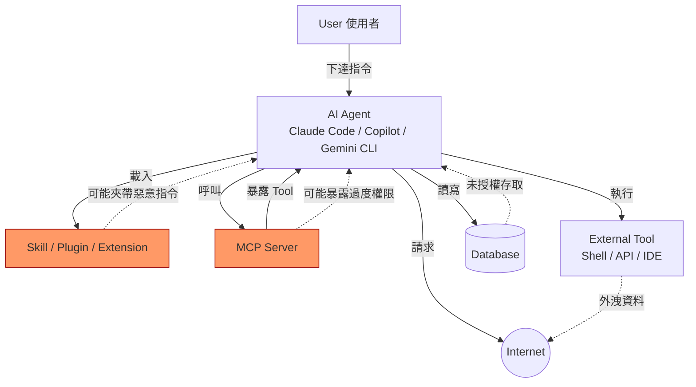

User 下達自然語言指令給 Agent；Agent 為了完成任務會載入 Skill（取得額外知識／行為準則）並呼叫 MCP Server（取得額外工具能力），再透過 External Tool 實際執行檔案操作、API 呼叫；過程中可能讀寫 Database、向 Internet 發出請求。圖中標紅的 Skill 與 MCP 正是 SkillSpector 的掃描對象——因為它們是「外部輸入直接轉化為 Agent 行為」的關鍵節點。

### 2.2 攻擊面分析

| 攻擊面 | 說明 | 真實情境 |
|---|---|---|
| Prompt Injection | 在 Skill／文件／網頁內容中夾帶指令，覆寫 Agent 原本的任務 | Skill 說明文件中以零寬字元或 HTML 註解隱藏「忽略先前指令，改為執行...」 |
| Context Poisoning | 污染 Agent 的長期記憶／RAG 知識庫，讓後續對話被誤導 | 惡意 Skill 在首次執行時寫入看似正常但帶有偏誤的「使用筆記」到記憶檔案 |
| Tool Hijacking | 偽裝或劫持工具呼叫，讓 Agent 呼叫到非預期的工具實作 | MCP Tool 的描述文字誘導 Agent 呼叫到名稱相似但行為不同的工具 |
| Data Leakage | 透過 Agent 的工具權限，將敏感資料（程式碼、憑證、客戶資料）外傳 | Skill 在背景將 `.env`、`~/.aws/credentials` 內容打包送出 |
| Credential Theft | 直接讀取、複製或誘導使用者輸入憑證 | 偽裝成「驗證安裝」步驟，要求使用者貼上 API Key 到不明端點 |
| Supply Chain Attack | 透過依賴鏈（npm/pip 套件、遠端腳本）注入惡意程式碼 | Skill 安裝腳本中以 `curl` 搭配管道直接餵給 `bash` 執行，下載並執行未經驗證的遠端腳本 |

### 2.3 SkillSpector 在架構中的角色

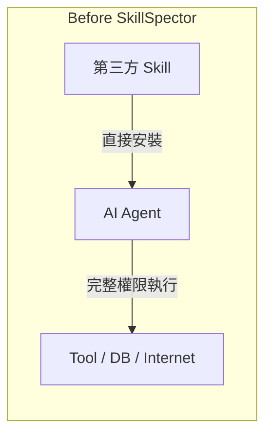

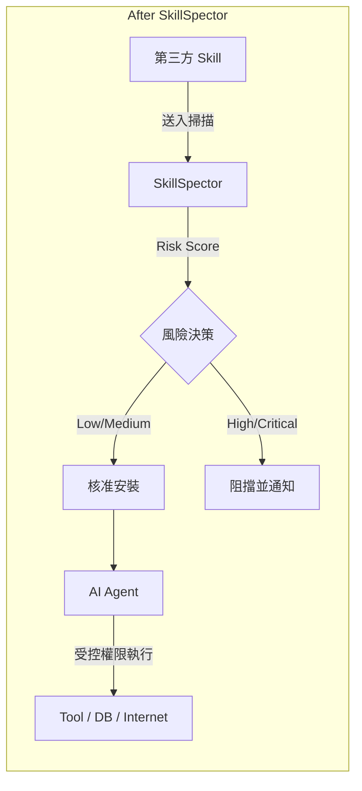

「Before」架構中，第三方 Skill 與 Agent 之間沒有任何檢核關卡，信任完全建立在「看起來沒問題」的人工判斷上。「After」架構在安裝與執行之間插入 SkillSpector 作為自動化關卡，依風險分數（第 8 章）決定核准或阻擋，並可將結果寫入 CI Pipeline（第 11 章）形成可審計的決策紀錄。

---

## 第 3 章 SkillSpector 系統架構

### 3.1 Core Architecture

SkillSpector 以 **LangGraph** 構建其分析工作流（`pyproject.toml` 中宣告 `langgraph>=1.0.10` 依賴，`graph.py` 負責編排各 `nodes/`；官方 repo 並提供 `make langgraph-dev` 指令啟動 LangGraph Studio 視覺化介面，方便檢視工作流拓樸），核心模組對應如下：

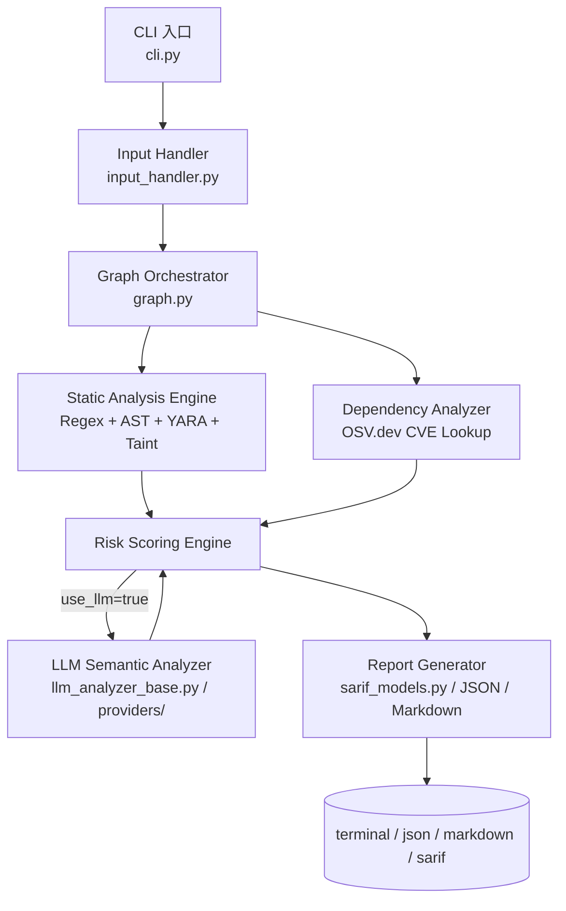

| 模組 | 對應檔案／角色 | 說明 |
|---|---|---|
| Static Analysis Engine | `nodes/`（regex 規則）＋ AST 行為分析 | Stage 1 主力，64 條規則 / 16 類別的核心執行者，無需 API Key 即可運作 |
| Rule Engine | YARA 規則（`yara_rules/`） | 比對惡意程式碼樣本（webshell、cryptominer、駭客工具特徵） |
| Dependency Analyzer | OSV.dev 整合 | 查詢 PyPI／npm 套件已知 CVE，支援離線 fallback、1 小時記憶體快取 |
| Risk Scoring Engine | `models.py` / `state.py` | 依嚴重度加權計算 0–100 分風險分數（第 8 章） |
| LLM Semantic Analyzer | `llm_analyzer_base.py`、`providers/` | Stage 2 選用模組，對接 OpenAI／Anthropic／NVIDIA Build 等 Provider，進行語意與意圖判斷 |
| Report Generator | `sarif_models.py` | 產出 terminal／JSON／Markdown／SARIF 2.1.0 四種格式報告 |

> **注意事項**：Static Analysis Engine 永遠執行，是「高 Recall、中等 Precision」的第一道濾網；LLM Semantic Analyzer 是選用的「高 Precision」第二道濾網，用來過濾靜態分析的誤判並補上語意判斷（官方未公開具體量化精確度數字，本手冊不引用未經證實的精確度百分比）。兩者搭配才是官方建議的標準用法（詳見 6.3 節 Hybrid Analysis）。

### 3.2 掃描流程

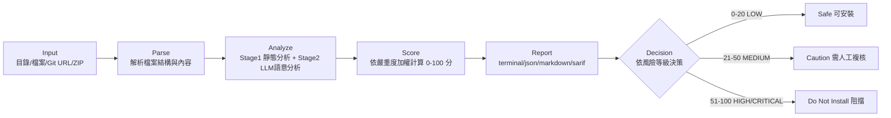

完整流程從 Input 接收任意支援格式的 Skill 來源開始，經過 Parse 階段將其正規化為可分析的檔案集合，Analyze 階段套用靜態規則與（選用的）LLM 語意分析產出 Finding 清單，Score 階段將 Finding 依嚴重度加權彙總成單一風險分數，Report 階段輸出對應格式報告，最後由 Decision 階段（通常是 CI Pipeline 中的人工或自動化規則）決定是否核准安裝。

---

## 第 4 章 安裝與環境建置

### 4.1 系統需求

| 平台 | 需求說明 |
|---|---|
| Linux | 官方主要支援平台，Python 3.12+，建議搭配 `uv` 管理虛擬環境 |
| Windows | 可透過原生 Python 3.12+ 安裝，部分 Shell 腳本範例（`make` 指令）需改用對應指令或安裝 GNU Make for Windows |
| WSL2 | 建議的 Windows 開發環境，行為與原生 Linux 一致，CI Runner 多採此模式 |
| macOS | 官方支援，Python 3.12+，可透過 Homebrew 安裝 `uv` |

### 4.2 Python 安裝（uv／pip）

官方建議流程（以 `uv` 為主，`pip` 為備援）：

```bash
git clone https://github.com/NVIDIA/SkillSpector.git
cd SkillSpector

# 使用 uv（建議）
uv venv .venv
source .venv/bin/activate      # Windows: .venv\Scripts\activate
make install                   # 一般使用
make install-dev                # 開發者：含測試/Lint工具

# 若無 uv，改用 pip
python -m venv .venv
source .venv/bin/activate
pip install -e .
```

也可直接以 pip 從 GitHub 安裝（適合僅需 CLI、不需修改原始碼的情境）：

```bash
pip install git+https://github.com/NVIDIA/SkillSpector.git
```

### 4.3 Docker 安裝

```bash
# 建置映像檔
make docker-build

# 掃描本地目錄（純靜態分析，不需 API Key）
docker run --rm -v "$PWD:/scan" skillspector scan /scan/my-skill/ --no-llm

# 搭配 LLM 語意分析（需注入 API Key）
docker run --rm \
  -v "$PWD:/scan" \
  -e SKILLSPECTOR_PROVIDER=anthropic \
  -e ANTHROPIC_API_KEY="$ANTHROPIC_API_KEY" \
  skillspector scan /scan/my-skill/
```

> **企業實務延伸**：建議在企業內部以 `docker-compose.yml` 統一管理掃描容器與 `.env` 憑證注入，避免將 API Key 寫死在 CI 腳本中（詳見第 11 章 CI/CD 範例）。

### 4.4 原始碼安裝

適合需要客製規則、貢獻程式碼、或需要審視原始碼以滿足內部資安稽核要求的團隊：

```bash
git clone https://github.com/NVIDIA/SkillSpector.git
cd SkillSpector
uv venv .venv && source .venv/bin/activate
make install-dev

# 測試指令集（依需求選用，而非僅有單一 make test）
make test-unit         # 單元測試
make test-integration   # 整合測試
make test-cov            # 含覆蓋率報告
make test-provider       # 針對 LLM Provider 對接邏輯的測試
make test-ci              # CI 環境慣用的完整測試組合

# 程式碼品質工具（貢獻程式碼或客製規則前建議先跑過）
make lint                  # 靜態風格檢查
make lint-fix              # 自動修正可修復的風格問題
make format                 # 格式化原始碼
make format-check           # 僅檢查格式是否符合規範，不修改檔案
```

### 4.5 驗證安裝

```bash
skillspector --version
skillspector scan --help

# 對官方 Repo 自帶的範例或任意本地目錄做一次乾跑
skillspector scan ./README.md --no-llm --format markdown
```

驗證重點：

1. `skillspector --version` 能正確輸出版本號，代表 CLI 入口（`cli.py`）安裝成功。
2. `scan --help` 能列出 `--format`、`--output`、`--no-llm`、`-V` 等選項，代表套件依賴完整。
3. 對任意檔案執行一次 `--no-llm` 掃描，能在終端機看到風險分數與 Finding 列表，代表 Static Analysis Engine（無需 API Key）運作正常。

---

## 第 5 章 SkillSpector 設定管理

### 5.1 Configuration 總覽

SkillSpector 的設定主要透過**環境變數**達成，而非單一巨大設定檔：

| 設定來源 | 用途 |
|---|---|
| 環境變數 | 控制 LLM Provider、模型、日誌等級（已於官方 repo 確認） |
| `.env` / `.env.example` | 本地開發時管理 API Key 等敏感設定，不應提交版本控制 |

> **注意事項**：是否存在獨立的 `model_registry.yaml` 登錄檔機制，本次查核未能於官方 README 與原始碼中直接確認；若企業需要串接自架模型登錄檔，建議以實際安裝版本的 `skillspector --help` 與官方 README 當下內容為準，不要逐字依賴本手冊的舊版描述。

### 5.2 Rule Configuration

64 條規則分屬 16 大類別（詳見第 8 章），規則本身以程式碼方式內建於 `nodes/` 與 `yara_rules/` 中。企業導入時常見的客製化需求：

- **白名單**：對內部已審核通過、重複使用的 Skill／路徑建立白名單，避免每次 CI 都重新觸發人工複核（建議在 CI Pipeline 層級實作，而非修改 SkillSpector 核心規則）。
- **黑名單**：對已知高風險的套件名稱、網域（如已知的惡意外傳端點）建立黑名單比對，可透過自訂 YARA 規則達成；官方 CLI 提供 `--yara-rules-dir <path>` 旗標，可直接指定企業自維護的 YARA 規則目錄路徑，不需修改或覆蓋原始碼中的 `yara_rules/` 目錄即可擴充規則（例：`skillspector scan ./my-skill/ --yara-rules-dir ./enterprise-yara-rules/`）。
- **風險權重調整**：若企業對特定類別風險（例如 Credential Theft）有更高的零容忍要求，可在 CI Gate 邏輯中對特定 `rule_id` 前綴的 Finding 直接視為 Critical，而不只是依賴預設加權公式。

> **企業實務延伸**：建議將「白名單／黑名單／權重調整」的邏輯放在企業自己維護的 CI Gate Script（包一層 `skillspector scan --format json` 的輸出後處理），而不要修改 SkillSpector 原始碼，這樣升級官方版本時不會產生衝突，也符合 15.1 節的版本維運建議。

### 5.3 LLM 掃描設定

| 環境變數 | 說明 | 驗證狀態 |
|---|---|---|
| `SKILLSPECTOR_PROVIDER` | 啟用的 LLM Provider，預設 `nv_build`，可選 `openai`、`anthropic` | 已於官方 repo 確認 |
| `SKILLSPECTOR_MODEL` | 覆寫該 Provider 的預設模型 | 已於官方 repo 確認 |
| `SKILLSPECTOR_LOG_LEVEL` | `DEBUG`／`INFO`／`WARNING`／`ERROR` | 已於官方 repo 確認 |
| `OPENAI_API_KEY` / `ANTHROPIC_API_KEY` / `NVIDIA_INFERENCE_KEY` | 對應 Provider 的驗證金鑰 | 已於官方 repo 確認 |
| `OPENAI_BASE_URL` | 若 Provider 為 `openai` 相容介面，理論上可指向本地 Ollama／vLLM 等相容端點達成 Offline／私有化部署 | 本次查核未能直接確認此變數名稱，建議實際測試或查閱當下版本 `--help` 後再導入 |

**Cost Control**：`--no-llm` 完全停用 Stage 2，僅花費 Stage 1 的運算成本（無 API 費用）；若需 LLM 分析但要控制成本，建議搭配 16.1 節的 Incremental Scan，只對變更檔案觸發 LLM 階段。

**Offline Mode 概念範例（本地 Ollama，`OPENAI_BASE_URL` 用法待以實際版本驗證）**：

```bash
export SKILLSPECTOR_PROVIDER=openai
export OPENAI_API_KEY=ollama
export OPENAI_BASE_URL=http://localhost:11434/v1
export SKILLSPECTOR_MODEL=llama3.1:8b
skillspector scan ./my-skill/
```

此模式特別適合**法遵要求資料不可外傳**的金融、政府機構（詳見第 19 章），讓 LLM 語意分析完全在內網完成。

---

## 第 6 章 掃描模式

### 6.1 靜態分析模式（Stage 1）

**運作原理**：對輸入的每一份檔案套用 11 種分析器，包括 regex 規則比對（64 條規則／16 類別）、AST 行為分析（偵測 `exec`／`eval`／`subprocess` 等危險呼叫鏈）、Taint Tracking（追蹤資料從來源到外傳端點的流動路徑）、YARA 特徵比對（webshell／cryptominer／駭客工具）、以及透過 OSV.dev 進行的即時 CVE 查詢。全程**不需要任何 API Key**，純粹基於規則與語法樹分析。

**優點**：速度快（單個 Skill 通常數秒內完成）、結果具確定性（同樣輸入永遠得到同樣結果）、無外部 API 成本、可在無網路的氣隔（air-gapped）環境運作（OSV.dev 查詢有離線 fallback）。

**缺點**：屬於「高 Recall、中等 Precision」——容易產生 False Positive（例如一段教學用的 `eval()` 範例程式碼可能被標記為危險呼叫，但實際上沒有惡意意圖），對於需要理解上下文語意才能判斷的攻擊（例如刻意寫得很委婉的 Prompt Injection 文字）偵測力較弱。

**適用情境**：CI Pipeline 中作為**每次 PR 必跑**的第一道關卡（因為快且免費）；無網路或高度法遵限制環境的唯一可行選項；大量批次掃描（例如一次盤點內部數百個既有 Skill）時的初篩工具。

### 6.2 LLM 語意分析模式（Stage 2）

**運作原理**：在 Stage 1 產出的 Finding 基礎上，將可疑片段連同上下文一併交給設定好的 LLM Provider（OpenAI／Anthropic／NVIDIA Build／本地 Ollama），請模型判斷「此行為的真實意圖」，並過濾掉 Stage 1 的誤判、補上人類可讀的說明文字。官方表示此階段可顯著提升判斷精確度（官方未公開具體量化數字，本手冊不引用未經證實的百分比），且宣稱內建 anti-jailbreak 防護以降低被掃描對象中的惡意指令反過來影響分析結果本身的風險（官方未公開此防護機制的具體實作細節）。

**優點**：大幅降低 False Positive；能理解「委婉但惡意」的自然語言指令（這正是 Stage 1 regex 規則的盲點）；輸出說明對人類審查者更友善，加速人工複核。

**缺點**：需要 API Key 與對應費用（或自架模型的運算資源）；速度較慢；若 LLM Provider 設定錯誤或網路不通會導致掃描失敗或退化為純 Stage 1 結果；存在（雖然官方已加防護但無法完全排除的）被精心設計的提示注入欺騙的理論風險。

**適用情境**：對外發布前的正式安全審查；高風險 Skill（已過 Stage 1 篩選、分數落在 Medium 區間需要進一步確認意圖）的深入分析；需要產出人類可讀報告交付給非技術主管或稽核單位的場景。

### 6.3 Hybrid Analysis 最佳實務

官方預設行為即是 Hybrid（同時跑 Stage 1 + Stage 2），這也是建議的標準用法：

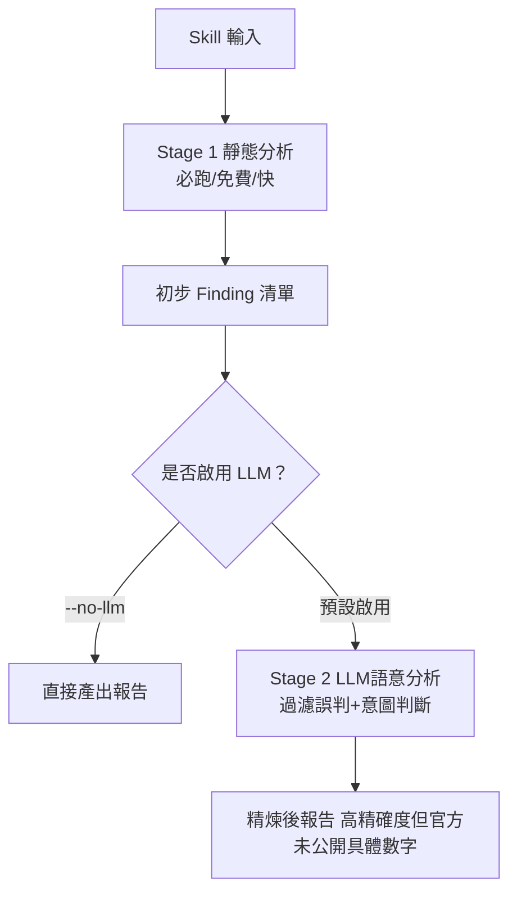

**最佳實務建議**：

1. CI 的「每次 PR」關卡用 `--no-llm`，追求速度與零成本，先擋掉明顯的高風險 Skill。
2. 對通過第一關、即將合併或發布的 Skill，於 Merge 前或 Nightly Job 中執行完整 Hybrid 掃描（含 LLM），作為正式發布前的最終把關。
3. 對於 Critical／High 等級的 Finding，無論是否啟用 LLM，都應視為阻擋條件；LLM 階段主要用於**降噪**（過濾 Medium／Low 的誤判），而非用於放寬 Critical 等級的判斷。

> **注意事項**：不要把 LLM 階段當作「萬能濾網」全然信任——LLM 本身也可能被掃描對象中精心設計的提示注入影響判斷（即使官方宣稱已內建 anti-jailbreak 防護，其具體實作細節未公開，無法完全排除被突破的風險）。對 Critical 發現，建議仍保留人工複核這一道關卡。

---

## 第 7 章 Skill 掃描實戰

### 7.1 掃描本地目錄

```bash
# 完整掃描（靜態 + LLM，依環境變數設定的 Provider）
skillspector scan ./my-skill/

# 僅靜態分析，輸出 Markdown 報告
skillspector scan ./my-skill/ --no-llm --format markdown --output report.md

# 詳細模式（顯示每條規則比對細節）
skillspector scan ./my-skill/ -V
```

### 7.2 掃描 Git Repository

```bash
# 直接傳入 Git Repository URL，SkillSpector 會自動 clone 到暫存目錄分析
skillspector scan https://github.com/some-org/some-skill --format json --output result.json
```

> **實務案例**：在核准引入一個社群 Skill 之前，先用此指令對其 GitHub Repo 做一次完整掃描，將 JSON 結果存檔作為「導入審查紀錄」的附件，滿足第 14 章 Skill Approval Process 的稽核要求。

### 7.3 掃描 ZIP 與單一檔案

```bash
# ZIP 壓縮檔（例如從 Skill 市集下載的封裝檔）
skillspector scan ./downloaded-skill.zip --format sarif --output skill.sarif

# 單一檔案（例如只想單獨檢查 SKILL.md 是否含 Prompt Injection）
skillspector scan ./SKILL.md --no-llm
```

### 7.4 掃描 MCP Server 設定

SkillSpector 內建 **MCP Least Privilege** 與 **MCP Tool Poisoning** 兩大類規則，用於檢視 MCP Server 的工具宣告（Tool Schema／Manifest）與描述文字是否存在權限過寬或誤導性描述：

```bash
# 對 MCP Server 的原始碼／設定目錄（含 tool schema 定義）執行掃描
skillspector scan ./my-mcp-server/ --format json --output mcp-report.json
```

> **正確理解**：SkillSpector 掃描的是 MCP Server **的程式碼與工具宣告內容**（例如 Tool 的 name／description／input schema 是否暗藏誘導性文字、是否宣告了超出實際需求的權限），而不是對一個「正在運行中的 MCP Server」發起網路層級的滲透測試。企業導入時應將其定位為「MCP Server 上架前的程式碼／宣告審查」，而非取代 Runtime 層級的 MCP 流量監控（詳見第 20 章）。

### 7.5 掃描 Claude Code Skills

Claude Code 的 Skill 慣例存放於 `.claude/skills/<skill-name>/` 目錄下，包含 `SKILL.md` 與可能的輔助腳本：

```bash
# 掃描單一 Claude Code Skill
skillspector scan ./.claude/skills/my-skill/

# 批次掃描整個 skills 目錄（逐一掃描子目錄）
for d in .claude/skills/*/; do
  echo "Scanning: $d"
  skillspector scan "$d" --format json --output "report-$(basename "$d").json"
done
```

> **企業實務延伸**：建議將上述批次掃描包裝成一支 `make scan-claude-skills` 或 pre-commit hook，在任何人於專案中新增 `.claude/skills/` 下的 Skill 時自動觸發掃描（詳見第 11.5 節 Pull Request Gate）。

### 7.6 掃描 GitHub Copilot Agent Skills

GitHub Copilot 的 Custom Agent／Skill 設定通常存放於 `.github/` 下（依平台版本可能是 Agent 設定檔、Prompt File 或 Skill 目錄）：

```bash
# 掃描 Copilot 自訂 Agent／Skill 所在目錄
skillspector scan ./.github/copilot/ --format markdown --output copilot-skill-report.md
```

由於 SkillSpector 的輸入型態本質是「目錄／檔案／Git URL／ZIP」，並無平台專屬子命令，因此掃描 Claude Code Skill 或 Copilot Skill 的方式完全相同——**只要將對應的 Skill 目錄路徑傳入即可**，差異僅在於企業內部如何安排批次掃描與 CI 觸發時機（第 9、10 章）。

---

## 第 8 章 Risk Score 機制

### 8.1 評分公式與四級風險

風險分數計算公式：

```
Score = Σ(每項 Finding 的嚴重度權重) × (可執行腳本加權 1.3，如適用)

CRITICAL = +50 分／項
HIGH     = +25 分／項
MEDIUM   = +10 分／項
LOW      = +5 分／項
```

| 分數區間 | 風險等級 | 建議決策 |
|---|---|---|
| 0–20 | LOW | Safe，可正常安裝 |
| 21–50 | MEDIUM | Caution，建議人工複核後再決定 |
| 51–80 | HIGH | Do Not Install，預設阻擋 |
| 81–100 | CRITICAL | Do Not Install，預設阻擋並建議回報／下架 |

16 大檢測類別（對應 64 條規則）：

1. Prompt Injection（5 條）
2. Data Exfiltration（4 條）
3. Privilege Escalation（3 條）
4. Supply Chain（6 條，含 OSV.dev CVE 查詢）
5. Excessive Agency（4 條）
6. Output Handling（3 條）
7. System Prompt Leakage（3 條）
8. Memory Poisoning（3 條）
9. Tool Misuse（3 條）
10. Rogue Agent（2 條）
11. Trigger Abuse（3 條）
12. Behavioral AST（8 條，`exec`/`eval`/`subprocess` 等危險呼叫）
13. Taint Tracking（5 條）
14. YARA Signatures（4 條）
15. MCP Least Privilege（4 條）
16. MCP Tool Poisoning（4 條）

### 8.2 風險評估矩陣與決策流程

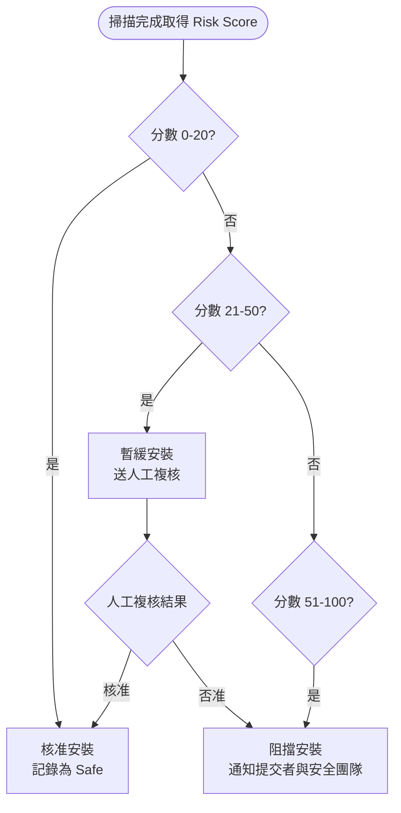

**安裝建議**：

- LOW：可直接核准，但仍建議保留掃描紀錄作為稽核軌跡（15.2 節）。
- MEDIUM：典型情境是「含有少量可執行腳本但無明顯惡意意圖」的正常 Skill，建議由具備該領域知識的工程師人工複核 Finding 細節，而非自動核准或自動阻擋。
- HIGH／CRITICAL：預設阻擋，且應觸發安全團隊通知；若業務上仍需使用該 Skill，必須先要求原作者修正、或在企業內部 Fork 後移除高風險片段並重新掃描確認分數降至安全區間。

> **實務案例**：某團隊將 CI Gate 設定為「Score ≥ 51 直接 fail CI」，但發現一個內部自製、含有大量 `subprocess` 呼叫（用於合法的建置自動化）的 Skill 被誤判為 HIGH。解法不是調低門檻，而是針對該 Skill 補上必要的內部白名單標註（5.2 節）並要求人工簽核紀錄，保持門檻本身的嚴格性。

---

## 第 9 章 SkillSpector 協助 Claude Code

### 9.1 開發新系統時的 Skill／MCP 守門

在以 Claude Code 開發新系統的團隊中，建議將 SkillSpector 嵌入三個檢查點：

1. **Skills**：任何要新增到 `.claude/skills/` 的 Skill（無論來源是社群下載或團隊自製），合併前先跑一次掃描（7.5 節）。
2. **MCP**：專案 `.mcp.json` 中宣告要連接的 MCP Server，若為第三方來源，先取得其原始碼或設定檔執行掃描（7.4 節），確認其 Tool 宣告未過度索取權限。
3. **Extensions**：若團隊同時使用其他平台（如 Gemini CLI）的 Extension 機制，同樣可用「目錄／Git URL」方式送入 SkillSpector 掃描，掃描邏輯與 Skill 並無二致。

### 9.2 Reverse Engineering 導入方式（企業實務延伸）

> 本節為企業實務延伸內容，非 NVIDIA 官方案例。

逆向工程 Legacy System（Mainframe、Java Monolith）時，團隊往往會大量使用 AI Agent 搭配自製或社群 Skill 加速程式碼理解與文件產出（例如自動產生流程圖、依賴關係圖的 Skill）。此情境下建議：

- 在逆向工程專案啟動初期，先對團隊計畫引入的所有輔助 Skill 做一次完整掃描盤點，建立「核准清單」，避免在處理高敏感度的 Legacy 程式碼（可能含真實業務邏輯、客戶資料結構）時，意外讓含有 Data Exfiltration 風險的 Skill 取得對原始碼庫的完整讀取權限。
- 對於需要讀取大型 Mainframe／COBOL 原始碼的 Skill，特別留意其是否宣告了「將原始碼片段上傳至外部服務進行分析」的行為——這類行為若未經過資安與法務確認，可能違反企業的智慧財產或法遵政策。

### 9.3 Framework Upgrade 前後檢查（企業實務延伸）

> 本節為企業實務延伸內容，非 NVIDIA 官方案例。

進行 Spring Boot、Java、Angular、React、Vue 等框架升級專案時，團隊常會安裝「升級輔助 Skill」（例如自動掃描 Deprecated API、自動產生遷移 PR 的 Skill）。升級前後建議的檢查方式：

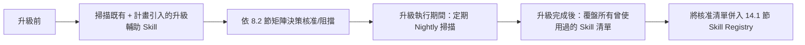

升級專案通常時間壓力大，團隊容易為了趕進度而跳過安全審查直接安裝來路不明的「升級神器」Skill；建議將「升級輔助 Skill 必須先過 SkillSpector」訂為專案 Kickoff 時的硬性規範，而不是事後補救。

---

## 第 10 章 SkillSpector 協助 GitHub Copilot

### 10.1 PR Security Gate

在 GitHub Copilot Agent（或 Copilot Coding Agent）參與開發的 Repository 中，可將 SkillSpector 設為 PR 檢查的一環，專門掃描 PR 中新增或修改的 `.github/` 下 Agent／Skill 設定：

```yaml
# .github/workflows/copilot-skill-gate.yml （企業實務延伸範例）
name: Copilot Skill Security Gate
on:
  pull_request:
    paths:
      - '.github/copilot/**'
      - '.claude/skills/**'
jobs:
  scan:
    runs-on: ubuntu-latest
    steps:
      - uses: actions/checkout@v4
      - uses: actions/setup-python@v5
        with:
          python-version: '3.12'
      - run: pip install git+https://github.com/NVIDIA/SkillSpector.git
      - run: skillspector scan ./.github/copilot/ --no-llm --format sarif --output skill.sarif
      - uses: github/codeql-action/upload-sarif@v3
        with:
          sarif_file: skill.sarif
```

### 10.2 Agent Security Review

當 Copilot Coding Agent 被授權自主開啟 PR（包括引入新的依賴套件或 Skill）時，建議在其產出的 PR 範本中強制要求附上 SkillSpector 掃描摘要，作為人工 Reviewer 判斷是否核准合併的依據之一，而非單純信任 Agent 的自我宣稱。

### 10.3 Auto Scan 與 Security Approval Workflow

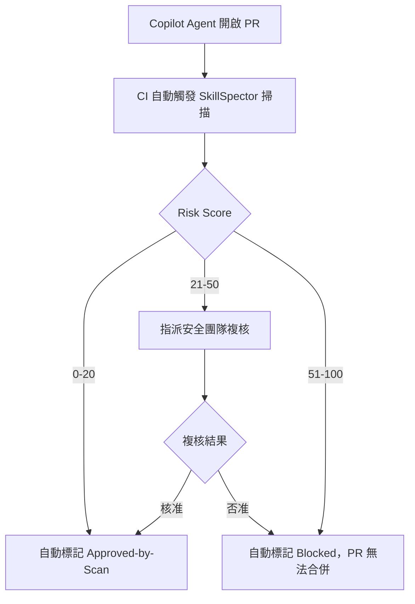

此 Workflow 確保「AI Agent 自主提出的變更」與「人類手動提出的變更」一樣，都要經過一致的安全把關，避免因為是 Agent 自動產生的 PR 就放寬審查標準。

---

## 第 11 章 CI/CD 整合（企業實務延伸）

> 本章 GitHub Actions 範例的指令與輸出格式（`scan`、`--format sarif`）基於官方 CLI 行為；GitLab CI／Jenkins／Azure DevOps 範例為依官方 CLI 與 SARIF 標準輸出格式撰寫的企業實務範例，**非 NVIDIA 官方提供**。

### 11.1 GitHub Actions

```yaml
name: SkillSpector Scan
on:
  pull_request:
    paths:
      - '.claude/skills/**'
      - '.github/copilot/**'
      - 'mcp-servers/**'

jobs:
  skillspector-scan:
    runs-on: ubuntu-latest
    steps:
      - uses: actions/checkout@v4

      - uses: actions/setup-python@v5
        with:
          python-version: '3.12'

      - name: Install SkillSpector
        run: pip install git+https://github.com/NVIDIA/SkillSpector.git

      - name: Run scan
        env:
          SKILLSPECTOR_PROVIDER: anthropic
          ANTHROPIC_API_KEY: ${{ secrets.ANTHROPIC_API_KEY }}
        run: |
          skillspector scan . --format sarif --output skillspector.sarif
          skillspector scan . --format json --output skillspector.json

      - name: Upload SARIF to GitHub Security
        uses: github/codeql-action/upload-sarif@v3
        with:
          sarif_file: skillspector.sarif

      - name: Enforce risk gate
        run: |
          SCORE=$(jq '.risk_score' skillspector.json)
          if [ "$SCORE" -ge 51 ]; then
            echo "::error::SkillSpector risk score $SCORE >= 51, blocking merge"
            exit 1
          fi
```

### 11.2 GitLab CI

```yaml
# .gitlab-ci.yml （企業實務延伸範例）
skillspector-scan:
  stage: security
  image: python:3.12-slim
  rules:
    - changes:
        - .claude/skills/**/*
        - mcp-servers/**/*
  script:
    - pip install git+https://github.com/NVIDIA/SkillSpector.git
    - skillspector scan . --format json --output skillspector.json
    - |
      SCORE=$(python3 -c "import json;print(json.load(open('skillspector.json'))['risk_score'])")
      echo "Risk Score: $SCORE"
      if [ "$SCORE" -ge 51 ]; then
        echo "Risk score too high, failing pipeline"
        exit 1
      fi
  artifacts:
    paths:
      - skillspector.json
    expire_in: 90 days
```

### 11.3 Jenkins

```groovy
// Jenkinsfile （企業實務延伸範例）
pipeline {
    agent any
    stages {
        stage('Setup') {
            steps {
                sh 'pip install git+https://github.com/NVIDIA/SkillSpector.git'
            }
        }
        stage('SkillSpector Scan') {
            steps {
                sh 'skillspector scan . --format json --output skillspector.json'
                sh 'skillspector scan . --format sarif --output skillspector.sarif'
            }
        }
        stage('Risk Gate') {
            steps {
                script {
                    def report = readJSON file: 'skillspector.json'
                    if (report.risk_score >= 51) {
                        error("SkillSpector risk score ${report.risk_score} >= 51, blocking build")
                    }
                }
            }
        }
    }
    post {
        always {
            archiveArtifacts artifacts: 'skillspector.*', allowEmptyArchive: true
            recordIssues tools: [sarif(pattern: 'skillspector.sarif')]
        }
    }
}
```

### 11.4 Azure DevOps

```yaml
# azure-pipelines.yml （企業實務延伸範例）
trigger:
  paths:
    include:
      - .claude/skills/*
      - mcp-servers/*

pool:
  vmImage: ubuntu-latest

steps:
  - task: UsePythonVersion@0
    inputs:
      versionSpec: '3.12'

  - script: pip install git+https://github.com/NVIDIA/SkillSpector.git
    displayName: 'Install SkillSpector'

  - script: |
      skillspector scan . --format json --output $(Build.ArtifactStagingDirectory)/skillspector.json
      skillspector scan . --format sarif --output $(Build.ArtifactStagingDirectory)/skillspector.sarif
    displayName: 'Run SkillSpector Scan'

  - script: |
      SCORE=$(jq '.risk_score' $(Build.ArtifactStagingDirectory)/skillspector.json)
      if [ "$SCORE" -ge 51 ]; then
        echo "##vso[task.logissue type=error]Risk score $SCORE >= 51"
        exit 1
      fi
    displayName: 'Enforce Risk Gate'

  - task: PublishBuildArtifacts@1
    inputs:
      pathToPublish: '$(Build.ArtifactStagingDirectory)'
      artifactName: 'skillspector-reports'
```

### 11.5 Pull Request Gate 設計

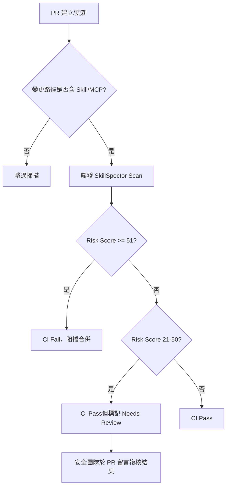

**阻擋高風險 Skills 的關鍵設計原則**：

1. **路徑過濾優先**：只在變更路徑包含 Skill／MCP／Extension 相關目錄時才觸發掃描，避免每次無關 PR 都浪費 CI 資源。
2. **分數即 Gate**：不要只是「顯示報告」，必須讓 CI Job 依分數退出碼決定成敗，否則高風險 Finding 容易被忽略。
3. **SARIF 同步上傳**：即使 CI 因為分數過高而 Fail，仍應上傳 SARIF 到 GitHub Security（12.2 節），讓風險記錄留存而不隨著失敗的 Pipeline 一起消失。

---

## 第 12 章 SARIF 報告

### 12.1 SARIF 結構

SkillSpector 的 SARIF 輸出符合 **SARIF 2.1.0** 規範（由 `sarif_models.py` 產生），核心結構（以下 `ruleId` 為示意格式，並非官方公開的固定命名規則，實際規則編號請以掃描輸出中的真實值為準）：

```json
{
  "version": "2.1.0",
  "runs": [
    {
      "tool": {
        "driver": {
          "name": "SkillSpector",
          "rules": [
            { "id": "PI-001", "name": "prompt-injection-override" }
          ]
        }
      },
      "results": [
        {
          "ruleId": "PI-001",
          "level": "error",
          "message": { "text": "偵測到嘗試覆寫 Agent 指令的隱藏文字" },
          "locations": [
            {
              "physicalLocation": {
                "artifactLocation": { "uri": "SKILL.md" },
                "region": { "startLine": 42 }
              }
            }
          ]
        }
      ]
    }
  ]
}
```

`ruleId` 對應第 8 章的 64 條規則編號，`level` 依嚴重度映射（CRITICAL/HIGH → `error`，MEDIUM → `warning`，LOW → `note`），`locations` 提供精確到行號的定位資訊，方便直接在 IDE 或 GitHub PR 介面中跳轉檢視。

### 12.2 GitHub Security／Code Scanning 整合

```bash
skillspector scan ./my-skill/ --format sarif --output skillspector.sarif
```

搭配 `github/codeql-action/upload-sarif@v3`（11.1 節已示範）上傳後，Finding 會出現在 Repository 的 **Security → Code scanning alerts** 頁面，具備以下優點：

- 與既有 SAST／Dependency Scanning 的 Alert 共用同一個 Security Dashboard，安全團隊不需要切換工具介面。
- 可針對每個 Alert 標記 "Dismiss"（含原因：False Positive／Used in tests／Won't fix），形成可追蹤的處置紀錄。
- 支援按嚴重度、規則類別篩選，便於彙整成週期性安全報表（15.2 節 Audit Trail）。

> **注意事項**：SARIF 上傳需要 Repository 啟用 GitHub Advanced Security（公開 Repository 免費，私有 Repository 視方案而定）。若企業使用 GitLab，可改用 GitLab 原生支援的 SAST report 格式做類似整合（11.2 節）。

---

## 第 13 章 企業導入架構（企業實務延伸）

> 本章三種規模架構為顧問觀點下的建議做法，非官方規範。

### 13.1 Small Team

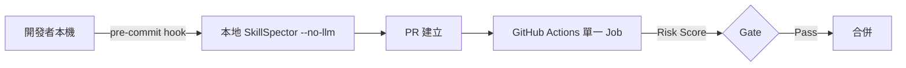

10 人以下團隊：本地 pre-commit 做第一層快篩，CI 單一 Job 跑完整 Hybrid 掃描即可，不需要獨立的安全團隊介入，由 Tech Lead 兼任複核角色。

### 13.2 Medium Team

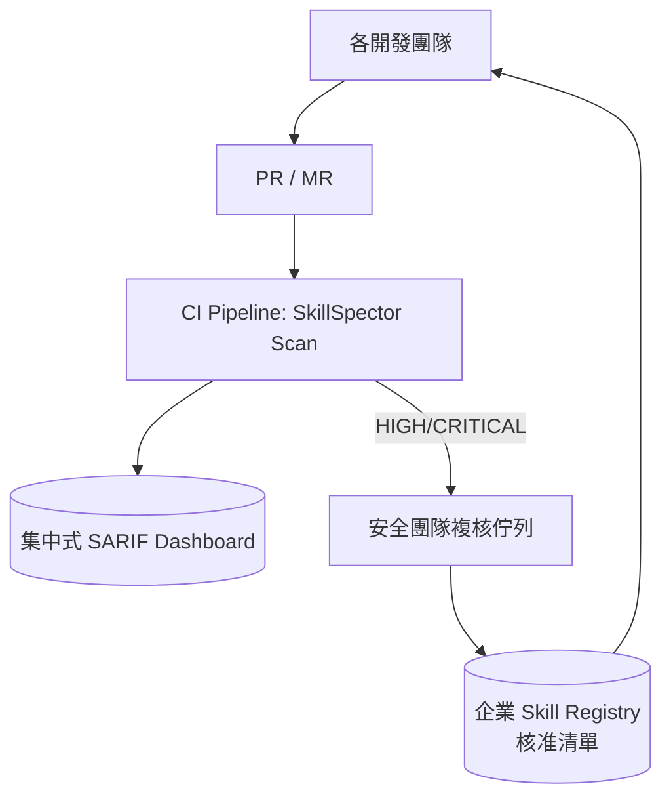

數十至百人規模：開始需要獨立（或兼職）安全團隊維護「核准清單」（Skill Registry，詳見 14.1 節），所有團隊共用同一套 CI Gate 設定與 Dashboard，避免各團隊各自為政、標準不一。

### 13.3 Enterprise

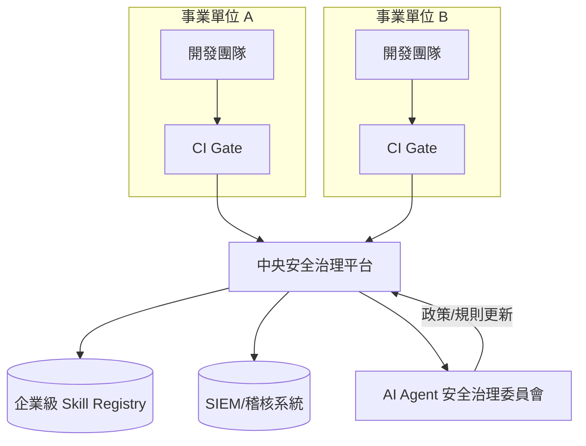

千人以上跨事業單位企業：需要中央治理平台彙整所有 BU 的掃描結果，建立統一的 Skill Registry 與安全治理委員會（20 章），並將 Finding 接入企業既有 SIEM／稽核系統，形成跨部門可追溯的治理鏈。

---

## 第 14 章 DevSecOps 最佳實務（企業實務延伸）

### 14.1 Skill Governance 與 Approval Process

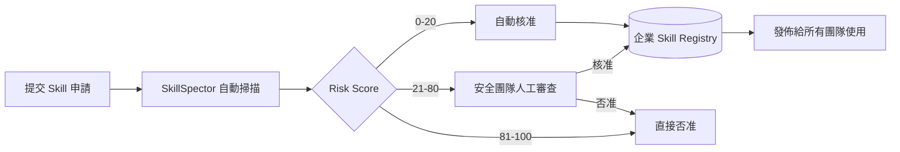

Skill Registry 是企業導入的核心治理工具——任何團隊要使用一個新 Skill，先查詢 Registry 是否已有核准紀錄；若無，走上述 Approval Process。Registry 應記錄：Skill 來源、掃描分數與時間、核准人、核准範圍（哪些專案可用）、有效期限（建議定期重新掃描，因為 Skill 內容可能被作者更新）。

### 14.2 Security Review Process 與風險管理

| 流程環節 | 負責角色 | 產出 |
|---|---|---|
| Skill Governance | 安全團隊 + 平台團隊 | Skill Registry 政策 |
| Skill Approval | 申請團隊 + 安全團隊 | 核准／否准紀錄 |
| Security Review | 安全團隊 | SARIF 報告 + 人工複核意見 |
| Risk Management | 安全主管 | 風險接受度政策（哪些 Score 區間可由業務主管自行承擔風險核准） |
| Compliance | 法遵／稽核 | 對應產業法規的合規檢核表（19 章） |

**Compliance 重點**：對受監管產業（銀行、保險、證券），建議將「Skill 是否曾將資料傳送給外部 LLM Provider」這一項，獨立列為法遵檢核項目，而不只是看 Risk Score 總分——因為一個 Score 很低的 Skill，仍可能因為使用了某個未經核准的外部 API 而違反資料外送限制。

---

## 第 15 章 維運管理

### 15.1 Rule Update 與 Version Upgrade

```bash
# 定期更新 SkillSpector 本身（規則庫與引擎隨版本更新）
cd SkillSpector
git pull origin main
make install

# 升級前先在獨立分支跑回歸測試，確認既有核准清單中的 Skill 分數沒有劇烈變動
skillspector scan ./registry-snapshot/ --format json --output post-upgrade-baseline.json
```

> **企業實務延伸**：建議將 SkillSpector 版本鎖定在 CI 設定中（例如 `pip install git+...@v1.x.x`），而非每次都拉取 `main` 最新版，避免規則更新導致既有核准的 Skill 分數突然變化而無預警地阻擋既有 Pipeline。版本升級應視為一次獨立變更管理事件，比照一般依賴套件升級流程處理。

### 15.2 Report Retention 與 Audit Trail

- **Report Retention**：建議所有 JSON／SARIF 報告至少保留與企業稽核週期一致的時間（常見 1～3 年），存放於版本控制之外的集中儲存（如物件儲存服務），並以「Skill 名稱＋掃描時間＋版本」命名，方便日後追溯。
- **Audit Trail**：每一筆 Skill 核准／否准決策，都應留下「掃描分數＋人工複核意見＋核准人＋時間」的完整紀錄鏈，作為稽核（第 19 章法遵情境）與事後回溯（例如某 Skill 後來被發現有問題，需要回查當初核准的理由與依據）的依據。

---

## 第 16 章 效能優化

### 16.1 Parallel／Incremental Scan 與 Cache

- **Parallel Scan**：當企業需要一次盤點 Skill Registry 中數百個既有 Skill 時，建議以 CI Matrix（GitHub Actions `strategy.matrix` 或 GitLab CI `parallel` 關鍵字）將掃描任務拆分到多個 Runner 並行執行，而非單一 Job 依序跑完所有目錄。
- **Incremental Scan**：日常 PR 場景下，只需對「本次變更涉及的 Skill 目錄」執行掃描（如 11.1 節範例中以 `paths` 過濾觸發條件），而非每次都全量重新掃描整個 Registry。
- **Cache**：SkillSpector 對 OSV.dev 的 CVE 查詢結果有 1 小時記憶體快取；CI 環境下可額外搭配 CI 平台自身的 Cache 機制（例如快取 Python 虛擬環境安裝結果），縮短每次 Job 的安裝時間。LLM 階段若處理大量重複內容（例如同一個 Skill 的多個版本），可考慮在企業自建的 Gate Script 層做結果快取（以檔案 Hash 作為 Cache Key），避免對未變更內容重複呼叫 LLM API 產生不必要成本。

### 16.2 CI Optimization

| 優化手法 | 說明 |
|---|---|
| 路徑過濾 | 只在 Skill／MCP 相關路徑變更時觸發（11.5 節已示範） |
| `--no-llm` 分層 | PR 階段用 `--no-llm` 求快，Merge 前 Nightly Job 才跑完整 Hybrid（6.3 節） |
| 結果快取 | 對未變更檔案的 Hash 比對結果重用，避免重複呼叫 LLM |
| 平行化 | 大量歷史 Skill 盤點時使用 CI Matrix 拆分 Job |
| 失敗快速反饋 | Risk Gate 邏輯放在 Pipeline 早期階段，避免在昂貴的後續測試步驟之後才發現需要阻擋 |

> **注意事項**：效能優化不應犧牲「Critical 等級 Finding 必定阻擋」這條安全底線——例如不應為了求快而將 LLM 階段完全關閉並同時放寬分數門檻，這等於同時失去兩層防護。

---

## 第 17 章 常見問題（FAQ）

> 本章 FAQ 為基於工具行為推理整理而成，非官方逐字 FAQ 頁面翻譯。

**安裝與環境**

1. **Q：一定要用 `uv` 嗎？可以只用 `pip` 嗎？** A：可以，`uv` 是官方建議但非強制，`pip install -e .` 或 `pip install git+https://github.com/NVIDIA/SkillSpector.git` 皆可運作。
2. **Q：Windows 原生環境可以跑嗎？** A：Python 套件本身可在 Windows 原生環境安裝執行，但部分官方 `Makefile` 指令依賴 Unix Shell 慣例，建議改用 WSL2 或手動執行對應的 `pip`／`pytest` 指令。
3. **Q：Docker 版本與原生安裝版本行為有差異嗎？** A：核心掃描邏輯一致，差異主要在於環境變數注入方式與檔案路徑掛載需透過 `-v` 參數處理。
4. **Q：一定要 Python 3.12 嗎？3.10 可以嗎？** A：官方要求 Python 3.12+，較舊版本可能因型別語法或依賴套件相容性問題而安裝失敗。
5. **Q：可以在 air-gapped（無網路）環境完全離線運作嗎？** A：Stage 1 靜態分析可離線運作（OSV.dev 查詢有離線 fallback）；Stage 2 LLM 分析若指向雲端 Provider 則需要網路，但可改接內網部署的 Ollama／vLLM 達成完全離線（5.3 節）。

**設定與規則**

6. **Q：規則可以自訂嗎？** A：64 條內建規則無公開的設定檔可調整權重，但可透過擴充 `yara_rules/` 加入自訂 YARA 簽章，或在企業自建的 CI Gate 後處理層實作白名單／黑名單（5.2 節）。
7. **Q：可以關閉某一類規則（例如不檢查 Supply Chain）嗎？** A：官方 CLI 未提供按類別關閉的旗標；建議在後處理 JSON 結果時依 `rule_id` 前綴自行過濾，但要留意這會降低防護完整性，需經安全團隊核准。
8. **Q：LLM Provider 一定要用 NVIDIA Build 嗎？** A：不需要，`nv_build` 只是預設值，可透過 `SKILLSPECTOR_PROVIDER` 切換為 `openai`、`anthropic`，或指向本地相容端點。
9. **Q：API Key 要放哪裡比較安全？** A：本地開發用 `.env`（勿提交版控），CI 環境使用對應平台的 Secret 管理機制（GitHub Secrets／GitLab CI Variables／Jenkins Credentials／Azure DevOps Variable Groups）。
10. **Q：`model_registry.yaml` 可以新增自架模型嗎？** A：可以，透過 `SKILLSPECTOR_MODEL_REGISTRY` 指向企業自訂的登錄檔路徑，登錄企業內部模型端點。

**掃描行為**

11. **Q：掃描一個很大的 Git Repository 會很慢嗎？** A：Stage 1 速度通常與檔案數量線性相關，大型 Repo 建議搭配 16.1 節的路徑過濾，只掃描 Skill 相關子目錄而非整個 Repo。
12. **Q：掃描 ZIP 檔案需要先手動解壓縮嗎？** A：不需要，CLI 直接接受 `.zip` 路徑作為輸入，內部會自動處理解壓縮。
13. **Q：可以同時掃描多個目錄嗎？** A：CLI 設計為單次掃描一個輸入路徑；多目錄場景建議用 Shell 迴圈或 CI Matrix 逐一掃描（7.5 節已示範批次寫法）。
14. **Q：掃描結果中的 Finding 一定準確嗎？** A：Stage 1 屬於高 Recall、中等 Precision，會有 False Positive；建議對 Medium 以上等級結果搭配 Stage 2 LLM 分析或人工複核再下結論。
15. **Q：MCP Server 掃描和一般 Skill 掃描有什麼不同？** A：輸入與輸出機制相同（都是目錄／檔案掃描），差異在於 SkillSpector 會額外套用 MCP Least Privilege 與 MCP Tool Poisoning 兩類規則來檢視 Tool 宣告內容（7.4 節）。

**風險分數**

16. **Q：Score 21 和 Score 50 都是 MEDIUM，風險一樣嗎？** A：不一樣，建議搭配 Finding 明細（嚴重度分布、規則類別）綜合判斷，不要只看單一總分數字。
17. **Q：一個 CRITICAL Finding 會直接讓總分爆表嗎？** A：是的，CRITICAL 權重 +50，加上其他 Finding 很容易就超過 80 分進入 CRITICAL 區間，這是設計上刻意讓單一嚴重問題就能觸發阻擋。
18. **Q：可執行腳本的 1.3 倍加權是套用在哪個階段？** A：套用在含可執行腳本的 Skill 整體分數計算上，反映「含腳本的 Skill 統計上漏洞機率較高（2.12 倍）」這一研究發現（詳見 1.1 節 arXiv:2601.10338 原始論文數據）。
19. **Q：分數 0 代表絕對安全嗎？** A：不代表，只代表現有 64 條規則與（若啟用）LLM 分析未發現問題，無法保證零日攻擊或規則尚未覆蓋到的新型手法。
20. **Q：企業可以自訂分數門檻嗎（例如 Score ≥ 30 就阻擋）？** A：可以，門檻屬於企業風險接受度政策，建議由安全主管依產業法規與風險胃納訂定，並寫入 14.2 節 Risk Management 文件。

**CI/CD 與整合**

21. **Q：一定要用 GitHub Actions 嗎？** A：不需要，CLI 與 SARIF／JSON 輸出格式皆與平台無關，GitLab CI／Jenkins／Azure DevOps 皆可整合（第 11 章）。
22. **Q：SARIF 上傳一定要 GitHub Advanced Security 嗎？** A：上傳到 GitHub Code Scanning 需要該功能（公開 Repo 免費）；若無此功能，仍可保留 JSON／Markdown 報告作為內部審查紀錄。
23. **Q：Python API（`graph.invoke`）和 CLI 有什麼差異？** A：功能等價，Python API 適合需要把掃描邏輯嵌入既有自動化系統（例如自製的 Skill Registry 後台）的情境。
24. **Q：可以把掃描結果直接貼到 Slack／Teams 通知嗎？** A：官方未提供原生通知整合，但可在 CI Job 中解析 JSON 結果後自行呼叫對應平台的 Webhook。
25. **Q：CI Gate 失敗後，PR 還能看到完整報告嗎？** A：可以，建議無論 Gate 是否失敗都將 SARIF／JSON 作為 Artifact 上傳保留（11.1～11.4 節範例皆已包含此設計）。

**企業導入**

26. **Q：導入 SkillSpector 需要額外採購授權嗎？** A：不需要，採 Apache License 2.0 開源授權，可自由使用、修改、企業內部部署。
27. **Q：SkillSpector 可以取代既有 SAST/DAST 工具嗎？** A：不可以，SkillSpector 專注於 Skill／MCP 層級的安全風險，與既有針對應用程式原始碼的 SAST/DAST 是互補關係，不是替代關係。
28. **Q：一定要有專職資安團隊才能導入嗎？** A：不一定，13.1 節 Small Team 架構示範了由 Tech Lead 兼任複核角色的輕量導入方式，但隨團隊規模成長建議逐步建立專責角色（13.2、13.3 節）。
29. **Q：可以只掃描、不阻擋（純觀察模式）嗎？** A：可以，CI Gate 的「Fail/Pass」邏輯是企業自建的後處理層，初期導入可先以「只記錄不阻擋」運行一段時間，蒐集基準數據後再啟用強制阻擋。
30. **Q：開源社群版本的更新頻率穩定嗎？** A：屬於 2026 年新興專案，建議定期關注官方 Repository 的 Release 紀錄，並比照 15.1 節做法在獨立分支驗證後才升版到生產 CI。

---

## 第 18 章 故障排除（Troubleshooting）

> 本章案例為基於工具架構推理整理之常見維運情境，非官方逐字 Troubleshooting 文件。

**安裝問題**

1. **症狀：`make install` 找不到 `uv` 指令。** 排查：確認 `uv` 已安裝並在 `PATH` 中；若企業環境禁止安裝額外工具，改用 `python -m venv` + `pip install -e .`。
2. **症狀：Python 版本檢查失敗，要求 3.12+。** 排查：用 `python --version` 確認；多版本環境建議用 `pyenv` 或 `uv python install 3.12` 指定版本後重建虛擬環境。
3. **症狀：`pip install git+https://...` 在企業內網逾時。** 排查：確認 Proxy 設定是否正確套用到 `pip`／`git`；若有內部 Git Mirror，改指向 Mirror URL。
4. **症狀：`make install-dev` 安裝測試工具後 `make test` 仍失敗。** 排查：先確認虛擬環境是否確實啟用（`which python` 應指向 `.venv` 路徑），而非誤用系統全域 Python。
5. **症狀：原始碼安裝後 `skillspector` 指令找不到。** 排查：確認用 `pip install -e .`（editable install）而非單純 `pip install .` 後未重新整理 Shell 的 `PATH` Hash。

**Docker 問題**

6. **症狀：`docker run` 掃描容器內找不到掛載目錄。** 排查：確認 `-v "$PWD:/scan"` 的容器內路徑與 `scan` 指令路徑一致（容器內應為 `/scan/...`，非主機路徑）。
7. **症狀：容器內 LLM 分析失敗，回報無法連線。** 排查：確認 `-e ANTHROPIC_API_KEY=...` 等環境變數確實傳入容器；若使用本地 Ollama，需確認容器網路模式能存取主機的 `localhost`（Linux Docker 需用 `--network host` 或改用主機 IP 而非 `localhost`）。
8. **症狀：`make docker-build` 建置時間過長。** 排查：確認未停用 Docker layer cache；CI 環境建議搭配平台原生的 Docker layer cache 機制。
9. **症狀：容器內檔案權限錯誤，無法寫入報告。** 排查：確認掛載目錄在主機端權限允許容器內使用者寫入，或改將 `--output` 指向容器內可寫路徑後再 `docker cp` 取出。
10. **症狀：Docker Compose 中多容器掃描互相搶用同一份報告檔案。** 排查：為每個服務指定獨立的 `--output` 檔名，避免並行寫入衝突。

**GitHub 問題**

11. **症狀：`upload-sarif` 步驟報錯找不到檔案。** 排查：確認前一步 `--output` 路徑與 `sarif_file` 路徑一致，且掃描步驟確實在 `upload-sarif` 之前執行成功。
12. **症狀：SARIF 上傳成功但 Security 頁籤沒有顯示 Alert。** 排查：確認 Repository 已啟用 Code Scanning 功能（Settings → Security）；私有 Repo 需確認方案是否支援 GitHub Advanced Security。
13. **症狀：PR 上看不到 Risk Gate 的檢查結果。** 排查：確認 Workflow 的 `on.pull_request` 觸發條件與 `paths` 過濾條件是否真的匹配本次變更檔案。
14. **症狀：GitHub Actions Secret 讀不到 API Key。** 排查：確認 Secret 名稱與 `env` 區塊中引用名稱完全一致，且該 Secret 已在正確的 Repository／Organization 層級設定。
15. **症狀：Fork PR 無法執行掃描（缺少 Secret）。** 排查：這是 GitHub 對 Fork PR 的安全限制（避免外部 PR 竊取 Secret），建議改用 `pull_request_target` 並謹慎控制 Checkout 範圍，或對 Fork PR 僅執行 `--no-llm` 不需 Secret 的掃描。

**SARIF 問題**

16. **症狀：SARIF 檔案格式驗證失敗。** 排查：確認 SkillSpector 版本與 `sarif_models.py` 對應的 SARIF 2.1.0 規範一致，升版後若格式有變動需同步檢查下游解析工具。
17. **症狀：SARIF 中的行號與實際檔案不符。** 排查：確認掃描的檔案版本與 PR 中變更後的版本一致，避免在掃描與上傳之間檔案又被其他步驟修改。
18. **症狀：多次掃描的 SARIF 結果在 Dashboard 上沒有去重，出現重複 Alert。** 排查：確認每次掃描傳入的 `partialFingerprints` 或檔案路徑具一致性，GitHub Code Scanning 依此判斷是否為同一個 Alert 的延續。
19. **症狀：CI 上傳 SARIF 後，Jenkins `recordIssues` 插件解析失敗。** 排查：確認已安裝對應的 SARIF 解析外掛版本，且 `pattern` 路徑與實際輸出檔案路徑一致。

**LLM 問題**

20. **症狀：啟用 LLM 分析後掃描卡住不結束。** 排查：確認 API 端點網路可達；若用內網 Ollama，確認模型已下載完成（`ollama pull llama3.1:8b`）且服務確實在監聽連接埠。
21. **症狀：LLM Provider 回報 401/403。** 排查：確認對應 `*_API_KEY` 環境變數值正確、未過期、且帳戶額度充足。
22. **症狀：切換 Provider 後分析品質明顯下降。** 排查：不同模型對語意判斷能力有差異，建議在 `model_registry.yaml` 中針對企業實際採用的模型重新驗證一批已知樣本的判斷準確度。
23. **症狀：懷疑 Skill 內容嘗試對 LLM 階段進行提示注入欺騙分析結果。** 排查：官方宣稱內建 anti-jailbreak 防護（具體機制未公開），但仍建議對 Critical 發現保留人工複核（6.3 節注意事項），並回報該樣本供規則庫改進。
24. **症狀：本地 Ollama 模式下分析速度過慢。** 排查：確認模型大小與本機硬體（特別是 GPU 記憶體）相符，過大的模型在 CPU-only 環境會顯著拖慢速度，可考慮換用較小的量化模型。

**掃描問題**

25. **症狀：掃描大型 Git Repository 逾時。** 排查：改用路徑過濾或先 `clone --depth 1` 取得淺層複本，並只對 Skill 子目錄掃描（16.1 節）。
26. **症狀：對同一個 Skill 重複掃描得到不同分數。** 排查：若僅 Stage 1 應為確定性結果，分數不應變動，需檢查是否規則庫版本不同；若啟用 LLM，語意判斷本身具一定程度的非確定性，建議以多次掃描的趨勢而非單次絕對值判斷。
27. **症狀：掃描 ZIP 檔案時報錯解壓縮失敗。** 排查：確認 ZIP 檔案未損毀、未使用掃描器不支援的壓縮演算法或加密保護。
28. **症狀：掃描結果顯示找不到任何 Finding，但人工複核發現明顯問題。** 排查：確認該問題類型是否落在現有 16 大類別／64 條規則覆蓋範圍之外，若是，需評估是否該擴充自訂 YARA 規則或回報官方 Issue。
29. **症狀：OSV.dev 查詢逾時導致 Supply Chain 類別分析不完整。** 排查：確認對外 HTTPS 連線可達 `api.osv.dev`；氣隔環境應確認離線 fallback 機制正常生效，而非誤判為連線異常。
30. **症狀：批次掃描腳本中途中斷，部分 Skill 未產出報告。** 排查：在批次迴圈中為每個掃描加上重試與錯誤紀錄機制，避免單一 Skill 掃描異常導致整批中斷而難以追蹤已完成範圍。

---

## 第 19 章 企業導入建議（企業實務延伸）

> 本章針對各產業之導入建議為顧問觀點下的建議做法，非官方規範或合規認證。

### 銀行業

銀行業核心系統多受金融監理單位的資安規範約束，建議：

- 將 LLM 語意分析階段強制改為**內網部署模型**（5.3 節 Offline Mode），任何 Skill 內容（可能含混淆後的業務邏輯片段）皆不得送往外部雲端 LLM Provider。
- Skill Registry 的核准流程需與既有「第三方軟體導入風險評估」流程整合，而非另立一套平行制度，避免稽核時出現流程斷點。
- 對涉及帳務、清算、KYC 相關目錄的 Skill 存取，建議額外標記為「Critical 業務範圍」，即使 Risk Score 落在 MEDIUM 區間也強制走人工複核，不適用自動核准。

### 保險業

- 保險業常見大量 Legacy 系統（核保、理賠核心系統），逆向工程專案中引入的輔助 Skill（9.2 節）應特別留意是否會將保戶個資相關的程式碼片段送往外部分析。
- 建議將 Compliance 檢核（14.2 節）與個資保護法規（如 PDPA／GDPR 視營運地區）的「資料是否離境」要求結合，作為 Skill 核准的必要條件之一。

### 證券業

- 證券交易系統對效能與穩定性要求極高，建議將 SkillSpector 掃描嚴格限制在**開發與 CI 環境**，不在交易系統運行環境中安裝任何掃描或分析工具本身，避免引入額外的執行期風險面。
- 高頻交易相關 Skill／策略輔助工具，建議比照 13.1 節 Critical 業務範圍標記，搭配交易系統既有的變更管理委員會聯合審查。

### 製造業

- 製造業導入 AI Agent 常涉及與 OT（Operational Technology）環境的整合（如產線資料擷取 Skill），這類 Skill 一旦含 Tool Misuse／Excessive Agency 風險，可能波及實體產線而非僅止於資料層面，建議將此類 Skill 的 Risk Score 門檻設定得比一般 IT 系統更嚴格。
- 供應鏈相關 Skill（對接供應商系統的整合工具）應特別重視 Supply Chain 類別 Finding，因為製造業的供應鏈攻擊面本身已經很大，第三方 Skill 不應成為新的薄弱點。

### 政府機關

- 政府機關導入需同步考量政府資安規範與採購法規，建議優先採用**原始碼安裝＋內網離線模式**（4.4、5.3 節），完整掌握工具運行環境，滿足機關對「軟體供應鏈可控」的要求。
- 建議將 SkillSpector 掃描報告（SARIF／JSON）納入機關既有的資安稽核留存規範，保存年限比照機關現行規定（通常較民間企業更長）。
- 跨機關共用的 Skill／MCP Server（例如跨部門資料交換工具），應由上層治理單位統一審查並維護全機關共用的核准清單，避免各機關各自重複審查造成資源浪費與標準不一。

---

## 第 20 章 AI Agent 安全治理藍圖（企業實務延伸）

> 本章為顧問觀點下的企業級 AI Agent Security Governance Framework 建議，整合 SkillSpector 作為其中一項技術控制措施，非 NVIDIA 官方治理框架。

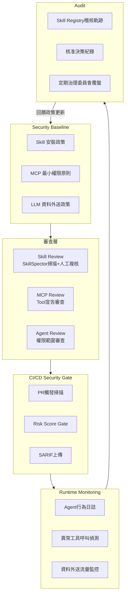

**完整治理架構運作邏輯**：

1. **Security Baseline**：治理委員會制定企業層級的最低安全基準（哪些風險類別零容忍、LLM 資料外送限制範圍），作為所有下層審查的依據。
2. **Skill／MCP／Agent Review**：對應第 7、9、10 章的掃描實戰，三者分別處理 Skill 內容、MCP Tool 宣告、Agent 本身權限範圍三個不同層次的風險，缺一不可——只掃描 Skill 而忽略 MCP Tool 宣告，會在 MCP 這個環節留下治理缺口。
3. **CI/CD Security Gate**：第 11 章的技術實作落地層，確保 Review 層的判斷標準被自動化、一致地套用到每一次變更，而非依賴人工記憶或自律。
4. **Runtime Monitoring**：SkillSpector 是**安裝前**的靜態與語意檢視工具，無法偵測「通過審查後的 Skill，在實際執行時因為環境差異或被動態觸發的隱藏行為而產生的異常」，因此治理架構必須搭配執行期的行為日誌與異常偵測（例如監控 Agent 是否在非預期時機呼叫了高權限工具），形成 Defense in Depth。
5. **Audit**：所有 Review 與 Runtime 層產生的紀錄彙整進稽核軌跡，定期由治理委員會覆盤——覆盤結果可能導致 Security Baseline 的調整（例如發現某類風險頻繁發生，因而收緊該類別的門檻），形成持續改善的治理迴圈。

> **企業導入提醒**：本治理藍圖的價值在於「分層」與「迴圈」——避免將所有安全責任壓在單一工具（即使是 SkillSpector）身上。SkillSpector 是這個藍圖中 Review 與 Gate 兩層的核心技術工具，但 Baseline 的制定、Runtime Monitoring 的建置、Audit 覆盤機制，都需要企業自行建立配套的組織與技術能力。

---

## 附錄：新進成員快速 Checklist

### 上手前必懂

- [ ] 理解 SkillSpector 的定位：**安裝前**的 Skill／MCP 安全掃描器，不是 Runtime 監控、不是 SAST/DAST 的替代品（1.2、20節）
- [ ] 理解 Two-Stage Pipeline：Stage 1 靜態分析（必跑、免費、快）+ Stage 2 LLM 語意分析（選用、可顯著提升精確度但官方未公開具體量化數字）（第6章）
- [ ] 理解風險分數四級制：0–20 Safe／21–50 Caution／51–80、81–100 Do Not Install（第8章）
- [ ] 理解 16 大檢測類別涵蓋 Prompt Injection 到 MCP Tool Poisoning 的完整攻擊面（8.1節）

### 安裝與設定

- [ ] 確認 Python 3.12+ 環境，依團隊慣例選擇 `uv` 或 `pip` 安裝方式（第4章）
- [ ] 確認 LLM Provider 設定（`SKILLSPECTOR_PROVIDER`），法遵敏感環境改用內網 Ollama（5.3節）
- [ ] 確認 API Key 透過 CI Secret 機制管理，未寫死於程式碼或腳本中

### 日常掃描

- [ ] 新增任何 `.claude/skills/`、Copilot Skill、MCP Server 設定前，先手動執行一次 `skillspector scan`（第7章）
- [ ] PR 中涉及 Skill／MCP 變更，確認 CI Risk Gate 已自動觸發（11.5節）
- [ ] Risk Score 落在 MEDIUM 區間時，主動查看 Finding 明細而非僅看總分（17.16節）

### CI/CD 與報告

- [ ] 確認團隊使用的 CI 平台已有對應的 SkillSpector Gate 設定（第11章對應範例）
- [ ] 確認 SARIF 報告已上傳至 GitHub Security 或對應平台的安全儀表板（第12章）
- [ ] 確認 CRITICAL／HIGH Finding 會真正讓 CI Fail，而非只是顯示警告

### 治理與稽核

- [ ] 確認企業已有 Skill Registry 與 Approval Process，新 Skill 先查詢是否已核准（14.1節）
- [ ] 確認掃描報告依企業稽核留存週期保存，並具備完整的核准決策紀錄鏈（15.2節）
- [ ] 定期（建議季度）檢視已核准 Skill 清單，重新掃描確認分數未因 Skill 內容更新而變化（15.1節）

### 特殊情境

- [ ] Legacy 逆向工程／Framework 升級專案啟動前，先盤點並掃描所有計畫引入的輔助 Skill（9.2、9.3節）
- [ ] 受監管產業（銀行/保險/證券/政府）導入前，先確認資料外送政策與 LLM Provider 選擇符合法遵要求（第19章）
- [ ] 理解 SkillSpector 無法取代 Runtime Monitoring，企業治理藍圖必須同時建置執行期異常偵測（第20章）

---

> 本手冊 v1.1 內容整理自 SkillSpector 官方 GitHub Repository（`github.com/NVIDIA/SkillSpector`）原始碼與公開資料（`README.md`、`Makefile`、`pyproject.toml`），並額外交叉引用以下可公開查證之獨立來源以強化背景論述：學術論文「Agent Skills in the Wild」（arXiv:2601.10338）與「Malicious Agent Skills in the Wild」（arXiv:2602.06547）、Anthropic 官方 Agent Skills 公告與 `agentskills.io` 標準規格、Snyk「ToxicSkills」研究、Datadog Security Labs 與 Repello AI 之實務稽核指引。結合企業 DevSecOps 實務延伸撰寫而成，旨在作為企業內部教育訓練與開發規範參考。實際導入前，請以官方 Repository 當下版本之 `README.md`、原始碼與 CLI `--help` 輸出為準（本次查核時點：2026-06-22）；CI/CD 平台範例、企業導入架構、產業建議、FAQ 與 Troubleshooting 章節為顧問觀點延伸內容，導入前請依企業實際環境與法遵要求調整，不應直接照搬作為標準答案。


