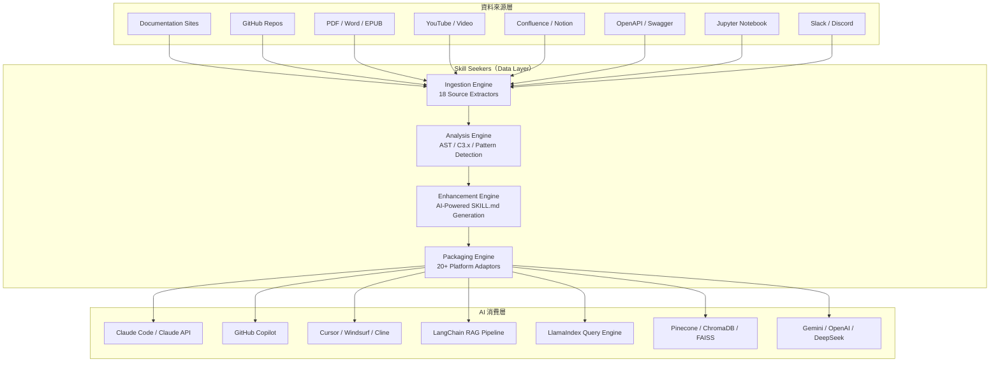
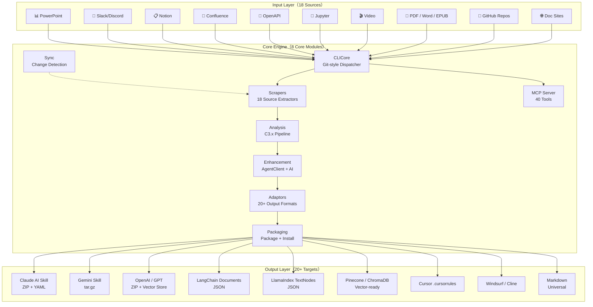
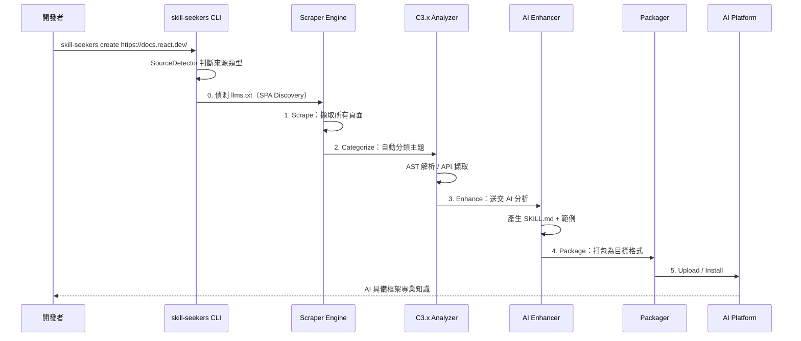
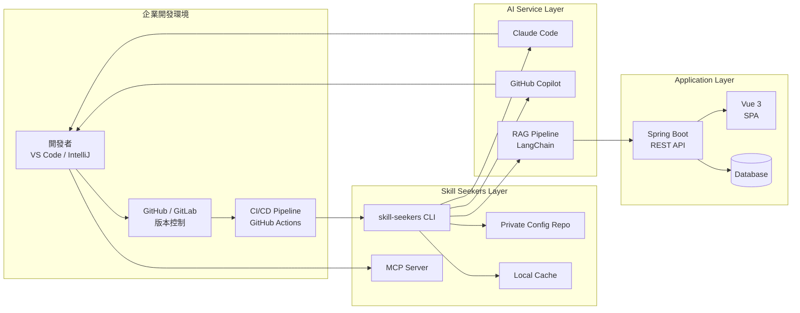
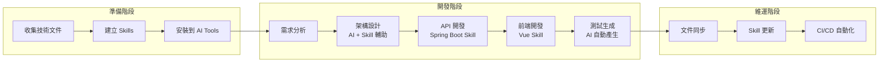
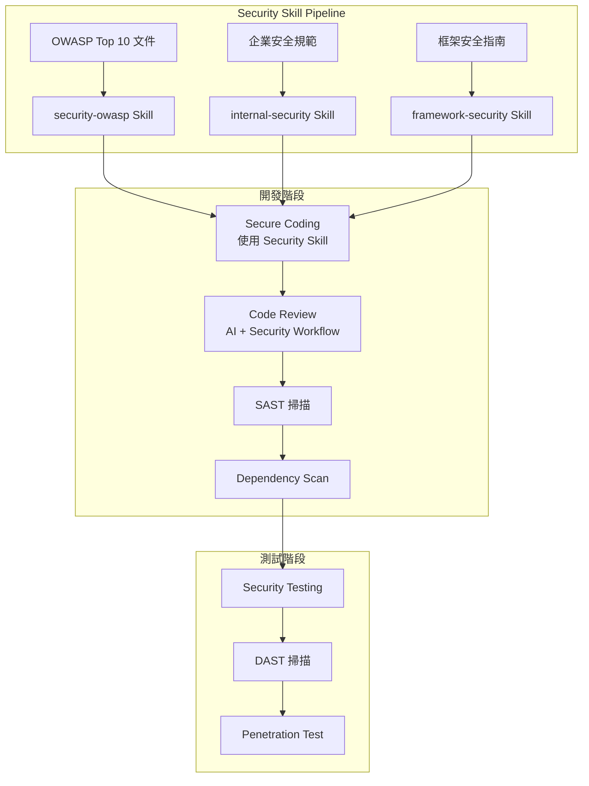

+++
date = '2026-04-22T11:06:12+08:00'
draft = false
title = 'Skill_Seekers教學手冊'
tags = ['教學', 'AI開發']
categories = ['教學']
+++

# Skill_Seekers 教學手冊（企業實戰版）

> **版本**：v3.5.1（2026-04）  
> **適用對象**：資深工程師、AI 架構師、DevOps 工程師  
> **授權**：MIT License  
> **官方網站**：<https://skillseekersweb.com/>  
> **GitHub**：<https://github.com/yusufkaraaslan/Skill_Seekers>

---

## 目錄

- [1. 概述（Overview）](#1-概述overview)
  - [1.1 Skill_Seekers 是什麼](#11-skill_seekers-是什麼)
  - [1.2 為什麼它是 AI Data Layer](#12-為什麼它是-ai-data-layer)
  - [1.3 在 AI 開發中的定位](#13-在-ai-開發中的定位)
  - [1.4 核心數據一覽](#14-核心數據一覽)
- [2. 整體系統架構設計（Architecture）](#2-整體系統架構設計architecture)
  - [2.1 系統架構圖](#21-系統架構圖)
  - [2.2 模組架構說明](#22-模組架構說明)
  - [2.3 Data Flow：從資料到 AI 使用](#23-data-flow從資料到-ai-使用)
  - [2.4 與企業系統整合架構](#24-與企業系統整合架構)
- [3. 安裝與環境建置（Installation）](#3-安裝與環境建置installation)
  - [3.1 系統需求](#31-系統需求)
  - [3.2 安裝方式](#32-安裝方式)
  - [3.3 Docker 部署](#33-docker-部署)
  - [3.4 初始化與驗證](#34-初始化與驗證)
  - [3.5 MCP Server 設定](#35-mcp-server-設定)
  - [3.6 常見錯誤與排除](#36-常見錯誤與排除)
- [4. Skill_Seekers 設定（Configuration）](#4-skill_seekers-設定configuration)
  - [4.1 Config 檔案結構](#41-config-檔案結構)
  - [4.2 預設 Config（24+ Presets）](#42-預設-config24-presets)
  - [4.3 Workflow 增強設定](#43-workflow-增強設定)
  - [4.4 多資料來源設定](#44-多資料來源設定)
  - [4.5 AST 分析設定](#45-ast-分析設定)
  - [4.6 私有 Config 儲存庫](#46-私有-config-儲存庫)
- [5. Skill 建立流程（核心）](#5-skill-建立流程核心)
  - [5.1 統一建立指令（create）](#51-統一建立指令create)
  - [5.2 從 GitHub Repo 建立 Skill](#52-從-github-repo-建立-skill)
  - [5.3 從 API 文件（OpenAPI）建立 Skill](#53-從-api-文件openapi建立-skill)
  - [5.4 從技術文件網站建立 Skill](#54-從技術文件網站建立-skill)
  - [5.5 從 PDF / Word / EPUB 建立 Skill](#55-從-pdf--word--epub-建立-skill)
  - [5.6 從影片建立 Skill](#56-從影片建立-skill)
  - [5.7 Unified Multi-Source Skill](#57-unified-multi-source-skill)
  - [5.8 Skill 結構設計（Schema）](#58-skill-結構設計schema)
  - [5.9 Metadata / Tagging 策略](#59-metadata--tagging-策略)
- [6. 與 AI 開發工具整合（重點）](#6-與-ai-開發工具整合重點)
  - [6.1 Claude Code 整合](#61-claude-code-整合)
  - [6.2 GitHub Copilot 整合](#62-github-copilot-整合)
  - [6.3 Cursor / Windsurf / Cline 與更多 Agent 整合](#63-cursor--windsurf--cline-與更多-agent-整合)
  - [6.4 MCP 整合（40 Tools）](#64-mcp-整合40-tools)
  - [6.5 Agent-Agnostic 架構](#65-agent-agnostic-架構)
- [7. Web Application 開發實戰（Hands-on）](#7-web-application-開發實戰hands-on)
  - [7.1 實戰案例：Spring Boot + Vue 專案](#71-實戰案例spring-boot--vue-專案)
  - [7.2 API 開發加速](#72-api-開發加速)
  - [7.3 文件生成自動化](#73-文件生成自動化)
  - [7.4 測試生成](#74-測試生成)
  - [7.5 AI 協作流程（Dev Flow）](#75-ai-協作流程dev-flow)
- [8. SSDLC（安全開發流程）](#8-ssdlc安全開發流程)
  - [8.1 安全開發整合架構](#81-安全開發整合架構)
  - [8.2 Secure Coding with Skills](#82-secure-coding-with-skills)
  - [8.3 SAST / DAST 整合](#83-sast--dast-整合)
  - [8.4 Dependency Scan](#84-dependency-scan)
  - [8.5 Prompt Injection 防護](#85-prompt-injection-防護)
- [9. 系統維運（Maintenance）](#9-系統維運maintenance)
  - [9.1 Skill 更新策略](#91-skill-更新策略)
  - [9.2 資料同步機制](#92-資料同步機制)
  - [9.3 效能優化](#93-效能優化)
  - [9.4 Log / Monitoring](#94-log--monitoring)
  - [9.5 成本控制](#95-成本控制)
- [10. 系統升級（Upgrade）](#10-系統升級upgrade)
  - [10.1 版本升級策略](#101-版本升級策略)
  - [10.2 Config Migration](#102-config-migration)
  - [10.3 向下相容設計](#103-向下相容設計)
- [11. 最佳實務（Best Practices）](#11-最佳實務best-practices)
  - [11.1 團隊導入建議](#111-團隊導入建議)
  - [11.2 Skill 設計原則](#112-skill-設計原則)
  - [11.3 Prompt Engineering 建議](#113-prompt-engineering-建議)
  - [11.4 常見錯誤與 Anti-Patterns](#114-常見錯誤與-anti-patterns)
- [12. 附錄（Appendix）](#12-附錄appendix)
  - [12.1 CLI 指令大全](#121-cli-指令大全)
  - [12.2 Config 範例](#122-config-範例)
  - [12.3 Troubleshooting](#123-troubleshooting)
  - [12.4 環境變數一覽](#124-環境變數一覽)
  - [12.5 檢查清單（Checklist）](#125-檢查清單checklist)

---

## 1. 概述（Overview）

### 1.1 Skill_Seekers 是什麼

Skill Seekers 是一個開源的 **AI Data Layer 工具**，由 Yusuf Karaaslan 開發，採用 MIT License。它能將 **18 種以上的非結構化資料來源**（文件網站、GitHub Repo、PDF、影片、Jupyter Notebook、Confluence Wiki、Notion、OpenAPI Spec 等）轉換為**結構化的 AI 知識資產**，供 Claude Code、Gemini、OpenAI、LangChain、Cursor 等 **12+ AI 平台**直接使用。

核心理念：**「資料準備做一次，匯出到所有目標」**

```
┌─────────────────┐     ┌──────────────────┐     ┌─────────────────┐
│   18 種資料來源   │ ──→ │   Skill Seekers   │ ──→ │  12+ AI 平台     │
│ Docs/GitHub/PDF  │     │  (Data Layer)     │     │ Claude/LangChain │
│ Video/Wiki/API   │     │  分析+結構化+增強   │     │ Cursor/Gemini    │
└─────────────────┘     └──────────────────┘     └─────────────────┘
```

### 1.2 為什麼它是 AI Data Layer

| 痛點 | Skill Seekers 解決方案 |
|------|----------------------|
| 建立 AI Skill 需花費數天手動整理文件 | 15-45 分鐘自動完成 |
| AI 助手缺乏深度專業知識 | 產出 500+ 行 SKILL.md，含範例、模式、指南 |
| 理解新 codebase 需數週人工分析 | 深度 AST 解析，自動偵測設計模式 |
| 不同 AI 系統需要不同格式 | 一次準備，匯出到 20+ 平台 |
| RAG pipeline 資料品質差 | 智慧分塊，保留程式碼區塊與上下文 |

### 1.3 在 AI 開發中的定位



### 1.4 核心數據一覽

| 指標 | 數值 |
|------|------|
| GitHub Stars | 12,646+ |
| Forks | 1,303 |
| Contributors | 39 |
| 測試數量 | 3,194+ |
| 支援資料來源 | 18 種 |
| 支援 AI 平台 | 12+ LLM + 8 RAG/Vector |
| MCP Tools | 40 個（10 類別） |
| Workflow Presets | 65 個（15 領域） |
| 支援 Agent 安裝 | 18 個 AI 編碼助手 |
| 支援程式語言分析 | 27+ |
| 最新版本 | v3.5.1 |

**12+ LLM 平台**：Claude、Gemini、OpenAI (ChatGPT)、Kimi、DeepSeek、Qwen、OpenRouter、Together AI、Fireworks AI、MiniMax、OpenCode、Markdown（通用格式）

> **實務建議**：Skill Seekers 最適合用於需要「將大量技術文件快速轉換為 AI 可用知識」的場景，例如：企業內部框架文件化、新團隊成員快速上手、RAG 系統建置等。

---

## 2. 整體系統架構設計（Architecture）

### 2.1 系統架構圖



### 2.2 模組架構說明

Skill Seekers 由 **8 個核心模組** 和 **5 個工具模組** 組成（約 200 個類別）：

| 模組 | 職責 | 核心類別 |
|------|------|---------|
| **CLICore** | Git-style 命令分派 | `CLIDispatcher`, `SourceDetector`, `CreateCommand` |
| **Scrapers** | 18 種資料來源擷取 | `DocToSkillConverter`, `GitHubScraper`, `UnifiedScraper` |
| **Adaptors** | 20+ 輸出平台格式 | `SkillAdaptor (ABC)`, `ClaudeAdaptor`, `LangChainAdaptor` |
| **Analysis** | C3.x 程式碼分析管線 | `UnifiedCodebaseAnalyzer`, `PatternRecognizer`, 10 GoF Detectors |
| **Enhancement** | AI 增強 via AgentClient | `AgentClient`, `AIEnhancer`, `UnifiedEnhancer`, `WorkflowEngine` |
| **Packaging** | 打包、上傳、安裝 | `PackageSkill`, `InstallAgent` |
| **MCP** | FastMCP Server（40 tools） | `SkillSeekerMCPServer`, 10 Tool Modules |
| **Sync** | 文件變更偵測 | `ChangeDetector`, `SyncMonitor`, `Notifier` |

工具模組：

- **Parsers** — 28 個 CLI 解析器
- **Storage** — S3 / GCS / Azure 雲端儲存
- **Embedding** — 多供應商向量生成
- **Benchmark** — 效能測試
- **Utilities** — 16 個共用工具

### 2.3 Data Flow：從資料到 AI 使用



### 2.4 與企業系統整合架構



> **實務建議**：在企業環境中，建議將 Skill Seekers 整合到 CI/CD pipeline，每次文件更新時自動重新產生 Skill，確保 AI 知識庫始終最新。

---

## 3. 安裝與環境建置（Installation）

### 3.1 系統需求

| 項目 | 最低需求 | 建議配置 |
|------|---------|---------|
| **Python** | 3.10+ | 3.12+ |
| **Git** | 2.x | 最新版 |
| **OS** | Windows / macOS / Linux | — |
| **記憶體** | 4 GB | 8 GB+（大型文件處理） |
| **磁碟空間** | 500 MB | 2 GB+（含 cache） |
| **網路** | 必要（擷取線上資源） | — |

可選需求：

| 功能 | 需求 |
|------|------|
| AI Enhancement | `ANTHROPIC_API_KEY` 或 Claude Code Max |
| GitHub 私有 Repo | `GITHUB_TOKEN` |
| Gemini 支援 | `GOOGLE_API_KEY` |
| OpenAI 支援 | `OPENAI_API_KEY` |
| Video 擷取 | PyTorch + easyocr（GPU 建議） |

### 3.2 安裝方式

#### 方式一：PyPI 安裝（推薦）

```bash
# 基本安裝（文件擷取、GitHub 分析、PDF、打包）
pip install skill-seekers

# 含所有 LLM 平台支援
pip install skill-seekers[all-llms]

# 含 MCP Server
pip install skill-seekers[mcp]

# 含影片支援
pip install skill-seekers[video]        # 轉錄文字 + metadata
pip install skill-seekers[video-full]   # + Whisper + 視覺擷取

# 含所有功能
pip install skill-seekers[all]
```

#### 方式二：uv 安裝（現代化）

```bash
uv tool install skill-seekers
```

#### 方式三：從原始碼安裝（開發用）

```bash
git clone https://github.com/yusufkaraaslan/Skill_Seekers.git
cd Skill_Seekers
pip install -e ".[all]"
```

#### 所有安裝選項一覽

| 指令 | 功能 |
|------|------|
| `pip install skill-seekers` | 核心功能（擷取、GitHub、PDF、打包） |
| `pip install skill-seekers[gemini]` | + Google Gemini 支援 |
| `pip install skill-seekers[openai]` | + OpenAI ChatGPT 支援 |
| `pip install skill-seekers[all-llms]` | + 所有 LLM 平台 |
| `pip install skill-seekers[mcp]` | + MCP Server |
| `pip install skill-seekers[video]` | + YouTube/影片轉錄 |
| `pip install skill-seekers[video-full]` | + Whisper + 視覺擷取 |
| `pip install skill-seekers[jupyter]` | + Jupyter Notebook |
| `pip install skill-seekers[pptx]` | + PowerPoint |
| `pip install skill-seekers[confluence]` | + Confluence Wiki |
| `pip install skill-seekers[notion]` | + Notion 頁面 |
| `pip install skill-seekers[rss]` | + RSS/Atom Feed |
| `pip install skill-seekers[chat]` | + Slack/Discord 匯出 |
| `pip install skill-seekers[asciidoc]` | + AsciiDoc |
| `pip install skill-seekers[all]` | 全部功能 |

### 3.3 Docker 部署

```bash
# 使用 Docker Compose
git clone https://github.com/yusufkaraaslan/Skill_Seekers.git
cd Skill_Seekers

# 設定環境變數
cp .env.example .env
# 編輯 .env 填入 API Keys

# 啟動
docker-compose up -d

# 執行指令
docker exec -it skill-seekers skill-seekers create https://react.dev/
```

**Dockerfile.mcp** 專門用於 MCP Server 部署：

```bash
docker build -f Dockerfile.mcp -t skill-seekers-mcp .
docker run -p 8765:8765 skill-seekers-mcp
```

### 3.4 初始化與驗證

```bash
# 驗證安裝
skill-seekers --version
# 輸出：skill-seekers 3.5.1

# 診斷檢查（8 項檢查）
skill-seekers doctor
# 檢查：Python 版本、依賴套件、API Keys、MCP Server、輸出目錄

# 設定精靈
skill-seekers-setup

# 快速測試：從 React 文件建立 Skill
skill-seekers create https://react.dev/ --name react-test
```

### 3.5 MCP Server 設定

```bash
# stdio 模式（適用 Claude Code、VS Code + Cline）
python -m skill_seekers.mcp.server_fastmcp

# HTTP 模式（適用 Cursor、Windsurf、IntelliJ）
python -m skill_seekers.mcp.server_fastmcp --transport http --port 8765

# 自動設定所有支援的 Agent
./setup_mcp.sh
```

MCP 設定檔範例（`.mcp.json`）：

```json
{
  "mcpServers": {
    "skill-seekers": {
      "command": "python",
      "args": ["-m", "skill_seekers.mcp.server_fastmcp"],
      "env": {
        "ANTHROPIC_API_KEY": "${ANTHROPIC_API_KEY}",
        "GITHUB_TOKEN": "${GITHUB_TOKEN}"
      }
    }
  }
}
```

### 3.6 常見錯誤與排除

| 問題 | 原因 | 解決方式 |
|------|------|---------|
| `No content extracted` | CSS Selector 不對 | 嘗試 `article`, `main`, `div[role="main"]` |
| `Rate limit exceeded` | GitHub API 限制（60/hr） | 設定 `GITHUB_TOKEN`（提升至 5000/hr） |
| `Enhancement not working` | 缺少 API Key | 設定 `ANTHROPIC_API_KEY` 或使用 `--mode LOCAL` |
| `ModuleNotFoundError` | 缺少可選依賴 | 安裝對應 extras：`pip install skill-seekers[video]` |
| `SPA 內容抓不到` | JavaScript 渲染問題 | Skill Seekers v3.5.0+ 已內建 Smart SPA Discovery |

```bash
# 強制重新擷取
rm -rf output/myframework_data/
skill-seekers create https://docs.myframework.com/

# 使用 LOCAL 模式（免 API Key，需 Claude Code Max）
skill-seekers enhance output/react/ --mode LOCAL

# 監控增強進度
skill-seekers enhance-status output/react/ --watch
```

#### Smart Rate Limit Management

v2.7.0 起內建智慧型速率限制管理，包含 **4 種策略**：

| 策略 | 行為 | 適用場景 |
|------|------|---------|
| `prompt` | 遇到限制時提示使用者選擇操作 | 互動式操作（預設） |
| `wait` | 自動等待冷卻後重試 | 背景作業、CI/CD |
| `switch` | 自動切換至備用 Token/API Key | 多 Token 配置 |
| `fail` | 立即失敗並回報 | 嚴格時程管控 |

```bash
# 設定速率限制策略
skill-seekers config --rate-limit-strategy wait

# 多 Token 配置（自動輪替）
skill-seekers config --github
# → 互動式精靈引導設定多個 GitHub Token
```

> **實務建議**：首次安裝建議執行 `skill-seekers doctor` 檢查所有環境配置。企業內部若有代理伺服器，需額外設定 `HTTP_PROXY` / `HTTPS_PROXY` 環境變數。CI/CD 環境建議使用 `wait` 策略搭配多 Token 輪替。

---

## 4. Skill_Seekers 設定（Configuration）

### 4.1 Config 檔案結構

```json
{
  "name": "myframework",
  "description": "MyFramework 的完整技術文件 Skill",
  "base_url": "https://docs.myframework.com/",
  "selectors": {
    "main_content": "article",
    "title": "h1",
    "code_blocks": "pre code"
  },
  "url_patterns": {
    "include": ["/docs", "/guide", "/api"],
    "exclude": ["/blog", "/about", "/changelog"]
  },
  "categories": {
    "getting_started": ["intro", "quickstart", "installation"],
    "api_reference": ["api", "reference", "methods"],
    "guides": ["guide", "tutorial", "howto"],
    "architecture": ["architecture", "design", "pattern"]
  },
  "rate_limit": 0.5,
  "max_pages": 500
}
```

Config 搜尋順序：

1. 精確路徑（如提供）
2. `./configs/`（當前目錄）
3. `~/.config/skill-seekers/configs/`（使用者設定目錄）
4. SkillSeekersWeb.com API（預設 config）

### 4.2 預設 Config（24+ Presets）

```bash
# 列出所有預設 config
skill-seekers list-configs
```

| 類別 | 預設 Config |
|------|------------|
| Web 框架 | `react`, `vue`, `angular`, `svelte`, `nextjs` |
| Python 框架 | `django`, `flask`, `fastapi`, `sqlalchemy`, `pytest` |
| 遊戲開發 | `godot`, `pygame`, `unity` |
| DevOps 工具 | `docker`, `kubernetes`, `terraform`, `ansible` |
| Unified（文件+GitHub） | `react-unified`, `vue-unified`, `nextjs-unified` |

```bash
# 使用預設 config
skill-seekers scrape --config configs/react.json

# 互動式建立新 config
skill-seekers scrape --interactive

# 複製預設 config 後修改
cp configs/react.json configs/myframework.json
```

### 4.3 Workflow 增強設定

Workflow Presets 是 YAML 定義的 AI 增強管線，控制如何將原始文件轉換為精練的 Skill。v3.1.0 起內建 **65 個 Workflow Presets**，涵蓋 15 個領域分類，使用者亦可自訂。

**常用 Presets（精選）**：

| 分類 | Preset 範例 | 說明 |
|------|------------|------|
| **Core** | `default`, `minimal`, `security-focus`, `architecture-comprehensive`, `api-documentation` | 基礎增強管線 |
| **API 設計** | `rest-api-design`, `graphql-schema`, `grpc-services`, `websockets-realtime` | API 技術導向 |
| **架構** | `microservices-patterns`, `serverless-architecture`, `kubernetes-deployment`, `terraform-guide` | 架構與部署 |
| **前端** | `responsive-design`, `component-library`, `forms-validation`, `design-system`, `pwa-checklist`, `state-management` | 前端開發 |
| **品質** | `testing-focus`, `testing-frontend`, `performance-optimization`, `observability-stack`, `accessibility-a11y` | 測試與品質 |
| **安全** | `encryption-guide`, `iam-identity`, `secrets-management`, `compliance-gdpr`, `auth-strategies` | 安全與合規 |
| **資料/ML** | `database-schema`, `data-validation`, `feature-engineering`, `vector-databases`, `mlops-pipeline` | 資料與機器學習 |
| **行動開發** | `push-notifications`, `offline-first`, `localization-i18n` | 行動端功能 |
| **進階** | `advanced-patterns`, `api-evolution`, `migration-guide`, `onboarding-beginner`, `cli-tooling`, `build-tools` | 進階開發模式 |

```yaml
# security-focus.yaml 範例
name: security-focus
description: "Security-focused review: vulnerabilities, auth, data handling"
version: "1.0"
stages:
  - name: vulnerabilities
    type: custom
    prompt: "Review for OWASP top 10 and common security vulnerabilities..."
  - name: auth-review
    type: custom
    prompt: "Examine authentication and authorisation patterns..."
    uses_history: true
```

```bash
# 套用單一 workflow
skill-seekers create ./my-project --enhance-workflow security-focus

# 串接多個 workflow（依序套用）
skill-seekers create ./my-project \
  --enhance-workflow security-focus \
  --enhance-workflow minimal

# 管理 presets
skill-seekers workflows list                    # 列出全部
skill-seekers workflows show security-focus     # 檢視內容
skill-seekers workflows copy security-focus     # 複製到使用者目錄
skill-seekers workflows add ./my-workflow.yaml  # 安裝自訂 preset
skill-seekers workflows validate security-focus # 驗證結構
```

### 4.4 多資料來源設定

**Unified Config** 可合併多個來源為單一 Skill：

```json
{
  "name": "myframework",
  "merge_mode": "rule-based",
  "sources": [
    {
      "type": "documentation",
      "base_url": "https://docs.myframework.com/",
      "max_pages": 200
    },
    {
      "type": "github",
      "repo": "owner/myframework",
      "code_analysis_depth": "surface"
    },
    {
      "type": "pdf",
      "path": "./docs/architecture.pdf"
    }
  ]
}
```

```bash
# 執行統一擷取
skill-seekers unified --config configs/myframework_unified.json
```

衝突偵測自動識別：

- 🔴 **Missing in code**（高）：文件有記載但程式碼未實作
- 🟡 **Missing in docs**（中）：程式碼有實作但文件未記載
- ⚠️ **Signature mismatch**：參數/型別不一致
- ℹ️ **Description mismatch**：說明不一致

### 4.5 AST 分析設定

C3.x（Codebase Analysis）支援 27+ 程式語言的深度 AST 解析：

```bash
# 快速分析（1-2 分鐘，基本功能）
skill-seekers analyze --directory ./src --quick

# 全面分析含 AI（20-60 分鐘，所有功能）
skill-seekers analyze --directory ./src --comprehensive

# 含 AI 增強
skill-seekers analyze --directory ./src --enhance
```

C3.x 完整分析能力（10 個模組）：

| 層級 | 功能 | 說明 |
|------|------|------|
| C3.1 | 設計模式偵測 | 10 個 GoF Detector（Singleton, Factory, Observer 等），9 語言，87% precision |
| C3.2 | 範例與程式碼擷取 | 從測試檔案擷取真實 API 用法，5 類別，9 語言 |
| C3.3 | AI How-To Guides | 從 workflow 測試轉換為教學指南，含 AI 增強 |
| C3.4 | 設定模式擷取 | 9 種格式（JSON/YAML/TOML/ENV/INI/Python/JS/Dockerfile/Docker Compose）、7 種模式 |
| C3.5 | 架構總覽 & 整合器 | 自動產生 ARCHITECTURE.md，整合所有 C3.x 結果 |
| C3.6 | AI 增強分析 | 對 C3.1 模式和 C3.2 範例進行 AI 深度分析 |
| C3.7 | 架構模式偵測 | 偵測 MVC/MVVM/MVP/Repository/Clean Architecture 等 8 種架構模式 |
| C3.8 | 獨立 SKILL.md 產生 | 從純 codebase 分析產生完整 300+ 行 SKILL.md |
| C3.9 | 專案文件擷取 | 自動擷取與分類所有 `.md` 檔案，支援 AI 增強 |
| C3.10 | Signal Flow 分析 | Godot 專案事件驅動架構分析（Signal/Connection/Emission） |

C3.x 預設為啟用（`--skip-*` 旗標可停用個別功能）。Codebase 分析會在 GitHub 來源有 `local_repo_path` 時自動執行。

### 4.6 私有 Config 儲存庫

企業團隊可透過 Git 儲存庫分享自訂 Config：

```bash
# 註冊團隊的私有 config 儲存庫
skill-seekers config add-source \
  --name team \
  --git-url https://github.com/mycompany/skill-configs.git \
  --token-env GITHUB_TOKEN

# 從團隊 repo 取得 config
skill-seekers scrape --config team:internal-api

# 列出所有 config 來源
skill-seekers config list-sources
```

支援平台：GitHub（`GITHUB_TOKEN`）、GitLab（`GITLAB_TOKEN`）、Gitea（`GITEA_TOKEN`）、Bitbucket（`BITBUCKET_TOKEN`）

> **實務建議**：企業建議建立一個專用的私有 Config 儲存庫，由架構團隊維護標準 Config，確保所有團隊使用一致的擷取策略。建議將 security-focus workflow 作為必須套用的增強管線。

---

## 5. Skill 建立流程（核心）

### 5.1 統一建立指令（create）

v3.5.0 起，`create` 指令成為統一入口，自動偵測來源類型：

```bash
# 自動偵測來源類型
skill-seekers create https://docs.react.dev/     # → 文件網站
skill-seekers create facebook/react               # → GitHub Repo
skill-seekers create ./my-project                 # → 本地專案
skill-seekers create manual.pdf                   # → PDF
skill-seekers create report.docx                  # → Word
skill-seekers create book.epub                    # → EPUB
skill-seekers create notebook.ipynb               # → Jupyter
skill-seekers create openapi.yaml                 # → OpenAPI
skill-seekers create presentation.pptx            # → PowerPoint
skill-seekers create guide.adoc                   # → AsciiDoc
skill-seekers create page.html                    # → HTML
skill-seekers create feed.rss                     # → RSS

# 指定不同的 AI Agent 進行增強
skill-seekers create https://docs.django.com/ --agent kimi
skill-seekers create https://docs.django.com/ --agent codex
skill-seekers create https://docs.django.com/ --agent-cmd "my-custom-agent run"
```

### 5.2 從 GitHub Repo 建立 Skill

```bash
# 基本 repo 分析
skill-seekers github --repo facebook/react

# 含認證（提升至 5000 req/hr）
export GITHUB_TOKEN=ghp_your_token_here
skill-seekers github --repo facebook/react

# 自訂擷取內容
skill-seekers github --repo django/django \
    --include-issues \
    --max-issues 100 \
    --include-changelog
```

**三流分析架構（Three-Stream）**：

| Stream | 內容 | 分析深度 |
|--------|------|---------|
| **Code** | C3.x 深度分析：模式、範例、架構 | basic（1-2 min）或 c3x（20-60 min） |
| **Docs** | Repository 文件：README、CONTRIBUTING、docs/*.md | 自動擷取 |
| **Insights** | 社群知識：Issues、Labels、Stars、Forks | 自動擷取 |

```python
from skill_seekers.cli.unified_codebase_analyzer import UnifiedCodebaseAnalyzer

analyzer = UnifiedCodebaseAnalyzer()
result = analyzer.analyze(
    source="https://github.com/facebook/react",
    depth="c3x",
    fetch_github_metadata=True
)

# 存取三個 Stream
print(f"Design patterns: {len(result.code_analysis['c3_1_patterns'])}")
print(f"README: {result.github_docs['readme'][:100]}")
print(f"Stars: {result.github_insights['metadata']['stars']}")
```

### 5.3 從 API 文件（OpenAPI）建立 Skill

```bash
# 從 OpenAPI Spec 建立 Skill
skill-seekers create openapi.yaml

# 從遠端 Swagger URL
skill-seekers create https://api.example.com/swagger.json --name my-api
```

### 5.4 從技術文件網站建立 Skill

```bash
# 使用預設 config
skill-seekers scrape --config configs/django.json

# 快速擷取（不用 config）
skill-seekers scrape --url https://react.dev --name react

# Async 模式（3 倍速）
skill-seekers scrape --config configs/godot.json --async --workers 8
```

**Smart SPA Discovery**（v3.5.0+）：

三層探索引擎，處理 JavaScript SPA 網站：

1. **sitemap.xml** — 傳統 sitemap 探索
2. **llms.txt** — 偵測 LLM-ready 文件（10 倍快）
3. **Headless Browser** — Playwright 渲染 React/Vue/Angular

### 5.5 從 PDF / Word / EPUB 建立 Skill

```bash
# PDF 基本擷取
skill-seekers pdf --pdf docs/manual.pdf --name myskill

# 進階功能
skill-seekers pdf --pdf docs/manual.pdf --name myskill \
    --extract-tables \
    --parallel \
    --workers 8

# 掃描 PDF（需 OCR）
skill-seekers pdf --pdf docs/scanned.pdf --name myskill --ocr

# Word 文件
skill-seekers create report.docx

# EPUB 電子書
skill-seekers create book.epub
```

### 5.6 從影片建立 Skill

```bash
# 安裝影片支援
pip install skill-seekers[video]
pip install skill-seekers[video-full]  # + Whisper + 視覺擷取

# 自動偵測 GPU 並安裝視覺依賴
skill-seekers video --setup

# YouTube 影片
skill-seekers video --url https://www.youtube.com/watch?v=... --name mytutorial

# YouTube 播放清單
skill-seekers video --playlist https://www.youtube.com/playlist?list=... --name myplaylist

# 本地影片
skill-seekers video --video-file recording.mp4 --name myrecording

# 含視覺擷取（程式碼畫面 OCR）
skill-seekers video --url https://www.youtube.com/watch?v=... --visual

# 含 AI 增強
skill-seekers video --url https://www.youtube.com/watch?v=... --visual --enhance-level 2

# 擷取特定時間段
skill-seekers video --url https://www.youtube.com/watch?v=... --start-time 1:30 --end-time 5:00
```

### 5.7 Unified Multi-Source Skill

合併多來源為單一 Skill：

```bash
# 使用現有 unified config
skill-seekers unified --config configs/react_unified.json

# 自訂 unified config
cat > configs/myapp_unified.json << 'EOF'
{
  "name": "myapp",
  "merge_mode": "rule-based",
  "sources": [
    {
      "type": "documentation",
      "base_url": "https://docs.myapp.com/",
      "max_pages": 200
    },
    {
      "type": "github",
      "repo": "mycompany/myapp",
      "code_analysis_depth": "c3x"
    }
  ]
}
EOF

skill-seekers unified --config configs/myapp_unified.json
```

### 5.8 Skill 結構設計（Schema）

產出的 Skill 目錄結構：

```
output/
├── react_data/              # 擷取的原始資料
│   ├── pages/               # JSON 檔（每頁一個）
│   └── summary.json         # 概覽
│
└── react/                   # Skill 成品
    ├── SKILL.md             # AI 增強的主文件（500+ 行）
    ├── references/          # 分類文件
    │   ├── index.md
    │   ├── getting_started.md
    │   ├── api_reference.md
    │   ├── guides.md
    │   └── ...
    ├── scripts/             # 自訂腳本（可自行新增）
    └── assets/              # 資產檔案（可自行新增）
```

### 5.9 Metadata / Tagging 策略

每個 Skill 包含豐富的 metadata：

- **Source Type** — 來源類型（docs / github / pdf / video）
- **Categories** — 自動分類標籤（API / Guide / Tutorial）
- **Language** — 程式語言偵測
- **Version** — 文件版本
- **Last Updated** — 最後更新時間
- **Conflict Report** — 衝突偵測報告

> **實務建議**：建議採用 Unified Multi-Source 方式建立 Skill，結合文件 + GitHub 程式碼分析，自動偵測文件與程式碼的差異。對於大型文件（10K-40K+ 頁），使用 Router/Hub 模式自動分割為子 Skill。

---

## 6. 與 AI 開發工具整合（重點）

### 6.1 Claude Code 整合

#### 方式一：直接安裝 Skill

```bash
# 建立並安裝 Skill 到 Claude Code
skill-seekers create facebook/react
skill-seekers install-agent output/react/ --agent claude

# Skill 會安裝到 ~/.claude/skills/
```

#### 方式二：API 上傳

```bash
# 設定 API Key
export ANTHROPIC_API_KEY=sk-ant-...

# 打包並上傳
skill-seekers package output/react/ --upload

# 或上傳已有的 .zip
skill-seekers upload output/react.zip
```

#### 方式三：MCP 整合（推薦）

在 Claude Code 中直接使用自然語言：

```
> 請擷取 React 文件並建立 Skill
> 幫我分析 facebook/react 的程式碼模式
> 將 Django Skill 打包並上傳
```

#### Prompt 設計範例

```
你現在是一位 React 專家。我已載入 React 的完整 SKILL.md 和 API 參考文件。

請根據以下需求，使用 React 18 最佳實務產生程式碼：

1. 使用 TypeScript
2. 使用 React Hooks（useState, useEffect, useCallback）
3. 遵循 React 官方文件的模式
4. 加入適當的 error boundary

需求：建立一個帶有分頁、搜尋和排序功能的使用者列表元件。
```

### 6.2 GitHub Copilot 整合

#### 方式一：安裝到 Copilot Skills 目錄

```bash
# 安裝到 VS Code / Copilot
skill-seekers install-agent output/react/ --agent copilot

# Skill 會安裝到 .github/skills/
```

#### 方式二：Context Injection（上下文注入）

將 SKILL.md 內容放入專案的 `.github/copilot-instructions.md`：

```bash
# 將 Skill 內容注入 Copilot 指引
cat output/react/SKILL.md >> .github/copilot-instructions.md
```

#### 方式三：搭配 Copilot Chat

在 VS Code Copilot Chat 中：

```
@workspace 根據專案中的 SKILL.md，幫我建立一個符合框架最佳實務的 REST API Controller
```

### 6.3 Cursor / Windsurf / Cline 與更多 Agent 整合

v3.4.0 起支援 **18 個 Agent 安裝路徑**，涵蓋主流 AI 編碼助手：

```bash
# 安裝到指定 Agent
skill-seekers install-agent output/react/ --agent <agent-name>

# 安裝到所有支援的 Agent
skill-seekers install-agent output/react/ --agent all

# 預覽（不實際安裝）
skill-seekers install-agent output/react/ --agent cursor --dry-run
```

**完整 18 Agent 安裝路徑**：

| Agent | 安裝目標 | 指令旗標 |
|-------|---------|---------|
| Claude Code | `~/.claude/skills/` | `--agent claude` |
| Cursor | `.cursor/skills/` | `--agent cursor` |
| VS Code / Copilot | `.github/skills/` | `--agent copilot` |
| Amp | 對應設定目錄 | `--agent amp` |
| Goose | 對應設定目錄 | `--agent goose` |
| OpenCode | 目錄式打包 | `--agent opencode` |
| Windsurf | `~/.windsurf/skills/` | `--agent windsurf` |
| Roo Code | 對應設定目錄 | `--agent roo` |
| Cline | `.cline/skills/` | `--agent cline` |
| Aider | 對應設定目錄 | `--agent aider` |
| Bolt | 對應設定目錄 | `--agent bolt` |
| Kilo Code | 對應設定目錄 | `--agent kilo` |
| Continue | 對應設定目錄 | `--agent continue` |
| Kimi Code | 對應設定目錄 | `--agent kimi-code` |

```bash
# 常用範例
skill-seekers install-agent output/react/ --agent cursor
# → .cursor/skills/ 下安裝 SKILL.md + references/

skill-seekers install-agent output/react/ --agent copilot
# → .github/skills/ 下安裝

# 也可直接複製 SKILL.md 為 rules 檔案
cp output/react-claude/SKILL.md my-project/.cursorrules
cp output/react-claude/SKILL.md my-project/.windsurfrules
cp output/react-claude/SKILL.md my-project/.clinerules
```

### 6.4 MCP 整合（40 Tools）

Skill Seekers 提供完整的 MCP Server，共 **40 個工具**分 **10 大類別**：

| 類別 | 工具數 | 工具 |
|------|--------|------|
| **Config 管理** | 3 | `list_configs`, `generate_config`, `validate_config` |
| **擷取核心** | 8 | `scrape_docs`, `scrape_github`, `scrape_pdf`, `scrape_video`, `scrape_codebase`, `unified_scrape`, `estimate_pages`, `merge_sources` |
| **打包與安裝** | 4 | `package_skill`, `upload_skill`, `install_skill`, `enhance_skill` |
| **多來源管理** | 5 | `add_config_source`, `fetch_config`, `list_config_sources`, `remove_config_source`, `split_config` |
| **分割與路由** | 2 | `split_skill`, `route_skill` |
| **Vector DB** | 5 | `export_to_chroma`, `export_to_weaviate`, `export_to_faiss`, `export_to_qdrant`, `export_to_pinecone` |
| **Cloud Storage** | 3 | `cloud_upload`, `cloud_download`, `cloud_list` |
| **分析工具** | 4 | `detect_patterns`, `extract_test_examples`, `analyze_architecture`, `build_how_to_guides` |
| **同步與組態** | 3 | `sync_config`, `push_config`, `detect_conflicts` |
| **Marketplace** | 3 | `marketplace_publish`, `marketplace_search`, `marketplace_install` |

```bash
# stdio 模式（Claude Code、VS Code + Cline）
python -m skill_seekers.mcp.server_fastmcp

# HTTP 模式（Cursor、Windsurf、IntelliJ）
python -m skill_seekers.mcp.server_fastmcp --transport http --port 8765
```

### 6.5 Agent-Agnostic 架構

v3.5.0 導入統一的 `AgentClient` 抽象層，所有 AI Agent 使用相同介面：

```bash
# 使用不同 AI Agent 進行增強
skill-seekers create https://docs.django.com/ --agent claude   # 預設
skill-seekers create https://docs.django.com/ --agent kimi
skill-seekers create https://docs.django.com/ --agent codex
skill-seekers create https://docs.django.com/ --agent copilot
skill-seekers create https://docs.django.com/ --agent opencode

# 使用自訂 Agent 指令
skill-seekers create https://docs.django.com/ --agent-cmd "my-custom-agent run"
```

**支援的 AI Agent**：Claude、Kimi、Codex、Copilot、OpenCode、自訂 Agent

**Codex CLI 整合**（v3.5.0 新增）：

```
.codex-plugin/
├── plugin.json          # Codex CLI 外掛資訊定義
├── instructions.md      # 外掛使用指引
└── tools/               # MCP 工具映射
```

> **實務建議**：建議企業採用 MCP 整合方式，讓開發者在 IDE 內直接透過自然語言建立和管理 Skill。搭配私有 Config 儲存庫，可實現團隊級的知識管理。

---

## 7. Web Application 開發實戰（Hands-on）

### 7.1 實戰案例：Spring Boot + Vue 專案

#### 步驟一：建立框架 Skill

```bash
# 建立 Spring Boot Skill
skill-seekers create https://docs.spring.io/spring-boot/reference/ --name spring-boot

# 建立 Vue 3 Skill
skill-seekers create https://vuejs.org/guide/ --name vue3

# 建立 Spring Security Skill（安全導向）
skill-seekers create https://docs.spring.io/spring-security/reference/ \
  --name spring-security \
  --enhance-workflow security-focus

# 打包並安裝到 Claude Code
skill-seekers install-agent output/spring-boot/ --agent claude
skill-seekers install-agent output/vue3/ --agent claude
```

#### 步驟二：建立內部 API Skill

```bash
# 從 OpenAPI Spec 建立 Skill
skill-seekers create ./docs/api-spec.yaml --name internal-api

# 從現有 Spring Boot 專案建立 Skill
skill-seekers create ./backend --name backend-codebase
```

### 7.2 API 開發加速

載入 Spring Boot Skill 後，在 Claude Code 或 Copilot 中：

```
Prompt 範例：

「根據 Spring Boot 最佳實務，建立一個 RESTful API Controller。
需求：
1. 使用 Clean Architecture（Controller → Service → Repository）
2. 使用 Spring Data JPA
3. 包含分頁和排序
4. 使用 Swagger/OpenAPI 3.0 註解
5. 實作 HATEOAS
6. 包含統一錯誤處理
7. 使用 Jakarta Validation

Entity：User（id, username, email, role, createdAt, updatedAt）
```

### 7.3 文件生成自動化

```bash
# 從現有程式碼產生 API 文件 Skill
skill-seekers analyze --directory ./src/main/java --comprehensive --enhance

# 整合到 CI/CD（GitHub Actions）
cat > .github/workflows/update-skill.yml << 'EOF'
name: Update AI Skill
on:
  push:
    branches: [main]
    paths: ['src/**', 'docs/**']

jobs:
  update-skill:
    runs-on: ubuntu-latest
    steps:
      - uses: actions/checkout@v4
      - uses: actions/setup-python@v5
        with:
          python-version: '3.12'
      - run: pip install skill-seekers
      - run: |
          skill-seekers create ./src --name project-codebase
          skill-seekers package output/project-codebase --target claude
      - uses: actions/upload-artifact@v4
        with:
          name: ai-skill
          path: output/project-codebase-claude.zip
EOF
```

### 7.4 測試生成

```
Prompt 範例：

「根據載入的 Spring Boot Skill 和 pytest Skill，
為以下 Service 類別產生完整的 JUnit 5 測試：

1. 使用 @SpringBootTest 或 @ExtendWith(MockitoExtension.class)
2. Mock 所有外部依賴
3. 涵蓋：正常流程、邊界條件、例外處理
4. 使用 AssertJ 斷言
5. 測試命名：should_[行為]_when_[條件]

目標類別：UserService
```

### 7.5 AI 協作流程（Dev Flow）



> **實務建議**：建議在專案啟動時就建立框架 Skill，並整合到 CI/CD 自動更新。開發者可以透過 MCP 在 IDE 內直接操作，不需切換到終端機。

---

## 8. SSDLC（安全開發流程）

### 8.1 安全開發整合架構



### 8.2 Secure Coding with Skills

```bash
# 建立 OWASP Security Skill
skill-seekers create https://owasp.org/www-project-top-ten/ \
  --name owasp-top-10 \
  --enhance-workflow security-focus

# 建立 Spring Security Skill
skill-seekers create https://docs.spring.io/spring-security/reference/ \
  --name spring-security \
  --enhance-workflow security-focus

# 安裝到 IDE
skill-seekers install-agent output/owasp-top-10/ --agent all
```

### 8.3 SAST / DAST 整合

```bash
# 使用 security-focus workflow 分析現有程式碼
skill-seekers analyze --directory ./src \
  --comprehensive \
  --enhance-workflow security-focus

# C3.4 Config 分析會自動偵測：
# - 硬編碼的密鑰（Hardcoded Secrets）
# - 暴露的認證資訊（Exposed Credentials）
# - 不安全的設定模式
```

### 8.4 Dependency Scan

```bash
# 建立 Dependency 分析 Skill
skill-seekers github --repo mycompany/myapp \
  --include-issues \
  --include-changelog

# 自動偵測已知漏洞的依賴
```

### 8.5 Prompt Injection 防護

v3.5.0 內建 **Prompt Injection Detection**：

```bash
# 自動掃描擷取內容中的注入模式
# 使用 security-focus workflow 時自動啟用

skill-seekers create https://docs.example.com/ \
  --enhance-workflow security-focus
# → 自動掃描並標記可疑內容
```

防護措施：

- 擷取的內容自動經過清洗
- 偵測 Prompt Injection 模式
- 可疑內容會被標記 ⚠️ 警告
- Security workflow 會檢查 OWASP Top 10 相關漏洞

> **實務建議**：企業環境中，建議將 `security-focus` workflow 作為所有 Skill 的必須增強管線。定期重新分析程式碼庫，偵測新的安全風險。

---

## 9. 系統維運（Maintenance）

### 9.1 Skill 更新策略

```bash
# 策略一：定期重新建立
# 建議頻率：每週或每次文件更新
skill-seekers create https://docs.react.dev/ --name react

# 策略二：使用 Sync 模組偵測變更
# ChangeDetector 會比對上次擷取的內容

# 策略三：CI/CD 自動化
# 在 GitHub Actions 中設定排程
```

```yaml
# .github/workflows/skill-update.yml
name: Weekly Skill Update
on:
  schedule:
    - cron: '0 2 * * 1'  # 每週一凌晨 2 點
  workflow_dispatch:

jobs:
  update:
    runs-on: ubuntu-latest
    steps:
      - uses: actions/checkout@v4
      - uses: actions/setup-python@v5
        with:
          python-version: '3.12'
      - run: pip install skill-seekers
      - run: |
          skill-seekers create ./src --name codebase
          skill-seekers install-agent output/codebase/ --agent all
      - uses: stefanzweifel/git-auto-commit-action@v5
        with:
          commit_message: "chore: update AI skills"
```

### 9.2 資料同步機制

```bash
# Checkpoint / Resume 機制
# 長時間擷取會自動儲存進度（預設：60 秒）

# 列出可恢復的任務
skill-seekers resume --list

# 恢復中斷的任務
skill-seekers resume github_react_20260117_143022

# 自動清理舊任務（預設：7 天）
```

#### Sync-Config 命令（v3.3.0+）

跨團隊同步 Skill 設定與版本：

```bash
# 從遠端 Config Repo 同步
skill-seekers sync-config --repo mycompany/skill-configs

# 推送本地 Config 到遠端
skill-seekers push-config --repo mycompany/skill-configs --name react

# 衝突偵測（自動比對本地 vs 遠端）
skill-seekers sync-config --detect-conflicts
```

#### Marketplace Pipeline（v3.5.0+）

透過 `MarketplacePublisher` / `MarketplaceManager` 發布和分享 Skill：

```bash
# 發布 Skill 到 Marketplace
skill-seekers marketplace publish output/react/ \
  --name "React Best Practices" \
  --tags "react,frontend,hooks"

# 搜尋 Marketplace
skill-seekers marketplace search "spring boot"

# 安裝社群 Skill
skill-seekers marketplace install react-best-practices
```

### 9.3 效能優化

| 模式 | 時間 | 說明 |
|------|------|------|
| 同步擷取 | 15-45 min | 首次，基於執行緒 |
| **非同步擷取** | **5-15 min** | 使用 `--async` 旗標，2-3 倍快 |
| 重新建置 | 1-3 min | 從 cache 快速重建 |
| 跳過擷取 | < 1 min | 使用 `--skip-scrape` |
| 增強（LOCAL） | 30-60 sec | 使用 Claude Code Max |
| 增強（API） | 20-40 sec | 需 API Key |
| 打包 | 5-10 sec | 最終 .zip 建立 |

```bash
# 啟用非同步模式（推薦）
skill-seekers scrape --config configs/react.json --async --workers 8

# 跳過擷取，僅重新建置
skill-seekers create ./src --skip-scrape

# 使用 LOCAL 增強（免費，使用 Claude Code Max）
skill-seekers enhance output/react/ --mode LOCAL
```

### 9.4 Log / Monitoring

```bash
# 監控增強狀態
skill-seekers enhance-status output/react/ --watch

# 診斷檢查
skill-seekers doctor

# 檢查項目：
# ✅ Python 版本
# ✅ 依賴套件
# ✅ API Keys 設定
# ✅ MCP Server 狀態
# ✅ 輸出目錄權限
# ✅ 磁碟空間
# ✅ 網路連線
# ✅ GPU 偵測（影片功能）
```

### 9.5 成本控制

| 項目 | 免費方案 | 付費方案 |
|------|---------|---------|
| 文件擷取 | ✅ 完全免費 | — |
| GitHub 分析（無 Token） | 60 req/hr | — |
| GitHub 分析（有 Token） | 5,000 req/hr | — |
| AI 增強（LOCAL） | ✅ 免費（Claude Code Max） | — |
| AI 增強（API） | — | 依 Token 計費 |
| MCP Server | ✅ 免費 | — |

> **實務建議**：使用 `--async --workers 8` 可大幅縮短擷取時間。建議使用 LOCAL 增強模式，搭配 Claude Code Max 方案可免費使用 AI 增強功能。

---

## 10. 系統升級（Upgrade）

### 10.1 版本升級策略

```bash
# 升級到最新版
pip install --upgrade skill-seekers

# 升級含所有功能
pip install --upgrade skill-seekers[all]

# 查看變更日誌
# https://github.com/yusufkaraaslan/Skill_Seekers/blob/development/CHANGELOG.md

# 查看目前版本
skill-seekers --version
```

版本歷史（關鍵版本）：

| 版本 | 發布日期 | 主要功能 |
|------|---------|---------|
| v3.5.1 | 2026-04-12 | Hotfix: rate_limit TypeError + 集中化 `defaults.json` |
| v3.5.0 | 2026-04-09 | Agent-Agnostic 架構、Smart SPA Discovery、Marketplace、Codex CLI 外掛 |
| v3.4.0 | 2026-03-21 | 12 LLM 平台、18 Agent 安裝路徑、Kimi/DeepSeek/Qwen 支援 |
| v3.3.0 | 2026-03-16 | 18 Source Types、Sync-Config、12 語言 README 翻譯 |
| v3.2.0 | 2026-03-01 | Video Scraping Pipeline（BETA）、Word(.docx) 支援、Pinecone |
| v3.1.0 | 2026-02-23 | 統一 `create` 指令、65 Workflow Presets、Smart Enhancement |
| v3.0.0 | 2026-02-10 | Universal Intelligence Platform、16 平台、26 MCP Tools、CI/CD |
| v2.7.0 | 2026-01-18 | 多 Token 輪替、互動式精靈、Rate Limit 4 策略、Resume |
| v2.5.0 | 2025-12-29 | Unified Multi-Source、Hub/Router/Mega 模式 |
| v2.0.0 | 2025-11-28 | 重大架構重構、Enhanced CLI、Skill Router |
| v1.0.0 | 2025-10-19 | 首個穩定版、GitHub 分析、PDF 擷取、AI 增強 |

### 10.2 Config Migration

```bash
# v3.4 → v3.5 Config 相容性
# 舊版單來源 config 完全向下相容
# 新版 unified config 為新增功能

# 驗證 config 格式
skill-seekers workflows validate my-workflow

# 備份現有 config
cp -r ~/.config/skill-seekers/ ~/.config/skill-seekers.bak/
```

### 10.3 向下相容設計

Skill Seekers 承諾：

- ✅ 舊版單來源 Config 持續支援
- ✅ 現有 Claude workflows 不受影響
- ✅ CLI 指令向下相容
- ✅ 輸出格式穩定

> **實務建議**：建議訂閱 GitHub Releases 通知，追蹤版本更新。升級前先在測試環境驗證，確認現有 Config 和 Workflow 正常運作。

---

## 11. 最佳實務（Best Practices）

### 11.1 團隊導入建議

#### 階段一：試驗（1-2 週）

1. 選定 1-2 個技術框架，建立 Skill
2. 安裝到 2-3 位開發者的 IDE
3. 收集回饋，調整 Config

#### 階段二：推廣（2-4 週）

1. 建立團隊 Private Config Repo
2. 整合到 CI/CD Pipeline
3. 制定 Skill 命名和分類規範
4. 培訓全團隊使用

#### 階段三：成熟（持續）

1. 建立 Skill 品質評估機制
2. 定期更新和維護
3. 分享最佳實務
4. 擴展到其他團隊

### 11.2 Skill 設計原則

1. **單一職責** — 每個 Skill 專注一個技術領域
2. **適當粒度** — 避免過大（>40K 頁使用 Router/Hub 模式）
3. **含範例** — 確保 SKILL.md 包含可執行的程式碼範例
4. **定期更新** — 文件版本變更時重新建立
5. **安全優先** — 對所有 Skill 套用 `security-focus` workflow
6. **版本控制** — 將 Skill 納入 Git 版本控制

### 11.3 Prompt Engineering 建議

```
✅ 好的 Prompt 模式：

「根據載入的 [框架名稱] Skill，
 使用 [具體模式/最佳實務]，
 實作 [具體需求]。
 需遵循：[約束條件]」

❌ 避免的 Prompt 模式：

「幫我寫一個程式」（太模糊）
「用 React 做個頁面」（缺乏具體需求）
```

### 11.4 常見錯誤與 Anti-Patterns

| Anti-Pattern | 問題 | 建議 |
|-------------|------|------|
| 不更新 Skill | AI 使用過期知識 | 整合 CI/CD 自動更新 |
| Skill 太大 | 上下文溢出 | 使用 Router/Hub 模式拆分 |
| 忽略安全 | 未偵測安全問題 | 強制套用 security-focus |
| 未驗證輸出 | AI 產生的程式碼未經審查 | 永遠人工審查 AI 輸出 |
| Config 不統一 | 團隊使用不同設定 | 使用 Private Config Repo |
| 不用 Unified | 文件與程式碼不同步 | 使用 Unified Multi-Source |

> **實務建議**：團隊導入的關鍵成功因素是：統一的 Config 管理 + CI/CD 自動化 + 定期更新。建議指派 1 位「Skill Owner」負責維護團隊的 Skill 品質。

---

## 12. 附錄（Appendix）

### 12.1 CLI 指令大全

| 指令 | 說明 | 範例 |
|------|------|------|
| `create` | 統一建立 Skill（自動偵測來源） | `skill-seekers create https://react.dev/` |
| `scrape` | 擷取文件網站 | `skill-seekers scrape --config configs/react.json` |
| `github` | 分析 GitHub Repo | `skill-seekers github --repo facebook/react` |
| `pdf` | 擷取 PDF 文件 | `skill-seekers pdf --pdf manual.pdf --name myskill` |
| `video` | 擷取影片 | `skill-seekers video --url https://youtube.com/...` |
| `unified` | 多來源統一擷取 | `skill-seekers unified --config configs/unified.json` |
| `confluence` | 擷取 Confluence Wiki | `skill-seekers confluence --space TEAM --name wiki` |
| `notion` | 擷取 Notion 頁面 | `skill-seekers notion --database-id ... --name docs` |
| `chat` | 擷取 Slack/Discord | `skill-seekers chat --export-dir ./export --name chat` |
| `analyze` | C3.x 程式碼分析 | `skill-seekers analyze --directory ./src` |
| `enhance` | AI 增強 Skill | `skill-seekers enhance output/react/` |
| `enhance-status` | 監控增強進度 | `skill-seekers enhance-status output/react/ --watch` |
| `package` | 打包 Skill | `skill-seekers package output/react/ --target claude` |
| `upload` | 上傳 Skill | `skill-seekers upload output/react.zip` |
| `install` | 一鍵安裝（擷取+打包+上傳） | `skill-seekers install --config react` |
| `install-agent` | 安裝到 AI Agent | `skill-seekers install-agent output/react/ --agent cursor` |
| `list-configs` | 列出預設 Config | `skill-seekers list-configs` |
| `config` | 設定管理 | `skill-seekers config --github` |
| `workflows` | Workflow 管理 | `skill-seekers workflows list` |
| `resume` | 恢復中斷任務 | `skill-seekers resume --list` |
| `doctor` | 診斷檢查 | `skill-seekers doctor` |
| `sync-config` | 同步遠端 Config | `skill-seekers sync-config --repo myco/configs` |
| `push-config` | 推送 Config 到遠端 | `skill-seekers push-config --repo myco/configs` |
| `marketplace` | Marketplace 操作 | `skill-seekers marketplace search "react"` |
| `--version` | 顯示版本 | `skill-seekers --version` |

### 12.2 Config 範例

#### 基本 Config（文件網站）

```json
{
  "name": "spring-boot",
  "description": "Spring Boot 完整技術文件",
  "base_url": "https://docs.spring.io/spring-boot/reference/",
  "selectors": {
    "main_content": "article",
    "title": "h1",
    "code_blocks": "pre code"
  },
  "url_patterns": {
    "include": ["/reference"],
    "exclude": ["/api"]
  },
  "categories": {
    "getting_started": ["getting-started", "quickstart"],
    "core": ["core", "features", "boot-features"],
    "data": ["data", "sql", "nosql"],
    "web": ["web", "servlet", "reactive"],
    "security": ["security", "authentication"],
    "testing": ["testing", "test"],
    "deployment": ["deployment", "production", "actuator"]
  },
  "rate_limit": 0.5,
  "max_pages": 500
}
```

#### Unified Config（多來源）

```json
{
  "name": "enterprise-app",
  "merge_mode": "rule-based",
  "sources": [
    {
      "type": "documentation",
      "base_url": "https://docs.myapp.com/",
      "max_pages": 300
    },
    {
      "type": "github",
      "repo": "mycompany/myapp",
      "code_analysis_depth": "c3x",
      "include_issues": true,
      "max_issues": 50
    },
    {
      "type": "pdf",
      "path": "./docs/architecture-guide.pdf"
    }
  ]
}
```

### 12.3 Troubleshooting

| 問題 | 解決方式 |
|------|---------|
| `No content extracted` | 調整 `main_content` selector：嘗試 `article`, `main`, `div[role="main"]` |
| `Data exists but won't use it` | 刪除舊資料：`rm -rf output/myframework_data/` 後重新擷取 |
| `Categories not good` | 編輯 config 的 `categories` 區段 |
| `Enhancement not working` | 檢查 `echo $ANTHROPIC_API_KEY`，或用 `--mode LOCAL` |
| `GitHub rate limit` | 設定 `GITHUB_TOKEN`，或使用 `skill-seekers config --github` |
| `SPA 網站抓不到內容` | v3.5.0+ 已內建 Smart SPA Discovery（自動 Playwright 渲染） |
| `Video GPU 問題` | 執行 `skill-seekers video --setup` 自動偵測 GPU |
| `Config 找不到` | 檢查搜尋路徑：精確路徑 → `./configs/` → `~/.config/skill-seekers/configs/` → API |

### 12.4 環境變數一覽

| 變數 | 用途 | 必要性 |
|------|------|--------|
| `ANTHROPIC_API_KEY` | Claude AI 增強和上傳 | 可選（可用 LOCAL 模式） |
| `ANTHROPIC_BASE_URL` | Claude API 自訂端點 | 可選 |
| `GITHUB_TOKEN` | GitHub API 認證（5000 req/hr） | 建議設定 |
| `GOOGLE_API_KEY` | Gemini 支援 | 可選 |
| `OPENAI_API_KEY` | OpenAI 支援 | 可選 |
| `MINIMAX_API_KEY` | MiniMax AI 支援 | 可選 |
| `GITLAB_TOKEN` | GitLab 私有 Config Repo | 可選 |
| `GITEA_TOKEN` | Gitea 私有 Config Repo | 可選 |
| `BITBUCKET_TOKEN` | Bitbucket 私有 Config Repo | 可選 |
| `HTTP_PROXY` | HTTP 代理 | 可選（企業環境） |
| `HTTPS_PROXY` | HTTPS 代理 | 可選（企業環境） |

### 12.5 檢查清單（Checklist）

#### 新手上手檢查清單

- [ ] Python 3.10+ 已安裝（`python3 --version`）
- [ ] Git 已安裝（`git --version`）
- [ ] `pip install skill-seekers` 完成
- [ ] `skill-seekers --version` 確認安裝成功
- [ ] `skill-seekers doctor` 通過 8 項檢查
- [ ] 設定 `GITHUB_TOKEN` 環境變數
- [ ] 設定 `ANTHROPIC_API_KEY`（或確認有 Claude Code Max）
- [ ] 成功執行 `skill-seekers create https://react.dev/ --name test`
- [ ] 成功執行 `skill-seekers package output/test --target claude`
- [ ] 了解 `create`, `package`, `install-agent` 三個核心指令

#### 團隊導入檢查清單

- [ ] 建立團隊 Private Config Repo
- [ ] 制定 Skill 命名規範（例：`[team]-[framework]-[version]`）
- [ ] 設定 CI/CD 自動更新 Skill（GitHub Actions / Jenkins）
- [ ] 安裝 MCP Server 到團隊開發環境
- [ ] 所有 Skill 套用 `security-focus` workflow
- [ ] 指派 Skill Owner（維護品質）
- [ ] 建立 Skill 使用指南和 Prompt 範例
- [ ] 培訓團隊成員（建議 2 小時工作坊）
- [ ] 設定定期 Skill 更新排程（建議每週）
- [ ] 建立 Skill 品質評估指標

#### 企業安全檢查清單

- [ ] 所有 API Key 使用環境變數（不可硬編碼）
- [ ] Config 檔案權限設為 600
- [ ] 私有 Config Repo 使用 Token 認證
- [ ] 啟用 Prompt Injection Detection
- [ ] 所有 Skill 套用 `security-focus` workflow
- [ ] AI 產生的程式碼經過人工審查
- [ ] 定期更新 Skill Seekers 版本
- [ ] 監控 API 使用量和成本

---

> **文件維護資訊**  
> - 最後更新：2026-04-22  
> - 對應版本：Skill Seekers v3.5.1  
> - 維護者：架構團隊  
> - 參考來源：[GitHub](https://github.com/yusufkaraaslan/Skill_Seekers) | [官方網站](https://skillseekersweb.com/) | [文件](https://github.com/yusufkaraaslan/Skill_Seekers/blob/development/docs/README.md)
