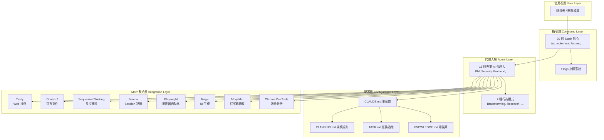
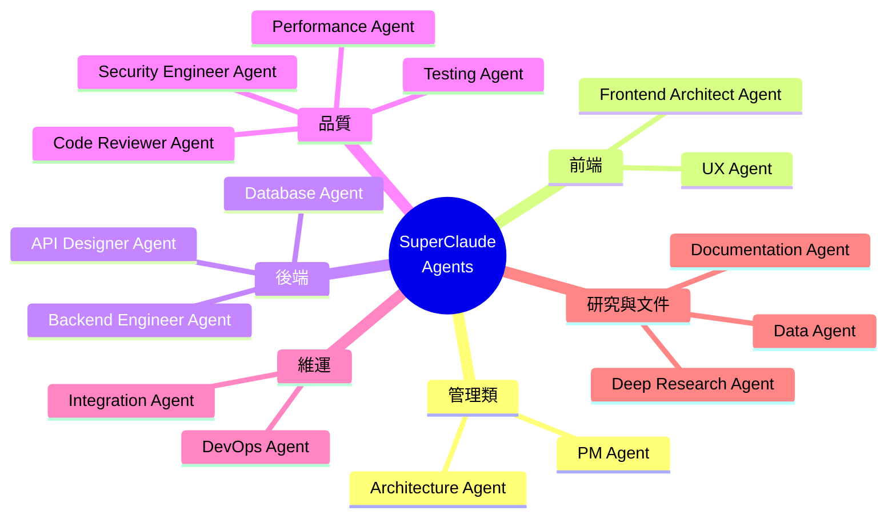
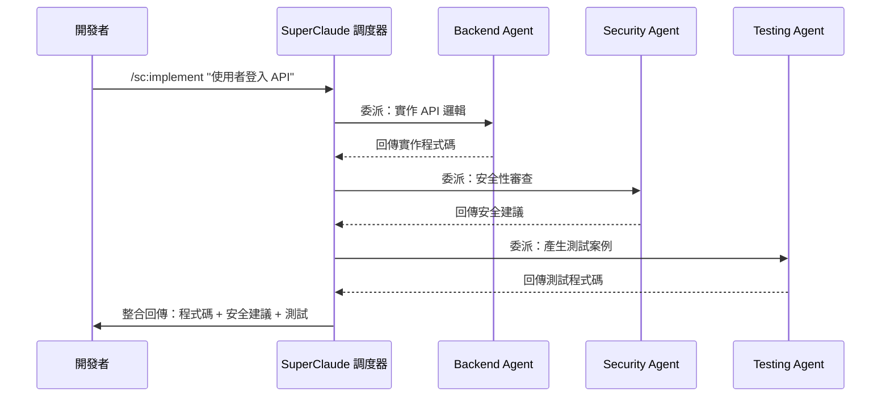
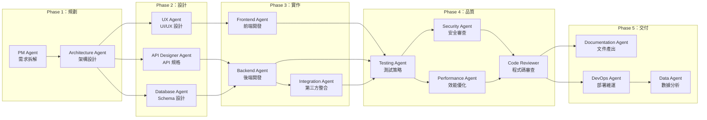
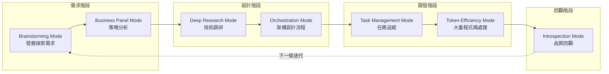
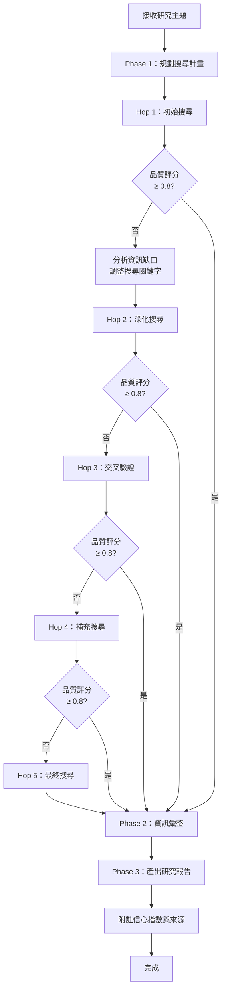
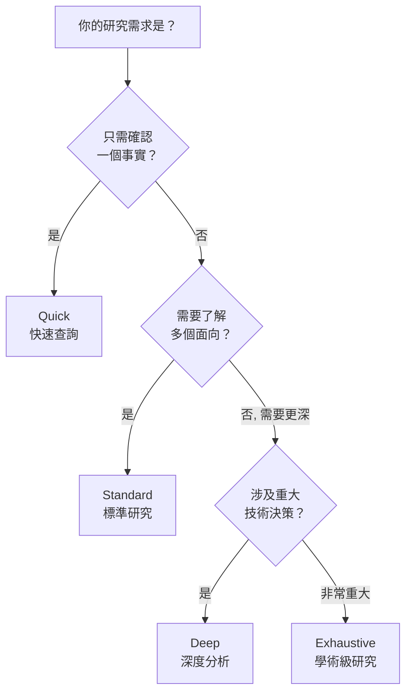

+++
date = '2026-03-12T18:43:49+08:00'
draft = false
title = 'SuperClaude Framework生態系教學手冊'
+++

# SuperClaude Framework 生態系教學手冊

> **版本**：基於 SuperClaude Framework v4.2.0 撰寫  
> **最後更新**：2026-03  
> **適用對象**：資深工程師、技術主管、全端開發團隊  
> **文件性質**：內部開發規範 / 實戰教學手冊

---

## 目錄

- [第一章：SuperClaude Framework 概覽](#第一章superclaude-framework-概覽)
- [第二章：系統需求與安裝](#第二章系統需求與安裝)
- [第三章：系統設定與配置](#第三章系統設定與配置)
- [第四章：30 個 Slash 指令完整指南](#第四章30-個-slash-指令完整指南)
- [第五章：16 個 AI 代理人使用指南](#第五章16-個-ai-代理人agents使用指南)
- [第六章：7 種行為模式](#第六章7-種行為模式behavioral-modes)
- [第七章：Deep Research 深度研究功能](#第七章deep-research-深度研究功能)
- [第八章：Web Application 開發實戰工作流](#第八章web-application-開發實戰工作流)
- [第九章：Flags 旗標使用指南](#第九章flags-旗標使用指南)
- [第十章：系統維護與管理](#第十章系統維護與管理)
- [第十一章：系統升級](#第十一章系統升級)
- [第十二章：團隊協作最佳實踐](#第十二章團隊協作最佳實踐)
- [附錄](#附錄)

---

# 第一章：SuperClaude Framework 概覽

> **章節摘要**：本章介紹 SuperClaude Framework 的核心定位、設計理念與生態系架構。讀者將瞭解它如何將原生 Claude Code CLI 轉化為具備完整軟體工程流程的自動化開發平台，以及其 30 個指令、16 個代理人、7 種模式與 8 個 MCP Server 的整體佈局。

## 1.1 什麼是 SuperClaude Framework？

### 定義與定位

SuperClaude Framework 是一個 **Context Framework**（上下文框架），專為 Anthropic Claude Code 命令列工具設計。其本質是一套 **行為指令配置文件（.md 檔案）**，安裝後部署至 `~/.claude/` 目錄，Claude Code 在啟動時自動讀取這些檔案來增強其能力。換言之，**.md 檔案本身就是框架**——它們是 Claude Code 在運行時主動參考的行為指令集。

透過「行為指令注入（Behavioral Instruction Injection）」與「元件協同編排（Component Orchestration）」兩大機制，SuperClaude 讓 Claude Code 不再只是一個對話式 AI 助手，而是一個具備完整專業軟體工程流程的 **自動化開發平台**。

> ⚠️ **聲明**：SuperClaude Framework 為社群開源專案，與 Anthropic 公司無關，亦未獲得 Anthropic 官方背書或贊助。

### 與原生 Claude Code 的差異比較

| 比較項目 | 原生 Claude Code | SuperClaude Framework |
|---------|----------------|----------------------|
| 指令系統 | 基本 Slash 指令 | 30 個專業 Slash 指令 |
| AI 角色 | 通用型助手 | 16 個專業代理人，可依情境切換 |
| 行為模式 | 單一對話模式 | 7 種行為模式（腦力激盪、深度研究等） |
| 外部工具整合 | 需手動配置 MCP | 8 個預配置 MCP Server，一鍵安裝 |
| Session 管理 | 無持久化機制 | 支援跨日工作 Session 保存與載入 |
| 工作流程 | 自由形式 | 結構化開發全生命週期流程 |
| 專案記憶 | 依賴對話上下文 | KNOWLEDGE.md 累積知識、Cross-session 學習 |
| 效率 | 標準 Token 用量 | 搭配 MCP 可節省 30-50% Token |

### 核心設計理念

1. **行為指令注入（Behavioral Instruction Injection）**  
   透過結構化的配置文件（`CLAUDE.md`），在 Claude Code 啟動時自動注入行為準則、角色設定與工作規範，使其在每次互動中都遵循專業軟體工程流程。

2. **元件協同編排（Component Orchestration）**  
   30 個指令、16 個代理人與 7 種模式並非各自獨立運作，而是能根據任務需求自動協調。例如執行 `/sc:implement` 時，系統會視需要自動喚起 Code Reviewer Agent 進行品質檢查。

### 版本資訊

- **v4.2.0**（2026/01/18）：現行穩定版，Deep Research 強化、MCP 整合優化
- **v5.0**（開發中）：TypeScript Plugin 系統（參見 [issue #419](https://github.com/SuperClaude-Org/SuperClaude_Framework/issues/419)），尚未設定發布日期

### 姊妹專案

SuperClaude Framework 同時有針對其他 AI 平台的姊妹框架：

| 框架 | 目標平台 |
|------|----------|
| **SuperClaude Framework** | Anthropic Claude Code |
| **SuperGemini Framework** | Google Gemini CLI |
| **SuperQwen Framework** | Alibaba Qwen |

> 💡 三者共享相似的設計理念與指令結構，熟悉其中一個即可快速上手其他。

## 1.2 生態系架構圖解

### 整體架構層次



### 各元件角色與職責

| 元件層級 | 元件 | 職責 |
|---------|------|------|
| 配置層 | `CLAUDE.md` | 定義行為準則、角色設定、專案規範 |
| 配置層 | `PLANNING.md` | 架構設計原則、絕對不可違反的規則 |
| 配置層 | `TASK.md` | 追蹤當前任務、優先順序、進度 |
| 配置層 | `KNOWLEDGE.md` | 累積洞見、最佳實踐、故障排除記錄 |
| 指令層 | Slash 指令 | 提供 30 個覆蓋開發全生命週期的操作入口 |
| 指令層 | Flags | 以旗標參數修飾指令行為（如 `--verbose`、`--dry-run`） |
| 代理人層 | AI Agents | 16 個專業化角色，依情境自動或手動調度 |
| 代理人層 | Modes | 7 種行為模式，影響回應風格與分析深度 |
| 整合層 | MCP Servers | 8 個外部工具，擴展搜尋、記憶、自動化能力 |

## 1.3 核心能力數據

### 30 個 Slash 指令概覽

| 類別 | 指令數 | 代表指令 |
|------|-------|---------|
| 規劃與設計 | 4 | `/sc:brainstorm`, `/sc:design`, `/sc:estimate`, `/sc:spec-panel` |
| 開發 | 5 | `/sc:implement`, `/sc:build`, `/sc:improve`, `/sc:cleanup`, `/sc:explain` |
| 測試與品質 | 4 | `/sc:test`, `/sc:analyze`, `/sc:troubleshoot`, `/sc:reflect` |
| 文件 | 2 | `/sc:document`, `/sc:help` |
| 版本控制 | 1 | `/sc:git` |
| 專案管理 | 3 | `/sc:pm`, `/sc:task`, `/sc:workflow` |
| 研究與分析 | 2 | `/sc:research`, `/sc:business-panel` |
| 工具 | 9 | `/sc:agent`, `/sc:spawn`, `/sc:save`, `/sc:load` 等 |

### 16 個 Agents 概覽



### 7 種 Modes 概覽

| # | 模式 | 用途 |
|---|------|------|
| 1 | Brainstorming Mode | 發散式思考、需求探索 |
| 2 | Business Panel Mode | 多角度商業策略分析 |
| 3 | Deep Research Mode | 深度技術調研 |
| 4 | Orchestration Mode | 複雜多工具協調任務 |
| 5 | Token-Efficiency Mode | 長對話節省 Token |
| 6 | Task Management Mode | 系統化任務組織 |
| 7 | Introspection Mode | 自省、回顧與品質評估 |

### 8 個 MCP Servers 概覽

| MCP Server | 功能 | 類別 |
|-----------|------|------|
| Tavily | Web 搜尋引擎整合 | 資訊檢索 |
| Context7 | 官方文件查詢 | 文件查閱 |
| Sequential-Thinking | 多步推理引擎 | 推理強化 |
| Serena | Session 持久化與記憶 | 狀態管理 |
| Playwright | 跨瀏覽器自動化測試 | 測試自動化 |
| Magic | UI 元件快速生成 | 前端開發 |
| Morphllm-Fast-Apply | 情境感知程式碼修改 | 程式碼編輯 |
| Chrome DevTools | 效能分析與除錯 | 效能監控 |

> 💡 **提示**：初次使用建議先安裝 Tavily 與 Context7，這兩個 MCP Server 對日常開發幫助最大，可有效提升 Research 品質與文件查閱速度。

---

# 第二章：系統需求與安裝

> **章節摘要**：本章詳述 SuperClaude Framework 的環境需求與三種安裝方式（pipx、Git Clone、npm），並涵蓋 MCP Server 的安裝配置、效能比較與安裝後驗證流程。照著步驟操作即可完成完整安裝。

## 2.1 環境需求

### 作業系統支援

| 作業系統 | 支援狀態 | 備註 |
|---------|---------|------|
| macOS 12+ | ✅ 完整支援 | 主要開發平台 |
| Linux（Ubuntu 20.04+） | ✅ 完整支援 | CI/CD 環境建議使用 |
| Windows WSL2 | ✅ 完整支援 | 建議使用 Ubuntu 22.04 WSL |
| Windows 原生 | ⚠️ 部分支援 | 部分 MCP Server 可能有相容性問題 |

### 軟體版本需求

| 軟體 | 最低版本 | 建議版本 | 用途 |
|------|---------|---------|------|
| Node.js | 18.x | 20.x LTS | Claude Code CLI 運行環境 |
| Python | 3.10+ | 3.12+ | pipx 安裝、部分 MCP Server |
| pipx | 1.4+ | 最新版 | SuperClaude 安裝工具 |
| Claude Code CLI | 最新版 | 最新版 | 核心 AI 引擎 |
| Git | 2.30+ | 最新版 | 版本控制 |

### 前置條件檢查

在安裝前，請確認以下工具已就緒：

```bash
# 檢查 Node.js 版本
node --version
# 預期輸出：v20.x.x 或更高

# 檢查 Python 版本
python3 --version
# 預期輸出：Python 3.10+ 

# 檢查 pipx 是否已安裝
pipx --version
# 若未安裝，執行：python3 -m pip install --user pipx

# 檢查 Claude Code CLI
claude --version
# 預期輸出：最新穩定版
```

> ⚠️ **注意**：Claude Code CLI 必須已安裝且可正常運作，SuperClaude Framework 是在其基礎上的增強配置框架。

## 2.2 安裝方式

### 方式一：pipx 安裝（官方推薦）

這是最簡便、最穩定的安裝方式，適合大多數開發者。

```bash
# 步驟 1：從 PyPI 安裝 SuperClaude CLI
pipx install superclaude

# 步驟 2：安裝所有 30 個 Slash 指令到 Claude Code
superclaude install

# 步驟 3：驗證安裝結果
superclaude install --list    # 列出已安裝的指令
superclaude doctor            # 執行健康檢查
```

預期的 `superclaude doctor` 輸出：

```text
🔍 SuperClaude Health Check
━━━━━━━━━━━━━━━━━━━━━━━━━━
✅ SuperClaude CLI: v4.2.0
✅ Claude Code CLI: detected
✅ Slash Commands: 30/30 installed
✅ Configuration: valid
⚠️ MCP Servers: 0/8 installed (optional)
━━━━━━━━━━━━━━━━━━━━━━━━━━
Status: HEALTHY (MCP optional)
```

### 方式二：Git Clone 直接安裝

適合需要自訂修改框架原始碼的進階使用者。

```bash
# 步驟 1：Clone 儲存庫
git clone https://github.com/SuperClaude-Org/SuperClaude_Framework.git

# 步驟 2：進入目錄並執行安裝
cd SuperClaude_Framework
./install.sh

# 步驟 3：驗證
superclaude doctor
```

> 💡 **提示**：使用 Git Clone 方式安裝的好處是可以隨時查看原始碼、提交 PR 貢獻，並可在本地修改指令模板。

### 方式三：npm 安裝

適合已有 Node.js 生態系工具鏈的團隊。

```bash
# 全域安裝
npm install -g @bifrost_inc/superclaude

# 安裝指令
superclaude install

# 驗證
superclaude doctor
```

### 方式四：pip 安裝

若不使用 pipx，也可以直接用 pip 安裝：

```bash
pip install SuperClaude
superclaude install
superclaude doctor
```

> ⚠️ **注意**：建議在 virtual environment 中使用，避免污染全域 Python 環境。

### 四種方式比較

| 安裝方式 | 優點 | 缺點 | 適用場景 |
|---------|------|------|---------|
| pipx（推薦） | 簡便、環境隔離、自動更新 | 需要 Python 環境 | 一般開發者 |
| pip | 最簡單的安裝方式 | 可能污染全域環境 | 已有 venv 的開發者 |
| Git Clone | 可自訂修改、可貢獻程式碼 | 手動更新 | 進階使用者 |
| npm | 與 Node.js 生態整合 | 全域安裝可能衝突 | Node.js 團隊 |

## 2.3 MCP Servers 安裝（選配）

MCP（Model Context Protocol）Server 是可選的外部工具整合，能顯著提升 SuperClaude 的效能與能力。

SuperClaude 的 MCP Servers 透過 **airis-mcp-gateway** 進行統一管理與安裝：
- Gateway 儲存庫：https://github.com/agiletec-inc/airis-mcp-gateway
- 提供統一的 MCP Server 安裝、配置與狀態管理介面

### 8 個 MCP Servers 功能說明

| # | MCP Server | 功能說明 | 使用場景 | 優先級 |
|---|-----------|---------|---------|-------|
| 1 | **Tavily** | Web 搜尋引擎，支援結構化搜尋結果 | `/sc:research` 深度研究 | ⭐⭐⭐ 高 |
| 2 | **Context7** | 主流框架與函式庫官方文件即時查詢 | 查閱 API 文件、版本差異 | ⭐⭐⭐ 高 |
| 3 | **Sequential-Thinking** | 多步邏輯推理引擎 | 複雜架構決策、除錯推理 | ⭐⭐ 中 |
| 4 | **Serena** | Session 持久化與跨會話記憶 | 長期專案開發、跨日銜接 | ⭐⭐ 中 |
| 5 | **Playwright** | 跨瀏覽器（Chrome/Firefox/Safari）自動化 | E2E 測試、UI 驗證 | ⭐⭐ 中 |
| 6 | **Magic** | UI 元件快速生成（React/Vue/Svelte） | 前端快速開模 | ⭐ 低 |
| 7 | **Morphllm-Fast-Apply** | 情境感知的大範圍程式碼批量修改 | 大規模重構 | ⭐ 低 |
| 8 | **Chrome DevTools** | 瀏覽器效能分析、記憶體與網路監控 | 前端效能調校 | ⭐ 低 |

### 安裝指令

```bash
# 列出所有可用的 MCP Servers 及其狀態
superclaude mcp --list

# 互動式安裝（會引導你選擇要安裝的 Server）
superclaude mcp

# 安裝指定的 MCP Servers（建議先安裝這兩個）
superclaude mcp --servers tavily --servers context7

# 安裝全部 MCP Servers
superclaude mcp --all
```

### 安裝後配置 Tavily API Key

Tavily 需要 API Key 才能運作：

```bash
# 申請 Tavily API Key（免費方案每月 1000 次查詢）
# 至 https://tavily.com 註冊

# 設定 API Key
export TAVILY_API_KEY="tvly-your-api-key-here"

# 或加入 .env 檔案
echo 'TAVILY_API_KEY=tvly-your-api-key-here' >> .env
```

> ⚠️ **注意**：請勿將 API Key 提交至版本控制。確保 `.env` 已加入 `.gitignore`。

## 2.4 效能比較

| 指標 | 無 MCP | 有 MCP（Tavily + Context7） | 完整 MCP |
|------|-------|---------------------------|---------|
| 功能完整度 | ✅ 100% | ✅ 100%+ 擴展能力 | ✅ 100%+ 最大擴展 |
| Research 品質 | 依賴模型知識 | 即時網路搜尋 | 最佳品質 |
| 回應速度 | 基準 | 1.5-2x 提升 | 2-3x 提升 |
| Token 用量 | 基準 | 節省 20-30% | 節省 30-50% |
| 文件查詢準確度 | 可能過時 | 即時最新文件 | 即時最新文件 |
| Session 持久化 | ❌ 無 | ❌ 無 | ✅ 有（Serena） |

> 💡 **提示**：對於 Web Application 開發團隊，建議至少安裝 Tavily + Context7。這兩個 MCP Server 投入最小但效益最顯著，特別是在使用 `/sc:research` 和查閱框架文件時。

## 2.5 ReflexionMemory — 內建錯誤學習機制

SuperClaude v4.2.0 內建了 **ReflexionMemory**（反思記憶）機制，無需額外安裝任何 MCP Server：

- **自動記錄**：當執行指令過程中發生錯誤時，系統自動記錄錯誤模式與修正方式
- **學習迴避**：後續執行相似任務時，自動迴避已知的錯誤模式
- **無需配置**：安裝 SuperClaude 後即可使用，無需額外設定

> 💡 **歷史註記**：早期版本使用 **Mindbase** 作為記憶系統，v4.2.0 已將其替換為內建的 ReflexionMemory。Mindbase 現為可選的語義搜尋增強（需使用 `recommended` 安裝檔案），提供跨 Session 的語義搜尋功能。

## 2.6 安裝驗證與測試

完成安裝後，依以下步驟驗證：

### 步驟 1：執行健康檢查

```bash
superclaude doctor
```

確認所有核心元件顯示 ✅。

### 步驟 2：在 Claude Code 中確認指令

```bash
# 啟動 Claude Code
claude

# 在對話中輸入
/sc
```

應顯示 30 個可用指令的完整清單。

### 步驟 3：測試核心指令

```bash
# 測試說明指令
/sc:help

# 測試簡單實作指令
/sc:explain "什麼是 RESTful API 的最佳設計原則？"
```

### 步驟 4：測試 MCP 連線（如已安裝）

```bash
# 測試 Research 功能（需要 Tavily MCP）
/sc:research "Node.js 20 LTS 主要新特性" --depth quick
```

> ⚠️ **注意**：安裝完成後 **務必重啟 Claude Code**，否則新安裝的指令可能無法載入。

### 安裝問題速查

| 問題 | 解決方式 |
|------|---------|
| `superclaude: command not found` | 確認 pipx 路徑已加入 `$PATH`，執行 `pipx ensurepath` |
| 指令安裝後不顯示 | 重啟 Claude Code |
| MCP Server 連線失敗 | 檢查 API Key 設定，執行 `superclaude mcp --list` 確認狀態 |
| Python 版本不符 | 升級 Python 至 3.10+，使用 `pyenv` 管理版本 |
| 權限錯誤 | 勿使用 `sudo`，改用 pipx 隔離環境 |

---

# 第三章：系統設定與配置

> **章節摘要**：本章說明 SuperClaude Framework 的配置體系，包括核心配置文件 `CLAUDE.md` 的結構、專案關鍵文件的用途與維護方式，以及如何將框架整合到既有 Web Application 專案中。正確的配置是發揮框架最大效能的基礎。

## 3.1 框架運作原理

SuperClaude 的核心機制非常簡潔：

1. **安裝**：Python CLI 將行為指令文件（`.md` 檔案）部署到 `~/.claude/` 目錄
2. **執行**：當你輸入 `/sc:analyze` 時，Claude Code 讀取對應的 `analyze.md` 指令文件
3. **行為**：指令文件中的結構化提示引導 Claude 以特定方式回應

```text
使用者輸入 /sc:implement "使用者登入 API"
  ↓
Claude Code 讀取 ~/.claude/commands/implement.md
  ↓
implement.md 定義：需求分析 → 程式碼生成 → 測試建立 → 品質檢查
  ↓
Claude 依指令執行完整的實作流程
```

> 💡 **核心概念**：`.md 檔案就是框架本身` — 它們不是一般的文件，而是 Claude Code 在運行時主動參考的行為指令集（Active Instruction Sets）。

## 3.2 框架配置檔說明

### CLAUDE.md — 主配置文件

`CLAUDE.md` 是 SuperClaude Framework 的核心，Claude Code 啟動時會自動讀取此文件。它定義了 AI 的行為準則、角色限制與工作流程規範。

```markdown
<!-- CLAUDE.md 範例結構 -->
# 專案名稱：電商平台 EShop

## 角色設定
你是一位資深全端工程師，專精 React + Node.js + PostgreSQL 技術棧。

## 絕對規則
1. 所有 API 必須實作身份驗證與授權檢查
2. 不得在前端存放敏感資訊（API Key、密碼等）
3. 所有資料庫查詢必須使用參數化查詢，防止 SQL Injection
4. 每個功能必須附帶單元測試
5. 程式碼風格遵循專案 ESLint/Prettier 配置

## 技術棧
- Frontend: React 18 + TypeScript 5.x + Tailwind CSS 3
- Backend: Node.js 20 + Express 4 + Prisma ORM
- Database: PostgreSQL 16
- Testing: Vitest + React Testing Library + Supertest
- CI/CD: GitHub Actions

## 程式碼慣例
- 使用 TypeScript strict mode
- React 元件使用 Function Component + Hooks
- API 路由遵循 RESTful 設計
- 錯誤處理使用統一的 ErrorHandler middleware

## 參考文件
- 閱讀 PLANNING.md 了解架構決策
- 閱讀 TASK.md 了解當前任務
- 閱讀 KNOWLEDGE.md 參考已知問題與解法
```

### .claude/ 目錄結構

```text
.claude/
├── settings.json          # Claude Code 本地設定
├── commands/              # 自訂指令模板
│   ├── custom-review.md   # 團隊自訂的 Code Review 指令
│   └── deploy-check.md    # 部署前檢查指令
└── contexts/              # 額外上下文文件
    ├── api-standards.md   # API 設計標準
    └── security-rules.md  # 資安規範
```

### .env.example 環境變數配置

```bash
# .env.example — 複製為 .env 並填入實際值

# MCP Server API Keys
TAVILY_API_KEY=tvly-your-key-here
CONTEXT7_API_KEY=your-key-here

# SuperClaude 設定
SC_DEFAULT_MODE=standard           # 預設行為模式
SC_TOKEN_BUDGET=auto               # Token 預算管理（auto / strict / unlimited）
SC_RESEARCH_DEPTH=standard         # 預設研究深度（quick / standard / deep / exhaustive）
SC_AUTO_SAVE=true                  # 是否自動儲存 Session
SC_LOG_LEVEL=info                  # 記錄層級（debug / info / warn / error）
```

> ⚠️ **注意**：絕對不要將 `.env` 提交至 Git。請確認 `.gitignore` 中已包含 `.env`。

## 3.3 關鍵文件說明（開發者必讀）

SuperClaude 依賴四個關鍵的 Markdown 文件來管理專案知識與流程：

| 文件 | 用途 | 建議閱讀時機 | 維護頻率 |
|------|------|------------|---------|
| `PLANNING.md` | 架構設計原則、絕對規則、技術決策紀錄 | Session 開始前、實作前 | 架構變更時 |
| `TASK.md` | 當前任務清單、優先順序、待辦事項 | 每日、開始工作前 | 每日更新 |
| `KNOWLEDGE.md` | 累積洞見、最佳實踐、故障排除、踩坑紀錄 | 遇到問題時 | 持續新增 |
| `CONTRIBUTING.md` | 貢獻指引、分支策略、PR 規範、工作流程 | 提交 PR 前 | 季度檢視 |

### PLANNING.md 範例

```markdown
# 架構設計原則

## 絕對規則（不可違反）
1. 資料庫 Schema 變更必須透過 Migration，禁止手動修改
2. 所有外部 API 呼叫必須有 Retry + Circuit Breaker 機制
3. 敏感資料必須加密儲存，傳輸必須使用 TLS

## 架構決策紀錄（ADR）

### ADR-001：選擇 PostgreSQL 作為主資料庫
- **日期**：2026-01-15
- **狀態**：已採用
- **情境**：需要支援 JSONB、全文搜尋、高併發
- **決策**：採用 PostgreSQL 16，搭配 Prisma ORM
- **後果**：團隊需學習 PostgreSQL 進階功能

### ADR-002：前端狀態管理採用 Zustand
- **日期**：2026-01-20
- **狀態**：已採用
- **情境**：Redux 過於冗長，需要輕量方案
- **決策**：採用 Zustand，搭配 React Query 處理 Server State
```

### TASK.md 範例

```markdown
# 當前任務

## 🔴 P0（必須立即處理）
- [ ] 修復使用者登入 Token 過期未自動更新的問題 (#142)

## 🟡 P1（本週完成）
- [ ] 實作商品搜尋 API（含分頁、篩選、排序）
- [ ] 前端商品列表頁面元件開發
- [x] 資料庫 Schema 設計審查 ✅ 2026-03-10

## 🟢 P2（本月完成）
- [ ] 訂單模組 API 設計
- [ ] 整合第三方支付（綠界/藍新）
- [ ] E2E 測試框架建置
```

### KNOWLEDGE.md 範例

```markdown
# 專案知識庫

## 已知問題與解法

### Prisma 連線池耗盡
- **現象**：高併發時出現 `P2024: Connection pool timeout` 
- **原因**：預設連線池大小 10 不足
- **解法**：在 `DATABASE_URL` 加入 `?connection_limit=20&pool_timeout=30`

### React Hydration Mismatch
- **現象**：SSR 與 CSR 渲染結果不一致
- **原因**：使用了 `Date.now()` 等非確定性值
- **解法**：使用 `useEffect` 處理客戶端專屬邏輯

## 效能基準
- API 回應時間目標：P95 < 200ms
- 首頁 LCP：< 2.5 秒
- 資料庫查詢：單次查詢 < 50ms
```

## 3.4 專案整合設定

### 在既有 Web Application 專案中整合 SuperClaude

```bash
# 步驟 1：在專案根目錄建立設定文件
cd your-web-project

# 步驟 2：建立 CLAUDE.md（最重要）
touch CLAUDE.md

# 步驟 3：建立輔助文件
touch PLANNING.md TASK.md KNOWLEDGE.md

# 步驟 4：建立 .claude 目錄（可選）
mkdir -p .claude/commands .claude/contexts

# 步驟 5：更新 .gitignore
echo '.env' >> .gitignore
echo '.claude/settings.json' >> .gitignore
```

### 團隊統一配置模板

```markdown
<!-- CLAUDE.md 團隊模板 -->
# {專案名稱}

## 團隊規範
- 遵循 {團隊名稱} 編碼標準
- Commit Message 格式：`type(scope): description`
  - type: feat / fix / refactor / docs / test / chore
- PR 至少需要 1 位 Reviewer 批准
- 分支命名：`feature/xxx`, `bugfix/xxx`, `hotfix/xxx`

## 技術棧
{請根據專案填入}

## 安全性要求
1. OWASP Top 10 防護
2. 所有使用者輸入必須驗證與消毒
3. API 必須實作 Rate Limiting
4. 敏感操作必須記錄 Audit Log

## SuperClaude 使用規範
- 使用 `/sc:implement` 前先確認 TASK.md 中的任務優先順序
- 使用 `/sc:git` 提交前先執行 `/sc:analyze` 進行程式碼品質檢查
- 每日工作結束前使用 `/sc:save` 儲存 Session
- 遇到難題先使用 `/sc:research` 調研再動手實作
```

## 3.5 MCP Server 進階配置

### airis-mcp-gateway 統一管理

如果安裝了多個 MCP Server，可透過 `airis-mcp-gateway` 統一管理連線：

```yaml
# .claude/mcp-config.yaml
gateway:
  port: 3100
  log_level: info

servers:
  tavily:
    enabled: true
    api_key: ${TAVILY_API_KEY}
    rate_limit: 100/hour
    
  context7:
    enabled: true
    api_key: ${CONTEXT7_API_KEY}
    cache_ttl: 3600  # 快取 1 小時
    
  sequential-thinking:
    enabled: true
    max_steps: 10
    timeout: 30s
    
  serena:
    enabled: true
    storage_path: .claude/sessions/
    max_sessions: 50

  playwright:
    enabled: false  # 依需要啟用
    browsers:
      - chromium
      - firefox
```

### 各 MCP Server 連接驗證

```bash
# 驗證所有已安裝 MCP Server 的連線狀態
superclaude mcp --status

# 預期輸出：
# ✅ Tavily: connected (API quota: 850/1000)
# ✅ Context7: connected
# ✅ Sequential-Thinking: connected
# ✅ Serena: connected (sessions: 12)
# ❌ Playwright: not configured
# ❌ Magic: not installed
# ❌ Morphllm: not installed
# ❌ Chrome DevTools: not installed
```

### 自訂 MCP Server 整合

若團隊有自建的內部工具，可透過 MCP 協議整合：

```typescript
// .claude/custom-mcp/internal-api.ts
import { MCPServer } from '@modelcontextprotocol/sdk';

const server = new MCPServer({
  name: 'internal-api',
  version: '1.0.0',
  description: '公司內部 API 查詢工具',
});

server.addTool({
  name: 'query_internal_docs',
  description: '查詢公司內部技術文件',
  parameters: {
    query: { type: 'string', description: '搜尋關鍵字' },
  },
  handler: async ({ query }) => {
    // 呼叫內部文件 API
    const response = await fetch(`https://docs.internal.company/api/search?q=${encodeURIComponent(query)}`);
    return await response.json();
  },
});

server.start();
```

> 💡 **提示**：自訂 MCP Server 非常適合整合公司內部的文件系統、CI/CD Pipeline 狀態查詢、或專屬的程式碼分析工具。

> ⚠️ **注意**：自訂 MCP Server 中的 API 呼叫務必處理錯誤情境，並實作逾時機制，避免長時間等待影響開發體驗。

---

# 第四章：30 個 Slash 指令完整指南

> **章節摘要**：本章是 SuperClaude Framework 的操作核心。30 個 Slash 指令涵蓋軟體開發全生命週期——從需求規劃到部署維運。每個指令均提供功能說明、語法格式、實際使用範例與最佳場景。所有指令以 `/sc:` 前綴使用。

> 💡 **提示**：在 Claude Code 中輸入 `/sc` 即可查看所有可用指令。輸入 `/sc:help <指令名>` 可查看單一指令的詳細用法。

## 4.1 規劃與設計類（4 個指令）

### `/sc:brainstorm` — 結構化腦力激盪

**功能說明**：啟動 Brainstorming Mode，針對特定主題進行發散式思考，產出結構化的想法清單、優缺點分析與可行性評估。

**語法格式**：
```text
/sc:brainstorm "<主題描述>" [--perspectives <數量>] [--format <格式>]
```

**使用範例**：

```text
# 範例 1：探索新功能需求
/sc:brainstorm "電商平台的會員忠誠度系統設計方案"

# 範例 2：指定多角度分析
/sc:brainstorm "前端狀態管理方案選型（Redux vs Zustand vs Jotai）" --perspectives 5

# 範例 3：產出特定格式
/sc:brainstorm "微服務拆分策略" --format mindmap
```

**最佳使用場景**：
- 專案初期的需求探索
- 技術選型前的方案比較
- 遇到設計瓶頸需要跳脫框架的思考

---

### `/sc:design` — 系統架構設計

**功能說明**：啟動系統架構設計流程，根據需求產出架構圖、元件設計、介面定義與資料模型。自動調用 Architecture Agent 進行專業分析。

**語法格式**：
```text
/sc:design "<設計需求>" [--scope <範圍>] [--pattern <設計模式>]
```

**使用範例**：

```text
# 範例 1：完整系統架構設計
/sc:design "電商平台整體架構設計，需支援 10 萬日活用戶"

# 範例 2：指定設計範圍
/sc:design "使用者認證授權模組設計" --scope module

# 範例 3：指定設計模式
/sc:design "訂單處理系統" --pattern "event-driven microservice"
```

**最佳使用場景**：
- 新專案啟動時的架構規劃
- 新功能模組的細部設計
- 系統重構前的方案設計

---

### `/sc:estimate` — 時程與工作量估算

**功能說明**：根據需求描述進行工作量估算，包含人時、複雜度分析、風險評估與里程碑建議。

**語法格式**：
```text
/sc:estimate "<估算目標>" [--team-size <人數>] [--granularity <粒度>]
```

**使用範例**：

```text
# 範例 1：MVP 工作量估算
/sc:estimate "電商平台 MVP 版本：使用者註冊登入 + 商品展示 + 購物車 + 結帳"

# 範例 2：指定團隊規模
/sc:estimate "從 REST API 遷移至 GraphQL" --team-size 3

# 範例 3：細粒度估算
/sc:estimate "實作即時通知系統（WebSocket + Push Notification）" --granularity detailed
```

**預期產出**：
- 任務拆解表（含各任務工時估算）
- 風險清單與緩解策略
- 建議里程碑時程表

---

### `/sc:spec-panel` — 規格分析面板

**功能說明**：召集多位虛擬專家（PM、架構師、資安工程師等）組成專家面板，針對規格需求進行多角度分析與審議。

**語法格式**：
```text
/sc:spec-panel "<規格主題>" [--experts <專家列表>]
```

**使用範例**：

```text
# 範例 1：模組規格審議
/sc:spec-panel "第三方登入整合規格（Google / Apple / LINE Login）"

# 範例 2：指定專家組成
/sc:spec-panel "API 閘道器設計規格" --experts "security,performance,api-design"

# 範例 3：完整功能規格分析
/sc:spec-panel "即時聊天功能規格（含離線訊息、已讀回執、多媒體訊息）"
```

**最佳使用場景**：
- 功能規格確認前的最終審查
- 需要多領域專業意見的設計決策
- 技術可行性評估

---

## 4.2 開發類（5 個指令）

### `/sc:implement` — 程式碼實作

**功能說明**：根據需求描述生成完整的實作程式碼，包含主要邏輯、錯誤處理、型別定義與測試。自動遵循 `CLAUDE.md` 中定義的編碼規範。

**語法格式**：
```text
/sc:implement "<實作需求>" [--lang <語言>] [--framework <框架>] [--with-tests]
```

**使用範例**：

```text
# 範例 1：API 端點實作
/sc:implement "使用者註冊 API：接收 email/password，驗證格式，bcrypt 加密密碼，存入 PostgreSQL" --with-tests

# 範例 2：React 元件實作
/sc:implement "商品卡片元件：顯示圖片、名稱、價格、評分，支援加入購物車"

# 範例 3：完整 CRUD 模組
/sc:implement "商品管理 CRUD API（Create/Read/Update/Delete），含分頁查詢與關鍵字搜尋"
```

> 💡 **提示**：搭配 `--with-tests` 旗標可同時產出單元測試，確保程式碼品質。

---

### `/sc:build` — 建置工作流程

**功能說明**：建立或優化專案的建置流程，包含建置腳本、Docker 配置、CI/CD Pipeline 等。

**語法格式**：
```text
/sc:build "<建置需求>" [--target <目標>]
```

**使用範例**：

```text
# 範例 1：Docker 化
/sc:build "建立多階段 Dockerfile，支援開發與生產環境"

# 範例 2：CI/CD Pipeline
/sc:build "GitHub Actions CI Pipeline：Lint → Test → Build → Deploy to Staging"

# 範例 3：建置腳本優化
/sc:build "優化 Webpack 建置：實作 Code Splitting、Tree Shaking、壓縮"
```

---

### `/sc:improve` — 程式碼改善

**功能說明**：分析現有程式碼並提出改善建議，涵蓋效能優化、可讀性提升、安全性強化等面向。可直接套用改善。

**語法格式**：
```text
/sc:improve "<檔案或程式碼區塊>" [--focus <改善面向>]
```

**使用範例**：

```text
# 範例 1：效能改善
/sc:improve "src/services/productService.ts" --focus performance

# 範例 2：安全性改善
/sc:improve "src/middleware/auth.ts" --focus security

# 範例 3：可讀性改善
/sc:improve "src/utils/dataTransform.ts" --focus readability
```

---

### `/sc:cleanup` — 重構與清理

**功能說明**：對程式碼進行系統性重構與清理，去除死碼（Dead Code）、統一命名風格、簡化複雜邏輯。

**語法格式**：
```text
/sc:cleanup "<清理目標>" [--scope <範圍>] [--aggressive]
```

**使用範例**：

```text
# 範例 1：單一檔案清理
/sc:cleanup "src/components/Dashboard.tsx"

# 範例 2：目錄級清理
/sc:cleanup "src/api/" --scope directory

# 範例 3：積極清理（含重構）
/sc:cleanup "src/legacy/" --aggressive
```

---

### `/sc:explain` — 程式碼解釋

**功能說明**：深度解釋指定程式碼的邏輯、設計意圖、資料流與潛在問題，適合 Code Review 或新成員上手。

**語法格式**：
```text
/sc:explain "<檔案或程式碼區塊>" [--depth <深度>] [--audience <對象>]
```

**使用範例**：

```text
# 範例 1：解釋複雜邏輯
/sc:explain "src/services/paymentService.ts" --depth detailed

# 範例 2：給新手的解釋
/sc:explain "src/middleware/rateLimiter.ts" --audience junior

# 範例 3：解釋特定函式
/sc:explain "src/utils/jwt.ts#verifyToken 函式的工作流程"
```

---

## 4.3 測試與品質類（4 個指令）

### `/sc:test` — 測試生成

**功能說明**：針對指定程式碼自動生成完整測試案例，包含正向測試、邊界條件、錯誤路徑與整合測試。自動偵測專案的測試框架。

**語法格式**：
```text
/sc:test "<測試目標>" [--type <測試類型>] [--coverage <覆蓋率目標>]
```

**使用範例**：

```text
# 範例 1：產生單元測試
/sc:test "src/services/userService.ts" --type unit

# 範例 2：產生 API 整合測試
/sc:test "src/routes/products.ts" --type integration

# 範例 3：高覆蓋率測試
/sc:test "src/utils/validators.ts" --coverage 95
```

---

### `/sc:analyze` — 程式碼分析

**功能說明**：執行全面的靜態程式碼分析，檢查安全漏洞、效能瓶頸、程式碼異味（Code Smell）與最佳實踐合規性。

**語法格式**：
```text
/sc:analyze "<分析目標>" [--focus <分析面向>] [--report <報告格式>]
```

**使用範例**：

```text
# 範例 1：全面安全性分析
/sc:analyze "src/" --focus security

# 範例 2：效能分析
/sc:analyze "src/services/" --focus performance --report detailed

# 範例 3：程式碼品質分析
/sc:analyze "src/components/" --focus quality
```

**預期產出**：
- 問題清單（依嚴重程度排序）
- 改善建議（含程式碼範例）
- 品質分數（0-100）

---

### `/sc:troubleshoot` — 除錯流程

**功能說明**：進入系統化除錯流程，引導開發者逐步定位問題根因。能分析錯誤日誌、追蹤呼叫鏈、推測問題原因並提出修復方案。

**語法格式**：
```text
/sc:troubleshoot "<問題描述>" [--context <額外資訊>]
```

**使用範例**：

```text
# 範例 1：API 問題排查
/sc:troubleshoot "POST /api/orders 在高併發時偶爾回傳 500 錯誤"

# 範例 2：附帶錯誤日誌
/sc:troubleshoot "使用者登入後 JWT Token 驗證失敗" --context "錯誤訊息：TokenExpiredError: jwt expired"

# 範例 3：效能問題排查
/sc:troubleshoot "商品列表頁面首次載入需要 5 秒以上"
```

---

### `/sc:reflect` — 回顧與反思

**功能說明**：對最近的工作進行回顧反思，啟動 Introspection Mode 進行元認知分析，評估程式碼品質、決策合理性與改善空間。

**語法格式**：
```text
/sc:reflect [--scope <回顧範圍>] [--period <時間範圍>]
```

**使用範例**：

```text
# 範例 1：今日工作回顧
/sc:reflect --scope today

# 範例 2：模組開發回顧
/sc:reflect "使用者認證模組的開發品質回顧"

# 範例 3：Sprint 回顧
/sc:reflect --scope sprint --period "2026-03-01 to 2026-03-14"
```

---

## 4.4 文件類（2 個指令）

### `/sc:document` — 文件生成

**功能說明**：自動生成各類技術文件，包含 API 文件、架構文件、README、CHANGELOG 等。支援多種輸出格式。

**語法格式**：
```text
/sc:document "<文件需求>" [--type <文件類型>] [--format <格式>]
```

**使用範例**：

```text
# 範例 1：API 文件
/sc:document "src/routes/" --type api --format openapi

# 範例 2：README 生成
/sc:document "為專案產生完整的 README.md"

# 範例 3：架構文件
/sc:document "系統架構技術文件，含架構圖與元件說明" --type architecture
```

---

### `/sc:help` — 指令幫助

**功能說明**：顯示 SuperClaude 指令的使用說明、參數列表與範例。

**語法格式**：
```text
/sc:help [<指令名稱>]
```

**使用範例**：

```text
# 範例 1：查看所有指令
/sc:help

# 範例 2：查看特定指令用法
/sc:help implement

# 範例 3：查看 Flags 說明
/sc:help flags
```

---

## 4.5 版本控制類（1 個指令）

### `/sc:git` — Git 操作自動化

**功能說明**：自動化常見 Git 操作，包含語義化 Commit Message 產出、分支管理、合併策略建議與 Release 準備。

**語法格式**：
```text
/sc:git "<操作描述>" [--action <動作>]
```

**使用範例**：

```text
# 範例 1：產生 Commit Message
/sc:git "為當前變更產生 Conventional Commit Message"

# 範例 2：分支管理
/sc:git "建立 feature/user-auth 分支並設定上游追蹤" --action branch

# 範例 3：Release 準備
/sc:git "準備 v1.2.0 Release：產生 CHANGELOG、建立 Tag" --action release

# 範例 4：合併策略建議
/sc:git "feature/payment 分支合併回 main 的最佳策略"
```

> 💡 **提示**：`/sc:git` 產出的 Commit Message 遵循 Conventional Commits 格式，可與自動化 CHANGELOG 工具無縫整合。

---

## 4.6 專案管理類（3 個指令）

### `/sc:pm` — 專案管理

**功能說明**：啟動 PM Agent，進行專案進度追蹤、風險管理、資源配置與報告產出。

**語法格式**：
```text
/sc:pm "<管理需求>" [--view <視圖>]
```

**使用範例**：

```text
# 範例 1：專案狀態總覽
/sc:pm "顯示當前專案狀態摘要"

# 範例 2：風險評估
/sc:pm "評估本季度交付風險" --view risk

# 範例 3：進度報告
/sc:pm "產出本週 Sprint 進度報告"
```

---

### `/sc:task` — 任務追蹤

**功能說明**：管理 TASK.md 中的任務清單，支援新增、更新狀態、重新排序與指派。

**語法格式**：
```text
/sc:task "<任務操作>" [--priority <優先級>] [--assignee <負責人>]
```

**使用範例**：

```text
# 範例 1：新增任務
/sc:task "新增：實作商品搜尋 API" --priority P1

# 範例 2：更新任務狀態
/sc:task "完成：使用者認證模組 (#142)"

# 範例 3：查看任務儀表板
/sc:task "顯示所有進行中的任務"
```

---

### `/sc:workflow` — 工作流程自動化

**功能說明**：設計與執行自動化工作流程，串聯多個指令與代理人，形成端到端的開發 Pipeline。

**語法格式**：
```text
/sc:workflow "<工作流程定義>" [--template <模板>]
```

**使用範例**：

```text
# 範例 1：完整開發流程
/sc:workflow "新功能開發流程：設計 → 實作 → 測試 → Review → 文件"

# 範例 2：使用預設模板
/sc:workflow "bug-fix" --template hotfix

# 範例 3：CI/CD 工作流程
/sc:workflow "設定 GitHub Actions：PR 觸發 → Lint → Test → Build → Deploy Preview"
```

---

## 4.7 研究與分析類（2 個指令）

### `/sc:research` — 深度網路研究（Deep Research）

**功能說明**：啟動 Deep Research Mode，透過多次迭代搜尋（Multi-Hop Reasoning）進行深度調研。搭配 Tavily MCP 可獲得即時網路資訊。詳見第七章。

**語法格式**：
```text
/sc:research "<研究主題>" [--depth <深度>] [--sources <來源數>]
```

**使用範例**：

```text
# 範例 1：技術調研
/sc:research "2026 年前端框架效能比較（React vs Vue vs Svelte vs Solid）"

# 範例 2：深度研究
/sc:research "WebAuthn / Passkey 在電商平台的實作最佳實踐" --depth deep

# 範例 3：快速查詢
/sc:research "Node.js 20 的 Permission Model 使用方式" --depth quick
```

---

### `/sc:business-panel` — 商業分析面板

**功能說明**：啟動 Business Panel Mode，召集多位虛擬商業顧問進行策略分析，涵蓋市場、財務、技術可行性等維度。

**語法格式**：
```text
/sc:business-panel "<分析主題>" [--panelists <顧問類型>]
```

**使用範例**：

```text
# 範例 1：技術選型商業評估
/sc:business-panel "自建 vs 採購第三方支付系統的成本效益分析"

# 範例 2：市場分析
/sc:business-panel "台灣電商市場 2026 趨勢與技術投資建議"

# 範例 3：ROI 分析
/sc:business-panel "導入微服務架構的投資報酬率分析"
```

---

## 4.8 工具類（9 個指令）

### `/sc:agent` — AI 代理人調用

**功能說明**：手動調用指定的 AI 代理人。一般情況下系統會自動調度，此指令用於需要明確指定代理人的場景。

```text
# 範例 1：指定資安代理人
/sc:agent security "審查這段認證程式碼的安全性"

# 範例 2：指定效能代理人
/sc:agent performance "分析這個 SQL 查詢的效能瓶頸"
```

### `/sc:index-repo` — 儲存庫索引

**功能說明**：建立或更新專案程式碼索引，加速後續的搜尋與分析操作。

```text
# 範例 1：完整索引
/sc:index-repo

# 範例 2：僅索引特定目錄
/sc:index-repo --path src/
```

### `/sc:index` — 索引別名

`/sc:index-repo` 的簡寫別名，功能相同。

```text
/sc:index
```

### `/sc:recommend` — 指令推薦

**功能說明**：根據當前情境推薦最合適的 SuperClaude 指令。

```text
# 範例 1：描述你的需求
/sc:recommend "我想要改善這段程式碼的效能"
# 推薦：/sc:improve --focus performance

# 範例 2：
/sc:recommend "我需要為明天的 Demo 準備文件"
# 推薦：/sc:document --type readme
```

### `/sc:select-tool` — 工具選擇

**功能說明**：智慧選擇最適合的 MCP Server 工具來完成任務。

```text
# 範例：
/sc:select-tool "我需要查詢 React 18 的 useTransition API 文件"
# 選擇：Context7 MCP → 查詢官方 React 文件
```

### `/sc:spawn` — 平行任務執行

**功能說明**：將一個大任務分解為多個子任務，平行執行以加速完成。

```text
# 範例 1：平行產出測試
/sc:spawn "為 src/services/ 下的所有檔案產出單元測試"

# 範例 2：平行分析
/sc:spawn "同時分析 frontend/ 和 backend/ 的程式碼品質"
```

### `/sc:load` — 載入 Session

**功能說明**：載入之前儲存的工作 Session，恢復上下文、任務進度與知識狀態。

```text
# 範例：
/sc:load "電商平台開發 - Day 3 進度"
```

### `/sc:save` — 儲存 Session

**功能說明**：儲存當前的工作 Session，長期保留對話上下文、任務狀態與累積知識。

```text
# 範例：
/sc:save "電商平台開發 - Day 4 API 模組完成"
```

### `/sc` — 顯示所有指令

**功能說明**：列出所有可用的 SuperClaude Slash 指令。

```text
/sc
```

---

# 第五章：16 個 AI 代理人（Agents）使用指南

> **章節摘要**：SuperClaude 內建 16 個專業 AI 代理人，各自對應軟體開發中的特定角色。本章說明代理人的自動協調機制、每個代理人的專業領域與使用方式，以及在 Web Application 全端開發中的協作流程。

## 5.1 代理人系統概述

### 代理人自動協調機制

SuperClaude 的代理人系統採用 **智慧調度（Smart Dispatch）** 機制：

1. **情境偵測**：系統分析使用者的指令與上下文
2. **角色匹配**：自動選擇最適合的代理人
3. **多代理人協作**：複雜任務可串聯多個代理人
4. **結果整合**：將多個代理人的產出整合為一致的回應



### 手動調用代理人

當自動調度不符合需求時，可使用以下兩種方式手動指定：

**方式一：`/sc:agent` 指令**（推薦）
```text
# 語法
/sc:agent <代理人名稱> "<任務描述>"

# 範例
/sc:agent security "審查 src/middleware/auth.ts 的安全性"
/sc:agent database "設計訂單系統的資料庫 Schema"
```

**方式二：`@agent-*` 直接調用**
```text
# 語法
@agent-<代理人名稱> "<任務描述>"

# 範例
@agent-security "審查認證模組"
@agent-python-expert "優化這段程式碼"
```

> 💡 **提示**：兩種方式功能相同，`@agent-*` 格式在某些情境下更直觀。

## 5.2 各代理人詳細說明

### 1. PM Agent（專案管理代理人）

| 項目 | 說明 |
|------|------|
| **專業領域** | 專案規劃、進度追蹤、風險管理、資源配置 |
| **自動觸發** | 使用 `/sc:pm`、`/sc:task`、`/sc:estimate` 時 |
| **手動調用** | `/sc:agent pm "產出本週 Sprint 進度報告"` |

**核心能力**：
- Sprint 規劃與任務拆解
- 維護 TASK.md 任務追蹤
- 風險識別與緩解策略建議
- 團隊工作量分析與瓶頸預警

**Web 開發場景範例**：
```text
/sc:agent pm "分析目前電商平台開發進度，識別延遲風險，建議調整方案"
```

---

### 2. Deep Research Agent（深度研究代理人）

| 項目 | 說明 |
|------|------|
| **專業領域** | 技術調研、方案比較、趨勢分析、最佳實踐整理 |
| **自動觸發** | 使用 `/sc:research` 時 |
| **手動調用** | `/sc:agent research "調研 WebSocket 方案"` |

**核心能力**：
- Multi-Hop 迭代搜尋（最多 5 次）
- 結構化研究報告產出
- 信心評分與來源標註
- 跨 Session 記憶學習

**Web 開發場景範例**：
```text
/sc:agent research "比較 Socket.io vs ws vs Bun WebSocket 在即時通知場景的效能與穩定性"
```

---

### 3. Security Engineer Agent（資安工程代理人）

| 項目 | 說明 |
|------|------|
| **專業領域** | 安全性審查、漏洞偵測、OWASP 合規、加密策略 |
| **自動觸發** | 使用 `/sc:analyze --focus security` 時 |
| **手動調用** | `/sc:agent security "審查認證模組"` |

**核心能力**：
- OWASP Top 10 漏洞偵測
- 依賴套件 CVE 掃描
- 加密策略審查（JWT、bcrypt、TLS 等）
- CSP、CORS、CSRF 配置建議
- 程式碼注入風險分析（SQL Injection、XSS、Command Injection）

**Web 開發場景範例**：
```text
/sc:agent security "全面審查電商平台的認證授權機制，檢查 OWASP Top 10 合規性"
```

> ⚠️ **注意**：每次發布新版本前，建議使用 Security Agent 進行完整安全性審查。

---

### 4. Frontend Architect Agent（前端架構代理人）

| 項目 | 說明 |
|------|------|
| **專業領域** | 前端架構設計、元件體系、狀態管理、效能優化 |
| **自動觸發** | 實作前端相關需求時 |
| **手動調用** | `/sc:agent frontend "設計元件架構"` |

**核心能力**：
- 元件樹設計與拆分策略
- 前端狀態管理方案設計
- 渲染策略（CSR / SSR / SSG / ISR）建議
- Web Vitals 效能優化
- 響應式設計（RWD）與無障礙（a11y）

**Web 開發場景範例**：
```text
/sc:agent frontend "設計電商平台的前端元件架構，包含商品展示、購物車、結帳流程"
```

---

### 5. Backend Engineer Agent（後端工程代理人）

| 項目 | 說明 |
|------|------|
| **專業領域** | 後端服務、API 設計、商業邏輯、系統整合 |
| **自動觸發** | 實作後端相關需求時 |
| **手動調用** | `/sc:agent backend "實作訂單服務"` |

**核心能力**：
- RESTful / GraphQL API 設計與實作
- 商業邏輯分層架構（Controller → Service → Repository）
- 中介軟體（Middleware）設計
- 錯誤處理與日誌策略
- 快取策略（Redis、In-memory）

**Web 開發場景範例**：
```text
/sc:agent backend "實作訂單服務：建立訂單、查詢訂單、更新狀態、庫存扣減"
```

---

### 6. DevOps Agent（部署運維代理人）

| 項目 | 說明 |
|------|------|
| **專業領域** | CI/CD、容器化、雲端部署、監控告警 |
| **自動觸發** | 使用 `/sc:build` 建置部署相關需求時 |
| **手動調用** | `/sc:agent devops "設定 CI/CD Pipeline"` |

**核心能力**：
- Dockerfile 與 Docker Compose 配置
- CI/CD Pipeline 設計（GitHub Actions / GitLab CI）
- Kubernetes 部署配置
- 監控與告警設定（Prometheus / Grafana）
- 環境管理（dev / staging / production）

**Web 開發場景範例**：
```text
/sc:agent devops "建立完整的 CI/CD Pipeline：PR 檢查 → 自動測試 → Staging 部署 → 手動核准 → Production 部署"
```

---

### 7. Code Reviewer Agent（程式碼審查代理人）

| 項目 | 說明 |
|------|------|
| **專業領域** | 程式碼品質審查、最佳實踐檢查、程式碼異味偵測 |
| **自動觸發** | 使用 `/sc:analyze`、`/sc:improve` 時 |
| **手動調用** | `/sc:agent reviewer "審查 PR #42"` |

**核心能力**：
- 程式碼風格與慣例檢查
- 潛在 Bug 偵測
- 設計模式適用性評估
- DRY / SOLID 原則合規性
- 測試覆蓋率評估

---

### 8. Database Agent（資料庫設計代理人）

| 項目 | 說明 |
|------|------|
| **專業領域** | Schema 設計、查詢優化、索引策略、資料遷移 |
| **自動觸發** | 涉及資料庫操作時 |
| **手動調用** | `/sc:agent database "設計商品分類 Schema"` |

**核心能力**：
- ER 模型設計
- 正規化與反正規化策略
- 索引設計與查詢效能優化
- Migration 腳本產生
- 讀寫分離與分片（Sharding）策略

**Web 開發場景範例**：
```text
/sc:agent database "設計電商平台資料庫 Schema：使用者、商品、訂單、支付、物流"
```

---

### 9. API Designer Agent（API 設計代理人）

| 項目 | 說明 |
|------|------|
| **專業領域** | API 設計規範、OpenAPI 規格、版本管理、文件產出 |
| **自動觸發** | 設計 API 端點時 |
| **手動調用** | `/sc:agent api "設計商品 API"` |

**核心能力**：
- RESTful 路由設計（含 HTTP Method、狀態碼規範）
- OpenAPI 3.0 / Swagger 規格產出
- API 版本管理策略（URL / Header / Query）
- 分頁、篩選、排序的統一規範
- 錯誤回應格式標準化

---

### 10. Testing Agent（測試策略代理人）

| 項目 | 說明 |
|------|------|
| **專業領域** | 測試策略、測試案例設計、TDD/BDD 流程 |
| **自動觸發** | 使用 `/sc:test` 時 |
| **手動調用** | `/sc:agent testing "設計測試策略"` |

**核心能力**：
- 測試金字塔策略規劃
- 單元 / 整合 / E2E 測試案例設計
- 邊界值分析與等價劃分
- Mock / Stub / Spy 策略建議
- 測試覆蓋率分析與優化

---

### 11. Documentation Agent（文件撰寫代理人）

| 項目 | 說明 |
|------|------|
| **專業領域** | 技術文件、API 文件、新手入門指南 |
| **自動觸發** | 使用 `/sc:document` 時 |
| **手動調用** | `/sc:agent docs "撰寫部署指南"` |

**核心能力**：
- API 文件自動產出（OpenAPI format）
- README.md / CONTRIBUTING.md 產出
- 架構決策紀錄（ADR）撰寫
- 新手入門（Onboarding）指南
- CHANGELOG 自動維護

---

### 12. Performance Agent（效能優化代理人）

| 項目 | 說明 |
|------|------|
| **專業領域** | 效能剖析、瓶頸定位、優化建議 |
| **自動觸發** | 使用 `/sc:analyze --focus performance` 時 |
| **手動調用** | `/sc:agent performance "分析 API 效能"` |

**核心能力**：
- N+1 查詢偵測
- Memory Leak 分析
- 前端 Bundle Size 優化
- API 回應時間剖析
- 快取策略建議

---

### 13. Architecture Agent（系統架構代理人）

| 項目 | 說明 |
|------|------|
| **專業領域** | 系統設計、架構模式選擇、可擴展性規劃 |
| **自動觸發** | 使用 `/sc:design` 時 |
| **手動調用** | `/sc:agent architecture "設計微服務架構"` |

**核心能力**：
- 架構模式推薦（Monolith / Microservice / Serverless）
- 可擴展性（Scalability）設計
- 高可用性（HA）與容錯設計
- 分散式系統設計（Event Sourcing、CQRS）
- 架構圖產出（C4 Model）

---

### 14. UX Agent（使用者體驗代理人）

| 項目 | 說明 |
|------|------|
| **專業領域** | 使用者介面設計、互動流程、無障礙 |
| **自動觸發** | 前端 UI 相關設計時 |
| **手動調用** | `/sc:agent ux "設計結帳流程"` |

**核心能力**：
- 使用者旅程（User Journey）設計
- Wireframe 文字描述
- 互動模式建議
- 無障礙（WAI-ARIA）合規檢查
- 多語系（i18n）與在地化策略

---

### 15. Data Agent（資料分析代理人）

| 項目 | 說明 |
|------|------|
| **專業領域** | 資料分析、報表設計、資料管線 |
| **自動觸發** | 涉及資料分析需求時 |
| **手動調用** | `/sc:agent data "設計使用者行為分析"` |

**核心能力**：
- 資料模型設計（Star Schema / Snowflake）
- ETL Pipeline 設計
- 儀表板與報表需求分析
- A/B Testing 資料分析方案
- 資料隱私合規（GDPR、個資法）

---

### 16. Integration Agent（系統整合代理人）

| 項目 | 說明 |
|------|------|
| **專業領域** | 第三方系統整合、API Gateway、訊息佇列 |
| **自動觸發** | 涉及外部系統整合時 |
| **手動調用** | `/sc:agent integration "整合金流系統"` |

**核心能力**：
- 第三方 API 整合策略（REST / GraphQL / Webhook）
- API Gateway 配置
- 訊息佇列設計（RabbitMQ / Kafka / SQS）
- 事件驅動整合模式
- 重試與斷路器（Circuit Breaker）機制

**Web 開發場景範例**：
```text
/sc:agent integration "設計與實作綠界支付 API 整合：建立訂單 → 導向付款 → 回調驗證 → 更新訂單狀態"
```

---

## 5.3 Web Application 開發的代理人協作流程

### 典型全端開發流程中各代理人的分工



### 代理人協作範例：電商「商品搜尋」功能

```text
# 步驟 1：PM Agent 拆解任務
/sc:agent pm "將『商品搜尋功能』拆解成可執行的開發任務"

# 步驟 2：Architecture Agent 設計方案
/sc:agent architecture "商品搜尋功能的技術方案：全文搜尋引擎選型與架構"

# 步驟 3：API Designer Agent 定義介面
/sc:agent api "設計商品搜尋 API：支援關鍵字搜尋、分類篩選、價格範圍、排序、分頁"

# 步驟 4：Database Agent 設計索引
/sc:agent database "為商品搜尋設計 PostgreSQL 全文索引（tsvector + GIN index）"

# 步驟 5：Backend Agent 實作
/sc:implement "商品搜尋 API 實作，使用 PostgreSQL 全文搜尋"

# 步驟 6：Frontend Agent 實作
/sc:implement "商品搜尋頁面元件：搜尋框、篩選面板、結果列表、分頁"

# 步驟 7：Testing Agent 測試
/sc:test "商品搜尋功能完整測試：單元測試 + API 整合測試"

# 步驟 8：Performance Agent 優化
/sc:agent performance "分析商品搜尋在大量資料（100 萬筆商品）下的效能"
```

> 💡 **提示**：在日常開發中，不需要每次都手動調用所有代理人。使用 `/sc:implement`、`/sc:test` 等高階指令時，系統會自動協調所需的代理人。手動調用適合需要特定專家深度分析的場景。

---

# 第六章：7 種行為模式（Behavioral Modes）

> **章節摘要**：行為模式決定了 SuperClaude 回應的風格、深度與策略。7 種模式分別適用於不同的開發階段——從自由發散的腦力激盪到嚴謹的品質回顧。掌握模式切換的時機，能大幅提升 AI 協作效率。

## 6.1 各模式說明與適用場景

### 模式總覽

| # | 模式名稱 | 中文說明 | 回應風格 | 最佳使用場景 |
|---|---------|---------|---------|------------|
| 1 | **Brainstorming Mode** | 腦力激盪模式 | 發散、創意、多方案 | 需求探索、功能規劃初期 |
| 2 | **Business Panel Mode** | 商業面板模式 | 多角色、策略性、權衡 | 多專家策略分析、商業決策 |
| 3 | **Deep Research Mode** | 深度研究模式 | 嚴謹、引用、深度 | 技術調研、競品分析 |
| 4 | **Orchestration Mode** | 編排模式 | 系統性、流程化、協調 | 複雜多工具協調任務 |
| 5 | **Token-Efficiency Mode** | 省 Token 模式 | 精簡、直接、高密度 | 長對話、大型程式庫分析 |
| 6 | **Task Management Mode** | 任務管理模式 | 結構化、追蹤、優先序 | 系統性工作組織 |
| 7 | **Introspection Mode** | 自省模式 | 反思、批判、元認知 | 品質回顧、決策評估 |

### 1. Brainstorming Mode — 腦力激盪模式

**進入方式**：
```text
/sc:brainstorm "主題"
# 或手動切換
切換到腦力激盪模式
```

**行為特徵**：
- 產出多個（通常 5-10 個）替代方案
- 不急於否定任何想法
- 使用 "Yes, and..." 擴展思考
- 鼓勵跨領域類比
- 最終整理優缺點比較表

**產出範例**：
```markdown
## 🧠 腦力激盪：即時通知系統方案

### 方案 1：WebSocket + Redis Pub/Sub
- 優點：低延遲、雙向通訊
- 缺點：需維護連線狀態

### 方案 2：Server-Sent Events (SSE)
- 優點：簡單、HTTP 原生支援
- 缺點：單向通訊

### 方案 3：Long Polling
- 優點：全瀏覽器相容
- 缺點：資源浪費、延遲較高

### 方案 4：Third-Party Service (Firebase / Pusher)
- 優點：免維護基礎設施
- 缺點：供應商鎖定、成本

### 方案 5：GraphQL Subscription
- 優點：與現有 GraphQL 整合
- 缺點：複雜度較高
```

---

### 2. Business Panel Mode — 商業面板模式

**進入方式**：
```text
/sc:business-panel "主題"
```

**行為特徵**：
- 模擬多位虛擬顧問（CTO、CFO、產品經理、市場分析師等）
- 每位顧問從各自角度提出觀點
- 最終提供綜合建議與權衡分析

---

### 3. Deep Research Mode — 深度研究模式

**進入方式**：
```text
/sc:research "主題"
```

**行為特徵**：
- Multi-Hop 迭代搜尋（搭配 Tavily MCP）
- 交叉驗證資訊來源
- 標註信心指數與資料來源
- 產出結構化研究報告

> 詳見 [第七章](#第七章deep-research-深度研究功能)。

---

### 4. Orchestration Mode — 編排模式

**進入方式**：
```text
/sc:workflow "流程定義"
# 或自動觸發於複雜多步驟任務
```

**行為特徵**：
- 自動拆解複雜任務為子任務
- 協調多個代理人序列或並行執行
- 管理任務間的依賴關係
- 整合所有代理人的產出

**適用場景範例**：
```text
/sc:workflow "實作完整的使用者認證功能：
1. 設計 API 規格
2. 建立資料庫 Schema
3. 實作後端 API
4. 實作前端登入頁面
5. 撰寫測試
6. 安全性審查
7. 產出文件"
```

---

### 5. Token-Efficiency Mode — 省 Token 模式

**進入方式**：
```text
# 建議在長對話中主動啟用
請切換到 Token-Efficiency Mode
```

**行為特徵**：
- 回應更精簡（去除修飾語）
- 程式碼只展示變更部分（diff 格式）
- 避免重複已知資訊
- 使用縮寫與簡寫（在不影響理解的前提下）

**使用時機**：
- Token 預算即將耗盡
- 需要處理大量檔案的分析
- 長對話接近 Context Window 上限

> 💡 **提示**：搭配 MCP Server 使用時，Token-Efficiency Mode 的節省效果更顯著，可達 30-50%。

---

### 6. Task Management Mode — 任務管理模式

**進入方式**：
```text
/sc:task "顯示任務"
/sc:pm "管理專案"
```

**行為特徵**：
- 自動維護 TASK.md
- 以看板（Kanban）視角呈現任務狀態
- 追蹤相依性與阻塞項目
- 建議優先處理順序

---

### 7. Introspection Mode — 自省模式

**進入方式**：
```text
/sc:reflect
```

**行為特徵**：
- 回顧最近的工作決策
- 批判性檢視程式碼品質
- 識別技術債（Technical Debt）
- 提出改善計畫

**產出範例**：
```markdown
## 🔍 自省報告

### 做得好的部分
- API 設計遵循 RESTful 慣例
- 測試覆蓋率達 85%

### 需要改善的部分
- 錯誤處理不夠一致（部分 API 直接拋出 500）
- 缺少 Rate Limiting Middleware
- 部分 SQL 查詢未使用索引

### 技術債清單
1. [高] auth middleware 重構（硬編碼 Token 過期時間）
2. [中] 統一錯誤回應格式
3. [低] 移除未使用的套件依賴
```

---

## 6.2 模式切換方法與技巧

### 切換方式

| 方法 | 範例 | 說明 |
|------|------|------|
| **指令觸發** | `/sc:brainstorm "..."` | 執行特定指令自動進入對應模式 |
| **自然語言** | 「請切換到省 Token 模式」 | 對話中直接要求切換 |
| **Flag 觸發** | `--mode efficiency` | 在任何指令後附加模式 Flag |
| **自動偵測** | 系統依上下文自動切換 | 無需手動操作 |

### 模式切換最佳實踐

1. **避免頻繁切換**：每個模式需要一定的上下文建立時間，過於頻繁切換會降低效率
2. **明確告知切換意圖**：切換模式時說明原因，幫助 AI 更好地調整行為
3. **善用自動模式**：大多數情況下讓系統自動選擇模式即可

## 6.3 Web Application 開發中各階段建議使用的模式



| 開發階段 | 建議模式 | 原因 |
|---------|---------|------|
| 需求探索 | Brainstorming Mode | 發散思考，不遺漏可能性 |
| 技術選型 | Business Panel + Deep Research | 多角度評估 + 深度調研 |
| 架構設計 | Orchestration Mode | 協調多個代理人系統化設計 |
| 日常開發 | Task Management Mode | 有序管理任務 |
| 長對話開發 | Token-Efficiency Mode | 節省 Token、維持效率 |
| 程式碼審查 | Introspection Mode | 批判性回顧品質 |
| Sprint 回顧 | Introspection Mode | 回顧與改善 |

> 💡 **提示**：在一個完整的 Sprint 中，建議在規劃日使用 Brainstorming + Business Panel，開發日使用 Task Management，Sprint Review 時使用 Introspection。

---

# 第七章：Deep Research 深度研究功能

> **章節摘要**：Deep Research 是 SuperClaude 最強大的資訊檢索與分析功能。它透過 Multi-Hop Reasoning 進行多次迭代搜尋，結合品質評分機制確保研究深度與可靠性。本章詳解其內部架構、四種深度等級與實戰使用技巧。

## 7.1 Deep Research 架構說明

### 三種智能策略

Deep Research 引擎支援三種搜尋策略，依任務複雜度自動選擇：

| 策略 | 說明 | 自動啟用條件 |
|------|------|------------|
| **Planning-Only** | 先規劃研究計畫，再依計畫執行搜尋 | 主題明確、範圍清晰 |
| **Intent-Planning** | 先分析使用者意圖，據此規劃搜尋方向 | 主題模糊、需推測使用者真正需求 |
| **Unified（預設）** | 結合意圖分析與計畫規劃，動態調整搜尋策略 | 大多數情境 |

### Multi-Hop Reasoning 流程



### 品質評分機制

- **信心閾值**：從 0.6 起跳，每次 Hop 提升
- **目標分數**：0.8（達到即停止迭代）
- **評分維度**：
  - 資訊完整性（Coverage）
  - 來源可靠性（Reliability）
  - 資訊時效性（Freshness）
  - 交叉驗證程度（Cross-validation）

### Cross-session 學習

Deep Research 具備跨 Session 記憶能力：

- **首次研究**：建立主題基礎知識
- **後續研究**：在既有知識上增量更新
- **知識累積**：自動更新 `KNOWLEDGE.md` 中的研究結果
- **查詢優化**：根據過往搜尋結果優化新查詢的關鍵字

## 7.2 研究深度等級對照表

| 深度 | 來源數 | Hop 次數 | 預估時間 | Token 消耗 | 適用場景 |
|------|--------|---------|---------|-----------|---------|
| **Quick** | 5-10 | 1 | ~2 分鐘 | 低 | 快速事實查詢、API 用法確認 |
| **Standard** | 10-20 | 3 | ~5 分鐘 | 中 | 一般技術調研（預設值） |
| **Deep** | 20-40 | 4 | ~8 分鐘 | 高 | 全面技術分析、方案比較 |
| **Exhaustive** | 40+ | 5 | ~10 分鐘 | 很高 | 學術級研究、關鍵決策參考 |

### 深度選擇建議



## 7.3 Research 指令使用範例

### 快速查詢（Quick）

```text
# 確認某個 API 的用法
/sc:research "React useOptimistic Hook 的使用方式與限制" --depth quick

# 查詢特定版本的 Breaking Changes
/sc:research "Prisma 6.0 Breaking Changes 列表" --depth quick
```

### 標準研究（Standard）

```text
# 技術方案調研
/sc:research "Node.js 後端框架比較：Express vs Fastify vs Hono vs Elysia"

# 最佳實踐整理
/sc:research "React Server Components 在生產環境的最佳實踐與常見陷阱"

# 安全性研究
/sc:research "JWT 身份驗證的安全最佳實踐（2026 年更新版）"
```

### 深度分析（Deep）

```text
# 架構決策研究
/sc:research "微服務 vs Modular Monolith：中小型電商平台的最佳架構選擇" --depth deep

# 效能研究
/sc:research "PostgreSQL vs MongoDB 在電商場景下的效能、擴展性與維運成本比較" --depth deep
```

### 學術級研究（Exhaustive）

```text
# 新技術全面評估
/sc:research "WebAssembly 在伺服器端的應用案例、效能基準與成熟度分析" --depth exhaustive

# 競品分析
/sc:research "Shopify、WooCommerce、Magento 技術架構深度比較與演進趨勢" --depth exhaustive
```

### 研究報告範例產出

```markdown
## 📋 研究報告：JWT vs Session-based 認證比較

> 信心指數：0.87 | 來源數：18 | 搜尋深度：Standard

### 摘要
（2-3 句話的研究結論）

### 詳細比較

| 面向 | JWT | Session-based |
|------|-----|--------------|
| 可擴展性 | ⭐⭐⭐⭐⭐ | ⭐⭐⭐ |
| 安全性 | ⭐⭐⭐ | ⭐⭐⭐⭐ |
| 實作複雜度 | ⭐⭐⭐ | ⭐⭐ |
| Token 撤銷 | ⭐⭐ | ⭐⭐⭐⭐⭐ |
| 適用場景 | SPA、微服務 | 傳統 Web、需要即時撤銷 |

### 建議
根據我們的電商平台需求（需支援行動端 + Web）...

### 參考來源
1. [來源標題](URL) — 可信度：高
2. [來源標題](URL) — 可信度：中高
...
```

> ⚠️ **注意**：Deep Research 的品質高度依賴 Tavily MCP Server。未安裝 Tavily 時，研究將僅依賴 Claude 的內建知識，時效性與準確性可能受限。

> 💡 **提示**：研究結果會自動建議是否寫入 `KNOWLEDGE.md`。建議接受此建議，讓後續研究能站在已有知識的基礎上。

---

# 第八章：Web Application 開發實戰工作流

> **章節摘要**：本章將前面所有元件串聯為完整的 Web Application 開發工作流。從需求分析到上線部署的五個階段，每個階段都提供具體的指令組合與 Prompt 範例。同時包含 Session 管理與 10 個以上的常見場景 Prompt 模板。

## 8.1 標準 Web Application 開發流程（使用 SuperClaude）

### Phase 1：需求分析與規劃

**目標**：釐清需求、拆解任務、估算工作量

```text
# Step 1：腦力激盪探索需求
/sc:brainstorm "電商平台 MVP 核心功能需求清單"

# Step 2：規格分析
/sc:spec-panel "使用者認證模組完整規格：註冊、登入、忘記密碼、OAuth、2FA"

# Step 3：工作量估算
/sc:estimate "電商平台 MVP 版本開發工作量，3 人團隊" --granularity detailed

# Step 4：建立任務清單
/sc:task "根據估算結果建立 Sprint Backlog"
```

**建議使用的模式**：Brainstorming Mode → Business Panel Mode

---

### Phase 2：系統架構設計

**目標**：確定技術方案、設計系統架構

```text
# Step 1：技術調研
/sc:research "2026 年全端 Web 開發技術棧推薦（React/Next.js + Node.js/Bun + PostgreSQL）" --depth standard

# Step 2：架構設計
/sc:design "電商平台前後端分離架構設計，需支援 10 萬 DAU"

# Step 3：技術選型評估
/sc:business-panel "技術選型評估：Next.js 14 vs Remix vs Nuxt 3 作為前端框架"

# Step 4：API 規格設計
/sc:agent api "設計電商平台核心 API：商品、購物車、訂單、使用者"

# Step 5：資料庫設計
/sc:agent database "設計電商平台 PostgreSQL Schema，含 ER 圖"
```

**建議使用的模式**：Deep Research Mode → Orchestration Mode

---

### Phase 3：開發實作

**目標**：依任務優先序進行程式碼實作

```text
# Step 1：後端 — 使用者認證
/sc:implement "使用者認證 API：
- POST /api/auth/register（註冊）
- POST /api/auth/login（登入，回傳 JWT）
- POST /api/auth/refresh（更新 Token）
- POST /api/auth/logout（登出）
使用 bcrypt 加密密碼，JWT + Refresh Token 雙 Token 機制" --with-tests

# Step 2：後端 — 商品 CRUD
/sc:implement "商品管理 API（CRUD + 搜尋 + 分頁），使用 Prisma ORM"

# Step 3：前端 — 登入頁面
/sc:implement "React 登入頁面元件：
- Email/Password 表單
- 表單驗證（react-hook-form + zod）
- 錯誤顯示
- 登入 API 呼叫
- JWT Token 儲存至 httpOnly Cookie"

# Step 4：前端 — 商品列表
/sc:implement "商品列表頁面：
- 搜尋框
- 分類篩選側欄
- 商品卡片網格
- 無限滾動分頁
- 載入骨架屏（Skeleton）"

# Step 5：Docker 配置
/sc:build "建立開發環境 Docker Compose：
- Node.js App（Hot Reload）
- PostgreSQL 16
- Redis（Session/Cache）
- Adminer（DB 管理 UI）"
```

**建議使用的模式**：Task Management Mode（追蹤進度）

---

### Phase 4：測試與品質保證

**目標**：確保程式碼品質與安全性

```text
# Step 1：單元測試
/sc:test "src/services/authService.ts" --type unit --coverage 90

# Step 2：API 整合測試
/sc:test "src/routes/products.ts" --type integration

# Step 3：安全性分析
/sc:analyze "src/" --focus security

# Step 4：效能分析
/sc:analyze "src/services/" --focus performance

# Step 5：程式碼品質整體審查
/sc:analyze "src/" --focus quality --report detailed

# Step 6：問題排查（如有問題）
/sc:troubleshoot "POST /api/orders 在壓力測試時偶爾回傳 503"
```

**建議使用的模式**：Introspection Mode（品質回顧）

---

### Phase 5：文件與部署

**目標**：產出文件、建置 CI/CD、準備上線

```text
# Step 1：API 文件
/sc:document "src/routes/" --type api --format openapi

# Step 2：README 更新
/sc:document "更新 README.md，包含專案說明、快速開始、API 概覽"

# Step 3：CI/CD Pipeline
/sc:build "GitHub Actions CI/CD：
- PR 觸發：Lint → Test → Build
- main 合併：Build → Deploy to Staging
- 手動核准：Deploy to Production"

# Step 4：Git Release
/sc:git "準備 v1.0.0 Release：產生 CHANGELOG、建立 Tag"

# Step 5：品質回顧
/sc:reflect "MVP 版本開發品質回顧"
```

---

## 8.2 Session 管理與跨日工作銜接

### 儲存 Session

```text
# 日常工作結束時儲存
/sc:save "電商平台 - Sprint 1 Day 3：完成使用者認證 API + 前端登入頁面"

# 里程碑儲存
/sc:save "電商平台 MVP - Phase 2 完成：架構設計 + DB Schema 定案"
```

### 載入 Session

```text
# 隔天繼續工作
/sc:load "電商平台 - Sprint 1 Day 3：完成使用者認證 API + 前端登入頁面"
```

### Session 管理最佳實踐

| 操作 | 時機 | 命名慣例 |
|------|------|---------|
| 每日儲存 | 下班前 | `{專案} - Sprint {N} Day {N}：{當日摘要}` |
| 里程碑儲存 | Phase 完成時 | `{專案} - Phase {N} 完成：{成果摘要}` |
| 問題定點儲存 | 遇到複雜問題時 | `{專案} - Debug：{問題描述}` |
| 載入 | 上班時 / 切換任務時 | 選擇最近的相關 Session |

> 💡 **提示**：安裝 Serena MCP Server 後，Session 可自動持久化，無需手動 save/load。

---

## 8.3 常見 Web Application 場景的 Prompt 範例集

### 範例 1：新專案啟動

```text
/sc:brainstorm "SaaS 專案管理工具，核心功能：專案看板、任務指派、時間追蹤、報表"
/sc:design "前後端分離架構：Next.js 14 + Hono + PostgreSQL + Redis"
/sc:estimate "3 人全端團隊，MVP 開發期程"
```

### 範例 2：實作使用者認證（完整流程）

```text
/sc:workflow "使用者認證功能完整實作：
1. API 設計（RESTful）
2. DB Schema（users, sessions, refresh_tokens）
3. 後端實作（JWT + Refresh Token + bcrypt）
4. 前端登入/註冊頁面
5. 單元 + 整合測試
6. 安全性審查"
```

### 範例 3：API 效能優化

```text
/sc:troubleshoot "GET /api/products 在 10 萬筆資料下回應時間 > 2 秒"
/sc:agent performance "分析商品列表 API 效能瓶頸，提供優化方案"
/sc:improve "src/services/productService.ts" --focus performance
```

### 範例 4：整合第三方服務

```text
/sc:research "台灣主流金流服務比較：綠界 vs 藍新 vs LINE Pay" --depth standard
/sc:agent integration "設計綠界金流整合方案：建立訂單→導向付款→回調通知→更新狀態"
/sc:implement "綠界金流 API 整合 Service，含 AES 加解密與交易驗證"
```

### 範例 5：資料庫遷移

```text
/sc:agent database "設計從 MongoDB 遷移至 PostgreSQL 的方案，保留所有現有資料"
/sc:estimate "MongoDB → PostgreSQL 遷移工作量" --granularity detailed
/sc:implement "資料遷移腳本：讀取 MongoDB → 轉換 Schema → 寫入 PostgreSQL"
```

### 範例 6：前端效能優化

```text
/sc:analyze "src/components/" --focus performance
/sc:research "React 18 效能優化技巧：useMemo, useCallback, React.lazy, Suspense" --depth quick
/sc:improve "src/pages/ProductList.tsx" --focus performance
```

### 範例 7：全面安全性審查

```text
/sc:agent security "對整個專案進行 OWASP Top 10 安全性審查"
/sc:analyze "src/" --focus security --report detailed
/sc:implement "Rate Limiting Middleware：每 IP 每分鐘 100 次呼叫，登入端點 5 次/分鐘"
```

### 範例 8：Deploy 前置準備

```text
/sc:analyze "src/" --focus quality  # 最終品質檢查
/sc:agent security "生產部署前安全檢查清單"
/sc:build "Production Dockerfile 最佳化：多階段建置、最小映像檔"
/sc:document "建立部署手冊 DEPLOYMENT.md"
```

### 範例 9：Bug 修復流程

```text
/sc:troubleshoot "使用者反映在特定時間登入會顯示 Session 過期錯誤" --context "問題發生在 UTC+8 凌晨 00:00~01:00 間"
/sc:implement "修復 JWT Token 時區處理問題" --with-tests
/sc:git "提交修復：fix(auth): 修正 JWT Token 時區計算錯誤 (#256)"
```

### 範例 10：技術債清理

```text
/sc:reflect "盤點專案中的技術債"
/sc:cleanup "src/legacy/" --aggressive
/sc:analyze "src/" --focus quality
/sc:document "更新技術債清單與處理優先序"
```

### 範例 11：新人上手引導

```text
/sc:explain "src/" --depth detailed --audience junior
/sc:document "撰寫新人開發環境建置指南（Onboarding Guide）"
/sc:recommend "我是新加入的前端工程師，該從哪裡開始熟悉這個專案？"
```

### 範例 12：Sprint 規劃

```text
/sc:pm "Sprint 5 規劃：盤點 Backlog 中優先級最高的 5 個 User Story"
/sc:estimate "Sprint 5 的 5 個 User Story 工作量估算" --team-size 3
/sc:task "建立 Sprint 5 的任務看板"
```

> 💡 **提示**：將團隊常用的 Prompt 範例集中管理（例如存於 `.claude/prompts/` 目錄），可加速團隊成員的日常操作。

---

# 第九章：Flags 旗標使用指南

> **章節摘要**：Flags（旗標）是附加在指令後方的修飾參數，用於精細調整指令行為。善用 Flags 能讓同一個指令在不同場景下發揮不同效果，大幅提升操作靈活性。

## 9.1 什麼是 Flags

Flags 是在 Slash 指令後附加的可選參數，格式為 `--flag-name <value>`。它們不改變指令的核心功能，而是調整執行方式、輸出格式或作用範圍。

**語法格式**：
```text
/sc:<指令> "任務描述" --flag1 value1 --flag2 value2
```

**範例**：
```text
# 無 Flags（使用預設值）
/sc:implement "使用者登入 API"

# 有 Flags（精細控制）
/sc:implement "使用者登入 API" --lang typescript --framework express --with-tests --verbose
```

## 9.2 常用 Flags 列表與說明

### 通用 Flags（適用於所有指令）

| Flag | 簡寫 | 說明 | 預設值 | 範例 |
|------|------|------|-------|------|
| `--verbose` | `-v` | 詳細輸出模式 | false | `--verbose` |
| `--quiet` | `-q` | 精簡輸出模式 | false | `--quiet` |
| `--dry-run` | - | 預覽模式（不實際執行） | false | `--dry-run` |
| `--format` | `-f` | 輸出格式 | markdown | `--format json` |
| `--mode` | `-m` | 強制使用特定行為模式 | auto | `--mode efficiency` |
| `--lang` | `-l` | 指定程式語言 | auto-detect | `--lang typescript` |
| `--output` | `-o` | 輸出至指定檔案 | stdout | `--output report.md` |

### 開發相關 Flags

| Flag | 說明 | 適用指令 | 範例 |
|------|------|---------|------|
| `--with-tests` | 同時產出測試 | implement, improve | `--with-tests` |
| `--framework` | 指定框架 | implement, build | `--framework nextjs` |
| `--pattern` | 指定設計模式 | design, implement | `--pattern repository` |
| `--scope` | 作用範圍 | cleanup, analyze | `--scope directory` |
| `--aggressive` | 積極模式（大幅重構） | cleanup, improve | `--aggressive` |

### 測試相關 Flags

| Flag | 說明 | 適用指令 | 範例 |
|------|------|---------|------|
| `--type` | 測試類型 | test | `--type integration` |
| `--coverage` | 覆蓋率目標 | test | `--coverage 90` |
| `--framework` | 測試框架 | test | `--framework vitest` |

### 研究相關 Flags

| Flag | 說明 | 適用指令 | 範例 |
|------|------|---------|------|
| `--depth` | 研究深度 | research | `--depth deep` |
| `--sources` | 最少來源數 | research | `--sources 20` |

### 分析相關 Flags

| Flag | 說明 | 適用指令 | 範例 |
|------|------|---------|------|
| `--focus` | 分析焦點 | analyze, improve | `--focus security` |
| `--report` | 報告詳細度 | analyze | `--report detailed` |

### Git 相關 Flags

| Flag | 說明 | 適用指令 | 範例 |
|------|------|---------|------|
| `--action` | Git 操作類型 | git | `--action release` |
| `--conventional` | 使用 Conventional Commits | git | `--conventional` |

## 9.3 在 Web Application 開發中的 Flags 應用範例

### 場景 1：快速原型開發

```text
# 快速實作，不追求完美
/sc:implement "使用者註冊頁面原型" --quiet --framework react
```

### 場景 2：正式程式碼實作

```text
# 完整實作，含測試與詳細輸出
/sc:implement "使用者認證 API" --with-tests --verbose --lang typescript --framework express
```

### 場景 3：安全性審查

```text
# 專注安全性的詳細分析報告
/sc:analyze "src/" --focus security --report detailed --output security-report.md
```

### 場景 4：預覽重構影響

```text
# 先預覽重構變更，不實際修改
/sc:cleanup "src/legacy/" --aggressive --dry-run

# 確認無誤後實際執行
/sc:cleanup "src/legacy/" --aggressive
```

### 場景 5：節省 Token 的大型分析

```text
# 在省 Token 模式下分析大量程式碼
/sc:analyze "src/" --focus quality --mode efficiency --quiet
```

### 場景 6：生成 OpenAPI 格式文件

```text
/sc:document "src/routes/" --type api --format openapi --output docs/api-spec.yaml
```

> 💡 **提示**：可以在 `CLAUDE.md` 中設定常用 Flags 的預設值，避免每次輸入。例如：
> ```markdown
> ## SuperClaude 預設值
> - implement: --with-tests --lang typescript
> - analyze: --report detailed
> - research: --depth standard
> ```

---

# 第十章：系統維護與管理

> **章節摘要**：穩定的工具鏈需要定期維護。本章涵蓋日常健康檢查、常見問題排除對照表、記錄檔診斷方式與配置備份策略，確保 SuperClaude 始終處於最佳狀態。

## 10.1 日常維護作業

### 健康檢查

建議每週執行一次完整健康檢查：

```bash
# 完整健康檢查
superclaude doctor

# 預期輸出（健康狀態）：
# 🔍 SuperClaude Health Check v4.2.0
# ━━━━━━━━━━━━━━━━━━━━━━━━━━
# ✅ CLI Version: 4.2.0
# ✅ Claude Code: v1.x.x (connected)
# ✅ Slash Commands: 30/30 installed
# ✅ Configuration: CLAUDE.md found, valid
# ✅ MCP Tavily: connected (quota: 780/1000)
# ✅ MCP Context7: connected
# ✅ MCP Serena: connected (sessions: 24)
# ⚠️ MCP Playwright: not installed
# ⚠️ MCP Magic: not installed
# ⚠️ MCP Morphllm: not installed
# ⚠️ MCP Chrome DevTools: not installed
# ━━━━━━━━━━━━━━━━━━━━━━━━━━
# Status: HEALTHY
# Recommendations:
#   - Consider installing Playwright for E2E testing
```

### 檢查已安裝的指令

```bash
# 列出所有已安裝的指令及其狀態
superclaude install --list

# 檢查單一指令
superclaude install --check implement
```

### MCP Server 狀態確認

```bash
# 查看所有 MCP Server 狀態
superclaude mcp --status

# 測試 MCP 連線
superclaude mcp --test tavily
superclaude mcp --test context7
```

## 10.2 常見問題排除（Troubleshooting）

### 問題對照表

| # | 問題現象 | 可能原因 | 解決方案 |
|---|---------|---------|---------|
| 1 | 指令無回應 | Claude Code 未重啟 | 完全關閉並重新啟動 Claude Code |
| 2 | `/sc` 無法列出指令 | 指令未正確安裝 | 執行 `superclaude install` 重新安裝 |
| 3 | MCP 連線失敗 | Server 未啟動或 API Key 過期 | `superclaude mcp --test <server>` 診斷 |
| 4 | `superclaude: command not found` | PATH 未設定 | 執行 `pipx ensurepath` 並重開終端 |
| 5 | 指令不存在 | 版本過舊 | `pipx upgrade superclaude && superclaude install` |
| 6 | Token 用量過高 | 未啟用效率模式 | 使用 `--mode efficiency` 或切換 Token-Efficiency Mode |
| 7 | Research 結果品質低 | 未安裝 Tavily MCP | `superclaude mcp --servers tavily` |
| 8 | Session 載入失敗 | Session 檔案損壞 | 檢查 `.claude/sessions/` 目錄 |
| 9 | CLAUDE.md 被忽略 | 檔案位置錯誤 | 確認 CLAUDE.md 位於專案根目錄 |
| 10 | 代理人調用失敗 | 指令語法錯誤 | 使用 `/sc:help agent` 查看正確語法 |

### 詳細排除步驟

#### 問題：指令安裝後不顯示

```bash
# Step 1：確認安裝狀態
superclaude install --list

# Step 2：強制重新安裝
superclaude install --force

# Step 3：重啟 Claude Code
# 完全關閉 Claude Code 後重新開啟

# Step 4：驗證
# 在 Claude Code 中輸入 /sc 確認
```

#### 問題：MCP Server 連線不穩定

```bash
# Step 1：檢查連線狀態
superclaude mcp --status

# Step 2：測試個別 Server
superclaude mcp --test tavily

# Step 3：檢查 API Key
echo $TAVILY_API_KEY  # 確認環境變數已設定

# Step 4：重新安裝 MCP Server
superclaude mcp --servers tavily --reinstall
```

## 10.3 記錄檔與診斷

### 記錄檔位置

| 記錄檔 | 位置 | 用途 |
|-------|------|------|
| SuperClaude CLI | `~/.superclaude/logs/` | CLI 操作記錄 |
| Claude Code | `~/.claude/logs/` | AI 互動記錄 |
| MCP Server | `~/.superclaude/mcp-logs/` | MCP 連線記錄 |

### 查看記錄

```bash
# 查看最近的 CLI 記錄
superclaude logs --tail 50

# 查看 MCP 記錄
superclaude logs --mcp --tail 20

# 輸出診斷報告（用於回報問題）
superclaude doctor --report > diagnostic-report.txt
```

### 回報問題

```bash
# 產生問題報告
superclaude doctor --report

# 至 GitHub 提交 Issue
# https://github.com/SuperClaude-Org/SuperClaude_Framework/issues
# 附上 diagnostic-report.txt
```

> ⚠️ **注意**：回報問題時，請先移除診斷報告中可能包含的 API Key 或敏感資訊。

## 10.4 備份與還原

### 配置文件備份策略

```bash
# 方式 1：Git 版本控制（推薦）
# 以下文件應加入版本控制：
# ✅ CLAUDE.md
# ✅ PLANNING.md
# ✅ TASK.md
# ✅ KNOWLEDGE.md
# ✅ .claude/commands/ （自訂指令）
# ✅ .claude/contexts/ （額外上下文）
# ❌ .env （敏感資訊）
# ❌ .claude/settings.json （個人設定）
# ❌ .claude/sessions/ （Session 資料）

# 方式 2：手動備份
superclaude backup --output ~/superclaude-backup-$(date +%Y%m%d).tar.gz
```

### 跨機器同步設定

```bash
# 匯出設定
superclaude config export > superclaude-config.json

# 在新機器匯入
superclaude config import superclaude-config.json

# 安裝指令與 MCP
superclaude install
superclaude mcp
```

---

# 第十一章：系統升級

> **章節摘要**：SuperClaude Framework 持續演進，定期升級可獲得新功能與效能改善。本章說明版本管理策略、三種安裝方式的升級流程、升級注意事項與 v5.0 重大變更預告。

## 11.1 版本管理策略

### 查看版本資訊

```bash
# 查看目前版本
superclaude --version
# 輸出：superclaude v4.2.0

# 查看詳細版本資訊
superclaude --version --verbose
# 輸出：
# SuperClaude CLI: v4.2.0
# Commands Pack: v4.2.0
# MCP Pack: v4.1.3
# Claude Code: v1.x.x
```

### 語意化版本（Semantic Versioning）

SuperClaude 遵循 SemVer 規範：

| 版本號 | 格式 | 變更類型 | 升級影響 |
|-------|------|---------|---------|
| Major（主版） | **5**.0.0 | 重大變更、不相容 API | 需要手動遷移 |
| Minor（次版） | 4.**2**.0 | 新功能、向後相容 | 安全升級 |
| Patch（修補） | 4.2.**1** | Bug 修復 | 安全升級 |

## 11.2 升級步驟

### pipx 方式（推薦）

```bash
# Step 1：查看可用更新
superclaude update --check

# Step 2：備份目前設定
superclaude backup --output ~/sc-backup-before-upgrade.tar.gz

# Step 3：升級 CLI
pipx upgrade superclaude

# Step 4：重新安裝指令（升級後必做）
superclaude install

# Step 5：更新 MCP Servers
superclaude mcp

# Step 6：驗證升級結果
superclaude doctor
superclaude --version

# Step 7：在 Claude Code 中測試
# 重啟 Claude Code 後輸入 /sc 確認所有指令可用
```

### npm 方式

```bash
npm update -g @bifrost_inc/superclaude
superclaude install
superclaude doctor
```

### Git Clone 方式

```bash
cd SuperClaude_Framework
git fetch origin
git pull origin master
./install.sh
superclaude doctor
```

## 11.3 升級注意事項

### 升級前備份清單

- [ ] 備份 `CLAUDE.md`（若有自訂修改）
- [ ] 備份 `.claude/commands/`（自訂指令）
- [ ] 備份 `.claude/sessions/`（重要 Session）
- [ ] 記錄目前版本號：`superclaude --version`
- [ ] 確認團隊成員已通知升級計畫

### 升級後驗證清單

- [ ] `superclaude doctor` 通過
- [ ] `superclaude --version` 顯示新版本
- [ ] `/sc` 在 Claude Code 中列出所有 30 個指令
- [ ] MCP Server 連線正常（`superclaude mcp --status`）
- [ ] 測試核心指令（`/sc:help`、`/sc:explain`）
- [ ] 載入之前的 Session（`/sc:load`）確認相容

### v4.x → v5.0 重大變更預告

v5.0 將引入 **TypeScript Plugin 系統**，帶來以下變更：

| 變更項目 | v4.x | v5.0（預計） |
|---------|------|------------|
| 擴展方式 | Markdown 配置 | TypeScript Plugin API |
| 自訂指令 | `.claude/commands/*.md` | TypeScript class + decorators |
| 代理人自訂 | 不支援 | Plugin 方式新增自訂代理人 |
| MCP 整合 | 內建 8 個 | Plugin 市集、社群貢獻 |
| 配置格式 | `CLAUDE.md` + YAML | `CLAUDE.md` + TypeScript config |

> ⚠️ **注意**：v5.0 仍在開發中（參見 [issue #419](https://github.com/SuperClaude-Org/SuperClaude_Framework/issues/419)），尚未設定正式發布日期。v4.2.0 為目前穩定版。升級至 v5.0 時預計需要進行部分手動遷移。建議密切關注 CHANGELOG。

### 向下相容性

- **v4.2.x → v4.2.y（Patch 升級）**：完全相容，直接升級
- **v4.1.x → v4.2.0（Minor 升級）**：向後相容，可能有新功能的配置選項
- **v4.x → v5.0（Major 升級）**：需要遷移，將提供遷移工具

---

# 第十二章：團隊協作最佳實踐

> **章節摘要**：SuperClaude 的價值在團隊協作中能更大化。本章涵蓋團隊導入策略、統一工作流程規範、知識管理方式與效能衡量指標，幫助團隊從個人使用擴展到全團隊標準化操作。

## 12.1 團隊導入 SuperClaude 的建議步驟

### Phase 1：評估與試點（第 1-2 週）


**行動項目**：
1. 選擇 2-3 位技術能力中上的成員作為先期試用者
2. 安裝 SuperClaude 基礎版（不含 MCP Server）
3. 每日記錄使用感受與效率變化
4. 每週開會討論使用心得

### Phase 2：標準化配置（第 3-4 週）

**行動項目**：
1. 根據試用回饋，建立團隊標準的 `CLAUDE.md` 模板
2. 定義團隊統一的指令使用規範
3. 建立共用的 Prompt 範例庫
4. 安裝建議的 MCP Server（Tavily + Context7）

### Phase 3：全團隊推廣（第 5-8 週）

**行動項目**：
1. 舉辦團隊培訓 Workshop（建議 2-3 小時）
2. 每位成員安裝並通過驗證
3. 將 SuperClaude 整合到現有工作流程
4. 建立內部支援管道（Slack 頻道 / Teams 群組）

### Phase 4：持續優化（持續進行）

**行動項目**：
1. 每月回顧使用效益
2. 維護 `KNOWLEDGE.md` 知識庫
3. 分享優質 Prompt 範例
4. 定期更新 SuperClaude 版本

## 12.2 統一工作流程規範

### 團隊 CLAUDE.md 模板

```markdown
<!-- 團隊標準 CLAUDE.md 模板 v1.0 -->
# {專案名稱}

## 團隊資訊
- 團隊：{團隊名稱}
- Tech Lead：{姓名}
- 成員：{成員列表}

## 技術棧
- Frontend: {框架 + 版本}
- Backend: {框架 + 版本}
- Database: {資料庫 + 版本}
- IaC/Deploy: {部署工具}

## 編碼規範
1. 使用 TypeScript strict mode
2. 遵循 ESLint + Prettier 配置
3. Commit Message 格式：Conventional Commits
4. PR 描述必須包含：背景、變更、測試

## 安全性規範
1. 所有使用者輸入必須驗證
2. API 必須實作 Authentication + Authorization
3. 敏感資料加密儲存
4. SQL 查詢使用參數化
5. 禁止在前端存放 Secret

## SuperClaude 使用規範
1. implement 前先確認 TASK.md
2. 每個 implement 搭配 --with-tests
3. PR 前執行 /sc:analyze --focus security
4. 每日下班前 /sc:save
5. 遇到問題先 /sc:research 再動手

## 參考規範
- 架構規則：見 PLANNING.md
- 任務追蹤：見 TASK.md
- 知識庫：見 KNOWLEDGE.md
```

### 指令使用規範

| 場景 | 必須使用的指令 | 原因 |
|------|-------------|------|
| 開始新功能 | `/sc:design` → `/sc:implement --with-tests` | 確保先設計再實作，且有測試 |
| 提交 PR 前 | `/sc:analyze --focus security` | 確保通過安全性檢查 |
| 修復 Bug | `/sc:troubleshoot` → `/sc:implement --with-tests` | 系統性定位問題 |
| 技術選型 | `/sc:research --depth deep` | 確保有深度調研支撐 |
| Sprint 規劃 | `/sc:estimate` + `/sc:task` | 有依據的估算與任務管理 |
| 每日工作結束 | `/sc:save` | 保留工作上下文 |

### Code Review 整合

```text
# PR 提交者在提交前執行：
/sc:analyze "src/changed-files/" --focus quality --report detailed
/sc:analyze "src/changed-files/" --focus security

# Reviewer 使用 SuperClaude 輔助審查：
/sc:explain "src/changed-files/" --depth detailed
/sc:agent reviewer "審查 PR：{PR 標題與描述}"
```

## 12.3 知識管理

### 維護團隊的 KNOWLEDGE.md

**知識分類結構**：

```markdown
# 團隊知識庫

## 🐛 已知問題與解法
### {問題標題}
- **現象**：
- **原因**：
- **解法**：
- **日期**：
- **貢獻者**：

## 📐 架構決策紀錄（ADR）
### ADR-{NNN}：{決策標題}
- **日期**：
- **決策者**：
- **背景**：
- **方案**：
- **結論**：

## ⚡ 效能基準
- {指標}：{目標值}

## 🔒 安全性注意事項
- {注意事項}

## 💡 最佳實踐
- {實踐描述}
```

**維護規則**：
1. **誰發現誰記錄**：遇到問題並解決後，立即記入 KNOWLEDGE.md
2. **定期審查**：每月檢視過時的知識條目
3. **PR 機制**：KNOWLEDGE.md 的修改也需經 Code Review

### Prompt 最佳實踐庫

建立 `.claude/prompts/` 目錄，收集團隊驗證過的高品質 Prompt：

```text
.claude/prompts/
├── auth/
│   ├── implement-jwt-auth.md
│   └── implement-oauth.md
├── testing/
│   ├── api-integration-test.md
│   └── e2e-test-setup.md
├── deployment/
│   ├── docker-setup.md
│   └── cicd-github-actions.md
└── review/
    ├── security-review.md
    └── performance-review.md
```

## 12.4 效能衡量指標

### 開發效率指標

| 指標 | 測量方式 | 目標 |
|------|---------|------|
| 功能交付速度 | User Story 完成天數 | 導入後縮短 20-30% |
| Bug 修復時間 | 從通報到修復的時間 | 導入後縮短 30-40% |
| 程式碼品質分數 | `/sc:analyze` 品質分數 | ≥ 80/100 |
| 測試覆蓋率 | 單元測試覆蓋率 | ≥ 80% |
| PR Review 時間 | PR 提交到合併的時間 | 導入後縮短 20% |

### Token 用量監控

```bash
# 查看 Token 使用統計
superclaude stats --period monthly

# 預期輸出：
# 📊 Token Usage (2026-03)
# ━━━━━━━━━━━━━━━━━━━━━━
# Total: 1,254,800 tokens
# By Command:
#   implement: 420,000 (33%)
#   research:  310,000 (25%)
#   analyze:   180,000 (14%)
#   test:      150,000 (12%)
#   others:    194,800 (16%)
# Savings (via MCP): ~380,000 tokens (23%)
```

### 定期效能回顧

```text
# 每月執行團隊效能回顧
/sc:reflect "本月團隊使用 SuperClaude 的效益回顧：
- 完成的功能數量
- 程式碼品質變化
- Token 用量效率
- 遇到的問題與改善建議"
```

> 💡 **提示**：在團隊導入初期，預期 1-2 週的學習曲線。建議安排 buddy system，讓熟練成員帶新手使用。

---

# 附錄

## 附錄 A：快速參考卡（Quick Reference Card）

### 30 個指令一覽表

| 分類 | 指令 | 中文說明 | 常用 Flags |
|------|------|---------|-----------|
| **規劃** | `/sc:brainstorm` | 腦力激盪 | `--perspectives` |
| | `/sc:design` | 架構設計 | `--scope`, `--pattern` |
| | `/sc:estimate` | 工作量估算 | `--team-size`, `--granularity` |
| | `/sc:spec-panel` | 規格審議 | `--experts` |
| **開發** | `/sc:implement` | 程式碼實作 | `--with-tests`, `--lang`, `--framework` |
| | `/sc:build` | 建置工作流程 | `--target` |
| | `/sc:improve` | 程式碼改善 | `--focus` |
| | `/sc:cleanup` | 重構清理 | `--scope`, `--aggressive` |
| | `/sc:explain` | 程式碼解釋 | `--depth`, `--audience` |
| **測試** | `/sc:test` | 測試生成 | `--type`, `--coverage` |
| | `/sc:analyze` | 程式碼分析 | `--focus`, `--report` |
| | `/sc:troubleshoot` | 除錯流程 | `--context` |
| | `/sc:reflect` | 回顧反思 | `--scope`, `--period` |
| **文件** | `/sc:document` | 文件生成 | `--type`, `--format` |
| | `/sc:help` | 指令幫助 | - |
| **Git** | `/sc:git` | Git 操作 | `--action`, `--conventional` |
| **管理** | `/sc:pm` | 專案管理 | `--view` |
| | `/sc:task` | 任務追蹤 | `--priority`, `--assignee` |
| | `/sc:workflow` | 工作流程 | `--template` |
| **研究** | `/sc:research` | 深度研究 | `--depth`, `--sources` |
| | `/sc:business-panel` | 商業分析 | `--panelists` |
| **工具** | `/sc:agent` | 代理人調用 | - |
| | `/sc:index-repo` | 建立索引 | `--path` |
| | `/sc:index` | 索引別名 | - |
| | `/sc:recommend` | 指令推薦 | - |
| | `/sc:select-tool` | 工具選擇 | - |
| | `/sc:spawn` | 平行任務 | - |
| | `/sc:load` | 載入 Session | - |
| | `/sc:save` | 儲存 Session | - |
| | `/sc` | 顯示指令 | - |

### 7 種模式速查

| 模式 | 觸發方式 | 一句話說明 |
|------|---------|-----------|
| Brainstorming | `/sc:brainstorm` | 發散創意，多方案探索 |
| Business Panel | `/sc:business-panel` | 多專家角色策略分析 |
| Deep Research | `/sc:research` | 多次迭代深度調研 |
| Orchestration | `/sc:workflow` | 多代理人協調執行 |
| Token-Efficiency | `--mode efficiency` | 精簡回應，省 Token |
| Task Management | `/sc:task`, `/sc:pm` | 結構化任務追蹤 |
| Introspection | `/sc:reflect` | 品質回顧與自省 |

### 常用 Flags 速查

| Flag | 常用值 | 說明 |
|------|-------|------|
| `--with-tests` | （布林） | 同時產出測試 |
| `--focus` | `security`, `performance`, `quality` | 分析焦點 |
| `--depth` | `quick`, `standard`, `deep`, `exhaustive` | 研究深度 |
| `--verbose` / `--quiet` | （布林） | 輸出詳細度 |
| `--dry-run` | （布林） | 預覽不執行 |
| `--format` | `markdown`, `json`, `openapi` | 輸出格式 |
| `--type` | `unit`, `integration`, `e2e` | 測試類型 |

---

## 附錄 B：相關資源連結

| 資源 | 連結 |
|------|------|
| GitHub Repository | https://github.com/SuperClaude-Org/SuperClaude_Framework |
| 官方網站 | https://superclaude.netlify.app/ |
| PyPI | https://pypi.org/project/superclaude/ |
| npm | https://www.npmjs.com/package/@bifrost_inc/superclaude |
| CHANGELOG | https://github.com/SuperClaude-Org/SuperClaude_Framework/blob/master/CHANGELOG.md |
| Issue Tracker | https://github.com/SuperClaude-Org/SuperClaude_Framework/issues |
| Discussions | https://github.com/SuperClaude-Org/SuperClaude_Framework/discussions |
| MCP Gateway（airis） | https://github.com/agiletec-inc/airis-mcp-gateway |
| Ko-fi 贊助 | https://ko-fi.com/bifrost_inc |
| Patreon 贊助 | https://www.patreon.com/c/bifrost_inc |

### 姊妹專案

| 專案 | 目標平台 |
|------|---------|
| [SuperGemini Framework](https://github.com/nicholasgriffintn/SuperGemini) | Google Gemini CLI |
| [SuperQwen Framework](https://github.com/nicholasgriffintn/SuperQwen) | Alibaba Qwen |

---

## 附錄 C：版本歷程摘要

| 版本 | 發布日期 | 重點更新 |
|------|---------|---------|
| **v4.2.0** | 2026/01/18 | Deep Research 強化（Multi-Hop 5 次）、MCP 整合優化、新增 3 個指令、Mindbase 替換為 ReflexionMemory |
| v4.1.2 | 2025/11/20 | Bug 修復、效能提升 |
| v4.1.0 | 2025/10/05 | 代理人系統強化（新增 Integration Agent）、文件重寫 |
| v4.0.0 | 2025/08/15 | 架構重整、效能優化 50%、全新安裝系統 |
| v3.x | 2025/03-07 | MCP Server 支援、Session 管理 |
| v2.x | 2024/10-2025/02 | 代理人系統、行為模式 |
| v1.x | 2024/06-09 | 首版發布、基礎指令集 |
| **v5.0**（開發中） | 尚未設定發布日期 | TypeScript Plugin 系統（[issue #419](https://github.com/SuperClaude-Org/SuperClaude_Framework/issues/419)）、Plugin 市集、自訂代理人 |

---

## 附錄 D：詞彙表（Glossary）

| 英文術語 | 中文翻譯 | 說明 |
|---------|---------|------|
| Agent | 代理人 | 具備特定專業角色的 AI 模組 |
| Behavioral Mode | 行為模式 | 影響 AI 回應風格與策略的模式 |
| Circuit Breaker | 斷路器 | 防止連鎖故障的設計模式 |
| Claude Code | Claude Code | Anthropic 的命令列 AI 工具 |
| Context Window | 上下文視窗 | AI 一次能處理的最大文字量 |
| Cross-session Learning | 跨會話學習 | 從過往對話中累積知識 |
| Dead Code | 死碼 | 永遠不會被執行的程式碼 |
| Deep Research | 深度研究 | 多次迭代搜尋的研究模式 |
| Flag | 旗標 | 指令的可選修飾參數 |
| MCP | 模型上下文協議 | Model Context Protocol，外部工具整合協議 |
| Meta-programming | 元程式設計 | 用程式碼來操控程式碼的技術 |
| Multi-Hop Reasoning | 多跳推理 | 多次迭代搜尋與推理的機制 |
| Orchestration | 編排 | 協調多個元件協同工作 |
| Session | 會話 | 一次完整的工作對話 |
| Slash Command | 斜線指令 | 以 `/` 開頭的操作指令 |
| Smart Dispatch | 智慧調度 | 自動選擇最適合代理人的機制 |
| Technical Debt | 技術債 | 為求快速交付而累積的待改善項目 |
| Token | Token | AI 模型計算文字量的單位 |
| Token-Efficiency | Token 效率 | 以最少 Token 完成任務 |

---

# 檢查清單（Checklist）

## 新進成員快速上手清單

### 環境安裝（Day 1）

- [ ] 確認 Node.js 20+ 已安裝
- [ ] 確認 Python 3.10+ 已安裝
- [ ] 確認 pipx 已安裝
- [ ] 確認 Claude Code CLI 已安裝且可用
- [ ] 安裝 SuperClaude：`pipx install superclaude`
- [ ] 安裝指令：`superclaude install`
- [ ] 執行健康檢查：`superclaude doctor`
- [ ] 在 Claude Code 中輸入 `/sc` 確認 30 個指令可用

### MCP Server 安裝（Day 1-2）

- [ ] 安裝 Tavily MCP：`superclaude mcp --servers tavily`
- [ ] 設定 Tavily API Key
- [ ] 安裝 Context7 MCP：`superclaude mcp --servers context7`
- [ ] 驗證 MCP 連線：`superclaude mcp --status`

### 專案配置（Day 2）

- [ ] 閱讀專案的 `CLAUDE.md`
- [ ] 閱讀 `PLANNING.md` 了解架構規則
- [ ] 閱讀 `TASK.md` 了解當前任務
- [ ] 瀏覽 `KNOWLEDGE.md` 了解已知問題

### 指令學習（Day 2-3）

- [ ] 練習 `/sc:help` 查看指令說明
- [ ] 練習 `/sc:explain` 解釋現有程式碼
- [ ] 練習 `/sc:implement` 實作簡單功能
- [ ] 練習 `/sc:test` 產生測試
- [ ] 練習 `/sc:analyze` 分析程式碼品質
- [ ] 練習 `/sc:research` 進行技術調研

### 工作流程熟悉（Day 3-5）

- [ ] 熟悉完整開發流程：design → implement → test → analyze
- [ ] 練習 `/sc:save` 和 `/sc:load` 管理 Session
- [ ] 參加團隊的 SuperClaude 使用經驗分享
- [ ] 在 `KNOWLEDGE.md` 紀錄第一條學習心得

### 進階使用（Week 2+）

- [ ] 了解 7 種行為模式及其切換時機
- [ ] 了解 16 個代理人及其專業領域
- [ ] 嘗試使用 `/sc:workflow` 定義多步驟流程
- [ ] 嘗試使用 `/sc:spawn` 平行執行任務
- [ ] 閱讀本手冊的第七章（Deep Research）
- [ ] 與團隊分享優質 Prompt 範例

---

## 每日工作檢查清單

- [ ] `superclaude doctor`（每週一次即可）
- [ ] 閱讀 `TASK.md` 確認今日任務
- [ ] `/sc:load` 載入昨日 Session
- [ ] 依任務優先順序使用 `/sc:implement`
- [ ] 提交前執行 `/sc:analyze --focus security`
- [ ] 下班前 `/sc:save` 儲存 Session
- [ ] 更新 `TASK.md` 已完成任務

---

> **版本資訊**：本手冊基於 SuperClaude Framework v4.2.0 撰寫，最後更新：2026-03。如有任何問題或建議，請聯繫團隊技術負責人或至 GitHub Issues 提報。

