+++
date = '2026-06-30T10:00:00+08:00'
draft = false
title = 'Superpowers教學手冊'
tags = ['教學', 'AI開發']
categories = ['教學']
+++

# Superpowers 教學手冊（企業標準技術白皮書）

> **版本**：v6.0｜**基於**：Superpowers Framework v6.1.1（by Jesse Vincent / obra @ [Prime Radiant](https://primeradiant.com/)）  
> **最後更新**：2026-07-23｜**適用對象**：資深工程師、Tech Lead、AI Agent 團隊｜**語言**：繁體中文  
> **GitHub**：https://github.com/obra/superpowers ⭐ 260k stars · 23.2k forks · 36 Contributors  
> **Plugin Marketplace**：https://claude.com/plugins/superpowers（Anthropic Verified · 885k+ installs）  
> **Discord 社群**：https://discord.gg/35wsABTejz  
> **Commercial Support**：sales@primeradiant.com  
> **License**：MIT

---

## 目錄

- [第 1 章：Superpowers 概述](#第-1-章superpowers-概述)
  - [1.1 什麼是 Superpowers](#11-什麼是-superpowers)
  - [1.2 與 Prompt Engineering / Agent Framework 的差異](#12-與-prompt-engineering--agent-framework-的差異)
  - [1.3 適用場景](#13-適用場景)
  - [1.4 核心價值：工程紀律](#14-核心價值工程紀律)
  - [1.5 支援平台總覽](#15-支援平台總覽)
  - [1.6 版本演進歷程](#16-版本演進歷程)
- [第 2 章：整體系統架構設計](#第-2-章整體系統架構設計)
  - [2.1 Superpowers 在 AI 開發架構中的位置](#21-superpowers-在-ai-開發架構中的位置)
  - [2.2 Plugin 架構與多平台支援](#22-plugin-架構與多平台支援)
  - [2.3 技能自動觸發機制](#23-技能自動觸發機制)
  - [2.4 Hooks 系統](#24-hooks-系統)
  - [2.5 與 CI/CD 系統整合](#25-與-cicd-系統整合)
  - [2.6 整體技術堆疊](#26-整體技術堆疊)
- [第 3 章：安裝與環境建置](#第-3-章安裝與環境建置)
  - [3.1 前置要求](#31-前置要求)
  - [3.2 安裝步驟](#32-安裝步驟)
  - [3.3 專案初始化](#33-專案初始化)
  - [3.4 建議目錄結構](#34-建議目錄結構)
  - [3.5 Dev Container 配置（選用）](#35-dev-container-配置選用)
  - [3.6 升級方式](#36-升級方式)
  - [3.7 驗證安裝](#37-驗證安裝)
- [第 4 章：核心 Skills 詳解](#第-4-章核心-skills-詳解)
  - [4.1 完整技能庫總覽](#41-完整技能庫總覽)
  - [4.2 The Basic Workflow（7 步驟）](#42-the-basic-workflow7-步驟)
  - [4.3 Brainstorming（需求釐清）+ Visual Companion](#43-brainstorming需求釐清-visual-companion)
  - [4.4 TDD — 測試驅動開發](#44-tdd--測試驅動開發)
  - [4.5 Writing Plans（微步驟計畫）+ Document Review](#45-writing-plans微步驟計畫-document-review)
  - [4.6 Subagent-Driven Development（Subagent 分工開發）](#46-subagent-driven-developmentsubagent-分工開發)
  - [4.7 Systematic Debugging（系統化除錯）](#47-systematic-debugging系統化除錯)
  - [4.8 Git Worktrees（隔離開發環境）](#48-git-worktrees隔離開發環境)
  - [4.9 其他重要技能](#49-其他重要技能)
- [第 5 章：實戰開發流程（End-to-End）](#第-5-章實戰開發流程end-to-end)
  - [5.1 開發流程總覽（The Basic Workflow）](#51-開發流程總覽the-basic-workflow)
  - [5.2 完整範例：電商訂單結帳功能](#52-完整範例電商訂單結帳功能)
  - [5.3 流程時間線總覽](#53-流程時間線總覽)
- [第 6 章：與企業系統整合](#第-6-章與企業系統整合)
  - [6.1 整合架構總覽](#61-整合架構總覽)
  - [6.2 與 Spring Boot 整合](#62-與-spring-boot-整合)
  - [6.3 與微服務架構整合](#63-與微服務架構整合)
  - [6.4 與資料庫整合](#64-與資料庫整合)
  - [6.5 與訊息佇列整合（Kafka / RabbitMQ）](#65-與訊息佇列整合kafka--rabbitmq)
  - [6.6 與 API Gateway 整合](#66-與-api-gateway-整合)
- [第 7 章：CI/CD 與 DevOps](#第-7-章cicd-與-devops)
  - [7.1 CI/CD Pipeline 架構](#71-cicd-pipeline-架構)
  - [7.2 GitHub Actions Workflow](#72-github-actions-workflow)
  - [7.3 SonarQube 品質控管](#73-sonarqube-品質控管)
  - [7.4 ArchUnit 架構測試](#74-archunit-架構測試)
  - [7.5 自動部署流程](#75-自動部署流程)
- [第 8 章：系統維運（Maintenance）](#第-8-章系統維運maintenance)
  - [8.1 AI 產出品質維持](#81-ai-產出品質維持)
  - [8.2 技術債控制](#82-技術債控制)
  - [8.3 Debug 流程標準化](#83-debug-流程標準化)
  - [8.4 Log / Monitoring](#84-log--monitoring)
- [第 9 章：系統升級與版本管理](#第-9-章系統升級與版本管理)
  - [9.1 Superpowers 升級策略](#91-superpowers-升級策略)
  - [9.2 Skills 版本控管（Plugin 架構）](#92-skills-版本控管plugin-架構)
  - [9.3 相容性矩陣](#93-相容性矩陣)
  - [9.4 完整版本歷程摘要](#94-完整版本歷程摘要)
- [第 10 章：最佳實務（Best Practices）](#第-10-章最佳實務best-practices)
  - [10.1 AI 不可跳過測試](#101-ai-不可跳過測試)
  - [10.2 強制 Planning](#102-強制-planning)
  - [10.3 小步提交](#103-小步提交)
  - [10.4 Clean Architecture](#104-clean-architecture)
  - [10.5 Subagent-Driven Development 最佳實務](#105-subagent-driven-development-最佳實務)
  - [10.6 Document Review System 最佳實務](#106-document-review-system-最佳實務)
- [第 11 章：反模式（Anti-patterns）](#第-11-章反模式anti-patterns)
  - [11.1 反模式總覽](#111-反模式總覽)
  - [11.2 開發反模式詳解](#112-開發反模式詳解)
  - [11.3 流程反模式詳解](#113-流程反模式詳解)
  - [11.4 組織反模式詳解](#114-組織反模式詳解)
  - [11.5 v5.0 新增反模式](#115-v50-新增反模式)
- [第 12 章：企業導入策略](#第-12-章企業導入策略)
  - [12.1 團隊導入路線圖](#121-團隊導入路線圖)
  - [12.2 Governance（治理）](#122-governance治理)
  - [12.3 Code Review 機制](#123-code-review-機制)
  - [12.4 AI 使用規範](#124-ai-使用規範)
- [第 13 章：完整範例專案](#第-13-章完整範例專案)
  - [13.1 專案概述](#131-專案概述)
  - [13.2 專案架構](#132-專案架構)
  - [13.3 範例程式碼](#133-範例程式碼)
  - [13.4 測試案例](#134-測試案例)
  - [13.5 開發流程示範](#135-開發流程示範)
- [附錄 A：AI Agent Team 協作模式](#附錄-aai-agent-team-協作模式)
- [附錄 B：與 MCP 整合](#附錄-b與-mcp-整合)
- [附錄 C：新進成員檢查清單（Checklist）](#附錄-c新進成員檢查清單checklist)
- [附錄 D：詞彙表](#附錄-d詞彙表)
- [附錄 E：完整版本歷程摘要](#附錄-e完整版本歷程摘要)
- [附錄 F：v5.0.6 重大變更——Inline Self-Review 取代 Subagent Review Loops](#附錄-fv506-重大變更inline-self-review-取代-subagent-review-loops)
- [附錄 G：v5.1.0 重大變更——Factory Droid、Worktree 重寫與 SDD 連續執行](#附錄-gv510-重大變更factory-droidworktree-重寫與-sdd-連續執行)
- [附錄 H：v6.0.0 重大變更——SDD 審查重寫、Vendor-Neutral 與三新平台](#附錄-hv600-重大變更sdd-審查重寫vendor-neutral-與三新平台)
- [附錄 I：v6.1.0／v6.1.1 重大變更——Gemini CLI 停止支援與 Codex 安裝優化](#附錄-iv610v611-重大變更gemini-cli-停止支援與-codex-安裝優化)

---

# 第 1 章：Superpowers 概述

> **章節摘要**：本章介紹 Superpowers 的核心理念、與其他 AI 開發方法論的差異、支援平台、版本演進，以及它為企業團隊帶來的「工程紀律」價值。

## 1.1 什麼是 Superpowers

**Superpowers** 是由 Jesse Vincent（GitHub 帳號 [obra](https://github.com/obra)）與 [Prime Radiant](https://primeradiant.com/) 團隊開發的開源 **完整軟體開發方法論（Complete Software Development Methodology）**，目前是 GitHub 上最受歡迎的 AI 開發方法論專案（⭐ 260k stars、23.2k forks、36 Contributors）。

官方定義：

> *Superpowers is a complete software development methodology for your coding agents, built on top of a set of composable skills and some initial instructions that make sure your agent uses them.*

Superpowers 不是一般的 Prompt 模板集，而是一套**完整的軟體開發工作流（Software Development Workflow）**。技能會**自動觸發**——你不需要記住特殊指令，AI Agent 會在適當的時機自動啟用對應的技能。

### 核心設計哲學

| 原則 | 說明 |
|------|------|
| **Test-Driven Development** | 先寫測試，永遠。強制 Red-Green-Refactor 循環 |
| **Systematic over ad-hoc** | 系統化流程優於憑感覺猜測 |
| **Complexity reduction** | 簡潔是首要目標（YAGNI + DRY） |
| **Evidence over claims** | 驗證後才宣告成功（Verification before Completion） |
| **工程紀律優先** | AI 必須先釐清需求、撰寫計畫、寫測試，才能動手寫程式碼 |
| **隔離安全** | 透過 Git Worktrees 確保實驗不會影響主分支 |

> 📚 **延伸閱讀**：[Superpowers for Claude Code](https://blog.fsck.com/2025/10/09/superpowers/)——Jesse Vincent 的原創文章

### Superpowers 不是什麼

- ❌ 不是 Prompt 範本庫（不只教你「怎麼問」——技能會自動觸發）
- ❌ 不是 AI Agent 執行引擎（不取代 LangChain / AutoGen）
- ❌ 不是單一 IDE 外掛（支援 Claude Code、Cursor、Codex CLI、Codex App、Factory Droid、OpenCode、GitHub Copilot CLI、**Antigravity**、**Kimi Code**、**Pi** 等 **10 個平台**）
- ✅ 是一套「讓 AI Agent 自動遵守工程紀律的完整軟體開發方法論」

### 定位圖

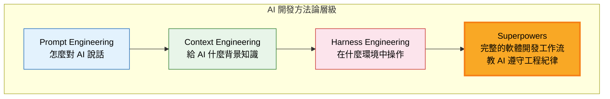

## 1.2 與 Prompt Engineering / Agent Framework 的差異

| 面向 | Prompt Engineering | Agent Framework（LangChain 等） | **Superpowers** |
|------|-------------------|--------------------------------|-----------------|
| **關注點** | 如何撰寫有效的提示 | 如何編排多個 AI 工具鏈 | 如何讓 AI 遵守工程紀律 |
| **產出** | 單次回應 | 多步驟自動化流程 | 高品質、可維護的程式碼 |
| **測試** | 通常無 | 可選 | **強制**（刪除未經測試的程式碼） |
| **計畫** | 無 | 由框架自動規劃 | 強制人工審核的微步驟計畫（2-5 min/task） |
| **程式碼審查** | 無 | 可選 | 自動化兩階段審查（Spec + Quality） |
| **適用階段** | 探索 / PoC | 自動化流程 | **生產級開發** |
| **品質保證** | 依賴人工審查 | 依賴框架限制 | 15 個內建技能自動協作 |
| **自動程度** | 手動 Prompt | 手動設定工具鏈 | **技能自動觸發** |

## 1.3 適用場景

### ✅ 最適合的場景

1. **企業系統開發**：需要長期維護的銀行 / 金融 / 醫療系統
2. **AI-Assisted Coding**：使用 Claude Code、Cursor、Codex CLI、Codex App、OpenCode 等工具進行日常開發
3. **Agent 團隊協作**：Subagent-Driven Development 實現多 Agent 自動分工
4. **技術債清理**：利用 AI 重構舊系統但需確保品質
5. **新人培訓**：用 Superpowers 規範引導新人養成正確開發習慣
6. **自主長時間開發**：Agent 可自主工作數小時而不偏離計畫

### ⚠️ 不適合的場景

- 一次性腳本 / 資料分析
- 快速 PoC / 黑客松
- 產出不需維護的程式碼

## 1.4 核心價值：工程紀律

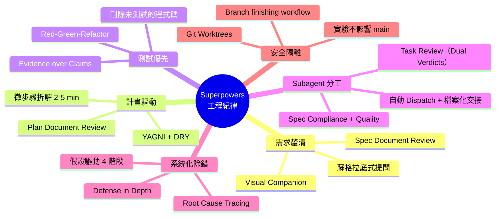

> 💡 **提示**：Superpowers 的核心價值在於「把資深工程師的工作習慣編碼成 AI 可執行的技能」。技能是**強制性工作流（Mandatory workflows）**，不是建議。

### 實務案例

某金融科技團隊在導入 Superpowers 前後的比較：

| 指標 | 導入前 | 導入後 | 改善幅度 |
|------|--------|--------|----------|
| AI 產出通過 Code Review 比率 | 35% | 82% | +134% |
| 測試覆蓋率 | 12% | 78% | +550% |
| 生產環境缺陷率 | 15 bugs/sprint | 3 bugs/sprint | -80% |
| 平均 Debug 時間 | 4.2 小時 | 1.1 小時 | -74% |
| AI 自主工作時長 | 10-15 分鐘 | **數小時** | 10x+ |

> ⚠️ **注意**：以上數據為示範用，實際效果依團隊狀況而異。導入初期可能因學習曲線導致短期效率下降。

## 1.5 支援平台總覽

Superpowers v6.1.1 支援 **10 個** AI 編碼平台（Harness）：

| 平台 | 安裝方式 | 支援程度 | Subagent 支援 | 說明 |
|------|---------|---------|--------------|------|
| **Claude Code**（Official） | Official Plugin Marketplace | ⭐⭐⭐⭐⭐ | ✅ 完整 | 原生支援，推薦首選 |
| **Claude Code**（Superpowers Marketplace） | Superpowers Marketplace | ⭐⭐⭐⭐⭐ | ✅ 完整 | 社群維護的替代安裝 |
| **Cursor** | Plugin Marketplace + Hooks | ⭐⭐⭐⭐⭐ | ✅ 完整 | v4.3.1 起正式支援 |
| **Antigravity** | `agy plugin install` | ⭐⭐⭐⭐⭐ | ✅ 完整 | v6.0.0 起支援 |
| **Codex CLI（OpenAI）** | Plugin Marketplace 或 `/plugins` 指令安裝 | ⭐⭐⭐⭐ | ✅ multi_agent | v3.3.0 起支援；**v6.1.0 起可直接透過 Marketplace 安裝** |
| **Codex App（OpenAI）** | 側邊欄 Plugins → Coding | ⭐⭐⭐⭐ | ✅ named agent dispatch | v5.0.6 起支援 |
| **Factory Droid** | `droid plugin marketplace add` | ⭐⭐⭐⭐ | ✅ 完整 | v5.1.0 起支援 |
| **Kimi Code** | Plugin Marketplace / 直接安裝 | ⭐⭐⭐⭐ | ✅ 完整 | v6.0.0 起支援 |
| **OpenCode** | One-line install（v5.0.4+）| ⭐⭐⭐⭐ | ✅ Native skill | v3.5.0 起支援 |
| **GitHub Copilot CLI** | Plugin Marketplace | ⭐⭐⭐⭐ | ✅ 完整 | v5.0.7 起支援 |
| **Pi** | `pi install git:` | ⭐⭐⭐⭐ | ✅ Native skill | v6.0.0 起支援 |

> 💡 **提示**：在不支援 Subagent 的平台上，Superpowers 自動降級為 `executing-plans` 模式（批次執行 + 人工檢查點）。v6.0.0 起，技能不再使用 Claude Code 專屬用語，改為平台無關的通用指令（vendor-neutral）。
>
> ⚠️ **平台異動**：**Gemini CLI 已於 v6.1.0（2026-06-30）移除支援**——Google 於 2026-06-18 終止 Gemini CLI 專案，該 Extension 已無法安裝或更新，Superpowers 隨即將其從安裝文件、支援平台清單與測試矩陣中移除。原使用 Gemini CLI 的團隊建議改用 Codex CLI 或 Factory Droid 等具備完整 Subagent 支援的替代平台（詳見[附錄 I](#附錄-iv610v611-重大變更gemini-cli-停止支援與-codex-安裝優化)）。

## 1.6 版本演進歷程

```mermaid
timeline
    title Superpowers 版本演進
    section v2.x（2025-10）
      v2.0.0 : 技能倉庫分離架構
            : 9 個新技能（Problem-solving / Research / Architecture）
            : 自動更新機制
    section v3.x（2025-10~11）
      v3.0.1 : 導入 Anthropic 第一方技能系統
      v3.1.0 : 技能名稱標準化（lowercase kebab-case）
      v3.2.0 : 設計文件整合至 Brainstorming
      v3.3.0 : Codex 支援（實驗性）
      v3.5.0 : OpenCode 支援
    section v4.x（2025-12~2026-02）
      v4.0.0 : Two-Stage Code Review
            : DOT 流程圖作為可執行規範
            : 測試反模式參考
      v4.1.0 : OpenCode native skill
      v4.2.0 : Worktree 隔離強制化
      v4.3.0 : Brainstorming 硬性閘門
      v4.3.1 : Cursor 正式支援
    section v5.x（2026-03）
      v5.0.0 : Visual Brainstorming Companion
            : Document Review System
            : 架構指導整合至技能管線
            : Subagent-Driven Development 強制化
      v5.0.2 : 零依賴 Brainstorm Server
            : Subagent Context Isolation
      v5.0.4 : Review Loop 精簡（3 輪）
            : OpenCode 一行安裝
      v5.0.5 : ESM/CJS 修正
            : Windows PID 修正
            : 恢復 Execution Mode 選擇
      v5.0.6 : Inline Self-Review 取代 Subagent Review Loops
            : Brainstorm Server 目錄重構
            : Codex App 相容性增強
      v5.0.7 : GitHub Copilot CLI 支援
            : OpenCode 路徑一致性修正
            : Bootstrap 注入優化
    section v5.1（2026-04）
      v5.1.0 : Factory Droid 新平台支援
            : Slash commands 完全移除
            : code-reviewer named agent 移除
            : Worktree 技能重寫（consent + 環境偵測）
            : SDD 不再每 3 任務暫停
            : Contributor Guidelines for AI Agents
            : CHANGELOG.md 移除（改用 RELEASE-NOTES.md）
    section v6.0（2026-06）
      v6.0.0 : SDD 審查架構全面重寫（單 reviewer 雙判決）
            : 新增 3 個平台（Antigravity、Kimi Code、Pi）
            : Visual Companion 安全模型（per-session key）
            : Vendor-neutral 技能用語重寫
            : Writing Plans 增強（Global Constraints + Interfaces）
            : Worktree 改用專案內 .worktrees/
            : Evals/Drill 測試架構分離
      v6.0.1 : Codex 版本顯示修正
      v6.0.2 : 移除 evals submodule 避免安裝問題
      v6.0.3 : SDD scratch files 從 .git/ 移至 .superpowers/sdd/
    section v6.1（2026-06~07）
      v6.1.0 : using-superpowers bootstrap 精簡（降低 token 成本）
            : Codex 改為可透過 Marketplace 安裝
            : 移除 Gemini CLI 支援（因 Google 終止該專案）
      v6.1.1 : 修正 Codex 重複註冊 SessionStart hook
            : 移除孤立的 hooks/session-start-codex
            : 新增 package-codex-plugin.sh 打包腳本
```

---

# 第 2 章：整體系統架構設計

> **章節摘要**：本章說明 Superpowers v6.1.1 的 Plugin 架構、技能自動觸發機制、Hooks 系統、多平台支援策略，以及與 CI/CD 系統的整合模式。

## 2.1 Superpowers 在 AI 開發架構中的位置

Superpowers 位於「AI Agent 的行為規範層」，介於底層 LLM 與上層應用邏輯之間。v5.0 起轉為 **Plugin 架構**，透過各平台的 Plugin Marketplace 安裝，不再需要手動複製檔案。v6.0.0 新增 Antigravity、Kimi Code、Pi 支援；v6.1.0 移除 Gemini CLI 支援，總共 **10 個平台**：

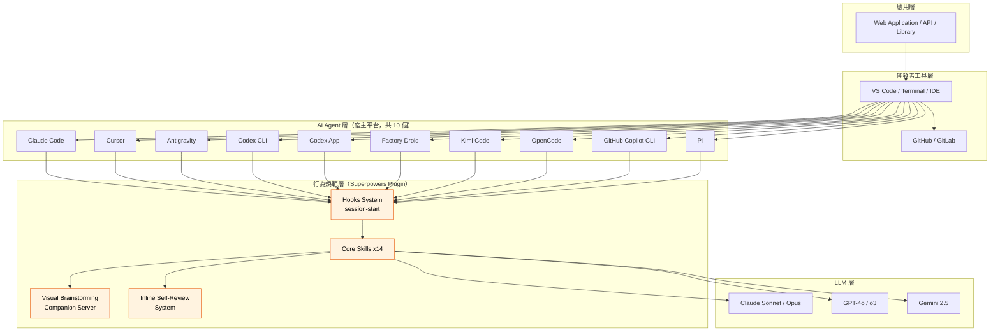

## 2.2 Plugin 架構與多平台支援

### 2.2.1 Plugin 架構總覽

自 v3.0 導入 Anthropic 第一方技能系統，v5.0 全面轉型為 **Plugin Marketplace** 模式：

| 元件 | 說明 |
|------|------|
| **Plugin Manifest** | 宣告技能清單、版本、平台相容性 |
| **Skills Directory** | 14 個技能目錄，內含多份 Markdown 定義檔（`.md`） |
| **Hooks** | 事件驅動的進入點（如 `session-start`） |
| **Visual Companion** | 零依賴 Node.js WebSocket 伺服器（Brainstorming 用） |
| **Platform Adapters** | 各平台的安裝腳本與設定映射 |

### 2.2.2 倉庫目錄結構（v6.1.1）

```
superpowers/                          # GitHub: obra/superpowers
├── skills/                           # 技能定義（核心）
│   ├── brainstorming/
│   │   ├── SKILL.md
│   │   ├── visual-companion.md
│   │   ├── spec-document-reviewer-prompt.md
│   │   └── scripts/              # Brainstorm Server（v5.0.1 移至此處）
│   │       ├── server.cjs            # 零依賴 Node.js 伺服器（含 per-session key 認證）
│   │       ├── index.html
│   │       ├── start-server.sh
│   │       └── stop-server.sh
│   ├── test-driven-development/
│   │   ├── SKILL.md
│   │   └── references/
│   │       └── testing-anti-patterns.md
│   ├── systematic-debugging/
│   │   ├── SKILL.md
│   │   └── references/
│   │       ├── root-cause-tracing.md
│   │       ├── defense-in-depth.md
│   │       └── condition-based-waiting.md
│   ├── verification-before-completion.md
│   ├── writing-plans/
│   │   ├── SKILL.md
│   │   └── plan-document-reviewer-prompt.md
│   ├── executing-plans.md
│   ├── dispatching-parallel-agents.md
│   ├── requesting-code-review/        # v5.1.0：自包含，整合原 code-reviewer
│   │   ├── SKILL.md
│   │   └── code-reviewer.md           # 從 agents/ 移入，單一來源
│   ├── receiving-code-review.md
│   ├── using-git-worktrees.md         # v6.0.0：worktree 改用專案內 .worktrees/
│   ├── finishing-a-development-branch.md  # v6.0.0：forge-neutral（不再硬編碼 gh pr create）
│   ├── subagent-driven-development/
│   │   ├── SKILL.md
│   │   ├── implementer-prompt.md
│   │   ├── task-reviewer-prompt.md    # v6.0.0：取代舊版 spec-reviewer + code-quality-reviewer
│   │   ├── task-brief                 # v6.0.0：任務文字檔案化腳本
│   │   ├── review-package             # v6.0.0：審查 diff 檔案化腳本
│   │   └── sdd-workspace             # v6.0.3：worktree 感知的工作目錄 helper
│   ├── writing-skills.md
│   └── using-superpowers/
│       ├── SKILL.md
│       └── references/                # v6.0.0：每個平台一份工具對照表
│           ├── claude-code-tools.md
│           ├── codex-tools.md
│           ├── copilot-tools.md
│           ├── antigravity-tools.md   # v6.0.0 新增
│           └── pi-tools.md            # v6.0.0 新增
├── hooks/                            # Hooks 系統
│   └── session-start                  # 各平台的 session-start hook（v6.1.0 起移除獨立的 session-start-codex）
├── scripts/                          # 建構與安裝腳本
│   ├── sync-to-codex-plugin          # Codex Plugin Mirror 同步工具
│   └── package-codex-plugin.sh       # v6.1.1 新增：產生確定性的 Codex portal 封裝包
├── tests/                            # Plugin-code 測試套件
├── docs/                             # 設計文件與移植指南（v6.0.0 新增）
│   ├── testing.md                     # 測試分層說明（tests/ vs evals/）
│   └── porting-to-a-new-harness.md    # 移植到新平台指南（v6.1.1：範例平台由 Codex 改為 Cursor）
├── .claude-plugin/                   # Claude Code Plugin 配置
├── .cursor-plugin/                   # Cursor Plugin 配置
├── .codex/                           # Codex CLI 配置
├── .codex-plugin/                    # Codex Plugin 配置（v5.0.6+）
├── .droid-plugin/                    # Factory Droid 配置（v5.1.0+）
├── .kimi-plugin/                     # Kimi Code 配置（v6.0.0+）
├── .pi/extensions/                   # Pi 配置（v6.0.0+）
├── .opencode/                        # OpenCode 配置
├── .github/                          # GitHub CI/CD 與社群設定
├── .superpowers/sdd/                 # v6.0.3：SDD 工作暫存區（git-ignored）
├── RELEASE-NOTES.md                  # 版本發行紀錄
├── CLAUDE.md                         # 貢獻者指南（含 AI Agent 投稿規範）
├── AGENTS.md                         # Codex 代理配置（symlink → CLAUDE.md）
├── CODE_OF_CONDUCT.md                # 社群行為準則
├── LICENSE                           # MIT 授權
├── package.json
└── README.md
```

> ⚠️ **v6.1.0 平台異動**：`GEMINI.md`、`gemini-extension.json` 與 `skills/using-superpowers/references/gemini-tools.md` 已隨 Gemini CLI 支援移除而從倉庫中移除（詳見[附錄 I](#附錄-iv610v611-重大變更gemini-cli-停止支援與-codex-安裝優化)）。
>
> ⚠️ **v6.0.0 重大變更**：
> - `spec-reviewer-prompt.md` 和 `code-quality-reviewer-prompt.md` 已合併為單一 `task-reviewer-prompt.md`
> - 新增 `task-brief` 和 `review-package` 腳本（將 diff/任務文字寫入檔案供 subagent 讀取）
> - 新增 `docs/` 目錄（移植指南、測試分層文件）
> - 新增 `.kimi-plugin/`、`.pi/extensions/` 目錄
> - legacy 全域 worktree 目錄 `~/.config/superpowers/worktrees/` 已移除，改用專案內 `.worktrees/`
> - v6.0.3：SDD 暫存檔從 `.git/sdd/` 移至 `.superpowers/sdd/`（自動 git-ignore）

### 2.2.3 各平台整合方式

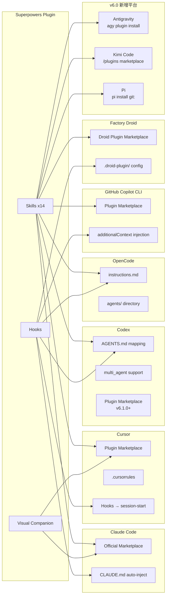

> 💡 **重要**：各平台的「技能定義內容」完全相同，差異僅在於**安裝路徑與 Hook 觸發機制**。v6.0.0 起，技能用語已從 Claude Code 專屬方言改為平台無關的通用指令（vendor-neutral）。

## 2.3 技能自動觸發機制

Superpowers 最重要的設計特點是——**你不需要明確呼叫技能**。每個技能內建觸發條件，當 AI Agent 偵測到匹配情境時自動生效。

### 觸發流程

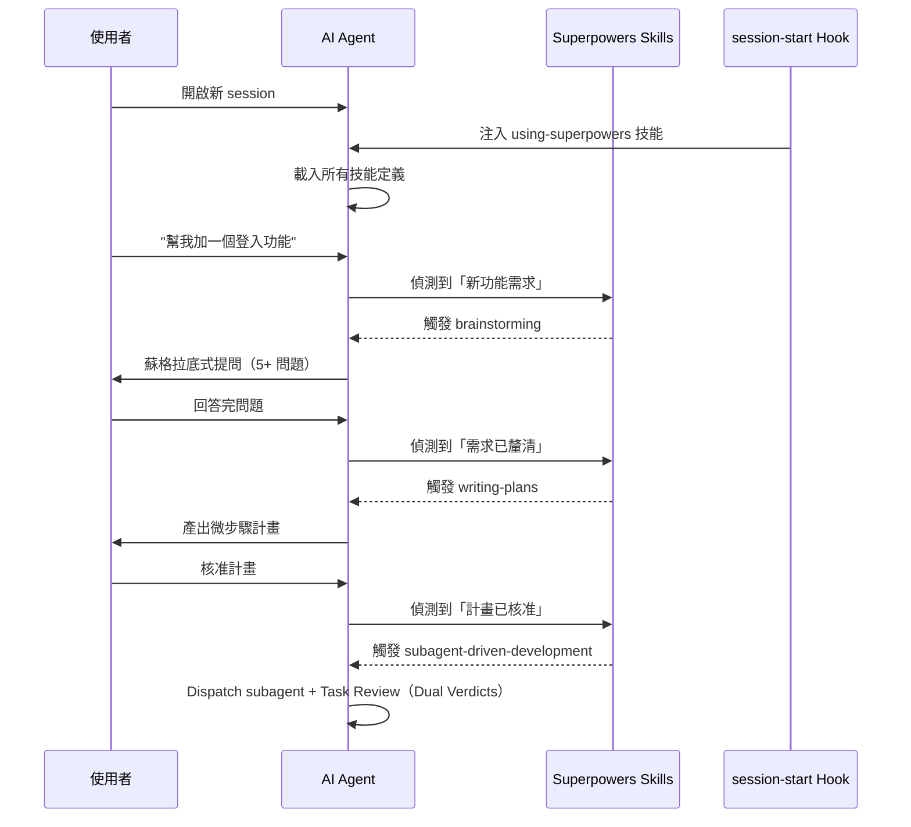

### 1% 規則與合理化偵測

`using-superpowers` 技能定義了一個關鍵規則——**永遠不要跳過技能觸發階段**。技能中包含「合理化偵測表」，提醒 Agent 不要因為自認為情況簡單就跳過流程：

| 常見合理化藉口 | 技能的回應 |
|---------------|-----------|
| 「這個改動很小，不需要計畫」 | 再小的改動也需要至少 1 條計畫步驟 |
| 「我已經知道 bug 在哪了」 | 知道 ≠ 已驗證；先建立假設再驗證 |
| 「測試太瑣碎，浪費時間」 | 刪除未經測試的程式碼 |
| 「只是 formatting 改動」 | formatting 也需要通過既有測試 |

> ⚠️ **1% 規則**：即使你 99% 確定不需要走流程，那 1% 的不確定性也可能造成災難。**永遠走流程。**

## 2.4 Hooks 系統

Hooks 是 Superpowers 的事件驅動進入點，在特定時機自動執行腳本。

### session-start Hook

最重要的 Hook 是 `session-start`——當使用者開啟新的 AI session 時自動執行：

```
hooks/
└── session-start          # 依平台不同使用不同格式
    ├── 01-setup.sh        # Unix 環境初始化
    └── 01-setup.ps1       # Windows 環境初始化
```

Hook 的工作流程：

1. **偵測平台**：自動辨識 Claude Code / Cursor / Antigravity / Codex CLI / Codex App / Factory Droid / Kimi Code / OpenCode / Copilot CLI / Pi
2. **注入技能**：將 `using-superpowers` 技能載入 Agent Context
3. **技能載入 using-superpowers 後**，Agent 即知道完整的 14 個技能索引
4. **啟動 Visual Companion**（如需要）：自動啟動 Brainstorm Server

> 💡 **提示**：Hooks 系統是 Superpowers「零設定」自動觸發的關鍵。安裝 Plugin 後，技能就會在每個 session 自動生效，不需要手動載入。

## 2.5 與 CI/CD 系統整合

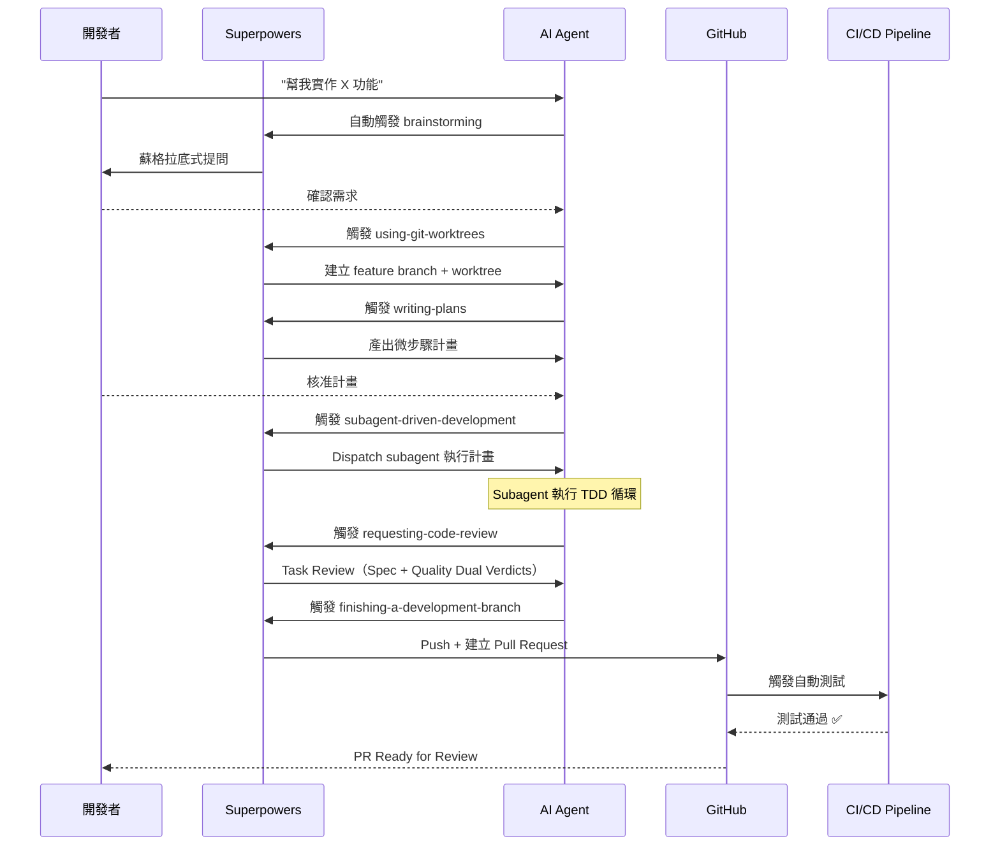

## 2.6 整體技術堆疊

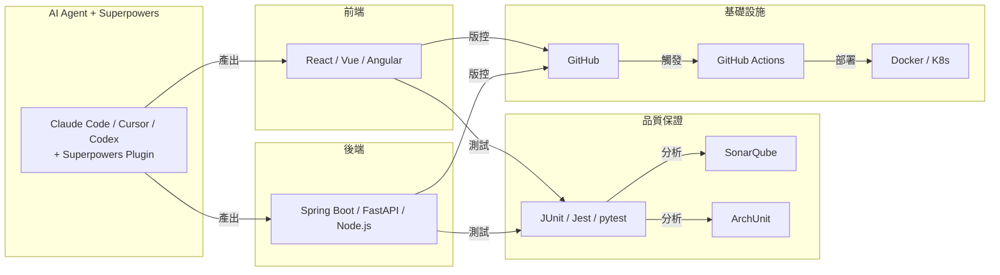

> 💡 **提示**：Superpowers 不綁定特定技術堆疊，其核心價值（工程紀律）適用於任何語言與框架。

### Best Practices

1. **使用 Plugin Marketplace 安裝**：透過 `/plugin install` 而非手動複製檔案
2. **統一團隊版本**：確保每位成員使用相同版本的 Superpowers Plugin
3. **分層整合**：不要試圖一次整合所有工具，從 Claude Code + GitHub 開始
4. **善用 Hooks**：利用 `session-start` hook 自動設定專案級規範

### Anti-patterns

- ❌ 手動複製技能檔到專案中（使用 Plugin Marketplace）
- ❌ 不同成員使用不同版本的 Superpowers
- ❌ 跳過 CI/CD 整合，只在本地使用
- ❌ 修改技能定義的核心流程（fork 前先確認是否有設定選項）

---

# 第 3 章：安裝與環境建置

> **章節摘要**：本章詳述 Superpowers v6.1.1 的安裝方式（以 Plugin Marketplace 為主）、各平台安裝指南、專案初始化流程，以及升級策略。

## 3.1 前置要求

| 工具 | 最低版本 | 說明 |
|------|---------|------|
| **Git** | 2.20+ | 需支援 `git worktree` 功能 |
| **Node.js** | 18+ | Visual Brainstorming Companion 需要 |
| **AI 平台** | 見下方 | 至少安裝一個支援的 AI 編碼平台 |

### 支援的 AI 平台

| 平台 | 版本要求 | 取得方式 |
|------|---------|---------|
| **Claude Code** | 最新版 | `npm install -g @anthropic-ai/claude-code` |
| **Cursor** | 最新版 | [cursor.com](https://cursor.com) |
| **Codex CLI（OpenAI）** | 最新版 | [github.com/openai/codex](https://github.com/openai/codex) |
| **Codex App（OpenAI）** | 最新版 | [codex.openai.com](https://codex.openai.com) |
| **OpenCode** | 最新版 | [github.com/opencode-ai/opencode](https://github.com/opencode-ai/opencode) |
| **GitHub Copilot CLI** | v1.0.11+ | `gh extension install github/gh-copilot` 或透過 VS Code |
| **Factory Droid** | 最新版 | [factory.droid.dev](https://factory.droid.dev) |
| **Antigravity** | 最新版 | [antigravity.dev](https://antigravity.dev)（v6.0.0 新增）|
| **Kimi Code** | 最新版 | [kimi.moonshot.cn](https://kimi.moonshot.cn)（v6.0.0 新增）|
| **Pi** | 最新版 | [pi.dev](https://pi.dev)（v6.0.0 新增）|

> ⚠️ Gemini CLI 已於 v6.1.0（2026-06-30）移除支援，不再列入本表（Google 已終止 Gemini CLI 專案）。

## 3.2 安裝步驟

### 方式一：Claude Code Plugin Marketplace（推薦）

```bash
# 在 Claude Code 中執行
/plugin install superpowers@claude-plugins-official

# 安裝完成後自動生效——技能會在每次 session 開始時自動載入
```

安裝後驗證：

```bash
# 開始新的 Claude Code session
claude

# 輸入任何開發請求，觀察 Agent 是否自動啟動 Brainstorming
> "幫我加一個使用者登入功能"
# 預期：Agent 開始蘇格拉底式提問，而非直接寫程式碼
```

### 方式二：Cursor Plugin Marketplace

```bash
# 在 Cursor 中執行
/add-plugin superpowers

# 或透過 Cursor 的 Plugin Marketplace UI 搜尋 "superpowers"
```

Cursor 額外設定（自動套用 Hooks）：

```json
// .cursor/settings.json — 通常 Plugin 安裝時自動設定
{
  "superpowers.hooks.sessionStart": true,
  "superpowers.visualCompanion": true
}
```

### 方式三：Codex CLI（OpenAI）

參照 [docs/README.codex.md](https://github.com/obra/superpowers/blob/main/docs/README.codex.md)：

```bash
# 方法 A：透過 Plugin Marketplace 安裝（v6.1.0 起支援，推薦）
/plugins
# 搜尋 "superpowers" → 點選 "Install Plugin"

# 方法 B：在 Codex 中告訴 Agent：
Fetch and follow instructions from https://raw.githubusercontent.com/obra/superpowers/refs/heads/main/.codex/INSTALL.md
```

> ⚠️ **注意**：Codex 使用 `multi_agent` 支援 Subagent-Driven Development，技能內建自動偵測。Codex 現在使用 `.codex-plugin/` 目錄結構。
>
> 💡 **v6.1.0／v6.1.1 更新**：Codex 現可直接透過 Plugin Marketplace 安裝（先前僅能用方法 B 的指令注入方式）；同時 Codex 不再自帶獨立的 `session-start-codex` hook，改與其他平台共用同一份 `session-start`。v6.1.1 進一步修正了 manifest 未明確宣告 `hooks: {}` 導致 Claude SessionStart hook 被重複註冊的問題，若在 v6.1.0 遇到技能被重複注入，升級至 v6.1.1 即可修復。

### 方式三-B：Codex App（OpenAI GUI，v5.0.6+ 新增）

```
1. 開啟 Codex App
2. 點選側邊欄的 "Plugins" 圖示
3. 在 "Coding" 分類中找到 "Superpowers"
4. 點選 "Install"
```

> 💡 Codex App 支援 named agent dispatch mapping，透過 `CODEX_SANDBOX` 環境變數自動偵測。

### 方式四：OpenCode

```bash
# v5.0.4 起支援一行安裝（透過 config hook 自動註冊 skills 目錄）
# 只需在 opencode.json 中加入一行即可

# 或告訴 OpenCode：
Fetch and follow instructions from https://raw.githubusercontent.com/obra/superpowers/refs/heads/main/.opencode/INSTALL.md
```

詳細文件：[docs/README.opencode.md](https://github.com/obra/superpowers/blob/main/docs/README.opencode.md)

> 💡 **v5.0.7 更新**：Bootstrap 注入從 `system.transform` 移至 `messages.transform`，避免 token 膨脹，同時修復與 Qwen 等模型的相容性。

### 已停止支援：Gemini CLI

> ⚠️ **v6.1.0 起已移除**：Google 於 2026-06-18 終止 Gemini CLI 專案，該 Extension 已無法安裝或更新。Superpowers 隨即在 v6.1.0（2026-06-30）將 Gemini CLI 從安裝文件、支援平台清單與相容性矩陣中移除。以下安裝方式僅供曾使用 Gemini CLI 的團隊了解歷史沿革，**已不可再執行**：
>
> ```bash
> # 已停用（v5.0.1 ~ v6.0.3 曾支援，v6.1.0 起移除）
> gemini extensions install https://github.com/obra/superpowers
> ```
>
> 原使用 Gemini CLI 的團隊建議改用 **Codex CLI**（v6.1.0 起可透過 Marketplace 安裝）或 **Factory Droid** 等具備完整 Subagent 支援的替代平台，詳見[附錄 I](#附錄-iv610v611-重大變更gemini-cli-停止支援與-codex-安裝優化)。

### 方式五：GitHub Copilot CLI（v5.0.7 新增）

v5.0.7 起正式支援 GitHub Copilot CLI，透過 Plugin Marketplace 安裝：

```bash
# 註冊 Marketplace
copilot plugin marketplace add obra/superpowers-marketplace

# 安裝 Plugin
copilot plugin install superpowers@superpowers-marketplace
```

**運作原理**：
- Copilot CLI v1.0.11+ 支援 `additionalContext` 在 SessionStart hook 輸出中
- session-start hook 自動偵測 `COPILOT_CLI` 環境變數，發送 SDK 標準格式 `{ "additionalContext": "..." }`
- 工具對照表位於 `references/copilot-tools.md`，提供 Claude Code 到 Copilot CLI 的完整工具等價表

### 方式五-B：Factory Droid（v5.1.0 新增）

v5.1.0 起正式支援 Factory Droid 平台：

```bash
# 註冊 Superpowers Marketplace
droid plugin marketplace add https://github.com/obra/superpowers

# 安裝 Plugin
droid plugin install superpowers@superpowers
```

**運作原理**：
- 使用 `.droid-plugin/` 目錄結構進行配置
- 支援完整的 Subagent dispatch
- session-start hook 自動偵測 Factory Droid 環境並注入技能

### 方式五-C：Antigravity（v6.0.0 新增）

v6.0.0 起正式支援 Antigravity 平台（harness 代碼：`agy`）：

```bash
# 透過 Antigravity plugin install 指令
agy plugin install obra/superpowers
```

**運作原理**：
- session-start hook 偵測 `ANTIGRAVITY_SESSION` 環境變數
- Antigravity 原生支援 subagent dispatch
- 工具對照表位於 `references/antigravity-tools.md`

### 方式五-D：Kimi Code（v6.0.0 新增）

v6.0.0 起正式支援 Kimi Code 平台：

```bash
# 透過 Kimi Code 的 /plugins 指令安裝
/plugins
# 搜尋 "superpowers" → 安裝
```

**運作原理**：
- 使用 `.kimi-plugin/` 目錄結構進行配置
- session-start hook 偵測 `KIMI_CODE` 環境變數
- 支援 Moonshot 的 tool-use 協議

### 方式五-E：Pi（v6.0.0 新增）

v6.0.0 起正式支援 Pi 平台：

```bash
# 透過 Pi 的 extension 機制安裝
pi install git:obra/superpowers
```

**運作原理**：
- 使用 `.pi/extensions/` 目錄結構進行配置
- session-start hook 偵測 `PI_SESSION` 環境變數
- 工具對照表位於 `references/pi-tools.md`

### 方式六：搭配 GitHub Copilot 使用（方法論移植）

Superpowers 的 Plugin Marketplace 不直接支援 GitHub Copilot，但其方法論可透過指令檔注入：

```markdown
<!-- .github/copilot-instructions.md -->
# Copilot 開發規範（基於 Superpowers 方法論）

## 強制規則
- 收到新功能需求時，先提問釐清（至少 5 個問題），不要直接寫程式碼
- 必須先產出微步驟計畫（每步 2-5 分鐘），人工核准後才開始
- 每個功能必須有對應的測試（TDD: Red → Green → Refactor）
- Debug 時必須先建立假設再驗證（Systematic Debugging 4 階段）
- 所有實驗性工作必須在 Git Worktree 中進行
```

## 3.3 專案初始化

> 💡 **注意**：使用 Plugin Marketplace 安裝時，不需要在專案中建立 `.superpowers/` 目錄。技能由 Plugin 全域管理。以下設定僅適用於需要**專案級客製化**的情況。

### 專案級 CLAUDE.md 設定（Claude Code 專案）

```markdown
<!-- CLAUDE.md -->
# 專案開發規範

## 技術堆疊
- Language: Java 21
- Framework: Spring Boot 3.x
- Build: Maven 3.9+
- Test: JUnit 5 + Mockito

## Superpowers 客製化
- Brainstorming 最少提問：5 題
- Planning 每步上限：5 分鐘
- TDD 覆蓋率最低：80%
- 所有 feature 開發必須使用 Git Worktree
```

### 專案級 .cursorrules 設定（Cursor 專案）

```markdown
<!-- .cursorrules -->
# Cursor 開發規範（Superpowers 增強）

遵循 Superpowers 工作流：
1. 新功能 → Brainstorming → Writing Plans → Subagent Development
2. 強制 TDD：先寫測試、再寫實作
3. Debug → Systematic Debugging（假設驅動 4 階段）
4. 所有實驗 → Git Worktree 隔離
```

## 3.4 建議目錄結構

### 使用 Plugin（推薦——無需本地技能檔）

```
your-project/
├── CLAUDE.md                    # Claude Code 專案指令（客製化用）
├── .cursorrules                 # Cursor 規範（客製化用）
├── .github/
│   ├── copilot-instructions.md  # Copilot 方法論注入
│   └── workflows/
│       ├── ci.yml
│       └── tdd-check.yml
├── src/
│   ├── main/java/...
│   └── test/java/...
├── pom.xml
└── README.md
```

> 💡 技能檔由 Plugin 管理，不需要在專案中維護 `.superpowers/` 目錄。

### 手動安裝（無 Plugin 支援的平台）

```
your-project/
├── superpowers-skills/          # 手動複製的技能（Codex 等平台）
│   ├── brainstorming.md
│   ├── test-driven-development.md
│   ├── ...
│   └── using-superpowers.md
├── AGENTS.md                    # Codex 用
├── CLAUDE.md                    # Claude Code 用
├── src/
└── pom.xml
```

### Monorepo 結構

```
monorepo/
├── CLAUDE.md                    # 全域 Claude 指令
├── packages/
│   ├── frontend/
│   │   ├── CLAUDE.md            # 前端專屬覆寫
│   │   └── src/
│   ├── backend/
│   │   ├── CLAUDE.md            # 後端專屬覆寫
│   │   └── src/
│   └── shared/
│       └── src/
└── pom.xml / package.json
```

## 3.5 Dev Container 配置（選用）

```json
// .devcontainer/devcontainer.json
{
  "name": "Superpowers Dev Environment",
  "image": "mcr.microsoft.com/devcontainers/java:21",
  "features": {
    "ghcr.io/devcontainers/features/node:1": {},
    "ghcr.io/devcontainers/features/git:1": {}
  },
  "postCreateCommand": "npm install -g @anthropic-ai/claude-code && claude /plugin install superpowers@claude-plugins-official",
  "customizations": {
    "vscode": {
      "extensions": [
        "vscjava.vscode-java-pack",
        "github.copilot",
        "github.copilot-chat"
      ]
    }
  }
}
```

## 3.6 升級方式

### Plugin Marketplace 升級

```bash
# Claude Code
/plugin update superpowers

# Cursor
/update-plugin superpowers

# OpenCode
opencode plugin update superpowers
```

### 手動安裝升級

```bash
# 拉取最新版本
cd /path/to/superpowers-clone
git pull origin main

# 重新複製技能檔
cp -r skills/ /path/to/your-project/superpowers-skills/
```

### 版本鎖定

如需鎖定特定版本（企業環境建議）：

```bash
# 安裝指定版本
/plugin install superpowers@6.1.1

# 或手動 checkout 特定 tag
git checkout v6.1.1
```

## 3.7 驗證安裝

安裝完成後，執行以下檢查：

```bash
# 1. 確認 Git Worktree 可用
git worktree list

# 2. 確認 Node.js 版本（Visual Companion 需要）
node --version   # 預期：v18+

# 3. 測試 Git Worktree 建立
git worktree add ../sp-test -b sp/test/verify
git worktree remove ../sp-test

# 4. 開始新 session 並測試技能觸發
#    輸入任何開發請求，確認 Agent 自動啟動 Brainstorming
```

### 功能驗證清單

| 項目 | 驗證方式 | 預期結果 |
|------|---------|---------|
| **技能自動觸發** | 請求新功能開發 | Agent 自動開始提問 |
| **TDD 強制** | 請求實作功能 | Agent 先寫測試 |
| **Git Worktree** | 開始開發任務 | 自動建立隔離分支 |
| **計畫產出** | 需求釐清後 | 產出 2-5 分鐘微步驟 |
| **Visual Companion** | 啟動 Brainstorming（如適用）| 瀏覽器自動開啟圖形介面 |

預期驗證結果：

```
✅ Git Worktree 支援：正常
✅ Node.js 版本：v18+
✅ Superpowers Plugin：已安裝 v6.1.1
✅ 技能自動觸發：正常（14 個技能已載入）
✅ Visual Companion：可啟動（零依賴 Node.js 伺服器）
```

> 💡 **提示**：首次安裝建議使用方式一（Git Clone），之後可依專案需求調整配置。

### Anti-patterns

- ❌ 不將 `.superpowers/` 目錄加入版控
- ❌ 團隊成員各自維護不同的技能定義
- ❌ 跳過驗證步驟直接開始使用
- ❌ 在 `config.yaml` 中關閉 `enforce: true`（這會讓 TDD 變成可選）

---

# 第 4 章：核心 Skills 詳解

> **章節摘要**：本章深入介紹 Superpowers v6.1.1 的 14 個內建技能。按照 The Basic Workflow（7 步驟）的順序組織，並涵蓋每個技能的觸發條件、執行流程、Prompt 範例與注意事項。

> 💡 **v6.0.0 重大變更**：
> - SDD Review 從 Two-Stage（兩個獨立 reviewer）改為 Single Reviewer with Dual Verdicts（`task-reviewer-prompt.md`），~50% token 節省、~2× 加速。
> - 新增 `task-brief` 和 `review-package` 腳本——subagent 交接改用檔案而非 prompt 注入。
> - `using-git-worktrees` 技能：worktree 從全域目錄改為專案內 `.worktrees/`。
> - `finishing-a-development-branch` 技能：不再硬編碼 `gh pr create`，改為 forge-neutral（支援任何 Git forge）。
> - 技能用語從 Claude Code 專屬方言改為 vendor-neutral 通用指令。
> - Writing Plans 新增 **Global Constraints** 區塊和每任務 **Interfaces** 區塊。

## 4.1 完整技能庫總覽

### 技能清單（v6.1.1）

| # | 技能名稱 | 類別 | 自動觸發 | 說明 |
|---|---------|------|---------|------|
| 1 | `brainstorming` | 需求 | ✅ | 蘇格拉底式提問 + Visual Companion + Inline Self-Review |
| 2 | `using-git-worktrees` | 隔離 | ✅ | Git Worktree 自動建立（v6.0.0：專案內 `.worktrees/`） |
| 3 | `writing-plans` | 規劃 | ✅ | 微步驟計畫 + Global Constraints + Interfaces 區塊 |
| 4 | `subagent-driven-development` | 執行 | ✅ | Subagent 分工 + Single Reviewer Dual Verdicts（v6.0.0） |
| 5 | `executing-plans` | 執行 | ✅ | 循序執行（無 Subagent 時 fallback） |
| 6 | `test-driven-development` | 品質 | ✅ | Red-Green-Refactor 強制循環 |
| 7 | `requesting-code-review` | 審查 | ✅ | 向 Subagent 發起程式碼審查 |
| 8 | `receiving-code-review` | 審查 | ✅ | 接收並處理審查回饋 |
| 9 | `finishing-a-development-branch` | 完成 | ✅ | 分支收尾（v6.0.0：forge-neutral，不再綁定 GitHub） |
| 10 | `systematic-debugging` | 除錯 | ✅ | 假設驅動 4 階段除錯 |
| 11 | `verification-before-completion` | 品質 | ✅ | 完成前強制驗證 |
| 12 | `dispatching-parallel-agents` | 執行 | ✅ | 平行 Subagent 調度 |
| 13 | `writing-skills` | Meta | 手動 | 撰寫新技能定義 |
| 14 | `using-superpowers` | Meta | ✅ | 技能索引 + 觸發規則 |

### 參考資料

| 名稱 | 說明 |
|------|------|
| `testing-anti-patterns.md` | TDD 反模式參考（v4.0.0 新增） |

### 技能依賴關係圖

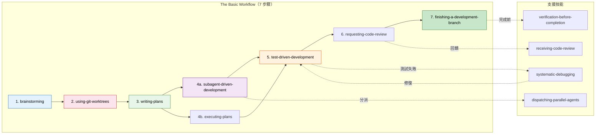

## 4.2 The Basic Workflow（7 步驟）

Superpowers v5.0 將核心開發流程標準化為 7 個步驟。**這是所有新功能開發的預設路徑**：

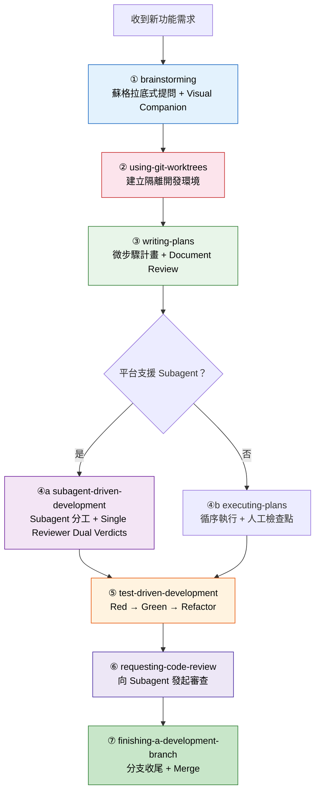

> ⚠️ **重要**：這 7 個步驟是**強制性**的。`using-superpowers` 技能內建「合理化偵測」，防止 Agent 因認為情況簡單而跳過任何步驟。

---

## 4.3 Brainstorming（需求釐清）+ Visual Companion

### 核心理念

Brainstorming 技能使用**蘇格拉底式提問法（Socratic Questioning）**，強制 AI 在動手寫程式碼之前，先透過一系列深入的提問來釐清需求。

v5.0 新增 **Visual Brainstorming Companion**——一個基於 WebSocket 的瀏覽器介面，即時顯示腦力激盪的思維圖。

### v5.0 新增：硬性閘門（Hard Gates）

自 v4.3.0 起，Brainstorming 引入硬性閘門——Agent **必須**在以下條件全部滿足時才能離開 Brainstorming 階段：

| 閘門 | 條件 |
|------|------|
| **問題數量** | 至少提出 5 個深入問題 |
| **使用者確認** | 使用者明確確認「需求已釐清」 |
| **設計文件** | 產出 Spec Document（v3.2.0 起整合） |
| **Document Review** | Spec 經過 Inline Self-Review（v5.0.6+，取代舊版 Subagent Review Loop） |

### Visual Brainstorming Companion

v5.0.0 新增的瀏覽器端圖形化工具，與 Agent 的 Brainstorming 即時同步：

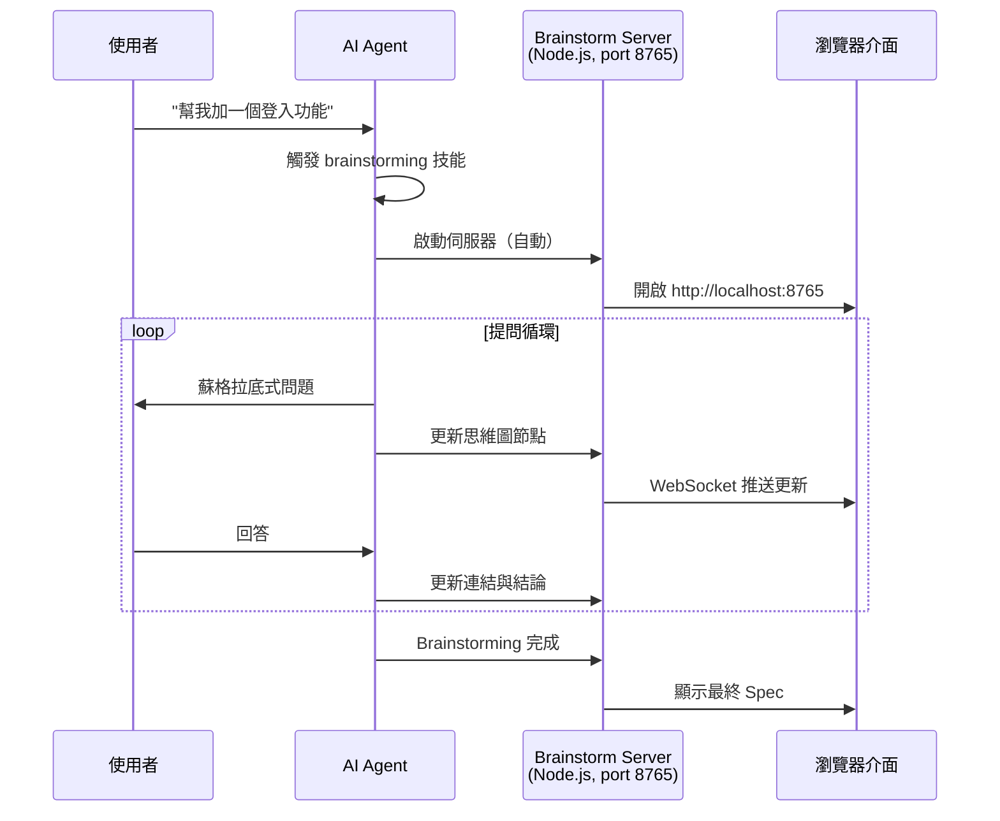

**技術特點**：
- **零依賴**：僅使用 Node.js 內建模組（`http`, `fs`, `crypto`）
- **自動啟動**：Agent 觸發 Brainstorming 時自動啟動伺服器
- **Windows 支援**：v5.0.5 修正了 Windows PID 管理問題
- **Per-session 認證金鑰**（v6.0.0）：每次 session 啟動時產生唯一 key，防止未經授權的 WebSocket 連線
- **4 小時閒置超時**（v6.0.0）：伺服器閒置 4 小時後自動關閉，節省資源
- **重啟存活**（v6.0.0）：session key 持久化，Agent 重連後伺服器無需重啟
- **沙箱檔案伺服器**（v6.0.0）：Visual Companion 可讀取專案內檔案（限 `.superpowers/` 目錄），支援圖表展示

### 蘇格拉底式提問框架

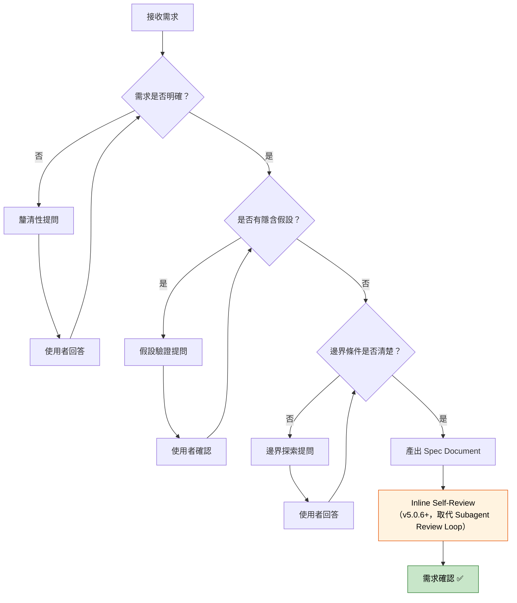

### 提問類型與範例

#### 第一類：釐清性提問（Clarification Questions）

```
使用者：「我需要一個登入功能。」

AI Brainstorming 回覆：
1. 登入功能的目標使用者是誰？（內部員工 / 外部客戶 / 兩者皆是）
2. 需要支援哪些認證方式？（帳號密碼 / SSO / OAuth2 / 多因素認證）
3. 登入失敗時需要怎樣的處理？（鎖定次數 / 驗證碼 / 通知管理員）
4. 是否需要「記住我」功能？Session 有效期限為何？
5. 是否需要稽核日誌（Audit Log）？
```

#### 第二類：假設驗證提問（Assumption Probing）

```
使用者：「用 JWT 做認證就好。」

AI Brainstorming 回覆：
1. 確認一下，JWT 是否需要搭配 Refresh Token 機制？
2. Token 是否需要支援撤銷（Revocation）？純 JWT 無法實現即時撤銷。
3. 目前系統是否有現存的 Session 機制需要相容？
4. 前端 Token 儲存位置？（HttpOnly Cookie vs LocalStorage — 安全性考量）
5. 是否需要考慮跨域（CORS）場景？
```

#### 第三類：邊界探索提問（Boundary Exploration）

```
AI Brainstorming 回覆：
1. 同一帳號是否允許多裝置同時登入？
2. 預計尖峰時段的並發登入數量？
3. 如果認證服務（如 LDAP/AD）不可用時，系統該如何處理？
4. 密碼規則的最低要求是什麼？
5. 是否需要支援密碼過期強制重設？
```

### Best Practices

1. **最少 5 個問題**：確保覆蓋主要面向
2. **分層提問**：從高層（Why）到低層（How）
3. **產出 Spec Document**：Brainstorming 結論必須文件化
4. **不要在 Brainstorming 階段寫程式碼**
5. **善用 Visual Companion**：複雜需求使用圖形化介面輔助思考

### Anti-patterns

- ❌ AI 沒有提問就直接開始寫程式碼
- ❌ 提問太表面，未深入業務邏輯
- ❌ 使用者敷衍回答，AI 沒有追問
- ❌ 未產出 Spec Document 就離開 Brainstorming 階段
- ❌ 跳過 Document Review Loop

---

## 4.4 TDD — 測試驅動開發

### 核心理念

TDD 是 Superpowers 中**最重要的技能**。它強制 AI 遵循「Red → Green → Refactor」循環。v4.0.0 起新增 `testing-anti-patterns.md` 參考，幫助 Agent 避免常見測試錯誤。

### TDD 三階段循環

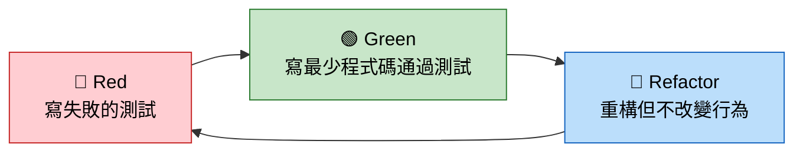

### 關鍵規則

| 規則 | 說明 |
|------|------|
| **先寫測試，永遠** | 在任何實作程式碼之前，必須先有失敗的測試 |
| **刪除未測試的程式碼** | 如果一段程式碼沒有對應的測試，刪掉它 |
| **一次一個測試** | 不要批次撰寫所有測試 |
| **Refactor 不改行為** | 重構階段測試必須始終 Green |
| **參考 anti-patterns** | 避免 `testing-anti-patterns.md` 中列舉的反模式 |

### 完整實作範例（Java / Spring Boot）

#### 場景：實作一個銀行帳戶轉帳功能

**🔴 Red 階段：先寫失敗的測試**

```java
package com.tutorial.banking.service;

import org.junit.jupiter.api.BeforeEach;
import org.junit.jupiter.api.Test;
import org.junit.jupiter.api.DisplayName;

import static org.junit.jupiter.api.Assertions.*;

/**
 * 帳戶轉帳服務測試類別。
 * 遵循 Superpowers TDD 技能：先寫測試，再寫實作。
 */
class TransferServiceTest {

    private TransferService transferService;
    private Account sourceAccount;
    private Account targetAccount;

    @BeforeEach
    void setUp() {
        transferService = new TransferService();
        sourceAccount = new Account("ACC-001", 10000.0);
        targetAccount = new Account("ACC-002", 5000.0);
    }

    @Test
    @DisplayName("正常轉帳：來源帳戶扣款、目標帳戶入款")
    void shouldTransferAmountBetweenAccounts() {
        // Given
        double transferAmount = 3000.0;

        // When
        TransferResult result = transferService.transfer(
            sourceAccount, targetAccount, transferAmount
        );

        // Then
        assertTrue(result.isSuccess());
        assertEquals(7000.0, sourceAccount.getBalance());
        assertEquals(8000.0, targetAccount.getBalance());
    }

    @Test
    @DisplayName("餘額不足時應拒絕轉帳")
    void shouldRejectTransferWhenInsufficientBalance() {
        // Given
        double transferAmount = 15000.0;

        // When
        TransferResult result = transferService.transfer(
            sourceAccount, targetAccount, transferAmount
        );

        // Then
        assertFalse(result.isSuccess());
        assertEquals("INSUFFICIENT_BALANCE", result.getErrorCode());
        assertEquals(10000.0, sourceAccount.getBalance()); // 餘額不變
        assertEquals(5000.0, targetAccount.getBalance());   // 餘額不變
    }

    @Test
    @DisplayName("轉帳金額不可為零或負數")
    void shouldRejectNonPositiveAmount() {
        assertAll(
            () -> {
                TransferResult result = transferService.transfer(
                    sourceAccount, targetAccount, 0
                );
                assertFalse(result.isSuccess());
                assertEquals("INVALID_AMOUNT", result.getErrorCode());
            },
            () -> {
                TransferResult result = transferService.transfer(
                    sourceAccount, targetAccount, -100
                );
                assertFalse(result.isSuccess());
                assertEquals("INVALID_AMOUNT", result.getErrorCode());
            }
        );
    }

    @Test
    @DisplayName("不可轉帳給自己")
    void shouldRejectSelfTransfer() {
        TransferResult result = transferService.transfer(
            sourceAccount, sourceAccount, 1000.0
        );
        assertFalse(result.isSuccess());
        assertEquals("SELF_TRANSFER", result.getErrorCode());
    }
}
```

此時執行測試：**全部失敗（Red）** ✅ — 這是預期行為。

```bash
mvn test -Dtest=TransferServiceTest
# 結果：4 tests, 0 passed, 4 failed ← 正確！這就是 Red 階段
```

**🟢 Green 階段：寫最少的程式碼讓測試通過**

```java
package com.tutorial.banking.service;

/**
 * 帳戶轉帳服務。
 * 
 * @author AI (Superpowers TDD)
 */
public class TransferService {

    /**
     * 執行帳戶間轉帳。
     *
     * @param source 來源帳戶
     * @param target 目標帳戶
     * @param amount 轉帳金額
     * @return 轉帳結果
     */
    public TransferResult transfer(Account source, Account target, double amount) {
        // 驗證：金額必須為正數
        if (amount <= 0) {
            return TransferResult.failure("INVALID_AMOUNT", "轉帳金額必須大於零");
        }

        // 驗證：不可自轉
        if (source.getAccountId().equals(target.getAccountId())) {
            return TransferResult.failure("SELF_TRANSFER", "不可轉帳給自己");
        }

        // 驗證：餘額充足
        if (source.getBalance() < amount) {
            return TransferResult.failure("INSUFFICIENT_BALANCE", "餘額不足");
        }

        // 執行轉帳
        source.debit(amount);
        target.credit(amount);

        return TransferResult.success(source, target, amount);
    }
}
```

```java
package com.tutorial.banking.service;

/**
 * 帳戶模型。
 */
public class Account {
    private final String accountId;
    private double balance;

    public Account(String accountId, double balance) {
        this.accountId = accountId;
        this.balance = balance;
    }

    public String getAccountId() { return accountId; }
    public double getBalance() { return balance; }

    public void debit(double amount) { this.balance -= amount; }
    public void credit(double amount) { this.balance += amount; }
}
```

```java
package com.tutorial.banking.service;

/**
 * 轉帳結果。
 */
public class TransferResult {
    private final boolean success;
    private final String errorCode;
    private final String message;

    private TransferResult(boolean success, String errorCode, String message) {
        this.success = success;
        this.errorCode = errorCode;
        this.message = message;
    }

    public static TransferResult success(Account source, Account target, double amount) {
        return new TransferResult(true, null,
            String.format("成功轉帳 %.2f 從 %s 到 %s",
                amount, source.getAccountId(), target.getAccountId()));
    }

    public static TransferResult failure(String errorCode, String message) {
        return new TransferResult(false, errorCode, message);
    }

    public boolean isSuccess() { return success; }
    public String getErrorCode() { return errorCode; }
    public String getMessage() { return message; }
}
```

再次執行測試：**全部通過（Green）** ✅

```bash
mvn test -Dtest=TransferServiceTest
# 結果：4 tests, 4 passed, 0 failed ← Green！
```

**🔵 Refactor 階段：重構但不改變行為**

重構要點（在測試保護下安全進行）：

```java
// 重構：將驗證邏輯抽取為私有方法
public class TransferService {

    public TransferResult transfer(Account source, Account target, double amount) {
        TransferResult validation = validate(source, target, amount);
        if (validation != null) {
            return validation;
        }

        execute(source, target, amount);
        return TransferResult.success(source, target, amount);
    }

    private TransferResult validate(Account source, Account target, double amount) {
        if (amount <= 0) {
            return TransferResult.failure("INVALID_AMOUNT", "轉帳金額必須大於零");
        }
        if (source.getAccountId().equals(target.getAccountId())) {
            return TransferResult.failure("SELF_TRANSFER", "不可轉帳給自己");
        }
        if (source.getBalance() < amount) {
            return TransferResult.failure("INSUFFICIENT_BALANCE", "餘額不足");
        }
        return null; // 驗證通過
    }

    private void execute(Account source, Account target, double amount) {
        source.debit(amount);
        target.credit(amount);
    }
}
```

再次執行測試：**仍然全部通過** ✅

```bash
mvn test -Dtest=TransferServiceTest
# 結果：4 tests, 4 passed, 0 failed ← Refactor 完成，行為不變
```

### 測試策略矩陣

| 測試類型 | 範圍 | 速度 | 使用時機 | 範例 |
|---------|------|------|---------|------|
| **Unit Test** | 單一類別/方法 | 毫秒級 | 每個 TDD 循環 | `TransferServiceTest` |
| **Integration Test** | 多個元件互動 | 秒級 | 功能完成時 | Service + Repository |
| **Contract Test** | API 介面 | 秒級 | API 變更時 | REST API Schema |
| **E2E Test** | 完整流程 | 分鐘級 | Release 前 | 登入→下單→付款 |

### TDD Prompt 範例

```
我需要實作「密碼重設功能」。

請使用 Superpowers TDD 技能：
1. 先幫我列出所有需要測試的案例（至少 5 個）
2. 從最簡單的案例開始，寫一個會失敗的測試
3. 等我確認後，再寫實作讓測試通過
4. 每次只處理一個測試案例
```

### Best Practices

1. **一次只寫一個測試**：不要一次寫完所有測試
2. **測試命名要描述行為**：`shouldRejectTransferWhenInsufficientBalance`
3. **使用 AAA 模式**：Arrange（準備）→ Act（執行）→ Assert（驗證）
4. **Refactor 不改行為**：重構時測試必須始終通過
5. **測試也要重構**：避免測試程式碼變成技術債

### Anti-patterns

- ❌ 先寫實作再補測試（這不是 TDD）
- ❌ 一次寫完所有測試（違反逐步推進原則）
- ❌ 測試中使用 magic number 而不說明意義
- ❌ 跳過 Refactor 階段（導致程式碼品質下降）
- ❌ 測試只測 happy path（必須包含錯誤場景）

---

## 4.5 Writing Plans（微步驟計畫）+ Document Review

### 核心理念

Writing Plans 技能將大型任務拆解成**每個步驟 2~5 分鐘可完成的微任務**。v5.0 新增 **Document Review System**——計畫文件必須經過 Review Loop（最多 3 輪）才能進入實作階段。

> 💡 **v6.0.0 新增**：
> - **Global Constraints 區塊**：計畫頂部明確列出全域約束（如技術棧限制、不得使用的 library 等），確保所有 subagent 共享一致的限制條件。
> - **per-task Interfaces 區塊**：每個任務可宣告「我需要什麼介面」和「我提供什麼介面」，幫助 orchestrator 正確排序任務依賴。
> - **Right-sizing guidance**：計畫過大或過小時自動提供調整建議。

### 任務拆解方法論

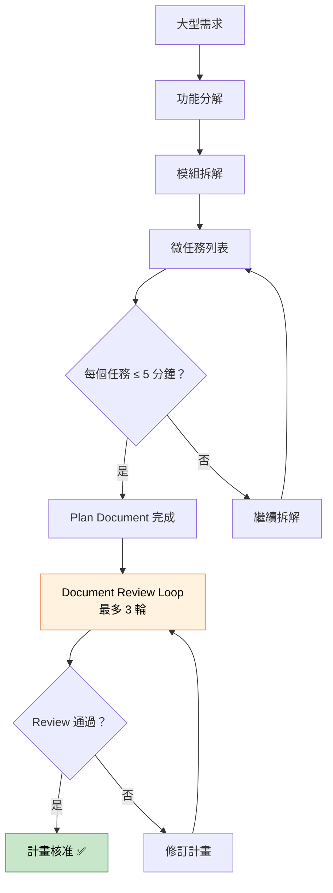

### v5.0 Document Review System（v5.0.6 更新為 Inline Self-Review）

> 💡 **v5.0.6 重大變更**：舊版的 Subagent Review Loop（dispatch 子代理審查，最多 3 輪）已被 **Inline Self-Review** 取代。回歸測試顯示兩者缺陷捕獲率相同，但 Inline Self-Review 僅需 ~30 秒（vs Subagent Review Loop 的 ~25 分鐘）。

| 審查維度 | 說明 |
|---------|------|
| **完整性** | 所有需求是否都有對應的任務？ |
| **粒度** | 每個任務是否在 2-5 分鐘內？ |
| **可驗證性** | 每個任務完成後能否立即驗證？ |
| **依賴順序** | 任務之間的先後關係是否合理？ |
| **TDD 覆蓋** | 是否每個功能都有對應的測試任務？ |
| **YAGNI 檢查** | 是否包含不必要的功能？ |

> 💡 v5.0.4 將 Review Loop 精簡為最多 **3 輪**，避免過度審查。v5.0.6 進一步以 **Inline Self-Review 取代 Subagent Review Loop**，大幅提升效率（~30s vs ~25min）。

#### Inline Self-Review Checklist（v5.0.6+）

| 技能 | Self-Review 檢查項目 |
|------|--------------------|
| **brainstorming**（Spec） | Placeholder 掃描、內部一致性、範圍檢查、模糊性檢查 |
| **writing-plans**（Plan） | Spec 覆蓋度、Placeholder 掃描、型別一致性、「No Placeholders」規則 |

> ⚠️ **No Placeholders 規則**（v5.0.6 新增）：計畫中不得包含 TBD、模糊描述、未定義的參考、「similar to Task N」等佔位內容，否則視為計畫失敗。

### 計畫範本

```markdown
# 功能計畫：用戶認證模組

## 需求摘要
實作 JWT 認證，支援登入、登出、Token 刷新。

## 微任務列表

### 階段一：資料模型（預計 10 分鐘）
- [ ] 任務 1.1：建立 `User` 實體類別（3 min）
- [ ] 任務 1.2：建立 `UserRepository` 介面（2 min）
- [ ] 任務 1.3：寫 User 實體的單元測試（5 min）

### 階段二：認證服務（預計 20 分鐘）
- [ ] 任務 2.1：寫 AuthService.login() 的測試（5 min）
- [ ] 任務 2.2：實作 AuthService.login()（5 min）
- [ ] 任務 2.3：寫 AuthService.refreshToken() 的測試（5 min）
- [ ] 任務 2.4：實作 AuthService.refreshToken()（5 min）

## 驗收標準
- [ ] 所有測試通過
- [ ] 測試覆蓋率 ≥ 80%
```

### 2~5 分鐘微任務設計原則

| 原則 | 說明 | 範例 |
|------|------|------|
| **單一職責** | 每個任務只做一件事 | ✅ 建立 User 實體 ❌ 建立 User 實體並配置 JPA |
| **可驗證** | 完成後可以立即驗證 | ✅ 寫測試並確認紅燈 ❌ 「開始研究認證機制」|
| **原子性** | 可以獨立 commit | ✅ 一個完整的 Red-Green 循環 ❌ 半完成的功能 |
| **有序性** | 依賴關係清晰 | ✅ 先 Model → 再 Service → 再 Controller |

### Anti-patterns

- ❌ 計畫寫了但不看就開始做
- ❌ 單一步驟包含太多工作（超過 5 分鐘）
- ❌ 計畫中沒有包含測試步驟
- ❌ 跳過 Document Review 直接開始實作

---

## 4.6 Subagent-Driven Development（Subagent 分工開發）

### 核心理念

v4.0 引入、v5.0 強制化、**v6.0.0 大幅重寫**的核心執行模式。Agent 不直接執行計畫中的每個任務，而是 **dispatch Subagent** 來執行，並對產出進行 Code Review。

> ⚠️ **v6.0.0 重大變更**：SDD Review 從 Two-Stage（兩個獨立 reviewer subagent）改為 **Single Reviewer with Dual Verdicts**（一個 `task-reviewer-prompt.md` 同時產出 Spec Compliance 和 Code Quality 判定）。效能提升約 ~2× 速度、~50% token 節省。

### 為什麼需要 Subagent？

| 問題 | 直接執行的風險 | Subagent 方案 |
|------|--------------|--------------|
| **Context 汙染** | 多個任務後 Context 膨脹 | 每個 Subagent 有隔離的 Context |
| **失聰效應** | 長時間執行後忽略早期指令 | 每次從乾淨的指令開始 |
| **品質下降** | 疲勞導致後期品質不穩定 | 每個 Subagent 都是新鮮的 |
| **無法審查** | 自己審查自己的程式碼 | 獨立的 Review Subagent |

### 執行流程（v6.0.0+）

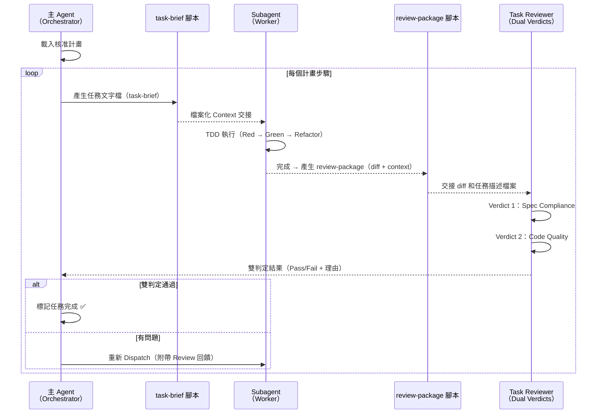

### Review 架構演進

| 版本 | 架構 | 審查檔案 | Token 消耗 | 速度 |
|------|------|---------|-----------|------|
| v4.0–v5.1 | Two-Stage（兩個 reviewer） | `spec-reviewer-prompt.md` + `code-quality-reviewer-prompt.md` | 高 | ~2 輪 dispatch |
| **v6.0.0+** | **Single Reviewer, Dual Verdicts** | `task-reviewer-prompt.md` | **~50% 減少** | **~2× 加速** |

### 檔案化交接（v6.0.0）

v6.0.0 新增 `task-brief` 和 `review-package` 腳本，將 subagent 間的資料交接從「prompt 注入」改為「檔案讀取」，避免 token 膨脹：

| 腳本 | 功能 | 產出 |
|------|------|------|
| `scripts/task-brief` | 將任務描述寫入暫存檔 | `.superpowers/sdd/task-NNN.md` |
| `scripts/review-package` | 收集 diff + context 寫入檔案 | `.superpowers/sdd/review-NNN.md` |

> 💡 v6.0.3 起 SDD 暫存檔從 `.git/sdd/` 移至 `.superpowers/sdd/`，自動加入 `.gitignore`。

### Context Isolation（v5.0.2+）

```
主 Agent Context:
├── 完整計畫文件
├── 所有技能定義
└── 專案全貌

Subagent Context（隔離的）:
├── 單一任務描述（via task-brief 檔案）
├── 相關 Spec 片段
├── 相關現有程式碼
└── TDD 技能定義
    （不包含其他任務的 Context）
```

### 平台相容性

| 平台 | Subagent 支援 | 機制 |
|------|-------------|------|
| Claude Code | ✅ | `Task` tool |
| Cursor | ✅ | 內建 Subagent |
| Codex | ✅ | `multi_agent`（`spawn_agent` with worker roles） |
| Factory Droid | ✅ | 完整支援（v5.1.0+） |
| OpenCode | ✅ | Native skill（v4.1+） |
| GitHub Copilot CLI | ✅ | 完整支援（v5.0.7+） |
| Antigravity | ✅ | 原生支援（v6.0.0+） |
| Kimi Code | ✅ | tool-use 協議（v6.0.0+） |
| Pi | ✅ | 原生支援（v6.0.0+） |

> ⚠️ Gemini CLI（v5.0.1~v6.0.3 期間曾支援，Subagent 需 fallback → `executing-plans`）已於 v6.1.0 隨平台支援一併移除。

### Anti-patterns

- ❌ 讓主 Agent 直接執行全部任務（跳過 Subagent）
- ❌ 不進行 Review（即使已合併為單一 reviewer，仍不可跳過）
- ❌ Subagent 收到過多不相關的 Context
- ❌ 仍使用舊版分離的 spec-reviewer / code-quality-reviewer（v6.0.0 已淘汰）

---

## 4.7 Systematic Debugging（系統化除錯）

### 核心理念

強制使用**假設驅動（Hypothesis-Driven）**的除錯方法。v4.0 起新增 **Root Cause Tracing**、**Defense in Depth**、**Condition-Based Waiting** 等進階策略。

### 四階段除錯流程

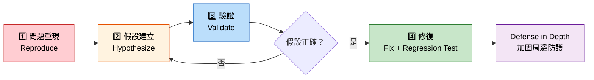

### 進階策略（v4.0+）

| 策略 | 說明 |
|------|------|
| **Root Cause Tracing** | 不只修復表面症狀，追溯到根本原因 |
| **Defense in Depth** | 修復後在周邊加入防護層（validation、fallback） |
| **Condition-Based Waiting** | 非同步問題的除錯：基於條件等待而非固定 sleep |

### Debug 報告範本

```markdown
## Debug 報告：訂單建立失敗

### 問題描述
使用者反映在下午 3 點後建立訂單時，偶爾會收到 500 Internal Server Error。

### 假設列表
| # | 假設 | 可能性 | 驗證方法 | 結果 |
|---|------|--------|---------|------|
| H1 | 資料庫連線池耗盡 | 高 | 檢查 HikariCP 指標 | ❌ 排除 |
| H2 | 第三方 API 超時 | 中 | 檢查 API 回應日誌 | ❌ 排除 |
| H3 | 庫存並發死鎖 | 中 | 檢查 DB lock 日誌 | ✅ 確認 |

### 修復方案
使用樂觀鎖 + @Retryable 處理並發更新

### 回歸測試
shouldHandleConcurrentStockUpdate — 驗證並發安全
```

### Best Practices

1. **不要在沒有假設的情況下改程式碼**
2. **每個修復都必須附帶回歸測試**
3. **修復後執行 Defense in Depth**
4. **記錄 Debug 過程作為團隊知識**

### Anti-patterns

- ❌ 直接搜尋 Stack Overflow 並貼上解法
- ❌ 到處加 `System.out.println()` 來找問題
- ❌ 修復後不寫回歸測試
- ❌ 修改了但不知道為什麼修好了（Cargo Cult Fix）

---

## 4.8 Git Worktrees（隔離開發環境）

### 核心理念

v4.2.0 起**強制化**——所有開發任務必須在 Worktree 中進行，確保 main 分支始終穩定。

> ⚠️ **v6.0.0 重大變更**：
> - Worktree 目錄從全域位置 `~/.config/superpowers/worktrees/` 改為**專案內** `.worktrees/`（自動加入 `.gitignore`）。
> - 建立前仍需使用者同意（consent-based，v5.1.0 起）。
> - 支援 worktree-aware SDD：subagent 在 worktree 內執行，不影響主工作目錄。

### Worktree 概念圖

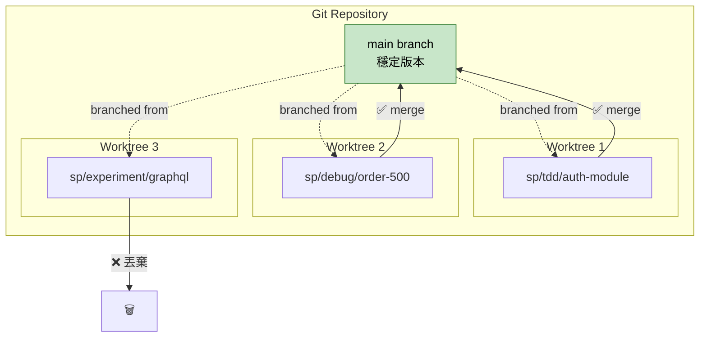

### 命名慣例

| 前綴 | 用途 | 範例 |
|------|------|------|
| `sp/tdd/` | TDD 功能開發 | `sp/tdd/user-auth` |
| `sp/debug/` | Bug 修復 | `sp/debug/order-500-error` |
| `sp/experiment/` | 實驗性功能 | `sp/experiment/graphql-api` |
| `sp/refactor/` | 重構 | `sp/refactor/extract-payment-service` |

### Anti-patterns

- ❌ 直接在 main 分支上開發
- ❌ Worktree 存活太久不合併（超過一週應檢視）
- ❌ 不清理已完成的 Worktree
- ❌ 在 Worktree 之間直接 cherry-pick 而不經過 main

---

## 4.9 其他重要技能

### 4.9.1 finishing-a-development-branch（分支收尾）

開發完成後的標準化收尾流程：

> 💡 **v6.0.0 變更**：此技能改為 **forge-neutral**——不再硬編碼 `gh pr create`。Agent 會偵測專案使用的 Git forge（GitHub / GitLab / Bitbucket 等）並使用對應的指令。

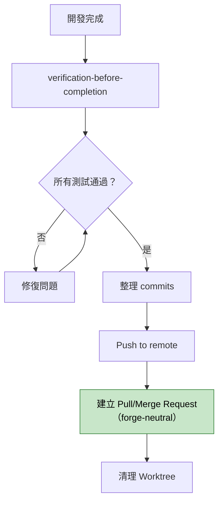

### 4.9.2 verification-before-completion（完成前驗證）

在宣告任何任務完成之前強制執行的檢查：

| 檢查項目 | 說明 |
|---------|------|
| 所有測試通過 | `mvn test` / `npm test` / `pytest` 全部 Green |
| 無編譯警告 | 乾淨的 build output |
| Spec 符合性 | 產出與 Spec Document 一致 |

> ⚠️ **「Evidence over Claims」**：Agent 必須提供實際測試執行結果，不能只說「我確認完成了」。

### 4.9.3 dispatching-parallel-agents（平行調度）

計畫中有互不依賴的任務時，同時 dispatch 多個 Subagent 平行執行。

### 4.9.4 requesting-code-review & receiving-code-review

雙向的程式碼審查技能：
- **requesting**：向 Review Subagent 發起審查
- **receiving**：接收並處理審查回饋

### 4.9.5 executing-plans（循序執行）

不支援 Subagent 時的 fallback 模式——主 Agent 直接循序執行，每步完成後暫停等待確認。

### 4.9.6 writing-skills（撰寫新技能）

Meta 技能——教你如何撰寫自訂的 Superpowers 技能。

### 4.9.7 using-superpowers（技能索引）

所有技能的「入口」——session-start Hook 自動載入，包含完整技能索引、The Basic Workflow、合理化偵測表。

---

# 第 5 章：實戰開發流程（End-to-End）

> **章節摘要**：本章串聯所有 Superpowers 技能，示範一個完整的 Web Application 功能從需求到上線的全流程。以「電商平台——訂單結帳功能」為範例，展示 The Basic Workflow 7 步驟的完整實踐。

## 5.1 開發流程總覽（The Basic Workflow）

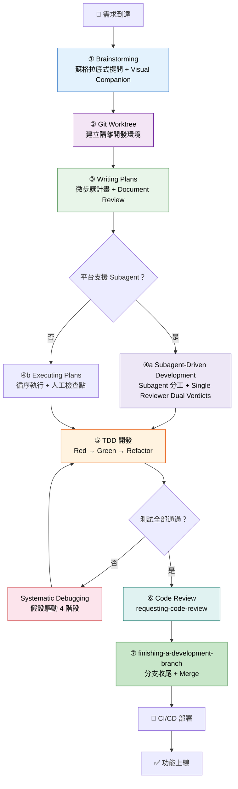

## 5.2 完整範例：電商訂單結帳功能

### Phase 1：Brainstorming（需求釐清）

```
=== Superpowers Brainstorming Session ===
功能：訂單結帳
日期：2026-03-23
```

**AI 蘇格拉底式提問：**

```markdown
1. 【釐清】結帳流程包含哪些步驟？（購物車確認 → 選擇付款 → 確認訂單 → 付款 → 完成？）
2. 【釐清】支援哪些付款方式？（信用卡 / 轉帳 / 第三方支付？）
3. 【假設驗證】結帳時是否需要即時檢查庫存？如果庫存在結帳過程中被他人搶購怎麼辦？
4. 【假設驗證】是否需要支援部分退款？還是只支援全額退款？
5. 【邊界探索】尖峰時段預計並發結帳數量？需要考慮限流嗎？
6. 【邊界探索】結帳過程中如果使用者離開頁面，訂單狀態如何處理？（逾時自動取消？）
7. 【安全性】付款資訊是否需要進行 PCI DSS 等級的加密？
```

**使用者回答後產出需求文件：**

```markdown
## 需求結論

### 功能範圍
- 結帳流程：購物車確認 → 庫存鎖定 → 選擇付款 → 建立訂單 → 付款 → 完成
- 付款方式：信用卡（透過第三方綠界 ECPay）
- 庫存策略：結帳時鎖定庫存 15 分鐘，逾時自動釋放
- 退款：僅支援全額退款（v1）

### 非功能性需求
- 並發：支援 500 TPS 結帳
- 回應時間：< 2 秒
- 安全：付款資訊不經過我方後端，直接由前端送至 ECPay

### 排除範圍（v1 不做）
- 部分退款
- 折價券 / 優惠碼
- 跨幣別結帳
```

### Phase 2：Writing Plans（任務拆解）

```markdown
# 結帳功能開發計畫

## 階段一：資料模型（15 分鐘）
- [ ] 1.1 建立 Order 實體（id, userId, items, totalAmount, status, createdAt）— 3 min
- [ ] 1.2 建立 OrderItem 實體（id, orderId, productId, quantity, unitPrice）— 3 min
- [ ] 1.3 建立 OrderStatus 列舉（PENDING, STOCK_LOCKED, PAYMENT_PENDING, PAID, CANCELLED）— 2 min
- [ ] 1.4 建立 OrderRepository — 2 min
- [ ] 1.5 寫 Order 實體的單元測試 — 5 min

## 階段二：庫存鎖定服務（20 分鐘）
- [ ] 2.1 寫 StockLockService.lock() 的測試 — 5 min
  - 正常鎖定、庫存不足、重複鎖定
- [ ] 2.2 實作 StockLockService.lock() — 5 min
- [ ] 2.3 寫 StockLockService.release() 的測試 — 5 min
- [ ] 2.4 實作 StockLockService.release() — 3 min
- [ ] 2.5 寫定時釋放任務（15 分鐘逾時）的測試與實作 — 5 min

## 階段三：訂單服務（25 分鐘）
- [ ] 3.1 寫 CheckoutService.createOrder() 的測試 — 5 min
  - 正常建立、庫存不足、購物車為空
- [ ] 3.2 實作 CheckoutService.createOrder() — 5 min
- [ ] 3.3 寫 CheckoutService.confirmPayment() 的測試 — 5 min
  - 付款成功、付款失敗、訂單不存在
- [ ] 3.4 實作 CheckoutService.confirmPayment() — 5 min
- [ ] 3.5 寫 CheckoutService.cancelOrder() 的測試與實作 — 5 min

## 階段四：API 端點（20 分鐘）
- [ ] 4.1 寫 POST /api/orders/checkout 整合測試 — 5 min
- [ ] 4.2 實作 OrderController.checkout() — 5 min
- [ ] 4.3 寫 POST /api/orders/{id}/confirm-payment 整合測試 — 5 min
- [ ] 4.4 實作 OrderController.confirmPayment() — 5 min

## 階段五：整合測試與收尾（15 分鐘）
- [ ] 5.1 端到端整合測試（完整結帳流程）— 10 min
- [ ] 5.2 API 文件更新 — 5 min

### 預估總時間：95 分鐘
### 總 commit 數量：約 15-18 次
```

### Phase 3：Git Worktree（建立隔離環境）

```bash
# 建立功能分支的 Worktree
git worktree add ../sp-checkout -b sp/tdd/checkout-feature

# 進入隔離環境
cd ../sp-checkout

# 確認狀態乾淨
git status
# On branch sp/tdd/checkout-feature
# nothing to commit, working tree clean

# 開始按計畫進行 TDD 開發
echo "🚀 Worktree 已建立，開始 Phase 4: TDD 開發"
```

### Phase 4：TDD 開發（逐步實作）

以任務 3.1 ~ 3.2 為例：

**🔴 Red — 寫 `CheckoutService.createOrder()` 的測試**

```java
package com.tutorial.ecommerce.service;

import org.junit.jupiter.api.BeforeEach;
import org.junit.jupiter.api.Test;
import org.junit.jupiter.api.DisplayName;
import org.junit.jupiter.api.extension.ExtendWith;
import org.mockito.InjectMocks;
import org.mockito.Mock;
import org.mockito.junit.jupiter.MockitoExtension;

import java.util.List;

import static org.junit.jupiter.api.Assertions.*;
import static org.mockito.ArgumentMatchers.*;
import static org.mockito.Mockito.*;

@ExtendWith(MockitoExtension.class)
class CheckoutServiceTest {

    @Mock
    private OrderRepository orderRepository;

    @Mock
    private StockLockService stockLockService;

    @Mock
    private CartService cartService;

    @InjectMocks
    private CheckoutService checkoutService;

    private List<CartItem> sampleCartItems;

    @BeforeEach
    void setUp() {
        sampleCartItems = List.of(
            new CartItem("PRD-001", 2, 500.0),
            new CartItem("PRD-002", 1, 1200.0)
        );
    }

    @Test
    @DisplayName("正常結帳：應建立訂單並鎖定庫存")
    void shouldCreateOrderAndLockStock() {
        // Given
        String userId = "USR-001";
        when(cartService.getItems(userId)).thenReturn(sampleCartItems);
        when(stockLockService.lockAll(anyList())).thenReturn(true);
        when(orderRepository.save(any(Order.class))).thenAnswer(
            invocation -> {
                Order order = invocation.getArgument(0);
                order.setId("ORD-001");
                return order;
            }
        );

        // When
        OrderResult result = checkoutService.createOrder(userId);

        // Then
        assertTrue(result.isSuccess());
        assertEquals("ORD-001", result.getOrderId());
        assertEquals(2200.0, result.getTotalAmount());
        assertEquals(OrderStatus.STOCK_LOCKED, result.getStatus());
        verify(stockLockService).lockAll(sampleCartItems);
        verify(orderRepository).save(any(Order.class));
    }

    @Test
    @DisplayName("庫存不足時應拒絕建立訂單")
    void shouldRejectWhenInsufficientStock() {
        // Given
        String userId = "USR-001";
        when(cartService.getItems(userId)).thenReturn(sampleCartItems);
        when(stockLockService.lockAll(anyList())).thenReturn(false);

        // When
        OrderResult result = checkoutService.createOrder(userId);

        // Then
        assertFalse(result.isSuccess());
        assertEquals("INSUFFICIENT_STOCK", result.getErrorCode());
        verify(orderRepository, never()).save(any());
    }

    @Test
    @DisplayName("購物車為空時不應建立訂單")
    void shouldRejectWhenCartEmpty() {
        // Given
        String userId = "USR-001";
        when(cartService.getItems(userId)).thenReturn(List.of());

        // When
        OrderResult result = checkoutService.createOrder(userId);

        // Then
        assertFalse(result.isSuccess());
        assertEquals("EMPTY_CART", result.getErrorCode());
        verify(stockLockService, never()).lockAll(anyList());
    }
}
```

```bash
mvn test -Dtest=CheckoutServiceTest
# BUILD FAILURE — 3 tests FAILED (expected: Red ✅)
```

**🟢 Green — 寫最少程式碼通過測試**

```java
package com.tutorial.ecommerce.service;

import java.util.List;

/**
 * 結帳服務。負責訂單建立、付款確認與取消。
 */
public class CheckoutService {

    private final OrderRepository orderRepository;
    private final StockLockService stockLockService;
    private final CartService cartService;

    public CheckoutService(OrderRepository orderRepository,
                           StockLockService stockLockService,
                           CartService cartService) {
        this.orderRepository = orderRepository;
        this.stockLockService = stockLockService;
        this.cartService = cartService;
    }

    /**
     * 建立訂單（含庫存鎖定）。
     *
     * @param userId 使用者 ID
     * @return 訂單建立結果
     */
    public OrderResult createOrder(String userId) {
        List<CartItem> items = cartService.getItems(userId);

        if (items.isEmpty()) {
            return OrderResult.failure("EMPTY_CART", "購物車為空");
        }

        if (!stockLockService.lockAll(items)) {
            return OrderResult.failure("INSUFFICIENT_STOCK", "庫存不足");
        }

        double totalAmount = items.stream()
            .mapToDouble(item -> item.getUnitPrice() * item.getQuantity())
            .sum();

        Order order = new Order(userId, items, totalAmount, OrderStatus.STOCK_LOCKED);
        order = orderRepository.save(order);

        return OrderResult.success(order.getId(), totalAmount, order.getStatus());
    }
}
```

```bash
mvn test -Dtest=CheckoutServiceTest
# BUILD SUCCESS — 3 tests PASSED (Green ✅)
git add . && git commit -m "feat(checkout): implement createOrder with TDD - Green"
```

### Phase 5：Systematic Debugging（如遇問題）

假設在整合測試階段發現偶發失敗：

```markdown
## Debug Session: 整合測試偶發失敗

### 問題重現
CheckoutIntegrationTest.shouldCreateOrderEndToEnd() 在 CI 上約 20% 失敗。
本地難以重現。

### 假設列表
| # | 假設 | 可能性 | 驗證方法 |
|---|------|--------|---------|
| H1 | 測試之間有資料殘留（未清理 DB） | 高 | 檢查 @Transactional / @DirtiesContext |
| H2 | 非同步庫存鎖定導致時序問題 | 中 | 加入 Awaitility 等待機制 |
| H3 | CI 環境記憶體不足導致 GC 暫停 | 低 | 檢查 CI Runner 資源配置 |

### 驗證結果
| # | 結果 | 證據 |
|---|------|------|
| H1 | ✅ 確認 | 缺少 @Transactional，上一筆測試的 Order 未回滾 |

### 修復
- 加入 @Transactional 於整合測試類別
- 撰寫回歸測試確認資料隔離
```

### Phase 6：Code Review（Task Review — Dual Verdicts）

在 Subagent-Driven Development 模式下，程式碼已經過 Task Reviewer 的 Dual Verdicts（Spec Compliance + Code Quality）審查。但在提交 PR 前，仍需做最終驗證：

```bash
# 在 Worktree 中完成所有開發
cd ../sp-checkout

# 觸發 verification-before-completion 技能
# 確認測試全通過
mvn test
# BUILD SUCCESS — 22 tests PASSED

# 確認測試覆蓋率
mvn jacoco:report
# Line coverage: 87% ✅ (threshold: 80%)

# 推送到遠端
git push origin sp/tdd/checkout-feature

# 建立 Pull Request
gh pr create \
  --title "feat(checkout): 實作訂單結帳功能" \
  --body "## 變更摘要
- 實作結帳流程（庫存鎖定 → 建立訂單 → 付款確認）
- 22 個測試案例，覆蓋率 87%
- 使用 Superpowers TDD + Subagent-Driven Development

## Superpowers 流程記錄
- Brainstorming：7 個問題，需求已確認
- Plan：通過 Inline Self-Review
- Task Review：Spec Compliance ✅ + Code Quality ✅"
```

**Code Review Checklist（基於 Superpowers v6.0）：**

```markdown
- [ ] 是否有 Brainstorming 記錄（含 Spec Document）？
- [ ] 是否有微步驟計畫（通過 Inline Self-Review）？
- [ ] 每個功能是否有對應測試（TDD）？
- [ ] 測試覆蓋率 ≥ 80%？
- [ ] 是否經過 Task Review（Spec Compliance + Code Quality Dual Verdicts）？
- [ ] 是否在隔離的 Worktree 中開發？
- [ ] verification-before-completion 是否通過？
- [ ] 是否遵循小步 commit？
```

### Phase 7：finishing-a-development-branch + CI/CD

```bash
# finishing-a-development-branch 技能自動執行：
# 1. 合併完成後清理 Worktree
cd ../main-project
git worktree remove ../sp-checkout
git branch -d sp/tdd/checkout-feature
git worktree list  # 確認已移除
```

## 5.3 流程時間線總覽

```mermaid
gantt
    title 結帳功能開發時間線（Superpowers 流程）
    dateFormat HH:mm
    axisFormat %H:%M
    
    section Phase 1 — Brainstorming
    需求釐清與提問              :bs1, 09:00, 15min
    產出需求文件                :bs2, after bs1, 5min
    
    section Phase 2 — Planning
    任務拆解                    :pl1, after bs2, 10min
    計畫審核                    :pl2, after pl1, 5min
    
    section Phase 3 — Git Worktree
    建立隔離環境                :gw1, after pl2, 2min
    
    section Phase 4 — TDD 開發
    階段一 資料模型              :tdd1, after gw1, 15min
    階段二 庫存鎖定服務           :tdd2, after tdd1, 20min
    階段三 訂單服務              :tdd3, after tdd2, 25min
    階段四 API 端點              :tdd4, after tdd3, 20min
    階段五 整合測試              :tdd5, after tdd4, 15min
    
    section Phase 5-7 — Review & Deploy
    Code Review                 :cr1, after tdd5, 15min
    CI/CD 部署                  :cd1, after cr1, 10min
```

> 💡 **提示**：整個流程約 2.5 小時完成一個中等複雜度的功能，其中 AI（搭配 Superpowers）主要加速 Phase 4 的編碼工作，但 Phase 1-3 的品質把關不可省略。

### Best Practices

1. **不要跳過任何 Phase**：每個階段都有其存在的意義
2. **Phase 1 的品質決定後續效率**：需求不清 → 計畫錯誤 → 程式碼要重寫
3. **保持 commit 粒度小且頻繁**：每完成一個微任務就 commit
4. **讓 AI 的 Prompt 參考計畫中的任務編號**：保持可追溯性

### Anti-patterns

- ❌ 直接跳到 Phase 4 開始寫程式碼
- ❌ 不做 Brainstorming 就開始規劃
- ❌ 在 main 分支上開發而不建 Worktree
- ❌ 所有程式碼寫完後才一次性 commit
- ❌ Code Review 只看程式碼不看測試

---

# 第 6 章：與企業系統整合

> **章節摘要**：本章說明如何將 Superpowers 方法論應用於企業級系統整合場景，包含 Spring Boot、微服務架構、資料庫、訊息佇列等。

## 6.1 整合架構總覽

```mermaid
graph TB
    subgraph "前端"
        FE[React / Vue / Angular]
    end
    
    subgraph "API Gateway"
        GW[Kong / Spring Cloud Gateway]
    end
    
    subgraph "微服務群"
        SVC1[用戶服務<br/>Spring Boot]
        SVC2[訂單服務<br/>Spring Boot]
        SVC3[庫存服務<br/>Spring Boot]
        SVC4[付款服務<br/>Spring Boot]
    end
    
    subgraph "資料層"
        DB1[(PostgreSQL<br/>用戶/訂單)]
        DB2[(Oracle<br/>核心銀行)]
        REDIS[(Redis<br/>Session/Cache)]
    end
    
    subgraph "訊息層"
        MQ[Kafka / RabbitMQ]
    end
    
    subgraph "AI 開發支援"
        SP[Superpowers<br/>工程紀律層]
        CC[Claude Code]
        CP[GitHub Copilot]
    end
    
    FE --> GW
    GW --> SVC1 & SVC2 & SVC3 & SVC4
    SVC1 --> DB1
    SVC2 --> DB1 & DB2
    SVC3 --> DB1 & REDIS
    SVC4 --> DB2
    SVC2 <--> MQ
    SVC3 <--> MQ
    SVC4 <--> MQ
    
    SP -.->|規範| SVC1 & SVC2 & SVC3 & SVC4
    CC -.->|輔助開發| SP
    CP -.->|輔助開發| SP
    
    style SP fill:#fff3e0,stroke:#e65100,stroke-width:2px,color:#000
```

## 6.2 與 Spring Boot 整合

> 💡 **技術堆疊現況（2026-07）**：Spring Boot 4（基於 Spring Framework 7 / Jakarta EE 11，最低需求 Java 17）已於 2025-11 GA，目前最新為 4.1.0；Spring Boot 3.x 已轉為維護分支。以下範例使用的核心註解（`@SpringBootTest`、`@AutoConfigureMockMvc`、`@Transactional` 等）在 3.x 與 4.x 皆相容，不需修改；新專案建議直接以 Spring Boot 4.x 為基礎起手，既有 3.x 專案可參考官方 [Spring Boot 4 遷移指南](https://docs.spring.io/spring-boot/system-requirements.html) 評估升級。

### Superpowers + Spring Boot 的 TDD 工作流

```mermaid
sequenceDiagram
    participant Dev as 開發者
    participant SP as Superpowers
    participant AI as Claude Code
    participant SB as Spring Boot
    participant DB as Database
    
    Dev->>SP: 啟動 TDD Skill
    SP->>AI: 先寫失敗的測試
    AI->>SB: 建立 @SpringBootTest
    
    Note over AI,SB: 🔴 Red 階段
    AI->>SB: 建立 Controller 測試
    SB-->>AI: 測試失敗 ✅
    
    Note over AI,SB: 🟢 Green 階段
    AI->>SB: 實作 Controller + Service
    SB->>DB: 測試用 H2 Database
    SB-->>AI: 測試通過 ✅
    
    Note over AI,SB: 🔵 Refactor 階段
    AI->>SB: 重構（抽取介面、加入 DTO）
    SB-->>AI: 測試仍通過 ✅
    
    Dev->>SP: commit + 下一個任務
```

### Spring Boot 整合測試範例

```java
package com.tutorial.ecommerce.controller;

import org.junit.jupiter.api.Test;
import org.junit.jupiter.api.DisplayName;
import org.springframework.beans.factory.annotation.Autowired;
import org.springframework.boot.test.autoconfigure.web.servlet.AutoConfigureMockMvc;
import org.springframework.boot.test.context.SpringBootTest;
import org.springframework.http.MediaType;
import org.springframework.test.context.ActiveProfiles;
import org.springframework.test.web.servlet.MockMvc;
import org.springframework.transaction.annotation.Transactional;

import static org.springframework.test.web.servlet.request.MockMvcRequestBuilders.post;
import static org.springframework.test.web.servlet.result.MockMvcResultMatchers.*;

/**
 * 訂單 API 整合測試。
 * 使用 Superpowers TDD 技能——先於 Controller 實作。
 */
@SpringBootTest
@AutoConfigureMockMvc
@ActiveProfiles("test")
@Transactional
class OrderControllerIntegrationTest {

    @Autowired
    private MockMvc mockMvc;

    @Test
    @DisplayName("POST /api/orders/checkout — 正常結帳")
    void shouldCheckoutSuccessfully() throws Exception {
        String requestBody = """
            {
                "userId": "USR-001",
                "items": [
                    {"productId": "PRD-001", "quantity": 2},
                    {"productId": "PRD-002", "quantity": 1}
                ]
            }
            """;

        mockMvc.perform(post("/api/orders/checkout")
                .contentType(MediaType.APPLICATION_JSON)
                .content(requestBody))
            .andExpect(status().isCreated())
            .andExpect(jsonPath("$.success").value(true))
            .andExpect(jsonPath("$.orderId").exists())
            .andExpect(jsonPath("$.totalAmount").isNumber());
    }

    @Test
    @DisplayName("POST /api/orders/checkout — 購物車為空應回傳 400")
    void shouldReturn400WhenCartEmpty() throws Exception {
        String requestBody = """
            {
                "userId": "USR-001",
                "items": []
            }
            """;

        mockMvc.perform(post("/api/orders/checkout")
                .contentType(MediaType.APPLICATION_JSON)
                .content(requestBody))
            .andExpect(status().isBadRequest())
            .andExpect(jsonPath("$.errorCode").value("EMPTY_CART"));
    }
}
```

### application-test.yml（測試環境配置）

```yaml
# src/test/resources/application-test.yml
spring:
  datasource:
    url: jdbc:h2:mem:testdb
    driver-class-name: org.h2.Driver
    username: sa
    password:
  jpa:
    hibernate:
      ddl-auto: create-drop
    show-sql: true
  kafka:
    bootstrap-servers: ${spring.embedded.kafka.brokers:localhost:9092}

logging:
  level:
    com.tutorial: DEBUG
    org.springframework.test: INFO
```

## 6.3 與微服務架構整合

### 微服務中的 Superpowers 應用策略

| 層面 | Superpowers 建議 | 說明 |
|------|-----------------|------|
| **服務拆分** | Brainstorming | 用提問法釐清服務邊界（Bounded Context） |
| **API 設計** | Writing Plans | 先定義 API Contract，再用 TDD 實作 |
| **服務間通訊** | TDD | Mock 外部服務，聚焦本服務邏輯 |
| **跨服務 Debug** | Systematic Debugging | 使用 Correlation ID 追蹤跨服務呼叫鏈 |
| **新服務開發** | Git Worktrees | 每個新微服務在獨立 Worktree 中開發 |

### 服務間通訊的 TDD 策略

```java
/**
 * 訂單服務呼叫庫存服務的整合測試。
 * 使用 WireMock 模擬庫存服務。
 */
@SpringBootTest
@AutoConfigureWireMock(port = 0)
class OrderStockIntegrationTest {

    @Autowired
    private CheckoutService checkoutService;

    @Test
    @DisplayName("庫存服務不可用時應回傳友善錯誤")
    void shouldHandleStockServiceUnavailable() {
        // Given: 庫存服務回傳 503
        stubFor(post(urlEqualTo("/api/stock/lock"))
            .willReturn(aResponse()
                .withStatus(503)
                .withBody("{\"error\":\"Service Unavailable\"}")));

        // When
        OrderResult result = checkoutService.createOrder("USR-001");

        // Then
        assertFalse(result.isSuccess());
        assertEquals("STOCK_SERVICE_UNAVAILABLE", result.getErrorCode());
    }

    @Test
    @DisplayName("庫存服務超時應觸發 Circuit Breaker")
    void shouldTriggerCircuitBreakerOnTimeout() {
        // Given: 庫存服務延遲 10 秒
        stubFor(post(urlEqualTo("/api/stock/lock"))
            .willReturn(aResponse()
                .withFixedDelay(10000)
                .withStatus(200)));

        // When
        OrderResult result = checkoutService.createOrder("USR-001");

        // Then
        assertFalse(result.isSuccess());
        assertEquals("STOCK_SERVICE_TIMEOUT", result.getErrorCode());
    }
}
```

## 6.4 與資料庫整合

### 不同資料庫的 Superpowers TDD 策略

| 資料庫 | 測試策略 | 工具（Testcontainers 2.x 座標） |
|--------|---------|------|
| **PostgreSQL** | Testcontainers（真實 DB 測試） | `org.testcontainers:testcontainers-postgresql` |
| **Oracle** | Testcontainers + Oracle Free | `org.testcontainers:testcontainers-oracle-free` |
| **H2** | In-memory（快速單元測試） | 內建 |
| **Redis** | Embedded Redis / Testcontainers | `org.testcontainers:testcontainers-redis` |
| **DB2** | Testcontainers | `org.testcontainers:testcontainers-db2` |

> ⚠️ **Testcontainers 2.x 座標變更**：Testcontainers for Java 已於 2025-10 從 1.21.x 跳版至 **2.0.5**，Maven/Gradle artifact ID 一律改為 `testcontainers-` 前綴（例如 `org.testcontainers:postgresql` → `org.testcontainers:testcontainers-postgresql`），Java import 路徑不變。官方提供 OpenRewrite recipe（`Testcontainers2Migration`）可自動化升級既有專案。

### Testcontainers 整合範例

```java
@SpringBootTest
@Testcontainers
class OrderRepositoryTest {

    @Container
    static PostgreSQLContainer<?> postgres = new PostgreSQLContainer<>("postgres:16-alpine")
        .withDatabaseName("testdb")
        .withUsername("test")
        .withPassword("test");

    @DynamicPropertySource
    static void configureProperties(DynamicPropertyRegistry registry) {
        registry.add("spring.datasource.url", postgres::getJdbcUrl);
        registry.add("spring.datasource.username", postgres::getUsername);
        registry.add("spring.datasource.password", postgres::getPassword);
    }

    @Autowired
    private OrderRepository orderRepository;

    @Test
    @DisplayName("應正確儲存並查詢訂單")
    void shouldSaveAndFindOrder() {
        // Given
        Order order = new Order("USR-001", List.of(), 2200.0, OrderStatus.PENDING);

        // When
        Order saved = orderRepository.save(order);
        Order found = orderRepository.findById(saved.getId()).orElseThrow();

        // Then
        assertEquals(saved.getId(), found.getId());
        assertEquals("USR-001", found.getUserId());
        assertEquals(2200.0, found.getTotalAmount());
    }
}
```

## 6.5 與訊息佇列整合（Kafka / RabbitMQ）

> 💡 **技術堆疊現況（2026-07）**：`spring-kafka` 現行版本為 4.1.0（對應 `kafka-clients` 4.3.1）。Apache Kafka 自 4.0 起已**完全移除 ZooKeeper**，僅支援 KRaft 共識模式；`@EmbeddedKafka` 測試支援也已預設以 KRaft 模式啟動內嵌 Broker。下方範例的註解與 API 用法不受影響，但若專案仍在維護 ZooKeeper-based 的自建 Kafka 叢集，升級前請先參考官方遷移指南。

### Kafka 事件驅動的 TDD 範例

```java
@SpringBootTest
@EmbeddedKafka(partitions = 1, topics = {"order-events"})
class OrderEventPublisherTest {

    @Autowired
    private OrderEventPublisher publisher;

    @Autowired
    private KafkaTemplate<String, String> kafkaTemplate;

    @Autowired
    private EmbeddedKafkaBroker embeddedKafka;

    @Test
    @DisplayName("訂單建立時應發布 OrderCreated 事件")
    void shouldPublishOrderCreatedEvent() throws Exception {
        // Given
        Order order = new Order("ORD-001", "USR-001", 2200.0, OrderStatus.STOCK_LOCKED);

        // When
        publisher.publishOrderCreated(order);

        // Then
        ConsumerRecord<String, String> record = KafkaTestUtils.getSingleRecord(
            consumer, "order-events", Duration.ofSeconds(5));

        assertNotNull(record);
        assertTrue(record.value().contains("ORD-001"));
        assertTrue(record.value().contains("ORDER_CREATED"));
    }
}
```

## 6.6 與 API Gateway 整合

```yaml
# Kong / Spring Cloud Gateway 路由配置
spring:
  cloud:
    gateway:
      routes:
        - id: order-service
          uri: lb://order-service
          predicates:
            - Path=/api/orders/**
          filters:
            - name: CircuitBreaker
              args:
                name: orderService
                fallbackUri: forward:/fallback/orders
            - name: RequestRateLimiter
              args:
                redis-rate-limiter.replenishRate: 100
                redis-rate-limiter.burstCapacity: 200
```

> 💡 **提示**：Superpowers 的 TDD 技能在微服務場景中特別重要——透過 Mock/Stub 隔離外部依賴，確保每個服務可以獨立測試。

### Best Practices

1. **每個微服務獨立配置**：各服務有自己的 `CLAUDE.md` 或 `.cursorrules` 客製化
2. **API Contract 先行**：先用 OpenAPI Spec 定義介面，再 TDD 實作
3. **使用 Testcontainers 取代 H2**：確保測試環境與生產一致
4. **跨服務問題使用 Systematic Debugging**：搭配 Distributed Tracing
5. **善用 Subagent-Driven Development**：不同微服務的獨立任務可平行 dispatch

### Anti-patterns

- ❌ 跨微服務直接共用資料庫
- ❌ 整合測試依賴外部服務而非 Mock
- ❌ 不測試服務不可用的降級場景
- ❌ 在微服務之間同步呼叫而不考慮超時

---

# 第 7 章：CI/CD 與 DevOps

> **章節摘要**：本章說明如何將 Superpowers 的工程紀律融入 CI/CD Pipeline，包含自動測試、品質控管、強制 TDD 檢查等。

## 7.1 CI/CD Pipeline 架構

```mermaid
graph LR
    subgraph "開發者"
        DEV[Push Code]
    end
    
    subgraph "GitHub Actions Pipeline"
        T1[Stage 1<br/>Build]
        T2[Stage 2<br/>Unit Test]
        T3[Stage 3<br/>Integration Test]
        T4[Stage 4<br/>Coverage Check<br/>≥ 80%]
        T5[Stage 5<br/>SonarQube<br/>品質分析]
        T6[Stage 6<br/>ArchUnit<br/>架構檢查]
        T7[Stage 7<br/>TDD Compliance<br/>Superpowers 檢查]
        T8[Stage 8<br/>Docker Build]
        T9[Stage 9<br/>Deploy to Staging]
    end
    
    DEV --> T1
    T1 --> T2 --> T3 --> T4 --> T5 --> T6 --> T7 --> T8 --> T9
    
    style T7 fill:#fff3e0,stroke:#e65100,stroke-width:2px,color:#000
```

## 7.2 GitHub Actions Workflow

### 主要 CI Workflow

```yaml
# .github/workflows/ci.yml
name: Superpowers CI Pipeline

on:
  push:
    branches: [main, 'sp/**']
  pull_request:
    branches: [main]

jobs:
  build-and-test:
    runs-on: ubuntu-latest

    services:
      postgres:
        image: postgres:16-alpine
        env:
          POSTGRES_DB: testdb
          POSTGRES_USER: test
          POSTGRES_PASSWORD: test
        ports:
          - 5432:5432
        options: >-
          --health-cmd pg_isready
          --health-interval 10s
          --health-timeout 5s
          --health-retries 5

    steps:
      - name: Checkout
        uses: actions/checkout@v7
        with:
          fetch-depth: 0  # 完整歷史（用於分析 commit）

      - name: Set up JDK 25
        uses: actions/setup-java@v5
        with:
          java-version: '25'  # 現行最新 LTS；Java 21 仍在支援期內，亦為可接受的替代基線
          distribution: 'temurin'
          cache: maven

      # Stage 1: Build
      - name: Build
        run: mvn compile -DskipTests

      # Stage 2: Unit Tests
      - name: Run Unit Tests
        run: mvn test -Dtest='!*IntegrationTest'

      # Stage 3: Integration Tests
      - name: Run Integration Tests
        run: mvn test -Dtest='*IntegrationTest'
        env:
          SPRING_DATASOURCE_URL: jdbc:postgresql://localhost:5432/testdb
          SPRING_DATASOURCE_USERNAME: test
          SPRING_DATASOURCE_PASSWORD: test

      # Stage 4: Coverage Check
      - name: Check Test Coverage
        run: |
          mvn jacoco:report jacoco:check \
            -Djacoco.line.coverage=0.80 \
            -Djacoco.branch.coverage=0.70

      # Stage 5: SonarQube Analysis（SonarQube Server / SonarQube Cloud，2024 起統一品牌）
      - name: SonarQube Scan
        env:
          SONAR_TOKEN: ${{ secrets.SONAR_TOKEN }}
          SONAR_HOST_URL: ${{ secrets.SONAR_HOST_URL }}
        run: |
          mvn sonar:sonar \
            -Dsonar.projectKey=${{ github.repository }} \
            -Dsonar.qualitygate.wait=true
        # 替代方案：改用官方 GitHub Action（新專案建議優先採用）
        # - name: SonarQube Scan
        #   uses: SonarSource/sonarqube-scan-action@v8
        #   env:
        #     SONAR_TOKEN: ${{ secrets.SONAR_TOKEN }}
        # 註：舊版 SonarSource/sonarcloud-github-action 已標記 deprecated，
        # 新專案請改用同時支援 SonarQube Server 與 SonarQube Cloud 的 sonarqube-scan-action。

      # Stage 6: Architecture Test (ArchUnit)
      - name: Run Architecture Tests
        run: mvn test -Dtest='*ArchitectureTest'

      # Stage 7: Superpowers TDD Compliance Check
      - name: TDD Compliance Check
        run: |
          echo "🔍 檢查 Superpowers TDD 合規性..."

          # 檢查每個 src/main 下的類別是否有對應測試
          MISSING_TESTS=0
          for file in $(find src/main/java -name "*.java" -not -name "*Config*.java" -not -name "*Application.java"); do
            CLASS_NAME=$(basename "$file" .java)
            TEST_FILE=$(find src/test/java -name "${CLASS_NAME}Test.java" 2>/dev/null)
            if [ -z "$TEST_FILE" ]; then
              echo "⚠️ 缺少測試: $file"
              MISSING_TESTS=$((MISSING_TESTS + 1))
            fi
          done

          if [ $MISSING_TESTS -gt 0 ]; then
            echo "❌ 發現 $MISSING_TESTS 個類別缺少測試"
            exit 1
          else
            echo "✅ 所有類別都有對應測試"
          fi

  # Docker Build（僅 main 分支）
  docker-build:
    needs: build-and-test
    if: github.ref == 'refs/heads/main'
    runs-on: ubuntu-latest
    steps:
      - uses: actions/checkout@v7

      - name: Build Docker Image
        run: |
          docker build -t ${{ github.repository }}:${{ github.sha }} .
          docker tag ${{ github.repository }}:${{ github.sha }} \
                     ${{ github.repository }}:latest
```

### TDD 強制檢查 Workflow

```yaml
# .github/workflows/tdd-check.yml
name: Superpowers TDD Gate

on:
  pull_request:
    types: [opened, synchronize]

jobs:
  tdd-compliance:
    runs-on: ubuntu-latest
    steps:
      - uses: actions/checkout@v7
        with:
          fetch-depth: 0

      - name: 檢查 PR 是否包含測試
        run: |
          echo "🧪 Superpowers TDD Gate: 檢查 PR 變更..."

          # 取得 PR 中新增/修改的 Java 檔案
          CHANGED_FILES=$(git diff --name-only origin/${{ github.base_ref }}...HEAD \
            | grep 'src/main/java.*\.java$' || true)

          if [ -z "$CHANGED_FILES" ]; then
            echo "ℹ️ 沒有 Java 原始碼變更，跳過檢查"
            exit 0
          fi

          echo "📝 變更的原始碼檔案："
          echo "$CHANGED_FILES"

          # 檢查是否有對應的測試檔案變更
          CHANGED_TESTS=$(git diff --name-only origin/${{ github.base_ref }}...HEAD \
            | grep 'src/test/java.*\.java$' || true)

          if [ -z "$CHANGED_TESTS" ]; then
            echo "❌ Superpowers TDD 違規：修改了原始碼但沒有新增/修改任何測試！"
            echo ""
            echo "📋 Superpowers 規範要求："
            echo "   1. 每次程式碼變更必須包含對應的測試"
            echo "   2. 測試應先於實作（Red → Green → Refactor）"
            echo ""
            echo "💡 請使用 Superpowers TDD 技能重新開發此功能。"
            exit 1
          fi

          echo "✅ PR 包含測試檔案："
          echo "$CHANGED_TESTS"

      - name: 檢查 commit 訊息格式
        run: |
          echo "📝 檢查 commit 訊息是否符合 Superpowers 規範..."

          COMMITS=$(git log --oneline origin/${{ github.base_ref }}...HEAD)
          echo "$COMMITS"

          # 檢查是否有 feat/fix/refactor 前綴
          INVALID=$(echo "$COMMITS" | grep -v -E '^[a-f0-9]+ (feat|fix|refactor|test|docs|chore)\(' || true)
          if [ -n "$INVALID" ]; then
            echo "⚠️ 以下 commit 不符合格式規範："
            echo "$INVALID"
            echo ""
            echo "💡 建議格式：feat(module): 描述"
          fi
```

## 7.3 SonarQube 品質控管

> 💡 **品牌更新**：SonarSource 已於 2024 年將產品線統一為 **SonarQube** 家族——原自架版仍稱 **SonarQube Server**，原 SonarCloud 更名為 **SonarQube Cloud**，此用語截至 2026 年仍為現行標準。CI 整合建議改用官方維護的 `SonarSource/sonarqube-scan-action`（現行主版本 v8），舊版 `sonarcloud-github-action` 已標記 deprecated。

### Quality Gate 配置（符合 Superpowers 標準）

| 指標 | 閾值 | Superpowers 要求 |
|------|------|-----------------|
| **覆蓋率（新增程式碼）** | ≥ 80% | 強制 |
| **重複率** | ≤ 3% | 建議 |
| **程式碼異味（Code Smells）** | ≤ 5 | 建議 |
| **Bug** | 0 | 強制 |
| **安全漏洞** | 0 | 強制 |
| **可維護性評級** | A | 建議 |

### SonarQube Maven 配置

```xml
<!-- pom.xml -->
<properties>
    <sonar.projectKey>com.tutorial:ecommerce</sonar.projectKey>
    <sonar.organization>your-org</sonar.organization>
    <sonar.host.url>https://sonarcloud.io</sonar.host.url>
    <sonar.coverage.jacoco.xmlReportPaths>
        ${project.build.directory}/site/jacoco/jacoco.xml
    </sonar.coverage.jacoco.xmlReportPaths>
    <sonar.java.coveragePlugin>jacoco</sonar.java.coveragePlugin>
</properties>
```

## 7.4 ArchUnit 架構測試

確保程式碼結構符合 Clean Architecture（現行版本 **ArchUnit 1.4.2**，API 自 1.0 起維持向下相容，無需擔心大版本破壞性變更）：

```java
package com.tutorial.ecommerce;

import com.tngtech.archunit.core.importer.ImportOption;
import com.tngtech.archunit.junit.AnalyzeClasses;
import com.tngtech.archunit.junit.ArchTest;
import com.tngtech.archunit.lang.ArchRule;

import static com.tngtech.archunit.lang.syntax.ArchRuleDefinition.*;
import static com.tngtech.archunit.library.Architectures.layeredArchitecture;

@AnalyzeClasses(
    packages = "com.tutorial.ecommerce",
    importOptions = ImportOption.DoNotIncludeTests.class
)
class ArchitectureTest {

    @ArchTest
    static final ArchRule layered_architecture = layeredArchitecture()
        .consideringOnlyDependenciesInLayers()
        .layer("Controller").definedBy("..controller..")
        .layer("Service").definedBy("..service..")
        .layer("Repository").definedBy("..repository..")
        .layer("Model").definedBy("..model..")

        .whereLayer("Controller").mayNotBeAccessedByAnyLayer()
        .whereLayer("Service").mayOnlyBeAccessedByLayers("Controller")
        .whereLayer("Repository").mayOnlyBeAccessedByLayers("Service")
        .whereLayer("Model").mayOnlyBeAccessedByLayers("Service", "Repository", "Controller");

    @ArchTest
    static final ArchRule services_should_not_depend_on_controllers =
        noClasses().that().resideInAPackage("..service..")
            .should().dependOnClassesThat().resideInAPackage("..controller..");

    @ArchTest
    static final ArchRule repositories_should_be_interfaces =
        classes().that().resideInAPackage("..repository..")
            .and().haveSimpleNameEndingWith("Repository")
            .should().beInterfaces();
}
```

## 7.5 自動部署流程

```mermaid
graph TD
    A[PR 合併到 main] --> B[CI Pipeline 執行]
    B --> C{所有 Gate 通過？}
    C -->|否| D[❌ 通知開發者]
    C -->|是| E[Docker Build & Push]
    E --> F[部署到 Staging]
    F --> G[Smoke Test]
    G --> H{Smoke Test 通過？}
    H -->|否| I[❌ 自動回滾]
    H -->|是| J[等待手動核准]
    J --> K[部署到 Production]
    K --> L[健康檢查]
    L --> M[✅ 部署完成]
    
    style C fill:#fff3e0,stroke:#e65100,color:#000
    style H fill:#fff3e0,stroke:#e65100,color:#000
```

> ⚠️ **注意**：Superpowers 強調自動化品質控管。CI/CD Pipeline 中的 TDD Compliance Check 是「強制」而非「建議」——不通過就不能合併。

### Best Practices

1. **Pipeline as Code**：所有 CI/CD 設定都在版控中
2. **快速回饋**：Pipeline 應在 10 分鐘內完成
3. **分階段執行**：先跑快速測試，再跑慢速測試
4. **不要讓紅燈停留太久**：Pipeline 失敗應在 1 小時內修復

### Anti-patterns

- ❌ CI 中跳過測試（`-DskipTests`）
- ❌ 人工部署而非自動化
- ❌ 不同環境使用不同的 Pipeline
- ❌ Pipeline 失敗但允許合併
- ❌ 沒有監控 Pipeline 的執行時間趨勢

---

# 第 8 章：系統維運（Maintenance）

> **章節摘要**：本章說明如何在系統上線後，持續運用 Superpowers 方法論維持 AI 產出品質、控制技術債、標準化 Debug 流程，以及建立有效的監控機制。

## 8.1 AI 產出品質維持

### 品質監控儀表板

```mermaid
graph TB
    subgraph "品質指標 Dashboard"
        M1[測試覆蓋率<br/>目標 ≥ 80%]
        M2[程式碼異味<br/>目標 ≤ 5/kloc]
        M3[Bug 密度<br/>目標 ≤ 0.5/kloc]
        M4[TDD 合規率<br/>目標 100%]
        M5[計畫覆蓋率<br/>目標 ≥ 90%]
        M6[平均 Debug 時間<br/>目標 ≤ 2hr]
    end
    
    subgraph "資料來源"
        S1[JaCoCo] --> M1
        S2[SonarQube] --> M2 & M3
        S3[CI Pipeline] --> M4
        S4[Git Commits] --> M5
        S5[Debug Reports] --> M6
    end
    
    style M1 fill:#c8e6c9,stroke:#2e7d32,color:#000
    style M4 fill:#fff3e0,stroke:#e65100,color:#000
```

### 週期性品質審查

| 頻率 | 審查內容 | 負責人 | Superpowers 技能 |
|------|---------|--------|-----------------|
| **每日** | CI Pipeline 結果、失敗測試 | 任何成員 | — |
| **每週** | 測試覆蓋率趨勢、程式碼異味 | Tech Lead | — |
| **每兩週** | TDD 合規率、計畫品質 | Tech Lead + PM | Brainstorming |
| **每月** | 技術債評估、架構一致性 | 架構師 | Writing Plans |
| **每季** | Superpowers 技能回顧 | 全團隊 | Brainstorming |

### AI 產出審查清單

```markdown
## AI 程式碼審查 Checklist

### 功能性
- [ ] 所有測試通過
- [ ] 測試覆蓋率 ≥ 80%
- [ ] 邊界條件已處理
- [ ] 錯誤場景已覆蓋

### 可維護性
- [ ] 遵循 SOLID 原則
- [ ] 方法長度合理（≤ 30 行）
- [ ] 類別職責單一
- [ ] 命名清晰有意義
- [ ] JavaDoc 完整

### 安全性
- [ ] 無 SQL Injection 風險
- [ ] 無 XSS 風險
- [ ] 敏感資料已加密
- [ ] 輸入驗證完整

### Superpowers 合規
- [ ] 有 Brainstorming 記錄
- [ ] 有微步驟計畫
- [ ] 遵循 TDD 流程（Red → Green → Refactor）
- [ ] 在 Worktree 中開發
- [ ] commit 粒度適當
```

## 8.2 技術債控制

### 技術債分類與處理策略

```mermaid
quadrantChart
    title Tech Debt Priority Matrix
    x-axis Low Impact --> High Impact
    y-axis Low Cost --> High Cost
    quadrant-1 Plan to Fix
    quadrant-2 Evaluate
    quadrant-3 Monitor
    quadrant-4 Fix Now
    Missing Core Tests: [0.8, 0.3]
    Outdated Dependencies: [0.5, 0.2]
    Architecture Violation: [0.7, 0.6]
    Duplicated Code: [0.3, 0.2]
    Over-Complex Class: [0.6, 0.4]
    Missing API Docs: [0.4, 0.1]
    Hardcoded Config: [0.5, 0.15]
    Legacy Module: [0.9, 0.9]
```

> **圖表說明**（象限依「影響 × 成本」排定優先序：高影響+低成本應優先處理，低影響+高成本則應重新評估是否值得投入）：
>
> | 英文標籤 | 象限位置 | 中文說明 |
> |------|------|------|
> | Plan to Fix | 右上（高影響／高成本） | 影響大但成本高，需排入計畫分階段處理 |
> | Evaluate | 左上（低影響／高成本） | 影響有限卻成本高，應重新評估是否值得投入 |
> | Monitor | 左下（低影響／低成本） | 影響與成本皆低，持續監控即可 |
> | Fix Now | 右下（高影響／低成本） | 影響大且成本低，屬於快速見效的優先項目 |
>
> | 資料點（英文） | 中文說明 |
> |---------|---------|
> | Missing Core Tests | 缺少測試的核心模組 |
> | Outdated Dependencies | 過時的依賴版本 |
> | Architecture Violation | 不符合架構規範 |
> | Duplicated Code | 重複程式碼 |
> | Over-Complex Class | 過度複雜的類別 |
> | Missing API Docs | 缺少 API 文件 |
> | Hardcoded Config | 硬編碼的配置 |
> | Legacy Module | 遺留的舊架構模組 |

### 技術債管理流程

```markdown
# 技術債管理流程（基於 Superpowers）

## 1. 識別（使用 Brainstorming）
- SonarQube 自動掃描
- ArchUnit 架構違規報告
- Code Review 中發現的問題
- 團隊成員主動回報

## 2. 評估（使用 Writing Plans）
- 分類：設計債 / 程式碼債 / 測試債 / 文件債
- 評估影響範圍（高/中/低）
- 評估修復成本（高/中/低）
- 排定優先級

## 3. 修復（使用 TDD + Git Worktrees）
- 為每個技術債修復項目建立 Worktree
- 先補測試，再修復
- 小步提交，確保每步都可驗證

## 4. 預防
- CI 中強制品質門檻
- 每個 Sprint 預留 20% 時間處理技術債
- 定期架構審查
```

### 技術債追蹤範本

```yaml
# .superpowers/tech-debt/TD-001.yaml
id: TD-001
title: "OrderService 缺少單元測試"
category: test-debt
severity: high
impact: high
cost: low
created: 2026-03-15
reporter: "senior-dev"
status: open  # open | in-progress | resolved
description: |
  OrderService 有 12 個公開方法，但只有 3 個有單元測試。
  核心的 createOrder() 和 cancelOrder() 完全沒有測試。
resolution_plan: |
  1. 建立 Worktree: sp/tdd/fix-order-service-tests
  2. 為 createOrder() 寫 5 個測試案例
  3. 為 cancelOrder() 寫 3 個測試案例
  4. 為其餘方法補充基本測試
estimated_effort: "4 hours"
```

## 8.3 Debug 流程標準化

### 標準 Debug SOP（基於 Superpowers Systematic Debugging）

```mermaid
flowchart TD
    A[🚨 發現問題] --> B[Step 1<br/>建立 Debug Worktree]
    B --> C[Step 2<br/>收集證據<br/>日誌/指標/錯誤訊息]
    C --> D[Step 3<br/>填寫 Debug 報告<br/>使用範本]
    D --> E[Step 4<br/>建立假設<br/>至少 3 個]
    E --> F[Step 5<br/>設計驗證實驗]
    F --> G[Step 6<br/>逐一驗證]
    G --> H{找到根因？}
    H -->|否| I[修正假設<br/>收集更多證據]
    I --> E
    H -->|是| J[Step 7<br/>撰寫修復程式碼]
    J --> K[Step 8<br/>撰寫回歸測試]
    K --> L[Step 9<br/>合併 & 部署]
    L --> M[Step 10<br/>更新 Debug 報告<br/>知識庫]
    
    style D fill:#fff3e0,stroke:#e65100,color:#000
    style K fill:#c8e6c9,stroke:#2e7d32,color:#000
```

### Debug 報告範本

```markdown
# Debug Report: [問題標題]

## 基本資訊
- **報告日期**: 2026-03-23
- **嚴重程度**: Critical / High / Medium / Low
- **環境**: Production / Staging / Dev
- **影響範圍**: 約 15% 使用者受影響
- **Worktree**: sp/debug/[issue-name]

## 問題描述
[清楚描述問題現象]

## 重現步驟
1. [步驟 1]
2. [步驟 2]
3. [觀察到的錯誤]

## 證據收集
### 錯誤日誌
[貼上相關日誌]

### 監控指標
- CPU: 正常 / 異常
- Memory: 正常 / 異常
- DB Connection: 正常 / 異常

## 假設與驗證

| # | 假設 | 可能性 | 驗證方法 | 結果 |
|---|------|--------|---------|------|
| H1 | [假設描述] | 高/中/低 | [驗證方法] | ✅/❌/⏳ |
| H2 | [假設描述] | 高/中/低 | [驗證方法] | ✅/❌/⏳ |
| H3 | [假設描述] | 高/中/低 | [驗證方法] | ✅/❌/⏳ |

## 根因分析
[確認的根因描述]

## 修復方案
[修復程式碼或配置變更描述]

## 回歸測試
- [ ] 測試名稱：[TestClassName#testMethodName]
- [ ] 測試通過確認

## 預防措施
[如何避免類似問題再次發生]

## 知識庫更新
- [ ] 已更新團隊知識庫
```

## 8.4 Log / Monitoring

### 結構化日誌設計

```java
import org.apache.logging.log4j.LogManager;
import org.apache.logging.log4j.Logger;
import org.apache.logging.log4j.ThreadContext;

/**
 * 日誌工具類別，支援結構化日誌與追蹤。
 */
public class LogHelper {

    /**
     * 設定追蹤上下文（於每個請求開始時呼叫）。
     */
    public static void setTraceContext(String correlationId, String userId) {
        ThreadContext.put("correlationId", correlationId);
        ThreadContext.put("userId", userId);
        ThreadContext.put("timestamp", java.time.Instant.now().toString());
    }

    /**
     * 清理追蹤上下文（於每個請求結束時呼叫）。
     */
    public static void clearTraceContext() {
        ThreadContext.clearAll();
    }
}
```

```xml
<!-- log4j2.xml — 結構化 JSON 日誌格式 -->
<Configuration status="WARN">
    <Appenders>
        <Console name="Console" target="SYSTEM_OUT">
            <JsonTemplateLayout eventTemplateUri="classpath:LogstashJsonEventLayoutV1.json">
                <EventTemplateAdditionalField
                    key="correlationId"
                    value="${ctx:correlationId:-unknown}" />
                <EventTemplateAdditionalField
                    key="userId"
                    value="${ctx:userId:-anonymous}" />
            </JsonTemplateLayout>
        </Console>
    </Appenders>
    <Loggers>
        <Root level="INFO">
            <AppenderRef ref="Console" />
        </Root>
    </Loggers>
</Configuration>
```

### 監控指標建議

| 指標類型 | 指標名稱 | 閾值 | 告警方式 |
|---------|---------|------|---------|
| **應用** | API 回應時間 P95 | < 2s | Slack 通知 |
| **應用** | 錯誤率 (5xx) | < 1% | PagerDuty |
| **資料庫** | 連線池使用率 | < 80% | Slack 通知 |
| **資料庫** | 慢查詢數量 | < 10/min | Dashboard |
| **JVM** | Heap 使用率 | < 85% | Slack 通知 |
| **JVM** | GC 暫停時間 | < 200ms | Dashboard |
| **基礎設施** | CPU 使用率 | < 70% | Auto-scaling |
| **基礎設施** | Disk 使用率 | < 80% | Slack 通知 |

> 💡 **提示**：良好的 Log 與 Monitoring 是 Systematic Debugging 的基礎。沒有足夠的證據，就無法建立有效的假設。

### Best Practices

1. **每次 Debug 都產出報告**，即使問題很簡單
2. **技術債要量化追蹤**，不要只放在腦中
3. **預留 Sprint 時間處理技術債**（建議 15-20%）
4. **日誌必須結構化**，方便機器解析與告警

### Anti-patterns

- ❌ Debug 完不寫報告（知識流失）
- ❌ 技術債只記錄不處理（越積越多）
- ❌ 日誌只有 `System.out.println()`
- ❌ 監控只看而不設告警閾值
- ❌ 忽視 AI 產出的品質退化趨勢

---

# 第 9 章：系統升級與版本管理

> **章節摘要**：本章說明 Superpowers 框架本身的升級策略、Plugin Marketplace 版本管理，以及完整版本歷程（v2.0.0 → v6.1.1）。

## 9.1 Superpowers 升級策略

### Plugin Marketplace 版本管理

```bash
# 檢查目前安裝的版本（Claude Code）
/plugin list | grep superpowers

# 檢查可用的最新版本
/plugin search superpowers

# 升級到最新版
/plugin update superpowers

# 安裝指定版本（企業環境建議鎖定版本）
/plugin install superpowers@6.1.0
```

### 手動安裝的版本管理

```bash
# 檢查目前版本
cd /path/to/superpowers-clone
git describe --tags

# 檢查遠端最新版本
git fetch origin --tags
git tag --sort=-v:refname | head -5

# 升級到最新穩定版
git checkout $(git describe --tags --abbrev=0 origin/main)
```

### 升級流程

```mermaid
graph TD
    A[發現新版本] --> B[閱讀 RELEASE-NOTES.md]
    B --> C{是否有 Breaking Changes？}
    C -->|是| D[建立升級計畫<br/>使用 Writing Plans]
    C -->|否| E[直接升級]
    D --> F[在 Worktree 中升級]
    E --> F
    F --> G[Plugin Update 或手動更新]
    G --> H[執行所有測試]
    H --> I{測試通過？}
    I -->|否| J[使用 Systematic Debugging<br/>修復相容性問題]
    J --> H
    I -->|是| K[通知團隊]
    
    style D fill:#fff3e0,stroke:#e65100,color:#000
```

## 9.2 Skills 版本控管（Plugin 架構）

### Plugin 架構下的技能版本管理

在 v5.0+ 的 Plugin 架構下，技能定義檔內嵌於 Plugin 本體中，版本管理方式與舊版（手動複製 `.superpowers/` 目錄）截然不同：

| 管理方式 | 舊版（v4.x 以前） | 新版（v5.0+ Plugin） |
|---------|------------------|---------------------|
| **技能來源** | 手動複製到 `.superpowers/skills/` | Plugin 自帶，自動載入 |
| **版本控制** | Git 子模組或手動複製 | Plugin 版本即技能版本 |
| **升級方式** | `git pull` + 手動複製 | `/plugin update superpowers` |
| **降級方式** | `git checkout <tag>` | `/plugin install superpowers@<version>` |
| **自訂覆寫** | 直接修改 `.superpowers/skills/` | `CLAUDE.md` 或 `.cursorrules` 局部覆寫 |

### 技能覆寫機制

Plugin 技能可透過專案配置檔進行局部覆寫（不建議完全覆蓋）：

```markdown
# CLAUDE.md — 技能覆寫範例

## Superpowers 技能調整

### brainstorming 技能補充
- 本專案為醫療系統，brainstorming 階段必須額外包含「法規合規性」提問
- 最少提問數從 5 個提升至 8 個

### test-driven-development 技能補充  
- 本專案覆蓋率門檻為 90%（高於預設 80%）
- Integration Test 必須使用 Testcontainers
```

### 查看目前技能版本

```bash
# Claude Code — 查看 Plugin 內含的技能清單與版本
/plugin info superpowers

# 手動安裝 — 查看技能定義的 frontmatter
head -5 skills/test-driven-development.md
# ---
# skill: test-driven-development
# version: 5.0.5
# triggers: ["write code", "implement", "add feature"]
# ---
```

### CHANGELOG 追蹤

Superpowers 官方 CHANGELOG 以 **RELEASE-NOTES.md** 為準，每個版本包含：

- **Breaking Changes**：必須調整專案配置的變更
- **New Features**：新增技能或技能增強
- **Bug Fixes**：行為修正
- **Platform Support**：新平台支援或平台特定修復

```bash
# 查看最近的版本變更
# Plugin 安裝
/plugin changelog superpowers

# 手動安裝
cat RELEASE-NOTES.md | head -100
```

## 9.3 相容性矩陣

### 平台 × 版本 相容性

| Superpowers 版本 | Claude Code | Cursor | Codex CLI | Codex App | Factory Droid | OpenCode | Copilot CLI | Antigravity | Kimi Code | Pi |
|-----------------|-------------|--------|-----------|-----------|---------------|----------|-------------|-------------|-----------|-----|
| **v3.x** | ✅ | ❌ | ❌ | ❌ | ❌ | ❌ | ❌ | ❌ | ❌ | ❌ |
| **v4.0–4.2** | ✅ | ⚠️ | ❌ | ❌ | ❌ | ❌ | ❌ | ❌ | ❌ | ❌ |
| **v4.3.x** | ✅ | ✅ | ✅ | ❌ | ❌ | ❌ | ❌ | ❌ | ❌ | ❌ |
| **v5.0.0–5.0.5** | ✅ | ✅ | ✅ | ❌ | ❌ | ⚠️ | ❌ | ❌ | ❌ | ❌ |
| **v5.0.6** | ✅ | ✅ | ✅ | ✅ | ❌ | ✅ | ❌ | ❌ | ❌ | ❌ |
| **v5.0.7** | ✅ | ✅ | ✅ | ✅ | ❌ | ✅ | ✅ | ❌ | ❌ | ❌ |
| **v5.1.0** | ✅ | ✅ | ✅ | ✅ | ✅ | ✅ | ✅ | ❌ | ❌ | ❌ |
| **v6.0.0–v6.0.3** | ✅ | ✅ | ✅ | ✅ | ✅ | ✅ | ✅ | ✅ | ✅ | ✅ |
| **v6.1.0+** | ✅ | ✅ | ✅ | ✅ | ✅ | ✅ | ✅ | ✅ | ✅ | ✅ |

> ⚠️ = 可運作但缺少部分功能（如 Subagent 支援、Visual Companion 等）。**Gemini CLI** 曾於 v5.0.0（⚠️ 部分支援）至 v6.0.3（✅ 完整支援）期間列於本表，已於 **v6.1.0 起因 Google 終止該專案而移除**，故本表自 v6.1.0 起不再列出該欄。

### 功能 × 平台 相容性（v6.1.1）

| 功能 | Claude Code | Cursor | Codex CLI | Codex App | Factory Droid | OpenCode | Copilot CLI | Antigravity | Kimi Code | Pi |
|------|-------------|--------|-----------|-----------|---------------|----------|-------------|-------------|-----------|-----|
| **Basic Workflow** | ✅ | ✅ | ✅ | ✅ | ✅ | ✅ | ✅ | ✅ | ✅ | ✅ |
| **Subagent-Driven Development** | ✅ | ✅ | ✅ (multi_agent) | ✅ (named dispatch) | ✅ | ✅ | ✅ | ✅ | ✅ | ✅ |
| **Visual Brainstorming Companion** | ✅ | ✅ | ❌ | ❌ | ❌ | ❌ | ❌ | ❌ | ❌ | ❌ |
| **Inline Self-Review** | ✅ | ✅ | ✅ | ✅ | ✅ | ✅ | ✅ | ✅ | ✅ | ✅ |
| **Hooks 系統** | ✅ | ✅ (Rules) | ✅（v6.1.0 起與 Claude 共用 session-start） | ✅（v6.1.0 起可經 Marketplace 安裝） | ✅ | ❌ | ✅ (additionalContext) | ✅ | ✅ | ✅ |
| **Task Review（Dual Verdicts）** | ✅ | ✅ | ✅ | ✅ | ✅ | ✅ | ✅ | ✅ | ✅ | ✅ |
| **Context Isolation** | ✅ | ✅ | ✅ | ✅ | ✅ | ✅ | ✅ | ✅ | ✅ | ✅ |

### 降級與回退

```bash
# Plugin 架構：降級至指定版本
/plugin install superpowers@5.0.4

# 手動安裝：降級至指定 tag
git checkout v5.0.4

# 驗證降級後功能正常
# 執行所有測試
mvn test
```

> ⚠️ **注意**：跨大版本降級（如 v5.x → v4.x）可能導致 `CLAUDE.md` 中使用 v5.0 專屬語法的設定失效，請參考 RELEASE-NOTES.md 中的 Breaking Changes 段落。

## 9.4 完整版本歷程摘要

> 💡 本節提供快速瀏覽用的里程碑摘要；每個版本更完整的逐項變更說明、GitHub Stars 成長趨勢與升級風險評估，請參閱[附錄 E：完整版本歷程摘要](#附錄-e完整版本歷程摘要)。

### 里程碑版本

```mermaid
timeline
    title Superpowers 版本演進
    section v2.x
        v2.0.0 (2025-10-12) : 初始公開版本
    section v3.x
        v3.0.1 : 技能精緻化
        v3.5.0 : 測試反模式文件
    section v4.x
        v4.0.0 : Two-Stage Review<br/>DOT flowcharts
        v4.2.0 : Worktree 強制化
        v4.3.0 : Hard Gates<br/>Brainstorming
        v4.3.1 : Cursor 平台支援
    section v5.x
        v5.0.0 : Visual Companion<br/>Document Review
        v5.0.2 : Context Isolation<br/>Zero-dep Server
        v5.0.4 : OpenCode 原生支援<br/>3-round Review Limit
        v5.0.5 : ESM/CJS 修復<br/>Windows PID 修復
        v5.0.6 : Inline Self-Review<br/>Codex App 相容性
        v5.0.7 : Copilot CLI 支援<br/>OpenCode 修復
    section v5.1
        v5.1.0 : Factory Droid 支援<br/>Slash commands 移除<br/>Worktree 重寫
    section v6.x
        v6.0.0 : SDD 審查重寫（單 reviewer 雙判決）<br/>3 新平台<br/>Vendor-neutral
        v6.0.3 : SDD 暫存目錄遷移
    section v6.1
        v6.1.0 : Bootstrap 精簡<br/>Codex Marketplace 安裝<br/>移除 Gemini CLI
        v6.1.1 : 修正 Codex hook 重複註冊
```

### 詳細版本紀錄

| 版本 | 日期 | 類型 | 重點變更 |
|------|------|------|----------|
| **v6.1.1** | 2026-07-02 | Patch | 修正 Codex 重複註冊 Claude SessionStart hook（manifest 明確設定 `hooks: {}`）；移除孤立的 `hooks/session-start-codex`；`porting-to-a-new-harness.md` 範例平台由 Codex 改為 Cursor；新增 `package-codex-plugin.sh` |
| **v6.1.0** | 2026-06-30 | **Minor** | `using-superpowers` bootstrap 精簡（降低 token 成本）；**Codex 改為可透過 Plugin Marketplace 安裝**；**移除 Gemini CLI 支援**（Google 終止該專案） |
| **v6.0.3** | 2026-06-18 | Patch | SDD scratch files 從 `.git/sdd/` 移至 `.superpowers/sdd/` |
| **v6.0.2** | 2026-06-09 | Patch | 移除 `evals/` submodule 避免安裝失敗 |
| **v6.0.1** | 2026-06-07 | Patch | Codex CLI 版本顯示修正 |
| **v6.0.0** | 2026-06-06 | **Major** | **SDD Review 架構重寫**（Single Reviewer Dual Verdicts）；**3 新平台**（Antigravity、Kimi Code、Pi）；Vendor-neutral 技能用語；Writing Plans 增強（Global Constraints + Interfaces）；Worktree 改用 `.worktrees/`；forge-neutral finishing；Visual Companion 安全增強 |
| **v5.1.0** | 2026-04-30 | **Minor** | **Factory Droid 新平台支援**；Legacy slash commands 完全移除；`code-reviewer` named agent 移除（合併至 requesting-code-review）；Worktree 技能重寫（consent-based + 環境偵測）；SDD 連續執行（不再每 3 任務暫停）；Contributor Guidelines for AI Agents；CHANGELOG.md 移除 |
| **v5.0.7** | 2026-03-31 | Patch | **GitHub Copilot CLI 支援**（SessionStart context injection、工具對照表）；OpenCode 路徑一致性修復；Bootstrap 注入從 system 移至 user message |
| **v5.0.6** | 2026-03-24 | Minor | **Inline Self-Review 取代 Subagent Review Loops**（提速 50x）；Brainstorm Server 目錄重構；Codex App 相容性增強；Owner-PID lifecycle 修復 |
| **v5.0.5** | 2026-03-17 | Patch | ESM/CJS 雙模式相容修復；Windows `process.pid` 修復；恢復 Execution Mode 選擇 |
| **v5.0.4** | 2026-03-16 | Minor | OpenCode 原生一行安裝；Review Loop 3 輪上限；效能優化 |
| **v5.0.3** | 2026-03-15 | Patch | Cursor Hooks 支援；Bash 5.3+ 修復；POSIX 相容；Windows Brainstorm Server 修復 |
| **v5.0.2** | 2026-03-11 | Minor | Context Isolation（Subagent 間隔離）；Visual Server 零依賴化；30 分鐘 idle auto-exit |
| **v5.0.1** | 2026-03-10 | Patch | Gemini CLI 支援；Agentskills 合規；多平台 Brainstorm Server；Windows hook 修復 |
| **v5.0.0** | 2026-03-09 | **Major** | Visual Brainstorming Companion；Document Review System；Plugin Marketplace 上架 |
| **v4.3.1** | 2026-02-21 | Patch | Cursor 平台適配；Windows polyglot wrapper 修復 |
| **v4.3.0** | 2026-02-12 | Minor | Brainstorming Hard Gates（強制執行門檻）；SessionStart hook 同步化 |
| **v4.2.0** | 2026-02-05 | Minor | Git Worktree 強制化（不再可選）；`sp/` 前綴命名規範；Codex native skill discovery |
| **v4.1.0** | 2026-01-23 | Minor | OpenCode native skill system；Windows 安裝修復 |
| **v4.0.0** | 2025-12-17 | **Major** | Two-Stage Code Review；DOT/GraphViz 流程圖；Subagent-Driven Development |
| **v3.5.0** | 2025-11-23 | Minor | OpenCode 支援；`testing-anti-patterns.md` 參考文件 |
| **v3.3.0** | 2025-10-28 | Minor | 實驗性 Codex 支援 |
| **v3.0.1** | 2025-10-16 | Patch | 導入 Anthropic 第一方技能系統 |
| **v2.0.0** | 2025-10-12 | **Initial** | 首次公開版本；5 大基礎技能；Claude Code 專屬 |

### 重大 Breaking Changes 摘要

#### v6.0.0 Breaking Changes
- **SDD Review 合併**：`spec-reviewer-prompt.md` + `code-quality-reviewer-prompt.md` 合併為 `task-reviewer-prompt.md`（Single Reviewer Dual Verdicts）
- **Vendor-neutral**：技能用語從 Claude Code 專屬方言改為通用描述
- **Worktree 路徑**：從全域 `~/.config/superpowers/worktrees/` 改為專案內 `.worktrees/`
- **forge-neutral**：`finishing-a-development-branch` 不再硬編碼 `gh pr create`

#### v5.0.6 Breaking Changes
- **Inline Self-Review 取代 Subagent Review Loops**：brainstorming spec review 與 writing-plans plan review 不再派遣子代理，改為 inline checklist 自檢（~30s vs ~25min）。已有自定 review agent 流程的團隊需重新評估
- **Brainstorm Server 目錄結構**：session 目錄拆分為 `content/` + `state/` 子目錄
- **No Placeholders 規則**：writing-skills 新增「不得輸出 placeholder stub」的強制條款

#### v5.1.0 Breaking Changes
- **Legacy Slash Commands 移除**：`/brainstorm`、`/execute-plan`、`/write-plan` 完全刪除，使用技能自動觸發取代
- **`superpowers:code-reviewer` Named Agent 移除**：`agents/` 目錄已刪除，`code-reviewer.md` 移入 `skills/requesting-code-review/`，改用 `Task (general-purpose)` dispatch
- **Worktree 技能重寫**：建立 worktree 前需徵得使用者同意（consent-based）；新增環境偵測（`GIT_DIR` vs `GIT_COMMON_DIR`）；原生工具優先；provenance-based cleanup
- **SDD 連續執行**：不再每 3 個任務強制暫停，改為連續執行模式
- **CHANGELOG.md 移除**：統一使用 `RELEASE-NOTES.md`
- **Contributor Guidelines for AI Agents**：新增 AI Agent 投稿規範（94% AI PR 退回率）

#### v5.0.7 Breaking Changes
- **GitHub Copilot CLI 支援**：新增 `references/copilot-tools.md` 工具對照表；SessionStart hook 注入 `additionalContext`
- **OpenCode Bootstrap 變更**：bootstrap 注入從 `system.transform` 移至 `messages.transform`（作為 user message）

#### v5.0.0 Breaking Changes
- **Visual Companion**：brainstorming 技能觸發時自動啟動 WebSocket 服務（port 3000），需確保該 port 未被佔用
- **Document Review**：writing-plans 完成後強制進入 Review Loop，最多 3 輪（v5.0.6 起以 Inline Self-Review 取代）
- **Plugin 安裝**：推薦安裝方式從 `git clone` 改為 Plugin Marketplace

#### v4.0.0 Breaking Changes
- **Two-Stage Review**：code review 從單階段改為雙階段（Spec Compliance → Code Quality），review 時間增加
- **DOT Flowcharts**：計畫輸出格式從純 Markdown 改為包含 DOT 流程圖
- **Subagent**：新增 `subagent-driven-development` 技能，需要平台支援 subagent 功能

#### v4.2.0 Breaking Changes
- **Worktree 強制化**：`using-git-worktrees` 從建議改為強制，所有 feature 開發必須在 `sp/` 前綴的 Worktree 中進行

### Best Practices（升級相關）

1. **每次升級都在 Worktree 中進行**：安全隔離
2. **先閱讀 RELEASE-NOTES.md**：了解 Breaking Changes
3. **企業環境鎖定版本**：`/plugin install superpowers@6.0.3`
4. **升級後必須跑完所有測試**
5. **通知團隊升級內容與影響**
6. **善用 Plugin 的版本回退**：降級只需一行指令

### Anti-patterns（升級相關）

- ❌ 直接在 main 上升級 Superpowers
- ❌ 升級後不跑測試
- ❌ 不閱讀 RELEASE-NOTES.md 就升級
- ❌ 團隊成員使用不同版本
- ❌ 跨大版本升級而不檢查 Breaking Changes

---

# 第 10 章：最佳實務（Best Practices）

> **章節摘要**：本章彙整 Superpowers v6.1.1 的核心最佳實務，涵蓋 AI 使用規範、開發流程、架構設計、Subagent 協作、Task Review、Inline Self-Review 等面向。

## 10.1 AI 不可跳過測試

### 原則

> **鐵律：沒有測試的程式碼，就不是完成的程式碼。**

```mermaid
graph LR
    A[AI 產出程式碼] --> B{有對應測試？}
    B -->|是| C{測試通過？}
    B -->|否| D[❌ 退回<br/>必須先寫測試]
    C -->|是| E{覆蓋率 ≥ 80%？}
    C -->|否| F[🔴 修復程式碼]
    E -->|是| G[✅ 可以 commit]
    E -->|否| H[補充更多測試案例]
    F --> C
    H --> E
    D --> A
    
    style D fill:#ffcdd2,stroke:#c62828,color:#000
    style G fill:#c8e6c9,stroke:#2e7d32,color:#000
```

### 執行方式

```markdown
## Superpowers 測試強制規則

1. CI Pipeline 中設定覆蓋率門檻（JaCoCo ≥ 80%）
2. PR 必須包含測試檔案的變更
3. Code Review 時優先檢查測試品質
4. Pre-commit hook 阻止無測試的 commit

## Git Hook 範例
```

```bash
#!/bin/bash
# .git/hooks/pre-commit
# Superpowers TDD Enforcement

# 檢查是否有 src/main 的變更
MAIN_CHANGES=$(git diff --cached --name-only | grep "src/main/java" || true)

if [ -n "$MAIN_CHANGES" ]; then
    # 檢查是否有對應 src/test 的變更
    TEST_CHANGES=$(git diff --cached --name-only | grep "src/test/java" || true)

    if [ -z "$TEST_CHANGES" ]; then
        echo "❌ Superpowers TDD Violation!"
        echo "   你修改了原始碼但沒有新增/修改測試。"
        echo "   請遵循 Red → Green → Refactor 流程。"
        echo ""
        echo "   修改的檔案："
        echo "   $MAIN_CHANGES"
        echo ""
        echo "   使用 --no-verify 跳過（不建議）"
        exit 1
    fi
fi

echo "✅ Superpowers TDD Check passed"
```

## 10.2 強制 Planning

### 原則

> **鐵律：沒有計畫的開發，就不是工程。**

### 計畫品質檢查表

| 檢查項目 | 標準 | 範例 |
|---------|------|------|
| 每個任務 ≤ 5 分鐘 | ✅ | 「建立 User 實體」而非「建立整個認證模組」 |
| 任務可驗證 | ✅ | 「寫 login 的紅燈測試」而非「研究認證方案」|
| 包含測試任務 | ✅ | 每個功能任務前都有對應的測試任務 |
| 依賴關係清楚 | ✅ | Model → Repository → Service → Controller |
| 有預估時間 | ✅ | 每個任務標注 2-5 分鐘 |

### 計畫審核 Prompt

```
我剛完成了以下的功能計畫，請幫我審核：

[貼上計畫內容]

請檢查以下要點：
1. 每個任務是否 ≤ 5 分鐘可完成？
2. 任務是否可獨立驗證？
3. 是否包含所有必要的測試任務？
4. 依賴關係是否正確？
5. 是否有遺漏的邊界條件或錯誤處理？
```

## 10.3 小步提交

### Commit 粒度指引

```mermaid
graph TD
    subgraph "✅ 正確的 Commit 粒度"
        G1["test(order): add createOrder failure test cases"]
        G2["feat(order): implement createOrder validation"]
        G3["refactor(order): extract validation to separate method"]
        G4["test(order): add concurrent stock update test"]
        G5["fix(order): handle concurrent stock update with optimistic lock"]
    end
    
    subgraph "❌ 錯誤的 Commit 粒度"
        B1["implement order module"]
        B2["fix bugs"]
        B3["update code"]
    end
    
    style G1 fill:#c8e6c9,stroke:#2e7d32,color:#000
    style G2 fill:#c8e6c9,stroke:#2e7d32,color:#000
    style G3 fill:#c8e6c9,stroke:#2e7d32,color:#000
    style G4 fill:#c8e6c9,stroke:#2e7d32,color:#000
    style G5 fill:#c8e6c9,stroke:#2e7d32,color:#000
    style B1 fill:#ffcdd2,stroke:#c62828,color:#000
    style B2 fill:#ffcdd2,stroke:#c62828,color:#000
    style B3 fill:#ffcdd2,stroke:#c62828,color:#000
```

### Commit 訊息規範

```
<type>(<scope>): <description>

type:
  - feat:     新功能
  - fix:      Bug 修復
  - test:     新增/修改測試
  - refactor: 重構（不改變行為）
  - docs:     文件
  - chore:    雜項（設定、建構等）

scope: 模組名稱（order, auth, stock, ...）

範例：
  test(auth): add login failure test for locked account
  feat(auth): implement account lockout after 5 failed attempts
  refactor(auth): extract password validation to PasswordPolicy
  fix(stock): resolve concurrent update deadlock with optimistic lock
  docs(api): update checkout API documentation
```

## 10.4 Clean Architecture

### 架構層次

```mermaid
graph TB
    subgraph "Clean Architecture Layers"
        UI["Presentation Layer<br/>Controller / DTO / Validator"]
        APP["Application Layer<br/>Use Case / Service"]
        DOM["Domain Layer<br/>Entity / Value Object / Repository Interface"]
        INF["Infrastructure Layer<br/>Repository Impl / External API / Config"]
    end
    
    UI --> APP
    APP --> DOM
    INF --> DOM
    
    UI -.->|不可直接存取| DOM
    UI -.->|不可直接存取| INF
    APP -.->|不可直接存取| INF
    
    style DOM fill:#fff3e0,stroke:#e65100,stroke-width:2px,color:#000
```

### ArchUnit 強制驗證

```java
@AnalyzeClasses(packages = "com.tutorial.ecommerce")
class CleanArchitectureTest {

    @ArchTest
    static final ArchRule domain_should_not_depend_on_infrastructure =
        noClasses().that().resideInAPackage("..domain..")
            .should().dependOnClassesThat().resideInAPackage("..infrastructure..");

    @ArchTest
    static final ArchRule domain_should_not_depend_on_presentation =
        noClasses().that().resideInAPackage("..domain..")
            .should().dependOnClassesThat().resideInAPackage("..presentation..");

    @ArchTest
    static final ArchRule application_should_not_depend_on_infrastructure =
        noClasses().that().resideInAPackage("..application..")
            .should().dependOnClassesThat().resideInAPackage("..infrastructure..");

    @ArchTest
    static final ArchRule use_cases_should_be_suffixed =
        classes().that().resideInAPackage("..application.usecase..")
            .should().haveSimpleNameEndingWith("UseCase");
}
```

### Superpowers 對 Clean Architecture 的 Prompt 指引

```
在實作 [功能名稱] 時，請遵循 Clean Architecture：

1. Domain Layer（先做）：
   - 定義 Entity 和 Value Object
   - 定義 Repository Interface
   - 不依賴任何外部框架

2. Application Layer（再做）：
   - 實作 Use Case
   - 只依賴 Domain Layer
   - 使用 Repository Interface（不是實作）

3. Infrastructure Layer（最後做）：
   - 實作 Repository
   - 外部 API 整合
   - 框架配置

4. Presentation Layer：
   - Controller 和 DTO
   - 輸入驗證
   - 只呼叫 Application Layer

每層都要用 TDD 開發，並用 ArchUnit 驗證依賴方向。
```

> 💡 **提示**：最佳實務是「規則」而非「建議」。在 Superpowers 框架下，這些規則應透過 CI/CD 自動化強制執行，而非依靠人工自律。

### 最佳實務總結表

| 實務 | 強制等級 | 自動化方式 | 違規成本 |
|------|---------|-----------|---------|
| **TDD** | 🔴 強制 | CI TDD Gate + Pre-commit Hook | PR 無法合併 |
| **Planning + Document Review** | 🟡 強制 | Document Review System（≤ 3 輪） | 審查不通過 |
| **小步提交** | 🟡 強制 | Commit Message Lint | 提交被拒 |
| **Clean Architecture** | 🔴 強制 | ArchUnit 自動測試 | Build 失敗 |
| **測試覆蓋率 ≥ 80%** | 🔴 強制 | JaCoCo + CI Gate | Build 失敗 |
| **Brainstorming** | 🔴 強制 | Hard Gates（v4.3.0+） | 技能觸發阻攔 |
| **Git Worktrees** | 🔴 強制 | Worktree 強制化（v4.2.0+） | 需在 `sp/` 前綴開發 |
| **Subagent-Driven Development** | 🟢 建議 | Task Review（Dual Verdicts）自動觸發 | — |
| **Task Review（Code Review）** | 🟡 強制 | requesting-code-review 技能強制 | 審查不通過 |

## 10.5 Subagent-Driven Development 最佳實務

### 何時使用 Subagent

| 場景 | 建議方式 | 說明 |
|------|---------|------|
| 單一簡單功能（< 30 分鐘） | `executing-plans` | 主 Agent 直接執行即可 |
| 多個獨立功能 | `subagent-driven-development` | 各功能由獨立 Subagent 平行開發 |
| 大型功能（> 2 小時） | `subagent-driven-development` | 主 Agent 做計畫，Subagent 做實作 |
| 跨模組重構 | `subagent-driven-development` | 每個模組由獨立 Subagent 處理 |

### Subagent 任務拆分原則

```markdown
## ✅ 好的 Subagent 任務拆分
- 每個 Subagent 任務有明確的 scope（一個 class/module）
- 任務之間無循環依賴
- 每個任務包含完整的 TDD 循環（測試 + 實作）
- Context Isolation：Subagent 不共享會話狀態

## ❌ 不好的 Subagent 任務拆分
- 一個 Subagent 負責寫測試，另一個負責寫實作（違反 TDD）
- Subagent A 的產出是 Subagent B 的輸入（有序列依賴）
- 單個 Subagent 任務過大（> 1 小時）
```

### Task Review 實務（v6.0.0+ 單一 Reviewer 雙判決）

```mermaid
graph TD
    A[Subagent 完成開發] --> B[Task Reviewer：Verdict 1 — Spec Compliance]
    B --> C[Task Reviewer：Verdict 2 — Code Quality]
    C --> D{雙判決皆通過？}
    D -->|否| E[退回 Subagent 修改<br/>附帶審查回饋]
    D -->|是| F[✅ 合併到主分支]
    E --> A
    
    style E fill:#fff3e0,stroke:#e65100,color:#000
    style F fill:#c8e6c9,stroke:#2e7d32,color:#000
```

> 💡 v6.0.0 前為 Two-Stage Review（兩個獨立 reviewer subagent），v6.0.0 合併為單一 `task-reviewer-prompt.md`，同時產出兩個判決，減少 ~50% token 消耗。

## 10.6 Document Review System 最佳實務

### 規格文件審查要點

| 審查維度 | 檢查項目 | 通過標準 |
|---------|---------|---------|
| **完整性** | 是否涵蓋所有需求？ | 每個需求都有對應的計畫步驟 |
| **可測試性** | 每個步驟是否可驗證？ | 有明確的 pass/fail 標準 |
| **粒度** | 每個任務是否 ≤ 5 分鐘？ | 無超過 5 分鐘的單一任務 |
| **依賴** | 依賴關係是否清楚？ | 無循環依賴、執行順序明確 |
| **TDD** | 是否每個功能步驟前都有測試步驟？ | 測試任務 ≥ 功能任務數 |

### 3 輪上限規則（v5.0.4+）

```
Round 1: 初始規格 → Reviewer 回饋
Round 2: 修訂規格 → Reviewer 回饋
Round 3: 最終修訂 → Reviewer 強制通過或升級至人類審查
```

> ⚠️ **企業建議**：如果 3 輪仍無法通過，表示需求本身不夠清晰，應回到 Brainstorming 階段重新釐清。

---

# 第 11 章：反模式（Anti-patterns）

> **章節摘要**：本章系統化列出使用 Superpowers v6.1.1 時最常見的反模式，涵蓋開發、流程、Subagent 協作與組織層面，並提供改正方法。每個反模式都包含具體的錯誤範例與正確做法對照。另可參考官方 `testing-anti-patterns.md`。

## 11.1 反模式總覽

```mermaid
graph TB
    subgraph "開發反模式"
        AP1[🚫 AP-01<br/>AI 直接寫 Code]
        AP2[🚫 AP-02<br/>沒有測試]
        AP3[🚫 AP-03<br/>無計畫開發]
        AP4[🚫 AP-04<br/>Debug 憑感覺]
    end
    
    subgraph "流程反模式"
        AP5[🚫 AP-05<br/>跳過 Brainstorming]
        AP6[🚫 AP-06<br/>大步 Commit]
        AP7[🚫 AP-07<br/>不用 Worktree]
        AP8[🚫 AP-08<br/>Code Review 走過場]
    end
    
    subgraph "v5.0 新增反模式"
        AP13[🚫 AP-13<br/>跳過 Document Review]
        AP14[🚫 AP-14<br/>Subagent 任務拆分不當]
        AP15[🚫 AP-15<br/>忽略 Context Isolation]
    end
    
    subgraph "組織反模式"
        AP9[🚫 AP-09<br/>AI 使用無治理]
        AP10[🚫 AP-10<br/>技術債漠視]
        AP11[🚫 AP-11<br/>知識不共享]
        AP12[🚫 AP-12<br/>盲目信任 AI]
    end
    
    style AP1 fill:#ffcdd2,stroke:#c62828,color:#000
    style AP2 fill:#ffcdd2,stroke:#c62828,color:#000
    style AP3 fill:#ffcdd2,stroke:#c62828,color:#000
    style AP4 fill:#ffcdd2,stroke:#c62828,color:#000
    style AP13 fill:#ffe0b2,stroke:#e65100,color:#000
    style AP14 fill:#ffe0b2,stroke:#e65100,color:#000
    style AP15 fill:#ffe0b2,stroke:#e65100,color:#000
```

## 11.2 開發反模式詳解

### AP-01：AI 直接寫 Code（最嚴重）

> **違反技能**：Brainstorming + Writing Plans + TDD

| 面向 | 說明 |
|------|------|
| **症狀** | 直接告訴 AI「幫我寫一個 XX 功能」，不經過任何準備 |
| **後果** | 程式碼品質低、不可測試、不符合架構 |
| **嚴重度** | 🔴 Critical |

**❌ 錯誤做法：**

```
Prompt: 「幫我寫一個用戶登入的 REST API，用 Spring Boot。」

AI 直接產出 500 行程式碼，包含 Controller、Service、Repository、Entity...
→ 沒有測試
→ 沒有釐清需求細節
→ 可能有安全漏洞
→ 不符合專案架構規範
```

**✅ 正確做法（Superpowers 流程）：**

```
Step 1 - Brainstorming:
Prompt: 「我需要實作用戶登入功能。請使用 Superpowers Brainstorming 技能，
        先提出至少 5 個問題來釐清需求。」

Step 2 - Writing Plans:
Prompt: 「需求已釐清。請使用 Writing Plans 技能，
        將登入功能拆解成 2-5 分鐘的微任務。」

Step 3 - TDD:
Prompt: 「計畫已核准。請從任務 1.1 開始，
        先寫一個會失敗的測試。」
```

### AP-02：沒有測試

> **違反技能**：TDD

| 面向 | 說明 |
|------|------|
| **症狀** | AI 產出沒有對應測試的程式碼；或先寫實作再補測試 |
| **後果** | 無法保證正確性、重構風險高、回歸 Bug |
| **嚴重度** | 🔴 Critical |

**❌ 錯誤做法：**

```java
// AI 直接產出實作，沒有測試
public class OrderService {
    public Order createOrder(String userId, List<CartItem> items) {
        // 200 行業務邏輯...沒有任何測試
    }
}
```

**✅ 正確做法：**

```java
// Step 1: 先寫測試（Red）
@Test
void shouldCreateOrderWithValidItems() {
    // Given
    // When
    OrderResult result = orderService.createOrder("USR-001", validItems);
    // Then
    assertTrue(result.isSuccess());
}

// Step 2: 再寫最少程式碼通過測試（Green）
// Step 3: 重構（Refactor）
```

### AP-03：無計畫開發

> **違反技能**：Writing Plans

| 面向 | 說明 |
|------|------|
| **症狀** | 拿到需求就開始寫程式碼，沒有任務拆解 |
| **後果** | 工作量估算困難、進度不可控、容易遺漏功能 |
| **嚴重度** | 🟡 High |

**❌ 錯誤：** 直接開始實作一個「訂單管理」模組，沒有拆解步驟

**✅ 正確：** 先拆解為 15-20 個微任務，每個 2-5 分鐘，經審核後才開始

### AP-04：Debug 憑感覺

> **違反技能**：Systematic Debugging

| 面向 | 說明 |
|------|------|
| **症狀** | 發現 Bug 後隨機修改程式碼、到處加 print、搜尋 Stack Overflow 拼貼解法 |
| **後果** | 修復時間長、引入新 Bug、不知道真正的根因 |
| **嚴重度** | 🟡 High |

**❌ 錯誤做法：**

```java
// 到處加 print 來找問題
System.out.println("=== DEBUG 1 ===");
System.out.println("order: " + order);
System.out.println("=== DEBUG 2 ===");
System.out.println("items: " + items);
// 試了 3 小時，隨機改了幾個地方，問題「好像」解決了
```

**✅ 正確做法：**

```markdown
1. 問題重現：明確記錄重現步驟與頻率
2. 假設建立：
   - H1: 購物車金額計算有浮點數精度問題（可能性：高）
   - H2: 並發下單導致資料不一致（可能性：中）
   - H3: 第三方 API 偶發超時（可能性：低）
3. 驗證 H1：用 BigDecimal 替換 double，執行測試 → 問題解決 ✅
4. 撰寫回歸測試確認
```

## 11.3 流程反模式詳解

### AP-05：跳過 Brainstorming

| 症狀 | 後果 | 改正方法 |
|------|------|---------|
| 假設需求很簡單就開始做 | 做到一半發現需求理解錯誤 | 任何功能都至少提 5 個問題 |

### AP-06：大步 Commit

| 症狀 | 後果 | 改正方法 |
|------|------|---------|
| 一個 commit 包含多個功能 | 難以回退、難以 Code Review | Pre-commit hook 檢查 commit 大小 |

### AP-07：不用 Worktree

| 症狀 | 後果 | 改正方法 |
|------|------|---------|
| 直接在 main 分支上開發 | 未完成的功能影響主分支穩定性 | 團隊規範強制使用 Worktree |

### AP-08：Code Review 走過場

| 症狀 | 後果 | 改正方法 |
|------|------|---------|
| 只看程式碼不看測試、不看 TDD 合規 | 品質退化、AI 紀律鬆散 | 使用 Superpowers Code Review Checklist |

## 11.4 組織反模式詳解

### AP-09：AI 使用無治理

```mermaid
graph LR
    A[每個人用 AI 的方式不同] --> B[程式碼風格不一致]
    A --> C[品質參差不齊]
    A --> D[安全風險不可控]
    B & C & D --> E[技術債快速累積]
    
    style E fill:#ffcdd2,stroke:#c62828,color:#000
```

**改正方法**：建立團隊 AI 使用政策（見第 12 章）

### AP-10：技術債漠視

| 症狀 | 指標 | 改正方法 |
|------|------|---------|
| SonarQube 紅燈持續 > 1 週 | Technical Debt Ratio > 10% | 每 Sprint 預留 20% 時間處理 |
| 測試覆蓋率持續下降 | Coverage < 60% | 設定 CI 門檻阻止合併 |

### AP-11：知識不共享

| 症狀 | 後果 | 改正方法 |
|------|------|---------|
| Debug 經驗不記錄 | 相同問題重複發生 | 強制 Debug Report + 知識庫 |
| Prompt 技巧不分享 | 團隊效率不一致 | 建立共用 Prompt 範本庫 |

### AP-12：盲目信任 AI

| 症狀 | 後果 | 改正方法 |
|------|------|---------|
| AI 產出不經審查直接合併 | 安全漏洞、邏輯錯誤 | 強制 Code Review + 測試 |
| 不理解 AI 產出的程式碼 | 無法維護、無法 Debug | 要求 AI 逐行解釋 |

> ⚠️ **注意**：AI 是強大的工具，但它會自信地產出錯誤的程式碼。Superpowers 的測試強制規則正是為了防止這一點。

## 11.5 v5.0 新增反模式

### AP-13：跳過 Document Review

> **違反技能**：writing-plans + Document Review System

| 面向 | 說明 |
|------|------|
| **症狀** | 計畫寫完就直接開始開發，不經過 Document Review Loop |
| **後果** | 計畫品質低、需求遺漏、開發中途需要大幅修改 |
| **嚴重度** | 🟡 High |

**❌ 錯誤做法：**
```
計畫完成 → 直接開始 TDD → 做到一半發現需求理解錯誤 → 砍掉重來
```

**✅ 正確做法：**
```
計畫完成 → Document Review（最多 3 輪）→ 通過 → 開始 TDD
```

### AP-14：Subagent 任務拆分不當

> **違反技能**：subagent-driven-development + Context Isolation

| 面向 | 說明 |
|------|------|
| **症狀** | 將有序列依賴的任務交給不同 Subagent，或單個 Subagent 任務範圍過大 |
| **後果** | Subagent 間衝突、合併困難、Context Isolation 失效 |
| **嚴重度** | 🟡 High |

**❌ 錯誤做法：**
```
Subagent A: 寫所有測試
Subagent B: 寫所有實作
→ 違反 TDD（測試與實作分離）
→ Subagent B 不了解測試的意圖
```

**✅ 正確做法：**
```
Subagent A: Module A 的完整 TDD（測試 + 實作 + 重構）
Subagent B: Module B 的完整 TDD（測試 + 實作 + 重構）
→ 各自獨立、Context Isolation
→ Task Review（Dual Verdicts）分別審查
```

### AP-15：忽略 Context Isolation

> **違反技能**：subagent-driven-development（v5.0.2+）

| 面向 | 說明 |
|------|------|
| **症狀** | 在 Subagent 間傳遞大量上下文、共享會話狀態 |
| **後果** | Context Window 膨脹、Subagent 決策品質下降、不可重現 |
| **嚴重度** | 🟡 High |

**正確做法**：每個 Subagent 只接收必要的 spec + 相關程式碼，不接收其他 Subagent 的會話歷史。

---

# 第 12 章：企業導入策略

> **章節摘要**：本章提供 Superpowers v6.1.1 在企業團隊中的導入路線圖，涵蓋 Plugin Marketplace 部署、多平台支援、試點策略、治理機制、Code Review 制度，以及 AI 使用規範。

## 12.1 團隊導入路線圖

```mermaid
graph LR
    subgraph "Phase 1（1-2 週）"
        P1A[選定試點團隊]
        P1B[安裝與環境建置]
        P1C[基礎培訓]
    end
    
    subgraph "Phase 2（3-4 週）"
        P2A[試點專案導入]
        P2B[TDD 強制執行]
        P2C[收集回饋]
    end
    
    subgraph "Phase 3（5-8 週）"
        P3A[擴大到其他團隊]
        P3B[CI/CD 整合]
        P3C[建立治理機制]
    end
    
    subgraph "Phase 4（持續）"
        P4A[全面推廣]
        P4B[定期回顧]
        P4C[持續優化]
    end
    
    P1A --> P1B --> P1C
    P1C --> P2A --> P2B --> P2C
    P2C --> P3A --> P3B --> P3C
    P3C --> P4A --> P4B --> P4C
```

### Phase 1：準備（1-2 週）

| 步驟 | 負責人 | 產出 |
|------|--------|------|
| 選定 2-3 人的試點團隊 | Tech Lead | 名單 |
| 完成環境安裝（第 3 章） | DevOps | 安裝腳本 |
| 進行 2 小時基礎培訓 | 架構師 | 培訓教材 |
| 選定試點功能（中等複雜度） | PM + Tech Lead | 功能清單 |

**培訓大綱（2 小時）：**

```markdown
1. Superpowers 概述（20 min）
   - 核心理念與價值（TDD first, Systematic over ad-hoc, Complexity reduction, Evidence over claims）
   - 14 個技能簡介與 7-Step Basic Workflow

2. 實作示範（40 min）
   - 完整走過一個小功能的 Superpowers 流程
   - 展示 Brainstorming → Document Review → Planning → TDD → Task Review → Finish

3. 動手練習（40 min）
   - 每人用 Superpowers 實作一個小功能
   - 導師即時指導

4. Q&A + 規範說明（20 min）
   - 回答問題
   - 說明平台選擇（Claude Code / Cursor / Codex CLI / Codex App / Factory Droid / OpenCode / Copilot CLI / Antigravity / Kimi Code / Pi）
   - 說明接下來的試點計畫
```

### Phase 2：試點（3-4 週）

```markdown
## 試點專案執行計畫

### 週一：使用 Brainstorming 釐清試點功能需求
- 每位成員獨立使用 Brainstorming 提問
- 彙整所有問題，與 PM 確認

### 週二-週四：使用 Writing Plans + TDD 開發
- 每日站立會議回報 Superpowers 使用狀況
- Tech Lead 審核每個 PR 的 Superpowers 合規性

### 週五：回顧
- 收集團隊回饋
- 記錄問題與改善建議
- 更新 Superpowers 配置（如有需要）
```

### Phase 3：擴大（5-8 週）

- 將試點經驗撰寫成內部文件
- 培訓其他團隊
- 整合 CI/CD Pipeline（第 7 章）
- 建立正式的治理機制

### Phase 4：全面推廣（持續）

- 每季回顧 Superpowers 使用成效
- 更新技能定義
- 分享最佳實務案例

## 12.2 Governance（治理）

### AI 使用治理架構

```mermaid
graph TB
    subgraph "治理層級"
        GOV[AI 治理委員會<br/>制定政策]
        TL[Tech Lead<br/>執行監督]
        DEV[開發者<br/>遵守規範]
    end
    
    subgraph "治理文件"
        POL[AI 使用政策]
        STD[Superpowers 標準]
        CHK[Code Review Checklist]
        MET[品質指標定義]
    end
    
    GOV --> POL & STD
    TL --> CHK & MET
    DEV --> CHK
    
    POL -.->|指導| TL
    STD -.->|依據| DEV
    MET -.->|報告| GOV
```

### AI 使用政策範本

```markdown
# 團隊 AI 使用政策 v2.1（Superpowers v6.1.1）

## 1. 適用範圍
本政策適用於使用 AI 工具（Claude Code、Cursor、Codex CLI、Codex App、Factory Droid、OpenCode、GitHub Copilot CLI、Antigravity、Kimi Code、Pi 等）進行開發的所有團隊成員。

## 2. 強制規則
- 2.1 所有 AI 輔助開發必須遵循 Superpowers 7-Step Basic Workflow
- 2.2 AI 產出的程式碼必須有完整的測試（TDD first）
- 2.3 AI 產出不得直接上生產環境，必須經過 Task Review（Spec Compliance + Code Quality）
- 2.4 敏感資訊（密鑰、客戶資料）不得輸入 AI 工具
- 2.5 所有平台必須安裝 Superpowers Plugin 並鎖定統一版本

## 3. 品質標準
- 3.1 測試覆蓋率 ≥ 80%
- 3.2 SonarQube 品質門檻必須通過
- 3.3 ArchUnit 架構測試必須通過
- 3.4 每個 PR 必須通過 Task Review（Spec Compliance + Code Quality Dual Verdicts）
- 3.5 Document Review 不超過 3 輪

## 4. 安全規範
- 4.1 不得將公司內部程式碼上傳到公共 AI 服務
- 4.2 使用企業版 AI 工具（如有）
- 4.3 AI 產出的程式碼必須通過安全掃描
- 4.4 定期檢查 AI 工具的資料處理政策

## 5. 責任歸屬
- 5.1 最終程式碼品質由開發者負責，不是 AI
- 5.2 Code Reviewer 同樣需要對 AI 產出進行嚴格審查
- 5.3 違反政策將在績效回顧中記錄

## 6. 例外處理
- 6.1 緊急修復可跳過 Brainstorming（事後補文件）
- 6.2 PoC 專案可降低測試覆蓋率要求至 50%
```

## 12.3 Code Review 機制

### Superpowers Code Review 流程

```mermaid
sequenceDiagram
    participant Dev as 開發者
    participant PR as Pull Request
    participant R1 as Reviewer 1（功能）
    participant R2 as Reviewer 2（品質）
    participant CI as CI Pipeline
    
    Dev->>PR: 提交 PR
    PR->>CI: 觸發自動檢查
    CI-->>PR: 檢查結果
    
    Note over CI,PR: 自動檢查<br/>✅ Build<br/>✅ Tests<br/>✅ Coverage ≥ 80%<br/>✅ TDD Compliance<br/>✅ ArchUnit
    
    PR->>R1: 功能審查
    Note over R1: 檢查：<br/>- 業務邏輯正確性<br/>- API 設計合理性<br/>- 安全性
    
    PR->>R2: 品質審查
    Note over R2: 檢查：<br/>- Superpowers 合規<br/>- 測試品質<br/>- 程式碼風格
    
    R1-->>PR: Approved ✅
    R2-->>PR: Approved ✅
    PR->>Dev: 合併
```

### Code Review Checklist（完整版）

```markdown
## Superpowers Code Review Checklist（v6.1.1）

### 📋 流程合規（必查）
- [ ] 有 Brainstorming 記錄或需求文件參考
- [ ] 有微步驟計畫（Writing Plans）且通過 Inline Self-Review
- [ ] commit 歷史顯示 TDD 流程（test → impl → refactor）
- [ ] 在 Worktree 分支上開發（`sp/*` 前綴）

### 🧪 測試品質（必查）
- [ ] 新增測試覆蓋所有公開方法
- [ ] 包含正常路徑測試
- [ ] 包含錯誤路徑測試
- [ ] 包含邊界條件測試
- [ ] 測試命名清晰描述行為
- [ ] 使用 AAA（Arrange-Act-Assert）模式
- [ ] 無 `testing-anti-patterns.md` 中列舉的反模式

### 🏗️ 程式碼品質（必查）
- [ ] 遵循 SOLID 原則
- [ ] 方法長度合理（≤ 30 行）
- [ ] 類別職責單一
- [ ] 命名有意義且一致
- [ ] 無硬編碼的設定值

### 🔒 安全性（必查）
- [ ] 無 SQL Injection 風險
- [ ] 輸入驗證完整
- [ ] 敏感資料不在日誌中
- [ ] 權限檢查到位

### 📝 文件（建議）
- [ ] JavaDoc 完整
- [ ] API 文件已更新
- [ ] README 已更新（如有）

### 💡 Task Review 簽名（v6.0.0+ Dual Verdicts）
- Verdict 1 Spec Compliance：[ ] 通過 — by @task-reviewer
- Verdict 2 Code Quality：[ ] 通過 — by @task-reviewer
```

## 12.4 AI 使用規範

### 規範層級

| 層級 | 範圍 | 內容 | 執行方式 |
|------|------|------|---------|
| **L1 — 組織** | 全公司 | 哪些專案可以用 AI | 管理層審核 |
| **L2 — 專案** | 單一專案 | AI 使用的具體規則 | `CLAUDE.md` / `.cursorrules` |
| **L3 — 個人** | 開發者 | Prompt 技巧、工具偏好 | 培訓 + 自主學習 |

### 培訓計畫建議

```markdown
## Superpowers 培訓計畫

### 新人（第 1 週）
- 閱讀本教學手冊第 1-4 章
- 安裝 Superpowers Plugin（Plugin Marketplace 或手動）
- 完成 1 個小功能的 Superpowers 全流程（7-Step Basic Workflow）
- 由 Mentor 提供一對一指導

### 一般成員（每季）
- 回顧最佳實務與反模式（第 10-11 章）
- 分享個人的 Prompt 技巧與 Subagent 使用經驗
- 檢查是否有新版本可升級（RELEASE-NOTES.md）
- 更新團隊的 CLAUDE.md / .cursorrules 配置

### Tech Lead（每月）
- 審查品質指標趨勢
- 評估新版本功能（如 Visual Companion、Context Isolation 等）
- 更新 Superpowers Plugin 版本（鎖定版本策略）
- 撰寫改善提案
```

> 💡 **提示**：企業導入 Superpowers 最大的阻力通常不是技術，而是「習慣改變」。建議從小團隊試點開始，用數據證明成效後再推廣。

---

# 第 13 章：完整範例專案

> **章節摘要**：本章提供一個完整的範例專案，從專案架構到程式碼、測試、開發流程示範，展示 Superpowers v6.1.1 的 7-Step Basic Workflow 在實際專案中的全面應用（含 Subagent-Driven Development、Task Review 與 Inline Self-Review）。

## 13.1 專案概述

### 範例：銀行轉帳微服務

| 項目 | 說明 |
|------|------|
| **專案名稱** | bank-transfer-service |
| **類型** | 微服務（REST API） |
| **語言** | Java 25（現行最新 LTS；Java 21 仍在支援期內，亦為可接受基線） |
| **框架** | Spring Boot 4.x（基於 Spring Framework 7，最低需求 Java 17） |
| **架構** | Clean Architecture |
| **資料庫** | PostgreSQL 16 |
| **測試** | JUnit（Jupiter）6.x + Mockito + Testcontainers 2.x |
| **品質** | SonarQube（Server／Cloud）+ JaCoCo + ArchUnit 1.4.x |

## 13.2 專案架構

```
bank-transfer-service/
├── CLAUDE.md                          # Superpowers 專案配置（Plugin 自動讀取）
├── .cursorrules                       # Cursor 平台配置（如使用 Cursor）
├── .github/
│   ├── copilot-instructions.md        # GitHub Copilot 方法論注入
│   └── workflows/
│       ├── ci.yml
│       └── tdd-check.yml
├── docs/
│   └── plans/
│       └── transfer-feature-plan.md   # Document Review 通過的計畫
├── src/
│   ├── main/java/com/bank/transfer/
│   │   ├── TransferApplication.java
│   │   ├── domain/
│   │   │   ├── model/
│   │   │   │   ├── Account.java
│   │   │   │   ├── TransferRequest.java
│   │   │   │   └── TransferResult.java
│   │   │   ├── repository/
│   │   │   │   └── AccountRepository.java
│   │   │   └── service/
│   │   │       └── TransferDomainService.java
│   │   ├── application/
│   │   │   └── usecase/
│   │   │       └── TransferUseCase.java
│   │   ├── infrastructure/
│   │   │   ├── persistence/
│   │   │   │   └── JpaAccountRepository.java
│   │   │   └── config/
│   │   │       └── AppConfig.java
│   │   └── presentation/
│   │       ├── controller/
│   │       │   └── TransferController.java
│   │       └── dto/
│   │           ├── TransferRequestDto.java
│   │           └── TransferResponseDto.java
│   └── test/java/com/bank/transfer/
│       ├── domain/
│       │   ├── model/
│       │   │   └── AccountTest.java
│       │   └── service/
│       │       └── TransferDomainServiceTest.java
│       ├── application/
│       │   └── usecase/
│       │       └── TransferUseCaseTest.java
│       ├── infrastructure/
│       │   └── persistence/
│       │       └── JpaAccountRepositoryTest.java
│       ├── presentation/
│       │   └── controller/
│       │       └── TransferControllerTest.java
│       └── architecture/
│           └── ArchitectureTest.java
└── pom.xml
```

## 13.3 範例程式碼

### Domain Layer

```java
package com.bank.transfer.domain.model;

import java.math.BigDecimal;
import java.util.Objects;

/**
 * 銀行帳戶領域模型。
 * 封裝帳戶業務邏輯，不依賴任何外部框架。
 */
public class Account {

    private final String accountId;
    private BigDecimal balance;

    public Account(String accountId, BigDecimal balance) {
        Objects.requireNonNull(accountId, "帳戶 ID 不可為 null");
        Objects.requireNonNull(balance, "餘額不可為 null");
        if (balance.compareTo(BigDecimal.ZERO) < 0) {
            throw new IllegalArgumentException("初始餘額不可為負數");
        }
        this.accountId = accountId;
        this.balance = balance;
    }

    /**
     * 扣款。
     *
     * @param amount 扣款金額（必須 > 0）
     * @throws IllegalArgumentException 金額無效或餘額不足
     */
    public void debit(BigDecimal amount) {
        validatePositiveAmount(amount);
        if (this.balance.compareTo(amount) < 0) {
            throw new IllegalArgumentException(
                String.format("餘額不足：目前 %s，需要 %s", this.balance, amount));
        }
        this.balance = this.balance.subtract(amount);
    }

    /**
     * 入款。
     *
     * @param amount 入款金額（必須 > 0）
     */
    public void credit(BigDecimal amount) {
        validatePositiveAmount(amount);
        this.balance = this.balance.add(amount);
    }

    private void validatePositiveAmount(BigDecimal amount) {
        if (amount == null || amount.compareTo(BigDecimal.ZERO) <= 0) {
            throw new IllegalArgumentException("金額必須大於零");
        }
    }

    public String getAccountId() { return accountId; }
    public BigDecimal getBalance() { return balance; }
}
```

```java
package com.bank.transfer.domain.repository;

import com.bank.transfer.domain.model.Account;
import java.util.Optional;

/**
 * 帳戶 Repository 介面（Domain Layer 定義，Infrastructure 實作）。
 */
public interface AccountRepository {
    Optional<Account> findById(String accountId);
    Account save(Account account);
}
```

```java
package com.bank.transfer.domain.service;

import com.bank.transfer.domain.model.Account;
import com.bank.transfer.domain.model.TransferResult;

import java.math.BigDecimal;

/**
 * 轉帳領域服務。
 * 處理跨帳戶的業務邏輯。
 */
public class TransferDomainService {

    /**
     * 執行轉帳。
     */
    public TransferResult execute(Account source, Account target, BigDecimal amount) {
        if (source.getAccountId().equals(target.getAccountId())) {
            return TransferResult.failure("SELF_TRANSFER", "不可轉帳給自己");
        }

        try {
            source.debit(amount);
            target.credit(amount);
            return TransferResult.success(
                source.getAccountId(), target.getAccountId(), amount);
        } catch (IllegalArgumentException e) {
            return TransferResult.failure("TRANSFER_FAILED", e.getMessage());
        }
    }
}
```

### Application Layer

```java
package com.bank.transfer.application.usecase;

import com.bank.transfer.domain.model.Account;
import com.bank.transfer.domain.model.TransferResult;
import com.bank.transfer.domain.repository.AccountRepository;
import com.bank.transfer.domain.service.TransferDomainService;

import java.math.BigDecimal;

/**
 * 轉帳 Use Case。
 * 編排領域服務與 Repository 完成轉帳業務流程。
 */
public class TransferUseCase {

    private final AccountRepository accountRepository;
    private final TransferDomainService transferDomainService;

    public TransferUseCase(AccountRepository accountRepository,
                           TransferDomainService transferDomainService) {
        this.accountRepository = accountRepository;
        this.transferDomainService = transferDomainService;
    }

    /**
     * 執行帳戶間轉帳。
     *
     * @param sourceAccountId 來源帳戶 ID
     * @param targetAccountId 目標帳戶 ID
     * @param amount 轉帳金額
     * @return 轉帳結果
     */
    public TransferResult execute(String sourceAccountId, String targetAccountId,
                                  BigDecimal amount) {
        Account source = accountRepository.findById(sourceAccountId)
            .orElseThrow(() -> new IllegalArgumentException(
                "來源帳戶不存在：" + sourceAccountId));

        Account target = accountRepository.findById(targetAccountId)
            .orElseThrow(() -> new IllegalArgumentException(
                "目標帳戶不存在：" + targetAccountId));

        TransferResult result = transferDomainService.execute(source, target, amount);

        if (result.isSuccess()) {
            accountRepository.save(source);
            accountRepository.save(target);
        }

        return result;
    }
}
```

### Presentation Layer

```java
package com.bank.transfer.presentation.controller;

import com.bank.transfer.application.usecase.TransferUseCase;
import com.bank.transfer.domain.model.TransferResult;
import com.bank.transfer.presentation.dto.TransferRequestDto;
import com.bank.transfer.presentation.dto.TransferResponseDto;

import org.springframework.http.ResponseEntity;
import org.springframework.web.bind.annotation.*;

import jakarta.validation.Valid;

/**
 * 轉帳 API Controller。
 */
@RestController
@RequestMapping("/api/transfers")
public class TransferController {

    private final TransferUseCase transferUseCase;

    public TransferController(TransferUseCase transferUseCase) {
        this.transferUseCase = transferUseCase;
    }

    @PostMapping
    public ResponseEntity<TransferResponseDto> transfer(
            @Valid @RequestBody TransferRequestDto request) {

        TransferResult result = transferUseCase.execute(
            request.getSourceAccountId(),
            request.getTargetAccountId(),
            request.getAmount()
        );

        TransferResponseDto response = TransferResponseDto.from(result);

        if (result.isSuccess()) {
            return ResponseEntity.ok(response);
        } else {
            return ResponseEntity.badRequest().body(response);
        }
    }
}
```

## 13.4 測試案例

### Domain 測試

```java
package com.bank.transfer.domain.model;

import org.junit.jupiter.api.Test;
import org.junit.jupiter.api.DisplayName;
import java.math.BigDecimal;

import static org.junit.jupiter.api.Assertions.*;

class AccountTest {

    @Test
    @DisplayName("建立帳戶：初始餘額正確")
    void shouldCreateAccountWithBalance() {
        Account account = new Account("ACC-001", new BigDecimal("10000.00"));
        assertEquals("ACC-001", account.getAccountId());
        assertEquals(new BigDecimal("10000.00"), account.getBalance());
    }

    @Test
    @DisplayName("扣款：餘額正確減少")
    void shouldDebitCorrectly() {
        Account account = new Account("ACC-001", new BigDecimal("10000.00"));
        account.debit(new BigDecimal("3000.00"));
        assertEquals(new BigDecimal("7000.00"), account.getBalance());
    }

    @Test
    @DisplayName("扣款：餘額不足應拋出例外")
    void shouldThrowWhenInsufficientBalance() {
        Account account = new Account("ACC-001", new BigDecimal("1000.00"));
        assertThrows(IllegalArgumentException.class,
            () -> account.debit(new BigDecimal("5000.00")));
    }

    @Test
    @DisplayName("入款：餘額正確增加")
    void shouldCreditCorrectly() {
        Account account = new Account("ACC-001", new BigDecimal("5000.00"));
        account.credit(new BigDecimal("2000.00"));
        assertEquals(new BigDecimal("7000.00"), account.getBalance());
    }

    @Test
    @DisplayName("金額為零或負數時應拋出例外")
    void shouldRejectNonPositiveAmount() {
        Account account = new Account("ACC-001", new BigDecimal("10000.00"));
        assertAll(
            () -> assertThrows(IllegalArgumentException.class,
                () -> account.debit(BigDecimal.ZERO)),
            () -> assertThrows(IllegalArgumentException.class,
                () -> account.debit(new BigDecimal("-100"))),
            () -> assertThrows(IllegalArgumentException.class,
                () -> account.credit(BigDecimal.ZERO))
        );
    }

    @Test
    @DisplayName("初始餘額不可為負數")
    void shouldRejectNegativeInitialBalance() {
        assertThrows(IllegalArgumentException.class,
            () -> new Account("ACC-001", new BigDecimal("-1000")));
    }
}
```

### Use Case 測試

```java
package com.bank.transfer.application.usecase;

import com.bank.transfer.domain.model.Account;
import com.bank.transfer.domain.model.TransferResult;
import com.bank.transfer.domain.repository.AccountRepository;
import com.bank.transfer.domain.service.TransferDomainService;

import org.junit.jupiter.api.BeforeEach;
import org.junit.jupiter.api.Test;
import org.junit.jupiter.api.DisplayName;
import org.junit.jupiter.api.extension.ExtendWith;
import org.mockito.InjectMocks;
import org.mockito.Mock;
import org.mockito.Spy;
import org.mockito.junit.jupiter.MockitoExtension;

import java.math.BigDecimal;
import java.util.Optional;

import static org.junit.jupiter.api.Assertions.*;
import static org.mockito.ArgumentMatchers.any;
import static org.mockito.Mockito.*;

@ExtendWith(MockitoExtension.class)
class TransferUseCaseTest {

    @Mock
    private AccountRepository accountRepository;

    @Spy
    private TransferDomainService transferDomainService = new TransferDomainService();

    @InjectMocks
    private TransferUseCase transferUseCase;

    private Account sourceAccount;
    private Account targetAccount;

    @BeforeEach
    void setUp() {
        sourceAccount = new Account("ACC-001", new BigDecimal("10000.00"));
        targetAccount = new Account("ACC-002", new BigDecimal("5000.00"));
    }

    @Test
    @DisplayName("正常轉帳：雙方帳戶餘額正確更新")
    void shouldTransferSuccessfully() {
        // Given
        when(accountRepository.findById("ACC-001")).thenReturn(Optional.of(sourceAccount));
        when(accountRepository.findById("ACC-002")).thenReturn(Optional.of(targetAccount));
        when(accountRepository.save(any())).thenAnswer(i -> i.getArgument(0));

        // When
        TransferResult result = transferUseCase.execute(
            "ACC-001", "ACC-002", new BigDecimal("3000.00"));

        // Then
        assertTrue(result.isSuccess());
        assertEquals(new BigDecimal("7000.00"), sourceAccount.getBalance());
        assertEquals(new BigDecimal("8000.00"), targetAccount.getBalance());
        verify(accountRepository, times(2)).save(any());
    }

    @Test
    @DisplayName("來源帳戶不存在時應拋出例外")
    void shouldThrowWhenSourceNotFound() {
        when(accountRepository.findById("ACC-999")).thenReturn(Optional.empty());

        assertThrows(IllegalArgumentException.class,
            () -> transferUseCase.execute(
                "ACC-999", "ACC-002", new BigDecimal("1000.00")));
    }

    @Test
    @DisplayName("餘額不足時不應更新帳戶")
    void shouldNotSaveWhenTransferFails() {
        // Given
        when(accountRepository.findById("ACC-001")).thenReturn(Optional.of(sourceAccount));
        when(accountRepository.findById("ACC-002")).thenReturn(Optional.of(targetAccount));

        // When
        TransferResult result = transferUseCase.execute(
            "ACC-001", "ACC-002", new BigDecimal("50000.00"));

        // Then
        assertFalse(result.isSuccess());
        verify(accountRepository, never()).save(any());
    }
}
```

### Architecture 測試

```java
package com.bank.transfer.architecture;

import com.tngtech.archunit.core.importer.ImportOption;
import com.tngtech.archunit.junit.AnalyzeClasses;
import com.tngtech.archunit.junit.ArchTest;
import com.tngtech.archunit.lang.ArchRule;

import static com.tngtech.archunit.lang.syntax.ArchRuleDefinition.noClasses;

@AnalyzeClasses(
    packages = "com.bank.transfer",
    importOptions = ImportOption.DoNotIncludeTests.class
)
class ArchitectureTest {

    @ArchTest
    static final ArchRule domain_should_not_depend_on_application =
        noClasses().that().resideInAPackage("..domain..")
            .should().dependOnClassesThat().resideInAPackage("..application..");

    @ArchTest
    static final ArchRule domain_should_not_depend_on_infrastructure =
        noClasses().that().resideInAPackage("..domain..")
            .should().dependOnClassesThat().resideInAPackage("..infrastructure..");

    @ArchTest
    static final ArchRule domain_should_not_depend_on_presentation =
        noClasses().that().resideInAPackage("..domain..")
            .should().dependOnClassesThat().resideInAPackage("..presentation..");

    @ArchTest
    static final ArchRule application_should_not_depend_on_infrastructure =
        noClasses().that().resideInAPackage("..application..")
            .should().dependOnClassesThat().resideInAPackage("..infrastructure..");

    @ArchTest
    static final ArchRule application_should_not_depend_on_presentation =
        noClasses().that().resideInAPackage("..application..")
            .should().dependOnClassesThat().resideInAPackage("..presentation..");

    @ArchTest
    static final ArchRule domain_should_not_use_spring_annotations =
        noClasses().that().resideInAPackage("..domain..")
            .should().dependOnClassesThat()
            .resideInAnyPackage("org.springframework..");
}
```

## 13.5 開發流程示範

### 完整 Git 歷史（模擬）

```
$ git log --oneline

f8a2c31 docs(api): update transfer API documentation
e92d4f0 chore(sp): finishing-a-development-branch — merge sp/tdd/transfer
d91b4e7 test(arch): add Clean Architecture compliance tests
c23e5f0 refactor(transfer): extract validation to domain service
b17d3a2 feat(transfer): implement TransferController
a09c8f4 test(transfer): add TransferController integration tests
9e8b7d6 feat(transfer): implement TransferUseCase
8d7c6b5 test(transfer): add TransferUseCase unit tests
7c6b5a4 feat(domain): implement TransferDomainService
6b5a493 test(domain): add TransferDomainService tests
5a49382 feat(domain): implement Account entity
4938271 test(domain): add Account unit tests (6 cases)
3827160 feat(domain): define AccountRepository interface
2716049 docs(plan): transfer feature plan (Document Review passed)
1604938 chore(project): initialize Spring Boot project + CLAUDE.md
```

**觀察重點：**
1. ✅ 每個 `feat` commit 前都有對應的 `test` commit（TDD 合規）
2. ✅ 由內（domain）往外（presentation）開發（Clean Architecture）
3. ✅ commit 粒度小且有意義（小步提交）
4. ✅ 包含架構測試（ArchUnit）
5. ✅ 計畫通過 Inline Self-Review 後才開始開發
6. ✅ 使用 `finishing-a-development-branch` 技能完成合併
7. ✅ 最後更新文件

> 💡 **提示**：這個範例專案展示了 Superpowers v6.1.1 的 7-Step Basic Workflow 在實際專案中的協同運作。建議讀者根據此範例進行練習，並嘗試使用 Subagent-Driven Development 將 Domain / Application / Presentation 層拆分給不同 Subagent 平行開發。

---

# 附錄 A：AI Agent Team 協作模式

> **章節摘要**：本附錄說明如何將 Superpowers 方法論應用於多 Agent 協作場景。在 v6.0+ 中，`subagent-driven-development` 技能已內建完整的 Subagent 協作機制（含 Task Review Dual Verdicts 與 Context Isolation），以下為進階的多角色團隊模式。

## A.1 多 Agent 分工架構

```mermaid
graph TB
    subgraph "Team Lead（人類）"
        TL[技術負責人<br/>最終決策者]
    end
    
    subgraph "AI Agent Team"
        PA[🧠 Planner Agent<br/>需求分析 + 計畫制定]
        DA[💻 Developer Agent<br/>TDD 開發]
        TA[🧪 Tester Agent<br/>測試設計 + 品質審查]
        RA[📝 Reviewer Agent<br/>Code Review]
    end
    
    TL -->|需求| PA
    PA -->|計畫| TL
    TL -->|核准| DA
    DA -->|程式碼| TA
    TA -->|測試結果| RA
    RA -->|審查報告| TL
    
    PA -.->|Brainstorming Skill| PA
    PA -.->|Writing Plans Skill| PA
    DA -.->|TDD Skill| DA
    DA -.->|Git Worktrees Skill| DA
    TA -.->|TDD Skill| TA
    RA -.->|Systematic Debugging Skill| RA
    
    style TL fill:#fff3e0,stroke:#e65100,stroke-width:2px,color:#000
```

## A.2 Agent 角色定義

### Planner Agent

```markdown
# Planner Agent 設定

## 角色
你是專案規劃師，負責需求釐清與任務拆解。

## 使用的 Superpowers 技能
- Brainstorming（主要）
- Writing Plans（主要）

## 規則
1. 收到需求後，先執行 Brainstorming
2. 釐清需求後，產出微步驟計畫
3. 計畫必須包含 TDD 測試任務
4. 每個任務不超過 5 分鐘
5. 你不能寫任何程式碼

## 輸出格式
- 需求文件（Markdown）
- 微步驟計畫（含時間估算）
```

### Developer Agent

```markdown
# Developer Agent 設定

## 角色
你是資深開發者，負責按照計畫使用 TDD 實作功能。

## 使用的 Superpowers 技能
- TDD（主要）
- Git Worktrees（主要）

## 規則
1. 嚴格按照計畫中的任務順序執行
2. 每個功能必須先寫失敗的測試
3. 每完成一個 Red-Green-Refactor 循環就 commit
4. 不能跳過任何計畫步驟
5. 遇到計畫不清楚的地方，請求 Planner Agent 釐清

## 輸出格式
- 程式碼 commit
- 測試報告
```

### Tester Agent

```markdown
# Tester Agent 設定

## 角色
你是品質保證工程師，負責審查測試品質與設計額外測試。

## 使用的 Superpowers 技能
- TDD（主要 — 審查角度）

## 規則
1. 審查 Developer Agent 產出的測試是否充分
2. 識別遺漏的邊界條件與錯誤場景
3. 設計整合測試與效能測試
4. 確認覆蓋率達標（≥ 80%）
5. 發現品質問題時，寫 Bug Report 交回 Developer Agent

## 輸出格式
- 測試審查報告
- 額外測試案例
- 覆蓋率報告
```

## A.3 協作流程

```mermaid
sequenceDiagram
    participant TL as Team Lead
    participant PA as Planner Agent
    participant DA as Developer Agent
    participant TA as Tester Agent
    participant RA as Reviewer Agent
    
    TL->>PA: 「實作帳戶轉帳功能」
    
    Note over PA: Brainstorming Skill
    PA->>TL: 5 個釐清問題
    TL->>PA: 回答問題
    
    Note over PA: Writing Plans Skill
    PA->>TL: 微步驟計畫（18 個任務）
    TL->>DA: 核准計畫，開始開發
    
    Note over DA: Git Worktrees Skill
    DA->>DA: 建立 sp/tdd/transfer Worktree
    
    loop 每個微任務
        Note over DA: TDD Skill
        DA->>DA: 🔴 寫失敗測試
        DA->>DA: 🟢 寫實作通過測試
        DA->>DA: 🔵 重構
        DA->>DA: commit
    end
    
    DA->>TA: 通知開發完成
    
    TA->>TA: 審查測試品質
    TA->>TA: 設計額外測試案例
    TA->>DA: 回報遺漏（如有）
    DA->>TA: 補充測試
    TA->>TA: 確認覆蓋率 ≥ 80% ✅
    
    TA->>RA: 通知品質審查完成

    RA->>RA: Code Review
    RA->>TL: 審查報告
    TL->>DA: 核准合併
```

## A.4 實作建議

| 場景 | Agent 組合 | 說明 |
|------|-----------|------|
| 小功能（< 2hr） | Developer only | 一個 Agent 即可 |
| 中功能（2-8hr） | Planner + Developer | 需要計畫 |
| 大功能（> 8hr） | 完整 4 Agent | 全流程 |
| Bug 修復 | Developer + Tester | 聚焦在修復與測試 |
| 架構重構 | 完整 4 Agent | 需要嚴格的計畫與審查 |

---

# 附錄 B：與 MCP 整合

> **章節摘要**：本附錄說明如何將 Superpowers 與 Model Context Protocol（MCP）整合，擴展 AI Agent 的能力。在 v5.0+ 中，Superpowers 已透過 Plugin Marketplace 原生支援多平台（Claude Code、Cursor、OpenCode 等），MCP 整合提供額外的工具擴展能力。

## B.1 MCP 概述

**Model Context Protocol（MCP）** 是一種標準化的協議，讓 AI 模型可以存取外部工具與資料來源。將 Superpowers 的技能透過 MCP 暴露，可以讓更多 AI 工具使用 Superpowers 方法論。

> ⚠️ **示意性設計說明**：截至 v6.1.1，官方 `obra/superpowers` 專案**並未內建**任何 MCP Server 元件——Superpowers 是透過 Plugin Marketplace 與 Hooks 機制直接與各平台整合，而非透過 MCP 暴露技能。以下 B.2~B.4 的 MCP Server 架構、JSON 工具定義純屬**本手冊作者提出的延伸整合構想**，用以說明「若要將 Superpowers 的能力以 MCP 工具形式暴露給其他 Agent 使用，可以怎麼設計」，並非官方產出物或現成可安裝的套件。如需實際串接，請自行實作對應的 MCP Server。

## B.2 整合架構

```mermaid
graph TB
    subgraph "AI Agent（Claude Code / Copilot）"
        AGENT[AI Agent]
    end
    
    subgraph "MCP Layer"
        MCP_SP[Superpowers MCP Server]
        MCP_GH[GitHub MCP Server]
        MCP_DB[Database MCP Server]
    end
    
    subgraph "Superpowers Skills"
        BS[Brainstorming]
        TDD_SK[TDD]
        PLAN[Planning]
        DBG[Debugging]
        GW2[Git Worktrees]
    end
    
    subgraph "External Tools"
        GIT3[Git]
        MVN[Maven]
        SQ[SonarQube]
    end
    
    AGENT --> MCP_SP & MCP_GH & MCP_DB
    MCP_SP --> BS & TDD_SK & PLAN & DBG & GW2
    GW2 --> GIT3
    TDD_SK --> MVN
    DBG --> SQ
```

## B.3 Superpowers MCP Server 設定範例

```json
// .mcp/superpowers-server.json
{
  "name": "superpowers",
  "version": "1.0.0",
  "description": "Superpowers Engineering Discipline MCP Server",
  "tools": [
    {
      "name": "brainstorming_start",
      "description": "啟動 Superpowers Brainstorming 技能，進行蘇格拉底式提問",
      "parameters": {
        "feature_description": {
          "type": "string",
          "description": "功能需求描述"
        },
        "min_questions": {
          "type": "integer",
          "default": 5,
          "description": "最少提問數量"
        }
      }
    },
    {
      "name": "tdd_start",
      "description": "啟動 Superpowers TDD 技能，開始 Red-Green-Refactor 循環",
      "parameters": {
        "feature_name": {
          "type": "string",
          "description": "功能名稱"
        },
        "language": {
          "type": "string",
          "enum": ["java", "python", "typescript"],
          "description": "程式語言"
        }
      }
    },
    {
      "name": "plan_create",
      "description": "建立 Superpowers 微步驟計畫",
      "parameters": {
        "feature_name": {
          "type": "string",
          "description": "功能名稱"
        },
        "max_task_duration": {
          "type": "string",
          "default": "5m",
          "description": "每個任務最長時間"
        }
      }
    },
    {
      "name": "debug_start",
      "description": "啟動 Superpowers Systematic Debugging",
      "parameters": {
        "issue_description": {
          "type": "string",
          "description": "問題描述"
        },
        "severity": {
          "type": "string",
          "enum": ["critical", "high", "medium", "low"]
        }
      }
    },
    {
      "name": "worktree_create",
      "description": "建立 Git Worktree",
      "parameters": {
        "skill": {
          "type": "string",
          "enum": ["tdd", "debug", "experiment", "refactor"]
        },
        "feature_name": {
          "type": "string",
          "description": "功能或修復名稱"
        }
      }
    }
  ],
  "resources": [
    {
      "name": "superpowers_config",
      "description": "讀取 Superpowers 項目配置",
      "uri": "file://.superpowers/config.yaml"
    },
    {
      "name": "active_plans",
      "description": "讀取目前有效的開發計畫",
      "uri": "file://.superpowers/plans/"
    }
  ]
}
```

## B.4 使用情境

```
在 Claude Code 中，Agent 透過 MCP 呼叫 Superpowers：

User: 「我需要實作密碼重設功能」

Agent 內部流程：
1. MCP call: brainstorming_start(feature_description="密碼重設功能")
   → 回傳 5 個提問
2. User 回答後
3. MCP call: plan_create(feature_name="password-reset")
   → 回傳微步驟計畫
4. User 核准後
5. MCP call: worktree_create(skill="tdd", feature_name="password-reset")
   → 建立 sp/tdd/password-reset Worktree
6. MCP call: tdd_start(feature_name="password-reset", language="java")
   → 開始 TDD 循環
```

> 💡 **提示**：MCP 整合讓 Superpowers 不再僅限於 Claude Code，任何支援 MCP 的 AI 工具都可以使用 Superpowers 的工程紀律。

---

# 附錄 C：新進成員檢查清單（Checklist）

> **用途**：新進成員入職時，按照此清單完成 Superpowers 導入，確保快速上手。

## C.1 環境建置清單

```markdown
## 🔧 環境建置（第一天完成）

### 基本工具
- [ ] 安裝 Git（≥ 2.20）並確認 `git worktree` 可用
- [ ] 安裝 Java JDK 25（或至少 21 LTS）
- [ ] 安裝 Maven
- [ ] 安裝 VS Code + Java Extension Pack

### AI 平台（擇一或多選，共 10 個現行支援平台）
- [ ] Claude Code + Superpowers Plugin（`/plugin install superpowers@claude-plugins-official`）
- [ ] Cursor + Superpowers Plugin（`/add-plugin superpowers`）
- [ ] Codex CLI + Plugin Marketplace 或 `/plugins` 指令安裝（v6.1.0 起支援 Marketplace）
- [ ] Codex App + 側邊欄 Plugins → Coding 安裝
- [ ] Factory Droid + `droid plugin marketplace add`
- [ ] OpenCode + Superpowers（`opencode plugin install superpowers`）
- [ ] GitHub Copilot CLI + Superpowers Plugin Marketplace
- [ ] Antigravity / Kimi Code / Pi（依團隊採用情形擇一安裝）
- [ ] GitHub Copilot（方法論注入至 `copilot-instructions.md`）

> ⚠️ Gemini CLI 已於 v6.1.0 移除支援（Google 終止該專案），不再列於本清單。

### Superpowers 設定
- [ ] 確認 Superpowers Plugin 安裝成功（`/plugin list | grep superpowers`）
- [ ] 閱讀 `CLAUDE.md` 或 `.cursorrules`（專案配置）
- [ ] 閱讀 `.github/copilot-instructions.md`（如使用 Copilot）
- [ ] 確認 Superpowers Plugin 版本與團隊一致（鎖定版本）
- [ ] 測試 Git Worktree 建立/移除

### 驗證
- [ ] 執行 `mvn test` 確認所有測試通過
- [ ] 用 Superpowers 完成一個小練習（見 C.4）
```

## C.2 學習路徑清單

```markdown
## 📚 學習路徑（第一週完成）

### Day 1：概念理解
- [ ] 閱讀本手冊第 1 章（Superpowers 概述 — 定位、哲學、多平台支援）
- [ ] 閱讀本手冊第 2 章（系統架構 — Plugin 架構、Hooks 系統）
- [ ] 了解 14 個技能與 7-Step Basic Workflow

### Day 2：環境與安裝
- [ ] 閱讀本手冊第 3 章（安裝與環境建置 — Plugin Marketplace）
- [ ] 完成 C.1 環境建置清單

### Day 3-4：核心技能
- [ ] 閱讀本手冊第 4 章（核心 Skills 詳解）
- [ ] 重點深入理解 TDD、Brainstorming、Subagent-Driven Development
- [ ] 用 TDD 完成一個小練習

### Day 5：實戰流程
- [ ] 閱讀本手冊第 5 章（實戰開發流程）
- [ ] 用 Superpowers 7-Step Workflow 完整開發一個小功能
- [ ] 與 Mentor 進行 Task Review（Code Review）
```

## C.3 日常開發清單

```markdown
## 📋 日常開發 Checklist（每個功能必做）

### 開始前
- [ ] 需求是否清楚？（是否需要 Brainstorming？— Hard Gates 會強制）
- [ ] 計畫是否已制定並通過 Inline Self-Review？（Writing Plans + Self-Review Checklist）
- [ ] 計畫是否已被 Tech Lead 核准？
- [ ] 是否已建立 Git Worktree？（`sp/` 前綴，v4.2.0+ 強制）

### 開發中
- [ ] 是否遵循 TDD？（先寫測試→後寫實作→最後重構）
- [ ] 每個 Red-Green-Refactor 循環是否有 commit？
- [ ] commit 訊息是否符合規範？（type(scope): description）
- [ ] 遇到問題是否使用 Systematic Debugging？
- [ ] 大型功能是否使用 Subagent-Driven Development？

### 完成後
- [ ] 所有測試是否通過？
- [ ] 測試覆蓋率是否 ≥ 80%？
- [ ] ArchUnit 架構測試是否通過？
- [ ] Task Review 是否通過？（Spec Compliance + Code Quality Dual Verdicts）
- [ ] 是否使用 `finishing-a-development-branch` 技能完成合併？
- [ ] 是否清理了 Git Worktree？
```

## C.4 練習題目

### 練習一：Hello Superpowers（15 分鐘）

```markdown
需求：建立一個 Calculator 類別，支援加減乘除。

步驟（7-Step Basic Workflow）：
1. 使用 Brainstorming 提出 3 個問題（例：是否支援小數？溢位處理？）
2. 使用 Writing Plans 拆解成 4-6 個微任務
3. 通過 Inline Self-Review
4. 建立 Git Worktree: sp/tdd/calculator
5. 用 TDD 完成每個任務
6. 使用 Task Review（Dual Verdicts）審查
7. 使用 finishing-a-development-branch 合併回 main 並清理 Worktree
```

### 練習二：Debug 練習（30 分鐘）

```markdown
給定一段有 Bug 的程式碼（由 Mentor 準備），使用 Systematic Debugging 四階段：
1. 重現問題
2. 建立至少 2 個假設
3. 驗證假設
4. 修復並撰寫回歸測試
```

---

# 附錄 D：詞彙表

| 英文術語 | 中文翻譯 | 說明 |
|---------|---------|------|
| **Superpowers** | 超能力（框架名） | 完整軟體開發方法論（Complete Software Development Methodology），by Jesse Vincent / obra |
| **Agentic Skills Framework** | 代理式技能框架 | AI Agent 行為規範的系統（舊稱） |
| **Plugin Marketplace** | 插件市場 | v5.0+ 官方安裝方式，一行安裝 Superpowers |
| **Basic Workflow** | 基礎工作流 | 7 步驟標準開發流程 |
| **Brainstorming** | 腦力激盪 | 使用蘇格拉底式提問釐清需求 |
| **Hard Gates** | 硬性門檻 | v4.3.0+ Brainstorming 強制執行機制 |
| **Visual Brainstorming Companion** | 視覺化腦力激盪伴侶 | v5.0+ 零依賴 WebSocket 服務，提供即時視覺化 |
| **TDD (Test-Driven Development)** | 測試驅動開發 | Red → Green → Refactor 循環 |
| **Writing Plans** | 撰寫計畫 | 將任務拆解為微步驟 |
| **Document Review System** | 文件審查系統 | v5.0+ 計畫/規格 Review Loop（≤ 3 輪），v5.0.6 起以 Inline Self-Review 取代 |
| **Inline Self-Review** | 內嵌自檢 | v5.0.6+ 取代 Subagent Review Loops 的內嵌檢查表機制（~30s） |
| **No Placeholders** | 禁止佔位符 | v5.0.6+ writing-skills 強制條款，不得輸出 placeholder stub |
| **Systematic Debugging** | 系統化除錯 | 假設驅動的四階段除錯方法（Root Cause Tracing） |
| **Git Worktrees** | Git 工作樹 | 在同一 repo 中建立多個工作目錄（v4.2.0+ 強制） |
| **Subagent-Driven Development** | 子代理驅動開發 | v4.0+ 將任務委派給獨立 Subagent 的開發模式 |
| **Two-Stage Code Review** | 雙階段程式碼審查 | v4.0–v5.1：Stage 1: Spec Compliance → Stage 2: Code Quality（v6.0.0 起合併為 Task Review Dual Verdicts） |
| **Context Isolation** | 上下文隔離 | v5.0.2+ Subagent 間不共享會話狀態 |
| **Rationalization Detection** | 合理化偵測 | 偵測 AI 嘗試跳過規定行為的 1% 規則 |
| **Hooks 系統** | 鉤子系統 | session-start 等事件觸發的自動化機制 |
| **Red-Green-Refactor** | 紅燈-綠燈-重構 | TDD 的三步驟循環 |
| **Clean Architecture** | 清晰架構 | 分層架構設計，依賴由外向內 |
| **SOLID** | SOLID 原則 | 五大物件導向設計原則 |
| **ArchUnit** | ArchUnit | Java 架構自動化測試框架 |
| **CI/CD** | 持續整合/持續部署 | 自動化建置、測試與部署 |
| **Quality Gate** | 品質門檻 | 程式碼必須通過的最低品質標準 |
| **Testcontainers** | 測試容器 | 用 Docker 容器執行整合測試 |
| **MCP (Model Context Protocol)** | 模型上下文協議 | AI 模型存取外部工具的標準協議 |
| **Governance** | 治理 | 組織層級的規範與監管機制 |
| **Technical Debt** | 技術債 | 為求快速而累積的設計/實作缺陷 |
| **Anti-pattern** | 反模式 | 常見但有害的做法 |
| **Hypothesis-Driven** | 假設驅動 | 先建立假設再驗證的方法論 |
| **Micro-task** | 微任務 | 2-5 分鐘可完成的小任務 |
| **Code Smell** | 程式碼異味 | 暗示程式碼品質問題的特徵 |
| **Regression Test** | 回歸測試 | 確保修復不引入新問題的測試 |
| **DOT/GraphViz** | DOT 圖形描述語言 | v4.0+ 計畫輸出中包含的流程圖格式 |
| **CLAUDE.md** | Claude 配置檔 | Claude Code 專案級配置（取代舊版 `.superpowers/config.yaml`） |
| **.cursorrules** | Cursor 規則檔 | Cursor 平台的專案級配置 |
| **AGENTS.md** | Codex 代理配置 | Codex CLI 的代理行為配置檔 |
| **GitHub Copilot CLI** | GitHub Copilot 命令列 | v5.0.7+ 支援的第七個平台，透過 `additionalContext` 注入技能 |
| **Codex App** | OpenAI Codex 桌面應用 | v5.0.6+ 支援，透過側邊欄 Plugins → Coding 安裝，named agent dispatch mapping |
| **additionalContext** | 附加上下文 | Copilot CLI SessionStart hook 注入技能內容的機制 |
| **copilot-tools.md** | Copilot 工具對照表 | v5.0.7+ 將 Superpowers 技能對應至 Copilot CLI 工具名稱的參考文件 |
| **Factory Droid** | Factory Droid 平台 | v5.1.0+ 支援的平台，透過 `droid plugin marketplace add` 安裝 |
| **Consent-Based Worktree** | 同意式工作樹 | v5.1.0+ 建立 worktree 前強制征得使用者同意 |
| **Provenance-Based Cleanup** | 卷入源清理 | v5.1.0+ worktree 清理機制，基於卷入源追蹤決定是否刪除 |
| **Antigravity** | Antigravity 平台 | v6.0.0+ 支援的平台，透過 `agy plugin install` 安裝，原生支援 Subagent dispatch |
| **Kimi Code** | Kimi Code 平台 | v6.0.0+ 支援的平台，使用 `.kimi-plugin/` 目錄結構，支援 Moonshot tool-use 協議 |
| **Pi** | Pi 平台 | v6.0.0+ 支援的平台，透過 `pi install git:` 安裝，Native skill 支援 |
| **Gemini CLI（已停止支援）** | Gemini CLI | v5.0.1~v6.0.3 曾支援；**v6.1.0 起移除**，因 Google 於 2026-06-18 終止 Gemini CLI 專案 |
| **SonarQube Server / SonarQube Cloud** | SonarQube 伺服器版／雲端版 | 2024 年起的品牌統一：自架版稱 SonarQube Server，原 SonarCloud 更名為 SonarQube Cloud |
| **JUnit（Jupiter）6.x** | JUnit（Jupiter）6.x | 2026 起 JUnit 5 品牌併入統一版號，Platform/Jupiter/Vintage 改用同一版本序號 |
| **Testcontainers 2.x** | Testcontainers 2.x | 2025-10 起的大版號更新，Maven/Gradle artifact ID 改為 `testcontainers-` 前綴 |

---

# 附錄 E：完整版本歷程摘要

> **用途**：提供 Superpowers v2.0.0 至 v6.1.1 的完整版本變更紀錄快速查閱表，方便企業進行版本評估與升級決策。

## E.1 版本概覽

| 版本 | 日期 | 類型 | GitHub Stars（約） | 支援平台數 |
|------|------|------|-------------------|----------|
| v2.0.0 | 2025-10-12 | Initial | — | 1（Claude Code） |
| v3.0.1 | 2025-10-16 | Patch | ~5k | 1 |
| v3.3.0 | 2025-10-28 | Minor | ~10k | 1 |
| v3.5.0 | 2025-11-23 | Minor | ~15k | 2（+ OpenCode） |
| v4.0.0 | 2025-12-17 | **Major** | ~35k | 2 |
| v4.1.0 | 2026-01-23 | Minor | ~45k | 2 |
| v4.2.0 | 2026-02-05 | Minor | ~55k | 3（+ Codex） |
| v4.3.0 | 2026-02-12 | Minor | ~65k | 3 |
| v4.3.1 | 2026-02-21 | Patch | ~70k | 4（+ Cursor） |
| v5.0.0 | 2026-03-09 | **Major** | ~90k | 5（+ Gemini CLI） |
| v5.0.1 | 2026-03-10 | Patch | ~92k | 5 |
| v5.0.2 | 2026-03-11 | Minor | ~95k | 5 |
| v5.0.3 | 2026-03-15 | Patch | ~100k | 5 |
| v5.0.4 | 2026-03-16 | Minor | ~105k | 5 |
| v5.0.5 | 2026-03-17 | Patch | ~110k | 5 |
| v5.0.6 | 2026-03-24 | Minor | ~130k | 6（+ Codex App） |
| v5.0.7 | 2026-03-31 | Patch | **174k** | **7（+ Copilot CLI）** |
| v5.1.0 | 2026-04-30 | **Minor** | **213k** | **8（+ Factory Droid）** |
| v6.0.0 | 2026-06-06 | **Major** | **230k** | **11（+ Antigravity、Kimi Code、Pi）** |
| v6.0.1 | 2026-06-07 | Patch | ~232k | 11 |
| v6.0.2 | 2026-06-09 | Patch | ~235k | 11 |
| v6.0.3 | 2026-06-18 | Patch | **242k** | 11 |
| v6.1.0 | 2026-06-30 | **Minor** | ~250k（估） | **10（− Gemini CLI）** |
| v6.1.1 | 2026-07-02 | Patch | **259,759**（實測，2026-07-23 查證） | 10 |

## E.2 各版本重點功能

### v2.0.0 — 初始公開版本（2025-10-12）
- 5 大基礎技能：brainstorming、test-driven-development、writing-plans、systematic-debugging、using-git-worktrees
- Claude Code 專屬
- `.superpowers/` 目錄結構
- 基礎技能觸發機制

### v3.0.1 — 技能精緻化（2025-10-16）
- 導入 Anthropic 第一方技能系統
- 技能定義文件格式標準化
- 觸發條件細化與精準度提升

### v3.3.0 — 實驗性 Codex 支援（2025-10-28）
- 初始的 Codex CLI 支援（實驗性）
- 技能載入機制擴展

### v3.5.0 — 測試反模式（2025-11-23）
- 新增 `testing-anti-patterns.md` 參考文件
- OpenCode 支援（初始）
- Rationalization Detection 強化（1% 規則）
- 技能間的依賴關係文件化

### v4.0.0 — Two-Stage Review & Subagent（2025-12-17）
- **[Breaking]** Two-Stage Code Review（Spec Compliance → Code Quality）
- **[Breaking]** DOT/GraphViz 流程圖輸出
- 新增 `subagent-driven-development` 技能
- 新增 `requesting-code-review` 和 `receiving-code-review` 技能
- 新增 `executing-plans` 技能
- 新增 `dispatching-parallel-agents` 技能

### v4.2.0 — Worktree 強制化（2026-02-05）
- **[Breaking]** `using-git-worktrees` 從建議改為強制
- `sp/` 前綴命名規範
- 新增 `finishing-a-development-branch` 技能
- Codex native skill discovery

### v4.3.0 — Hard Gates（2026-02-12）
- Brainstorming Hard Gates：提問不足時阻止繼續
- SessionStart hook 同步化
- 新增 `verification-before-completion` 技能
- 新增 `writing-skills` 與 `using-superpowers` 技能

### v4.3.1 — Cursor 支援（2026-02-21）
- Cursor 平台適配
- `.cursorrules` 自動生成
- Windows polyglot wrapper 修復
- 多平台技能載入機制

### v5.0.0 — Visual Companion & Document Review（2026-03-09）
- **[Breaking]** Visual Brainstorming Companion（Node.js WebSocket server, port 3000）
- **[Breaking]** Document Review System（寫完計畫後強制 Review Loop）
- Plugin Marketplace 上架（Claude Code 官方）
- Hooks 系統（`session-start` 等事件）
- Codex CLI 支援（AGENTS.md）
- Gemini CLI 支援（extension）

### v5.0.1 — Gemini CLI & 多平台（2026-03-10）
- Gemini CLI 原生 Extension 支援
- Agentskills 合規（符合 Google 規範）
- 多平台 Brainstorm Server
- Windows hook 修復
- brainstorm-server 從 `lib/` 移至 `skills/brainstorming/scripts/`

### v5.0.2 — Context Isolation（2026-03-11）
- Context Isolation：Subagent 間不共享會話狀態
- Visual Companion Server 零依賴化（移除 Express.js）
- 30 分鐘 idle auto-exit

### v5.0.3 — Cursor Hooks（2026-03-15）
- Cursor Hooks 支援（`.cursor/hooks/`）
- Bash 5.3+ 相容性修復
- POSIX 相容
- Windows Brainstorm Server 修復

### v5.0.4 — OpenCode 原生支援（2026-03-16）
- OpenCode 原生一行安裝（`opencode plugin install superpowers`）
- Review Loop 3 輪上限（防止無限 loop）
- 效能優化

### v5.0.5 — 穩定性修復（2026-03-17）
- ESM/CJS 雙模式相容修復（`server.mjs` 重命名為 `server.cjs`）
- Windows `process.pid` 修復
- 恢復 Execution Mode 選擇

### v5.0.6 — Inline Self-Review（2026-03-24）
- **[Breaking]** Inline Self-Review 取代 Subagent Review Loops（brainstorming spec review + writing-plans plan review）
- 提速約 50x（~30s vs ~25min）
- Brainstorm Server session 目錄重構（`content/` + `state/`）
- Codex App 相容性增強（named agent dispatch mapping）
- Owner-PID lifecycle 修復
- Writing-skills 新增「No Placeholders」強制條款

### v5.0.7 — Copilot CLI 支援（2026-03-31）
- **GitHub Copilot CLI 支援**：SessionStart 透過 `additionalContext` 注入技能
- 新增 `references/copilot-tools.md` 工具對照表
- OpenCode 路徑一致性修復（skills 路徑統一）
- OpenCode bootstrap 從 `system.transform` 移至 `messages.transform`（作為 user message）

### v5.1.0 — Factory Droid 支援 + 重大重構（2026-04-30）
- **Factory Droid 新平台支援**（第 8 個平台）：`droid plugin marketplace add` + `droid plugin install`
- **Legacy Slash Commands 完全移除**：`/brainstorm`、`/execute-plan`、`/write-plan` 已刪除
- **`superpowers:code-reviewer` Named Agent 移除**：`agents/` 目錄刪除，`code-reviewer.md` 移入 `skills/requesting-code-review/`，改用 `Task (general-purpose)` dispatch
- **Worktree 技能全面重寫**：consent-based 建立、環境偵測（`GIT_DIR` vs `GIT_COMMON_DIR`）、原生工具優先、provenance-based cleanup
- **SDD 連續執行**：不再每 3 個任務強制暫停確認
- **Contributor Guidelines for AI Agents**：新增 AI Agent 投稿規範（94% AI PR 退回率）
- **Code Review 整合**：`requesting-code-review` 改為自包含目錄結構，單一來源
- **OpenCode Bootstrap**：模組層級快取
- **Cursor Windows**：SessionStart hook 透過 `run-hook.cmd` 路由
- **Gemini CLI**：Subagent dispatch mapping
- **Codex Plugin Mirror**：`sync-to-codex-plugin` 同步工具
- **CHANGELOG.md 移除**：統一使用 `RELEASE-NOTES.md`

### v6.0.0 — SDD 審查重寫 + 3 新平台（2026-06-06）
- **[Breaking] SDD Review 架構全面重寫**：`spec-reviewer-prompt.md` + `code-quality-reviewer-prompt.md` 合併為單一 `task-reviewer-prompt.md`，同時產出 Spec Compliance 和 Code Quality 雙判決。效能提升 ~2× 速度、~50% token 節省
- **[Breaking] Vendor-neutral 技能用語**：所有技能不再使用 Claude Code 專屬方言（如 `Task` tool），改為通用指令描述
- **[Breaking] Worktree 改用專案內 `.worktrees/`**：全域目錄 `~/.config/superpowers/worktrees/` 移除
- **新增 3 個平台**：Antigravity（`agy`）、Kimi Code、Pi（第 9-11 個平台）
- **新增 `task-brief` 和 `review-package` 腳本**：subagent 交接從 prompt 注入改為檔案讀取
- **Visual Companion 安全增強**：per-session authentication key、4hr idle timeout、sandbox file server、survive restarts
- **Writing Plans 增強**：Global Constraints 區塊 + per-task Interfaces 區塊 + right-sizing guidance
- **`finishing-a-development-branch` forge-neutral**：不再硬編碼 `gh pr create`
- **新增 `docs/` 目錄**：`porting-to-a-new-harness.md`、`testing.md`
- **Evals/Drill 架構**：`evals/` 子目錄（技能行為測試），與 `tests/`（plugin-code 測試）分離

### v6.0.1 — Codex 版本顯示修正（2026-06-07）
- Codex CLI 在 `--version` 輸出中正確顯示 Superpowers 版本

### v6.0.2 — 移除 evals submodule（2026-06-09）
- 移除 `evals/` submodule 避免安裝失敗（改為內聯目錄）

### v6.0.3 — SDD 暫存目錄遷移（2026-06-18）
- SDD scratch files 從 `.git/sdd/` 移至 `.superpowers/sdd/`（自動 git-ignore）
- 修復 worktree-aware SDD 在特殊目錄結構下的路徑解析

### v6.1.0 — Bootstrap 精簡與 Gemini CLI 停止支援（2026-06-30）

- **`using-superpowers` bootstrap 精簡**：降低每個 session 的 token 成本
- **Codex 改為可透過 Plugin Marketplace 安裝**：不再僅能用指令注入方式
- **[Breaking] 移除 Gemini CLI 支援**：Google 已於 2026-06-18 終止 Gemini CLI 專案，該平台從安裝文件、支援清單與相容性矩陣中移除，支援平台數由 11 降至 10
- Codex 不再自帶獨立的 `session-start-codex` hook，改與其他平台共用同一份 `session-start`

### v6.1.1 — Codex Hook 修補（2026-07-02）

- 修正 Codex 因 manifest 未明確宣告 `hooks: {}` 導致 Claude SessionStart hook 被重複註冊的問題
- 移除孤立的 `hooks/session-start-codex` 死碼
- `docs/porting-to-a-new-harness.md` 中的 shell hook 範例平台由 Codex 改為 Cursor
- 新增維護者腳本 `package-codex-plugin.sh`，用於產生確定性的 Codex portal 封裝包

## E.3 升級決策建議

| 目前版本 | 建議升級至 | 風險等級 | 預估影響 |
|---------|-----------|---------|---------|
| v2.x–v3.x | v6.1.1 | 🔴 高 | 需要完整遷移計畫（移除 `.superpowers/`、改用 Plugin、SDD 流程變更、確認未依賴已移除的 Gemini CLI） |
| v4.0–v4.2 | v6.1.1 | 🔴 高 | 需處理 Visual Companion port、Inline Self-Review、SDD reviewer 合併 |
| v4.3.x | v6.1.1 | 🟡 中 | 主要需處理 SDD Two-Stage → Single Reviewer 變更 |
| v5.0.0–v5.0.5 | v6.1.1 | 🟡 中 | 需處理 Inline Self-Review、SDD 架構、worktree 路徑變更 |
| v5.0.6–v5.1.0 | v6.1.1 | 🟢 低 | 需注意 SDD reviewer 合併、worktree 路徑、vendor-neutral 用語、確認未依賴已移除的 Gemini CLI |
| v6.0.0–v6.0.3 | v6.1.1 | 🟢 低 | 僅需確認未依賴已移除的 Gemini CLI，其餘變更皆為向下相容的小幅優化 |

---

# 附錄 F：v5.0.6 重大變更——Inline Self-Review 取代 Subagent Review Loops

> **用途**：詳細說明 v5.0.6（2026-03-24）引入的最重大架構變更——Inline Self-Review 機制，以及其對現有工作流程的影響。

## F.1 變更背景

在 v5.0.0–v5.0.5 中，Brainstorming 和 Writing Plans 完成後，系統會**派遣一個獨立的 Subagent** 執行 Spec Review 或 Plan Review。這個流程稱為 **Subagent Review Loops**：

```mermaid
graph LR
    A[Agent 完成 Spec/Plan] -->|派遣 Subagent| B[Review Agent]
    B --> C{Review 通過？}
    C -->|否| D[回饋修正意見]
    D --> A
    C -->|是| E[繼續下一階段]
    
    style B fill:#ffcdd2,stroke:#c62828,color:#000
```

**問題**：
- 每次 Review 需要 **~25 分鐘**（派遣 Subagent + 完整上下文載入 + 分析 + 回饋）
- 3 輪 Review Loop 最多耗時 **~75 分鐘**
- Subagent 需要重新載入完整上下文，造成 Token 浪費

## F.2 Inline Self-Review 機制

v5.0.6 將 Review 改為**內嵌式自我檢查清單（Inline Self-Review Checklist）**，由原本撰寫文件的 Agent 在完成後立即執行：

```mermaid
graph LR
    A[Agent 完成 Spec/Plan] -->|立即自檢| B[Inline Self-Review Checklist]
    B --> C{所有項目通過？}
    C -->|否| D[自行修正]
    D --> B
    C -->|是| E[繼續下一階段]
    
    style B fill:#c8e6c9,stroke:#2e7d32,color:#000
```

### Brainstorming Spec Self-Review Checklist

| 檢查項目 | 說明 |
|---------|------|
| 需求完整性 | 所有使用者需求是否都已涵蓋？ |
| 技術可行性 | 每個需求是否都有可行的技術方案？ |
| 邊界條件 | 是否已考慮錯誤處理、邊界情況？ |
| 非功能需求 | 效能、安全性、可維護性是否已考量？ |
| 蘇格拉底式提問 | 是否已透過 ≥3 輪提問釐清需求？ |

### Writing Plans Self-Review Checklist

| 檢查項目 | 說明 |
|---------|------|
| 微步驟粒度 | 每個步驟是否在 2-5 分鐘內可完成？ |
| TDD 對齊 | 每個步驟是否都先有測試？ |
| 依賴順序 | 步驟間的依賴關係是否正確？ |
| 完整性 | 是否涵蓋所有 Spec 中的需求？ |
| No Placeholders | 是否所有內容都是實際實作，無 placeholder stub？ |

## F.3 效能對比

| 指標 | Subagent Review（v5.0.0–v5.0.5） | Inline Self-Review（v5.0.6+） |
|------|----------------------------------|-------------------------------|
| 單次 Review 時間 | ~25 分鐘 | **~30 秒** |
| Token 消耗 | 高（需重載上下文） | **低**（原 Agent 已有上下文） |
| 每次 run 抓到的 bugs | 3-5 | 3-5（相當） |
| 最大 Review 輪數 | 3 輪 | 即時修正（無輪數限制） |
| 需要 Subagent 支援 | 是 | **否** |
| 跨平台一致性 | 依平台而異 | **完全一致** |

## F.4 其他 v5.0.6 變更

### No Placeholders 規則
`writing-skills` 新增強制條款：Agent 在輸出程式碼或文件時，**不得使用 placeholder stub**（如 `// TODO: implement`）。所有輸出必須是可執行的完整內容。

### Brainstorm Server 目錄重構
Session 目錄從扁平結構改為 `content/` + `state/` 子目錄：
```
sessions/
  <session-id>/
    content/      # Spec 文件、需求稿
    state/        # Server 狀態（PID、metadata）
```

### Codex App 相容性
- Named agent dispatch mapping 支援 Codex App 的 `dispatch_agent` API
- 環境偵測（`CODEX_SANDBOX` 環境變數）

## F.5 遷移指南

### 從 v5.0.5 升級至 v5.0.6

1. **無需手動操作**：Inline Self-Review 自動取代 Subagent Review Loops
2. **自訂 Review Agent 的團隊**：如果團隊有自訂的 Review Agent workflow，需要重新評估是否保留
3. **CI/CD 影響**：Review 時間大幅縮短，Pipeline timeout 可以調低
4. **文件更新**：團隊的 Workflow 文件中「Document Review」段落需更新為「Inline Self-Review」

### 驗證升級成功

```bash
# 確認 v5.0.6+ 安裝
grep -r "self-review" ~/.claude/plugins/superpowers/skills/brainstorming/

# 應能看到 inline self-review checklist 相關內容
```

---

# 附錄 G：v5.1.0 重大變更——Factory Droid、Worktree 重寫與 SDD 連續執行

> **用途**：詳細說明 v5.1.0（2026-04-30）引入的重大變更，以及其對現有工作流程的影響。

## G.1 Factory Droid 新平台支援

v5.1.0 新增第 8 個支援平台——**Factory Droid**：

```bash
# 安裝
droid plugin marketplace add https://github.com/obra/superpowers
droid plugin install superpowers@superpowers
```

- 使用 `.droid-plugin/` 目錄結構
- 支援完整 Subagent dispatch
- session-start hook 自動偵測環境

## G.2 Legacy Slash Commands 移除

以下 slash commands 已**完全刪除**：

| 移除的指令 | 替代方案 |
|-----------|---------|
| `/brainstorm` | 技能自動觸發（`brainstorming` skill） |
| `/execute-plan` | 技能自動觸發（`executing-plans` skill） |
| `/write-plan` | 技能自動觸發（`writing-plans` skill） |

> ⚠️ 如果團隊文件或腳本中有引用這些指令，需要更新為「直接向 Agent 描述需求，技能會自動觸發」。

## G.3 Code Reviewer 整合

- `agents/` 目錄已移除
- `code-reviewer.md` 從 `agents/` 移入 `skills/requesting-code-review/`
- `superpowers:code-reviewer` named agent 不再存在
- 改用 `Task (general-purpose)` dispatch code review

**影響**：如果團隊有自訂的 dispatch 邏輯引用 `superpowers:code-reviewer`，需改為 `Task (general-purpose)`。

## G.4 Worktree 技能重寫

`using-git-worktrees` 技能進行了全面重寫：

| 面向 | v5.0.7 | v5.1.0 |
|------|--------|--------|
| **建立時機** | 自動建立 | **需使用者同意（consent-based）** |
| **環境偵測** | 無 | **`GIT_DIR` vs `GIT_COMMON_DIR` 偵測** |
| **工具選擇** | 固定使用 shell | **優先使用原生 Git 工具** |
| **清理機制** | 手動 | **Provenance-based cleanup**（追蹤來源） |

## G.5 SDD 連續執行

Subagent-Driven Development 不再每 3 個任務強制暫停確認，改為**連續執行模式**。Agent 可以持續自主工作直到計畫完成或遇到阻礙。

## G.6 其他變更

- **Contributor Guidelines for AI Agents**：新增 AI Agent 投稿規範（94% AI PR 退回率的應對）
- **OpenCode Bootstrap**：模組層級快取，提升啟動效能
- **Cursor Windows**：SessionStart hook 透過 `run-hook.cmd` 路由
- **Gemini CLI**：Subagent dispatch mapping
- **Codex Plugin Mirror**：`sync-to-codex-plugin` 同步工具
- **CHANGELOG.md 移除**：統一使用 `RELEASE-NOTES.md`

## G.7 遷移指南

### 從 v5.0.7 升級至 v5.1.0

1. **更新 Plugin**：`/plugin update superpowers`
2. **移除 slash command 引用**：搜尋團隊文件中的 `/brainstorm`、`/execute-plan`、`/write-plan`
3. **更新 code-reviewer dispatch**：將 `superpowers:code-reviewer` 改為 `Task (general-purpose)`
4. **注意 worktree 行為變更**：Agent 現在會先詢問是否建立 worktree
5. **享受 SDD 連續執行**：不再需要每 3 個任務手動確認

---

# 附錄 H：v6.0.0 重大變更——SDD 審查重寫、Vendor-Neutral 與三新平台

> **用途**：詳細說明 v6.0.0（2026-06-06）引入的最重大架構變更，以及升級至 v6.0.3 的完整遷移指南。

## H.1 SDD 審查架構全面重寫

### 舊架構（v4.0–v5.1）：Two-Stage Review

```
Subagent 完成 → Orchestrator → spec-reviewer-prompt.md (Subagent #2)
                             → code-quality-reviewer-prompt.md (Subagent #3)
```

- 需要啟動 2 個額外的 reviewer subagent
- 每個 reviewer 獨立產出判定
- Token 消耗高（因兩次完整 context 注入）

### 新架構（v6.0.0+）：Single Reviewer with Dual Verdicts

```
Subagent 完成 → review-package 腳本（將 diff 寫入檔案）
             → task-reviewer-prompt.md (Subagent #2)
                ├── Verdict 1: Spec Compliance（是否符合規格）
                └── Verdict 2: Code Quality（程式碼品質）
```

- 僅需 1 個 reviewer subagent
- 透過檔案讀取 diff（而非 prompt 注入），大幅減少 token
- 效能提升：~2× 速度、~50% token 節省

### 遷移步驟

1. 更新 Plugin：`/plugin update superpowers`
2. 舊版 `spec-reviewer-prompt.md` 和 `code-quality-reviewer-prompt.md` 會自動被忽略
3. 無需手動操作——Agent 會自動使用新的 `task-reviewer-prompt.md`

## H.2 Vendor-Neutral 技能用語

v6.0.0 前，技能定義中包含 Claude Code 專屬用語：

```markdown
<!-- 舊版（v5.1.0）— Claude Code 專屬 -->
Use the `Task` tool to dispatch a subagent...
Read the file using `Read` tool...
```

v6.0.0 改為通用描述：

```markdown
<!-- 新版（v6.0.0+）— Vendor-neutral -->
Dispatch a subagent to handle this task...
Read the specified file...
```

**影響**：如果團隊有自訂技能引用了 Claude Code 工具名稱，建議改為通用描述以確保跨平台相容性。

## H.3 三個新平台

| 平台 | Harness 代碼 | 安裝方式 | 配置目錄 |
|------|-------------|---------|---------|
| **Antigravity** | `agy` | `agy plugin install obra/superpowers` | 內建 |
| **Kimi Code** | `kimi` | `/plugins` → 搜尋 superpowers | `.kimi-plugin/` |
| **Pi** | `pi` | `pi install git:obra/superpowers` | `.pi/extensions/` |

所有新平台均支援：
- ✅ 完整技能載入
- ✅ Subagent dispatch
- ✅ session-start Hook
- ✅ Task Review（Dual Verdicts）

## H.4 Writing Plans 增強

| 新增區塊 | 功能 |
|---------|------|
| **Global Constraints** | 計畫頂部列出全域限制（不得使用的 library、必須遵守的 API 合約等） |
| **per-task Interfaces** | 每個任務宣告「需要什麼介面」和「提供什麼介面」，用於依賴排序 |
| **Right-sizing guidance** | 計畫過大（> 20 任務）或過小（< 3 任務）時自動提示調整 |

## H.5 Worktree 目錄遷移

| 面向 | v5.1.0 | v6.0.0+ |
|------|--------|---------|
| **Worktree 目錄** | `~/.config/superpowers/worktrees/` | 專案內 `.worktrees/` |
| **Git ignore** | 手動 | 自動加入 `.gitignore` |
| **SDD 暫存** | `.git/sdd/` | `.superpowers/sdd/`（v6.0.3） |

## H.6 其他重要變更

- **`finishing-a-development-branch` forge-neutral**：不再硬編碼 `gh pr create`，自動偵測 Git forge
- **Visual Companion 安全增強**：per-session key 認證、4hr idle timeout、sandbox file server
- **`docs/` 目錄新增**：`porting-to-a-new-harness.md`（移植指南）、`testing.md`（測試分層）
- **Evals/Drill**：`evals/` 子目錄用於技能行為測試，與 `tests/`（plugin-code）分離

## H.7 從 v5.1.0 升級至 v6.0.3 遷移指南

```bash
# 1. 更新 Plugin
/plugin update superpowers

# 2. 確認 SDD 暫存目錄（v6.0.3 自動遷移）
#    如果專案中有 .git/sdd/，可安全刪除
rm -rf .git/sdd/

# 3. 清理舊版全域 worktree 目錄（選用）
rm -rf ~/.config/superpowers/worktrees/

# 4. 確認 .gitignore 包含新路徑
echo ".worktrees/" >> .gitignore
echo ".superpowers/" >> .gitignore
```

### 需注意的 Breaking Changes

| 變更 | 影響 | 處理方式 |
|------|------|---------|
| SDD reviewer 合併 | 自訂 reviewer prompt 失效 | 改為擴展 `task-reviewer-prompt.md` |
| Vendor-neutral 用語 | 自訂技能中的工具名需更新 | 將 `Task` / `Read` 改為通用描述 |
| Worktree 路徑 | 全域目錄不再使用 | 遷移到專案內 `.worktrees/` |
| forge-neutral | `gh pr create` 相關腳本需更新 | 讓 Agent 自動偵測，或明確指定 forge |

---

# 附錄 I：v6.1.0／v6.1.1 重大變更——Gemini CLI 停止支援與 Codex 安裝優化

> **用途**：詳細說明 v6.1.0（2026-06-30）與 v6.1.1（2026-07-02）引入的變更，包含 Gemini CLI 停止支援的背景與影響、Codex 安裝方式優化，以及從 v6.0.3 升級至 v6.1.1 的完整遷移指南。

## I.1 變更背景：Gemini CLI 停止支援

Google 已於 2026-06-18 終止 Gemini CLI 專案，該 Extension 自此無法安裝或更新。Superpowers 團隊隨即在 v6.1.0（2026-06-30，發布僅 12 天後）將 Gemini CLI 從安裝文件、支援平台清單、相容性矩陣與倉庫檔案（`GEMINI.md`、`gemini-extension.json`、`gemini-tools.md`）中移除。

```mermaid
timeline
    title Gemini CLI 支援生命週期
    section 支援期
        v5.0.0（2026-03-09） : 首次支援（實驗性 Extension）
        v5.0.1（2026-03-10） : 原生 Extension 加入 Agentskills 合規
        v5.1.0（2026-04-30） : Subagent dispatch mapping
        v6.0.0（2026-06-06） : 完整支援（Task Review Dual Verdicts 等）
    section 終止
        2026-06-18 : Google 終止 Gemini CLI 專案
        v6.1.0（2026-06-30） : Superpowers 移除 Gemini CLI 支援
```

受影響團隊的因應建議：

| 原使用情境 | 建議替代方案 |
|---|---|
| 純 CLI、輕量整合 | **Codex CLI**（v6.1.0 起可透過 Plugin Marketplace 直接安裝） |
| 需要完整 Subagent 支援 | **Factory Droid** 或 **Codex CLI**（`multi_agent`） |
| 偏好原生 IDE 整合 | **Cursor** 或 **Claude Code** |

## I.2 Codex 安裝方式簡化

- Codex CLI 現可直接透過 Plugin Marketplace 安裝（`/plugins` → 搜尋 "superpowers"），不再僅能透過指令注入 INSTALL.md 的方式安裝。
- Codex 不再自帶獨立的 `hooks/session-start-codex`，改與其他平台共用同一份 `hooks/session-start`，降低維護負擔。

## I.3 Token 成本優化

`using-superpowers` 技能的 bootstrap 內容已精簡，降低每個 session 開頭注入的 token 量，對高頻率、長時間運行的 Agent session 尤其有感。

## I.4 v6.1.1 修補項目

v6.1.0 上線後，Codex 平台出現因 manifest 未明確宣告 `hooks: {}` 而導致 Claude 的 SessionStart hook 被重複註冊的問題（技能內容被注入兩次）。v6.1.1（2026-07-02）修復如下：

| 問題 | 修復方式 |
|---|---|
| Codex 重複注入技能內容 | manifest 明確宣告 `hooks: {}` |
| 孤立的 `session-start-codex` 殘留 | 移除死碼 |
| `porting-to-a-new-harness.md` 範例已過時 | shell hook 範例平台由 Codex 改為 Cursor |
| Codex portal 封裝結果不確定 | 新增 `package-codex-plugin.sh` 產生確定性封裝包 |

## I.5 從 v6.0.3 升級至 v6.1.1 遷移指南

```bash
# 1. 更新 Plugin
/plugin update superpowers

# 2. 若團隊曾使用 Gemini CLI，確認已規劃替代平台（見 I.1 建議表）
#    既有的 gemini extensions 安裝設定在升級後將不再生效

# 3. 若使用 Codex，建議直接升級至 v6.1.1 而非停留在 v6.1.0
#    （v6.1.0 已知的 hook 重複註冊問題已在 v6.1.1 修復）

# 4. 驗證所有平台的技能觸發仍正常
#    開始新 session，測試 Brainstorming 是否正確啟動
```

### v6.1.0／v6.1.1 需注意的 Breaking Changes

| 變更 | 影響 | 處理方式 |
|---|---|---|
| Gemini CLI 移除 | 該平台既有安裝將無法更新，技能不再載入 | 改用 Codex CLI、Factory Droid 或其他替代平台 |
| Codex Hook 重複註冊（僅 v6.1.0） | 技能內容可能被注入兩次，增加 token 消耗 | 直接升級至 v6.1.1 |

> 💡 **建議**：由於 v6.1.0 存在 Codex hook 重複註冊的已知問題，企業導入時建議直接鎖定 **v6.1.1** 而非 v6.1.0。

---

> **版本資訊**  
> 本手冊基於 Superpowers Framework v6.1.1（by Jesse Vincent / obra at Prime Radiant）撰寫  
> GitHub：https://github.com/obra/superpowers（⭐ 260k+）  
> 手冊版本：v6.0  
> 最後更新：2026-07-23  
> 維護人員：[Eric Cheng]  
> 
> **參考資源**  
> - Superpowers GitHub：https://github.com/obra/superpowers  
> - Superpowers RELEASE-NOTES：https://github.com/obra/superpowers/blob/main/RELEASE-NOTES.md  
> - Superpowers Discord：https://discord.gg/35wsABTejz  
> - Claude Code 文件：https://code.claude.com/docs  
> - MCP 協議：https://modelcontextprotocol.io