+++
date = '2026-08-10T16:57:07+08:00'
draft = false
title = 'TencentDB Agent Memory 教學手冊'
tags = ['教學', 'AI開發']
categories = ['教學']
+++

# TencentDB-Agent-Memory 教學手冊

> **TencentDB-Agent-Memory —— 企業級 AI Agent Team Memory Hub 完整導入指南**
> 適用對象：資深 Software Architect、SA、Backend/Frontend Engineer、AI Agent 平台團隊、DevSecOps、Tech Lead、企業導入負責人
> 文件性質：企業內部 AI Agent Memory 基礎設施導入、開發與維運培訓教材
> 版本基準：TencentCloud/TencentDB-Agent-Memory（MIT License），研究基準為官方 GitHub **`feat/server_team`** 分支
> 　　　　　（**注意**：此 repo 的 default branch 不是 `main`，而是 `feat/server_team`；`main` 只保留舊版 0.x 程式碼）
> 　　　　　commit `fe3230f176f1bf5832fee79d12494bbc2d19a8a`（2026-08-06，程式碼與逐行引用之研究基準），最新 release **v2.0.0**（2026-08-03）
> 　　　　　（後續追蹤：commit `0a568c328ea1aae3f22ed3656e7900da7ea565c1`〔2026-08-10〕僅新增 `ROADMAP.md`／`ROADMAP_CN.md` 文件、無程式碼變更，本手冊已據此更新第2.3、21.5節與 Appendix A/E/F，其餘章節之原始碼行號引用仍以 `fe3230f` 為準）
> 查證日期：2026-08-10
> 技術堆疊：TypeScript、Node.js `>=22.16.0`、SQLite + sqlite-vec（預設）／可選 Tencent Cloud VectorDB、MIT License

---

## ⚠️ 重要聲明（請務必先讀）

1. **TencentDB-Agent-Memory 仍在快速迭代中。** 這是一個 2026-04 才建立、目前累積約 19.3k GitHub star 的年輕開源專案，v2.0.0（2026-08-03）是首次把四個 Memory Asset 全部開源的完整版本。CLI 指令、設定鍵、API 路由、目錄結構都可能隨版本演進調整。**任何指令、設定、路徑在正式導入前，務必以官方最新 `README.md`／`README_CN.md`／`INSTALL.md`／`CHANGELOG.md` 與你實際安裝的版本為準。**

2. **本手冊是彙整、重組、補充企業導入實務，而不是官方文件的翻譯。** 本書不逐字翻譯官方 README，而是依真實原始碼與官方文件重新查證後，以繁體中文重新組織、延伸為企業教材，並大量補充 Scenario/Example、比較表、Checklist 與企業導入建議。

3. **本手冊採用五層 Provenance 標示，請務必先理解這套標示法，它貫穿全書每一個具體事實與主張：**

   | 標示 | 意義 | 使用時機 |
   |---|---|---|
   | **官方已實作** | README／INSTALL／CHANGELOG／官方文件明確確認已出貨的功能 | 有明確官方文件出處可查 |
   | **Source-confirmed** | 只能從原始碼確認，官方文件未提及 | 本手冊研究團隊直接讀取原始碼（檔案路徑＋行號）得到的事實 |
   | **Roadmap/Issue（規劃中）** | 官方 Roadmap 或 Issue/PR 討論中，尚未 merge/發布 | 用於區分「已規劃」與「已出貨」，避免混淆 |
   | **建議架構** | 本手冊作者針對企業導入的建議，非官方功能 | 用於企業落地建議、原創比較表、原創案例 |
   | **推測/Hypothesis** | 無法從任何層級來源確認，僅為合理推論 | 用於誠實標示研究缺口，提醒讀者自行查證 |

   凡是標成「建議架構」或「推測/Hypothesis」的內容，**都不是 TencentDB-Agent-Memory 的官方功能**，請勿在企業內部溝通或對外簡報時誤植為官方保證。

4. **一個必須從第一頁就知道的命名衝突**：TencentDB-Agent-Memory 的官方原始碼裡，同時存在**兩組意義完全不同、但都叫做「L1/L2/L3」的機制**——一組是本手冊第5-7章介紹的「L0→L1→L2→L3 記憶分層管線」（用來把對話蒸餾成 Chat Memory），另一組是第8章介紹的「Context-Offload 壓縮等級」（mild/aggressive/emergency，用來避免單輪對話的 tool output 塞爆 context window）。這不是本手冊的筆誤，而是官方原始碼本身的命名重疊（Source-confirmed）。本手冊會在每一次可能混淆的地方明確提醒，讀者查閱官方原始碼、Issue、或與官方社群討論時，也請務必先確認對方講的是哪一套「L1/L2/L3」。

5. **MIT License 授權範圍聲明**：TencentDB-Agent-Memory 採 MIT License（Copyright (C) 2026 Tencent），本手冊對授權條款的說明僅供參考，實際權利義務請以官方 `LICENSE` 檔案逐字內容為準，本手冊不構成法律意見。

6. **第22-26、33、40-48 章的銀行/企業案例聲明**：本手冊中出現的銀行/金融業案例（例如 PaymentController、信用卡黑名單檢查、Oracle/DB2/PostgreSQL 銀行系統等）均為**教學示範用途之虛構情境**，用於示範 TencentDB-Agent-Memory 與既有企業技術堆疊（Java 25、Spring Boot 4.x、Vue3、PrimeVue 等）的整合模式，並非真實客戶專案。涉及既有框架的深入機制，請參閱本 Repository 既有手冊：
   - [Spring boot 4.x 教學手冊](../framework/Spring%20boot%204.x%20教學手冊.md)
   - [Vue3 前端framework教學](../framework/Vue3%20前端framework教學.md)
   - [PrimeVue使用教學](../framework/PrimeVue使用教學.md)
   - [Java25升版教學](../程式語言/Java25升版教學.md)

7. 官方權威來源與研究來源分級，請見 Appendix E（Official References）與 Appendix F（Research Sources）。

---

## 符號約定

### Provenance 五層標示

本文以括號文字直接標示於句末，例如「... (官方已實作，README.md:69)」或「... (建議架構)」。標示意義同上表，全書一致使用，不再重複解釋。

### Mermaid 圖表慣例

- 所有架構圖、流程圖、序列圖均以 Mermaid 語法呈現，可直接在支援 Mermaid 的 Markdown 檢視器（GitHub、VS Code 外掛等）中渲染。
- 節點標籤若包含括號、冒號、斜線等特殊字元，一律以雙引號包住整個標籤（例如 `A["Memory Core (L0-L3)"]`），避免解析錯誤。
- 實線箭頭代表已從原始碼或官方文件確認的關係（Source-confirmed／官方已實作）；虛線箭頭代表依現有事實合理推論、但官方未逐一列點確認的路徑（建議架構），圖說明會另外標註。

### 程式碼區塊慣例

- 標示為「示意」或「非逐字原始碼」的程式碼區塊，是本手冊為了幫助理解而重新撰寫的概念示範，**不是官方原始碼的逐字引用**，不可直接複製貼上當作生產環境設定。
- 未標示「示意」的指令（例如安裝指令）為官方文件或原始碼中可查證的真實指令。

### 章節固定小節

重要章節盡量包含以下小節：Scenario／Input／Process／Output／Example（具體案例）、AI Prompt 範例、本章 Checklist 與小結。

---

## 版本與相容性速查表

| 項目 | 值 | 來源標示 |
|---|---|---|
| Repository | `TencentCloud/TencentDB-Agent-Memory` | 官方已實作 |
| Default Branch | `feat/server_team`（**非** `main`；`main` 僅存舊版 0.x） | Source-confirmed |
| 研究基準 Commit | `fe3230f176f1bf5832fee79d12494bbc2d19a8a`（2026-08-06，程式碼逐行引用基準） | Source-confirmed |
| 後續追蹤 Commit | `0a568c328ea1aae3f22ed3656e7900da7ea565c1`（2026-08-10，僅新增 `ROADMAP.md`／`ROADMAP_CN.md`，無程式碼變更） | Source-confirmed |
| 最新 Release | v2.0.0（2026-08-03） | 官方已實作 |
| License | MIT | 官方已實作 |
| 主要語言 | TypeScript | 官方已實作 |
| Node.js 需求版本 | `>=22.16.0`（MemoryCore） | 官方已實作 |
| 套件管理工具 | npm（CI 驗證使用），另存在 `pnpm-workspace.yaml` | Source-confirmed |
| 預設 Storage | SQLite + sqlite-vec（`0.1.7-alpha.2`） | Source-confirmed |
| 可選 Storage | Tencent Cloud Vector Database（`TcvdbMemoryStore`） | Source-confirmed |
| 四大 Memory Asset | Chat Memory、Skill、Wiki、Code-Graph | 官方已實作，README.md:236 |
| 分支演進 | `main`（0.x）→ `feat/server`（1.x）→ `feat/server_team`（2.x，現行） | Source-confirmed |
| Windows/WSL 官方支援 | 官方文件無任何 Windows/WSL 提及 | Source-confirmed（缺席即為缺席，見第16-18章） |
| v2.0.1 Roadmap | 已公開規劃（尚未出貨），見第2.3節、Appendix E | Roadmap/Issue（規劃中） |

---

## 目錄

> 目錄與子目錄皆為可點擊錨點連結，可直接跳轉至本文對應章節／小節。

- [1. 文件說明](#1-文件說明)
  - [1.1 這份手冊要解決什麼問題](#11-這份手冊要解決什麼問題)
  - [1.2 如何閱讀這份手冊](#12-如何閱讀這份手冊)
  - [1.3 與其他 AI Agent Memory 文件的差異](#13-與其他-ai-agent-memory-文件的差異)
  - [1.4 本章 Checklist 與小結](#14-本章-checklist-與小結)
- [2. TencentDB-Agent-Memory 簡介](#2-tencentdb-agent-memory-簡介)
  - [2.1 專案背景與官方定位](#21-專案背景與官方定位)
  - [2.2 四個 Memory Asset：產品層的核心分類](#22-四個-memory-asset產品層的核心分類)
  - [2.3 版本歷程：三代分支演進](#23-版本歷程三代分支演進)
  - [2.4 授權與社群](#24-授權與社群)
  - [2.5 Scenario：企業第一次接觸這個專案](#25-scenario企業第一次接觸這個專案)
  - [2.6 AI Prompt 範例](#26-ai-prompt-範例)
  - [2.7 本章 Checklist 與小結](#27-本章-checklist-與小結)
- [3. 為什麼 AI Agent 需要 Memory](#3-為什麼-ai-agent-需要-memory)
  - [3.1 問題起點：LLM 天生無狀態](#31-問題起點llm-天生無狀態)
  - [3.2 為什麼「把所有對話存進 Vector Database」不能真正解決問題](#32-為什麼把所有對話存進-vector-database不能真正解決問題)
  - [3.3 簡短比較：其他 Agent Memory Framework 的定位](#33-簡短比較其他-agent-memory-framework-的定位)
  - [3.4 TencentDB-Agent-Memory 如何回應這個問題鏈（總覽）](#34-tencentdb-agent-memory-如何回應這個問題鏈總覽)
  - [3.5 Scenario：三個月後的維運任務](#35-scenario三個月後的維運任務)
  - [3.6 AI Prompt 範例](#36-ai-prompt-範例)
  - [3.7 本章 Checklist 與小結](#37-本章-checklist-與小結)
- [4. 核心架構](#4-核心架構)
  - [4.1 架構總覽：五個元件，不是一個「向量資料庫」](#41-架構總覽五個元件不是一個向量資料庫)
  - [4.2 架構圖：元件關係與資料流向](#42-架構圖元件關係與資料流向)
  - [4.3 資料流向：四個典型場景](#43-資料流向四個典型場景)
  - [4.4 AI Prompt 範例](#44-ai-prompt-範例)
  - [4.5 本章 Checklist 與小結](#45-本章-checklist-與小結)
- [5. Short-term Memory](#5-short-term-memory)
  - [5.1 定義與範圍](#51-定義與範圍)
  - [5.2 L0 機制詳解](#52-l0-機制詳解)
  - [5.3 另一套機制：Context-Offload 壓縮等級（mild / aggressive / emergency）](#53-另一套機制context-offload-壓縮等級mild--aggressive--emergency)
  - [5.4 兩套「L1/L2/L3」對照表（必讀，避免混淆）](#54-兩套l1l2l3對照表必讀避免混淆)
  - [5.5 AI Prompt 範例](#55-ai-prompt-範例)
  - [5.6 本章 Checklist 與小結](#56-本章-checklist-與小結)
- [6. Long-term Memory](#6-long-term-memory)
  - [6.1 三層總覽](#61-三層總覽)
  - [6.2 L1：Atomic Facts 與去重/衝突處理](#62-l1atomic-facts-與去重衝突處理)
  - [6.3 L2：Scene Blocks——LLM Agent 直接讀寫 Markdown](#63-l2scene-blocksllm-agent-直接讀寫-markdown)
  - [6.4 L3：Persona——增量重新生成邏輯](#64-l3persona增量重新生成邏輯)
  - [6.5 管線觸發條件總表](#65-管線觸發條件總表)
  - [6.6 Short-term vs Long-term Memory 完整比較表](#66-short-term-vs-long-term-memory-完整比較表)
  - [6.7 為什麼 Agent Memory 需要同時處理多種記憶概念（建議架構／作者分析）](#67-為什麼-agent-memory-需要同時處理多種記憶概念建議架構作者分析)
  - [6.8 AI Prompt 範例](#68-ai-prompt-範例)
  - [6.9 本章 Checklist 與小結](#69-本章-checklist-與小結)
- [7. Four-Layer Memory Pipeline](#7-four-layer-memory-pipeline)
  - [7.1 管線總覽](#71-管線總覽)
  - [7.2 L0：原始對話記錄](#72-l0原始對話記錄)
  - [7.3 L1：Atomic Facts 與去重](#73-l1atomic-facts-與去重)
  - [7.4 L2：Scene Blocks](#74-l2scene-blocks)
  - [7.5 L3：Persona](#75-l3persona)
  - [7.6 架構圖：管線只產生 Chat Memory 這一個資產](#76-架構圖管線只產生-chat-memory-這一個資產)
  - [7.7 重要命名衝突警示](#77-重要命名衝突警示)
  - [7.8 AI Prompt 範例](#78-ai-prompt-範例)
  - [7.9 本章 Checklist 與小結](#79-本章-checklist-與小結)
- [8. Context Offload](#8-context-offload)
  - [8.1 問題本質：Coding Agent 為什麼會產生大量 Tool Output](#81-問題本質coding-agent-為什麼會產生大量-tool-output)
  - [8.2 TencentDB-Agent-Memory 的壓縮等級機制](#82-tencentdb-agent-memory-的壓縮等級機制)
  - [8.3 官方宣稱的壓縮效益：61.38% token 減少](#83-官方宣稱的壓縮效益6138-token-減少)
  - [8.4 再次強調：這跟第7章的 L0-L3 記憶分層是兩個不同機制](#84-再次強調這跟第7章的-l0-l3-記憶分層是兩個不同機制)
  - [8.5 AI Prompt 範例](#85-ai-prompt-範例)
  - [8.6 本章 Checklist 與小結](#86-本章-checklist-與小結)
- [9. Memory Retrieval](#9-memory-retrieval)
  - [9.1 檢索技術：兩種可切換的儲存後端](#91-檢索技術兩種可切換的儲存後端)
  - [9.2 Agent 如何在對話中查詢記憶](#92-agent-如何在對話中查詢記憶)
  - [9.3 完整場景：修改 PaymentController](#93-完整場景修改-paymentcontroller)
  - [9.4 AI Prompt 範例](#94-ai-prompt-範例)
  - [9.5 本章 Checklist 與小結](#95-本章-checklist-與小結)
- [10. Storage Architecture](#10-storage-architecture)
  - [10.1 Local-first：SQLite + sqlite-vec](#101-local-firstsqlite--sqlite-vec)
  - [10.2 Cloud-backed：Tencent Cloud Vector Database（TcvdbMemoryStore）](#102-cloud-backedtencent-cloud-vector-databasetcvdbmemorystore)
  - [10.3 後端切換與遷移工具](#103-後端切換與遷移工具)
  - [10.4 Local-first vs Cloud-backed 比較表](#104-local-first-vs-cloud-backed-比較表)
  - [10.5 Scenario／Input／Process／Output／Example](#105-scenarioinputprocessoutputexample)
  - [AI Prompt 範例](#ai-prompt-範例)
  - [本章 Checklist 與小結](#本章-checklist-與小結)
- [11. LLM / Embedding Architecture](#11-llm--embedding-architecture)
  - [11.1 LLM 在 L0→L3 管線中的角色](#111-llm-在-l0l3-管線中的角色)
  - [11.2 Embedding 由誰產生：誠實面對研究缺口](#112-embedding-由誰產生誠實面對研究缺口)
  - [11.3 是否需要外部 API、是否可用 Local Model](#113-是否需要外部-api-是否可用-local-model)
  - [11.4 Scenario／Input／Process／Output／Example](#114-scenarioinputprocessoutputexample)
  - [AI Prompt 範例](#ai-prompt-範例-1)
  - [本章 Checklist 與小結](#本章-checklist-與小結-1)
- [12. OpenClaw Integration](#12-openclaw-integration)
  - [12.1 外掛描述檔與宣告的工具](#121-外掛描述檔與宣告的工具)
  - [12.2 五種 Mode 的設定意涵](#122-五種-mode-的設定意涵)
  - [12.3 CI 如何驗證這個外掛](#123-ci-如何驗證這個外掛)
  - [12.4 整合流程圖](#124-整合流程圖)
  - [12.5 Scenario／Input／Process／Output／Example](#125-scenarioinputprocessoutputexample)
  - [AI Prompt 範例](#ai-prompt-範例-2)
  - [本章 Checklist 與小結](#本章-checklist-與小結-2)
- [13. Hermes Integration](#13-hermes-integration)
  - [13.1 實際範圍：薄 HTTP Client + Process Supervisor](#131-實際範圍薄-http-client--process-supervisor)
  - [13.2 透過 MemoryProxy 的路由方式](#132-透過-memoryproxy-的路由方式)
  - [13.3 與 OpenClaw 整合的範圍比較](#133-與-openclaw-整合的範圍比較)
  - [13.4 已知限制](#134-已知限制)
  - [13.5 Scenario／Input／Process／Output／Example](#135-scenarioinputprocessoutputexample)
  - [AI Prompt 範例](#ai-prompt-範例-3)
  - [本章 Checklist 與小結](#本章-checklist-與小結-3)
- [14. Installation](#14-installation)
  - [14.1 本章定位](#141-本章定位)
  - [14.2 System Requirements](#142-system-requirements)
  - [14.3 Node.js Requirement](#143-nodejs-requirement)
  - [14.4 npm / pnpm](#144-npm--pnpm)
  - [14.5 Git](#145-git)
  - [14.6 OpenClaw](#146-openclaw)
  - [14.7 Local Installation](#147-local-installation)
  - [14.8 Plugin Installation](#148-plugin-installation)
  - [14.9 Source Code Installation](#149-source-code-installation)
  - [14.10 Build](#1410-build)
  - [14.11 AI Prompt 範例](#1411-ai-prompt-範例)
  - [14.12 本章 Checklist 與小結](#1412-本章-checklist-與小結)
- [15. Configuration](#15-configuration)
  - [15.1 兩層設定總覽](#151-兩層設定總覽)
  - [15.2-15.7 OpenClaw 外掛層六組設定](#152-157-openclaw-外掛層六組設定)
  - [15.8 Docker/Gateway 部署層設定](#158-dockergateway-部署層設定)
  - [15.9 AI Prompt 範例](#159-ai-prompt-範例)
  - [15.10 本章 Checklist 與小結](#1510-本章-checklist-與小結)
- [16. Windows Setup](#16-windows-setup)
  - [16.1 適用情境](#161-適用情境)
  - [16.2 安裝 Node.js（PowerShell）](#162-安裝-nodejspowershell)
  - [16.3 安裝 Git 與 OpenClaw](#163-安裝-git-與-openclaw)
  - [16.4 取得原始碼與 Local Installation](#164-取得原始碼與-local-installation)
  - [16.5 PowerShell 環境變數與啟動 Gateway 差異](#165-powershell-環境變數與啟動-gateway-差異)
  - [16.6 常見 Windows 特有問題](#166-常見-windows-特有問題)
  - [16.7 本章 Checklist 與小結](#167-本章-checklist-與小結)
- [17. Linux Setup](#17-linux-setup)
  - [17.1 適用情境](#171-適用情境)
  - [17.2 安裝 Node.js（Ubuntu，NodeSource）](#172-安裝-nodejsubuntunodesource)
  - [17.3 安裝 Git、取得原始碼並安裝建置](#173-安裝-git-取得原始碼並安裝建置)
  - [17.4 啟動 Gateway](#174-啟動-gateway)
  - [17.5 背景執行建議（建議架構）](#175-背景執行建議建議架構)
  - [17.6 本章 Checklist 與小結](#176-本章-checklist-與小結)
- [18. WSL Setup](#18-wsl-setup)
  - [18.1 為什麼 WSL 是合理的橋接方案](#181-為什麼-wsl-是合理的橋接方案)
  - [18.2 安裝 WSL2（PowerShell，系統管理員權限）](#182-安裝-wsl2powershell系統管理員權限)
  - [18.3 在 WSL 內執行 Linux Setup 步驟](#183-在-wsl-內執行-linux-setup-步驟)
  - [18.4 Windows 與 WSL 之間的橋接注意事項](#184-windows-與-wsl-之間的橋接注意事項)
  - [18.5 本章 Checklist 與小結](#185-本章-checklist-與小結)
- [19. Docker / Podman](#19-docker--podman)
  - [19.1 官方文件本身的 Port／映像命名矛盾](#191-官方文件本身的-port映像命名矛盾)
  - [19.2 主線路徑：`deploy/global-images/` 三合一堆疊](#192-主線路徑deployglobal-images-三合一堆疊)
  - [19.3 MemoryCore 本機開發用 `docker compose`（不同於三合一堆疊）](#193-memorycore-本機開發用-docker-compose不同於三合一堆疊)
  - [19.4 Podman（非官方支援方式）](#194-podman非官方支援方式)
  - [19.5 本章 Checklist 與小結](#195-本章-checklist-與小結)
- [20. Source Code Architecture](#20-source-code-architecture)
  - [20.1 Repository 結構總覽](#201-repository-結構總覽)
  - [20.2 各模組 Responsibility / Runtime Role / Extension Point 摘要](#202-各模組-responsibility--runtime-role--extension-point-摘要)
  - [20.3 資料流：Entry Point → Config → Memory Pipeline → Storage → Retrieval → Agent Integration](#203-資料流entry-point--config--memory-pipeline--storage--retrieval--agent-integration)
  - [20.4 AI Prompt 範例](#204-ai-prompt-範例)
  - [20.5 本章 Checklist 與小結](#205-本章-checklist-與小結)
- [21. Command Reference](#21-command-reference)
  - [21.1 Install / Plugin 生命週期](#211-install--plugin-生命週期)
  - [21.2 Build / Run](#212-build--run)
  - [21.3 Migration / Diagnostic](#213-migration--diagnostic)
  - [21.4 Deploy Ops](#214-deploy-ops)
  - [21.5 對話內快捷指令（mem: 系列）](#215-對話內快捷指令mem-系列)
  - [21.6 AI Prompt 範例](#216-ai-prompt-範例)
  - [21.7 本章 Checklist 與小結](#217-本章-checklist-與小結)
- [22. Web Application Development](#22-web-application-development)
  - [22.1 完整工作流程：Developer → AI Coding Agent → Memory → Coding → Memory Update](#221-完整工作流程developer--ai-coding-agent--memory--coding--memory-update)
  - [22.2 案例：AI Agent 開發銀行 Web Application（虛構情境）](#222-案例ai-agent-開發銀行-web-application虛構情境)
  - [22.3 Scenario／Input／Process／Output／Example](#223-scenarioinputprocessoutputexample)
  - [22.4 AI Prompt 範例](#224-ai-prompt-範例)
  - [22.5 本章 Checklist 與小結](#225-本章-checklist-與小結)
- [23. Reverse Engineering](#23-reverse-engineering)
  - [23.1 流程：Source Code Analysis → Architecture Discovery → ... → Memory](#231-流程source-code-analysis--architecture-discovery----memory)
  - [23.2 知識分派：用哪個資產存哪種發現（建議架構）](#232-知識分派用哪個資產存哪種發現建議架構)
  - [23.3 Scenario／Input／Process／Output／Example](#233-scenarioinputprocessoutputexample)
  - [23.4 AI Prompt 範例](#234-ai-prompt-範例)
  - [23.5 本章 Checklist 與小結](#235-本章-checklist-與小結)
- [24. Framework Upgrade](#24-framework-upgrade)
  - [24.1 AI Agent Workflow：Legacy System → Migration Plan → ... → Memory Update](#241-ai-agent-workflowlegacy-system--migration-plan----memory-update)
  - [24.2 記錄哪些內容（建議架構，呼應第38章真實版本歷史案例）](#242-記錄哪些內容建議架構呼應第38章真實版本歷史案例)
  - [24.3 Scenario／Input／Process／Output／Example](#243-scenarioinputprocessoutputexample)
  - [24.4 AI Prompt 範例](#244-ai-prompt-範例)
  - [24.5 本章 Checklist 與小結](#245-本章-checklist-與小結)
- [25. Team-level Memory Hub](#25-team-level-memory-hub)
  - [25.1 官方基礎：v2.0.0 已出貨的 Memory Hub 與 ACL](#251-官方基礎v200-已出貨的-memory-hub-與-acl)
  - [25.2 v2.0.0 同批出貨的三項治理/成本能力](#252-v200-同批出貨的三項治理成本能力)
  - [25.3 Team Memory Architecture](#253-team-memory-architecture)
  - [25.4 Individual Memory 與 Team Memory 差異](#254-individual-memory-與-team-memory-差異)
  - [25.5 AI Prompt 範例](#255-ai-prompt-範例)
  - [25.6 本章 Checklist 與小結](#256-本章-checklist-與小結)
- [26. Git / GitHub Integration](#26-git--github-integration)
  - [26.1 知識迴圈設計](#261-知識迴圈設計)
  - [26.2 建議整合方式（全部為建議架構，非官方原生功能）](#262-建議整合方式全部為建議架構非官方原生功能)
  - [26.3 AI Prompt 範例](#263-ai-prompt-範例)
  - [26.4 本章 Checklist 與小結](#264-本章-checklist-與小結)
- [27. Spec-Driven Development Integration](#27-spec-driven-development-integration)
  - [27.1 Spec → Memory → Plan → Implementation → Test → Review → Memory 迴圈](#271-spec--memory--plan--implementation--test--review--memory-迴圈)
  - [27.2 可保存的內容分類](#272-可保存的內容分類)
  - [27.3 AI Prompt 範例](#273-ai-prompt-範例)
  - [27.4 本章 Checklist 與小結](#274-本章-checklist-與小結)
- [28. AI Coding Agent Integration](#28-ai-coding-agent-integration)
  - [28.1 官方原生整合 vs 建議整合架構（嚴格區分）](#281-官方原生整合-vs-建議整合架構嚴格區分)
  - [28.2 整合方式選型圖](#282-整合方式選型圖)
  - [28.3 AI Prompt 範例](#283-ai-prompt-範例)
  - [28.4 本章 Checklist 與小結](#284-本章-checklist-與小結)
- [29. Token Optimization](#29-token-optimization)
  - [29.1 Traditional Agent vs Memory Agent](#291-traditional-agent-vs-memory-agent)
  - [29.2 Token Optimization Strategy（建議架構）](#292-token-optimization-strategy建議架構)
  - [29.3 核心原則](#293-核心原則)
  - [29.4 AI Prompt 範例](#294-ai-prompt-範例)
  - [29.5 本章 Checklist 與小結](#295-本章-checklist-與小結)
- [30. Memory Quality](#30-memory-quality)
  - [30.1 八類品質問題與對應機制](#301-八類品質問題與對應機制)
  - [30.2 Memory Quality Checklist（建議架構）](#302-memory-quality-checklist建議架構)
  - [30.3 AI Prompt 範例](#303-ai-prompt-範例)
  - [30.4 本章 Checklist 與小結](#304-本章-checklist-與小結)
- [31. Memory Governance](#31-memory-governance)
  - [31.1 治理問題清單與官方基礎](#311-治理問題清單與官方基礎)
  - [31.2 企業 Memory Governance Model（建議架構）](#312-企業-memory-governance-model建議架構)
  - [31.3 AI Prompt 範例](#313-ai-prompt-範例)
  - [31.4 本章 Checklist 與小結](#314-本章-checklist-與小結)
- [32. Security](#32-security)
  - [32.1 敏感資訊分類](#321-敏感資訊分類)
  - [32.2 關鍵證據：SKILL-DIAGNOSTIC-EXPORT.md 的真實脫敏規則](#322-關鍵證據skill-diagnostic-exportmd-的真實脫敏規則)
  - [32.3 Memory Security Policy（建議架構）](#323-memory-security-policy建議架構)
  - [32.4 AI Prompt 範例](#324-ai-prompt-範例)
  - [32.5 本章 Checklist 與小結](#325-本章-checklist-與小結)
- [33. Banking / Enterprise Usage](#33-banking--enterprise-usage)
  - [33.1 為什麼金融業需要「白名單/黑名單」等級的內容治理](#331-為什麼金融業需要白名單黑名單等級的內容治理)
  - [33.2 禁止寫入清單（Prohibited List）](#332-禁止寫入清單prohibited-list)
  - [33.3 可以寫入清單（Allowed List）](#333-可以寫入清單allowed-list)
  - [33.4 用第32章 SKILL-DIAGNOSTIC-EXPORT.md 的真實脫敏證據，驗證這套治理邏輯站得住腳](#334-用第32章-skill-diagnostic-exportmd-的真實脫敏證據驗證這套治理邏輯站得住腳)
  - [33.5 建議架構：企業寫入治理層設計](#335-建議架構企業寫入治理層設計)
  - [33.6 Scenario／Input／Process／Output／Example](#336-scenarioinputprocessoutputexample)
  - [33.7 AI Prompt 範例](#337-ai-prompt-範例)
  - [本章 Checklist 與小結](#本章-checklist-與小結-4)
- [34. Performance](#34-performance)
  - [34.1 誠實聲明：本章絕大部分是方法論，不是官方 Benchmark](#341-誠實聲明本章絕大部分是方法論不是官方-benchmark)
  - [34.2 目前僅有的兩筆量化數據，與其侷限](#342-目前僅有的兩筆量化數據與其侷限)
  - [34.3 Performance Checklist（10 面向）](#343-performance-checklist10-面向)
  - [34.4 建議效能測試方法論範例](#344-建議效能測試方法論範例)
  - [34.5 Scenario／Input／Process／Output／Example](#345-scenarioinputprocessoutputexample)
  - [34.6 AI Prompt 範例](#346-ai-prompt-範例)
  - [本章 Checklist 與小結](#本章-checklist-與小結-5)
- [35. Observability](#35-observability)
  - [35.1 官方已出貨的可觀測性能力：CHANGELOG 證據](#351-官方已出貨的可觀測性能力changelog-證據)
  - [35.2 Agent → Memory → Metrics → Logs → Trace → Dashboard 流程圖](#352-agent--memory--metrics--logs--trace--dashboard-流程圖)
  - [35.3 MemoryPanel 是否扮演 Dashboard 角色：證據與推論的界線](#353-memorypanel-是否扮演-dashboard-角色證據與推論的界線)
  - [35.4 企業導入建議：Metrics/Logs/Trace 收集與告警設計（建議架構）](#354-企業導入建議metricslogstrace-收集與告警設計建議架構)
  - [35.5 Scenario／Input／Process／Output／Example](#355-scenarioinputprocessoutputexample)
  - [35.6 AI Prompt 範例](#356-ai-prompt-範例)
  - [本章 Checklist 與小結](#本章-checklist-與小結-6)
- [36. Backup / Restore / Migration](#36-backup--restore--migration)
  - [36.1 SQLite Backup：檔案系統層級與應用層級兩種手段](#361-sqlite-backup檔案系統層級與應用層級兩種手段)
  - [36.2 Memory Export/Import 現況：兩個真實指令，與仍在路上的完整匯出包](#362-memory-exportimport-現況兩個真實指令與仍在路上的完整匯出包)
  - [36.3 Local → Cloud 遷移：`migrate-sqlite-to-tcvdb`](#363-local--cloud-遷移migrate-sqlite-to-tcvdb)
  - [36.4 Agent→Agent／Device→Device 遷移：建議架構](#364-agentagentdevicedevice-遷移建議架構)
  - [36.5 Migration Runbook 範本：SKILL-MIGRATION.md 套件更名遷移全流程](#365-migration-runbook-範本skill-migrationmd-套件更名遷移全流程)
  - [36.6 AI Prompt 範例](#366-ai-prompt-範例)
  - [本章 Checklist 與小結](#本章-checklist-與小結-7)
- [37. Maintenance](#37-maintenance)
  - [37.1 維護節奏總覽：Daily / Weekly / Monthly / Quarterly Checklist](#371-維護節奏總覽daily--weekly--monthly--quarterly-checklist)
  - [37.2 `l0l1RetentionDays` 清理機制與維護節奏的關係](#372-l0l1retentiondays-清理機制與維護節奏的關係)
  - [37.3 `backupCount` / `sceneBackupCount` 與備份目錄設計建議](#373-backupcount--scenebackupcount-與備份目錄設計建議)
  - [37.4 Scenario／Input／Process／Output／Example](#374-scenarioinputprocessoutputexample)
  - [37.5 AI Prompt 範例](#375-ai-prompt-範例)
  - [本章 Checklist 與小結](#本章-checklist-與小結-8)
- [38. Upgrade](#38-upgrade)
  - [38.1 Upgrade SOP 九步驟](#381-upgrade-sop-九步驟)
  - [38.2 真實版本歷史案例：兩次破壞性變更](#382-真實版本歷史案例兩次破壞性變更)
  - [38.3 如何避免升級導致 Memory Loss](#383-如何避免升級導致-memory-loss)
  - [38.4 Scenario／Input／Process／Output／Example](#384-scenarioinputprocessoutputexample)
  - [38.5 AI Prompt 範例](#385-ai-prompt-範例)
  - [本章 Checklist 與小結](#本章-checklist-與小結-9)
- [39. Troubleshooting](#39-troubleshooting)
  - [39.1 官方 Skill 文件的真實故障排查速查表](#391-官方-skill-文件的真實故障排查速查表)
  - [39.2 補充規格類別：一般性除錯方法（無 SKILL 文件逐項佐證）](#392-補充規格類別一般性除錯方法無-skill-文件逐項佐證)
  - [39.3 Scenario／Input／Process／Output／Example](#393-scenarioinputprocessoutputexample)
  - [39.4 AI Prompt 範例](#394-ai-prompt-範例)
  - [本章 Checklist 與小結](#本章-checklist-與小結-10)
- [40. Enterprise Adoption Strategy](#40-enterprise-adoption-strategy)
  - [40.1 為什麼企業導入需要分階段](#401-為什麼企業導入需要分階段)
  - [40.2 六階段導入路徑總覽](#402-六階段導入路徑總覽)
  - [40.3 Phase 0：POC（概念驗證）](#403-phase-0poc概念驗證)
  - [40.4 Phase 1：Developer Memory（個人記憶）](#404-phase-1developer-memory個人記憶)
  - [40.5 Phase 2：Project Memory（專案記憶）](#405-phase-2project-memory專案記憶)
  - [40.6 Phase 3：Team Memory（團隊記憶）](#406-phase-3team-memory團隊記憶)
  - [40.7 Phase 4：Enterprise Memory（企業記憶）](#407-phase-4enterprise-memory企業記憶)
  - [40.8 Phase 5：AI Software Engineering Platform（AI 軟體工程平台）](#408-phase-5ai-software-engineering-platformai-軟體工程平台)
  - [40.9 KPI 數字使用規範（重要，請務必先讀）](#409-kpi-數字使用規範重要請務必先讀)
  - [40.10 Scenario／Input／Process／Output／Example](#4010-scenarioinputprocessoutputexample)
  - [AI Prompt 範例](#ai-prompt-範例-4)
  - [本章 Checklist 與小結](#本章-checklist-與小結-11)
- [41. AI Software Factory](#41-ai-software-factory)
  - [41.1 為什麼多 Agent 協作需要一個共用的 Memory 層](#411-為什麼多-agent-協作需要一個共用的-memory-層)
  - [41.2 整體架構總覽](#412-整體架構總覽)
  - [41.3 七個 Agent 角色的 Memory 使用模式](#413-七個-agent-角色的-memory-使用模式)
  - [41.4 四資產分工的角色意義（呼應第2、4、7章）](#414-四資產分工的角色意義呼應第2-4-7章)
  - [41.5 Shared Memory 的資料流與歸屬治理](#415-shared-memory-的資料流與歸屬治理)
  - [41.6 案例：信用卡額度調整功能開發（虛構情境）](#416-案例信用卡額度調整功能開發虛構情境)
  - [41.7 與既有企業技術堆疊整合](#417-與既有企業技術堆疊整合)
  - [AI Prompt 範例](#ai-prompt-範例-5)
  - [本章 Checklist 與小結](#本章-checklist-與小結-12)
- [42. SSDLC Integration](#42-ssdlc-integration)
  - [42.1 為什麼要把 Memory 掛進 SSDLC](#421-為什麼要把-memory-掛進-ssdlc)
  - [42.2 全流程總覽](#422-全流程總覽)
  - [42.3 逐階段：適合寫入 Memory 的資訊 vs 絕對禁止寫入](#423-逐階段適合寫入-memory-的資訊-vs-絕對禁止寫入)
  - [42.4 誰負責把關：寫入前的脫敏與審核關卡](#424-誰負責把關寫入前的脫敏與審核關卡)
  - [42.5 治理與稽核](#425-治理與稽核)
  - [42.6 Scenario／Input／Process／Output／Example](#426-scenarioinputprocessoutputexample)
  - [AI Prompt 範例](#ai-prompt-範例-6)
  - [本章 Checklist 與小結](#本章-checklist-與小結-13)
- [43. Workshop / Labs](#43-workshop--labs)
  - [43.1 Workshop 總覽與環境需求](#431-workshop-總覽與環境需求)
  - [43.2 Lab 1：安裝 TencentDB-Agent-Memory（本機或 Docker）](#432-lab-1安裝-tencentdb-agent-memory本機或-docker)
  - [43.3 Lab 2：建立第一個 Memory（透過 OpenClaw 對話觸發 L0-L3 管線）](#433-lab-2建立第一個-memory透過-openclaw-對話觸發-l0-l3-管線)
  - [43.4 Lab 3：AI Agent Web Application Development](#434-lab-3ai-agent-web-application-development)
  - [43.5 Lab 4：Legacy System Reverse Engineering](#435-lab-4legacy-system-reverse-engineering)
  - [43.6 Lab 5：Spring Boot / Java Framework Upgrade](#436-lab-5spring-boot--java-framework-upgrade)
  - [43.7 Lab 6：套件遷移與診斷資料匯出實作](#437-lab-6套件遷移與診斷資料匯出實作)
  - [AI Prompt 範例](#ai-prompt-範例-7)
  - [本章 Checklist 與小結](#本章-checklist-與小結-14)
- [44. Team Usage Guideline](#44-team-usage-guideline)
  - [44.1 TencentDB-Agent-Memory Team Usage Guideline（建議架構）](#441-tencentdb-agent-memory-team-usage-guideline建議架構)
  - [44.2 新進成員 Onboarding Checklist](#442-新進成員-onboarding-checklist)
  - [44.3 AI Prompt 範例](#443-ai-prompt-範例)
  - [44.4 本章 Checklist 與小結](#444-本章-checklist-與小結)
- [45. Architecture Decision Record](#45-architecture-decision-record)
  - [45.1 企業導入 TencentDB-Agent-Memory Architecture Decision Record（範本）](#451-企業導入-tencentdb-agent-memory-architecture-decision-record範本)
  - [45.2 AI Prompt 範例](#452-ai-prompt-範例)
  - [45.3 本章 Checklist 與小結](#453-本章-checklist-與小結)
- [46. Enterprise Reference Architecture](#46-enterprise-reference-architecture)
  - [46.1 Enterprise AI Agent Memory Reference Architecture（依實際查證架構修正）](#461-enterprise-ai-agent-memory-reference-architecture依實際查證架構修正)
  - [46.2 各層與全書章節對照](#462-各層與全書章節對照)
  - [46.3 AI Prompt 範例](#463-ai-prompt-範例)
  - [46.4 本章 Checklist 與小結](#464-本章-checklist-與小結)
- [47. Best Practices](#47-best-practices)
  - [AI Prompt 範例](#ai-prompt-範例-8)
  - [本章 Checklist 與小結](#本章-checklist-與小結-15)
- [48. Anti-Patterns](#48-anti-patterns)
  - [AI Prompt 範例](#ai-prompt-範例-9)
  - [本章 Checklist 與小結](#本章-checklist-與小結-16)
- [49. FAQ](#49-faq)
  - [AI Prompt 範例](#ai-prompt-範例-10)
  - [本章 Checklist 與小結](#本章-checklist-與小結-17)
- [50. Conclusion](#50-conclusion)
  - [50.1 回答核心問題](#501-回答核心問題)
  - [50.2 給不同角色的一句話總結](#502-給不同角色的一句話總結)
  - [50.3 最後提醒](#503-最後提醒)
- [Appendix A：Command Reference](#appendix-acommand-reference)
  - [A.1 安裝與建置（第14章 Installation、第13章 Hermes Integration）](#a1-安裝與建置第14章-installation-第13章-hermes-integration)
  - [A.2 OpenClaw 外掛生命週期管理（第12章 OpenClaw Integration、第14章 Installation、第38章 Upgrade）](#a2-openclaw-外掛生命週期管理第12章-openclaw-integration-第14章-installation-第38章-upgrade)
  - [A.3 儲存後端遷移與資料工具（第10章 Storage Architecture）](#a3-儲存後端遷移與資料工具第10章-storage-architecture)
  - [A.4 Docker / 容器部署（第19章 Docker/Podman、第17章 Linux Setup）](#a4-docker--容器部署第19章-dockerpodman-第17章-linux-setup)
  - [A.5 診斷與故障排查（第39章 Troubleshooting、第38章 Upgrade）](#a5-診斷與故障排查第39章-troubleshooting-第38章-upgrade)
  - [A.6 版本查證與 CI（第2章、第12章）](#a6-版本查證與-ci第2章-第12章)
  - [A.7 MemoryProxy 對話內指令（第21章 Command Reference、第7章 Four-Layer Memory Pipeline）](#a7-memoryproxy-對話內指令第21章-command-reference-第7章-four-layer-memory-pipeline)
  - [本附錄使用建議](#本附錄使用建議)
- [Appendix B：Configuration Reference](#appendix-bconfiguration-reference)
  - [B.1 openclaw.json — memory-tencentdb 外掛設定](#b1-openclawjson--memory-tencentdb-外掛設定)
  - [B.2 部署層 `.env` 設定（`deploy/global-images/.env.example`）](#b2-部署層-env-設定deployglobal-imagesenvexample)
  - [B.3 較舊版本 service-mode 部署設定（README.deployment.md，與 INSTALL.md 現行三合一堆疊並存但不一致）](#b3-較舊版本-service-mode-部署設定readmedeploymentmd與-installmd-現行三合一堆疊並存但不一致)
  - [本附錄使用建議](#本附錄使用建議-1)
- [Appendix C：Architecture Diagrams](#appendix-carchitecture-diagrams)
  - [本附錄使用建議](#本附錄使用建議-2)
- [Appendix D：Glossary](#appendix-dglossary)
  - [D.1 官方/原始碼術語](#d1-官方原始碼術語)
  - [D.2 本手冊分析詞彙](#d2-本手冊分析詞彙)
  - [本附錄使用建議](#本附錄使用建議-3)
- [Appendix E：Official References](#appendix-eofficial-references)
  - [本附錄使用建議](#本附錄使用建議-4)
- [Appendix F：Research Sources](#appendix-fresearch-sources)
  - [F.1 Source Code 直接引用的檔案路徑清單（Tier 3）](#f1-source-code-直接引用的檔案路徑清單tier-3)
  - [F.2 技術媒體文章（Tier 4）](#f2-技術媒體文章tier-4)
  - [F.3 Issue / PR 編號清單（Tier 5，Roadmap/Issue 進行中）](#f3-issue--pr-編號清單tier-5roadmapissue-進行中)
  - [本附錄使用建議](#本附錄使用建議-5)

---

## 1. 文件說明

### 1.1 這份手冊要解決什麼問題

企業導入 AI Coding Agent 時，最常撞上的牆不是「Agent 會不會寫程式」，而是「Agent 每次都從零開始」——不記得上次的架構決策、不記得團隊的 coding convention、不記得三個月前那個 bug 是怎麼修的。TencentDB-Agent-Memory 是 Tencent Cloud 開源的一套 **team-level memory hub**，目標正是解決這個問題：把對話、文件、程式碼轉換成四種可重用的記憶資產（官方已實作，見第2章）。本手冊的任務，是幫助讀者理解它**實際上**怎麼運作（而不是行銷文案怎麼說），並提供一條可執行的企業導入路徑。

### 1.2 如何閱讀這份手冊

本手冊採嚴格的 Provenance 標示（見「符號約定」），建議依下表的角色路徑閱讀，不需要從頭到尾逐章讀完：

| 讀者角色 | 建議優先閱讀章節 |
|---|---|
| 初次評估導入可行性的技術主管／架構師 | 第1-3章、第40章（Enterprise Adoption Strategy）、第45章（ADR）、第46章（Enterprise Reference Architecture） |
| 負責架構設計、要理解記憶分層原理的架構師 | 第4-9章（核心架構到 Memory Retrieval），特別留意第7-8章的命名衝突警示 |
| 負責安裝與環境建置的工程師 | 第14-19章（Installation 到 Docker/Podman） |
| AI 應用／後端工程師（日常整合開發） | 第10-13章（Storage 到 Hermes Integration）、第20-21章（Source Code Architecture、Command Reference） |
| AI Coding Agent 導入負責人（OpenClaw／Claude Code／Hermes） | 第12-13章、第27-28章（Spec-Driven Development、AI Coding Agent Integration） |
| 資安／合規負責人（尤其金融業） | 第30-33章（Memory Quality 到 Banking/Enterprise Usage） |
| 維運／SRE／平台工程師 | 第34-39章（Performance 到 Troubleshooting） |
| 負責舊系統現代化／框架升級的團隊 | 第23-24章（Reverse Engineering、Framework Upgrade） |
| 團隊主管／導入負責人 | 第25章（Team-level Memory Hub）、第41章（AI Software Factory）、第43-44章（Workshop、Team Usage Guideline） |

（此表為建議架構，本手冊原創設計，非官方文件內容。）

### 1.3 與其他 AI Agent Memory 文件的差異

坊間與本 repo 既有的 AI Agent Memory 相關手冊（例如 Cognee 教學手冊）介紹的是不同的專案，架構、API、定位都不相同，**請勿把其他 Memory Framework 的功能誤植到 TencentDB-Agent-Memory 身上**。本手冊第3章會簡短比較 Mem0/Zep/Letta/LangGraph Memory 等其他方案，但比較的目的僅是幫助讀者理解 TencentDB-Agent-Memory 的定位，不代表功能等價。

### 1.4 本章 Checklist 與小結

- [ ] 已理解五層 Provenance 標示的意義，閱讀後續章節時會留意每個具體事實的標示
- [ ] 已依自身角色選擇合適的閱讀路徑，不強求逐章閱讀
- [ ] 已知道本手冊的銀行/企業案例是教學示範用途的虛構情境，非真實客戶專案
- [ ] 已知道官方 default branch 是 `feat/server_team`，並會在查證官方原始碼時使用正確分支

---

## 2. TencentDB-Agent-Memory 簡介

### 2.1 專案背景與官方定位

TencentDB-Agent-Memory 由 Tencent Cloud 開源，2026-04 建立，MIT License，主要以 TypeScript 撰寫，查證時累積約 19.3k GitHub star（2026-08-10 查證，年輕專案 star 數成長快，實際數字請以查閱當下的 repo 首頁為準）。英文 README 的標語是 *"Agents remember. Humans innovate."*（官方已實作，README.md:6），中文版標語為「让 Agent 沉淀经验，让人专注创造。」（README_CN.md:6，兩者為風格化的對應翻譯而非逐字直譯）。

官方對這個專案的核心定位，寫在 README 一段清楚的三句話裡（官方已實作，README.md:217）：TencentDB Agent Memory 的目標**不是「儲存一切」**，而是解決三個問題——**什麼值得保留、誰能使用、以及如何在下次檢索時「檢索更少但更準」**。這句話是理解整個專案設計哲學的鑰匙：它不是要把所有對話塞進一個大資料庫，而是要建立一套「篩選、結構化、按資產分類」的機制。

開場論述進一步說明了這個問題的商業動機（官方已實作，README.md:55-59）：如何減少使用 Agent 時的重複勞動？**任何能幫助下一個 Agent 不用重新造輪子的資訊，都應該被保存、組織、重用。** 這正是本手冊第3章要深入展開的核心論證。

### 2.2 四個 Memory Asset：產品層的核心分類

README 明確將四種資產統一註冊為「Memory Assets」（官方已實作，README.md:236：「Chat Memory、Skills、Wiki、CodeGraph 統一註冊為 Memory Assets」）：

| Memory Asset | 簡述 | 負責服務（第4章詳述） |
|---|---|---|
| **Chat Memory** | 從對話與任務中萃取的偏好、事實、決策與互動歷史（README.md:75） | MemoryCore（L0→L1→L2→L3 管線的輸出） |
| **Skill** | 可重用的操作程序/技能封存 | MemoryCore（獨立模組，非管線產物） |
| **Wiki** | 由文件轉換而成的知識庫 | MemoryKnowledge |
| **Code-Graph** | 由程式碼轉換而成的程式碼關係圖譜 | MemoryKnowledge |

> **先立一個貫穿全書的路標**：四個 Memory Asset 是「產品層」的分類方式，第4章會說明它們各自對應到哪個服務/模組；而讀者常聽到的「L0→L1→L2→L3 記憶分層」，**只是產生 Chat Memory 這一個資產的內部處理管線**，不是四個資產共用的分層方式。這個區分會在第4、7章反覆強調，因為它是本手冊研究過程中確認最重要、也最容易被誤解的一個架構事實（Source-confirmed，詳見第4、7章的原始碼引用）。

### 2.3 版本歷程：三代分支演進

TencentDB-Agent-Memory 的版本歷史橫跨三個世代的分支，這對企業查證官方原始碼、閱讀 Issue/PR 時非常關鍵（Source-confirmed，R6）：

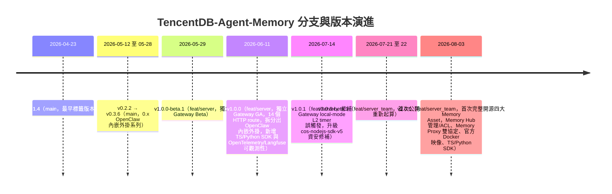

簡言之：**main 分支停留在 0.x 的「OpenClaw 內嵌外掛」世代**；**feat/server 分支是 1.x 的「獨立 Gateway」世代**，把記憶引擎從 OpenClaw 外掛中拆分成獨立服務；**feat/server_team 分支是目前（2.x）的現行世代**，是官方 GitHub 首頁預設顯示、且持續開發的分支（Source-confirmed，透過 `git remote show origin` 與 GitHub API `default_branch` 欄位雙重確認）。企業導入前查證原始碼時，務必先確認自己看的是哪個分支——三個分支的目錄結構與 API 都不相同。

> **v2.0.1 展望**：v2.0.0 之後，官方於 2026-08-10 首次新增正式的 `ROADMAP.md`／`ROADMAP_CN.md`（commit `0a568c3`），公開下一版 v2.0.1 的規劃方向，包含冷啟動預設 Agent、Wiki 生成加速、用戶/團隊級自訂 Prompt、Skill 匯出（`/v3/skill/export`）、記憶時間過濾、Codex IDE Plan 模式支援等（Roadmap/Issue，規劃中，非已出貨；完整清單見 Appendix E）。同一份文件也首度以官方文件確認了一項已隨 v2.0.0 出貨、但先前只在原始碼可查證的能力——`mem:` 對話內指令，詳見第21.5節與 Appendix A.7。

### 2.4 授權與社群

MIT License，逐字確認於 `LICENSE` 檔案（官方已實作：「Copyright (C) 2026 Tencent. All rights reserved. TencentDB Agent Memory is licensed under the MIT.」）。英文與中文 README 內容幾乎逐段對應，中文版額外附有微信社群 QR code 區塊（Source-confirmed，R1）。

### 2.5 Scenario：企業第一次接觸這個專案

- **Scenario**：一家企業的 AI 平台團隊被要求評估「要不要導入 TencentDB-Agent-Memory」。
- **Input**：官方 GitHub repo 連結、README。
- **Process**：團隊容易犯的第一個錯誤，是只看 README 標題與行銷式敘述就下結論「這是個向量資料庫包裝層」。正確做法是先確認四個 Memory Asset 各自的定位（本節）、理解 L0-L3 只是 Chat Memory 的內部管線（第4、7章）、再評估儲存後端選型（第10章）與整合方式（第12-13章）。
- **Output**：一份基於原始碼查證、而非行銷文案的技術評估報告。
- **Example**：本手冊第40章提供了一套五階段（POC → Developer Memory → Project Memory → Team Memory → Enterprise Memory → AI Software Engineering Platform）的建議導入路徑，可作為這份評估報告的骨架。

### 2.6 AI Prompt 範例

```text
請幫我確認 TencentDB-Agent-Memory 目前最新 release 版本、對應的 GitHub
default branch 名稱，以及這個版本相對於上一個 release 的主要變更，
並標明資訊來源是 CHANGELOG.md 還是 GitHub Releases 頁面（兩者收錄範圍不同）。
```

### 2.7 本章 Checklist 與小結

- [ ] 已理解四個 Memory Asset（Chat Memory/Skill/Wiki/Code-Graph）是產品層分類，各自對應不同服務/模組
- [ ] 已理解 L0-L3 只是 Chat Memory 這一個資產的內部管線，不是四資產共用的分層方式
- [ ] 已確認查證原始碼時使用正確分支（`feat/server_team`，非 `main`）
- [ ] 已理解 MIT License 的基本授權範圍
- [ ] 已知道版本歷史橫跨 main（0.x）→ feat/server（1.x）→ feat/server_team（2.x）三個世代分支

---

## 3. 為什麼 AI Agent 需要 Memory

### 3.1 問題起點：LLM 天生無狀態

大型語言模型每次呼叫在本質上都是無狀態的——除非你把上下文塞進 prompt，否則模型不會「記得」上一次對話說過什麼。對於單輪問答型應用，這通常不是問題；但對於需要跨多輪對話、跨多個 session、甚至跨多個團隊成員長期協作的 Coding Agent 來說，這個「天生失憶」的特性會逐漸演變成一條明確的退化鏈路（建議架構，一般 LLM 工程常識，非本產品獨有主張）：

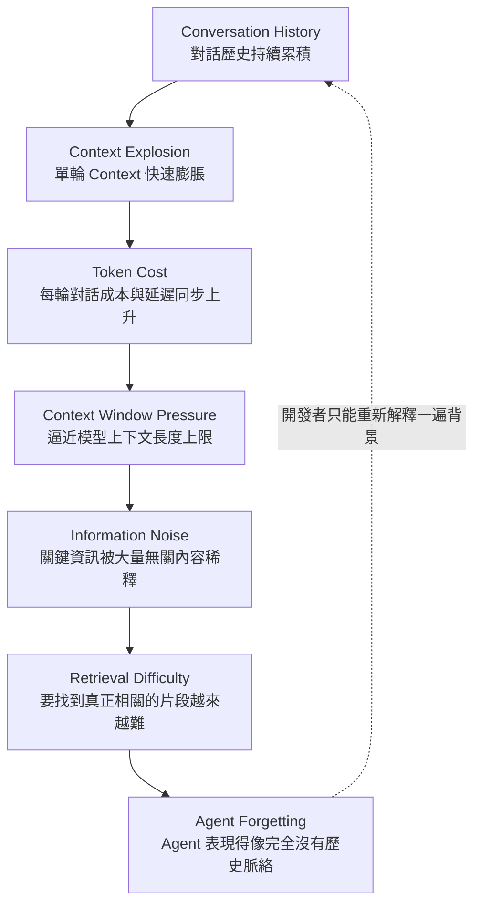

這條鏈路會形成一個惡性循環：Agent 忘記脈絡 → 開發者被迫重新解釋 → 對話歷史更長 → Context 壓力更大 → Agent 更容易忘記。企業導入 AI Coding Agent 若沒有處理這個問題，最終會看到的症狀是：「每次對話都要重新自我介紹專案背景」「同樣的架構決策被要求重做三遍」「換一個 Agent session 或換一個團隊成員，過去的除錯經驗完全用不上」。

### 3.2 為什麼「把所有對話存進 Vector Database」不能真正解決問題

企業第一直覺的解法，往往是「那就把所有對話都存進向量資料庫，用的時候搜一下」。這個做法看似合理，卻無法真正解決問題，原因有三層：

1. **儲存不等於結構化**：把整段對話原文向量化後存起來，檢索出來的仍然是「一大段原始文字」，Agent 還是要花 token 重新理解這段文字裡哪些是事實、哪些是已經過期的舊決策、哪些只是閒聊。這不是記憶，只是「可搜尋的聊天記錄」。
2. **沒有去重與衝突處理**：對話中同一件事可能被重複提起、甚至前後矛盾（例如「付款上限是5萬」後來又改成「10萬」）。純向量搜尋沒有機制判斷哪一筆才是最新、正確的版本，檢索結果可能同時撈出兩筆互相矛盾的內容，讓 Agent 更困惑而不是更聰明。
3. **相似度不等於相關性，也無法反映「資產類型」**：對話原文的向量相似度搜尋，找到的是「語意相近的句子」，而不是「這是一個可重用的技能」「這是一份設計文件」「這是程式碼之間的呼叫關係」。企業需要的往往不只是「相似的話」，而是分類清楚、可獨立管理的資產——這正是本手冊反覆強調「TencentDB-Agent-Memory 不是一個向量資料庫，而是四種資產分別管理」的原因（見第2、4章）。

換言之，向量資料庫可以是記憶系統的**其中一個檢索元件**（TencentDB-Agent-Memory 也確實用 sqlite-vec 或 Tencent Cloud VectorDB 做檢索，見第9-10章），但把「向量資料庫」直接等同於「Agent Memory」，會漏掉「什麼值得保留」「如何去重」「如何分類成不同資產」這幾個更關鍵的問題——而這幾個問題，正是 README 開宗明義提到的「不是儲存一切，而是篩選、組織、重用」（官方已實作，README.md:217，見第2章）。

### 3.3 簡短比較：其他 Agent Memory Framework 的定位

以下比較僅用於幫助讀者理解 TencentDB-Agent-Memory 的相對定位，**不代表這些專案的功能可以直接套用到 TencentDB-Agent-Memory 身上**，兩者是完全不同的專案、不同的原始碼、不同的 API（建議架構，比較內容為本手冊作者依公開已知的專案定位整理，非 TencentDB-Agent-Memory 官方文件內容，讀者若要深入了解這些替代方案的技術細節，請查閱它們各自的官方文件）：

| 專案 | 大致定位（建議架構，非 TencentDB 官方比較） |
|---|---|
| Mem0 | 通用型 Agent 記憶層，強調簡單 API 與跨框架整合 |
| Zep | 針對對話式應用的長期記憶與知識圖譜服務 |
| Letta（前身 MemGPT） | 強調「作業系統式」的分層記憶管理與虛擬 context 概念 |
| LangGraph Memory | LangGraph 生態系內建的 short-term/long-term 記憶機制，與 LangGraph 的 graph 執行模型深度綁定 |

TencentDB-Agent-Memory 相對於這些方案的差異化重點在於：它明確把記憶拆成**四種可獨立管理、可獨立部署的資產**（而不是單一記憶池），並針對 Coding Agent 的場景額外設計了 Context-Offload 機制（第8章）來處理 Tool Output 過長的問題——這是通用型對話記憶方案通常不特別著墨的場景。

### 3.4 TencentDB-Agent-Memory 如何回應這個問題鏈（總覽）

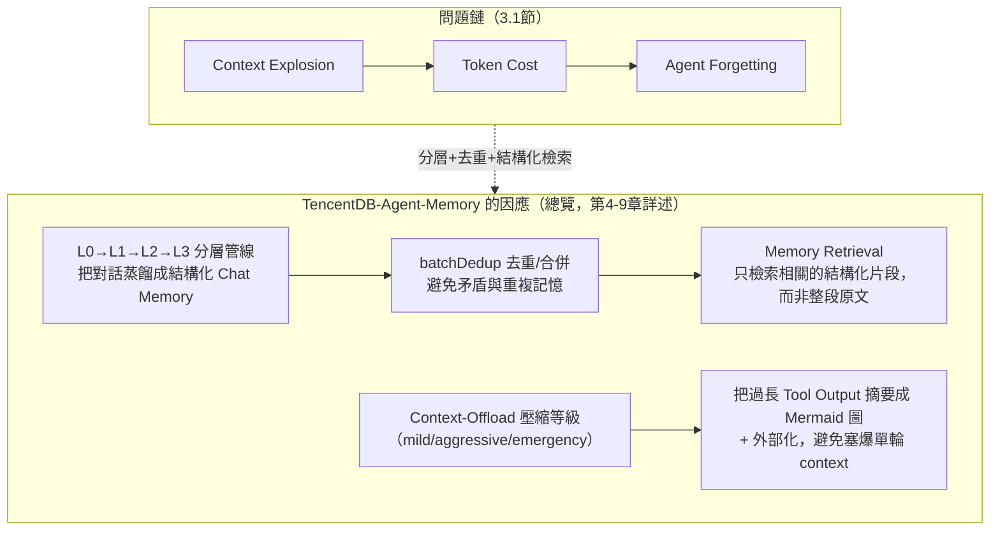

- **對「記憶要跨 session 保留」的回應**：L0→L1→L2→L3 管線（第7章）把對話持續蒸餾成 atomic facts、scene blocks、persona，供下一次對話檢索使用，而不是讓 Agent 每次都要重新讀一遍完整對話歷史。
- **對「重複/矛盾記憶」的回應**：`batchDedup()` 提供 store/update/merge/skip 四種決策（第6-7章），主動處理去重與衝突，而不是讓向量搜尋回傳一堆互相矛盾的結果讓 Agent 自己猜。
- **對「單輪任務 Tool Output 過長」的回應**：這其實是與「跨 session 記憶」不同的另一個問題——當前任務執行中，Shell Output、Test Result、Stack Trace 這類 Tool Output 會快速塞滿 context window。Context-Offload 機制（第8章）透過 mild/aggressive/emergency 三級壓縮，把這些內容摘要成 Mermaid 圖並外部化，讓 Agent 的當前推理不被雜訊淹沒。

第4章會先建立「五個元件、四個資產」的整體架構地圖，第5-9章再依序拆解記憶分層、Context Offload、與檢索機制的實作細節。

### 3.5 Scenario：三個月後的維運任務

- **Scenario**：三個月前，一位工程師和 Agent 一起把某個付款驗證邏輯從 Controller 搬到 Validator 層，這個決策當時只在對話中口頭提過，沒有寫進任何文件。三個月後，另一位工程師要求 Agent 修改另一個類似的 Controller。
- **Input**：新工程師的自然語言請求：「請幫我在 RefundController 加入類似的黑名單檢查」。
- **Process（若只有原始對話存進向量資料庫）**：向量搜尋可能找到三個月前那段對話的原文片段，但 Agent 需要重新解讀「這是不是仍然有效的決策」「當時的理由是什麼」，且如果同一主題又有其他對話片段（甚至矛盾的），Agent 難以判斷該採信哪一個。
- **Process（TencentDB-Agent-Memory 的因應）**：三個月前那次對話結束時，L1 抽取器已經把「驗證邏輯放在 Validator，不放在 Controller」萃取成一筆 `work_method` 型別的 atomic fact（見第6-7章），且經過 `batchDedup` 確認沒有矛盾記憶。這次新任務查詢 Chat Memory 時，直接檢索到這筆結構化事實，不需要重新解讀原始對話。
- **Output**：Agent 能直接沿用既有慣例完成 `RefundController` 的修改，而不是重新從零摸索或誤用過時資訊。
- **Example**：這正是第9章會展開的完整案例（PaymentController／RefundController 場景），讀者可對照第9.3節的詳細 Sequence Diagram。

### 3.6 AI Prompt 範例

```text
請幫我解釋，如果我們團隊目前只是把所有 Agent 對話記錄存進一個
向量資料庫、用相似度搜尋做檢索，這個做法在「去重」「衝突處理」
「資產分類」三個面向上，分別會遇到什麼具體問題？
並說明 TencentDB-Agent-Memory 的 L0-L3 管線與四資產分類架構，
分別是針對哪一個問題設計的。
```

### 3.7 本章 Checklist 與小結

- [ ] 已理解 Conversation History → Context Explosion → Token Cost → Context Window Pressure → Information Noise → Retrieval Difficulty → Agent Forgetting 這條退化鏈路
- [ ] 已理解「把所有對話存進向量資料庫」無法解決去重、衝突處理、資產分類三個問題
- [ ] 已理解 TencentDB-Agent-Memory 是用「分層管線＋去重＋結構化檢索＋Context Offload」四個機制共同回應這條問題鏈，而不是單靠一個向量資料庫
- [ ] 已知道 Mem0/Zep/Letta/LangGraph Memory 只是用於理解定位的參考比較，功能不可與 TencentDB-Agent-Memory 混為一談

本章建立了全書的核心論證：Agent Memory 問題不是「要不要存資料」，而是「如何篩選、結構化、分類、去重」。第4章起，本手冊將對照真實原始碼，逐一拆解 TencentDB-Agent-Memory 具體如何實作這套機制。

---

## 4. 核心架構

### 4.1 架構總覽：五個元件，不是一個「向量資料庫」

企業導入 AI Agent Memory 系統時，最常見的誤解是把整個系統想像成「一個裝了 embedding 的資料庫」。TencentDB-Agent-Memory 的實際部署形態並非如此——它是由**五個職責邊界清楚、可獨立部署的元件**組成：MemoryCore、MemoryKnowledge、MemoryProxy、MemoryPanel，以及一個可替換後端的儲存層。理解這五者的分工，是後續章節（L0-L3 分層、Context Offload、Retrieval）能否正確落地的前提。

README 明確將 Chat Memory、Skills、Wiki、CodeGraph 四者統一註冊為「Memory Assets」(官方已實作，README.md:236)，但**四個 Memory Asset 是產品層的資產分類，不等於部署層的服務**——這四個資產分別由不同的服務/模組負責產生與管理：

| Memory Asset | 負責服務/模組 | 內部組成 | 資料來源 | Provenance |
|---|---|---|---|---|
| Chat Memory | **MemoryCore** | L0 recorder → L1 extractor → L2 scene extractor → L3 persona generator，由 `MemoryPipelineManager` 串接 | OpenClaw `agent_end` hook 觸發的對話擷取 | 官方已實作，README.md:75, 236；Source-confirmed（管線細節，見第7章） |
| Skill | **MemoryCore** | `SkillCore` / `SqliteSkillStore` / `SkillExtractor`，在 `tdai-core.ts` 第59-77、795-973行接線 | `SkillTriggerService.archive` → agent 佇列 → `SkillConversationExtractWorker` | Source-confirmed，`MemoryCore/src/core/skill/` |
| Wiki | **MemoryKnowledge** | `WikiService`，`module.ts` 第12-25行 | 文件攝取（document ingestion） | Source-confirmed |
| Code-Graph | **MemoryKnowledge** | `CodeGraphService`，`module.ts` 第12-25行 | git repo 索引，可排程自動同步 | Source-confirmed；排程自動同步為官方已實作，CHANGELOG.md [2.0.0] |

除了這四個資產的生產者之外，還有兩個不生產資產、但整個系統缺一不可的元件：

- **MemoryProxy**：負責「協定轉譯」——把 Anthropic Messages API（`POST /v1/messages`，`anthropicHandler.ts` 第522行 `handleAnthropicMessages`）與 OpenAI Chat Completions API（`POST /v1/chat/completions`，`handler.ts` 第422行 `handleChatCompletions`）這兩種業界通用協定，轉接到内部的記憶注入邏輯，讓不支援 TencentDB 專屬 SDK/工具呼叫的用戶端（例如原生 Claude Code、CodeBuddy）也能透明地取得記憶增強的上下文 (Source-confirmed，另見 Tier-4 來源 MarkTechPost 2026-08-07 對 `/claude-code/<spaceId>/v1/messages` 路由的報導)。
- **MemoryPanel**：管理介面，對應 CHANGELOG 所述的「Memory Hub 管理/ACL」能力 (官方已實作，CHANGELOG.md [2.0.0] 2026-08-03)。倉庫中確認存在 `MemoryPanel/docker/`、`MemoryPanel/scripts/` 等目錄 (Source-confirmed，全樹檔名搜尋)，SDK 層也對應提供 `MetadataClient` 處理 user/team/agent/task/asset/ACL 的 CRUD (Source-confirmed)，MemoryPanel 很可能是這組 API 的前端治理台 (建議架構：MemoryPanel 與 MetadataClient 的對應關係為推論，官方未明文寫出 UI 呼叫哪一層 API)。

儲存層則刻意設計成**可替換的兩種 backend**，而不是單一黑盒子：預設是本地的 `sqlite-vec`（釘選版本 `0.1.7-alpha.2`，`MemoryCore/package.json:121`），透過 Node 22+ 內建的 `node:sqlite` 以 `vec0` 虛擬表（`l0_vec`／`l1_vec`）做餘弦相似度 KNN (Source-confirmed，`MemoryCore/src/core/store/sqlite.ts`)；可選項是 `TcvdbMemoryStore`（`core/store/tcvdb.ts`），串接 Tencent Cloud VectorDB，支援 server-side dense embedding 搭配 client-side BM25 sparse vector 的 hybrid search (Source-confirmed)。`type StoreBackend = "sqlite" | "tcvdb"` 這個型別本身就說明了架構意圖：儲存從一開始就不是單一方案 (Source-confirmed)。

> **重要澄清（本手冊全文一致強調）**：L0→L1→L2→L3 這組編號，**只是 Chat Memory 這一個資產的內部生產管線**，不是四個 Memory Asset 的另一種說法。Skill、Wiki、Code-Graph 各自有獨立的服務/模組與資料流，完全不經過 L0-L3 這條管線。第5、6章會深入 L0-L3 的細節，但讀者務必記住：**L0-L3 ⊂ Chat Memory ⊂ 四個 Memory Asset 之一**，而不是 L0-L3 = 四個 Memory Asset。

### 4.2 架構圖：元件關係與資料流向

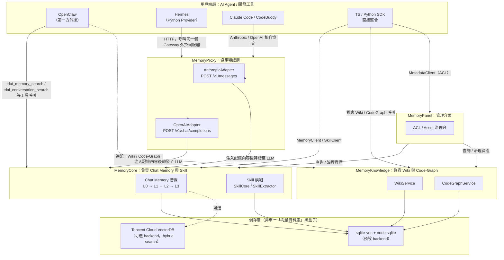

**圖例說明**：實線代表已從原始碼/文件確認的呼叫關係（Source-confirmed／官方已實作）；虛線（`-.->`）代表依現有資料合理推論、但官方文件未逐一列點確認的路徑（建議架構）。例如 OpenClaw 是否直接查詢 MemoryKnowledge（Wiki/Code-Graph），或必須透過 SDK/Proxy 中介，研究資料未明確交代，本手冊在圖中標為虛線，企業導入時應以實測為準，不可直接假設。

### 4.3 資料流向：四個典型場景

**場景 A：工程師在 OpenClaw 中對話，Agent 查詢記憶**
- Scenario：工程師在 IDE 內與 OpenClaw 對話，Agent 需要判斷「這個專案之前是否討論過 API 版本規範」。
- Input：使用者當前訊息。
- Process：OpenClaw 外掛呼叫已宣告的工具 `tdai_memory_search`（`MemoryCore/openclaw.plugin.json`）(Source-confirmed)，請求打到 MemoryCore，MemoryCore 在 sqlite-vec 的 `l1_vec` 表做 KNN 相似度查詢。
- Output：回傳相關的 L1 atomic facts，注入到 Agent 的 prompt context。
- Example：工具回應中夾帶一筆 `{"type":"work_fact","content":"專案 API 統一走 v3，2026-06 起棄用 v2"}`（示意，非逐字原始碼）。

**場景 B：Claude Code 透過 MemoryProxy 呼叫**
- Scenario：企業把 Claude Code 的 API base URL 指向 MemoryProxy，而非直接指向 Anthropic。
- Input：標準 Anthropic Messages API request。
- Process：`AnthropicAdapter` 攔截請求，注入相關記憶到 system/context，再轉發到實際 LLM 供應商 (Source-confirmed，協定轉換部分；「注入記憶後轉發」的確切順序為建議架構推論)。
- Output：Claude Code 收到的回應與原生 Anthropic API 格式相容，但內容已被記憶增強。
- Example：無需修改 Claude Code 任何程式碼，只改 base URL 設定即可獲得記憶能力——這正是 Proxy 存在的商業價值。

**場景 C：治理人員使用 MemoryPanel**
- Scenario：資安/治理團隊要稽核某個 team 的記憶資產存取範圍。
- Process：透過 MemoryPanel 呼叫 `MetadataClient` 的 ACL CRUD API，調整某 agent 對特定 Memory Asset 的存取權限 (Source-confirmed API 存在；MemoryPanel 作為前端的具體實作為建議架構)。

**場景 D：對話結束觸發 Chat Memory 管線**
- Scenario：一次 Agent session 結束。
- Process：OpenClaw `agent_end` hook 觸發 `recordConversation()`，寫入 L0，並依觸發條件逐步推進 L1→L2→L3（詳見第5、6章）。

### 4.4 AI Prompt 範例

企業架構師在評估整合方案時，可以用類似下列 prompt 請 AI coding agent 協助分析（本身即是「用 Agent Memory 概念設計 Agent Memory 整合」的示範）：

```text
請根據 TencentDB-Agent-Memory 的五元件架構（MemoryCore / MemoryKnowledge /
MemoryProxy / MemoryPanel / 儲存層），分析我們現有的三個 AI Agent
（OpenClaw、Hermes、內部自研的 Claude Code 包裝層）各自該用哪種整合路徑：
SDK 直連、MemoryProxy 協定轉譯、還是 OpenClaw 外掛工具呼叫？
並指出哪些路徑會經過 MemoryProxy 的協定轉換、哪些不會。
```

```text
我們只需要 Chat Memory 與 Skill，暫時不需要 Wiki／Code-Graph。
請說明在這個範圍下，MemoryKnowledge 服務是否可以完全不部署，
以及這個決定會不會影響 MemoryPanel 的治理功能完整性。
```

### 4.5 本章 Checklist 與小結

- [ ] 已確認團隊要啟用哪些 Memory Asset（Chat Memory / Skill 是否必要、Wiki / Code-Graph 是否需要獨立部署 MemoryKnowledge）
- [ ] 已確認是否需要對外開放 MemoryProxy（是否有原生 Claude Code / CodeBuddy 等只支援標準協定的用戶端）
- [ ] 已確認儲存層選型：本地 sqlite-vec（單機/低延遲）或 Tencent Cloud VectorDB（雲端/hybrid search）
- [ ] 已確認 MemoryPanel 的 ACL 治理責任歸屬（治理團隊、開發團隊、或兩者協作）
- [ ] 團隊成員已理解「四個 Memory Asset ≠ L0-L3」這個核心概念，不會在後續章節中把 Skill/Wiki/Code-Graph 誤認為記憶分層的產物

本章建立了全書最重要的一張心智地圖：五個元件各司其職，四個 Memory Asset 是產品層分類，L0-L3 只是 Chat Memory 這一個資產的內部管線。接下來第5、6章會深入這條管線本身，並且處理另一個容易混淆的命名問題——官方原始碼裡還有一組完全不同、但同樣叫做 L1/L2/L3 的機制。

---

## 5. Short-term Memory

### 5.1 定義與範圍

本章的 Short-term Memory，專指 **L0：原始對話擷取機制**——它是 Chat Memory 管線（第4章圖中 `PIPE` 節點）的第一步，也是唯一「未經 LLM 摘要/萃取」的原始層。L0 產生的資料是後續 L1 atomic facts 抽取的原料，本身不做任何語意壓縮或去重，單純是「發生過什麼」的忠實記錄。

在往下講之前，必須先立一個警示牌：**本章後半段要介紹的 context-offload 壓縮等級，雖然官方程式碼裡也標記為 L1/L2/L3，但跟這裡、以及第6章要講的 L0→L1→L2→L3 記憶分層，是完全不同的兩套機制。** 這是全手冊最容易混淆的一組命名衝突，5.4節會用專門的對照表講清楚。

### 5.2 L0 機制詳解

| 項目 | 內容 | Provenance |
|---|---|---|
| 核心函式 | `recordConversation()` | Source-confirmed |
| 檔案位置 | `MemoryCore/src/core/conversation/l0-recorder.ts` 第93-314行 | Source-confirmed |
| 觸發來源 | OpenClaw 的 `agent_end` hook | Source-confirmed |
| 儲存格式 | JSON Lines，逐則訊息寫成一行 JSON | Source-confirmed |
| 儲存路徑 | `~/.openclaw/memory-tdai/conversations/YYYY-MM-DD.jsonl` | Source-confirmed |
| 擷取方式 | 位置游標（cursor）做增量擷取，避免重複寫入 | Source-confirmed |
| 特殊處理 | 會過濾程式碼區塊，避免大段程式碼污染短期記憶 | Source-confirmed |

**Scenario / Input / Process / Output / Example**

- **Scenario**：工程師透過 OpenClaw 與 Agent 進行一次結對開發對話，對話結束。
- **Input**：`agent_end` hook 觸發時傳入的本次 session 訊息陣列。
- **Process**：`recordConversation()` 讀取上次擷取後的游標位置，只處理「新增」的訊息；逐則訊息寫成一行 JSON，過濾其中的程式碼區塊；append 到當日的 `.jsonl` 檔案。
- **Output**：本地檔案系統中新增/追加一份 JSON Lines 記錄。
- **Example**（示意，非逐字原始碼）：

```json
{"role":"user","content":"我們的 API 版本從今天起改成 v3 了","timestamp":"2026-08-10T09:12:00Z","sessionKey":"proj-x-session-1"}
{"role":"assistant","content":"了解，我會在後續程式碼建議中預設使用 v3 端點","timestamp":"2026-08-10T09:12:05Z","sessionKey":"proj-x-session-1"}
```

L0 之所以要「先落地成檔案」而不是即時丟給 LLM 抽取，是為了讓 L1 的觸發可以用批次條件（每滿5則對話或閒置600秒，見第6章）而不是每句話都呼叫一次 LLM——這是控制 LLM 呼叫成本的關鍵設計（建議架構：此為根據觸發機制反推的設計動機，官方未明文寫出「為什麼」）。

### 5.3 另一套機制：Context-Offload 壓縮等級（mild / aggressive / emergency）

除了 L0 對話擷取之外，TencentDB-Agent-Memory 還有一套處理「當前任務執行中、context window 快被 tool log 塞爆」問題的機制，位於 `MemoryCore/src/offload/` 與獨立的 `offload_server/` 服務 (Source-confirmed)。這套機制**不屬於記憶分層**，它做的事情是：把當前 session 中累積的 tool call log（檔案讀取結果、指令輸出等）摘要成 Mermaid 流程圖或結構化摘要，再把原始 log offload 到外部儲存，只在 context window 中保留摘要，藉此把已經佔用大量 token 的執行歷史「瘦身」。

這套機制的壓縮強度分成三級：**mild / aggressive / emergency**，對應到程式碼中的 `l3-helpers.ts`（`MemoryCore/src/offload/`）以及 `offload_server/compact/compressor.ts` 中明確寫著 "L3 Compressor — mild/aggressive/emergency compression" 的註解 (Source-confirmed)。

> **官方原始碼本身就有命名衝突，讀者務必留意**：`offload/` 與 `offload_server/` 內部把 mild/aggressive/emergency 這三級壓縮也標記為 L1/L2/L3，這組編號與第6章要介紹的「L1 atomic facts / L2 scene blocks / L3 persona」**共用了 L1/L2/L3 這幾個符號，但指涉的是完全不同的兩件事**。本手冊為避免混淆，全文一律用「mild/aggressive/emergency」稱呼 context-offload 的三個等級，只有在明確提醒「官方程式碼裡也叫 L1/L2/L3」時才會提及這個別名。

**Scenario / Input / Process / Output / Example**

- **Scenario**：Agent 在執行一個長時間的 coding session，反覆讀取檔案、跑測試、看 log，tool call 累積量體越來越大，context window 逼近上限。
- **Input**：目前 context window 中累積的 tool log，以及當下的 context 使用壓力。
- **Process**：`offload_server` 依 tool log 量體與 context 壓力，在 mild／aggressive／emergency 三個等級中擇一，把 tool log 摘要成 Mermaid 圖或結構化摘要 (Source-confirmed 摘要形式為 Mermaid 圖；三級的精確觸發門檻研究資料未提供，屬推測/Hypothesis)，原始 log 移出 context window、寫到外部儲存。
- **Output**：context window 中 token 用量下降；官方在巢狀文件中宣稱可減少 **61.38%** 的 token 用量 (官方已實作，但僅見於巢狀文件 `MemoryCore/hermes-plugin/memory/memory_tencentdb/README.md`，**不在頂層 README.md / README_CN.md**，兩者常被誤引用，本手冊特別註明出處層級)。
- **Example**（示意）：一段連續 20 次的檔案讀取/編輯 tool log，被壓縮成類似「`檔案A 讀取 → 修改函式X → 執行測試 → 通過`」的 Mermaid 節點鏈，取代原本佔用大量 token 的完整 log 文字。

MemoryCore 外掛宣告的工具中有一個 `tdai_read_cos` (Source-confirmed，`MemoryCore/openclaw.plugin.json`)，名稱暗示 offload 後的原始資料很可能存放在 Tencent Cloud Object Storage（COS），但研究資料未明確確認這條資料流的完整路徑，此推論標示為（推測/Hypothesis）。

### 5.4 兩套「L1/L2/L3」對照表（必讀，避免混淆）

| 比較面向 | 記憶分層 L0→L1→L2→L3（第5-6章主題） | Context-Offload 壓縮等級（也稱 L1/L2/L3） |
|---|---|---|
| 目的 | 建立可長期查詢、跨 session 的 Chat Memory 資產 | 避免當前 context window 被 tool log 塞爆 |
| 作用對象 | 整段對話歷史（跨天、跨 session） | 目前這一次任務執行中的 tool call log |
| 命名 | L0（原始）／L1（atomic facts）／L2（scene blocks）／L3（persona） | mild／aggressive／emergency（程式碼註解中也稱 L1/L2/L3） |
| 輸出形態 | 結構化 facts、markdown 場景檔、`persona.md` | 摘要後的 Mermaid 圖 + offload 到外部儲存 |
| 觸發時機 | 對話累積量 / 閒置時間 / persona trigger 次數 | context 使用壓力 / tool log 量體 |
| 程式碼位置 | `MemoryCore/src/core/record/`、`scene-extractor.ts`、`persona-generator.ts` | `MemoryCore/src/offload/l3-helpers.ts`、`offload_server/compact/compressor.ts` |
| 效益宣稱 | 知識保留、跨 session 可檢索（無直接 token 減少宣稱） | 官方宣稱 61.38% token 減少（僅見於巢狀文件） |
| 是否屬於 Memory Asset | 是，L0-L3 是 Chat Memory 資產的內部管線 | 否，這是 context-window 管理子系統，不生產 Memory Asset |

所有 Provenance：命名衝突與各自的程式碼位置為 Source-confirmed；效益宣稱出處層級已如上標註。

### 5.5 AI Prompt 範例

```text
請解釋在 TencentDB-Agent-Memory 中，L0 對話擷取（記憶分層的第一層）
與 offload_server 裡標記為 L1/L2/L3 的 mild/aggressive/emergency
壓縮等級，這兩者在觸發時機、資料流向、輸出結果上分別是什麼，
並明確指出它們不是同一套機制。
```

```text
我們的 Agent 在長任務中經常把 context window 塞滿工具呼叫記錄，
請根據 mild/aggressive/emergency 三級壓縮的概念，評估我們應該在
什麼 context 使用率門檻設定各級的觸發條件（此為企業自訂策略設計，
非官方預設值，需標示為建議架構）。
```

### 5.6 本章 Checklist 與小結

- [ ] 團隊已理解 L0 是「原始、未壓縮」的對話記錄，不是最終要拿來檢索的知識
- [ ] 團隊已確認 `~/.openclaw/memory-tdai/conversations/` 的儲存位置與保留策略（是否需要企業級備份，見第36章）
- [ ] 團隊已明確區分「記憶分層 L0-L3」與「context-offload 壓縮等級（也稱 L1/L2/L3）」是兩套不同機制，不會在文件、教育訓練、或程式碼審查中混用這組編號
- [ ] 若引用 61.38% token 減少的官方宣稱，已註明其出處是巢狀文件而非頂層 README，避免對外溝通時的引用錯誤
- [ ] 已初步了解 `tdai_read_cos` 工具的存在，作為後續章節（第10章 Storage Architecture、第36章 Backup/Restore）追查 offload 資料落地位置的線索

本章聚焦「短期」的兩個不同層次：L0 是記憶分層管線的原料層，offload 機制是任務執行中的 context 減壓閥。兩者common的地方只有「都跟短期、當下的資料量控管有關」，但生產出來的東西、觸發條件、乃至於程式碼位置都完全不同。下一章將從 L0 產出的原始資料出發，說明 L1→L2→L3 如何把它們逐步提煉成真正可長期複用的知識。

---

## 6. Long-term Memory

### 6.1 三層總覽

Long-term Memory 由三層構成，每一層都有明確的擁有者類別與檔案位置：

| 層級 | 內容 | 核心函式/類別 | 檔案位置 | Provenance |
|---|---|---|---|---|
| L1 | Atomic facts（原子事實） | `extractL1Memories()` | `MemoryCore/src/core/record/l1-extractor.ts` 第79-378行 | Source-confirmed |
| L2 | Scene blocks（場景區塊，markdown） | `SceneExtractor.extract()` | `MemoryCore/src/core/.../scene-extractor.ts` 第95-150行起 | Source-confirmed |
| L3 | Persona（人格/角色摘要） | `PersonaGenerator.generateLocalPersona()` | `MemoryCore/src/core/.../persona-generator.ts` 第71-150行起 | Source-confirmed |

三層由 `TdaiCore` 透過 `MemoryPipelineManager` 串接，構成一條完整的「原始對話 → 事實 → 場景 → 人格」提煉管線 (Source-confirmed)。

### 6.2 L1：Atomic Facts 與去重/衝突處理

`extractL1Memories()` 的關鍵設計是**一次 LLM 呼叫同時完成「場景切分」與「記憶抽取」兩件事** (Source-confirmed，`l1-extractor.ts` 第79-378行)——這裡的「場景切分」是 L1 內部用來組織抽取結果的中間步驟，跟 L2 實際持久化管理的 scene blocks 檔案不是同一件事，讀者不應把兩者當成同一個場景概念的重複描述。

抽取出來的記憶分成七種型別 (Source-confirmed，型別名稱來自 `l1-extractor.ts`)：

| 型別 | 說明（建議架構：以下為作者依型別名稱的合理解讀，非原始碼逐字定義） |
|---|---|
| `persona` | 使用者/agent 的人格、偏好、風格特徵 |
| `episodic` | 特定時間點發生的具體事件（誰、何時、做了什麼） |
| `instruction` | 使用者下達的明確指令/規則 |
| `work_fact` | 與工作內容相關的客觀事實（例如版本號、架構決策） |
| `work_task` | 具體任務項目 |
| `work_method` | 執行任務的方法/流程 |
| `work_artifact` | 工作過程中產出的具體物件（檔案、連結、設定） |

**去重與衝突處理（batchDedup）**：新抽取出來的事實不會無條件寫入，而是先經過 `batchDedup()` 判斷，回傳四種決策之一 (Source-confirmed，`l1-dedup.ts` 第350、362-370行)，再由 `applyDecisions()` / `writeMemory()` 實際套用：

| 決策 | 意涵 | 情境範例（建議架構：範例為說明性示意，非原始碼逐字內容） |
|---|---|---|
| `store` | 全新事實，既有記憶中沒有相近項目 | 使用者第一次提到「這個專案的 CI 要用 GitHub Actions」 |
| `update` | 已有相近記憶，但新資訊需要修正/取代舊內容 | 使用者更正「API 版本其實是 v3.1，不是 v3」 |
| `merge` | 新舊記憶內容互補，合併成更完整的一筆 | 使用者分兩次對話分別補充同一支 API 的參數與回傳格式 |
| `skip` | 新內容與既有記憶重複，不具增量價值 | 使用者重複確認一件已經記錄過的事 |

**Scenario / Input / Process / Output / Example**

- **Scenario**：一次對話中，使用者先前已被記錄「專案用 pnpm」，這次又說「我們統一用 pnpm，禁止用 npm install」。
- **Input**：L0 累積滿5則對話，觸發 L1 抽取。
- **Process**：`extractL1Memories()` 呼叫 LLM，抽出一筆 `instruction` 型別事實；`batchDedup()` 比對既有記憶，判定與舊有的「專案用 pnpm」語意重疊但補充了「禁止 npm install」的新限制，回傳 `merge` 決策。
- **Output**：`applyDecisions()` 把兩筆記憶合併寫入，資料庫中只留一筆更完整的 instruction。
- **Example**：合併後的記憶內容類似 `{"type":"instruction","content":"專案套件管理統一使用 pnpm，禁止使用 npm install"}`（示意）。

### 6.3 L2：Scene Blocks——LLM Agent 直接讀寫 Markdown

L2 由 `SceneExtractor.extract()` 負責，其本質是**一個被限制在 `scene_blocks/` 目錄內操作的 LLM agent**，直接讀寫 markdown 格式的場景檔 (Source-confirmed，`scene-extractor.ts` 第95-150行起)。這個設計取代了較早期以關鍵字比對為主的 `SceneManager` 做法 (Source-confirmed，屬架構演進歷史)，意味著場景的組織方式從「規則式匹配」演進成「LLM 自主判斷要不要開新場景檔、要不要往既有場景檔追加內容」。

**Scenario / Input / Process / Output / Example**

- **Scenario**：L1 完成一批 atomic facts 抽取後10秒，觸發 L2。
- **Input**：新抽取的 L1 事實、現有 `scene_blocks/` 目錄下的場景檔案清單。
- **Process**：`SceneExtractor` 作為受限 LLM agent，判斷這批事實屬於既有場景（例如「v3 API 遷移」場景檔）還是需要開一個新場景檔，然後直接對 markdown 檔案做讀寫操作。
- **Output**：`scene_blocks/` 目錄下新增或更新一份 markdown 場景檔。
- **Example**（示意）：

```markdown
# Scene: v3 API 遷移

- 2026-08-10：API 版本正式改為 v3，舊版 v2 於同日棄用
- 相關限制：套件管理統一使用 pnpm，禁止 npm install
```

### 6.4 L3：Persona——增量重新生成邏輯

L3 由 `PersonaGenerator.generateLocalPersona()` 負責 (Source-confirmed，`persona-generator.ts` 第71-150行起)。它的邏輯是：讀取既有的 `persona.md`，找出自 `checkpoint.last_persona_time` 之後有變動的場景索引，再依變動範圍選擇 **incremental**（增量更新）或 **first**（首次生成）模式重新生成——這就是 L2→L3 之間的去重/更新邏輯，避免每次都把整份 persona 從零重寫 (Source-confirmed)。

**Scenario / Input / Process / Output / Example**

- **Scenario**：累積滿50次 persona trigger，觸發 L3。
- **Input**：`persona.md`（既有版本）、`checkpoint.last_persona_time` 之後有變動的場景索引清單。
- **Process**：若這是第一次生成，走 `first` 模式，通篇生成；若已有既有 persona，走 `incremental` 模式，只針對變動的場景範圍做增量修訂。
- **Output**：更新後的 `persona.md`，以及推進的 `checkpoint.last_persona_time`。
- **Example**（示意）：persona.md 中新增一段「該使用者偏好保守型架構變更、重視向後相容性」的描述，來源是彙整了多個場景檔中反覆出現的行為模式。

### 6.5 管線觸發條件總表

三層之間的推進不是即時的，而是有明確的批次/閒置觸發條件，由 `config.ts` 第555-570行定義，`pipeline-manager.ts` 執行 (Source-confirmed)：

| 轉換 | 觸發條件 | 補充規則 |
|---|---|---|
| L0 → L1 | 每滿5則對話，或閒置600秒 | 有暖機倍增排程（1→2→4→8...）避免冷啟動時過於頻繁呼叫 LLM |
| L1 → L2 | L1 完成後10秒觸發 | 受900-3600秒區間限制 |
| L2 → L3 | 每滿50次 persona trigger | — |

這個設計本質上是用「批次 + 閒置偵測」取代「每則訊息即時處理」，直接影響 LLM 呼叫成本與記憶新鮮度之間的權衡（建議架構：此為根據觸發參數反推的工程權衡分析，非官方文件明文陳述的設計理由）。

### 6.6 Short-term vs Long-term Memory 完整比較表

| 比較面向 | Short-term Memory（L0 原始對話擷取） | Long-term Memory（L1 Atomic Facts / L2 Scene Blocks / L3 Persona） |
|---|---|---|
| 目的 | 忠實記錄「發生過什麼」，作為後續提煉的原料 | 把原始對話提煉成可長期複用、跨 session 的結構化知識 |
| 生命週期 | 按日滾動的 JSONL 檔案，理論上可無限累積但不做語意壓縮 | 事實/場景/人格會經過 dedup、merge、增量重生成，數量受控 |
| 儲存內容 | 逐則訊息的原文（已過濾程式碼區塊） | L1：結構化 atomic facts；L2：markdown 場景檔；L3：`persona.md` |
| Token 影響 | 不直接注入 LLM context，僅作為擷取來源，因此本身不消耗檢索時的 token | 是實際被檢索、注入 prompt 的內容，dedup/merge 機制正是為了壓低檢索時的 token 用量 |
| Retrieval 方式 | 一般不直接被語意檢索，主要由 L1 抽取程序讀取 | L1/L2 透過 sqlite-vec 或 tcvdb 做向量相似度檢索；L3 通常整份或摘要注入（見第9章） |
| 適用場景 | 稽核、回溯「當時到底說了什麼」、L1 抽取的資料源 | 跨 session 的個人化、專案知識累積、Agent 行為一致性 |
| 典型問題 | 若保留期過長會佔用大量本地磁碟；不做去重代表同樣的內容可能重複出現在多個檔案（建議架構：風險評估） | dedup 決策（尤其 `merge`/`update`）若判斷有誤，可能導致資訊遺失或錯誤覆蓋，需要企業自行評估是否需要版本歷史（建議架構） |

> 補充：Context-Offload（mild/aggressive/emergency）不在上表中，因為它不是記憶分層的一部分——它處理的是「當前任務執行中」的 tool log，性質上更接近第6.7節要討論的 Working Memory，而不是這裡的 Short-term/Long-term Memory 二分法。詳見第5章。

### 6.7 為什麼 Agent Memory 需要同時處理多種記憶概念（建議架構／作者分析）

> **本節性質聲明**：以下內容是本手冊作者借用認知科學中常見的記憶分類（Context / Working / Episodic / Semantic / Procedural-Skill Memory），嘗試對應到 TencentDB-Agent-Memory 的實際分層設計，藉此幫助企業讀者建立更完整的心智模型。**這套詞彙官方文件與原始碼都未使用**，全節內容應視為（建議架構／推測），不是官方規格，企業內部教育訓練或架構決策文件如果要引用，請明確標註「本手冊的分析框架」而非「官方定義」。

一個成熟的 Agent Memory 系統之所以不能只做「一層」記憶，是因為 Agent 在實際運作中同時要應付幾種性質完全不同的資訊：當下這一輪對話需要的即時上下文（Context Memory）、正在執行、還沒沉澱的任務暫存狀態（Working Memory）、發生過的具體事件（Episodic Memory）、可泛化的知識與事實（Semantic Memory），以及「怎麼做」的程序性知識（Procedural/Skill Memory）。這五種概念如果只用一層儲存，會出現兩種失敗模式：只保留原始事件會讓 context 無限膨脹、檢索精準度下降；只保留高度摘要的知識則會遺失稽核所需的細節與可回溯性。TencentDB-Agent-Memory 的分層設計，可以理解成分別對應這五種概念的一種工程實作（建議架構）：

| 認知科學概念 | 簡述 | 對應 TencentDB-Agent-Memory 元件/層 | 對應理由 | Provenance |
|---|---|---|---|---|
| Context Memory | 目前這一輪對話/任務所需的即時上下文 | L0 最近訊息 + Retrieval 注入的 L1/L2/L3 內容，組合成當次 prompt context | 這是「檢索後注入」的即時產物，不是獨立的持久儲存層 | 建議架構 |
| Working Memory | 執行中任務、尚未沉澱為長期知識的暫存狀態 | Context-Offload 機制所處理的 tool log／當前 session 操作紀錄 | Offload 針對的正是「還在用、但快滿出來」的暫存資料，性質上等同工作記憶；也因此它不屬於 Memory Asset，而是任務執行期的輔助機制 | 建議架構（機制本身 Source-confirmed，見第5章；認知科學對應為推論） |
| Episodic Memory | 特定時間、事件的情節記憶（誰、何時、做了什麼） | L0 原始對話 + L1 中明確標記的 `episodic` 型別事實 | `episodic` 是 `extractL1Memories()` 實際輸出的型別之一，直接對應「事件記憶」的定義 | 型別存在為 Source-confirmed；認知科學對應為建議架構 |
| Semantic Memory | 去情境化、可泛化的事實/知識 | L1 中 `persona`/`work_fact` 型別，經 `batchDedup` 去重後留存者，以及 L3 `persona.md` 的聚合結果 | dedup 機制正是把重複、零散的情節收斂為單一泛化事實的過程，L3 更進一步把多個場景聚合成人格層級的摘要 | 建議架構 |
| Procedural / Skill Memory | 「怎麼做」的程序性、可重用知識 | Skill Memory Asset（`SkillCore`/`SqliteSkillStore`/`SkillExtractor`） | Skill 是官方定義中唯一以「可執行/可重用程序」為核心的資產類別，且刻意與 L0-L3 完全獨立（見第4章），這種獨立性本身就呼應了程序性記憶在認知科學中「不同於陳述性記憶」的特性 | 資產獨立性為 Source-confirmed；與 Procedural Memory 的對應為建議架構 |

這個對應關係也解釋了第4章反覆強調的一個設計選擇：**為什麼 Skill 不是 L0-L3 管線的產物，而要做成獨立模組**——如果 Procedural/Skill Memory 真的和 Episodic/Semantic Memory 混在同一條 dedup/merge 管線裡處理，兩種生命週期完全不同的知識（一個是「版本化、可執行」的技能，一個是「持續演化、會被合併/覆蓋」的事實）會彼此干擾：Skill 需要版本管理與明確的封存流程（README Roadmap 提及的「Skill 強制封存」屬於 CHANGELOG [2.0.0] 已出貨項目，官方已實作），而 L1 事實則需要頻繁的 dedup 與合併。把兩者拆成獨立模組，正是避免這種生命週期衝突的工程手段（建議架構）。

### 6.8 AI Prompt 範例

```text
請根據 TencentDB-Agent-Memory 的 L1（atomic facts）/L2（scene blocks）
/L3（persona）三層設計，說明如果我們的企業場景需要保留完整的
事實變更歷史（而不是讓 update/merge 直接覆蓋舊資料），
應該在哪一層加上版本化機制，並評估對現有 batchDedup 邏輯的影響。
```

```text
請對照本手冊 6.7 節提出的 Context/Working/Episodic/Semantic/
Procedural-Skill Memory 對應表，指出我們目前的 Agent 架構中，
哪一種記憶概念完全沒有被涵蓋到，並提出用 TencentDB-Agent-Memory
既有元件補齊的方案（明確標示哪些是官方功能、哪些是我們自行擴充）。
```

### 6.9 本章 Checklist 與小結

- [ ] 已理解 L1/L2/L3 分別是 atomic facts、scene blocks、persona 三種不同粒度的長期記憶
- [ ] 已確認 `batchDedup()` 的 `store`/`update`/`merge`/`skip` 四種決策是否符合企業資料治理要求（例如 `update` 是否需要保留變更歷史，而非直接覆蓋）
- [ ] 已確認 `scene_blocks/` 目錄的存取邊界——這是一個會被 LLM agent 直接讀寫的目錄，需要納入第32章 Security 的檔案系統存取控管範圍
- [ ] 已確認 L2→L3 每滿50次 persona trigger 的重生成頻率，是否適合團隊實際對話量（過於頻繁會增加 LLM 呼叫成本，過於稀疏會讓 persona 過時）
- [ ] 已將 Short-term vs Long-term 比較表分享給團隊，統一「Context-Offload 不算記憶分層」的認知
- [ ] 若要在企業內部推廣 6.7 節的認知記憶對應模型，已明確向團隊說明這是分析性框架，不是官方規格，避免與 TencentDB 官方文件的表述混淆

本章與第5章共同構成了 Chat Memory 資產的完整生命週期：L0 忠實記錄、L1 提煉成原子事實並處理去重衝突、L2 把事實組織成場景敘事、L3 聚合成人格摘要。加上第5章釐清的 Context-Offload 機制，讀者現在應該能清楚分辨兩組同名為 L1/L2/L3 的機制，也理解四個 Memory Asset 與 L0-L3 管線之間「整體與局部」的關係。第7章將把 L0-L3 這條管線放大檢視，逐一拆解每個階段的實作細節與工程取捨。

---

## 7. Four-Layer Memory Pipeline

本章是全書技術風險最高、也是理解 TencentDB-Agent-Memory 心智模型最關鍵的一章。請先記住一個貫穿全文的原則：**L0→L1→L2→L3 這條管線，只做一件事——把「對話」加工成「Chat Memory」這一個 Memory Asset**。Skill、Wiki、Code-Graph 是三個完全獨立的模組/服務，各自有自己的觸發來源與儲存結構，並不是 L0-L3 分層的另一種說法，也不是這條管線的產物（Source-confirmed，見 7.6 節與各節內文的模組路徑）。這個區分之所以重要，是因為官方 README 把四個資產統一列為「Memory Assets」（官方已實作，README.md 第236行：「Chat Memory、Skills、Wiki、CodeGraph 統一註冊為 Memory Assets」），很容易讓讀者誤以為 L0-L3 是四資產各自的分層，但實際上 L0-L3 只是產生 Chat Memory 這一個資產的內部處理管線（官方已實作，README.md 第69行、第225-232行）。

### 7.1 管線總覽

| 層級 | 是什麼 | 儲存什麼 | 負責模組/函式 |
|---|---|---|---|
| L0 | 原始對話紀錄 | 逐則訊息的 JSON Lines | `recordConversation()`，`MemoryCore/src/core/conversation/l0-recorder.ts` 第93-314行（Source-confirmed） |
| L1 | Atomic Facts（原子事實） | 場景切分後抽取出的結構化記憶片段 | `extractL1Memories()`，`MemoryCore/src/core/record/l1-extractor.ts` 第79-378行（Source-confirmed） |
| L2 | Scene Blocks（場景區塊） | 以 markdown 撰寫的場景摘要檔 | `SceneExtractor.extract()`，`scene-extractor.ts` 第95-150行起（Source-confirmed） |
| L3 | Persona（人格/專案畫像） | 彙整後的 `persona.md` | `PersonaGenerator.generateLocalPersona()`，`persona-generator.ts` 第71-150行起（Source-confirmed） |

整條管線由 `TdaiCore` 透過 `MemoryPipelineManager`（`pipeline-manager.ts`）串接與排程，各層轉換的閾值定義在 `config.ts` 第555-570行（Source-confirmed）。

### 7.2 L0：原始對話記錄

**是什麼／儲存什麼**：L0 是管線的入口，逐則訊息忠實記錄成 JSON Lines，寫入本地檔案 `~/.openclaw/memory-tdai/conversations/YYYY-MM-DD.jsonl`（Source-confirmed，`l0-recorder.ts` 第93-314行）。它會過濾程式碼區塊，避免大段程式碼污染對話記錄；並用位置游標（cursor）做增量擷取，確保重複呼叫不會重覆寫入同一段對話。

**何時產生／誰負責**：由 OpenClaw 的 `agent_end` hook 觸發（Source-confirmed）——也就是說，L0 的寫入時機綁定在「一個 Agent 回合結束」這個事件上，而不是即時逐字串流寫入。

**如何被使用**：L0 本身不是設計給向量檢索的層級（是否有 `l0_vec` 虛擬表見7.5及第9章），它主要作為 L1 抽取的原始輸入來源，也保留了完整的稽核軌跡（audit trail）。

### 7.3 L1：Atomic Facts 與去重

**是什麼**：L1 是這條管線裡「智力密度」最高的一層。`extractL1Memories()` 用**一次 LLM 呼叫同時完成「場景切分」與「記憶抽取」**兩件事（Source-confirmed，`l1-extractor.ts` 第79-378行）——也就是說，L1 抽取器不是先切場景、再另外呼叫一次 LLM 抽事實，而是把兩個任務併入同一次推論，這是降低 LLM 呼叫成本的設計選擇。

抽取出的記憶分為七種型別（Source-confirmed，型別名稱直接來自原始碼）：

| 型別 | 推測用途（依名稱推論，推測/Hypothesis） |
|---|---|
| `persona` | 與使用者/專案人格特徵相關的陳述 |
| `episodic` | 一次性、有時間脈絡的事件記憶 |
| `instruction` | 使用者下達的明確指令/偏好 |
| `work_fact` | 專案相關的客觀事實 |
| `work_task` | 待辦或已完成的任務 |
| `work_method` | 做事的方法論/慣例 |
| `work_artifact` | 產出物（檔案、設定、程式碼片段等）的相關記憶 |

**何時產生**：L0→L1 的觸發條件是「每滿 5 則對話」或「閒置 600 秒」二擇一觸發，並搭配一個暖機倍增排程 1→2→4→8...（Source-confirmed，數值本身見 `config.ts` 第555-570行）。這個倍增排程的實際用意，官方文件未進一步說明，合理推論是為了避免新對話一開始就過於頻繁觸發 L1 抽取——第一次以基準間隔觸發後，後續所需的訊息數/時間間隔依序倍增，直到達到穩定節奏或撞上 600 秒閒置上限為止（推測/Hypothesis，依常見 warm-up backoff 設計推論；具體演算法未在既有研究資料中逐行確認）。

**去重與衝突處理（本節最重要的機制）**：L1 抽取完成後，並不是直接寫入。`batchDedup()`（`l1-dedup.ts` 第350行、第362-370行）會針對每一筆新抽取出的記憶，比對既有記憶庫，回傳四種決策之一（Source-confirmed）：

| 決策 | 意義 |
|---|---|
| `store` | 全新記憶，之前不存在，直接寫入 |
| `update` | 已有相近記憶，但新內容應覆蓋舊內容（例如偏好改變） |
| `merge` | 新舊記憶都有價值，合併成一筆更完整的記憶 |
| `skip` | 判定為重複或無新增資訊，不寫入 |

這四種決策由 `applyDecisions()` / `writeMemory()` 實際套用到儲存層（Source-confirmed）。示意（非原始碼逐字引用，僅為概念示範）：

```typescript
// 概念示意：batchDedup 的決策型別
type DedupDecision = "store" | "update" | "merge" | "skip";
interface DedupResult {
  candidateId: string;
  decision: DedupDecision;
  mergedContent?: string; // 僅 merge 決策會有
}
```

**過期/衝突資訊如何處理**：在 L1 這一層，「過期」實質上是「衝突」的特例——當新事實與既有 atomic fact 矛盾（例如「付款上限從 5 萬改成 10 萬」），`batchDedup()` 會判定為 `update` 而非讓兩筆矛盾記憶同時存在；當新舊記憶都有部分價值時才走 `merge`。要注意的是，目前可查證的研究資料中**沒有**發現文件層級的 TTL（存活時間）或到期時間欄位（無法從既有資料確認，非官方文件亦非原始碼可查證段落）；記憶新鮮度主要靠 update/merge 決策與下一節 L3 的重新生成機制來維持，而不是靠時間到期自動刪除。若企業導入需要嚴格的記憶保留期限政策（例如法遵要求 N 天後強制歸檔或刪除），這屬於本手冊建議的企業擴充機制，而非官方現況（建議架構）。

### 7.4 L2：Scene Blocks

**是什麼**：L2 把 L1 產生的一堆零散 atomic facts，組織成以場景（scene）為單位的 markdown 檔案，存放在 `scene_blocks/` 目錄下。`SceneExtractor.extract()`（`scene-extractor.ts` 第95-150行起）本身就是一個受限的 LLM agent——它被限制只能在 `scene_blocks/` 目錄內讀寫檔案，直接以 markdown 形式操作場景檔，而不是把場景資料存進某張資料表再另外渲染（Source-confirmed）。這個設計取代了較早期以關鍵字比對來歸類場景的 `SceneManager` 做法（Source-confirmed），代表產品在版本演進中，從規則式（rule-based）場景管理，轉向讓 LLM agent 自主判斷場景邊界與內容組織。

**何時產生**：L1 完成後 10 秒觸發，但受 900-3600 秒區間限制（Source-confirmed，`config.ts` 第555-570行）——也就是說，即使 10 秒的計時器到了，系統仍會確保兩次 L2 觸發之間至少間隔 900 秒、最多不超過 3600 秒，避免場景重寫過於頻繁或過於稀疏。

### 7.5 L3：Persona

**是什麼**：L3 是管線的最終產物，一份彙整過的 `persona.md`，代表 Agent 對「這個使用者/這個專案」的長期理解。`PersonaGenerator.generateLocalPersona()`（`persona-generator.ts` 第71-150行起）會讀取既有的 `persona.md`，找出自 `checkpoint.last_persona_time` 之後有變動的場景索引，再以 `incremental`（增量）或 `first`（首次生成）模式重新生成（Source-confirmed）。

**這就是 L2→L3 的去重/更新邏輯**：因為 L3 不是每次都從零開始彙整所有場景，而是只針對「上次 checkpoint 之後有變動」的場景做增量更新，既避免了重複勞動，也讓 persona 內容能持續反映最新場景，不會凍結在舊版本——這是本管線在 L1 之外，第二層自然形成的「過期資訊處理」機制（Source-confirmed，機制描述；「避免重複勞動」的效益敘述屬合理推論）。

**何時產生**：每滿 50 次 persona trigger 觸發一次（Source-confirmed，`config.ts` 第555-570行）。

**如何被 Agent 使用**：L3 產出的 `persona.md`，連同 L1 的 atomic facts，共同構成「Chat Memory」這個 Memory Asset 的檢索基礎；實際的檢索機制（sqlite-vec vec0 / TCVDB hybridSearch）與 Agent 如何把檢索結果注入下一輪 context，留待第9章詳述。

### 7.6 架構圖：管線只產生 Chat Memory 這一個資產

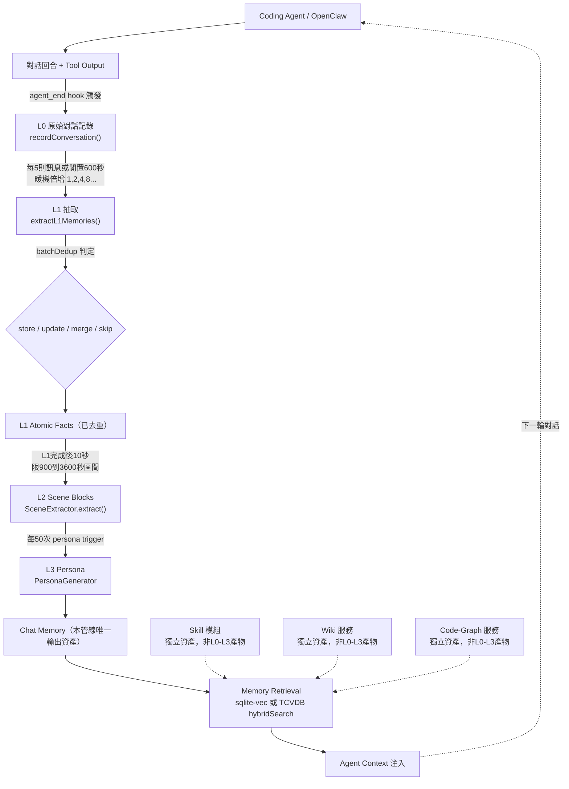

圖中虛線框的 Skill、Wiki、Code-Graph 刻意畫成平行匯入 Memory Retrieval，而不是掛在 L0→L3 這條實線鏈上——這是本圖要傳達的核心訊息：**四個 Memory Asset 只有 Chat Memory 是這條管線的產物，其餘三個資產各自有獨立的來源**（Source-confirmed，見下段模組對應）：

- **Skill**：獨立模組 `SkillCore` / `SqliteSkillStore` / `SkillExtractor`（`MemoryCore/src/core/skill/`），在 `tdai-core.ts` 第59-77行、第795-973行接線，有自己的 SQLite 資料表；抽取路徑是 `SkillTriggerService.archive` → agent 佇列 → `SkillConversationExtractWorker`，不經過 L1-L3（Source-confirmed）。除了這條自動排程/門檻觸發路徑，使用者也可以用第21.5節介紹的對話內指令 `mem:create-skill` 手動跳過門檻、立即強制歸檔（Source-confirmed，`MemoryCore/src/gateway/skill-handlers.ts` 第891-894行自稱「第三個觸發條件」）。
- **Wiki / Code-Graph**：活在完全獨立的服務 `MemoryKnowledge/`（`WikiService` / `CodeGraphService`，`module.ts` 第12-25行），分別由文件攝取與 git repo 索引驅動，不是靠對話擷取（Source-confirmed）。

### 7.7 重要命名衝突警示

> **必須明確提醒**：`MemoryCore/src/offload/` 與 `offload_server/`（context-window 壓縮子系統，見第8章）內部**也**使用「L1/L2/L3」這組編號（例如 `offload/l3-helpers.ts`、`offload_server/compact/compressor.ts` 註解寫著「L3 Compressor — mild/aggressive/emergency compression」），但這是一套完全不同的機制，處理的是「單次對話視窗裡 tool output 太長」的壓縮問題，跟本章講的 L0→L1→L2→L3 **記憶分層管線**毫無關係（Source-confirmed）。這是官方原始碼本身就存在的命名衝突，不是本手冊的筆誤——閱讀原始碼或與官方社群討論時，請務必先確認對方講的「L1/L2/L3」是本章的記憶分層，還是第8章的壓縮等級。

### 7.8 AI Prompt 範例

```text
我正在檢查 TencentDB-Agent-Memory 的 pipeline-manager.ts。
請幫我確認：
1. 目前 config.ts 裡 L0→L1 的閒置閾值是否被 override 成非 600 秒？
2. 如果最近一次 L1→L2 轉換花了超過 3600 秒才觸發，
   可能是踩到哪個 config 邊界（900-3600 秒區間限制）？
3. 幫我寫一段查詢，列出過去 24 小時內 batchDedup() 判定為
   merge 的記憶筆數，我要評估目前去重策略是否過於保守。
```

### 7.9 本章 Checklist 與小結

- [ ] 確認團隊/讀者理解「L0-L3 是管線，Chat Memory 才是資產」這個區分，不會把四個 Memory Asset 誤等同於 L0-L3。
- [ ] 已對照 `config.ts` 第555-570行，掌握 L0→L1（5則/600秒+暖機倍增）、L1→L2（10秒，900-3600秒區間）、L2→L3（50次 persona trigger）三組真實觸發條件。
- [ ] 已理解 `batchDedup()` 的 store/update/merge/skip 四種決策如何處理重複與衝突記憶。
- [ ] 已知道 L3 的 incremental 生成模式是目前唯一可查證的「記憶新鮮度」維持機制，官方沒有文件化的 TTL 欄位。
- [ ] 已知道開發團隊說明清楚：`offload/` 目錄下的「L1/L2/L3」是完全不同的壓縮等級機制，不要混用討論。

本章建立了全書最核心的心智模型：一條由真實模組串接、有明確觸發條件與去重邏輯的管線，把原始對話逐步蒸餾成 Chat Memory。下一章要處理的是另一個常被誤認為同一件事、但機制完全不同的問題——Tool Output 太多、太長，塞爆 Agent context 的 Context Offload。

---

## 8. Context Offload

### 8.1 問題本質：Coding Agent 為什麼會產生大量 Tool Output

Coding Agent 與一般問答型 Agent 最大的差異，在於它會頻繁呼叫工具，而每次工具呼叫都可能吐出遠比對話文字更龐大的內容（建議架構，本節為作者對企業場景的歸納整理，非逐字引用官方文件）：

- **Shell Output**：`npm install`、`mvn clean install` 這類指令動輒數百行日誌。
- **Git Diff / Git Log**：一次 refactor 的 diff 可能橫跨數十個檔案。
- **Test Result**：單元測試/整合測試框架的完整輸出，含 stack trace。
- **Build Result**：編譯器/打包工具的完整訊息。
- **API Response / Database Query Result**：外部系統回傳的 JSON、SQL 結果集，可能是巨大的巢狀結構。
- **Source Code**：Agent 為了理解上下文而讀取的多個原始碼檔案。
- **Stack Trace**：例外堆疊往往包含大量框架內部呼叫鏈，訊噪比低。

如果這些內容**全部**原封不動留在 LLM Context 裡，會形成一條明確的退化鏈路（建議架構，一般 LLM 工程常識，非本產品獨有主張）：

```
Context Explosion（單輪 context 快速膨脹）
        ↓
Token Consumption（每輪對話成本與延遲同步上升）
        ↓
Reasoning Degradation（關鍵資訊被噪音稀釋，Agent 推理品質下降、
                       甚至出現「lost in the middle」式的遺忘）
```

這正是 Context Offload 子系統要解決的問題：**不是要不要保存這些 Tool Output，而是要不要讓它們一直待在「LLM 每次推理都要重新讀一遍」的那個 context 視窗裡**。

### 8.2 TencentDB-Agent-Memory 的壓縮等級機制

Context Offload 子系統位於 `MemoryCore/src/offload/` 與 `offload_server/`，核心元件是 `offload_server/compact/compressor.ts`，程式碼註解明確自稱「L3 Compressor」，並定義三個壓縮等級：**mild（輕度）／aggressive（積極）／emergency（緊急）**（Source-confirmed，`offload_server/compact/compressor.ts` 註解）。

機制概念（依巢狀文件 `MemoryCore/hermes-plugin/memory/memory_tencentdb/README.md` 整理，Source-confirmed）：

1. Tool Output 產生後，系統依內容長度/類型判斷是否需要壓縮，未超過門檻的內容維持原樣留在 context。
2. 超過門檻的內容依壓縮等級處理：等級愈高，壓縮愈激進，其中一項關鍵手法是**把冗長的 tool log 摘要成 Mermaid 圖**（例如把一串 shell 操作序列或呼叫關係，畫成流程圖/序列圖的精簡表示），再把原始長文字 offload 到外部儲存，context 裡只保留 Mermaid 摘要與取回索引。
3. 若真正需要細節（例如 Agent 需要回頭查某一行 stack trace），再依索引從外部儲存取回完整內容。

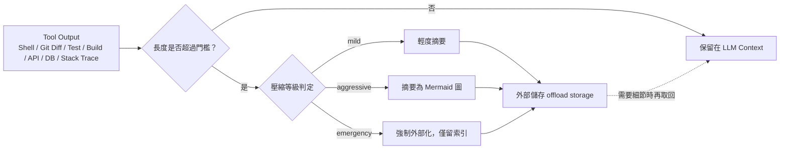

### 8.3 官方宣稱的壓縮效益：61.38% token 減少

官方巢狀文件宣稱此機制可達到 **61.38% 的 token 減少**（官方已實作/官方宣稱，來源：`MemoryCore/hermes-plugin/memory/memory_tencentdb/README.md`，此數字**未出現在頂層 README.md／README_CN.md**，只在這份巢狀文件中）。

> **必須提醒讀者**：61.38% 這個數字是官方自報數據，不是第三方獨立重現的 benchmark。既有研究資料中沒有找到任何外部測試環境、測試資料集、或第三方基準測試報告能佐證這個百分比的取得條件（例如測試的 tool output 類型分布、壓縮等級設定、量測方法）。企業導入前若要把「token 節省 61.38%」寫進 ROI 評估或內部簡報，建議標註來源與限制，並自行在目標場景做一次抽樣量測，而不是直接引用官方宣稱值作為保證性能指標（建議架構）。

### 8.4 再次強調：這跟第7章的 L0-L3 記憶分層是兩個不同機制

| 比較項目 | 第7章：L0→L1→L2→L3 記憶分層 | 第8章：Context Offload 壓縮等級 |
|---|---|---|
| 處理對象 | 對話內容（conversation） | Tool Output（shell/diff/log/測試/API/DB/stack trace） |
| 目的 | 把對話蒸餾成可長期複用的 Chat Memory | 避免單輪 context 被過長的工具輸出撐爆 |
| 命名 | L0、L1、L2、L3（記憶層級） | mild、aggressive、emergency（壓縮等級，程式碼內部註解仍稱其中一部分為「L3 Compressor」） |
| 觸發條件 | 訊息數/閒置時間/persona trigger 次數（見第7章） | Tool Output 長度/類型門檻（Source-confirmed，機制存在；確切門檻數值未在既有研究資料中逐一列出） |
| 所在模組 | `MemoryCore/src/core/{conversation,record,scene,persona}/` | `MemoryCore/src/offload/`、`offload_server/` |
| 產出資產 | Chat Memory（四資產之一） | 不是 Memory Asset，是 context 視窗管理的暫存/外部化資料 |

這兩套機制唯一的共通點，就是官方原始碼裡都用了「L1/L2/L3」這組符號——這是本手冊反覆提醒的命名衝突，讀 issue、PR、或跟官方社群討論時，務必先確認雙方講的是哪一套「L1/L2/L3」。

### 8.5 AI Prompt 範例

```text
我們的 CI pipeline 執行測試後，Agent context 經常因為
test result 太長而被截斷。
請幫我：
1. 檢查 offload_server/compact/compressor.ts 目前的壓縮等級
   設定是 mild、aggressive 還是 emergency。
2. 說明如果我把等級從 mild 調到 aggressive，
   哪些類型的 Tool Output（例如 stack trace vs. git diff）
   最容易被摘要成 Mermaid 圖、細節可能因此遺失。
3. 幫我設計一組抽樣測試，量測我們實際場景下的
   token 節省比例，不要直接假設官方宣稱的 61.38% 適用於我們。
```

### 8.6 本章 Checklist 與小結

- [ ] 已理解 Context Offload 處理的是 Tool Output，不是對話記憶，跟第7章的 L0-L3 是兩套獨立機制。
- [ ] 已確認團隊知道 mild/aggressive/emergency 三個壓縮等級的存在與大致行為（Mermaid 圖摘要 + 外部化）。
- [ ] 已標註 61.38% token 減少為官方自報數據（來源：`MemoryCore/hermes-plugin/memory/memory_tencentdb/README.md`），不作為未經驗證的性能保證。
- [ ] 已在內部文件/教材中，明確區分「記憶分層 L1/L2/L3」與「壓縮等級 L1/L2/L3（offload 內部命名）」，避免團隊溝通時混淆。
- [ ] 若要把 token 節省數字用於 ROI 報告，已規劃在自身場景下做獨立抽樣驗證。

---

## 9. Memory Retrieval

Chat Memory 被 L0→L3 管線產生出來之後，真正產生商業價值的時刻，是 Agent 在下一次對話中把它「查回來」並用得上。本章說明檢索的技術實作，以及一個從頭到尾的企業場景，串起 Chat Memory、Skill、Wiki、Code-Graph 四個資產如何在一次真實開發任務中協同運作。

### 9.1 檢索技術：兩種可切換的儲存後端

TencentDB-Agent-Memory 的儲存後端可透過設定切換，型別為 `type StoreBackend = "sqlite" | "tcvdb"`，預設為 `sqlite`（Source-confirmed）：

**(a) sqlite 後端（預設）**：`core/store/sqlite.ts` 用 `sqlite-vec` 這個真實、釘選版本的相依套件（`MemoryCore/package.json` 第121行，`"sqlite-vec": "0.1.7-alpha.2"`）實作 `vec0` 虛擬表，分別是 `l0_vec` 與 `l1_vec`，用來做餘弦相似度（cosine similarity）的 KNN 近鄰查詢，底層依賴 Node 22+ 內建的 `node:sqlite` 模組（Source-confirmed）。這代表在單機/單團隊部署情境下，不需要額外起一個向量資料庫服務，記憶檢索就能運作。

**(b) tcvdb 後端（可選）**：`TcvdbMemoryStore`（`core/store/tcvdb.ts`）是可選的 Tencent Cloud VectorDB 實作，支援 `hybridSearch`——同時做 **server-side dense embedding**（雲端計算的稠密向量）與 **client-side BM25 sparse vector**（用戶端計算的稀疏向量）的混合檢索（Source-confirmed）。這種混合檢索通常用來兼顧語意相似（dense）與關鍵字精確命中（sparse/BM25）兩種查詢需求，適合團隊級/企業級規模、需要更高檢索品質與可擴展性的場景。

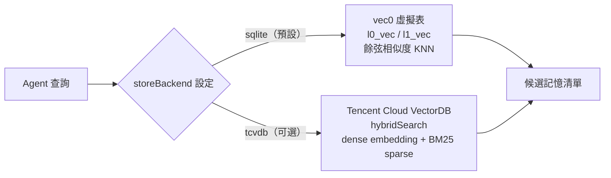

### 9.2 Agent 如何在對話中查詢記憶

實務上，Agent 不是直接連儲存層，而是透過 OpenClaw 外掛宣告的工具呼叫來查詢。`MemoryCore/openclaw.plugin.json`（與 `MemoryCore/openclaw-plugin/openclaw.plugin.json`）宣告了三個工具（Source-confirmed）：

- `tdai_memory_search`：查詢 Chat Memory（L1 atomic facts / L3 persona 等）。
- `tdai_conversation_search`：查詢 L0 原始對話。
- `tdai_read_cos`：讀取雲端物件儲存（COS）上的內容。

外掛設定 schema 還提供 `mode: local | function | client | gateway | remote` 與 `storeBackend: sqlite | tcvdb` 兩組關鍵設定（Source-confirmed），決定記憶檢索是在本地執行、透過函式呼叫、走 client 模式、透過 Gateway，還是遠端模式。

若要用程式化方式查詢，TypeScript/Python SDK（`sdk/memory-core/`）提供的 `MemoryClient` 針對每一層都有對應方法（Source-confirmed，R3）：

| 層級 | 方法（TypeScript，camelCase；Python 為 snake_case） |
|---|---|
| L0 | `addConversation` / `queryConversation` / `searchConversation` / `deleteConversation` / `countConversation` |
| L1 | `updateAtomic` / `queryAtomic` / `searchAtomic` / `deleteAtomic` / `countAtomic` |
| L2 | `listScenarios` / `readScenario` / `writeScenario` / `rmScenario` / `countScenario` |
| L3 | `readCore` / `writeCore` / `countCore` |

```typescript
// 概念示意（非原始碼逐字引用）：查詢與最新使用者訊息相關的 atomic facts
const hits = await memoryClient.searchAtomic({
  query: "PaymentController 付款驗證規則",
  topK: 5,
});
```

### 9.3 完整場景：修改 PaymentController

以下場景把第7章（Chat Memory 產生）、第8章（Tool Output 不塞爆 context）、與本章（檢索）串成一條完整流程。**流程整體為本手冊依真實模組/工具組裝的示範情境（建議架構），其中出現的每一個函式名、工具名、模組路徑均為前述章節已標註來源的真實元件；情境的具體對話內容與檔名為示範用途。**

**Scenario（情境）**：開發者要求 Coding Agent 在既有的 `PaymentController` 加入信用卡黑名單檢查邏輯。

**Input（輸入）**：
```text
使用者：「請幫我在 PaymentController 加入信用卡黑名單檢查，
        不通過就要擋下這筆付款。」
```

**Process（處理流程）**：

1. **查詢 Chat Memory**：Agent 呼叫 `tdai_memory_search("PaymentController 付款驗證")`，底層走 `vec0` KNN 或 `hybridSearch`，找回過去 L1 抽取出的相關 atomic facts（例如 `work_method` 型別記憶：「此專案的付款驗證一律要拋出 `PaymentValidationException`，不可回傳 null」）以及 L3 persona 中與付款模組相關的專案慣例摘要。
2. **查詢平行資產**：Agent 另外查詢與 Chat Memory 完全獨立的三個資產——若 Skill 模組（`SkillCore`）中已封存過「新增付款驗證規則」這類操作步驟的 Skill，會被檢索出來；`MemoryKnowledge` 的 `WikiService` 若有對應的設計文件也一併找出；`CodeGraphService` 則提供 `PaymentController` 相關聯的類別、呼叫鏈，讓 Agent 知道黑名單檢查該放在 Controller 層還是既有的 `PaymentValidator`。
3. **綜合四項資產後開始修改程式碼**：Agent 依 Chat Memory 記載的專案慣例（例如驗證錯誤要拋例外而非回傳 null）與 Code-Graph 提供的呼叫關係，決定把黑名單檢查邏輯放進 `PaymentValidator`，並在 `PaymentController` 呼叫它。
4. **執行測試**：Agent 執行單元測試，測試輸出（可能包含大量 log 與 stack trace）若超過門檻，依第8章機制被摘要成 Mermaid 圖並 offload 到外部儲存，context 裡只留摘要與索引，避免 Reasoning Degradation。
5. **對話結束，寫回新記憶**：Agent 回合結束觸發 `agent_end` hook，`recordConversation()` 寫入 L0；隨後依第7章觸發條件依序跑過 L1（`extractL1Memories()` + `batchDedup()`）、L2（`SceneExtractor`）、最終視 persona trigger 次數決定是否更新 L3 `persona.md`。

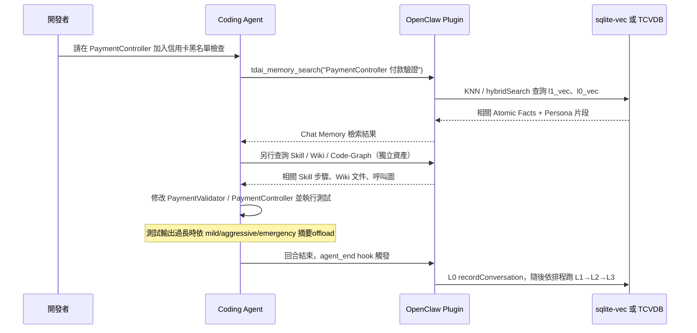

**Output（輸出）**：
- 修改後的 `PaymentValidator.java`／`PaymentController.java` 與對應測試。
- 測試通過的結果（長輸出已依第8章機制壓縮，未塞爆本輪 context）。
- 一筆新的 Chat Memory（例如 `work_method` 型別：「黑名單檢查邏輯放在 `PaymentValidator`，不放在 Controller」），供下一次類似任務被檢索使用。

**Example（延伸示例）**：三個月後另一位開發者要求「在 `RefundController` 加入類似的黑名單檢查」，此時 `tdai_memory_search` 能檢索到上述那筆 Chat Memory，Agent 便能直接沿用「驗證邏輯放在 Validator 而非 Controller」這個慣例，不需要重新從程式碼庫摸索一次——這正呼應 README 開場論述：任何能幫助下一個 Agent 不用重新造輪子的資訊，都應該被保存、組織、重用（官方已實作，README.md 第55-59行）。

### 9.4 AI Prompt 範例

```text
我要修改 OrderController 加入重複下單防呆邏輯。
在動手改程式碼之前，請先：
1. 用 tdai_memory_search 查詢跟 OrderController 或
   「防呆/重複請求」相關的既有 Chat Memory。
2. 查詢是否有對應的 Skill 可以直接重用步驟。
3. 用 Code-Graph 找出 OrderController 目前呼叫了哪些
   validator/service，避免我把邏輯放錯層。
4. 完成修改並測試通過後，總結這次的作法，
   確保它能被下一輪 L1 抽取成 work_method 型別記憶。
```

### 9.5 本章 Checklist 與小結

- [ ] 已確認目前部署使用的 `storeBackend`（`sqlite` 或 `tcvdb`），並理解兩者在檢索機制上的差異（vec0 KNN vs. hybridSearch）。
- [ ] 已知道 Agent 查詢記憶主要透過 OpenClaw 外掛工具（`tdai_memory_search` / `tdai_conversation_search` / `tdai_read_cos`）或 SDK `MemoryClient` 方法。
- [ ] 已理解一次真實開發任務中，Chat Memory、Skill、Wiki、Code-Graph 是四條平行查詢路徑，不是同一套 L0-L3 管線的輸出。
- [ ] 已理解 Context Offload（第8章）如何確保檢索/測試等大量 Tool Output 不會在同一輪任務中把 context 塞爆。
- [ ] 已規劃：新完成的任務經驗應能被下一輪 L1 抽取捕捉，形成可被未來任務複用的 Chat Memory。

至此，第7-9章完整說明了 TencentDB-Agent-Memory 最核心的技術主幹：**記憶如何被產生（第7章）、Tool Output 如何被安全地控制在 context 之外（第8章）、以及記憶如何被檢索並在真實任務中發揮價值（第9章）**。第10章起將進一步深入儲存架構、LLM/Embedding 選型，以及與 OpenClaw、Hermes 的整合細節。

---

## 10. Storage Architecture

TencentDB-Agent-Memory 的儲存層被設計成「後端可替換」的架構：程式碼內宣告 `type StoreBackend = "sqlite" | "tcvdb"`，預設值為 `sqlite`（Source-confirmed，MemoryCore/core/store/*.ts，見第4、7章）。這代表企業導入時，儲存後端不是安裝時的一次性決定，而是一個可以隨環境（PoC → 內網試點 → 雲端正式環境）演進的設定切換點。本章先分別說明兩種後端的實作細節，再給出企業導入視角的比較表。

> **命名提醒（延續第 7、8 章的警示）**：本章會出現 `l0_vec`、`l1_vec` 這樣的資料表名稱，這裡的 L0／L1 對應的是第 7 章介紹的 **L0→L1→L2→L3 記憶分層**（原始對話 / atomic facts），與 `MemoryCore/src/offload/`、`offload_server/` 內另一組同名但用途完全不同的「L1/L2/L3 壓縮等級」（context-window 摘要壓縮）無關。官方原始碼本身存在這個命名重疊，讀者在看到裸的「L1」「L2」字樣時，務必先確認上下文是「記憶分層」還是「offload 壓縮等級」（Source-confirmed）。

### 10.1 Local-first：SQLite + sqlite-vec

TencentDB-Agent-Memory 的預設、本機優先儲存方案，是把 SQLite 當作唯一的資料檔案，並用 `sqlite-vec` 擴充套件在同一個檔案內做向量檢索：

- `sqlite-vec` 是一個真實、被**精確釘選版本**的相依套件，版本號為 `0.1.7-alpha.2`，宣告於 `MemoryCore/package.json` 第 121 行（Source-confirmed）。「釘選到 alpha 版本」這件事本身對企業導入有意義：代表官方目前選用的是 sqlite-vec 專案尚未到 1.0 的早期版本，升級/降級時應留意上游 API 是否還在變動。
- 實際的向量表操作在 `MemoryCore/core/store/sqlite.ts` 中實作，使用 sqlite-vec 提供的 `vec0` 虛擬表機制，建立了 `l0_vec`、`l1_vec` 兩張向量表，分別對應 L0（原始對話）與 L1（atomic facts）的向量嵌入，以 cosine similarity 做 KNN（K-Nearest-Neighbor）近似最近鄰檢索（Source-confirmed）。
- 這個實作依賴 **Node 22 以上版本內建的 `node:sqlite` 模組**，也就是說本機模式不需要額外安裝原生 SQLite binding 或另外編譯 native addon（Source-confirmed）。這是一個重要的部署前提，會在第 14、16、17、18 章的環境準備中反覆出現。

Local-first 模式的核心價值主張是：**不需要任何外部資料庫服務、不需要對外網路，記憶資料完整落地在使用者本機檔案系統**（建議架構，依 L0 對話記錄寫入 `~/.openclaw/memory-tdai/conversations/YYYY-MM-DD.jsonl` 之本機路徑機制推論）。對於還在評估、或有嚴格內網限制的企業（例如金融業），這通常是第一個落地的模式。

### 10.2 Cloud-backed：Tencent Cloud Vector Database（TcvdbMemoryStore）

當團隊需要跨機器共享記憶、或資料規模超出單一 SQLite 檔案適合的範圍時，可以切換到雲端向量資料庫後端：

- `TcvdbMemoryStore` 實作於 `MemoryCore/core/store/tcvdb.ts`，是 Tencent Cloud Vector Database 的可選（optional）儲存實作，並非預設值（Source-confirmed）。
- 這個實作支援 `hybridSearch`——同時結合 **server-side dense embedding**（向量嵌入的產生與比對交由 Tencent Cloud 服務端執行）與 **client-side BM25 sparse vector**（稀疏向量式的關鍵字比對在客戶端計算）兩種訊號做混合檢索（Source-confirmed）。這種「dense + sparse 混合檢索」的設計，一般用來同時兼顧語意相似度與精確關鍵字命中率，是向量檢索系統常見的召回率優化手法。
- **重要更正（引用位置澄清）**：`sqlite-vec` 與 Tencent Cloud Vector Database 的敘述性文件，並不在 repo 根目錄的頂層 `README.md` / `README_CN.md` 裡，而是分別存在於巢狀文件 `MemoryCore/hermes-plugin/memory/memory_tencentdb/README.md` 與 `MemoryCore/scripts/migrate-sqlite-to-tcvdb/README.md`（官方已實作，惟出處為巢狀文件而非頂層 README）。企業導入團隊若要查證細節，應直接找這兩份巢狀文件，而不是在頂層 README 裡搜尋關鍵字後找不到就誤判「官方沒寫」。

### 10.3 後端切換與遷移工具

`MemoryCore/package.json` 第 7-11 行定義了三個 npm bin script，對應 `MemoryCore/bin/*.mjs`（Source-confirmed）：

| 指令 | 用途（依命名與檔案位置推論） | Provenance |
|---|---|---|
| `migrate-sqlite-to-tcvdb` | 把既有 SQLite 本機資料遷移到 Tencent Cloud Vector Database 後端 | 官方已實作，package.json 第7-11行 |
| `export-tencent-vdb` | 匯出 TCVDB 上的資料（供備份/搬遷用） | 官方已實作，package.json 第7-11行 |
| `read-local-memory` | 讀取本機 SQLite 記憶內容（供除錯/稽核用） | 官方已實作，package.json 第7-11行 |

此外還存在一個**未被登記進 `bin` 欄位**的 `MemoryCore/bin/seed-v2.mjs`（Source-confirmed）——這代表它可能是內部開發用或尚未正式對外公告的工具，企業導入時不應把它當成穩定對外介面來依賴（建議架構）。

值得注意的是，**更完整的匯出/匯入/備份能力目前仍在路上**：GitHub 上有兩個仍為 open 狀態的 issue（#779、#768）與兩個對應、尚未 merge 的 PR——#793（chat-memory 匯出包）與 #797（skill 資產匯出包）（Roadmap/Issue，規劃中）。也就是說，目前官方隨套件出貨的遷移工具只涵蓋「SQLite ↔ TCVDB 的資料搬遷」，而更通用的「打包匯出整組 Chat Memory / Skill 資產」能力尚未正式發布，企業若要設計自己的備份流程，現階段仍需自行用 `read-local-memory` 搭配檔案系統層級備份補齊（建議架構）。

### 10.4 Local-first vs Cloud-backed 比較表

下表依企業導入常見的八個決策面向整理兩種模式的差異。除非另外標註，表中細節屬於本手冊作者依已查證架構事實做的**建議架構**判斷，非官方逐字宣稱的營運指標（官方研究資料未提供正式的成本/SLA 數字）。

| 面向 | Local-first（SQLite + sqlite-vec） | Cloud-backed（TcvdbMemoryStore） |
|---|---|---|
| Deployment | 內嵌於 Node 22+ process，單一 SQLite 檔案即可運作，無需另外部署資料庫服務（Source-confirmed） | 需要一個可連線的 Tencent Cloud Vector Database 實例，屬於外部服務相依（Source-confirmed 存在此後端；部署細節為建議架構推論） |
| Network | 可完全離線運作，向量查詢在本機 process 內完成（建議架構，依 node:sqlite 內嵌引擎推論） | 需要對外／對雲端服務網路連線；hybridSearch 的 dense embedding 部分在 server-side 執行，代表查詢當下必須連得到雲端（建議架構） |
| Cost | 僅本機磁碟與運算成本，無額外雲端帳單（建議架構推論） | 需負擔 Tencent Cloud Vector Database 的雲端服務費用（建議架構推論，研究資料未提供具體計價） |
| Privacy | 記憶資料（含對話原文）留在本機檔案系統，未離開使用者環境（建議架構，依本機路徑機制推論） | 記憶資料需傳輸並落地於 Tencent Cloud，需納入企業資料外送/合規盤點（建議架構） |
| Scale | 受限於單一 SQLite 檔案與單機資源，橫向擴充能力有限（建議架構） | 可依託雲端向量資料庫的水平擴充能力，較適合大規模/多團隊場景（建議架構） |
| Team Sharing | 預設不天然跨機器共享，需另外透過 Memory Hub / Memory Proxy 等共享機制（見第25、13章）才能讓多人存取同一份記憶（Source-confirmed Memory Hub 存在，CHANGELOG [2.0.0]；跨機器共享具體機制為建議架構推論） | 因資料本就集中在雲端服務，天然適合多機器/多團隊共同存取（建議架構） |
| Backup | 可用檔案系統層級備份 SQLite 檔案 + `~/.openclaw/memory-tdai/conversations/*.jsonl`，搭配 `read-local-memory` 匯出（建議架構，工具為 Source-confirmed） | 理論上可依託雲端服務自身的備份能力，但研究資料未確認 TCVDB 端是否提供官方備份 SLA（推測/Hypothesis） |
| Disaster Recovery | 完全仰賴使用者自行做好的檔案備份與版本控管，官方尚未出貨完整的一鍵匯出/還原包（#793、#797 仍為 open PR，Roadmap/Issue） | DR 能力理論上可疊加在雲端服務既有的高可用機制上，但研究資料未提供具體佐證（推測/Hypothesis） |

### 10.5 Scenario／Input／Process／Output／Example

**Scenario**：一個五人開發小組先用 Local-first 模式在各自筆電上試用 TencentDB-Agent-Memory 三週，確認記憶品質可用後，決定切換到 Cloud-backed 模式以共享團隊記憶。

- **Input**：既有的本機 SQLite 記憶檔案（含 `l0_vec`、`l1_vec` 向量資料）、目標 Tencent Cloud Vector Database 連線資訊。
- **Process**：執行 `migrate-sqlite-to-tcvdb`（官方已實作指令）將本機資料寫入 TCVDB；之後把設定中的 store backend 由 `sqlite` 切換為 `tcvdb`（Source-confirmed 存在此設定值）；OpenClaw 外掛設定中對應的 `storeBackend: sqlite|tcvdb` 欄位（見第12章）需同步調整。
- **Output**：團隊成員之後查詢記憶時，實際查詢對象變成雲端 TcvdbMemoryStore 的 `hybridSearch`，而非各自本機的 SQLite 檔案。
- **Example**（示意，非逐字官方輸出，建議架構）：

```bash
# 建議架構示意，實際旗標請以官方 scripts/migrate-sqlite-to-tcvdb/README.md 為準
npx migrate-sqlite-to-tcvdb --input ~/.openclaw/memory-tdai --tcvdb-config ./tcvdb.config.json
```

### AI Prompt 範例

```text
1. 「我們是內網環境、無法對外連線，請幫我確認 TencentDB-Agent-Memory 是否可以完全用 Local-first
   （SQLite + sqlite-vec）模式運作，並列出需要 Node 22+ 的具體原因。」

2. 「我要把現有的本機 SQLite 記憶資料遷移到 Tencent Cloud Vector Database，
   請列出 migrate-sqlite-to-tcvdb 的使用前提與可能的風險點（含尚未出貨的匯出/備份限制）。」

3. 「請幫我用 Deployment/Network/Cost/Privacy/Scale/Team Sharing/Backup/Disaster Recovery
   八個面向，比較我們團隊該選 sqlite 還是 tcvdb 作為 storeBackend。」
```

### 本章 Checklist 與小結

- [ ] 已確認 `sqlite-vec` 版本釘選為 `0.1.7-alpha.2`，並理解這是 alpha 版本、升級時需留意上游變動。
- [ ] 已確認本機模式需要 Node 22+（因依賴內建 `node:sqlite`），並在部署清單中列為前提條件。
- [ ] 已理解 `l0_vec` / `l1_vec` 對應的是記憶分層 L0/L1，而不是 offload 子系統的 L1/L2/L3 壓縮等級。
- [ ] 已知道 `storeBackend` 只有 `sqlite` 與 `tcvdb` 兩個官方選項，預設為 `sqlite`。
- [ ] 已理解目前官方尚未出貨完整的匯出/備份包（#793、#797 仍為 open PR），DR 規劃需自行補強。

本章釐清了 TencentDB-Agent-Memory 唯二的官方儲存後端——本機優先的 SQLite + sqlite-vec，與可選的雲端 Tencent Cloud Vector Database——並且刻意把「官方已出貨的遷移工具」與「規劃中但尚未合併的匯出/備份能力」分開標示，避免企業誤判目前的 DR 成熟度。

---

## 11. LLM / Embedding Architecture

本章回答三個企業導入前必須先釐清的問題：Embedding 是怎麼產生的？由哪個元件負責？是否可以用 Local Model、或一定要串外部 API？由於這部分研究資料存在明顯缺口，本章會**刻意把「已查證」與「尚待確認」分開標示**，不做臆測式的補完。

### 11.1 LLM 在 L0→L3 管線中的角色

先重申一次第 7 章的核心結論並延伸到 LLM 使用情形：L0→L1→L2→L3 是產生 **Chat Memory** 這一個資產的內部管線（不是四個 Memory Asset 本身），而這條管線裡，LLM 的使用情形並不均勻：

| 管線階段 | 是否呼叫 LLM | 依據 | Provenance |
|---|---|---|---|
| L0 `recordConversation()` | 否——純粹把訊息逐則寫成 JSON Lines，並過濾程式碼區塊 | `l0-recorder.ts` 第93-314行 | Source-confirmed |
| L1 `extractL1Memories()` | 是——**一次 LLM 呼叫**同時做「場景切分＋記憶抽取」 | `l1-extractor.ts` 第79-378行 | Source-confirmed |
| L1 `batchDedup()` | 未明確——回傳 store/update/merge/skip 四種決策，內部是否呼叫 LLM 或僅靠向量相似度比對，研究資料未說明 | `l1-dedup.ts` 第350、362-370行 | 尚待確認（僅描述輸出，未描述內部判斷機制） |
| L2 `SceneExtractor.extract()` | 是——本身就是「一個被限制在 `scene_blocks/` 目錄內操作的 LLM agent」 | `scene-extractor.ts` 第95行起 | Source-confirmed |
| L3 `PersonaGenerator.generateLocalPersona()` | 推測是——命名與行為模式（讀取變動場景、重新生成 persona.md）與 L1/L2 的 LLM 驅動作法一致，但研究資料未逐字寫出「呼叫 LLM」 | `persona-generator.ts` 第71行起 | 推測/Hypothesis（未明確確認此點） |

### 11.2 Embedding 由誰產生：誠實面對研究缺口

第 10 章已確認 `core/store/sqlite.ts` 用 `vec0` 虛擬表建立 `l0_vec`、`l1_vec` 做 cosine similarity KNN（Source-confirmed），這代表 **L0 與 L1 的內容確實有被轉換成向量嵌入（embedding）並儲存**。但研究資料**沒有**進一步交代：

- 這些 dense embedding 向量是由哪一個具體模型／API 產生的（是否透過同一個 OpenAI-compatible LLM API 的 embedding endpoint、還是另外一組獨立設定的 embedding provider）——**尚待確認**，不應臆測。
- 是否存在獨立於 LLM API 之外的專屬 embedding 設定鍵（例如 `embeddingModel`、`embeddingApiKey` 之類）——**尚待確認**。

在 Cloud-backed 模式下，情況相對清楚一些：`TcvdbMemoryStore` 的 `hybridSearch` 明確分成 **server-side dense embedding**（向量嵌入由 Tencent Cloud 服務端產生）與 **client-side BM25 sparse vector**（BM25 稀疏向量在客戶端計算，不需要呼叫外部嵌入模型）兩部分（Source-confirmed；`core/store/tcvdb.ts`）。換句話說，Cloud-backed 模式下至少 dense 向量的產生責任在雲端服務，使用端不需要自己維運一個 embedding 推論服務。而 Local-first 模式下，dense 向量究竟是誰算出來的，本手冊必須誠實標示為研究資料未覆蓋的部分。

### 11.3 是否需要外部 API、是否可用 Local Model

MemoryCore 官方文件要求「An OpenAI-compatible LLM API」（官方已實作；惟本手冊之研究資料未提供對應的精確檔案路徑/行號，建議讀者在導入前於官方 INSTALL.md 或 README 的 LLM 設定段落自行核對原文出處，不宜僅憑本手冊引用行事）。這句話本身有兩層含意需要拆開來看，避免過度推論：

1. **明確要求**：使用者必須提供一個「相容 OpenAI 介面」的 LLM API 端點。這是官方文件的直接要求，屬於官方已實作的限制條件。
2. **不代表的事**：這句話**沒有**明確排除自架的 OpenAI-compatible 服務（例如透過相容層對外暴露 OpenAI 介面的自架推論伺服器）。但研究資料中**沒有任何檔案路徑或設定範例**證實官方測試過、文件過、或正式支援這種自架/離線的用法——本手冊在此明確標示為**推測/Hypothesis**，不代表官方保證可行，企業若考慮走這條路，應先自行做 PoC 驗證相容性，不可直接假設「架構上理論可行」等於「官方支援」。

**結論（誠實版本）**：

- 需不需要外部 API？**是**——至少需要一個 OpenAI-compatible 的 LLM API 端點（官方已實作，惟精確出處待讀者於官方文件核對）。
- 能不能用純本地模型（不呼叫任何遠端服務）？**尚待確認**——研究資料既沒有證實可以，也沒有證實不行；只能確定官方要求的介面規格是「OpenAI-compatible」，至於是否測試過 100% 離線的本地部署方案，不應臆測。
- Embedding 模型細節（廠商、維度、是否可替換）？**尚待確認**，是本手冊在撰寫當下最大的研究缺口之一，建議企業導入團隊在 PoC 階段直接向官方或原始碼（`core/store/sqlite.ts` 呼叫 embedding 的上游程式碼）進一步查證，不要以本手冊的推論作為決策依據。

### 11.4 Scenario／Input／Process／Output／Example

**Scenario**：某銀行的 AI 平台團隊評估是否能在無法對外連線的機房，完整運行 TencentDB-Agent-Memory 的 L0→L3 管線。

- **Input**：內部合規要求「LLM 推論與 embedding 產生都不可以呼叫外部網際網路服務」。
- **Process**：對照本章表格，確認 L1 抽取、L2 場景整理都需要呼叫 LLM API（Source-confirmed），而該 API 只被要求「OpenAI-compatible」（官方已實作但出處待核）；團隊需要另外驗證：是否能把一個內網自架、對外暴露 OpenAI-compatible 介面的推論服務指到這個設定（推測/Hypothesis，需自行 PoC）；同時也要另外查證 Local-first 模式下 embedding 產生流程是否同樣可以指向內網服務（尚待確認）。
- **Output**：合規決策不能只憑「有相依套件」就下結論，必須先做一次端到端 PoC，實測 L0→L1→L2→L3 全流程在純內網 OpenAI-compatible endpoint 下是否能正常產生 `l0_vec`/`l1_vec`。
- **Example**：本節不提供 embedding provider 設定的具體程式碼範例，因為研究資料未確認對應設定鍵名稱，貿然示範可能誤導讀者當成官方保證的用法。

### AI Prompt 範例

```text
1. 「請幫我在 MemoryCore 原始碼裡搜尋 embedding 相關的呼叫（例如 embed、embedding、vector 產生邏輯），
   確認 l0_vec/l1_vec 的向量究竟是呼叫哪個 API 或模型產生的，不要用猜的。」

2. 「我們只能用內網自架的 OpenAI-compatible 推論服務，
   請幫我列出需要驗證『相容性』的具體項目清單（LLM 呼叫 + embedding 呼叫兩部分都要列）。」

3. 「請比較 L1 extractL1Memories() 與 L2 SceneExtractor 的 LLM 呼叫方式，
   並標明哪些細節是原始碼已確認、哪些是我們還需要自行驗證的。」
```

### 本章 Checklist 與小結

- [ ] 已確認 L0 record 不呼叫 LLM，L1 抽取、L2 場景整理確定呼叫 LLM。
- [ ] 已確認官方要求「OpenAI-compatible LLM API」，並理解這句話不等於「保證支援純本地模型」。
- [ ] 已將「local-first 模式下 embedding 由誰產生」明確列為尚待確認事項，未在任何內部文件中把它寫成已驗證事實。
- [ ] 已規劃在正式導入前，針對 embedding 產生機制做一次原始碼層級或官方管道的二次查證。
- [ ] 未把 `sqlite-vec` 這類儲存端相依套件，誤解讀為「官方保證支援本地 embedding 推論」。

本章刻意不對 Embedding 模型細節做過度推論——這是誠實文件與行銷式文件的分野。企業在做離線/內網合規判斷前，務必自行完成 PoC 驗證，而不是僅依賴本手冊或任何二手資料的字面敘述。

---

## 12. OpenClaw Integration

OpenClaw 整合是 TencentDB-Agent-Memory 目前唯一被 CI 強制驗證、且擁有正式外掛描述檔（plugin manifest）的第一方整合對象（Source-confirmed）。本章說明這個外掛實際如何運作、CI 如何驗證它，並提供一張端到端整合流程圖。

### 12.1 外掛描述檔與宣告的工具

TencentDB-Agent-Memory 對 OpenClaw 的整合，是以一份標準的外掛描述檔（plugin manifest）形式存在，同時存在兩個路徑：`MemoryCore/openclaw.plugin.json` 與 `MemoryCore/openclaw-plugin/openclaw.plugin.json`（Source-confirmed）。這份描述檔宣告：

- **外掛 id**：`memory-tencentdb`（Source-confirmed）。
- **對外暴露的工具（tools）**：`tdai_memory_search`、`tdai_conversation_search`、`tdai_read_cos` 三個（Source-confirmed）。從命名可以合理判斷：`tdai_memory_search` 對應查詢已抽取的記憶（L1/L2/L3 層級的內容），`tdai_conversation_search` 對應查詢原始對話（L0 層級），`tdai_read_cos` 對應讀取存放在 Tencent Cloud Object Storage（COS）上的內容（建議架構，依工具命名合理推論，非逐字官方說明）。
- **設定 schema**：包含 `mode`（`local` | `function` | `client` | `gateway` | `remote`）與 `storeBackend`（`sqlite` | `tcvdb`）兩個關鍵欄位（Source-confirmed）。`storeBackend` 對應第10章介紹的兩種儲存後端。

> **重要澄清（四資產 vs 三個工具）**：研究資料僅確認 `openclaw.plugin.json` 宣告了 `tdai_memory_search`、`tdai_conversation_search`、`tdai_read_cos` 這**三個**工具，全部指向 Chat Memory（L0-L3 管線的輸出）與 COS 內容存取。Skill／Wiki／Code-Graph 三個獨立資產各自有自己的 SDK 用戶端方法（例如 `SkillClient` 的 `create`/`search`/`extract` 等，見第20章），但研究資料**沒有**證實 OpenClaw 外掛描述檔另外宣告了存取 Skill/Wiki/Code-Graph 的專屬工具。因此本手冊不會宣稱「OpenClaw 外掛可以直接操作全部四種 Memory Asset」——這點在企業評估 OpenClaw 整合的功能覆蓋範圍時特別重要，請勿臆測。

在程式接線層面，`MemoryCore/index.ts` 會匯入 `OpenClawPluginApi`，並匯出一個 `register(api)` 函式供 OpenClaw host 呼叫，這是外掛實際被 OpenClaw 載入、掛載工具的入口（Source-confirmed）。

### 12.2 五種 Mode 的設定意涵

`mode` 欄位允許 `local`、`function`、`client`、`gateway`、`remote` 五個值，這五個值本身作為 config schema 的合法選項是已確認事實（Source-confirmed）；但研究資料並未逐一解釋每個模式的內部行為差異，以下為依整體架構脈絡（第10、13章的 Gateway/Proxy 描述、分支演進歷史）做的**合理推論**，企業導入前應以官方 INSTALL.md 逐字確認：

| Mode | 推論用途 | Provenance |
|---|---|---|
| `local` | 外掛與 Memory 引擎在同一個 process/主機內直接呼叫，不經過網路 | 建議架構/推測 |
| `function` | 以函式呼叫（in-process function call）形式嵌入，可能是最輕量的整合方式 | 推測/Hypothesis |
| `client` | 外掛作為 client，呼叫外部的 Memory 服務 | 建議架構/推測 |
| `gateway` | 透過獨立 Gateway 服務呼叫——對應第2/13章提到、自 1.x 版本起獨立出來的 Gateway 架構 | 建議架構（關聯分支演進：feat/server 起 Gateway 獨立） |
| `remote` | 呼叫遠端 Memory Proxy/Server，可能跨網路、跨機器 | 建議架構/推測 |

INSTALL.md 第352-395行確實描述了「讓 OpenClaw 透過自訂 provider 走 Proxy」的設定方式（Source-confirmed），這與 `gateway`/`remote` 兩個 mode 的語意相符，但本手冊不會把「INSTALL.md 提到走 Proxy」直接一對一對應到某個特定 mode 值，因為研究資料沒有逐字寫出這個對應關係。

### 12.3 CI 如何驗證這個外掛

`.github/workflows/pr-ci.yml` 第77-108行的 CI pipeline，會針對這份外掛描述檔做驗證（Source-confirmed）。這代表：

- 外掛描述檔的格式正確性（例如 id、tools、config schema 是否符合預期結構）是**受 CI 強制把關**的，不是隨意可以改壞的文件（官方已實作）。
- 對企業而言，這是一個信任訊號：只要拉取的是通過 CI 的 release/tag 版本，這份外掛描述檔的結構正確性有基本保證，但這不代表 CI 驗證了外掛「執行期行為」的正確性（本手冊不做超出研究資料範圍的保證）。

### 12.4 整合流程圖

下圖呈現 User → AI Agent（OpenClaw）→ Memory Plugin → TencentDB-Agent-Memory → Memory Store → Retrieval → AI Agent 的端到端流程。圖中節點與邊的整體流向依已確認的元件組裝而成；箭頭上標示的三個工具名稱為官方已實作事實，其餘連線細節（例如是否經過 Proxy）依所選 `mode` 而異，屬於建議架構呈現。

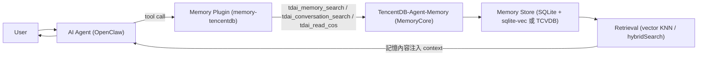

### 12.5 Scenario／Input／Process／Output／Example

**Scenario**：開發者在 OpenClaw 中詢問「我們上次討論這個 API 的認證方式決定用什麼？」

- **Input**：使用者的自然語言問句。
- **Process**：OpenClaw agent 判斷需要查歷史脈絡 → 呼叫 `memory-tencentdb` 外掛暴露的 `tdai_conversation_search`（查原始對話）與/或 `tdai_memory_search`（查已抽取的 atomic facts / persona）→ 依 `mode` 設定，請求可能直接進 in-process 邏輯（`local`/`function`），也可能經 Gateway/Proxy 轉發（`gateway`/`remote`）→ 到達 TencentDB-Agent-Memory 引擎 → 依當前 `storeBackend` 對 SQLite 的 `l0_vec`/`l1_vec` 做 KNN，或對 TCVDB 做 `hybridSearch`。
- **Output**：符合語意的歷史對話片段與已抽取的 atomic fact 被送回 OpenClaw，注入到 Agent 準備下一輪回覆的 context 裡。
- **Example**（示意性工具呼叫，非逐字官方輸出格式，建議架構）：

```json
{
  "tool": "tdai_memory_search",
  "arguments": { "query": "API 認證方式決定", "topK": 5 }
}
```

### AI Prompt 範例

```text
1. 「請解釋 openclaw.plugin.json 裡 mode: local/function/client/gateway/remote
   這五個值，分別在什麼部署情境下應該選用，並標明哪些是你推論的、哪些是官方文件逐字確認的。」

2. 「pr-ci.yml 第77-108行是怎麼驗證 memory-tencentdb 這個外掛描述檔的？
   幫我列出如果我要 fork 並修改這個外掛，CI 會擋下哪些錯誤。」

3. 「tdai_memory_search 和 tdai_conversation_search 這兩個工具的查詢範圍分別是什麼？
   它們有涵蓋 Skill/Wiki/Code-Graph 嗎？」
```

### 本章 Checklist 與小結

- [ ] 已確認 `memory-tencentdb` 外掛 id、三個工具名稱、`mode`/`storeBackend` 設定 schema。
- [ ] 已確認這是**唯一**被 CI（pr-ci.yml）強制驗證的第一方整合，可作為信任基準。
- [ ] 已理解三個工具目前只確定涵蓋 Chat Memory 與 COS 讀取，**未**證實涵蓋 Skill/Wiki/Code-Graph。
- [ ] 已把五個 `mode` 值的具體行為差異標示為「合理推論、需自行對照官方 INSTALL.md 核實」，未當成官方逐字保證。
- [ ] 已理解整合流程圖中的 Retrieval 環節與第9、10章的向量檢索機制是同一套底層邏輯。

OpenClaw 整合是本手冊中證據最紮實的整合案例：有真實外掛描述檔、有 CI 強制驗證、有明確的工具清單。企業若要選擇一個「最受官方治理保護」的整合路徑，OpenClaw 是目前唯一符合這個條件的選項。

---

## 13. Hermes Integration

相較於第12章的 OpenClaw 整合，Hermes 整合的範圍**明顯更窄**——它沒有自己的外掛描述檔，也沒有獨立的 CLI 子指令系統，本質上是一層「呼叫既有服務」的薄用戶端（Source-confirmed）。本章誠實呈現這個範圍差異，避免讀者誤以為 Hermes 與 OpenClaw 是對等規格的兩套整合。

### 13.1 實際範圍：薄 HTTP Client + Process Supervisor

Hermes 整合的程式碼位於 `MemoryCore/hermes-plugin/memory/memory_tencentdb/__init__.py` 與 `supervisor.py`，實作一個 Python 的 `MemoryProvider`（Source-confirmed）。它的本質是：

- 一個**薄 HTTP client**：把 Hermes agent 對記憶的操作請求，轉成 HTTP 呼叫送到既有的 Memory 服務。
- 一個**process supervisor**：負責管理對應後端服務行程的啟動/監控。

關鍵事實是：Hermes 整合呼叫的是**同一個 Gateway / OpenClaw 外掛伺服器**，並不是重新實作一套獨立的記憶引擎（Source-confirmed）。也就是說，L0→L3 管線、四個 Memory Asset 的實際運算邏輯，只有一份實作（在 MemoryCore），Hermes 與 OpenClaw 都是這份實作的呼叫方，差別只在於「怎麼接進去」。

INSTALL.md 說明 Hermes 是透過 `~/.hermes/config.yaml` 設定走 Proxy（Source-confirmed）——這與第12章提到 OpenClaw 也可以透過自訂 provider 走 Proxy 是同一條「Proxy 路徑」，只是設定檔案格式與生態系不同（Hermes 用 YAML 設定檔，OpenClaw 用外掛 provider 設定）。

### 13.2 透過 MemoryProxy 的路由方式

MemoryProxy 是負責協定轉換的中介層，已從原始碼層級確認以下事實（Source-confirmed）：

- `handleAnthropicMessages`（`anthropicHandler.ts` 第522行）掛載在 `POST /v1/messages` 路由（含多租戶路由變體），負責處理 Anthropic 協定格式的請求。
- `handleChatCompletions`（`handler.ts` 第422行）掛載在 `POST /v1/chat/completions` 路由，負責處理 OpenAI 協定格式的請求。
- 兩者背後分別對應 `injection/adapters/anthropic.ts` 的 `AnthropicAdapter` 與 `injection/adapters/openai.ts` 的 `OpenAIAdapter`，共用同一個 `ProtocolAdapter` 介面（Source-confirmed）。

CHANGELOG.md 記載 [2.0.0]（2026-08-03）版本首次包含「Memory Proxy 雙協定」能力（官方已實作）——與上述原始碼層級確認的 Anthropic/OpenAI 雙協定實作彼此吻合。第三方報導（Tier-4，MarkTechPost，2026-08-07，作者 Michal Sutter）額外提到 Memory Proxy 對外開放 `/claude-code/<spaceId>/v1/messages` 路由格式，並列出整合對象包含 OpenClaw、Hermes、Claude Code、CodeBuddy 以及直接使用 SDK（Tier-4，未經獨立重現驗證）——這一段路由格式與整合清單僅供參考，不應視為與原始碼層級確認同等級的證據。

Hermes 的路由方式，依現有事實可以合理描述為：Hermes agent → Python `MemoryProvider`（薄 client）→ HTTP 呼叫 → 落到 Gateway / OpenClaw 外掛伺服器 → 若請求需要協定轉換，則經過 MemoryProxy 的 `ProtocolAdapter`（Anthropic 或 OpenAI 格式）→ 最終到達 TencentDB-Agent-Memory 引擎（建議架構，依各元件已確認事實組裝而成的合理串接，非逐字官方架構圖）。

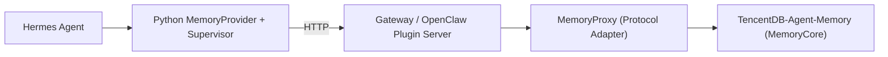

> 上圖為本手冊依已確認元件組裝的**建議架構示意圖**，用以輔助理解，非官方逐字發布的架構圖。

### 13.3 與 OpenClaw 整合的範圍比較

| 項目 | OpenClaw Integration（第12章） | Hermes Integration（本章） |
|---|---|---|
| 專屬外掛描述檔 | 有，`openclaw.plugin.json`（官方已實作） | 無獨立描述檔，只有 Python `MemoryProvider` 類別（Source-confirmed） |
| 自己的 CLI 子指令系統 | 有，例如 `openclaw memory-tdai seed`（官方已實作） | 研究資料未確認存在獨立 CLI 子指令系統，誠實標示為「未見證據」，不代表一定不存在 |
| 是否重新實作記憶引擎 | 否，呼叫同一個 MemoryCore | 否，呼叫同一個 Gateway/OpenClaw 外掛伺服器（Source-confirmed） |
| CI 強制驗證 | 是，`pr-ci.yml` 第77-108行（官方已實作） | 研究資料未確認有 Hermes 專屬的 CI 驗證步驟 |
| 設定檔位置 | 外掛 provider 設定 + INSTALL.md 第352-395行（Source-confirmed） | `~/.hermes/config.yaml`（官方已實作） |
| 定位 | 深度嵌入、第一方治理的外掛 | 呼叫既有服務的薄整合層（supervisor + client） |

### 13.4 已知限制

INSTALL.md 註明目前版本 Hermes/OpenClaw 整合存在一項共同限制：`x-task-id`、`x-conversation-id` 目前必須是**靜態值**（官方已實作，屬官方文件記載之已知限制）。這對企業導入的實務意涵是：在目前版本下，若企業場景需要動態、每次請求都不同的 task/conversation 識別（例如高併發多工作階段場景），需要額外設計上層邏輯去補這個缺口，不能假設官方已原生支援動態識別值。

### 13.5 Scenario／Input／Process／Output／Example

**Scenario**：一個已經在用 Hermes 作為 agent 框架的團隊，想接上既有的 TencentDB-Agent-Memory 服務，而不想重新導入 OpenClaw。

- **Input**：`~/.hermes/config.yaml` 設定、既有 Gateway/OpenClaw 外掛伺服器的連線資訊。
- **Process**：在 `~/.hermes/config.yaml` 設定走 Proxy（Source-confirmed）→ Hermes 啟動時由 `supervisor.py` 管理對應行程 → agent 執行期間，`MemoryProvider` 以 HTTP 呼叫既有服務 → 請求依協定格式（Anthropic 或 OpenAI）經 MemoryProxy 的對應 Adapter 轉換 → 到達 MemoryCore 引擎完成查詢/寫入。
- **Output**：Hermes agent 取得與 OpenClaw 使用者相同一份底層記憶資料（因為兩者呼叫的是同一個引擎），但操作介面/工具集是 Hermes 自己的 provider 介面，不是 `tdai_memory_search` 這類 OpenClaw 專屬工具名稱。
- **Example**：本手冊不提供 `~/.hermes/config.yaml` 的逐字設定範例，因為研究資料未提供完整欄位清單，貿然示範可能與官方實際欄位不符；建議直接查證 INSTALL.md 對應段落。

### AI Prompt 範例

```text
1. 「請比較 Hermes 整合與 OpenClaw 整合在『是否有專屬外掛描述檔』和『是否有專屬 CLI』
   這兩點上的差異，並標明各項的證據出處。」

2. 「x-task-id / x-conversation-id 目前只能是靜態值,這個限制對我們的多工作階段場景
   會造成什麼影響？請幫我設計一個暫時性的因應方案。」

3. 「MemoryProxy 的 AnthropicAdapter 和 OpenAIAdapter 是怎麼共用 ProtocolAdapter 介面的？
   這對 Hermes 呼叫既有 Gateway 服務有什麼實務意義？」
```

### 本章 Checklist 與小結

- [ ] 已確認 Hermes 整合是 Python `MemoryProvider` + `supervisor.py`，本質是薄 HTTP client + process supervisor。
- [ ] 已確認 Hermes 呼叫的是與 OpenClaw 相同的 Gateway/OpenClaw 外掛伺服器，不是獨立引擎。
- [ ] 已理解 Hermes 整合**沒有**自己的外掛描述檔，也未見獨立 CLI 子指令系統，範圍比 OpenClaw 整合窄。
- [ ] 已記錄 `x-task-id`/`x-conversation-id` 目前只能是靜態值的已知限制。
- [ ] 已理解 MemoryProxy 的雙協定（Anthropic/OpenAI）能力是本章路由機制的核心，且該能力已於 v2.0.0 正式出貨。

Hermes 整合證明了 TencentDB-Agent-Memory 的核心引擎具備「一次實作、多框架接入」的設計意圖，但企業在選型時應清楚認知：Hermes 這條路徑目前缺乏 OpenClaw 那樣的第一方治理保障（CI 驗證、正式外掛描述檔），導入前應自行補強驗證與監控機制。

---

## 14. Installation

### 14.1 本章定位

本章說明如何在原始碼層級安裝、建置並啟動 TencentDB-Agent-Memory 的 Memory Core Gateway，以及如何以 OpenClaw 外掛形式安裝。兩條路徑分別對應「自架 Gateway 服務」與「以 OpenClaw 內建方式使用」兩種企業導入情境，兩者可以並存（例如開發機用外掛模式、團隊共用環境用 Gateway 模式），詳細架構差異請對照第 12 章 OpenClaw Integration。

官方原始碼倉庫的預設分支是 `feat/server_team`（並非常見的 `main`），目前對應的正式發行版本是 v2.0.0（2026-08-03，commit `fe3230f176f1bf5832fee79d12494bbc2d19a8a`）(官方已實作)。取得原始碼時務必確認所在分支，否則可能對照到 0.x（`main`）或 1.x（`feat/server`）舊世代架構的文件與程式碼。

### 14.2 System Requirements

| 項目 | 需求 | 適用模組 | 來源 |
|---|---|---|---|
| Node.js | `>=22.16.0` | MemoryCore（Gateway 主體） | README.md:50-53、MemoryCore/package.json engines (官方已實作) |
| Node.js | `>=22.0.0` | MemoryKnowledge、MemoryPanel、openclaw-plugin | 各自 package.json engines (官方已實作) |
| Node.js | `>=18.0.0` | sdk/typescript（僅 SDK 門檻較低） | sdk/typescript package.json engines (官方已實作) |
| npm | 隨 Node.js 附帶，CI 以 `npm install --ignore-scripts` + `npm pack` 驗證套件 | 全 repo | .github/workflows/pr-ci.yml (官方已實作) |
| LLM API | 一個 OpenAI-compatible 的 LLM API（也可用 `MEMORY_LLM_PROTOCOL=anthropic` 走 Anthropic 協定） | MemoryCore Gateway | README.md:50-53 (官方已實作) |
| 作業系統 | 官方文件未明確指定；Docker 映像基底為 `node:22-slim`（Linux） | 全系統 | README.docker.md:11 (官方已實作，基底映像確認)；OS 未指定為觀察結論 |

> 提醒：官方文件對「作業系統」完全沒有著墨——這也是第 16、18 章要特別標示「非官方支援方式」的原因。Node.js、npm、Git 這些底層工具本身跨平台，但 TencentDB-Agent-Memory 專案本身從未在文件中驗證過 Windows 路徑。

### 14.3 Node.js Requirement

Memory Core 對 Node.js 版本要求較嚴格（`>=22.16.0`），這是因為 sqlite-vec 儲存後端仰賴 Node 22+ 內建的 `node:sqlite` 模組（詳見第 10 章 Storage Architecture）(官方已實作，MemoryCore/package.json:121)。若使用低於此版本的 Node.js，`npm install` 或啟動時通常會因原生模組相依性失敗。

建議以 nvm（Linux/macOS）或 nvm-windows／fnm（Windows）管理多版本 Node.js，避免與其他專案（例如既有 Vue3 前端專案，詳見 `../framework/Vue3 前端framework教學.md`）的 Node.js 版本互相干擾。

### 14.4 npm / pnpm

官方 CI 流程以 npm 為主要驗證工具（`npm install --ignore-scripts` + `npm pack`）(官方已實作，.github/workflows/pr-ci.yml)。但 repo 根目錄同時存在 `pnpm-workspace.yaml`，且 README.deployment.md 第 607 行另外指示以 pnpm 安裝 `cos-nodejs-sdk-v5`（`hermes-agent/.venv/bin/python -m pip install -e sdk/memory-core/python/` 一段旁的前置步驟）(官方已實作，README.deployment.md:607)。

這代表官方本身在套件管理工具選擇上並不完全一致：**主線安裝與建置流程請以 npm 為準**，pnpm 僅在特定子步驟（COS SDK 安裝）出現。企業導入時建議統一採用 npm 執行 `MemoryCore/` 底下的安裝與建置指令，避免混用兩套 lockfile 造成版本漂移。

### 14.5 Git

官方文件未明確列出 Git 為必要工具，但由於原始碼以 Git 儲存庫形式管理、且需要切換到非預設的 `feat/server_team` 分支才能取得目前的 2.x 版本，實務上 Git 是取得與追蹤原始碼版本的必要工具 (推測/Hypothesis，基於分支管理事實的合理推論)。企業內部建議：

- 固定 clone 後立即 `git checkout feat/server_team`（或直接以該分支 clone），避免誤用 `main`／`feat/server` 舊世代程式碼。
- 將分支名稱、commit hash（如 `fe3230f...`）記錄進企業內部的軟體物料清單（SBOM），供第 32 章 Security 與第 36 章 Backup / Restore / Migration 追溯使用。

### 14.6 OpenClaw

若採用 OpenClaw 外掛模式（而非獨立 Gateway），需先具備 OpenClaw 執行環境，版本需求為 `OpenClaw >= 2026.3.13`(官方已實作，MemoryCore/SKILL.md)。OpenClaw 本身的安裝、設定屬於獨立產品範疇，本手冊聚焦於 TencentDB-Agent-Memory 如何以外掛形式接入（詳見第 12 章），OpenClaw 自身的安裝步驟請參照 OpenClaw 官方文件。

### 14.7 Local Installation

Memory Core 官方文件給出的本機安裝與啟動流程如下 (官方已實作，README.md:59-73)：

```bash
cd MemoryCore
npm install
npm run build

export TDAI_GATEWAY_CONFIG=/path/to/config.json
export TDAI_LLM_API_KEY=sk-xxx
export TDAI_LLM_BASE_URL=https://api.openai.com/v1
export TDAI_LLM_MODEL=gpt-4o-mini
node --import tsx src/gateway/server.ts
```

需要留意的是，README.deployment.md 第 26-38 行給出的是另一版流程：`cd MemoryCore` → `npm install` → `npx tsx src/gateway/server.ts`，**並未包含 `npm run build` 這一步** (官方已實作，README.deployment.md:26-38)。這是官方兩份文件之間的小型不一致：`tsx` 本身可直接執行 TypeScript 原始碼而不需預先編譯，因此技術上兩條路徑都能啟動 Gateway，但 `npm run build` 產出的編譯結果與後續容器化、npm pack 驗證流程（見 14.9）更為一致。**本手冊建議企業導入時固定走「先 build 再啟動」的路徑**，僅在快速本機除錯時使用 `npx tsx` 略過建置。

### 14.8 Plugin Installation

若走 OpenClaw 外掛模式，安裝指令為官方已驗證的真實指令 (官方已實作，MemoryCore/SKILL.md)：

```bash
openclaw plugins install @tencentdb-agent-memory/memory-tencentdb
```

更新外掛：

```bash
openclaw plugins update memory-tencentdb
```

安裝完成後，最小可用設定只需在 `~/.openclaw/openclaw.json` 加入 `memory-tencentdb.enabled=true` 即可零設定啟動 (官方已實作，MemoryCore/SKILL.md)。生產環境建議的完整六組設定請見第 15 章。

> 注意套件命名沿革：舊版套件為 `@tdai/memory-tdai`（外掛 id `memory-tdai`），新版為 `@tencentdb-agent-memory/memory-tencentdb`（外掛 id `memory-tencentdb`）。若企業環境仍在使用舊套件，遷移步驟屬於 MemoryCore/SKILL-MIGRATION.md 定義的標準流程 (官方已實作)，本手冊在第 38 章 Upgrade 另有專節說明。

### 14.9 Source Code Installation

原始碼安裝適用於：需要自架 Gateway、需要客製化 Memory Core 行為、或需要串接 Hermes（第 13 章）的情境。

```bash
git clone <官方倉庫 URL>
cd <clone目錄>
git checkout feat/server_team       # 官方預設分支，非 main
cd MemoryCore
npm install
```

CI 流程本身以 `npm install --ignore-scripts` 搭配 `npm pack` 驗證套件內容是否正確 (官方已實作，.github/workflows/pr-ci.yml)，企業內部建置流水線可仿照此驗證方式，確保打包產物與官方 CI 一致。

### 14.10 Build

```bash
npm run build
```

`npm run build` 是官方文件中明確列出的建置指令 (官方已實作，README.md:59-62)，會將 TypeScript 原始碼編譯為可執行產物。CI 另外以 `npm pack` 驗證打包結果的完整性 (官方已實作，.github/workflows/pr-ci.yml)。若採用容器化部署（第 19 章），建置步驟會被封裝進 Docker 映像，企業內部不需重複手動建置；只有在原始碼安裝／客製化情境下才需要手動執行本節指令。

### 14.11 AI Prompt 範例

```text
你是熟悉 TencentDB-Agent-Memory 的部署助理。請協助我：
1. 檢查目前 Node.js 版本是否 >= 22.16.0
2. 在 MemoryCore/ 目錄下依序執行 npm install 與 npm run build
3. 幫我列出啟動 Gateway 前必須設定的環境變數
4. 若任何步驟失敗，先確認是否為 Node.js 版本不符（sqlite-vec 相依 node:sqlite）再往下排查
```

### 14.12 本章 Checklist 與小結

- [ ] Node.js 版本符合對應模組需求（Gateway 需 `>=22.16.0`）
- [ ] 已確認以 npm 為主要套件管理工具（pnpm 僅用於 COS SDK 子步驟）
- [ ] 已 clone 並切換至 `feat/server_team` 分支（非 `main`）
- [ ] `npm install` 與 `npm run build` 皆執行成功
- [ ] 若走外掛模式，已用官方真實指令 `openclaw plugins install @tencentdb-agent-memory/memory-tencentdb` 安裝

本章建立了 Local Installation、Plugin Installation、Source Code Installation 三條路徑的基礎知識，第 15 章接著說明安裝完成後的兩層設定體系。

---

## 15. Configuration

### 15.1 兩層設定總覽

TencentDB-Agent-Memory 的設定分屬兩個不同層次，企業導入時必須清楚區分：

| 層次 | 設定檔 | 適用情境 |
|---|---|---|
| OpenClaw 外掛層 | `~/.openclaw/openclaw.json` 的 `memory-tencentdb` 段 | 以 OpenClaw 外掛模式使用（第 12 章） |
| Docker/Gateway 部署層 | `deploy/global-images/.env`（由 `.env.example` 複製） | 自架 Gateway／三合一 Docker 堆疊（第 19 章） |

兩層設定不是互斥關係：外掛層決定 L0→L1→L2→L3 管線（詳見第 7 章）的擷取、萃取、召回行為；部署層決定 Gateway/Proxy/Hub 三個服務本身的網路、儲存、金鑰配置。

### 15.2-15.7 OpenClaw 外掛層六組設定

以下六組設定鍵完整清單、預設值與生產建議，已彙整於 **Appendix B：Configuration Reference**，本節不重複列出完整表格，僅摘要六組的職責分工：

| 組別 | 對應機制 |
|---|---|
| `capture` | L0 對話擷取開關與保留天數（呼應第5、7章） |
| `extraction` | L1 抽取與去重開關（呼應第6、7章 `batchDedup()`） |
| `pipeline` | L0→L1→L2→L3 觸發閾值（與 `config.ts` 第555-570行雙重驗證吻合，見第7章） |
| `recall` | 檢索行為（`maxResults`/`scoreThreshold`/`strategy`，呼應第9章） |
| `persona` | L3 生成頻率與備份份數（呼應第7章） |
| `embedding` | 向量嵌入供應商與四元組設定（呼應第11章研究缺口說明） |

### 15.8 Docker/Gateway 部署層設定

`deploy/global-images/.env.example` 的完整鍵名（`MEMORY_LLM_*`、`PROXY_*`、`*_PORT` 等）同樣已彙整於 Appendix B，本節僅提醒一項官方文件間的落差：INSTALL.md 記載 `PROXY_ENABLE_SESSION_INIT` 與 `PROXY_FULL_STACK` 兩個功能開關 (官方已實作，INSTALL.md)，但這兩個鍵**不存在**於 `.env.example` 中 (Source-confirmed)，需自行新增。

### 15.9 AI Prompt 範例

```text
請檢查我目前 ~/.openclaw/openclaw.json 裡 memory-tencentdb 段的六組設定，
並依 Appendix B 的清單抓出風險：embedding 四元組是否齊全、
capture.l0l1RetentionDays 是否為 1-2 天但未開啟 allowAggressiveCleanup、
recall.scoreThreshold 是否顯著偏離官方預設 0.3、apiKey 是否明文寫在設定檔中。
```

### 15.10 本章 Checklist 與小結

- [ ] 已理解「OpenClaw 外掛層」與「Docker/Gateway 部署層」是兩個獨立但可並存的設定層次
- [ ] 六組外掛設定鍵名與預設值已對照 Appendix B 核對
- [ ] `embedding` 四元組已確認齊全，避免非預期降級
- [ ] `apiKey` 類敏感設定已改用環境變數注入

本章與 Appendix B 共同構成完整的 Configuration Reference，第 16-18 章接著說明在 Windows／Linux／WSL 三種作業系統下的具體安裝步驟，第 19 章則深入 Docker/Podman 部署。

---

## 16. Windows Setup

> **官方支援聲明（務必先讀）**：TencentDB-Agent-Memory 官方文件（INSTALL.md、INSTALL_CN.md、README.deployment.md、README.docker.md、`deploy/` 全目錄）全文搜尋不到「Windows」或「WSL」字樣；repo 中唯一出現「Windows」的地方是 `.github/ISSUE_TEMPLATE/bug_report.yml` 第 28 行的 OS 欄位範例文字，並非支援聲明 (Source-confirmed)。**本章內容整條路徑屬於「非官方支援方式」**：Node.js、npm、Git 這些底層工具本身跨平台，但官方從未驗證、也未文件化這條 Windows 路徑。

### 16.1 適用情境

適用於 Windows 10/11 上的個人開發評估、POC 驗證，**不建議**作為團隊生產環境的部署基礎——生產部署請優先參考第 19 章 Docker（於 Linux 主機或 WSL2 + Docker Desktop 上執行）。

### 16.2 安裝 Node.js（PowerShell）

```powershell
winget install OpenJS.NodeJS.LTS
node -v   # 需確認 >= 22.16.0
npm -v
```

（本節安裝指令依 Node.js 官方發行版本／winget 套件庫慣例撰寫，非 TencentDB-Agent-Memory 專案文件內容，建議架構）若版本不符，改用 nvm-windows：

```powershell
winget install CoreyButler.NVMforWindows
nvm install 22.16.0
nvm use 22.16.0
```

### 16.3 安裝 Git 與 OpenClaw

```powershell
winget install Git.Git
git --version
```

OpenClaw 本身的 Windows 安裝方式請依 OpenClaw 官方文件執行；安裝完成後，外掛安裝指令與其他平台一致 (官方已實作，MemoryCore/SKILL.md)：

```powershell
openclaw plugins install @tencentdb-agent-memory/memory-tencentdb
```

### 16.4 取得原始碼與 Local Installation

```powershell
git clone <官方倉庫 URL>
Set-Location <clone目錄>
git checkout feat/server_team
Set-Location MemoryCore
npm install
npm run build
```

### 16.5 PowerShell 環境變數與啟動 Gateway 差異

官方文件使用 bash 語法 `export VAR=value` (官方已實作，README.md:68-73)，PowerShell 語法不同，需自行轉換（建議架構）：

```powershell
$env:TDAI_GATEWAY_CONFIG = "C:\path\to\config.json"
$env:TDAI_LLM_API_KEY    = "sk-xxx"
$env:TDAI_LLM_BASE_URL   = "https://api.openai.com/v1"
$env:TDAI_LLM_MODEL      = "gpt-4o-mini"
node --import tsx src/gateway/server.ts
```

### 16.6 常見 Windows 特有問題

| 問題現象 | 可能原因 | 建議排查方向 |
|---|---|---|
| `npm install` 因原生模組編譯失敗 | sqlite-vec／`node:sqlite` 原生相依編譯工具鏈缺失 | 確認已安裝 Visual Studio Build Tools；官方從未驗證此路徑（推測/Hypothesis） |
| `deploy/` 下的 `.sh` 腳本無法直接執行 | 腳本開頭為 `#!/usr/bin/env bash`，PowerShell 無法原生解讀 | 改用 WSL2（第 18 章）或 Git Bash 執行 |
| 區網 IP 偵測腳本失效 | `.env.example` 第 63 行的 `hostname -I` 是 Linux 專用指令 | 手動以 `ipconfig` 取得 IP 並填入 `.env`，或改走 WSL2 |

### 16.7 本章 Checklist 與小結

- [ ] 已知悉本章整條路徑為「非官方支援方式」
- [ ] Node.js（`>=22.16.0`）、Git 已安裝
- [ ] 已將 README.md 的 bash `export` 語法正確轉換為 PowerShell `$env:` 語法
- [ ] 已知悉 `deploy/` 下的 bash 腳本無法在原生 PowerShell 執行，需改走 WSL2 或 Git Bash
- [ ] 僅將此路徑用於個人評估／POC，生產部署改走第 19 章 Docker

---

## 17. Linux Setup

Linux（以 Ubuntu 為例）是官方文件實際驗證過的環境基礎——Docker 映像基底本身即為 `node:22-slim`（Linux）(官方已實作，README.docker.md:11)，`deploy/` 下所有腳本皆以 bash 撰寫。

### 17.1 適用情境

適用於：CI/CD 建置節點、自架 Gateway 的生產環境主機、需要直接執行 `deploy/global-images/` bash 腳本（第 19 章）的部署節點。

### 17.2 安裝 Node.js（Ubuntu，NodeSource）

```bash
curl -fsSL https://deb.nodesource.com/setup_22.x | sudo -E bash -
sudo apt-get install -y nodejs
node -v   # 確認 >= 22.16.0
```

（本節安裝指令依 Node.js 官方 NodeSource 發行慣例撰寫，非官方文件強制指定，建議架構）

### 17.3 安裝 Git、取得原始碼並安裝建置

```bash
sudo apt-get update && sudo apt-get install -y git
git clone <官方倉庫 URL>
cd <clone目錄>
git checkout feat/server_team
cd MemoryCore
npm install
npm run build
```

(官方已實作，README.md:59-62)

### 17.4 啟動 Gateway

```bash
export TDAI_GATEWAY_CONFIG=/etc/tdai/config.json
export TDAI_LLM_API_KEY=sk-xxx
export TDAI_LLM_BASE_URL=https://api.openai.com/v1
export TDAI_LLM_MODEL=gpt-4o-mini
node --import tsx src/gateway/server.ts
```

(官方已實作，README.md:59-73)

### 17.5 背景執行建議（建議架構）

官方文件未提供 systemd unit file 或 process manager 設定 (Source-confirmed)。企業如需長駐執行，本手冊建議以 systemd unit 包裝上述指令，或直接改走第 19 章的官方 Docker 映像，由容器層負責程序存活與重啟。

### 17.6 本章 Checklist 與小結

- [ ] Node.js `>=22.16.0` 已安裝
- [ ] 已 clone 並切換至 `feat/server_team` 分支
- [ ] `npm install` 與 `npm run build` 皆執行成功
- [ ] 啟動 Gateway 前四個環境變數已正確設定
- [ ] 已理解官方未提供 systemd/process manager 設定，長駐執行方案屬建議架構

Linux 路徑是目前查證到最貼近官方原生驗證假設的作業系統選項，也是第 19 章 Docker 部署的容器內部執行環境基礎。

---

## 18. WSL Setup

> **官方支援聲明**：與第 16 章相同，官方文件全文檢索不到「WSL」字樣 (Source-confirmed)。本章內容同樣屬於「非官方支援方式」，但下方說明為什麼 WSL 對 Windows 開發者是務實的橋接方案。

### 18.1 為什麼 WSL 是合理的橋接方案

三個具體原因：（1）`deploy/` 下所有部署腳本都是 bash script，WSL2 可原封不動執行；（2）Docker 映像基底是 `node:22-slim`（Linux），WSL2 讓本機開發環境與容器內執行環境更接近；（3）`.env.example` 的區網 IP 偵測邏輯是 Linux/macOS 語法，WSL2 內可直接沿用。

### 18.2 安裝 WSL2（PowerShell，系統管理員權限）

```powershell
wsl --install -d Ubuntu-22.04
wsl --set-default-version 2
```

### 18.3 在 WSL 內執行 Linux Setup 步驟

進入 WSL2 的 Ubuntu 環境後，後續步驟與第 17 章 Linux Setup 完全一致，不需要任何修改。

### 18.4 Windows 與 WSL 之間的橋接注意事項

| 情境 | 建議做法 |
|---|---|
| 原始碼放置位置 | 建議放在 WSL 原生檔案系統（`~/projects/`），跨檔案系統（`/mnt/c/...`）存取有明顯 I/O 效能損耗（推測/Hypothesis） |
| Docker Desktop 整合 | 於 Docker Desktop 設定中啟用「Use the WSL 2 based engine」與對應發行版整合 |

### 18.5 本章 Checklist 與小結

- [ ] 已知悉 WSL 路徑同樣是「非官方支援方式」，但具有實務合理性
- [ ] WSL2 已安裝並設定為預設版本
- [ ] 原始碼放置於 WSL 原生檔案系統
- [ ] 已能在 WSL2 內原封不動執行第 17 章 Linux Setup 與第 19 章 Docker 部署腳本

WSL2 是本手冊給 Windows 開發者的建議橋接方案，但企業級生產部署仍應以第 17 章原生 Linux 主機或雲端 Linux 環境為準。

---

## 19. Docker / Podman

### 19.1 官方文件本身的 Port／映像命名矛盾

必須先指出：**TencentDB-Agent-Memory 官方文件在 Port 與映像命名上，本身存在兩套不完全一致的說法**，本手冊不會替讀者選一個當唯一答案。

| 依據文件 | Memory Core | Panel UI | Knowledge | Proxy | 映像命名 |
|---|---|---|---|---|---|
| INSTALL.md（第52-59行） | `8420` | `8125` | `8424` | `8096` | `agentmemory/memory-core`、`agentmemory/memory-hub`、`agentmemory/memory-proxy`（官方已實作） |
| README.deployment.md（較舊 service-mode） | `TDAI_GATEWAY_PORT=3100` | — | — | — | `agentmemory/hermes-memory:latest`（官方已實作，但屬舊版路徑） |

**本手冊立場**：以 `deploy/global-images/` 的三合一堆疊（INSTALL.md 8420/8125/8424/8096）為主線介紹，舊版 3100/`hermes-memory` 屬較舊封裝方式，讀者應以自己環境實際拉取的映像 tag 與 `.env` 內容為準。

### 19.2 主線路徑：`deploy/global-images/` 三合一堆疊

`deploy/global-images/` 目錄下**沒有** `docker-compose.yaml`，是以 bash script 呼叫 `docker run` 編排 (Source-confirmed)：`start-all.sh`、`start-memory-core.sh`、`start-memory-hub.sh`、`start-proxy.sh`、`stop-all.sh`、`verify.sh`。容器命名（`start-all.sh` 第57行）：`tdai-memory-core`、`tdai-memory-hub`、`tdai-proxy` (官方已實作)。

三個映像（`agentmemory/memory-core`、`agentmemory/memory-hub`、`agentmemory/memory-proxy`）已以 `linux/amd64`＋`linux/arm64` 多架構形式發布至公開 Docker Hub（`https://hub.docker.com/u/agentmemory`），**不需要登入即可直接 `docker pull`**（官方已實作，CHANGELOG.md `[2.0.0]`）；`start-all.sh` 首次啟動會自動執行 `init-admin`、產生 admin `sk-mem-...` 金鑰並落盤至 `.admin-key`，`stop-all.sh --purge` 可徹底清除 volume 與 admin key 以重置環境（官方已實作，CHANGELOG.md `[2.0.0]`）。

```bash
cd deploy/global-images
cp .env.example .env
# 編輯 .env（完整鍵名見 Appendix B）
bash start-all.sh
bash verify.sh
```

### 19.3 MemoryCore 本機開發用 `docker compose`（不同於三合一堆疊）

`docker compose` 指令只出現在 README.docker.md 第84行，用途是 MemoryCore 本機開發（啟動 `agent-memory` 與 `redis` 兩個容器）(官方已實作)，與三合一堆疊是兩件不同的事，不可混用：

```bash
# 僅適用於 MemoryCore 本機開發情境，非生產三合一堆疊
docker compose up -d
```

### 19.4 Podman（非官方支援方式）

官方文件全文未提及 Podman (Source-confirmed)。以下屬本手冊依 Podman 與 Docker CLI 高度相容特性推導的建議架構，企業導入前務必完整跑過 `verify.sh` 確認行為一致。

### 19.5 本章 Checklist 與小結

- [ ] 已知悉官方文件在 port 與映像命名上存在不一致，並已確認自己環境採用哪一版
- [ ] `.env` 已從 `.env.example` 複製並填妥
- [ ] 已區分「MemoryCore 本機開發用 `docker compose`」與「生產三合一堆疊 bash 腳本」是兩件不同的事
- [ ] 映像 tag 已鎖定版本而非依賴 `latest`

本章完成後，讀者已具備在 Windows（非官方）、Linux（官方主線）、WSL（非官方但務實）、Docker/Podman 四種路徑下安裝與部署 TencentDB-Agent-Memory 的完整知識，第 20 章接續說明 Source Code Architecture。

---

## 20. Source Code Architecture

### 20.1 Repository 結構總覽

```text
TencentDB-Agent-Memory/                       (研究基準分支：feat/server_team)
├── MemoryCore/                                # 核心記憶引擎：Gateway + L0-L3 Pipeline + Skill + Offload
│   ├── package.json                           # engines >=22.16.0；sqlite-vec 0.1.7-alpha.2 依賴
│   ├── openclaw.plugin.json                   # OpenClaw 外掛描述檔（id: memory-tencentdb）
│   ├── SKILL.md / SKILL-MIGRATION.md / SKILL-DIAGNOSTIC-EXPORT.md   # 三份 Agent Skill
│   ├── bin/                                   # CLI 進入點：memory-tdai seed 子指令等
│   ├── scripts/                               # export-diagnostic.sh、migrate-sqlite-to-tcvdb 等
│   ├── hermes-plugin/memory/memory_tencentdb/ # Python MemoryProvider（第13章）
│   ├── openclaw-plugin/                       # OpenClaw 外掛可發布 npm 套件本體
│   └── src/
│       ├── gateway/server.ts                  # 官方標示的服務啟動進入點
│       ├── core/{conversation,record,scene,persona,skill,store}/   # L0-L3 管線 + Skill + 儲存
│       ├── offload/                           # Context-Offload（另一組 L1/L2/L3，詳見第8章）
│       └── config.ts                          # 觸發閾值集中定義（第555-570行）
│   └── offload_server/compact/compressor.ts   # 註解 "L3 Compressor"（Offload 子系統專用）
│
├── MemoryKnowledge/                           # Wiki + Code-Graph 獨立服務
│   └── bin/{mcp.mjs,server.mjs}                # MCP server 進入點、主服務 HTTP API 進入點
│
├── MemoryPanel/                                # Memory Hub 管理 UI，含 docker/（全樹唯一）
├── MemoryProxy/                                # 協定轉譯層：anthropicHandler.ts / handler.ts / injection/adapters/
├── sdk/memory-core/{typescript,python}/        # MemoryClient / SkillClient / MetadataClient
├── deploy/global-images/                       # .env.example + start-all.sh 等部署腳本
└── .github/workflows/pr-ci.yml                 # 第77-108行強制驗證 openclaw.plugin.json
```

以上樹狀圖為本手冊研究團隊依全樹檔名搜尋與原始碼讀取結果重新繪製（Source-confirmed），非官方發布的目錄總覽圖。

### 20.2 各模組 Responsibility / Runtime Role / Extension Point 摘要

| 模組 | Responsibility | Runtime Role | Extension Point |
|---|---|---|---|
| MemoryCore | Chat Memory 管線 + Skill 模組 + Context-Offload + Gateway HTTP 服務 | `node --import tsx src/gateway/server.ts` 常駐服務（官方已實作） | `StoreBackend` 型別是新增儲存後端的擴充點 |
| MemoryKnowledge | Wiki + Code-Graph 獨立服務 | 獨立常駐服務，Knowledge port 8424 | 官方目前無涵蓋全部四資產的 MCP 介面，需自建 adapter（建議架構） |
| MemoryPanel | Memory Hub 管理介面 | Web 前端 + 管理後端，Panel UI port 8125 | 前端堆疊客製請參閱既有 Vue3/PrimeVue 手冊 |
| MemoryProxy | 協定轉譯層（Anthropic/OpenAI 雙協定） | 常駐服務，Proxy port 8096 | 共用 `ProtocolAdapter` 介面是新增第三種協定的擴充點 |
| sdk/ | TS/Python 兩種官方 SDK：npm 套件 `@tencentdb-agent-memory/memory-sdk-ts-v2`、PyPI 套件 `tencentdb-agent-memory-sdk-python`（頂層 export 為 v3 嚴格 isolation 版本，`teamId`/`agentId`/`userId` 三項必填；`v2`/`v3` 子路徑保留為向後相容別名） | 函式庫，非獨立服務 | 官方**未提供 Java SDK**（Source-confirmed），Java/Spring Boot 團隊需走 HTTP API 或自建 Client（建議架構） |
| deploy/ | 三合一容器堆疊 bash 編排腳本 | 部署腳本，非 docker-compose 專案 | 企業要接 K8s，需以此為基準重寫 Helm chart（建議架構） |

### 20.3 資料流：Entry Point → Config → Memory Pipeline → Storage → Retrieval → Agent Integration

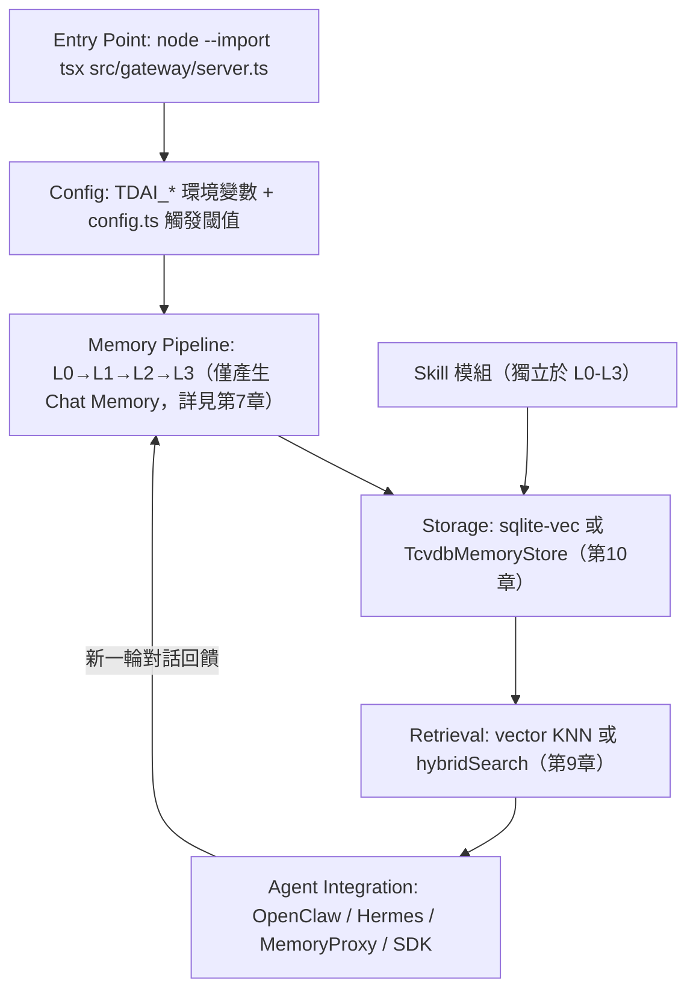

### 20.4 AI Prompt 範例

```text
1. 「請對照 MemoryCore/src/config.ts 的觸發閾值與 SKILL.md 的 pipeline 設定鍵，
   幫我確認兩邊是否完全一致。」
2. 「幫我畫一張只包含 Storage 與 Retrieval 兩段的詳細資料流圖。」
```

### 20.5 本章 Checklist 與小結

- [ ] 已理解 repository 七大模組各自的 Responsibility 與 Runtime Role
- [ ] 已確認 MemoryCore/ 底下巢狀存在三份 Agent Skill 檔案
- [ ] 已標記官方目前**沒有** Java SDK
- [ ] 已理解 Entry Point → Config → Memory Pipeline → Storage → Retrieval → Agent Integration 這條資料流只有 Memory Pipeline 一段產生 Chat Memory

Source Code Architecture 是企業安全稽核與二次開發評估的地基，第22章起將以此為基礎，示範如何把這些指令與工作流程接進企業既有的 Web 應用開發、逆向工程分析與框架升版流程中。

---

## 21. Command Reference

本章彙整全書已查證的真實指令，依類別整理成速查表（更完整的清單見 **Appendix A：Command Reference**，本章聚焦於安裝與日常操作最常用的子集）。

### 21.1 Install / Plugin 生命週期

| 指令 | 用途 | Provenance |
|---|---|---|
| `openclaw plugins install @tencentdb-agent-memory/memory-tencentdb` | 安裝外掛 | 官方已實作，SKILL.md |
| `openclaw plugins update memory-tencentdb` | 更新外掛 | 官方已實作，SKILL.md |
| `openclaw plugins uninstall memory-tdai` | 卸載舊套件（不刪資料目錄） | 官方已實作，SKILL-MIGRATION.md |

### 21.2 Build / Run

| 指令 | 用途 | Provenance |
|---|---|---|
| `cd MemoryCore && npm install && npm run build` | 安裝並建置 | 官方已實作，README.md:59-62 |
| `node --import tsx src/gateway/server.ts` | 啟動 Gateway | 官方已實作，README.md:68-73 |
| `node MemoryKnowledge/bin/mcp.mjs` | 啟動 Wiki/Code-Graph MCP server | Source-confirmed（僅限 Wiki/Code-Graph，非全系統 MCP 介面） |

### 21.3 Migration / Diagnostic

| 指令 | 用途 | Provenance |
|---|---|---|
| `openclaw memory-tdai seed --input <path> ...` | 離線批次匯入對話資料 | 官方已實作（旗標語意依命名推論，推測/Hypothesis） |
| `migrate-sqlite-to-tcvdb` / `export-tencent-vdb` / `read-local-memory` | 儲存後端遷移/匯出/讀取 | Source-confirmed，已登記 npm bin |
| `bash scripts/export-diagnostic.sh` | 診斷資料匯出（含高隱私風險的 `memory-tdai/` 目錄） | 官方已實作，SKILL-DIAGNOSTIC-EXPORT.md |

### 21.4 Deploy Ops

| 指令 | 用途 | Provenance |
|---|---|---|
| `bash deploy/global-images/start-all.sh` / `stop-all.sh` / `verify.sh` | 三合一堆疊啟停與驗證 | Source-confirmed |
| `docker compose up -d`（README.docker.md） | MemoryCore 本機開發用，非生產路徑 | 官方已實作 |

### 21.5 對話內快捷指令（mem: 系列）

官方於 2026-08-10 新增 `ROADMAP.md`／`ROADMAP_CN.md`（研究基準 commit `fe3230f`之後一個 commit `0a568c3`，僅新增文件、無程式碼變更），首次以官方文件揭露一項先前只能從原始碼查證到的能力：MemoryProxy 支援直接在對話中輸入 `mem:` 開頭的指令，由 Proxy 攔截處理，不需切換到 Memory Hub 面板（官方已實作，ROADMAP_CN.md「`mem:` 會話指令」一節明確標註「已隨 v2.0.0 發布」）。原始碼位於 `MemoryProxy/src/mem-command/`（Source-confirmed）。

| 指令 | 說明 | 是否接受參數 |
|---|---|---|
| `mem:sync` | 重新拉取 Agent/Task 描述，並重跑所有宣告 session_init/hybrid 快取策略的 hook（Skill／記憶／Knowledge／固定資產），相當於手動刷新本次對話的全部記憶注入 | 否（`mem:sync 任何文字` 會被視為一般對話，不觸發指令） |
| `mem:create-skill [提示詞]` | 手動強制歸檔本次 session buffer 並觸發 Skill 抽取，等同繞過原本的自動門檻條件 | 是（可選提示詞，作為歸檔原因） |
| `mem:help` | 顯示指令說明 | 否 |

`mem:create-skill` 觸發的是官方原始碼註解自稱的「**第三個觸發條件：跳過閾值**」（Source-confirmed，`MemoryCore/src/gateway/skill-handlers.ts` 第891-894行，路由 `POST /v3/skill/conversation/force-archive`）；前兩個是既有的排程/門檻自動觸發，即第7.3節提到的 `SkillTriggerService.archive`。`mem:create-skill`（對話式入口）與 Memory Hub 面板呼叫的 `POST /v3/session/force-archive-skill`（MemoryProxy）是同一個「強制歸檔」能力的兩個不同入口（Source-confirmed，`MemoryProxy/src/routes/session-force-archive.ts` 檔頭註解）。

**官方文件與原始碼的一處落差（本手冊查證發現，依全書慣例以 Source-confirmed 優先於文件敘述）**：ROADMAP_CN.md 文字敘述「冒號後不加空格」，但 `MemoryProxy/src/mem-command/parser.ts` 第84-85行的程式碼與註解明確寫著「相容冒號後的可選空格」——也就是說 `mem:sync` 與 `mem: sync` 實測都應能觸發指令。企業內部操作手冊若要引用這項行為，建議以原始碼為準，而非逐字照抄 Roadmap 文件敘述。指令名稱大小寫不敏感，且必須是**整條訊息本身**，不能是夾在其他文字中間的字串（Source-confirmed，parser.ts 註解）。

### 21.6 AI Prompt 範例

```text
幫我把 openclaw memory-tdai seed 的六個旗標整理成一份操作手冊草稿，
並標明哪些語意是我需要自己用 --help 核實的。
```

### 21.7 本章 Checklist 與小結

- [ ] 已彙整常用真實指令，每條均標明 Provenance
- [ ] 已理解 `deploy/global-images/*.sh` 與 `MemoryCore` 本機 `docker compose` 是兩條不同部署路徑
- [ ] 已知道 `mem:sync`／`mem:create-skill`／`mem:help` 三個對話內指令可直接在任何走 MemoryProxy 的對話中使用
- [ ] 完整指令清單請對照 Appendix A

Command Reference 是本書從「理解架構」過渡到「動手操作」的樞紐。

---

## 22. Web Application Development

> 本章銀行/金融業情境為教學示範用途之虛構情境，詳見全書開頭重要聲明第6點。技術堆疊（Vue3、PrimeVue、Spring Boot 4.x、Java 25）的深入機制請參閱本 repo 既有手冊，本章聚焦「Memory 如何協助開發流程」。

### 22.1 完整工作流程：Developer → AI Coding Agent → Memory → Coding → Memory Update

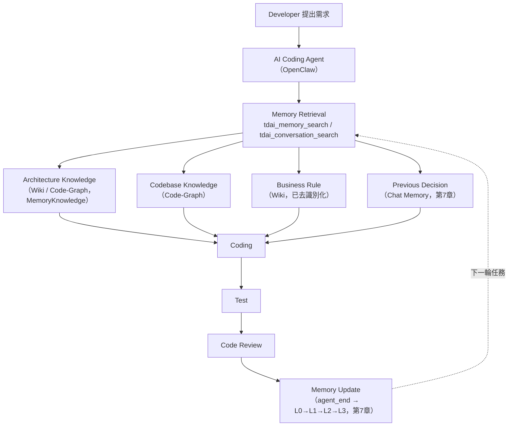

此流程延續第4章五元件架構與第7、9章已確認的檢索機制，不重複展開技術細節。

### 22.2 案例：AI Agent 開發銀行 Web Application（虛構情境）

**技術堆疊**：Vue3 + TypeScript + Tailwind CSS + PrimeVue + Pinia（前端）、Java 25 + Spring Boot 4 + Maven + REST API（後端）、Oracle/DB2/PostgreSQL（資料庫）、Clean Architecture / Hexagonal Architecture / Microservices（架構風格）。框架本身機制請參閱 [Spring boot 4.x 教學手冊](../framework/Spring%20boot%204.x%20教學手冊.md)、[Vue3 前端framework教學](../framework/Vue3%20前端framework教學.md)、[PrimeVue使用教學](../framework/PrimeVue使用教學.md)、[Java25升版教學](../程式語言/Java25升版教學.md)。

| 開發階段 | Memory 協助方式（建議架構） |
|---|---|
| Requirement Analysis | PM/BA 與 Agent 討論需求，結論寫入 Wiki／Chat Memory（詳見第41章角色分工） |
| Architecture Design | Agent 查詢既有 ADR（Wiki，呼應第45章）與 Code-Graph 既有服務依賴 |
| API Design | Agent 查詢 Skill 中既有的 API Design Rule（例如 cursor-based 分頁慣例） |
| Database Design | Agent 查詢 Wiki 中的 Database Design Pattern（例如金額欄位一律 `DECIMAL(19,4)`） |
| Frontend/Backend Development | Agent 查詢 Chat Memory 中過去類似功能的技術決策，程式碼本身仍由開發者主導、Agent 輔助 |
| Unit/Integration Test | Agent 查詢 Skill 中的測試 SOP |
| Code Review | Agent 依 Skill 中的 Review Checklist 輔助初審，人工仍為最終把關者 |
| Security Review | 依第32章敏感資料政策，審查結論脫敏後寫入 Wiki |
| Performance Test | 依第34章方法論，結果摘要寫入 Wiki |
| Bug Fix | 修復模式抽象化寫入 Skill（呼應第42章） |
| Documentation | Wiki 持續累積為專案文件庫 |

### 22.3 Scenario／Input／Process／Output／Example

- **Scenario**：開發者要求 Agent 在 `PaymentController` 新增信用卡黑名單檢查（呼應第9.3節已展示的完整案例，此處聚焦 Web App 開發流程本身）。
- **Input**：自然語言需求描述。
- **Process**：Agent 查詢 Chat Memory／Skill／Wiki／Code-Graph 四項資產 → 依既有慣例（驗證錯誤拋例外、分頁用 cursor-based 等）落地程式碼 → 執行測試 → 完成後沉澱新決策。
- **Output**：符合團隊既有慣例的程式碼，且新決策可被下一次類似任務複用。
- **Example**：完整 Sequence Diagram 已在第9.3節展示，本章不重複繪製，僅將其放進 Web App 開發全流程的脈絡中。

### 22.4 AI Prompt 範例

```text
請依本專案既有的 Coding Convention（查詢 Skill）與 API Design Rule（查詢 Wiki），
幫我設計一個新的「信用卡分期付款查詢」REST API，並在動手寫程式碼前，
先查詢 Code-Graph 確認這個功能該接在哪個既有 Service 層。
```

### 22.5 本章 Checklist 與小結

- [ ] 已建立 Requirement→Memory Retrieval→...→Memory Update 的團隊標準工作流程
- [ ] 已明確技術堆疊細節連結既有手冊，未在本章重新教學
- [ ] 已理解 Code Review／Security Review 仍需人工把關，Agent 僅輔助（呼應第31章治理）

---

## 23. Reverse Engineering

### 23.1 流程：Source Code Analysis → Architecture Discovery → ... → Memory

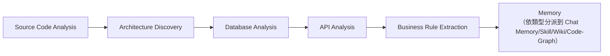

### 23.2 知識分派：用哪個資產存哪種發現（建議架構）

官方沒有針對逆向工程場景的專屬功能，以下分派邏輯延續第4、7、20章已確認的四資產分工原則：

| 逆向工程發現 | 建議存放資產 | 理由 |
|---|---|---|
| System Architecture、Module/Class Relationship | Code-Graph（MemoryKnowledge） | Code-Graph 服務由 git repo 索引驅動，適合結構化程式碼關係（第4、20章） |
| Database Mapping、API Dependency | Wiki（MemoryKnowledge） | 文件性質的靜態知識 |
| Business Rules（去識別化） | Wiki | 呼應第33章去識別化原則 |
| Batch Job、External System | Wiki | 系統整合知識 |
| Known Bugs、Technical Debt | Skill（MemoryCore，可版本化） | 適合累積為可重用的排查/修復 SOP |
| Architecture Decision（含歷史脈絡） | Chat Memory + Wiki | Chat Memory 保留討論過程，Wiki 保留最終結論（呼應第45章 ADR） |

### 23.3 Scenario／Input／Process／Output／Example

- **Scenario**：團隊接手一個沒有文件的 Legacy Java 系統，需要在不重新完整分析一次的前提下讓後續 Agent 快速上手。
- **Input**：既有原始碼庫、資料庫 schema。
- **Process**：第一位工程師與 Agent 對話，逐步分析模組關係、資料庫對應、已知 bug，Agent 把發現依23.2節分派寫入對應資產。
- **Output**：後續任何工程師詢問「這個模組為什麼這樣設計」，可直接由 Wiki/Chat Memory 檢索到答案，不需重新分析。
- **Example**：呼應第43.5節 Lab 4 的實作示範。

### 23.4 AI Prompt 範例

```text
請分析這個模組的類別關係與呼叫鏈，並把發現分成「應該存進 Code-Graph 的結構化關係」
與「應該存進 Wiki 的文件性知識」兩類，分別列出。
```

### 23.5 本章 Checklist 與小結

- [ ] 已理解官方沒有逆向工程專屬功能，23.2節分派邏輯屬建議架構
- [ ] 已依知識類型正確分派到 Chat Memory/Skill/Wiki/Code-Graph，不會全部塞進單一資產
- [ ] 已規劃讓後續 Agent 可直接查詢既有分析結果，避免重複分析整個 Legacy System

---

## 24. Framework Upgrade

### 24.1 AI Agent Workflow：Legacy System → Migration Plan → ... → Memory Update

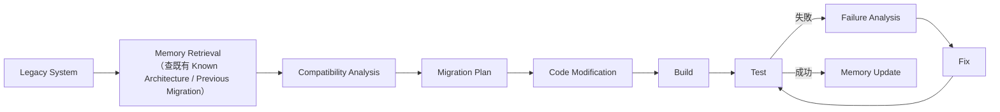

### 24.2 記錄哪些內容（建議架構，呼應第38章真實版本歷史案例）

| 類別 | 具體內容 | 存放資產 |
|---|---|---|
| Migration Decision | 「Spring Boot 3→4 這次改用 XX 方案處理 YY」 | Chat Memory + Wiki（ADR） |
| Breaking Change | 官方 CHANGELOG 記載的重大變更（可參考第38.2節 v1.0.0/v2.0.0-beta.1 真實案例的記錄方式） | Wiki |
| Compatibility Issue、Failed Attempt | 「先嘗試 A 方案失敗，原因是 XX」 | Chat Memory（避免下次重蹈覆轍） |
| Successful Solution | 修復模式抽象化 | Skill |
| Test Result、Configuration Change | 升級前後設定差異 | Wiki |
| Deprecated API、Replacement API | 對照表 | Wiki 或 Skill |

### 24.3 Scenario／Input／Process／Output／Example

- **Scenario**：模組從 Spring Boot 3.x 升級到 4.x（技術細節見 [Spring boot 4.x 教學手冊](../framework/Spring%20boot%204.x%20教學手冊.md)），本章聚焦 Memory 如何協助。
- **Input**：既有模組原始碼、目標版本 Release Notes。
- **Process**：Agent 先查 Chat Memory 是否有其他模組已升級過的先例（呼應第43.6節 Lab 5）→ 依 Migration Plan 逐步修改 → 測試失敗時記錄 Failure Analysis → 成功後沉澱 Successful Solution 至 Skill。
- **Output**：下一個模組升級時，Agent 可直接引用已驗證的解法，減少重複踩坑。
- **Example**：這正是第38.2節 TencentDB-Agent-Memory 自身版本歷史（v1.0.0 拆分 Gateway、v2.0.0-beta.1 SemVer 重新起算）示範的「破壞性變更需要被完整記錄」原則，本章把同樣的紀律應用到企業自身的框架升級。

### 24.4 AI Prompt 範例

```text
在開始這次 Java 21→25 升級前，請先查詢 Chat Memory 中是否有其他服務
做過類似升級、遇到過哪些相容性問題，再開始規劃這次的 Migration Plan。
```

### 24.5 本章 Checklist 與小結

- [ ] 已建立升級決策/問題/解法的記錄習慣，延續第38章 Upgrade SOP
- [ ] 已理解 Failed Attempt 也值得記錄，不是只記成功經驗
- [ ] 技術堆疊細節已連結既有手冊，未在本章重新教學

---

## 25. Team-level Memory Hub

### 25.1 官方基礎：v2.0.0 已出貨的 Memory Hub 與 ACL

CHANGELOG.md 確認 v2.0.0（2026-08-03）首次完整開源「Memory Hub 管理/ACL」能力 (官方已實作)，`MetadataClient` 提供 user/team/agent/task/asset/ACL 的完整 CRUD (Source-confirmed，第20章)。這代表 Team-level 共享**有一定官方基礎**，但具體 Team Memory Hub 的完整運作細節（例如跨團隊資產可見性規則的預設行為）研究資料未逐項覆蓋，超出已確認範圍的部分本章標示為建議架構。

### 25.2 v2.0.0 同批出貨的三項治理/成本能力

CHANGELOG.md `[2.0.0]`（2026-08-03）條列的原文中，除了 ACL 之外還明確提到三項與企業導入直接相關、但容易被 README 摘要式敘述忽略的能力（官方已實作，CHANGELOG.md `[2.0.0]`）：

| 能力 | CHANGELOG 原文（節錄） | 對企業導入的意義 |
| --- | --- | --- |
| System Admin 可管理資產 | 「管理員（System Admin）現在也可使用資產管理功能」 | 代表 ACL 模型除了 team/agent 維度，還有一個可以跨團隊管理全部資產的最高權限角色，設計企業內部權限矩陣時必須把這個角色單獨考慮，不能只設計到 team owner 層級 |
| 面板雙語切換 | 「面板全面支持中英文切換」 | Memory Hub 面板本身即支援中英雙語 UI，跨國團隊導入時不需要額外做介面在地化 |
| Memory Proxy 的 Cost Guard | 「Cost Guard 支持為不同 Agent 配置不同模型以降低成本」 | 可依 Agent 角色（例如簡單查詢用便宜模型、複雜規劃用旗艦模型）差異化配置底層 LLM，是第29章 Token Optimization、第34章 Performance 進行企業 ROI 估算時應納入的一個官方槓桿，而非只能靠壓縮 tool output |

這三項目前僅見於頂層 CHANGELOG.md 的條列敘述，研究資料未進一步查證對應的設定鍵或 API 路由細節（Source-confirmed 停留在「CHANGELOG 已敘述」層級，尚未逐一對照原始碼行號），企業導入前建議自行在 Memory Hub 面板與 Memory Proxy 設定中實測確認操作方式。

### 25.3 Team Memory Architecture

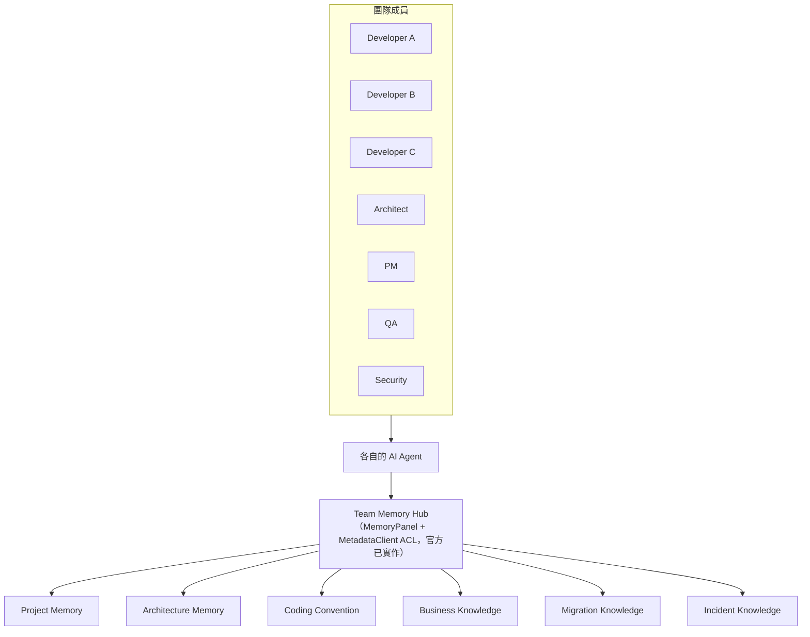

### 25.4 Individual Memory 與 Team Memory 差異

| 面向 | Individual Memory（第5-7章） | Team Memory（本章） |
|---|---|---|
| 作用範圍 | 單一開發者的 L0-L3 管線 | 跨開發者共享的 Wiki/Skill/Code-Graph |
| 治理需求 | 低（單人使用） | 需要 ACL（`MetadataClient`，Source-confirmed） |
| 典型風險 | 個人記憶跨專案汙染 | 越權存取、資產重複、治理拖慢速度 |
| 導入階段 | 第40章 Phase 1 | 第40章 Phase 3 |

### 25.5 AI Prompt 範例

```text
請用 MetadataClient 的 ACL 概念，幫我設計一個「QA 只能讀取測試相關 Skill，
不能修改 Architecture Wiki」的權限規則草案（建議架構，非官方預設規則）。
```

### 25.6 本章 Checklist 與小結

- [ ] 已理解 Memory Hub／ACL 是 v2.0.0 已出貨的官方基礎，非本手冊虛構
- [ ] 已理解具體 Team Memory Hub 運作細節仍有研究缺口，需自行安裝查證
- [ ] 已規劃 Individual→Team 的治理成熟度過渡（呼應第40章）

---

## 26. Git / GitHub Integration

> **官方沒有直接支援本章的 Git/GitHub 原生整合**（研究資料未發現任何相關功能），以下全部為「建議整合架構」。

### 26.1 知識迴圈設計

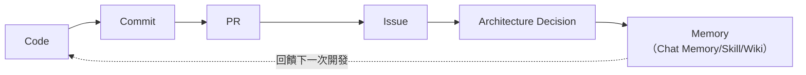

### 26.2 建議整合方式（全部為建議架構，非官方原生功能）

| 整合對象 | 建議做法 |
|---|---|
| Commit → Memory | 企業自行開發 git hook，把重要 commit message（去除敏感資訊後）透過 SDK `MemoryClient` 寫入 Chat Memory |
| PR → Memory | CI 流程中呼叫 SDK，把 PR review 結論（已脫敏）寫入 Wiki |
| Issue → Memory | 把已解決 Issue 的修復模式抽象化為 Skill（呼應第42章「只保留修復後的知識」原則） |
| Migration → Memory | 呼應第24章 Framework Upgrade |
| Bug Fix → Memory | 呼應第30章 Memory Quality 與第42章 SSDLC |

### 26.3 AI Prompt 範例

```text
請幫我設計一個 GitHub Actions workflow，在 PR merge 後，
把 PR 描述中「架構決策」段落（已排除任何憑證/客戶資料字樣）
透過 MemoryClient SDK 寫入 Wiki，並標記對應的 task/agent（呼應 MetadataClient ACL）。
```

### 26.4 本章 Checklist 與小結

- [ ] 已理解本章全部內容為建議整合架構，官方沒有原生 Git/GitHub 整合
- [ ] 已評估是否要在企業內部自建 Commit/PR/Issue → Memory 的自動化管道
- [ ] 已確認寫入前的脫敏規則呼應第32-33、42章

---

## 27. Spec-Driven Development Integration

### 27.1 Spec → Memory → Plan → Implementation → Test → Review → Memory 迴圈

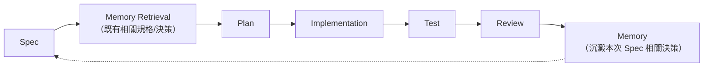

> 本章整套流程為建議架構，官方沒有原生的 Spec-Driven Development 整合功能。

### 27.2 可保存的內容分類

| Spec-Driven 階段產物 | 對應 Memory Asset | Provenance |
|---|---|---|
| Requirement / Specification | Wiki（結論）+ Chat Memory（討論過程） | 建議架構 |
| Architecture Decision | Wiki（呼應第45章 ADR） | 建議架構 |
| Implementation Decision | Chat Memory 的 `work_method`/`work_fact` 型別（第6-7章型別定義為 Source-confirmed） | Source-confirmed（型別存在）+ 建議架構（用法對應） |
| Test Decision | Skill（測試 SOP） | 建議架構 |
| Lessons Learned | Skill（呼應第42章 SSDLC Lessons Learned） | 建議架構 |

### 27.3 AI Prompt 範例

```text
請依這份 Spec 文件，先查詢 Memory 中是否已有相關的 Architecture Decision 或
Implementation Decision，避免規劃出與既有決策矛盾的 Plan。
```

### 27.4 本章 Checklist 與小結

- [ ] 已理解本章流程屬建議架構，未宣稱為官方原生功能
- [ ] 已依27.2節分類規劃 Spec 各階段產物該存進哪個資產

---

## 28. AI Coding Agent Integration

### 28.1 官方原生整合 vs 建議整合架構（嚴格區分）

| 整合對象 | 性質 | 證據 |
|---|---|---|
| OpenClaw | **官方原生整合** | 真實外掛描述檔 `openclaw.plugin.json`，CI（pr-ci.yml 第77-108行）強制驗證，Source-confirmed/官方已實作，第12章 |
| Hermes | **官方原生整合**（但範圍較窄） | 真實 Python `MemoryProvider`+`supervisor.py`，Source-confirmed，第13章 |
| Claude Code / CodeBuddy | **可透過 MemoryProxy 建立整合** | MemoryProxy 雙協定轉譯（`AnthropicAdapter`/`OpenAIAdapter`）已從原始碼確認真實存在（Source-confirmed，第13章），只需把 base URL 指向 Proxy 即可透明接入，不需修改用戶端程式碼 |
| GitHub Copilot / Copilot CLI / Codex / Gemini / Cursor | **僅能透過 API/SDK/自建 Gateway 建立整合** | 研究資料未發現官方原生支援，只能透過 MemoryProxy 的 OpenAI/Anthropic 相容協定或直接呼叫 TS/Python SDK 自行整合（建議架構） |
| MCP | **部分支援，範圍有限** | `MemoryKnowledge/bin/mcp.mjs` 是目前唯一查證到的 MCP server 進入點（Source-confirmed），**僅限 Wiki/Code-Graph 服務**，不是整個系統（含 Chat Memory、Skill）的通用 MCP 介面，不可誇大為「全系統支援 MCP」 |
| Hook / Gateway / Plugin 建立的整合 | **建議架構** | 企業可仿照 OpenClaw 外掛的 `register(api)` 接線模式（第20章），為其他 Agent 框架自行開發整合層 |

### 28.2 整合方式選型圖

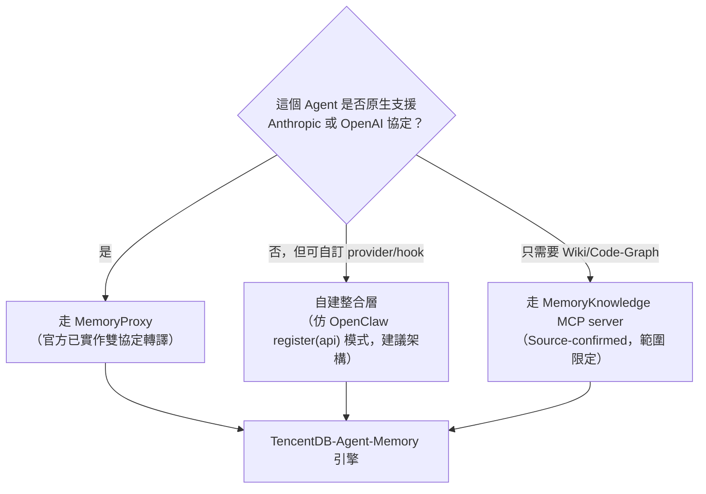

### 28.3 AI Prompt 範例

```text
我們內部用 GitHub Copilot CLI，請幫我評估：是否能把它的 API 呼叫路由到
MemoryProxy，取得記憶增強能力？請明確標示這是建議架構、非官方原生支援。
```

### 28.4 本章 Checklist 與小結

- [ ] 已嚴格區分官方原生整合（OpenClaw/Hermes/MemoryProxy）與建議架構整合（其他 Agent）
- [ ] 已理解 MCP 支援目前僅限 Wiki/Code-Graph，不是全系統通用介面
- [ ] 未把「可以透過 Proxy 接入」誤植為「官方原生支援該 Agent」

---

## 29. Token Optimization

### 29.1 Traditional Agent vs Memory Agent

```text
Traditional Agent：大量 Context → LLM → 高 Token Cost
Memory Agent：Relevant Memory → Context Compression → LLM → Lower Token Usage
```

TencentDB-Agent-Memory 透過兩個機制降低 Token 用量：第7章的 L0-L3 去重管線（避免重複記憶膨脹 context）、第8章的 Context-Offload 壓縮等級（避免 Tool Output 塞爆 context，官方宣稱 61.38% 減少，惟此數字僅見於巢狀文件、非獨立驗證，見第8.3節）。

### 29.2 Token Optimization Strategy（建議架構）

| 策略 | 對應機制 |
|---|---|
| 提高檢索精準度，而非增加記憶數量 | 調校 `recall.scoreThreshold`／`maxResults`（第9、15章），呼應「不是 Memory 越多越好」 |
| 善用去重，避免重複記憶佔用檢索結果 | `batchDedup()` 四種決策（第6-7章） |
| 對長 Tool Output 主動壓縮 | Context-Offload mild/aggressive/emergency（第8章） |
| 定期品質覆核，剔除低價值記憶 | 呼應第30章 Memory Quality |

### 29.3 核心原則

**不是「Memory 越多越好」，而是「Relevant Memory 才有價值」**——這呼應 README 開場論述「不是儲存一切，而是解決什麼值得保留」(官方已實作，README.md 第217行，第2-3章)。記憶數量增加若沒有對應的去重與檢索精準度管理，反而會稀釋 context、拉高噪音，與 Token Optimization 的目標背道而馳。

### 29.4 AI Prompt 範例

```text
請幫我分析目前 recall.maxResults=5、scoreThreshold=0.3 的設定，
是否讓過多不相關記憶被注入 context，並提出一組更聚焦的建議值（需搭配實測，見第34章）。
```

### 29.5 本章 Checklist 與小結

- [ ] 已理解 Token Optimization 靠的是「精準檢索＋去重＋壓縮」而非單純減少記憶
- [ ] 已將 61.38% 官方宣稱數字正確標示來源層級（巢狀文件，非頂層 README，非獨立驗證）
- [ ] 未把「多記錄記憶」當成 Token Optimization 的目標

---

## 30. Memory Quality

### 30.1 八類品質問題與對應機制

| 問題類型 | TencentDB-Agent-Memory 現有機制 | Provenance |
|---|---|---|
| Duplicate Memory | `batchDedup()` 的 `skip`/`merge` 決策（第6-7章） | Source-confirmed |
| Wrong Memory | 無官方自動糾錯機制，仰賴 `update` 決策與人工覆核 | 推測/Hypothesis（機制存在但糾錯觸發條件未逐項確認） |
| Stale Memory | L1 無 TTL 欄位（第7.3節已查證），靠 `update`/`merge` 與 L3 增量重生成維持新鮮度 | Source-confirmed（機制）+ 推測（是否完全等同 TTL） |
| Contradictory Memory | `batchDedup()` 的 `update` 決策（第6-7章） | Source-confirmed |
| Low Confidence Memory | 研究資料未確認官方有信心分數機制 | 無法從既有資料確認 |
| Irrelevant Memory | `recall.scoreThreshold` 過濾（第9、15章） | 官方已實作 |
| Memory Poisoning | 官方無原生防護機制，需企業自建（呼應第32章 DLP Gate 建議） | 建議架構 |
| Incorrect Agent-generated Memory | L1/L3 皆由 LLM 生成，存在幻覺風險，官方無自動偵測機制 | 推測/Hypothesis |

### 30.2 Memory Quality Checklist（建議架構）

- [ ] 定期抽查 `batchDedup()` 的 store/update/merge/skip 決策比例，異常分布可能代表去重策略需調整（呼應第35.4節）
- [ ] 定期人工抽樣檢視 `persona.md`，確認沒有錯誤或矛盾內容累積
- [ ] 建立記憶寫入前的內容審核關卡（呼應第33章 DLP Gate、第42章脫敏原則）
- [ ] 監控 `recall.scoreThreshold` 過濾比例，避免 Irrelevant Memory 污染檢索結果

### 30.3 AI Prompt 範例

```text
幫我設計一份每週抽查腳本，統計本週 batchDedup() 各決策比例，
並標記 update/merge 決策中疑似衝突未妥善處理的案例供人工複查。
```

### 30.4 本章 Checklist 與小結

- [ ] 已理解官方僅在去重/衝突處理面向有明確機制，Memory Poisoning、幻覺偵測等仍需企業自建
- [ ] 已建立定期品質覆核習慣（呼應第37章維護節奏）

---

## 31. Memory Governance

### 31.1 治理問題清單與官方基礎

| 治理問題 | 官方基礎 | Provenance |
|---|---|---|
| Who can create/modify/delete/approve/access memory | `MetadataClient` 的 user/team/agent/task/asset/ACL CRUD | Source-confirmed，第20章 |
| Project isolation / Team isolation | Memory Hub 管理/ACL（v2.0.0） | 官方已實作，CHANGELOG.md |
| Audit | `agent`/`task` 識別標記（呼應第41.5節建議用法） | Source-confirmed（欄位存在）+ 建議架構（用法設計） |
| Retention | `capture.l0l1RetentionDays`／`allowAggressiveCleanup` | 官方已實作，SKILL.md |
| Backup / Restore | 詳見第36章 | 官方已實作（部分工具）＋Roadmap/Issue（完整匯出包） |

**完整的企業級 RBAC／多租戶治理模型，仍需企業在 `MetadataClient` 基礎上自行設計**（建議架構）——官方提供的是 CRUD 原語，不是一套現成的治理制度。

### 31.2 企業 Memory Governance Model（建議架構）

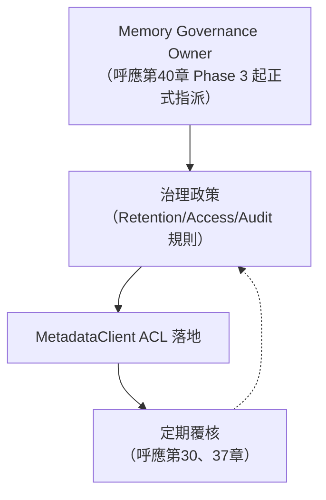

### 31.3 AI Prompt 範例

```text
請幫我用 MetadataClient 的 ACL 概念，草擬一份「Team Memory Hub 存取矩陣」，
欄位包含角色、可讀資產、可寫資產、需審核的操作類型。
```

### 31.4 本章 Checklist 與小結

- [ ] 已理解官方提供 ACL CRUD 原語，但完整治理制度需企業自行設計
- [ ] 已指派 Memory Governance Owner（呼應第40章導入路徑）
- [ ] 已建立 Retention、Audit 政策並落地到真實設定鍵（`l0l1RetentionDays` 等）

---

## 32. Security

### 32.1 敏感資訊分類

延續第33章即將展開的銀行案例，本節先建立通用的敏感資訊分類：Source Code Confidentiality、Customer Data、PII、Credential、API Key、Password、Database Connection、Token、Access Control、Encryption、Audit Log、Memory Poisoning、Prompt Injection、Data Leakage。

### 32.2 關鍵證據：SKILL-DIAGNOSTIC-EXPORT.md 的真實脫敏規則

`MemoryCore/SKILL-DIAGNOSTIC-EXPORT.md`（官方已實作）提供了本手冊最具體的官方脫敏證據：診斷匯出腳本 `scripts/export-diagnostic.sh` 產出的 `openclaw-config-redacted.json`，會把 `apiKey`／`token`／`password`／`secret`／`credential` 等欄位值取代成 `***REDACTED(Nchars)***`，並把頂層 `models`／`secrets`／`channels`／`env` 區塊整體取代成 `***REDACTED_SECTION***`。

但**同一份匯出包裡的 `memory-tdai/` 目錄——也就是 L0 對話、L1 記憶、L2 場景、L3 畫像的全量原始資料——完全不做脫敏**，腳本本身明確標註這是「高隱私風險」項目，因為包含使用者對話原文，要求人工確認可分享後才能發送 (官方已實作，SKILL-DIAGNOSTIC-EXPORT.md)。

**這證明官方的自動脫敏能力，處理的是「設定檔憑證欄位」這類結構化敏感資訊，而不是「對話內容裡的客戶資料」這類非結構化敏感資訊。** 這正是本章要求「不要讓 AI Agent 自動把敏感資料寫入長期 Memory」的根本原因——因為一旦寫入，官方目前沒有自動機制事後清除或遮蔽。

### 32.3 Memory Security Policy（建議架構）

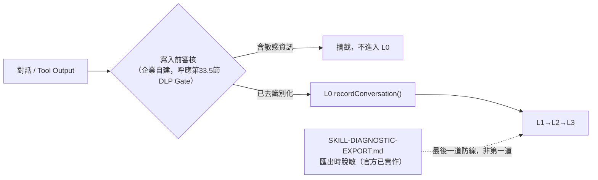

核心原則：**Memory 只保留「去識別化後的知識」，不保留「原始敏感資料」**——寫入前的防護（企業自建）遠比寫入後的補救（官方診斷匯出脫敏）更重要，因為官方脫敏只在「診斷匯出」這個特定時間點才觸發，日常檢索路徑完全不受保護。

### 32.4 AI Prompt 範例

```text
請檢查我最近這段對話紀錄，是否包含 API Key、密碼、資料庫連線字串等
可能被 L0 記錄下來的敏感資訊，如果有，幫我列出具體位置並建議如何改寫。
```

### 32.5 本章 Checklist 與小結

- [ ] 已理解官方脫敏機制只涵蓋設定檔憑證欄位，不涵蓋對話原文中的敏感資料
- [ ] 已建立寫入前的內容審核機制（企業自建，呼應第33章）
- [ ] 已確認診斷匯出流程涉及高隱私風險的 `memory-tdai/` 目錄時，有人工確認關卡
- [ ] 已建立「Memory 只保留去識別化知識」的團隊共識

---

## 33. Banking / Enterprise Usage

> 提醒：以下所有銀行/金融業情境（放款系統、信用卡黑名單、客戶帳務查詢等）均為**教學示範用途之虛構情境**，用於示範企業導入 TencentDB-Agent-Memory 時應如何設計內容治理，詳見全書開頭「重要聲明」第6點，本章不再重複完整聲明文字。

### 33.1 為什麼金融業需要「白名單/黑名單」等級的內容治理

第7章已經說明，L0→L1→L2→L3 這條管線會把 Coding Agent 與開發者之間的真實對話逐步蒸餾成 Atomic Facts、Scene Blocks、最後彙整進 `persona.md`（詳見第7章）。這代表一件對金融業特別敏感的事：**只要對話裡出現了什麼，管線就有可能把它萃取成一筆長期保留的記憶，並在未來某次不相關的對話中被檢索回來、注入下一輪 Agent context**（Source-confirmed，機制描述依第7、9章已確認之管線與檢索行為推導）。對一般網路服務團隊而言，這是效率工具；但對受金融監理規範（例如個資保護法、洗錢防制法、內控內稽要求）拘束的銀行、保險、證券業而言，這條管線同時也是一個潛在的資料外洩與稽核缺口——如果開發者在除錯時貼了一段含真實客戶帳號的 SQL 查詢結果，這段內容有機會被 L1 抽取成 `work_fact` 型別的 atomic fact（型別定義見第7章），並隨著 persona 增量更新持續存在。

官方目前提供的內容層級控制相當有限。`capture.excludeAgents` 是一個**真實存在**的設定鍵（官方已實作，`MemoryCore/SKILL.md`），允許企業指定哪些 Agent 完全不被捕捉對話，但這是「Agent 層級」的粗粒度開關，不是「內容層級」的細粒度過濾——它無法辨識「這段文字裡有沒有客戶帳號」，只能決定「這個 Agent 的所有對話要不要進管線」。研究資料中沒有找到官方原生的內容分類黑名單/白名單機制（無法從既有資料確認官方有此功能，非官方文件亦非原始碼可查證段落）。因此，本章提出的禁止/可寫入清單，是**本手冊針對金融業導入提出的企業治理建議，不是 TencentDB-Agent-Memory 的原生功能**（建議架構）。

### 33.2 禁止寫入清單（Prohibited List）

以下清單以常見金融業合規分類彙整，說明「為什麼不該讓這類內容進入 L0 對話記錄，進而被 L1 抽取為長期記憶」。全部項目均為建議架構，非官方內容過濾清單。

| 類別 | 具體範例 | 為什麼禁止進入 Memory | 若已誤寫入的風險 |
|---|---|---|---|
| Customer PII | 客戶姓名+身分證字號、生日、地址、聯絡電話組合 | 個資保護法直接規範對象，一旦被 L3 彙整進 persona.md，等同建立一份長期存在的個資副本 | 稽核追不到、刪除請求（如個資刪除權）難以逐筆清除 |
| Account Number | 存款帳號、信用卡卡號、證券戶帳號 | 屬高度敏感金融識別資料，記憶檢索一旦命中會直接把帳號吐回 Agent context | 帳號外洩、可能觸發資安通報義務 |
| Password | 系統登入密碼、資料庫密碼 | 明文密碼不應出現在任何持久化儲存 | 帳戶被冒用 |
| PIN | 提款卡 PIN、交易驗證碼 | 高風險交易憑證 | 直接可用於冒名交易 |
| API Secret | 第三方支付/徵信 API 的 secret key | 一旦洩漏可被用來偽造請求 | 服務被盜用、金流被劫持 |
| Private Key | TLS 私鑰、簽章金鑰、加密金鑰 | 密碼學金鑰外洩等同系統信任根被破壞 | 中間人攻擊、簽章偽造 |
| Production Credential | 正式環境資料庫連線字串、SSH 金鑰、雲端 IAM 憑證 | 一旦被記憶並在未來被檢索注入，等於把正式環境存取權長期暴露在 Agent context 裡 | 正式環境被未授權存取 |
| Session Token | 使用者當前登入 session token | 短效但當下有效的冒用憑證 | Session hijacking |
| Authentication Token | OAuth token、JWT、內部服務間呼叫 token | 一旦記憶下來可能長期有效或可被重放 | 跨系統冒用 |
| 敏感交易資料 | 真實客戶的交易明細、放款額度、信用評分結果 | 屬營業機密與客戶隱私交集地帶 | 內線交易疑慮、客戶信任受損 |

### 33.3 可以寫入清單（Allowed List）

相對地，以下類別是本手冊建議「鼓勵」寫入 Memory 的內容，這正是 TencentDB-Agent-Memory 的核心價值主張所在——README 明確定位這個系統「不是 store everything，而是解決什麼值得保留」（官方已實作，README.md 第217行）。以下清單同樣為建議架構：

| 類別 | 具體範例 | 為什麼適合寫入 Memory |
|---|---|---|
| Architecture Decision | 「放款審核流程改用 Saga pattern 處理跨服務交易」 | 屬團隊知識資產，不含客戶資料，長期保留有價值 |
| Coding Convention | 「本專案 Controller 一律回傳 `ResponseEntity<ApiResult<T>>`」 | 純技術規範，適合被 Skill 或 persona 長期記住 |
| API Design Rule | 「分頁查詢一律用 cursor-based，不用 offset」 | 減少每次都要重新溝通的規則 |
| Database Design Pattern | 「金額欄位一律用 `DECIMAL(19,4)`，不用 FLOAT」 | 跨團隊一致性知識 |
| Business Rule（去識別化） | 「信用卡逾期超過90天需轉列催收，門檻可設定」——不含任何真實客戶資料的**規則本身** | 業務邏輯知識，去識別化後不觸及個資 |
| Migration Experience | 「上次從 DB2 遷移到 PostgreSQL 時，`TIMESTAMP` 時區踩過坑」 | troubleshooting 知識資產，避免重複踩坑 |
| Troubleshooting Knowledge | 「連線池耗盡時的排查順序」 | 高複用價值 |
| Test Strategy | 「跨行轉帳流程一律要有補償交易的整合測試」 | 團隊測試方法論 |
| Development SOP | 「PR 合併前需通過 SSDLC 掃描」（建議架構整合，詳見第42章） | 流程知識 |

### 33.4 用第32章 SKILL-DIAGNOSTIC-EXPORT.md 的真實脫敏證據，驗證這套治理邏輯站得住腳

第32章已介紹 `MemoryCore/SKILL-DIAGNOSTIC-EXPORT.md`（診斷資料匯出 skill）的完整脫敏機制，本節用它的真實內容，反過來佐證 33.1 節的論點：**官方目前的資料保護手段落在「匯出/診斷時」，而不是「寫入時」**（Source-confirmed，依 SKILL-DIAGNOSTIC-EXPORT.md 內容比對）。

具體證據（官方已實作，`MemoryCore/SKILL-DIAGNOSTIC-EXPORT.md`）：

- 診斷匯出腳本 `scripts/export-diagnostic.sh` 產出的 `openclaw-config-redacted.json`，會把設定檔中 `apiKey`／`token`／`password`／`secret`／`credential` 等欄位值取代成 `***REDACTED(Nchars)***`，`SecretRef` 物件的 `id` 也會被取代，頂層 `models`／`secrets`／`channels`／`env` 區塊整段取代成 `***REDACTED_SECTION***`，`gateway.auth` 下的 `token`／`password` 同樣被取代。
- 但同一份匯出包裡的 `memory-tdai/` 目錄——也就是 L0 對話、L1 記憶、L2 場景、L3 畫像、SQLite 資料庫、checkpoint 的**全量原始資料**——完全不做脫敏，腳本本身明確標註這是「高隱私風險」項目，因為裡面包含使用者對話原文，並要求人工確認可分享後才能發送。

這兩個事實合起來，正好證明了 33.1 節的推論：**官方的脫敏能力，處理的是「設定檔裡的憑證欄位」這一類結構化、欄位名稱可預期的敏感資訊，而不是「對話內容裡出現的客戶帳號、卡號」這一類非結構化、位置不固定的敏感資訊**。換句話說，如果一段含真實帳號的對話被 L0 記錄下來，它會原封不動地被 L1 抽取、被 L3 彙整，直到有人手動執行診斷匯出腳本時，才會被標記為「高風險、需人工確認」——但即使到那個時間點，帳號本身也**不會**被自動遮蔽（`memory-tdai/` 目錄不在自動脫敏範圍內，官方已實作，SKILL-DIAGNOSTIC-EXPORT.md）。這正是本章要求企業自建「寫入時」治理層的根本原因。

### 33.5 建議架構：企業寫入治理層設計

本節提出一個企業可以在 TencentDB-Agent-Memory 之上疊加的內容治理層設計，**全部標示為建議架構**，不是官方功能：

```mermaid
flowchart LR
    Dev["開發者對話 / Tool Output"] --> Gate{"建議架構：Pre-Write DLP Gate<br/>正則比對帳號/卡號/PIN等樣式"}
    Gate -->|"命中禁止清單"| Block["攔截 + 告警 + 遮蔽後記錄事件"]
    Gate -->|"未命中"| L0["L0 recordConversation()<br/>（官方已實作，見第7章）"]
    L0 --> Pipeline["L1→L2→L3 管線<br/>（詳見第7章）"]
    ExAgents["capture.excludeAgents<br/>（官方已實作，粗粒度Agent排除）"] -.->|"補充機制"| Gate
    Diag["SKILL-DIAGNOSTIC-EXPORT.md<br/>匯出時脫敏（官方已實作）"] -.->|"最後一道防線，非第一道"| Pipeline
```

> 圖中 `Pre-Write DLP Gate` 是本手冊建議企業自行開發、掛在 `agent_end` hook 與 L0 寫入之間（或以定期掃描 `conversations/*.jsonl` 與 `scene_blocks/` 的方式）的內容過濾層，**官方目前沒有這個元件**（建議架構）。實作方式可以是正則表達式比對台灣/國際常見帳號、卡號、身分證號格式，或串接企業既有的 DLP（Data Loss Prevention）產品。

### 33.6 Scenario／Input／Process／Output／Example

**Scenario**：某銀行放款系統開發團隊（虛構情境）導入 TencentDB-Agent-Memory 搭配 OpenClaw，一名工程師在除錯放款額度計算邏輯時，直接把一筆測試環境的客戶帳戶查詢結果貼進 Agent 對話視窗，其中包含真實格式的帳號欄位。

- **Input**：含帳號欄位的除錯對話文字。
- **Process**（依建議架構）：Pre-Write DLP Gate 以正則規則偵測到符合銀行帳號格式的字串 → 攔截該訊息、不讓它進入 `recordConversation()` → 記錄一筆治理事件（誰、何時、命中哪條規則）→ 通知開發者以去識別化方式（如「帳號末四碼 1234」）重新描述問題。
- **Output**：L0 對話記錄中不含真實帳號，L1/L2/L3 也就不會抽取出含帳號的記憶；治理事件留下稽核軌跡供資安/法遵單位查核。
- **Example**：若該工程師改用「客戶帳戶餘額查詢回傳 NPE，帳戶類型為活期存款」這種去識別化描述，則屬於 33.3 節的 Troubleshooting Knowledge，可以正常進入管線並在未來被檢索、複用。

### 33.7 AI Prompt 範例

```text
1. 「請檢查我最近這段對話紀錄，裡面是否包含疑似客戶帳號、卡號或身分證字號格式的文字？
   如果有，請幫我用去識別化的方式改寫成可以安全留存的除錯描述。」

2. 「我要為金融業導入 TencentDB-Agent-Memory 撰寫一份『Memory 寫入內容政策』，
   請依本手冊第33.2、33.3節的禁止/可寫入清單，幫我擴充成適用於證券業的版本
   （例如加入「未公開財報數字」、「內線消息」等證券業特有的禁止項目）。」

3. 「capture.excludeAgents 只能排除整個 Agent，如果我只想排除『含客戶查詢工具』的
   那幾次對話呼叫，官方有沒有更細粒度的機制？如果沒有，幫我設計一個介於
   Agent 層級與訊息層級之間的折衷方案。」
```

### 本章 Checklist 與小結

- [ ] 已理解 L0-L3 管線會把對話內容蒸餾成長期記憶，任何進入對話的敏感資料都有被長期保留、未來被檢索注入的風險（詳見第7、9章）。
- [ ] 已建立本團隊/本行適用的禁止寫入清單與可寫入清單，並清楚標示這是企業自訂治理（建議架構），不是官方原生黑白名單功能。
- [ ] 已理解 `capture.excludeAgents` 是官方唯一可查證的內容治理相關設定鍵，且是 Agent 層級、非內容層級的粗粒度控制。
- [ ] 已對照 SKILL-DIAGNOSTIC-EXPORT.md 的真實脫敏範圍，理解官方脫敏只涵蓋設定檔憑證欄位，**不**涵蓋對話原文中的客戶資料。
- [ ] 已評估是否需要導入建議架構中的 Pre-Write DLP Gate，或至少建立人工覆核 SOP。

金融業導入 AI Agent Memory 系統的核心矛盾，在於「記得越多、生產力越高」與「記得越少、合規風險越低」天然對立。TencentDB-Agent-Memory 的官方設計聚焦在管線效率與檢索品質，內容層級的治理責任目前仍落在導入企業自己身上——這正是本章存在的理由。

---

## 34. Performance

### 34.1 誠實聲明：本章絕大部分是方法論，不是官方 Benchmark

在深入細節之前，必須先做一個誠實聲明：**除了34.2節列出的兩筆數據之外，本手冊研究團隊沒有在官方文件、CHANGELOG、原始碼註解中找到任何正式的延遲（latency）或吞吐量（throughput）benchmark**（無法從既有資料確認，官方未發布效能測試報告）。市面上也沒有找到獨立第三方對 TencentDB-Agent-Memory 做過的效能重現研究。因此本章的定位是：**提供一套企業可以自行執行的效能評估方法論與檢查清單，而不是轉述一份不存在的官方效能報告**。任何具體毫秒數、QPS 數字，若非本章明確標註來源，都不應被當作官方承諾。

### 34.2 目前僅有的兩筆量化數據，與其侷限

| 數據 | 內容 | 來源與侷限 |
|---|---|---|
| 61.38% | Context-Offload 子系統宣稱的 token 減少幅度 | 官方已實作，但**僅出現在巢狀文件** `MemoryCore/hermes-plugin/memory/memory_tencentdb/README.md`，**不在頂層 README** 中提及；未說明測量方法、測試資料集、對照基準（是否含 L1/L2/L3 壓縮等級全開、測試對話長度分布等變數均未揭露），詳見第8章 Context Offload |
| PersonaMem 48%→76% | 記憶檢索準確率的相對提升（59% 相對提升） | Tier-4 第三方文章（MarkTechPost，2026-08-07，作者 Michal Sutter）**自報數據**，文章本身註明未經獨立重現驗證；不應視為與原始碼層級確認同等級的證據 |

這兩筆數據的**共同侷限**：都沒有揭露測試環境（硬體規格、資料量級、並發數）、沒有第三方重現、也沒有跟同類系統（例如其他 AI Agent 記憶框架）做橫向比較。企業在做技術選型評估時，若要引用這兩個數字，建議附註完整侷限說明，不要包裝成「官方保證的效能指標」。

### 34.3 Performance Checklist（10 面向）

以下每個面向，先說明官方/研究資料現況（誠實標示，多數為「無法確認」），再提供企業自行量測的建議方法論（建議架構）。

| 面向 | 官方/研究資料現況 | 建議企業自行量測方法論（建議架構） |
|---|---|---|
| Memory Write Latency | 未見官方數據 | 在 `agent_end` hook 前後打時間戳，量測從觸發到 L0 JSONL 寫入完成的 wall-clock 時間（詳見第7章 `recordConversation()`） |
| Memory Retrieval Latency | 未見官方數據 | 從呼叫 `tdai_memory_search`（詳見第12章）到回傳結果的端到端時間，區分 sqlite-vec 與 TCVDB 兩種後端分別量測 |
| Embedding Latency | 未見官方數據；已知預設模型 `text-embedding-3-small`，維度1536（官方已實作，SKILL.md embedding 設定） | 量測單次 embedding API 呼叫延遲，並區分「本地 sqlite-vec 建索引」與「遠端 embedding API 呼叫」兩段耗時 |
| Vector Search | 未見官方數據；`vec0` 虛擬表機制已從原始碼確認存在（Source-confirmed，第10章） | 依資料量級（1千/1萬/10萬筆 atomic facts）分別量測 `l0_vec`/`l1_vec` 查詢耗時，觀察是否線性增長 |
| SQLite Performance | 未見官方數據；`sqlite-vec 0.1.7-alpha.2`、`node:sqlite`（Node 22+）已確認（Source-confirmed） | 監控 SQLite 檔案大小成長曲線、WAL 模式是否啟用、單機並發寫入時是否出現鎖等待 |
| Cloud Vector DB Latency | 未見官方數據；`TcvdbMemoryStore` 的 `hybridSearch`（server-side dense + client-side BM25 sparse）已從原始碼確認（Source-confirmed，第10章） | 量測跨網路呼叫 Tencent Cloud VectorDB 的延遲，並與本地 sqlite-vec 做對照組比較，評估「換雲端向量庫」的效能代價 |
| Context Compression | 61.38% 為巢狀文件宣稱數字（官方已實作但條件不明，見34.2節）；請注意這是 offload 子系統的 L1/L2/L3 壓縮等級，**不是**本手冊第7章的記憶分層，兩者為不同機制，詳見第7-8章 | 針對 mild/aggressive/emergency 三種壓縮等級（第8章），各自量測壓縮前後 token 數差異，取得符合自身對話型態的實測比例 |
| Token Reduction | 同上 61.38%／PersonaMem 相關數字皆有侷限 | 建議以「每輪對話平均 token 數」為基準指標，在導入前後各跑一段固定時間的真實工作負載，比較平均值變化 |
| Concurrent Agents | 未見官方數據；Gateway 架構自 v1.0.0 起獨立出來（官方已實作，見第38章版本歷史） | 模擬多個 Agent 實例同時對同一 Gateway 發起讀寫請求，觀察 Gateway 端延遲是否隨並發數上升而劣化，找出實務可接受的並發上限 |
| Team Memory Scaling | 未見官方數據；Team-level Memory Hub 概念詳見第25章 | 隨團隊人數/專案數增加，追蹤單一 Memory Hub 的儲存量、L2/L3 生成排程延遲、跨用戶檢索準確率是否隨資料量稀釋而下降 |

### 34.4 建議效能測試方法論範例

以下為概念示意（非官方原始碼、非官方提供的測試工具），示範如何量測 Memory Retrieval Latency：

```typescript
// 示意：企業自建的檢索延遲量測 harness（建議架構，非官方工具）
async function benchmarkRetrieval(queries: string[], n = 50) {
  const samples: number[] = [];
  for (const q of queries.slice(0, n)) {
    const t0 = performance.now();
    await memoryClient.search(q); // 呼叫 SDK 的 MemoryClient
    samples.push(performance.now() - t0);
  }
  samples.sort((a, b) => a - b);
  return { p50: samples[Math.floor(n * 0.5)], p95: samples[Math.floor(n * 0.95)] };
}
```

企業應針對自己的資料量級、網路環境、embedding provider 重新量測，不要沿用其他公司或本手冊的任何示範數字。

### 34.5 Scenario／Input／Process／Output／Example

**Scenario**：一個平台團隊要決定是否把 storeBackend 從預設 `sqlite` 換成 `tcvdb`（詳見第10、11章），需要量化依據支撐決策。

- **Input**：一組具代表性的真實查詢語句（例如過去一個月 Agent 實際發出過的檢索請求樣本）、兩套環境（sqlite-vec 本地部署、Tencent Cloud VectorDB）。
- **Process**：分別針對兩套環境跑 34.4 節的 harness，各取得 p50/p95 延遲；同時記錄兩套環境的維運成本差異（自管 SQLite vs 付費雲端向量庫）。
- **Output**：一份「延遲 vs 成本」對照報告，作為架構決策記錄（詳見第45章 ADR）的量化依據。
- **Example**：若量測結果顯示 TCVDB 在 10 萬筆以上資料量時 p95 延遲明顯優於本地 sqlite-vec，但成本增加 3 倍，團隊可依此在 ADR 中明確記錄取捨理由，而不是憑印象決策。

### 34.6 AI Prompt 範例

```text
1. 「幫我設計一組能代表本團隊真實使用情境的檢索查詢樣本，用來跑第34.4節的
   Memory Retrieval Latency benchmark，樣本應涵蓋短查詢、長查詢、含中文與英文混合。」

2. 「61.38% 這個 token 減少數字只在巢狀文件出現，沒有揭露測試條件，
   我該如何設計一個對照實驗，量出『在我們自己的對話型態下』實際的壓縮比例？」

3. 「我們要在 sqlite-vec 與 Tencent Cloud VectorDB 之間做技術選型，
   幫我列出除了延遲之外，還應該量測哪些面向（例如可用性、備份便利性、成本模型）。」
```

### 本章 Checklist 與小結

- [ ] 已向團隊/主管清楚說明：本章效能數據多數是「建議量測方法論」，不是官方 benchmark；61.38% 與 PersonaMem 48%→76% 兩筆數字各自有明確侷限。
- [ ] 已針對 Memory Write/Retrieval Latency、Embedding Latency、Vector Search 建立自己的量測 harness。
- [ ] 已理解 Context Compression 面向討論的是第8章的 offload L1/L2/L3 壓縮等級，不是第7章的記憶分層管線。
- [ ] 已規劃 Concurrent Agents、Team Memory Scaling 的壓力測試，尤其是打算導入 Team-level Memory Hub（第25章）的團隊。
- [ ] 已在架構決策記錄（第45章）中，用自己量測的數字取代任何未經查證的第三方效能宣稱。

效能是企業導入任何基礎設施前都會問的第一個問題，但誠實面對「官方沒有給出可信 benchmark」這個現實，遠比用一份自報數據自我安慰更有價值——這也是本章刻意把「怎麼量」放在「量到什麼」之前的原因。

---

## 35. Observability

### 35.1 官方已出貨的可觀測性能力：CHANGELOG 證據

與前一章「效能沒有官方 benchmark」的處境不同，可觀測性在本書可查證的資料中，是一項**明確、有出貨紀錄佐證的官方功能**，而不是選配依賴或社群外掛。CHANGELOG.md 記載 `[1.0.0]`（feat/server 分支，2026-06-11 GA）版本新增了 OpenTelemetry／Langfuse 可觀測性支援（官方已實作，CHANGELOG.md `[1.0.0]` 2026-06-11）。這個時間點與版本歷史吻合：v1.0.0 是 TencentDB-Agent-Memory 從內嵌於 OpenClaw 的外掛，拆分成獨立 Gateway 架構的第一個 GA 版本（詳見第38章版本歷史），同一版本也新增了 TypeScript／Python SDK 與 14 個 HTTP route（官方已實作）。換句話說，官方在把系統「服務化」的同一個里程碑，就同時把可觀測性納入了出貨清單，這是判斷這項功能成熟度的重要線索——它不是後補的維運巧思，而是伴隨 Gateway 化一起設計的能力。

需要誠實補充的是：CHANGELOG 條目本身只記載「新增 OpenTelemetry／Langfuse 可觀測性」這個功能標題，本手冊研究團隊**未取得**該版本具體暴露了哪些 span、哪些 metric 名稱、Langfuse 整合的確切設定鍵等逐項細節（無法從既有資料確認具體遙測欄位清單）。企業導入前，建議直接查閱當時對應版本的原始碼或官方文件補齊這部分細節。

### 35.2 Agent → Memory → Metrics → Logs → Trace → Dashboard 流程圖

```mermaid
flowchart TD
    Agent["Coding Agent / OpenClaw / Hermes"] -->|"對話回合"| MC["TencentDB-Agent-Memory<br/>（Gateway / MemoryCore）"]
    MC -->|"OpenTelemetry 標準輸出"| OTel["OpenTelemetry Collector<br/>（官方已實作，CHANGELOG [1.0.0]）"]
    MC -->|"LLM 呼叫追蹤"| Langfuse["Langfuse<br/>（官方已實作，CHANGELOG [1.0.0]）"]
    OTel --> Metrics["Metrics<br/>（pipeline延遲、dedup決策數等，建議架構定義具體指標）"]
    OTel --> Trace["Trace<br/>（L0→L1→L2→L3 各階段 span，建議架構解讀方式）"]
    MC -->|"應用日誌"| Logs["Gateway / Plugin Logs<br/>（[memory-tdai] 前綴，官方已實作，SKILL.md）"]
    Metrics --> Dashboard["Dashboard"]
    Trace --> Dashboard
    Logs --> Dashboard
    Panel["MemoryPanel（管理介面）<br/>（Source-confirmed 存在，Dashboard角色為建議架構推論）"] -.-> Dashboard
```

> 圖中實線代表已從 CHANGELOG／SKILL.md 確認的元件與資料流；虛線（MemoryPanel → Dashboard）代表本手冊依 MemoryPanel 作為官方管理介面模組的既有事實，合理推論它可能承擔部分儀表板角色，**這是建議架構層級的推論，官方文件未明文列出 MemoryPanel 的完整 UI 功能清單**（推測/Hypothesis，見35.3節）。

### 35.3 MemoryPanel 是否扮演 Dashboard 角色：證據與推論的界線

`MemoryPanel` 是一個真實存在的獨立模組——研究資料已確認它有自己的 `package.json`、`docker/` 目錄、對應的容器資料卷 `tdai-panel-data`，並在三合一部署堆疊中佔用獨立的 Panel UI port `8125`（Source-confirmed，見第14、19章安裝與部署資料）。這代表它是一個真實的 Web 管理介面，不是本手冊虛構的元件。

但研究資料**沒有**取得 MemoryPanel 的完整功能清單頁面截圖或官方逐項說明，因此無法確認它是否真的內建了 Metrics/Trace 圖表、告警規則設定等典型 Dashboard 功能（無法從既有資料確認，官方文件未明文列出 UI 功能清單）。本手冊在此保持誠實：MemoryPanel「作為管理介面」是 Source-confirmed 的事實；MemoryPanel「承擔 Observability Dashboard 角色」是一個合理但未經證實的推論（推測/Hypothesis）——它至少應該具備瀏覽 Memory Asset、管理 ACL（詳見第25、31章）等管理功能，是否也整合了 OpenTelemetry/Langfuse 的視覺化，需要企業自行安裝後查證。

### 35.4 企業導入建議：Metrics/Logs/Trace 收集與告警設計（建議架構）

在官方已出貨 OpenTelemetry／Langfuse 的基礎上，本手冊建議企業至少監控以下指標（全部為建議架構，具體指標名稱需依實際 OpenTelemetry 輸出核實）：

| 指標類別 | 建議監控項目 | 告警建議 |
|---|---|---|
| Pipeline 健康度 | L0→L1、L1→L2、L2→L3 各階段觸發間隔（對照第7章的5則/600秒、10秒/900-3600秒、50次 persona trigger 三組閾值） | 若某階段長時間未觸發，可能代表 pipeline 卡住，需檢查 Gateway log |
| Dedup 品質 | `batchDedup()` 的 store/update/merge/skip 四種決策比例（詳見第7章） | skip 比例異常升高可能代表去重過度保守；store 比例異常升高可能代表去重失效 |
| 檢索命中率 | `recall` 呼叫是否有回傳結果、`scoreThreshold`（預設0.3，SKILL.md）過濾掉的比例 | 命中率長期偏低，對照 SKILL.md 故障排查「有記錄無召回」條目（詳見第39章） |
| Embedding 健康度 | embedding API 呼叫失敗率、延遲 | 失敗率升高需檢查 `embedding` 四元組設定（`apiKey`/`baseUrl`/`model`/`dimensions`，SKILL.md）是否完整 |
| 資源使用 | SQLite 檔案大小、`.metadata/recall_checkpoint.json` 更新時間 | 檔案異常增長或 checkpoint 停滯需排查 |

### 35.5 Scenario／Input／Process／Output／Example

**Scenario**：企業維運團隊要在既有的 Grafana/Prometheus 監控體系中，納入 TencentDB-Agent-Memory 的可觀測性資料。

- **Input**：Gateway 對外暴露的 OpenTelemetry 端點（官方已實作，CHANGELOG [1.0.0]，具體端點路徑需查證實際安裝版本）。
- **Process**：設定 OpenTelemetry Collector 接收 Gateway 輸出 → 轉發至企業既有的 Prometheus/Grafana 或直接串接 Langfuse（用於 LLM 呼叫層面的追蹤）→ 在 Dashboard 疊加 35.4 節建議的自訂指標（因為官方 Metrics 名稱清單未完整揭露，這部分指標需企業自行從實際輸出資料反推或另行埋點）。
- **Output**：一個能同時看到「LLM 呼叫追蹤（Langfuse）」與「基礎設施指標（OpenTelemetry→Prometheus）」的整合 Dashboard。
- **Example**：當團隊發現 L1→L2 轉換的實際間隔持續逼近 3600 秒上限（詳見第7章），可以在 Dashboard 設定告警，提前發現 pipeline 排程被拖慢的徵兆，而不是等使用者抱怨「記憶好像變舊了」才回頭排查。

### 35.6 AI Prompt 範例

```text
1. 「Gateway 的 OpenTelemetry 端點預設暴露在哪個 port/路徑？
   幫我寫一份 OpenTelemetry Collector 設定範例，把它接進我們現有的 Prometheus。」

2. 「我想監控 batchDedup() 的 store/update/merge/skip 決策比例，
   但官方 Metrics 清單沒有列出這個指標，我該怎麼從 Trace 資料裡反推？」

3. 「MemoryPanel 是否有內建 Observability Dashboard？在我們正式依賴它做告警之前，
   幫我列一份驗收清單，逐項確認它實際具備哪些監控功能。」
```

### 本章 Checklist 與小結

- [ ] 已確認 OpenTelemetry／Langfuse 可觀測性是 v1.0.0（2026-06-11 GA）起就出貨的官方功能，不是選配依賴。
- [ ] 已釐清 MemoryPanel「是真實管理介面」（Source-confirmed）與「是否承擔 Dashboard 角色」（推測/Hypothesis）這兩件事的證據等級不同。
- [ ] 已依 35.4 節建議指標，規劃 Pipeline 健康度、Dedup 品質、檢索命中率、Embedding 健康度的監控項目。
- [ ] 已將可觀測性資料與第7章的三組管線觸發閾值對照，建立有意義的告警規則，而不是盲目監控所有可取得的指標。
- [ ] 已規劃安裝後實際查證 MemoryPanel 功能清單，補齊本章標示為推測的部分。

可觀測性是本書少數「官方已出貨、且有明確版本與 CHANGELOG 佐證」的維運能力，企業應優先善用這個既有基礎，而不是重複造輪子；同時也要對「哪些是官方保證、哪些是本手冊合理推論」保持清楚的界線。

---

## 36. Backup / Restore / Migration

### 36.1 SQLite Backup：檔案系統層級與應用層級兩種手段

TencentDB-Agent-Memory 預設以 SQLite + sqlite-vec 儲存資料（詳見第10章），這代表企業有兩種互補的備份手段：

**檔案系統層級備份**：直接備份整個資料目錄。依 SKILL.md 記載，安裝驗證步驟會檢查資料目錄下已建立 `conversations/`、`records/`、`scene_blocks/`、`vectors.db`（官方已實作，`MemoryCore/SKILL.md`）。企業可以用一般檔案系統快照工具（rsync、雲端硬碟快照、備份代理程式）直接整份複製這個目錄，取得的是「當下時間點的完整鏡像」，還原方式也最直覺——整份複製回去即可。這種備份手段的代價是：SQLite 檔案（尤其是 `vectors.db`）在有寫入操作進行中時直接複製，需注意是否會取得不一致的快照，建議搭配 SQLite 官方建議的線上備份機制（例如先執行 checkpoint，或在低峰時段執行）。

> **文件間路徑差異提醒**：SKILL.md 記載的資料目錄路徑是 `~/.openclaw/state/memory-tdai/`，而 SKILL-MIGRATION.md 記載新舊外掛共用的資料目錄是 `~/.openclaw/memory-tdai/`（兩者皆為 Source-confirmed，直接引自對應 skill 文件原文）。這兩個路徑字面上不完全一致（是否多一層 `state/`），本手冊如實呈現這個官方文件間的差異，不代為裁定何者為準——企業在規劃備份腳本前，**務必先在自己的實際安裝環境中確認真正的資料目錄路徑**，再撰寫備份腳本，避免備份到錯誤或空的目錄。

**應用層級匯出**：`read-local-memory` 是一個可用於匯出本地記憶內容的指令（Source-confirmed，詳見第21章 Command Reference），相較於直接複製 SQLite 檔案，這種方式的優點是匯出結果是應用層可理解的格式，較適合用於「我只想備份記憶內容本身，不想連同索引檔案、暫存檔一起搬」的場景，也比較適合作為跨環境搬遷前的資料檢查點。

### 36.2 Memory Export/Import 現況：兩個真實指令，與仍在路上的完整匯出包

企業常見的期待是「有一個一鍵匯出包，可以把某個 Agent/某個團隊的全部記憶打包搬走」。誠實地說，**這個完整能力目前還沒有出貨**。以下用表格釐清「已出貨」與「規劃中」的界線：

| 能力 | 狀態 | 證據 |
|---|---|---|
| `migrate-sqlite-to-tcvdb` | 已出貨的真實指令，將本地 SQLite 資料遷移至 Tencent Cloud VectorDB | Source-confirmed，詳見第10、21章 |
| `export-tencent-vdb` | 已出貨的真實指令，匯出 Tencent Cloud VectorDB 資料 | Source-confirmed，詳見第21章 |
| Chat Memory 完整匯出包 | **尚未出貨**，對應 open PR #793 正在開發中 | Roadmap/Issue（規劃中） |
| Skill 資產完整匯出包 | **尚未出貨**，對應 open PR #797 正在開發中 | Roadmap/Issue（規劃中） |
| 更完整的匯出/匯入能力（總體需求） | 對應兩個 open issue #779、#768 仍在討論中 | Roadmap/Issue（規劃中） |

也就是說，**目前唯二可查證的「搬資料」指令，都是繞著 SQLite ↔ Tencent Cloud VectorDB 這條路徑設計的**，而不是通用的「匯出成中立格式、任意搬到任何地方」機制。企業若規劃需要跨環境搬遷 Chat Memory 或 Skill 資產（例如換一台開發機、換一個 OpenClaw 安裝），在 #793／#797 正式 merge 並發布前，只能依賴 36.1 節的檔案系統層級備份/還原，或本章 36.4 節的建議架構繞道方案。

### 36.3 Local → Cloud 遷移：`migrate-sqlite-to-tcvdb`

```mermaid
flowchart LR
    SQ["本地 SQLite + sqlite-vec<br/>（預設 StoreBackend，第10章）"] -->|"migrate-sqlite-to-tcvdb<br/>（官方已實作/Source-confirmed）"| TC["Tencent Cloud VectorDB<br/>TcvdbMemoryStore（第10、11章）"]
    TC -->|"export-tencent-vdb<br/>（Source-confirmed）"| Export["匯出檔案"]
```

**Scenario**：一個團隊原本以本地 SQLite 開發驗證，決定正式上線時改用 Tencent Cloud VectorDB 以取得更好的多 Agent 併發能力（詳見第10、34章）。

- **Input**：本地既有的 `conversations/`、`records/`、`vectors.db` 資料。
- **Process**：設定 `storeBackend: tcvdb`（openclaw-plugin 設定鍵，詳見第12章）所需的雲端連線資訊 → 執行 `migrate-sqlite-to-tcvdb` → 驗證雲端資料筆數與本地資料筆數是否一致。
- **Output**：Chat Memory 底層儲存從 sqlite-vec 換成 TCVDB 的 `hybridSearch`（server-side dense embedding + client-side BM25 sparse，詳見第10章），檢索行為在應用層不變。
- **Example**：遷移後應執行第9章介紹的檢索冒煙測試，確認遷移前存在的記憶在遷移後依然可被檢索到，而不是只確認指令執行沒有報錯。

### 36.4 Agent→Agent／Device→Device 遷移：建議架構

研究資料**未確認**官方原生支援「把某個 Agent 的記憶整套複製給另一個 Agent」或「把一台裝置上的記憶搬到另一台裝置」這類場景的專屬指令或 API（無法從既有資料確認，官方文件與原始碼皆未見對應機制）。在 36.2 節提到的完整匯出包（#793/#797）正式出貨前，本手冊建議以下繞道方案，**全部為建議架構**：

1. 在來源裝置執行 36.1 節的檔案系統層級備份，取得資料目錄的完整快照。
2. 透過企業內部安全的檔案傳輸管道（不經過公開網路明文傳輸，因為資料目錄含對話原文，詳見第32、33章）搬到目的裝置。
3. 在目的裝置停止 Gateway/OpenClaw 服務後，將資料目錄還原到相同路徑（務必先核對 36.1 節提到的路徑差異問題）。
4. 重啟服務並依 SKILL.md 的驗證步驟（檢查 log 前綴、執行 `tdai_memory_search` 冒煙測試）確認資料完整可用。

這個方案本質上是把「Device 遷移」簡化成「備份/還原」，可行但缺乏官方原生的差異比對、衝突處理機制（例如目的裝置本身已有一些記憶時如何合併），企業若有 Agent→Agent 的合併需求，建議先評估等待 #793/#797 完整匯出包，或自行開發合併邏輯。

### 36.5 Migration Runbook 範本：SKILL-MIGRATION.md 套件更名遷移全流程

第14章提過，TencentDB-Agent-Memory 曾經歷套件更名：舊套件 `@tdai/memory-tdai`（外掛 id `memory-tdai`）→ 新套件 `@tencentdb-agent-memory/memory-tencentdb`（外掛 id `memory-tencentdb`）（官方已實作，`MemoryCore/SKILL-MIGRATION.md`）。這份 Skill 文件本身就是一份寫得相當完整的 Migration Runbook，值得企業直接參考其步驟結構，套用到未來其他版本遷移場景。以下完整重現其流程，作為本章的具體範本：

| 步驟 | 動作 | 關鍵指令/確認點 |
|---|---|---|
| ① 確認舊外掛已安裝 | 盤點現況 | `openclaw plugins list \| grep memory` |
| ② 備份現有設定 | 保存 `embedding`、`extraction.model`、`persona.model`、`capture.excludeAgents`、`capture.l0l1RetentionDays` 等設定值 | 手動複製或匯出 `openclaw.json` 對應段落 |
| ③ 確認資料目錄與記錄資料量 | 建立遷移前後可比對的基準 | 例如 `wc -l conversations/*.jsonl`，供遷移後比對是否有資料遺失 |
| ④ 卸載舊外掛 | `openclaw plugins uninstall memory-tdai` | **卸載會刪除舊外掛在 `openclaw.json` 裡的設定段，但不會刪除資料目錄**——這是本步驟最容易出錯的地方，卸載前務必已完成步驟②備份 |
| ⑤ 安裝新外掛 | `openclaw plugins install @tencentdb-agent-memory/memory-tencentdb` | 確認安裝成功 |
| ⑥ 還原備份設定 | 把步驟②備份的設定值填回新外掛 `memory-tencentdb` 的設定段 | 逐項比對，避免漏填 |
| ⑦ 重啟並驗證 | `openclaw gateway restart` | Gateway log 前綴**仍是** `[memory-tdai]`，這是正常現象——資料目錄路徑與 log 前綴是硬編碼值，不會隨套件改名而改變（官方已實作，SKILL-MIGRATION.md 明確記載此為預期行為，避免誤判為遷移失敗） |
| ⑧ 功能冒煙驗證 | 發送含個人資訊的測試訊息 | 確認 log 出現 `[before_prompt_build]` 與 `[agent_end]` 輸出；若有設定 embedding，另外確認向量檢索正常運作 |

**回滾方案**（官方已實作，SKILL-MIGRATION.md）：若遷移後發現問題，回滾順序為：卸載新外掛 → 重新安裝舊外掛（前提是 npm registry 上舊套件來源仍可用）→ 從步驟②的備份手動還原設定 → 重啟驗證。這裡有一個現實限制需要企業提前規劃：**回滾能否成功，取決於舊套件在 npm registry 上是否仍可安裝**，如果官方後續下架了舊套件，回滾路徑就會失效，因此建議在執行遷移前，額外把舊套件版本鎖定備份（例如透過企業內部 npm registry 鏡像）。

```mermaid
flowchart TD
    S1["① 確認舊外掛已安裝"] --> S2["② 備份現有設定"]
    S2 --> S3["③ 記錄資料量基準"]
    S3 --> S4["④ 卸載舊外掛<br/>（資料目錄保留，設定段被刪）"]
    S4 --> S5["⑤ 安裝新外掛"]
    S5 --> S6["⑥ 還原備份設定"]
    S6 --> S7["⑦ 重啟並驗證<br/>（log前綴仍是[memory-tdai]，屬正常現象）"]
    S7 --> S8["⑧ 功能冒煙驗證"]
    S8 -->|"驗證失敗"| R1["回滾：卸載新外掛"]
    R1 --> R2["重裝舊外掛（需npm registry仍可用）"]
    R2 --> R3["從備份還原設定並重啟"]
    S8 -->|"驗證成功"| Done["遷移完成"]
```

**故障排查速查**（官方已實作，SKILL-MIGRATION.md）：

| 現象 | 可能原因 |
|---|---|
| 新外掛無日誌 | 檢查 `enabled` 是否為 `true` |
| 安裝報錯 | 檢查 npm registry 網路連線 |
| 遷移後無歷史記憶 | 配置還原不完整，逐項比對步驟②的備份 |
| embedding 報錯 | 從備份還原 embedding 設定段（`apiKey`/`baseUrl`/`model`/`dimensions` 四元組，詳見第14、39章） |
| 資料目錄為空 | 檢查 `~/.openclaw/memory-tdai/` 是否存在（官方文件標註此情況極少見） |

**安全提醒**（官方已實作，SKILL-MIGRATION.md）：步驟②的備份檔可能包含 `apiKey` 等敏感資訊，遷移驗證完成後建議刪除備份檔，不要長期留存明文憑證副本。

### 36.6 AI Prompt 範例

```text
1. 「幫我把 SKILL-MIGRATION.md 的8個步驟改寫成一份可以在企業變更管理系統
   （Change Management）中登記的正式 Runbook，包含每個步驟的負責人欄位、
   預估耗時、回滾判斷準則。」

2. 「我們的資料目錄實際路徑跟 SKILL.md／SKILL-MIGRATION.md 寫的都不完全一樣，
   幫我寫一段腳本先自動偵測正確路徑，再執行備份，避免備份到空目錄。」

3. 「#793 和 #797 這兩個 PR 如果之後 merge 了，會不會影響我們現在用
   migrate-sqlite-to-tcvdb 建立的遷移流程？幫我列出應該關注哪些 CHANGELOG 條目。」
```

### 本章 Checklist 與小結

- [ ] 已確認自己實際安裝環境的資料目錄真實路徑（不要直接沿用 SKILL.md 或 SKILL-MIGRATION.md 任一份文件的路徑字面值，兩者已知不一致）。
- [ ] 已建立檔案系統層級備份與 `read-local-memory` 應用層級匯出兩種手段的例行排程。
- [ ] 已清楚區分「已出貨」（`migrate-sqlite-to-tcvdb`、`export-tencent-vdb`）與「規劃中」（#793/#797 完整匯出包、#779/#768）的能力邊界，不對團隊承諾尚未出貨的功能。
- [ ] 若規劃 Local→Cloud 遷移，已完整走過 36.3 節流程並執行遷移後冒煙測試。
- [ ] 已將 SKILL-MIGRATION.md 的8步驟 Runbook 範本，套用/改寫成適合本團隊未來版本遷移的標準流程（可直接銜接第38章 Upgrade SOP）。

本章示範的套件更名遷移，雖然只是一次命名調整，但完整揭露了企業在任何 TencentDB-Agent-Memory 版本遷移中都會遇到的共同風險：**設定段會消失、資料目錄不一定會消失、log 前綴不一定會跟著改名**。把這份 Runbook 當作範本內化，遠比每次升級都重新摸索更可靠。

---

## 37. Maintenance

### 37.1 維護節奏總覽：Daily / Weekly / Monthly / Quarterly Checklist

本章提出的維護節奏與檢查項目，除明確標註官方依據處，其餘節奏安排、頻率建議均為**建議架構**——官方文件並未發布一份「標準維運手冊」，本章是本手冊依 SKILL.md 已知的清理/備份機制，反推出的企業維運節奏建議。

**Daily（每日）**

| 面向 | 檢查項目 |
|---|---|
| Logs | 檢查 Gateway/Plugin log 是否持續有 `[memory-tdai]` 前綴輸出（正常運作訊號，詳見第39章） |
| Memory Quality | 快速抽查 `[recall]` log，確認檢索有正常命中（非全面稽核） |
| Backup | 確認前一晚自動備份任務（第36章）是否成功完成 |
| Security | 檢查是否有異常大量的敏感字樣觸發（若已導入第33章建議的 DLP Gate） |

**Weekly（每週）**

| 面向 | 檢查項目 |
|---|---|
| Storage | 檢查 `vectors.db` 與資料目錄整體大小成長曲線是否符合預期 |
| Database | 確認 SQLite 沒有出現鎖等待/損毀警告 |
| Memory Quality | 抽查最近一週 `batchDedup()` 的 store/update/merge/skip 比例分布（詳見第7、35章） |
| Plugin | 確認 `openclaw plugins list` 中外掛版本與預期一致，沒有非預期升級 |
| Performance | 跑一次第34章的檢索延遲抽樣量測，觀察趨勢 |

**Monthly（每月）**

| 面向 | 檢查項目 |
|---|---|
| Memory Quality | 抽樣檢視 `persona.md` 內容，確認沒有第33章禁止清單中的內容混入 |
| Dependency | 檢查 Node.js 版本仍符合 `>=22.16.0`（MemoryCore，詳見第14章），以及各子模組（MemoryKnowledge/MemoryPanel/openclaw-plugin 等）版本需求 |
| Upgrade | 檢查是否有新版本發布，比對 CHANGELOG（銜接第38章 Upgrade SOP） |
| Backup | 執行一次還原演練（Restore Drill），確認備份檔真的可以還原，而不是只確認備份任務有跑 |
| Security | 依第32章清單，重新跑一次診斷匯出（SKILL-DIAGNOSTIC-EXPORT.md）並人工複查是否有敏感資訊外洩風險 |

**Quarterly（每季）**

| 面向 | 檢查項目 |
|---|---|
| Memory Quality | 全面稽核記憶治理政策（第31章 Memory Governance）落實情況 |
| Performance | 依第34章方法論重新跑一次完整效能量測，比對季度間趨勢是否劣化 |
| Upgrade | 評估是否該規劃一次主版本升級（第38章），尤其留意破壞性變更公告 |
| Dependency | 全面盤點所有子模組（MemoryCore/MemoryKnowledge/MemoryPanel/MemoryProxy/openclaw-plugin/sdk-typescript，詳見第20章）的相依套件更新狀態 |
| Team Memory Scaling | 若已導入 Team-level Memory Hub（第25章），檢視資料量/使用團隊數是否已接近第34章討論的規模瓶頸 |

### 37.2 `l0l1RetentionDays` 清理機制與維護節奏的關係

SKILL.md 記載 `capture.l0l1RetentionDays` 是一個真實設定鍵（官方已實作，`MemoryCore/SKILL.md`），控制 L0/L1 資料的保留天數：設為 `0` 代表不清理；若要設為 1~2 天這種積極清理策略，**需要額外開啟 `allowAggressiveCleanup`**，否則系統不會執行這麼激進的清理（官方已實作，SKILL.md）。這個「雙重確認」設計本身就是一個維運訊號——官方刻意讓「短保留期」變成一個需要額外肯認的動作，而不是預設行為，用意應是避免企業不小心把保留期設得太短、意外清掉還沒被 L2/L3 處理完的原始對話（推測/Hypothesis，依設計動機合理推論）。

對維運節奏的具體意涵：

- 若企業的 `l0l1RetentionDays` 設為 `0`（不清理），37.1 節的 Weekly「Storage 成長曲線」檢查權重應該提高，因為資料只會持續累積，不會有清理機制自然控制成長。
- 若企業已開啟 `allowAggressiveCleanup` 並設定較短保留期（例如1~2天），37.1 節的 Daily/Weekly 檢查應加入「清理是否過猛」的核對——這正是 SKILL.md 故障排查表中「清理過猛」條目對應的預防性檢查（官方已實作，SKILL.md，詳見第39章）。

### 37.3 `backupCount` / `sceneBackupCount` 與備份目錄設計建議

SKILL.md 的 `persona` 設定組別中，包含 `backupCount=3` 與 `sceneBackupCount=10` 兩個真實設定鍵（官方已實作，`MemoryCore/SKILL.md`），分別控制 persona 與 scene 檔案各自保留幾份滾動備份。這證明系統本身**已經內建了滾動備份（rolling backup）的保留篇數概念**，而不是完全沒有版本控管——只是研究資料中沒有進一步確認這些滾動備份實際落在磁碟上的目錄名稱與路徑結構（無法從既有資料確認確切目錄路徑，`.backup/` 僅為本手冊示意性命名，非官方確認路徑，推測/Hypothesis）。

企業可以在此基礎上，設計一套更明確的備份目錄慣例作為維運補充（建議架構）：

```text
memory-tdai/
├── persona.md              # 官方已實作：L3 最終產物（第7章）
├── scene_blocks/            # 官方已實作：L2 場景檔案（第7章）
├── .backup/                 # 建議架構：企業自訂命名，非官方確認路徑
│   ├── persona/             # 對應 backupCount=3，保留最近3份 persona 快照
│   └── scene_blocks/        # 對應 sceneBackupCount=10，保留最近10份場景快照
```

即使不確定官方實際的滾動備份檔案落在哪個路徑，企業至少可以確認 `backupCount`／`sceneBackupCount` 這兩個保留篇數本身是可以調整的（官方已實作），並在 37.1 節的 Monthly 還原演練中，實際搜尋磁碟找出這些滾動備份的真實落點，寫進企業自己的維運文件，取代本手冊的示意路徑。

### 37.4 Scenario／Input／Process／Output／Example

**Scenario**：一個已上線半年的團隊，維運人員需要向主管報告「Memory 系統健康狀態」。

- **Input**：37.1 節四種頻率的 Checklist 執行紀錄。
- **Process**：Daily/Weekly 檢查由值班工程師例行執行並記錄異常；Monthly 由維運負責人彙整成月報，附上第34章效能量測數字與第35章可觀測性儀表板截圖；Quarterly 由架構團隊複審，決定是否需要啟動第38章升版流程。
- **Output**：一份可追溯、有明確頻率與負責人的維運紀錄，而不是「系統看起來還在跑就沒事」的模糊狀態。
- **Example**：某次 Weekly 檢查發現 `store` 決策比例異常飆升（詳見第7章 `batchDedup()`），追查後發現是某個新接入的 Agent 沒有設定 `capture.excludeAgents`，導致大量重複性除錯對話都被判定為「全新記憶」寫入，維運團隊因此在下次 Monthly 週期把該 Agent 排除清單補齊。

### 37.5 AI Prompt 範例

```text
1. 「幫我把第37.1節的 Daily/Weekly/Monthly/Quarterly Checklist，
   轉成一份可以匯入我們公司 Confluence/Jira 的維運排程範本，
   每個項目都要有負責角色與預期耗時欄位。」

2. 「l0l1RetentionDays 目前設成0，但我們的 vectors.db 這半年成長了很多，
   幫我評估要不要改成7天並開啟 allowAggressiveCleanup，分析利弊。」

3. 「幫我寫一個腳本，定期比對 persona.md 與 scene_blocks/ 底下滾動備份的
   實際檔案數量，是否真的符合 backupCount=3 / sceneBackupCount=10 的設定值，
   如果對不上就發告警。」
```

### 本章 Checklist 與小結

- [ ] 已建立 Daily/Weekly/Monthly/Quarterly 四種頻率的維運檢查表，並指派負責角色。
- [ ] 已理解 `l0l1RetentionDays` 與 `allowAggressiveCleanup` 的雙重確認設計，並依實際設定值調整 Storage 成長監控的檢查頻率。
- [ ] 已確認 `backupCount`／`sceneBackupCount` 這兩個真實設定鍵的當前值，並在自己的環境中實際找出滾動備份的真實落點（不沿用本章示意路徑）。
- [ ] 已把 Monthly 的還原演練排進行事曆，而不是只做「備份任務有沒有跑」這種表面檢查。
- [ ] 已建立可向主管/稽核單位交代的維運紀錄留存機制。

維護不是一次性的安裝後動作，而是需要嵌入團隊日常節奏的持續工作——本章提供的節奏建議雖非官方發布的標準作業程序，但每一項具體機制（清理閾值、備份保留篇數）都有真實設定鍵支撐，企業可以放心把它們當作維運設計的地基。

---

## 38. Upgrade

### 38.1 Upgrade SOP 九步驟

```mermaid
flowchart TD
    A["① Check Current Version"] --> B["② Read CHANGELOG"]
    B --> C["③ Check Breaking Changes"]
    C --> D["④ Backup Memory<br/>（詳見第36章）"]
    D --> E["⑤ Test in Development"]
    E --> F{"測試通過？"}
    F -->|"否"| I["⑨ Rollback"]
    F -->|"是"| G["⑥ Upgrade（正式環境）"]
    G --> H["⑦ Migration<br/>（若涉及套件更名，套用第36.5節Runbook）"]
    H --> J["⑧ Validation"]
    J -->|"驗證失敗"| I
    J -->|"驗證成功"| Done["升級完成"]
```

| 步驟 | 內容 | 對應工具/章節 |
|---|---|---|
| ① Check Current Version | 確認目前安裝版本與所在分支（`main`/`feat/server`/`feat/server_team`） | `package.json` 版本號、`openclaw plugins list` |
| ② Read CHANGELOG | 逐條閱讀目標版本與當前版本之間所有 CHANGELOG 條目，不要只看最新一條 | `CHANGELOG.md` |
| ③ Check Breaking Changes | 特別留意架構層級變更（例如是否拆分出新服務、套件是否更名、設定鍵是否改名） | 詳見 38.2 節真實案例 |
| ④ Backup Memory | 執行第36章的檔案系統層級備份與應用層級匯出 | 第36章 |
| ⑤ Test in Development | 在隔離的開發/測試環境先完整跑一次升級流程 | 建議架構：不應直接在正式環境升級 |
| ⑥ Upgrade | 正式環境執行升級 | 依安裝方式（npm/Docker，詳見第14、19章） |
| ⑦ Migration | 若升級涉及套件更名或資料結構變更，套用對應 Migration Runbook | 第36.5節 SKILL-MIGRATION.md 範本 |
| ⑧ Validation | 冒煙測試（log 前綴、`tdai_memory_search` 檢索驗證）+ 資料量比對 | 第36.5節驗證步驟、第39章故障排查 |
| ⑨ Rollback | 驗證失敗時，依備份還原並回退版本 | 第36章備份還原 |

### 38.2 真實版本歷史案例：兩次破壞性變更

**案例一：v1.0.0 — 拆分出獨立 Gateway（架構層級破壞性變更）**

TencentDB-Agent-Memory 從 `main`（0.x）分支演進到 `feat/server`（1.x）分支時，最核心的變化是把原本內嵌在 OpenClaw 外掛裡的記憶引擎，拆分成一個獨立的 Gateway 服務（Source-confirmed，版本歷史）。v1.0.0 GA 同時新增了14個 HTTP route、TypeScript/Python SDK，以及第35章介紹的 OpenTelemetry/Langfuse 可觀測性（官方已實作）。

對企業升級規劃的意涵：這不是一次「改幾個參數就好」的升級，而是**部署拓樸本身改變**——原本只需要安裝一個 OpenClaw 外掛，升級後需要額外部署、監控、備份一個獨立的 Gateway 服務。如果企業在 0.x 時代已經上線，升級到 1.x 前的 ③ Check Breaking Changes 步驟，必須包含「我們的部署架構是否需要新增一個服務節點」這類基礎設施層級的評估，而不只是應用層級的相容性檢查。

**案例二：v2.0.0-beta.1 — SemVer 重新起算與 npm 套件 `-v2` 後綴**

從 `feat/server`（1.x）演進到 `feat/server_team`（2.x）分支時，官方版本號雖然照 SemVer 規則從 1.x 跳到 2.0.0，但版本歷史顯示 v2.0.0-beta.1 是這個分支的**首次公開發布**（Source-confirmed），且 npm 套件名稱出現了 `-v2` 後綴的變更慣例。這裡有一個容易誤判的陷阱：**SemVer 的主版本號跳動，不必然代表「這是從1.0一路演進上來的線性升級」**——`feat/server_team` 分支某種意義上是另立山頭的新世代（四個 Memory Asset 首次全部開源、新增 Memory Hub 管理 ACL、Memory Proxy 雙協定等，詳見全書開頭版本歷史），而不是 1.x 分支按部就班的下一版。

對企業升級規劃的意涵：如果企業原本停留在 `feat/server`（1.x）分支，看到 `v2.0.0` 字樣直覺會認為「就是照 SemVer 升級」，但實際情境更接近「評估是否要換一條分支軌道」。`-v2` 後綴代表新舊套件在 npm registry 上可能是可以並存、而不是直接覆蓋安裝的兩個獨立套件名稱（Source-confirmed，命名慣例觀察），這與第36.5節示範的套件更名遷移（`@tdai/memory-tdai`→`@tencentdb-agent-memory/memory-tencentdb`）在操作模式上高度相似——升級前務必先確認：這是「原地升級同一個套件」還是「安裝一個名稱不同的新套件、再把設定搬過去」，兩者的 Rollback 策略完全不同。

### 38.3 如何避免升級導致 Memory Loss

結合第36章與38.1節，本手冊提出以下具體防呆做法（建議架構，除已標注官方依據處）：

1. **升級前的資料量基準**：套用第36.5節「記錄資料量」步驟（例如 `wc -l conversations/*.jsonl`），在升級前留下一份可比對的基準快照。
2. **辨識是「原地升級」還是「新套件安裝」**：對照38.2節案例二，若目標版本涉及套件名稱變更（`-v2` 後綴、或如36.5節的套件更名），視同執行一次 Migration Runbook，而不是單純的 `npm update`。
3. **留意資料目錄路徑是否隨版本改變**：第36.5節已示範一個重要教訓——套件改名後，log 前綴與資料目錄路徑**不一定**會跟著改變（官方已實作，SKILL-MIGRATION.md）。升級後若發現「看起來沒有歷史記憶」，優先確認是否只是路徑認知錯誤，而不是真的資料遺失（對照第39章「遷移後無歷史記憶」故障排查條目）。
4. **升級後立即執行冒煙測試**：呼叫 `tdai_memory_search`／`tdai_conversation_search`，確認升級前存在的記憶在升級後仍可被檢索到，而不只是確認服務程序有正常啟動。
5. **架構層級變更需同步升級監控/備份腳本**：如38.2節案例一，若升級涉及新增獨立服務（如 Gateway），第36章的備份腳本、第35章的可觀測性告警規則都需要同步納入新元件，否則會出現「舊備份腳本沒備份到新服務資料」的死角。

### 38.4 Scenario／Input／Process／Output／Example

**Scenario**：某團隊目前運行在 `feat/server`（1.x）分支的 v1.0.1，考慮升級到 `feat/server_team`（2.x）分支的最新 v2.0.0。

- **Input**：目前版本號、目標版本 CHANGELOG（涵蓋 v1.0.1 到 v2.0.0 之間所有條目）、現有資料目錄備份。
- **Process**：① 確認目前為 v1.0.1 → ② 通讀 CHANGELOG，發現 v2.0.0-beta.1 是新分支首次公開發布，且伴隨四資產全面開源、Memory Hub ACL、Memory Proxy雙協定等重大新增（見全書版本歷史）→ ③ 判定這屬於架構層級的破壞性變更，不是單純小版本升級 → ④ 依第36章完整備份 → ⑤ 在測試環境安裝新分支對應套件，比對是否為「原地升級」或「新套件安裝」（依38.2節案例二判斷） → ⑥ 測試環境驗證通過後，正式環境執行 → ⑦ 若涉及套件名稱變更，套用36.5節 Runbook → ⑧ 冒煙測試 → ⑨ 若失敗，依備份回退到 v1.0.1。
- **Output**：一份完整記錄每個步驟結果的升級報告，可作為稽核與未來版本升級的參考範本。
- **Example**：若測試環境驗證階段發現 Memory Proxy 雙協定（第13章介紹的 AnthropicAdapter/OpenAIAdapter）與既有 Hermes 整合的呼叫方式不相容，團隊應在正式環境升級前就發現並排除這個相容性問題，而不是升級後才發現。

### 38.5 AI Prompt 範例

```text
1. 「我們目前在 v1.0.1，幫我逐條讀完到 v2.0.0 之間的 CHANGELOG，
   標出哪些是『架構層級』的破壞性變更（例如新增服務、套件改名），
   哪些只是功能新增或修補。」

2. 「幫我寫一份升級前後的資料量比對腳本，自動比對 conversations/*.jsonl
   的行數，升級後如果筆數對不上就自動發告警，不要等到人工發現。」

3. 「v2.0.0-beta.1 的 npm 套件用了 -v2 後綴，這代表舊套件會被覆蓋還是並存？
   幫我在測試環境驗證這件事，並設計對應的 Rollback 判斷準則。」
```

### 本章 Checklist 與小結

- [ ] 已建立 Check Current Version → Read CHANGELOG → Check Breaking Changes → Backup Memory → Test in Development → Upgrade → Migration → Validation → Rollback 九步驟 SOP，並指派每步驟負責人。
- [ ] 已理解 v1.0.0「拆分出獨立 Gateway」是部署拓樸層級的破壞性變更，升級規劃需涵蓋基礎設施評估，不只是應用層相容性。
- [ ] 已理解 v2.0.0-beta.1 的 SemVer 重新起算與 npm `-v2` 後綴，不能簡單套用一般 SemVer「破壞性變更才跳主版號」的直覺去評估升級風險。
- [ ] 已在升級前建立資料量基準，升級後執行冒煙測試比對，而非僅確認服務啟動成功。
- [ ] 已確認升級是否涉及套件更名，若是則套用第36.5節 Migration Runbook，而非直接 `npm update`。

版本升級是本書多數風險交會的節點——效能（第34章）、可觀測性（第35章）、備份還原（第36章）、維運節奏（第37章）都在這一刻被同時考驗。把升級當成一次完整的變更管理事件來對待，而不是一條指令的執行，是避免 Memory Loss 最根本的心態轉變。

---

## 39. Troubleshooting

### 39.1 官方 Skill 文件的真實故障排查速查表

以下表格**直接整合** `MemoryCore/SKILL.md` 與 `MemoryCore/SKILL-MIGRATION.md` 兩份官方 Skill 文件記載的故障排查內容（官方已實作），是本書目前查證到證據等級最高的故障排查資料——每一列都能對應到官方文件裡明確記載的排查建議，不是本手冊自行推論的通用除錯話術。

| Problem | Possible Cause | Diagnosis | Solution |
|---|---|---|---|
| 插件無日誌 | `enabled` 未設為 `true`；或設定變更後未重啟 Gateway | 檢查 `~/.openclaw/openclaw.json` 中 `memory-tdai`/`memory-tencentdb` 設定段的 `enabled` 值 | 設為 `true` 並執行 `openclaw gateway restart`，確認 log 出現 `[memory-tdai]` 前綴 |
| 有記錄無召回 | `recall.enabled` 為 `false`；或 `recall.scoreThreshold`（預設0.3）設得過高，過濾掉合理結果 | 檢查 `recall` 設定組別 | 開啟 `recall.enabled`，或調低 `scoreThreshold` 後重新測試 |
| 無向量結果 | `embedding` 四元組（`apiKey`/`baseUrl`/`model`/`dimensions`）缺一，系統已自動降級成非向量模式 | 檢查 `embedding` 設定組別是否四項齊全；`embedding.provider=none` 也會導致只剩關鍵字路徑 | 補齊四項設定值，或確認是否故意選擇關鍵字模式 |
| 清理過猛 | `l0l1RetentionDays` 設得太短，且已開啟 `allowAggressiveCleanup` | 檢查 `capture.l0l1RetentionDays` 與 `capture.allowAggressiveCleanup` | 調高保留天數，或評估是否真的需要積極清理策略（詳見第37章） |
| 配置已改行為不變 | 改到錯誤的檔案，或改完未重啟 Gateway | 確認改的是 `~/.openclaw/openclaw.json`（而非其他備份/範本檔） | 修正檔案後執行 `openclaw gateway restart` |
| 新外掛無日誌（遷移後） | 同「插件無日誌」原因，但情境限定在套件更名遷移後 | 檢查新外掛 `memory-tencentdb` 設定段的 `enabled` | 設為 `true` 並重啟（詳見第36.5節 Runbook） |
| 安裝報錯 | npm registry 網路連線問題 | 檢查對外網路連線與 npm registry 設定 | 修正網路/registry 設定後重試安裝 |
| 遷移後無歷史記憶 | 配置還原不完整，新外掛設定段缺少舊設定值 | 逐項比對遷移前的設定備份（第36.5節步驟②） | 補齊缺漏設定值後重啟驗證 |
| embedding 報錯 | embedding 設定段在遷移過程中未正確還原 | 對照備份確認 `apiKey`/`baseUrl`/`model`/`dimensions` 四項 | 從備份還原 embedding 設定段 |
| 資料目錄為空 | 極少見；資料目錄路徑異常或遭誤刪 | 檢查 `~/.openclaw/memory-tdai/`（或依37.1節先確認實際路徑）是否存在 | 若目錄確實不存在，依第36章備份還原；官方文件標註此情況極少見，需優先排除路徑認知錯誤 |

### 39.2 補充規格類別：一般性除錯方法（無 SKILL 文件逐項佐證）

以下類別是企業導入常見的排查需求，但**沒有**在 SKILL.md／SKILL-MIGRATION.md 中找到逐項對應的官方排查建議，因此明確標示為建議架構層級的一般性除錯方法，不宣稱為官方原生排查指引。

| Problem | Possible Cause | Diagnosis | Solution |
|---|---|---|---|
| Installation Failure | Node.js 版本不符 `>=22.16.0`（MemoryCore，詳見第14章）；或 `npm install` 依賴解析失敗 | `node --version` 確認版本；查看 `npm install` 完整錯誤堆疊 | 升級 Node.js 至符合版本需求；清除 `node_modules`/lockfile 後重新安裝（建議架構） |
| Node Version | 多個子模組版本需求不一致（MemoryCore `>=22.16.0`，MemoryKnowledge/MemoryPanel/openclaw-plugin `>=22.0.0`或`>=22`，sdk/typescript `>=18.0.0`，詳見第14章） | 確認正在操作的是哪個子模組，各自核對對應版本需求 | 使用 nvm 等版本管理工具依子模組切換版本（建議架構） |
| Plugin Not Loaded | 外掛未正確安裝、或 `openclaw.plugin.json` 格式問題 | `openclaw plugins list` 確認是否列出；查 Gateway 啟動 log 是否有載入錯誤 | 重新安裝外掛；核對外掛描述檔格式（建議架構，可對照第12章 CI 驗證邏輯） |
| Vector Search（一般性，非 embedding 四元組缺漏情境） | 向量索引（`vec0` 虛擬表）損毀或未建立；資料量過大導致查詢逾時 | 檢查 SQLite `l0_vec`/`l1_vec` 虛擬表是否存在且可查詢（詳見第10章） | 視情況重建索引，或評估遷移至 Tencent Cloud VectorDB（第36章）（建議架構） |
| LLM | LLM API 連線逾時、額度用盡、`TDAI_LLM_API_KEY`/`TDAI_LLM_BASE_URL`/`TDAI_LLM_MODEL` 設定錯誤（詳見第14章） | 檢查對應環境變數與 API 供應商狀態頁 | 修正連線設定；評估備援 LLM 供應商（建議架構） |
| Slow Retrieval | 資料量成長未搭配索引優化；並發請求過高（詳見第34章） | 依第34章方法論量測 p50/p95 延遲，比對歷史趨勢 | 評估遷移至 TCVDB、調整 `recall.maxResults`、或擴充運算資源（建議架構） |
| Permission | 檔案系統權限不足，無法寫入資料目錄 | 檢查資料目錄的讀寫權限 | 修正檔案/目錄權限（建議架構，Windows 環境需額外注意第16章提到的官方文件未處理 Windows 路徑問題） |
| Network | 對外呼叫 embedding API、LLM API、或 Tencent Cloud VectorDB 時網路不通 | 檢查防火牆規則、Proxy 設定、DNS 解析 | 開通對應網路白名單（建議架構） |
| Cloud Vector DB | `TcvdbMemoryStore` 連線設定錯誤，或雲端服務端配額/權限問題 | 檢查 TCVDB 連線憑證與服務可用性 | 核對雲端主控台設定與計費狀態（建議架構） |

### 39.3 Scenario／Input／Process／Output／Example

**Scenario**：一名維運工程師剛完成36.5節的套件更名遷移，冒煙測試時發現呼叫 `tdai_memory_search` 查不到遷移前明明存在的記憶。

- **Input**：遷移後的 Gateway log、`openclaw.json` 新舊設定段。
- **Process**：依39.1節「遷移後無歷史記憶」條目排查 → 比對遷移前的設定備份，發現 `capture.excludeAgents` 忘記還原，導致原本應該被捕捉的 Agent 對話在遷移後被誤排除 → 同時確認資料目錄本身完好（`memory-tdai/` 目錄檔案數與遷移前記錄的基準一致，詳見第36.5節步驟③），排除「資料真的遺失」的可能性，鎖定問題出在「設定還原不完整」而非「資料遺失」。
- **Output**：補齊 `capture.excludeAgents` 設定後重啟，`tdai_memory_search` 恢復正常召回。
- **Example**：這個案例示範了39.1節表格「遷移後無歷史記憶」條目背後真正的排查邏輯——先用資料量基準比對排除「資料真的不見了」，再回頭查設定還原是否完整，避免工程師誤判為需要走第36章的資料還原流程，浪費不必要的還原成本。

### 39.4 AI Prompt 範例

```text
1. 「我的 tdai_memory_search 查不到東西，幫我依照第39.1節的表格，
   從『插件無日誌』開始依序排除，每一項列出我該執行的具體檢查指令。」

2. 「幫我寫一個健康檢查腳本，開機時自動檢查 enabled 狀態、embedding 四元組完整性、
   recall.scoreThreshold 是否異常，一旦有問題就依第39.1節對照表輸出對應建議。」

3. 「Cloud Vector DB 相關的排查在官方 SKILL 文件裡沒有找到，
   幫我依 TcvdbMemoryStore 的已知架構（第10、11章），推導一份合理的
   排查清單，並標明這是建議架構、不是官方逐字排查指引。」
```

### 本章 Checklist 與小結

- [ ] 已把39.1節的官方 SKILL 故障排查表印出/存檔，作為第一線值班排查的標準參考。
- [ ] 已清楚分辨39.1節（官方已實作，逐項有 SKILL.md/SKILL-MIGRATION.md 佐證）與39.2節（建議架構，一般性除錯方法）的證據等級差異。
- [ ] 已建立「先比對資料量基準排除資料遺失，再排查設定還原」這個排查優先順序（對照39.3節案例），避免不必要的資料還原操作。
- [ ] 已針對 Installation Failure、Node Version、Plugin Not Loaded 等安裝期問題，準備好對應第14、16-19章的交叉參考。
- [ ] 已針對 Vector Search、LLM、Slow Retrieval、Cloud Vector DB 等執行期問題，串接第34章效能方法論與第35章可觀測性告警，讓排查從「事後救火」提前到「事前預警」。

本章刻意把「有官方文件逐項佐證」與「本手冊依架構推論補充」的故障排查內容分成兩張表格並排陳列，這個安排本身就是一個提醒：故障排查最忌諱的不是「不知道怎麼修」，而是把推論當成官方保證、在關鍵時刻做出錯誤判斷。全書貫穿的五層 Provenance 標示，在 Troubleshooting 這一章的實務意義最直接——它決定了你排查到一半時，該信任哪個線索。

---

## 40. Enterprise Adoption Strategy

企業導入 TencentDB-Agent-Memory 最常見的失敗模式，不是技術選型錯誤，而是「一次到位」——第一天就想把 Team Memory Hub、RBAC、跨 BU 治理、Wiki/Code-Graph 全量索引全部上線。本章提出一條**六階段導入路徑**（Phase 0 → Phase 5），每階段都刻意收斂範圍、限制風險敞口，並以「離開條件（Exit Criteria）」而非「時間表」作為推進依據。**本章全部內容屬於本手冊的企業導入建議，不是 TencentDB-Agent-Memory 官方發布的導入方法論**（建議架構），凡標示「官方已實作」或「Source-confirmed」的具體事實，均已在第1-39章逐一查證，本章只是把這些既有事實組織成一條落地路徑。

### 40.1 為什麼企業導入需要分階段

TencentDB-Agent-Memory 是一個 2026-04 才建立、v2.0.0（2026-08-03）才首次完整開源四資產的年輕專案（官方已實作，見版本與相容性速查表），這代表兩件事同時成立：

1. **技術本身還在快速迭代**——CLI、設定鍵、API 路由都可能隨版本調整（見重要聲明第1點），企業不宜把關鍵業務流程一次性綁死在某個特定版本的行為上。
2. **治理能力（RBAC/ACL、Team Memory Hub）是後期才成熟的能力**——第20章查證的 `MetadataClient`（user/team/agent/task/asset/ACL CRUD）與第25章 Team-level Memory Hub，是支撐多人/多團隊共享記憶的關鍵基礎設施，若企業在還沒有這些治理能力前就急著把記憶範圍擴大到全公司，會直接繼承第31-32章描述的治理與資安風險，卻沒有對應的防護機制。

因此六階段路徑的核心邏輯是：**先讓風險最小、範圍最小的個人記憶（Phase 1）站穩，再逐步把記憶的「作用範圍」從個人擴大到專案、團隊、企業，最後才談多 Agent 協作的平台化（Phase 5，對應第41章 AI Software Factory）**（建議架構）。

### 40.2 六階段導入路徑總覽

```mermaid
flowchart LR
    P0["Phase 0<br/>POC（概念驗證）"] --> P1["Phase 1<br/>Developer Memory<br/>個人記憶"]
    P1 --> P2["Phase 2<br/>Project Memory<br/>專案記憶"]
    P2 --> P3["Phase 3<br/>Team Memory<br/>團隊記憶"]
    P3 --> P4["Phase 4<br/>Enterprise Memory<br/>企業記憶"]
    P4 --> P5["Phase 5<br/>AI Software Engineering Platform<br/>AI 軟體工程平台"]

    style P0 fill:#eee,stroke:#999
    style P5 fill:#eee,stroke:#999
```

> 圖中每個 Phase 都以 Exit Criteria 作為推進閘門，而非固定時程；企業可以在任一階段長期停留（例如只做到 Phase 2 就已滿足需求），不強制走完全部六階段（建議架構）。

下表先給出範圍與治理成熟度的宏觀對照，細節見 40.3-40.8：

| Phase | 記憶作用範圍 | 主要新增能力 | 主要新增風險 | 對應章節 |
|---|---|---|---|---|
| 0 POC | 單一開發者 / 單一 pilot repo | 驗證可行性 | 資料外洩、版本浮動 | 第12、14-15章 |
| 1 Developer Memory | 單一開發者，跨其日常工作 | 完整 L0-L3 pipeline 常態運作 | 個人記憶跨專案汙染 | 第5-7章 |
| 2 Project Memory | 單一專案的所有開發者 | Skill/Wiki/Code-Graph 三資產啟用 | Code-Graph 建置成本、資產重複 | 第4章、第20章 |
| 3 Team Memory | 多個專案 / 一個以上團隊 | Team Memory Hub + RBAC/ACL | 越權存取、治理拖慢速度 | 第25、31-32章 |
| 4 Enterprise Memory | 跨 BU / 可能跨地域 | 企業級治理、稽核、備援 | 法規遵循、跨 BU 政治阻力 | 第33、35-36章 |
| 5 AI Software Engineering Platform | 端到端 SSDLC + 多 Agent 角色 | Shared Memory 支撐多角色協作 | 過度自動化、平台維運複雜度 | 第41-42章 |

### 40.3 Phase 0：POC（概念驗證）

| 面向 | 內容 |
|---|---|
| **Goal** | 用最小成本驗證 TencentDB-Agent-Memory 能否在企業真實程式碼場景下降低「重複解釋 context」的成本，並確認資料保留/存取模式是企業可以接受的（建議架構）。 |
| **Scope** | 單一 pilot 專案（建議 5-10 人以下團隊）、單一 repo，僅安裝 OpenClaw + `memory-tencentdb` 外掛（第12章，目前唯一被 CI 強制驗證的第一方整合路徑），預設 sqlite-vec 儲存（第10章），不啟用 Team Memory Hub，不接 Tencent Cloud VectorDB。 |
| **Architecture** | 單一開發者工作站部署，`mode: local` 或 `function`（第12.2節五種 mode 之中風險最低的兩種），無 RBAC/ACL、無多租戶隔離。 |
| **Tools** | OpenClaw `>=2026.3.13` + `memory-tencentdb` 外掛（SKILL.md，Source-confirmed），最小設定 `memory-tencentdb.enabled=true` 即可零設定啟動（Source-confirmed，SKILL.md）；建議先以 `embedding.provider=none` 跑純關鍵字模式起步，待信任建立後再開向量檢索。 |
| **People** | 1 名 Champion（AI 平台/架構推動者）+ 2-3 名志願工程師試用，資安/法遵顧問對資料保留政策（`l0l1RetentionDays`）做一次性審查。 |
| **Risk** | （1）指令/設定鍵版本浮動風險（見重要聲明第1點）；（2）官方文件完全未提及 Windows/WSL 支援，需自行 workaround（第16-18章）；（3）對話原始資料預設無自動遮罩，POC 期間應約定 pilot 使用者不得在對話中輸入真實客戶資料（呼應第32-33章）。 |
| **KPI（建議目標，非官方保證）** | 記憶回想有相關結果的比例（recall hit rate）建議目標 ≥ 70%；工程師主觀「省下重複解釋 context 時間」問卷評分建議目標 ≥ 4/5；誤召回/幻覺率建議目標 < 5%。**本階段不引用任何官方效能數字作為承諾值**，僅在40.9節說明可作方向性參照的兩個數字。 |
| **Exit Criteria** | Pilot 工程師滿意度達標、POC 期間未發現資料外洩事件、團隊做出「擴大到常態使用（進入 Phase 1）」或「中止」的明確決議。 |

### 40.4 Phase 1：Developer Memory（個人記憶）

| 面向 | 內容 |
|---|---|
| **Goal** | 讓「個人記憶」成為單一開發者日常工作流程的一部分，建立使用信任與習慣，並在真實工作量下驗證 L0→L1→L2→L3 pipeline 的觸發行為（詳見第7章，本節不重複展開管線細節）。 |
| **Scope** | 從單一 pilot 專案擴大到該開發者參與的多個專案，但記憶仍是**個人尺度**，不與其他開發者共享。 |
| **Architecture** | 仍是單機/`local` 部署，但正式啟用完整六組設定：`capture`、`extraction`、`pipeline`、`recall`、`persona`、`embedding`（真實鍵名，Source-confirmed，SKILL.md），資料落地於 `~/.openclaw/state/memory-tdai/`（含 `conversations/`、`records/`、`scene_blocks/`、`vectors.db`，Source-confirmed）。 |
| **Tools** | `pipeline.everyNConversations=5`、`pipeline.l1IdleTimeoutSeconds=600` 等生產推薦設定值（Source-confirmed，SKILL.md，與原始碼查證的觸發閾值吻合）；`persona.triggerEveryN=50` 開始產出 L3 Persona；`embedding` 四元組（`provider`/`apiKey`/`baseUrl`/`model`/`dimensions`）齊全時才有向量檢索能力，缺一自動降級為關鍵字模式（Source-confirmed）。 |
| **People** | Champion 持續推動，IT/資安著手草擬正式的資料保留與存取政策（為 Phase 2 的多人共享鋪路）。 |
| **Risk** | （1）個人記憶跨專案汙染——例如把 A 專案的機敏決策脈絡帶進 B 專案的建議中；（2）Persona（L3）品質依賴 LLM 抽取能力，不穩定；（3）預設 embedding provider 為外部 OpenAI API，涉及對話片段外流風險，可用 `embedding.provider=none` 降級規避。 |
| **KPI（建議目標）** | 開發者每日活躍使用率建議目標 ≥ 50%；Persona/L3 輸出被開發者採信（未被手動修正）比例建議目標；誤召回率建議目標 < 5%。可參考 PersonaMem 準確率 48%→76% 的第三方數字作為「記憶機制理論上可能帶來多少個人化提升」的方向性對照（Tier-4，MarkTechPost 2026-08-07，自報數據未經獨立重現，**不可引用為 TencentDB-Agent-Memory 自身已達成的準確率**，詳見40.9節）。 |
| **Exit Criteria** | 多數 pilot 開發者主動要求持續使用（而非被要求使用）；資料保留政策草案完成；出現真實的跨人協作痛點，構成推進到專案級共享的正當理由。 |

### 40.5 Phase 2：Project Memory（專案記憶）

| 面向 | 內容 |
|---|---|
| **Goal** | 把記憶範圍從「個人」擴大到「專案」，讓 Skill、Wiki、Code-Graph 三個資產開始在專案內產生價值——不再只有 Chat Memory 一種輸出。 |
| **Scope** | 單一專案內所有開發者共享同一份專案記憶，啟用 MemoryKnowledge 服務（Wiki/Code-Graph，第2、4章已定位為獨立服務），建立專案級 Skill（常用開發 SOP）。 |
| **Architecture** | 引入獨立部署的 MemoryCore + MemoryKnowledge（可用第19章 Docker 方式），改為 project-scoped 儲存，規模允許下仍可維持 sqlite-vec。 |
| **Tools** | `MemoryKnowledge/bin/mcp.mjs`（Wiki/Code-Graph 服務的 MCP server 進入點，Source-confirmed——**注意這僅限 Wiki/Code-Graph，不是整個系統的通用 MCP 介面**，詳見第20、28章）；`SkillClient` 的 `create`/`update`/`versions`/`search` 用於專案 Skill 的建立與版本管理（Source-confirmed）。 |
| **People** | 專案 Tech Lead 擔任資產 Owner，決定哪些文件要進 Wiki、哪些重複性流程要抽成 Skill。 |
| **Risk** | （1）Code-Graph 初次建置大型 repo 的時間與運算成本；（2）Wiki 內容與程式碼演進脫節、過時未同步；（3）尚無 Team 級去重機制，多專案之間開始出現 Skill 重複造輪子。 |
| **KPI（建議目標）** | 新人 onboarding 所需時間縮短建議目標（例如「查資料/問前輩」時間占比下降）；Wiki 涵蓋核心文件比例建議目標 ≥ 60%；Skill 被專案內其他開發者重用次數建議目標 ≥ 1 次/週。 |
| **Exit Criteria** | 專案級三個資產（Skill/Wiki/Code-Graph）穩定產出並被實際使用；出現多專案共用同一批知識的需求信號，構成推進到 Team Memory 的正當理由。 |

### 40.6 Phase 3：Team Memory（團隊記憶）

| 面向 | 內容 |
|---|---|
| **Goal** | 正式導入 Team-level Memory Hub（第25章），讓多個專案/多個團隊可以共享並**治理**記憶資產，這是全路徑中第一次正式啟用 RBAC/ACL。 |
| **Scope** | 一個或多個 BU 內的多個團隊；啟用 `MetadataClient` 的 user/team/agent/task/asset/ACL CRUD（Source-confirmed，第20章）進行正式權限治理。 |
| **Architecture** | Memory Hub 作為中心化服務；規模化考量下開始評估 `storeBackend: tcvdb`（第10章，切換至 Tencent Cloud VectorDB）；Memory Proxy 的雙協定能力（`POST /v1/messages` 與 `POST /v1/chat/completions`，官方已實作，第13章）作為多 Agent 框架（OpenClaw、Hermes，以及經 Proxy 接入的其他協定）的統一入口。 |
| **Tools** | Memory Hub 管理介面（v2.0.0 官方已實作「四資產全面開源 + Memory Hub 管理 ACL + Memory Proxy 雙協定」，官方已實作，CHANGELOG.md）；`SkillClient` 的 `patch`/`versions` 用於團隊級 Skill 的正式版控。 |
| **People** | 正式指派 Memory Governance Owner（第31章）；建立跨團隊 Skill Review 流程；資安團隊參與 ACL 設計審查（第32章）。 |
| **Risk** | （1）ACL 設計不當導致跨團隊越權存取；（2）Memory Hub 成為單點故障（需搭配第36章備份/還原/遷移 SOP）；（3）治理流程設計過重，反而拖慢日常開發速度。 |
| **KPI（建議目標）** | ACL 覆蓋率建議目標 100%（治理類 KPI 建議直接列為強制項而非鬆散目標）；跨團隊 Skill 重用率建議目標；因治理缺失導致的安全事件數建議目標為 0（**這是治理目標，不是官方對零風險的保證**）。 |
| **Exit Criteria** | ACL 治理機制運作滿一個評估週期（例如一季）無重大事故；至少兩個以上團隊常態共用資產；具備可複製到全企業的治理範本。 |

### 40.7 Phase 4：Enterprise Memory（企業記憶）

| 面向 | 內容 |
|---|---|
| **Goal** | 把 Team Memory Hub 的治理模式複製到全企業多 BU（可能跨地域），建立企業級知識底座，並與既有企業 IT 治理（稽核、法遵、資料分類分級）對接（建議架構）。 |
| **Scope** | 跨 BU、可能跨地域（需考慮資料落地法規，第33章銀行/企業案例——**提醒：全書銀行案例均為教學示範用途之虛構情境**）；企業級 Wiki/Code-Graph 涵蓋核心系統。 |
| **Architecture** | 多 Memory Hub 或分區部署搭配統一治理層（建議架構，官方未提供原生的多 Hub 聯邦機制）；`storeBackend: tcvdb` 搭配企業級容量規劃與備援（第10、36章）；與企業 SSO/IAM 整合（建議架構，官方未提供原生 SSO）。 |
| **Tools** | 企業級 Observability（第35章）；Backup/Restore/Migration 標準作業程序（第36章）；敏感資料掃描機制（呼應第32章）。 |
| **People** | 建立跨 BU 的 Memory Governance Council（建議架構）；資安/法遵/稽核常態參與；各 BU 指派 Memory Steward。 |
| **Risk** | （1）法規遵循風險（個資/金融資料落地要求）；（2）記憶規模擴大導致檢索雜訊增加，需要更嚴謹的品質治理（第30章）；（3）跨 BU 治理標準不一致造成的政治阻力。 |
| **KPI（建議目標）** | 企業級 Wiki/Code-Graph 涵蓋核心系統比例建議目標；內部稽核發現（audit finding）數量呈下降趨勢建議目標；敏感資料掃描覆蓋率建議目標 100%。 |
| **Exit Criteria** | 通過內部稽核/資安審查；治理制度文件化並被採納為企業標準；資產成熟度足以支撐多 Agent 角色協作（構成推進到 Phase 5 的基礎）。 |

### 40.8 Phase 5：AI Software Engineering Platform（AI 軟體工程平台）

| 面向 | 內容 |
|---|---|
| **Goal** | 以 Team/Enterprise Memory 為底座，建構多角色 AI Agent 協作的軟體工程平台（第41章 AI Software Factory 的具體落地），讓 Memory 成為 PM/Architect/BA/Developer/QA/Security/DevOps 等多個 Agent 角色的共用知識基礎設施（建議架構，官方未定義這些 Agent 角色）。 |
| **Scope** | 端到端 SSDLC（第42章）串接；Memory 成為跨角色、跨流程的知識中樞。 |
| **Architecture** | 完整 AI Software Factory 架構（詳見第41章）；Memory Proxy 作為多 Agent/多協定的統一閘道；Memory Hub + Enterprise Knowledge 作為底層儲存與檢索。 |
| **Tools** | 四資產成熟運作；CI/CD 與 SSDLC 工具鏈整合（建議架構，官方未原生支援）；多 Agent 編排框架（建議架構，官方未提供）。 |
| **People** | 企業需要建立正式編制的「AI Agent 平台團隊」；建立開發/資安/維運/產品跨職能協作機制。 |
| **Risk** | （1）過度自動化風險——缺乏人工把關的決策一旦被寫入 Memory，可能被後續 Agent 不斷複製錯誤模式；（2）平台複雜度大幅提升帶來的維運負擔；（3）與既有企業技術堆疊（Spring Boot 4.x、Vue3 等）深度整合的長期維護成本。 |
| **KPI（建議目標）** | SSDLC 各階段 Memory 覆蓋率建議目標；多 Agent 任務端到端完成率建議目標；同類事故重複發生率呈下降趨勢建議目標。 |
| **Exit Criteria** | 本階段是持續運營狀態，**沒有一次性「畢業」條件**，改以季度治理復盤機制持續檢視各項建議 KPI 與風險項目。 |

### 40.9 KPI 數字使用規範（重要，請務必先讀）

本章與後續第41-42章大量使用「建議目標」一詞，這不是修辭，而是**強制的表述紀律**：本手冊全書唯一可引用的兩個具體效能/準確率數字如下，兩者都**不是**針對本章任何一個 Phase 的已驗證結果，使用時必須連同其層級標示與限制一併引用：

| 數字 | 來源 | Provenance | 使用限制 |
|---|---|---|---|
| Token 減少約 61.38% | `MemoryCore/hermes-plugin/memory/memory_tencentdb/README.md`（**非**頂層 `README.md`） | 官方已實作（官方文件自陳數字，但僅記載於巢狀文件） | 這是 **Context-Offload 子系統**（`mild`/`aggressive`/`emergency` 壓縮等級，詳見第7-8章關於兩組同名 L1/L2/L3 機制的區分）的官方宣稱數字，衡量的是單輪對話 tool output 壓縮效果，**不是**記憶分層 pipeline 的檢索品質指標，更不可套用為本章任一 Phase KPI 的已達成值。 |
| PersonaMem 準確率 48%→76% | MarkTechPost 文章（Michal Sutter，2026-08-07） | Tier-4 第三方報導，自報數據，未經獨立重現驗證 | 僅可作為「記憶機制理論上可能提升個人化準確率」的**方向性參照**，不可引用為 TencentDB-Agent-Memory 自身已達成的準確率提升，**不可**在企業內部簡報或對上呈報中誤植為官方保證數字。 |

本章 40.3-40.8 節每個 Phase 表格中的 KPI 一律標示「建議目標」，代表：

1. 這是本手冊作者依企業導入實務經驗提出的**參考起始值**，不是官方公布或保證的數字。
2. 企業應在自己的 POC/Pilot 期間**實測**，得到屬於自己場景的基準值後，再決定是否沿用、調高或調低本手冊建議的數字。
3. 任何把本章 KPI 建議目標包裝成「官方已驗證效果」向上呈報或對外宣傳的行為，都不符合本手冊的 Provenance 標示精神，也可能構成對官方專案的不實引用。

### 40.10 Scenario／Input／Process／Output／Example

**Scenario**（教學示範用途之虛構情境）：某銀行的數位金融部門想評估是否要把 TencentDB-Agent-Memory 導入信用卡系統的開發團隊。

- **Input**：一個 8 人的信用卡額度管理系統開發團隊、既有 Java 25 + Spring Boot 4.x + Vue3/PrimeVue 技術堆疊（技術細節見既有手冊，不在本章重講）、資安部門要求任何 POC 都不得使用真實客戶資料。
- **Process**：
  1. Phase 0（第1個月）：Champion 在自己的開發工作站安裝 OpenClaw + `memory-tencentdb`，`embedding.provider=none` 起步，僅用 mock 資料測試，確認 recall hit rate 與誤召回率落在建議目標範圍。
  2. Phase 1（第2-3個月）：擴大到 3 名志願工程師，正式開啟 embedding 向量檢索（四元組齊全），觀察 Persona 品質與每日活躍率。
  3. Phase 2（第4-6個月）：全團隊 8 人共用專案記憶，建立「額度計算規則」Wiki 與「新增 REST API SOP」Skill，Code-Graph 索引該系統的 Controller/Service/Repository 依賴關係。
  4. 決策點：團隊評估是否有跨團隊（例如與風控系統團隊）共用知識的需求，決定是否推進 Phase 3。
- **Output**：一份附有實測 KPI 數字（而非本手冊建議值）的內部導入評估報告，作為是否擴大投資的決策依據。
- **Example**（示意，非官方指令）：

```bash
# Phase 0 POC 起步設定示意（非逐字官方指令，建議架構）
openclaw plugins install @tencentdb-agent-memory/memory-tencentdb
# ~/.openclaw/openclaw.json 中最小設定
# { "memory-tencentdb": { "enabled": true, "embedding": { "provider": "none" } } }
openclaw gateway restart
```

### AI Prompt 範例

```text
1. 「我們團隊目前處於 Phase 1（Developer Memory），想評估是否推進到 Phase 2。
   請依第40.5節的 Exit Criteria，幫我設計一份團隊內部問卷，用來收集
   『是否已出現跨人協作痛點』的具體證據。」

2. 「PersonaMem 48%→76% 這個數字可以怎麼用在我們的 Phase 1 KPI 設計上？
   請幫我把它改寫成一段『不誤導』的內部簡報文字，明確標示這是第三方
   自報數據、不是官方保證值。」

3. 「我們是金融業，Phase 4 Enterprise Memory 階段要面對哪些法規遵循風險？
   請列出至少5項需要與法遵部門確認的具體問題（不需要你替我下法律結論）。」
```

### 本章 Checklist 與小結

- [ ] 已理解六階段路徑以 Exit Criteria 而非時間表推進，且企業可以停在任一階段。
- [ ] 已為每個 Phase 明確界定 Goal/Scope/Architecture/Tools/People/Risk/KPI/Exit Criteria。
- [ ] 已理解全書唯一可引用的兩個具體數字（61.38% token 減少、PersonaMem 48%→76%）各自的來源層級與使用限制，不會把它們誤植為本章 KPI 的已達成值。
- [ ] 已理解 RBAC/ACL 治理能力（`MetadataClient`）從 Phase 3 才正式啟用，Phase 0-2 屬於治理能力尚未成熟的高風險期，需搭配額外的人工約束（不輸入真實客戶資料等）。
- [ ] 已將 Phase 5 與第41章 AI Software Factory、第42章 SSDLC Integration 建立起明確的銜接關係。

分階段導入的本質，是用「風險範圍」而不是「功能清單」來排優先序：先在風險最小的個人尺度建立信任，再逐步把記憶的作用範圍擴大到專案、團隊、企業，最後才談多 Agent 協作的平台化。跳過任何一個階段直接衝向 Phase 4-5，等於在治理能力（RBAC/ACL、稽核、備援）尚未到位前，先把攻擊面/錯誤擴散面開到最大——這是本手冊對企業導入最重要的一條提醒。

---

## 41. AI Software Factory

「AI Software Factory」是本手冊為第40章 Phase 5 目標狀態取的名字，**不是 TencentDB-Agent-Memory 官方的產品名稱或官方架構圖**（建議架構）。本章把 PM Agent、Architect Agent、BA Agent、Developer Agent、QA Agent、Security Agent、DevOps Agent 這七個角色，與 TencentDB-Agent-Memory 真實存在的元件（四個 Memory Asset、SDK Client、Memory Proxy、MemoryKnowledge 服務）組裝成一套可落地的參考架構，並清楚標示哪些是官方已確認的積木、哪些是本手冊的組裝建議。

### 41.1 為什麼多 Agent 協作需要一個共用的 Memory 層

單一 AI Coding Agent（例如第28章介紹的 AI Coding Agent 整合）已經可以透過 Chat Memory 記住「這個專案上次怎麼做」。但當企業把 AI Agent 拆成多個專職角色分工協作時（例如 PM Agent 負責需求澄清、Developer Agent 負責寫程式、QA Agent 負責測試），會出現一個新問題：**這些 Agent 如果各自維護獨立的記憶，PM Agent 做的決策 Developer Agent 看不到、Security Agent 抓到的問題 DevOps Agent 不知道**。這正是「Shared Memory Layer」要解決的問題——讓所有角色讀寫同一份底層記憶，但依角色與任務做存取控制（建議架構）。

TencentDB-Agent-Memory 具備支撐這個目標的真實基礎設施：`MemoryClient`／`SkillClient`／`MetadataClient` 三個 SDK client（TypeScript 與 Python 兩種語言皆有，Source-confirmed，第20章）、Memory Proxy 的雙協定轉譯能力（官方已實作，第13章）、以及 MemoryKnowledge 獨立服務的 Wiki/Code-Graph（Source-confirmed）。本章要展示的，是**如何把這些已確認存在的積木組裝成一套多 Agent 協作架構**，而不是宣稱官方已經提供這套多 Agent 編排能力。

### 41.2 整體架構總覽

```mermaid
flowchart TB
    subgraph AGENTS["AI Agent 角色（建議架構，官方未定義這些角色）"]
        PM["PM Agent"]
        ARCH["Architect Agent"]
        BA["BA Agent"]
        DEV["Developer Agent"]
        QA["QA Agent"]
        SEC["Security Agent"]
        OPS["DevOps Agent"]
    end

    AGENTS --> PROXY["Memory Proxy<br/>（雙協定轉譯，官方已實作）"]
    PROXY --> SM["Shared Memory Layer（建議架構概念）"]
    SM --> TDAI["TencentDB-Agent-Memory<br/>（MemoryCore + MemoryKnowledge）"]

    TDAI --> CM["Chat Memory<br/>（L0-L3 pipeline 輸出，詳見第7章）"]
    TDAI --> SK["Skill<br/>（SkillCore/SqliteSkillStore）"]
    TDAI --> WK["Wiki<br/>（WikiService）"]
    TDAI --> CG["Code-Graph<br/>（CodeGraphService）"]

    CM --> KN["Project / Team / Enterprise Knowledge"]
    SK --> KN
    WK --> KN
    CG --> KN

    KN -.->|"檢索結果注入下一輪任務 context"| AGENTS
```

> 圖中 Memory Proxy 與四個 Memory Asset 節點是官方已確認存在的元件；「AI Agent 角色」與「Shared Memory Layer」是本手冊為了說明多 Agent 協作模式而組裝的建議架構概念，虛線代表尚無官方逐字文件描述的推論路徑。

### 41.3 七個 Agent 角色的 Memory 使用模式

下表說明各角色在本手冊建議架構下，主要讀寫哪個 Memory Asset。**角色劃分與對應方式全部屬於建議架構**，實際企業導入時可依組織現況合併或拆分角色。

| Agent 角色 | 主要讀取資產 | 主要寫入資產 | 典型使用範例 |
|---|---|---|---|
| PM Agent | Wiki（需求文件、過往優先序決策） | Chat Memory（需求討論對話）、Wiki（需求規格更新） | 查詢「上季度這個功能的優先序決策依據是什麼」 |
| Architect Agent | Wiki（既有 ADR，呼應第45章）、Code-Graph（既有系統依賴關係） | Wiki（新 ADR）、Chat Memory（架構討論決策） | 查詢「這個服務目前被哪些下游系統呼叫」（Code-Graph） |
| BA Agent | Wiki（業務規則文件）、Chat Memory（需求釐清對話） | Wiki（業務規則更新） | 查詢「額度計算規則上次是誰、為什麼改的」 |
| Developer Agent | Code-Graph（程式碼關係）、Skill（可重用開發 SOP）、Chat Memory（過去解法） | Chat Memory（新對話沉澱）、Skill（新流程萃取） | 查詢「新增一個 REST API 的標準步驟」（Skill） |
| QA Agent | Skill（測試 SOP）、Code-Graph（受影響範圍分析）、Wiki（驗收標準） | Wiki（測試報告摘要）、Skill（回歸測試 SOP 更新） | 依 Code-Graph 分析「這次改動影響哪些既有測試案例」 |
| Security Agent | Wiki（安全政策、威脅模型摘要）、Skill（security review checklist） | Wiki（審查紀錄，已脫敏）、Skill（修復模式沉澱） | 依 Skill checklist 執行 Security Review（詳見第42章） |
| DevOps Agent | Skill（部署/回滾 SOP）、Wiki（環境設定文件） | Wiki（事故紀錄摘要，已脫敏）、Skill（Runbook 更新） | 查詢「上次這個服務的回滾程序」（Skill） |

### 41.4 四資產分工的角色意義（呼應第2、4、7章）

本手冊在第2章已把 Chat Memory、Skill、Wiki、Code-Graph 統一註冊為「Memory Assets」（官方已實作，README.md:236），第4、7章說明 L0→L1→L2→L3 只是產生 Chat Memory 這一個資產的內部管線。本章沿用這個既有定位，不重新論證，僅重申多 Agent 協作情境下每個資產的**角色分工**：

- **Chat Memory 給對話決策**：記錄「誰在什麼時候、基於什麼理由做了什麼決策」，是 L0-L3 pipeline 的產出（詳見第5-7章），適合 PM/Architect/BA Agent 在釐清「為什麼當初這樣決定」時查詢。
- **Skill 給可重用流程**：SOP、checklist、Runbook，可版本化管理（`SkillCore`/`SqliteSkillStore`/`SkillExtractor`，Source-confirmed，第20章），適合 Developer/QA/Security/DevOps Agent 在執行標準化流程時查詢與更新。
- **Wiki 給文件知識**：相對靜態、需要持續維護的知識庫（`MemoryKnowledge/WikiService`，Source-confirmed），適合存放需求規格、ADR、安全政策等文件性內容。
- **Code-Graph 給程式碼關係**：依賴、呼叫關係、影響範圍分析（`MemoryKnowledge/CodeGraphService`，Source-confirmed），適合 Architect/Developer/QA Agent 在評估改動影響範圍時查詢。

> **重要提醒**：這四個資產是彼此獨立的服務/模組（Chat Memory 走 MemoryCore 的 L0-L3 pipeline，Skill 是 MemoryCore 底下的獨立模組，Wiki/Code-Graph 活在獨立服務 MemoryKnowledge，詳見第20章），**不是** L0-L3 記憶分層的四個別名。L0-L3 只是產生 Chat Memory 這一個資產的內部管線，這個區分已在第2、4、7章建立，本章保持一致，不再重複完整論證。

### 41.5 Shared Memory 的資料流與歸屬治理

多 Agent 協作最容易出的治理問題是「記憶衝突」與「記憶歸屬不清」——例如 Developer Agent 寫入的一筆決策，Security Agent 事後想追溯是哪個任務、哪個 Agent 寫的。TencentDB-Agent-Memory 的 `MetadataClient` 提供 user/team/agent/task/asset/ACL 的完整 CRUD（Source-confirmed，第20章），本手冊建議的用法是（建議架構）：

1. 每個 Agent 角色對應一個獨立的 `agent` 識別（例如 `agent:security-agent`）。
2. 每次寫入都標記對應的 `task` 識別，讓後續稽核可以回溯「這筆記憶因為哪個任務產生」。
3. 讀取時依 ACL 決定可見範圍——例如 Security Review 過程中產生的未脫敏內容，只對 Security Agent 與人工審核者可見，其他 Agent 只能讀到脫敏後的摘要（呼應第42章的敏感資料分級）。

需要特別提醒的已知限制：第13章查證 Hermes/OpenClaw 整合目前 `x-task-id`/`x-conversation-id` 只能是**靜態值**（官方已實作，屬官方文件記載之已知限制）。在多 Agent 高併發協作場景下，這代表無法用單一固定值支撐大量並發任務的歸屬標記，企業若要落地本節建議的 task-level 歸屬治理，需要在應用層自行設計補償機制（例如自行維護一張 task 對應表，而不依賴 Proxy header 動態傳遞），這是**建議架構層級的因應方式**，不是官方已解決此限制。

### 41.6 案例：信用卡額度調整功能開發（虛構情境）

**Scenario**（教學示範用途之虛構情境，呼應開頭重要聲明）：銀行數位金融團隊要開發一個「信用卡額度動態調整」功能，走過完整的七角色協作流程。

- **Input**：產品需求「根據客戶還款紀錄動態調整信用卡額度」。
- **Process**：
  1. **PM Agent**：查詢 Wiki 中既有的額度政策文件，與 BA Agent 討論後，把需求釐清結論寫入 Wiki（新增一則需求規格）與 Chat Memory（討論過程）。
  2. **Architect Agent**：查詢 Code-Graph，確認額度調整功能會牽動哪些既有服務（例如既有的 `CreditLimitService`、風控評分服務），寫一份新 ADR 到 Wiki（呼應第45章）。
  3. **BA Agent**：把「還款紀錄評分規則」寫入 Wiki 業務規則文件。
  4. **Developer Agent**：查詢 Skill 中「新增 REST API SOP」與 Code-Graph 中既有 Controller 結構（技術細節依專案既有 Spring Boot 4.x 堆疊，詳見 [Spring boot 4.x 教學手冊](../framework/Spring%20boot%204.x%20教學手冊.md)），完成開發後把新的技術決策（例如為何用非同步流程處理額度調整）沉澱回 Chat Memory。
  5. **QA Agent**：依 Skill 中的回歸測試 SOP、Code-Graph 分析的影響範圍設計測試案例，測試報告摘要寫回 Wiki。
  6. **Security Agent**：依 Skill 中的 security review checklist 執行審查（詳見第42章 SSDLC Integration），發現的問題經脫敏後寫入 Wiki，具體弱點細節在修復前**不**寫入 Memory（呼應第32-33章敏感資料政策）。
  7. **DevOps Agent**：依 Skill 中既有的部署/回滾 Runbook 執行上線，若發生非預期狀況，事故摘要（已脫敏）寫入 Wiki，作為下一輪 Lessons Learned 的輸入。
- **Output**：一份完整記錄「為什麼這樣設計、怎麼測試、怎麼上線」的多資產知識沉澱，可被下一個類似功能（例如「信用卡分期額度調整」）的開發流程直接重用。
- **Example**（示意性 Skill 查詢，非逐字官方輸出格式，建議架構）：

```json
{
  "client": "SkillClient",
  "method": "search",
  "arguments": { "query": "新增 REST API 標準流程", "scope": "project:credit-limit-service" }
}
```

### 41.7 與既有企業技術堆疊整合

AI Software Factory 架構不改變企業既有的技術堆疊，TencentDB-Agent-Memory 在其中扮演的是「加速 Developer Agent 理解既有系統、避免重複踩坑」的角色，而不是取代既有框架知識。企業導入時：

- **Spring Boot 4.x**：Developer Agent 透過 Code-Graph 查詢既有 Controller/Service/Repository 之間的依賴，透過 Skill 儲存「Spring Boot 3→4 升級 Checklist」等可重用流程（呼應第24章 Framework Upgrade）；框架本身的機制細節請參閱 [Spring boot 4.x 教學手冊](../framework/Spring%20boot%204.x%20教學手冊.md)，本章不重講。
- **Vue3 / PrimeVue**：BA/Developer Agent 在前端需求釐清與元件開發時，可把「這個畫面上次用哪個 PrimeVue 元件、為什麼」寫入 Wiki/Skill；框架細節請參閱 [Vue3 前端framework教學](../framework/Vue3%20前端framework教學.md) 與 [PrimeVue使用教學](../framework/PrimeVue使用教學.md)。
- **Java 25**：涉及新語言特性（例如虛擬執行緒、模式匹配）的採用決策，適合作為 Architect Agent 寫入 Wiki 的 ADR 內容，讓後續 Developer Agent 有依據可循；語言特性細節請參閱 [Java25升版教學](../程式語言/Java25升版教學.md)。

### AI Prompt 範例

```text
1. 「請幫我把41.3節的七個 Agent 角色，對應到我們團隊實際的職能分工
   （我們沒有獨立的 BA，PM 兼做這件事），重新畫一張角色對應表。」

2. 「Security Agent 在信用卡額度調整案例中，哪些資訊可以寫入 Wiki、
   哪些絕對不能寫？請依第32-33章的敏感資料政策幫我列出判斷標準。」

3. 「x-task-id 目前只能是靜態值這個限制，對我們想做的『每個 Agent 任務
   都要能被稽核回溯』這個治理目標，具體會卡在哪一步？請幫我設計一個
   應用層的補償方案。」
```

### 本章 Checklist 與小結

- [ ] 已理解「AI Software Factory」是本手冊命名的建議架構，不是官方產品名稱。
- [ ] 已理解七個 Agent 角色與 Shared Memory Layer 屬於建議架構，底層的 SDK Client、Memory Proxy、四資產服務才是官方已確認的積木。
- [ ] 已掌握四資產分工原則：Chat Memory 給對話決策、Skill 給可重用流程、Wiki 給文件知識、Code-Graph 給程式碼關係，且此分工**不等同於** L0-L3 記憶分層。
- [ ] 已理解 `x-task-id`/`x-conversation-id` 靜態值限制對多 Agent 任務歸屬治理的實務衝擊，以及對應的建議因應方式。
- [ ] 已理解本架構如何與既有企業技術堆疊（Spring Boot 4.x、Vue3、PrimeVue、Java 25）銜接，且未重新教授這些框架本身的細節。

AI Software Factory 架構的價值不在於「有多少個 Agent」，而在於這些 Agent 是否共用同一份、有治理機制保護的記憶底座。少了 Shared Memory Layer，多 Agent 協作只是把「各自為政」的問題從人類團隊複製到 Agent 團隊；有了它，才真正達成第40章 Phase 5 想要的「知識不因角色交接而流失」。

---

## 42. SSDLC Integration

第41章描述了多 Agent 協作的 Memory 使用模式，本章把焦點收斂到一條具體的企業關鍵流程——Secure Software Development Life Cycle（SSDLC）——說明每個階段適合把什麼資訊寫入 Memory、哪些資訊**絕對不可以**寫入。**本章描述的 SSDLC 各階段工具鏈整合（SAST/SCA/DAST 等）與 Memory 的掛接方式，全部屬於本手冊的建議架構，官方沒有原生的 SSDLC 整合功能**，本章內容呼應第32章 Security 與第33章 Banking / Enterprise Usage 已建立的安全政策原則，不重新完整論證，僅在必要處簡短引用。

### 42.1 為什麼要把 Memory 掛進 SSDLC

企業導入 AI Agent 開發流程後，最常忽略的一環是：**安全相關的決策與教訓，如果沒有機制沉澱下來，下一個類似功能又會重蹈覆轍**。SAST 掃到的漏洞修好了，但「為什麼會有這個漏洞、怎麼避免」如果只留在某個人的腦中或某次 Security Review 的會議記錄裡，下次類似情境 AI Agent 完全不會記得。把「修復模式」「審查結論」「事後檢討」系統性地沉澱進 Skill/Wiki，正是 Memory 機制能為 SSDLC 帶來的核心價值（建議架構）。

但反過來，SSDLC 流程中也存在大量**絕對不該進入 Memory** 的資訊——未修復漏洞的攻擊路徑細節、客戶個資、憑證與金鑰。本章的設計原則是：**Memory 只保留「修復後的知識」與「決策依據」，不保留「攻擊面本身」**。

### 42.2 全流程總覽

```mermaid
flowchart LR
    REQ["Requirement"] --> ARCH["Architecture"]
    ARCH --> TM["Threat Modeling"]
    TM --> COD["Coding"]
    COD --> SAST["SAST"]
    SAST --> SCA["SCA"]
    SCA --> UT["Unit Test"]
    UT --> IT["Integration Test"]
    IT --> DAST["DAST"]
    DAST --> SR["Security Review"]
    SR --> REL["Release"]
    REL --> INC["Incident"]
    INC --> LL["Lessons Learned"]
    LL --> MEM["Memory<br/>（Wiki / Skill / Chat Memory）"]
    MEM -.->|"回饋下一輪"| REQ
    MEM -.->|"回饋下一輪"| ARCH
```

> 此流程圖為本手冊依標準 SSDLC 概念與 TencentDB-Agent-Memory 四資產能力組裝的建議架構，官方未發布對應的 SSDLC 整合流程圖。虛線代表「沉澱後的知識回饋到下一輪流程」的建議機制。

### 42.3 逐階段：適合寫入 Memory 的資訊 vs 絕對禁止寫入

下表是本章的核心內容。「禁止寫入」欄位的判準呼應第32章對敏感資料的分類原則與第33章銀行案例的落地示範（PII、憑證/金鑰、未修補漏洞的攻擊細節、內部網路拓樸等），本章不重新完整列舉分類標準，僅在每個 SSDLC 階段具體化。

| SSDLC 階段 | 建議寫入 Memory 的內容（資產） | 具體範例 | 絕對禁止寫入 |
|---|---|---|---|
| Requirement | Wiki（需求規格摘要、決策理由）、Chat Memory（釐清討論） | 「額度調整功能需求範圍與優先序決策」 | 客戶 PII、合約金額等機敏商業資訊 |
| Architecture | Wiki（ADR，呼應第45章）、Code-Graph（新增元件關係，自動化產生） | 「為什麼選擇非同步佇列處理額度調整」ADR | 內部網路拓樸細節、機敏憑證存放位置 |
| Threat Modeling | Wiki（威脅模型摘要，如 STRIDE 分類結果）、Skill（威脅建模 SOP/Checklist） | 「額度調整功能的威脅分類與緩解措施摘要」 | 未修復弱點的具體攻擊路徑/exploit 細節（一旦洩漏等同攻擊指南） |
| Coding | Chat Memory（設計決策對話）、Skill（常見程式碼模式 SOP）、Code-Graph（自動更新，非人工寫入） | 「輸入驗證為什麼採用這個正則表達式」 | API 金鑰、密碼、連線字串（即便是測試用的也不應留存） |
| SAST | Wiki（掃描結果摘要）、Skill（已修復問題歸納的修復模式） | 「SQL Injection 修復模式：改用 PreparedStatement」 | 未修復高風險漏洞的具體程式碼位置與 payload |
| SCA | Wiki（第三方套件風險評估、授權合規結果） | 「某套件授權條款不符合企業政策，改用替代方案的決策紀錄」 | 內部尚未修補的 CVE 利用細節 |
| Unit Test | Skill（測試撰寫 SOP、常見 edge case 清單） | 「額度計算邊界值測試案例清單」 | 誤用真實客戶資料的測試 fixture（需另行檢查） |
| Integration Test | Wiki（整合測試環境設定摘要、已知限制） | 「測試環境與正式環境的額度計算差異」 | 測試環境的真實憑證、內部 IP |
| DAST | Wiki（動態掃描結果摘要與修復追蹤） | 「上線前 DAST 掃描發現並已修復的問題類型統計」 | 未修復漏洞的具體攻擊 payload、掃描原始報告 |
| Security Review | Skill（Security Review Checklist，可重用）、Wiki（審查結論，已脫敏） | 「信用卡額度功能 Security Review 通過條件清單」 | 審查過程中討論的具體攻擊面細節（修復前） |
| Release | Wiki（Release Notes、已知問題、回滾程序）、Skill（Release Checklist/Runbook） | 「額度調整功能 v1.2 上線與回滾步驟」 | 生產環境憑證、部署金鑰 |
| Incident | Wiki（事故摘要，已脫敏）、Chat Memory（處理過程，已脫敏） | 「額度計算異常導致的短暫服務中斷處理紀錄」 | 客戶個資、未公開的系統弱點細節（除非已完全修復且經資安審查同意） |
| Lessons Learned | Skill（從事故萃取的 Runbook/預防 SOP）、Wiki（事後檢討報告摘要） | 「資料庫連線池洩漏 Runbook：偵測、緩解、預防三步驟」 | 同 Incident 階段限制 |
| Memory（回饋循環） | 上述沉澱的 Wiki/Skill 資產成為下一輪 Requirement/Architecture 階段的輸入 | 下次類似功能開發時，Architect Agent 先查詢既有 ADR 與 Runbook | — |

### 42.4 誰負責把關：寫入前的脫敏與審核關卡

SSDLC 各階段要寫入 Memory 前，本手冊建議設置一道**脫敏與審核關卡**（建議架構，呼應第41章 Security Agent 角色），尤其 Threat Modeling、SAST/SCA/DAST、Security Review、Incident、Lessons Learned 這幾個高風險階段，未脫敏內容不應直接落地到 Wiki/Skill。

值得注意的是，TencentDB-Agent-Memory 生態系中已經有一個**真實存在、可直接借鏡的脫敏機制先例**：第14-15章與第32章提到的 `SKILL-DIAGNOSTIC-EXPORT.md` 診斷匯出流程，在匯出 `openclaw-config-redacted.json` 時，會把 `apiKey`/`token`/`password`/`secret`/`credential` 等欄位值取代成 `***REDACTED(N chars)***`，並把 `models`/`secrets`/`channels`/`env` 等整個區塊取代成 `***REDACTED_SECTION***`（Source-confirmed，SKILL-DIAGNOSTIC-EXPORT.md）。這證明官方生態系內部已經認可「欄位級遮罩 + 區塊級整體遮罩」這種脫敏設計模式。

本手冊建議（建議架構）：企業在設計 SSDLC 寫入 Memory 前的過濾規則時，**直接沿用同一套脫敏原則**——對 Wiki/Skill 寫入內容做欄位級掃描（金鑰、密碼類欄位整體遮罩）與區塊級判斷（整段疑似含攻擊細節或客戶個資的內容整體不寫入，而非只做關鍵字替換），而不是每個 SSDLC 階段各自發明一套規則。

```text
# 示意：SSDLC 寫入前脫敏規則設計（建議架構，非官方逐字規格，
# 沿用 SKILL-DIAGNOSTIC-EXPORT.md 已驗證的脫敏模式）
1. 欄位級規則：內容中偵測到 apiKey/token/password/secret/credential
   等鍵值，整值以 ***REDACTED(N chars)*** 取代後才可寫入
2. 區塊級規則：整段內容若判定為「未修復漏洞細節」「客戶 PII」，
   整段以 ***REDACTED_SECTION*** 取代或直接不寫入，不做局部遮罩
3. 人工複核：Security Review / Incident / Lessons Learned 三階段
   的寫入，須經 Security Agent 或人工簽核後才正式 persist
```

### 42.5 治理與稽核

本節的治理機制呼應第31章 Memory Governance 與第32章 Security，不重新完整展開，僅強調 SSDLC 情境下的兩個重點：

1. **寫入者身分可追溯**：延續第41.5節的建議，SSDLC 各階段寫入 Memory 時應標記對應的 `agent`/`task` 識別（`MetadataClient`，Source-confirmed），讓稽核可以回溯「這則 Wiki/Skill 是哪個階段、哪個 Agent（或人工）在什麼任務下寫入的」。
2. **定期覆核已沉澱內容**：Lessons Learned 沉澱的 Skill/Runbook 應納入第30章 Memory Quality 的定期品質覆核範圍，避免過時的修復模式被後續開發持續套用（例如某個修復模式後來被證實不完整，若沒有覆核機制，Memory 反而會讓錯誤模式擴散）。

### 42.6 Scenario／Input／Process／Output／Example

**Scenario**（教學示範用途之虛構情境）：延續第41.6節的信用卡額度調整功能，SAST 掃描發現一處 SQL Injection 風險。

- **Input**：SAST 工具（企業既有資安工具鏈，非 TencentDB-Agent-Memory 本身）掃描報告，標示某個查詢組字串的方式有注入風險。
- **Process**：
  1. Developer Agent 收到 SAST 發現，依 Skill 中既有的「SQL Injection 修復模式」查詢是否有現成解法。
  2. 若無現成 Skill，Developer Agent 修復後（改用 PreparedStatement），把「這個修復模式」抽象化寫入 Skill（**不**寫入原始漏洞的具體程式碼位置與掃描報告原文）。
  3. Security Agent 執行 Security Review，確認修復有效，把審查結論（已脫敏）寫入 Wiki。
  4. Release 上線後未發生 Incident，此案例直接進入 Lessons Learned：把「這類查詢組字串應優先檢查」的預防性提醒，補強進既有的 Coding 階段 Skill（例如更新「常見程式碼模式 SOP」）。
- **Output**：下一次任何 Developer Agent 在額度相關或其他模組撰寫資料庫查詢時，Skill 檢索會主動帶出這個修復模式，降低同類漏洞重複出現的機率。
- **Example**（示意，非逐字官方輸出）：

```json
{
  "client": "SkillClient",
  "method": "create",
  "arguments": {
    "name": "sql-injection-prevention-pattern",
    "scope": "team",
    "content": "資料庫查詢一律使用 PreparedStatement，禁止字串組接 SQL；審查通過條件見對應 Wiki 頁面",
    "tags": ["security", "sast", "coding-standard"]
  }
}
```

> 上述 Example 刻意不包含任何原始漏洞的程式碼片段、檔案路徑或掃描報告內容，這正是本章 42.3 節「只保留修復後的知識、不保留攻擊面本身」原則的具體示範。

### AI Prompt 範例

```text
1. 「請依42.3節的表格，幫我把我們現有 SAST 工具（例如 SonarQube/Checkmarx，
   依企業實際工具調整）的掃描報告，設計一套『萃取修復模式、過濾攻擊細節』
   的摘要流程，摘要完才寫入 Wiki。」

2. 「Incident 階段的事故摘要要怎麼脫敏才能安全寫入 Memory？
   請參考 SKILL-DIAGNOSTIC-EXPORT.md 的欄位級/區塊級遮罩原則，
   幫我設計一份事故摘要範本。」

3. 「我們想在 Security Review 階段導入人工簽核關卡，簽核通過後才能
   把審查結論寫入 Wiki。請幫我設計這個簽核流程需要哪些欄位
   （簽核人、時間、對應 task-id 等）。」
```

### 本章 Checklist 與小結

- [ ] 已理解 SSDLC-Memory 整合流程（Requirement→...→Lessons Learned→Memory）屬於本手冊建議架構，官方沒有原生 SSDLC 整合功能。
- [ ] 已掌握 42.3 節表格中每個 SSDLC 階段「可寫入」與「絕對禁止寫入」的內容分類，且理解此分類呼應第32-33章已建立的敏感資料政策。
- [ ] 已理解「只保留修復後的知識、不保留攻擊面本身」是本章脫敏設計的核心原則。
- [ ] 已知悉 `SKILL-DIAGNOSTIC-EXPORT.md` 的欄位級/區塊級脫敏機制是官方生態系中已驗證存在的先例，可作為企業設計自身脫敏規則的參考基礎。
- [ ] 已理解寫入前的人工/Security Agent 簽核關卡與 `MetadataClient` 歸屬標記，是支撐 SSDLC 各階段 Memory 寫入可稽核的兩項關鍵機制。

把 Memory 掛進 SSDLC 的終極目的，不是讓 AI Agent「記住更多」，而是讓企業的資安教訓真正被**結構化沉澱**、而不是隨著人員異動或會議記錄石沉大海而流失。但這個價值的前提，是嚴格守住「什麼東西不能寫入 Memory」這條線——一旦攻擊面細節或客戶個資被系統性沉澱進一個可被多個 Agent 檢索的知識庫，造成的風險會遠大於「忘記一次教訓」。這正是本章反覆用表格與範例強調禁止清單、而不只是強調建議清單的原因。

---

## 43. Workshop / Labs

本章是全書的實作收斂點：第2-42章建立的所有觀念——四個 Memory Asset（Chat Memory／Skill／Wiki／Code-Graph）、L0→L1→L2→L3 記憶分層管線（詳見第7章，注意不要與第8章 Context Offload 的同名 L1/L2/L3 壓縮等級混淆）、OpenClaw／Hermes 整合、儲存後端、治理與維運——在這裡會被組成 6 個可以動手做的 Lab。每個 Lab 都嚴格只使用本手冊前面章節已查證的真實指令，不臆測、不發明語法；凡是官方文件本身存在落差或矛盾之處（例如安裝路徑、埠號），Lab 會如實呈現，而不是替讀者選一個「看起來比較合理」的答案。

本章出現的銀行/信用卡情境（Lab 3、Lab 5）延續全書開頭聲明，均為教學示範用途之虛構情境，不代表任何真實客戶專案。

### 43.1 Workshop 總覽與環境需求

在動手前，先確認以下共通環境需求，避免在個別 Lab 中反覆卡關：

| 需求項目 | 版本／說明 | 適用 Lab | 來源標示 |
|---|---|---|---|
| Node.js | `>=22.16.0`（MemoryCore） | Lab 1-6 | 官方已實作，README.md:50-53 |
| npm | CI 驗證使用的套件管理工具（另存在 `pnpm-workspace.yaml`） | Lab 1、Lab 6 | Source-confirmed |
| OpenAI-compatible LLM API | 需 base URL／API Key／model 三項 | Lab 1-6 | 官方已實作，README.md:50-53 |
| Bash 環境（Linux 或 WSL2） | 所有 `deploy/` 腳本以 `#!/usr/bin/env bash` 開頭，官方文件全樹搜尋不到 Windows/WSL 字樣 | Lab 1、Lab 6 | Source-confirmed，詳見第16-18章 |
| OpenClaw | `>=2026.3.13` | Lab 2-6 | 官方已實作，SKILL.md 環境需求 |
| Docker Engine | 執行 `deploy/global-images/` 三合一 stack 時需要 | Lab 1（Docker 路徑） | Source-confirmed |

> **Windows 使用者提醒**：本手冊全樹查證結果是官方文件完全沒有處理 Windows 原生路徑（Source-confirmed，詳見第16章）。凡本章出現的 bash 指令，Windows 讀者請在 WSL2 內執行，不要直接貼進 PowerShell。

下圖呈現 6 個 Lab 之間建議的先後關係（Lab 1、Lab 2 是後續所有 Lab 的基礎，Lab 3/4/5 彼此獨立可任選順序，Lab 6 建議最後做，因為它會動到外掛安裝狀態）：

```mermaid
flowchart TD
    L1["Lab 1: 安裝 (本機或 Docker)"] --> L2["Lab 2: 建立第一個 Memory (OpenClaw)"]
    L2 --> L3["Lab 3: Web Application Development"]
    L2 --> L4["Lab 4: Legacy System Reverse Engineering"]
    L2 --> L5["Lab 5: Framework Upgrade 決策留存"]
    L3 --> L6["Lab 6: 套件遷移與診斷匯出"]
    L4 --> L6
    L5 --> L6
```

---

### 43.2 Lab 1：安裝 TencentDB-Agent-Memory（本機或 Docker）

**Objective**：完成 MemoryCore 的本機開發模式安裝，並額外示範官方 Docker 三合一 stack 安裝，讓學員親身感受官方文件在安裝路徑與埠號描述上確實存在的落差，學會「以自己環境的實測結果為準」而不是照抄單一文件。

**Prerequisite**：
- Linux 或 WSL2（bash）環境（Source-confirmed，詳見第16-18章）
- Node.js `>=22.16.0`、npm（官方已實作，README.md:50-53）
- 已取得 OpenAI-compatible LLM API 的 base URL／API Key／model 名稱
- 已 `git clone` TencentDB-Agent-Memory repo 並切到 `feat/server_team` 分支（Source-confirmed，此為 default branch）
- （Docker 路徑）Docker Engine 已安裝

**Steps**：
1. 依 README.md 走本機開發模式安裝，設定 4 個 `TDAI_*` 環境變數後啟動 gateway。
2. 對照 README.deployment.md 的精簡版指令，注意它省略了 `npm run build` 這一步——這是官方兩份文件本身的差異，不是本手冊筆誤。
3. 切換到 Docker 路徑：複製 `.env.example`，填入 `MEMORY_*` 前綴的鍵值。
4. 執行 `start-all.sh` 啟動三合一 stack，再執行官方提供的 `verify.sh` 做驗證。

**Commands**：

路徑 A：本機開發模式（官方已實作，README.md 第59-62、68-73行）：

```bash
cd MemoryCore
npm install
npm run build

# 以下四個環境變數名稱為官方查證事實；實際值請填入你自己的 LLM 憑證與 gateway 設定檔路徑
export TDAI_GATEWAY_CONFIG=./config/gateway.config.json
export TDAI_LLM_API_KEY=<你的 LLM API Key>
export TDAI_LLM_BASE_URL=<你的 LLM base URL>
export TDAI_LLM_MODEL=<你的 LLM model 名稱>

node --import tsx src/gateway/server.ts
```

路徑 A 的另一版本（官方已實作，README.deployment.md 第26-38行，**注意沒有 `npm run build`**）：

```bash
cd MemoryCore
npm install
npx tsx src/gateway/server.ts
```

路徑 B：Docker 三合一 stack（Source-confirmed，`deploy/global-images/`）：

```bash
cd deploy/global-images
cp .env.example .env
# 編輯 .env：填入 MEMORY_LLM_BASE_URL / MEMORY_LLM_API_KEY / MEMORY_LLM_MODEL /
# MEMORY_LLM_PROTOCOL(openai 或 anthropic) / MEMORY_CORE_GATEWAY_API_KEY / MEMORY_CORE_ADMIN_USERNAME

bash start-all.sh
bash verify.sh
```

**Expected Result**：
- 路徑 A：終端機顯示 gateway server 啟動訊息，並在你 `gateway.config.json` 內設定的 port 上監聽。
- 路徑 B：`docker ps` 可見 `tdai-memory-core`、`tdai-memory-hub`、`tdai-proxy` 三個容器在跑（Source-confirmed，容器命名見 `start-all.sh` 第57行、INSTALL.md 第216-219行）。依 INSTALL.md 第52-59行，埠號應為 Memory Core 8420／Panel UI 8125／Knowledge 8424／Proxy 8096（官方已實作），但**務必留意**：README.docker.md 第12行只列出 8420 一個埠，而較舊的 README.deployment.md（第128/165/249/509行）描述的是另一套用 `TDAI_GATEWAY_PORT=3100` 搭配 `agentmemory/hermes-memory:latest` 映像的封裝方式——這是官方文件本身尚未統一的落差（Source-confirmed），本 Lab 以 INSTALL.md 目前主線的三合一 stack 為準，但仍要求你在自己環境逐一核實。

**Verification**：

```bash
docker ps --filter "name=tdai-"
docker logs tdai-memory-core --tail 50
```

路徑 B 的官方驗證方式就是 `verify.sh` 腳本本身（Source-confirmed）；路徑 A 沒有官方指定的健康檢查端點，建議直接觀察 terminal 輸出與你自訂的 port 是否可連線。

**Troubleshooting**：
- `npm install` 因 Node 版本失敗 → `node -v` 確認 `>=22.16.0`。
- Docker 容器啟動後埠號對不上預期 → 先看你自己 `.env` 裡的 `*_PORT` 鍵值，不要假設官方三份文件的埠號描述互相一致。
- WSL2 之外的原生 PowerShell 執行 `start-all.sh` 失敗（`bash: command not found` 之類）→ 改在 WSL2 內執行，詳見第16-18章。
- LLM 呼叫出現 401／timeout → 檢查 `TDAI_LLM_API_KEY`／`MEMORY_LLM_API_KEY` 是否正確、額度是否足夠。

**Learning Point**：本機開發模式用 `TDAI_` 前綴環境變數、單一 gateway process；Docker 三合一 stack 用 `MEMORY_` 前綴 `.env` 鍵、三個獨立容器（memory-core／memory-hub／proxy）——這是兩套完全不同的設定命名空間，不可混用（Source-confirmed）。企業導入前務必先決定要走哪一條路徑，並以「安裝當下的官方最新文件＋自己環境的實測」為準，而不是本手冊或任何單一文件的字面敘述。

---

### 43.3 Lab 2：建立第一個 Memory（透過 OpenClaw 對話觸發 L0-L3 管線）

**Objective**：安裝 `memory-tencentdb` 外掛，用實際對話觸發第7章介紹的 L0→L1→L2→L3 記憶分層管線，並用 `tdai_memory_search`／`tdai_conversation_search` 驗證第一筆記憶確實可被檢索。本 Lab 產出的是 Chat Memory 這一種 Memory Asset，不代表 Skill／Wiki／Code-Graph（詳見第2、4、7章）。

**Prerequisite**：已完成 Lab 1（或已有可連線的 TencentDB-Agent-Memory 服務）；OpenClaw `>=2026.3.13` 已安裝（官方已實作，SKILL.md）。

**Steps**：
1. 安裝外掛，確認已列在外掛清單。
2. 在 `~/.openclaw/openclaw.json` 加入最小設定啟用（零設定即可跑）。
3. 重啟 Gateway。
4. 用官方 CLI 子指令快速灌入示範對話資料，或直接手動對話滿 5 則觸發抽取。
5. 檢查資料目錄與 log 是否出現對應內容。
6. 讓 Agent 呼叫 `tdai_memory_search`／`tdai_conversation_search` 驗證。

**Commands**：

```bash
openclaw plugins install @tencentdb-agent-memory/memory-tencentdb
openclaw plugins list | grep memory
```

在 `~/.openclaw/openclaw.json` 加入最小設定（官方已實作，SKILL.md）：

```json
{
  "plugins": {
    "memory-tencentdb": { "enabled": true }
  }
}
```

```bash
openclaw gateway restart
openclaw memory-tdai seed
```

`openclaw memory-tdai seed`（官方已實作，詳見第13章）可快速產生示範對話資料，省去手動對話滿 5 則或閒置 600 秒暖機等待（`pipeline.everyNConversations=5`／`l1IdleTimeoutSeconds=600`，SKILL.md，與原始碼觸發閾值一致）。

驗證時，`tdai_memory_search` 是由 Agent 在對話中自主呼叫的工具，不是使用者手動下的 shell 指令；以下為示意性工具呼叫（建議架構，非逐字官方輸出格式）：

```json
{
  "tool": "tdai_memory_search",
  "arguments": { "query": "剛才 seed 進去的示範對話內容", "topK": 5 }
}
```

**Expected Result**：Gateway log 出現 `[memory-tdai]` 前綴（官方已實作，SKILL.md）；資料目錄 `~/.openclaw/state/memory-tdai/` 已建立，內含 `conversations/`、`records/`、`scene_blocks/`、`vectors.db`（官方已實作，SKILL.md）；`tdai_memory_search` 回傳與 seed 資料或對話語意相關的結果。

**Verification**：

```bash
ls ~/.openclaw/state/memory-tdai/
# 預期看到 conversations/ records/ scene_blocks/ vectors.db
```

**Troubleshooting**（官方已實作，SKILL.md 故障排查速查）：
- 外掛完全無日誌 → 檢查 `enabled` 是否為 `true`、Gateway 是否已重啟。
- 有記錄但查無召回 → 檢查 `recall.enabled`、`scoreThreshold` 是否設得比預設值 `0.3` 高太多。
- 完全查不到向量結果 → 檢查 `embedding` 的 `apiKey`／`baseUrl`／`model`／`dimensions` 四項是否齊全，缺一即自動降級為非向量（僅關鍵字）模式。
- 記憶被清得太乾淨 → 檢查 `l0l1RetentionDays` 與 `allowAggressiveCleanup` 設定。

**Learning Point**：L0→L1→L2→L3 這條管線只是「產生 Chat Memory」的內部流程，不是四個 Memory Asset 的全部（詳見第2、4、7章）；Lab 2 驗證到的內容僅涵蓋 Chat Memory。`seed` 指令是本手冊查證到能繞過等待、快速驗證管線是否通的方式，正式環境的記憶品質仍應以真實對話累積為主，不應長期依賴 `seed`。

---

### 43.4 Lab 3：AI Agent Web Application Development

**Objective**：示範開發者在撰寫一個 Spring Boot Controller（虛構銀行情境，教學示範用途）時，如何運用已具備 Memory 能力的 OpenClaw Agent——先查詢先前的實作決策，再讓這輪對話自然沉澱成新的記憶。本 Lab 聚焦「Memory 如何協助開發流程」，Spring Boot／Java 本身的深入機制請參閱既有 [Spring boot 4.x 教學手冊](../framework/Spring%20boot%204.x%20教學手冊.md)，不在本 Lab 重新教學。

**Prerequisite**：已完成 Lab 2；一個簡化的既有 Spring Boot 專案或任意小型 Controller；Java 25 + Spring Boot 4.x 開發環境。

**Steps**：
1. 在 OpenClaw 對話中，向 Agent 描述要新增的功能（例如新增一支查詢信用卡黑名單的 GET endpoint）。
2. 明確要求 Agent 動手前先查詢過去是否已有類似端點的設計決策。
3. Agent 呼叫 `tdai_conversation_search`／`tdai_memory_search` 檢索既有脈絡。
4. 開發者審視、確認或修正 Agent 提出的方向後，才落地到程式碼——人類仍應是最終把關者，本手冊不建議讓 Agent 未經審查直接 commit（建議架構，詳見第26、31章治理機制）。
5. 這輪「描述需求→查記憶→決策→實作」的對話成為新的 L0 紀錄，等待管線觸發抽取。
6. 用 `tdai_memory_search` 驗證這次決策已可被檢索到。

**Commands**：延續 Lab 2 的工具呼叫模式，無新增 CLI 指令。示意 Controller 片段（非官方逐字內容，僅供對照）：

```java
@GetMapping("/api/creditcard/blacklist/{cardNoMasked}")
public ResponseEntity<BlacklistCheckResult> checkBlacklist(
        @PathVariable String cardNoMasked) {
    return ResponseEntity.ok(blacklistService.check(cardNoMasked));
}
```

**Expected Result**：Agent 在下手實作前，若記憶庫中已有相關先例，會主動引用；本次對話事後可被 `tdai_memory_search` 檢索到，內容包含這次「黑名單查詢端點採用 Masked 卡號輸入」這類設計決策描述。

**Verification**：換一種措辭再問一次（例如「我們信用卡黑名單 API 的卡號參數是怎麼處理隱碼的？」），確認語意檢索仍能命中同一筆記憶（第9章 Memory Retrieval 機制）。

**Troubleshooting**：
- Agent 沒有主動查記憶 → 檢查 prompt 是否明確要求「請先查詢過去記憶」，並用 `openclaw plugins list` 確認 `tdai_memory_search` 確實在可用工具清單內。
- 查到的記憶太籠統 → 對照第30章 Memory Quality，考慮調整 `extraction`／`recall.scoreThreshold` 設定。
- Agent 產出的程式碼未經 review 就被採用 → 這是治理問題，建議規範 Agent 產出程式碼一律走 PR review（建議架構，詳見第26、31章）。

**Learning Point**：Memory 在 Web Application Development 情境的價值，是讓下一次類似開發任務不必重新從頭問一次架構決策；但目前查證到的機制仍是「對話層級」的記憶，不是能直接反查 Java 原始碼結構的 Code-Graph（Code-Graph 是獨立資產，見第4、23章）。

---

### 43.5 Lab 4：Legacy System Reverse Engineering

**Objective**：示範用 Agent 分析一個小型既有專案，把分析發現以對話形式沉澱進 Memory，讓後續維護者不必重新讀一次舊程式碼就能查到「這個模組當初為什麼這樣設計」。

**Prerequisite**：已完成 Lab 2；一個可讀取原始碼的既有小型專案（可用任一小模組）。

**Steps**：
1. 請 Agent 閱讀、分析既有專案的一小段程式碼或模組結構。
2. Agent 在對話中產出分析摘要，成為 L0 對話紀錄的一部分。
3. 主動追問補充背景（例如「這是舊系統的做法，當初為什麼這樣設計？」），讓對話包含足夠語意脈絡，有利後續 L1 抽取品質。
4. 等待或觸發 L0→L1 抽取（5則對話或閒置600秒，詳見第7章）。
5. 之後任何團隊成員在同一個 Memory 空間內，用 `tdai_memory_search` 查詢「這個模組的設計原因」即可取回摘要。

**Commands**：延續 Lab 2 工具呼叫模式；若手邊沒有現成舊專案可分析，可用 `openclaw memory-tdai seed`（官方已實作，詳見第13章）先灌入示範分析對話再做驗證練習。

**Expected Result**：`tdai_memory_search` 可查到這次分析摘要；團隊之後不需要重新完整分析同一段舊程式碼。

**Verification**：用不同措辭的查詢語句測試語意檢索（例如換句話問同一件事），確認 hybrid／vector 檢索仍能命中（第9章 Memory Retrieval）。

**Troubleshooting**：
- 分析內容太長、對話輪數不足以觸發 L1 → 用 `openclaw memory-tdai seed` 補足輪數，或延長等待到閒置 600 秒。
- 查到的摘要不夠精確 → 這是 L1 抽取品質問題，參考第30章 Memory Quality。
- 想要結構化的程式碼依賴關係而非對話摘要 → 超出本 Lab 範圍，需改用 Code-Graph／Wiki（獨立服務 MemoryKnowledge，見第4、23章）；且目前查證到 OpenClaw 外掛的三個工具（`tdai_memory_search`／`tdai_conversation_search`／`tdai_read_cos`）並未證實涵蓋 Skill/Wiki/Code-Graph（詳見第12章澄清）。

**Learning Point**：Reverse Engineering 情境下，Memory 保留的是「口頭／對話分析出的知識」，不是自動生成的 Code-Graph；若要結構化程式碼關係圖，需另外了解 MemoryKnowledge 服務（第23章）。團隊反覆分析同一段舊系統的重複工時可用這種方式減少，但前提是分析結果確實被觸發進 L1，而不是只停留在單輪對話裡沒被抽取。

---

### 43.6 Lab 5：Spring Boot / Java Framework Upgrade

**Objective**：示範用 Memory 記錄一次假設性升級（例如某模組從 Spring Boot 3.x 升級到 4.x，或 Java 版本升級到 25）過程中的決策與遇到的問題，讓後續類似升級任務可以查到前例，避免升級 tribal knowledge 隨人員異動流失。框架升級本身的技術細節請參閱既有 [Spring boot 4.x 教學手冊](../framework/Spring%20boot%204.x%20教學手冊.md)、[Java25升版教學](../程式語言/Java25升版教學.md)，本 Lab 不重新教學。

**Prerequisite**：已完成 Lab 2；對目標框架版本差異有基本認識（參考既有手冊）。

**Steps**：
1. 與 Agent 對話，描述要升級的模組與目標版本。
2. （可選）先讓 Agent 查詢 Memory 中是否已有類似升級的先例。
3. 記錄升級過程中遇到的具體問題（例如某已棄用 API、設定鍵改名）與最終決策，建議用「決策：採用 XX，原因：YY」這種結構化語句表達，有助於後續 L1 抽取品質。
4. 這些對話經 L0→L1→L2→L3 逐步蒸餾：L1 產出個別 atomic fact，L2 產出這次升級的場景區塊（`scene_blocks/`），若同類升級任務累積夠多次數、達到 persona trigger 每 50 次的門檻（`persona.triggerEveryN=50`，SKILL.md），才可能反映進 L3 persona（詳見第7章）。
5. 開新對話，用 `tdai_conversation_search`／`tdai_memory_search` 驗證「上次升級 XX 模組時遇到什麼問題」能否被找回。

**Commands**：延續 Lab 2 工具呼叫模式，無新增 CLI 指令。

**Expected Result**：記憶中出現這次升級的具體問題與決策描述；下次進行類似升級時，Agent 可能主動提示「上次類似升級曾遇到 XX 問題」。

**Verification**：

```bash
ls ~/.openclaw/state/memory-tdai/scene_blocks/
```

用升級關鍵字向 `tdai_memory_search` 查詢，確認命中；`scene_blocks/` 目錄下是否新增對應場景區塊可作為輔助驗證（第7章 L2 產物，實際檔案內容依你的存取權限而定，此為示意驗證方式）。

**Troubleshooting**：
- 升級決策記錄太簡略 → 對話中明確寫出「決策／原因」結構化語句（第30章 Memory Quality）。
- 想確認是否已反映進 L3 persona → 需累積到 `triggerEveryN=50` 次門檻，單次 Lab 練習通常不會達到，這是機制設計使然，不是故障。
- 框架升級本身的技術問題（API 變更細節等）→ 不屬於本 Lab／本手冊範圍，請查既有框架手冊。

**Learning Point**：Memory 在 Framework Upgrade 情境的價值，是把一次性、容易隨人員異動遺失的升級經驗轉成可檢索資產，對長年累積 legacy 的銀行/企業環境尤其有意義（第33章）。L3 persona 是長期累積、門檻較高的產物，不要預期單次 Lab 就能看到 persona 更新。

---

### 43.7 Lab 6：套件遷移與診斷資料匯出實作

**Objective**：示範官方記載的外掛更名遷移流程（從舊套件 `@tdai/memory-tdai` 遷移到新套件 `@tencentdb-agent-memory/memory-tencentdb`），並用 `scripts/export-diagnostic.sh` 產出可交付支援團隊的診斷封包，同時標明儲存後端由 SQLite 遷移到 Tencent Cloud VectorDB 的指令入口位置（詳見第36章 Backup/Restore/Migration 完整說明）。

**Prerequisite**：已安裝舊版外掛 `memory-tdai`（或已理解此為遷移場景）；已完成 Lab 2 環境；若要示範 TCVDB 遷移，需已有 Tencent Cloud VectorDB 存取憑證。

**Steps**：
1. 確認舊外掛已安裝，備份現有設定（含 `embedding`／`extraction.model`／`persona.model`／`capture.excludeAgents`／`capture.l0l1RetentionDays`）。
2. 記錄目前資料量，供遷移後比對。
3. 卸載舊外掛（資料目錄不會被刪，只有 `openclaw.json` 內的舊外掛設定段會被刪）。
4. 安裝新外掛。
5. 把備份設定還原到新的 `memory-tencentdb` 設定段。
6. 重啟 Gateway 並做功能冒煙驗證。
7. 執行診斷匯出腳本，產生可交付的診斷封包。
8. （可選）若要把儲存後端從 SQLite 換成 TCVDB，使用第36章已查證的遷移指令入口。

**Commands**（官方已實作，SKILL-MIGRATION.md）：

```bash
openclaw plugins list | grep memory
# 人工備份 ~/.openclaw/openclaw.json 中 memory-tdai 對應設定段

wc -l ~/.openclaw/memory-tdai/conversations/*.jsonl   # 記錄遷移前資料量

openclaw plugins uninstall memory-tdai
openclaw plugins install @tencentdb-agent-memory/memory-tencentdb
openclaw gateway restart
```

診斷匯出（官方已實作，SKILL-DIAGNOSTIC-EXPORT.md）：

```bash
bash scripts/export-diagnostic.sh
# 或指定輸出目錄
bash scripts/export-diagnostic.sh /tmp
```

儲存後端遷移入口（Source-confirmed，完整參數與流程詳見第36章）：

```bash
# 具體參數請以第36章 Backup/Restore/Migration 的完整說明為準，
# 此處僅標示 migrate-sqlite-to-tcvdb 在整體遷移流程中的位置
migrate-sqlite-to-tcvdb
```

**Expected Result**：
- `openclaw plugins list` 顯示外掛已從 `memory-tdai` 換成 `memory-tencentdb`。
- Gateway log 前綴**仍是** `[memory-tdai]`——這是正常現象，資料目錄路徑是硬編碼、不隨套件改名而變（官方已實作，SKILL-MIGRATION.md）。
- 預設輸出目錄產生 `~/Downloads/openclaw-diagnostic-<timestamp>.tar.gz`（或指定目錄下的同名檔案），內含 `env-info.txt`、`logs/`、`memory-tdai/`、`openclaw-config-redacted.json`、`plugins-info.txt` 五類內容（官方已實作，SKILL-DIAGNOSTIC-EXPORT.md）。

**Verification**：
- 解壓診斷封包，確認 `openclaw-config-redacted.json` 內 `apiKey`／`token`／`password`／`secret`／`credential` 等欄位已被取代成 `***REDACTED(Nchars)***`，`models`／`secrets`／`channels`／`env` 等頂層區塊已整體取代成 `***REDACTED_SECTION***`；`plugins` 設定則刻意完整保留原樣以利排查（官方已實作，SKILL-DIAGNOSTIC-EXPORT.md）——**在對外分享前務必逐一核實已無明文機密外流**。
- 對比遷移前記錄的資料量（`wc -l` 結果），確認 `~/.openclaw/memory-tdai/` 資料目錄內容未減少。

**Troubleshooting**：
- 遷移後查無歷史記憶 → 設定還原不完整，逐項比對備份（SKILL-MIGRATION.md）。
- Node.js 不可用導致診斷腳本無法執行 → SKILL-DIAGNOSTIC-EXPORT.md 提供手動收集 bash 指令備援，但務必手動刪除設定中的敏感資訊。
- 診斷封包內 `memory-tdai/` 內容含使用者對話原文，屬**高隱私風險** → 對外分享前務必確認已取得授權；壓縮包預設只留在本機，不會自動上傳，需人工手動傳送。
- TCVDB 遷移執行失敗 → 檢查 Tencent Cloud VectorDB 憑證與網路連通性，詳細故障排查請見第36、39章。

**Learning Point**：套件改名遷移（`memory-tdai` → `memory-tencentdb`）不會搬動或刪除資料目錄，這是企業導入時最容易誤解的一點。診斷匯出腳本的脫敏規則必須逐一核實——哪些欄位被取代、哪些刻意完整保留（如 `plugins`）——避免誤判為脫敏疏漏或誤判為安全。

---

### AI Prompt 範例

```text
1. 「請比較 README.md 與 README.deployment.md 對 MemoryCore 本機安裝步驟的差異
   （是否包含 npm run build），並列出兩者環境變數命名（TDAI_* vs MEMORY_*）的對應關係。」

2. 「幫我檢查我的 openclaw.json 裡 memory-tencentdb 設定的 embedding 四個欄位
   （apiKey/baseUrl/model/dimensions）是否齊全，如果缺一會發生什麼降級行為？」

3. 「我要做 Lab 6 的套件遷移，請照 SKILL-MIGRATION.md 的流程幫我列出遷移前
   應該備份哪些設定鍵，並說明為什麼 Gateway log 前綴遷移後不會變。」

4. 「根據 Lab 5 的情境，幫我把這次 Spring Boot 4.x 升級中遇到的三個問題，
   整理成『決策：XX，原因：YY』的結構化語句，方便之後被 L1 良好抽取。」
```

### 本章 Checklist 與小結

- [ ] 已完成 Lab 1，理解本機開發模式（`TDAI_*` 環境變數）與 Docker 三合一 stack（`MEMORY_*` `.env` 鍵）是兩套不同的設定命名空間。
- [ ] 已完成 Lab 2，能用 `tdai_memory_search`／`tdai_conversation_search` 驗證 L0→L3 管線的產出，並清楚這只涵蓋 Chat Memory 一種資產。
- [ ] 已完成至少一個 Lab 3/4/5，體會 Memory 在 Web Application Development、Reverse Engineering、Framework Upgrade 三種企業開發情境下的具體價值與邊界（不等於 Code-Graph，不保證涵蓋 Skill/Wiki）。
- [ ] 已完成 Lab 6（或至少讀過流程），知道套件改名不影響資料目錄，也知道診斷匯出封包含使用者對話原文、對外分享前必須人工核實脫敏結果。
- [ ] 已能明確分辨每個 Lab 指令背後的 Provenance 標示（官方已實作／Source-confirmed／建議架構），不會把示意程式碼或占位環境變數值誤當成生產設定直接複製使用。

本章 6 個 Lab 共同示範了 TencentDB-Agent-Memory 從「安裝」到「產生第一筆記憶」到「在真實企業開發情境中使用記憶」再到「遷移與維運交付」的完整生命週期。下一章（第44章 Team Usage Guideline）會把這些個人操作經驗，進一步收斂成團隊層級的使用規範。

---

## 44. Team Usage Guideline

### 44.1 TencentDB-Agent-Memory Team Usage Guideline（建議架構）

以下 DO／DON'T 清單彙整全書第30-33、42章已建立的原則，作為新進團隊成員可直接引用的速查版本。

**DO（鼓勵寫入）**：

- Save architecture decisions（呼應第45章 ADR、第41章 Architect Agent 角色）
- Save reusable solutions（呼應第30章 Skill 沉澱）
- Save migration lessons（呼應第24、38章真實版本歷史案例的記錄方式）
- Save coding conventions（呼應第22、33章可寫入清單）
- Save troubleshooting knowledge（呼應第39章故障排查、第42章 Lessons Learned）

**DON'T（禁止寫入）**：

- Save password（呼應第32、33章禁止清單）
- Save API key（同上，SKILL-DIAGNOSTIC-EXPORT.md 的真實脫敏證據見第32章）
- Save customer data（呼應第33章 Customer PII/Account Number）
- Save production secret（呼應第33章 Production Credential）
- Save unverified information（呼應本手冊全書 Provenance 標示原則——不確定的事就標示「推測/Hypothesis」，不要當成確定事實寫進團隊 Wiki）
- Save speculative architecture decisions（尚未定案的討論應留在 Chat Memory 階段，待決策定案後才寫進 Wiki ADR，避免 Skill/Wiki 累積互相矛盾的「暫定方案」）

### 44.2 新進成員 Onboarding Checklist

- [ ] 已閱讀第1、3章，理解 Memory 問題的核心論證（不是儲存一切，而是篩選/去重/分類）
- [ ] 已閱讀第4、7章，理解四資產與 L0-L3 管線的關係（L0-L3 ⊂ Chat Memory ⊂ 四資產之一）
- [ ] 已閱讀第5、7、8章，理解兩組同名 L1/L2/L3 機制的差異
- [ ] 已閱讀本章 DO／DON'T 清單，並在自己的 OpenClaw 環境實際查詢過一次既有團隊記憶
- [ ] 已知道遇到問題時，第39章 Troubleshooting 是第一個查詢的章節

### 44.3 AI Prompt 範例

```text
請幫我把本章 DO／DON'T 清單，轉成一份可以貼在團隊 Wiki 首頁的簡短規範，
並附上每一條規則對應到本手冊哪一章的完整說明連結。
```

### 44.4 本章 Checklist 與小結

- [ ] 已建立團隊可直接引用的 DO／DON'T 速查清單
- [ ] 已將本清單納入新進成員 Onboarding 流程
- [ ] 已理解「未經驗證的資訊」與「尚未定案的架構決策」都不該寫入長期 Memory

---

## 45. Architecture Decision Record

### 45.1 企業導入 TencentDB-Agent-Memory Architecture Decision Record（範本）

> 以下為本手冊提供的 ADR 範本與示範內容（建議架構），企業應依自身情況填寫屬於自己的 ADR，不應直接照抄本節文字作為正式決策紀錄。

**Why?（為什麼需要 Agent Memory？）**

延續第3章的核心論證：LLM 天生無狀態，Coding Agent 若沒有記憶機制，會陷入「Context Explosion → Token Cost → Agent Forgetting」的退化鏈路，導致重複解釋 context、重複踩坑、知識隨人員異動流失。企業需要的不是「儲存更多對話」，而是「篩選、結構化、可重用的知識資產」。

**Why TencentDB-Agent-Memory?（為什麼選擇它？）**

- 明確的四資產分類（Chat Memory/Skill/Wiki/Code-Graph），而非單一記憶池（第2、4章）
- L0-L3 管線內建去重/衝突處理機制（`batchDedup`，第6-7章），不是單純的向量搜尋
- 雙儲存後端（本地 sqlite-vec／雲端 TCVDB），可依規模與合規需求彈性選擇（第10章）
- OpenClaw 整合有 CI 強制驗證的官方治理保障（第12章），是目前證據最紮實的整合路徑
- Memory Proxy 提供 Anthropic/OpenAI 雙協定轉譯，降低與既有 Agent 生態系整合的門檻（第13、28章）

**Alternatives?（有哪些替代方案？）**

Mem0、Zep、Letta、LangGraph Memory 等（第3.3節簡短比較），各自定位不同，企業應依自身 Agent 生態系（是否已用 OpenClaw/Hermes）、資料主權需求（是否需要本地優先）、治理需求（是否需要 ACL）綜合評估，本手冊不代企業做最終選型判斷。

**Trade-offs?（有哪些缺點？）**

- Hermes 整合範圍較窄，缺乏 OpenClaw 等級的第一方治理（第13、28章）
- Windows 無官方支援，需自行 workaround（第16、18章）
- 完整匯出/備份能力尚未出貨（#793/#797 仍為 open PR，第36章）
- Local-first 模式下 embedding 由誰產生仍是研究缺口（第11章）
- 官方文件本身存在多處不一致（安裝步驟、埠號/映像命名，第14、19章），企業需自行核實

**Risks?（有哪些風險？）**

- 快速迭代專案，CLI/設定鍵可能隨版本變動（見全書重要聲明）
- 官方脫敏機制不涵蓋對話原文中的敏感資料，需企業自建寫入前治理層（第32-33章）
- 過度自動化風險——未經審查的 Agent 決策一旦寫入 Memory，可能被後續任務複製擴散（第41章）

**Recommendation?（企業應如何導入？）**

依第40章六階段導入路徑（POC→Developer→Project→Team→Enterprise→Platform），從風險最小的個人記憶開始，待治理能力（RBAC/ACL）成熟後才擴大到團隊/企業層級，並自建寫入前的內容治理層（第32-33章 DLP Gate）。

### 45.2 AI Prompt 範例

```text
請依本章 ADR 範本的六個問題（Why/Why TencentDB/Alternatives/Trade-offs/Risks/Recommendation），
幫我草擬一份適用於我們部門的正式 ADR 文件，並標明哪些內容需要我補充公司內部的實際評估資料。
```

### 45.3 本章 Checklist 與小結

- [ ] 已依範本產出屬於企業自己的正式 ADR
- [ ] 已在 Trade-offs／Risks 欄位誠實列出官方文件本身的落差與研究缺口，未過度美化
- [ ] ADR 本身已依第22-26章建議，寫入 Wiki 作為長期可查詢的架構決策記錄

---

## 46. Enterprise Reference Architecture

### 46.1 Enterprise AI Agent Memory Reference Architecture（依實際查證架構修正）

```mermaid
flowchart TB
    subgraph DEV["Developers"]
        D1["Developer"]
        D2["Architect / PM / QA / Security"]
    end

    DEV --> AGENTS["AI Agents<br/>（OpenClaw / Hermes / Claude Code 等，第12-13、28章）"]

    AGENTS --> PROXY["MemoryProxy<br/>協定轉譯（Anthropic/OpenAI 雙協定，官方已實作）"]
    PROXY --> CORE["MemoryCore<br/>Chat Memory 管線（L0-L3）+ Skill 模組"]
    AGENTS --> KNOW["MemoryKnowledge<br/>Wiki + Code-Graph"]
    AGENTS --> PANEL["MemoryPanel<br/>管理介面 + ACL"]

    CORE --> STORE{"儲存後端"}
    KNOW --> STORE
    STORE --> SQLITE["本地 sqlite-vec<br/>（預設，第10章）"]
    STORE -.->|"可選"| TCVDB["Tencent Cloud VectorDB<br/>（hybridSearch，第10章）"]

    PANEL -.-> CORE
    PANEL -.-> KNOW
```

> 此圖已依第4、9-13、20章已查證的真實五元件架構（MemoryCore／MemoryKnowledge／MemoryProxy／MemoryPanel／雙儲存後端）重新繪製，取代使用者原始需求文件中僅示意性質、尚未對照原始碼修正的範例圖。實線為官方已確認的元件與資料流，虛線為建議架構層級的推論路徑。

### 46.2 各層與全書章節對照

| 架構層 | 對應章節 |
|---|---|
| Developers → AI Agents | 第12、13、22-26、28章 |
| MemoryProxy | 第13、28章 |
| MemoryCore（Chat Memory + Skill） | 第4-9、20章 |
| MemoryKnowledge（Wiki + Code-Graph） | 第4、20、23章 |
| MemoryPanel（管理 + ACL） | 第25、31、35章 |
| 儲存後端 | 第10章 |
| 治理與安全疊加層 | 第30-33、42章（建議架構自建） |
| 導入路徑 | 第40章 |

### 46.3 AI Prompt 範例

```text
請依本章的參考架構圖，幫我畫一版加入我們公司既有 SSO/IAM 系統與
內部 CI/CD pipeline 的擴充版架構圖，並標明哪些連線是官方已確認、
哪些是我們需要自行開發的整合。
```

### 46.4 本章 Checklist 與小結

- [ ] 已理解本圖是依全書已查證架構重新繪製，非原始需求文件的示意圖照搬
- [ ] 已依 46.2 節對照表，在需要深入了解某一層時回頭查閱對應章節
- [ ] 已規劃企業自己的治理與安全疊加層（第30-33、42章）

---

## 47. Best Practices

彙整全書已出現的最佳實務，依主題分類，每條均附回對應章節：

| 主題 | 最佳實務 | 對應章節 |
|---|---|---|
| 架構理解 | 不要把記憶簡化成向量資料庫；四資產各有分工，L0-L3 只是 Chat Memory 的內部管線 | 第2-4、7章 |
| 命名衝突 | 隨時留意「記憶分層 L1/L2/L3」與「Context-Offload 壓縮等級 L1/L2/L3」是兩套機制 | 第5、7、8章 |
| 去重治理 | 善用 `batchDedup()` 四種決策（store/update/merge/skip）設計企業資料治理規則 | 第6、30章 |
| 安裝部署 | 官方文件本身有多處不一致（build 步驟、port/映像命名），部署前先在自己環境核實 | 第14、19章 |
| Windows 團隊 | 用 WSL2 橋接，不要在原生 PowerShell 硬跑 bash 腳本 | 第16、18章 |
| 效能評估 | 自行量測，不要直接引用 61.38%／PersonaMem 等未獨立驗證的數字 | 第34章 |
| 安全治理 | 敏感資料不寫入長期記憶，寫入前建立審核關卡（DLP Gate） | 第32、33章 |
| 導入節奏 | 依六階段路徑分階段推進，先在個人尺度建立信任 | 第40章 |
| 版本升級 | 每次升級當成完整變更管理事件對待，先建立資料量基準再升級 | 第38章 |

### AI Prompt 範例

```text
請依本章的最佳實務清單，幫我製作一份團隊內部教育訓練投影片大綱，
每一條最佳實務搭配一個具體的正確/錯誤示範。
```

### 本章 Checklist 與小結

- [ ] 已將本章最佳實務清單分享給團隊
- [ ] 已挑選與自身企業情境最相關的 2-3 條，優先落地執行

---

## 48. Anti-Patterns

彙整全書反覆提醒的常見錯誤，依風險等級排序：

| Anti-Pattern | 為什麼錯誤 | 正確做法 | 對應章節 |
|---|---|---|---|
| 把 L0-L3 等同於四個 Memory Asset | L0-L3 只產生 Chat Memory 一個資產，Skill/Wiki/Code-Graph 是獨立模組/服務 | 理解「L0-L3 ⊂ Chat Memory ⊂ 四資產之一」 | 第2、4、7章 |
| 把 offload 壓縮等級跟記憶分層搞混 | 官方原始碼本身有這個命名衝突，兩者是完全不同機制 | 用「mild/aggressive/emergency」稱呼壓縮等級，避免裸用 L1/L2/L3 | 第5、7、8章 |
| 直接引用 61.38%／PersonaMem 數字當保證性能指標 | 前者僅見於巢狀文件、條件不明；後者是 Tier-4 第三方自報數據 | 自行量測、標明來源層級 | 第8、34、40章 |
| 把 Hermes 整合當成跟 OpenClaw 同等規格 | Hermes 沒有專屬外掛描述檔、CI 驗證、專屬 CLI，範圍較窄 | 優先評估 OpenClaw 作為第一方整合路徑 | 第12、13、28章 |
| 假設 Windows 是官方支援路徑 | 官方文件全樹搜尋不到 Windows/WSL 字樣 | 明確標示為非官方支援方式，或改走 WSL2 | 第16、18章 |
| 讓 Agent 未經審查直接把敏感資料寫入 Memory | 官方脫敏機制只涵蓋設定檔憑證欄位，不涵蓋對話原文 | 建立寫入前審核關卡（DLP Gate） | 第32、33章 |
| 一次到位導入 Team/Enterprise Memory | 治理能力（RBAC/ACL）尚未成熟時就擴大範圍，等於放大攻擊面 | 依六階段路徑分階段推進 | 第40章 |
| 把 MemoryPanel 的 Dashboard 角色當成官方保證 | 研究資料只確認 MemoryPanel 是真實管理介面，Dashboard 功能清單未逐項確認 | 安裝後自行查證，暫列為推測 | 第35章 |
| 把「建議架構」內容當成官方原生功能對外宣稱 | 違反本手冊全書 Provenance 標示精神，可能構成對官方專案的不實引用 | 對外溝通前核對 Provenance 標示 | 全書 |

### AI Prompt 範例

```text
請掃描我們團隊內部的 TencentDB-Agent-Memory 使用文件，
對照本章 Anti-Patterns 清單，標出哪些地方可能誤植了建議架構為官方功能。
```

### 本章 Checklist 與小結

- [ ] 已對照本章 Anti-Patterns，檢視團隊內部文件/簡報是否誤植
- [ ] 已建立定期複查機制，避免新進成員重蹈覆轍

---

## 49. FAQ

**Q1：TencentDB-Agent-Memory 是不是就是一個向量資料庫？**
不是。它是一個 team-level memory hub，把對話/文件/程式碼轉換成四種資產（Chat Memory/Skill/Wiki/Code-Graph），向量檢索只是其中一種底層技術，詳見第2-4章。

**Q2：L0-L3 記憶分層和四個 Memory Asset 是同一件事嗎？**
不是。L0-L3 只是產生 Chat Memory 這一個資產的內部管線，Skill/Wiki/Code-Graph 是各自獨立的模組/服務，詳見第4、7章。

**Q3：官方文件裡出現的 L1/L2/L3 都是同一個意思嗎？**
不是。官方原始碼裡有兩組同名但完全不同的機制：記憶分層的 L1/L2/L3（第7章）與 Context-Offload 壓縮等級的 L1/L2/L3（第8章），詳見第5、7、8章的完整區分。

**Q4：61.38% 的 token 減少是官方保證的效能指標嗎？**
不是保證值。這是官方巢狀文件（非頂層 README）自陳的宣稱數字，未揭露測試條件，也沒有第三方獨立重現，詳見第8.3、34.2節。

**Q5：官方支援 Windows 安裝嗎？**
官方文件全樹搜尋不到 Windows 或 WSL 字樣，屬非官方支援方式，建議 Windows 開發者用 WSL2 橋接，詳見第16、18章。

**Q6：OpenClaw 和 Hermes 整合是一樣規格的嗎？**
不是。OpenClaw 有正式外掛描述檔且被 CI 強制驗證，Hermes 是較薄的 Python Provider，範圍明顯較窄，詳見第12、13章。

**Q7：可以把整組記憶匯出搬到另一台裝置嗎？**
目前只有 `migrate-sqlite-to-tcvdb`／`export-tencent-vdb` 兩個真實指令（繞著 SQLite↔TCVDB 這條路徑），更通用的完整匯出包仍是 open PR（#793/#797），尚未出貨，詳見第36章。

**Q8：官方有沒有自動防止敏感資料寫入 Memory 的機制？**
沒有。官方脫敏機制（SKILL-DIAGNOSTIC-EXPORT.md）只涵蓋設定檔憑證欄位，不涵蓋對話原文中的客戶資料，企業需自建寫入前審核關卡，詳見第32-33章。

**Q9：與 Mem0/Zep/Letta/LangGraph Memory 相比，TencentDB-Agent-Memory 的差異化重點是什麼？**
明確把記憶拆成四種可獨立管理的資產（而非單一記憶池），並針對 Coding Agent 場景額外設計 Context-Offload 機制，詳見第3.3節（此比較僅供理解定位，不代表功能等價）。

**Q10：企業應該從哪裡開始導入？**
建議依第40章六階段路徑，從單一 pilot 專案的 POC 開始，不要一次到位導入 Team/Enterprise Memory。

### AI Prompt 範例

```text
請依本章 FAQ 的問答風格，幫我針對「我們部門特有的疑慮」（例如與內部既有 Confluence Wiki 的關係）
補充 2-3 題延伸 FAQ，並確保每個答案都標示對應章節出處。
```

### 本章 Checklist 與小結

- [ ] 已通讀本章 FAQ，確認自己對常見誤解都有正確認知
- [ ] 已規劃補充團隊/企業特有的延伸 FAQ

---

## 50. Conclusion

### 50.1 回答核心問題

第60節（原始規格）提出的核心問題是：如果一家大型企業希望建立 AI Software Engineering Platform，讓 AI Agent 能夠長期記住系統架構、程式碼、Business Rule、Coding Convention、Architecture Decision、Migration Experience、Bug Fix Experience、Test Knowledge、Security Knowledge、Developer Workflow，那麼 TencentDB-Agent-Memory 應該扮演什麼角色？

依全書已查證的事實，誠實的答案是：

**TencentDB-Agent-Memory 可以扮演「記憶基礎設施層」的角色，而不是「治理與流程層」的角色。**

它提供的真實、已查證的能力是：

- 一條有去重/衝突處理機制的記憶蒸餾管線（L0→L1→L2→L3，第7章），把對話轉換成 Chat Memory
- 三個平行的獨立資產（Skill/Wiki/Code-Graph），分別承載可重用流程、文件知識、程式碼關係（第4、20章）
- 兩種儲存後端（本地 sqlite-vec／雲端 TCVDB），支援從 PoC 到企業規模的彈性選型（第10章）
- 第一方治理保障最紮實的 OpenClaw 整合（CI 強制驗證，第12章）與跨協定接入能力的 MemoryProxy（第13、28章）
- v2.0.0 已出貨的 Memory Hub／ACL 基礎（第20、25、31章），為 Team-level 共享提供官方基礎

但它**沒有**提供的能力（需要企業自行補齊，全部標示為建議架構）：

- 內容層級的敏感資料過濾（只有匯出時的欄位級脫敏，不涵蓋寫入時的對話原文，第32-33章）
- 完整的企業級 RBAC/多租戶治理制度（只提供 ACL CRUD 原語，第31章）
- Git/GitHub、SSDLC、MCP 通用介面等原生整合（僅部分整合有官方基礎，其餘需自建，第26-28、42章）
- 官方效能 benchmark（僅有兩筆各有侷限的數字，第34章）
- Windows 官方支援（第16、18章）

### 50.2 給不同角色的一句話總結

| 角色 | 一句話總結 |
|---|---|
| Software Architect | 用第4、7、20章確認的五元件真實架構做決策，不要用行銷式的「向量資料庫」心智模型 |
| SA/PM | 用第40章六階段路徑規劃導入節奏，KPI 一律標示建議目標 |
| Developer | 善用第9、22章的檢索與開發流程，但技術堆疊細節請查既有框架手冊 |
| QA | 第41.3節 QA Agent 的 Memory 使用模式與第43章 Lab 是最佳起點 |
| Security/DevSecOps | 第32-33、42章是必讀，官方脫敏機制的邊界必須熟記 |
| AI Agent Developer | 第12、13、28章嚴格區分官方原生整合與建議架構整合，避免誇大 |

### 50.3 最後提醒

本手冊全書貫穿五層 Provenance 標示，這不只是寫作規範，更是企業導入任何快速迭代開源專案時應有的紀律：**官方已實作的，放心用；Source-confirmed 的，理解它是原始碼行為而非官方承諾；Roadmap/Issue 的，不要當成已出貨；建議架構的，知道這是本手冊或企業自己的設計；推測的，親自查證後再下決策。** 這套紀律比任何單一功能清單都更能保護企業導入的長期成功。

---

## Appendix A：Command Reference

本表彙整全書中出現過的所有真實指令。**本表不收錄任何本手冊其他章節未提及、或研究資料未能查證來源的指令**；示意性質的指令會在「用途」欄位明確標註「示意」二字，不可直接複製貼上當生產環境用法。指令依用途分為六組。

### A.1 安裝與建置（第14章 Installation、第13章 Hermes Integration）

| 指令 | 用途 | 章節出處 | Provenance |
|---|---|---|---|
| `cd MemoryCore && npm install && npm run build` | 安裝 MemoryCore 相依套件並完成 TypeScript 建置 | 第14章 | 官方已實作，README.md 第59-62行 |
| `node --import tsx src/gateway/server.ts` | 以 tsx runtime 啟動 Gateway server；需先 `export TDAI_GATEWAY_CONFIG` / `TDAI_LLM_API_KEY` / `TDAI_LLM_BASE_URL` / `TDAI_LLM_MODEL` 四個環境變數 | 第14章、第15章 | 官方已實作，README.md 第68-73行 |
| `npx tsx src/gateway/server.ts` | README.deployment.md 記載的另一版本啟動指令，省略 `npm run build` 步驟 | 第14章 | 官方已實作，README.deployment.md 第26-38行；**與 README.md 第59-73行版本存在步驟落差，官方文件本身不一致，本手冊不擅自選一版本為準** |
| `hermes-agent/.venv/bin/python -m pip install -e sdk/memory-core/python/` | 在 Hermes 的 Python virtualenv 中以 editable 模式安裝 Python SDK | 第13章、第14章 | 官方已實作，README.deployment.md 第564-607行 |
| `pnpm install`（用於安裝 `cos-nodejs-sdk-v5`） | README.deployment.md 額外指示改用 pnpm（而非 npm）安裝 Tencent Cloud Object Storage SDK 相依套件 | 第14章、第19章 | 官方已實作，README.deployment.md 第607行；**與 CI 主要使用 npm 的慣例並存，屬套件管理工具混用現象，另見 A.6** |

### A.2 OpenClaw 外掛生命週期管理（第12章 OpenClaw Integration、第14章 Installation、第38章 Upgrade）

| 指令 | 用途 | 章節出處 | Provenance |
|---|---|---|---|
| `openclaw plugins install @tencentdb-agent-memory/memory-tencentdb` | 安裝 `memory-tencentdb` 外掛 | 第12章、第14章 | 官方已實作，MemoryCore/SKILL.md |
| `openclaw plugins update memory-tencentdb` | 將外掛更新至最新版本 | 第12章、第14章 | 官方已實作，MemoryCore/SKILL.md |
| `openclaw gateway restart` | 重啟 Gateway 使設定變更生效；是驗證安裝/設定是否成功的標準步驟 | 第14章、第15章 | 官方已實作，MemoryCore/SKILL.md |
| `openclaw plugins list \| grep memory` | 確認舊版外掛（`memory-tdai`）是否已安裝，為套件更名遷移流程第一步 | 第38章 | 官方已實作，MemoryCore/SKILL-MIGRATION.md |
| `openclaw plugins uninstall memory-tdai` | 卸載舊版外掛（**不會**刪除資料目錄 `~/.openclaw/memory-tdai/`） | 第38章 | 官方已實作，MemoryCore/SKILL-MIGRATION.md |

### A.3 儲存後端遷移與資料工具（第10章 Storage Architecture）

| 指令 | 用途 | 章節出處 | Provenance |
|---|---|---|---|
| `migrate-sqlite-to-tcvdb` | 把本機 SQLite（sqlite-vec）資料遷移到 Tencent Cloud VectorDB 後端 | 第10章 | 官方已實作，MemoryCore/package.json 第7-11行（npm bin script，對應 `MemoryCore/bin/*.mjs`） |
| `export-tencent-vdb` | 匯出 TCVDB 上的資料，供備份/搬遷使用 | 第10章 | 官方已實作，MemoryCore/package.json 第7-11行 |
| `read-local-memory` | 讀取本機 SQLite 記憶內容，供除錯/稽核使用 | 第10章 | 官方已實作，MemoryCore/package.json 第7-11行 |
| `npx migrate-sqlite-to-tcvdb --input <目錄> --tcvdb-config <設定檔>`（示意） | 展示遷移指令的典型呼叫方式；**具體旗標名稱為本手冊示意，非逐字官方語法**，正式旗標請以 `MemoryCore/scripts/migrate-sqlite-to-tcvdb/README.md` 為準 | 第10章 | 指令本體官方已實作；旗標示意屬建議架構 |

### A.4 Docker / 容器部署（第19章 Docker/Podman、第17章 Linux Setup）

| 指令 | 用途 | 章節出處 | Provenance |
|---|---|---|---|
| `docker compose ...` | 啟動 MemoryCore 本機開發用堆疊（**僅限本機開發情境**，非生產三合一部署方式） | 第19章 | 官方已實作，README.docker.md 第84行 |
| `bash deploy/global-images/start-all.sh` | 依序以 `docker run` 編排啟動 Memory Core / Memory Hub / Proxy 三個容器（容器命名見同檔第57行） | 第19章 | 官方已實作，deploy/global-images/start-all.sh |
| `bash deploy/global-images/start-memory-core.sh` | 單獨啟動 Memory Core 容器（`tdai-memory-core`） | 第19章 | 官方已實作，deploy/global-images/ |
| `bash deploy/global-images/start-memory-hub.sh` | 單獨啟動 Memory Hub 容器（`tdai-memory-hub`） | 第19章 | 官方已實作，deploy/global-images/；容器名稱另見 INSTALL.md 第216-219行 |
| `bash deploy/global-images/start-proxy.sh` | 單獨啟動 Proxy 容器（`tdai-proxy`） | 第19章 | 官方已實作，deploy/global-images/ |
| `bash deploy/global-images/stop-all.sh` | 停止並清理三合一堆疊的所有容器 | 第19章 | 官方已實作，deploy/global-images/ |
| `bash deploy/global-images/verify.sh` | 驗證部署後三個服務的健康狀態 | 第19章 | 官方已實作，deploy/global-images/ |
| `hostname -I` | deploy 腳本自動偵測 Linux 主機區網 IP，寫入設定供容器互連 | 第17章、第19章 | 官方已實作，deploy/global-images/.env.example 第63行 |
| `ipconfig getifaddr en0` | deploy 腳本自動偵測 macOS 主機區網 IP（上一項的 macOS 對應版本） | 第19章 | 官方已實作，deploy/global-images/.env.example 第63行；**官方腳本沒有對應的 Windows PowerShell 寫法，見第16章 Windows Setup** |

### A.5 診斷與故障排查（第39章 Troubleshooting、第38章 Upgrade）

| 指令 | 用途 | 章節出處 | Provenance |
|---|---|---|---|
| `bash scripts/export-diagnostic.sh` | 匯出診斷資料包（env-info/logs/memory-tdai 全量資料/已脫敏設定/plugins-info），預設輸出至 `~/Downloads/openclaw-diagnostic-<timestamp>.tar.gz` | 第39章 | 官方已實作，MemoryCore/SKILL-DIAGNOSTIC-EXPORT.md |
| `bash scripts/export-diagnostic.sh /tmp` | 指定診斷資料包輸出目錄（此例輸出至 `/tmp`） | 第39章 | 官方已實作，MemoryCore/SKILL-DIAGNOSTIC-EXPORT.md |
| `wc -l conversations/*.jsonl` | 套件更名遷移前，記錄既有 L0 資料量以供遷移後比對，避免資料遺失 | 第38章 | 官方已實作（示意查核指令），MemoryCore/SKILL-MIGRATION.md |

### A.6 版本查證與 CI（第2章、第12章）

| 指令 | 用途 | 章節出處 | Provenance |
|---|---|---|---|
| `git remote show origin` | 確認 GitHub repo 的 default branch 名稱（本手冊據此雙重確認 `feat/server_team` 為現行預設分支） | 第2章 | Source-confirmed（本手冊研究方法，非產品自身指令） |
| `npm install --ignore-scripts` | CI 驗證外掛描述檔安裝流程時使用，跳過 postinstall script | 第12章 | Source-confirmed，.github/workflows/pr-ci.yml（node-version 22） |
| `npm pack` | CI 打包驗證，確保外掛套件內容正確 | 第12章 | Source-confirmed，.github/workflows/pr-ci.yml |
| `node MemoryKnowledge/bin/mcp.mjs`（示意） | Wiki/Code-Graph 服務的 MCP server 進入點；**僅限 Wiki/Code-Graph，並非整個 TencentDB-Agent-Memory 系統的通用 MCP 介面** | 第20章 | 檔案存在為 Source-confirmed；確切啟動語法研究資料未逐字提供，指令本身屬建議架構示意 |

### A.7 MemoryProxy 對話內指令（第21章 Command Reference、第7章 Four-Layer Memory Pipeline）

| 指令 | 用途 | 章節出處 | Provenance |
|---|---|---|---|
| `mem:sync` | 手動刷新本次對話的全部資產注入（Skill／記憶／Knowledge／固定資產、Task／Agent 描述） | 第21章 | 官方已實作，ROADMAP_CN.md「`mem:` 會話指令」（2026-08-10 新增文件，標註已隨 v2.0.0 發布）；Source-confirmed，`MemoryProxy/src/mem-command/commands/sync.ts` |
| `mem:create-skill [提示詞]` | 手動強制歸檔本次對話並觸發 Skill 抽取，跳過自動門檻 | 第7章、第21章 | 官方已實作，ROADMAP_CN.md 同上；Source-confirmed，`MemoryProxy/src/mem-command/commands/create-skill.ts`、`MemoryCore/src/gateway/skill-handlers.ts` 第891-894行 |
| `mem:help` | 顯示指令說明 | 第21章 | 官方已實作，ROADMAP_CN.md 同上 |

### 本附錄使用建議

- [ ] 導入前，逐一核對本表指令在目前安裝版本中是否仍存在，CLI/指令名稱在快速迭代的專案中可能變動（見全書「重要聲明」第1點）。
- [ ] A.1 明確標示了官方文件本身的步驟不一致（`npm run build` 有無），企業內部 SOP 應自行選定一版並文件化，不要讓兩份官方文件同時流通造成困惑。
- [ ] A.4 的 Windows 對應缺口，是第16章「非官方支援方式」判斷的直接依據，維運手冊撰寫時應交叉引用。
- [ ] A.7 的三個 `mem:` 指令截至查證時僅由 ROADMAP_CN.md 一份文件揭露（尚未寫進 README／CHANGELOG），企業導入前建議自行以 `mem:help` 實測確認當前版本仍支援。

---

## Appendix B：Configuration Reference

本表彙整全書出現過的所有真實設定鍵，分為「B.1 openclaw.json — memory-tencentdb 外掛設定（六組 + 外掛層 mode/storeBackend）」與「B.2 部署層 `.env` 設定（`deploy/global-images/.env.example`）」與「B.3 較舊版本 service-mode 設定」三部分。

> **關於「Default」欄位的重要說明**：MemoryCore/SKILL.md 明確指出「僅需 `memory-tencentdb.enabled=true` 即可零設定啟動」，代表六組設定的其餘鍵值本身均有內建預設值；但 SKILL.md 呈現這六組鍵值的方式是「生產推薦設定」，並未逐一區分「零設定安裝時的內建預設值」與「企業生產環境建議覆寫值」是否相同。除 `pipeline` 群組三個時間閾值已與原始碼 `config.ts` 第555-570行**獨立雙重驗證**、可視為確認之預設值外，其餘鍵的 Default 欄位如實填入 SKILL.md 所載數值，並在 Provenance 欄位註明「生產推薦值」而非「確認之出廠預設值」，避免過度宣稱。
>
> **關於「Production Recommendation」欄位**：除非另行標註出處，本欄位內容均為本手冊依已查證事實給出的**建議架構**，不是官方文件逐字的生產環境建議。

### B.1 openclaw.json — memory-tencentdb 外掛設定

| 設定鍵 | Purpose | Default | Example | Production Recommendation | Provenance |
|---|---|---|---|---|---|
| `memory-tencentdb.enabled` | 外掛總開關，零設定啟動的最小必要鍵 | 需顯式設為 `true` 才啟用 | `true` | 生產環境務必明確設定，勿依賴隱含狀態 | 官方已實作，MemoryCore/SKILL.md |
| **capture 群組** | | | | | |
| `capture.enabled` | 是否擷取對話（L0 記錄開關） | 生產推薦值 `true` | `true` | 建議開啟，除非該 agent 明確不需要記憶功能 | 官方已實作（生產推薦值），SKILL.md |
| `capture.excludeAgents` | 排除特定 agent 不被擷取記憶 | 生產推薦為空陣列 | `["ci-bot"]` | 用於排除自動化/CI agent，避免非人類操作污染記憶庫 | 官方已實作（生產推薦值），SKILL.md |
| `capture.l0l1RetentionDays` | L0/L1 原始資料保留天數，`0` 表示不清理 | `0`（不清理） | `90` | 金融業/法遵場景建議依資料治理政策設定明確天數，不宜長期沿用 `0`；見第31-32章 | 官方已實作，SKILL.md |
| `capture.cleanTime` | 排程清理執行時間 | 生產推薦值需自訂 | `"03:00"` | 建議排在離峰時段，避免與 L1/L2 pipeline 觸發時段衝突 | 官方已實作（生產推薦值），SKILL.md |
| `capture.allowAggressiveCleanup` | `l0l1RetentionDays` 設為 1-2 天等短保留期時的必要額外開關 | 需顯式開啟 | `true` | 僅在確認短保留期不影響稽核/法遵需求時開啟 | 官方已實作，SKILL.md |
| **extraction 群組** | | | | | |
| `extraction.enabled` | 是否啟用 L1 抽取 | 生產推薦值 `true` | `true` | 必須開啟，否則管線在 L1 即停止（見第7章） | 官方已實作（生產推薦值），SKILL.md |
| `extraction.enableDedup` | 是否啟用 `batchDedup()` 去重 | 生產推薦值 `true` | `true` | 生產環境務必保持開啟，關閉會導致記憶重複/矛盾累積（見第6-7章） | 官方已實作（生產推薦值），SKILL.md |
| `extraction.maxMemoriesPerSession` | 單一 session 最多抽取記憶筆數上限 | 生產推薦值需自訂 | `20` | 依團隊對話量調整，避免單次超長對話推高 L1 呼叫成本 | 官方已實作（生產推薦值），SKILL.md |
| `extraction.model` | L1 抽取使用的 LLM 模型 | 生產推薦值需自訂 | `"gpt-4o-mini"` | L1 為高頻呼叫階段，建議選用成本較低但具穩定結構化輸出能力的模型 | 官方已實作（生產推薦值），SKILL.md |
| **pipeline 群組** | | | | | |
| `pipeline.everyNConversations` | L0→L1 觸發：每 N 則對話 | `5` | `5` | 與原始碼查證值一致（雙重驗證），一般不需更動 | 官方已實作+Source-confirmed，SKILL.md 與 config.ts 第555-570行 |
| `pipeline.enableWarmup` | 是否啟用暖機倍增排程（1→2→4→8…） | 生產推薦值 `true` | `true` | 建議保持開啟，避免冷啟動時過度頻繁呼叫 LLM（見第6.2、7.3節） | 官方已實作（生產推薦值），SKILL.md |
| `pipeline.l1IdleTimeoutSeconds` | L0→L1 閒置觸發秒數 | `600` | `600` | 與原始碼查證值一致，一般不需更動 | 官方已實作+Source-confirmed |
| `pipeline.l2DelayAfterL1Seconds` | L1 完成後延遲多久觸發 L2 | `10` | `10` | 與原始碼查證值一致 | 官方已實作+Source-confirmed |
| `pipeline.l2MinIntervalSeconds` | L2 觸發最小間隔 | `900` | `900` | 與原始碼查證值一致 | 官方已實作+Source-confirmed |
| `pipeline.l2MaxIntervalSeconds` | L2 觸發最大間隔 | `3600` | `3600` | 與原始碼查證值一致 | 官方已實作+Source-confirmed |
| `pipeline.sessionActiveWindowHours` | session 視為活躍的時間窗 | `24` | `24` | 依團隊工作型態（跨時區/輪班）調整 | 官方已實作（生產推薦值），SKILL.md |
| **recall 群組** | | | | | |
| `recall.enabled` | 是否啟用記憶召回（檢索） | 生產推薦值 `true` | `true` | 必須開啟，否則 Agent 無法在對話中查到既有記憶 | 官方已實作（生產推薦值），SKILL.md |
| `recall.maxResults` | 單次檢索最多回傳筆數 | `5` | `5` | 依 context window token 預算調整，過大會增加成本 | 官方已實作（生產推薦值），SKILL.md |
| `recall.scoreThreshold` | 檢索相似度門檻 | `0.3` | `0.3` | 設過高會導致「有記錄無召回」故障（SKILL.md 故障排查表已列此症狀），建議先用預設值觀察命中率再調整 | 官方已實作（生產推薦值），SKILL.md |
| `recall.strategy` | 檢索策略 | `"hybrid"` | `"hybrid"` | 建議維持 hybrid（向量+關鍵字），純向量或純關鍵字各有召回盲點 | 官方已實作（生產推薦值），SKILL.md |
| **persona 群組** | | | | | |
| `persona.triggerEveryN` | L2→L3 觸發：每 N 次 persona trigger | `50` | `50` | 與原始碼查證值一致（雙重驗證） | 官方已實作+Source-confirmed |
| `persona.maxScenes` | 單次 persona 生成最多納入場景數 | `15` | `15` | 場景數過多會拉高單次生成的 LLM 呼叫成本與延遲 | 官方已實作（生產推薦值），SKILL.md |
| `persona.backupCount` | `persona.md` 保留備份份數 | `3` | `3` | 建議至少保留 3 份，以利回溯錯誤生成 | 官方已實作（生產推薦值），SKILL.md |
| `persona.sceneBackupCount` | scene block 保留備份份數 | `10` | `10` | 依磁碟空間與稽核需求調整 | 官方已實作（生產推薦值），SKILL.md |
| `persona.model` | L3 persona 生成使用的 LLM 模型 | 生產推薦值需自訂 | `"gpt-4o"` | 建議選用推理能力較強的模型，因 persona 生成需跨場景綜合摘要 | 官方已實作（生產推薦值），SKILL.md |
| **embedding 群組** | | | | | |
| `embedding.enabled` | 是否啟用向量嵌入能力 | 生產推薦值 `true` | `true` | 停用（或 `provider=none`）會只留關鍵字路徑，生產環境建議開啟以獲得語意檢索 | 官方已實作（生產推薦值），SKILL.md |
| `embedding.provider` | 嵌入模型供應商 | `"openai"` | `"openai"` | `provider=none` 會停用向量能力，須確認是團隊有意的選擇 | 官方已實作（生產推薦值），SKILL.md |
| `embedding.baseUrl` | 嵌入 API 端點 | `"https://api.openai.com/v1"` | `"https://api.openai.com/v1"` | 遠端 provider 須與 `apiKey`/`model`/`dimensions` 四項同時提供，缺一自動降級為非向量模式 | 官方已實作（生產推薦值），SKILL.md |
| `embedding.apiKey` | 嵌入 API 金鑰 | 無內建值 | 環境變數注入 | 視為敏感資訊，優先用環境變數注入，不落地明文於設定檔/日誌/截圖（SKILL.md 明文安全約束） | 官方已實作，SKILL.md |
| `embedding.model` | 嵌入模型名稱 | `"text-embedding-3-small"` | `"text-embedding-3-small"` | 更換模型須同步更新 `dimensions`，否則向量維度不匹配 | 官方已實作（生產推薦值，目前查證到最具體的 embedding 預設值），SKILL.md |
| `embedding.dimensions` | 嵌入向量維度 | `1536` | `1536` | 須與所選 `embedding.model` 實際輸出維度一致 | 官方已實作（生產推薦值），SKILL.md |
| `embedding.conflictRecallTopK` | 衝突偵測時召回比對筆數 | `5` | `5` | 影響 `batchDedup()` 判斷 update/merge 決策時的比對廣度（見第6-7章） | 官方已實作（生產推薦值），SKILL.md |
| **外掛層設定（openclaw.plugin.json schema）** | | | | | |
| `mode` | 外掛運作模式 | 未載明零設定預設值 | `"gateway"` | 依部署拓樸選擇：`local`/`function` 適合單機 PoC，`gateway`/`remote` 適合團隊共享（各值語意見第12章表，屬合理推論而非逐字官方定義） | Source-confirmed schema 存在，openclaw.plugin.json；各值語意為建議架構 |
| `storeBackend` | 儲存後端選擇 | `"sqlite"` | `"tcvdb"` | 內網/PoC 用 `sqlite`，跨團隊共享/大規模用 `tcvdb`（見第9-10章比較表） | Source-confirmed，type StoreBackend = "sqlite" \| "tcvdb" |

### B.2 部署層 `.env` 設定（`deploy/global-images/.env.example`）

| 設定鍵 | Purpose | Default | Example | Production Recommendation | Provenance |
|---|---|---|---|---|---|
| `MEMORY_CORE_IMAGE` | Memory Core 容器映像 | `agentmemory/memory-core:latest` | `agentmemory/memory-core:latest` | 生產環境建議釘選明確版本標籤而非 `latest`，避免非預期更新 | 官方已實作，.env.example 第23-25行 |
| `MEMORY_HUB_IMAGE` | Memory Hub 容器映像 | `agentmemory/memory-hub:latest` | 同左 | 同上 | 官方已實作，.env.example 第23-25行 |
| `PROXY_IMAGE` | Memory Proxy 容器映像 | `agentmemory/memory-proxy:latest` | 同左 | 同上；.env.example 亦有註解掉的內部鏡像 `mirrors.tencent.com/memory-team-control/*` 可供內網企業參考 | 官方已實作，.env.example 第23-25行 |
| `MEMORY_LLM_BASE_URL` | LLM API 端點 | 無內建值，需自行提供 | `https://api.openai.com/v1` | 內網部署需指向可連通的 OpenAI-compatible endpoint（見第11章研究缺口說明） | 官方已實作，.env.example |
| `MEMORY_LLM_API_KEY` | LLM API 金鑰 | 無內建值 | （敏感值，勿明文提交） | 務必用 secret 管理機制注入，不可提交進版控 | 官方已實作，.env.example |
| `MEMORY_LLM_MODEL` | Gateway 使用的 LLM 模型 | 無內建值 | `gpt-4o-mini` | 依 L1/L2/L3 各階段 LLM 呼叫量體評估成本（見第7章觸發頻率） | 官方已實作，.env.example |
| `MEMORY_LLM_PROTOCOL` | LLM 呼叫協定 | 需明確指定 | `openai` 或 `anthropic` | 依實際串接的 LLM 供應商協定設定，設錯會導致 Gateway 無法正確組裝請求 | 官方已實作，.env.example 第39行 |
| `PROXY_UPSTREAM_URL` | Proxy 上游 LLM 服務位址 | 無內建值 | `https://api.anthropic.com` | 需與 `PROXY_UPSTREAM_MODEL`、協定格式搭配一致 | 官方已實作，.env.example |
| `PROXY_UPSTREAM_API_KEY` | Proxy 上游服務金鑰 | 無內建值 | （敏感值） | 同 `MEMORY_LLM_API_KEY` 管理原則 | 官方已實作，.env.example |
| `PROXY_UPSTREAM_MODEL` | Proxy 上游使用模型 | 無內建值 | `claude-sonnet` | 依實際採用的模型調整 | 官方已實作，.env.example |
| `MEMORY_CORE_PORT` | Memory Core 對外埠號 | `8420` | `8420` | 內部埠號，一般不需更動，除非與既有服務衝突 | 官方已實作，INSTALL.md 第52-59行 |
| `PANEL_PORT` | Panel UI 對外埠號 | `8125` | `8125` | 同上 | 官方已實作，INSTALL.md 第52-59行 |
| `KNOWLEDGE_PORT` | MemoryKnowledge 對外埠號 | `8424` | `8424` | 同上 | 官方已實作，INSTALL.md 第52-59行 |
| `PROXY_PORT` | Memory Proxy 對外埠號 | `8096` | `8096` | 同上 | 官方已實作，INSTALL.md 第52-59行 |
| `KNOWLEDGE_PUBLIC_BASE_URL` | MemoryKnowledge 對外公開網址 | 無內建值 | `https://knowledge.internal.example.com` | 若透過反向代理對外開放，需設為實際可解析網址 | 官方已實作，.env.example |
| `MEMORY_HUB_PROXY_PUBLIC_URL` | Memory Hub 對外公開網址（供 Proxy 使用） | 註解範例，非強制 | `https://hub.internal.example.com` | 同上 | 官方已實作，.env.example 第67行（註解範例） |
| `MEMORY_CORE_VOLUME` | Memory Core 資料卷路徑 | 無內建值 | `./data/memory-core` | 生產環境務必掛載持久化磁碟並納入備份範圍（見第36章） | 官方已實作，.env.example |
| `PANEL_VOLUME` | Panel 資料卷路徑 | 無內建值 | `./data/panel` | 同上 | 官方已實作，.env.example |
| `MEMORY_CORE_GATEWAY_API_KEY` | Gateway API 存取金鑰 | 無內建值 | （敏感值） | 務必設定，避免 Gateway 對外無認證暴露（見第32章 Security） | 官方已實作，.env.example 第80行 |
| `MEMORY_CORE_ADMIN_USERNAME` | 管理台初始管理者帳號 | 無內建值 | `admin` | 首次部署後應立即建立具名帳號並停用/更改預設值 | 官方已實作，.env.example 第84行 |
| `PROXY_ENABLE_SESSION_INIT` | 是否啟用 Proxy session 初始化功能 | 未載明 | `true` | 屬 INSTALL.md 記載但**未附於 .env.example 範例檔**的功能開關，導入前應向官方文件核實預設值與行為 | 官方已實作（見於 INSTALL.md，不在 .env.example） |
| `PROXY_FULL_STACK` | 是否啟用 Proxy 全堆疊模式 | 未載明 | `true` | 同上 | 官方已實作（見於 INSTALL.md，不在 .env.example） |

### B.3 較舊版本 service-mode 部署設定（README.deployment.md，與 INSTALL.md 現行三合一堆疊並存但不一致）

| 設定鍵 | Purpose | Default | Example | Production Recommendation | Provenance |
|---|---|---|---|---|---|
| `TDAI_GATEWAY_CONFIG` | 啟動 Gateway 時所需之設定檔路徑環境變數 | 無內建值 | `./gateway.config.json` | 見 A.1 第2列，啟動 Gateway 前必須 export | 官方已實作，README.md 第68-73行 |
| `TDAI_LLM_API_KEY` | 啟動時所需的 LLM API 金鑰環境變數 | 無內建值 | （敏感值） | 同上 | 官方已實作，README.md 第68-73行 |
| `TDAI_LLM_BASE_URL` | 啟動時所需的 LLM base URL 環境變數 | 無內建值 | `https://api.openai.com/v1` | 同上 | 官方已實作，README.md 第68-73行 |
| `TDAI_LLM_MODEL` | 啟動時所需的 LLM 模型環境變數 | 無內建值 | `gpt-4o-mini` | 同上 | 官方已實作，README.md 第68-73行 |
| `TDAI_GATEWAY_PORT` | 較舊 service-mode 封裝的 Gateway 埠號 | `3100` | `3100` | **與 INSTALL.md 現行 8420/8125/8424/8096 埠號配置不同**，屬官方文件內部矛盾；企業應以實際安裝版本對應的官方文件為準，不可假設兩者可互換 | 官方已實作，惟與 INSTALL.md 有落差，README.deployment.md 第128、165、249、509行 |

### 本附錄使用建議

- [ ] 部署前先確認採用的是 INSTALL.md 現行三合一堆疊（8420/8125/8424/8096）還是 README.deployment.md 較舊的 service-mode（3100），兩者設定鍵不可混用。
- [ ] `embedding.*` 四項（provider/apiKey/baseUrl/model/dimensions）務必同時齊備，缺一會靜默降級為非向量模式，建議在上線前的冒煙測試中主動驗證（見 SKILL.md 故障排查速查）。
- [ ] `capture.l0l1RetentionDays` 與 `allowAggressiveCleanup` 的組合，是金融業法遵盤點的重點，建議納入第31-33章的治理檢核清單。

---

## Appendix C：Architecture Diagrams

本索引收錄本手冊正文中實際出現的 Mermaid 圖表，依圖表在正文出現的章節順序排列。

| 圖表名稱 | 所在章節 | 用途一句話說明 |
|---|---|---|
| 分支與版本演進時間軸 | 第2章 2.3節 | 以 timeline 圖呈現 main（0.x）→ feat/server（1.x）→ feat/server_team（2.x）三代分支與各版本發布時間點 |
| Agent 遺忘退化鏈路圖 | 第3章 3.1節 | 說明 LLM 天生無狀態如何演變成「Context Explosion → Token Cost → Agent Forgetting」的惡性循環 |
| 問題鏈與因應對照總覽圖 | 第3章 3.4節 | 以雙 subgraph 對照「退化問題鏈」與「TencentDB-Agent-Memory 各機制的因應」，作為第4-9章的路標 |
| 五元件架構與資料流向圖 | 第4章 4.2節 | 呈現 MemoryCore／MemoryKnowledge／MemoryProxy／MemoryPanel／儲存層五元件，以及四個 Memory Asset 與各用戶端的完整呼叫關係 |
| Chat Memory 管線與資產獨立性圖 | 第7章 7.6節 | 展示 L0→L1→L2→L3 只產出 Chat Memory 一個資產，Skill／Wiki／Code-Graph 是平行獨立輸入 Memory Retrieval 的三個資產 |
| Context Offload 壓縮流程圖 | 第8章 8.2節 | 說明 Tool Output 依長度門檻與 mild/aggressive/emergency 三級壓縮，摘要成 Mermaid 圖並外部化的處理流程 |
| 儲存後端檢索路徑圖 | 第9章 9.1節 | 依 `storeBackend` 設定，圖解查詢分別走 sqlite `vec0` KNN 或 TCVDB `hybridSearch` 兩條路徑 |
| PaymentController 記憶檢索時序圖 | 第9章 9.3節 | 以 sequenceDiagram 串起開發者、Agent、OpenClaw Plugin、儲存層之間一次完整任務的記憶查詢與寫回時序 |
| Repository 結構樹狀圖 | 第20章 20.1節 | 七大模組（MemoryCore/MemoryKnowledge/MemoryPanel/MemoryProxy/sdk/deploy/.github）目錄總覽 |
| Entry Point→Config→Pipeline→Storage→Retrieval→Agent Integration 資料流圖 | 第20章 20.3節 | 全系統端到端資料流總覽 |
| Web Application Development 完整流程圖 | 第22章 22.1節 | Developer→Agent→Memory Retrieval→四類知識→Coding→Test→Review→Memory Update |
| Reverse Engineering 流程圖 | 第23章 23.1節 | Source Code Analysis→...→Memory 分派邏輯 |
| Framework Upgrade Workflow 圖 | 第24章 24.1節 | Legacy System→Migration Plan→...→Memory Update |
| Team Memory Architecture 圖 | 第25章 25.2節 | 團隊成員→AI Agent→Team Memory Hub→六類知識 |
| Git/GitHub 知識迴圈圖 | 第26章 26.1節 | Code→Commit→PR→Issue→Architecture Decision→Memory |
| AI Coding Agent 整合選型圖 | 第28章 28.2節 | 依 Agent 協定支援情況選擇 MemoryProxy／自建整合層／MCP 三條路徑 |
| Memory Security Policy 流程圖 | 第32章 32.3節 | 對話/Tool Output→寫入前審核→L0→Pipeline，含匯出時脫敏防線 |
| Pre-Write DLP Gate 治理層圖 | 第33章 33.5節 | 企業建議的寫入前內容治理層設計 |
| OpenClaw 整合端到端流程圖 | 第12章 12.4節 | 呈現 User → AI Agent（OpenClaw）→ Memory Plugin → MemoryCore → Memory Store → Retrieval 的端到端整合流程 |
| Hermes 整合建議路由圖 | 第13章 13.2節 | 依已確認元件組裝的**建議架構**示意圖，說明 Hermes Agent 經 Python MemoryProvider、Gateway、MemoryProxy 最終到達 MemoryCore 的合理路徑 |
| Agent→Metrics→Logs→Trace→Dashboard 流程圖 | 第35章 35.2節 | 可觀測性資料流總覽 |
| Local→Cloud 遷移流程圖 | 第36章 36.3節 | migrate-sqlite-to-tcvdb 遷移路徑 |
| SKILL-MIGRATION.md 8 步驟 Runbook 流程圖 | 第36章 36.5節 | 套件更名遷移完整流程與回滾路徑 |
| Upgrade SOP 九步驟流程圖 | 第38章 38.1節 | Check Version→...→Rollback |
| 六階段導入路徑總覽圖 | 第40章 40.2節 | POC→Developer→Project→Team→Enterprise→Platform |
| AI Software Factory 整體架構圖 | 第41章 41.2節 | 七角色 Agent→Memory Proxy→Shared Memory Layer→四資產 |
| SSDLC 全流程圖 | 第42章 42.2節 | Requirement→...→Lessons Learned→Memory 回饋循環 |
| Workshop 6 Lab 關聯圖 | 第43章 43.1節 | Lab 1-6 的建議先後關係 |
| Enterprise Reference Architecture 圖 | 第46章 46.1節 | 依全書已查證架構重新繪製的企業參考架構 |

> **圖例慣例提醒**（延續全書「符號約定」）：上述圖表中，實線箭頭代表已從原始碼或官方文件確認的關係（Source-confirmed／官方已實作）；虛線箭頭代表依現有事實合理推論、但官方未逐一列點確認的路徑（建議架構）。節點標籤含括號、冒號、斜線者，一律以雙引號包住整個標籤（例如 `A["Memory Core (L0-L3)"]`），避免 Mermaid 解析錯誤。

### 本附錄使用建議

- [ ] 引用任何一張圖做內部簡報前，先核對圖說明中虛線/建議架構部分是否被誤讀為官方保證。
- [ ] 「Chat Memory 管線與資產獨立性圖」（第7章）與「五元件架構與資料流向圖」（第4章）建議搭配閱讀，是全書最重要的兩張心智地圖。

---

## Appendix D：Glossary

本詞彙表分為兩類：**官方/原始碼術語**（來自 README、CHANGELOG、SKILL.md 等官方文件，或直接從原始碼確認存在的類別/函式/檔案）；**本手冊分析詞彙**（本手冊作者為幫助理解而提出的分析框架或對照用語，非官方規格）。凡本表出現的「L1/L2/L3」相關詞條，請對照第5、7-8章已建立的區分，本表不重複完整論證，僅標明所屬機制。

### D.1 官方/原始碼術語

| 術語 | 簡短定義 | 分類 |
|---|---|---|
| L0（記憶分層） | Chat Memory 管線的第一層，原始對話逐則記錄成 JSON Lines，由 `recordConversation()` 產生，不做語意壓縮。詳見第5、7章 | 官方/原始碼術語 |
| L1（記憶分層） | Atomic Facts 層，由 `extractL1Memories()` 一次 LLM 呼叫完成場景切分＋抽取，並經 `batchDedup()` 去重。詳見第6、7章 | 官方/原始碼術語 |
| L2（記憶分層） | Scene Blocks 層，`SceneExtractor` 作為受限 LLM agent 直接讀寫 `scene_blocks/` 目錄下的 markdown 場景檔。詳見第6、7章 | 官方/原始碼術語 |
| L3（記憶分層） | Persona 層，`PersonaGenerator` 彙整場景產生 `persona.md`，以 incremental/first 模式增量更新。詳見第6、7章 | 官方/原始碼術語 |
| mild / aggressive / emergency | Context-Offload 子系統的三個壓縮等級，處理當前任務 Tool Output 過長問題；程式碼註解中此機制亦稱「L1/L2/L3」，但與記憶分層的 L1/L2/L3 是完全不同的機制。詳見第5、8章 | 官方/原始碼術語 |
| Chat Memory | 四個 Memory Asset 之一，從對話與任務中萃取的偏好、事實、決策與互動歷史；是 L0-L3 管線的唯一產出資產 | 官方術語，README.md:75, 236 |
| Skill | 四個 Memory Asset 之一，可重用的操作程序/技能封存，獨立於 L0-L3 管線之外的模組 | 官方術語，README.md:236 |
| Wiki | 四個 Memory Asset 之一，由文件轉換而成的知識庫，由 MemoryKnowledge 的 `WikiService` 負責 | 官方術語，README.md:236 |
| Code-Graph | 四個 Memory Asset 之一，由程式碼轉換而成的程式碼關係圖譜，由 MemoryKnowledge 的 `CodeGraphService` 負責 | 官方術語，README.md:236 |
| Memory Asset | README 對 Chat Memory/Skill/Wiki/Code-Graph 四者的統一產品層分類名稱 | 官方術語，README.md:236 |
| batchDedup() | L1 抽取後的去重/衝突處理函式，回傳 store/update/merge/skip 四種決策 | 官方/原始碼術語，l1-dedup.ts 第350、362-370行 |
| store / update / merge / skip | `batchDedup()` 的四種決策：全新寫入／覆蓋更新／合併互補內容／判重不寫 | 官方/原始碼術語 |
| sqlite-vec | MemoryCore 預設儲存後端所依賴的向量擴充套件，釘選版本 `0.1.7-alpha.2` | 官方/原始碼術語，package.json 第121行 |
| vec0 | sqlite-vec 提供的虛擬表機制，用於建立向量索引 | 官方/原始碼術語 |
| l0_vec / l1_vec | sqlite 後端下對應 L0、L1 內容的兩張向量表，做 cosine similarity KNN | 官方/原始碼術語，core/store/sqlite.ts |
| TCVDB（Tencent Cloud VectorDB） | 可選的雲端向量資料庫儲存後端，由 `TcvdbMemoryStore` 實作 | 官方/原始碼術語，core/store/tcvdb.ts |
| hybridSearch | TCVDB 後端提供的混合檢索：server-side dense embedding + client-side BM25 sparse vector | 官方/原始碼術語 |
| StoreBackend | 儲存後端型別，值為 `"sqlite"` 或 `"tcvdb"` | 官方/原始碼術語 |
| MemoryCore | 負責 Chat Memory（L0-L3 管線）與 Skill 資產的核心服務 | 官方術語 |
| MemoryKnowledge | 負責 Wiki 與 Code-Graph 資產的獨立服務 | 官方術語 |
| MemoryProxy | 協定轉譯層，把 Anthropic Messages API 與 OpenAI Chat Completions API 轉接到記憶注入邏輯 | 官方術語 |
| MemoryPanel | 管理介面，對應 Memory Hub 管理/ACL 能力 | 官方術語，CHANGELOG.md [2.0.0] |
| Memory Hub | CHANGELOG 所述 v2.0.0 新增的記憶治理/ACL 管理能力 | 官方術語，CHANGELOG.md [2.0.0] |
| Gateway | 自 1.x（feat/server）分支起獨立出來的記憶引擎服務，OpenClaw/Hermes 皆可透過它呼叫同一份記憶引擎 | 官方/原始碼術語 |
| AnthropicAdapter / OpenAIAdapter | MemoryProxy 內共用 `ProtocolAdapter` 介面的兩個協定轉換實作 | 官方/原始碼術語，injection/adapters/ |
| ProtocolAdapter | AnthropicAdapter 與 OpenAIAdapter 共用的介面，抽象化協定轉換邏輯 | 官方/原始碼術語 |
| OpenClaw | 第一方深度整合的 AI Coding Agent 平台，是目前唯一有正式外掛描述檔且受 CI 強制驗證的整合對象 | 官方術語（第三方產品名） |
| Hermes | 另一個整合對象，透過 Python `MemoryProvider` 呼叫同一個 Gateway，整合範圍較 OpenClaw 窄 | 官方術語（第三方產品名） |
| MemoryProvider（Python） | Hermes 整合的 Python 端類別，本質是薄 HTTP client + process supervisor | 官方/原始碼術語，hermes-plugin/memory/memory_tencentdb/__init__.py |
| tdai_memory_search | OpenClaw 外掛宣告的工具，查詢 Chat Memory（L1/L3 層級內容） | 官方術語，openclaw.plugin.json |
| tdai_conversation_search | OpenClaw 外掛宣告的工具，查詢 L0 原始對話 | 官方術語，openclaw.plugin.json |
| tdai_read_cos | OpenClaw 外掛宣告的工具，讀取 Tencent Cloud Object Storage 上的內容 | 官方術語，openclaw.plugin.json |
| mode（local/function/client/gateway/remote） | OpenClaw 外掛設定 schema 中決定記憶檢索執行位置的欄位 | 官方/原始碼術語，openclaw.plugin.json |
| persona.md | L3 層的最終產出檔案，代表 Agent 對使用者/專案的長期理解 | 官方/原始碼術語，persona-generator.ts |
| scene_blocks/ | L2 層場景檔存放目錄，由受限 LLM agent 直接讀寫 markdown | 官方/原始碼術語，scene-extractor.ts |
| recordConversation() | L0 層核心函式，寫入原始對話記錄 | 官方/原始碼術語，l0-recorder.ts 第93-314行 |
| extractL1Memories() | L1 層核心函式，一次 LLM 呼叫完成場景切分＋記憶抽取 | 官方/原始碼術語，l1-extractor.ts 第79-378行 |
| SceneExtractor | L2 層負責類別，受限於 `scene_blocks/` 目錄的 LLM agent | 官方/原始碼術語，scene-extractor.ts |
| PersonaGenerator | L3 層負責類別，`generateLocalPersona()` 增量重生成 persona | 官方/原始碼術語，persona-generator.ts |
| TdaiCore / MemoryPipelineManager | 串接並排程 L0→L1→L2→L3 整條管線的核心類別 | 官方/原始碼術語 |
| SkillCore / SqliteSkillStore / SkillExtractor | Skill 資產的獨立模組組成，不經過 L0-L3 管線 | 官方/原始碼術語，MemoryCore/src/core/skill/ |
| MemoryClient / SkillClient / MetadataClient | TS/Python SDK 提供的三個主要用戶端，分別對應 L0-L3 方法、Skill CRUD、user/team/agent/task/asset/ACL CRUD | 官方/原始碼術語，sdk/memory-core/ |
| COS（Tencent Cloud Object Storage） | `tdai_read_cos` 工具名稱暗示的雲端物件儲存服務，用於存放 offload 後的原始資料（資料流完整路徑為推測/Hypothesis） | 官方術語（服務名） |
| 暖機倍增排程 | L0→L1 觸發機制中，冷啟動後訊息數/時間間隔依序倍增（1→2→4→8…）的排程設計 | 官方/原始碼術語（倍增數值 Source-confirmed，演算法細節為推測） |
| checkpoint.last_persona_time | L3 用於判斷「哪些場景自上次生成後有變動」的檢查點欄位 | 官方/原始碼術語，persona-generator.ts |

### D.2 本手冊分析詞彙

| 術語 | 簡短定義 | 分類 |
|---|---|---|
| Provenance 五層標示法 | 本手冊建立的證據分級系統：官方已實作／Source-confirmed／Roadmap-Issue（規劃中）／建議架構／推測-Hypothesis，貫穿全書每一具體事實 | 本手冊定義的分析詞彙 |
| 「L0-L3 ⊂ Chat Memory ⊂ 四資產」關係式 | 本手冊用以澄清「四個 Memory Asset 不等於 L0-L3 分層」的精簡表述，L0-L3 只是產生 Chat Memory 這一資產的內部管線 | 本手冊定義的分析詞彙，見第2、4、7章 |
| 命名衝突（L1/L2/L3 雙重命名） | 本手冊對「記憶分層 L1/L2/L3」與「Context-Offload 壓縮等級 L1/L2/L3」共用同一組編號、但指涉完全不同機制這一現象的描述用語 | 本手冊定義的分析詞彙，見第5、7、8章 |
| Local-first vs Cloud-backed | 本手冊為兩種儲存後端（sqlite 本機優先／TCVDB 雲端）在企業導入決策上所建立的比較框架標籤 | 本手冊定義的分析詞彙，見第10章 |
| Context / Working / Episodic / Semantic / Procedural-Skill Memory 對應框架 | 本手冊借用認知科學記憶分類，嘗試對應 TencentDB-Agent-Memory 各元件的分析性框架，官方文件與原始碼均未使用此詞彙 | 本手冊定義的分析詞彙，見第6.7節 |
| 五元件架構地圖 | 本手冊對 MemoryCore/MemoryKnowledge/MemoryProxy/MemoryPanel/儲存層五者分工關係的整體命名與圖示方式 | 本手冊定義的分析詞彙，見第4章 |
| 誠實研究缺口標示 | 本手冊在無法從任何來源確認細節時（例如 Local-first 模式下 embedding 由誰產生），明確標示「尚待確認」而非臆測補完的寫作原則 | 本手冊定義的分析詞彙，見第11章 |
| Pre-Write DLP Gate | 本手冊建議企業自建的寫入前內容審核層概念，官方目前沒有這個元件 | 本手冊定義的分析詞彙，見第33章 |
| AI Software Factory | 本手冊為第40章 Phase 5 目標狀態取的名字，非官方產品名稱 | 本手冊定義的分析詞彙，見第41章 |

### 本附錄使用建議

- [ ] 內部教育訓練或新人 onboarding 使用本詞彙表時，務必保留「官方/原始碼術語」與「本手冊分析詞彙」的分類欄位，避免將分析框架誤植為官方規格對外宣稱。
- [ ] 遇到裸的「L1」「L2」「L3」字樣時，先查詞彙表確認上下文屬於記憶分層還是 Context-Offload 壓縮等級。

---

## Appendix E：Official References

本表僅收錄 Tier 1-2 來源：官方 GitHub Repository、README.md、README_CN.md、CHANGELOG.md、INSTALL.md/INSTALL_CN.md、README.deployment.md、README.docker.md、LICENSE、GitHub Releases 頁面。**巢狀於子目錄、非 repo 根目錄的文件（例如 `MemoryCore/hermes-plugin/memory/memory_tencentdb/README.md`），即使檔名同樣是 README.md，本手冊全書已多次明確指出其屬於 Tier 3 原始碼隨附文件，一律列於 Appendix F，不與本表混列。** 研究資料未確認 `CONTRIBUTING.md`／`CONTRIBUTING_CN.md` 是否存在或其內容，本手冊未對此二檔案做任何引用，故不列入本表，避免臆測。

| 文件類型（Tier） | 檔案路徑 / URL | 本手冊引用重點（節錄） |
|---|---|---|
| GitHub Repository（Tier 1） | `https://github.com/TencentCloud/TencentDB-Agent-Memory`（default branch `feat/server_team`，研究基準 commit `fe3230f176f1bf5832fee79d12494bbc2d19a8a`，2026-08-06） | 全書研究基準；MIT License；主要語言 TypeScript |
| README.md（Tier 1） | repo 根目錄 `README.md` | 官方定位「不是儲存一切，而是解決什麼值得保留/誰能使用/如何檢索更少但更準」（第217行）；四資產統一註冊為 Memory Assets（第236行）；Requirements（第50-53行）；安裝與啟動步驟（第59-73行）；標語（第6行）；開場論述（第55-59行） |
| README_CN.md（Tier 1） | repo 根目錄 `README_CN.md` | 中文版標語（第6行）；微信社群 QR code 區塊 |
| CHANGELOG.md（Tier 1） | repo 根目錄 `CHANGELOG.md` | [2.0.0]（2026-08-03）四資產完整開源、Memory Hub 管理/ACL、Memory Proxy 雙協定、官方 Docker 映像；[1.0.0]/[1.0.1] 等歷史版本條目 |
| INSTALL.md（Tier 1） | repo 根目錄 `INSTALL.md` | 埠號對照表（第52-59行）；容器名稱（第216-219行）；Hermes 走 Proxy 設定（第352-395行）；`PROXY_ENABLE_SESSION_INIT`/`PROXY_FULL_STACK` 功能開關；`x-task-id`/`x-conversation-id` 靜態值限制 |
| INSTALL_CN.md（Tier 1） | repo 根目錄 `INSTALL_CN.md` | INSTALL.md 中文版；經全文搜尋確認無 Windows/WSL 相關描述 |
| README.deployment.md（Tier 2） | repo 根目錄 `README.deployment.md` | 較舊 service-mode 部署流程（第26-38、128、165、249、509行）；Python SDK 安裝（第564-607行）；pnpm 安裝 cos-nodejs-sdk-v5（第607行） |
| README.docker.md（Tier 2） | repo 根目錄 `README.docker.md` | Docker 映像基底 `node:22-slim`（第11行）；埠號 8420（第12行）；容器名稱 `agent-memory`/`redis`（第50/61/74行）；`docker compose` 指令（第84行） |
| LICENSE（Tier 1） | repo 根目錄 `LICENSE` | MIT License 逐字條款，「Copyright (C) 2026 Tencent. All rights reserved. TencentDB Agent Memory is licensed under the MIT.」 |
| GitHub Releases 頁面（Tier 1） | `https://github.com/TencentCloud/TencentDB-Agent-Memory/releases` | v0.1.4 ～ v2.0.0（2026-08-03）各版本發布紀錄，為第2.3節分支/版本演進時間軸的來源 |
| ROADMAP.md／ROADMAP_CN.md（Tier 1） | repo 根目錄 `ROADMAP.md`／`ROADMAP_CN.md`（2026-08-10 新增，commit `0a568c3`，研究基準 commit `fe3230f` 之後一個 commit，僅新增文件、無程式碼變更） | v2.0.1 規劃項目（預設 Agent 冷啟動、Wiki 生成加速、用戶/團隊級自訂 Prompt、Skill 匯出、記憶時間過濾、Codex IDE Plan 模式支援）；首次以官方文件揭露已隨 v2.0.0 出貨的 `mem:` 對話內指令（第21.5節、Appendix A.7） |

### 本附錄使用建議

- [ ] 對外簡報或合規文件若要引用官方主張，一律優先連結本表項目，不引用 Appendix F 的 Tier 3-5 來源作為「官方保證」。
- [ ] 官方文件之間存在的內部不一致（例如 Docker 埠號 8420 vs 舊版 `TDAI_GATEWAY_PORT=3100`；`npm run build` 步驟有無），已在正文與 Appendix A/B 中逐一標註，不在本表重複展開。
- [ ] ROADMAP.md 所列項目一律屬「Roadmap/Issue（規劃中）」，即使出自官方文件也**不等於已出貨**；唯一例外是文件中明確自述「已隨 v2.0.0 發布」的 `mem:` 指令，本手冊已改標為「官方已實作」，其餘項目導入前務必自行核對版本是否已推進到 v2.0.1。

---

## Appendix F：Research Sources

本表收錄 Tier 3-5 來源，**嚴格不與 Appendix E 的 Tier 1-2 官方來源混列**。分為三個子類：F.1 原始碼直接引用之檔案路徑清單（含巢狀、非根目錄的隨附文件）、F.2 技術媒體文章、F.3 Issue/PR 編號清單。

### F.1 Source Code 直接引用的檔案路徑清單（Tier 3）

| 檔案路徑 | 引用重點 |
|---|---|
| `MemoryCore/src/core/conversation/l0-recorder.ts`（第93-314行） | L0 `recordConversation()` 實作，含游標增量擷取、程式碼區塊過濾 |
| `MemoryCore/src/core/record/l1-extractor.ts`（第79-378行） | L1 `extractL1Memories()` 實作，七種記憶型別、場景切分＋抽取合併呼叫 |
| `MemoryCore/src/core/record/l1-dedup.ts`（第350、362-370行） | `batchDedup()` 去重決策實作 |
| `.../scene-extractor.ts`（第95-150行起） | L2 `SceneExtractor.extract()` 實作 |
| `.../persona-generator.ts`（第71-150行起） | L3 `PersonaGenerator.generateLocalPersona()` 實作 |
| `MemoryCore/src/core/skill/`（`SkillCore`/`SqliteSkillStore`/`SkillExtractor`） | Skill 資產獨立模組 |
| `MemoryCore/core/store/sqlite.ts` | sqlite-vec 後端、`vec0` 虛擬表、`l0_vec`/`l1_vec` 實作 |
| `MemoryCore/core/store/tcvdb.ts` | `TcvdbMemoryStore`、`hybridSearch` 實作 |
| `MemoryCore/src/offload/l3-helpers.ts` | Context-Offload 子系統輔助函式 |
| `offload_server/compact/compressor.ts` | 註解自稱「L3 Compressor — mild/aggressive/emergency compression」 |
| `MemoryCore/tdai-core.ts`（第59-77、795-973行） | Skill 模組接線位置 |
| `MemoryCore/config.ts`（第555-570行） | L0→L1、L1→L2、L2→L3 觸發閾值定義 |
| `MemoryCore/pipeline-manager.ts` | `MemoryPipelineManager`，管線排程執行 |
| `MemoryKnowledge/module.ts`（第12-25行） | `WikiService`/`CodeGraphService` 接線 |
| `MemoryKnowledge/bin/mcp.mjs` | Wiki/Code-Graph 服務 MCP server 進入點（目前唯一查證到的 MCP 相關進入點） |
| `MemoryCore/openclaw.plugin.json`、`MemoryCore/openclaw-plugin/openclaw.plugin.json` | 外掛描述檔，id `memory-tencentdb`，工具與設定 schema |
| `MemoryCore/index.ts` | `OpenClawPluginApi` 匯入、`register(api)` 外掛載入入口 |
| `MemoryProxy/.../anthropicHandler.ts`（第522行，`handleAnthropicMessages`） | `POST /v1/messages` 路由掛載 |
| `MemoryProxy/.../handler.ts`（第422行，`handleChatCompletions`） | `POST /v1/chat/completions` 路由掛載 |
| `MemoryProxy/injection/adapters/anthropic.ts`（`AnthropicAdapter`） | Anthropic 協定轉換實作 |
| `MemoryProxy/injection/adapters/openai.ts`（`OpenAIAdapter`） | OpenAI 協定轉換實作 |
| `MemoryProxy/src/mem-command/parser.ts`（第37-113行） | `mem:` 對話內指令解析器，含大小寫不敏感、冒號後可選空格、已知指令 args 嚴格校驗規則（第21.5節、Appendix A.7） |
| `MemoryProxy/src/mem-command/commands/{sync,create-skill,help}.ts` | 三個 `mem:` 指令的實作 |
| `MemoryProxy/src/routes/session-force-archive.ts` | `mem:create-skill` 與 Memory Hub 面板共用的強制歸檔邏輯（`forceArchiveSkill()`） |
| `MemoryCore/src/gateway/skill-handlers.ts`（第891-894行） | `POST /v3/skill/conversation/force-archive`，原始碼註解自稱「第三個觸發條件：跳過閾值」 |
| `MemoryCore/package.json`（第7-11行 bin scripts；第121行 `sqlite-vec: 0.1.7-alpha.2`） | npm bin 指令宣告、相依套件釘選版本 |
| `MemoryCore/bin/migrate-sqlite-to-tcvdb.mjs`、`export-tencent-vdb.mjs`、`read-local-memory.mjs`、`seed-v2.mjs`（未登記進 bin） | 儲存後端遷移/匯出/讀取工具實作；`seed-v2.mjs` 為未對外公告工具 |
| `MemoryCore/hermes-plugin/memory/memory_tencentdb/__init__.py`、`supervisor.py` | Hermes 整合 Python `MemoryProvider` 與 process supervisor |
| `MemoryCore/hermes-plugin/memory/memory_tencentdb/README.md`（**巢狀文件，非頂層 README**） | 61.38% token 減少宣稱、sqlite-vec/TCVDB 敘述性說明來源 |
| `MemoryCore/scripts/migrate-sqlite-to-tcvdb/README.md`（**巢狀文件，非頂層 README**） | 遷移工具正式旗標說明來源 |
| `.github/workflows/pr-ci.yml`（第77-108行） | CI 對外掛描述檔的強制驗證邏輯；`npm install --ignore-scripts` + `npm pack` |
| `.github/ISSUE_TEMPLATE/bug_report.yml`（第28行） | 全 repo 唯一出現「Windows」字樣處，屬 issue 範例欄位而非官方支援聲明 |
| `MemoryCore/SKILL.md` | 安裝設定 skill：六組設定鍵生產推薦值、冒煙測試、故障排查速查 |
| `MemoryCore/SKILL-MIGRATION.md` | 套件更名遷移 skill：`memory-tdai`→`memory-tencentdb` 標準流程 |
| `MemoryCore/SKILL-DIAGNOSTIC-EXPORT.md` | 診斷資料匯出 skill：五類匯出內容、脫敏規則 |
| `MemoryCore/scripts/export-diagnostic.sh` | 診斷資料匯出腳本實作 |
| `pnpm-workspace.yaml` | 佐證 repo 同時存在 pnpm 與 npm 兩種套件管理慣例 |
| `deploy/global-images/.env.example` | 部署層設定鍵來源（見 Appendix B.2） |
| `deploy/global-images/start-all.sh`（第57行含容器命名）、`start-memory-core.sh`、`start-memory-hub.sh`、`start-proxy.sh`、`stop-all.sh`、`verify.sh` | 三合一堆疊部署腳本（以 `docker run` 編排，非 `docker-compose.yaml`） |
| `sdk/memory-core/typescript/`、`sdk/memory-core/python/` | `MemoryClient`/`SkillClient`/`MetadataClient` SDK 實作 |

**研究方法補充**：`feat/server_team` 為 default branch 一事，除原始碼查證外，另以 `git remote show origin` 指令與 GitHub API `default_branch` 欄位（`https://api.github.com/repos/TencentCloud/TencentDB-Agent-Memory`）雙重確認；四個 Memory Asset 對應模組的檔案分布，係透過全樹檔名搜尋（`package.json`／`SKILL.md`／`src/`／`bin/`／`scripts/`／`docker/`／`hermes-plugin/` 等關鍵字）逐一定位後確認巢狀於各子目錄之下。

### F.2 技術媒體文章（Tier 4）

| 來源 | 日期 | 引用重點 |
|---|---|---|
| MarkTechPost（作者 Michal Sutter） | 2026-08-07 | Memory Proxy 對外開放 `/claude-code/<spaceId>/v1/messages` 路由；整合對象列出 OpenClaw/Hermes/Claude Code/CodeBuddy/直接 SDK；PersonaMem 準確率宣稱由 48% 提升至 76%（相對提升 59%）。**URL：研究資料未提供逐字連結，僅確認媒體名稱、作者與發布日期；引用前請自行至 MarkTechPost 網站查證原文網址，該文數字為自報數據，未經獨立重現驗證（Tier-4）** |

### F.3 Issue / PR 編號清單（Tier 5，Roadmap/Issue 進行中）

| 編號 | 狀態 | 內容摘要 |
|---|---|---|
| Issue #779 | Open | 與更完整的匯出/匯入/備份能力相關之討論 |
| Issue #768 | Open | 同上，另一項與匯出/匯入/備份能力相關之討論 |
| PR #793 | Open，未 merge（查證時最後更新 2026-08-05） | chat-memory 匯出包（對應第10章「更完整匯出/匯入/備份能力仍在路上」之說明）；**截至查證時，2026-08-10 新增的 ROADMAP_CN.md v2.0.1 規劃項目中未提及 chat-memory 匯出，仍僅為 Open PR 狀態，尚未升級為官方路線圖承諾** |
| PR #797 | Open，未 merge（查證時最後更新 2026-08-05） | skill 資產匯出包；**此項已於 2026-08-10 新增的 ROADMAP_CN.md 中升級為 v2.0.1 明確規劃項目「Skill 匯出」（`POST /v3/skill/export`），是 Issue #779/#768、PR #797 這條討論串目前唯一被正式排進版本路線圖的部分**，可視為信心度較高的 Roadmap/Issue（規劃中）項目，但仍未出貨，不可標為官方已實作 |
| Roadmap 項目「Skill 自動生成」 | 僅見於 README Roadmap 段落 | Issue tracker 查無對應項目，屬 Roadmap/Issue（規劃中），**與已於 CHANGELOG [2.0.0] 確認出貨的「Skill 強制封存」為兩件不同事項，不可混淆**（見第6.7節）。「Skill 強制封存」的使用者入口現已於第21.5節、Appendix A.7 補齊（`mem:create-skill` 對話內指令） |

### 本附錄使用建議

- [ ] F.1 中標註「巢狀文件，非頂層 README」的兩個項目，是全書反覆提醒的引用位置陷阱（61.38% token 減少宣稱即出自其一），對外溝通前務必先核對出處層級。
- [ ] F.2 的第三方數據（PersonaMem 準確率提升）與官方宣稱的 61.38% token 減少一樣，屬自報/未獨立重現數據，不應作為 ROI 保證指標引用，見第8.3節同類提醒。
- [ ] F.3 所列 Issue/PR 若在企業導入期間狀態變更（例如已 merge），應同步更新本表與第10章、第36章的對應敘述，避免文件與實際功能狀態脫節。

---
